cola Report for Consensus Partitioning
==================

**Date**: 2019-12-07 00:14:20 CET, **cola version**: 1.3.2

----------------------------------------------------------------

<style type='text/css'>

body, td, th {
   font-family: Arial,Helvetica,sans-serif;
   background-color: white;
   font-size: 13px;
  max-width: 800px;
  margin: auto;
  margin-left:210px;
  padding: 0px 10px 0px 10px;
  border-left: 1px solid #EEEEEE;
  line-height: 150%;
}

tt, code, pre {
   font-family: 'DejaVu Sans Mono', 'Droid Sans Mono', 'Lucida Console', Consolas, Monaco, 

monospace;
}

h1 {
   font-size:2.2em;
}

h2 {
   font-size:1.8em;
}

h3 {
   font-size:1.4em;
}

h4 {
   font-size:1.0em;
}

h5 {
   font-size:0.9em;
}

h6 {
   font-size:0.8em;
}

a {
  text-decoration: none;
  color: #0366d6;
}

a:hover {
  text-decoration: underline;
}

a:visited {
   color: #0366d6;
}

pre, img {
  max-width: 100%;
}
pre {
  overflow-x: auto;
}
pre code {
   display: block; padding: 0.5em;
}

code {
  font-size: 92%;
  border: 1px solid #ccc;
}

code[class] {
  background-color: #F8F8F8;
}

table, td, th {
  border: 1px solid #ccc;
}

blockquote {
   color:#666666;
   margin:0;
   padding-left: 1em;
   border-left: 0.5em #EEE solid;
}

hr {
   height: 0px;
   border-bottom: none;
   border-top-width: thin;
   border-top-style: dotted;
   border-top-color: #999999;
}

@media print {
   * {
      background: transparent !important;
      color: black !important;
      filter:none !important;
      -ms-filter: none !important;
   }

   body {
      font-size:12pt;
      max-width:100%;
   }

   a, a:visited {
      text-decoration: underline;
   }

   hr {
      visibility: hidden;
      page-break-before: always;
   }

   pre, blockquote {
      padding-right: 1em;
      page-break-inside: avoid;
   }

   tr, img {
      page-break-inside: avoid;
   }

   img {
      max-width: 100% !important;
   }

   @page :left {
      margin: 15mm 20mm 15mm 10mm;
   }

   @page :right {
      margin: 15mm 10mm 15mm 20mm;
   }

   p, h2, h3 {
      orphans: 3; widows: 3;
   }

   h2, h3 {
      page-break-after: avoid;
   }
}
</style>


## Summary


All available functions which can be applied to this `res_list` object:


```r
res_list
```

```
#> A 'ConsensusPartitionList' object with 24 methods.
#>   On a matrix with 430 rows and 384 columns.
#>   Top rows are extracted by 'SD, CV, MAD, ATC' methods.
#>   Subgroups are detected by 'hclust, kmeans, skmeans, pam, mclust, NMF' method.
#>   Number of partitions are tried for k = 2, 3, 4, 5, 6.
#>   Performed in total 30000 partitions by row resampling.
#> 
#> Following methods can be applied to this 'ConsensusPartitionList' object:
#>  [1] "cola_report"           "collect_classes"       "collect_plots"         "collect_stats"        
#>  [5] "colnames"              "functional_enrichment" "get_anno_col"          "get_anno"             
#>  [9] "get_classes"           "get_matrix"            "get_membership"        "get_stats"            
#> [13] "is_best_k"             "is_stable_k"           "ncol"                  "nrow"                 
#> [17] "rownames"              "show"                  "suggest_best_k"        "test_to_known_factors"
#> [21] "top_rows_heatmap"      "top_rows_overlap"     
#> 
#> You can get result for a single method by, e.g. object["SD", "hclust"] or object["SD:hclust"]
#> or a subset of methods by object[c("SD", "CV")], c("hclust", "kmeans")]
```

The call of `run_all_consensus_partition_methods()` was:


```
#> run_all_consensus_partition_methods(data = mat, mc.cores = 4)
```

Dimension of the input matrix:


```r
mat = get_matrix(res_list)
dim(mat)
```

```
#> [1] 430 384
```

### Density distribution

The density distribution for each sample is visualized as in one column in the
following heatmap. The clustering is based on the distance which is the
Kolmogorov-Smirnov statistic between two distributions.


```r
library(ComplexHeatmap)
densityHeatmap(mat, ylab = "value", cluster_columns = TRUE, show_column_names = FALSE,
    mc.cores = 4)
```

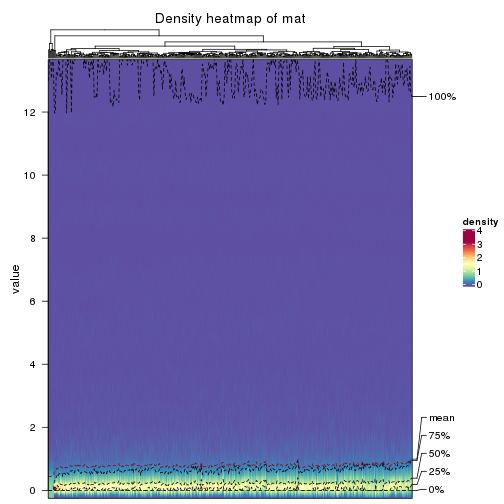


### Suggest the best k


Folowing table shows the best `k` (number of partitions) for each combination
of top-value methods and partition methods. Clicking on the method name in
the table goes to the section for a single combination of methods.

[The cola vignette](http://bioconductor.org/packages/devel/bioc/vignettes/cola/inst/doc/cola.html#toc_13)
explains the definition of the metrics used for determining the best
number of partitions.


```r
suggest_best_k(res_list)
```


|                            | The best k| 1-PAC| Mean silhouette| Concordance|   |Optional k |
|:---------------------------|----------:|-----:|---------------:|-----------:|:--|:----------|
|[ATC:mclust](#ATC-mclust)   |          2| 0.998|           0.964|       0.982|** |           |
|[SD:mclust](#SD-mclust)     |          3| 0.979|           0.925|       0.966|** |2          |
|[MAD:skmeans](#MAD-skmeans) |          2| 0.971|           0.961|       0.982|** |           |
|[SD:skmeans](#SD-skmeans)   |          2| 0.962|           0.964|       0.983|** |           |
|[MAD:mclust](#MAD-mclust)   |          2| 0.946|           0.946|       0.977|*  |           |
|[SD:kmeans](#SD-kmeans)     |          2| 0.927|           0.944|       0.970|*  |           |
|[MAD:kmeans](#MAD-kmeans)   |          2| 0.925|           0.949|       0.970|*  |           |
|[ATC:skmeans](#ATC-skmeans) |          2| 0.902|           0.913|       0.965|*  |           |
|[MAD:NMF](#MAD-NMF)         |          2| 0.901|           0.941|       0.972|*  |           |
|[ATC:NMF](#ATC-NMF)         |          2| 0.886|           0.926|       0.967|   |           |
|[SD:NMF](#SD-NMF)           |          2| 0.850|           0.926|       0.965|   |           |
|[ATC:kmeans](#ATC-kmeans)   |          2| 0.843|           0.899|       0.952|   |           |
|[MAD:pam](#MAD-pam)         |          2| 0.518|           0.822|       0.911|   |           |
|[ATC:pam](#ATC-pam)         |          2| 0.489|           0.797|       0.898|   |           |
|[SD:pam](#SD-pam)           |          2| 0.422|           0.821|       0.900|   |           |
|[CV:kmeans](#CV-kmeans)     |          2| 0.388|           0.725|       0.872|   |           |
|[CV:skmeans](#CV-skmeans)   |          2| 0.383|           0.730|       0.877|   |           |
|[ATC:hclust](#ATC-hclust)   |          6| 0.248|           0.563|       0.699|   |           |
|[CV:NMF](#CV-NMF)           |          3| 0.175|           0.517|       0.709|   |           |
|[SD:hclust](#SD-hclust)     |          3| 0.164|           0.545|       0.739|   |           |
|[CV:mclust](#CV-mclust)     |          3| 0.158|           0.570|       0.782|   |           |
|[MAD:hclust](#MAD-hclust)   |          3| 0.145|           0.637|       0.739|   |           |
|[CV:pam](#CV-pam)           |          2| 0.065|           0.598|       0.781|   |           |
|[CV:hclust](#CV-hclust)     |          3| 0.004|           0.650|       0.766|   |           |

\*\*: 1-PAC > 0.95, \*: 1-PAC > 0.9


### CDF of consensus matrices

Cumulative distribution function curves of consensus matrix for all methods.


```r
collect_plots(res_list, fun = plot_ecdf)
```

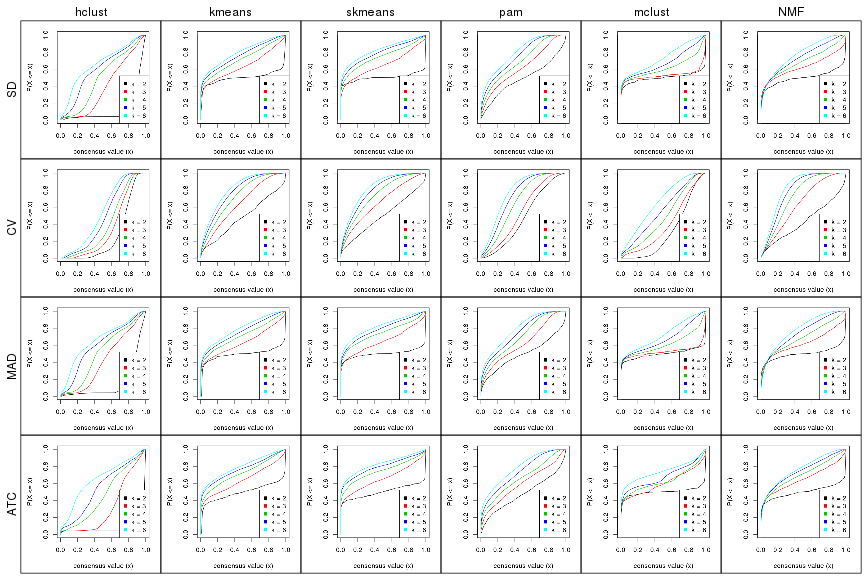


### Consensus heatmap

Consensus heatmaps for all methods. ([What is a consensus heatmap?](http://bioconductor.org/packages/devel/bioc/vignettes/cola/inst/doc/cola.html#toc_9))


<style type='text/css'>


.ui-helper-hidden {
	display: none;
}
.ui-helper-hidden-accessible {
	border: 0;
	clip: rect(0 0 0 0);
	height: 1px;
	margin: -1px;
	overflow: hidden;
	padding: 0;
	position: absolute;
	width: 1px;
}
.ui-helper-reset {
	margin: 0;
	padding: 0;
	border: 0;
	outline: 0;
	line-height: 1.3;
	text-decoration: none;
	font-size: 100%;
	list-style: none;
}
.ui-helper-clearfix:before,
.ui-helper-clearfix:after {
	content: "";
	display: table;
	border-collapse: collapse;
}
.ui-helper-clearfix:after {
	clear: both;
}
.ui-helper-zfix {
	width: 100%;
	height: 100%;
	top: 0;
	left: 0;
	position: absolute;
	opacity: 0;
	filter:Alpha(Opacity=0); 
}

.ui-front {
	z-index: 100;
}


.ui-state-disabled {
	cursor: default !important;
	pointer-events: none;
}


.ui-icon {
	display: inline-block;
	vertical-align: middle;
	margin-top: -.25em;
	position: relative;
	text-indent: -99999px;
	overflow: hidden;
	background-repeat: no-repeat;
}

.ui-widget-icon-block {
	left: 50%;
	margin-left: -8px;
	display: block;
}


.ui-widget-overlay {
	position: fixed;
	top: 0;
	left: 0;
	width: 100%;
	height: 100%;
}
.ui-accordion .ui-accordion-header {
	display: block;
	cursor: pointer;
	position: relative;
	margin: 2px 0 0 0;
	padding: .5em .5em .5em .7em;
	font-size: 100%;
}
.ui-accordion .ui-accordion-content {
	padding: 1em 2.2em;
	border-top: 0;
	overflow: auto;
}
.ui-autocomplete {
	position: absolute;
	top: 0;
	left: 0;
	cursor: default;
}
.ui-menu {
	list-style: none;
	padding: 0;
	margin: 0;
	display: block;
	outline: 0;
}
.ui-menu .ui-menu {
	position: absolute;
}
.ui-menu .ui-menu-item {
	margin: 0;
	cursor: pointer;
	
	list-style-image: url("data:image/gif;base64,R0lGODlhAQABAIAAAAAAAP///yH5BAEAAAAALAAAAAABAAEAAAIBRAA7");
}
.ui-menu .ui-menu-item-wrapper {
	position: relative;
	padding: 3px 1em 3px .4em;
}
.ui-menu .ui-menu-divider {
	margin: 5px 0;
	height: 0;
	font-size: 0;
	line-height: 0;
	border-width: 1px 0 0 0;
}
.ui-menu .ui-state-focus,
.ui-menu .ui-state-active {
	margin: -1px;
}


.ui-menu-icons {
	position: relative;
}
.ui-menu-icons .ui-menu-item-wrapper {
	padding-left: 2em;
}


.ui-menu .ui-icon {
	position: absolute;
	top: 0;
	bottom: 0;
	left: .2em;
	margin: auto 0;
}


.ui-menu .ui-menu-icon {
	left: auto;
	right: 0;
}
.ui-button {
	padding: .4em 1em;
	display: inline-block;
	position: relative;
	line-height: normal;
	margin-right: .1em;
	cursor: pointer;
	vertical-align: middle;
	text-align: center;
	-webkit-user-select: none;
	-moz-user-select: none;
	-ms-user-select: none;
	user-select: none;

	
	overflow: visible;
}

.ui-button,
.ui-button:link,
.ui-button:visited,
.ui-button:hover,
.ui-button:active {
	text-decoration: none;
}


.ui-button-icon-only {
	width: 2em;
	box-sizing: border-box;
	text-indent: -9999px;
	white-space: nowrap;
}


input.ui-button.ui-button-icon-only {
	text-indent: 0;
}


.ui-button-icon-only .ui-icon {
	position: absolute;
	top: 50%;
	left: 50%;
	margin-top: -8px;
	margin-left: -8px;
}

.ui-button.ui-icon-notext .ui-icon {
	padding: 0;
	width: 2.1em;
	height: 2.1em;
	text-indent: -9999px;
	white-space: nowrap;

}

input.ui-button.ui-icon-notext .ui-icon {
	width: auto;
	height: auto;
	text-indent: 0;
	white-space: normal;
	padding: .4em 1em;
}


input.ui-button::-moz-focus-inner,
button.ui-button::-moz-focus-inner {
	border: 0;
	padding: 0;
}
.ui-controlgroup {
	vertical-align: middle;
	display: inline-block;
}
.ui-controlgroup > .ui-controlgroup-item {
	float: left;
	margin-left: 0;
	margin-right: 0;
}
.ui-controlgroup > .ui-controlgroup-item:focus,
.ui-controlgroup > .ui-controlgroup-item.ui-visual-focus {
	z-index: 9999;
}
.ui-controlgroup-vertical > .ui-controlgroup-item {
	display: block;
	float: none;
	width: 100%;
	margin-top: 0;
	margin-bottom: 0;
	text-align: left;
}
.ui-controlgroup-vertical .ui-controlgroup-item {
	box-sizing: border-box;
}
.ui-controlgroup .ui-controlgroup-label {
	padding: .4em 1em;
}
.ui-controlgroup .ui-controlgroup-label span {
	font-size: 80%;
}
.ui-controlgroup-horizontal .ui-controlgroup-label + .ui-controlgroup-item {
	border-left: none;
}
.ui-controlgroup-vertical .ui-controlgroup-label + .ui-controlgroup-item {
	border-top: none;
}
.ui-controlgroup-horizontal .ui-controlgroup-label.ui-widget-content {
	border-right: none;
}
.ui-controlgroup-vertical .ui-controlgroup-label.ui-widget-content {
	border-bottom: none;
}


.ui-controlgroup-vertical .ui-spinner-input {

	
	width: 75%;
	width: calc( 100% - 2.4em );
}
.ui-controlgroup-vertical .ui-spinner .ui-spinner-up {
	border-top-style: solid;
}

.ui-checkboxradio-label .ui-icon-background {
	box-shadow: inset 1px 1px 1px #ccc;
	border-radius: .12em;
	border: none;
}
.ui-checkboxradio-radio-label .ui-icon-background {
	width: 16px;
	height: 16px;
	border-radius: 1em;
	overflow: visible;
	border: none;
}
.ui-checkboxradio-radio-label.ui-checkboxradio-checked .ui-icon,
.ui-checkboxradio-radio-label.ui-checkboxradio-checked:hover .ui-icon {
	background-image: none;
	width: 8px;
	height: 8px;
	border-width: 4px;
	border-style: solid;
}
.ui-checkboxradio-disabled {
	pointer-events: none;
}
.ui-datepicker {
	width: 17em;
	padding: .2em .2em 0;
	display: none;
}
.ui-datepicker .ui-datepicker-header {
	position: relative;
	padding: .2em 0;
}
.ui-datepicker .ui-datepicker-prev,
.ui-datepicker .ui-datepicker-next {
	position: absolute;
	top: 2px;
	width: 1.8em;
	height: 1.8em;
}
.ui-datepicker .ui-datepicker-prev-hover,
.ui-datepicker .ui-datepicker-next-hover {
	top: 1px;
}
.ui-datepicker .ui-datepicker-prev {
	left: 2px;
}
.ui-datepicker .ui-datepicker-next {
	right: 2px;
}
.ui-datepicker .ui-datepicker-prev-hover {
	left: 1px;
}
.ui-datepicker .ui-datepicker-next-hover {
	right: 1px;
}
.ui-datepicker .ui-datepicker-prev span,
.ui-datepicker .ui-datepicker-next span {
	display: block;
	position: absolute;
	left: 50%;
	margin-left: -8px;
	top: 50%;
	margin-top: -8px;
}
.ui-datepicker .ui-datepicker-title {
	margin: 0 2.3em;
	line-height: 1.8em;
	text-align: center;
}
.ui-datepicker .ui-datepicker-title select {
	font-size: 1em;
	margin: 1px 0;
}
.ui-datepicker select.ui-datepicker-month,
.ui-datepicker select.ui-datepicker-year {
	width: 45%;
}
.ui-datepicker table {
	width: 100%;
	font-size: .9em;
	border-collapse: collapse;
	margin: 0 0 .4em;
}
.ui-datepicker th {
	padding: .7em .3em;
	text-align: center;
	font-weight: bold;
	border: 0;
}
.ui-datepicker td {
	border: 0;
	padding: 1px;
}
.ui-datepicker td span,
.ui-datepicker td a {
	display: block;
	padding: .2em;
	text-align: right;
	text-decoration: none;
}
.ui-datepicker .ui-datepicker-buttonpane {
	background-image: none;
	margin: .7em 0 0 0;
	padding: 0 .2em;
	border-left: 0;
	border-right: 0;
	border-bottom: 0;
}
.ui-datepicker .ui-datepicker-buttonpane button {
	float: right;
	margin: .5em .2em .4em;
	cursor: pointer;
	padding: .2em .6em .3em .6em;
	width: auto;
	overflow: visible;
}
.ui-datepicker .ui-datepicker-buttonpane button.ui-datepicker-current {
	float: left;
}


.ui-datepicker.ui-datepicker-multi {
	width: auto;
}
.ui-datepicker-multi .ui-datepicker-group {
	float: left;
}
.ui-datepicker-multi .ui-datepicker-group table {
	width: 95%;
	margin: 0 auto .4em;
}
.ui-datepicker-multi-2 .ui-datepicker-group {
	width: 50%;
}
.ui-datepicker-multi-3 .ui-datepicker-group {
	width: 33.3%;
}
.ui-datepicker-multi-4 .ui-datepicker-group {
	width: 25%;
}
.ui-datepicker-multi .ui-datepicker-group-last .ui-datepicker-header,
.ui-datepicker-multi .ui-datepicker-group-middle .ui-datepicker-header {
	border-left-width: 0;
}
.ui-datepicker-multi .ui-datepicker-buttonpane {
	clear: left;
}
.ui-datepicker-row-break {
	clear: both;
	width: 100%;
	font-size: 0;
}


.ui-datepicker-rtl {
	direction: rtl;
}
.ui-datepicker-rtl .ui-datepicker-prev {
	right: 2px;
	left: auto;
}
.ui-datepicker-rtl .ui-datepicker-next {
	left: 2px;
	right: auto;
}
.ui-datepicker-rtl .ui-datepicker-prev:hover {
	right: 1px;
	left: auto;
}
.ui-datepicker-rtl .ui-datepicker-next:hover {
	left: 1px;
	right: auto;
}
.ui-datepicker-rtl .ui-datepicker-buttonpane {
	clear: right;
}
.ui-datepicker-rtl .ui-datepicker-buttonpane button {
	float: left;
}
.ui-datepicker-rtl .ui-datepicker-buttonpane button.ui-datepicker-current,
.ui-datepicker-rtl .ui-datepicker-group {
	float: right;
}
.ui-datepicker-rtl .ui-datepicker-group-last .ui-datepicker-header,
.ui-datepicker-rtl .ui-datepicker-group-middle .ui-datepicker-header {
	border-right-width: 0;
	border-left-width: 1px;
}


.ui-datepicker .ui-icon {
	display: block;
	text-indent: -99999px;
	overflow: hidden;
	background-repeat: no-repeat;
	left: .5em;
	top: .3em;
}
.ui-dialog {
	position: absolute;
	top: 0;
	left: 0;
	padding: .2em;
	outline: 0;
}
.ui-dialog .ui-dialog-titlebar {
	padding: .4em 1em;
	position: relative;
}
.ui-dialog .ui-dialog-title {
	float: left;
	margin: .1em 0;
	white-space: nowrap;
	width: 90%;
	overflow: hidden;
	text-overflow: ellipsis;
}
.ui-dialog .ui-dialog-titlebar-close {
	position: absolute;
	right: .3em;
	top: 50%;
	width: 20px;
	margin: -10px 0 0 0;
	padding: 1px;
	height: 20px;
}
.ui-dialog .ui-dialog-content {
	position: relative;
	border: 0;
	padding: .5em 1em;
	background: none;
	overflow: auto;
}
.ui-dialog .ui-dialog-buttonpane {
	text-align: left;
	border-width: 1px 0 0 0;
	background-image: none;
	margin-top: .5em;
	padding: .3em 1em .5em .4em;
}
.ui-dialog .ui-dialog-buttonpane .ui-dialog-buttonset {
	float: right;
}
.ui-dialog .ui-dialog-buttonpane button {
	margin: .5em .4em .5em 0;
	cursor: pointer;
}
.ui-dialog .ui-resizable-n {
	height: 2px;
	top: 0;
}
.ui-dialog .ui-resizable-e {
	width: 2px;
	right: 0;
}
.ui-dialog .ui-resizable-s {
	height: 2px;
	bottom: 0;
}
.ui-dialog .ui-resizable-w {
	width: 2px;
	left: 0;
}
.ui-dialog .ui-resizable-se,
.ui-dialog .ui-resizable-sw,
.ui-dialog .ui-resizable-ne,
.ui-dialog .ui-resizable-nw {
	width: 7px;
	height: 7px;
}
.ui-dialog .ui-resizable-se {
	right: 0;
	bottom: 0;
}
.ui-dialog .ui-resizable-sw {
	left: 0;
	bottom: 0;
}
.ui-dialog .ui-resizable-ne {
	right: 0;
	top: 0;
}
.ui-dialog .ui-resizable-nw {
	left: 0;
	top: 0;
}
.ui-draggable .ui-dialog-titlebar {
	cursor: move;
}
.ui-draggable-handle {
	-ms-touch-action: none;
	touch-action: none;
}
.ui-resizable {
	position: relative;
}
.ui-resizable-handle {
	position: absolute;
	font-size: 0.1px;
	display: block;
	-ms-touch-action: none;
	touch-action: none;
}
.ui-resizable-disabled .ui-resizable-handle,
.ui-resizable-autohide .ui-resizable-handle {
	display: none;
}
.ui-resizable-n {
	cursor: n-resize;
	height: 7px;
	width: 100%;
	top: -5px;
	left: 0;
}
.ui-resizable-s {
	cursor: s-resize;
	height: 7px;
	width: 100%;
	bottom: -5px;
	left: 0;
}
.ui-resizable-e {
	cursor: e-resize;
	width: 7px;
	right: -5px;
	top: 0;
	height: 100%;
}
.ui-resizable-w {
	cursor: w-resize;
	width: 7px;
	left: -5px;
	top: 0;
	height: 100%;
}
.ui-resizable-se {
	cursor: se-resize;
	width: 12px;
	height: 12px;
	right: 1px;
	bottom: 1px;
}
.ui-resizable-sw {
	cursor: sw-resize;
	width: 9px;
	height: 9px;
	left: -5px;
	bottom: -5px;
}
.ui-resizable-nw {
	cursor: nw-resize;
	width: 9px;
	height: 9px;
	left: -5px;
	top: -5px;
}
.ui-resizable-ne {
	cursor: ne-resize;
	width: 9px;
	height: 9px;
	right: -5px;
	top: -5px;
}
.ui-progressbar {
	height: 2em;
	text-align: left;
	overflow: hidden;
}
.ui-progressbar .ui-progressbar-value {
	margin: -1px;
	height: 100%;
}
.ui-progressbar .ui-progressbar-overlay {
	background: url("");
	height: 100%;
	filter: alpha(opacity=25); 
	opacity: 0.25;
}
.ui-progressbar-indeterminate .ui-progressbar-value {
	background-image: none;
}
.ui-selectable {
	-ms-touch-action: none;
	touch-action: none;
}
.ui-selectable-helper {
	position: absolute;
	z-index: 100;
	border: 1px dotted black;
}
.ui-selectmenu-menu {
	padding: 0;
	margin: 0;
	position: absolute;
	top: 0;
	left: 0;
	display: none;
}
.ui-selectmenu-menu .ui-menu {
	overflow: auto;
	overflow-x: hidden;
	padding-bottom: 1px;
}
.ui-selectmenu-menu .ui-menu .ui-selectmenu-optgroup {
	font-size: 1em;
	font-weight: bold;
	line-height: 1.5;
	padding: 2px 0.4em;
	margin: 0.5em 0 0 0;
	height: auto;
	border: 0;
}
.ui-selectmenu-open {
	display: block;
}
.ui-selectmenu-text {
	display: block;
	margin-right: 20px;
	overflow: hidden;
	text-overflow: ellipsis;
}
.ui-selectmenu-button.ui-button {
	text-align: left;
	white-space: nowrap;
	width: 14em;
}
.ui-selectmenu-icon.ui-icon {
	float: right;
	margin-top: 0;
}
.ui-slider {
	position: relative;
	text-align: left;
}
.ui-slider .ui-slider-handle {
	position: absolute;
	z-index: 2;
	width: 1.2em;
	height: 1.2em;
	cursor: default;
	-ms-touch-action: none;
	touch-action: none;
}
.ui-slider .ui-slider-range {
	position: absolute;
	z-index: 1;
	font-size: .7em;
	display: block;
	border: 0;
	background-position: 0 0;
}


.ui-slider.ui-state-disabled .ui-slider-handle,
.ui-slider.ui-state-disabled .ui-slider-range {
	filter: inherit;
}

.ui-slider-horizontal {
	height: .8em;
}
.ui-slider-horizontal .ui-slider-handle {
	top: -.3em;
	margin-left: -.6em;
}
.ui-slider-horizontal .ui-slider-range {
	top: 0;
	height: 100%;
}
.ui-slider-horizontal .ui-slider-range-min {
	left: 0;
}
.ui-slider-horizontal .ui-slider-range-max {
	right: 0;
}

.ui-slider-vertical {
	width: .8em;
	height: 100px;
}
.ui-slider-vertical .ui-slider-handle {
	left: -.3em;
	margin-left: 0;
	margin-bottom: -.6em;
}
.ui-slider-vertical .ui-slider-range {
	left: 0;
	width: 100%;
}
.ui-slider-vertical .ui-slider-range-min {
	bottom: 0;
}
.ui-slider-vertical .ui-slider-range-max {
	top: 0;
}
.ui-sortable-handle {
	-ms-touch-action: none;
	touch-action: none;
}
.ui-spinner {
	position: relative;
	display: inline-block;
	overflow: hidden;
	padding: 0;
	vertical-align: middle;
}
.ui-spinner-input {
	border: none;
	background: none;
	color: inherit;
	padding: .222em 0;
	margin: .2em 0;
	vertical-align: middle;
	margin-left: .4em;
	margin-right: 2em;
}
.ui-spinner-button {
	width: 1.6em;
	height: 50%;
	font-size: .5em;
	padding: 0;
	margin: 0;
	text-align: center;
	position: absolute;
	cursor: default;
	display: block;
	overflow: hidden;
	right: 0;
}

.ui-spinner a.ui-spinner-button {
	border-top-style: none;
	border-bottom-style: none;
	border-right-style: none;
}
.ui-spinner-up {
	top: 0;
}
.ui-spinner-down {
	bottom: 0;
}
.ui-tabs {
	position: relative;
	padding: .2em;
}
.ui-tabs .ui-tabs-nav {
	margin: 0;
	padding: .2em .2em 0;
}
.ui-tabs .ui-tabs-nav li {
	list-style: none;
	float: left;
	position: relative;
	top: 0;
	margin: 1px .2em 0 0;
	border-bottom-width: 0;
	padding: 0;
	white-space: nowrap;
}
.ui-tabs .ui-tabs-nav .ui-tabs-anchor {
	float: left;
	padding: .5em 1em;
	text-decoration: none;
}
.ui-tabs .ui-tabs-nav li.ui-tabs-active {
	margin-bottom: -1px;
	padding-bottom: 1px;
}
.ui-tabs .ui-tabs-nav li.ui-tabs-active .ui-tabs-anchor,
.ui-tabs .ui-tabs-nav li.ui-state-disabled .ui-tabs-anchor,
.ui-tabs .ui-tabs-nav li.ui-tabs-loading .ui-tabs-anchor {
	cursor: text;
}
.ui-tabs-collapsible .ui-tabs-nav li.ui-tabs-active .ui-tabs-anchor {
	cursor: pointer;
}
.ui-tabs .ui-tabs-panel {
	display: block;
	border-width: 0;
	padding: 1em 1.4em;
	background: none;
}
.ui-tooltip {
	padding: 8px;
	position: absolute;
	z-index: 9999;
	max-width: 300px;
}
body .ui-tooltip {
	border-width: 2px;
}

.ui-widget {
	font-family: Arial,Helvetica,sans-serif;
	font-size: 1em;
}
.ui-widget .ui-widget {
	font-size: 1em;
}
.ui-widget input,
.ui-widget select,
.ui-widget textarea,
.ui-widget button {
	font-family: Arial,Helvetica,sans-serif;
	font-size: 1em;
}
.ui-widget.ui-widget-content {
	border: 1px solid #c5c5c5;
}
.ui-widget-content {
	border: 1px solid #dddddd;
	background: #ffffff;
	color: #333333;
}
.ui-widget-content a {
	color: #333333;
}
.ui-widget-header {
	border: 1px solid #dddddd;
	background: #e9e9e9;
	color: #333333;
	font-weight: bold;
}
.ui-widget-header a {
	color: #333333;
}


.ui-state-default,
.ui-widget-content .ui-state-default,
.ui-widget-header .ui-state-default,
.ui-button,


html .ui-button.ui-state-disabled:hover,
html .ui-button.ui-state-disabled:active {
	border: 1px solid #c5c5c5;
	background: #f6f6f6;
	font-weight: normal;
	color: #454545;
}
.ui-state-default a,
.ui-state-default a:link,
.ui-state-default a:visited,
a.ui-button,
a:link.ui-button,
a:visited.ui-button,
.ui-button {
	color: #454545;
	text-decoration: none;
}
.ui-state-hover,
.ui-widget-content .ui-state-hover,
.ui-widget-header .ui-state-hover,
.ui-state-focus,
.ui-widget-content .ui-state-focus,
.ui-widget-header .ui-state-focus,
.ui-button:hover,
.ui-button:focus {
	border: 1px solid #cccccc;
	background: #ededed;
	font-weight: normal;
	color: #2b2b2b;
}
.ui-state-hover a,
.ui-state-hover a:hover,
.ui-state-hover a:link,
.ui-state-hover a:visited,
.ui-state-focus a,
.ui-state-focus a:hover,
.ui-state-focus a:link,
.ui-state-focus a:visited,
a.ui-button:hover,
a.ui-button:focus {
	color: #2b2b2b;
	text-decoration: none;
}

.ui-visual-focus {
	box-shadow: 0 0 3px 1px rgb(94, 158, 214);
}
.ui-state-active,
.ui-widget-content .ui-state-active,
.ui-widget-header .ui-state-active,
a.ui-button:active,
.ui-button:active,
.ui-button.ui-state-active:hover {
	border: 1px solid #003eff;
	background: #007fff;
	font-weight: normal;
	color: #ffffff;
}
.ui-icon-background,
.ui-state-active .ui-icon-background {
	border: #003eff;
	background-color: #ffffff;
}
.ui-state-active a,
.ui-state-active a:link,
.ui-state-active a:visited {
	color: #ffffff;
	text-decoration: none;
}


.ui-state-highlight,
.ui-widget-content .ui-state-highlight,
.ui-widget-header .ui-state-highlight {
	border: 1px solid #dad55e;
	background: #fffa90;
	color: #777620;
}
.ui-state-checked {
	border: 1px solid #dad55e;
	background: #fffa90;
}
.ui-state-highlight a,
.ui-widget-content .ui-state-highlight a,
.ui-widget-header .ui-state-highlight a {
	color: #777620;
}
.ui-state-error,
.ui-widget-content .ui-state-error,
.ui-widget-header .ui-state-error {
	border: 1px solid #f1a899;
	background: #fddfdf;
	color: #5f3f3f;
}
.ui-state-error a,
.ui-widget-content .ui-state-error a,
.ui-widget-header .ui-state-error a {
	color: #5f3f3f;
}
.ui-state-error-text,
.ui-widget-content .ui-state-error-text,
.ui-widget-header .ui-state-error-text {
	color: #5f3f3f;
}
.ui-priority-primary,
.ui-widget-content .ui-priority-primary,
.ui-widget-header .ui-priority-primary {
	font-weight: bold;
}
.ui-priority-secondary,
.ui-widget-content .ui-priority-secondary,
.ui-widget-header .ui-priority-secondary {
	opacity: .7;
	filter:Alpha(Opacity=70); 
	font-weight: normal;
}
.ui-state-disabled,
.ui-widget-content .ui-state-disabled,
.ui-widget-header .ui-state-disabled {
	opacity: .35;
	filter:Alpha(Opacity=35); 
	background-image: none;
}
.ui-state-disabled .ui-icon {
	filter:Alpha(Opacity=35); 
}


.ui-icon {
	width: 16px;
	height: 16px;
}
.ui-icon,
.ui-widget-content .ui-icon {
	background-image: url("images/ui-icons_444444_256x240.png");
}
.ui-widget-header .ui-icon {
	background-image: url("images/ui-icons_444444_256x240.png");
}
.ui-state-hover .ui-icon,
.ui-state-focus .ui-icon,
.ui-button:hover .ui-icon,
.ui-button:focus .ui-icon {
	background-image: url("images/ui-icons_555555_256x240.png");
}
.ui-state-active .ui-icon,
.ui-button:active .ui-icon {
	background-image: url("images/ui-icons_ffffff_256x240.png");
}
.ui-state-highlight .ui-icon,
.ui-button .ui-state-highlight.ui-icon {
	background-image: url("images/ui-icons_777620_256x240.png");
}
.ui-state-error .ui-icon,
.ui-state-error-text .ui-icon {
	background-image: url("images/ui-icons_cc0000_256x240.png");
}
.ui-button .ui-icon {
	background-image: url("images/ui-icons_777777_256x240.png");
}


.ui-icon-blank { background-position: 16px 16px; }
.ui-icon-caret-1-n { background-position: 0 0; }
.ui-icon-caret-1-ne { background-position: -16px 0; }
.ui-icon-caret-1-e { background-position: -32px 0; }
.ui-icon-caret-1-se { background-position: -48px 0; }
.ui-icon-caret-1-s { background-position: -65px 0; }
.ui-icon-caret-1-sw { background-position: -80px 0; }
.ui-icon-caret-1-w { background-position: -96px 0; }
.ui-icon-caret-1-nw { background-position: -112px 0; }
.ui-icon-caret-2-n-s { background-position: -128px 0; }
.ui-icon-caret-2-e-w { background-position: -144px 0; }
.ui-icon-triangle-1-n { background-position: 0 -16px; }
.ui-icon-triangle-1-ne { background-position: -16px -16px; }
.ui-icon-triangle-1-e { background-position: -32px -16px; }
.ui-icon-triangle-1-se { background-position: -48px -16px; }
.ui-icon-triangle-1-s { background-position: -65px -16px; }
.ui-icon-triangle-1-sw { background-position: -80px -16px; }
.ui-icon-triangle-1-w { background-position: -96px -16px; }
.ui-icon-triangle-1-nw { background-position: -112px -16px; }
.ui-icon-triangle-2-n-s { background-position: -128px -16px; }
.ui-icon-triangle-2-e-w { background-position: -144px -16px; }
.ui-icon-arrow-1-n { background-position: 0 -32px; }
.ui-icon-arrow-1-ne { background-position: -16px -32px; }
.ui-icon-arrow-1-e { background-position: -32px -32px; }
.ui-icon-arrow-1-se { background-position: -48px -32px; }
.ui-icon-arrow-1-s { background-position: -65px -32px; }
.ui-icon-arrow-1-sw { background-position: -80px -32px; }
.ui-icon-arrow-1-w { background-position: -96px -32px; }
.ui-icon-arrow-1-nw { background-position: -112px -32px; }
.ui-icon-arrow-2-n-s { background-position: -128px -32px; }
.ui-icon-arrow-2-ne-sw { background-position: -144px -32px; }
.ui-icon-arrow-2-e-w { background-position: -160px -32px; }
.ui-icon-arrow-2-se-nw { background-position: -176px -32px; }
.ui-icon-arrowstop-1-n { background-position: -192px -32px; }
.ui-icon-arrowstop-1-e { background-position: -208px -32px; }
.ui-icon-arrowstop-1-s { background-position: -224px -32px; }
.ui-icon-arrowstop-1-w { background-position: -240px -32px; }
.ui-icon-arrowthick-1-n { background-position: 1px -48px; }
.ui-icon-arrowthick-1-ne { background-position: -16px -48px; }
.ui-icon-arrowthick-1-e { background-position: -32px -48px; }
.ui-icon-arrowthick-1-se { background-position: -48px -48px; }
.ui-icon-arrowthick-1-s { background-position: -64px -48px; }
.ui-icon-arrowthick-1-sw { background-position: -80px -48px; }
.ui-icon-arrowthick-1-w { background-position: -96px -48px; }
.ui-icon-arrowthick-1-nw { background-position: -112px -48px; }
.ui-icon-arrowthick-2-n-s { background-position: -128px -48px; }
.ui-icon-arrowthick-2-ne-sw { background-position: -144px -48px; }
.ui-icon-arrowthick-2-e-w { background-position: -160px -48px; }
.ui-icon-arrowthick-2-se-nw { background-position: -176px -48px; }
.ui-icon-arrowthickstop-1-n { background-position: -192px -48px; }
.ui-icon-arrowthickstop-1-e { background-position: -208px -48px; }
.ui-icon-arrowthickstop-1-s { background-position: -224px -48px; }
.ui-icon-arrowthickstop-1-w { background-position: -240px -48px; }
.ui-icon-arrowreturnthick-1-w { background-position: 0 -64px; }
.ui-icon-arrowreturnthick-1-n { background-position: -16px -64px; }
.ui-icon-arrowreturnthick-1-e { background-position: -32px -64px; }
.ui-icon-arrowreturnthick-1-s { background-position: -48px -64px; }
.ui-icon-arrowreturn-1-w { background-position: -64px -64px; }
.ui-icon-arrowreturn-1-n { background-position: -80px -64px; }
.ui-icon-arrowreturn-1-e { background-position: -96px -64px; }
.ui-icon-arrowreturn-1-s { background-position: -112px -64px; }
.ui-icon-arrowrefresh-1-w { background-position: -128px -64px; }
.ui-icon-arrowrefresh-1-n { background-position: -144px -64px; }
.ui-icon-arrowrefresh-1-e { background-position: -160px -64px; }
.ui-icon-arrowrefresh-1-s { background-position: -176px -64px; }
.ui-icon-arrow-4 { background-position: 0 -80px; }
.ui-icon-arrow-4-diag { background-position: -16px -80px; }
.ui-icon-extlink { background-position: -32px -80px; }
.ui-icon-newwin { background-position: -48px -80px; }
.ui-icon-refresh { background-position: -64px -80px; }
.ui-icon-shuffle { background-position: -80px -80px; }
.ui-icon-transfer-e-w { background-position: -96px -80px; }
.ui-icon-transferthick-e-w { background-position: -112px -80px; }
.ui-icon-folder-collapsed { background-position: 0 -96px; }
.ui-icon-folder-open { background-position: -16px -96px; }
.ui-icon-document { background-position: -32px -96px; }
.ui-icon-document-b { background-position: -48px -96px; }
.ui-icon-note { background-position: -64px -96px; }
.ui-icon-mail-closed { background-position: -80px -96px; }
.ui-icon-mail-open { background-position: -96px -96px; }
.ui-icon-suitcase { background-position: -112px -96px; }
.ui-icon-comment { background-position: -128px -96px; }
.ui-icon-person { background-position: -144px -96px; }
.ui-icon-print { background-position: -160px -96px; }
.ui-icon-trash { background-position: -176px -96px; }
.ui-icon-locked { background-position: -192px -96px; }
.ui-icon-unlocked { background-position: -208px -96px; }
.ui-icon-bookmark { background-position: -224px -96px; }
.ui-icon-tag { background-position: -240px -96px; }
.ui-icon-home { background-position: 0 -112px; }
.ui-icon-flag { background-position: -16px -112px; }
.ui-icon-calendar { background-position: -32px -112px; }
.ui-icon-cart { background-position: -48px -112px; }
.ui-icon-pencil { background-position: -64px -112px; }
.ui-icon-clock { background-position: -80px -112px; }
.ui-icon-disk { background-position: -96px -112px; }
.ui-icon-calculator { background-position: -112px -112px; }
.ui-icon-zoomin { background-position: -128px -112px; }
.ui-icon-zoomout { background-position: -144px -112px; }
.ui-icon-search { background-position: -160px -112px; }
.ui-icon-wrench { background-position: -176px -112px; }
.ui-icon-gear { background-position: -192px -112px; }
.ui-icon-heart { background-position: -208px -112px; }
.ui-icon-star { background-position: -224px -112px; }
.ui-icon-link { background-position: -240px -112px; }
.ui-icon-cancel { background-position: 0 -128px; }
.ui-icon-plus { background-position: -16px -128px; }
.ui-icon-plusthick { background-position: -32px -128px; }
.ui-icon-minus { background-position: -48px -128px; }
.ui-icon-minusthick { background-position: -64px -128px; }
.ui-icon-close { background-position: -80px -128px; }
.ui-icon-closethick { background-position: -96px -128px; }
.ui-icon-key { background-position: -112px -128px; }
.ui-icon-lightbulb { background-position: -128px -128px; }
.ui-icon-scissors { background-position: -144px -128px; }
.ui-icon-clipboard { background-position: -160px -128px; }
.ui-icon-copy { background-position: -176px -128px; }
.ui-icon-contact { background-position: -192px -128px; }
.ui-icon-image { background-position: -208px -128px; }
.ui-icon-video { background-position: -224px -128px; }
.ui-icon-script { background-position: -240px -128px; }
.ui-icon-alert { background-position: 0 -144px; }
.ui-icon-info { background-position: -16px -144px; }
.ui-icon-notice { background-position: -32px -144px; }
.ui-icon-help { background-position: -48px -144px; }
.ui-icon-check { background-position: -64px -144px; }
.ui-icon-bullet { background-position: -80px -144px; }
.ui-icon-radio-on { background-position: -96px -144px; }
.ui-icon-radio-off { background-position: -112px -144px; }
.ui-icon-pin-w { background-position: -128px -144px; }
.ui-icon-pin-s { background-position: -144px -144px; }
.ui-icon-play { background-position: 0 -160px; }
.ui-icon-pause { background-position: -16px -160px; }
.ui-icon-seek-next { background-position: -32px -160px; }
.ui-icon-seek-prev { background-position: -48px -160px; }
.ui-icon-seek-end { background-position: -64px -160px; }
.ui-icon-seek-start { background-position: -80px -160px; }

.ui-icon-seek-first { background-position: -80px -160px; }
.ui-icon-stop { background-position: -96px -160px; }
.ui-icon-eject { background-position: -112px -160px; }
.ui-icon-volume-off { background-position: -128px -160px; }
.ui-icon-volume-on { background-position: -144px -160px; }
.ui-icon-power { background-position: 0 -176px; }
.ui-icon-signal-diag { background-position: -16px -176px; }
.ui-icon-signal { background-position: -32px -176px; }
.ui-icon-battery-0 { background-position: -48px -176px; }
.ui-icon-battery-1 { background-position: -64px -176px; }
.ui-icon-battery-2 { background-position: -80px -176px; }
.ui-icon-battery-3 { background-position: -96px -176px; }
.ui-icon-circle-plus { background-position: 0 -192px; }
.ui-icon-circle-minus { background-position: -16px -192px; }
.ui-icon-circle-close { background-position: -32px -192px; }
.ui-icon-circle-triangle-e { background-position: -48px -192px; }
.ui-icon-circle-triangle-s { background-position: -64px -192px; }
.ui-icon-circle-triangle-w { background-position: -80px -192px; }
.ui-icon-circle-triangle-n { background-position: -96px -192px; }
.ui-icon-circle-arrow-e { background-position: -112px -192px; }
.ui-icon-circle-arrow-s { background-position: -128px -192px; }
.ui-icon-circle-arrow-w { background-position: -144px -192px; }
.ui-icon-circle-arrow-n { background-position: -160px -192px; }
.ui-icon-circle-zoomin { background-position: -176px -192px; }
.ui-icon-circle-zoomout { background-position: -192px -192px; }
.ui-icon-circle-check { background-position: -208px -192px; }
.ui-icon-circlesmall-plus { background-position: 0 -208px; }
.ui-icon-circlesmall-minus { background-position: -16px -208px; }
.ui-icon-circlesmall-close { background-position: -32px -208px; }
.ui-icon-squaresmall-plus { background-position: -48px -208px; }
.ui-icon-squaresmall-minus { background-position: -64px -208px; }
.ui-icon-squaresmall-close { background-position: -80px -208px; }
.ui-icon-grip-dotted-vertical { background-position: 0 -224px; }
.ui-icon-grip-dotted-horizontal { background-position: -16px -224px; }
.ui-icon-grip-solid-vertical { background-position: -32px -224px; }
.ui-icon-grip-solid-horizontal { background-position: -48px -224px; }
.ui-icon-gripsmall-diagonal-se { background-position: -64px -224px; }
.ui-icon-grip-diagonal-se { background-position: -80px -224px; }


.ui-corner-all,
.ui-corner-top,
.ui-corner-left,
.ui-corner-tl {
	border-top-left-radius: 3px;
}
.ui-corner-all,
.ui-corner-top,
.ui-corner-right,
.ui-corner-tr {
	border-top-right-radius: 3px;
}
.ui-corner-all,
.ui-corner-bottom,
.ui-corner-left,
.ui-corner-bl {
	border-bottom-left-radius: 3px;
}
.ui-corner-all,
.ui-corner-bottom,
.ui-corner-right,
.ui-corner-br {
	border-bottom-right-radius: 3px;
}


.ui-widget-overlay {
	background: #aaaaaa;
	opacity: .3;
	filter: Alpha(Opacity=30); 
}
.ui-widget-shadow {
	-webkit-box-shadow: 0px 0px 5px #666666;
	box-shadow: 0px 0px 5px #666666;
} 
</style>
<script src='js/jquery-1.12.4.js'></script>
<script src='js/jquery-ui.js'></script>

<script>
$( function() {
	$( '#tabs-collect-consensus-heatmap' ).tabs();
} );
</script>
<div id='tabs-collect-consensus-heatmap'>
<ul>
<li><a href='#tab-collect-consensus-heatmap-1'>k = 2</a></li>
<li><a href='#tab-collect-consensus-heatmap-2'>k = 3</a></li>
<li><a href='#tab-collect-consensus-heatmap-3'>k = 4</a></li>
<li><a href='#tab-collect-consensus-heatmap-4'>k = 5</a></li>
<li><a href='#tab-collect-consensus-heatmap-5'>k = 6</a></li>
</ul>
<div id='tab-collect-consensus-heatmap-1'>
<pre><code class="r">collect_plots(res_list, k = 2, fun = consensus_heatmap, mc.cores = 4)
</code></pre>

<p>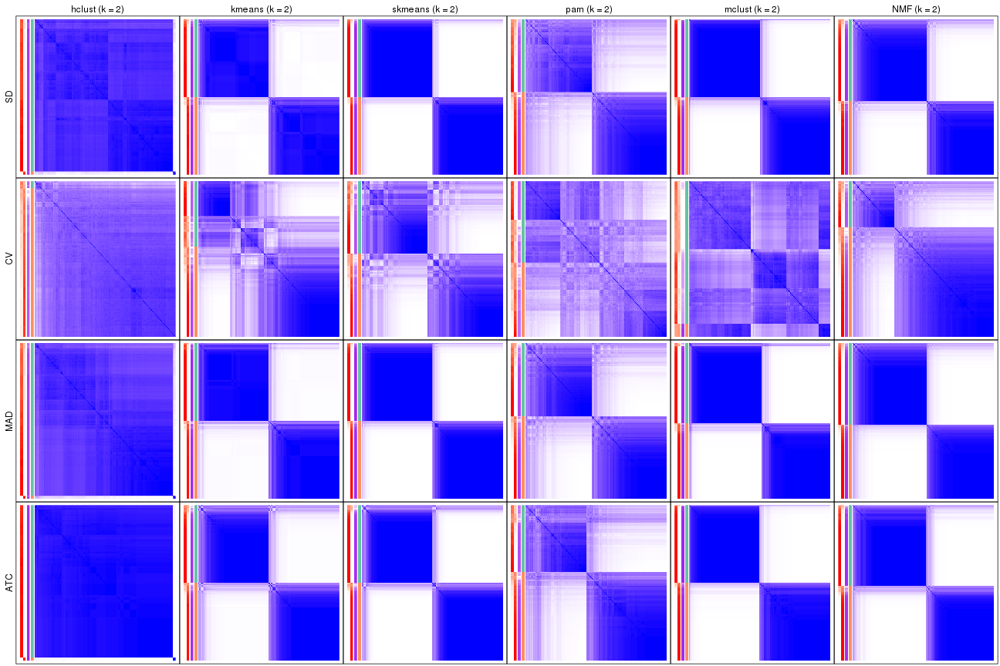</p>

</div>
<div id='tab-collect-consensus-heatmap-2'>
<pre><code class="r">collect_plots(res_list, k = 3, fun = consensus_heatmap, mc.cores = 4)
</code></pre>

<p>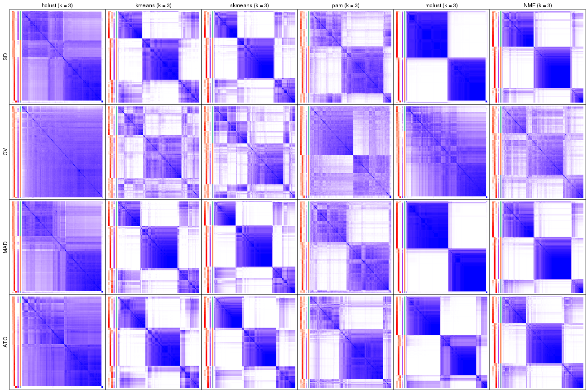</p>

</div>
<div id='tab-collect-consensus-heatmap-3'>
<pre><code class="r">collect_plots(res_list, k = 4, fun = consensus_heatmap, mc.cores = 4)
</code></pre>

<p>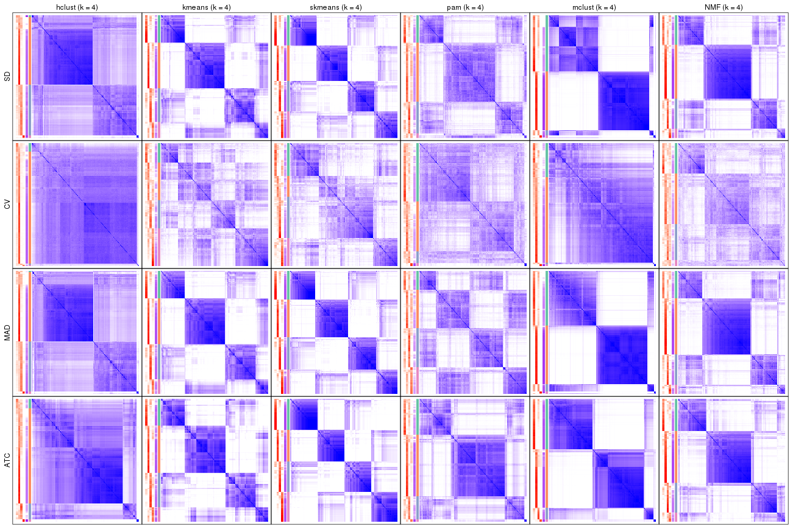</p>

</div>
<div id='tab-collect-consensus-heatmap-4'>
<pre><code class="r">collect_plots(res_list, k = 5, fun = consensus_heatmap, mc.cores = 4)
</code></pre>

<p>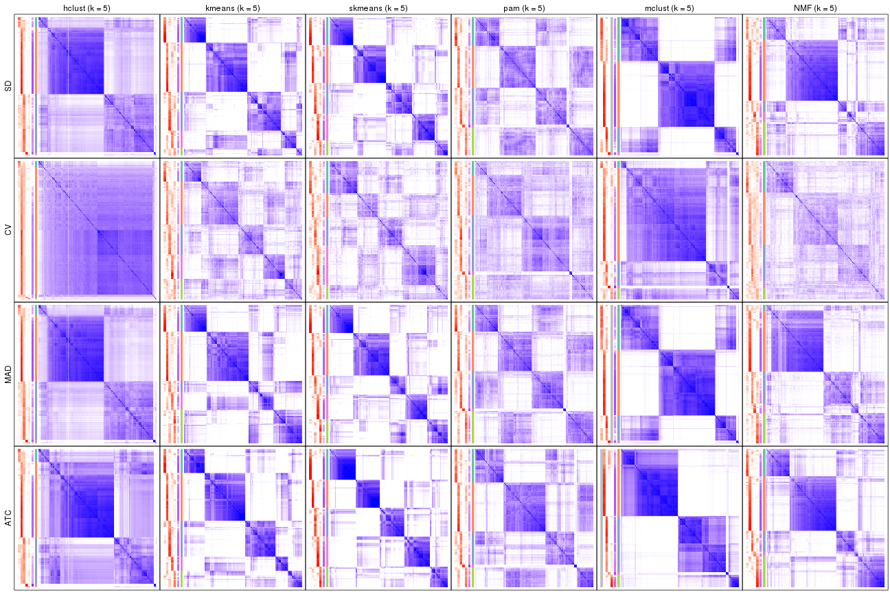</p>

</div>
<div id='tab-collect-consensus-heatmap-5'>
<pre><code class="r">collect_plots(res_list, k = 6, fun = consensus_heatmap, mc.cores = 4)
</code></pre>

<p>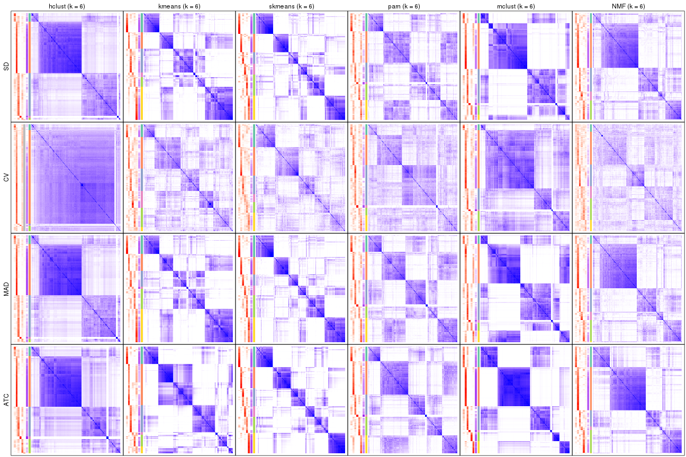</p>

</div>
</div>


### Membership heatmap

Membership heatmaps for all methods. ([What is a membership heatmap?](http://bioconductor.org/packages/devel/bioc/vignettes/cola/inst/doc/cola.html#toc_12))


<script>
$( function() {
	$( '#tabs-collect-membership-heatmap' ).tabs();
} );
</script>
<div id='tabs-collect-membership-heatmap'>
<ul>
<li><a href='#tab-collect-membership-heatmap-1'>k = 2</a></li>
<li><a href='#tab-collect-membership-heatmap-2'>k = 3</a></li>
<li><a href='#tab-collect-membership-heatmap-3'>k = 4</a></li>
<li><a href='#tab-collect-membership-heatmap-4'>k = 5</a></li>
<li><a href='#tab-collect-membership-heatmap-5'>k = 6</a></li>
</ul>
<div id='tab-collect-membership-heatmap-1'>
<pre><code class="r">collect_plots(res_list, k = 2, fun = membership_heatmap, mc.cores = 4)
</code></pre>

<p>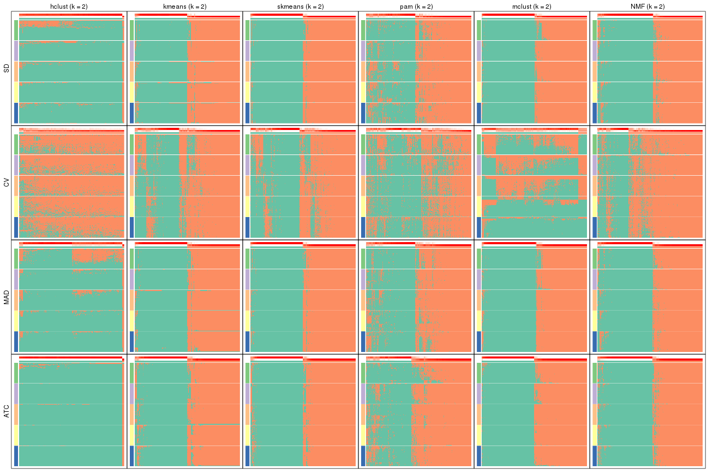</p>

</div>
<div id='tab-collect-membership-heatmap-2'>
<pre><code class="r">collect_plots(res_list, k = 3, fun = membership_heatmap, mc.cores = 4)
</code></pre>

<p>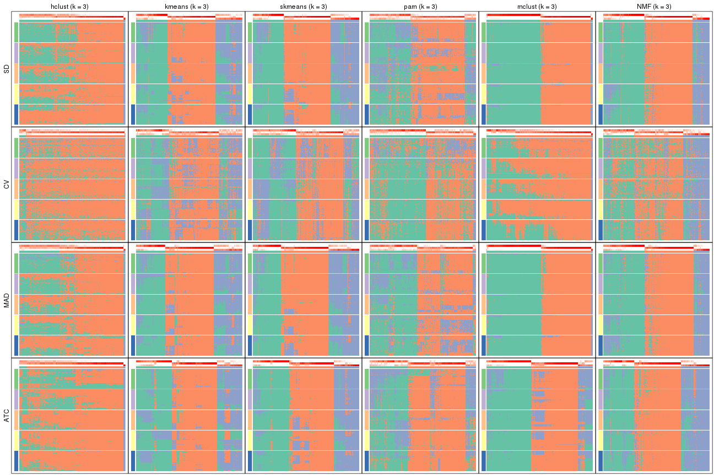</p>

</div>
<div id='tab-collect-membership-heatmap-3'>
<pre><code class="r">collect_plots(res_list, k = 4, fun = membership_heatmap, mc.cores = 4)
</code></pre>

<p>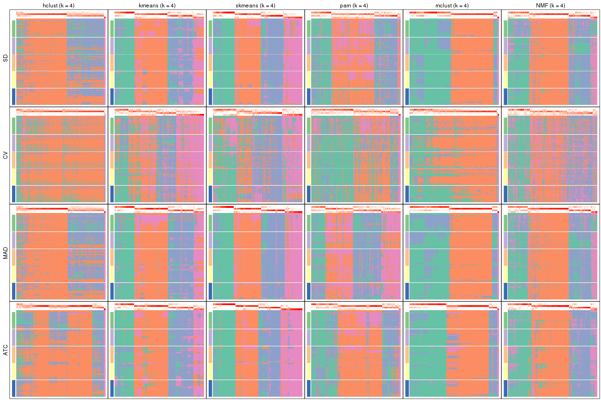</p>

</div>
<div id='tab-collect-membership-heatmap-4'>
<pre><code class="r">collect_plots(res_list, k = 5, fun = membership_heatmap, mc.cores = 4)
</code></pre>

<p>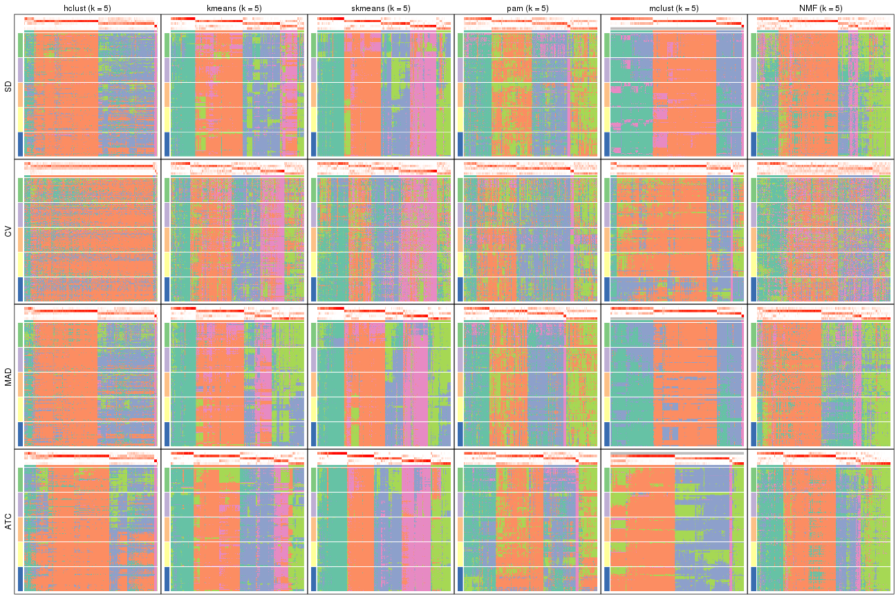</p>

</div>
<div id='tab-collect-membership-heatmap-5'>
<pre><code class="r">collect_plots(res_list, k = 6, fun = membership_heatmap, mc.cores = 4)
</code></pre>

<p>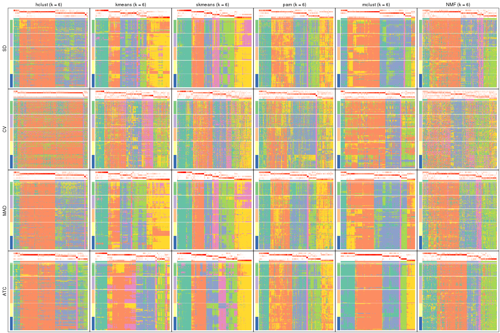</p>

</div>
</div>


### Signature heatmap

Signature heatmaps for all methods. ([What is a signature heatmap?](http://bioconductor.org/packages/devel/bioc/vignettes/cola/inst/doc/cola.html#toc_22))


Note in following heatmaps, rows are scaled.


<script>
$( function() {
	$( '#tabs-collect-get-signatures' ).tabs();
} );
</script>
<div id='tabs-collect-get-signatures'>
<ul>
<li><a href='#tab-collect-get-signatures-1'>k = 2</a></li>
<li><a href='#tab-collect-get-signatures-2'>k = 3</a></li>
<li><a href='#tab-collect-get-signatures-3'>k = 4</a></li>
<li><a href='#tab-collect-get-signatures-4'>k = 5</a></li>
<li><a href='#tab-collect-get-signatures-5'>k = 6</a></li>
</ul>
<div id='tab-collect-get-signatures-1'>
<pre><code class="r">collect_plots(res_list, k = 2, fun = get_signatures, mc.cores = 4)
</code></pre>

<p>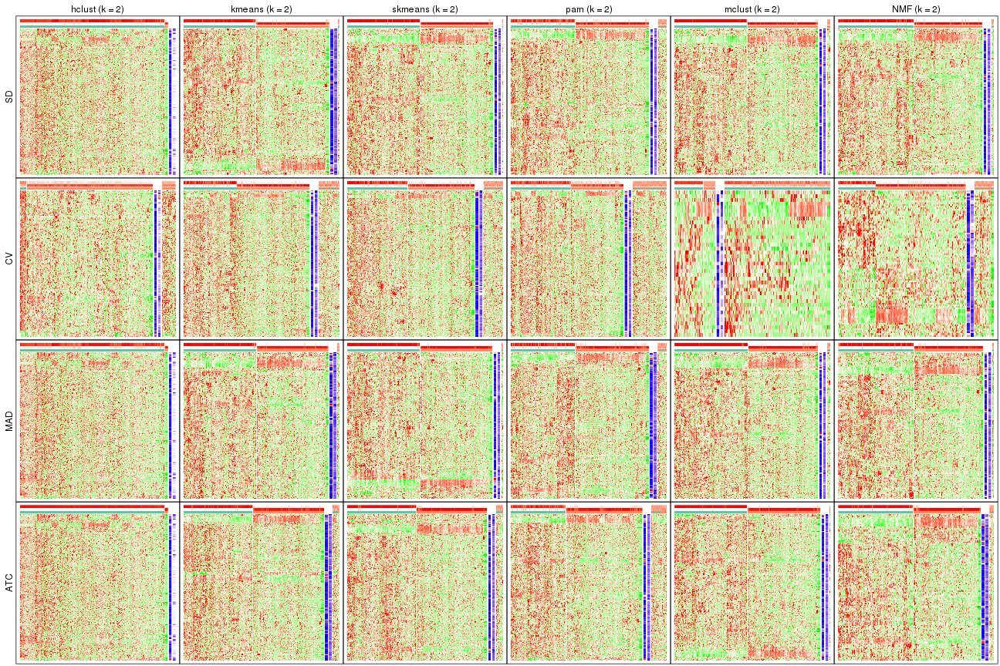</p>

</div>
<div id='tab-collect-get-signatures-2'>
<pre><code class="r">collect_plots(res_list, k = 3, fun = get_signatures, mc.cores = 4)
</code></pre>

<p>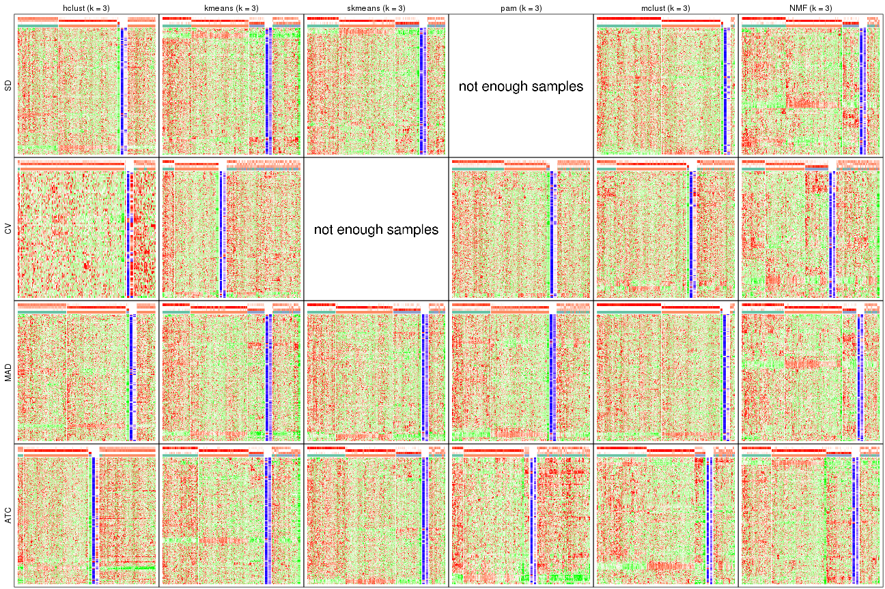</p>

</div>
<div id='tab-collect-get-signatures-3'>
<pre><code class="r">collect_plots(res_list, k = 4, fun = get_signatures, mc.cores = 4)
</code></pre>

<p>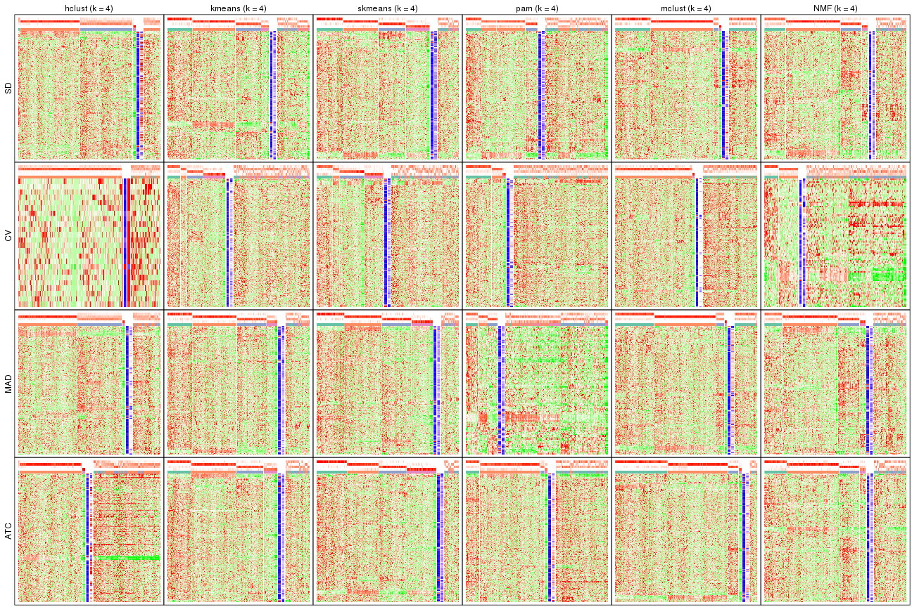</p>

</div>
<div id='tab-collect-get-signatures-4'>
<pre><code class="r">collect_plots(res_list, k = 5, fun = get_signatures, mc.cores = 4)
</code></pre>

<p>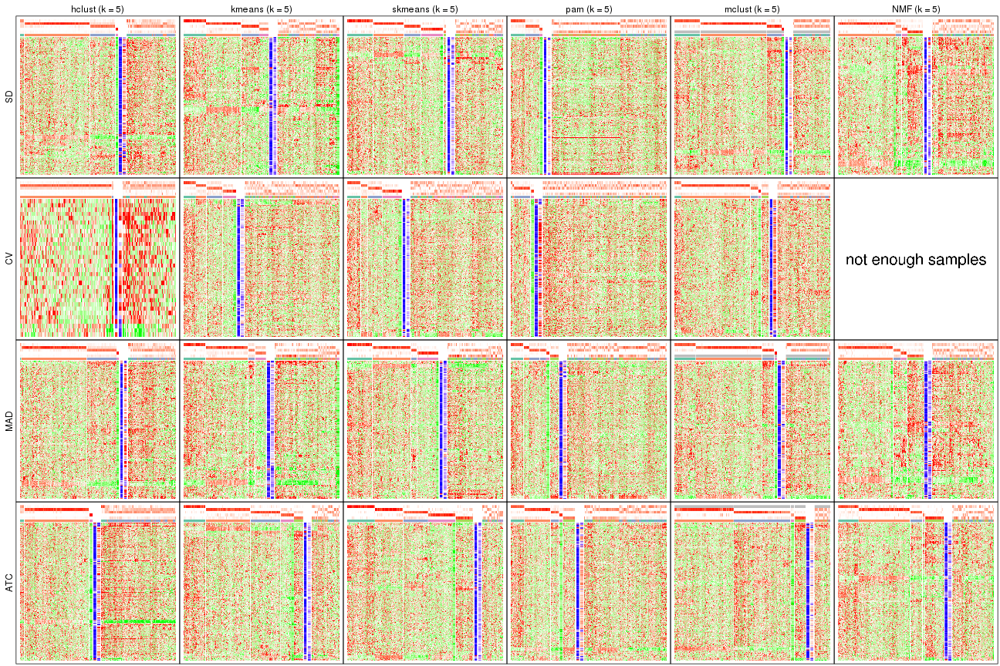</p>

</div>
<div id='tab-collect-get-signatures-5'>
<pre><code class="r">collect_plots(res_list, k = 6, fun = get_signatures, mc.cores = 4)
</code></pre>

<p>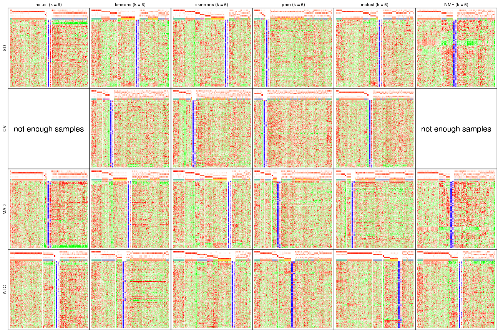</p>

</div>
</div>


### Statistics table

The statistics used for measuring the stability of consensus partitioning.
([How are they
defined?](http://bioconductor.org/packages/devel/bioc/vignettes/cola/inst/doc/cola.html#toc_13))


<script>
$( function() {
	$( '#tabs-get-stats-from-consensus-partition-list' ).tabs();
} );
</script>
<div id='tabs-get-stats-from-consensus-partition-list'>
<ul>
<li><a href='#tab-get-stats-from-consensus-partition-list-1'>k = 2</a></li>
<li><a href='#tab-get-stats-from-consensus-partition-list-2'>k = 3</a></li>
<li><a href='#tab-get-stats-from-consensus-partition-list-3'>k = 4</a></li>
<li><a href='#tab-get-stats-from-consensus-partition-list-4'>k = 5</a></li>
<li><a href='#tab-get-stats-from-consensus-partition-list-5'>k = 6</a></li>
</ul>
<div id='tab-get-stats-from-consensus-partition-list-1'>
<pre><code class="r">get_stats(res_list, k = 2)
</code></pre>

<pre><code>#&gt;             k  1-PAC mean_silhouette concordance area_increased  Rand Jaccard
#&gt; SD:NMF      2 0.8499           0.926       0.965         0.4999 0.500   0.500
#&gt; CV:NMF      2 0.4152           0.753       0.882         0.4340 0.584   0.584
#&gt; MAD:NMF     2 0.9007           0.941       0.972         0.5005 0.500   0.500
#&gt; ATC:NMF     2 0.8855           0.926       0.967         0.5000 0.500   0.500
#&gt; SD:skmeans  2 0.9618           0.964       0.983         0.5016 0.499   0.499
#&gt; CV:skmeans  2 0.3835           0.730       0.877         0.4990 0.501   0.501
#&gt; MAD:skmeans 2 0.9713           0.961       0.982         0.5015 0.499   0.499
#&gt; ATC:skmeans 2 0.9024           0.913       0.965         0.5016 0.499   0.499
#&gt; SD:mclust   2 0.9608           0.951       0.978         0.5000 0.499   0.499
#&gt; CV:mclust   2 0.0730           0.125       0.650         0.3163 0.847   0.847
#&gt; MAD:mclust  2 0.9457           0.946       0.977         0.4996 0.499   0.499
#&gt; ATC:mclust  2 0.9980           0.964       0.982         0.5005 0.499   0.499
#&gt; SD:kmeans   2 0.9274           0.944       0.970         0.5013 0.499   0.499
#&gt; CV:kmeans   2 0.3882           0.725       0.872         0.4818 0.511   0.511
#&gt; MAD:kmeans  2 0.9249           0.949       0.970         0.4958 0.499   0.499
#&gt; ATC:kmeans  2 0.8431           0.899       0.952         0.4961 0.499   0.499
#&gt; SD:pam      2 0.4222           0.821       0.900         0.4886 0.501   0.501
#&gt; CV:pam      2 0.0648           0.598       0.781         0.4825 0.500   0.500
#&gt; MAD:pam     2 0.5182           0.822       0.911         0.4964 0.501   0.501
#&gt; ATC:pam     2 0.4889           0.797       0.898         0.4769 0.509   0.509
#&gt; SD:hclust   2 0.7519           0.942       0.941         0.1119 0.959   0.959
#&gt; CV:hclust   2 0.0204           0.730       0.816         0.2682 0.915   0.915
#&gt; MAD:hclust  2 0.4859           0.900       0.907         0.1461 0.959   0.959
#&gt; ATC:hclust  2 1.0000           0.987       0.988         0.0588 0.959   0.959
</code></pre>

</div>
<div id='tab-get-stats-from-consensus-partition-list-2'>
<pre><code class="r">get_stats(res_list, k = 3)
</code></pre>

<pre><code>#&gt;             k   1-PAC mean_silhouette concordance area_increased  Rand Jaccard
#&gt; SD:NMF      3 0.66185           0.778       0.896         0.2546 0.870   0.742
#&gt; CV:NMF      3 0.17498           0.517       0.709         0.4785 0.707   0.525
#&gt; MAD:NMF     3 0.62824           0.757       0.882         0.2519 0.876   0.755
#&gt; ATC:NMF     3 0.61523           0.732       0.868         0.3012 0.809   0.632
#&gt; SD:skmeans  3 0.58342           0.708       0.859         0.3017 0.800   0.619
#&gt; CV:skmeans  3 0.32384           0.342       0.663         0.3224 0.824   0.669
#&gt; MAD:skmeans 3 0.61582           0.720       0.865         0.2978 0.806   0.629
#&gt; ATC:skmeans 3 0.60721           0.741       0.875         0.3098 0.795   0.611
#&gt; SD:mclust   3 0.97861           0.925       0.966         0.0566 0.970   0.940
#&gt; CV:mclust   3 0.15840           0.570       0.782         0.2664 0.526   0.502
#&gt; MAD:mclust  3 0.96785           0.925       0.967         0.0524 0.980   0.961
#&gt; ATC:mclust  3 0.65669           0.725       0.861         0.2152 0.863   0.733
#&gt; SD:kmeans   3 0.54679           0.666       0.822         0.2759 0.814   0.642
#&gt; CV:kmeans   3 0.21957           0.399       0.657         0.3434 0.796   0.623
#&gt; MAD:kmeans  3 0.58060           0.686       0.831         0.2882 0.819   0.649
#&gt; ATC:kmeans  3 0.58641           0.663       0.815         0.2952 0.789   0.601
#&gt; SD:pam      3 0.27807           0.509       0.688         0.2787 0.888   0.782
#&gt; CV:pam      3 0.06792           0.561       0.708         0.1436 0.919   0.848
#&gt; MAD:pam     3 0.33444           0.550       0.714         0.2653 0.959   0.920
#&gt; ATC:pam     3 0.42542           0.525       0.748         0.2477 0.912   0.830
#&gt; SD:hclust   3 0.16447           0.545       0.739         2.5148 0.582   0.564
#&gt; CV:hclust   3 0.00427           0.650       0.766         0.3159 0.949   0.944
#&gt; MAD:hclust  3 0.14511           0.637       0.739         1.8932 0.545   0.525
#&gt; ATC:hclust  3 0.19597           0.454       0.759         4.4721 0.867   0.862
</code></pre>

</div>
<div id='tab-get-stats-from-consensus-partition-list-3'>
<pre><code class="r">get_stats(res_list, k = 4)
</code></pre>

<pre><code>#&gt;             k  1-PAC mean_silhouette concordance area_increased  Rand Jaccard
#&gt; SD:NMF      4 0.5671           0.644       0.774         0.0983 0.862   0.669
#&gt; CV:NMF      4 0.2089           0.317       0.576         0.1437 0.914   0.774
#&gt; MAD:NMF     4 0.5357           0.621       0.762         0.1038 0.874   0.698
#&gt; ATC:NMF     4 0.5319           0.620       0.805         0.0824 0.923   0.791
#&gt; SD:skmeans  4 0.6249           0.705       0.838         0.1438 0.813   0.524
#&gt; CV:skmeans  4 0.3564           0.437       0.648         0.1283 0.755   0.451
#&gt; MAD:skmeans 4 0.6613           0.723       0.852         0.1447 0.828   0.559
#&gt; ATC:skmeans 4 0.6701           0.752       0.865         0.1397 0.786   0.472
#&gt; SD:mclust   4 0.7017           0.616       0.842         0.1699 0.946   0.890
#&gt; CV:mclust   4 0.0733           0.498       0.720         0.2360 0.931   0.886
#&gt; MAD:mclust  4 0.6949           0.665       0.815         0.1700 0.929   0.855
#&gt; ATC:mclust  4 0.6749           0.764       0.858         0.0460 0.935   0.848
#&gt; SD:kmeans   4 0.5497           0.609       0.781         0.1262 0.848   0.612
#&gt; CV:kmeans   4 0.2950           0.404       0.624         0.1268 0.724   0.390
#&gt; MAD:kmeans  4 0.5672           0.663       0.779         0.1195 0.856   0.633
#&gt; ATC:kmeans  4 0.5575           0.639       0.786         0.1251 0.836   0.589
#&gt; SD:pam      4 0.3558           0.419       0.650         0.1190 0.871   0.712
#&gt; CV:pam      4 0.1098           0.335       0.607         0.2045 0.874   0.748
#&gt; MAD:pam     4 0.3684           0.359       0.608         0.1215 0.760   0.509
#&gt; ATC:pam     4 0.3783           0.536       0.710         0.1131 0.896   0.770
#&gt; SD:hclust   4 0.1233           0.599       0.719         0.2718 0.811   0.687
#&gt; CV:hclust   4 0.0110           0.626       0.735         0.1609 0.970   0.965
#&gt; MAD:hclust  4 0.1214           0.562       0.714         0.2150 0.938   0.881
#&gt; ATC:hclust  4 0.1866           0.463       0.726         0.4467 0.777   0.733
</code></pre>

</div>
<div id='tab-get-stats-from-consensus-partition-list-4'>
<pre><code class="r">get_stats(res_list, k = 5)
</code></pre>

<pre><code>#&gt;             k  1-PAC mean_silhouette concordance area_increased  Rand Jaccard
#&gt; SD:NMF      5 0.4866           0.491       0.686         0.0701 0.927   0.785
#&gt; CV:NMF      5 0.2585           0.221       0.478         0.0743 0.892   0.689
#&gt; MAD:NMF     5 0.4631           0.497       0.661         0.0786 0.939   0.821
#&gt; ATC:NMF     5 0.5323           0.592       0.770         0.0578 0.904   0.715
#&gt; SD:skmeans  5 0.6415           0.590       0.762         0.0625 0.895   0.630
#&gt; CV:skmeans  5 0.4081           0.367       0.601         0.0680 0.899   0.653
#&gt; MAD:skmeans 5 0.6299           0.562       0.751         0.0610 0.916   0.697
#&gt; ATC:skmeans 5 0.7013           0.696       0.832         0.0639 0.895   0.622
#&gt; SD:mclust   5 0.6005           0.630       0.784         0.0957 0.890   0.758
#&gt; CV:mclust   5 0.1370           0.470       0.683         0.1486 0.860   0.767
#&gt; MAD:mclust  5 0.5569           0.608       0.767         0.0995 0.903   0.781
#&gt; ATC:mclust  5 0.6591           0.695       0.781         0.0734 0.984   0.960
#&gt; SD:kmeans   5 0.5650           0.490       0.721         0.0613 0.925   0.753
#&gt; CV:kmeans   5 0.3622           0.371       0.598         0.0695 0.828   0.472
#&gt; MAD:kmeans  5 0.5700           0.481       0.698         0.0642 0.931   0.770
#&gt; ATC:kmeans  5 0.6149           0.632       0.765         0.0596 0.901   0.684
#&gt; SD:pam      5 0.4153           0.334       0.617         0.0830 0.838   0.572
#&gt; CV:pam      5 0.1643           0.321       0.567         0.1004 0.816   0.578
#&gt; MAD:pam     5 0.4244           0.374       0.667         0.0669 0.880   0.620
#&gt; ATC:pam     5 0.4164           0.417       0.645         0.1115 0.821   0.558
#&gt; SD:hclust   5 0.1280           0.597       0.726         0.2058 0.897   0.793
#&gt; CV:hclust   5 0.0398           0.440       0.669         0.2020 0.974   0.970
#&gt; MAD:hclust  5 0.1408           0.612       0.723         0.1805 0.890   0.782
#&gt; ATC:hclust  5 0.1943           0.438       0.685         0.1890 0.688   0.540
</code></pre>

</div>
<div id='tab-get-stats-from-consensus-partition-list-5'>
<pre><code class="r">get_stats(res_list, k = 6)
</code></pre>

<pre><code>#&gt;             k  1-PAC mean_silhouette concordance area_increased  Rand Jaccard
#&gt; SD:NMF      6 0.4810           0.428       0.629         0.0518 0.898   0.691
#&gt; CV:NMF      6 0.3106           0.163       0.417         0.0454 0.870   0.569
#&gt; MAD:NMF     6 0.4798           0.390       0.616         0.0512 0.931   0.787
#&gt; ATC:NMF     6 0.5151           0.484       0.712         0.0326 0.973   0.905
#&gt; SD:skmeans  6 0.6722           0.567       0.750         0.0416 0.889   0.556
#&gt; CV:skmeans  6 0.4575           0.315       0.550         0.0422 0.933   0.717
#&gt; MAD:skmeans 6 0.6670           0.587       0.743         0.0432 0.905   0.614
#&gt; ATC:skmeans 6 0.7108           0.630       0.762         0.0389 0.925   0.666
#&gt; SD:mclust   6 0.5524           0.432       0.699         0.0865 0.852   0.637
#&gt; CV:mclust   6 0.2117           0.362       0.633         0.1686 0.822   0.660
#&gt; MAD:mclust  6 0.5417           0.258       0.646         0.0755 0.806   0.535
#&gt; ATC:mclust  6 0.7108           0.707       0.820         0.0895 0.822   0.568
#&gt; SD:kmeans   6 0.5850           0.482       0.662         0.0419 0.919   0.703
#&gt; CV:kmeans   6 0.4243           0.312       0.547         0.0427 0.918   0.672
#&gt; MAD:kmeans  6 0.5831           0.448       0.655         0.0462 0.910   0.667
#&gt; ATC:kmeans  6 0.6251           0.443       0.661         0.0406 0.916   0.709
#&gt; SD:pam      6 0.4791           0.260       0.596         0.0528 0.805   0.394
#&gt; CV:pam      6 0.2284           0.293       0.522         0.0632 0.937   0.795
#&gt; MAD:pam     6 0.4706           0.370       0.614         0.0545 0.923   0.707
#&gt; ATC:pam     6 0.4874           0.439       0.675         0.0673 0.874   0.577
#&gt; SD:hclust   6 0.2293           0.523       0.704         0.1063 0.971   0.931
#&gt; CV:hclust   6 0.0605           0.432       0.632         0.1110 0.929   0.916
#&gt; MAD:hclust  6 0.2596           0.539       0.703         0.0979 0.962   0.910
#&gt; ATC:hclust  6 0.2475           0.563       0.699         0.1851 0.838   0.645
</code></pre>

</div>
</div>

Following heatmap plots the partition for each combination of methods and the
lightness correspond to the silhouette scores for samples in each method. On
top the consensus subgroup is inferred from all methods by taking the mean
silhouette scores as weight.


<script>
$( function() {
	$( '#tabs-collect-stats-from-consensus-partition-list' ).tabs();
} );
</script>
<div id='tabs-collect-stats-from-consensus-partition-list'>
<ul>
<li><a href='#tab-collect-stats-from-consensus-partition-list-1'>k = 2</a></li>
<li><a href='#tab-collect-stats-from-consensus-partition-list-2'>k = 3</a></li>
<li><a href='#tab-collect-stats-from-consensus-partition-list-3'>k = 4</a></li>
<li><a href='#tab-collect-stats-from-consensus-partition-list-4'>k = 5</a></li>
<li><a href='#tab-collect-stats-from-consensus-partition-list-5'>k = 6</a></li>
</ul>
<div id='tab-collect-stats-from-consensus-partition-list-1'>
<pre><code class="r">collect_stats(res_list, k = 2)
</code></pre>

<p>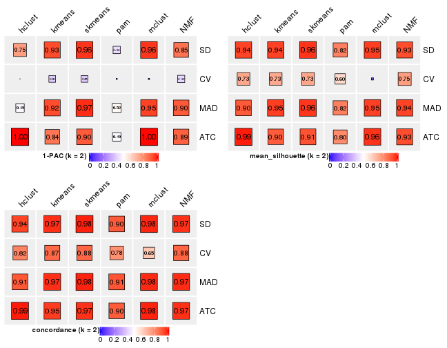</p>

</div>
<div id='tab-collect-stats-from-consensus-partition-list-2'>
<pre><code class="r">collect_stats(res_list, k = 3)
</code></pre>

<p>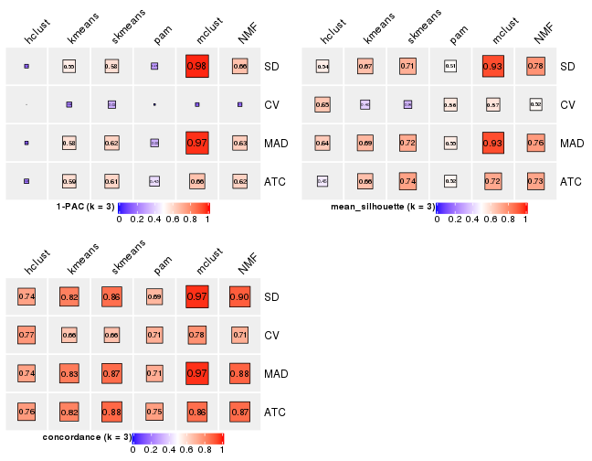</p>

</div>
<div id='tab-collect-stats-from-consensus-partition-list-3'>
<pre><code class="r">collect_stats(res_list, k = 4)
</code></pre>

<p>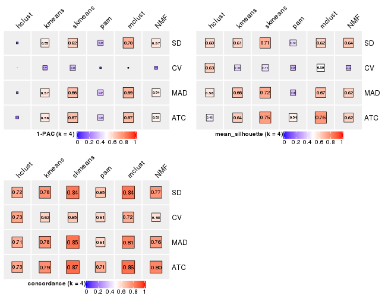</p>

</div>
<div id='tab-collect-stats-from-consensus-partition-list-4'>
<pre><code class="r">collect_stats(res_list, k = 5)
</code></pre>

<p>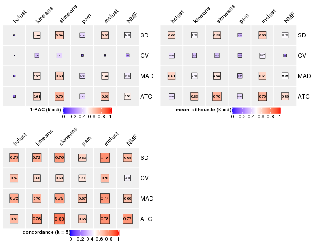</p>

</div>
<div id='tab-collect-stats-from-consensus-partition-list-5'>
<pre><code class="r">collect_stats(res_list, k = 6)
</code></pre>

<p>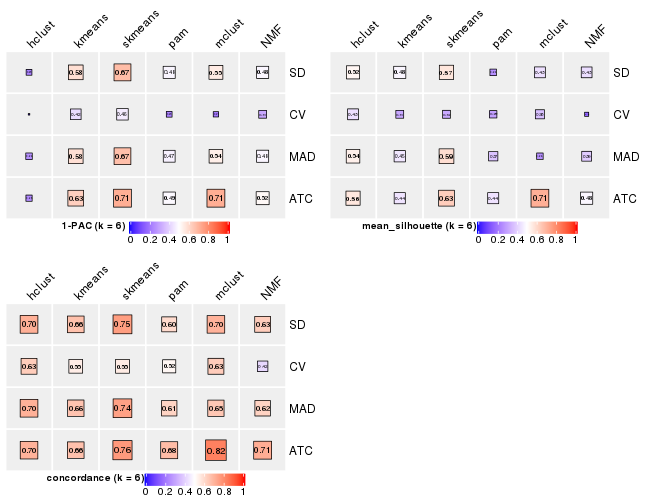</p>

</div>
</div>

### Partition from all methods


Collect partitions from all methods:


<script>
$( function() {
	$( '#tabs-collect-classes-from-consensus-partition-list' ).tabs();
} );
</script>
<div id='tabs-collect-classes-from-consensus-partition-list'>
<ul>
<li><a href='#tab-collect-classes-from-consensus-partition-list-1'>k = 2</a></li>
<li><a href='#tab-collect-classes-from-consensus-partition-list-2'>k = 3</a></li>
<li><a href='#tab-collect-classes-from-consensus-partition-list-3'>k = 4</a></li>
<li><a href='#tab-collect-classes-from-consensus-partition-list-4'>k = 5</a></li>
<li><a href='#tab-collect-classes-from-consensus-partition-list-5'>k = 6</a></li>
</ul>
<div id='tab-collect-classes-from-consensus-partition-list-1'>
<pre><code class="r">collect_classes(res_list, k = 2)
</code></pre>

<p>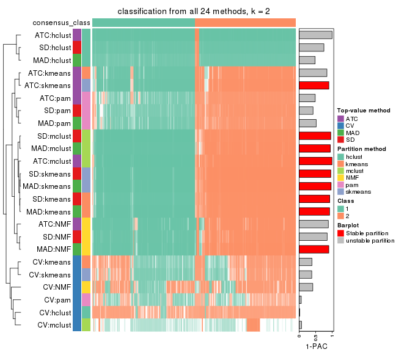</p>

</div>
<div id='tab-collect-classes-from-consensus-partition-list-2'>
<pre><code class="r">collect_classes(res_list, k = 3)
</code></pre>

<p>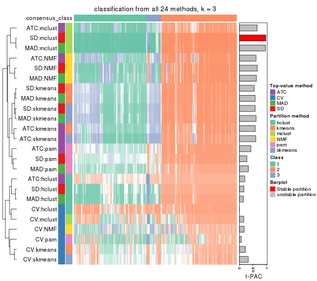</p>

</div>
<div id='tab-collect-classes-from-consensus-partition-list-3'>
<pre><code class="r">collect_classes(res_list, k = 4)
</code></pre>

<p>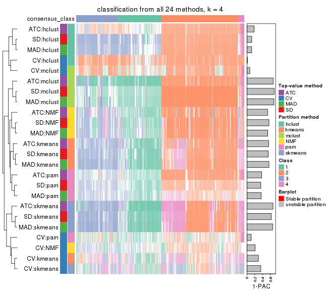</p>

</div>
<div id='tab-collect-classes-from-consensus-partition-list-4'>
<pre><code class="r">collect_classes(res_list, k = 5)
</code></pre>

<p>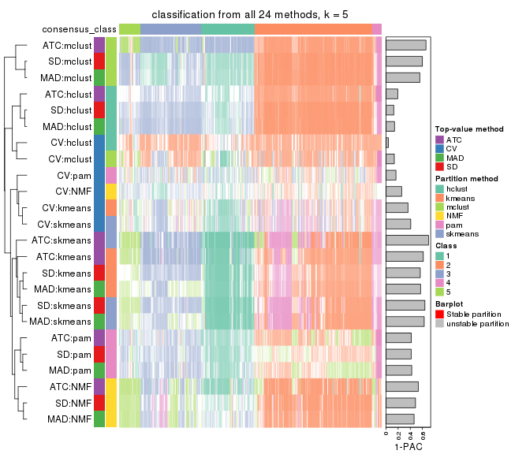</p>

</div>
<div id='tab-collect-classes-from-consensus-partition-list-5'>
<pre><code class="r">collect_classes(res_list, k = 6)
</code></pre>

<p>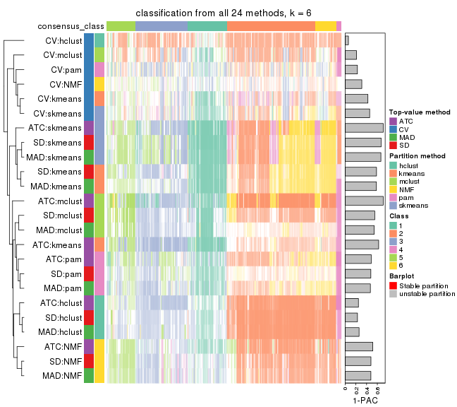</p>

</div>
</div>


### Top rows overlap


Overlap of top rows from different top-row methods:


<script>
$( function() {
	$( '#tabs-top-rows-overlap-by-euler' ).tabs();
} );
</script>
<div id='tabs-top-rows-overlap-by-euler'>
<ul>
<li><a href='#tab-top-rows-overlap-by-euler-1'>top_n = 43</a></li>
<li><a href='#tab-top-rows-overlap-by-euler-2'>top_n = 86</a></li>
<li><a href='#tab-top-rows-overlap-by-euler-3'>top_n = 129</a></li>
<li><a href='#tab-top-rows-overlap-by-euler-4'>top_n = 172</a></li>
<li><a href='#tab-top-rows-overlap-by-euler-5'>top_n = 215</a></li>
</ul>
<div id='tab-top-rows-overlap-by-euler-1'>
<pre><code class="r">top_rows_overlap(res_list, top_n = 43, method = &quot;euler&quot;)
</code></pre>

<p>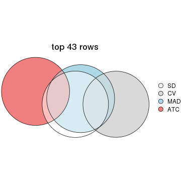</p>

</div>
<div id='tab-top-rows-overlap-by-euler-2'>
<pre><code class="r">top_rows_overlap(res_list, top_n = 86, method = &quot;euler&quot;)
</code></pre>

<p>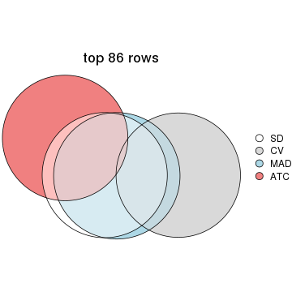</p>

</div>
<div id='tab-top-rows-overlap-by-euler-3'>
<pre><code class="r">top_rows_overlap(res_list, top_n = 129, method = &quot;euler&quot;)
</code></pre>

<p>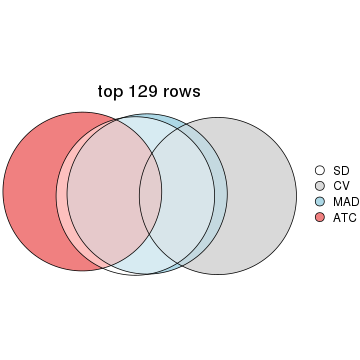</p>

</div>
<div id='tab-top-rows-overlap-by-euler-4'>
<pre><code class="r">top_rows_overlap(res_list, top_n = 172, method = &quot;euler&quot;)
</code></pre>

<p>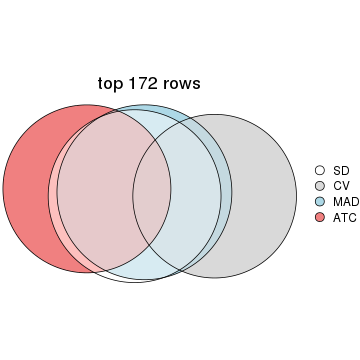</p>

</div>
<div id='tab-top-rows-overlap-by-euler-5'>
<pre><code class="r">top_rows_overlap(res_list, top_n = 215, method = &quot;euler&quot;)
</code></pre>

<p>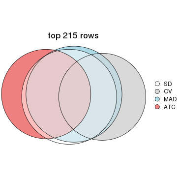</p>

</div>
</div>

Also visualize the correspondance of rankings between different top-row methods:


<script>
$( function() {
	$( '#tabs-top-rows-overlap-by-correspondance' ).tabs();
} );
</script>
<div id='tabs-top-rows-overlap-by-correspondance'>
<ul>
<li><a href='#tab-top-rows-overlap-by-correspondance-1'>top_n = 43</a></li>
<li><a href='#tab-top-rows-overlap-by-correspondance-2'>top_n = 86</a></li>
<li><a href='#tab-top-rows-overlap-by-correspondance-3'>top_n = 129</a></li>
<li><a href='#tab-top-rows-overlap-by-correspondance-4'>top_n = 172</a></li>
<li><a href='#tab-top-rows-overlap-by-correspondance-5'>top_n = 215</a></li>
</ul>
<div id='tab-top-rows-overlap-by-correspondance-1'>
<pre><code class="r">top_rows_overlap(res_list, top_n = 43, method = &quot;correspondance&quot;)
</code></pre>

<p>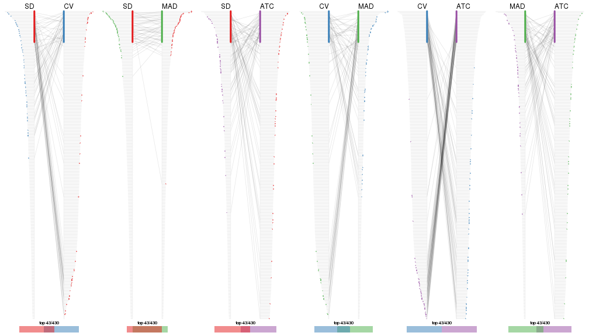</p>

</div>
<div id='tab-top-rows-overlap-by-correspondance-2'>
<pre><code class="r">top_rows_overlap(res_list, top_n = 86, method = &quot;correspondance&quot;)
</code></pre>

<p>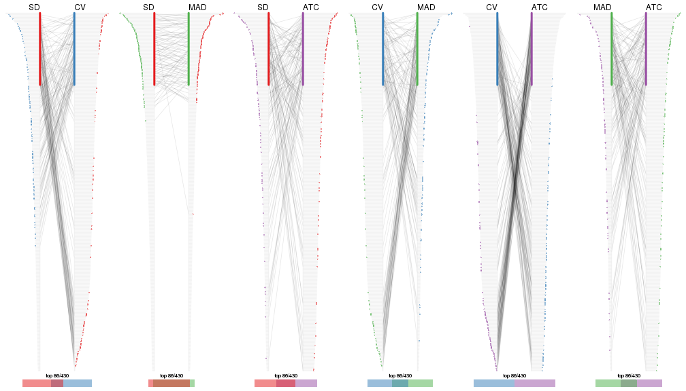</p>

</div>
<div id='tab-top-rows-overlap-by-correspondance-3'>
<pre><code class="r">top_rows_overlap(res_list, top_n = 129, method = &quot;correspondance&quot;)
</code></pre>

<p>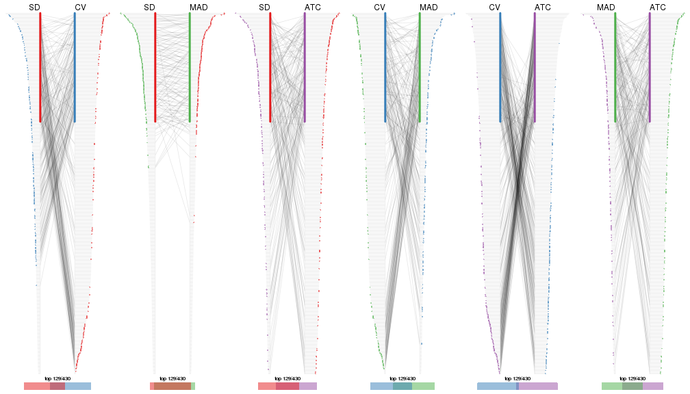</p>

</div>
<div id='tab-top-rows-overlap-by-correspondance-4'>
<pre><code class="r">top_rows_overlap(res_list, top_n = 172, method = &quot;correspondance&quot;)
</code></pre>

<p>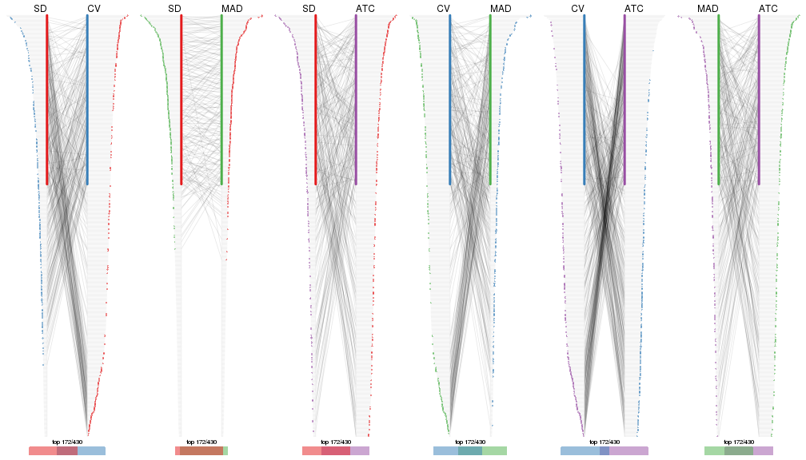</p>

</div>
<div id='tab-top-rows-overlap-by-correspondance-5'>
<pre><code class="r">top_rows_overlap(res_list, top_n = 215, method = &quot;correspondance&quot;)
</code></pre>

<p>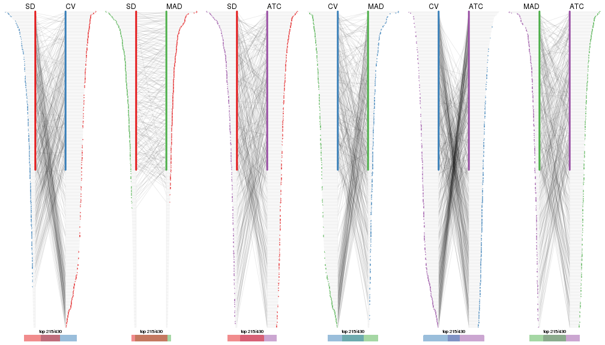</p>

</div>
</div>


Heatmaps of the top rows:


<script>
$( function() {
	$( '#tabs-top-rows-heatmap' ).tabs();
} );
</script>
<div id='tabs-top-rows-heatmap'>
<ul>
<li><a href='#tab-top-rows-heatmap-1'>top_n = 43</a></li>
<li><a href='#tab-top-rows-heatmap-2'>top_n = 86</a></li>
<li><a href='#tab-top-rows-heatmap-3'>top_n = 129</a></li>
<li><a href='#tab-top-rows-heatmap-4'>top_n = 172</a></li>
<li><a href='#tab-top-rows-heatmap-5'>top_n = 215</a></li>
</ul>
<div id='tab-top-rows-heatmap-1'>
<pre><code class="r">top_rows_heatmap(res_list, top_n = 43)
</code></pre>

<p>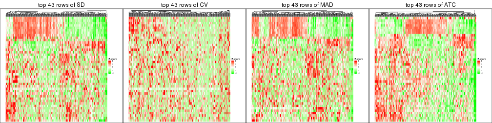</p>

</div>
<div id='tab-top-rows-heatmap-2'>
<pre><code class="r">top_rows_heatmap(res_list, top_n = 86)
</code></pre>

<p>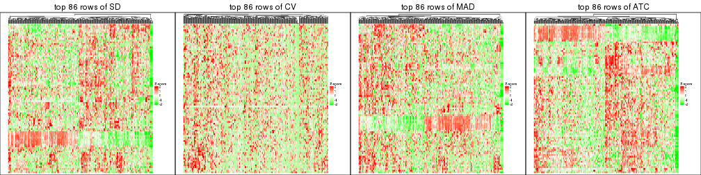</p>

</div>
<div id='tab-top-rows-heatmap-3'>
<pre><code class="r">top_rows_heatmap(res_list, top_n = 129)
</code></pre>

<p>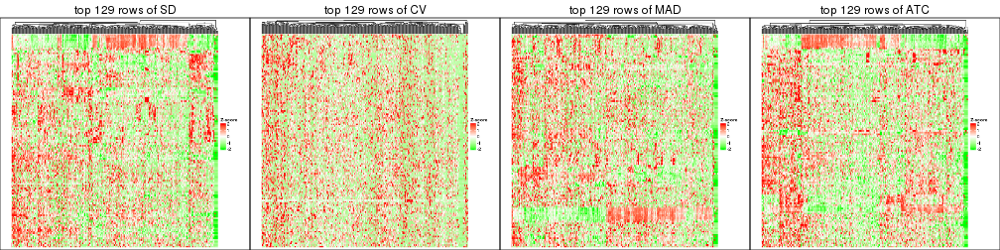</p>

</div>
<div id='tab-top-rows-heatmap-4'>
<pre><code class="r">top_rows_heatmap(res_list, top_n = 172)
</code></pre>

<p>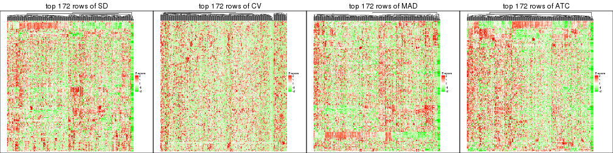</p>

</div>
<div id='tab-top-rows-heatmap-5'>
<pre><code class="r">top_rows_heatmap(res_list, top_n = 215)
</code></pre>

<p>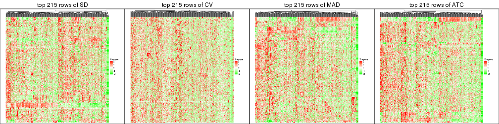</p>

</div>
</div>


 
## Results for each method


---------------------------------------------------


### SD:hclust


The object with results only for a single top-value method and a single partition method 
can be extracted as:

```r
res = res_list["SD", "hclust"]
# you can also extract it by
# res = res_list["SD:hclust"]
```

A summary of `res` and all the functions that can be applied to it:

```r
res
```

```
#> A 'ConsensusPartition' object with k = 2, 3, 4, 5, 6.
#>   On a matrix with 430 rows and 384 columns.
#>   Top rows (43, 86, 129, 172, 215) are extracted by 'SD' method.
#>   Subgroups are detected by 'hclust' method.
#>   Performed in total 1250 partitions by row resampling.
#>   Best k for subgroups seems to be 3.
#> 
#> Following methods can be applied to this 'ConsensusPartition' object:
#>  [1] "cola_report"             "collect_classes"         "collect_plots"          
#>  [4] "collect_stats"           "colnames"                "compare_signatures"     
#>  [7] "consensus_heatmap"       "dimension_reduction"     "functional_enrichment"  
#> [10] "get_anno_col"            "get_anno"                "get_classes"            
#> [13] "get_consensus"           "get_matrix"              "get_membership"         
#> [16] "get_param"               "get_signatures"          "get_stats"              
#> [19] "is_best_k"               "is_stable_k"             "membership_heatmap"     
#> [22] "ncol"                    "nrow"                    "plot_ecdf"              
#> [25] "rownames"                "select_partition_number" "show"                   
#> [28] "suggest_best_k"          "test_to_known_factors"
```

`collect_plots()` function collects all the plots made from `res` for all `k` (number of partitions)
into one single page to provide an easy and fast comparison between different `k`.

```r
collect_plots(res)
```

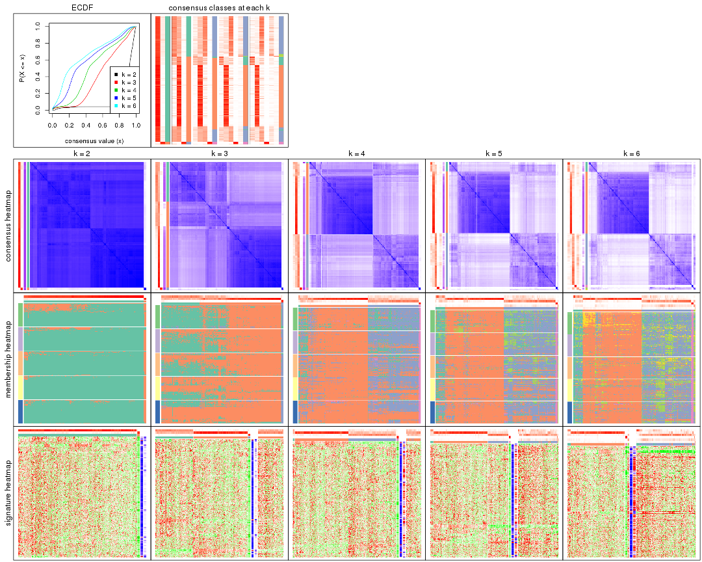

The plots are:

- The first row: a plot of the ECDF (Empirical cumulative distribution
  function) curves of the consensus matrix for each `k` and the heatmap of
  predicted classes for each `k`.
- The second row: heatmaps of the consensus matrix for each `k`.
- The third row: heatmaps of the membership matrix for each `k`.
- The fouth row: heatmaps of the signatures for each `k`.

All the plots in panels can be made by individual functions and they are
plotted later in this section.

`select_partition_number()` produces several plots showing different
statistics for choosing "optimized" `k`. There are following statistics:

- ECDF curves of the consensus matrix for each `k`;
- 1-PAC. [The PAC
  score](https://en.wikipedia.org/wiki/Consensus_clustering#Over-interpretation_potential_of_consensus_clustering)
  measures the proportion of the ambiguous subgrouping.
- Mean silhouette score.
- Concordance. The mean probability of fiting the consensus class ids in all
  partitions.
- Area increased. Denote $A_k$ as the area under the ECDF curve for current
  `k`, the area increased is defined as $A_k - A_{k-1}$.
- Rand index. The percent of pairs of samples that are both in a same cluster
  or both are not in a same cluster in the partition of k and k-1.
- Jaccard index. The ratio of pairs of samples are both in a same cluster in
  the partition of k and k-1 and the pairs of samples are both in a same
  cluster in the partition k or k-1.

The detailed explanations of these statistics can be found in [the cola
vignette](http://bioconductor.org/packages/devel/bioc/vignettes/cola/inst/doc/cola.html#toc_13).

Generally speaking, lower PAC score, higher mean silhouette score or higher
concordance corresponds to better partition. Rand index and Jaccard index
measure how similar the current partition is compared to partition with `k-1`.
If they are too similar, we won't accept `k` is better than `k-1`.

```r
select_partition_number(res)
```

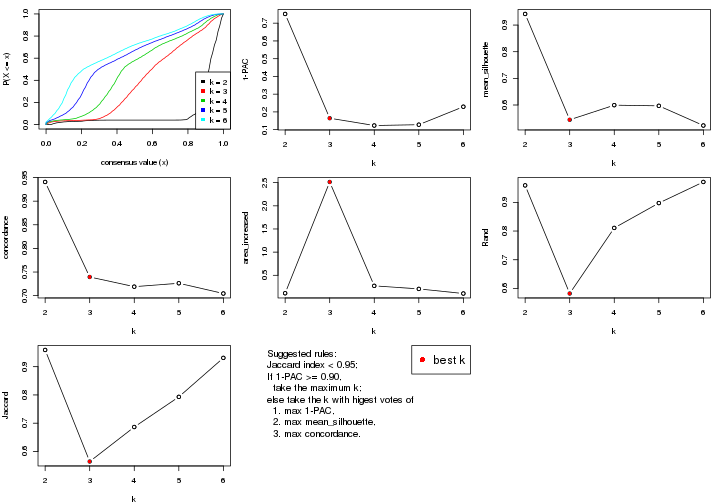

The numeric values for all these statistics can be obtained by `get_stats()`.

```r
get_stats(res)
```

```
#>   k 1-PAC mean_silhouette concordance area_increased  Rand Jaccard
#> 2 2 0.752           0.942       0.941          0.112 0.959   0.959
#> 3 3 0.164           0.545       0.739          2.515 0.582   0.564
#> 4 4 0.123           0.599       0.719          0.272 0.811   0.687
#> 5 5 0.128           0.597       0.726          0.206 0.897   0.793
#> 6 6 0.229           0.523       0.704          0.106 0.971   0.931
```

`suggest_best_k()` suggests the best $k$ based on these statistics. The rules are as follows:

- All $k$ with Jaccard index larger than 0.95 are removed because the increase of
  the partition number does not provides enough extra information. If all $k$ are removed,
  the best $k$ is assigned by `NA`.
- For $k$ with 1-PAC larger than 0.9, the maximal $k$ is taken as the "best k". Other $k$ is called "optional k".
- If it does not fit the second rule. The $k$ with the highest vote of highest
  1-PAC, mean silhouette and concordance is taken as the "best k".

```r
suggest_best_k(res)
```

```
#> [1] 3
```


Following shows the table of the partitions (You need to click the **show/hide
code output** link to see it). The membership matrix (columns with name `p*`)
is inferred by
[`clue::cl_consensus()`](https://www.rdocumentation.org/link/cl_consensus?package=clue)
function with the `SE` method. Basically the value in the membership matrix
represents the probability to belong to a certain group. The finall class
label for an item is determined with the group with highest probability it
belongs to.

In `get_classes()` function, the entropy is calculated from the membership
matrix and the silhouette score is calculated from the consensus matrix.


<script>
$( function() {
	$( '#tabs-SD-hclust-get-classes' ).tabs();
} );
</script>
<div id='tabs-SD-hclust-get-classes'>
<ul>
<li><a href='#tab-SD-hclust-get-classes-1'>k = 2</a></li>
<li><a href='#tab-SD-hclust-get-classes-2'>k = 3</a></li>
<li><a href='#tab-SD-hclust-get-classes-3'>k = 4</a></li>
<li><a href='#tab-SD-hclust-get-classes-4'>k = 5</a></li>
<li><a href='#tab-SD-hclust-get-classes-5'>k = 6</a></li>
</ul>

<div id='tab-SD-hclust-get-classes-1'>
<p><a id='tab-SD-hclust-get-classes-1-a' style='color:#0366d6' href='#'>show/hide code output</a></p>
<pre><code class="r">cbind(get_classes(res, k = 2), get_membership(res, k = 2))
</code></pre>

<pre><code>#&gt;            class entropy silhouette    p1    p2
#&gt; SRR2105277     1  0.4562      0.943 0.904 0.096
#&gt; SRR2105278     1  0.4815      0.940 0.896 0.104
#&gt; SRR2105275     1  0.7299      0.830 0.796 0.204
#&gt; SRR2105276     1  0.7056      0.851 0.808 0.192
#&gt; SRR2105273     1  0.4431      0.940 0.908 0.092
#&gt; SRR2105274     1  0.4815      0.939 0.896 0.104
#&gt; SRR2105271     1  0.4690      0.942 0.900 0.100
#&gt; SRR2105272     1  0.4431      0.945 0.908 0.092
#&gt; SRR2105269     1  0.0376      0.950 0.996 0.004
#&gt; SRR2105270     1  0.0376      0.951 0.996 0.004
#&gt; SRR2105267     1  0.0672      0.950 0.992 0.008
#&gt; SRR2105268     1  0.0938      0.949 0.988 0.012
#&gt; SRR2105265     1  0.0672      0.950 0.992 0.008
#&gt; SRR2105266     1  0.0000      0.950 1.000 0.000
#&gt; SRR2105263     1  0.1633      0.948 0.976 0.024
#&gt; SRR2105264     1  0.1843      0.952 0.972 0.028
#&gt; SRR2105261     1  0.6801      0.862 0.820 0.180
#&gt; SRR2105262     1  0.6712      0.867 0.824 0.176
#&gt; SRR2105357     1  0.4690      0.941 0.900 0.100
#&gt; SRR2105358     1  0.4690      0.941 0.900 0.100
#&gt; SRR2105439     1  0.0938      0.951 0.988 0.012
#&gt; SRR2105440     1  0.0938      0.951 0.988 0.012
#&gt; SRR2105509     1  0.1633      0.947 0.976 0.024
#&gt; SRR2105510     1  0.1414      0.948 0.980 0.020
#&gt; SRR2105507     1  0.4815      0.938 0.896 0.104
#&gt; SRR2105508     1  0.4815      0.936 0.896 0.104
#&gt; SRR2105505     1  0.4431      0.943 0.908 0.092
#&gt; SRR2105506     1  0.4431      0.943 0.908 0.092
#&gt; SRR2105503     1  0.0000      0.950 1.000 0.000
#&gt; SRR2105504     2  0.2423      0.943 0.040 0.960
#&gt; SRR2105501     1  0.1184      0.952 0.984 0.016
#&gt; SRR2105502     2  0.2423      0.943 0.040 0.960
#&gt; SRR2105499     1  0.4562      0.944 0.904 0.096
#&gt; SRR2105500     1  0.4562      0.945 0.904 0.096
#&gt; SRR2105497     1  0.1184      0.951 0.984 0.016
#&gt; SRR2105498     1  0.0376      0.950 0.996 0.004
#&gt; SRR2105495     1  0.0938      0.951 0.988 0.012
#&gt; SRR2105496     1  0.0672      0.950 0.992 0.008
#&gt; SRR2105493     1  0.1414      0.954 0.980 0.020
#&gt; SRR2105494     1  0.1633      0.953 0.976 0.024
#&gt; SRR2105491     1  0.1633      0.948 0.976 0.024
#&gt; SRR2105492     1  0.1633      0.948 0.976 0.024
#&gt; SRR2105489     1  0.0938      0.950 0.988 0.012
#&gt; SRR2105490     1  0.0672      0.951 0.992 0.008
#&gt; SRR2105487     1  0.4562      0.946 0.904 0.096
#&gt; SRR2105488     1  0.4562      0.946 0.904 0.096
#&gt; SRR2105485     1  0.4690      0.944 0.900 0.100
#&gt; SRR2105486     1  0.4562      0.946 0.904 0.096
#&gt; SRR2105483     1  0.2778      0.950 0.952 0.048
#&gt; SRR2105484     1  0.2778      0.950 0.952 0.048
#&gt; SRR2105481     1  0.4022      0.951 0.920 0.080
#&gt; SRR2105482     1  0.4161      0.948 0.916 0.084
#&gt; SRR2105479     1  0.3879      0.951 0.924 0.076
#&gt; SRR2105480     1  0.3879      0.952 0.924 0.076
#&gt; SRR2105477     1  0.1633      0.953 0.976 0.024
#&gt; SRR2105478     1  0.0376      0.951 0.996 0.004
#&gt; SRR2105475     1  0.2236      0.942 0.964 0.036
#&gt; SRR2105476     1  0.2236      0.941 0.964 0.036
#&gt; SRR2105473     1  0.0672      0.951 0.992 0.008
#&gt; SRR2105474     1  0.0000      0.950 1.000 0.000
#&gt; SRR2105471     1  0.0672      0.951 0.992 0.008
#&gt; SRR2105472     1  0.0376      0.950 0.996 0.004
#&gt; SRR2105469     1  0.4431      0.940 0.908 0.092
#&gt; SRR2105470     1  0.4298      0.945 0.912 0.088
#&gt; SRR2105467     1  0.4022      0.947 0.920 0.080
#&gt; SRR2105468     1  0.4161      0.945 0.916 0.084
#&gt; SRR2105465     1  0.3584      0.951 0.932 0.068
#&gt; SRR2105466     1  0.3274      0.952 0.940 0.060
#&gt; SRR2105463     1  0.3733      0.950 0.928 0.072
#&gt; SRR2105464     1  0.3114      0.951 0.944 0.056
#&gt; SRR2105461     1  0.0000      0.950 1.000 0.000
#&gt; SRR2105462     1  0.0000      0.950 1.000 0.000
#&gt; SRR2105459     1  0.1184      0.949 0.984 0.016
#&gt; SRR2105460     1  0.1414      0.951 0.980 0.020
#&gt; SRR2105457     1  0.5059      0.937 0.888 0.112
#&gt; SRR2105458     1  0.5178      0.936 0.884 0.116
#&gt; SRR2105455     1  0.4431      0.943 0.908 0.092
#&gt; SRR2105456     1  0.4298      0.944 0.912 0.088
#&gt; SRR2105453     1  0.4431      0.946 0.908 0.092
#&gt; SRR2105454     1  0.4298      0.946 0.912 0.088
#&gt; SRR2105451     1  0.2043      0.955 0.968 0.032
#&gt; SRR2105452     2  0.2423      0.943 0.040 0.960
#&gt; SRR2105449     1  0.4690      0.942 0.900 0.100
#&gt; SRR2105450     1  0.4562      0.943 0.904 0.096
#&gt; SRR2105447     1  0.0376      0.951 0.996 0.004
#&gt; SRR2105448     1  0.1843      0.950 0.972 0.028
#&gt; SRR2105445     1  0.4298      0.948 0.912 0.088
#&gt; SRR2105446     1  0.4690      0.945 0.900 0.100
#&gt; SRR2105443     1  0.4690      0.938 0.900 0.100
#&gt; SRR2105444     1  0.3879      0.950 0.924 0.076
#&gt; SRR2105441     1  0.0672      0.951 0.992 0.008
#&gt; SRR2105442     1  0.0000      0.950 1.000 0.000
#&gt; SRR2105437     1  0.4431      0.946 0.908 0.092
#&gt; SRR2105438     1  0.4431      0.946 0.908 0.092
#&gt; SRR2105435     1  0.4562      0.946 0.904 0.096
#&gt; SRR2105436     1  0.4431      0.947 0.908 0.092
#&gt; SRR2105433     1  0.3584      0.952 0.932 0.068
#&gt; SRR2105434     1  0.3733      0.951 0.928 0.072
#&gt; SRR2105431     1  0.4161      0.948 0.916 0.084
#&gt; SRR2105432     1  0.4161      0.948 0.916 0.084
#&gt; SRR2105429     1  0.4022      0.947 0.920 0.080
#&gt; SRR2105430     1  0.3733      0.952 0.928 0.072
#&gt; SRR2105427     1  0.0938      0.950 0.988 0.012
#&gt; SRR2105428     1  0.1633      0.946 0.976 0.024
#&gt; SRR2105425     1  0.1184      0.949 0.984 0.016
#&gt; SRR2105426     1  0.0938      0.950 0.988 0.012
#&gt; SRR2105421     1  0.4939      0.932 0.892 0.108
#&gt; SRR2105422     1  0.4431      0.940 0.908 0.092
#&gt; SRR2105423     1  0.0376      0.950 0.996 0.004
#&gt; SRR2105424     1  0.0000      0.950 1.000 0.000
#&gt; SRR2105419     1  0.4562      0.942 0.904 0.096
#&gt; SRR2105420     1  0.3879      0.948 0.924 0.076
#&gt; SRR2105415     1  0.3431      0.951 0.936 0.064
#&gt; SRR2105416     1  0.3431      0.951 0.936 0.064
#&gt; SRR2105417     1  0.3733      0.950 0.928 0.072
#&gt; SRR2105418     1  0.3584      0.951 0.932 0.068
#&gt; SRR2105413     1  0.1633      0.950 0.976 0.024
#&gt; SRR2105414     1  0.1633      0.954 0.976 0.024
#&gt; SRR2105409     1  0.0672      0.952 0.992 0.008
#&gt; SRR2105410     1  0.0672      0.951 0.992 0.008
#&gt; SRR2105411     1  0.0376      0.950 0.996 0.004
#&gt; SRR2105412     1  0.0672      0.950 0.992 0.008
#&gt; SRR2105407     1  0.5059      0.934 0.888 0.112
#&gt; SRR2105408     1  0.5059      0.934 0.888 0.112
#&gt; SRR2105403     1  0.4431      0.943 0.908 0.092
#&gt; SRR2105404     1  0.4431      0.943 0.908 0.092
#&gt; SRR2105405     1  0.4562      0.943 0.904 0.096
#&gt; SRR2105406     1  0.4431      0.944 0.908 0.092
#&gt; SRR2105401     1  0.1414      0.952 0.980 0.020
#&gt; SRR2105402     2  0.2423      0.943 0.040 0.960
#&gt; SRR2105399     1  0.5946      0.890 0.856 0.144
#&gt; SRR2105400     1  0.6048      0.886 0.852 0.148
#&gt; SRR2105397     1  0.5408      0.901 0.876 0.124
#&gt; SRR2105398     1  0.5408      0.901 0.876 0.124
#&gt; SRR2105395     1  0.0672      0.950 0.992 0.008
#&gt; SRR2105396     1  0.0938      0.950 0.988 0.012
#&gt; SRR2105393     1  0.0000      0.950 1.000 0.000
#&gt; SRR2105394     1  0.0376      0.950 0.996 0.004
#&gt; SRR2105389     1  0.5294      0.921 0.880 0.120
#&gt; SRR2105390     1  0.4815      0.935 0.896 0.104
#&gt; SRR2105391     1  0.4815      0.936 0.896 0.104
#&gt; SRR2105392     1  0.4815      0.936 0.896 0.104
#&gt; SRR2105385     1  0.4298      0.948 0.912 0.088
#&gt; SRR2105386     1  0.4690      0.944 0.900 0.100
#&gt; SRR2105387     1  0.4690      0.940 0.900 0.100
#&gt; SRR2105388     1  0.4431      0.945 0.908 0.092
#&gt; SRR2105381     1  0.3879      0.943 0.924 0.076
#&gt; SRR2105382     1  0.2043      0.953 0.968 0.032
#&gt; SRR2105383     1  0.0938      0.953 0.988 0.012
#&gt; SRR2105384     1  0.1414      0.953 0.980 0.020
#&gt; SRR2105379     1  0.1633      0.952 0.976 0.024
#&gt; SRR2105380     1  0.1633      0.953 0.976 0.024
#&gt; SRR2105377     1  0.0938      0.952 0.988 0.012
#&gt; SRR2105378     1  0.0672      0.952 0.992 0.008
#&gt; SRR2105375     1  0.4161      0.949 0.916 0.084
#&gt; SRR2105376     1  0.4298      0.948 0.912 0.088
#&gt; SRR2105373     1  0.4562      0.943 0.904 0.096
#&gt; SRR2105374     1  0.4298      0.948 0.912 0.088
#&gt; SRR2105371     1  0.4562      0.939 0.904 0.096
#&gt; SRR2105372     1  0.4562      0.940 0.904 0.096
#&gt; SRR2105369     1  0.4690      0.940 0.900 0.100
#&gt; SRR2105370     1  0.4431      0.943 0.908 0.092
#&gt; SRR2105367     1  0.3879      0.950 0.924 0.076
#&gt; SRR2105368     1  0.4022      0.949 0.920 0.080
#&gt; SRR2105365     1  0.1843      0.947 0.972 0.028
#&gt; SRR2105366     1  0.2043      0.945 0.968 0.032
#&gt; SRR2105363     1  0.0376      0.951 0.996 0.004
#&gt; SRR2105364     1  0.0938      0.952 0.988 0.012
#&gt; SRR2105361     1  0.0672      0.951 0.992 0.008
#&gt; SRR2105362     1  0.0672      0.951 0.992 0.008
#&gt; SRR2105359     1  0.4562      0.943 0.904 0.096
#&gt; SRR2105360     1  0.4939      0.936 0.892 0.108
#&gt; SRR2105355     1  0.4298      0.942 0.912 0.088
#&gt; SRR2105356     1  0.4431      0.942 0.908 0.092
#&gt; SRR2105353     1  0.7815      0.786 0.768 0.232
#&gt; SRR2105354     1  0.5737      0.909 0.864 0.136
#&gt; SRR2105351     1  0.1414      0.948 0.980 0.020
#&gt; SRR2105352     2  0.2423      0.943 0.040 0.960
#&gt; SRR2105349     1  0.2423      0.948 0.960 0.040
#&gt; SRR2105350     1  0.1633      0.952 0.976 0.024
#&gt; SRR2105345     1  0.0672      0.952 0.992 0.008
#&gt; SRR2105346     1  0.0672      0.952 0.992 0.008
#&gt; SRR2105347     1  0.0672      0.951 0.992 0.008
#&gt; SRR2105348     1  0.0672      0.951 0.992 0.008
#&gt; SRR2105343     1  0.0672      0.950 0.992 0.008
#&gt; SRR2105344     1  0.0000      0.950 1.000 0.000
#&gt; SRR2105341     1  0.4939      0.935 0.892 0.108
#&gt; SRR2105342     1  0.4562      0.941 0.904 0.096
#&gt; SRR2105339     1  0.5519      0.920 0.872 0.128
#&gt; SRR2105340     1  0.5059      0.928 0.888 0.112
#&gt; SRR2105335     1  0.4562      0.946 0.904 0.096
#&gt; SRR2105336     1  0.4298      0.947 0.912 0.088
#&gt; SRR2105337     1  0.4690      0.943 0.900 0.100
#&gt; SRR2105338     1  0.4298      0.946 0.912 0.088
#&gt; SRR2105331     1  0.1843      0.950 0.972 0.028
#&gt; SRR2105332     1  0.1184      0.950 0.984 0.016
#&gt; SRR2105333     1  0.1633      0.949 0.976 0.024
#&gt; SRR2105334     1  0.2043      0.951 0.968 0.032
#&gt; SRR2105329     1  0.2043      0.955 0.968 0.032
#&gt; SRR2105330     1  0.2236      0.954 0.964 0.036
#&gt; SRR2105327     1  0.0376      0.950 0.996 0.004
#&gt; SRR2105328     1  0.0376      0.951 0.996 0.004
#&gt; SRR2105325     1  0.7139      0.828 0.804 0.196
#&gt; SRR2105326     1  0.7139      0.828 0.804 0.196
#&gt; SRR2105323     1  0.4815      0.940 0.896 0.104
#&gt; SRR2105324     1  0.4431      0.942 0.908 0.092
#&gt; SRR2105319     1  0.4939      0.941 0.892 0.108
#&gt; SRR2105320     1  0.4690      0.945 0.900 0.100
#&gt; SRR2105321     1  0.7056      0.842 0.808 0.192
#&gt; SRR2105322     1  0.7056      0.842 0.808 0.192
#&gt; SRR2105317     1  0.1414      0.948 0.980 0.020
#&gt; SRR2105318     1  0.0938      0.950 0.988 0.012
#&gt; SRR2105315     1  0.2423      0.955 0.960 0.040
#&gt; SRR2105316     1  0.1633      0.951 0.976 0.024
#&gt; SRR2105313     1  0.0938      0.952 0.988 0.012
#&gt; SRR2105314     1  0.0938      0.952 0.988 0.012
#&gt; SRR2105311     1  0.6973      0.832 0.812 0.188
#&gt; SRR2105312     1  0.6887      0.837 0.816 0.184
#&gt; SRR2105307     1  0.3431      0.952 0.936 0.064
#&gt; SRR2105308     1  0.4431      0.943 0.908 0.092
#&gt; SRR2105309     1  0.5294      0.935 0.880 0.120
#&gt; SRR2105310     1  0.4815      0.937 0.896 0.104
#&gt; SRR2105305     1  0.4939      0.936 0.892 0.108
#&gt; SRR2105306     1  0.4939      0.933 0.892 0.108
#&gt; SRR2105303     1  0.0000      0.950 1.000 0.000
#&gt; SRR2105304     2  0.2423      0.943 0.040 0.960
#&gt; SRR2105301     1  0.2236      0.946 0.964 0.036
#&gt; SRR2105302     1  0.2043      0.944 0.968 0.032
#&gt; SRR2105299     1  0.4562      0.945 0.904 0.096
#&gt; SRR2105300     1  0.3733      0.951 0.928 0.072
#&gt; SRR2105297     1  0.2423      0.949 0.960 0.040
#&gt; SRR2105298     1  0.2423      0.949 0.960 0.040
#&gt; SRR2105295     1  0.1633      0.946 0.976 0.024
#&gt; SRR2105296     1  0.1184      0.949 0.984 0.016
#&gt; SRR2105293     1  0.5946      0.900 0.856 0.144
#&gt; SRR2105294     1  0.4562      0.944 0.904 0.096
#&gt; SRR2105291     1  0.4022      0.949 0.920 0.080
#&gt; SRR2105292     1  0.3879      0.952 0.924 0.076
#&gt; SRR2105289     1  0.5519      0.929 0.872 0.128
#&gt; SRR2105290     1  0.4298      0.946 0.912 0.088
#&gt; SRR2105287     1  0.4431      0.945 0.908 0.092
#&gt; SRR2105288     1  0.4161      0.947 0.916 0.084
#&gt; SRR2105285     1  0.1633      0.947 0.976 0.024
#&gt; SRR2105286     1  0.1843      0.947 0.972 0.028
#&gt; SRR2105283     1  0.2948      0.954 0.948 0.052
#&gt; SRR2105284     1  0.2423      0.955 0.960 0.040
#&gt; SRR2105281     1  0.0672      0.951 0.992 0.008
#&gt; SRR2105282     1  0.0938      0.949 0.988 0.012
#&gt; SRR2105259     1  0.5059      0.934 0.888 0.112
#&gt; SRR2105260     1  0.5059      0.934 0.888 0.112
#&gt; SRR2105279     1  0.0000      0.950 1.000 0.000
#&gt; SRR2105280     1  0.0000      0.950 1.000 0.000
#&gt; SRR2105257     1  0.3584      0.951 0.932 0.068
#&gt; SRR2105258     1  0.3733      0.951 0.928 0.072
#&gt; SRR2105253     1  0.1414      0.949 0.980 0.020
#&gt; SRR2105254     1  0.0938      0.950 0.988 0.012
#&gt; SRR2105255     1  0.4690      0.940 0.900 0.100
#&gt; SRR2105256     1  0.4431      0.943 0.908 0.092
#&gt; SRR2105251     1  0.0672      0.951 0.992 0.008
#&gt; SRR2105252     1  0.0672      0.951 0.992 0.008
#&gt; SRR2105249     1  0.0672      0.951 0.992 0.008
#&gt; SRR2105250     1  0.1184      0.951 0.984 0.016
#&gt; SRR2105247     1  0.0000      0.950 1.000 0.000
#&gt; SRR2105248     1  0.0376      0.950 0.996 0.004
#&gt; SRR2105245     1  0.5842      0.913 0.860 0.140
#&gt; SRR2105246     1  0.5629      0.917 0.868 0.132
#&gt; SRR2105243     1  0.4431      0.944 0.908 0.092
#&gt; SRR2105244     1  0.3879      0.951 0.924 0.076
#&gt; SRR2105241     1  0.4161      0.948 0.916 0.084
#&gt; SRR2105242     1  0.3879      0.950 0.924 0.076
#&gt; SRR2105239     1  0.4161      0.950 0.916 0.084
#&gt; SRR2105240     1  0.3879      0.949 0.924 0.076
#&gt; SRR2105237     1  0.2778      0.943 0.952 0.048
#&gt; SRR2105238     1  0.2236      0.951 0.964 0.036
#&gt; SRR2105235     1  0.0672      0.951 0.992 0.008
#&gt; SRR2105236     1  0.0000      0.950 1.000 0.000
#&gt; SRR2105233     1  0.2236      0.949 0.964 0.036
#&gt; SRR2105234     1  0.2236      0.949 0.964 0.036
#&gt; SRR2105231     1  0.0000      0.950 1.000 0.000
#&gt; SRR2105232     1  0.0672      0.950 0.992 0.008
#&gt; SRR2105227     1  0.4562      0.943 0.904 0.096
#&gt; SRR2105228     1  0.3274      0.955 0.940 0.060
#&gt; SRR2105225     1  0.4431      0.944 0.908 0.092
#&gt; SRR2105226     1  0.4431      0.944 0.908 0.092
#&gt; SRR2105229     1  0.5408      0.923 0.876 0.124
#&gt; SRR2105230     1  0.5059      0.934 0.888 0.112
#&gt; SRR2105219     1  0.0672      0.950 0.992 0.008
#&gt; SRR2105220     1  0.0672      0.950 0.992 0.008
#&gt; SRR2105221     1  0.1184      0.952 0.984 0.016
#&gt; SRR2105222     1  0.0938      0.951 0.988 0.012
#&gt; SRR2105223     1  0.4562      0.940 0.904 0.096
#&gt; SRR2105224     1  0.4298      0.945 0.912 0.088
#&gt; SRR2105217     1  0.0376      0.950 0.996 0.004
#&gt; SRR2105218     1  0.0938      0.952 0.988 0.012
#&gt; SRR2105215     1  0.0000      0.950 1.000 0.000
#&gt; SRR2105216     1  0.0000      0.950 1.000 0.000
#&gt; SRR2105213     1  0.5059      0.937 0.888 0.112
#&gt; SRR2105214     1  0.5946      0.912 0.856 0.144
#&gt; SRR2105211     1  0.4298      0.944 0.912 0.088
#&gt; SRR2105212     1  0.4562      0.942 0.904 0.096
#&gt; SRR2105209     1  0.4562      0.943 0.904 0.096
#&gt; SRR2105210     1  0.4022      0.949 0.920 0.080
#&gt; SRR2105207     1  0.4022      0.950 0.920 0.080
#&gt; SRR2105208     1  0.3584      0.952 0.932 0.068
#&gt; SRR2105205     1  0.1184      0.950 0.984 0.016
#&gt; SRR2105206     1  0.1414      0.949 0.980 0.020
#&gt; SRR2105201     1  0.0938      0.951 0.988 0.012
#&gt; SRR2105202     1  0.0938      0.951 0.988 0.012
#&gt; SRR2105203     1  0.0000      0.950 1.000 0.000
#&gt; SRR2105204     1  0.0376      0.950 0.996 0.004
#&gt; SRR2105199     1  0.0376      0.950 0.996 0.004
#&gt; SRR2105200     1  0.0376      0.950 0.996 0.004
#&gt; SRR2105197     1  0.4939      0.940 0.892 0.108
#&gt; SRR2105198     1  0.5059      0.939 0.888 0.112
#&gt; SRR2105195     1  0.3879      0.952 0.924 0.076
#&gt; SRR2105196     1  0.3274      0.955 0.940 0.060
#&gt; SRR2105193     1  0.3431      0.952 0.936 0.064
#&gt; SRR2105194     1  0.3584      0.951 0.932 0.068
#&gt; SRR2105191     1  0.4939      0.939 0.892 0.108
#&gt; SRR2105192     1  0.4298      0.946 0.912 0.088
#&gt; SRR2105189     1  0.1843      0.955 0.972 0.028
#&gt; SRR2105190     1  0.1184      0.951 0.984 0.016
#&gt; SRR2105187     1  0.3114      0.935 0.944 0.056
#&gt; SRR2105188     1  0.2043      0.949 0.968 0.032
#&gt; SRR2105179     1  0.4161      0.951 0.916 0.084
#&gt; SRR2105180     1  0.3431      0.953 0.936 0.064
#&gt; SRR2105183     1  0.0376      0.950 0.996 0.004
#&gt; SRR2105184     1  0.0376      0.950 0.996 0.004
#&gt; SRR2105185     1  0.2423      0.949 0.960 0.040
#&gt; SRR2105186     1  0.2236      0.950 0.964 0.036
#&gt; SRR2105181     1  0.4939      0.940 0.892 0.108
#&gt; SRR2105182     1  0.4431      0.941 0.908 0.092
#&gt; SRR2105177     1  0.2948      0.951 0.948 0.052
#&gt; SRR2105178     1  0.2778      0.950 0.952 0.048
#&gt; SRR2105171     1  0.0000      0.950 1.000 0.000
#&gt; SRR2105172     1  0.0000      0.950 1.000 0.000
#&gt; SRR2105175     1  0.3431      0.951 0.936 0.064
#&gt; SRR2105176     1  0.3114      0.951 0.944 0.056
#&gt; SRR2105173     1  0.1843      0.948 0.972 0.028
#&gt; SRR2105174     1  0.0376      0.950 0.996 0.004
#&gt; SRR2105169     1  0.0672      0.950 0.992 0.008
#&gt; SRR2105170     1  0.0672      0.950 0.992 0.008
#&gt; SRR2105167     1  0.0376      0.950 0.996 0.004
#&gt; SRR2105168     1  0.0376      0.950 0.996 0.004
#&gt; SRR2105165     1  0.3879      0.951 0.924 0.076
#&gt; SRR2105166     1  0.3431      0.953 0.936 0.064
#&gt; SRR2105163     1  0.6712      0.852 0.824 0.176
#&gt; SRR2105164     1  0.6623      0.855 0.828 0.172
#&gt; SRR2105161     1  0.3879      0.952 0.924 0.076
#&gt; SRR2105162     1  0.3879      0.950 0.924 0.076
#&gt; SRR2105155     1  0.0000      0.950 1.000 0.000
#&gt; SRR2105156     1  0.0000      0.950 1.000 0.000
#&gt; SRR2105157     1  0.0938      0.950 0.988 0.012
#&gt; SRR2105158     1  0.0938      0.950 0.988 0.012
#&gt; SRR2105159     1  0.4690      0.943 0.900 0.100
#&gt; SRR2105160     1  0.3879      0.950 0.924 0.076
#&gt; SRR2105153     1  0.0938      0.950 0.988 0.012
#&gt; SRR2105154     1  0.1184      0.951 0.984 0.016
#&gt; SRR2105151     1  0.0000      0.950 1.000 0.000
#&gt; SRR2105152     1  0.0376      0.950 0.996 0.004
#&gt; SRR2105149     1  0.4815      0.941 0.896 0.104
#&gt; SRR2105150     1  0.4690      0.943 0.900 0.100
#&gt; SRR2105147     2  0.7453      0.786 0.212 0.788
#&gt; SRR2105148     2  0.7453      0.786 0.212 0.788
#&gt; SRR2105143     1  0.4690      0.943 0.900 0.100
#&gt; SRR2105144     1  0.3431      0.953 0.936 0.064
#&gt; SRR2105145     1  0.3431      0.953 0.936 0.064
#&gt; SRR2105146     1  0.3584      0.952 0.932 0.068
#&gt; SRR2105141     1  0.1414      0.949 0.980 0.020
#&gt; SRR2105142     1  0.1414      0.949 0.980 0.020
#&gt; SRR2105139     1  0.0000      0.950 1.000 0.000
#&gt; SRR2105140     1  0.0000      0.950 1.000 0.000
#&gt; SRR2105137     1  0.1184      0.952 0.984 0.016
#&gt; SRR2105138     1  0.0938      0.952 0.988 0.012
#&gt; SRR2105135     1  0.0376      0.950 0.996 0.004
#&gt; SRR2105136     1  0.0000      0.950 1.000 0.000
#&gt; SRR2105133     1  0.4690      0.942 0.900 0.100
#&gt; SRR2105134     1  0.4690      0.942 0.900 0.100
#&gt; SRR2105131     1  0.2778      0.955 0.952 0.048
#&gt; SRR2105132     1  0.3114      0.955 0.944 0.056
#&gt; SRR2105129     1  0.3114      0.951 0.944 0.056
#&gt; SRR2105130     1  0.2778      0.950 0.952 0.048
#&gt; SRR2105127     1  0.4298      0.947 0.912 0.088
#&gt; SRR2105128     1  0.3431      0.951 0.936 0.064
</code></pre>

<script>
$('#tab-SD-hclust-get-classes-1-a').parent().next().next().hide();
$('#tab-SD-hclust-get-classes-1-a').click(function(){
  $('#tab-SD-hclust-get-classes-1-a').parent().next().next().toggle();
  return(false);
});
</script>
</div>

<div id='tab-SD-hclust-get-classes-2'>
<p><a id='tab-SD-hclust-get-classes-2-a' style='color:#0366d6' href='#'>show/hide code output</a></p>
<pre><code class="r">cbind(get_classes(res, k = 3), get_membership(res, k = 3))
</code></pre>

<pre><code>#&gt;            class entropy silhouette    p1    p2    p3
#&gt; SRR2105277     1  0.6205     0.8044 0.656 0.336 0.008
#&gt; SRR2105278     1  0.6155     0.8002 0.664 0.328 0.008
#&gt; SRR2105275     1  0.8635     0.7441 0.532 0.356 0.112
#&gt; SRR2105276     1  0.8280     0.7584 0.564 0.344 0.092
#&gt; SRR2105273     1  0.6314     0.8267 0.604 0.392 0.004
#&gt; SRR2105274     1  0.6793     0.7816 0.536 0.452 0.012
#&gt; SRR2105271     1  0.6633     0.7817 0.548 0.444 0.008
#&gt; SRR2105272     2  0.6804    -0.5018 0.460 0.528 0.012
#&gt; SRR2105269     2  0.1399     0.7297 0.028 0.968 0.004
#&gt; SRR2105270     2  0.2400     0.7269 0.064 0.932 0.004
#&gt; SRR2105267     2  0.1315     0.7285 0.020 0.972 0.008
#&gt; SRR2105268     2  0.1015     0.7279 0.012 0.980 0.008
#&gt; SRR2105265     2  0.0983     0.7285 0.016 0.980 0.004
#&gt; SRR2105266     2  0.0424     0.7272 0.008 0.992 0.000
#&gt; SRR2105263     2  0.2297     0.7270 0.036 0.944 0.020
#&gt; SRR2105264     2  0.2269     0.7315 0.040 0.944 0.016
#&gt; SRR2105261     2  0.8466    -0.6621 0.456 0.456 0.088
#&gt; SRR2105262     2  0.8405    -0.6591 0.456 0.460 0.084
#&gt; SRR2105357     1  0.5958     0.7788 0.692 0.300 0.008
#&gt; SRR2105358     1  0.6200     0.7903 0.676 0.312 0.012
#&gt; SRR2105439     2  0.3686     0.6747 0.140 0.860 0.000
#&gt; SRR2105440     2  0.3686     0.6726 0.140 0.860 0.000
#&gt; SRR2105509     2  0.2982     0.7203 0.056 0.920 0.024
#&gt; SRR2105510     2  0.2804     0.7225 0.060 0.924 0.016
#&gt; SRR2105507     1  0.6713     0.8193 0.572 0.416 0.012
#&gt; SRR2105508     1  0.6859     0.8132 0.564 0.420 0.016
#&gt; SRR2105505     1  0.6476     0.7612 0.548 0.448 0.004
#&gt; SRR2105506     1  0.6267     0.7430 0.548 0.452 0.000
#&gt; SRR2105503     2  0.0848     0.7302 0.008 0.984 0.008
#&gt; SRR2105504     3  0.1289     0.9292 0.032 0.000 0.968
#&gt; SRR2105501     2  0.3112     0.7047 0.096 0.900 0.004
#&gt; SRR2105502     3  0.1289     0.9292 0.032 0.000 0.968
#&gt; SRR2105499     1  0.6859     0.8093 0.564 0.420 0.016
#&gt; SRR2105500     1  0.6754     0.7960 0.556 0.432 0.012
#&gt; SRR2105497     2  0.1711     0.7329 0.032 0.960 0.008
#&gt; SRR2105498     2  0.1832     0.7282 0.036 0.956 0.008
#&gt; SRR2105495     2  0.3293     0.7119 0.088 0.900 0.012
#&gt; SRR2105496     2  0.2229     0.7300 0.044 0.944 0.012
#&gt; SRR2105493     2  0.4634     0.6325 0.164 0.824 0.012
#&gt; SRR2105494     2  0.4291     0.6523 0.152 0.840 0.008
#&gt; SRR2105491     2  0.2636     0.7275 0.048 0.932 0.020
#&gt; SRR2105492     2  0.2636     0.7275 0.048 0.932 0.020
#&gt; SRR2105489     2  0.1163     0.7200 0.028 0.972 0.000
#&gt; SRR2105490     2  0.1031     0.7261 0.024 0.976 0.000
#&gt; SRR2105487     1  0.6422     0.7874 0.660 0.324 0.016
#&gt; SRR2105488     1  0.6422     0.7874 0.660 0.324 0.016
#&gt; SRR2105485     1  0.6540     0.8166 0.584 0.408 0.008
#&gt; SRR2105486     1  0.6994     0.8069 0.556 0.424 0.020
#&gt; SRR2105483     2  0.6053     0.4821 0.260 0.720 0.020
#&gt; SRR2105484     2  0.6053     0.4821 0.260 0.720 0.020
#&gt; SRR2105481     2  0.6954    -0.6310 0.484 0.500 0.016
#&gt; SRR2105482     2  0.6678    -0.5372 0.480 0.512 0.008
#&gt; SRR2105479     2  0.7256    -0.4951 0.440 0.532 0.028
#&gt; SRR2105480     2  0.7309    -0.3772 0.416 0.552 0.032
#&gt; SRR2105477     2  0.4618     0.6517 0.136 0.840 0.024
#&gt; SRR2105478     2  0.3644     0.6812 0.124 0.872 0.004
#&gt; SRR2105475     2  0.3237     0.7184 0.056 0.912 0.032
#&gt; SRR2105476     2  0.3434     0.7136 0.064 0.904 0.032
#&gt; SRR2105473     2  0.2878     0.7049 0.096 0.904 0.000
#&gt; SRR2105474     2  0.2165     0.7250 0.064 0.936 0.000
#&gt; SRR2105471     2  0.1399     0.7244 0.028 0.968 0.004
#&gt; SRR2105472     2  0.1129     0.7271 0.020 0.976 0.004
#&gt; SRR2105469     1  0.6688     0.8231 0.580 0.408 0.012
#&gt; SRR2105470     1  0.6460     0.7940 0.556 0.440 0.004
#&gt; SRR2105467     1  0.6434     0.8196 0.612 0.380 0.008
#&gt; SRR2105468     1  0.6410     0.7982 0.576 0.420 0.004
#&gt; SRR2105465     2  0.6410    -0.2213 0.420 0.576 0.004
#&gt; SRR2105466     2  0.6796     0.1164 0.368 0.612 0.020
#&gt; SRR2105463     2  0.6696     0.2312 0.348 0.632 0.020
#&gt; SRR2105464     2  0.6603     0.2759 0.332 0.648 0.020
#&gt; SRR2105461     2  0.0237     0.7241 0.004 0.996 0.000
#&gt; SRR2105462     2  0.0000     0.7245 0.000 1.000 0.000
#&gt; SRR2105459     2  0.1999     0.7299 0.036 0.952 0.012
#&gt; SRR2105460     2  0.2446     0.7305 0.052 0.936 0.012
#&gt; SRR2105457     1  0.6832     0.8277 0.604 0.376 0.020
#&gt; SRR2105458     1  0.6865     0.8270 0.596 0.384 0.020
#&gt; SRR2105455     1  0.6518     0.7088 0.512 0.484 0.004
#&gt; SRR2105456     1  0.6513     0.7120 0.520 0.476 0.004
#&gt; SRR2105453     1  0.6617     0.7700 0.600 0.388 0.012
#&gt; SRR2105454     1  0.6548     0.7735 0.616 0.372 0.012
#&gt; SRR2105451     2  0.4228     0.6480 0.148 0.844 0.008
#&gt; SRR2105452     3  0.1289     0.9292 0.032 0.000 0.968
#&gt; SRR2105449     2  0.6809    -0.5617 0.464 0.524 0.012
#&gt; SRR2105450     2  0.6664    -0.4844 0.464 0.528 0.008
#&gt; SRR2105447     2  0.2448     0.7139 0.076 0.924 0.000
#&gt; SRR2105448     2  0.2804     0.7221 0.060 0.924 0.016
#&gt; SRR2105445     2  0.6205     0.1211 0.336 0.656 0.008
#&gt; SRR2105446     2  0.6811    -0.2755 0.404 0.580 0.016
#&gt; SRR2105443     2  0.6803     0.2823 0.280 0.680 0.040
#&gt; SRR2105444     2  0.6407     0.3360 0.272 0.700 0.028
#&gt; SRR2105441     2  0.1860     0.7282 0.052 0.948 0.000
#&gt; SRR2105442     2  0.1964     0.7274 0.056 0.944 0.000
#&gt; SRR2105437     1  0.6407     0.7511 0.700 0.272 0.028
#&gt; SRR2105438     1  0.6407     0.7511 0.700 0.272 0.028
#&gt; SRR2105435     2  0.6944    -0.5828 0.468 0.516 0.016
#&gt; SRR2105436     1  0.6359     0.8248 0.592 0.404 0.004
#&gt; SRR2105433     2  0.6667     0.1756 0.368 0.616 0.016
#&gt; SRR2105434     2  0.6386    -0.1521 0.412 0.584 0.004
#&gt; SRR2105431     2  0.7075    -0.4513 0.484 0.496 0.020
#&gt; SRR2105432     2  0.6905    -0.2832 0.440 0.544 0.016
#&gt; SRR2105429     2  0.6056     0.4792 0.224 0.744 0.032
#&gt; SRR2105430     2  0.4840     0.6055 0.168 0.816 0.016
#&gt; SRR2105427     2  0.1620     0.7329 0.024 0.964 0.012
#&gt; SRR2105428     2  0.2846     0.7253 0.056 0.924 0.020
#&gt; SRR2105425     2  0.1751     0.7334 0.028 0.960 0.012
#&gt; SRR2105426     2  0.2301     0.7302 0.060 0.936 0.004
#&gt; SRR2105421     1  0.7526     0.7960 0.536 0.424 0.040
#&gt; SRR2105422     1  0.7561     0.7642 0.516 0.444 0.040
#&gt; SRR2105423     2  0.0592     0.7233 0.012 0.988 0.000
#&gt; SRR2105424     2  0.0424     0.7255 0.008 0.992 0.000
#&gt; SRR2105419     1  0.6763     0.8025 0.552 0.436 0.012
#&gt; SRR2105420     1  0.6944     0.7582 0.516 0.468 0.016
#&gt; SRR2105415     2  0.6661    -0.0594 0.400 0.588 0.012
#&gt; SRR2105416     2  0.6686     0.1308 0.372 0.612 0.016
#&gt; SRR2105417     2  0.6811    -0.1589 0.404 0.580 0.016
#&gt; SRR2105418     2  0.6617    -0.0693 0.388 0.600 0.012
#&gt; SRR2105413     2  0.2749     0.7239 0.064 0.924 0.012
#&gt; SRR2105414     2  0.2680     0.7188 0.068 0.924 0.008
#&gt; SRR2105409     2  0.1529     0.7338 0.040 0.960 0.000
#&gt; SRR2105410     2  0.2096     0.7297 0.052 0.944 0.004
#&gt; SRR2105411     2  0.0592     0.7270 0.012 0.988 0.000
#&gt; SRR2105412     2  0.0829     0.7308 0.012 0.984 0.004
#&gt; SRR2105407     1  0.6155     0.8021 0.664 0.328 0.008
#&gt; SRR2105408     1  0.6381     0.8092 0.648 0.340 0.012
#&gt; SRR2105403     1  0.5928     0.7731 0.696 0.296 0.008
#&gt; SRR2105404     1  0.5928     0.7731 0.696 0.296 0.008
#&gt; SRR2105405     1  0.6286     0.7409 0.536 0.464 0.000
#&gt; SRR2105406     1  0.6305     0.6779 0.516 0.484 0.000
#&gt; SRR2105401     2  0.3043     0.7175 0.084 0.908 0.008
#&gt; SRR2105402     3  0.1289     0.9292 0.032 0.000 0.968
#&gt; SRR2105399     2  0.6719     0.4977 0.160 0.744 0.096
#&gt; SRR2105400     2  0.6775     0.4888 0.164 0.740 0.096
#&gt; SRR2105397     2  0.7773     0.0472 0.316 0.612 0.072
#&gt; SRR2105398     2  0.7773     0.0472 0.316 0.612 0.072
#&gt; SRR2105395     2  0.1163     0.7311 0.028 0.972 0.000
#&gt; SRR2105396     2  0.1031     0.7218 0.024 0.976 0.000
#&gt; SRR2105393     2  0.0237     0.7274 0.004 0.996 0.000
#&gt; SRR2105394     2  0.0661     0.7264 0.008 0.988 0.004
#&gt; SRR2105389     1  0.7085     0.8064 0.612 0.356 0.032
#&gt; SRR2105390     1  0.6470     0.8159 0.632 0.356 0.012
#&gt; SRR2105391     1  0.6648     0.8186 0.620 0.364 0.016
#&gt; SRR2105392     1  0.6648     0.8179 0.620 0.364 0.016
#&gt; SRR2105385     1  0.6941     0.7434 0.520 0.464 0.016
#&gt; SRR2105386     1  0.6654     0.7434 0.536 0.456 0.008
#&gt; SRR2105387     2  0.6813    -0.5850 0.468 0.520 0.012
#&gt; SRR2105388     1  0.6608     0.8030 0.560 0.432 0.008
#&gt; SRR2105381     2  0.5180     0.6134 0.156 0.812 0.032
#&gt; SRR2105382     2  0.3272     0.7105 0.080 0.904 0.016
#&gt; SRR2105383     2  0.2165     0.7276 0.064 0.936 0.000
#&gt; SRR2105384     2  0.2590     0.7242 0.072 0.924 0.004
#&gt; SRR2105379     2  0.3043     0.7178 0.084 0.908 0.008
#&gt; SRR2105380     2  0.3183     0.7130 0.076 0.908 0.016
#&gt; SRR2105377     2  0.3116     0.6923 0.108 0.892 0.000
#&gt; SRR2105378     2  0.3038     0.6977 0.104 0.896 0.000
#&gt; SRR2105375     2  0.6625    -0.4479 0.440 0.552 0.008
#&gt; SRR2105376     2  0.6598    -0.3729 0.428 0.564 0.008
#&gt; SRR2105373     1  0.6445     0.7822 0.672 0.308 0.020
#&gt; SRR2105374     1  0.6507     0.7643 0.688 0.284 0.028
#&gt; SRR2105371     1  0.6359     0.8174 0.628 0.364 0.008
#&gt; SRR2105372     1  0.6811     0.8216 0.580 0.404 0.016
#&gt; SRR2105369     1  0.6228     0.8249 0.624 0.372 0.004
#&gt; SRR2105370     1  0.6410     0.8127 0.576 0.420 0.004
#&gt; SRR2105367     2  0.6647    -0.4517 0.452 0.540 0.008
#&gt; SRR2105368     2  0.6659    -0.4899 0.460 0.532 0.008
#&gt; SRR2105365     2  0.2434     0.7251 0.036 0.940 0.024
#&gt; SRR2105366     2  0.2443     0.7240 0.032 0.940 0.028
#&gt; SRR2105363     2  0.1643     0.7321 0.044 0.956 0.000
#&gt; SRR2105364     2  0.1529     0.7317 0.040 0.960 0.000
#&gt; SRR2105361     2  0.0747     0.7302 0.016 0.984 0.000
#&gt; SRR2105362     2  0.0592     0.7291 0.012 0.988 0.000
#&gt; SRR2105359     1  0.6735     0.8131 0.564 0.424 0.012
#&gt; SRR2105360     1  0.6754     0.8041 0.556 0.432 0.012
#&gt; SRR2105355     1  0.6617     0.8041 0.556 0.436 0.008
#&gt; SRR2105356     1  0.6598     0.7982 0.564 0.428 0.008
#&gt; SRR2105353     1  0.8863     0.7224 0.544 0.312 0.144
#&gt; SRR2105354     1  0.7610     0.8201 0.564 0.388 0.048
#&gt; SRR2105351     2  0.1170     0.7248 0.008 0.976 0.016
#&gt; SRR2105352     3  0.1289     0.9292 0.032 0.000 0.968
#&gt; SRR2105349     2  0.3637     0.7116 0.084 0.892 0.024
#&gt; SRR2105350     2  0.1491     0.7326 0.016 0.968 0.016
#&gt; SRR2105345     2  0.2261     0.7252 0.068 0.932 0.000
#&gt; SRR2105346     2  0.1964     0.7241 0.056 0.944 0.000
#&gt; SRR2105347     2  0.3030     0.6981 0.092 0.904 0.004
#&gt; SRR2105348     2  0.3030     0.6981 0.092 0.904 0.004
#&gt; SRR2105343     2  0.0661     0.7272 0.004 0.988 0.008
#&gt; SRR2105344     2  0.1163     0.7321 0.028 0.972 0.000
#&gt; SRR2105341     1  0.6896     0.8220 0.588 0.392 0.020
#&gt; SRR2105342     1  0.6879     0.8127 0.556 0.428 0.016
#&gt; SRR2105339     1  0.7498     0.8124 0.548 0.412 0.040
#&gt; SRR2105340     1  0.7329     0.8063 0.544 0.424 0.032
#&gt; SRR2105335     1  0.6404     0.8160 0.644 0.344 0.012
#&gt; SRR2105336     1  0.6753     0.8195 0.596 0.388 0.016
#&gt; SRR2105337     1  0.6513     0.6826 0.520 0.476 0.004
#&gt; SRR2105338     1  0.6309     0.6248 0.504 0.496 0.000
#&gt; SRR2105331     2  0.2152     0.7298 0.036 0.948 0.016
#&gt; SRR2105332     2  0.1711     0.7297 0.032 0.960 0.008
#&gt; SRR2105333     2  0.2804     0.7253 0.060 0.924 0.016
#&gt; SRR2105334     2  0.2998     0.7224 0.068 0.916 0.016
#&gt; SRR2105329     2  0.4629     0.5924 0.188 0.808 0.004
#&gt; SRR2105330     2  0.4723     0.6221 0.160 0.824 0.016
#&gt; SRR2105327     2  0.1860     0.7295 0.052 0.948 0.000
#&gt; SRR2105328     2  0.1989     0.7285 0.048 0.948 0.004
#&gt; SRR2105325     1  0.8679     0.7145 0.556 0.316 0.128
#&gt; SRR2105326     1  0.8679     0.7145 0.556 0.316 0.128
#&gt; SRR2105323     1  0.6814     0.8273 0.608 0.372 0.020
#&gt; SRR2105324     1  0.6410     0.8114 0.576 0.420 0.004
#&gt; SRR2105319     1  0.6839     0.8149 0.624 0.352 0.024
#&gt; SRR2105320     1  0.6899     0.8120 0.612 0.364 0.024
#&gt; SRR2105321     1  0.8332     0.7451 0.580 0.316 0.104
#&gt; SRR2105322     1  0.8332     0.7451 0.580 0.316 0.104
#&gt; SRR2105317     2  0.2414     0.7270 0.040 0.940 0.020
#&gt; SRR2105318     2  0.1337     0.7332 0.016 0.972 0.012
#&gt; SRR2105315     2  0.5763     0.3339 0.276 0.716 0.008
#&gt; SRR2105316     2  0.2804     0.7256 0.060 0.924 0.016
#&gt; SRR2105313     2  0.1015     0.7319 0.012 0.980 0.008
#&gt; SRR2105314     2  0.1170     0.7308 0.016 0.976 0.008
#&gt; SRR2105311     1  0.8812     0.7013 0.516 0.360 0.124
#&gt; SRR2105312     1  0.8836     0.6939 0.508 0.368 0.124
#&gt; SRR2105307     2  0.6672    -0.5415 0.472 0.520 0.008
#&gt; SRR2105308     2  0.6305    -0.5270 0.484 0.516 0.000
#&gt; SRR2105309     1  0.6969     0.8299 0.596 0.380 0.024
#&gt; SRR2105310     1  0.6647     0.8256 0.592 0.396 0.012
#&gt; SRR2105305     1  0.6510     0.8223 0.624 0.364 0.012
#&gt; SRR2105306     1  0.6824     0.8206 0.576 0.408 0.016
#&gt; SRR2105303     2  0.0424     0.7274 0.008 0.992 0.000
#&gt; SRR2105304     3  0.1289     0.9292 0.032 0.000 0.968
#&gt; SRR2105301     2  0.3502     0.7192 0.084 0.896 0.020
#&gt; SRR2105302     2  0.2806     0.7266 0.040 0.928 0.032
#&gt; SRR2105299     2  0.7102    -0.3350 0.420 0.556 0.024
#&gt; SRR2105300     2  0.6927     0.2339 0.296 0.664 0.040
#&gt; SRR2105297     2  0.4521     0.5710 0.180 0.816 0.004
#&gt; SRR2105298     2  0.4521     0.5710 0.180 0.816 0.004
#&gt; SRR2105295     2  0.2743     0.7265 0.052 0.928 0.020
#&gt; SRR2105296     2  0.2152     0.7310 0.036 0.948 0.016
#&gt; SRR2105293     2  0.8142    -0.6603 0.464 0.468 0.068
#&gt; SRR2105294     1  0.7289     0.7271 0.504 0.468 0.028
#&gt; SRR2105291     2  0.6483    -0.4648 0.452 0.544 0.004
#&gt; SRR2105292     2  0.6786    -0.4274 0.448 0.540 0.012
#&gt; SRR2105289     1  0.7386     0.7534 0.508 0.460 0.032
#&gt; SRR2105290     2  0.6309    -0.5538 0.496 0.504 0.000
#&gt; SRR2105287     1  0.6299     0.6760 0.524 0.476 0.000
#&gt; SRR2105288     2  0.6244    -0.2845 0.440 0.560 0.000
#&gt; SRR2105285     2  0.2846     0.7229 0.056 0.924 0.020
#&gt; SRR2105286     2  0.2636     0.7260 0.048 0.932 0.020
#&gt; SRR2105283     2  0.5024     0.5083 0.220 0.776 0.004
#&gt; SRR2105284     2  0.5122     0.5722 0.200 0.788 0.012
#&gt; SRR2105281     2  0.1643     0.7301 0.044 0.956 0.000
#&gt; SRR2105282     2  0.1170     0.7301 0.016 0.976 0.008
#&gt; SRR2105259     1  0.6333     0.8029 0.656 0.332 0.012
#&gt; SRR2105260     1  0.6497     0.8081 0.648 0.336 0.016
#&gt; SRR2105279     2  0.0000     0.7245 0.000 1.000 0.000
#&gt; SRR2105280     2  0.0237     0.7253 0.004 0.996 0.000
#&gt; SRR2105257     1  0.7067     0.6232 0.512 0.468 0.020
#&gt; SRR2105258     1  0.7063     0.6354 0.516 0.464 0.020
#&gt; SRR2105253     2  0.2492     0.7315 0.048 0.936 0.016
#&gt; SRR2105254     2  0.1620     0.7323 0.024 0.964 0.012
#&gt; SRR2105255     1  0.6314     0.8257 0.604 0.392 0.004
#&gt; SRR2105256     1  0.6442     0.8022 0.564 0.432 0.004
#&gt; SRR2105251     2  0.0848     0.7279 0.008 0.984 0.008
#&gt; SRR2105252     2  0.0848     0.7279 0.008 0.984 0.008
#&gt; SRR2105249     2  0.2537     0.7187 0.080 0.920 0.000
#&gt; SRR2105250     2  0.2796     0.7076 0.092 0.908 0.000
#&gt; SRR2105247     2  0.0237     0.7253 0.004 0.996 0.000
#&gt; SRR2105248     2  0.0829     0.7258 0.012 0.984 0.004
#&gt; SRR2105245     2  0.7585    -0.6595 0.476 0.484 0.040
#&gt; SRR2105246     2  0.7752    -0.5998 0.456 0.496 0.048
#&gt; SRR2105243     1  0.6672     0.7347 0.520 0.472 0.008
#&gt; SRR2105244     2  0.7067    -0.6162 0.468 0.512 0.020
#&gt; SRR2105241     2  0.6676    -0.5740 0.476 0.516 0.008
#&gt; SRR2105242     2  0.6252    -0.3091 0.444 0.556 0.000
#&gt; SRR2105239     1  0.6896     0.7872 0.588 0.392 0.020
#&gt; SRR2105240     2  0.6664    -0.4431 0.464 0.528 0.008
#&gt; SRR2105237     2  0.5069     0.6413 0.128 0.828 0.044
#&gt; SRR2105238     2  0.4136     0.6831 0.116 0.864 0.020
#&gt; SRR2105235     2  0.2356     0.7208 0.072 0.928 0.000
#&gt; SRR2105236     2  0.2165     0.7233 0.064 0.936 0.000
#&gt; SRR2105233     2  0.3141     0.7174 0.068 0.912 0.020
#&gt; SRR2105234     2  0.3141     0.7174 0.068 0.912 0.020
#&gt; SRR2105231     2  0.0237     0.7241 0.004 0.996 0.000
#&gt; SRR2105232     2  0.0848     0.7294 0.008 0.984 0.008
#&gt; SRR2105227     2  0.7353    -0.3716 0.396 0.568 0.036
#&gt; SRR2105228     2  0.6359    -0.0218 0.364 0.628 0.008
#&gt; SRR2105225     1  0.6489     0.7532 0.540 0.456 0.004
#&gt; SRR2105226     1  0.6520     0.6472 0.508 0.488 0.004
#&gt; SRR2105229     1  0.7487     0.8102 0.552 0.408 0.040
#&gt; SRR2105230     1  0.6814     0.8276 0.608 0.372 0.020
#&gt; SRR2105219     2  0.1315     0.7325 0.020 0.972 0.008
#&gt; SRR2105220     2  0.1711     0.7309 0.032 0.960 0.008
#&gt; SRR2105221     2  0.3573     0.6948 0.120 0.876 0.004
#&gt; SRR2105222     2  0.3573     0.6892 0.120 0.876 0.004
#&gt; SRR2105223     1  0.6410     0.8055 0.576 0.420 0.004
#&gt; SRR2105224     1  0.6307     0.6855 0.512 0.488 0.000
#&gt; SRR2105217     2  0.1170     0.7317 0.016 0.976 0.008
#&gt; SRR2105218     2  0.0983     0.7283 0.016 0.980 0.004
#&gt; SRR2105215     2  0.0237     0.7241 0.004 0.996 0.000
#&gt; SRR2105216     2  0.0424     0.7255 0.008 0.992 0.000
#&gt; SRR2105213     1  0.7295     0.6216 0.488 0.484 0.028
#&gt; SRR2105214     1  0.8070     0.6632 0.472 0.464 0.064
#&gt; SRR2105211     1  0.6442     0.8103 0.564 0.432 0.004
#&gt; SRR2105212     1  0.6225     0.8080 0.568 0.432 0.000
#&gt; SRR2105209     1  0.6235     0.7548 0.564 0.436 0.000
#&gt; SRR2105210     2  0.6495    -0.4097 0.460 0.536 0.004
#&gt; SRR2105207     2  0.6825    -0.5286 0.488 0.500 0.012
#&gt; SRR2105208     2  0.6434    -0.0143 0.380 0.612 0.008
#&gt; SRR2105205     2  0.2804     0.7277 0.060 0.924 0.016
#&gt; SRR2105206     2  0.3234     0.7232 0.072 0.908 0.020
#&gt; SRR2105201     2  0.4121     0.6446 0.168 0.832 0.000
#&gt; SRR2105202     2  0.3551     0.6738 0.132 0.868 0.000
#&gt; SRR2105203     2  0.0237     0.7262 0.004 0.996 0.000
#&gt; SRR2105204     2  0.0475     0.7281 0.004 0.992 0.004
#&gt; SRR2105199     2  0.0592     0.7292 0.012 0.988 0.000
#&gt; SRR2105200     2  0.0892     0.7298 0.020 0.980 0.000
#&gt; SRR2105197     1  0.6313     0.7946 0.676 0.308 0.016
#&gt; SRR2105198     1  0.6341     0.7969 0.672 0.312 0.016
#&gt; SRR2105195     2  0.7043    -0.4635 0.448 0.532 0.020
#&gt; SRR2105196     2  0.6282     0.2262 0.324 0.664 0.012
#&gt; SRR2105193     2  0.6566     0.2154 0.348 0.636 0.016
#&gt; SRR2105194     2  0.6865     0.0265 0.384 0.596 0.020
#&gt; SRR2105191     1  0.4805     0.6057 0.812 0.176 0.012
#&gt; SRR2105192     1  0.6548     0.7815 0.616 0.372 0.012
#&gt; SRR2105189     2  0.3425     0.6873 0.112 0.884 0.004
#&gt; SRR2105190     2  0.2116     0.7306 0.040 0.948 0.012
#&gt; SRR2105187     2  0.5454     0.6115 0.152 0.804 0.044
#&gt; SRR2105188     2  0.5508     0.5810 0.188 0.784 0.028
#&gt; SRR2105179     2  0.6819    -0.5019 0.476 0.512 0.012
#&gt; SRR2105180     2  0.6724    -0.2779 0.420 0.568 0.012
#&gt; SRR2105183     2  0.0747     0.7299 0.016 0.984 0.000
#&gt; SRR2105184     2  0.0892     0.7208 0.020 0.980 0.000
#&gt; SRR2105185     2  0.3722     0.7092 0.088 0.888 0.024
#&gt; SRR2105186     2  0.3183     0.7237 0.076 0.908 0.016
#&gt; SRR2105181     1  0.6470     0.8141 0.632 0.356 0.012
#&gt; SRR2105182     1  0.6008     0.8257 0.628 0.372 0.000
#&gt; SRR2105177     2  0.6195     0.4563 0.276 0.704 0.020
#&gt; SRR2105178     2  0.6016     0.4883 0.256 0.724 0.020
#&gt; SRR2105171     2  0.0592     0.7282 0.012 0.988 0.000
#&gt; SRR2105172     2  0.0747     0.7299 0.016 0.984 0.000
#&gt; SRR2105175     2  0.6717     0.1984 0.352 0.628 0.020
#&gt; SRR2105176     2  0.6717     0.1911 0.352 0.628 0.020
#&gt; SRR2105173     2  0.2152     0.7291 0.036 0.948 0.016
#&gt; SRR2105174     2  0.0829     0.7283 0.012 0.984 0.004
#&gt; SRR2105169     2  0.0747     0.7249 0.016 0.984 0.000
#&gt; SRR2105170     2  0.0983     0.7255 0.016 0.980 0.004
#&gt; SRR2105167     2  0.0592     0.7271 0.012 0.988 0.000
#&gt; SRR2105168     2  0.0592     0.7250 0.012 0.988 0.000
#&gt; SRR2105165     1  0.7029     0.7708 0.540 0.440 0.020
#&gt; SRR2105166     1  0.7063     0.7301 0.516 0.464 0.020
#&gt; SRR2105163     1  0.8472     0.7325 0.540 0.360 0.100
#&gt; SRR2105164     1  0.8606     0.7312 0.528 0.364 0.108
#&gt; SRR2105161     2  0.6798    -0.1599 0.400 0.584 0.016
#&gt; SRR2105162     2  0.6345    -0.0595 0.400 0.596 0.004
#&gt; SRR2105155     2  0.0424     0.7279 0.008 0.992 0.000
#&gt; SRR2105156     2  0.0747     0.7278 0.016 0.984 0.000
#&gt; SRR2105157     2  0.0892     0.7243 0.020 0.980 0.000
#&gt; SRR2105158     2  0.1399     0.7246 0.028 0.968 0.004
#&gt; SRR2105159     1  0.7360     0.7114 0.528 0.440 0.032
#&gt; SRR2105160     2  0.7054    -0.4104 0.456 0.524 0.020
#&gt; SRR2105153     2  0.0983     0.7237 0.016 0.980 0.004
#&gt; SRR2105154     2  0.1129     0.7247 0.020 0.976 0.004
#&gt; SRR2105151     2  0.0592     0.7301 0.012 0.988 0.000
#&gt; SRR2105152     2  0.0592     0.7281 0.012 0.988 0.000
#&gt; SRR2105149     1  0.7295     0.6482 0.488 0.484 0.028
#&gt; SRR2105150     2  0.7188    -0.6389 0.484 0.492 0.024
#&gt; SRR2105147     3  0.7091     0.7244 0.248 0.064 0.688
#&gt; SRR2105148     3  0.7091     0.7244 0.248 0.064 0.688
#&gt; SRR2105143     2  0.6617    -0.3863 0.436 0.556 0.008
#&gt; SRR2105144     2  0.6451    -0.1247 0.384 0.608 0.008
#&gt; SRR2105145     2  0.6738     0.2158 0.356 0.624 0.020
#&gt; SRR2105146     2  0.6832     0.0547 0.376 0.604 0.020
#&gt; SRR2105141     2  0.1905     0.7276 0.028 0.956 0.016
#&gt; SRR2105142     2  0.1905     0.7276 0.028 0.956 0.016
#&gt; SRR2105139     2  0.0592     0.7263 0.012 0.988 0.000
#&gt; SRR2105140     2  0.0892     0.7261 0.020 0.980 0.000
#&gt; SRR2105137     2  0.3340     0.6870 0.120 0.880 0.000
#&gt; SRR2105138     2  0.3686     0.6697 0.140 0.860 0.000
#&gt; SRR2105135     2  0.0424     0.7253 0.008 0.992 0.000
#&gt; SRR2105136     2  0.0424     0.7241 0.008 0.992 0.000
#&gt; SRR2105133     1  0.6255     0.7721 0.684 0.300 0.016
#&gt; SRR2105134     1  0.6284     0.7733 0.680 0.304 0.016
#&gt; SRR2105131     2  0.6836    -0.2376 0.412 0.572 0.016
#&gt; SRR2105132     2  0.6505    -0.5008 0.468 0.528 0.004
#&gt; SRR2105129     2  0.6341     0.3832 0.312 0.672 0.016
#&gt; SRR2105130     2  0.6053     0.4821 0.260 0.720 0.020
#&gt; SRR2105127     1  0.6587     0.7504 0.568 0.424 0.008
#&gt; SRR2105128     2  0.6495    -0.5038 0.460 0.536 0.004
</code></pre>

<script>
$('#tab-SD-hclust-get-classes-2-a').parent().next().next().hide();
$('#tab-SD-hclust-get-classes-2-a').click(function(){
  $('#tab-SD-hclust-get-classes-2-a').parent().next().next().toggle();
  return(false);
});
</script>
</div>

<div id='tab-SD-hclust-get-classes-3'>
<p><a id='tab-SD-hclust-get-classes-3-a' style='color:#0366d6' href='#'>show/hide code output</a></p>
<pre><code class="r">cbind(get_classes(res, k = 4), get_membership(res, k = 4))
</code></pre>

<pre><code>#&gt;            class entropy silhouette    p1    p2    p3    p4
#&gt; SRR2105277     3  0.5850     0.6780 0.100 0.188 0.708 0.004
#&gt; SRR2105278     3  0.5922     0.6733 0.108 0.184 0.704 0.004
#&gt; SRR2105275     3  0.8565     0.6713 0.140 0.268 0.504 0.088
#&gt; SRR2105276     3  0.8402     0.6806 0.152 0.268 0.512 0.068
#&gt; SRR2105273     3  0.5883     0.7657 0.060 0.300 0.640 0.000
#&gt; SRR2105274     3  0.6374     0.7616 0.084 0.324 0.592 0.000
#&gt; SRR2105271     3  0.6507     0.7620 0.080 0.328 0.588 0.004
#&gt; SRR2105272     3  0.7659     0.5726 0.164 0.376 0.452 0.008
#&gt; SRR2105269     2  0.1305     0.7494 0.000 0.960 0.036 0.004
#&gt; SRR2105270     2  0.2164     0.7498 0.004 0.924 0.068 0.004
#&gt; SRR2105267     2  0.1356     0.7491 0.000 0.960 0.032 0.008
#&gt; SRR2105268     2  0.0992     0.7419 0.004 0.976 0.012 0.008
#&gt; SRR2105265     2  0.0844     0.7399 0.004 0.980 0.012 0.004
#&gt; SRR2105266     2  0.0804     0.7445 0.008 0.980 0.012 0.000
#&gt; SRR2105263     2  0.2975     0.7318 0.060 0.900 0.032 0.008
#&gt; SRR2105264     2  0.2797     0.7389 0.056 0.908 0.028 0.008
#&gt; SRR2105261     3  0.8089     0.6556 0.088 0.384 0.460 0.068
#&gt; SRR2105262     3  0.8080     0.6587 0.092 0.384 0.460 0.064
#&gt; SRR2105357     3  0.5982     0.6632 0.108 0.176 0.708 0.008
#&gt; SRR2105358     3  0.5754     0.6766 0.092 0.176 0.724 0.008
#&gt; SRR2105439     2  0.3962     0.6504 0.044 0.832 0.124 0.000
#&gt; SRR2105440     2  0.3876     0.6504 0.040 0.836 0.124 0.000
#&gt; SRR2105509     2  0.3183     0.7311 0.020 0.892 0.068 0.020
#&gt; SRR2105510     2  0.2957     0.7373 0.016 0.900 0.068 0.016
#&gt; SRR2105507     3  0.6326     0.7669 0.068 0.300 0.624 0.008
#&gt; SRR2105508     3  0.6275     0.7625 0.072 0.304 0.620 0.004
#&gt; SRR2105505     3  0.6664     0.7357 0.112 0.308 0.580 0.000
#&gt; SRR2105506     3  0.6819     0.6886 0.124 0.312 0.564 0.000
#&gt; SRR2105503     2  0.0927     0.7444 0.016 0.976 0.008 0.000
#&gt; SRR2105504     4  0.0336     0.9090 0.000 0.000 0.008 0.992
#&gt; SRR2105501     2  0.3389     0.7131 0.024 0.868 0.104 0.004
#&gt; SRR2105502     4  0.0336     0.9090 0.000 0.000 0.008 0.992
#&gt; SRR2105499     3  0.6198     0.7665 0.044 0.312 0.628 0.016
#&gt; SRR2105500     3  0.6245     0.7635 0.064 0.324 0.608 0.004
#&gt; SRR2105497     2  0.2165     0.7490 0.024 0.936 0.032 0.008
#&gt; SRR2105498     2  0.1722     0.7342 0.048 0.944 0.008 0.000
#&gt; SRR2105495     2  0.3211     0.7271 0.024 0.884 0.084 0.008
#&gt; SRR2105496     2  0.2529     0.7462 0.024 0.920 0.048 0.008
#&gt; SRR2105493     2  0.4529     0.6004 0.024 0.776 0.196 0.004
#&gt; SRR2105494     2  0.4190     0.6488 0.032 0.816 0.148 0.004
#&gt; SRR2105491     2  0.3130     0.7297 0.052 0.896 0.040 0.012
#&gt; SRR2105492     2  0.3130     0.7297 0.052 0.896 0.040 0.012
#&gt; SRR2105489     2  0.1733     0.7164 0.028 0.948 0.024 0.000
#&gt; SRR2105490     2  0.1411     0.7311 0.020 0.960 0.020 0.000
#&gt; SRR2105487     3  0.6959     0.6169 0.208 0.184 0.604 0.004
#&gt; SRR2105488     3  0.6959     0.6169 0.208 0.184 0.604 0.004
#&gt; SRR2105485     3  0.6589     0.7666 0.100 0.288 0.608 0.004
#&gt; SRR2105486     3  0.6548     0.7650 0.072 0.308 0.608 0.012
#&gt; SRR2105483     1  0.6741     0.9748 0.484 0.424 0.092 0.000
#&gt; SRR2105484     1  0.6741     0.9748 0.484 0.424 0.092 0.000
#&gt; SRR2105481     3  0.7349     0.6773 0.148 0.348 0.500 0.004
#&gt; SRR2105482     3  0.7484     0.6264 0.160 0.364 0.472 0.004
#&gt; SRR2105479     2  0.7708    -0.5856 0.188 0.408 0.400 0.004
#&gt; SRR2105480     2  0.7923    -0.5753 0.208 0.412 0.372 0.008
#&gt; SRR2105477     2  0.4805     0.6325 0.068 0.796 0.128 0.008
#&gt; SRR2105478     2  0.3793     0.6839 0.044 0.844 0.112 0.000
#&gt; SRR2105475     2  0.3204     0.7358 0.016 0.892 0.064 0.028
#&gt; SRR2105476     2  0.3352     0.7310 0.016 0.884 0.072 0.028
#&gt; SRR2105473     2  0.3245     0.7089 0.028 0.872 0.100 0.000
#&gt; SRR2105474     2  0.2670     0.7344 0.024 0.904 0.072 0.000
#&gt; SRR2105471     2  0.2174     0.6963 0.052 0.928 0.020 0.000
#&gt; SRR2105472     2  0.2002     0.7075 0.044 0.936 0.020 0.000
#&gt; SRR2105469     3  0.5822     0.7622 0.048 0.296 0.652 0.004
#&gt; SRR2105470     3  0.6240     0.7630 0.076 0.320 0.604 0.000
#&gt; SRR2105467     3  0.6449     0.7306 0.092 0.260 0.640 0.008
#&gt; SRR2105468     3  0.6100     0.7431 0.084 0.272 0.644 0.000
#&gt; SRR2105465     2  0.7658    -0.4796 0.212 0.416 0.372 0.000
#&gt; SRR2105466     2  0.7823    -0.3970 0.280 0.412 0.308 0.000
#&gt; SRR2105463     2  0.7914    -0.6099 0.360 0.400 0.236 0.004
#&gt; SRR2105464     2  0.7714    -0.4630 0.316 0.440 0.244 0.000
#&gt; SRR2105461     2  0.0188     0.7343 0.004 0.996 0.000 0.000
#&gt; SRR2105462     2  0.0000     0.7354 0.000 1.000 0.000 0.000
#&gt; SRR2105459     2  0.2099     0.7488 0.008 0.936 0.044 0.012
#&gt; SRR2105460     2  0.2186     0.7513 0.008 0.932 0.048 0.012
#&gt; SRR2105457     3  0.6144     0.7571 0.052 0.276 0.656 0.016
#&gt; SRR2105458     3  0.6042     0.7620 0.044 0.284 0.656 0.016
#&gt; SRR2105455     3  0.6819     0.7466 0.112 0.348 0.540 0.000
#&gt; SRR2105456     3  0.6894     0.7369 0.120 0.344 0.536 0.000
#&gt; SRR2105453     3  0.6958     0.6659 0.184 0.232 0.584 0.000
#&gt; SRR2105454     3  0.6969     0.6613 0.192 0.224 0.584 0.000
#&gt; SRR2105451     2  0.4186     0.6436 0.024 0.808 0.164 0.004
#&gt; SRR2105452     4  0.0336     0.9090 0.000 0.000 0.008 0.992
#&gt; SRR2105449     3  0.7004     0.6288 0.100 0.428 0.468 0.004
#&gt; SRR2105450     3  0.7405     0.6152 0.144 0.400 0.452 0.004
#&gt; SRR2105447     2  0.2271     0.7412 0.008 0.916 0.076 0.000
#&gt; SRR2105448     2  0.2837     0.7398 0.012 0.904 0.068 0.016
#&gt; SRR2105445     2  0.6077     0.1033 0.052 0.612 0.332 0.004
#&gt; SRR2105446     2  0.6824    -0.3330 0.068 0.504 0.416 0.012
#&gt; SRR2105443     2  0.6725     0.2210 0.052 0.616 0.296 0.036
#&gt; SRR2105444     2  0.6343     0.2960 0.048 0.640 0.288 0.024
#&gt; SRR2105441     2  0.2111     0.7404 0.024 0.932 0.044 0.000
#&gt; SRR2105442     2  0.2142     0.7435 0.016 0.928 0.056 0.000
#&gt; SRR2105437     3  0.6847     0.5599 0.252 0.140 0.604 0.004
#&gt; SRR2105438     3  0.6847     0.5599 0.252 0.140 0.604 0.004
#&gt; SRR2105435     3  0.7530     0.6457 0.144 0.400 0.448 0.008
#&gt; SRR2105436     3  0.5896     0.7691 0.052 0.296 0.648 0.004
#&gt; SRR2105433     2  0.7803    -0.5364 0.340 0.404 0.256 0.000
#&gt; SRR2105434     3  0.7610     0.3661 0.200 0.400 0.400 0.000
#&gt; SRR2105431     3  0.8031     0.3027 0.308 0.300 0.388 0.004
#&gt; SRR2105432     3  0.8052     0.2441 0.292 0.340 0.364 0.004
#&gt; SRR2105429     2  0.6160     0.4233 0.044 0.680 0.244 0.032
#&gt; SRR2105430     2  0.4719     0.6240 0.032 0.792 0.160 0.016
#&gt; SRR2105427     2  0.1821     0.7538 0.008 0.948 0.032 0.012
#&gt; SRR2105428     2  0.2995     0.7433 0.020 0.900 0.064 0.016
#&gt; SRR2105425     2  0.2010     0.7500 0.008 0.940 0.040 0.012
#&gt; SRR2105426     2  0.2907     0.7444 0.032 0.900 0.064 0.004
#&gt; SRR2105421     3  0.6622     0.7440 0.040 0.340 0.588 0.032
#&gt; SRR2105422     3  0.6769     0.7250 0.044 0.360 0.564 0.032
#&gt; SRR2105423     2  0.0779     0.7337 0.016 0.980 0.004 0.000
#&gt; SRR2105424     2  0.0657     0.7381 0.012 0.984 0.004 0.000
#&gt; SRR2105419     3  0.6264     0.7552 0.060 0.344 0.592 0.004
#&gt; SRR2105420     3  0.5732     0.7449 0.028 0.364 0.604 0.004
#&gt; SRR2105415     2  0.7896    -0.4537 0.296 0.368 0.336 0.000
#&gt; SRR2105416     2  0.7883    -0.4048 0.316 0.384 0.300 0.000
#&gt; SRR2105417     2  0.7815    -0.4386 0.256 0.392 0.352 0.000
#&gt; SRR2105418     2  0.7627    -0.4329 0.204 0.408 0.388 0.000
#&gt; SRR2105413     2  0.2716     0.7427 0.012 0.908 0.068 0.012
#&gt; SRR2105414     2  0.2732     0.7340 0.012 0.904 0.076 0.008
#&gt; SRR2105409     2  0.1733     0.7483 0.024 0.948 0.028 0.000
#&gt; SRR2105410     2  0.2256     0.7474 0.020 0.924 0.056 0.000
#&gt; SRR2105411     2  0.0927     0.7415 0.016 0.976 0.008 0.000
#&gt; SRR2105412     2  0.0992     0.7439 0.008 0.976 0.012 0.004
#&gt; SRR2105407     3  0.6124     0.7110 0.092 0.216 0.684 0.008
#&gt; SRR2105408     3  0.6252     0.7158 0.088 0.224 0.676 0.012
#&gt; SRR2105403     3  0.6212     0.6298 0.148 0.164 0.684 0.004
#&gt; SRR2105404     3  0.6296     0.6320 0.152 0.168 0.676 0.004
#&gt; SRR2105405     3  0.6500     0.7547 0.092 0.328 0.580 0.000
#&gt; SRR2105406     3  0.6819     0.7102 0.112 0.348 0.540 0.000
#&gt; SRR2105401     2  0.3071     0.7314 0.012 0.884 0.096 0.008
#&gt; SRR2105402     4  0.0336     0.9090 0.000 0.000 0.008 0.992
#&gt; SRR2105399     2  0.6232     0.4855 0.024 0.708 0.168 0.100
#&gt; SRR2105400     2  0.6273     0.4770 0.024 0.704 0.172 0.100
#&gt; SRR2105397     2  0.7931    -0.0340 0.120 0.540 0.288 0.052
#&gt; SRR2105398     2  0.7931    -0.0340 0.120 0.540 0.288 0.052
#&gt; SRR2105395     2  0.1411     0.7453 0.020 0.960 0.020 0.000
#&gt; SRR2105396     2  0.1724     0.7325 0.032 0.948 0.020 0.000
#&gt; SRR2105393     2  0.0376     0.7401 0.004 0.992 0.004 0.000
#&gt; SRR2105394     2  0.0817     0.7379 0.024 0.976 0.000 0.000
#&gt; SRR2105389     3  0.6116     0.7375 0.052 0.256 0.672 0.020
#&gt; SRR2105390     3  0.5758     0.7502 0.048 0.264 0.680 0.008
#&gt; SRR2105391     3  0.5758     0.7442 0.048 0.264 0.680 0.008
#&gt; SRR2105392     3  0.5758     0.7448 0.048 0.264 0.680 0.008
#&gt; SRR2105385     3  0.6719     0.7530 0.092 0.340 0.564 0.004
#&gt; SRR2105386     3  0.6756     0.7487 0.096 0.336 0.564 0.004
#&gt; SRR2105387     3  0.6705     0.6702 0.068 0.412 0.512 0.008
#&gt; SRR2105388     3  0.6529     0.7670 0.088 0.308 0.600 0.004
#&gt; SRR2105381     2  0.5065     0.6032 0.024 0.772 0.172 0.032
#&gt; SRR2105382     2  0.3242     0.7311 0.016 0.884 0.084 0.016
#&gt; SRR2105383     2  0.2739     0.7267 0.036 0.904 0.060 0.000
#&gt; SRR2105384     2  0.3001     0.7219 0.036 0.896 0.064 0.004
#&gt; SRR2105379     2  0.3272     0.7198 0.032 0.884 0.076 0.008
#&gt; SRR2105380     2  0.3211     0.7204 0.040 0.892 0.056 0.012
#&gt; SRR2105377     2  0.3142     0.6916 0.008 0.860 0.132 0.000
#&gt; SRR2105378     2  0.3542     0.6861 0.028 0.852 0.120 0.000
#&gt; SRR2105375     3  0.7316     0.5837 0.132 0.420 0.444 0.004
#&gt; SRR2105376     3  0.7211     0.5367 0.120 0.432 0.444 0.004
#&gt; SRR2105373     3  0.6594     0.6564 0.160 0.176 0.656 0.008
#&gt; SRR2105374     3  0.6919     0.5867 0.244 0.152 0.600 0.004
#&gt; SRR2105371     3  0.5734     0.7496 0.044 0.272 0.676 0.008
#&gt; SRR2105372     3  0.6172     0.7596 0.060 0.296 0.636 0.008
#&gt; SRR2105369     3  0.5767     0.7431 0.064 0.244 0.688 0.004
#&gt; SRR2105370     3  0.5861     0.7630 0.060 0.296 0.644 0.000
#&gt; SRR2105367     3  0.7362     0.5666 0.160 0.396 0.444 0.000
#&gt; SRR2105368     3  0.7292     0.5929 0.152 0.388 0.460 0.000
#&gt; SRR2105365     2  0.2928     0.7279 0.056 0.904 0.028 0.012
#&gt; SRR2105366     2  0.3048     0.7267 0.056 0.900 0.028 0.016
#&gt; SRR2105363     2  0.1913     0.7511 0.020 0.940 0.040 0.000
#&gt; SRR2105364     2  0.1489     0.7528 0.004 0.952 0.044 0.000
#&gt; SRR2105361     2  0.1151     0.7492 0.008 0.968 0.024 0.000
#&gt; SRR2105362     2  0.1042     0.7488 0.008 0.972 0.020 0.000
#&gt; SRR2105359     3  0.6063     0.7658 0.048 0.316 0.628 0.008
#&gt; SRR2105360     3  0.5794     0.7631 0.040 0.320 0.636 0.004
#&gt; SRR2105355     3  0.6005     0.7612 0.060 0.324 0.616 0.000
#&gt; SRR2105356     3  0.6435     0.7593 0.080 0.312 0.604 0.004
#&gt; SRR2105353     3  0.7984     0.6865 0.072 0.232 0.572 0.124
#&gt; SRR2105354     3  0.6670     0.7582 0.064 0.280 0.628 0.028
#&gt; SRR2105351     2  0.1762     0.7490 0.012 0.952 0.020 0.016
#&gt; SRR2105352     4  0.0336     0.9090 0.000 0.000 0.008 0.992
#&gt; SRR2105349     2  0.3572     0.7254 0.020 0.872 0.084 0.024
#&gt; SRR2105350     2  0.1182     0.7508 0.000 0.968 0.016 0.016
#&gt; SRR2105345     2  0.2699     0.7313 0.028 0.904 0.068 0.000
#&gt; SRR2105346     2  0.2300     0.7406 0.016 0.920 0.064 0.000
#&gt; SRR2105347     2  0.4332     0.5245 0.112 0.816 0.072 0.000
#&gt; SRR2105348     2  0.4332     0.5245 0.112 0.816 0.072 0.000
#&gt; SRR2105343     2  0.0672     0.7396 0.008 0.984 0.000 0.008
#&gt; SRR2105344     2  0.1022     0.7517 0.000 0.968 0.032 0.000
#&gt; SRR2105341     3  0.5905     0.7525 0.036 0.288 0.660 0.016
#&gt; SRR2105342     3  0.6043     0.7654 0.048 0.312 0.632 0.008
#&gt; SRR2105339     3  0.6980     0.7579 0.072 0.316 0.584 0.028
#&gt; SRR2105340     3  0.6403     0.7602 0.052 0.324 0.608 0.016
#&gt; SRR2105335     3  0.6427     0.6895 0.140 0.196 0.660 0.004
#&gt; SRR2105336     3  0.6758     0.7146 0.156 0.240 0.604 0.000
#&gt; SRR2105337     3  0.6636     0.7216 0.080 0.364 0.552 0.004
#&gt; SRR2105338     3  0.6677     0.6941 0.092 0.384 0.524 0.000
#&gt; SRR2105331     2  0.2197     0.7475 0.028 0.936 0.024 0.012
#&gt; SRR2105332     2  0.1920     0.7487 0.028 0.944 0.024 0.004
#&gt; SRR2105333     2  0.2911     0.7424 0.012 0.900 0.072 0.016
#&gt; SRR2105334     2  0.3031     0.7371 0.016 0.896 0.072 0.016
#&gt; SRR2105329     2  0.4704     0.5881 0.028 0.764 0.204 0.004
#&gt; SRR2105330     2  0.4719     0.6314 0.032 0.792 0.160 0.016
#&gt; SRR2105327     2  0.1854     0.7523 0.012 0.940 0.048 0.000
#&gt; SRR2105328     2  0.2040     0.7513 0.012 0.936 0.048 0.004
#&gt; SRR2105325     3  0.8958     0.6037 0.200 0.244 0.464 0.092
#&gt; SRR2105326     3  0.8982     0.5986 0.204 0.244 0.460 0.092
#&gt; SRR2105323     3  0.6028     0.7505 0.056 0.248 0.680 0.016
#&gt; SRR2105324     3  0.5497     0.7626 0.032 0.296 0.668 0.004
#&gt; SRR2105319     3  0.7048     0.6896 0.184 0.220 0.592 0.004
#&gt; SRR2105320     3  0.7221     0.6534 0.196 0.212 0.584 0.008
#&gt; SRR2105321     3  0.8518     0.6564 0.160 0.244 0.516 0.080
#&gt; SRR2105322     3  0.8518     0.6564 0.160 0.244 0.516 0.080
#&gt; SRR2105317     2  0.2441     0.7444 0.004 0.920 0.056 0.020
#&gt; SRR2105318     2  0.1247     0.7498 0.004 0.968 0.016 0.012
#&gt; SRR2105315     2  0.5421     0.1838 0.016 0.648 0.328 0.008
#&gt; SRR2105316     2  0.2641     0.7466 0.012 0.912 0.064 0.012
#&gt; SRR2105313     2  0.1114     0.7505 0.004 0.972 0.016 0.008
#&gt; SRR2105314     2  0.1124     0.7458 0.012 0.972 0.012 0.004
#&gt; SRR2105311     3  0.9080     0.5885 0.212 0.284 0.420 0.084
#&gt; SRR2105312     3  0.9071     0.5739 0.204 0.296 0.416 0.084
#&gt; SRR2105307     3  0.7362     0.5611 0.164 0.372 0.464 0.000
#&gt; SRR2105308     3  0.7277     0.6014 0.156 0.360 0.484 0.000
#&gt; SRR2105309     3  0.6170     0.7591 0.044 0.288 0.648 0.020
#&gt; SRR2105310     3  0.5755     0.7598 0.040 0.288 0.664 0.008
#&gt; SRR2105305     3  0.5600     0.7517 0.040 0.264 0.688 0.008
#&gt; SRR2105306     3  0.5768     0.7586 0.044 0.300 0.652 0.004
#&gt; SRR2105303     2  0.0657     0.7432 0.004 0.984 0.012 0.000
#&gt; SRR2105304     4  0.0336     0.9090 0.000 0.000 0.008 0.992
#&gt; SRR2105301     2  0.3489     0.7340 0.032 0.880 0.068 0.020
#&gt; SRR2105302     2  0.2775     0.7432 0.012 0.912 0.044 0.032
#&gt; SRR2105299     2  0.7051    -0.3701 0.076 0.480 0.428 0.016
#&gt; SRR2105300     2  0.7136     0.0957 0.088 0.584 0.300 0.028
#&gt; SRR2105297     2  0.6340    -0.7370 0.408 0.528 0.064 0.000
#&gt; SRR2105298     2  0.6332    -0.7319 0.404 0.532 0.064 0.000
#&gt; SRR2105295     2  0.2667     0.7442 0.008 0.912 0.060 0.020
#&gt; SRR2105296     2  0.2262     0.7511 0.016 0.932 0.040 0.012
#&gt; SRR2105293     3  0.8147     0.6222 0.136 0.388 0.436 0.040
#&gt; SRR2105294     3  0.7207     0.7054 0.116 0.364 0.512 0.008
#&gt; SRR2105291     3  0.6552     0.5896 0.076 0.440 0.484 0.000
#&gt; SRR2105292     3  0.7358     0.5685 0.160 0.392 0.448 0.000
#&gt; SRR2105289     3  0.6750     0.7494 0.056 0.344 0.576 0.024
#&gt; SRR2105290     3  0.7033     0.6569 0.128 0.364 0.508 0.000
#&gt; SRR2105287     3  0.6835     0.6873 0.124 0.316 0.560 0.000
#&gt; SRR2105288     3  0.7480     0.4610 0.180 0.376 0.444 0.000
#&gt; SRR2105285     2  0.2781     0.7401 0.008 0.904 0.072 0.016
#&gt; SRR2105286     2  0.2587     0.7462 0.008 0.916 0.056 0.020
#&gt; SRR2105283     2  0.5130     0.5277 0.044 0.740 0.212 0.004
#&gt; SRR2105284     2  0.5240     0.5605 0.052 0.748 0.192 0.008
#&gt; SRR2105281     2  0.1545     0.7514 0.008 0.952 0.040 0.000
#&gt; SRR2105282     2  0.1394     0.7473 0.012 0.964 0.016 0.008
#&gt; SRR2105259     3  0.6127     0.7089 0.084 0.216 0.688 0.012
#&gt; SRR2105260     3  0.6244     0.7175 0.080 0.224 0.680 0.016
#&gt; SRR2105279     2  0.0188     0.7367 0.004 0.996 0.000 0.000
#&gt; SRR2105280     2  0.0188     0.7353 0.000 0.996 0.004 0.000
#&gt; SRR2105257     3  0.7468     0.6392 0.176 0.312 0.508 0.004
#&gt; SRR2105258     3  0.7512     0.6402 0.180 0.316 0.500 0.004
#&gt; SRR2105253     2  0.2307     0.7524 0.008 0.928 0.048 0.016
#&gt; SRR2105254     2  0.1863     0.7538 0.004 0.944 0.040 0.012
#&gt; SRR2105255     3  0.5690     0.7556 0.060 0.268 0.672 0.000
#&gt; SRR2105256     3  0.5972     0.7630 0.064 0.304 0.632 0.000
#&gt; SRR2105251     2  0.0967     0.7410 0.016 0.976 0.004 0.004
#&gt; SRR2105252     2  0.0967     0.7410 0.016 0.976 0.004 0.004
#&gt; SRR2105249     2  0.2450     0.7383 0.016 0.912 0.072 0.000
#&gt; SRR2105250     2  0.3245     0.7009 0.028 0.872 0.100 0.000
#&gt; SRR2105247     2  0.0524     0.7367 0.008 0.988 0.004 0.000
#&gt; SRR2105248     2  0.1022     0.7385 0.032 0.968 0.000 0.000
#&gt; SRR2105245     3  0.7447     0.6821 0.084 0.384 0.500 0.032
#&gt; SRR2105246     3  0.7500     0.6659 0.076 0.388 0.496 0.040
#&gt; SRR2105243     3  0.5941     0.7290 0.036 0.376 0.584 0.004
#&gt; SRR2105244     3  0.6844     0.6882 0.104 0.396 0.500 0.000
#&gt; SRR2105241     3  0.6968     0.6605 0.116 0.392 0.492 0.000
#&gt; SRR2105242     3  0.7440     0.5022 0.172 0.388 0.440 0.000
#&gt; SRR2105239     3  0.7760     0.5944 0.228 0.244 0.516 0.012
#&gt; SRR2105240     3  0.7595     0.5572 0.176 0.360 0.460 0.004
#&gt; SRR2105237     2  0.5156     0.6339 0.052 0.788 0.128 0.032
#&gt; SRR2105238     2  0.4155     0.6880 0.032 0.836 0.116 0.016
#&gt; SRR2105235     2  0.2124     0.7347 0.008 0.924 0.068 0.000
#&gt; SRR2105236     2  0.2198     0.7366 0.008 0.920 0.072 0.000
#&gt; SRR2105233     2  0.2966     0.7357 0.008 0.896 0.076 0.020
#&gt; SRR2105234     2  0.2966     0.7357 0.008 0.896 0.076 0.020
#&gt; SRR2105231     2  0.0188     0.7343 0.004 0.996 0.000 0.000
#&gt; SRR2105232     2  0.0859     0.7470 0.004 0.980 0.008 0.008
#&gt; SRR2105227     2  0.7178    -0.4716 0.072 0.480 0.424 0.024
#&gt; SRR2105228     2  0.6828    -0.3085 0.092 0.528 0.376 0.004
#&gt; SRR2105225     3  0.6716     0.7543 0.112 0.320 0.568 0.000
#&gt; SRR2105226     3  0.6897     0.6902 0.124 0.332 0.544 0.000
#&gt; SRR2105229     3  0.6990     0.7566 0.080 0.312 0.584 0.024
#&gt; SRR2105230     3  0.6067     0.7592 0.052 0.264 0.668 0.016
#&gt; SRR2105219     2  0.1356     0.7525 0.000 0.960 0.032 0.008
#&gt; SRR2105220     2  0.1543     0.7489 0.008 0.956 0.032 0.004
#&gt; SRR2105221     2  0.3907     0.6780 0.044 0.836 0.120 0.000
#&gt; SRR2105222     2  0.3877     0.6804 0.048 0.840 0.112 0.000
#&gt; SRR2105223     3  0.5993     0.7618 0.064 0.308 0.628 0.000
#&gt; SRR2105224     3  0.6412     0.7412 0.080 0.348 0.572 0.000
#&gt; SRR2105217     2  0.1707     0.7438 0.024 0.952 0.020 0.004
#&gt; SRR2105218     2  0.1209     0.7375 0.032 0.964 0.004 0.000
#&gt; SRR2105215     2  0.0657     0.7399 0.012 0.984 0.004 0.000
#&gt; SRR2105216     2  0.0657     0.7384 0.012 0.984 0.004 0.000
#&gt; SRR2105213     3  0.7872     0.6328 0.152 0.376 0.452 0.020
#&gt; SRR2105214     3  0.8036     0.6738 0.128 0.360 0.472 0.040
#&gt; SRR2105211     3  0.5908     0.7630 0.048 0.312 0.636 0.004
#&gt; SRR2105212     3  0.5973     0.7616 0.056 0.332 0.612 0.000
#&gt; SRR2105209     3  0.6945     0.7307 0.136 0.312 0.552 0.000
#&gt; SRR2105210     3  0.7260     0.5528 0.148 0.388 0.464 0.000
#&gt; SRR2105207     3  0.7571     0.6177 0.180 0.336 0.480 0.004
#&gt; SRR2105208     2  0.7780    -0.4316 0.204 0.420 0.372 0.004
#&gt; SRR2105205     2  0.2975     0.7416 0.032 0.900 0.060 0.008
#&gt; SRR2105206     2  0.3135     0.7355 0.044 0.896 0.048 0.012
#&gt; SRR2105201     2  0.4417     0.6071 0.044 0.796 0.160 0.000
#&gt; SRR2105202     2  0.3803     0.6659 0.032 0.836 0.132 0.000
#&gt; SRR2105203     2  0.0336     0.7414 0.000 0.992 0.008 0.000
#&gt; SRR2105204     2  0.0376     0.7403 0.000 0.992 0.004 0.004
#&gt; SRR2105199     2  0.0672     0.7432 0.008 0.984 0.008 0.000
#&gt; SRR2105200     2  0.1411     0.7371 0.020 0.960 0.020 0.000
#&gt; SRR2105197     3  0.6286     0.6741 0.132 0.176 0.684 0.008
#&gt; SRR2105198     3  0.6353     0.6824 0.128 0.188 0.676 0.008
#&gt; SRR2105195     3  0.7792     0.5660 0.164 0.408 0.416 0.012
#&gt; SRR2105196     2  0.6865     0.0310 0.116 0.576 0.304 0.004
#&gt; SRR2105193     2  0.7733    -0.3451 0.304 0.440 0.256 0.000
#&gt; SRR2105194     2  0.7844    -0.3549 0.288 0.404 0.308 0.000
#&gt; SRR2105191     3  0.6140    -0.1306 0.400 0.036 0.556 0.008
#&gt; SRR2105192     3  0.7042     0.6646 0.180 0.224 0.592 0.004
#&gt; SRR2105189     2  0.3344     0.7080 0.020 0.868 0.108 0.004
#&gt; SRR2105190     2  0.2040     0.7526 0.004 0.936 0.048 0.012
#&gt; SRR2105187     2  0.5736     0.5417 0.076 0.744 0.156 0.024
#&gt; SRR2105188     2  0.5777     0.5263 0.088 0.728 0.172 0.012
#&gt; SRR2105179     3  0.7699     0.6203 0.172 0.364 0.456 0.008
#&gt; SRR2105180     2  0.7530    -0.4988 0.188 0.436 0.376 0.000
#&gt; SRR2105183     2  0.0804     0.7415 0.012 0.980 0.008 0.000
#&gt; SRR2105184     2  0.1411     0.7325 0.020 0.960 0.020 0.000
#&gt; SRR2105185     2  0.4318     0.6702 0.060 0.836 0.088 0.016
#&gt; SRR2105186     2  0.3777     0.6994 0.056 0.864 0.068 0.012
#&gt; SRR2105181     3  0.6652     0.6985 0.136 0.212 0.644 0.008
#&gt; SRR2105182     3  0.5198     0.7525 0.040 0.252 0.708 0.000
#&gt; SRR2105177     1  0.7001     0.9337 0.464 0.420 0.116 0.000
#&gt; SRR2105178     1  0.6788     0.9755 0.480 0.424 0.096 0.000
#&gt; SRR2105171     2  0.0657     0.7446 0.004 0.984 0.012 0.000
#&gt; SRR2105172     2  0.0895     0.7461 0.004 0.976 0.020 0.000
#&gt; SRR2105175     2  0.7777    -0.4241 0.304 0.428 0.268 0.000
#&gt; SRR2105176     2  0.7784    -0.3657 0.280 0.428 0.292 0.000
#&gt; SRR2105173     2  0.2196     0.7457 0.032 0.936 0.016 0.016
#&gt; SRR2105174     2  0.1247     0.7452 0.016 0.968 0.012 0.004
#&gt; SRR2105169     2  0.1004     0.7373 0.024 0.972 0.004 0.000
#&gt; SRR2105170     2  0.1388     0.7424 0.028 0.960 0.012 0.000
#&gt; SRR2105167     2  0.0524     0.7382 0.008 0.988 0.004 0.000
#&gt; SRR2105168     2  0.0927     0.7285 0.016 0.976 0.008 0.000
#&gt; SRR2105165     3  0.7149     0.7242 0.156 0.316 0.528 0.000
#&gt; SRR2105166     3  0.7119     0.7107 0.140 0.352 0.508 0.000
#&gt; SRR2105163     3  0.8696     0.6409 0.180 0.272 0.476 0.072
#&gt; SRR2105164     3  0.8761     0.6448 0.192 0.268 0.468 0.072
#&gt; SRR2105161     2  0.7847    -0.4915 0.220 0.416 0.360 0.004
#&gt; SRR2105162     2  0.7695    -0.4299 0.220 0.408 0.372 0.000
#&gt; SRR2105155     2  0.0524     0.7404 0.004 0.988 0.008 0.000
#&gt; SRR2105156     2  0.1297     0.7451 0.016 0.964 0.020 0.000
#&gt; SRR2105157     2  0.1256     0.7386 0.028 0.964 0.008 0.000
#&gt; SRR2105158     2  0.1677     0.7367 0.040 0.948 0.012 0.000
#&gt; SRR2105159     3  0.7946     0.6327 0.208 0.320 0.460 0.012
#&gt; SRR2105160     3  0.7780     0.4172 0.204 0.372 0.420 0.004
#&gt; SRR2105153     2  0.1575     0.7400 0.028 0.956 0.012 0.004
#&gt; SRR2105154     2  0.1575     0.7384 0.028 0.956 0.012 0.004
#&gt; SRR2105151     2  0.0469     0.7441 0.000 0.988 0.012 0.000
#&gt; SRR2105152     2  0.0937     0.7348 0.012 0.976 0.012 0.000
#&gt; SRR2105149     3  0.6921     0.6470 0.056 0.408 0.512 0.024
#&gt; SRR2105150     3  0.6836     0.6421 0.056 0.412 0.512 0.020
#&gt; SRR2105147     4  0.6896     0.6853 0.108 0.044 0.180 0.668
#&gt; SRR2105148     4  0.6896     0.6853 0.108 0.044 0.180 0.668
#&gt; SRR2105143     3  0.7477     0.5807 0.152 0.416 0.428 0.004
#&gt; SRR2105144     2  0.7387    -0.3957 0.144 0.468 0.384 0.004
#&gt; SRR2105145     2  0.7776    -0.3795 0.340 0.412 0.248 0.000
#&gt; SRR2105146     2  0.7855    -0.3698 0.300 0.400 0.300 0.000
#&gt; SRR2105141     2  0.2245     0.7410 0.040 0.932 0.020 0.008
#&gt; SRR2105142     2  0.2245     0.7410 0.040 0.932 0.020 0.008
#&gt; SRR2105139     2  0.1042     0.7366 0.020 0.972 0.008 0.000
#&gt; SRR2105140     2  0.1520     0.7341 0.024 0.956 0.020 0.000
#&gt; SRR2105137     2  0.3485     0.6894 0.028 0.856 0.116 0.000
#&gt; SRR2105138     2  0.3863     0.6590 0.028 0.828 0.144 0.000
#&gt; SRR2105135     2  0.0469     0.7363 0.012 0.988 0.000 0.000
#&gt; SRR2105136     2  0.0657     0.7353 0.012 0.984 0.004 0.000
#&gt; SRR2105133     3  0.6149     0.6537 0.132 0.176 0.688 0.004
#&gt; SRR2105134     3  0.6196     0.6518 0.136 0.176 0.684 0.004
#&gt; SRR2105131     2  0.7009    -0.4403 0.072 0.464 0.448 0.016
#&gt; SRR2105132     3  0.6790     0.6146 0.084 0.408 0.504 0.004
#&gt; SRR2105129     2  0.7369    -0.7645 0.408 0.432 0.160 0.000
#&gt; SRR2105130     1  0.6788     0.9752 0.480 0.424 0.096 0.000
#&gt; SRR2105127     3  0.6954     0.6891 0.152 0.280 0.568 0.000
#&gt; SRR2105128     3  0.6568     0.6238 0.080 0.408 0.512 0.000
</code></pre>

<script>
$('#tab-SD-hclust-get-classes-3-a').parent().next().next().hide();
$('#tab-SD-hclust-get-classes-3-a').click(function(){
  $('#tab-SD-hclust-get-classes-3-a').parent().next().next().toggle();
  return(false);
});
</script>
</div>

<div id='tab-SD-hclust-get-classes-4'>
<p><a id='tab-SD-hclust-get-classes-4-a' style='color:#0366d6' href='#'>show/hide code output</a></p>
<pre><code class="r">cbind(get_classes(res, k = 5), get_membership(res, k = 5))
</code></pre>

<pre><code>#&gt;            class entropy silhouette    p1    p2    p3    p4    p5
#&gt; SRR2105277     3  0.4811    0.37823 0.028 0.052 0.760 0.004 0.156
#&gt; SRR2105278     3  0.4934    0.38094 0.024 0.060 0.748 0.004 0.164
#&gt; SRR2105275     3  0.8311    0.40008 0.088 0.136 0.504 0.068 0.204
#&gt; SRR2105276     3  0.8207    0.42448 0.092 0.156 0.516 0.056 0.180
#&gt; SRR2105273     3  0.6078    0.58188 0.072 0.152 0.672 0.000 0.104
#&gt; SRR2105274     3  0.6377    0.57398 0.096 0.200 0.632 0.000 0.072
#&gt; SRR2105271     3  0.6734    0.56930 0.108 0.196 0.604 0.000 0.092
#&gt; SRR2105272     3  0.7955    0.16695 0.272 0.240 0.408 0.004 0.076
#&gt; SRR2105269     2  0.1365    0.86677 0.004 0.952 0.040 0.004 0.000
#&gt; SRR2105270     2  0.2354    0.86509 0.008 0.904 0.076 0.000 0.012
#&gt; SRR2105267     2  0.1363    0.86463 0.004 0.956 0.032 0.004 0.004
#&gt; SRR2105268     2  0.1248    0.86276 0.016 0.964 0.008 0.008 0.004
#&gt; SRR2105265     2  0.0981    0.86163 0.012 0.972 0.008 0.008 0.000
#&gt; SRR2105266     2  0.1209    0.86603 0.012 0.964 0.012 0.000 0.012
#&gt; SRR2105263     2  0.4181    0.82449 0.076 0.824 0.032 0.008 0.060
#&gt; SRR2105264     2  0.3905    0.83547 0.084 0.836 0.020 0.008 0.052
#&gt; SRR2105261     3  0.8210    0.40970 0.084 0.252 0.488 0.056 0.120
#&gt; SRR2105262     3  0.8224    0.41289 0.092 0.248 0.488 0.052 0.120
#&gt; SRR2105357     3  0.4711    0.38993 0.012 0.056 0.760 0.008 0.164
#&gt; SRR2105358     3  0.4703    0.44957 0.020 0.064 0.776 0.008 0.132
#&gt; SRR2105439     2  0.4661    0.73609 0.040 0.776 0.128 0.000 0.056
#&gt; SRR2105440     2  0.4586    0.74022 0.036 0.780 0.128 0.000 0.056
#&gt; SRR2105509     2  0.3164    0.84863 0.016 0.876 0.076 0.020 0.012
#&gt; SRR2105510     2  0.3000    0.85432 0.012 0.884 0.072 0.020 0.012
#&gt; SRR2105507     3  0.5869    0.58952 0.072 0.156 0.688 0.000 0.084
#&gt; SRR2105508     3  0.5723    0.58979 0.056 0.172 0.692 0.000 0.080
#&gt; SRR2105505     3  0.6378    0.46768 0.152 0.132 0.644 0.000 0.072
#&gt; SRR2105506     3  0.7162    0.39380 0.192 0.176 0.552 0.000 0.080
#&gt; SRR2105503     2  0.1278    0.86745 0.020 0.960 0.004 0.000 0.016
#&gt; SRR2105504     4  0.0000    0.83738 0.000 0.000 0.000 1.000 0.000
#&gt; SRR2105501     2  0.3582    0.83400 0.024 0.848 0.096 0.004 0.028
#&gt; SRR2105502     4  0.0000    0.83738 0.000 0.000 0.000 1.000 0.000
#&gt; SRR2105499     3  0.6039    0.58798 0.056 0.192 0.676 0.012 0.064
#&gt; SRR2105500     3  0.6313    0.58136 0.084 0.204 0.636 0.000 0.076
#&gt; SRR2105497     2  0.2547    0.86861 0.028 0.912 0.036 0.012 0.012
#&gt; SRR2105498     2  0.3256    0.84184 0.084 0.864 0.024 0.000 0.028
#&gt; SRR2105495     2  0.3547    0.84018 0.016 0.852 0.092 0.008 0.032
#&gt; SRR2105496     2  0.2917    0.86321 0.012 0.884 0.076 0.004 0.024
#&gt; SRR2105493     2  0.5059    0.68995 0.024 0.720 0.196 0.000 0.060
#&gt; SRR2105494     2  0.4467    0.74305 0.020 0.768 0.176 0.004 0.032
#&gt; SRR2105491     2  0.4361    0.81968 0.068 0.820 0.040 0.016 0.056
#&gt; SRR2105492     2  0.4361    0.81968 0.068 0.820 0.040 0.016 0.056
#&gt; SRR2105489     2  0.2791    0.84714 0.072 0.888 0.004 0.004 0.032
#&gt; SRR2105490     2  0.1925    0.86033 0.036 0.936 0.012 0.004 0.012
#&gt; SRR2105487     3  0.6327    0.18285 0.092 0.044 0.596 0.000 0.268
#&gt; SRR2105488     3  0.6327    0.18285 0.092 0.044 0.596 0.000 0.268
#&gt; SRR2105485     3  0.5896    0.57984 0.072 0.148 0.688 0.000 0.092
#&gt; SRR2105486     3  0.6029    0.58241 0.068 0.168 0.684 0.008 0.072
#&gt; SRR2105483     1  0.3167    0.37671 0.836 0.148 0.008 0.000 0.008
#&gt; SRR2105484     1  0.3167    0.37671 0.836 0.148 0.008 0.000 0.008
#&gt; SRR2105481     3  0.7796    0.35403 0.220 0.208 0.476 0.004 0.092
#&gt; SRR2105482     3  0.7444    0.21318 0.248 0.180 0.496 0.000 0.076
#&gt; SRR2105479     3  0.8237    0.16956 0.260 0.236 0.388 0.004 0.112
#&gt; SRR2105480     3  0.7704    0.15388 0.296 0.232 0.416 0.004 0.052
#&gt; SRR2105477     2  0.5194    0.72954 0.040 0.740 0.152 0.004 0.064
#&gt; SRR2105478     2  0.4455    0.79023 0.040 0.788 0.128 0.000 0.044
#&gt; SRR2105475     2  0.3389    0.85302 0.024 0.872 0.060 0.024 0.020
#&gt; SRR2105476     2  0.3407    0.85102 0.024 0.868 0.068 0.028 0.012
#&gt; SRR2105473     2  0.3833    0.80716 0.032 0.828 0.108 0.000 0.032
#&gt; SRR2105474     2  0.3419    0.83175 0.036 0.856 0.084 0.000 0.024
#&gt; SRR2105471     2  0.2952    0.83465 0.088 0.872 0.004 0.000 0.036
#&gt; SRR2105472     2  0.2670    0.84093 0.080 0.888 0.004 0.000 0.028
#&gt; SRR2105469     3  0.5345    0.59100 0.040 0.168 0.724 0.004 0.064
#&gt; SRR2105470     3  0.5943    0.58129 0.100 0.192 0.664 0.000 0.044
#&gt; SRR2105467     3  0.6159    0.49923 0.064 0.104 0.680 0.008 0.144
#&gt; SRR2105468     3  0.6310    0.51294 0.088 0.140 0.656 0.000 0.116
#&gt; SRR2105465     1  0.7584    0.23804 0.380 0.236 0.336 0.000 0.048
#&gt; SRR2105466     1  0.7167    0.55165 0.504 0.208 0.244 0.000 0.044
#&gt; SRR2105463     1  0.6471    0.56131 0.620 0.148 0.180 0.000 0.052
#&gt; SRR2105464     1  0.6491    0.58856 0.564 0.208 0.212 0.000 0.016
#&gt; SRR2105461     2  0.0162    0.85474 0.004 0.996 0.000 0.000 0.000
#&gt; SRR2105462     2  0.0162    0.85547 0.000 0.996 0.004 0.000 0.000
#&gt; SRR2105459     2  0.1913    0.86585 0.000 0.932 0.044 0.016 0.008
#&gt; SRR2105460     2  0.2260    0.86963 0.012 0.920 0.048 0.016 0.004
#&gt; SRR2105457     3  0.5315    0.58809 0.024 0.160 0.736 0.020 0.060
#&gt; SRR2105458     3  0.5514    0.59076 0.032 0.164 0.724 0.020 0.060
#&gt; SRR2105455     3  0.6194    0.54647 0.100 0.228 0.628 0.000 0.044
#&gt; SRR2105456     3  0.6527    0.52744 0.136 0.212 0.604 0.000 0.048
#&gt; SRR2105453     3  0.6650    0.35890 0.160 0.076 0.616 0.000 0.148
#&gt; SRR2105454     3  0.6453    0.36002 0.148 0.064 0.632 0.000 0.156
#&gt; SRR2105451     2  0.4255    0.74485 0.016 0.772 0.180 0.000 0.032
#&gt; SRR2105452     4  0.0000    0.83738 0.000 0.000 0.000 1.000 0.000
#&gt; SRR2105449     3  0.6976    0.40393 0.164 0.264 0.528 0.000 0.044
#&gt; SRR2105450     3  0.7329    0.29524 0.232 0.240 0.480 0.000 0.048
#&gt; SRR2105447     2  0.2429    0.85703 0.020 0.900 0.076 0.000 0.004
#&gt; SRR2105448     2  0.2663    0.86300 0.012 0.900 0.064 0.016 0.008
#&gt; SRR2105445     2  0.5835    0.20071 0.024 0.552 0.372 0.000 0.052
#&gt; SRR2105446     3  0.6887    0.10220 0.040 0.432 0.436 0.012 0.080
#&gt; SRR2105443     2  0.6641    0.35382 0.028 0.576 0.292 0.024 0.080
#&gt; SRR2105444     2  0.6313    0.41381 0.028 0.596 0.288 0.012 0.076
#&gt; SRR2105441     2  0.2618    0.85246 0.036 0.900 0.052 0.000 0.012
#&gt; SRR2105442     2  0.2824    0.84655 0.028 0.888 0.068 0.000 0.016
#&gt; SRR2105437     3  0.6008    0.07318 0.088 0.016 0.568 0.000 0.328
#&gt; SRR2105438     3  0.6008    0.07318 0.088 0.016 0.568 0.000 0.328
#&gt; SRR2105435     3  0.7378    0.39136 0.176 0.264 0.500 0.004 0.056
#&gt; SRR2105436     3  0.5872    0.59212 0.080 0.156 0.688 0.000 0.076
#&gt; SRR2105433     1  0.6626    0.58777 0.576 0.188 0.204 0.000 0.032
#&gt; SRR2105434     1  0.7174    0.15603 0.376 0.236 0.368 0.000 0.020
#&gt; SRR2105431     1  0.7894    0.36670 0.404 0.132 0.328 0.000 0.136
#&gt; SRR2105432     1  0.7793    0.41435 0.420 0.156 0.320 0.000 0.104
#&gt; SRR2105429     2  0.6302    0.47749 0.048 0.624 0.260 0.020 0.048
#&gt; SRR2105430     2  0.4798    0.74286 0.032 0.764 0.160 0.012 0.032
#&gt; SRR2105427     2  0.1892    0.87055 0.004 0.936 0.040 0.008 0.012
#&gt; SRR2105428     2  0.3013    0.86437 0.020 0.888 0.060 0.016 0.016
#&gt; SRR2105425     2  0.2333    0.87288 0.020 0.920 0.040 0.012 0.008
#&gt; SRR2105426     2  0.3311    0.86224 0.048 0.868 0.064 0.004 0.016
#&gt; SRR2105421     3  0.6345    0.57483 0.044 0.204 0.656 0.028 0.068
#&gt; SRR2105422     3  0.6482    0.56060 0.044 0.224 0.636 0.028 0.068
#&gt; SRR2105423     2  0.1220    0.86389 0.020 0.964 0.004 0.004 0.008
#&gt; SRR2105424     2  0.0798    0.86151 0.016 0.976 0.008 0.000 0.000
#&gt; SRR2105419     3  0.5775    0.57914 0.056 0.220 0.672 0.004 0.048
#&gt; SRR2105420     3  0.5903    0.56555 0.052 0.244 0.644 0.000 0.060
#&gt; SRR2105415     1  0.7195    0.44258 0.464 0.156 0.332 0.000 0.048
#&gt; SRR2105416     1  0.6782    0.54610 0.532 0.172 0.268 0.000 0.028
#&gt; SRR2105417     1  0.7509    0.39966 0.444 0.180 0.312 0.000 0.064
#&gt; SRR2105418     1  0.7443    0.33392 0.400 0.208 0.348 0.000 0.044
#&gt; SRR2105413     2  0.2603    0.86271 0.004 0.900 0.068 0.016 0.012
#&gt; SRR2105414     2  0.2976    0.84904 0.016 0.876 0.092 0.008 0.008
#&gt; SRR2105409     2  0.2165    0.87053 0.024 0.924 0.036 0.000 0.016
#&gt; SRR2105410     2  0.3033    0.86048 0.024 0.880 0.064 0.000 0.032
#&gt; SRR2105411     2  0.1029    0.86376 0.008 0.972 0.008 0.004 0.008
#&gt; SRR2105412     2  0.1347    0.86601 0.020 0.960 0.008 0.004 0.008
#&gt; SRR2105407     3  0.4389    0.51730 0.004 0.084 0.788 0.008 0.116
#&gt; SRR2105408     3  0.4460    0.53254 0.004 0.092 0.788 0.012 0.104
#&gt; SRR2105403     3  0.5275    0.26496 0.028 0.044 0.696 0.004 0.228
#&gt; SRR2105404     3  0.5380    0.26219 0.032 0.044 0.688 0.004 0.232
#&gt; SRR2105405     3  0.6707    0.54995 0.148 0.188 0.600 0.000 0.064
#&gt; SRR2105406     3  0.6676    0.46735 0.212 0.188 0.568 0.000 0.032
#&gt; SRR2105401     2  0.3151    0.84980 0.012 0.868 0.096 0.012 0.012
#&gt; SRR2105402     4  0.0000    0.83738 0.000 0.000 0.000 1.000 0.000
#&gt; SRR2105399     2  0.6015    0.60076 0.020 0.672 0.188 0.100 0.020
#&gt; SRR2105400     2  0.6046    0.59235 0.020 0.668 0.192 0.100 0.020
#&gt; SRR2105397     2  0.7785    0.00129 0.040 0.464 0.300 0.032 0.164
#&gt; SRR2105398     2  0.7785    0.00129 0.040 0.464 0.300 0.032 0.164
#&gt; SRR2105395     2  0.2052    0.86850 0.032 0.932 0.016 0.004 0.016
#&gt; SRR2105396     2  0.2074    0.86353 0.056 0.924 0.008 0.004 0.008
#&gt; SRR2105393     2  0.0867    0.86399 0.008 0.976 0.008 0.000 0.008
#&gt; SRR2105394     2  0.1386    0.86351 0.032 0.952 0.000 0.000 0.016
#&gt; SRR2105389     3  0.4880    0.56073 0.020 0.108 0.772 0.012 0.088
#&gt; SRR2105390     3  0.5152    0.58228 0.028 0.128 0.736 0.000 0.108
#&gt; SRR2105391     3  0.4531    0.57537 0.020 0.128 0.788 0.008 0.056
#&gt; SRR2105392     3  0.4553    0.57607 0.024 0.128 0.788 0.008 0.052
#&gt; SRR2105385     3  0.6479    0.55202 0.116 0.216 0.612 0.000 0.056
#&gt; SRR2105386     3  0.6690    0.53931 0.128 0.204 0.600 0.000 0.068
#&gt; SRR2105387     3  0.6408    0.48769 0.112 0.252 0.600 0.004 0.032
#&gt; SRR2105388     3  0.6269    0.57607 0.112 0.184 0.644 0.000 0.060
#&gt; SRR2105381     2  0.5117    0.71723 0.024 0.748 0.164 0.032 0.032
#&gt; SRR2105382     2  0.3440    0.84997 0.028 0.864 0.076 0.012 0.020
#&gt; SRR2105383     2  0.3085    0.83731 0.068 0.868 0.060 0.000 0.004
#&gt; SRR2105384     2  0.3256    0.83422 0.064 0.864 0.060 0.000 0.012
#&gt; SRR2105379     2  0.3323    0.85114 0.044 0.868 0.068 0.012 0.008
#&gt; SRR2105380     2  0.3495    0.83284 0.072 0.852 0.064 0.004 0.008
#&gt; SRR2105377     2  0.3774    0.78500 0.016 0.816 0.140 0.000 0.028
#&gt; SRR2105378     2  0.4334    0.77185 0.044 0.796 0.124 0.000 0.036
#&gt; SRR2105375     3  0.7790    0.24602 0.188 0.272 0.444 0.000 0.096
#&gt; SRR2105376     3  0.7808    0.19329 0.204 0.264 0.440 0.000 0.092
#&gt; SRR2105373     3  0.5444    0.25103 0.052 0.020 0.664 0.004 0.260
#&gt; SRR2105374     3  0.6070    0.11494 0.100 0.016 0.576 0.000 0.308
#&gt; SRR2105371     3  0.5045    0.57373 0.032 0.120 0.748 0.000 0.100
#&gt; SRR2105372     3  0.5456    0.58979 0.036 0.152 0.712 0.000 0.100
#&gt; SRR2105369     3  0.5493    0.58894 0.040 0.148 0.720 0.004 0.088
#&gt; SRR2105370     3  0.5142    0.58341 0.048 0.168 0.732 0.000 0.052
#&gt; SRR2105367     3  0.7810    0.14742 0.252 0.232 0.432 0.000 0.084
#&gt; SRR2105368     3  0.7665    0.21036 0.236 0.232 0.456 0.000 0.076
#&gt; SRR2105365     2  0.4057    0.82365 0.076 0.832 0.024 0.012 0.056
#&gt; SRR2105366     2  0.4176    0.82222 0.076 0.828 0.028 0.016 0.052
#&gt; SRR2105363     2  0.2326    0.86931 0.020 0.916 0.044 0.000 0.020
#&gt; SRR2105364     2  0.1757    0.87145 0.004 0.936 0.048 0.000 0.012
#&gt; SRR2105361     2  0.1267    0.86894 0.000 0.960 0.024 0.004 0.012
#&gt; SRR2105362     2  0.1267    0.86884 0.000 0.960 0.024 0.004 0.012
#&gt; SRR2105359     3  0.5585    0.59436 0.044 0.196 0.700 0.008 0.052
#&gt; SRR2105360     3  0.5878    0.58280 0.056 0.208 0.672 0.004 0.060
#&gt; SRR2105355     3  0.5315    0.59036 0.052 0.180 0.716 0.000 0.052
#&gt; SRR2105356     3  0.6332    0.56427 0.140 0.188 0.628 0.000 0.044
#&gt; SRR2105353     3  0.7041    0.51171 0.036 0.112 0.636 0.104 0.112
#&gt; SRR2105354     3  0.6459    0.58225 0.052 0.160 0.656 0.016 0.116
#&gt; SRR2105351     2  0.1903    0.87095 0.012 0.940 0.020 0.020 0.008
#&gt; SRR2105352     4  0.0000    0.83738 0.000 0.000 0.000 1.000 0.000
#&gt; SRR2105349     2  0.3447    0.84614 0.028 0.860 0.084 0.020 0.008
#&gt; SRR2105350     2  0.1517    0.87059 0.004 0.952 0.028 0.012 0.004
#&gt; SRR2105345     2  0.3538    0.82277 0.056 0.848 0.080 0.000 0.016
#&gt; SRR2105346     2  0.2790    0.85300 0.028 0.892 0.060 0.000 0.020
#&gt; SRR2105347     2  0.5403    0.53211 0.244 0.672 0.060 0.000 0.024
#&gt; SRR2105348     2  0.5403    0.53211 0.244 0.672 0.060 0.000 0.024
#&gt; SRR2105343     2  0.0740    0.86050 0.008 0.980 0.000 0.008 0.004
#&gt; SRR2105344     2  0.1331    0.86991 0.008 0.952 0.040 0.000 0.000
#&gt; SRR2105341     3  0.4797    0.58511 0.016 0.156 0.760 0.008 0.060
#&gt; SRR2105342     3  0.5915    0.59887 0.040 0.184 0.676 0.004 0.096
#&gt; SRR2105339     3  0.6613    0.57061 0.056 0.208 0.632 0.020 0.084
#&gt; SRR2105340     3  0.6386    0.58143 0.056 0.196 0.644 0.008 0.096
#&gt; SRR2105335     3  0.5569    0.42274 0.076 0.052 0.704 0.000 0.168
#&gt; SRR2105336     3  0.6971    0.45312 0.132 0.120 0.592 0.000 0.156
#&gt; SRR2105337     3  0.6704    0.50233 0.152 0.208 0.588 0.000 0.052
#&gt; SRR2105338     3  0.7020    0.45072 0.164 0.236 0.544 0.000 0.056
#&gt; SRR2105331     2  0.2925    0.86403 0.032 0.896 0.024 0.012 0.036
#&gt; SRR2105332     2  0.2855    0.86465 0.032 0.896 0.028 0.004 0.040
#&gt; SRR2105333     2  0.3219    0.85648 0.028 0.876 0.068 0.016 0.012
#&gt; SRR2105334     2  0.3052    0.85842 0.012 0.884 0.064 0.012 0.028
#&gt; SRR2105329     2  0.4817    0.67381 0.020 0.724 0.224 0.008 0.024
#&gt; SRR2105330     2  0.4721    0.74183 0.020 0.764 0.168 0.016 0.032
#&gt; SRR2105327     2  0.2341    0.86769 0.020 0.912 0.056 0.000 0.012
#&gt; SRR2105328     2  0.2445    0.86611 0.020 0.908 0.056 0.000 0.016
#&gt; SRR2105325     3  0.8702    0.28108 0.132 0.116 0.448 0.068 0.236
#&gt; SRR2105326     3  0.8717    0.27378 0.132 0.116 0.444 0.068 0.240
#&gt; SRR2105323     3  0.5725    0.57973 0.048 0.140 0.716 0.012 0.084
#&gt; SRR2105324     3  0.5623    0.58301 0.064 0.184 0.700 0.004 0.048
#&gt; SRR2105319     3  0.6914    0.36546 0.128 0.072 0.568 0.000 0.232
#&gt; SRR2105320     3  0.7297    0.28828 0.172 0.076 0.524 0.000 0.228
#&gt; SRR2105321     3  0.8176    0.36297 0.084 0.120 0.496 0.056 0.244
#&gt; SRR2105322     3  0.8176    0.36297 0.084 0.120 0.496 0.056 0.244
#&gt; SRR2105317     2  0.2523    0.85958 0.008 0.904 0.064 0.020 0.004
#&gt; SRR2105318     2  0.1475    0.86856 0.012 0.956 0.016 0.012 0.004
#&gt; SRR2105315     2  0.5976    0.07809 0.028 0.556 0.368 0.008 0.040
#&gt; SRR2105316     2  0.2597    0.86499 0.016 0.904 0.060 0.012 0.008
#&gt; SRR2105313     2  0.1278    0.87048 0.004 0.960 0.020 0.000 0.016
#&gt; SRR2105314     2  0.1441    0.86939 0.008 0.956 0.024 0.004 0.008
#&gt; SRR2105311     3  0.9088    0.25136 0.172 0.160 0.400 0.064 0.204
#&gt; SRR2105312     3  0.9111    0.23840 0.164 0.172 0.396 0.064 0.204
#&gt; SRR2105307     3  0.7359    0.12297 0.304 0.184 0.460 0.000 0.052
#&gt; SRR2105308     3  0.6946    0.27028 0.276 0.220 0.484 0.000 0.020
#&gt; SRR2105309     3  0.5146    0.59144 0.012 0.184 0.732 0.024 0.048
#&gt; SRR2105310     3  0.5111    0.59003 0.028 0.168 0.740 0.008 0.056
#&gt; SRR2105305     3  0.4786    0.59147 0.020 0.152 0.764 0.008 0.056
#&gt; SRR2105306     3  0.5214    0.58977 0.040 0.164 0.728 0.000 0.068
#&gt; SRR2105303     2  0.0727    0.86130 0.004 0.980 0.012 0.000 0.004
#&gt; SRR2105304     4  0.0000    0.83738 0.000 0.000 0.000 1.000 0.000
#&gt; SRR2105301     2  0.3565    0.85126 0.032 0.860 0.072 0.016 0.020
#&gt; SRR2105302     2  0.2709    0.86319 0.008 0.900 0.052 0.032 0.008
#&gt; SRR2105299     3  0.6654    0.16964 0.032 0.408 0.472 0.008 0.080
#&gt; SRR2105300     2  0.6914    0.14573 0.036 0.520 0.340 0.020 0.084
#&gt; SRR2105297     1  0.4756    0.33065 0.704 0.240 0.004 0.000 0.052
#&gt; SRR2105298     1  0.4743    0.33028 0.700 0.248 0.004 0.000 0.048
#&gt; SRR2105295     2  0.2604    0.86435 0.016 0.904 0.056 0.020 0.004
#&gt; SRR2105296     2  0.2313    0.86819 0.024 0.920 0.040 0.008 0.008
#&gt; SRR2105293     3  0.8515    0.35062 0.152 0.224 0.448 0.032 0.144
#&gt; SRR2105294     3  0.7305    0.46926 0.136 0.220 0.548 0.004 0.092
#&gt; SRR2105291     3  0.7110    0.37482 0.136 0.268 0.528 0.000 0.068
#&gt; SRR2105292     3  0.7643    0.16802 0.264 0.224 0.444 0.000 0.068
#&gt; SRR2105289     3  0.6659    0.55862 0.092 0.216 0.624 0.024 0.044
#&gt; SRR2105290     3  0.7145    0.32136 0.248 0.212 0.500 0.000 0.040
#&gt; SRR2105287     3  0.6956    0.40450 0.204 0.152 0.572 0.000 0.072
#&gt; SRR2105288     3  0.7104   -0.01115 0.344 0.220 0.416 0.000 0.020
#&gt; SRR2105285     2  0.3000    0.85591 0.012 0.884 0.072 0.012 0.020
#&gt; SRR2105286     2  0.2659    0.86377 0.008 0.904 0.052 0.016 0.020
#&gt; SRR2105283     2  0.5677    0.57292 0.072 0.668 0.224 0.000 0.036
#&gt; SRR2105284     2  0.5485    0.61849 0.032 0.684 0.228 0.004 0.052
#&gt; SRR2105281     2  0.1990    0.87114 0.028 0.928 0.040 0.000 0.004
#&gt; SRR2105282     2  0.1679    0.86940 0.020 0.948 0.016 0.012 0.004
#&gt; SRR2105259     3  0.4401    0.51763 0.004 0.084 0.792 0.012 0.108
#&gt; SRR2105260     3  0.4458    0.53531 0.004 0.092 0.792 0.016 0.096
#&gt; SRR2105279     2  0.0404    0.85710 0.012 0.988 0.000 0.000 0.000
#&gt; SRR2105280     2  0.0162    0.85530 0.004 0.996 0.000 0.000 0.000
#&gt; SRR2105257     3  0.7504    0.19147 0.264 0.112 0.496 0.000 0.128
#&gt; SRR2105258     3  0.7466    0.18750 0.272 0.120 0.496 0.000 0.112
#&gt; SRR2105253     2  0.2346    0.87050 0.008 0.916 0.052 0.016 0.008
#&gt; SRR2105254     2  0.2246    0.87222 0.020 0.920 0.048 0.008 0.004
#&gt; SRR2105255     3  0.5023    0.58177 0.056 0.136 0.752 0.000 0.056
#&gt; SRR2105256     3  0.5555    0.58115 0.068 0.172 0.704 0.000 0.056
#&gt; SRR2105251     2  0.1814    0.86376 0.024 0.940 0.004 0.004 0.028
#&gt; SRR2105252     2  0.1814    0.86376 0.024 0.940 0.004 0.004 0.028
#&gt; SRR2105249     2  0.2936    0.83930 0.024 0.872 0.096 0.000 0.008
#&gt; SRR2105250     2  0.4032    0.79023 0.048 0.820 0.100 0.000 0.032
#&gt; SRR2105247     2  0.1082    0.86306 0.028 0.964 0.000 0.000 0.008
#&gt; SRR2105248     2  0.1364    0.86432 0.036 0.952 0.000 0.000 0.012
#&gt; SRR2105245     3  0.7988    0.40987 0.100 0.272 0.484 0.028 0.116
#&gt; SRR2105246     3  0.8045    0.40671 0.112 0.268 0.484 0.032 0.104
#&gt; SRR2105243     3  0.5777    0.55815 0.088 0.232 0.656 0.004 0.020
#&gt; SRR2105244     3  0.7200    0.48698 0.136 0.236 0.540 0.000 0.088
#&gt; SRR2105241     3  0.7090    0.41155 0.208 0.228 0.520 0.000 0.044
#&gt; SRR2105242     3  0.7514    0.00488 0.320 0.208 0.420 0.000 0.052
#&gt; SRR2105239     3  0.7904   -0.01922 0.144 0.096 0.424 0.008 0.328
#&gt; SRR2105240     3  0.7683    0.13797 0.284 0.200 0.440 0.000 0.076
#&gt; SRR2105237     2  0.5172    0.75169 0.044 0.752 0.148 0.020 0.036
#&gt; SRR2105238     2  0.4139    0.81134 0.020 0.812 0.128 0.016 0.024
#&gt; SRR2105235     2  0.2666    0.84874 0.020 0.892 0.076 0.000 0.012
#&gt; SRR2105236     2  0.2770    0.84447 0.020 0.888 0.076 0.000 0.016
#&gt; SRR2105233     2  0.2991    0.85307 0.008 0.880 0.080 0.024 0.008
#&gt; SRR2105234     2  0.2991    0.85307 0.008 0.880 0.080 0.024 0.008
#&gt; SRR2105231     2  0.0566    0.85842 0.012 0.984 0.000 0.000 0.004
#&gt; SRR2105232     2  0.1087    0.86643 0.016 0.968 0.008 0.008 0.000
#&gt; SRR2105227     3  0.7434    0.33207 0.100 0.340 0.480 0.020 0.060
#&gt; SRR2105228     2  0.7334   -0.46212 0.180 0.400 0.376 0.000 0.044
#&gt; SRR2105225     3  0.6890    0.52566 0.176 0.168 0.584 0.000 0.072
#&gt; SRR2105226     3  0.7382    0.39244 0.224 0.196 0.508 0.000 0.072
#&gt; SRR2105229     3  0.6767    0.56220 0.056 0.224 0.612 0.020 0.088
#&gt; SRR2105230     3  0.5932    0.59942 0.028 0.164 0.684 0.012 0.112
#&gt; SRR2105219     2  0.1492    0.87124 0.008 0.948 0.040 0.004 0.000
#&gt; SRR2105220     2  0.1644    0.86855 0.008 0.940 0.048 0.004 0.000
#&gt; SRR2105221     2  0.4780    0.76593 0.052 0.772 0.120 0.000 0.056
#&gt; SRR2105222     2  0.4864    0.75699 0.060 0.768 0.116 0.000 0.056
#&gt; SRR2105223     3  0.5827    0.57769 0.104 0.172 0.680 0.000 0.044
#&gt; SRR2105224     3  0.6357    0.54540 0.112 0.204 0.628 0.000 0.056
#&gt; SRR2105217     2  0.2492    0.86298 0.040 0.912 0.016 0.004 0.028
#&gt; SRR2105218     2  0.2152    0.86004 0.044 0.920 0.004 0.000 0.032
#&gt; SRR2105215     2  0.0727    0.86032 0.012 0.980 0.004 0.000 0.004
#&gt; SRR2105216     2  0.1087    0.86349 0.008 0.968 0.008 0.000 0.016
#&gt; SRR2105213     3  0.8319    0.30411 0.208 0.228 0.428 0.012 0.124
#&gt; SRR2105214     3  0.8275    0.40642 0.140 0.248 0.468 0.032 0.112
#&gt; SRR2105211     3  0.5622    0.58573 0.028 0.216 0.680 0.004 0.072
#&gt; SRR2105212     3  0.5521    0.58117 0.044 0.224 0.680 0.000 0.052
#&gt; SRR2105209     3  0.6846    0.45860 0.160 0.124 0.604 0.000 0.112
#&gt; SRR2105210     3  0.7381    0.10429 0.288 0.196 0.464 0.000 0.052
#&gt; SRR2105207     3  0.7584    0.22126 0.288 0.172 0.460 0.000 0.080
#&gt; SRR2105208     1  0.7586    0.32743 0.388 0.220 0.340 0.000 0.052
#&gt; SRR2105205     2  0.3804    0.84359 0.040 0.844 0.072 0.004 0.040
#&gt; SRR2105206     2  0.3925    0.84127 0.068 0.840 0.052 0.008 0.032
#&gt; SRR2105201     2  0.5029    0.67785 0.036 0.736 0.172 0.000 0.056
#&gt; SRR2105202     2  0.4439    0.74843 0.036 0.784 0.140 0.000 0.040
#&gt; SRR2105203     2  0.0404    0.86135 0.000 0.988 0.012 0.000 0.000
#&gt; SRR2105204     2  0.0613    0.85997 0.008 0.984 0.004 0.004 0.000
#&gt; SRR2105199     2  0.0968    0.86489 0.012 0.972 0.012 0.000 0.004
#&gt; SRR2105200     2  0.1988    0.85986 0.048 0.928 0.016 0.000 0.008
#&gt; SRR2105197     3  0.5622    0.42694 0.044 0.056 0.688 0.004 0.208
#&gt; SRR2105198     3  0.5493    0.41705 0.032 0.060 0.704 0.008 0.196
#&gt; SRR2105195     3  0.7929    0.25361 0.244 0.252 0.428 0.008 0.068
#&gt; SRR2105196     2  0.7289   -0.25351 0.212 0.440 0.312 0.000 0.036
#&gt; SRR2105193     1  0.7386    0.53016 0.496 0.204 0.236 0.000 0.064
#&gt; SRR2105194     1  0.7682    0.48867 0.456 0.212 0.252 0.000 0.080
#&gt; SRR2105191     5  0.4958    0.00000 0.060 0.004 0.252 0.000 0.684
#&gt; SRR2105192     3  0.6612    0.34931 0.144 0.064 0.612 0.000 0.180
#&gt; SRR2105189     2  0.3446    0.82624 0.044 0.844 0.104 0.000 0.008
#&gt; SRR2105190     2  0.2220    0.87112 0.016 0.920 0.052 0.008 0.004
#&gt; SRR2105187     2  0.5992    0.62740 0.032 0.676 0.184 0.012 0.096
#&gt; SRR2105188     2  0.6137    0.57608 0.044 0.652 0.204 0.004 0.096
#&gt; SRR2105179     3  0.7834    0.29336 0.228 0.236 0.452 0.004 0.080
#&gt; SRR2105180     3  0.7706    0.02137 0.280 0.256 0.404 0.000 0.060
#&gt; SRR2105183     2  0.0898    0.86345 0.020 0.972 0.008 0.000 0.000
#&gt; SRR2105184     2  0.1442    0.86001 0.032 0.952 0.012 0.004 0.000
#&gt; SRR2105185     2  0.4755    0.77053 0.088 0.788 0.084 0.016 0.024
#&gt; SRR2105186     2  0.4189    0.82111 0.076 0.828 0.048 0.016 0.032
#&gt; SRR2105181     3  0.5570    0.44686 0.064 0.076 0.712 0.000 0.148
#&gt; SRR2105182     3  0.5279    0.58511 0.032 0.128 0.728 0.000 0.112
#&gt; SRR2105177     1  0.4237    0.40559 0.784 0.160 0.036 0.000 0.020
#&gt; SRR2105178     1  0.3320    0.39522 0.828 0.152 0.012 0.000 0.008
#&gt; SRR2105171     2  0.0932    0.86512 0.004 0.972 0.020 0.000 0.004
#&gt; SRR2105172     2  0.1405    0.86799 0.020 0.956 0.016 0.000 0.008
#&gt; SRR2105175     1  0.6632    0.55919 0.568 0.196 0.208 0.000 0.028
#&gt; SRR2105176     1  0.6938    0.54830 0.524 0.212 0.232 0.000 0.032
#&gt; SRR2105173     2  0.2792    0.86561 0.040 0.900 0.012 0.012 0.036
#&gt; SRR2105174     2  0.1554    0.86713 0.024 0.952 0.012 0.004 0.008
#&gt; SRR2105169     2  0.1978    0.86230 0.044 0.928 0.000 0.004 0.024
#&gt; SRR2105170     2  0.2309    0.86413 0.036 0.920 0.012 0.004 0.028
#&gt; SRR2105167     2  0.1074    0.86318 0.016 0.968 0.004 0.000 0.012
#&gt; SRR2105168     2  0.1124    0.86137 0.036 0.960 0.000 0.000 0.004
#&gt; SRR2105165     3  0.7360    0.46594 0.188 0.176 0.536 0.000 0.100
#&gt; SRR2105166     3  0.7463    0.45742 0.184 0.196 0.520 0.000 0.100
#&gt; SRR2105163     3  0.8358    0.36697 0.152 0.116 0.500 0.052 0.180
#&gt; SRR2105164     3  0.8506    0.34856 0.160 0.120 0.484 0.056 0.180
#&gt; SRR2105161     1  0.7827    0.19942 0.368 0.212 0.344 0.000 0.076
#&gt; SRR2105162     1  0.7860    0.37795 0.384 0.232 0.308 0.000 0.076
#&gt; SRR2105155     2  0.0854    0.86263 0.008 0.976 0.012 0.000 0.004
#&gt; SRR2105156     2  0.1377    0.86647 0.020 0.956 0.020 0.000 0.004
#&gt; SRR2105157     2  0.1652    0.86412 0.040 0.944 0.004 0.004 0.008
#&gt; SRR2105158     2  0.2665    0.85683 0.052 0.900 0.008 0.004 0.036
#&gt; SRR2105159     3  0.8312    0.20286 0.240 0.160 0.408 0.004 0.188
#&gt; SRR2105160     3  0.8242   -0.23237 0.312 0.220 0.340 0.000 0.128
#&gt; SRR2105153     2  0.2313    0.86325 0.040 0.920 0.008 0.008 0.024
#&gt; SRR2105154     2  0.2552    0.85782 0.048 0.908 0.008 0.008 0.028
#&gt; SRR2105151     2  0.0671    0.86389 0.000 0.980 0.016 0.000 0.004
#&gt; SRR2105152     2  0.1041    0.86277 0.032 0.964 0.004 0.000 0.000
#&gt; SRR2105149     3  0.6820    0.38379 0.052 0.336 0.536 0.024 0.052
#&gt; SRR2105150     3  0.6809    0.37739 0.056 0.340 0.532 0.020 0.052
#&gt; SRR2105147     4  0.6505    0.33344 0.036 0.016 0.164 0.640 0.144
#&gt; SRR2105148     4  0.6505    0.33344 0.036 0.016 0.164 0.640 0.144
#&gt; SRR2105143     3  0.7320    0.23711 0.268 0.248 0.448 0.000 0.036
#&gt; SRR2105144     3  0.7698   -0.07010 0.284 0.308 0.364 0.004 0.040
#&gt; SRR2105145     1  0.7352    0.51624 0.504 0.212 0.220 0.000 0.064
#&gt; SRR2105146     1  0.7550    0.46542 0.460 0.220 0.256 0.000 0.064
#&gt; SRR2105141     2  0.3124    0.85409 0.048 0.884 0.016 0.012 0.040
#&gt; SRR2105142     2  0.3124    0.85409 0.048 0.884 0.016 0.012 0.040
#&gt; SRR2105139     2  0.1202    0.86283 0.032 0.960 0.004 0.000 0.004
#&gt; SRR2105140     2  0.1757    0.86277 0.048 0.936 0.012 0.000 0.004
#&gt; SRR2105137     2  0.4425    0.76093 0.036 0.788 0.132 0.000 0.044
#&gt; SRR2105138     2  0.5055    0.70448 0.048 0.744 0.152 0.000 0.056
#&gt; SRR2105135     2  0.0771    0.86045 0.020 0.976 0.000 0.000 0.004
#&gt; SRR2105136     2  0.0992    0.86078 0.024 0.968 0.000 0.000 0.008
#&gt; SRR2105133     3  0.5095    0.29364 0.036 0.032 0.716 0.004 0.212
#&gt; SRR2105134     3  0.5168    0.28747 0.040 0.032 0.712 0.004 0.212
#&gt; SRR2105131     3  0.7176    0.21167 0.024 0.340 0.476 0.016 0.144
#&gt; SRR2105132     3  0.6874    0.37510 0.080 0.268 0.556 0.000 0.096
#&gt; SRR2105129     1  0.5365    0.50179 0.712 0.164 0.096 0.000 0.028
#&gt; SRR2105130     1  0.3320    0.39510 0.828 0.152 0.012 0.000 0.008
#&gt; SRR2105127     3  0.6778    0.39522 0.124 0.112 0.612 0.000 0.152
#&gt; SRR2105128     3  0.7198    0.37422 0.124 0.268 0.524 0.000 0.084
</code></pre>

<script>
$('#tab-SD-hclust-get-classes-4-a').parent().next().next().hide();
$('#tab-SD-hclust-get-classes-4-a').click(function(){
  $('#tab-SD-hclust-get-classes-4-a').parent().next().next().toggle();
  return(false);
});
</script>
</div>

<div id='tab-SD-hclust-get-classes-5'>
<p><a id='tab-SD-hclust-get-classes-5-a' style='color:#0366d6' href='#'>show/hide code output</a></p>
<pre><code class="r">cbind(get_classes(res, k = 6), get_membership(res, k = 6))
</code></pre>

<pre><code>#&gt;            class entropy silhouette    p1    p2    p3    p4    p5    p6
#&gt; SRR2105277     3  0.5162   -0.07733 0.008 0.020 0.588 0.000 0.344 0.040
#&gt; SRR2105278     3  0.5455   -0.11632 0.012 0.020 0.560 0.000 0.356 0.052
#&gt; SRR2105275     3  0.7290   -0.06347 0.040 0.064 0.476 0.040 0.328 0.052
#&gt; SRR2105276     3  0.7184    0.01375 0.044 0.080 0.480 0.032 0.328 0.036
#&gt; SRR2105273     3  0.4951    0.36281 0.028 0.064 0.716 0.000 0.176 0.016
#&gt; SRR2105274     3  0.5425    0.45441 0.064 0.104 0.692 0.000 0.132 0.008
#&gt; SRR2105271     3  0.6321    0.45186 0.084 0.108 0.624 0.000 0.156 0.028
#&gt; SRR2105272     3  0.7652    0.09190 0.268 0.136 0.424 0.004 0.148 0.020
#&gt; SRR2105269     2  0.1621    0.86627 0.008 0.944 0.028 0.004 0.012 0.004
#&gt; SRR2105270     2  0.2486    0.86867 0.016 0.900 0.048 0.000 0.028 0.008
#&gt; SRR2105267     2  0.1476    0.86668 0.008 0.948 0.028 0.004 0.012 0.000
#&gt; SRR2105268     2  0.1096    0.86271 0.020 0.964 0.004 0.004 0.000 0.008
#&gt; SRR2105265     2  0.0984    0.86314 0.012 0.968 0.008 0.000 0.000 0.012
#&gt; SRR2105266     2  0.1262    0.86594 0.016 0.956 0.008 0.000 0.000 0.020
#&gt; SRR2105263     2  0.4528    0.80660 0.056 0.768 0.020 0.000 0.032 0.124
#&gt; SRR2105264     2  0.4328    0.82574 0.064 0.792 0.024 0.004 0.020 0.096
#&gt; SRR2105261     3  0.7678    0.23904 0.036 0.200 0.480 0.040 0.204 0.040
#&gt; SRR2105262     3  0.7748    0.25243 0.056 0.192 0.484 0.036 0.196 0.036
#&gt; SRR2105357     3  0.5285   -0.07618 0.004 0.020 0.588 0.004 0.336 0.048
#&gt; SRR2105358     3  0.5286    0.03012 0.008 0.024 0.636 0.004 0.276 0.052
#&gt; SRR2105439     2  0.4951    0.74846 0.028 0.744 0.080 0.000 0.112 0.036
#&gt; SRR2105440     2  0.4825    0.75188 0.024 0.752 0.076 0.000 0.112 0.036
#&gt; SRR2105509     2  0.3537    0.84820 0.008 0.848 0.072 0.016 0.024 0.032
#&gt; SRR2105510     2  0.3216    0.85498 0.008 0.868 0.056 0.012 0.028 0.028
#&gt; SRR2105507     3  0.4996    0.39477 0.044 0.064 0.732 0.000 0.140 0.020
#&gt; SRR2105508     3  0.4572    0.42221 0.024 0.080 0.756 0.000 0.128 0.012
#&gt; SRR2105505     3  0.6665    0.25556 0.140 0.048 0.580 0.000 0.184 0.048
#&gt; SRR2105506     3  0.7287    0.28670 0.180 0.100 0.516 0.000 0.164 0.040
#&gt; SRR2105503     2  0.2076    0.87199 0.016 0.920 0.012 0.000 0.008 0.044
#&gt; SRR2105504     4  0.0000    0.80804 0.000 0.000 0.000 1.000 0.000 0.000
#&gt; SRR2105501     2  0.3809    0.84702 0.032 0.828 0.084 0.004 0.016 0.036
#&gt; SRR2105502     4  0.0000    0.80804 0.000 0.000 0.000 1.000 0.000 0.000
#&gt; SRR2105499     3  0.5714    0.45171 0.048 0.096 0.700 0.008 0.112 0.036
#&gt; SRR2105500     3  0.5992    0.45803 0.076 0.108 0.656 0.000 0.136 0.024
#&gt; SRR2105497     2  0.2710    0.87186 0.028 0.892 0.036 0.004 0.004 0.036
#&gt; SRR2105498     2  0.3794    0.84220 0.076 0.824 0.024 0.000 0.016 0.060
#&gt; SRR2105495     2  0.3795    0.84804 0.016 0.828 0.076 0.004 0.056 0.020
#&gt; SRR2105496     2  0.2993    0.87048 0.012 0.876 0.060 0.004 0.032 0.016
#&gt; SRR2105493     2  0.5548    0.71766 0.036 0.692 0.148 0.000 0.084 0.040
#&gt; SRR2105494     2  0.4835    0.76930 0.020 0.748 0.108 0.004 0.100 0.020
#&gt; SRR2105491     2  0.4978    0.79529 0.060 0.756 0.040 0.012 0.024 0.108
#&gt; SRR2105492     2  0.4978    0.79529 0.060 0.756 0.040 0.012 0.024 0.108
#&gt; SRR2105489     2  0.2998    0.84927 0.064 0.856 0.008 0.000 0.000 0.072
#&gt; SRR2105490     2  0.2113    0.86534 0.032 0.920 0.012 0.000 0.008 0.028
#&gt; SRR2105487     5  0.6089    0.64471 0.064 0.016 0.408 0.000 0.472 0.040
#&gt; SRR2105488     5  0.6089    0.64471 0.064 0.016 0.408 0.000 0.472 0.040
#&gt; SRR2105485     3  0.5994    0.38832 0.056 0.080 0.656 0.000 0.164 0.044
#&gt; SRR2105486     3  0.6124    0.39230 0.056 0.080 0.644 0.004 0.180 0.036
#&gt; SRR2105483     1  0.1838    0.33173 0.928 0.040 0.000 0.000 0.020 0.012
#&gt; SRR2105484     1  0.1838    0.33173 0.928 0.040 0.000 0.000 0.020 0.012
#&gt; SRR2105481     3  0.7606    0.30409 0.216 0.124 0.472 0.004 0.152 0.032
#&gt; SRR2105482     3  0.7568    0.10326 0.264 0.100 0.440 0.000 0.160 0.036
#&gt; SRR2105479     3  0.7906    0.17086 0.240 0.152 0.408 0.004 0.168 0.028
#&gt; SRR2105480     3  0.7418    0.08311 0.300 0.116 0.424 0.004 0.144 0.012
#&gt; SRR2105477     2  0.5612    0.75073 0.032 0.704 0.120 0.004 0.076 0.064
#&gt; SRR2105478     2  0.4764    0.80861 0.020 0.760 0.100 0.000 0.052 0.068
#&gt; SRR2105475     2  0.3484    0.85289 0.016 0.856 0.052 0.012 0.024 0.040
#&gt; SRR2105476     2  0.3524    0.85144 0.016 0.852 0.060 0.012 0.020 0.040
#&gt; SRR2105473     2  0.4375    0.80646 0.032 0.792 0.084 0.000 0.056 0.036
#&gt; SRR2105474     2  0.3809    0.83586 0.032 0.828 0.076 0.000 0.032 0.032
#&gt; SRR2105471     2  0.3675    0.82988 0.080 0.820 0.012 0.000 0.008 0.080
#&gt; SRR2105472     2  0.3362    0.83839 0.076 0.840 0.008 0.000 0.008 0.068
#&gt; SRR2105469     3  0.4172    0.42150 0.004 0.084 0.776 0.000 0.120 0.016
#&gt; SRR2105470     3  0.5195    0.46705 0.064 0.108 0.720 0.000 0.096 0.012
#&gt; SRR2105467     3  0.6363    0.16449 0.040 0.052 0.588 0.004 0.252 0.064
#&gt; SRR2105468     3  0.6661    0.21492 0.060 0.064 0.576 0.000 0.224 0.076
#&gt; SRR2105465     1  0.7465    0.22581 0.388 0.132 0.348 0.000 0.104 0.028
#&gt; SRR2105466     1  0.6858    0.56197 0.536 0.092 0.252 0.000 0.084 0.036
#&gt; SRR2105463     1  0.5403    0.54668 0.680 0.048 0.144 0.000 0.124 0.004
#&gt; SRR2105464     1  0.5738    0.59775 0.656 0.084 0.172 0.000 0.080 0.008
#&gt; SRR2105461     2  0.0551    0.85508 0.008 0.984 0.004 0.000 0.004 0.000
#&gt; SRR2105462     2  0.0810    0.85793 0.004 0.976 0.008 0.000 0.004 0.008
#&gt; SRR2105459     2  0.2029    0.86724 0.008 0.928 0.028 0.008 0.008 0.020
#&gt; SRR2105460     2  0.2374    0.86899 0.012 0.908 0.048 0.008 0.004 0.020
#&gt; SRR2105457     3  0.5476    0.38080 0.024 0.096 0.696 0.008 0.152 0.024
#&gt; SRR2105458     3  0.5724    0.38292 0.024 0.100 0.684 0.012 0.148 0.032
#&gt; SRR2105455     3  0.5663    0.46445 0.108 0.108 0.684 0.000 0.084 0.016
#&gt; SRR2105456     3  0.5853    0.45446 0.132 0.104 0.664 0.000 0.084 0.016
#&gt; SRR2105453     3  0.6925   -0.10614 0.144 0.016 0.464 0.000 0.312 0.064
#&gt; SRR2105454     3  0.6770   -0.10724 0.128 0.012 0.484 0.000 0.308 0.068
#&gt; SRR2105451     2  0.4624    0.76830 0.024 0.748 0.156 0.000 0.052 0.020
#&gt; SRR2105452     4  0.0000    0.80804 0.000 0.000 0.000 1.000 0.000 0.000
#&gt; SRR2105449     3  0.6682    0.40390 0.184 0.148 0.564 0.000 0.088 0.016
#&gt; SRR2105450     3  0.6941    0.25949 0.256 0.120 0.508 0.000 0.100 0.016
#&gt; SRR2105447     2  0.2997    0.86433 0.020 0.872 0.068 0.000 0.020 0.020
#&gt; SRR2105448     2  0.2656    0.86495 0.016 0.892 0.060 0.008 0.004 0.020
#&gt; SRR2105445     2  0.6140    0.33752 0.028 0.540 0.316 0.000 0.096 0.020
#&gt; SRR2105446     2  0.7114   -0.09437 0.024 0.416 0.352 0.004 0.160 0.044
#&gt; SRR2105443     2  0.6583    0.45266 0.012 0.564 0.252 0.020 0.108 0.044
#&gt; SRR2105444     2  0.6256    0.51146 0.012 0.588 0.244 0.008 0.104 0.044
#&gt; SRR2105441     2  0.3028    0.85616 0.032 0.876 0.044 0.000 0.024 0.024
#&gt; SRR2105442     2  0.3396    0.85017 0.024 0.852 0.068 0.000 0.032 0.024
#&gt; SRR2105437     5  0.5511    0.72954 0.056 0.000 0.356 0.000 0.548 0.040
#&gt; SRR2105438     5  0.5511    0.72954 0.056 0.000 0.356 0.000 0.548 0.040
#&gt; SRR2105435     3  0.7348    0.38519 0.184 0.152 0.496 0.004 0.148 0.016
#&gt; SRR2105436     3  0.5704    0.42346 0.060 0.084 0.680 0.000 0.148 0.028
#&gt; SRR2105433     1  0.6228    0.57786 0.608 0.084 0.192 0.000 0.104 0.012
#&gt; SRR2105434     1  0.7211    0.18223 0.412 0.128 0.356 0.000 0.076 0.028
#&gt; SRR2105431     1  0.7409    0.39035 0.432 0.052 0.252 0.000 0.224 0.040
#&gt; SRR2105432     1  0.7403    0.47425 0.452 0.076 0.252 0.000 0.188 0.032
#&gt; SRR2105429     2  0.6532    0.49466 0.064 0.592 0.232 0.016 0.072 0.024
#&gt; SRR2105430     2  0.4910    0.75253 0.032 0.740 0.156 0.008 0.040 0.024
#&gt; SRR2105427     2  0.2127    0.87231 0.012 0.924 0.032 0.008 0.012 0.012
#&gt; SRR2105428     2  0.3035    0.86492 0.012 0.876 0.048 0.004 0.020 0.040
#&gt; SRR2105425     2  0.2261    0.87416 0.016 0.916 0.036 0.004 0.008 0.020
#&gt; SRR2105426     2  0.3294    0.86660 0.044 0.856 0.056 0.000 0.008 0.036
#&gt; SRR2105421     3  0.5791    0.38955 0.012 0.112 0.664 0.020 0.168 0.024
#&gt; SRR2105422     3  0.5961    0.38042 0.008 0.132 0.644 0.024 0.168 0.024
#&gt; SRR2105423     2  0.1167    0.86693 0.020 0.960 0.008 0.000 0.000 0.012
#&gt; SRR2105424     2  0.1065    0.86258 0.020 0.964 0.008 0.000 0.000 0.008
#&gt; SRR2105419     3  0.5341    0.46690 0.040 0.124 0.708 0.000 0.104 0.024
#&gt; SRR2105420     3  0.5493    0.43698 0.028 0.152 0.688 0.000 0.100 0.032
#&gt; SRR2105415     1  0.7017    0.48580 0.492 0.072 0.272 0.000 0.140 0.024
#&gt; SRR2105416     1  0.6486    0.56068 0.576 0.080 0.216 0.000 0.112 0.016
#&gt; SRR2105417     1  0.7128    0.42402 0.464 0.092 0.304 0.000 0.116 0.024
#&gt; SRR2105418     1  0.7118    0.39403 0.448 0.100 0.328 0.000 0.100 0.024
#&gt; SRR2105413     2  0.2850    0.86147 0.008 0.884 0.060 0.008 0.016 0.024
#&gt; SRR2105414     2  0.3542    0.84877 0.012 0.832 0.096 0.000 0.016 0.044
#&gt; SRR2105409     2  0.2880    0.86959 0.020 0.884 0.036 0.000 0.024 0.036
#&gt; SRR2105410     2  0.3304    0.86231 0.024 0.860 0.044 0.000 0.024 0.048
#&gt; SRR2105411     2  0.1078    0.86630 0.016 0.964 0.008 0.000 0.000 0.012
#&gt; SRR2105412     2  0.1223    0.86705 0.016 0.960 0.008 0.000 0.004 0.012
#&gt; SRR2105407     3  0.4981    0.16691 0.000 0.048 0.660 0.004 0.260 0.028
#&gt; SRR2105408     3  0.4951    0.20478 0.000 0.052 0.680 0.004 0.232 0.032
#&gt; SRR2105403     3  0.5839   -0.16017 0.004 0.008 0.500 0.000 0.352 0.136
#&gt; SRR2105404     3  0.5952   -0.17424 0.008 0.008 0.488 0.000 0.360 0.136
#&gt; SRR2105405     3  0.5968    0.44971 0.112 0.096 0.668 0.000 0.092 0.032
#&gt; SRR2105406     3  0.6389    0.42171 0.200 0.108 0.596 0.000 0.076 0.020
#&gt; SRR2105401     2  0.3211    0.84894 0.012 0.852 0.096 0.004 0.008 0.028
#&gt; SRR2105402     4  0.0000    0.80804 0.000 0.000 0.000 1.000 0.000 0.000
#&gt; SRR2105399     2  0.6143    0.62533 0.008 0.640 0.188 0.088 0.040 0.036
#&gt; SRR2105400     2  0.6171    0.61683 0.008 0.636 0.192 0.088 0.040 0.036
#&gt; SRR2105397     2  0.7609    0.15202 0.024 0.452 0.212 0.020 0.232 0.060
#&gt; SRR2105398     2  0.7609    0.15202 0.024 0.452 0.212 0.020 0.232 0.060
#&gt; SRR2105395     2  0.2066    0.87060 0.024 0.920 0.012 0.000 0.004 0.040
#&gt; SRR2105396     2  0.2186    0.86698 0.036 0.908 0.008 0.000 0.000 0.048
#&gt; SRR2105393     2  0.1509    0.86589 0.012 0.948 0.008 0.000 0.008 0.024
#&gt; SRR2105394     2  0.1899    0.86468 0.032 0.928 0.008 0.000 0.004 0.028
#&gt; SRR2105389     3  0.4425    0.28058 0.000 0.036 0.736 0.008 0.196 0.024
#&gt; SRR2105390     3  0.4463    0.34806 0.004 0.052 0.748 0.000 0.164 0.032
#&gt; SRR2105391     3  0.3764    0.33729 0.000 0.040 0.792 0.000 0.148 0.020
#&gt; SRR2105392     3  0.3621    0.33809 0.000 0.036 0.808 0.000 0.132 0.024
#&gt; SRR2105385     3  0.5936    0.46379 0.108 0.128 0.648 0.000 0.108 0.008
#&gt; SRR2105386     3  0.6374    0.45989 0.112 0.124 0.612 0.000 0.136 0.016
#&gt; SRR2105387     3  0.5956    0.45844 0.140 0.132 0.648 0.004 0.068 0.008
#&gt; SRR2105388     3  0.5938    0.40137 0.100 0.088 0.660 0.000 0.132 0.020
#&gt; SRR2105381     2  0.5049    0.73414 0.016 0.728 0.168 0.024 0.040 0.024
#&gt; SRR2105382     2  0.3591    0.85015 0.024 0.844 0.076 0.008 0.016 0.032
#&gt; SRR2105383     2  0.3477    0.84772 0.056 0.844 0.064 0.000 0.012 0.024
#&gt; SRR2105384     2  0.3630    0.84507 0.056 0.836 0.068 0.000 0.020 0.020
#&gt; SRR2105379     2  0.3666    0.85300 0.044 0.844 0.056 0.008 0.016 0.032
#&gt; SRR2105380     2  0.4122    0.82658 0.080 0.808 0.064 0.004 0.016 0.028
#&gt; SRR2105377     2  0.4303    0.80006 0.024 0.788 0.104 0.000 0.060 0.024
#&gt; SRR2105378     2  0.4742    0.78594 0.044 0.768 0.088 0.000 0.064 0.036
#&gt; SRR2105375     3  0.7699    0.21603 0.212 0.184 0.420 0.000 0.164 0.020
#&gt; SRR2105376     3  0.7591    0.19065 0.224 0.176 0.436 0.000 0.144 0.020
#&gt; SRR2105373     3  0.5463   -0.54353 0.036 0.000 0.488 0.000 0.428 0.048
#&gt; SRR2105374     5  0.5734    0.70673 0.072 0.000 0.372 0.000 0.516 0.040
#&gt; SRR2105371     3  0.4272    0.31357 0.012 0.032 0.764 0.000 0.164 0.028
#&gt; SRR2105372     3  0.4569    0.37941 0.020 0.056 0.752 0.000 0.152 0.020
#&gt; SRR2105369     3  0.4772    0.39102 0.008 0.064 0.748 0.000 0.120 0.060
#&gt; SRR2105370     3  0.5185    0.42823 0.044 0.096 0.728 0.000 0.104 0.028
#&gt; SRR2105367     3  0.7610    0.10044 0.276 0.144 0.400 0.000 0.164 0.016
#&gt; SRR2105368     3  0.7477    0.16424 0.260 0.148 0.424 0.000 0.156 0.012
#&gt; SRR2105365     2  0.4551    0.79935 0.064 0.772 0.020 0.004 0.024 0.116
#&gt; SRR2105366     2  0.4660    0.79797 0.064 0.768 0.024 0.008 0.020 0.116
#&gt; SRR2105363     2  0.2709    0.87080 0.020 0.892 0.044 0.000 0.020 0.024
#&gt; SRR2105364     2  0.2135    0.87443 0.004 0.916 0.044 0.000 0.012 0.024
#&gt; SRR2105361     2  0.1406    0.86887 0.008 0.952 0.020 0.000 0.004 0.016
#&gt; SRR2105362     2  0.1406    0.86912 0.008 0.952 0.020 0.000 0.004 0.016
#&gt; SRR2105359     3  0.4841    0.44362 0.028 0.088 0.756 0.004 0.100 0.024
#&gt; SRR2105360     3  0.5078    0.44602 0.028 0.112 0.728 0.004 0.112 0.016
#&gt; SRR2105355     3  0.4441    0.44449 0.028 0.088 0.768 0.000 0.108 0.008
#&gt; SRR2105356     3  0.5668    0.45690 0.112 0.092 0.684 0.000 0.096 0.016
#&gt; SRR2105353     3  0.6247    0.16831 0.004 0.044 0.620 0.092 0.204 0.036
#&gt; SRR2105354     3  0.6087    0.33275 0.020 0.088 0.632 0.012 0.208 0.040
#&gt; SRR2105351     2  0.2138    0.87316 0.016 0.924 0.016 0.016 0.004 0.024
#&gt; SRR2105352     4  0.0000    0.80804 0.000 0.000 0.000 1.000 0.000 0.000
#&gt; SRR2105349     2  0.3881    0.84528 0.024 0.832 0.072 0.012 0.028 0.032
#&gt; SRR2105350     2  0.1785    0.87224 0.000 0.936 0.028 0.008 0.012 0.016
#&gt; SRR2105345     2  0.3992    0.82567 0.056 0.816 0.064 0.000 0.048 0.016
#&gt; SRR2105346     2  0.3198    0.85387 0.032 0.864 0.060 0.000 0.020 0.024
#&gt; SRR2105347     2  0.6168    0.53585 0.228 0.608 0.064 0.000 0.028 0.072
#&gt; SRR2105348     2  0.5947    0.56099 0.228 0.624 0.064 0.000 0.024 0.060
#&gt; SRR2105343     2  0.0893    0.86122 0.004 0.972 0.004 0.004 0.000 0.016
#&gt; SRR2105344     2  0.1761    0.87091 0.008 0.936 0.032 0.000 0.016 0.008
#&gt; SRR2105341     3  0.3749    0.36283 0.004 0.048 0.812 0.000 0.112 0.024
#&gt; SRR2105342     3  0.5173    0.44095 0.036 0.088 0.720 0.000 0.132 0.024
#&gt; SRR2105339     3  0.5837    0.39213 0.028 0.104 0.668 0.020 0.164 0.016
#&gt; SRR2105340     3  0.5593    0.40954 0.028 0.100 0.684 0.004 0.156 0.028
#&gt; SRR2105335     3  0.5868   -0.16109 0.056 0.024 0.540 0.000 0.352 0.028
#&gt; SRR2105336     3  0.6867    0.02074 0.112 0.060 0.516 0.000 0.276 0.036
#&gt; SRR2105337     3  0.6083    0.44663 0.144 0.112 0.640 0.000 0.088 0.016
#&gt; SRR2105338     3  0.6774    0.42772 0.168 0.132 0.556 0.000 0.132 0.012
#&gt; SRR2105331     2  0.3021    0.86357 0.020 0.872 0.028 0.008 0.004 0.068
#&gt; SRR2105332     2  0.2810    0.86582 0.016 0.876 0.016 0.000 0.012 0.080
#&gt; SRR2105333     2  0.3227    0.85974 0.016 0.864 0.060 0.004 0.016 0.040
#&gt; SRR2105334     2  0.3244    0.86019 0.016 0.864 0.060 0.004 0.020 0.036
#&gt; SRR2105329     2  0.4696    0.68826 0.012 0.700 0.232 0.000 0.032 0.024
#&gt; SRR2105330     2  0.4613    0.76846 0.016 0.756 0.152 0.008 0.048 0.020
#&gt; SRR2105327     2  0.2752    0.87221 0.020 0.888 0.052 0.000 0.016 0.024
#&gt; SRR2105328     2  0.2979    0.86996 0.016 0.876 0.052 0.000 0.020 0.036
#&gt; SRR2105325     3  0.7499   -0.26712 0.072 0.048 0.400 0.044 0.392 0.044
#&gt; SRR2105326     5  0.7499    0.12702 0.072 0.048 0.396 0.044 0.396 0.044
#&gt; SRR2105323     3  0.5821    0.36674 0.020 0.084 0.668 0.008 0.172 0.048
#&gt; SRR2105324     3  0.5516    0.42934 0.036 0.108 0.700 0.000 0.116 0.040
#&gt; SRR2105319     3  0.6365   -0.37735 0.104 0.028 0.444 0.000 0.404 0.020
#&gt; SRR2105320     3  0.6815   -0.35946 0.144 0.036 0.412 0.000 0.384 0.024
#&gt; SRR2105321     3  0.7009   -0.21216 0.036 0.048 0.452 0.032 0.380 0.052
#&gt; SRR2105322     3  0.7009   -0.21216 0.036 0.048 0.452 0.032 0.380 0.052
#&gt; SRR2105317     2  0.2890    0.86084 0.008 0.884 0.056 0.016 0.012 0.024
#&gt; SRR2105318     2  0.1654    0.86812 0.004 0.944 0.012 0.008 0.008 0.024
#&gt; SRR2105315     2  0.5969   -0.03308 0.004 0.480 0.408 0.004 0.056 0.048
#&gt; SRR2105316     2  0.2842    0.86663 0.016 0.888 0.048 0.008 0.012 0.028
#&gt; SRR2105313     2  0.1862    0.87283 0.012 0.932 0.032 0.000 0.008 0.016
#&gt; SRR2105314     2  0.1592    0.87163 0.012 0.944 0.024 0.000 0.004 0.016
#&gt; SRR2105311     3  0.8299   -0.10973 0.100 0.096 0.380 0.044 0.324 0.056
#&gt; SRR2105312     3  0.8339   -0.09171 0.100 0.108 0.376 0.044 0.320 0.052
#&gt; SRR2105307     3  0.7149    0.10866 0.284 0.104 0.476 0.000 0.112 0.024
#&gt; SRR2105308     3  0.6884    0.20167 0.300 0.120 0.488 0.000 0.072 0.020
#&gt; SRR2105309     3  0.5228    0.40455 0.004 0.104 0.708 0.016 0.144 0.024
#&gt; SRR2105310     3  0.5255    0.41203 0.028 0.092 0.720 0.004 0.128 0.028
#&gt; SRR2105305     3  0.3927    0.39503 0.000 0.072 0.800 0.004 0.104 0.020
#&gt; SRR2105306     3  0.4080    0.40991 0.020 0.068 0.796 0.000 0.104 0.012
#&gt; SRR2105303     2  0.1235    0.86416 0.008 0.960 0.008 0.000 0.016 0.008
#&gt; SRR2105304     4  0.0000    0.80804 0.000 0.000 0.000 1.000 0.000 0.000
#&gt; SRR2105301     2  0.3800    0.85366 0.036 0.840 0.056 0.012 0.028 0.028
#&gt; SRR2105302     2  0.3043    0.86179 0.012 0.880 0.048 0.020 0.016 0.024
#&gt; SRR2105299     2  0.7032   -0.19901 0.020 0.384 0.360 0.004 0.204 0.028
#&gt; SRR2105300     2  0.7051    0.25423 0.024 0.500 0.248 0.012 0.180 0.036
#&gt; SRR2105297     1  0.4629    0.18619 0.744 0.104 0.000 0.000 0.040 0.112
#&gt; SRR2105298     1  0.4672    0.18488 0.740 0.112 0.000 0.000 0.040 0.108
#&gt; SRR2105295     2  0.2890    0.86406 0.016 0.888 0.044 0.012 0.016 0.024
#&gt; SRR2105296     2  0.2586    0.86856 0.024 0.900 0.040 0.008 0.004 0.024
#&gt; SRR2105293     3  0.8187    0.21482 0.136 0.148 0.436 0.028 0.216 0.036
#&gt; SRR2105294     3  0.7112    0.32739 0.132 0.132 0.528 0.004 0.188 0.016
#&gt; SRR2105291     3  0.7321    0.32197 0.152 0.180 0.504 0.000 0.136 0.028
#&gt; SRR2105292     3  0.7512    0.10629 0.284 0.120 0.432 0.000 0.136 0.028
#&gt; SRR2105289     3  0.5690    0.46662 0.060 0.132 0.684 0.016 0.104 0.004
#&gt; SRR2105290     3  0.7060    0.26802 0.240 0.108 0.512 0.000 0.116 0.024
#&gt; SRR2105287     3  0.7353    0.27226 0.192 0.076 0.512 0.000 0.160 0.060
#&gt; SRR2105288     3  0.7231   -0.06620 0.372 0.124 0.396 0.000 0.080 0.028
#&gt; SRR2105285     2  0.3230    0.85929 0.016 0.868 0.056 0.008 0.024 0.028
#&gt; SRR2105286     2  0.2705    0.86347 0.008 0.892 0.048 0.004 0.016 0.032
#&gt; SRR2105283     2  0.6119    0.63459 0.060 0.640 0.180 0.000 0.076 0.044
#&gt; SRR2105284     2  0.5652    0.66397 0.024 0.664 0.176 0.004 0.112 0.020
#&gt; SRR2105281     2  0.2497    0.87442 0.024 0.904 0.032 0.000 0.020 0.020
#&gt; SRR2105282     2  0.1938    0.87223 0.024 0.928 0.016 0.004 0.000 0.028
#&gt; SRR2105259     3  0.4894    0.17932 0.000 0.048 0.676 0.004 0.244 0.028
#&gt; SRR2105260     3  0.5033    0.20356 0.000 0.052 0.680 0.008 0.228 0.032
#&gt; SRR2105279     2  0.0912    0.85804 0.012 0.972 0.004 0.000 0.004 0.008
#&gt; SRR2105280     2  0.0551    0.85711 0.008 0.984 0.004 0.000 0.000 0.004
#&gt; SRR2105257     3  0.7682   -0.07921 0.248 0.064 0.400 0.000 0.240 0.048
#&gt; SRR2105258     3  0.7636   -0.05393 0.252 0.064 0.388 0.000 0.256 0.040
#&gt; SRR2105253     2  0.2628    0.87152 0.016 0.900 0.040 0.012 0.008 0.024
#&gt; SRR2105254     2  0.2389    0.87379 0.024 0.912 0.028 0.004 0.016 0.016
#&gt; SRR2105255     3  0.4797    0.39077 0.032 0.076 0.744 0.000 0.132 0.016
#&gt; SRR2105256     3  0.5517    0.43935 0.064 0.096 0.704 0.000 0.108 0.028
#&gt; SRR2105251     2  0.2345    0.86571 0.024 0.908 0.012 0.004 0.004 0.048
#&gt; SRR2105252     2  0.2327    0.86702 0.020 0.908 0.012 0.004 0.004 0.052
#&gt; SRR2105249     2  0.3234    0.84894 0.024 0.856 0.072 0.000 0.040 0.008
#&gt; SRR2105250     2  0.4168    0.80763 0.052 0.800 0.096 0.000 0.024 0.028
#&gt; SRR2105247     2  0.1616    0.86642 0.020 0.940 0.012 0.000 0.000 0.028
#&gt; SRR2105248     2  0.2263    0.86583 0.036 0.908 0.008 0.000 0.004 0.044
#&gt; SRR2105245     3  0.7744    0.31671 0.104 0.204 0.472 0.024 0.176 0.020
#&gt; SRR2105246     3  0.7776    0.33179 0.088 0.204 0.492 0.028 0.152 0.036
#&gt; SRR2105243     3  0.5409    0.47585 0.080 0.140 0.700 0.000 0.064 0.016
#&gt; SRR2105244     3  0.6887    0.41168 0.136 0.140 0.556 0.000 0.148 0.020
#&gt; SRR2105241     3  0.6487    0.38950 0.212 0.116 0.580 0.000 0.072 0.020
#&gt; SRR2105242     3  0.7363   -0.09209 0.336 0.100 0.408 0.000 0.132 0.024
#&gt; SRR2105239     3  0.7811   -0.29532 0.092 0.020 0.308 0.004 0.284 0.292
#&gt; SRR2105240     3  0.7538    0.00452 0.316 0.100 0.412 0.000 0.136 0.036
#&gt; SRR2105237     2  0.5179    0.77498 0.024 0.740 0.108 0.008 0.068 0.052
#&gt; SRR2105238     2  0.4203    0.82725 0.012 0.800 0.096 0.004 0.048 0.040
#&gt; SRR2105235     2  0.2655    0.85708 0.016 0.888 0.064 0.000 0.024 0.008
#&gt; SRR2105236     2  0.3079    0.84932 0.032 0.872 0.048 0.000 0.032 0.016
#&gt; SRR2105233     2  0.3202    0.85236 0.008 0.864 0.072 0.012 0.016 0.028
#&gt; SRR2105234     2  0.3202    0.85236 0.008 0.864 0.072 0.012 0.016 0.028
#&gt; SRR2105231     2  0.1396    0.86318 0.012 0.952 0.008 0.000 0.004 0.024
#&gt; SRR2105232     2  0.1592    0.86959 0.016 0.944 0.012 0.004 0.000 0.024
#&gt; SRR2105227     3  0.7160    0.35516 0.096 0.240 0.528 0.012 0.096 0.028
#&gt; SRR2105228     3  0.7482    0.14512 0.168 0.328 0.392 0.000 0.084 0.028
#&gt; SRR2105225     3  0.6356    0.37561 0.144 0.076 0.604 0.000 0.160 0.016
#&gt; SRR2105226     3  0.6945    0.34173 0.212 0.100 0.532 0.000 0.136 0.020
#&gt; SRR2105229     3  0.6383    0.36941 0.028 0.144 0.616 0.016 0.168 0.028
#&gt; SRR2105230     3  0.5789    0.37635 0.020 0.080 0.660 0.012 0.196 0.032
#&gt; SRR2105219     2  0.1514    0.87265 0.012 0.944 0.036 0.004 0.004 0.000
#&gt; SRR2105220     2  0.2067    0.87245 0.008 0.924 0.036 0.004 0.020 0.008
#&gt; SRR2105221     2  0.5197    0.77276 0.040 0.736 0.092 0.000 0.076 0.056
#&gt; SRR2105222     2  0.5438    0.75502 0.052 0.720 0.092 0.000 0.076 0.060
#&gt; SRR2105223     3  0.5195    0.45792 0.064 0.092 0.724 0.000 0.104 0.016
#&gt; SRR2105224     3  0.6221    0.46225 0.108 0.108 0.644 0.000 0.108 0.032
#&gt; SRR2105217     2  0.3111    0.85894 0.036 0.868 0.020 0.004 0.008 0.064
#&gt; SRR2105218     2  0.2847    0.85586 0.036 0.872 0.012 0.000 0.004 0.076
#&gt; SRR2105215     2  0.1223    0.86163 0.016 0.960 0.008 0.000 0.004 0.012
#&gt; SRR2105216     2  0.1262    0.86388 0.016 0.956 0.008 0.000 0.000 0.020
#&gt; SRR2105213     3  0.8157    0.26285 0.192 0.156 0.420 0.012 0.180 0.040
#&gt; SRR2105214     3  0.7840    0.31775 0.120 0.168 0.480 0.028 0.180 0.024
#&gt; SRR2105211     3  0.5454    0.42290 0.012 0.144 0.680 0.000 0.128 0.036
#&gt; SRR2105212     3  0.5332    0.42010 0.020 0.148 0.688 0.000 0.124 0.020
#&gt; SRR2105209     3  0.7267    0.21918 0.124 0.080 0.512 0.000 0.228 0.056
#&gt; SRR2105210     3  0.7354    0.01319 0.300 0.108 0.432 0.000 0.140 0.020
#&gt; SRR2105207     3  0.7678    0.14971 0.264 0.092 0.420 0.000 0.184 0.040
#&gt; SRR2105208     1  0.7357    0.41385 0.428 0.092 0.316 0.000 0.136 0.028
#&gt; SRR2105205     2  0.4178    0.84328 0.024 0.808 0.060 0.004 0.028 0.076
#&gt; SRR2105206     2  0.4305    0.83460 0.052 0.804 0.056 0.008 0.016 0.064
#&gt; SRR2105201     2  0.5306    0.69879 0.024 0.704 0.096 0.000 0.144 0.032
#&gt; SRR2105202     2  0.4748    0.76242 0.036 0.760 0.084 0.000 0.096 0.024
#&gt; SRR2105203     2  0.0603    0.86311 0.000 0.980 0.016 0.000 0.004 0.000
#&gt; SRR2105204     2  0.0767    0.86155 0.004 0.976 0.008 0.000 0.000 0.012
#&gt; SRR2105199     2  0.1533    0.86655 0.016 0.948 0.012 0.000 0.008 0.016
#&gt; SRR2105200     2  0.2441    0.86347 0.044 0.904 0.016 0.000 0.012 0.024
#&gt; SRR2105197     3  0.5565   -0.31655 0.016 0.024 0.488 0.000 0.432 0.040
#&gt; SRR2105198     3  0.5857   -0.32999 0.016 0.044 0.476 0.000 0.424 0.040
#&gt; SRR2105195     3  0.8036    0.22320 0.196 0.168 0.436 0.004 0.140 0.056
#&gt; SRR2105196     2  0.7811   -0.38424 0.224 0.328 0.324 0.000 0.088 0.036
#&gt; SRR2105193     1  0.7129    0.52071 0.512 0.100 0.252 0.000 0.092 0.044
#&gt; SRR2105194     1  0.7229    0.50526 0.484 0.096 0.272 0.000 0.112 0.036
#&gt; SRR2105191     6  0.4319    0.00000 0.000 0.000 0.108 0.000 0.168 0.724
#&gt; SRR2105192     3  0.6800   -0.19090 0.124 0.012 0.460 0.000 0.336 0.068
#&gt; SRR2105189     2  0.3943    0.83472 0.040 0.812 0.100 0.000 0.020 0.028
#&gt; SRR2105190     2  0.2432    0.87152 0.020 0.908 0.036 0.004 0.008 0.024
#&gt; SRR2105187     2  0.6518    0.63609 0.036 0.624 0.100 0.004 0.136 0.100
#&gt; SRR2105188     2  0.6537    0.60472 0.036 0.616 0.148 0.004 0.124 0.072
#&gt; SRR2105179     3  0.8060    0.22366 0.204 0.160 0.420 0.000 0.152 0.064
#&gt; SRR2105180     3  0.7853   -0.00340 0.284 0.152 0.392 0.000 0.132 0.040
#&gt; SRR2105183     2  0.1230    0.86345 0.028 0.956 0.008 0.000 0.008 0.000
#&gt; SRR2105184     2  0.1729    0.86633 0.036 0.936 0.012 0.000 0.004 0.012
#&gt; SRR2105185     2  0.4761    0.78076 0.104 0.768 0.068 0.012 0.024 0.024
#&gt; SRR2105186     2  0.4330    0.82790 0.052 0.808 0.048 0.012 0.024 0.056
#&gt; SRR2105181     3  0.5869   -0.13327 0.048 0.036 0.548 0.000 0.344 0.024
#&gt; SRR2105182     3  0.4811    0.33074 0.004 0.064 0.708 0.000 0.196 0.028
#&gt; SRR2105177     1  0.3541    0.35124 0.848 0.044 0.036 0.000 0.044 0.028
#&gt; SRR2105178     1  0.2135    0.35045 0.916 0.044 0.004 0.000 0.024 0.012
#&gt; SRR2105171     2  0.1344    0.86677 0.012 0.956 0.012 0.000 0.008 0.012
#&gt; SRR2105172     2  0.1630    0.87159 0.024 0.940 0.020 0.000 0.000 0.016
#&gt; SRR2105175     1  0.6301    0.53826 0.588 0.116 0.216 0.000 0.068 0.012
#&gt; SRR2105176     1  0.6187    0.57440 0.588 0.092 0.224 0.000 0.092 0.004
#&gt; SRR2105173     2  0.2937    0.86557 0.028 0.880 0.012 0.008 0.012 0.060
#&gt; SRR2105174     2  0.1743    0.86804 0.024 0.936 0.008 0.004 0.000 0.028
#&gt; SRR2105169     2  0.2285    0.86376 0.028 0.900 0.000 0.000 0.008 0.064
#&gt; SRR2105170     2  0.2444    0.86562 0.028 0.892 0.012 0.000 0.000 0.068
#&gt; SRR2105167     2  0.1406    0.86509 0.016 0.952 0.008 0.000 0.004 0.020
#&gt; SRR2105168     2  0.1452    0.86379 0.032 0.948 0.004 0.000 0.008 0.008
#&gt; SRR2105165     3  0.6661    0.31891 0.140 0.092 0.576 0.000 0.172 0.020
#&gt; SRR2105166     3  0.6659    0.32518 0.152 0.100 0.556 0.000 0.184 0.008
#&gt; SRR2105163     3  0.7570   -0.05887 0.084 0.052 0.472 0.032 0.300 0.060
#&gt; SRR2105164     3  0.7710   -0.08439 0.096 0.056 0.452 0.036 0.308 0.052
#&gt; SRR2105161     1  0.7633    0.28818 0.372 0.100 0.344 0.000 0.148 0.036
#&gt; SRR2105162     1  0.7535    0.44627 0.428 0.104 0.288 0.000 0.148 0.032
#&gt; SRR2105155     2  0.1431    0.86525 0.008 0.952 0.016 0.000 0.008 0.016
#&gt; SRR2105156     2  0.1616    0.86779 0.028 0.940 0.020 0.000 0.000 0.012
#&gt; SRR2105157     2  0.2050    0.86820 0.032 0.920 0.008 0.000 0.004 0.036
#&gt; SRR2105158     2  0.3069    0.85263 0.028 0.860 0.012 0.000 0.012 0.088
#&gt; SRR2105159     3  0.7215   -0.05848 0.212 0.060 0.404 0.000 0.308 0.016
#&gt; SRR2105160     1  0.7817    0.29183 0.336 0.112 0.320 0.000 0.204 0.028
#&gt; SRR2105153     2  0.2715    0.86426 0.024 0.892 0.016 0.004 0.012 0.052
#&gt; SRR2105154     2  0.2898    0.85820 0.024 0.880 0.012 0.004 0.016 0.064
#&gt; SRR2105151     2  0.1344    0.86594 0.008 0.956 0.012 0.000 0.012 0.012
#&gt; SRR2105152     2  0.1375    0.86440 0.028 0.952 0.008 0.000 0.008 0.004
#&gt; SRR2105149     3  0.6944    0.26753 0.020 0.288 0.504 0.016 0.132 0.040
#&gt; SRR2105150     3  0.6934    0.27017 0.024 0.288 0.504 0.012 0.132 0.040
#&gt; SRR2105147     4  0.6187    0.31754 0.004 0.008 0.136 0.600 0.204 0.048
#&gt; SRR2105148     4  0.6187    0.31754 0.004 0.008 0.136 0.600 0.204 0.048
#&gt; SRR2105143     3  0.7380    0.23120 0.256 0.148 0.456 0.000 0.120 0.020
#&gt; SRR2105144     3  0.7822   -0.07435 0.312 0.204 0.360 0.004 0.088 0.032
#&gt; SRR2105145     1  0.7326    0.50496 0.508 0.112 0.228 0.000 0.096 0.056
#&gt; SRR2105146     1  0.7035    0.47519 0.500 0.108 0.276 0.000 0.084 0.032
#&gt; SRR2105141     2  0.3185    0.85439 0.032 0.864 0.012 0.008 0.012 0.072
#&gt; SRR2105142     2  0.3185    0.85439 0.032 0.864 0.012 0.008 0.012 0.072
#&gt; SRR2105139     2  0.1921    0.86578 0.032 0.928 0.004 0.000 0.012 0.024
#&gt; SRR2105140     2  0.2265    0.86547 0.044 0.912 0.012 0.000 0.012 0.020
#&gt; SRR2105137     2  0.4813    0.77185 0.036 0.756 0.112 0.000 0.064 0.032
#&gt; SRR2105138     2  0.5904    0.69822 0.048 0.680 0.104 0.000 0.096 0.072
#&gt; SRR2105135     2  0.1109    0.86043 0.016 0.964 0.004 0.000 0.004 0.012
#&gt; SRR2105136     2  0.1549    0.86272 0.024 0.944 0.004 0.000 0.004 0.024
#&gt; SRR2105133     3  0.5368   -0.37679 0.024 0.012 0.500 0.000 0.432 0.032
#&gt; SRR2105134     3  0.5434   -0.38456 0.028 0.012 0.496 0.000 0.432 0.032
#&gt; SRR2105131     3  0.7669    0.08099 0.016 0.296 0.376 0.008 0.220 0.084
#&gt; SRR2105132     3  0.7296    0.15665 0.060 0.196 0.492 0.000 0.204 0.048
#&gt; SRR2105129     1  0.4693    0.49049 0.768 0.064 0.084 0.000 0.064 0.020
#&gt; SRR2105130     1  0.2051    0.34514 0.920 0.044 0.004 0.000 0.020 0.012
#&gt; SRR2105127     3  0.7187    0.03844 0.084 0.060 0.504 0.000 0.264 0.088
#&gt; SRR2105128     3  0.7552    0.27964 0.096 0.204 0.492 0.000 0.144 0.064
</code></pre>

<script>
$('#tab-SD-hclust-get-classes-5-a').parent().next().next().hide();
$('#tab-SD-hclust-get-classes-5-a').click(function(){
  $('#tab-SD-hclust-get-classes-5-a').parent().next().next().toggle();
  return(false);
});
</script>
</div>
</div>

Heatmaps for the consensus matrix. It visualizes the probability of two
samples to be in a same group.


<script>
$( function() {
	$( '#tabs-SD-hclust-consensus-heatmap' ).tabs();
} );
</script>
<div id='tabs-SD-hclust-consensus-heatmap'>
<ul>
<li><a href='#tab-SD-hclust-consensus-heatmap-1'>k = 2</a></li>
<li><a href='#tab-SD-hclust-consensus-heatmap-2'>k = 3</a></li>
<li><a href='#tab-SD-hclust-consensus-heatmap-3'>k = 4</a></li>
<li><a href='#tab-SD-hclust-consensus-heatmap-4'>k = 5</a></li>
<li><a href='#tab-SD-hclust-consensus-heatmap-5'>k = 6</a></li>
</ul>
<div id='tab-SD-hclust-consensus-heatmap-1'>
<pre><code class="r">consensus_heatmap(res, k = 2)
</code></pre>

<p>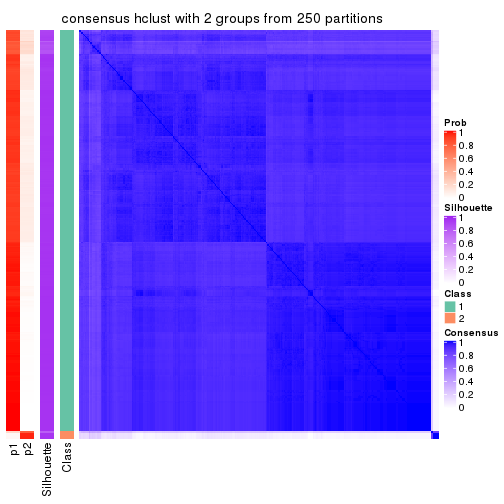</p>

</div>
<div id='tab-SD-hclust-consensus-heatmap-2'>
<pre><code class="r">consensus_heatmap(res, k = 3)
</code></pre>

<p>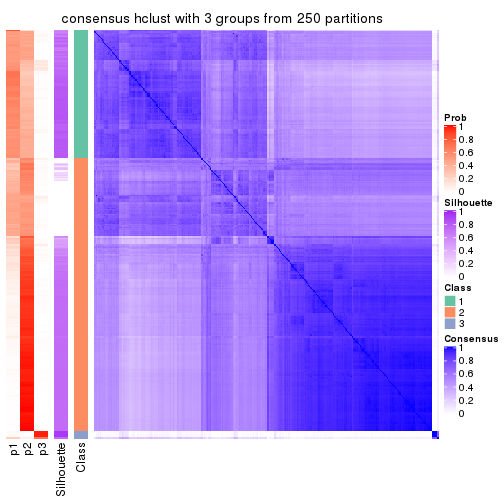</p>

</div>
<div id='tab-SD-hclust-consensus-heatmap-3'>
<pre><code class="r">consensus_heatmap(res, k = 4)
</code></pre>

<p>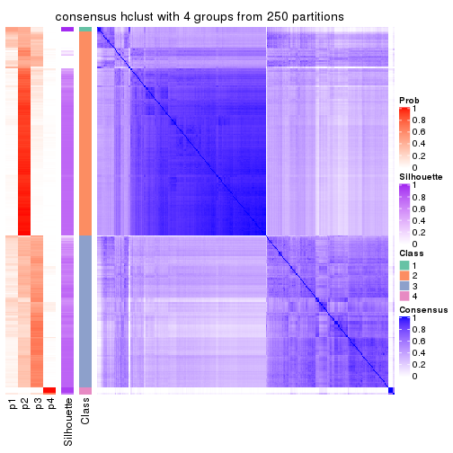</p>

</div>
<div id='tab-SD-hclust-consensus-heatmap-4'>
<pre><code class="r">consensus_heatmap(res, k = 5)
</code></pre>

<p>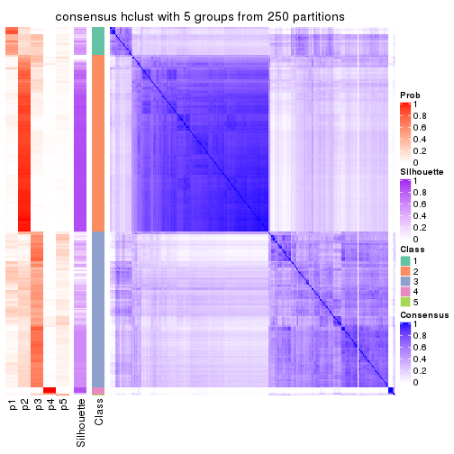</p>

</div>
<div id='tab-SD-hclust-consensus-heatmap-5'>
<pre><code class="r">consensus_heatmap(res, k = 6)
</code></pre>

<p>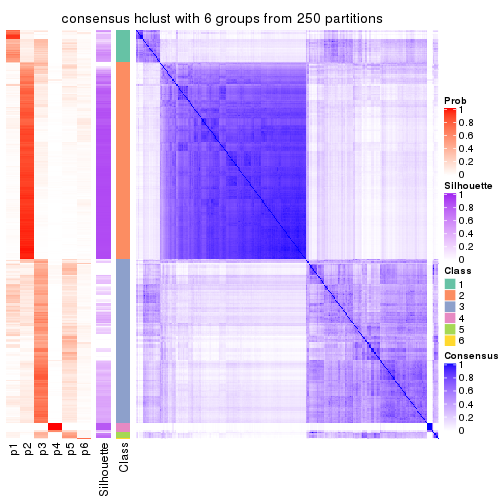</p>

</div>
</div>

Heatmaps for the membership of samples in all partitions to see how consistent they are:


<script>
$( function() {
	$( '#tabs-SD-hclust-membership-heatmap' ).tabs();
} );
</script>
<div id='tabs-SD-hclust-membership-heatmap'>
<ul>
<li><a href='#tab-SD-hclust-membership-heatmap-1'>k = 2</a></li>
<li><a href='#tab-SD-hclust-membership-heatmap-2'>k = 3</a></li>
<li><a href='#tab-SD-hclust-membership-heatmap-3'>k = 4</a></li>
<li><a href='#tab-SD-hclust-membership-heatmap-4'>k = 5</a></li>
<li><a href='#tab-SD-hclust-membership-heatmap-5'>k = 6</a></li>
</ul>
<div id='tab-SD-hclust-membership-heatmap-1'>
<pre><code class="r">membership_heatmap(res, k = 2)
</code></pre>

<p>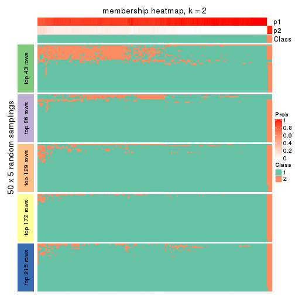</p>

</div>
<div id='tab-SD-hclust-membership-heatmap-2'>
<pre><code class="r">membership_heatmap(res, k = 3)
</code></pre>

<p>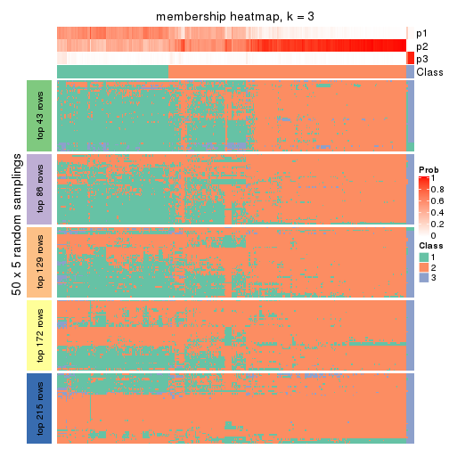</p>

</div>
<div id='tab-SD-hclust-membership-heatmap-3'>
<pre><code class="r">membership_heatmap(res, k = 4)
</code></pre>

<p>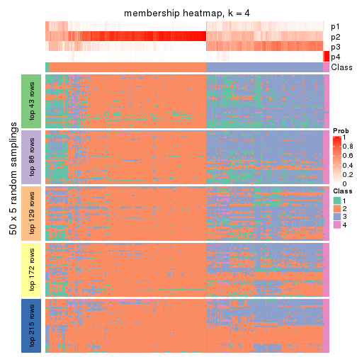</p>

</div>
<div id='tab-SD-hclust-membership-heatmap-4'>
<pre><code class="r">membership_heatmap(res, k = 5)
</code></pre>

<p>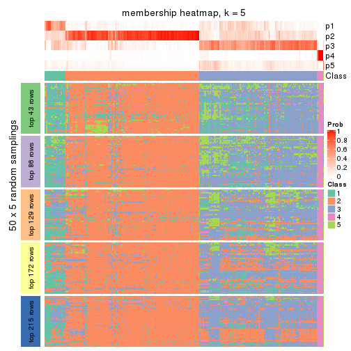</p>

</div>
<div id='tab-SD-hclust-membership-heatmap-5'>
<pre><code class="r">membership_heatmap(res, k = 6)
</code></pre>

<p>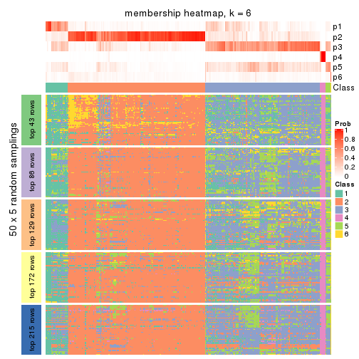</p>

</div>
</div>

As soon as we have had the classes for columns, we can look for signatures
which are significantly different between classes which can be candidate marks
for certain classes. Following are the heatmaps for signatures.


Signature heatmaps where rows are scaled:


<script>
$( function() {
	$( '#tabs-SD-hclust-get-signatures' ).tabs();
} );
</script>
<div id='tabs-SD-hclust-get-signatures'>
<ul>
<li><a href='#tab-SD-hclust-get-signatures-1'>k = 2</a></li>
<li><a href='#tab-SD-hclust-get-signatures-2'>k = 3</a></li>
<li><a href='#tab-SD-hclust-get-signatures-3'>k = 4</a></li>
<li><a href='#tab-SD-hclust-get-signatures-4'>k = 5</a></li>
<li><a href='#tab-SD-hclust-get-signatures-5'>k = 6</a></li>
</ul>
<div id='tab-SD-hclust-get-signatures-1'>
<pre><code class="r">get_signatures(res, k = 2)
</code></pre>

<p>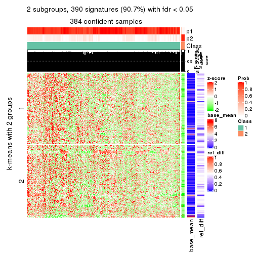</p>

</div>
<div id='tab-SD-hclust-get-signatures-2'>
<pre><code class="r">get_signatures(res, k = 3)
</code></pre>

<p>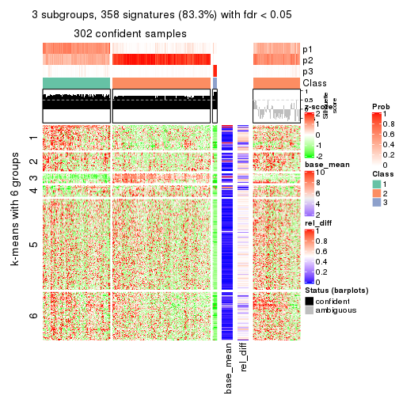</p>

</div>
<div id='tab-SD-hclust-get-signatures-3'>
<pre><code class="r">get_signatures(res, k = 4)
</code></pre>

<p>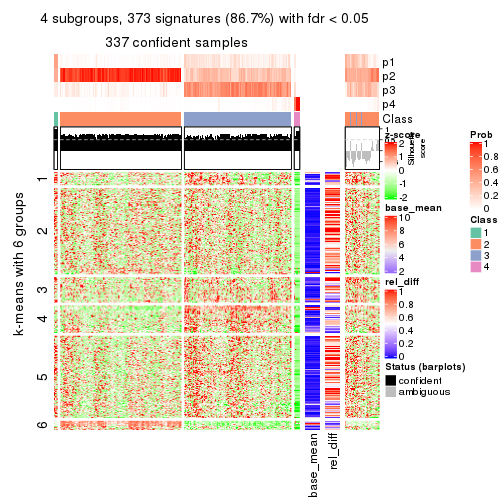</p>

</div>
<div id='tab-SD-hclust-get-signatures-4'>
<pre><code class="r">get_signatures(res, k = 5)
</code></pre>

<p>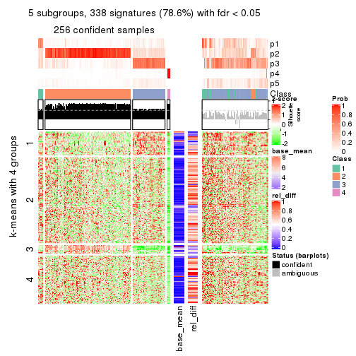</p>

</div>
<div id='tab-SD-hclust-get-signatures-5'>
<pre><code class="r">get_signatures(res, k = 6)
</code></pre>

<p>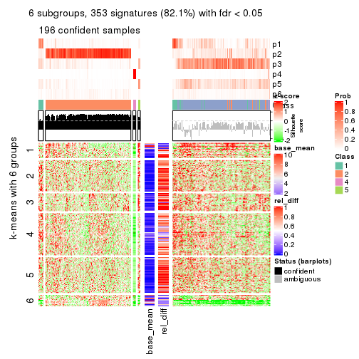</p>

</div>
</div>


Signature heatmaps where rows are not scaled:


<script>
$( function() {
	$( '#tabs-SD-hclust-get-signatures-no-scale' ).tabs();
} );
</script>
<div id='tabs-SD-hclust-get-signatures-no-scale'>
<ul>
<li><a href='#tab-SD-hclust-get-signatures-no-scale-1'>k = 2</a></li>
<li><a href='#tab-SD-hclust-get-signatures-no-scale-2'>k = 3</a></li>
<li><a href='#tab-SD-hclust-get-signatures-no-scale-3'>k = 4</a></li>
<li><a href='#tab-SD-hclust-get-signatures-no-scale-4'>k = 5</a></li>
<li><a href='#tab-SD-hclust-get-signatures-no-scale-5'>k = 6</a></li>
</ul>
<div id='tab-SD-hclust-get-signatures-no-scale-1'>
<pre><code class="r">get_signatures(res, k = 2, scale_rows = FALSE)
</code></pre>

<p>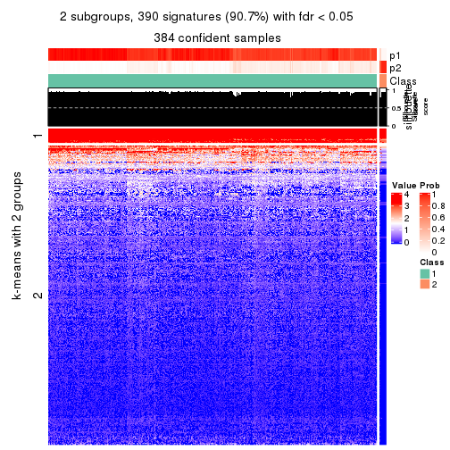</p>

</div>
<div id='tab-SD-hclust-get-signatures-no-scale-2'>
<pre><code class="r">get_signatures(res, k = 3, scale_rows = FALSE)
</code></pre>

<p>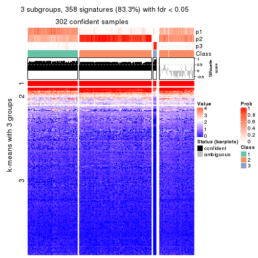</p>

</div>
<div id='tab-SD-hclust-get-signatures-no-scale-3'>
<pre><code class="r">get_signatures(res, k = 4, scale_rows = FALSE)
</code></pre>

<p>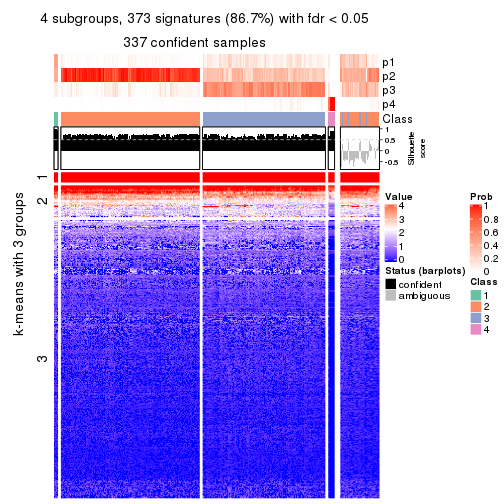</p>

</div>
<div id='tab-SD-hclust-get-signatures-no-scale-4'>
<pre><code class="r">get_signatures(res, k = 5, scale_rows = FALSE)
</code></pre>

<p>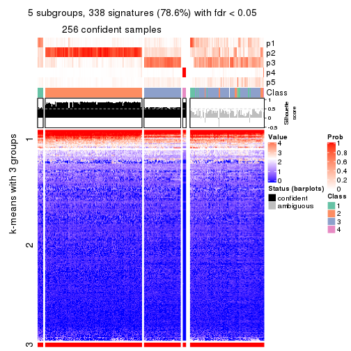</p>

</div>
<div id='tab-SD-hclust-get-signatures-no-scale-5'>
<pre><code class="r">get_signatures(res, k = 6, scale_rows = FALSE)
</code></pre>

<p>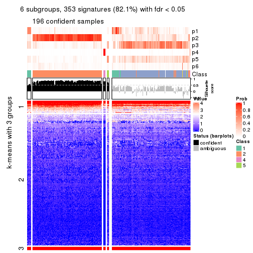</p>

</div>
</div>


Compare the overlap of signatures from different k:

```r
compare_signatures(res)
```

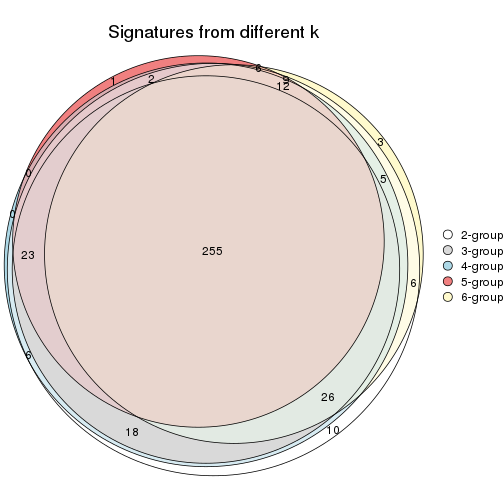

`get_signature()` returns a data frame invisibly. TO get the list of signatures, the function
call should be assigned to a variable explicitly. In following code, if `plot` argument is set
to `FALSE`, no heatmap is plotted while only the differential analysis is performed.

```r
# code only for demonstration
tb = get_signature(res, k = ..., plot = FALSE)
```

An example of the output of `tb` is:

```
#>   which_row         fdr    mean_1    mean_2 scaled_mean_1 scaled_mean_2 km
#> 1        38 0.042760348  8.373488  9.131774    -0.5533452     0.5164555  1
#> 2        40 0.018707592  7.106213  8.469186    -0.6173731     0.5762149  1
#> 3        55 0.019134737 10.221463 11.207825    -0.6159697     0.5749050  1
#> 4        59 0.006059896  5.921854  7.869574    -0.6899429     0.6439467  1
#> 5        60 0.018055526  8.928898 10.211722    -0.6204761     0.5791110  1
#> 6        98 0.009384629 15.714769 14.887706     0.6635654    -0.6193277  2
...
```

The columns in `tb` are:

1. `which_row`: row indices corresponding to the input matrix.
2. `fdr`: FDR for the differential test. 
3. `mean_x`: The mean value in group x.
4. `scaled_mean_x`: The mean value in group x after rows are scaled.
5. `km`: Row groups if k-means clustering is applied to rows.


UMAP plot which shows how samples are separated.


<script>
$( function() {
	$( '#tabs-SD-hclust-dimension-reduction' ).tabs();
} );
</script>
<div id='tabs-SD-hclust-dimension-reduction'>
<ul>
<li><a href='#tab-SD-hclust-dimension-reduction-1'>k = 2</a></li>
<li><a href='#tab-SD-hclust-dimension-reduction-2'>k = 3</a></li>
<li><a href='#tab-SD-hclust-dimension-reduction-3'>k = 4</a></li>
<li><a href='#tab-SD-hclust-dimension-reduction-4'>k = 5</a></li>
<li><a href='#tab-SD-hclust-dimension-reduction-5'>k = 6</a></li>
</ul>
<div id='tab-SD-hclust-dimension-reduction-1'>
<pre><code class="r">dimension_reduction(res, k = 2, method = &quot;UMAP&quot;)
</code></pre>

<p>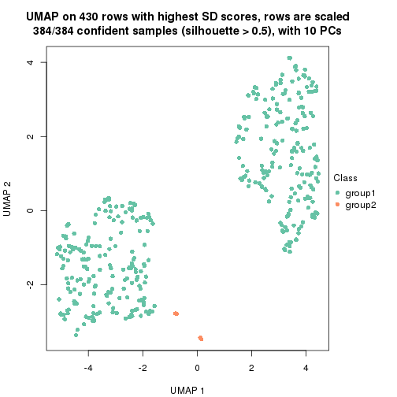</p>

</div>
<div id='tab-SD-hclust-dimension-reduction-2'>
<pre><code class="r">dimension_reduction(res, k = 3, method = &quot;UMAP&quot;)
</code></pre>

<p>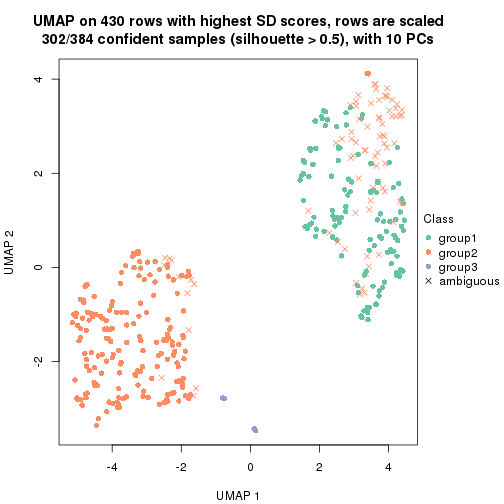</p>

</div>
<div id='tab-SD-hclust-dimension-reduction-3'>
<pre><code class="r">dimension_reduction(res, k = 4, method = &quot;UMAP&quot;)
</code></pre>

<p>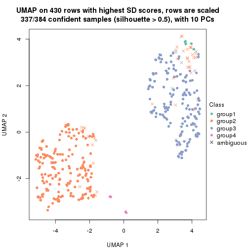</p>

</div>
<div id='tab-SD-hclust-dimension-reduction-4'>
<pre><code class="r">dimension_reduction(res, k = 5, method = &quot;UMAP&quot;)
</code></pre>

<p>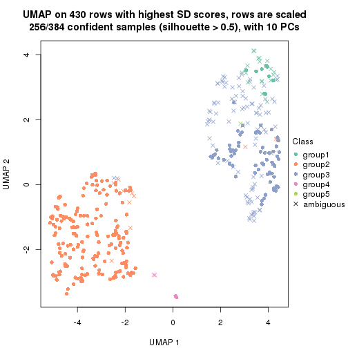</p>

</div>
<div id='tab-SD-hclust-dimension-reduction-5'>
<pre><code class="r">dimension_reduction(res, k = 6, method = &quot;UMAP&quot;)
</code></pre>

<p>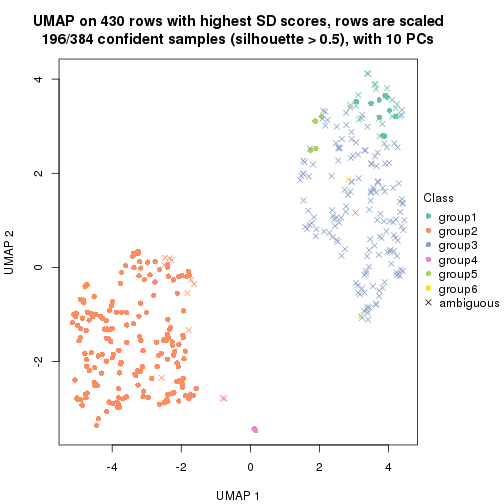</p>

</div>
</div>


Following heatmap shows how subgroups are split when increasing `k`:

```r
collect_classes(res)
```

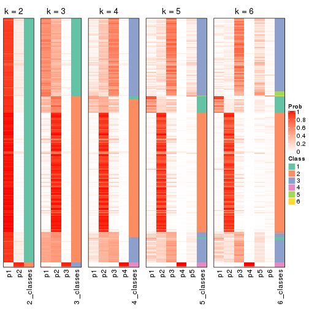


If matrix rows can be associated to genes, consider to use `GO_Enrichment(res,
...)` to perform function enrichment for the signature genes.


 

---------------------------------------------------


### SD:kmeans*


The object with results only for a single top-value method and a single partition method 
can be extracted as:

```r
res = res_list["SD", "kmeans"]
# you can also extract it by
# res = res_list["SD:kmeans"]
```

A summary of `res` and all the functions that can be applied to it:

```r
res
```

```
#> A 'ConsensusPartition' object with k = 2, 3, 4, 5, 6.
#>   On a matrix with 430 rows and 384 columns.
#>   Top rows (43, 86, 129, 172, 215) are extracted by 'SD' method.
#>   Subgroups are detected by 'kmeans' method.
#>   Performed in total 1250 partitions by row resampling.
#>   Best k for subgroups seems to be 2.
#> 
#> Following methods can be applied to this 'ConsensusPartition' object:
#>  [1] "cola_report"             "collect_classes"         "collect_plots"          
#>  [4] "collect_stats"           "colnames"                "compare_signatures"     
#>  [7] "consensus_heatmap"       "dimension_reduction"     "functional_enrichment"  
#> [10] "get_anno_col"            "get_anno"                "get_classes"            
#> [13] "get_consensus"           "get_matrix"              "get_membership"         
#> [16] "get_param"               "get_signatures"          "get_stats"              
#> [19] "is_best_k"               "is_stable_k"             "membership_heatmap"     
#> [22] "ncol"                    "nrow"                    "plot_ecdf"              
#> [25] "rownames"                "select_partition_number" "show"                   
#> [28] "suggest_best_k"          "test_to_known_factors"
```

`collect_plots()` function collects all the plots made from `res` for all `k` (number of partitions)
into one single page to provide an easy and fast comparison between different `k`.

```r
collect_plots(res)
```

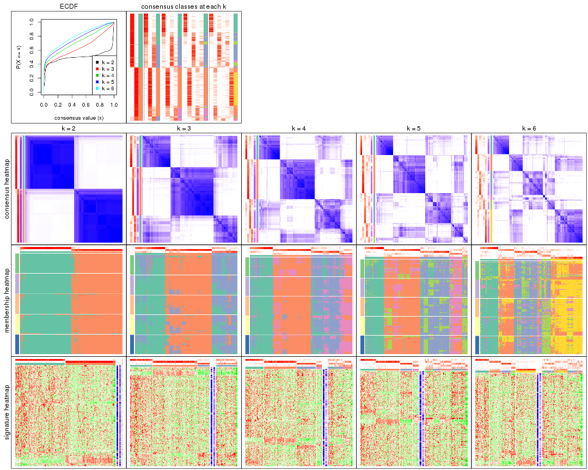

The plots are:

- The first row: a plot of the ECDF (Empirical cumulative distribution
  function) curves of the consensus matrix for each `k` and the heatmap of
  predicted classes for each `k`.
- The second row: heatmaps of the consensus matrix for each `k`.
- The third row: heatmaps of the membership matrix for each `k`.
- The fouth row: heatmaps of the signatures for each `k`.

All the plots in panels can be made by individual functions and they are
plotted later in this section.

`select_partition_number()` produces several plots showing different
statistics for choosing "optimized" `k`. There are following statistics:

- ECDF curves of the consensus matrix for each `k`;
- 1-PAC. [The PAC
  score](https://en.wikipedia.org/wiki/Consensus_clustering#Over-interpretation_potential_of_consensus_clustering)
  measures the proportion of the ambiguous subgrouping.
- Mean silhouette score.
- Concordance. The mean probability of fiting the consensus class ids in all
  partitions.
- Area increased. Denote $A_k$ as the area under the ECDF curve for current
  `k`, the area increased is defined as $A_k - A_{k-1}$.
- Rand index. The percent of pairs of samples that are both in a same cluster
  or both are not in a same cluster in the partition of k and k-1.
- Jaccard index. The ratio of pairs of samples are both in a same cluster in
  the partition of k and k-1 and the pairs of samples are both in a same
  cluster in the partition k or k-1.

The detailed explanations of these statistics can be found in [the cola
vignette](http://bioconductor.org/packages/devel/bioc/vignettes/cola/inst/doc/cola.html#toc_13).

Generally speaking, lower PAC score, higher mean silhouette score or higher
concordance corresponds to better partition. Rand index and Jaccard index
measure how similar the current partition is compared to partition with `k-1`.
If they are too similar, we won't accept `k` is better than `k-1`.

```r
select_partition_number(res)
```

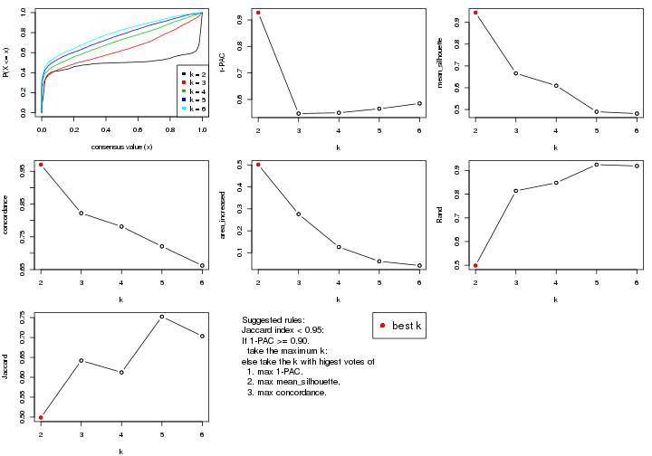

The numeric values for all these statistics can be obtained by `get_stats()`.

```r
get_stats(res)
```

```
#>   k 1-PAC mean_silhouette concordance area_increased  Rand Jaccard
#> 2 2 0.927           0.944       0.970         0.5013 0.499   0.499
#> 3 3 0.547           0.666       0.822         0.2759 0.814   0.642
#> 4 4 0.550           0.609       0.781         0.1262 0.848   0.612
#> 5 5 0.565           0.490       0.721         0.0613 0.925   0.753
#> 6 6 0.585           0.482       0.662         0.0419 0.919   0.703
```

`suggest_best_k()` suggests the best $k$ based on these statistics. The rules are as follows:

- All $k$ with Jaccard index larger than 0.95 are removed because the increase of
  the partition number does not provides enough extra information. If all $k$ are removed,
  the best $k$ is assigned by `NA`.
- For $k$ with 1-PAC larger than 0.9, the maximal $k$ is taken as the "best k". Other $k$ is called "optional k".
- If it does not fit the second rule. The $k$ with the highest vote of highest
  1-PAC, mean silhouette and concordance is taken as the "best k".

```r
suggest_best_k(res)
```

```
#> [1] 2
```


Following shows the table of the partitions (You need to click the **show/hide
code output** link to see it). The membership matrix (columns with name `p*`)
is inferred by
[`clue::cl_consensus()`](https://www.rdocumentation.org/link/cl_consensus?package=clue)
function with the `SE` method. Basically the value in the membership matrix
represents the probability to belong to a certain group. The finall class
label for an item is determined with the group with highest probability it
belongs to.

In `get_classes()` function, the entropy is calculated from the membership
matrix and the silhouette score is calculated from the consensus matrix.


<script>
$( function() {
	$( '#tabs-SD-kmeans-get-classes' ).tabs();
} );
</script>
<div id='tabs-SD-kmeans-get-classes'>
<ul>
<li><a href='#tab-SD-kmeans-get-classes-1'>k = 2</a></li>
<li><a href='#tab-SD-kmeans-get-classes-2'>k = 3</a></li>
<li><a href='#tab-SD-kmeans-get-classes-3'>k = 4</a></li>
<li><a href='#tab-SD-kmeans-get-classes-4'>k = 5</a></li>
<li><a href='#tab-SD-kmeans-get-classes-5'>k = 6</a></li>
</ul>

<div id='tab-SD-kmeans-get-classes-1'>
<p><a id='tab-SD-kmeans-get-classes-1-a' style='color:#0366d6' href='#'>show/hide code output</a></p>
<pre><code class="r">cbind(get_classes(res, k = 2), get_membership(res, k = 2))
</code></pre>

<pre><code>#&gt;            class entropy silhouette    p1    p2
#&gt; SRR2105277     1  0.0376      0.971 0.996 0.004
#&gt; SRR2105278     1  0.0376      0.971 0.996 0.004
#&gt; SRR2105275     1  0.0938      0.968 0.988 0.012
#&gt; SRR2105276     1  0.0672      0.970 0.992 0.008
#&gt; SRR2105273     1  0.0376      0.971 0.996 0.004
#&gt; SRR2105274     1  0.0000      0.972 1.000 0.000
#&gt; SRR2105271     1  0.0000      0.972 1.000 0.000
#&gt; SRR2105272     1  0.1184      0.971 0.984 0.016
#&gt; SRR2105269     2  0.1184      0.964 0.016 0.984
#&gt; SRR2105270     2  0.0938      0.966 0.012 0.988
#&gt; SRR2105267     2  0.0938      0.966 0.012 0.988
#&gt; SRR2105268     2  0.0000      0.968 0.000 1.000
#&gt; SRR2105265     2  0.0000      0.968 0.000 1.000
#&gt; SRR2105266     2  0.0376      0.968 0.004 0.996
#&gt; SRR2105263     2  0.0000      0.968 0.000 1.000
#&gt; SRR2105264     2  0.0376      0.968 0.004 0.996
#&gt; SRR2105261     1  0.9963      0.119 0.536 0.464
#&gt; SRR2105262     1  0.6247      0.820 0.844 0.156
#&gt; SRR2105357     1  0.0938      0.969 0.988 0.012
#&gt; SRR2105358     1  0.0376      0.971 0.996 0.004
#&gt; SRR2105439     2  0.2043      0.954 0.032 0.968
#&gt; SRR2105440     2  0.2043      0.954 0.032 0.968
#&gt; SRR2105509     2  0.1184      0.964 0.016 0.984
#&gt; SRR2105510     2  0.1184      0.964 0.016 0.984
#&gt; SRR2105507     1  0.0376      0.971 0.996 0.004
#&gt; SRR2105508     1  0.0376      0.971 0.996 0.004
#&gt; SRR2105505     1  0.1184      0.971 0.984 0.016
#&gt; SRR2105506     1  0.1184      0.971 0.984 0.016
#&gt; SRR2105503     2  0.0000      0.968 0.000 1.000
#&gt; SRR2105504     2  0.5629      0.861 0.132 0.868
#&gt; SRR2105501     2  0.1414      0.964 0.020 0.980
#&gt; SRR2105502     2  0.3274      0.935 0.060 0.940
#&gt; SRR2105499     1  0.0000      0.972 1.000 0.000
#&gt; SRR2105500     1  0.0376      0.972 0.996 0.004
#&gt; SRR2105497     2  0.0376      0.968 0.004 0.996
#&gt; SRR2105498     2  0.0672      0.967 0.008 0.992
#&gt; SRR2105495     2  0.0376      0.968 0.004 0.996
#&gt; SRR2105496     2  0.0672      0.968 0.008 0.992
#&gt; SRR2105493     2  0.1414      0.965 0.020 0.980
#&gt; SRR2105494     2  0.1414      0.963 0.020 0.980
#&gt; SRR2105491     2  0.0000      0.968 0.000 1.000
#&gt; SRR2105492     2  0.0000      0.968 0.000 1.000
#&gt; SRR2105489     2  0.0376      0.968 0.004 0.996
#&gt; SRR2105490     2  0.0376      0.968 0.004 0.996
#&gt; SRR2105487     1  0.0000      0.972 1.000 0.000
#&gt; SRR2105488     1  0.0938      0.971 0.988 0.012
#&gt; SRR2105485     1  0.0000      0.972 1.000 0.000
#&gt; SRR2105486     1  0.0000      0.972 1.000 0.000
#&gt; SRR2105483     1  0.1184      0.971 0.984 0.016
#&gt; SRR2105484     1  0.1184      0.971 0.984 0.016
#&gt; SRR2105481     1  0.0000      0.972 1.000 0.000
#&gt; SRR2105482     1  0.1184      0.971 0.984 0.016
#&gt; SRR2105479     1  0.0672      0.972 0.992 0.008
#&gt; SRR2105480     1  0.0672      0.972 0.992 0.008
#&gt; SRR2105477     2  0.0672      0.968 0.008 0.992
#&gt; SRR2105478     2  0.0376      0.968 0.004 0.996
#&gt; SRR2105475     2  0.1184      0.964 0.016 0.984
#&gt; SRR2105476     2  0.1184      0.964 0.016 0.984
#&gt; SRR2105473     2  0.3879      0.915 0.076 0.924
#&gt; SRR2105474     2  0.2423      0.948 0.040 0.960
#&gt; SRR2105471     2  0.0376      0.968 0.004 0.996
#&gt; SRR2105472     2  0.0376      0.968 0.004 0.996
#&gt; SRR2105469     1  0.0376      0.971 0.996 0.004
#&gt; SRR2105470     1  0.0000      0.972 1.000 0.000
#&gt; SRR2105467     1  0.0376      0.972 0.996 0.004
#&gt; SRR2105468     1  0.1184      0.971 0.984 0.016
#&gt; SRR2105465     1  0.1414      0.969 0.980 0.020
#&gt; SRR2105466     1  0.1184      0.971 0.984 0.016
#&gt; SRR2105463     1  0.1184      0.971 0.984 0.016
#&gt; SRR2105464     1  0.1184      0.971 0.984 0.016
#&gt; SRR2105461     2  0.0000      0.968 0.000 1.000
#&gt; SRR2105462     2  0.0376      0.968 0.004 0.996
#&gt; SRR2105459     2  0.1184      0.964 0.016 0.984
#&gt; SRR2105460     2  0.1184      0.964 0.016 0.984
#&gt; SRR2105457     1  0.0672      0.970 0.992 0.008
#&gt; SRR2105458     1  0.1184      0.967 0.984 0.016
#&gt; SRR2105455     1  0.0938      0.971 0.988 0.012
#&gt; SRR2105456     1  0.0938      0.971 0.988 0.012
#&gt; SRR2105453     1  0.1184      0.971 0.984 0.016
#&gt; SRR2105454     1  0.1184      0.971 0.984 0.016
#&gt; SRR2105451     2  0.2236      0.955 0.036 0.964
#&gt; SRR2105452     2  0.7139      0.780 0.196 0.804
#&gt; SRR2105449     1  0.0938      0.971 0.988 0.012
#&gt; SRR2105450     1  0.1184      0.971 0.984 0.016
#&gt; SRR2105447     2  0.1184      0.964 0.016 0.984
#&gt; SRR2105448     2  0.0376      0.968 0.004 0.996
#&gt; SRR2105445     1  0.9795      0.273 0.584 0.416
#&gt; SRR2105446     1  0.0376      0.971 0.996 0.004
#&gt; SRR2105443     2  0.6973      0.791 0.188 0.812
#&gt; SRR2105444     2  0.7815      0.726 0.232 0.768
#&gt; SRR2105441     2  0.0938      0.966 0.012 0.988
#&gt; SRR2105442     2  0.0672      0.967 0.008 0.992
#&gt; SRR2105437     1  0.0376      0.971 0.996 0.004
#&gt; SRR2105438     1  0.0376      0.971 0.996 0.004
#&gt; SRR2105435     1  0.0376      0.971 0.996 0.004
#&gt; SRR2105436     1  0.0376      0.971 0.996 0.004
#&gt; SRR2105433     1  0.1184      0.971 0.984 0.016
#&gt; SRR2105434     1  0.1184      0.971 0.984 0.016
#&gt; SRR2105431     1  0.1184      0.971 0.984 0.016
#&gt; SRR2105432     1  0.1184      0.971 0.984 0.016
#&gt; SRR2105429     2  0.5737      0.857 0.136 0.864
#&gt; SRR2105430     2  0.2423      0.951 0.040 0.960
#&gt; SRR2105427     2  0.1184      0.964 0.016 0.984
#&gt; SRR2105428     2  0.1184      0.964 0.016 0.984
#&gt; SRR2105425     2  0.0376      0.968 0.004 0.996
#&gt; SRR2105426     2  0.0376      0.968 0.004 0.996
#&gt; SRR2105421     1  0.5737      0.845 0.864 0.136
#&gt; SRR2105422     1  0.1633      0.961 0.976 0.024
#&gt; SRR2105423     2  0.0376      0.968 0.004 0.996
#&gt; SRR2105424     2  0.0376      0.968 0.004 0.996
#&gt; SRR2105419     1  0.0376      0.971 0.996 0.004
#&gt; SRR2105420     1  0.0376      0.971 0.996 0.004
#&gt; SRR2105415     1  0.1184      0.971 0.984 0.016
#&gt; SRR2105416     1  0.1184      0.971 0.984 0.016
#&gt; SRR2105417     1  0.1184      0.971 0.984 0.016
#&gt; SRR2105418     1  0.1184      0.971 0.984 0.016
#&gt; SRR2105413     2  0.1184      0.964 0.016 0.984
#&gt; SRR2105414     2  0.1184      0.964 0.016 0.984
#&gt; SRR2105409     2  0.0000      0.968 0.000 1.000
#&gt; SRR2105410     2  0.0672      0.967 0.008 0.992
#&gt; SRR2105411     2  0.0000      0.968 0.000 1.000
#&gt; SRR2105412     2  0.0376      0.968 0.004 0.996
#&gt; SRR2105407     1  0.0376      0.971 0.996 0.004
#&gt; SRR2105408     1  0.1184      0.967 0.984 0.016
#&gt; SRR2105403     1  0.0376      0.971 0.996 0.004
#&gt; SRR2105404     1  0.0376      0.971 0.996 0.004
#&gt; SRR2105405     1  0.1184      0.971 0.984 0.016
#&gt; SRR2105406     1  0.1184      0.971 0.984 0.016
#&gt; SRR2105401     2  0.1184      0.964 0.016 0.984
#&gt; SRR2105402     2  0.7139      0.780 0.196 0.804
#&gt; SRR2105399     2  0.6887      0.796 0.184 0.816
#&gt; SRR2105400     2  0.5946      0.847 0.144 0.856
#&gt; SRR2105397     2  0.7453      0.756 0.212 0.788
#&gt; SRR2105398     2  0.7950      0.712 0.240 0.760
#&gt; SRR2105395     2  0.0376      0.968 0.004 0.996
#&gt; SRR2105396     2  0.0672      0.967 0.008 0.992
#&gt; SRR2105393     2  0.0376      0.968 0.004 0.996
#&gt; SRR2105394     2  0.0376      0.968 0.004 0.996
#&gt; SRR2105389     1  0.0672      0.970 0.992 0.008
#&gt; SRR2105390     1  0.0376      0.971 0.996 0.004
#&gt; SRR2105391     1  0.0672      0.970 0.992 0.008
#&gt; SRR2105392     1  0.0376      0.971 0.996 0.004
#&gt; SRR2105385     1  0.0000      0.972 1.000 0.000
#&gt; SRR2105386     1  0.0000      0.972 1.000 0.000
#&gt; SRR2105387     1  0.1184      0.971 0.984 0.016
#&gt; SRR2105388     1  0.1184      0.971 0.984 0.016
#&gt; SRR2105381     2  0.1414      0.963 0.020 0.980
#&gt; SRR2105382     2  0.1414      0.963 0.020 0.980
#&gt; SRR2105383     2  0.0672      0.967 0.008 0.992
#&gt; SRR2105384     2  0.0938      0.966 0.012 0.988
#&gt; SRR2105379     2  0.0938      0.966 0.012 0.988
#&gt; SRR2105380     2  0.1414      0.960 0.020 0.980
#&gt; SRR2105377     2  0.0672      0.967 0.008 0.992
#&gt; SRR2105378     2  0.1414      0.962 0.020 0.980
#&gt; SRR2105375     1  0.1414      0.969 0.980 0.020
#&gt; SRR2105376     1  0.1184      0.971 0.984 0.016
#&gt; SRR2105373     1  0.0376      0.971 0.996 0.004
#&gt; SRR2105374     1  0.0376      0.971 0.996 0.004
#&gt; SRR2105371     1  0.0672      0.970 0.992 0.008
#&gt; SRR2105372     1  0.0376      0.971 0.996 0.004
#&gt; SRR2105369     1  0.0376      0.971 0.996 0.004
#&gt; SRR2105370     1  0.0000      0.972 1.000 0.000
#&gt; SRR2105367     1  0.1184      0.971 0.984 0.016
#&gt; SRR2105368     1  0.1184      0.971 0.984 0.016
#&gt; SRR2105365     2  0.0000      0.968 0.000 1.000
#&gt; SRR2105366     2  0.0000      0.968 0.000 1.000
#&gt; SRR2105363     2  0.0000      0.968 0.000 1.000
#&gt; SRR2105364     2  0.0376      0.968 0.004 0.996
#&gt; SRR2105361     2  0.0000      0.968 0.000 1.000
#&gt; SRR2105362     2  0.0000      0.968 0.000 1.000
#&gt; SRR2105359     1  0.0376      0.971 0.996 0.004
#&gt; SRR2105360     1  0.0376      0.971 0.996 0.004
#&gt; SRR2105355     1  0.0376      0.971 0.996 0.004
#&gt; SRR2105356     1  0.0000      0.972 1.000 0.000
#&gt; SRR2105353     1  0.0938      0.968 0.988 0.012
#&gt; SRR2105354     1  0.0376      0.971 0.996 0.004
#&gt; SRR2105351     2  0.0000      0.968 0.000 1.000
#&gt; SRR2105352     2  0.7139      0.780 0.196 0.804
#&gt; SRR2105349     2  0.1184      0.964 0.016 0.984
#&gt; SRR2105350     2  0.0000      0.968 0.000 1.000
#&gt; SRR2105345     2  0.0672      0.967 0.008 0.992
#&gt; SRR2105346     2  0.0672      0.967 0.008 0.992
#&gt; SRR2105347     2  0.2043      0.954 0.032 0.968
#&gt; SRR2105348     2  0.2423      0.948 0.040 0.960
#&gt; SRR2105343     2  0.0000      0.968 0.000 1.000
#&gt; SRR2105344     2  0.0000      0.968 0.000 1.000
#&gt; SRR2105341     1  0.0376      0.971 0.996 0.004
#&gt; SRR2105342     1  0.0376      0.971 0.996 0.004
#&gt; SRR2105339     1  0.0938      0.968 0.988 0.012
#&gt; SRR2105340     1  0.0672      0.970 0.992 0.008
#&gt; SRR2105335     1  0.0000      0.972 1.000 0.000
#&gt; SRR2105336     1  0.0376      0.972 0.996 0.004
#&gt; SRR2105337     1  0.0000      0.972 1.000 0.000
#&gt; SRR2105338     1  0.0938      0.971 0.988 0.012
#&gt; SRR2105331     2  0.0376      0.968 0.004 0.996
#&gt; SRR2105332     2  0.0000      0.968 0.000 1.000
#&gt; SRR2105333     2  0.1184      0.964 0.016 0.984
#&gt; SRR2105334     2  0.0938      0.966 0.012 0.988
#&gt; SRR2105329     2  0.3733      0.926 0.072 0.928
#&gt; SRR2105330     2  0.2043      0.959 0.032 0.968
#&gt; SRR2105327     2  0.1184      0.964 0.016 0.984
#&gt; SRR2105328     2  0.1184      0.964 0.016 0.984
#&gt; SRR2105325     1  0.0672      0.970 0.992 0.008
#&gt; SRR2105326     1  0.0672      0.970 0.992 0.008
#&gt; SRR2105323     1  0.0376      0.971 0.996 0.004
#&gt; SRR2105324     1  0.0000      0.972 1.000 0.000
#&gt; SRR2105319     1  0.0000      0.972 1.000 0.000
#&gt; SRR2105320     1  0.0000      0.972 1.000 0.000
#&gt; SRR2105321     1  0.0672      0.970 0.992 0.008
#&gt; SRR2105322     1  0.0672      0.970 0.992 0.008
#&gt; SRR2105317     2  0.1184      0.964 0.016 0.984
#&gt; SRR2105318     2  0.0672      0.967 0.008 0.992
#&gt; SRR2105315     2  0.6531      0.816 0.168 0.832
#&gt; SRR2105316     2  0.1184      0.964 0.016 0.984
#&gt; SRR2105313     2  0.0938      0.966 0.012 0.988
#&gt; SRR2105314     2  0.0000      0.968 0.000 1.000
#&gt; SRR2105311     1  0.4562      0.893 0.904 0.096
#&gt; SRR2105312     1  0.7219      0.758 0.800 0.200
#&gt; SRR2105307     1  0.1184      0.971 0.984 0.016
#&gt; SRR2105308     1  0.1414      0.969 0.980 0.020
#&gt; SRR2105309     1  0.0672      0.970 0.992 0.008
#&gt; SRR2105310     1  0.0376      0.971 0.996 0.004
#&gt; SRR2105305     1  0.0672      0.970 0.992 0.008
#&gt; SRR2105306     1  0.0376      0.971 0.996 0.004
#&gt; SRR2105303     2  0.0000      0.968 0.000 1.000
#&gt; SRR2105304     2  0.2778      0.945 0.048 0.952
#&gt; SRR2105301     2  0.1184      0.964 0.016 0.984
#&gt; SRR2105302     2  0.0938      0.966 0.012 0.988
#&gt; SRR2105299     1  0.9000      0.537 0.684 0.316
#&gt; SRR2105300     2  0.8499      0.653 0.276 0.724
#&gt; SRR2105297     2  0.8713      0.605 0.292 0.708
#&gt; SRR2105298     2  0.7950      0.701 0.240 0.760
#&gt; SRR2105295     2  0.1184      0.964 0.016 0.984
#&gt; SRR2105296     2  0.0938      0.966 0.012 0.988
#&gt; SRR2105293     1  0.1184      0.967 0.984 0.016
#&gt; SRR2105294     1  0.0000      0.972 1.000 0.000
#&gt; SRR2105291     1  0.1184      0.971 0.984 0.016
#&gt; SRR2105292     1  0.1184      0.971 0.984 0.016
#&gt; SRR2105289     1  0.0672      0.970 0.992 0.008
#&gt; SRR2105290     1  0.1184      0.971 0.984 0.016
#&gt; SRR2105287     1  0.1184      0.971 0.984 0.016
#&gt; SRR2105288     1  0.1184      0.971 0.984 0.016
#&gt; SRR2105285     2  0.1184      0.964 0.016 0.984
#&gt; SRR2105286     2  0.0672      0.967 0.008 0.992
#&gt; SRR2105283     2  0.1184      0.966 0.016 0.984
#&gt; SRR2105284     2  0.2603      0.946 0.044 0.956
#&gt; SRR2105281     2  0.0376      0.968 0.004 0.996
#&gt; SRR2105282     2  0.0376      0.968 0.004 0.996
#&gt; SRR2105259     1  0.0672      0.970 0.992 0.008
#&gt; SRR2105260     1  0.1414      0.964 0.980 0.020
#&gt; SRR2105279     2  0.0376      0.968 0.004 0.996
#&gt; SRR2105280     2  0.0376      0.968 0.004 0.996
#&gt; SRR2105257     1  0.1184      0.971 0.984 0.016
#&gt; SRR2105258     1  0.1184      0.971 0.984 0.016
#&gt; SRR2105253     2  0.0672      0.967 0.008 0.992
#&gt; SRR2105254     2  0.0000      0.968 0.000 1.000
#&gt; SRR2105255     1  0.0000      0.972 1.000 0.000
#&gt; SRR2105256     1  0.0000      0.972 1.000 0.000
#&gt; SRR2105251     2  0.0000      0.968 0.000 1.000
#&gt; SRR2105252     2  0.0000      0.968 0.000 1.000
#&gt; SRR2105249     2  0.0938      0.966 0.012 0.988
#&gt; SRR2105250     2  0.2603      0.945 0.044 0.956
#&gt; SRR2105247     2  0.0376      0.968 0.004 0.996
#&gt; SRR2105248     2  0.0376      0.968 0.004 0.996
#&gt; SRR2105245     1  0.7056      0.774 0.808 0.192
#&gt; SRR2105246     1  0.9522      0.433 0.628 0.372
#&gt; SRR2105243     1  0.0672      0.972 0.992 0.008
#&gt; SRR2105244     1  0.0376      0.972 0.996 0.004
#&gt; SRR2105241     1  0.0938      0.971 0.988 0.012
#&gt; SRR2105242     1  0.1184      0.971 0.984 0.016
#&gt; SRR2105239     1  0.0672      0.972 0.992 0.008
#&gt; SRR2105240     1  0.1184      0.971 0.984 0.016
#&gt; SRR2105237     2  0.1184      0.964 0.016 0.984
#&gt; SRR2105238     2  0.1184      0.964 0.016 0.984
#&gt; SRR2105235     2  0.0376      0.968 0.004 0.996
#&gt; SRR2105236     2  0.0672      0.967 0.008 0.992
#&gt; SRR2105233     2  0.1184      0.964 0.016 0.984
#&gt; SRR2105234     2  0.1184      0.964 0.016 0.984
#&gt; SRR2105231     2  0.0376      0.968 0.004 0.996
#&gt; SRR2105232     2  0.0376      0.968 0.004 0.996
#&gt; SRR2105227     1  0.2043      0.959 0.968 0.032
#&gt; SRR2105228     1  0.1633      0.967 0.976 0.024
#&gt; SRR2105225     1  0.0000      0.972 1.000 0.000
#&gt; SRR2105226     1  0.0938      0.971 0.988 0.012
#&gt; SRR2105229     1  0.5178      0.870 0.884 0.116
#&gt; SRR2105230     1  0.0376      0.971 0.996 0.004
#&gt; SRR2105219     2  0.0672      0.967 0.008 0.992
#&gt; SRR2105220     2  0.0000      0.968 0.000 1.000
#&gt; SRR2105221     2  0.1414      0.962 0.020 0.980
#&gt; SRR2105222     2  0.2043      0.954 0.032 0.968
#&gt; SRR2105223     1  0.0000      0.972 1.000 0.000
#&gt; SRR2105224     1  0.0376      0.972 0.996 0.004
#&gt; SRR2105217     2  0.0376      0.968 0.004 0.996
#&gt; SRR2105218     2  0.0376      0.968 0.004 0.996
#&gt; SRR2105215     2  0.0376      0.968 0.004 0.996
#&gt; SRR2105216     2  0.0376      0.968 0.004 0.996
#&gt; SRR2105213     1  0.4022      0.917 0.920 0.080
#&gt; SRR2105214     1  0.7883      0.704 0.764 0.236
#&gt; SRR2105211     1  0.1184      0.967 0.984 0.016
#&gt; SRR2105212     1  0.0000      0.972 1.000 0.000
#&gt; SRR2105209     1  0.0938      0.971 0.988 0.012
#&gt; SRR2105210     1  0.1184      0.971 0.984 0.016
#&gt; SRR2105207     1  0.1184      0.971 0.984 0.016
#&gt; SRR2105208     1  0.1184      0.971 0.984 0.016
#&gt; SRR2105205     2  0.0938      0.966 0.012 0.988
#&gt; SRR2105206     2  0.0672      0.967 0.008 0.992
#&gt; SRR2105201     2  0.1184      0.964 0.016 0.984
#&gt; SRR2105202     2  0.2236      0.951 0.036 0.964
#&gt; SRR2105203     2  0.0000      0.968 0.000 1.000
#&gt; SRR2105204     2  0.0376      0.968 0.004 0.996
#&gt; SRR2105199     2  0.0376      0.968 0.004 0.996
#&gt; SRR2105200     2  0.0672      0.967 0.008 0.992
#&gt; SRR2105197     1  0.0376      0.971 0.996 0.004
#&gt; SRR2105198     1  0.2778      0.940 0.952 0.048
#&gt; SRR2105195     1  0.0672      0.972 0.992 0.008
#&gt; SRR2105196     1  0.1414      0.969 0.980 0.020
#&gt; SRR2105193     1  0.1184      0.971 0.984 0.016
#&gt; SRR2105194     1  0.1184      0.971 0.984 0.016
#&gt; SRR2105191     1  0.0000      0.972 1.000 0.000
#&gt; SRR2105192     1  0.1184      0.971 0.984 0.016
#&gt; SRR2105189     2  0.1184      0.964 0.016 0.984
#&gt; SRR2105190     2  0.0938      0.966 0.012 0.988
#&gt; SRR2105187     2  0.1184      0.964 0.016 0.984
#&gt; SRR2105188     2  0.1633      0.960 0.024 0.976
#&gt; SRR2105179     1  0.0938      0.971 0.988 0.012
#&gt; SRR2105180     1  0.1184      0.971 0.984 0.016
#&gt; SRR2105183     2  0.0376      0.968 0.004 0.996
#&gt; SRR2105184     2  0.0376      0.968 0.004 0.996
#&gt; SRR2105185     2  0.0376      0.968 0.004 0.996
#&gt; SRR2105186     2  0.0376      0.968 0.004 0.996
#&gt; SRR2105181     1  0.0376      0.971 0.996 0.004
#&gt; SRR2105182     1  0.0376      0.971 0.996 0.004
#&gt; SRR2105177     1  0.1184      0.971 0.984 0.016
#&gt; SRR2105178     1  0.1184      0.971 0.984 0.016
#&gt; SRR2105171     2  0.0000      0.968 0.000 1.000
#&gt; SRR2105172     2  0.0376      0.968 0.004 0.996
#&gt; SRR2105175     1  0.1184      0.971 0.984 0.016
#&gt; SRR2105176     1  0.1184      0.971 0.984 0.016
#&gt; SRR2105173     2  0.0000      0.968 0.000 1.000
#&gt; SRR2105174     2  0.0376      0.968 0.004 0.996
#&gt; SRR2105169     2  0.0376      0.968 0.004 0.996
#&gt; SRR2105170     2  0.0672      0.967 0.008 0.992
#&gt; SRR2105167     2  0.0376      0.968 0.004 0.996
#&gt; SRR2105168     2  0.0376      0.968 0.004 0.996
#&gt; SRR2105165     1  0.0000      0.972 1.000 0.000
#&gt; SRR2105166     1  0.0000      0.972 1.000 0.000
#&gt; SRR2105163     1  0.1184      0.967 0.984 0.016
#&gt; SRR2105164     1  0.0672      0.970 0.992 0.008
#&gt; SRR2105161     1  0.1184      0.971 0.984 0.016
#&gt; SRR2105162     1  0.1184      0.971 0.984 0.016
#&gt; SRR2105155     2  0.0376      0.968 0.004 0.996
#&gt; SRR2105156     2  0.0376      0.968 0.004 0.996
#&gt; SRR2105157     2  0.0376      0.968 0.004 0.996
#&gt; SRR2105158     2  0.0376      0.968 0.004 0.996
#&gt; SRR2105159     1  0.0672      0.970 0.992 0.008
#&gt; SRR2105160     1  0.1184      0.971 0.984 0.016
#&gt; SRR2105153     2  0.0000      0.968 0.000 1.000
#&gt; SRR2105154     2  0.0000      0.968 0.000 1.000
#&gt; SRR2105151     2  0.0376      0.968 0.004 0.996
#&gt; SRR2105152     2  0.0376      0.968 0.004 0.996
#&gt; SRR2105149     1  0.8144      0.672 0.748 0.252
#&gt; SRR2105150     1  0.6712      0.791 0.824 0.176
#&gt; SRR2105147     2  0.8909      0.586 0.308 0.692
#&gt; SRR2105148     2  0.8909      0.586 0.308 0.692
#&gt; SRR2105143     1  0.1414      0.969 0.980 0.020
#&gt; SRR2105144     1  0.2948      0.943 0.948 0.052
#&gt; SRR2105145     1  0.1184      0.971 0.984 0.016
#&gt; SRR2105146     1  0.1184      0.971 0.984 0.016
#&gt; SRR2105141     2  0.0672      0.967 0.008 0.992
#&gt; SRR2105142     2  0.0672      0.967 0.008 0.992
#&gt; SRR2105139     2  0.0376      0.968 0.004 0.996
#&gt; SRR2105140     2  0.0672      0.967 0.008 0.992
#&gt; SRR2105137     2  0.3274      0.930 0.060 0.940
#&gt; SRR2105138     2  0.6531      0.810 0.168 0.832
#&gt; SRR2105135     2  0.0376      0.968 0.004 0.996
#&gt; SRR2105136     2  0.0376      0.968 0.004 0.996
#&gt; SRR2105133     1  0.0376      0.971 0.996 0.004
#&gt; SRR2105134     1  0.0000      0.972 1.000 0.000
#&gt; SRR2105131     2  0.9286      0.508 0.344 0.656
#&gt; SRR2105132     1  0.6623      0.803 0.828 0.172
#&gt; SRR2105129     1  0.1184      0.971 0.984 0.016
#&gt; SRR2105130     1  0.1184      0.971 0.984 0.016
#&gt; SRR2105127     1  0.3584      0.927 0.932 0.068
#&gt; SRR2105128     1  0.5408      0.865 0.876 0.124
</code></pre>

<script>
$('#tab-SD-kmeans-get-classes-1-a').parent().next().next().hide();
$('#tab-SD-kmeans-get-classes-1-a').click(function(){
  $('#tab-SD-kmeans-get-classes-1-a').parent().next().next().toggle();
  return(false);
});
</script>
</div>

<div id='tab-SD-kmeans-get-classes-2'>
<p><a id='tab-SD-kmeans-get-classes-2-a' style='color:#0366d6' href='#'>show/hide code output</a></p>
<pre><code class="r">cbind(get_classes(res, k = 3), get_membership(res, k = 3))
</code></pre>

<pre><code>#&gt;            class entropy silhouette    p1    p2    p3
#&gt; SRR2105277     3  0.6180    0.25469 0.416 0.000 0.584
#&gt; SRR2105278     3  0.6280    0.12722 0.460 0.000 0.540
#&gt; SRR2105275     3  0.5678    0.52501 0.316 0.000 0.684
#&gt; SRR2105276     3  0.6095    0.45180 0.392 0.000 0.608
#&gt; SRR2105273     1  0.6302   -0.02288 0.520 0.000 0.480
#&gt; SRR2105274     1  0.4504    0.65736 0.804 0.000 0.196
#&gt; SRR2105271     1  0.6204    0.21812 0.576 0.000 0.424
#&gt; SRR2105272     1  0.1163    0.73781 0.972 0.000 0.028
#&gt; SRR2105269     2  0.2448    0.89117 0.000 0.924 0.076
#&gt; SRR2105270     2  0.1753    0.90143 0.000 0.952 0.048
#&gt; SRR2105267     2  0.2066    0.89647 0.000 0.940 0.060
#&gt; SRR2105268     2  0.0424    0.90525 0.000 0.992 0.008
#&gt; SRR2105265     2  0.0424    0.90525 0.000 0.992 0.008
#&gt; SRR2105266     2  0.0592    0.90468 0.012 0.988 0.000
#&gt; SRR2105263     2  0.2569    0.89565 0.032 0.936 0.032
#&gt; SRR2105264     2  0.1753    0.89525 0.048 0.952 0.000
#&gt; SRR2105261     3  0.4689    0.56344 0.052 0.096 0.852
#&gt; SRR2105262     3  0.5346    0.60669 0.152 0.040 0.808
#&gt; SRR2105357     3  0.4351    0.61541 0.168 0.004 0.828
#&gt; SRR2105358     3  0.5926    0.40825 0.356 0.000 0.644
#&gt; SRR2105439     2  0.4565    0.83654 0.076 0.860 0.064
#&gt; SRR2105440     2  0.4569    0.84012 0.072 0.860 0.068
#&gt; SRR2105509     2  0.5678    0.68912 0.000 0.684 0.316
#&gt; SRR2105510     2  0.5706    0.68450 0.000 0.680 0.320
#&gt; SRR2105507     3  0.6309    0.10003 0.500 0.000 0.500
#&gt; SRR2105508     3  0.6126    0.40052 0.400 0.000 0.600
#&gt; SRR2105505     1  0.5098    0.61674 0.752 0.000 0.248
#&gt; SRR2105506     1  0.4002    0.68909 0.840 0.000 0.160
#&gt; SRR2105503     2  0.0000    0.90535 0.000 1.000 0.000
#&gt; SRR2105504     3  0.5785    0.21369 0.000 0.332 0.668
#&gt; SRR2105501     2  0.1765    0.90406 0.004 0.956 0.040
#&gt; SRR2105502     3  0.6126   -0.02589 0.000 0.400 0.600
#&gt; SRR2105499     3  0.6305    0.12767 0.484 0.000 0.516
#&gt; SRR2105500     1  0.6299    0.04939 0.524 0.000 0.476
#&gt; SRR2105497     2  0.0237    0.90537 0.004 0.996 0.000
#&gt; SRR2105498     2  0.1031    0.90189 0.024 0.976 0.000
#&gt; SRR2105495     2  0.2537    0.88780 0.000 0.920 0.080
#&gt; SRR2105496     2  0.2301    0.88968 0.004 0.936 0.060
#&gt; SRR2105493     2  0.3183    0.87946 0.016 0.908 0.076
#&gt; SRR2105494     2  0.3181    0.87350 0.024 0.912 0.064
#&gt; SRR2105491     2  0.3764    0.87752 0.040 0.892 0.068
#&gt; SRR2105492     2  0.3112    0.88316 0.056 0.916 0.028
#&gt; SRR2105489     2  0.0747    0.90380 0.016 0.984 0.000
#&gt; SRR2105490     2  0.1289    0.89973 0.032 0.968 0.000
#&gt; SRR2105487     1  0.5905    0.36603 0.648 0.000 0.352
#&gt; SRR2105488     1  0.4291    0.65200 0.820 0.000 0.180
#&gt; SRR2105485     3  0.6299    0.05247 0.476 0.000 0.524
#&gt; SRR2105486     3  0.6307    0.03630 0.488 0.000 0.512
#&gt; SRR2105483     1  0.0237    0.73366 0.996 0.004 0.000
#&gt; SRR2105484     1  0.0237    0.73366 0.996 0.004 0.000
#&gt; SRR2105481     1  0.5178    0.51015 0.744 0.000 0.256
#&gt; SRR2105482     1  0.1031    0.73798 0.976 0.000 0.024
#&gt; SRR2105479     1  0.5905    0.27247 0.648 0.000 0.352
#&gt; SRR2105480     1  0.2878    0.71063 0.904 0.000 0.096
#&gt; SRR2105477     2  0.3272    0.88244 0.004 0.892 0.104
#&gt; SRR2105478     2  0.2550    0.88791 0.012 0.932 0.056
#&gt; SRR2105475     2  0.5650    0.69511 0.000 0.688 0.312
#&gt; SRR2105476     2  0.5560    0.71105 0.000 0.700 0.300
#&gt; SRR2105473     2  0.6229    0.73169 0.172 0.764 0.064
#&gt; SRR2105474     2  0.5212    0.80582 0.108 0.828 0.064
#&gt; SRR2105471     2  0.0747    0.90380 0.016 0.984 0.000
#&gt; SRR2105472     2  0.0892    0.90295 0.020 0.980 0.000
#&gt; SRR2105469     3  0.6079    0.42770 0.388 0.000 0.612
#&gt; SRR2105470     1  0.6126    0.29360 0.600 0.000 0.400
#&gt; SRR2105467     1  0.6291    0.16699 0.532 0.000 0.468
#&gt; SRR2105468     1  0.5397    0.58305 0.720 0.000 0.280
#&gt; SRR2105465     1  0.1950    0.73887 0.952 0.008 0.040
#&gt; SRR2105466     1  0.0237    0.73366 0.996 0.004 0.000
#&gt; SRR2105463     1  0.0237    0.73366 0.996 0.004 0.000
#&gt; SRR2105464     1  0.0237    0.73366 0.996 0.004 0.000
#&gt; SRR2105461     2  0.0424    0.90525 0.000 0.992 0.008
#&gt; SRR2105462     2  0.0475    0.90573 0.004 0.992 0.004
#&gt; SRR2105459     2  0.4654    0.80691 0.000 0.792 0.208
#&gt; SRR2105460     2  0.4346    0.82544 0.000 0.816 0.184
#&gt; SRR2105457     3  0.4504    0.61968 0.196 0.000 0.804
#&gt; SRR2105458     3  0.3941    0.62310 0.156 0.000 0.844
#&gt; SRR2105455     1  0.5591    0.52774 0.696 0.000 0.304
#&gt; SRR2105456     1  0.4974    0.62354 0.764 0.000 0.236
#&gt; SRR2105453     1  0.4842    0.64150 0.776 0.000 0.224
#&gt; SRR2105454     1  0.4796    0.64065 0.780 0.000 0.220
#&gt; SRR2105451     2  0.4291    0.83407 0.000 0.820 0.180
#&gt; SRR2105452     3  0.5363    0.36333 0.000 0.276 0.724
#&gt; SRR2105449     1  0.2448    0.72407 0.924 0.000 0.076
#&gt; SRR2105450     1  0.1411    0.73670 0.964 0.000 0.036
#&gt; SRR2105447     2  0.5291    0.74781 0.000 0.732 0.268
#&gt; SRR2105448     2  0.3482    0.86432 0.000 0.872 0.128
#&gt; SRR2105445     3  0.4281    0.59560 0.072 0.056 0.872
#&gt; SRR2105446     3  0.6235    0.19971 0.436 0.000 0.564
#&gt; SRR2105443     3  0.5692    0.37579 0.008 0.268 0.724
#&gt; SRR2105444     2  0.7953    0.42188 0.068 0.564 0.368
#&gt; SRR2105441     2  0.1905    0.89676 0.028 0.956 0.016
#&gt; SRR2105442     2  0.1860    0.89049 0.052 0.948 0.000
#&gt; SRR2105437     1  0.6180    0.11816 0.584 0.000 0.416
#&gt; SRR2105438     1  0.6192    0.10258 0.580 0.000 0.420
#&gt; SRR2105435     3  0.6244    0.34107 0.440 0.000 0.560
#&gt; SRR2105436     3  0.6309    0.09827 0.496 0.000 0.504
#&gt; SRR2105433     1  0.0475    0.73509 0.992 0.004 0.004
#&gt; SRR2105434     1  0.0475    0.73549 0.992 0.004 0.004
#&gt; SRR2105431     1  0.0237    0.73617 0.996 0.000 0.004
#&gt; SRR2105432     1  0.0237    0.73617 0.996 0.000 0.004
#&gt; SRR2105429     2  0.8071    0.47291 0.076 0.564 0.360
#&gt; SRR2105430     2  0.5873    0.68594 0.004 0.684 0.312
#&gt; SRR2105427     2  0.2878    0.88004 0.000 0.904 0.096
#&gt; SRR2105428     2  0.2959    0.87961 0.000 0.900 0.100
#&gt; SRR2105425     2  0.2261    0.89360 0.000 0.932 0.068
#&gt; SRR2105426     2  0.0747    0.90380 0.016 0.984 0.000
#&gt; SRR2105421     3  0.4469    0.60796 0.120 0.028 0.852
#&gt; SRR2105422     3  0.4293    0.61773 0.164 0.004 0.832
#&gt; SRR2105423     2  0.0000    0.90535 0.000 1.000 0.000
#&gt; SRR2105424     2  0.0424    0.90501 0.008 0.992 0.000
#&gt; SRR2105419     3  0.6126    0.37660 0.400 0.000 0.600
#&gt; SRR2105420     3  0.5733    0.51838 0.324 0.000 0.676
#&gt; SRR2105415     1  0.0424    0.73351 0.992 0.000 0.008
#&gt; SRR2105416     1  0.0983    0.72693 0.980 0.004 0.016
#&gt; SRR2105417     1  0.1860    0.73887 0.948 0.000 0.052
#&gt; SRR2105418     1  0.0237    0.73366 0.996 0.004 0.000
#&gt; SRR2105413     2  0.5678    0.69007 0.000 0.684 0.316
#&gt; SRR2105414     2  0.5327    0.74489 0.000 0.728 0.272
#&gt; SRR2105409     2  0.0592    0.90450 0.012 0.988 0.000
#&gt; SRR2105410     2  0.1491    0.90127 0.016 0.968 0.016
#&gt; SRR2105411     2  0.0237    0.90559 0.000 0.996 0.004
#&gt; SRR2105412     2  0.0829    0.90514 0.012 0.984 0.004
#&gt; SRR2105407     3  0.3816    0.61913 0.148 0.000 0.852
#&gt; SRR2105408     3  0.3619    0.61865 0.136 0.000 0.864
#&gt; SRR2105403     3  0.6095    0.32732 0.392 0.000 0.608
#&gt; SRR2105404     3  0.6154    0.28107 0.408 0.000 0.592
#&gt; SRR2105405     1  0.4842    0.63598 0.776 0.000 0.224
#&gt; SRR2105406     1  0.3983    0.70183 0.852 0.004 0.144
#&gt; SRR2105401     2  0.6062    0.57980 0.000 0.616 0.384
#&gt; SRR2105402     3  0.5678    0.25986 0.000 0.316 0.684
#&gt; SRR2105399     3  0.5678    0.28041 0.000 0.316 0.684
#&gt; SRR2105400     3  0.5859    0.19868 0.000 0.344 0.656
#&gt; SRR2105397     3  0.5744    0.51203 0.072 0.128 0.800
#&gt; SRR2105398     3  0.5407    0.52801 0.076 0.104 0.820
#&gt; SRR2105395     2  0.0237    0.90537 0.004 0.996 0.000
#&gt; SRR2105396     2  0.0892    0.90295 0.020 0.980 0.000
#&gt; SRR2105393     2  0.0661    0.90546 0.008 0.988 0.004
#&gt; SRR2105394     2  0.0000    0.90535 0.000 1.000 0.000
#&gt; SRR2105389     3  0.4291    0.62155 0.180 0.000 0.820
#&gt; SRR2105390     3  0.5216    0.58217 0.260 0.000 0.740
#&gt; SRR2105391     3  0.4291    0.62217 0.180 0.000 0.820
#&gt; SRR2105392     3  0.4452    0.61942 0.192 0.000 0.808
#&gt; SRR2105385     1  0.6180    0.21343 0.584 0.000 0.416
#&gt; SRR2105386     1  0.6291    0.05188 0.532 0.000 0.468
#&gt; SRR2105387     1  0.5058    0.61664 0.756 0.000 0.244
#&gt; SRR2105388     1  0.3816    0.70011 0.852 0.000 0.148
#&gt; SRR2105381     2  0.6062    0.58172 0.000 0.616 0.384
#&gt; SRR2105382     2  0.5397    0.73308 0.000 0.720 0.280
#&gt; SRR2105383     2  0.2703    0.89018 0.056 0.928 0.016
#&gt; SRR2105384     2  0.2749    0.88569 0.064 0.924 0.012
#&gt; SRR2105379     2  0.4796    0.78961 0.000 0.780 0.220
#&gt; SRR2105380     2  0.5507    0.79785 0.136 0.808 0.056
#&gt; SRR2105377     2  0.2703    0.88282 0.016 0.928 0.056
#&gt; SRR2105378     2  0.4790    0.82491 0.096 0.848 0.056
#&gt; SRR2105375     1  0.4351    0.69530 0.828 0.004 0.168
#&gt; SRR2105376     1  0.3573    0.72045 0.876 0.004 0.120
#&gt; SRR2105373     3  0.6045    0.38972 0.380 0.000 0.620
#&gt; SRR2105374     1  0.6026    0.27125 0.624 0.000 0.376
#&gt; SRR2105371     3  0.5327    0.58069 0.272 0.000 0.728
#&gt; SRR2105372     3  0.5760    0.52475 0.328 0.000 0.672
#&gt; SRR2105369     1  0.6309   -0.03267 0.504 0.000 0.496
#&gt; SRR2105370     1  0.6204    0.24022 0.576 0.000 0.424
#&gt; SRR2105367     1  0.2537    0.71134 0.920 0.000 0.080
#&gt; SRR2105368     1  0.1529    0.71823 0.960 0.000 0.040
#&gt; SRR2105365     2  0.4709    0.85515 0.056 0.852 0.092
#&gt; SRR2105366     2  0.2810    0.89224 0.036 0.928 0.036
#&gt; SRR2105363     2  0.0747    0.90500 0.000 0.984 0.016
#&gt; SRR2105364     2  0.0424    0.90501 0.008 0.992 0.000
#&gt; SRR2105361     2  0.0237    0.90510 0.000 0.996 0.004
#&gt; SRR2105362     2  0.0237    0.90510 0.000 0.996 0.004
#&gt; SRR2105359     3  0.5988    0.45931 0.368 0.000 0.632
#&gt; SRR2105360     3  0.6154    0.37556 0.408 0.000 0.592
#&gt; SRR2105355     3  0.5968    0.47549 0.364 0.000 0.636
#&gt; SRR2105356     1  0.5621    0.52266 0.692 0.000 0.308
#&gt; SRR2105353     3  0.4575    0.61892 0.184 0.004 0.812
#&gt; SRR2105354     3  0.6140    0.42592 0.404 0.000 0.596
#&gt; SRR2105351     2  0.2165    0.89349 0.000 0.936 0.064
#&gt; SRR2105352     3  0.5678    0.25986 0.000 0.316 0.684
#&gt; SRR2105349     2  0.5138    0.76273 0.000 0.748 0.252
#&gt; SRR2105350     2  0.1031    0.90414 0.000 0.976 0.024
#&gt; SRR2105345     2  0.1877    0.89645 0.032 0.956 0.012
#&gt; SRR2105346     2  0.1525    0.89866 0.032 0.964 0.004
#&gt; SRR2105347     2  0.5061    0.73646 0.208 0.784 0.008
#&gt; SRR2105348     2  0.5618    0.66308 0.260 0.732 0.008
#&gt; SRR2105343     2  0.1163    0.90390 0.000 0.972 0.028
#&gt; SRR2105344     2  0.0000    0.90535 0.000 1.000 0.000
#&gt; SRR2105341     3  0.5216    0.58846 0.260 0.000 0.740
#&gt; SRR2105342     3  0.6008    0.44227 0.372 0.000 0.628
#&gt; SRR2105339     3  0.4834    0.61666 0.204 0.004 0.792
#&gt; SRR2105340     3  0.5591    0.56654 0.304 0.000 0.696
#&gt; SRR2105335     1  0.6192    0.28920 0.580 0.000 0.420
#&gt; SRR2105336     1  0.4291    0.69216 0.820 0.000 0.180
#&gt; SRR2105337     1  0.5397    0.56025 0.720 0.000 0.280
#&gt; SRR2105338     1  0.1289    0.73795 0.968 0.000 0.032
#&gt; SRR2105331     2  0.1529    0.90105 0.000 0.960 0.040
#&gt; SRR2105332     2  0.0237    0.90510 0.000 0.996 0.004
#&gt; SRR2105333     2  0.5291    0.74953 0.000 0.732 0.268
#&gt; SRR2105334     2  0.4178    0.83369 0.000 0.828 0.172
#&gt; SRR2105329     3  0.5156    0.46490 0.008 0.216 0.776
#&gt; SRR2105330     2  0.5656    0.71078 0.004 0.712 0.284
#&gt; SRR2105327     2  0.5138    0.75625 0.000 0.748 0.252
#&gt; SRR2105328     2  0.5058    0.76470 0.000 0.756 0.244
#&gt; SRR2105325     3  0.5968    0.46748 0.364 0.000 0.636
#&gt; SRR2105326     3  0.6062    0.45683 0.384 0.000 0.616
#&gt; SRR2105323     3  0.5216    0.54430 0.260 0.000 0.740
#&gt; SRR2105324     3  0.6299    0.11311 0.476 0.000 0.524
#&gt; SRR2105319     1  0.5397    0.48002 0.720 0.000 0.280
#&gt; SRR2105320     1  0.1860    0.73378 0.948 0.000 0.052
#&gt; SRR2105321     3  0.6180    0.43133 0.416 0.000 0.584
#&gt; SRR2105322     3  0.6295    0.32972 0.472 0.000 0.528
#&gt; SRR2105317     2  0.5138    0.76594 0.000 0.748 0.252
#&gt; SRR2105318     2  0.2537    0.88981 0.000 0.920 0.080
#&gt; SRR2105315     3  0.6393    0.48304 0.048 0.216 0.736
#&gt; SRR2105316     2  0.3816    0.85207 0.000 0.852 0.148
#&gt; SRR2105313     2  0.3752    0.85613 0.000 0.856 0.144
#&gt; SRR2105314     2  0.0892    0.90501 0.000 0.980 0.020
#&gt; SRR2105311     3  0.6570    0.47389 0.308 0.024 0.668
#&gt; SRR2105312     3  0.6906    0.46621 0.324 0.032 0.644
#&gt; SRR2105307     1  0.3715    0.71386 0.868 0.004 0.128
#&gt; SRR2105308     1  0.4033    0.70189 0.856 0.008 0.136
#&gt; SRR2105309     3  0.4504    0.61905 0.196 0.000 0.804
#&gt; SRR2105310     3  0.5529    0.54639 0.296 0.000 0.704
#&gt; SRR2105305     3  0.4654    0.61552 0.208 0.000 0.792
#&gt; SRR2105306     3  0.5706    0.53437 0.320 0.000 0.680
#&gt; SRR2105303     2  0.0424    0.90534 0.000 0.992 0.008
#&gt; SRR2105304     3  0.6154   -0.05720 0.000 0.408 0.592
#&gt; SRR2105301     2  0.5465    0.72463 0.000 0.712 0.288
#&gt; SRR2105302     2  0.2959    0.87890 0.000 0.900 0.100
#&gt; SRR2105299     3  0.3272    0.60482 0.080 0.016 0.904
#&gt; SRR2105300     3  0.4591    0.53724 0.032 0.120 0.848
#&gt; SRR2105297     1  0.6286    0.00904 0.536 0.464 0.000
#&gt; SRR2105298     1  0.6521   -0.08719 0.504 0.492 0.004
#&gt; SRR2105295     2  0.5465    0.72493 0.000 0.712 0.288
#&gt; SRR2105296     2  0.3482    0.86119 0.000 0.872 0.128
#&gt; SRR2105293     3  0.6140    0.43096 0.404 0.000 0.596
#&gt; SRR2105294     1  0.5216    0.50517 0.740 0.000 0.260
#&gt; SRR2105291     1  0.4796    0.64637 0.780 0.000 0.220
#&gt; SRR2105292     1  0.0592    0.73761 0.988 0.000 0.012
#&gt; SRR2105289     3  0.5621    0.55076 0.308 0.000 0.692
#&gt; SRR2105290     1  0.2066    0.74010 0.940 0.000 0.060
#&gt; SRR2105287     1  0.3983    0.69566 0.852 0.004 0.144
#&gt; SRR2105288     1  0.2590    0.73236 0.924 0.004 0.072
#&gt; SRR2105285     2  0.5138    0.76471 0.000 0.748 0.252
#&gt; SRR2105286     2  0.2625    0.88791 0.000 0.916 0.084
#&gt; SRR2105283     2  0.2651    0.88262 0.012 0.928 0.060
#&gt; SRR2105284     2  0.4035    0.85960 0.040 0.880 0.080
#&gt; SRR2105281     2  0.1170    0.90597 0.008 0.976 0.016
#&gt; SRR2105282     2  0.0848    0.90600 0.008 0.984 0.008
#&gt; SRR2105259     3  0.3686    0.61924 0.140 0.000 0.860
#&gt; SRR2105260     3  0.3482    0.61800 0.128 0.000 0.872
#&gt; SRR2105279     2  0.0237    0.90546 0.004 0.996 0.000
#&gt; SRR2105280     2  0.0424    0.90501 0.008 0.992 0.000
#&gt; SRR2105257     1  0.1411    0.73774 0.964 0.000 0.036
#&gt; SRR2105258     1  0.0592    0.73761 0.988 0.000 0.012
#&gt; SRR2105253     2  0.1411    0.90233 0.000 0.964 0.036
#&gt; SRR2105254     2  0.1129    0.90578 0.004 0.976 0.020
#&gt; SRR2105255     3  0.6291    0.14817 0.468 0.000 0.532
#&gt; SRR2105256     1  0.6274    0.13336 0.544 0.000 0.456
#&gt; SRR2105251     2  0.0424    0.90535 0.000 0.992 0.008
#&gt; SRR2105252     2  0.0424    0.90535 0.000 0.992 0.008
#&gt; SRR2105249     2  0.2414    0.89472 0.020 0.940 0.040
#&gt; SRR2105250     2  0.5588    0.78960 0.124 0.808 0.068
#&gt; SRR2105247     2  0.0237    0.90537 0.004 0.996 0.000
#&gt; SRR2105248     2  0.0000    0.90535 0.000 1.000 0.000
#&gt; SRR2105245     3  0.8069    0.53611 0.244 0.120 0.636
#&gt; SRR2105246     3  0.8339    0.48255 0.168 0.204 0.628
#&gt; SRR2105243     1  0.6045    0.35405 0.620 0.000 0.380
#&gt; SRR2105244     1  0.5591    0.49017 0.696 0.000 0.304
#&gt; SRR2105241     1  0.4002    0.69600 0.840 0.000 0.160
#&gt; SRR2105242     1  0.0424    0.73701 0.992 0.000 0.008
#&gt; SRR2105239     1  0.5016    0.62113 0.760 0.000 0.240
#&gt; SRR2105240     1  0.1411    0.74112 0.964 0.000 0.036
#&gt; SRR2105237     2  0.6154    0.56564 0.000 0.592 0.408
#&gt; SRR2105238     2  0.3619    0.87235 0.000 0.864 0.136
#&gt; SRR2105235     2  0.2492    0.89464 0.016 0.936 0.048
#&gt; SRR2105236     2  0.1774    0.90012 0.024 0.960 0.016
#&gt; SRR2105233     2  0.5529    0.71508 0.000 0.704 0.296
#&gt; SRR2105234     2  0.5497    0.72039 0.000 0.708 0.292
#&gt; SRR2105231     2  0.0237    0.90546 0.004 0.996 0.000
#&gt; SRR2105232     2  0.0424    0.90501 0.008 0.992 0.000
#&gt; SRR2105227     3  0.6669    0.22611 0.468 0.008 0.524
#&gt; SRR2105228     1  0.5298    0.68382 0.804 0.032 0.164
#&gt; SRR2105225     1  0.5810    0.45162 0.664 0.000 0.336
#&gt; SRR2105226     1  0.3816    0.70671 0.852 0.000 0.148
#&gt; SRR2105229     3  0.3031    0.60130 0.076 0.012 0.912
#&gt; SRR2105230     3  0.5591    0.55347 0.304 0.000 0.696
#&gt; SRR2105219     2  0.1643    0.90077 0.000 0.956 0.044
#&gt; SRR2105220     2  0.0747    0.90560 0.000 0.984 0.016
#&gt; SRR2105221     2  0.4288    0.84701 0.068 0.872 0.060
#&gt; SRR2105222     2  0.5497    0.78916 0.124 0.812 0.064
#&gt; SRR2105223     1  0.6295    0.03648 0.528 0.000 0.472
#&gt; SRR2105224     1  0.5560    0.53269 0.700 0.000 0.300
#&gt; SRR2105217     2  0.0000    0.90535 0.000 1.000 0.000
#&gt; SRR2105218     2  0.0424    0.90501 0.008 0.992 0.000
#&gt; SRR2105215     2  0.0424    0.90501 0.008 0.992 0.000
#&gt; SRR2105216     2  0.0237    0.90546 0.004 0.996 0.000
#&gt; SRR2105213     3  0.7685    0.50578 0.344 0.060 0.596
#&gt; SRR2105214     3  0.8230    0.52570 0.224 0.144 0.632
#&gt; SRR2105211     3  0.4605    0.61926 0.204 0.000 0.796
#&gt; SRR2105212     3  0.6225    0.28752 0.432 0.000 0.568
#&gt; SRR2105209     1  0.4702    0.66241 0.788 0.000 0.212
#&gt; SRR2105210     1  0.0424    0.73701 0.992 0.000 0.008
#&gt; SRR2105207     1  0.1860    0.74154 0.948 0.000 0.052
#&gt; SRR2105208     1  0.0237    0.73366 0.996 0.004 0.000
#&gt; SRR2105205     2  0.4178    0.83268 0.000 0.828 0.172
#&gt; SRR2105206     2  0.3083    0.89041 0.024 0.916 0.060
#&gt; SRR2105201     2  0.4288    0.84985 0.060 0.872 0.068
#&gt; SRR2105202     2  0.4902    0.82195 0.092 0.844 0.064
#&gt; SRR2105203     2  0.0892    0.90552 0.000 0.980 0.020
#&gt; SRR2105204     2  0.0237    0.90559 0.000 0.996 0.004
#&gt; SRR2105199     2  0.0592    0.90566 0.000 0.988 0.012
#&gt; SRR2105200     2  0.0892    0.90295 0.020 0.980 0.000
#&gt; SRR2105197     3  0.4750    0.60265 0.216 0.000 0.784
#&gt; SRR2105198     3  0.4575    0.61278 0.184 0.004 0.812
#&gt; SRR2105195     1  0.5178    0.57171 0.744 0.000 0.256
#&gt; SRR2105196     1  0.1031    0.71994 0.976 0.024 0.000
#&gt; SRR2105193     1  0.0237    0.73366 0.996 0.004 0.000
#&gt; SRR2105194     1  0.0237    0.73617 0.996 0.000 0.004
#&gt; SRR2105191     3  0.6274    0.13049 0.456 0.000 0.544
#&gt; SRR2105192     1  0.3879    0.69898 0.848 0.000 0.152
#&gt; SRR2105189     2  0.3879    0.84840 0.000 0.848 0.152
#&gt; SRR2105190     2  0.1860    0.89891 0.000 0.948 0.052
#&gt; SRR2105187     2  0.5406    0.79847 0.012 0.764 0.224
#&gt; SRR2105188     2  0.4665    0.84294 0.048 0.852 0.100
#&gt; SRR2105179     1  0.3752    0.68546 0.856 0.000 0.144
#&gt; SRR2105180     1  0.0892    0.73796 0.980 0.000 0.020
#&gt; SRR2105183     2  0.0892    0.90295 0.020 0.980 0.000
#&gt; SRR2105184     2  0.1163    0.90094 0.028 0.972 0.000
#&gt; SRR2105185     2  0.1129    0.90600 0.004 0.976 0.020
#&gt; SRR2105186     2  0.0661    0.90589 0.008 0.988 0.004
#&gt; SRR2105181     3  0.5785    0.45825 0.332 0.000 0.668
#&gt; SRR2105182     3  0.6008    0.40307 0.372 0.000 0.628
#&gt; SRR2105177     1  0.0237    0.73366 0.996 0.004 0.000
#&gt; SRR2105178     1  0.0237    0.73366 0.996 0.004 0.000
#&gt; SRR2105171     2  0.0237    0.90510 0.000 0.996 0.004
#&gt; SRR2105172     2  0.0237    0.90559 0.000 0.996 0.004
#&gt; SRR2105175     1  0.0237    0.73366 0.996 0.004 0.000
#&gt; SRR2105176     1  0.0237    0.73366 0.996 0.004 0.000
#&gt; SRR2105173     2  0.0424    0.90535 0.000 0.992 0.008
#&gt; SRR2105174     2  0.0000    0.90535 0.000 1.000 0.000
#&gt; SRR2105169     2  0.0424    0.90501 0.008 0.992 0.000
#&gt; SRR2105170     2  0.1163    0.90092 0.028 0.972 0.000
#&gt; SRR2105167     2  0.0592    0.90450 0.012 0.988 0.000
#&gt; SRR2105168     2  0.0829    0.90514 0.012 0.984 0.004
#&gt; SRR2105165     1  0.5621    0.38379 0.692 0.000 0.308
#&gt; SRR2105166     1  0.5497    0.42406 0.708 0.000 0.292
#&gt; SRR2105163     3  0.5835    0.47669 0.340 0.000 0.660
#&gt; SRR2105164     3  0.6095    0.44298 0.392 0.000 0.608
#&gt; SRR2105161     1  0.0829    0.73747 0.984 0.004 0.012
#&gt; SRR2105162     1  0.0237    0.73366 0.996 0.004 0.000
#&gt; SRR2105155     2  0.0424    0.90501 0.008 0.992 0.000
#&gt; SRR2105156     2  0.0424    0.90501 0.008 0.992 0.000
#&gt; SRR2105157     2  0.0237    0.90581 0.000 0.996 0.004
#&gt; SRR2105158     2  0.0237    0.90546 0.004 0.996 0.000
#&gt; SRR2105159     1  0.5291    0.49110 0.732 0.000 0.268
#&gt; SRR2105160     1  0.1163    0.73782 0.972 0.000 0.028
#&gt; SRR2105153     2  0.0747    0.90518 0.000 0.984 0.016
#&gt; SRR2105154     2  0.0592    0.90549 0.000 0.988 0.012
#&gt; SRR2105151     2  0.0983    0.90444 0.016 0.980 0.004
#&gt; SRR2105152     2  0.0983    0.90444 0.016 0.980 0.004
#&gt; SRR2105149     3  0.3722    0.59786 0.088 0.024 0.888
#&gt; SRR2105150     3  0.3377    0.60485 0.092 0.012 0.896
#&gt; SRR2105147     3  0.4865    0.52657 0.032 0.136 0.832
#&gt; SRR2105148     3  0.4865    0.52657 0.032 0.136 0.832
#&gt; SRR2105143     1  0.3445    0.72615 0.896 0.016 0.088
#&gt; SRR2105144     1  0.4056    0.66022 0.876 0.092 0.032
#&gt; SRR2105145     1  0.0747    0.73831 0.984 0.000 0.016
#&gt; SRR2105146     1  0.0892    0.73800 0.980 0.000 0.020
#&gt; SRR2105141     2  0.3941    0.84524 0.000 0.844 0.156
#&gt; SRR2105142     2  0.3116    0.87378 0.000 0.892 0.108
#&gt; SRR2105139     2  0.0424    0.90501 0.008 0.992 0.000
#&gt; SRR2105140     2  0.1031    0.90189 0.024 0.976 0.000
#&gt; SRR2105137     2  0.4902    0.82238 0.092 0.844 0.064
#&gt; SRR2105138     2  0.6678    0.68313 0.208 0.728 0.064
#&gt; SRR2105135     2  0.0829    0.90514 0.012 0.984 0.004
#&gt; SRR2105136     2  0.0747    0.90380 0.016 0.984 0.000
#&gt; SRR2105133     3  0.5882    0.44524 0.348 0.000 0.652
#&gt; SRR2105134     1  0.6308    0.01809 0.508 0.000 0.492
#&gt; SRR2105131     2  0.8602    0.14359 0.100 0.492 0.408
#&gt; SRR2105132     1  0.7661    0.45894 0.684 0.172 0.144
#&gt; SRR2105129     1  0.0424    0.73085 0.992 0.008 0.000
#&gt; SRR2105130     1  0.0424    0.73085 0.992 0.008 0.000
#&gt; SRR2105127     1  0.6159    0.61895 0.756 0.048 0.196
#&gt; SRR2105128     1  0.6765    0.55931 0.724 0.068 0.208
</code></pre>

<script>
$('#tab-SD-kmeans-get-classes-2-a').parent().next().next().hide();
$('#tab-SD-kmeans-get-classes-2-a').click(function(){
  $('#tab-SD-kmeans-get-classes-2-a').parent().next().next().toggle();
  return(false);
});
</script>
</div>

<div id='tab-SD-kmeans-get-classes-3'>
<p><a id='tab-SD-kmeans-get-classes-3-a' style='color:#0366d6' href='#'>show/hide code output</a></p>
<pre><code class="r">cbind(get_classes(res, k = 4), get_membership(res, k = 4))
</code></pre>

<pre><code>#&gt;            class entropy silhouette    p1    p2    p3    p4
#&gt; SRR2105277     3  0.3521     0.6808 0.052 0.000 0.864 0.084
#&gt; SRR2105278     3  0.3547     0.6800 0.064 0.000 0.864 0.072
#&gt; SRR2105275     3  0.7554     0.4453 0.212 0.000 0.472 0.316
#&gt; SRR2105276     3  0.7790     0.3666 0.272 0.000 0.424 0.304
#&gt; SRR2105273     3  0.4720     0.5952 0.264 0.000 0.720 0.016
#&gt; SRR2105274     1  0.4500     0.5206 0.684 0.000 0.316 0.000
#&gt; SRR2105271     3  0.4857     0.5002 0.324 0.000 0.668 0.008
#&gt; SRR2105272     1  0.0937     0.7952 0.976 0.000 0.012 0.012
#&gt; SRR2105269     2  0.4356     0.4830 0.000 0.708 0.000 0.292
#&gt; SRR2105270     2  0.3583     0.6995 0.000 0.816 0.004 0.180
#&gt; SRR2105267     2  0.4331     0.4933 0.000 0.712 0.000 0.288
#&gt; SRR2105268     2  0.1716     0.7979 0.000 0.936 0.000 0.064
#&gt; SRR2105265     2  0.0817     0.8104 0.000 0.976 0.000 0.024
#&gt; SRR2105266     2  0.0336     0.8123 0.000 0.992 0.000 0.008
#&gt; SRR2105263     2  0.4253     0.6872 0.016 0.776 0.000 0.208
#&gt; SRR2105264     2  0.2593     0.7888 0.016 0.904 0.000 0.080
#&gt; SRR2105261     4  0.5446     0.1934 0.004 0.020 0.340 0.636
#&gt; SRR2105262     3  0.6307     0.4531 0.056 0.004 0.564 0.376
#&gt; SRR2105357     3  0.3335     0.6869 0.020 0.000 0.860 0.120
#&gt; SRR2105358     3  0.3550     0.6852 0.044 0.000 0.860 0.096
#&gt; SRR2105439     2  0.4728     0.6795 0.004 0.800 0.104 0.092
#&gt; SRR2105440     2  0.4606     0.6846 0.004 0.808 0.100 0.088
#&gt; SRR2105509     4  0.4855     0.6076 0.000 0.352 0.004 0.644
#&gt; SRR2105510     4  0.4713     0.6002 0.000 0.360 0.000 0.640
#&gt; SRR2105507     3  0.5108     0.5135 0.308 0.000 0.672 0.020
#&gt; SRR2105508     3  0.4959     0.6549 0.196 0.000 0.752 0.052
#&gt; SRR2105505     1  0.6079     0.1035 0.492 0.000 0.464 0.044
#&gt; SRR2105506     1  0.4252     0.6367 0.744 0.000 0.252 0.004
#&gt; SRR2105503     2  0.2011     0.8014 0.000 0.920 0.000 0.080
#&gt; SRR2105504     4  0.4919     0.5218 0.000 0.076 0.152 0.772
#&gt; SRR2105501     2  0.3462     0.7577 0.004 0.860 0.020 0.116
#&gt; SRR2105502     4  0.4901     0.5740 0.000 0.112 0.108 0.780
#&gt; SRR2105499     3  0.4508     0.6798 0.184 0.000 0.780 0.036
#&gt; SRR2105500     3  0.4361     0.6552 0.208 0.000 0.772 0.020
#&gt; SRR2105497     2  0.1118     0.8130 0.000 0.964 0.000 0.036
#&gt; SRR2105498     2  0.1940     0.8027 0.000 0.924 0.000 0.076
#&gt; SRR2105495     2  0.4663     0.7115 0.000 0.788 0.064 0.148
#&gt; SRR2105496     2  0.4411     0.7205 0.000 0.812 0.080 0.108
#&gt; SRR2105493     2  0.5361     0.6484 0.000 0.744 0.108 0.148
#&gt; SRR2105494     2  0.5067     0.6598 0.000 0.768 0.116 0.116
#&gt; SRR2105491     2  0.5543     0.0145 0.020 0.556 0.000 0.424
#&gt; SRR2105492     2  0.4983     0.5399 0.024 0.704 0.000 0.272
#&gt; SRR2105489     2  0.1792     0.7987 0.000 0.932 0.000 0.068
#&gt; SRR2105490     2  0.1824     0.8009 0.004 0.936 0.000 0.060
#&gt; SRR2105487     3  0.6027     0.5222 0.244 0.000 0.664 0.092
#&gt; SRR2105488     3  0.6626     0.2862 0.384 0.000 0.528 0.088
#&gt; SRR2105485     3  0.3758     0.6983 0.104 0.000 0.848 0.048
#&gt; SRR2105486     3  0.3958     0.7002 0.112 0.000 0.836 0.052
#&gt; SRR2105483     1  0.0469     0.7955 0.988 0.000 0.000 0.012
#&gt; SRR2105484     1  0.0469     0.7955 0.988 0.000 0.000 0.012
#&gt; SRR2105481     1  0.5398     0.1571 0.580 0.000 0.404 0.016
#&gt; SRR2105482     1  0.0895     0.7976 0.976 0.000 0.020 0.004
#&gt; SRR2105479     1  0.6194     0.5122 0.668 0.000 0.200 0.132
#&gt; SRR2105480     1  0.2845     0.7646 0.896 0.000 0.076 0.028
#&gt; SRR2105477     2  0.6111     0.5713 0.000 0.652 0.092 0.256
#&gt; SRR2105478     2  0.5050     0.7019 0.000 0.764 0.084 0.152
#&gt; SRR2105475     4  0.4624     0.6153 0.000 0.340 0.000 0.660
#&gt; SRR2105476     4  0.4643     0.6126 0.000 0.344 0.000 0.656
#&gt; SRR2105473     2  0.5275     0.6636 0.032 0.788 0.092 0.088
#&gt; SRR2105474     2  0.5317     0.6744 0.016 0.772 0.084 0.128
#&gt; SRR2105471     2  0.1637     0.8012 0.000 0.940 0.000 0.060
#&gt; SRR2105472     2  0.1637     0.8012 0.000 0.940 0.000 0.060
#&gt; SRR2105469     3  0.4312     0.7003 0.132 0.000 0.812 0.056
#&gt; SRR2105470     3  0.4977     0.1412 0.460 0.000 0.540 0.000
#&gt; SRR2105467     3  0.4300     0.6730 0.088 0.000 0.820 0.092
#&gt; SRR2105468     3  0.6098     0.3819 0.292 0.000 0.632 0.076
#&gt; SRR2105465     1  0.2164     0.7878 0.924 0.004 0.068 0.004
#&gt; SRR2105466     1  0.0188     0.7960 0.996 0.000 0.000 0.004
#&gt; SRR2105463     1  0.0188     0.7960 0.996 0.000 0.000 0.004
#&gt; SRR2105464     1  0.0188     0.7960 0.996 0.000 0.000 0.004
#&gt; SRR2105461     2  0.1557     0.8026 0.000 0.944 0.000 0.056
#&gt; SRR2105462     2  0.0817     0.8096 0.000 0.976 0.000 0.024
#&gt; SRR2105459     4  0.4994     0.3837 0.000 0.480 0.000 0.520
#&gt; SRR2105460     2  0.5000    -0.3273 0.000 0.504 0.000 0.496
#&gt; SRR2105457     3  0.3818     0.7123 0.048 0.000 0.844 0.108
#&gt; SRR2105458     3  0.3962     0.7054 0.028 0.000 0.820 0.152
#&gt; SRR2105455     1  0.5174     0.4280 0.620 0.000 0.368 0.012
#&gt; SRR2105456     1  0.4164     0.6254 0.736 0.000 0.264 0.000
#&gt; SRR2105453     1  0.6610     0.1199 0.468 0.000 0.452 0.080
#&gt; SRR2105454     3  0.6605    -0.0419 0.440 0.000 0.480 0.080
#&gt; SRR2105451     2  0.5220     0.6685 0.000 0.752 0.092 0.156
#&gt; SRR2105452     4  0.4880     0.4690 0.000 0.052 0.188 0.760
#&gt; SRR2105449     1  0.2949     0.7547 0.888 0.000 0.088 0.024
#&gt; SRR2105450     1  0.1004     0.7945 0.972 0.000 0.024 0.004
#&gt; SRR2105447     4  0.5119     0.4828 0.000 0.440 0.004 0.556
#&gt; SRR2105448     2  0.4967    -0.1658 0.000 0.548 0.000 0.452
#&gt; SRR2105445     3  0.3128     0.6831 0.004 0.004 0.864 0.128
#&gt; SRR2105446     3  0.3697     0.6828 0.048 0.000 0.852 0.100
#&gt; SRR2105443     4  0.6083     0.4981 0.000 0.112 0.216 0.672
#&gt; SRR2105444     2  0.8444    -0.1807 0.024 0.376 0.248 0.352
#&gt; SRR2105441     2  0.1305     0.8072 0.004 0.960 0.000 0.036
#&gt; SRR2105442     2  0.2125     0.7969 0.004 0.920 0.000 0.076
#&gt; SRR2105437     3  0.6426     0.4900 0.272 0.000 0.620 0.108
#&gt; SRR2105438     3  0.6426     0.4900 0.272 0.000 0.620 0.108
#&gt; SRR2105435     3  0.5657     0.6402 0.244 0.000 0.688 0.068
#&gt; SRR2105436     3  0.4012     0.6817 0.184 0.000 0.800 0.016
#&gt; SRR2105433     1  0.0188     0.7960 0.996 0.000 0.000 0.004
#&gt; SRR2105434     1  0.0779     0.7976 0.980 0.000 0.016 0.004
#&gt; SRR2105431     1  0.0188     0.7959 0.996 0.000 0.000 0.004
#&gt; SRR2105432     1  0.0188     0.7959 0.996 0.000 0.000 0.004
#&gt; SRR2105429     4  0.6787     0.6276 0.040 0.280 0.056 0.624
#&gt; SRR2105430     4  0.5383     0.6225 0.004 0.308 0.024 0.664
#&gt; SRR2105427     2  0.3975     0.5835 0.000 0.760 0.000 0.240
#&gt; SRR2105428     2  0.4331     0.4900 0.000 0.712 0.000 0.288
#&gt; SRR2105425     2  0.4193     0.5409 0.000 0.732 0.000 0.268
#&gt; SRR2105426     2  0.1389     0.8103 0.000 0.952 0.000 0.048
#&gt; SRR2105421     3  0.5659     0.4894 0.032 0.000 0.600 0.368
#&gt; SRR2105422     3  0.5883     0.5858 0.060 0.000 0.640 0.300
#&gt; SRR2105423     2  0.0469     0.8133 0.000 0.988 0.000 0.012
#&gt; SRR2105424     2  0.0000     0.8126 0.000 1.000 0.000 0.000
#&gt; SRR2105419     3  0.3842     0.7044 0.128 0.000 0.836 0.036
#&gt; SRR2105420     3  0.4055     0.7108 0.108 0.000 0.832 0.060
#&gt; SRR2105415     1  0.0895     0.7893 0.976 0.000 0.020 0.004
#&gt; SRR2105416     1  0.0779     0.7910 0.980 0.000 0.016 0.004
#&gt; SRR2105417     1  0.1978     0.7831 0.928 0.000 0.068 0.004
#&gt; SRR2105418     1  0.0188     0.7960 0.996 0.000 0.000 0.004
#&gt; SRR2105413     4  0.4761     0.6194 0.000 0.332 0.004 0.664
#&gt; SRR2105414     4  0.5112     0.4880 0.000 0.436 0.004 0.560
#&gt; SRR2105409     2  0.1398     0.8114 0.000 0.956 0.004 0.040
#&gt; SRR2105410     2  0.2480     0.7908 0.000 0.904 0.008 0.088
#&gt; SRR2105411     2  0.0707     0.8123 0.000 0.980 0.000 0.020
#&gt; SRR2105412     2  0.0469     0.8115 0.000 0.988 0.000 0.012
#&gt; SRR2105407     3  0.2867     0.7129 0.012 0.000 0.884 0.104
#&gt; SRR2105408     3  0.2988     0.7095 0.012 0.000 0.876 0.112
#&gt; SRR2105403     3  0.3634     0.6855 0.048 0.000 0.856 0.096
#&gt; SRR2105404     3  0.3652     0.6850 0.052 0.000 0.856 0.092
#&gt; SRR2105405     1  0.4155     0.6448 0.756 0.000 0.240 0.004
#&gt; SRR2105406     1  0.3626     0.7036 0.812 0.000 0.184 0.004
#&gt; SRR2105401     4  0.4978     0.6227 0.000 0.324 0.012 0.664
#&gt; SRR2105402     4  0.5007     0.4968 0.000 0.068 0.172 0.760
#&gt; SRR2105399     4  0.5719     0.5751 0.000 0.132 0.152 0.716
#&gt; SRR2105400     4  0.5677     0.5897 0.000 0.140 0.140 0.720
#&gt; SRR2105397     4  0.6869     0.2705 0.052 0.048 0.280 0.620
#&gt; SRR2105398     4  0.6247     0.3370 0.044 0.036 0.244 0.676
#&gt; SRR2105395     2  0.1716     0.8017 0.000 0.936 0.000 0.064
#&gt; SRR2105396     2  0.1637     0.8012 0.000 0.940 0.000 0.060
#&gt; SRR2105393     2  0.0469     0.8120 0.000 0.988 0.000 0.012
#&gt; SRR2105394     2  0.1557     0.8053 0.000 0.944 0.000 0.056
#&gt; SRR2105389     3  0.3048     0.7134 0.016 0.000 0.876 0.108
#&gt; SRR2105390     3  0.3088     0.7175 0.052 0.000 0.888 0.060
#&gt; SRR2105391     3  0.3587     0.7125 0.040 0.000 0.856 0.104
#&gt; SRR2105392     3  0.3525     0.7133 0.040 0.000 0.860 0.100
#&gt; SRR2105385     3  0.5138     0.3788 0.392 0.000 0.600 0.008
#&gt; SRR2105386     3  0.4343     0.5886 0.264 0.000 0.732 0.004
#&gt; SRR2105387     1  0.4567     0.6087 0.716 0.000 0.276 0.008
#&gt; SRR2105388     1  0.4621     0.5763 0.708 0.000 0.284 0.008
#&gt; SRR2105381     4  0.5113     0.6367 0.000 0.264 0.032 0.704
#&gt; SRR2105382     4  0.4697     0.5944 0.000 0.356 0.000 0.644
#&gt; SRR2105383     2  0.2412     0.7897 0.008 0.908 0.000 0.084
#&gt; SRR2105384     2  0.2593     0.7983 0.016 0.904 0.000 0.080
#&gt; SRR2105379     4  0.4996     0.3534 0.000 0.484 0.000 0.516
#&gt; SRR2105380     2  0.6663     0.3228 0.144 0.612 0.000 0.244
#&gt; SRR2105377     2  0.3312     0.7618 0.000 0.876 0.052 0.072
#&gt; SRR2105378     2  0.4664     0.7157 0.016 0.812 0.056 0.116
#&gt; SRR2105375     1  0.5987     0.5386 0.656 0.016 0.288 0.040
#&gt; SRR2105376     1  0.4599     0.6758 0.760 0.000 0.212 0.028
#&gt; SRR2105373     3  0.3392     0.6968 0.056 0.000 0.872 0.072
#&gt; SRR2105374     3  0.6323     0.4968 0.272 0.000 0.628 0.100
#&gt; SRR2105371     3  0.3464     0.7120 0.076 0.000 0.868 0.056
#&gt; SRR2105372     3  0.3652     0.7092 0.092 0.000 0.856 0.052
#&gt; SRR2105369     3  0.3718     0.6832 0.168 0.000 0.820 0.012
#&gt; SRR2105370     3  0.4018     0.6385 0.224 0.000 0.772 0.004
#&gt; SRR2105367     1  0.4842     0.6555 0.760 0.000 0.192 0.048
#&gt; SRR2105368     1  0.2943     0.7454 0.892 0.000 0.076 0.032
#&gt; SRR2105365     4  0.5933     0.3073 0.036 0.464 0.000 0.500
#&gt; SRR2105366     2  0.5085     0.4752 0.020 0.676 0.000 0.304
#&gt; SRR2105363     2  0.1867     0.7914 0.000 0.928 0.000 0.072
#&gt; SRR2105364     2  0.1211     0.8062 0.000 0.960 0.000 0.040
#&gt; SRR2105361     2  0.1211     0.8056 0.000 0.960 0.000 0.040
#&gt; SRR2105362     2  0.0336     0.8127 0.000 0.992 0.000 0.008
#&gt; SRR2105359     3  0.4237     0.6940 0.152 0.000 0.808 0.040
#&gt; SRR2105360     3  0.4423     0.6742 0.176 0.000 0.788 0.036
#&gt; SRR2105355     3  0.4789     0.6766 0.172 0.000 0.772 0.056
#&gt; SRR2105356     1  0.5060     0.3370 0.584 0.000 0.412 0.004
#&gt; SRR2105353     3  0.5519     0.6224 0.052 0.000 0.684 0.264
#&gt; SRR2105354     3  0.5011     0.6835 0.160 0.000 0.764 0.076
#&gt; SRR2105351     2  0.4679     0.1971 0.000 0.648 0.000 0.352
#&gt; SRR2105352     4  0.5007     0.4968 0.000 0.068 0.172 0.760
#&gt; SRR2105349     4  0.4843     0.5516 0.000 0.396 0.000 0.604
#&gt; SRR2105350     2  0.2704     0.7536 0.000 0.876 0.000 0.124
#&gt; SRR2105345     2  0.0817     0.8124 0.000 0.976 0.000 0.024
#&gt; SRR2105346     2  0.0592     0.8132 0.000 0.984 0.000 0.016
#&gt; SRR2105347     2  0.4055     0.7089 0.108 0.832 0.000 0.060
#&gt; SRR2105348     2  0.4907     0.6089 0.176 0.764 0.000 0.060
#&gt; SRR2105343     2  0.3907     0.6052 0.000 0.768 0.000 0.232
#&gt; SRR2105344     2  0.0188     0.8128 0.000 0.996 0.000 0.004
#&gt; SRR2105341     3  0.3900     0.7129 0.072 0.000 0.844 0.084
#&gt; SRR2105342     3  0.3962     0.7046 0.124 0.000 0.832 0.044
#&gt; SRR2105339     3  0.5035     0.6672 0.052 0.000 0.744 0.204
#&gt; SRR2105340     3  0.5911     0.6498 0.112 0.000 0.692 0.196
#&gt; SRR2105335     3  0.4491     0.6665 0.140 0.000 0.800 0.060
#&gt; SRR2105336     3  0.6319     0.0872 0.436 0.000 0.504 0.060
#&gt; SRR2105337     1  0.4950     0.4014 0.620 0.000 0.376 0.004
#&gt; SRR2105338     1  0.1743     0.7920 0.940 0.000 0.056 0.004
#&gt; SRR2105331     2  0.4222     0.6243 0.000 0.728 0.000 0.272
#&gt; SRR2105332     2  0.2149     0.8010 0.000 0.912 0.000 0.088
#&gt; SRR2105333     4  0.4830     0.5619 0.000 0.392 0.000 0.608
#&gt; SRR2105334     4  0.4998     0.3372 0.000 0.488 0.000 0.512
#&gt; SRR2105329     3  0.6548     0.3898 0.000 0.104 0.592 0.304
#&gt; SRR2105330     2  0.7168     0.1975 0.000 0.556 0.208 0.236
#&gt; SRR2105327     4  0.4955     0.4616 0.000 0.444 0.000 0.556
#&gt; SRR2105328     4  0.4941     0.4708 0.000 0.436 0.000 0.564
#&gt; SRR2105325     3  0.7818     0.3573 0.264 0.000 0.404 0.332
#&gt; SRR2105326     3  0.7820     0.3585 0.276 0.000 0.412 0.312
#&gt; SRR2105323     3  0.3647     0.7026 0.040 0.000 0.852 0.108
#&gt; SRR2105324     3  0.3806     0.6922 0.156 0.000 0.824 0.020
#&gt; SRR2105319     3  0.6067     0.3849 0.376 0.000 0.572 0.052
#&gt; SRR2105320     1  0.3598     0.7336 0.848 0.000 0.124 0.028
#&gt; SRR2105321     3  0.7628     0.4211 0.268 0.000 0.472 0.260
#&gt; SRR2105322     3  0.7726     0.2747 0.368 0.000 0.404 0.228
#&gt; SRR2105317     4  0.4994     0.3826 0.000 0.480 0.000 0.520
#&gt; SRR2105318     2  0.4564     0.3718 0.000 0.672 0.000 0.328
#&gt; SRR2105315     3  0.6768     0.4073 0.004 0.140 0.616 0.240
#&gt; SRR2105316     2  0.4643     0.3301 0.000 0.656 0.000 0.344
#&gt; SRR2105313     2  0.4888     0.0517 0.000 0.588 0.000 0.412
#&gt; SRR2105314     2  0.2081     0.7877 0.000 0.916 0.000 0.084
#&gt; SRR2105311     4  0.7199     0.1285 0.216 0.000 0.232 0.552
#&gt; SRR2105312     4  0.7168     0.1392 0.236 0.000 0.208 0.556
#&gt; SRR2105307     1  0.3668     0.7011 0.808 0.000 0.188 0.004
#&gt; SRR2105308     1  0.3721     0.7083 0.816 0.004 0.176 0.004
#&gt; SRR2105309     3  0.3435     0.7149 0.036 0.000 0.864 0.100
#&gt; SRR2105310     3  0.3435     0.7132 0.100 0.000 0.864 0.036
#&gt; SRR2105305     3  0.3991     0.7095 0.048 0.000 0.832 0.120
#&gt; SRR2105306     3  0.3899     0.7057 0.108 0.000 0.840 0.052
#&gt; SRR2105303     2  0.0469     0.8126 0.000 0.988 0.000 0.012
#&gt; SRR2105304     4  0.4901     0.5710 0.000 0.108 0.112 0.780
#&gt; SRR2105301     4  0.4776     0.5832 0.000 0.376 0.000 0.624
#&gt; SRR2105302     2  0.4830     0.1073 0.000 0.608 0.000 0.392
#&gt; SRR2105299     3  0.3257     0.6791 0.004 0.000 0.844 0.152
#&gt; SRR2105300     3  0.5404     0.5404 0.000 0.052 0.700 0.248
#&gt; SRR2105297     1  0.6202     0.3685 0.612 0.312 0.000 0.076
#&gt; SRR2105298     1  0.6202     0.3700 0.612 0.312 0.000 0.076
#&gt; SRR2105295     4  0.4855     0.5511 0.000 0.400 0.000 0.600
#&gt; SRR2105296     2  0.4948    -0.2036 0.000 0.560 0.000 0.440
#&gt; SRR2105293     3  0.7921     0.2510 0.324 0.000 0.348 0.328
#&gt; SRR2105294     1  0.5078     0.5127 0.700 0.000 0.272 0.028
#&gt; SRR2105291     1  0.5525     0.4919 0.644 0.008 0.328 0.020
#&gt; SRR2105292     1  0.0188     0.7964 0.996 0.000 0.004 0.000
#&gt; SRR2105289     3  0.6691     0.5626 0.236 0.000 0.612 0.152
#&gt; SRR2105290     1  0.2466     0.7777 0.900 0.000 0.096 0.004
#&gt; SRR2105287     1  0.3681     0.7127 0.816 0.000 0.176 0.008
#&gt; SRR2105288     1  0.2466     0.7707 0.900 0.000 0.096 0.004
#&gt; SRR2105285     4  0.4996     0.3694 0.000 0.484 0.000 0.516
#&gt; SRR2105286     2  0.4103     0.5650 0.000 0.744 0.000 0.256
#&gt; SRR2105283     2  0.5387     0.6699 0.012 0.764 0.096 0.128
#&gt; SRR2105284     2  0.5300     0.6534 0.004 0.760 0.112 0.124
#&gt; SRR2105281     2  0.1867     0.7915 0.000 0.928 0.000 0.072
#&gt; SRR2105282     2  0.1792     0.7913 0.000 0.932 0.000 0.068
#&gt; SRR2105259     3  0.3105     0.7117 0.012 0.000 0.868 0.120
#&gt; SRR2105260     3  0.3047     0.7119 0.012 0.000 0.872 0.116
#&gt; SRR2105279     2  0.0336     0.8126 0.000 0.992 0.000 0.008
#&gt; SRR2105280     2  0.0188     0.8126 0.000 0.996 0.000 0.004
#&gt; SRR2105257     1  0.3447     0.7430 0.852 0.000 0.128 0.020
#&gt; SRR2105258     1  0.0524     0.7972 0.988 0.000 0.004 0.008
#&gt; SRR2105253     2  0.2868     0.7426 0.000 0.864 0.000 0.136
#&gt; SRR2105254     2  0.2281     0.7803 0.000 0.904 0.000 0.096
#&gt; SRR2105255     3  0.2909     0.7084 0.092 0.000 0.888 0.020
#&gt; SRR2105256     3  0.3925     0.6750 0.176 0.000 0.808 0.016
#&gt; SRR2105251     2  0.1867     0.8011 0.000 0.928 0.000 0.072
#&gt; SRR2105252     2  0.2408     0.7922 0.000 0.896 0.000 0.104
#&gt; SRR2105249     2  0.2300     0.7984 0.000 0.920 0.016 0.064
#&gt; SRR2105250     2  0.3849     0.7442 0.008 0.856 0.052 0.084
#&gt; SRR2105247     2  0.1211     0.8103 0.000 0.960 0.000 0.040
#&gt; SRR2105248     2  0.1867     0.8002 0.000 0.928 0.000 0.072
#&gt; SRR2105245     3  0.8296     0.3123 0.208 0.024 0.404 0.364
#&gt; SRR2105246     4  0.8652    -0.0534 0.140 0.076 0.344 0.440
#&gt; SRR2105243     3  0.5193     0.2745 0.412 0.000 0.580 0.008
#&gt; SRR2105244     1  0.5112     0.1842 0.560 0.000 0.436 0.004
#&gt; SRR2105241     1  0.3494     0.7294 0.824 0.000 0.172 0.004
#&gt; SRR2105242     1  0.0336     0.7965 0.992 0.000 0.008 0.000
#&gt; SRR2105239     1  0.4914     0.5322 0.676 0.000 0.312 0.012
#&gt; SRR2105240     1  0.1398     0.7938 0.956 0.000 0.040 0.004
#&gt; SRR2105237     4  0.5078     0.6324 0.000 0.272 0.028 0.700
#&gt; SRR2105238     2  0.6187     0.5361 0.000 0.656 0.108 0.236
#&gt; SRR2105235     2  0.3080     0.7816 0.000 0.880 0.024 0.096
#&gt; SRR2105236     2  0.1557     0.8072 0.000 0.944 0.000 0.056
#&gt; SRR2105233     4  0.4776     0.5836 0.000 0.376 0.000 0.624
#&gt; SRR2105234     4  0.4790     0.5791 0.000 0.380 0.000 0.620
#&gt; SRR2105231     2  0.1792     0.8008 0.000 0.932 0.000 0.068
#&gt; SRR2105232     2  0.1389     0.8079 0.000 0.952 0.000 0.048
#&gt; SRR2105227     3  0.6726     0.1601 0.428 0.008 0.496 0.068
#&gt; SRR2105228     1  0.4824     0.7183 0.784 0.028 0.168 0.020
#&gt; SRR2105225     3  0.5402     0.0923 0.472 0.000 0.516 0.012
#&gt; SRR2105226     1  0.3718     0.7213 0.820 0.000 0.168 0.012
#&gt; SRR2105229     3  0.4917     0.5483 0.004 0.004 0.664 0.328
#&gt; SRR2105230     3  0.3885     0.7136 0.092 0.000 0.844 0.064
#&gt; SRR2105219     2  0.4040     0.5837 0.000 0.752 0.000 0.248
#&gt; SRR2105220     2  0.1389     0.8064 0.000 0.952 0.000 0.048
#&gt; SRR2105221     2  0.5430     0.6636 0.008 0.756 0.104 0.132
#&gt; SRR2105222     2  0.5789     0.6524 0.024 0.744 0.088 0.144
#&gt; SRR2105223     3  0.4453     0.6188 0.244 0.000 0.744 0.012
#&gt; SRR2105224     1  0.4981     0.1619 0.536 0.000 0.464 0.000
#&gt; SRR2105217     2  0.2408     0.7905 0.000 0.896 0.000 0.104
#&gt; SRR2105218     2  0.1716     0.8017 0.000 0.936 0.000 0.064
#&gt; SRR2105215     2  0.0336     0.8131 0.000 0.992 0.000 0.008
#&gt; SRR2105216     2  0.0188     0.8128 0.000 0.996 0.000 0.004
#&gt; SRR2105213     3  0.8121     0.2986 0.292 0.008 0.400 0.300
#&gt; SRR2105214     3  0.8600     0.2464 0.184 0.048 0.388 0.380
#&gt; SRR2105211     3  0.3899     0.7132 0.052 0.000 0.840 0.108
#&gt; SRR2105212     3  0.3625     0.6856 0.160 0.000 0.828 0.012
#&gt; SRR2105209     1  0.5599     0.4401 0.616 0.000 0.352 0.032
#&gt; SRR2105210     1  0.0592     0.7975 0.984 0.000 0.016 0.000
#&gt; SRR2105207     1  0.2644     0.7829 0.908 0.000 0.060 0.032
#&gt; SRR2105208     1  0.0336     0.7959 0.992 0.000 0.000 0.008
#&gt; SRR2105205     4  0.4955     0.3450 0.000 0.444 0.000 0.556
#&gt; SRR2105206     2  0.4988     0.5783 0.020 0.692 0.000 0.288
#&gt; SRR2105201     2  0.4364     0.6959 0.000 0.816 0.092 0.092
#&gt; SRR2105202     2  0.4811     0.6797 0.008 0.800 0.100 0.092
#&gt; SRR2105203     2  0.2408     0.7757 0.000 0.896 0.000 0.104
#&gt; SRR2105204     2  0.0469     0.8120 0.000 0.988 0.000 0.012
#&gt; SRR2105199     2  0.1022     0.8086 0.000 0.968 0.000 0.032
#&gt; SRR2105200     2  0.1474     0.8047 0.000 0.948 0.000 0.052
#&gt; SRR2105197     3  0.3082     0.6938 0.032 0.000 0.884 0.084
#&gt; SRR2105198     3  0.4224     0.6753 0.044 0.000 0.812 0.144
#&gt; SRR2105195     1  0.5343     0.5774 0.708 0.000 0.240 0.052
#&gt; SRR2105196     1  0.1516     0.7895 0.960 0.016 0.008 0.016
#&gt; SRR2105193     1  0.0469     0.7961 0.988 0.000 0.000 0.012
#&gt; SRR2105194     1  0.0469     0.7960 0.988 0.000 0.000 0.012
#&gt; SRR2105191     3  0.3687     0.6801 0.064 0.000 0.856 0.080
#&gt; SRR2105192     3  0.6609    -0.0246 0.448 0.000 0.472 0.080
#&gt; SRR2105189     2  0.4720     0.3764 0.000 0.672 0.004 0.324
#&gt; SRR2105190     2  0.3726     0.6452 0.000 0.788 0.000 0.212
#&gt; SRR2105187     4  0.6758     0.1832 0.004 0.424 0.080 0.492
#&gt; SRR2105188     2  0.6139     0.6165 0.008 0.696 0.120 0.176
#&gt; SRR2105179     1  0.3810     0.6884 0.804 0.000 0.188 0.008
#&gt; SRR2105180     1  0.3198     0.7489 0.880 0.000 0.080 0.040
#&gt; SRR2105183     2  0.0188     0.8128 0.000 0.996 0.000 0.004
#&gt; SRR2105184     2  0.1637     0.8012 0.000 0.940 0.000 0.060
#&gt; SRR2105185     2  0.2704     0.7754 0.000 0.876 0.000 0.124
#&gt; SRR2105186     2  0.2081     0.7965 0.000 0.916 0.000 0.084
#&gt; SRR2105181     3  0.3176     0.6939 0.036 0.000 0.880 0.084
#&gt; SRR2105182     3  0.2644     0.7078 0.060 0.000 0.908 0.032
#&gt; SRR2105177     1  0.0336     0.7959 0.992 0.000 0.000 0.008
#&gt; SRR2105178     1  0.0469     0.7955 0.988 0.000 0.000 0.012
#&gt; SRR2105171     2  0.0817     0.8115 0.000 0.976 0.000 0.024
#&gt; SRR2105172     2  0.0336     0.8120 0.000 0.992 0.000 0.008
#&gt; SRR2105175     1  0.0336     0.7959 0.992 0.000 0.000 0.008
#&gt; SRR2105176     1  0.0336     0.7959 0.992 0.000 0.000 0.008
#&gt; SRR2105173     2  0.3569     0.7201 0.000 0.804 0.000 0.196
#&gt; SRR2105174     2  0.0921     0.8150 0.000 0.972 0.000 0.028
#&gt; SRR2105169     2  0.1474     0.8083 0.000 0.948 0.000 0.052
#&gt; SRR2105170     2  0.1716     0.7996 0.000 0.936 0.000 0.064
#&gt; SRR2105167     2  0.0592     0.8133 0.000 0.984 0.000 0.016
#&gt; SRR2105168     2  0.0336     0.8120 0.000 0.992 0.000 0.008
#&gt; SRR2105165     1  0.5724     0.0627 0.548 0.000 0.424 0.028
#&gt; SRR2105166     1  0.5511     0.2897 0.620 0.000 0.352 0.028
#&gt; SRR2105163     4  0.7798    -0.2823 0.248 0.000 0.364 0.388
#&gt; SRR2105164     4  0.7910    -0.3124 0.304 0.000 0.344 0.352
#&gt; SRR2105161     1  0.0707     0.7957 0.980 0.000 0.000 0.020
#&gt; SRR2105162     1  0.0336     0.7959 0.992 0.000 0.000 0.008
#&gt; SRR2105155     2  0.0707     0.8145 0.000 0.980 0.000 0.020
#&gt; SRR2105156     2  0.0469     0.8131 0.000 0.988 0.000 0.012
#&gt; SRR2105157     2  0.2216     0.7948 0.000 0.908 0.000 0.092
#&gt; SRR2105158     2  0.2345     0.7911 0.000 0.900 0.000 0.100
#&gt; SRR2105159     1  0.5494     0.5699 0.716 0.000 0.208 0.076
#&gt; SRR2105160     1  0.0927     0.7935 0.976 0.000 0.008 0.016
#&gt; SRR2105153     2  0.3400     0.7276 0.000 0.820 0.000 0.180
#&gt; SRR2105154     2  0.3266     0.7417 0.000 0.832 0.000 0.168
#&gt; SRR2105151     2  0.0707     0.8103 0.000 0.980 0.000 0.020
#&gt; SRR2105152     2  0.0336     0.8120 0.000 0.992 0.000 0.008
#&gt; SRR2105149     3  0.6370     0.2870 0.044 0.008 0.492 0.456
#&gt; SRR2105150     3  0.5655     0.3735 0.012 0.008 0.548 0.432
#&gt; SRR2105147     4  0.5131     0.3093 0.012 0.016 0.260 0.712
#&gt; SRR2105148     4  0.5131     0.3093 0.012 0.016 0.260 0.712
#&gt; SRR2105143     1  0.2660     0.7810 0.908 0.008 0.072 0.012
#&gt; SRR2105144     1  0.3742     0.7509 0.868 0.064 0.052 0.016
#&gt; SRR2105145     1  0.0895     0.7956 0.976 0.000 0.004 0.020
#&gt; SRR2105146     1  0.0469     0.7960 0.988 0.000 0.000 0.012
#&gt; SRR2105141     4  0.4843     0.4817 0.000 0.396 0.000 0.604
#&gt; SRR2105142     4  0.4985     0.3230 0.000 0.468 0.000 0.532
#&gt; SRR2105139     2  0.1211     0.8156 0.000 0.960 0.000 0.040
#&gt; SRR2105140     2  0.1302     0.8075 0.000 0.956 0.000 0.044
#&gt; SRR2105137     2  0.4352     0.6850 0.000 0.816 0.104 0.080
#&gt; SRR2105138     2  0.6621     0.5968 0.052 0.700 0.104 0.144
#&gt; SRR2105135     2  0.0188     0.8124 0.000 0.996 0.000 0.004
#&gt; SRR2105136     2  0.0469     0.8131 0.000 0.988 0.000 0.012
#&gt; SRR2105133     3  0.3399     0.6855 0.040 0.000 0.868 0.092
#&gt; SRR2105134     3  0.4359     0.6594 0.100 0.000 0.816 0.084
#&gt; SRR2105131     3  0.7801     0.0526 0.008 0.288 0.484 0.220
#&gt; SRR2105132     3  0.8725     0.3092 0.252 0.140 0.500 0.108
#&gt; SRR2105129     1  0.0336     0.7961 0.992 0.000 0.000 0.008
#&gt; SRR2105130     1  0.0469     0.7955 0.988 0.000 0.000 0.012
#&gt; SRR2105127     3  0.7778     0.0228 0.404 0.052 0.464 0.080
#&gt; SRR2105128     1  0.8081     0.0879 0.436 0.044 0.400 0.120
</code></pre>

<script>
$('#tab-SD-kmeans-get-classes-3-a').parent().next().next().hide();
$('#tab-SD-kmeans-get-classes-3-a').click(function(){
  $('#tab-SD-kmeans-get-classes-3-a').parent().next().next().toggle();
  return(false);
});
</script>
</div>

<div id='tab-SD-kmeans-get-classes-4'>
<p><a id='tab-SD-kmeans-get-classes-4-a' style='color:#0366d6' href='#'>show/hide code output</a></p>
<pre><code class="r">cbind(get_classes(res, k = 5), get_membership(res, k = 5))
</code></pre>

<pre><code>#&gt;            class entropy silhouette    p1    p2    p3    p4    p5
#&gt; SRR2105277     3  0.4644    -0.1129 0.012 0.000 0.528 0.000 0.460
#&gt; SRR2105278     3  0.4731    -0.1222 0.016 0.000 0.528 0.000 0.456
#&gt; SRR2105275     3  0.6778     0.4029 0.108 0.000 0.556 0.060 0.276
#&gt; SRR2105276     3  0.6857     0.3952 0.132 0.000 0.548 0.052 0.268
#&gt; SRR2105273     3  0.2962     0.5881 0.084 0.000 0.868 0.000 0.048
#&gt; SRR2105274     3  0.4674     0.2485 0.416 0.000 0.568 0.000 0.016
#&gt; SRR2105271     3  0.4169     0.5559 0.116 0.000 0.784 0.000 0.100
#&gt; SRR2105272     1  0.2437     0.7857 0.904 0.000 0.032 0.004 0.060
#&gt; SRR2105269     4  0.5115     0.2384 0.000 0.480 0.000 0.484 0.036
#&gt; SRR2105270     2  0.5260     0.3176 0.000 0.604 0.000 0.332 0.064
#&gt; SRR2105267     2  0.4622    -0.1152 0.000 0.548 0.000 0.440 0.012
#&gt; SRR2105268     2  0.2536     0.6705 0.000 0.868 0.000 0.128 0.004
#&gt; SRR2105265     2  0.1018     0.7189 0.000 0.968 0.000 0.016 0.016
#&gt; SRR2105266     2  0.0451     0.7178 0.000 0.988 0.000 0.004 0.008
#&gt; SRR2105263     2  0.5755     0.4839 0.016 0.640 0.000 0.244 0.100
#&gt; SRR2105264     2  0.4494     0.6633 0.020 0.784 0.000 0.108 0.088
#&gt; SRR2105261     4  0.6203    -0.0683 0.000 0.000 0.396 0.464 0.140
#&gt; SRR2105262     3  0.5257     0.5154 0.020 0.000 0.716 0.104 0.160
#&gt; SRR2105357     3  0.4865    -0.1146 0.004 0.000 0.536 0.016 0.444
#&gt; SRR2105358     3  0.4774    -0.0951 0.012 0.000 0.540 0.004 0.444
#&gt; SRR2105439     2  0.4794     0.4545 0.004 0.656 0.000 0.032 0.308
#&gt; SRR2105440     2  0.4734     0.4449 0.000 0.652 0.000 0.036 0.312
#&gt; SRR2105509     4  0.4206     0.6364 0.000 0.288 0.000 0.696 0.016
#&gt; SRR2105510     4  0.4269     0.6315 0.000 0.300 0.000 0.684 0.016
#&gt; SRR2105507     3  0.3459     0.5733 0.116 0.000 0.832 0.000 0.052
#&gt; SRR2105508     3  0.2344     0.5915 0.064 0.000 0.904 0.000 0.032
#&gt; SRR2105505     1  0.6683    -0.1221 0.436 0.000 0.292 0.000 0.272
#&gt; SRR2105506     1  0.3944     0.6819 0.788 0.000 0.160 0.000 0.052
#&gt; SRR2105503     2  0.4036     0.6630 0.000 0.788 0.000 0.144 0.068
#&gt; SRR2105504     4  0.5189     0.3989 0.000 0.036 0.064 0.724 0.176
#&gt; SRR2105501     2  0.4901     0.5656 0.000 0.716 0.004 0.196 0.084
#&gt; SRR2105502     4  0.5078     0.4150 0.000 0.044 0.048 0.732 0.176
#&gt; SRR2105499     3  0.3497     0.5791 0.040 0.000 0.852 0.024 0.084
#&gt; SRR2105500     3  0.3572     0.5688 0.068 0.000 0.844 0.012 0.076
#&gt; SRR2105497     2  0.2332     0.7148 0.004 0.904 0.000 0.076 0.016
#&gt; SRR2105498     2  0.3423     0.6932 0.016 0.856 0.000 0.068 0.060
#&gt; SRR2105495     2  0.5405     0.4959 0.000 0.660 0.000 0.136 0.204
#&gt; SRR2105496     2  0.5299     0.5135 0.000 0.668 0.000 0.120 0.212
#&gt; SRR2105493     2  0.6102     0.3088 0.000 0.520 0.000 0.140 0.340
#&gt; SRR2105494     2  0.5810     0.3291 0.000 0.544 0.004 0.088 0.364
#&gt; SRR2105491     2  0.6511     0.2435 0.020 0.544 0.000 0.292 0.144
#&gt; SRR2105492     2  0.6194     0.4169 0.020 0.608 0.000 0.228 0.144
#&gt; SRR2105489     2  0.2914     0.6950 0.000 0.872 0.000 0.052 0.076
#&gt; SRR2105490     2  0.2589     0.7051 0.008 0.900 0.000 0.044 0.048
#&gt; SRR2105487     5  0.5953     0.3834 0.120 0.000 0.304 0.004 0.572
#&gt; SRR2105488     5  0.6680     0.4337 0.252 0.000 0.240 0.008 0.500
#&gt; SRR2105485     3  0.4541     0.3030 0.032 0.000 0.680 0.000 0.288
#&gt; SRR2105486     3  0.4503     0.3517 0.040 0.000 0.704 0.000 0.256
#&gt; SRR2105483     1  0.0000     0.8100 1.000 0.000 0.000 0.000 0.000
#&gt; SRR2105484     1  0.0000     0.8100 1.000 0.000 0.000 0.000 0.000
#&gt; SRR2105481     3  0.6108     0.3736 0.316 0.000 0.548 0.004 0.132
#&gt; SRR2105482     1  0.1740     0.8039 0.932 0.000 0.012 0.000 0.056
#&gt; SRR2105479     3  0.7220     0.2529 0.336 0.000 0.420 0.028 0.216
#&gt; SRR2105480     1  0.6082     0.4512 0.616 0.000 0.224 0.016 0.144
#&gt; SRR2105477     5  0.7012    -0.2765 0.008 0.340 0.000 0.276 0.376
#&gt; SRR2105478     2  0.6620     0.3291 0.004 0.460 0.000 0.196 0.340
#&gt; SRR2105475     4  0.3885     0.6434 0.000 0.268 0.000 0.724 0.008
#&gt; SRR2105476     4  0.3741     0.6433 0.000 0.264 0.000 0.732 0.004
#&gt; SRR2105473     2  0.5388     0.4302 0.012 0.620 0.000 0.052 0.316
#&gt; SRR2105474     2  0.5537     0.4588 0.008 0.620 0.000 0.076 0.296
#&gt; SRR2105471     2  0.2751     0.7004 0.004 0.888 0.000 0.052 0.056
#&gt; SRR2105472     2  0.2679     0.7016 0.004 0.892 0.000 0.048 0.056
#&gt; SRR2105469     3  0.1914     0.5931 0.032 0.000 0.932 0.004 0.032
#&gt; SRR2105470     3  0.4054     0.4799 0.248 0.000 0.732 0.000 0.020
#&gt; SRR2105467     3  0.5083    -0.0993 0.028 0.000 0.540 0.004 0.428
#&gt; SRR2105468     3  0.6346    -0.2777 0.160 0.000 0.436 0.000 0.404
#&gt; SRR2105465     1  0.1822     0.7994 0.936 0.004 0.036 0.000 0.024
#&gt; SRR2105466     1  0.0290     0.8102 0.992 0.000 0.000 0.000 0.008
#&gt; SRR2105463     1  0.0000     0.8100 1.000 0.000 0.000 0.000 0.000
#&gt; SRR2105464     1  0.0000     0.8100 1.000 0.000 0.000 0.000 0.000
#&gt; SRR2105461     2  0.1608     0.7055 0.000 0.928 0.000 0.072 0.000
#&gt; SRR2105462     2  0.0609     0.7176 0.000 0.980 0.000 0.020 0.000
#&gt; SRR2105459     4  0.4464     0.5060 0.000 0.408 0.000 0.584 0.008
#&gt; SRR2105460     4  0.4481     0.4788 0.000 0.416 0.000 0.576 0.008
#&gt; SRR2105457     3  0.2408     0.5614 0.000 0.000 0.892 0.016 0.092
#&gt; SRR2105458     3  0.3130     0.5571 0.000 0.000 0.856 0.048 0.096
#&gt; SRR2105455     3  0.5142     0.2278 0.392 0.000 0.564 0.000 0.044
#&gt; SRR2105456     1  0.4592     0.5134 0.644 0.000 0.332 0.000 0.024
#&gt; SRR2105453     5  0.6519     0.3543 0.352 0.000 0.200 0.000 0.448
#&gt; SRR2105454     5  0.6526     0.3729 0.344 0.000 0.204 0.000 0.452
#&gt; SRR2105451     2  0.6044     0.4449 0.000 0.608 0.008 0.172 0.212
#&gt; SRR2105452     4  0.5471     0.3621 0.000 0.028 0.096 0.700 0.176
#&gt; SRR2105449     1  0.5611     0.5041 0.652 0.000 0.244 0.016 0.088
#&gt; SRR2105450     1  0.3008     0.7595 0.868 0.000 0.092 0.004 0.036
#&gt; SRR2105447     4  0.5311     0.5031 0.000 0.396 0.012 0.560 0.032
#&gt; SRR2105448     2  0.4977    -0.2132 0.000 0.500 0.000 0.472 0.028
#&gt; SRR2105445     3  0.5496    -0.2242 0.000 0.004 0.476 0.052 0.468
#&gt; SRR2105446     3  0.4816    -0.1792 0.008 0.000 0.500 0.008 0.484
#&gt; SRR2105443     4  0.6921     0.2624 0.000 0.060 0.116 0.532 0.292
#&gt; SRR2105444     5  0.8123    -0.1069 0.012 0.220 0.072 0.316 0.380
#&gt; SRR2105441     2  0.2570     0.6895 0.000 0.888 0.000 0.028 0.084
#&gt; SRR2105442     2  0.3142     0.7062 0.004 0.864 0.000 0.076 0.056
#&gt; SRR2105437     5  0.6366     0.3038 0.164 0.000 0.244 0.016 0.576
#&gt; SRR2105438     5  0.6397     0.3034 0.168 0.000 0.244 0.016 0.572
#&gt; SRR2105435     3  0.4643     0.5683 0.088 0.000 0.784 0.040 0.088
#&gt; SRR2105436     3  0.3012     0.5752 0.036 0.000 0.860 0.000 0.104
#&gt; SRR2105433     1  0.0162     0.8102 0.996 0.000 0.004 0.000 0.000
#&gt; SRR2105434     1  0.0771     0.8092 0.976 0.000 0.004 0.000 0.020
#&gt; SRR2105431     1  0.1041     0.8049 0.964 0.000 0.000 0.004 0.032
#&gt; SRR2105432     1  0.0671     0.8106 0.980 0.000 0.000 0.004 0.016
#&gt; SRR2105429     4  0.6303     0.5929 0.012 0.292 0.024 0.592 0.080
#&gt; SRR2105430     4  0.5467     0.5913 0.008 0.296 0.004 0.632 0.060
#&gt; SRR2105427     2  0.4836     0.3365 0.000 0.652 0.000 0.304 0.044
#&gt; SRR2105428     2  0.4980    -0.2142 0.000 0.488 0.000 0.484 0.028
#&gt; SRR2105425     2  0.4608     0.3199 0.000 0.640 0.000 0.336 0.024
#&gt; SRR2105426     2  0.3183     0.7107 0.008 0.856 0.000 0.108 0.028
#&gt; SRR2105421     3  0.3691     0.5580 0.000 0.000 0.820 0.104 0.076
#&gt; SRR2105422     3  0.3588     0.5697 0.008 0.000 0.836 0.052 0.104
#&gt; SRR2105423     2  0.0671     0.7179 0.000 0.980 0.000 0.016 0.004
#&gt; SRR2105424     2  0.0290     0.7180 0.000 0.992 0.000 0.008 0.000
#&gt; SRR2105419     3  0.2423     0.5718 0.024 0.000 0.896 0.000 0.080
#&gt; SRR2105420     3  0.2086     0.5913 0.020 0.000 0.924 0.008 0.048
#&gt; SRR2105415     1  0.0162     0.8102 0.996 0.000 0.000 0.000 0.004
#&gt; SRR2105416     1  0.0000     0.8100 1.000 0.000 0.000 0.000 0.000
#&gt; SRR2105417     1  0.2228     0.7895 0.912 0.000 0.048 0.000 0.040
#&gt; SRR2105418     1  0.0000     0.8100 1.000 0.000 0.000 0.000 0.000
#&gt; SRR2105413     4  0.4289     0.6412 0.000 0.272 0.008 0.708 0.012
#&gt; SRR2105414     4  0.4687     0.5924 0.000 0.336 0.000 0.636 0.028
#&gt; SRR2105409     2  0.2450     0.7222 0.000 0.900 0.000 0.048 0.052
#&gt; SRR2105410     2  0.3992     0.6772 0.000 0.796 0.000 0.080 0.124
#&gt; SRR2105411     2  0.1121     0.7148 0.000 0.956 0.000 0.044 0.000
#&gt; SRR2105412     2  0.0451     0.7174 0.000 0.988 0.000 0.008 0.004
#&gt; SRR2105407     3  0.3123     0.4894 0.000 0.000 0.828 0.012 0.160
#&gt; SRR2105408     3  0.3789     0.3993 0.000 0.000 0.760 0.016 0.224
#&gt; SRR2105403     3  0.4752    -0.0723 0.012 0.000 0.556 0.004 0.428
#&gt; SRR2105404     3  0.4758    -0.0808 0.012 0.000 0.552 0.004 0.432
#&gt; SRR2105405     1  0.4180     0.6471 0.744 0.000 0.220 0.000 0.036
#&gt; SRR2105406     1  0.3366     0.7169 0.828 0.000 0.140 0.000 0.032
#&gt; SRR2105401     4  0.4790     0.6383 0.000 0.284 0.008 0.676 0.032
#&gt; SRR2105402     4  0.5471     0.3621 0.000 0.028 0.096 0.700 0.176
#&gt; SRR2105399     4  0.6031     0.5355 0.000 0.112 0.132 0.680 0.076
#&gt; SRR2105400     4  0.5730     0.5812 0.000 0.132 0.096 0.704 0.068
#&gt; SRR2105397     4  0.6796     0.0171 0.020 0.016 0.096 0.440 0.428
#&gt; SRR2105398     4  0.6657     0.0839 0.020 0.012 0.092 0.472 0.404
#&gt; SRR2105395     2  0.2708     0.7067 0.000 0.884 0.000 0.072 0.044
#&gt; SRR2105396     2  0.2196     0.7125 0.004 0.916 0.000 0.056 0.024
#&gt; SRR2105393     2  0.0898     0.7189 0.000 0.972 0.000 0.020 0.008
#&gt; SRR2105394     2  0.2304     0.7089 0.000 0.908 0.000 0.044 0.048
#&gt; SRR2105389     3  0.2563     0.5757 0.000 0.000 0.872 0.008 0.120
#&gt; SRR2105390     3  0.2339     0.5853 0.004 0.000 0.892 0.004 0.100
#&gt; SRR2105391     3  0.0865     0.5827 0.000 0.000 0.972 0.004 0.024
#&gt; SRR2105392     3  0.1205     0.5790 0.000 0.000 0.956 0.004 0.040
#&gt; SRR2105385     3  0.3318     0.5505 0.180 0.000 0.808 0.000 0.012
#&gt; SRR2105386     3  0.2707     0.5765 0.100 0.000 0.876 0.000 0.024
#&gt; SRR2105387     1  0.5237     0.5250 0.628 0.000 0.300 0.000 0.072
#&gt; SRR2105388     1  0.5091     0.5515 0.676 0.000 0.236 0.000 0.088
#&gt; SRR2105381     4  0.5088     0.6415 0.000 0.268 0.012 0.672 0.048
#&gt; SRR2105382     4  0.4920     0.5829 0.000 0.308 0.000 0.644 0.048
#&gt; SRR2105383     2  0.2291     0.7054 0.012 0.908 0.000 0.072 0.008
#&gt; SRR2105384     2  0.3003     0.7091 0.020 0.872 0.000 0.092 0.016
#&gt; SRR2105379     4  0.5376     0.3499 0.000 0.424 0.000 0.520 0.056
#&gt; SRR2105380     2  0.6567     0.3947 0.092 0.604 0.000 0.228 0.076
#&gt; SRR2105377     2  0.4441     0.5409 0.000 0.720 0.000 0.044 0.236
#&gt; SRR2105378     2  0.4860     0.5499 0.004 0.704 0.000 0.064 0.228
#&gt; SRR2105375     1  0.6574     0.2961 0.536 0.012 0.244 0.000 0.208
#&gt; SRR2105376     1  0.5744     0.5315 0.648 0.000 0.160 0.008 0.184
#&gt; SRR2105373     3  0.4807    -0.0369 0.008 0.000 0.520 0.008 0.464
#&gt; SRR2105374     5  0.6514     0.2820 0.168 0.000 0.268 0.016 0.548
#&gt; SRR2105371     3  0.1864     0.5906 0.004 0.000 0.924 0.004 0.068
#&gt; SRR2105372     3  0.1329     0.5899 0.004 0.000 0.956 0.008 0.032
#&gt; SRR2105369     3  0.2595     0.5587 0.032 0.000 0.888 0.000 0.080
#&gt; SRR2105370     3  0.3575     0.5427 0.056 0.000 0.824 0.000 0.120
#&gt; SRR2105367     1  0.5066     0.4968 0.672 0.000 0.064 0.004 0.260
#&gt; SRR2105368     1  0.2498     0.7601 0.888 0.004 0.004 0.004 0.100
#&gt; SRR2105365     4  0.6751     0.2006 0.028 0.424 0.000 0.424 0.124
#&gt; SRR2105366     2  0.6147     0.4073 0.024 0.608 0.000 0.252 0.116
#&gt; SRR2105363     2  0.3291     0.6791 0.000 0.840 0.000 0.120 0.040
#&gt; SRR2105364     2  0.2104     0.7152 0.000 0.916 0.000 0.060 0.024
#&gt; SRR2105361     2  0.2067     0.7150 0.000 0.920 0.000 0.048 0.032
#&gt; SRR2105362     2  0.1750     0.7186 0.000 0.936 0.000 0.036 0.028
#&gt; SRR2105359     3  0.1907     0.5903 0.028 0.000 0.928 0.000 0.044
#&gt; SRR2105360     3  0.2519     0.5924 0.036 0.000 0.900 0.004 0.060
#&gt; SRR2105355     3  0.2353     0.5935 0.060 0.000 0.908 0.004 0.028
#&gt; SRR2105356     3  0.4668     0.3497 0.352 0.000 0.624 0.000 0.024
#&gt; SRR2105353     3  0.3694     0.5457 0.000 0.000 0.796 0.032 0.172
#&gt; SRR2105354     3  0.3973     0.5548 0.036 0.000 0.792 0.008 0.164
#&gt; SRR2105351     2  0.4506     0.3460 0.000 0.676 0.000 0.296 0.028
#&gt; SRR2105352     4  0.5471     0.3621 0.000 0.028 0.096 0.700 0.176
#&gt; SRR2105349     4  0.4249     0.6160 0.000 0.296 0.000 0.688 0.016
#&gt; SRR2105350     2  0.3934     0.5209 0.000 0.740 0.000 0.244 0.016
#&gt; SRR2105345     2  0.2388     0.6954 0.000 0.900 0.000 0.028 0.072
#&gt; SRR2105346     2  0.1822     0.7116 0.004 0.936 0.000 0.024 0.036
#&gt; SRR2105347     2  0.5224     0.5527 0.156 0.732 0.000 0.060 0.052
#&gt; SRR2105348     2  0.5389     0.4651 0.224 0.688 0.000 0.044 0.044
#&gt; SRR2105343     2  0.3969     0.3760 0.000 0.692 0.000 0.304 0.004
#&gt; SRR2105344     2  0.1251     0.7184 0.000 0.956 0.000 0.036 0.008
#&gt; SRR2105341     3  0.0865     0.5836 0.000 0.000 0.972 0.004 0.024
#&gt; SRR2105342     3  0.1216     0.5874 0.020 0.000 0.960 0.000 0.020
#&gt; SRR2105339     3  0.2358     0.5815 0.000 0.000 0.888 0.008 0.104
#&gt; SRR2105340     3  0.4597     0.5255 0.028 0.000 0.732 0.020 0.220
#&gt; SRR2105335     3  0.5276    -0.0695 0.048 0.000 0.516 0.000 0.436
#&gt; SRR2105336     5  0.6805     0.2980 0.316 0.000 0.312 0.000 0.372
#&gt; SRR2105337     3  0.4793     0.1673 0.436 0.000 0.544 0.000 0.020
#&gt; SRR2105338     1  0.2769     0.7682 0.876 0.000 0.092 0.000 0.032
#&gt; SRR2105331     2  0.5066     0.3441 0.000 0.608 0.000 0.344 0.048
#&gt; SRR2105332     2  0.4131     0.6683 0.004 0.788 0.000 0.144 0.064
#&gt; SRR2105333     4  0.4040     0.6364 0.000 0.276 0.000 0.712 0.012
#&gt; SRR2105334     4  0.5289     0.3926 0.004 0.428 0.000 0.528 0.040
#&gt; SRR2105329     4  0.7999    -0.2263 0.000 0.080 0.288 0.336 0.296
#&gt; SRR2105330     2  0.8185    -0.1464 0.000 0.364 0.204 0.304 0.128
#&gt; SRR2105327     4  0.5036     0.4310 0.000 0.404 0.000 0.560 0.036
#&gt; SRR2105328     4  0.4949     0.4430 0.000 0.396 0.000 0.572 0.032
#&gt; SRR2105325     3  0.7044     0.3767 0.152 0.000 0.532 0.056 0.260
#&gt; SRR2105326     3  0.6987     0.3787 0.152 0.000 0.536 0.052 0.260
#&gt; SRR2105323     3  0.4930     0.3477 0.004 0.000 0.676 0.052 0.268
#&gt; SRR2105324     3  0.3238     0.5288 0.028 0.000 0.836 0.000 0.136
#&gt; SRR2105319     3  0.6743     0.0700 0.188 0.000 0.412 0.008 0.392
#&gt; SRR2105320     1  0.5985     0.4939 0.632 0.000 0.148 0.016 0.204
#&gt; SRR2105321     3  0.6540     0.4153 0.120 0.000 0.576 0.040 0.264
#&gt; SRR2105322     3  0.6959     0.3846 0.156 0.000 0.536 0.048 0.260
#&gt; SRR2105317     4  0.4366     0.6117 0.000 0.320 0.000 0.664 0.016
#&gt; SRR2105318     2  0.4656    -0.2698 0.000 0.508 0.000 0.480 0.012
#&gt; SRR2105315     3  0.6783     0.2091 0.000 0.072 0.572 0.252 0.104
#&gt; SRR2105316     2  0.4829    -0.2621 0.000 0.496 0.000 0.484 0.020
#&gt; SRR2105313     4  0.4827     0.3062 0.000 0.476 0.000 0.504 0.020
#&gt; SRR2105314     2  0.3203     0.6331 0.000 0.820 0.000 0.168 0.012
#&gt; SRR2105311     3  0.8308     0.2027 0.152 0.000 0.372 0.228 0.248
#&gt; SRR2105312     3  0.8294     0.2127 0.156 0.000 0.380 0.220 0.244
#&gt; SRR2105307     1  0.3609     0.7136 0.816 0.000 0.148 0.004 0.032
#&gt; SRR2105308     1  0.3467     0.7240 0.832 0.000 0.128 0.004 0.036
#&gt; SRR2105309     3  0.2110     0.5620 0.000 0.000 0.912 0.016 0.072
#&gt; SRR2105310     3  0.2629     0.5542 0.012 0.000 0.880 0.004 0.104
#&gt; SRR2105305     3  0.1278     0.5849 0.004 0.000 0.960 0.016 0.020
#&gt; SRR2105306     3  0.1471     0.5924 0.024 0.000 0.952 0.004 0.020
#&gt; SRR2105303     2  0.1251     0.7205 0.000 0.956 0.000 0.036 0.008
#&gt; SRR2105304     4  0.5078     0.4150 0.000 0.044 0.048 0.732 0.176
#&gt; SRR2105301     4  0.4788     0.6179 0.004 0.308 0.004 0.660 0.024
#&gt; SRR2105302     2  0.4900    -0.2016 0.000 0.512 0.000 0.464 0.024
#&gt; SRR2105299     3  0.5604    -0.2447 0.000 0.000 0.468 0.072 0.460
#&gt; SRR2105300     5  0.7532     0.3786 0.000 0.060 0.260 0.224 0.456
#&gt; SRR2105297     1  0.5693     0.4759 0.688 0.188 0.000 0.064 0.060
#&gt; SRR2105298     1  0.5756     0.4642 0.680 0.196 0.000 0.064 0.060
#&gt; SRR2105295     4  0.3837     0.6280 0.000 0.308 0.000 0.692 0.000
#&gt; SRR2105296     2  0.4650    -0.2218 0.000 0.520 0.000 0.468 0.012
#&gt; SRR2105293     3  0.7206     0.3718 0.164 0.000 0.520 0.064 0.252
#&gt; SRR2105294     3  0.6816     0.2674 0.348 0.000 0.448 0.012 0.192
#&gt; SRR2105291     3  0.6419    -0.0274 0.444 0.008 0.448 0.016 0.084
#&gt; SRR2105292     1  0.0404     0.8104 0.988 0.000 0.000 0.000 0.012
#&gt; SRR2105289     3  0.3844     0.5867 0.068 0.000 0.836 0.032 0.064
#&gt; SRR2105290     1  0.3037     0.7749 0.860 0.000 0.100 0.000 0.040
#&gt; SRR2105287     1  0.3832     0.7339 0.824 0.000 0.104 0.012 0.060
#&gt; SRR2105288     1  0.2899     0.7671 0.880 0.000 0.076 0.008 0.036
#&gt; SRR2105285     4  0.4444     0.5688 0.000 0.364 0.000 0.624 0.012
#&gt; SRR2105286     2  0.4494     0.1590 0.000 0.608 0.000 0.380 0.012
#&gt; SRR2105283     2  0.6735     0.3631 0.032 0.528 0.004 0.116 0.320
#&gt; SRR2105284     2  0.6577     0.3099 0.008 0.504 0.004 0.152 0.332
#&gt; SRR2105281     2  0.2077     0.6934 0.000 0.908 0.000 0.084 0.008
#&gt; SRR2105282     2  0.1571     0.7065 0.000 0.936 0.000 0.060 0.004
#&gt; SRR2105259     3  0.3456     0.4641 0.000 0.000 0.800 0.016 0.184
#&gt; SRR2105260     3  0.3224     0.4902 0.000 0.000 0.824 0.016 0.160
#&gt; SRR2105279     2  0.0807     0.7196 0.000 0.976 0.000 0.012 0.012
#&gt; SRR2105280     2  0.0451     0.7180 0.000 0.988 0.000 0.008 0.004
#&gt; SRR2105257     1  0.3731     0.6800 0.800 0.000 0.040 0.000 0.160
#&gt; SRR2105258     1  0.1041     0.8088 0.964 0.000 0.004 0.000 0.032
#&gt; SRR2105253     2  0.4161     0.4532 0.000 0.704 0.000 0.280 0.016
#&gt; SRR2105254     2  0.3318     0.6149 0.000 0.800 0.000 0.192 0.008
#&gt; SRR2105255     3  0.3449     0.4943 0.024 0.000 0.812 0.000 0.164
#&gt; SRR2105256     3  0.3821     0.4931 0.052 0.000 0.800 0.000 0.148
#&gt; SRR2105251     2  0.3543     0.6809 0.000 0.828 0.000 0.112 0.060
#&gt; SRR2105252     2  0.4367     0.6059 0.000 0.748 0.000 0.192 0.060
#&gt; SRR2105249     2  0.3323     0.6720 0.000 0.844 0.000 0.056 0.100
#&gt; SRR2105250     2  0.4251     0.5792 0.004 0.756 0.000 0.040 0.200
#&gt; SRR2105247     2  0.2193     0.7166 0.000 0.912 0.000 0.060 0.028
#&gt; SRR2105248     2  0.2989     0.6991 0.000 0.868 0.000 0.072 0.060
#&gt; SRR2105245     3  0.7375     0.3967 0.068 0.040 0.552 0.076 0.264
#&gt; SRR2105246     3  0.8490     0.2561 0.044 0.112 0.464 0.164 0.216
#&gt; SRR2105243     3  0.4028     0.5162 0.192 0.000 0.768 0.000 0.040
#&gt; SRR2105244     3  0.5191     0.4679 0.252 0.000 0.660 0.000 0.088
#&gt; SRR2105241     1  0.4622     0.5667 0.684 0.000 0.276 0.000 0.040
#&gt; SRR2105242     1  0.0451     0.8110 0.988 0.000 0.004 0.000 0.008
#&gt; SRR2105239     3  0.6179     0.0432 0.428 0.000 0.460 0.008 0.104
#&gt; SRR2105240     1  0.2139     0.7913 0.916 0.000 0.052 0.000 0.032
#&gt; SRR2105237     4  0.4730     0.6286 0.000 0.188 0.008 0.736 0.068
#&gt; SRR2105238     2  0.6801     0.0287 0.000 0.376 0.000 0.316 0.308
#&gt; SRR2105235     2  0.3898     0.6425 0.000 0.804 0.000 0.080 0.116
#&gt; SRR2105236     2  0.2853     0.6873 0.000 0.876 0.000 0.052 0.072
#&gt; SRR2105233     4  0.4088     0.6324 0.000 0.304 0.000 0.688 0.008
#&gt; SRR2105234     4  0.3969     0.6313 0.000 0.304 0.000 0.692 0.004
#&gt; SRR2105231     2  0.2446     0.7147 0.000 0.900 0.000 0.056 0.044
#&gt; SRR2105232     2  0.1893     0.7156 0.000 0.928 0.000 0.048 0.024
#&gt; SRR2105227     3  0.6466     0.4857 0.160 0.016 0.648 0.040 0.136
#&gt; SRR2105228     1  0.7227     0.4226 0.548 0.040 0.280 0.040 0.092
#&gt; SRR2105225     3  0.4800     0.4359 0.272 0.000 0.676 0.000 0.052
#&gt; SRR2105226     1  0.4254     0.7126 0.772 0.000 0.148 0.000 0.080
#&gt; SRR2105229     3  0.3794     0.5664 0.000 0.000 0.800 0.048 0.152
#&gt; SRR2105230     3  0.2909     0.5771 0.012 0.000 0.848 0.000 0.140
#&gt; SRR2105219     2  0.4752     0.0424 0.000 0.568 0.000 0.412 0.020
#&gt; SRR2105220     2  0.3577     0.6439 0.000 0.808 0.000 0.160 0.032
#&gt; SRR2105221     2  0.5855     0.4015 0.008 0.564 0.000 0.088 0.340
#&gt; SRR2105222     2  0.6120     0.4142 0.020 0.556 0.000 0.088 0.336
#&gt; SRR2105223     3  0.2079     0.5862 0.064 0.000 0.916 0.000 0.020
#&gt; SRR2105224     3  0.4451     0.3276 0.340 0.000 0.644 0.000 0.016
#&gt; SRR2105217     2  0.3921     0.6584 0.000 0.800 0.000 0.128 0.072
#&gt; SRR2105218     2  0.2661     0.7000 0.000 0.888 0.000 0.056 0.056
#&gt; SRR2105215     2  0.0324     0.7182 0.000 0.992 0.000 0.004 0.004
#&gt; SRR2105216     2  0.0807     0.7207 0.000 0.976 0.000 0.012 0.012
#&gt; SRR2105213     3  0.7253     0.4032 0.116 0.008 0.540 0.076 0.260
#&gt; SRR2105214     3  0.7779     0.3789 0.076 0.044 0.532 0.108 0.240
#&gt; SRR2105211     3  0.2409     0.5839 0.012 0.000 0.908 0.020 0.060
#&gt; SRR2105212     3  0.2848     0.5659 0.028 0.000 0.868 0.000 0.104
#&gt; SRR2105209     1  0.6753    -0.0154 0.456 0.000 0.280 0.004 0.260
#&gt; SRR2105210     1  0.0510     0.8106 0.984 0.000 0.000 0.000 0.016
#&gt; SRR2105207     1  0.3437     0.7529 0.832 0.000 0.048 0.000 0.120
#&gt; SRR2105208     1  0.0000     0.8100 1.000 0.000 0.000 0.000 0.000
#&gt; SRR2105205     4  0.5949     0.3810 0.008 0.376 0.000 0.528 0.088
#&gt; SRR2105206     2  0.6133     0.3199 0.012 0.560 0.000 0.316 0.112
#&gt; SRR2105201     2  0.4786     0.4473 0.000 0.652 0.000 0.040 0.308
#&gt; SRR2105202     2  0.4716     0.4494 0.000 0.656 0.000 0.036 0.308
#&gt; SRR2105203     2  0.3086     0.6042 0.000 0.816 0.000 0.180 0.004
#&gt; SRR2105204     2  0.0566     0.7179 0.000 0.984 0.000 0.012 0.004
#&gt; SRR2105199     2  0.1408     0.7171 0.000 0.948 0.000 0.044 0.008
#&gt; SRR2105200     2  0.2157     0.7132 0.004 0.920 0.000 0.040 0.036
#&gt; SRR2105197     5  0.4555     0.0993 0.008 0.000 0.472 0.000 0.520
#&gt; SRR2105198     5  0.5071     0.1599 0.012 0.000 0.440 0.016 0.532
#&gt; SRR2105195     1  0.6835     0.1261 0.484 0.000 0.368 0.056 0.092
#&gt; SRR2105196     1  0.2626     0.7792 0.908 0.012 0.028 0.012 0.040
#&gt; SRR2105193     1  0.0162     0.8098 0.996 0.000 0.000 0.000 0.004
#&gt; SRR2105194     1  0.0162     0.8098 0.996 0.000 0.000 0.000 0.004
#&gt; SRR2105191     3  0.4889    -0.1444 0.016 0.000 0.504 0.004 0.476
#&gt; SRR2105192     5  0.6525     0.4264 0.252 0.000 0.264 0.000 0.484
#&gt; SRR2105189     2  0.5234    -0.1886 0.000 0.496 0.000 0.460 0.044
#&gt; SRR2105190     2  0.4555     0.2786 0.000 0.636 0.000 0.344 0.020
#&gt; SRR2105187     4  0.6972     0.2307 0.004 0.240 0.004 0.384 0.368
#&gt; SRR2105188     5  0.6596    -0.2468 0.004 0.392 0.000 0.180 0.424
#&gt; SRR2105179     1  0.4830     0.4450 0.648 0.000 0.316 0.004 0.032
#&gt; SRR2105180     1  0.2813     0.7337 0.868 0.000 0.024 0.000 0.108
#&gt; SRR2105183     2  0.0613     0.7182 0.004 0.984 0.000 0.004 0.008
#&gt; SRR2105184     2  0.2387     0.7067 0.004 0.908 0.000 0.040 0.048
#&gt; SRR2105185     2  0.4002     0.6656 0.000 0.796 0.008 0.152 0.044
#&gt; SRR2105186     2  0.3961     0.6751 0.008 0.812 0.000 0.108 0.072
#&gt; SRR2105181     3  0.4538    -0.0670 0.008 0.000 0.540 0.000 0.452
#&gt; SRR2105182     3  0.3756     0.4412 0.008 0.000 0.744 0.000 0.248
#&gt; SRR2105177     1  0.0162     0.8083 0.996 0.000 0.000 0.000 0.004
#&gt; SRR2105178     1  0.0000     0.8100 1.000 0.000 0.000 0.000 0.000
#&gt; SRR2105171     2  0.2136     0.6981 0.000 0.904 0.000 0.088 0.008
#&gt; SRR2105172     2  0.0912     0.7178 0.000 0.972 0.000 0.012 0.016
#&gt; SRR2105175     1  0.0000     0.8100 1.000 0.000 0.000 0.000 0.000
#&gt; SRR2105176     1  0.0162     0.8098 0.996 0.000 0.000 0.000 0.004
#&gt; SRR2105173     2  0.4808     0.5248 0.004 0.696 0.000 0.248 0.052
#&gt; SRR2105174     2  0.1041     0.7222 0.000 0.964 0.000 0.032 0.004
#&gt; SRR2105169     2  0.2659     0.7080 0.000 0.888 0.000 0.060 0.052
#&gt; SRR2105170     2  0.3320     0.6941 0.012 0.860 0.000 0.068 0.060
#&gt; SRR2105167     2  0.0579     0.7194 0.000 0.984 0.000 0.008 0.008
#&gt; SRR2105168     2  0.0324     0.7180 0.000 0.992 0.000 0.004 0.004
#&gt; SRR2105165     3  0.6274     0.4070 0.264 0.000 0.564 0.008 0.164
#&gt; SRR2105166     3  0.6415     0.3864 0.276 0.000 0.540 0.008 0.176
#&gt; SRR2105163     3  0.7241     0.3712 0.156 0.000 0.528 0.076 0.240
#&gt; SRR2105164     3  0.7297     0.3625 0.156 0.000 0.516 0.076 0.252
#&gt; SRR2105161     1  0.0609     0.8091 0.980 0.000 0.020 0.000 0.000
#&gt; SRR2105162     1  0.0000     0.8100 1.000 0.000 0.000 0.000 0.000
#&gt; SRR2105155     2  0.0798     0.7199 0.000 0.976 0.000 0.008 0.016
#&gt; SRR2105156     2  0.0798     0.7183 0.000 0.976 0.000 0.016 0.008
#&gt; SRR2105157     2  0.3791     0.6690 0.000 0.812 0.000 0.112 0.076
#&gt; SRR2105158     2  0.4359     0.6446 0.004 0.776 0.000 0.128 0.092
#&gt; SRR2105159     1  0.7130    -0.1042 0.412 0.000 0.372 0.028 0.188
#&gt; SRR2105160     1  0.2795     0.7645 0.884 0.000 0.028 0.008 0.080
#&gt; SRR2105153     2  0.5013     0.5176 0.000 0.684 0.000 0.232 0.084
#&gt; SRR2105154     2  0.4883     0.5595 0.000 0.708 0.000 0.200 0.092
#&gt; SRR2105151     2  0.0798     0.7191 0.000 0.976 0.000 0.016 0.008
#&gt; SRR2105152     2  0.0451     0.7174 0.000 0.988 0.000 0.008 0.004
#&gt; SRR2105149     3  0.6146     0.2723 0.028 0.000 0.556 0.340 0.076
#&gt; SRR2105150     3  0.5452     0.3554 0.000 0.000 0.616 0.292 0.092
#&gt; SRR2105147     4  0.6075     0.1697 0.000 0.008 0.140 0.588 0.264
#&gt; SRR2105148     4  0.6110     0.1697 0.000 0.008 0.144 0.584 0.264
#&gt; SRR2105143     1  0.3445     0.7786 0.860 0.000 0.060 0.032 0.048
#&gt; SRR2105144     1  0.3665     0.7554 0.860 0.024 0.024 0.036 0.056
#&gt; SRR2105145     1  0.1018     0.8061 0.968 0.000 0.016 0.000 0.016
#&gt; SRR2105146     1  0.0566     0.8095 0.984 0.000 0.012 0.000 0.004
#&gt; SRR2105141     4  0.5410     0.4832 0.000 0.344 0.000 0.584 0.072
#&gt; SRR2105142     4  0.5529     0.3395 0.000 0.420 0.000 0.512 0.068
#&gt; SRR2105139     2  0.0703     0.7204 0.000 0.976 0.000 0.024 0.000
#&gt; SRR2105140     2  0.2032     0.7160 0.004 0.924 0.000 0.052 0.020
#&gt; SRR2105137     2  0.4623     0.4631 0.000 0.664 0.000 0.032 0.304
#&gt; SRR2105138     2  0.6781     0.3448 0.052 0.504 0.000 0.096 0.348
#&gt; SRR2105135     2  0.0290     0.7172 0.000 0.992 0.000 0.008 0.000
#&gt; SRR2105136     2  0.0566     0.7199 0.000 0.984 0.000 0.012 0.004
#&gt; SRR2105133     3  0.4562    -0.1751 0.008 0.000 0.500 0.000 0.492
#&gt; SRR2105134     5  0.4907     0.1458 0.024 0.000 0.488 0.000 0.488
#&gt; SRR2105131     5  0.8123     0.3066 0.000 0.240 0.188 0.152 0.420
#&gt; SRR2105132     5  0.8509     0.4596 0.136 0.104 0.244 0.056 0.460
#&gt; SRR2105129     1  0.0000     0.8100 1.000 0.000 0.000 0.000 0.000
#&gt; SRR2105130     1  0.0000     0.8100 1.000 0.000 0.000 0.000 0.000
#&gt; SRR2105127     5  0.7501     0.4041 0.328 0.028 0.228 0.008 0.408
#&gt; SRR2105128     5  0.8601     0.4321 0.288 0.056 0.224 0.056 0.376
</code></pre>

<script>
$('#tab-SD-kmeans-get-classes-4-a').parent().next().next().hide();
$('#tab-SD-kmeans-get-classes-4-a').click(function(){
  $('#tab-SD-kmeans-get-classes-4-a').parent().next().next().toggle();
  return(false);
});
</script>
</div>

<div id='tab-SD-kmeans-get-classes-5'>
<p><a id='tab-SD-kmeans-get-classes-5-a' style='color:#0366d6' href='#'>show/hide code output</a></p>
<pre><code class="r">cbind(get_classes(res, k = 6), get_membership(res, k = 6))
</code></pre>

<pre><code>#&gt;            class entropy silhouette    p1    p2    p3    p4    p5    p6
#&gt; SRR2105277     5  0.4088     0.4860 0.004 0.004 0.436 0.000 0.556 0.000
#&gt; SRR2105278     5  0.3955     0.4918 0.004 0.000 0.436 0.000 0.560 0.000
#&gt; SRR2105275     4  0.7356     0.2295 0.052 0.024 0.336 0.352 0.236 0.000
#&gt; SRR2105276     4  0.7402     0.2543 0.072 0.016 0.332 0.352 0.228 0.000
#&gt; SRR2105273     3  0.4167     0.5589 0.040 0.000 0.784 0.080 0.096 0.000
#&gt; SRR2105274     3  0.5034     0.4041 0.304 0.008 0.628 0.036 0.024 0.000
#&gt; SRR2105271     3  0.5420     0.4949 0.088 0.012 0.688 0.052 0.160 0.000
#&gt; SRR2105272     1  0.4464     0.7325 0.768 0.008 0.032 0.084 0.108 0.000
#&gt; SRR2105269     2  0.4522     0.6274 0.000 0.616 0.000 0.016 0.020 0.348
#&gt; SRR2105270     2  0.5449     0.3125 0.000 0.528 0.000 0.032 0.056 0.384
#&gt; SRR2105267     2  0.4256     0.5689 0.000 0.564 0.000 0.004 0.012 0.420
#&gt; SRR2105268     6  0.3595     0.3369 0.000 0.288 0.000 0.000 0.008 0.704
#&gt; SRR2105265     6  0.1391     0.6772 0.000 0.040 0.000 0.000 0.016 0.944
#&gt; SRR2105266     6  0.0909     0.6820 0.000 0.020 0.000 0.000 0.012 0.968
#&gt; SRR2105263     6  0.6590     0.0954 0.020 0.348 0.000 0.084 0.064 0.484
#&gt; SRR2105264     6  0.5155     0.5968 0.020 0.132 0.000 0.056 0.068 0.724
#&gt; SRR2105261     2  0.7347    -0.3568 0.000 0.368 0.348 0.180 0.092 0.012
#&gt; SRR2105262     3  0.6855     0.3398 0.036 0.108 0.576 0.144 0.136 0.000
#&gt; SRR2105357     5  0.4300     0.4710 0.000 0.008 0.444 0.008 0.540 0.000
#&gt; SRR2105358     5  0.4122     0.4456 0.004 0.004 0.472 0.000 0.520 0.000
#&gt; SRR2105439     6  0.5711     0.4193 0.000 0.124 0.000 0.032 0.248 0.596
#&gt; SRR2105440     6  0.5711     0.4193 0.000 0.124 0.000 0.032 0.248 0.596
#&gt; SRR2105509     2  0.3863     0.7128 0.000 0.712 0.000 0.028 0.000 0.260
#&gt; SRR2105510     2  0.3834     0.7127 0.000 0.708 0.000 0.024 0.000 0.268
#&gt; SRR2105507     3  0.4275     0.5601 0.060 0.000 0.780 0.072 0.088 0.000
#&gt; SRR2105508     3  0.3409     0.5834 0.036 0.000 0.840 0.064 0.060 0.000
#&gt; SRR2105505     5  0.6561     0.3948 0.204 0.008 0.368 0.020 0.400 0.000
#&gt; SRR2105506     1  0.5117     0.5917 0.668 0.004 0.212 0.016 0.100 0.000
#&gt; SRR2105503     6  0.4342     0.5331 0.000 0.208 0.000 0.032 0.032 0.728
#&gt; SRR2105504     4  0.4561     0.3249 0.000 0.392 0.016 0.576 0.000 0.016
#&gt; SRR2105501     6  0.5730     0.1476 0.000 0.368 0.008 0.028 0.068 0.528
#&gt; SRR2105502     4  0.4486     0.3196 0.000 0.396 0.012 0.576 0.000 0.016
#&gt; SRR2105499     3  0.3858     0.5303 0.016 0.028 0.816 0.040 0.100 0.000
#&gt; SRR2105500     3  0.3910     0.5333 0.028 0.028 0.808 0.020 0.116 0.000
#&gt; SRR2105497     6  0.3043     0.6486 0.000 0.140 0.000 0.008 0.020 0.832
#&gt; SRR2105498     6  0.4263     0.6449 0.020 0.088 0.000 0.040 0.056 0.796
#&gt; SRR2105495     6  0.6119     0.2732 0.000 0.304 0.000 0.032 0.148 0.516
#&gt; SRR2105496     6  0.6120     0.3106 0.000 0.272 0.000 0.032 0.164 0.532
#&gt; SRR2105493     6  0.6767     0.1491 0.000 0.288 0.004 0.032 0.276 0.400
#&gt; SRR2105494     6  0.6567     0.2517 0.000 0.204 0.004 0.032 0.304 0.456
#&gt; SRR2105491     6  0.6814     0.1277 0.020 0.308 0.000 0.132 0.056 0.484
#&gt; SRR2105492     6  0.6600     0.1913 0.020 0.300 0.000 0.108 0.056 0.516
#&gt; SRR2105489     6  0.3380     0.6492 0.000 0.080 0.000 0.044 0.036 0.840
#&gt; SRR2105490     6  0.2224     0.6709 0.000 0.064 0.000 0.020 0.012 0.904
#&gt; SRR2105487     5  0.5107     0.5731 0.072 0.012 0.160 0.044 0.712 0.000
#&gt; SRR2105488     5  0.5754     0.5595 0.144 0.008 0.152 0.048 0.648 0.000
#&gt; SRR2105485     3  0.4393     0.0126 0.008 0.012 0.632 0.008 0.340 0.000
#&gt; SRR2105486     3  0.4613     0.0163 0.008 0.016 0.632 0.016 0.328 0.000
#&gt; SRR2105483     1  0.0551     0.7857 0.984 0.004 0.000 0.008 0.004 0.000
#&gt; SRR2105484     1  0.0551     0.7857 0.984 0.004 0.000 0.008 0.004 0.000
#&gt; SRR2105481     3  0.7310     0.1547 0.268 0.008 0.436 0.160 0.128 0.000
#&gt; SRR2105482     1  0.4424     0.7447 0.776 0.012 0.060 0.040 0.112 0.000
#&gt; SRR2105479     3  0.7874    -0.1740 0.276 0.016 0.300 0.268 0.140 0.000
#&gt; SRR2105480     1  0.6777     0.2548 0.548 0.016 0.200 0.148 0.088 0.000
#&gt; SRR2105477     2  0.6929     0.1859 0.000 0.452 0.000 0.084 0.260 0.204
#&gt; SRR2105478     2  0.7240    -0.0697 0.004 0.356 0.000 0.076 0.256 0.308
#&gt; SRR2105475     2  0.3641     0.7136 0.000 0.732 0.000 0.020 0.000 0.248
#&gt; SRR2105476     2  0.3791     0.7127 0.000 0.732 0.000 0.032 0.000 0.236
#&gt; SRR2105473     6  0.5930     0.4084 0.000 0.136 0.000 0.036 0.260 0.568
#&gt; SRR2105474     6  0.6003     0.4318 0.000 0.164 0.000 0.032 0.244 0.560
#&gt; SRR2105471     6  0.2917     0.6595 0.000 0.072 0.000 0.028 0.032 0.868
#&gt; SRR2105472     6  0.2841     0.6604 0.000 0.072 0.000 0.028 0.028 0.872
#&gt; SRR2105469     3  0.2401     0.5816 0.020 0.000 0.900 0.044 0.036 0.000
#&gt; SRR2105470     3  0.4121     0.5253 0.136 0.008 0.784 0.028 0.044 0.000
#&gt; SRR2105467     3  0.4807    -0.4501 0.012 0.008 0.488 0.016 0.476 0.000
#&gt; SRR2105468     5  0.5595     0.4693 0.060 0.012 0.428 0.016 0.484 0.000
#&gt; SRR2105465     1  0.2471     0.7783 0.888 0.004 0.056 0.000 0.052 0.000
#&gt; SRR2105466     1  0.0508     0.7887 0.984 0.000 0.004 0.000 0.012 0.000
#&gt; SRR2105463     1  0.0551     0.7868 0.984 0.004 0.000 0.008 0.004 0.000
#&gt; SRR2105464     1  0.0551     0.7857 0.984 0.004 0.000 0.008 0.004 0.000
#&gt; SRR2105461     6  0.1958     0.6545 0.000 0.100 0.000 0.000 0.004 0.896
#&gt; SRR2105462     6  0.1701     0.6724 0.000 0.072 0.000 0.000 0.008 0.920
#&gt; SRR2105459     2  0.3903     0.7013 0.000 0.680 0.000 0.012 0.004 0.304
#&gt; SRR2105460     2  0.3668     0.6822 0.000 0.668 0.000 0.000 0.004 0.328
#&gt; SRR2105457     3  0.2800     0.5234 0.004 0.008 0.860 0.016 0.112 0.000
#&gt; SRR2105458     3  0.3354     0.5134 0.000 0.020 0.824 0.028 0.128 0.000
#&gt; SRR2105455     3  0.5531     0.3772 0.260 0.012 0.628 0.036 0.064 0.000
#&gt; SRR2105456     1  0.5641     0.2479 0.484 0.012 0.428 0.024 0.052 0.000
#&gt; SRR2105453     5  0.6028     0.5119 0.204 0.012 0.208 0.012 0.564 0.000
#&gt; SRR2105454     5  0.6115     0.5275 0.188 0.012 0.244 0.012 0.544 0.000
#&gt; SRR2105451     6  0.6622     0.0654 0.000 0.368 0.008 0.036 0.164 0.424
#&gt; SRR2105452     4  0.4890     0.3597 0.000 0.368 0.044 0.576 0.000 0.012
#&gt; SRR2105449     1  0.6688     0.3125 0.524 0.008 0.260 0.104 0.104 0.000
#&gt; SRR2105450     1  0.4036     0.7254 0.796 0.008 0.120 0.040 0.036 0.000
#&gt; SRR2105447     2  0.4076     0.7136 0.000 0.704 0.008 0.012 0.008 0.268
#&gt; SRR2105448     2  0.4594     0.6216 0.000 0.600 0.000 0.008 0.032 0.360
#&gt; SRR2105445     5  0.6281     0.4734 0.000 0.132 0.376 0.032 0.456 0.004
#&gt; SRR2105446     5  0.5418     0.5238 0.000 0.052 0.396 0.024 0.524 0.004
#&gt; SRR2105443     2  0.5934     0.3613 0.000 0.640 0.040 0.076 0.204 0.040
#&gt; SRR2105444     2  0.6979     0.2949 0.004 0.472 0.016 0.072 0.316 0.120
#&gt; SRR2105441     6  0.4198     0.5903 0.000 0.128 0.000 0.020 0.084 0.768
#&gt; SRR2105442     6  0.4268     0.6417 0.004 0.148 0.000 0.020 0.064 0.764
#&gt; SRR2105437     5  0.5654     0.3062 0.104 0.008 0.052 0.180 0.656 0.000
#&gt; SRR2105438     5  0.5624     0.3120 0.104 0.008 0.052 0.176 0.660 0.000
#&gt; SRR2105435     3  0.5317     0.5315 0.044 0.040 0.716 0.064 0.136 0.000
#&gt; SRR2105436     3  0.3938     0.5264 0.020 0.012 0.788 0.028 0.152 0.000
#&gt; SRR2105433     1  0.0982     0.7882 0.968 0.004 0.004 0.020 0.004 0.000
#&gt; SRR2105434     1  0.1410     0.7871 0.944 0.000 0.004 0.008 0.044 0.000
#&gt; SRR2105431     1  0.2007     0.7782 0.916 0.004 0.000 0.044 0.036 0.000
#&gt; SRR2105432     1  0.1644     0.7840 0.932 0.000 0.000 0.028 0.040 0.000
#&gt; SRR2105429     2  0.5650     0.6606 0.008 0.672 0.008 0.048 0.092 0.172
#&gt; SRR2105430     2  0.4911     0.6781 0.000 0.700 0.000 0.044 0.064 0.192
#&gt; SRR2105427     6  0.5000    -0.2661 0.000 0.464 0.000 0.020 0.032 0.484
#&gt; SRR2105428     2  0.4729     0.6027 0.000 0.640 0.000 0.032 0.024 0.304
#&gt; SRR2105425     6  0.4748    -0.2426 0.000 0.444 0.000 0.008 0.032 0.516
#&gt; SRR2105426     6  0.3395     0.6726 0.000 0.124 0.000 0.004 0.056 0.816
#&gt; SRR2105421     3  0.4530     0.5409 0.004 0.072 0.768 0.084 0.072 0.000
#&gt; SRR2105422     3  0.4692     0.5240 0.008 0.044 0.752 0.120 0.076 0.000
#&gt; SRR2105423     6  0.0922     0.6821 0.000 0.024 0.000 0.004 0.004 0.968
#&gt; SRR2105424     6  0.0363     0.6829 0.000 0.012 0.000 0.000 0.000 0.988
#&gt; SRR2105419     3  0.2368     0.5428 0.008 0.004 0.888 0.008 0.092 0.000
#&gt; SRR2105420     3  0.2426     0.5872 0.012 0.004 0.896 0.020 0.068 0.000
#&gt; SRR2105415     1  0.0862     0.7883 0.972 0.004 0.000 0.008 0.016 0.000
#&gt; SRR2105416     1  0.0767     0.7866 0.976 0.004 0.000 0.012 0.008 0.000
#&gt; SRR2105417     1  0.2290     0.7770 0.892 0.000 0.020 0.004 0.084 0.000
#&gt; SRR2105418     1  0.0260     0.7879 0.992 0.000 0.000 0.000 0.008 0.000
#&gt; SRR2105413     2  0.3817     0.7129 0.000 0.720 0.000 0.028 0.000 0.252
#&gt; SRR2105414     2  0.3978     0.7158 0.000 0.700 0.000 0.032 0.000 0.268
#&gt; SRR2105409     6  0.3883     0.6384 0.000 0.144 0.000 0.028 0.040 0.788
#&gt; SRR2105410     6  0.5498     0.5698 0.004 0.180 0.000 0.068 0.080 0.668
#&gt; SRR2105411     6  0.1444     0.6671 0.000 0.072 0.000 0.000 0.000 0.928
#&gt; SRR2105412     6  0.0993     0.6797 0.000 0.024 0.000 0.000 0.012 0.964
#&gt; SRR2105407     3  0.3692     0.3174 0.000 0.008 0.736 0.012 0.244 0.000
#&gt; SRR2105408     3  0.3874     0.2170 0.000 0.008 0.704 0.012 0.276 0.000
#&gt; SRR2105403     3  0.4310    -0.4262 0.000 0.004 0.512 0.012 0.472 0.000
#&gt; SRR2105404     3  0.4443    -0.4456 0.004 0.004 0.500 0.012 0.480 0.000
#&gt; SRR2105405     1  0.5815     0.4075 0.532 0.012 0.356 0.024 0.076 0.000
#&gt; SRR2105406     1  0.4825     0.6463 0.704 0.012 0.200 0.012 0.072 0.000
#&gt; SRR2105401     2  0.4230     0.7073 0.000 0.716 0.004 0.056 0.000 0.224
#&gt; SRR2105402     4  0.4890     0.3597 0.000 0.368 0.044 0.576 0.000 0.012
#&gt; SRR2105399     2  0.5493     0.5089 0.000 0.656 0.052 0.180 0.000 0.112
#&gt; SRR2105400     2  0.5270     0.5478 0.000 0.668 0.032 0.176 0.000 0.124
#&gt; SRR2105397     2  0.6727    -0.1625 0.008 0.424 0.028 0.236 0.304 0.000
#&gt; SRR2105398     2  0.6516    -0.1238 0.004 0.472 0.028 0.236 0.260 0.000
#&gt; SRR2105395     6  0.3014     0.6705 0.000 0.084 0.000 0.012 0.048 0.856
#&gt; SRR2105396     6  0.2126     0.6792 0.000 0.072 0.000 0.004 0.020 0.904
#&gt; SRR2105393     6  0.1074     0.6855 0.000 0.028 0.000 0.012 0.000 0.960
#&gt; SRR2105394     6  0.2703     0.6661 0.000 0.080 0.000 0.028 0.016 0.876
#&gt; SRR2105389     3  0.4548     0.4709 0.000 0.004 0.712 0.164 0.120 0.000
#&gt; SRR2105390     3  0.4157     0.5393 0.000 0.008 0.760 0.100 0.132 0.000
#&gt; SRR2105391     3  0.1924     0.5642 0.000 0.004 0.920 0.028 0.048 0.000
#&gt; SRR2105392     3  0.2065     0.5596 0.000 0.004 0.912 0.032 0.052 0.000
#&gt; SRR2105385     3  0.3824     0.5618 0.120 0.008 0.808 0.036 0.028 0.000
#&gt; SRR2105386     3  0.2583     0.5710 0.044 0.008 0.896 0.020 0.032 0.000
#&gt; SRR2105387     1  0.6494     0.2965 0.468 0.012 0.360 0.044 0.116 0.000
#&gt; SRR2105388     1  0.6570     0.3847 0.508 0.016 0.284 0.036 0.156 0.000
#&gt; SRR2105381     2  0.4238     0.7127 0.000 0.720 0.000 0.036 0.016 0.228
#&gt; SRR2105382     2  0.3594     0.7035 0.000 0.768 0.000 0.020 0.008 0.204
#&gt; SRR2105383     6  0.2930     0.6533 0.020 0.104 0.000 0.000 0.020 0.856
#&gt; SRR2105384     6  0.3393     0.6552 0.028 0.124 0.000 0.000 0.024 0.824
#&gt; SRR2105379     2  0.5132     0.6342 0.004 0.628 0.000 0.028 0.048 0.292
#&gt; SRR2105380     6  0.6861     0.2048 0.080 0.284 0.000 0.064 0.052 0.520
#&gt; SRR2105377     6  0.5277     0.4974 0.000 0.128 0.000 0.032 0.172 0.668
#&gt; SRR2105378     6  0.5457     0.5167 0.000 0.160 0.000 0.032 0.160 0.648
#&gt; SRR2105375     1  0.7091     0.2213 0.444 0.016 0.196 0.032 0.300 0.012
#&gt; SRR2105376     1  0.6224     0.4626 0.548 0.016 0.108 0.036 0.292 0.000
#&gt; SRR2105373     5  0.5289     0.4445 0.008 0.004 0.260 0.108 0.620 0.000
#&gt; SRR2105374     5  0.5733     0.3025 0.104 0.004 0.068 0.176 0.648 0.000
#&gt; SRR2105371     3  0.3260     0.5764 0.000 0.004 0.832 0.072 0.092 0.000
#&gt; SRR2105372     3  0.2519     0.5837 0.008 0.000 0.888 0.056 0.048 0.000
#&gt; SRR2105369     3  0.2680     0.5019 0.012 0.008 0.876 0.012 0.092 0.000
#&gt; SRR2105370     3  0.4135     0.4011 0.040 0.012 0.772 0.016 0.160 0.000
#&gt; SRR2105367     1  0.5824     0.3454 0.528 0.016 0.092 0.012 0.352 0.000
#&gt; SRR2105368     1  0.3548     0.7189 0.796 0.004 0.016 0.016 0.168 0.000
#&gt; SRR2105365     2  0.6466     0.3057 0.020 0.468 0.000 0.076 0.056 0.380
#&gt; SRR2105366     6  0.6386     0.2019 0.020 0.316 0.000 0.076 0.060 0.528
#&gt; SRR2105363     6  0.4464     0.3762 0.000 0.280 0.000 0.016 0.032 0.672
#&gt; SRR2105364     6  0.2586     0.6566 0.000 0.100 0.000 0.000 0.032 0.868
#&gt; SRR2105361     6  0.2618     0.6438 0.000 0.116 0.000 0.000 0.024 0.860
#&gt; SRR2105362     6  0.1951     0.6755 0.000 0.076 0.000 0.000 0.016 0.908
#&gt; SRR2105359     3  0.2982     0.5830 0.016 0.012 0.872 0.036 0.064 0.000
#&gt; SRR2105360     3  0.3916     0.5849 0.032 0.004 0.804 0.052 0.108 0.000
#&gt; SRR2105355     3  0.2915     0.5840 0.048 0.000 0.872 0.044 0.036 0.000
#&gt; SRR2105356     3  0.4921     0.4545 0.212 0.004 0.692 0.028 0.064 0.000
#&gt; SRR2105353     3  0.6041     0.2062 0.008 0.016 0.548 0.264 0.164 0.000
#&gt; SRR2105354     3  0.5948     0.2097 0.012 0.004 0.548 0.244 0.192 0.000
#&gt; SRR2105351     6  0.4273     0.1583 0.000 0.324 0.000 0.016 0.012 0.648
#&gt; SRR2105352     4  0.4890     0.3597 0.000 0.368 0.044 0.576 0.000 0.012
#&gt; SRR2105349     2  0.3457     0.7154 0.000 0.752 0.000 0.016 0.000 0.232
#&gt; SRR2105350     6  0.4377    -0.1724 0.000 0.436 0.000 0.000 0.024 0.540
#&gt; SRR2105345     6  0.4291     0.5815 0.000 0.132 0.000 0.028 0.076 0.764
#&gt; SRR2105346     6  0.2934     0.6352 0.000 0.112 0.000 0.000 0.044 0.844
#&gt; SRR2105347     6  0.4988     0.5774 0.088 0.128 0.000 0.020 0.032 0.732
#&gt; SRR2105348     6  0.5279     0.4891 0.188 0.096 0.000 0.016 0.020 0.680
#&gt; SRR2105343     6  0.4045     0.1854 0.000 0.336 0.000 0.008 0.008 0.648
#&gt; SRR2105344     6  0.1707     0.6761 0.000 0.056 0.000 0.012 0.004 0.928
#&gt; SRR2105341     3  0.1780     0.5675 0.004 0.004 0.932 0.024 0.036 0.000
#&gt; SRR2105342     3  0.1129     0.5715 0.012 0.004 0.964 0.008 0.012 0.000
#&gt; SRR2105339     3  0.4683     0.4980 0.008 0.008 0.724 0.148 0.112 0.000
#&gt; SRR2105340     3  0.6714     0.0701 0.032 0.012 0.472 0.260 0.224 0.000
#&gt; SRR2105335     5  0.5239     0.5173 0.024 0.008 0.368 0.036 0.564 0.000
#&gt; SRR2105336     5  0.6430     0.4866 0.172 0.012 0.256 0.032 0.528 0.000
#&gt; SRR2105337     3  0.5809     0.3105 0.320 0.008 0.564 0.048 0.060 0.000
#&gt; SRR2105338     1  0.3854     0.7363 0.808 0.008 0.116 0.036 0.032 0.000
#&gt; SRR2105331     2  0.5655     0.2500 0.004 0.472 0.000 0.044 0.044 0.436
#&gt; SRR2105332     6  0.5507     0.4232 0.008 0.272 0.000 0.040 0.060 0.620
#&gt; SRR2105333     2  0.3651     0.7141 0.000 0.752 0.000 0.016 0.008 0.224
#&gt; SRR2105334     2  0.4116     0.6943 0.000 0.684 0.000 0.016 0.012 0.288
#&gt; SRR2105329     2  0.7245     0.0959 0.000 0.484 0.236 0.040 0.180 0.060
#&gt; SRR2105330     2  0.7281     0.3219 0.000 0.492 0.116 0.044 0.092 0.256
#&gt; SRR2105327     2  0.4302     0.6772 0.000 0.684 0.000 0.024 0.016 0.276
#&gt; SRR2105328     2  0.4269     0.6946 0.000 0.708 0.000 0.032 0.016 0.244
#&gt; SRR2105325     4  0.7661     0.2904 0.108 0.020 0.320 0.352 0.200 0.000
#&gt; SRR2105326     4  0.7673     0.2915 0.108 0.020 0.320 0.348 0.204 0.000
#&gt; SRR2105323     3  0.5192     0.1045 0.000 0.024 0.616 0.068 0.292 0.000
#&gt; SRR2105324     3  0.3496     0.4289 0.012 0.008 0.804 0.016 0.160 0.000
#&gt; SRR2105319     5  0.6545     0.1564 0.092 0.008 0.132 0.204 0.564 0.000
#&gt; SRR2105320     1  0.6867     0.1039 0.392 0.008 0.044 0.196 0.360 0.000
#&gt; SRR2105321     4  0.7440     0.2597 0.084 0.016 0.344 0.352 0.204 0.000
#&gt; SRR2105322     4  0.7585     0.2779 0.108 0.016 0.328 0.352 0.196 0.000
#&gt; SRR2105317     2  0.3586     0.7097 0.000 0.712 0.000 0.004 0.004 0.280
#&gt; SRR2105318     2  0.4246     0.5880 0.000 0.576 0.000 0.008 0.008 0.408
#&gt; SRR2105315     3  0.6898     0.0717 0.000 0.336 0.476 0.044 0.076 0.068
#&gt; SRR2105316     2  0.4114     0.6469 0.000 0.628 0.000 0.008 0.008 0.356
#&gt; SRR2105313     2  0.4437     0.6542 0.000 0.620 0.000 0.020 0.012 0.348
#&gt; SRR2105314     6  0.3555     0.3563 0.000 0.280 0.000 0.000 0.008 0.712
#&gt; SRR2105311     4  0.8163     0.3187 0.108 0.068 0.300 0.340 0.184 0.000
#&gt; SRR2105312     4  0.8181     0.3190 0.116 0.068 0.296 0.344 0.176 0.000
#&gt; SRR2105307     1  0.4619     0.6712 0.728 0.008 0.172 0.012 0.080 0.000
#&gt; SRR2105308     1  0.4354     0.6945 0.760 0.008 0.148 0.004 0.072 0.008
#&gt; SRR2105309     3  0.2466     0.5126 0.000 0.008 0.872 0.008 0.112 0.000
#&gt; SRR2105310     3  0.2967     0.5054 0.004 0.008 0.840 0.012 0.136 0.000
#&gt; SRR2105305     3  0.1944     0.5673 0.000 0.016 0.924 0.024 0.036 0.000
#&gt; SRR2105306     3  0.1434     0.5810 0.020 0.000 0.948 0.024 0.008 0.000
#&gt; SRR2105303     6  0.1633     0.6814 0.000 0.044 0.000 0.000 0.024 0.932
#&gt; SRR2105304     4  0.4486     0.3196 0.000 0.396 0.012 0.576 0.000 0.016
#&gt; SRR2105301     2  0.3716     0.7157 0.000 0.732 0.000 0.012 0.008 0.248
#&gt; SRR2105302     2  0.4329     0.5865 0.000 0.576 0.000 0.012 0.008 0.404
#&gt; SRR2105299     5  0.6074     0.5246 0.000 0.132 0.308 0.036 0.524 0.000
#&gt; SRR2105300     5  0.7258     0.3432 0.004 0.312 0.124 0.056 0.460 0.044
#&gt; SRR2105297     1  0.5596     0.5491 0.696 0.076 0.000 0.048 0.044 0.136
#&gt; SRR2105298     1  0.5641     0.5368 0.688 0.076 0.000 0.044 0.044 0.148
#&gt; SRR2105295     2  0.3915     0.7123 0.000 0.704 0.000 0.020 0.004 0.272
#&gt; SRR2105296     2  0.4293     0.6105 0.000 0.584 0.000 0.004 0.016 0.396
#&gt; SRR2105293     3  0.7751    -0.2977 0.116 0.024 0.336 0.332 0.192 0.000
#&gt; SRR2105294     3  0.7905    -0.1059 0.220 0.016 0.344 0.244 0.176 0.000
#&gt; SRR2105291     3  0.7112     0.2074 0.308 0.028 0.472 0.040 0.140 0.012
#&gt; SRR2105292     1  0.2570     0.7827 0.896 0.012 0.032 0.012 0.048 0.000
#&gt; SRR2105289     3  0.4420     0.5836 0.028 0.028 0.784 0.064 0.096 0.000
#&gt; SRR2105290     1  0.3931     0.7461 0.800 0.008 0.112 0.016 0.064 0.000
#&gt; SRR2105287     1  0.5060     0.6807 0.716 0.016 0.136 0.024 0.108 0.000
#&gt; SRR2105288     1  0.2663     0.7754 0.884 0.008 0.024 0.004 0.076 0.004
#&gt; SRR2105285     2  0.3360     0.7138 0.000 0.732 0.000 0.004 0.000 0.264
#&gt; SRR2105286     2  0.4274     0.5298 0.000 0.560 0.000 0.008 0.008 0.424
#&gt; SRR2105283     6  0.7211     0.1538 0.028 0.280 0.000 0.032 0.284 0.376
#&gt; SRR2105284     6  0.6865     0.1630 0.000 0.268 0.004 0.040 0.292 0.396
#&gt; SRR2105281     6  0.2605     0.6487 0.000 0.108 0.000 0.000 0.028 0.864
#&gt; SRR2105282     6  0.2333     0.6603 0.000 0.092 0.000 0.000 0.024 0.884
#&gt; SRR2105259     3  0.3692     0.3019 0.000 0.008 0.736 0.012 0.244 0.000
#&gt; SRR2105260     3  0.3479     0.3732 0.000 0.008 0.768 0.012 0.212 0.000
#&gt; SRR2105279     6  0.0603     0.6835 0.000 0.016 0.000 0.000 0.004 0.980
#&gt; SRR2105280     6  0.0508     0.6840 0.000 0.012 0.000 0.000 0.004 0.984
#&gt; SRR2105257     1  0.5172     0.4478 0.612 0.004 0.064 0.016 0.304 0.000
#&gt; SRR2105258     1  0.2828     0.7764 0.872 0.000 0.036 0.020 0.072 0.000
#&gt; SRR2105253     6  0.4732    -0.3199 0.000 0.476 0.000 0.020 0.016 0.488
#&gt; SRR2105254     6  0.4313     0.0764 0.000 0.372 0.000 0.004 0.020 0.604
#&gt; SRR2105255     3  0.3304     0.3663 0.004 0.008 0.804 0.012 0.172 0.000
#&gt; SRR2105256     3  0.4075     0.2881 0.024 0.008 0.744 0.012 0.212 0.000
#&gt; SRR2105251     6  0.3819     0.6135 0.000 0.152 0.000 0.028 0.032 0.788
#&gt; SRR2105252     6  0.4522     0.4987 0.000 0.236 0.000 0.028 0.036 0.700
#&gt; SRR2105249     6  0.4792     0.5502 0.000 0.172 0.000 0.028 0.088 0.712
#&gt; SRR2105250     6  0.5017     0.5284 0.000 0.140 0.000 0.028 0.136 0.696
#&gt; SRR2105247     6  0.2342     0.6810 0.000 0.088 0.000 0.004 0.020 0.888
#&gt; SRR2105248     6  0.3203     0.6570 0.000 0.088 0.000 0.032 0.032 0.848
#&gt; SRR2105245     3  0.7920    -0.2282 0.056 0.044 0.336 0.328 0.224 0.012
#&gt; SRR2105246     3  0.8770    -0.0947 0.040 0.104 0.360 0.240 0.188 0.068
#&gt; SRR2105243     3  0.4164     0.5439 0.100 0.012 0.796 0.036 0.056 0.000
#&gt; SRR2105244     3  0.6342     0.4421 0.164 0.016 0.608 0.084 0.128 0.000
#&gt; SRR2105241     1  0.5755     0.4740 0.592 0.008 0.284 0.040 0.076 0.000
#&gt; SRR2105242     1  0.1180     0.7899 0.960 0.004 0.008 0.004 0.024 0.000
#&gt; SRR2105239     3  0.7117     0.0950 0.352 0.016 0.408 0.072 0.152 0.000
#&gt; SRR2105240     1  0.3234     0.7640 0.848 0.004 0.044 0.016 0.088 0.000
#&gt; SRR2105237     2  0.3595     0.6633 0.000 0.820 0.008 0.020 0.032 0.120
#&gt; SRR2105238     2  0.6271     0.3374 0.000 0.516 0.000 0.032 0.220 0.232
#&gt; SRR2105235     6  0.4777     0.5541 0.000 0.156 0.000 0.032 0.092 0.720
#&gt; SRR2105236     6  0.4542     0.5689 0.000 0.148 0.000 0.028 0.084 0.740
#&gt; SRR2105233     2  0.3834     0.7135 0.000 0.708 0.000 0.024 0.000 0.268
#&gt; SRR2105234     2  0.3855     0.7119 0.000 0.704 0.000 0.024 0.000 0.272
#&gt; SRR2105231     6  0.2752     0.6617 0.000 0.104 0.000 0.012 0.020 0.864
#&gt; SRR2105232     6  0.2537     0.6726 0.000 0.088 0.000 0.008 0.024 0.880
#&gt; SRR2105227     3  0.7620     0.3746 0.100 0.060 0.528 0.128 0.168 0.016
#&gt; SRR2105228     1  0.7804     0.3130 0.444 0.040 0.280 0.044 0.152 0.040
#&gt; SRR2105225     3  0.5856     0.4291 0.204 0.008 0.628 0.052 0.108 0.000
#&gt; SRR2105226     1  0.5853     0.6232 0.636 0.012 0.184 0.044 0.124 0.000
#&gt; SRR2105229     3  0.5916     0.3868 0.000 0.036 0.588 0.180 0.196 0.000
#&gt; SRR2105230     3  0.4802     0.5041 0.008 0.004 0.668 0.068 0.252 0.000
#&gt; SRR2105219     2  0.4967     0.5202 0.000 0.528 0.000 0.020 0.032 0.420
#&gt; SRR2105220     6  0.4622     0.2197 0.000 0.332 0.000 0.024 0.020 0.624
#&gt; SRR2105221     6  0.6826     0.3299 0.008 0.196 0.000 0.048 0.296 0.452
#&gt; SRR2105222     6  0.6745     0.3801 0.004 0.188 0.000 0.056 0.280 0.472
#&gt; SRR2105223     3  0.2118     0.5671 0.036 0.008 0.920 0.016 0.020 0.000
#&gt; SRR2105224     3  0.4448     0.4097 0.216 0.012 0.724 0.024 0.024 0.000
#&gt; SRR2105217     6  0.4302     0.5689 0.000 0.184 0.000 0.036 0.036 0.744
#&gt; SRR2105218     6  0.2971     0.6592 0.000 0.076 0.000 0.032 0.028 0.864
#&gt; SRR2105215     6  0.0603     0.6839 0.000 0.016 0.000 0.000 0.004 0.980
#&gt; SRR2105216     6  0.1151     0.6821 0.000 0.032 0.000 0.000 0.012 0.956
#&gt; SRR2105213     3  0.7691    -0.1504 0.064 0.032 0.368 0.332 0.196 0.008
#&gt; SRR2105214     3  0.7938    -0.1024 0.040 0.040 0.388 0.288 0.212 0.032
#&gt; SRR2105211     3  0.2002     0.5704 0.000 0.028 0.920 0.012 0.040 0.000
#&gt; SRR2105212     3  0.2809     0.5261 0.008 0.012 0.872 0.020 0.088 0.000
#&gt; SRR2105209     5  0.6832     0.2305 0.316 0.012 0.260 0.024 0.388 0.000
#&gt; SRR2105210     1  0.1484     0.7890 0.944 0.004 0.004 0.008 0.040 0.000
#&gt; SRR2105207     1  0.4815     0.6923 0.712 0.012 0.028 0.048 0.200 0.000
#&gt; SRR2105208     1  0.0405     0.7875 0.988 0.000 0.000 0.004 0.008 0.000
#&gt; SRR2105205     2  0.5096     0.6394 0.004 0.676 0.000 0.044 0.052 0.224
#&gt; SRR2105206     2  0.6127     0.3231 0.016 0.492 0.000 0.056 0.052 0.384
#&gt; SRR2105201     6  0.5711     0.4193 0.000 0.124 0.000 0.032 0.248 0.596
#&gt; SRR2105202     6  0.5779     0.4148 0.000 0.132 0.000 0.032 0.248 0.588
#&gt; SRR2105203     6  0.3349     0.4170 0.000 0.244 0.000 0.008 0.000 0.748
#&gt; SRR2105204     6  0.0458     0.6832 0.000 0.016 0.000 0.000 0.000 0.984
#&gt; SRR2105199     6  0.0713     0.6821 0.000 0.028 0.000 0.000 0.000 0.972
#&gt; SRR2105200     6  0.1707     0.6780 0.000 0.056 0.000 0.012 0.004 0.928
#&gt; SRR2105197     5  0.5261     0.5240 0.012 0.012 0.256 0.080 0.640 0.000
#&gt; SRR2105198     5  0.5539     0.5387 0.020 0.028 0.220 0.080 0.652 0.000
#&gt; SRR2105195     1  0.7027     0.0812 0.448 0.032 0.348 0.084 0.088 0.000
#&gt; SRR2105196     1  0.3162     0.7714 0.876 0.032 0.036 0.020 0.024 0.012
#&gt; SRR2105193     1  0.0622     0.7885 0.980 0.000 0.000 0.012 0.008 0.000
#&gt; SRR2105194     1  0.0837     0.7859 0.972 0.004 0.000 0.020 0.004 0.000
#&gt; SRR2105191     5  0.4459     0.5393 0.012 0.000 0.384 0.016 0.588 0.000
#&gt; SRR2105192     5  0.5524     0.5726 0.120 0.012 0.228 0.012 0.628 0.000
#&gt; SRR2105189     2  0.4686     0.6429 0.000 0.652 0.004 0.020 0.028 0.296
#&gt; SRR2105190     2  0.4727     0.5588 0.000 0.560 0.000 0.016 0.024 0.400
#&gt; SRR2105187     2  0.6753     0.3400 0.004 0.524 0.000 0.160 0.216 0.096
#&gt; SRR2105188     5  0.7394    -0.1806 0.004 0.284 0.000 0.096 0.348 0.268
#&gt; SRR2105179     1  0.5950     0.3476 0.552 0.016 0.328 0.044 0.060 0.000
#&gt; SRR2105180     1  0.4386     0.6758 0.764 0.020 0.044 0.020 0.152 0.000
#&gt; SRR2105183     6  0.0291     0.6843 0.000 0.004 0.000 0.000 0.004 0.992
#&gt; SRR2105184     6  0.2257     0.6716 0.000 0.060 0.000 0.016 0.020 0.904
#&gt; SRR2105185     6  0.4134     0.6097 0.000 0.172 0.004 0.032 0.028 0.764
#&gt; SRR2105186     6  0.4409     0.6022 0.000 0.144 0.000 0.052 0.048 0.756
#&gt; SRR2105181     5  0.4740     0.5077 0.000 0.008 0.368 0.040 0.584 0.000
#&gt; SRR2105182     3  0.4597     0.1393 0.004 0.012 0.608 0.020 0.356 0.000
#&gt; SRR2105177     1  0.0665     0.7864 0.980 0.004 0.000 0.008 0.008 0.000
#&gt; SRR2105178     1  0.0551     0.7857 0.984 0.004 0.000 0.008 0.004 0.000
#&gt; SRR2105171     6  0.2809     0.5606 0.000 0.168 0.000 0.004 0.004 0.824
#&gt; SRR2105172     6  0.0146     0.6833 0.000 0.004 0.000 0.000 0.000 0.996
#&gt; SRR2105175     1  0.0551     0.7857 0.984 0.004 0.000 0.008 0.004 0.000
#&gt; SRR2105176     1  0.0551     0.7857 0.984 0.004 0.000 0.008 0.004 0.000
#&gt; SRR2105173     6  0.5197     0.2901 0.000 0.324 0.000 0.040 0.040 0.596
#&gt; SRR2105174     6  0.2456     0.6783 0.000 0.076 0.000 0.008 0.028 0.888
#&gt; SRR2105169     6  0.3309     0.6700 0.000 0.076 0.000 0.028 0.052 0.844
#&gt; SRR2105170     6  0.3907     0.6520 0.012 0.080 0.000 0.032 0.060 0.816
#&gt; SRR2105167     6  0.0000     0.6840 0.000 0.000 0.000 0.000 0.000 1.000
#&gt; SRR2105168     6  0.0146     0.6833 0.000 0.004 0.000 0.000 0.000 0.996
#&gt; SRR2105165     3  0.7059     0.1499 0.172 0.004 0.496 0.176 0.152 0.000
#&gt; SRR2105166     3  0.7366     0.0569 0.204 0.008 0.448 0.200 0.140 0.000
#&gt; SRR2105163     3  0.7696    -0.3034 0.124 0.024 0.344 0.344 0.164 0.000
#&gt; SRR2105164     4  0.7584     0.2763 0.112 0.016 0.328 0.356 0.188 0.000
#&gt; SRR2105161     1  0.0870     0.7888 0.972 0.000 0.012 0.012 0.004 0.000
#&gt; SRR2105162     1  0.0291     0.7865 0.992 0.000 0.000 0.004 0.004 0.000
#&gt; SRR2105155     6  0.1649     0.6779 0.000 0.036 0.000 0.000 0.032 0.932
#&gt; SRR2105156     6  0.0000     0.6840 0.000 0.000 0.000 0.000 0.000 1.000
#&gt; SRR2105157     6  0.4790     0.5650 0.004 0.172 0.000 0.048 0.052 0.724
#&gt; SRR2105158     6  0.5429     0.5167 0.016 0.196 0.000 0.052 0.060 0.676
#&gt; SRR2105159     3  0.7895    -0.2092 0.236 0.012 0.292 0.288 0.172 0.000
#&gt; SRR2105160     1  0.3028     0.7529 0.856 0.004 0.004 0.072 0.064 0.000
#&gt; SRR2105153     6  0.5476     0.3393 0.000 0.292 0.000 0.056 0.052 0.600
#&gt; SRR2105154     6  0.5292     0.4288 0.000 0.252 0.000 0.056 0.052 0.640
#&gt; SRR2105151     6  0.1657     0.6796 0.000 0.040 0.000 0.012 0.012 0.936
#&gt; SRR2105152     6  0.0146     0.6833 0.000 0.004 0.000 0.000 0.000 0.996
#&gt; SRR2105149     3  0.6814     0.1916 0.028 0.316 0.488 0.056 0.112 0.000
#&gt; SRR2105150     3  0.6435     0.2510 0.000 0.264 0.532 0.100 0.104 0.000
#&gt; SRR2105147     4  0.5592     0.3759 0.000 0.232 0.060 0.628 0.080 0.000
#&gt; SRR2105148     4  0.5592     0.3759 0.000 0.232 0.060 0.628 0.080 0.000
#&gt; SRR2105143     1  0.4460     0.7406 0.776 0.032 0.060 0.020 0.112 0.000
#&gt; SRR2105144     1  0.4532     0.7389 0.784 0.032 0.032 0.016 0.112 0.024
#&gt; SRR2105145     1  0.1346     0.7871 0.952 0.000 0.008 0.024 0.016 0.000
#&gt; SRR2105146     1  0.1065     0.7879 0.964 0.000 0.008 0.020 0.008 0.000
#&gt; SRR2105141     2  0.5180     0.6327 0.004 0.668 0.000 0.048 0.052 0.228
#&gt; SRR2105142     2  0.5001     0.6472 0.000 0.660 0.000 0.040 0.048 0.252
#&gt; SRR2105139     6  0.1528     0.6862 0.000 0.048 0.000 0.000 0.016 0.936
#&gt; SRR2105140     6  0.1921     0.6858 0.000 0.052 0.000 0.000 0.032 0.916
#&gt; SRR2105137     6  0.5628     0.4329 0.000 0.124 0.000 0.032 0.232 0.612
#&gt; SRR2105138     6  0.6823     0.3759 0.008 0.196 0.000 0.052 0.276 0.468
#&gt; SRR2105135     6  0.0146     0.6833 0.000 0.004 0.000 0.000 0.000 0.996
#&gt; SRR2105136     6  0.0260     0.6852 0.000 0.008 0.000 0.000 0.000 0.992
#&gt; SRR2105133     5  0.4331     0.5659 0.000 0.012 0.340 0.016 0.632 0.000
#&gt; SRR2105134     5  0.4105     0.5705 0.004 0.008 0.344 0.004 0.640 0.000
#&gt; SRR2105131     5  0.7985     0.1827 0.000 0.268 0.168 0.024 0.340 0.200
#&gt; SRR2105132     5  0.6985     0.5520 0.056 0.072 0.200 0.012 0.576 0.084
#&gt; SRR2105129     1  0.0862     0.7866 0.972 0.004 0.000 0.008 0.016 0.000
#&gt; SRR2105130     1  0.0551     0.7857 0.984 0.004 0.000 0.008 0.004 0.000
#&gt; SRR2105127     5  0.6639     0.5242 0.164 0.016 0.272 0.012 0.516 0.020
#&gt; SRR2105128     5  0.8078     0.5015 0.152 0.084 0.248 0.028 0.440 0.048
</code></pre>

<script>
$('#tab-SD-kmeans-get-classes-5-a').parent().next().next().hide();
$('#tab-SD-kmeans-get-classes-5-a').click(function(){
  $('#tab-SD-kmeans-get-classes-5-a').parent().next().next().toggle();
  return(false);
});
</script>
</div>
</div>

Heatmaps for the consensus matrix. It visualizes the probability of two
samples to be in a same group.


<script>
$( function() {
	$( '#tabs-SD-kmeans-consensus-heatmap' ).tabs();
} );
</script>
<div id='tabs-SD-kmeans-consensus-heatmap'>
<ul>
<li><a href='#tab-SD-kmeans-consensus-heatmap-1'>k = 2</a></li>
<li><a href='#tab-SD-kmeans-consensus-heatmap-2'>k = 3</a></li>
<li><a href='#tab-SD-kmeans-consensus-heatmap-3'>k = 4</a></li>
<li><a href='#tab-SD-kmeans-consensus-heatmap-4'>k = 5</a></li>
<li><a href='#tab-SD-kmeans-consensus-heatmap-5'>k = 6</a></li>
</ul>
<div id='tab-SD-kmeans-consensus-heatmap-1'>
<pre><code class="r">consensus_heatmap(res, k = 2)
</code></pre>

<p>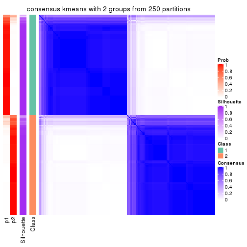</p>

</div>
<div id='tab-SD-kmeans-consensus-heatmap-2'>
<pre><code class="r">consensus_heatmap(res, k = 3)
</code></pre>

<p>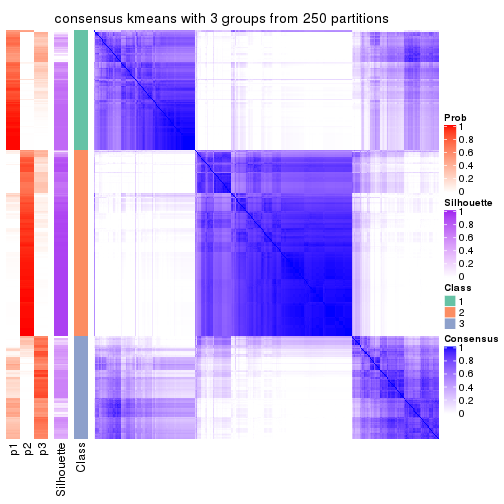</p>

</div>
<div id='tab-SD-kmeans-consensus-heatmap-3'>
<pre><code class="r">consensus_heatmap(res, k = 4)
</code></pre>

<p>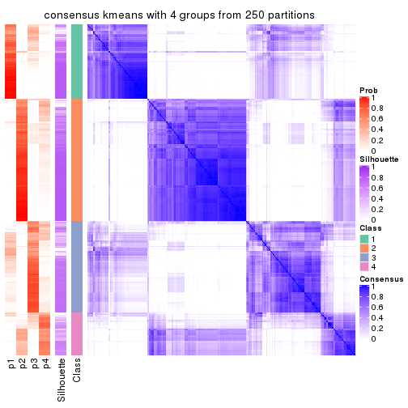</p>

</div>
<div id='tab-SD-kmeans-consensus-heatmap-4'>
<pre><code class="r">consensus_heatmap(res, k = 5)
</code></pre>

<p>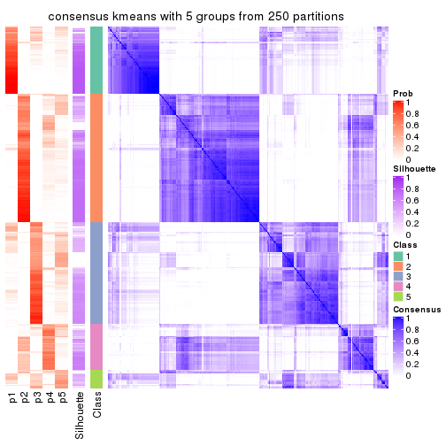</p>

</div>
<div id='tab-SD-kmeans-consensus-heatmap-5'>
<pre><code class="r">consensus_heatmap(res, k = 6)
</code></pre>

<p>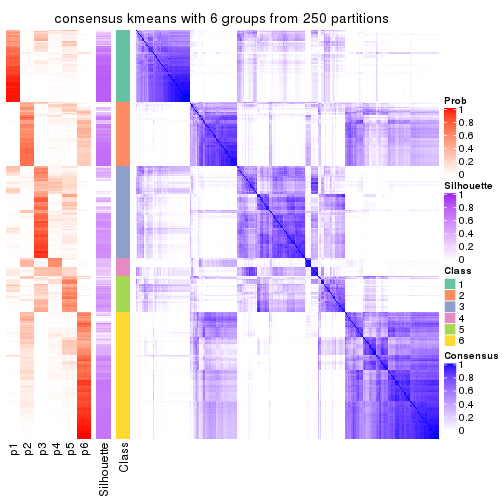</p>

</div>
</div>

Heatmaps for the membership of samples in all partitions to see how consistent they are:


<script>
$( function() {
	$( '#tabs-SD-kmeans-membership-heatmap' ).tabs();
} );
</script>
<div id='tabs-SD-kmeans-membership-heatmap'>
<ul>
<li><a href='#tab-SD-kmeans-membership-heatmap-1'>k = 2</a></li>
<li><a href='#tab-SD-kmeans-membership-heatmap-2'>k = 3</a></li>
<li><a href='#tab-SD-kmeans-membership-heatmap-3'>k = 4</a></li>
<li><a href='#tab-SD-kmeans-membership-heatmap-4'>k = 5</a></li>
<li><a href='#tab-SD-kmeans-membership-heatmap-5'>k = 6</a></li>
</ul>
<div id='tab-SD-kmeans-membership-heatmap-1'>
<pre><code class="r">membership_heatmap(res, k = 2)
</code></pre>

<p>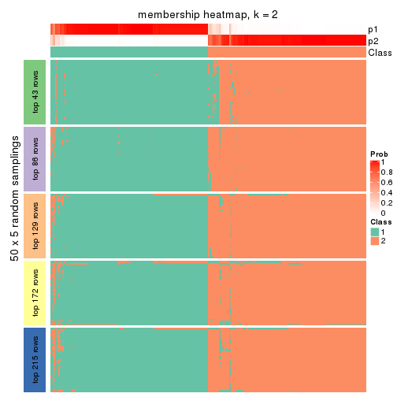</p>

</div>
<div id='tab-SD-kmeans-membership-heatmap-2'>
<pre><code class="r">membership_heatmap(res, k = 3)
</code></pre>

<p>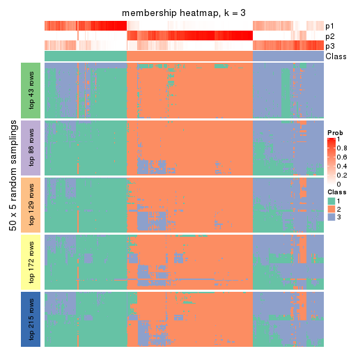</p>

</div>
<div id='tab-SD-kmeans-membership-heatmap-3'>
<pre><code class="r">membership_heatmap(res, k = 4)
</code></pre>

<p>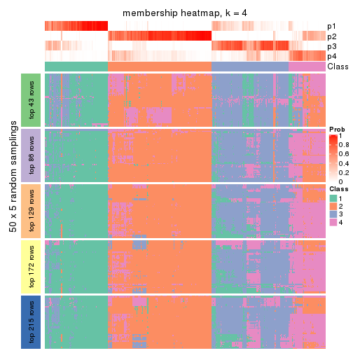</p>

</div>
<div id='tab-SD-kmeans-membership-heatmap-4'>
<pre><code class="r">membership_heatmap(res, k = 5)
</code></pre>

<p>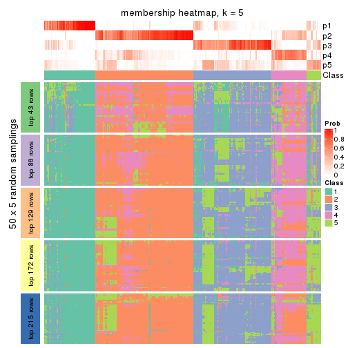</p>

</div>
<div id='tab-SD-kmeans-membership-heatmap-5'>
<pre><code class="r">membership_heatmap(res, k = 6)
</code></pre>

<p></p>

</div>
</div>

As soon as we have had the classes for columns, we can look for signatures
which are significantly different between classes which can be candidate marks
for certain classes. Following are the heatmaps for signatures.


Signature heatmaps where rows are scaled:


<script>
$( function() {
	$( '#tabs-SD-kmeans-get-signatures' ).tabs();
} );
</script>
<div id='tabs-SD-kmeans-get-signatures'>
<ul>
<li><a href='#tab-SD-kmeans-get-signatures-1'>k = 2</a></li>
<li><a href='#tab-SD-kmeans-get-signatures-2'>k = 3</a></li>
<li><a href='#tab-SD-kmeans-get-signatures-3'>k = 4</a></li>
<li><a href='#tab-SD-kmeans-get-signatures-4'>k = 5</a></li>
<li><a href='#tab-SD-kmeans-get-signatures-5'>k = 6</a></li>
</ul>
<div id='tab-SD-kmeans-get-signatures-1'>
<pre><code class="r">get_signatures(res, k = 2)
</code></pre>

<p>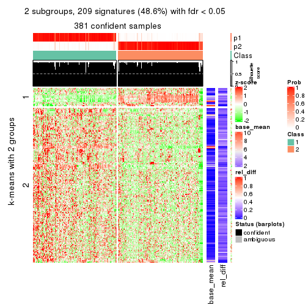</p>

</div>
<div id='tab-SD-kmeans-get-signatures-2'>
<pre><code class="r">get_signatures(res, k = 3)
</code></pre>

<p>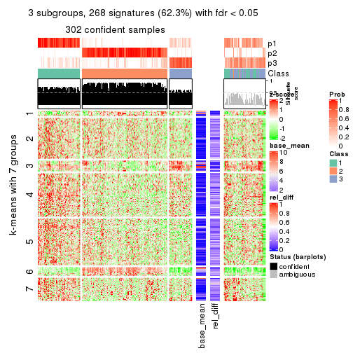</p>

</div>
<div id='tab-SD-kmeans-get-signatures-3'>
<pre><code class="r">get_signatures(res, k = 4)
</code></pre>

<p>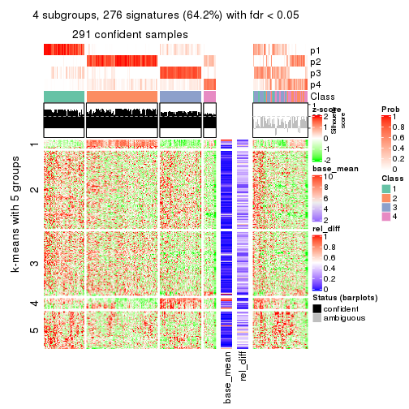</p>

</div>
<div id='tab-SD-kmeans-get-signatures-4'>
<pre><code class="r">get_signatures(res, k = 5)
</code></pre>

<p>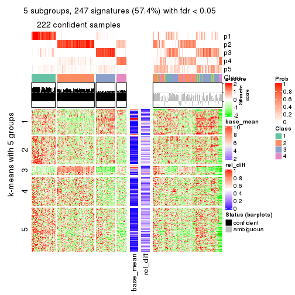</p>

</div>
<div id='tab-SD-kmeans-get-signatures-5'>
<pre><code class="r">get_signatures(res, k = 6)
</code></pre>

<p>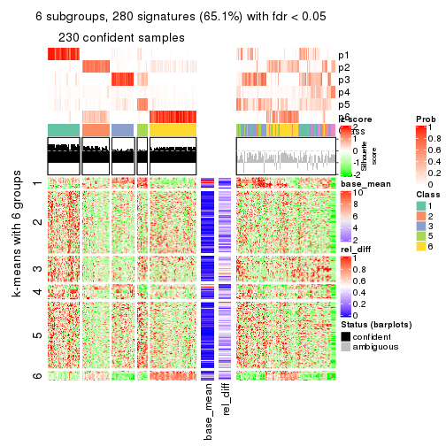</p>

</div>
</div>


Signature heatmaps where rows are not scaled:


<script>
$( function() {
	$( '#tabs-SD-kmeans-get-signatures-no-scale' ).tabs();
} );
</script>
<div id='tabs-SD-kmeans-get-signatures-no-scale'>
<ul>
<li><a href='#tab-SD-kmeans-get-signatures-no-scale-1'>k = 2</a></li>
<li><a href='#tab-SD-kmeans-get-signatures-no-scale-2'>k = 3</a></li>
<li><a href='#tab-SD-kmeans-get-signatures-no-scale-3'>k = 4</a></li>
<li><a href='#tab-SD-kmeans-get-signatures-no-scale-4'>k = 5</a></li>
<li><a href='#tab-SD-kmeans-get-signatures-no-scale-5'>k = 6</a></li>
</ul>
<div id='tab-SD-kmeans-get-signatures-no-scale-1'>
<pre><code class="r">get_signatures(res, k = 2, scale_rows = FALSE)
</code></pre>

<p>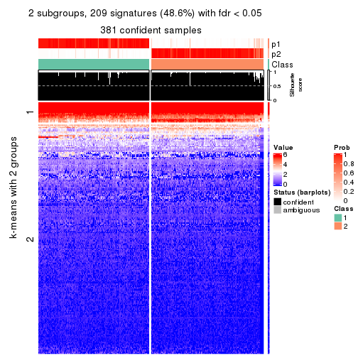</p>

</div>
<div id='tab-SD-kmeans-get-signatures-no-scale-2'>
<pre><code class="r">get_signatures(res, k = 3, scale_rows = FALSE)
</code></pre>

<p>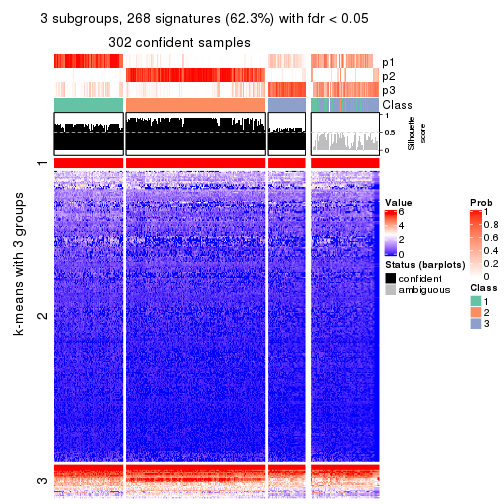</p>

</div>
<div id='tab-SD-kmeans-get-signatures-no-scale-3'>
<pre><code class="r">get_signatures(res, k = 4, scale_rows = FALSE)
</code></pre>

<p>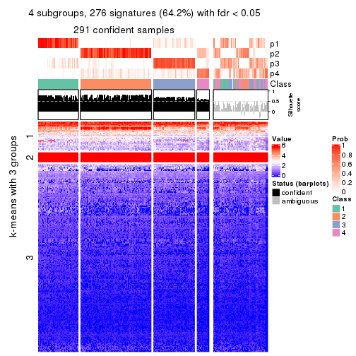</p>

</div>
<div id='tab-SD-kmeans-get-signatures-no-scale-4'>
<pre><code class="r">get_signatures(res, k = 5, scale_rows = FALSE)
</code></pre>

<p>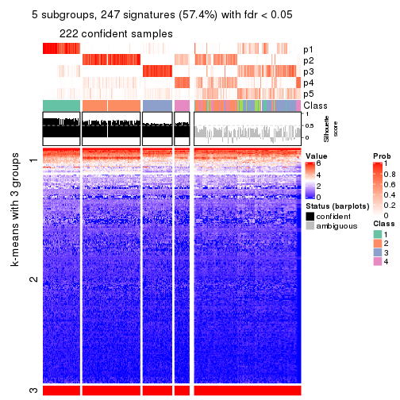</p>

</div>
<div id='tab-SD-kmeans-get-signatures-no-scale-5'>
<pre><code class="r">get_signatures(res, k = 6, scale_rows = FALSE)
</code></pre>

<p>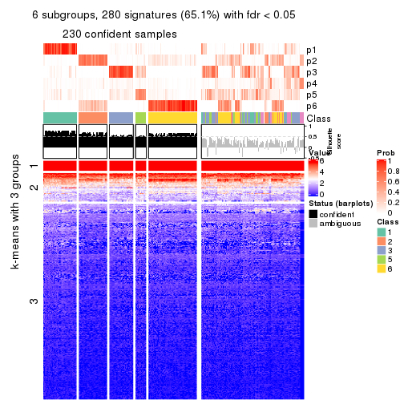</p>

</div>
</div>


Compare the overlap of signatures from different k:

```r
compare_signatures(res)
```

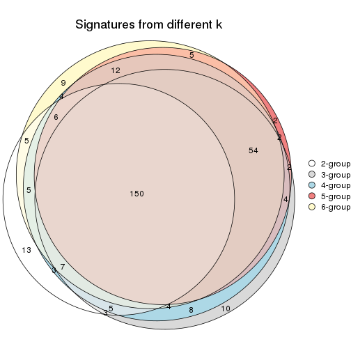

`get_signature()` returns a data frame invisibly. TO get the list of signatures, the function
call should be assigned to a variable explicitly. In following code, if `plot` argument is set
to `FALSE`, no heatmap is plotted while only the differential analysis is performed.

```r
# code only for demonstration
tb = get_signature(res, k = ..., plot = FALSE)
```

An example of the output of `tb` is:

```
#>   which_row         fdr    mean_1    mean_2 scaled_mean_1 scaled_mean_2 km
#> 1        38 0.042760348  8.373488  9.131774    -0.5533452     0.5164555  1
#> 2        40 0.018707592  7.106213  8.469186    -0.6173731     0.5762149  1
#> 3        55 0.019134737 10.221463 11.207825    -0.6159697     0.5749050  1
#> 4        59 0.006059896  5.921854  7.869574    -0.6899429     0.6439467  1
#> 5        60 0.018055526  8.928898 10.211722    -0.6204761     0.5791110  1
#> 6        98 0.009384629 15.714769 14.887706     0.6635654    -0.6193277  2
...
```

The columns in `tb` are:

1. `which_row`: row indices corresponding to the input matrix.
2. `fdr`: FDR for the differential test. 
3. `mean_x`: The mean value in group x.
4. `scaled_mean_x`: The mean value in group x after rows are scaled.
5. `km`: Row groups if k-means clustering is applied to rows.


UMAP plot which shows how samples are separated.


<script>
$( function() {
	$( '#tabs-SD-kmeans-dimension-reduction' ).tabs();
} );
</script>
<div id='tabs-SD-kmeans-dimension-reduction'>
<ul>
<li><a href='#tab-SD-kmeans-dimension-reduction-1'>k = 2</a></li>
<li><a href='#tab-SD-kmeans-dimension-reduction-2'>k = 3</a></li>
<li><a href='#tab-SD-kmeans-dimension-reduction-3'>k = 4</a></li>
<li><a href='#tab-SD-kmeans-dimension-reduction-4'>k = 5</a></li>
<li><a href='#tab-SD-kmeans-dimension-reduction-5'>k = 6</a></li>
</ul>
<div id='tab-SD-kmeans-dimension-reduction-1'>
<pre><code class="r">dimension_reduction(res, k = 2, method = &quot;UMAP&quot;)
</code></pre>

<p>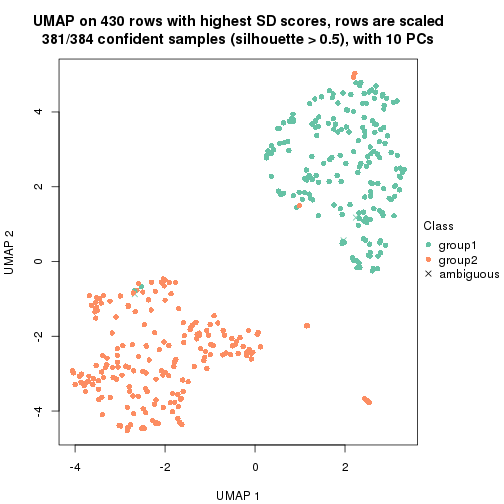</p>

</div>
<div id='tab-SD-kmeans-dimension-reduction-2'>
<pre><code class="r">dimension_reduction(res, k = 3, method = &quot;UMAP&quot;)
</code></pre>

<p>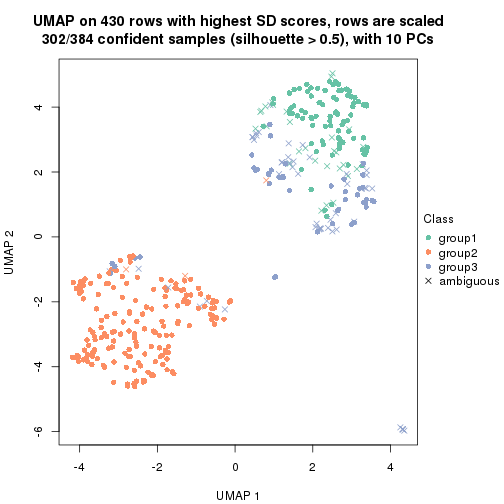</p>

</div>
<div id='tab-SD-kmeans-dimension-reduction-3'>
<pre><code class="r">dimension_reduction(res, k = 4, method = &quot;UMAP&quot;)
</code></pre>

<p>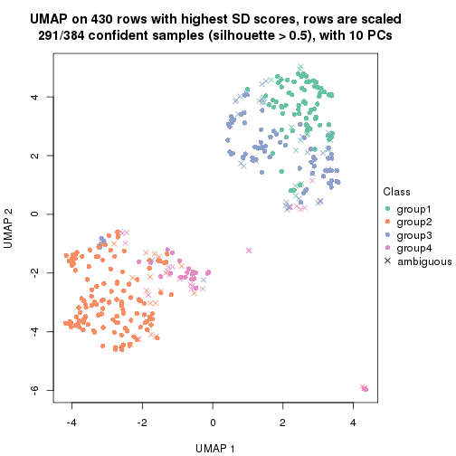</p>

</div>
<div id='tab-SD-kmeans-dimension-reduction-4'>
<pre><code class="r">dimension_reduction(res, k = 5, method = &quot;UMAP&quot;)
</code></pre>

<p>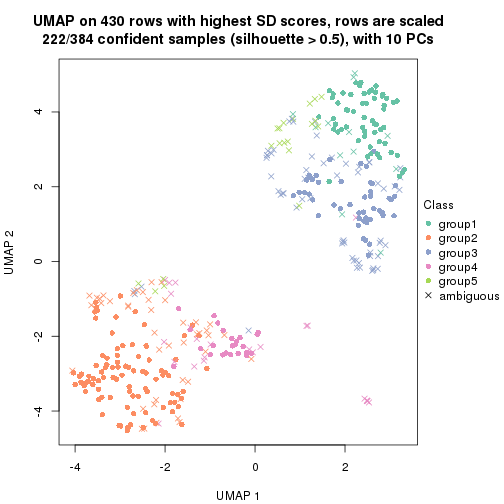</p>

</div>
<div id='tab-SD-kmeans-dimension-reduction-5'>
<pre><code class="r">dimension_reduction(res, k = 6, method = &quot;UMAP&quot;)
</code></pre>

<p>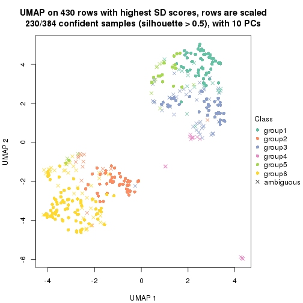</p>

</div>
</div>


Following heatmap shows how subgroups are split when increasing `k`:

```r
collect_classes(res)
```

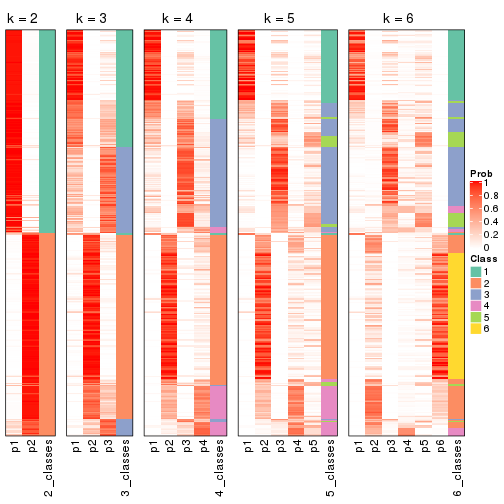


If matrix rows can be associated to genes, consider to use `GO_Enrichment(res,
...)` to perform function enrichment for the signature genes.


 

---------------------------------------------------


### SD:skmeans**


The object with results only for a single top-value method and a single partition method 
can be extracted as:

```r
res = res_list["SD", "skmeans"]
# you can also extract it by
# res = res_list["SD:skmeans"]
```

A summary of `res` and all the functions that can be applied to it:

```r
res
```

```
#> A 'ConsensusPartition' object with k = 2, 3, 4, 5, 6.
#>   On a matrix with 430 rows and 384 columns.
#>   Top rows (43, 86, 129, 172, 215) are extracted by 'SD' method.
#>   Subgroups are detected by 'skmeans' method.
#>   Performed in total 1250 partitions by row resampling.
#>   Best k for subgroups seems to be 2.
#> 
#> Following methods can be applied to this 'ConsensusPartition' object:
#>  [1] "cola_report"             "collect_classes"         "collect_plots"          
#>  [4] "collect_stats"           "colnames"                "compare_signatures"     
#>  [7] "consensus_heatmap"       "dimension_reduction"     "functional_enrichment"  
#> [10] "get_anno_col"            "get_anno"                "get_classes"            
#> [13] "get_consensus"           "get_matrix"              "get_membership"         
#> [16] "get_param"               "get_signatures"          "get_stats"              
#> [19] "is_best_k"               "is_stable_k"             "membership_heatmap"     
#> [22] "ncol"                    "nrow"                    "plot_ecdf"              
#> [25] "rownames"                "select_partition_number" "show"                   
#> [28] "suggest_best_k"          "test_to_known_factors"
```

`collect_plots()` function collects all the plots made from `res` for all `k` (number of partitions)
into one single page to provide an easy and fast comparison between different `k`.

```r
collect_plots(res)
```

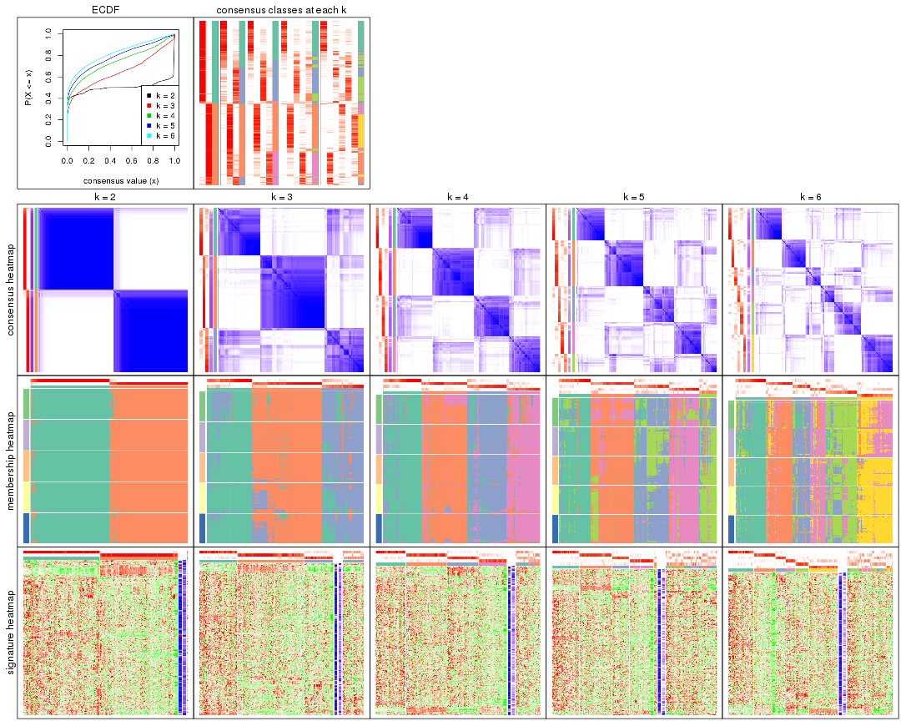

The plots are:

- The first row: a plot of the ECDF (Empirical cumulative distribution
  function) curves of the consensus matrix for each `k` and the heatmap of
  predicted classes for each `k`.
- The second row: heatmaps of the consensus matrix for each `k`.
- The third row: heatmaps of the membership matrix for each `k`.
- The fouth row: heatmaps of the signatures for each `k`.

All the plots in panels can be made by individual functions and they are
plotted later in this section.

`select_partition_number()` produces several plots showing different
statistics for choosing "optimized" `k`. There are following statistics:

- ECDF curves of the consensus matrix for each `k`;
- 1-PAC. [The PAC
  score](https://en.wikipedia.org/wiki/Consensus_clustering#Over-interpretation_potential_of_consensus_clustering)
  measures the proportion of the ambiguous subgrouping.
- Mean silhouette score.
- Concordance. The mean probability of fiting the consensus class ids in all
  partitions.
- Area increased. Denote $A_k$ as the area under the ECDF curve for current
  `k`, the area increased is defined as $A_k - A_{k-1}$.
- Rand index. The percent of pairs of samples that are both in a same cluster
  or both are not in a same cluster in the partition of k and k-1.
- Jaccard index. The ratio of pairs of samples are both in a same cluster in
  the partition of k and k-1 and the pairs of samples are both in a same
  cluster in the partition k or k-1.

The detailed explanations of these statistics can be found in [the cola
vignette](http://bioconductor.org/packages/devel/bioc/vignettes/cola/inst/doc/cola.html#toc_13).

Generally speaking, lower PAC score, higher mean silhouette score or higher
concordance corresponds to better partition. Rand index and Jaccard index
measure how similar the current partition is compared to partition with `k-1`.
If they are too similar, we won't accept `k` is better than `k-1`.

```r
select_partition_number(res)
```

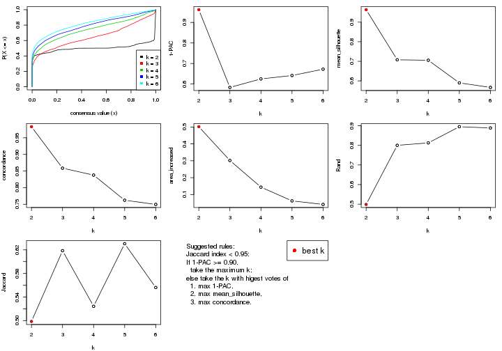

The numeric values for all these statistics can be obtained by `get_stats()`.

```r
get_stats(res)
```

```
#>   k 1-PAC mean_silhouette concordance area_increased  Rand Jaccard
#> 2 2 0.962           0.964       0.983         0.5016 0.499   0.499
#> 3 3 0.583           0.708       0.859         0.3017 0.800   0.619
#> 4 4 0.625           0.705       0.838         0.1438 0.813   0.524
#> 5 5 0.642           0.590       0.762         0.0625 0.895   0.630
#> 6 6 0.672           0.567       0.750         0.0416 0.889   0.556
```

`suggest_best_k()` suggests the best $k$ based on these statistics. The rules are as follows:

- All $k$ with Jaccard index larger than 0.95 are removed because the increase of
  the partition number does not provides enough extra information. If all $k$ are removed,
  the best $k$ is assigned by `NA`.
- For $k$ with 1-PAC larger than 0.9, the maximal $k$ is taken as the "best k". Other $k$ is called "optional k".
- If it does not fit the second rule. The $k$ with the highest vote of highest
  1-PAC, mean silhouette and concordance is taken as the "best k".

```r
suggest_best_k(res)
```

```
#> [1] 2
```


Following shows the table of the partitions (You need to click the **show/hide
code output** link to see it). The membership matrix (columns with name `p*`)
is inferred by
[`clue::cl_consensus()`](https://www.rdocumentation.org/link/cl_consensus?package=clue)
function with the `SE` method. Basically the value in the membership matrix
represents the probability to belong to a certain group. The finall class
label for an item is determined with the group with highest probability it
belongs to.

In `get_classes()` function, the entropy is calculated from the membership
matrix and the silhouette score is calculated from the consensus matrix.


<script>
$( function() {
	$( '#tabs-SD-skmeans-get-classes' ).tabs();
} );
</script>
<div id='tabs-SD-skmeans-get-classes'>
<ul>
<li><a href='#tab-SD-skmeans-get-classes-1'>k = 2</a></li>
<li><a href='#tab-SD-skmeans-get-classes-2'>k = 3</a></li>
<li><a href='#tab-SD-skmeans-get-classes-3'>k = 4</a></li>
<li><a href='#tab-SD-skmeans-get-classes-4'>k = 5</a></li>
<li><a href='#tab-SD-skmeans-get-classes-5'>k = 6</a></li>
</ul>

<div id='tab-SD-skmeans-get-classes-1'>
<p><a id='tab-SD-skmeans-get-classes-1-a' style='color:#0366d6' href='#'>show/hide code output</a></p>
<pre><code class="r">cbind(get_classes(res, k = 2), get_membership(res, k = 2))
</code></pre>

<pre><code>#&gt;            class entropy silhouette    p1    p2
#&gt; SRR2105277     1  0.0000      0.985 1.000 0.000
#&gt; SRR2105278     1  0.0000      0.985 1.000 0.000
#&gt; SRR2105275     1  0.0000      0.985 1.000 0.000
#&gt; SRR2105276     1  0.0376      0.982 0.996 0.004
#&gt; SRR2105273     1  0.0000      0.985 1.000 0.000
#&gt; SRR2105274     1  0.0000      0.985 1.000 0.000
#&gt; SRR2105271     1  0.0000      0.985 1.000 0.000
#&gt; SRR2105272     1  0.0000      0.985 1.000 0.000
#&gt; SRR2105269     2  0.0000      0.980 0.000 1.000
#&gt; SRR2105270     2  0.0000      0.980 0.000 1.000
#&gt; SRR2105267     2  0.0000      0.980 0.000 1.000
#&gt; SRR2105268     2  0.0000      0.980 0.000 1.000
#&gt; SRR2105265     2  0.0000      0.980 0.000 1.000
#&gt; SRR2105266     2  0.0000      0.980 0.000 1.000
#&gt; SRR2105263     2  0.0000      0.980 0.000 1.000
#&gt; SRR2105264     2  0.0000      0.980 0.000 1.000
#&gt; SRR2105261     1  0.9522      0.409 0.628 0.372
#&gt; SRR2105262     1  0.4939      0.878 0.892 0.108
#&gt; SRR2105357     1  0.0000      0.985 1.000 0.000
#&gt; SRR2105358     1  0.0000      0.985 1.000 0.000
#&gt; SRR2105439     2  0.0672      0.975 0.008 0.992
#&gt; SRR2105440     2  0.0672      0.975 0.008 0.992
#&gt; SRR2105509     2  0.0000      0.980 0.000 1.000
#&gt; SRR2105510     2  0.0000      0.980 0.000 1.000
#&gt; SRR2105507     1  0.0000      0.985 1.000 0.000
#&gt; SRR2105508     1  0.0000      0.985 1.000 0.000
#&gt; SRR2105505     1  0.0000      0.985 1.000 0.000
#&gt; SRR2105506     1  0.0000      0.985 1.000 0.000
#&gt; SRR2105503     2  0.0000      0.980 0.000 1.000
#&gt; SRR2105504     2  0.3274      0.928 0.060 0.940
#&gt; SRR2105501     2  0.0376      0.978 0.004 0.996
#&gt; SRR2105502     2  0.0672      0.975 0.008 0.992
#&gt; SRR2105499     1  0.0000      0.985 1.000 0.000
#&gt; SRR2105500     1  0.0000      0.985 1.000 0.000
#&gt; SRR2105497     2  0.0000      0.980 0.000 1.000
#&gt; SRR2105498     2  0.0000      0.980 0.000 1.000
#&gt; SRR2105495     2  0.0000      0.980 0.000 1.000
#&gt; SRR2105496     2  0.0000      0.980 0.000 1.000
#&gt; SRR2105493     2  0.0376      0.978 0.004 0.996
#&gt; SRR2105494     2  0.0672      0.975 0.008 0.992
#&gt; SRR2105491     2  0.0000      0.980 0.000 1.000
#&gt; SRR2105492     2  0.0000      0.980 0.000 1.000
#&gt; SRR2105489     2  0.0000      0.980 0.000 1.000
#&gt; SRR2105490     2  0.0000      0.980 0.000 1.000
#&gt; SRR2105487     1  0.0000      0.985 1.000 0.000
#&gt; SRR2105488     1  0.0000      0.985 1.000 0.000
#&gt; SRR2105485     1  0.0000      0.985 1.000 0.000
#&gt; SRR2105486     1  0.0000      0.985 1.000 0.000
#&gt; SRR2105483     1  0.0000      0.985 1.000 0.000
#&gt; SRR2105484     1  0.0000      0.985 1.000 0.000
#&gt; SRR2105481     1  0.0000      0.985 1.000 0.000
#&gt; SRR2105482     1  0.0000      0.985 1.000 0.000
#&gt; SRR2105479     1  0.0000      0.985 1.000 0.000
#&gt; SRR2105480     1  0.0000      0.985 1.000 0.000
#&gt; SRR2105477     2  0.0000      0.980 0.000 1.000
#&gt; SRR2105478     2  0.0000      0.980 0.000 1.000
#&gt; SRR2105475     2  0.0000      0.980 0.000 1.000
#&gt; SRR2105476     2  0.0000      0.980 0.000 1.000
#&gt; SRR2105473     2  0.2603      0.944 0.044 0.956
#&gt; SRR2105474     2  0.0672      0.975 0.008 0.992
#&gt; SRR2105471     2  0.0000      0.980 0.000 1.000
#&gt; SRR2105472     2  0.0000      0.980 0.000 1.000
#&gt; SRR2105469     1  0.0000      0.985 1.000 0.000
#&gt; SRR2105470     1  0.0000      0.985 1.000 0.000
#&gt; SRR2105467     1  0.0000      0.985 1.000 0.000
#&gt; SRR2105468     1  0.0000      0.985 1.000 0.000
#&gt; SRR2105465     1  0.0000      0.985 1.000 0.000
#&gt; SRR2105466     1  0.0000      0.985 1.000 0.000
#&gt; SRR2105463     1  0.0000      0.985 1.000 0.000
#&gt; SRR2105464     1  0.0000      0.985 1.000 0.000
#&gt; SRR2105461     2  0.0000      0.980 0.000 1.000
#&gt; SRR2105462     2  0.0000      0.980 0.000 1.000
#&gt; SRR2105459     2  0.0000      0.980 0.000 1.000
#&gt; SRR2105460     2  0.0000      0.980 0.000 1.000
#&gt; SRR2105457     1  0.0000      0.985 1.000 0.000
#&gt; SRR2105458     1  0.0376      0.982 0.996 0.004
#&gt; SRR2105455     1  0.0000      0.985 1.000 0.000
#&gt; SRR2105456     1  0.0000      0.985 1.000 0.000
#&gt; SRR2105453     1  0.0000      0.985 1.000 0.000
#&gt; SRR2105454     1  0.0000      0.985 1.000 0.000
#&gt; SRR2105451     2  0.0672      0.975 0.008 0.992
#&gt; SRR2105452     2  0.6438      0.811 0.164 0.836
#&gt; SRR2105449     1  0.0000      0.985 1.000 0.000
#&gt; SRR2105450     1  0.0000      0.985 1.000 0.000
#&gt; SRR2105447     2  0.0000      0.980 0.000 1.000
#&gt; SRR2105448     2  0.0000      0.980 0.000 1.000
#&gt; SRR2105445     1  0.9286      0.472 0.656 0.344
#&gt; SRR2105446     1  0.0000      0.985 1.000 0.000
#&gt; SRR2105443     2  0.5842      0.842 0.140 0.860
#&gt; SRR2105444     2  0.7299      0.756 0.204 0.796
#&gt; SRR2105441     2  0.0000      0.980 0.000 1.000
#&gt; SRR2105442     2  0.0000      0.980 0.000 1.000
#&gt; SRR2105437     1  0.0000      0.985 1.000 0.000
#&gt; SRR2105438     1  0.0000      0.985 1.000 0.000
#&gt; SRR2105435     1  0.0000      0.985 1.000 0.000
#&gt; SRR2105436     1  0.0000      0.985 1.000 0.000
#&gt; SRR2105433     1  0.0000      0.985 1.000 0.000
#&gt; SRR2105434     1  0.0000      0.985 1.000 0.000
#&gt; SRR2105431     1  0.0000      0.985 1.000 0.000
#&gt; SRR2105432     1  0.0000      0.985 1.000 0.000
#&gt; SRR2105429     2  0.3733      0.917 0.072 0.928
#&gt; SRR2105430     2  0.0672      0.975 0.008 0.992
#&gt; SRR2105427     2  0.0000      0.980 0.000 1.000
#&gt; SRR2105428     2  0.0000      0.980 0.000 1.000
#&gt; SRR2105425     2  0.0000      0.980 0.000 1.000
#&gt; SRR2105426     2  0.0000      0.980 0.000 1.000
#&gt; SRR2105421     1  0.3274      0.931 0.940 0.060
#&gt; SRR2105422     1  0.0376      0.982 0.996 0.004
#&gt; SRR2105423     2  0.0000      0.980 0.000 1.000
#&gt; SRR2105424     2  0.0000      0.980 0.000 1.000
#&gt; SRR2105419     1  0.0000      0.985 1.000 0.000
#&gt; SRR2105420     1  0.0000      0.985 1.000 0.000
#&gt; SRR2105415     1  0.0000      0.985 1.000 0.000
#&gt; SRR2105416     1  0.0000      0.985 1.000 0.000
#&gt; SRR2105417     1  0.0000      0.985 1.000 0.000
#&gt; SRR2105418     1  0.0000      0.985 1.000 0.000
#&gt; SRR2105413     2  0.0000      0.980 0.000 1.000
#&gt; SRR2105414     2  0.0000      0.980 0.000 1.000
#&gt; SRR2105409     2  0.0000      0.980 0.000 1.000
#&gt; SRR2105410     2  0.0000      0.980 0.000 1.000
#&gt; SRR2105411     2  0.0000      0.980 0.000 1.000
#&gt; SRR2105412     2  0.0000      0.980 0.000 1.000
#&gt; SRR2105407     1  0.0000      0.985 1.000 0.000
#&gt; SRR2105408     1  0.0000      0.985 1.000 0.000
#&gt; SRR2105403     1  0.0000      0.985 1.000 0.000
#&gt; SRR2105404     1  0.0000      0.985 1.000 0.000
#&gt; SRR2105405     1  0.0000      0.985 1.000 0.000
#&gt; SRR2105406     1  0.0000      0.985 1.000 0.000
#&gt; SRR2105401     2  0.0000      0.980 0.000 1.000
#&gt; SRR2105402     2  0.6438      0.811 0.164 0.836
#&gt; SRR2105399     2  0.5946      0.836 0.144 0.856
#&gt; SRR2105400     2  0.4161      0.904 0.084 0.916
#&gt; SRR2105397     2  0.6801      0.790 0.180 0.820
#&gt; SRR2105398     2  0.7219      0.761 0.200 0.800
#&gt; SRR2105395     2  0.0000      0.980 0.000 1.000
#&gt; SRR2105396     2  0.0000      0.980 0.000 1.000
#&gt; SRR2105393     2  0.0000      0.980 0.000 1.000
#&gt; SRR2105394     2  0.0000      0.980 0.000 1.000
#&gt; SRR2105389     1  0.0000      0.985 1.000 0.000
#&gt; SRR2105390     1  0.0000      0.985 1.000 0.000
#&gt; SRR2105391     1  0.0000      0.985 1.000 0.000
#&gt; SRR2105392     1  0.0000      0.985 1.000 0.000
#&gt; SRR2105385     1  0.0000      0.985 1.000 0.000
#&gt; SRR2105386     1  0.0000      0.985 1.000 0.000
#&gt; SRR2105387     1  0.0000      0.985 1.000 0.000
#&gt; SRR2105388     1  0.0000      0.985 1.000 0.000
#&gt; SRR2105381     2  0.0000      0.980 0.000 1.000
#&gt; SRR2105382     2  0.0000      0.980 0.000 1.000
#&gt; SRR2105383     2  0.0000      0.980 0.000 1.000
#&gt; SRR2105384     2  0.0672      0.975 0.008 0.992
#&gt; SRR2105379     2  0.0000      0.980 0.000 1.000
#&gt; SRR2105380     2  0.0672      0.975 0.008 0.992
#&gt; SRR2105377     2  0.0000      0.980 0.000 1.000
#&gt; SRR2105378     2  0.0000      0.980 0.000 1.000
#&gt; SRR2105375     1  0.0000      0.985 1.000 0.000
#&gt; SRR2105376     1  0.0000      0.985 1.000 0.000
#&gt; SRR2105373     1  0.0000      0.985 1.000 0.000
#&gt; SRR2105374     1  0.0000      0.985 1.000 0.000
#&gt; SRR2105371     1  0.0000      0.985 1.000 0.000
#&gt; SRR2105372     1  0.0000      0.985 1.000 0.000
#&gt; SRR2105369     1  0.0000      0.985 1.000 0.000
#&gt; SRR2105370     1  0.0000      0.985 1.000 0.000
#&gt; SRR2105367     1  0.0000      0.985 1.000 0.000
#&gt; SRR2105368     1  0.0000      0.985 1.000 0.000
#&gt; SRR2105365     2  0.0000      0.980 0.000 1.000
#&gt; SRR2105366     2  0.0000      0.980 0.000 1.000
#&gt; SRR2105363     2  0.0000      0.980 0.000 1.000
#&gt; SRR2105364     2  0.0000      0.980 0.000 1.000
#&gt; SRR2105361     2  0.0000      0.980 0.000 1.000
#&gt; SRR2105362     2  0.0000      0.980 0.000 1.000
#&gt; SRR2105359     1  0.0000      0.985 1.000 0.000
#&gt; SRR2105360     1  0.0000      0.985 1.000 0.000
#&gt; SRR2105355     1  0.0000      0.985 1.000 0.000
#&gt; SRR2105356     1  0.0000      0.985 1.000 0.000
#&gt; SRR2105353     1  0.0000      0.985 1.000 0.000
#&gt; SRR2105354     1  0.0000      0.985 1.000 0.000
#&gt; SRR2105351     2  0.0000      0.980 0.000 1.000
#&gt; SRR2105352     2  0.6438      0.811 0.164 0.836
#&gt; SRR2105349     2  0.0000      0.980 0.000 1.000
#&gt; SRR2105350     2  0.0000      0.980 0.000 1.000
#&gt; SRR2105345     2  0.0000      0.980 0.000 1.000
#&gt; SRR2105346     2  0.0000      0.980 0.000 1.000
#&gt; SRR2105347     2  0.0000      0.980 0.000 1.000
#&gt; SRR2105348     2  0.0672      0.975 0.008 0.992
#&gt; SRR2105343     2  0.0000      0.980 0.000 1.000
#&gt; SRR2105344     2  0.0000      0.980 0.000 1.000
#&gt; SRR2105341     1  0.0000      0.985 1.000 0.000
#&gt; SRR2105342     1  0.0000      0.985 1.000 0.000
#&gt; SRR2105339     1  0.0000      0.985 1.000 0.000
#&gt; SRR2105340     1  0.0000      0.985 1.000 0.000
#&gt; SRR2105335     1  0.0000      0.985 1.000 0.000
#&gt; SRR2105336     1  0.0000      0.985 1.000 0.000
#&gt; SRR2105337     1  0.0000      0.985 1.000 0.000
#&gt; SRR2105338     1  0.0000      0.985 1.000 0.000
#&gt; SRR2105331     2  0.0000      0.980 0.000 1.000
#&gt; SRR2105332     2  0.0000      0.980 0.000 1.000
#&gt; SRR2105333     2  0.0000      0.980 0.000 1.000
#&gt; SRR2105334     2  0.0000      0.980 0.000 1.000
#&gt; SRR2105329     2  0.0938      0.972 0.012 0.988
#&gt; SRR2105330     2  0.0938      0.972 0.012 0.988
#&gt; SRR2105327     2  0.0000      0.980 0.000 1.000
#&gt; SRR2105328     2  0.0000      0.980 0.000 1.000
#&gt; SRR2105325     1  0.0000      0.985 1.000 0.000
#&gt; SRR2105326     1  0.0000      0.985 1.000 0.000
#&gt; SRR2105323     1  0.0000      0.985 1.000 0.000
#&gt; SRR2105324     1  0.0000      0.985 1.000 0.000
#&gt; SRR2105319     1  0.0000      0.985 1.000 0.000
#&gt; SRR2105320     1  0.0000      0.985 1.000 0.000
#&gt; SRR2105321     1  0.0000      0.985 1.000 0.000
#&gt; SRR2105322     1  0.0000      0.985 1.000 0.000
#&gt; SRR2105317     2  0.0000      0.980 0.000 1.000
#&gt; SRR2105318     2  0.0000      0.980 0.000 1.000
#&gt; SRR2105315     2  0.6973      0.776 0.188 0.812
#&gt; SRR2105316     2  0.0000      0.980 0.000 1.000
#&gt; SRR2105313     2  0.0000      0.980 0.000 1.000
#&gt; SRR2105314     2  0.0000      0.980 0.000 1.000
#&gt; SRR2105311     1  0.2043      0.958 0.968 0.032
#&gt; SRR2105312     1  0.4690      0.887 0.900 0.100
#&gt; SRR2105307     1  0.0000      0.985 1.000 0.000
#&gt; SRR2105308     1  0.0000      0.985 1.000 0.000
#&gt; SRR2105309     1  0.0000      0.985 1.000 0.000
#&gt; SRR2105310     1  0.0000      0.985 1.000 0.000
#&gt; SRR2105305     1  0.0000      0.985 1.000 0.000
#&gt; SRR2105306     1  0.0000      0.985 1.000 0.000
#&gt; SRR2105303     2  0.0000      0.980 0.000 1.000
#&gt; SRR2105304     2  0.0376      0.978 0.004 0.996
#&gt; SRR2105301     2  0.0000      0.980 0.000 1.000
#&gt; SRR2105302     2  0.0000      0.980 0.000 1.000
#&gt; SRR2105299     1  0.7950      0.685 0.760 0.240
#&gt; SRR2105300     2  0.7219      0.761 0.200 0.800
#&gt; SRR2105297     2  0.7602      0.729 0.220 0.780
#&gt; SRR2105298     2  0.6343      0.816 0.160 0.840
#&gt; SRR2105295     2  0.0000      0.980 0.000 1.000
#&gt; SRR2105296     2  0.0000      0.980 0.000 1.000
#&gt; SRR2105293     1  0.0376      0.982 0.996 0.004
#&gt; SRR2105294     1  0.0000      0.985 1.000 0.000
#&gt; SRR2105291     1  0.0000      0.985 1.000 0.000
#&gt; SRR2105292     1  0.0000      0.985 1.000 0.000
#&gt; SRR2105289     1  0.0000      0.985 1.000 0.000
#&gt; SRR2105290     1  0.0000      0.985 1.000 0.000
#&gt; SRR2105287     1  0.0000      0.985 1.000 0.000
#&gt; SRR2105288     1  0.0000      0.985 1.000 0.000
#&gt; SRR2105285     2  0.0000      0.980 0.000 1.000
#&gt; SRR2105286     2  0.0000      0.980 0.000 1.000
#&gt; SRR2105283     2  0.0938      0.972 0.012 0.988
#&gt; SRR2105284     2  0.1414      0.965 0.020 0.980
#&gt; SRR2105281     2  0.0000      0.980 0.000 1.000
#&gt; SRR2105282     2  0.0000      0.980 0.000 1.000
#&gt; SRR2105259     1  0.0000      0.985 1.000 0.000
#&gt; SRR2105260     1  0.0000      0.985 1.000 0.000
#&gt; SRR2105279     2  0.0000      0.980 0.000 1.000
#&gt; SRR2105280     2  0.0000      0.980 0.000 1.000
#&gt; SRR2105257     1  0.0000      0.985 1.000 0.000
#&gt; SRR2105258     1  0.0000      0.985 1.000 0.000
#&gt; SRR2105253     2  0.0000      0.980 0.000 1.000
#&gt; SRR2105254     2  0.0000      0.980 0.000 1.000
#&gt; SRR2105255     1  0.0000      0.985 1.000 0.000
#&gt; SRR2105256     1  0.0000      0.985 1.000 0.000
#&gt; SRR2105251     2  0.0000      0.980 0.000 1.000
#&gt; SRR2105252     2  0.0000      0.980 0.000 1.000
#&gt; SRR2105249     2  0.0000      0.980 0.000 1.000
#&gt; SRR2105250     2  0.0672      0.975 0.008 0.992
#&gt; SRR2105247     2  0.0000      0.980 0.000 1.000
#&gt; SRR2105248     2  0.0000      0.980 0.000 1.000
#&gt; SRR2105245     1  0.6148      0.822 0.848 0.152
#&gt; SRR2105246     1  0.8861      0.567 0.696 0.304
#&gt; SRR2105243     1  0.0000      0.985 1.000 0.000
#&gt; SRR2105244     1  0.0000      0.985 1.000 0.000
#&gt; SRR2105241     1  0.0000      0.985 1.000 0.000
#&gt; SRR2105242     1  0.0000      0.985 1.000 0.000
#&gt; SRR2105239     1  0.0000      0.985 1.000 0.000
#&gt; SRR2105240     1  0.0000      0.985 1.000 0.000
#&gt; SRR2105237     2  0.0000      0.980 0.000 1.000
#&gt; SRR2105238     2  0.0000      0.980 0.000 1.000
#&gt; SRR2105235     2  0.0000      0.980 0.000 1.000
#&gt; SRR2105236     2  0.0000      0.980 0.000 1.000
#&gt; SRR2105233     2  0.0000      0.980 0.000 1.000
#&gt; SRR2105234     2  0.0000      0.980 0.000 1.000
#&gt; SRR2105231     2  0.0000      0.980 0.000 1.000
#&gt; SRR2105232     2  0.0000      0.980 0.000 1.000
#&gt; SRR2105227     1  0.0672      0.979 0.992 0.008
#&gt; SRR2105228     1  0.0000      0.985 1.000 0.000
#&gt; SRR2105225     1  0.0000      0.985 1.000 0.000
#&gt; SRR2105226     1  0.0000      0.985 1.000 0.000
#&gt; SRR2105229     1  0.2236      0.954 0.964 0.036
#&gt; SRR2105230     1  0.0000      0.985 1.000 0.000
#&gt; SRR2105219     2  0.0000      0.980 0.000 1.000
#&gt; SRR2105220     2  0.0000      0.980 0.000 1.000
#&gt; SRR2105221     2  0.0376      0.978 0.004 0.996
#&gt; SRR2105222     2  0.0672      0.975 0.008 0.992
#&gt; SRR2105223     1  0.0000      0.985 1.000 0.000
#&gt; SRR2105224     1  0.0000      0.985 1.000 0.000
#&gt; SRR2105217     2  0.0000      0.980 0.000 1.000
#&gt; SRR2105218     2  0.0000      0.980 0.000 1.000
#&gt; SRR2105215     2  0.0000      0.980 0.000 1.000
#&gt; SRR2105216     2  0.0000      0.980 0.000 1.000
#&gt; SRR2105213     1  0.2043      0.958 0.968 0.032
#&gt; SRR2105214     1  0.7219      0.753 0.800 0.200
#&gt; SRR2105211     1  0.0000      0.985 1.000 0.000
#&gt; SRR2105212     1  0.0000      0.985 1.000 0.000
#&gt; SRR2105209     1  0.0000      0.985 1.000 0.000
#&gt; SRR2105210     1  0.0000      0.985 1.000 0.000
#&gt; SRR2105207     1  0.0000      0.985 1.000 0.000
#&gt; SRR2105208     1  0.0000      0.985 1.000 0.000
#&gt; SRR2105205     2  0.0000      0.980 0.000 1.000
#&gt; SRR2105206     2  0.0000      0.980 0.000 1.000
#&gt; SRR2105201     2  0.0376      0.978 0.004 0.996
#&gt; SRR2105202     2  0.1184      0.969 0.016 0.984
#&gt; SRR2105203     2  0.0000      0.980 0.000 1.000
#&gt; SRR2105204     2  0.0000      0.980 0.000 1.000
#&gt; SRR2105199     2  0.0000      0.980 0.000 1.000
#&gt; SRR2105200     2  0.0000      0.980 0.000 1.000
#&gt; SRR2105197     1  0.0000      0.985 1.000 0.000
#&gt; SRR2105198     1  0.0938      0.976 0.988 0.012
#&gt; SRR2105195     1  0.0672      0.979 0.992 0.008
#&gt; SRR2105196     1  0.0938      0.976 0.988 0.012
#&gt; SRR2105193     1  0.0000      0.985 1.000 0.000
#&gt; SRR2105194     1  0.0000      0.985 1.000 0.000
#&gt; SRR2105191     1  0.0000      0.985 1.000 0.000
#&gt; SRR2105192     1  0.0000      0.985 1.000 0.000
#&gt; SRR2105189     2  0.0000      0.980 0.000 1.000
#&gt; SRR2105190     2  0.0000      0.980 0.000 1.000
#&gt; SRR2105187     2  0.0000      0.980 0.000 1.000
#&gt; SRR2105188     2  0.0376      0.978 0.004 0.996
#&gt; SRR2105179     1  0.0000      0.985 1.000 0.000
#&gt; SRR2105180     1  0.0000      0.985 1.000 0.000
#&gt; SRR2105183     2  0.0000      0.980 0.000 1.000
#&gt; SRR2105184     2  0.0000      0.980 0.000 1.000
#&gt; SRR2105185     2  0.0000      0.980 0.000 1.000
#&gt; SRR2105186     2  0.0000      0.980 0.000 1.000
#&gt; SRR2105181     1  0.0000      0.985 1.000 0.000
#&gt; SRR2105182     1  0.0000      0.985 1.000 0.000
#&gt; SRR2105177     1  0.0000      0.985 1.000 0.000
#&gt; SRR2105178     1  0.0000      0.985 1.000 0.000
#&gt; SRR2105171     2  0.0000      0.980 0.000 1.000
#&gt; SRR2105172     2  0.0000      0.980 0.000 1.000
#&gt; SRR2105175     1  0.0000      0.985 1.000 0.000
#&gt; SRR2105176     1  0.0000      0.985 1.000 0.000
#&gt; SRR2105173     2  0.0000      0.980 0.000 1.000
#&gt; SRR2105174     2  0.0000      0.980 0.000 1.000
#&gt; SRR2105169     2  0.0000      0.980 0.000 1.000
#&gt; SRR2105170     2  0.0000      0.980 0.000 1.000
#&gt; SRR2105167     2  0.0000      0.980 0.000 1.000
#&gt; SRR2105168     2  0.0000      0.980 0.000 1.000
#&gt; SRR2105165     1  0.0000      0.985 1.000 0.000
#&gt; SRR2105166     1  0.0000      0.985 1.000 0.000
#&gt; SRR2105163     1  0.0376      0.982 0.996 0.004
#&gt; SRR2105164     1  0.0376      0.982 0.996 0.004
#&gt; SRR2105161     1  0.0000      0.985 1.000 0.000
#&gt; SRR2105162     1  0.0000      0.985 1.000 0.000
#&gt; SRR2105155     2  0.0000      0.980 0.000 1.000
#&gt; SRR2105156     2  0.0000      0.980 0.000 1.000
#&gt; SRR2105157     2  0.0000      0.980 0.000 1.000
#&gt; SRR2105158     2  0.0000      0.980 0.000 1.000
#&gt; SRR2105159     1  0.0000      0.985 1.000 0.000
#&gt; SRR2105160     1  0.0000      0.985 1.000 0.000
#&gt; SRR2105153     2  0.0000      0.980 0.000 1.000
#&gt; SRR2105154     2  0.0000      0.980 0.000 1.000
#&gt; SRR2105151     2  0.0000      0.980 0.000 1.000
#&gt; SRR2105152     2  0.0000      0.980 0.000 1.000
#&gt; SRR2105149     1  0.5629      0.849 0.868 0.132
#&gt; SRR2105150     1  0.4161      0.905 0.916 0.084
#&gt; SRR2105147     2  0.8955      0.562 0.312 0.688
#&gt; SRR2105148     2  0.9209      0.510 0.336 0.664
#&gt; SRR2105143     1  0.0938      0.976 0.988 0.012
#&gt; SRR2105144     1  0.2948      0.938 0.948 0.052
#&gt; SRR2105145     1  0.0000      0.985 1.000 0.000
#&gt; SRR2105146     1  0.0000      0.985 1.000 0.000
#&gt; SRR2105141     2  0.0000      0.980 0.000 1.000
#&gt; SRR2105142     2  0.0000      0.980 0.000 1.000
#&gt; SRR2105139     2  0.0000      0.980 0.000 1.000
#&gt; SRR2105140     2  0.0000      0.980 0.000 1.000
#&gt; SRR2105137     2  0.1414      0.965 0.020 0.980
#&gt; SRR2105138     2  0.5294      0.865 0.120 0.880
#&gt; SRR2105135     2  0.0000      0.980 0.000 1.000
#&gt; SRR2105136     2  0.0000      0.980 0.000 1.000
#&gt; SRR2105133     1  0.0000      0.985 1.000 0.000
#&gt; SRR2105134     1  0.0000      0.985 1.000 0.000
#&gt; SRR2105131     2  0.9129      0.523 0.328 0.672
#&gt; SRR2105132     1  0.6712      0.788 0.824 0.176
#&gt; SRR2105129     1  0.1184      0.972 0.984 0.016
#&gt; SRR2105130     1  0.0672      0.979 0.992 0.008
#&gt; SRR2105127     1  0.2423      0.950 0.960 0.040
#&gt; SRR2105128     1  0.6438      0.805 0.836 0.164
</code></pre>

<script>
$('#tab-SD-skmeans-get-classes-1-a').parent().next().next().hide();
$('#tab-SD-skmeans-get-classes-1-a').click(function(){
  $('#tab-SD-skmeans-get-classes-1-a').parent().next().next().toggle();
  return(false);
});
</script>
</div>

<div id='tab-SD-skmeans-get-classes-2'>
<p><a id='tab-SD-skmeans-get-classes-2-a' style='color:#0366d6' href='#'>show/hide code output</a></p>
<pre><code class="r">cbind(get_classes(res, k = 3), get_membership(res, k = 3))
</code></pre>

<pre><code>#&gt;            class entropy silhouette    p1    p2    p3
#&gt; SRR2105277     3  0.6026     0.2868 0.376 0.000 0.624
#&gt; SRR2105278     3  0.6260     0.0657 0.448 0.000 0.552
#&gt; SRR2105275     3  0.4702     0.6238 0.212 0.000 0.788
#&gt; SRR2105276     3  0.5058     0.5992 0.244 0.000 0.756
#&gt; SRR2105273     3  0.6286     0.0562 0.464 0.000 0.536
#&gt; SRR2105274     1  0.4291     0.7468 0.820 0.000 0.180
#&gt; SRR2105271     1  0.5948     0.4916 0.640 0.000 0.360
#&gt; SRR2105272     1  0.0237     0.8063 0.996 0.000 0.004
#&gt; SRR2105269     2  0.1289     0.8968 0.000 0.968 0.032
#&gt; SRR2105270     2  0.0424     0.9020 0.000 0.992 0.008
#&gt; SRR2105267     2  0.0592     0.9020 0.000 0.988 0.012
#&gt; SRR2105268     2  0.0000     0.9035 0.000 1.000 0.000
#&gt; SRR2105265     2  0.0000     0.9035 0.000 1.000 0.000
#&gt; SRR2105266     2  0.0000     0.9035 0.000 1.000 0.000
#&gt; SRR2105263     2  0.2496     0.8726 0.068 0.928 0.004
#&gt; SRR2105264     2  0.2625     0.8643 0.084 0.916 0.000
#&gt; SRR2105261     3  0.1878     0.6969 0.004 0.044 0.952
#&gt; SRR2105262     3  0.2116     0.7051 0.040 0.012 0.948
#&gt; SRR2105357     3  0.1964     0.7021 0.056 0.000 0.944
#&gt; SRR2105358     3  0.5591     0.4451 0.304 0.000 0.696
#&gt; SRR2105439     2  0.3649     0.8523 0.068 0.896 0.036
#&gt; SRR2105440     2  0.2926     0.8721 0.040 0.924 0.036
#&gt; SRR2105509     2  0.5465     0.6899 0.000 0.712 0.288
#&gt; SRR2105510     2  0.5529     0.6790 0.000 0.704 0.296
#&gt; SRR2105507     3  0.6280     0.0763 0.460 0.000 0.540
#&gt; SRR2105508     3  0.5650     0.4729 0.312 0.000 0.688
#&gt; SRR2105505     1  0.4974     0.6973 0.764 0.000 0.236
#&gt; SRR2105506     1  0.4605     0.7250 0.796 0.000 0.204
#&gt; SRR2105503     2  0.0000     0.9035 0.000 1.000 0.000
#&gt; SRR2105504     3  0.5216     0.5114 0.000 0.260 0.740
#&gt; SRR2105501     2  0.4139     0.8500 0.016 0.860 0.124
#&gt; SRR2105502     3  0.6204     0.0534 0.000 0.424 0.576
#&gt; SRR2105499     3  0.6235     0.1404 0.436 0.000 0.564
#&gt; SRR2105500     1  0.6274     0.2578 0.544 0.000 0.456
#&gt; SRR2105497     2  0.0000     0.9035 0.000 1.000 0.000
#&gt; SRR2105498     2  0.1289     0.8945 0.032 0.968 0.000
#&gt; SRR2105495     2  0.1765     0.8882 0.004 0.956 0.040
#&gt; SRR2105496     2  0.1950     0.8888 0.008 0.952 0.040
#&gt; SRR2105493     2  0.2651     0.8747 0.012 0.928 0.060
#&gt; SRR2105494     2  0.2804     0.8730 0.016 0.924 0.060
#&gt; SRR2105491     2  0.4146     0.8532 0.080 0.876 0.044
#&gt; SRR2105492     2  0.3120     0.8626 0.080 0.908 0.012
#&gt; SRR2105489     2  0.0000     0.9035 0.000 1.000 0.000
#&gt; SRR2105490     2  0.0592     0.9006 0.012 0.988 0.000
#&gt; SRR2105487     1  0.6026     0.2951 0.624 0.000 0.376
#&gt; SRR2105488     1  0.4235     0.6962 0.824 0.000 0.176
#&gt; SRR2105485     3  0.6309    -0.1472 0.496 0.000 0.504
#&gt; SRR2105486     3  0.6309    -0.1466 0.496 0.000 0.504
#&gt; SRR2105483     1  0.0000     0.8060 1.000 0.000 0.000
#&gt; SRR2105484     1  0.0000     0.8060 1.000 0.000 0.000
#&gt; SRR2105481     1  0.4452     0.6674 0.808 0.000 0.192
#&gt; SRR2105482     1  0.0424     0.8070 0.992 0.000 0.008
#&gt; SRR2105479     1  0.5397     0.4918 0.720 0.000 0.280
#&gt; SRR2105480     1  0.1031     0.8029 0.976 0.000 0.024
#&gt; SRR2105477     2  0.2982     0.8784 0.024 0.920 0.056
#&gt; SRR2105478     2  0.2793     0.8812 0.028 0.928 0.044
#&gt; SRR2105475     2  0.5497     0.6847 0.000 0.708 0.292
#&gt; SRR2105476     2  0.5431     0.6953 0.000 0.716 0.284
#&gt; SRR2105473     2  0.4563     0.8123 0.112 0.852 0.036
#&gt; SRR2105474     2  0.4256     0.8278 0.096 0.868 0.036
#&gt; SRR2105471     2  0.0237     0.9029 0.004 0.996 0.000
#&gt; SRR2105472     2  0.0237     0.9027 0.004 0.996 0.000
#&gt; SRR2105469     3  0.5397     0.5338 0.280 0.000 0.720
#&gt; SRR2105470     1  0.5859     0.5379 0.656 0.000 0.344
#&gt; SRR2105467     1  0.6215     0.3655 0.572 0.000 0.428
#&gt; SRR2105468     1  0.5016     0.6949 0.760 0.000 0.240
#&gt; SRR2105465     1  0.1411     0.8074 0.964 0.000 0.036
#&gt; SRR2105466     1  0.0000     0.8060 1.000 0.000 0.000
#&gt; SRR2105463     1  0.0000     0.8060 1.000 0.000 0.000
#&gt; SRR2105464     1  0.0000     0.8060 1.000 0.000 0.000
#&gt; SRR2105461     2  0.0000     0.9035 0.000 1.000 0.000
#&gt; SRR2105462     2  0.0000     0.9035 0.000 1.000 0.000
#&gt; SRR2105459     2  0.4062     0.8199 0.000 0.836 0.164
#&gt; SRR2105460     2  0.4931     0.7567 0.000 0.768 0.232
#&gt; SRR2105457     3  0.0747     0.7068 0.016 0.000 0.984
#&gt; SRR2105458     3  0.0592     0.7062 0.012 0.000 0.988
#&gt; SRR2105455     1  0.5327     0.6551 0.728 0.000 0.272
#&gt; SRR2105456     1  0.4796     0.7084 0.780 0.000 0.220
#&gt; SRR2105453     1  0.4796     0.7158 0.780 0.000 0.220
#&gt; SRR2105454     1  0.4796     0.7157 0.780 0.000 0.220
#&gt; SRR2105451     2  0.5465     0.7132 0.000 0.712 0.288
#&gt; SRR2105452     3  0.3752     0.6392 0.000 0.144 0.856
#&gt; SRR2105449     1  0.0592     0.8055 0.988 0.000 0.012
#&gt; SRR2105450     1  0.0424     0.8061 0.992 0.000 0.008
#&gt; SRR2105447     2  0.5465     0.6911 0.000 0.712 0.288
#&gt; SRR2105448     2  0.3551     0.8441 0.000 0.868 0.132
#&gt; SRR2105445     3  0.0892     0.7064 0.020 0.000 0.980
#&gt; SRR2105446     3  0.6192     0.1698 0.420 0.000 0.580
#&gt; SRR2105443     3  0.2878     0.6667 0.000 0.096 0.904
#&gt; SRR2105444     3  0.8858     0.3442 0.136 0.332 0.532
#&gt; SRR2105441     2  0.0892     0.8982 0.020 0.980 0.000
#&gt; SRR2105442     2  0.1289     0.8932 0.032 0.968 0.000
#&gt; SRR2105437     1  0.6286    -0.0501 0.536 0.000 0.464
#&gt; SRR2105438     1  0.6286    -0.0524 0.536 0.000 0.464
#&gt; SRR2105435     3  0.5948     0.4617 0.360 0.000 0.640
#&gt; SRR2105436     3  0.6244     0.1343 0.440 0.000 0.560
#&gt; SRR2105433     1  0.0237     0.8063 0.996 0.000 0.004
#&gt; SRR2105434     1  0.0237     0.8063 0.996 0.000 0.004
#&gt; SRR2105431     1  0.0000     0.8060 1.000 0.000 0.000
#&gt; SRR2105432     1  0.0000     0.8060 1.000 0.000 0.000
#&gt; SRR2105429     3  0.8793    -0.0976 0.112 0.436 0.452
#&gt; SRR2105430     2  0.6773     0.5780 0.024 0.636 0.340
#&gt; SRR2105427     2  0.4750     0.7713 0.000 0.784 0.216
#&gt; SRR2105428     2  0.4002     0.8216 0.000 0.840 0.160
#&gt; SRR2105425     2  0.2878     0.8674 0.000 0.904 0.096
#&gt; SRR2105426     2  0.0237     0.9029 0.004 0.996 0.000
#&gt; SRR2105421     3  0.1585     0.7049 0.028 0.008 0.964
#&gt; SRR2105422     3  0.1647     0.7046 0.036 0.004 0.960
#&gt; SRR2105423     2  0.0000     0.9035 0.000 1.000 0.000
#&gt; SRR2105424     2  0.0000     0.9035 0.000 1.000 0.000
#&gt; SRR2105419     3  0.5529     0.4771 0.296 0.000 0.704
#&gt; SRR2105420     3  0.4121     0.6437 0.168 0.000 0.832
#&gt; SRR2105415     1  0.0000     0.8060 1.000 0.000 0.000
#&gt; SRR2105416     1  0.0237     0.8045 0.996 0.000 0.004
#&gt; SRR2105417     1  0.0892     0.8082 0.980 0.000 0.020
#&gt; SRR2105418     1  0.0000     0.8060 1.000 0.000 0.000
#&gt; SRR2105413     2  0.5591     0.6673 0.000 0.696 0.304
#&gt; SRR2105414     2  0.5560     0.6743 0.000 0.700 0.300
#&gt; SRR2105409     2  0.0000     0.9035 0.000 1.000 0.000
#&gt; SRR2105410     2  0.1015     0.8988 0.012 0.980 0.008
#&gt; SRR2105411     2  0.0000     0.9035 0.000 1.000 0.000
#&gt; SRR2105412     2  0.0000     0.9035 0.000 1.000 0.000
#&gt; SRR2105407     3  0.0592     0.7062 0.012 0.000 0.988
#&gt; SRR2105408     3  0.0592     0.7062 0.012 0.000 0.988
#&gt; SRR2105403     3  0.5905     0.3471 0.352 0.000 0.648
#&gt; SRR2105404     3  0.5988     0.3100 0.368 0.000 0.632
#&gt; SRR2105405     1  0.4605     0.7240 0.796 0.000 0.204
#&gt; SRR2105406     1  0.4178     0.7500 0.828 0.000 0.172
#&gt; SRR2105401     2  0.6295     0.3027 0.000 0.528 0.472
#&gt; SRR2105402     3  0.4452     0.6001 0.000 0.192 0.808
#&gt; SRR2105399     3  0.4504     0.5980 0.000 0.196 0.804
#&gt; SRR2105400     3  0.4654     0.5871 0.000 0.208 0.792
#&gt; SRR2105397     3  0.4007     0.6812 0.084 0.036 0.880
#&gt; SRR2105398     3  0.3272     0.6906 0.080 0.016 0.904
#&gt; SRR2105395     2  0.0000     0.9035 0.000 1.000 0.000
#&gt; SRR2105396     2  0.0424     0.9017 0.008 0.992 0.000
#&gt; SRR2105393     2  0.0000     0.9035 0.000 1.000 0.000
#&gt; SRR2105394     2  0.0000     0.9035 0.000 1.000 0.000
#&gt; SRR2105389     3  0.0592     0.7062 0.012 0.000 0.988
#&gt; SRR2105390     3  0.3340     0.6763 0.120 0.000 0.880
#&gt; SRR2105391     3  0.0747     0.7068 0.016 0.000 0.984
#&gt; SRR2105392     3  0.1031     0.7069 0.024 0.000 0.976
#&gt; SRR2105385     1  0.6008     0.4614 0.628 0.000 0.372
#&gt; SRR2105386     1  0.6168     0.3772 0.588 0.000 0.412
#&gt; SRR2105387     1  0.4399     0.7372 0.812 0.000 0.188
#&gt; SRR2105388     1  0.4002     0.7577 0.840 0.000 0.160
#&gt; SRR2105381     2  0.6180     0.4513 0.000 0.584 0.416
#&gt; SRR2105382     2  0.6062     0.6919 0.016 0.708 0.276
#&gt; SRR2105383     2  0.1860     0.8824 0.052 0.948 0.000
#&gt; SRR2105384     2  0.3686     0.8048 0.140 0.860 0.000
#&gt; SRR2105379     2  0.5812     0.7125 0.012 0.724 0.264
#&gt; SRR2105380     2  0.7153     0.6774 0.200 0.708 0.092
#&gt; SRR2105377     2  0.1877     0.8890 0.012 0.956 0.032
#&gt; SRR2105378     2  0.3713     0.8483 0.076 0.892 0.032
#&gt; SRR2105375     1  0.4521     0.7516 0.816 0.004 0.180
#&gt; SRR2105376     1  0.2537     0.7987 0.920 0.000 0.080
#&gt; SRR2105373     3  0.5706     0.4341 0.320 0.000 0.680
#&gt; SRR2105374     1  0.6095     0.2205 0.608 0.000 0.392
#&gt; SRR2105371     3  0.3116     0.6871 0.108 0.000 0.892
#&gt; SRR2105372     3  0.4235     0.6448 0.176 0.000 0.824
#&gt; SRR2105369     1  0.6308     0.1372 0.508 0.000 0.492
#&gt; SRR2105370     1  0.6008     0.4894 0.628 0.000 0.372
#&gt; SRR2105367     1  0.1643     0.7943 0.956 0.000 0.044
#&gt; SRR2105368     1  0.0747     0.8007 0.984 0.000 0.016
#&gt; SRR2105365     2  0.4339     0.8488 0.084 0.868 0.048
#&gt; SRR2105366     2  0.2680     0.8721 0.068 0.924 0.008
#&gt; SRR2105363     2  0.0424     0.9027 0.000 0.992 0.008
#&gt; SRR2105364     2  0.0000     0.9035 0.000 1.000 0.000
#&gt; SRR2105361     2  0.0000     0.9035 0.000 1.000 0.000
#&gt; SRR2105362     2  0.0000     0.9035 0.000 1.000 0.000
#&gt; SRR2105359     3  0.5529     0.4989 0.296 0.000 0.704
#&gt; SRR2105360     3  0.5859     0.4049 0.344 0.000 0.656
#&gt; SRR2105355     3  0.5291     0.5540 0.268 0.000 0.732
#&gt; SRR2105356     1  0.5560     0.6178 0.700 0.000 0.300
#&gt; SRR2105353     3  0.1289     0.7047 0.032 0.000 0.968
#&gt; SRR2105354     3  0.5291     0.5659 0.268 0.000 0.732
#&gt; SRR2105351     2  0.1964     0.8876 0.000 0.944 0.056
#&gt; SRR2105352     3  0.4504     0.5965 0.000 0.196 0.804
#&gt; SRR2105349     2  0.5178     0.7298 0.000 0.744 0.256
#&gt; SRR2105350     2  0.0000     0.9035 0.000 1.000 0.000
#&gt; SRR2105345     2  0.1878     0.8858 0.044 0.952 0.004
#&gt; SRR2105346     2  0.1031     0.8966 0.024 0.976 0.000
#&gt; SRR2105347     2  0.4834     0.7274 0.204 0.792 0.004
#&gt; SRR2105348     2  0.4555     0.7351 0.200 0.800 0.000
#&gt; SRR2105343     2  0.0000     0.9035 0.000 1.000 0.000
#&gt; SRR2105344     2  0.0000     0.9035 0.000 1.000 0.000
#&gt; SRR2105341     3  0.2625     0.6978 0.084 0.000 0.916
#&gt; SRR2105342     3  0.5678     0.4517 0.316 0.000 0.684
#&gt; SRR2105339     3  0.1289     0.7047 0.032 0.000 0.968
#&gt; SRR2105340     3  0.3619     0.6799 0.136 0.000 0.864
#&gt; SRR2105335     1  0.6026     0.4703 0.624 0.000 0.376
#&gt; SRR2105336     1  0.3879     0.7645 0.848 0.000 0.152
#&gt; SRR2105337     1  0.4605     0.7310 0.796 0.000 0.204
#&gt; SRR2105338     1  0.0237     0.8063 0.996 0.000 0.004
#&gt; SRR2105331     2  0.3038     0.8628 0.000 0.896 0.104
#&gt; SRR2105332     2  0.0892     0.8986 0.020 0.980 0.000
#&gt; SRR2105333     2  0.5291     0.7154 0.000 0.732 0.268
#&gt; SRR2105334     2  0.4178     0.8134 0.000 0.828 0.172
#&gt; SRR2105329     3  0.1289     0.7000 0.000 0.032 0.968
#&gt; SRR2105330     3  0.6432    -0.0129 0.004 0.428 0.568
#&gt; SRR2105327     2  0.5431     0.6958 0.000 0.716 0.284
#&gt; SRR2105328     2  0.5431     0.6958 0.000 0.716 0.284
#&gt; SRR2105325     3  0.4974     0.6020 0.236 0.000 0.764
#&gt; SRR2105326     3  0.4974     0.6020 0.236 0.000 0.764
#&gt; SRR2105323     3  0.4842     0.5753 0.224 0.000 0.776
#&gt; SRR2105324     3  0.6305    -0.0803 0.484 0.000 0.516
#&gt; SRR2105319     1  0.5138     0.6117 0.748 0.000 0.252
#&gt; SRR2105320     1  0.0747     0.8068 0.984 0.000 0.016
#&gt; SRR2105321     3  0.4974     0.6091 0.236 0.000 0.764
#&gt; SRR2105322     3  0.5591     0.5518 0.304 0.000 0.696
#&gt; SRR2105317     2  0.4931     0.7554 0.000 0.768 0.232
#&gt; SRR2105318     2  0.1289     0.8963 0.000 0.968 0.032
#&gt; SRR2105315     3  0.3412     0.6451 0.000 0.124 0.876
#&gt; SRR2105316     2  0.4750     0.7712 0.000 0.784 0.216
#&gt; SRR2105313     2  0.3116     0.8607 0.000 0.892 0.108
#&gt; SRR2105314     2  0.0000     0.9035 0.000 1.000 0.000
#&gt; SRR2105311     3  0.5158     0.6045 0.232 0.004 0.764
#&gt; SRR2105312     3  0.5378     0.6004 0.236 0.008 0.756
#&gt; SRR2105307     1  0.4178     0.7505 0.828 0.000 0.172
#&gt; SRR2105308     1  0.4399     0.7365 0.812 0.000 0.188
#&gt; SRR2105309     3  0.0747     0.7068 0.016 0.000 0.984
#&gt; SRR2105310     3  0.4452     0.6097 0.192 0.000 0.808
#&gt; SRR2105305     3  0.1031     0.7070 0.024 0.000 0.976
#&gt; SRR2105306     3  0.4399     0.6354 0.188 0.000 0.812
#&gt; SRR2105303     2  0.0000     0.9035 0.000 1.000 0.000
#&gt; SRR2105304     3  0.5968     0.2552 0.000 0.364 0.636
#&gt; SRR2105301     2  0.5497     0.6847 0.000 0.708 0.292
#&gt; SRR2105302     2  0.1964     0.8877 0.000 0.944 0.056
#&gt; SRR2105299     3  0.0237     0.7031 0.004 0.000 0.996
#&gt; SRR2105300     3  0.1647     0.6976 0.004 0.036 0.960
#&gt; SRR2105297     1  0.6204     0.2070 0.576 0.424 0.000
#&gt; SRR2105298     1  0.6295     0.0741 0.528 0.472 0.000
#&gt; SRR2105295     2  0.5291     0.7154 0.000 0.732 0.268
#&gt; SRR2105296     2  0.4062     0.8201 0.000 0.836 0.164
#&gt; SRR2105293     3  0.5365     0.5962 0.252 0.004 0.744
#&gt; SRR2105294     1  0.4121     0.6928 0.832 0.000 0.168
#&gt; SRR2105291     1  0.3573     0.7847 0.876 0.004 0.120
#&gt; SRR2105292     1  0.0000     0.8060 1.000 0.000 0.000
#&gt; SRR2105289     3  0.3752     0.6747 0.144 0.000 0.856
#&gt; SRR2105290     1  0.1411     0.8076 0.964 0.000 0.036
#&gt; SRR2105287     1  0.3752     0.7687 0.856 0.000 0.144
#&gt; SRR2105288     1  0.1964     0.8035 0.944 0.000 0.056
#&gt; SRR2105285     2  0.5327     0.7119 0.000 0.728 0.272
#&gt; SRR2105286     2  0.3038     0.8619 0.000 0.896 0.104
#&gt; SRR2105283     2  0.4807     0.8223 0.092 0.848 0.060
#&gt; SRR2105284     2  0.3889     0.8472 0.032 0.884 0.084
#&gt; SRR2105281     2  0.0000     0.9035 0.000 1.000 0.000
#&gt; SRR2105282     2  0.0000     0.9035 0.000 1.000 0.000
#&gt; SRR2105259     3  0.0592     0.7062 0.012 0.000 0.988
#&gt; SRR2105260     3  0.0424     0.7054 0.008 0.000 0.992
#&gt; SRR2105279     2  0.0000     0.9035 0.000 1.000 0.000
#&gt; SRR2105280     2  0.0000     0.9035 0.000 1.000 0.000
#&gt; SRR2105257     1  0.0747     0.8064 0.984 0.000 0.016
#&gt; SRR2105258     1  0.0000     0.8060 1.000 0.000 0.000
#&gt; SRR2105253     2  0.0237     0.9032 0.000 0.996 0.004
#&gt; SRR2105254     2  0.0000     0.9035 0.000 1.000 0.000
#&gt; SRR2105255     3  0.6244     0.0916 0.440 0.000 0.560
#&gt; SRR2105256     1  0.6225     0.3447 0.568 0.000 0.432
#&gt; SRR2105251     2  0.0000     0.9035 0.000 1.000 0.000
#&gt; SRR2105252     2  0.0237     0.9030 0.000 0.996 0.004
#&gt; SRR2105249     2  0.1877     0.8891 0.012 0.956 0.032
#&gt; SRR2105250     2  0.4217     0.8266 0.100 0.868 0.032
#&gt; SRR2105247     2  0.0000     0.9035 0.000 1.000 0.000
#&gt; SRR2105248     2  0.0000     0.9035 0.000 1.000 0.000
#&gt; SRR2105245     3  0.6247     0.6209 0.212 0.044 0.744
#&gt; SRR2105246     3  0.7148     0.5965 0.176 0.108 0.716
#&gt; SRR2105243     1  0.5465     0.6311 0.712 0.000 0.288
#&gt; SRR2105244     1  0.4178     0.7526 0.828 0.000 0.172
#&gt; SRR2105241     1  0.2711     0.7964 0.912 0.000 0.088
#&gt; SRR2105242     1  0.0237     0.8063 0.996 0.000 0.004
#&gt; SRR2105239     1  0.4062     0.7641 0.836 0.000 0.164
#&gt; SRR2105240     1  0.0892     0.8078 0.980 0.000 0.020
#&gt; SRR2105237     2  0.6309     0.2691 0.000 0.504 0.496
#&gt; SRR2105238     2  0.5024     0.7854 0.004 0.776 0.220
#&gt; SRR2105235     2  0.1267     0.8953 0.004 0.972 0.024
#&gt; SRR2105236     2  0.1015     0.8988 0.012 0.980 0.008
#&gt; SRR2105233     2  0.5431     0.6953 0.000 0.716 0.284
#&gt; SRR2105234     2  0.5431     0.6953 0.000 0.716 0.284
#&gt; SRR2105231     2  0.0000     0.9035 0.000 1.000 0.000
#&gt; SRR2105232     2  0.0000     0.9035 0.000 1.000 0.000
#&gt; SRR2105227     3  0.6308    -0.0314 0.492 0.000 0.508
#&gt; SRR2105228     1  0.2711     0.7958 0.912 0.000 0.088
#&gt; SRR2105225     1  0.5138     0.6812 0.748 0.000 0.252
#&gt; SRR2105226     1  0.3412     0.7802 0.876 0.000 0.124
#&gt; SRR2105229     3  0.0237     0.7042 0.004 0.000 0.996
#&gt; SRR2105230     3  0.4346     0.6511 0.184 0.000 0.816
#&gt; SRR2105219     2  0.1163     0.8978 0.000 0.972 0.028
#&gt; SRR2105220     2  0.0237     0.9032 0.000 0.996 0.004
#&gt; SRR2105221     2  0.3554     0.8568 0.064 0.900 0.036
#&gt; SRR2105222     2  0.4256     0.8278 0.096 0.868 0.036
#&gt; SRR2105223     1  0.6308     0.1151 0.508 0.000 0.492
#&gt; SRR2105224     1  0.5016     0.6913 0.760 0.000 0.240
#&gt; SRR2105217     2  0.0000     0.9035 0.000 1.000 0.000
#&gt; SRR2105218     2  0.0000     0.9035 0.000 1.000 0.000
#&gt; SRR2105215     2  0.0000     0.9035 0.000 1.000 0.000
#&gt; SRR2105216     2  0.0000     0.9035 0.000 1.000 0.000
#&gt; SRR2105213     3  0.6501     0.5237 0.316 0.020 0.664
#&gt; SRR2105214     3  0.5850     0.6372 0.188 0.040 0.772
#&gt; SRR2105211     3  0.1529     0.7069 0.040 0.000 0.960
#&gt; SRR2105212     3  0.5988     0.3290 0.368 0.000 0.632
#&gt; SRR2105209     1  0.4062     0.7621 0.836 0.000 0.164
#&gt; SRR2105210     1  0.0000     0.8060 1.000 0.000 0.000
#&gt; SRR2105207     1  0.0424     0.8053 0.992 0.000 0.008
#&gt; SRR2105208     1  0.0000     0.8060 1.000 0.000 0.000
#&gt; SRR2105205     2  0.6443     0.7205 0.040 0.720 0.240
#&gt; SRR2105206     2  0.5000     0.8316 0.044 0.832 0.124
#&gt; SRR2105201     2  0.2689     0.8769 0.032 0.932 0.036
#&gt; SRR2105202     2  0.3456     0.8588 0.060 0.904 0.036
#&gt; SRR2105203     2  0.0000     0.9035 0.000 1.000 0.000
#&gt; SRR2105204     2  0.0000     0.9035 0.000 1.000 0.000
#&gt; SRR2105199     2  0.0000     0.9035 0.000 1.000 0.000
#&gt; SRR2105200     2  0.0237     0.9027 0.004 0.996 0.000
#&gt; SRR2105197     3  0.3619     0.6829 0.136 0.000 0.864
#&gt; SRR2105198     3  0.3116     0.6971 0.108 0.000 0.892
#&gt; SRR2105195     1  0.4452     0.6890 0.808 0.000 0.192
#&gt; SRR2105196     1  0.0237     0.8063 0.996 0.000 0.004
#&gt; SRR2105193     1  0.0237     0.8063 0.996 0.000 0.004
#&gt; SRR2105194     1  0.0237     0.8063 0.996 0.000 0.004
#&gt; SRR2105191     3  0.6180     0.1795 0.416 0.000 0.584
#&gt; SRR2105192     1  0.3879     0.7686 0.848 0.000 0.152
#&gt; SRR2105189     2  0.5138     0.7403 0.000 0.748 0.252
#&gt; SRR2105190     2  0.2711     0.8708 0.000 0.912 0.088
#&gt; SRR2105187     2  0.7536     0.6186 0.064 0.632 0.304
#&gt; SRR2105188     2  0.5662     0.7876 0.100 0.808 0.092
#&gt; SRR2105179     1  0.1860     0.8032 0.948 0.000 0.052
#&gt; SRR2105180     1  0.0747     0.8036 0.984 0.000 0.016
#&gt; SRR2105183     2  0.0000     0.9035 0.000 1.000 0.000
#&gt; SRR2105184     2  0.0237     0.9027 0.004 0.996 0.000
#&gt; SRR2105185     2  0.0592     0.9022 0.000 0.988 0.012
#&gt; SRR2105186     2  0.0983     0.8999 0.016 0.980 0.004
#&gt; SRR2105181     3  0.5016     0.5525 0.240 0.000 0.760
#&gt; SRR2105182     3  0.5431     0.4813 0.284 0.000 0.716
#&gt; SRR2105177     1  0.0000     0.8060 1.000 0.000 0.000
#&gt; SRR2105178     1  0.0000     0.8060 1.000 0.000 0.000
#&gt; SRR2105171     2  0.0000     0.9035 0.000 1.000 0.000
#&gt; SRR2105172     2  0.0000     0.9035 0.000 1.000 0.000
#&gt; SRR2105175     1  0.0237     0.8063 0.996 0.000 0.004
#&gt; SRR2105176     1  0.0000     0.8060 1.000 0.000 0.000
#&gt; SRR2105173     2  0.0237     0.9030 0.000 0.996 0.004
#&gt; SRR2105174     2  0.0000     0.9035 0.000 1.000 0.000
#&gt; SRR2105169     2  0.0000     0.9035 0.000 1.000 0.000
#&gt; SRR2105170     2  0.1163     0.8962 0.028 0.972 0.000
#&gt; SRR2105167     2  0.0000     0.9035 0.000 1.000 0.000
#&gt; SRR2105168     2  0.0000     0.9035 0.000 1.000 0.000
#&gt; SRR2105165     1  0.5733     0.4105 0.676 0.000 0.324
#&gt; SRR2105166     1  0.5058     0.5823 0.756 0.000 0.244
#&gt; SRR2105163     3  0.5016     0.6001 0.240 0.000 0.760
#&gt; SRR2105164     3  0.5254     0.5810 0.264 0.000 0.736
#&gt; SRR2105161     1  0.0237     0.8063 0.996 0.000 0.004
#&gt; SRR2105162     1  0.0000     0.8060 1.000 0.000 0.000
#&gt; SRR2105155     2  0.0000     0.9035 0.000 1.000 0.000
#&gt; SRR2105156     2  0.0000     0.9035 0.000 1.000 0.000
#&gt; SRR2105157     2  0.0000     0.9035 0.000 1.000 0.000
#&gt; SRR2105158     2  0.0983     0.8998 0.016 0.980 0.004
#&gt; SRR2105159     1  0.4931     0.5772 0.768 0.000 0.232
#&gt; SRR2105160     1  0.0237     0.8063 0.996 0.000 0.004
#&gt; SRR2105153     2  0.0237     0.9030 0.000 0.996 0.004
#&gt; SRR2105154     2  0.0424     0.9026 0.000 0.992 0.008
#&gt; SRR2105151     2  0.0000     0.9035 0.000 1.000 0.000
#&gt; SRR2105152     2  0.0000     0.9035 0.000 1.000 0.000
#&gt; SRR2105149     3  0.1399     0.7056 0.028 0.004 0.968
#&gt; SRR2105150     3  0.0661     0.7053 0.008 0.004 0.988
#&gt; SRR2105147     3  0.2846     0.6933 0.020 0.056 0.924
#&gt; SRR2105148     3  0.2846     0.6933 0.020 0.056 0.924
#&gt; SRR2105143     1  0.2400     0.8026 0.932 0.004 0.064
#&gt; SRR2105144     1  0.2569     0.7945 0.936 0.032 0.032
#&gt; SRR2105145     1  0.0237     0.8063 0.996 0.000 0.004
#&gt; SRR2105146     1  0.0237     0.8063 0.996 0.000 0.004
#&gt; SRR2105141     2  0.4629     0.7975 0.004 0.808 0.188
#&gt; SRR2105142     2  0.3412     0.8497 0.000 0.876 0.124
#&gt; SRR2105139     2  0.0000     0.9035 0.000 1.000 0.000
#&gt; SRR2105140     2  0.0237     0.9027 0.004 0.996 0.000
#&gt; SRR2105137     2  0.4174     0.8318 0.092 0.872 0.036
#&gt; SRR2105138     2  0.5921     0.6941 0.212 0.756 0.032
#&gt; SRR2105135     2  0.0000     0.9035 0.000 1.000 0.000
#&gt; SRR2105136     2  0.0000     0.9035 0.000 1.000 0.000
#&gt; SRR2105133     3  0.5254     0.5214 0.264 0.000 0.736
#&gt; SRR2105134     3  0.6305    -0.0521 0.484 0.000 0.516
#&gt; SRR2105131     3  0.8000     0.0823 0.064 0.408 0.528
#&gt; SRR2105132     1  0.5810     0.6574 0.796 0.132 0.072
#&gt; SRR2105129     1  0.0000     0.8060 1.000 0.000 0.000
#&gt; SRR2105130     1  0.0000     0.8060 1.000 0.000 0.000
#&gt; SRR2105127     1  0.4978     0.7174 0.780 0.004 0.216
#&gt; SRR2105128     1  0.5803     0.6996 0.760 0.028 0.212
</code></pre>

<script>
$('#tab-SD-skmeans-get-classes-2-a').parent().next().next().hide();
$('#tab-SD-skmeans-get-classes-2-a').click(function(){
  $('#tab-SD-skmeans-get-classes-2-a').parent().next().next().toggle();
  return(false);
});
</script>
</div>

<div id='tab-SD-skmeans-get-classes-3'>
<p><a id='tab-SD-skmeans-get-classes-3-a' style='color:#0366d6' href='#'>show/hide code output</a></p>
<pre><code class="r">cbind(get_classes(res, k = 4), get_membership(res, k = 4))
</code></pre>

<pre><code>#&gt;            class entropy silhouette    p1    p2    p3    p4
#&gt; SRR2105277     3  0.1356   0.800967 0.008 0.000 0.960 0.032
#&gt; SRR2105278     3  0.1724   0.799000 0.020 0.000 0.948 0.032
#&gt; SRR2105275     3  0.6869   0.545552 0.224 0.000 0.596 0.180
#&gt; SRR2105276     3  0.7170   0.460483 0.288 0.000 0.540 0.172
#&gt; SRR2105273     3  0.3448   0.734963 0.168 0.000 0.828 0.004
#&gt; SRR2105274     1  0.4564   0.521913 0.672 0.000 0.328 0.000
#&gt; SRR2105271     3  0.4790   0.334047 0.380 0.000 0.620 0.000
#&gt; SRR2105272     1  0.0000   0.819883 1.000 0.000 0.000 0.000
#&gt; SRR2105269     4  0.3688   0.700082 0.000 0.208 0.000 0.792
#&gt; SRR2105270     4  0.5764  -0.003326 0.000 0.452 0.028 0.520
#&gt; SRR2105267     4  0.4431   0.573328 0.000 0.304 0.000 0.696
#&gt; SRR2105268     2  0.4543   0.576270 0.000 0.676 0.000 0.324
#&gt; SRR2105265     2  0.2149   0.862696 0.000 0.912 0.000 0.088
#&gt; SRR2105266     2  0.1792   0.866834 0.000 0.932 0.000 0.068
#&gt; SRR2105263     2  0.5453   0.130044 0.020 0.592 0.000 0.388
#&gt; SRR2105264     2  0.1182   0.855358 0.016 0.968 0.000 0.016
#&gt; SRR2105261     4  0.4605   0.440858 0.000 0.000 0.336 0.664
#&gt; SRR2105262     3  0.5465   0.343526 0.020 0.000 0.588 0.392
#&gt; SRR2105357     3  0.1022   0.801235 0.000 0.000 0.968 0.032
#&gt; SRR2105358     3  0.1209   0.801098 0.004 0.000 0.964 0.032
#&gt; SRR2105439     2  0.3858   0.836204 0.000 0.844 0.056 0.100
#&gt; SRR2105440     2  0.3858   0.836204 0.000 0.844 0.056 0.100
#&gt; SRR2105509     4  0.1452   0.795806 0.000 0.036 0.008 0.956
#&gt; SRR2105510     4  0.1452   0.796279 0.000 0.036 0.008 0.956
#&gt; SRR2105507     3  0.4511   0.593120 0.268 0.000 0.724 0.008
#&gt; SRR2105508     3  0.3377   0.752753 0.140 0.000 0.848 0.012
#&gt; SRR2105505     1  0.4978   0.493959 0.612 0.000 0.384 0.004
#&gt; SRR2105506     1  0.4134   0.660925 0.740 0.000 0.260 0.000
#&gt; SRR2105503     2  0.3528   0.710312 0.000 0.808 0.000 0.192
#&gt; SRR2105504     4  0.2179   0.773808 0.000 0.012 0.064 0.924
#&gt; SRR2105501     2  0.5751   0.263942 0.004 0.528 0.020 0.448
#&gt; SRR2105502     4  0.1488   0.790059 0.000 0.012 0.032 0.956
#&gt; SRR2105499     3  0.2198   0.803290 0.072 0.000 0.920 0.008
#&gt; SRR2105500     3  0.3355   0.737963 0.160 0.000 0.836 0.004
#&gt; SRR2105497     2  0.2125   0.838778 0.004 0.920 0.000 0.076
#&gt; SRR2105498     2  0.0524   0.859511 0.008 0.988 0.000 0.004
#&gt; SRR2105495     2  0.5184   0.753341 0.000 0.732 0.056 0.212
#&gt; SRR2105496     2  0.4259   0.826694 0.000 0.816 0.056 0.128
#&gt; SRR2105493     2  0.5172   0.768521 0.000 0.744 0.068 0.188
#&gt; SRR2105494     2  0.4022   0.828421 0.000 0.836 0.068 0.096
#&gt; SRR2105491     4  0.5632   0.607406 0.036 0.340 0.000 0.624
#&gt; SRR2105492     4  0.5784   0.472076 0.032 0.412 0.000 0.556
#&gt; SRR2105489     2  0.0188   0.859991 0.000 0.996 0.000 0.004
#&gt; SRR2105490     2  0.0188   0.859991 0.000 0.996 0.000 0.004
#&gt; SRR2105487     3  0.5389   0.507537 0.308 0.000 0.660 0.032
#&gt; SRR2105488     1  0.5861   0.004666 0.488 0.000 0.480 0.032
#&gt; SRR2105485     3  0.2060   0.797187 0.052 0.000 0.932 0.016
#&gt; SRR2105486     3  0.2101   0.800278 0.060 0.000 0.928 0.012
#&gt; SRR2105483     1  0.0000   0.819883 1.000 0.000 0.000 0.000
#&gt; SRR2105484     1  0.0000   0.819883 1.000 0.000 0.000 0.000
#&gt; SRR2105481     1  0.4679   0.356971 0.648 0.000 0.352 0.000
#&gt; SRR2105482     1  0.0188   0.819682 0.996 0.000 0.004 0.000
#&gt; SRR2105479     1  0.4037   0.711012 0.824 0.000 0.136 0.040
#&gt; SRR2105480     1  0.0336   0.817952 0.992 0.000 0.008 0.000
#&gt; SRR2105477     2  0.6399   0.278801 0.004 0.568 0.064 0.364
#&gt; SRR2105478     2  0.4880   0.705681 0.000 0.760 0.052 0.188
#&gt; SRR2105475     4  0.1109   0.796299 0.000 0.028 0.004 0.968
#&gt; SRR2105476     4  0.1389   0.796588 0.000 0.048 0.000 0.952
#&gt; SRR2105473     2  0.3229   0.843823 0.000 0.880 0.048 0.072
#&gt; SRR2105474     2  0.2399   0.833631 0.000 0.920 0.048 0.032
#&gt; SRR2105471     2  0.0188   0.859991 0.000 0.996 0.000 0.004
#&gt; SRR2105472     2  0.0188   0.859991 0.000 0.996 0.000 0.004
#&gt; SRR2105469     3  0.2635   0.798293 0.076 0.000 0.904 0.020
#&gt; SRR2105470     3  0.4955   0.129359 0.444 0.000 0.556 0.000
#&gt; SRR2105467     3  0.2699   0.781583 0.068 0.000 0.904 0.028
#&gt; SRR2105468     3  0.5600  -0.167859 0.468 0.000 0.512 0.020
#&gt; SRR2105465     1  0.1389   0.813635 0.952 0.000 0.048 0.000
#&gt; SRR2105466     1  0.0000   0.819883 1.000 0.000 0.000 0.000
#&gt; SRR2105463     1  0.0000   0.819883 1.000 0.000 0.000 0.000
#&gt; SRR2105464     1  0.0000   0.819883 1.000 0.000 0.000 0.000
#&gt; SRR2105461     2  0.3400   0.805019 0.000 0.820 0.000 0.180
#&gt; SRR2105462     2  0.2704   0.845016 0.000 0.876 0.000 0.124
#&gt; SRR2105459     4  0.1792   0.794628 0.000 0.068 0.000 0.932
#&gt; SRR2105460     4  0.1716   0.794628 0.000 0.064 0.000 0.936
#&gt; SRR2105457     3  0.1302   0.807944 0.000 0.000 0.956 0.044
#&gt; SRR2105458     3  0.1389   0.807085 0.000 0.000 0.952 0.048
#&gt; SRR2105455     1  0.4477   0.599160 0.688 0.000 0.312 0.000
#&gt; SRR2105456     1  0.3975   0.679552 0.760 0.000 0.240 0.000
#&gt; SRR2105453     1  0.5746   0.453158 0.572 0.000 0.396 0.032
#&gt; SRR2105454     1  0.5746   0.453793 0.572 0.000 0.396 0.032
#&gt; SRR2105451     2  0.6465   0.406681 0.000 0.556 0.080 0.364
#&gt; SRR2105452     4  0.2859   0.739931 0.000 0.008 0.112 0.880
#&gt; SRR2105449     1  0.0469   0.817599 0.988 0.000 0.012 0.000
#&gt; SRR2105450     1  0.0000   0.819883 1.000 0.000 0.000 0.000
#&gt; SRR2105447     4  0.1716   0.797814 0.000 0.064 0.000 0.936
#&gt; SRR2105448     4  0.2469   0.790928 0.000 0.108 0.000 0.892
#&gt; SRR2105445     3  0.1302   0.801281 0.000 0.000 0.956 0.044
#&gt; SRR2105446     3  0.1610   0.799750 0.016 0.000 0.952 0.032
#&gt; SRR2105443     4  0.3074   0.710089 0.000 0.000 0.152 0.848
#&gt; SRR2105444     4  0.7115   0.642674 0.080 0.096 0.156 0.668
#&gt; SRR2105441     2  0.2125   0.867948 0.000 0.920 0.004 0.076
#&gt; SRR2105442     2  0.0336   0.860123 0.000 0.992 0.000 0.008
#&gt; SRR2105437     3  0.5247   0.559384 0.284 0.000 0.684 0.032
#&gt; SRR2105438     3  0.5222   0.565631 0.280 0.000 0.688 0.032
#&gt; SRR2105435     3  0.4549   0.713699 0.188 0.000 0.776 0.036
#&gt; SRR2105436     3  0.2149   0.801535 0.088 0.000 0.912 0.000
#&gt; SRR2105433     1  0.0000   0.819883 1.000 0.000 0.000 0.000
#&gt; SRR2105434     1  0.0000   0.819883 1.000 0.000 0.000 0.000
#&gt; SRR2105431     1  0.0000   0.819883 1.000 0.000 0.000 0.000
#&gt; SRR2105432     1  0.0000   0.819883 1.000 0.000 0.000 0.000
#&gt; SRR2105429     4  0.5362   0.762862 0.072 0.116 0.032 0.780
#&gt; SRR2105430     4  0.3135   0.789399 0.012 0.092 0.012 0.884
#&gt; SRR2105427     4  0.4872   0.488418 0.000 0.356 0.004 0.640
#&gt; SRR2105428     4  0.2831   0.771430 0.000 0.120 0.004 0.876
#&gt; SRR2105425     4  0.4382   0.610492 0.000 0.296 0.000 0.704
#&gt; SRR2105426     2  0.0592   0.857927 0.000 0.984 0.000 0.016
#&gt; SRR2105421     3  0.4722   0.564685 0.008 0.000 0.692 0.300
#&gt; SRR2105422     3  0.4511   0.728742 0.040 0.000 0.784 0.176
#&gt; SRR2105423     2  0.1867   0.867173 0.000 0.928 0.000 0.072
#&gt; SRR2105424     2  0.1716   0.868000 0.000 0.936 0.000 0.064
#&gt; SRR2105419     3  0.1284   0.810590 0.024 0.000 0.964 0.012
#&gt; SRR2105420     3  0.1488   0.810727 0.012 0.000 0.956 0.032
#&gt; SRR2105415     1  0.0188   0.818745 0.996 0.000 0.004 0.000
#&gt; SRR2105416     1  0.0188   0.818745 0.996 0.000 0.004 0.000
#&gt; SRR2105417     1  0.1118   0.816032 0.964 0.000 0.036 0.000
#&gt; SRR2105418     1  0.0000   0.819883 1.000 0.000 0.000 0.000
#&gt; SRR2105413     4  0.1398   0.795840 0.000 0.040 0.004 0.956
#&gt; SRR2105414     4  0.1389   0.796094 0.000 0.048 0.000 0.952
#&gt; SRR2105409     2  0.1637   0.871013 0.000 0.940 0.000 0.060
#&gt; SRR2105410     2  0.1510   0.852389 0.000 0.956 0.016 0.028
#&gt; SRR2105411     2  0.2704   0.848424 0.000 0.876 0.000 0.124
#&gt; SRR2105412     2  0.1792   0.866834 0.000 0.932 0.000 0.068
#&gt; SRR2105407     3  0.0469   0.809440 0.000 0.000 0.988 0.012
#&gt; SRR2105408     3  0.0592   0.808519 0.000 0.000 0.984 0.016
#&gt; SRR2105403     3  0.1356   0.800967 0.008 0.000 0.960 0.032
#&gt; SRR2105404     3  0.1488   0.800310 0.012 0.000 0.956 0.032
#&gt; SRR2105405     1  0.4040   0.671143 0.752 0.000 0.248 0.000
#&gt; SRR2105406     1  0.3688   0.712251 0.792 0.000 0.208 0.000
#&gt; SRR2105401     4  0.1297   0.792428 0.000 0.016 0.020 0.964
#&gt; SRR2105402     4  0.2988   0.741012 0.000 0.012 0.112 0.876
#&gt; SRR2105399     4  0.2805   0.749957 0.000 0.012 0.100 0.888
#&gt; SRR2105400     4  0.2542   0.761575 0.000 0.012 0.084 0.904
#&gt; SRR2105397     4  0.5932   0.618470 0.088 0.016 0.176 0.720
#&gt; SRR2105398     4  0.5018   0.651924 0.088 0.000 0.144 0.768
#&gt; SRR2105395     2  0.0188   0.859991 0.000 0.996 0.000 0.004
#&gt; SRR2105396     2  0.0188   0.859991 0.000 0.996 0.000 0.004
#&gt; SRR2105393     2  0.1792   0.866834 0.000 0.932 0.000 0.068
#&gt; SRR2105394     2  0.0469   0.865134 0.000 0.988 0.000 0.012
#&gt; SRR2105389     3  0.1211   0.808589 0.000 0.000 0.960 0.040
#&gt; SRR2105390     3  0.1151   0.810683 0.008 0.000 0.968 0.024
#&gt; SRR2105391     3  0.1211   0.808589 0.000 0.000 0.960 0.040
#&gt; SRR2105392     3  0.1211   0.808589 0.000 0.000 0.960 0.040
#&gt; SRR2105385     3  0.4605   0.497346 0.336 0.000 0.664 0.000
#&gt; SRR2105386     3  0.3610   0.698073 0.200 0.000 0.800 0.000
#&gt; SRR2105387     1  0.3873   0.694784 0.772 0.000 0.228 0.000
#&gt; SRR2105388     1  0.4103   0.671503 0.744 0.000 0.256 0.000
#&gt; SRR2105381     4  0.1406   0.794908 0.000 0.024 0.016 0.960
#&gt; SRR2105382     4  0.2654   0.789155 0.004 0.108 0.000 0.888
#&gt; SRR2105383     2  0.3249   0.831153 0.008 0.852 0.000 0.140
#&gt; SRR2105384     2  0.2610   0.861537 0.012 0.900 0.000 0.088
#&gt; SRR2105379     4  0.4220   0.726079 0.004 0.248 0.000 0.748
#&gt; SRR2105380     4  0.7137   0.556489 0.160 0.304 0.000 0.536
#&gt; SRR2105377     2  0.3216   0.846046 0.000 0.880 0.044 0.076
#&gt; SRR2105378     2  0.2227   0.843299 0.000 0.928 0.036 0.036
#&gt; SRR2105375     1  0.3873   0.716299 0.772 0.000 0.228 0.000
#&gt; SRR2105376     1  0.3400   0.751282 0.820 0.000 0.180 0.000
#&gt; SRR2105373     3  0.1356   0.802492 0.008 0.000 0.960 0.032
#&gt; SRR2105374     3  0.5141   0.582846 0.268 0.000 0.700 0.032
#&gt; SRR2105371     3  0.1610   0.810326 0.016 0.000 0.952 0.032
#&gt; SRR2105372     3  0.1913   0.807854 0.040 0.000 0.940 0.020
#&gt; SRR2105369     3  0.1867   0.800301 0.072 0.000 0.928 0.000
#&gt; SRR2105370     3  0.3356   0.711631 0.176 0.000 0.824 0.000
#&gt; SRR2105367     1  0.3335   0.759734 0.856 0.000 0.128 0.016
#&gt; SRR2105368     1  0.1822   0.801407 0.944 0.008 0.044 0.004
#&gt; SRR2105365     4  0.5143   0.713146 0.036 0.256 0.000 0.708
#&gt; SRR2105366     4  0.5467   0.577062 0.024 0.364 0.000 0.612
#&gt; SRR2105363     2  0.3688   0.772422 0.000 0.792 0.000 0.208
#&gt; SRR2105364     2  0.2081   0.863648 0.000 0.916 0.000 0.084
#&gt; SRR2105361     2  0.2216   0.863299 0.000 0.908 0.000 0.092
#&gt; SRR2105362     2  0.2081   0.866242 0.000 0.916 0.000 0.084
#&gt; SRR2105359     3  0.2174   0.806599 0.052 0.000 0.928 0.020
#&gt; SRR2105360     3  0.2730   0.791042 0.088 0.000 0.896 0.016
#&gt; SRR2105355     3  0.3166   0.774522 0.116 0.000 0.868 0.016
#&gt; SRR2105356     1  0.4830   0.449126 0.608 0.000 0.392 0.000
#&gt; SRR2105353     3  0.3142   0.769614 0.008 0.000 0.860 0.132
#&gt; SRR2105354     3  0.3048   0.787056 0.108 0.000 0.876 0.016
#&gt; SRR2105351     4  0.4431   0.639325 0.000 0.304 0.000 0.696
#&gt; SRR2105352     4  0.2928   0.743706 0.000 0.012 0.108 0.880
#&gt; SRR2105349     4  0.1637   0.798242 0.000 0.060 0.000 0.940
#&gt; SRR2105350     4  0.4948   0.203039 0.000 0.440 0.000 0.560
#&gt; SRR2105345     2  0.2197   0.867294 0.000 0.916 0.004 0.080
#&gt; SRR2105346     2  0.1716   0.867724 0.000 0.936 0.000 0.064
#&gt; SRR2105347     2  0.1471   0.852289 0.024 0.960 0.004 0.012
#&gt; SRR2105348     2  0.1489   0.847763 0.044 0.952 0.000 0.004
#&gt; SRR2105343     4  0.4406   0.568157 0.000 0.300 0.000 0.700
#&gt; SRR2105344     2  0.2281   0.861113 0.000 0.904 0.000 0.096
#&gt; SRR2105341     3  0.1356   0.810067 0.008 0.000 0.960 0.032
#&gt; SRR2105342     3  0.1722   0.807520 0.048 0.000 0.944 0.008
#&gt; SRR2105339     3  0.2988   0.781047 0.012 0.000 0.876 0.112
#&gt; SRR2105340     3  0.4992   0.726688 0.132 0.000 0.772 0.096
#&gt; SRR2105335     3  0.2611   0.783551 0.096 0.000 0.896 0.008
#&gt; SRR2105336     1  0.4877   0.441478 0.592 0.000 0.408 0.000
#&gt; SRR2105337     1  0.4164   0.660141 0.736 0.000 0.264 0.000
#&gt; SRR2105338     1  0.0188   0.819854 0.996 0.000 0.004 0.000
#&gt; SRR2105331     4  0.4008   0.732517 0.000 0.244 0.000 0.756
#&gt; SRR2105332     2  0.1792   0.837400 0.000 0.932 0.000 0.068
#&gt; SRR2105333     4  0.1474   0.797259 0.000 0.052 0.000 0.948
#&gt; SRR2105334     4  0.3400   0.771387 0.000 0.180 0.000 0.820
#&gt; SRR2105329     4  0.5167  -0.061105 0.000 0.004 0.488 0.508
#&gt; SRR2105330     4  0.6350   0.436616 0.000 0.092 0.296 0.612
#&gt; SRR2105327     4  0.3942   0.735657 0.000 0.236 0.000 0.764
#&gt; SRR2105328     4  0.3873   0.741901 0.000 0.228 0.000 0.772
#&gt; SRR2105325     3  0.7138   0.483004 0.268 0.000 0.552 0.180
#&gt; SRR2105326     3  0.6992   0.488591 0.280 0.000 0.564 0.156
#&gt; SRR2105323     3  0.1118   0.806352 0.000 0.000 0.964 0.036
#&gt; SRR2105324     3  0.2149   0.792388 0.088 0.000 0.912 0.000
#&gt; SRR2105319     1  0.4977   0.108872 0.540 0.000 0.460 0.000
#&gt; SRR2105320     1  0.1557   0.804528 0.944 0.000 0.056 0.000
#&gt; SRR2105321     3  0.6517   0.525458 0.288 0.000 0.604 0.108
#&gt; SRR2105322     3  0.6780   0.277993 0.416 0.000 0.488 0.096
#&gt; SRR2105317     4  0.2081   0.788061 0.000 0.084 0.000 0.916
#&gt; SRR2105318     4  0.3356   0.732784 0.000 0.176 0.000 0.824
#&gt; SRR2105315     3  0.4978   0.406227 0.000 0.004 0.612 0.384
#&gt; SRR2105316     4  0.2973   0.762080 0.000 0.144 0.000 0.856
#&gt; SRR2105313     4  0.2530   0.782545 0.000 0.112 0.000 0.888
#&gt; SRR2105314     2  0.4713   0.495559 0.000 0.640 0.000 0.360
#&gt; SRR2105311     4  0.7499   0.266055 0.244 0.000 0.256 0.500
#&gt; SRR2105312     4  0.7105   0.403097 0.256 0.000 0.184 0.560
#&gt; SRR2105307     1  0.3688   0.713264 0.792 0.000 0.208 0.000
#&gt; SRR2105308     1  0.3873   0.691323 0.772 0.000 0.228 0.000
#&gt; SRR2105309     3  0.1209   0.810114 0.004 0.000 0.964 0.032
#&gt; SRR2105310     3  0.0895   0.811055 0.020 0.000 0.976 0.004
#&gt; SRR2105305     3  0.1389   0.807085 0.000 0.000 0.952 0.048
#&gt; SRR2105306     3  0.2089   0.806009 0.048 0.000 0.932 0.020
#&gt; SRR2105303     2  0.1474   0.871060 0.000 0.948 0.000 0.052
#&gt; SRR2105304     4  0.1584   0.788643 0.000 0.012 0.036 0.952
#&gt; SRR2105301     4  0.2611   0.796034 0.000 0.096 0.008 0.896
#&gt; SRR2105302     4  0.3266   0.762986 0.000 0.168 0.000 0.832
#&gt; SRR2105299     3  0.2149   0.790553 0.000 0.000 0.912 0.088
#&gt; SRR2105300     3  0.4699   0.523838 0.000 0.004 0.676 0.320
#&gt; SRR2105297     2  0.5132   0.146600 0.448 0.548 0.000 0.004
#&gt; SRR2105298     2  0.5097   0.208793 0.428 0.568 0.000 0.004
#&gt; SRR2105295     4  0.1302   0.795506 0.000 0.044 0.000 0.956
#&gt; SRR2105296     4  0.3907   0.735594 0.000 0.232 0.000 0.768
#&gt; SRR2105293     1  0.7882  -0.150016 0.368 0.000 0.348 0.284
#&gt; SRR2105294     1  0.3400   0.693572 0.820 0.000 0.180 0.000
#&gt; SRR2105291     1  0.4160   0.733369 0.792 0.012 0.192 0.004
#&gt; SRR2105292     1  0.0000   0.819883 1.000 0.000 0.000 0.000
#&gt; SRR2105289     3  0.5998   0.603212 0.212 0.000 0.680 0.108
#&gt; SRR2105290     1  0.1022   0.816993 0.968 0.000 0.032 0.000
#&gt; SRR2105287     1  0.3266   0.749104 0.832 0.000 0.168 0.000
#&gt; SRR2105288     1  0.1557   0.810970 0.944 0.000 0.056 0.000
#&gt; SRR2105285     4  0.1824   0.796040 0.000 0.060 0.004 0.936
#&gt; SRR2105286     4  0.2469   0.779847 0.000 0.108 0.000 0.892
#&gt; SRR2105283     2  0.4266   0.805388 0.040 0.848 0.056 0.056
#&gt; SRR2105284     2  0.3828   0.819317 0.000 0.848 0.084 0.068
#&gt; SRR2105281     2  0.3444   0.789366 0.000 0.816 0.000 0.184
#&gt; SRR2105282     2  0.3444   0.789366 0.000 0.816 0.000 0.184
#&gt; SRR2105259     3  0.0707   0.810127 0.000 0.000 0.980 0.020
#&gt; SRR2105260     3  0.0707   0.810127 0.000 0.000 0.980 0.020
#&gt; SRR2105279     2  0.1792   0.866834 0.000 0.932 0.000 0.068
#&gt; SRR2105280     2  0.1716   0.868000 0.000 0.936 0.000 0.064
#&gt; SRR2105257     1  0.1389   0.814152 0.952 0.000 0.048 0.000
#&gt; SRR2105258     1  0.0000   0.819883 1.000 0.000 0.000 0.000
#&gt; SRR2105253     4  0.4564   0.509436 0.000 0.328 0.000 0.672
#&gt; SRR2105254     2  0.4643   0.531909 0.000 0.656 0.000 0.344
#&gt; SRR2105255     3  0.1302   0.807654 0.044 0.000 0.956 0.000
#&gt; SRR2105256     3  0.2760   0.763923 0.128 0.000 0.872 0.000
#&gt; SRR2105251     2  0.2647   0.786941 0.000 0.880 0.000 0.120
#&gt; SRR2105252     2  0.4643   0.324446 0.000 0.656 0.000 0.344
#&gt; SRR2105249     2  0.3464   0.848119 0.000 0.860 0.032 0.108
#&gt; SRR2105250     2  0.3647   0.843726 0.000 0.852 0.040 0.108
#&gt; SRR2105247     2  0.0592   0.859353 0.000 0.984 0.000 0.016
#&gt; SRR2105248     2  0.0336   0.859387 0.000 0.992 0.000 0.008
#&gt; SRR2105245     4  0.8002  -0.003459 0.276 0.004 0.324 0.396
#&gt; SRR2105246     4  0.8131   0.315196 0.220 0.028 0.252 0.500
#&gt; SRR2105243     1  0.4985   0.242754 0.532 0.000 0.468 0.000
#&gt; SRR2105244     1  0.4679   0.464103 0.648 0.000 0.352 0.000
#&gt; SRR2105241     1  0.2011   0.803689 0.920 0.000 0.080 0.000
#&gt; SRR2105242     1  0.0000   0.819883 1.000 0.000 0.000 0.000
#&gt; SRR2105239     1  0.3486   0.744629 0.812 0.000 0.188 0.000
#&gt; SRR2105240     1  0.0921   0.817411 0.972 0.000 0.028 0.000
#&gt; SRR2105237     4  0.1722   0.787909 0.000 0.048 0.008 0.944
#&gt; SRR2105238     4  0.5309   0.635801 0.000 0.164 0.092 0.744
#&gt; SRR2105235     2  0.4595   0.793838 0.000 0.776 0.040 0.184
#&gt; SRR2105236     2  0.2345   0.864252 0.000 0.900 0.000 0.100
#&gt; SRR2105233     4  0.1398   0.795840 0.000 0.040 0.004 0.956
#&gt; SRR2105234     4  0.1302   0.795506 0.000 0.044 0.000 0.956
#&gt; SRR2105231     2  0.0921   0.857818 0.000 0.972 0.000 0.028
#&gt; SRR2105232     2  0.0188   0.859991 0.000 0.996 0.000 0.004
#&gt; SRR2105227     1  0.6296   0.373221 0.548 0.000 0.388 0.064
#&gt; SRR2105228     1  0.2216   0.795744 0.908 0.000 0.092 0.000
#&gt; SRR2105225     3  0.5167  -0.034654 0.488 0.000 0.508 0.004
#&gt; SRR2105226     1  0.2814   0.771662 0.868 0.000 0.132 0.000
#&gt; SRR2105229     3  0.3074   0.760134 0.000 0.000 0.848 0.152
#&gt; SRR2105230     3  0.2494   0.805716 0.048 0.000 0.916 0.036
#&gt; SRR2105219     4  0.3610   0.711360 0.000 0.200 0.000 0.800
#&gt; SRR2105220     2  0.4483   0.639649 0.000 0.712 0.004 0.284
#&gt; SRR2105221     2  0.2660   0.827544 0.000 0.908 0.056 0.036
#&gt; SRR2105222     2  0.2494   0.831932 0.000 0.916 0.048 0.036
#&gt; SRR2105223     3  0.2814   0.764720 0.132 0.000 0.868 0.000
#&gt; SRR2105224     1  0.4877   0.411727 0.592 0.000 0.408 0.000
#&gt; SRR2105217     2  0.2704   0.783482 0.000 0.876 0.000 0.124
#&gt; SRR2105218     2  0.0188   0.859991 0.000 0.996 0.000 0.004
#&gt; SRR2105215     2  0.1118   0.869067 0.000 0.964 0.000 0.036
#&gt; SRR2105216     2  0.1716   0.867724 0.000 0.936 0.000 0.064
#&gt; SRR2105213     1  0.7547   0.237856 0.488 0.000 0.276 0.236
#&gt; SRR2105214     4  0.8180   0.065477 0.268 0.012 0.308 0.412
#&gt; SRR2105211     3  0.1576   0.807733 0.004 0.000 0.948 0.048
#&gt; SRR2105212     3  0.2053   0.801362 0.072 0.000 0.924 0.004
#&gt; SRR2105209     1  0.4222   0.673905 0.728 0.000 0.272 0.000
#&gt; SRR2105210     1  0.0000   0.819883 1.000 0.000 0.000 0.000
#&gt; SRR2105207     1  0.1022   0.813109 0.968 0.000 0.032 0.000
#&gt; SRR2105208     1  0.0000   0.819883 1.000 0.000 0.000 0.000
#&gt; SRR2105205     4  0.3757   0.781606 0.020 0.152 0.000 0.828
#&gt; SRR2105206     4  0.4831   0.754773 0.040 0.208 0.000 0.752
#&gt; SRR2105201     2  0.3899   0.835838 0.000 0.840 0.052 0.108
#&gt; SRR2105202     2  0.3996   0.832819 0.000 0.836 0.060 0.104
#&gt; SRR2105203     2  0.4916   0.314057 0.000 0.576 0.000 0.424
#&gt; SRR2105204     2  0.1716   0.868000 0.000 0.936 0.000 0.064
#&gt; SRR2105199     2  0.2760   0.840634 0.000 0.872 0.000 0.128
#&gt; SRR2105200     2  0.0188   0.862756 0.000 0.996 0.000 0.004
#&gt; SRR2105197     3  0.2036   0.799988 0.032 0.000 0.936 0.032
#&gt; SRR2105198     3  0.3323   0.783521 0.060 0.000 0.876 0.064
#&gt; SRR2105195     1  0.4253   0.739375 0.820 0.004 0.132 0.044
#&gt; SRR2105196     1  0.0188   0.818944 0.996 0.004 0.000 0.000
#&gt; SRR2105193     1  0.0000   0.819883 1.000 0.000 0.000 0.000
#&gt; SRR2105194     1  0.0000   0.819883 1.000 0.000 0.000 0.000
#&gt; SRR2105191     3  0.1833   0.798951 0.024 0.000 0.944 0.032
#&gt; SRR2105192     1  0.5766   0.417153 0.564 0.000 0.404 0.032
#&gt; SRR2105189     4  0.2610   0.786808 0.000 0.088 0.012 0.900
#&gt; SRR2105190     4  0.3726   0.707672 0.000 0.212 0.000 0.788
#&gt; SRR2105187     4  0.5547   0.715475 0.020 0.196 0.048 0.736
#&gt; SRR2105188     2  0.3920   0.800763 0.012 0.856 0.076 0.056
#&gt; SRR2105179     1  0.2216   0.797927 0.908 0.000 0.092 0.000
#&gt; SRR2105180     1  0.1940   0.795747 0.924 0.000 0.076 0.000
#&gt; SRR2105183     2  0.1637   0.868462 0.000 0.940 0.000 0.060
#&gt; SRR2105184     2  0.0188   0.859991 0.000 0.996 0.000 0.004
#&gt; SRR2105185     2  0.3907   0.635903 0.000 0.768 0.000 0.232
#&gt; SRR2105186     2  0.1792   0.833470 0.000 0.932 0.000 0.068
#&gt; SRR2105181     3  0.1022   0.801235 0.000 0.000 0.968 0.032
#&gt; SRR2105182     3  0.1297   0.808360 0.016 0.000 0.964 0.020
#&gt; SRR2105177     1  0.0000   0.819883 1.000 0.000 0.000 0.000
#&gt; SRR2105178     1  0.0000   0.819883 1.000 0.000 0.000 0.000
#&gt; SRR2105171     2  0.3266   0.810428 0.000 0.832 0.000 0.168
#&gt; SRR2105172     2  0.1867   0.866243 0.000 0.928 0.000 0.072
#&gt; SRR2105175     1  0.0000   0.819883 1.000 0.000 0.000 0.000
#&gt; SRR2105176     1  0.0000   0.819883 1.000 0.000 0.000 0.000
#&gt; SRR2105173     4  0.4994   0.281608 0.000 0.480 0.000 0.520
#&gt; SRR2105174     2  0.1637   0.871030 0.000 0.940 0.000 0.060
#&gt; SRR2105169     2  0.0336   0.861014 0.000 0.992 0.000 0.008
#&gt; SRR2105170     2  0.0188   0.859991 0.000 0.996 0.000 0.004
#&gt; SRR2105167     2  0.1557   0.868894 0.000 0.944 0.000 0.056
#&gt; SRR2105168     2  0.1792   0.866834 0.000 0.932 0.000 0.068
#&gt; SRR2105165     3  0.5132   0.287594 0.448 0.000 0.548 0.004
#&gt; SRR2105166     1  0.4977   0.000423 0.540 0.000 0.460 0.000
#&gt; SRR2105163     3  0.7594   0.402375 0.260 0.000 0.480 0.260
#&gt; SRR2105164     3  0.7823   0.273710 0.320 0.000 0.408 0.272
#&gt; SRR2105161     1  0.0000   0.819883 1.000 0.000 0.000 0.000
#&gt; SRR2105162     1  0.0000   0.819883 1.000 0.000 0.000 0.000
#&gt; SRR2105155     2  0.1716   0.869255 0.000 0.936 0.000 0.064
#&gt; SRR2105156     2  0.1792   0.866834 0.000 0.932 0.000 0.068
#&gt; SRR2105157     2  0.3356   0.712113 0.000 0.824 0.000 0.176
#&gt; SRR2105158     2  0.1792   0.836051 0.000 0.932 0.000 0.068
#&gt; SRR2105159     1  0.3598   0.734603 0.848 0.000 0.124 0.028
#&gt; SRR2105160     1  0.0000   0.819883 1.000 0.000 0.000 0.000
#&gt; SRR2105153     4  0.4981   0.367012 0.000 0.464 0.000 0.536
#&gt; SRR2105154     2  0.4907   0.042944 0.000 0.580 0.000 0.420
#&gt; SRR2105151     2  0.1867   0.866243 0.000 0.928 0.000 0.072
#&gt; SRR2105152     2  0.1792   0.866834 0.000 0.932 0.000 0.068
#&gt; SRR2105149     3  0.5865   0.452215 0.048 0.000 0.612 0.340
#&gt; SRR2105150     3  0.4905   0.459903 0.004 0.000 0.632 0.364
#&gt; SRR2105147     4  0.4764   0.615962 0.032 0.000 0.220 0.748
#&gt; SRR2105148     4  0.4764   0.615962 0.032 0.000 0.220 0.748
#&gt; SRR2105143     1  0.2636   0.804390 0.916 0.020 0.052 0.012
#&gt; SRR2105144     1  0.3408   0.745549 0.860 0.120 0.016 0.004
#&gt; SRR2105145     1  0.0000   0.819883 1.000 0.000 0.000 0.000
#&gt; SRR2105146     1  0.0000   0.819883 1.000 0.000 0.000 0.000
#&gt; SRR2105141     4  0.2973   0.785243 0.000 0.144 0.000 0.856
#&gt; SRR2105142     4  0.2973   0.785325 0.000 0.144 0.000 0.856
#&gt; SRR2105139     2  0.1940   0.870280 0.000 0.924 0.000 0.076
#&gt; SRR2105140     2  0.0469   0.862931 0.000 0.988 0.000 0.012
#&gt; SRR2105137     2  0.3716   0.839252 0.000 0.852 0.052 0.096
#&gt; SRR2105138     2  0.3189   0.822745 0.020 0.896 0.048 0.036
#&gt; SRR2105135     2  0.1792   0.866834 0.000 0.932 0.000 0.068
#&gt; SRR2105136     2  0.1302   0.869469 0.000 0.956 0.000 0.044
#&gt; SRR2105133     3  0.1022   0.801235 0.000 0.000 0.968 0.032
#&gt; SRR2105134     3  0.2483   0.788879 0.052 0.000 0.916 0.032
#&gt; SRR2105131     3  0.7487   0.250365 0.008 0.164 0.520 0.308
#&gt; SRR2105132     1  0.8532   0.122954 0.412 0.120 0.392 0.076
#&gt; SRR2105129     1  0.0000   0.819883 1.000 0.000 0.000 0.000
#&gt; SRR2105130     1  0.0000   0.819883 1.000 0.000 0.000 0.000
#&gt; SRR2105127     1  0.6439   0.408619 0.544 0.016 0.400 0.040
#&gt; SRR2105128     1  0.7097   0.496178 0.572 0.016 0.308 0.104
</code></pre>

<script>
$('#tab-SD-skmeans-get-classes-3-a').parent().next().next().hide();
$('#tab-SD-skmeans-get-classes-3-a').click(function(){
  $('#tab-SD-skmeans-get-classes-3-a').parent().next().next().toggle();
  return(false);
});
</script>
</div>

<div id='tab-SD-skmeans-get-classes-4'>
<p><a id='tab-SD-skmeans-get-classes-4-a' style='color:#0366d6' href='#'>show/hide code output</a></p>
<pre><code class="r">cbind(get_classes(res, k = 5), get_membership(res, k = 5))
</code></pre>

<pre><code>#&gt;            class entropy silhouette    p1    p2    p3    p4    p5
#&gt; SRR2105277     5  0.4219    0.49546 0.000 0.000 0.416 0.000 0.584
#&gt; SRR2105278     5  0.4219    0.49546 0.000 0.000 0.416 0.000 0.584
#&gt; SRR2105275     3  0.6082    0.47578 0.076 0.000 0.556 0.024 0.344
#&gt; SRR2105276     3  0.6253    0.46893 0.084 0.000 0.544 0.028 0.344
#&gt; SRR2105273     3  0.2628    0.62240 0.028 0.000 0.884 0.000 0.088
#&gt; SRR2105274     3  0.4849    0.40279 0.360 0.000 0.608 0.000 0.032
#&gt; SRR2105271     3  0.5546    0.47212 0.172 0.000 0.648 0.000 0.180
#&gt; SRR2105272     1  0.2516    0.79958 0.860 0.000 0.000 0.000 0.140
#&gt; SRR2105269     4  0.1270    0.79517 0.000 0.052 0.000 0.948 0.000
#&gt; SRR2105270     4  0.5327    0.54327 0.000 0.216 0.000 0.664 0.120
#&gt; SRR2105267     4  0.2690    0.73485 0.000 0.156 0.000 0.844 0.000
#&gt; SRR2105268     2  0.4273    0.26775 0.000 0.552 0.000 0.448 0.000
#&gt; SRR2105265     2  0.1908    0.79934 0.000 0.908 0.000 0.092 0.000
#&gt; SRR2105266     2  0.1544    0.80250 0.000 0.932 0.000 0.068 0.000
#&gt; SRR2105263     2  0.6165    0.20775 0.020 0.552 0.000 0.336 0.092
#&gt; SRR2105264     2  0.2429    0.76872 0.020 0.900 0.000 0.004 0.076
#&gt; SRR2105261     4  0.5996    0.31503 0.000 0.000 0.316 0.548 0.136
#&gt; SRR2105262     3  0.6355    0.44424 0.016 0.000 0.584 0.184 0.216
#&gt; SRR2105357     5  0.4235    0.49619 0.000 0.000 0.424 0.000 0.576
#&gt; SRR2105358     5  0.4235    0.49446 0.000 0.000 0.424 0.000 0.576
#&gt; SRR2105439     2  0.5513    0.30298 0.000 0.524 0.000 0.068 0.408
#&gt; SRR2105440     2  0.5513    0.30345 0.000 0.524 0.000 0.068 0.408
#&gt; SRR2105509     4  0.0451    0.79875 0.000 0.008 0.000 0.988 0.004
#&gt; SRR2105510     4  0.0290    0.79885 0.000 0.008 0.000 0.992 0.000
#&gt; SRR2105507     3  0.3215    0.61813 0.056 0.000 0.852 0.000 0.092
#&gt; SRR2105508     3  0.1981    0.62268 0.016 0.000 0.920 0.000 0.064
#&gt; SRR2105505     1  0.6351    0.23414 0.516 0.000 0.280 0.000 0.204
#&gt; SRR2105506     1  0.3639    0.71048 0.792 0.000 0.184 0.000 0.024
#&gt; SRR2105503     2  0.4355    0.58752 0.000 0.732 0.000 0.224 0.044
#&gt; SRR2105504     4  0.2228    0.76757 0.000 0.000 0.048 0.912 0.040
#&gt; SRR2105501     4  0.6190    0.00409 0.004 0.400 0.004 0.488 0.104
#&gt; SRR2105502     4  0.1549    0.78543 0.000 0.000 0.016 0.944 0.040
#&gt; SRR2105499     3  0.3787    0.53444 0.020 0.000 0.800 0.012 0.168
#&gt; SRR2105500     3  0.4811    0.47990 0.084 0.000 0.744 0.012 0.160
#&gt; SRR2105497     2  0.1918    0.79325 0.000 0.928 0.000 0.036 0.036
#&gt; SRR2105498     2  0.1670    0.78243 0.012 0.936 0.000 0.000 0.052
#&gt; SRR2105495     2  0.6401    0.21797 0.000 0.448 0.000 0.172 0.380
#&gt; SRR2105496     2  0.5965    0.27987 0.000 0.496 0.000 0.112 0.392
#&gt; SRR2105493     5  0.6127   -0.11429 0.000 0.416 0.000 0.128 0.456
#&gt; SRR2105494     2  0.5457    0.18854 0.000 0.480 0.000 0.060 0.460
#&gt; SRR2105491     4  0.6585    0.28170 0.020 0.388 0.000 0.468 0.124
#&gt; SRR2105492     2  0.6469    0.13279 0.020 0.516 0.000 0.344 0.120
#&gt; SRR2105489     2  0.1043    0.78881 0.000 0.960 0.000 0.000 0.040
#&gt; SRR2105490     2  0.0609    0.79296 0.000 0.980 0.000 0.000 0.020
#&gt; SRR2105487     5  0.4390    0.50651 0.084 0.000 0.156 0.000 0.760
#&gt; SRR2105488     5  0.5472    0.49324 0.208 0.000 0.140 0.000 0.652
#&gt; SRR2105485     3  0.4862    0.04407 0.032 0.000 0.604 0.000 0.364
#&gt; SRR2105486     3  0.4797    0.22974 0.044 0.000 0.660 0.000 0.296
#&gt; SRR2105483     1  0.0000    0.83412 1.000 0.000 0.000 0.000 0.000
#&gt; SRR2105484     1  0.0000    0.83412 1.000 0.000 0.000 0.000 0.000
#&gt; SRR2105481     1  0.6420   -0.02045 0.448 0.000 0.376 0.000 0.176
#&gt; SRR2105482     1  0.1965    0.81607 0.904 0.000 0.000 0.000 0.096
#&gt; SRR2105479     1  0.6794   -0.02017 0.432 0.000 0.320 0.004 0.244
#&gt; SRR2105480     1  0.4835    0.62143 0.724 0.000 0.120 0.000 0.156
#&gt; SRR2105477     5  0.6245    0.17981 0.000 0.220 0.000 0.236 0.544
#&gt; SRR2105478     5  0.5883    0.00712 0.000 0.388 0.000 0.104 0.508
#&gt; SRR2105475     4  0.0510    0.79627 0.000 0.000 0.000 0.984 0.016
#&gt; SRR2105476     4  0.0671    0.79654 0.000 0.004 0.000 0.980 0.016
#&gt; SRR2105473     2  0.5352    0.30440 0.000 0.536 0.000 0.056 0.408
#&gt; SRR2105474     2  0.4310    0.34887 0.000 0.604 0.000 0.004 0.392
#&gt; SRR2105471     2  0.0703    0.79182 0.000 0.976 0.000 0.000 0.024
#&gt; SRR2105472     2  0.0794    0.79140 0.000 0.972 0.000 0.000 0.028
#&gt; SRR2105469     3  0.1012    0.61469 0.012 0.000 0.968 0.000 0.020
#&gt; SRR2105470     3  0.4054    0.51494 0.248 0.000 0.732 0.000 0.020
#&gt; SRR2105467     5  0.4390    0.48916 0.004 0.000 0.428 0.000 0.568
#&gt; SRR2105468     5  0.6294    0.43070 0.156 0.000 0.376 0.000 0.468
#&gt; SRR2105465     1  0.0865    0.83160 0.972 0.000 0.024 0.000 0.004
#&gt; SRR2105466     1  0.0000    0.83412 1.000 0.000 0.000 0.000 0.000
#&gt; SRR2105463     1  0.0000    0.83412 1.000 0.000 0.000 0.000 0.000
#&gt; SRR2105464     1  0.0000    0.83412 1.000 0.000 0.000 0.000 0.000
#&gt; SRR2105461     2  0.2929    0.75023 0.000 0.820 0.000 0.180 0.000
#&gt; SRR2105462     2  0.2561    0.77508 0.000 0.856 0.000 0.144 0.000
#&gt; SRR2105459     4  0.0703    0.79863 0.000 0.024 0.000 0.976 0.000
#&gt; SRR2105460     4  0.0510    0.79854 0.000 0.016 0.000 0.984 0.000
#&gt; SRR2105457     3  0.2648    0.53453 0.000 0.000 0.848 0.000 0.152
#&gt; SRR2105458     3  0.2971    0.53866 0.000 0.000 0.836 0.008 0.156
#&gt; SRR2105455     3  0.4658   -0.04285 0.484 0.000 0.504 0.000 0.012
#&gt; SRR2105456     1  0.4181    0.61563 0.712 0.000 0.268 0.000 0.020
#&gt; SRR2105453     5  0.6510    0.41348 0.296 0.000 0.224 0.000 0.480
#&gt; SRR2105454     5  0.6433    0.43759 0.268 0.000 0.228 0.000 0.504
#&gt; SRR2105451     2  0.6816    0.23807 0.000 0.456 0.012 0.196 0.336
#&gt; SRR2105452     4  0.2569    0.75515 0.000 0.000 0.068 0.892 0.040
#&gt; SRR2105449     1  0.4069    0.72095 0.788 0.000 0.076 0.000 0.136
#&gt; SRR2105450     1  0.1282    0.82989 0.952 0.000 0.004 0.000 0.044
#&gt; SRR2105447     4  0.1197    0.79778 0.000 0.048 0.000 0.952 0.000
#&gt; SRR2105448     4  0.1557    0.80258 0.000 0.052 0.000 0.940 0.008
#&gt; SRR2105445     5  0.4210    0.50329 0.000 0.000 0.412 0.000 0.588
#&gt; SRR2105446     5  0.4219    0.49861 0.000 0.000 0.416 0.000 0.584
#&gt; SRR2105443     4  0.5396    0.42048 0.000 0.000 0.072 0.588 0.340
#&gt; SRR2105444     5  0.5297    0.32940 0.012 0.020 0.036 0.244 0.688
#&gt; SRR2105441     2  0.2569    0.79194 0.000 0.892 0.000 0.068 0.040
#&gt; SRR2105442     2  0.1197    0.78628 0.000 0.952 0.000 0.000 0.048
#&gt; SRR2105437     5  0.3289    0.40270 0.108 0.000 0.048 0.000 0.844
#&gt; SRR2105438     5  0.3485    0.40229 0.124 0.000 0.048 0.000 0.828
#&gt; SRR2105435     3  0.5823    0.53452 0.120 0.000 0.644 0.016 0.220
#&gt; SRR2105436     3  0.3883    0.54179 0.036 0.000 0.780 0.000 0.184
#&gt; SRR2105433     1  0.0162    0.83405 0.996 0.000 0.000 0.000 0.004
#&gt; SRR2105434     1  0.0162    0.83453 0.996 0.000 0.000 0.000 0.004
#&gt; SRR2105431     1  0.0880    0.83229 0.968 0.000 0.000 0.000 0.032
#&gt; SRR2105432     1  0.0609    0.83413 0.980 0.000 0.000 0.000 0.020
#&gt; SRR2105429     4  0.5066    0.70946 0.028 0.056 0.012 0.752 0.152
#&gt; SRR2105430     4  0.3183    0.74329 0.000 0.016 0.000 0.828 0.156
#&gt; SRR2105427     4  0.3561    0.60491 0.000 0.260 0.000 0.740 0.000
#&gt; SRR2105428     4  0.0510    0.79914 0.000 0.016 0.000 0.984 0.000
#&gt; SRR2105425     4  0.3980    0.55777 0.000 0.284 0.000 0.708 0.008
#&gt; SRR2105426     2  0.1041    0.79119 0.000 0.964 0.000 0.004 0.032
#&gt; SRR2105421     3  0.3215    0.60592 0.000 0.000 0.852 0.056 0.092
#&gt; SRR2105422     3  0.3002    0.61054 0.000 0.000 0.856 0.028 0.116
#&gt; SRR2105423     2  0.1608    0.80353 0.000 0.928 0.000 0.072 0.000
#&gt; SRR2105424     2  0.1478    0.80332 0.000 0.936 0.000 0.064 0.000
#&gt; SRR2105419     3  0.2648    0.53753 0.000 0.000 0.848 0.000 0.152
#&gt; SRR2105420     3  0.1851    0.61897 0.000 0.000 0.912 0.000 0.088
#&gt; SRR2105415     1  0.0162    0.83397 0.996 0.000 0.000 0.000 0.004
#&gt; SRR2105416     1  0.0000    0.83412 1.000 0.000 0.000 0.000 0.000
#&gt; SRR2105417     1  0.2540    0.81136 0.888 0.000 0.024 0.000 0.088
#&gt; SRR2105418     1  0.0290    0.83441 0.992 0.000 0.000 0.000 0.008
#&gt; SRR2105413     4  0.0290    0.79769 0.000 0.000 0.000 0.992 0.008
#&gt; SRR2105414     4  0.0510    0.79627 0.000 0.000 0.000 0.984 0.016
#&gt; SRR2105409     2  0.1701    0.80494 0.000 0.936 0.000 0.048 0.016
#&gt; SRR2105410     2  0.2280    0.75528 0.000 0.880 0.000 0.000 0.120
#&gt; SRR2105411     2  0.2690    0.76622 0.000 0.844 0.000 0.156 0.000
#&gt; SRR2105412     2  0.1544    0.80250 0.000 0.932 0.000 0.068 0.000
#&gt; SRR2105407     3  0.3143    0.48115 0.000 0.000 0.796 0.000 0.204
#&gt; SRR2105408     3  0.3480    0.39211 0.000 0.000 0.752 0.000 0.248
#&gt; SRR2105403     5  0.4249    0.48017 0.000 0.000 0.432 0.000 0.568
#&gt; SRR2105404     5  0.4235    0.49088 0.000 0.000 0.424 0.000 0.576
#&gt; SRR2105405     1  0.3877    0.68368 0.764 0.000 0.212 0.000 0.024
#&gt; SRR2105406     1  0.3264    0.73630 0.820 0.000 0.164 0.000 0.016
#&gt; SRR2105401     4  0.0609    0.79592 0.000 0.000 0.000 0.980 0.020
#&gt; SRR2105402     4  0.2569    0.75515 0.000 0.000 0.068 0.892 0.040
#&gt; SRR2105399     4  0.2504    0.75750 0.000 0.000 0.064 0.896 0.040
#&gt; SRR2105400     4  0.2370    0.76349 0.000 0.000 0.056 0.904 0.040
#&gt; SRR2105397     5  0.5749   -0.05537 0.008 0.004 0.060 0.376 0.552
#&gt; SRR2105398     5  0.5806   -0.24302 0.008 0.000 0.068 0.448 0.476
#&gt; SRR2105395     2  0.1121    0.78761 0.000 0.956 0.000 0.000 0.044
#&gt; SRR2105396     2  0.0609    0.79272 0.000 0.980 0.000 0.000 0.020
#&gt; SRR2105393     2  0.1544    0.80250 0.000 0.932 0.000 0.068 0.000
#&gt; SRR2105394     2  0.1106    0.79607 0.000 0.964 0.000 0.012 0.024
#&gt; SRR2105389     3  0.2377    0.61549 0.000 0.000 0.872 0.000 0.128
#&gt; SRR2105390     3  0.2074    0.62017 0.000 0.000 0.896 0.000 0.104
#&gt; SRR2105391     3  0.1121    0.60209 0.000 0.000 0.956 0.000 0.044
#&gt; SRR2105392     3  0.1341    0.59708 0.000 0.000 0.944 0.000 0.056
#&gt; SRR2105385     3  0.3760    0.56970 0.188 0.000 0.784 0.000 0.028
#&gt; SRR2105386     3  0.2770    0.59978 0.076 0.000 0.880 0.000 0.044
#&gt; SRR2105387     1  0.4406    0.74377 0.764 0.000 0.128 0.000 0.108
#&gt; SRR2105388     1  0.5008    0.68256 0.708 0.000 0.152 0.000 0.140
#&gt; SRR2105381     4  0.1682    0.79475 0.000 0.012 0.004 0.940 0.044
#&gt; SRR2105382     4  0.3176    0.77228 0.000 0.064 0.000 0.856 0.080
#&gt; SRR2105383     2  0.2818    0.77921 0.012 0.856 0.000 0.132 0.000
#&gt; SRR2105384     2  0.2912    0.79444 0.028 0.876 0.000 0.088 0.008
#&gt; SRR2105379     4  0.4535    0.71394 0.000 0.160 0.000 0.748 0.092
#&gt; SRR2105380     4  0.7773    0.17926 0.108 0.368 0.000 0.384 0.140
#&gt; SRR2105377     2  0.4768    0.50871 0.000 0.656 0.000 0.040 0.304
#&gt; SRR2105378     2  0.3942    0.57924 0.000 0.728 0.000 0.012 0.260
#&gt; SRR2105375     1  0.5336    0.62557 0.648 0.000 0.100 0.000 0.252
#&gt; SRR2105376     1  0.4869    0.69718 0.712 0.000 0.096 0.000 0.192
#&gt; SRR2105373     5  0.4497    0.25097 0.008 0.000 0.424 0.000 0.568
#&gt; SRR2105374     5  0.4926    0.37767 0.152 0.000 0.132 0.000 0.716
#&gt; SRR2105371     3  0.1478    0.62096 0.000 0.000 0.936 0.000 0.064
#&gt; SRR2105372     3  0.0794    0.61759 0.000 0.000 0.972 0.000 0.028
#&gt; SRR2105369     3  0.3203    0.52509 0.012 0.000 0.820 0.000 0.168
#&gt; SRR2105370     3  0.4914    0.44901 0.108 0.000 0.712 0.000 0.180
#&gt; SRR2105367     1  0.4318    0.57902 0.688 0.000 0.020 0.000 0.292
#&gt; SRR2105368     1  0.1851    0.79626 0.912 0.000 0.000 0.000 0.088
#&gt; SRR2105365     4  0.5857    0.61512 0.024 0.240 0.000 0.640 0.096
#&gt; SRR2105366     2  0.6439   -0.12353 0.020 0.452 0.000 0.424 0.104
#&gt; SRR2105363     2  0.3816    0.60180 0.000 0.696 0.000 0.304 0.000
#&gt; SRR2105364     2  0.1792    0.80066 0.000 0.916 0.000 0.084 0.000
#&gt; SRR2105361     2  0.1965    0.79963 0.000 0.904 0.000 0.096 0.000
#&gt; SRR2105362     2  0.1671    0.80426 0.000 0.924 0.000 0.076 0.000
#&gt; SRR2105359     3  0.1608    0.61826 0.000 0.000 0.928 0.000 0.072
#&gt; SRR2105360     3  0.2583    0.61856 0.004 0.000 0.864 0.000 0.132
#&gt; SRR2105355     3  0.1725    0.62164 0.044 0.000 0.936 0.000 0.020
#&gt; SRR2105356     3  0.4356    0.39260 0.340 0.000 0.648 0.000 0.012
#&gt; SRR2105353     3  0.3318    0.59510 0.000 0.000 0.800 0.008 0.192
#&gt; SRR2105354     3  0.3700    0.57296 0.008 0.000 0.752 0.000 0.240
#&gt; SRR2105351     4  0.4430    0.44474 0.000 0.360 0.000 0.628 0.012
#&gt; SRR2105352     4  0.2569    0.75515 0.000 0.000 0.068 0.892 0.040
#&gt; SRR2105349     4  0.1469    0.79957 0.000 0.016 0.000 0.948 0.036
#&gt; SRR2105350     4  0.3928    0.51555 0.000 0.296 0.000 0.700 0.004
#&gt; SRR2105345     2  0.1981    0.80174 0.000 0.920 0.000 0.064 0.016
#&gt; SRR2105346     2  0.1544    0.80250 0.000 0.932 0.000 0.068 0.000
#&gt; SRR2105347     2  0.1872    0.77636 0.052 0.928 0.000 0.000 0.020
#&gt; SRR2105348     2  0.2367    0.76495 0.072 0.904 0.000 0.004 0.020
#&gt; SRR2105343     4  0.4182    0.23343 0.000 0.400 0.000 0.600 0.000
#&gt; SRR2105344     2  0.1792    0.80241 0.000 0.916 0.000 0.084 0.000
#&gt; SRR2105341     3  0.1410    0.59852 0.000 0.000 0.940 0.000 0.060
#&gt; SRR2105342     3  0.0510    0.61148 0.000 0.000 0.984 0.000 0.016
#&gt; SRR2105339     3  0.2536    0.61257 0.004 0.000 0.868 0.000 0.128
#&gt; SRR2105340     3  0.4474    0.52498 0.012 0.000 0.652 0.004 0.332
#&gt; SRR2105335     5  0.5019    0.23077 0.032 0.000 0.436 0.000 0.532
#&gt; SRR2105336     1  0.6172    0.30388 0.500 0.000 0.144 0.000 0.356
#&gt; SRR2105337     1  0.4972    0.46302 0.620 0.000 0.336 0.000 0.044
#&gt; SRR2105338     1  0.0865    0.83509 0.972 0.000 0.004 0.000 0.024
#&gt; SRR2105331     4  0.3710    0.75498 0.000 0.144 0.000 0.808 0.048
#&gt; SRR2105332     2  0.3325    0.74754 0.008 0.856 0.000 0.080 0.056
#&gt; SRR2105333     4  0.1018    0.80052 0.000 0.016 0.000 0.968 0.016
#&gt; SRR2105334     4  0.3076    0.78438 0.008 0.088 0.000 0.868 0.036
#&gt; SRR2105329     4  0.6561   -0.21068 0.000 0.000 0.204 0.424 0.372
#&gt; SRR2105330     4  0.6648    0.20606 0.000 0.028 0.140 0.536 0.296
#&gt; SRR2105327     4  0.3565    0.74160 0.000 0.176 0.000 0.800 0.024
#&gt; SRR2105328     4  0.3734    0.74125 0.000 0.168 0.000 0.796 0.036
#&gt; SRR2105325     3  0.6403    0.47048 0.128 0.000 0.552 0.020 0.300
#&gt; SRR2105326     3  0.6382    0.47075 0.124 0.000 0.552 0.020 0.304
#&gt; SRR2105323     3  0.4655    0.20941 0.000 0.000 0.644 0.028 0.328
#&gt; SRR2105324     3  0.3745    0.47812 0.024 0.000 0.780 0.000 0.196
#&gt; SRR2105319     5  0.6702   -0.13199 0.344 0.000 0.248 0.000 0.408
#&gt; SRR2105320     1  0.4612    0.68865 0.712 0.000 0.056 0.000 0.232
#&gt; SRR2105321     3  0.5659    0.48531 0.080 0.000 0.572 0.004 0.344
#&gt; SRR2105322     3  0.5975    0.47987 0.092 0.000 0.564 0.012 0.332
#&gt; SRR2105317     4  0.0404    0.79867 0.000 0.012 0.000 0.988 0.000
#&gt; SRR2105318     4  0.1908    0.77764 0.000 0.092 0.000 0.908 0.000
#&gt; SRR2105315     3  0.6264    0.12014 0.000 0.000 0.452 0.400 0.148
#&gt; SRR2105316     4  0.1478    0.79103 0.000 0.064 0.000 0.936 0.000
#&gt; SRR2105313     4  0.2249    0.78044 0.000 0.096 0.000 0.896 0.008
#&gt; SRR2105314     2  0.4150    0.41925 0.000 0.612 0.000 0.388 0.000
#&gt; SRR2105311     3  0.8287    0.29393 0.156 0.000 0.372 0.200 0.272
#&gt; SRR2105312     3  0.8330    0.27800 0.156 0.000 0.360 0.212 0.272
#&gt; SRR2105307     1  0.3456    0.71801 0.800 0.000 0.184 0.000 0.016
#&gt; SRR2105308     1  0.3098    0.74865 0.836 0.000 0.148 0.000 0.016
#&gt; SRR2105309     3  0.2648    0.53303 0.000 0.000 0.848 0.000 0.152
#&gt; SRR2105310     3  0.2891    0.51836 0.000 0.000 0.824 0.000 0.176
#&gt; SRR2105305     3  0.1270    0.59907 0.000 0.000 0.948 0.000 0.052
#&gt; SRR2105306     3  0.0510    0.61770 0.000 0.000 0.984 0.000 0.016
#&gt; SRR2105303     2  0.1357    0.80593 0.000 0.948 0.000 0.048 0.004
#&gt; SRR2105304     4  0.1469    0.78647 0.000 0.000 0.016 0.948 0.036
#&gt; SRR2105301     4  0.2344    0.79494 0.000 0.064 0.000 0.904 0.032
#&gt; SRR2105302     4  0.2233    0.78237 0.000 0.104 0.000 0.892 0.004
#&gt; SRR2105299     5  0.4639    0.51762 0.000 0.000 0.368 0.020 0.612
#&gt; SRR2105300     5  0.5970    0.49583 0.000 0.000 0.228 0.184 0.588
#&gt; SRR2105297     1  0.5119    0.38083 0.592 0.360 0.000 0.000 0.048
#&gt; SRR2105298     1  0.5151    0.30878 0.560 0.396 0.000 0.000 0.044
#&gt; SRR2105295     4  0.0510    0.79919 0.000 0.016 0.000 0.984 0.000
#&gt; SRR2105296     4  0.3123    0.75503 0.000 0.160 0.000 0.828 0.012
#&gt; SRR2105293     3  0.6982    0.44713 0.132 0.000 0.516 0.052 0.300
#&gt; SRR2105294     3  0.6759    0.19143 0.348 0.000 0.384 0.000 0.268
#&gt; SRR2105291     1  0.5598    0.53799 0.632 0.008 0.268 0.000 0.092
#&gt; SRR2105292     1  0.0000    0.83412 1.000 0.000 0.000 0.000 0.000
#&gt; SRR2105289     3  0.3985    0.61136 0.036 0.000 0.812 0.024 0.128
#&gt; SRR2105290     1  0.1399    0.83265 0.952 0.000 0.028 0.000 0.020
#&gt; SRR2105287     1  0.3317    0.77491 0.840 0.000 0.116 0.000 0.044
#&gt; SRR2105288     1  0.1281    0.82777 0.956 0.000 0.032 0.000 0.012
#&gt; SRR2105285     4  0.0609    0.80053 0.000 0.020 0.000 0.980 0.000
#&gt; SRR2105286     4  0.0880    0.80060 0.000 0.032 0.000 0.968 0.000
#&gt; SRR2105283     5  0.6118   -0.07533 0.072 0.452 0.000 0.020 0.456
#&gt; SRR2105284     5  0.5236   -0.14069 0.000 0.464 0.000 0.044 0.492
#&gt; SRR2105281     2  0.3003    0.74013 0.000 0.812 0.000 0.188 0.000
#&gt; SRR2105282     2  0.2966    0.74222 0.000 0.816 0.000 0.184 0.000
#&gt; SRR2105259     3  0.3242    0.45330 0.000 0.000 0.784 0.000 0.216
#&gt; SRR2105260     3  0.3242    0.45330 0.000 0.000 0.784 0.000 0.216
#&gt; SRR2105279     2  0.1544    0.80250 0.000 0.932 0.000 0.068 0.000
#&gt; SRR2105280     2  0.1544    0.80250 0.000 0.932 0.000 0.068 0.000
#&gt; SRR2105257     1  0.3229    0.77147 0.840 0.000 0.032 0.000 0.128
#&gt; SRR2105258     1  0.0955    0.83361 0.968 0.000 0.004 0.000 0.028
#&gt; SRR2105253     4  0.2605    0.73623 0.000 0.148 0.000 0.852 0.000
#&gt; SRR2105254     2  0.4549    0.18832 0.000 0.528 0.000 0.464 0.008
#&gt; SRR2105255     3  0.3724    0.47413 0.020 0.000 0.776 0.000 0.204
#&gt; SRR2105256     3  0.4918    0.42371 0.100 0.000 0.708 0.000 0.192
#&gt; SRR2105251     2  0.2850    0.75175 0.000 0.872 0.000 0.092 0.036
#&gt; SRR2105252     2  0.4477    0.53259 0.000 0.708 0.000 0.252 0.040
#&gt; SRR2105249     2  0.4237    0.70544 0.000 0.772 0.000 0.076 0.152
#&gt; SRR2105250     2  0.4930    0.59549 0.000 0.684 0.000 0.072 0.244
#&gt; SRR2105247     2  0.1012    0.79996 0.000 0.968 0.000 0.020 0.012
#&gt; SRR2105248     2  0.1041    0.79129 0.000 0.964 0.000 0.004 0.032
#&gt; SRR2105245     3  0.7643    0.36317 0.060 0.016 0.444 0.132 0.348
#&gt; SRR2105246     3  0.9027    0.23251 0.084 0.092 0.336 0.160 0.328
#&gt; SRR2105243     3  0.4787    0.32841 0.364 0.000 0.608 0.000 0.028
#&gt; SRR2105244     3  0.6100    0.40466 0.308 0.000 0.540 0.000 0.152
#&gt; SRR2105241     1  0.3141    0.79085 0.852 0.000 0.108 0.000 0.040
#&gt; SRR2105242     1  0.0000    0.83412 1.000 0.000 0.000 0.000 0.000
#&gt; SRR2105239     1  0.6000    0.47036 0.572 0.000 0.268 0.000 0.160
#&gt; SRR2105240     1  0.1965    0.82472 0.924 0.000 0.024 0.000 0.052
#&gt; SRR2105237     4  0.1661    0.79217 0.000 0.036 0.000 0.940 0.024
#&gt; SRR2105238     4  0.5019    0.12324 0.000 0.024 0.004 0.536 0.436
#&gt; SRR2105235     2  0.5490    0.59820 0.000 0.652 0.000 0.148 0.200
#&gt; SRR2105236     2  0.2597    0.79296 0.000 0.884 0.000 0.092 0.024
#&gt; SRR2105233     4  0.0290    0.79885 0.000 0.008 0.000 0.992 0.000
#&gt; SRR2105234     4  0.0290    0.79885 0.000 0.008 0.000 0.992 0.000
#&gt; SRR2105231     2  0.1211    0.79760 0.000 0.960 0.000 0.024 0.016
#&gt; SRR2105232     2  0.1364    0.79092 0.000 0.952 0.000 0.012 0.036
#&gt; SRR2105227     3  0.6449    0.47814 0.184 0.000 0.568 0.016 0.232
#&gt; SRR2105228     1  0.4807    0.74762 0.752 0.004 0.092 0.008 0.144
#&gt; SRR2105225     3  0.5798    0.32538 0.336 0.000 0.556 0.000 0.108
#&gt; SRR2105226     1  0.4104    0.76319 0.788 0.000 0.088 0.000 0.124
#&gt; SRR2105229     3  0.4657    0.55749 0.000 0.000 0.668 0.036 0.296
#&gt; SRR2105230     3  0.4047    0.54846 0.004 0.000 0.676 0.000 0.320
#&gt; SRR2105219     4  0.1341    0.79685 0.000 0.056 0.000 0.944 0.000
#&gt; SRR2105220     4  0.4731    0.04627 0.000 0.456 0.000 0.528 0.016
#&gt; SRR2105221     2  0.4549    0.23308 0.000 0.528 0.000 0.008 0.464
#&gt; SRR2105222     2  0.4256    0.28685 0.000 0.564 0.000 0.000 0.436
#&gt; SRR2105223     3  0.2376    0.60147 0.044 0.000 0.904 0.000 0.052
#&gt; SRR2105224     3  0.5220    0.06794 0.440 0.000 0.516 0.000 0.044
#&gt; SRR2105217     2  0.3413    0.71059 0.000 0.832 0.000 0.124 0.044
#&gt; SRR2105218     2  0.0880    0.79059 0.000 0.968 0.000 0.000 0.032
#&gt; SRR2105215     2  0.1341    0.80388 0.000 0.944 0.000 0.056 0.000
#&gt; SRR2105216     2  0.1544    0.80498 0.000 0.932 0.000 0.068 0.000
#&gt; SRR2105213     3  0.7720    0.30545 0.244 0.004 0.392 0.048 0.312
#&gt; SRR2105214     3  0.8012    0.34038 0.060 0.028 0.420 0.156 0.336
#&gt; SRR2105211     3  0.1908    0.59075 0.000 0.000 0.908 0.000 0.092
#&gt; SRR2105212     3  0.3359    0.53104 0.020 0.000 0.816 0.000 0.164
#&gt; SRR2105209     1  0.5602    0.51885 0.640 0.000 0.164 0.000 0.196
#&gt; SRR2105210     1  0.0162    0.83449 0.996 0.000 0.000 0.000 0.004
#&gt; SRR2105207     1  0.2674    0.80255 0.856 0.000 0.004 0.000 0.140
#&gt; SRR2105208     1  0.0000    0.83412 1.000 0.000 0.000 0.000 0.000
#&gt; SRR2105205     4  0.3733    0.76101 0.016 0.080 0.000 0.836 0.068
#&gt; SRR2105206     4  0.4671    0.73583 0.028 0.104 0.000 0.776 0.092
#&gt; SRR2105201     2  0.5562    0.29845 0.000 0.520 0.000 0.072 0.408
#&gt; SRR2105202     2  0.5562    0.29951 0.000 0.520 0.000 0.072 0.408
#&gt; SRR2105203     2  0.4278    0.23520 0.000 0.548 0.000 0.452 0.000
#&gt; SRR2105204     2  0.1544    0.80250 0.000 0.932 0.000 0.068 0.000
#&gt; SRR2105199     2  0.2424    0.78358 0.000 0.868 0.000 0.132 0.000
#&gt; SRR2105200     2  0.0912    0.79736 0.000 0.972 0.000 0.012 0.016
#&gt; SRR2105197     5  0.3969    0.44341 0.004 0.000 0.304 0.000 0.692
#&gt; SRR2105198     5  0.3764    0.49642 0.008 0.000 0.212 0.008 0.772
#&gt; SRR2105195     1  0.5551    0.62678 0.700 0.000 0.160 0.032 0.108
#&gt; SRR2105196     1  0.1197    0.82350 0.952 0.000 0.000 0.000 0.048
#&gt; SRR2105193     1  0.0290    0.83394 0.992 0.000 0.000 0.000 0.008
#&gt; SRR2105194     1  0.0510    0.83347 0.984 0.000 0.000 0.000 0.016
#&gt; SRR2105191     5  0.4310    0.51002 0.004 0.000 0.392 0.000 0.604
#&gt; SRR2105192     5  0.5747    0.48337 0.212 0.000 0.168 0.000 0.620
#&gt; SRR2105189     4  0.0807    0.80033 0.000 0.012 0.000 0.976 0.012
#&gt; SRR2105190     4  0.1544    0.79284 0.000 0.068 0.000 0.932 0.000
#&gt; SRR2105187     4  0.6780    0.24634 0.012 0.152 0.004 0.420 0.412
#&gt; SRR2105188     5  0.4499    0.05716 0.000 0.408 0.004 0.004 0.584
#&gt; SRR2105179     1  0.2645    0.80436 0.888 0.000 0.068 0.000 0.044
#&gt; SRR2105180     1  0.3048    0.69704 0.820 0.000 0.004 0.000 0.176
#&gt; SRR2105183     2  0.1478    0.80320 0.000 0.936 0.000 0.064 0.000
#&gt; SRR2105184     2  0.0703    0.79182 0.000 0.976 0.000 0.000 0.024
#&gt; SRR2105185     2  0.3325    0.75614 0.000 0.856 0.008 0.080 0.056
#&gt; SRR2105186     2  0.2144    0.77830 0.000 0.912 0.000 0.020 0.068
#&gt; SRR2105181     5  0.4182    0.47203 0.000 0.000 0.400 0.000 0.600
#&gt; SRR2105182     3  0.3837    0.43493 0.000 0.000 0.692 0.000 0.308
#&gt; SRR2105177     1  0.0162    0.83405 0.996 0.000 0.000 0.000 0.004
#&gt; SRR2105178     1  0.0000    0.83412 1.000 0.000 0.000 0.000 0.000
#&gt; SRR2105171     2  0.3177    0.72426 0.000 0.792 0.000 0.208 0.000
#&gt; SRR2105172     2  0.1608    0.80214 0.000 0.928 0.000 0.072 0.000
#&gt; SRR2105175     1  0.0290    0.83367 0.992 0.000 0.000 0.000 0.008
#&gt; SRR2105176     1  0.0162    0.83405 0.996 0.000 0.000 0.000 0.004
#&gt; SRR2105173     2  0.5238   -0.06721 0.000 0.480 0.000 0.476 0.044
#&gt; SRR2105174     2  0.2270    0.80306 0.000 0.904 0.000 0.076 0.020
#&gt; SRR2105169     2  0.1484    0.78746 0.000 0.944 0.000 0.008 0.048
#&gt; SRR2105170     2  0.1270    0.78503 0.000 0.948 0.000 0.000 0.052
#&gt; SRR2105167     2  0.1478    0.80320 0.000 0.936 0.000 0.064 0.000
#&gt; SRR2105168     2  0.1544    0.80250 0.000 0.932 0.000 0.068 0.000
#&gt; SRR2105165     3  0.5790    0.50171 0.200 0.000 0.616 0.000 0.184
#&gt; SRR2105166     3  0.5950    0.48724 0.220 0.000 0.592 0.000 0.188
#&gt; SRR2105163     3  0.6742    0.46221 0.164 0.000 0.548 0.032 0.256
#&gt; SRR2105164     3  0.6707    0.46278 0.148 0.000 0.544 0.032 0.276
#&gt; SRR2105161     1  0.0693    0.83284 0.980 0.000 0.012 0.000 0.008
#&gt; SRR2105162     1  0.0162    0.83434 0.996 0.000 0.000 0.000 0.004
#&gt; SRR2105155     2  0.1478    0.80320 0.000 0.936 0.000 0.064 0.000
#&gt; SRR2105156     2  0.1704    0.80341 0.000 0.928 0.000 0.068 0.004
#&gt; SRR2105157     2  0.2790    0.76000 0.000 0.880 0.000 0.068 0.052
#&gt; SRR2105158     2  0.3400    0.73767 0.004 0.848 0.000 0.072 0.076
#&gt; SRR2105159     1  0.6738   -0.15765 0.380 0.000 0.364 0.000 0.256
#&gt; SRR2105160     1  0.2411    0.80481 0.884 0.000 0.008 0.000 0.108
#&gt; SRR2105153     2  0.5519    0.06564 0.000 0.520 0.000 0.412 0.068
#&gt; SRR2105154     2  0.5252    0.39461 0.000 0.632 0.000 0.292 0.076
#&gt; SRR2105151     2  0.1608    0.80214 0.000 0.928 0.000 0.072 0.000
#&gt; SRR2105152     2  0.1544    0.80250 0.000 0.932 0.000 0.068 0.000
#&gt; SRR2105149     4  0.7116   -0.08706 0.036 0.000 0.392 0.412 0.160
#&gt; SRR2105150     3  0.6144    0.26575 0.000 0.000 0.512 0.344 0.144
#&gt; SRR2105147     4  0.5722    0.48550 0.008 0.000 0.088 0.600 0.304
#&gt; SRR2105148     4  0.5722    0.48550 0.008 0.000 0.088 0.600 0.304
#&gt; SRR2105143     1  0.3600    0.79894 0.836 0.004 0.028 0.012 0.120
#&gt; SRR2105144     1  0.3586    0.78984 0.848 0.048 0.024 0.000 0.080
#&gt; SRR2105145     1  0.0992    0.83044 0.968 0.000 0.008 0.000 0.024
#&gt; SRR2105146     1  0.0898    0.83169 0.972 0.000 0.008 0.000 0.020
#&gt; SRR2105141     4  0.3449    0.76410 0.012 0.068 0.000 0.852 0.068
#&gt; SRR2105142     4  0.3272    0.76929 0.008 0.072 0.000 0.860 0.060
#&gt; SRR2105139     2  0.2233    0.80566 0.000 0.904 0.000 0.080 0.016
#&gt; SRR2105140     2  0.0798    0.79823 0.000 0.976 0.000 0.008 0.016
#&gt; SRR2105137     2  0.5623    0.34210 0.004 0.540 0.000 0.068 0.388
#&gt; SRR2105138     2  0.4510    0.28539 0.008 0.560 0.000 0.000 0.432
#&gt; SRR2105135     2  0.1544    0.80250 0.000 0.932 0.000 0.068 0.000
#&gt; SRR2105136     2  0.1410    0.80373 0.000 0.940 0.000 0.060 0.000
#&gt; SRR2105133     5  0.4060    0.52080 0.000 0.000 0.360 0.000 0.640
#&gt; SRR2105134     5  0.4251    0.51898 0.004 0.000 0.372 0.000 0.624
#&gt; SRR2105131     5  0.7180    0.48135 0.000 0.104 0.132 0.208 0.556
#&gt; SRR2105132     5  0.7622    0.53303 0.104 0.112 0.168 0.040 0.576
#&gt; SRR2105129     1  0.0000    0.83412 1.000 0.000 0.000 0.000 0.000
#&gt; SRR2105130     1  0.0000    0.83412 1.000 0.000 0.000 0.000 0.000
#&gt; SRR2105127     5  0.7107    0.39586 0.316 0.020 0.232 0.000 0.432
#&gt; SRR2105128     5  0.7950    0.39722 0.288 0.012 0.252 0.052 0.396
</code></pre>

<script>
$('#tab-SD-skmeans-get-classes-4-a').parent().next().next().hide();
$('#tab-SD-skmeans-get-classes-4-a').click(function(){
  $('#tab-SD-skmeans-get-classes-4-a').parent().next().next().toggle();
  return(false);
});
</script>
</div>

<div id='tab-SD-skmeans-get-classes-5'>
<p><a id='tab-SD-skmeans-get-classes-5-a' style='color:#0366d6' href='#'>show/hide code output</a></p>
<pre><code class="r">cbind(get_classes(res, k = 6), get_membership(res, k = 6))
</code></pre>

<pre><code>#&gt;            class entropy silhouette    p1    p2    p3    p4    p5    p6
#&gt; SRR2105277     5  0.3360    0.52614 0.000 0.000 0.004 0.264 0.732 0.000
#&gt; SRR2105278     5  0.3512    0.51715 0.000 0.000 0.008 0.272 0.720 0.000
#&gt; SRR2105275     3  0.0520    0.66753 0.008 0.000 0.984 0.000 0.008 0.000
#&gt; SRR2105276     3  0.0603    0.66972 0.016 0.000 0.980 0.000 0.004 0.000
#&gt; SRR2105273     5  0.4510    0.24585 0.020 0.000 0.416 0.008 0.556 0.000
#&gt; SRR2105274     5  0.6031    0.07071 0.344 0.000 0.252 0.000 0.404 0.000
#&gt; SRR2105271     5  0.5130    0.38524 0.100 0.000 0.296 0.004 0.600 0.000
#&gt; SRR2105272     1  0.2664    0.75492 0.816 0.000 0.184 0.000 0.000 0.000
#&gt; SRR2105269     2  0.1644    0.79768 0.000 0.920 0.000 0.076 0.000 0.004
#&gt; SRR2105270     2  0.4423    0.28353 0.000 0.552 0.000 0.420 0.000 0.028
#&gt; SRR2105267     2  0.3210    0.73026 0.000 0.812 0.000 0.152 0.000 0.036
#&gt; SRR2105268     6  0.6012    0.31709 0.000 0.364 0.000 0.240 0.000 0.396
#&gt; SRR2105265     6  0.3934    0.66966 0.000 0.008 0.000 0.376 0.000 0.616
#&gt; SRR2105266     6  0.3769    0.68389 0.000 0.004 0.000 0.356 0.000 0.640
#&gt; SRR2105263     6  0.3263    0.49771 0.000 0.116 0.040 0.012 0.000 0.832
#&gt; SRR2105264     6  0.1341    0.60652 0.000 0.000 0.028 0.024 0.000 0.948
#&gt; SRR2105261     2  0.5421    0.21546 0.000 0.544 0.352 0.012 0.092 0.000
#&gt; SRR2105262     3  0.5280    0.48141 0.016 0.116 0.664 0.008 0.196 0.000
#&gt; SRR2105357     5  0.3973    0.49696 0.000 0.012 0.008 0.296 0.684 0.000
#&gt; SRR2105358     5  0.3421    0.52671 0.000 0.008 0.000 0.256 0.736 0.000
#&gt; SRR2105439     4  0.1075    0.65610 0.000 0.000 0.000 0.952 0.000 0.048
#&gt; SRR2105440     4  0.1141    0.65425 0.000 0.000 0.000 0.948 0.000 0.052
#&gt; SRR2105509     2  0.0632    0.80311 0.000 0.976 0.000 0.024 0.000 0.000
#&gt; SRR2105510     2  0.0713    0.80307 0.000 0.972 0.000 0.028 0.000 0.000
#&gt; SRR2105507     5  0.4599    0.21918 0.024 0.000 0.428 0.008 0.540 0.000
#&gt; SRR2105508     5  0.3984    0.30892 0.000 0.000 0.396 0.008 0.596 0.000
#&gt; SRR2105505     5  0.5016    0.11557 0.392 0.000 0.000 0.076 0.532 0.000
#&gt; SRR2105506     1  0.3545    0.67281 0.748 0.000 0.008 0.008 0.236 0.000
#&gt; SRR2105503     6  0.2625    0.65308 0.000 0.056 0.000 0.072 0.000 0.872
#&gt; SRR2105504     2  0.0881    0.79758 0.000 0.972 0.012 0.008 0.008 0.000
#&gt; SRR2105501     4  0.5560    0.15524 0.000 0.400 0.004 0.488 0.004 0.104
#&gt; SRR2105502     2  0.0508    0.79966 0.000 0.984 0.012 0.004 0.000 0.000
#&gt; SRR2105499     5  0.2359    0.61553 0.004 0.024 0.052 0.016 0.904 0.000
#&gt; SRR2105500     5  0.1895    0.61940 0.024 0.012 0.020 0.012 0.932 0.000
#&gt; SRR2105497     6  0.2845    0.69956 0.000 0.008 0.008 0.148 0.000 0.836
#&gt; SRR2105498     6  0.1152    0.64825 0.000 0.004 0.000 0.044 0.000 0.952
#&gt; SRR2105495     4  0.3068    0.63744 0.000 0.088 0.000 0.840 0.000 0.072
#&gt; SRR2105496     4  0.1713    0.65497 0.000 0.028 0.000 0.928 0.000 0.044
#&gt; SRR2105493     4  0.2534    0.66281 0.000 0.032 0.012 0.896 0.008 0.052
#&gt; SRR2105494     4  0.1082    0.66023 0.000 0.000 0.000 0.956 0.004 0.040
#&gt; SRR2105491     6  0.4066    0.36246 0.000 0.064 0.204 0.000 0.000 0.732
#&gt; SRR2105492     6  0.3620    0.41312 0.000 0.044 0.184 0.000 0.000 0.772
#&gt; SRR2105489     6  0.0937    0.65434 0.000 0.000 0.000 0.040 0.000 0.960
#&gt; SRR2105490     6  0.3151    0.69979 0.000 0.000 0.000 0.252 0.000 0.748
#&gt; SRR2105487     5  0.6443    0.17339 0.024 0.000 0.216 0.356 0.404 0.000
#&gt; SRR2105488     5  0.7017    0.12661 0.164 0.000 0.096 0.368 0.372 0.000
#&gt; SRR2105485     5  0.1194    0.61562 0.000 0.008 0.004 0.032 0.956 0.000
#&gt; SRR2105486     5  0.1149    0.61622 0.000 0.008 0.008 0.024 0.960 0.000
#&gt; SRR2105483     1  0.0000    0.81833 1.000 0.000 0.000 0.000 0.000 0.000
#&gt; SRR2105484     1  0.0000    0.81833 1.000 0.000 0.000 0.000 0.000 0.000
#&gt; SRR2105481     3  0.5050    0.38260 0.348 0.000 0.572 0.004 0.076 0.000
#&gt; SRR2105482     1  0.2573    0.78919 0.864 0.000 0.112 0.000 0.024 0.000
#&gt; SRR2105479     3  0.3109    0.62994 0.224 0.000 0.772 0.000 0.004 0.000
#&gt; SRR2105480     3  0.3993    0.12700 0.476 0.000 0.520 0.000 0.004 0.000
#&gt; SRR2105477     4  0.5792    0.44757 0.000 0.064 0.036 0.532 0.008 0.360
#&gt; SRR2105478     4  0.4915    0.43574 0.000 0.020 0.016 0.540 0.008 0.416
#&gt; SRR2105475     2  0.0458    0.80272 0.000 0.984 0.000 0.016 0.000 0.000
#&gt; SRR2105476     2  0.0405    0.80232 0.000 0.988 0.000 0.008 0.000 0.004
#&gt; SRR2105473     4  0.1327    0.65812 0.000 0.000 0.000 0.936 0.000 0.064
#&gt; SRR2105474     4  0.2219    0.64116 0.000 0.000 0.000 0.864 0.000 0.136
#&gt; SRR2105471     6  0.2003    0.68773 0.000 0.000 0.000 0.116 0.000 0.884
#&gt; SRR2105472     6  0.1910    0.68591 0.000 0.000 0.000 0.108 0.000 0.892
#&gt; SRR2105469     5  0.4146    0.45072 0.012 0.004 0.304 0.008 0.672 0.000
#&gt; SRR2105470     5  0.5606    0.35865 0.192 0.000 0.220 0.008 0.580 0.000
#&gt; SRR2105467     5  0.3213    0.55578 0.000 0.008 0.004 0.204 0.784 0.000
#&gt; SRR2105468     5  0.4958    0.49807 0.108 0.000 0.008 0.224 0.660 0.000
#&gt; SRR2105465     1  0.0951    0.81911 0.968 0.000 0.008 0.004 0.020 0.000
#&gt; SRR2105466     1  0.0000    0.81833 1.000 0.000 0.000 0.000 0.000 0.000
#&gt; SRR2105463     1  0.0000    0.81833 1.000 0.000 0.000 0.000 0.000 0.000
#&gt; SRR2105464     1  0.0000    0.81833 1.000 0.000 0.000 0.000 0.000 0.000
#&gt; SRR2105461     6  0.4913    0.66728 0.000 0.092 0.000 0.296 0.000 0.612
#&gt; SRR2105462     6  0.4210    0.68923 0.000 0.028 0.000 0.336 0.000 0.636
#&gt; SRR2105459     2  0.1444    0.79706 0.000 0.928 0.000 0.072 0.000 0.000
#&gt; SRR2105460     2  0.0937    0.80257 0.000 0.960 0.000 0.040 0.000 0.000
#&gt; SRR2105457     5  0.2164    0.61297 0.000 0.012 0.060 0.020 0.908 0.000
#&gt; SRR2105458     5  0.2487    0.60982 0.000 0.024 0.064 0.020 0.892 0.000
#&gt; SRR2105455     1  0.5968   -0.00431 0.432 0.004 0.132 0.012 0.420 0.000
#&gt; SRR2105456     1  0.4518    0.48298 0.624 0.000 0.032 0.008 0.336 0.000
#&gt; SRR2105453     5  0.6258    0.25139 0.268 0.000 0.008 0.316 0.408 0.000
#&gt; SRR2105454     5  0.6206    0.28784 0.256 0.000 0.008 0.304 0.432 0.000
#&gt; SRR2105451     4  0.3543    0.63640 0.000 0.084 0.020 0.836 0.012 0.048
#&gt; SRR2105452     2  0.1251    0.79370 0.000 0.956 0.012 0.008 0.024 0.000
#&gt; SRR2105449     1  0.3601    0.51193 0.684 0.000 0.312 0.000 0.004 0.000
#&gt; SRR2105450     1  0.1564    0.81042 0.936 0.000 0.040 0.000 0.024 0.000
#&gt; SRR2105447     2  0.2302    0.77515 0.000 0.872 0.008 0.120 0.000 0.000
#&gt; SRR2105448     2  0.2673    0.79594 0.000 0.880 0.012 0.064 0.000 0.044
#&gt; SRR2105445     4  0.4403   -0.21927 0.000 0.008 0.012 0.520 0.460 0.000
#&gt; SRR2105446     5  0.4086    0.27217 0.000 0.008 0.000 0.464 0.528 0.000
#&gt; SRR2105443     2  0.5501    0.49955 0.000 0.632 0.120 0.216 0.032 0.000
#&gt; SRR2105444     4  0.6706    0.26787 0.000 0.160 0.244 0.528 0.044 0.024
#&gt; SRR2105441     4  0.3409    0.14737 0.000 0.000 0.000 0.700 0.000 0.300
#&gt; SRR2105442     6  0.3330    0.60274 0.000 0.000 0.000 0.284 0.000 0.716
#&gt; SRR2105437     3  0.6868    0.17129 0.064 0.000 0.436 0.240 0.260 0.000
#&gt; SRR2105438     3  0.7017    0.20071 0.084 0.000 0.432 0.240 0.244 0.000
#&gt; SRR2105435     5  0.5629    0.42808 0.104 0.024 0.204 0.020 0.648 0.000
#&gt; SRR2105436     5  0.2220    0.61181 0.016 0.004 0.060 0.012 0.908 0.000
#&gt; SRR2105433     1  0.0146    0.81781 0.996 0.000 0.004 0.000 0.000 0.000
#&gt; SRR2105434     1  0.0260    0.81887 0.992 0.000 0.008 0.000 0.000 0.000
#&gt; SRR2105431     1  0.0937    0.81410 0.960 0.000 0.040 0.000 0.000 0.000
#&gt; SRR2105432     1  0.0937    0.81506 0.960 0.000 0.040 0.000 0.000 0.000
#&gt; SRR2105429     2  0.5071    0.64543 0.016 0.692 0.196 0.016 0.000 0.080
#&gt; SRR2105430     2  0.3876    0.72552 0.000 0.772 0.108 0.000 0.000 0.120
#&gt; SRR2105427     2  0.4234    0.49950 0.000 0.644 0.000 0.324 0.000 0.032
#&gt; SRR2105428     2  0.1814    0.78757 0.000 0.900 0.000 0.100 0.000 0.000
#&gt; SRR2105425     2  0.5629    0.43674 0.000 0.560 0.012 0.136 0.000 0.292
#&gt; SRR2105426     6  0.2714    0.68374 0.000 0.004 0.012 0.136 0.000 0.848
#&gt; SRR2105421     3  0.5483   -0.03590 0.000 0.096 0.464 0.008 0.432 0.000
#&gt; SRR2105422     3  0.5016   -0.04442 0.000 0.044 0.488 0.012 0.456 0.000
#&gt; SRR2105423     6  0.3288    0.70706 0.000 0.000 0.000 0.276 0.000 0.724
#&gt; SRR2105424     6  0.3634    0.68666 0.000 0.000 0.000 0.356 0.000 0.644
#&gt; SRR2105419     5  0.2149    0.60349 0.000 0.004 0.104 0.004 0.888 0.000
#&gt; SRR2105420     5  0.3804    0.40756 0.000 0.000 0.336 0.008 0.656 0.000
#&gt; SRR2105415     1  0.0146    0.81831 0.996 0.000 0.000 0.004 0.000 0.000
#&gt; SRR2105416     1  0.0000    0.81833 1.000 0.000 0.000 0.000 0.000 0.000
#&gt; SRR2105417     1  0.2575    0.79142 0.872 0.000 0.100 0.004 0.024 0.000
#&gt; SRR2105418     1  0.0260    0.81854 0.992 0.000 0.008 0.000 0.000 0.000
#&gt; SRR2105413     2  0.0547    0.80286 0.000 0.980 0.000 0.020 0.000 0.000
#&gt; SRR2105414     2  0.0260    0.80151 0.000 0.992 0.000 0.008 0.000 0.000
#&gt; SRR2105409     6  0.4262    0.35240 0.000 0.016 0.000 0.476 0.000 0.508
#&gt; SRR2105410     4  0.3864    0.13507 0.000 0.000 0.000 0.520 0.000 0.480
#&gt; SRR2105411     6  0.4062    0.69824 0.000 0.024 0.000 0.316 0.000 0.660
#&gt; SRR2105412     6  0.3706    0.67008 0.000 0.000 0.000 0.380 0.000 0.620
#&gt; SRR2105407     5  0.1760    0.61719 0.000 0.004 0.048 0.020 0.928 0.000
#&gt; SRR2105408     5  0.1767    0.61733 0.000 0.012 0.036 0.020 0.932 0.000
#&gt; SRR2105403     5  0.2994    0.55378 0.000 0.004 0.000 0.208 0.788 0.000
#&gt; SRR2105404     5  0.3101    0.53365 0.000 0.000 0.000 0.244 0.756 0.000
#&gt; SRR2105405     1  0.4130    0.61705 0.700 0.000 0.028 0.008 0.264 0.000
#&gt; SRR2105406     1  0.3262    0.71067 0.788 0.000 0.008 0.008 0.196 0.000
#&gt; SRR2105401     2  0.0363    0.80002 0.000 0.988 0.000 0.012 0.000 0.000
#&gt; SRR2105402     2  0.1251    0.79370 0.000 0.956 0.012 0.008 0.024 0.000
#&gt; SRR2105399     2  0.0951    0.79549 0.000 0.968 0.004 0.008 0.020 0.000
#&gt; SRR2105400     2  0.0767    0.79729 0.000 0.976 0.004 0.008 0.012 0.000
#&gt; SRR2105397     3  0.5610    0.33379 0.000 0.236 0.564 0.196 0.004 0.000
#&gt; SRR2105398     3  0.5228    0.28070 0.000 0.312 0.580 0.104 0.004 0.000
#&gt; SRR2105395     6  0.2243    0.68518 0.000 0.004 0.004 0.112 0.000 0.880
#&gt; SRR2105396     6  0.3221    0.69961 0.000 0.000 0.000 0.264 0.000 0.736
#&gt; SRR2105393     6  0.3578    0.69274 0.000 0.000 0.000 0.340 0.000 0.660
#&gt; SRR2105394     6  0.2491    0.70309 0.000 0.000 0.000 0.164 0.000 0.836
#&gt; SRR2105389     3  0.4195    0.04847 0.000 0.004 0.548 0.008 0.440 0.000
#&gt; SRR2105390     5  0.3930    0.26220 0.000 0.000 0.420 0.004 0.576 0.000
#&gt; SRR2105391     5  0.3691    0.49484 0.000 0.008 0.260 0.008 0.724 0.000
#&gt; SRR2105392     5  0.3704    0.52014 0.000 0.008 0.232 0.016 0.744 0.000
#&gt; SRR2105385     5  0.5103    0.43306 0.108 0.004 0.244 0.004 0.640 0.000
#&gt; SRR2105386     5  0.4013    0.51827 0.040 0.000 0.212 0.008 0.740 0.000
#&gt; SRR2105387     1  0.4381    0.71702 0.732 0.000 0.128 0.004 0.136 0.000
#&gt; SRR2105388     1  0.4930    0.66859 0.676 0.000 0.136 0.008 0.180 0.000
#&gt; SRR2105381     2  0.1780    0.80503 0.000 0.932 0.028 0.028 0.000 0.012
#&gt; SRR2105382     2  0.3374    0.72063 0.000 0.772 0.020 0.000 0.000 0.208
#&gt; SRR2105383     6  0.4921    0.66571 0.008 0.064 0.000 0.320 0.000 0.608
#&gt; SRR2105384     6  0.5012    0.66624 0.032 0.040 0.000 0.308 0.000 0.620
#&gt; SRR2105379     2  0.5384    0.50312 0.000 0.532 0.084 0.012 0.000 0.372
#&gt; SRR2105380     6  0.5851    0.27586 0.060 0.124 0.180 0.004 0.000 0.632
#&gt; SRR2105377     4  0.2001    0.63958 0.000 0.000 0.004 0.900 0.004 0.092
#&gt; SRR2105378     4  0.2340    0.58878 0.000 0.000 0.000 0.852 0.000 0.148
#&gt; SRR2105375     1  0.6206    0.53545 0.564 0.000 0.184 0.040 0.208 0.004
#&gt; SRR2105376     1  0.5516    0.61298 0.628 0.000 0.192 0.024 0.156 0.000
#&gt; SRR2105373     5  0.6281    0.09470 0.012 0.000 0.376 0.228 0.384 0.000
#&gt; SRR2105374     3  0.7184    0.19704 0.104 0.000 0.412 0.248 0.236 0.000
#&gt; SRR2105371     5  0.3955    0.34669 0.000 0.000 0.384 0.008 0.608 0.000
#&gt; SRR2105372     5  0.3804    0.41998 0.000 0.000 0.336 0.008 0.656 0.000
#&gt; SRR2105369     5  0.1584    0.61850 0.000 0.000 0.064 0.008 0.928 0.000
#&gt; SRR2105370     5  0.1346    0.61855 0.016 0.000 0.024 0.008 0.952 0.000
#&gt; SRR2105367     1  0.5759    0.59377 0.648 0.000 0.096 0.120 0.136 0.000
#&gt; SRR2105368     1  0.2240    0.79631 0.908 0.000 0.016 0.044 0.032 0.000
#&gt; SRR2105365     6  0.4683    0.05071 0.000 0.320 0.064 0.000 0.000 0.616
#&gt; SRR2105366     6  0.2875    0.51450 0.000 0.096 0.052 0.000 0.000 0.852
#&gt; SRR2105363     4  0.6024   -0.25039 0.000 0.248 0.000 0.404 0.000 0.348
#&gt; SRR2105364     6  0.4057    0.66157 0.000 0.012 0.000 0.388 0.000 0.600
#&gt; SRR2105361     6  0.4353    0.65317 0.000 0.020 0.004 0.388 0.000 0.588
#&gt; SRR2105362     6  0.4100    0.66121 0.000 0.008 0.004 0.388 0.000 0.600
#&gt; SRR2105359     5  0.4045    0.42603 0.000 0.008 0.336 0.008 0.648 0.000
#&gt; SRR2105360     5  0.4225    0.15116 0.004 0.000 0.480 0.008 0.508 0.000
#&gt; SRR2105355     5  0.4826    0.40426 0.048 0.004 0.316 0.008 0.624 0.000
#&gt; SRR2105356     5  0.6080    0.20411 0.340 0.000 0.204 0.008 0.448 0.000
#&gt; SRR2105353     3  0.2871    0.53777 0.000 0.000 0.804 0.004 0.192 0.000
#&gt; SRR2105354     3  0.2668    0.56800 0.000 0.000 0.828 0.004 0.168 0.000
#&gt; SRR2105351     6  0.5930    0.30723 0.000 0.324 0.008 0.180 0.000 0.488
#&gt; SRR2105352     2  0.1251    0.79370 0.000 0.956 0.012 0.008 0.024 0.000
#&gt; SRR2105349     2  0.1524    0.80128 0.000 0.932 0.000 0.008 0.000 0.060
#&gt; SRR2105350     2  0.5249    0.43554 0.000 0.600 0.000 0.156 0.000 0.244
#&gt; SRR2105345     4  0.3390    0.15491 0.000 0.000 0.000 0.704 0.000 0.296
#&gt; SRR2105346     6  0.3869    0.50390 0.000 0.000 0.000 0.500 0.000 0.500
#&gt; SRR2105347     6  0.4775    0.51928 0.064 0.000 0.000 0.348 0.000 0.588
#&gt; SRR2105348     6  0.5042    0.56853 0.100 0.000 0.000 0.308 0.000 0.592
#&gt; SRR2105343     6  0.4778    0.29135 0.000 0.424 0.000 0.052 0.000 0.524
#&gt; SRR2105344     6  0.3699    0.69448 0.000 0.004 0.000 0.336 0.000 0.660
#&gt; SRR2105341     5  0.3947    0.50118 0.000 0.012 0.256 0.016 0.716 0.000
#&gt; SRR2105342     5  0.3555    0.47634 0.000 0.000 0.280 0.008 0.712 0.000
#&gt; SRR2105339     3  0.3878    0.33504 0.000 0.004 0.668 0.008 0.320 0.000
#&gt; SRR2105340     3  0.1285    0.65089 0.000 0.000 0.944 0.004 0.052 0.000
#&gt; SRR2105335     5  0.5208    0.46037 0.020 0.000 0.156 0.160 0.664 0.000
#&gt; SRR2105336     1  0.6990    0.16440 0.400 0.000 0.168 0.092 0.340 0.000
#&gt; SRR2105337     1  0.5434    0.41025 0.564 0.000 0.132 0.004 0.300 0.000
#&gt; SRR2105338     1  0.0717    0.81722 0.976 0.000 0.016 0.000 0.008 0.000
#&gt; SRR2105331     2  0.4593    0.49190 0.000 0.556 0.012 0.020 0.000 0.412
#&gt; SRR2105332     6  0.1382    0.60997 0.000 0.036 0.008 0.008 0.000 0.948
#&gt; SRR2105333     2  0.0993    0.80602 0.000 0.964 0.000 0.012 0.000 0.024
#&gt; SRR2105334     2  0.3837    0.72522 0.000 0.752 0.000 0.052 0.000 0.196
#&gt; SRR2105329     2  0.5757    0.27762 0.000 0.528 0.004 0.276 0.192 0.000
#&gt; SRR2105330     2  0.5446    0.03934 0.000 0.472 0.000 0.428 0.092 0.008
#&gt; SRR2105327     2  0.3695    0.72571 0.000 0.776 0.004 0.044 0.000 0.176
#&gt; SRR2105328     2  0.4020    0.71874 0.000 0.760 0.028 0.028 0.000 0.184
#&gt; SRR2105325     3  0.2170    0.67893 0.100 0.000 0.888 0.000 0.012 0.000
#&gt; SRR2105326     3  0.2019    0.68004 0.088 0.000 0.900 0.000 0.012 0.000
#&gt; SRR2105323     5  0.1909    0.60485 0.000 0.052 0.004 0.024 0.920 0.000
#&gt; SRR2105324     5  0.1026    0.61937 0.004 0.012 0.008 0.008 0.968 0.000
#&gt; SRR2105319     3  0.5261    0.51023 0.148 0.000 0.684 0.048 0.120 0.000
#&gt; SRR2105320     1  0.4446    0.31955 0.532 0.000 0.444 0.004 0.020 0.000
#&gt; SRR2105321     3  0.0622    0.66873 0.012 0.000 0.980 0.000 0.008 0.000
#&gt; SRR2105322     3  0.0891    0.67235 0.024 0.000 0.968 0.000 0.008 0.000
#&gt; SRR2105317     2  0.0865    0.80267 0.000 0.964 0.000 0.036 0.000 0.000
#&gt; SRR2105318     2  0.1863    0.79727 0.000 0.920 0.000 0.036 0.000 0.044
#&gt; SRR2105315     2  0.5310    0.00765 0.000 0.472 0.032 0.040 0.456 0.000
#&gt; SRR2105316     2  0.1563    0.79923 0.000 0.932 0.000 0.056 0.000 0.012
#&gt; SRR2105313     2  0.2680    0.77847 0.000 0.868 0.000 0.076 0.000 0.056
#&gt; SRR2105314     6  0.5935    0.41453 0.000 0.300 0.000 0.244 0.000 0.456
#&gt; SRR2105311     3  0.2592    0.67636 0.116 0.016 0.864 0.000 0.000 0.004
#&gt; SRR2105312     3  0.2389    0.67411 0.128 0.008 0.864 0.000 0.000 0.000
#&gt; SRR2105307     1  0.3381    0.69655 0.772 0.000 0.008 0.008 0.212 0.000
#&gt; SRR2105308     1  0.3065    0.73313 0.812 0.000 0.008 0.008 0.172 0.000
#&gt; SRR2105309     5  0.2195    0.61142 0.000 0.012 0.068 0.016 0.904 0.000
#&gt; SRR2105310     5  0.1555    0.61842 0.000 0.008 0.040 0.012 0.940 0.000
#&gt; SRR2105305     5  0.3736    0.49225 0.000 0.008 0.268 0.008 0.716 0.000
#&gt; SRR2105306     5  0.3756    0.44281 0.000 0.004 0.316 0.004 0.676 0.000
#&gt; SRR2105303     6  0.3758    0.69972 0.000 0.008 0.000 0.324 0.000 0.668
#&gt; SRR2105304     2  0.0622    0.79884 0.000 0.980 0.012 0.008 0.000 0.000
#&gt; SRR2105301     2  0.3237    0.77849 0.000 0.836 0.008 0.056 0.000 0.100
#&gt; SRR2105302     2  0.3272    0.75377 0.000 0.824 0.004 0.124 0.000 0.048
#&gt; SRR2105299     4  0.5403   -0.16289 0.000 0.044 0.036 0.500 0.420 0.000
#&gt; SRR2105300     4  0.5961    0.24020 0.000 0.248 0.016 0.536 0.200 0.000
#&gt; SRR2105297     1  0.4392    0.50433 0.628 0.000 0.000 0.040 0.000 0.332
#&gt; SRR2105298     1  0.4601    0.50388 0.628 0.000 0.000 0.060 0.000 0.312
#&gt; SRR2105295     2  0.1007    0.80326 0.000 0.956 0.000 0.044 0.000 0.000
#&gt; SRR2105296     2  0.4455    0.68556 0.000 0.712 0.000 0.128 0.000 0.160
#&gt; SRR2105293     3  0.1958    0.68075 0.100 0.004 0.896 0.000 0.000 0.000
#&gt; SRR2105294     3  0.2743    0.66373 0.164 0.000 0.828 0.000 0.008 0.000
#&gt; SRR2105291     1  0.6578    0.43820 0.544 0.000 0.216 0.084 0.152 0.004
#&gt; SRR2105292     1  0.0146    0.81875 0.996 0.000 0.000 0.000 0.004 0.000
#&gt; SRR2105289     3  0.5591   -0.07118 0.052 0.032 0.468 0.004 0.444 0.000
#&gt; SRR2105290     1  0.0858    0.81788 0.968 0.000 0.000 0.004 0.028 0.000
#&gt; SRR2105287     1  0.3079    0.77228 0.836 0.000 0.028 0.008 0.128 0.000
#&gt; SRR2105288     1  0.1226    0.81472 0.952 0.000 0.004 0.004 0.040 0.000
#&gt; SRR2105285     2  0.0865    0.80403 0.000 0.964 0.000 0.036 0.000 0.000
#&gt; SRR2105286     2  0.1408    0.80504 0.000 0.944 0.000 0.036 0.000 0.020
#&gt; SRR2105283     4  0.3659    0.64342 0.068 0.008 0.012 0.832 0.008 0.072
#&gt; SRR2105284     4  0.2507    0.66039 0.000 0.000 0.040 0.884 0.004 0.072
#&gt; SRR2105281     6  0.5240    0.61400 0.000 0.132 0.000 0.284 0.000 0.584
#&gt; SRR2105282     6  0.5084    0.63350 0.000 0.124 0.000 0.264 0.000 0.612
#&gt; SRR2105259     5  0.1777    0.61885 0.000 0.012 0.032 0.024 0.932 0.000
#&gt; SRR2105260     5  0.1838    0.61673 0.000 0.012 0.040 0.020 0.928 0.000
#&gt; SRR2105279     6  0.3607    0.68771 0.000 0.000 0.000 0.348 0.000 0.652
#&gt; SRR2105280     6  0.3684    0.69593 0.000 0.004 0.000 0.332 0.000 0.664
#&gt; SRR2105257     1  0.3710    0.75326 0.812 0.000 0.024 0.064 0.100 0.000
#&gt; SRR2105258     1  0.1391    0.81639 0.944 0.000 0.040 0.000 0.016 0.000
#&gt; SRR2105253     2  0.3375    0.74629 0.000 0.816 0.000 0.088 0.000 0.096
#&gt; SRR2105254     6  0.5922    0.31575 0.000 0.340 0.000 0.220 0.000 0.440
#&gt; SRR2105255     5  0.1116    0.62029 0.004 0.000 0.028 0.008 0.960 0.000
#&gt; SRR2105256     5  0.0862    0.61963 0.008 0.000 0.016 0.004 0.972 0.000
#&gt; SRR2105251     6  0.2361    0.68531 0.000 0.012 0.004 0.104 0.000 0.880
#&gt; SRR2105252     6  0.1788    0.62717 0.000 0.040 0.004 0.028 0.000 0.928
#&gt; SRR2105249     4  0.3163    0.35653 0.000 0.004 0.000 0.764 0.000 0.232
#&gt; SRR2105250     4  0.2178    0.56632 0.000 0.000 0.000 0.868 0.000 0.132
#&gt; SRR2105247     6  0.3136    0.71319 0.000 0.004 0.000 0.228 0.000 0.768
#&gt; SRR2105248     6  0.1267    0.66669 0.000 0.000 0.000 0.060 0.000 0.940
#&gt; SRR2105245     3  0.0922    0.66385 0.004 0.004 0.968 0.000 0.024 0.000
#&gt; SRR2105246     3  0.3140    0.63779 0.004 0.052 0.864 0.008 0.012 0.060
#&gt; SRR2105243     5  0.5687    0.32631 0.284 0.000 0.160 0.008 0.548 0.000
#&gt; SRR2105244     3  0.5989    0.19079 0.248 0.000 0.432 0.000 0.320 0.000
#&gt; SRR2105241     1  0.3196    0.76926 0.836 0.000 0.064 0.004 0.096 0.000
#&gt; SRR2105242     1  0.0000    0.81833 1.000 0.000 0.000 0.000 0.000 0.000
#&gt; SRR2105239     1  0.5579    0.34093 0.500 0.004 0.368 0.000 0.128 0.000
#&gt; SRR2105240     1  0.1930    0.81156 0.916 0.000 0.048 0.000 0.036 0.000
#&gt; SRR2105237     2  0.1082    0.80372 0.000 0.956 0.000 0.004 0.000 0.040
#&gt; SRR2105238     4  0.4069    0.22989 0.000 0.376 0.000 0.612 0.008 0.004
#&gt; SRR2105235     4  0.3588    0.50091 0.000 0.044 0.000 0.776 0.000 0.180
#&gt; SRR2105236     4  0.3468    0.25244 0.000 0.008 0.000 0.728 0.000 0.264
#&gt; SRR2105233     2  0.0865    0.80267 0.000 0.964 0.000 0.036 0.000 0.000
#&gt; SRR2105234     2  0.0865    0.80267 0.000 0.964 0.000 0.036 0.000 0.000
#&gt; SRR2105231     6  0.2809    0.70426 0.000 0.004 0.004 0.168 0.000 0.824
#&gt; SRR2105232     6  0.2234    0.69315 0.000 0.004 0.000 0.124 0.000 0.872
#&gt; SRR2105227     3  0.4751    0.59002 0.112 0.036 0.748 0.004 0.096 0.004
#&gt; SRR2105228     1  0.4883    0.63135 0.656 0.008 0.272 0.004 0.056 0.004
#&gt; SRR2105225     1  0.6326   -0.03751 0.356 0.000 0.340 0.008 0.296 0.000
#&gt; SRR2105226     1  0.4033    0.73439 0.756 0.000 0.168 0.004 0.072 0.000
#&gt; SRR2105229     3  0.3986    0.53922 0.000 0.036 0.756 0.016 0.192 0.000
#&gt; SRR2105230     5  0.4076    0.25897 0.000 0.000 0.396 0.012 0.592 0.000
#&gt; SRR2105219     2  0.2212    0.78358 0.000 0.880 0.000 0.112 0.000 0.008
#&gt; SRR2105220     2  0.5472    0.15345 0.000 0.464 0.000 0.412 0.000 0.124
#&gt; SRR2105221     4  0.3276    0.60949 0.004 0.000 0.000 0.764 0.004 0.228
#&gt; SRR2105222     4  0.3023    0.60202 0.000 0.000 0.000 0.768 0.000 0.232
#&gt; SRR2105223     5  0.3230    0.53392 0.012 0.000 0.212 0.000 0.776 0.000
#&gt; SRR2105224     5  0.4558    0.31341 0.348 0.000 0.032 0.008 0.612 0.000
#&gt; SRR2105217     6  0.1692    0.65248 0.000 0.012 0.008 0.048 0.000 0.932
#&gt; SRR2105218     6  0.1806    0.67810 0.000 0.000 0.004 0.088 0.000 0.908
#&gt; SRR2105215     6  0.3515    0.69824 0.000 0.000 0.000 0.324 0.000 0.676
#&gt; SRR2105216     6  0.3647    0.68315 0.000 0.000 0.000 0.360 0.000 0.640
#&gt; SRR2105213     3  0.2208    0.67695 0.052 0.000 0.908 0.004 0.032 0.004
#&gt; SRR2105214     3  0.1979    0.66836 0.012 0.024 0.928 0.000 0.024 0.012
#&gt; SRR2105211     5  0.3840    0.52102 0.000 0.024 0.228 0.008 0.740 0.000
#&gt; SRR2105212     5  0.1806    0.61073 0.000 0.000 0.088 0.004 0.908 0.000
#&gt; SRR2105209     1  0.5701    0.27392 0.516 0.000 0.032 0.080 0.372 0.000
#&gt; SRR2105210     1  0.0000    0.81833 1.000 0.000 0.000 0.000 0.000 0.000
#&gt; SRR2105207     1  0.4142    0.73483 0.764 0.000 0.160 0.024 0.052 0.000
#&gt; SRR2105208     1  0.0000    0.81833 1.000 0.000 0.000 0.000 0.000 0.000
#&gt; SRR2105205     2  0.3847    0.60419 0.000 0.644 0.008 0.000 0.000 0.348
#&gt; SRR2105206     2  0.4646    0.54263 0.000 0.580 0.032 0.008 0.000 0.380
#&gt; SRR2105201     4  0.1075    0.65610 0.000 0.000 0.000 0.952 0.000 0.048
#&gt; SRR2105202     4  0.1075    0.65610 0.000 0.000 0.000 0.952 0.000 0.048
#&gt; SRR2105203     6  0.5731    0.48010 0.000 0.276 0.000 0.212 0.000 0.512
#&gt; SRR2105204     6  0.3912    0.69036 0.000 0.012 0.000 0.340 0.000 0.648
#&gt; SRR2105199     6  0.4344    0.69423 0.000 0.044 0.000 0.304 0.000 0.652
#&gt; SRR2105200     6  0.3390    0.69880 0.000 0.000 0.000 0.296 0.000 0.704
#&gt; SRR2105197     5  0.5635    0.30464 0.000 0.000 0.256 0.208 0.536 0.000
#&gt; SRR2105198     5  0.6412    0.12953 0.000 0.016 0.320 0.264 0.400 0.000
#&gt; SRR2105195     1  0.6298    0.39331 0.584 0.048 0.232 0.012 0.120 0.004
#&gt; SRR2105196     1  0.2066    0.78230 0.904 0.000 0.024 0.000 0.000 0.072
#&gt; SRR2105193     1  0.0363    0.81744 0.988 0.000 0.012 0.000 0.000 0.000
#&gt; SRR2105194     1  0.0458    0.81733 0.984 0.000 0.016 0.000 0.000 0.000
#&gt; SRR2105191     5  0.4087    0.49633 0.000 0.000 0.036 0.276 0.688 0.000
#&gt; SRR2105192     5  0.7075    0.25199 0.168 0.000 0.108 0.308 0.416 0.000
#&gt; SRR2105189     2  0.2046    0.80102 0.000 0.908 0.000 0.060 0.000 0.032
#&gt; SRR2105190     2  0.2706    0.77491 0.000 0.860 0.000 0.104 0.000 0.036
#&gt; SRR2105187     6  0.7403   -0.34412 0.000 0.124 0.184 0.336 0.004 0.352
#&gt; SRR2105188     4  0.4935    0.50997 0.000 0.000 0.064 0.604 0.008 0.324
#&gt; SRR2105179     1  0.3253    0.70603 0.788 0.000 0.020 0.000 0.192 0.000
#&gt; SRR2105180     1  0.3888    0.68710 0.780 0.000 0.004 0.108 0.108 0.000
#&gt; SRR2105183     6  0.3684    0.67567 0.000 0.000 0.000 0.372 0.000 0.628
#&gt; SRR2105184     6  0.3023    0.69705 0.000 0.000 0.000 0.232 0.000 0.768
#&gt; SRR2105185     6  0.3487    0.59267 0.000 0.016 0.100 0.060 0.000 0.824
#&gt; SRR2105186     6  0.1738    0.60623 0.000 0.004 0.052 0.016 0.000 0.928
#&gt; SRR2105181     5  0.4862    0.48991 0.000 0.012 0.088 0.228 0.672 0.000
#&gt; SRR2105182     5  0.2618    0.57542 0.000 0.000 0.116 0.024 0.860 0.000
#&gt; SRR2105177     1  0.0146    0.81781 0.996 0.000 0.004 0.000 0.000 0.000
#&gt; SRR2105178     1  0.0000    0.81833 1.000 0.000 0.000 0.000 0.000 0.000
#&gt; SRR2105171     6  0.4996    0.64953 0.000 0.100 0.000 0.296 0.000 0.604
#&gt; SRR2105172     6  0.3659    0.68010 0.000 0.000 0.000 0.364 0.000 0.636
#&gt; SRR2105175     1  0.0146    0.81781 0.996 0.000 0.004 0.000 0.000 0.000
#&gt; SRR2105176     1  0.0146    0.81781 0.996 0.000 0.004 0.000 0.000 0.000
#&gt; SRR2105173     6  0.3973    0.42596 0.000 0.232 0.004 0.036 0.000 0.728
#&gt; SRR2105174     6  0.3534    0.70767 0.000 0.008 0.000 0.276 0.000 0.716
#&gt; SRR2105169     6  0.1075    0.65496 0.000 0.000 0.000 0.048 0.000 0.952
#&gt; SRR2105170     6  0.1267    0.65656 0.000 0.000 0.000 0.060 0.000 0.940
#&gt; SRR2105167     6  0.3659    0.67878 0.000 0.000 0.000 0.364 0.000 0.636
#&gt; SRR2105168     6  0.3672    0.67679 0.000 0.000 0.000 0.368 0.000 0.632
#&gt; SRR2105165     3  0.5035    0.52817 0.168 0.000 0.640 0.000 0.192 0.000
#&gt; SRR2105166     3  0.4358    0.61079 0.184 0.000 0.716 0.000 0.100 0.000
#&gt; SRR2105163     3  0.2442    0.66645 0.144 0.000 0.852 0.000 0.004 0.000
#&gt; SRR2105164     3  0.2191    0.67543 0.120 0.000 0.876 0.000 0.004 0.000
#&gt; SRR2105161     1  0.0713    0.81311 0.972 0.000 0.028 0.000 0.000 0.000
#&gt; SRR2105162     1  0.0260    0.81813 0.992 0.000 0.008 0.000 0.000 0.000
#&gt; SRR2105155     6  0.3684    0.67483 0.000 0.000 0.000 0.372 0.000 0.628
#&gt; SRR2105156     6  0.3672    0.67949 0.000 0.000 0.000 0.368 0.000 0.632
#&gt; SRR2105157     6  0.0508    0.62551 0.000 0.000 0.012 0.004 0.000 0.984
#&gt; SRR2105158     6  0.0806    0.61296 0.000 0.008 0.020 0.000 0.000 0.972
#&gt; SRR2105159     3  0.2597    0.65896 0.176 0.000 0.824 0.000 0.000 0.000
#&gt; SRR2105160     1  0.2191    0.78206 0.876 0.000 0.120 0.000 0.000 0.004
#&gt; SRR2105153     6  0.2983    0.49438 0.000 0.136 0.032 0.000 0.000 0.832
#&gt; SRR2105154     6  0.2333    0.56265 0.000 0.060 0.040 0.004 0.000 0.896
#&gt; SRR2105151     6  0.3945    0.66652 0.000 0.008 0.000 0.380 0.000 0.612
#&gt; SRR2105152     6  0.3647    0.68109 0.000 0.000 0.000 0.360 0.000 0.640
#&gt; SRR2105149     2  0.5998    0.29957 0.056 0.536 0.048 0.016 0.344 0.000
#&gt; SRR2105150     2  0.5620    0.16433 0.000 0.516 0.092 0.020 0.372 0.000
#&gt; SRR2105147     3  0.4253    0.12321 0.000 0.412 0.572 0.008 0.008 0.000
#&gt; SRR2105148     3  0.4253    0.12321 0.000 0.412 0.572 0.008 0.008 0.000
#&gt; SRR2105143     1  0.3374    0.77468 0.824 0.004 0.132 0.000 0.024 0.016
#&gt; SRR2105144     1  0.3075    0.77607 0.844 0.000 0.120 0.020 0.012 0.004
#&gt; SRR2105145     1  0.1075    0.80857 0.952 0.000 0.048 0.000 0.000 0.000
#&gt; SRR2105146     1  0.0865    0.81303 0.964 0.000 0.036 0.000 0.000 0.000
#&gt; SRR2105141     2  0.4251    0.58874 0.000 0.624 0.028 0.000 0.000 0.348
#&gt; SRR2105142     2  0.3953    0.61899 0.000 0.656 0.016 0.000 0.000 0.328
#&gt; SRR2105139     6  0.3431    0.70816 0.000 0.016 0.000 0.228 0.000 0.756
#&gt; SRR2105140     6  0.3221    0.70179 0.000 0.000 0.000 0.264 0.000 0.736
#&gt; SRR2105137     4  0.1141    0.65425 0.000 0.000 0.000 0.948 0.000 0.052
#&gt; SRR2105138     4  0.3189    0.59687 0.000 0.000 0.004 0.760 0.000 0.236
#&gt; SRR2105135     6  0.3647    0.68152 0.000 0.000 0.000 0.360 0.000 0.640
#&gt; SRR2105136     6  0.3634    0.68484 0.000 0.000 0.000 0.356 0.000 0.644
#&gt; SRR2105133     5  0.4786    0.38042 0.000 0.000 0.064 0.352 0.584 0.000
#&gt; SRR2105134     5  0.4356    0.39470 0.000 0.000 0.032 0.360 0.608 0.000
#&gt; SRR2105131     4  0.6139    0.22634 0.000 0.188 0.000 0.472 0.324 0.016
#&gt; SRR2105132     4  0.5760   -0.06065 0.076 0.000 0.008 0.456 0.440 0.020
#&gt; SRR2105129     1  0.0000    0.81833 1.000 0.000 0.000 0.000 0.000 0.000
#&gt; SRR2105130     1  0.0000    0.81833 1.000 0.000 0.000 0.000 0.000 0.000
#&gt; SRR2105127     5  0.5927    0.31067 0.264 0.000 0.000 0.272 0.464 0.000
#&gt; SRR2105128     5  0.6572    0.28937 0.232 0.036 0.000 0.288 0.444 0.000
</code></pre>

<script>
$('#tab-SD-skmeans-get-classes-5-a').parent().next().next().hide();
$('#tab-SD-skmeans-get-classes-5-a').click(function(){
  $('#tab-SD-skmeans-get-classes-5-a').parent().next().next().toggle();
  return(false);
});
</script>
</div>
</div>

Heatmaps for the consensus matrix. It visualizes the probability of two
samples to be in a same group.


<script>
$( function() {
	$( '#tabs-SD-skmeans-consensus-heatmap' ).tabs();
} );
</script>
<div id='tabs-SD-skmeans-consensus-heatmap'>
<ul>
<li><a href='#tab-SD-skmeans-consensus-heatmap-1'>k = 2</a></li>
<li><a href='#tab-SD-skmeans-consensus-heatmap-2'>k = 3</a></li>
<li><a href='#tab-SD-skmeans-consensus-heatmap-3'>k = 4</a></li>
<li><a href='#tab-SD-skmeans-consensus-heatmap-4'>k = 5</a></li>
<li><a href='#tab-SD-skmeans-consensus-heatmap-5'>k = 6</a></li>
</ul>
<div id='tab-SD-skmeans-consensus-heatmap-1'>
<pre><code class="r">consensus_heatmap(res, k = 2)
</code></pre>

<p>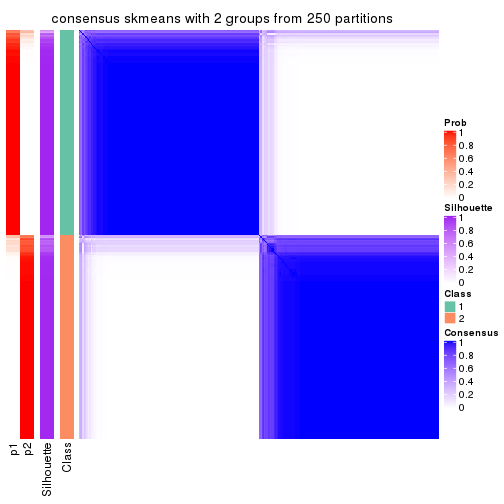</p>

</div>
<div id='tab-SD-skmeans-consensus-heatmap-2'>
<pre><code class="r">consensus_heatmap(res, k = 3)
</code></pre>

<p>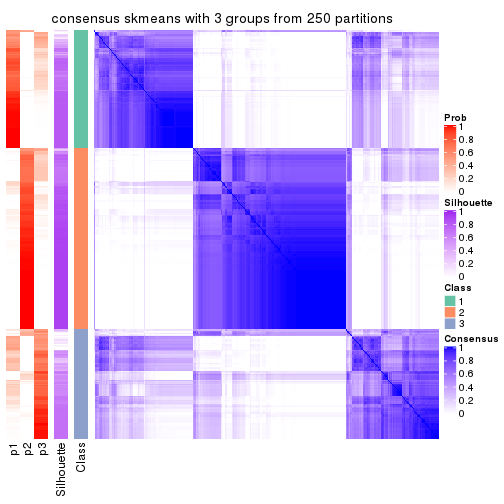</p>

</div>
<div id='tab-SD-skmeans-consensus-heatmap-3'>
<pre><code class="r">consensus_heatmap(res, k = 4)
</code></pre>

<p>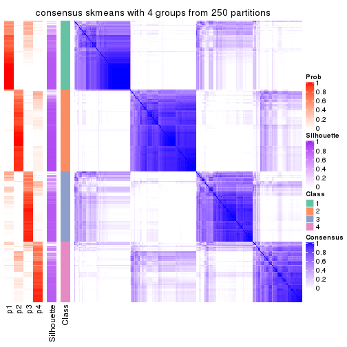</p>

</div>
<div id='tab-SD-skmeans-consensus-heatmap-4'>
<pre><code class="r">consensus_heatmap(res, k = 5)
</code></pre>

<p>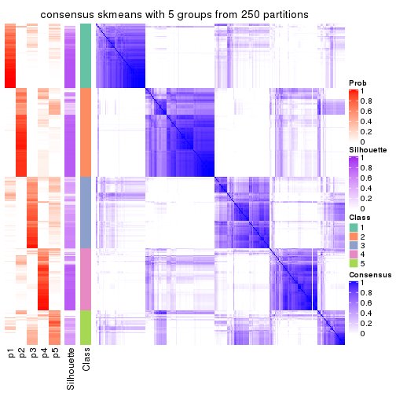</p>

</div>
<div id='tab-SD-skmeans-consensus-heatmap-5'>
<pre><code class="r">consensus_heatmap(res, k = 6)
</code></pre>

<p>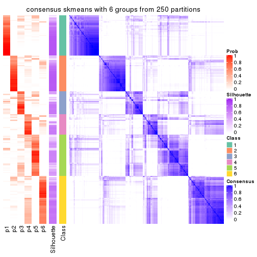</p>

</div>
</div>

Heatmaps for the membership of samples in all partitions to see how consistent they are:


<script>
$( function() {
	$( '#tabs-SD-skmeans-membership-heatmap' ).tabs();
} );
</script>
<div id='tabs-SD-skmeans-membership-heatmap'>
<ul>
<li><a href='#tab-SD-skmeans-membership-heatmap-1'>k = 2</a></li>
<li><a href='#tab-SD-skmeans-membership-heatmap-2'>k = 3</a></li>
<li><a href='#tab-SD-skmeans-membership-heatmap-3'>k = 4</a></li>
<li><a href='#tab-SD-skmeans-membership-heatmap-4'>k = 5</a></li>
<li><a href='#tab-SD-skmeans-membership-heatmap-5'>k = 6</a></li>
</ul>
<div id='tab-SD-skmeans-membership-heatmap-1'>
<pre><code class="r">membership_heatmap(res, k = 2)
</code></pre>

<p>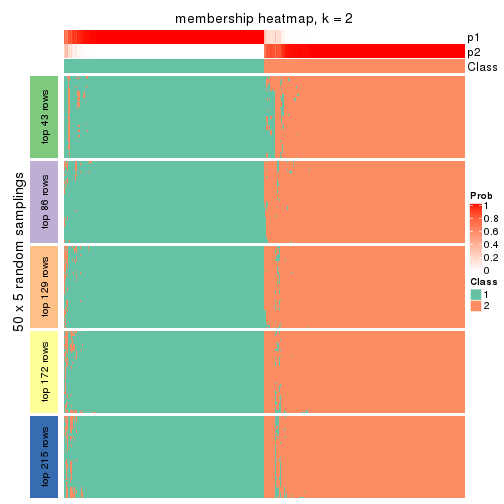</p>

</div>
<div id='tab-SD-skmeans-membership-heatmap-2'>
<pre><code class="r">membership_heatmap(res, k = 3)
</code></pre>

<p>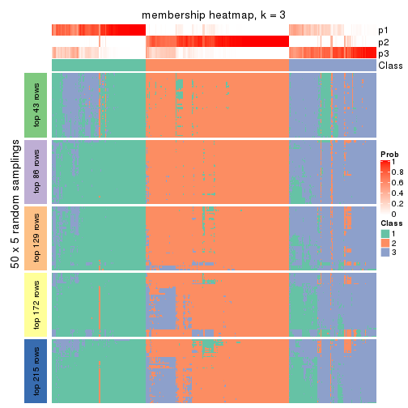</p>

</div>
<div id='tab-SD-skmeans-membership-heatmap-3'>
<pre><code class="r">membership_heatmap(res, k = 4)
</code></pre>

<p>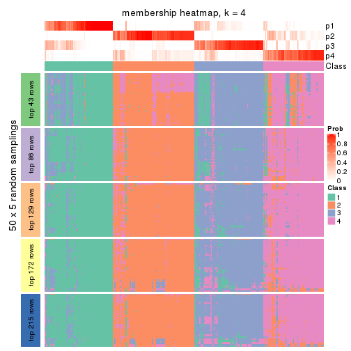</p>

</div>
<div id='tab-SD-skmeans-membership-heatmap-4'>
<pre><code class="r">membership_heatmap(res, k = 5)
</code></pre>

<p>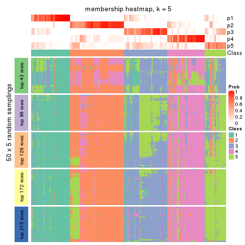</p>

</div>
<div id='tab-SD-skmeans-membership-heatmap-5'>
<pre><code class="r">membership_heatmap(res, k = 6)
</code></pre>

<p>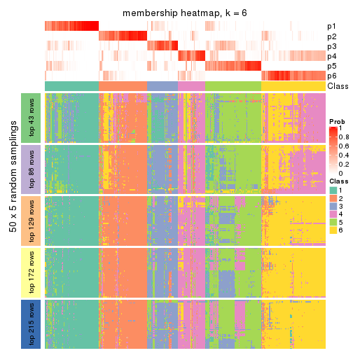</p>

</div>
</div>

As soon as we have had the classes for columns, we can look for signatures
which are significantly different between classes which can be candidate marks
for certain classes. Following are the heatmaps for signatures.


Signature heatmaps where rows are scaled:


<script>
$( function() {
	$( '#tabs-SD-skmeans-get-signatures' ).tabs();
} );
</script>
<div id='tabs-SD-skmeans-get-signatures'>
<ul>
<li><a href='#tab-SD-skmeans-get-signatures-1'>k = 2</a></li>
<li><a href='#tab-SD-skmeans-get-signatures-2'>k = 3</a></li>
<li><a href='#tab-SD-skmeans-get-signatures-3'>k = 4</a></li>
<li><a href='#tab-SD-skmeans-get-signatures-4'>k = 5</a></li>
<li><a href='#tab-SD-skmeans-get-signatures-5'>k = 6</a></li>
</ul>
<div id='tab-SD-skmeans-get-signatures-1'>
<pre><code class="r">get_signatures(res, k = 2)
</code></pre>

<p>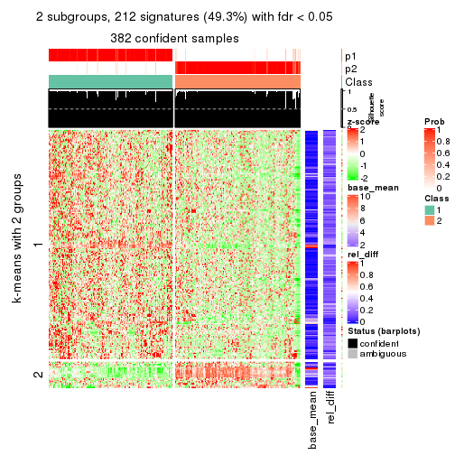</p>

</div>
<div id='tab-SD-skmeans-get-signatures-2'>
<pre><code class="r">get_signatures(res, k = 3)
</code></pre>

<p>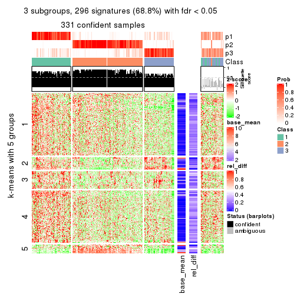</p>

</div>
<div id='tab-SD-skmeans-get-signatures-3'>
<pre><code class="r">get_signatures(res, k = 4)
</code></pre>

<p>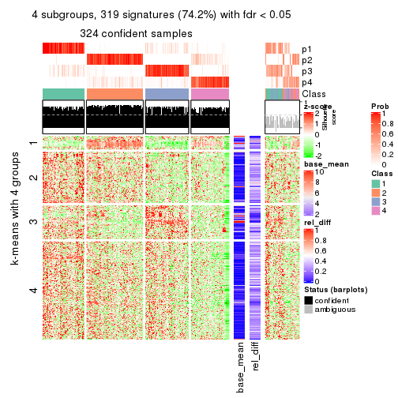</p>

</div>
<div id='tab-SD-skmeans-get-signatures-4'>
<pre><code class="r">get_signatures(res, k = 5)
</code></pre>

<p>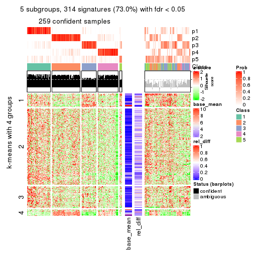</p>

</div>
<div id='tab-SD-skmeans-get-signatures-5'>
<pre><code class="r">get_signatures(res, k = 6)
</code></pre>

<p>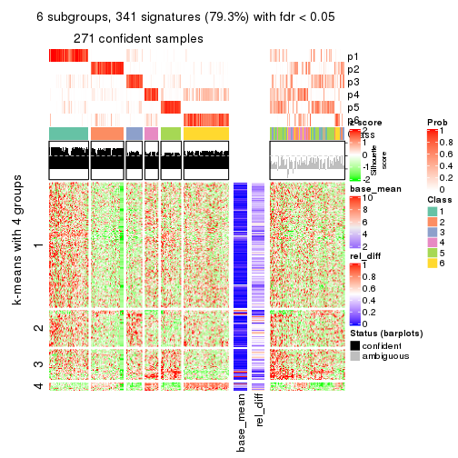</p>

</div>
</div>


Signature heatmaps where rows are not scaled:


<script>
$( function() {
	$( '#tabs-SD-skmeans-get-signatures-no-scale' ).tabs();
} );
</script>
<div id='tabs-SD-skmeans-get-signatures-no-scale'>
<ul>
<li><a href='#tab-SD-skmeans-get-signatures-no-scale-1'>k = 2</a></li>
<li><a href='#tab-SD-skmeans-get-signatures-no-scale-2'>k = 3</a></li>
<li><a href='#tab-SD-skmeans-get-signatures-no-scale-3'>k = 4</a></li>
<li><a href='#tab-SD-skmeans-get-signatures-no-scale-4'>k = 5</a></li>
<li><a href='#tab-SD-skmeans-get-signatures-no-scale-5'>k = 6</a></li>
</ul>
<div id='tab-SD-skmeans-get-signatures-no-scale-1'>
<pre><code class="r">get_signatures(res, k = 2, scale_rows = FALSE)
</code></pre>

<p>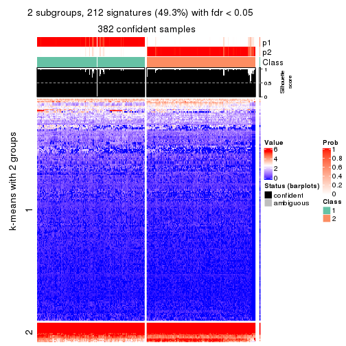</p>

</div>
<div id='tab-SD-skmeans-get-signatures-no-scale-2'>
<pre><code class="r">get_signatures(res, k = 3, scale_rows = FALSE)
</code></pre>

<p>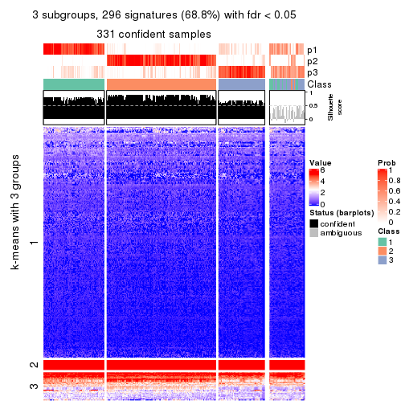</p>

</div>
<div id='tab-SD-skmeans-get-signatures-no-scale-3'>
<pre><code class="r">get_signatures(res, k = 4, scale_rows = FALSE)
</code></pre>

<p>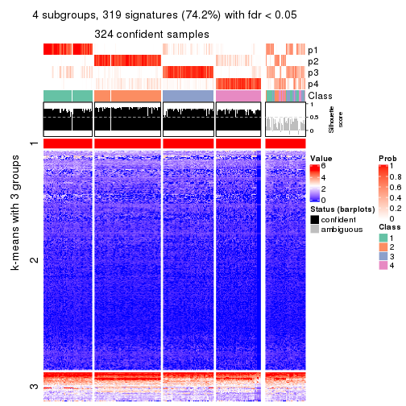</p>

</div>
<div id='tab-SD-skmeans-get-signatures-no-scale-4'>
<pre><code class="r">get_signatures(res, k = 5, scale_rows = FALSE)
</code></pre>

<p>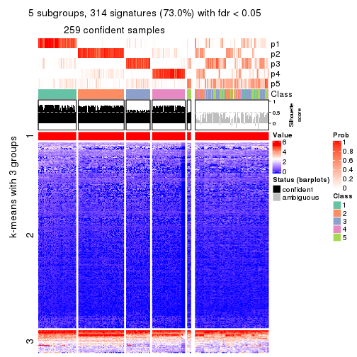</p>

</div>
<div id='tab-SD-skmeans-get-signatures-no-scale-5'>
<pre><code class="r">get_signatures(res, k = 6, scale_rows = FALSE)
</code></pre>

<p>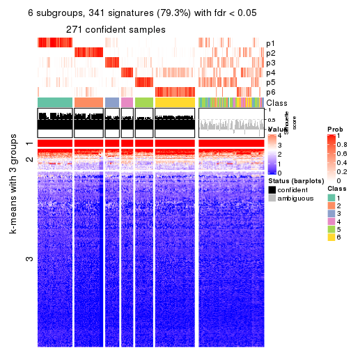</p>

</div>
</div>


Compare the overlap of signatures from different k:

```r
compare_signatures(res)
```

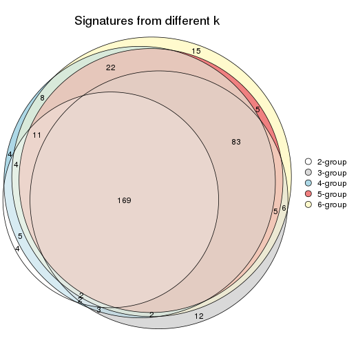

`get_signature()` returns a data frame invisibly. TO get the list of signatures, the function
call should be assigned to a variable explicitly. In following code, if `plot` argument is set
to `FALSE`, no heatmap is plotted while only the differential analysis is performed.

```r
# code only for demonstration
tb = get_signature(res, k = ..., plot = FALSE)
```

An example of the output of `tb` is:

```
#>   which_row         fdr    mean_1    mean_2 scaled_mean_1 scaled_mean_2 km
#> 1        38 0.042760348  8.373488  9.131774    -0.5533452     0.5164555  1
#> 2        40 0.018707592  7.106213  8.469186    -0.6173731     0.5762149  1
#> 3        55 0.019134737 10.221463 11.207825    -0.6159697     0.5749050  1
#> 4        59 0.006059896  5.921854  7.869574    -0.6899429     0.6439467  1
#> 5        60 0.018055526  8.928898 10.211722    -0.6204761     0.5791110  1
#> 6        98 0.009384629 15.714769 14.887706     0.6635654    -0.6193277  2
...
```

The columns in `tb` are:

1. `which_row`: row indices corresponding to the input matrix.
2. `fdr`: FDR for the differential test. 
3. `mean_x`: The mean value in group x.
4. `scaled_mean_x`: The mean value in group x after rows are scaled.
5. `km`: Row groups if k-means clustering is applied to rows.


UMAP plot which shows how samples are separated.


<script>
$( function() {
	$( '#tabs-SD-skmeans-dimension-reduction' ).tabs();
} );
</script>
<div id='tabs-SD-skmeans-dimension-reduction'>
<ul>
<li><a href='#tab-SD-skmeans-dimension-reduction-1'>k = 2</a></li>
<li><a href='#tab-SD-skmeans-dimension-reduction-2'>k = 3</a></li>
<li><a href='#tab-SD-skmeans-dimension-reduction-3'>k = 4</a></li>
<li><a href='#tab-SD-skmeans-dimension-reduction-4'>k = 5</a></li>
<li><a href='#tab-SD-skmeans-dimension-reduction-5'>k = 6</a></li>
</ul>
<div id='tab-SD-skmeans-dimension-reduction-1'>
<pre><code class="r">dimension_reduction(res, k = 2, method = &quot;UMAP&quot;)
</code></pre>

<p>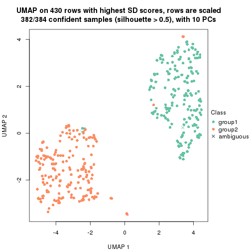</p>

</div>
<div id='tab-SD-skmeans-dimension-reduction-2'>
<pre><code class="r">dimension_reduction(res, k = 3, method = &quot;UMAP&quot;)
</code></pre>

<p>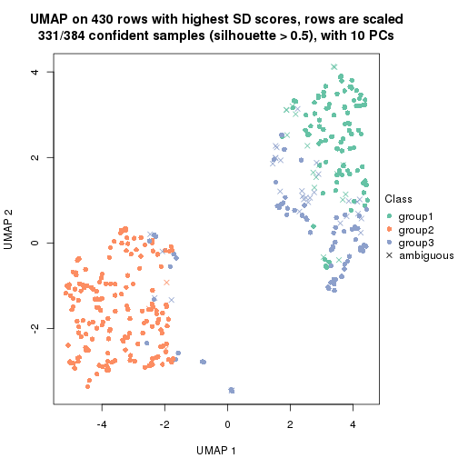</p>

</div>
<div id='tab-SD-skmeans-dimension-reduction-3'>
<pre><code class="r">dimension_reduction(res, k = 4, method = &quot;UMAP&quot;)
</code></pre>

<p>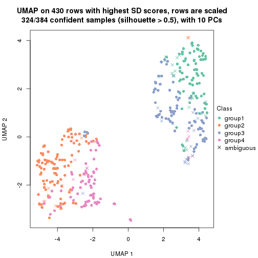</p>

</div>
<div id='tab-SD-skmeans-dimension-reduction-4'>
<pre><code class="r">dimension_reduction(res, k = 5, method = &quot;UMAP&quot;)
</code></pre>

<p>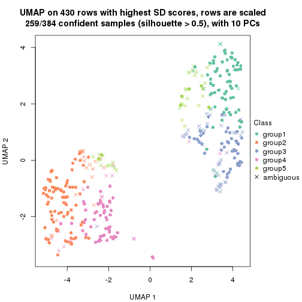</p>

</div>
<div id='tab-SD-skmeans-dimension-reduction-5'>
<pre><code class="r">dimension_reduction(res, k = 6, method = &quot;UMAP&quot;)
</code></pre>

<p>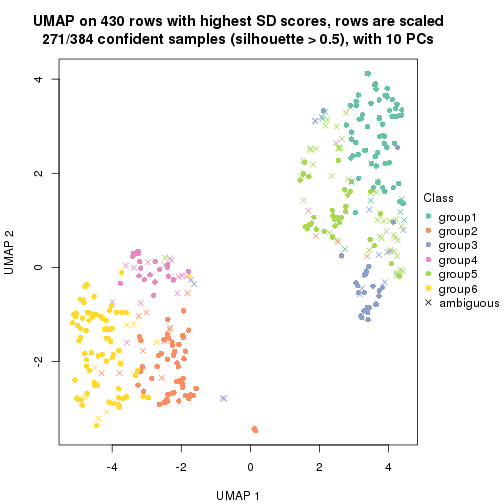</p>

</div>
</div>


Following heatmap shows how subgroups are split when increasing `k`:

```r
collect_classes(res)
```

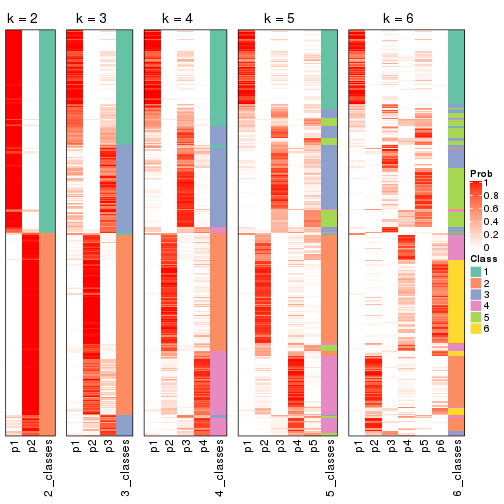


If matrix rows can be associated to genes, consider to use `GO_Enrichment(res,
...)` to perform function enrichment for the signature genes.


 

---------------------------------------------------


### SD:pam


The object with results only for a single top-value method and a single partition method 
can be extracted as:

```r
res = res_list["SD", "pam"]
# you can also extract it by
# res = res_list["SD:pam"]
```

A summary of `res` and all the functions that can be applied to it:

```r
res
```

```
#> A 'ConsensusPartition' object with k = 2, 3, 4, 5, 6.
#>   On a matrix with 430 rows and 384 columns.
#>   Top rows (43, 86, 129, 172, 215) are extracted by 'SD' method.
#>   Subgroups are detected by 'pam' method.
#>   Performed in total 1250 partitions by row resampling.
#>   Best k for subgroups seems to be 2.
#> 
#> Following methods can be applied to this 'ConsensusPartition' object:
#>  [1] "cola_report"             "collect_classes"         "collect_plots"          
#>  [4] "collect_stats"           "colnames"                "compare_signatures"     
#>  [7] "consensus_heatmap"       "dimension_reduction"     "functional_enrichment"  
#> [10] "get_anno_col"            "get_anno"                "get_classes"            
#> [13] "get_consensus"           "get_matrix"              "get_membership"         
#> [16] "get_param"               "get_signatures"          "get_stats"              
#> [19] "is_best_k"               "is_stable_k"             "membership_heatmap"     
#> [22] "ncol"                    "nrow"                    "plot_ecdf"              
#> [25] "rownames"                "select_partition_number" "show"                   
#> [28] "suggest_best_k"          "test_to_known_factors"
```

`collect_plots()` function collects all the plots made from `res` for all `k` (number of partitions)
into one single page to provide an easy and fast comparison between different `k`.

```r
collect_plots(res)
```

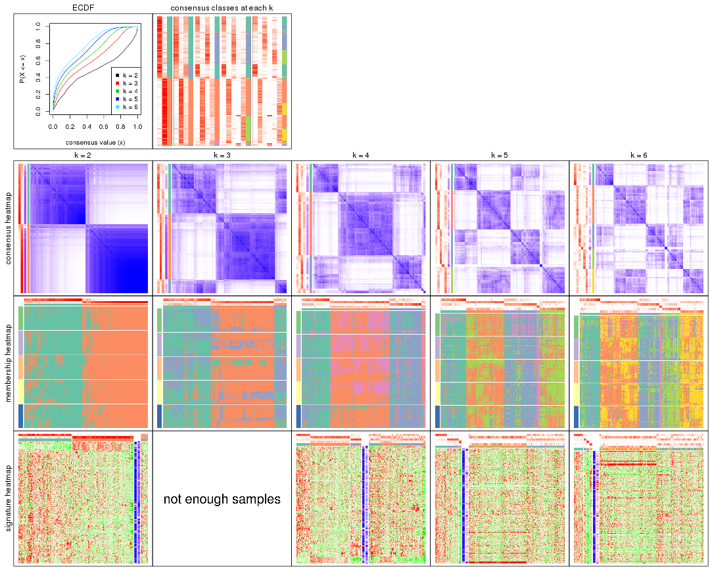

The plots are:

- The first row: a plot of the ECDF (Empirical cumulative distribution
  function) curves of the consensus matrix for each `k` and the heatmap of
  predicted classes for each `k`.
- The second row: heatmaps of the consensus matrix for each `k`.
- The third row: heatmaps of the membership matrix for each `k`.
- The fouth row: heatmaps of the signatures for each `k`.

All the plots in panels can be made by individual functions and they are
plotted later in this section.

`select_partition_number()` produces several plots showing different
statistics for choosing "optimized" `k`. There are following statistics:

- ECDF curves of the consensus matrix for each `k`;
- 1-PAC. [The PAC
  score](https://en.wikipedia.org/wiki/Consensus_clustering#Over-interpretation_potential_of_consensus_clustering)
  measures the proportion of the ambiguous subgrouping.
- Mean silhouette score.
- Concordance. The mean probability of fiting the consensus class ids in all
  partitions.
- Area increased. Denote $A_k$ as the area under the ECDF curve for current
  `k`, the area increased is defined as $A_k - A_{k-1}$.
- Rand index. The percent of pairs of samples that are both in a same cluster
  or both are not in a same cluster in the partition of k and k-1.
- Jaccard index. The ratio of pairs of samples are both in a same cluster in
  the partition of k and k-1 and the pairs of samples are both in a same
  cluster in the partition k or k-1.

The detailed explanations of these statistics can be found in [the cola
vignette](http://bioconductor.org/packages/devel/bioc/vignettes/cola/inst/doc/cola.html#toc_13).

Generally speaking, lower PAC score, higher mean silhouette score or higher
concordance corresponds to better partition. Rand index and Jaccard index
measure how similar the current partition is compared to partition with `k-1`.
If they are too similar, we won't accept `k` is better than `k-1`.

```r
select_partition_number(res)
```

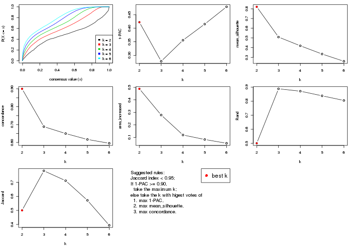

The numeric values for all these statistics can be obtained by `get_stats()`.

```r
get_stats(res)
```

```
#>   k 1-PAC mean_silhouette concordance area_increased  Rand Jaccard
#> 2 2 0.422           0.821       0.900         0.4886 0.501   0.501
#> 3 3 0.278           0.509       0.688         0.2787 0.888   0.782
#> 4 4 0.356           0.419       0.650         0.1190 0.871   0.712
#> 5 5 0.415           0.334       0.617         0.0830 0.838   0.572
#> 6 6 0.479           0.260       0.596         0.0528 0.805   0.394
```

`suggest_best_k()` suggests the best $k$ based on these statistics. The rules are as follows:

- All $k$ with Jaccard index larger than 0.95 are removed because the increase of
  the partition number does not provides enough extra information. If all $k$ are removed,
  the best $k$ is assigned by `NA`.
- For $k$ with 1-PAC larger than 0.9, the maximal $k$ is taken as the "best k". Other $k$ is called "optional k".
- If it does not fit the second rule. The $k$ with the highest vote of highest
  1-PAC, mean silhouette and concordance is taken as the "best k".

```r
suggest_best_k(res)
```

```
#> [1] 2
```


Following shows the table of the partitions (You need to click the **show/hide
code output** link to see it). The membership matrix (columns with name `p*`)
is inferred by
[`clue::cl_consensus()`](https://www.rdocumentation.org/link/cl_consensus?package=clue)
function with the `SE` method. Basically the value in the membership matrix
represents the probability to belong to a certain group. The finall class
label for an item is determined with the group with highest probability it
belongs to.

In `get_classes()` function, the entropy is calculated from the membership
matrix and the silhouette score is calculated from the consensus matrix.


<script>
$( function() {
	$( '#tabs-SD-pam-get-classes' ).tabs();
} );
</script>
<div id='tabs-SD-pam-get-classes'>
<ul>
<li><a href='#tab-SD-pam-get-classes-1'>k = 2</a></li>
<li><a href='#tab-SD-pam-get-classes-2'>k = 3</a></li>
<li><a href='#tab-SD-pam-get-classes-3'>k = 4</a></li>
<li><a href='#tab-SD-pam-get-classes-4'>k = 5</a></li>
<li><a href='#tab-SD-pam-get-classes-5'>k = 6</a></li>
</ul>

<div id='tab-SD-pam-get-classes-1'>
<p><a id='tab-SD-pam-get-classes-1-a' style='color:#0366d6' href='#'>show/hide code output</a></p>
<pre><code class="r">cbind(get_classes(res, k = 2), get_membership(res, k = 2))
</code></pre>

<pre><code>#&gt;            class entropy silhouette    p1    p2
#&gt; SRR2105277     1  0.4562     0.8604 0.904 0.096
#&gt; SRR2105278     1  0.2043     0.8611 0.968 0.032
#&gt; SRR2105275     1  0.8443     0.7218 0.728 0.272
#&gt; SRR2105276     1  0.3733     0.8635 0.928 0.072
#&gt; SRR2105273     1  0.0672     0.8517 0.992 0.008
#&gt; SRR2105274     1  0.0376     0.8498 0.996 0.004
#&gt; SRR2105271     1  0.1184     0.8562 0.984 0.016
#&gt; SRR2105272     1  0.0376     0.8501 0.996 0.004
#&gt; SRR2105269     2  0.0000     0.9232 0.000 1.000
#&gt; SRR2105270     2  0.0000     0.9232 0.000 1.000
#&gt; SRR2105267     2  0.0000     0.9232 0.000 1.000
#&gt; SRR2105268     2  0.0000     0.9232 0.000 1.000
#&gt; SRR2105265     2  0.0000     0.9232 0.000 1.000
#&gt; SRR2105266     2  0.0376     0.9230 0.004 0.996
#&gt; SRR2105263     2  0.1633     0.9185 0.024 0.976
#&gt; SRR2105264     2  0.1843     0.9180 0.028 0.972
#&gt; SRR2105261     2  0.6623     0.7694 0.172 0.828
#&gt; SRR2105262     2  0.8386     0.5930 0.268 0.732
#&gt; SRR2105357     2  0.9881     0.1002 0.436 0.564
#&gt; SRR2105358     1  0.6438     0.8332 0.836 0.164
#&gt; SRR2105439     2  0.0000     0.9232 0.000 1.000
#&gt; SRR2105440     2  0.0376     0.9233 0.004 0.996
#&gt; SRR2105509     2  0.0000     0.9232 0.000 1.000
#&gt; SRR2105510     2  0.0938     0.9211 0.012 0.988
#&gt; SRR2105507     1  0.1414     0.8557 0.980 0.020
#&gt; SRR2105508     1  0.4690     0.8588 0.900 0.100
#&gt; SRR2105505     1  0.5842     0.8514 0.860 0.140
#&gt; SRR2105506     1  0.2236     0.8593 0.964 0.036
#&gt; SRR2105503     2  0.0672     0.9232 0.008 0.992
#&gt; SRR2105504     2  0.2043     0.9140 0.032 0.968
#&gt; SRR2105501     2  0.5629     0.8278 0.132 0.868
#&gt; SRR2105502     2  0.1633     0.9176 0.024 0.976
#&gt; SRR2105499     1  0.6148     0.8409 0.848 0.152
#&gt; SRR2105500     1  0.5842     0.8488 0.860 0.140
#&gt; SRR2105497     2  0.2236     0.9141 0.036 0.964
#&gt; SRR2105498     2  0.7602     0.7159 0.220 0.780
#&gt; SRR2105495     2  0.0000     0.9232 0.000 1.000
#&gt; SRR2105496     2  0.1633     0.9185 0.024 0.976
#&gt; SRR2105493     2  0.3114     0.8996 0.056 0.944
#&gt; SRR2105494     2  0.0376     0.9232 0.004 0.996
#&gt; SRR2105491     2  0.0938     0.9225 0.012 0.988
#&gt; SRR2105492     2  0.2423     0.9109 0.040 0.960
#&gt; SRR2105489     2  0.0376     0.9229 0.004 0.996
#&gt; SRR2105490     2  0.3274     0.8967 0.060 0.940
#&gt; SRR2105487     1  0.9710     0.4637 0.600 0.400
#&gt; SRR2105488     1  0.8555     0.7037 0.720 0.280
#&gt; SRR2105485     1  0.5737     0.8472 0.864 0.136
#&gt; SRR2105486     1  0.5737     0.8479 0.864 0.136
#&gt; SRR2105483     1  0.3584     0.8577 0.932 0.068
#&gt; SRR2105484     1  0.1843     0.8574 0.972 0.028
#&gt; SRR2105481     1  0.0938     0.8540 0.988 0.012
#&gt; SRR2105482     1  0.0000     0.8478 1.000 0.000
#&gt; SRR2105479     1  0.6801     0.8117 0.820 0.180
#&gt; SRR2105480     1  0.0000     0.8478 1.000 0.000
#&gt; SRR2105477     2  0.3431     0.8939 0.064 0.936
#&gt; SRR2105478     2  0.4690     0.8628 0.100 0.900
#&gt; SRR2105475     2  0.0376     0.9232 0.004 0.996
#&gt; SRR2105476     2  0.0376     0.9232 0.004 0.996
#&gt; SRR2105473     2  0.2603     0.9062 0.044 0.956
#&gt; SRR2105474     2  0.4815     0.8559 0.104 0.896
#&gt; SRR2105471     2  0.5059     0.8524 0.112 0.888
#&gt; SRR2105472     2  0.1184     0.9196 0.016 0.984
#&gt; SRR2105469     1  0.7299     0.8131 0.796 0.204
#&gt; SRR2105470     1  0.5946     0.8489 0.856 0.144
#&gt; SRR2105467     1  0.4562     0.8631 0.904 0.096
#&gt; SRR2105468     1  0.2423     0.8629 0.960 0.040
#&gt; SRR2105465     1  0.7745     0.7701 0.772 0.228
#&gt; SRR2105466     1  0.8555     0.6910 0.720 0.280
#&gt; SRR2105463     1  0.2236     0.8578 0.964 0.036
#&gt; SRR2105464     1  0.1633     0.8570 0.976 0.024
#&gt; SRR2105461     2  0.0000     0.9232 0.000 1.000
#&gt; SRR2105462     2  0.0000     0.9232 0.000 1.000
#&gt; SRR2105459     2  0.0000     0.9232 0.000 1.000
#&gt; SRR2105460     2  0.0000     0.9232 0.000 1.000
#&gt; SRR2105457     1  0.8207     0.7475 0.744 0.256
#&gt; SRR2105458     1  0.9427     0.5870 0.640 0.360
#&gt; SRR2105455     1  0.7528     0.8016 0.784 0.216
#&gt; SRR2105456     1  0.1633     0.8575 0.976 0.024
#&gt; SRR2105453     1  0.2236     0.8603 0.964 0.036
#&gt; SRR2105454     1  0.3274     0.8628 0.940 0.060
#&gt; SRR2105451     2  0.3879     0.8840 0.076 0.924
#&gt; SRR2105452     2  0.4431     0.8677 0.092 0.908
#&gt; SRR2105449     1  0.6801     0.8154 0.820 0.180
#&gt; SRR2105450     1  0.1843     0.8584 0.972 0.028
#&gt; SRR2105447     2  0.2778     0.9072 0.048 0.952
#&gt; SRR2105448     2  0.1633     0.9182 0.024 0.976
#&gt; SRR2105445     2  0.7674     0.6771 0.224 0.776
#&gt; SRR2105446     2  0.9933    -0.0106 0.452 0.548
#&gt; SRR2105443     2  0.4562     0.8660 0.096 0.904
#&gt; SRR2105444     2  0.5629     0.8262 0.132 0.868
#&gt; SRR2105441     2  0.0376     0.9230 0.004 0.996
#&gt; SRR2105442     2  0.3431     0.8944 0.064 0.936
#&gt; SRR2105437     1  0.2603     0.8626 0.956 0.044
#&gt; SRR2105438     1  0.2236     0.8622 0.964 0.036
#&gt; SRR2105435     1  0.4690     0.8619 0.900 0.100
#&gt; SRR2105436     1  0.3114     0.8632 0.944 0.056
#&gt; SRR2105433     1  0.2603     0.8623 0.956 0.044
#&gt; SRR2105434     1  0.2043     0.8577 0.968 0.032
#&gt; SRR2105431     1  0.0376     0.8501 0.996 0.004
#&gt; SRR2105432     1  0.0376     0.8501 0.996 0.004
#&gt; SRR2105429     2  0.9323     0.4097 0.348 0.652
#&gt; SRR2105430     2  0.4562     0.8688 0.096 0.904
#&gt; SRR2105427     2  0.0376     0.9231 0.004 0.996
#&gt; SRR2105428     2  0.0000     0.9232 0.000 1.000
#&gt; SRR2105425     2  0.3584     0.8928 0.068 0.932
#&gt; SRR2105426     2  0.6247     0.8076 0.156 0.844
#&gt; SRR2105421     2  0.9710     0.2152 0.400 0.600
#&gt; SRR2105422     2  0.9491     0.3366 0.368 0.632
#&gt; SRR2105423     2  0.0672     0.9228 0.008 0.992
#&gt; SRR2105424     2  0.0000     0.9232 0.000 1.000
#&gt; SRR2105419     1  0.7139     0.8114 0.804 0.196
#&gt; SRR2105420     1  0.9970     0.3224 0.532 0.468
#&gt; SRR2105415     1  0.1414     0.8570 0.980 0.020
#&gt; SRR2105416     1  0.1414     0.8566 0.980 0.020
#&gt; SRR2105417     1  0.5408     0.8549 0.876 0.124
#&gt; SRR2105418     1  0.2778     0.8614 0.952 0.048
#&gt; SRR2105413     2  0.0000     0.9232 0.000 1.000
#&gt; SRR2105414     2  0.1184     0.9215 0.016 0.984
#&gt; SRR2105409     2  0.0000     0.9232 0.000 1.000
#&gt; SRR2105410     2  0.0000     0.9232 0.000 1.000
#&gt; SRR2105411     2  0.0000     0.9232 0.000 1.000
#&gt; SRR2105412     2  0.0672     0.9225 0.008 0.992
#&gt; SRR2105407     1  0.7056     0.8118 0.808 0.192
#&gt; SRR2105408     1  0.8909     0.6747 0.692 0.308
#&gt; SRR2105403     1  0.7745     0.7822 0.772 0.228
#&gt; SRR2105404     1  0.2603     0.8607 0.956 0.044
#&gt; SRR2105405     1  0.3274     0.8622 0.940 0.060
#&gt; SRR2105406     1  0.5737     0.8445 0.864 0.136
#&gt; SRR2105401     2  0.0672     0.9228 0.008 0.992
#&gt; SRR2105402     2  0.3733     0.8844 0.072 0.928
#&gt; SRR2105399     2  0.3431     0.8944 0.064 0.936
#&gt; SRR2105400     2  0.2948     0.9018 0.052 0.948
#&gt; SRR2105397     2  0.6438     0.7950 0.164 0.836
#&gt; SRR2105398     2  0.6887     0.7619 0.184 0.816
#&gt; SRR2105395     2  0.0000     0.9232 0.000 1.000
#&gt; SRR2105396     2  0.3879     0.8835 0.076 0.924
#&gt; SRR2105393     2  0.0000     0.9232 0.000 1.000
#&gt; SRR2105394     2  0.0000     0.9232 0.000 1.000
#&gt; SRR2105389     1  0.6148     0.8372 0.848 0.152
#&gt; SRR2105390     1  0.3584     0.8598 0.932 0.068
#&gt; SRR2105391     1  0.7883     0.7794 0.764 0.236
#&gt; SRR2105392     1  0.6148     0.8360 0.848 0.152
#&gt; SRR2105385     1  0.5737     0.8503 0.864 0.136
#&gt; SRR2105386     1  0.3431     0.8645 0.936 0.064
#&gt; SRR2105387     1  0.7745     0.7774 0.772 0.228
#&gt; SRR2105388     1  0.1414     0.8550 0.980 0.020
#&gt; SRR2105381     2  0.2043     0.9151 0.032 0.968
#&gt; SRR2105382     2  0.1414     0.9193 0.020 0.980
#&gt; SRR2105383     2  0.5519     0.8368 0.128 0.872
#&gt; SRR2105384     2  0.8016     0.6685 0.244 0.756
#&gt; SRR2105379     2  0.1843     0.9164 0.028 0.972
#&gt; SRR2105380     2  0.7056     0.7494 0.192 0.808
#&gt; SRR2105377     2  0.0938     0.9222 0.012 0.988
#&gt; SRR2105378     2  0.4690     0.8634 0.100 0.900
#&gt; SRR2105375     1  0.9754     0.4217 0.592 0.408
#&gt; SRR2105376     1  0.8499     0.6980 0.724 0.276
#&gt; SRR2105373     1  0.2236     0.8610 0.964 0.036
#&gt; SRR2105374     1  0.0000     0.8478 1.000 0.000
#&gt; SRR2105371     1  0.3114     0.8605 0.944 0.056
#&gt; SRR2105372     1  0.3431     0.8605 0.936 0.064
#&gt; SRR2105369     1  0.0376     0.8500 0.996 0.004
#&gt; SRR2105370     1  0.0938     0.8532 0.988 0.012
#&gt; SRR2105367     1  0.9608     0.5186 0.616 0.384
#&gt; SRR2105368     1  0.9129     0.5998 0.672 0.328
#&gt; SRR2105365     2  0.0672     0.9225 0.008 0.992
#&gt; SRR2105366     2  0.0000     0.9232 0.000 1.000
#&gt; SRR2105363     2  0.0000     0.9232 0.000 1.000
#&gt; SRR2105364     2  0.0376     0.9230 0.004 0.996
#&gt; SRR2105361     2  0.0000     0.9232 0.000 1.000
#&gt; SRR2105362     2  0.0376     0.9234 0.004 0.996
#&gt; SRR2105359     1  0.5737     0.8487 0.864 0.136
#&gt; SRR2105360     1  0.4690     0.8601 0.900 0.100
#&gt; SRR2105355     1  0.8016     0.7690 0.756 0.244
#&gt; SRR2105356     1  0.1184     0.8555 0.984 0.016
#&gt; SRR2105353     1  0.6623     0.8291 0.828 0.172
#&gt; SRR2105354     1  0.0672     0.8519 0.992 0.008
#&gt; SRR2105351     2  0.0000     0.9232 0.000 1.000
#&gt; SRR2105352     2  0.3879     0.8808 0.076 0.924
#&gt; SRR2105349     2  0.0376     0.9231 0.004 0.996
#&gt; SRR2105350     2  0.0376     0.9230 0.004 0.996
#&gt; SRR2105345     2  0.1414     0.9197 0.020 0.980
#&gt; SRR2105346     2  0.0672     0.9219 0.008 0.992
#&gt; SRR2105347     2  0.8499     0.6143 0.276 0.724
#&gt; SRR2105348     2  0.6048     0.8093 0.148 0.852
#&gt; SRR2105343     2  0.0000     0.9232 0.000 1.000
#&gt; SRR2105344     2  0.0000     0.9232 0.000 1.000
#&gt; SRR2105341     1  0.6531     0.8286 0.832 0.168
#&gt; SRR2105342     1  0.5059     0.8571 0.888 0.112
#&gt; SRR2105339     1  0.6801     0.8245 0.820 0.180
#&gt; SRR2105340     1  0.4562     0.8594 0.904 0.096
#&gt; SRR2105335     1  0.0000     0.8478 1.000 0.000
#&gt; SRR2105336     1  0.0000     0.8478 1.000 0.000
#&gt; SRR2105337     1  0.5629     0.8459 0.868 0.132
#&gt; SRR2105338     1  0.2236     0.8596 0.964 0.036
#&gt; SRR2105331     2  0.0000     0.9232 0.000 1.000
#&gt; SRR2105332     2  0.2603     0.9086 0.044 0.956
#&gt; SRR2105333     2  0.0376     0.9232 0.004 0.996
#&gt; SRR2105334     2  0.2423     0.9111 0.040 0.960
#&gt; SRR2105329     2  0.6048     0.8030 0.148 0.852
#&gt; SRR2105330     2  0.5294     0.8429 0.120 0.880
#&gt; SRR2105327     2  0.2423     0.9123 0.040 0.960
#&gt; SRR2105328     2  0.3114     0.9019 0.056 0.944
#&gt; SRR2105325     1  0.3584     0.8643 0.932 0.068
#&gt; SRR2105326     1  0.2043     0.8596 0.968 0.032
#&gt; SRR2105323     2  0.9909     0.0408 0.444 0.556
#&gt; SRR2105324     1  0.8016     0.7721 0.756 0.244
#&gt; SRR2105319     1  0.0000     0.8478 1.000 0.000
#&gt; SRR2105320     1  0.0000     0.8478 1.000 0.000
#&gt; SRR2105321     1  0.1414     0.8567 0.980 0.020
#&gt; SRR2105322     1  0.0938     0.8536 0.988 0.012
#&gt; SRR2105317     2  0.0000     0.9232 0.000 1.000
#&gt; SRR2105318     2  0.0000     0.9232 0.000 1.000
#&gt; SRR2105315     2  0.6247     0.7922 0.156 0.844
#&gt; SRR2105316     2  0.0938     0.9225 0.012 0.988
#&gt; SRR2105313     2  0.0000     0.9232 0.000 1.000
#&gt; SRR2105314     2  0.0000     0.9232 0.000 1.000
#&gt; SRR2105311     1  0.9635     0.5200 0.612 0.388
#&gt; SRR2105312     1  0.9795     0.4427 0.584 0.416
#&gt; SRR2105307     1  0.5178     0.8544 0.884 0.116
#&gt; SRR2105308     1  0.7815     0.7763 0.768 0.232
#&gt; SRR2105309     1  0.8955     0.6727 0.688 0.312
#&gt; SRR2105310     1  0.5629     0.8451 0.868 0.132
#&gt; SRR2105305     1  0.7056     0.8087 0.808 0.192
#&gt; SRR2105306     1  0.5178     0.8521 0.884 0.116
#&gt; SRR2105303     2  0.0000     0.9232 0.000 1.000
#&gt; SRR2105304     2  0.1184     0.9205 0.016 0.984
#&gt; SRR2105301     2  0.3584     0.8911 0.068 0.932
#&gt; SRR2105302     2  0.0672     0.9230 0.008 0.992
#&gt; SRR2105299     2  0.7219     0.7289 0.200 0.800
#&gt; SRR2105300     2  0.6247     0.8030 0.156 0.844
#&gt; SRR2105297     2  0.9635     0.3341 0.388 0.612
#&gt; SRR2105298     2  0.9795     0.2392 0.416 0.584
#&gt; SRR2105295     2  0.0000     0.9232 0.000 1.000
#&gt; SRR2105296     2  0.0000     0.9232 0.000 1.000
#&gt; SRR2105293     1  0.8327     0.7336 0.736 0.264
#&gt; SRR2105294     1  0.0000     0.8478 1.000 0.000
#&gt; SRR2105291     1  0.7815     0.7881 0.768 0.232
#&gt; SRR2105292     1  0.3431     0.8615 0.936 0.064
#&gt; SRR2105289     1  0.5842     0.8504 0.860 0.140
#&gt; SRR2105290     1  0.0000     0.8478 1.000 0.000
#&gt; SRR2105287     1  0.3879     0.8627 0.924 0.076
#&gt; SRR2105288     1  0.3879     0.8563 0.924 0.076
#&gt; SRR2105285     2  0.1414     0.9201 0.020 0.980
#&gt; SRR2105286     2  0.1414     0.9200 0.020 0.980
#&gt; SRR2105283     2  0.6247     0.7998 0.156 0.844
#&gt; SRR2105284     2  0.3584     0.8927 0.068 0.932
#&gt; SRR2105281     2  0.0000     0.9232 0.000 1.000
#&gt; SRR2105282     2  0.0000     0.9232 0.000 1.000
#&gt; SRR2105259     1  0.7950     0.7680 0.760 0.240
#&gt; SRR2105260     1  0.9983     0.2825 0.524 0.476
#&gt; SRR2105279     2  0.0000     0.9232 0.000 1.000
#&gt; SRR2105280     2  0.0000     0.9232 0.000 1.000
#&gt; SRR2105257     1  0.5408     0.8507 0.876 0.124
#&gt; SRR2105258     1  0.2423     0.8597 0.960 0.040
#&gt; SRR2105253     2  0.0000     0.9232 0.000 1.000
#&gt; SRR2105254     2  0.0000     0.9232 0.000 1.000
#&gt; SRR2105255     1  0.1843     0.8592 0.972 0.028
#&gt; SRR2105256     1  0.0938     0.8537 0.988 0.012
#&gt; SRR2105251     2  0.0000     0.9232 0.000 1.000
#&gt; SRR2105252     2  0.0000     0.9232 0.000 1.000
#&gt; SRR2105249     2  0.0376     0.9230 0.004 0.996
#&gt; SRR2105250     2  0.2043     0.9142 0.032 0.968
#&gt; SRR2105247     2  0.1633     0.9181 0.024 0.976
#&gt; SRR2105248     2  0.0000     0.9232 0.000 1.000
#&gt; SRR2105245     1  0.9427     0.5779 0.640 0.360
#&gt; SRR2105246     1  0.9850     0.3861 0.572 0.428
#&gt; SRR2105243     1  0.4562     0.8592 0.904 0.096
#&gt; SRR2105244     1  0.6712     0.8289 0.824 0.176
#&gt; SRR2105241     1  0.4431     0.8585 0.908 0.092
#&gt; SRR2105242     1  0.0938     0.8537 0.988 0.012
#&gt; SRR2105239     1  0.6247     0.8423 0.844 0.156
#&gt; SRR2105240     1  0.0672     0.8515 0.992 0.008
#&gt; SRR2105237     2  0.2236     0.9131 0.036 0.964
#&gt; SRR2105238     2  0.2778     0.9059 0.048 0.952
#&gt; SRR2105235     2  0.0000     0.9232 0.000 1.000
#&gt; SRR2105236     2  0.2778     0.9032 0.048 0.952
#&gt; SRR2105233     2  0.0000     0.9232 0.000 1.000
#&gt; SRR2105234     2  0.0000     0.9232 0.000 1.000
#&gt; SRR2105231     2  0.0000     0.9232 0.000 1.000
#&gt; SRR2105232     2  0.0672     0.9223 0.008 0.992
#&gt; SRR2105227     2  0.9988    -0.0659 0.480 0.520
#&gt; SRR2105228     1  0.9993     0.1895 0.516 0.484
#&gt; SRR2105225     1  0.1633     0.8586 0.976 0.024
#&gt; SRR2105226     1  0.0376     0.8500 0.996 0.004
#&gt; SRR2105229     1  0.9922     0.3625 0.552 0.448
#&gt; SRR2105230     1  0.2778     0.8631 0.952 0.048
#&gt; SRR2105219     2  0.0000     0.9232 0.000 1.000
#&gt; SRR2105220     2  0.0000     0.9232 0.000 1.000
#&gt; SRR2105221     2  0.6048     0.8186 0.148 0.852
#&gt; SRR2105222     2  0.5946     0.8157 0.144 0.856
#&gt; SRR2105223     1  0.4298     0.8624 0.912 0.088
#&gt; SRR2105224     1  0.0000     0.8478 1.000 0.000
#&gt; SRR2105217     2  0.0000     0.9232 0.000 1.000
#&gt; SRR2105218     2  0.0376     0.9233 0.004 0.996
#&gt; SRR2105215     2  0.0000     0.9232 0.000 1.000
#&gt; SRR2105216     2  0.0000     0.9232 0.000 1.000
#&gt; SRR2105213     1  0.9795     0.4810 0.584 0.416
#&gt; SRR2105214     1  0.9580     0.5725 0.620 0.380
#&gt; SRR2105211     2  0.9954    -0.0500 0.460 0.540
#&gt; SRR2105212     1  0.8443     0.7405 0.728 0.272
#&gt; SRR2105209     1  0.0938     0.8544 0.988 0.012
#&gt; SRR2105210     1  0.0000     0.8478 1.000 0.000
#&gt; SRR2105207     1  0.9580     0.5008 0.620 0.380
#&gt; SRR2105208     1  0.3733     0.8607 0.928 0.072
#&gt; SRR2105205     2  0.5294     0.8418 0.120 0.880
#&gt; SRR2105206     2  0.5737     0.8280 0.136 0.864
#&gt; SRR2105201     2  0.2603     0.9092 0.044 0.956
#&gt; SRR2105202     2  0.1633     0.9195 0.024 0.976
#&gt; SRR2105203     2  0.0000     0.9232 0.000 1.000
#&gt; SRR2105204     2  0.0000     0.9232 0.000 1.000
#&gt; SRR2105199     2  0.0000     0.9232 0.000 1.000
#&gt; SRR2105200     2  0.0376     0.9235 0.004 0.996
#&gt; SRR2105197     1  0.7219     0.8053 0.800 0.200
#&gt; SRR2105198     2  0.9944     0.0148 0.456 0.544
#&gt; SRR2105195     1  0.8763     0.6803 0.704 0.296
#&gt; SRR2105196     1  0.8955     0.6346 0.688 0.312
#&gt; SRR2105193     1  0.4298     0.8548 0.912 0.088
#&gt; SRR2105194     1  0.0000     0.8478 1.000 0.000
#&gt; SRR2105191     1  0.8207     0.7577 0.744 0.256
#&gt; SRR2105192     1  0.0376     0.8500 0.996 0.004
#&gt; SRR2105189     2  0.2043     0.9140 0.032 0.968
#&gt; SRR2105190     2  0.0000     0.9232 0.000 1.000
#&gt; SRR2105187     2  0.4022     0.8810 0.080 0.920
#&gt; SRR2105188     2  0.7528     0.7260 0.216 0.784
#&gt; SRR2105179     1  0.4939     0.8583 0.892 0.108
#&gt; SRR2105180     1  0.3431     0.8612 0.936 0.064
#&gt; SRR2105183     2  0.1843     0.9166 0.028 0.972
#&gt; SRR2105184     2  0.2043     0.9139 0.032 0.968
#&gt; SRR2105185     2  0.1414     0.9194 0.020 0.980
#&gt; SRR2105186     2  0.2423     0.9098 0.040 0.960
#&gt; SRR2105181     1  0.8386     0.7258 0.732 0.268
#&gt; SRR2105182     1  0.4562     0.8570 0.904 0.096
#&gt; SRR2105177     1  0.7056     0.7923 0.808 0.192
#&gt; SRR2105178     1  0.2948     0.8587 0.948 0.052
#&gt; SRR2105171     2  0.0000     0.9232 0.000 1.000
#&gt; SRR2105172     2  0.0000     0.9232 0.000 1.000
#&gt; SRR2105175     1  0.6438     0.8208 0.836 0.164
#&gt; SRR2105176     1  0.0672     0.8518 0.992 0.008
#&gt; SRR2105173     2  0.0376     0.9233 0.004 0.996
#&gt; SRR2105174     2  0.0000     0.9232 0.000 1.000
#&gt; SRR2105169     2  0.0376     0.9223 0.004 0.996
#&gt; SRR2105170     2  0.4161     0.8820 0.084 0.916
#&gt; SRR2105167     2  0.0000     0.9232 0.000 1.000
#&gt; SRR2105168     2  0.0000     0.9232 0.000 1.000
#&gt; SRR2105165     1  0.1633     0.8578 0.976 0.024
#&gt; SRR2105166     1  0.0938     0.8540 0.988 0.012
#&gt; SRR2105163     1  0.9970     0.2887 0.532 0.468
#&gt; SRR2105164     1  0.6531     0.8341 0.832 0.168
#&gt; SRR2105161     1  0.6148     0.8415 0.848 0.152
#&gt; SRR2105162     1  0.6531     0.8180 0.832 0.168
#&gt; SRR2105155     2  0.0000     0.9232 0.000 1.000
#&gt; SRR2105156     2  0.0000     0.9232 0.000 1.000
#&gt; SRR2105157     2  0.0000     0.9232 0.000 1.000
#&gt; SRR2105158     2  0.0000     0.9232 0.000 1.000
#&gt; SRR2105159     1  0.8144     0.7452 0.748 0.252
#&gt; SRR2105160     1  0.6148     0.8314 0.848 0.152
#&gt; SRR2105153     2  0.0000     0.9232 0.000 1.000
#&gt; SRR2105154     2  0.0000     0.9232 0.000 1.000
#&gt; SRR2105151     2  0.2778     0.9053 0.048 0.952
#&gt; SRR2105152     2  0.0376     0.9223 0.004 0.996
#&gt; SRR2105149     1  0.9710     0.5049 0.600 0.400
#&gt; SRR2105150     1  0.9988     0.2464 0.520 0.480
#&gt; SRR2105147     2  0.8207     0.6335 0.256 0.744
#&gt; SRR2105148     2  0.8955     0.5036 0.312 0.688
#&gt; SRR2105143     1  0.8861     0.6630 0.696 0.304
#&gt; SRR2105144     1  0.8207     0.7270 0.744 0.256
#&gt; SRR2105145     1  0.8386     0.7071 0.732 0.268
#&gt; SRR2105146     1  0.0376     0.8502 0.996 0.004
#&gt; SRR2105141     2  0.0376     0.9229 0.004 0.996
#&gt; SRR2105142     2  0.0000     0.9232 0.000 1.000
#&gt; SRR2105139     2  0.0000     0.9232 0.000 1.000
#&gt; SRR2105140     2  0.2603     0.9080 0.044 0.956
#&gt; SRR2105137     2  0.3733     0.8917 0.072 0.928
#&gt; SRR2105138     2  0.7745     0.7085 0.228 0.772
#&gt; SRR2105135     2  0.0000     0.9232 0.000 1.000
#&gt; SRR2105136     2  0.0000     0.9232 0.000 1.000
#&gt; SRR2105133     1  0.6887     0.8227 0.816 0.184
#&gt; SRR2105134     1  0.2778     0.8636 0.952 0.048
#&gt; SRR2105131     2  0.5842     0.8162 0.140 0.860
#&gt; SRR2105132     1  0.9491     0.5308 0.632 0.368
#&gt; SRR2105129     1  0.6148     0.8283 0.848 0.152
#&gt; SRR2105130     1  0.5629     0.8412 0.868 0.132
#&gt; SRR2105127     1  0.6048     0.8472 0.852 0.148
#&gt; SRR2105128     1  0.7674     0.7935 0.776 0.224
</code></pre>

<script>
$('#tab-SD-pam-get-classes-1-a').parent().next().next().hide();
$('#tab-SD-pam-get-classes-1-a').click(function(){
  $('#tab-SD-pam-get-classes-1-a').parent().next().next().toggle();
  return(false);
});
</script>
</div>

<div id='tab-SD-pam-get-classes-2'>
<p><a id='tab-SD-pam-get-classes-2-a' style='color:#0366d6' href='#'>show/hide code output</a></p>
<pre><code class="r">cbind(get_classes(res, k = 3), get_membership(res, k = 3))
</code></pre>

<pre><code>#&gt;            class entropy silhouette    p1    p2    p3
#&gt; SRR2105277     1   0.445    0.44018 0.856 0.032 0.112
#&gt; SRR2105278     1   0.378    0.41790 0.864 0.004 0.132
#&gt; SRR2105275     1   0.894    0.18556 0.544 0.156 0.300
#&gt; SRR2105276     1   0.642    0.36871 0.708 0.032 0.260
#&gt; SRR2105273     1   0.484    0.34354 0.776 0.000 0.224
#&gt; SRR2105274     1   0.576    0.19484 0.672 0.000 0.328
#&gt; SRR2105271     1   0.551    0.38870 0.764 0.016 0.220
#&gt; SRR2105272     1   0.596    0.22686 0.672 0.004 0.324
#&gt; SRR2105269     2   0.496    0.83349 0.008 0.792 0.200
#&gt; SRR2105270     2   0.304    0.84908 0.000 0.896 0.104
#&gt; SRR2105267     2   0.450    0.83806 0.000 0.804 0.196
#&gt; SRR2105268     2   0.236    0.84675 0.000 0.928 0.072
#&gt; SRR2105265     2   0.382    0.84723 0.000 0.852 0.148
#&gt; SRR2105266     2   0.210    0.83453 0.004 0.944 0.052
#&gt; SRR2105263     2   0.412    0.82587 0.000 0.832 0.168
#&gt; SRR2105264     2   0.254    0.84125 0.000 0.920 0.080
#&gt; SRR2105261     2   0.904    0.60552 0.204 0.556 0.240
#&gt; SRR2105262     2   0.843    0.49283 0.260 0.604 0.136
#&gt; SRR2105357     1   0.964    0.08398 0.460 0.308 0.232
#&gt; SRR2105358     1   0.425    0.43981 0.872 0.048 0.080
#&gt; SRR2105439     2   0.429    0.84553 0.004 0.832 0.164
#&gt; SRR2105440     2   0.497    0.84162 0.000 0.764 0.236
#&gt; SRR2105509     2   0.536    0.82929 0.020 0.784 0.196
#&gt; SRR2105510     2   0.564    0.82495 0.020 0.760 0.220
#&gt; SRR2105507     1   0.529    0.35441 0.764 0.008 0.228
#&gt; SRR2105508     1   0.563    0.41373 0.780 0.032 0.188
#&gt; SRR2105505     1   0.825    0.07517 0.528 0.080 0.392
#&gt; SRR2105506     1   0.652   -0.23522 0.512 0.004 0.484
#&gt; SRR2105503     2   0.475    0.84391 0.000 0.784 0.216
#&gt; SRR2105504     2   0.834    0.67229 0.096 0.560 0.344
#&gt; SRR2105501     2   0.639    0.76042 0.124 0.768 0.108
#&gt; SRR2105502     2   0.749    0.72236 0.052 0.608 0.340
#&gt; SRR2105499     1   0.417    0.45738 0.868 0.028 0.104
#&gt; SRR2105500     1   0.556    0.44277 0.808 0.064 0.128
#&gt; SRR2105497     2   0.321    0.83350 0.008 0.900 0.092
#&gt; SRR2105498     2   0.719    0.67451 0.080 0.696 0.224
#&gt; SRR2105495     2   0.295    0.84931 0.004 0.908 0.088
#&gt; SRR2105496     2   0.287    0.84237 0.008 0.916 0.076
#&gt; SRR2105493     2   0.554    0.83107 0.052 0.804 0.144
#&gt; SRR2105494     2   0.500    0.82836 0.028 0.820 0.152
#&gt; SRR2105491     2   0.545    0.83317 0.012 0.760 0.228
#&gt; SRR2105492     2   0.507    0.79564 0.012 0.792 0.196
#&gt; SRR2105489     2   0.355    0.83941 0.000 0.868 0.132
#&gt; SRR2105490     2   0.429    0.76542 0.000 0.820 0.180
#&gt; SRR2105487     1   0.923   -0.01056 0.428 0.152 0.420
#&gt; SRR2105488     3   0.903    0.12713 0.428 0.132 0.440
#&gt; SRR2105485     1   0.587    0.44744 0.784 0.056 0.160
#&gt; SRR2105486     1   0.420    0.46056 0.864 0.024 0.112
#&gt; SRR2105483     3   0.681    0.39271 0.404 0.016 0.580
#&gt; SRR2105484     3   0.656    0.37324 0.416 0.008 0.576
#&gt; SRR2105481     1   0.516    0.33909 0.764 0.004 0.232
#&gt; SRR2105482     1   0.630   -0.19481 0.516 0.000 0.484
#&gt; SRR2105479     1   0.940   -0.10659 0.464 0.180 0.356
#&gt; SRR2105480     1   0.634    0.09152 0.596 0.004 0.400
#&gt; SRR2105477     2   0.713    0.71730 0.116 0.720 0.164
#&gt; SRR2105478     2   0.653    0.80729 0.092 0.756 0.152
#&gt; SRR2105475     2   0.382    0.84838 0.000 0.852 0.148
#&gt; SRR2105476     2   0.388    0.84782 0.000 0.848 0.152
#&gt; SRR2105473     2   0.619    0.71036 0.016 0.692 0.292
#&gt; SRR2105474     2   0.522    0.71740 0.012 0.780 0.208
#&gt; SRR2105471     2   0.578    0.80682 0.032 0.768 0.200
#&gt; SRR2105472     2   0.394    0.78377 0.000 0.844 0.156
#&gt; SRR2105469     1   0.865    0.24050 0.580 0.144 0.276
#&gt; SRR2105470     1   0.706    0.31275 0.632 0.036 0.332
#&gt; SRR2105467     1   0.557    0.41490 0.784 0.032 0.184
#&gt; SRR2105468     1   0.576    0.29789 0.716 0.008 0.276
#&gt; SRR2105465     1   0.901   -0.23759 0.460 0.132 0.408
#&gt; SRR2105466     3   0.897    0.38589 0.348 0.140 0.512
#&gt; SRR2105463     3   0.646    0.34623 0.440 0.004 0.556
#&gt; SRR2105464     3   0.629    0.29056 0.464 0.000 0.536
#&gt; SRR2105461     2   0.304    0.84838 0.000 0.896 0.104
#&gt; SRR2105462     2   0.312    0.84689 0.000 0.892 0.108
#&gt; SRR2105459     2   0.493    0.82796 0.000 0.768 0.232
#&gt; SRR2105460     2   0.424    0.83634 0.000 0.824 0.176
#&gt; SRR2105457     1   0.600    0.38283 0.780 0.064 0.156
#&gt; SRR2105458     1   0.745    0.29492 0.700 0.144 0.156
#&gt; SRR2105455     1   0.891    0.17760 0.560 0.168 0.272
#&gt; SRR2105456     1   0.655    0.12250 0.616 0.012 0.372
#&gt; SRR2105453     1   0.729   -0.25427 0.508 0.028 0.464
#&gt; SRR2105454     3   0.746    0.34902 0.440 0.036 0.524
#&gt; SRR2105451     2   0.801    0.72374 0.100 0.624 0.276
#&gt; SRR2105452     2   0.953    0.50237 0.196 0.448 0.356
#&gt; SRR2105449     3   0.936    0.23191 0.396 0.168 0.436
#&gt; SRR2105450     1   0.658   -0.02881 0.572 0.008 0.420
#&gt; SRR2105447     2   0.685    0.81125 0.060 0.708 0.232
#&gt; SRR2105448     2   0.517    0.84457 0.016 0.792 0.192
#&gt; SRR2105445     2   0.920    0.51292 0.268 0.532 0.200
#&gt; SRR2105446     1   0.916    0.08750 0.492 0.352 0.156
#&gt; SRR2105443     2   0.867    0.66342 0.184 0.596 0.220
#&gt; SRR2105444     2   0.836    0.67929 0.148 0.620 0.232
#&gt; SRR2105441     2   0.385    0.85468 0.004 0.860 0.136
#&gt; SRR2105442     2   0.385    0.81100 0.016 0.876 0.108
#&gt; SRR2105437     1   0.623    0.18366 0.652 0.008 0.340
#&gt; SRR2105438     1   0.682    0.16103 0.628 0.024 0.348
#&gt; SRR2105435     1   0.626    0.41522 0.752 0.052 0.196
#&gt; SRR2105436     1   0.423    0.44814 0.872 0.044 0.084
#&gt; SRR2105433     1   0.699    0.08161 0.592 0.024 0.384
#&gt; SRR2105434     1   0.652   -0.22517 0.500 0.004 0.496
#&gt; SRR2105431     3   0.621    0.33393 0.428 0.000 0.572
#&gt; SRR2105432     3   0.645    0.34794 0.436 0.004 0.560
#&gt; SRR2105429     2   0.986    0.12133 0.260 0.404 0.336
#&gt; SRR2105430     2   0.691    0.77673 0.120 0.736 0.144
#&gt; SRR2105427     2   0.458    0.84018 0.004 0.812 0.184
#&gt; SRR2105428     2   0.382    0.84833 0.000 0.852 0.148
#&gt; SRR2105425     2   0.564    0.83701 0.016 0.752 0.232
#&gt; SRR2105426     2   0.521    0.81477 0.052 0.824 0.124
#&gt; SRR2105421     2   0.993    0.19159 0.344 0.376 0.280
#&gt; SRR2105422     2   0.998    0.11298 0.344 0.356 0.300
#&gt; SRR2105423     2   0.463    0.84542 0.004 0.808 0.188
#&gt; SRR2105424     2   0.460    0.84446 0.000 0.796 0.204
#&gt; SRR2105419     1   0.731    0.40140 0.684 0.080 0.236
#&gt; SRR2105420     1   0.897    0.18218 0.560 0.256 0.184
#&gt; SRR2105415     3   0.663    0.35673 0.440 0.008 0.552
#&gt; SRR2105416     3   0.674    0.36135 0.428 0.012 0.560
#&gt; SRR2105417     1   0.833   -0.14634 0.484 0.080 0.436
#&gt; SRR2105418     3   0.739    0.41868 0.380 0.040 0.580
#&gt; SRR2105413     2   0.573    0.82678 0.020 0.752 0.228
#&gt; SRR2105414     2   0.564    0.83427 0.036 0.784 0.180
#&gt; SRR2105409     2   0.334    0.84901 0.000 0.880 0.120
#&gt; SRR2105410     2   0.341    0.84326 0.000 0.876 0.124
#&gt; SRR2105411     2   0.236    0.84048 0.000 0.928 0.072
#&gt; SRR2105412     2   0.288    0.84176 0.000 0.904 0.096
#&gt; SRR2105407     1   0.383    0.44028 0.888 0.036 0.076
#&gt; SRR2105408     1   0.600    0.38325 0.784 0.072 0.144
#&gt; SRR2105403     1   0.621    0.41588 0.768 0.068 0.164
#&gt; SRR2105404     1   0.364    0.44449 0.872 0.004 0.124
#&gt; SRR2105405     1   0.733    0.12320 0.612 0.044 0.344
#&gt; SRR2105406     1   0.814   -0.24239 0.480 0.068 0.452
#&gt; SRR2105401     2   0.610    0.81516 0.040 0.752 0.208
#&gt; SRR2105402     2   0.935    0.54541 0.176 0.472 0.352
#&gt; SRR2105399     2   0.761    0.74567 0.148 0.688 0.164
#&gt; SRR2105400     2   0.788    0.73826 0.128 0.660 0.212
#&gt; SRR2105397     2   0.920    0.57161 0.192 0.528 0.280
#&gt; SRR2105398     2   0.967    0.48558 0.264 0.464 0.272
#&gt; SRR2105395     2   0.263    0.84348 0.000 0.916 0.084
#&gt; SRR2105396     2   0.410    0.80885 0.060 0.880 0.060
#&gt; SRR2105393     2   0.348    0.85116 0.000 0.872 0.128
#&gt; SRR2105394     2   0.186    0.83032 0.000 0.948 0.052
#&gt; SRR2105389     1   0.354    0.43930 0.888 0.012 0.100
#&gt; SRR2105390     1   0.227    0.45206 0.944 0.016 0.040
#&gt; SRR2105391     1   0.574    0.42041 0.804 0.092 0.104
#&gt; SRR2105392     1   0.329    0.44104 0.900 0.012 0.088
#&gt; SRR2105385     1   0.719    0.37598 0.696 0.080 0.224
#&gt; SRR2105386     1   0.696    0.30041 0.684 0.052 0.264
#&gt; SRR2105387     3   0.891    0.27645 0.400 0.124 0.476
#&gt; SRR2105388     1   0.569    0.29197 0.724 0.008 0.268
#&gt; SRR2105381     2   0.718    0.78701 0.084 0.700 0.216
#&gt; SRR2105382     2   0.296    0.84460 0.000 0.900 0.100
#&gt; SRR2105383     2   0.578    0.77254 0.032 0.768 0.200
#&gt; SRR2105384     2   0.774    0.60725 0.136 0.676 0.188
#&gt; SRR2105379     2   0.489    0.83606 0.000 0.772 0.228
#&gt; SRR2105380     2   0.719    0.69939 0.052 0.656 0.292
#&gt; SRR2105377     2   0.541    0.83693 0.012 0.764 0.224
#&gt; SRR2105378     2   0.659    0.70085 0.044 0.712 0.244
#&gt; SRR2105375     3   0.939    0.05677 0.368 0.176 0.456
#&gt; SRR2105376     3   0.891    0.24342 0.332 0.140 0.528
#&gt; SRR2105373     1   0.494    0.43169 0.824 0.028 0.148
#&gt; SRR2105374     1   0.595    0.14773 0.640 0.000 0.360
#&gt; SRR2105371     1   0.350    0.45355 0.880 0.004 0.116
#&gt; SRR2105372     1   0.304    0.45528 0.908 0.008 0.084
#&gt; SRR2105369     1   0.327    0.43475 0.884 0.000 0.116
#&gt; SRR2105370     1   0.450    0.39559 0.804 0.000 0.196
#&gt; SRR2105367     3   0.927    0.30969 0.268 0.208 0.524
#&gt; SRR2105368     3   0.946    0.32347 0.248 0.252 0.500
#&gt; SRR2105365     2   0.288    0.84631 0.000 0.904 0.096
#&gt; SRR2105366     2   0.435    0.84802 0.000 0.816 0.184
#&gt; SRR2105363     2   0.435    0.84803 0.000 0.816 0.184
#&gt; SRR2105364     2   0.466    0.84789 0.016 0.828 0.156
#&gt; SRR2105361     2   0.475    0.83406 0.000 0.784 0.216
#&gt; SRR2105362     2   0.475    0.83271 0.000 0.784 0.216
#&gt; SRR2105359     1   0.534    0.45040 0.816 0.052 0.132
#&gt; SRR2105360     1   0.412    0.45871 0.868 0.024 0.108
#&gt; SRR2105355     1   0.870    0.23969 0.592 0.180 0.228
#&gt; SRR2105356     1   0.573    0.24283 0.676 0.000 0.324
#&gt; SRR2105353     1   0.535    0.41578 0.808 0.040 0.152
#&gt; SRR2105354     1   0.280    0.43919 0.908 0.000 0.092
#&gt; SRR2105351     2   0.304    0.84854 0.000 0.896 0.104
#&gt; SRR2105352     2   0.926    0.56437 0.168 0.488 0.344
#&gt; SRR2105349     2   0.403    0.84523 0.008 0.856 0.136
#&gt; SRR2105350     2   0.345    0.85062 0.008 0.888 0.104
#&gt; SRR2105345     2   0.364    0.82502 0.004 0.872 0.124
#&gt; SRR2105346     2   0.382    0.78999 0.000 0.852 0.148
#&gt; SRR2105347     2   0.603    0.63916 0.024 0.732 0.244
#&gt; SRR2105348     2   0.651    0.59077 0.024 0.676 0.300
#&gt; SRR2105343     2   0.475    0.83831 0.000 0.784 0.216
#&gt; SRR2105344     2   0.312    0.84803 0.000 0.892 0.108
#&gt; SRR2105341     1   0.374    0.44030 0.892 0.036 0.072
#&gt; SRR2105342     1   0.409    0.45532 0.876 0.036 0.088
#&gt; SRR2105339     1   0.547    0.42199 0.812 0.060 0.128
#&gt; SRR2105340     1   0.493    0.44393 0.820 0.024 0.156
#&gt; SRR2105335     1   0.565    0.21605 0.688 0.000 0.312
#&gt; SRR2105336     1   0.599    0.10155 0.632 0.000 0.368
#&gt; SRR2105337     1   0.864    0.20374 0.596 0.168 0.236
#&gt; SRR2105338     1   0.669    0.08785 0.612 0.016 0.372
#&gt; SRR2105331     2   0.375    0.85350 0.000 0.856 0.144
#&gt; SRR2105332     2   0.361    0.82695 0.008 0.880 0.112
#&gt; SRR2105333     2   0.304    0.84649 0.000 0.896 0.104
#&gt; SRR2105334     2   0.478    0.84174 0.004 0.796 0.200
#&gt; SRR2105329     2   0.891    0.65430 0.176 0.564 0.260
#&gt; SRR2105330     2   0.700    0.73186 0.160 0.728 0.112
#&gt; SRR2105327     2   0.414    0.85027 0.016 0.860 0.124
#&gt; SRR2105328     2   0.477    0.84186 0.052 0.848 0.100
#&gt; SRR2105325     1   0.577    0.39170 0.748 0.020 0.232
#&gt; SRR2105326     1   0.493    0.40256 0.784 0.004 0.212
#&gt; SRR2105323     1   0.973    0.02214 0.428 0.340 0.232
#&gt; SRR2105324     1   0.818    0.29689 0.636 0.140 0.224
#&gt; SRR2105319     1   0.581    0.19291 0.664 0.000 0.336
#&gt; SRR2105320     1   0.631   -0.21216 0.500 0.000 0.500
#&gt; SRR2105321     1   0.533    0.35465 0.728 0.000 0.272
#&gt; SRR2105322     1   0.575    0.31344 0.700 0.004 0.296
#&gt; SRR2105317     2   0.554    0.81988 0.012 0.752 0.236
#&gt; SRR2105318     2   0.447    0.84033 0.004 0.820 0.176
#&gt; SRR2105315     2   0.834    0.58684 0.256 0.612 0.132
#&gt; SRR2105316     2   0.491    0.83738 0.008 0.796 0.196
#&gt; SRR2105313     2   0.412    0.84861 0.000 0.832 0.168
#&gt; SRR2105314     2   0.465    0.83810 0.000 0.792 0.208
#&gt; SRR2105311     1   0.910    0.20241 0.516 0.160 0.324
#&gt; SRR2105312     1   0.947    0.10945 0.456 0.188 0.356
#&gt; SRR2105307     1   0.767   -0.25194 0.488 0.044 0.468
#&gt; SRR2105308     3   0.839    0.29923 0.428 0.084 0.488
#&gt; SRR2105309     1   0.817    0.27063 0.640 0.148 0.212
#&gt; SRR2105310     1   0.385    0.45753 0.876 0.016 0.108
#&gt; SRR2105305     1   0.406    0.42821 0.860 0.012 0.128
#&gt; SRR2105306     1   0.199    0.45263 0.948 0.004 0.048
#&gt; SRR2105303     2   0.207    0.84155 0.000 0.940 0.060
#&gt; SRR2105304     2   0.779    0.70383 0.064 0.588 0.348
#&gt; SRR2105301     2   0.497    0.82698 0.012 0.800 0.188
#&gt; SRR2105302     2   0.388    0.85122 0.000 0.848 0.152
#&gt; SRR2105299     2   0.843    0.51416 0.292 0.588 0.120
#&gt; SRR2105300     2   0.860    0.54747 0.284 0.580 0.136
#&gt; SRR2105297     3   0.864    0.17306 0.100 0.440 0.460
#&gt; SRR2105298     3   0.897    0.22622 0.128 0.408 0.464
#&gt; SRR2105295     2   0.510    0.82029 0.000 0.752 0.248
#&gt; SRR2105296     2   0.424    0.84492 0.000 0.824 0.176
#&gt; SRR2105293     1   0.919    0.05638 0.428 0.148 0.424
#&gt; SRR2105294     1   0.571    0.24461 0.680 0.000 0.320
#&gt; SRR2105291     1   0.900    0.10699 0.520 0.148 0.332
#&gt; SRR2105292     3   0.757    0.37871 0.376 0.048 0.576
#&gt; SRR2105289     1   0.692    0.37960 0.720 0.080 0.200
#&gt; SRR2105290     1   0.614    0.01725 0.596 0.000 0.404
#&gt; SRR2105287     1   0.765   -0.24124 0.512 0.044 0.444
#&gt; SRR2105288     1   0.714   -0.13136 0.540 0.024 0.436
#&gt; SRR2105285     2   0.578    0.83403 0.032 0.768 0.200
#&gt; SRR2105286     2   0.517    0.83830 0.016 0.792 0.192
#&gt; SRR2105283     2   0.696    0.73274 0.052 0.684 0.264
#&gt; SRR2105284     2   0.603    0.81990 0.068 0.780 0.152
#&gt; SRR2105281     2   0.440    0.84409 0.000 0.812 0.188
#&gt; SRR2105282     2   0.196    0.84220 0.000 0.944 0.056
#&gt; SRR2105259     1   0.589    0.38391 0.796 0.096 0.108
#&gt; SRR2105260     1   0.847    0.23182 0.616 0.208 0.176
#&gt; SRR2105279     2   0.207    0.83430 0.000 0.940 0.060
#&gt; SRR2105280     2   0.312    0.84993 0.000 0.892 0.108
#&gt; SRR2105257     1   0.792   -0.18762 0.488 0.056 0.456
#&gt; SRR2105258     3   0.624    0.32644 0.440 0.000 0.560
#&gt; SRR2105253     2   0.196    0.84397 0.000 0.944 0.056
#&gt; SRR2105254     2   0.199    0.84143 0.004 0.948 0.048
#&gt; SRR2105255     1   0.216    0.44549 0.936 0.000 0.064
#&gt; SRR2105256     1   0.254    0.44446 0.920 0.000 0.080
#&gt; SRR2105251     2   0.226    0.84631 0.000 0.932 0.068
#&gt; SRR2105252     2   0.280    0.84729 0.000 0.908 0.092
#&gt; SRR2105249     2   0.296    0.84578 0.000 0.900 0.100
#&gt; SRR2105250     2   0.392    0.83910 0.016 0.872 0.112
#&gt; SRR2105247     2   0.426    0.84725 0.012 0.848 0.140
#&gt; SRR2105248     2   0.263    0.83703 0.000 0.916 0.084
#&gt; SRR2105245     1   0.959    0.12565 0.468 0.224 0.308
#&gt; SRR2105246     1   0.888    0.02182 0.464 0.416 0.120
#&gt; SRR2105243     1   0.772    0.23091 0.620 0.072 0.308
#&gt; SRR2105244     1   0.883    0.16719 0.560 0.152 0.288
#&gt; SRR2105241     1   0.779    0.21839 0.632 0.084 0.284
#&gt; SRR2105242     1   0.676   -0.06655 0.552 0.012 0.436
#&gt; SRR2105239     1   0.795    0.30467 0.636 0.104 0.260
#&gt; SRR2105240     1   0.652   -0.20889 0.500 0.004 0.496
#&gt; SRR2105237     2   0.689    0.80481 0.076 0.720 0.204
#&gt; SRR2105238     2   0.646    0.82117 0.072 0.752 0.176
#&gt; SRR2105235     2   0.388    0.84321 0.000 0.848 0.152
#&gt; SRR2105236     2   0.355    0.82846 0.036 0.900 0.064
#&gt; SRR2105233     2   0.429    0.83750 0.000 0.820 0.180
#&gt; SRR2105234     2   0.435    0.83668 0.000 0.816 0.184
#&gt; SRR2105231     2   0.418    0.85170 0.000 0.828 0.172
#&gt; SRR2105232     2   0.369    0.84520 0.000 0.860 0.140
#&gt; SRR2105227     2   0.999   -0.13053 0.320 0.348 0.332
#&gt; SRR2105228     2   0.998   -0.32695 0.320 0.368 0.312
#&gt; SRR2105225     1   0.626    0.25904 0.668 0.012 0.320
#&gt; SRR2105226     1   0.611    0.07478 0.604 0.000 0.396
#&gt; SRR2105229     1   0.839    0.23425 0.616 0.148 0.236
#&gt; SRR2105230     1   0.327    0.44589 0.892 0.004 0.104
#&gt; SRR2105219     2   0.418    0.83925 0.000 0.828 0.172
#&gt; SRR2105220     2   0.348    0.85023 0.000 0.872 0.128
#&gt; SRR2105221     2   0.617    0.73319 0.080 0.776 0.144
#&gt; SRR2105222     2   0.611    0.53637 0.012 0.688 0.300
#&gt; SRR2105223     1   0.563    0.42425 0.792 0.044 0.164
#&gt; SRR2105224     1   0.522    0.29917 0.740 0.000 0.260
#&gt; SRR2105217     2   0.186    0.84139 0.000 0.948 0.052
#&gt; SRR2105218     2   0.207    0.83383 0.000 0.940 0.060
#&gt; SRR2105215     2   0.445    0.84654 0.000 0.808 0.192
#&gt; SRR2105216     2   0.226    0.84219 0.000 0.932 0.068
#&gt; SRR2105213     1   0.994    0.03840 0.380 0.284 0.336
#&gt; SRR2105214     1   0.964    0.11205 0.468 0.276 0.256
#&gt; SRR2105211     1   0.903    0.16726 0.552 0.260 0.188
#&gt; SRR2105212     1   0.685    0.36473 0.740 0.136 0.124
#&gt; SRR2105209     1   0.614    0.22898 0.684 0.012 0.304
#&gt; SRR2105210     3   0.630    0.27595 0.472 0.000 0.528
#&gt; SRR2105207     3   0.953    0.27133 0.264 0.248 0.488
#&gt; SRR2105208     3   0.768    0.43272 0.360 0.056 0.584
#&gt; SRR2105205     2   0.649    0.77087 0.032 0.700 0.268
#&gt; SRR2105206     2   0.617    0.75724 0.080 0.776 0.144
#&gt; SRR2105201     2   0.462    0.81840 0.024 0.840 0.136
#&gt; SRR2105202     2   0.541    0.78377 0.016 0.772 0.212
#&gt; SRR2105203     2   0.319    0.84719 0.000 0.888 0.112
#&gt; SRR2105204     2   0.369    0.84677 0.000 0.860 0.140
#&gt; SRR2105199     2   0.455    0.84759 0.000 0.800 0.200
#&gt; SRR2105200     2   0.465    0.82512 0.000 0.792 0.208
#&gt; SRR2105197     1   0.621    0.42370 0.756 0.052 0.192
#&gt; SRR2105198     1   0.959    0.13409 0.476 0.244 0.280
#&gt; SRR2105195     1   0.933    0.08565 0.516 0.216 0.268
#&gt; SRR2105196     1   0.965   -0.00952 0.464 0.292 0.244
#&gt; SRR2105193     3   0.759    0.21877 0.476 0.040 0.484
#&gt; SRR2105194     1   0.631   -0.17771 0.512 0.000 0.488
#&gt; SRR2105191     1   0.798    0.34905 0.636 0.108 0.256
#&gt; SRR2105192     1   0.634    0.03424 0.596 0.004 0.400
#&gt; SRR2105189     2   0.533    0.84306 0.024 0.792 0.184
#&gt; SRR2105190     2   0.226    0.84633 0.000 0.932 0.068
#&gt; SRR2105187     2   0.788    0.75105 0.100 0.640 0.260
#&gt; SRR2105188     2   0.937    0.43062 0.188 0.488 0.324
#&gt; SRR2105179     1   0.818    0.13622 0.584 0.092 0.324
#&gt; SRR2105180     1   0.798   -0.20920 0.500 0.060 0.440
#&gt; SRR2105183     2   0.294    0.83350 0.012 0.916 0.072
#&gt; SRR2105184     2   0.441    0.81586 0.008 0.832 0.160
#&gt; SRR2105185     2   0.423    0.84702 0.004 0.836 0.160
#&gt; SRR2105186     2   0.429    0.83333 0.004 0.832 0.164
#&gt; SRR2105181     1   0.706    0.29654 0.724 0.164 0.112
#&gt; SRR2105182     1   0.313    0.45868 0.904 0.008 0.088
#&gt; SRR2105177     3   0.829    0.44101 0.320 0.100 0.580
#&gt; SRR2105178     3   0.623    0.34153 0.436 0.000 0.564
#&gt; SRR2105171     2   0.440    0.84181 0.000 0.812 0.188
#&gt; SRR2105172     2   0.445    0.84246 0.000 0.808 0.192
#&gt; SRR2105175     3   0.875    0.42153 0.320 0.132 0.548
#&gt; SRR2105176     1   0.631   -0.20790 0.504 0.000 0.496
#&gt; SRR2105173     2   0.303    0.85144 0.004 0.904 0.092
#&gt; SRR2105174     2   0.207    0.83961 0.000 0.940 0.060
#&gt; SRR2105169     2   0.341    0.84859 0.000 0.876 0.124
#&gt; SRR2105170     2   0.511    0.72078 0.008 0.780 0.212
#&gt; SRR2105167     2   0.296    0.84810 0.000 0.900 0.100
#&gt; SRR2105168     2   0.327    0.84304 0.000 0.884 0.116
#&gt; SRR2105165     1   0.520    0.36965 0.772 0.008 0.220
#&gt; SRR2105166     1   0.588    0.21924 0.652 0.000 0.348
#&gt; SRR2105163     1   0.949    0.14673 0.480 0.208 0.312
#&gt; SRR2105164     1   0.688    0.31214 0.648 0.032 0.320
#&gt; SRR2105161     3   0.761    0.34623 0.388 0.048 0.564
#&gt; SRR2105162     3   0.728    0.44292 0.292 0.056 0.652
#&gt; SRR2105155     2   0.216    0.83643 0.000 0.936 0.064
#&gt; SRR2105156     2   0.186    0.82911 0.000 0.948 0.052
#&gt; SRR2105157     2   0.362    0.84881 0.000 0.864 0.136
#&gt; SRR2105158     2   0.236    0.83707 0.000 0.928 0.072
#&gt; SRR2105159     3   0.898   -0.03313 0.428 0.128 0.444
#&gt; SRR2105160     3   0.748    0.36785 0.356 0.048 0.596
#&gt; SRR2105153     2   0.369    0.84407 0.000 0.860 0.140
#&gt; SRR2105154     2   0.388    0.84683 0.000 0.848 0.152
#&gt; SRR2105151     2   0.445    0.84422 0.032 0.856 0.112
#&gt; SRR2105152     2   0.254    0.84037 0.000 0.920 0.080
#&gt; SRR2105149     1   0.864    0.25257 0.600 0.188 0.212
#&gt; SRR2105150     1   0.904    0.16791 0.556 0.204 0.240
#&gt; SRR2105147     3   0.994   -0.14444 0.328 0.288 0.384
#&gt; SRR2105148     3   0.995   -0.14629 0.328 0.292 0.380
#&gt; SRR2105143     3   0.926    0.26495 0.376 0.160 0.464
#&gt; SRR2105144     3   0.857    0.39428 0.288 0.132 0.580
#&gt; SRR2105145     1   0.972   -0.22639 0.392 0.220 0.388
#&gt; SRR2105146     1   0.664   -0.09201 0.544 0.008 0.448
#&gt; SRR2105141     2   0.341    0.85181 0.000 0.876 0.124
#&gt; SRR2105142     2   0.245    0.84313 0.000 0.924 0.076
#&gt; SRR2105139     2   0.263    0.84714 0.000 0.916 0.084
#&gt; SRR2105140     2   0.337    0.82780 0.024 0.904 0.072
#&gt; SRR2105137     2   0.512    0.75051 0.012 0.788 0.200
#&gt; SRR2105138     2   0.782    0.49343 0.072 0.604 0.324
#&gt; SRR2105135     2   0.341    0.84845 0.000 0.876 0.124
#&gt; SRR2105136     2   0.288    0.84245 0.000 0.904 0.096
#&gt; SRR2105133     1   0.629    0.40387 0.768 0.080 0.152
#&gt; SRR2105134     1   0.653    0.28950 0.704 0.036 0.260
#&gt; SRR2105131     2   0.903    0.63182 0.188 0.552 0.260
#&gt; SRR2105132     3   0.946    0.15998 0.372 0.184 0.444
#&gt; SRR2105129     3   0.791    0.32522 0.452 0.056 0.492
#&gt; SRR2105130     3   0.794    0.44735 0.332 0.076 0.592
#&gt; SRR2105127     1   0.798    0.12115 0.572 0.072 0.356
#&gt; SRR2105128     1   0.900    0.07651 0.532 0.156 0.312
</code></pre>

<script>
$('#tab-SD-pam-get-classes-2-a').parent().next().next().hide();
$('#tab-SD-pam-get-classes-2-a').click(function(){
  $('#tab-SD-pam-get-classes-2-a').parent().next().next().toggle();
  return(false);
});
</script>
</div>

<div id='tab-SD-pam-get-classes-3'>
<p><a id='tab-SD-pam-get-classes-3-a' style='color:#0366d6' href='#'>show/hide code output</a></p>
<pre><code class="r">cbind(get_classes(res, k = 4), get_membership(res, k = 4))
</code></pre>

<pre><code>#&gt;            class entropy silhouette    p1    p2    p3    p4
#&gt; SRR2105277     3   0.415    0.53240 0.156 0.016 0.816 0.012
#&gt; SRR2105278     3   0.398    0.48897 0.220 0.000 0.776 0.004
#&gt; SRR2105275     3   0.760    0.38005 0.240 0.168 0.568 0.024
#&gt; SRR2105276     3   0.642    0.42822 0.236 0.052 0.672 0.040
#&gt; SRR2105273     3   0.488    0.13618 0.408 0.000 0.592 0.000
#&gt; SRR2105274     1   0.513    0.23593 0.552 0.000 0.444 0.004
#&gt; SRR2105271     3   0.589    0.28356 0.364 0.012 0.600 0.024
#&gt; SRR2105272     3   0.585   -0.08978 0.460 0.000 0.508 0.032
#&gt; SRR2105269     2   0.358    0.57509 0.000 0.832 0.012 0.156
#&gt; SRR2105270     2   0.440    0.57991 0.000 0.724 0.004 0.272
#&gt; SRR2105267     2   0.316    0.56611 0.000 0.864 0.012 0.124
#&gt; SRR2105268     2   0.425    0.57686 0.000 0.724 0.000 0.276
#&gt; SRR2105265     2   0.413    0.58685 0.000 0.740 0.000 0.260
#&gt; SRR2105266     2   0.509    0.52251 0.004 0.572 0.000 0.424
#&gt; SRR2105263     2   0.623    0.47580 0.052 0.572 0.004 0.372
#&gt; SRR2105264     2   0.547    0.54905 0.024 0.612 0.000 0.364
#&gt; SRR2105261     2   0.599    0.31148 0.020 0.700 0.220 0.060
#&gt; SRR2105262     2   0.867    0.23220 0.068 0.484 0.248 0.200
#&gt; SRR2105357     3   0.768    0.19634 0.040 0.280 0.560 0.120
#&gt; SRR2105358     3   0.353    0.56085 0.044 0.056 0.880 0.020
#&gt; SRR2105439     2   0.593    0.54024 0.040 0.632 0.008 0.320
#&gt; SRR2105440     2   0.559    0.52982 0.032 0.672 0.008 0.288
#&gt; SRR2105509     2   0.322    0.55960 0.000 0.860 0.012 0.128
#&gt; SRR2105510     2   0.316    0.54790 0.000 0.872 0.020 0.108
#&gt; SRR2105507     3   0.487    0.14338 0.404 0.000 0.596 0.000
#&gt; SRR2105508     3   0.612    0.33274 0.312 0.040 0.632 0.016
#&gt; SRR2105505     1   0.760    0.32233 0.556 0.076 0.308 0.060
#&gt; SRR2105506     1   0.364    0.61309 0.820 0.008 0.172 0.000
#&gt; SRR2105503     2   0.407    0.58352 0.004 0.792 0.008 0.196
#&gt; SRR2105504     2   0.728   -0.32526 0.044 0.460 0.052 0.444
#&gt; SRR2105501     2   0.687    0.47298 0.016 0.592 0.088 0.304
#&gt; SRR2105502     2   0.715   -0.31673 0.048 0.456 0.040 0.456
#&gt; SRR2105499     3   0.427    0.55435 0.124 0.032 0.828 0.016
#&gt; SRR2105500     3   0.572    0.52679 0.176 0.068 0.736 0.020
#&gt; SRR2105497     2   0.526    0.52669 0.004 0.612 0.008 0.376
#&gt; SRR2105498     2   0.799    0.26738 0.108 0.476 0.048 0.368
#&gt; SRR2105495     2   0.437    0.59645 0.000 0.728 0.004 0.268
#&gt; SRR2105496     2   0.542    0.55516 0.012 0.628 0.008 0.352
#&gt; SRR2105493     2   0.587    0.52778 0.008 0.644 0.040 0.308
#&gt; SRR2105494     2   0.606    0.51793 0.048 0.628 0.008 0.316
#&gt; SRR2105491     2   0.580    0.56365 0.040 0.696 0.020 0.244
#&gt; SRR2105492     2   0.741    0.32845 0.108 0.472 0.016 0.404
#&gt; SRR2105489     2   0.594    0.49892 0.024 0.544 0.008 0.424
#&gt; SRR2105490     4   0.742   -0.17666 0.136 0.368 0.008 0.488
#&gt; SRR2105487     3   0.814    0.10328 0.380 0.084 0.460 0.076
#&gt; SRR2105488     1   0.724    0.11512 0.504 0.052 0.400 0.044
#&gt; SRR2105485     3   0.683    0.51289 0.200 0.080 0.668 0.052
#&gt; SRR2105486     3   0.542    0.51436 0.188 0.036 0.748 0.028
#&gt; SRR2105483     1   0.192    0.61051 0.944 0.004 0.028 0.024
#&gt; SRR2105484     1   0.192    0.61076 0.944 0.004 0.028 0.024
#&gt; SRR2105481     3   0.495    0.27062 0.376 0.004 0.620 0.000
#&gt; SRR2105482     1   0.369    0.59555 0.792 0.000 0.208 0.000
#&gt; SRR2105479     1   0.839    0.28984 0.492 0.096 0.316 0.096
#&gt; SRR2105480     1   0.541    0.42674 0.604 0.008 0.380 0.008
#&gt; SRR2105477     2   0.825    0.26570 0.084 0.512 0.100 0.304
#&gt; SRR2105478     2   0.776    0.34331 0.024 0.528 0.156 0.292
#&gt; SRR2105475     2   0.381    0.59561 0.000 0.804 0.008 0.188
#&gt; SRR2105476     2   0.354    0.59604 0.000 0.828 0.008 0.164
#&gt; SRR2105473     2   0.816    0.01932 0.216 0.404 0.016 0.364
#&gt; SRR2105474     4   0.737   -0.16443 0.160 0.416 0.000 0.424
#&gt; SRR2105471     2   0.690    0.39455 0.088 0.532 0.008 0.372
#&gt; SRR2105472     4   0.720   -0.23970 0.120 0.408 0.004 0.468
#&gt; SRR2105469     3   0.807    0.18130 0.312 0.164 0.492 0.032
#&gt; SRR2105470     3   0.699   -0.04217 0.452 0.064 0.464 0.020
#&gt; SRR2105467     3   0.597    0.36509 0.296 0.032 0.652 0.020
#&gt; SRR2105468     3   0.591    0.00128 0.464 0.012 0.508 0.016
#&gt; SRR2105465     1   0.696    0.53468 0.656 0.084 0.208 0.052
#&gt; SRR2105466     1   0.504    0.61375 0.792 0.056 0.128 0.024
#&gt; SRR2105463     1   0.328    0.62862 0.872 0.000 0.096 0.032
#&gt; SRR2105464     1   0.255    0.62167 0.900 0.000 0.092 0.008
#&gt; SRR2105461     2   0.437    0.58898 0.000 0.728 0.004 0.268
#&gt; SRR2105462     2   0.508    0.57223 0.000 0.616 0.008 0.376
#&gt; SRR2105459     2   0.303    0.57035 0.000 0.868 0.008 0.124
#&gt; SRR2105460     2   0.345    0.58899 0.000 0.836 0.008 0.156
#&gt; SRR2105457     3   0.495    0.55243 0.060 0.116 0.800 0.024
#&gt; SRR2105458     3   0.596    0.49390 0.036 0.184 0.724 0.056
#&gt; SRR2105455     1   0.825    0.06948 0.420 0.140 0.396 0.044
#&gt; SRR2105456     1   0.544    0.34039 0.588 0.012 0.396 0.004
#&gt; SRR2105453     1   0.453    0.58038 0.776 0.004 0.196 0.024
#&gt; SRR2105454     1   0.417    0.60623 0.824 0.004 0.132 0.040
#&gt; SRR2105451     2   0.665    0.48270 0.028 0.664 0.092 0.216
#&gt; SRR2105452     4   0.835    0.32174 0.044 0.332 0.164 0.460
#&gt; SRR2105449     1   0.832    0.34575 0.532 0.104 0.264 0.100
#&gt; SRR2105450     1   0.513    0.47054 0.668 0.008 0.316 0.008
#&gt; SRR2105447     2   0.406    0.56176 0.004 0.832 0.040 0.124
#&gt; SRR2105448     2   0.401    0.58342 0.000 0.800 0.016 0.184
#&gt; SRR2105445     2   0.788    0.21170 0.024 0.520 0.280 0.176
#&gt; SRR2105446     3   0.913   -0.11426 0.100 0.352 0.380 0.168
#&gt; SRR2105443     2   0.646    0.40435 0.004 0.660 0.176 0.160
#&gt; SRR2105444     2   0.655    0.42582 0.040 0.700 0.124 0.136
#&gt; SRR2105441     2   0.457    0.60598 0.008 0.716 0.000 0.276
#&gt; SRR2105442     2   0.613    0.44177 0.032 0.524 0.008 0.436
#&gt; SRR2105437     3   0.609    0.03943 0.444 0.004 0.516 0.036
#&gt; SRR2105438     3   0.608    0.05404 0.440 0.004 0.520 0.036
#&gt; SRR2105435     3   0.630    0.46872 0.248 0.060 0.668 0.024
#&gt; SRR2105436     3   0.407    0.50203 0.196 0.004 0.792 0.008
#&gt; SRR2105433     1   0.508    0.42756 0.644 0.012 0.344 0.000
#&gt; SRR2105434     1   0.325    0.61729 0.852 0.000 0.140 0.008
#&gt; SRR2105431     1   0.249    0.61601 0.912 0.000 0.068 0.020
#&gt; SRR2105432     1   0.252    0.60968 0.912 0.000 0.064 0.024
#&gt; SRR2105429     2   0.924   -0.02400 0.168 0.428 0.276 0.128
#&gt; SRR2105430     2   0.661    0.38188 0.004 0.644 0.184 0.168
#&gt; SRR2105427     2   0.326    0.57700 0.000 0.844 0.004 0.152
#&gt; SRR2105428     2   0.393    0.59428 0.000 0.792 0.008 0.200
#&gt; SRR2105425     2   0.505    0.54855 0.020 0.772 0.036 0.172
#&gt; SRR2105426     2   0.705    0.43026 0.056 0.552 0.036 0.356
#&gt; SRR2105421     2   0.749   -0.05424 0.052 0.492 0.396 0.060
#&gt; SRR2105422     2   0.730   -0.06037 0.052 0.504 0.396 0.048
#&gt; SRR2105423     2   0.502    0.54980 0.000 0.656 0.012 0.332
#&gt; SRR2105424     2   0.465    0.55438 0.000 0.684 0.004 0.312
#&gt; SRR2105419     3   0.738    0.43715 0.272 0.112 0.584 0.032
#&gt; SRR2105420     3   0.764    0.37952 0.080 0.256 0.588 0.076
#&gt; SRR2105415     1   0.247    0.62062 0.908 0.000 0.080 0.012
#&gt; SRR2105416     1   0.222    0.61348 0.924 0.000 0.060 0.016
#&gt; SRR2105417     1   0.624    0.51353 0.680 0.108 0.204 0.008
#&gt; SRR2105418     1   0.261    0.61277 0.896 0.000 0.096 0.008
#&gt; SRR2105413     2   0.424    0.54921 0.000 0.800 0.032 0.168
#&gt; SRR2105414     2   0.351    0.58137 0.004 0.860 0.024 0.112
#&gt; SRR2105409     2   0.454    0.58300 0.000 0.676 0.000 0.324
#&gt; SRR2105410     2   0.503    0.55092 0.004 0.596 0.000 0.400
#&gt; SRR2105411     2   0.489    0.54569 0.000 0.588 0.000 0.412
#&gt; SRR2105412     2   0.507    0.52824 0.000 0.580 0.004 0.416
#&gt; SRR2105407     3   0.199    0.55539 0.024 0.016 0.944 0.016
#&gt; SRR2105408     3   0.249    0.55492 0.004 0.048 0.920 0.028
#&gt; SRR2105403     3   0.598    0.50999 0.140 0.080 0.740 0.040
#&gt; SRR2105404     3   0.526    0.43039 0.272 0.004 0.696 0.028
#&gt; SRR2105405     1   0.631    0.31340 0.556 0.040 0.392 0.012
#&gt; SRR2105406     1   0.519    0.60542 0.760 0.032 0.184 0.024
#&gt; SRR2105401     2   0.328    0.55204 0.000 0.872 0.032 0.096
#&gt; SRR2105402     4   0.836    0.33129 0.044 0.352 0.160 0.444
#&gt; SRR2105399     2   0.632    0.44538 0.000 0.660 0.156 0.184
#&gt; SRR2105400     2   0.455    0.49162 0.000 0.804 0.100 0.096
#&gt; SRR2105397     2   0.695    0.18878 0.028 0.640 0.220 0.112
#&gt; SRR2105398     2   0.658    0.07376 0.004 0.588 0.320 0.088
#&gt; SRR2105395     2   0.476    0.54745 0.000 0.628 0.000 0.372
#&gt; SRR2105396     4   0.638   -0.43529 0.004 0.468 0.052 0.476
#&gt; SRR2105393     2   0.506    0.57133 0.000 0.648 0.012 0.340
#&gt; SRR2105394     2   0.494    0.48566 0.000 0.564 0.000 0.436
#&gt; SRR2105389     3   0.151    0.55303 0.020 0.012 0.960 0.008
#&gt; SRR2105390     3   0.190    0.54826 0.064 0.000 0.932 0.004
#&gt; SRR2105391     3   0.478    0.54607 0.072 0.112 0.804 0.012
#&gt; SRR2105392     3   0.172    0.55242 0.028 0.008 0.952 0.012
#&gt; SRR2105385     3   0.642    0.26084 0.352 0.028 0.588 0.032
#&gt; SRR2105386     3   0.615   -0.04670 0.460 0.032 0.500 0.008
#&gt; SRR2105387     1   0.675    0.46936 0.676 0.100 0.184 0.040
#&gt; SRR2105388     3   0.562    0.07247 0.428 0.004 0.552 0.016
#&gt; SRR2105381     2   0.436    0.54818 0.000 0.808 0.056 0.136
#&gt; SRR2105382     2   0.434    0.56109 0.004 0.732 0.000 0.264
#&gt; SRR2105383     2   0.705    0.44955 0.056 0.552 0.036 0.356
#&gt; SRR2105384     2   0.830    0.25253 0.096 0.496 0.088 0.320
#&gt; SRR2105379     2   0.379    0.57794 0.016 0.844 0.012 0.128
#&gt; SRR2105380     2   0.683    0.41765 0.140 0.652 0.020 0.188
#&gt; SRR2105377     2   0.512    0.56867 0.016 0.700 0.008 0.276
#&gt; SRR2105378     2   0.775    0.19371 0.176 0.436 0.008 0.380
#&gt; SRR2105375     3   0.914    0.05592 0.360 0.184 0.364 0.092
#&gt; SRR2105376     1   0.773    0.27903 0.548 0.048 0.300 0.104
#&gt; SRR2105373     3   0.527    0.44233 0.264 0.020 0.704 0.012
#&gt; SRR2105374     1   0.544    0.30083 0.560 0.000 0.424 0.016
#&gt; SRR2105371     3   0.390    0.52404 0.164 0.000 0.816 0.020
#&gt; SRR2105372     3   0.348    0.53432 0.148 0.000 0.840 0.012
#&gt; SRR2105369     3   0.412    0.45370 0.236 0.000 0.760 0.004
#&gt; SRR2105370     3   0.509    0.33870 0.336 0.008 0.652 0.004
#&gt; SRR2105367     1   0.720    0.45014 0.668 0.116 0.124 0.092
#&gt; SRR2105368     1   0.741    0.41069 0.652 0.128 0.100 0.120
#&gt; SRR2105365     2   0.526    0.56436 0.020 0.672 0.004 0.304
#&gt; SRR2105366     2   0.426    0.59225 0.008 0.792 0.012 0.188
#&gt; SRR2105363     2   0.465    0.59080 0.000 0.704 0.008 0.288
#&gt; SRR2105364     2   0.534    0.58123 0.004 0.672 0.024 0.300
#&gt; SRR2105361     2   0.416    0.56804 0.000 0.768 0.008 0.224
#&gt; SRR2105362     2   0.394    0.58669 0.000 0.800 0.012 0.188
#&gt; SRR2105359     3   0.506    0.56075 0.132 0.060 0.788 0.020
#&gt; SRR2105360     3   0.357    0.56391 0.100 0.028 0.864 0.008
#&gt; SRR2105355     3   0.825    0.30968 0.256 0.224 0.488 0.032
#&gt; SRR2105356     1   0.499    0.26251 0.532 0.000 0.468 0.000
#&gt; SRR2105353     3   0.414    0.55993 0.056 0.064 0.852 0.028
#&gt; SRR2105354     3   0.317    0.53661 0.116 0.000 0.868 0.016
#&gt; SRR2105351     2   0.419    0.58492 0.000 0.732 0.000 0.268
#&gt; SRR2105352     4   0.823    0.33063 0.044 0.368 0.140 0.448
#&gt; SRR2105349     2   0.363    0.57836 0.000 0.828 0.012 0.160
#&gt; SRR2105350     2   0.482    0.58241 0.000 0.692 0.012 0.296
#&gt; SRR2105345     2   0.590    0.49937 0.048 0.604 0.000 0.348
#&gt; SRR2105346     2   0.649    0.37051 0.072 0.492 0.000 0.436
#&gt; SRR2105347     4   0.773   -0.06599 0.180 0.352 0.008 0.460
#&gt; SRR2105348     4   0.830    0.07840 0.280 0.304 0.016 0.400
#&gt; SRR2105343     2   0.385    0.58225 0.000 0.808 0.012 0.180
#&gt; SRR2105344     2   0.476    0.56338 0.000 0.628 0.000 0.372
#&gt; SRR2105341     3   0.190    0.54794 0.064 0.004 0.932 0.000
#&gt; SRR2105342     3   0.440    0.52300 0.168 0.012 0.800 0.020
#&gt; SRR2105339     3   0.474    0.56505 0.108 0.080 0.804 0.008
#&gt; SRR2105340     3   0.508    0.49684 0.192 0.024 0.760 0.024
#&gt; SRR2105335     1   0.541    0.03912 0.500 0.000 0.488 0.012
#&gt; SRR2105336     1   0.531    0.44163 0.632 0.000 0.348 0.020
#&gt; SRR2105337     3   0.830    0.04598 0.372 0.108 0.452 0.068
#&gt; SRR2105338     1   0.556    0.33043 0.584 0.024 0.392 0.000
#&gt; SRR2105331     2   0.437    0.60438 0.004 0.748 0.004 0.244
#&gt; SRR2105332     2   0.636    0.51878 0.044 0.564 0.012 0.380
#&gt; SRR2105333     2   0.372    0.58207 0.008 0.812 0.000 0.180
#&gt; SRR2105334     2   0.393    0.59604 0.016 0.820 0.004 0.160
#&gt; SRR2105329     2   0.563    0.38336 0.012 0.744 0.148 0.096
#&gt; SRR2105330     2   0.626    0.48528 0.004 0.668 0.112 0.216
#&gt; SRR2105327     2   0.449    0.59199 0.004 0.732 0.004 0.260
#&gt; SRR2105328     2   0.612    0.52698 0.000 0.612 0.068 0.320
#&gt; SRR2105325     3   0.544    0.43937 0.220 0.024 0.728 0.028
#&gt; SRR2105326     3   0.464    0.45457 0.208 0.004 0.764 0.024
#&gt; SRR2105323     3   0.727    0.01942 0.040 0.444 0.460 0.056
#&gt; SRR2105324     3   0.781    0.37432 0.260 0.128 0.564 0.048
#&gt; SRR2105319     1   0.570    0.10722 0.492 0.000 0.484 0.024
#&gt; SRR2105320     1   0.421    0.55354 0.772 0.000 0.216 0.012
#&gt; SRR2105321     3   0.532    0.25668 0.352 0.000 0.628 0.020
#&gt; SRR2105322     3   0.576    0.00309 0.444 0.000 0.528 0.028
#&gt; SRR2105317     2   0.354    0.52886 0.000 0.852 0.028 0.120
#&gt; SRR2105318     2   0.349    0.58419 0.000 0.824 0.004 0.172
#&gt; SRR2105315     2   0.694    0.29337 0.008 0.616 0.212 0.164
#&gt; SRR2105316     2   0.304    0.55570 0.004 0.876 0.008 0.112
#&gt; SRR2105313     2   0.381    0.60429 0.000 0.804 0.008 0.188
#&gt; SRR2105314     2   0.428    0.56717 0.000 0.764 0.012 0.224
#&gt; SRR2105311     3   0.797    0.40136 0.168 0.204 0.572 0.056
#&gt; SRR2105312     3   0.872    0.28605 0.268 0.164 0.484 0.084
#&gt; SRR2105307     1   0.676    0.48140 0.636 0.060 0.264 0.040
#&gt; SRR2105308     1   0.561    0.58082 0.748 0.056 0.168 0.028
#&gt; SRR2105309     3   0.617    0.47402 0.056 0.228 0.688 0.028
#&gt; SRR2105310     3   0.274    0.55347 0.096 0.012 0.892 0.000
#&gt; SRR2105305     3   0.159    0.55369 0.024 0.004 0.956 0.016
#&gt; SRR2105306     3   0.266    0.54614 0.088 0.004 0.900 0.008
#&gt; SRR2105303     2   0.472    0.58065 0.000 0.672 0.004 0.324
#&gt; SRR2105304     4   0.721    0.27212 0.044 0.452 0.048 0.456
#&gt; SRR2105301     2   0.499    0.58113 0.036 0.772 0.016 0.176
#&gt; SRR2105302     2   0.439    0.60784 0.000 0.740 0.008 0.252
#&gt; SRR2105299     2   0.776    0.23782 0.008 0.496 0.272 0.224
#&gt; SRR2105300     2   0.741    0.22628 0.012 0.564 0.248 0.176
#&gt; SRR2105297     1   0.728    0.00288 0.556 0.152 0.008 0.284
#&gt; SRR2105298     1   0.688    0.14852 0.596 0.116 0.008 0.280
#&gt; SRR2105295     2   0.299    0.53515 0.000 0.876 0.012 0.112
#&gt; SRR2105296     2   0.335    0.58724 0.000 0.836 0.004 0.160
#&gt; SRR2105293     3   0.822    0.19693 0.348 0.184 0.440 0.028
#&gt; SRR2105294     1   0.527    0.23357 0.536 0.000 0.456 0.008
#&gt; SRR2105291     1   0.799    0.17429 0.460 0.112 0.384 0.044
#&gt; SRR2105292     1   0.430    0.61318 0.808 0.012 0.160 0.020
#&gt; SRR2105289     3   0.664    0.29248 0.328 0.080 0.584 0.008
#&gt; SRR2105290     1   0.430    0.51676 0.716 0.000 0.284 0.000
#&gt; SRR2105287     1   0.503    0.60984 0.768 0.036 0.180 0.016
#&gt; SRR2105288     1   0.482    0.56551 0.736 0.004 0.240 0.020
#&gt; SRR2105285     2   0.467    0.55668 0.000 0.780 0.052 0.168
#&gt; SRR2105286     2   0.407    0.57800 0.016 0.836 0.024 0.124
#&gt; SRR2105283     2   0.730    0.44073 0.120 0.620 0.040 0.220
#&gt; SRR2105284     2   0.602    0.57283 0.024 0.688 0.048 0.240
#&gt; SRR2105281     2   0.409    0.59070 0.000 0.776 0.008 0.216
#&gt; SRR2105282     2   0.485    0.55339 0.004 0.644 0.000 0.352
#&gt; SRR2105259     3   0.452    0.52475 0.016 0.136 0.812 0.036
#&gt; SRR2105260     3   0.616    0.44280 0.024 0.220 0.692 0.064
#&gt; SRR2105279     2   0.491    0.50247 0.000 0.580 0.000 0.420
#&gt; SRR2105280     2   0.488    0.57975 0.000 0.664 0.008 0.328
#&gt; SRR2105257     1   0.553    0.57090 0.716 0.020 0.232 0.032
#&gt; SRR2105258     1   0.334    0.62202 0.860 0.000 0.120 0.020
#&gt; SRR2105253     2   0.410    0.57128 0.000 0.744 0.000 0.256
#&gt; SRR2105254     2   0.433    0.56331 0.000 0.712 0.000 0.288
#&gt; SRR2105255     3   0.361    0.53512 0.144 0.004 0.840 0.012
#&gt; SRR2105256     3   0.384    0.52352 0.168 0.000 0.816 0.016
#&gt; SRR2105251     2   0.470    0.56856 0.000 0.644 0.000 0.356
#&gt; SRR2105252     2   0.490    0.57033 0.000 0.660 0.008 0.332
#&gt; SRR2105249     2   0.463    0.58192 0.000 0.688 0.004 0.308
#&gt; SRR2105250     2   0.559    0.54473 0.008 0.608 0.016 0.368
#&gt; SRR2105247     2   0.559    0.54300 0.004 0.568 0.016 0.412
#&gt; SRR2105248     2   0.528    0.51577 0.004 0.560 0.004 0.432
#&gt; SRR2105245     3   0.847    0.34962 0.208 0.224 0.508 0.060
#&gt; SRR2105246     3   0.902    0.11196 0.104 0.320 0.424 0.152
#&gt; SRR2105243     1   0.723    0.17781 0.480 0.064 0.424 0.032
#&gt; SRR2105244     3   0.816   -0.05328 0.412 0.088 0.428 0.072
#&gt; SRR2105241     1   0.710    0.19011 0.492 0.056 0.420 0.032
#&gt; SRR2105242     1   0.466    0.51521 0.708 0.004 0.284 0.004
#&gt; SRR2105239     3   0.722    0.28068 0.340 0.096 0.544 0.020
#&gt; SRR2105240     1   0.447    0.58312 0.760 0.000 0.220 0.020
#&gt; SRR2105237     2   0.494    0.54651 0.004 0.780 0.072 0.144
#&gt; SRR2105238     2   0.550    0.55014 0.000 0.704 0.064 0.232
#&gt; SRR2105235     2   0.405    0.58774 0.000 0.780 0.008 0.212
#&gt; SRR2105236     2   0.586    0.50473 0.004 0.588 0.032 0.376
#&gt; SRR2105233     2   0.248    0.58189 0.000 0.904 0.008 0.088
#&gt; SRR2105234     2   0.222    0.58331 0.000 0.908 0.000 0.092
#&gt; SRR2105231     2   0.474    0.59298 0.000 0.668 0.004 0.328
#&gt; SRR2105232     2   0.467    0.56050 0.008 0.700 0.000 0.292
#&gt; SRR2105227     2   0.919   -0.13740 0.256 0.400 0.260 0.084
#&gt; SRR2105228     2   0.946   -0.18701 0.320 0.352 0.212 0.116
#&gt; SRR2105225     1   0.578    0.24330 0.532 0.008 0.444 0.016
#&gt; SRR2105226     1   0.508    0.46312 0.644 0.000 0.344 0.012
#&gt; SRR2105229     3   0.517    0.50878 0.032 0.156 0.776 0.036
#&gt; SRR2105230     3   0.353    0.52383 0.148 0.004 0.840 0.008
#&gt; SRR2105219     2   0.271    0.58365 0.000 0.884 0.004 0.112
#&gt; SRR2105220     2   0.443    0.59949 0.000 0.720 0.004 0.276
#&gt; SRR2105221     2   0.778    0.34944 0.076 0.500 0.060 0.364
#&gt; SRR2105222     2   0.788   -0.08116 0.284 0.368 0.000 0.348
#&gt; SRR2105223     3   0.583    0.38090 0.280 0.040 0.668 0.012
#&gt; SRR2105224     3   0.498   -0.01010 0.464 0.000 0.536 0.000
#&gt; SRR2105217     2   0.468    0.57215 0.004 0.680 0.000 0.316
#&gt; SRR2105218     2   0.513    0.49235 0.000 0.552 0.004 0.444
#&gt; SRR2105215     2   0.472    0.57240 0.000 0.708 0.012 0.280
#&gt; SRR2105216     2   0.482    0.54920 0.000 0.612 0.000 0.388
#&gt; SRR2105213     2   0.925   -0.34660 0.308 0.332 0.284 0.076
#&gt; SRR2105214     2   0.892   -0.43383 0.288 0.340 0.324 0.048
#&gt; SRR2105211     3   0.801    0.26724 0.060 0.296 0.532 0.112
#&gt; SRR2105212     3   0.767    0.45578 0.136 0.156 0.624 0.084
#&gt; SRR2105209     1   0.551    0.16530 0.508 0.016 0.476 0.000
#&gt; SRR2105210     1   0.247    0.62306 0.892 0.000 0.108 0.000
#&gt; SRR2105207     1   0.837    0.31382 0.564 0.128 0.172 0.136
#&gt; SRR2105208     1   0.259    0.60448 0.920 0.012 0.032 0.036
#&gt; SRR2105205     2   0.658    0.50929 0.056 0.648 0.036 0.260
#&gt; SRR2105206     2   0.662    0.48464 0.040 0.636 0.048 0.276
#&gt; SRR2105201     2   0.640    0.49026 0.036 0.528 0.016 0.420
#&gt; SRR2105202     2   0.667    0.44146 0.068 0.532 0.008 0.392
#&gt; SRR2105203     2   0.407    0.57941 0.000 0.748 0.000 0.252
#&gt; SRR2105204     2   0.440    0.57695 0.000 0.724 0.004 0.272
#&gt; SRR2105199     2   0.448    0.56511 0.000 0.712 0.004 0.284
#&gt; SRR2105200     2   0.667    0.44616 0.056 0.492 0.012 0.440
#&gt; SRR2105197     3   0.474    0.53925 0.140 0.044 0.800 0.016
#&gt; SRR2105198     3   0.801    0.38344 0.112 0.248 0.564 0.076
#&gt; SRR2105195     3   0.906    0.13884 0.328 0.208 0.388 0.076
#&gt; SRR2105196     3   0.947    0.17466 0.236 0.204 0.412 0.148
#&gt; SRR2105193     1   0.426    0.59134 0.792 0.012 0.188 0.008
#&gt; SRR2105194     1   0.335    0.60466 0.836 0.000 0.160 0.004
#&gt; SRR2105191     3   0.778    0.43988 0.220 0.124 0.592 0.064
#&gt; SRR2105192     1   0.509    0.39976 0.640 0.000 0.348 0.012
#&gt; SRR2105189     2   0.518    0.54886 0.004 0.744 0.052 0.200
#&gt; SRR2105190     2   0.430    0.58428 0.000 0.716 0.000 0.284
#&gt; SRR2105187     2   0.679    0.36041 0.032 0.672 0.132 0.164
#&gt; SRR2105188     2   0.962   -0.10763 0.160 0.384 0.240 0.216
#&gt; SRR2105179     1   0.712    0.19540 0.488 0.052 0.424 0.036
#&gt; SRR2105180     1   0.628    0.55258 0.668 0.028 0.252 0.052
#&gt; SRR2105183     2   0.540    0.48163 0.008 0.560 0.004 0.428
#&gt; SRR2105184     2   0.686    0.34473 0.088 0.480 0.004 0.428
#&gt; SRR2105185     2   0.411    0.59841 0.008 0.788 0.004 0.200
#&gt; SRR2105186     2   0.689    0.45030 0.068 0.520 0.016 0.396
#&gt; SRR2105181     3   0.659    0.49267 0.128 0.116 0.704 0.052
#&gt; SRR2105182     3   0.363    0.53580 0.136 0.004 0.844 0.016
#&gt; SRR2105177     1   0.321    0.60247 0.896 0.044 0.036 0.024
#&gt; SRR2105178     1   0.189    0.61330 0.940 0.000 0.044 0.016
#&gt; SRR2105171     2   0.455    0.58107 0.000 0.732 0.012 0.256
#&gt; SRR2105172     2   0.448    0.54678 0.000 0.712 0.004 0.284
#&gt; SRR2105175     1   0.527    0.57168 0.788 0.040 0.112 0.060
#&gt; SRR2105176     1   0.325    0.61336 0.852 0.000 0.140 0.008
#&gt; SRR2105173     2   0.472    0.59395 0.000 0.692 0.008 0.300
#&gt; SRR2105174     2   0.471    0.54311 0.000 0.640 0.000 0.360
#&gt; SRR2105169     2   0.448    0.58828 0.004 0.712 0.000 0.284
#&gt; SRR2105170     4   0.747   -0.08025 0.180 0.368 0.000 0.452
#&gt; SRR2105167     2   0.485    0.55414 0.000 0.600 0.000 0.400
#&gt; SRR2105168     2   0.543    0.51449 0.016 0.568 0.000 0.416
#&gt; SRR2105165     3   0.524    0.24560 0.372 0.008 0.616 0.004
#&gt; SRR2105166     1   0.516    0.19837 0.516 0.000 0.480 0.004
#&gt; SRR2105163     3   0.834    0.36174 0.208 0.212 0.524 0.056
#&gt; SRR2105164     3   0.743    0.36341 0.272 0.072 0.592 0.064
#&gt; SRR2105161     1   0.423    0.62794 0.840 0.036 0.100 0.024
#&gt; SRR2105162     1   0.302    0.60577 0.900 0.016 0.060 0.024
#&gt; SRR2105155     2   0.468    0.54041 0.000 0.648 0.000 0.352
#&gt; SRR2105156     2   0.487    0.51941 0.000 0.596 0.000 0.404
#&gt; SRR2105157     2   0.474    0.56894 0.004 0.696 0.004 0.296
#&gt; SRR2105158     2   0.530    0.49923 0.012 0.580 0.000 0.408
#&gt; SRR2105159     1   0.836   -0.06411 0.416 0.124 0.400 0.060
#&gt; SRR2105160     1   0.529    0.58692 0.772 0.032 0.152 0.044
#&gt; SRR2105153     2   0.397    0.58469 0.004 0.792 0.004 0.200
#&gt; SRR2105154     2   0.409    0.60083 0.004 0.780 0.004 0.212
#&gt; SRR2105151     2   0.559    0.53649 0.000 0.600 0.028 0.372
#&gt; SRR2105152     2   0.541    0.50680 0.020 0.604 0.000 0.376
#&gt; SRR2105149     3   0.808    0.40627 0.112 0.272 0.544 0.072
#&gt; SRR2105150     3   0.706    0.41178 0.052 0.288 0.604 0.056
#&gt; SRR2105147     4   0.887    0.16998 0.060 0.260 0.252 0.428
#&gt; SRR2105148     4   0.890    0.15587 0.064 0.248 0.256 0.432
#&gt; SRR2105143     1   0.790    0.44451 0.604 0.156 0.152 0.088
#&gt; SRR2105144     1   0.697    0.51296 0.676 0.068 0.160 0.096
#&gt; SRR2105145     1   0.837    0.38093 0.548 0.116 0.224 0.112
#&gt; SRR2105146     1   0.463    0.53362 0.720 0.000 0.268 0.012
#&gt; SRR2105141     2   0.448    0.59151 0.008 0.748 0.004 0.240
#&gt; SRR2105142     2   0.494    0.57532 0.008 0.700 0.008 0.284
#&gt; SRR2105139     2   0.524    0.56672 0.004 0.616 0.008 0.372
#&gt; SRR2105140     2   0.580    0.46027 0.008 0.512 0.016 0.464
#&gt; SRR2105137     2   0.686    0.37561 0.092 0.512 0.004 0.392
#&gt; SRR2105138     4   0.896    0.05840 0.248 0.336 0.056 0.360
#&gt; SRR2105135     2   0.445    0.57813 0.000 0.692 0.000 0.308
#&gt; SRR2105136     2   0.538    0.51374 0.016 0.588 0.000 0.396
#&gt; SRR2105133     3   0.569    0.51894 0.164 0.068 0.744 0.024
#&gt; SRR2105134     3   0.557    0.21014 0.404 0.016 0.576 0.004
#&gt; SRR2105131     2   0.654    0.28608 0.008 0.656 0.204 0.132
#&gt; SRR2105132     1   0.894    0.19747 0.468 0.164 0.264 0.104
#&gt; SRR2105129     1   0.468    0.62239 0.804 0.036 0.140 0.020
#&gt; SRR2105130     1   0.276    0.60165 0.912 0.012 0.028 0.048
#&gt; SRR2105127     1   0.733    0.31155 0.528 0.068 0.364 0.040
#&gt; SRR2105128     1   0.870    0.08230 0.412 0.136 0.372 0.080
</code></pre>

<script>
$('#tab-SD-pam-get-classes-3-a').parent().next().next().hide();
$('#tab-SD-pam-get-classes-3-a').click(function(){
  $('#tab-SD-pam-get-classes-3-a').parent().next().next().toggle();
  return(false);
});
</script>
</div>

<div id='tab-SD-pam-get-classes-4'>
<p><a id='tab-SD-pam-get-classes-4-a' style='color:#0366d6' href='#'>show/hide code output</a></p>
<pre><code class="r">cbind(get_classes(res, k = 5), get_membership(res, k = 5))
</code></pre>

<pre><code>#&gt;            class entropy silhouette    p1    p2    p3    p4    p5
#&gt; SRR2105277     3  0.6175    0.53691 0.104 0.020 0.696 0.112 0.068
#&gt; SRR2105278     3  0.5859    0.51477 0.168 0.000 0.676 0.116 0.040
#&gt; SRR2105275     3  0.7972    0.40497 0.164 0.076 0.540 0.056 0.164
#&gt; SRR2105276     3  0.5947    0.48513 0.128 0.012 0.704 0.060 0.096
#&gt; SRR2105273     3  0.5210    0.18044 0.384 0.000 0.576 0.028 0.012
#&gt; SRR2105274     1  0.5048    0.14605 0.516 0.004 0.460 0.012 0.008
#&gt; SRR2105271     3  0.5741    0.37105 0.300 0.008 0.624 0.032 0.036
#&gt; SRR2105272     3  0.5585    0.13626 0.388 0.000 0.552 0.044 0.016
#&gt; SRR2105269     5  0.4147    0.31393 0.000 0.316 0.000 0.008 0.676
#&gt; SRR2105270     5  0.4397   -0.06935 0.000 0.432 0.000 0.004 0.564
#&gt; SRR2105267     5  0.3816    0.31902 0.000 0.304 0.000 0.000 0.696
#&gt; SRR2105268     2  0.3861    0.39265 0.000 0.712 0.000 0.004 0.284
#&gt; SRR2105265     2  0.4288    0.16453 0.000 0.612 0.000 0.004 0.384
#&gt; SRR2105266     2  0.2674    0.49619 0.000 0.856 0.000 0.004 0.140
#&gt; SRR2105263     2  0.4653    0.43300 0.024 0.680 0.000 0.008 0.288
#&gt; SRR2105264     2  0.5124    0.40902 0.036 0.636 0.000 0.012 0.316
#&gt; SRR2105261     5  0.7333    0.33227 0.012 0.236 0.132 0.072 0.548
#&gt; SRR2105262     2  0.8524    0.02664 0.052 0.444 0.164 0.088 0.252
#&gt; SRR2105357     5  0.7669   -0.12910 0.024 0.048 0.372 0.132 0.424
#&gt; SRR2105358     3  0.5031    0.54882 0.020 0.000 0.740 0.124 0.116
#&gt; SRR2105439     2  0.5123    0.10770 0.028 0.492 0.000 0.004 0.476
#&gt; SRR2105440     5  0.4426    0.13910 0.004 0.380 0.000 0.004 0.612
#&gt; SRR2105509     5  0.4207    0.35990 0.000 0.276 0.008 0.008 0.708
#&gt; SRR2105510     5  0.3086    0.37045 0.000 0.180 0.004 0.000 0.816
#&gt; SRR2105507     3  0.5493    0.20417 0.376 0.000 0.568 0.040 0.016
#&gt; SRR2105508     3  0.6605    0.37274 0.264 0.000 0.580 0.092 0.064
#&gt; SRR2105505     1  0.7304    0.28800 0.512 0.008 0.284 0.056 0.140
#&gt; SRR2105506     1  0.3441    0.59825 0.824 0.004 0.148 0.024 0.000
#&gt; SRR2105503     5  0.4480    0.06488 0.004 0.400 0.000 0.004 0.592
#&gt; SRR2105504     4  0.3250    0.84965 0.000 0.008 0.004 0.820 0.168
#&gt; SRR2105501     2  0.5959    0.24096 0.032 0.540 0.032 0.008 0.388
#&gt; SRR2105502     4  0.3488    0.83549 0.000 0.008 0.008 0.804 0.180
#&gt; SRR2105499     3  0.5338    0.54404 0.112 0.000 0.736 0.092 0.060
#&gt; SRR2105500     3  0.6136    0.54269 0.132 0.020 0.696 0.064 0.088
#&gt; SRR2105497     2  0.2818    0.48933 0.000 0.860 0.004 0.008 0.128
#&gt; SRR2105498     2  0.4898    0.45538 0.060 0.760 0.024 0.008 0.148
#&gt; SRR2105495     2  0.4415    0.30366 0.000 0.604 0.000 0.008 0.388
#&gt; SRR2105496     2  0.3962    0.45538 0.012 0.744 0.000 0.004 0.240
#&gt; SRR2105493     5  0.4307   -0.22131 0.000 0.500 0.000 0.000 0.500
#&gt; SRR2105494     5  0.4936   -0.22125 0.012 0.460 0.004 0.004 0.520
#&gt; SRR2105491     2  0.5636    0.10629 0.032 0.508 0.008 0.012 0.440
#&gt; SRR2105492     2  0.6017    0.38547 0.076 0.600 0.008 0.016 0.300
#&gt; SRR2105489     2  0.4339    0.36224 0.012 0.652 0.000 0.000 0.336
#&gt; SRR2105490     2  0.4424    0.42958 0.084 0.768 0.000 0.004 0.144
#&gt; SRR2105487     3  0.8172    0.21768 0.316 0.044 0.440 0.072 0.128
#&gt; SRR2105488     1  0.7182   -0.04851 0.448 0.016 0.400 0.056 0.080
#&gt; SRR2105485     3  0.7197    0.49674 0.160 0.012 0.592 0.100 0.136
#&gt; SRR2105486     3  0.6461    0.48388 0.180 0.008 0.644 0.108 0.060
#&gt; SRR2105483     1  0.1728    0.59912 0.940 0.036 0.004 0.020 0.000
#&gt; SRR2105484     1  0.1750    0.59881 0.936 0.036 0.000 0.028 0.000
#&gt; SRR2105481     3  0.5283    0.33451 0.348 0.000 0.604 0.020 0.028
#&gt; SRR2105482     1  0.3877    0.57608 0.764 0.000 0.212 0.024 0.000
#&gt; SRR2105479     1  0.7943    0.19109 0.428 0.188 0.312 0.044 0.028
#&gt; SRR2105480     1  0.5404    0.39662 0.604 0.000 0.336 0.048 0.012
#&gt; SRR2105477     2  0.6765    0.26780 0.056 0.528 0.080 0.004 0.332
#&gt; SRR2105478     2  0.6425    0.00291 0.008 0.460 0.136 0.000 0.396
#&gt; SRR2105475     2  0.4589    0.17096 0.000 0.520 0.004 0.004 0.472
#&gt; SRR2105476     5  0.4449   -0.00115 0.000 0.388 0.004 0.004 0.604
#&gt; SRR2105473     2  0.6246    0.22789 0.192 0.536 0.000 0.000 0.272
#&gt; SRR2105474     2  0.4169    0.45193 0.116 0.784 0.000 0.000 0.100
#&gt; SRR2105471     2  0.4658    0.35159 0.028 0.672 0.000 0.004 0.296
#&gt; SRR2105472     2  0.4433    0.43345 0.076 0.764 0.000 0.004 0.156
#&gt; SRR2105469     3  0.8749    0.22053 0.300 0.068 0.400 0.100 0.132
#&gt; SRR2105470     3  0.6429    0.01348 0.432 0.004 0.452 0.016 0.096
#&gt; SRR2105467     3  0.6875    0.36934 0.288 0.004 0.552 0.080 0.076
#&gt; SRR2105468     3  0.6303    0.07639 0.436 0.004 0.464 0.076 0.020
#&gt; SRR2105465     1  0.6523    0.53214 0.656 0.092 0.172 0.024 0.056
#&gt; SRR2105466     1  0.3899    0.61137 0.836 0.032 0.096 0.024 0.012
#&gt; SRR2105463     1  0.2866    0.62035 0.884 0.020 0.076 0.020 0.000
#&gt; SRR2105464     1  0.2209    0.61353 0.912 0.000 0.056 0.032 0.000
#&gt; SRR2105461     2  0.4298    0.28429 0.000 0.640 0.000 0.008 0.352
#&gt; SRR2105462     2  0.4341    0.31864 0.000 0.628 0.000 0.008 0.364
#&gt; SRR2105459     5  0.4313    0.23594 0.000 0.356 0.000 0.008 0.636
#&gt; SRR2105460     5  0.4434    0.11598 0.000 0.460 0.000 0.004 0.536
#&gt; SRR2105457     3  0.5680    0.53574 0.032 0.000 0.680 0.096 0.192
#&gt; SRR2105458     3  0.7068    0.42954 0.016 0.040 0.548 0.124 0.272
#&gt; SRR2105455     3  0.7933   -0.05130 0.396 0.072 0.396 0.040 0.096
#&gt; SRR2105456     1  0.5312    0.29900 0.568 0.000 0.388 0.028 0.016
#&gt; SRR2105453     1  0.4798    0.51616 0.716 0.004 0.224 0.052 0.004
#&gt; SRR2105454     1  0.4036    0.57158 0.796 0.004 0.152 0.044 0.004
#&gt; SRR2105451     5  0.5790    0.31989 0.028 0.228 0.056 0.016 0.672
#&gt; SRR2105452     4  0.2819    0.86090 0.000 0.004 0.060 0.884 0.052
#&gt; SRR2105449     1  0.7935    0.26375 0.468 0.188 0.264 0.048 0.032
#&gt; SRR2105450     1  0.5087    0.43457 0.636 0.000 0.320 0.028 0.016
#&gt; SRR2105447     5  0.4725    0.32652 0.000 0.280 0.036 0.004 0.680
#&gt; SRR2105448     5  0.4695   -0.00499 0.000 0.464 0.004 0.008 0.524
#&gt; SRR2105445     5  0.7502    0.27139 0.024 0.160 0.176 0.076 0.564
#&gt; SRR2105446     5  0.9113    0.18219 0.068 0.208 0.244 0.112 0.368
#&gt; SRR2105443     5  0.6841    0.25128 0.000 0.284 0.144 0.040 0.532
#&gt; SRR2105444     5  0.6850    0.22287 0.012 0.320 0.152 0.012 0.504
#&gt; SRR2105441     2  0.4443    0.12386 0.004 0.524 0.000 0.000 0.472
#&gt; SRR2105442     2  0.2574    0.49182 0.012 0.876 0.000 0.000 0.112
#&gt; SRR2105437     3  0.6800    0.26851 0.308 0.000 0.536 0.072 0.084
#&gt; SRR2105438     3  0.6477    0.23353 0.336 0.000 0.540 0.072 0.052
#&gt; SRR2105435     3  0.6190    0.50486 0.196 0.032 0.672 0.048 0.052
#&gt; SRR2105436     3  0.3543    0.52411 0.136 0.000 0.828 0.024 0.012
#&gt; SRR2105433     1  0.5146    0.40737 0.628 0.012 0.332 0.020 0.008
#&gt; SRR2105434     1  0.2984    0.60026 0.856 0.000 0.124 0.016 0.004
#&gt; SRR2105431     1  0.1818    0.60785 0.932 0.000 0.044 0.024 0.000
#&gt; SRR2105432     1  0.2110    0.59551 0.912 0.000 0.072 0.016 0.000
#&gt; SRR2105429     5  0.8510    0.22274 0.152 0.160 0.200 0.032 0.456
#&gt; SRR2105430     2  0.6850   -0.07269 0.000 0.416 0.192 0.012 0.380
#&gt; SRR2105427     5  0.3861    0.31309 0.000 0.284 0.000 0.004 0.712
#&gt; SRR2105428     5  0.4478    0.12777 0.000 0.360 0.004 0.008 0.628
#&gt; SRR2105425     5  0.4862    0.30161 0.012 0.336 0.012 0.004 0.636
#&gt; SRR2105426     2  0.4191    0.45612 0.032 0.772 0.012 0.000 0.184
#&gt; SRR2105421     5  0.7914    0.27999 0.024 0.108 0.252 0.116 0.500
#&gt; SRR2105422     5  0.8268    0.20534 0.044 0.152 0.328 0.064 0.412
#&gt; SRR2105423     2  0.4489    0.07659 0.000 0.572 0.000 0.008 0.420
#&gt; SRR2105424     2  0.4410    0.04942 0.000 0.556 0.000 0.004 0.440
#&gt; SRR2105419     3  0.7614    0.39890 0.264 0.004 0.464 0.060 0.208
#&gt; SRR2105420     3  0.8433    0.34975 0.080 0.088 0.452 0.096 0.284
#&gt; SRR2105415     1  0.2804    0.60817 0.892 0.016 0.068 0.020 0.004
#&gt; SRR2105416     1  0.1728    0.60194 0.940 0.000 0.036 0.020 0.004
#&gt; SRR2105417     1  0.6263    0.48033 0.636 0.008 0.192 0.024 0.140
#&gt; SRR2105418     1  0.2414    0.59108 0.900 0.000 0.080 0.012 0.008
#&gt; SRR2105413     5  0.3934    0.30913 0.000 0.244 0.000 0.016 0.740
#&gt; SRR2105414     5  0.4928    0.13362 0.000 0.428 0.020 0.004 0.548
#&gt; SRR2105409     5  0.4403   -0.04003 0.000 0.436 0.000 0.004 0.560
#&gt; SRR2105410     2  0.4580    0.18552 0.004 0.532 0.000 0.004 0.460
#&gt; SRR2105411     2  0.4067    0.42353 0.000 0.692 0.000 0.008 0.300
#&gt; SRR2105412     2  0.4067    0.37581 0.000 0.692 0.000 0.008 0.300
#&gt; SRR2105407     3  0.3924    0.55178 0.004 0.000 0.808 0.120 0.068
#&gt; SRR2105408     3  0.5121    0.54229 0.000 0.008 0.716 0.144 0.132
#&gt; SRR2105403     3  0.6946    0.47553 0.124 0.004 0.608 0.128 0.136
#&gt; SRR2105404     3  0.6809    0.43066 0.260 0.004 0.564 0.128 0.044
#&gt; SRR2105405     1  0.5966    0.27293 0.536 0.008 0.388 0.016 0.052
#&gt; SRR2105406     1  0.5012    0.58502 0.744 0.024 0.180 0.032 0.020
#&gt; SRR2105401     5  0.4030    0.34861 0.000 0.248 0.008 0.008 0.736
#&gt; SRR2105402     4  0.2929    0.85519 0.000 0.008 0.068 0.880 0.044
#&gt; SRR2105399     5  0.7130    0.14949 0.000 0.376 0.076 0.096 0.452
#&gt; SRR2105400     5  0.5656    0.36578 0.000 0.216 0.032 0.080 0.672
#&gt; SRR2105397     5  0.7800    0.20413 0.016 0.240 0.256 0.044 0.444
#&gt; SRR2105398     5  0.6910    0.23717 0.000 0.168 0.312 0.028 0.492
#&gt; SRR2105395     2  0.3196    0.47937 0.000 0.804 0.000 0.004 0.192
#&gt; SRR2105396     2  0.3915    0.46826 0.004 0.788 0.024 0.004 0.180
#&gt; SRR2105393     2  0.4440    0.19137 0.000 0.528 0.000 0.004 0.468
#&gt; SRR2105394     2  0.2439    0.48806 0.000 0.876 0.000 0.004 0.120
#&gt; SRR2105389     3  0.4223    0.55798 0.012 0.008 0.804 0.124 0.052
#&gt; SRR2105390     3  0.3191    0.55164 0.060 0.000 0.868 0.060 0.012
#&gt; SRR2105391     3  0.6847    0.52981 0.080 0.040 0.652 0.132 0.096
#&gt; SRR2105392     3  0.4182    0.55515 0.024 0.000 0.804 0.120 0.052
#&gt; SRR2105385     3  0.6242    0.28178 0.316 0.052 0.584 0.036 0.012
#&gt; SRR2105386     3  0.5596   -0.01993 0.444 0.004 0.504 0.012 0.036
#&gt; SRR2105387     1  0.6714    0.43661 0.624 0.008 0.164 0.064 0.140
#&gt; SRR2105388     3  0.5608    0.15533 0.364 0.004 0.576 0.040 0.016
#&gt; SRR2105381     5  0.4977    0.07767 0.000 0.444 0.008 0.016 0.532
#&gt; SRR2105382     2  0.4270    0.34727 0.000 0.656 0.004 0.004 0.336
#&gt; SRR2105383     2  0.5653    0.28629 0.024 0.560 0.024 0.008 0.384
#&gt; SRR2105384     2  0.6026    0.38459 0.064 0.660 0.060 0.004 0.212
#&gt; SRR2105379     5  0.4619    0.21974 0.004 0.396 0.004 0.004 0.592
#&gt; SRR2105380     2  0.7061    0.03389 0.144 0.460 0.016 0.016 0.364
#&gt; SRR2105377     5  0.4206    0.18977 0.016 0.288 0.000 0.000 0.696
#&gt; SRR2105378     2  0.6009    0.22322 0.136 0.544 0.000 0.000 0.320
#&gt; SRR2105375     3  0.8782    0.13478 0.312 0.064 0.344 0.064 0.216
#&gt; SRR2105376     1  0.7445    0.20171 0.516 0.040 0.308 0.072 0.064
#&gt; SRR2105373     3  0.5657    0.47574 0.236 0.016 0.676 0.040 0.032
#&gt; SRR2105374     1  0.6059    0.11351 0.512 0.000 0.404 0.044 0.040
#&gt; SRR2105371     3  0.3976    0.52938 0.124 0.000 0.812 0.048 0.016
#&gt; SRR2105372     3  0.3971    0.53602 0.124 0.000 0.804 0.068 0.004
#&gt; SRR2105369     3  0.5305    0.45821 0.204 0.000 0.680 0.112 0.004
#&gt; SRR2105370     3  0.5481    0.32190 0.324 0.000 0.608 0.056 0.012
#&gt; SRR2105367     1  0.6836    0.44198 0.636 0.096 0.116 0.016 0.136
#&gt; SRR2105368     1  0.6363    0.45573 0.664 0.176 0.092 0.024 0.044
#&gt; SRR2105365     2  0.4342    0.42761 0.012 0.724 0.000 0.016 0.248
#&gt; SRR2105366     5  0.5084   -0.04012 0.020 0.484 0.000 0.008 0.488
#&gt; SRR2105363     2  0.4446    0.08433 0.000 0.520 0.000 0.004 0.476
#&gt; SRR2105364     2  0.4403    0.26021 0.000 0.560 0.004 0.000 0.436
#&gt; SRR2105361     5  0.4273    0.10250 0.000 0.448 0.000 0.000 0.552
#&gt; SRR2105362     5  0.4294    0.07314 0.000 0.468 0.000 0.000 0.532
#&gt; SRR2105359     3  0.5971    0.56023 0.124 0.004 0.696 0.088 0.088
#&gt; SRR2105360     3  0.4626    0.56955 0.072 0.004 0.792 0.092 0.040
#&gt; SRR2105355     3  0.9137    0.27078 0.248 0.056 0.336 0.120 0.240
#&gt; SRR2105356     1  0.5114    0.16409 0.512 0.000 0.456 0.028 0.004
#&gt; SRR2105353     3  0.4836    0.55251 0.028 0.024 0.788 0.064 0.096
#&gt; SRR2105354     3  0.3816    0.53254 0.100 0.000 0.828 0.056 0.016
#&gt; SRR2105351     2  0.3969    0.34852 0.000 0.692 0.000 0.004 0.304
#&gt; SRR2105352     4  0.3065    0.87261 0.000 0.008 0.048 0.872 0.072
#&gt; SRR2105349     2  0.4594    0.09707 0.000 0.508 0.004 0.004 0.484
#&gt; SRR2105350     2  0.3752    0.40532 0.000 0.708 0.000 0.000 0.292
#&gt; SRR2105345     2  0.4058    0.47112 0.024 0.740 0.000 0.000 0.236
#&gt; SRR2105346     2  0.3934    0.46835 0.016 0.740 0.000 0.000 0.244
#&gt; SRR2105347     2  0.4017    0.42545 0.128 0.800 0.000 0.004 0.068
#&gt; SRR2105348     2  0.5982    0.27429 0.240 0.620 0.008 0.004 0.128
#&gt; SRR2105343     5  0.4166    0.27752 0.000 0.348 0.000 0.004 0.648
#&gt; SRR2105344     2  0.4047    0.40816 0.000 0.676 0.000 0.004 0.320
#&gt; SRR2105341     3  0.2960    0.55471 0.036 0.000 0.876 0.080 0.008
#&gt; SRR2105342     3  0.4906    0.50811 0.160 0.012 0.752 0.064 0.012
#&gt; SRR2105339     3  0.6541    0.56615 0.088 0.048 0.684 0.088 0.092
#&gt; SRR2105340     3  0.5185    0.51649 0.144 0.004 0.744 0.064 0.044
#&gt; SRR2105335     3  0.5514    0.14938 0.420 0.000 0.528 0.036 0.016
#&gt; SRR2105336     1  0.5370    0.26855 0.544 0.000 0.408 0.040 0.008
#&gt; SRR2105337     3  0.8276    0.11931 0.304 0.148 0.432 0.076 0.040
#&gt; SRR2105338     1  0.5445    0.23989 0.536 0.004 0.420 0.024 0.016
#&gt; SRR2105331     2  0.4758    0.18774 0.008 0.560 0.000 0.008 0.424
#&gt; SRR2105332     2  0.4425    0.47385 0.040 0.716 0.000 0.000 0.244
#&gt; SRR2105333     2  0.4390    0.21255 0.000 0.568 0.000 0.004 0.428
#&gt; SRR2105334     5  0.4803   -0.04887 0.012 0.484 0.000 0.004 0.500
#&gt; SRR2105329     5  0.5351    0.38420 0.012 0.100 0.080 0.056 0.752
#&gt; SRR2105330     2  0.5495    0.21786 0.008 0.512 0.024 0.012 0.444
#&gt; SRR2105327     2  0.3885    0.39698 0.008 0.724 0.000 0.000 0.268
#&gt; SRR2105328     2  0.4082    0.45173 0.016 0.768 0.016 0.000 0.200
#&gt; SRR2105325     3  0.5746    0.50494 0.108 0.012 0.724 0.072 0.084
#&gt; SRR2105326     3  0.4929    0.51371 0.080 0.008 0.780 0.068 0.064
#&gt; SRR2105323     5  0.7934    0.02831 0.024 0.076 0.336 0.128 0.436
#&gt; SRR2105324     3  0.8453    0.39681 0.228 0.064 0.480 0.116 0.112
#&gt; SRR2105319     3  0.5929    0.18450 0.380 0.000 0.540 0.052 0.028
#&gt; SRR2105320     1  0.5026    0.43352 0.688 0.000 0.244 0.060 0.008
#&gt; SRR2105321     3  0.5367    0.40291 0.248 0.000 0.672 0.056 0.024
#&gt; SRR2105322     3  0.5764    0.23623 0.336 0.000 0.584 0.060 0.020
#&gt; SRR2105317     5  0.3988    0.34780 0.000 0.252 0.000 0.016 0.732
#&gt; SRR2105318     5  0.4356    0.30582 0.000 0.340 0.000 0.012 0.648
#&gt; SRR2105315     5  0.7199    0.23395 0.020 0.260 0.128 0.044 0.548
#&gt; SRR2105316     5  0.3333    0.34184 0.000 0.208 0.000 0.004 0.788
#&gt; SRR2105313     5  0.4273    0.11471 0.000 0.448 0.000 0.000 0.552
#&gt; SRR2105314     5  0.3969    0.23705 0.000 0.304 0.000 0.004 0.692
#&gt; SRR2105311     3  0.7819    0.42613 0.104 0.068 0.544 0.064 0.220
#&gt; SRR2105312     3  0.8521    0.32443 0.204 0.140 0.468 0.044 0.144
#&gt; SRR2105307     1  0.7099    0.44775 0.600 0.052 0.216 0.088 0.044
#&gt; SRR2105308     1  0.5693    0.55722 0.704 0.048 0.184 0.016 0.048
#&gt; SRR2105309     3  0.7194    0.43984 0.048 0.020 0.528 0.104 0.300
#&gt; SRR2105310     3  0.3864    0.56029 0.052 0.004 0.840 0.072 0.032
#&gt; SRR2105305     3  0.4083    0.55959 0.012 0.008 0.812 0.124 0.044
#&gt; SRR2105306     3  0.3897    0.54496 0.064 0.000 0.820 0.104 0.012
#&gt; SRR2105303     2  0.3837    0.42218 0.000 0.692 0.000 0.000 0.308
#&gt; SRR2105304     4  0.3203    0.84545 0.000 0.012 0.000 0.820 0.168
#&gt; SRR2105301     2  0.5232    0.08305 0.028 0.492 0.008 0.000 0.472
#&gt; SRR2105302     2  0.4262    0.28237 0.000 0.560 0.000 0.000 0.440
#&gt; SRR2105299     5  0.7840    0.04811 0.008 0.364 0.152 0.080 0.396
#&gt; SRR2105300     5  0.7140    0.21554 0.008 0.256 0.184 0.032 0.520
#&gt; SRR2105297     1  0.5465    0.24122 0.568 0.376 0.000 0.012 0.044
#&gt; SRR2105298     1  0.5215    0.28286 0.592 0.352 0.000 0.000 0.056
#&gt; SRR2105295     5  0.3662    0.34813 0.000 0.252 0.000 0.004 0.744
#&gt; SRR2105296     5  0.3876    0.27606 0.000 0.316 0.000 0.000 0.684
#&gt; SRR2105293     3  0.7815    0.28234 0.296 0.024 0.452 0.044 0.184
#&gt; SRR2105294     1  0.5624    0.09380 0.496 0.004 0.452 0.032 0.016
#&gt; SRR2105291     1  0.7341    0.17819 0.472 0.048 0.356 0.020 0.104
#&gt; SRR2105292     1  0.3704    0.59966 0.820 0.004 0.144 0.016 0.016
#&gt; SRR2105289     3  0.7600    0.27065 0.288 0.052 0.520 0.060 0.080
#&gt; SRR2105290     1  0.4546    0.47406 0.688 0.000 0.284 0.020 0.008
#&gt; SRR2105287     1  0.4429    0.60312 0.780 0.008 0.156 0.012 0.044
#&gt; SRR2105288     1  0.4879    0.49915 0.680 0.004 0.280 0.016 0.020
#&gt; SRR2105285     5  0.4568    0.29492 0.000 0.288 0.020 0.008 0.684
#&gt; SRR2105286     5  0.4416    0.29065 0.000 0.316 0.008 0.008 0.668
#&gt; SRR2105283     5  0.6486    0.11634 0.088 0.360 0.028 0.004 0.520
#&gt; SRR2105284     5  0.5445   -0.05122 0.016 0.420 0.024 0.004 0.536
#&gt; SRR2105281     5  0.4497    0.17612 0.000 0.424 0.000 0.008 0.568
#&gt; SRR2105282     2  0.3318    0.47507 0.000 0.800 0.000 0.008 0.192
#&gt; SRR2105259     3  0.5802    0.50192 0.004 0.008 0.648 0.128 0.212
#&gt; SRR2105260     3  0.6611    0.33841 0.004 0.012 0.500 0.140 0.344
#&gt; SRR2105279     2  0.2488    0.49027 0.000 0.872 0.000 0.004 0.124
#&gt; SRR2105280     2  0.4088    0.37694 0.000 0.632 0.000 0.000 0.368
#&gt; SRR2105257     1  0.5231    0.50562 0.680 0.032 0.260 0.016 0.012
#&gt; SRR2105258     1  0.2964    0.60661 0.856 0.000 0.120 0.024 0.000
#&gt; SRR2105253     2  0.4473    0.29739 0.000 0.580 0.000 0.008 0.412
#&gt; SRR2105254     2  0.3949    0.38204 0.000 0.668 0.000 0.000 0.332
#&gt; SRR2105255     3  0.4500    0.54146 0.100 0.000 0.784 0.096 0.020
#&gt; SRR2105256     3  0.4773    0.51242 0.156 0.000 0.748 0.084 0.012
#&gt; SRR2105251     2  0.3949    0.40119 0.000 0.668 0.000 0.000 0.332
#&gt; SRR2105252     2  0.3730    0.40558 0.000 0.712 0.000 0.000 0.288
#&gt; SRR2105249     2  0.4443    0.16761 0.000 0.524 0.000 0.004 0.472
#&gt; SRR2105250     2  0.4546    0.26074 0.008 0.532 0.000 0.000 0.460
#&gt; SRR2105247     2  0.4691    0.28873 0.004 0.604 0.008 0.004 0.380
#&gt; SRR2105248     2  0.2629    0.49829 0.000 0.860 0.000 0.004 0.136
#&gt; SRR2105245     3  0.7595    0.41150 0.144 0.060 0.544 0.032 0.220
#&gt; SRR2105246     2  0.7749   -0.03428 0.080 0.416 0.396 0.044 0.064
#&gt; SRR2105243     1  0.6867    0.12964 0.452 0.068 0.424 0.024 0.032
#&gt; SRR2105244     3  0.7754    0.01038 0.380 0.132 0.412 0.032 0.044
#&gt; SRR2105241     1  0.6645    0.15170 0.460 0.068 0.428 0.028 0.016
#&gt; SRR2105242     1  0.4419    0.47207 0.700 0.000 0.276 0.012 0.012
#&gt; SRR2105239     3  0.7436    0.33789 0.300 0.032 0.516 0.052 0.100
#&gt; SRR2105240     1  0.3996    0.56102 0.768 0.004 0.208 0.008 0.012
#&gt; SRR2105237     5  0.5884    0.08413 0.000 0.436 0.060 0.016 0.488
#&gt; SRR2105238     2  0.5487    0.06546 0.000 0.492 0.044 0.008 0.456
#&gt; SRR2105235     5  0.4561    0.06722 0.000 0.488 0.000 0.008 0.504
#&gt; SRR2105236     2  0.3957    0.42431 0.008 0.712 0.000 0.000 0.280
#&gt; SRR2105233     5  0.4367    0.15058 0.000 0.416 0.000 0.004 0.580
#&gt; SRR2105234     5  0.4367    0.16670 0.000 0.416 0.000 0.004 0.580
#&gt; SRR2105231     2  0.4451    0.15417 0.004 0.504 0.000 0.000 0.492
#&gt; SRR2105232     2  0.4520    0.27390 0.008 0.644 0.000 0.008 0.340
#&gt; SRR2105227     5  0.9244    0.15282 0.196 0.224 0.244 0.040 0.296
#&gt; SRR2105228     1  0.9155    0.02090 0.288 0.264 0.212 0.032 0.204
#&gt; SRR2105225     3  0.6082   -0.01064 0.444 0.000 0.464 0.076 0.016
#&gt; SRR2105226     1  0.5349    0.42190 0.608 0.000 0.332 0.052 0.008
#&gt; SRR2105229     3  0.5633    0.50885 0.008 0.052 0.712 0.064 0.164
#&gt; SRR2105230     3  0.4027    0.54627 0.068 0.004 0.832 0.056 0.040
#&gt; SRR2105219     5  0.4262    0.05718 0.000 0.440 0.000 0.000 0.560
#&gt; SRR2105220     5  0.4227   -0.06827 0.000 0.420 0.000 0.000 0.580
#&gt; SRR2105221     2  0.5908    0.41075 0.072 0.644 0.032 0.004 0.248
#&gt; SRR2105222     2  0.6219    0.29399 0.212 0.548 0.000 0.000 0.240
#&gt; SRR2105223     3  0.5954    0.35653 0.264 0.000 0.628 0.060 0.048
#&gt; SRR2105224     3  0.5421    0.02792 0.448 0.000 0.504 0.040 0.008
#&gt; SRR2105217     2  0.3752    0.43683 0.000 0.708 0.000 0.000 0.292
#&gt; SRR2105218     2  0.2488    0.46829 0.000 0.872 0.000 0.004 0.124
#&gt; SRR2105215     2  0.4367    0.17300 0.000 0.580 0.000 0.004 0.416
#&gt; SRR2105216     2  0.4084    0.42982 0.000 0.668 0.000 0.004 0.328
#&gt; SRR2105213     5  0.8526   -0.19982 0.244 0.044 0.272 0.060 0.380
#&gt; SRR2105214     3  0.8598    0.20555 0.188 0.068 0.368 0.052 0.324
#&gt; SRR2105211     5  0.8294   -0.06119 0.044 0.096 0.340 0.108 0.412
#&gt; SRR2105212     3  0.7804    0.44157 0.124 0.080 0.576 0.080 0.140
#&gt; SRR2105209     3  0.5536   -0.09110 0.476 0.012 0.480 0.016 0.016
#&gt; SRR2105210     1  0.2629    0.61469 0.880 0.004 0.104 0.012 0.000
#&gt; SRR2105207     1  0.7950    0.27875 0.528 0.148 0.204 0.048 0.072
#&gt; SRR2105208     1  0.2082    0.59747 0.928 0.044 0.012 0.012 0.004
#&gt; SRR2105205     5  0.5461    0.02315 0.044 0.404 0.004 0.004 0.544
#&gt; SRR2105206     2  0.5467    0.30671 0.016 0.576 0.024 0.008 0.376
#&gt; SRR2105201     2  0.4753    0.32759 0.004 0.580 0.008 0.004 0.404
#&gt; SRR2105202     2  0.5286    0.25216 0.024 0.520 0.008 0.004 0.444
#&gt; SRR2105203     2  0.4403    0.22935 0.000 0.608 0.000 0.008 0.384
#&gt; SRR2105204     2  0.4557    0.03846 0.000 0.516 0.000 0.008 0.476
#&gt; SRR2105199     5  0.4562    0.01361 0.000 0.496 0.000 0.008 0.496
#&gt; SRR2105200     2  0.4934    0.22582 0.020 0.544 0.000 0.004 0.432
#&gt; SRR2105197     3  0.5355    0.52492 0.076 0.016 0.756 0.060 0.092
#&gt; SRR2105198     3  0.7321    0.37488 0.060 0.032 0.520 0.076 0.312
#&gt; SRR2105195     3  0.8856    0.15716 0.292 0.100 0.332 0.040 0.236
#&gt; SRR2105196     3  0.8554    0.19647 0.200 0.260 0.412 0.036 0.092
#&gt; SRR2105193     1  0.4377    0.57235 0.776 0.004 0.168 0.036 0.016
#&gt; SRR2105194     1  0.2796    0.59664 0.868 0.000 0.116 0.008 0.008
#&gt; SRR2105191     3  0.8012    0.41531 0.220 0.012 0.456 0.084 0.228
#&gt; SRR2105192     1  0.5561    0.31545 0.596 0.000 0.340 0.036 0.028
#&gt; SRR2105189     5  0.4207    0.30838 0.000 0.276 0.008 0.008 0.708
#&gt; SRR2105190     2  0.4367    0.30475 0.000 0.580 0.000 0.004 0.416
#&gt; SRR2105187     5  0.5840    0.31787 0.016 0.188 0.080 0.028 0.688
#&gt; SRR2105188     5  0.8641    0.14156 0.136 0.236 0.220 0.020 0.388
#&gt; SRR2105179     1  0.6747    0.10378 0.444 0.092 0.428 0.012 0.024
#&gt; SRR2105180     1  0.5642    0.51420 0.676 0.064 0.224 0.032 0.004
#&gt; SRR2105183     2  0.1768    0.49088 0.000 0.924 0.000 0.004 0.072
#&gt; SRR2105184     2  0.5026    0.37181 0.068 0.684 0.000 0.004 0.244
#&gt; SRR2105185     2  0.4522    0.17339 0.000 0.552 0.000 0.008 0.440
#&gt; SRR2105186     2  0.5239    0.42792 0.056 0.668 0.008 0.004 0.264
#&gt; SRR2105181     3  0.7235    0.49608 0.092 0.088 0.632 0.076 0.112
#&gt; SRR2105182     3  0.3086    0.53794 0.068 0.000 0.876 0.036 0.020
#&gt; SRR2105177     1  0.2639    0.60661 0.908 0.032 0.032 0.020 0.008
#&gt; SRR2105178     1  0.0955    0.60283 0.968 0.000 0.004 0.028 0.000
#&gt; SRR2105171     5  0.4359    0.16149 0.000 0.412 0.000 0.004 0.584
#&gt; SRR2105172     5  0.4555    0.03930 0.000 0.472 0.000 0.008 0.520
#&gt; SRR2105175     1  0.4457    0.55912 0.800 0.088 0.084 0.020 0.008
#&gt; SRR2105176     1  0.3107    0.60933 0.864 0.000 0.096 0.032 0.008
#&gt; SRR2105173     2  0.4196    0.36559 0.000 0.640 0.004 0.000 0.356
#&gt; SRR2105174     2  0.3074    0.47502 0.000 0.804 0.000 0.000 0.196
#&gt; SRR2105169     2  0.4088    0.24413 0.000 0.632 0.000 0.000 0.368
#&gt; SRR2105170     2  0.4747    0.43567 0.124 0.744 0.004 0.000 0.128
#&gt; SRR2105167     2  0.4227    0.24040 0.000 0.580 0.000 0.000 0.420
#&gt; SRR2105168     2  0.4276    0.29588 0.000 0.616 0.000 0.004 0.380
#&gt; SRR2105165     3  0.5075    0.28038 0.360 0.000 0.604 0.016 0.020
#&gt; SRR2105166     1  0.5136    0.16757 0.528 0.000 0.440 0.024 0.008
#&gt; SRR2105163     3  0.8127    0.41597 0.180 0.080 0.500 0.040 0.200
#&gt; SRR2105164     3  0.6724    0.45207 0.196 0.016 0.620 0.048 0.120
#&gt; SRR2105161     1  0.4064    0.61343 0.832 0.012 0.080 0.028 0.048
#&gt; SRR2105162     1  0.2072    0.59971 0.928 0.020 0.036 0.016 0.000
#&gt; SRR2105155     2  0.3074    0.47794 0.000 0.804 0.000 0.000 0.196
#&gt; SRR2105156     2  0.3430    0.47953 0.000 0.776 0.000 0.004 0.220
#&gt; SRR2105157     2  0.3762    0.38792 0.004 0.748 0.000 0.004 0.244
#&gt; SRR2105158     2  0.2597    0.49187 0.004 0.872 0.000 0.004 0.120
#&gt; SRR2105159     3  0.7913    0.21848 0.320 0.052 0.464 0.052 0.112
#&gt; SRR2105160     1  0.5612    0.51219 0.712 0.020 0.180 0.048 0.040
#&gt; SRR2105153     2  0.4426    0.20735 0.004 0.612 0.000 0.004 0.380
#&gt; SRR2105154     2  0.4440    0.00261 0.000 0.528 0.000 0.004 0.468
#&gt; SRR2105151     2  0.4310    0.33848 0.000 0.604 0.000 0.004 0.392
#&gt; SRR2105152     2  0.3196    0.42653 0.000 0.804 0.000 0.004 0.192
#&gt; SRR2105149     3  0.7307    0.38368 0.088 0.032 0.468 0.040 0.372
#&gt; SRR2105150     3  0.6574    0.32936 0.032 0.028 0.512 0.044 0.384
#&gt; SRR2105147     4  0.3452    0.82252 0.008 0.004 0.124 0.840 0.024
#&gt; SRR2105148     4  0.3610    0.81121 0.012 0.004 0.136 0.828 0.020
#&gt; SRR2105143     1  0.7278    0.44360 0.592 0.076 0.144 0.024 0.164
#&gt; SRR2105144     1  0.6373    0.49928 0.664 0.120 0.136 0.008 0.072
#&gt; SRR2105145     1  0.7438    0.38012 0.536 0.188 0.212 0.028 0.036
#&gt; SRR2105146     1  0.4946    0.51857 0.688 0.004 0.256 0.048 0.004
#&gt; SRR2105141     2  0.4359    0.23984 0.004 0.584 0.000 0.000 0.412
#&gt; SRR2105142     2  0.4015    0.39163 0.004 0.708 0.000 0.004 0.284
#&gt; SRR2105139     2  0.4135    0.41999 0.000 0.656 0.000 0.004 0.340
#&gt; SRR2105140     2  0.2707    0.48651 0.000 0.860 0.008 0.000 0.132
#&gt; SRR2105137     2  0.4633    0.44425 0.036 0.696 0.000 0.004 0.264
#&gt; SRR2105138     2  0.7400    0.18861 0.256 0.488 0.048 0.004 0.204
#&gt; SRR2105135     5  0.4446   -0.05942 0.000 0.476 0.000 0.004 0.520
#&gt; SRR2105136     2  0.3949    0.40562 0.000 0.696 0.000 0.004 0.300
#&gt; SRR2105133     3  0.6216    0.52823 0.120 0.040 0.700 0.052 0.088
#&gt; SRR2105134     3  0.6532    0.31302 0.340 0.004 0.540 0.064 0.052
#&gt; SRR2105131     5  0.5269    0.38492 0.012 0.108 0.072 0.052 0.756
#&gt; SRR2105132     1  0.8216    0.16656 0.452 0.088 0.248 0.024 0.188
#&gt; SRR2105129     1  0.4139    0.60718 0.812 0.024 0.128 0.020 0.016
#&gt; SRR2105130     1  0.2610    0.59507 0.904 0.036 0.024 0.036 0.000
#&gt; SRR2105127     1  0.6922    0.23853 0.508 0.028 0.356 0.028 0.080
#&gt; SRR2105128     3  0.7754   -0.01136 0.376 0.052 0.384 0.012 0.176
</code></pre>

<script>
$('#tab-SD-pam-get-classes-4-a').parent().next().next().hide();
$('#tab-SD-pam-get-classes-4-a').click(function(){
  $('#tab-SD-pam-get-classes-4-a').parent().next().next().toggle();
  return(false);
});
</script>
</div>

<div id='tab-SD-pam-get-classes-5'>
<p><a id='tab-SD-pam-get-classes-5-a' style='color:#0366d6' href='#'>show/hide code output</a></p>
<pre><code class="r">cbind(get_classes(res, k = 6), get_membership(res, k = 6))
</code></pre>

<pre><code>#&gt;            class entropy silhouette    p1    p2    p3    p4    p5    p6
#&gt; SRR2105277     5   0.462    0.35597 0.036 0.004 0.388 0.000 0.572 0.000
#&gt; SRR2105278     5   0.526    0.34219 0.088 0.000 0.388 0.000 0.520 0.004
#&gt; SRR2105275     5   0.344    0.51782 0.088 0.012 0.016 0.000 0.840 0.044
#&gt; SRR2105276     5   0.332    0.48779 0.040 0.004 0.108 0.000 0.836 0.012
#&gt; SRR2105273     3   0.395    0.51201 0.204 0.000 0.740 0.000 0.056 0.000
#&gt; SRR2105274     3   0.413    0.42466 0.284 0.000 0.680 0.000 0.036 0.000
#&gt; SRR2105271     5   0.642   -0.06097 0.212 0.016 0.356 0.000 0.412 0.004
#&gt; SRR2105272     5   0.547    0.25214 0.304 0.000 0.152 0.000 0.544 0.000
#&gt; SRR2105269     6   0.505    0.20576 0.000 0.352 0.036 0.016 0.008 0.588
#&gt; SRR2105270     2   0.463    0.22316 0.000 0.704 0.024 0.028 0.012 0.232
#&gt; SRR2105267     6   0.541    0.17736 0.000 0.388 0.036 0.032 0.008 0.536
#&gt; SRR2105268     2   0.439    0.06185 0.000 0.500 0.016 0.004 0.000 0.480
#&gt; SRR2105265     6   0.411    0.25312 0.000 0.260 0.012 0.016 0.004 0.708
#&gt; SRR2105266     2   0.416    0.25044 0.000 0.624 0.004 0.008 0.004 0.360
#&gt; SRR2105263     2   0.599    0.26797 0.036 0.632 0.012 0.056 0.032 0.232
#&gt; SRR2105264     2   0.596    0.26848 0.028 0.632 0.012 0.064 0.032 0.232
#&gt; SRR2105261     6   0.739    0.11672 0.004 0.232 0.192 0.000 0.148 0.424
#&gt; SRR2105262     2   0.683    0.17425 0.044 0.588 0.128 0.004 0.160 0.076
#&gt; SRR2105357     5   0.742    0.26818 0.008 0.148 0.260 0.000 0.424 0.160
#&gt; SRR2105358     5   0.477    0.36246 0.004 0.012 0.396 0.000 0.564 0.024
#&gt; SRR2105439     6   0.578    0.26905 0.036 0.256 0.020 0.032 0.024 0.632
#&gt; SRR2105440     6   0.428    0.30356 0.000 0.176 0.032 0.028 0.008 0.756
#&gt; SRR2105509     6   0.575    0.14142 0.000 0.432 0.044 0.016 0.032 0.476
#&gt; SRR2105510     6   0.582    0.17046 0.000 0.388 0.052 0.028 0.020 0.512
#&gt; SRR2105507     3   0.487    0.50362 0.212 0.000 0.656 0.000 0.132 0.000
#&gt; SRR2105508     3   0.325    0.53722 0.116 0.000 0.828 0.000 0.052 0.004
#&gt; SRR2105505     3   0.759    0.02021 0.364 0.060 0.400 0.012 0.104 0.060
#&gt; SRR2105506     1   0.364    0.55644 0.764 0.004 0.204 0.000 0.028 0.000
#&gt; SRR2105503     6   0.520    0.26181 0.004 0.292 0.004 0.048 0.024 0.628
#&gt; SRR2105504     4   0.215    0.88963 0.000 0.060 0.024 0.908 0.000 0.008
#&gt; SRR2105501     2   0.452    0.30394 0.008 0.764 0.080 0.016 0.008 0.124
#&gt; SRR2105502     4   0.215    0.88120 0.000 0.072 0.016 0.904 0.000 0.008
#&gt; SRR2105499     3   0.416    0.37223 0.024 0.000 0.728 0.000 0.224 0.024
#&gt; SRR2105500     3   0.612    0.16016 0.072 0.064 0.548 0.000 0.308 0.008
#&gt; SRR2105497     2   0.423    0.24706 0.000 0.596 0.004 0.008 0.004 0.388
#&gt; SRR2105498     2   0.577    0.25644 0.052 0.584 0.032 0.012 0.008 0.312
#&gt; SRR2105495     2   0.414    0.31147 0.000 0.728 0.012 0.016 0.012 0.232
#&gt; SRR2105496     2   0.447    0.33540 0.016 0.740 0.012 0.028 0.008 0.196
#&gt; SRR2105493     2   0.478    0.27660 0.000 0.720 0.028 0.032 0.024 0.196
#&gt; SRR2105494     2   0.533    0.22569 0.012 0.664 0.012 0.024 0.048 0.240
#&gt; SRR2105491     6   0.687    0.02764 0.024 0.384 0.020 0.040 0.084 0.448
#&gt; SRR2105492     2   0.654    0.19030 0.068 0.544 0.000 0.052 0.048 0.288
#&gt; SRR2105489     6   0.574    0.04181 0.012 0.420 0.004 0.036 0.036 0.492
#&gt; SRR2105490     6   0.610    0.00799 0.080 0.380 0.004 0.028 0.012 0.496
#&gt; SRR2105487     5   0.553    0.48854 0.184 0.044 0.048 0.028 0.688 0.008
#&gt; SRR2105488     5   0.575    0.25778 0.388 0.012 0.036 0.040 0.520 0.004
#&gt; SRR2105485     3   0.565    0.42322 0.052 0.048 0.684 0.004 0.172 0.040
#&gt; SRR2105486     3   0.366    0.50237 0.052 0.008 0.820 0.000 0.104 0.016
#&gt; SRR2105483     1   0.082    0.61709 0.972 0.000 0.000 0.016 0.012 0.000
#&gt; SRR2105484     1   0.132    0.61740 0.952 0.000 0.004 0.024 0.020 0.000
#&gt; SRR2105481     3   0.583    0.36401 0.216 0.000 0.480 0.000 0.304 0.000
#&gt; SRR2105482     1   0.517    0.44775 0.612 0.000 0.240 0.000 0.148 0.000
#&gt; SRR2105479     1   0.776    0.17719 0.388 0.144 0.196 0.012 0.256 0.004
#&gt; SRR2105480     1   0.641    0.25456 0.488 0.004 0.284 0.028 0.196 0.000
#&gt; SRR2105477     2   0.643    0.24409 0.048 0.624 0.008 0.036 0.132 0.152
#&gt; SRR2105478     6   0.741    0.04877 0.008 0.332 0.028 0.040 0.208 0.384
#&gt; SRR2105475     2   0.423    0.25936 0.000 0.724 0.012 0.016 0.016 0.232
#&gt; SRR2105476     2   0.431    0.21213 0.000 0.736 0.028 0.012 0.016 0.208
#&gt; SRR2105473     6   0.637    0.19040 0.176 0.168 0.008 0.024 0.028 0.596
#&gt; SRR2105474     2   0.663    0.10679 0.140 0.460 0.004 0.028 0.016 0.352
#&gt; SRR2105471     6   0.508    0.20670 0.040 0.216 0.004 0.012 0.036 0.692
#&gt; SRR2105472     6   0.604    0.06275 0.072 0.324 0.004 0.020 0.028 0.552
#&gt; SRR2105469     3   0.688    0.39897 0.192 0.072 0.564 0.004 0.136 0.032
#&gt; SRR2105470     3   0.477    0.43990 0.276 0.004 0.656 0.000 0.056 0.008
#&gt; SRR2105467     3   0.453    0.49441 0.116 0.004 0.744 0.004 0.124 0.008
#&gt; SRR2105468     3   0.582    0.32762 0.292 0.004 0.540 0.008 0.156 0.000
#&gt; SRR2105465     1   0.597    0.49664 0.616 0.096 0.236 0.008 0.028 0.016
#&gt; SRR2105466     1   0.405    0.58991 0.788 0.020 0.144 0.008 0.036 0.004
#&gt; SRR2105463     1   0.380    0.61077 0.792 0.000 0.152 0.020 0.032 0.004
#&gt; SRR2105464     1   0.328    0.61696 0.836 0.000 0.108 0.020 0.036 0.000
#&gt; SRR2105461     6   0.472   -0.00520 0.000 0.460 0.024 0.012 0.000 0.504
#&gt; SRR2105462     2   0.438    0.10540 0.000 0.548 0.012 0.000 0.008 0.432
#&gt; SRR2105459     2   0.536   -0.05969 0.000 0.472 0.040 0.016 0.012 0.460
#&gt; SRR2105460     6   0.498    0.14701 0.000 0.404 0.036 0.012 0.004 0.544
#&gt; SRR2105457     5   0.569    0.33368 0.020 0.024 0.384 0.000 0.524 0.048
#&gt; SRR2105458     5   0.674    0.26202 0.000 0.096 0.372 0.004 0.428 0.100
#&gt; SRR2105455     3   0.597    0.41173 0.248 0.060 0.620 0.008 0.032 0.032
#&gt; SRR2105456     3   0.457    0.31914 0.344 0.000 0.612 0.004 0.040 0.000
#&gt; SRR2105453     1   0.462    0.55218 0.708 0.000 0.104 0.000 0.180 0.008
#&gt; SRR2105454     1   0.388    0.59208 0.788 0.000 0.084 0.004 0.120 0.004
#&gt; SRR2105451     2   0.754   -0.06790 0.032 0.412 0.080 0.032 0.076 0.368
#&gt; SRR2105452     4   0.222    0.89784 0.000 0.012 0.084 0.896 0.008 0.000
#&gt; SRR2105449     1   0.788    0.15707 0.392 0.168 0.232 0.012 0.188 0.008
#&gt; SRR2105450     3   0.530    0.17537 0.384 0.004 0.540 0.016 0.056 0.000
#&gt; SRR2105447     2   0.580   -0.07336 0.000 0.480 0.068 0.028 0.008 0.416
#&gt; SRR2105448     2   0.508    0.12275 0.000 0.568 0.024 0.012 0.020 0.376
#&gt; SRR2105445     2   0.811   -0.03796 0.016 0.312 0.232 0.004 0.200 0.236
#&gt; SRR2105446     3   0.787   -0.05640 0.028 0.344 0.352 0.008 0.152 0.116
#&gt; SRR2105443     2   0.669    0.06941 0.000 0.532 0.080 0.008 0.148 0.232
#&gt; SRR2105444     2   0.699    0.03833 0.012 0.488 0.044 0.012 0.176 0.268
#&gt; SRR2105441     6   0.526    0.13630 0.008 0.396 0.012 0.040 0.004 0.540
#&gt; SRR2105442     2   0.453    0.25597 0.020 0.628 0.000 0.012 0.004 0.336
#&gt; SRR2105437     5   0.263    0.51688 0.092 0.000 0.032 0.004 0.872 0.000
#&gt; SRR2105438     5   0.379    0.50100 0.168 0.000 0.036 0.016 0.780 0.000
#&gt; SRR2105435     3   0.632    0.23044 0.132 0.016 0.476 0.008 0.360 0.008
#&gt; SRR2105436     3   0.507    0.29418 0.080 0.000 0.576 0.004 0.340 0.000
#&gt; SRR2105433     1   0.501    0.01753 0.492 0.000 0.452 0.004 0.048 0.004
#&gt; SRR2105434     1   0.409    0.52336 0.728 0.000 0.220 0.000 0.048 0.004
#&gt; SRR2105431     1   0.189    0.62204 0.924 0.000 0.012 0.016 0.048 0.000
#&gt; SRR2105432     1   0.177    0.62129 0.924 0.000 0.004 0.012 0.060 0.000
#&gt; SRR2105429     5   0.849    0.02042 0.128 0.288 0.068 0.008 0.320 0.188
#&gt; SRR2105430     2   0.641    0.08589 0.004 0.524 0.016 0.012 0.232 0.212
#&gt; SRR2105427     6   0.514    0.22780 0.000 0.344 0.036 0.028 0.004 0.588
#&gt; SRR2105428     2   0.500    0.10758 0.000 0.624 0.036 0.012 0.016 0.312
#&gt; SRR2105425     6   0.588    0.17752 0.004 0.368 0.064 0.032 0.008 0.524
#&gt; SRR2105426     2   0.456    0.23392 0.016 0.612 0.004 0.004 0.008 0.356
#&gt; SRR2105421     6   0.780    0.09994 0.020 0.136 0.328 0.008 0.140 0.368
#&gt; SRR2105422     6   0.826   -0.04716 0.036 0.168 0.192 0.004 0.296 0.304
#&gt; SRR2105423     6   0.270    0.32304 0.000 0.144 0.008 0.000 0.004 0.844
#&gt; SRR2105424     6   0.256    0.33009 0.000 0.120 0.008 0.008 0.000 0.864
#&gt; SRR2105419     3   0.758    0.34406 0.196 0.088 0.492 0.004 0.168 0.052
#&gt; SRR2105420     3   0.722    0.05754 0.024 0.204 0.472 0.004 0.240 0.056
#&gt; SRR2105415     1   0.222    0.62650 0.912 0.000 0.032 0.012 0.040 0.004
#&gt; SRR2105416     1   0.123    0.61840 0.960 0.000 0.012 0.012 0.012 0.004
#&gt; SRR2105417     1   0.730    0.38145 0.532 0.104 0.164 0.016 0.164 0.020
#&gt; SRR2105418     1   0.156    0.62431 0.940 0.000 0.012 0.008 0.040 0.000
#&gt; SRR2105413     2   0.529    0.01733 0.000 0.580 0.036 0.016 0.020 0.348
#&gt; SRR2105414     2   0.511   -0.05663 0.000 0.496 0.036 0.016 0.004 0.448
#&gt; SRR2105409     6   0.544    0.07060 0.000 0.444 0.028 0.032 0.012 0.484
#&gt; SRR2105410     2   0.606    0.07036 0.000 0.508 0.032 0.052 0.032 0.376
#&gt; SRR2105411     2   0.438    0.13222 0.000 0.572 0.004 0.008 0.008 0.408
#&gt; SRR2105412     6   0.431   -0.00357 0.000 0.488 0.004 0.012 0.000 0.496
#&gt; SRR2105407     5   0.407    0.33446 0.000 0.004 0.424 0.004 0.568 0.000
#&gt; SRR2105408     5   0.495    0.38048 0.000 0.020 0.376 0.004 0.572 0.028
#&gt; SRR2105403     3   0.221    0.46554 0.008 0.000 0.900 0.004 0.080 0.008
#&gt; SRR2105404     3   0.484    0.34278 0.112 0.008 0.696 0.004 0.180 0.000
#&gt; SRR2105405     3   0.431    0.31504 0.352 0.000 0.624 0.004 0.016 0.004
#&gt; SRR2105406     1   0.574    0.45716 0.604 0.020 0.284 0.004 0.064 0.024
#&gt; SRR2105401     2   0.567   -0.09491 0.000 0.488 0.060 0.016 0.016 0.420
#&gt; SRR2105402     4   0.232    0.89511 0.000 0.012 0.084 0.892 0.012 0.000
#&gt; SRR2105399     2   0.697    0.11980 0.000 0.564 0.088 0.064 0.092 0.192
#&gt; SRR2105400     2   0.726   -0.07022 0.000 0.444 0.128 0.044 0.064 0.320
#&gt; SRR2105397     5   0.706    0.06965 0.016 0.204 0.028 0.020 0.484 0.248
#&gt; SRR2105398     5   0.669    0.13797 0.000 0.200 0.040 0.012 0.496 0.252
#&gt; SRR2105395     2   0.458    0.17099 0.000 0.544 0.004 0.016 0.008 0.428
#&gt; SRR2105396     2   0.507    0.16626 0.000 0.564 0.028 0.020 0.008 0.380
#&gt; SRR2105393     6   0.427    0.20272 0.000 0.336 0.012 0.004 0.008 0.640
#&gt; SRR2105394     2   0.418    0.09984 0.000 0.496 0.000 0.012 0.000 0.492
#&gt; SRR2105389     5   0.356    0.45765 0.000 0.000 0.276 0.004 0.716 0.004
#&gt; SRR2105390     3   0.403    0.23228 0.008 0.000 0.572 0.000 0.420 0.000
#&gt; SRR2105391     3   0.415    0.38974 0.008 0.024 0.740 0.004 0.216 0.008
#&gt; SRR2105392     3   0.421   -0.03628 0.000 0.004 0.560 0.004 0.428 0.004
#&gt; SRR2105385     3   0.408    0.52325 0.180 0.004 0.748 0.000 0.068 0.000
#&gt; SRR2105386     3   0.381    0.48219 0.228 0.000 0.736 0.000 0.036 0.000
#&gt; SRR2105387     1   0.670    0.48219 0.612 0.080 0.128 0.004 0.124 0.052
#&gt; SRR2105388     3   0.489    0.49902 0.176 0.000 0.660 0.000 0.164 0.000
#&gt; SRR2105381     2   0.503    0.07712 0.000 0.580 0.028 0.008 0.020 0.364
#&gt; SRR2105382     2   0.275    0.33039 0.000 0.856 0.000 0.016 0.008 0.120
#&gt; SRR2105383     2   0.485    0.24762 0.016 0.692 0.016 0.008 0.028 0.240
#&gt; SRR2105384     2   0.620    0.20388 0.064 0.556 0.060 0.008 0.008 0.304
#&gt; SRR2105379     6   0.552    0.04418 0.000 0.460 0.036 0.020 0.020 0.464
#&gt; SRR2105380     2   0.737    0.08848 0.116 0.484 0.028 0.028 0.056 0.288
#&gt; SRR2105377     6   0.586    0.19705 0.004 0.332 0.032 0.040 0.028 0.564
#&gt; SRR2105378     6   0.680    0.13573 0.160 0.252 0.012 0.036 0.016 0.524
#&gt; SRR2105375     5   0.737    0.35215 0.232 0.076 0.040 0.004 0.496 0.152
#&gt; SRR2105376     1   0.601    0.16026 0.480 0.020 0.016 0.012 0.416 0.056
#&gt; SRR2105373     5   0.551    0.38399 0.160 0.004 0.264 0.000 0.572 0.000
#&gt; SRR2105374     5   0.571    0.19489 0.352 0.000 0.136 0.008 0.504 0.000
#&gt; SRR2105371     3   0.474    0.36470 0.052 0.000 0.600 0.004 0.344 0.000
#&gt; SRR2105372     3   0.401    0.45399 0.040 0.000 0.728 0.004 0.228 0.000
#&gt; SRR2105369     3   0.255    0.50012 0.048 0.000 0.876 0.000 0.076 0.000
#&gt; SRR2105370     3   0.421    0.54152 0.144 0.000 0.748 0.000 0.104 0.004
#&gt; SRR2105367     1   0.624    0.51803 0.648 0.076 0.024 0.008 0.132 0.112
#&gt; SRR2105368     1   0.573    0.53122 0.688 0.128 0.020 0.008 0.104 0.052
#&gt; SRR2105365     2   0.513    0.29905 0.016 0.684 0.004 0.048 0.024 0.224
#&gt; SRR2105366     6   0.639    0.00142 0.008 0.432 0.028 0.048 0.044 0.440
#&gt; SRR2105363     6   0.450    0.23923 0.000 0.284 0.024 0.008 0.012 0.672
#&gt; SRR2105364     2   0.485    0.12103 0.000 0.536 0.008 0.016 0.016 0.424
#&gt; SRR2105361     6   0.460    0.31395 0.000 0.192 0.020 0.048 0.012 0.728
#&gt; SRR2105362     6   0.553    0.18427 0.000 0.328 0.032 0.048 0.012 0.580
#&gt; SRR2105359     3   0.632   -0.04668 0.088 0.012 0.464 0.004 0.396 0.036
#&gt; SRR2105360     5   0.425    0.34234 0.020 0.000 0.404 0.000 0.576 0.000
#&gt; SRR2105355     3   0.808    0.09291 0.164 0.064 0.440 0.004 0.176 0.152
#&gt; SRR2105356     1   0.615   -0.02692 0.424 0.004 0.276 0.000 0.296 0.000
#&gt; SRR2105353     5   0.435    0.47020 0.016 0.008 0.240 0.000 0.712 0.024
#&gt; SRR2105354     5   0.455    0.11431 0.040 0.000 0.388 0.000 0.572 0.000
#&gt; SRR2105351     2   0.471    0.16340 0.000 0.568 0.020 0.008 0.008 0.396
#&gt; SRR2105352     4   0.226    0.89951 0.000 0.016 0.080 0.896 0.008 0.000
#&gt; SRR2105349     2   0.469    0.17577 0.000 0.672 0.028 0.016 0.012 0.272
#&gt; SRR2105350     2   0.368    0.30018 0.000 0.692 0.000 0.004 0.004 0.300
#&gt; SRR2105345     2   0.489    0.26846 0.012 0.616 0.000 0.036 0.008 0.328
#&gt; SRR2105346     2   0.504    0.19362 0.016 0.592 0.000 0.044 0.004 0.344
#&gt; SRR2105347     2   0.614    0.08383 0.092 0.480 0.004 0.028 0.008 0.388
#&gt; SRR2105348     6   0.646    0.09963 0.244 0.208 0.004 0.004 0.028 0.512
#&gt; SRR2105343     6   0.499    0.25721 0.000 0.276 0.052 0.016 0.008 0.648
#&gt; SRR2105344     2   0.433   -0.02602 0.000 0.500 0.008 0.000 0.008 0.484
#&gt; SRR2105341     3   0.376    0.17370 0.000 0.000 0.644 0.004 0.352 0.000
#&gt; SRR2105342     3   0.360    0.49079 0.056 0.000 0.796 0.004 0.144 0.000
#&gt; SRR2105339     5   0.623    0.27443 0.032 0.044 0.396 0.004 0.484 0.040
#&gt; SRR2105340     3   0.501    0.16807 0.040 0.008 0.484 0.000 0.464 0.004
#&gt; SRR2105335     5   0.596    0.12344 0.320 0.000 0.240 0.000 0.440 0.000
#&gt; SRR2105336     1   0.610    0.08751 0.384 0.000 0.312 0.000 0.304 0.000
#&gt; SRR2105337     3   0.515    0.48256 0.172 0.092 0.696 0.008 0.032 0.000
#&gt; SRR2105338     3   0.439    0.36553 0.312 0.000 0.648 0.004 0.036 0.000
#&gt; SRR2105331     2   0.487    0.14747 0.000 0.564 0.008 0.016 0.020 0.392
#&gt; SRR2105332     2   0.578    0.27011 0.032 0.588 0.004 0.040 0.028 0.308
#&gt; SRR2105333     2   0.302    0.28084 0.000 0.816 0.000 0.012 0.004 0.168
#&gt; SRR2105334     2   0.528    0.13934 0.016 0.628 0.024 0.028 0.008 0.296
#&gt; SRR2105329     6   0.667    0.11095 0.000 0.376 0.144 0.004 0.056 0.420
#&gt; SRR2105330     2   0.338    0.32741 0.000 0.848 0.056 0.008 0.024 0.064
#&gt; SRR2105327     2   0.485    0.21639 0.004 0.616 0.012 0.024 0.008 0.336
#&gt; SRR2105328     2   0.436    0.29188 0.000 0.672 0.020 0.000 0.020 0.288
#&gt; SRR2105325     5   0.312    0.51729 0.056 0.004 0.072 0.012 0.856 0.000
#&gt; SRR2105326     5   0.340    0.50772 0.048 0.004 0.096 0.016 0.836 0.000
#&gt; SRR2105323     3   0.796   -0.13074 0.008 0.136 0.368 0.016 0.236 0.236
#&gt; SRR2105324     3   0.760   -0.14208 0.172 0.060 0.400 0.004 0.320 0.044
#&gt; SRR2105319     5   0.468    0.39986 0.240 0.000 0.096 0.000 0.664 0.000
#&gt; SRR2105320     1   0.424    0.25927 0.540 0.000 0.016 0.000 0.444 0.000
#&gt; SRR2105321     5   0.532    0.22948 0.136 0.000 0.264 0.000 0.596 0.004
#&gt; SRR2105322     5   0.576   -0.20179 0.148 0.000 0.412 0.004 0.436 0.000
#&gt; SRR2105317     6   0.512    0.18579 0.000 0.352 0.036 0.020 0.008 0.584
#&gt; SRR2105318     2   0.556   -0.11775 0.000 0.460 0.056 0.016 0.012 0.456
#&gt; SRR2105315     2   0.651    0.03798 0.000 0.512 0.244 0.016 0.024 0.204
#&gt; SRR2105316     2   0.540   -0.07685 0.000 0.532 0.044 0.024 0.008 0.392
#&gt; SRR2105313     6   0.510    0.02559 0.000 0.472 0.024 0.008 0.020 0.476
#&gt; SRR2105314     6   0.463    0.28073 0.000 0.236 0.028 0.028 0.008 0.700
#&gt; SRR2105311     5   0.426    0.52457 0.076 0.028 0.036 0.020 0.812 0.028
#&gt; SRR2105312     5   0.654    0.44027 0.152 0.080 0.072 0.020 0.636 0.040
#&gt; SRR2105307     1   0.651    0.45561 0.580 0.040 0.240 0.008 0.100 0.032
#&gt; SRR2105308     1   0.466    0.55471 0.720 0.036 0.204 0.004 0.004 0.032
#&gt; SRR2105309     3   0.638    0.03124 0.004 0.068 0.556 0.000 0.236 0.136
#&gt; SRR2105310     3   0.434    0.05758 0.024 0.000 0.564 0.000 0.412 0.000
#&gt; SRR2105305     5   0.444    0.29211 0.000 0.008 0.448 0.004 0.532 0.008
#&gt; SRR2105306     3   0.395    0.21560 0.016 0.004 0.684 0.000 0.296 0.000
#&gt; SRR2105303     2   0.414    0.27906 0.000 0.656 0.004 0.020 0.000 0.320
#&gt; SRR2105304     4   0.206    0.87784 0.000 0.072 0.012 0.908 0.000 0.008
#&gt; SRR2105301     2   0.570    0.16068 0.012 0.600 0.032 0.024 0.028 0.304
#&gt; SRR2105302     2   0.473    0.03223 0.000 0.488 0.012 0.012 0.008 0.480
#&gt; SRR2105299     2   0.656    0.12677 0.004 0.548 0.188 0.004 0.196 0.060
#&gt; SRR2105300     2   0.757    0.04038 0.012 0.460 0.136 0.012 0.232 0.148
#&gt; SRR2105297     1   0.600    0.38045 0.644 0.084 0.012 0.048 0.016 0.196
#&gt; SRR2105298     1   0.561    0.36568 0.640 0.052 0.004 0.048 0.012 0.244
#&gt; SRR2105295     6   0.546    0.11271 0.000 0.412 0.044 0.016 0.016 0.512
#&gt; SRR2105296     2   0.523   -0.07116 0.000 0.504 0.044 0.012 0.008 0.432
#&gt; SRR2105293     5   0.582    0.45852 0.192 0.044 0.040 0.000 0.656 0.068
#&gt; SRR2105294     5   0.610    0.02196 0.312 0.000 0.248 0.004 0.436 0.000
#&gt; SRR2105291     3   0.612    0.24588 0.352 0.032 0.536 0.020 0.040 0.020
#&gt; SRR2105292     1   0.415    0.61777 0.780 0.008 0.068 0.008 0.132 0.004
#&gt; SRR2105289     3   0.701    0.40900 0.188 0.040 0.552 0.004 0.152 0.064
#&gt; SRR2105290     1   0.468    0.09418 0.528 0.000 0.428 0.000 0.044 0.000
#&gt; SRR2105287     1   0.549    0.57635 0.684 0.036 0.172 0.004 0.088 0.016
#&gt; SRR2105288     1   0.467    0.16317 0.532 0.008 0.436 0.004 0.020 0.000
#&gt; SRR2105285     2   0.563   -0.03183 0.000 0.540 0.048 0.012 0.032 0.368
#&gt; SRR2105286     2   0.481   -0.08061 0.000 0.556 0.020 0.008 0.012 0.404
#&gt; SRR2105283     2   0.718    0.01217 0.076 0.460 0.028 0.012 0.088 0.336
#&gt; SRR2105284     2   0.580    0.20340 0.004 0.624 0.040 0.048 0.028 0.256
#&gt; SRR2105281     6   0.488    0.18256 0.000 0.400 0.036 0.008 0.004 0.552
#&gt; SRR2105282     2   0.364    0.27985 0.000 0.676 0.000 0.004 0.000 0.320
#&gt; SRR2105259     5   0.546    0.38389 0.000 0.028 0.340 0.004 0.568 0.060
#&gt; SRR2105260     5   0.683    0.28144 0.000 0.120 0.340 0.004 0.444 0.092
#&gt; SRR2105279     2   0.459    0.12732 0.000 0.516 0.004 0.020 0.004 0.456
#&gt; SRR2105280     6   0.453    0.18893 0.000 0.296 0.008 0.028 0.008 0.660
#&gt; SRR2105257     1   0.543    0.24202 0.528 0.008 0.392 0.008 0.060 0.004
#&gt; SRR2105258     1   0.367    0.61347 0.804 0.000 0.084 0.008 0.104 0.000
#&gt; SRR2105253     2   0.263    0.33709 0.000 0.880 0.008 0.024 0.004 0.084
#&gt; SRR2105254     2   0.221    0.34526 0.000 0.892 0.000 0.012 0.004 0.092
#&gt; SRR2105255     3   0.422    0.27278 0.032 0.004 0.676 0.000 0.288 0.000
#&gt; SRR2105256     3   0.400    0.47112 0.044 0.000 0.736 0.004 0.216 0.000
#&gt; SRR2105251     2   0.477    0.01756 0.000 0.520 0.000 0.028 0.012 0.440
#&gt; SRR2105252     6   0.426    0.07044 0.000 0.416 0.000 0.008 0.008 0.568
#&gt; SRR2105249     2   0.496    0.14798 0.000 0.600 0.016 0.032 0.008 0.344
#&gt; SRR2105250     2   0.545    0.08392 0.020 0.564 0.016 0.036 0.004 0.360
#&gt; SRR2105247     6   0.499    0.09686 0.004 0.388 0.024 0.008 0.012 0.564
#&gt; SRR2105248     2   0.495    0.16360 0.000 0.492 0.008 0.024 0.012 0.464
#&gt; SRR2105245     5   0.608    0.47264 0.100 0.076 0.096 0.000 0.668 0.060
#&gt; SRR2105246     2   0.714   -0.03473 0.032 0.420 0.304 0.004 0.216 0.024
#&gt; SRR2105243     3   0.519    0.40144 0.284 0.024 0.632 0.000 0.052 0.008
#&gt; SRR2105244     3   0.683    0.36833 0.220 0.108 0.516 0.004 0.152 0.000
#&gt; SRR2105241     3   0.499    0.37845 0.304 0.024 0.628 0.004 0.040 0.000
#&gt; SRR2105242     1   0.453    0.01912 0.500 0.000 0.468 0.000 0.032 0.000
#&gt; SRR2105239     3   0.658    0.37958 0.140 0.020 0.520 0.000 0.280 0.040
#&gt; SRR2105240     1   0.465    0.32169 0.588 0.000 0.360 0.000 0.052 0.000
#&gt; SRR2105237     2   0.670    0.06358 0.000 0.500 0.044 0.020 0.144 0.292
#&gt; SRR2105238     6   0.558    0.10039 0.000 0.404 0.012 0.008 0.076 0.500
#&gt; SRR2105235     6   0.445    0.22613 0.000 0.352 0.020 0.012 0.000 0.616
#&gt; SRR2105236     2   0.367    0.31443 0.000 0.788 0.020 0.016 0.004 0.172
#&gt; SRR2105233     2   0.522    0.01043 0.000 0.552 0.040 0.032 0.000 0.376
#&gt; SRR2105234     2   0.523   -0.03118 0.000 0.504 0.040 0.020 0.004 0.432
#&gt; SRR2105231     6   0.539    0.18281 0.000 0.340 0.008 0.052 0.024 0.576
#&gt; SRR2105232     6   0.426    0.15316 0.000 0.336 0.016 0.004 0.004 0.640
#&gt; SRR2105227     6   0.866   -0.07298 0.160 0.160 0.120 0.000 0.260 0.300
#&gt; SRR2105228     2   0.900   -0.14100 0.208 0.244 0.224 0.004 0.144 0.176
#&gt; SRR2105225     5   0.596    0.19258 0.280 0.004 0.232 0.000 0.484 0.000
#&gt; SRR2105226     3   0.589   -0.05443 0.404 0.004 0.420 0.000 0.172 0.000
#&gt; SRR2105229     5   0.329    0.50768 0.000 0.020 0.156 0.000 0.812 0.012
#&gt; SRR2105230     5   0.391    0.46510 0.040 0.000 0.212 0.000 0.744 0.004
#&gt; SRR2105219     2   0.458    0.04107 0.000 0.596 0.020 0.016 0.000 0.368
#&gt; SRR2105220     2   0.521    0.05201 0.000 0.552 0.020 0.044 0.004 0.380
#&gt; SRR2105221     2   0.616    0.26666 0.036 0.640 0.056 0.028 0.032 0.208
#&gt; SRR2105222     2   0.741    0.01985 0.256 0.412 0.008 0.044 0.024 0.256
#&gt; SRR2105223     3   0.337    0.53417 0.092 0.000 0.824 0.004 0.080 0.000
#&gt; SRR2105224     3   0.462    0.46302 0.236 0.000 0.680 0.004 0.080 0.000
#&gt; SRR2105217     2   0.439    0.21330 0.000 0.608 0.000 0.020 0.008 0.364
#&gt; SRR2105218     6   0.434    0.04022 0.000 0.356 0.008 0.004 0.012 0.620
#&gt; SRR2105215     6   0.440    0.22838 0.000 0.264 0.008 0.024 0.012 0.692
#&gt; SRR2105216     2   0.432    0.25536 0.000 0.668 0.004 0.028 0.004 0.296
#&gt; SRR2105213     3   0.890    0.01407 0.148 0.188 0.308 0.008 0.220 0.128
#&gt; SRR2105214     3   0.833    0.10508 0.076 0.172 0.384 0.004 0.236 0.128
#&gt; SRR2105211     3   0.716    0.05215 0.008 0.212 0.500 0.004 0.128 0.148
#&gt; SRR2105212     3   0.621    0.40728 0.040 0.112 0.620 0.004 0.196 0.028
#&gt; SRR2105209     1   0.629   -0.13366 0.396 0.004 0.340 0.000 0.256 0.004
#&gt; SRR2105210     1   0.369    0.60661 0.796 0.004 0.116 0.000 0.084 0.000
#&gt; SRR2105207     1   0.678    0.35394 0.524 0.148 0.032 0.012 0.264 0.020
#&gt; SRR2105208     1   0.130    0.61902 0.948 0.000 0.004 0.004 0.044 0.000
#&gt; SRR2105205     2   0.561    0.18840 0.044 0.660 0.028 0.020 0.020 0.228
#&gt; SRR2105206     2   0.377    0.33751 0.020 0.836 0.024 0.016 0.024 0.080
#&gt; SRR2105201     2   0.545    0.06724 0.008 0.520 0.028 0.016 0.016 0.412
#&gt; SRR2105202     2   0.542    0.03668 0.020 0.508 0.016 0.016 0.012 0.428
#&gt; SRR2105203     6   0.440    0.16712 0.000 0.360 0.016 0.012 0.000 0.612
#&gt; SRR2105204     6   0.409    0.27402 0.000 0.292 0.008 0.012 0.004 0.684
#&gt; SRR2105199     6   0.337    0.33397 0.000 0.180 0.012 0.008 0.004 0.796
#&gt; SRR2105200     6   0.479    0.19140 0.012 0.276 0.008 0.012 0.024 0.668
#&gt; SRR2105197     5   0.292    0.51195 0.040 0.000 0.104 0.000 0.852 0.004
#&gt; SRR2105198     5   0.392    0.52179 0.024 0.024 0.068 0.008 0.828 0.048
#&gt; SRR2105195     5   0.859    0.25115 0.244 0.156 0.104 0.016 0.376 0.104
#&gt; SRR2105196     5   0.797    0.28632 0.160 0.260 0.080 0.036 0.436 0.028
#&gt; SRR2105193     1   0.459    0.38583 0.628 0.004 0.328 0.000 0.036 0.004
#&gt; SRR2105194     1   0.382    0.55247 0.760 0.000 0.192 0.004 0.044 0.000
#&gt; SRR2105191     3   0.758    0.05825 0.128 0.064 0.380 0.004 0.368 0.056
#&gt; SRR2105192     1   0.561    0.35755 0.548 0.000 0.164 0.000 0.284 0.004
#&gt; SRR2105189     6   0.552    0.15051 0.000 0.444 0.036 0.020 0.020 0.480
#&gt; SRR2105190     2   0.334    0.31071 0.000 0.800 0.012 0.008 0.004 0.176
#&gt; SRR2105187     6   0.753    0.14017 0.012 0.332 0.040 0.052 0.148 0.416
#&gt; SRR2105188     5   0.804    0.01526 0.072 0.176 0.020 0.048 0.408 0.276
#&gt; SRR2105179     3   0.534    0.36987 0.300 0.072 0.600 0.000 0.028 0.000
#&gt; SRR2105180     1   0.622    0.40104 0.564 0.044 0.264 0.012 0.116 0.000
#&gt; SRR2105183     2   0.405    0.20120 0.000 0.560 0.000 0.008 0.000 0.432
#&gt; SRR2105184     6   0.505    0.16217 0.060 0.256 0.004 0.012 0.008 0.660
#&gt; SRR2105185     2   0.486    0.14383 0.000 0.596 0.020 0.020 0.008 0.356
#&gt; SRR2105186     6   0.641   -0.06579 0.036 0.428 0.004 0.048 0.044 0.440
#&gt; SRR2105181     5   0.560    0.45788 0.052 0.044 0.264 0.000 0.624 0.016
#&gt; SRR2105182     5   0.429    0.27642 0.028 0.000 0.360 0.000 0.612 0.000
#&gt; SRR2105177     1   0.226    0.62766 0.908 0.020 0.008 0.000 0.056 0.008
#&gt; SRR2105178     1   0.141    0.61736 0.952 0.004 0.008 0.016 0.020 0.000
#&gt; SRR2105171     6   0.449    0.31449 0.000 0.236 0.028 0.016 0.012 0.708
#&gt; SRR2105172     6   0.232    0.32472 0.000 0.132 0.004 0.000 0.000 0.864
#&gt; SRR2105175     1   0.426    0.60997 0.780 0.080 0.020 0.004 0.112 0.004
#&gt; SRR2105176     1   0.375    0.59905 0.800 0.000 0.132 0.024 0.044 0.000
#&gt; SRR2105173     2   0.482    0.26782 0.000 0.628 0.020 0.024 0.008 0.320
#&gt; SRR2105174     2   0.367    0.30043 0.000 0.704 0.000 0.012 0.000 0.284
#&gt; SRR2105169     6   0.497    0.01931 0.000 0.472 0.016 0.016 0.012 0.484
#&gt; SRR2105170     2   0.632    0.15487 0.112 0.516 0.004 0.044 0.004 0.320
#&gt; SRR2105167     6   0.506    0.11673 0.000 0.408 0.016 0.024 0.012 0.540
#&gt; SRR2105168     6   0.397    0.13982 0.000 0.344 0.004 0.000 0.008 0.644
#&gt; SRR2105165     3   0.485    0.49280 0.204 0.000 0.660 0.000 0.136 0.000
#&gt; SRR2105166     3   0.573    0.15870 0.384 0.000 0.448 0.000 0.168 0.000
#&gt; SRR2105163     5   0.793    0.22529 0.132 0.076 0.220 0.004 0.456 0.112
#&gt; SRR2105164     5   0.583    0.46057 0.120 0.032 0.120 0.016 0.684 0.028
#&gt; SRR2105161     1   0.496    0.59980 0.764 0.024 0.100 0.024 0.036 0.052
#&gt; SRR2105162     1   0.208    0.62088 0.912 0.000 0.008 0.024 0.056 0.000
#&gt; SRR2105155     2   0.406    0.28506 0.000 0.660 0.000 0.016 0.004 0.320
#&gt; SRR2105156     2   0.418    0.05228 0.000 0.504 0.012 0.000 0.000 0.484
#&gt; SRR2105157     2   0.487    0.11844 0.000 0.524 0.012 0.016 0.012 0.436
#&gt; SRR2105158     2   0.483    0.23754 0.000 0.580 0.000 0.040 0.012 0.368
#&gt; SRR2105159     5   0.552    0.45415 0.204 0.008 0.040 0.020 0.676 0.052
#&gt; SRR2105160     1   0.523    0.48908 0.628 0.008 0.020 0.024 0.300 0.020
#&gt; SRR2105153     6   0.524    0.05941 0.000 0.420 0.024 0.020 0.016 0.520
#&gt; SRR2105154     6   0.512    0.09532 0.000 0.400 0.028 0.012 0.016 0.544
#&gt; SRR2105151     2   0.489    0.09813 0.000 0.548 0.012 0.024 0.008 0.408
#&gt; SRR2105152     6   0.419    0.12637 0.004 0.308 0.004 0.012 0.004 0.668
#&gt; SRR2105149     3   0.813   -0.04120 0.052 0.136 0.380 0.004 0.276 0.152
#&gt; SRR2105150     5   0.687    0.41615 0.016 0.128 0.144 0.012 0.580 0.120
#&gt; SRR2105147     4   0.403    0.81585 0.008 0.012 0.060 0.784 0.136 0.000
#&gt; SRR2105148     4   0.366    0.82163 0.012 0.000 0.060 0.804 0.124 0.000
#&gt; SRR2105143     1   0.765    0.37567 0.476 0.172 0.216 0.008 0.084 0.044
#&gt; SRR2105144     1   0.632    0.51013 0.624 0.044 0.036 0.004 0.128 0.164
#&gt; SRR2105145     1   0.714    0.13635 0.416 0.168 0.348 0.024 0.036 0.008
#&gt; SRR2105146     1   0.555    0.25852 0.516 0.000 0.384 0.024 0.076 0.000
#&gt; SRR2105141     2   0.465    0.26077 0.000 0.688 0.032 0.016 0.012 0.252
#&gt; SRR2105142     2   0.316    0.32907 0.000 0.808 0.000 0.012 0.008 0.172
#&gt; SRR2105139     2   0.469    0.03359 0.000 0.508 0.020 0.004 0.008 0.460
#&gt; SRR2105140     6   0.483   -0.05545 0.000 0.408 0.012 0.016 0.012 0.552
#&gt; SRR2105137     2   0.480    0.29988 0.020 0.720 0.004 0.044 0.016 0.196
#&gt; SRR2105138     1   0.818   -0.25789 0.308 0.288 0.012 0.052 0.068 0.272
#&gt; SRR2105135     6   0.427    0.24803 0.000 0.324 0.016 0.012 0.000 0.648
#&gt; SRR2105136     6   0.425    0.15916 0.000 0.356 0.004 0.008 0.008 0.624
#&gt; SRR2105133     5   0.502    0.46429 0.084 0.012 0.240 0.004 0.660 0.000
#&gt; SRR2105134     5   0.569    0.43045 0.244 0.004 0.148 0.008 0.592 0.004
#&gt; SRR2105131     2   0.683   -0.12038 0.008 0.408 0.136 0.012 0.040 0.396
#&gt; SRR2105132     1   0.767   -0.04545 0.400 0.088 0.040 0.020 0.360 0.092
#&gt; SRR2105129     1   0.374    0.58288 0.788 0.012 0.172 0.004 0.016 0.008
#&gt; SRR2105130     1   0.132    0.61843 0.952 0.000 0.004 0.020 0.024 0.000
#&gt; SRR2105127     3   0.629    0.30152 0.320 0.024 0.552 0.020 0.044 0.040
#&gt; SRR2105128     3   0.595    0.44194 0.200 0.096 0.640 0.016 0.008 0.040
</code></pre>

<script>
$('#tab-SD-pam-get-classes-5-a').parent().next().next().hide();
$('#tab-SD-pam-get-classes-5-a').click(function(){
  $('#tab-SD-pam-get-classes-5-a').parent().next().next().toggle();
  return(false);
});
</script>
</div>
</div>

Heatmaps for the consensus matrix. It visualizes the probability of two
samples to be in a same group.


<script>
$( function() {
	$( '#tabs-SD-pam-consensus-heatmap' ).tabs();
} );
</script>
<div id='tabs-SD-pam-consensus-heatmap'>
<ul>
<li><a href='#tab-SD-pam-consensus-heatmap-1'>k = 2</a></li>
<li><a href='#tab-SD-pam-consensus-heatmap-2'>k = 3</a></li>
<li><a href='#tab-SD-pam-consensus-heatmap-3'>k = 4</a></li>
<li><a href='#tab-SD-pam-consensus-heatmap-4'>k = 5</a></li>
<li><a href='#tab-SD-pam-consensus-heatmap-5'>k = 6</a></li>
</ul>
<div id='tab-SD-pam-consensus-heatmap-1'>
<pre><code class="r">consensus_heatmap(res, k = 2)
</code></pre>

<p>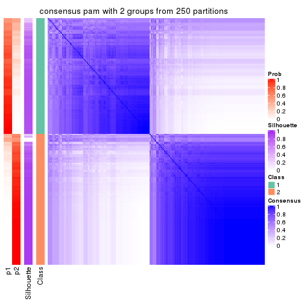</p>

</div>
<div id='tab-SD-pam-consensus-heatmap-2'>
<pre><code class="r">consensus_heatmap(res, k = 3)
</code></pre>

<p>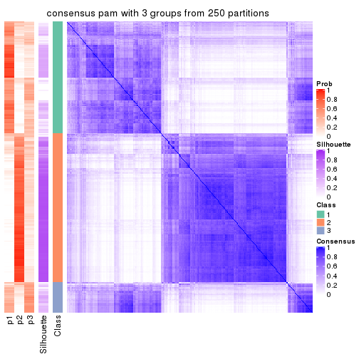</p>

</div>
<div id='tab-SD-pam-consensus-heatmap-3'>
<pre><code class="r">consensus_heatmap(res, k = 4)
</code></pre>

<p>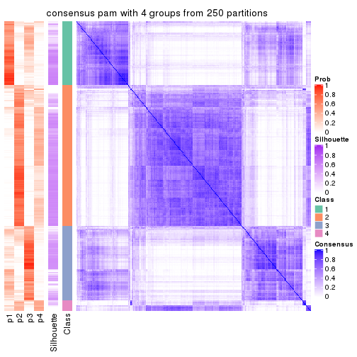</p>

</div>
<div id='tab-SD-pam-consensus-heatmap-4'>
<pre><code class="r">consensus_heatmap(res, k = 5)
</code></pre>

<p>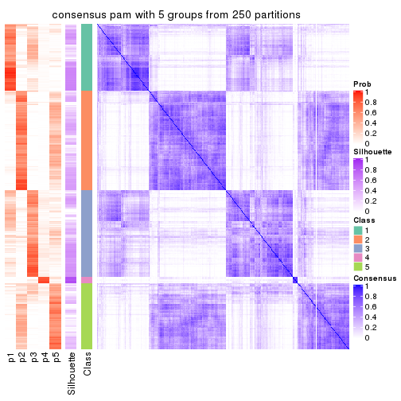</p>

</div>
<div id='tab-SD-pam-consensus-heatmap-5'>
<pre><code class="r">consensus_heatmap(res, k = 6)
</code></pre>

<p>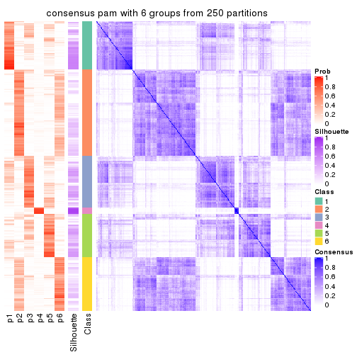</p>

</div>
</div>

Heatmaps for the membership of samples in all partitions to see how consistent they are:


<script>
$( function() {
	$( '#tabs-SD-pam-membership-heatmap' ).tabs();
} );
</script>
<div id='tabs-SD-pam-membership-heatmap'>
<ul>
<li><a href='#tab-SD-pam-membership-heatmap-1'>k = 2</a></li>
<li><a href='#tab-SD-pam-membership-heatmap-2'>k = 3</a></li>
<li><a href='#tab-SD-pam-membership-heatmap-3'>k = 4</a></li>
<li><a href='#tab-SD-pam-membership-heatmap-4'>k = 5</a></li>
<li><a href='#tab-SD-pam-membership-heatmap-5'>k = 6</a></li>
</ul>
<div id='tab-SD-pam-membership-heatmap-1'>
<pre><code class="r">membership_heatmap(res, k = 2)
</code></pre>

<p>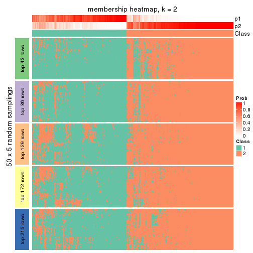</p>

</div>
<div id='tab-SD-pam-membership-heatmap-2'>
<pre><code class="r">membership_heatmap(res, k = 3)
</code></pre>

<p>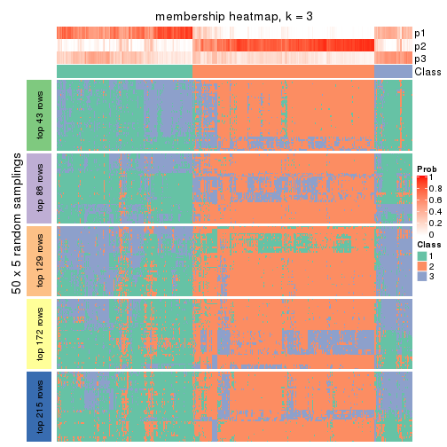</p>

</div>
<div id='tab-SD-pam-membership-heatmap-3'>
<pre><code class="r">membership_heatmap(res, k = 4)
</code></pre>

<p>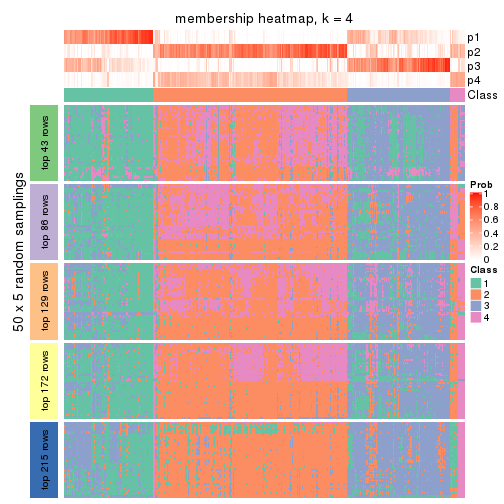</p>

</div>
<div id='tab-SD-pam-membership-heatmap-4'>
<pre><code class="r">membership_heatmap(res, k = 5)
</code></pre>

<p>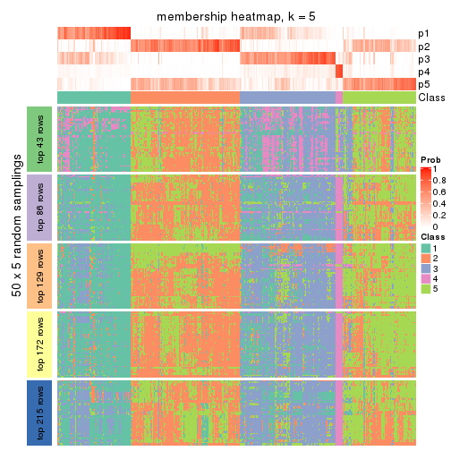</p>

</div>
<div id='tab-SD-pam-membership-heatmap-5'>
<pre><code class="r">membership_heatmap(res, k = 6)
</code></pre>

<p>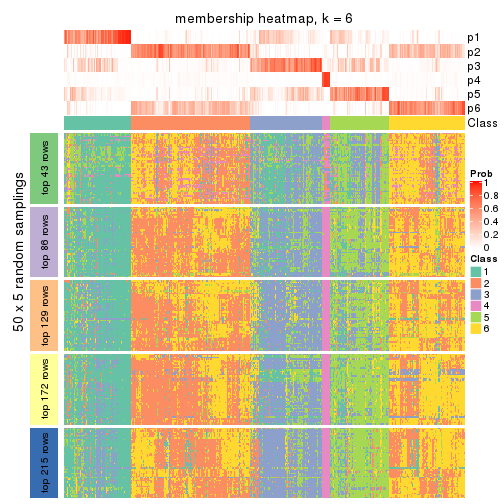</p>

</div>
</div>

As soon as we have had the classes for columns, we can look for signatures
which are significantly different between classes which can be candidate marks
for certain classes. Following are the heatmaps for signatures.


Signature heatmaps where rows are scaled:


<script>
$( function() {
	$( '#tabs-SD-pam-get-signatures' ).tabs();
} );
</script>
<div id='tabs-SD-pam-get-signatures'>
<ul>
<li><a href='#tab-SD-pam-get-signatures-1'>k = 2</a></li>
<li><a href='#tab-SD-pam-get-signatures-2'>k = 3</a></li>
<li><a href='#tab-SD-pam-get-signatures-3'>k = 4</a></li>
<li><a href='#tab-SD-pam-get-signatures-4'>k = 5</a></li>
<li><a href='#tab-SD-pam-get-signatures-5'>k = 6</a></li>
</ul>
<div id='tab-SD-pam-get-signatures-1'>
<pre><code class="r">get_signatures(res, k = 2)
</code></pre>

<p>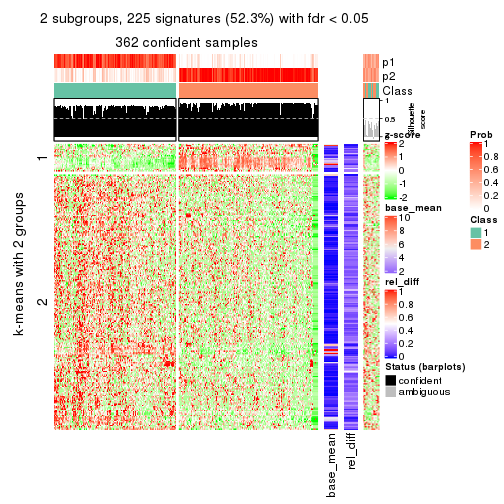</p>

</div>
<div id='tab-SD-pam-get-signatures-2'>
<pre><code class="r">get_signatures(res, k = 3)
</code></pre>

<p></p>

</div>
<div id='tab-SD-pam-get-signatures-3'>
<pre><code class="r">get_signatures(res, k = 4)
</code></pre>

<p>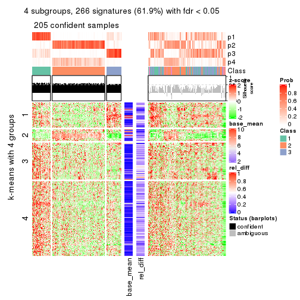</p>

</div>
<div id='tab-SD-pam-get-signatures-4'>
<pre><code class="r">get_signatures(res, k = 5)
</code></pre>

<p>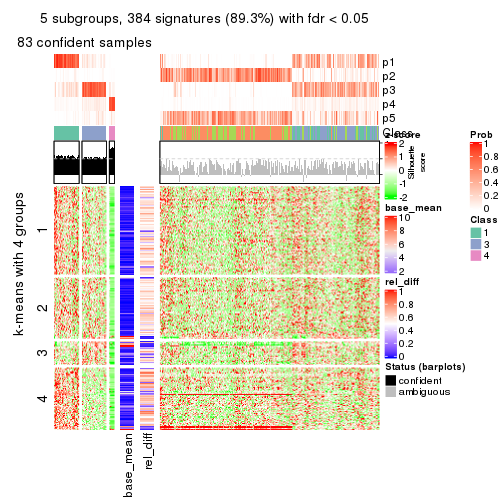</p>

</div>
<div id='tab-SD-pam-get-signatures-5'>
<pre><code class="r">get_signatures(res, k = 6)
</code></pre>

<p>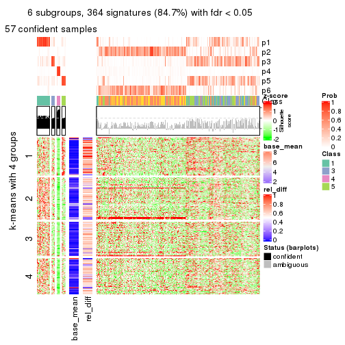</p>

</div>
</div>


Signature heatmaps where rows are not scaled:


<script>
$( function() {
	$( '#tabs-SD-pam-get-signatures-no-scale' ).tabs();
} );
</script>
<div id='tabs-SD-pam-get-signatures-no-scale'>
<ul>
<li><a href='#tab-SD-pam-get-signatures-no-scale-1'>k = 2</a></li>
<li><a href='#tab-SD-pam-get-signatures-no-scale-2'>k = 3</a></li>
<li><a href='#tab-SD-pam-get-signatures-no-scale-3'>k = 4</a></li>
<li><a href='#tab-SD-pam-get-signatures-no-scale-4'>k = 5</a></li>
<li><a href='#tab-SD-pam-get-signatures-no-scale-5'>k = 6</a></li>
</ul>
<div id='tab-SD-pam-get-signatures-no-scale-1'>
<pre><code class="r">get_signatures(res, k = 2, scale_rows = FALSE)
</code></pre>

<p>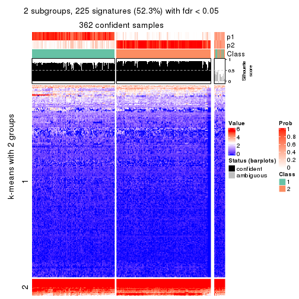</p>

</div>
<div id='tab-SD-pam-get-signatures-no-scale-2'>
<pre><code class="r">get_signatures(res, k = 3, scale_rows = FALSE)
</code></pre>

<p></p>

</div>
<div id='tab-SD-pam-get-signatures-no-scale-3'>
<pre><code class="r">get_signatures(res, k = 4, scale_rows = FALSE)
</code></pre>

<p>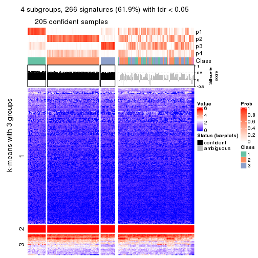</p>

</div>
<div id='tab-SD-pam-get-signatures-no-scale-4'>
<pre><code class="r">get_signatures(res, k = 5, scale_rows = FALSE)
</code></pre>

<p>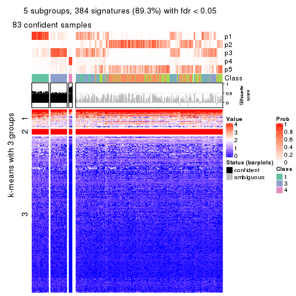</p>

</div>
<div id='tab-SD-pam-get-signatures-no-scale-5'>
<pre><code class="r">get_signatures(res, k = 6, scale_rows = FALSE)
</code></pre>

<p>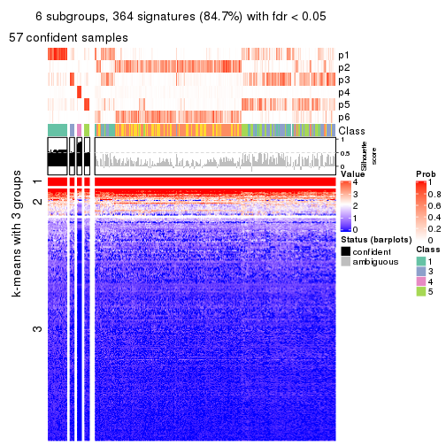</p>

</div>
</div>


Compare the overlap of signatures from different k:

```r
compare_signatures(res)
```

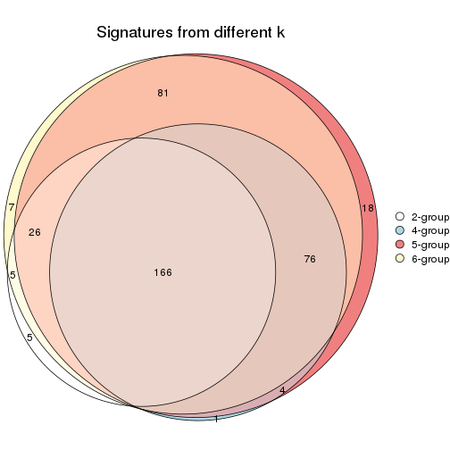

`get_signature()` returns a data frame invisibly. TO get the list of signatures, the function
call should be assigned to a variable explicitly. In following code, if `plot` argument is set
to `FALSE`, no heatmap is plotted while only the differential analysis is performed.

```r
# code only for demonstration
tb = get_signature(res, k = ..., plot = FALSE)
```

An example of the output of `tb` is:

```
#>   which_row         fdr    mean_1    mean_2 scaled_mean_1 scaled_mean_2 km
#> 1        38 0.042760348  8.373488  9.131774    -0.5533452     0.5164555  1
#> 2        40 0.018707592  7.106213  8.469186    -0.6173731     0.5762149  1
#> 3        55 0.019134737 10.221463 11.207825    -0.6159697     0.5749050  1
#> 4        59 0.006059896  5.921854  7.869574    -0.6899429     0.6439467  1
#> 5        60 0.018055526  8.928898 10.211722    -0.6204761     0.5791110  1
#> 6        98 0.009384629 15.714769 14.887706     0.6635654    -0.6193277  2
...
```

The columns in `tb` are:

1. `which_row`: row indices corresponding to the input matrix.
2. `fdr`: FDR for the differential test. 
3. `mean_x`: The mean value in group x.
4. `scaled_mean_x`: The mean value in group x after rows are scaled.
5. `km`: Row groups if k-means clustering is applied to rows.


UMAP plot which shows how samples are separated.


<script>
$( function() {
	$( '#tabs-SD-pam-dimension-reduction' ).tabs();
} );
</script>
<div id='tabs-SD-pam-dimension-reduction'>
<ul>
<li><a href='#tab-SD-pam-dimension-reduction-1'>k = 2</a></li>
<li><a href='#tab-SD-pam-dimension-reduction-2'>k = 3</a></li>
<li><a href='#tab-SD-pam-dimension-reduction-3'>k = 4</a></li>
<li><a href='#tab-SD-pam-dimension-reduction-4'>k = 5</a></li>
<li><a href='#tab-SD-pam-dimension-reduction-5'>k = 6</a></li>
</ul>
<div id='tab-SD-pam-dimension-reduction-1'>
<pre><code class="r">dimension_reduction(res, k = 2, method = &quot;UMAP&quot;)
</code></pre>

<p>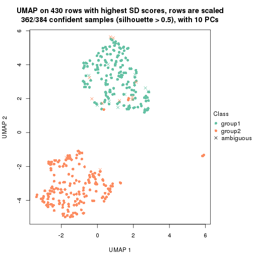</p>

</div>
<div id='tab-SD-pam-dimension-reduction-2'>
<pre><code class="r">dimension_reduction(res, k = 3, method = &quot;UMAP&quot;)
</code></pre>

<p>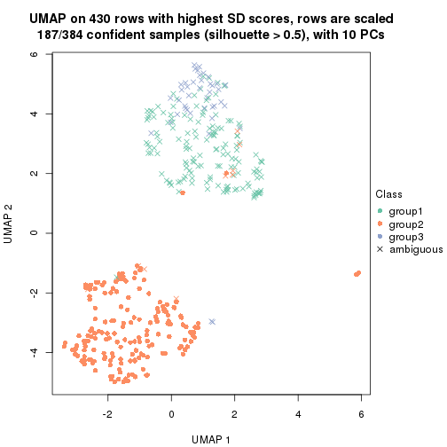</p>

</div>
<div id='tab-SD-pam-dimension-reduction-3'>
<pre><code class="r">dimension_reduction(res, k = 4, method = &quot;UMAP&quot;)
</code></pre>

<p>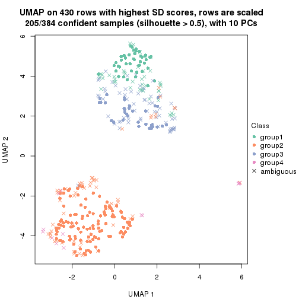</p>

</div>
<div id='tab-SD-pam-dimension-reduction-4'>
<pre><code class="r">dimension_reduction(res, k = 5, method = &quot;UMAP&quot;)
</code></pre>

<p>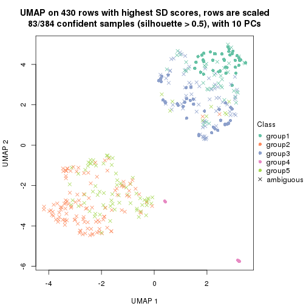</p>

</div>
<div id='tab-SD-pam-dimension-reduction-5'>
<pre><code class="r">dimension_reduction(res, k = 6, method = &quot;UMAP&quot;)
</code></pre>

<p>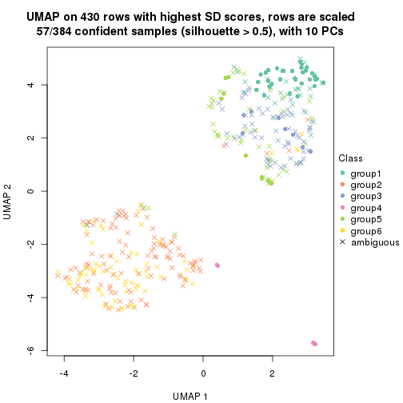</p>

</div>
</div>


Following heatmap shows how subgroups are split when increasing `k`:

```r
collect_classes(res)
```

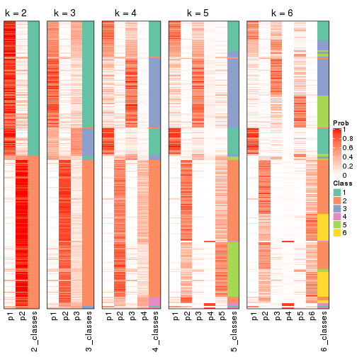


If matrix rows can be associated to genes, consider to use `GO_Enrichment(res,
...)` to perform function enrichment for the signature genes.


 

---------------------------------------------------


### SD:mclust**


The object with results only for a single top-value method and a single partition method 
can be extracted as:

```r
res = res_list["SD", "mclust"]
# you can also extract it by
# res = res_list["SD:mclust"]
```

A summary of `res` and all the functions that can be applied to it:

```r
res
```

```
#> A 'ConsensusPartition' object with k = 2, 3, 4, 5, 6.
#>   On a matrix with 430 rows and 384 columns.
#>   Top rows (43, 86, 129, 172, 215) are extracted by 'SD' method.
#>   Subgroups are detected by 'mclust' method.
#>   Performed in total 1250 partitions by row resampling.
#>   Best k for subgroups seems to be 3.
#> 
#> Following methods can be applied to this 'ConsensusPartition' object:
#>  [1] "cola_report"             "collect_classes"         "collect_plots"          
#>  [4] "collect_stats"           "colnames"                "compare_signatures"     
#>  [7] "consensus_heatmap"       "dimension_reduction"     "functional_enrichment"  
#> [10] "get_anno_col"            "get_anno"                "get_classes"            
#> [13] "get_consensus"           "get_matrix"              "get_membership"         
#> [16] "get_param"               "get_signatures"          "get_stats"              
#> [19] "is_best_k"               "is_stable_k"             "membership_heatmap"     
#> [22] "ncol"                    "nrow"                    "plot_ecdf"              
#> [25] "rownames"                "select_partition_number" "show"                   
#> [28] "suggest_best_k"          "test_to_known_factors"
```

`collect_plots()` function collects all the plots made from `res` for all `k` (number of partitions)
into one single page to provide an easy and fast comparison between different `k`.

```r
collect_plots(res)
```

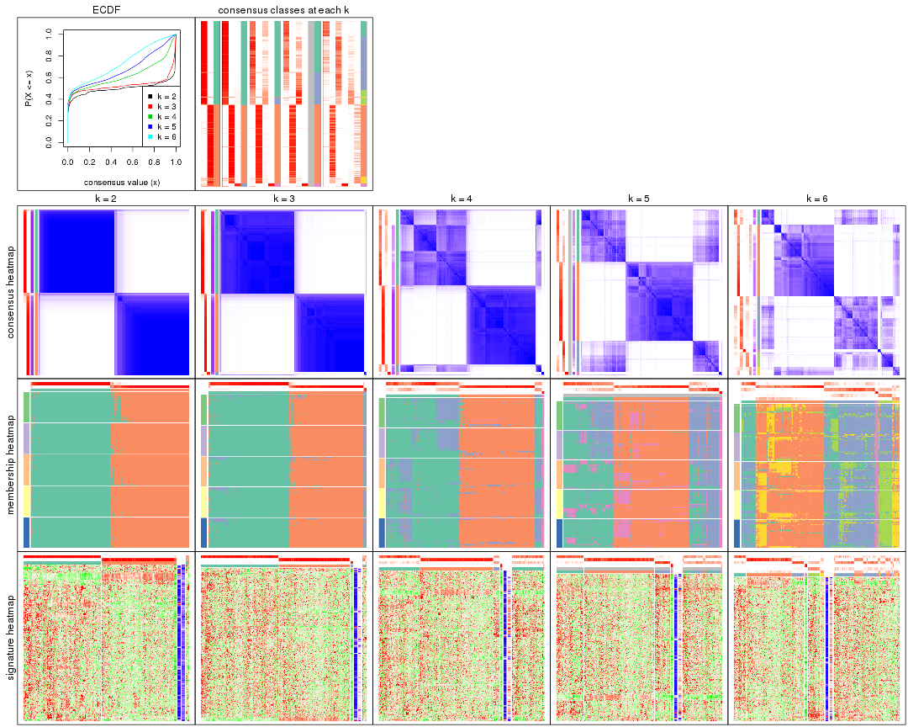

The plots are:

- The first row: a plot of the ECDF (Empirical cumulative distribution
  function) curves of the consensus matrix for each `k` and the heatmap of
  predicted classes for each `k`.
- The second row: heatmaps of the consensus matrix for each `k`.
- The third row: heatmaps of the membership matrix for each `k`.
- The fouth row: heatmaps of the signatures for each `k`.

All the plots in panels can be made by individual functions and they are
plotted later in this section.

`select_partition_number()` produces several plots showing different
statistics for choosing "optimized" `k`. There are following statistics:

- ECDF curves of the consensus matrix for each `k`;
- 1-PAC. [The PAC
  score](https://en.wikipedia.org/wiki/Consensus_clustering#Over-interpretation_potential_of_consensus_clustering)
  measures the proportion of the ambiguous subgrouping.
- Mean silhouette score.
- Concordance. The mean probability of fiting the consensus class ids in all
  partitions.
- Area increased. Denote $A_k$ as the area under the ECDF curve for current
  `k`, the area increased is defined as $A_k - A_{k-1}$.
- Rand index. The percent of pairs of samples that are both in a same cluster
  or both are not in a same cluster in the partition of k and k-1.
- Jaccard index. The ratio of pairs of samples are both in a same cluster in
  the partition of k and k-1 and the pairs of samples are both in a same
  cluster in the partition k or k-1.

The detailed explanations of these statistics can be found in [the cola
vignette](http://bioconductor.org/packages/devel/bioc/vignettes/cola/inst/doc/cola.html#toc_13).

Generally speaking, lower PAC score, higher mean silhouette score or higher
concordance corresponds to better partition. Rand index and Jaccard index
measure how similar the current partition is compared to partition with `k-1`.
If they are too similar, we won't accept `k` is better than `k-1`.

```r
select_partition_number(res)
```

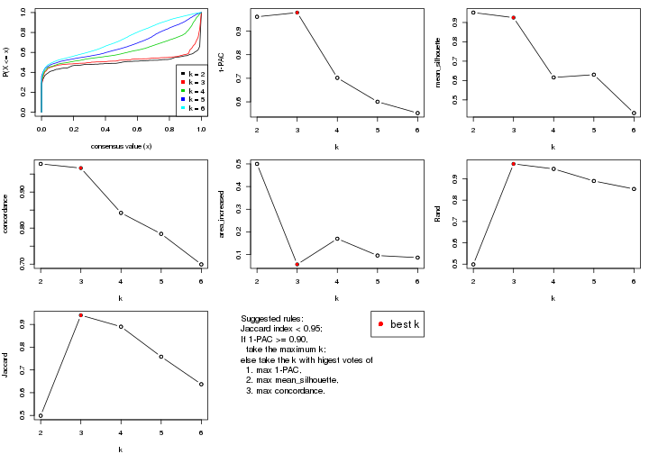

The numeric values for all these statistics can be obtained by `get_stats()`.

```r
get_stats(res)
```

```
#>   k 1-PAC mean_silhouette concordance area_increased  Rand Jaccard
#> 2 2 0.961           0.951       0.978         0.5000 0.499   0.499
#> 3 3 0.979           0.925       0.966         0.0566 0.970   0.940
#> 4 4 0.702           0.616       0.842         0.1699 0.946   0.890
#> 5 5 0.600           0.630       0.784         0.0957 0.890   0.758
#> 6 6 0.552           0.432       0.699         0.0865 0.852   0.637
```

`suggest_best_k()` suggests the best $k$ based on these statistics. The rules are as follows:

- All $k$ with Jaccard index larger than 0.95 are removed because the increase of
  the partition number does not provides enough extra information. If all $k$ are removed,
  the best $k$ is assigned by `NA`.
- For $k$ with 1-PAC larger than 0.9, the maximal $k$ is taken as the "best k". Other $k$ is called "optional k".
- If it does not fit the second rule. The $k$ with the highest vote of highest
  1-PAC, mean silhouette and concordance is taken as the "best k".

```r
suggest_best_k(res)
```

```
#> [1] 3
#> attr(,"optional")
#> [1] 2
```

There is also optional best $k$ = 2 that is worth to check.

Following shows the table of the partitions (You need to click the **show/hide
code output** link to see it). The membership matrix (columns with name `p*`)
is inferred by
[`clue::cl_consensus()`](https://www.rdocumentation.org/link/cl_consensus?package=clue)
function with the `SE` method. Basically the value in the membership matrix
represents the probability to belong to a certain group. The finall class
label for an item is determined with the group with highest probability it
belongs to.

In `get_classes()` function, the entropy is calculated from the membership
matrix and the silhouette score is calculated from the consensus matrix.


<script>
$( function() {
	$( '#tabs-SD-mclust-get-classes' ).tabs();
} );
</script>
<div id='tabs-SD-mclust-get-classes'>
<ul>
<li><a href='#tab-SD-mclust-get-classes-1'>k = 2</a></li>
<li><a href='#tab-SD-mclust-get-classes-2'>k = 3</a></li>
<li><a href='#tab-SD-mclust-get-classes-3'>k = 4</a></li>
<li><a href='#tab-SD-mclust-get-classes-4'>k = 5</a></li>
<li><a href='#tab-SD-mclust-get-classes-5'>k = 6</a></li>
</ul>

<div id='tab-SD-mclust-get-classes-1'>
<p><a id='tab-SD-mclust-get-classes-1-a' style='color:#0366d6' href='#'>show/hide code output</a></p>
<pre><code class="r">cbind(get_classes(res, k = 2), get_membership(res, k = 2))
</code></pre>

<pre><code>#&gt;            class entropy silhouette    p1    p2
#&gt; SRR2105277     1  0.0000     0.9906 1.000 0.000
#&gt; SRR2105278     1  0.0000     0.9906 1.000 0.000
#&gt; SRR2105275     1  0.0000     0.9906 1.000 0.000
#&gt; SRR2105276     1  0.0000     0.9906 1.000 0.000
#&gt; SRR2105273     1  0.0000     0.9906 1.000 0.000
#&gt; SRR2105274     1  0.0000     0.9906 1.000 0.000
#&gt; SRR2105271     1  0.0000     0.9906 1.000 0.000
#&gt; SRR2105272     1  0.0000     0.9906 1.000 0.000
#&gt; SRR2105269     2  0.0000     0.9646 0.000 1.000
#&gt; SRR2105270     2  0.0000     0.9646 0.000 1.000
#&gt; SRR2105267     2  0.0000     0.9646 0.000 1.000
#&gt; SRR2105268     2  0.0000     0.9646 0.000 1.000
#&gt; SRR2105265     2  0.0000     0.9646 0.000 1.000
#&gt; SRR2105266     2  0.0000     0.9646 0.000 1.000
#&gt; SRR2105263     2  0.1184     0.9564 0.016 0.984
#&gt; SRR2105264     2  0.0938     0.9586 0.012 0.988
#&gt; SRR2105261     1  0.7056     0.7514 0.808 0.192
#&gt; SRR2105262     1  0.0938     0.9804 0.988 0.012
#&gt; SRR2105357     1  0.0376     0.9874 0.996 0.004
#&gt; SRR2105358     1  0.0000     0.9906 1.000 0.000
#&gt; SRR2105439     2  0.0000     0.9646 0.000 1.000
#&gt; SRR2105440     2  0.0000     0.9646 0.000 1.000
#&gt; SRR2105509     2  0.0376     0.9628 0.004 0.996
#&gt; SRR2105510     2  0.0000     0.9646 0.000 1.000
#&gt; SRR2105507     1  0.0000     0.9906 1.000 0.000
#&gt; SRR2105508     1  0.0000     0.9906 1.000 0.000
#&gt; SRR2105505     1  0.0000     0.9906 1.000 0.000
#&gt; SRR2105506     1  0.0000     0.9906 1.000 0.000
#&gt; SRR2105503     2  0.0000     0.9646 0.000 1.000
#&gt; SRR2105504     2  0.6801     0.7989 0.180 0.820
#&gt; SRR2105501     2  0.2603     0.9371 0.044 0.956
#&gt; SRR2105502     2  0.6531     0.8138 0.168 0.832
#&gt; SRR2105499     1  0.0000     0.9906 1.000 0.000
#&gt; SRR2105500     1  0.0376     0.9874 0.996 0.004
#&gt; SRR2105497     2  0.0000     0.9646 0.000 1.000
#&gt; SRR2105498     2  0.0000     0.9646 0.000 1.000
#&gt; SRR2105495     2  0.0000     0.9646 0.000 1.000
#&gt; SRR2105496     2  0.0000     0.9646 0.000 1.000
#&gt; SRR2105493     2  0.0672     0.9606 0.008 0.992
#&gt; SRR2105494     2  0.0376     0.9627 0.004 0.996
#&gt; SRR2105491     2  0.2423     0.9403 0.040 0.960
#&gt; SRR2105492     2  0.2043     0.9461 0.032 0.968
#&gt; SRR2105489     2  0.0000     0.9646 0.000 1.000
#&gt; SRR2105490     2  0.0000     0.9646 0.000 1.000
#&gt; SRR2105487     1  0.0000     0.9906 1.000 0.000
#&gt; SRR2105488     1  0.0000     0.9906 1.000 0.000
#&gt; SRR2105485     1  0.0000     0.9906 1.000 0.000
#&gt; SRR2105486     1  0.0000     0.9906 1.000 0.000
#&gt; SRR2105483     1  0.0000     0.9906 1.000 0.000
#&gt; SRR2105484     1  0.0000     0.9906 1.000 0.000
#&gt; SRR2105481     1  0.0000     0.9906 1.000 0.000
#&gt; SRR2105482     1  0.0000     0.9906 1.000 0.000
#&gt; SRR2105479     1  0.0000     0.9906 1.000 0.000
#&gt; SRR2105480     1  0.0000     0.9906 1.000 0.000
#&gt; SRR2105477     2  0.2236     0.9433 0.036 0.964
#&gt; SRR2105478     2  0.0000     0.9646 0.000 1.000
#&gt; SRR2105475     2  0.0000     0.9646 0.000 1.000
#&gt; SRR2105476     2  0.0000     0.9646 0.000 1.000
#&gt; SRR2105473     2  0.0000     0.9646 0.000 1.000
#&gt; SRR2105474     2  0.0000     0.9646 0.000 1.000
#&gt; SRR2105471     2  0.0000     0.9646 0.000 1.000
#&gt; SRR2105472     2  0.0000     0.9646 0.000 1.000
#&gt; SRR2105469     1  0.0000     0.9906 1.000 0.000
#&gt; SRR2105470     1  0.0000     0.9906 1.000 0.000
#&gt; SRR2105467     1  0.0000     0.9906 1.000 0.000
#&gt; SRR2105468     1  0.0000     0.9906 1.000 0.000
#&gt; SRR2105465     1  0.0000     0.9906 1.000 0.000
#&gt; SRR2105466     1  0.0000     0.9906 1.000 0.000
#&gt; SRR2105463     1  0.0000     0.9906 1.000 0.000
#&gt; SRR2105464     1  0.0000     0.9906 1.000 0.000
#&gt; SRR2105461     2  0.0000     0.9646 0.000 1.000
#&gt; SRR2105462     2  0.0000     0.9646 0.000 1.000
#&gt; SRR2105459     2  0.0000     0.9646 0.000 1.000
#&gt; SRR2105460     2  0.0000     0.9646 0.000 1.000
#&gt; SRR2105457     1  0.0000     0.9906 1.000 0.000
#&gt; SRR2105458     1  0.0000     0.9906 1.000 0.000
#&gt; SRR2105455     1  0.0000     0.9906 1.000 0.000
#&gt; SRR2105456     1  0.0000     0.9906 1.000 0.000
#&gt; SRR2105453     1  0.0000     0.9906 1.000 0.000
#&gt; SRR2105454     1  0.0000     0.9906 1.000 0.000
#&gt; SRR2105451     2  0.5519     0.8594 0.128 0.872
#&gt; SRR2105452     2  0.6973     0.7887 0.188 0.812
#&gt; SRR2105449     1  0.0000     0.9906 1.000 0.000
#&gt; SRR2105450     1  0.0000     0.9906 1.000 0.000
#&gt; SRR2105447     2  0.2948     0.9304 0.052 0.948
#&gt; SRR2105448     2  0.0938     0.9586 0.012 0.988
#&gt; SRR2105445     1  0.9170     0.4705 0.668 0.332
#&gt; SRR2105446     1  0.2603     0.9480 0.956 0.044
#&gt; SRR2105443     2  0.8081     0.7022 0.248 0.752
#&gt; SRR2105444     2  0.9608     0.4324 0.384 0.616
#&gt; SRR2105441     2  0.0000     0.9646 0.000 1.000
#&gt; SRR2105442     2  0.0000     0.9646 0.000 1.000
#&gt; SRR2105437     1  0.0000     0.9906 1.000 0.000
#&gt; SRR2105438     1  0.0000     0.9906 1.000 0.000
#&gt; SRR2105435     1  0.0000     0.9906 1.000 0.000
#&gt; SRR2105436     1  0.0000     0.9906 1.000 0.000
#&gt; SRR2105433     1  0.0000     0.9906 1.000 0.000
#&gt; SRR2105434     1  0.0000     0.9906 1.000 0.000
#&gt; SRR2105431     1  0.0000     0.9906 1.000 0.000
#&gt; SRR2105432     1  0.0000     0.9906 1.000 0.000
#&gt; SRR2105429     2  0.7376     0.7619 0.208 0.792
#&gt; SRR2105430     2  0.5294     0.8680 0.120 0.880
#&gt; SRR2105427     2  0.0000     0.9646 0.000 1.000
#&gt; SRR2105428     2  0.0000     0.9646 0.000 1.000
#&gt; SRR2105425     2  0.0376     0.9627 0.004 0.996
#&gt; SRR2105426     2  0.0672     0.9608 0.008 0.992
#&gt; SRR2105421     1  0.0376     0.9874 0.996 0.004
#&gt; SRR2105422     1  0.0000     0.9906 1.000 0.000
#&gt; SRR2105423     2  0.0000     0.9646 0.000 1.000
#&gt; SRR2105424     2  0.0000     0.9646 0.000 1.000
#&gt; SRR2105419     1  0.0000     0.9906 1.000 0.000
#&gt; SRR2105420     1  0.0000     0.9906 1.000 0.000
#&gt; SRR2105415     1  0.0000     0.9906 1.000 0.000
#&gt; SRR2105416     1  0.0000     0.9906 1.000 0.000
#&gt; SRR2105417     1  0.0000     0.9906 1.000 0.000
#&gt; SRR2105418     1  0.0000     0.9906 1.000 0.000
#&gt; SRR2105413     2  0.0376     0.9627 0.004 0.996
#&gt; SRR2105414     2  0.1633     0.9512 0.024 0.976
#&gt; SRR2105409     2  0.0000     0.9646 0.000 1.000
#&gt; SRR2105410     2  0.0000     0.9646 0.000 1.000
#&gt; SRR2105411     2  0.0000     0.9646 0.000 1.000
#&gt; SRR2105412     2  0.0000     0.9646 0.000 1.000
#&gt; SRR2105407     1  0.0000     0.9906 1.000 0.000
#&gt; SRR2105408     1  0.0000     0.9906 1.000 0.000
#&gt; SRR2105403     1  0.0000     0.9906 1.000 0.000
#&gt; SRR2105404     1  0.0000     0.9906 1.000 0.000
#&gt; SRR2105405     1  0.0000     0.9906 1.000 0.000
#&gt; SRR2105406     1  0.0000     0.9906 1.000 0.000
#&gt; SRR2105401     2  0.1414     0.9538 0.020 0.980
#&gt; SRR2105402     2  0.6973     0.7887 0.188 0.812
#&gt; SRR2105399     2  0.6801     0.7989 0.180 0.820
#&gt; SRR2105400     2  0.6712     0.8035 0.176 0.824
#&gt; SRR2105397     2  0.9977     0.1730 0.472 0.528
#&gt; SRR2105398     2  0.9866     0.3012 0.432 0.568
#&gt; SRR2105395     2  0.0000     0.9646 0.000 1.000
#&gt; SRR2105396     2  0.0000     0.9646 0.000 1.000
#&gt; SRR2105393     2  0.0000     0.9646 0.000 1.000
#&gt; SRR2105394     2  0.0000     0.9646 0.000 1.000
#&gt; SRR2105389     1  0.0000     0.9906 1.000 0.000
#&gt; SRR2105390     1  0.0000     0.9906 1.000 0.000
#&gt; SRR2105391     1  0.0000     0.9906 1.000 0.000
#&gt; SRR2105392     1  0.0000     0.9906 1.000 0.000
#&gt; SRR2105385     1  0.0000     0.9906 1.000 0.000
#&gt; SRR2105386     1  0.0000     0.9906 1.000 0.000
#&gt; SRR2105387     1  0.0000     0.9906 1.000 0.000
#&gt; SRR2105388     1  0.0000     0.9906 1.000 0.000
#&gt; SRR2105381     2  0.4298     0.8990 0.088 0.912
#&gt; SRR2105382     2  0.4022     0.9063 0.080 0.920
#&gt; SRR2105383     2  0.0000     0.9646 0.000 1.000
#&gt; SRR2105384     2  0.0000     0.9646 0.000 1.000
#&gt; SRR2105379     2  0.1633     0.9512 0.024 0.976
#&gt; SRR2105380     2  0.5059     0.8770 0.112 0.888
#&gt; SRR2105377     2  0.0000     0.9646 0.000 1.000
#&gt; SRR2105378     2  0.0000     0.9646 0.000 1.000
#&gt; SRR2105375     1  0.1414     0.9729 0.980 0.020
#&gt; SRR2105376     1  0.0000     0.9906 1.000 0.000
#&gt; SRR2105373     1  0.0000     0.9906 1.000 0.000
#&gt; SRR2105374     1  0.0000     0.9906 1.000 0.000
#&gt; SRR2105371     1  0.0000     0.9906 1.000 0.000
#&gt; SRR2105372     1  0.0000     0.9906 1.000 0.000
#&gt; SRR2105369     1  0.0000     0.9906 1.000 0.000
#&gt; SRR2105370     1  0.0000     0.9906 1.000 0.000
#&gt; SRR2105367     1  0.0376     0.9874 0.996 0.004
#&gt; SRR2105368     1  0.1184     0.9767 0.984 0.016
#&gt; SRR2105365     2  0.2778     0.9339 0.048 0.952
#&gt; SRR2105366     2  0.1843     0.9486 0.028 0.972
#&gt; SRR2105363     2  0.0000     0.9646 0.000 1.000
#&gt; SRR2105364     2  0.0000     0.9646 0.000 1.000
#&gt; SRR2105361     2  0.0000     0.9646 0.000 1.000
#&gt; SRR2105362     2  0.0000     0.9646 0.000 1.000
#&gt; SRR2105359     1  0.0000     0.9906 1.000 0.000
#&gt; SRR2105360     1  0.0000     0.9906 1.000 0.000
#&gt; SRR2105355     1  0.0000     0.9906 1.000 0.000
#&gt; SRR2105356     1  0.0000     0.9906 1.000 0.000
#&gt; SRR2105353     1  0.0000     0.9906 1.000 0.000
#&gt; SRR2105354     1  0.0000     0.9906 1.000 0.000
#&gt; SRR2105351     2  0.0000     0.9646 0.000 1.000
#&gt; SRR2105352     2  0.6973     0.7887 0.188 0.812
#&gt; SRR2105349     2  0.0672     0.9607 0.008 0.992
#&gt; SRR2105350     2  0.0000     0.9646 0.000 1.000
#&gt; SRR2105345     2  0.0000     0.9646 0.000 1.000
#&gt; SRR2105346     2  0.0000     0.9646 0.000 1.000
#&gt; SRR2105347     2  0.0000     0.9646 0.000 1.000
#&gt; SRR2105348     2  0.0000     0.9646 0.000 1.000
#&gt; SRR2105343     2  0.0000     0.9646 0.000 1.000
#&gt; SRR2105344     2  0.0000     0.9646 0.000 1.000
#&gt; SRR2105341     1  0.0000     0.9906 1.000 0.000
#&gt; SRR2105342     1  0.0000     0.9906 1.000 0.000
#&gt; SRR2105339     1  0.0000     0.9906 1.000 0.000
#&gt; SRR2105340     1  0.0000     0.9906 1.000 0.000
#&gt; SRR2105335     1  0.0000     0.9906 1.000 0.000
#&gt; SRR2105336     1  0.0000     0.9906 1.000 0.000
#&gt; SRR2105337     1  0.0000     0.9906 1.000 0.000
#&gt; SRR2105338     1  0.0000     0.9906 1.000 0.000
#&gt; SRR2105331     2  0.0000     0.9646 0.000 1.000
#&gt; SRR2105332     2  0.0000     0.9646 0.000 1.000
#&gt; SRR2105333     2  0.0000     0.9646 0.000 1.000
#&gt; SRR2105334     2  0.0000     0.9646 0.000 1.000
#&gt; SRR2105329     2  0.8207     0.6896 0.256 0.744
#&gt; SRR2105330     2  0.6531     0.8149 0.168 0.832
#&gt; SRR2105327     2  0.0000     0.9646 0.000 1.000
#&gt; SRR2105328     2  0.0376     0.9628 0.004 0.996
#&gt; SRR2105325     1  0.0000     0.9906 1.000 0.000
#&gt; SRR2105326     1  0.0000     0.9906 1.000 0.000
#&gt; SRR2105323     1  0.0000     0.9906 1.000 0.000
#&gt; SRR2105324     1  0.0000     0.9906 1.000 0.000
#&gt; SRR2105319     1  0.0000     0.9906 1.000 0.000
#&gt; SRR2105320     1  0.0000     0.9906 1.000 0.000
#&gt; SRR2105321     1  0.0000     0.9906 1.000 0.000
#&gt; SRR2105322     1  0.0000     0.9906 1.000 0.000
#&gt; SRR2105317     2  0.0000     0.9646 0.000 1.000
#&gt; SRR2105318     2  0.0000     0.9646 0.000 1.000
#&gt; SRR2105315     2  0.9393     0.4902 0.356 0.644
#&gt; SRR2105316     2  0.0000     0.9646 0.000 1.000
#&gt; SRR2105313     2  0.0000     0.9646 0.000 1.000
#&gt; SRR2105314     2  0.0000     0.9646 0.000 1.000
#&gt; SRR2105311     1  0.0000     0.9906 1.000 0.000
#&gt; SRR2105312     1  0.0000     0.9906 1.000 0.000
#&gt; SRR2105307     1  0.0000     0.9906 1.000 0.000
#&gt; SRR2105308     1  0.0000     0.9906 1.000 0.000
#&gt; SRR2105309     1  0.0000     0.9906 1.000 0.000
#&gt; SRR2105310     1  0.0000     0.9906 1.000 0.000
#&gt; SRR2105305     1  0.0000     0.9906 1.000 0.000
#&gt; SRR2105306     1  0.0000     0.9906 1.000 0.000
#&gt; SRR2105303     2  0.0000     0.9646 0.000 1.000
#&gt; SRR2105304     2  0.6438     0.8185 0.164 0.836
#&gt; SRR2105301     2  0.0376     0.9627 0.004 0.996
#&gt; SRR2105302     2  0.0000     0.9646 0.000 1.000
#&gt; SRR2105299     1  0.5629     0.8394 0.868 0.132
#&gt; SRR2105300     1  1.0000    -0.0762 0.500 0.500
#&gt; SRR2105297     2  0.1184     0.9565 0.016 0.984
#&gt; SRR2105298     2  0.0376     0.9628 0.004 0.996
#&gt; SRR2105295     2  0.0000     0.9646 0.000 1.000
#&gt; SRR2105296     2  0.0000     0.9646 0.000 1.000
#&gt; SRR2105293     1  0.0000     0.9906 1.000 0.000
#&gt; SRR2105294     1  0.0000     0.9906 1.000 0.000
#&gt; SRR2105291     1  0.0000     0.9906 1.000 0.000
#&gt; SRR2105292     1  0.0000     0.9906 1.000 0.000
#&gt; SRR2105289     1  0.0000     0.9906 1.000 0.000
#&gt; SRR2105290     1  0.0000     0.9906 1.000 0.000
#&gt; SRR2105287     1  0.0000     0.9906 1.000 0.000
#&gt; SRR2105288     1  0.0000     0.9906 1.000 0.000
#&gt; SRR2105285     2  0.0000     0.9646 0.000 1.000
#&gt; SRR2105286     2  0.0000     0.9646 0.000 1.000
#&gt; SRR2105283     2  0.4815     0.8843 0.104 0.896
#&gt; SRR2105284     2  0.4298     0.8997 0.088 0.912
#&gt; SRR2105281     2  0.0000     0.9646 0.000 1.000
#&gt; SRR2105282     2  0.0000     0.9646 0.000 1.000
#&gt; SRR2105259     1  0.0000     0.9906 1.000 0.000
#&gt; SRR2105260     1  0.0000     0.9906 1.000 0.000
#&gt; SRR2105279     2  0.0000     0.9646 0.000 1.000
#&gt; SRR2105280     2  0.0000     0.9646 0.000 1.000
#&gt; SRR2105257     1  0.0000     0.9906 1.000 0.000
#&gt; SRR2105258     1  0.0000     0.9906 1.000 0.000
#&gt; SRR2105253     2  0.0000     0.9646 0.000 1.000
#&gt; SRR2105254     2  0.0000     0.9646 0.000 1.000
#&gt; SRR2105255     1  0.0000     0.9906 1.000 0.000
#&gt; SRR2105256     1  0.0000     0.9906 1.000 0.000
#&gt; SRR2105251     2  0.0000     0.9646 0.000 1.000
#&gt; SRR2105252     2  0.0000     0.9646 0.000 1.000
#&gt; SRR2105249     2  0.0000     0.9646 0.000 1.000
#&gt; SRR2105250     2  0.0000     0.9646 0.000 1.000
#&gt; SRR2105247     2  0.0000     0.9646 0.000 1.000
#&gt; SRR2105248     2  0.0000     0.9646 0.000 1.000
#&gt; SRR2105245     1  0.0000     0.9906 1.000 0.000
#&gt; SRR2105246     1  0.3733     0.9175 0.928 0.072
#&gt; SRR2105243     1  0.0000     0.9906 1.000 0.000
#&gt; SRR2105244     1  0.0000     0.9906 1.000 0.000
#&gt; SRR2105241     1  0.0000     0.9906 1.000 0.000
#&gt; SRR2105242     1  0.0000     0.9906 1.000 0.000
#&gt; SRR2105239     1  0.0000     0.9906 1.000 0.000
#&gt; SRR2105240     1  0.0000     0.9906 1.000 0.000
#&gt; SRR2105237     2  0.3584     0.9173 0.068 0.932
#&gt; SRR2105238     2  0.0376     0.9627 0.004 0.996
#&gt; SRR2105235     2  0.0000     0.9646 0.000 1.000
#&gt; SRR2105236     2  0.0000     0.9646 0.000 1.000
#&gt; SRR2105233     2  0.0000     0.9646 0.000 1.000
#&gt; SRR2105234     2  0.0000     0.9646 0.000 1.000
#&gt; SRR2105231     2  0.0000     0.9646 0.000 1.000
#&gt; SRR2105232     2  0.0000     0.9646 0.000 1.000
#&gt; SRR2105227     1  0.0000     0.9906 1.000 0.000
#&gt; SRR2105228     1  0.1633     0.9690 0.976 0.024
#&gt; SRR2105225     1  0.0000     0.9906 1.000 0.000
#&gt; SRR2105226     1  0.0000     0.9906 1.000 0.000
#&gt; SRR2105229     1  0.0672     0.9839 0.992 0.008
#&gt; SRR2105230     1  0.0000     0.9906 1.000 0.000
#&gt; SRR2105219     2  0.0000     0.9646 0.000 1.000
#&gt; SRR2105220     2  0.0000     0.9646 0.000 1.000
#&gt; SRR2105221     2  0.0000     0.9646 0.000 1.000
#&gt; SRR2105222     2  0.0000     0.9646 0.000 1.000
#&gt; SRR2105223     1  0.0000     0.9906 1.000 0.000
#&gt; SRR2105224     1  0.0000     0.9906 1.000 0.000
#&gt; SRR2105217     2  0.0000     0.9646 0.000 1.000
#&gt; SRR2105218     2  0.0000     0.9646 0.000 1.000
#&gt; SRR2105215     2  0.0000     0.9646 0.000 1.000
#&gt; SRR2105216     2  0.0000     0.9646 0.000 1.000
#&gt; SRR2105213     1  0.0000     0.9906 1.000 0.000
#&gt; SRR2105214     1  0.0938     0.9804 0.988 0.012
#&gt; SRR2105211     1  0.0000     0.9906 1.000 0.000
#&gt; SRR2105212     1  0.0000     0.9906 1.000 0.000
#&gt; SRR2105209     1  0.0000     0.9906 1.000 0.000
#&gt; SRR2105210     1  0.0000     0.9906 1.000 0.000
#&gt; SRR2105207     1  0.0000     0.9906 1.000 0.000
#&gt; SRR2105208     1  0.0000     0.9906 1.000 0.000
#&gt; SRR2105205     2  0.1843     0.9485 0.028 0.972
#&gt; SRR2105206     2  0.2603     0.9372 0.044 0.956
#&gt; SRR2105201     2  0.0000     0.9646 0.000 1.000
#&gt; SRR2105202     2  0.0000     0.9646 0.000 1.000
#&gt; SRR2105203     2  0.0000     0.9646 0.000 1.000
#&gt; SRR2105204     2  0.0000     0.9646 0.000 1.000
#&gt; SRR2105199     2  0.0000     0.9646 0.000 1.000
#&gt; SRR2105200     2  0.0000     0.9646 0.000 1.000
#&gt; SRR2105197     1  0.0000     0.9906 1.000 0.000
#&gt; SRR2105198     1  0.0938     0.9804 0.988 0.012
#&gt; SRR2105195     1  0.0938     0.9804 0.988 0.012
#&gt; SRR2105196     1  0.1184     0.9767 0.984 0.016
#&gt; SRR2105193     1  0.0000     0.9906 1.000 0.000
#&gt; SRR2105194     1  0.0000     0.9906 1.000 0.000
#&gt; SRR2105191     1  0.0000     0.9906 1.000 0.000
#&gt; SRR2105192     1  0.0000     0.9906 1.000 0.000
#&gt; SRR2105189     2  0.0000     0.9646 0.000 1.000
#&gt; SRR2105190     2  0.0000     0.9646 0.000 1.000
#&gt; SRR2105187     2  0.2043     0.9463 0.032 0.968
#&gt; SRR2105188     2  0.4298     0.8984 0.088 0.912
#&gt; SRR2105179     1  0.0000     0.9906 1.000 0.000
#&gt; SRR2105180     1  0.0000     0.9906 1.000 0.000
#&gt; SRR2105183     2  0.0000     0.9646 0.000 1.000
#&gt; SRR2105184     2  0.0000     0.9646 0.000 1.000
#&gt; SRR2105185     2  0.1843     0.9481 0.028 0.972
#&gt; SRR2105186     2  0.0672     0.9608 0.008 0.992
#&gt; SRR2105181     1  0.0000     0.9906 1.000 0.000
#&gt; SRR2105182     1  0.0000     0.9906 1.000 0.000
#&gt; SRR2105177     1  0.0000     0.9906 1.000 0.000
#&gt; SRR2105178     1  0.0000     0.9906 1.000 0.000
#&gt; SRR2105171     2  0.0000     0.9646 0.000 1.000
#&gt; SRR2105172     2  0.0000     0.9646 0.000 1.000
#&gt; SRR2105175     1  0.0000     0.9906 1.000 0.000
#&gt; SRR2105176     1  0.0000     0.9906 1.000 0.000
#&gt; SRR2105173     2  0.0000     0.9646 0.000 1.000
#&gt; SRR2105174     2  0.0000     0.9646 0.000 1.000
#&gt; SRR2105169     2  0.0000     0.9646 0.000 1.000
#&gt; SRR2105170     2  0.0000     0.9646 0.000 1.000
#&gt; SRR2105167     2  0.0000     0.9646 0.000 1.000
#&gt; SRR2105168     2  0.0000     0.9646 0.000 1.000
#&gt; SRR2105165     1  0.0000     0.9906 1.000 0.000
#&gt; SRR2105166     1  0.0000     0.9906 1.000 0.000
#&gt; SRR2105163     1  0.0000     0.9906 1.000 0.000
#&gt; SRR2105164     1  0.0000     0.9906 1.000 0.000
#&gt; SRR2105161     1  0.0000     0.9906 1.000 0.000
#&gt; SRR2105162     1  0.0000     0.9906 1.000 0.000
#&gt; SRR2105155     2  0.0000     0.9646 0.000 1.000
#&gt; SRR2105156     2  0.0000     0.9646 0.000 1.000
#&gt; SRR2105157     2  0.0000     0.9646 0.000 1.000
#&gt; SRR2105158     2  0.0000     0.9646 0.000 1.000
#&gt; SRR2105159     1  0.0000     0.9906 1.000 0.000
#&gt; SRR2105160     1  0.0000     0.9906 1.000 0.000
#&gt; SRR2105153     2  0.0000     0.9646 0.000 1.000
#&gt; SRR2105154     2  0.0000     0.9646 0.000 1.000
#&gt; SRR2105151     2  0.0000     0.9646 0.000 1.000
#&gt; SRR2105152     2  0.0000     0.9646 0.000 1.000
#&gt; SRR2105149     1  0.3733     0.9171 0.928 0.072
#&gt; SRR2105150     1  0.2603     0.9485 0.956 0.044
#&gt; SRR2105147     2  0.9983     0.1602 0.476 0.524
#&gt; SRR2105148     2  0.9998     0.1023 0.492 0.508
#&gt; SRR2105143     1  0.0376     0.9873 0.996 0.004
#&gt; SRR2105144     1  0.3274     0.9311 0.940 0.060
#&gt; SRR2105145     1  0.0000     0.9906 1.000 0.000
#&gt; SRR2105146     1  0.0000     0.9906 1.000 0.000
#&gt; SRR2105141     2  0.1414     0.9537 0.020 0.980
#&gt; SRR2105142     2  0.0938     0.9585 0.012 0.988
#&gt; SRR2105139     2  0.0000     0.9646 0.000 1.000
#&gt; SRR2105140     2  0.0000     0.9646 0.000 1.000
#&gt; SRR2105137     2  0.0938     0.9586 0.012 0.988
#&gt; SRR2105138     2  0.0376     0.9628 0.004 0.996
#&gt; SRR2105135     2  0.0000     0.9646 0.000 1.000
#&gt; SRR2105136     2  0.0000     0.9646 0.000 1.000
#&gt; SRR2105133     1  0.0000     0.9906 1.000 0.000
#&gt; SRR2105134     1  0.0000     0.9906 1.000 0.000
#&gt; SRR2105131     2  0.8327     0.6681 0.264 0.736
#&gt; SRR2105132     1  0.2948     0.9406 0.948 0.052
#&gt; SRR2105129     1  0.0000     0.9906 1.000 0.000
#&gt; SRR2105130     1  0.0000     0.9906 1.000 0.000
#&gt; SRR2105127     1  0.0938     0.9803 0.988 0.012
#&gt; SRR2105128     1  0.2778     0.9458 0.952 0.048
</code></pre>

<script>
$('#tab-SD-mclust-get-classes-1-a').parent().next().next().hide();
$('#tab-SD-mclust-get-classes-1-a').click(function(){
  $('#tab-SD-mclust-get-classes-1-a').parent().next().next().toggle();
  return(false);
});
</script>
</div>

<div id='tab-SD-mclust-get-classes-2'>
<p><a id='tab-SD-mclust-get-classes-2-a' style='color:#0366d6' href='#'>show/hide code output</a></p>
<pre><code class="r">cbind(get_classes(res, k = 3), get_membership(res, k = 3))
</code></pre>

<pre><code>#&gt;            class entropy silhouette    p1    p2    p3
#&gt; SRR2105277     1  0.2448     0.9209 0.924 0.000 0.076
#&gt; SRR2105278     1  0.2448     0.9209 0.924 0.000 0.076
#&gt; SRR2105275     1  0.0424     0.9622 0.992 0.000 0.008
#&gt; SRR2105276     1  0.0237     0.9634 0.996 0.000 0.004
#&gt; SRR2105273     1  0.0000     0.9638 1.000 0.000 0.000
#&gt; SRR2105274     1  0.0000     0.9638 1.000 0.000 0.000
#&gt; SRR2105271     1  0.0000     0.9638 1.000 0.000 0.000
#&gt; SRR2105272     1  0.0237     0.9634 0.996 0.000 0.004
#&gt; SRR2105269     2  0.0747     0.9572 0.000 0.984 0.016
#&gt; SRR2105270     2  0.1031     0.9530 0.000 0.976 0.024
#&gt; SRR2105267     2  0.0592     0.9587 0.000 0.988 0.012
#&gt; SRR2105268     2  0.0237     0.9606 0.000 0.996 0.004
#&gt; SRR2105265     2  0.0000     0.9613 0.000 1.000 0.000
#&gt; SRR2105266     2  0.0000     0.9613 0.000 1.000 0.000
#&gt; SRR2105263     2  0.0892     0.9530 0.000 0.980 0.020
#&gt; SRR2105264     2  0.0661     0.9576 0.008 0.988 0.004
#&gt; SRR2105261     1  0.2926     0.9053 0.924 0.036 0.040
#&gt; SRR2105262     1  0.0475     0.9625 0.992 0.004 0.004
#&gt; SRR2105357     1  0.2590     0.9208 0.924 0.004 0.072
#&gt; SRR2105358     1  0.2448     0.9209 0.924 0.000 0.076
#&gt; SRR2105439     2  0.1315     0.9502 0.008 0.972 0.020
#&gt; SRR2105440     2  0.1315     0.9502 0.008 0.972 0.020
#&gt; SRR2105509     2  0.1031     0.9536 0.000 0.976 0.024
#&gt; SRR2105510     2  0.0424     0.9601 0.000 0.992 0.008
#&gt; SRR2105507     1  0.0237     0.9634 0.996 0.000 0.004
#&gt; SRR2105508     1  0.0237     0.9634 0.996 0.000 0.004
#&gt; SRR2105505     1  0.0892     0.9592 0.980 0.000 0.020
#&gt; SRR2105506     1  0.0237     0.9637 0.996 0.000 0.004
#&gt; SRR2105503     2  0.0000     0.9613 0.000 1.000 0.000
#&gt; SRR2105504     3  0.1647     0.8473 0.004 0.036 0.960
#&gt; SRR2105501     2  0.2550     0.9019 0.056 0.932 0.012
#&gt; SRR2105502     3  0.1647     0.8473 0.004 0.036 0.960
#&gt; SRR2105499     1  0.0892     0.9602 0.980 0.000 0.020
#&gt; SRR2105500     1  0.0592     0.9630 0.988 0.000 0.012
#&gt; SRR2105497     2  0.0848     0.9561 0.008 0.984 0.008
#&gt; SRR2105498     2  0.0000     0.9613 0.000 1.000 0.000
#&gt; SRR2105495     2  0.1267     0.9510 0.004 0.972 0.024
#&gt; SRR2105496     2  0.1267     0.9510 0.004 0.972 0.024
#&gt; SRR2105493     2  0.1636     0.9435 0.016 0.964 0.020
#&gt; SRR2105494     2  0.1636     0.9435 0.016 0.964 0.020
#&gt; SRR2105491     2  0.1832     0.9384 0.008 0.956 0.036
#&gt; SRR2105492     2  0.2173     0.9267 0.008 0.944 0.048
#&gt; SRR2105489     2  0.0000     0.9613 0.000 1.000 0.000
#&gt; SRR2105490     2  0.0000     0.9613 0.000 1.000 0.000
#&gt; SRR2105487     1  0.2356     0.9219 0.928 0.000 0.072
#&gt; SRR2105488     1  0.2448     0.9213 0.924 0.000 0.076
#&gt; SRR2105485     1  0.1289     0.9532 0.968 0.000 0.032
#&gt; SRR2105486     1  0.1289     0.9521 0.968 0.000 0.032
#&gt; SRR2105483     1  0.2261     0.9104 0.932 0.000 0.068
#&gt; SRR2105484     1  0.2537     0.8961 0.920 0.000 0.080
#&gt; SRR2105481     1  0.0000     0.9638 1.000 0.000 0.000
#&gt; SRR2105482     1  0.0000     0.9638 1.000 0.000 0.000
#&gt; SRR2105479     1  0.0892     0.9554 0.980 0.000 0.020
#&gt; SRR2105480     1  0.0237     0.9634 0.996 0.000 0.004
#&gt; SRR2105477     2  0.2050     0.9321 0.028 0.952 0.020
#&gt; SRR2105478     2  0.1015     0.9541 0.008 0.980 0.012
#&gt; SRR2105475     2  0.0424     0.9601 0.000 0.992 0.008
#&gt; SRR2105476     2  0.0424     0.9601 0.000 0.992 0.008
#&gt; SRR2105473     2  0.1315     0.9502 0.008 0.972 0.020
#&gt; SRR2105474     2  0.1315     0.9502 0.008 0.972 0.020
#&gt; SRR2105471     2  0.0000     0.9613 0.000 1.000 0.000
#&gt; SRR2105472     2  0.0000     0.9613 0.000 1.000 0.000
#&gt; SRR2105469     1  0.0424     0.9630 0.992 0.000 0.008
#&gt; SRR2105470     1  0.0237     0.9634 0.996 0.000 0.004
#&gt; SRR2105467     1  0.1860     0.9399 0.948 0.000 0.052
#&gt; SRR2105468     1  0.1753     0.9431 0.952 0.000 0.048
#&gt; SRR2105465     1  0.0237     0.9634 0.996 0.000 0.004
#&gt; SRR2105466     1  0.0237     0.9634 0.996 0.000 0.004
#&gt; SRR2105463     1  0.0237     0.9634 0.996 0.000 0.004
#&gt; SRR2105464     1  0.0237     0.9634 0.996 0.000 0.004
#&gt; SRR2105461     2  0.0592     0.9586 0.000 0.988 0.012
#&gt; SRR2105462     2  0.0000     0.9613 0.000 1.000 0.000
#&gt; SRR2105459     2  0.0424     0.9601 0.000 0.992 0.008
#&gt; SRR2105460     2  0.0237     0.9606 0.000 0.996 0.004
#&gt; SRR2105457     1  0.0892     0.9590 0.980 0.000 0.020
#&gt; SRR2105458     1  0.2066     0.9320 0.940 0.000 0.060
#&gt; SRR2105455     1  0.0237     0.9634 0.996 0.000 0.004
#&gt; SRR2105456     1  0.0000     0.9638 1.000 0.000 0.000
#&gt; SRR2105453     1  0.2448     0.9209 0.924 0.000 0.076
#&gt; SRR2105454     1  0.2356     0.9219 0.928 0.000 0.072
#&gt; SRR2105451     2  0.4683     0.7694 0.140 0.836 0.024
#&gt; SRR2105452     3  0.1647     0.8473 0.004 0.036 0.960
#&gt; SRR2105449     1  0.0000     0.9638 1.000 0.000 0.000
#&gt; SRR2105450     1  0.0000     0.9638 1.000 0.000 0.000
#&gt; SRR2105447     2  0.0983     0.9514 0.016 0.980 0.004
#&gt; SRR2105448     2  0.0237     0.9604 0.004 0.996 0.000
#&gt; SRR2105445     1  0.6872     0.3965 0.680 0.276 0.044
#&gt; SRR2105446     1  0.2939     0.9126 0.916 0.012 0.072
#&gt; SRR2105443     2  0.6698     0.4669 0.280 0.684 0.036
#&gt; SRR2105444     2  0.7192     0.1581 0.412 0.560 0.028
#&gt; SRR2105441     2  0.0661     0.9588 0.004 0.988 0.008
#&gt; SRR2105442     2  0.0237     0.9604 0.004 0.996 0.000
#&gt; SRR2105437     1  0.1964     0.9351 0.944 0.000 0.056
#&gt; SRR2105438     1  0.1964     0.9351 0.944 0.000 0.056
#&gt; SRR2105435     1  0.0424     0.9629 0.992 0.000 0.008
#&gt; SRR2105436     1  0.0424     0.9628 0.992 0.000 0.008
#&gt; SRR2105433     1  0.0000     0.9638 1.000 0.000 0.000
#&gt; SRR2105434     1  0.0000     0.9638 1.000 0.000 0.000
#&gt; SRR2105431     1  0.0237     0.9634 0.996 0.000 0.004
#&gt; SRR2105432     1  0.0237     0.9634 0.996 0.000 0.004
#&gt; SRR2105429     2  0.4784     0.6720 0.200 0.796 0.004
#&gt; SRR2105430     2  0.2176     0.9260 0.032 0.948 0.020
#&gt; SRR2105427     2  0.0747     0.9575 0.000 0.984 0.016
#&gt; SRR2105428     2  0.0747     0.9575 0.000 0.984 0.016
#&gt; SRR2105425     2  0.0237     0.9606 0.000 0.996 0.004
#&gt; SRR2105426     2  0.0237     0.9604 0.004 0.996 0.000
#&gt; SRR2105421     1  0.0592     0.9623 0.988 0.000 0.012
#&gt; SRR2105422     1  0.0237     0.9634 0.996 0.000 0.004
#&gt; SRR2105423     2  0.0000     0.9613 0.000 1.000 0.000
#&gt; SRR2105424     2  0.0000     0.9613 0.000 1.000 0.000
#&gt; SRR2105419     1  0.0592     0.9619 0.988 0.000 0.012
#&gt; SRR2105420     1  0.0747     0.9608 0.984 0.000 0.016
#&gt; SRR2105415     1  0.0237     0.9634 0.996 0.000 0.004
#&gt; SRR2105416     1  0.0237     0.9634 0.996 0.000 0.004
#&gt; SRR2105417     1  0.0000     0.9638 1.000 0.000 0.000
#&gt; SRR2105418     1  0.0237     0.9634 0.996 0.000 0.004
#&gt; SRR2105413     2  0.0424     0.9601 0.000 0.992 0.008
#&gt; SRR2105414     2  0.0829     0.9569 0.004 0.984 0.012
#&gt; SRR2105409     2  0.0237     0.9605 0.000 0.996 0.004
#&gt; SRR2105410     2  0.0661     0.9582 0.004 0.988 0.008
#&gt; SRR2105411     2  0.0000     0.9613 0.000 1.000 0.000
#&gt; SRR2105412     2  0.0000     0.9613 0.000 1.000 0.000
#&gt; SRR2105407     1  0.2261     0.9280 0.932 0.000 0.068
#&gt; SRR2105408     1  0.2448     0.9209 0.924 0.000 0.076
#&gt; SRR2105403     1  0.2448     0.9209 0.924 0.000 0.076
#&gt; SRR2105404     1  0.2448     0.9209 0.924 0.000 0.076
#&gt; SRR2105405     1  0.0237     0.9634 0.996 0.000 0.004
#&gt; SRR2105406     1  0.0237     0.9634 0.996 0.000 0.004
#&gt; SRR2105401     2  0.0829     0.9581 0.004 0.984 0.012
#&gt; SRR2105402     3  0.1647     0.8473 0.004 0.036 0.960
#&gt; SRR2105399     2  0.5740     0.7537 0.100 0.804 0.096
#&gt; SRR2105400     2  0.4745     0.8233 0.068 0.852 0.080
#&gt; SRR2105397     1  0.7824     0.1201 0.564 0.376 0.060
#&gt; SRR2105398     1  0.7767     0.0526 0.536 0.412 0.052
#&gt; SRR2105395     2  0.0000     0.9613 0.000 1.000 0.000
#&gt; SRR2105396     2  0.0000     0.9613 0.000 1.000 0.000
#&gt; SRR2105393     2  0.0000     0.9613 0.000 1.000 0.000
#&gt; SRR2105394     2  0.0000     0.9613 0.000 1.000 0.000
#&gt; SRR2105389     1  0.0000     0.9638 1.000 0.000 0.000
#&gt; SRR2105390     1  0.0237     0.9634 0.996 0.000 0.004
#&gt; SRR2105391     1  0.0892     0.9591 0.980 0.000 0.020
#&gt; SRR2105392     1  0.0747     0.9606 0.984 0.000 0.016
#&gt; SRR2105385     1  0.0237     0.9634 0.996 0.000 0.004
#&gt; SRR2105386     1  0.0237     0.9634 0.996 0.000 0.004
#&gt; SRR2105387     1  0.0237     0.9634 0.996 0.000 0.004
#&gt; SRR2105388     1  0.0237     0.9634 0.996 0.000 0.004
#&gt; SRR2105381     2  0.1765     0.9273 0.040 0.956 0.004
#&gt; SRR2105382     2  0.1337     0.9477 0.016 0.972 0.012
#&gt; SRR2105383     2  0.0000     0.9613 0.000 1.000 0.000
#&gt; SRR2105384     2  0.0000     0.9613 0.000 1.000 0.000
#&gt; SRR2105379     2  0.0661     0.9567 0.008 0.988 0.004
#&gt; SRR2105380     2  0.3886     0.8346 0.096 0.880 0.024
#&gt; SRR2105377     2  0.1129     0.9527 0.004 0.976 0.020
#&gt; SRR2105378     2  0.1170     0.9526 0.008 0.976 0.016
#&gt; SRR2105375     1  0.1491     0.9494 0.968 0.016 0.016
#&gt; SRR2105376     1  0.0424     0.9628 0.992 0.000 0.008
#&gt; SRR2105373     1  0.0747     0.9603 0.984 0.000 0.016
#&gt; SRR2105374     1  0.1529     0.9466 0.960 0.000 0.040
#&gt; SRR2105371     1  0.0237     0.9634 0.996 0.000 0.004
#&gt; SRR2105372     1  0.0237     0.9634 0.996 0.000 0.004
#&gt; SRR2105369     1  0.0747     0.9606 0.984 0.000 0.016
#&gt; SRR2105370     1  0.0592     0.9619 0.988 0.000 0.012
#&gt; SRR2105367     1  0.1525     0.9491 0.964 0.004 0.032
#&gt; SRR2105368     1  0.0829     0.9603 0.984 0.004 0.012
#&gt; SRR2105365     2  0.1525     0.9425 0.004 0.964 0.032
#&gt; SRR2105366     2  0.1399     0.9453 0.004 0.968 0.028
#&gt; SRR2105363     2  0.0237     0.9605 0.000 0.996 0.004
#&gt; SRR2105364     2  0.0000     0.9613 0.000 1.000 0.000
#&gt; SRR2105361     2  0.0000     0.9613 0.000 1.000 0.000
#&gt; SRR2105362     2  0.0000     0.9613 0.000 1.000 0.000
#&gt; SRR2105359     1  0.0237     0.9634 0.996 0.000 0.004
#&gt; SRR2105360     1  0.0237     0.9634 0.996 0.000 0.004
#&gt; SRR2105355     1  0.0237     0.9634 0.996 0.000 0.004
#&gt; SRR2105356     1  0.0237     0.9634 0.996 0.000 0.004
#&gt; SRR2105353     1  0.0237     0.9634 0.996 0.000 0.004
#&gt; SRR2105354     1  0.0000     0.9638 1.000 0.000 0.000
#&gt; SRR2105351     2  0.0000     0.9613 0.000 1.000 0.000
#&gt; SRR2105352     3  0.1647     0.8473 0.004 0.036 0.960
#&gt; SRR2105349     2  0.0661     0.9582 0.004 0.988 0.008
#&gt; SRR2105350     2  0.0000     0.9613 0.000 1.000 0.000
#&gt; SRR2105345     2  0.0661     0.9588 0.004 0.988 0.008
#&gt; SRR2105346     2  0.0000     0.9613 0.000 1.000 0.000
#&gt; SRR2105347     2  0.0661     0.9581 0.008 0.988 0.004
#&gt; SRR2105348     2  0.0848     0.9573 0.008 0.984 0.008
#&gt; SRR2105343     2  0.0000     0.9613 0.000 1.000 0.000
#&gt; SRR2105344     2  0.0000     0.9613 0.000 1.000 0.000
#&gt; SRR2105341     1  0.0424     0.9631 0.992 0.000 0.008
#&gt; SRR2105342     1  0.0592     0.9619 0.988 0.000 0.012
#&gt; SRR2105339     1  0.0424     0.9634 0.992 0.000 0.008
#&gt; SRR2105340     1  0.0237     0.9634 0.996 0.000 0.004
#&gt; SRR2105335     1  0.0592     0.9626 0.988 0.000 0.012
#&gt; SRR2105336     1  0.0237     0.9634 0.996 0.000 0.004
#&gt; SRR2105337     1  0.0000     0.9638 1.000 0.000 0.000
#&gt; SRR2105338     1  0.0000     0.9638 1.000 0.000 0.000
#&gt; SRR2105331     2  0.0424     0.9591 0.000 0.992 0.008
#&gt; SRR2105332     2  0.0000     0.9613 0.000 1.000 0.000
#&gt; SRR2105333     2  0.0829     0.9580 0.004 0.984 0.012
#&gt; SRR2105334     2  0.0000     0.9613 0.000 1.000 0.000
#&gt; SRR2105329     2  0.6183     0.5728 0.236 0.732 0.032
#&gt; SRR2105330     2  0.4045     0.8252 0.104 0.872 0.024
#&gt; SRR2105327     2  0.0237     0.9606 0.000 0.996 0.004
#&gt; SRR2105328     2  0.0237     0.9606 0.000 0.996 0.004
#&gt; SRR2105325     1  0.0424     0.9622 0.992 0.000 0.008
#&gt; SRR2105326     1  0.0237     0.9634 0.996 0.000 0.004
#&gt; SRR2105323     1  0.2448     0.9213 0.924 0.000 0.076
#&gt; SRR2105324     1  0.0747     0.9600 0.984 0.000 0.016
#&gt; SRR2105319     1  0.0000     0.9638 1.000 0.000 0.000
#&gt; SRR2105320     1  0.0237     0.9634 0.996 0.000 0.004
#&gt; SRR2105321     1  0.0424     0.9625 0.992 0.000 0.008
#&gt; SRR2105322     1  0.0237     0.9634 0.996 0.000 0.004
#&gt; SRR2105317     2  0.0592     0.9589 0.000 0.988 0.012
#&gt; SRR2105318     2  0.0237     0.9606 0.000 0.996 0.004
#&gt; SRR2105315     2  0.6772     0.4086 0.304 0.664 0.032
#&gt; SRR2105316     2  0.0424     0.9601 0.000 0.992 0.008
#&gt; SRR2105313     2  0.0237     0.9606 0.000 0.996 0.004
#&gt; SRR2105314     2  0.0000     0.9613 0.000 1.000 0.000
#&gt; SRR2105311     1  0.1163     0.9498 0.972 0.000 0.028
#&gt; SRR2105312     1  0.1289     0.9469 0.968 0.000 0.032
#&gt; SRR2105307     1  0.0000     0.9638 1.000 0.000 0.000
#&gt; SRR2105308     1  0.0000     0.9638 1.000 0.000 0.000
#&gt; SRR2105309     1  0.1529     0.9484 0.960 0.000 0.040
#&gt; SRR2105310     1  0.0892     0.9590 0.980 0.000 0.020
#&gt; SRR2105305     1  0.0747     0.9606 0.984 0.000 0.016
#&gt; SRR2105306     1  0.0237     0.9634 0.996 0.000 0.004
#&gt; SRR2105303     2  0.0000     0.9613 0.000 1.000 0.000
#&gt; SRR2105304     3  0.1647     0.8473 0.004 0.036 0.960
#&gt; SRR2105301     2  0.0237     0.9606 0.000 0.996 0.004
#&gt; SRR2105302     2  0.0000     0.9613 0.000 1.000 0.000
#&gt; SRR2105299     1  0.4569     0.8229 0.860 0.068 0.072
#&gt; SRR2105300     1  0.7674    -0.0530 0.484 0.472 0.044
#&gt; SRR2105297     2  0.8434     0.1642 0.336 0.560 0.104
#&gt; SRR2105298     2  0.8262     0.2552 0.304 0.592 0.104
#&gt; SRR2105295     2  0.0424     0.9601 0.000 0.992 0.008
#&gt; SRR2105296     2  0.0237     0.9606 0.000 0.996 0.004
#&gt; SRR2105293     1  0.0237     0.9634 0.996 0.000 0.004
#&gt; SRR2105294     1  0.0000     0.9638 1.000 0.000 0.000
#&gt; SRR2105291     1  0.0237     0.9637 0.996 0.000 0.004
#&gt; SRR2105292     1  0.0237     0.9634 0.996 0.000 0.004
#&gt; SRR2105289     1  0.0000     0.9638 1.000 0.000 0.000
#&gt; SRR2105290     1  0.0000     0.9638 1.000 0.000 0.000
#&gt; SRR2105287     1  0.0237     0.9637 0.996 0.000 0.004
#&gt; SRR2105288     1  0.0237     0.9637 0.996 0.000 0.004
#&gt; SRR2105285     2  0.0424     0.9601 0.000 0.992 0.008
#&gt; SRR2105286     2  0.0000     0.9613 0.000 1.000 0.000
#&gt; SRR2105283     2  0.5053     0.7246 0.164 0.812 0.024
#&gt; SRR2105284     2  0.4280     0.7973 0.124 0.856 0.020
#&gt; SRR2105281     2  0.0000     0.9613 0.000 1.000 0.000
#&gt; SRR2105282     2  0.0000     0.9613 0.000 1.000 0.000
#&gt; SRR2105259     1  0.2448     0.9209 0.924 0.000 0.076
#&gt; SRR2105260     1  0.2448     0.9209 0.924 0.000 0.076
#&gt; SRR2105279     2  0.0000     0.9613 0.000 1.000 0.000
#&gt; SRR2105280     2  0.0000     0.9613 0.000 1.000 0.000
#&gt; SRR2105257     1  0.0000     0.9638 1.000 0.000 0.000
#&gt; SRR2105258     1  0.0237     0.9634 0.996 0.000 0.004
#&gt; SRR2105253     2  0.0000     0.9613 0.000 1.000 0.000
#&gt; SRR2105254     2  0.0000     0.9613 0.000 1.000 0.000
#&gt; SRR2105255     1  0.0592     0.9619 0.988 0.000 0.012
#&gt; SRR2105256     1  0.0592     0.9619 0.988 0.000 0.012
#&gt; SRR2105251     2  0.0000     0.9613 0.000 1.000 0.000
#&gt; SRR2105252     2  0.0000     0.9613 0.000 1.000 0.000
#&gt; SRR2105249     2  0.0424     0.9599 0.000 0.992 0.008
#&gt; SRR2105250     2  0.1491     0.9467 0.016 0.968 0.016
#&gt; SRR2105247     2  0.0000     0.9613 0.000 1.000 0.000
#&gt; SRR2105248     2  0.0000     0.9613 0.000 1.000 0.000
#&gt; SRR2105245     1  0.0592     0.9616 0.988 0.000 0.012
#&gt; SRR2105246     1  0.2229     0.9113 0.944 0.044 0.012
#&gt; SRR2105243     1  0.0237     0.9634 0.996 0.000 0.004
#&gt; SRR2105244     1  0.0000     0.9638 1.000 0.000 0.000
#&gt; SRR2105241     1  0.0000     0.9638 1.000 0.000 0.000
#&gt; SRR2105242     1  0.0000     0.9638 1.000 0.000 0.000
#&gt; SRR2105239     1  0.0000     0.9638 1.000 0.000 0.000
#&gt; SRR2105240     1  0.0000     0.9638 1.000 0.000 0.000
#&gt; SRR2105237     2  0.2063     0.9375 0.008 0.948 0.044
#&gt; SRR2105238     2  0.1453     0.9488 0.008 0.968 0.024
#&gt; SRR2105235     2  0.0661     0.9582 0.004 0.988 0.008
#&gt; SRR2105236     2  0.0475     0.9595 0.004 0.992 0.004
#&gt; SRR2105233     2  0.0424     0.9601 0.000 0.992 0.008
#&gt; SRR2105234     2  0.0424     0.9601 0.000 0.992 0.008
#&gt; SRR2105231     2  0.0000     0.9613 0.000 1.000 0.000
#&gt; SRR2105232     2  0.0000     0.9613 0.000 1.000 0.000
#&gt; SRR2105227     1  0.0000     0.9638 1.000 0.000 0.000
#&gt; SRR2105228     1  0.0237     0.9632 0.996 0.004 0.000
#&gt; SRR2105225     1  0.0237     0.9634 0.996 0.000 0.004
#&gt; SRR2105226     1  0.0237     0.9634 0.996 0.000 0.004
#&gt; SRR2105229     1  0.1860     0.9403 0.948 0.000 0.052
#&gt; SRR2105230     1  0.0237     0.9634 0.996 0.000 0.004
#&gt; SRR2105219     2  0.0592     0.9589 0.000 0.988 0.012
#&gt; SRR2105220     2  0.0592     0.9586 0.000 0.988 0.012
#&gt; SRR2105221     2  0.1482     0.9471 0.012 0.968 0.020
#&gt; SRR2105222     2  0.1482     0.9471 0.012 0.968 0.020
#&gt; SRR2105223     1  0.0237     0.9634 0.996 0.000 0.004
#&gt; SRR2105224     1  0.0237     0.9634 0.996 0.000 0.004
#&gt; SRR2105217     2  0.0000     0.9613 0.000 1.000 0.000
#&gt; SRR2105218     2  0.0000     0.9613 0.000 1.000 0.000
#&gt; SRR2105215     2  0.0000     0.9613 0.000 1.000 0.000
#&gt; SRR2105216     2  0.0000     0.9613 0.000 1.000 0.000
#&gt; SRR2105213     1  0.0592     0.9606 0.988 0.000 0.012
#&gt; SRR2105214     1  0.1585     0.9445 0.964 0.008 0.028
#&gt; SRR2105211     1  0.0747     0.9608 0.984 0.000 0.016
#&gt; SRR2105212     1  0.0747     0.9606 0.984 0.000 0.016
#&gt; SRR2105209     1  0.0000     0.9638 1.000 0.000 0.000
#&gt; SRR2105210     1  0.0000     0.9638 1.000 0.000 0.000
#&gt; SRR2105207     1  0.0237     0.9634 0.996 0.000 0.004
#&gt; SRR2105208     1  0.0237     0.9634 0.996 0.000 0.004
#&gt; SRR2105205     2  0.0983     0.9545 0.004 0.980 0.016
#&gt; SRR2105206     2  0.1620     0.9447 0.012 0.964 0.024
#&gt; SRR2105201     2  0.1315     0.9502 0.008 0.972 0.020
#&gt; SRR2105202     2  0.1453     0.9484 0.008 0.968 0.024
#&gt; SRR2105203     2  0.0000     0.9613 0.000 1.000 0.000
#&gt; SRR2105204     2  0.0000     0.9613 0.000 1.000 0.000
#&gt; SRR2105199     2  0.0000     0.9613 0.000 1.000 0.000
#&gt; SRR2105200     2  0.0000     0.9613 0.000 1.000 0.000
#&gt; SRR2105197     1  0.2261     0.9255 0.932 0.000 0.068
#&gt; SRR2105198     1  0.2496     0.9219 0.928 0.004 0.068
#&gt; SRR2105195     1  0.1129     0.9527 0.976 0.004 0.020
#&gt; SRR2105196     1  0.0237     0.9634 0.996 0.000 0.004
#&gt; SRR2105193     1  0.0237     0.9634 0.996 0.000 0.004
#&gt; SRR2105194     1  0.0237     0.9634 0.996 0.000 0.004
#&gt; SRR2105191     1  0.2448     0.9209 0.924 0.000 0.076
#&gt; SRR2105192     1  0.2356     0.9219 0.928 0.000 0.072
#&gt; SRR2105189     2  0.0475     0.9598 0.004 0.992 0.004
#&gt; SRR2105190     2  0.0000     0.9613 0.000 1.000 0.000
#&gt; SRR2105187     2  0.2176     0.9276 0.032 0.948 0.020
#&gt; SRR2105188     2  0.3722     0.8491 0.088 0.888 0.024
#&gt; SRR2105179     1  0.0000     0.9638 1.000 0.000 0.000
#&gt; SRR2105180     1  0.0237     0.9634 0.996 0.000 0.004
#&gt; SRR2105183     2  0.0000     0.9613 0.000 1.000 0.000
#&gt; SRR2105184     2  0.0000     0.9613 0.000 1.000 0.000
#&gt; SRR2105185     2  0.1636     0.9396 0.020 0.964 0.016
#&gt; SRR2105186     2  0.0747     0.9544 0.000 0.984 0.016
#&gt; SRR2105181     1  0.2356     0.9219 0.928 0.000 0.072
#&gt; SRR2105182     1  0.1163     0.9557 0.972 0.000 0.028
#&gt; SRR2105177     1  0.0424     0.9624 0.992 0.000 0.008
#&gt; SRR2105178     1  0.2066     0.9191 0.940 0.000 0.060
#&gt; SRR2105171     2  0.0000     0.9613 0.000 1.000 0.000
#&gt; SRR2105172     2  0.0000     0.9613 0.000 1.000 0.000
#&gt; SRR2105175     1  0.0237     0.9634 0.996 0.000 0.004
#&gt; SRR2105176     1  0.0237     0.9634 0.996 0.000 0.004
#&gt; SRR2105173     2  0.0000     0.9613 0.000 1.000 0.000
#&gt; SRR2105174     2  0.0000     0.9613 0.000 1.000 0.000
#&gt; SRR2105169     2  0.0000     0.9613 0.000 1.000 0.000
#&gt; SRR2105170     2  0.0000     0.9613 0.000 1.000 0.000
#&gt; SRR2105167     2  0.0000     0.9613 0.000 1.000 0.000
#&gt; SRR2105168     2  0.0000     0.9613 0.000 1.000 0.000
#&gt; SRR2105165     1  0.0237     0.9634 0.996 0.000 0.004
#&gt; SRR2105166     1  0.0237     0.9634 0.996 0.000 0.004
#&gt; SRR2105163     1  0.0237     0.9634 0.996 0.000 0.004
#&gt; SRR2105164     1  0.0237     0.9634 0.996 0.000 0.004
#&gt; SRR2105161     1  0.0237     0.9634 0.996 0.000 0.004
#&gt; SRR2105162     1  0.0237     0.9634 0.996 0.000 0.004
#&gt; SRR2105155     2  0.0000     0.9613 0.000 1.000 0.000
#&gt; SRR2105156     2  0.0000     0.9613 0.000 1.000 0.000
#&gt; SRR2105157     2  0.0000     0.9613 0.000 1.000 0.000
#&gt; SRR2105158     2  0.0000     0.9613 0.000 1.000 0.000
#&gt; SRR2105159     1  0.0237     0.9634 0.996 0.000 0.004
#&gt; SRR2105160     1  0.0237     0.9634 0.996 0.000 0.004
#&gt; SRR2105153     2  0.0424     0.9590 0.000 0.992 0.008
#&gt; SRR2105154     2  0.0237     0.9604 0.000 0.996 0.004
#&gt; SRR2105151     2  0.0000     0.9613 0.000 1.000 0.000
#&gt; SRR2105152     2  0.0000     0.9613 0.000 1.000 0.000
#&gt; SRR2105149     1  0.3009     0.9093 0.920 0.028 0.052
#&gt; SRR2105150     1  0.1950     0.9442 0.952 0.008 0.040
#&gt; SRR2105147     3  0.6950     0.1754 0.476 0.016 0.508
#&gt; SRR2105148     3  0.6952     0.1622 0.480 0.016 0.504
#&gt; SRR2105143     1  0.0475     0.9626 0.992 0.004 0.004
#&gt; SRR2105144     1  0.0747     0.9546 0.984 0.016 0.000
#&gt; SRR2105145     1  0.0747     0.9580 0.984 0.000 0.016
#&gt; SRR2105146     1  0.0424     0.9622 0.992 0.000 0.008
#&gt; SRR2105141     2  0.1399     0.9455 0.004 0.968 0.028
#&gt; SRR2105142     2  0.0983     0.9531 0.004 0.980 0.016
#&gt; SRR2105139     2  0.0000     0.9613 0.000 1.000 0.000
#&gt; SRR2105140     2  0.0000     0.9613 0.000 1.000 0.000
#&gt; SRR2105137     2  0.2434     0.9203 0.036 0.940 0.024
#&gt; SRR2105138     2  0.3325     0.8697 0.076 0.904 0.020
#&gt; SRR2105135     2  0.0000     0.9613 0.000 1.000 0.000
#&gt; SRR2105136     2  0.0000     0.9613 0.000 1.000 0.000
#&gt; SRR2105133     1  0.2448     0.9209 0.924 0.000 0.076
#&gt; SRR2105134     1  0.2448     0.9209 0.924 0.000 0.076
#&gt; SRR2105131     2  0.6124     0.5932 0.220 0.744 0.036
#&gt; SRR2105132     1  0.3993     0.8650 0.884 0.052 0.064
#&gt; SRR2105129     1  0.0237     0.9634 0.996 0.000 0.004
#&gt; SRR2105130     1  0.1860     0.9276 0.948 0.000 0.052
#&gt; SRR2105127     1  0.2269     0.9368 0.944 0.016 0.040
#&gt; SRR2105128     1  0.4458     0.8229 0.864 0.080 0.056
</code></pre>

<script>
$('#tab-SD-mclust-get-classes-2-a').parent().next().next().hide();
$('#tab-SD-mclust-get-classes-2-a').click(function(){
  $('#tab-SD-mclust-get-classes-2-a').parent().next().next().toggle();
  return(false);
});
</script>
</div>

<div id='tab-SD-mclust-get-classes-3'>
<p><a id='tab-SD-mclust-get-classes-3-a' style='color:#0366d6' href='#'>show/hide code output</a></p>
<pre><code class="r">cbind(get_classes(res, k = 4), get_membership(res, k = 4))
</code></pre>

<pre><code>#&gt;            class entropy silhouette    p1    p2    p3    p4
#&gt; SRR2105277     1  0.5168    -0.7695 0.500 0.000 0.496 0.004
#&gt; SRR2105278     3  0.5000     0.7499 0.500 0.000 0.500 0.000
#&gt; SRR2105275     1  0.4252     0.5530 0.744 0.000 0.252 0.004
#&gt; SRR2105276     1  0.4431     0.5306 0.696 0.000 0.304 0.000
#&gt; SRR2105273     1  0.0707     0.5552 0.980 0.000 0.020 0.000
#&gt; SRR2105274     1  0.2589     0.5808 0.884 0.000 0.116 0.000
#&gt; SRR2105271     1  0.1118     0.5544 0.964 0.000 0.036 0.000
#&gt; SRR2105272     1  0.4564     0.5190 0.672 0.000 0.328 0.000
#&gt; SRR2105269     2  0.0657     0.9492 0.000 0.984 0.012 0.004
#&gt; SRR2105270     2  0.1109     0.9479 0.000 0.968 0.028 0.004
#&gt; SRR2105267     2  0.0817     0.9493 0.000 0.976 0.024 0.000
#&gt; SRR2105268     2  0.0817     0.9495 0.000 0.976 0.024 0.000
#&gt; SRR2105265     2  0.1302     0.9452 0.000 0.956 0.044 0.000
#&gt; SRR2105266     2  0.1389     0.9436 0.000 0.952 0.048 0.000
#&gt; SRR2105263     2  0.1389     0.9453 0.000 0.952 0.048 0.000
#&gt; SRR2105264     2  0.1209     0.9451 0.004 0.964 0.032 0.000
#&gt; SRR2105261     1  0.6811    -0.1579 0.588 0.268 0.144 0.000
#&gt; SRR2105262     1  0.3803     0.4099 0.836 0.032 0.132 0.000
#&gt; SRR2105357     3  0.5336     0.7537 0.492 0.004 0.500 0.004
#&gt; SRR2105358     3  0.5168     0.7553 0.496 0.000 0.500 0.004
#&gt; SRR2105439     2  0.2125     0.9270 0.000 0.920 0.076 0.004
#&gt; SRR2105440     2  0.2053     0.9297 0.000 0.924 0.072 0.004
#&gt; SRR2105509     2  0.0804     0.9488 0.000 0.980 0.012 0.008
#&gt; SRR2105510     2  0.0592     0.9472 0.000 0.984 0.016 0.000
#&gt; SRR2105507     1  0.1474     0.5694 0.948 0.000 0.052 0.000
#&gt; SRR2105508     1  0.0336     0.5463 0.992 0.000 0.008 0.000
#&gt; SRR2105505     1  0.4304    -0.1394 0.716 0.000 0.284 0.000
#&gt; SRR2105506     1  0.2921     0.3932 0.860 0.000 0.140 0.000
#&gt; SRR2105503     2  0.0817     0.9488 0.000 0.976 0.024 0.000
#&gt; SRR2105504     4  0.0188     0.8474 0.000 0.000 0.004 0.996
#&gt; SRR2105501     2  0.1724     0.9364 0.020 0.948 0.032 0.000
#&gt; SRR2105502     4  0.0188     0.8474 0.000 0.000 0.004 0.996
#&gt; SRR2105499     1  0.2334     0.4569 0.908 0.000 0.088 0.004
#&gt; SRR2105500     1  0.4049     0.1114 0.780 0.008 0.212 0.000
#&gt; SRR2105497     2  0.0844     0.9507 0.004 0.980 0.012 0.004
#&gt; SRR2105498     2  0.0336     0.9499 0.000 0.992 0.008 0.000
#&gt; SRR2105495     2  0.1305     0.9425 0.000 0.960 0.036 0.004
#&gt; SRR2105496     2  0.1398     0.9423 0.000 0.956 0.040 0.004
#&gt; SRR2105493     2  0.1675     0.9399 0.004 0.948 0.044 0.004
#&gt; SRR2105494     2  0.1930     0.9317 0.004 0.936 0.056 0.004
#&gt; SRR2105491     2  0.2474     0.9215 0.016 0.920 0.056 0.008
#&gt; SRR2105492     2  0.2553     0.9180 0.016 0.916 0.060 0.008
#&gt; SRR2105489     2  0.0921     0.9484 0.000 0.972 0.028 0.000
#&gt; SRR2105490     2  0.1389     0.9436 0.000 0.952 0.048 0.000
#&gt; SRR2105487     3  0.4989     0.7069 0.472 0.000 0.528 0.000
#&gt; SRR2105488     3  0.4888     0.6101 0.412 0.000 0.588 0.000
#&gt; SRR2105485     1  0.4916    -0.6260 0.576 0.000 0.424 0.000
#&gt; SRR2105486     1  0.4925    -0.6402 0.572 0.000 0.428 0.000
#&gt; SRR2105483     1  0.4713     0.4963 0.640 0.000 0.360 0.000
#&gt; SRR2105484     1  0.4730     0.4922 0.636 0.000 0.364 0.000
#&gt; SRR2105481     1  0.3801     0.5656 0.780 0.000 0.220 0.000
#&gt; SRR2105482     1  0.3356     0.5768 0.824 0.000 0.176 0.000
#&gt; SRR2105479     1  0.4584     0.5298 0.696 0.000 0.300 0.004
#&gt; SRR2105480     1  0.4564     0.5162 0.672 0.000 0.328 0.000
#&gt; SRR2105477     2  0.1585     0.9416 0.004 0.952 0.040 0.004
#&gt; SRR2105478     2  0.1585     0.9404 0.004 0.952 0.040 0.004
#&gt; SRR2105475     2  0.0895     0.9469 0.000 0.976 0.020 0.004
#&gt; SRR2105476     2  0.0707     0.9467 0.000 0.980 0.020 0.000
#&gt; SRR2105473     2  0.2125     0.9270 0.000 0.920 0.076 0.004
#&gt; SRR2105474     2  0.1978     0.9292 0.000 0.928 0.068 0.004
#&gt; SRR2105471     2  0.1022     0.9478 0.000 0.968 0.032 0.000
#&gt; SRR2105472     2  0.1211     0.9458 0.000 0.960 0.040 0.000
#&gt; SRR2105469     1  0.1716     0.4972 0.936 0.000 0.064 0.000
#&gt; SRR2105470     1  0.0707     0.5415 0.980 0.000 0.020 0.000
#&gt; SRR2105467     1  0.4972    -0.6985 0.544 0.000 0.456 0.000
#&gt; SRR2105468     1  0.4877    -0.5885 0.592 0.000 0.408 0.000
#&gt; SRR2105465     1  0.3681     0.5745 0.816 0.008 0.176 0.000
#&gt; SRR2105466     1  0.4500     0.5272 0.684 0.000 0.316 0.000
#&gt; SRR2105463     1  0.4679     0.5036 0.648 0.000 0.352 0.000
#&gt; SRR2105464     1  0.4697     0.5000 0.644 0.000 0.356 0.000
#&gt; SRR2105461     2  0.0921     0.9486 0.000 0.972 0.028 0.000
#&gt; SRR2105462     2  0.1389     0.9436 0.000 0.952 0.048 0.000
#&gt; SRR2105459     2  0.0817     0.9496 0.000 0.976 0.024 0.000
#&gt; SRR2105460     2  0.0817     0.9491 0.000 0.976 0.024 0.000
#&gt; SRR2105457     1  0.4522    -0.3061 0.680 0.000 0.320 0.000
#&gt; SRR2105458     1  0.5150    -0.5830 0.596 0.008 0.396 0.000
#&gt; SRR2105455     1  0.0592     0.5382 0.984 0.000 0.016 0.000
#&gt; SRR2105456     1  0.1302     0.5540 0.956 0.000 0.044 0.000
#&gt; SRR2105453     1  0.5151    -0.7211 0.532 0.000 0.464 0.004
#&gt; SRR2105454     1  0.5137    -0.6988 0.544 0.000 0.452 0.004
#&gt; SRR2105451     2  0.3241     0.8798 0.072 0.884 0.040 0.004
#&gt; SRR2105452     4  0.0188     0.8474 0.000 0.000 0.004 0.996
#&gt; SRR2105449     1  0.4134     0.5542 0.740 0.000 0.260 0.000
#&gt; SRR2105450     1  0.4304     0.5469 0.716 0.000 0.284 0.000
#&gt; SRR2105447     2  0.1174     0.9466 0.012 0.968 0.020 0.000
#&gt; SRR2105448     2  0.0707     0.9467 0.000 0.980 0.020 0.000
#&gt; SRR2105445     1  0.7654    -0.4062 0.464 0.252 0.284 0.000
#&gt; SRR2105446     1  0.5168    -0.7696 0.500 0.004 0.496 0.000
#&gt; SRR2105443     2  0.5172     0.6619 0.188 0.744 0.068 0.000
#&gt; SRR2105444     2  0.6260     0.5035 0.244 0.656 0.096 0.004
#&gt; SRR2105441     2  0.1576     0.9437 0.000 0.948 0.048 0.004
#&gt; SRR2105442     2  0.0188     0.9490 0.000 0.996 0.004 0.000
#&gt; SRR2105437     3  0.4992    -0.2158 0.476 0.000 0.524 0.000
#&gt; SRR2105438     3  0.5151    -0.1947 0.464 0.000 0.532 0.004
#&gt; SRR2105435     1  0.3074     0.3538 0.848 0.000 0.152 0.000
#&gt; SRR2105436     1  0.2589     0.4233 0.884 0.000 0.116 0.000
#&gt; SRR2105433     1  0.4543     0.5215 0.676 0.000 0.324 0.000
#&gt; SRR2105434     1  0.4008     0.5583 0.756 0.000 0.244 0.000
#&gt; SRR2105431     1  0.4605     0.5158 0.664 0.000 0.336 0.000
#&gt; SRR2105432     1  0.4564     0.5222 0.672 0.000 0.328 0.000
#&gt; SRR2105429     2  0.4017     0.7942 0.128 0.828 0.044 0.000
#&gt; SRR2105430     2  0.1296     0.9451 0.004 0.964 0.028 0.004
#&gt; SRR2105427     2  0.1004     0.9499 0.000 0.972 0.024 0.004
#&gt; SRR2105428     2  0.0895     0.9474 0.000 0.976 0.020 0.004
#&gt; SRR2105425     2  0.0592     0.9472 0.000 0.984 0.016 0.000
#&gt; SRR2105426     2  0.0779     0.9475 0.004 0.980 0.016 0.000
#&gt; SRR2105421     1  0.2859     0.4026 0.880 0.008 0.112 0.000
#&gt; SRR2105422     1  0.0921     0.5359 0.972 0.000 0.028 0.000
#&gt; SRR2105423     2  0.1389     0.9436 0.000 0.952 0.048 0.000
#&gt; SRR2105424     2  0.1389     0.9436 0.000 0.952 0.048 0.000
#&gt; SRR2105419     1  0.3610     0.1871 0.800 0.000 0.200 0.000
#&gt; SRR2105420     1  0.3610     0.1800 0.800 0.000 0.200 0.000
#&gt; SRR2105415     1  0.4304     0.5484 0.716 0.000 0.284 0.000
#&gt; SRR2105416     1  0.4356     0.5434 0.708 0.000 0.292 0.000
#&gt; SRR2105417     1  0.2814     0.5719 0.868 0.000 0.132 0.000
#&gt; SRR2105418     1  0.4697     0.5000 0.644 0.000 0.356 0.000
#&gt; SRR2105413     2  0.0707     0.9467 0.000 0.980 0.020 0.000
#&gt; SRR2105414     2  0.1004     0.9463 0.000 0.972 0.024 0.004
#&gt; SRR2105409     2  0.1209     0.9487 0.000 0.964 0.032 0.004
#&gt; SRR2105410     2  0.1004     0.9483 0.000 0.972 0.024 0.004
#&gt; SRR2105411     2  0.1022     0.9484 0.000 0.968 0.032 0.000
#&gt; SRR2105412     2  0.1118     0.9472 0.000 0.964 0.036 0.000
#&gt; SRR2105407     1  0.5168    -0.7626 0.504 0.000 0.492 0.004
#&gt; SRR2105408     3  0.5168     0.7553 0.496 0.000 0.500 0.004
#&gt; SRR2105403     3  0.5168     0.7553 0.496 0.000 0.500 0.004
#&gt; SRR2105404     1  0.5167    -0.7645 0.508 0.000 0.488 0.004
#&gt; SRR2105405     1  0.1302     0.5524 0.956 0.000 0.044 0.000
#&gt; SRR2105406     1  0.1557     0.5532 0.944 0.000 0.056 0.000
#&gt; SRR2105401     2  0.1109     0.9456 0.000 0.968 0.028 0.004
#&gt; SRR2105402     4  0.0188     0.8474 0.000 0.000 0.004 0.996
#&gt; SRR2105399     2  0.4785     0.7961 0.108 0.812 0.028 0.052
#&gt; SRR2105400     2  0.4071     0.8457 0.084 0.852 0.028 0.036
#&gt; SRR2105397     2  0.7750     0.0896 0.260 0.500 0.232 0.008
#&gt; SRR2105398     2  0.7264     0.2281 0.272 0.552 0.172 0.004
#&gt; SRR2105395     2  0.1022     0.9479 0.000 0.968 0.032 0.000
#&gt; SRR2105396     2  0.1211     0.9464 0.000 0.960 0.040 0.000
#&gt; SRR2105393     2  0.1118     0.9478 0.000 0.964 0.036 0.000
#&gt; SRR2105394     2  0.1302     0.9447 0.000 0.956 0.044 0.000
#&gt; SRR2105389     1  0.2530     0.4209 0.888 0.000 0.112 0.000
#&gt; SRR2105390     1  0.2281     0.4555 0.904 0.000 0.096 0.000
#&gt; SRR2105391     1  0.4713    -0.4372 0.640 0.000 0.360 0.000
#&gt; SRR2105392     1  0.4624    -0.3684 0.660 0.000 0.340 0.000
#&gt; SRR2105385     1  0.1118     0.5650 0.964 0.000 0.036 0.000
#&gt; SRR2105386     1  0.0469     0.5423 0.988 0.000 0.012 0.000
#&gt; SRR2105387     1  0.0707     0.5465 0.980 0.000 0.020 0.000
#&gt; SRR2105388     1  0.1389     0.5431 0.952 0.000 0.048 0.000
#&gt; SRR2105381     2  0.1520     0.9406 0.020 0.956 0.024 0.000
#&gt; SRR2105382     2  0.0921     0.9462 0.000 0.972 0.028 0.000
#&gt; SRR2105383     2  0.1022     0.9489 0.000 0.968 0.032 0.000
#&gt; SRR2105384     2  0.1109     0.9494 0.004 0.968 0.028 0.000
#&gt; SRR2105379     2  0.0707     0.9467 0.000 0.980 0.020 0.000
#&gt; SRR2105380     2  0.2363     0.9159 0.024 0.920 0.056 0.000
#&gt; SRR2105377     2  0.1978     0.9321 0.000 0.928 0.068 0.004
#&gt; SRR2105378     2  0.2053     0.9287 0.000 0.924 0.072 0.004
#&gt; SRR2105375     1  0.5279     0.0728 0.736 0.072 0.192 0.000
#&gt; SRR2105376     1  0.3982     0.3012 0.776 0.004 0.220 0.000
#&gt; SRR2105373     1  0.3219     0.3576 0.836 0.000 0.164 0.000
#&gt; SRR2105374     1  0.4985     0.2341 0.532 0.000 0.468 0.000
#&gt; SRR2105371     1  0.0817     0.5395 0.976 0.000 0.024 0.000
#&gt; SRR2105372     1  0.0336     0.5463 0.992 0.000 0.008 0.000
#&gt; SRR2105369     1  0.2921     0.3679 0.860 0.000 0.140 0.000
#&gt; SRR2105370     1  0.3024     0.3695 0.852 0.000 0.148 0.000
#&gt; SRR2105367     1  0.5626    -0.4580 0.588 0.028 0.384 0.000
#&gt; SRR2105368     1  0.5793    -0.0846 0.580 0.036 0.384 0.000
#&gt; SRR2105365     2  0.2198     0.9254 0.000 0.920 0.072 0.008
#&gt; SRR2105366     2  0.1824     0.9367 0.000 0.936 0.060 0.004
#&gt; SRR2105363     2  0.0524     0.9494 0.000 0.988 0.008 0.004
#&gt; SRR2105364     2  0.0336     0.9491 0.000 0.992 0.008 0.000
#&gt; SRR2105361     2  0.1118     0.9475 0.000 0.964 0.036 0.000
#&gt; SRR2105362     2  0.1022     0.9483 0.000 0.968 0.032 0.000
#&gt; SRR2105359     1  0.1940     0.4751 0.924 0.000 0.076 0.000
#&gt; SRR2105360     1  0.0817     0.5310 0.976 0.000 0.024 0.000
#&gt; SRR2105355     1  0.0817     0.5348 0.976 0.000 0.024 0.000
#&gt; SRR2105356     1  0.0592     0.5452 0.984 0.000 0.016 0.000
#&gt; SRR2105353     1  0.0817     0.5542 0.976 0.000 0.024 0.000
#&gt; SRR2105354     1  0.1211     0.5656 0.960 0.000 0.040 0.000
#&gt; SRR2105351     2  0.0817     0.9493 0.000 0.976 0.024 0.000
#&gt; SRR2105352     4  0.0188     0.8474 0.000 0.000 0.004 0.996
#&gt; SRR2105349     2  0.0707     0.9467 0.000 0.980 0.020 0.000
#&gt; SRR2105350     2  0.0469     0.9503 0.000 0.988 0.012 0.000
#&gt; SRR2105345     2  0.1489     0.9446 0.000 0.952 0.044 0.004
#&gt; SRR2105346     2  0.1302     0.9473 0.000 0.956 0.044 0.000
#&gt; SRR2105347     2  0.1302     0.9442 0.000 0.956 0.044 0.000
#&gt; SRR2105348     2  0.1211     0.9469 0.000 0.960 0.040 0.000
#&gt; SRR2105343     2  0.1022     0.9472 0.000 0.968 0.032 0.000
#&gt; SRR2105344     2  0.1302     0.9453 0.000 0.956 0.044 0.000
#&gt; SRR2105341     1  0.2345     0.4418 0.900 0.000 0.100 0.000
#&gt; SRR2105342     1  0.1867     0.4817 0.928 0.000 0.072 0.000
#&gt; SRR2105339     1  0.0592     0.5412 0.984 0.000 0.016 0.000
#&gt; SRR2105340     1  0.1867     0.5743 0.928 0.000 0.072 0.000
#&gt; SRR2105335     1  0.3074     0.3626 0.848 0.000 0.152 0.000
#&gt; SRR2105336     1  0.2760     0.4858 0.872 0.000 0.128 0.000
#&gt; SRR2105337     1  0.0921     0.5642 0.972 0.000 0.028 0.000
#&gt; SRR2105338     1  0.3801     0.5685 0.780 0.000 0.220 0.000
#&gt; SRR2105331     2  0.0707     0.9467 0.000 0.980 0.020 0.000
#&gt; SRR2105332     2  0.0707     0.9496 0.000 0.980 0.020 0.000
#&gt; SRR2105333     2  0.0707     0.9467 0.000 0.980 0.020 0.000
#&gt; SRR2105334     2  0.0707     0.9467 0.000 0.980 0.020 0.000
#&gt; SRR2105329     2  0.4866     0.7335 0.156 0.780 0.060 0.004
#&gt; SRR2105330     2  0.2774     0.9069 0.044 0.908 0.044 0.004
#&gt; SRR2105327     2  0.0707     0.9467 0.000 0.980 0.020 0.000
#&gt; SRR2105328     2  0.0817     0.9463 0.000 0.976 0.024 0.000
#&gt; SRR2105325     1  0.4608     0.5268 0.692 0.000 0.304 0.004
#&gt; SRR2105326     1  0.4655     0.5227 0.684 0.000 0.312 0.004
#&gt; SRR2105323     1  0.4998    -0.7601 0.512 0.000 0.488 0.000
#&gt; SRR2105324     1  0.4564    -0.3352 0.672 0.000 0.328 0.000
#&gt; SRR2105319     1  0.3688     0.5696 0.792 0.000 0.208 0.000
#&gt; SRR2105320     1  0.4454     0.5313 0.692 0.000 0.308 0.000
#&gt; SRR2105321     1  0.4193     0.5491 0.732 0.000 0.268 0.000
#&gt; SRR2105322     1  0.4477     0.5250 0.688 0.000 0.312 0.000
#&gt; SRR2105317     2  0.0657     0.9494 0.000 0.984 0.012 0.004
#&gt; SRR2105318     2  0.0469     0.9500 0.000 0.988 0.012 0.000
#&gt; SRR2105315     2  0.5772     0.6160 0.116 0.708 0.176 0.000
#&gt; SRR2105316     2  0.0592     0.9472 0.000 0.984 0.016 0.000
#&gt; SRR2105313     2  0.0895     0.9468 0.000 0.976 0.020 0.004
#&gt; SRR2105314     2  0.0707     0.9493 0.000 0.980 0.020 0.000
#&gt; SRR2105311     1  0.4677     0.5214 0.680 0.000 0.316 0.004
#&gt; SRR2105312     1  0.4677     0.5200 0.680 0.000 0.316 0.004
#&gt; SRR2105307     1  0.1302     0.5538 0.956 0.000 0.044 0.000
#&gt; SRR2105308     1  0.1716     0.5500 0.936 0.000 0.064 0.000
#&gt; SRR2105309     1  0.5070    -0.6107 0.580 0.000 0.416 0.004
#&gt; SRR2105310     1  0.4804    -0.5180 0.616 0.000 0.384 0.000
#&gt; SRR2105305     1  0.3356     0.2689 0.824 0.000 0.176 0.000
#&gt; SRR2105306     1  0.0921     0.5313 0.972 0.000 0.028 0.000
#&gt; SRR2105303     2  0.0592     0.9487 0.000 0.984 0.016 0.000
#&gt; SRR2105304     4  0.0188     0.8474 0.000 0.000 0.004 0.996
#&gt; SRR2105301     2  0.0817     0.9463 0.000 0.976 0.024 0.000
#&gt; SRR2105302     2  0.0707     0.9495 0.000 0.980 0.020 0.000
#&gt; SRR2105299     3  0.6673     0.6892 0.460 0.072 0.464 0.004
#&gt; SRR2105300     2  0.7525     0.1052 0.180 0.496 0.320 0.004
#&gt; SRR2105297     2  0.5819     0.6493 0.152 0.740 0.084 0.024
#&gt; SRR2105298     2  0.5168     0.7239 0.132 0.784 0.060 0.024
#&gt; SRR2105295     2  0.0592     0.9472 0.000 0.984 0.016 0.000
#&gt; SRR2105296     2  0.0592     0.9472 0.000 0.984 0.016 0.000
#&gt; SRR2105293     1  0.4356     0.5369 0.708 0.000 0.292 0.000
#&gt; SRR2105294     1  0.4193     0.5499 0.732 0.000 0.268 0.000
#&gt; SRR2105291     1  0.1867     0.4988 0.928 0.000 0.072 0.000
#&gt; SRR2105292     1  0.3764     0.5699 0.784 0.000 0.216 0.000
#&gt; SRR2105289     1  0.1211     0.5518 0.960 0.000 0.040 0.000
#&gt; SRR2105290     1  0.2760     0.5795 0.872 0.000 0.128 0.000
#&gt; SRR2105287     1  0.1940     0.5429 0.924 0.000 0.076 0.000
#&gt; SRR2105288     1  0.1792     0.5688 0.932 0.000 0.068 0.000
#&gt; SRR2105285     2  0.0592     0.9472 0.000 0.984 0.016 0.000
#&gt; SRR2105286     2  0.0592     0.9472 0.000 0.984 0.016 0.000
#&gt; SRR2105283     2  0.3272     0.8828 0.052 0.884 0.060 0.004
#&gt; SRR2105284     2  0.3029     0.8908 0.048 0.896 0.052 0.004
#&gt; SRR2105281     2  0.1211     0.9458 0.000 0.960 0.040 0.000
#&gt; SRR2105282     2  0.0469     0.9500 0.000 0.988 0.012 0.000
#&gt; SRR2105259     3  0.5168     0.7553 0.496 0.000 0.500 0.004
#&gt; SRR2105260     1  0.5168    -0.7645 0.504 0.004 0.492 0.000
#&gt; SRR2105279     2  0.1389     0.9436 0.000 0.952 0.048 0.000
#&gt; SRR2105280     2  0.1389     0.9436 0.000 0.952 0.048 0.000
#&gt; SRR2105257     1  0.3400     0.5442 0.820 0.000 0.180 0.000
#&gt; SRR2105258     1  0.4193     0.5535 0.732 0.000 0.268 0.000
#&gt; SRR2105253     2  0.0469     0.9476 0.000 0.988 0.012 0.000
#&gt; SRR2105254     2  0.0592     0.9485 0.000 0.984 0.016 0.000
#&gt; SRR2105255     1  0.4193    -0.0818 0.732 0.000 0.268 0.000
#&gt; SRR2105256     1  0.3486     0.2453 0.812 0.000 0.188 0.000
#&gt; SRR2105251     2  0.1302     0.9467 0.000 0.956 0.044 0.000
#&gt; SRR2105252     2  0.1118     0.9480 0.000 0.964 0.036 0.000
#&gt; SRR2105249     2  0.1824     0.9361 0.000 0.936 0.060 0.004
#&gt; SRR2105250     2  0.2053     0.9287 0.000 0.924 0.072 0.004
#&gt; SRR2105247     2  0.1022     0.9495 0.000 0.968 0.032 0.000
#&gt; SRR2105248     2  0.0817     0.9486 0.000 0.976 0.024 0.000
#&gt; SRR2105245     1  0.3074     0.5781 0.848 0.000 0.152 0.000
#&gt; SRR2105246     1  0.4417     0.4898 0.820 0.084 0.092 0.004
#&gt; SRR2105243     1  0.1022     0.5349 0.968 0.000 0.032 0.000
#&gt; SRR2105244     1  0.1940     0.5739 0.924 0.000 0.076 0.000
#&gt; SRR2105241     1  0.2589     0.5807 0.884 0.000 0.116 0.000
#&gt; SRR2105242     1  0.3688     0.5709 0.792 0.000 0.208 0.000
#&gt; SRR2105239     1  0.2216     0.5768 0.908 0.000 0.092 0.000
#&gt; SRR2105240     1  0.2530     0.5693 0.888 0.000 0.112 0.000
#&gt; SRR2105237     2  0.1732     0.9408 0.004 0.948 0.040 0.008
#&gt; SRR2105238     2  0.1675     0.9394 0.004 0.948 0.044 0.004
#&gt; SRR2105235     2  0.1398     0.9445 0.000 0.956 0.040 0.004
#&gt; SRR2105236     2  0.1489     0.9457 0.000 0.952 0.044 0.004
#&gt; SRR2105233     2  0.0592     0.9472 0.000 0.984 0.016 0.000
#&gt; SRR2105234     2  0.0707     0.9483 0.000 0.980 0.020 0.000
#&gt; SRR2105231     2  0.1118     0.9493 0.000 0.964 0.036 0.000
#&gt; SRR2105232     2  0.0817     0.9490 0.000 0.976 0.024 0.000
#&gt; SRR2105227     1  0.1767     0.5605 0.944 0.012 0.044 0.000
#&gt; SRR2105228     1  0.2892     0.5619 0.896 0.036 0.068 0.000
#&gt; SRR2105225     1  0.0469     0.5519 0.988 0.000 0.012 0.000
#&gt; SRR2105226     1  0.2011     0.5777 0.920 0.000 0.080 0.000
#&gt; SRR2105229     1  0.4456    -0.1626 0.716 0.004 0.280 0.000
#&gt; SRR2105230     1  0.1302     0.5293 0.956 0.000 0.044 0.000
#&gt; SRR2105219     2  0.0657     0.9494 0.000 0.984 0.012 0.004
#&gt; SRR2105220     2  0.0779     0.9489 0.000 0.980 0.016 0.004
#&gt; SRR2105221     2  0.1675     0.9360 0.004 0.948 0.044 0.004
#&gt; SRR2105222     2  0.1847     0.9318 0.004 0.940 0.052 0.004
#&gt; SRR2105223     1  0.0336     0.5463 0.992 0.000 0.008 0.000
#&gt; SRR2105224     1  0.0921     0.5552 0.972 0.000 0.028 0.000
#&gt; SRR2105217     2  0.0817     0.9500 0.000 0.976 0.024 0.000
#&gt; SRR2105218     2  0.1118     0.9469 0.000 0.964 0.036 0.000
#&gt; SRR2105215     2  0.1389     0.9436 0.000 0.952 0.048 0.000
#&gt; SRR2105216     2  0.1389     0.9436 0.000 0.952 0.048 0.000
#&gt; SRR2105213     1  0.3257     0.5781 0.844 0.000 0.152 0.004
#&gt; SRR2105214     1  0.3560     0.5735 0.844 0.012 0.140 0.004
#&gt; SRR2105211     1  0.4372    -0.1207 0.728 0.004 0.268 0.000
#&gt; SRR2105212     1  0.4560    -0.2361 0.700 0.004 0.296 0.000
#&gt; SRR2105209     1  0.1637     0.5521 0.940 0.000 0.060 0.000
#&gt; SRR2105210     1  0.3649     0.5720 0.796 0.000 0.204 0.000
#&gt; SRR2105207     1  0.3975     0.5618 0.760 0.000 0.240 0.000
#&gt; SRR2105208     1  0.4585     0.5196 0.668 0.000 0.332 0.000
#&gt; SRR2105205     2  0.1022     0.9450 0.000 0.968 0.032 0.000
#&gt; SRR2105206     2  0.1109     0.9451 0.004 0.968 0.028 0.000
#&gt; SRR2105201     2  0.2125     0.9270 0.000 0.920 0.076 0.004
#&gt; SRR2105202     2  0.2125     0.9270 0.000 0.920 0.076 0.004
#&gt; SRR2105203     2  0.1022     0.9481 0.000 0.968 0.032 0.000
#&gt; SRR2105204     2  0.1302     0.9447 0.000 0.956 0.044 0.000
#&gt; SRR2105199     2  0.1211     0.9464 0.000 0.960 0.040 0.000
#&gt; SRR2105200     2  0.1302     0.9470 0.000 0.956 0.044 0.000
#&gt; SRR2105197     3  0.5167     0.7246 0.488 0.000 0.508 0.004
#&gt; SRR2105198     3  0.5672     0.7461 0.468 0.016 0.512 0.004
#&gt; SRR2105195     1  0.4095     0.5684 0.804 0.024 0.172 0.000
#&gt; SRR2105196     1  0.5106     0.5358 0.720 0.040 0.240 0.000
#&gt; SRR2105193     1  0.4624     0.5096 0.660 0.000 0.340 0.000
#&gt; SRR2105194     1  0.4713     0.4940 0.640 0.000 0.360 0.000
#&gt; SRR2105191     1  0.5000    -0.7640 0.504 0.000 0.496 0.000
#&gt; SRR2105192     1  0.5147    -0.6498 0.536 0.000 0.460 0.004
#&gt; SRR2105189     2  0.1004     0.9464 0.000 0.972 0.024 0.004
#&gt; SRR2105190     2  0.0592     0.9489 0.000 0.984 0.016 0.000
#&gt; SRR2105187     2  0.2076     0.9307 0.008 0.932 0.056 0.004
#&gt; SRR2105188     2  0.3222     0.8899 0.036 0.884 0.076 0.004
#&gt; SRR2105179     1  0.3123     0.5804 0.844 0.000 0.156 0.000
#&gt; SRR2105180     1  0.4304     0.5394 0.716 0.000 0.284 0.000
#&gt; SRR2105183     2  0.1389     0.9436 0.000 0.952 0.048 0.000
#&gt; SRR2105184     2  0.1118     0.9472 0.000 0.964 0.036 0.000
#&gt; SRR2105185     2  0.1629     0.9396 0.024 0.952 0.024 0.000
#&gt; SRR2105186     2  0.1004     0.9487 0.004 0.972 0.024 0.000
#&gt; SRR2105181     1  0.4994    -0.7490 0.520 0.000 0.480 0.000
#&gt; SRR2105182     1  0.4543    -0.3275 0.676 0.000 0.324 0.000
#&gt; SRR2105177     1  0.4605     0.5139 0.664 0.000 0.336 0.000
#&gt; SRR2105178     1  0.4730     0.4922 0.636 0.000 0.364 0.000
#&gt; SRR2105171     2  0.1022     0.9483 0.000 0.968 0.032 0.000
#&gt; SRR2105172     2  0.1118     0.9474 0.000 0.964 0.036 0.000
#&gt; SRR2105175     1  0.4585     0.5193 0.668 0.000 0.332 0.000
#&gt; SRR2105176     1  0.4697     0.4975 0.644 0.000 0.356 0.000
#&gt; SRR2105173     2  0.1022     0.9490 0.000 0.968 0.032 0.000
#&gt; SRR2105174     2  0.1389     0.9436 0.000 0.952 0.048 0.000
#&gt; SRR2105169     2  0.0921     0.9476 0.000 0.972 0.028 0.000
#&gt; SRR2105170     2  0.0592     0.9505 0.000 0.984 0.016 0.000
#&gt; SRR2105167     2  0.1389     0.9436 0.000 0.952 0.048 0.000
#&gt; SRR2105168     2  0.1389     0.9436 0.000 0.952 0.048 0.000
#&gt; SRR2105165     1  0.4483     0.5381 0.712 0.000 0.284 0.004
#&gt; SRR2105166     1  0.4331     0.5365 0.712 0.000 0.288 0.000
#&gt; SRR2105163     1  0.4250     0.5465 0.724 0.000 0.276 0.000
#&gt; SRR2105164     1  0.4431     0.5294 0.696 0.000 0.304 0.000
#&gt; SRR2105161     1  0.4500     0.5261 0.684 0.000 0.316 0.000
#&gt; SRR2105162     1  0.4643     0.5091 0.656 0.000 0.344 0.000
#&gt; SRR2105155     2  0.1211     0.9461 0.000 0.960 0.040 0.000
#&gt; SRR2105156     2  0.1389     0.9436 0.000 0.952 0.048 0.000
#&gt; SRR2105157     2  0.0921     0.9488 0.000 0.972 0.028 0.000
#&gt; SRR2105158     2  0.1557     0.9417 0.000 0.944 0.056 0.000
#&gt; SRR2105159     1  0.4477     0.5240 0.688 0.000 0.312 0.000
#&gt; SRR2105160     1  0.4585     0.5163 0.668 0.000 0.332 0.000
#&gt; SRR2105153     2  0.1211     0.9482 0.000 0.960 0.040 0.000
#&gt; SRR2105154     2  0.1118     0.9478 0.000 0.964 0.036 0.000
#&gt; SRR2105151     2  0.1211     0.9463 0.000 0.960 0.040 0.000
#&gt; SRR2105152     2  0.1389     0.9436 0.000 0.952 0.048 0.000
#&gt; SRR2105149     1  0.6756    -0.4969 0.564 0.096 0.336 0.004
#&gt; SRR2105150     1  0.6295    -0.2964 0.616 0.088 0.296 0.000
#&gt; SRR2105147     4  0.7258     0.2217 0.336 0.020 0.100 0.544
#&gt; SRR2105148     4  0.7271     0.2081 0.340 0.020 0.100 0.540
#&gt; SRR2105143     1  0.3464     0.5710 0.860 0.032 0.108 0.000
#&gt; SRR2105144     1  0.3935     0.4886 0.840 0.100 0.060 0.000
#&gt; SRR2105145     1  0.4605     0.5121 0.664 0.000 0.336 0.000
#&gt; SRR2105146     1  0.4679     0.4995 0.648 0.000 0.352 0.000
#&gt; SRR2105141     2  0.1398     0.9416 0.000 0.956 0.040 0.004
#&gt; SRR2105142     2  0.1022     0.9451 0.000 0.968 0.032 0.000
#&gt; SRR2105139     2  0.1118     0.9465 0.000 0.964 0.036 0.000
#&gt; SRR2105140     2  0.1211     0.9458 0.000 0.960 0.040 0.000
#&gt; SRR2105137     2  0.1978     0.9292 0.000 0.928 0.068 0.004
#&gt; SRR2105138     2  0.2706     0.9061 0.024 0.908 0.064 0.004
#&gt; SRR2105135     2  0.1389     0.9436 0.000 0.952 0.048 0.000
#&gt; SRR2105136     2  0.1389     0.9436 0.000 0.952 0.048 0.000
#&gt; SRR2105133     1  0.5168    -0.7695 0.500 0.000 0.496 0.004
#&gt; SRR2105134     3  0.5000     0.7471 0.500 0.000 0.500 0.000
#&gt; SRR2105131     2  0.4830     0.7546 0.044 0.780 0.168 0.008
#&gt; SRR2105132     3  0.6926     0.6372 0.392 0.112 0.496 0.000
#&gt; SRR2105129     1  0.4522     0.5264 0.680 0.000 0.320 0.000
#&gt; SRR2105130     1  0.4730     0.4922 0.636 0.000 0.364 0.000
#&gt; SRR2105127     1  0.5938    -0.7413 0.488 0.036 0.476 0.000
#&gt; SRR2105128     3  0.6857     0.6527 0.404 0.104 0.492 0.000
</code></pre>

<script>
$('#tab-SD-mclust-get-classes-3-a').parent().next().next().hide();
$('#tab-SD-mclust-get-classes-3-a').click(function(){
  $('#tab-SD-mclust-get-classes-3-a').parent().next().next().toggle();
  return(false);
});
</script>
</div>

<div id='tab-SD-mclust-get-classes-4'>
<p><a id='tab-SD-mclust-get-classes-4-a' style='color:#0366d6' href='#'>show/hide code output</a></p>
<pre><code class="r">cbind(get_classes(res, k = 5), get_membership(res, k = 5))
</code></pre>

<pre><code>#&gt;            class entropy silhouette    p1    p2    p3    p4 p5
#&gt; SRR2105277     3  0.1117    0.63623 0.020 0.000 0.964 0.000 NA
#&gt; SRR2105278     3  0.1117    0.63707 0.020 0.000 0.964 0.000 NA
#&gt; SRR2105275     1  0.4350    0.57982 0.764 0.000 0.084 0.000 NA
#&gt; SRR2105276     1  0.3810    0.57230 0.788 0.000 0.036 0.000 NA
#&gt; SRR2105273     1  0.5598    0.32478 0.544 0.000 0.376 0.000 NA
#&gt; SRR2105274     1  0.5414    0.48824 0.624 0.000 0.284 0.000 NA
#&gt; SRR2105271     1  0.4744    0.32108 0.572 0.000 0.408 0.000 NA
#&gt; SRR2105272     1  0.3102    0.60775 0.860 0.000 0.056 0.000 NA
#&gt; SRR2105269     2  0.1965    0.86954 0.000 0.904 0.000 0.000 NA
#&gt; SRR2105270     2  0.3039    0.81130 0.000 0.808 0.000 0.000 NA
#&gt; SRR2105267     2  0.0609    0.88227 0.000 0.980 0.000 0.000 NA
#&gt; SRR2105268     2  0.0955    0.88192 0.000 0.968 0.004 0.000 NA
#&gt; SRR2105265     2  0.0992    0.87961 0.000 0.968 0.008 0.000 NA
#&gt; SRR2105266     2  0.0992    0.87961 0.000 0.968 0.008 0.000 NA
#&gt; SRR2105263     2  0.3790    0.75165 0.004 0.744 0.004 0.000 NA
#&gt; SRR2105264     2  0.3366    0.78734 0.004 0.784 0.000 0.000 NA
#&gt; SRR2105261     3  0.7520    0.21010 0.276 0.200 0.460 0.000 NA
#&gt; SRR2105262     1  0.5668    0.15255 0.492 0.016 0.448 0.000 NA
#&gt; SRR2105357     3  0.1106    0.63485 0.012 0.000 0.964 0.000 NA
#&gt; SRR2105358     3  0.1012    0.63409 0.012 0.000 0.968 0.000 NA
#&gt; SRR2105439     2  0.3707    0.72922 0.000 0.716 0.000 0.000 NA
#&gt; SRR2105440     2  0.3707    0.72987 0.000 0.716 0.000 0.000 NA
#&gt; SRR2105509     2  0.1043    0.88166 0.000 0.960 0.000 0.000 NA
#&gt; SRR2105510     2  0.1121    0.88203 0.000 0.956 0.000 0.000 NA
#&gt; SRR2105507     1  0.5406    0.35607 0.572 0.000 0.360 0.000 NA
#&gt; SRR2105508     1  0.5476    0.29887 0.544 0.000 0.388 0.000 NA
#&gt; SRR2105505     3  0.3462    0.60237 0.196 0.000 0.792 0.000 NA
#&gt; SRR2105506     3  0.5027    0.41715 0.304 0.000 0.640 0.000 NA
#&gt; SRR2105503     2  0.0955    0.88155 0.000 0.968 0.004 0.000 NA
#&gt; SRR2105504     4  0.0000    0.86132 0.000 0.000 0.000 1.000 NA
#&gt; SRR2105501     2  0.3080    0.84944 0.008 0.844 0.008 0.000 NA
#&gt; SRR2105502     4  0.0000    0.86132 0.000 0.000 0.000 1.000 NA
#&gt; SRR2105499     3  0.4648    0.01899 0.464 0.000 0.524 0.000 NA
#&gt; SRR2105500     3  0.4874    0.26028 0.388 0.008 0.588 0.000 NA
#&gt; SRR2105497     2  0.1410    0.87842 0.000 0.940 0.000 0.000 NA
#&gt; SRR2105498     2  0.2719    0.84051 0.004 0.852 0.000 0.000 NA
#&gt; SRR2105495     2  0.3636    0.74236 0.000 0.728 0.000 0.000 NA
#&gt; SRR2105496     2  0.3636    0.73978 0.000 0.728 0.000 0.000 NA
#&gt; SRR2105493     2  0.3861    0.72838 0.000 0.712 0.004 0.000 NA
#&gt; SRR2105494     2  0.3661    0.73171 0.000 0.724 0.000 0.000 NA
#&gt; SRR2105491     2  0.4359    0.69208 0.020 0.704 0.004 0.000 NA
#&gt; SRR2105492     2  0.4410    0.68914 0.016 0.700 0.008 0.000 NA
#&gt; SRR2105489     2  0.2416    0.86173 0.000 0.888 0.012 0.000 NA
#&gt; SRR2105490     2  0.1484    0.87845 0.000 0.944 0.008 0.000 NA
#&gt; SRR2105487     3  0.2513    0.57089 0.116 0.000 0.876 0.000 NA
#&gt; SRR2105488     3  0.3388    0.45141 0.200 0.000 0.792 0.000 NA
#&gt; SRR2105485     3  0.2304    0.63783 0.100 0.000 0.892 0.000 NA
#&gt; SRR2105486     3  0.2233    0.63750 0.104 0.000 0.892 0.000 NA
#&gt; SRR2105483     1  0.3399    0.52834 0.812 0.000 0.012 0.004 NA
#&gt; SRR2105484     1  0.3684    0.53174 0.800 0.000 0.024 0.004 NA
#&gt; SRR2105481     1  0.4098    0.59027 0.780 0.000 0.156 0.000 NA
#&gt; SRR2105482     1  0.3565    0.59938 0.800 0.000 0.176 0.000 NA
#&gt; SRR2105479     1  0.3413    0.59448 0.832 0.000 0.044 0.000 NA
#&gt; SRR2105480     1  0.2848    0.60005 0.868 0.000 0.028 0.000 NA
#&gt; SRR2105477     2  0.4360    0.72839 0.024 0.692 0.000 0.000 NA
#&gt; SRR2105478     2  0.3857    0.73458 0.000 0.688 0.000 0.000 NA
#&gt; SRR2105475     2  0.1341    0.87855 0.000 0.944 0.000 0.000 NA
#&gt; SRR2105476     2  0.1478    0.87823 0.000 0.936 0.000 0.000 NA
#&gt; SRR2105473     2  0.3707    0.72862 0.000 0.716 0.000 0.000 NA
#&gt; SRR2105474     2  0.3684    0.73083 0.000 0.720 0.000 0.000 NA
#&gt; SRR2105471     2  0.2136    0.86750 0.000 0.904 0.008 0.000 NA
#&gt; SRR2105472     2  0.2358    0.86006 0.000 0.888 0.008 0.000 NA
#&gt; SRR2105469     1  0.5295    0.10981 0.488 0.000 0.464 0.000 NA
#&gt; SRR2105470     1  0.4610    0.26328 0.556 0.000 0.432 0.000 NA
#&gt; SRR2105467     3  0.1331    0.64267 0.040 0.000 0.952 0.000 NA
#&gt; SRR2105468     3  0.2017    0.64214 0.080 0.000 0.912 0.000 NA
#&gt; SRR2105465     1  0.5319    0.55078 0.664 0.004 0.240 0.000 NA
#&gt; SRR2105466     1  0.3238    0.55983 0.836 0.000 0.028 0.000 NA
#&gt; SRR2105463     1  0.3264    0.53804 0.820 0.000 0.016 0.000 NA
#&gt; SRR2105464     1  0.3203    0.53483 0.820 0.000 0.012 0.000 NA
#&gt; SRR2105461     2  0.0771    0.88058 0.000 0.976 0.004 0.000 NA
#&gt; SRR2105462     2  0.0992    0.87992 0.000 0.968 0.008 0.000 NA
#&gt; SRR2105459     2  0.0703    0.88172 0.000 0.976 0.000 0.000 NA
#&gt; SRR2105460     2  0.1043    0.88086 0.000 0.960 0.000 0.000 NA
#&gt; SRR2105457     3  0.4348    0.42066 0.316 0.000 0.668 0.000 NA
#&gt; SRR2105458     3  0.4052    0.56815 0.204 0.004 0.764 0.000 NA
#&gt; SRR2105455     1  0.4760    0.32367 0.564 0.000 0.416 0.000 NA
#&gt; SRR2105456     1  0.5663    0.38564 0.532 0.000 0.384 0.000 NA
#&gt; SRR2105453     3  0.1774    0.63716 0.052 0.000 0.932 0.000 NA
#&gt; SRR2105454     3  0.1981    0.63249 0.064 0.000 0.920 0.000 NA
#&gt; SRR2105451     2  0.4888    0.70659 0.004 0.676 0.048 0.000 NA
#&gt; SRR2105452     4  0.0000    0.86132 0.000 0.000 0.000 1.000 NA
#&gt; SRR2105449     1  0.3182    0.61236 0.844 0.000 0.124 0.000 NA
#&gt; SRR2105450     1  0.3056    0.60021 0.864 0.000 0.068 0.000 NA
#&gt; SRR2105447     2  0.1877    0.87625 0.000 0.924 0.012 0.000 NA
#&gt; SRR2105448     2  0.1544    0.87597 0.000 0.932 0.000 0.000 NA
#&gt; SRR2105445     3  0.6083    0.34011 0.016 0.156 0.620 0.000 NA
#&gt; SRR2105446     3  0.1588    0.63367 0.016 0.008 0.948 0.000 NA
#&gt; SRR2105443     2  0.6797    0.41102 0.020 0.520 0.220 0.000 NA
#&gt; SRR2105444     2  0.7524    0.28785 0.064 0.468 0.232 0.000 NA
#&gt; SRR2105441     2  0.2773    0.82634 0.000 0.836 0.000 0.000 NA
#&gt; SRR2105442     2  0.0865    0.88389 0.000 0.972 0.004 0.000 NA
#&gt; SRR2105437     1  0.6047    0.07456 0.480 0.000 0.400 0.000 NA
#&gt; SRR2105438     1  0.6158    0.08969 0.480 0.000 0.384 0.000 NA
#&gt; SRR2105435     3  0.4949    0.08439 0.444 0.004 0.532 0.000 NA
#&gt; SRR2105436     3  0.4803    0.09082 0.444 0.000 0.536 0.000 NA
#&gt; SRR2105433     1  0.2864    0.55615 0.852 0.000 0.012 0.000 NA
#&gt; SRR2105434     1  0.4469    0.55913 0.756 0.000 0.096 0.000 NA
#&gt; SRR2105431     1  0.3495    0.55811 0.816 0.000 0.032 0.000 NA
#&gt; SRR2105432     1  0.3106    0.56580 0.844 0.000 0.024 0.000 NA
#&gt; SRR2105429     2  0.4461    0.77586 0.032 0.792 0.108 0.000 NA
#&gt; SRR2105430     2  0.2644    0.86643 0.012 0.888 0.012 0.000 NA
#&gt; SRR2105427     2  0.1851    0.86870 0.000 0.912 0.000 0.000 NA
#&gt; SRR2105428     2  0.2230    0.85646 0.000 0.884 0.000 0.000 NA
#&gt; SRR2105425     2  0.1341    0.87846 0.000 0.944 0.000 0.000 NA
#&gt; SRR2105426     2  0.1478    0.87888 0.000 0.936 0.000 0.000 NA
#&gt; SRR2105421     3  0.5246    0.03330 0.448 0.004 0.512 0.000 NA
#&gt; SRR2105422     1  0.5261    0.25415 0.528 0.000 0.424 0.000 NA
#&gt; SRR2105423     2  0.1168    0.88017 0.000 0.960 0.008 0.000 NA
#&gt; SRR2105424     2  0.0992    0.88024 0.000 0.968 0.008 0.000 NA
#&gt; SRR2105419     3  0.4736    0.20505 0.404 0.000 0.576 0.000 NA
#&gt; SRR2105420     3  0.4674    0.18122 0.416 0.000 0.568 0.000 NA
#&gt; SRR2105415     1  0.2946    0.59260 0.868 0.000 0.044 0.000 NA
#&gt; SRR2105416     1  0.3944    0.54156 0.788 0.000 0.052 0.000 NA
#&gt; SRR2105417     1  0.5487    0.50235 0.620 0.000 0.280 0.000 NA
#&gt; SRR2105418     1  0.3093    0.53611 0.824 0.000 0.008 0.000 NA
#&gt; SRR2105413     2  0.1571    0.87809 0.000 0.936 0.000 0.004 NA
#&gt; SRR2105414     2  0.1478    0.87794 0.000 0.936 0.000 0.000 NA
#&gt; SRR2105409     2  0.1628    0.87682 0.000 0.936 0.008 0.000 NA
#&gt; SRR2105410     2  0.3013    0.82542 0.000 0.832 0.008 0.000 NA
#&gt; SRR2105411     2  0.0955    0.88182 0.000 0.968 0.004 0.000 NA
#&gt; SRR2105412     2  0.0865    0.88045 0.000 0.972 0.004 0.000 NA
#&gt; SRR2105407     3  0.1568    0.64063 0.036 0.000 0.944 0.000 NA
#&gt; SRR2105408     3  0.1195    0.63347 0.012 0.000 0.960 0.000 NA
#&gt; SRR2105403     3  0.1106    0.63387 0.012 0.000 0.964 0.000 NA
#&gt; SRR2105404     3  0.1399    0.63840 0.028 0.000 0.952 0.000 NA
#&gt; SRR2105405     1  0.5499    0.35194 0.532 0.000 0.400 0.000 NA
#&gt; SRR2105406     1  0.5812    0.38919 0.528 0.000 0.372 0.000 NA
#&gt; SRR2105401     2  0.2020    0.87093 0.000 0.900 0.000 0.000 NA
#&gt; SRR2105402     4  0.0000    0.86132 0.000 0.000 0.000 1.000 NA
#&gt; SRR2105399     2  0.4969    0.75165 0.004 0.768 0.112 0.052 NA
#&gt; SRR2105400     2  0.4428    0.78714 0.004 0.804 0.096 0.040 NA
#&gt; SRR2105397     2  0.8017   -0.00308 0.116 0.368 0.340 0.000 NA
#&gt; SRR2105398     2  0.8083    0.04917 0.140 0.392 0.304 0.000 NA
#&gt; SRR2105395     2  0.1331    0.88178 0.000 0.952 0.008 0.000 NA
#&gt; SRR2105396     2  0.0992    0.88215 0.000 0.968 0.008 0.000 NA
#&gt; SRR2105393     2  0.0898    0.88008 0.000 0.972 0.008 0.000 NA
#&gt; SRR2105394     2  0.1331    0.87954 0.000 0.952 0.008 0.000 NA
#&gt; SRR2105389     3  0.5509    0.28979 0.360 0.000 0.564 0.000 NA
#&gt; SRR2105390     3  0.5668    0.10467 0.416 0.000 0.504 0.000 NA
#&gt; SRR2105391     3  0.4119    0.58184 0.212 0.000 0.752 0.000 NA
#&gt; SRR2105392     3  0.4129    0.58708 0.204 0.000 0.756 0.000 NA
#&gt; SRR2105385     1  0.5181    0.38333 0.588 0.000 0.360 0.000 NA
#&gt; SRR2105386     1  0.4958    0.31464 0.568 0.000 0.400 0.000 NA
#&gt; SRR2105387     1  0.4924    0.30664 0.552 0.000 0.420 0.000 NA
#&gt; SRR2105388     1  0.4996    0.30310 0.548 0.000 0.420 0.000 NA
#&gt; SRR2105381     2  0.2429    0.86878 0.004 0.900 0.020 0.000 NA
#&gt; SRR2105382     2  0.2349    0.86761 0.012 0.900 0.004 0.000 NA
#&gt; SRR2105383     2  0.0880    0.88240 0.000 0.968 0.000 0.000 NA
#&gt; SRR2105384     2  0.1197    0.88333 0.000 0.952 0.000 0.000 NA
#&gt; SRR2105379     2  0.2017    0.87087 0.008 0.912 0.000 0.000 NA
#&gt; SRR2105380     2  0.4183    0.78311 0.084 0.780 0.000 0.000 NA
#&gt; SRR2105377     2  0.3508    0.75822 0.000 0.748 0.000 0.000 NA
#&gt; SRR2105378     2  0.3636    0.73922 0.000 0.728 0.000 0.000 NA
#&gt; SRR2105375     3  0.6042    0.22999 0.368 0.052 0.544 0.000 NA
#&gt; SRR2105376     3  0.5046   -0.01119 0.468 0.000 0.500 0.000 NA
#&gt; SRR2105373     3  0.5272    0.40431 0.308 0.000 0.620 0.000 NA
#&gt; SRR2105374     1  0.5721    0.06147 0.492 0.000 0.424 0.000 NA
#&gt; SRR2105371     1  0.5568    0.22691 0.516 0.000 0.412 0.000 NA
#&gt; SRR2105372     1  0.5556    0.25428 0.524 0.000 0.404 0.000 NA
#&gt; SRR2105369     3  0.4890    0.42764 0.332 0.000 0.628 0.000 NA
#&gt; SRR2105370     3  0.4800    0.36553 0.368 0.000 0.604 0.000 NA
#&gt; SRR2105367     3  0.5136    0.35925 0.352 0.020 0.608 0.000 NA
#&gt; SRR2105368     1  0.5792    0.18697 0.528 0.028 0.404 0.000 NA
#&gt; SRR2105365     2  0.4111    0.70230 0.008 0.708 0.004 0.000 NA
#&gt; SRR2105366     2  0.3992    0.70657 0.004 0.712 0.004 0.000 NA
#&gt; SRR2105363     2  0.0880    0.88165 0.000 0.968 0.000 0.000 NA
#&gt; SRR2105364     2  0.0794    0.88232 0.000 0.972 0.000 0.000 NA
#&gt; SRR2105361     2  0.0898    0.88165 0.000 0.972 0.008 0.000 NA
#&gt; SRR2105362     2  0.0865    0.88275 0.000 0.972 0.004 0.000 NA
#&gt; SRR2105359     3  0.4905   -0.04890 0.476 0.000 0.500 0.000 NA
#&gt; SRR2105360     1  0.4882    0.22782 0.532 0.000 0.444 0.000 NA
#&gt; SRR2105355     1  0.5513    0.24110 0.524 0.000 0.408 0.000 NA
#&gt; SRR2105356     1  0.5000    0.32836 0.576 0.000 0.388 0.000 NA
#&gt; SRR2105353     1  0.5793    0.34877 0.548 0.000 0.348 0.000 NA
#&gt; SRR2105354     1  0.5323    0.45436 0.624 0.000 0.296 0.000 NA
#&gt; SRR2105351     2  0.1732    0.87232 0.000 0.920 0.000 0.000 NA
#&gt; SRR2105352     4  0.0000    0.86132 0.000 0.000 0.000 1.000 NA
#&gt; SRR2105349     2  0.1608    0.87525 0.000 0.928 0.000 0.000 NA
#&gt; SRR2105350     2  0.0566    0.88163 0.000 0.984 0.004 0.000 NA
#&gt; SRR2105345     2  0.2970    0.82270 0.000 0.828 0.004 0.000 NA
#&gt; SRR2105346     2  0.1270    0.88009 0.000 0.948 0.000 0.000 NA
#&gt; SRR2105347     2  0.1965    0.86481 0.000 0.904 0.000 0.000 NA
#&gt; SRR2105348     2  0.2130    0.87088 0.000 0.908 0.012 0.000 NA
#&gt; SRR2105343     2  0.0963    0.88242 0.000 0.964 0.000 0.000 NA
#&gt; SRR2105344     2  0.0798    0.88139 0.000 0.976 0.008 0.000 NA
#&gt; SRR2105341     3  0.5325    0.08687 0.428 0.000 0.520 0.000 NA
#&gt; SRR2105342     3  0.5178   -0.07004 0.476 0.000 0.484 0.000 NA
#&gt; SRR2105339     1  0.5414    0.27390 0.528 0.000 0.412 0.000 NA
#&gt; SRR2105340     1  0.5126    0.46682 0.636 0.000 0.300 0.000 NA
#&gt; SRR2105335     3  0.5043    0.36483 0.356 0.000 0.600 0.000 NA
#&gt; SRR2105336     3  0.5314    0.18420 0.420 0.000 0.528 0.000 NA
#&gt; SRR2105337     1  0.4527    0.36310 0.596 0.000 0.392 0.000 NA
#&gt; SRR2105338     1  0.3203    0.60571 0.820 0.000 0.168 0.000 NA
#&gt; SRR2105331     2  0.1197    0.87938 0.000 0.952 0.000 0.000 NA
#&gt; SRR2105332     2  0.1608    0.87465 0.000 0.928 0.000 0.000 NA
#&gt; SRR2105333     2  0.1197    0.87847 0.000 0.952 0.000 0.000 NA
#&gt; SRR2105334     2  0.1478    0.87624 0.000 0.936 0.000 0.000 NA
#&gt; SRR2105329     2  0.6486    0.47919 0.012 0.540 0.172 0.000 NA
#&gt; SRR2105330     2  0.4775    0.72046 0.008 0.688 0.036 0.000 NA
#&gt; SRR2105327     2  0.1270    0.87848 0.000 0.948 0.000 0.000 NA
#&gt; SRR2105328     2  0.1608    0.87531 0.000 0.928 0.000 0.000 NA
#&gt; SRR2105325     1  0.4031    0.56561 0.772 0.000 0.044 0.000 NA
#&gt; SRR2105326     1  0.3958    0.56712 0.776 0.000 0.040 0.000 NA
#&gt; SRR2105323     3  0.1648    0.64294 0.040 0.000 0.940 0.000 NA
#&gt; SRR2105324     3  0.4114    0.50325 0.272 0.000 0.712 0.000 NA
#&gt; SRR2105319     1  0.4238    0.58125 0.776 0.000 0.136 0.000 NA
#&gt; SRR2105320     1  0.3791    0.59005 0.812 0.000 0.076 0.000 NA
#&gt; SRR2105321     1  0.4028    0.57315 0.776 0.000 0.048 0.000 NA
#&gt; SRR2105322     1  0.3694    0.57186 0.796 0.000 0.032 0.000 NA
#&gt; SRR2105317     2  0.0880    0.88218 0.000 0.968 0.000 0.000 NA
#&gt; SRR2105318     2  0.0510    0.88173 0.000 0.984 0.000 0.000 NA
#&gt; SRR2105315     2  0.6797    0.42103 0.020 0.520 0.220 0.000 NA
#&gt; SRR2105316     2  0.1197    0.88082 0.000 0.952 0.000 0.000 NA
#&gt; SRR2105313     2  0.1121    0.87946 0.000 0.956 0.000 0.000 NA
#&gt; SRR2105314     2  0.0510    0.88137 0.000 0.984 0.000 0.000 NA
#&gt; SRR2105311     1  0.4199    0.56313 0.764 0.000 0.056 0.000 NA
#&gt; SRR2105312     1  0.4021    0.57084 0.780 0.000 0.052 0.000 NA
#&gt; SRR2105307     1  0.5697    0.40392 0.548 0.000 0.360 0.000 NA
#&gt; SRR2105308     1  0.5988    0.38932 0.516 0.000 0.364 0.000 NA
#&gt; SRR2105309     3  0.3476    0.60129 0.176 0.000 0.804 0.000 NA
#&gt; SRR2105310     3  0.3759    0.56484 0.220 0.000 0.764 0.000 NA
#&gt; SRR2105305     3  0.5086    0.23299 0.396 0.000 0.564 0.000 NA
#&gt; SRR2105306     1  0.5283    0.17670 0.508 0.000 0.444 0.000 NA
#&gt; SRR2105303     2  0.0771    0.88264 0.000 0.976 0.004 0.000 NA
#&gt; SRR2105304     4  0.0000    0.86132 0.000 0.000 0.000 1.000 NA
#&gt; SRR2105301     2  0.1608    0.87636 0.000 0.928 0.000 0.000 NA
#&gt; SRR2105302     2  0.1121    0.88013 0.000 0.956 0.000 0.000 NA
#&gt; SRR2105299     3  0.3455    0.57008 0.020 0.060 0.856 0.000 NA
#&gt; SRR2105300     3  0.7110   -0.11327 0.020 0.376 0.388 0.000 NA
#&gt; SRR2105297     2  0.7216    0.37568 0.196 0.548 0.044 0.012 NA
#&gt; SRR2105298     2  0.6845    0.49488 0.160 0.600 0.044 0.012 NA
#&gt; SRR2105295     2  0.1121    0.88075 0.000 0.956 0.000 0.000 NA
#&gt; SRR2105296     2  0.1410    0.87648 0.000 0.940 0.000 0.000 NA
#&gt; SRR2105293     1  0.3723    0.58408 0.804 0.000 0.044 0.000 NA
#&gt; SRR2105294     1  0.3301    0.61038 0.848 0.000 0.072 0.000 NA
#&gt; SRR2105291     1  0.4855    0.23118 0.544 0.004 0.436 0.000 NA
#&gt; SRR2105292     1  0.3477    0.60889 0.824 0.000 0.136 0.000 NA
#&gt; SRR2105289     1  0.4774    0.29644 0.556 0.000 0.424 0.000 NA
#&gt; SRR2105290     1  0.4777    0.51847 0.664 0.000 0.292 0.000 NA
#&gt; SRR2105287     1  0.5557    0.21298 0.472 0.000 0.460 0.000 NA
#&gt; SRR2105288     1  0.5630    0.45436 0.580 0.000 0.324 0.000 NA
#&gt; SRR2105285     2  0.1270    0.88085 0.000 0.948 0.000 0.000 NA
#&gt; SRR2105286     2  0.1478    0.87668 0.000 0.936 0.000 0.000 NA
#&gt; SRR2105283     2  0.4843    0.69802 0.008 0.676 0.036 0.000 NA
#&gt; SRR2105284     2  0.4914    0.69220 0.008 0.672 0.040 0.000 NA
#&gt; SRR2105281     2  0.0865    0.88096 0.000 0.972 0.004 0.000 NA
#&gt; SRR2105282     2  0.0898    0.88106 0.000 0.972 0.008 0.000 NA
#&gt; SRR2105259     3  0.0912    0.63480 0.012 0.000 0.972 0.000 NA
#&gt; SRR2105260     3  0.1399    0.64218 0.028 0.000 0.952 0.000 NA
#&gt; SRR2105279     2  0.1082    0.87911 0.000 0.964 0.008 0.000 NA
#&gt; SRR2105280     2  0.1082    0.87911 0.000 0.964 0.008 0.000 NA
#&gt; SRR2105257     1  0.4797    0.44742 0.660 0.000 0.296 0.000 NA
#&gt; SRR2105258     1  0.3644    0.59967 0.824 0.000 0.080 0.000 NA
#&gt; SRR2105253     2  0.1043    0.88074 0.000 0.960 0.000 0.000 NA
#&gt; SRR2105254     2  0.0880    0.88302 0.000 0.968 0.000 0.000 NA
#&gt; SRR2105255     3  0.4054    0.56109 0.248 0.000 0.732 0.000 NA
#&gt; SRR2105256     3  0.4360    0.49495 0.300 0.000 0.680 0.000 NA
#&gt; SRR2105251     2  0.1628    0.87934 0.000 0.936 0.008 0.000 NA
#&gt; SRR2105252     2  0.1571    0.87761 0.000 0.936 0.004 0.000 NA
#&gt; SRR2105249     2  0.3534    0.75446 0.000 0.744 0.000 0.000 NA
#&gt; SRR2105250     2  0.3684    0.73503 0.000 0.720 0.000 0.000 NA
#&gt; SRR2105247     2  0.1408    0.88196 0.000 0.948 0.008 0.000 NA
#&gt; SRR2105248     2  0.2077    0.87105 0.000 0.908 0.008 0.000 NA
#&gt; SRR2105245     1  0.4980    0.53903 0.676 0.000 0.252 0.000 NA
#&gt; SRR2105246     1  0.6816    0.37787 0.556 0.092 0.276 0.000 NA
#&gt; SRR2105243     1  0.4781    0.29199 0.552 0.000 0.428 0.000 NA
#&gt; SRR2105244     1  0.4497    0.43681 0.632 0.000 0.352 0.000 NA
#&gt; SRR2105241     1  0.4465    0.50578 0.672 0.000 0.304 0.000 NA
#&gt; SRR2105242     1  0.3719    0.60287 0.816 0.000 0.116 0.000 NA
#&gt; SRR2105239     1  0.4524    0.45694 0.644 0.000 0.336 0.000 NA
#&gt; SRR2105240     1  0.5681    0.51525 0.604 0.000 0.276 0.000 NA
#&gt; SRR2105237     2  0.3388    0.81376 0.000 0.792 0.008 0.000 NA
#&gt; SRR2105238     2  0.3684    0.73814 0.000 0.720 0.000 0.000 NA
#&gt; SRR2105235     2  0.3612    0.74580 0.000 0.732 0.000 0.000 NA
#&gt; SRR2105236     2  0.3074    0.80432 0.000 0.804 0.000 0.000 NA
#&gt; SRR2105233     2  0.1121    0.88153 0.000 0.956 0.000 0.000 NA
#&gt; SRR2105234     2  0.1043    0.88086 0.000 0.960 0.000 0.000 NA
#&gt; SRR2105231     2  0.1251    0.88188 0.000 0.956 0.008 0.000 NA
#&gt; SRR2105232     2  0.1124    0.88142 0.000 0.960 0.004 0.000 NA
#&gt; SRR2105227     1  0.4999    0.42162 0.616 0.008 0.348 0.000 NA
#&gt; SRR2105228     1  0.5701    0.45378 0.616 0.044 0.304 0.000 NA
#&gt; SRR2105225     1  0.5284    0.33285 0.568 0.000 0.376 0.000 NA
#&gt; SRR2105226     1  0.5452    0.49601 0.616 0.000 0.292 0.000 NA
#&gt; SRR2105229     3  0.4883    0.33451 0.348 0.004 0.620 0.000 NA
#&gt; SRR2105230     1  0.5168    0.16992 0.508 0.000 0.452 0.000 NA
#&gt; SRR2105219     2  0.0703    0.88192 0.000 0.976 0.000 0.000 NA
#&gt; SRR2105220     2  0.1908    0.86507 0.000 0.908 0.000 0.000 NA
#&gt; SRR2105221     2  0.3707    0.72993 0.000 0.716 0.000 0.000 NA
#&gt; SRR2105222     2  0.3707    0.72932 0.000 0.716 0.000 0.000 NA
#&gt; SRR2105223     1  0.5423    0.30210 0.548 0.000 0.388 0.000 NA
#&gt; SRR2105224     1  0.5360    0.36490 0.556 0.000 0.384 0.000 NA
#&gt; SRR2105217     2  0.2179    0.85951 0.000 0.888 0.000 0.000 NA
#&gt; SRR2105218     2  0.1952    0.87174 0.000 0.912 0.004 0.000 NA
#&gt; SRR2105215     2  0.1082    0.87973 0.000 0.964 0.008 0.000 NA
#&gt; SRR2105216     2  0.1168    0.87999 0.000 0.960 0.008 0.000 NA
#&gt; SRR2105213     1  0.5032    0.54962 0.692 0.000 0.228 0.004 NA
#&gt; SRR2105214     1  0.5450    0.52502 0.664 0.012 0.252 0.004 NA
#&gt; SRR2105211     3  0.4733    0.34348 0.348 0.000 0.624 0.000 NA
#&gt; SRR2105212     3  0.4371    0.39768 0.344 0.000 0.644 0.000 NA
#&gt; SRR2105209     1  0.4717    0.35744 0.584 0.000 0.396 0.000 NA
#&gt; SRR2105210     1  0.4065    0.59664 0.772 0.000 0.180 0.000 NA
#&gt; SRR2105207     1  0.3194    0.60743 0.832 0.000 0.148 0.000 NA
#&gt; SRR2105208     1  0.2864    0.57187 0.864 0.000 0.024 0.000 NA
#&gt; SRR2105205     2  0.2389    0.85747 0.004 0.880 0.000 0.000 NA
#&gt; SRR2105206     2  0.3010    0.82680 0.004 0.824 0.000 0.000 NA
#&gt; SRR2105201     2  0.3730    0.72854 0.000 0.712 0.000 0.000 NA
#&gt; SRR2105202     2  0.3730    0.72854 0.000 0.712 0.000 0.000 NA
#&gt; SRR2105203     2  0.0955    0.88101 0.000 0.968 0.004 0.000 NA
#&gt; SRR2105204     2  0.1082    0.87911 0.000 0.964 0.008 0.000 NA
#&gt; SRR2105199     2  0.0898    0.88006 0.000 0.972 0.008 0.000 NA
#&gt; SRR2105200     2  0.1041    0.88173 0.000 0.964 0.004 0.000 NA
#&gt; SRR2105197     3  0.2448    0.61008 0.088 0.000 0.892 0.000 NA
#&gt; SRR2105198     3  0.3009    0.60496 0.080 0.016 0.876 0.000 NA
#&gt; SRR2105195     1  0.4270    0.59305 0.764 0.008 0.188 0.000 NA
#&gt; SRR2105196     1  0.4058    0.59384 0.820 0.036 0.096 0.000 NA
#&gt; SRR2105193     1  0.3236    0.55578 0.828 0.000 0.020 0.000 NA
#&gt; SRR2105194     1  0.3421    0.54984 0.816 0.000 0.016 0.004 NA
#&gt; SRR2105191     3  0.1216    0.63694 0.020 0.000 0.960 0.000 NA
#&gt; SRR2105192     3  0.2669    0.60936 0.104 0.000 0.876 0.000 NA
#&gt; SRR2105189     2  0.2074    0.86942 0.000 0.896 0.000 0.000 NA
#&gt; SRR2105190     2  0.0794    0.88231 0.000 0.972 0.000 0.000 NA
#&gt; SRR2105187     2  0.4271    0.77617 0.012 0.724 0.012 0.000 NA
#&gt; SRR2105188     2  0.5526    0.62777 0.012 0.596 0.056 0.000 NA
#&gt; SRR2105179     1  0.4080    0.55459 0.728 0.000 0.252 0.000 NA
#&gt; SRR2105180     1  0.3535    0.59636 0.808 0.000 0.164 0.000 NA
#&gt; SRR2105183     2  0.1082    0.87911 0.000 0.964 0.008 0.000 NA
#&gt; SRR2105184     2  0.0992    0.88048 0.000 0.968 0.008 0.000 NA
#&gt; SRR2105185     2  0.2588    0.86363 0.008 0.884 0.008 0.000 NA
#&gt; SRR2105186     2  0.3048    0.81384 0.000 0.820 0.004 0.000 NA
#&gt; SRR2105181     3  0.1568    0.64295 0.036 0.000 0.944 0.000 NA
#&gt; SRR2105182     3  0.3381    0.60900 0.176 0.000 0.808 0.000 NA
#&gt; SRR2105177     1  0.3399    0.53611 0.812 0.000 0.020 0.000 NA
#&gt; SRR2105178     1  0.3289    0.52994 0.816 0.000 0.008 0.004 NA
#&gt; SRR2105171     2  0.0865    0.88307 0.000 0.972 0.004 0.000 NA
#&gt; SRR2105172     2  0.0992    0.88059 0.000 0.968 0.008 0.000 NA
#&gt; SRR2105175     1  0.2625    0.57089 0.876 0.000 0.016 0.000 NA
#&gt; SRR2105176     1  0.3250    0.53328 0.820 0.000 0.008 0.004 NA
#&gt; SRR2105173     2  0.1478    0.87709 0.000 0.936 0.000 0.000 NA
#&gt; SRR2105174     2  0.1168    0.88209 0.000 0.960 0.008 0.000 NA
#&gt; SRR2105169     2  0.1697    0.87853 0.000 0.932 0.008 0.000 NA
#&gt; SRR2105170     2  0.2890    0.82481 0.000 0.836 0.004 0.000 NA
#&gt; SRR2105167     2  0.1082    0.87911 0.000 0.964 0.008 0.000 NA
#&gt; SRR2105168     2  0.1168    0.87953 0.000 0.960 0.008 0.000 NA
#&gt; SRR2105165     1  0.3459    0.59242 0.832 0.000 0.052 0.000 NA
#&gt; SRR2105166     1  0.3238    0.58887 0.836 0.000 0.028 0.000 NA
#&gt; SRR2105163     1  0.4317    0.57696 0.764 0.000 0.076 0.000 NA
#&gt; SRR2105164     1  0.3991    0.57535 0.780 0.000 0.048 0.000 NA
#&gt; SRR2105161     1  0.1549    0.59794 0.944 0.000 0.016 0.000 NA
#&gt; SRR2105162     1  0.3123    0.53913 0.828 0.000 0.012 0.000 NA
#&gt; SRR2105155     2  0.1168    0.87970 0.000 0.960 0.008 0.000 NA
#&gt; SRR2105156     2  0.1082    0.87911 0.000 0.964 0.008 0.000 NA
#&gt; SRR2105157     2  0.3421    0.78845 0.000 0.788 0.008 0.000 NA
#&gt; SRR2105158     2  0.4015    0.72574 0.004 0.724 0.008 0.000 NA
#&gt; SRR2105159     1  0.2740    0.59709 0.876 0.000 0.028 0.000 NA
#&gt; SRR2105160     1  0.2540    0.59292 0.888 0.000 0.024 0.000 NA
#&gt; SRR2105153     2  0.3123    0.81076 0.000 0.812 0.004 0.000 NA
#&gt; SRR2105154     2  0.3550    0.75797 0.000 0.760 0.004 0.000 NA
#&gt; SRR2105151     2  0.1082    0.87911 0.000 0.964 0.008 0.000 NA
#&gt; SRR2105152     2  0.0992    0.87953 0.000 0.968 0.008 0.000 NA
#&gt; SRR2105149     3  0.6105    0.45348 0.232 0.080 0.636 0.000 NA
#&gt; SRR2105150     3  0.6148    0.36304 0.320 0.056 0.576 0.000 NA
#&gt; SRR2105147     4  0.8157    0.33964 0.188 0.024 0.208 0.480 NA
#&gt; SRR2105148     4  0.8124    0.31976 0.192 0.020 0.212 0.476 NA
#&gt; SRR2105143     1  0.6128    0.48821 0.592 0.036 0.296 0.000 NA
#&gt; SRR2105144     1  0.7174    0.36498 0.540 0.144 0.236 0.000 NA
#&gt; SRR2105145     1  0.3284    0.57025 0.828 0.000 0.024 0.000 NA
#&gt; SRR2105146     1  0.3194    0.56289 0.832 0.000 0.020 0.000 NA
#&gt; SRR2105141     2  0.3585    0.77061 0.004 0.772 0.004 0.000 NA
#&gt; SRR2105142     2  0.3048    0.81367 0.000 0.820 0.004 0.000 NA
#&gt; SRR2105139     2  0.1082    0.88013 0.000 0.964 0.008 0.000 NA
#&gt; SRR2105140     2  0.0992    0.87961 0.000 0.968 0.008 0.000 NA
#&gt; SRR2105137     2  0.3814    0.72851 0.000 0.720 0.004 0.000 NA
#&gt; SRR2105138     2  0.4445    0.71573 0.004 0.700 0.024 0.000 NA
#&gt; SRR2105135     2  0.1168    0.87924 0.000 0.960 0.008 0.000 NA
#&gt; SRR2105136     2  0.1082    0.87911 0.000 0.964 0.008 0.000 NA
#&gt; SRR2105133     3  0.1117    0.63524 0.016 0.000 0.964 0.000 NA
#&gt; SRR2105134     3  0.1399    0.63628 0.028 0.000 0.952 0.000 NA
#&gt; SRR2105131     2  0.6106    0.55267 0.004 0.584 0.176 0.000 NA
#&gt; SRR2105132     3  0.3831    0.45404 0.048 0.112 0.824 0.000 NA
#&gt; SRR2105129     1  0.3656    0.53965 0.800 0.000 0.032 0.000 NA
#&gt; SRR2105130     1  0.3242    0.53168 0.816 0.000 0.012 0.000 NA
#&gt; SRR2105127     3  0.2584    0.61920 0.052 0.040 0.900 0.000 NA
#&gt; SRR2105128     3  0.3919    0.51781 0.056 0.108 0.820 0.000 NA
</code></pre>

<script>
$('#tab-SD-mclust-get-classes-4-a').parent().next().next().hide();
$('#tab-SD-mclust-get-classes-4-a').click(function(){
  $('#tab-SD-mclust-get-classes-4-a').parent().next().next().toggle();
  return(false);
});
</script>
</div>

<div id='tab-SD-mclust-get-classes-5'>
<p><a id='tab-SD-mclust-get-classes-5-a' style='color:#0366d6' href='#'>show/hide code output</a></p>
<pre><code class="r">cbind(get_classes(res, k = 6), get_membership(res, k = 6))
</code></pre>

<pre><code>#&gt;            class entropy silhouette    p1    p2    p3    p4    p5    p6
#&gt; SRR2105277     5  0.3695    0.79498 0.000 0.000 0.376 0.000 0.624 0.000
#&gt; SRR2105278     5  0.3684    0.79349 0.000 0.000 0.372 0.000 0.628 0.000
#&gt; SRR2105275     3  0.5647    0.10371 0.184 0.000 0.584 0.000 0.220 0.012
#&gt; SRR2105276     3  0.6027    0.03699 0.208 0.000 0.536 0.000 0.236 0.020
#&gt; SRR2105273     3  0.3707    0.53450 0.100 0.000 0.796 0.000 0.100 0.004
#&gt; SRR2105274     3  0.4443    0.40728 0.232 0.000 0.696 0.000 0.068 0.004
#&gt; SRR2105271     3  0.2942    0.55162 0.132 0.000 0.836 0.000 0.032 0.000
#&gt; SRR2105272     1  0.5568    0.48247 0.492 0.000 0.380 0.000 0.124 0.004
#&gt; SRR2105269     2  0.3190    0.54707 0.000 0.772 0.000 0.000 0.008 0.220
#&gt; SRR2105270     2  0.3996    0.13022 0.004 0.636 0.000 0.000 0.008 0.352
#&gt; SRR2105267     2  0.1958    0.66549 0.000 0.896 0.000 0.000 0.004 0.100
#&gt; SRR2105268     2  0.1349    0.67794 0.004 0.940 0.000 0.000 0.000 0.056
#&gt; SRR2105265     2  0.0405    0.67599 0.004 0.988 0.000 0.000 0.000 0.008
#&gt; SRR2105266     2  0.0870    0.67338 0.012 0.972 0.000 0.000 0.004 0.012
#&gt; SRR2105263     2  0.5124    0.33436 0.012 0.592 0.000 0.000 0.072 0.324
#&gt; SRR2105264     2  0.4661    0.42635 0.012 0.644 0.000 0.000 0.044 0.300
#&gt; SRR2105261     3  0.6737    0.21052 0.060 0.124 0.604 0.000 0.116 0.096
#&gt; SRR2105262     3  0.4679    0.51576 0.104 0.012 0.752 0.000 0.104 0.028
#&gt; SRR2105357     5  0.4150    0.78868 0.000 0.000 0.392 0.000 0.592 0.016
#&gt; SRR2105358     5  0.3684    0.79355 0.000 0.000 0.372 0.000 0.628 0.000
#&gt; SRR2105439     2  0.4665   -0.22656 0.024 0.552 0.000 0.000 0.012 0.412
#&gt; SRR2105440     2  0.4582   -0.22908 0.024 0.552 0.000 0.000 0.008 0.416
#&gt; SRR2105509     2  0.3779    0.55408 0.008 0.708 0.000 0.000 0.008 0.276
#&gt; SRR2105510     2  0.4022    0.53112 0.016 0.688 0.000 0.000 0.008 0.288
#&gt; SRR2105507     3  0.3946    0.51818 0.136 0.000 0.772 0.000 0.088 0.004
#&gt; SRR2105508     3  0.3277    0.54858 0.092 0.000 0.824 0.000 0.084 0.000
#&gt; SRR2105505     3  0.4735   -0.51021 0.048 0.000 0.520 0.000 0.432 0.000
#&gt; SRR2105506     3  0.5417    0.07934 0.164 0.000 0.568 0.000 0.268 0.000
#&gt; SRR2105503     2  0.1802    0.67897 0.000 0.916 0.000 0.000 0.012 0.072
#&gt; SRR2105504     4  0.0000    0.87418 0.000 0.000 0.000 1.000 0.000 0.000
#&gt; SRR2105501     2  0.4978    0.25498 0.020 0.576 0.024 0.000 0.008 0.372
#&gt; SRR2105502     4  0.0000    0.87418 0.000 0.000 0.000 1.000 0.000 0.000
#&gt; SRR2105499     3  0.3324    0.48083 0.060 0.000 0.824 0.000 0.112 0.004
#&gt; SRR2105500     3  0.3821    0.41941 0.048 0.004 0.792 0.000 0.144 0.012
#&gt; SRR2105497     2  0.3093    0.64411 0.012 0.816 0.000 0.000 0.008 0.164
#&gt; SRR2105498     2  0.3139    0.61600 0.000 0.816 0.000 0.000 0.032 0.152
#&gt; SRR2105495     2  0.4465   -0.29848 0.020 0.504 0.000 0.000 0.004 0.472
#&gt; SRR2105496     2  0.4565   -0.33432 0.020 0.496 0.000 0.000 0.008 0.476
#&gt; SRR2105493     2  0.4855   -0.32164 0.020 0.504 0.004 0.000 0.016 0.456
#&gt; SRR2105494     2  0.4820   -0.26712 0.024 0.532 0.004 0.000 0.012 0.428
#&gt; SRR2105491     2  0.5980    0.16193 0.036 0.464 0.004 0.000 0.084 0.412
#&gt; SRR2105492     2  0.6013    0.16519 0.032 0.472 0.008 0.000 0.084 0.404
#&gt; SRR2105489     2  0.2468    0.63379 0.008 0.880 0.000 0.000 0.016 0.096
#&gt; SRR2105490     2  0.1307    0.67000 0.008 0.952 0.000 0.000 0.008 0.032
#&gt; SRR2105487     5  0.5057    0.71606 0.096 0.000 0.324 0.000 0.580 0.000
#&gt; SRR2105488     5  0.5428    0.62353 0.168 0.000 0.264 0.000 0.568 0.000
#&gt; SRR2105485     5  0.3998    0.67195 0.004 0.000 0.492 0.000 0.504 0.000
#&gt; SRR2105486     3  0.3868   -0.66428 0.000 0.000 0.508 0.000 0.492 0.000
#&gt; SRR2105483     1  0.1910    0.72704 0.892 0.000 0.108 0.000 0.000 0.000
#&gt; SRR2105484     1  0.1910    0.72704 0.892 0.000 0.108 0.000 0.000 0.000
#&gt; SRR2105481     3  0.4675    0.28005 0.224 0.000 0.672 0.000 0.104 0.000
#&gt; SRR2105482     3  0.4355   -0.04299 0.420 0.000 0.556 0.000 0.024 0.000
#&gt; SRR2105479     3  0.6208   -0.25676 0.364 0.000 0.416 0.000 0.208 0.012
#&gt; SRR2105480     1  0.5663    0.53890 0.524 0.000 0.316 0.000 0.156 0.004
#&gt; SRR2105477     6  0.4719    0.47391 0.032 0.400 0.004 0.000 0.004 0.560
#&gt; SRR2105478     6  0.4827    0.43160 0.016 0.420 0.000 0.000 0.028 0.536
#&gt; SRR2105475     2  0.4178    0.50361 0.016 0.660 0.000 0.004 0.004 0.316
#&gt; SRR2105476     2  0.3946    0.53156 0.008 0.680 0.000 0.004 0.004 0.304
#&gt; SRR2105473     2  0.4747   -0.22881 0.024 0.548 0.000 0.000 0.016 0.412
#&gt; SRR2105474     2  0.4719   -0.20007 0.024 0.564 0.000 0.000 0.016 0.396
#&gt; SRR2105471     2  0.2110    0.64755 0.004 0.900 0.000 0.000 0.012 0.084
#&gt; SRR2105472     2  0.2605    0.63148 0.012 0.876 0.000 0.000 0.020 0.092
#&gt; SRR2105469     3  0.2527    0.51923 0.040 0.000 0.876 0.000 0.084 0.000
#&gt; SRR2105470     3  0.2892    0.55070 0.136 0.000 0.840 0.000 0.020 0.004
#&gt; SRR2105467     5  0.3993    0.78774 0.008 0.000 0.400 0.000 0.592 0.000
#&gt; SRR2105468     5  0.4192    0.76870 0.016 0.000 0.412 0.000 0.572 0.000
#&gt; SRR2105465     1  0.4323    0.28086 0.508 0.008 0.476 0.000 0.008 0.000
#&gt; SRR2105466     1  0.2994    0.77527 0.788 0.000 0.208 0.000 0.004 0.000
#&gt; SRR2105463     1  0.2996    0.77212 0.772 0.000 0.228 0.000 0.000 0.000
#&gt; SRR2105464     1  0.2941    0.77360 0.780 0.000 0.220 0.000 0.000 0.000
#&gt; SRR2105461     2  0.0935    0.67899 0.004 0.964 0.000 0.000 0.000 0.032
#&gt; SRR2105462     2  0.0653    0.67620 0.004 0.980 0.000 0.000 0.004 0.012
#&gt; SRR2105459     2  0.3109    0.60819 0.000 0.772 0.000 0.000 0.004 0.224
#&gt; SRR2105460     2  0.3536    0.57869 0.008 0.736 0.000 0.000 0.004 0.252
#&gt; SRR2105457     3  0.3437    0.23022 0.004 0.000 0.752 0.000 0.236 0.008
#&gt; SRR2105458     3  0.4625   -0.10905 0.008 0.004 0.652 0.000 0.296 0.040
#&gt; SRR2105455     3  0.3533    0.52024 0.192 0.004 0.780 0.000 0.020 0.004
#&gt; SRR2105456     3  0.4066    0.43808 0.272 0.000 0.692 0.000 0.036 0.000
#&gt; SRR2105453     5  0.4493    0.77466 0.040 0.000 0.364 0.000 0.596 0.000
#&gt; SRR2105454     5  0.4575    0.77353 0.048 0.000 0.352 0.000 0.600 0.000
#&gt; SRR2105451     6  0.5430    0.54894 0.024 0.376 0.048 0.000 0.008 0.544
#&gt; SRR2105452     4  0.0000    0.87418 0.000 0.000 0.000 1.000 0.000 0.000
#&gt; SRR2105449     3  0.4648   -0.23616 0.444 0.000 0.520 0.000 0.032 0.004
#&gt; SRR2105450     1  0.4168    0.57270 0.584 0.000 0.400 0.000 0.016 0.000
#&gt; SRR2105447     2  0.4091    0.52956 0.012 0.684 0.008 0.000 0.004 0.292
#&gt; SRR2105448     2  0.3790    0.56603 0.016 0.716 0.000 0.000 0.004 0.264
#&gt; SRR2105445     6  0.6807   -0.34150 0.020 0.024 0.376 0.000 0.192 0.388
#&gt; SRR2105446     5  0.5032    0.77397 0.016 0.000 0.396 0.000 0.544 0.044
#&gt; SRR2105443     6  0.6466    0.61221 0.016 0.228 0.196 0.000 0.028 0.532
#&gt; SRR2105444     6  0.7253    0.51583 0.056 0.180 0.236 0.000 0.044 0.484
#&gt; SRR2105441     2  0.3659    0.36908 0.012 0.752 0.000 0.000 0.012 0.224
#&gt; SRR2105442     2  0.1426    0.67806 0.008 0.948 0.000 0.000 0.016 0.028
#&gt; SRR2105437     5  0.5714    0.07021 0.188 0.000 0.228 0.000 0.572 0.012
#&gt; SRR2105438     5  0.5647    0.07018 0.184 0.000 0.220 0.000 0.584 0.012
#&gt; SRR2105435     3  0.3543    0.49858 0.064 0.008 0.820 0.000 0.104 0.004
#&gt; SRR2105436     3  0.3130    0.45514 0.048 0.000 0.828 0.000 0.124 0.000
#&gt; SRR2105433     1  0.2730    0.77675 0.808 0.000 0.192 0.000 0.000 0.000
#&gt; SRR2105434     1  0.2996    0.75089 0.772 0.000 0.228 0.000 0.000 0.000
#&gt; SRR2105431     1  0.3508    0.73807 0.704 0.000 0.292 0.000 0.004 0.000
#&gt; SRR2105432     1  0.3742    0.68903 0.648 0.000 0.348 0.000 0.004 0.000
#&gt; SRR2105429     2  0.6410    0.27127 0.084 0.560 0.088 0.000 0.012 0.256
#&gt; SRR2105430     2  0.4613    0.49578 0.036 0.644 0.004 0.000 0.008 0.308
#&gt; SRR2105427     2  0.3452    0.52445 0.004 0.736 0.000 0.000 0.004 0.256
#&gt; SRR2105428     2  0.3852    0.29818 0.000 0.612 0.000 0.000 0.004 0.384
#&gt; SRR2105425     2  0.3644    0.58207 0.008 0.732 0.000 0.000 0.008 0.252
#&gt; SRR2105426     2  0.3502    0.62817 0.012 0.788 0.004 0.000 0.012 0.184
#&gt; SRR2105421     3  0.3550    0.51309 0.072 0.004 0.828 0.000 0.080 0.016
#&gt; SRR2105422     3  0.2978    0.56404 0.084 0.000 0.856 0.000 0.052 0.008
#&gt; SRR2105423     2  0.0551    0.67639 0.004 0.984 0.000 0.000 0.004 0.008
#&gt; SRR2105424     2  0.0405    0.67395 0.008 0.988 0.000 0.000 0.000 0.004
#&gt; SRR2105419     3  0.3318    0.39607 0.032 0.000 0.796 0.000 0.172 0.000
#&gt; SRR2105420     3  0.3482    0.44119 0.040 0.000 0.816 0.000 0.128 0.016
#&gt; SRR2105415     1  0.3887    0.67487 0.632 0.000 0.360 0.000 0.008 0.000
#&gt; SRR2105416     1  0.3515    0.71723 0.676 0.000 0.324 0.000 0.000 0.000
#&gt; SRR2105417     1  0.4262    0.23859 0.508 0.000 0.476 0.000 0.016 0.000
#&gt; SRR2105418     1  0.2454    0.76681 0.840 0.000 0.160 0.000 0.000 0.000
#&gt; SRR2105413     2  0.3809    0.53268 0.004 0.684 0.000 0.000 0.008 0.304
#&gt; SRR2105414     2  0.4027    0.51376 0.012 0.672 0.000 0.000 0.008 0.308
#&gt; SRR2105409     2  0.1327    0.65304 0.000 0.936 0.000 0.000 0.000 0.064
#&gt; SRR2105410     2  0.3826    0.34308 0.012 0.736 0.000 0.000 0.016 0.236
#&gt; SRR2105411     2  0.0632    0.68051 0.000 0.976 0.000 0.000 0.000 0.024
#&gt; SRR2105412     2  0.0665    0.67625 0.008 0.980 0.000 0.000 0.004 0.008
#&gt; SRR2105407     5  0.3797    0.77279 0.000 0.000 0.420 0.000 0.580 0.000
#&gt; SRR2105408     5  0.3747    0.78874 0.000 0.000 0.396 0.000 0.604 0.000
#&gt; SRR2105403     5  0.3684    0.79310 0.000 0.000 0.372 0.000 0.628 0.000
#&gt; SRR2105404     5  0.3684    0.79318 0.000 0.000 0.372 0.000 0.628 0.000
#&gt; SRR2105405     3  0.4130    0.46154 0.260 0.000 0.696 0.000 0.044 0.000
#&gt; SRR2105406     3  0.4193    0.31465 0.352 0.000 0.624 0.000 0.024 0.000
#&gt; SRR2105401     2  0.4368    0.35243 0.016 0.592 0.000 0.000 0.008 0.384
#&gt; SRR2105402     4  0.0000    0.87418 0.000 0.000 0.000 1.000 0.000 0.000
#&gt; SRR2105399     2  0.6774    0.13014 0.024 0.520 0.108 0.048 0.008 0.292
#&gt; SRR2105400     2  0.6360    0.28170 0.024 0.568 0.096 0.040 0.004 0.268
#&gt; SRR2105397     6  0.7829    0.43304 0.072 0.160 0.216 0.000 0.100 0.452
#&gt; SRR2105398     6  0.7892    0.38900 0.060 0.160 0.252 0.000 0.108 0.420
#&gt; SRR2105395     2  0.1138    0.67960 0.004 0.960 0.000 0.000 0.012 0.024
#&gt; SRR2105396     2  0.0922    0.67443 0.004 0.968 0.000 0.000 0.004 0.024
#&gt; SRR2105393     2  0.0603    0.67518 0.004 0.980 0.000 0.000 0.000 0.016
#&gt; SRR2105394     2  0.1149    0.67473 0.008 0.960 0.000 0.000 0.008 0.024
#&gt; SRR2105389     3  0.3950    0.14841 0.024 0.000 0.708 0.000 0.264 0.004
#&gt; SRR2105390     3  0.3979    0.23585 0.032 0.000 0.720 0.000 0.244 0.004
#&gt; SRR2105391     3  0.3607   -0.26087 0.000 0.000 0.652 0.000 0.348 0.000
#&gt; SRR2105392     3  0.3934   -0.38609 0.008 0.000 0.616 0.000 0.376 0.000
#&gt; SRR2105385     3  0.3023    0.53588 0.120 0.000 0.836 0.000 0.044 0.000
#&gt; SRR2105386     3  0.2826    0.56321 0.092 0.000 0.856 0.000 0.052 0.000
#&gt; SRR2105387     3  0.3078    0.51430 0.192 0.000 0.796 0.000 0.012 0.000
#&gt; SRR2105388     3  0.4038    0.49929 0.216 0.000 0.728 0.000 0.056 0.000
#&gt; SRR2105381     2  0.4813    0.49304 0.028 0.656 0.024 0.000 0.008 0.284
#&gt; SRR2105382     2  0.4390    0.51953 0.032 0.664 0.000 0.004 0.004 0.296
#&gt; SRR2105383     2  0.2051    0.67097 0.004 0.896 0.000 0.000 0.004 0.096
#&gt; SRR2105384     2  0.2196    0.66511 0.004 0.884 0.000 0.000 0.004 0.108
#&gt; SRR2105379     2  0.4016    0.54634 0.020 0.684 0.000 0.000 0.004 0.292
#&gt; SRR2105380     2  0.5406    0.38585 0.128 0.596 0.004 0.000 0.004 0.268
#&gt; SRR2105377     2  0.4601   -0.15261 0.024 0.584 0.000 0.000 0.012 0.380
#&gt; SRR2105378     2  0.4628   -0.17861 0.024 0.572 0.000 0.000 0.012 0.392
#&gt; SRR2105375     3  0.5313    0.46462 0.112 0.028 0.712 0.000 0.112 0.036
#&gt; SRR2105376     3  0.4952    0.46935 0.188 0.000 0.664 0.000 0.144 0.004
#&gt; SRR2105373     3  0.4746   -0.32300 0.040 0.000 0.532 0.000 0.424 0.004
#&gt; SRR2105374     5  0.5807    0.08891 0.204 0.000 0.272 0.000 0.520 0.004
#&gt; SRR2105371     3  0.3324    0.51250 0.060 0.000 0.824 0.000 0.112 0.004
#&gt; SRR2105372     3  0.3546    0.52294 0.076 0.000 0.808 0.000 0.112 0.004
#&gt; SRR2105369     3  0.4118   -0.09464 0.028 0.000 0.660 0.000 0.312 0.000
#&gt; SRR2105370     3  0.4368    0.02989 0.048 0.000 0.656 0.000 0.296 0.000
#&gt; SRR2105367     3  0.5965    0.31837 0.144 0.004 0.608 0.000 0.196 0.048
#&gt; SRR2105368     3  0.6360    0.11332 0.312 0.004 0.512 0.000 0.116 0.056
#&gt; SRR2105365     2  0.5654    0.20590 0.024 0.492 0.000 0.000 0.084 0.400
#&gt; SRR2105366     2  0.5539    0.22359 0.020 0.504 0.000 0.000 0.080 0.396
#&gt; SRR2105363     2  0.2655    0.64996 0.004 0.848 0.000 0.000 0.008 0.140
#&gt; SRR2105364     2  0.1429    0.67617 0.004 0.940 0.000 0.000 0.004 0.052
#&gt; SRR2105361     2  0.0405    0.67364 0.004 0.988 0.000 0.000 0.000 0.008
#&gt; SRR2105362     2  0.1268    0.68212 0.004 0.952 0.000 0.000 0.008 0.036
#&gt; SRR2105359     3  0.2527    0.48980 0.032 0.000 0.880 0.000 0.084 0.004
#&gt; SRR2105360     3  0.2420    0.55961 0.076 0.000 0.884 0.000 0.040 0.000
#&gt; SRR2105355     3  0.2511    0.53625 0.056 0.000 0.880 0.000 0.064 0.000
#&gt; SRR2105356     3  0.3083    0.54644 0.132 0.000 0.828 0.000 0.040 0.000
#&gt; SRR2105353     3  0.3548    0.52524 0.068 0.000 0.812 0.000 0.112 0.008
#&gt; SRR2105354     3  0.4304    0.46439 0.128 0.000 0.740 0.000 0.128 0.004
#&gt; SRR2105351     2  0.2958    0.64244 0.008 0.824 0.000 0.000 0.008 0.160
#&gt; SRR2105352     4  0.0000    0.87418 0.000 0.000 0.000 1.000 0.000 0.000
#&gt; SRR2105349     2  0.3875    0.55391 0.016 0.700 0.000 0.000 0.004 0.280
#&gt; SRR2105350     2  0.1644    0.67601 0.000 0.920 0.000 0.000 0.004 0.076
#&gt; SRR2105345     2  0.3599    0.36541 0.020 0.756 0.000 0.000 0.004 0.220
#&gt; SRR2105346     2  0.1296    0.66114 0.004 0.948 0.000 0.000 0.004 0.044
#&gt; SRR2105347     2  0.2803    0.59646 0.012 0.856 0.000 0.000 0.016 0.116
#&gt; SRR2105348     2  0.2704    0.61990 0.008 0.876 0.004 0.004 0.016 0.092
#&gt; SRR2105343     2  0.1267    0.68149 0.000 0.940 0.000 0.000 0.000 0.060
#&gt; SRR2105344     2  0.0508    0.67877 0.004 0.984 0.000 0.000 0.000 0.012
#&gt; SRR2105341     3  0.2504    0.41382 0.004 0.000 0.856 0.000 0.136 0.004
#&gt; SRR2105342     3  0.2784    0.47157 0.028 0.000 0.848 0.000 0.124 0.000
#&gt; SRR2105339     3  0.2201    0.56054 0.048 0.000 0.900 0.000 0.052 0.000
#&gt; SRR2105340     3  0.3395    0.50202 0.132 0.000 0.808 0.000 0.060 0.000
#&gt; SRR2105335     3  0.4666   -0.36678 0.048 0.000 0.564 0.000 0.388 0.000
#&gt; SRR2105336     3  0.5560   -0.10227 0.140 0.000 0.536 0.000 0.320 0.004
#&gt; SRR2105337     3  0.3168    0.50618 0.192 0.000 0.792 0.000 0.016 0.000
#&gt; SRR2105338     3  0.4366   -0.13026 0.428 0.000 0.548 0.000 0.024 0.000
#&gt; SRR2105331     2  0.3571    0.59331 0.008 0.744 0.000 0.000 0.008 0.240
#&gt; SRR2105332     2  0.2973    0.64441 0.004 0.836 0.000 0.000 0.024 0.136
#&gt; SRR2105333     2  0.3767    0.55917 0.012 0.708 0.000 0.000 0.004 0.276
#&gt; SRR2105334     2  0.3764    0.57470 0.012 0.724 0.000 0.000 0.008 0.256
#&gt; SRR2105329     6  0.6478    0.64187 0.016 0.228 0.144 0.000 0.052 0.560
#&gt; SRR2105330     6  0.5067    0.51838 0.012 0.368 0.040 0.000 0.008 0.572
#&gt; SRR2105327     2  0.3767    0.55971 0.012 0.708 0.000 0.000 0.004 0.276
#&gt; SRR2105328     2  0.4160    0.54122 0.024 0.684 0.000 0.000 0.008 0.284
#&gt; SRR2105325     3  0.5908    0.05759 0.184 0.000 0.556 0.000 0.240 0.020
#&gt; SRR2105326     3  0.5956    0.05044 0.192 0.000 0.548 0.000 0.240 0.020
#&gt; SRR2105323     5  0.4526    0.74231 0.000 0.000 0.456 0.000 0.512 0.032
#&gt; SRR2105324     3  0.3799    0.10671 0.020 0.000 0.704 0.000 0.276 0.000
#&gt; SRR2105319     3  0.5299    0.19818 0.228 0.000 0.612 0.000 0.156 0.004
#&gt; SRR2105320     3  0.5843   -0.09688 0.300 0.000 0.516 0.000 0.176 0.008
#&gt; SRR2105321     3  0.6070    0.05132 0.220 0.000 0.528 0.000 0.232 0.020
#&gt; SRR2105322     3  0.6161   -0.02088 0.236 0.000 0.508 0.000 0.236 0.020
#&gt; SRR2105317     2  0.2980    0.62548 0.000 0.800 0.000 0.000 0.008 0.192
#&gt; SRR2105318     2  0.1958    0.67035 0.000 0.896 0.000 0.000 0.004 0.100
#&gt; SRR2105315     6  0.6735    0.62216 0.008 0.300 0.084 0.000 0.116 0.492
#&gt; SRR2105316     2  0.3915    0.53748 0.012 0.696 0.000 0.000 0.008 0.284
#&gt; SRR2105313     2  0.3521    0.57231 0.004 0.724 0.000 0.000 0.004 0.268
#&gt; SRR2105314     2  0.2051    0.67261 0.004 0.896 0.000 0.000 0.004 0.096
#&gt; SRR2105311     3  0.6027    0.02780 0.208 0.000 0.536 0.000 0.236 0.020
#&gt; SRR2105312     3  0.6122    0.00858 0.220 0.000 0.516 0.000 0.244 0.020
#&gt; SRR2105307     3  0.4263    0.25825 0.376 0.000 0.600 0.000 0.024 0.000
#&gt; SRR2105308     3  0.4444    0.13488 0.436 0.000 0.536 0.000 0.028 0.000
#&gt; SRR2105309     3  0.4052   -0.23878 0.000 0.000 0.628 0.000 0.356 0.016
#&gt; SRR2105310     3  0.3789   -0.11957 0.004 0.000 0.668 0.000 0.324 0.004
#&gt; SRR2105305     3  0.3018    0.39766 0.012 0.000 0.816 0.000 0.168 0.004
#&gt; SRR2105306     3  0.2237    0.52791 0.036 0.000 0.896 0.000 0.068 0.000
#&gt; SRR2105303     2  0.0937    0.68043 0.000 0.960 0.000 0.000 0.000 0.040
#&gt; SRR2105304     4  0.0000    0.87418 0.000 0.000 0.000 1.000 0.000 0.000
#&gt; SRR2105301     2  0.4171    0.54386 0.024 0.688 0.000 0.004 0.004 0.280
#&gt; SRR2105302     2  0.2809    0.64347 0.004 0.824 0.000 0.000 0.004 0.168
#&gt; SRR2105299     5  0.6920    0.54765 0.020 0.032 0.360 0.000 0.396 0.192
#&gt; SRR2105300     6  0.7556    0.46120 0.020 0.164 0.180 0.000 0.184 0.452
#&gt; SRR2105297     2  0.6905    0.01634 0.252 0.508 0.020 0.004 0.048 0.168
#&gt; SRR2105298     2  0.6712    0.07482 0.232 0.540 0.020 0.004 0.044 0.160
#&gt; SRR2105295     2  0.3650    0.56314 0.008 0.716 0.000 0.000 0.004 0.272
#&gt; SRR2105296     2  0.3357    0.60470 0.008 0.764 0.000 0.000 0.004 0.224
#&gt; SRR2105293     3  0.5992    0.01885 0.236 0.000 0.532 0.000 0.216 0.016
#&gt; SRR2105294     3  0.5843   -0.15784 0.340 0.000 0.480 0.000 0.176 0.004
#&gt; SRR2105291     3  0.3877    0.49396 0.208 0.000 0.748 0.000 0.040 0.004
#&gt; SRR2105292     3  0.3997   -0.35131 0.488 0.000 0.508 0.000 0.004 0.000
#&gt; SRR2105289     3  0.3370    0.54829 0.140 0.000 0.812 0.000 0.044 0.004
#&gt; SRR2105290     3  0.4076    0.23833 0.364 0.000 0.620 0.000 0.016 0.000
#&gt; SRR2105287     3  0.4011    0.48955 0.212 0.000 0.732 0.000 0.056 0.000
#&gt; SRR2105288     3  0.4184    0.12210 0.408 0.000 0.576 0.000 0.016 0.000
#&gt; SRR2105285     2  0.3788    0.54704 0.012 0.704 0.000 0.000 0.004 0.280
#&gt; SRR2105286     2  0.3488    0.58472 0.008 0.744 0.000 0.000 0.004 0.244
#&gt; SRR2105283     6  0.5514    0.55457 0.052 0.376 0.032 0.000 0.004 0.536
#&gt; SRR2105284     6  0.5695    0.58364 0.036 0.348 0.040 0.000 0.020 0.556
#&gt; SRR2105281     2  0.1333    0.68026 0.008 0.944 0.000 0.000 0.000 0.048
#&gt; SRR2105282     2  0.1462    0.68132 0.008 0.936 0.000 0.000 0.000 0.056
#&gt; SRR2105259     5  0.3993    0.78863 0.000 0.000 0.400 0.000 0.592 0.008
#&gt; SRR2105260     5  0.4555    0.76028 0.000 0.000 0.424 0.000 0.540 0.036
#&gt; SRR2105279     2  0.0665    0.67486 0.008 0.980 0.000 0.000 0.004 0.008
#&gt; SRR2105280     2  0.0653    0.67385 0.012 0.980 0.000 0.000 0.004 0.004
#&gt; SRR2105257     3  0.5670   -0.06314 0.392 0.000 0.452 0.000 0.156 0.000
#&gt; SRR2105258     1  0.4428    0.58399 0.580 0.000 0.388 0.000 0.032 0.000
#&gt; SRR2105253     2  0.2882    0.63561 0.000 0.812 0.000 0.000 0.008 0.180
#&gt; SRR2105254     2  0.2553    0.65276 0.000 0.848 0.000 0.000 0.008 0.144
#&gt; SRR2105255     3  0.4192   -0.42296 0.016 0.000 0.572 0.000 0.412 0.000
#&gt; SRR2105256     3  0.4300   -0.22693 0.028 0.000 0.608 0.000 0.364 0.000
#&gt; SRR2105251     2  0.1726    0.67731 0.012 0.932 0.000 0.000 0.012 0.044
#&gt; SRR2105252     2  0.1882    0.67857 0.012 0.920 0.000 0.000 0.008 0.060
#&gt; SRR2105249     2  0.4581   -0.11257 0.024 0.592 0.000 0.000 0.012 0.372
#&gt; SRR2105250     2  0.4665   -0.22403 0.024 0.552 0.000 0.000 0.012 0.412
#&gt; SRR2105247     2  0.1268    0.68140 0.004 0.952 0.000 0.000 0.008 0.036
#&gt; SRR2105248     2  0.2467    0.64554 0.012 0.884 0.000 0.000 0.016 0.088
#&gt; SRR2105245     3  0.5377    0.32822 0.268 0.004 0.620 0.000 0.088 0.020
#&gt; SRR2105246     3  0.6607    0.29121 0.244 0.076 0.568 0.000 0.060 0.052
#&gt; SRR2105243     3  0.3207    0.55702 0.124 0.000 0.828 0.000 0.044 0.004
#&gt; SRR2105244     3  0.3404    0.46563 0.224 0.000 0.760 0.000 0.016 0.000
#&gt; SRR2105241     3  0.3979    0.22130 0.360 0.000 0.628 0.000 0.012 0.000
#&gt; SRR2105242     1  0.4018    0.53920 0.580 0.000 0.412 0.000 0.008 0.000
#&gt; SRR2105239     3  0.3592    0.45002 0.240 0.000 0.740 0.000 0.020 0.000
#&gt; SRR2105240     3  0.4333   -0.17148 0.468 0.000 0.512 0.000 0.020 0.000
#&gt; SRR2105237     6  0.4195    0.27416 0.000 0.440 0.008 0.000 0.004 0.548
#&gt; SRR2105238     6  0.4141    0.40588 0.012 0.432 0.000 0.000 0.000 0.556
#&gt; SRR2105235     2  0.4473   -0.14502 0.020 0.576 0.000 0.000 0.008 0.396
#&gt; SRR2105236     2  0.3702    0.26305 0.012 0.720 0.000 0.000 0.004 0.264
#&gt; SRR2105233     2  0.3788    0.55376 0.012 0.704 0.000 0.000 0.004 0.280
#&gt; SRR2105234     2  0.3779    0.56152 0.008 0.708 0.000 0.000 0.008 0.276
#&gt; SRR2105231     2  0.1349    0.67997 0.000 0.940 0.000 0.000 0.004 0.056
#&gt; SRR2105232     2  0.1624    0.67984 0.012 0.936 0.000 0.000 0.008 0.044
#&gt; SRR2105227     3  0.4163    0.47798 0.212 0.016 0.740 0.000 0.024 0.008
#&gt; SRR2105228     3  0.4688    0.35564 0.280 0.028 0.664 0.000 0.024 0.004
#&gt; SRR2105225     3  0.2999    0.55391 0.112 0.000 0.840 0.000 0.048 0.000
#&gt; SRR2105226     3  0.4229    0.44330 0.220 0.000 0.712 0.000 0.068 0.000
#&gt; SRR2105229     3  0.4118    0.34036 0.016 0.016 0.768 0.000 0.172 0.028
#&gt; SRR2105230     3  0.1838    0.52870 0.016 0.000 0.916 0.000 0.068 0.000
#&gt; SRR2105219     2  0.2402    0.65139 0.000 0.856 0.000 0.000 0.004 0.140
#&gt; SRR2105220     2  0.3043    0.50713 0.004 0.796 0.000 0.000 0.004 0.196
#&gt; SRR2105221     2  0.5075   -0.24063 0.032 0.540 0.004 0.000 0.020 0.404
#&gt; SRR2105222     2  0.4889   -0.22578 0.024 0.544 0.000 0.000 0.024 0.408
#&gt; SRR2105223     3  0.3468    0.54783 0.088 0.000 0.816 0.000 0.092 0.004
#&gt; SRR2105224     3  0.3892    0.51754 0.188 0.000 0.752 0.000 0.060 0.000
#&gt; SRR2105217     2  0.3282    0.62161 0.012 0.808 0.000 0.000 0.016 0.164
#&gt; SRR2105218     2  0.2252    0.65514 0.016 0.900 0.000 0.000 0.012 0.072
#&gt; SRR2105215     2  0.0870    0.67514 0.012 0.972 0.000 0.000 0.004 0.012
#&gt; SRR2105216     2  0.0405    0.67552 0.008 0.988 0.000 0.000 0.000 0.004
#&gt; SRR2105213     3  0.5552    0.27177 0.248 0.008 0.604 0.000 0.132 0.008
#&gt; SRR2105214     3  0.5832    0.29445 0.264 0.012 0.588 0.000 0.116 0.020
#&gt; SRR2105211     3  0.4032    0.28165 0.020 0.004 0.740 0.000 0.220 0.016
#&gt; SRR2105212     3  0.3959    0.18609 0.020 0.000 0.724 0.000 0.244 0.012
#&gt; SRR2105209     3  0.3487    0.52552 0.168 0.000 0.788 0.000 0.044 0.000
#&gt; SRR2105210     1  0.4185    0.30134 0.496 0.000 0.492 0.000 0.012 0.000
#&gt; SRR2105207     3  0.4818   -0.02393 0.364 0.000 0.572 0.000 0.064 0.000
#&gt; SRR2105208     1  0.3563    0.70272 0.664 0.000 0.336 0.000 0.000 0.000
#&gt; SRR2105205     2  0.4723    0.45715 0.024 0.612 0.000 0.000 0.024 0.340
#&gt; SRR2105206     2  0.5162    0.37489 0.028 0.560 0.004 0.000 0.032 0.376
#&gt; SRR2105201     2  0.4665   -0.22656 0.024 0.552 0.000 0.000 0.012 0.412
#&gt; SRR2105202     2  0.4665   -0.22656 0.024 0.552 0.000 0.000 0.012 0.412
#&gt; SRR2105203     2  0.1010    0.68103 0.004 0.960 0.000 0.000 0.000 0.036
#&gt; SRR2105204     2  0.0551    0.67639 0.004 0.984 0.000 0.000 0.004 0.008
#&gt; SRR2105199     2  0.0692    0.67737 0.004 0.976 0.000 0.000 0.000 0.020
#&gt; SRR2105200     2  0.1036    0.67308 0.004 0.964 0.000 0.000 0.008 0.024
#&gt; SRR2105197     5  0.4110    0.75954 0.016 0.000 0.376 0.000 0.608 0.000
#&gt; SRR2105198     5  0.5531    0.71112 0.032 0.012 0.372 0.000 0.544 0.040
#&gt; SRR2105195     3  0.5430    0.20155 0.284 0.008 0.608 0.000 0.084 0.016
#&gt; SRR2105196     1  0.5892    0.39049 0.452 0.032 0.448 0.000 0.044 0.024
#&gt; SRR2105193     1  0.3318    0.77058 0.796 0.000 0.172 0.000 0.032 0.000
#&gt; SRR2105194     1  0.3513    0.73897 0.796 0.000 0.144 0.000 0.060 0.000
#&gt; SRR2105191     5  0.3852    0.79606 0.004 0.000 0.384 0.000 0.612 0.000
#&gt; SRR2105192     5  0.4947    0.73203 0.088 0.000 0.316 0.000 0.596 0.000
#&gt; SRR2105189     2  0.3841    0.37865 0.004 0.616 0.000 0.000 0.000 0.380
#&gt; SRR2105190     2  0.2845    0.63560 0.004 0.820 0.000 0.000 0.004 0.172
#&gt; SRR2105187     6  0.5001    0.38841 0.020 0.368 0.004 0.000 0.032 0.576
#&gt; SRR2105188     6  0.5907    0.58057 0.036 0.300 0.028 0.000 0.056 0.580
#&gt; SRR2105179     3  0.3923    0.10328 0.372 0.000 0.620 0.000 0.008 0.000
#&gt; SRR2105180     3  0.4594   -0.37670 0.476 0.000 0.488 0.000 0.036 0.000
#&gt; SRR2105183     2  0.0653    0.67385 0.012 0.980 0.000 0.000 0.004 0.004
#&gt; SRR2105184     2  0.0984    0.67273 0.012 0.968 0.000 0.000 0.008 0.012
#&gt; SRR2105185     2  0.4223    0.56645 0.028 0.704 0.004 0.000 0.008 0.256
#&gt; SRR2105186     2  0.4783    0.44202 0.032 0.640 0.000 0.000 0.028 0.300
#&gt; SRR2105181     5  0.3847    0.75341 0.000 0.000 0.456 0.000 0.544 0.000
#&gt; SRR2105182     3  0.4165   -0.58744 0.012 0.000 0.536 0.000 0.452 0.000
#&gt; SRR2105177     1  0.2092    0.73789 0.876 0.000 0.124 0.000 0.000 0.000
#&gt; SRR2105178     1  0.1957    0.73204 0.888 0.000 0.112 0.000 0.000 0.000
#&gt; SRR2105171     2  0.0653    0.67663 0.004 0.980 0.000 0.000 0.004 0.012
#&gt; SRR2105172     2  0.0665    0.67463 0.008 0.980 0.000 0.000 0.004 0.008
#&gt; SRR2105175     1  0.2994    0.77599 0.788 0.000 0.208 0.000 0.004 0.000
#&gt; SRR2105176     1  0.2402    0.75716 0.856 0.000 0.140 0.000 0.004 0.000
#&gt; SRR2105173     2  0.3043    0.64975 0.012 0.828 0.000 0.000 0.012 0.148
#&gt; SRR2105174     2  0.0951    0.67804 0.004 0.968 0.000 0.000 0.008 0.020
#&gt; SRR2105169     2  0.1850    0.67330 0.008 0.924 0.000 0.000 0.016 0.052
#&gt; SRR2105170     2  0.3306    0.58655 0.008 0.820 0.000 0.000 0.036 0.136
#&gt; SRR2105167     2  0.0665    0.67212 0.008 0.980 0.000 0.000 0.004 0.008
#&gt; SRR2105168     2  0.0665    0.67296 0.008 0.980 0.000 0.000 0.004 0.008
#&gt; SRR2105165     3  0.5827   -0.03636 0.268 0.000 0.532 0.000 0.192 0.008
#&gt; SRR2105166     3  0.5914   -0.07790 0.280 0.000 0.512 0.000 0.200 0.008
#&gt; SRR2105163     3  0.5690    0.12294 0.192 0.000 0.588 0.000 0.204 0.016
#&gt; SRR2105164     3  0.6012    0.01639 0.220 0.000 0.528 0.000 0.236 0.016
#&gt; SRR2105161     1  0.3684    0.68519 0.664 0.000 0.332 0.000 0.004 0.000
#&gt; SRR2105162     1  0.2491    0.76919 0.836 0.000 0.164 0.000 0.000 0.000
#&gt; SRR2105155     2  0.0767    0.67283 0.008 0.976 0.000 0.000 0.004 0.012
#&gt; SRR2105156     2  0.0653    0.67385 0.012 0.980 0.000 0.000 0.004 0.004
#&gt; SRR2105157     2  0.4280    0.47210 0.012 0.716 0.000 0.000 0.044 0.228
#&gt; SRR2105158     2  0.5053    0.32380 0.016 0.612 0.000 0.000 0.064 0.308
#&gt; SRR2105159     3  0.5640   -0.29540 0.416 0.000 0.460 0.000 0.116 0.008
#&gt; SRR2105160     1  0.3840    0.72520 0.696 0.000 0.284 0.000 0.020 0.000
#&gt; SRR2105153     2  0.4702    0.43430 0.016 0.640 0.000 0.000 0.040 0.304
#&gt; SRR2105154     2  0.5033    0.32877 0.012 0.572 0.000 0.000 0.056 0.360
#&gt; SRR2105151     2  0.0767    0.67345 0.008 0.976 0.000 0.000 0.004 0.012
#&gt; SRR2105152     2  0.0665    0.67296 0.008 0.980 0.000 0.000 0.004 0.008
#&gt; SRR2105149     3  0.6038    0.10667 0.024 0.064 0.640 0.000 0.176 0.096
#&gt; SRR2105150     3  0.4943    0.34890 0.024 0.052 0.720 0.000 0.176 0.028
#&gt; SRR2105147     4  0.7502    0.50593 0.076 0.028 0.236 0.500 0.136 0.024
#&gt; SRR2105148     4  0.7439    0.49842 0.076 0.024 0.244 0.500 0.132 0.024
#&gt; SRR2105143     3  0.5219    0.13695 0.376 0.012 0.560 0.000 0.028 0.024
#&gt; SRR2105144     3  0.6535   -0.16711 0.404 0.068 0.444 0.000 0.028 0.056
#&gt; SRR2105145     1  0.4375    0.74369 0.728 0.000 0.192 0.000 0.068 0.012
#&gt; SRR2105146     1  0.3837    0.74225 0.752 0.000 0.196 0.000 0.052 0.000
#&gt; SRR2105141     2  0.5344    0.27923 0.024 0.520 0.000 0.000 0.056 0.400
#&gt; SRR2105142     2  0.4939    0.40990 0.016 0.600 0.000 0.000 0.048 0.336
#&gt; SRR2105139     2  0.0881    0.67495 0.008 0.972 0.000 0.000 0.008 0.012
#&gt; SRR2105140     2  0.0881    0.67313 0.012 0.972 0.000 0.000 0.008 0.008
#&gt; SRR2105137     2  0.4672   -0.23278 0.024 0.548 0.000 0.000 0.012 0.416
#&gt; SRR2105138     2  0.5070   -0.25157 0.024 0.536 0.012 0.000 0.016 0.412
#&gt; SRR2105135     2  0.0508    0.67509 0.012 0.984 0.000 0.000 0.004 0.000
#&gt; SRR2105136     2  0.0767    0.67460 0.012 0.976 0.000 0.000 0.004 0.008
#&gt; SRR2105133     5  0.3737    0.79397 0.000 0.000 0.392 0.000 0.608 0.000
#&gt; SRR2105134     5  0.3717    0.79294 0.000 0.000 0.384 0.000 0.616 0.000
#&gt; SRR2105131     6  0.6334    0.62332 0.012 0.300 0.056 0.000 0.096 0.536
#&gt; SRR2105132     5  0.6269    0.64648 0.044 0.080 0.272 0.000 0.572 0.032
#&gt; SRR2105129     1  0.2219    0.75036 0.864 0.000 0.136 0.000 0.000 0.000
#&gt; SRR2105130     1  0.1957    0.73204 0.888 0.000 0.112 0.000 0.000 0.000
#&gt; SRR2105127     5  0.5449    0.74476 0.052 0.032 0.348 0.000 0.564 0.004
#&gt; SRR2105128     5  0.6659    0.62327 0.020 0.060 0.292 0.000 0.516 0.112
</code></pre>

<script>
$('#tab-SD-mclust-get-classes-5-a').parent().next().next().hide();
$('#tab-SD-mclust-get-classes-5-a').click(function(){
  $('#tab-SD-mclust-get-classes-5-a').parent().next().next().toggle();
  return(false);
});
</script>
</div>
</div>

Heatmaps for the consensus matrix. It visualizes the probability of two
samples to be in a same group.


<script>
$( function() {
	$( '#tabs-SD-mclust-consensus-heatmap' ).tabs();
} );
</script>
<div id='tabs-SD-mclust-consensus-heatmap'>
<ul>
<li><a href='#tab-SD-mclust-consensus-heatmap-1'>k = 2</a></li>
<li><a href='#tab-SD-mclust-consensus-heatmap-2'>k = 3</a></li>
<li><a href='#tab-SD-mclust-consensus-heatmap-3'>k = 4</a></li>
<li><a href='#tab-SD-mclust-consensus-heatmap-4'>k = 5</a></li>
<li><a href='#tab-SD-mclust-consensus-heatmap-5'>k = 6</a></li>
</ul>
<div id='tab-SD-mclust-consensus-heatmap-1'>
<pre><code class="r">consensus_heatmap(res, k = 2)
</code></pre>

<p>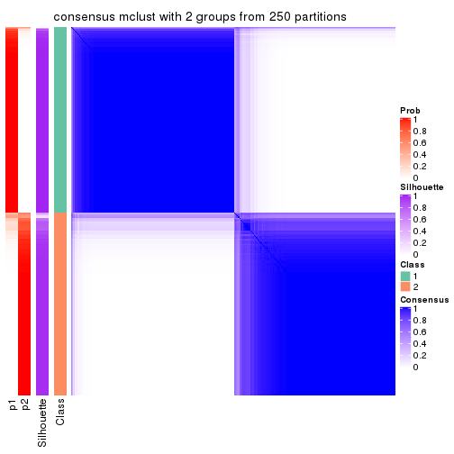</p>

</div>
<div id='tab-SD-mclust-consensus-heatmap-2'>
<pre><code class="r">consensus_heatmap(res, k = 3)
</code></pre>

<p>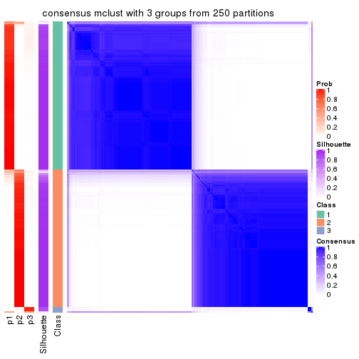</p>

</div>
<div id='tab-SD-mclust-consensus-heatmap-3'>
<pre><code class="r">consensus_heatmap(res, k = 4)
</code></pre>

<p>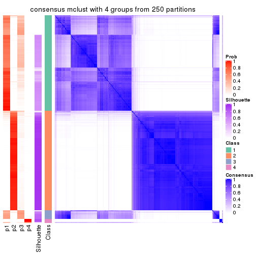</p>

</div>
<div id='tab-SD-mclust-consensus-heatmap-4'>
<pre><code class="r">consensus_heatmap(res, k = 5)
</code></pre>

<p>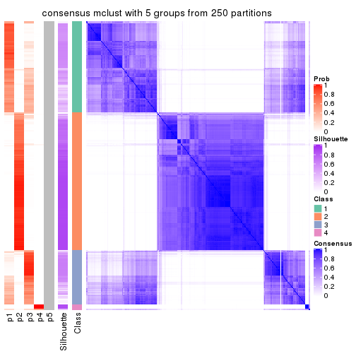</p>

</div>
<div id='tab-SD-mclust-consensus-heatmap-5'>
<pre><code class="r">consensus_heatmap(res, k = 6)
</code></pre>

<p>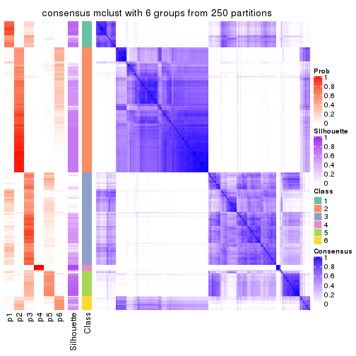</p>

</div>
</div>

Heatmaps for the membership of samples in all partitions to see how consistent they are:


<script>
$( function() {
	$( '#tabs-SD-mclust-membership-heatmap' ).tabs();
} );
</script>
<div id='tabs-SD-mclust-membership-heatmap'>
<ul>
<li><a href='#tab-SD-mclust-membership-heatmap-1'>k = 2</a></li>
<li><a href='#tab-SD-mclust-membership-heatmap-2'>k = 3</a></li>
<li><a href='#tab-SD-mclust-membership-heatmap-3'>k = 4</a></li>
<li><a href='#tab-SD-mclust-membership-heatmap-4'>k = 5</a></li>
<li><a href='#tab-SD-mclust-membership-heatmap-5'>k = 6</a></li>
</ul>
<div id='tab-SD-mclust-membership-heatmap-1'>
<pre><code class="r">membership_heatmap(res, k = 2)
</code></pre>

<p>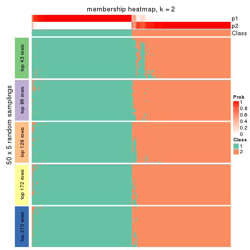</p>

</div>
<div id='tab-SD-mclust-membership-heatmap-2'>
<pre><code class="r">membership_heatmap(res, k = 3)
</code></pre>

<p>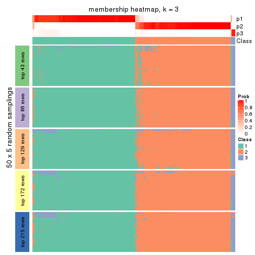</p>

</div>
<div id='tab-SD-mclust-membership-heatmap-3'>
<pre><code class="r">membership_heatmap(res, k = 4)
</code></pre>

<p>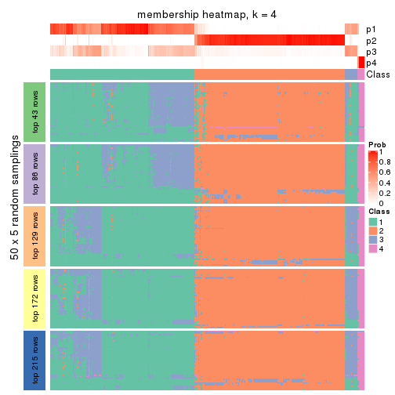</p>

</div>
<div id='tab-SD-mclust-membership-heatmap-4'>
<pre><code class="r">membership_heatmap(res, k = 5)
</code></pre>

<p>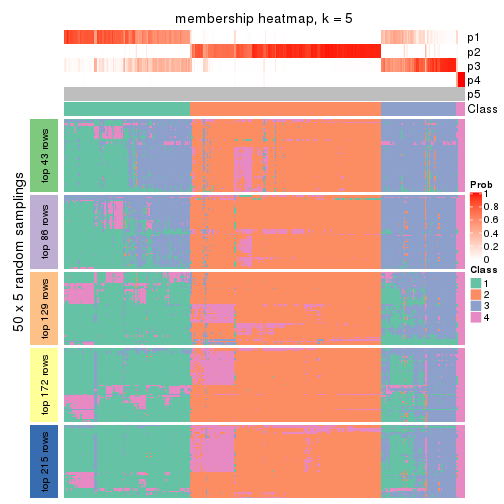</p>

</div>
<div id='tab-SD-mclust-membership-heatmap-5'>
<pre><code class="r">membership_heatmap(res, k = 6)
</code></pre>

<p>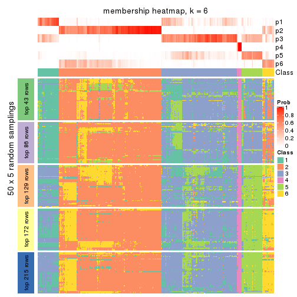</p>

</div>
</div>

As soon as we have had the classes for columns, we can look for signatures
which are significantly different between classes which can be candidate marks
for certain classes. Following are the heatmaps for signatures.


Signature heatmaps where rows are scaled:


<script>
$( function() {
	$( '#tabs-SD-mclust-get-signatures' ).tabs();
} );
</script>
<div id='tabs-SD-mclust-get-signatures'>
<ul>
<li><a href='#tab-SD-mclust-get-signatures-1'>k = 2</a></li>
<li><a href='#tab-SD-mclust-get-signatures-2'>k = 3</a></li>
<li><a href='#tab-SD-mclust-get-signatures-3'>k = 4</a></li>
<li><a href='#tab-SD-mclust-get-signatures-4'>k = 5</a></li>
<li><a href='#tab-SD-mclust-get-signatures-5'>k = 6</a></li>
</ul>
<div id='tab-SD-mclust-get-signatures-1'>
<pre><code class="r">get_signatures(res, k = 2)
</code></pre>

<p>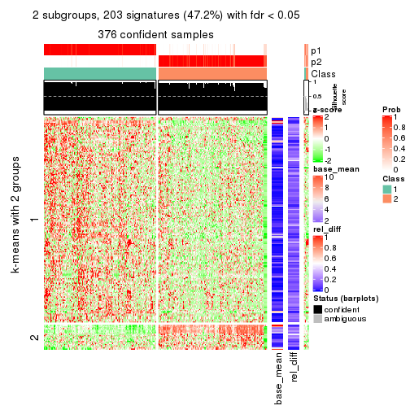</p>

</div>
<div id='tab-SD-mclust-get-signatures-2'>
<pre><code class="r">get_signatures(res, k = 3)
</code></pre>

<p>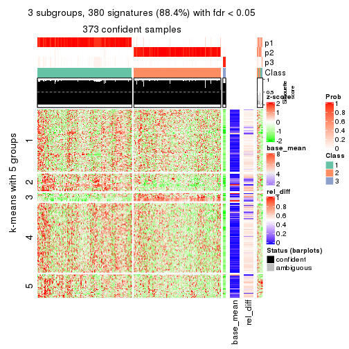</p>

</div>
<div id='tab-SD-mclust-get-signatures-3'>
<pre><code class="r">get_signatures(res, k = 4)
</code></pre>

<p>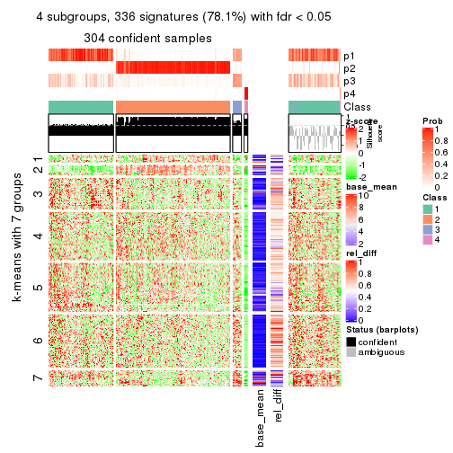</p>

</div>
<div id='tab-SD-mclust-get-signatures-4'>
<pre><code class="r">get_signatures(res, k = 5)
</code></pre>

<p>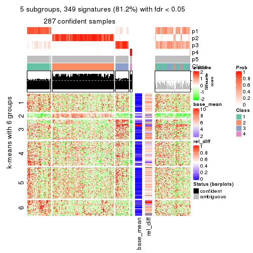</p>

</div>
<div id='tab-SD-mclust-get-signatures-5'>
<pre><code class="r">get_signatures(res, k = 6)
</code></pre>

<p>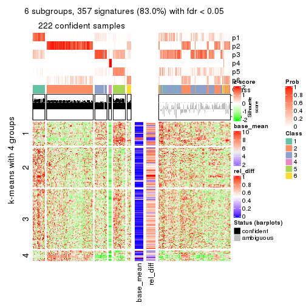</p>

</div>
</div>


Signature heatmaps where rows are not scaled:


<script>
$( function() {
	$( '#tabs-SD-mclust-get-signatures-no-scale' ).tabs();
} );
</script>
<div id='tabs-SD-mclust-get-signatures-no-scale'>
<ul>
<li><a href='#tab-SD-mclust-get-signatures-no-scale-1'>k = 2</a></li>
<li><a href='#tab-SD-mclust-get-signatures-no-scale-2'>k = 3</a></li>
<li><a href='#tab-SD-mclust-get-signatures-no-scale-3'>k = 4</a></li>
<li><a href='#tab-SD-mclust-get-signatures-no-scale-4'>k = 5</a></li>
<li><a href='#tab-SD-mclust-get-signatures-no-scale-5'>k = 6</a></li>
</ul>
<div id='tab-SD-mclust-get-signatures-no-scale-1'>
<pre><code class="r">get_signatures(res, k = 2, scale_rows = FALSE)
</code></pre>

<p>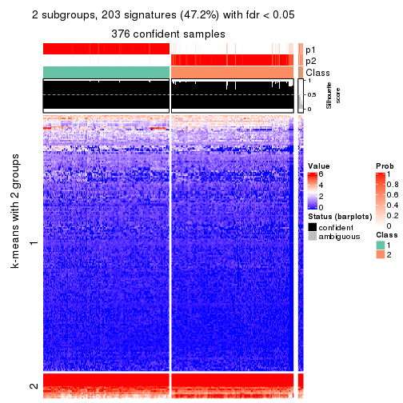</p>

</div>
<div id='tab-SD-mclust-get-signatures-no-scale-2'>
<pre><code class="r">get_signatures(res, k = 3, scale_rows = FALSE)
</code></pre>

<p>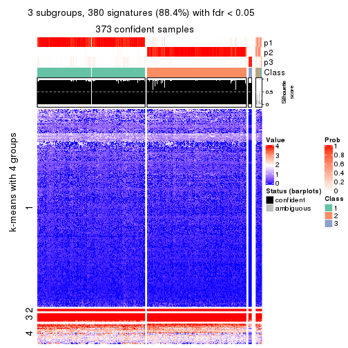</p>

</div>
<div id='tab-SD-mclust-get-signatures-no-scale-3'>
<pre><code class="r">get_signatures(res, k = 4, scale_rows = FALSE)
</code></pre>

<p>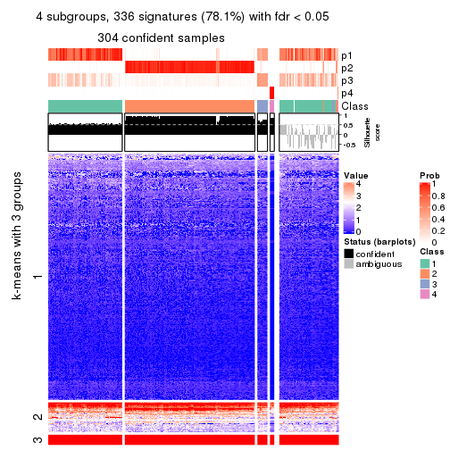</p>

</div>
<div id='tab-SD-mclust-get-signatures-no-scale-4'>
<pre><code class="r">get_signatures(res, k = 5, scale_rows = FALSE)
</code></pre>

<p>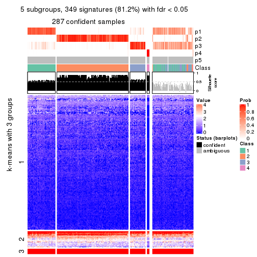</p>

</div>
<div id='tab-SD-mclust-get-signatures-no-scale-5'>
<pre><code class="r">get_signatures(res, k = 6, scale_rows = FALSE)
</code></pre>

<p>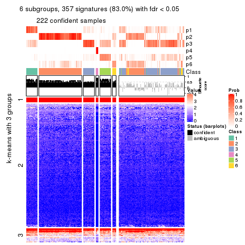</p>

</div>
</div>


Compare the overlap of signatures from different k:

```r
compare_signatures(res)
```

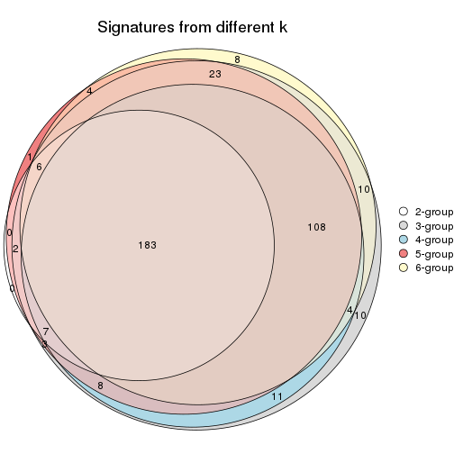

`get_signature()` returns a data frame invisibly. TO get the list of signatures, the function
call should be assigned to a variable explicitly. In following code, if `plot` argument is set
to `FALSE`, no heatmap is plotted while only the differential analysis is performed.

```r
# code only for demonstration
tb = get_signature(res, k = ..., plot = FALSE)
```

An example of the output of `tb` is:

```
#>   which_row         fdr    mean_1    mean_2 scaled_mean_1 scaled_mean_2 km
#> 1        38 0.042760348  8.373488  9.131774    -0.5533452     0.5164555  1
#> 2        40 0.018707592  7.106213  8.469186    -0.6173731     0.5762149  1
#> 3        55 0.019134737 10.221463 11.207825    -0.6159697     0.5749050  1
#> 4        59 0.006059896  5.921854  7.869574    -0.6899429     0.6439467  1
#> 5        60 0.018055526  8.928898 10.211722    -0.6204761     0.5791110  1
#> 6        98 0.009384629 15.714769 14.887706     0.6635654    -0.6193277  2
...
```

The columns in `tb` are:

1. `which_row`: row indices corresponding to the input matrix.
2. `fdr`: FDR for the differential test. 
3. `mean_x`: The mean value in group x.
4. `scaled_mean_x`: The mean value in group x after rows are scaled.
5. `km`: Row groups if k-means clustering is applied to rows.


UMAP plot which shows how samples are separated.


<script>
$( function() {
	$( '#tabs-SD-mclust-dimension-reduction' ).tabs();
} );
</script>
<div id='tabs-SD-mclust-dimension-reduction'>
<ul>
<li><a href='#tab-SD-mclust-dimension-reduction-1'>k = 2</a></li>
<li><a href='#tab-SD-mclust-dimension-reduction-2'>k = 3</a></li>
<li><a href='#tab-SD-mclust-dimension-reduction-3'>k = 4</a></li>
<li><a href='#tab-SD-mclust-dimension-reduction-4'>k = 5</a></li>
<li><a href='#tab-SD-mclust-dimension-reduction-5'>k = 6</a></li>
</ul>
<div id='tab-SD-mclust-dimension-reduction-1'>
<pre><code class="r">dimension_reduction(res, k = 2, method = &quot;UMAP&quot;)
</code></pre>

<p>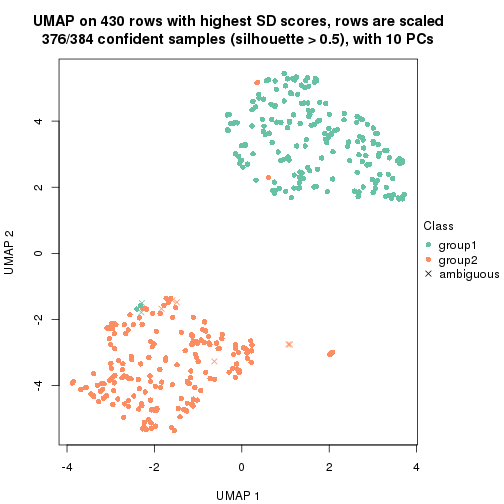</p>

</div>
<div id='tab-SD-mclust-dimension-reduction-2'>
<pre><code class="r">dimension_reduction(res, k = 3, method = &quot;UMAP&quot;)
</code></pre>

<p>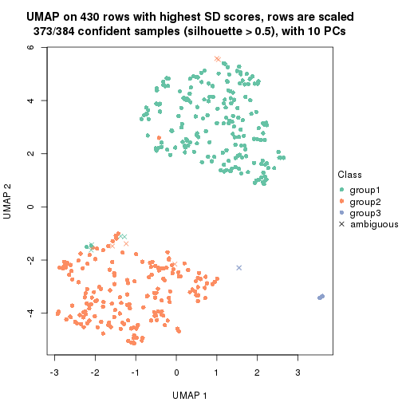</p>

</div>
<div id='tab-SD-mclust-dimension-reduction-3'>
<pre><code class="r">dimension_reduction(res, k = 4, method = &quot;UMAP&quot;)
</code></pre>

<p>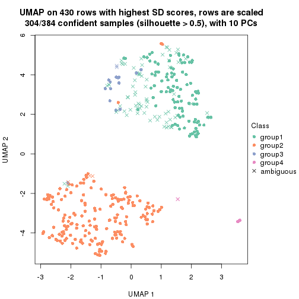</p>

</div>
<div id='tab-SD-mclust-dimension-reduction-4'>
<pre><code class="r">dimension_reduction(res, k = 5, method = &quot;UMAP&quot;)
</code></pre>

<p>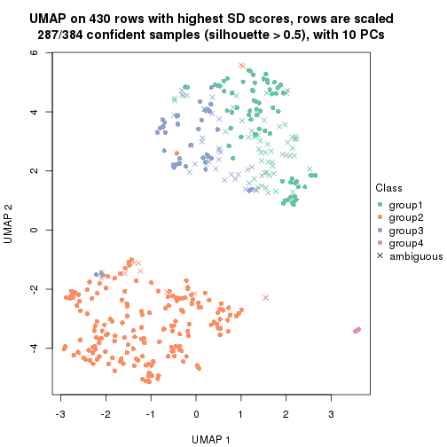</p>

</div>
<div id='tab-SD-mclust-dimension-reduction-5'>
<pre><code class="r">dimension_reduction(res, k = 6, method = &quot;UMAP&quot;)
</code></pre>

<p>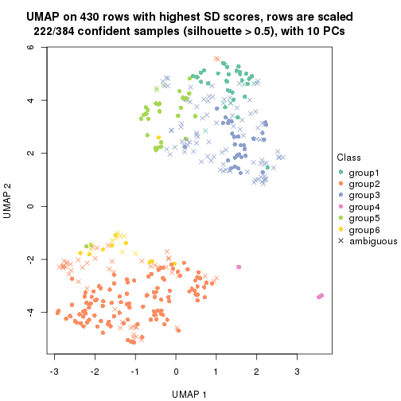</p>

</div>
</div>


Following heatmap shows how subgroups are split when increasing `k`:

```r
collect_classes(res)
```

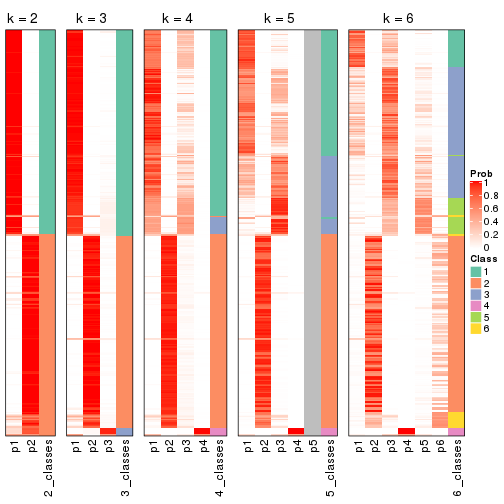


If matrix rows can be associated to genes, consider to use `GO_Enrichment(res,
...)` to perform function enrichment for the signature genes.


 

---------------------------------------------------


### SD:NMF


The object with results only for a single top-value method and a single partition method 
can be extracted as:

```r
res = res_list["SD", "NMF"]
# you can also extract it by
# res = res_list["SD:NMF"]
```

A summary of `res` and all the functions that can be applied to it:

```r
res
```

```
#> A 'ConsensusPartition' object with k = 2, 3, 4, 5, 6.
#>   On a matrix with 430 rows and 384 columns.
#>   Top rows (43, 86, 129, 172, 215) are extracted by 'SD' method.
#>   Subgroups are detected by 'NMF' method.
#>   Performed in total 1250 partitions by row resampling.
#>   Best k for subgroups seems to be 2.
#> 
#> Following methods can be applied to this 'ConsensusPartition' object:
#>  [1] "cola_report"             "collect_classes"         "collect_plots"          
#>  [4] "collect_stats"           "colnames"                "compare_signatures"     
#>  [7] "consensus_heatmap"       "dimension_reduction"     "functional_enrichment"  
#> [10] "get_anno_col"            "get_anno"                "get_classes"            
#> [13] "get_consensus"           "get_matrix"              "get_membership"         
#> [16] "get_param"               "get_signatures"          "get_stats"              
#> [19] "is_best_k"               "is_stable_k"             "membership_heatmap"     
#> [22] "ncol"                    "nrow"                    "plot_ecdf"              
#> [25] "rownames"                "select_partition_number" "show"                   
#> [28] "suggest_best_k"          "test_to_known_factors"
```

`collect_plots()` function collects all the plots made from `res` for all `k` (number of partitions)
into one single page to provide an easy and fast comparison between different `k`.

```r
collect_plots(res)
```

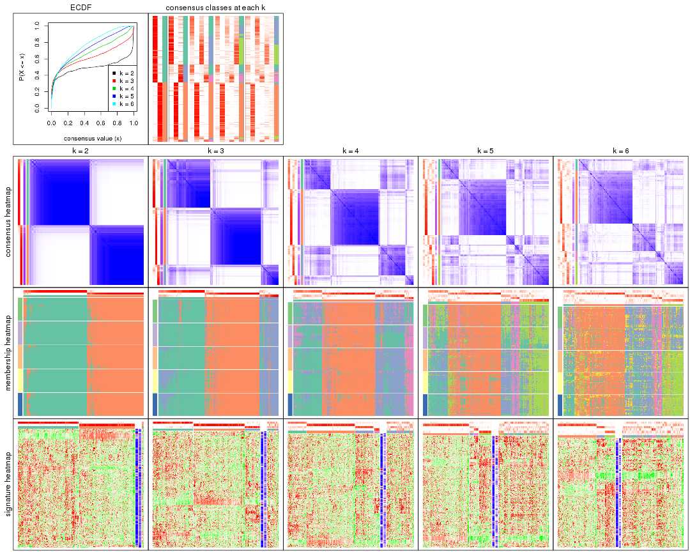

The plots are:

- The first row: a plot of the ECDF (Empirical cumulative distribution
  function) curves of the consensus matrix for each `k` and the heatmap of
  predicted classes for each `k`.
- The second row: heatmaps of the consensus matrix for each `k`.
- The third row: heatmaps of the membership matrix for each `k`.
- The fouth row: heatmaps of the signatures for each `k`.

All the plots in panels can be made by individual functions and they are
plotted later in this section.

`select_partition_number()` produces several plots showing different
statistics for choosing "optimized" `k`. There are following statistics:

- ECDF curves of the consensus matrix for each `k`;
- 1-PAC. [The PAC
  score](https://en.wikipedia.org/wiki/Consensus_clustering#Over-interpretation_potential_of_consensus_clustering)
  measures the proportion of the ambiguous subgrouping.
- Mean silhouette score.
- Concordance. The mean probability of fiting the consensus class ids in all
  partitions.
- Area increased. Denote $A_k$ as the area under the ECDF curve for current
  `k`, the area increased is defined as $A_k - A_{k-1}$.
- Rand index. The percent of pairs of samples that are both in a same cluster
  or both are not in a same cluster in the partition of k and k-1.
- Jaccard index. The ratio of pairs of samples are both in a same cluster in
  the partition of k and k-1 and the pairs of samples are both in a same
  cluster in the partition k or k-1.

The detailed explanations of these statistics can be found in [the cola
vignette](http://bioconductor.org/packages/devel/bioc/vignettes/cola/inst/doc/cola.html#toc_13).

Generally speaking, lower PAC score, higher mean silhouette score or higher
concordance corresponds to better partition. Rand index and Jaccard index
measure how similar the current partition is compared to partition with `k-1`.
If they are too similar, we won't accept `k` is better than `k-1`.

```r
select_partition_number(res)
```

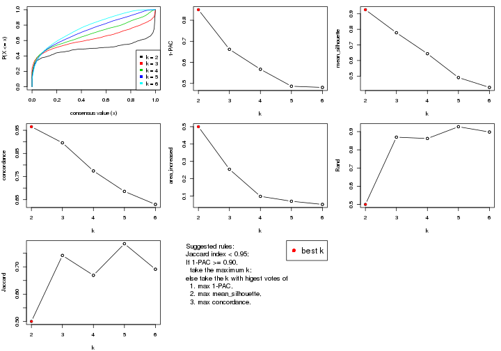

The numeric values for all these statistics can be obtained by `get_stats()`.

```r
get_stats(res)
```

```
#>   k 1-PAC mean_silhouette concordance area_increased  Rand Jaccard
#> 2 2 0.850           0.926       0.965         0.4999 0.500   0.500
#> 3 3 0.662           0.778       0.896         0.2546 0.870   0.742
#> 4 4 0.567           0.644       0.774         0.0983 0.862   0.669
#> 5 5 0.487           0.491       0.686         0.0701 0.927   0.785
#> 6 6 0.481           0.428       0.629         0.0518 0.898   0.691
```

`suggest_best_k()` suggests the best $k$ based on these statistics. The rules are as follows:

- All $k$ with Jaccard index larger than 0.95 are removed because the increase of
  the partition number does not provides enough extra information. If all $k$ are removed,
  the best $k$ is assigned by `NA`.
- For $k$ with 1-PAC larger than 0.9, the maximal $k$ is taken as the "best k". Other $k$ is called "optional k".
- If it does not fit the second rule. The $k$ with the highest vote of highest
  1-PAC, mean silhouette and concordance is taken as the "best k".

```r
suggest_best_k(res)
```

```
#> [1] 2
```


Following shows the table of the partitions (You need to click the **show/hide
code output** link to see it). The membership matrix (columns with name `p*`)
is inferred by
[`clue::cl_consensus()`](https://www.rdocumentation.org/link/cl_consensus?package=clue)
function with the `SE` method. Basically the value in the membership matrix
represents the probability to belong to a certain group. The finall class
label for an item is determined with the group with highest probability it
belongs to.

In `get_classes()` function, the entropy is calculated from the membership
matrix and the silhouette score is calculated from the consensus matrix.


<script>
$( function() {
	$( '#tabs-SD-NMF-get-classes' ).tabs();
} );
</script>
<div id='tabs-SD-NMF-get-classes'>
<ul>
<li><a href='#tab-SD-NMF-get-classes-1'>k = 2</a></li>
<li><a href='#tab-SD-NMF-get-classes-2'>k = 3</a></li>
<li><a href='#tab-SD-NMF-get-classes-3'>k = 4</a></li>
<li><a href='#tab-SD-NMF-get-classes-4'>k = 5</a></li>
<li><a href='#tab-SD-NMF-get-classes-5'>k = 6</a></li>
</ul>

<div id='tab-SD-NMF-get-classes-1'>
<p><a id='tab-SD-NMF-get-classes-1-a' style='color:#0366d6' href='#'>show/hide code output</a></p>
<pre><code class="r">cbind(get_classes(res, k = 2), get_membership(res, k = 2))
</code></pre>

<pre><code>#&gt;            class entropy silhouette    p1    p2
#&gt; SRR2105277     1  0.0000      0.962 1.000 0.000
#&gt; SRR2105278     1  0.0000      0.962 1.000 0.000
#&gt; SRR2105275     1  0.0000      0.962 1.000 0.000
#&gt; SRR2105276     1  0.0000      0.962 1.000 0.000
#&gt; SRR2105273     1  0.0000      0.962 1.000 0.000
#&gt; SRR2105274     1  0.0000      0.962 1.000 0.000
#&gt; SRR2105271     1  0.0000      0.962 1.000 0.000
#&gt; SRR2105272     1  0.0000      0.962 1.000 0.000
#&gt; SRR2105269     2  0.0000      0.965 0.000 1.000
#&gt; SRR2105270     2  0.0000      0.965 0.000 1.000
#&gt; SRR2105267     2  0.0000      0.965 0.000 1.000
#&gt; SRR2105268     2  0.0000      0.965 0.000 1.000
#&gt; SRR2105265     2  0.0000      0.965 0.000 1.000
#&gt; SRR2105266     2  0.0000      0.965 0.000 1.000
#&gt; SRR2105263     2  0.6048      0.835 0.148 0.852
#&gt; SRR2105264     2  0.5842      0.845 0.140 0.860
#&gt; SRR2105261     1  0.0672      0.959 0.992 0.008
#&gt; SRR2105262     1  0.0000      0.962 1.000 0.000
#&gt; SRR2105357     1  0.0938      0.957 0.988 0.012
#&gt; SRR2105358     1  0.0000      0.962 1.000 0.000
#&gt; SRR2105439     2  0.0672      0.962 0.008 0.992
#&gt; SRR2105440     2  0.1184      0.958 0.016 0.984
#&gt; SRR2105509     2  0.0000      0.965 0.000 1.000
#&gt; SRR2105510     2  0.0672      0.962 0.008 0.992
#&gt; SRR2105507     1  0.0000      0.962 1.000 0.000
#&gt; SRR2105508     1  0.0000      0.962 1.000 0.000
#&gt; SRR2105505     1  0.0938      0.957 0.988 0.012
#&gt; SRR2105506     1  0.0000      0.962 1.000 0.000
#&gt; SRR2105503     2  0.0672      0.962 0.008 0.992
#&gt; SRR2105504     2  0.0938      0.960 0.012 0.988
#&gt; SRR2105501     2  0.1414      0.956 0.020 0.980
#&gt; SRR2105502     2  0.0000      0.965 0.000 1.000
#&gt; SRR2105499     1  0.0000      0.962 1.000 0.000
#&gt; SRR2105500     1  0.0672      0.959 0.992 0.008
#&gt; SRR2105497     2  0.0938      0.960 0.012 0.988
#&gt; SRR2105498     2  0.2236      0.944 0.036 0.964
#&gt; SRR2105495     2  0.0000      0.965 0.000 1.000
#&gt; SRR2105496     2  0.0000      0.965 0.000 1.000
#&gt; SRR2105493     2  0.5946      0.839 0.144 0.856
#&gt; SRR2105494     2  0.2603      0.939 0.044 0.956
#&gt; SRR2105491     2  0.6623      0.805 0.172 0.828
#&gt; SRR2105492     2  0.6438      0.815 0.164 0.836
#&gt; SRR2105489     2  0.0000      0.965 0.000 1.000
#&gt; SRR2105490     2  0.0000      0.965 0.000 1.000
#&gt; SRR2105487     1  0.0000      0.962 1.000 0.000
#&gt; SRR2105488     1  0.0000      0.962 1.000 0.000
#&gt; SRR2105485     1  0.0376      0.961 0.996 0.004
#&gt; SRR2105486     1  0.0000      0.962 1.000 0.000
#&gt; SRR2105483     1  0.9044      0.541 0.680 0.320
#&gt; SRR2105484     1  0.8267      0.660 0.740 0.260
#&gt; SRR2105481     1  0.0000      0.962 1.000 0.000
#&gt; SRR2105482     1  0.0000      0.962 1.000 0.000
#&gt; SRR2105479     1  0.0000      0.962 1.000 0.000
#&gt; SRR2105480     1  0.0000      0.962 1.000 0.000
#&gt; SRR2105477     2  0.3584      0.918 0.068 0.932
#&gt; SRR2105478     2  0.2948      0.933 0.052 0.948
#&gt; SRR2105475     2  0.0000      0.965 0.000 1.000
#&gt; SRR2105476     2  0.0000      0.965 0.000 1.000
#&gt; SRR2105473     2  0.0376      0.964 0.004 0.996
#&gt; SRR2105474     2  0.0000      0.965 0.000 1.000
#&gt; SRR2105471     2  0.0000      0.965 0.000 1.000
#&gt; SRR2105472     2  0.0000      0.965 0.000 1.000
#&gt; SRR2105469     1  0.0000      0.962 1.000 0.000
#&gt; SRR2105470     1  0.0000      0.962 1.000 0.000
#&gt; SRR2105467     1  0.0000      0.962 1.000 0.000
#&gt; SRR2105468     1  0.0376      0.961 0.996 0.004
#&gt; SRR2105465     1  0.1184      0.955 0.984 0.016
#&gt; SRR2105466     1  0.3733      0.910 0.928 0.072
#&gt; SRR2105463     1  0.0000      0.962 1.000 0.000
#&gt; SRR2105464     1  0.0938      0.957 0.988 0.012
#&gt; SRR2105461     2  0.0000      0.965 0.000 1.000
#&gt; SRR2105462     2  0.0000      0.965 0.000 1.000
#&gt; SRR2105459     2  0.0000      0.965 0.000 1.000
#&gt; SRR2105460     2  0.0000      0.965 0.000 1.000
#&gt; SRR2105457     1  0.0000      0.962 1.000 0.000
#&gt; SRR2105458     1  0.0672      0.959 0.992 0.008
#&gt; SRR2105455     1  0.0376      0.961 0.996 0.004
#&gt; SRR2105456     1  0.0000      0.962 1.000 0.000
#&gt; SRR2105453     1  0.0672      0.959 0.992 0.008
#&gt; SRR2105454     1  0.0938      0.957 0.988 0.012
#&gt; SRR2105451     2  0.6973      0.782 0.188 0.812
#&gt; SRR2105452     1  0.9460      0.448 0.636 0.364
#&gt; SRR2105449     1  0.1843      0.946 0.972 0.028
#&gt; SRR2105450     1  0.0000      0.962 1.000 0.000
#&gt; SRR2105447     2  0.0938      0.960 0.012 0.988
#&gt; SRR2105448     2  0.1414      0.956 0.020 0.980
#&gt; SRR2105445     1  0.1184      0.955 0.984 0.016
#&gt; SRR2105446     1  0.4815      0.878 0.896 0.104
#&gt; SRR2105443     1  0.9954      0.164 0.540 0.460
#&gt; SRR2105444     1  0.9970      0.118 0.532 0.468
#&gt; SRR2105441     2  0.0000      0.965 0.000 1.000
#&gt; SRR2105442     2  0.0000      0.965 0.000 1.000
#&gt; SRR2105437     1  0.0000      0.962 1.000 0.000
#&gt; SRR2105438     1  0.0000      0.962 1.000 0.000
#&gt; SRR2105435     1  0.0000      0.962 1.000 0.000
#&gt; SRR2105436     1  0.0000      0.962 1.000 0.000
#&gt; SRR2105433     1  0.2948      0.928 0.948 0.052
#&gt; SRR2105434     1  0.2423      0.937 0.960 0.040
#&gt; SRR2105431     1  0.0376      0.961 0.996 0.004
#&gt; SRR2105432     1  0.0000      0.962 1.000 0.000
#&gt; SRR2105429     2  0.8861      0.584 0.304 0.696
#&gt; SRR2105430     2  0.1633      0.953 0.024 0.976
#&gt; SRR2105427     2  0.0672      0.962 0.008 0.992
#&gt; SRR2105428     2  0.0000      0.965 0.000 1.000
#&gt; SRR2105425     2  0.0938      0.960 0.012 0.988
#&gt; SRR2105426     2  0.1184      0.958 0.016 0.984
#&gt; SRR2105421     1  0.3114      0.924 0.944 0.056
#&gt; SRR2105422     1  0.0000      0.962 1.000 0.000
#&gt; SRR2105423     2  0.0000      0.965 0.000 1.000
#&gt; SRR2105424     2  0.0000      0.965 0.000 1.000
#&gt; SRR2105419     1  0.0000      0.962 1.000 0.000
#&gt; SRR2105420     1  0.0000      0.962 1.000 0.000
#&gt; SRR2105415     1  0.0000      0.962 1.000 0.000
#&gt; SRR2105416     1  0.0000      0.962 1.000 0.000
#&gt; SRR2105417     1  0.0000      0.962 1.000 0.000
#&gt; SRR2105418     1  0.0000      0.962 1.000 0.000
#&gt; SRR2105413     2  0.0376      0.964 0.004 0.996
#&gt; SRR2105414     2  0.0376      0.964 0.004 0.996
#&gt; SRR2105409     2  0.0000      0.965 0.000 1.000
#&gt; SRR2105410     2  0.0672      0.962 0.008 0.992
#&gt; SRR2105411     2  0.0000      0.965 0.000 1.000
#&gt; SRR2105412     2  0.0000      0.965 0.000 1.000
#&gt; SRR2105407     1  0.0000      0.962 1.000 0.000
#&gt; SRR2105408     1  0.0000      0.962 1.000 0.000
#&gt; SRR2105403     1  0.0000      0.962 1.000 0.000
#&gt; SRR2105404     1  0.0000      0.962 1.000 0.000
#&gt; SRR2105405     1  0.0672      0.959 0.992 0.008
#&gt; SRR2105406     1  0.1184      0.955 0.984 0.016
#&gt; SRR2105401     2  0.5059      0.874 0.112 0.888
#&gt; SRR2105402     2  0.6148      0.829 0.152 0.848
#&gt; SRR2105399     2  0.6973      0.777 0.188 0.812
#&gt; SRR2105400     2  0.3584      0.916 0.068 0.932
#&gt; SRR2105397     1  0.8499      0.634 0.724 0.276
#&gt; SRR2105398     1  0.4815      0.878 0.896 0.104
#&gt; SRR2105395     2  0.0000      0.965 0.000 1.000
#&gt; SRR2105396     2  0.0000      0.965 0.000 1.000
#&gt; SRR2105393     2  0.0000      0.965 0.000 1.000
#&gt; SRR2105394     2  0.0000      0.965 0.000 1.000
#&gt; SRR2105389     1  0.0000      0.962 1.000 0.000
#&gt; SRR2105390     1  0.0000      0.962 1.000 0.000
#&gt; SRR2105391     1  0.0000      0.962 1.000 0.000
#&gt; SRR2105392     1  0.0000      0.962 1.000 0.000
#&gt; SRR2105385     1  0.0000      0.962 1.000 0.000
#&gt; SRR2105386     1  0.0000      0.962 1.000 0.000
#&gt; SRR2105387     1  0.0000      0.962 1.000 0.000
#&gt; SRR2105388     1  0.0000      0.962 1.000 0.000
#&gt; SRR2105381     2  0.5519      0.859 0.128 0.872
#&gt; SRR2105382     2  0.2236      0.945 0.036 0.964
#&gt; SRR2105383     2  0.0000      0.965 0.000 1.000
#&gt; SRR2105384     2  0.0000      0.965 0.000 1.000
#&gt; SRR2105379     2  0.0938      0.960 0.012 0.988
#&gt; SRR2105380     2  0.9427      0.460 0.360 0.640
#&gt; SRR2105377     2  0.0376      0.964 0.004 0.996
#&gt; SRR2105378     2  0.0376      0.964 0.004 0.996
#&gt; SRR2105375     1  0.2236      0.941 0.964 0.036
#&gt; SRR2105376     1  0.1843      0.947 0.972 0.028
#&gt; SRR2105373     1  0.0000      0.962 1.000 0.000
#&gt; SRR2105374     1  0.0000      0.962 1.000 0.000
#&gt; SRR2105371     1  0.0000      0.962 1.000 0.000
#&gt; SRR2105372     1  0.0000      0.962 1.000 0.000
#&gt; SRR2105369     1  0.0000      0.962 1.000 0.000
#&gt; SRR2105370     1  0.0000      0.962 1.000 0.000
#&gt; SRR2105367     1  0.0376      0.961 0.996 0.004
#&gt; SRR2105368     1  0.3879      0.907 0.924 0.076
#&gt; SRR2105365     2  0.6148      0.829 0.152 0.848
#&gt; SRR2105366     2  0.6048      0.836 0.148 0.852
#&gt; SRR2105363     2  0.0000      0.965 0.000 1.000
#&gt; SRR2105364     2  0.0000      0.965 0.000 1.000
#&gt; SRR2105361     2  0.0000      0.965 0.000 1.000
#&gt; SRR2105362     2  0.0000      0.965 0.000 1.000
#&gt; SRR2105359     1  0.0000      0.962 1.000 0.000
#&gt; SRR2105360     1  0.0000      0.962 1.000 0.000
#&gt; SRR2105355     1  0.0000      0.962 1.000 0.000
#&gt; SRR2105356     1  0.0000      0.962 1.000 0.000
#&gt; SRR2105353     1  0.0000      0.962 1.000 0.000
#&gt; SRR2105354     1  0.0000      0.962 1.000 0.000
#&gt; SRR2105351     2  0.0000      0.965 0.000 1.000
#&gt; SRR2105352     2  0.3114      0.929 0.056 0.944
#&gt; SRR2105349     2  0.0000      0.965 0.000 1.000
#&gt; SRR2105350     2  0.0000      0.965 0.000 1.000
#&gt; SRR2105345     2  0.0000      0.965 0.000 1.000
#&gt; SRR2105346     2  0.0000      0.965 0.000 1.000
#&gt; SRR2105347     2  0.0000      0.965 0.000 1.000
#&gt; SRR2105348     2  0.0000      0.965 0.000 1.000
#&gt; SRR2105343     2  0.0000      0.965 0.000 1.000
#&gt; SRR2105344     2  0.0000      0.965 0.000 1.000
#&gt; SRR2105341     1  0.0000      0.962 1.000 0.000
#&gt; SRR2105342     1  0.0000      0.962 1.000 0.000
#&gt; SRR2105339     1  0.0000      0.962 1.000 0.000
#&gt; SRR2105340     1  0.0000      0.962 1.000 0.000
#&gt; SRR2105335     1  0.0000      0.962 1.000 0.000
#&gt; SRR2105336     1  0.0000      0.962 1.000 0.000
#&gt; SRR2105337     1  0.0000      0.962 1.000 0.000
#&gt; SRR2105338     1  0.0000      0.962 1.000 0.000
#&gt; SRR2105331     2  0.2423      0.941 0.040 0.960
#&gt; SRR2105332     2  0.1184      0.958 0.016 0.984
#&gt; SRR2105333     2  0.0376      0.964 0.004 0.996
#&gt; SRR2105334     2  0.0000      0.965 0.000 1.000
#&gt; SRR2105329     1  0.8713      0.606 0.708 0.292
#&gt; SRR2105330     2  0.9909      0.205 0.444 0.556
#&gt; SRR2105327     2  0.1633      0.953 0.024 0.976
#&gt; SRR2105328     2  0.1633      0.953 0.024 0.976
#&gt; SRR2105325     1  0.0000      0.962 1.000 0.000
#&gt; SRR2105326     1  0.0000      0.962 1.000 0.000
#&gt; SRR2105323     1  0.7139      0.766 0.804 0.196
#&gt; SRR2105324     1  0.0938      0.957 0.988 0.012
#&gt; SRR2105319     1  0.0000      0.962 1.000 0.000
#&gt; SRR2105320     1  0.0000      0.962 1.000 0.000
#&gt; SRR2105321     1  0.0000      0.962 1.000 0.000
#&gt; SRR2105322     1  0.0000      0.962 1.000 0.000
#&gt; SRR2105317     2  0.0000      0.965 0.000 1.000
#&gt; SRR2105318     2  0.0000      0.965 0.000 1.000
#&gt; SRR2105315     1  0.9248      0.508 0.660 0.340
#&gt; SRR2105316     2  0.0376      0.964 0.004 0.996
#&gt; SRR2105313     2  0.0376      0.964 0.004 0.996
#&gt; SRR2105314     2  0.0000      0.965 0.000 1.000
#&gt; SRR2105311     1  0.0000      0.962 1.000 0.000
#&gt; SRR2105312     1  0.0000      0.962 1.000 0.000
#&gt; SRR2105307     1  0.0376      0.961 0.996 0.004
#&gt; SRR2105308     1  0.7528      0.746 0.784 0.216
#&gt; SRR2105309     1  0.0938      0.957 0.988 0.012
#&gt; SRR2105310     1  0.0000      0.962 1.000 0.000
#&gt; SRR2105305     1  0.0000      0.962 1.000 0.000
#&gt; SRR2105306     1  0.0000      0.962 1.000 0.000
#&gt; SRR2105303     2  0.0000      0.965 0.000 1.000
#&gt; SRR2105304     2  0.0000      0.965 0.000 1.000
#&gt; SRR2105301     2  0.1633      0.953 0.024 0.976
#&gt; SRR2105302     2  0.0000      0.965 0.000 1.000
#&gt; SRR2105299     1  0.0672      0.959 0.992 0.008
#&gt; SRR2105300     1  0.7745      0.716 0.772 0.228
#&gt; SRR2105297     2  0.4022      0.906 0.080 0.920
#&gt; SRR2105298     2  0.0000      0.965 0.000 1.000
#&gt; SRR2105295     2  0.0000      0.965 0.000 1.000
#&gt; SRR2105296     2  0.0000      0.965 0.000 1.000
#&gt; SRR2105293     1  0.0000      0.962 1.000 0.000
#&gt; SRR2105294     1  0.0000      0.962 1.000 0.000
#&gt; SRR2105291     1  0.4298      0.894 0.912 0.088
#&gt; SRR2105292     1  0.0000      0.962 1.000 0.000
#&gt; SRR2105289     1  0.0000      0.962 1.000 0.000
#&gt; SRR2105290     1  0.0000      0.962 1.000 0.000
#&gt; SRR2105287     1  0.0938      0.957 0.988 0.012
#&gt; SRR2105288     1  0.3431      0.919 0.936 0.064
#&gt; SRR2105285     2  0.0672      0.962 0.008 0.992
#&gt; SRR2105286     2  0.0000      0.965 0.000 1.000
#&gt; SRR2105283     2  0.5408      0.864 0.124 0.876
#&gt; SRR2105284     2  0.8443      0.647 0.272 0.728
#&gt; SRR2105281     2  0.0000      0.965 0.000 1.000
#&gt; SRR2105282     2  0.0000      0.965 0.000 1.000
#&gt; SRR2105259     1  0.0000      0.962 1.000 0.000
#&gt; SRR2105260     1  0.0000      0.962 1.000 0.000
#&gt; SRR2105279     2  0.0000      0.965 0.000 1.000
#&gt; SRR2105280     2  0.0000      0.965 0.000 1.000
#&gt; SRR2105257     1  0.0000      0.962 1.000 0.000
#&gt; SRR2105258     1  0.0000      0.962 1.000 0.000
#&gt; SRR2105253     2  0.0000      0.965 0.000 1.000
#&gt; SRR2105254     2  0.0000      0.965 0.000 1.000
#&gt; SRR2105255     1  0.0000      0.962 1.000 0.000
#&gt; SRR2105256     1  0.0000      0.962 1.000 0.000
#&gt; SRR2105251     2  0.0000      0.965 0.000 1.000
#&gt; SRR2105252     2  0.0000      0.965 0.000 1.000
#&gt; SRR2105249     2  0.0000      0.965 0.000 1.000
#&gt; SRR2105250     2  0.0000      0.965 0.000 1.000
#&gt; SRR2105247     2  0.0000      0.965 0.000 1.000
#&gt; SRR2105248     2  0.0000      0.965 0.000 1.000
#&gt; SRR2105245     1  0.4022      0.901 0.920 0.080
#&gt; SRR2105246     1  0.6247      0.817 0.844 0.156
#&gt; SRR2105243     1  0.0672      0.959 0.992 0.008
#&gt; SRR2105244     1  0.0000      0.962 1.000 0.000
#&gt; SRR2105241     1  0.0000      0.962 1.000 0.000
#&gt; SRR2105242     1  0.0000      0.962 1.000 0.000
#&gt; SRR2105239     1  0.0000      0.962 1.000 0.000
#&gt; SRR2105240     1  0.0000      0.962 1.000 0.000
#&gt; SRR2105237     2  0.9129      0.533 0.328 0.672
#&gt; SRR2105238     2  0.4690      0.888 0.100 0.900
#&gt; SRR2105235     2  0.0000      0.965 0.000 1.000
#&gt; SRR2105236     2  0.0000      0.965 0.000 1.000
#&gt; SRR2105233     2  0.0000      0.965 0.000 1.000
#&gt; SRR2105234     2  0.0000      0.965 0.000 1.000
#&gt; SRR2105231     2  0.0000      0.965 0.000 1.000
#&gt; SRR2105232     2  0.0000      0.965 0.000 1.000
#&gt; SRR2105227     1  0.1414      0.952 0.980 0.020
#&gt; SRR2105228     1  0.7376      0.753 0.792 0.208
#&gt; SRR2105225     1  0.0000      0.962 1.000 0.000
#&gt; SRR2105226     1  0.0000      0.962 1.000 0.000
#&gt; SRR2105229     1  0.0000      0.962 1.000 0.000
#&gt; SRR2105230     1  0.0000      0.962 1.000 0.000
#&gt; SRR2105219     2  0.0000      0.965 0.000 1.000
#&gt; SRR2105220     2  0.0000      0.965 0.000 1.000
#&gt; SRR2105221     2  0.1843      0.950 0.028 0.972
#&gt; SRR2105222     2  0.0938      0.961 0.012 0.988
#&gt; SRR2105223     1  0.0000      0.962 1.000 0.000
#&gt; SRR2105224     1  0.0000      0.962 1.000 0.000
#&gt; SRR2105217     2  0.0000      0.965 0.000 1.000
#&gt; SRR2105218     2  0.0000      0.965 0.000 1.000
#&gt; SRR2105215     2  0.0000      0.965 0.000 1.000
#&gt; SRR2105216     2  0.0000      0.965 0.000 1.000
#&gt; SRR2105213     1  0.0672      0.959 0.992 0.008
#&gt; SRR2105214     1  0.6887      0.780 0.816 0.184
#&gt; SRR2105211     1  0.0672      0.959 0.992 0.008
#&gt; SRR2105212     1  0.2778      0.931 0.952 0.048
#&gt; SRR2105209     1  0.0000      0.962 1.000 0.000
#&gt; SRR2105210     1  0.0000      0.962 1.000 0.000
#&gt; SRR2105207     1  0.0000      0.962 1.000 0.000
#&gt; SRR2105208     1  0.0938      0.957 0.988 0.012
#&gt; SRR2105205     2  0.6801      0.797 0.180 0.820
#&gt; SRR2105206     2  0.8955      0.572 0.312 0.688
#&gt; SRR2105201     2  0.0000      0.965 0.000 1.000
#&gt; SRR2105202     2  0.0000      0.965 0.000 1.000
#&gt; SRR2105203     2  0.0000      0.965 0.000 1.000
#&gt; SRR2105204     2  0.0000      0.965 0.000 1.000
#&gt; SRR2105199     2  0.0000      0.965 0.000 1.000
#&gt; SRR2105200     2  0.0000      0.965 0.000 1.000
#&gt; SRR2105197     1  0.0000      0.962 1.000 0.000
#&gt; SRR2105198     1  0.1633      0.949 0.976 0.024
#&gt; SRR2105195     1  0.1633      0.950 0.976 0.024
#&gt; SRR2105196     1  0.3431      0.917 0.936 0.064
#&gt; SRR2105193     1  0.1633      0.949 0.976 0.024
#&gt; SRR2105194     1  0.0000      0.962 1.000 0.000
#&gt; SRR2105191     1  0.0000      0.962 1.000 0.000
#&gt; SRR2105192     1  0.0000      0.962 1.000 0.000
#&gt; SRR2105189     2  0.1184      0.958 0.016 0.984
#&gt; SRR2105190     2  0.0000      0.965 0.000 1.000
#&gt; SRR2105187     2  0.8909      0.583 0.308 0.692
#&gt; SRR2105188     2  0.8327      0.658 0.264 0.736
#&gt; SRR2105179     1  0.0000      0.962 1.000 0.000
#&gt; SRR2105180     1  0.0000      0.962 1.000 0.000
#&gt; SRR2105183     2  0.0000      0.965 0.000 1.000
#&gt; SRR2105184     2  0.0000      0.965 0.000 1.000
#&gt; SRR2105185     2  0.1184      0.958 0.016 0.984
#&gt; SRR2105186     2  0.0672      0.962 0.008 0.992
#&gt; SRR2105181     1  0.0000      0.962 1.000 0.000
#&gt; SRR2105182     1  0.0000      0.962 1.000 0.000
#&gt; SRR2105177     1  0.8813      0.585 0.700 0.300
#&gt; SRR2105178     1  0.6247      0.817 0.844 0.156
#&gt; SRR2105171     2  0.0000      0.965 0.000 1.000
#&gt; SRR2105172     2  0.0000      0.965 0.000 1.000
#&gt; SRR2105175     1  0.3431      0.917 0.936 0.064
#&gt; SRR2105176     1  0.1414      0.952 0.980 0.020
#&gt; SRR2105173     2  0.0000      0.965 0.000 1.000
#&gt; SRR2105174     2  0.0000      0.965 0.000 1.000
#&gt; SRR2105169     2  0.0000      0.965 0.000 1.000
#&gt; SRR2105170     2  0.0000      0.965 0.000 1.000
#&gt; SRR2105167     2  0.0000      0.965 0.000 1.000
#&gt; SRR2105168     2  0.0000      0.965 0.000 1.000
#&gt; SRR2105165     1  0.0000      0.962 1.000 0.000
#&gt; SRR2105166     1  0.0000      0.962 1.000 0.000
#&gt; SRR2105163     1  0.0000      0.962 1.000 0.000
#&gt; SRR2105164     1  0.0000      0.962 1.000 0.000
#&gt; SRR2105161     1  0.0000      0.962 1.000 0.000
#&gt; SRR2105162     1  0.2778      0.931 0.952 0.048
#&gt; SRR2105155     2  0.0000      0.965 0.000 1.000
#&gt; SRR2105156     2  0.0000      0.965 0.000 1.000
#&gt; SRR2105157     2  0.0000      0.965 0.000 1.000
#&gt; SRR2105158     2  0.0000      0.965 0.000 1.000
#&gt; SRR2105159     1  0.0000      0.962 1.000 0.000
#&gt; SRR2105160     1  0.0000      0.962 1.000 0.000
#&gt; SRR2105153     2  0.0000      0.965 0.000 1.000
#&gt; SRR2105154     2  0.0938      0.961 0.012 0.988
#&gt; SRR2105151     2  0.0000      0.965 0.000 1.000
#&gt; SRR2105152     2  0.0000      0.965 0.000 1.000
#&gt; SRR2105149     1  0.0376      0.961 0.996 0.004
#&gt; SRR2105150     1  0.1843      0.946 0.972 0.028
#&gt; SRR2105147     1  0.0000      0.962 1.000 0.000
#&gt; SRR2105148     1  0.0000      0.962 1.000 0.000
#&gt; SRR2105143     1  0.6973      0.778 0.812 0.188
#&gt; SRR2105144     2  0.6801      0.792 0.180 0.820
#&gt; SRR2105145     1  0.2043      0.943 0.968 0.032
#&gt; SRR2105146     1  0.0000      0.962 1.000 0.000
#&gt; SRR2105141     2  0.2423      0.941 0.040 0.960
#&gt; SRR2105142     2  0.0938      0.960 0.012 0.988
#&gt; SRR2105139     2  0.0000      0.965 0.000 1.000
#&gt; SRR2105140     2  0.0000      0.965 0.000 1.000
#&gt; SRR2105137     2  0.2043      0.948 0.032 0.968
#&gt; SRR2105138     2  0.2423      0.942 0.040 0.960
#&gt; SRR2105135     2  0.0000      0.965 0.000 1.000
#&gt; SRR2105136     2  0.0000      0.965 0.000 1.000
#&gt; SRR2105133     1  0.0000      0.962 1.000 0.000
#&gt; SRR2105134     1  0.0000      0.962 1.000 0.000
#&gt; SRR2105131     1  0.9815      0.293 0.580 0.420
#&gt; SRR2105132     1  0.5294      0.860 0.880 0.120
#&gt; SRR2105129     1  0.2043      0.943 0.968 0.032
#&gt; SRR2105130     1  0.6801      0.786 0.820 0.180
#&gt; SRR2105127     1  0.5408      0.856 0.876 0.124
#&gt; SRR2105128     1  0.9000      0.562 0.684 0.316
</code></pre>

<script>
$('#tab-SD-NMF-get-classes-1-a').parent().next().next().hide();
$('#tab-SD-NMF-get-classes-1-a').click(function(){
  $('#tab-SD-NMF-get-classes-1-a').parent().next().next().toggle();
  return(false);
});
</script>
</div>

<div id='tab-SD-NMF-get-classes-2'>
<p><a id='tab-SD-NMF-get-classes-2-a' style='color:#0366d6' href='#'>show/hide code output</a></p>
<pre><code class="r">cbind(get_classes(res, k = 3), get_membership(res, k = 3))
</code></pre>

<pre><code>#&gt;            class entropy silhouette    p1    p2    p3
#&gt; SRR2105277     1  0.0000   0.842196 1.000 0.000 0.000
#&gt; SRR2105278     1  0.0000   0.842196 1.000 0.000 0.000
#&gt; SRR2105275     3  0.0424   0.801204 0.008 0.000 0.992
#&gt; SRR2105276     3  0.2711   0.787384 0.088 0.000 0.912
#&gt; SRR2105273     1  0.2537   0.826492 0.920 0.000 0.080
#&gt; SRR2105274     1  0.5098   0.671040 0.752 0.000 0.248
#&gt; SRR2105271     1  0.4399   0.764971 0.812 0.000 0.188
#&gt; SRR2105272     3  0.3816   0.743782 0.148 0.000 0.852
#&gt; SRR2105269     2  0.1031   0.920506 0.024 0.976 0.000
#&gt; SRR2105270     2  0.1163   0.918289 0.028 0.972 0.000
#&gt; SRR2105267     2  0.0000   0.930976 0.000 1.000 0.000
#&gt; SRR2105268     2  0.0000   0.930976 0.000 1.000 0.000
#&gt; SRR2105265     2  0.0000   0.930976 0.000 1.000 0.000
#&gt; SRR2105266     2  0.0000   0.930976 0.000 1.000 0.000
#&gt; SRR2105263     2  0.6215   0.275649 0.000 0.572 0.428
#&gt; SRR2105264     2  0.5785   0.512530 0.000 0.668 0.332
#&gt; SRR2105261     1  0.6984   0.545954 0.656 0.040 0.304
#&gt; SRR2105262     1  0.4473   0.773130 0.828 0.008 0.164
#&gt; SRR2105357     1  0.0000   0.842196 1.000 0.000 0.000
#&gt; SRR2105358     1  0.0000   0.842196 1.000 0.000 0.000
#&gt; SRR2105439     2  0.2711   0.871351 0.088 0.912 0.000
#&gt; SRR2105440     2  0.4346   0.765491 0.184 0.816 0.000
#&gt; SRR2105509     2  0.0237   0.929609 0.004 0.996 0.000
#&gt; SRR2105510     2  0.0424   0.927954 0.008 0.992 0.000
#&gt; SRR2105507     1  0.5529   0.604876 0.704 0.000 0.296
#&gt; SRR2105508     1  0.4062   0.766864 0.836 0.000 0.164
#&gt; SRR2105505     1  0.0000   0.842196 1.000 0.000 0.000
#&gt; SRR2105506     1  0.0000   0.842196 1.000 0.000 0.000
#&gt; SRR2105503     2  0.0237   0.929614 0.000 0.996 0.004
#&gt; SRR2105504     2  0.2796   0.869882 0.000 0.908 0.092
#&gt; SRR2105501     2  0.3116   0.848246 0.108 0.892 0.000
#&gt; SRR2105502     2  0.3619   0.827298 0.000 0.864 0.136
#&gt; SRR2105499     1  0.4974   0.707840 0.764 0.000 0.236
#&gt; SRR2105500     1  0.2681   0.823720 0.932 0.040 0.028
#&gt; SRR2105497     2  0.4399   0.747300 0.000 0.812 0.188
#&gt; SRR2105498     2  0.1529   0.909675 0.000 0.960 0.040
#&gt; SRR2105495     2  0.4452   0.754729 0.192 0.808 0.000
#&gt; SRR2105496     2  0.1964   0.898198 0.056 0.944 0.000
#&gt; SRR2105493     2  0.5810   0.530613 0.336 0.664 0.000
#&gt; SRR2105494     2  0.5363   0.636659 0.276 0.724 0.000
#&gt; SRR2105491     3  0.0592   0.798188 0.000 0.012 0.988
#&gt; SRR2105492     3  0.2796   0.763199 0.000 0.092 0.908
#&gt; SRR2105489     2  0.0000   0.930976 0.000 1.000 0.000
#&gt; SRR2105490     2  0.0000   0.930976 0.000 1.000 0.000
#&gt; SRR2105487     1  0.0424   0.841812 0.992 0.000 0.008
#&gt; SRR2105488     1  0.3038   0.799593 0.896 0.000 0.104
#&gt; SRR2105485     1  0.0000   0.842196 1.000 0.000 0.000
#&gt; SRR2105486     1  0.1289   0.837365 0.968 0.000 0.032
#&gt; SRR2105483     3  0.3886   0.766415 0.024 0.096 0.880
#&gt; SRR2105484     3  0.2774   0.779736 0.008 0.072 0.920
#&gt; SRR2105481     3  0.6215   0.201448 0.428 0.000 0.572
#&gt; SRR2105482     1  0.4796   0.720589 0.780 0.000 0.220
#&gt; SRR2105479     3  0.0000   0.798888 0.000 0.000 1.000
#&gt; SRR2105480     3  0.0000   0.798888 0.000 0.000 1.000
#&gt; SRR2105477     2  0.1950   0.907737 0.008 0.952 0.040
#&gt; SRR2105478     2  0.2590   0.884984 0.004 0.924 0.072
#&gt; SRR2105475     2  0.0000   0.930976 0.000 1.000 0.000
#&gt; SRR2105476     2  0.0000   0.930976 0.000 1.000 0.000
#&gt; SRR2105473     2  0.1031   0.920640 0.024 0.976 0.000
#&gt; SRR2105474     2  0.0000   0.930976 0.000 1.000 0.000
#&gt; SRR2105471     2  0.0000   0.930976 0.000 1.000 0.000
#&gt; SRR2105472     2  0.0000   0.930976 0.000 1.000 0.000
#&gt; SRR2105469     1  0.0237   0.842735 0.996 0.000 0.004
#&gt; SRR2105470     1  0.1753   0.837596 0.952 0.000 0.048
#&gt; SRR2105467     1  0.0000   0.842196 1.000 0.000 0.000
#&gt; SRR2105468     1  0.0000   0.842196 1.000 0.000 0.000
#&gt; SRR2105465     1  0.8025   0.189221 0.516 0.064 0.420
#&gt; SRR2105466     3  0.8264   0.374655 0.356 0.088 0.556
#&gt; SRR2105463     3  0.6235   0.171221 0.436 0.000 0.564
#&gt; SRR2105464     3  0.5737   0.633712 0.256 0.012 0.732
#&gt; SRR2105461     2  0.0000   0.930976 0.000 1.000 0.000
#&gt; SRR2105462     2  0.0000   0.930976 0.000 1.000 0.000
#&gt; SRR2105459     2  0.0000   0.930976 0.000 1.000 0.000
#&gt; SRR2105460     2  0.0000   0.930976 0.000 1.000 0.000
#&gt; SRR2105457     1  0.0000   0.842196 1.000 0.000 0.000
#&gt; SRR2105458     1  0.0000   0.842196 1.000 0.000 0.000
#&gt; SRR2105455     1  0.4629   0.741476 0.808 0.004 0.188
#&gt; SRR2105456     1  0.4605   0.723357 0.796 0.000 0.204
#&gt; SRR2105453     1  0.0000   0.842196 1.000 0.000 0.000
#&gt; SRR2105454     1  0.0000   0.842196 1.000 0.000 0.000
#&gt; SRR2105451     2  0.6225   0.298123 0.432 0.568 0.000
#&gt; SRR2105452     3  0.9550   0.321333 0.196 0.368 0.436
#&gt; SRR2105449     3  0.4293   0.746078 0.164 0.004 0.832
#&gt; SRR2105450     1  0.5650   0.598501 0.688 0.000 0.312
#&gt; SRR2105447     2  0.1964   0.894189 0.056 0.944 0.000
#&gt; SRR2105448     2  0.0424   0.927789 0.008 0.992 0.000
#&gt; SRR2105445     1  0.1411   0.824879 0.964 0.036 0.000
#&gt; SRR2105446     1  0.0000   0.842196 1.000 0.000 0.000
#&gt; SRR2105443     1  0.4002   0.688469 0.840 0.160 0.000
#&gt; SRR2105444     1  0.6825   0.000319 0.496 0.492 0.012
#&gt; SRR2105441     2  0.0000   0.930976 0.000 1.000 0.000
#&gt; SRR2105442     2  0.0000   0.930976 0.000 1.000 0.000
#&gt; SRR2105437     1  0.5431   0.584917 0.716 0.000 0.284
#&gt; SRR2105438     1  0.6244   0.190231 0.560 0.000 0.440
#&gt; SRR2105435     1  0.4351   0.770083 0.828 0.004 0.168
#&gt; SRR2105436     1  0.1031   0.841612 0.976 0.000 0.024
#&gt; SRR2105433     3  0.4068   0.778421 0.120 0.016 0.864
#&gt; SRR2105434     1  0.7526   0.199971 0.536 0.040 0.424
#&gt; SRR2105431     1  0.6386   0.357112 0.584 0.004 0.412
#&gt; SRR2105432     1  0.5905   0.501337 0.648 0.000 0.352
#&gt; SRR2105429     2  0.8080   0.471014 0.128 0.640 0.232
#&gt; SRR2105430     2  0.2261   0.889656 0.000 0.932 0.068
#&gt; SRR2105427     2  0.1031   0.920736 0.024 0.976 0.000
#&gt; SRR2105428     2  0.0000   0.930976 0.000 1.000 0.000
#&gt; SRR2105425     2  0.0000   0.930976 0.000 1.000 0.000
#&gt; SRR2105426     2  0.1525   0.913031 0.004 0.964 0.032
#&gt; SRR2105421     1  0.2796   0.818699 0.908 0.000 0.092
#&gt; SRR2105422     1  0.3607   0.806788 0.880 0.008 0.112
#&gt; SRR2105423     2  0.0000   0.930976 0.000 1.000 0.000
#&gt; SRR2105424     2  0.0000   0.930976 0.000 1.000 0.000
#&gt; SRR2105419     1  0.0000   0.842196 1.000 0.000 0.000
#&gt; SRR2105420     1  0.1129   0.840017 0.976 0.004 0.020
#&gt; SRR2105415     1  0.4974   0.698779 0.764 0.000 0.236
#&gt; SRR2105416     1  0.5397   0.640025 0.720 0.000 0.280
#&gt; SRR2105417     1  0.4002   0.772815 0.840 0.000 0.160
#&gt; SRR2105418     3  0.6235   0.210255 0.436 0.000 0.564
#&gt; SRR2105413     2  0.0000   0.930976 0.000 1.000 0.000
#&gt; SRR2105414     2  0.0747   0.924493 0.016 0.984 0.000
#&gt; SRR2105409     2  0.0000   0.930976 0.000 1.000 0.000
#&gt; SRR2105410     2  0.0237   0.929580 0.000 0.996 0.004
#&gt; SRR2105411     2  0.0000   0.930976 0.000 1.000 0.000
#&gt; SRR2105412     2  0.0000   0.930976 0.000 1.000 0.000
#&gt; SRR2105407     1  0.0000   0.842196 1.000 0.000 0.000
#&gt; SRR2105408     1  0.0000   0.842196 1.000 0.000 0.000
#&gt; SRR2105403     1  0.0000   0.842196 1.000 0.000 0.000
#&gt; SRR2105404     1  0.0000   0.842196 1.000 0.000 0.000
#&gt; SRR2105405     1  0.2066   0.831639 0.940 0.000 0.060
#&gt; SRR2105406     1  0.2651   0.830828 0.928 0.012 0.060
#&gt; SRR2105401     2  0.5016   0.684308 0.240 0.760 0.000
#&gt; SRR2105402     2  0.5677   0.750405 0.124 0.804 0.072
#&gt; SRR2105399     2  0.5706   0.547682 0.320 0.680 0.000
#&gt; SRR2105400     2  0.3267   0.840397 0.116 0.884 0.000
#&gt; SRR2105397     1  0.8917   0.276010 0.568 0.244 0.188
#&gt; SRR2105398     1  0.5191   0.712347 0.828 0.112 0.060
#&gt; SRR2105395     2  0.0000   0.930976 0.000 1.000 0.000
#&gt; SRR2105396     2  0.0000   0.930976 0.000 1.000 0.000
#&gt; SRR2105393     2  0.0000   0.930976 0.000 1.000 0.000
#&gt; SRR2105394     2  0.0000   0.930976 0.000 1.000 0.000
#&gt; SRR2105389     1  0.0237   0.842571 0.996 0.000 0.004
#&gt; SRR2105390     1  0.1289   0.841854 0.968 0.000 0.032
#&gt; SRR2105391     1  0.0237   0.842571 0.996 0.000 0.004
#&gt; SRR2105392     1  0.0237   0.842571 0.996 0.000 0.004
#&gt; SRR2105385     1  0.6168   0.393225 0.588 0.000 0.412
#&gt; SRR2105386     1  0.3551   0.792953 0.868 0.000 0.132
#&gt; SRR2105387     1  0.3573   0.802732 0.876 0.004 0.120
#&gt; SRR2105388     1  0.0237   0.842561 0.996 0.000 0.004
#&gt; SRR2105381     2  0.2680   0.878599 0.068 0.924 0.008
#&gt; SRR2105382     2  0.1860   0.901769 0.000 0.948 0.052
#&gt; SRR2105383     2  0.0000   0.930976 0.000 1.000 0.000
#&gt; SRR2105384     2  0.0000   0.930976 0.000 1.000 0.000
#&gt; SRR2105379     2  0.5254   0.640876 0.000 0.736 0.264
#&gt; SRR2105380     3  0.5621   0.529247 0.000 0.308 0.692
#&gt; SRR2105377     2  0.1163   0.918447 0.028 0.972 0.000
#&gt; SRR2105378     2  0.0000   0.930976 0.000 1.000 0.000
#&gt; SRR2105375     1  0.2384   0.817559 0.936 0.056 0.008
#&gt; SRR2105376     1  0.0661   0.842451 0.988 0.008 0.004
#&gt; SRR2105373     1  0.0237   0.842307 0.996 0.000 0.004
#&gt; SRR2105374     1  0.3482   0.791281 0.872 0.000 0.128
#&gt; SRR2105371     1  0.1031   0.841880 0.976 0.000 0.024
#&gt; SRR2105372     1  0.1411   0.839333 0.964 0.000 0.036
#&gt; SRR2105369     1  0.0000   0.842196 1.000 0.000 0.000
#&gt; SRR2105370     1  0.0237   0.842561 0.996 0.000 0.004
#&gt; SRR2105367     1  0.1015   0.842562 0.980 0.008 0.012
#&gt; SRR2105368     1  0.6208   0.648575 0.768 0.164 0.068
#&gt; SRR2105365     3  0.5835   0.435440 0.000 0.340 0.660
#&gt; SRR2105366     3  0.6180   0.243390 0.000 0.416 0.584
#&gt; SRR2105363     2  0.1031   0.920666 0.024 0.976 0.000
#&gt; SRR2105364     2  0.0000   0.930976 0.000 1.000 0.000
#&gt; SRR2105361     2  0.0000   0.930976 0.000 1.000 0.000
#&gt; SRR2105362     2  0.0000   0.930976 0.000 1.000 0.000
#&gt; SRR2105359     1  0.0237   0.842561 0.996 0.000 0.004
#&gt; SRR2105360     1  0.2165   0.830896 0.936 0.000 0.064
#&gt; SRR2105355     1  0.0747   0.842812 0.984 0.000 0.016
#&gt; SRR2105356     1  0.3267   0.802566 0.884 0.000 0.116
#&gt; SRR2105353     3  0.6305   0.042454 0.484 0.000 0.516
#&gt; SRR2105354     1  0.6154   0.363639 0.592 0.000 0.408
#&gt; SRR2105351     2  0.1031   0.919826 0.000 0.976 0.024
#&gt; SRR2105352     2  0.6962   0.276662 0.020 0.568 0.412
#&gt; SRR2105349     2  0.0424   0.927920 0.000 0.992 0.008
#&gt; SRR2105350     2  0.0000   0.930976 0.000 1.000 0.000
#&gt; SRR2105345     2  0.0000   0.930976 0.000 1.000 0.000
#&gt; SRR2105346     2  0.0000   0.930976 0.000 1.000 0.000
#&gt; SRR2105347     2  0.0000   0.930976 0.000 1.000 0.000
#&gt; SRR2105348     2  0.0000   0.930976 0.000 1.000 0.000
#&gt; SRR2105343     2  0.0000   0.930976 0.000 1.000 0.000
#&gt; SRR2105344     2  0.0000   0.930976 0.000 1.000 0.000
#&gt; SRR2105341     1  0.0000   0.842196 1.000 0.000 0.000
#&gt; SRR2105342     1  0.0237   0.842773 0.996 0.000 0.004
#&gt; SRR2105339     1  0.5363   0.635231 0.724 0.000 0.276
#&gt; SRR2105340     1  0.6095   0.398611 0.608 0.000 0.392
#&gt; SRR2105335     1  0.0424   0.842927 0.992 0.000 0.008
#&gt; SRR2105336     1  0.0424   0.841957 0.992 0.000 0.008
#&gt; SRR2105337     1  0.5760   0.565347 0.672 0.000 0.328
#&gt; SRR2105338     1  0.5810   0.543897 0.664 0.000 0.336
#&gt; SRR2105331     2  0.2959   0.859721 0.000 0.900 0.100
#&gt; SRR2105332     2  0.1031   0.920223 0.000 0.976 0.024
#&gt; SRR2105333     2  0.0237   0.929501 0.000 0.996 0.004
#&gt; SRR2105334     2  0.0000   0.930976 0.000 1.000 0.000
#&gt; SRR2105329     1  0.3340   0.737584 0.880 0.120 0.000
#&gt; SRR2105330     2  0.6291   0.164999 0.468 0.532 0.000
#&gt; SRR2105327     2  0.0475   0.928563 0.004 0.992 0.004
#&gt; SRR2105328     2  0.0424   0.928223 0.000 0.992 0.008
#&gt; SRR2105325     3  0.0000   0.798888 0.000 0.000 1.000
#&gt; SRR2105326     3  0.0000   0.798888 0.000 0.000 1.000
#&gt; SRR2105323     1  0.1411   0.825301 0.964 0.036 0.000
#&gt; SRR2105324     1  0.0000   0.842196 1.000 0.000 0.000
#&gt; SRR2105319     1  0.6126   0.377677 0.600 0.000 0.400
#&gt; SRR2105320     1  0.6204   0.325953 0.576 0.000 0.424
#&gt; SRR2105321     3  0.4887   0.669914 0.228 0.000 0.772
#&gt; SRR2105322     3  0.3038   0.780193 0.104 0.000 0.896
#&gt; SRR2105317     2  0.0000   0.930976 0.000 1.000 0.000
#&gt; SRR2105318     2  0.0000   0.930976 0.000 1.000 0.000
#&gt; SRR2105315     1  0.4504   0.631104 0.804 0.196 0.000
#&gt; SRR2105316     2  0.0747   0.924565 0.016 0.984 0.000
#&gt; SRR2105313     2  0.0592   0.926076 0.012 0.988 0.000
#&gt; SRR2105314     2  0.0592   0.926295 0.012 0.988 0.000
#&gt; SRR2105311     3  0.0000   0.798888 0.000 0.000 1.000
#&gt; SRR2105312     3  0.0000   0.798888 0.000 0.000 1.000
#&gt; SRR2105307     1  0.3116   0.809112 0.892 0.000 0.108
#&gt; SRR2105308     1  0.6653   0.671261 0.752 0.136 0.112
#&gt; SRR2105309     1  0.0000   0.842196 1.000 0.000 0.000
#&gt; SRR2105310     1  0.0000   0.842196 1.000 0.000 0.000
#&gt; SRR2105305     1  0.0000   0.842196 1.000 0.000 0.000
#&gt; SRR2105306     1  0.1860   0.834430 0.948 0.000 0.052
#&gt; SRR2105303     2  0.0000   0.930976 0.000 1.000 0.000
#&gt; SRR2105304     2  0.0000   0.930976 0.000 1.000 0.000
#&gt; SRR2105301     2  0.2448   0.882584 0.000 0.924 0.076
#&gt; SRR2105302     2  0.0000   0.930976 0.000 1.000 0.000
#&gt; SRR2105299     1  0.0592   0.838678 0.988 0.012 0.000
#&gt; SRR2105300     1  0.5254   0.516657 0.736 0.264 0.000
#&gt; SRR2105297     2  0.1964   0.898566 0.000 0.944 0.056
#&gt; SRR2105298     2  0.0237   0.929515 0.000 0.996 0.004
#&gt; SRR2105295     2  0.0000   0.930976 0.000 1.000 0.000
#&gt; SRR2105296     2  0.0000   0.930976 0.000 1.000 0.000
#&gt; SRR2105293     3  0.0747   0.801526 0.016 0.000 0.984
#&gt; SRR2105294     3  0.2356   0.795506 0.072 0.000 0.928
#&gt; SRR2105291     1  0.2878   0.816992 0.904 0.000 0.096
#&gt; SRR2105292     1  0.2796   0.818372 0.908 0.000 0.092
#&gt; SRR2105289     1  0.2066   0.832150 0.940 0.000 0.060
#&gt; SRR2105290     1  0.4750   0.710837 0.784 0.000 0.216
#&gt; SRR2105287     1  0.1781   0.837344 0.960 0.020 0.020
#&gt; SRR2105288     1  0.5810   0.741730 0.796 0.072 0.132
#&gt; SRR2105285     2  0.1163   0.918138 0.028 0.972 0.000
#&gt; SRR2105286     2  0.0000   0.930976 0.000 1.000 0.000
#&gt; SRR2105283     2  0.3267   0.841558 0.116 0.884 0.000
#&gt; SRR2105284     2  0.6140   0.380777 0.404 0.596 0.000
#&gt; SRR2105281     2  0.0000   0.930976 0.000 1.000 0.000
#&gt; SRR2105282     2  0.0000   0.930976 0.000 1.000 0.000
#&gt; SRR2105259     1  0.0000   0.842196 1.000 0.000 0.000
#&gt; SRR2105260     1  0.0000   0.842196 1.000 0.000 0.000
#&gt; SRR2105279     2  0.0000   0.930976 0.000 1.000 0.000
#&gt; SRR2105280     2  0.0000   0.930976 0.000 1.000 0.000
#&gt; SRR2105257     1  0.1411   0.841903 0.964 0.000 0.036
#&gt; SRR2105258     1  0.6280   0.256035 0.540 0.000 0.460
#&gt; SRR2105253     2  0.0000   0.930976 0.000 1.000 0.000
#&gt; SRR2105254     2  0.0000   0.930976 0.000 1.000 0.000
#&gt; SRR2105255     1  0.0000   0.842196 1.000 0.000 0.000
#&gt; SRR2105256     1  0.0000   0.842196 1.000 0.000 0.000
#&gt; SRR2105251     2  0.0000   0.930976 0.000 1.000 0.000
#&gt; SRR2105252     2  0.0000   0.930976 0.000 1.000 0.000
#&gt; SRR2105249     2  0.0237   0.929601 0.004 0.996 0.000
#&gt; SRR2105250     2  0.1529   0.910677 0.040 0.960 0.000
#&gt; SRR2105247     2  0.0000   0.930976 0.000 1.000 0.000
#&gt; SRR2105248     2  0.0000   0.930976 0.000 1.000 0.000
#&gt; SRR2105245     3  0.3340   0.772616 0.120 0.000 0.880
#&gt; SRR2105246     3  0.6630   0.670948 0.220 0.056 0.724
#&gt; SRR2105243     1  0.1163   0.840980 0.972 0.000 0.028
#&gt; SRR2105244     1  0.6079   0.424621 0.612 0.000 0.388
#&gt; SRR2105241     1  0.5760   0.545996 0.672 0.000 0.328
#&gt; SRR2105242     1  0.5431   0.621497 0.716 0.000 0.284
#&gt; SRR2105239     1  0.4750   0.724363 0.784 0.000 0.216
#&gt; SRR2105240     1  0.5465   0.640518 0.712 0.000 0.288
#&gt; SRR2105237     2  0.6217   0.621798 0.264 0.712 0.024
#&gt; SRR2105238     2  0.5650   0.577775 0.312 0.688 0.000
#&gt; SRR2105235     2  0.0747   0.924657 0.016 0.984 0.000
#&gt; SRR2105236     2  0.0000   0.930976 0.000 1.000 0.000
#&gt; SRR2105233     2  0.0000   0.930976 0.000 1.000 0.000
#&gt; SRR2105234     2  0.0000   0.930976 0.000 1.000 0.000
#&gt; SRR2105231     2  0.0000   0.930976 0.000 1.000 0.000
#&gt; SRR2105232     2  0.0000   0.930976 0.000 1.000 0.000
#&gt; SRR2105227     1  0.6735   0.280219 0.564 0.012 0.424
#&gt; SRR2105228     1  0.9153   0.239363 0.524 0.300 0.176
#&gt; SRR2105225     1  0.1031   0.842971 0.976 0.000 0.024
#&gt; SRR2105226     1  0.3482   0.800881 0.872 0.000 0.128
#&gt; SRR2105229     1  0.1163   0.842419 0.972 0.000 0.028
#&gt; SRR2105230     1  0.1031   0.843068 0.976 0.000 0.024
#&gt; SRR2105219     2  0.0000   0.930976 0.000 1.000 0.000
#&gt; SRR2105220     2  0.0424   0.928134 0.008 0.992 0.000
#&gt; SRR2105221     2  0.1411   0.913216 0.036 0.964 0.000
#&gt; SRR2105222     2  0.0000   0.930976 0.000 1.000 0.000
#&gt; SRR2105223     1  0.4062   0.774709 0.836 0.000 0.164
#&gt; SRR2105224     1  0.4235   0.759402 0.824 0.000 0.176
#&gt; SRR2105217     2  0.3038   0.857433 0.000 0.896 0.104
#&gt; SRR2105218     2  0.0000   0.930976 0.000 1.000 0.000
#&gt; SRR2105215     2  0.0000   0.930976 0.000 1.000 0.000
#&gt; SRR2105216     2  0.0000   0.930976 0.000 1.000 0.000
#&gt; SRR2105213     3  0.1411   0.801400 0.036 0.000 0.964
#&gt; SRR2105214     3  0.4121   0.731931 0.168 0.000 0.832
#&gt; SRR2105211     1  0.0237   0.842571 0.996 0.000 0.004
#&gt; SRR2105212     1  0.0237   0.841953 0.996 0.000 0.004
#&gt; SRR2105209     1  0.1031   0.842621 0.976 0.000 0.024
#&gt; SRR2105210     1  0.5497   0.605976 0.708 0.000 0.292
#&gt; SRR2105207     3  0.6813   0.045299 0.468 0.012 0.520
#&gt; SRR2105208     3  0.6621   0.556613 0.284 0.032 0.684
#&gt; SRR2105205     2  0.5760   0.518079 0.000 0.672 0.328
#&gt; SRR2105206     2  0.6307   0.066247 0.000 0.512 0.488
#&gt; SRR2105201     2  0.3879   0.805086 0.152 0.848 0.000
#&gt; SRR2105202     2  0.3192   0.848467 0.112 0.888 0.000
#&gt; SRR2105203     2  0.0000   0.930976 0.000 1.000 0.000
#&gt; SRR2105204     2  0.0000   0.930976 0.000 1.000 0.000
#&gt; SRR2105199     2  0.0000   0.930976 0.000 1.000 0.000
#&gt; SRR2105200     2  0.0000   0.930976 0.000 1.000 0.000
#&gt; SRR2105197     1  0.2959   0.801432 0.900 0.000 0.100
#&gt; SRR2105198     1  0.3134   0.812278 0.916 0.032 0.052
#&gt; SRR2105195     3  0.4485   0.755315 0.136 0.020 0.844
#&gt; SRR2105196     3  0.3148   0.794567 0.048 0.036 0.916
#&gt; SRR2105193     3  0.1964   0.799412 0.056 0.000 0.944
#&gt; SRR2105194     3  0.0424   0.800845 0.008 0.000 0.992
#&gt; SRR2105191     1  0.0000   0.842196 1.000 0.000 0.000
#&gt; SRR2105192     1  0.0000   0.842196 1.000 0.000 0.000
#&gt; SRR2105189     2  0.1647   0.911298 0.036 0.960 0.004
#&gt; SRR2105190     2  0.0000   0.930976 0.000 1.000 0.000
#&gt; SRR2105187     3  0.7069   0.032193 0.020 0.472 0.508
#&gt; SRR2105188     2  0.4475   0.839613 0.072 0.864 0.064
#&gt; SRR2105179     3  0.5497   0.569708 0.292 0.000 0.708
#&gt; SRR2105180     1  0.6192   0.362989 0.580 0.000 0.420
#&gt; SRR2105183     2  0.0000   0.930976 0.000 1.000 0.000
#&gt; SRR2105184     2  0.0000   0.930976 0.000 1.000 0.000
#&gt; SRR2105185     2  0.3752   0.813420 0.000 0.856 0.144
#&gt; SRR2105186     2  0.5365   0.659384 0.004 0.744 0.252
#&gt; SRR2105181     1  0.2066   0.827370 0.940 0.000 0.060
#&gt; SRR2105182     1  0.0237   0.841953 0.996 0.000 0.004
#&gt; SRR2105177     3  0.4443   0.782642 0.084 0.052 0.864
#&gt; SRR2105178     3  0.3850   0.790024 0.088 0.028 0.884
#&gt; SRR2105171     2  0.0000   0.930976 0.000 1.000 0.000
#&gt; SRR2105172     2  0.0000   0.930976 0.000 1.000 0.000
#&gt; SRR2105175     3  0.0592   0.801274 0.012 0.000 0.988
#&gt; SRR2105176     3  0.0000   0.798888 0.000 0.000 1.000
#&gt; SRR2105173     2  0.1643   0.907658 0.000 0.956 0.044
#&gt; SRR2105174     2  0.0000   0.930976 0.000 1.000 0.000
#&gt; SRR2105169     2  0.0000   0.930976 0.000 1.000 0.000
#&gt; SRR2105170     2  0.0000   0.930976 0.000 1.000 0.000
#&gt; SRR2105167     2  0.0000   0.930976 0.000 1.000 0.000
#&gt; SRR2105168     2  0.0000   0.930976 0.000 1.000 0.000
#&gt; SRR2105165     3  0.5098   0.617874 0.248 0.000 0.752
#&gt; SRR2105166     3  0.0892   0.802251 0.020 0.000 0.980
#&gt; SRR2105163     3  0.0237   0.800158 0.004 0.000 0.996
#&gt; SRR2105164     3  0.0000   0.798888 0.000 0.000 1.000
#&gt; SRR2105161     3  0.2301   0.797596 0.060 0.004 0.936
#&gt; SRR2105162     3  0.0892   0.801871 0.020 0.000 0.980
#&gt; SRR2105155     2  0.0000   0.930976 0.000 1.000 0.000
#&gt; SRR2105156     2  0.0000   0.930976 0.000 1.000 0.000
#&gt; SRR2105157     2  0.0747   0.924324 0.000 0.984 0.016
#&gt; SRR2105158     2  0.4654   0.733108 0.000 0.792 0.208
#&gt; SRR2105159     3  0.0237   0.800198 0.004 0.000 0.996
#&gt; SRR2105160     3  0.0747   0.802263 0.016 0.000 0.984
#&gt; SRR2105153     2  0.2261   0.889024 0.000 0.932 0.068
#&gt; SRR2105154     2  0.5926   0.466714 0.000 0.644 0.356
#&gt; SRR2105151     2  0.0000   0.930976 0.000 1.000 0.000
#&gt; SRR2105152     2  0.0000   0.930976 0.000 1.000 0.000
#&gt; SRR2105149     1  0.1411   0.838923 0.964 0.000 0.036
#&gt; SRR2105150     1  0.4569   0.761571 0.860 0.072 0.068
#&gt; SRR2105147     3  0.3752   0.753833 0.144 0.000 0.856
#&gt; SRR2105148     3  0.3941   0.744179 0.156 0.000 0.844
#&gt; SRR2105143     3  0.9623   0.276807 0.336 0.216 0.448
#&gt; SRR2105144     2  0.5986   0.610136 0.240 0.736 0.024
#&gt; SRR2105145     3  0.0237   0.800055 0.004 0.000 0.996
#&gt; SRR2105146     3  0.0000   0.798888 0.000 0.000 1.000
#&gt; SRR2105141     3  0.4796   0.659918 0.000 0.220 0.780
#&gt; SRR2105142     2  0.4555   0.744716 0.000 0.800 0.200
#&gt; SRR2105139     2  0.0000   0.930976 0.000 1.000 0.000
#&gt; SRR2105140     2  0.0000   0.930976 0.000 1.000 0.000
#&gt; SRR2105137     2  0.5291   0.644305 0.268 0.732 0.000
#&gt; SRR2105138     2  0.0424   0.928381 0.008 0.992 0.000
#&gt; SRR2105135     2  0.0000   0.930976 0.000 1.000 0.000
#&gt; SRR2105136     2  0.0000   0.930976 0.000 1.000 0.000
#&gt; SRR2105133     1  0.0000   0.842196 1.000 0.000 0.000
#&gt; SRR2105134     1  0.0000   0.842196 1.000 0.000 0.000
#&gt; SRR2105131     1  0.5431   0.482866 0.716 0.284 0.000
#&gt; SRR2105132     1  0.4002   0.684959 0.840 0.160 0.000
#&gt; SRR2105129     3  0.6924   0.322041 0.400 0.020 0.580
#&gt; SRR2105130     3  0.7757   0.619085 0.224 0.112 0.664
#&gt; SRR2105127     1  0.1860   0.812038 0.948 0.052 0.000
#&gt; SRR2105128     1  0.4062   0.679281 0.836 0.164 0.000
</code></pre>

<script>
$('#tab-SD-NMF-get-classes-2-a').parent().next().next().hide();
$('#tab-SD-NMF-get-classes-2-a').click(function(){
  $('#tab-SD-NMF-get-classes-2-a').parent().next().next().toggle();
  return(false);
});
</script>
</div>

<div id='tab-SD-NMF-get-classes-3'>
<p><a id='tab-SD-NMF-get-classes-3-a' style='color:#0366d6' href='#'>show/hide code output</a></p>
<pre><code class="r">cbind(get_classes(res, k = 4), get_membership(res, k = 4))
</code></pre>

<pre><code>#&gt;            class entropy silhouette    p1    p2    p3    p4
#&gt; SRR2105277     3  0.1211    0.67978 0.040 0.000 0.960 0.000
#&gt; SRR2105278     3  0.2469    0.67655 0.108 0.000 0.892 0.000
#&gt; SRR2105275     4  0.2670    0.67417 0.052 0.000 0.040 0.908
#&gt; SRR2105276     4  0.4477    0.63265 0.108 0.000 0.084 0.808
#&gt; SRR2105273     1  0.4941    0.50443 0.564 0.000 0.436 0.000
#&gt; SRR2105274     1  0.4567    0.67105 0.716 0.000 0.276 0.008
#&gt; SRR2105271     1  0.5105    0.66642 0.696 0.000 0.276 0.028
#&gt; SRR2105272     1  0.5364    0.40964 0.652 0.000 0.028 0.320
#&gt; SRR2105269     2  0.1388    0.89768 0.012 0.960 0.028 0.000
#&gt; SRR2105270     2  0.2124    0.87775 0.008 0.924 0.068 0.000
#&gt; SRR2105267     2  0.0000    0.89538 0.000 1.000 0.000 0.000
#&gt; SRR2105268     2  0.0469    0.89896 0.012 0.988 0.000 0.000
#&gt; SRR2105265     2  0.0336    0.89679 0.008 0.992 0.000 0.000
#&gt; SRR2105266     2  0.0336    0.89772 0.008 0.992 0.000 0.000
#&gt; SRR2105263     2  0.5548    0.42596 0.032 0.628 0.000 0.340
#&gt; SRR2105264     2  0.4776    0.72809 0.060 0.776 0.000 0.164
#&gt; SRR2105261     3  0.7804    0.34237 0.292 0.020 0.516 0.172
#&gt; SRR2105262     3  0.6448    0.26878 0.316 0.000 0.592 0.092
#&gt; SRR2105357     3  0.1305    0.67958 0.036 0.000 0.960 0.004
#&gt; SRR2105358     3  0.1474    0.67958 0.052 0.000 0.948 0.000
#&gt; SRR2105439     2  0.3245    0.84008 0.028 0.872 0.100 0.000
#&gt; SRR2105440     2  0.4137    0.73078 0.012 0.780 0.208 0.000
#&gt; SRR2105509     2  0.1411    0.89933 0.020 0.960 0.020 0.000
#&gt; SRR2105510     2  0.1388    0.89808 0.012 0.960 0.028 0.000
#&gt; SRR2105507     1  0.4088    0.68307 0.764 0.000 0.232 0.004
#&gt; SRR2105508     1  0.4677    0.62331 0.680 0.000 0.316 0.004
#&gt; SRR2105505     3  0.5070    0.34495 0.372 0.000 0.620 0.008
#&gt; SRR2105506     1  0.4624    0.62101 0.660 0.000 0.340 0.000
#&gt; SRR2105503     2  0.1743    0.89449 0.056 0.940 0.000 0.004
#&gt; SRR2105504     2  0.4004    0.77770 0.024 0.812 0.000 0.164
#&gt; SRR2105501     2  0.4300    0.79482 0.088 0.820 0.092 0.000
#&gt; SRR2105502     2  0.4290    0.77188 0.036 0.800 0.000 0.164
#&gt; SRR2105499     3  0.6558   -0.09611 0.452 0.000 0.472 0.076
#&gt; SRR2105500     3  0.5811    0.09284 0.468 0.012 0.508 0.012
#&gt; SRR2105497     2  0.4098    0.75099 0.204 0.784 0.000 0.012
#&gt; SRR2105498     2  0.4055    0.80776 0.108 0.832 0.000 0.060
#&gt; SRR2105495     2  0.4348    0.73043 0.024 0.780 0.196 0.000
#&gt; SRR2105496     2  0.2843    0.85704 0.020 0.892 0.088 0.000
#&gt; SRR2105493     2  0.6015    0.12983 0.032 0.512 0.452 0.004
#&gt; SRR2105494     3  0.5506    0.00347 0.016 0.472 0.512 0.000
#&gt; SRR2105491     4  0.1722    0.68152 0.048 0.008 0.000 0.944
#&gt; SRR2105492     4  0.4015    0.64081 0.052 0.116 0.000 0.832
#&gt; SRR2105489     2  0.2266    0.87902 0.084 0.912 0.000 0.004
#&gt; SRR2105490     2  0.0817    0.89911 0.024 0.976 0.000 0.000
#&gt; SRR2105487     3  0.2399    0.66947 0.048 0.000 0.920 0.032
#&gt; SRR2105488     3  0.3463    0.65170 0.040 0.000 0.864 0.096
#&gt; SRR2105485     3  0.2589    0.67386 0.116 0.000 0.884 0.000
#&gt; SRR2105486     3  0.3790    0.66724 0.164 0.000 0.820 0.016
#&gt; SRR2105483     1  0.5596    0.44342 0.708 0.044 0.012 0.236
#&gt; SRR2105484     1  0.5050    0.41045 0.704 0.028 0.000 0.268
#&gt; SRR2105481     1  0.7824    0.32096 0.404 0.000 0.268 0.328
#&gt; SRR2105482     1  0.5478    0.64034 0.628 0.000 0.344 0.028
#&gt; SRR2105479     4  0.2408    0.67058 0.104 0.000 0.000 0.896
#&gt; SRR2105480     4  0.2868    0.65665 0.136 0.000 0.000 0.864
#&gt; SRR2105477     2  0.6408    0.55263 0.008 0.660 0.224 0.108
#&gt; SRR2105478     2  0.5909    0.69389 0.024 0.732 0.160 0.084
#&gt; SRR2105475     2  0.0779    0.89976 0.016 0.980 0.004 0.000
#&gt; SRR2105476     2  0.1042    0.89977 0.020 0.972 0.000 0.008
#&gt; SRR2105473     2  0.2480    0.86623 0.008 0.904 0.088 0.000
#&gt; SRR2105474     2  0.1182    0.90153 0.016 0.968 0.016 0.000
#&gt; SRR2105471     2  0.2915    0.86810 0.088 0.892 0.004 0.016
#&gt; SRR2105472     2  0.1557    0.89409 0.056 0.944 0.000 0.000
#&gt; SRR2105469     1  0.4996    0.38221 0.516 0.000 0.484 0.000
#&gt; SRR2105470     1  0.4857    0.65653 0.668 0.000 0.324 0.008
#&gt; SRR2105467     3  0.2868    0.65379 0.136 0.000 0.864 0.000
#&gt; SRR2105468     3  0.3400    0.64346 0.180 0.000 0.820 0.000
#&gt; SRR2105465     1  0.4413    0.68951 0.812 0.008 0.140 0.040
#&gt; SRR2105466     1  0.4793    0.68105 0.800 0.008 0.112 0.080
#&gt; SRR2105463     1  0.5831    0.59559 0.708 0.004 0.096 0.192
#&gt; SRR2105464     1  0.5784    0.59743 0.700 0.000 0.100 0.200
#&gt; SRR2105461     2  0.0188    0.89620 0.004 0.996 0.000 0.000
#&gt; SRR2105462     2  0.0336    0.89704 0.008 0.992 0.000 0.000
#&gt; SRR2105459     2  0.0592    0.89858 0.016 0.984 0.000 0.000
#&gt; SRR2105460     2  0.0336    0.89713 0.008 0.992 0.000 0.000
#&gt; SRR2105457     3  0.3610    0.58664 0.200 0.000 0.800 0.000
#&gt; SRR2105458     3  0.2011    0.67974 0.080 0.000 0.920 0.000
#&gt; SRR2105455     1  0.4240    0.68732 0.784 0.004 0.200 0.012
#&gt; SRR2105456     1  0.3945    0.68597 0.780 0.000 0.216 0.004
#&gt; SRR2105453     3  0.3486    0.65299 0.188 0.000 0.812 0.000
#&gt; SRR2105454     3  0.3052    0.67195 0.136 0.000 0.860 0.004
#&gt; SRR2105451     2  0.5808    0.23397 0.032 0.544 0.424 0.000
#&gt; SRR2105452     1  0.9166   -0.17498 0.336 0.292 0.068 0.304
#&gt; SRR2105449     1  0.5585    0.57476 0.712 0.000 0.084 0.204
#&gt; SRR2105450     1  0.5690    0.68790 0.700 0.000 0.216 0.084
#&gt; SRR2105447     2  0.4077    0.82222 0.068 0.840 0.088 0.004
#&gt; SRR2105448     2  0.1677    0.89580 0.012 0.948 0.040 0.000
#&gt; SRR2105445     3  0.3583    0.67833 0.092 0.040 0.864 0.004
#&gt; SRR2105446     3  0.2149    0.67842 0.088 0.000 0.912 0.000
#&gt; SRR2105443     3  0.4815    0.59547 0.056 0.136 0.796 0.012
#&gt; SRR2105444     3  0.6629    0.37192 0.080 0.280 0.624 0.016
#&gt; SRR2105441     2  0.2021    0.89342 0.056 0.932 0.012 0.000
#&gt; SRR2105442     2  0.1118    0.89788 0.036 0.964 0.000 0.000
#&gt; SRR2105437     3  0.4244    0.59235 0.032 0.000 0.800 0.168
#&gt; SRR2105438     3  0.5200    0.49749 0.036 0.000 0.700 0.264
#&gt; SRR2105435     3  0.6077    0.45709 0.260 0.004 0.660 0.076
#&gt; SRR2105436     3  0.4707    0.56807 0.204 0.000 0.760 0.036
#&gt; SRR2105433     1  0.5267    0.57378 0.740 0.000 0.076 0.184
#&gt; SRR2105434     1  0.3850    0.69016 0.804 0.004 0.188 0.004
#&gt; SRR2105431     1  0.7034    0.57825 0.548 0.008 0.336 0.108
#&gt; SRR2105432     1  0.5393    0.68328 0.688 0.000 0.268 0.044
#&gt; SRR2105429     2  0.8610    0.17235 0.076 0.496 0.260 0.168
#&gt; SRR2105430     2  0.4267    0.82755 0.072 0.840 0.016 0.072
#&gt; SRR2105427     2  0.1975    0.88813 0.016 0.936 0.048 0.000
#&gt; SRR2105428     2  0.2089    0.88824 0.020 0.932 0.048 0.000
#&gt; SRR2105425     2  0.1489    0.90057 0.044 0.952 0.004 0.000
#&gt; SRR2105426     2  0.1637    0.89687 0.060 0.940 0.000 0.000
#&gt; SRR2105421     1  0.5284    0.59370 0.616 0.000 0.368 0.016
#&gt; SRR2105422     1  0.4819    0.63092 0.652 0.000 0.344 0.004
#&gt; SRR2105423     2  0.1716    0.89061 0.064 0.936 0.000 0.000
#&gt; SRR2105424     2  0.0592    0.90006 0.016 0.984 0.000 0.000
#&gt; SRR2105419     3  0.4761    0.25458 0.332 0.000 0.664 0.004
#&gt; SRR2105420     3  0.5428    0.21549 0.380 0.000 0.600 0.020
#&gt; SRR2105415     3  0.6537   -0.13037 0.424 0.000 0.500 0.076
#&gt; SRR2105416     1  0.7048    0.42281 0.512 0.012 0.388 0.088
#&gt; SRR2105417     1  0.4382    0.67017 0.704 0.000 0.296 0.000
#&gt; SRR2105418     1  0.5201    0.69043 0.752 0.004 0.180 0.064
#&gt; SRR2105413     2  0.1724    0.89756 0.020 0.948 0.032 0.000
#&gt; SRR2105414     2  0.1388    0.90065 0.028 0.960 0.012 0.000
#&gt; SRR2105409     2  0.0927    0.90163 0.016 0.976 0.000 0.008
#&gt; SRR2105410     2  0.0779    0.90108 0.000 0.980 0.004 0.016
#&gt; SRR2105411     2  0.1792    0.88659 0.068 0.932 0.000 0.000
#&gt; SRR2105412     2  0.1792    0.88871 0.068 0.932 0.000 0.000
#&gt; SRR2105407     3  0.1824    0.68186 0.060 0.000 0.936 0.004
#&gt; SRR2105408     3  0.1576    0.68125 0.048 0.000 0.948 0.004
#&gt; SRR2105403     3  0.3105    0.66639 0.140 0.000 0.856 0.004
#&gt; SRR2105404     3  0.2868    0.66778 0.136 0.000 0.864 0.000
#&gt; SRR2105405     1  0.4677    0.65352 0.680 0.000 0.316 0.004
#&gt; SRR2105406     1  0.4250    0.67272 0.724 0.000 0.276 0.000
#&gt; SRR2105401     2  0.5220    0.71219 0.092 0.752 0.156 0.000
#&gt; SRR2105402     2  0.6310    0.66705 0.068 0.728 0.080 0.124
#&gt; SRR2105399     2  0.7054    0.17592 0.096 0.496 0.400 0.008
#&gt; SRR2105400     2  0.5135    0.68069 0.036 0.728 0.232 0.004
#&gt; SRR2105397     3  0.8035    0.40091 0.112 0.100 0.584 0.204
#&gt; SRR2105398     3  0.4576    0.62929 0.064 0.028 0.828 0.080
#&gt; SRR2105395     2  0.0336    0.89778 0.008 0.992 0.000 0.000
#&gt; SRR2105396     2  0.0817    0.90049 0.024 0.976 0.000 0.000
#&gt; SRR2105393     2  0.1118    0.90098 0.036 0.964 0.000 0.000
#&gt; SRR2105394     2  0.1022    0.90079 0.032 0.968 0.000 0.000
#&gt; SRR2105389     3  0.4057    0.65092 0.160 0.000 0.812 0.028
#&gt; SRR2105390     3  0.4375    0.62730 0.180 0.000 0.788 0.032
#&gt; SRR2105391     3  0.3893    0.62161 0.196 0.000 0.796 0.008
#&gt; SRR2105392     3  0.2944    0.66135 0.128 0.000 0.868 0.004
#&gt; SRR2105385     1  0.5923    0.66557 0.696 0.000 0.176 0.128
#&gt; SRR2105386     1  0.5040    0.56739 0.628 0.000 0.364 0.008
#&gt; SRR2105387     1  0.3831    0.68953 0.792 0.000 0.204 0.004
#&gt; SRR2105388     1  0.5000    0.41771 0.504 0.000 0.496 0.000
#&gt; SRR2105381     2  0.4703    0.78130 0.068 0.816 0.096 0.020
#&gt; SRR2105382     2  0.2174    0.88241 0.020 0.928 0.000 0.052
#&gt; SRR2105383     2  0.3501    0.83004 0.132 0.848 0.020 0.000
#&gt; SRR2105384     2  0.3505    0.85447 0.088 0.864 0.048 0.000
#&gt; SRR2105379     2  0.4364    0.81611 0.080 0.828 0.008 0.084
#&gt; SRR2105380     2  0.7316   -0.14988 0.132 0.444 0.004 0.420
#&gt; SRR2105377     2  0.2473    0.86851 0.012 0.908 0.080 0.000
#&gt; SRR2105378     2  0.0657    0.90001 0.004 0.984 0.012 0.000
#&gt; SRR2105375     3  0.5578    0.51565 0.220 0.044 0.720 0.016
#&gt; SRR2105376     3  0.4148    0.62661 0.156 0.016 0.816 0.012
#&gt; SRR2105373     3  0.2737    0.67424 0.104 0.000 0.888 0.008
#&gt; SRR2105374     3  0.4050    0.63120 0.036 0.000 0.820 0.144
#&gt; SRR2105371     3  0.5517    0.00854 0.412 0.000 0.568 0.020
#&gt; SRR2105372     1  0.5143    0.44972 0.540 0.000 0.456 0.004
#&gt; SRR2105369     3  0.4855    0.03444 0.400 0.000 0.600 0.000
#&gt; SRR2105370     3  0.4925   -0.13001 0.428 0.000 0.572 0.000
#&gt; SRR2105367     3  0.4754    0.59796 0.228 0.008 0.748 0.016
#&gt; SRR2105368     3  0.8142   -0.09831 0.388 0.144 0.432 0.036
#&gt; SRR2105365     4  0.5937    0.08449 0.036 0.472 0.000 0.492
#&gt; SRR2105366     4  0.5977    0.21009 0.040 0.432 0.000 0.528
#&gt; SRR2105363     2  0.1767    0.89502 0.044 0.944 0.012 0.000
#&gt; SRR2105364     2  0.1305    0.90182 0.036 0.960 0.004 0.000
#&gt; SRR2105361     2  0.0524    0.89771 0.008 0.988 0.004 0.000
#&gt; SRR2105362     2  0.1174    0.90025 0.012 0.968 0.020 0.000
#&gt; SRR2105359     3  0.4907   -0.04535 0.420 0.000 0.580 0.000
#&gt; SRR2105360     1  0.4730    0.61166 0.636 0.000 0.364 0.000
#&gt; SRR2105355     1  0.4907    0.54249 0.580 0.000 0.420 0.000
#&gt; SRR2105356     1  0.4564    0.64602 0.672 0.000 0.328 0.000
#&gt; SRR2105353     3  0.7851   -0.12543 0.288 0.000 0.400 0.312
#&gt; SRR2105354     3  0.7235   -0.14000 0.356 0.000 0.492 0.152
#&gt; SRR2105351     2  0.1356    0.90083 0.032 0.960 0.000 0.008
#&gt; SRR2105352     4  0.6473    0.40377 0.044 0.352 0.020 0.584
#&gt; SRR2105349     2  0.2519    0.88711 0.036 0.924 0.020 0.020
#&gt; SRR2105350     2  0.1406    0.89939 0.024 0.960 0.016 0.000
#&gt; SRR2105345     2  0.1211    0.89972 0.040 0.960 0.000 0.000
#&gt; SRR2105346     2  0.0469    0.89753 0.012 0.988 0.000 0.000
#&gt; SRR2105347     2  0.2795    0.87196 0.088 0.896 0.012 0.004
#&gt; SRR2105348     2  0.2760    0.85443 0.128 0.872 0.000 0.000
#&gt; SRR2105343     2  0.1118    0.89786 0.036 0.964 0.000 0.000
#&gt; SRR2105344     2  0.0921    0.90148 0.028 0.972 0.000 0.000
#&gt; SRR2105341     3  0.4072    0.44894 0.252 0.000 0.748 0.000
#&gt; SRR2105342     1  0.4941    0.44228 0.564 0.000 0.436 0.000
#&gt; SRR2105339     3  0.6214   -0.10631 0.472 0.000 0.476 0.052
#&gt; SRR2105340     3  0.7077    0.08900 0.316 0.000 0.536 0.148
#&gt; SRR2105335     3  0.2124    0.67615 0.068 0.000 0.924 0.008
#&gt; SRR2105336     3  0.3978    0.62196 0.192 0.000 0.796 0.012
#&gt; SRR2105337     1  0.5343    0.68508 0.708 0.000 0.240 0.052
#&gt; SRR2105338     1  0.5968    0.67730 0.664 0.000 0.252 0.084
#&gt; SRR2105331     2  0.3128    0.85527 0.040 0.884 0.000 0.076
#&gt; SRR2105332     2  0.1059    0.90002 0.012 0.972 0.000 0.016
#&gt; SRR2105333     2  0.2521    0.87902 0.064 0.912 0.024 0.000
#&gt; SRR2105334     2  0.0804    0.89977 0.008 0.980 0.012 0.000
#&gt; SRR2105329     3  0.3749    0.60759 0.032 0.128 0.840 0.000
#&gt; SRR2105330     2  0.6777    0.24565 0.088 0.532 0.376 0.004
#&gt; SRR2105327     2  0.1821    0.89772 0.032 0.948 0.012 0.008
#&gt; SRR2105328     2  0.1943    0.89621 0.032 0.944 0.008 0.016
#&gt; SRR2105325     4  0.1929    0.68037 0.036 0.000 0.024 0.940
#&gt; SRR2105326     4  0.2385    0.67649 0.028 0.000 0.052 0.920
#&gt; SRR2105323     3  0.3695    0.67459 0.156 0.016 0.828 0.000
#&gt; SRR2105324     1  0.4888    0.48192 0.588 0.000 0.412 0.000
#&gt; SRR2105319     3  0.7110    0.42425 0.236 0.000 0.564 0.200
#&gt; SRR2105320     3  0.6567    0.40717 0.104 0.000 0.588 0.308
#&gt; SRR2105321     4  0.6683    0.37527 0.176 0.000 0.204 0.620
#&gt; SRR2105322     4  0.5624    0.55522 0.172 0.000 0.108 0.720
#&gt; SRR2105317     2  0.1406    0.89915 0.016 0.960 0.024 0.000
#&gt; SRR2105318     2  0.0469    0.89809 0.012 0.988 0.000 0.000
#&gt; SRR2105315     3  0.6607    0.50451 0.144 0.196 0.652 0.008
#&gt; SRR2105316     2  0.0817    0.90128 0.024 0.976 0.000 0.000
#&gt; SRR2105313     2  0.1543    0.89983 0.008 0.956 0.032 0.004
#&gt; SRR2105314     2  0.0524    0.89717 0.008 0.988 0.004 0.000
#&gt; SRR2105311     4  0.1302    0.67849 0.044 0.000 0.000 0.956
#&gt; SRR2105312     4  0.1389    0.67819 0.048 0.000 0.000 0.952
#&gt; SRR2105307     1  0.4500    0.65183 0.684 0.000 0.316 0.000
#&gt; SRR2105308     1  0.4328    0.68293 0.748 0.008 0.244 0.000
#&gt; SRR2105309     3  0.2053    0.68304 0.072 0.000 0.924 0.004
#&gt; SRR2105310     3  0.2760    0.65881 0.128 0.000 0.872 0.000
#&gt; SRR2105305     3  0.3982    0.54699 0.220 0.000 0.776 0.004
#&gt; SRR2105306     1  0.4950    0.59850 0.620 0.000 0.376 0.004
#&gt; SRR2105303     2  0.0469    0.89903 0.012 0.988 0.000 0.000
#&gt; SRR2105304     2  0.0707    0.90057 0.020 0.980 0.000 0.000
#&gt; SRR2105301     2  0.1911    0.89725 0.020 0.944 0.004 0.032
#&gt; SRR2105302     2  0.0469    0.89786 0.012 0.988 0.000 0.000
#&gt; SRR2105299     3  0.3070    0.68176 0.068 0.020 0.896 0.016
#&gt; SRR2105300     3  0.5338    0.55081 0.060 0.164 0.760 0.016
#&gt; SRR2105297     2  0.6607    0.42835 0.308 0.600 0.008 0.084
#&gt; SRR2105298     2  0.4666    0.73556 0.200 0.768 0.028 0.004
#&gt; SRR2105295     2  0.0336    0.89587 0.008 0.992 0.000 0.000
#&gt; SRR2105296     2  0.0779    0.89953 0.016 0.980 0.000 0.004
#&gt; SRR2105293     4  0.4719    0.63602 0.180 0.000 0.048 0.772
#&gt; SRR2105294     4  0.5383    0.45834 0.292 0.000 0.036 0.672
#&gt; SRR2105291     1  0.5655    0.60025 0.604 0.004 0.368 0.024
#&gt; SRR2105292     1  0.5165    0.40778 0.512 0.000 0.484 0.004
#&gt; SRR2105289     1  0.4605    0.62381 0.664 0.000 0.336 0.000
#&gt; SRR2105290     1  0.4382    0.66497 0.704 0.000 0.296 0.000
#&gt; SRR2105287     1  0.4673    0.67447 0.748 0.008 0.232 0.012
#&gt; SRR2105288     1  0.4059    0.68714 0.788 0.012 0.200 0.000
#&gt; SRR2105285     2  0.4090    0.80614 0.032 0.824 0.140 0.004
#&gt; SRR2105286     2  0.2214    0.88923 0.028 0.928 0.044 0.000
#&gt; SRR2105283     2  0.6411    0.45854 0.092 0.600 0.308 0.000
#&gt; SRR2105284     3  0.6188    0.23218 0.028 0.396 0.560 0.016
#&gt; SRR2105281     2  0.2021    0.89597 0.040 0.936 0.024 0.000
#&gt; SRR2105282     2  0.1022    0.90127 0.032 0.968 0.000 0.000
#&gt; SRR2105259     3  0.1109    0.67763 0.028 0.000 0.968 0.004
#&gt; SRR2105260     3  0.1637    0.68139 0.060 0.000 0.940 0.000
#&gt; SRR2105279     2  0.0336    0.89679 0.008 0.992 0.000 0.000
#&gt; SRR2105280     2  0.0336    0.89679 0.008 0.992 0.000 0.000
#&gt; SRR2105257     3  0.5558    0.33486 0.364 0.000 0.608 0.028
#&gt; SRR2105258     1  0.6281    0.68316 0.656 0.000 0.216 0.128
#&gt; SRR2105253     2  0.0000    0.89538 0.000 1.000 0.000 0.000
#&gt; SRR2105254     2  0.0188    0.89695 0.004 0.996 0.000 0.000
#&gt; SRR2105255     3  0.3942    0.52851 0.236 0.000 0.764 0.000
#&gt; SRR2105256     3  0.4624    0.31487 0.340 0.000 0.660 0.000
#&gt; SRR2105251     2  0.0336    0.89814 0.008 0.992 0.000 0.000
#&gt; SRR2105252     2  0.1637    0.89339 0.060 0.940 0.000 0.000
#&gt; SRR2105249     2  0.1398    0.90035 0.040 0.956 0.004 0.000
#&gt; SRR2105250     2  0.1733    0.89901 0.024 0.948 0.028 0.000
#&gt; SRR2105247     2  0.1356    0.90051 0.032 0.960 0.008 0.000
#&gt; SRR2105248     2  0.0592    0.89866 0.016 0.984 0.000 0.000
#&gt; SRR2105245     4  0.6819    0.26563 0.312 0.000 0.124 0.564
#&gt; SRR2105246     1  0.5121    0.66184 0.764 0.000 0.116 0.120
#&gt; SRR2105243     1  0.4991    0.59491 0.608 0.000 0.388 0.004
#&gt; SRR2105244     1  0.5386    0.67569 0.708 0.000 0.236 0.056
#&gt; SRR2105241     1  0.4831    0.68740 0.752 0.000 0.208 0.040
#&gt; SRR2105242     1  0.4797    0.69081 0.720 0.000 0.260 0.020
#&gt; SRR2105239     1  0.6329    0.48594 0.588 0.004 0.344 0.064
#&gt; SRR2105240     1  0.5253    0.69675 0.740 0.004 0.200 0.056
#&gt; SRR2105237     3  0.6115   -0.02263 0.016 0.472 0.492 0.020
#&gt; SRR2105238     3  0.5231    0.27580 0.012 0.384 0.604 0.000
#&gt; SRR2105235     2  0.1042    0.89887 0.008 0.972 0.020 0.000
#&gt; SRR2105236     2  0.0592    0.89951 0.016 0.984 0.000 0.000
#&gt; SRR2105233     2  0.1042    0.89958 0.020 0.972 0.008 0.000
#&gt; SRR2105234     2  0.0524    0.89737 0.008 0.988 0.000 0.004
#&gt; SRR2105231     2  0.1042    0.90178 0.020 0.972 0.000 0.008
#&gt; SRR2105232     2  0.2149    0.87841 0.088 0.912 0.000 0.000
#&gt; SRR2105227     1  0.5514    0.65527 0.712 0.012 0.236 0.040
#&gt; SRR2105228     1  0.5460    0.61263 0.744 0.096 0.156 0.004
#&gt; SRR2105225     1  0.5353    0.42185 0.556 0.000 0.432 0.012
#&gt; SRR2105226     1  0.5013    0.67210 0.688 0.000 0.292 0.020
#&gt; SRR2105229     3  0.3308    0.66407 0.092 0.000 0.872 0.036
#&gt; SRR2105230     3  0.2542    0.67442 0.084 0.000 0.904 0.012
#&gt; SRR2105219     2  0.0336    0.89704 0.008 0.992 0.000 0.000
#&gt; SRR2105220     2  0.0927    0.89995 0.008 0.976 0.016 0.000
#&gt; SRR2105221     2  0.4406    0.74402 0.028 0.780 0.192 0.000
#&gt; SRR2105222     2  0.0927    0.89977 0.008 0.976 0.016 0.000
#&gt; SRR2105223     1  0.5127    0.58097 0.632 0.000 0.356 0.012
#&gt; SRR2105224     1  0.5026    0.66274 0.672 0.000 0.312 0.016
#&gt; SRR2105217     2  0.2319    0.88780 0.040 0.924 0.000 0.036
#&gt; SRR2105218     2  0.1109    0.90081 0.028 0.968 0.000 0.004
#&gt; SRR2105215     2  0.1022    0.89988 0.032 0.968 0.000 0.000
#&gt; SRR2105216     2  0.0707    0.89959 0.020 0.980 0.000 0.000
#&gt; SRR2105213     4  0.5378    0.13849 0.448 0.000 0.012 0.540
#&gt; SRR2105214     1  0.5420    0.55169 0.724 0.008 0.048 0.220
#&gt; SRR2105211     3  0.4976    0.32181 0.340 0.004 0.652 0.004
#&gt; SRR2105212     1  0.5151    0.30568 0.532 0.000 0.464 0.004
#&gt; SRR2105209     3  0.4632    0.51834 0.308 0.000 0.688 0.004
#&gt; SRR2105210     1  0.5093    0.65330 0.640 0.000 0.348 0.012
#&gt; SRR2105207     1  0.7640    0.15162 0.432 0.000 0.356 0.212
#&gt; SRR2105208     1  0.7808    0.32151 0.560 0.052 0.116 0.272
#&gt; SRR2105205     2  0.4996    0.68359 0.056 0.752 0.000 0.192
#&gt; SRR2105206     2  0.6111    0.20906 0.052 0.556 0.000 0.392
#&gt; SRR2105201     2  0.4549    0.72561 0.036 0.776 0.188 0.000
#&gt; SRR2105202     2  0.4485    0.73639 0.028 0.772 0.200 0.000
#&gt; SRR2105203     2  0.0592    0.89978 0.016 0.984 0.000 0.000
#&gt; SRR2105204     2  0.0592    0.89895 0.016 0.984 0.000 0.000
#&gt; SRR2105199     2  0.0707    0.90069 0.020 0.980 0.000 0.000
#&gt; SRR2105200     2  0.1661    0.89753 0.052 0.944 0.004 0.000
#&gt; SRR2105197     3  0.4301    0.64460 0.064 0.000 0.816 0.120
#&gt; SRR2105198     3  0.4593    0.63656 0.096 0.016 0.820 0.068
#&gt; SRR2105195     4  0.7412    0.42992 0.256 0.020 0.148 0.576
#&gt; SRR2105196     1  0.7498   -0.08953 0.472 0.044 0.068 0.416
#&gt; SRR2105193     1  0.5334    0.45133 0.680 0.000 0.036 0.284
#&gt; SRR2105194     1  0.4933    0.16843 0.568 0.000 0.000 0.432
#&gt; SRR2105191     3  0.2401    0.68205 0.092 0.000 0.904 0.004
#&gt; SRR2105192     3  0.1474    0.67926 0.052 0.000 0.948 0.000
#&gt; SRR2105189     2  0.4071    0.81463 0.064 0.832 0.104 0.000
#&gt; SRR2105190     2  0.1406    0.89845 0.024 0.960 0.016 0.000
#&gt; SRR2105187     4  0.7921    0.28136 0.036 0.380 0.120 0.464
#&gt; SRR2105188     3  0.7779    0.03359 0.048 0.432 0.436 0.084
#&gt; SRR2105179     1  0.7085    0.38233 0.544 0.000 0.156 0.300
#&gt; SRR2105180     3  0.5744    0.56759 0.108 0.000 0.708 0.184
#&gt; SRR2105183     2  0.1302    0.89754 0.044 0.956 0.000 0.000
#&gt; SRR2105184     2  0.1302    0.89546 0.044 0.956 0.000 0.000
#&gt; SRR2105185     2  0.5028    0.36055 0.400 0.596 0.000 0.004
#&gt; SRR2105186     2  0.3182    0.86169 0.096 0.876 0.000 0.028
#&gt; SRR2105181     3  0.3205    0.67956 0.104 0.000 0.872 0.024
#&gt; SRR2105182     3  0.3208    0.67713 0.148 0.000 0.848 0.004
#&gt; SRR2105177     1  0.5579    0.59614 0.752 0.016 0.088 0.144
#&gt; SRR2105178     1  0.6096    0.40724 0.632 0.008 0.052 0.308
#&gt; SRR2105171     2  0.1807    0.89578 0.052 0.940 0.008 0.000
#&gt; SRR2105172     2  0.0188    0.89701 0.004 0.996 0.000 0.000
#&gt; SRR2105175     4  0.5353    0.25944 0.432 0.000 0.012 0.556
#&gt; SRR2105176     4  0.4999    0.05233 0.492 0.000 0.000 0.508
#&gt; SRR2105173     2  0.3271    0.83357 0.132 0.856 0.000 0.012
#&gt; SRR2105174     2  0.0592    0.89896 0.016 0.984 0.000 0.000
#&gt; SRR2105169     2  0.1302    0.89715 0.044 0.956 0.000 0.000
#&gt; SRR2105170     2  0.1716    0.89346 0.064 0.936 0.000 0.000
#&gt; SRR2105167     2  0.0921    0.90031 0.028 0.972 0.000 0.000
#&gt; SRR2105168     2  0.0707    0.90044 0.020 0.980 0.000 0.000
#&gt; SRR2105165     1  0.7146    0.21525 0.456 0.000 0.132 0.412
#&gt; SRR2105166     4  0.5070    0.32846 0.372 0.000 0.008 0.620
#&gt; SRR2105163     4  0.3117    0.67759 0.092 0.000 0.028 0.880
#&gt; SRR2105164     4  0.1970    0.68157 0.060 0.000 0.008 0.932
#&gt; SRR2105161     1  0.4542    0.50883 0.752 0.000 0.020 0.228
#&gt; SRR2105162     1  0.4837    0.33131 0.648 0.000 0.004 0.348
#&gt; SRR2105155     2  0.0000    0.89538 0.000 1.000 0.000 0.000
#&gt; SRR2105156     2  0.0000    0.89538 0.000 1.000 0.000 0.000
#&gt; SRR2105157     2  0.1042    0.90098 0.008 0.972 0.000 0.020
#&gt; SRR2105158     2  0.2949    0.85028 0.024 0.888 0.000 0.088
#&gt; SRR2105159     1  0.5511   -0.11896 0.500 0.000 0.016 0.484
#&gt; SRR2105160     1  0.5607    0.17523 0.560 0.004 0.016 0.420
#&gt; SRR2105153     2  0.2032    0.89475 0.036 0.936 0.000 0.028
#&gt; SRR2105154     2  0.4671    0.69520 0.028 0.752 0.000 0.220
#&gt; SRR2105151     2  0.0469    0.89721 0.012 0.988 0.000 0.000
#&gt; SRR2105152     2  0.0707    0.89877 0.020 0.980 0.000 0.000
#&gt; SRR2105149     3  0.3812    0.65411 0.140 0.000 0.832 0.028
#&gt; SRR2105150     3  0.5233    0.63201 0.148 0.028 0.776 0.048
#&gt; SRR2105147     4  0.4638    0.60445 0.060 0.000 0.152 0.788
#&gt; SRR2105148     4  0.4711    0.60133 0.064 0.000 0.152 0.784
#&gt; SRR2105143     1  0.5838    0.64479 0.756 0.044 0.104 0.096
#&gt; SRR2105144     1  0.7349    0.23732 0.540 0.276 0.180 0.004
#&gt; SRR2105145     1  0.4730    0.30976 0.636 0.000 0.000 0.364
#&gt; SRR2105146     1  0.4713    0.31688 0.640 0.000 0.000 0.360
#&gt; SRR2105141     4  0.5519    0.53559 0.052 0.264 0.000 0.684
#&gt; SRR2105142     2  0.4462    0.76155 0.064 0.804 0.000 0.132
#&gt; SRR2105139     2  0.0188    0.89563 0.004 0.996 0.000 0.000
#&gt; SRR2105140     2  0.0336    0.89783 0.008 0.992 0.000 0.000
#&gt; SRR2105137     2  0.4793    0.70344 0.040 0.756 0.204 0.000
#&gt; SRR2105138     2  0.1082    0.90073 0.004 0.972 0.020 0.004
#&gt; SRR2105135     2  0.3649    0.75526 0.204 0.796 0.000 0.000
#&gt; SRR2105136     2  0.1302    0.89689 0.044 0.956 0.000 0.000
#&gt; SRR2105133     3  0.1489    0.67885 0.044 0.000 0.952 0.004
#&gt; SRR2105134     3  0.1211    0.67769 0.040 0.000 0.960 0.000
#&gt; SRR2105131     3  0.5416    0.45426 0.048 0.260 0.692 0.000
#&gt; SRR2105132     3  0.4541    0.59176 0.060 0.144 0.796 0.000
#&gt; SRR2105129     1  0.4712    0.68983 0.800 0.008 0.132 0.060
#&gt; SRR2105130     1  0.5223    0.59814 0.764 0.012 0.060 0.164
#&gt; SRR2105127     1  0.5838    0.37838 0.524 0.032 0.444 0.000
#&gt; SRR2105128     1  0.6584    0.31181 0.568 0.096 0.336 0.000
</code></pre>

<script>
$('#tab-SD-NMF-get-classes-3-a').parent().next().next().hide();
$('#tab-SD-NMF-get-classes-3-a').click(function(){
  $('#tab-SD-NMF-get-classes-3-a').parent().next().next().toggle();
  return(false);
});
</script>
</div>

<div id='tab-SD-NMF-get-classes-4'>
<p><a id='tab-SD-NMF-get-classes-4-a' style='color:#0366d6' href='#'>show/hide code output</a></p>
<pre><code class="r">cbind(get_classes(res, k = 5), get_membership(res, k = 5))
</code></pre>

<pre><code>#&gt;            class entropy silhouette    p1    p2    p3    p4    p5
#&gt; SRR2105277     5  0.1012    0.57807 0.020 0.000 0.012 0.000 0.968
#&gt; SRR2105278     5  0.1893    0.58111 0.048 0.000 0.024 0.000 0.928
#&gt; SRR2105275     4  0.4686    0.60565 0.052 0.000 0.112 0.780 0.056
#&gt; SRR2105276     4  0.6218    0.55048 0.096 0.000 0.264 0.604 0.036
#&gt; SRR2105273     3  0.6511    0.57329 0.172 0.000 0.468 0.004 0.356
#&gt; SRR2105274     3  0.6982    0.48096 0.316 0.000 0.460 0.020 0.204
#&gt; SRR2105271     1  0.6983    0.14019 0.524 0.000 0.208 0.036 0.232
#&gt; SRR2105272     1  0.6601    0.17056 0.524 0.000 0.148 0.308 0.020
#&gt; SRR2105269     2  0.2152    0.84051 0.032 0.924 0.012 0.000 0.032
#&gt; SRR2105270     2  0.2536    0.80602 0.000 0.868 0.004 0.000 0.128
#&gt; SRR2105267     2  0.0693    0.82814 0.008 0.980 0.012 0.000 0.000
#&gt; SRR2105268     2  0.0324    0.82609 0.004 0.992 0.004 0.000 0.000
#&gt; SRR2105265     2  0.0510    0.82960 0.016 0.984 0.000 0.000 0.000
#&gt; SRR2105266     2  0.1430    0.83725 0.052 0.944 0.004 0.000 0.000
#&gt; SRR2105263     2  0.4954    0.53857 0.024 0.652 0.016 0.308 0.000
#&gt; SRR2105264     2  0.4425    0.67476 0.040 0.716 0.000 0.244 0.000
#&gt; SRR2105261     5  0.7992   -0.00435 0.160 0.008 0.320 0.096 0.416
#&gt; SRR2105262     5  0.7120   -0.01092 0.148 0.000 0.324 0.048 0.480
#&gt; SRR2105357     5  0.1408    0.58291 0.008 0.000 0.044 0.000 0.948
#&gt; SRR2105358     5  0.1195    0.57957 0.028 0.000 0.012 0.000 0.960
#&gt; SRR2105439     2  0.4495    0.73615 0.024 0.752 0.028 0.000 0.196
#&gt; SRR2105440     2  0.4906    0.60021 0.036 0.664 0.008 0.000 0.292
#&gt; SRR2105509     2  0.2417    0.83722 0.040 0.912 0.032 0.000 0.016
#&gt; SRR2105510     2  0.1948    0.83828 0.008 0.932 0.036 0.000 0.024
#&gt; SRR2105507     3  0.7206    0.43368 0.344 0.000 0.404 0.024 0.228
#&gt; SRR2105508     3  0.6649    0.54436 0.268 0.000 0.448 0.000 0.284
#&gt; SRR2105505     5  0.5606    0.18392 0.380 0.004 0.068 0.000 0.548
#&gt; SRR2105506     1  0.6363    0.08953 0.468 0.004 0.144 0.000 0.384
#&gt; SRR2105503     2  0.3106    0.82910 0.116 0.856 0.008 0.020 0.000
#&gt; SRR2105504     2  0.3995    0.78307 0.008 0.816 0.064 0.108 0.004
#&gt; SRR2105501     2  0.6145    0.64572 0.092 0.660 0.072 0.000 0.176
#&gt; SRR2105502     2  0.4955    0.72307 0.024 0.748 0.136 0.092 0.000
#&gt; SRR2105499     5  0.7796   -0.04145 0.336 0.000 0.216 0.072 0.376
#&gt; SRR2105500     5  0.6747    0.09048 0.364 0.000 0.216 0.004 0.416
#&gt; SRR2105497     2  0.5208    0.70830 0.128 0.728 0.120 0.024 0.000
#&gt; SRR2105498     2  0.5187    0.70674 0.180 0.704 0.008 0.108 0.000
#&gt; SRR2105495     2  0.4548    0.67641 0.008 0.708 0.028 0.000 0.256
#&gt; SRR2105496     2  0.3622    0.77660 0.008 0.804 0.016 0.000 0.172
#&gt; SRR2105493     2  0.6049    0.25882 0.016 0.504 0.076 0.000 0.404
#&gt; SRR2105494     5  0.5290    0.07654 0.020 0.412 0.020 0.000 0.548
#&gt; SRR2105491     4  0.2673    0.61708 0.048 0.028 0.024 0.900 0.000
#&gt; SRR2105492     4  0.3399    0.58676 0.048 0.080 0.016 0.856 0.000
#&gt; SRR2105489     2  0.4083    0.76184 0.228 0.744 0.028 0.000 0.000
#&gt; SRR2105490     2  0.1965    0.83320 0.096 0.904 0.000 0.000 0.000
#&gt; SRR2105487     5  0.4168    0.56681 0.072 0.000 0.076 0.036 0.816
#&gt; SRR2105488     5  0.4316    0.56596 0.068 0.000 0.044 0.080 0.808
#&gt; SRR2105485     5  0.4599    0.55151 0.156 0.000 0.100 0.000 0.744
#&gt; SRR2105486     5  0.4916    0.54747 0.160 0.004 0.056 0.028 0.752
#&gt; SRR2105483     1  0.5370    0.25909 0.652 0.012 0.052 0.280 0.004
#&gt; SRR2105484     1  0.4777    0.31152 0.708 0.012 0.040 0.240 0.000
#&gt; SRR2105481     4  0.8234   -0.02582 0.224 0.000 0.140 0.384 0.252
#&gt; SRR2105482     5  0.7517   -0.52114 0.352 0.000 0.248 0.040 0.360
#&gt; SRR2105479     4  0.2654    0.61313 0.064 0.000 0.048 0.888 0.000
#&gt; SRR2105480     4  0.3281    0.61420 0.060 0.000 0.092 0.848 0.000
#&gt; SRR2105477     2  0.7186    0.32142 0.040 0.500 0.024 0.096 0.340
#&gt; SRR2105478     2  0.6765    0.41631 0.032 0.540 0.020 0.080 0.328
#&gt; SRR2105475     2  0.2100    0.83656 0.016 0.924 0.048 0.000 0.012
#&gt; SRR2105476     2  0.1569    0.83567 0.008 0.944 0.044 0.004 0.000
#&gt; SRR2105473     2  0.4430    0.67438 0.020 0.708 0.008 0.000 0.264
#&gt; SRR2105474     2  0.3517    0.82180 0.072 0.840 0.000 0.004 0.084
#&gt; SRR2105471     2  0.5124    0.68171 0.288 0.664 0.016 0.024 0.008
#&gt; SRR2105472     2  0.3840    0.77956 0.208 0.772 0.008 0.012 0.000
#&gt; SRR2105469     5  0.6600   -0.58117 0.212 0.000 0.380 0.000 0.408
#&gt; SRR2105470     1  0.6982   -0.32840 0.392 0.000 0.336 0.008 0.264
#&gt; SRR2105467     5  0.3159    0.55077 0.088 0.000 0.056 0.000 0.856
#&gt; SRR2105468     5  0.3731    0.53229 0.112 0.000 0.072 0.000 0.816
#&gt; SRR2105465     1  0.6133    0.34924 0.660 0.012 0.196 0.032 0.100
#&gt; SRR2105466     1  0.6717    0.32605 0.608 0.004 0.208 0.072 0.108
#&gt; SRR2105463     1  0.6562    0.44362 0.636 0.004 0.084 0.172 0.104
#&gt; SRR2105464     1  0.6780    0.43733 0.620 0.012 0.104 0.192 0.072
#&gt; SRR2105461     2  0.1205    0.83674 0.040 0.956 0.004 0.000 0.000
#&gt; SRR2105462     2  0.1386    0.83739 0.032 0.952 0.016 0.000 0.000
#&gt; SRR2105459     2  0.0932    0.83230 0.004 0.972 0.020 0.000 0.004
#&gt; SRR2105460     2  0.0579    0.82946 0.008 0.984 0.008 0.000 0.000
#&gt; SRR2105457     5  0.4751    0.48879 0.152 0.000 0.116 0.000 0.732
#&gt; SRR2105458     5  0.2595    0.58169 0.080 0.000 0.032 0.000 0.888
#&gt; SRR2105455     1  0.6148    0.16375 0.552 0.000 0.268 0.000 0.180
#&gt; SRR2105456     1  0.6577   -0.13225 0.484 0.000 0.312 0.004 0.200
#&gt; SRR2105453     5  0.4567    0.48350 0.232 0.004 0.044 0.000 0.720
#&gt; SRR2105454     5  0.3318    0.54054 0.180 0.000 0.012 0.000 0.808
#&gt; SRR2105451     2  0.5699    0.51519 0.016 0.612 0.072 0.000 0.300
#&gt; SRR2105452     3  0.7744    0.02072 0.108 0.240 0.520 0.112 0.020
#&gt; SRR2105449     1  0.6873    0.39735 0.580 0.000 0.184 0.172 0.064
#&gt; SRR2105450     1  0.6962    0.37285 0.588 0.000 0.180 0.120 0.112
#&gt; SRR2105447     2  0.5374    0.66578 0.064 0.696 0.208 0.000 0.032
#&gt; SRR2105448     2  0.1913    0.84015 0.020 0.936 0.024 0.000 0.020
#&gt; SRR2105445     5  0.3816    0.58074 0.056 0.044 0.060 0.000 0.840
#&gt; SRR2105446     5  0.1648    0.57645 0.040 0.000 0.020 0.000 0.940
#&gt; SRR2105443     5  0.5431    0.52283 0.036 0.092 0.144 0.004 0.724
#&gt; SRR2105444     5  0.7395    0.36825 0.052 0.212 0.168 0.020 0.548
#&gt; SRR2105441     2  0.5054    0.70087 0.244 0.692 0.008 0.004 0.052
#&gt; SRR2105442     2  0.3123    0.79184 0.184 0.812 0.000 0.004 0.000
#&gt; SRR2105437     5  0.5759    0.49901 0.040 0.000 0.120 0.152 0.688
#&gt; SRR2105438     5  0.6192    0.37716 0.032 0.000 0.100 0.264 0.604
#&gt; SRR2105435     5  0.7698    0.14828 0.300 0.004 0.204 0.060 0.432
#&gt; SRR2105436     5  0.5665    0.39005 0.072 0.000 0.212 0.040 0.676
#&gt; SRR2105433     1  0.6650    0.42030 0.620 0.004 0.160 0.156 0.060
#&gt; SRR2105434     1  0.5412    0.38084 0.700 0.000 0.172 0.020 0.108
#&gt; SRR2105431     1  0.7063    0.32562 0.516 0.008 0.072 0.080 0.324
#&gt; SRR2105432     1  0.6315    0.30770 0.596 0.004 0.168 0.012 0.220
#&gt; SRR2105429     2  0.9280   -0.13672 0.084 0.344 0.264 0.116 0.192
#&gt; SRR2105430     2  0.7455    0.55384 0.188 0.588 0.092 0.084 0.048
#&gt; SRR2105427     2  0.1960    0.83610 0.020 0.928 0.004 0.000 0.048
#&gt; SRR2105428     2  0.2444    0.83132 0.012 0.904 0.016 0.000 0.068
#&gt; SRR2105425     2  0.2912    0.83571 0.088 0.876 0.028 0.000 0.008
#&gt; SRR2105426     2  0.3217    0.82922 0.120 0.852 0.016 0.004 0.008
#&gt; SRR2105421     3  0.6164    0.56946 0.152 0.000 0.520 0.000 0.328
#&gt; SRR2105422     3  0.6661    0.56155 0.228 0.004 0.476 0.000 0.292
#&gt; SRR2105423     2  0.2818    0.83038 0.132 0.856 0.012 0.000 0.000
#&gt; SRR2105424     2  0.1549    0.83972 0.040 0.944 0.016 0.000 0.000
#&gt; SRR2105419     5  0.5889   -0.10618 0.124 0.000 0.280 0.004 0.592
#&gt; SRR2105420     5  0.6320   -0.37508 0.136 0.000 0.400 0.004 0.460
#&gt; SRR2105415     5  0.7723   -0.19734 0.380 0.016 0.120 0.072 0.412
#&gt; SRR2105416     1  0.7083    0.38591 0.560 0.016 0.052 0.112 0.260
#&gt; SRR2105417     1  0.6666    0.12539 0.508 0.004 0.220 0.004 0.264
#&gt; SRR2105418     1  0.5729    0.37074 0.676 0.000 0.136 0.024 0.164
#&gt; SRR2105413     2  0.2807    0.83538 0.032 0.892 0.056 0.000 0.020
#&gt; SRR2105414     2  0.2644    0.83504 0.016 0.896 0.068 0.000 0.020
#&gt; SRR2105409     2  0.1788    0.83979 0.056 0.932 0.004 0.000 0.008
#&gt; SRR2105410     2  0.2568    0.84167 0.036 0.912 0.012 0.020 0.020
#&gt; SRR2105411     2  0.2068    0.83659 0.092 0.904 0.004 0.000 0.000
#&gt; SRR2105412     2  0.3224    0.80629 0.160 0.824 0.016 0.000 0.000
#&gt; SRR2105407     5  0.2157    0.58138 0.036 0.000 0.040 0.004 0.920
#&gt; SRR2105408     5  0.1082    0.57936 0.008 0.000 0.028 0.000 0.964
#&gt; SRR2105403     5  0.2514    0.56372 0.060 0.000 0.044 0.000 0.896
#&gt; SRR2105404     5  0.2221    0.55798 0.052 0.000 0.036 0.000 0.912
#&gt; SRR2105405     1  0.6739   -0.32248 0.400 0.000 0.336 0.000 0.264
#&gt; SRR2105406     1  0.6525   -0.08446 0.484 0.000 0.264 0.000 0.252
#&gt; SRR2105401     2  0.6330    0.64654 0.080 0.652 0.124 0.000 0.144
#&gt; SRR2105402     2  0.6123    0.55946 0.008 0.644 0.220 0.028 0.100
#&gt; SRR2105399     5  0.7552    0.17154 0.100 0.352 0.120 0.000 0.428
#&gt; SRR2105400     2  0.6587    0.51526 0.060 0.576 0.092 0.000 0.272
#&gt; SRR2105397     5  0.8345    0.31408 0.068 0.084 0.232 0.128 0.488
#&gt; SRR2105398     5  0.6034    0.47696 0.052 0.012 0.216 0.056 0.664
#&gt; SRR2105395     2  0.0992    0.83359 0.024 0.968 0.008 0.000 0.000
#&gt; SRR2105396     2  0.1671    0.83744 0.076 0.924 0.000 0.000 0.000
#&gt; SRR2105393     2  0.2992    0.82938 0.068 0.868 0.064 0.000 0.000
#&gt; SRR2105394     2  0.1281    0.83541 0.032 0.956 0.012 0.000 0.000
#&gt; SRR2105389     5  0.4893    0.28468 0.044 0.000 0.264 0.008 0.684
#&gt; SRR2105390     5  0.5491    0.27138 0.080 0.000 0.276 0.008 0.636
#&gt; SRR2105391     5  0.5006    0.02650 0.048 0.000 0.328 0.000 0.624
#&gt; SRR2105392     5  0.3847    0.44535 0.036 0.000 0.180 0.000 0.784
#&gt; SRR2105385     3  0.7655    0.32088 0.312 0.000 0.448 0.120 0.120
#&gt; SRR2105386     3  0.6957    0.53459 0.264 0.000 0.448 0.012 0.276
#&gt; SRR2105387     1  0.5750    0.25666 0.616 0.000 0.228 0.000 0.156
#&gt; SRR2105388     5  0.6040   -0.22784 0.372 0.000 0.124 0.000 0.504
#&gt; SRR2105381     2  0.5433    0.69114 0.060 0.720 0.152 0.000 0.068
#&gt; SRR2105382     2  0.2800    0.82551 0.016 0.892 0.040 0.052 0.000
#&gt; SRR2105383     2  0.6205    0.39161 0.416 0.496 0.052 0.004 0.032
#&gt; SRR2105384     2  0.6672    0.45429 0.352 0.520 0.056 0.004 0.068
#&gt; SRR2105379     2  0.3530    0.81975 0.060 0.856 0.044 0.040 0.000
#&gt; SRR2105380     2  0.7668   -0.01891 0.108 0.424 0.128 0.340 0.000
#&gt; SRR2105377     2  0.4282    0.76023 0.024 0.776 0.028 0.000 0.172
#&gt; SRR2105378     2  0.2196    0.83725 0.024 0.916 0.004 0.000 0.056
#&gt; SRR2105375     1  0.6607    0.14080 0.456 0.028 0.072 0.012 0.432
#&gt; SRR2105376     5  0.6518    0.22930 0.312 0.008 0.152 0.004 0.524
#&gt; SRR2105373     5  0.3992    0.55234 0.080 0.000 0.124 0.000 0.796
#&gt; SRR2105374     5  0.4743    0.54998 0.036 0.000 0.072 0.120 0.772
#&gt; SRR2105371     3  0.6114    0.54628 0.132 0.000 0.492 0.000 0.376
#&gt; SRR2105372     3  0.6443    0.55587 0.180 0.000 0.444 0.000 0.376
#&gt; SRR2105369     5  0.5900   -0.04638 0.188 0.000 0.212 0.000 0.600
#&gt; SRR2105370     5  0.6489   -0.24774 0.240 0.000 0.268 0.000 0.492
#&gt; SRR2105367     5  0.5337    0.19588 0.376 0.012 0.028 0.004 0.580
#&gt; SRR2105368     1  0.7016    0.34258 0.548 0.052 0.044 0.048 0.308
#&gt; SRR2105365     2  0.5257    0.12307 0.024 0.488 0.012 0.476 0.000
#&gt; SRR2105366     4  0.5151    0.25666 0.040 0.364 0.004 0.592 0.000
#&gt; SRR2105363     2  0.2214    0.84353 0.052 0.916 0.028 0.000 0.004
#&gt; SRR2105364     2  0.3242    0.80318 0.172 0.816 0.012 0.000 0.000
#&gt; SRR2105361     2  0.1124    0.83356 0.004 0.960 0.036 0.000 0.000
#&gt; SRR2105362     2  0.1251    0.83662 0.000 0.956 0.036 0.000 0.008
#&gt; SRR2105359     5  0.6594   -0.02652 0.388 0.000 0.180 0.004 0.428
#&gt; SRR2105360     3  0.6749    0.52433 0.288 0.000 0.408 0.000 0.304
#&gt; SRR2105355     3  0.6657    0.54089 0.232 0.000 0.416 0.000 0.352
#&gt; SRR2105356     1  0.6785   -0.37113 0.376 0.000 0.340 0.000 0.284
#&gt; SRR2105353     3  0.7359    0.40541 0.080 0.000 0.480 0.132 0.308
#&gt; SRR2105354     5  0.7440   -0.44520 0.096 0.000 0.376 0.108 0.420
#&gt; SRR2105351     2  0.2067    0.84121 0.048 0.920 0.032 0.000 0.000
#&gt; SRR2105352     2  0.6657    0.21627 0.008 0.504 0.132 0.344 0.012
#&gt; SRR2105349     2  0.4646    0.79366 0.064 0.808 0.048 0.052 0.028
#&gt; SRR2105350     2  0.2792    0.83495 0.084 0.884 0.016 0.000 0.016
#&gt; SRR2105345     2  0.4054    0.79795 0.144 0.800 0.040 0.000 0.016
#&gt; SRR2105346     2  0.1892    0.83663 0.080 0.916 0.000 0.000 0.004
#&gt; SRR2105347     2  0.5029    0.68554 0.288 0.664 0.024 0.000 0.024
#&gt; SRR2105348     2  0.4696    0.61434 0.360 0.616 0.024 0.000 0.000
#&gt; SRR2105343     2  0.1430    0.83697 0.052 0.944 0.004 0.000 0.000
#&gt; SRR2105344     2  0.0865    0.82938 0.004 0.972 0.024 0.000 0.000
#&gt; SRR2105341     5  0.5309    0.08215 0.092 0.000 0.264 0.000 0.644
#&gt; SRR2105342     3  0.6642    0.55359 0.228 0.000 0.420 0.000 0.352
#&gt; SRR2105339     3  0.6680    0.31496 0.124 0.000 0.436 0.024 0.416
#&gt; SRR2105340     3  0.7079    0.36764 0.080 0.000 0.424 0.084 0.412
#&gt; SRR2105335     5  0.1996    0.57523 0.032 0.000 0.036 0.004 0.928
#&gt; SRR2105336     5  0.4181    0.52608 0.132 0.000 0.076 0.004 0.788
#&gt; SRR2105337     3  0.6826    0.48935 0.308 0.000 0.492 0.020 0.180
#&gt; SRR2105338     1  0.7579    0.14433 0.492 0.000 0.228 0.092 0.188
#&gt; SRR2105331     2  0.4501    0.78837 0.060 0.788 0.016 0.128 0.008
#&gt; SRR2105332     2  0.1808    0.83300 0.008 0.936 0.012 0.044 0.000
#&gt; SRR2105333     2  0.4238    0.80448 0.056 0.824 0.060 0.008 0.052
#&gt; SRR2105334     2  0.2312    0.83966 0.044 0.916 0.032 0.004 0.004
#&gt; SRR2105329     5  0.3730    0.54498 0.016 0.104 0.048 0.000 0.832
#&gt; SRR2105330     2  0.6752    0.37224 0.036 0.532 0.112 0.004 0.316
#&gt; SRR2105327     2  0.2492    0.82974 0.016 0.900 0.076 0.004 0.004
#&gt; SRR2105328     2  0.2339    0.83602 0.028 0.912 0.052 0.000 0.008
#&gt; SRR2105325     4  0.2958    0.62072 0.020 0.000 0.076 0.880 0.024
#&gt; SRR2105326     4  0.3572    0.61562 0.024 0.000 0.084 0.848 0.044
#&gt; SRR2105323     5  0.3806    0.57669 0.072 0.008 0.096 0.000 0.824
#&gt; SRR2105324     5  0.6744   -0.41795 0.356 0.000 0.260 0.000 0.384
#&gt; SRR2105319     5  0.7490    0.20128 0.116 0.000 0.124 0.260 0.500
#&gt; SRR2105320     5  0.6135    0.22416 0.032 0.000 0.060 0.392 0.516
#&gt; SRR2105321     3  0.7767   -0.00974 0.088 0.000 0.412 0.324 0.176
#&gt; SRR2105322     4  0.7029    0.41941 0.108 0.000 0.264 0.544 0.084
#&gt; SRR2105317     2  0.1498    0.83753 0.008 0.952 0.024 0.000 0.016
#&gt; SRR2105318     2  0.1121    0.83408 0.044 0.956 0.000 0.000 0.000
#&gt; SRR2105315     5  0.7219    0.21587 0.040 0.208 0.272 0.000 0.480
#&gt; SRR2105316     2  0.2188    0.84018 0.024 0.924 0.028 0.000 0.024
#&gt; SRR2105313     2  0.2737    0.84164 0.040 0.900 0.016 0.004 0.040
#&gt; SRR2105314     2  0.1582    0.83827 0.028 0.944 0.028 0.000 0.000
#&gt; SRR2105311     4  0.1281    0.61567 0.032 0.000 0.012 0.956 0.000
#&gt; SRR2105312     4  0.2142    0.61930 0.048 0.000 0.028 0.920 0.004
#&gt; SRR2105307     1  0.6582   -0.05277 0.440 0.000 0.216 0.000 0.344
#&gt; SRR2105308     1  0.6155    0.12991 0.556 0.000 0.252 0.000 0.192
#&gt; SRR2105309     5  0.2249    0.56989 0.008 0.000 0.096 0.000 0.896
#&gt; SRR2105310     5  0.3535    0.54394 0.088 0.000 0.080 0.000 0.832
#&gt; SRR2105305     5  0.4983    0.16199 0.064 0.000 0.272 0.000 0.664
#&gt; SRR2105306     3  0.6678    0.54517 0.256 0.000 0.432 0.000 0.312
#&gt; SRR2105303     2  0.1774    0.84183 0.052 0.932 0.016 0.000 0.000
#&gt; SRR2105304     2  0.1924    0.83666 0.008 0.924 0.064 0.004 0.000
#&gt; SRR2105301     2  0.2927    0.83508 0.040 0.892 0.040 0.024 0.004
#&gt; SRR2105302     2  0.1251    0.83506 0.008 0.956 0.036 0.000 0.000
#&gt; SRR2105299     5  0.2903    0.58601 0.028 0.012 0.044 0.020 0.896
#&gt; SRR2105300     5  0.5807    0.48202 0.044 0.152 0.056 0.032 0.716
#&gt; SRR2105297     1  0.7399    0.08047 0.508 0.288 0.036 0.144 0.024
#&gt; SRR2105298     1  0.6388   -0.11746 0.508 0.400 0.036 0.020 0.036
#&gt; SRR2105295     2  0.0609    0.82703 0.000 0.980 0.020 0.000 0.000
#&gt; SRR2105296     2  0.1310    0.83593 0.020 0.956 0.024 0.000 0.000
#&gt; SRR2105293     4  0.6321    0.49177 0.088 0.000 0.352 0.532 0.028
#&gt; SRR2105294     4  0.6388    0.44939 0.128 0.000 0.296 0.556 0.020
#&gt; SRR2105291     3  0.6174    0.53357 0.208 0.000 0.556 0.000 0.236
#&gt; SRR2105292     5  0.6814   -0.47814 0.272 0.000 0.288 0.004 0.436
#&gt; SRR2105289     1  0.6472   -0.19791 0.432 0.000 0.384 0.000 0.184
#&gt; SRR2105290     1  0.5919    0.20154 0.600 0.000 0.140 0.004 0.256
#&gt; SRR2105287     1  0.5517    0.40125 0.700 0.004 0.132 0.016 0.148
#&gt; SRR2105288     1  0.5029    0.42432 0.752 0.016 0.108 0.008 0.116
#&gt; SRR2105285     2  0.6416    0.63417 0.080 0.640 0.168 0.000 0.112
#&gt; SRR2105286     2  0.4561    0.77371 0.164 0.764 0.052 0.000 0.020
#&gt; SRR2105283     2  0.7028    0.39740 0.060 0.528 0.084 0.012 0.316
#&gt; SRR2105284     5  0.6297    0.19544 0.020 0.364 0.084 0.004 0.528
#&gt; SRR2105281     2  0.4222    0.79979 0.144 0.792 0.044 0.000 0.020
#&gt; SRR2105282     2  0.0671    0.83034 0.016 0.980 0.004 0.000 0.000
#&gt; SRR2105259     5  0.2068    0.58167 0.004 0.000 0.092 0.000 0.904
#&gt; SRR2105260     5  0.2079    0.58687 0.020 0.000 0.064 0.000 0.916
#&gt; SRR2105279     2  0.1831    0.83587 0.076 0.920 0.004 0.000 0.000
#&gt; SRR2105280     2  0.1792    0.83543 0.084 0.916 0.000 0.000 0.000
#&gt; SRR2105257     5  0.6030    0.28358 0.216 0.000 0.144 0.016 0.624
#&gt; SRR2105258     1  0.7785    0.11524 0.460 0.000 0.232 0.100 0.208
#&gt; SRR2105253     2  0.0579    0.82994 0.008 0.984 0.008 0.000 0.000
#&gt; SRR2105254     2  0.0162    0.82496 0.000 0.996 0.004 0.000 0.000
#&gt; SRR2105255     5  0.3631    0.48698 0.104 0.000 0.072 0.000 0.824
#&gt; SRR2105256     5  0.5537    0.22481 0.192 0.000 0.160 0.000 0.648
#&gt; SRR2105251     2  0.1444    0.83675 0.040 0.948 0.012 0.000 0.000
#&gt; SRR2105252     2  0.3351    0.81457 0.148 0.828 0.020 0.004 0.000
#&gt; SRR2105249     2  0.4267    0.78525 0.180 0.772 0.020 0.000 0.028
#&gt; SRR2105250     2  0.4473    0.78076 0.116 0.768 0.004 0.000 0.112
#&gt; SRR2105247     2  0.2291    0.83830 0.036 0.908 0.056 0.000 0.000
#&gt; SRR2105248     2  0.1582    0.83598 0.028 0.944 0.028 0.000 0.000
#&gt; SRR2105245     4  0.7196    0.41960 0.228 0.000 0.152 0.540 0.080
#&gt; SRR2105246     1  0.6795    0.03345 0.496 0.000 0.360 0.064 0.080
#&gt; SRR2105243     3  0.6586    0.54236 0.236 0.000 0.460 0.000 0.304
#&gt; SRR2105244     3  0.7619    0.42188 0.300 0.000 0.444 0.076 0.180
#&gt; SRR2105241     3  0.6886    0.37244 0.380 0.000 0.432 0.020 0.168
#&gt; SRR2105242     1  0.7047    0.05778 0.512 0.000 0.216 0.036 0.236
#&gt; SRR2105239     3  0.6919   -0.07535 0.408 0.000 0.416 0.028 0.148
#&gt; SRR2105240     1  0.5873    0.38814 0.672 0.000 0.064 0.068 0.196
#&gt; SRR2105237     2  0.6603    0.10972 0.024 0.452 0.028 0.052 0.444
#&gt; SRR2105238     5  0.4804    0.24142 0.016 0.364 0.008 0.000 0.612
#&gt; SRR2105235     2  0.2522    0.83868 0.028 0.904 0.012 0.000 0.056
#&gt; SRR2105236     2  0.1082    0.83354 0.028 0.964 0.008 0.000 0.000
#&gt; SRR2105233     2  0.1605    0.83681 0.012 0.944 0.040 0.000 0.004
#&gt; SRR2105234     2  0.0451    0.82617 0.004 0.988 0.008 0.000 0.000
#&gt; SRR2105231     2  0.1894    0.83958 0.072 0.920 0.008 0.000 0.000
#&gt; SRR2105232     2  0.3724    0.78464 0.204 0.776 0.020 0.000 0.000
#&gt; SRR2105227     3  0.5931   -0.02311 0.436 0.000 0.460 0.000 0.104
#&gt; SRR2105228     1  0.6193    0.37162 0.656 0.048 0.200 0.008 0.088
#&gt; SRR2105225     5  0.6982   -0.45427 0.336 0.000 0.264 0.008 0.392
#&gt; SRR2105226     1  0.6982   -0.35925 0.384 0.000 0.348 0.008 0.260
#&gt; SRR2105229     5  0.5022    0.50594 0.044 0.000 0.252 0.016 0.688
#&gt; SRR2105230     5  0.3314    0.57239 0.020 0.000 0.124 0.012 0.844
#&gt; SRR2105219     2  0.0579    0.83025 0.000 0.984 0.008 0.000 0.008
#&gt; SRR2105220     2  0.2269    0.84044 0.028 0.920 0.020 0.000 0.032
#&gt; SRR2105221     2  0.6338    0.49989 0.084 0.576 0.032 0.004 0.304
#&gt; SRR2105222     2  0.3131    0.81657 0.028 0.860 0.008 0.000 0.104
#&gt; SRR2105223     3  0.6904    0.56199 0.260 0.000 0.436 0.008 0.296
#&gt; SRR2105224     1  0.7223   -0.35383 0.344 0.000 0.320 0.016 0.320
#&gt; SRR2105217     2  0.4169    0.80347 0.060 0.808 0.024 0.108 0.000
#&gt; SRR2105218     2  0.2237    0.83731 0.084 0.904 0.008 0.004 0.000
#&gt; SRR2105215     2  0.2166    0.84091 0.072 0.912 0.012 0.004 0.000
#&gt; SRR2105216     2  0.1211    0.83483 0.024 0.960 0.016 0.000 0.000
#&gt; SRR2105213     4  0.6674    0.31890 0.280 0.000 0.184 0.520 0.016
#&gt; SRR2105214     3  0.6977    0.18647 0.328 0.000 0.484 0.152 0.036
#&gt; SRR2105211     5  0.6156   -0.07534 0.224 0.000 0.216 0.000 0.560
#&gt; SRR2105212     3  0.6616    0.46328 0.216 0.000 0.404 0.000 0.380
#&gt; SRR2105209     1  0.6634   -0.01076 0.432 0.004 0.144 0.008 0.412
#&gt; SRR2105210     1  0.6517    0.22286 0.536 0.000 0.116 0.028 0.320
#&gt; SRR2105207     1  0.8102    0.20387 0.384 0.004 0.096 0.208 0.308
#&gt; SRR2105208     1  0.6721    0.23471 0.584 0.024 0.032 0.272 0.088
#&gt; SRR2105205     2  0.5740    0.55595 0.044 0.640 0.020 0.280 0.016
#&gt; SRR2105206     2  0.5979    0.15799 0.068 0.488 0.016 0.428 0.000
#&gt; SRR2105201     2  0.5089    0.61262 0.028 0.664 0.024 0.000 0.284
#&gt; SRR2105202     2  0.5903    0.43821 0.064 0.552 0.020 0.000 0.364
#&gt; SRR2105203     2  0.1485    0.83810 0.020 0.948 0.032 0.000 0.000
#&gt; SRR2105204     2  0.1628    0.83732 0.056 0.936 0.008 0.000 0.000
#&gt; SRR2105199     2  0.2678    0.83607 0.100 0.880 0.016 0.004 0.000
#&gt; SRR2105200     2  0.4982    0.72779 0.244 0.700 0.036 0.004 0.016
#&gt; SRR2105197     5  0.4182    0.56073 0.076 0.000 0.028 0.084 0.812
#&gt; SRR2105198     5  0.5396    0.52929 0.148 0.000 0.064 0.064 0.724
#&gt; SRR2105195     4  0.7541    0.24806 0.348 0.000 0.096 0.432 0.124
#&gt; SRR2105196     1  0.6860    0.01794 0.500 0.012 0.052 0.368 0.068
#&gt; SRR2105193     1  0.6424    0.20733 0.532 0.000 0.132 0.320 0.016
#&gt; SRR2105194     4  0.5794    0.20178 0.384 0.000 0.096 0.520 0.000
#&gt; SRR2105191     5  0.2735    0.58466 0.084 0.000 0.036 0.000 0.880
#&gt; SRR2105192     5  0.1568    0.58095 0.036 0.000 0.020 0.000 0.944
#&gt; SRR2105189     2  0.7308    0.51121 0.156 0.560 0.060 0.016 0.208
#&gt; SRR2105190     2  0.3713    0.82087 0.068 0.844 0.032 0.000 0.056
#&gt; SRR2105187     2  0.8385   -0.11588 0.024 0.364 0.088 0.340 0.184
#&gt; SRR2105188     5  0.8504    0.16563 0.032 0.272 0.204 0.088 0.404
#&gt; SRR2105179     1  0.7871    0.22456 0.452 0.000 0.236 0.200 0.112
#&gt; SRR2105180     5  0.5684    0.46457 0.080 0.000 0.032 0.220 0.668
#&gt; SRR2105183     2  0.2865    0.81878 0.132 0.856 0.008 0.004 0.000
#&gt; SRR2105184     2  0.2753    0.82032 0.136 0.856 0.008 0.000 0.000
#&gt; SRR2105185     2  0.6642    0.31943 0.264 0.520 0.204 0.012 0.000
#&gt; SRR2105186     2  0.5586    0.74148 0.156 0.708 0.076 0.060 0.000
#&gt; SRR2105181     5  0.3483    0.58275 0.088 0.000 0.032 0.028 0.852
#&gt; SRR2105182     5  0.3401    0.56508 0.064 0.000 0.096 0.000 0.840
#&gt; SRR2105177     1  0.6755    0.41360 0.628 0.008 0.144 0.140 0.080
#&gt; SRR2105178     1  0.5696    0.22060 0.628 0.012 0.028 0.300 0.032
#&gt; SRR2105171     2  0.4056    0.77892 0.196 0.772 0.024 0.004 0.004
#&gt; SRR2105172     2  0.1041    0.83382 0.032 0.964 0.004 0.000 0.000
#&gt; SRR2105175     4  0.5954    0.25757 0.400 0.000 0.076 0.512 0.012
#&gt; SRR2105176     4  0.5310    0.13142 0.448 0.000 0.040 0.508 0.004
#&gt; SRR2105173     2  0.4964    0.75343 0.172 0.740 0.036 0.052 0.000
#&gt; SRR2105174     2  0.1490    0.83766 0.032 0.952 0.008 0.004 0.004
#&gt; SRR2105169     2  0.2054    0.83784 0.072 0.916 0.008 0.004 0.000
#&gt; SRR2105170     2  0.2457    0.83859 0.076 0.900 0.008 0.016 0.000
#&gt; SRR2105167     2  0.2193    0.83819 0.092 0.900 0.008 0.000 0.000
#&gt; SRR2105168     2  0.1774    0.83958 0.052 0.932 0.016 0.000 0.000
#&gt; SRR2105165     3  0.7284   -0.07290 0.136 0.000 0.416 0.388 0.060
#&gt; SRR2105166     4  0.6692    0.18868 0.148 0.000 0.396 0.440 0.016
#&gt; SRR2105163     4  0.5937    0.51872 0.052 0.000 0.284 0.616 0.048
#&gt; SRR2105164     4  0.3752    0.61868 0.016 0.000 0.200 0.780 0.004
#&gt; SRR2105161     1  0.6417    0.34015 0.584 0.004 0.208 0.192 0.012
#&gt; SRR2105162     1  0.5686    0.01049 0.516 0.004 0.032 0.428 0.020
#&gt; SRR2105155     2  0.0162    0.82586 0.004 0.996 0.000 0.000 0.000
#&gt; SRR2105156     2  0.0404    0.82810 0.012 0.988 0.000 0.000 0.000
#&gt; SRR2105157     2  0.1306    0.83263 0.016 0.960 0.016 0.008 0.000
#&gt; SRR2105158     2  0.2583    0.80917 0.004 0.864 0.000 0.132 0.000
#&gt; SRR2105159     4  0.6720    0.30251 0.328 0.000 0.168 0.488 0.016
#&gt; SRR2105160     1  0.5770    0.00339 0.528 0.000 0.080 0.388 0.004
#&gt; SRR2105153     2  0.3384    0.82307 0.060 0.848 0.004 0.088 0.000
#&gt; SRR2105154     2  0.4715    0.62519 0.032 0.672 0.004 0.292 0.000
#&gt; SRR2105151     2  0.1750    0.83744 0.028 0.936 0.036 0.000 0.000
#&gt; SRR2105152     2  0.2193    0.83559 0.092 0.900 0.008 0.000 0.000
#&gt; SRR2105149     5  0.6407    0.48615 0.136 0.004 0.192 0.040 0.628
#&gt; SRR2105150     5  0.6603    0.49009 0.148 0.008 0.156 0.056 0.632
#&gt; SRR2105147     4  0.6081    0.52101 0.040 0.000 0.228 0.636 0.096
#&gt; SRR2105148     4  0.5988    0.52239 0.032 0.000 0.236 0.636 0.096
#&gt; SRR2105143     1  0.5689    0.44359 0.732 0.016 0.100 0.068 0.084
#&gt; SRR2105144     1  0.6874    0.33896 0.604 0.132 0.128 0.000 0.136
#&gt; SRR2105145     1  0.6817    0.01252 0.348 0.000 0.308 0.344 0.000
#&gt; SRR2105146     4  0.6786   -0.05837 0.324 0.000 0.292 0.384 0.000
#&gt; SRR2105141     4  0.4343    0.49390 0.044 0.176 0.012 0.768 0.000
#&gt; SRR2105142     2  0.5815    0.58436 0.056 0.660 0.044 0.236 0.004
#&gt; SRR2105139     2  0.0794    0.83218 0.028 0.972 0.000 0.000 0.000
#&gt; SRR2105140     2  0.1124    0.83508 0.036 0.960 0.004 0.000 0.000
#&gt; SRR2105137     2  0.4037    0.77439 0.028 0.796 0.020 0.000 0.156
#&gt; SRR2105138     2  0.3270    0.81565 0.044 0.852 0.004 0.000 0.100
#&gt; SRR2105135     2  0.4733    0.57550 0.348 0.624 0.028 0.000 0.000
#&gt; SRR2105136     2  0.2389    0.82640 0.116 0.880 0.004 0.000 0.000
#&gt; SRR2105133     5  0.1885    0.58325 0.020 0.000 0.044 0.004 0.932
#&gt; SRR2105134     5  0.0912    0.57872 0.016 0.000 0.012 0.000 0.972
#&gt; SRR2105131     5  0.6198    0.42216 0.052 0.216 0.096 0.000 0.636
#&gt; SRR2105132     5  0.4455    0.52277 0.044 0.128 0.040 0.000 0.788
#&gt; SRR2105129     1  0.6632    0.34065 0.608 0.000 0.208 0.084 0.100
#&gt; SRR2105130     1  0.5717    0.41236 0.680 0.004 0.072 0.208 0.036
#&gt; SRR2105127     1  0.7079    0.08321 0.412 0.040 0.144 0.000 0.404
#&gt; SRR2105128     1  0.7731    0.18750 0.444 0.100 0.160 0.000 0.296
</code></pre>

<script>
$('#tab-SD-NMF-get-classes-4-a').parent().next().next().hide();
$('#tab-SD-NMF-get-classes-4-a').click(function(){
  $('#tab-SD-NMF-get-classes-4-a').parent().next().next().toggle();
  return(false);
});
</script>
</div>

<div id='tab-SD-NMF-get-classes-5'>
<p><a id='tab-SD-NMF-get-classes-5-a' style='color:#0366d6' href='#'>show/hide code output</a></p>
<pre><code class="r">cbind(get_classes(res, k = 6), get_membership(res, k = 6))
</code></pre>

<pre><code>#&gt;            class entropy silhouette    p1    p2    p3    p4    p5    p6
#&gt; SRR2105277     5  0.3659    0.58893 0.012 0.000 0.224 0.000 0.752 0.012
#&gt; SRR2105278     5  0.4238    0.59488 0.048 0.000 0.200 0.000 0.736 0.016
#&gt; SRR2105275     4  0.5874    0.34963 0.028 0.000 0.044 0.652 0.100 0.176
#&gt; SRR2105276     4  0.7171    0.19315 0.076 0.000 0.068 0.496 0.080 0.280
#&gt; SRR2105273     3  0.3574    0.55602 0.032 0.000 0.824 0.000 0.096 0.048
#&gt; SRR2105274     3  0.4025    0.52053 0.092 0.000 0.796 0.012 0.012 0.088
#&gt; SRR2105271     3  0.7022    0.04530 0.388 0.000 0.412 0.032 0.092 0.076
#&gt; SRR2105272     1  0.7700    0.11553 0.336 0.000 0.260 0.280 0.016 0.108
#&gt; SRR2105269     2  0.2445    0.74432 0.040 0.892 0.000 0.000 0.060 0.008
#&gt; SRR2105270     2  0.2794    0.70918 0.004 0.840 0.000 0.000 0.144 0.012
#&gt; SRR2105267     2  0.0653    0.71904 0.004 0.980 0.000 0.000 0.004 0.012
#&gt; SRR2105268     2  0.1780    0.73711 0.028 0.932 0.000 0.000 0.012 0.028
#&gt; SRR2105265     2  0.1755    0.74181 0.032 0.932 0.000 0.000 0.028 0.008
#&gt; SRR2105266     2  0.1003    0.72942 0.020 0.964 0.000 0.000 0.000 0.016
#&gt; SRR2105263     2  0.4602    0.45057 0.020 0.668 0.000 0.284 0.016 0.012
#&gt; SRR2105264     2  0.5128    0.40445 0.076 0.600 0.000 0.312 0.000 0.012
#&gt; SRR2105261     5  0.8667   -0.00355 0.116 0.008 0.228 0.100 0.332 0.216
#&gt; SRR2105262     3  0.7741    0.11265 0.084 0.000 0.376 0.072 0.348 0.120
#&gt; SRR2105357     5  0.3770    0.60948 0.020 0.000 0.156 0.000 0.788 0.036
#&gt; SRR2105358     5  0.3761    0.58895 0.020 0.000 0.228 0.000 0.744 0.008
#&gt; SRR2105439     2  0.4999    0.61418 0.036 0.704 0.020 0.000 0.200 0.040
#&gt; SRR2105440     2  0.5030    0.53457 0.024 0.664 0.028 0.000 0.260 0.024
#&gt; SRR2105509     2  0.3165    0.74212 0.040 0.864 0.008 0.000 0.036 0.052
#&gt; SRR2105510     2  0.3162    0.73649 0.020 0.852 0.000 0.000 0.064 0.064
#&gt; SRR2105507     3  0.3725    0.52422 0.092 0.000 0.824 0.012 0.048 0.024
#&gt; SRR2105508     3  0.2918    0.54833 0.020 0.000 0.868 0.000 0.064 0.048
#&gt; SRR2105505     3  0.6807    0.24878 0.220 0.000 0.440 0.000 0.280 0.060
#&gt; SRR2105506     3  0.5699    0.36304 0.260 0.000 0.584 0.000 0.132 0.024
#&gt; SRR2105503     2  0.3479    0.74564 0.124 0.824 0.000 0.028 0.016 0.008
#&gt; SRR2105504     2  0.4961    0.66054 0.040 0.744 0.016 0.080 0.004 0.116
#&gt; SRR2105501     2  0.7550    0.18658 0.120 0.504 0.108 0.000 0.192 0.076
#&gt; SRR2105502     2  0.5802    0.57421 0.072 0.668 0.016 0.076 0.004 0.164
#&gt; SRR2105499     1  0.8580    0.18797 0.320 0.000 0.204 0.096 0.228 0.152
#&gt; SRR2105500     1  0.7613    0.06838 0.348 0.004 0.252 0.004 0.276 0.116
#&gt; SRR2105497     2  0.5584    0.60104 0.104 0.688 0.124 0.016 0.000 0.068
#&gt; SRR2105498     2  0.5960    0.46889 0.232 0.596 0.012 0.132 0.000 0.028
#&gt; SRR2105495     2  0.4590    0.56462 0.032 0.688 0.012 0.000 0.256 0.012
#&gt; SRR2105496     2  0.3945    0.65157 0.028 0.748 0.008 0.000 0.212 0.004
#&gt; SRR2105493     2  0.5784    0.20004 0.020 0.516 0.012 0.000 0.376 0.076
#&gt; SRR2105494     5  0.4983    0.02038 0.012 0.424 0.008 0.000 0.528 0.028
#&gt; SRR2105491     4  0.3625    0.40498 0.048 0.044 0.000 0.840 0.016 0.052
#&gt; SRR2105492     4  0.3452    0.39206 0.036 0.068 0.000 0.848 0.016 0.032
#&gt; SRR2105489     2  0.5094    0.51721 0.348 0.580 0.000 0.004 0.008 0.060
#&gt; SRR2105490     2  0.3274    0.73677 0.168 0.804 0.000 0.000 0.004 0.024
#&gt; SRR2105487     5  0.4090    0.60069 0.016 0.000 0.144 0.004 0.776 0.060
#&gt; SRR2105488     5  0.4713    0.60889 0.032 0.008 0.128 0.044 0.764 0.024
#&gt; SRR2105485     5  0.6539    0.45525 0.172 0.000 0.140 0.000 0.556 0.132
#&gt; SRR2105486     5  0.6806    0.43980 0.180 0.000 0.184 0.008 0.532 0.096
#&gt; SRR2105483     1  0.6344    0.29098 0.476 0.004 0.200 0.300 0.000 0.020
#&gt; SRR2105484     1  0.6122    0.36888 0.560 0.000 0.192 0.208 0.000 0.040
#&gt; SRR2105481     4  0.7915   -0.02530 0.112 0.000 0.332 0.364 0.128 0.064
#&gt; SRR2105482     3  0.5448    0.53692 0.104 0.000 0.692 0.040 0.144 0.020
#&gt; SRR2105479     4  0.2879    0.45251 0.072 0.000 0.016 0.868 0.000 0.044
#&gt; SRR2105480     4  0.2393    0.45414 0.064 0.000 0.004 0.892 0.000 0.040
#&gt; SRR2105477     5  0.6867   -0.15122 0.036 0.396 0.000 0.116 0.412 0.040
#&gt; SRR2105478     2  0.6725   -0.00230 0.064 0.428 0.000 0.112 0.384 0.012
#&gt; SRR2105475     2  0.3622    0.72371 0.048 0.820 0.000 0.000 0.032 0.100
#&gt; SRR2105476     2  0.2197    0.74175 0.044 0.900 0.000 0.000 0.000 0.056
#&gt; SRR2105473     2  0.5160    0.43857 0.056 0.596 0.000 0.000 0.324 0.024
#&gt; SRR2105474     2  0.4142    0.68219 0.072 0.752 0.000 0.000 0.168 0.008
#&gt; SRR2105471     2  0.6214    0.26697 0.408 0.460 0.000 0.032 0.020 0.080
#&gt; SRR2105472     2  0.4710    0.61724 0.288 0.652 0.000 0.008 0.004 0.048
#&gt; SRR2105469     3  0.2715    0.55512 0.028 0.000 0.872 0.000 0.088 0.012
#&gt; SRR2105470     3  0.4565    0.52239 0.144 0.000 0.748 0.004 0.072 0.032
#&gt; SRR2105467     5  0.4890    0.45469 0.044 0.000 0.316 0.000 0.620 0.020
#&gt; SRR2105468     5  0.5001    0.42259 0.044 0.000 0.380 0.000 0.560 0.016
#&gt; SRR2105465     3  0.5916    0.16152 0.340 0.012 0.556 0.032 0.016 0.044
#&gt; SRR2105466     3  0.5647    0.26314 0.260 0.016 0.624 0.072 0.004 0.024
#&gt; SRR2105463     1  0.7149    0.28439 0.416 0.000 0.328 0.184 0.040 0.032
#&gt; SRR2105464     1  0.7686    0.29241 0.392 0.004 0.316 0.176 0.040 0.072
#&gt; SRR2105461     2  0.2404    0.74852 0.112 0.872 0.000 0.000 0.000 0.016
#&gt; SRR2105462     2  0.2255    0.74562 0.088 0.892 0.000 0.000 0.004 0.016
#&gt; SRR2105459     2  0.3091    0.74320 0.044 0.856 0.004 0.000 0.012 0.084
#&gt; SRR2105460     2  0.0665    0.72162 0.008 0.980 0.004 0.000 0.000 0.008
#&gt; SRR2105457     5  0.6805    0.39821 0.184 0.000 0.216 0.000 0.500 0.100
#&gt; SRR2105458     5  0.5850    0.53030 0.112 0.000 0.228 0.000 0.604 0.056
#&gt; SRR2105455     3  0.4592    0.38665 0.260 0.000 0.680 0.000 0.032 0.028
#&gt; SRR2105456     3  0.3840    0.48765 0.152 0.000 0.792 0.008 0.020 0.028
#&gt; SRR2105453     5  0.6331    0.39563 0.172 0.000 0.284 0.000 0.504 0.040
#&gt; SRR2105454     5  0.5403    0.51323 0.080 0.000 0.292 0.000 0.600 0.028
#&gt; SRR2105451     2  0.6413    0.33729 0.020 0.580 0.080 0.000 0.232 0.088
#&gt; SRR2105452     6  0.8271    0.27361 0.096 0.192 0.312 0.072 0.004 0.324
#&gt; SRR2105449     1  0.7303    0.25748 0.444 0.000 0.312 0.136 0.064 0.044
#&gt; SRR2105450     1  0.7565    0.33804 0.464 0.000 0.260 0.100 0.060 0.116
#&gt; SRR2105447     2  0.6554    0.29267 0.052 0.552 0.064 0.000 0.056 0.276
#&gt; SRR2105448     2  0.3803    0.73965 0.056 0.828 0.016 0.000 0.060 0.040
#&gt; SRR2105445     5  0.5278    0.57159 0.008 0.052 0.260 0.000 0.644 0.036
#&gt; SRR2105446     5  0.3876    0.58650 0.012 0.000 0.244 0.000 0.728 0.016
#&gt; SRR2105443     5  0.6443    0.40849 0.024 0.144 0.084 0.000 0.608 0.140
#&gt; SRR2105444     5  0.7075    0.25283 0.052 0.176 0.072 0.008 0.568 0.124
#&gt; SRR2105441     2  0.5750    0.57530 0.236 0.628 0.012 0.000 0.068 0.056
#&gt; SRR2105442     2  0.3608    0.67222 0.248 0.736 0.000 0.000 0.004 0.012
#&gt; SRR2105437     5  0.5554    0.49694 0.020 0.000 0.048 0.152 0.684 0.096
#&gt; SRR2105438     5  0.5534    0.36833 0.028 0.000 0.016 0.260 0.628 0.068
#&gt; SRR2105435     1  0.7252    0.20388 0.420 0.000 0.068 0.032 0.340 0.140
#&gt; SRR2105436     5  0.8086    0.23619 0.136 0.000 0.216 0.060 0.404 0.184
#&gt; SRR2105433     1  0.7727    0.36410 0.444 0.000 0.244 0.124 0.048 0.140
#&gt; SRR2105434     1  0.5861    0.17700 0.504 0.000 0.384 0.004 0.052 0.056
#&gt; SRR2105431     1  0.7731    0.09577 0.388 0.000 0.316 0.076 0.164 0.056
#&gt; SRR2105432     3  0.5952    0.36622 0.264 0.000 0.580 0.016 0.120 0.020
#&gt; SRR2105429     6  0.9072    0.20130 0.148 0.144 0.020 0.164 0.204 0.320
#&gt; SRR2105430     2  0.8062   -0.19323 0.216 0.388 0.000 0.108 0.060 0.228
#&gt; SRR2105427     2  0.3137    0.73745 0.020 0.856 0.012 0.000 0.092 0.020
#&gt; SRR2105428     2  0.3822    0.67044 0.032 0.772 0.000 0.000 0.180 0.016
#&gt; SRR2105425     2  0.4758    0.69554 0.168 0.728 0.016 0.000 0.016 0.072
#&gt; SRR2105426     2  0.4026    0.72851 0.144 0.780 0.040 0.000 0.000 0.036
#&gt; SRR2105421     3  0.5271    0.53191 0.056 0.000 0.688 0.000 0.120 0.136
#&gt; SRR2105422     3  0.3653    0.55073 0.024 0.000 0.816 0.000 0.100 0.060
#&gt; SRR2105423     2  0.3301    0.73149 0.188 0.788 0.000 0.000 0.000 0.024
#&gt; SRR2105424     2  0.3512    0.73978 0.140 0.808 0.000 0.000 0.012 0.040
#&gt; SRR2105419     3  0.5273    0.41625 0.036 0.000 0.608 0.000 0.300 0.056
#&gt; SRR2105420     3  0.5278    0.50446 0.028 0.000 0.664 0.004 0.208 0.096
#&gt; SRR2105415     1  0.8205    0.09456 0.344 0.008 0.272 0.056 0.236 0.084
#&gt; SRR2105416     1  0.7542    0.38198 0.476 0.000 0.200 0.128 0.160 0.036
#&gt; SRR2105417     3  0.5389    0.44773 0.180 0.004 0.672 0.000 0.100 0.044
#&gt; SRR2105418     3  0.6901    0.02294 0.380 0.004 0.440 0.032 0.088 0.056
#&gt; SRR2105413     2  0.4878    0.67894 0.096 0.740 0.016 0.000 0.032 0.116
#&gt; SRR2105414     2  0.5017    0.63956 0.064 0.708 0.004 0.000 0.052 0.172
#&gt; SRR2105409     2  0.2415    0.74790 0.032 0.904 0.004 0.000 0.024 0.036
#&gt; SRR2105410     2  0.3432    0.74260 0.056 0.852 0.000 0.040 0.032 0.020
#&gt; SRR2105411     2  0.2976    0.74987 0.128 0.844 0.004 0.000 0.008 0.016
#&gt; SRR2105412     2  0.3855    0.66199 0.276 0.704 0.000 0.000 0.004 0.016
#&gt; SRR2105407     5  0.3759    0.58773 0.008 0.000 0.216 0.000 0.752 0.024
#&gt; SRR2105408     5  0.4209    0.58481 0.008 0.000 0.232 0.000 0.716 0.044
#&gt; SRR2105403     5  0.4767    0.51739 0.020 0.000 0.316 0.000 0.628 0.036
#&gt; SRR2105404     5  0.3973    0.53037 0.008 0.000 0.296 0.000 0.684 0.012
#&gt; SRR2105405     3  0.3158    0.54334 0.060 0.000 0.856 0.000 0.052 0.032
#&gt; SRR2105406     3  0.3687    0.50247 0.164 0.000 0.788 0.000 0.032 0.016
#&gt; SRR2105401     2  0.7664    0.22323 0.132 0.492 0.068 0.000 0.172 0.136
#&gt; SRR2105402     2  0.6730    0.18485 0.028 0.536 0.116 0.008 0.040 0.272
#&gt; SRR2105399     5  0.7904   -0.02267 0.156 0.216 0.048 0.000 0.428 0.152
#&gt; SRR2105400     2  0.8089   -0.28151 0.164 0.332 0.036 0.000 0.288 0.180
#&gt; SRR2105397     5  0.8001    0.06203 0.024 0.072 0.088 0.100 0.452 0.264
#&gt; SRR2105398     5  0.5361    0.44521 0.012 0.008 0.072 0.016 0.660 0.232
#&gt; SRR2105395     2  0.1863    0.74086 0.044 0.920 0.000 0.000 0.000 0.036
#&gt; SRR2105396     2  0.2457    0.74823 0.056 0.896 0.008 0.000 0.004 0.036
#&gt; SRR2105393     2  0.4715    0.68203 0.164 0.712 0.016 0.000 0.000 0.108
#&gt; SRR2105394     2  0.1858    0.74213 0.076 0.912 0.000 0.000 0.000 0.012
#&gt; SRR2105389     3  0.5607   -0.06175 0.000 0.000 0.448 0.000 0.408 0.144
#&gt; SRR2105390     3  0.6381   -0.03846 0.032 0.000 0.432 0.000 0.364 0.172
#&gt; SRR2105391     3  0.5229    0.32641 0.008 0.000 0.608 0.000 0.276 0.108
#&gt; SRR2105392     5  0.5505    0.21163 0.004 0.000 0.408 0.000 0.476 0.112
#&gt; SRR2105385     3  0.6959    0.31703 0.120 0.000 0.560 0.136 0.032 0.152
#&gt; SRR2105386     3  0.5780    0.48814 0.088 0.000 0.644 0.008 0.068 0.192
#&gt; SRR2105387     3  0.5544    0.09513 0.420 0.000 0.488 0.000 0.032 0.060
#&gt; SRR2105388     3  0.6873    0.28297 0.260 0.000 0.460 0.000 0.200 0.080
#&gt; SRR2105381     2  0.5748    0.49402 0.012 0.664 0.116 0.000 0.064 0.144
#&gt; SRR2105382     2  0.4189    0.71216 0.024 0.804 0.016 0.056 0.008 0.092
#&gt; SRR2105383     1  0.5579    0.00719 0.596 0.304 0.020 0.000 0.024 0.056
#&gt; SRR2105384     1  0.6258   -0.07413 0.472 0.368 0.000 0.000 0.060 0.100
#&gt; SRR2105379     2  0.5123    0.68278 0.088 0.744 0.052 0.028 0.004 0.084
#&gt; SRR2105380     2  0.7379   -0.20082 0.100 0.408 0.072 0.360 0.000 0.060
#&gt; SRR2105377     2  0.5337    0.59500 0.044 0.676 0.016 0.000 0.208 0.056
#&gt; SRR2105378     2  0.2947    0.73997 0.032 0.864 0.000 0.000 0.080 0.024
#&gt; SRR2105375     1  0.6984    0.24592 0.476 0.008 0.188 0.008 0.268 0.052
#&gt; SRR2105376     5  0.7009   -0.06815 0.348 0.000 0.104 0.000 0.396 0.152
#&gt; SRR2105373     5  0.5458    0.35739 0.008 0.000 0.380 0.012 0.532 0.068
#&gt; SRR2105374     5  0.6208    0.53745 0.020 0.000 0.144 0.156 0.620 0.060
#&gt; SRR2105371     3  0.5127    0.49465 0.004 0.000 0.652 0.004 0.136 0.204
#&gt; SRR2105372     3  0.3395    0.55421 0.004 0.000 0.816 0.000 0.124 0.056
#&gt; SRR2105369     3  0.5104    0.42973 0.052 0.000 0.628 0.000 0.288 0.032
#&gt; SRR2105370     3  0.6917    0.39273 0.120 0.000 0.476 0.000 0.256 0.148
#&gt; SRR2105367     5  0.7331    0.06176 0.328 0.016 0.192 0.004 0.396 0.064
#&gt; SRR2105368     1  0.8175    0.32212 0.444 0.056 0.212 0.036 0.184 0.068
#&gt; SRR2105365     4  0.5178   -0.14004 0.040 0.444 0.000 0.492 0.000 0.024
#&gt; SRR2105366     4  0.4701   -0.03623 0.016 0.352 0.000 0.608 0.012 0.012
#&gt; SRR2105363     2  0.3704    0.74561 0.064 0.836 0.040 0.000 0.036 0.024
#&gt; SRR2105364     2  0.4453    0.68908 0.208 0.724 0.012 0.000 0.008 0.048
#&gt; SRR2105361     2  0.1364    0.73098 0.012 0.952 0.000 0.000 0.016 0.020
#&gt; SRR2105362     2  0.2494    0.74641 0.032 0.900 0.004 0.000 0.028 0.036
#&gt; SRR2105359     3  0.7410    0.06963 0.292 0.000 0.336 0.000 0.252 0.120
#&gt; SRR2105360     3  0.3994    0.54531 0.072 0.000 0.796 0.000 0.096 0.036
#&gt; SRR2105355     3  0.3003    0.55427 0.016 0.000 0.852 0.000 0.104 0.028
#&gt; SRR2105356     3  0.3850    0.52781 0.140 0.000 0.792 0.000 0.032 0.036
#&gt; SRR2105353     3  0.6994    0.31738 0.020 0.000 0.492 0.064 0.172 0.252
#&gt; SRR2105354     3  0.6333    0.48865 0.016 0.000 0.612 0.096 0.160 0.116
#&gt; SRR2105351     2  0.3718    0.73776 0.084 0.812 0.004 0.000 0.012 0.088
#&gt; SRR2105352     2  0.7515   -0.21609 0.048 0.428 0.036 0.304 0.012 0.172
#&gt; SRR2105349     2  0.6933    0.43438 0.176 0.568 0.008 0.040 0.056 0.152
#&gt; SRR2105350     2  0.5700    0.59030 0.200 0.640 0.004 0.000 0.056 0.100
#&gt; SRR2105345     2  0.4830    0.70442 0.136 0.740 0.012 0.000 0.040 0.072
#&gt; SRR2105346     2  0.2728    0.74167 0.100 0.864 0.000 0.000 0.004 0.032
#&gt; SRR2105347     2  0.5525    0.37089 0.412 0.504 0.000 0.004 0.044 0.036
#&gt; SRR2105348     1  0.5155   -0.24756 0.504 0.432 0.020 0.000 0.000 0.044
#&gt; SRR2105343     2  0.2231    0.74667 0.068 0.900 0.004 0.000 0.000 0.028
#&gt; SRR2105344     2  0.2900    0.74483 0.044 0.860 0.008 0.000 0.000 0.088
#&gt; SRR2105341     3  0.5230    0.25099 0.004 0.000 0.552 0.000 0.352 0.092
#&gt; SRR2105342     3  0.4356    0.55029 0.032 0.000 0.764 0.000 0.112 0.092
#&gt; SRR2105339     3  0.7784    0.23736 0.116 0.000 0.384 0.028 0.204 0.268
#&gt; SRR2105340     3  0.6857    0.35575 0.016 0.000 0.488 0.052 0.176 0.268
#&gt; SRR2105335     5  0.4879    0.55338 0.004 0.000 0.248 0.008 0.664 0.076
#&gt; SRR2105336     5  0.5363    0.40831 0.036 0.000 0.364 0.008 0.560 0.032
#&gt; SRR2105337     3  0.4539    0.52119 0.080 0.000 0.764 0.016 0.024 0.116
#&gt; SRR2105338     3  0.7613    0.06404 0.296 0.000 0.432 0.128 0.064 0.080
#&gt; SRR2105331     2  0.4826    0.68854 0.072 0.748 0.000 0.120 0.016 0.044
#&gt; SRR2105332     2  0.1970    0.74118 0.028 0.920 0.000 0.044 0.000 0.008
#&gt; SRR2105333     2  0.5952    0.54197 0.096 0.636 0.004 0.000 0.152 0.112
#&gt; SRR2105334     2  0.5058    0.62095 0.124 0.672 0.000 0.000 0.016 0.188
#&gt; SRR2105329     5  0.6135    0.51613 0.040 0.120 0.120 0.000 0.652 0.068
#&gt; SRR2105330     2  0.7731   -0.16260 0.056 0.396 0.096 0.000 0.320 0.132
#&gt; SRR2105327     2  0.4119    0.70688 0.040 0.788 0.008 0.004 0.024 0.136
#&gt; SRR2105328     2  0.4378    0.70270 0.044 0.768 0.012 0.008 0.016 0.152
#&gt; SRR2105325     4  0.3063    0.43914 0.016 0.000 0.004 0.860 0.040 0.080
#&gt; SRR2105326     4  0.3575    0.43244 0.036 0.000 0.000 0.828 0.060 0.076
#&gt; SRR2105323     5  0.5556    0.56998 0.108 0.004 0.168 0.000 0.664 0.056
#&gt; SRR2105324     3  0.6042    0.44648 0.168 0.000 0.588 0.000 0.192 0.052
#&gt; SRR2105319     3  0.7750    0.11891 0.032 0.000 0.340 0.320 0.220 0.088
#&gt; SRR2105320     4  0.7574   -0.05003 0.032 0.000 0.176 0.404 0.300 0.088
#&gt; SRR2105321     3  0.7581    0.03023 0.012 0.000 0.384 0.256 0.116 0.232
#&gt; SRR2105322     4  0.7013    0.22420 0.020 0.000 0.248 0.504 0.084 0.144
#&gt; SRR2105317     2  0.1938    0.74374 0.004 0.920 0.000 0.000 0.040 0.036
#&gt; SRR2105318     2  0.3436    0.74517 0.128 0.812 0.000 0.000 0.004 0.056
#&gt; SRR2105315     5  0.8190   -0.15823 0.036 0.220 0.264 0.000 0.312 0.168
#&gt; SRR2105316     2  0.2415    0.74774 0.036 0.904 0.004 0.000 0.024 0.032
#&gt; SRR2105313     2  0.3644    0.75017 0.076 0.832 0.008 0.000 0.048 0.036
#&gt; SRR2105314     2  0.3306    0.74440 0.080 0.848 0.008 0.000 0.016 0.048
#&gt; SRR2105311     4  0.0976    0.45606 0.016 0.000 0.000 0.968 0.008 0.008
#&gt; SRR2105312     4  0.1293    0.45482 0.016 0.000 0.004 0.956 0.004 0.020
#&gt; SRR2105307     3  0.4765    0.50857 0.160 0.000 0.708 0.000 0.116 0.016
#&gt; SRR2105308     3  0.4936    0.32061 0.292 0.000 0.632 0.000 0.016 0.060
#&gt; SRR2105309     5  0.5678    0.50271 0.032 0.000 0.264 0.000 0.592 0.112
#&gt; SRR2105310     5  0.6888    0.34453 0.152 0.000 0.292 0.000 0.456 0.100
#&gt; SRR2105305     3  0.6039    0.10164 0.024 0.000 0.476 0.000 0.364 0.136
#&gt; SRR2105306     3  0.3350    0.55670 0.036 0.000 0.844 0.000 0.056 0.064
#&gt; SRR2105303     2  0.3362    0.73760 0.096 0.824 0.004 0.000 0.000 0.076
#&gt; SRR2105304     2  0.3141    0.73384 0.048 0.836 0.000 0.000 0.004 0.112
#&gt; SRR2105301     2  0.3876    0.74203 0.076 0.828 0.016 0.008 0.044 0.028
#&gt; SRR2105302     2  0.2351    0.74349 0.036 0.900 0.000 0.000 0.012 0.052
#&gt; SRR2105299     5  0.4738    0.60899 0.024 0.016 0.156 0.004 0.744 0.056
#&gt; SRR2105300     5  0.5612    0.46719 0.052 0.120 0.036 0.012 0.712 0.068
#&gt; SRR2105297     1  0.7088    0.17468 0.564 0.200 0.044 0.124 0.040 0.028
#&gt; SRR2105298     1  0.5998    0.05641 0.608 0.268 0.020 0.016 0.044 0.044
#&gt; SRR2105295     2  0.1714    0.73477 0.016 0.936 0.024 0.000 0.000 0.024
#&gt; SRR2105296     2  0.2344    0.74498 0.052 0.896 0.004 0.000 0.000 0.048
#&gt; SRR2105293     4  0.7761    0.19149 0.048 0.000 0.276 0.392 0.076 0.208
#&gt; SRR2105294     4  0.6186    0.35141 0.088 0.000 0.224 0.588 0.004 0.096
#&gt; SRR2105291     3  0.5974    0.45188 0.068 0.008 0.628 0.004 0.084 0.208
#&gt; SRR2105292     3  0.4331    0.55287 0.048 0.000 0.764 0.004 0.148 0.036
#&gt; SRR2105289     3  0.6255    0.26928 0.292 0.000 0.512 0.000 0.040 0.156
#&gt; SRR2105290     3  0.5666    0.12493 0.428 0.000 0.472 0.000 0.040 0.060
#&gt; SRR2105287     1  0.6961    0.34629 0.524 0.008 0.244 0.012 0.124 0.088
#&gt; SRR2105288     1  0.5837    0.31025 0.552 0.000 0.316 0.000 0.048 0.084
#&gt; SRR2105285     2  0.7712   -0.32865 0.208 0.328 0.008 0.000 0.156 0.300
#&gt; SRR2105286     2  0.6289    0.31570 0.344 0.488 0.004 0.000 0.040 0.124
#&gt; SRR2105283     5  0.6601   -0.08221 0.080 0.392 0.028 0.000 0.448 0.052
#&gt; SRR2105284     5  0.5377    0.03693 0.012 0.368 0.012 0.000 0.552 0.056
#&gt; SRR2105281     2  0.6150    0.46828 0.296 0.548 0.004 0.000 0.064 0.088
#&gt; SRR2105282     2  0.1577    0.73724 0.036 0.940 0.008 0.000 0.000 0.016
#&gt; SRR2105259     5  0.4614    0.60061 0.028 0.000 0.168 0.000 0.728 0.076
#&gt; SRR2105260     5  0.3959    0.60954 0.024 0.000 0.140 0.000 0.784 0.052
#&gt; SRR2105279     2  0.3861    0.72494 0.168 0.772 0.000 0.000 0.008 0.052
#&gt; SRR2105280     2  0.2212    0.74485 0.112 0.880 0.000 0.000 0.000 0.008
#&gt; SRR2105257     3  0.5856    0.32816 0.036 0.000 0.576 0.036 0.312 0.040
#&gt; SRR2105258     3  0.5443    0.48954 0.120 0.000 0.704 0.092 0.064 0.020
#&gt; SRR2105253     2  0.2137    0.74388 0.048 0.912 0.000 0.000 0.012 0.028
#&gt; SRR2105254     2  0.0914    0.72394 0.016 0.968 0.000 0.000 0.000 0.016
#&gt; SRR2105255     5  0.5054    0.23724 0.024 0.000 0.436 0.000 0.508 0.032
#&gt; SRR2105256     3  0.6054   -0.06084 0.088 0.000 0.436 0.000 0.428 0.048
#&gt; SRR2105251     2  0.2126    0.74477 0.072 0.904 0.000 0.000 0.004 0.020
#&gt; SRR2105252     2  0.4131    0.65298 0.272 0.688 0.000 0.000 0.000 0.040
#&gt; SRR2105249     2  0.5160    0.63146 0.256 0.652 0.008 0.000 0.024 0.060
#&gt; SRR2105250     2  0.5438    0.57983 0.164 0.644 0.008 0.000 0.172 0.012
#&gt; SRR2105247     2  0.3754    0.73655 0.108 0.808 0.008 0.000 0.008 0.068
#&gt; SRR2105248     2  0.2712    0.74469 0.088 0.864 0.000 0.000 0.000 0.048
#&gt; SRR2105245     4  0.7866    0.15649 0.088 0.004 0.312 0.404 0.072 0.120
#&gt; SRR2105246     3  0.6706    0.31571 0.180 0.000 0.584 0.088 0.036 0.112
#&gt; SRR2105243     3  0.4687    0.55425 0.048 0.000 0.740 0.000 0.128 0.084
#&gt; SRR2105244     3  0.6605    0.37241 0.136 0.000 0.580 0.100 0.016 0.168
#&gt; SRR2105241     3  0.6621    0.28723 0.240 0.000 0.500 0.016 0.028 0.216
#&gt; SRR2105242     3  0.5837    0.41307 0.240 0.000 0.628 0.040 0.052 0.040
#&gt; SRR2105239     3  0.7396    0.03591 0.264 0.000 0.344 0.004 0.096 0.292
#&gt; SRR2105240     3  0.6641   -0.06999 0.400 0.000 0.436 0.088 0.044 0.032
#&gt; SRR2105237     5  0.6036    0.01871 0.028 0.360 0.000 0.044 0.524 0.044
#&gt; SRR2105238     5  0.4551    0.21984 0.016 0.312 0.016 0.000 0.648 0.008
#&gt; SRR2105235     2  0.4099    0.72497 0.048 0.804 0.020 0.000 0.096 0.032
#&gt; SRR2105236     2  0.2681    0.75022 0.048 0.888 0.004 0.000 0.020 0.040
#&gt; SRR2105233     2  0.4582    0.66907 0.072 0.732 0.004 0.000 0.020 0.172
#&gt; SRR2105234     2  0.1659    0.73486 0.020 0.940 0.004 0.000 0.008 0.028
#&gt; SRR2105231     2  0.3980    0.72403 0.152 0.772 0.000 0.004 0.004 0.068
#&gt; SRR2105232     2  0.4587    0.60513 0.296 0.640 0.000 0.000 0.000 0.064
#&gt; SRR2105227     3  0.7301    0.10839 0.264 0.000 0.412 0.004 0.108 0.212
#&gt; SRR2105228     1  0.6901    0.15261 0.412 0.028 0.396 0.000 0.060 0.104
#&gt; SRR2105225     3  0.5759    0.53666 0.120 0.000 0.664 0.008 0.124 0.084
#&gt; SRR2105226     3  0.4798    0.53584 0.108 0.000 0.756 0.020 0.052 0.064
#&gt; SRR2105229     5  0.5974    0.37137 0.032 0.000 0.116 0.004 0.552 0.296
#&gt; SRR2105230     5  0.5160    0.56233 0.040 0.000 0.176 0.000 0.684 0.100
#&gt; SRR2105219     2  0.1616    0.73877 0.012 0.940 0.000 0.000 0.028 0.020
#&gt; SRR2105220     2  0.3254    0.74960 0.072 0.848 0.000 0.000 0.028 0.052
#&gt; SRR2105221     2  0.6324    0.17178 0.092 0.464 0.000 0.000 0.372 0.072
#&gt; SRR2105222     2  0.3716    0.72181 0.044 0.812 0.008 0.000 0.120 0.016
#&gt; SRR2105223     3  0.3874    0.54636 0.060 0.000 0.816 0.004 0.056 0.064
#&gt; SRR2105224     3  0.5101    0.52989 0.116 0.000 0.724 0.016 0.104 0.040
#&gt; SRR2105217     2  0.5010    0.67036 0.108 0.716 0.000 0.132 0.004 0.040
#&gt; SRR2105218     2  0.3053    0.73599 0.168 0.812 0.000 0.000 0.000 0.020
#&gt; SRR2105215     2  0.3834    0.72059 0.144 0.772 0.000 0.000 0.000 0.084
#&gt; SRR2105216     2  0.1819    0.73745 0.032 0.932 0.004 0.000 0.008 0.024
#&gt; SRR2105213     4  0.6872    0.23052 0.108 0.004 0.356 0.444 0.008 0.080
#&gt; SRR2105214     3  0.6677    0.27422 0.172 0.000 0.560 0.136 0.008 0.124
#&gt; SRR2105211     3  0.5635    0.11373 0.040 0.004 0.528 0.000 0.376 0.052
#&gt; SRR2105212     3  0.6707    0.42781 0.120 0.000 0.528 0.000 0.160 0.192
#&gt; SRR2105209     1  0.7865    0.12443 0.344 0.008 0.220 0.008 0.280 0.140
#&gt; SRR2105210     3  0.6023    0.36723 0.284 0.000 0.560 0.012 0.120 0.024
#&gt; SRR2105207     1  0.8525    0.13150 0.332 0.004 0.120 0.176 0.272 0.096
#&gt; SRR2105208     1  0.7061    0.33726 0.520 0.004 0.088 0.256 0.100 0.032
#&gt; SRR2105205     2  0.6453    0.13275 0.060 0.516 0.004 0.340 0.044 0.036
#&gt; SRR2105206     4  0.6311   -0.10582 0.100 0.336 0.004 0.508 0.004 0.048
#&gt; SRR2105201     2  0.5478    0.40465 0.008 0.600 0.048 0.000 0.304 0.040
#&gt; SRR2105202     2  0.5900    0.13068 0.084 0.460 0.008 0.000 0.424 0.024
#&gt; SRR2105203     2  0.2454    0.74845 0.088 0.884 0.000 0.000 0.008 0.020
#&gt; SRR2105204     2  0.2979    0.74331 0.116 0.840 0.000 0.000 0.000 0.044
#&gt; SRR2105199     2  0.3453    0.72886 0.164 0.792 0.000 0.000 0.000 0.044
#&gt; SRR2105200     2  0.5043    0.38729 0.424 0.520 0.000 0.000 0.032 0.024
#&gt; SRR2105197     5  0.5151    0.59876 0.056 0.000 0.108 0.064 0.736 0.036
#&gt; SRR2105198     5  0.5623    0.54697 0.100 0.004 0.064 0.056 0.712 0.064
#&gt; SRR2105195     1  0.7333    0.12587 0.412 0.000 0.024 0.332 0.144 0.088
#&gt; SRR2105196     1  0.7321    0.20199 0.440 0.004 0.048 0.340 0.080 0.088
#&gt; SRR2105193     4  0.7591   -0.01153 0.252 0.004 0.308 0.340 0.012 0.084
#&gt; SRR2105194     4  0.5516    0.23696 0.268 0.000 0.124 0.592 0.000 0.016
#&gt; SRR2105191     5  0.5064    0.58170 0.040 0.000 0.216 0.000 0.676 0.068
#&gt; SRR2105192     5  0.3651    0.58646 0.008 0.000 0.224 0.000 0.752 0.016
#&gt; SRR2105189     2  0.7960   -0.28619 0.216 0.324 0.020 0.000 0.276 0.164
#&gt; SRR2105190     2  0.5899    0.55455 0.152 0.632 0.000 0.000 0.112 0.104
#&gt; SRR2105187     2  0.7472   -0.27803 0.016 0.396 0.000 0.284 0.212 0.092
#&gt; SRR2105188     5  0.7054   -0.04262 0.024 0.164 0.000 0.080 0.512 0.220
#&gt; SRR2105179     1  0.8546    0.17120 0.344 0.004 0.232 0.132 0.088 0.200
#&gt; SRR2105180     5  0.7222    0.41256 0.072 0.004 0.148 0.216 0.520 0.040
#&gt; SRR2105183     2  0.3652    0.71307 0.196 0.768 0.000 0.000 0.004 0.032
#&gt; SRR2105184     2  0.3281    0.70151 0.200 0.784 0.000 0.000 0.004 0.012
#&gt; SRR2105185     2  0.6816    0.00122 0.156 0.460 0.308 0.004 0.000 0.072
#&gt; SRR2105186     2  0.6581    0.52268 0.188 0.596 0.016 0.068 0.012 0.120
#&gt; SRR2105181     5  0.5034    0.58531 0.020 0.000 0.228 0.024 0.684 0.044
#&gt; SRR2105182     5  0.5674    0.52881 0.056 0.000 0.268 0.000 0.600 0.076
#&gt; SRR2105177     1  0.7178    0.21031 0.448 0.012 0.356 0.084 0.040 0.060
#&gt; SRR2105178     1  0.6060    0.27372 0.548 0.004 0.088 0.320 0.016 0.024
#&gt; SRR2105171     2  0.4545    0.65404 0.240 0.688 0.000 0.000 0.008 0.064
#&gt; SRR2105172     2  0.2306    0.74835 0.092 0.888 0.000 0.000 0.004 0.016
#&gt; SRR2105175     4  0.6967    0.20429 0.272 0.008 0.192 0.472 0.008 0.048
#&gt; SRR2105176     4  0.5261    0.20448 0.304 0.000 0.076 0.600 0.000 0.020
#&gt; SRR2105173     2  0.5453    0.61432 0.224 0.672 0.024 0.020 0.020 0.040
#&gt; SRR2105174     2  0.1599    0.74075 0.028 0.940 0.000 0.000 0.008 0.024
#&gt; SRR2105169     2  0.2765    0.74820 0.132 0.848 0.004 0.000 0.000 0.016
#&gt; SRR2105170     2  0.1843    0.74087 0.060 0.924 0.004 0.004 0.004 0.004
#&gt; SRR2105167     2  0.3017    0.73691 0.108 0.840 0.000 0.000 0.000 0.052
#&gt; SRR2105168     2  0.3366    0.74061 0.128 0.824 0.004 0.000 0.008 0.036
#&gt; SRR2105165     3  0.6632   -0.06895 0.040 0.000 0.432 0.400 0.028 0.100
#&gt; SRR2105166     4  0.6637    0.21965 0.056 0.000 0.356 0.460 0.012 0.116
#&gt; SRR2105163     4  0.6285    0.36507 0.052 0.000 0.228 0.592 0.024 0.104
#&gt; SRR2105164     4  0.5335    0.42228 0.064 0.000 0.080 0.708 0.016 0.132
#&gt; SRR2105161     3  0.6641    0.11214 0.256 0.004 0.504 0.188 0.004 0.044
#&gt; SRR2105162     4  0.6231   -0.00838 0.344 0.000 0.156 0.476 0.012 0.012
#&gt; SRR2105155     2  0.0964    0.72415 0.016 0.968 0.000 0.000 0.004 0.012
#&gt; SRR2105156     2  0.0951    0.72658 0.020 0.968 0.000 0.000 0.004 0.008
#&gt; SRR2105157     2  0.1850    0.73955 0.052 0.924 0.000 0.008 0.000 0.016
#&gt; SRR2105158     2  0.3301    0.68268 0.024 0.788 0.000 0.188 0.000 0.000
#&gt; SRR2105159     4  0.7969    0.24589 0.204 0.004 0.240 0.408 0.052 0.092
#&gt; SRR2105160     4  0.7186    0.02030 0.372 0.004 0.140 0.396 0.016 0.072
#&gt; SRR2105153     2  0.4029    0.70817 0.052 0.784 0.000 0.132 0.000 0.032
#&gt; SRR2105154     2  0.4532    0.42245 0.032 0.620 0.000 0.340 0.008 0.000
#&gt; SRR2105151     2  0.2595    0.74809 0.044 0.888 0.004 0.000 0.008 0.056
#&gt; SRR2105152     2  0.2673    0.74384 0.132 0.852 0.000 0.000 0.004 0.012
#&gt; SRR2105149     5  0.7429    0.22086 0.220 0.004 0.096 0.016 0.456 0.208
#&gt; SRR2105150     5  0.7794    0.18420 0.236 0.016 0.080 0.032 0.444 0.192
#&gt; SRR2105147     4  0.6376    0.16723 0.008 0.000 0.040 0.532 0.152 0.268
#&gt; SRR2105148     4  0.6352    0.15913 0.008 0.000 0.032 0.524 0.164 0.272
#&gt; SRR2105143     1  0.6959    0.34407 0.528 0.020 0.288 0.068 0.040 0.056
#&gt; SRR2105144     1  0.6358    0.26959 0.640 0.064 0.108 0.000 0.068 0.120
#&gt; SRR2105145     3  0.6752   -0.09144 0.144 0.000 0.416 0.372 0.004 0.064
#&gt; SRR2105146     3  0.5747   -0.01874 0.072 0.000 0.472 0.424 0.004 0.028
#&gt; SRR2105141     4  0.3451    0.38791 0.052 0.076 0.004 0.840 0.000 0.028
#&gt; SRR2105142     2  0.7219    0.02972 0.104 0.472 0.008 0.284 0.012 0.120
#&gt; SRR2105139     2  0.1578    0.73643 0.048 0.936 0.000 0.000 0.004 0.012
#&gt; SRR2105140     2  0.2547    0.74714 0.112 0.868 0.000 0.000 0.004 0.016
#&gt; SRR2105137     2  0.4941    0.61894 0.016 0.720 0.112 0.000 0.136 0.016
#&gt; SRR2105138     2  0.3913    0.73247 0.032 0.824 0.024 0.008 0.088 0.024
#&gt; SRR2105135     2  0.6065    0.46032 0.208 0.588 0.144 0.000 0.000 0.060
#&gt; SRR2105136     2  0.2581    0.74347 0.120 0.860 0.000 0.000 0.000 0.020
#&gt; SRR2105133     5  0.3168    0.59328 0.000 0.000 0.192 0.000 0.792 0.016
#&gt; SRR2105134     5  0.3081    0.58458 0.000 0.000 0.220 0.000 0.776 0.004
#&gt; SRR2105131     5  0.7064    0.31526 0.064 0.180 0.124 0.000 0.556 0.076
#&gt; SRR2105132     5  0.5375    0.58112 0.052 0.084 0.132 0.000 0.708 0.024
#&gt; SRR2105129     3  0.6328    0.05653 0.360 0.004 0.504 0.072 0.024 0.036
#&gt; SRR2105130     1  0.6721    0.31514 0.448 0.004 0.336 0.172 0.012 0.028
#&gt; SRR2105127     3  0.7014    0.32597 0.208 0.040 0.516 0.000 0.188 0.048
#&gt; SRR2105128     3  0.7917   -0.03774 0.292 0.060 0.380 0.000 0.180 0.088
</code></pre>

<script>
$('#tab-SD-NMF-get-classes-5-a').parent().next().next().hide();
$('#tab-SD-NMF-get-classes-5-a').click(function(){
  $('#tab-SD-NMF-get-classes-5-a').parent().next().next().toggle();
  return(false);
});
</script>
</div>
</div>

Heatmaps for the consensus matrix. It visualizes the probability of two
samples to be in a same group.


<script>
$( function() {
	$( '#tabs-SD-NMF-consensus-heatmap' ).tabs();
} );
</script>
<div id='tabs-SD-NMF-consensus-heatmap'>
<ul>
<li><a href='#tab-SD-NMF-consensus-heatmap-1'>k = 2</a></li>
<li><a href='#tab-SD-NMF-consensus-heatmap-2'>k = 3</a></li>
<li><a href='#tab-SD-NMF-consensus-heatmap-3'>k = 4</a></li>
<li><a href='#tab-SD-NMF-consensus-heatmap-4'>k = 5</a></li>
<li><a href='#tab-SD-NMF-consensus-heatmap-5'>k = 6</a></li>
</ul>
<div id='tab-SD-NMF-consensus-heatmap-1'>
<pre><code class="r">consensus_heatmap(res, k = 2)
</code></pre>

<p>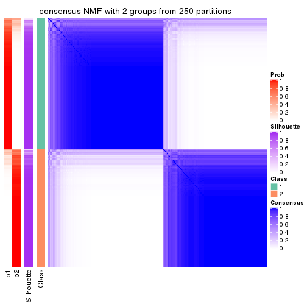</p>

</div>
<div id='tab-SD-NMF-consensus-heatmap-2'>
<pre><code class="r">consensus_heatmap(res, k = 3)
</code></pre>

<p>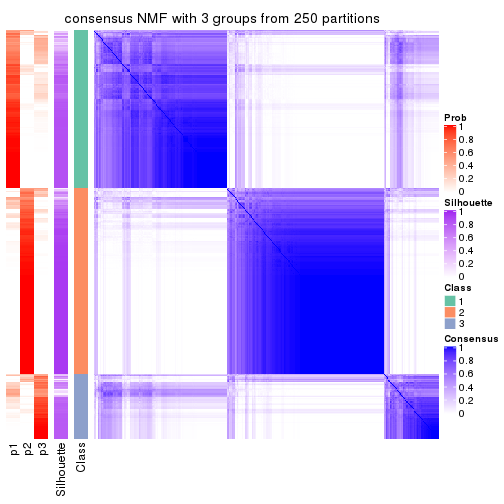</p>

</div>
<div id='tab-SD-NMF-consensus-heatmap-3'>
<pre><code class="r">consensus_heatmap(res, k = 4)
</code></pre>

<p>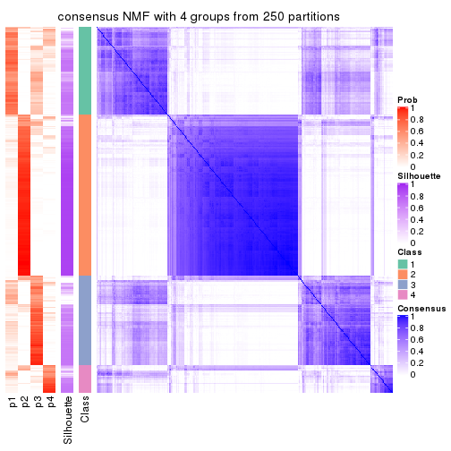</p>

</div>
<div id='tab-SD-NMF-consensus-heatmap-4'>
<pre><code class="r">consensus_heatmap(res, k = 5)
</code></pre>

<p>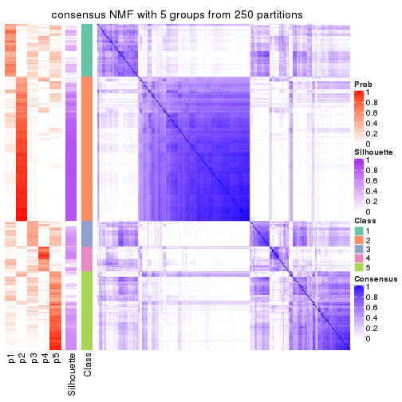</p>

</div>
<div id='tab-SD-NMF-consensus-heatmap-5'>
<pre><code class="r">consensus_heatmap(res, k = 6)
</code></pre>

<p>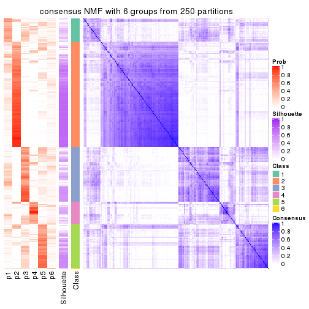</p>

</div>
</div>

Heatmaps for the membership of samples in all partitions to see how consistent they are:


<script>
$( function() {
	$( '#tabs-SD-NMF-membership-heatmap' ).tabs();
} );
</script>
<div id='tabs-SD-NMF-membership-heatmap'>
<ul>
<li><a href='#tab-SD-NMF-membership-heatmap-1'>k = 2</a></li>
<li><a href='#tab-SD-NMF-membership-heatmap-2'>k = 3</a></li>
<li><a href='#tab-SD-NMF-membership-heatmap-3'>k = 4</a></li>
<li><a href='#tab-SD-NMF-membership-heatmap-4'>k = 5</a></li>
<li><a href='#tab-SD-NMF-membership-heatmap-5'>k = 6</a></li>
</ul>
<div id='tab-SD-NMF-membership-heatmap-1'>
<pre><code class="r">membership_heatmap(res, k = 2)
</code></pre>

<p>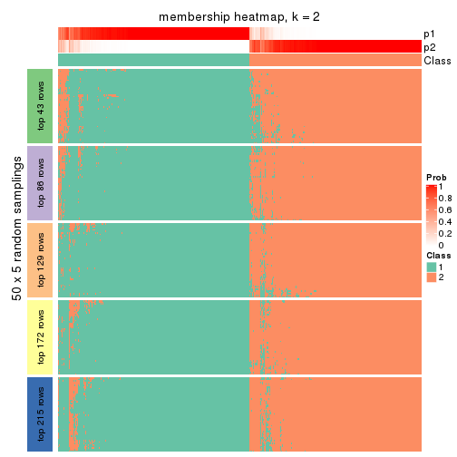</p>

</div>
<div id='tab-SD-NMF-membership-heatmap-2'>
<pre><code class="r">membership_heatmap(res, k = 3)
</code></pre>

<p>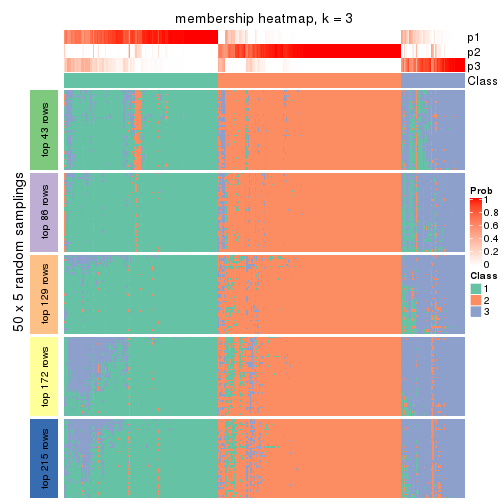</p>

</div>
<div id='tab-SD-NMF-membership-heatmap-3'>
<pre><code class="r">membership_heatmap(res, k = 4)
</code></pre>

<p>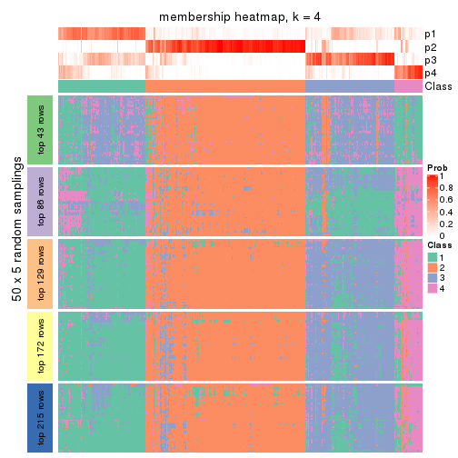</p>

</div>
<div id='tab-SD-NMF-membership-heatmap-4'>
<pre><code class="r">membership_heatmap(res, k = 5)
</code></pre>

<p>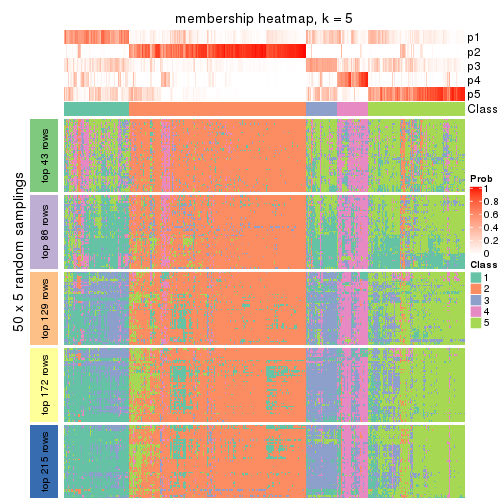</p>

</div>
<div id='tab-SD-NMF-membership-heatmap-5'>
<pre><code class="r">membership_heatmap(res, k = 6)
</code></pre>

<p>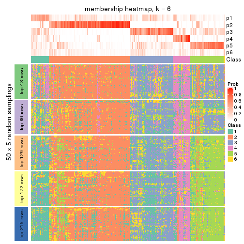</p>

</div>
</div>

As soon as we have had the classes for columns, we can look for signatures
which are significantly different between classes which can be candidate marks
for certain classes. Following are the heatmaps for signatures.


Signature heatmaps where rows are scaled:


<script>
$( function() {
	$( '#tabs-SD-NMF-get-signatures' ).tabs();
} );
</script>
<div id='tabs-SD-NMF-get-signatures'>
<ul>
<li><a href='#tab-SD-NMF-get-signatures-1'>k = 2</a></li>
<li><a href='#tab-SD-NMF-get-signatures-2'>k = 3</a></li>
<li><a href='#tab-SD-NMF-get-signatures-3'>k = 4</a></li>
<li><a href='#tab-SD-NMF-get-signatures-4'>k = 5</a></li>
<li><a href='#tab-SD-NMF-get-signatures-5'>k = 6</a></li>
</ul>
<div id='tab-SD-NMF-get-signatures-1'>
<pre><code class="r">get_signatures(res, k = 2)
</code></pre>

<p>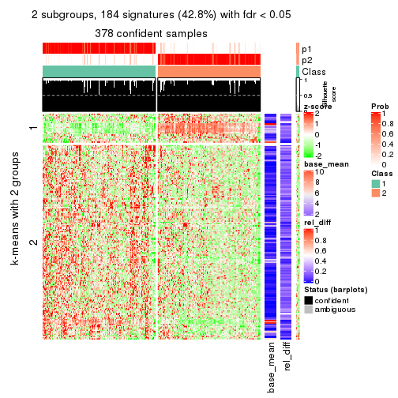</p>

</div>
<div id='tab-SD-NMF-get-signatures-2'>
<pre><code class="r">get_signatures(res, k = 3)
</code></pre>

<p>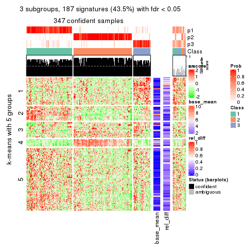</p>

</div>
<div id='tab-SD-NMF-get-signatures-3'>
<pre><code class="r">get_signatures(res, k = 4)
</code></pre>

<p>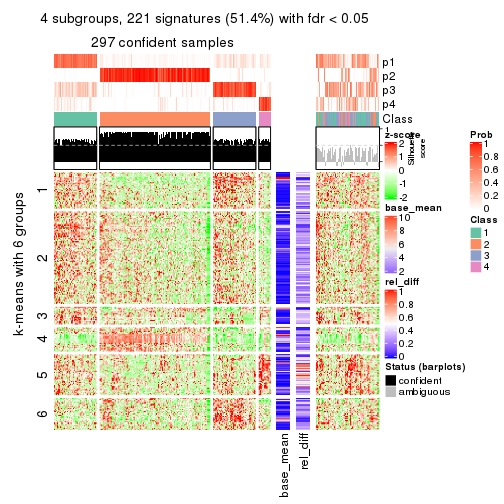</p>

</div>
<div id='tab-SD-NMF-get-signatures-4'>
<pre><code class="r">get_signatures(res, k = 5)
</code></pre>

<p>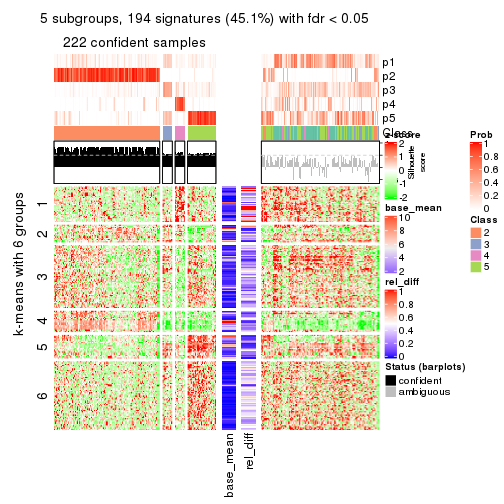</p>

</div>
<div id='tab-SD-NMF-get-signatures-5'>
<pre><code class="r">get_signatures(res, k = 6)
</code></pre>

<p>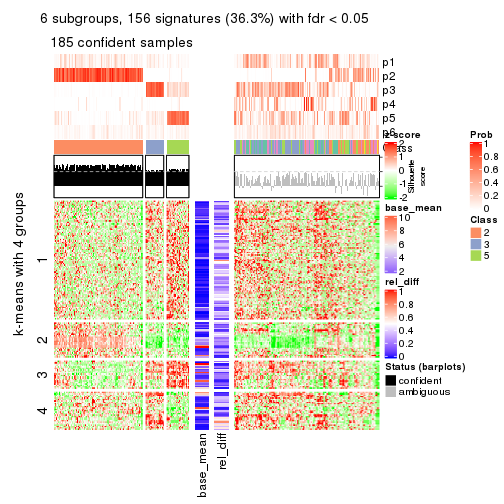</p>

</div>
</div>


Signature heatmaps where rows are not scaled:


<script>
$( function() {
	$( '#tabs-SD-NMF-get-signatures-no-scale' ).tabs();
} );
</script>
<div id='tabs-SD-NMF-get-signatures-no-scale'>
<ul>
<li><a href='#tab-SD-NMF-get-signatures-no-scale-1'>k = 2</a></li>
<li><a href='#tab-SD-NMF-get-signatures-no-scale-2'>k = 3</a></li>
<li><a href='#tab-SD-NMF-get-signatures-no-scale-3'>k = 4</a></li>
<li><a href='#tab-SD-NMF-get-signatures-no-scale-4'>k = 5</a></li>
<li><a href='#tab-SD-NMF-get-signatures-no-scale-5'>k = 6</a></li>
</ul>
<div id='tab-SD-NMF-get-signatures-no-scale-1'>
<pre><code class="r">get_signatures(res, k = 2, scale_rows = FALSE)
</code></pre>

<p>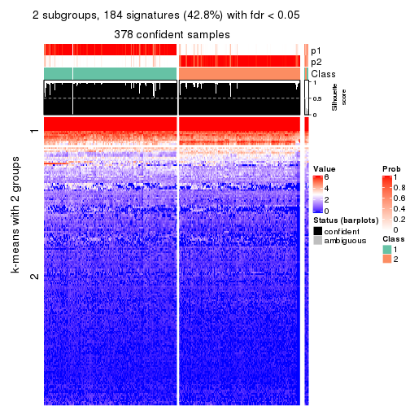</p>

</div>
<div id='tab-SD-NMF-get-signatures-no-scale-2'>
<pre><code class="r">get_signatures(res, k = 3, scale_rows = FALSE)
</code></pre>

<p>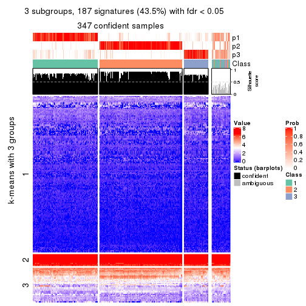</p>

</div>
<div id='tab-SD-NMF-get-signatures-no-scale-3'>
<pre><code class="r">get_signatures(res, k = 4, scale_rows = FALSE)
</code></pre>

<p>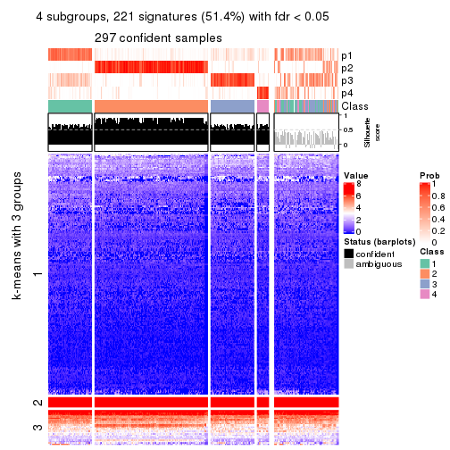</p>

</div>
<div id='tab-SD-NMF-get-signatures-no-scale-4'>
<pre><code class="r">get_signatures(res, k = 5, scale_rows = FALSE)
</code></pre>

<p>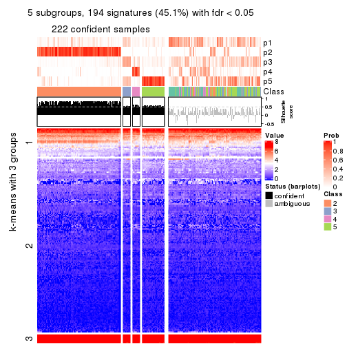</p>

</div>
<div id='tab-SD-NMF-get-signatures-no-scale-5'>
<pre><code class="r">get_signatures(res, k = 6, scale_rows = FALSE)
</code></pre>

<p>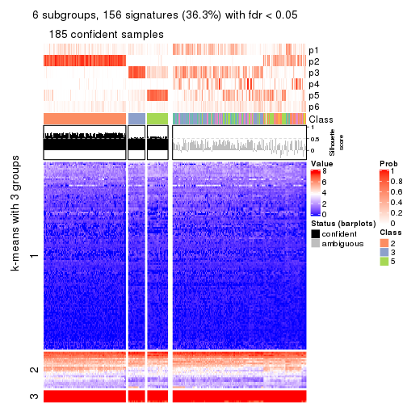</p>

</div>
</div>


Compare the overlap of signatures from different k:

```r
compare_signatures(res)
```

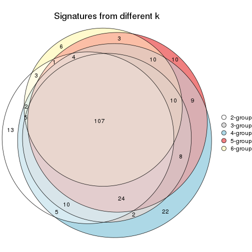

`get_signature()` returns a data frame invisibly. TO get the list of signatures, the function
call should be assigned to a variable explicitly. In following code, if `plot` argument is set
to `FALSE`, no heatmap is plotted while only the differential analysis is performed.

```r
# code only for demonstration
tb = get_signature(res, k = ..., plot = FALSE)
```

An example of the output of `tb` is:

```
#>   which_row         fdr    mean_1    mean_2 scaled_mean_1 scaled_mean_2 km
#> 1        38 0.042760348  8.373488  9.131774    -0.5533452     0.5164555  1
#> 2        40 0.018707592  7.106213  8.469186    -0.6173731     0.5762149  1
#> 3        55 0.019134737 10.221463 11.207825    -0.6159697     0.5749050  1
#> 4        59 0.006059896  5.921854  7.869574    -0.6899429     0.6439467  1
#> 5        60 0.018055526  8.928898 10.211722    -0.6204761     0.5791110  1
#> 6        98 0.009384629 15.714769 14.887706     0.6635654    -0.6193277  2
...
```

The columns in `tb` are:

1. `which_row`: row indices corresponding to the input matrix.
2. `fdr`: FDR for the differential test. 
3. `mean_x`: The mean value in group x.
4. `scaled_mean_x`: The mean value in group x after rows are scaled.
5. `km`: Row groups if k-means clustering is applied to rows.


UMAP plot which shows how samples are separated.


<script>
$( function() {
	$( '#tabs-SD-NMF-dimension-reduction' ).tabs();
} );
</script>
<div id='tabs-SD-NMF-dimension-reduction'>
<ul>
<li><a href='#tab-SD-NMF-dimension-reduction-1'>k = 2</a></li>
<li><a href='#tab-SD-NMF-dimension-reduction-2'>k = 3</a></li>
<li><a href='#tab-SD-NMF-dimension-reduction-3'>k = 4</a></li>
<li><a href='#tab-SD-NMF-dimension-reduction-4'>k = 5</a></li>
<li><a href='#tab-SD-NMF-dimension-reduction-5'>k = 6</a></li>
</ul>
<div id='tab-SD-NMF-dimension-reduction-1'>
<pre><code class="r">dimension_reduction(res, k = 2, method = &quot;UMAP&quot;)
</code></pre>

<p>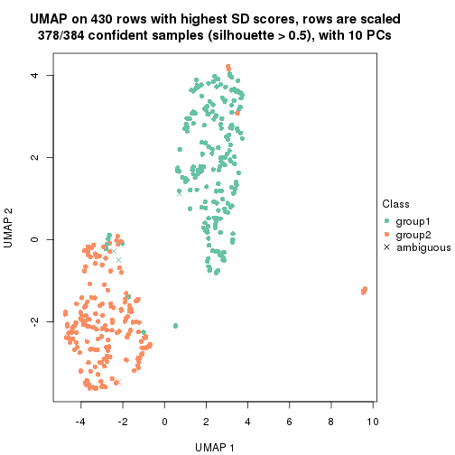</p>

</div>
<div id='tab-SD-NMF-dimension-reduction-2'>
<pre><code class="r">dimension_reduction(res, k = 3, method = &quot;UMAP&quot;)
</code></pre>

<p>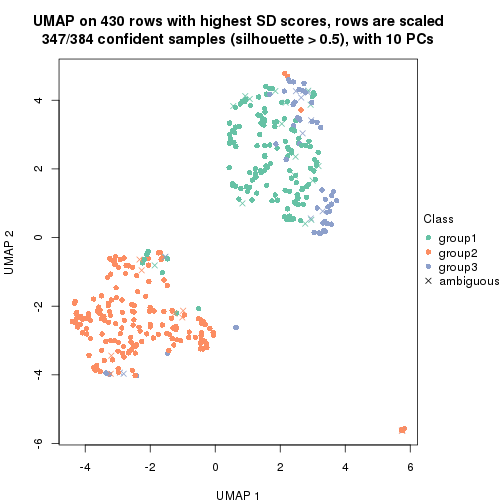</p>

</div>
<div id='tab-SD-NMF-dimension-reduction-3'>
<pre><code class="r">dimension_reduction(res, k = 4, method = &quot;UMAP&quot;)
</code></pre>

<p>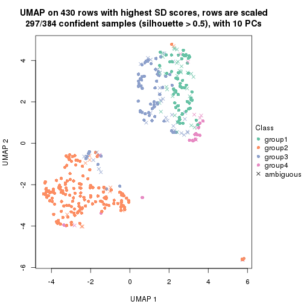</p>

</div>
<div id='tab-SD-NMF-dimension-reduction-4'>
<pre><code class="r">dimension_reduction(res, k = 5, method = &quot;UMAP&quot;)
</code></pre>

<p>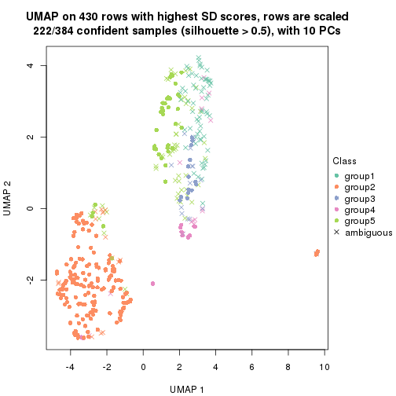</p>

</div>
<div id='tab-SD-NMF-dimension-reduction-5'>
<pre><code class="r">dimension_reduction(res, k = 6, method = &quot;UMAP&quot;)
</code></pre>

<p>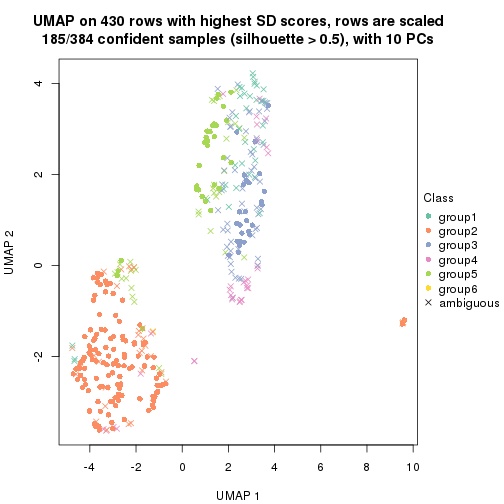</p>

</div>
</div>


Following heatmap shows how subgroups are split when increasing `k`:

```r
collect_classes(res)
```

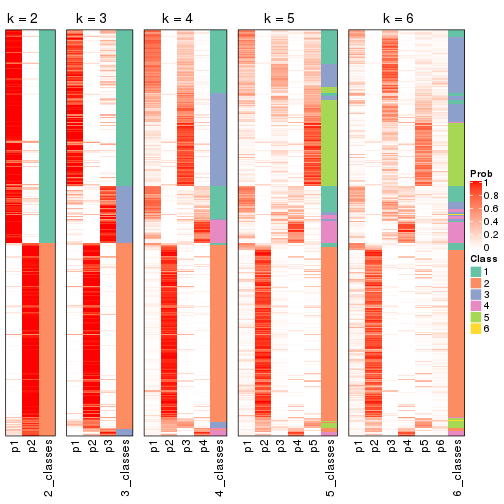


If matrix rows can be associated to genes, consider to use `GO_Enrichment(res,
...)` to perform function enrichment for the signature genes.


 

---------------------------------------------------


### CV:hclust


The object with results only for a single top-value method and a single partition method 
can be extracted as:

```r
res = res_list["CV", "hclust"]
# you can also extract it by
# res = res_list["CV:hclust"]
```

A summary of `res` and all the functions that can be applied to it:

```r
res
```

```
#> A 'ConsensusPartition' object with k = 2, 3, 4, 5, 6.
#>   On a matrix with 430 rows and 384 columns.
#>   Top rows (43, 86, 129, 172, 215) are extracted by 'CV' method.
#>   Subgroups are detected by 'hclust' method.
#>   Performed in total 1250 partitions by row resampling.
#>   Best k for subgroups seems to be 3.
#> 
#> Following methods can be applied to this 'ConsensusPartition' object:
#>  [1] "cola_report"             "collect_classes"         "collect_plots"          
#>  [4] "collect_stats"           "colnames"                "compare_signatures"     
#>  [7] "consensus_heatmap"       "dimension_reduction"     "functional_enrichment"  
#> [10] "get_anno_col"            "get_anno"                "get_classes"            
#> [13] "get_consensus"           "get_matrix"              "get_membership"         
#> [16] "get_param"               "get_signatures"          "get_stats"              
#> [19] "is_best_k"               "is_stable_k"             "membership_heatmap"     
#> [22] "ncol"                    "nrow"                    "plot_ecdf"              
#> [25] "rownames"                "select_partition_number" "show"                   
#> [28] "suggest_best_k"          "test_to_known_factors"
```

`collect_plots()` function collects all the plots made from `res` for all `k` (number of partitions)
into one single page to provide an easy and fast comparison between different `k`.

```r
collect_plots(res)
```

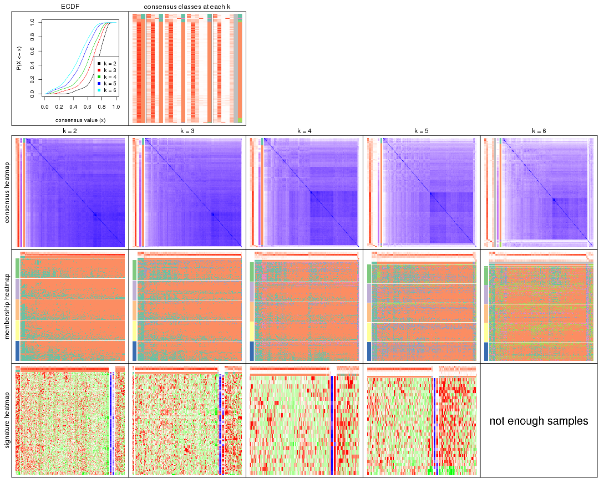

The plots are:

- The first row: a plot of the ECDF (Empirical cumulative distribution
  function) curves of the consensus matrix for each `k` and the heatmap of
  predicted classes for each `k`.
- The second row: heatmaps of the consensus matrix for each `k`.
- The third row: heatmaps of the membership matrix for each `k`.
- The fouth row: heatmaps of the signatures for each `k`.

All the plots in panels can be made by individual functions and they are
plotted later in this section.

`select_partition_number()` produces several plots showing different
statistics for choosing "optimized" `k`. There are following statistics:

- ECDF curves of the consensus matrix for each `k`;
- 1-PAC. [The PAC
  score](https://en.wikipedia.org/wiki/Consensus_clustering#Over-interpretation_potential_of_consensus_clustering)
  measures the proportion of the ambiguous subgrouping.
- Mean silhouette score.
- Concordance. The mean probability of fiting the consensus class ids in all
  partitions.
- Area increased. Denote $A_k$ as the area under the ECDF curve for current
  `k`, the area increased is defined as $A_k - A_{k-1}$.
- Rand index. The percent of pairs of samples that are both in a same cluster
  or both are not in a same cluster in the partition of k and k-1.
- Jaccard index. The ratio of pairs of samples are both in a same cluster in
  the partition of k and k-1 and the pairs of samples are both in a same
  cluster in the partition k or k-1.

The detailed explanations of these statistics can be found in [the cola
vignette](http://bioconductor.org/packages/devel/bioc/vignettes/cola/inst/doc/cola.html#toc_13).

Generally speaking, lower PAC score, higher mean silhouette score or higher
concordance corresponds to better partition. Rand index and Jaccard index
measure how similar the current partition is compared to partition with `k-1`.
If they are too similar, we won't accept `k` is better than `k-1`.

```r
select_partition_number(res)
```

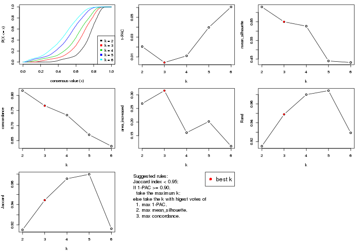

The numeric values for all these statistics can be obtained by `get_stats()`.

```r
get_stats(res)
```

```
#>   k   1-PAC mean_silhouette concordance area_increased  Rand Jaccard
#> 2 2 0.02040           0.730       0.816          0.268 0.915   0.915
#> 3 3 0.00427           0.650       0.766          0.316 0.949   0.944
#> 4 4 0.01103           0.626       0.735          0.161 0.970   0.965
#> 5 5 0.03981           0.440       0.669          0.202 0.974   0.970
#> 6 6 0.06053           0.432       0.632          0.111 0.929   0.916
```

`suggest_best_k()` suggests the best $k$ based on these statistics. The rules are as follows:

- All $k$ with Jaccard index larger than 0.95 are removed because the increase of
  the partition number does not provides enough extra information. If all $k$ are removed,
  the best $k$ is assigned by `NA`.
- For $k$ with 1-PAC larger than 0.9, the maximal $k$ is taken as the "best k". Other $k$ is called "optional k".
- If it does not fit the second rule. The $k$ with the highest vote of highest
  1-PAC, mean silhouette and concordance is taken as the "best k".

```r
suggest_best_k(res)
```

```
#> [1] 3
```


Following shows the table of the partitions (You need to click the **show/hide
code output** link to see it). The membership matrix (columns with name `p*`)
is inferred by
[`clue::cl_consensus()`](https://www.rdocumentation.org/link/cl_consensus?package=clue)
function with the `SE` method. Basically the value in the membership matrix
represents the probability to belong to a certain group. The finall class
label for an item is determined with the group with highest probability it
belongs to.

In `get_classes()` function, the entropy is calculated from the membership
matrix and the silhouette score is calculated from the consensus matrix.


<script>
$( function() {
	$( '#tabs-CV-hclust-get-classes' ).tabs();
} );
</script>
<div id='tabs-CV-hclust-get-classes'>
<ul>
<li><a href='#tab-CV-hclust-get-classes-1'>k = 2</a></li>
<li><a href='#tab-CV-hclust-get-classes-2'>k = 3</a></li>
<li><a href='#tab-CV-hclust-get-classes-3'>k = 4</a></li>
<li><a href='#tab-CV-hclust-get-classes-4'>k = 5</a></li>
<li><a href='#tab-CV-hclust-get-classes-5'>k = 6</a></li>
</ul>

<div id='tab-CV-hclust-get-classes-1'>
<p><a id='tab-CV-hclust-get-classes-1-a' style='color:#0366d6' href='#'>show/hide code output</a></p>
<pre><code class="r">cbind(get_classes(res, k = 2), get_membership(res, k = 2))
</code></pre>

<pre><code>#&gt;            class entropy silhouette    p1    p2
#&gt; SRR2105277     2   0.722    0.77743 0.200 0.800
#&gt; SRR2105278     2   0.802    0.71407 0.244 0.756
#&gt; SRR2105275     2   0.827    0.69872 0.260 0.740
#&gt; SRR2105276     2   0.706    0.80959 0.192 0.808
#&gt; SRR2105273     2   0.662    0.81628 0.172 0.828
#&gt; SRR2105274     2   0.653    0.81737 0.168 0.832
#&gt; SRR2105271     2   0.730    0.80392 0.204 0.796
#&gt; SRR2105272     2   0.850    0.66975 0.276 0.724
#&gt; SRR2105269     2   0.358    0.80558 0.068 0.932
#&gt; SRR2105270     2   0.373    0.81902 0.072 0.928
#&gt; SRR2105267     2   0.327    0.80529 0.060 0.940
#&gt; SRR2105268     2   0.295    0.81034 0.052 0.948
#&gt; SRR2105265     2   0.373    0.81582 0.072 0.928
#&gt; SRR2105266     2   0.373    0.82053 0.072 0.928
#&gt; SRR2105263     2   0.958    0.37032 0.380 0.620
#&gt; SRR2105264     2   0.821    0.72322 0.256 0.744
#&gt; SRR2105261     2   0.574    0.82961 0.136 0.864
#&gt; SRR2105262     2   0.506    0.82375 0.112 0.888
#&gt; SRR2105357     2   0.430    0.82294 0.088 0.912
#&gt; SRR2105358     2   0.738    0.77459 0.208 0.792
#&gt; SRR2105439     2   0.802    0.74780 0.244 0.756
#&gt; SRR2105440     2   0.634    0.82439 0.160 0.840
#&gt; SRR2105509     2   0.416    0.80500 0.084 0.916
#&gt; SRR2105510     2   0.402    0.81213 0.080 0.920
#&gt; SRR2105507     2   0.753    0.76570 0.216 0.784
#&gt; SRR2105508     2   0.563    0.82782 0.132 0.868
#&gt; SRR2105505     2   0.767    0.75643 0.224 0.776
#&gt; SRR2105506     2   0.839    0.67470 0.268 0.732
#&gt; SRR2105503     2   0.552    0.82550 0.128 0.872
#&gt; SRR2105504     2   0.343    0.78809 0.064 0.936
#&gt; SRR2105501     2   0.416    0.81255 0.084 0.916
#&gt; SRR2105502     2   0.343    0.78809 0.064 0.936
#&gt; SRR2105499     2   0.781    0.76198 0.232 0.768
#&gt; SRR2105500     2   0.662    0.81165 0.172 0.828
#&gt; SRR2105497     2   0.662    0.81684 0.172 0.828
#&gt; SRR2105498     2   0.634    0.81667 0.160 0.840
#&gt; SRR2105495     2   0.402    0.82035 0.080 0.920
#&gt; SRR2105496     2   0.506    0.82969 0.112 0.888
#&gt; SRR2105493     2   0.402    0.81807 0.080 0.920
#&gt; SRR2105494     2   0.402    0.81987 0.080 0.920
#&gt; SRR2105491     2   0.808    0.71918 0.248 0.752
#&gt; SRR2105492     2   0.788    0.72814 0.236 0.764
#&gt; SRR2105489     2   0.745    0.76436 0.212 0.788
#&gt; SRR2105490     2   0.506    0.82538 0.112 0.888
#&gt; SRR2105487     2   0.891    0.55464 0.308 0.692
#&gt; SRR2105488     2   0.814    0.71043 0.252 0.748
#&gt; SRR2105485     2   0.552    0.82768 0.128 0.872
#&gt; SRR2105486     2   0.595    0.81891 0.144 0.856
#&gt; SRR2105483     1   0.904    0.80479 0.680 0.320
#&gt; SRR2105484     1   0.886    0.79386 0.696 0.304
#&gt; SRR2105481     2   0.900    0.55547 0.316 0.684
#&gt; SRR2105482     2   0.753    0.76368 0.216 0.784
#&gt; SRR2105479     2   0.895    0.63289 0.312 0.688
#&gt; SRR2105480     2   0.775    0.76042 0.228 0.772
#&gt; SRR2105477     2   0.697    0.79413 0.188 0.812
#&gt; SRR2105478     2   0.653    0.81258 0.168 0.832
#&gt; SRR2105475     2   0.402    0.81336 0.080 0.920
#&gt; SRR2105476     2   0.443    0.81846 0.092 0.908
#&gt; SRR2105473     2   0.584    0.82234 0.140 0.860
#&gt; SRR2105474     2   0.469    0.82785 0.100 0.900
#&gt; SRR2105471     2   0.921    0.42440 0.336 0.664
#&gt; SRR2105472     2   0.821    0.66948 0.256 0.744
#&gt; SRR2105469     2   0.506    0.82381 0.112 0.888
#&gt; SRR2105470     2   0.625    0.82045 0.156 0.844
#&gt; SRR2105467     2   0.781    0.76408 0.232 0.768
#&gt; SRR2105468     2   0.760    0.74793 0.220 0.780
#&gt; SRR2105465     2   0.917    0.45400 0.332 0.668
#&gt; SRR2105466     2   0.775    0.75371 0.228 0.772
#&gt; SRR2105463     2   0.963    0.14460 0.388 0.612
#&gt; SRR2105464     2   0.998   -0.31059 0.472 0.528
#&gt; SRR2105461     2   0.402    0.80854 0.080 0.920
#&gt; SRR2105462     2   0.327    0.81119 0.060 0.940
#&gt; SRR2105459     2   0.430    0.81685 0.088 0.912
#&gt; SRR2105460     2   0.343    0.81161 0.064 0.936
#&gt; SRR2105457     2   0.430    0.82286 0.088 0.912
#&gt; SRR2105458     2   0.494    0.82183 0.108 0.892
#&gt; SRR2105455     2   0.402    0.82388 0.080 0.920
#&gt; SRR2105456     2   0.443    0.82385 0.092 0.908
#&gt; SRR2105453     2   0.833    0.65086 0.264 0.736
#&gt; SRR2105454     2   0.917    0.47293 0.332 0.668
#&gt; SRR2105451     2   0.416    0.81962 0.084 0.916
#&gt; SRR2105452     2   0.343    0.78809 0.064 0.936
#&gt; SRR2105449     2   0.671    0.78961 0.176 0.824
#&gt; SRR2105450     2   0.814    0.74231 0.252 0.748
#&gt; SRR2105447     2   0.311    0.80565 0.056 0.944
#&gt; SRR2105448     2   0.416    0.82182 0.084 0.916
#&gt; SRR2105445     2   0.373    0.82130 0.072 0.928
#&gt; SRR2105446     2   0.469    0.82474 0.100 0.900
#&gt; SRR2105443     2   0.456    0.82172 0.096 0.904
#&gt; SRR2105444     2   0.388    0.82473 0.076 0.924
#&gt; SRR2105441     2   0.563    0.82700 0.132 0.868
#&gt; SRR2105442     2   0.563    0.82955 0.132 0.868
#&gt; SRR2105437     1   0.943    0.80266 0.640 0.360
#&gt; SRR2105438     1   0.943    0.80001 0.640 0.360
#&gt; SRR2105435     2   0.781    0.74814 0.232 0.768
#&gt; SRR2105436     2   0.494    0.82610 0.108 0.892
#&gt; SRR2105433     1   1.000    0.50507 0.504 0.496
#&gt; SRR2105434     2   0.795    0.72607 0.240 0.760
#&gt; SRR2105431     1   0.978    0.73698 0.588 0.412
#&gt; SRR2105432     1   0.997    0.61200 0.532 0.468
#&gt; SRR2105429     2   0.871    0.62456 0.292 0.708
#&gt; SRR2105430     2   0.563    0.82743 0.132 0.868
#&gt; SRR2105427     2   0.358    0.81116 0.068 0.932
#&gt; SRR2105428     2   0.416    0.82270 0.084 0.916
#&gt; SRR2105425     2   0.595    0.81573 0.144 0.856
#&gt; SRR2105426     2   0.541    0.82959 0.124 0.876
#&gt; SRR2105421     2   0.430    0.81607 0.088 0.912
#&gt; SRR2105422     2   0.482    0.82478 0.104 0.896
#&gt; SRR2105423     2   0.456    0.82145 0.096 0.904
#&gt; SRR2105424     2   0.456    0.82777 0.096 0.904
#&gt; SRR2105419     2   0.529    0.82891 0.120 0.880
#&gt; SRR2105420     2   0.358    0.81403 0.068 0.932
#&gt; SRR2105415     2   0.981   -0.01173 0.420 0.580
#&gt; SRR2105416     2   0.987   -0.00021 0.432 0.568
#&gt; SRR2105417     2   0.963    0.16025 0.388 0.612
#&gt; SRR2105418     2   0.943    0.40597 0.360 0.640
#&gt; SRR2105413     2   0.388    0.80215 0.076 0.924
#&gt; SRR2105414     2   0.388    0.81743 0.076 0.924
#&gt; SRR2105409     2   0.722    0.78053 0.200 0.800
#&gt; SRR2105410     2   0.827    0.69732 0.260 0.740
#&gt; SRR2105411     2   0.343    0.81181 0.064 0.936
#&gt; SRR2105412     2   0.506    0.82721 0.112 0.888
#&gt; SRR2105407     2   0.443    0.82369 0.092 0.908
#&gt; SRR2105408     2   0.563    0.82672 0.132 0.868
#&gt; SRR2105403     2   0.689    0.81624 0.184 0.816
#&gt; SRR2105404     2   0.644    0.80006 0.164 0.836
#&gt; SRR2105405     2   0.416    0.82266 0.084 0.916
#&gt; SRR2105406     2   0.634    0.81143 0.160 0.840
#&gt; SRR2105401     2   0.402    0.81330 0.080 0.920
#&gt; SRR2105402     2   0.343    0.78809 0.064 0.936
#&gt; SRR2105399     2   0.402    0.81733 0.080 0.920
#&gt; SRR2105400     2   0.373    0.81299 0.072 0.928
#&gt; SRR2105397     2   0.469    0.82293 0.100 0.900
#&gt; SRR2105398     2   0.494    0.82359 0.108 0.892
#&gt; SRR2105395     2   0.706    0.80523 0.192 0.808
#&gt; SRR2105396     2   0.605    0.82400 0.148 0.852
#&gt; SRR2105393     2   0.494    0.82894 0.108 0.892
#&gt; SRR2105394     2   0.482    0.82557 0.104 0.896
#&gt; SRR2105389     2   0.605    0.82713 0.148 0.852
#&gt; SRR2105390     2   0.625    0.82009 0.156 0.844
#&gt; SRR2105391     2   0.443    0.82132 0.092 0.908
#&gt; SRR2105392     2   0.574    0.82758 0.136 0.864
#&gt; SRR2105385     2   0.795    0.76621 0.240 0.760
#&gt; SRR2105386     2   0.469    0.82973 0.100 0.900
#&gt; SRR2105387     2   0.506    0.82989 0.112 0.888
#&gt; SRR2105388     2   0.518    0.82480 0.116 0.884
#&gt; SRR2105381     2   0.416    0.81927 0.084 0.916
#&gt; SRR2105382     2   0.506    0.82481 0.112 0.888
#&gt; SRR2105383     2   0.327    0.82169 0.060 0.940
#&gt; SRR2105384     2   0.430    0.82007 0.088 0.912
#&gt; SRR2105379     2   0.456    0.81560 0.096 0.904
#&gt; SRR2105380     2   0.552    0.82511 0.128 0.872
#&gt; SRR2105377     2   0.722    0.78870 0.200 0.800
#&gt; SRR2105378     2   0.722    0.78234 0.200 0.800
#&gt; SRR2105375     2   0.605    0.82149 0.148 0.852
#&gt; SRR2105376     2   0.714    0.78812 0.196 0.804
#&gt; SRR2105373     2   0.808    0.72961 0.248 0.752
#&gt; SRR2105374     1   0.983    0.71833 0.576 0.424
#&gt; SRR2105371     2   0.402    0.82278 0.080 0.920
#&gt; SRR2105372     2   0.443    0.82496 0.092 0.908
#&gt; SRR2105369     2   0.482    0.82216 0.104 0.896
#&gt; SRR2105370     2   0.529    0.82742 0.120 0.880
#&gt; SRR2105367     2   0.781    0.72602 0.232 0.768
#&gt; SRR2105368     2   0.921    0.44128 0.336 0.664
#&gt; SRR2105365     2   0.821    0.70614 0.256 0.744
#&gt; SRR2105366     2   0.781    0.75630 0.232 0.768
#&gt; SRR2105363     2   0.494    0.82441 0.108 0.892
#&gt; SRR2105364     2   0.388    0.82754 0.076 0.924
#&gt; SRR2105361     2   0.494    0.82280 0.108 0.892
#&gt; SRR2105362     2   0.482    0.83013 0.104 0.896
#&gt; SRR2105359     2   0.469    0.82734 0.100 0.900
#&gt; SRR2105360     2   0.518    0.82757 0.116 0.884
#&gt; SRR2105355     2   0.518    0.82783 0.116 0.884
#&gt; SRR2105356     2   0.615    0.82052 0.152 0.848
#&gt; SRR2105353     2   0.680    0.80754 0.180 0.820
#&gt; SRR2105354     2   0.706    0.81526 0.192 0.808
#&gt; SRR2105351     2   0.605    0.82521 0.148 0.852
#&gt; SRR2105352     2   0.343    0.78809 0.064 0.936
#&gt; SRR2105349     2   0.494    0.82098 0.108 0.892
#&gt; SRR2105350     2   0.402    0.82294 0.080 0.920
#&gt; SRR2105345     2   0.552    0.82744 0.128 0.872
#&gt; SRR2105346     2   0.443    0.82693 0.092 0.908
#&gt; SRR2105347     2   0.767    0.75033 0.224 0.776
#&gt; SRR2105348     2   0.625    0.80270 0.156 0.844
#&gt; SRR2105343     2   0.327    0.80545 0.060 0.940
#&gt; SRR2105344     2   0.443    0.82488 0.092 0.908
#&gt; SRR2105341     2   0.689    0.79467 0.184 0.816
#&gt; SRR2105342     2   0.482    0.82538 0.104 0.896
#&gt; SRR2105339     2   0.529    0.82900 0.120 0.880
#&gt; SRR2105340     2   0.625    0.82252 0.156 0.844
#&gt; SRR2105335     2   0.925    0.40373 0.340 0.660
#&gt; SRR2105336     2   0.913    0.50353 0.328 0.672
#&gt; SRR2105337     2   0.653    0.81505 0.168 0.832
#&gt; SRR2105338     2   0.738    0.79224 0.208 0.792
#&gt; SRR2105331     2   0.795    0.71437 0.240 0.760
#&gt; SRR2105332     2   0.767    0.75428 0.224 0.776
#&gt; SRR2105333     2   0.430    0.81944 0.088 0.912
#&gt; SRR2105334     2   0.343    0.82028 0.064 0.936
#&gt; SRR2105329     2   0.482    0.82325 0.104 0.896
#&gt; SRR2105330     2   0.494    0.82692 0.108 0.892
#&gt; SRR2105327     2   0.343    0.81557 0.064 0.936
#&gt; SRR2105328     2   0.416    0.82559 0.084 0.916
#&gt; SRR2105325     2   0.891    0.62802 0.308 0.692
#&gt; SRR2105326     2   0.900    0.62591 0.316 0.684
#&gt; SRR2105323     2   0.541    0.82503 0.124 0.876
#&gt; SRR2105324     2   0.482    0.82751 0.104 0.896
#&gt; SRR2105319     2   0.961    0.31572 0.384 0.616
#&gt; SRR2105320     2   0.975    0.14117 0.408 0.592
#&gt; SRR2105321     2   0.827    0.70895 0.260 0.740
#&gt; SRR2105322     2   0.839    0.67346 0.268 0.732
#&gt; SRR2105317     2   0.373    0.79979 0.072 0.928
#&gt; SRR2105318     2   0.388    0.81910 0.076 0.924
#&gt; SRR2105315     2   0.388    0.81177 0.076 0.924
#&gt; SRR2105316     2   0.327    0.81499 0.060 0.940
#&gt; SRR2105313     2   0.358    0.81023 0.068 0.932
#&gt; SRR2105314     2   0.416    0.82099 0.084 0.916
#&gt; SRR2105311     2   0.839    0.71460 0.268 0.732
#&gt; SRR2105312     2   0.821    0.72377 0.256 0.744
#&gt; SRR2105307     2   0.939    0.33237 0.356 0.644
#&gt; SRR2105308     2   0.595    0.82090 0.144 0.856
#&gt; SRR2105309     2   0.416    0.80942 0.084 0.916
#&gt; SRR2105310     2   0.469    0.82236 0.100 0.900
#&gt; SRR2105305     2   0.552    0.82569 0.128 0.872
#&gt; SRR2105306     2   0.416    0.82236 0.084 0.916
#&gt; SRR2105303     2   0.430    0.82022 0.088 0.912
#&gt; SRR2105304     2   0.343    0.78809 0.064 0.936
#&gt; SRR2105301     2   0.706    0.80659 0.192 0.808
#&gt; SRR2105302     2   0.443    0.82357 0.092 0.908
#&gt; SRR2105299     2   0.662    0.81591 0.172 0.828
#&gt; SRR2105300     2   0.443    0.82779 0.092 0.908
#&gt; SRR2105297     1   0.969    0.77715 0.604 0.396
#&gt; SRR2105298     1   0.891    0.79891 0.692 0.308
#&gt; SRR2105295     2   0.416    0.80835 0.084 0.916
#&gt; SRR2105296     2   0.552    0.82737 0.128 0.872
#&gt; SRR2105293     2   0.689    0.79706 0.184 0.816
#&gt; SRR2105294     2   0.788    0.76222 0.236 0.764
#&gt; SRR2105291     2   0.552    0.81003 0.128 0.872
#&gt; SRR2105292     2   0.855    0.67636 0.280 0.720
#&gt; SRR2105289     2   0.563    0.82733 0.132 0.868
#&gt; SRR2105290     2   0.653    0.80530 0.168 0.832
#&gt; SRR2105287     2   0.958    0.16956 0.380 0.620
#&gt; SRR2105288     2   0.802    0.70645 0.244 0.756
#&gt; SRR2105285     2   0.456    0.82810 0.096 0.904
#&gt; SRR2105286     2   0.430    0.82621 0.088 0.912
#&gt; SRR2105283     2   0.689    0.79555 0.184 0.816
#&gt; SRR2105284     2   0.605    0.82671 0.148 0.852
#&gt; SRR2105281     2   0.494    0.82789 0.108 0.892
#&gt; SRR2105282     2   0.430    0.82248 0.088 0.912
#&gt; SRR2105259     2   0.373    0.81835 0.072 0.928
#&gt; SRR2105260     2   0.529    0.82938 0.120 0.880
#&gt; SRR2105279     2   0.529    0.82359 0.120 0.880
#&gt; SRR2105280     2   0.443    0.82501 0.092 0.908
#&gt; SRR2105257     2   0.943    0.39115 0.360 0.640
#&gt; SRR2105258     2   0.969    0.15402 0.396 0.604
#&gt; SRR2105253     2   0.494    0.82607 0.108 0.892
#&gt; SRR2105254     2   0.416    0.81527 0.084 0.916
#&gt; SRR2105255     2   0.456    0.82468 0.096 0.904
#&gt; SRR2105256     2   0.689    0.80872 0.184 0.816
#&gt; SRR2105251     2   0.714    0.77289 0.196 0.804
#&gt; SRR2105252     2   0.680    0.80326 0.180 0.820
#&gt; SRR2105249     2   0.469    0.82265 0.100 0.900
#&gt; SRR2105250     2   0.552    0.82239 0.128 0.872
#&gt; SRR2105247     2   0.494    0.82486 0.108 0.892
#&gt; SRR2105248     2   0.775    0.76982 0.228 0.772
#&gt; SRR2105245     2   0.753    0.76197 0.216 0.784
#&gt; SRR2105246     2   0.605    0.82990 0.148 0.852
#&gt; SRR2105243     2   0.430    0.82622 0.088 0.912
#&gt; SRR2105244     2   0.753    0.77772 0.216 0.784
#&gt; SRR2105241     2   0.697    0.81110 0.188 0.812
#&gt; SRR2105242     2   0.839    0.70777 0.268 0.732
#&gt; SRR2105239     2   0.833    0.55547 0.264 0.736
#&gt; SRR2105240     2   0.904    0.55417 0.320 0.680
#&gt; SRR2105237     2   0.469    0.82166 0.100 0.900
#&gt; SRR2105238     2   0.482    0.82280 0.104 0.896
#&gt; SRR2105235     2   0.443    0.82641 0.092 0.908
#&gt; SRR2105236     2   0.494    0.82791 0.108 0.892
#&gt; SRR2105233     2   0.430    0.81356 0.088 0.912
#&gt; SRR2105234     2   0.358    0.80641 0.068 0.932
#&gt; SRR2105231     2   0.615    0.82217 0.152 0.848
#&gt; SRR2105232     2   0.518    0.82815 0.116 0.884
#&gt; SRR2105227     2   0.605    0.82364 0.148 0.852
#&gt; SRR2105228     2   0.482    0.82882 0.104 0.896
#&gt; SRR2105225     2   0.653    0.80352 0.168 0.832
#&gt; SRR2105226     2   0.671    0.79707 0.176 0.824
#&gt; SRR2105229     2   0.563    0.82785 0.132 0.868
#&gt; SRR2105230     2   0.552    0.82365 0.128 0.872
#&gt; SRR2105219     2   0.767    0.68837 0.224 0.776
#&gt; SRR2105220     2   0.541    0.82971 0.124 0.876
#&gt; SRR2105221     2   0.881    0.51925 0.300 0.700
#&gt; SRR2105222     2   0.876    0.62050 0.296 0.704
#&gt; SRR2105223     2   0.767    0.76794 0.224 0.776
#&gt; SRR2105224     2   0.760    0.76305 0.220 0.780
#&gt; SRR2105217     2   0.955    0.20497 0.376 0.624
#&gt; SRR2105218     2   0.653    0.81713 0.168 0.832
#&gt; SRR2105215     2   0.814    0.60676 0.252 0.748
#&gt; SRR2105216     2   0.373    0.81921 0.072 0.928
#&gt; SRR2105213     2   0.886    0.49767 0.304 0.696
#&gt; SRR2105214     2   0.430    0.82714 0.088 0.912
#&gt; SRR2105211     2   0.946    0.32131 0.364 0.636
#&gt; SRR2105212     2   0.456    0.82577 0.096 0.904
#&gt; SRR2105209     2   0.844    0.63921 0.272 0.728
#&gt; SRR2105210     2   0.814    0.72849 0.252 0.748
#&gt; SRR2105207     1   0.988    0.65842 0.564 0.436
#&gt; SRR2105208     2   0.871    0.62793 0.292 0.708
#&gt; SRR2105205     2   0.921    0.37808 0.336 0.664
#&gt; SRR2105206     2   0.821    0.73675 0.256 0.744
#&gt; SRR2105201     2   0.814    0.65000 0.252 0.748
#&gt; SRR2105202     2   0.671    0.79612 0.176 0.824
#&gt; SRR2105203     2   0.563    0.81738 0.132 0.868
#&gt; SRR2105204     2   0.358    0.82115 0.068 0.932
#&gt; SRR2105199     2   0.767    0.71435 0.224 0.776
#&gt; SRR2105200     2   0.753    0.76858 0.216 0.784
#&gt; SRR2105197     2   0.895    0.48882 0.312 0.688
#&gt; SRR2105198     2   0.925    0.37238 0.340 0.660
#&gt; SRR2105195     2   0.949    0.24884 0.368 0.632
#&gt; SRR2105196     2   0.850    0.70161 0.276 0.724
#&gt; SRR2105193     1   0.969    0.73272 0.604 0.396
#&gt; SRR2105194     2   0.983   -0.05434 0.424 0.576
#&gt; SRR2105191     2   0.871    0.46129 0.292 0.708
#&gt; SRR2105192     2   0.999   -0.43040 0.480 0.520
#&gt; SRR2105189     2   0.714    0.73965 0.196 0.804
#&gt; SRR2105190     2   0.430    0.82591 0.088 0.912
#&gt; SRR2105187     2   0.932    0.31430 0.348 0.652
#&gt; SRR2105188     2   0.909    0.58633 0.324 0.676
#&gt; SRR2105179     2   0.973    0.07982 0.404 0.596
#&gt; SRR2105180     2   0.988   -0.11948 0.436 0.564
#&gt; SRR2105183     2   0.662    0.80025 0.172 0.828
#&gt; SRR2105184     2   0.644    0.81174 0.164 0.836
#&gt; SRR2105185     2   0.714    0.76711 0.196 0.804
#&gt; SRR2105186     2   0.689    0.80161 0.184 0.816
#&gt; SRR2105181     2   0.866    0.58003 0.288 0.712
#&gt; SRR2105182     2   0.714    0.79343 0.196 0.804
#&gt; SRR2105177     1   0.973    0.67275 0.596 0.404
#&gt; SRR2105178     1   0.871    0.78170 0.708 0.292
#&gt; SRR2105171     2   0.518    0.82763 0.116 0.884
#&gt; SRR2105172     2   0.494    0.82747 0.108 0.892
#&gt; SRR2105175     1   0.983    0.71506 0.576 0.424
#&gt; SRR2105176     1   0.913    0.80767 0.672 0.328
#&gt; SRR2105173     2   0.653    0.79975 0.168 0.832
#&gt; SRR2105174     2   0.518    0.82666 0.116 0.884
#&gt; SRR2105169     2   0.625    0.82560 0.156 0.844
#&gt; SRR2105170     2   0.795    0.72974 0.240 0.760
#&gt; SRR2105167     2   0.430    0.82469 0.088 0.912
#&gt; SRR2105168     2   0.518    0.82351 0.116 0.884
#&gt; SRR2105165     2   0.855    0.67284 0.280 0.720
#&gt; SRR2105166     2   0.871    0.67432 0.292 0.708
#&gt; SRR2105163     2   0.795    0.77076 0.240 0.760
#&gt; SRR2105164     2   0.781    0.76143 0.232 0.768
#&gt; SRR2105161     2   0.987   -0.01683 0.432 0.568
#&gt; SRR2105162     2   0.921    0.47839 0.336 0.664
#&gt; SRR2105155     2   0.506    0.82648 0.112 0.888
#&gt; SRR2105156     2   0.373    0.82530 0.072 0.928
#&gt; SRR2105157     2   0.730    0.77936 0.204 0.796
#&gt; SRR2105158     2   0.730    0.77365 0.204 0.796
#&gt; SRR2105159     2   0.946    0.24267 0.364 0.636
#&gt; SRR2105160     2   0.808    0.74757 0.248 0.752
#&gt; SRR2105153     2   0.518    0.82497 0.116 0.884
#&gt; SRR2105154     2   0.625    0.81481 0.156 0.844
#&gt; SRR2105151     2   0.706    0.79482 0.192 0.808
#&gt; SRR2105152     2   0.402    0.82322 0.080 0.920
#&gt; SRR2105149     2   0.605    0.82110 0.148 0.852
#&gt; SRR2105150     2   0.541    0.82314 0.124 0.876
#&gt; SRR2105147     2   0.327    0.79374 0.060 0.940
#&gt; SRR2105148     2   0.327    0.79374 0.060 0.940
#&gt; SRR2105143     2   0.855    0.65001 0.280 0.720
#&gt; SRR2105144     2   0.541    0.81830 0.124 0.876
#&gt; SRR2105145     2   0.999   -0.36531 0.480 0.520
#&gt; SRR2105146     2   0.917    0.55820 0.332 0.668
#&gt; SRR2105141     2   0.689    0.80531 0.184 0.816
#&gt; SRR2105142     2   0.605    0.81324 0.148 0.852
#&gt; SRR2105139     2   0.416    0.82509 0.084 0.916
#&gt; SRR2105140     2   0.482    0.82922 0.104 0.896
#&gt; SRR2105137     2   0.494    0.81909 0.108 0.892
#&gt; SRR2105138     2   0.767    0.75046 0.224 0.776
#&gt; SRR2105135     2   0.388    0.82301 0.076 0.924
#&gt; SRR2105136     2   0.443    0.82180 0.092 0.908
#&gt; SRR2105133     2   0.615    0.81751 0.152 0.848
#&gt; SRR2105134     2   0.662    0.80459 0.172 0.828
#&gt; SRR2105131     2   0.680    0.80936 0.180 0.820
#&gt; SRR2105132     2   0.795    0.72173 0.240 0.760
#&gt; SRR2105129     2   0.999   -0.44224 0.480 0.520
#&gt; SRR2105130     1   0.943    0.80255 0.640 0.360
#&gt; SRR2105127     2   0.886    0.56329 0.304 0.696
#&gt; SRR2105128     2   0.689    0.78779 0.184 0.816
</code></pre>

<script>
$('#tab-CV-hclust-get-classes-1-a').parent().next().next().hide();
$('#tab-CV-hclust-get-classes-1-a').click(function(){
  $('#tab-CV-hclust-get-classes-1-a').parent().next().next().toggle();
  return(false);
});
</script>
</div>

<div id='tab-CV-hclust-get-classes-2'>
<p><a id='tab-CV-hclust-get-classes-2-a' style='color:#0366d6' href='#'>show/hide code output</a></p>
<pre><code class="r">cbind(get_classes(res, k = 3), get_membership(res, k = 3))
</code></pre>

<pre><code>#&gt;            class entropy silhouette    p1    p2    p3
#&gt; SRR2105277     2   0.618    0.71066 0.260 0.716 0.024
#&gt; SRR2105278     2   0.718    0.60599 0.304 0.648 0.048
#&gt; SRR2105275     2   0.675    0.54884 0.336 0.640 0.024
#&gt; SRR2105276     2   0.590    0.73311 0.232 0.744 0.024
#&gt; SRR2105273     2   0.630    0.75386 0.192 0.752 0.056
#&gt; SRR2105274     2   0.541    0.77537 0.200 0.780 0.020
#&gt; SRR2105271     2   0.586    0.74482 0.228 0.748 0.024
#&gt; SRR2105272     2   0.718    0.56339 0.304 0.648 0.048
#&gt; SRR2105269     2   0.300    0.77418 0.068 0.916 0.016
#&gt; SRR2105270     2   0.333    0.78529 0.076 0.904 0.020
#&gt; SRR2105267     2   0.280    0.77368 0.060 0.924 0.016
#&gt; SRR2105268     2   0.300    0.77381 0.068 0.916 0.016
#&gt; SRR2105265     2   0.338    0.78377 0.092 0.896 0.012
#&gt; SRR2105266     2   0.327    0.78910 0.080 0.904 0.016
#&gt; SRR2105263     2   0.757   -0.03571 0.456 0.504 0.040
#&gt; SRR2105264     2   0.687    0.65111 0.276 0.680 0.044
#&gt; SRR2105261     2   0.454    0.79598 0.148 0.836 0.016
#&gt; SRR2105262     2   0.454    0.79235 0.148 0.836 0.016
#&gt; SRR2105357     2   0.383    0.79230 0.124 0.868 0.008
#&gt; SRR2105358     2   0.599    0.71429 0.284 0.704 0.012
#&gt; SRR2105439     2   0.726    0.65957 0.224 0.692 0.084
#&gt; SRR2105440     2   0.563    0.77112 0.188 0.780 0.032
#&gt; SRR2105509     2   0.295    0.76812 0.060 0.920 0.020
#&gt; SRR2105510     2   0.286    0.77756 0.084 0.912 0.004
#&gt; SRR2105507     2   0.774    0.60302 0.204 0.672 0.124
#&gt; SRR2105508     2   0.512    0.79363 0.160 0.812 0.028
#&gt; SRR2105505     2   0.645    0.68283 0.252 0.712 0.036
#&gt; SRR2105506     2   0.689    0.56098 0.340 0.632 0.028
#&gt; SRR2105503     2   0.499    0.79227 0.144 0.824 0.032
#&gt; SRR2105504     2   0.206    0.75267 0.044 0.948 0.008
#&gt; SRR2105501     2   0.327    0.78150 0.080 0.904 0.016
#&gt; SRR2105502     2   0.206    0.75267 0.044 0.948 0.008
#&gt; SRR2105499     2   0.670    0.67810 0.268 0.692 0.040
#&gt; SRR2105500     2   0.544    0.77330 0.192 0.784 0.024
#&gt; SRR2105497     2   0.587    0.76599 0.160 0.784 0.056
#&gt; SRR2105498     2   0.571    0.75649 0.204 0.768 0.028
#&gt; SRR2105495     2   0.350    0.78920 0.084 0.896 0.020
#&gt; SRR2105496     2   0.414    0.79700 0.116 0.864 0.020
#&gt; SRR2105493     2   0.377    0.79477 0.104 0.880 0.016
#&gt; SRR2105494     2   0.338    0.78391 0.092 0.896 0.012
#&gt; SRR2105491     2   0.714    0.52210 0.312 0.644 0.044
#&gt; SRR2105492     2   0.694    0.55572 0.312 0.652 0.036
#&gt; SRR2105489     2   0.641    0.69635 0.248 0.716 0.036
#&gt; SRR2105490     2   0.447    0.79334 0.164 0.828 0.008
#&gt; SRR2105487     2   0.764    0.40744 0.336 0.604 0.060
#&gt; SRR2105488     2   0.701    0.61268 0.308 0.652 0.040
#&gt; SRR2105485     2   0.474    0.79311 0.152 0.828 0.020
#&gt; SRR2105486     2   0.501    0.78447 0.180 0.804 0.016
#&gt; SRR2105483     1   0.639    0.17904 0.764 0.148 0.088
#&gt; SRR2105484     1   0.595    0.02946 0.792 0.116 0.092
#&gt; SRR2105481     2   0.735    0.39221 0.368 0.592 0.040
#&gt; SRR2105482     2   0.626    0.72494 0.244 0.724 0.032
#&gt; SRR2105479     2   0.697    0.51384 0.356 0.616 0.028
#&gt; SRR2105480     2   0.631    0.64598 0.308 0.676 0.016
#&gt; SRR2105477     2   0.615    0.72191 0.244 0.728 0.028
#&gt; SRR2105478     2   0.568    0.75793 0.212 0.764 0.024
#&gt; SRR2105475     2   0.280    0.77662 0.060 0.924 0.016
#&gt; SRR2105476     2   0.321    0.78374 0.084 0.904 0.012
#&gt; SRR2105473     2   0.569    0.77242 0.184 0.780 0.036
#&gt; SRR2105474     2   0.442    0.79660 0.132 0.848 0.020
#&gt; SRR2105471     2   0.818    0.02730 0.392 0.532 0.076
#&gt; SRR2105472     2   0.745    0.55412 0.292 0.644 0.064
#&gt; SRR2105469     2   0.406    0.79340 0.128 0.860 0.012
#&gt; SRR2105470     2   0.501    0.78772 0.180 0.804 0.016
#&gt; SRR2105467     2   0.670    0.69213 0.280 0.684 0.036
#&gt; SRR2105468     2   0.613    0.69521 0.284 0.700 0.016
#&gt; SRR2105465     2   0.800    0.21171 0.360 0.568 0.072
#&gt; SRR2105466     2   0.602    0.68661 0.288 0.700 0.012
#&gt; SRR2105463     2   0.820   -0.29349 0.444 0.484 0.072
#&gt; SRR2105464     1   0.808    0.47850 0.520 0.412 0.068
#&gt; SRR2105461     2   0.290    0.77487 0.064 0.920 0.016
#&gt; SRR2105462     2   0.329    0.78223 0.088 0.900 0.012
#&gt; SRR2105459     2   0.343    0.78120 0.064 0.904 0.032
#&gt; SRR2105460     2   0.285    0.77550 0.056 0.924 0.020
#&gt; SRR2105457     2   0.416    0.79317 0.144 0.848 0.008
#&gt; SRR2105458     2   0.355    0.78553 0.132 0.868 0.000
#&gt; SRR2105455     2   0.321    0.78797 0.092 0.900 0.008
#&gt; SRR2105456     2   0.357    0.79131 0.120 0.876 0.004
#&gt; SRR2105453     2   0.754    0.47431 0.304 0.632 0.064
#&gt; SRR2105454     2   0.770    0.14002 0.420 0.532 0.048
#&gt; SRR2105451     2   0.336    0.78941 0.084 0.900 0.016
#&gt; SRR2105452     2   0.206    0.75267 0.044 0.948 0.008
#&gt; SRR2105449     2   0.590    0.73277 0.232 0.744 0.024
#&gt; SRR2105450     2   0.611    0.66435 0.300 0.688 0.012
#&gt; SRR2105447     2   0.285    0.77433 0.056 0.924 0.020
#&gt; SRR2105448     2   0.350    0.78826 0.084 0.896 0.020
#&gt; SRR2105445     2   0.336    0.78792 0.084 0.900 0.016
#&gt; SRR2105446     2   0.375    0.79385 0.120 0.872 0.008
#&gt; SRR2105443     2   0.354    0.78955 0.100 0.888 0.012
#&gt; SRR2105444     2   0.377    0.79044 0.104 0.880 0.016
#&gt; SRR2105441     2   0.480    0.78907 0.156 0.824 0.020
#&gt; SRR2105442     2   0.478    0.79097 0.164 0.820 0.016
#&gt; SRR2105437     1   0.698    0.38450 0.708 0.220 0.072
#&gt; SRR2105438     1   0.687    0.35024 0.724 0.196 0.080
#&gt; SRR2105435     2   0.636    0.69021 0.280 0.696 0.024
#&gt; SRR2105436     2   0.460    0.79028 0.152 0.832 0.016
#&gt; SRR2105433     1   0.776    0.57177 0.564 0.380 0.056
#&gt; SRR2105434     2   0.706    0.59838 0.300 0.656 0.044
#&gt; SRR2105431     1   0.745    0.51399 0.652 0.280 0.068
#&gt; SRR2105432     1   0.794    0.55779 0.592 0.332 0.076
#&gt; SRR2105429     2   0.691    0.53388 0.324 0.644 0.032
#&gt; SRR2105430     2   0.524    0.78937 0.168 0.804 0.028
#&gt; SRR2105427     2   0.296    0.77628 0.080 0.912 0.008
#&gt; SRR2105428     2   0.361    0.78964 0.096 0.888 0.016
#&gt; SRR2105425     2   0.455    0.78053 0.140 0.840 0.020
#&gt; SRR2105426     2   0.448    0.79614 0.128 0.848 0.024
#&gt; SRR2105421     2   0.303    0.78953 0.092 0.904 0.004
#&gt; SRR2105422     2   0.385    0.79146 0.136 0.860 0.004
#&gt; SRR2105423     2   0.407    0.79213 0.120 0.864 0.016
#&gt; SRR2105424     2   0.385    0.79193 0.108 0.876 0.016
#&gt; SRR2105419     2   0.433    0.79670 0.144 0.844 0.012
#&gt; SRR2105420     2   0.367    0.78882 0.092 0.888 0.020
#&gt; SRR2105415     2   0.834   -0.35236 0.460 0.460 0.080
#&gt; SRR2105416     1   0.783    0.27133 0.496 0.452 0.052
#&gt; SRR2105417     2   0.817   -0.18431 0.420 0.508 0.072
#&gt; SRR2105418     2   0.782    0.01103 0.444 0.504 0.052
#&gt; SRR2105413     2   0.287    0.77133 0.076 0.916 0.008
#&gt; SRR2105414     2   0.280    0.77820 0.092 0.908 0.000
#&gt; SRR2105409     2   0.655    0.69754 0.240 0.716 0.044
#&gt; SRR2105410     2   0.733    0.50428 0.344 0.612 0.044
#&gt; SRR2105411     2   0.313    0.77882 0.088 0.904 0.008
#&gt; SRR2105412     2   0.439    0.79591 0.148 0.840 0.012
#&gt; SRR2105407     2   0.361    0.79080 0.112 0.880 0.008
#&gt; SRR2105408     2   0.459    0.79199 0.120 0.848 0.032
#&gt; SRR2105403     2   0.615    0.75603 0.204 0.752 0.044
#&gt; SRR2105404     2   0.493    0.76219 0.212 0.784 0.004
#&gt; SRR2105405     2   0.377    0.79534 0.104 0.880 0.016
#&gt; SRR2105406     2   0.560    0.75987 0.216 0.764 0.020
#&gt; SRR2105401     2   0.304    0.77907 0.084 0.908 0.008
#&gt; SRR2105402     2   0.206    0.75267 0.044 0.948 0.008
#&gt; SRR2105399     2   0.337    0.78450 0.072 0.904 0.024
#&gt; SRR2105400     2   0.285    0.77634 0.068 0.920 0.012
#&gt; SRR2105397     2   0.404    0.79080 0.104 0.872 0.024
#&gt; SRR2105398     2   0.412    0.78906 0.108 0.868 0.024
#&gt; SRR2105395     2   0.564    0.75688 0.232 0.752 0.016
#&gt; SRR2105396     2   0.451    0.79047 0.156 0.832 0.012
#&gt; SRR2105393     2   0.464    0.79403 0.104 0.852 0.044
#&gt; SRR2105394     2   0.368    0.79165 0.116 0.876 0.008
#&gt; SRR2105389     2   0.540    0.78582 0.180 0.792 0.028
#&gt; SRR2105390     2   0.527    0.78169 0.200 0.784 0.016
#&gt; SRR2105391     2   0.404    0.78998 0.104 0.872 0.024
#&gt; SRR2105392     2   0.429    0.79500 0.152 0.840 0.008
#&gt; SRR2105385     2   0.687    0.68588 0.264 0.688 0.048
#&gt; SRR2105386     2   0.406    0.79607 0.128 0.860 0.012
#&gt; SRR2105387     2   0.494    0.79254 0.148 0.824 0.028
#&gt; SRR2105388     2   0.423    0.79227 0.148 0.844 0.008
#&gt; SRR2105381     2   0.383    0.79055 0.100 0.880 0.020
#&gt; SRR2105382     2   0.397    0.79240 0.100 0.876 0.024
#&gt; SRR2105383     2   0.344    0.79165 0.088 0.896 0.016
#&gt; SRR2105384     2   0.428    0.79157 0.132 0.852 0.016
#&gt; SRR2105379     2   0.389    0.78794 0.096 0.880 0.024
#&gt; SRR2105380     2   0.428    0.79259 0.132 0.852 0.016
#&gt; SRR2105377     2   0.659    0.72581 0.208 0.732 0.060
#&gt; SRR2105378     2   0.642    0.70250 0.260 0.708 0.032
#&gt; SRR2105375     2   0.561    0.77763 0.196 0.776 0.028
#&gt; SRR2105376     2   0.594    0.74690 0.224 0.748 0.028
#&gt; SRR2105373     2   0.736    0.58191 0.304 0.640 0.056
#&gt; SRR2105374     1   0.733    0.46459 0.672 0.256 0.072
#&gt; SRR2105371     2   0.344    0.78973 0.088 0.896 0.016
#&gt; SRR2105372     2   0.335    0.78905 0.108 0.888 0.004
#&gt; SRR2105369     2   0.406    0.79241 0.112 0.868 0.020
#&gt; SRR2105370     2   0.433    0.79552 0.144 0.844 0.012
#&gt; SRR2105367     2   0.685    0.62075 0.300 0.664 0.036
#&gt; SRR2105368     2   0.774    0.24284 0.376 0.568 0.056
#&gt; SRR2105365     2   0.716    0.50700 0.332 0.628 0.040
#&gt; SRR2105366     2   0.684    0.61463 0.284 0.676 0.040
#&gt; SRR2105363     2   0.400    0.79316 0.116 0.868 0.016
#&gt; SRR2105364     2   0.392    0.79498 0.120 0.868 0.012
#&gt; SRR2105361     2   0.329    0.78976 0.096 0.896 0.008
#&gt; SRR2105362     2   0.399    0.79472 0.108 0.872 0.020
#&gt; SRR2105359     2   0.410    0.79582 0.140 0.852 0.008
#&gt; SRR2105360     2   0.414    0.79394 0.116 0.864 0.020
#&gt; SRR2105355     2   0.441    0.79509 0.140 0.844 0.016
#&gt; SRR2105356     2   0.504    0.78809 0.172 0.808 0.020
#&gt; SRR2105353     2   0.606    0.75617 0.196 0.760 0.044
#&gt; SRR2105354     2   0.555    0.77974 0.212 0.768 0.020
#&gt; SRR2105351     2   0.445    0.79111 0.152 0.836 0.012
#&gt; SRR2105352     2   0.206    0.75267 0.044 0.948 0.008
#&gt; SRR2105349     2   0.421    0.79123 0.128 0.856 0.016
#&gt; SRR2105350     2   0.354    0.79036 0.100 0.888 0.012
#&gt; SRR2105345     2   0.448    0.79346 0.136 0.844 0.020
#&gt; SRR2105346     2   0.406    0.79568 0.112 0.868 0.020
#&gt; SRR2105347     2   0.677    0.66659 0.276 0.684 0.040
#&gt; SRR2105348     2   0.589    0.73971 0.220 0.752 0.028
#&gt; SRR2105343     2   0.270    0.77469 0.056 0.928 0.016
#&gt; SRR2105344     2   0.369    0.78714 0.100 0.884 0.016
#&gt; SRR2105341     2   0.619    0.73116 0.216 0.744 0.040
#&gt; SRR2105342     2   0.420    0.79447 0.136 0.852 0.012
#&gt; SRR2105339     2   0.452    0.79644 0.116 0.852 0.032
#&gt; SRR2105340     2   0.536    0.78309 0.196 0.784 0.020
#&gt; SRR2105335     2   0.765    0.16264 0.400 0.552 0.048
#&gt; SRR2105336     2   0.749    0.31186 0.380 0.576 0.044
#&gt; SRR2105337     2   0.532    0.76736 0.204 0.780 0.016
#&gt; SRR2105338     2   0.634    0.71601 0.264 0.708 0.028
#&gt; SRR2105331     2   0.733    0.58009 0.256 0.672 0.072
#&gt; SRR2105332     2   0.697    0.62684 0.276 0.676 0.048
#&gt; SRR2105333     2   0.380    0.78956 0.092 0.884 0.024
#&gt; SRR2105334     2   0.268    0.78269 0.076 0.920 0.004
#&gt; SRR2105329     2   0.392    0.78974 0.120 0.868 0.012
#&gt; SRR2105330     2   0.421    0.79222 0.120 0.860 0.020
#&gt; SRR2105327     2   0.336    0.78896 0.084 0.900 0.016
#&gt; SRR2105328     2   0.353    0.79033 0.108 0.884 0.008
#&gt; SRR2105325     2   0.741    0.35917 0.384 0.576 0.040
#&gt; SRR2105326     2   0.746    0.42013 0.372 0.584 0.044
#&gt; SRR2105323     2   0.454    0.79057 0.148 0.836 0.016
#&gt; SRR2105324     2   0.440    0.79532 0.116 0.856 0.028
#&gt; SRR2105319     2   0.818    0.05469 0.424 0.504 0.072
#&gt; SRR2105320     1   0.799    0.27825 0.488 0.452 0.060
#&gt; SRR2105321     2   0.688    0.60278 0.304 0.660 0.036
#&gt; SRR2105322     2   0.702    0.50904 0.344 0.624 0.032
#&gt; SRR2105317     2   0.275    0.76730 0.064 0.924 0.012
#&gt; SRR2105318     2   0.368    0.78950 0.080 0.892 0.028
#&gt; SRR2105315     2   0.364    0.78178 0.084 0.892 0.024
#&gt; SRR2105316     2   0.285    0.78019 0.068 0.920 0.012
#&gt; SRR2105313     2   0.300    0.78252 0.068 0.916 0.016
#&gt; SRR2105314     2   0.346    0.78422 0.076 0.900 0.024
#&gt; SRR2105311     2   0.721    0.56291 0.308 0.644 0.048
#&gt; SRR2105312     2   0.693    0.60130 0.296 0.664 0.040
#&gt; SRR2105307     2   0.820    0.13615 0.376 0.544 0.080
#&gt; SRR2105308     2   0.533    0.78393 0.184 0.792 0.024
#&gt; SRR2105309     2   0.344    0.77982 0.088 0.896 0.016
#&gt; SRR2105310     2   0.413    0.78845 0.132 0.856 0.012
#&gt; SRR2105305     2   0.435    0.79275 0.128 0.852 0.020
#&gt; SRR2105306     2   0.361    0.79132 0.112 0.880 0.008
#&gt; SRR2105303     2   0.346    0.78913 0.096 0.892 0.012
#&gt; SRR2105304     2   0.206    0.75267 0.044 0.948 0.008
#&gt; SRR2105301     2   0.617    0.74555 0.224 0.740 0.036
#&gt; SRR2105302     2   0.362    0.79479 0.104 0.884 0.012
#&gt; SRR2105299     2   0.573    0.74909 0.216 0.760 0.024
#&gt; SRR2105300     2   0.397    0.79623 0.100 0.876 0.024
#&gt; SRR2105297     1   0.742    0.40010 0.680 0.232 0.088
#&gt; SRR2105298     1   0.586    0.07362 0.796 0.120 0.084
#&gt; SRR2105295     2   0.346    0.77610 0.076 0.900 0.024
#&gt; SRR2105296     2   0.461    0.79055 0.128 0.844 0.028
#&gt; SRR2105293     2   0.622    0.72244 0.240 0.728 0.032
#&gt; SRR2105294     2   0.648    0.71483 0.244 0.716 0.040
#&gt; SRR2105291     2   0.588    0.74895 0.148 0.788 0.064
#&gt; SRR2105292     2   0.697    0.64630 0.288 0.668 0.044
#&gt; SRR2105289     2   0.468    0.79346 0.140 0.836 0.024
#&gt; SRR2105290     2   0.536    0.76455 0.220 0.768 0.012
#&gt; SRR2105287     2   0.797   -0.26284 0.436 0.504 0.060
#&gt; SRR2105288     2   0.662    0.60404 0.316 0.660 0.024
#&gt; SRR2105285     2   0.354    0.79572 0.100 0.888 0.012
#&gt; SRR2105286     2   0.407    0.79361 0.120 0.864 0.016
#&gt; SRR2105283     2   0.640    0.71301 0.236 0.724 0.040
#&gt; SRR2105284     2   0.469    0.79397 0.168 0.820 0.012
#&gt; SRR2105281     2   0.468    0.79483 0.132 0.840 0.028
#&gt; SRR2105282     2   0.385    0.78732 0.108 0.876 0.016
#&gt; SRR2105259     2   0.338    0.78283 0.092 0.896 0.012
#&gt; SRR2105260     2   0.441    0.79440 0.124 0.852 0.024
#&gt; SRR2105279     2   0.449    0.79444 0.108 0.856 0.036
#&gt; SRR2105280     2   0.338    0.79061 0.100 0.892 0.008
#&gt; SRR2105257     2   0.794    0.07403 0.416 0.524 0.060
#&gt; SRR2105258     1   0.828    0.34683 0.468 0.456 0.076
#&gt; SRR2105253     2   0.428    0.79632 0.124 0.856 0.020
#&gt; SRR2105254     2   0.318    0.78272 0.076 0.908 0.016
#&gt; SRR2105255     2   0.399    0.79580 0.124 0.864 0.012
#&gt; SRR2105256     2   0.561    0.77786 0.196 0.776 0.028
#&gt; SRR2105251     2   0.598    0.72727 0.228 0.744 0.028
#&gt; SRR2105252     2   0.544    0.76363 0.192 0.784 0.024
#&gt; SRR2105249     2   0.389    0.79197 0.096 0.880 0.024
#&gt; SRR2105250     2   0.491    0.78387 0.184 0.804 0.012
#&gt; SRR2105247     2   0.407    0.79549 0.120 0.864 0.016
#&gt; SRR2105248     2   0.634    0.71050 0.264 0.708 0.028
#&gt; SRR2105245     2   0.626    0.69778 0.244 0.724 0.032
#&gt; SRR2105246     2   0.494    0.79784 0.148 0.824 0.028
#&gt; SRR2105243     2   0.400    0.79620 0.116 0.868 0.016
#&gt; SRR2105244     2   0.656    0.69118 0.264 0.700 0.036
#&gt; SRR2105241     2   0.648    0.72666 0.244 0.716 0.040
#&gt; SRR2105242     2   0.700    0.55420 0.340 0.628 0.032
#&gt; SRR2105239     2   0.909   -0.27511 0.152 0.504 0.344
#&gt; SRR2105240     2   0.779    0.32691 0.368 0.572 0.060
#&gt; SRR2105237     2   0.427    0.79394 0.116 0.860 0.024
#&gt; SRR2105238     2   0.329    0.78489 0.088 0.900 0.012
#&gt; SRR2105235     2   0.362    0.79348 0.104 0.884 0.012
#&gt; SRR2105236     2   0.377    0.79428 0.112 0.876 0.012
#&gt; SRR2105233     2   0.303    0.78061 0.076 0.912 0.012
#&gt; SRR2105234     2   0.270    0.77130 0.056 0.928 0.016
#&gt; SRR2105231     2   0.557    0.77301 0.184 0.784 0.032
#&gt; SRR2105232     2   0.434    0.79519 0.120 0.856 0.024
#&gt; SRR2105227     2   0.518    0.78559 0.156 0.812 0.032
#&gt; SRR2105228     2   0.383    0.79588 0.124 0.868 0.008
#&gt; SRR2105225     2   0.533    0.76957 0.184 0.792 0.024
#&gt; SRR2105226     2   0.545    0.75502 0.228 0.760 0.012
#&gt; SRR2105229     2   0.480    0.79479 0.156 0.824 0.020
#&gt; SRR2105230     2   0.472    0.79169 0.160 0.824 0.016
#&gt; SRR2105219     2   0.716    0.59425 0.136 0.720 0.144
#&gt; SRR2105220     2   0.462    0.79668 0.136 0.840 0.024
#&gt; SRR2105221     2   0.851    0.34762 0.264 0.596 0.140
#&gt; SRR2105222     2   0.694    0.41288 0.404 0.576 0.020
#&gt; SRR2105223     2   0.738    0.66647 0.244 0.676 0.080
#&gt; SRR2105224     2   0.610    0.73135 0.252 0.724 0.024
#&gt; SRR2105217     2   0.955   -0.28419 0.292 0.480 0.228
#&gt; SRR2105218     2   0.583    0.75897 0.204 0.764 0.032
#&gt; SRR2105215     2   0.765    0.46382 0.124 0.680 0.196
#&gt; SRR2105216     2   0.296    0.78304 0.080 0.912 0.008
#&gt; SRR2105213     2   0.888    0.16408 0.268 0.564 0.168
#&gt; SRR2105214     2   0.454    0.79673 0.124 0.848 0.028
#&gt; SRR2105211     2   0.928   -0.10717 0.216 0.524 0.260
#&gt; SRR2105212     2   0.499    0.79335 0.144 0.824 0.032
#&gt; SRR2105209     2   0.808    0.46412 0.176 0.652 0.172
#&gt; SRR2105210     2   0.670    0.68059 0.268 0.692 0.040
#&gt; SRR2105207     3   0.853    0.81238 0.196 0.192 0.612
#&gt; SRR2105208     2   0.746    0.48439 0.352 0.600 0.048
#&gt; SRR2105205     2   0.909    0.03318 0.268 0.544 0.188
#&gt; SRR2105206     2   0.708    0.57911 0.336 0.628 0.036
#&gt; SRR2105201     2   0.826    0.38714 0.168 0.636 0.196
#&gt; SRR2105202     2   0.576    0.75624 0.208 0.764 0.028
#&gt; SRR2105203     2   0.533    0.77526 0.120 0.820 0.060
#&gt; SRR2105204     2   0.355    0.78623 0.080 0.896 0.024
#&gt; SRR2105199     2   0.736    0.59945 0.172 0.704 0.124
#&gt; SRR2105200     2   0.625    0.71682 0.232 0.732 0.036
#&gt; SRR2105197     2   0.826    0.32931 0.284 0.604 0.112
#&gt; SRR2105198     2   0.734    0.20449 0.392 0.572 0.036
#&gt; SRR2105195     2   0.942   -0.20880 0.312 0.488 0.200
#&gt; SRR2105196     2   0.688    0.51380 0.388 0.592 0.020
#&gt; SRR2105193     3   0.945    0.60294 0.336 0.192 0.472
#&gt; SRR2105194     1   0.781    0.43352 0.516 0.432 0.052
#&gt; SRR2105191     2   0.912   -0.31981 0.148 0.484 0.368
#&gt; SRR2105192     1   0.810    0.57043 0.540 0.388 0.072
#&gt; SRR2105189     2   0.679    0.66418 0.124 0.744 0.132
#&gt; SRR2105190     2   0.344    0.78871 0.088 0.896 0.016
#&gt; SRR2105187     2   0.884    0.08437 0.308 0.548 0.144
#&gt; SRR2105188     2   0.739    0.46057 0.356 0.600 0.044
#&gt; SRR2105179     2   0.973   -0.41383 0.316 0.440 0.244
#&gt; SRR2105180     1   0.799    0.35424 0.492 0.448 0.060
#&gt; SRR2105183     2   0.609    0.73038 0.124 0.784 0.092
#&gt; SRR2105184     2   0.558    0.76898 0.204 0.772 0.024
#&gt; SRR2105185     2   0.716    0.61800 0.144 0.720 0.136
#&gt; SRR2105186     2   0.612    0.73471 0.220 0.744 0.036
#&gt; SRR2105181     2   0.834    0.43258 0.236 0.620 0.144
#&gt; SRR2105182     2   0.618    0.74550 0.236 0.732 0.032
#&gt; SRR2105177     3   0.822    0.81128 0.176 0.184 0.640
#&gt; SRR2105178     1   0.566   -0.00915 0.808 0.104 0.088
#&gt; SRR2105171     2   0.466    0.79539 0.124 0.844 0.032
#&gt; SRR2105172     2   0.420    0.79304 0.136 0.852 0.012
#&gt; SRR2105175     1   0.979   -0.32419 0.392 0.236 0.372
#&gt; SRR2105176     1   0.641    0.13977 0.764 0.144 0.092
#&gt; SRR2105173     2   0.550    0.75961 0.208 0.772 0.020
#&gt; SRR2105174     2   0.481    0.79283 0.140 0.832 0.028
#&gt; SRR2105169     2   0.546    0.77448 0.204 0.776 0.020
#&gt; SRR2105170     2   0.663    0.62052 0.300 0.672 0.028
#&gt; SRR2105167     2   0.375    0.79328 0.096 0.884 0.020
#&gt; SRR2105168     2   0.466    0.79222 0.156 0.828 0.016
#&gt; SRR2105165     2   0.712    0.45511 0.364 0.604 0.032
#&gt; SRR2105166     2   0.672    0.56380 0.352 0.628 0.020
#&gt; SRR2105163     2   0.693    0.67555 0.260 0.688 0.052
#&gt; SRR2105164     2   0.657    0.65343 0.292 0.680 0.028
#&gt; SRR2105161     1   0.773    0.41684 0.516 0.436 0.048
#&gt; SRR2105162     2   0.785    0.17280 0.412 0.532 0.056
#&gt; SRR2105155     2   0.448    0.79308 0.128 0.848 0.024
#&gt; SRR2105156     2   0.319    0.79269 0.100 0.896 0.004
#&gt; SRR2105157     2   0.636    0.70180 0.232 0.728 0.040
#&gt; SRR2105158     2   0.634    0.69624 0.240 0.724 0.036
#&gt; SRR2105159     2   0.889   -0.27713 0.388 0.488 0.124
#&gt; SRR2105160     2   0.673    0.69473 0.260 0.696 0.044
#&gt; SRR2105153     2   0.511    0.78859 0.144 0.820 0.036
#&gt; SRR2105154     2   0.558    0.75878 0.204 0.772 0.024
#&gt; SRR2105151     2   0.614    0.73326 0.212 0.748 0.040
#&gt; SRR2105152     2   0.364    0.79215 0.124 0.872 0.004
#&gt; SRR2105149     2   0.518    0.78406 0.164 0.808 0.028
#&gt; SRR2105150     2   0.410    0.78815 0.140 0.852 0.008
#&gt; SRR2105147     2   0.245    0.75898 0.052 0.936 0.012
#&gt; SRR2105148     2   0.245    0.75898 0.052 0.936 0.012
#&gt; SRR2105143     2   0.792    0.45152 0.316 0.604 0.080
#&gt; SRR2105144     2   0.457    0.78573 0.160 0.828 0.012
#&gt; SRR2105145     1   0.863    0.54179 0.532 0.356 0.112
#&gt; SRR2105146     2   0.780    0.27892 0.392 0.552 0.056
#&gt; SRR2105141     2   0.601    0.72932 0.220 0.748 0.032
#&gt; SRR2105142     2   0.546    0.75875 0.184 0.788 0.028
#&gt; SRR2105139     2   0.385    0.79453 0.108 0.876 0.016
#&gt; SRR2105140     2   0.518    0.79226 0.164 0.808 0.028
#&gt; SRR2105137     2   0.409    0.78748 0.100 0.872 0.028
#&gt; SRR2105138     2   0.618    0.71443 0.260 0.716 0.024
#&gt; SRR2105135     2   0.296    0.79055 0.080 0.912 0.008
#&gt; SRR2105136     2   0.400    0.78953 0.116 0.868 0.016
#&gt; SRR2105133     2   0.506    0.77861 0.184 0.800 0.016
#&gt; SRR2105134     2   0.538    0.75526 0.236 0.756 0.008
#&gt; SRR2105131     2   0.528    0.77704 0.180 0.796 0.024
#&gt; SRR2105132     2   0.669    0.61887 0.308 0.664 0.028
#&gt; SRR2105129     1   0.835    0.54835 0.508 0.408 0.084
#&gt; SRR2105130     1   0.679    0.37750 0.728 0.196 0.076
#&gt; SRR2105127     2   0.782    0.37994 0.356 0.580 0.064
#&gt; SRR2105128     2   0.560    0.74819 0.216 0.764 0.020
</code></pre>

<script>
$('#tab-CV-hclust-get-classes-2-a').parent().next().next().hide();
$('#tab-CV-hclust-get-classes-2-a').click(function(){
  $('#tab-CV-hclust-get-classes-2-a').parent().next().next().toggle();
  return(false);
});
</script>
</div>

<div id='tab-CV-hclust-get-classes-3'>
<p><a id='tab-CV-hclust-get-classes-3-a' style='color:#0366d6' href='#'>show/hide code output</a></p>
<pre><code class="r">cbind(get_classes(res, k = 4), get_membership(res, k = 4))
</code></pre>

<pre><code>#&gt;            class entropy silhouette    p1    p2    p3    p4
#&gt; SRR2105277     2   0.597    0.69473 0.256 0.676 0.056 0.012
#&gt; SRR2105278     2   0.707    0.57676 0.276 0.604 0.092 0.028
#&gt; SRR2105275     2   0.646    0.46881 0.348 0.584 0.056 0.012
#&gt; SRR2105276     2   0.537    0.73156 0.240 0.716 0.032 0.012
#&gt; SRR2105273     2   0.624    0.73117 0.180 0.712 0.052 0.056
#&gt; SRR2105274     2   0.534    0.75815 0.220 0.732 0.028 0.020
#&gt; SRR2105271     2   0.587    0.71624 0.224 0.692 0.080 0.004
#&gt; SRR2105272     2   0.654    0.55301 0.320 0.608 0.036 0.036
#&gt; SRR2105269     2   0.289    0.76651 0.072 0.900 0.020 0.008
#&gt; SRR2105270     2   0.332    0.77631 0.076 0.884 0.016 0.024
#&gt; SRR2105267     2   0.274    0.76889 0.064 0.908 0.020 0.008
#&gt; SRR2105268     2   0.298    0.76434 0.076 0.896 0.012 0.016
#&gt; SRR2105265     2   0.324    0.77774 0.092 0.880 0.020 0.008
#&gt; SRR2105266     2   0.303    0.77791 0.072 0.896 0.016 0.016
#&gt; SRR2105263     1   0.740    0.20384 0.456 0.436 0.076 0.032
#&gt; SRR2105264     2   0.634    0.62422 0.288 0.640 0.048 0.024
#&gt; SRR2105261     2   0.437    0.78708 0.168 0.800 0.024 0.008
#&gt; SRR2105262     2   0.417    0.78462 0.168 0.808 0.012 0.012
#&gt; SRR2105357     2   0.395    0.78607 0.124 0.840 0.024 0.012
#&gt; SRR2105358     2   0.600    0.70845 0.260 0.672 0.056 0.012
#&gt; SRR2105439     2   0.775    0.51241 0.220 0.596 0.116 0.068
#&gt; SRR2105440     2   0.609    0.74237 0.160 0.728 0.068 0.044
#&gt; SRR2105509     2   0.273    0.75971 0.076 0.904 0.008 0.012
#&gt; SRR2105510     2   0.274    0.76618 0.084 0.900 0.008 0.008
#&gt; SRR2105507     2   0.780    0.48841 0.216 0.596 0.080 0.108
#&gt; SRR2105508     2   0.474    0.78640 0.164 0.788 0.036 0.012
#&gt; SRR2105505     2   0.663    0.64515 0.244 0.652 0.076 0.028
#&gt; SRR2105506     2   0.636    0.53477 0.352 0.584 0.056 0.008
#&gt; SRR2105503     2   0.505    0.78294 0.132 0.792 0.044 0.032
#&gt; SRR2105504     2   0.214    0.74641 0.052 0.932 0.008 0.008
#&gt; SRR2105501     2   0.327    0.77558 0.080 0.884 0.024 0.012
#&gt; SRR2105502     2   0.214    0.74641 0.052 0.932 0.008 0.008
#&gt; SRR2105499     2   0.641    0.67024 0.244 0.664 0.068 0.024
#&gt; SRR2105500     2   0.547    0.76393 0.176 0.752 0.044 0.028
#&gt; SRR2105497     2   0.595    0.72875 0.176 0.728 0.060 0.036
#&gt; SRR2105498     2   0.569    0.73885 0.180 0.736 0.064 0.020
#&gt; SRR2105495     2   0.331    0.78122 0.088 0.880 0.016 0.016
#&gt; SRR2105496     2   0.397    0.78987 0.124 0.840 0.020 0.016
#&gt; SRR2105493     2   0.389    0.78859 0.100 0.852 0.036 0.012
#&gt; SRR2105494     2   0.357    0.77898 0.088 0.868 0.036 0.008
#&gt; SRR2105491     2   0.683    0.45639 0.320 0.584 0.080 0.016
#&gt; SRR2105492     2   0.651    0.48947 0.328 0.596 0.064 0.012
#&gt; SRR2105489     2   0.629    0.65012 0.256 0.660 0.068 0.016
#&gt; SRR2105490     2   0.447    0.78558 0.152 0.804 0.036 0.008
#&gt; SRR2105487     2   0.755    0.20758 0.356 0.508 0.112 0.024
#&gt; SRR2105488     2   0.666    0.60283 0.296 0.612 0.076 0.016
#&gt; SRR2105485     2   0.466    0.78569 0.140 0.800 0.052 0.008
#&gt; SRR2105486     2   0.471    0.77798 0.188 0.776 0.024 0.012
#&gt; SRR2105483     1   0.739   -0.02047 0.640 0.080 0.184 0.096
#&gt; SRR2105484     1   0.691   -0.08755 0.672 0.060 0.180 0.088
#&gt; SRR2105481     2   0.713    0.32157 0.348 0.548 0.080 0.024
#&gt; SRR2105482     2   0.565    0.71654 0.248 0.700 0.032 0.020
#&gt; SRR2105479     2   0.708    0.43579 0.320 0.572 0.084 0.024
#&gt; SRR2105480     2   0.585    0.61238 0.320 0.636 0.036 0.008
#&gt; SRR2105477     2   0.582    0.69842 0.252 0.684 0.056 0.008
#&gt; SRR2105478     2   0.544    0.73434 0.232 0.716 0.044 0.008
#&gt; SRR2105475     2   0.236    0.76594 0.064 0.920 0.012 0.004
#&gt; SRR2105476     2   0.306    0.77254 0.088 0.888 0.008 0.016
#&gt; SRR2105473     2   0.552    0.75882 0.196 0.736 0.052 0.016
#&gt; SRR2105474     2   0.441    0.79009 0.128 0.820 0.036 0.016
#&gt; SRR2105471     2   0.806   -0.20031 0.372 0.460 0.128 0.040
#&gt; SRR2105472     2   0.690    0.51120 0.300 0.596 0.084 0.020
#&gt; SRR2105469     2   0.424    0.78767 0.124 0.828 0.036 0.012
#&gt; SRR2105470     2   0.487    0.77969 0.192 0.768 0.024 0.016
#&gt; SRR2105467     2   0.721    0.58023 0.272 0.592 0.112 0.024
#&gt; SRR2105468     2   0.620    0.67770 0.276 0.656 0.044 0.024
#&gt; SRR2105465     2   0.777    0.10969 0.348 0.512 0.088 0.052
#&gt; SRR2105466     2   0.592    0.65300 0.276 0.660 0.060 0.004
#&gt; SRR2105463     1   0.822    0.36786 0.424 0.400 0.128 0.048
#&gt; SRR2105464     1   0.787    0.44850 0.492 0.356 0.112 0.040
#&gt; SRR2105461     2   0.274    0.76551 0.064 0.908 0.020 0.008
#&gt; SRR2105462     2   0.299    0.77580 0.100 0.884 0.004 0.012
#&gt; SRR2105459     2   0.310    0.77049 0.072 0.892 0.008 0.028
#&gt; SRR2105460     2   0.276    0.76919 0.064 0.908 0.012 0.016
#&gt; SRR2105457     2   0.405    0.78771 0.144 0.820 0.036 0.000
#&gt; SRR2105458     2   0.357    0.77715 0.132 0.848 0.016 0.004
#&gt; SRR2105455     2   0.319    0.77928 0.096 0.880 0.016 0.008
#&gt; SRR2105456     2   0.316    0.78245 0.124 0.864 0.012 0.000
#&gt; SRR2105453     2   0.735    0.46043 0.272 0.596 0.080 0.052
#&gt; SRR2105454     2   0.756    0.06153 0.412 0.468 0.084 0.036
#&gt; SRR2105451     2   0.334    0.78338 0.084 0.880 0.024 0.012
#&gt; SRR2105452     2   0.214    0.74641 0.052 0.932 0.008 0.008
#&gt; SRR2105449     2   0.542    0.73316 0.232 0.720 0.032 0.016
#&gt; SRR2105450     2   0.598    0.65727 0.292 0.652 0.044 0.012
#&gt; SRR2105447     2   0.278    0.76842 0.072 0.904 0.008 0.016
#&gt; SRR2105448     2   0.339    0.78032 0.080 0.880 0.024 0.016
#&gt; SRR2105445     2   0.343    0.78397 0.104 0.868 0.008 0.020
#&gt; SRR2105446     2   0.358    0.78779 0.124 0.852 0.020 0.004
#&gt; SRR2105443     2   0.330    0.78151 0.096 0.876 0.020 0.008
#&gt; SRR2105444     2   0.378    0.78467 0.112 0.852 0.024 0.012
#&gt; SRR2105441     2   0.492    0.77843 0.148 0.788 0.048 0.016
#&gt; SRR2105442     2   0.437    0.78289 0.168 0.800 0.024 0.008
#&gt; SRR2105437     1   0.704    0.18619 0.644 0.128 0.196 0.032
#&gt; SRR2105438     1   0.668    0.17550 0.672 0.112 0.188 0.028
#&gt; SRR2105435     2   0.607    0.69907 0.240 0.684 0.056 0.020
#&gt; SRR2105436     2   0.383    0.78330 0.152 0.828 0.004 0.016
#&gt; SRR2105433     1   0.861    0.38817 0.460 0.328 0.128 0.084
#&gt; SRR2105434     2   0.663    0.60780 0.284 0.628 0.060 0.028
#&gt; SRR2105431     1   0.799    0.31761 0.572 0.220 0.144 0.064
#&gt; SRR2105432     1   0.782    0.39602 0.560 0.260 0.136 0.044
#&gt; SRR2105429     2   0.676    0.46107 0.336 0.580 0.064 0.020
#&gt; SRR2105430     2   0.441    0.78534 0.160 0.804 0.024 0.012
#&gt; SRR2105427     2   0.253    0.76672 0.080 0.908 0.008 0.004
#&gt; SRR2105428     2   0.304    0.77976 0.112 0.876 0.004 0.008
#&gt; SRR2105425     2   0.464    0.76983 0.144 0.804 0.032 0.020
#&gt; SRR2105426     2   0.418    0.78911 0.132 0.828 0.024 0.016
#&gt; SRR2105421     2   0.328    0.78106 0.088 0.880 0.024 0.008
#&gt; SRR2105422     2   0.406    0.78700 0.124 0.832 0.040 0.004
#&gt; SRR2105423     2   0.393    0.78429 0.128 0.836 0.032 0.004
#&gt; SRR2105424     2   0.346    0.78296 0.116 0.860 0.020 0.004
#&gt; SRR2105419     2   0.432    0.78891 0.140 0.816 0.036 0.008
#&gt; SRR2105420     2   0.353    0.78181 0.088 0.872 0.024 0.016
#&gt; SRR2105415     1   0.819    0.36048 0.448 0.380 0.120 0.052
#&gt; SRR2105416     1   0.790    0.32868 0.452 0.400 0.108 0.040
#&gt; SRR2105417     2   0.812   -0.12476 0.372 0.468 0.092 0.068
#&gt; SRR2105418     2   0.761   -0.03027 0.428 0.452 0.076 0.044
#&gt; SRR2105413     2   0.303    0.76379 0.072 0.896 0.016 0.016
#&gt; SRR2105414     2   0.273    0.76674 0.092 0.896 0.008 0.004
#&gt; SRR2105409     2   0.630    0.66330 0.232 0.680 0.056 0.032
#&gt; SRR2105410     2   0.666    0.46951 0.348 0.568 0.076 0.008
#&gt; SRR2105411     2   0.309    0.77612 0.092 0.884 0.020 0.004
#&gt; SRR2105412     2   0.395    0.78750 0.144 0.828 0.024 0.004
#&gt; SRR2105407     2   0.328    0.78191 0.104 0.872 0.020 0.004
#&gt; SRR2105408     2   0.446    0.78508 0.104 0.828 0.044 0.024
#&gt; SRR2105403     2   0.646    0.70327 0.180 0.688 0.108 0.024
#&gt; SRR2105404     2   0.528    0.74634 0.200 0.744 0.044 0.012
#&gt; SRR2105405     2   0.428    0.78781 0.112 0.832 0.040 0.016
#&gt; SRR2105406     2   0.561    0.74204 0.216 0.716 0.060 0.008
#&gt; SRR2105401     2   0.296    0.77091 0.084 0.892 0.004 0.020
#&gt; SRR2105402     2   0.214    0.74641 0.052 0.932 0.008 0.008
#&gt; SRR2105399     2   0.335    0.77579 0.072 0.884 0.028 0.016
#&gt; SRR2105400     2   0.227    0.76446 0.076 0.916 0.000 0.008
#&gt; SRR2105397     2   0.388    0.78372 0.104 0.852 0.028 0.016
#&gt; SRR2105398     2   0.395    0.78222 0.108 0.848 0.024 0.020
#&gt; SRR2105395     2   0.602    0.73085 0.220 0.696 0.068 0.016
#&gt; SRR2105396     2   0.427    0.78521 0.168 0.804 0.020 0.008
#&gt; SRR2105393     2   0.486    0.78304 0.112 0.808 0.032 0.048
#&gt; SRR2105394     2   0.313    0.78329 0.128 0.864 0.004 0.004
#&gt; SRR2105389     2   0.510    0.77731 0.184 0.764 0.028 0.024
#&gt; SRR2105390     2   0.514    0.76708 0.216 0.740 0.036 0.008
#&gt; SRR2105391     2   0.440    0.78307 0.100 0.832 0.044 0.024
#&gt; SRR2105392     2   0.472    0.78745 0.136 0.804 0.040 0.020
#&gt; SRR2105385     2   0.650    0.64283 0.272 0.640 0.068 0.020
#&gt; SRR2105386     2   0.344    0.78889 0.136 0.848 0.016 0.000
#&gt; SRR2105387     2   0.460    0.78539 0.152 0.800 0.036 0.012
#&gt; SRR2105388     2   0.430    0.78750 0.136 0.816 0.044 0.004
#&gt; SRR2105381     2   0.406    0.78414 0.096 0.848 0.036 0.020
#&gt; SRR2105382     2   0.405    0.78682 0.108 0.844 0.028 0.020
#&gt; SRR2105383     2   0.356    0.78571 0.104 0.864 0.020 0.012
#&gt; SRR2105384     2   0.401    0.78323 0.128 0.836 0.024 0.012
#&gt; SRR2105379     2   0.407    0.78271 0.104 0.844 0.036 0.016
#&gt; SRR2105380     2   0.428    0.78395 0.144 0.816 0.032 0.008
#&gt; SRR2105377     2   0.642    0.71596 0.200 0.692 0.044 0.064
#&gt; SRR2105378     2   0.610    0.68336 0.264 0.664 0.060 0.012
#&gt; SRR2105375     2   0.516    0.76210 0.212 0.744 0.028 0.016
#&gt; SRR2105376     2   0.563    0.74552 0.212 0.724 0.040 0.024
#&gt; SRR2105373     2   0.748    0.40893 0.284 0.556 0.140 0.020
#&gt; SRR2105374     1   0.697    0.27507 0.640 0.180 0.160 0.020
#&gt; SRR2105371     2   0.355    0.78421 0.096 0.868 0.016 0.020
#&gt; SRR2105372     2   0.338    0.78210 0.116 0.864 0.012 0.008
#&gt; SRR2105369     2   0.372    0.78502 0.100 0.860 0.024 0.016
#&gt; SRR2105370     2   0.406    0.78783 0.140 0.828 0.012 0.020
#&gt; SRR2105367     2   0.626    0.62446 0.300 0.636 0.040 0.024
#&gt; SRR2105368     2   0.693    0.27697 0.380 0.536 0.060 0.024
#&gt; SRR2105365     2   0.683    0.44235 0.332 0.580 0.064 0.024
#&gt; SRR2105366     2   0.626    0.57679 0.300 0.628 0.064 0.008
#&gt; SRR2105363     2   0.401    0.78385 0.120 0.840 0.024 0.016
#&gt; SRR2105364     2   0.361    0.78652 0.116 0.856 0.020 0.008
#&gt; SRR2105361     2   0.356    0.78448 0.104 0.864 0.020 0.012
#&gt; SRR2105362     2   0.383    0.78701 0.100 0.856 0.020 0.024
#&gt; SRR2105359     2   0.402    0.78974 0.156 0.820 0.016 0.008
#&gt; SRR2105360     2   0.402    0.78725 0.128 0.836 0.016 0.020
#&gt; SRR2105355     2   0.455    0.78793 0.116 0.820 0.040 0.024
#&gt; SRR2105356     2   0.428    0.78027 0.180 0.792 0.028 0.000
#&gt; SRR2105353     2   0.563    0.74111 0.212 0.724 0.040 0.024
#&gt; SRR2105354     2   0.528    0.77183 0.196 0.748 0.040 0.016
#&gt; SRR2105351     2   0.438    0.77848 0.156 0.804 0.036 0.004
#&gt; SRR2105352     2   0.214    0.74641 0.052 0.932 0.008 0.008
#&gt; SRR2105349     2   0.414    0.78614 0.140 0.824 0.028 0.008
#&gt; SRR2105350     2   0.378    0.78329 0.084 0.864 0.028 0.024
#&gt; SRR2105345     2   0.407    0.78749 0.140 0.828 0.016 0.016
#&gt; SRR2105346     2   0.401    0.78909 0.112 0.844 0.024 0.020
#&gt; SRR2105347     2   0.610    0.64698 0.304 0.640 0.036 0.020
#&gt; SRR2105348     2   0.510    0.74540 0.228 0.736 0.016 0.020
#&gt; SRR2105343     2   0.299    0.77169 0.064 0.900 0.020 0.016
#&gt; SRR2105344     2   0.360    0.77832 0.100 0.864 0.012 0.024
#&gt; SRR2105341     2   0.625    0.68526 0.220 0.684 0.076 0.020
#&gt; SRR2105342     2   0.368    0.78392 0.132 0.844 0.020 0.004
#&gt; SRR2105339     2   0.458    0.78873 0.132 0.812 0.036 0.020
#&gt; SRR2105340     2   0.484    0.77429 0.192 0.760 0.048 0.000
#&gt; SRR2105335     2   0.788   -0.06365 0.384 0.472 0.096 0.048
#&gt; SRR2105336     2   0.671    0.36068 0.384 0.544 0.052 0.020
#&gt; SRR2105337     2   0.530    0.74571 0.220 0.732 0.036 0.012
#&gt; SRR2105338     2   0.589    0.69789 0.272 0.672 0.040 0.016
#&gt; SRR2105331     2   0.725    0.52061 0.244 0.620 0.076 0.060
#&gt; SRR2105332     2   0.629    0.57247 0.316 0.620 0.048 0.016
#&gt; SRR2105333     2   0.378    0.78390 0.112 0.852 0.024 0.012
#&gt; SRR2105334     2   0.266    0.77144 0.080 0.904 0.004 0.012
#&gt; SRR2105329     2   0.385    0.78111 0.124 0.844 0.020 0.012
#&gt; SRR2105330     2   0.385    0.78398 0.116 0.848 0.016 0.020
#&gt; SRR2105327     2   0.313    0.77886 0.060 0.896 0.028 0.016
#&gt; SRR2105328     2   0.332    0.78029 0.104 0.872 0.016 0.008
#&gt; SRR2105325     2   0.685    0.27101 0.396 0.520 0.072 0.012
#&gt; SRR2105326     2   0.705    0.33428 0.368 0.532 0.084 0.016
#&gt; SRR2105323     2   0.485    0.78007 0.140 0.796 0.044 0.020
#&gt; SRR2105324     2   0.448    0.78809 0.124 0.820 0.032 0.024
#&gt; SRR2105319     2   0.800   -0.16978 0.420 0.428 0.104 0.048
#&gt; SRR2105320     1   0.695    0.34124 0.528 0.388 0.060 0.024
#&gt; SRR2105321     2   0.683    0.48472 0.320 0.584 0.080 0.016
#&gt; SRR2105322     2   0.695    0.38650 0.356 0.552 0.072 0.020
#&gt; SRR2105317     2   0.259    0.75840 0.068 0.912 0.008 0.012
#&gt; SRR2105318     2   0.361    0.78101 0.076 0.872 0.036 0.016
#&gt; SRR2105315     2   0.331    0.77385 0.088 0.880 0.016 0.016
#&gt; SRR2105316     2   0.278    0.77355 0.080 0.900 0.016 0.004
#&gt; SRR2105313     2   0.313    0.77726 0.072 0.892 0.024 0.012
#&gt; SRR2105314     2   0.357    0.77761 0.084 0.872 0.020 0.024
#&gt; SRR2105311     2   0.694    0.45297 0.320 0.584 0.068 0.028
#&gt; SRR2105312     2   0.673    0.53299 0.296 0.612 0.068 0.024
#&gt; SRR2105307     2   0.821    0.01865 0.316 0.488 0.152 0.044
#&gt; SRR2105308     2   0.493    0.77599 0.188 0.768 0.028 0.016
#&gt; SRR2105309     2   0.337    0.77322 0.092 0.876 0.020 0.012
#&gt; SRR2105310     2   0.374    0.78007 0.124 0.848 0.016 0.012
#&gt; SRR2105305     2   0.445    0.78340 0.116 0.824 0.040 0.020
#&gt; SRR2105306     2   0.338    0.78288 0.108 0.868 0.016 0.008
#&gt; SRR2105303     2   0.369    0.78257 0.092 0.864 0.028 0.016
#&gt; SRR2105304     2   0.214    0.74641 0.052 0.932 0.008 0.008
#&gt; SRR2105301     2   0.546    0.72223 0.268 0.692 0.032 0.008
#&gt; SRR2105302     2   0.374    0.78626 0.096 0.860 0.032 0.012
#&gt; SRR2105299     2   0.525    0.73800 0.236 0.720 0.040 0.004
#&gt; SRR2105300     2   0.386    0.79047 0.104 0.852 0.032 0.012
#&gt; SRR2105297     1   0.824    0.19304 0.572 0.160 0.168 0.100
#&gt; SRR2105298     1   0.672   -0.05172 0.680 0.064 0.192 0.064
#&gt; SRR2105295     2   0.342    0.77378 0.076 0.880 0.016 0.028
#&gt; SRR2105296     2   0.418    0.78254 0.140 0.824 0.020 0.016
#&gt; SRR2105293     2   0.622    0.69119 0.244 0.676 0.052 0.028
#&gt; SRR2105294     2   0.610    0.66962 0.276 0.660 0.044 0.020
#&gt; SRR2105291     2   0.677    0.64281 0.148 0.692 0.096 0.064
#&gt; SRR2105292     2   0.644    0.61542 0.300 0.628 0.040 0.032
#&gt; SRR2105289     2   0.440    0.78692 0.136 0.816 0.036 0.012
#&gt; SRR2105290     2   0.528    0.75613 0.228 0.728 0.032 0.012
#&gt; SRR2105287     2   0.821   -0.34456 0.388 0.436 0.128 0.048
#&gt; SRR2105288     2   0.665    0.58188 0.288 0.620 0.072 0.020
#&gt; SRR2105285     2   0.322    0.78462 0.100 0.876 0.020 0.004
#&gt; SRR2105286     2   0.366    0.78382 0.120 0.852 0.020 0.008
#&gt; SRR2105283     2   0.601    0.69501 0.256 0.676 0.052 0.016
#&gt; SRR2105284     2   0.421    0.78808 0.172 0.804 0.012 0.012
#&gt; SRR2105281     2   0.436    0.78710 0.140 0.816 0.032 0.012
#&gt; SRR2105282     2   0.362    0.78021 0.108 0.860 0.020 0.012
#&gt; SRR2105259     2   0.338    0.77886 0.108 0.868 0.008 0.016
#&gt; SRR2105260     2   0.415    0.78538 0.124 0.832 0.032 0.012
#&gt; SRR2105279     2   0.433    0.78570 0.124 0.824 0.012 0.040
#&gt; SRR2105280     2   0.304    0.78107 0.112 0.876 0.008 0.004
#&gt; SRR2105257     2   0.791   -0.25545 0.408 0.436 0.124 0.032
#&gt; SRR2105258     1   0.829    0.41205 0.436 0.384 0.124 0.056
#&gt; SRR2105253     2   0.420    0.78894 0.124 0.828 0.040 0.008
#&gt; SRR2105254     2   0.293    0.77483 0.068 0.900 0.024 0.008
#&gt; SRR2105255     2   0.365    0.78943 0.136 0.844 0.012 0.008
#&gt; SRR2105256     2   0.504    0.77235 0.192 0.760 0.036 0.012
#&gt; SRR2105251     2   0.544    0.71249 0.248 0.708 0.032 0.012
#&gt; SRR2105252     2   0.475    0.75914 0.204 0.764 0.024 0.008
#&gt; SRR2105249     2   0.378    0.78214 0.104 0.856 0.024 0.016
#&gt; SRR2105250     2   0.478    0.77918 0.168 0.784 0.036 0.012
#&gt; SRR2105247     2   0.402    0.78726 0.128 0.836 0.020 0.016
#&gt; SRR2105248     2   0.579    0.64160 0.296 0.648 0.056 0.000
#&gt; SRR2105245     2   0.600    0.68720 0.240 0.688 0.052 0.020
#&gt; SRR2105246     2   0.470    0.78954 0.164 0.788 0.040 0.008
#&gt; SRR2105243     2   0.421    0.78951 0.104 0.836 0.048 0.012
#&gt; SRR2105244     2   0.646    0.65373 0.256 0.652 0.072 0.020
#&gt; SRR2105241     2   0.617    0.71164 0.240 0.680 0.056 0.024
#&gt; SRR2105242     2   0.649    0.53264 0.344 0.588 0.052 0.016
#&gt; SRR2105239     3   0.782    0.32311 0.084 0.224 0.592 0.100
#&gt; SRR2105240     2   0.694    0.34487 0.372 0.540 0.068 0.020
#&gt; SRR2105237     2   0.413    0.78661 0.108 0.840 0.036 0.016
#&gt; SRR2105238     2   0.321    0.77694 0.084 0.884 0.024 0.008
#&gt; SRR2105235     2   0.366    0.78674 0.096 0.864 0.024 0.016
#&gt; SRR2105236     2   0.385    0.78614 0.108 0.852 0.020 0.020
#&gt; SRR2105233     2   0.312    0.77282 0.084 0.888 0.016 0.012
#&gt; SRR2105234     2   0.235    0.76193 0.056 0.924 0.008 0.012
#&gt; SRR2105231     2   0.524    0.76778 0.180 0.760 0.036 0.024
#&gt; SRR2105232     2   0.429    0.78875 0.124 0.828 0.024 0.024
#&gt; SRR2105227     2   0.549    0.75958 0.168 0.752 0.060 0.020
#&gt; SRR2105228     2   0.363    0.78808 0.128 0.848 0.020 0.004
#&gt; SRR2105225     2   0.479    0.77155 0.180 0.776 0.036 0.008
#&gt; SRR2105226     2   0.519    0.73972 0.244 0.720 0.028 0.008
#&gt; SRR2105229     2   0.477    0.78718 0.152 0.792 0.044 0.012
#&gt; SRR2105230     2   0.460    0.78627 0.160 0.796 0.032 0.012
#&gt; SRR2105219     2   0.693    0.58166 0.100 0.684 0.076 0.140
#&gt; SRR2105220     2   0.449    0.78960 0.132 0.816 0.028 0.024
#&gt; SRR2105221     2   0.834    0.30423 0.220 0.552 0.120 0.108
#&gt; SRR2105222     2   0.706    0.41076 0.356 0.544 0.080 0.020
#&gt; SRR2105223     2   0.727    0.56458 0.260 0.600 0.108 0.032
#&gt; SRR2105224     2   0.569    0.71286 0.268 0.684 0.032 0.016
#&gt; SRR2105217     2   0.952   -0.39824 0.260 0.396 0.148 0.196
#&gt; SRR2105218     2   0.527    0.75647 0.212 0.736 0.044 0.008
#&gt; SRR2105215     2   0.735    0.43487 0.100 0.640 0.072 0.188
#&gt; SRR2105216     2   0.278    0.76938 0.072 0.904 0.008 0.016
#&gt; SRR2105213     2   0.875    0.04861 0.240 0.500 0.100 0.160
#&gt; SRR2105214     2   0.465    0.78671 0.144 0.804 0.024 0.028
#&gt; SRR2105211     2   0.929   -0.27280 0.152 0.448 0.220 0.180
#&gt; SRR2105212     2   0.470    0.78751 0.140 0.804 0.028 0.028
#&gt; SRR2105209     2   0.871    0.10626 0.172 0.528 0.164 0.136
#&gt; SRR2105210     2   0.643    0.65004 0.272 0.648 0.048 0.032
#&gt; SRR2105207     4   0.570    0.52069 0.088 0.092 0.052 0.768
#&gt; SRR2105208     2   0.688    0.43762 0.372 0.548 0.048 0.032
#&gt; SRR2105205     2   0.895   -0.13239 0.224 0.472 0.096 0.208
#&gt; SRR2105206     2   0.666    0.51127 0.348 0.572 0.068 0.012
#&gt; SRR2105201     2   0.806    0.33433 0.160 0.576 0.072 0.192
#&gt; SRR2105202     2   0.564    0.74292 0.204 0.728 0.044 0.024
#&gt; SRR2105203     2   0.510    0.76281 0.124 0.792 0.032 0.052
#&gt; SRR2105204     2   0.347    0.77996 0.092 0.872 0.024 0.012
#&gt; SRR2105199     2   0.720    0.57293 0.156 0.660 0.072 0.112
#&gt; SRR2105200     2   0.546    0.72121 0.232 0.712 0.052 0.004
#&gt; SRR2105197     2   0.813    0.29092 0.248 0.556 0.100 0.096
#&gt; SRR2105198     2   0.689    0.17262 0.396 0.520 0.068 0.016
#&gt; SRR2105195     2   0.931   -0.29895 0.252 0.428 0.128 0.192
#&gt; SRR2105196     2   0.629    0.48358 0.396 0.548 0.052 0.004
#&gt; SRR2105193     4   0.839    0.43262 0.236 0.108 0.116 0.540
#&gt; SRR2105194     1   0.799    0.44044 0.456 0.376 0.136 0.032
#&gt; SRR2105191     3   0.769    0.32012 0.080 0.208 0.608 0.104
#&gt; SRR2105192     1   0.803    0.39704 0.504 0.300 0.164 0.032
#&gt; SRR2105189     2   0.657    0.65870 0.108 0.712 0.068 0.112
#&gt; SRR2105190     2   0.316    0.78115 0.096 0.880 0.020 0.004
#&gt; SRR2105187     2   0.860   -0.05851 0.292 0.488 0.092 0.128
#&gt; SRR2105188     2   0.658    0.43009 0.388 0.548 0.044 0.020
#&gt; SRR2105179     3   0.960    0.10372 0.268 0.292 0.320 0.120
#&gt; SRR2105180     1   0.752    0.44121 0.504 0.372 0.092 0.032
#&gt; SRR2105183     2   0.578    0.73611 0.100 0.760 0.044 0.096
#&gt; SRR2105184     2   0.534    0.74401 0.232 0.724 0.024 0.020
#&gt; SRR2105185     2   0.695    0.57452 0.124 0.676 0.056 0.144
#&gt; SRR2105186     2   0.598    0.68983 0.236 0.684 0.072 0.008
#&gt; SRR2105181     2   0.854    0.22209 0.208 0.536 0.148 0.108
#&gt; SRR2105182     2   0.583    0.74223 0.224 0.708 0.040 0.028
#&gt; SRR2105177     4   0.434    0.52963 0.072 0.100 0.004 0.824
#&gt; SRR2105178     1   0.662   -0.11338 0.692 0.048 0.172 0.088
#&gt; SRR2105171     2   0.457    0.78648 0.116 0.820 0.032 0.032
#&gt; SRR2105172     2   0.399    0.78675 0.136 0.832 0.024 0.008
#&gt; SRR2105175     4   0.909    0.01994 0.300 0.168 0.104 0.428
#&gt; SRR2105176     1   0.722    0.00319 0.656 0.084 0.172 0.088
#&gt; SRR2105173     2   0.588    0.72712 0.200 0.716 0.064 0.020
#&gt; SRR2105174     2   0.507    0.78140 0.148 0.784 0.040 0.028
#&gt; SRR2105169     2   0.559    0.76409 0.192 0.736 0.052 0.020
#&gt; SRR2105170     2   0.626    0.60837 0.304 0.632 0.044 0.020
#&gt; SRR2105167     2   0.330    0.78387 0.096 0.876 0.008 0.020
#&gt; SRR2105168     2   0.413    0.78652 0.176 0.804 0.012 0.008
#&gt; SRR2105165     2   0.694    0.40418 0.336 0.568 0.076 0.020
#&gt; SRR2105166     2   0.668    0.52309 0.344 0.580 0.052 0.024
#&gt; SRR2105163     2   0.640    0.63631 0.280 0.644 0.044 0.032
#&gt; SRR2105164     2   0.595    0.64166 0.300 0.648 0.040 0.012
#&gt; SRR2105161     1   0.752    0.41870 0.488 0.372 0.124 0.016
#&gt; SRR2105162     2   0.732   -0.00776 0.432 0.464 0.076 0.028
#&gt; SRR2105155     2   0.460    0.78268 0.108 0.820 0.048 0.024
#&gt; SRR2105156     2   0.294    0.78225 0.096 0.888 0.008 0.008
#&gt; SRR2105157     2   0.635    0.66445 0.212 0.684 0.080 0.024
#&gt; SRR2105158     2   0.632    0.64154 0.240 0.664 0.084 0.012
#&gt; SRR2105159     2   0.904   -0.41314 0.332 0.416 0.120 0.132
#&gt; SRR2105160     2   0.600    0.68425 0.268 0.660 0.068 0.004
#&gt; SRR2105153     2   0.525    0.77662 0.148 0.776 0.040 0.036
#&gt; SRR2105154     2   0.537    0.74726 0.212 0.736 0.024 0.028
#&gt; SRR2105151     2   0.655    0.67119 0.200 0.684 0.072 0.044
#&gt; SRR2105152     2   0.327    0.78332 0.128 0.860 0.008 0.004
#&gt; SRR2105149     2   0.490    0.77639 0.160 0.784 0.040 0.016
#&gt; SRR2105150     2   0.396    0.78078 0.152 0.820 0.028 0.000
#&gt; SRR2105147     2   0.264    0.75355 0.064 0.912 0.012 0.012
#&gt; SRR2105148     2   0.264    0.75355 0.064 0.912 0.012 0.012
#&gt; SRR2105143     2   0.783    0.37539 0.292 0.548 0.104 0.056
#&gt; SRR2105144     2   0.421    0.77975 0.172 0.804 0.012 0.012
#&gt; SRR2105145     1   0.875    0.34805 0.480 0.272 0.160 0.088
#&gt; SRR2105146     2   0.768    0.10494 0.380 0.484 0.104 0.032
#&gt; SRR2105141     2   0.583    0.70427 0.232 0.700 0.052 0.016
#&gt; SRR2105142     2   0.528    0.73806 0.196 0.744 0.052 0.008
#&gt; SRR2105139     2   0.395    0.78762 0.096 0.852 0.036 0.016
#&gt; SRR2105140     2   0.457    0.78669 0.160 0.796 0.036 0.008
#&gt; SRR2105137     2   0.375    0.78050 0.088 0.864 0.024 0.024
#&gt; SRR2105138     2   0.590    0.69305 0.268 0.676 0.032 0.024
#&gt; SRR2105135     2   0.309    0.78362 0.092 0.884 0.020 0.004
#&gt; SRR2105136     2   0.341    0.77928 0.120 0.860 0.004 0.016
#&gt; SRR2105133     2   0.487    0.76933 0.168 0.780 0.040 0.012
#&gt; SRR2105134     2   0.540    0.74820 0.228 0.724 0.028 0.020
#&gt; SRR2105131     2   0.546    0.75284 0.204 0.736 0.040 0.020
#&gt; SRR2105132     2   0.701    0.56115 0.276 0.608 0.088 0.028
#&gt; SRR2105129     1   0.827    0.39688 0.480 0.332 0.132 0.056
#&gt; SRR2105130     1   0.728    0.24968 0.648 0.128 0.164 0.060
#&gt; SRR2105127     2   0.823    0.21822 0.296 0.508 0.140 0.056
#&gt; SRR2105128     2   0.539    0.73630 0.228 0.724 0.032 0.016
</code></pre>

<script>
$('#tab-CV-hclust-get-classes-3-a').parent().next().next().hide();
$('#tab-CV-hclust-get-classes-3-a').click(function(){
  $('#tab-CV-hclust-get-classes-3-a').parent().next().next().toggle();
  return(false);
});
</script>
</div>

<div id='tab-CV-hclust-get-classes-4'>
<p><a id='tab-CV-hclust-get-classes-4-a' style='color:#0366d6' href='#'>show/hide code output</a></p>
<pre><code class="r">cbind(get_classes(res, k = 5), get_membership(res, k = 5))
</code></pre>

<pre><code>#&gt;            class entropy silhouette    p1    p2    p3    p4    p5
#&gt; SRR2105277     2   0.656    0.32421 0.080 0.544 0.336 0.016 0.024
#&gt; SRR2105278     2   0.699    0.11410 0.088 0.508 0.348 0.032 0.024
#&gt; SRR2105275     2   0.674    0.15115 0.160 0.516 0.300 0.000 0.024
#&gt; SRR2105276     2   0.586    0.60698 0.112 0.664 0.200 0.016 0.008
#&gt; SRR2105273     2   0.619    0.56018 0.040 0.632 0.260 0.024 0.044
#&gt; SRR2105274     2   0.551    0.62743 0.096 0.684 0.204 0.008 0.008
#&gt; SRR2105271     2   0.645    0.48267 0.076 0.600 0.272 0.012 0.040
#&gt; SRR2105272     2   0.705    0.23784 0.120 0.536 0.292 0.036 0.016
#&gt; SRR2105269     2   0.353    0.66975 0.016 0.832 0.136 0.008 0.008
#&gt; SRR2105270     2   0.353    0.67820 0.020 0.836 0.128 0.008 0.008
#&gt; SRR2105267     2   0.302    0.66447 0.008 0.864 0.112 0.012 0.004
#&gt; SRR2105268     2   0.269    0.66498 0.004 0.864 0.128 0.004 0.000
#&gt; SRR2105265     2   0.370    0.67937 0.024 0.824 0.136 0.004 0.012
#&gt; SRR2105266     2   0.316    0.67633 0.004 0.852 0.124 0.008 0.012
#&gt; SRR2105263     2   0.777   -0.65734 0.320 0.324 0.316 0.020 0.020
#&gt; SRR2105264     2   0.680    0.41185 0.124 0.572 0.260 0.016 0.028
#&gt; SRR2105261     2   0.496    0.68048 0.032 0.720 0.220 0.012 0.016
#&gt; SRR2105262     2   0.436    0.68171 0.036 0.752 0.204 0.004 0.004
#&gt; SRR2105357     2   0.472    0.67645 0.024 0.760 0.176 0.020 0.020
#&gt; SRR2105358     2   0.634    0.46043 0.084 0.576 0.304 0.004 0.032
#&gt; SRR2105439     2   0.760   -0.23696 0.084 0.476 0.340 0.036 0.064
#&gt; SRR2105440     2   0.616    0.51415 0.044 0.640 0.252 0.032 0.032
#&gt; SRR2105509     2   0.269    0.65227 0.004 0.884 0.096 0.008 0.008
#&gt; SRR2105510     2   0.273    0.66063 0.004 0.876 0.108 0.004 0.008
#&gt; SRR2105507     2   0.779   -0.01933 0.076 0.488 0.308 0.084 0.044
#&gt; SRR2105508     2   0.448    0.68055 0.024 0.740 0.220 0.004 0.012
#&gt; SRR2105505     2   0.675    0.18814 0.072 0.524 0.348 0.012 0.044
#&gt; SRR2105506     2   0.667    0.10544 0.136 0.508 0.336 0.008 0.012
#&gt; SRR2105503     2   0.510    0.66428 0.040 0.712 0.220 0.020 0.008
#&gt; SRR2105504     2   0.227    0.63999 0.004 0.904 0.084 0.004 0.004
#&gt; SRR2105501     2   0.350    0.67601 0.008 0.844 0.116 0.012 0.020
#&gt; SRR2105502     2   0.227    0.63999 0.004 0.904 0.084 0.004 0.004
#&gt; SRR2105499     2   0.649    0.40364 0.100 0.584 0.280 0.016 0.020
#&gt; SRR2105500     2   0.500    0.61697 0.044 0.688 0.256 0.004 0.008
#&gt; SRR2105497     2   0.617    0.58840 0.084 0.656 0.212 0.024 0.024
#&gt; SRR2105498     2   0.561    0.61724 0.096 0.680 0.204 0.008 0.012
#&gt; SRR2105495     2   0.359    0.68201 0.020 0.836 0.124 0.012 0.008
#&gt; SRR2105496     2   0.396    0.68946 0.028 0.788 0.176 0.004 0.004
#&gt; SRR2105493     2   0.413    0.68763 0.024 0.788 0.168 0.004 0.016
#&gt; SRR2105494     2   0.373    0.68089 0.012 0.812 0.156 0.004 0.016
#&gt; SRR2105491     2   0.703    0.11969 0.192 0.508 0.272 0.008 0.020
#&gt; SRR2105492     2   0.689    0.22746 0.164 0.528 0.280 0.012 0.016
#&gt; SRR2105489     2   0.681    0.35568 0.116 0.568 0.268 0.012 0.036
#&gt; SRR2105490     2   0.415    0.67864 0.028 0.752 0.216 0.000 0.004
#&gt; SRR2105487     2   0.801   -0.48616 0.196 0.408 0.320 0.020 0.056
#&gt; SRR2105488     2   0.682    0.33189 0.088 0.536 0.320 0.008 0.048
#&gt; SRR2105485     2   0.497    0.67106 0.044 0.736 0.188 0.004 0.028
#&gt; SRR2105486     2   0.481    0.66161 0.024 0.720 0.228 0.004 0.024
#&gt; SRR2105483     1   0.564    0.31366 0.712 0.060 0.172 0.040 0.016
#&gt; SRR2105484     1   0.552    0.25569 0.724 0.040 0.156 0.068 0.012
#&gt; SRR2105481     2   0.745   -0.24683 0.200 0.484 0.260 0.004 0.052
#&gt; SRR2105482     2   0.615    0.55743 0.112 0.648 0.204 0.008 0.028
#&gt; SRR2105479     2   0.724    0.00368 0.172 0.484 0.304 0.008 0.032
#&gt; SRR2105480     2   0.631    0.41350 0.148 0.572 0.268 0.004 0.008
#&gt; SRR2105477     2   0.632    0.56320 0.100 0.636 0.220 0.016 0.028
#&gt; SRR2105478     2   0.583    0.62032 0.072 0.668 0.224 0.016 0.020
#&gt; SRR2105475     2   0.268    0.66386 0.008 0.880 0.104 0.004 0.004
#&gt; SRR2105476     2   0.344    0.67031 0.024 0.852 0.104 0.012 0.008
#&gt; SRR2105473     2   0.585    0.61867 0.072 0.672 0.216 0.012 0.028
#&gt; SRR2105474     2   0.457    0.68630 0.036 0.764 0.176 0.008 0.016
#&gt; SRR2105471     2   0.834   -0.57015 0.240 0.392 0.272 0.024 0.072
#&gt; SRR2105472     2   0.728    0.23877 0.160 0.540 0.240 0.016 0.044
#&gt; SRR2105469     2   0.453    0.67718 0.028 0.748 0.204 0.004 0.016
#&gt; SRR2105470     2   0.530    0.66453 0.060 0.692 0.228 0.008 0.012
#&gt; SRR2105467     2   0.746   -0.00563 0.084 0.476 0.348 0.024 0.068
#&gt; SRR2105468     2   0.634    0.40097 0.076 0.568 0.320 0.008 0.028
#&gt; SRR2105465     2   0.845   -0.59713 0.196 0.380 0.316 0.036 0.072
#&gt; SRR2105466     2   0.629    0.36056 0.128 0.576 0.280 0.012 0.004
#&gt; SRR2105463     2   0.872   -0.71893 0.308 0.316 0.260 0.044 0.072
#&gt; SRR2105464     1   0.800   -0.53724 0.356 0.296 0.292 0.028 0.028
#&gt; SRR2105461     2   0.327    0.66757 0.008 0.844 0.132 0.008 0.008
#&gt; SRR2105462     2   0.324    0.67731 0.016 0.844 0.132 0.004 0.004
#&gt; SRR2105459     2   0.302    0.66775 0.004 0.852 0.132 0.008 0.004
#&gt; SRR2105460     2   0.269    0.66208 0.004 0.888 0.088 0.012 0.008
#&gt; SRR2105457     2   0.448    0.67910 0.024 0.740 0.220 0.004 0.012
#&gt; SRR2105458     2   0.348    0.67665 0.008 0.808 0.176 0.004 0.004
#&gt; SRR2105455     2   0.389    0.68600 0.012 0.796 0.172 0.004 0.016
#&gt; SRR2105456     2   0.348    0.68028 0.024 0.820 0.152 0.004 0.000
#&gt; SRR2105453     2   0.747    0.01647 0.120 0.528 0.272 0.036 0.044
#&gt; SRR2105454     3   0.791    0.53174 0.212 0.360 0.368 0.036 0.024
#&gt; SRR2105451     2   0.350    0.68320 0.024 0.836 0.128 0.008 0.004
#&gt; SRR2105452     2   0.227    0.63999 0.004 0.904 0.084 0.004 0.004
#&gt; SRR2105449     2   0.601    0.58089 0.112 0.652 0.208 0.008 0.020
#&gt; SRR2105450     2   0.626    0.47264 0.108 0.580 0.292 0.012 0.008
#&gt; SRR2105447     2   0.320    0.66505 0.008 0.860 0.108 0.012 0.012
#&gt; SRR2105448     2   0.361    0.68315 0.012 0.836 0.124 0.016 0.012
#&gt; SRR2105445     2   0.389    0.68415 0.008 0.808 0.152 0.008 0.024
#&gt; SRR2105446     2   0.395    0.68631 0.024 0.784 0.184 0.004 0.004
#&gt; SRR2105443     2   0.320    0.67761 0.020 0.848 0.124 0.008 0.000
#&gt; SRR2105444     2   0.389    0.68210 0.024 0.808 0.152 0.008 0.008
#&gt; SRR2105441     2   0.518    0.64767 0.044 0.716 0.204 0.004 0.032
#&gt; SRR2105442     2   0.463    0.67448 0.048 0.744 0.196 0.008 0.004
#&gt; SRR2105437     1   0.699    0.30539 0.596 0.068 0.240 0.044 0.052
#&gt; SRR2105438     1   0.659    0.30605 0.612 0.052 0.256 0.044 0.036
#&gt; SRR2105435     2   0.625    0.48825 0.124 0.612 0.240 0.008 0.016
#&gt; SRR2105436     2   0.433    0.67688 0.028 0.756 0.204 0.008 0.004
#&gt; SRR2105433     1   0.774   -0.26226 0.424 0.268 0.260 0.024 0.024
#&gt; SRR2105434     2   0.684    0.32391 0.120 0.556 0.280 0.032 0.012
#&gt; SRR2105431     1   0.786    0.39550 0.472 0.140 0.300 0.040 0.048
#&gt; SRR2105432     1   0.783    0.11824 0.424 0.192 0.320 0.044 0.020
#&gt; SRR2105429     2   0.745   -0.03822 0.168 0.488 0.292 0.024 0.028
#&gt; SRR2105430     2   0.408    0.68289 0.032 0.780 0.180 0.004 0.004
#&gt; SRR2105427     2   0.300    0.66837 0.008 0.860 0.120 0.004 0.008
#&gt; SRR2105428     2   0.346    0.68292 0.016 0.812 0.168 0.004 0.000
#&gt; SRR2105425     2   0.515    0.63935 0.048 0.724 0.192 0.004 0.032
#&gt; SRR2105426     2   0.440    0.68741 0.040 0.780 0.160 0.008 0.012
#&gt; SRR2105421     2   0.398    0.68495 0.020 0.792 0.172 0.004 0.012
#&gt; SRR2105422     2   0.423    0.68620 0.024 0.776 0.176 0.000 0.024
#&gt; SRR2105423     2   0.468    0.68026 0.028 0.760 0.176 0.008 0.028
#&gt; SRR2105424     2   0.305    0.67897 0.008 0.856 0.124 0.004 0.008
#&gt; SRR2105419     2   0.426    0.68365 0.036 0.764 0.192 0.004 0.004
#&gt; SRR2105420     2   0.354    0.67988 0.012 0.824 0.144 0.000 0.020
#&gt; SRR2105415     3   0.863    0.28953 0.292 0.264 0.332 0.032 0.080
#&gt; SRR2105416     3   0.782    0.54801 0.296 0.316 0.344 0.024 0.020
#&gt; SRR2105417     2   0.805   -0.57864 0.228 0.396 0.308 0.040 0.028
#&gt; SRR2105418     2   0.789   -0.58374 0.228 0.360 0.356 0.020 0.036
#&gt; SRR2105413     2   0.317    0.66155 0.004 0.856 0.116 0.008 0.016
#&gt; SRR2105414     2   0.317    0.66316 0.016 0.856 0.116 0.008 0.004
#&gt; SRR2105409     2   0.662    0.48227 0.120 0.628 0.196 0.028 0.028
#&gt; SRR2105410     2   0.699    0.15637 0.176 0.512 0.284 0.012 0.016
#&gt; SRR2105411     2   0.311    0.67886 0.020 0.840 0.140 0.000 0.000
#&gt; SRR2105412     2   0.402    0.68410 0.020 0.780 0.188 0.008 0.004
#&gt; SRR2105407     2   0.376    0.68504 0.024 0.812 0.152 0.008 0.004
#&gt; SRR2105408     2   0.416    0.68420 0.020 0.772 0.192 0.004 0.012
#&gt; SRR2105403     2   0.661    0.36448 0.036 0.576 0.300 0.024 0.064
#&gt; SRR2105404     2   0.562    0.59779 0.068 0.684 0.216 0.012 0.020
#&gt; SRR2105405     2   0.466    0.67515 0.008 0.744 0.204 0.016 0.028
#&gt; SRR2105406     2   0.574    0.54491 0.060 0.628 0.288 0.008 0.016
#&gt; SRR2105401     2   0.317    0.66999 0.000 0.836 0.148 0.008 0.008
#&gt; SRR2105402     2   0.227    0.63999 0.004 0.904 0.084 0.004 0.004
#&gt; SRR2105399     2   0.319    0.67337 0.004 0.844 0.136 0.008 0.008
#&gt; SRR2105400     2   0.252    0.65956 0.000 0.884 0.104 0.008 0.004
#&gt; SRR2105397     2   0.393    0.68212 0.016 0.792 0.176 0.004 0.012
#&gt; SRR2105398     2   0.407    0.68398 0.016 0.792 0.168 0.008 0.016
#&gt; SRR2105395     2   0.617    0.59743 0.080 0.632 0.248 0.016 0.024
#&gt; SRR2105396     2   0.497    0.66984 0.052 0.716 0.216 0.004 0.012
#&gt; SRR2105393     2   0.495    0.68025 0.032 0.772 0.132 0.036 0.028
#&gt; SRR2105394     2   0.428    0.68927 0.036 0.788 0.156 0.012 0.008
#&gt; SRR2105389     2   0.495    0.63830 0.016 0.676 0.276 0.000 0.032
#&gt; SRR2105390     2   0.505    0.65030 0.044 0.684 0.256 0.000 0.016
#&gt; SRR2105391     2   0.409    0.67952 0.016 0.796 0.160 0.008 0.020
#&gt; SRR2105392     2   0.458    0.67925 0.024 0.736 0.220 0.004 0.016
#&gt; SRR2105385     2   0.696    0.35020 0.132 0.548 0.276 0.020 0.024
#&gt; SRR2105386     2   0.384    0.68552 0.024 0.792 0.176 0.000 0.008
#&gt; SRR2105387     2   0.466    0.67615 0.028 0.744 0.204 0.008 0.016
#&gt; SRR2105388     2   0.433    0.68211 0.032 0.756 0.200 0.012 0.000
#&gt; SRR2105381     2   0.401    0.68174 0.012 0.792 0.172 0.008 0.016
#&gt; SRR2105382     2   0.410    0.68466 0.040 0.808 0.132 0.008 0.012
#&gt; SRR2105383     2   0.373    0.68521 0.032 0.828 0.124 0.004 0.012
#&gt; SRR2105384     2   0.440    0.67995 0.024 0.768 0.184 0.008 0.016
#&gt; SRR2105379     2   0.432    0.67949 0.032 0.780 0.168 0.012 0.008
#&gt; SRR2105380     2   0.462    0.67632 0.060 0.756 0.172 0.008 0.004
#&gt; SRR2105377     2   0.650    0.53092 0.060 0.616 0.252 0.052 0.020
#&gt; SRR2105378     2   0.616    0.49649 0.108 0.608 0.256 0.000 0.028
#&gt; SRR2105375     2   0.592    0.61356 0.048 0.660 0.240 0.024 0.028
#&gt; SRR2105376     2   0.588    0.58880 0.056 0.636 0.272 0.024 0.012
#&gt; SRR2105373     2   0.767   -0.37211 0.080 0.436 0.372 0.024 0.088
#&gt; SRR2105374     1   0.720    0.41809 0.548 0.112 0.272 0.032 0.036
#&gt; SRR2105371     2   0.381    0.68381 0.004 0.804 0.164 0.012 0.016
#&gt; SRR2105372     2   0.375    0.68608 0.012 0.804 0.164 0.000 0.020
#&gt; SRR2105369     2   0.413    0.68760 0.020 0.792 0.164 0.008 0.016
#&gt; SRR2105370     2   0.425    0.68137 0.020 0.772 0.188 0.008 0.012
#&gt; SRR2105367     2   0.642    0.33784 0.116 0.564 0.296 0.004 0.020
#&gt; SRR2105368     2   0.713   -0.30811 0.232 0.448 0.300 0.004 0.016
#&gt; SRR2105365     2   0.720    0.16314 0.192 0.520 0.248 0.020 0.020
#&gt; SRR2105366     2   0.679    0.35834 0.156 0.560 0.252 0.012 0.020
#&gt; SRR2105363     2   0.445    0.66884 0.032 0.756 0.196 0.004 0.012
#&gt; SRR2105364     2   0.400    0.68440 0.028 0.800 0.156 0.004 0.012
#&gt; SRR2105361     2   0.381    0.68324 0.016 0.804 0.160 0.000 0.020
#&gt; SRR2105362     2   0.348    0.68502 0.012 0.824 0.152 0.004 0.008
#&gt; SRR2105359     2   0.435    0.68450 0.024 0.756 0.204 0.004 0.012
#&gt; SRR2105360     2   0.466    0.68817 0.032 0.752 0.188 0.004 0.024
#&gt; SRR2105355     2   0.490    0.66765 0.016 0.716 0.232 0.016 0.020
#&gt; SRR2105356     2   0.410    0.66992 0.020 0.744 0.232 0.004 0.000
#&gt; SRR2105353     2   0.602    0.57397 0.068 0.644 0.248 0.020 0.020
#&gt; SRR2105354     2   0.544    0.64848 0.068 0.684 0.220 0.000 0.028
#&gt; SRR2105351     2   0.467    0.66409 0.076 0.748 0.168 0.000 0.008
#&gt; SRR2105352     2   0.227    0.63999 0.004 0.904 0.084 0.004 0.004
#&gt; SRR2105349     2   0.469    0.68394 0.048 0.756 0.176 0.008 0.012
#&gt; SRR2105350     2   0.360    0.68402 0.008 0.812 0.164 0.012 0.004
#&gt; SRR2105345     2   0.436    0.68175 0.020 0.768 0.188 0.012 0.012
#&gt; SRR2105346     2   0.392    0.68727 0.020 0.800 0.164 0.008 0.008
#&gt; SRR2105347     2   0.650    0.43068 0.124 0.580 0.268 0.016 0.012
#&gt; SRR2105348     2   0.563    0.59025 0.076 0.680 0.216 0.020 0.008
#&gt; SRR2105343     2   0.325    0.66656 0.016 0.864 0.096 0.012 0.012
#&gt; SRR2105344     2   0.328    0.67901 0.008 0.832 0.148 0.012 0.000
#&gt; SRR2105341     2   0.654    0.37516 0.048 0.564 0.320 0.016 0.052
#&gt; SRR2105342     2   0.419    0.68105 0.028 0.772 0.188 0.004 0.008
#&gt; SRR2105339     2   0.467    0.68366 0.028 0.756 0.184 0.008 0.024
#&gt; SRR2105340     2   0.483    0.66375 0.068 0.712 0.216 0.000 0.004
#&gt; SRR2105335     2   0.849   -0.58330 0.204 0.392 0.296 0.048 0.060
#&gt; SRR2105336     2   0.731   -0.24386 0.188 0.468 0.308 0.020 0.016
#&gt; SRR2105337     2   0.541    0.61000 0.084 0.676 0.228 0.004 0.008
#&gt; SRR2105338     2   0.585    0.55631 0.108 0.632 0.244 0.016 0.000
#&gt; SRR2105331     2   0.734    0.32697 0.136 0.568 0.216 0.044 0.036
#&gt; SRR2105332     2   0.653    0.38185 0.156 0.568 0.256 0.012 0.008
#&gt; SRR2105333     2   0.411    0.68098 0.028 0.804 0.144 0.012 0.012
#&gt; SRR2105334     2   0.248    0.66559 0.008 0.892 0.092 0.008 0.000
#&gt; SRR2105329     2   0.420    0.68168 0.020 0.792 0.160 0.012 0.016
#&gt; SRR2105330     2   0.351    0.67928 0.016 0.832 0.136 0.004 0.012
#&gt; SRR2105327     2   0.315    0.67801 0.008 0.848 0.132 0.008 0.004
#&gt; SRR2105328     2   0.358    0.67925 0.008 0.828 0.140 0.012 0.012
#&gt; SRR2105325     2   0.718   -0.24147 0.212 0.452 0.312 0.008 0.016
#&gt; SRR2105326     2   0.727   -0.14452 0.208 0.468 0.292 0.008 0.024
#&gt; SRR2105323     2   0.533    0.63726 0.036 0.688 0.240 0.008 0.028
#&gt; SRR2105324     2   0.499    0.66967 0.036 0.724 0.208 0.004 0.028
#&gt; SRR2105319     2   0.810   -0.62737 0.240 0.348 0.344 0.044 0.024
#&gt; SRR2105320     3   0.756    0.53961 0.304 0.324 0.340 0.028 0.004
#&gt; SRR2105321     2   0.723    0.05838 0.148 0.504 0.292 0.004 0.052
#&gt; SRR2105322     2   0.746   -0.02658 0.172 0.488 0.284 0.012 0.044
#&gt; SRR2105317     2   0.275    0.65319 0.004 0.884 0.092 0.008 0.012
#&gt; SRR2105318     2   0.360    0.68057 0.016 0.824 0.144 0.004 0.012
#&gt; SRR2105315     2   0.325    0.67403 0.000 0.828 0.156 0.008 0.008
#&gt; SRR2105316     2   0.278    0.67211 0.004 0.868 0.116 0.000 0.012
#&gt; SRR2105313     2   0.337    0.67879 0.004 0.828 0.152 0.008 0.008
#&gt; SRR2105314     2   0.380    0.68025 0.004 0.804 0.164 0.008 0.020
#&gt; SRR2105311     2   0.732    0.13272 0.192 0.508 0.256 0.020 0.024
#&gt; SRR2105312     2   0.694    0.25825 0.168 0.536 0.264 0.012 0.020
#&gt; SRR2105307     2   0.811   -0.62203 0.216 0.364 0.344 0.020 0.056
#&gt; SRR2105308     2   0.465    0.66224 0.020 0.708 0.256 0.008 0.008
#&gt; SRR2105309     2   0.355    0.67186 0.004 0.820 0.152 0.004 0.020
#&gt; SRR2105310     2   0.418    0.68212 0.012 0.780 0.180 0.008 0.020
#&gt; SRR2105305     2   0.507    0.65207 0.032 0.728 0.200 0.012 0.028
#&gt; SRR2105306     2   0.338    0.68253 0.000 0.820 0.160 0.004 0.016
#&gt; SRR2105303     2   0.388    0.68120 0.016 0.812 0.148 0.012 0.012
#&gt; SRR2105304     2   0.227    0.63999 0.004 0.904 0.084 0.004 0.004
#&gt; SRR2105301     2   0.608    0.56006 0.080 0.624 0.264 0.020 0.012
#&gt; SRR2105302     2   0.427    0.68889 0.020 0.808 0.124 0.020 0.028
#&gt; SRR2105299     2   0.574    0.58855 0.096 0.648 0.240 0.004 0.012
#&gt; SRR2105300     2   0.423    0.69034 0.024 0.804 0.136 0.016 0.020
#&gt; SRR2105297     1   0.727    0.35507 0.604 0.120 0.168 0.068 0.040
#&gt; SRR2105298     1   0.548    0.29123 0.720 0.044 0.180 0.032 0.024
#&gt; SRR2105295     2   0.336    0.67132 0.004 0.840 0.132 0.016 0.008
#&gt; SRR2105296     2   0.468    0.68049 0.048 0.776 0.144 0.012 0.020
#&gt; SRR2105293     2   0.661    0.50844 0.104 0.612 0.232 0.032 0.020
#&gt; SRR2105294     2   0.661    0.49044 0.136 0.604 0.220 0.016 0.024
#&gt; SRR2105291     2   0.663    0.27629 0.008 0.556 0.308 0.036 0.092
#&gt; SRR2105292     2   0.696    0.22958 0.132 0.532 0.296 0.020 0.020
#&gt; SRR2105289     2   0.495    0.67131 0.044 0.736 0.192 0.008 0.020
#&gt; SRR2105290     2   0.526    0.62380 0.064 0.668 0.256 0.000 0.012
#&gt; SRR2105287     2   0.860   -0.67184 0.296 0.344 0.256 0.056 0.048
#&gt; SRR2105288     2   0.676    0.25162 0.136 0.528 0.308 0.008 0.020
#&gt; SRR2105285     2   0.350    0.68713 0.024 0.836 0.128 0.004 0.008
#&gt; SRR2105286     2   0.365    0.68367 0.008 0.808 0.168 0.008 0.008
#&gt; SRR2105283     2   0.631    0.48703 0.116 0.608 0.248 0.008 0.020
#&gt; SRR2105284     2   0.455    0.67414 0.024 0.732 0.228 0.008 0.008
#&gt; SRR2105281     2   0.447    0.68388 0.044 0.772 0.160 0.000 0.024
#&gt; SRR2105282     2   0.356    0.67974 0.012 0.808 0.172 0.004 0.004
#&gt; SRR2105259     2   0.367    0.68226 0.012 0.820 0.148 0.012 0.008
#&gt; SRR2105260     2   0.341    0.67989 0.004 0.824 0.156 0.008 0.008
#&gt; SRR2105279     2   0.503    0.67332 0.056 0.756 0.144 0.036 0.008
#&gt; SRR2105280     2   0.350    0.68382 0.016 0.816 0.160 0.000 0.008
#&gt; SRR2105257     3   0.835    0.50354 0.264 0.312 0.340 0.028 0.056
#&gt; SRR2105258     2   0.871   -0.73851 0.304 0.316 0.264 0.040 0.076
#&gt; SRR2105253     2   0.427    0.68680 0.028 0.788 0.160 0.012 0.012
#&gt; SRR2105254     2   0.293    0.67236 0.020 0.864 0.112 0.000 0.004
#&gt; SRR2105255     2   0.393    0.68759 0.016 0.784 0.188 0.008 0.004
#&gt; SRR2105256     2   0.490    0.64817 0.020 0.692 0.264 0.008 0.016
#&gt; SRR2105251     2   0.577    0.57761 0.100 0.648 0.232 0.000 0.020
#&gt; SRR2105252     2   0.552    0.63426 0.064 0.692 0.212 0.008 0.024
#&gt; SRR2105249     2   0.379    0.68394 0.020 0.828 0.124 0.008 0.020
#&gt; SRR2105250     2   0.527    0.64431 0.040 0.708 0.216 0.016 0.020
#&gt; SRR2105247     2   0.479    0.68085 0.036 0.760 0.168 0.012 0.024
#&gt; SRR2105248     2   0.655    0.37077 0.112 0.556 0.300 0.004 0.028
#&gt; SRR2105245     2   0.639    0.51661 0.112 0.604 0.248 0.004 0.032
#&gt; SRR2105246     2   0.507    0.67609 0.036 0.712 0.224 0.016 0.012
#&gt; SRR2105243     2   0.469    0.67715 0.032 0.768 0.160 0.008 0.032
#&gt; SRR2105244     2   0.645    0.43729 0.116 0.596 0.252 0.004 0.032
#&gt; SRR2105241     2   0.671    0.48304 0.092 0.580 0.272 0.012 0.044
#&gt; SRR2105242     2   0.707    0.22578 0.144 0.516 0.300 0.016 0.024
#&gt; SRR2105239     5   0.599    0.21758 0.024 0.120 0.132 0.028 0.696
#&gt; SRR2105240     2   0.763   -0.22146 0.156 0.440 0.344 0.032 0.028
#&gt; SRR2105237     2   0.432    0.68474 0.040 0.788 0.152 0.008 0.012
#&gt; SRR2105238     2   0.310    0.67287 0.004 0.852 0.128 0.008 0.008
#&gt; SRR2105235     2   0.393    0.69047 0.016 0.800 0.164 0.008 0.012
#&gt; SRR2105236     2   0.424    0.67985 0.036 0.784 0.164 0.012 0.004
#&gt; SRR2105233     2   0.376    0.67052 0.016 0.828 0.128 0.016 0.012
#&gt; SRR2105234     2   0.263    0.65505 0.008 0.892 0.084 0.012 0.004
#&gt; SRR2105231     2   0.553    0.64796 0.060 0.688 0.220 0.012 0.020
#&gt; SRR2105232     2   0.444    0.68565 0.024 0.764 0.188 0.008 0.016
#&gt; SRR2105227     2   0.562    0.59776 0.048 0.684 0.216 0.004 0.048
#&gt; SRR2105228     2   0.396    0.68586 0.016 0.780 0.192 0.004 0.008
#&gt; SRR2105225     2   0.518    0.64273 0.068 0.724 0.184 0.012 0.012
#&gt; SRR2105226     2   0.610    0.52787 0.076 0.616 0.276 0.016 0.016
#&gt; SRR2105229     2   0.484    0.68233 0.032 0.744 0.192 0.012 0.020
#&gt; SRR2105230     2   0.486    0.67008 0.028 0.728 0.212 0.004 0.028
#&gt; SRR2105219     2   0.724    0.34048 0.048 0.616 0.156 0.104 0.076
#&gt; SRR2105220     2   0.466    0.68768 0.016 0.748 0.200 0.016 0.020
#&gt; SRR2105221     2   0.838   -0.07332 0.100 0.508 0.196 0.096 0.100
#&gt; SRR2105222     2   0.714   -0.01524 0.184 0.472 0.316 0.012 0.016
#&gt; SRR2105223     2   0.706    0.08898 0.048 0.488 0.372 0.024 0.068
#&gt; SRR2105224     2   0.559    0.56926 0.072 0.648 0.260 0.020 0.000
#&gt; SRR2105217     2   0.952   -0.57283 0.144 0.340 0.240 0.156 0.120
#&gt; SRR2105218     2   0.556    0.61939 0.064 0.668 0.244 0.016 0.008
#&gt; SRR2105215     2   0.770    0.14758 0.072 0.568 0.144 0.164 0.052
#&gt; SRR2105216     2   0.286    0.66779 0.016 0.876 0.096 0.012 0.000
#&gt; SRR2105213     2   0.905   -0.40383 0.152 0.416 0.224 0.112 0.096
#&gt; SRR2105214     2   0.446    0.68297 0.020 0.752 0.204 0.020 0.004
#&gt; SRR2105211     2   0.923   -0.50062 0.064 0.368 0.216 0.160 0.192
#&gt; SRR2105212     2   0.478    0.67645 0.016 0.724 0.228 0.016 0.016
#&gt; SRR2105209     2   0.880   -0.45271 0.048 0.376 0.296 0.108 0.172
#&gt; SRR2105210     2   0.673    0.35531 0.128 0.564 0.272 0.012 0.024
#&gt; SRR2105207     4   0.481    0.49050 0.056 0.052 0.056 0.800 0.036
#&gt; SRR2105208     2   0.731    0.03590 0.172 0.496 0.288 0.020 0.024
#&gt; SRR2105205     2   0.910   -0.41605 0.128 0.408 0.216 0.164 0.084
#&gt; SRR2105206     2   0.698    0.30873 0.168 0.528 0.272 0.016 0.016
#&gt; SRR2105201     2   0.815   -0.21384 0.024 0.464 0.248 0.176 0.088
#&gt; SRR2105202     2   0.556    0.57745 0.048 0.664 0.256 0.008 0.024
#&gt; SRR2105203     2   0.547    0.63311 0.028 0.716 0.188 0.044 0.024
#&gt; SRR2105204     2   0.402    0.68286 0.012 0.792 0.172 0.012 0.012
#&gt; SRR2105199     2   0.762    0.27109 0.064 0.572 0.200 0.076 0.088
#&gt; SRR2105200     2   0.606    0.46646 0.064 0.612 0.284 0.004 0.036
#&gt; SRR2105197     2   0.852   -0.25958 0.112 0.468 0.244 0.080 0.096
#&gt; SRR2105198     2   0.759   -0.37023 0.240 0.452 0.264 0.024 0.020
#&gt; SRR2105195     2   0.951   -0.55213 0.148 0.352 0.228 0.140 0.132
#&gt; SRR2105196     2   0.679    0.24251 0.168 0.516 0.296 0.012 0.008
#&gt; SRR2105193     4   0.800    0.44174 0.200 0.072 0.124 0.536 0.068
#&gt; SRR2105194     1   0.802   -0.52224 0.372 0.304 0.264 0.024 0.036
#&gt; SRR2105191     5   0.523    0.17265 0.020 0.096 0.112 0.020 0.752
#&gt; SRR2105192     1   0.811   -0.04491 0.380 0.204 0.340 0.028 0.048
#&gt; SRR2105189     2   0.679    0.49864 0.028 0.640 0.164 0.104 0.064
#&gt; SRR2105190     2   0.338    0.68204 0.024 0.840 0.128 0.004 0.004
#&gt; SRR2105187     2   0.884   -0.45628 0.168 0.428 0.228 0.108 0.068
#&gt; SRR2105188     2   0.746   -0.07598 0.156 0.464 0.328 0.020 0.032
#&gt; SRR2105179     5   0.915    0.05266 0.152 0.216 0.196 0.060 0.376
#&gt; SRR2105180     1   0.789   -0.56435 0.336 0.308 0.308 0.028 0.020
#&gt; SRR2105183     2   0.646    0.55241 0.044 0.664 0.176 0.076 0.040
#&gt; SRR2105184     2   0.576    0.58274 0.068 0.640 0.268 0.012 0.012
#&gt; SRR2105185     2   0.738    0.31240 0.044 0.592 0.184 0.112 0.068
#&gt; SRR2105186     2   0.621    0.51644 0.092 0.624 0.244 0.004 0.036
#&gt; SRR2105181     2   0.858   -0.28883 0.084 0.456 0.244 0.076 0.140
#&gt; SRR2105182     2   0.566    0.58771 0.052 0.628 0.296 0.016 0.008
#&gt; SRR2105177     4   0.415    0.52740 0.052 0.068 0.060 0.820 0.000
#&gt; SRR2105178     1   0.520    0.22661 0.736 0.028 0.164 0.064 0.008
#&gt; SRR2105171     2   0.523    0.67443 0.028 0.736 0.176 0.028 0.032
#&gt; SRR2105172     2   0.425    0.68430 0.008 0.756 0.212 0.008 0.016
#&gt; SRR2105175     4   0.887    0.18738 0.280 0.104 0.144 0.400 0.072
#&gt; SRR2105176     1   0.568    0.33585 0.712 0.060 0.164 0.052 0.012
#&gt; SRR2105173     2   0.590    0.57549 0.084 0.660 0.224 0.016 0.016
#&gt; SRR2105174     2   0.515    0.66809 0.056 0.704 0.216 0.000 0.024
#&gt; SRR2105169     2   0.543    0.64602 0.064 0.688 0.224 0.008 0.016
#&gt; SRR2105170     2   0.664    0.38617 0.156 0.568 0.248 0.024 0.004
#&gt; SRR2105167     2   0.378    0.68466 0.008 0.800 0.172 0.016 0.004
#&gt; SRR2105168     2   0.447    0.68350 0.024 0.752 0.204 0.008 0.012
#&gt; SRR2105165     2   0.733   -0.16362 0.208 0.476 0.280 0.012 0.024
#&gt; SRR2105166     2   0.677    0.26232 0.132 0.520 0.320 0.020 0.008
#&gt; SRR2105163     2   0.664    0.42191 0.108 0.576 0.276 0.016 0.024
#&gt; SRR2105164     2   0.629    0.45516 0.120 0.584 0.276 0.004 0.016
#&gt; SRR2105161     3   0.835    0.36542 0.308 0.268 0.340 0.028 0.056
#&gt; SRR2105162     2   0.753   -0.51265 0.276 0.400 0.292 0.020 0.012
#&gt; SRR2105155     2   0.499    0.64893 0.032 0.740 0.188 0.020 0.020
#&gt; SRR2105156     2   0.364    0.68336 0.028 0.820 0.144 0.004 0.004
#&gt; SRR2105157     2   0.636    0.52390 0.136 0.632 0.196 0.012 0.024
#&gt; SRR2105158     2   0.652    0.46726 0.148 0.604 0.216 0.012 0.020
#&gt; SRR2105159     2   0.917   -0.64071 0.224 0.336 0.264 0.108 0.068
#&gt; SRR2105160     2   0.594    0.49306 0.096 0.600 0.288 0.000 0.016
#&gt; SRR2105153     2   0.525    0.66180 0.048 0.712 0.208 0.012 0.020
#&gt; SRR2105154     2   0.573    0.60995 0.096 0.664 0.220 0.012 0.008
#&gt; SRR2105151     2   0.696    0.31257 0.112 0.576 0.252 0.024 0.036
#&gt; SRR2105152     2   0.378    0.68269 0.016 0.800 0.172 0.008 0.004
#&gt; SRR2105149     2   0.502    0.67046 0.032 0.728 0.204 0.012 0.024
#&gt; SRR2105150     2   0.395    0.67516 0.012 0.768 0.208 0.000 0.012
#&gt; SRR2105147     2   0.264    0.64602 0.008 0.888 0.092 0.004 0.008
#&gt; SRR2105148     2   0.264    0.64602 0.008 0.888 0.092 0.004 0.008
#&gt; SRR2105143     2   0.767   -0.13080 0.148 0.480 0.300 0.028 0.044
#&gt; SRR2105144     2   0.440    0.66443 0.012 0.724 0.248 0.004 0.012
#&gt; SRR2105145     1   0.908    0.14986 0.376 0.184 0.260 0.100 0.080
#&gt; SRR2105146     2   0.777   -0.37141 0.228 0.416 0.304 0.016 0.036
#&gt; SRR2105141     2   0.609    0.56485 0.096 0.640 0.228 0.004 0.032
#&gt; SRR2105142     2   0.553    0.62077 0.092 0.700 0.180 0.004 0.024
#&gt; SRR2105139     2   0.429    0.68611 0.028 0.792 0.152 0.016 0.012
#&gt; SRR2105140     2   0.464    0.68268 0.032 0.752 0.192 0.012 0.012
#&gt; SRR2105137     2   0.414    0.67946 0.024 0.796 0.156 0.016 0.008
#&gt; SRR2105138     2   0.579    0.45593 0.064 0.604 0.312 0.016 0.004
#&gt; SRR2105135     2   0.377    0.68515 0.028 0.828 0.124 0.008 0.012
#&gt; SRR2105136     2   0.332    0.67774 0.012 0.828 0.152 0.008 0.000
#&gt; SRR2105133     2   0.537    0.62486 0.048 0.688 0.232 0.004 0.028
#&gt; SRR2105134     2   0.578    0.58406 0.068 0.648 0.256 0.008 0.020
#&gt; SRR2105131     2   0.608    0.54476 0.068 0.632 0.260 0.016 0.024
#&gt; SRR2105132     2   0.736    0.09683 0.136 0.504 0.300 0.020 0.040
#&gt; SRR2105129     1   0.812   -0.18513 0.384 0.260 0.288 0.036 0.032
#&gt; SRR2105130     1   0.641    0.43043 0.632 0.080 0.232 0.028 0.028
#&gt; SRR2105127     2   0.824   -0.53109 0.168 0.388 0.348 0.048 0.048
#&gt; SRR2105128     2   0.601    0.51508 0.068 0.604 0.300 0.012 0.016
</code></pre>

<script>
$('#tab-CV-hclust-get-classes-4-a').parent().next().next().hide();
$('#tab-CV-hclust-get-classes-4-a').click(function(){
  $('#tab-CV-hclust-get-classes-4-a').parent().next().next().toggle();
  return(false);
});
</script>
</div>

<div id='tab-CV-hclust-get-classes-5'>
<p><a id='tab-CV-hclust-get-classes-5-a' style='color:#0366d6' href='#'>show/hide code output</a></p>
<pre><code class="r">cbind(get_classes(res, k = 6), get_membership(res, k = 6))
</code></pre>

<pre><code>#&gt;            class entropy silhouette    p1    p2    p3    p4    p5 p6
#&gt; SRR2105277     2   0.646   -0.05029 0.060 0.440 0.016 0.000 0.408 NA
#&gt; SRR2105278     5   0.691    0.26957 0.072 0.396 0.008 0.012 0.416 NA
#&gt; SRR2105275     2   0.698    0.01159 0.144 0.460 0.012 0.004 0.316 NA
#&gt; SRR2105276     2   0.616    0.55484 0.100 0.612 0.004 0.012 0.212 NA
#&gt; SRR2105273     2   0.659    0.41425 0.044 0.544 0.024 0.020 0.300 NA
#&gt; SRR2105274     2   0.565    0.60290 0.072 0.628 0.016 0.000 0.248 NA
#&gt; SRR2105271     2   0.671    0.36037 0.068 0.524 0.024 0.004 0.296 NA
#&gt; SRR2105272     2   0.696    0.15190 0.140 0.480 0.012 0.016 0.308 NA
#&gt; SRR2105269     2   0.325    0.65858 0.008 0.824 0.000 0.008 0.144 NA
#&gt; SRR2105270     2   0.367    0.66697 0.012 0.808 0.012 0.004 0.144 NA
#&gt; SRR2105267     2   0.312    0.65563 0.004 0.840 0.008 0.004 0.128 NA
#&gt; SRR2105268     2   0.278    0.65577 0.004 0.852 0.008 0.000 0.128 NA
#&gt; SRR2105265     2   0.389    0.67154 0.012 0.784 0.012 0.004 0.168 NA
#&gt; SRR2105266     2   0.329    0.66685 0.008 0.828 0.004 0.000 0.128 NA
#&gt; SRR2105263     1   0.785   -0.34731 0.292 0.292 0.008 0.008 0.280 NA
#&gt; SRR2105264     2   0.667    0.43225 0.116 0.548 0.016 0.012 0.260 NA
#&gt; SRR2105261     2   0.473    0.67034 0.024 0.700 0.008 0.008 0.236 NA
#&gt; SRR2105262     2   0.415    0.67492 0.028 0.740 0.008 0.000 0.212 NA
#&gt; SRR2105357     2   0.465    0.65772 0.020 0.732 0.020 0.008 0.196 NA
#&gt; SRR2105358     2   0.622    0.34200 0.072 0.504 0.016 0.000 0.360 NA
#&gt; SRR2105439     2   0.811   -0.46613 0.048 0.388 0.056 0.032 0.296 NA
#&gt; SRR2105440     2   0.634    0.43685 0.028 0.584 0.016 0.020 0.252 NA
#&gt; SRR2105509     2   0.257    0.63653 0.000 0.880 0.012 0.004 0.092 NA
#&gt; SRR2105510     2   0.316    0.65129 0.004 0.840 0.008 0.004 0.124 NA
#&gt; SRR2105507     2   0.803   -0.18401 0.064 0.416 0.020 0.088 0.300 NA
#&gt; SRR2105508     2   0.486    0.66297 0.020 0.684 0.020 0.000 0.244 NA
#&gt; SRR2105505     2   0.707   -0.20243 0.068 0.416 0.028 0.004 0.384 NA
#&gt; SRR2105506     2   0.671   -0.13998 0.140 0.440 0.004 0.004 0.360 NA
#&gt; SRR2105503     2   0.553    0.65088 0.056 0.680 0.016 0.020 0.200 NA
#&gt; SRR2105504     2   0.253    0.62537 0.000 0.876 0.000 0.004 0.096 NA
#&gt; SRR2105501     2   0.364    0.66821 0.008 0.816 0.012 0.008 0.132 NA
#&gt; SRR2105502     2   0.253    0.62537 0.000 0.876 0.000 0.004 0.096 NA
#&gt; SRR2105499     2   0.690    0.29312 0.116 0.504 0.024 0.012 0.300 NA
#&gt; SRR2105500     2   0.528    0.60651 0.040 0.644 0.008 0.004 0.268 NA
#&gt; SRR2105497     2   0.654    0.48831 0.080 0.584 0.016 0.028 0.244 NA
#&gt; SRR2105498     2   0.560    0.61338 0.084 0.660 0.008 0.008 0.204 NA
#&gt; SRR2105495     2   0.395    0.67386 0.012 0.788 0.004 0.008 0.152 NA
#&gt; SRR2105496     2   0.448    0.67955 0.036 0.748 0.008 0.012 0.180 NA
#&gt; SRR2105493     2   0.444    0.67487 0.020 0.740 0.020 0.000 0.192 NA
#&gt; SRR2105494     2   0.360    0.67554 0.016 0.784 0.008 0.000 0.184 NA
#&gt; SRR2105491     2   0.710    0.15966 0.144 0.480 0.004 0.016 0.280 NA
#&gt; SRR2105492     2   0.676    0.22274 0.160 0.492 0.004 0.004 0.280 NA
#&gt; SRR2105489     2   0.685    0.28583 0.096 0.512 0.020 0.008 0.296 NA
#&gt; SRR2105490     2   0.445    0.66293 0.028 0.704 0.012 0.000 0.244 NA
#&gt; SRR2105487     5   0.807    0.49494 0.148 0.312 0.024 0.012 0.348 NA
#&gt; SRR2105488     2   0.676    0.05300 0.088 0.432 0.020 0.000 0.388 NA
#&gt; SRR2105485     2   0.529    0.62405 0.032 0.656 0.020 0.000 0.248 NA
#&gt; SRR2105486     2   0.500    0.62428 0.024 0.652 0.012 0.000 0.276 NA
#&gt; SRR2105483     1   0.517    0.23878 0.740 0.036 0.012 0.028 0.120 NA
#&gt; SRR2105484     1   0.433    0.19999 0.792 0.024 0.004 0.040 0.108 NA
#&gt; SRR2105481     2   0.747   -0.27409 0.172 0.440 0.012 0.004 0.256 NA
#&gt; SRR2105482     2   0.609    0.53403 0.120 0.600 0.016 0.000 0.224 NA
#&gt; SRR2105479     2   0.699   -0.00687 0.184 0.452 0.008 0.004 0.296 NA
#&gt; SRR2105480     2   0.625    0.40635 0.148 0.548 0.000 0.004 0.256 NA
#&gt; SRR2105477     2   0.624    0.51263 0.104 0.580 0.012 0.000 0.244 NA
#&gt; SRR2105478     2   0.596    0.58224 0.068 0.620 0.012 0.008 0.240 NA
#&gt; SRR2105475     2   0.293    0.65666 0.008 0.844 0.004 0.000 0.132 NA
#&gt; SRR2105476     2   0.344    0.66011 0.016 0.836 0.008 0.008 0.112 NA
#&gt; SRR2105473     2   0.586    0.60673 0.068 0.640 0.020 0.008 0.224 NA
#&gt; SRR2105474     2   0.434    0.67468 0.024 0.748 0.012 0.004 0.192 NA
#&gt; SRR2105471     2   0.852   -0.57781 0.220 0.332 0.052 0.016 0.256 NA
#&gt; SRR2105472     2   0.738    0.16296 0.140 0.488 0.020 0.012 0.248 NA
#&gt; SRR2105469     2   0.466    0.65855 0.020 0.704 0.012 0.000 0.228 NA
#&gt; SRR2105470     2   0.511    0.65793 0.060 0.680 0.008 0.004 0.224 NA
#&gt; SRR2105467     5   0.734    0.42055 0.064 0.360 0.040 0.004 0.412 NA
#&gt; SRR2105468     2   0.618    0.23981 0.076 0.492 0.016 0.000 0.376 NA
#&gt; SRR2105465     2   0.831   -0.61476 0.176 0.316 0.040 0.008 0.304 NA
#&gt; SRR2105466     2   0.642    0.22139 0.140 0.488 0.004 0.000 0.324 NA
#&gt; SRR2105463     1   0.860   -0.27353 0.276 0.256 0.052 0.016 0.272 NA
#&gt; SRR2105464     1   0.770   -0.26541 0.360 0.248 0.012 0.012 0.288 NA
#&gt; SRR2105461     2   0.344    0.66290 0.004 0.820 0.008 0.008 0.140 NA
#&gt; SRR2105462     2   0.342    0.66511 0.012 0.820 0.004 0.004 0.140 NA
#&gt; SRR2105459     2   0.294    0.65822 0.000 0.848 0.004 0.012 0.124 NA
#&gt; SRR2105460     2   0.302    0.64744 0.004 0.860 0.004 0.012 0.096 NA
#&gt; SRR2105457     2   0.465    0.66357 0.012 0.684 0.008 0.004 0.260 NA
#&gt; SRR2105458     2   0.351    0.66707 0.004 0.776 0.000 0.004 0.200 NA
#&gt; SRR2105455     2   0.427    0.67708 0.024 0.764 0.016 0.004 0.172 NA
#&gt; SRR2105456     2   0.344    0.67084 0.020 0.808 0.000 0.004 0.156 NA
#&gt; SRR2105453     2   0.759   -0.15044 0.104 0.472 0.032 0.016 0.268 NA
#&gt; SRR2105454     5   0.763    0.44668 0.188 0.272 0.004 0.016 0.408 NA
#&gt; SRR2105451     2   0.351    0.67219 0.008 0.804 0.004 0.004 0.160 NA
#&gt; SRR2105452     2   0.253    0.62537 0.000 0.876 0.000 0.004 0.096 NA
#&gt; SRR2105449     2   0.616    0.55037 0.100 0.600 0.012 0.004 0.232 NA
#&gt; SRR2105450     2   0.622    0.41673 0.116 0.532 0.016 0.000 0.308 NA
#&gt; SRR2105447     2   0.309    0.65348 0.000 0.840 0.016 0.008 0.128 NA
#&gt; SRR2105448     2   0.374    0.67140 0.012 0.808 0.012 0.008 0.140 NA
#&gt; SRR2105445     2   0.408    0.67325 0.004 0.764 0.012 0.004 0.180 NA
#&gt; SRR2105446     2   0.437    0.67221 0.020 0.740 0.008 0.004 0.200 NA
#&gt; SRR2105443     2   0.332    0.67047 0.016 0.820 0.004 0.004 0.148 NA
#&gt; SRR2105444     2   0.383    0.67334 0.028 0.772 0.012 0.000 0.184 NA
#&gt; SRR2105441     2   0.525    0.62797 0.040 0.696 0.016 0.004 0.192 NA
#&gt; SRR2105442     2   0.432    0.66726 0.048 0.740 0.004 0.000 0.192 NA
#&gt; SRR2105437     1   0.666    0.19929 0.504 0.036 0.004 0.008 0.200 NA
#&gt; SRR2105438     1   0.648    0.21484 0.524 0.028 0.004 0.008 0.196 NA
#&gt; SRR2105435     2   0.665    0.42701 0.128 0.560 0.016 0.016 0.240 NA
#&gt; SRR2105436     2   0.432    0.66728 0.024 0.732 0.008 0.000 0.212 NA
#&gt; SRR2105433     1   0.749    0.02626 0.460 0.220 0.004 0.028 0.208 NA
#&gt; SRR2105434     2   0.692    0.29289 0.116 0.504 0.012 0.020 0.296 NA
#&gt; SRR2105431     1   0.777    0.31433 0.440 0.096 0.008 0.032 0.220 NA
#&gt; SRR2105432     1   0.770    0.24092 0.408 0.156 0.008 0.024 0.300 NA
#&gt; SRR2105429     2   0.749   -0.12035 0.148 0.420 0.012 0.012 0.312 NA
#&gt; SRR2105430     2   0.425    0.67364 0.032 0.744 0.004 0.004 0.200 NA
#&gt; SRR2105427     2   0.273    0.65559 0.004 0.856 0.012 0.000 0.124 NA
#&gt; SRR2105428     2   0.353    0.67347 0.004 0.780 0.004 0.000 0.192 NA
#&gt; SRR2105425     2   0.570    0.59595 0.032 0.664 0.024 0.008 0.200 NA
#&gt; SRR2105426     2   0.455    0.67681 0.040 0.752 0.012 0.004 0.164 NA
#&gt; SRR2105421     2   0.424    0.67277 0.008 0.748 0.012 0.000 0.188 NA
#&gt; SRR2105422     2   0.429    0.67528 0.024 0.760 0.020 0.000 0.172 NA
#&gt; SRR2105423     2   0.451    0.67070 0.024 0.748 0.012 0.004 0.176 NA
#&gt; SRR2105424     2   0.299    0.66706 0.004 0.840 0.000 0.004 0.132 NA
#&gt; SRR2105419     2   0.443    0.66912 0.036 0.716 0.004 0.000 0.224 NA
#&gt; SRR2105420     2   0.383    0.66956 0.012 0.804 0.016 0.000 0.128 NA
#&gt; SRR2105415     5   0.845   -0.02774 0.240 0.196 0.036 0.008 0.304 NA
#&gt; SRR2105416     5   0.745    0.30033 0.324 0.224 0.016 0.008 0.372 NA
#&gt; SRR2105417     5   0.794    0.47042 0.208 0.312 0.000 0.028 0.320 NA
#&gt; SRR2105418     5   0.814    0.44863 0.220 0.304 0.028 0.028 0.344 NA
#&gt; SRR2105413     2   0.307    0.64895 0.000 0.836 0.004 0.004 0.132 NA
#&gt; SRR2105414     2   0.327    0.65756 0.008 0.832 0.008 0.004 0.132 NA
#&gt; SRR2105409     2   0.682    0.43288 0.104 0.568 0.024 0.012 0.220 NA
#&gt; SRR2105410     2   0.671    0.12843 0.196 0.464 0.004 0.012 0.300 NA
#&gt; SRR2105411     2   0.339    0.66770 0.020 0.820 0.008 0.000 0.140 NA
#&gt; SRR2105412     2   0.391    0.67456 0.028 0.772 0.012 0.000 0.180 NA
#&gt; SRR2105407     2   0.373    0.67592 0.024 0.792 0.004 0.004 0.164 NA
#&gt; SRR2105408     2   0.424    0.67310 0.012 0.736 0.008 0.004 0.216 NA
#&gt; SRR2105403     2   0.679    0.00307 0.016 0.476 0.028 0.012 0.324 NA
#&gt; SRR2105404     2   0.587    0.53788 0.056 0.612 0.020 0.004 0.264 NA
#&gt; SRR2105405     2   0.513    0.64044 0.020 0.684 0.012 0.008 0.224 NA
#&gt; SRR2105406     2   0.602    0.44486 0.068 0.560 0.020 0.000 0.312 NA
#&gt; SRR2105401     2   0.312    0.65687 0.000 0.824 0.008 0.004 0.152 NA
#&gt; SRR2105402     2   0.253    0.62537 0.000 0.876 0.000 0.004 0.096 NA
#&gt; SRR2105399     2   0.308    0.66054 0.004 0.832 0.004 0.004 0.144 NA
#&gt; SRR2105400     2   0.301    0.64704 0.000 0.844 0.000 0.012 0.120 NA
#&gt; SRR2105397     2   0.408    0.67037 0.016 0.756 0.004 0.004 0.196 NA
#&gt; SRR2105398     2   0.388    0.67254 0.012 0.764 0.008 0.004 0.200 NA
#&gt; SRR2105395     2   0.586    0.57987 0.084 0.620 0.012 0.000 0.232 NA
#&gt; SRR2105396     2   0.512    0.65553 0.064 0.676 0.004 0.008 0.228 NA
#&gt; SRR2105393     2   0.503    0.66932 0.020 0.736 0.024 0.024 0.156 NA
#&gt; SRR2105394     2   0.391    0.67844 0.028 0.792 0.004 0.004 0.148 NA
#&gt; SRR2105389     2   0.562    0.58941 0.028 0.608 0.028 0.000 0.288 NA
#&gt; SRR2105390     2   0.512    0.63743 0.036 0.652 0.016 0.000 0.268 NA
#&gt; SRR2105391     2   0.425    0.66469 0.012 0.744 0.012 0.004 0.204 NA
#&gt; SRR2105392     2   0.461    0.66628 0.012 0.704 0.020 0.008 0.240 NA
#&gt; SRR2105385     2   0.666    0.28082 0.108 0.500 0.016 0.000 0.312 NA
#&gt; SRR2105386     2   0.423    0.67568 0.024 0.740 0.012 0.000 0.208 NA
#&gt; SRR2105387     2   0.469    0.66889 0.028 0.716 0.000 0.008 0.204 NA
#&gt; SRR2105388     2   0.453    0.67236 0.032 0.720 0.004 0.004 0.216 NA
#&gt; SRR2105381     2   0.427    0.66938 0.012 0.756 0.016 0.004 0.184 NA
#&gt; SRR2105382     2   0.412    0.67558 0.028 0.792 0.012 0.008 0.136 NA
#&gt; SRR2105383     2   0.413    0.67450 0.028 0.772 0.004 0.004 0.164 NA
#&gt; SRR2105384     2   0.413    0.66879 0.024 0.736 0.012 0.000 0.220 NA
#&gt; SRR2105379     2   0.436    0.66853 0.012 0.760 0.012 0.008 0.168 NA
#&gt; SRR2105380     2   0.486    0.65974 0.056 0.720 0.016 0.008 0.188 NA
#&gt; SRR2105377     2   0.690    0.49059 0.036 0.572 0.040 0.044 0.236 NA
#&gt; SRR2105378     2   0.642    0.46723 0.092 0.552 0.020 0.004 0.284 NA
#&gt; SRR2105375     2   0.602    0.57445 0.044 0.592 0.028 0.012 0.288 NA
#&gt; SRR2105376     2   0.556    0.53977 0.064 0.600 0.004 0.012 0.300 NA
#&gt; SRR2105373     5   0.742    0.49575 0.060 0.332 0.020 0.008 0.396 NA
#&gt; SRR2105374     1   0.716    0.32774 0.476 0.072 0.008 0.008 0.228 NA
#&gt; SRR2105371     2   0.368    0.67429 0.008 0.796 0.000 0.008 0.156 NA
#&gt; SRR2105372     2   0.397    0.67479 0.016 0.772 0.008 0.000 0.176 NA
#&gt; SRR2105369     2   0.391    0.67681 0.012 0.784 0.008 0.000 0.156 NA
#&gt; SRR2105370     2   0.413    0.66988 0.032 0.756 0.008 0.000 0.188 NA
#&gt; SRR2105367     2   0.676    0.22932 0.116 0.500 0.020 0.012 0.316 NA
#&gt; SRR2105368     2   0.737   -0.37418 0.216 0.380 0.016 0.004 0.324 NA
#&gt; SRR2105365     2   0.706    0.16524 0.196 0.480 0.004 0.008 0.240 NA
#&gt; SRR2105366     2   0.643    0.35572 0.160 0.532 0.004 0.004 0.260 NA
#&gt; SRR2105363     2   0.494    0.64776 0.024 0.704 0.012 0.008 0.212 NA
#&gt; SRR2105364     2   0.433    0.67360 0.024 0.748 0.016 0.000 0.188 NA
#&gt; SRR2105361     2   0.388    0.67241 0.012 0.784 0.016 0.000 0.164 NA
#&gt; SRR2105362     2   0.349    0.67370 0.008 0.800 0.004 0.000 0.164 NA
#&gt; SRR2105359     2   0.477    0.65608 0.028 0.708 0.012 0.000 0.212 NA
#&gt; SRR2105360     2   0.442    0.67761 0.020 0.744 0.012 0.000 0.184 NA
#&gt; SRR2105355     2   0.519    0.62990 0.016 0.656 0.012 0.008 0.260 NA
#&gt; SRR2105356     2   0.411    0.65175 0.028 0.716 0.000 0.000 0.244 NA
#&gt; SRR2105353     2   0.620    0.56420 0.052 0.616 0.020 0.016 0.232 NA
#&gt; SRR2105354     2   0.555    0.63652 0.068 0.664 0.020 0.004 0.212 NA
#&gt; SRR2105351     2   0.463    0.65057 0.060 0.716 0.000 0.004 0.200 NA
#&gt; SRR2105352     2   0.253    0.62537 0.000 0.876 0.000 0.004 0.096 NA
#&gt; SRR2105349     2   0.452    0.67400 0.036 0.744 0.008 0.004 0.180 NA
#&gt; SRR2105350     2   0.369    0.67475 0.008 0.792 0.004 0.008 0.168 NA
#&gt; SRR2105345     2   0.495    0.65661 0.032 0.704 0.012 0.004 0.208 NA
#&gt; SRR2105346     2   0.405    0.67710 0.016 0.764 0.012 0.000 0.184 NA
#&gt; SRR2105347     2   0.664    0.36748 0.124 0.528 0.012 0.008 0.280 NA
#&gt; SRR2105348     2   0.606    0.55485 0.076 0.620 0.016 0.016 0.236 NA
#&gt; SRR2105343     2   0.343    0.65278 0.008 0.840 0.016 0.004 0.100 NA
#&gt; SRR2105344     2   0.330    0.66784 0.004 0.824 0.008 0.008 0.144 NA
#&gt; SRR2105341     2   0.687    0.05131 0.044 0.448 0.020 0.008 0.364 NA
#&gt; SRR2105342     2   0.433    0.67049 0.024 0.744 0.008 0.000 0.192 NA
#&gt; SRR2105339     2   0.493    0.65947 0.036 0.712 0.020 0.004 0.200 NA
#&gt; SRR2105340     2   0.513    0.64129 0.068 0.668 0.008 0.000 0.232 NA
#&gt; SRR2105335     2   0.845   -0.59272 0.144 0.320 0.024 0.032 0.300 NA
#&gt; SRR2105336     2   0.739   -0.28173 0.176 0.404 0.004 0.012 0.316 NA
#&gt; SRR2105337     2   0.549    0.57275 0.076 0.624 0.012 0.000 0.264 NA
#&gt; SRR2105338     2   0.582    0.54606 0.096 0.596 0.000 0.008 0.264 NA
#&gt; SRR2105331     2   0.744    0.27706 0.108 0.524 0.016 0.044 0.216 NA
#&gt; SRR2105332     2   0.657    0.37767 0.152 0.536 0.004 0.016 0.256 NA
#&gt; SRR2105333     2   0.394    0.66848 0.016 0.780 0.008 0.000 0.164 NA
#&gt; SRR2105334     2   0.324    0.66330 0.016 0.848 0.004 0.004 0.100 NA
#&gt; SRR2105329     2   0.400    0.66879 0.016 0.780 0.016 0.008 0.168 NA
#&gt; SRR2105330     2   0.351    0.67153 0.012 0.796 0.012 0.000 0.172 NA
#&gt; SRR2105327     2   0.310    0.66709 0.008 0.836 0.004 0.000 0.132 NA
#&gt; SRR2105328     2   0.330    0.66939 0.008 0.824 0.008 0.004 0.144 NA
#&gt; SRR2105325     2   0.749   -0.30806 0.172 0.380 0.008 0.004 0.324 NA
#&gt; SRR2105326     2   0.742   -0.23601 0.164 0.404 0.004 0.004 0.296 NA
#&gt; SRR2105323     2   0.537    0.59981 0.012 0.636 0.016 0.000 0.252 NA
#&gt; SRR2105324     2   0.522    0.65359 0.044 0.684 0.024 0.000 0.212 NA
#&gt; SRR2105319     5   0.806    0.40015 0.196 0.264 0.008 0.028 0.372 NA
#&gt; SRR2105320     5   0.788    0.38640 0.276 0.272 0.008 0.020 0.332 NA
#&gt; SRR2105321     2   0.726   -0.07678 0.120 0.436 0.024 0.000 0.320 NA
#&gt; SRR2105322     2   0.737   -0.10155 0.140 0.428 0.024 0.000 0.308 NA
#&gt; SRR2105317     2   0.250    0.64023 0.000 0.872 0.016 0.004 0.108 NA
#&gt; SRR2105318     2   0.347    0.66992 0.004 0.804 0.008 0.004 0.164 NA
#&gt; SRR2105315     2   0.341    0.66490 0.000 0.808 0.008 0.012 0.160 NA
#&gt; SRR2105316     2   0.334    0.66167 0.004 0.820 0.004 0.004 0.144 NA
#&gt; SRR2105313     2   0.391    0.67001 0.008 0.784 0.012 0.012 0.168 NA
#&gt; SRR2105314     2   0.380    0.67079 0.004 0.792 0.012 0.008 0.160 NA
#&gt; SRR2105311     2   0.733    0.14892 0.168 0.476 0.008 0.020 0.252 NA
#&gt; SRR2105312     2   0.675    0.23520 0.172 0.496 0.004 0.012 0.276 NA
#&gt; SRR2105307     5   0.791    0.38892 0.192 0.244 0.016 0.016 0.408 NA
#&gt; SRR2105308     2   0.434    0.64797 0.032 0.692 0.000 0.004 0.264 NA
#&gt; SRR2105309     2   0.347    0.66303 0.004 0.804 0.012 0.000 0.160 NA
#&gt; SRR2105310     2   0.383    0.67281 0.012 0.764 0.016 0.000 0.200 NA
#&gt; SRR2105305     2   0.548    0.58766 0.032 0.656 0.016 0.004 0.232 NA
#&gt; SRR2105306     2   0.364    0.67191 0.000 0.788 0.008 0.004 0.172 NA
#&gt; SRR2105303     2   0.396    0.66892 0.008 0.784 0.008 0.008 0.160 NA
#&gt; SRR2105304     2   0.253    0.62537 0.000 0.876 0.000 0.004 0.096 NA
#&gt; SRR2105301     2   0.588    0.54790 0.060 0.584 0.000 0.016 0.292 NA
#&gt; SRR2105302     2   0.395    0.67755 0.008 0.788 0.004 0.012 0.152 NA
#&gt; SRR2105299     2   0.588    0.56545 0.084 0.600 0.000 0.004 0.252 NA
#&gt; SRR2105300     2   0.425    0.67932 0.016 0.760 0.008 0.008 0.180 NA
#&gt; SRR2105297     1   0.719    0.27839 0.568 0.084 0.020 0.036 0.140 NA
#&gt; SRR2105298     1   0.465    0.24699 0.764 0.028 0.016 0.012 0.136 NA
#&gt; SRR2105295     2   0.363    0.66611 0.004 0.812 0.008 0.008 0.136 NA
#&gt; SRR2105296     2   0.454    0.67244 0.044 0.764 0.012 0.008 0.144 NA
#&gt; SRR2105293     2   0.675    0.46858 0.088 0.560 0.012 0.024 0.248 NA
#&gt; SRR2105294     2   0.648    0.48811 0.116 0.580 0.012 0.008 0.224 NA
#&gt; SRR2105291     2   0.741   -0.26261 0.008 0.412 0.084 0.024 0.348 NA
#&gt; SRR2105292     2   0.709    0.10718 0.140 0.476 0.012 0.012 0.296 NA
#&gt; SRR2105289     2   0.515    0.64950 0.036 0.692 0.012 0.004 0.208 NA
#&gt; SRR2105290     2   0.528    0.59268 0.044 0.616 0.008 0.000 0.300 NA
#&gt; SRR2105287     5   0.843    0.28889 0.244 0.260 0.008 0.032 0.268 NA
#&gt; SRR2105288     2   0.687    0.08281 0.164 0.456 0.024 0.004 0.324 NA
#&gt; SRR2105285     2   0.389    0.67754 0.012 0.792 0.016 0.000 0.148 NA
#&gt; SRR2105286     2   0.392    0.67503 0.016 0.768 0.004 0.000 0.184 NA
#&gt; SRR2105283     2   0.647    0.47630 0.096 0.560 0.016 0.000 0.252 NA
#&gt; SRR2105284     2   0.434    0.65628 0.036 0.712 0.012 0.004 0.236 NA
#&gt; SRR2105281     2   0.487    0.67219 0.032 0.728 0.028 0.000 0.172 NA
#&gt; SRR2105282     2   0.345    0.66546 0.008 0.808 0.012 0.008 0.160 NA
#&gt; SRR2105259     2   0.384    0.67225 0.008 0.792 0.016 0.008 0.160 NA
#&gt; SRR2105260     2   0.348    0.67150 0.004 0.804 0.008 0.008 0.164 NA
#&gt; SRR2105279     2   0.533    0.65045 0.024 0.700 0.008 0.024 0.176 NA
#&gt; SRR2105280     2   0.347    0.67411 0.012 0.804 0.004 0.000 0.160 NA
#&gt; SRR2105257     5   0.787    0.09609 0.252 0.184 0.008 0.008 0.372 NA
#&gt; SRR2105258     5   0.870    0.07782 0.272 0.192 0.036 0.032 0.304 NA
#&gt; SRR2105253     2   0.438    0.67566 0.024 0.756 0.008 0.008 0.176 NA
#&gt; SRR2105254     2   0.326    0.66479 0.012 0.832 0.004 0.004 0.132 NA
#&gt; SRR2105255     2   0.444    0.66141 0.024 0.728 0.008 0.000 0.208 NA
#&gt; SRR2105256     2   0.515    0.62002 0.032 0.648 0.012 0.004 0.276 NA
#&gt; SRR2105251     2   0.594    0.56490 0.080 0.624 0.020 0.004 0.232 NA
#&gt; SRR2105252     2   0.532    0.61585 0.056 0.668 0.012 0.004 0.228 NA
#&gt; SRR2105249     2   0.397    0.67479 0.020 0.804 0.016 0.004 0.124 NA
#&gt; SRR2105250     2   0.518    0.63394 0.044 0.676 0.008 0.004 0.228 NA
#&gt; SRR2105247     2   0.508    0.66810 0.036 0.716 0.028 0.004 0.180 NA
#&gt; SRR2105248     2   0.656    0.31354 0.084 0.520 0.012 0.004 0.308 NA
#&gt; SRR2105245     2   0.646    0.49105 0.084 0.564 0.016 0.008 0.268 NA
#&gt; SRR2105246     2   0.504    0.65593 0.020 0.676 0.016 0.008 0.248 NA
#&gt; SRR2105243     2   0.462    0.66772 0.020 0.736 0.012 0.004 0.184 NA
#&gt; SRR2105244     2   0.658    0.33979 0.120 0.540 0.016 0.000 0.260 NA
#&gt; SRR2105241     2   0.680    0.41669 0.076 0.520 0.032 0.004 0.296 NA
#&gt; SRR2105242     2   0.700    0.18745 0.144 0.480 0.012 0.004 0.288 NA
#&gt; SRR2105239     3   0.518    0.24237 0.012 0.084 0.740 0.012 0.072 NA
#&gt; SRR2105240     2   0.736   -0.21224 0.172 0.412 0.012 0.020 0.332 NA
#&gt; SRR2105237     2   0.454    0.67384 0.032 0.756 0.020 0.008 0.164 NA
#&gt; SRR2105238     2   0.332    0.66928 0.008 0.820 0.004 0.004 0.148 NA
#&gt; SRR2105235     2   0.402    0.68148 0.012 0.764 0.012 0.008 0.192 NA
#&gt; SRR2105236     2   0.444    0.66742 0.032 0.748 0.012 0.000 0.176 NA
#&gt; SRR2105233     2   0.399    0.66298 0.012 0.784 0.008 0.008 0.160 NA
#&gt; SRR2105234     2   0.280    0.64329 0.004 0.868 0.000 0.012 0.096 NA
#&gt; SRR2105231     2   0.559    0.64113 0.060 0.664 0.016 0.012 0.216 NA
#&gt; SRR2105232     2   0.503    0.67390 0.028 0.712 0.028 0.004 0.192 NA
#&gt; SRR2105227     2   0.641    0.53915 0.052 0.608 0.048 0.004 0.212 NA
#&gt; SRR2105228     2   0.425    0.67586 0.016 0.744 0.004 0.008 0.204 NA
#&gt; SRR2105225     2   0.576    0.59307 0.056 0.628 0.004 0.008 0.240 NA
#&gt; SRR2105226     2   0.623    0.46287 0.092 0.564 0.016 0.008 0.288 NA
#&gt; SRR2105229     2   0.487    0.66572 0.028 0.700 0.008 0.008 0.224 NA
#&gt; SRR2105230     2   0.523    0.62732 0.024 0.648 0.024 0.004 0.272 NA
#&gt; SRR2105219     2   0.731    0.22958 0.020 0.560 0.048 0.100 0.176 NA
#&gt; SRR2105220     2   0.423    0.67862 0.012 0.744 0.004 0.008 0.204 NA
#&gt; SRR2105221     2   0.855   -0.32386 0.060 0.412 0.068 0.080 0.248 NA
#&gt; SRR2105222     2   0.696   -0.18128 0.176 0.392 0.004 0.008 0.372 NA
#&gt; SRR2105223     5   0.736    0.27829 0.036 0.384 0.060 0.024 0.412 NA
#&gt; SRR2105224     2   0.555    0.54321 0.076 0.608 0.000 0.008 0.280 NA
#&gt; SRR2105217     2   0.968   -0.58680 0.108 0.256 0.112 0.148 0.232 NA
#&gt; SRR2105218     2   0.540    0.58854 0.060 0.624 0.000 0.008 0.276 NA
#&gt; SRR2105215     2   0.780    0.07726 0.060 0.524 0.032 0.156 0.136 NA
#&gt; SRR2105216     2   0.325    0.65969 0.016 0.848 0.012 0.004 0.104 NA
#&gt; SRR2105213     2   0.926   -0.51412 0.136 0.320 0.064 0.096 0.240 NA
#&gt; SRR2105214     2   0.478    0.66942 0.028 0.704 0.016 0.012 0.228 NA
#&gt; SRR2105211     2   0.939   -0.55620 0.052 0.300 0.176 0.132 0.208 NA
#&gt; SRR2105212     2   0.466    0.66746 0.016 0.708 0.000 0.020 0.224 NA
#&gt; SRR2105209     5   0.899    0.29959 0.028 0.264 0.140 0.092 0.304 NA
#&gt; SRR2105210     2   0.697    0.22824 0.136 0.488 0.016 0.008 0.296 NA
#&gt; SRR2105207     4   0.448    0.48489 0.016 0.024 0.048 0.788 0.020 NA
#&gt; SRR2105208     2   0.719   -0.09007 0.160 0.432 0.028 0.016 0.336 NA
#&gt; SRR2105205     2   0.917   -0.46211 0.088 0.348 0.060 0.160 0.204 NA
#&gt; SRR2105206     2   0.668    0.32401 0.164 0.512 0.004 0.008 0.264 NA
#&gt; SRR2105201     2   0.859   -0.47145 0.012 0.352 0.076 0.156 0.252 NA
#&gt; SRR2105202     2   0.578    0.55181 0.052 0.620 0.012 0.004 0.256 NA
#&gt; SRR2105203     2   0.544    0.62609 0.016 0.692 0.016 0.036 0.188 NA
#&gt; SRR2105204     2   0.414    0.67389 0.020 0.768 0.008 0.008 0.176 NA
#&gt; SRR2105199     2   0.780    0.14631 0.040 0.508 0.068 0.052 0.204 NA
#&gt; SRR2105200     2   0.615    0.44192 0.072 0.568 0.020 0.000 0.288 NA
#&gt; SRR2105197     2   0.865   -0.41652 0.064 0.376 0.064 0.060 0.240 NA
#&gt; SRR2105198     2   0.779   -0.38043 0.164 0.396 0.008 0.012 0.264 NA
#&gt; SRR2105195     2   0.961   -0.56622 0.112 0.264 0.096 0.120 0.228 NA
#&gt; SRR2105196     2   0.646    0.20411 0.172 0.472 0.000 0.000 0.312 NA
#&gt; SRR2105193     4   0.739    0.44817 0.144 0.036 0.048 0.560 0.060 NA
#&gt; SRR2105194     1   0.752   -0.27072 0.392 0.252 0.020 0.008 0.272 NA
#&gt; SRR2105191     3   0.488    0.19472 0.004 0.052 0.748 0.008 0.084 NA
#&gt; SRR2105192     1   0.773    0.17687 0.344 0.148 0.012 0.004 0.332 NA
#&gt; SRR2105189     2   0.720    0.40753 0.012 0.572 0.068 0.084 0.164 NA
#&gt; SRR2105190     2   0.329    0.67164 0.016 0.812 0.000 0.008 0.160 NA
#&gt; SRR2105187     2   0.901   -0.50845 0.100 0.340 0.044 0.096 0.196 NA
#&gt; SRR2105188     2   0.751   -0.23573 0.124 0.380 0.012 0.012 0.360 NA
#&gt; SRR2105179     3   0.914    0.10678 0.120 0.144 0.356 0.044 0.172 NA
#&gt; SRR2105180     1   0.775   -0.32350 0.332 0.252 0.016 0.008 0.308 NA
#&gt; SRR2105183     2   0.658    0.49428 0.020 0.616 0.024 0.072 0.180 NA
#&gt; SRR2105184     2   0.575    0.56873 0.092 0.600 0.024 0.004 0.272 NA
#&gt; SRR2105185     2   0.750    0.24618 0.024 0.540 0.056 0.100 0.192 NA
#&gt; SRR2105186     2   0.634    0.43568 0.092 0.568 0.016 0.004 0.268 NA
#&gt; SRR2105181     2   0.877   -0.47376 0.056 0.352 0.100 0.060 0.280 NA
#&gt; SRR2105182     2   0.587    0.53517 0.072 0.580 0.020 0.012 0.304 NA
#&gt; SRR2105177     4   0.284    0.52802 0.036 0.040 0.004 0.888 0.016 NA
#&gt; SRR2105178     1   0.396    0.17321 0.808 0.012 0.008 0.040 0.116 NA
#&gt; SRR2105171     2   0.517    0.66441 0.020 0.712 0.020 0.020 0.184 NA
#&gt; SRR2105172     2   0.408    0.67488 0.016 0.752 0.008 0.000 0.200 NA
#&gt; SRR2105175     4   0.866    0.20205 0.216 0.056 0.036 0.380 0.120 NA
#&gt; SRR2105176     1   0.492    0.27013 0.756 0.040 0.012 0.036 0.124 NA
#&gt; SRR2105173     2   0.606    0.52690 0.088 0.612 0.008 0.004 0.224 NA
#&gt; SRR2105174     2   0.512    0.66278 0.040 0.700 0.032 0.000 0.196 NA
#&gt; SRR2105169     2   0.541    0.62128 0.052 0.660 0.016 0.000 0.228 NA
#&gt; SRR2105170     2   0.673    0.37216 0.144 0.540 0.008 0.024 0.248 NA
#&gt; SRR2105167     2   0.381    0.67421 0.012 0.788 0.004 0.016 0.168 NA
#&gt; SRR2105168     2   0.453    0.66301 0.016 0.712 0.012 0.004 0.232 NA
#&gt; SRR2105165     2   0.762   -0.36245 0.192 0.376 0.012 0.008 0.316 NA
#&gt; SRR2105166     2   0.661    0.24810 0.128 0.488 0.004 0.008 0.324 NA
#&gt; SRR2105163     2   0.688    0.31211 0.112 0.512 0.020 0.012 0.292 NA
#&gt; SRR2105164     2   0.632    0.44288 0.108 0.564 0.016 0.004 0.268 NA
#&gt; SRR2105161     5   0.798    0.12418 0.276 0.216 0.016 0.000 0.300 NA
#&gt; SRR2105162     2   0.750   -0.49227 0.284 0.336 0.008 0.008 0.296 NA
#&gt; SRR2105155     2   0.507    0.62691 0.020 0.692 0.008 0.008 0.212 NA
#&gt; SRR2105156     2   0.375    0.67425 0.028 0.788 0.004 0.000 0.164 NA
#&gt; SRR2105157     2   0.675    0.50257 0.104 0.580 0.028 0.012 0.212 NA
#&gt; SRR2105158     2   0.650    0.46082 0.136 0.568 0.016 0.008 0.232 NA
#&gt; SRR2105159     2   0.910   -0.59731 0.208 0.312 0.036 0.104 0.224 NA
#&gt; SRR2105160     2   0.621    0.38724 0.088 0.516 0.012 0.000 0.340 NA
#&gt; SRR2105153     2   0.555    0.64632 0.068 0.672 0.028 0.012 0.204 NA
#&gt; SRR2105154     2   0.580    0.57136 0.084 0.612 0.008 0.012 0.260 NA
#&gt; SRR2105151     2   0.724    0.22694 0.088 0.528 0.020 0.028 0.240 NA
#&gt; SRR2105152     2   0.393    0.67318 0.008 0.772 0.012 0.004 0.184 NA
#&gt; SRR2105149     2   0.540    0.64969 0.040 0.676 0.020 0.012 0.220 NA
#&gt; SRR2105150     2   0.399    0.66417 0.016 0.728 0.004 0.000 0.240 NA
#&gt; SRR2105147     2   0.286    0.63116 0.004 0.864 0.004 0.004 0.100 NA
#&gt; SRR2105148     2   0.286    0.63116 0.004 0.864 0.004 0.004 0.100 NA
#&gt; SRR2105143     2   0.811   -0.40340 0.116 0.384 0.048 0.024 0.324 NA
#&gt; SRR2105144     2   0.482    0.65182 0.028 0.696 0.016 0.008 0.236 NA
#&gt; SRR2105145     1   0.898    0.25063 0.340 0.152 0.036 0.076 0.192 NA
#&gt; SRR2105146     2   0.777   -0.39495 0.188 0.352 0.004 0.016 0.316 NA
#&gt; SRR2105141     2   0.595    0.52738 0.096 0.588 0.016 0.000 0.268 NA
#&gt; SRR2105142     2   0.521    0.60573 0.080 0.668 0.008 0.000 0.220 NA
#&gt; SRR2105139     2   0.436    0.67308 0.024 0.744 0.000 0.008 0.188 NA
#&gt; SRR2105140     2   0.470    0.66881 0.024 0.712 0.008 0.004 0.216 NA
#&gt; SRR2105137     2   0.434    0.66693 0.000 0.744 0.012 0.012 0.188 NA
#&gt; SRR2105138     2   0.625    0.40492 0.088 0.556 0.012 0.004 0.292 NA
#&gt; SRR2105135     2   0.407    0.67544 0.016 0.776 0.000 0.008 0.156 NA
#&gt; SRR2105136     2   0.340    0.66735 0.004 0.808 0.004 0.004 0.160 NA
#&gt; SRR2105133     2   0.593    0.55289 0.048 0.604 0.024 0.004 0.272 NA
#&gt; SRR2105134     2   0.586    0.53318 0.060 0.584 0.012 0.000 0.292 NA
#&gt; SRR2105131     2   0.643    0.40108 0.040 0.556 0.028 0.012 0.296 NA
#&gt; SRR2105132     2   0.765   -0.20488 0.132 0.412 0.028 0.024 0.336 NA
#&gt; SRR2105129     1   0.769    0.11788 0.420 0.196 0.012 0.016 0.260 NA
#&gt; SRR2105130     1   0.598    0.34497 0.636 0.040 0.016 0.016 0.220 NA
#&gt; SRR2105127     5   0.816    0.43856 0.168 0.264 0.024 0.012 0.364 NA
#&gt; SRR2105128     2   0.609    0.46685 0.088 0.556 0.016 0.004 0.308 NA
</code></pre>

<script>
$('#tab-CV-hclust-get-classes-5-a').parent().next().next().hide();
$('#tab-CV-hclust-get-classes-5-a').click(function(){
  $('#tab-CV-hclust-get-classes-5-a').parent().next().next().toggle();
  return(false);
});
</script>
</div>
</div>

Heatmaps for the consensus matrix. It visualizes the probability of two
samples to be in a same group.


<script>
$( function() {
	$( '#tabs-CV-hclust-consensus-heatmap' ).tabs();
} );
</script>
<div id='tabs-CV-hclust-consensus-heatmap'>
<ul>
<li><a href='#tab-CV-hclust-consensus-heatmap-1'>k = 2</a></li>
<li><a href='#tab-CV-hclust-consensus-heatmap-2'>k = 3</a></li>
<li><a href='#tab-CV-hclust-consensus-heatmap-3'>k = 4</a></li>
<li><a href='#tab-CV-hclust-consensus-heatmap-4'>k = 5</a></li>
<li><a href='#tab-CV-hclust-consensus-heatmap-5'>k = 6</a></li>
</ul>
<div id='tab-CV-hclust-consensus-heatmap-1'>
<pre><code class="r">consensus_heatmap(res, k = 2)
</code></pre>

<p>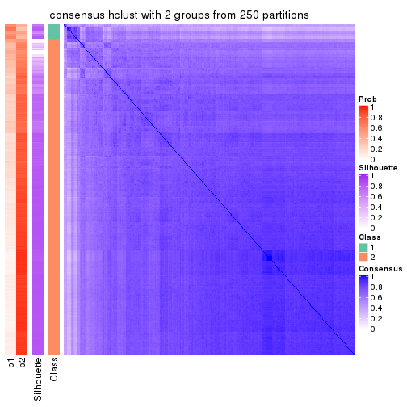</p>

</div>
<div id='tab-CV-hclust-consensus-heatmap-2'>
<pre><code class="r">consensus_heatmap(res, k = 3)
</code></pre>

<p>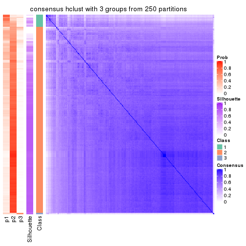</p>

</div>
<div id='tab-CV-hclust-consensus-heatmap-3'>
<pre><code class="r">consensus_heatmap(res, k = 4)
</code></pre>

<p>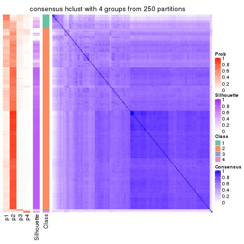</p>

</div>
<div id='tab-CV-hclust-consensus-heatmap-4'>
<pre><code class="r">consensus_heatmap(res, k = 5)
</code></pre>

<p>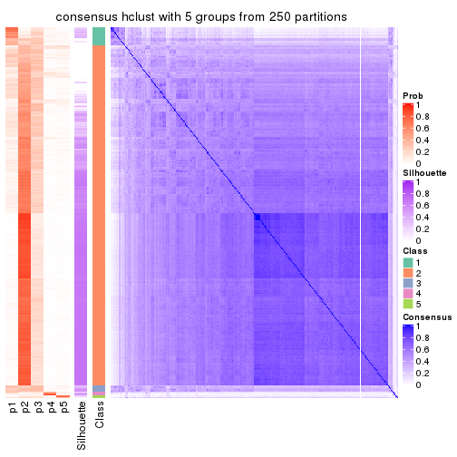</p>

</div>
<div id='tab-CV-hclust-consensus-heatmap-5'>
<pre><code class="r">consensus_heatmap(res, k = 6)
</code></pre>

<p>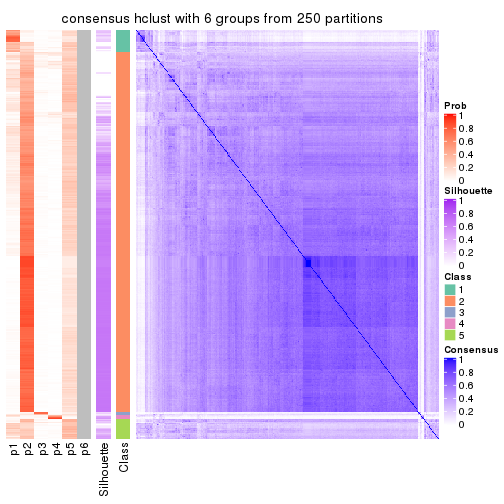</p>

</div>
</div>

Heatmaps for the membership of samples in all partitions to see how consistent they are:


<script>
$( function() {
	$( '#tabs-CV-hclust-membership-heatmap' ).tabs();
} );
</script>
<div id='tabs-CV-hclust-membership-heatmap'>
<ul>
<li><a href='#tab-CV-hclust-membership-heatmap-1'>k = 2</a></li>
<li><a href='#tab-CV-hclust-membership-heatmap-2'>k = 3</a></li>
<li><a href='#tab-CV-hclust-membership-heatmap-3'>k = 4</a></li>
<li><a href='#tab-CV-hclust-membership-heatmap-4'>k = 5</a></li>
<li><a href='#tab-CV-hclust-membership-heatmap-5'>k = 6</a></li>
</ul>
<div id='tab-CV-hclust-membership-heatmap-1'>
<pre><code class="r">membership_heatmap(res, k = 2)
</code></pre>

<p>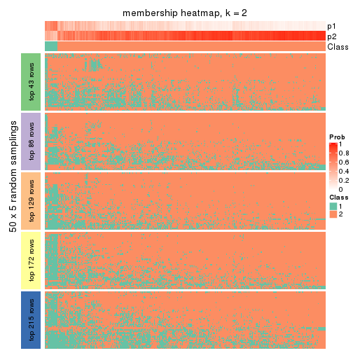</p>

</div>
<div id='tab-CV-hclust-membership-heatmap-2'>
<pre><code class="r">membership_heatmap(res, k = 3)
</code></pre>

<p>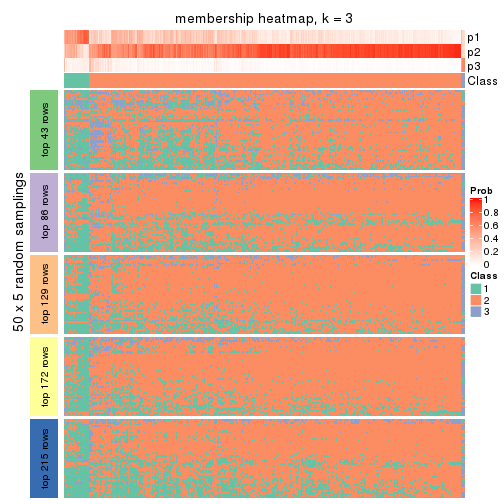</p>

</div>
<div id='tab-CV-hclust-membership-heatmap-3'>
<pre><code class="r">membership_heatmap(res, k = 4)
</code></pre>

<p>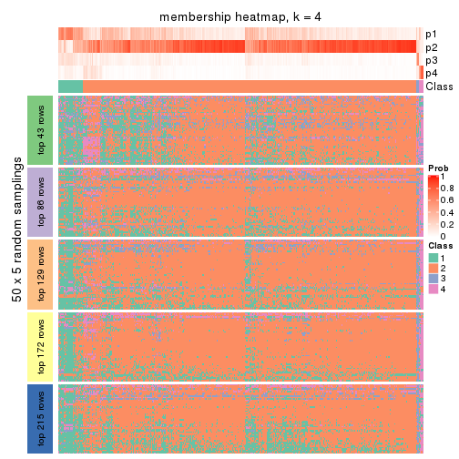</p>

</div>
<div id='tab-CV-hclust-membership-heatmap-4'>
<pre><code class="r">membership_heatmap(res, k = 5)
</code></pre>

<p>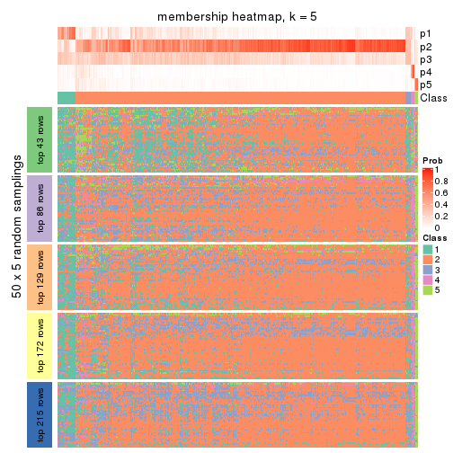</p>

</div>
<div id='tab-CV-hclust-membership-heatmap-5'>
<pre><code class="r">membership_heatmap(res, k = 6)
</code></pre>

<p>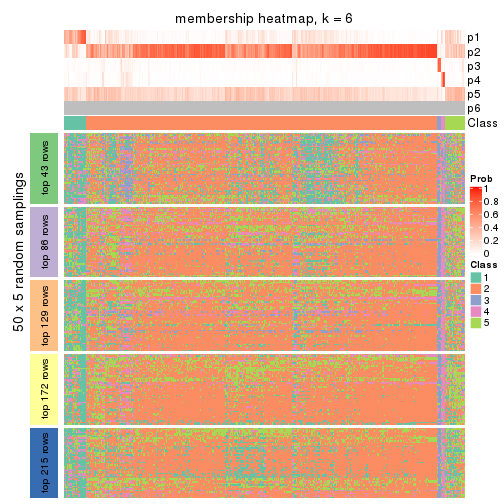</p>

</div>
</div>

As soon as we have had the classes for columns, we can look for signatures
which are significantly different between classes which can be candidate marks
for certain classes. Following are the heatmaps for signatures.


Signature heatmaps where rows are scaled:


<script>
$( function() {
	$( '#tabs-CV-hclust-get-signatures' ).tabs();
} );
</script>
<div id='tabs-CV-hclust-get-signatures'>
<ul>
<li><a href='#tab-CV-hclust-get-signatures-1'>k = 2</a></li>
<li><a href='#tab-CV-hclust-get-signatures-2'>k = 3</a></li>
<li><a href='#tab-CV-hclust-get-signatures-3'>k = 4</a></li>
<li><a href='#tab-CV-hclust-get-signatures-4'>k = 5</a></li>
<li><a href='#tab-CV-hclust-get-signatures-5'>k = 6</a></li>
</ul>
<div id='tab-CV-hclust-get-signatures-1'>
<pre><code class="r">get_signatures(res, k = 2)
</code></pre>

<p>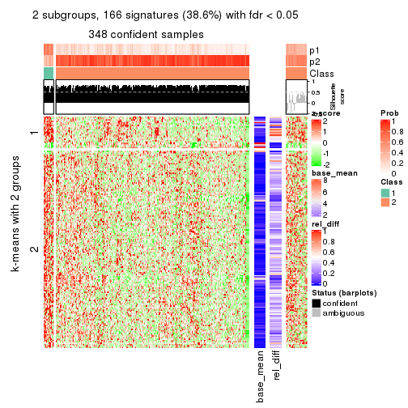</p>

</div>
<div id='tab-CV-hclust-get-signatures-2'>
<pre><code class="r">get_signatures(res, k = 3)
</code></pre>

<p>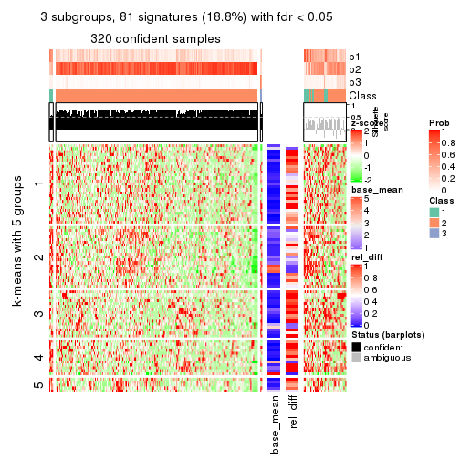</p>

</div>
<div id='tab-CV-hclust-get-signatures-3'>
<pre><code class="r">get_signatures(res, k = 4)
</code></pre>

<p>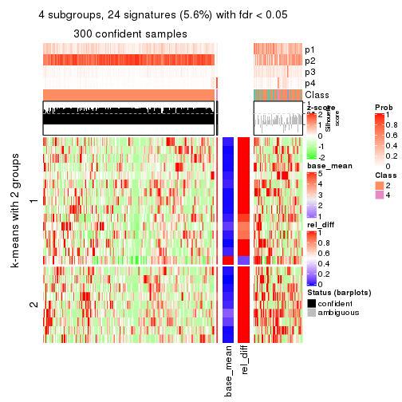</p>

</div>
<div id='tab-CV-hclust-get-signatures-4'>
<pre><code class="r">get_signatures(res, k = 5)
</code></pre>

<p>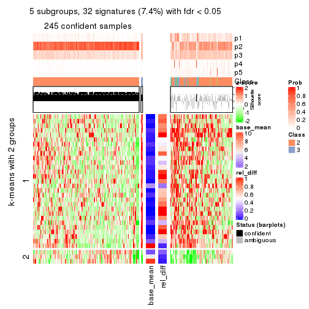</p>

</div>
<div id='tab-CV-hclust-get-signatures-5'>
<pre><code class="r">get_signatures(res, k = 6)
</code></pre>

<p></p>

</div>
</div>


Signature heatmaps where rows are not scaled:


<script>
$( function() {
	$( '#tabs-CV-hclust-get-signatures-no-scale' ).tabs();
} );
</script>
<div id='tabs-CV-hclust-get-signatures-no-scale'>
<ul>
<li><a href='#tab-CV-hclust-get-signatures-no-scale-1'>k = 2</a></li>
<li><a href='#tab-CV-hclust-get-signatures-no-scale-2'>k = 3</a></li>
<li><a href='#tab-CV-hclust-get-signatures-no-scale-3'>k = 4</a></li>
<li><a href='#tab-CV-hclust-get-signatures-no-scale-4'>k = 5</a></li>
<li><a href='#tab-CV-hclust-get-signatures-no-scale-5'>k = 6</a></li>
</ul>
<div id='tab-CV-hclust-get-signatures-no-scale-1'>
<pre><code class="r">get_signatures(res, k = 2, scale_rows = FALSE)
</code></pre>

<p>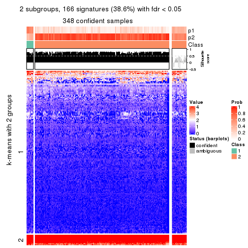</p>

</div>
<div id='tab-CV-hclust-get-signatures-no-scale-2'>
<pre><code class="r">get_signatures(res, k = 3, scale_rows = FALSE)
</code></pre>

<p>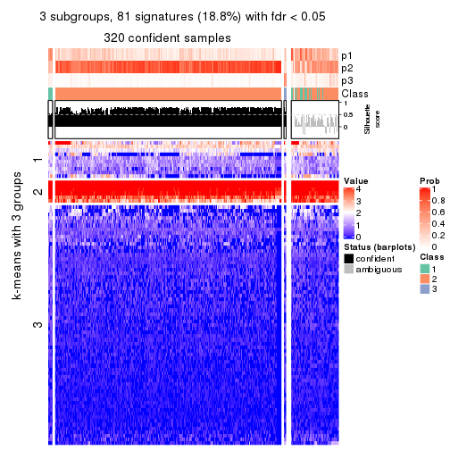</p>

</div>
<div id='tab-CV-hclust-get-signatures-no-scale-3'>
<pre><code class="r">get_signatures(res, k = 4, scale_rows = FALSE)
</code></pre>

<p>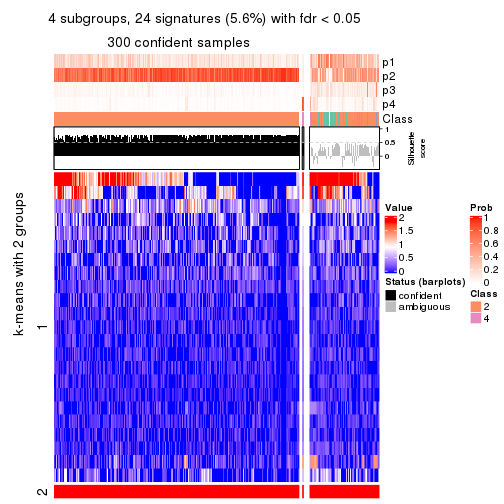</p>

</div>
<div id='tab-CV-hclust-get-signatures-no-scale-4'>
<pre><code class="r">get_signatures(res, k = 5, scale_rows = FALSE)
</code></pre>

<p>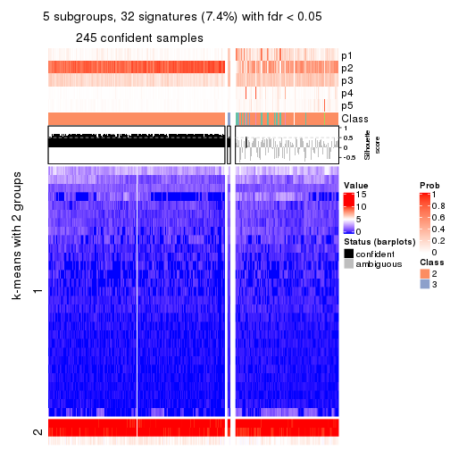</p>

</div>
<div id='tab-CV-hclust-get-signatures-no-scale-5'>
<pre><code class="r">get_signatures(res, k = 6, scale_rows = FALSE)
</code></pre>

<p></p>

</div>
</div>


Compare the overlap of signatures from different k:

```r
compare_signatures(res)
```

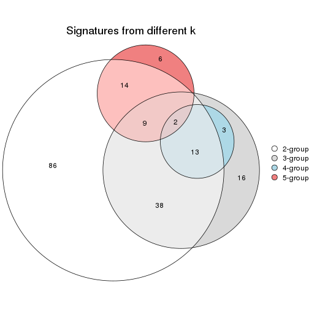

`get_signature()` returns a data frame invisibly. TO get the list of signatures, the function
call should be assigned to a variable explicitly. In following code, if `plot` argument is set
to `FALSE`, no heatmap is plotted while only the differential analysis is performed.

```r
# code only for demonstration
tb = get_signature(res, k = ..., plot = FALSE)
```

An example of the output of `tb` is:

```
#>   which_row         fdr    mean_1    mean_2 scaled_mean_1 scaled_mean_2 km
#> 1        38 0.042760348  8.373488  9.131774    -0.5533452     0.5164555  1
#> 2        40 0.018707592  7.106213  8.469186    -0.6173731     0.5762149  1
#> 3        55 0.019134737 10.221463 11.207825    -0.6159697     0.5749050  1
#> 4        59 0.006059896  5.921854  7.869574    -0.6899429     0.6439467  1
#> 5        60 0.018055526  8.928898 10.211722    -0.6204761     0.5791110  1
#> 6        98 0.009384629 15.714769 14.887706     0.6635654    -0.6193277  2
...
```

The columns in `tb` are:

1. `which_row`: row indices corresponding to the input matrix.
2. `fdr`: FDR for the differential test. 
3. `mean_x`: The mean value in group x.
4. `scaled_mean_x`: The mean value in group x after rows are scaled.
5. `km`: Row groups if k-means clustering is applied to rows.


UMAP plot which shows how samples are separated.


<script>
$( function() {
	$( '#tabs-CV-hclust-dimension-reduction' ).tabs();
} );
</script>
<div id='tabs-CV-hclust-dimension-reduction'>
<ul>
<li><a href='#tab-CV-hclust-dimension-reduction-1'>k = 2</a></li>
<li><a href='#tab-CV-hclust-dimension-reduction-2'>k = 3</a></li>
<li><a href='#tab-CV-hclust-dimension-reduction-3'>k = 4</a></li>
<li><a href='#tab-CV-hclust-dimension-reduction-4'>k = 5</a></li>
<li><a href='#tab-CV-hclust-dimension-reduction-5'>k = 6</a></li>
</ul>
<div id='tab-CV-hclust-dimension-reduction-1'>
<pre><code class="r">dimension_reduction(res, k = 2, method = &quot;UMAP&quot;)
</code></pre>

<p>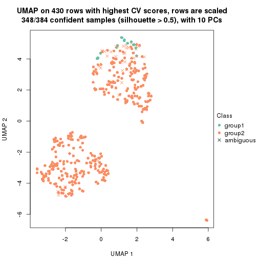</p>

</div>
<div id='tab-CV-hclust-dimension-reduction-2'>
<pre><code class="r">dimension_reduction(res, k = 3, method = &quot;UMAP&quot;)
</code></pre>

<p>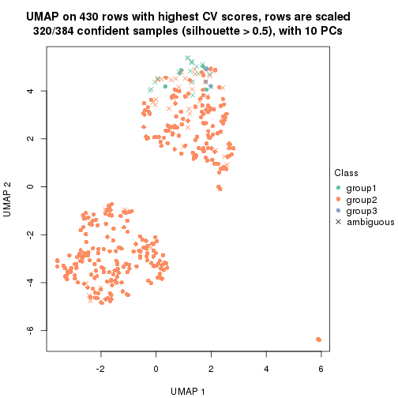</p>

</div>
<div id='tab-CV-hclust-dimension-reduction-3'>
<pre><code class="r">dimension_reduction(res, k = 4, method = &quot;UMAP&quot;)
</code></pre>

<p>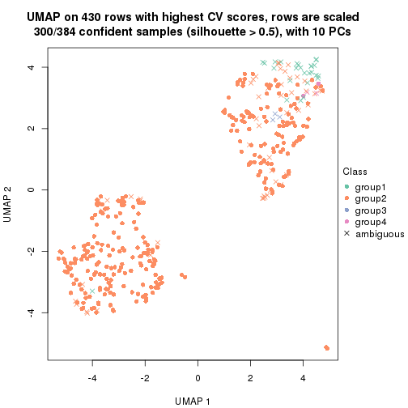</p>

</div>
<div id='tab-CV-hclust-dimension-reduction-4'>
<pre><code class="r">dimension_reduction(res, k = 5, method = &quot;UMAP&quot;)
</code></pre>

<p>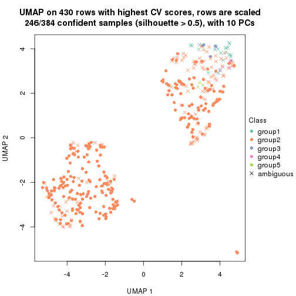</p>

</div>
<div id='tab-CV-hclust-dimension-reduction-5'>
<pre><code class="r">dimension_reduction(res, k = 6, method = &quot;UMAP&quot;)
</code></pre>

<p>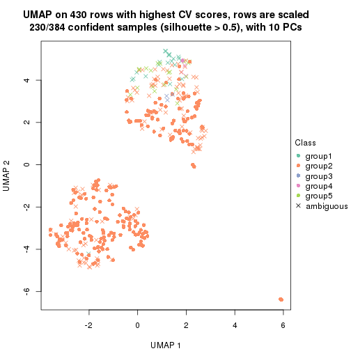</p>

</div>
</div>


Following heatmap shows how subgroups are split when increasing `k`:

```r
collect_classes(res)
```

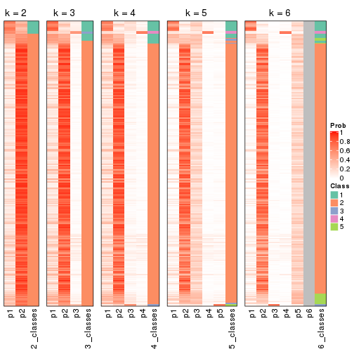


If matrix rows can be associated to genes, consider to use `GO_Enrichment(res,
...)` to perform function enrichment for the signature genes.


 

---------------------------------------------------


### CV:kmeans


The object with results only for a single top-value method and a single partition method 
can be extracted as:

```r
res = res_list["CV", "kmeans"]
# you can also extract it by
# res = res_list["CV:kmeans"]
```

A summary of `res` and all the functions that can be applied to it:

```r
res
```

```
#> A 'ConsensusPartition' object with k = 2, 3, 4, 5, 6.
#>   On a matrix with 430 rows and 384 columns.
#>   Top rows (43, 86, 129, 172, 215) are extracted by 'CV' method.
#>   Subgroups are detected by 'kmeans' method.
#>   Performed in total 1250 partitions by row resampling.
#>   Best k for subgroups seems to be 2.
#> 
#> Following methods can be applied to this 'ConsensusPartition' object:
#>  [1] "cola_report"             "collect_classes"         "collect_plots"          
#>  [4] "collect_stats"           "colnames"                "compare_signatures"     
#>  [7] "consensus_heatmap"       "dimension_reduction"     "functional_enrichment"  
#> [10] "get_anno_col"            "get_anno"                "get_classes"            
#> [13] "get_consensus"           "get_matrix"              "get_membership"         
#> [16] "get_param"               "get_signatures"          "get_stats"              
#> [19] "is_best_k"               "is_stable_k"             "membership_heatmap"     
#> [22] "ncol"                    "nrow"                    "plot_ecdf"              
#> [25] "rownames"                "select_partition_number" "show"                   
#> [28] "suggest_best_k"          "test_to_known_factors"
```

`collect_plots()` function collects all the plots made from `res` for all `k` (number of partitions)
into one single page to provide an easy and fast comparison between different `k`.

```r
collect_plots(res)
```

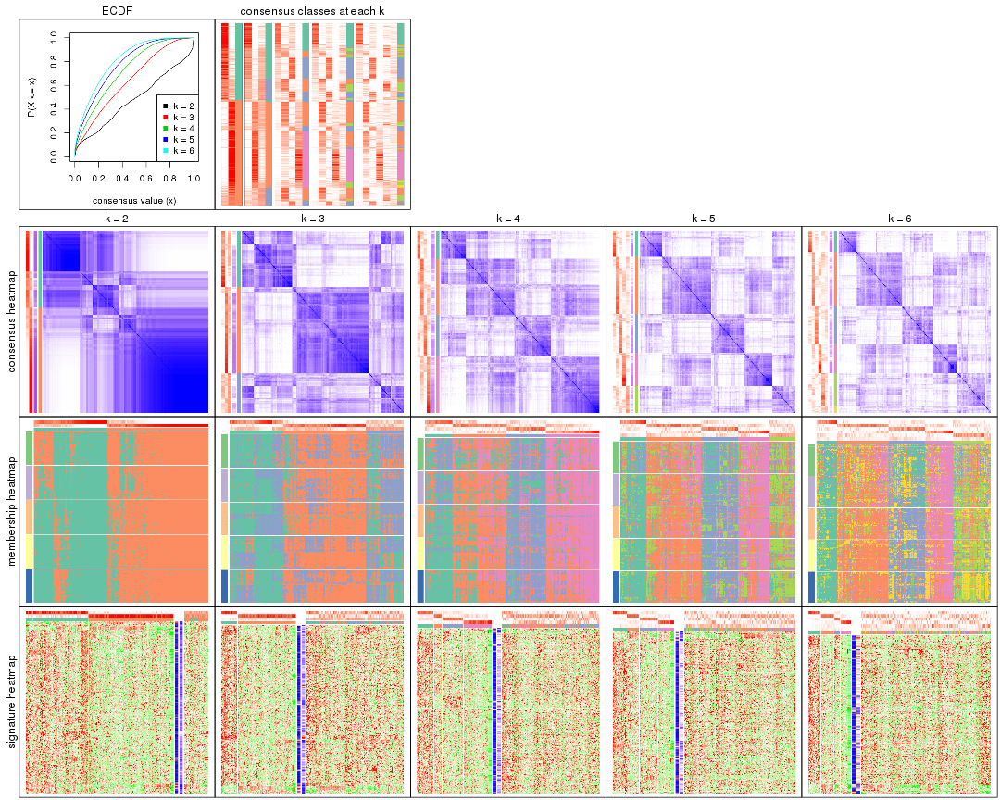

The plots are:

- The first row: a plot of the ECDF (Empirical cumulative distribution
  function) curves of the consensus matrix for each `k` and the heatmap of
  predicted classes for each `k`.
- The second row: heatmaps of the consensus matrix for each `k`.
- The third row: heatmaps of the membership matrix for each `k`.
- The fouth row: heatmaps of the signatures for each `k`.

All the plots in panels can be made by individual functions and they are
plotted later in this section.

`select_partition_number()` produces several plots showing different
statistics for choosing "optimized" `k`. There are following statistics:

- ECDF curves of the consensus matrix for each `k`;
- 1-PAC. [The PAC
  score](https://en.wikipedia.org/wiki/Consensus_clustering#Over-interpretation_potential_of_consensus_clustering)
  measures the proportion of the ambiguous subgrouping.
- Mean silhouette score.
- Concordance. The mean probability of fiting the consensus class ids in all
  partitions.
- Area increased. Denote $A_k$ as the area under the ECDF curve for current
  `k`, the area increased is defined as $A_k - A_{k-1}$.
- Rand index. The percent of pairs of samples that are both in a same cluster
  or both are not in a same cluster in the partition of k and k-1.
- Jaccard index. The ratio of pairs of samples are both in a same cluster in
  the partition of k and k-1 and the pairs of samples are both in a same
  cluster in the partition k or k-1.

The detailed explanations of these statistics can be found in [the cola
vignette](http://bioconductor.org/packages/devel/bioc/vignettes/cola/inst/doc/cola.html#toc_13).

Generally speaking, lower PAC score, higher mean silhouette score or higher
concordance corresponds to better partition. Rand index and Jaccard index
measure how similar the current partition is compared to partition with `k-1`.
If they are too similar, we won't accept `k` is better than `k-1`.

```r
select_partition_number(res)
```

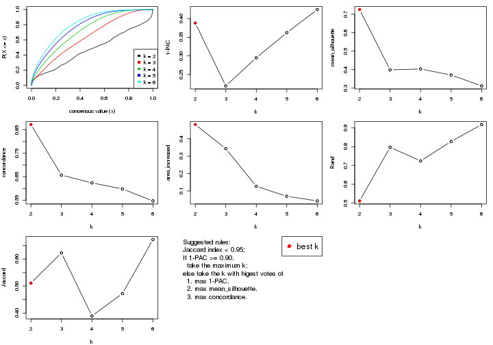

The numeric values for all these statistics can be obtained by `get_stats()`.

```r
get_stats(res)
```

```
#>   k 1-PAC mean_silhouette concordance area_increased  Rand Jaccard
#> 2 2 0.388           0.725       0.872         0.4818 0.511   0.511
#> 3 3 0.220           0.399       0.657         0.3434 0.796   0.623
#> 4 4 0.295           0.404       0.624         0.1268 0.724   0.390
#> 5 5 0.362           0.371       0.598         0.0695 0.828   0.472
#> 6 6 0.424           0.312       0.547         0.0427 0.918   0.672
```

`suggest_best_k()` suggests the best $k$ based on these statistics. The rules are as follows:

- All $k$ with Jaccard index larger than 0.95 are removed because the increase of
  the partition number does not provides enough extra information. If all $k$ are removed,
  the best $k$ is assigned by `NA`.
- For $k$ with 1-PAC larger than 0.9, the maximal $k$ is taken as the "best k". Other $k$ is called "optional k".
- If it does not fit the second rule. The $k$ with the highest vote of highest
  1-PAC, mean silhouette and concordance is taken as the "best k".

```r
suggest_best_k(res)
```

```
#> [1] 2
```


Following shows the table of the partitions (You need to click the **show/hide
code output** link to see it). The membership matrix (columns with name `p*`)
is inferred by
[`clue::cl_consensus()`](https://www.rdocumentation.org/link/cl_consensus?package=clue)
function with the `SE` method. Basically the value in the membership matrix
represents the probability to belong to a certain group. The finall class
label for an item is determined with the group with highest probability it
belongs to.

In `get_classes()` function, the entropy is calculated from the membership
matrix and the silhouette score is calculated from the consensus matrix.


<script>
$( function() {
	$( '#tabs-CV-kmeans-get-classes' ).tabs();
} );
</script>
<div id='tabs-CV-kmeans-get-classes'>
<ul>
<li><a href='#tab-CV-kmeans-get-classes-1'>k = 2</a></li>
<li><a href='#tab-CV-kmeans-get-classes-2'>k = 3</a></li>
<li><a href='#tab-CV-kmeans-get-classes-3'>k = 4</a></li>
<li><a href='#tab-CV-kmeans-get-classes-4'>k = 5</a></li>
<li><a href='#tab-CV-kmeans-get-classes-5'>k = 6</a></li>
</ul>

<div id='tab-CV-kmeans-get-classes-1'>
<p><a id='tab-CV-kmeans-get-classes-1-a' style='color:#0366d6' href='#'>show/hide code output</a></p>
<pre><code class="r">cbind(get_classes(res, k = 2), get_membership(res, k = 2))
</code></pre>

<pre><code>#&gt;            class entropy silhouette    p1    p2
#&gt; SRR2105277     1  0.9460     0.5341 0.636 0.364
#&gt; SRR2105278     1  0.8861     0.6267 0.696 0.304
#&gt; SRR2105275     1  0.9129     0.5177 0.672 0.328
#&gt; SRR2105276     1  0.4815     0.7796 0.896 0.104
#&gt; SRR2105273     2  0.8207     0.6221 0.256 0.744
#&gt; SRR2105274     1  0.4562     0.7966 0.904 0.096
#&gt; SRR2105271     1  0.9393     0.5631 0.644 0.356
#&gt; SRR2105272     1  0.0376     0.8034 0.996 0.004
#&gt; SRR2105269     2  0.0000     0.8745 0.000 1.000
#&gt; SRR2105270     2  0.1184     0.8713 0.016 0.984
#&gt; SRR2105267     2  0.0000     0.8745 0.000 1.000
#&gt; SRR2105268     2  0.0672     0.8733 0.008 0.992
#&gt; SRR2105265     2  0.0376     0.8740 0.004 0.996
#&gt; SRR2105266     2  0.2423     0.8580 0.040 0.960
#&gt; SRR2105263     1  0.9170     0.5029 0.668 0.332
#&gt; SRR2105264     1  0.2043     0.8028 0.968 0.032
#&gt; SRR2105261     2  0.8207     0.6303 0.256 0.744
#&gt; SRR2105262     2  0.7674     0.6521 0.224 0.776
#&gt; SRR2105357     2  0.0000     0.8745 0.000 1.000
#&gt; SRR2105358     1  0.9933     0.3331 0.548 0.452
#&gt; SRR2105439     2  0.3274     0.8471 0.060 0.940
#&gt; SRR2105440     2  0.2236     0.8624 0.036 0.964
#&gt; SRR2105509     2  0.0000     0.8745 0.000 1.000
#&gt; SRR2105510     2  0.0000     0.8745 0.000 1.000
#&gt; SRR2105507     2  0.8661     0.5645 0.288 0.712
#&gt; SRR2105508     2  0.3431     0.8480 0.064 0.936
#&gt; SRR2105505     1  0.9248     0.5735 0.660 0.340
#&gt; SRR2105506     1  0.7056     0.7396 0.808 0.192
#&gt; SRR2105503     2  0.7745     0.6653 0.228 0.772
#&gt; SRR2105504     2  0.0000     0.8745 0.000 1.000
#&gt; SRR2105501     2  0.0000     0.8745 0.000 1.000
#&gt; SRR2105502     2  0.0000     0.8745 0.000 1.000
#&gt; SRR2105499     1  0.2423     0.8061 0.960 0.040
#&gt; SRR2105500     1  0.8016     0.7004 0.756 0.244
#&gt; SRR2105497     2  0.8016     0.6305 0.244 0.756
#&gt; SRR2105498     1  0.9993     0.1079 0.516 0.484
#&gt; SRR2105495     2  0.0000     0.8745 0.000 1.000
#&gt; SRR2105496     2  0.2948     0.8551 0.052 0.948
#&gt; SRR2105493     2  0.0000     0.8745 0.000 1.000
#&gt; SRR2105494     2  0.1414     0.8702 0.020 0.980
#&gt; SRR2105491     1  0.7299     0.6923 0.796 0.204
#&gt; SRR2105492     1  0.2043     0.8015 0.968 0.032
#&gt; SRR2105489     1  0.9775     0.3283 0.588 0.412
#&gt; SRR2105490     1  0.9358     0.5597 0.648 0.352
#&gt; SRR2105487     1  0.1843     0.8061 0.972 0.028
#&gt; SRR2105488     1  0.3879     0.7982 0.924 0.076
#&gt; SRR2105485     2  0.9170     0.3961 0.332 0.668
#&gt; SRR2105486     1  0.8661     0.6494 0.712 0.288
#&gt; SRR2105483     1  0.0376     0.8034 0.996 0.004
#&gt; SRR2105484     1  0.0376     0.8034 0.996 0.004
#&gt; SRR2105481     1  0.6247     0.7729 0.844 0.156
#&gt; SRR2105482     1  0.1843     0.8064 0.972 0.028
#&gt; SRR2105479     1  0.8016     0.6491 0.756 0.244
#&gt; SRR2105480     1  0.0672     0.8036 0.992 0.008
#&gt; SRR2105477     1  0.7453     0.7106 0.788 0.212
#&gt; SRR2105478     1  0.9552     0.4315 0.624 0.376
#&gt; SRR2105475     2  0.0000     0.8745 0.000 1.000
#&gt; SRR2105476     2  0.0000     0.8745 0.000 1.000
#&gt; SRR2105473     1  0.8555     0.6545 0.720 0.280
#&gt; SRR2105474     1  0.9460     0.5352 0.636 0.364
#&gt; SRR2105471     1  0.1633     0.8061 0.976 0.024
#&gt; SRR2105472     1  0.2423     0.8052 0.960 0.040
#&gt; SRR2105469     2  0.0000     0.8745 0.000 1.000
#&gt; SRR2105470     1  0.9896     0.3721 0.560 0.440
#&gt; SRR2105467     1  0.6973     0.7565 0.812 0.188
#&gt; SRR2105468     1  0.9044     0.6067 0.680 0.320
#&gt; SRR2105465     1  0.8661     0.6492 0.712 0.288
#&gt; SRR2105466     1  0.1414     0.8057 0.980 0.020
#&gt; SRR2105463     1  0.0376     0.8034 0.996 0.004
#&gt; SRR2105464     1  0.0376     0.8034 0.996 0.004
#&gt; SRR2105461     2  0.0000     0.8745 0.000 1.000
#&gt; SRR2105462     2  0.0000     0.8745 0.000 1.000
#&gt; SRR2105459     2  0.0000     0.8745 0.000 1.000
#&gt; SRR2105460     2  0.0000     0.8745 0.000 1.000
#&gt; SRR2105457     2  0.0000     0.8745 0.000 1.000
#&gt; SRR2105458     2  0.0000     0.8745 0.000 1.000
#&gt; SRR2105455     2  0.0000     0.8745 0.000 1.000
#&gt; SRR2105456     2  0.5946     0.7605 0.144 0.856
#&gt; SRR2105453     1  0.8909     0.6238 0.692 0.308
#&gt; SRR2105454     1  0.7056     0.7395 0.808 0.192
#&gt; SRR2105451     2  0.0000     0.8745 0.000 1.000
#&gt; SRR2105452     2  0.0000     0.8745 0.000 1.000
#&gt; SRR2105449     1  0.2423     0.8003 0.960 0.040
#&gt; SRR2105450     1  0.0376     0.8034 0.996 0.004
#&gt; SRR2105447     2  0.0000     0.8745 0.000 1.000
#&gt; SRR2105448     2  0.0000     0.8745 0.000 1.000
#&gt; SRR2105445     2  0.0376     0.8741 0.004 0.996
#&gt; SRR2105446     2  0.0376     0.8740 0.004 0.996
#&gt; SRR2105443     2  0.0000     0.8745 0.000 1.000
#&gt; SRR2105444     2  0.8909     0.4637 0.308 0.692
#&gt; SRR2105441     2  0.9286     0.3848 0.344 0.656
#&gt; SRR2105442     1  0.4690     0.7923 0.900 0.100
#&gt; SRR2105437     1  0.0376     0.8034 0.996 0.004
#&gt; SRR2105438     1  0.0376     0.8034 0.996 0.004
#&gt; SRR2105435     2  0.9866     0.1149 0.432 0.568
#&gt; SRR2105436     1  0.8608     0.6533 0.716 0.284
#&gt; SRR2105433     1  0.0376     0.8034 0.996 0.004
#&gt; SRR2105434     1  0.0376     0.8034 0.996 0.004
#&gt; SRR2105431     1  0.0672     0.8042 0.992 0.008
#&gt; SRR2105432     1  0.0376     0.8034 0.996 0.004
#&gt; SRR2105429     1  0.8555     0.6263 0.720 0.280
#&gt; SRR2105430     2  0.9608     0.3042 0.384 0.616
#&gt; SRR2105427     2  0.0000     0.8745 0.000 1.000
#&gt; SRR2105428     2  0.1843     0.8650 0.028 0.972
#&gt; SRR2105425     2  0.1184     0.8722 0.016 0.984
#&gt; SRR2105426     2  0.6247     0.7665 0.156 0.844
#&gt; SRR2105421     2  0.0000     0.8745 0.000 1.000
#&gt; SRR2105422     2  0.0000     0.8745 0.000 1.000
#&gt; SRR2105423     2  0.0000     0.8745 0.000 1.000
#&gt; SRR2105424     2  0.0000     0.8745 0.000 1.000
#&gt; SRR2105419     2  0.0000     0.8745 0.000 1.000
#&gt; SRR2105420     2  0.0376     0.8740 0.004 0.996
#&gt; SRR2105415     1  0.1184     0.8053 0.984 0.016
#&gt; SRR2105416     1  0.0376     0.8034 0.996 0.004
#&gt; SRR2105417     1  0.7528     0.7291 0.784 0.216
#&gt; SRR2105418     1  0.0376     0.8034 0.996 0.004
#&gt; SRR2105413     2  0.0000     0.8745 0.000 1.000
#&gt; SRR2105414     2  0.0000     0.8745 0.000 1.000
#&gt; SRR2105409     2  0.9833     0.2462 0.424 0.576
#&gt; SRR2105410     1  0.1633     0.8058 0.976 0.024
#&gt; SRR2105411     2  0.3114     0.8494 0.056 0.944
#&gt; SRR2105412     2  0.6531     0.7354 0.168 0.832
#&gt; SRR2105407     2  0.1184     0.8704 0.016 0.984
#&gt; SRR2105408     2  0.0000     0.8745 0.000 1.000
#&gt; SRR2105403     2  0.2778     0.8523 0.048 0.952
#&gt; SRR2105404     2  0.9393     0.3208 0.356 0.644
#&gt; SRR2105405     2  0.0938     0.8727 0.012 0.988
#&gt; SRR2105406     1  0.9460     0.5342 0.636 0.364
#&gt; SRR2105401     2  0.0000     0.8745 0.000 1.000
#&gt; SRR2105402     2  0.0000     0.8745 0.000 1.000
#&gt; SRR2105399     2  0.0000     0.8745 0.000 1.000
#&gt; SRR2105400     2  0.0000     0.8745 0.000 1.000
#&gt; SRR2105397     2  0.0000     0.8745 0.000 1.000
#&gt; SRR2105398     2  0.0376     0.8740 0.004 0.996
#&gt; SRR2105395     2  0.8443     0.5947 0.272 0.728
#&gt; SRR2105396     2  1.0000    -0.1813 0.496 0.504
#&gt; SRR2105393     2  0.2423     0.8621 0.040 0.960
#&gt; SRR2105394     2  0.0672     0.8736 0.008 0.992
#&gt; SRR2105389     2  0.2043     0.8643 0.032 0.968
#&gt; SRR2105390     2  0.9580     0.3934 0.380 0.620
#&gt; SRR2105391     2  0.0000     0.8745 0.000 1.000
#&gt; SRR2105392     2  0.1184     0.8702 0.016 0.984
#&gt; SRR2105385     1  0.6623     0.7312 0.828 0.172
#&gt; SRR2105386     2  0.8443     0.6002 0.272 0.728
#&gt; SRR2105387     2  0.4690     0.8241 0.100 0.900
#&gt; SRR2105388     1  0.9933     0.3365 0.548 0.452
#&gt; SRR2105381     2  0.0000     0.8745 0.000 1.000
#&gt; SRR2105382     2  0.2603     0.8550 0.044 0.956
#&gt; SRR2105383     2  0.6887     0.7175 0.184 0.816
#&gt; SRR2105384     1  0.9087     0.6020 0.676 0.324
#&gt; SRR2105379     2  0.4022     0.8290 0.080 0.920
#&gt; SRR2105380     2  0.9286     0.4502 0.344 0.656
#&gt; SRR2105377     2  0.8608     0.5199 0.284 0.716
#&gt; SRR2105378     1  0.1843     0.8069 0.972 0.028
#&gt; SRR2105375     2  0.9963    -0.0487 0.464 0.536
#&gt; SRR2105376     1  0.9427     0.5381 0.640 0.360
#&gt; SRR2105373     1  0.7745     0.7223 0.772 0.228
#&gt; SRR2105374     1  0.0376     0.8034 0.996 0.004
#&gt; SRR2105371     2  0.0000     0.8745 0.000 1.000
#&gt; SRR2105372     2  0.0000     0.8745 0.000 1.000
#&gt; SRR2105369     2  0.0672     0.8734 0.008 0.992
#&gt; SRR2105370     1  1.0000     0.1905 0.500 0.500
#&gt; SRR2105367     1  0.7674     0.7162 0.776 0.224
#&gt; SRR2105368     1  0.1633     0.8059 0.976 0.024
#&gt; SRR2105365     1  0.9552     0.4011 0.624 0.376
#&gt; SRR2105366     1  0.9552     0.4081 0.624 0.376
#&gt; SRR2105363     2  0.0938     0.8724 0.012 0.988
#&gt; SRR2105364     2  0.2423     0.8620 0.040 0.960
#&gt; SRR2105361     2  0.0000     0.8745 0.000 1.000
#&gt; SRR2105362     2  0.0376     0.8739 0.004 0.996
#&gt; SRR2105359     2  0.9209     0.3973 0.336 0.664
#&gt; SRR2105360     2  0.0376     0.8741 0.004 0.996
#&gt; SRR2105355     2  0.1843     0.8666 0.028 0.972
#&gt; SRR2105356     2  0.9954    -0.0519 0.460 0.540
#&gt; SRR2105353     2  0.7674     0.6634 0.224 0.776
#&gt; SRR2105354     1  0.9044     0.5851 0.680 0.320
#&gt; SRR2105351     2  0.5294     0.7973 0.120 0.880
#&gt; SRR2105352     2  0.0000     0.8745 0.000 1.000
#&gt; SRR2105349     2  0.2423     0.8581 0.040 0.960
#&gt; SRR2105350     2  0.2236     0.8641 0.036 0.964
#&gt; SRR2105345     2  0.0376     0.8740 0.004 0.996
#&gt; SRR2105346     2  0.9580     0.2639 0.380 0.620
#&gt; SRR2105347     1  0.3431     0.8006 0.936 0.064
#&gt; SRR2105348     1  0.6887     0.7457 0.816 0.184
#&gt; SRR2105343     2  0.0000     0.8745 0.000 1.000
#&gt; SRR2105344     2  0.0000     0.8745 0.000 1.000
#&gt; SRR2105341     2  0.4161     0.8337 0.084 0.916
#&gt; SRR2105342     2  0.4298     0.8205 0.088 0.912
#&gt; SRR2105339     2  0.5059     0.8058 0.112 0.888
#&gt; SRR2105340     2  0.9933     0.1558 0.452 0.548
#&gt; SRR2105335     1  0.7883     0.7149 0.764 0.236
#&gt; SRR2105336     1  0.2236     0.8057 0.964 0.036
#&gt; SRR2105337     1  1.0000     0.0383 0.504 0.496
#&gt; SRR2105338     1  0.1633     0.8066 0.976 0.024
#&gt; SRR2105331     2  0.9209     0.4670 0.336 0.664
#&gt; SRR2105332     1  0.9922     0.1916 0.552 0.448
#&gt; SRR2105333     2  0.0000     0.8745 0.000 1.000
#&gt; SRR2105334     2  0.0000     0.8745 0.000 1.000
#&gt; SRR2105329     2  0.0000     0.8745 0.000 1.000
#&gt; SRR2105330     2  0.0000     0.8745 0.000 1.000
#&gt; SRR2105327     2  0.0672     0.8732 0.008 0.992
#&gt; SRR2105328     2  0.2236     0.8611 0.036 0.964
#&gt; SRR2105325     1  0.0376     0.8034 0.996 0.004
#&gt; SRR2105326     1  0.0376     0.8034 0.996 0.004
#&gt; SRR2105323     2  0.1633     0.8679 0.024 0.976
#&gt; SRR2105324     2  0.7299     0.6717 0.204 0.796
#&gt; SRR2105319     1  0.0376     0.8034 0.996 0.004
#&gt; SRR2105320     1  0.0376     0.8034 0.996 0.004
#&gt; SRR2105321     1  0.9933     0.1955 0.548 0.452
#&gt; SRR2105322     1  0.1184     0.8039 0.984 0.016
#&gt; SRR2105317     2  0.0000     0.8745 0.000 1.000
#&gt; SRR2105318     2  0.0000     0.8745 0.000 1.000
#&gt; SRR2105315     2  0.0000     0.8745 0.000 1.000
#&gt; SRR2105316     2  0.0000     0.8745 0.000 1.000
#&gt; SRR2105313     2  0.0000     0.8745 0.000 1.000
#&gt; SRR2105314     2  0.0000     0.8745 0.000 1.000
#&gt; SRR2105311     2  0.9635     0.3430 0.388 0.612
#&gt; SRR2105312     1  0.9323     0.4708 0.652 0.348
#&gt; SRR2105307     1  0.7745     0.7142 0.772 0.228
#&gt; SRR2105308     1  0.9358     0.5512 0.648 0.352
#&gt; SRR2105309     2  0.0000     0.8745 0.000 1.000
#&gt; SRR2105310     2  0.8608     0.5285 0.284 0.716
#&gt; SRR2105305     2  0.0000     0.8745 0.000 1.000
#&gt; SRR2105306     2  0.0000     0.8745 0.000 1.000
#&gt; SRR2105303     2  0.0000     0.8745 0.000 1.000
#&gt; SRR2105304     2  0.0000     0.8745 0.000 1.000
#&gt; SRR2105301     2  0.7139     0.7151 0.196 0.804
#&gt; SRR2105302     2  0.0000     0.8745 0.000 1.000
#&gt; SRR2105299     2  0.9170     0.4832 0.332 0.668
#&gt; SRR2105300     2  0.5178     0.7968 0.116 0.884
#&gt; SRR2105297     1  0.0376     0.8034 0.996 0.004
#&gt; SRR2105298     1  0.0376     0.8034 0.996 0.004
#&gt; SRR2105295     2  0.0000     0.8745 0.000 1.000
#&gt; SRR2105296     2  0.5842     0.7705 0.140 0.860
#&gt; SRR2105293     2  0.9000     0.5081 0.316 0.684
#&gt; SRR2105294     1  0.0376     0.8034 0.996 0.004
#&gt; SRR2105291     2  0.4431     0.8214 0.092 0.908
#&gt; SRR2105292     1  0.0376     0.8034 0.996 0.004
#&gt; SRR2105289     2  0.0376     0.8740 0.004 0.996
#&gt; SRR2105290     1  0.5408     0.7799 0.876 0.124
#&gt; SRR2105287     1  0.7219     0.7353 0.800 0.200
#&gt; SRR2105288     1  0.1184     0.8056 0.984 0.016
#&gt; SRR2105285     2  0.0000     0.8745 0.000 1.000
#&gt; SRR2105286     2  0.0376     0.8739 0.004 0.996
#&gt; SRR2105283     2  0.9954     0.0975 0.460 0.540
#&gt; SRR2105284     1  0.9580     0.5030 0.620 0.380
#&gt; SRR2105281     2  0.3733     0.8407 0.072 0.928
#&gt; SRR2105282     2  0.1414     0.8703 0.020 0.980
#&gt; SRR2105259     2  0.0000     0.8745 0.000 1.000
#&gt; SRR2105260     2  0.0000     0.8745 0.000 1.000
#&gt; SRR2105279     2  0.0000     0.8745 0.000 1.000
#&gt; SRR2105280     2  0.0672     0.8734 0.008 0.992
#&gt; SRR2105257     1  0.0376     0.8034 0.996 0.004
#&gt; SRR2105258     1  0.0376     0.8034 0.996 0.004
#&gt; SRR2105253     2  0.1633     0.8684 0.024 0.976
#&gt; SRR2105254     2  0.0000     0.8745 0.000 1.000
#&gt; SRR2105255     2  0.9170     0.4041 0.332 0.668
#&gt; SRR2105256     1  0.9661     0.4791 0.608 0.392
#&gt; SRR2105251     2  0.3879     0.8394 0.076 0.924
#&gt; SRR2105252     2  0.5059     0.8101 0.112 0.888
#&gt; SRR2105249     2  0.0000     0.8745 0.000 1.000
#&gt; SRR2105250     1  0.9795     0.4264 0.584 0.416
#&gt; SRR2105247     2  0.5294     0.7948 0.120 0.880
#&gt; SRR2105248     1  0.9580     0.4027 0.620 0.380
#&gt; SRR2105245     1  0.7883     0.6884 0.764 0.236
#&gt; SRR2105246     2  0.3584     0.8399 0.068 0.932
#&gt; SRR2105243     2  0.4562     0.8173 0.096 0.904
#&gt; SRR2105244     1  0.8813     0.5945 0.700 0.300
#&gt; SRR2105241     2  0.9993    -0.0174 0.484 0.516
#&gt; SRR2105242     1  0.0376     0.8034 0.996 0.004
#&gt; SRR2105239     2  0.4431     0.8252 0.092 0.908
#&gt; SRR2105240     1  0.0376     0.8034 0.996 0.004
#&gt; SRR2105237     2  0.1184     0.8703 0.016 0.984
#&gt; SRR2105238     2  0.0672     0.8732 0.008 0.992
#&gt; SRR2105235     2  0.1414     0.8698 0.020 0.980
#&gt; SRR2105236     2  0.9000     0.4464 0.316 0.684
#&gt; SRR2105233     2  0.0000     0.8745 0.000 1.000
#&gt; SRR2105234     2  0.0000     0.8745 0.000 1.000
#&gt; SRR2105231     2  0.7602     0.6825 0.220 0.780
#&gt; SRR2105232     2  0.9635     0.3445 0.388 0.612
#&gt; SRR2105227     2  0.8713     0.5593 0.292 0.708
#&gt; SRR2105228     2  0.7602     0.6518 0.220 0.780
#&gt; SRR2105225     2  0.9358     0.3502 0.352 0.648
#&gt; SRR2105226     1  0.7745     0.7180 0.772 0.228
#&gt; SRR2105229     2  0.0672     0.8735 0.008 0.992
#&gt; SRR2105230     1  0.8608     0.6522 0.716 0.284
#&gt; SRR2105219     2  0.0376     0.8726 0.004 0.996
#&gt; SRR2105220     2  0.1843     0.8667 0.028 0.972
#&gt; SRR2105221     1  0.9896     0.3637 0.560 0.440
#&gt; SRR2105222     1  0.0672     0.8042 0.992 0.008
#&gt; SRR2105223     1  0.9580     0.4785 0.620 0.380
#&gt; SRR2105224     1  0.3274     0.8031 0.940 0.060
#&gt; SRR2105217     1  0.7528     0.6746 0.784 0.216
#&gt; SRR2105218     1  0.6048     0.7672 0.852 0.148
#&gt; SRR2105215     2  0.4161     0.8320 0.084 0.916
#&gt; SRR2105216     2  0.0000     0.8745 0.000 1.000
#&gt; SRR2105213     1  0.9522     0.4219 0.628 0.372
#&gt; SRR2105214     2  0.9248     0.4556 0.340 0.660
#&gt; SRR2105211     2  0.1843     0.8677 0.028 0.972
#&gt; SRR2105212     2  0.1414     0.8710 0.020 0.980
#&gt; SRR2105209     1  0.7528     0.7378 0.784 0.216
#&gt; SRR2105210     1  0.1184     0.8056 0.984 0.016
#&gt; SRR2105207     1  0.7883     0.6841 0.764 0.236
#&gt; SRR2105208     1  0.0376     0.8034 0.996 0.004
#&gt; SRR2105205     2  0.9044     0.5034 0.320 0.680
#&gt; SRR2105206     1  0.9000     0.5370 0.684 0.316
#&gt; SRR2105201     2  0.6247     0.7559 0.156 0.844
#&gt; SRR2105202     1  0.9944     0.3249 0.544 0.456
#&gt; SRR2105203     2  0.0672     0.8731 0.008 0.992
#&gt; SRR2105204     2  0.0672     0.8736 0.008 0.992
#&gt; SRR2105199     2  0.7815     0.6387 0.232 0.768
#&gt; SRR2105200     1  0.7219     0.7336 0.800 0.200
#&gt; SRR2105197     1  0.9732     0.4510 0.596 0.404
#&gt; SRR2105198     1  0.5178     0.7839 0.884 0.116
#&gt; SRR2105195     1  0.5737     0.7572 0.864 0.136
#&gt; SRR2105196     1  0.0376     0.8034 0.996 0.004
#&gt; SRR2105193     1  0.0000     0.8013 1.000 0.000
#&gt; SRR2105194     1  0.0376     0.8034 0.996 0.004
#&gt; SRR2105191     2  0.2423     0.8609 0.040 0.960
#&gt; SRR2105192     1  0.1843     0.8059 0.972 0.028
#&gt; SRR2105189     2  0.0672     0.8726 0.008 0.992
#&gt; SRR2105190     2  0.0000     0.8745 0.000 1.000
#&gt; SRR2105187     1  0.9983     0.1308 0.524 0.476
#&gt; SRR2105188     1  0.2778     0.8040 0.952 0.048
#&gt; SRR2105179     1  0.3431     0.8024 0.936 0.064
#&gt; SRR2105180     1  0.0376     0.8034 0.996 0.004
#&gt; SRR2105183     2  0.4161     0.8316 0.084 0.916
#&gt; SRR2105184     1  0.2423     0.8049 0.960 0.040
#&gt; SRR2105185     2  0.0376     0.8726 0.004 0.996
#&gt; SRR2105186     1  0.6801     0.7529 0.820 0.180
#&gt; SRR2105181     1  0.8661     0.6515 0.712 0.288
#&gt; SRR2105182     1  0.9170     0.5913 0.668 0.332
#&gt; SRR2105177     1  0.6148     0.7468 0.848 0.152
#&gt; SRR2105178     1  0.0376     0.8034 0.996 0.004
#&gt; SRR2105171     2  0.0672     0.8735 0.008 0.992
#&gt; SRR2105172     2  0.3584     0.8416 0.068 0.932
#&gt; SRR2105175     1  0.0000     0.8013 1.000 0.000
#&gt; SRR2105176     1  0.0376     0.8034 0.996 0.004
#&gt; SRR2105173     2  0.6712     0.7402 0.176 0.824
#&gt; SRR2105174     2  0.8661     0.5645 0.288 0.712
#&gt; SRR2105169     2  0.7299     0.7016 0.204 0.796
#&gt; SRR2105170     1  0.1184     0.8047 0.984 0.016
#&gt; SRR2105167     2  0.0000     0.8745 0.000 1.000
#&gt; SRR2105168     2  0.6048     0.7614 0.148 0.852
#&gt; SRR2105165     1  0.2778     0.7993 0.952 0.048
#&gt; SRR2105166     1  0.0672     0.8037 0.992 0.008
#&gt; SRR2105163     2  0.8813     0.5376 0.300 0.700
#&gt; SRR2105164     1  0.7602     0.6824 0.780 0.220
#&gt; SRR2105161     1  0.4022     0.7894 0.920 0.080
#&gt; SRR2105162     1  0.0376     0.8034 0.996 0.004
#&gt; SRR2105155     2  0.0000     0.8745 0.000 1.000
#&gt; SRR2105156     2  0.2948     0.8530 0.052 0.948
#&gt; SRR2105157     2  0.9983     0.0765 0.476 0.524
#&gt; SRR2105158     1  0.9323     0.4668 0.652 0.348
#&gt; SRR2105159     1  0.2778     0.7989 0.952 0.048
#&gt; SRR2105160     1  0.0672     0.8042 0.992 0.008
#&gt; SRR2105153     2  0.9866     0.2222 0.432 0.568
#&gt; SRR2105154     1  0.7376     0.6875 0.792 0.208
#&gt; SRR2105151     2  0.4562     0.8290 0.096 0.904
#&gt; SRR2105152     2  0.1633     0.8682 0.024 0.976
#&gt; SRR2105149     2  0.1633     0.8669 0.024 0.976
#&gt; SRR2105150     2  0.9170     0.3982 0.332 0.668
#&gt; SRR2105147     2  0.0000     0.8745 0.000 1.000
#&gt; SRR2105148     2  0.0000     0.8745 0.000 1.000
#&gt; SRR2105143     1  0.7602     0.7374 0.780 0.220
#&gt; SRR2105144     1  0.9170     0.5851 0.668 0.332
#&gt; SRR2105145     1  0.0672     0.8041 0.992 0.008
#&gt; SRR2105146     1  0.0376     0.8034 0.996 0.004
#&gt; SRR2105141     2  0.9358     0.4303 0.352 0.648
#&gt; SRR2105142     2  0.9209     0.4679 0.336 0.664
#&gt; SRR2105139     2  0.0000     0.8745 0.000 1.000
#&gt; SRR2105140     2  0.3114     0.8551 0.056 0.944
#&gt; SRR2105137     2  0.0000     0.8745 0.000 1.000
#&gt; SRR2105138     1  0.5519     0.7785 0.872 0.128
#&gt; SRR2105135     2  0.0000     0.8745 0.000 1.000
#&gt; SRR2105136     2  0.0376     0.8739 0.004 0.996
#&gt; SRR2105133     2  0.9087     0.4258 0.324 0.676
#&gt; SRR2105134     1  0.9044     0.6016 0.680 0.320
#&gt; SRR2105131     2  0.2603     0.8590 0.044 0.956
#&gt; SRR2105132     1  0.2948     0.8038 0.948 0.052
#&gt; SRR2105129     1  0.0376     0.8034 0.996 0.004
#&gt; SRR2105130     1  0.0376     0.8034 0.996 0.004
#&gt; SRR2105127     1  0.6712     0.7524 0.824 0.176
#&gt; SRR2105128     1  0.8909     0.6196 0.692 0.308
</code></pre>

<script>
$('#tab-CV-kmeans-get-classes-1-a').parent().next().next().hide();
$('#tab-CV-kmeans-get-classes-1-a').click(function(){
  $('#tab-CV-kmeans-get-classes-1-a').parent().next().next().toggle();
  return(false);
});
</script>
</div>

<div id='tab-CV-kmeans-get-classes-2'>
<p><a id='tab-CV-kmeans-get-classes-2-a' style='color:#0366d6' href='#'>show/hide code output</a></p>
<pre><code class="r">cbind(get_classes(res, k = 3), get_membership(res, k = 3))
</code></pre>

<pre><code>#&gt;            class entropy silhouette    p1    p2    p3
#&gt; SRR2105277     3  0.8786    0.27772 0.424 0.112 0.464
#&gt; SRR2105278     1  0.7969   -0.16579 0.508 0.060 0.432
#&gt; SRR2105275     1  0.9431    0.28120 0.424 0.176 0.400
#&gt; SRR2105276     1  0.7832    0.39042 0.496 0.052 0.452
#&gt; SRR2105273     3  0.8213    0.16879 0.088 0.344 0.568
#&gt; SRR2105274     1  0.7748   -0.06527 0.500 0.048 0.452
#&gt; SRR2105271     3  0.9787    0.40141 0.320 0.252 0.428
#&gt; SRR2105272     1  0.1411    0.53676 0.964 0.000 0.036
#&gt; SRR2105269     2  0.2625    0.69320 0.000 0.916 0.084
#&gt; SRR2105270     2  0.6359    0.54868 0.008 0.628 0.364
#&gt; SRR2105267     2  0.1860    0.69534 0.000 0.948 0.052
#&gt; SRR2105268     2  0.6111    0.50808 0.000 0.604 0.396
#&gt; SRR2105265     2  0.5848    0.61743 0.012 0.720 0.268
#&gt; SRR2105266     2  0.7284    0.51718 0.044 0.620 0.336
#&gt; SRR2105263     1  0.9306    0.28796 0.480 0.172 0.348
#&gt; SRR2105264     1  0.6294    0.49191 0.692 0.020 0.288
#&gt; SRR2105261     2  0.8891    0.05965 0.120 0.448 0.432
#&gt; SRR2105262     3  0.8009   -0.08005 0.064 0.412 0.524
#&gt; SRR2105357     2  0.4702    0.67939 0.000 0.788 0.212
#&gt; SRR2105358     3  0.8935    0.38497 0.352 0.136 0.512
#&gt; SRR2105439     2  0.7558    0.42383 0.044 0.556 0.400
#&gt; SRR2105440     2  0.7589    0.45448 0.052 0.588 0.360
#&gt; SRR2105509     2  0.1643    0.68631 0.000 0.956 0.044
#&gt; SRR2105510     2  0.1529    0.68557 0.000 0.960 0.040
#&gt; SRR2105507     2  0.9281    0.26361 0.204 0.520 0.276
#&gt; SRR2105508     2  0.6396    0.48550 0.016 0.664 0.320
#&gt; SRR2105505     3  0.9266    0.30717 0.420 0.156 0.424
#&gt; SRR2105506     1  0.7785   -0.11755 0.528 0.052 0.420
#&gt; SRR2105503     2  0.8336    0.42297 0.152 0.624 0.224
#&gt; SRR2105504     2  0.1163    0.67850 0.000 0.972 0.028
#&gt; SRR2105501     2  0.4555    0.67835 0.000 0.800 0.200
#&gt; SRR2105502     2  0.1163    0.67850 0.000 0.972 0.028
#&gt; SRR2105499     1  0.6632    0.08095 0.596 0.012 0.392
#&gt; SRR2105500     3  0.7464    0.28242 0.400 0.040 0.560
#&gt; SRR2105497     2  0.8987    0.18782 0.192 0.560 0.248
#&gt; SRR2105498     1  0.9970   -0.18806 0.372 0.312 0.316
#&gt; SRR2105495     2  0.4605    0.68180 0.000 0.796 0.204
#&gt; SRR2105496     2  0.6818    0.55657 0.024 0.628 0.348
#&gt; SRR2105493     2  0.3879    0.70296 0.000 0.848 0.152
#&gt; SRR2105494     2  0.6192    0.48095 0.000 0.580 0.420
#&gt; SRR2105491     1  0.8071    0.39555 0.548 0.072 0.380
#&gt; SRR2105492     1  0.6252    0.46554 0.648 0.008 0.344
#&gt; SRR2105489     3  0.9896   -0.05529 0.360 0.264 0.376
#&gt; SRR2105490     3  0.9229    0.41212 0.336 0.168 0.496
#&gt; SRR2105487     1  0.5541    0.39986 0.740 0.008 0.252
#&gt; SRR2105488     1  0.6667    0.10418 0.616 0.016 0.368
#&gt; SRR2105485     3  0.9491    0.35820 0.220 0.292 0.488
#&gt; SRR2105486     3  0.8892    0.28939 0.440 0.120 0.440
#&gt; SRR2105483     1  0.0592    0.52614 0.988 0.000 0.012
#&gt; SRR2105484     1  0.0892    0.52401 0.980 0.000 0.020
#&gt; SRR2105481     1  0.8842    0.32947 0.452 0.116 0.432
#&gt; SRR2105482     1  0.5815    0.43356 0.692 0.004 0.304
#&gt; SRR2105479     1  0.8878    0.35047 0.492 0.124 0.384
#&gt; SRR2105480     1  0.6339    0.46158 0.632 0.008 0.360
#&gt; SRR2105477     1  0.9098    0.32138 0.456 0.140 0.404
#&gt; SRR2105478     3  0.9266   -0.28653 0.420 0.156 0.424
#&gt; SRR2105475     2  0.2625    0.69848 0.000 0.916 0.084
#&gt; SRR2105476     2  0.2860    0.68796 0.004 0.912 0.084
#&gt; SRR2105473     3  0.8342    0.24898 0.460 0.080 0.460
#&gt; SRR2105474     3  0.9392    0.37155 0.392 0.172 0.436
#&gt; SRR2105471     1  0.5737    0.46710 0.732 0.012 0.256
#&gt; SRR2105472     1  0.6730    0.46399 0.680 0.036 0.284
#&gt; SRR2105469     2  0.4931    0.65304 0.000 0.768 0.232
#&gt; SRR2105470     3  0.9248    0.43986 0.296 0.188 0.516
#&gt; SRR2105467     3  0.7636    0.18664 0.396 0.048 0.556
#&gt; SRR2105468     1  0.8889   -0.27197 0.452 0.120 0.428
#&gt; SRR2105465     1  0.8744   -0.26069 0.448 0.108 0.444
#&gt; SRR2105466     1  0.4741    0.45809 0.828 0.020 0.152
#&gt; SRR2105463     1  0.2261    0.53268 0.932 0.000 0.068
#&gt; SRR2105464     1  0.0592    0.52868 0.988 0.000 0.012
#&gt; SRR2105461     2  0.1411    0.69077 0.000 0.964 0.036
#&gt; SRR2105462     2  0.5656    0.62511 0.008 0.728 0.264
#&gt; SRR2105459     2  0.3038    0.69710 0.000 0.896 0.104
#&gt; SRR2105460     2  0.0747    0.68035 0.000 0.984 0.016
#&gt; SRR2105457     2  0.5254    0.66872 0.000 0.736 0.264
#&gt; SRR2105458     2  0.3816    0.69442 0.000 0.852 0.148
#&gt; SRR2105455     2  0.3038    0.70053 0.000 0.896 0.104
#&gt; SRR2105456     2  0.7990    0.36749 0.064 0.532 0.404
#&gt; SRR2105453     3  0.7814    0.26113 0.436 0.052 0.512
#&gt; SRR2105454     1  0.7156   -0.01252 0.572 0.028 0.400
#&gt; SRR2105451     2  0.4750    0.68211 0.000 0.784 0.216
#&gt; SRR2105452     2  0.1163    0.67850 0.000 0.972 0.028
#&gt; SRR2105449     1  0.5595    0.46681 0.756 0.016 0.228
#&gt; SRR2105450     1  0.6244    0.00505 0.560 0.000 0.440
#&gt; SRR2105447     2  0.3038    0.70197 0.000 0.896 0.104
#&gt; SRR2105448     2  0.3412    0.70026 0.000 0.876 0.124
#&gt; SRR2105445     2  0.6667    0.52557 0.016 0.616 0.368
#&gt; SRR2105446     2  0.6798    0.49211 0.016 0.584 0.400
#&gt; SRR2105443     2  0.3482    0.70320 0.000 0.872 0.128
#&gt; SRR2105444     3  0.8610    0.17038 0.116 0.336 0.548
#&gt; SRR2105441     3  0.9048    0.45279 0.268 0.184 0.548
#&gt; SRR2105442     1  0.7453   -0.11668 0.528 0.036 0.436
#&gt; SRR2105437     1  0.2959    0.54012 0.900 0.000 0.100
#&gt; SRR2105438     1  0.3482    0.53635 0.872 0.000 0.128
#&gt; SRR2105435     3  0.9644    0.40754 0.276 0.256 0.468
#&gt; SRR2105436     3  0.8710    0.34526 0.380 0.112 0.508
#&gt; SRR2105433     1  0.3129    0.53803 0.904 0.008 0.088
#&gt; SRR2105434     1  0.4575    0.51730 0.812 0.004 0.184
#&gt; SRR2105431     1  0.1289    0.53060 0.968 0.000 0.032
#&gt; SRR2105432     1  0.1860    0.53920 0.948 0.000 0.052
#&gt; SRR2105429     3  0.9483   -0.00607 0.364 0.188 0.448
#&gt; SRR2105430     3  0.9061    0.11949 0.148 0.348 0.504
#&gt; SRR2105427     2  0.2165    0.69013 0.000 0.936 0.064
#&gt; SRR2105428     2  0.5845    0.61957 0.004 0.688 0.308
#&gt; SRR2105425     2  0.6742    0.56780 0.028 0.656 0.316
#&gt; SRR2105426     2  0.8440    0.31026 0.088 0.492 0.420
#&gt; SRR2105421     2  0.3267    0.70214 0.000 0.884 0.116
#&gt; SRR2105422     2  0.5016    0.63037 0.000 0.760 0.240
#&gt; SRR2105423     2  0.1964    0.68334 0.000 0.944 0.056
#&gt; SRR2105424     2  0.5178    0.65012 0.000 0.744 0.256
#&gt; SRR2105419     2  0.3686    0.68114 0.000 0.860 0.140
#&gt; SRR2105420     2  0.4750    0.68684 0.000 0.784 0.216
#&gt; SRR2105415     1  0.3686    0.51115 0.860 0.000 0.140
#&gt; SRR2105416     1  0.3340    0.47066 0.880 0.000 0.120
#&gt; SRR2105417     1  0.7553    0.30363 0.620 0.060 0.320
#&gt; SRR2105418     1  0.3412    0.46138 0.876 0.000 0.124
#&gt; SRR2105413     2  0.2448    0.69413 0.000 0.924 0.076
#&gt; SRR2105414     2  0.3116    0.69982 0.000 0.892 0.108
#&gt; SRR2105409     3  0.9895    0.15727 0.284 0.312 0.404
#&gt; SRR2105410     1  0.6451    0.47574 0.684 0.024 0.292
#&gt; SRR2105411     2  0.6869    0.57538 0.048 0.688 0.264
#&gt; SRR2105412     2  0.8280    0.29863 0.080 0.516 0.404
#&gt; SRR2105407     2  0.4351    0.69850 0.004 0.828 0.168
#&gt; SRR2105408     2  0.5016    0.65678 0.000 0.760 0.240
#&gt; SRR2105403     2  0.6255    0.58357 0.016 0.684 0.300
#&gt; SRR2105404     2  0.9777   -0.19511 0.280 0.440 0.280
#&gt; SRR2105405     2  0.6969    0.52100 0.024 0.596 0.380
#&gt; SRR2105406     3  0.8509    0.33642 0.392 0.096 0.512
#&gt; SRR2105401     2  0.1163    0.68516 0.000 0.972 0.028
#&gt; SRR2105402     2  0.1163    0.67850 0.000 0.972 0.028
#&gt; SRR2105399     2  0.3038    0.70067 0.000 0.896 0.104
#&gt; SRR2105400     2  0.0592    0.68562 0.000 0.988 0.012
#&gt; SRR2105397     2  0.5327    0.50395 0.000 0.728 0.272
#&gt; SRR2105398     2  0.6079    0.45388 0.000 0.612 0.388
#&gt; SRR2105395     2  0.9371    0.02822 0.172 0.452 0.376
#&gt; SRR2105396     3  0.9386    0.41611 0.244 0.244 0.512
#&gt; SRR2105393     3  0.7295   -0.31059 0.028 0.480 0.492
#&gt; SRR2105394     2  0.4811    0.69573 0.024 0.828 0.148
#&gt; SRR2105389     2  0.6675    0.39533 0.012 0.584 0.404
#&gt; SRR2105390     3  0.8694    0.21465 0.152 0.268 0.580
#&gt; SRR2105391     2  0.4346    0.65392 0.000 0.816 0.184
#&gt; SRR2105392     2  0.6247    0.43590 0.004 0.620 0.376
#&gt; SRR2105385     1  0.7984    0.37027 0.496 0.060 0.444
#&gt; SRR2105386     2  0.9151    0.13319 0.144 0.436 0.420
#&gt; SRR2105387     2  0.7186    0.55484 0.040 0.624 0.336
#&gt; SRR2105388     3  0.9833    0.42771 0.332 0.256 0.412
#&gt; SRR2105381     2  0.3551    0.68138 0.000 0.868 0.132
#&gt; SRR2105382     2  0.5627    0.62134 0.032 0.780 0.188
#&gt; SRR2105383     3  0.9070    0.24872 0.164 0.308 0.528
#&gt; SRR2105384     3  0.8688    0.36455 0.372 0.112 0.516
#&gt; SRR2105379     2  0.5229    0.60123 0.068 0.828 0.104
#&gt; SRR2105380     3  0.9916   -0.06618 0.288 0.316 0.396
#&gt; SRR2105377     3  0.8971    0.21031 0.144 0.336 0.520
#&gt; SRR2105378     1  0.6189    0.21944 0.632 0.004 0.364
#&gt; SRR2105375     3  0.9151    0.43368 0.228 0.228 0.544
#&gt; SRR2105376     3  0.8045    0.27348 0.432 0.064 0.504
#&gt; SRR2105373     3  0.8402    0.00789 0.376 0.092 0.532
#&gt; SRR2105374     1  0.4452    0.52390 0.808 0.000 0.192
#&gt; SRR2105371     2  0.4399    0.69044 0.000 0.812 0.188
#&gt; SRR2105372     2  0.4399    0.62938 0.000 0.812 0.188
#&gt; SRR2105369     2  0.5115    0.64781 0.004 0.768 0.228
#&gt; SRR2105370     3  0.9175    0.44133 0.244 0.216 0.540
#&gt; SRR2105367     1  0.7637    0.13615 0.640 0.076 0.284
#&gt; SRR2105368     1  0.4128    0.48224 0.856 0.012 0.132
#&gt; SRR2105365     1  0.9515    0.26765 0.480 0.216 0.304
#&gt; SRR2105366     1  0.9641    0.24587 0.456 0.228 0.316
#&gt; SRR2105363     2  0.6473    0.56206 0.020 0.668 0.312
#&gt; SRR2105364     2  0.7430    0.38371 0.036 0.540 0.424
#&gt; SRR2105361     2  0.1031    0.68698 0.000 0.976 0.024
#&gt; SRR2105362     2  0.5919    0.64325 0.012 0.712 0.276
#&gt; SRR2105359     3  0.8464    0.33472 0.132 0.272 0.596
#&gt; SRR2105360     2  0.5591    0.52341 0.000 0.696 0.304
#&gt; SRR2105355     2  0.6047    0.57062 0.008 0.680 0.312
#&gt; SRR2105356     3  0.9045    0.39965 0.192 0.256 0.552
#&gt; SRR2105353     2  0.8743    0.11128 0.116 0.512 0.372
#&gt; SRR2105354     3  0.9746   -0.08484 0.320 0.244 0.436
#&gt; SRR2105351     2  0.7876    0.33351 0.080 0.612 0.308
#&gt; SRR2105352     2  0.1163    0.67850 0.000 0.972 0.028
#&gt; SRR2105349     2  0.3141    0.68469 0.020 0.912 0.068
#&gt; SRR2105350     2  0.7329    0.41050 0.032 0.544 0.424
#&gt; SRR2105345     2  0.5541    0.66472 0.008 0.740 0.252
#&gt; SRR2105346     3  0.9233    0.43451 0.268 0.204 0.528
#&gt; SRR2105347     1  0.5698    0.29937 0.736 0.012 0.252
#&gt; SRR2105348     1  0.7913   -0.21376 0.492 0.056 0.452
#&gt; SRR2105343     2  0.1529    0.67889 0.000 0.960 0.040
#&gt; SRR2105344     2  0.5529    0.61614 0.000 0.704 0.296
#&gt; SRR2105341     2  0.6905    0.37923 0.016 0.544 0.440
#&gt; SRR2105342     2  0.7378    0.42208 0.036 0.560 0.404
#&gt; SRR2105339     2  0.7741    0.41226 0.056 0.568 0.376
#&gt; SRR2105340     3  0.9433    0.00548 0.260 0.236 0.504
#&gt; SRR2105335     3  0.8824   -0.23083 0.364 0.124 0.512
#&gt; SRR2105336     1  0.6075    0.42616 0.676 0.008 0.316
#&gt; SRR2105337     3  0.9773   -0.09229 0.340 0.240 0.420
#&gt; SRR2105338     1  0.6482    0.50045 0.680 0.024 0.296
#&gt; SRR2105331     2  0.9358    0.04790 0.312 0.496 0.192
#&gt; SRR2105332     1  0.9724    0.11929 0.448 0.300 0.252
#&gt; SRR2105333     2  0.1163    0.68372 0.000 0.972 0.028
#&gt; SRR2105334     2  0.3192    0.70239 0.000 0.888 0.112
#&gt; SRR2105329     2  0.3340    0.70230 0.000 0.880 0.120
#&gt; SRR2105330     2  0.5896    0.63094 0.008 0.700 0.292
#&gt; SRR2105327     2  0.2945    0.69494 0.004 0.908 0.088
#&gt; SRR2105328     2  0.5384    0.66480 0.024 0.788 0.188
#&gt; SRR2105325     1  0.5968    0.46109 0.636 0.000 0.364
#&gt; SRR2105326     1  0.5905    0.46575 0.648 0.000 0.352
#&gt; SRR2105323     2  0.7974    0.23466 0.060 0.504 0.436
#&gt; SRR2105324     3  0.8872    0.20824 0.140 0.324 0.536
#&gt; SRR2105319     1  0.5754    0.49863 0.700 0.004 0.296
#&gt; SRR2105320     1  0.3340    0.54004 0.880 0.000 0.120
#&gt; SRR2105321     3  0.9434   -0.27904 0.408 0.176 0.416
#&gt; SRR2105322     1  0.6608    0.45698 0.628 0.016 0.356
#&gt; SRR2105317     2  0.2165    0.69403 0.000 0.936 0.064
#&gt; SRR2105318     2  0.3941    0.69851 0.000 0.844 0.156
#&gt; SRR2105315     2  0.2625    0.69910 0.000 0.916 0.084
#&gt; SRR2105316     2  0.2625    0.69868 0.000 0.916 0.084
#&gt; SRR2105313     2  0.3551    0.70495 0.000 0.868 0.132
#&gt; SRR2105314     2  0.5098    0.67209 0.000 0.752 0.248
#&gt; SRR2105311     1  0.9925    0.16700 0.384 0.280 0.336
#&gt; SRR2105312     1  0.9154    0.31763 0.468 0.148 0.384
#&gt; SRR2105307     1  0.8054   -0.02466 0.568 0.076 0.356
#&gt; SRR2105308     3  0.8135    0.27077 0.448 0.068 0.484
#&gt; SRR2105309     2  0.2878    0.69897 0.000 0.904 0.096
#&gt; SRR2105310     3  0.8985    0.28897 0.160 0.300 0.540
#&gt; SRR2105305     2  0.3879    0.68129 0.000 0.848 0.152
#&gt; SRR2105306     2  0.5291    0.65015 0.000 0.732 0.268
#&gt; SRR2105303     2  0.4291    0.67803 0.000 0.820 0.180
#&gt; SRR2105304     2  0.1163    0.67850 0.000 0.972 0.028
#&gt; SRR2105301     2  0.8826    0.05582 0.116 0.472 0.412
#&gt; SRR2105302     2  0.3879    0.69205 0.000 0.848 0.152
#&gt; SRR2105299     3  0.9663    0.03808 0.236 0.308 0.456
#&gt; SRR2105300     2  0.7564    0.58461 0.068 0.636 0.296
#&gt; SRR2105297     1  0.2096    0.51135 0.944 0.004 0.052
#&gt; SRR2105298     1  0.3192    0.47106 0.888 0.000 0.112
#&gt; SRR2105295     2  0.1529    0.68381 0.000 0.960 0.040
#&gt; SRR2105296     2  0.8069    0.46081 0.120 0.636 0.244
#&gt; SRR2105293     3  0.9855    0.01961 0.252 0.364 0.384
#&gt; SRR2105294     1  0.5706    0.50239 0.680 0.000 0.320
#&gt; SRR2105291     2  0.6813    0.32027 0.012 0.520 0.468
#&gt; SRR2105292     1  0.3412    0.52233 0.876 0.000 0.124
#&gt; SRR2105289     2  0.5578    0.65849 0.012 0.748 0.240
#&gt; SRR2105290     3  0.6823    0.10132 0.484 0.012 0.504
#&gt; SRR2105287     1  0.7292   -0.17833 0.500 0.028 0.472
#&gt; SRR2105288     1  0.5138    0.32510 0.748 0.000 0.252
#&gt; SRR2105285     2  0.4002    0.67907 0.000 0.840 0.160
#&gt; SRR2105286     2  0.5859    0.61501 0.000 0.656 0.344
#&gt; SRR2105283     3  0.9659    0.19368 0.220 0.340 0.440
#&gt; SRR2105284     3  0.8880    0.31032 0.416 0.120 0.464
#&gt; SRR2105281     3  0.8889   -0.06117 0.120 0.428 0.452
#&gt; SRR2105282     2  0.6818    0.52022 0.024 0.628 0.348
#&gt; SRR2105259     2  0.4750    0.66655 0.000 0.784 0.216
#&gt; SRR2105260     2  0.5465    0.63921 0.000 0.712 0.288
#&gt; SRR2105279     2  0.3340    0.70313 0.000 0.880 0.120
#&gt; SRR2105280     2  0.5929    0.60054 0.004 0.676 0.320
#&gt; SRR2105257     1  0.2796    0.53264 0.908 0.000 0.092
#&gt; SRR2105258     1  0.2537    0.54030 0.920 0.000 0.080
#&gt; SRR2105253     2  0.4475    0.69470 0.016 0.840 0.144
#&gt; SRR2105254     2  0.4002    0.68801 0.000 0.840 0.160
#&gt; SRR2105255     3  0.8979    0.06104 0.128 0.420 0.452
#&gt; SRR2105256     3  0.8688    0.29585 0.436 0.104 0.460
#&gt; SRR2105251     2  0.7138    0.52261 0.044 0.644 0.312
#&gt; SRR2105252     2  0.7681    0.38431 0.048 0.540 0.412
#&gt; SRR2105249     2  0.4521    0.68937 0.004 0.816 0.180
#&gt; SRR2105250     3  0.8526    0.36257 0.376 0.100 0.524
#&gt; SRR2105247     2  0.6937    0.51673 0.048 0.680 0.272
#&gt; SRR2105248     1  0.9181    0.30358 0.448 0.148 0.404
#&gt; SRR2105245     1  0.9266    0.28288 0.424 0.156 0.420
#&gt; SRR2105246     2  0.7175    0.36731 0.032 0.592 0.376
#&gt; SRR2105243     2  0.7819    0.34423 0.052 0.508 0.440
#&gt; SRR2105244     3  0.9147   -0.08566 0.412 0.144 0.444
#&gt; SRR2105241     3  0.9653    0.19170 0.224 0.328 0.448
#&gt; SRR2105242     1  0.5623    0.51604 0.716 0.004 0.280
#&gt; SRR2105239     2  0.7181    0.26577 0.028 0.564 0.408
#&gt; SRR2105240     1  0.1964    0.51728 0.944 0.000 0.056
#&gt; SRR2105237     2  0.2229    0.68832 0.012 0.944 0.044
#&gt; SRR2105238     2  0.5859    0.56253 0.000 0.656 0.344
#&gt; SRR2105235     2  0.6994    0.48859 0.028 0.612 0.360
#&gt; SRR2105236     3  0.9767    0.29743 0.244 0.328 0.428
#&gt; SRR2105233     2  0.1643    0.68560 0.000 0.956 0.044
#&gt; SRR2105234     2  0.1163    0.67932 0.000 0.972 0.028
#&gt; SRR2105231     2  0.8752    0.45193 0.148 0.568 0.284
#&gt; SRR2105232     3  0.9512    0.04505 0.188 0.384 0.428
#&gt; SRR2105227     2  0.8470    0.37651 0.104 0.552 0.344
#&gt; SRR2105228     3  0.8173   -0.11657 0.072 0.420 0.508
#&gt; SRR2105225     3  0.8573    0.12290 0.104 0.372 0.524
#&gt; SRR2105226     1  0.8884    0.00653 0.460 0.120 0.420
#&gt; SRR2105229     2  0.5859    0.55249 0.000 0.656 0.344
#&gt; SRR2105230     1  0.8173   -0.12036 0.508 0.072 0.420
#&gt; SRR2105219     2  0.3340    0.70403 0.000 0.880 0.120
#&gt; SRR2105220     2  0.6675    0.49563 0.012 0.584 0.404
#&gt; SRR2105221     3  0.9120    0.31063 0.340 0.156 0.504
#&gt; SRR2105222     1  0.4796    0.35871 0.780 0.000 0.220
#&gt; SRR2105223     3  0.8985    0.07886 0.216 0.220 0.564
#&gt; SRR2105224     3  0.7392   -0.18174 0.468 0.032 0.500
#&gt; SRR2105217     1  0.8347    0.37712 0.512 0.084 0.404
#&gt; SRR2105218     3  0.7990   -0.29617 0.404 0.064 0.532
#&gt; SRR2105215     3  0.7674   -0.28619 0.044 0.472 0.484
#&gt; SRR2105216     2  0.3941    0.69331 0.000 0.844 0.156
#&gt; SRR2105213     3  0.8737   -0.31526 0.428 0.108 0.464
#&gt; SRR2105214     3  0.9561    0.08099 0.216 0.316 0.468
#&gt; SRR2105211     2  0.5831    0.64962 0.008 0.708 0.284
#&gt; SRR2105212     2  0.7049    0.43474 0.020 0.528 0.452
#&gt; SRR2105209     3  0.6869    0.17551 0.264 0.048 0.688
#&gt; SRR2105210     1  0.5363    0.47568 0.724 0.000 0.276
#&gt; SRR2105207     1  0.8891    0.31530 0.448 0.120 0.432
#&gt; SRR2105208     1  0.2261    0.53675 0.932 0.000 0.068
#&gt; SRR2105205     2  0.9863   -0.07446 0.284 0.416 0.300
#&gt; SRR2105206     1  0.9008    0.32893 0.500 0.140 0.360
#&gt; SRR2105201     3  0.8547    0.09999 0.104 0.364 0.532
#&gt; SRR2105202     3  0.9077    0.40888 0.340 0.152 0.508
#&gt; SRR2105203     2  0.4399    0.65297 0.000 0.812 0.188
#&gt; SRR2105204     2  0.5618    0.65287 0.008 0.732 0.260
#&gt; SRR2105199     3  0.8571    0.16322 0.112 0.340 0.548
#&gt; SRR2105200     1  0.8066   -0.14719 0.528 0.068 0.404
#&gt; SRR2105197     3  0.8643    0.30400 0.212 0.188 0.600
#&gt; SRR2105198     1  0.7727    0.38062 0.600 0.064 0.336
#&gt; SRR2105195     1  0.7534    0.41667 0.532 0.040 0.428
#&gt; SRR2105196     1  0.3941    0.53696 0.844 0.000 0.156
#&gt; SRR2105193     1  0.2356    0.52569 0.928 0.000 0.072
#&gt; SRR2105194     1  0.1163    0.52982 0.972 0.000 0.028
#&gt; SRR2105191     2  0.6333    0.44069 0.012 0.656 0.332
#&gt; SRR2105192     1  0.6155    0.17992 0.664 0.008 0.328
#&gt; SRR2105189     2  0.3826    0.70420 0.008 0.868 0.124
#&gt; SRR2105190     2  0.4235    0.68938 0.000 0.824 0.176
#&gt; SRR2105187     3  0.9696   -0.20640 0.360 0.220 0.420
#&gt; SRR2105188     3  0.6518   -0.37558 0.484 0.004 0.512
#&gt; SRR2105179     1  0.7363    0.45063 0.588 0.040 0.372
#&gt; SRR2105180     1  0.1289    0.53460 0.968 0.000 0.032
#&gt; SRR2105183     2  0.7641    0.34008 0.044 0.520 0.436
#&gt; SRR2105184     1  0.6973    0.13271 0.564 0.020 0.416
#&gt; SRR2105185     2  0.4654    0.64799 0.000 0.792 0.208
#&gt; SRR2105186     1  0.8070    0.31430 0.472 0.064 0.464
#&gt; SRR2105181     3  0.8673    0.00954 0.252 0.160 0.588
#&gt; SRR2105182     3  0.9290    0.35455 0.372 0.164 0.464
#&gt; SRR2105177     1  0.7467    0.44068 0.624 0.056 0.320
#&gt; SRR2105178     1  0.1411    0.51850 0.964 0.000 0.036
#&gt; SRR2105171     2  0.6155    0.58309 0.008 0.664 0.328
#&gt; SRR2105172     2  0.7901    0.29046 0.056 0.504 0.440
#&gt; SRR2105175     1  0.4974    0.51612 0.764 0.000 0.236
#&gt; SRR2105176     1  0.0592    0.52696 0.988 0.000 0.012
#&gt; SRR2105173     2  0.8592    0.40627 0.116 0.552 0.332
#&gt; SRR2105174     2  0.8886    0.37741 0.188 0.572 0.240
#&gt; SRR2105169     2  0.8153    0.51048 0.128 0.632 0.240
#&gt; SRR2105170     1  0.5147    0.48524 0.800 0.020 0.180
#&gt; SRR2105167     2  0.5810    0.59517 0.000 0.664 0.336
#&gt; SRR2105168     2  0.7652    0.33710 0.044 0.512 0.444
#&gt; SRR2105165     1  0.7263    0.42538 0.568 0.032 0.400
#&gt; SRR2105166     1  0.6228    0.46803 0.624 0.004 0.372
#&gt; SRR2105163     3  0.9810   -0.01013 0.240 0.372 0.388
#&gt; SRR2105164     1  0.8595    0.36174 0.496 0.100 0.404
#&gt; SRR2105161     1  0.6793    0.48328 0.672 0.036 0.292
#&gt; SRR2105162     1  0.0237    0.52963 0.996 0.000 0.004
#&gt; SRR2105155     2  0.3816    0.69653 0.000 0.852 0.148
#&gt; SRR2105156     2  0.6814    0.49444 0.020 0.608 0.372
#&gt; SRR2105157     1  0.9901    0.14359 0.384 0.268 0.348
#&gt; SRR2105158     1  0.9329    0.29224 0.488 0.180 0.332
#&gt; SRR2105159     1  0.6935    0.45372 0.604 0.024 0.372
#&gt; SRR2105160     1  0.5115    0.52834 0.768 0.004 0.228
#&gt; SRR2105153     1  0.9956   -0.00802 0.360 0.352 0.288
#&gt; SRR2105154     1  0.8514    0.38042 0.528 0.100 0.372
#&gt; SRR2105151     2  0.8260    0.31514 0.076 0.492 0.432
#&gt; SRR2105152     2  0.6448    0.55268 0.016 0.656 0.328
#&gt; SRR2105149     2  0.6113    0.62532 0.012 0.688 0.300
#&gt; SRR2105150     3  0.9172    0.20048 0.156 0.356 0.488
#&gt; SRR2105147     2  0.1411    0.67745 0.000 0.964 0.036
#&gt; SRR2105148     2  0.1411    0.67745 0.000 0.964 0.036
#&gt; SRR2105143     3  0.7858    0.22935 0.364 0.064 0.572
#&gt; SRR2105144     3  0.8454    0.29270 0.432 0.088 0.480
#&gt; SRR2105145     1  0.5517    0.50593 0.728 0.004 0.268
#&gt; SRR2105146     1  0.5785    0.47274 0.668 0.000 0.332
#&gt; SRR2105141     2  0.9657   -0.03690 0.300 0.460 0.240
#&gt; SRR2105142     2  0.8848    0.16550 0.284 0.560 0.156
#&gt; SRR2105139     2  0.4452    0.69234 0.000 0.808 0.192
#&gt; SRR2105140     2  0.6769    0.52179 0.016 0.592 0.392
#&gt; SRR2105137     2  0.4931    0.66676 0.004 0.784 0.212
#&gt; SRR2105138     1  0.7782    0.11135 0.652 0.100 0.248
#&gt; SRR2105135     2  0.4346    0.70319 0.000 0.816 0.184
#&gt; SRR2105136     2  0.5247    0.66409 0.008 0.768 0.224
#&gt; SRR2105133     3  0.9624    0.40809 0.256 0.272 0.472
#&gt; SRR2105134     1  0.7824   -0.14678 0.504 0.052 0.444
#&gt; SRR2105131     2  0.6487    0.62026 0.032 0.700 0.268
#&gt; SRR2105132     1  0.6339    0.13613 0.632 0.008 0.360
#&gt; SRR2105129     1  0.2200    0.51510 0.940 0.004 0.056
#&gt; SRR2105130     1  0.1031    0.52125 0.976 0.000 0.024
#&gt; SRR2105127     1  0.7578   -0.15237 0.500 0.040 0.460
#&gt; SRR2105128     1  0.8550   -0.23772 0.492 0.096 0.412
</code></pre>

<script>
$('#tab-CV-kmeans-get-classes-2-a').parent().next().next().hide();
$('#tab-CV-kmeans-get-classes-2-a').click(function(){
  $('#tab-CV-kmeans-get-classes-2-a').parent().next().next().toggle();
  return(false);
});
</script>
</div>

<div id='tab-CV-kmeans-get-classes-3'>
<p><a id='tab-CV-kmeans-get-classes-3-a' style='color:#0366d6' href='#'>show/hide code output</a></p>
<pre><code class="r">cbind(get_classes(res, k = 4), get_membership(res, k = 4))
</code></pre>

<pre><code>#&gt;            class entropy silhouette    p1    p2    p3    p4
#&gt; SRR2105277     2  0.7788    0.15142 0.360 0.500 0.092 0.048
#&gt; SRR2105278     1  0.6127    0.16981 0.524 0.436 0.032 0.008
#&gt; SRR2105275     3  0.3410    0.59932 0.040 0.016 0.884 0.060
#&gt; SRR2105276     3  0.4105    0.58444 0.100 0.052 0.840 0.008
#&gt; SRR2105273     3  0.9151    0.15120 0.092 0.292 0.412 0.204
#&gt; SRR2105274     2  0.7481    0.19750 0.292 0.516 0.188 0.004
#&gt; SRR2105271     2  0.9516    0.40457 0.224 0.404 0.148 0.224
#&gt; SRR2105272     1  0.4720    0.57565 0.720 0.016 0.264 0.000
#&gt; SRR2105269     4  0.4305    0.61629 0.012 0.160 0.020 0.808
#&gt; SRR2105270     2  0.6188    0.21464 0.040 0.596 0.012 0.352
#&gt; SRR2105267     4  0.2760    0.62853 0.000 0.128 0.000 0.872
#&gt; SRR2105268     2  0.5248    0.39458 0.024 0.716 0.012 0.248
#&gt; SRR2105265     2  0.5334   -0.09399 0.004 0.508 0.004 0.484
#&gt; SRR2105266     2  0.5560    0.27945 0.028 0.644 0.004 0.324
#&gt; SRR2105263     3  0.7220    0.53279 0.232 0.100 0.624 0.044
#&gt; SRR2105264     3  0.6943    0.35130 0.348 0.108 0.540 0.004
#&gt; SRR2105261     3  0.8138    0.34874 0.032 0.252 0.508 0.208
#&gt; SRR2105262     2  0.7060    0.36611 0.036 0.620 0.088 0.256
#&gt; SRR2105357     4  0.5045    0.55333 0.004 0.304 0.012 0.680
#&gt; SRR2105358     2  0.6775    0.37849 0.280 0.624 0.060 0.036
#&gt; SRR2105439     2  0.5865    0.41228 0.040 0.696 0.024 0.240
#&gt; SRR2105440     2  0.6232    0.33843 0.048 0.632 0.016 0.304
#&gt; SRR2105509     4  0.1209    0.62209 0.004 0.032 0.000 0.964
#&gt; SRR2105510     4  0.0895    0.62105 0.000 0.020 0.004 0.976
#&gt; SRR2105507     3  0.9629    0.01951 0.124 0.296 0.316 0.264
#&gt; SRR2105508     4  0.8149    0.34170 0.040 0.160 0.300 0.500
#&gt; SRR2105505     1  0.8687   -0.09993 0.400 0.392 0.100 0.108
#&gt; SRR2105506     1  0.5481    0.43963 0.672 0.296 0.016 0.016
#&gt; SRR2105503     4  0.9346    0.12004 0.112 0.200 0.300 0.388
#&gt; SRR2105504     4  0.0376    0.61660 0.004 0.000 0.004 0.992
#&gt; SRR2105501     4  0.5580    0.50215 0.016 0.336 0.012 0.636
#&gt; SRR2105502     4  0.0376    0.61660 0.004 0.000 0.004 0.992
#&gt; SRR2105499     2  0.7407   -0.09431 0.424 0.440 0.128 0.008
#&gt; SRR2105500     2  0.6071    0.42781 0.240 0.676 0.076 0.008
#&gt; SRR2105497     3  0.7906    0.26501 0.068 0.072 0.460 0.400
#&gt; SRR2105498     2  0.9248    0.03530 0.188 0.424 0.272 0.116
#&gt; SRR2105495     4  0.5869    0.31880 0.016 0.428 0.012 0.544
#&gt; SRR2105496     2  0.5979    0.30276 0.024 0.652 0.028 0.296
#&gt; SRR2105493     4  0.5345    0.57310 0.012 0.292 0.016 0.680
#&gt; SRR2105494     2  0.5331    0.39988 0.024 0.716 0.016 0.244
#&gt; SRR2105491     3  0.4591    0.56418 0.148 0.020 0.804 0.028
#&gt; SRR2105492     3  0.4916    0.50363 0.252 0.020 0.724 0.004
#&gt; SRR2105489     3  0.8513    0.47383 0.144 0.224 0.532 0.100
#&gt; SRR2105490     2  0.5667    0.53759 0.188 0.736 0.028 0.048
#&gt; SRR2105487     1  0.7371    0.54344 0.548 0.228 0.220 0.004
#&gt; SRR2105488     1  0.6141    0.30705 0.560 0.392 0.044 0.004
#&gt; SRR2105485     2  0.6898    0.52707 0.148 0.680 0.056 0.116
#&gt; SRR2105486     2  0.7690    0.26613 0.348 0.520 0.064 0.068
#&gt; SRR2105483     1  0.3545    0.62553 0.828 0.008 0.164 0.000
#&gt; SRR2105484     1  0.3450    0.62945 0.836 0.008 0.156 0.000
#&gt; SRR2105481     3  0.5730    0.59167 0.132 0.036 0.756 0.076
#&gt; SRR2105482     1  0.7042    0.45042 0.572 0.188 0.240 0.000
#&gt; SRR2105479     3  0.5140    0.55145 0.200 0.016 0.752 0.032
#&gt; SRR2105480     3  0.4088    0.52396 0.232 0.004 0.764 0.000
#&gt; SRR2105477     3  0.5951    0.58232 0.104 0.088 0.752 0.056
#&gt; SRR2105478     3  0.5319    0.59462 0.096 0.076 0.788 0.040
#&gt; SRR2105475     4  0.3539    0.61238 0.000 0.176 0.004 0.820
#&gt; SRR2105476     4  0.3088    0.61458 0.000 0.128 0.008 0.864
#&gt; SRR2105473     2  0.6048    0.22322 0.384 0.576 0.012 0.028
#&gt; SRR2105474     2  0.7234    0.48722 0.232 0.628 0.064 0.076
#&gt; SRR2105471     1  0.7323    0.32223 0.484 0.164 0.352 0.000
#&gt; SRR2105472     3  0.7843    0.04468 0.344 0.200 0.448 0.008
#&gt; SRR2105469     4  0.7413    0.44475 0.028 0.276 0.120 0.576
#&gt; SRR2105470     2  0.7157    0.52266 0.160 0.664 0.096 0.080
#&gt; SRR2105467     2  0.7819    0.11342 0.340 0.468 0.180 0.012
#&gt; SRR2105468     2  0.7480    0.08777 0.412 0.476 0.072 0.040
#&gt; SRR2105465     2  0.8016    0.06968 0.412 0.436 0.100 0.052
#&gt; SRR2105466     1  0.5950    0.60689 0.716 0.084 0.184 0.016
#&gt; SRR2105463     1  0.4808    0.60980 0.736 0.028 0.236 0.000
#&gt; SRR2105464     1  0.3725    0.62393 0.812 0.008 0.180 0.000
#&gt; SRR2105461     4  0.2053    0.62889 0.000 0.072 0.004 0.924
#&gt; SRR2105462     4  0.5463    0.15325 0.008 0.488 0.004 0.500
#&gt; SRR2105459     4  0.4053    0.59105 0.000 0.228 0.004 0.768
#&gt; SRR2105460     4  0.0376    0.61783 0.000 0.004 0.004 0.992
#&gt; SRR2105457     4  0.7097    0.35704 0.040 0.348 0.056 0.556
#&gt; SRR2105458     4  0.4574    0.60029 0.008 0.208 0.016 0.768
#&gt; SRR2105455     4  0.4941    0.61903 0.004 0.184 0.048 0.764
#&gt; SRR2105456     2  0.6313    0.29135 0.020 0.632 0.048 0.300
#&gt; SRR2105453     2  0.5473    0.14126 0.408 0.576 0.012 0.004
#&gt; SRR2105454     1  0.4908    0.48583 0.692 0.292 0.016 0.000
#&gt; SRR2105451     4  0.5666    0.30242 0.004 0.460 0.016 0.520
#&gt; SRR2105452     4  0.0376    0.61660 0.004 0.000 0.004 0.992
#&gt; SRR2105449     1  0.7549    0.26701 0.508 0.200 0.288 0.004
#&gt; SRR2105450     2  0.6737    0.13261 0.368 0.532 0.100 0.000
#&gt; SRR2105447     4  0.4773    0.56190 0.004 0.280 0.008 0.708
#&gt; SRR2105448     4  0.5563    0.50170 0.008 0.336 0.020 0.636
#&gt; SRR2105445     2  0.5585    0.28520 0.012 0.652 0.020 0.316
#&gt; SRR2105446     2  0.5883    0.33675 0.024 0.668 0.028 0.280
#&gt; SRR2105443     4  0.5464    0.60981 0.012 0.220 0.044 0.724
#&gt; SRR2105444     2  0.5486    0.50781 0.040 0.772 0.060 0.128
#&gt; SRR2105441     2  0.5391    0.53276 0.208 0.732 0.008 0.052
#&gt; SRR2105442     2  0.6644    0.26442 0.344 0.572 0.076 0.008
#&gt; SRR2105437     1  0.5186    0.45451 0.640 0.016 0.344 0.000
#&gt; SRR2105438     1  0.5040    0.40044 0.628 0.008 0.364 0.000
#&gt; SRR2105435     2  0.7704    0.52083 0.212 0.604 0.072 0.112
#&gt; SRR2105436     2  0.6473    0.46637 0.244 0.660 0.072 0.024
#&gt; SRR2105433     1  0.4728    0.61643 0.752 0.032 0.216 0.000
#&gt; SRR2105434     1  0.6262    0.58580 0.660 0.132 0.208 0.000
#&gt; SRR2105431     1  0.4175    0.61449 0.784 0.016 0.200 0.000
#&gt; SRR2105432     1  0.4485    0.57413 0.740 0.012 0.248 0.000
#&gt; SRR2105429     3  0.8531    0.35428 0.140 0.284 0.496 0.080
#&gt; SRR2105430     3  0.7852    0.12413 0.036 0.388 0.464 0.112
#&gt; SRR2105427     4  0.2401    0.62328 0.000 0.092 0.004 0.904
#&gt; SRR2105428     2  0.6558    0.11284 0.024 0.564 0.040 0.372
#&gt; SRR2105425     2  0.6983   -0.05771 0.048 0.492 0.032 0.428
#&gt; SRR2105426     2  0.8433    0.39317 0.096 0.544 0.152 0.208
#&gt; SRR2105421     4  0.5155    0.61660 0.020 0.200 0.028 0.752
#&gt; SRR2105422     4  0.7087    0.48250 0.016 0.240 0.136 0.608
#&gt; SRR2105423     4  0.4301    0.63144 0.000 0.120 0.064 0.816
#&gt; SRR2105424     4  0.5951    0.30715 0.024 0.432 0.008 0.536
#&gt; SRR2105419     4  0.5985    0.56638 0.032 0.188 0.060 0.720
#&gt; SRR2105420     4  0.6482    0.39930 0.024 0.404 0.032 0.540
#&gt; SRR2105415     1  0.5332    0.63139 0.736 0.080 0.184 0.000
#&gt; SRR2105416     1  0.3533    0.64756 0.864 0.056 0.080 0.000
#&gt; SRR2105417     1  0.7885    0.50861 0.564 0.200 0.196 0.040
#&gt; SRR2105418     1  0.4104    0.64721 0.832 0.080 0.088 0.000
#&gt; SRR2105413     4  0.2530    0.62167 0.004 0.100 0.000 0.896
#&gt; SRR2105414     4  0.4295    0.58982 0.000 0.240 0.008 0.752
#&gt; SRR2105409     3  0.8117    0.13221 0.060 0.388 0.452 0.100
#&gt; SRR2105410     3  0.7684   -0.04324 0.408 0.164 0.420 0.008
#&gt; SRR2105411     4  0.6103    0.12361 0.024 0.476 0.012 0.488
#&gt; SRR2105412     2  0.6088    0.43306 0.048 0.688 0.028 0.236
#&gt; SRR2105407     4  0.6051    0.59321 0.016 0.224 0.068 0.692
#&gt; SRR2105408     4  0.6038    0.32977 0.024 0.416 0.012 0.548
#&gt; SRR2105403     4  0.7446    0.17353 0.048 0.412 0.060 0.480
#&gt; SRR2105404     4  0.8767   -0.21594 0.240 0.356 0.044 0.360
#&gt; SRR2105405     2  0.7862   -0.05914 0.060 0.484 0.080 0.376
#&gt; SRR2105406     2  0.5446    0.37366 0.280 0.684 0.028 0.008
#&gt; SRR2105401     4  0.0804    0.62132 0.000 0.012 0.008 0.980
#&gt; SRR2105402     4  0.0376    0.61660 0.004 0.000 0.004 0.992
#&gt; SRR2105399     4  0.3444    0.61291 0.000 0.184 0.000 0.816
#&gt; SRR2105400     4  0.0921    0.62174 0.000 0.028 0.000 0.972
#&gt; SRR2105397     4  0.6850    0.32704 0.024 0.064 0.336 0.576
#&gt; SRR2105398     4  0.8437    0.12499 0.020 0.292 0.316 0.372
#&gt; SRR2105395     3  0.8314    0.53430 0.080 0.156 0.548 0.216
#&gt; SRR2105396     2  0.7259    0.51123 0.148 0.660 0.088 0.104
#&gt; SRR2105393     2  0.6040    0.40669 0.040 0.708 0.044 0.208
#&gt; SRR2105394     4  0.7431    0.37645 0.016 0.336 0.124 0.524
#&gt; SRR2105389     4  0.9149    0.12250 0.068 0.272 0.320 0.340
#&gt; SRR2105390     3  0.8026    0.46126 0.100 0.216 0.580 0.104
#&gt; SRR2105391     4  0.6622    0.52110 0.028 0.176 0.116 0.680
#&gt; SRR2105392     4  0.8154    0.26730 0.036 0.156 0.336 0.472
#&gt; SRR2105385     3  0.6176    0.52445 0.200 0.116 0.680 0.004
#&gt; SRR2105386     2  0.9369    0.18076 0.140 0.416 0.268 0.176
#&gt; SRR2105387     2  0.7763    0.15887 0.056 0.532 0.088 0.324
#&gt; SRR2105388     2  0.6714    0.52585 0.196 0.664 0.024 0.116
#&gt; SRR2105381     4  0.5662    0.59506 0.020 0.192 0.056 0.732
#&gt; SRR2105382     4  0.7540    0.44817 0.008 0.248 0.208 0.536
#&gt; SRR2105383     2  0.4828    0.53397 0.120 0.792 0.004 0.084
#&gt; SRR2105384     2  0.4949    0.52020 0.200 0.760 0.024 0.016
#&gt; SRR2105379     4  0.4473    0.55030 0.008 0.028 0.168 0.796
#&gt; SRR2105380     3  0.6522    0.58680 0.072 0.048 0.692 0.188
#&gt; SRR2105377     2  0.7301    0.49009 0.120 0.656 0.080 0.144
#&gt; SRR2105378     1  0.7345    0.33249 0.484 0.348 0.168 0.000
#&gt; SRR2105375     2  0.7427    0.46688 0.120 0.616 0.216 0.048
#&gt; SRR2105376     2  0.6020    0.22479 0.360 0.596 0.036 0.008
#&gt; SRR2105373     3  0.8945    0.11481 0.236 0.312 0.392 0.060
#&gt; SRR2105374     1  0.5016    0.30259 0.600 0.004 0.396 0.000
#&gt; SRR2105371     4  0.6837    0.56757 0.016 0.268 0.100 0.616
#&gt; SRR2105372     4  0.6132    0.52785 0.008 0.144 0.148 0.700
#&gt; SRR2105369     4  0.7745    0.40602 0.032 0.292 0.136 0.540
#&gt; SRR2105370     2  0.6770    0.52685 0.116 0.700 0.092 0.092
#&gt; SRR2105367     1  0.7509    0.43732 0.552 0.296 0.128 0.024
#&gt; SRR2105368     1  0.6027    0.61729 0.700 0.132 0.164 0.004
#&gt; SRR2105365     3  0.7250    0.54398 0.196 0.092 0.644 0.068
#&gt; SRR2105366     3  0.6903    0.55302 0.208 0.040 0.656 0.096
#&gt; SRR2105363     2  0.5595    0.13629 0.012 0.576 0.008 0.404
#&gt; SRR2105364     2  0.5512    0.45440 0.036 0.732 0.024 0.208
#&gt; SRR2105361     4  0.3113    0.63391 0.004 0.108 0.012 0.876
#&gt; SRR2105362     4  0.7643    0.25929 0.028 0.420 0.104 0.448
#&gt; SRR2105359     2  0.6958    0.47233 0.088 0.680 0.152 0.080
#&gt; SRR2105360     4  0.8036    0.29808 0.024 0.172 0.336 0.468
#&gt; SRR2105355     4  0.8445    0.30701 0.064 0.312 0.144 0.480
#&gt; SRR2105356     2  0.7408    0.49946 0.144 0.640 0.152 0.064
#&gt; SRR2105353     3  0.7310    0.26456 0.052 0.048 0.496 0.404
#&gt; SRR2105354     3  0.7796    0.52153 0.100 0.124 0.616 0.160
#&gt; SRR2105351     3  0.7534    0.34693 0.016 0.148 0.536 0.300
#&gt; SRR2105352     4  0.0376    0.61660 0.004 0.000 0.004 0.992
#&gt; SRR2105349     4  0.4680    0.62695 0.008 0.124 0.064 0.804
#&gt; SRR2105350     2  0.5628    0.42054 0.040 0.708 0.016 0.236
#&gt; SRR2105345     4  0.5537    0.31750 0.012 0.440 0.004 0.544
#&gt; SRR2105346     2  0.4351    0.54312 0.100 0.832 0.016 0.052
#&gt; SRR2105347     1  0.5949    0.51649 0.644 0.288 0.068 0.000
#&gt; SRR2105348     2  0.6380    0.27073 0.364 0.576 0.048 0.012
#&gt; SRR2105343     4  0.1256    0.62019 0.000 0.008 0.028 0.964
#&gt; SRR2105344     2  0.5759    0.11801 0.020 0.584 0.008 0.388
#&gt; SRR2105341     4  0.9039    0.18207 0.096 0.316 0.168 0.420
#&gt; SRR2105342     2  0.7684    0.19771 0.040 0.540 0.108 0.312
#&gt; SRR2105339     4  0.9097    0.18867 0.068 0.280 0.272 0.380
#&gt; SRR2105340     3  0.6304    0.56066 0.064 0.124 0.728 0.084
#&gt; SRR2105335     3  0.7003    0.53403 0.136 0.124 0.676 0.064
#&gt; SRR2105336     1  0.7620    0.35802 0.456 0.220 0.324 0.000
#&gt; SRR2105337     3  0.6412    0.59819 0.072 0.104 0.724 0.100
#&gt; SRR2105338     3  0.6834    0.45534 0.252 0.080 0.636 0.032
#&gt; SRR2105331     3  0.8168    0.46649 0.100 0.076 0.512 0.312
#&gt; SRR2105332     3  0.8445    0.47781 0.188 0.176 0.544 0.092
#&gt; SRR2105333     4  0.1022    0.62256 0.000 0.032 0.000 0.968
#&gt; SRR2105334     4  0.4230    0.60786 0.008 0.212 0.004 0.776
#&gt; SRR2105329     4  0.4218    0.62202 0.008 0.184 0.012 0.796
#&gt; SRR2105330     2  0.6319    0.03161 0.024 0.544 0.024 0.408
#&gt; SRR2105327     4  0.4693    0.63204 0.008 0.156 0.044 0.792
#&gt; SRR2105328     4  0.7935    0.38293 0.016 0.292 0.204 0.488
#&gt; SRR2105325     3  0.3852    0.54049 0.192 0.008 0.800 0.000
#&gt; SRR2105326     3  0.4088    0.50733 0.232 0.004 0.764 0.000
#&gt; SRR2105323     2  0.7733    0.34780 0.112 0.560 0.048 0.280
#&gt; SRR2105324     2  0.4786    0.53466 0.072 0.816 0.028 0.084
#&gt; SRR2105319     3  0.5017    0.46773 0.252 0.024 0.720 0.004
#&gt; SRR2105320     1  0.5169    0.53283 0.696 0.032 0.272 0.000
#&gt; SRR2105321     3  0.3699    0.59928 0.052 0.020 0.872 0.056
#&gt; SRR2105322     3  0.3808    0.54994 0.160 0.012 0.824 0.004
#&gt; SRR2105317     4  0.1792    0.62222 0.000 0.068 0.000 0.932
#&gt; SRR2105318     4  0.5563    0.49215 0.008 0.336 0.020 0.636
#&gt; SRR2105315     4  0.3903    0.63133 0.008 0.156 0.012 0.824
#&gt; SRR2105316     4  0.3837    0.60055 0.000 0.224 0.000 0.776
#&gt; SRR2105313     4  0.4601    0.60281 0.004 0.256 0.008 0.732
#&gt; SRR2105314     4  0.5576    0.28925 0.012 0.484 0.004 0.500
#&gt; SRR2105311     3  0.6727    0.57200 0.148 0.020 0.664 0.168
#&gt; SRR2105312     3  0.4738    0.56149 0.172 0.012 0.784 0.032
#&gt; SRR2105307     1  0.6313    0.51126 0.672 0.244 0.052 0.032
#&gt; SRR2105308     2  0.5542    0.30114 0.328 0.644 0.016 0.012
#&gt; SRR2105309     4  0.3969    0.61954 0.000 0.180 0.016 0.804
#&gt; SRR2105310     2  0.4955    0.53161 0.088 0.804 0.024 0.084
#&gt; SRR2105305     4  0.5879    0.54159 0.016 0.248 0.048 0.688
#&gt; SRR2105306     4  0.7024    0.40644 0.004 0.360 0.112 0.524
#&gt; SRR2105303     4  0.5472    0.58592 0.028 0.224 0.024 0.724
#&gt; SRR2105304     4  0.0376    0.61660 0.004 0.000 0.004 0.992
#&gt; SRR2105301     3  0.7585    0.48626 0.060 0.096 0.592 0.252
#&gt; SRR2105302     4  0.6734    0.46593 0.016 0.340 0.068 0.576
#&gt; SRR2105299     3  0.7145    0.55300 0.076 0.140 0.668 0.116
#&gt; SRR2105300     2  0.8395    0.08097 0.036 0.440 0.192 0.332
#&gt; SRR2105297     1  0.4017    0.64662 0.828 0.044 0.128 0.000
#&gt; SRR2105298     1  0.4104    0.64983 0.832 0.080 0.088 0.000
#&gt; SRR2105295     4  0.2940    0.63442 0.008 0.088 0.012 0.892
#&gt; SRR2105296     4  0.8663    0.16948 0.032 0.328 0.284 0.356
#&gt; SRR2105293     3  0.7570    0.57537 0.100 0.084 0.624 0.192
#&gt; SRR2105294     3  0.5560    0.23530 0.392 0.024 0.584 0.000
#&gt; SRR2105291     2  0.9152    0.07762 0.076 0.360 0.332 0.232
#&gt; SRR2105292     1  0.6338    0.57992 0.644 0.120 0.236 0.000
#&gt; SRR2105289     4  0.6756    0.34254 0.024 0.392 0.048 0.536
#&gt; SRR2105290     2  0.6659    0.09501 0.400 0.512 0.088 0.000
#&gt; SRR2105287     2  0.6157    0.03560 0.440 0.516 0.040 0.004
#&gt; SRR2105288     1  0.5328    0.59137 0.724 0.212 0.064 0.000
#&gt; SRR2105285     4  0.4589    0.58157 0.024 0.188 0.008 0.780
#&gt; SRR2105286     2  0.6599    0.32013 0.020 0.636 0.076 0.268
#&gt; SRR2105283     2  0.7286    0.47115 0.088 0.660 0.128 0.124
#&gt; SRR2105284     2  0.7236    0.28383 0.348 0.548 0.044 0.060
#&gt; SRR2105281     2  0.5889    0.47282 0.080 0.712 0.012 0.196
#&gt; SRR2105282     2  0.5577    0.23447 0.016 0.612 0.008 0.364
#&gt; SRR2105259     4  0.5475    0.55724 0.024 0.236 0.024 0.716
#&gt; SRR2105260     2  0.6361   -0.09317 0.032 0.500 0.016 0.452
#&gt; SRR2105279     4  0.5134    0.52284 0.004 0.300 0.016 0.680
#&gt; SRR2105280     2  0.5866    0.29462 0.016 0.656 0.032 0.296
#&gt; SRR2105257     1  0.4833    0.61341 0.740 0.032 0.228 0.000
#&gt; SRR2105258     1  0.4737    0.57561 0.728 0.020 0.252 0.000
#&gt; SRR2105253     4  0.7402    0.45728 0.024 0.312 0.112 0.552
#&gt; SRR2105254     4  0.5361    0.44208 0.004 0.344 0.016 0.636
#&gt; SRR2105255     2  0.9408    0.22645 0.132 0.416 0.232 0.220
#&gt; SRR2105256     2  0.6117    0.31822 0.344 0.608 0.028 0.020
#&gt; SRR2105251     2  0.8680   -0.05688 0.032 0.348 0.300 0.320
#&gt; SRR2105252     2  0.8682    0.19980 0.048 0.440 0.272 0.240
#&gt; SRR2105249     4  0.6371    0.36135 0.020 0.396 0.032 0.552
#&gt; SRR2105250     2  0.5240    0.49726 0.228 0.728 0.008 0.036
#&gt; SRR2105247     4  0.8413    0.26402 0.024 0.264 0.296 0.416
#&gt; SRR2105248     3  0.4880    0.59738 0.060 0.104 0.808 0.028
#&gt; SRR2105245     3  0.5511    0.59308 0.108 0.044 0.776 0.072
#&gt; SRR2105246     3  0.7244    0.00165 0.004 0.124 0.452 0.420
#&gt; SRR2105243     2  0.8506    0.08192 0.056 0.468 0.168 0.308
#&gt; SRR2105244     3  0.8491    0.33625 0.184 0.272 0.488 0.056
#&gt; SRR2105241     3  0.8684    0.36191 0.084 0.216 0.504 0.196
#&gt; SRR2105242     3  0.6353    0.33563 0.320 0.072 0.604 0.004
#&gt; SRR2105239     3  0.7832    0.25795 0.024 0.152 0.504 0.320
#&gt; SRR2105240     1  0.5256    0.64841 0.732 0.064 0.204 0.000
#&gt; SRR2105237     4  0.2825    0.63317 0.012 0.056 0.024 0.908
#&gt; SRR2105238     2  0.5838    0.10434 0.016 0.560 0.012 0.412
#&gt; SRR2105235     2  0.6330    0.21598 0.024 0.592 0.032 0.352
#&gt; SRR2105236     2  0.5995    0.50214 0.112 0.708 0.008 0.172
#&gt; SRR2105233     4  0.2335    0.62066 0.000 0.060 0.020 0.920
#&gt; SRR2105234     4  0.0524    0.61852 0.000 0.008 0.004 0.988
#&gt; SRR2105231     2  0.8051    0.21412 0.040 0.532 0.172 0.256
#&gt; SRR2105232     2  0.9138    0.30751 0.136 0.452 0.260 0.152
#&gt; SRR2105227     4  0.9513    0.12537 0.112 0.284 0.256 0.348
#&gt; SRR2105228     2  0.7266    0.42206 0.048 0.640 0.132 0.180
#&gt; SRR2105225     2  0.8872    0.28656 0.088 0.476 0.236 0.200
#&gt; SRR2105226     1  0.9166    0.09795 0.348 0.324 0.256 0.072
#&gt; SRR2105229     4  0.8320    0.38656 0.032 0.252 0.240 0.476
#&gt; SRR2105230     2  0.7743   -0.00471 0.392 0.464 0.116 0.028
#&gt; SRR2105219     4  0.6690    0.46369 0.028 0.324 0.052 0.596
#&gt; SRR2105220     2  0.6339    0.34744 0.060 0.652 0.020 0.268
#&gt; SRR2105221     2  0.9003    0.22636 0.256 0.432 0.236 0.076
#&gt; SRR2105222     1  0.4663    0.63691 0.788 0.148 0.064 0.000
#&gt; SRR2105223     3  0.7740    0.48470 0.116 0.164 0.620 0.100
#&gt; SRR2105224     3  0.7928    0.20595 0.284 0.248 0.460 0.008
#&gt; SRR2105217     3  0.4939    0.58064 0.112 0.068 0.800 0.020
#&gt; SRR2105218     3  0.6698    0.47185 0.096 0.272 0.620 0.012
#&gt; SRR2105215     2  0.6574    0.40397 0.052 0.680 0.060 0.208
#&gt; SRR2105216     4  0.4990    0.45910 0.000 0.352 0.008 0.640
#&gt; SRR2105213     3  0.6266    0.55298 0.152 0.108 0.712 0.028
#&gt; SRR2105214     3  0.7713    0.53525 0.096 0.172 0.620 0.112
#&gt; SRR2105211     4  0.8735    0.33415 0.080 0.328 0.148 0.444
#&gt; SRR2105212     2  0.6151    0.38520 0.060 0.688 0.024 0.228
#&gt; SRR2105209     3  0.7555    0.12364 0.148 0.392 0.452 0.008
#&gt; SRR2105210     1  0.7269    0.23512 0.488 0.156 0.356 0.000
#&gt; SRR2105207     3  0.6591    0.57787 0.168 0.084 0.696 0.052
#&gt; SRR2105208     1  0.4867    0.59022 0.736 0.032 0.232 0.000
#&gt; SRR2105205     3  0.7699    0.51975 0.088 0.068 0.576 0.268
#&gt; SRR2105206     3  0.6317    0.54414 0.212 0.072 0.688 0.028
#&gt; SRR2105201     2  0.5672    0.50112 0.072 0.768 0.052 0.108
#&gt; SRR2105202     2  0.5578    0.48617 0.220 0.720 0.016 0.044
#&gt; SRR2105203     4  0.7689    0.43283 0.032 0.184 0.208 0.576
#&gt; SRR2105204     2  0.6222   -0.12988 0.008 0.504 0.036 0.452
#&gt; SRR2105199     2  0.5895    0.51480 0.072 0.756 0.064 0.108
#&gt; SRR2105200     2  0.6860    0.04582 0.448 0.480 0.032 0.040
#&gt; SRR2105197     3  0.9244    0.07227 0.128 0.324 0.396 0.152
#&gt; SRR2105198     3  0.7944   -0.10276 0.352 0.196 0.440 0.012
#&gt; SRR2105195     3  0.5110    0.55356 0.172 0.056 0.764 0.008
#&gt; SRR2105196     1  0.6000    0.41658 0.592 0.052 0.356 0.000
#&gt; SRR2105193     1  0.5090    0.60262 0.728 0.044 0.228 0.000
#&gt; SRR2105194     1  0.3978    0.62906 0.796 0.012 0.192 0.000
#&gt; SRR2105191     4  0.7676    0.25158 0.040 0.100 0.336 0.524
#&gt; SRR2105192     1  0.4360    0.54872 0.744 0.248 0.008 0.000
#&gt; SRR2105189     4  0.6325    0.53248 0.036 0.216 0.060 0.688
#&gt; SRR2105190     4  0.5334    0.42398 0.004 0.364 0.012 0.620
#&gt; SRR2105187     3  0.4813    0.59636 0.068 0.048 0.820 0.064
#&gt; SRR2105188     3  0.6979    0.41395 0.176 0.220 0.600 0.004
#&gt; SRR2105179     3  0.6212    0.52067 0.168 0.092 0.712 0.028
#&gt; SRR2105180     1  0.3933    0.61218 0.792 0.008 0.200 0.000
#&gt; SRR2105183     2  0.6370    0.41032 0.036 0.672 0.052 0.240
#&gt; SRR2105184     2  0.7529    0.19592 0.320 0.508 0.164 0.008
#&gt; SRR2105185     4  0.7337    0.53027 0.028 0.192 0.168 0.612
#&gt; SRR2105186     3  0.7490    0.37445 0.204 0.244 0.544 0.008
#&gt; SRR2105181     3  0.8063    0.40715 0.128 0.212 0.576 0.084
#&gt; SRR2105182     2  0.8449    0.37314 0.256 0.524 0.124 0.096
#&gt; SRR2105177     3  0.7417    0.34793 0.320 0.128 0.536 0.016
#&gt; SRR2105178     1  0.3335    0.64070 0.856 0.016 0.128 0.000
#&gt; SRR2105171     2  0.7380   -0.05855 0.048 0.488 0.056 0.408
#&gt; SRR2105172     2  0.5562    0.40394 0.020 0.712 0.032 0.236
#&gt; SRR2105175     1  0.5570    0.09583 0.540 0.020 0.440 0.000
#&gt; SRR2105176     1  0.3591    0.62482 0.824 0.008 0.168 0.000
#&gt; SRR2105173     4  0.9204    0.13866 0.092 0.320 0.204 0.384
#&gt; SRR2105174     4  0.9166    0.07523 0.104 0.360 0.168 0.368
#&gt; SRR2105169     2  0.8958   -0.03574 0.064 0.376 0.216 0.344
#&gt; SRR2105170     1  0.7477    0.29245 0.500 0.324 0.172 0.004
#&gt; SRR2105167     2  0.5497    0.06111 0.008 0.572 0.008 0.412
#&gt; SRR2105168     2  0.6178    0.44943 0.032 0.712 0.076 0.180
#&gt; SRR2105165     3  0.4974    0.53522 0.224 0.040 0.736 0.000
#&gt; SRR2105166     3  0.4599    0.50107 0.248 0.016 0.736 0.000
#&gt; SRR2105163     3  0.6157    0.58108 0.084 0.024 0.708 0.184
#&gt; SRR2105164     3  0.4542    0.56962 0.144 0.020 0.808 0.028
#&gt; SRR2105161     3  0.6065    0.37896 0.332 0.028 0.620 0.020
#&gt; SRR2105162     1  0.3768    0.61640 0.808 0.008 0.184 0.000
#&gt; SRR2105155     4  0.5788    0.52620 0.020 0.296 0.024 0.660
#&gt; SRR2105156     2  0.5796    0.28996 0.012 0.640 0.028 0.320
#&gt; SRR2105157     3  0.6173    0.59691 0.072 0.084 0.740 0.104
#&gt; SRR2105158     3  0.6828    0.55559 0.188 0.092 0.672 0.048
#&gt; SRR2105159     3  0.5751    0.55469 0.236 0.052 0.700 0.012
#&gt; SRR2105160     3  0.6079   -0.11417 0.464 0.044 0.492 0.000
#&gt; SRR2105153     3  0.8919    0.51337 0.176 0.132 0.500 0.192
#&gt; SRR2105154     3  0.4574    0.57877 0.136 0.044 0.808 0.012
#&gt; SRR2105151     2  0.5881    0.45806 0.056 0.732 0.036 0.176
#&gt; SRR2105152     2  0.5562    0.25141 0.008 0.616 0.016 0.360
#&gt; SRR2105149     4  0.7477    0.26917 0.048 0.392 0.064 0.496
#&gt; SRR2105150     2  0.5994    0.52896 0.080 0.744 0.048 0.128
#&gt; SRR2105147     4  0.0524    0.61632 0.004 0.000 0.008 0.988
#&gt; SRR2105148     4  0.0524    0.61632 0.004 0.000 0.008 0.988
#&gt; SRR2105143     2  0.7729    0.14624 0.276 0.500 0.216 0.008
#&gt; SRR2105144     2  0.5290    0.31950 0.324 0.656 0.012 0.008
#&gt; SRR2105145     3  0.5355    0.24083 0.408 0.008 0.580 0.004
#&gt; SRR2105146     3  0.4584    0.43827 0.300 0.004 0.696 0.000
#&gt; SRR2105141     3  0.7238    0.36828 0.100 0.012 0.464 0.424
#&gt; SRR2105142     4  0.7738   -0.02347 0.112 0.036 0.336 0.516
#&gt; SRR2105139     4  0.6658    0.30770 0.020 0.428 0.044 0.508
#&gt; SRR2105140     2  0.6884    0.23939 0.052 0.596 0.040 0.312
#&gt; SRR2105137     4  0.5355    0.38278 0.004 0.408 0.008 0.580
#&gt; SRR2105138     1  0.7272    0.46123 0.612 0.256 0.068 0.064
#&gt; SRR2105135     4  0.6281    0.33260 0.008 0.436 0.040 0.516
#&gt; SRR2105136     2  0.6266   -0.12023 0.012 0.488 0.032 0.468
#&gt; SRR2105133     2  0.7910    0.41571 0.252 0.568 0.068 0.112
#&gt; SRR2105134     1  0.6015    0.15126 0.512 0.452 0.032 0.004
#&gt; SRR2105131     4  0.7582    0.30899 0.036 0.364 0.092 0.508
#&gt; SRR2105132     1  0.6285    0.44926 0.624 0.284 0.092 0.000
#&gt; SRR2105129     1  0.4050    0.64289 0.808 0.024 0.168 0.000
#&gt; SRR2105130     1  0.3377    0.63646 0.848 0.012 0.140 0.000
#&gt; SRR2105127     1  0.6796    0.36099 0.592 0.316 0.072 0.020
#&gt; SRR2105128     2  0.6587    0.03198 0.460 0.480 0.016 0.044
</code></pre>

<script>
$('#tab-CV-kmeans-get-classes-3-a').parent().next().next().hide();
$('#tab-CV-kmeans-get-classes-3-a').click(function(){
  $('#tab-CV-kmeans-get-classes-3-a').parent().next().next().toggle();
  return(false);
});
</script>
</div>

<div id='tab-CV-kmeans-get-classes-4'>
<p><a id='tab-CV-kmeans-get-classes-4-a' style='color:#0366d6' href='#'>show/hide code output</a></p>
<pre><code class="r">cbind(get_classes(res, k = 5), get_membership(res, k = 5))
</code></pre>

<pre><code>#&gt;            class entropy silhouette    p1    p2    p3    p4    p5
#&gt; SRR2105277     5  0.6323    0.48398 0.120 0.212 0.016 0.020 0.632
#&gt; SRR2105278     5  0.6616    0.27056 0.292 0.252 0.000 0.000 0.456
#&gt; SRR2105275     3  0.3630    0.61210 0.036 0.004 0.852 0.032 0.076
#&gt; SRR2105276     3  0.4141    0.59441 0.060 0.016 0.812 0.004 0.108
#&gt; SRR2105273     5  0.7789    0.28398 0.016 0.096 0.264 0.128 0.496
#&gt; SRR2105274     5  0.7829    0.43832 0.112 0.280 0.144 0.004 0.460
#&gt; SRR2105271     5  0.8648    0.29054 0.108 0.300 0.056 0.128 0.408
#&gt; SRR2105272     1  0.3867    0.62090 0.804 0.004 0.144 0.000 0.048
#&gt; SRR2105269     4  0.5544    0.49552 0.000 0.300 0.040 0.628 0.032
#&gt; SRR2105270     2  0.4686    0.53457 0.008 0.760 0.004 0.148 0.080
#&gt; SRR2105267     4  0.4478    0.55580 0.000 0.240 0.016 0.724 0.020
#&gt; SRR2105268     2  0.3062    0.53637 0.000 0.868 0.004 0.080 0.048
#&gt; SRR2105265     2  0.5351    0.43323 0.000 0.644 0.008 0.280 0.068
#&gt; SRR2105266     2  0.5055    0.53006 0.004 0.720 0.008 0.188 0.080
#&gt; SRR2105263     3  0.6144    0.54434 0.264 0.080 0.620 0.008 0.028
#&gt; SRR2105264     3  0.6976    0.37390 0.392 0.088 0.452 0.000 0.068
#&gt; SRR2105261     3  0.7534    0.35676 0.012 0.228 0.536 0.128 0.096
#&gt; SRR2105262     2  0.7391    0.39531 0.004 0.532 0.076 0.184 0.204
#&gt; SRR2105357     4  0.6277    0.27193 0.000 0.352 0.004 0.504 0.140
#&gt; SRR2105358     5  0.5413    0.45260 0.068 0.272 0.000 0.012 0.648
#&gt; SRR2105439     2  0.4709    0.52641 0.008 0.780 0.020 0.080 0.112
#&gt; SRR2105440     2  0.5442    0.48345 0.004 0.676 0.004 0.108 0.208
#&gt; SRR2105509     4  0.1990    0.64154 0.000 0.068 0.004 0.920 0.008
#&gt; SRR2105510     4  0.1788    0.64346 0.000 0.056 0.004 0.932 0.008
#&gt; SRR2105507     3  0.9243    0.02425 0.072 0.292 0.328 0.132 0.176
#&gt; SRR2105508     5  0.7991    0.11303 0.012 0.048 0.292 0.296 0.352
#&gt; SRR2105505     5  0.6948    0.47434 0.168 0.204 0.028 0.020 0.580
#&gt; SRR2105506     1  0.6425    0.25373 0.520 0.140 0.012 0.000 0.328
#&gt; SRR2105503     3  0.9273    0.22231 0.084 0.216 0.368 0.208 0.124
#&gt; SRR2105504     4  0.0486    0.63253 0.000 0.004 0.004 0.988 0.004
#&gt; SRR2105501     4  0.6089    0.31375 0.000 0.408 0.020 0.500 0.072
#&gt; SRR2105502     4  0.0486    0.63253 0.000 0.004 0.004 0.988 0.004
#&gt; SRR2105499     5  0.7947    0.37505 0.216 0.256 0.104 0.000 0.424
#&gt; SRR2105500     5  0.6982    0.24386 0.088 0.400 0.068 0.000 0.444
#&gt; SRR2105497     3  0.7735    0.43246 0.088 0.024 0.488 0.300 0.100
#&gt; SRR2105498     2  0.7903    0.19049 0.208 0.484 0.228 0.044 0.036
#&gt; SRR2105495     2  0.5617    0.31835 0.000 0.592 0.008 0.328 0.072
#&gt; SRR2105496     2  0.4337    0.54541 0.004 0.808 0.036 0.100 0.052
#&gt; SRR2105493     4  0.6290    0.29414 0.000 0.400 0.012 0.480 0.108
#&gt; SRR2105494     2  0.4297    0.52763 0.004 0.796 0.008 0.088 0.104
#&gt; SRR2105491     3  0.4156    0.57240 0.164 0.004 0.784 0.004 0.044
#&gt; SRR2105492     3  0.4919    0.50951 0.304 0.000 0.652 0.004 0.040
#&gt; SRR2105489     3  0.7921    0.44881 0.076 0.196 0.532 0.044 0.152
#&gt; SRR2105490     2  0.3827    0.46860 0.060 0.840 0.016 0.008 0.076
#&gt; SRR2105487     1  0.7315    0.29557 0.436 0.056 0.152 0.000 0.356
#&gt; SRR2105488     5  0.6259    0.09401 0.376 0.132 0.004 0.000 0.488
#&gt; SRR2105485     2  0.5898   -0.22727 0.032 0.496 0.000 0.040 0.432
#&gt; SRR2105486     5  0.6907    0.43449 0.124 0.316 0.008 0.032 0.520
#&gt; SRR2105483     1  0.1697    0.63906 0.932 0.000 0.060 0.000 0.008
#&gt; SRR2105484     1  0.1168    0.64351 0.960 0.000 0.032 0.000 0.008
#&gt; SRR2105481     3  0.6079    0.59200 0.116 0.004 0.664 0.040 0.176
#&gt; SRR2105482     1  0.7833    0.21588 0.424 0.088 0.208 0.000 0.280
#&gt; SRR2105479     3  0.5172    0.56750 0.224 0.000 0.692 0.012 0.072
#&gt; SRR2105480     3  0.4666    0.55181 0.284 0.000 0.676 0.000 0.040
#&gt; SRR2105477     3  0.5138    0.58247 0.076 0.056 0.768 0.012 0.088
#&gt; SRR2105478     3  0.4769    0.59324 0.092 0.048 0.784 0.004 0.072
#&gt; SRR2105475     4  0.4134    0.51934 0.000 0.284 0.004 0.704 0.008
#&gt; SRR2105476     4  0.4155    0.61886 0.000 0.180 0.032 0.776 0.012
#&gt; SRR2105473     2  0.7111   -0.20612 0.280 0.440 0.004 0.012 0.264
#&gt; SRR2105474     2  0.7150    0.32957 0.144 0.628 0.068 0.056 0.104
#&gt; SRR2105471     3  0.8020   -0.16819 0.356 0.124 0.356 0.000 0.164
#&gt; SRR2105472     3  0.8273    0.13922 0.256 0.204 0.412 0.008 0.120
#&gt; SRR2105469     4  0.7062    0.32263 0.000 0.148 0.044 0.484 0.324
#&gt; SRR2105470     5  0.7269    0.28960 0.048 0.412 0.060 0.040 0.440
#&gt; SRR2105467     5  0.6130    0.49714 0.096 0.140 0.080 0.004 0.680
#&gt; SRR2105468     5  0.7115    0.44438 0.180 0.216 0.024 0.024 0.556
#&gt; SRR2105465     1  0.8547   -0.28375 0.308 0.304 0.048 0.048 0.292
#&gt; SRR2105466     1  0.5906    0.52420 0.652 0.024 0.096 0.004 0.224
#&gt; SRR2105463     1  0.4761    0.61965 0.760 0.020 0.136 0.000 0.084
#&gt; SRR2105464     1  0.1901    0.64525 0.928 0.004 0.056 0.000 0.012
#&gt; SRR2105461     4  0.3380    0.64151 0.000 0.124 0.008 0.840 0.028
#&gt; SRR2105462     2  0.4805    0.40483 0.000 0.648 0.000 0.312 0.040
#&gt; SRR2105459     4  0.4807    0.21241 0.000 0.448 0.000 0.532 0.020
#&gt; SRR2105460     4  0.1197    0.64025 0.000 0.048 0.000 0.952 0.000
#&gt; SRR2105457     4  0.6962    0.02286 0.004 0.208 0.008 0.412 0.368
#&gt; SRR2105458     4  0.5532    0.53805 0.000 0.156 0.000 0.648 0.196
#&gt; SRR2105455     4  0.6565    0.42274 0.000 0.264 0.068 0.584 0.084
#&gt; SRR2105456     2  0.6270    0.46055 0.000 0.652 0.064 0.140 0.144
#&gt; SRR2105453     2  0.7182   -0.23122 0.312 0.408 0.012 0.004 0.264
#&gt; SRR2105454     1  0.5752    0.42813 0.628 0.100 0.012 0.000 0.260
#&gt; SRR2105451     2  0.5855    0.36927 0.000 0.620 0.036 0.284 0.060
#&gt; SRR2105452     4  0.0486    0.63253 0.000 0.004 0.004 0.988 0.004
#&gt; SRR2105449     1  0.7631    0.17973 0.476 0.168 0.260 0.000 0.096
#&gt; SRR2105450     5  0.7914    0.39050 0.228 0.300 0.084 0.000 0.388
#&gt; SRR2105447     2  0.4800   -0.12228 0.000 0.508 0.004 0.476 0.012
#&gt; SRR2105448     2  0.5841    0.10548 0.000 0.524 0.048 0.404 0.024
#&gt; SRR2105445     2  0.5876    0.52059 0.000 0.660 0.028 0.192 0.120
#&gt; SRR2105446     2  0.6423    0.29060 0.008 0.564 0.004 0.172 0.252
#&gt; SRR2105443     4  0.6510    0.48486 0.000 0.308 0.032 0.548 0.112
#&gt; SRR2105444     2  0.4040    0.52224 0.004 0.832 0.044 0.060 0.060
#&gt; SRR2105441     2  0.6060    0.08789 0.072 0.572 0.004 0.020 0.332
#&gt; SRR2105442     2  0.6765    0.10500 0.252 0.556 0.040 0.000 0.152
#&gt; SRR2105437     1  0.5243    0.48753 0.668 0.004 0.244 0.000 0.084
#&gt; SRR2105438     1  0.4916    0.50181 0.708 0.004 0.212 0.000 0.076
#&gt; SRR2105435     2  0.8003    0.16629 0.084 0.496 0.060 0.084 0.276
#&gt; SRR2105436     5  0.6754    0.24470 0.048 0.420 0.076 0.004 0.452
#&gt; SRR2105433     1  0.4062    0.60982 0.796 0.016 0.152 0.000 0.036
#&gt; SRR2105434     1  0.6762    0.53720 0.596 0.084 0.208 0.000 0.112
#&gt; SRR2105431     1  0.3206    0.63979 0.864 0.004 0.084 0.004 0.044
#&gt; SRR2105432     1  0.3090    0.61618 0.860 0.000 0.104 0.004 0.032
#&gt; SRR2105429     3  0.7991    0.21624 0.080 0.300 0.456 0.024 0.140
#&gt; SRR2105430     2  0.7191    0.10962 0.004 0.432 0.400 0.064 0.100
#&gt; SRR2105427     4  0.3210    0.63372 0.000 0.152 0.008 0.832 0.008
#&gt; SRR2105428     2  0.5082    0.52256 0.004 0.740 0.036 0.168 0.052
#&gt; SRR2105425     2  0.7763    0.28814 0.008 0.476 0.084 0.268 0.164
#&gt; SRR2105426     2  0.7595    0.41203 0.028 0.568 0.160 0.096 0.148
#&gt; SRR2105421     4  0.6606    0.48962 0.000 0.212 0.024 0.564 0.200
#&gt; SRR2105422     4  0.7139    0.26193 0.000 0.104 0.076 0.484 0.336
#&gt; SRR2105423     4  0.5861    0.47275 0.000 0.252 0.084 0.636 0.028
#&gt; SRR2105424     2  0.6235    0.36880 0.000 0.556 0.008 0.292 0.144
#&gt; SRR2105419     4  0.6099    0.46209 0.004 0.084 0.028 0.616 0.268
#&gt; SRR2105420     2  0.6881    0.30831 0.000 0.524 0.032 0.268 0.176
#&gt; SRR2105415     1  0.4906    0.63683 0.764 0.040 0.100 0.000 0.096
#&gt; SRR2105416     1  0.2956    0.65286 0.884 0.020 0.036 0.000 0.060
#&gt; SRR2105417     1  0.8134    0.33792 0.444 0.116 0.196 0.008 0.236
#&gt; SRR2105418     1  0.3872    0.64703 0.836 0.060 0.040 0.000 0.064
#&gt; SRR2105413     4  0.3697    0.62428 0.000 0.180 0.008 0.796 0.016
#&gt; SRR2105414     4  0.5171    0.16138 0.000 0.456 0.000 0.504 0.040
#&gt; SRR2105409     2  0.7380    0.15626 0.072 0.464 0.368 0.020 0.076
#&gt; SRR2105410     1  0.7675    0.04080 0.424 0.184 0.316 0.000 0.076
#&gt; SRR2105411     2  0.6341    0.42591 0.016 0.580 0.012 0.296 0.096
#&gt; SRR2105412     2  0.4726    0.53462 0.000 0.768 0.024 0.120 0.088
#&gt; SRR2105407     4  0.7169    0.46244 0.008 0.196 0.036 0.528 0.232
#&gt; SRR2105408     2  0.6526    0.18908 0.000 0.452 0.000 0.344 0.204
#&gt; SRR2105403     5  0.6772    0.14431 0.004 0.236 0.000 0.324 0.436
#&gt; SRR2105404     5  0.8283    0.29864 0.104 0.232 0.012 0.236 0.416
#&gt; SRR2105405     5  0.7581    0.10341 0.008 0.304 0.040 0.212 0.436
#&gt; SRR2105406     5  0.6638    0.33254 0.128 0.420 0.020 0.000 0.432
#&gt; SRR2105401     4  0.2608    0.64665 0.000 0.088 0.004 0.888 0.020
#&gt; SRR2105402     4  0.0486    0.63253 0.000 0.004 0.004 0.988 0.004
#&gt; SRR2105399     4  0.4546    0.50867 0.000 0.304 0.000 0.668 0.028
#&gt; SRR2105400     4  0.1732    0.64049 0.000 0.080 0.000 0.920 0.000
#&gt; SRR2105397     4  0.6919    0.07053 0.000 0.060 0.392 0.456 0.092
#&gt; SRR2105398     3  0.8304   -0.13439 0.000 0.276 0.300 0.300 0.124
#&gt; SRR2105395     3  0.7329    0.52279 0.032 0.076 0.596 0.140 0.156
#&gt; SRR2105396     2  0.5022    0.53278 0.044 0.788 0.056 0.048 0.064
#&gt; SRR2105393     2  0.5032    0.51541 0.008 0.760 0.072 0.032 0.128
#&gt; SRR2105394     2  0.7215    0.30749 0.004 0.520 0.124 0.284 0.068
#&gt; SRR2105389     5  0.8477    0.17545 0.016 0.096 0.264 0.272 0.352
#&gt; SRR2105390     3  0.7489    0.23260 0.036 0.128 0.492 0.032 0.312
#&gt; SRR2105391     4  0.6625    0.30970 0.004 0.076 0.048 0.532 0.340
#&gt; SRR2105392     5  0.7504    0.08154 0.004 0.036 0.216 0.356 0.388
#&gt; SRR2105385     3  0.7035    0.49900 0.192 0.016 0.528 0.016 0.248
#&gt; SRR2105386     5  0.8767    0.29447 0.056 0.264 0.236 0.072 0.372
#&gt; SRR2105387     2  0.6817    0.50154 0.016 0.632 0.096 0.092 0.164
#&gt; SRR2105388     2  0.5562    0.50308 0.076 0.752 0.036 0.064 0.072
#&gt; SRR2105381     4  0.6784    0.52052 0.000 0.240 0.088 0.580 0.092
#&gt; SRR2105382     2  0.7816   -0.00572 0.008 0.356 0.252 0.340 0.044
#&gt; SRR2105383     2  0.4824    0.45795 0.024 0.760 0.012 0.040 0.164
#&gt; SRR2105384     2  0.4449    0.41128 0.036 0.784 0.016 0.012 0.152
#&gt; SRR2105379     4  0.5540    0.50054 0.012 0.040 0.212 0.696 0.040
#&gt; SRR2105380     3  0.6356    0.60593 0.100 0.036 0.692 0.104 0.068
#&gt; SRR2105377     2  0.7494    0.29113 0.032 0.540 0.100 0.068 0.260
#&gt; SRR2105378     5  0.8290    0.14250 0.300 0.208 0.144 0.000 0.348
#&gt; SRR2105375     2  0.7700   -0.00860 0.056 0.492 0.200 0.016 0.236
#&gt; SRR2105376     5  0.6725    0.32625 0.208 0.384 0.004 0.000 0.404
#&gt; SRR2105373     5  0.6789    0.36202 0.080 0.076 0.228 0.012 0.604
#&gt; SRR2105374     1  0.4865    0.44287 0.684 0.000 0.252 0.000 0.064
#&gt; SRR2105371     4  0.7744    0.39663 0.000 0.260 0.100 0.460 0.180
#&gt; SRR2105372     4  0.6155    0.45088 0.000 0.052 0.088 0.636 0.224
#&gt; SRR2105369     4  0.7418    0.13057 0.000 0.200 0.044 0.396 0.360
#&gt; SRR2105370     5  0.6626    0.26675 0.008 0.432 0.048 0.056 0.456
#&gt; SRR2105367     1  0.8343    0.17060 0.408 0.188 0.140 0.008 0.256
#&gt; SRR2105368     1  0.5383    0.61859 0.728 0.044 0.152 0.004 0.072
#&gt; SRR2105365     3  0.6131    0.56157 0.248 0.040 0.644 0.040 0.028
#&gt; SRR2105366     3  0.5768    0.56715 0.236 0.028 0.672 0.032 0.032
#&gt; SRR2105363     2  0.5382    0.46828 0.000 0.644 0.000 0.252 0.104
#&gt; SRR2105364     2  0.4535    0.51785 0.000 0.776 0.016 0.084 0.124
#&gt; SRR2105361     4  0.4592    0.57405 0.000 0.232 0.016 0.724 0.028
#&gt; SRR2105362     2  0.8231    0.15420 0.004 0.408 0.132 0.260 0.196
#&gt; SRR2105359     5  0.6491    0.32474 0.012 0.424 0.048 0.040 0.476
#&gt; SRR2105360     4  0.8233    0.04421 0.000 0.128 0.316 0.340 0.216
#&gt; SRR2105355     5  0.7462    0.14679 0.008 0.116 0.072 0.340 0.464
#&gt; SRR2105356     2  0.7013   -0.14982 0.028 0.520 0.064 0.048 0.340
#&gt; SRR2105353     3  0.5979    0.50194 0.020 0.000 0.632 0.224 0.124
#&gt; SRR2105354     3  0.7508    0.43858 0.076 0.020 0.516 0.104 0.284
#&gt; SRR2105351     3  0.6718    0.45741 0.000 0.156 0.612 0.148 0.084
#&gt; SRR2105352     4  0.0486    0.63253 0.000 0.004 0.004 0.988 0.004
#&gt; SRR2105349     4  0.6591    0.53210 0.004 0.228 0.100 0.608 0.060
#&gt; SRR2105350     2  0.2889    0.53121 0.000 0.872 0.000 0.084 0.044
#&gt; SRR2105345     2  0.5511    0.12077 0.004 0.524 0.000 0.416 0.056
#&gt; SRR2105346     2  0.4180    0.46639 0.024 0.800 0.044 0.000 0.132
#&gt; SRR2105347     1  0.6961    0.31582 0.528 0.288 0.056 0.000 0.128
#&gt; SRR2105348     2  0.6331    0.13777 0.268 0.596 0.028 0.004 0.104
#&gt; SRR2105343     4  0.3375    0.64494 0.000 0.072 0.048 0.860 0.020
#&gt; SRR2105344     2  0.3609    0.52527 0.000 0.816 0.004 0.148 0.032
#&gt; SRR2105341     5  0.7920    0.29215 0.040 0.140 0.060 0.268 0.492
#&gt; SRR2105342     5  0.7039    0.18639 0.004 0.364 0.040 0.124 0.468
#&gt; SRR2105339     5  0.9096    0.13850 0.044 0.156 0.184 0.300 0.316
#&gt; SRR2105340     3  0.6898    0.40334 0.048 0.056 0.564 0.036 0.296
#&gt; SRR2105335     3  0.6273    0.52487 0.064 0.036 0.632 0.020 0.248
#&gt; SRR2105336     1  0.8186    0.27735 0.352 0.112 0.284 0.000 0.252
#&gt; SRR2105337     3  0.6672    0.57658 0.052 0.064 0.664 0.072 0.148
#&gt; SRR2105338     3  0.7619    0.36785 0.268 0.076 0.508 0.016 0.132
#&gt; SRR2105331     3  0.8017    0.54002 0.148 0.052 0.512 0.224 0.064
#&gt; SRR2105332     3  0.7242    0.47950 0.216 0.200 0.536 0.020 0.028
#&gt; SRR2105333     4  0.1571    0.64042 0.000 0.060 0.004 0.936 0.000
#&gt; SRR2105334     4  0.5122    0.42584 0.004 0.376 0.004 0.588 0.028
#&gt; SRR2105329     4  0.5823    0.50636 0.000 0.260 0.008 0.616 0.116
#&gt; SRR2105330     2  0.6264    0.39911 0.000 0.584 0.016 0.256 0.144
#&gt; SRR2105327     4  0.6799    0.35781 0.000 0.320 0.132 0.512 0.036
#&gt; SRR2105328     2  0.7726    0.25071 0.008 0.464 0.236 0.232 0.060
#&gt; SRR2105325     3  0.5137    0.54610 0.228 0.000 0.676 0.000 0.096
#&gt; SRR2105326     3  0.5441    0.49435 0.280 0.000 0.624 0.000 0.096
#&gt; SRR2105323     5  0.6778    0.39700 0.016 0.248 0.016 0.156 0.564
#&gt; SRR2105324     2  0.5190    0.11827 0.012 0.604 0.000 0.032 0.352
#&gt; SRR2105319     3  0.5969    0.45368 0.244 0.008 0.608 0.000 0.140
#&gt; SRR2105320     1  0.4505    0.56725 0.760 0.004 0.152 0.000 0.084
#&gt; SRR2105321     3  0.3272    0.60476 0.036 0.004 0.868 0.016 0.076
#&gt; SRR2105322     3  0.4199    0.57662 0.160 0.000 0.772 0.000 0.068
#&gt; SRR2105317     4  0.2411    0.64160 0.000 0.108 0.000 0.884 0.008
#&gt; SRR2105318     4  0.5920    0.10483 0.000 0.448 0.020 0.476 0.056
#&gt; SRR2105315     4  0.5692    0.46809 0.000 0.308 0.012 0.604 0.076
#&gt; SRR2105316     4  0.5028    0.25738 0.000 0.420 0.008 0.552 0.020
#&gt; SRR2105313     4  0.6133    0.45332 0.000 0.328 0.012 0.552 0.108
#&gt; SRR2105314     2  0.5767    0.33010 0.000 0.612 0.016 0.292 0.080
#&gt; SRR2105311     3  0.5638    0.59014 0.172 0.000 0.692 0.100 0.036
#&gt; SRR2105312     3  0.4770    0.57946 0.200 0.000 0.736 0.032 0.032
#&gt; SRR2105307     1  0.6882    0.15502 0.484 0.104 0.028 0.012 0.372
#&gt; SRR2105308     2  0.6358   -0.15081 0.168 0.548 0.008 0.000 0.276
#&gt; SRR2105309     4  0.5405    0.56954 0.000 0.200 0.004 0.672 0.124
#&gt; SRR2105310     2  0.5088    0.01642 0.004 0.588 0.008 0.020 0.380
#&gt; SRR2105305     4  0.6052    0.51031 0.000 0.128 0.016 0.612 0.244
#&gt; SRR2105306     2  0.7790    0.08806 0.000 0.392 0.088 0.344 0.176
#&gt; SRR2105303     4  0.6498    0.49366 0.000 0.272 0.040 0.576 0.112
#&gt; SRR2105304     4  0.0486    0.63253 0.000 0.004 0.004 0.988 0.004
#&gt; SRR2105301     3  0.7496    0.49887 0.032 0.116 0.588 0.140 0.124
#&gt; SRR2105302     2  0.6669    0.10112 0.000 0.500 0.100 0.360 0.040
#&gt; SRR2105299     3  0.6317    0.46609 0.024 0.040 0.596 0.040 0.300
#&gt; SRR2105300     2  0.7567    0.42852 0.020 0.564 0.152 0.156 0.108
#&gt; SRR2105297     1  0.2331    0.65768 0.920 0.016 0.032 0.004 0.028
#&gt; SRR2105298     1  0.3396    0.65520 0.864 0.048 0.040 0.000 0.048
#&gt; SRR2105295     4  0.4341    0.62070 0.000 0.136 0.056 0.788 0.020
#&gt; SRR2105296     2  0.7732    0.21363 0.040 0.444 0.352 0.124 0.040
#&gt; SRR2105293     3  0.6838    0.61184 0.096 0.064 0.664 0.088 0.088
#&gt; SRR2105294     3  0.6374    0.24661 0.400 0.008 0.476 0.004 0.112
#&gt; SRR2105291     5  0.8151    0.40004 0.020 0.148 0.180 0.160 0.492
#&gt; SRR2105292     1  0.6713    0.45997 0.556 0.032 0.168 0.000 0.244
#&gt; SRR2105289     2  0.7060   -0.03731 0.000 0.392 0.016 0.368 0.224
#&gt; SRR2105290     5  0.7663    0.34877 0.236 0.316 0.056 0.000 0.392
#&gt; SRR2105287     1  0.7910   -0.17613 0.344 0.284 0.048 0.008 0.316
#&gt; SRR2105288     1  0.5681    0.51335 0.688 0.084 0.044 0.000 0.184
#&gt; SRR2105285     4  0.5473    0.54103 0.000 0.276 0.016 0.644 0.064
#&gt; SRR2105286     2  0.5514    0.50209 0.004 0.732 0.108 0.088 0.068
#&gt; SRR2105283     2  0.6520    0.42567 0.052 0.656 0.152 0.020 0.120
#&gt; SRR2105284     2  0.7419   -0.21076 0.144 0.484 0.032 0.024 0.316
#&gt; SRR2105281     2  0.4973    0.47287 0.020 0.752 0.008 0.068 0.152
#&gt; SRR2105282     2  0.4325    0.53272 0.000 0.756 0.000 0.180 0.064
#&gt; SRR2105259     4  0.6061    0.49772 0.000 0.168 0.012 0.616 0.204
#&gt; SRR2105260     2  0.6654    0.23582 0.000 0.488 0.008 0.308 0.196
#&gt; SRR2105279     2  0.5527    0.03410 0.000 0.480 0.012 0.468 0.040
#&gt; SRR2105280     2  0.3846    0.53348 0.000 0.816 0.036 0.132 0.016
#&gt; SRR2105257     1  0.4866    0.61313 0.728 0.004 0.168 0.000 0.100
#&gt; SRR2105258     1  0.4017    0.62462 0.800 0.004 0.128 0.000 0.068
#&gt; SRR2105253     2  0.7625    0.19627 0.008 0.476 0.144 0.296 0.076
#&gt; SRR2105254     2  0.4807    0.10816 0.000 0.532 0.000 0.448 0.020
#&gt; SRR2105255     5  0.7166    0.45244 0.016 0.188 0.072 0.136 0.588
#&gt; SRR2105256     2  0.6784   -0.31663 0.172 0.444 0.008 0.004 0.372
#&gt; SRR2105251     2  0.7660    0.20827 0.004 0.424 0.352 0.136 0.084
#&gt; SRR2105252     2  0.8027    0.13248 0.008 0.384 0.352 0.096 0.160
#&gt; SRR2105249     2  0.6321    0.22402 0.000 0.552 0.056 0.336 0.056
#&gt; SRR2105250     2  0.5667    0.23189 0.072 0.656 0.004 0.020 0.248
#&gt; SRR2105247     2  0.7882    0.11001 0.008 0.364 0.352 0.220 0.056
#&gt; SRR2105248     3  0.4213    0.61135 0.040 0.044 0.828 0.016 0.072
#&gt; SRR2105245     3  0.5124    0.59276 0.040 0.060 0.780 0.044 0.076
#&gt; SRR2105246     3  0.8146    0.15343 0.004 0.120 0.396 0.304 0.176
#&gt; SRR2105243     5  0.8360    0.12381 0.012 0.300 0.100 0.220 0.368
#&gt; SRR2105244     3  0.8561    0.08306 0.160 0.116 0.352 0.028 0.344
#&gt; SRR2105241     3  0.8687    0.02380 0.060 0.112 0.376 0.116 0.336
#&gt; SRR2105242     3  0.6918    0.29772 0.340 0.048 0.512 0.008 0.092
#&gt; SRR2105239     3  0.7935    0.32076 0.008 0.108 0.476 0.232 0.176
#&gt; SRR2105240     1  0.4093    0.64883 0.816 0.024 0.088 0.000 0.072
#&gt; SRR2105237     4  0.4518    0.63735 0.004 0.132 0.020 0.784 0.060
#&gt; SRR2105238     2  0.6132    0.42364 0.000 0.576 0.004 0.252 0.168
#&gt; SRR2105235     2  0.6016    0.47547 0.000 0.600 0.004 0.216 0.180
#&gt; SRR2105236     2  0.5157    0.47972 0.032 0.752 0.008 0.084 0.124
#&gt; SRR2105233     4  0.3224    0.62883 0.000 0.080 0.044 0.864 0.012
#&gt; SRR2105234     4  0.1243    0.63857 0.000 0.028 0.008 0.960 0.004
#&gt; SRR2105231     2  0.6915    0.49886 0.080 0.652 0.132 0.076 0.060
#&gt; SRR2105232     2  0.7763    0.30321 0.060 0.504 0.256 0.028 0.152
#&gt; SRR2105227     5  0.9035    0.23979 0.056 0.124 0.216 0.224 0.380
#&gt; SRR2105228     2  0.7059   -0.03151 0.004 0.472 0.044 0.120 0.360
#&gt; SRR2105225     5  0.8411    0.27424 0.016 0.316 0.176 0.116 0.376
#&gt; SRR2105226     5  0.8833    0.35460 0.172 0.176 0.196 0.040 0.416
#&gt; SRR2105229     5  0.8400   -0.01263 0.000 0.180 0.192 0.296 0.332
#&gt; SRR2105230     5  0.7201    0.44976 0.176 0.212 0.036 0.020 0.556
#&gt; SRR2105219     2  0.7187   -0.02960 0.000 0.420 0.064 0.400 0.116
#&gt; SRR2105220     2  0.5473    0.53460 0.004 0.716 0.028 0.108 0.144
#&gt; SRR2105221     5  0.8421    0.32465 0.112 0.296 0.140 0.032 0.420
#&gt; SRR2105222     1  0.5026    0.58686 0.740 0.068 0.032 0.000 0.160
#&gt; SRR2105223     3  0.7026    0.22378 0.056 0.032 0.468 0.044 0.400
#&gt; SRR2105224     5  0.8357   -0.01642 0.204 0.132 0.320 0.004 0.340
#&gt; SRR2105217     3  0.4971    0.57672 0.052 0.028 0.752 0.008 0.160
#&gt; SRR2105218     3  0.7006    0.40816 0.064 0.256 0.556 0.004 0.120
#&gt; SRR2105215     2  0.5946    0.48314 0.008 0.676 0.084 0.040 0.192
#&gt; SRR2105216     2  0.4658    0.18695 0.000 0.576 0.000 0.408 0.016
#&gt; SRR2105213     3  0.7136    0.51360 0.144 0.028 0.532 0.020 0.276
#&gt; SRR2105214     3  0.7111    0.53101 0.064 0.132 0.632 0.056 0.116
#&gt; SRR2105211     5  0.8307   -0.02243 0.012 0.292 0.092 0.228 0.376
#&gt; SRR2105212     2  0.5819    0.47507 0.008 0.660 0.028 0.068 0.236
#&gt; SRR2105209     5  0.7063    0.25630 0.048 0.144 0.272 0.004 0.532
#&gt; SRR2105210     1  0.7445    0.31066 0.496 0.096 0.272 0.000 0.136
#&gt; SRR2105207     3  0.7345    0.55064 0.156 0.048 0.572 0.032 0.192
#&gt; SRR2105208     1  0.4218    0.60452 0.784 0.016 0.160 0.000 0.040
#&gt; SRR2105205     3  0.7645    0.55135 0.112 0.024 0.560 0.168 0.136
#&gt; SRR2105206     3  0.5468    0.56279 0.252 0.044 0.672 0.008 0.024
#&gt; SRR2105201     2  0.5866    0.29644 0.004 0.596 0.040 0.036 0.324
#&gt; SRR2105202     2  0.5948    0.09422 0.072 0.600 0.000 0.028 0.300
#&gt; SRR2105203     4  0.8434    0.15942 0.000 0.220 0.240 0.352 0.188
#&gt; SRR2105204     2  0.6276    0.38774 0.000 0.608 0.076 0.260 0.056
#&gt; SRR2105199     2  0.6169    0.28342 0.004 0.580 0.056 0.040 0.320
#&gt; SRR2105200     2  0.7671   -0.19992 0.312 0.424 0.032 0.016 0.216
#&gt; SRR2105197     5  0.7905    0.25723 0.048 0.116 0.248 0.072 0.516
#&gt; SRR2105198     3  0.8421   -0.11417 0.292 0.120 0.356 0.008 0.224
#&gt; SRR2105195     3  0.6459    0.54552 0.160 0.008 0.596 0.016 0.220
#&gt; SRR2105196     1  0.6762    0.31744 0.552 0.036 0.252 0.000 0.160
#&gt; SRR2105193     1  0.5289    0.58624 0.736 0.032 0.100 0.004 0.128
#&gt; SRR2105194     1  0.2482    0.63898 0.892 0.000 0.084 0.000 0.024
#&gt; SRR2105191     4  0.6758    0.20084 0.004 0.008 0.200 0.500 0.288
#&gt; SRR2105192     1  0.5752    0.49046 0.668 0.116 0.024 0.000 0.192
#&gt; SRR2105189     4  0.6895    0.40074 0.008 0.300 0.052 0.544 0.096
#&gt; SRR2105190     2  0.4968    0.05690 0.000 0.516 0.000 0.456 0.028
#&gt; SRR2105187     3  0.5628    0.59058 0.076 0.008 0.716 0.048 0.152
#&gt; SRR2105188     3  0.7136    0.45070 0.128 0.116 0.568 0.000 0.188
#&gt; SRR2105179     3  0.6889    0.49381 0.124 0.028 0.568 0.020 0.260
#&gt; SRR2105180     1  0.2628    0.63927 0.884 0.000 0.088 0.000 0.028
#&gt; SRR2105183     2  0.6476    0.43926 0.000 0.596 0.036 0.144 0.224
#&gt; SRR2105184     2  0.7833    0.05804 0.156 0.508 0.136 0.008 0.192
#&gt; SRR2105185     4  0.8103    0.30373 0.000 0.196 0.160 0.432 0.212
#&gt; SRR2105186     3  0.7414    0.38990 0.116 0.228 0.536 0.004 0.116
#&gt; SRR2105181     5  0.6566   -0.03700 0.024 0.028 0.344 0.060 0.544
#&gt; SRR2105182     5  0.7371    0.47018 0.080 0.260 0.076 0.032 0.552
#&gt; SRR2105177     3  0.7561    0.37439 0.284 0.060 0.480 0.008 0.168
#&gt; SRR2105178     1  0.0854    0.64714 0.976 0.004 0.012 0.000 0.008
#&gt; SRR2105171     2  0.7797    0.29340 0.016 0.504 0.100 0.248 0.132
#&gt; SRR2105172     2  0.4906    0.51635 0.000 0.764 0.040 0.096 0.100
#&gt; SRR2105175     1  0.5666    0.23612 0.604 0.000 0.296 0.004 0.096
#&gt; SRR2105176     1  0.1251    0.64357 0.956 0.000 0.036 0.000 0.008
#&gt; SRR2105173     2  0.9001    0.09095 0.028 0.328 0.240 0.236 0.168
#&gt; SRR2105174     2  0.8985    0.19082 0.084 0.400 0.192 0.236 0.088
#&gt; SRR2105169     2  0.8692    0.26613 0.052 0.432 0.240 0.168 0.108
#&gt; SRR2105170     1  0.6776    0.17760 0.492 0.356 0.112 0.000 0.040
#&gt; SRR2105167     2  0.4485    0.48578 0.000 0.732 0.008 0.224 0.036
#&gt; SRR2105168     2  0.4918    0.51590 0.000 0.764 0.084 0.044 0.108
#&gt; SRR2105165     3  0.6483    0.48324 0.296 0.004 0.508 0.000 0.192
#&gt; SRR2105166     3  0.5458    0.51636 0.304 0.004 0.616 0.000 0.076
#&gt; SRR2105163     3  0.6987    0.57188 0.116 0.004 0.596 0.180 0.104
#&gt; SRR2105164     3  0.4937    0.57975 0.176 0.000 0.720 0.004 0.100
#&gt; SRR2105161     3  0.5561    0.39292 0.376 0.008 0.568 0.008 0.040
#&gt; SRR2105162     1  0.1608    0.63887 0.928 0.000 0.072 0.000 0.000
#&gt; SRR2105155     4  0.6193    0.15423 0.000 0.400 0.008 0.484 0.108
#&gt; SRR2105156     2  0.3715    0.52650 0.004 0.812 0.008 0.156 0.020
#&gt; SRR2105157     3  0.5767    0.61587 0.104 0.052 0.736 0.044 0.064
#&gt; SRR2105158     3  0.6047    0.57740 0.208 0.080 0.664 0.012 0.036
#&gt; SRR2105159     3  0.5775    0.57899 0.192 0.008 0.656 0.004 0.140
#&gt; SRR2105160     1  0.6636    0.26927 0.504 0.016 0.344 0.004 0.132
#&gt; SRR2105153     3  0.8155    0.55681 0.148 0.120 0.544 0.088 0.100
#&gt; SRR2105154     3  0.4940    0.60149 0.152 0.024 0.752 0.004 0.068
#&gt; SRR2105151     2  0.3400    0.53660 0.004 0.868 0.040 0.052 0.036
#&gt; SRR2105152     2  0.3754    0.52173 0.000 0.796 0.008 0.176 0.020
#&gt; SRR2105149     2  0.8121    0.07477 0.016 0.372 0.064 0.332 0.216
#&gt; SRR2105150     2  0.5874    0.03834 0.012 0.556 0.004 0.064 0.364
#&gt; SRR2105147     4  0.0693    0.62971 0.000 0.000 0.012 0.980 0.008
#&gt; SRR2105148     4  0.0727    0.63074 0.000 0.004 0.012 0.980 0.004
#&gt; SRR2105143     5  0.8373    0.35596 0.132 0.332 0.160 0.012 0.364
#&gt; SRR2105144     2  0.6364   -0.07813 0.232 0.560 0.008 0.000 0.200
#&gt; SRR2105145     3  0.5602    0.14029 0.464 0.004 0.472 0.000 0.060
#&gt; SRR2105146     3  0.5341    0.36361 0.376 0.000 0.564 0.000 0.060
#&gt; SRR2105141     3  0.7158    0.43966 0.148 0.004 0.448 0.364 0.036
#&gt; SRR2105142     3  0.8364    0.25616 0.140 0.072 0.372 0.368 0.048
#&gt; SRR2105139     2  0.6291    0.36973 0.000 0.612 0.060 0.252 0.076
#&gt; SRR2105140     2  0.5365    0.53668 0.008 0.744 0.048 0.112 0.088
#&gt; SRR2105137     2  0.5376    0.20289 0.000 0.544 0.004 0.404 0.048
#&gt; SRR2105138     1  0.7593    0.33270 0.544 0.200 0.040 0.044 0.172
#&gt; SRR2105135     2  0.6741    0.30638 0.000 0.520 0.028 0.304 0.148
#&gt; SRR2105136     2  0.5722    0.46570 0.000 0.676 0.052 0.208 0.064
#&gt; SRR2105133     5  0.6746    0.44101 0.060 0.260 0.008 0.088 0.584
#&gt; SRR2105134     5  0.7074    0.21722 0.308 0.228 0.020 0.000 0.444
#&gt; SRR2105131     5  0.7856    0.03487 0.004 0.280 0.052 0.328 0.336
#&gt; SRR2105132     5  0.6566   -0.02634 0.420 0.072 0.048 0.000 0.460
#&gt; SRR2105129     1  0.3697    0.64767 0.832 0.008 0.088 0.000 0.072
#&gt; SRR2105130     1  0.1661    0.64762 0.940 0.000 0.036 0.000 0.024
#&gt; SRR2105127     5  0.6308    0.11007 0.376 0.076 0.024 0.004 0.520
#&gt; SRR2105128     1  0.7884   -0.16240 0.352 0.352 0.024 0.028 0.244
</code></pre>

<script>
$('#tab-CV-kmeans-get-classes-4-a').parent().next().next().hide();
$('#tab-CV-kmeans-get-classes-4-a').click(function(){
  $('#tab-CV-kmeans-get-classes-4-a').parent().next().next().toggle();
  return(false);
});
</script>
</div>

<div id='tab-CV-kmeans-get-classes-5'>
<p><a id='tab-CV-kmeans-get-classes-5-a' style='color:#0366d6' href='#'>show/hide code output</a></p>
<pre><code class="r">cbind(get_classes(res, k = 6), get_membership(res, k = 6))
</code></pre>

<pre><code>#&gt;            class entropy silhouette    p1    p2    p3    p4    p5    p6
#&gt; SRR2105277     5  0.2730    0.34284 0.028 0.012 0.004 0.004 0.884 0.068
#&gt; SRR2105278     5  0.5437    0.36229 0.160 0.088 0.000 0.004 0.680 0.068
#&gt; SRR2105275     3  0.3338    0.51244 0.008 0.000 0.800 0.012 0.004 0.176
#&gt; SRR2105276     3  0.4730    0.47855 0.020 0.024 0.688 0.004 0.012 0.252
#&gt; SRR2105273     5  0.7861   -0.19289 0.008 0.032 0.208 0.084 0.384 0.284
#&gt; SRR2105274     5  0.7767    0.13348 0.084 0.132 0.104 0.000 0.472 0.208
#&gt; SRR2105271     5  0.8087    0.26908 0.056 0.204 0.028 0.120 0.472 0.120
#&gt; SRR2105272     1  0.5101    0.63521 0.700 0.004 0.176 0.000 0.068 0.052
#&gt; SRR2105269     4  0.5992    0.37003 0.004 0.336 0.020 0.536 0.012 0.092
#&gt; SRR2105270     2  0.5654    0.55021 0.000 0.680 0.012 0.096 0.124 0.088
#&gt; SRR2105267     4  0.4283    0.48647 0.000 0.252 0.000 0.696 0.004 0.048
#&gt; SRR2105268     2  0.3628    0.54632 0.000 0.820 0.000 0.036 0.100 0.044
#&gt; SRR2105265     2  0.6021    0.43677 0.000 0.592 0.008 0.248 0.100 0.052
#&gt; SRR2105266     2  0.5722    0.53080 0.004 0.656 0.000 0.160 0.092 0.088
#&gt; SRR2105263     3  0.5214    0.48222 0.196 0.088 0.680 0.008 0.000 0.028
#&gt; SRR2105264     3  0.6300    0.37392 0.296 0.044 0.556 0.000 0.064 0.040
#&gt; SRR2105261     3  0.7234    0.17634 0.008 0.256 0.496 0.048 0.040 0.152
#&gt; SRR2105262     2  0.7533    0.35701 0.000 0.456 0.044 0.144 0.260 0.096
#&gt; SRR2105357     4  0.6883    0.23216 0.000 0.284 0.000 0.444 0.196 0.076
#&gt; SRR2105358     5  0.3260    0.36712 0.028 0.068 0.000 0.000 0.848 0.056
#&gt; SRR2105439     2  0.4858    0.53546 0.004 0.732 0.000 0.064 0.140 0.060
#&gt; SRR2105440     2  0.6450    0.37222 0.004 0.500 0.000 0.088 0.324 0.084
#&gt; SRR2105509     4  0.1972    0.59294 0.000 0.056 0.000 0.916 0.004 0.024
#&gt; SRR2105510     4  0.2467    0.60690 0.000 0.088 0.000 0.884 0.012 0.016
#&gt; SRR2105507     3  0.8962   -0.15365 0.048 0.284 0.312 0.068 0.128 0.160
#&gt; SRR2105508     5  0.8530   -0.28403 0.008 0.044 0.236 0.176 0.272 0.264
#&gt; SRR2105505     5  0.5536    0.34241 0.052 0.056 0.016 0.036 0.720 0.120
#&gt; SRR2105506     5  0.6169   -0.13282 0.416 0.064 0.000 0.004 0.448 0.068
#&gt; SRR2105503     3  0.8820    0.05292 0.076 0.244 0.364 0.168 0.044 0.104
#&gt; SRR2105504     4  0.0893    0.56364 0.000 0.004 0.004 0.972 0.004 0.016
#&gt; SRR2105501     2  0.6809   -0.06290 0.008 0.424 0.012 0.400 0.076 0.080
#&gt; SRR2105502     4  0.0893    0.56364 0.000 0.004 0.004 0.972 0.004 0.016
#&gt; SRR2105499     5  0.6842    0.30236 0.136 0.080 0.088 0.000 0.596 0.100
#&gt; SRR2105500     5  0.4819    0.36293 0.016 0.180 0.008 0.000 0.712 0.084
#&gt; SRR2105497     3  0.7926    0.23506 0.056 0.064 0.512 0.188 0.064 0.116
#&gt; SRR2105498     2  0.7340    0.20701 0.172 0.472 0.268 0.040 0.032 0.016
#&gt; SRR2105495     2  0.5976    0.38459 0.000 0.564 0.004 0.296 0.064 0.072
#&gt; SRR2105496     2  0.4380    0.56027 0.008 0.796 0.016 0.068 0.036 0.076
#&gt; SRR2105493     4  0.7012    0.11543 0.008 0.368 0.000 0.388 0.068 0.168
#&gt; SRR2105494     2  0.5161    0.53123 0.008 0.708 0.000 0.064 0.156 0.064
#&gt; SRR2105491     3  0.4023    0.51175 0.100 0.000 0.756 0.000 0.000 0.144
#&gt; SRR2105492     3  0.5045    0.45095 0.244 0.004 0.636 0.000 0.000 0.116
#&gt; SRR2105489     3  0.7412    0.28166 0.056 0.188 0.476 0.008 0.036 0.236
#&gt; SRR2105490     2  0.5001    0.48524 0.036 0.732 0.020 0.004 0.152 0.056
#&gt; SRR2105487     5  0.7018    0.10734 0.248 0.024 0.120 0.000 0.512 0.096
#&gt; SRR2105488     5  0.4321    0.34533 0.172 0.020 0.012 0.000 0.756 0.040
#&gt; SRR2105485     5  0.5822    0.32466 0.012 0.312 0.000 0.048 0.572 0.056
#&gt; SRR2105486     5  0.5642    0.36953 0.040 0.208 0.000 0.024 0.656 0.072
#&gt; SRR2105483     1  0.1615    0.66733 0.928 0.004 0.064 0.000 0.000 0.004
#&gt; SRR2105484     1  0.0865    0.66634 0.964 0.000 0.036 0.000 0.000 0.000
#&gt; SRR2105481     3  0.6857    0.46597 0.084 0.016 0.588 0.044 0.068 0.200
#&gt; SRR2105482     5  0.8105   -0.00765 0.292 0.044 0.208 0.000 0.328 0.128
#&gt; SRR2105479     3  0.4629    0.50723 0.168 0.000 0.736 0.008 0.024 0.064
#&gt; SRR2105480     3  0.4061    0.48424 0.248 0.000 0.716 0.000 0.012 0.024
#&gt; SRR2105477     3  0.5890    0.46473 0.040 0.072 0.624 0.004 0.020 0.240
#&gt; SRR2105478     3  0.5662    0.48138 0.056 0.052 0.652 0.000 0.024 0.216
#&gt; SRR2105475     4  0.4564    0.27654 0.000 0.396 0.000 0.572 0.020 0.012
#&gt; SRR2105476     4  0.5020    0.55160 0.000 0.228 0.020 0.680 0.012 0.060
#&gt; SRR2105473     2  0.7365   -0.17460 0.192 0.368 0.000 0.008 0.332 0.100
#&gt; SRR2105474     2  0.6585    0.35838 0.112 0.620 0.028 0.008 0.120 0.112
#&gt; SRR2105471     3  0.8601   -0.01643 0.256 0.112 0.280 0.000 0.116 0.236
#&gt; SRR2105472     3  0.8067    0.15052 0.172 0.236 0.312 0.004 0.016 0.260
#&gt; SRR2105469     4  0.7840    0.02938 0.000 0.128 0.028 0.384 0.252 0.208
#&gt; SRR2105470     5  0.6675    0.32790 0.028 0.200 0.036 0.024 0.592 0.120
#&gt; SRR2105467     5  0.4224    0.27958 0.044 0.004 0.032 0.004 0.780 0.136
#&gt; SRR2105468     5  0.4347    0.35591 0.048 0.052 0.012 0.004 0.792 0.092
#&gt; SRR2105465     5  0.8490    0.24059 0.240 0.220 0.044 0.016 0.340 0.140
#&gt; SRR2105466     1  0.6570    0.52147 0.584 0.008 0.112 0.004 0.172 0.120
#&gt; SRR2105463     1  0.5919    0.59995 0.656 0.020 0.156 0.000 0.088 0.080
#&gt; SRR2105464     1  0.2611    0.67178 0.876 0.000 0.092 0.000 0.016 0.016
#&gt; SRR2105461     4  0.3725    0.60811 0.000 0.140 0.000 0.792 0.008 0.060
#&gt; SRR2105462     2  0.5196    0.43903 0.000 0.644 0.000 0.256 0.056 0.044
#&gt; SRR2105459     2  0.5375   -0.05279 0.000 0.468 0.004 0.456 0.016 0.056
#&gt; SRR2105460     4  0.1845    0.60150 0.000 0.072 0.000 0.916 0.008 0.004
#&gt; SRR2105457     5  0.6867   -0.00389 0.004 0.108 0.004 0.272 0.500 0.112
#&gt; SRR2105458     4  0.6292    0.40377 0.000 0.148 0.000 0.552 0.236 0.064
#&gt; SRR2105455     4  0.7017    0.26385 0.000 0.296 0.064 0.496 0.092 0.052
#&gt; SRR2105456     2  0.7510    0.43092 0.008 0.532 0.080 0.100 0.180 0.100
#&gt; SRR2105453     5  0.6927    0.24098 0.276 0.320 0.000 0.000 0.352 0.052
#&gt; SRR2105454     1  0.5654    0.34019 0.544 0.060 0.000 0.000 0.348 0.048
#&gt; SRR2105451     2  0.5750    0.45011 0.000 0.648 0.020 0.208 0.056 0.068
#&gt; SRR2105452     4  0.0893    0.56364 0.000 0.004 0.004 0.972 0.004 0.016
#&gt; SRR2105449     1  0.7996    0.06446 0.372 0.140 0.312 0.000 0.076 0.100
#&gt; SRR2105450     5  0.6977    0.34079 0.168 0.168 0.056 0.000 0.552 0.056
#&gt; SRR2105447     2  0.5011    0.18816 0.004 0.564 0.004 0.384 0.012 0.032
#&gt; SRR2105448     2  0.6139    0.37792 0.000 0.580 0.036 0.276 0.036 0.072
#&gt; SRR2105445     2  0.6057    0.52607 0.000 0.616 0.000 0.132 0.144 0.108
#&gt; SRR2105446     2  0.7142    0.11949 0.000 0.408 0.004 0.120 0.332 0.136
#&gt; SRR2105443     4  0.7371    0.33535 0.000 0.300 0.036 0.440 0.076 0.148
#&gt; SRR2105444     2  0.5122    0.48392 0.004 0.700 0.020 0.028 0.200 0.048
#&gt; SRR2105441     5  0.6087    0.09076 0.048 0.392 0.004 0.012 0.492 0.052
#&gt; SRR2105442     2  0.7096    0.14708 0.164 0.488 0.028 0.000 0.256 0.064
#&gt; SRR2105437     1  0.6418    0.37649 0.492 0.000 0.276 0.000 0.040 0.192
#&gt; SRR2105438     1  0.6219    0.40190 0.528 0.000 0.256 0.000 0.036 0.180
#&gt; SRR2105435     5  0.7776    0.12597 0.080 0.328 0.040 0.036 0.428 0.088
#&gt; SRR2105436     5  0.6365    0.32682 0.064 0.240 0.028 0.004 0.592 0.072
#&gt; SRR2105433     1  0.4196    0.64271 0.772 0.012 0.156 0.000 0.036 0.024
#&gt; SRR2105434     1  0.7501    0.42795 0.488 0.056 0.212 0.000 0.156 0.088
#&gt; SRR2105431     1  0.3995    0.65491 0.804 0.008 0.100 0.000 0.032 0.056
#&gt; SRR2105432     1  0.4684    0.61721 0.732 0.004 0.140 0.000 0.020 0.104
#&gt; SRR2105429     3  0.7424    0.14280 0.052 0.300 0.368 0.000 0.028 0.252
#&gt; SRR2105430     2  0.7131    0.00505 0.012 0.456 0.272 0.016 0.036 0.208
#&gt; SRR2105427     4  0.4145    0.58267 0.000 0.208 0.000 0.736 0.012 0.044
#&gt; SRR2105428     2  0.5368    0.54742 0.008 0.712 0.008 0.120 0.092 0.060
#&gt; SRR2105425     2  0.7891    0.37919 0.004 0.452 0.044 0.160 0.176 0.164
#&gt; SRR2105426     2  0.6613    0.50155 0.004 0.616 0.088 0.044 0.148 0.100
#&gt; SRR2105421     4  0.7617    0.34097 0.004 0.168 0.024 0.464 0.140 0.200
#&gt; SRR2105422     4  0.7805   -0.13646 0.000 0.072 0.048 0.352 0.308 0.220
#&gt; SRR2105423     4  0.6362    0.31452 0.000 0.312 0.100 0.516 0.004 0.068
#&gt; SRR2105424     2  0.6984    0.39721 0.000 0.488 0.004 0.224 0.180 0.104
#&gt; SRR2105419     4  0.7018    0.19902 0.004 0.044 0.020 0.484 0.244 0.204
#&gt; SRR2105420     2  0.7702    0.27111 0.004 0.452 0.028 0.212 0.132 0.172
#&gt; SRR2105415     1  0.5168    0.64698 0.716 0.016 0.076 0.000 0.144 0.048
#&gt; SRR2105416     1  0.2544    0.67538 0.888 0.004 0.028 0.000 0.072 0.008
#&gt; SRR2105417     1  0.7989    0.31998 0.420 0.064 0.136 0.000 0.236 0.144
#&gt; SRR2105418     1  0.3708    0.66172 0.832 0.028 0.024 0.000 0.080 0.036
#&gt; SRR2105413     4  0.4391    0.57356 0.000 0.196 0.000 0.732 0.040 0.032
#&gt; SRR2105414     2  0.5801    0.13881 0.000 0.504 0.004 0.388 0.040 0.064
#&gt; SRR2105409     2  0.6163    0.17681 0.004 0.468 0.384 0.016 0.008 0.120
#&gt; SRR2105410     3  0.8358    0.10768 0.244 0.152 0.372 0.000 0.124 0.108
#&gt; SRR2105411     2  0.7214    0.38763 0.008 0.496 0.028 0.272 0.116 0.080
#&gt; SRR2105412     2  0.4689    0.55349 0.008 0.760 0.000 0.084 0.080 0.068
#&gt; SRR2105407     4  0.8016    0.23822 0.004 0.168 0.048 0.420 0.228 0.132
#&gt; SRR2105408     5  0.7122   -0.18027 0.000 0.320 0.000 0.280 0.328 0.072
#&gt; SRR2105403     5  0.7008    0.07690 0.000 0.132 0.000 0.200 0.480 0.188
#&gt; SRR2105404     5  0.7668    0.09385 0.044 0.104 0.000 0.244 0.444 0.164
#&gt; SRR2105405     5  0.7801   -0.07557 0.000 0.204 0.028 0.112 0.360 0.296
#&gt; SRR2105406     5  0.6797    0.30505 0.052 0.256 0.008 0.000 0.480 0.204
#&gt; SRR2105401     4  0.3994    0.60828 0.000 0.104 0.008 0.804 0.040 0.044
#&gt; SRR2105402     4  0.0893    0.56364 0.000 0.004 0.004 0.972 0.004 0.016
#&gt; SRR2105399     4  0.5046    0.42605 0.004 0.328 0.000 0.604 0.016 0.048
#&gt; SRR2105400     4  0.2062    0.60529 0.000 0.088 0.000 0.900 0.004 0.008
#&gt; SRR2105397     4  0.7551   -0.06500 0.004 0.068 0.304 0.400 0.028 0.196
#&gt; SRR2105398     5  0.8907   -0.17632 0.000 0.196 0.216 0.220 0.228 0.140
#&gt; SRR2105395     3  0.7837    0.29493 0.028 0.088 0.528 0.092 0.120 0.144
#&gt; SRR2105396     2  0.5428    0.52990 0.048 0.736 0.036 0.020 0.088 0.072
#&gt; SRR2105393     2  0.4873    0.52562 0.008 0.728 0.012 0.008 0.136 0.108
#&gt; SRR2105394     2  0.6742    0.45223 0.004 0.564 0.088 0.172 0.012 0.160
#&gt; SRR2105389     5  0.8639   -0.23699 0.004 0.084 0.208 0.152 0.316 0.236
#&gt; SRR2105390     3  0.7880   -0.20767 0.012 0.120 0.328 0.008 0.232 0.300
#&gt; SRR2105391     4  0.7079   -0.08204 0.000 0.028 0.024 0.392 0.284 0.272
#&gt; SRR2105392     6  0.8000    0.20426 0.000 0.028 0.144 0.212 0.304 0.312
#&gt; SRR2105385     3  0.7310    0.30918 0.128 0.016 0.496 0.004 0.152 0.204
#&gt; SRR2105386     5  0.8656   -0.19202 0.044 0.164 0.204 0.020 0.296 0.272
#&gt; SRR2105387     2  0.7131    0.43249 0.004 0.556 0.096 0.048 0.116 0.180
#&gt; SRR2105388     2  0.5750    0.51841 0.060 0.708 0.012 0.048 0.068 0.104
#&gt; SRR2105381     4  0.7510    0.38593 0.004 0.240 0.076 0.496 0.080 0.104
#&gt; SRR2105382     2  0.7872    0.26682 0.012 0.440 0.180 0.228 0.032 0.108
#&gt; SRR2105383     2  0.4697    0.47666 0.016 0.708 0.000 0.000 0.184 0.092
#&gt; SRR2105384     2  0.5133    0.36863 0.020 0.668 0.008 0.004 0.240 0.060
#&gt; SRR2105379     4  0.5786    0.42077 0.000 0.088 0.168 0.660 0.016 0.068
#&gt; SRR2105380     3  0.5211    0.48306 0.080 0.008 0.736 0.044 0.024 0.108
#&gt; SRR2105377     2  0.7185    0.16190 0.028 0.424 0.016 0.028 0.348 0.156
#&gt; SRR2105378     5  0.7678    0.22495 0.216 0.108 0.080 0.000 0.480 0.116
#&gt; SRR2105375     2  0.8071    0.03002 0.036 0.416 0.140 0.016 0.256 0.136
#&gt; SRR2105376     5  0.5782    0.36741 0.080 0.200 0.004 0.000 0.636 0.080
#&gt; SRR2105373     5  0.6250   -0.05485 0.008 0.008 0.140 0.012 0.496 0.336
#&gt; SRR2105374     1  0.6098    0.35456 0.524 0.000 0.268 0.000 0.024 0.184
#&gt; SRR2105371     4  0.8464    0.03129 0.000 0.244 0.072 0.284 0.140 0.260
#&gt; SRR2105372     4  0.7358    0.11427 0.000 0.040 0.072 0.480 0.192 0.216
#&gt; SRR2105369     5  0.8078   -0.16314 0.004 0.112 0.032 0.288 0.308 0.256
#&gt; SRR2105370     5  0.6465    0.27164 0.000 0.284 0.012 0.040 0.520 0.144
#&gt; SRR2105367     1  0.8542    0.05471 0.320 0.160 0.080 0.004 0.276 0.160
#&gt; SRR2105368     1  0.6177    0.59562 0.656 0.056 0.120 0.000 0.072 0.096
#&gt; SRR2105365     3  0.5164    0.50114 0.176 0.080 0.700 0.024 0.000 0.020
#&gt; SRR2105366     3  0.4616    0.50920 0.176 0.032 0.740 0.032 0.000 0.020
#&gt; SRR2105363     2  0.6446    0.48948 0.004 0.576 0.004 0.200 0.140 0.076
#&gt; SRR2105364     2  0.5378    0.50781 0.004 0.672 0.008 0.036 0.208 0.072
#&gt; SRR2105361     4  0.5373    0.49402 0.000 0.236 0.008 0.648 0.028 0.080
#&gt; SRR2105362     2  0.8582    0.06117 0.000 0.308 0.120 0.200 0.256 0.116
#&gt; SRR2105359     5  0.7121    0.15856 0.004 0.260 0.028 0.024 0.424 0.260
#&gt; SRR2105360     4  0.8693   -0.20456 0.000 0.112 0.232 0.304 0.172 0.180
#&gt; SRR2105355     5  0.7693   -0.12639 0.000 0.068 0.044 0.216 0.380 0.292
#&gt; SRR2105356     5  0.7487    0.21496 0.012 0.352 0.044 0.032 0.384 0.176
#&gt; SRR2105353     3  0.6961    0.24093 0.004 0.012 0.520 0.192 0.076 0.196
#&gt; SRR2105354     3  0.7684   -0.01135 0.032 0.004 0.400 0.072 0.264 0.228
#&gt; SRR2105351     3  0.6593    0.32587 0.004 0.148 0.604 0.068 0.032 0.144
#&gt; SRR2105352     4  0.0893    0.56364 0.000 0.004 0.004 0.972 0.004 0.016
#&gt; SRR2105349     4  0.7085    0.43166 0.004 0.252 0.100 0.520 0.032 0.092
#&gt; SRR2105350     2  0.3845    0.52656 0.000 0.800 0.000 0.032 0.120 0.048
#&gt; SRR2105345     2  0.6551    0.29049 0.000 0.488 0.000 0.308 0.124 0.080
#&gt; SRR2105346     2  0.5347    0.45340 0.024 0.640 0.000 0.000 0.220 0.116
#&gt; SRR2105347     1  0.7478    0.22903 0.460 0.252 0.032 0.000 0.140 0.116
#&gt; SRR2105348     2  0.6828    0.14186 0.244 0.520 0.008 0.008 0.160 0.060
#&gt; SRR2105343     4  0.3240    0.59666 0.000 0.092 0.056 0.840 0.000 0.012
#&gt; SRR2105344     2  0.4760    0.54981 0.004 0.744 0.000 0.124 0.064 0.064
#&gt; SRR2105341     5  0.7744   -0.10906 0.012 0.056 0.056 0.160 0.436 0.280
#&gt; SRR2105342     5  0.7643    0.05833 0.008 0.216 0.024 0.088 0.440 0.224
#&gt; SRR2105339     6  0.9246    0.23479 0.028 0.120 0.160 0.188 0.248 0.256
#&gt; SRR2105340     3  0.7062    0.04708 0.016 0.028 0.432 0.012 0.196 0.316
#&gt; SRR2105335     3  0.7138    0.32326 0.036 0.016 0.468 0.024 0.152 0.304
#&gt; SRR2105336     6  0.8640   -0.17706 0.228 0.108 0.232 0.000 0.136 0.296
#&gt; SRR2105337     3  0.6937    0.32178 0.024 0.088 0.540 0.028 0.052 0.268
#&gt; SRR2105338     3  0.7720    0.37030 0.172 0.072 0.508 0.008 0.112 0.128
#&gt; SRR2105331     3  0.7437    0.42729 0.140 0.088 0.564 0.124 0.028 0.056
#&gt; SRR2105332     3  0.5918    0.39947 0.164 0.216 0.592 0.004 0.004 0.020
#&gt; SRR2105333     4  0.2196    0.60569 0.000 0.108 0.004 0.884 0.004 0.000
#&gt; SRR2105334     4  0.6238    0.34430 0.004 0.336 0.008 0.524 0.064 0.064
#&gt; SRR2105329     4  0.6863    0.40088 0.000 0.244 0.008 0.512 0.124 0.112
#&gt; SRR2105330     2  0.7312    0.38000 0.004 0.480 0.016 0.184 0.220 0.096
#&gt; SRR2105327     2  0.7487   -0.03086 0.000 0.376 0.128 0.368 0.040 0.088
#&gt; SRR2105328     2  0.7468    0.34859 0.008 0.496 0.200 0.176 0.032 0.088
#&gt; SRR2105325     3  0.5025    0.48963 0.112 0.000 0.672 0.000 0.016 0.200
#&gt; SRR2105326     3  0.5493    0.44030 0.156 0.000 0.624 0.000 0.020 0.200
#&gt; SRR2105323     5  0.5339    0.23047 0.000 0.092 0.004 0.096 0.700 0.108
#&gt; SRR2105324     5  0.4896    0.20392 0.000 0.384 0.004 0.016 0.568 0.028
#&gt; SRR2105319     3  0.6635    0.40141 0.140 0.004 0.512 0.000 0.076 0.268
#&gt; SRR2105320     1  0.5582    0.49714 0.624 0.000 0.152 0.000 0.028 0.196
#&gt; SRR2105321     3  0.4112    0.50400 0.028 0.004 0.740 0.004 0.008 0.216
#&gt; SRR2105322     3  0.4490    0.51604 0.080 0.008 0.712 0.000 0.000 0.200
#&gt; SRR2105317     4  0.2592    0.60384 0.000 0.116 0.000 0.864 0.004 0.016
#&gt; SRR2105318     2  0.6059    0.12161 0.000 0.484 0.012 0.388 0.028 0.088
#&gt; SRR2105315     4  0.5817    0.44798 0.000 0.276 0.000 0.576 0.040 0.108
#&gt; SRR2105316     2  0.5911    0.02908 0.000 0.452 0.004 0.432 0.036 0.076
#&gt; SRR2105313     4  0.6802    0.40070 0.004 0.276 0.004 0.504 0.092 0.120
#&gt; SRR2105314     2  0.6545    0.38355 0.000 0.548 0.008 0.244 0.096 0.104
#&gt; SRR2105311     3  0.4377    0.52227 0.144 0.008 0.756 0.080 0.000 0.012
#&gt; SRR2105312     3  0.3755    0.51376 0.172 0.000 0.780 0.016 0.000 0.032
#&gt; SRR2105307     1  0.7341    0.16924 0.448 0.076 0.008 0.016 0.288 0.164
#&gt; SRR2105308     2  0.6677   -0.25325 0.124 0.412 0.004 0.004 0.400 0.056
#&gt; SRR2105309     4  0.6026    0.52988 0.000 0.148 0.004 0.628 0.128 0.092
#&gt; SRR2105310     5  0.5763    0.21448 0.008 0.376 0.008 0.016 0.524 0.068
#&gt; SRR2105305     4  0.6739    0.29761 0.000 0.080 0.008 0.528 0.220 0.164
#&gt; SRR2105306     2  0.8426    0.05159 0.004 0.336 0.068 0.268 0.136 0.188
#&gt; SRR2105303     4  0.7173    0.26512 0.004 0.316 0.016 0.452 0.092 0.120
#&gt; SRR2105304     4  0.0893    0.56364 0.000 0.004 0.004 0.972 0.004 0.016
#&gt; SRR2105301     3  0.7283    0.34242 0.028 0.084 0.552 0.120 0.028 0.188
#&gt; SRR2105302     2  0.6746    0.42236 0.004 0.584 0.092 0.196 0.036 0.088
#&gt; SRR2105299     3  0.7072    0.08180 0.016 0.028 0.444 0.020 0.164 0.328
#&gt; SRR2105300     2  0.7326    0.45023 0.016 0.576 0.096 0.088 0.104 0.120
#&gt; SRR2105297     1  0.2744    0.67834 0.888 0.016 0.052 0.000 0.016 0.028
#&gt; SRR2105298     1  0.2504    0.67367 0.904 0.024 0.028 0.000 0.024 0.020
#&gt; SRR2105295     4  0.5087    0.48979 0.000 0.208 0.060 0.680 0.000 0.052
#&gt; SRR2105296     2  0.6746    0.22184 0.016 0.480 0.336 0.056 0.004 0.108
#&gt; SRR2105293     3  0.6354    0.49920 0.088 0.040 0.668 0.056 0.036 0.112
#&gt; SRR2105294     3  0.6881    0.29045 0.280 0.000 0.468 0.000 0.116 0.136
#&gt; SRR2105291     5  0.8067   -0.17169 0.004 0.088 0.132 0.084 0.356 0.336
#&gt; SRR2105292     5  0.7189   -0.24888 0.356 0.000 0.172 0.000 0.356 0.116
#&gt; SRR2105289     2  0.8032   -0.08319 0.000 0.296 0.020 0.284 0.188 0.212
#&gt; SRR2105290     5  0.7082    0.35064 0.120 0.188 0.040 0.000 0.544 0.108
#&gt; SRR2105287     5  0.7723    0.16531 0.304 0.200 0.008 0.012 0.368 0.108
#&gt; SRR2105288     1  0.5783    0.45574 0.608 0.060 0.016 0.000 0.268 0.048
#&gt; SRR2105285     4  0.6569    0.44648 0.004 0.240 0.012 0.560 0.112 0.072
#&gt; SRR2105286     2  0.6141    0.51233 0.004 0.664 0.084 0.072 0.128 0.048
#&gt; SRR2105283     2  0.6564    0.48212 0.040 0.624 0.056 0.012 0.136 0.132
#&gt; SRR2105284     5  0.6693    0.33143 0.056 0.268 0.008 0.032 0.552 0.084
#&gt; SRR2105281     2  0.5101    0.47995 0.012 0.700 0.004 0.024 0.192 0.068
#&gt; SRR2105282     2  0.5024    0.54870 0.012 0.728 0.000 0.136 0.060 0.064
#&gt; SRR2105259     4  0.6648    0.30226 0.000 0.136 0.004 0.512 0.268 0.080
#&gt; SRR2105260     5  0.6986   -0.14321 0.004 0.348 0.000 0.220 0.372 0.056
#&gt; SRR2105279     4  0.5710   -0.14337 0.000 0.452 0.004 0.452 0.044 0.048
#&gt; SRR2105280     2  0.4026    0.55503 0.004 0.808 0.004 0.072 0.036 0.076
#&gt; SRR2105257     1  0.6341    0.59515 0.592 0.004 0.168 0.000 0.124 0.112
#&gt; SRR2105258     1  0.5160    0.62375 0.692 0.000 0.164 0.000 0.052 0.092
#&gt; SRR2105253     2  0.7078    0.40498 0.008 0.552 0.100 0.144 0.024 0.172
#&gt; SRR2105254     2  0.5719    0.25881 0.000 0.520 0.016 0.384 0.024 0.056
#&gt; SRR2105255     5  0.6698    0.09548 0.008 0.068 0.052 0.048 0.556 0.268
#&gt; SRR2105256     5  0.6355    0.33735 0.048 0.340 0.004 0.004 0.500 0.104
#&gt; SRR2105251     2  0.6780    0.23855 0.004 0.516 0.244 0.060 0.008 0.168
#&gt; SRR2105252     2  0.7878    0.17547 0.008 0.428 0.232 0.068 0.056 0.208
#&gt; SRR2105249     2  0.5924    0.47092 0.004 0.648 0.024 0.180 0.036 0.108
#&gt; SRR2105250     2  0.6064    0.08496 0.048 0.480 0.000 0.012 0.400 0.060
#&gt; SRR2105247     2  0.7652    0.21011 0.012 0.432 0.260 0.124 0.012 0.160
#&gt; SRR2105248     3  0.4999    0.49726 0.016 0.064 0.712 0.004 0.020 0.184
#&gt; SRR2105245     3  0.5278    0.48214 0.024 0.072 0.704 0.020 0.008 0.172
#&gt; SRR2105246     3  0.8263   -0.14700 0.004 0.100 0.372 0.260 0.076 0.188
#&gt; SRR2105243     6  0.8466    0.13366 0.000 0.268 0.072 0.144 0.228 0.288
#&gt; SRR2105244     5  0.8430   -0.08410 0.108 0.068 0.288 0.012 0.344 0.180
#&gt; SRR2105241     6  0.8654    0.23968 0.020 0.096 0.288 0.076 0.216 0.304
#&gt; SRR2105242     3  0.7738    0.22331 0.248 0.036 0.420 0.000 0.112 0.184
#&gt; SRR2105239     3  0.8062    0.06648 0.000 0.140 0.420 0.160 0.068 0.212
#&gt; SRR2105240     1  0.4826    0.65597 0.732 0.016 0.124 0.000 0.112 0.016
#&gt; SRR2105237     4  0.5167    0.58706 0.004 0.152 0.008 0.712 0.040 0.084
#&gt; SRR2105238     2  0.7033    0.25561 0.000 0.380 0.000 0.232 0.316 0.072
#&gt; SRR2105235     2  0.6723    0.48827 0.000 0.548 0.008 0.144 0.192 0.108
#&gt; SRR2105236     2  0.5854    0.49069 0.020 0.676 0.008 0.060 0.144 0.092
#&gt; SRR2105233     4  0.4169    0.57917 0.000 0.148 0.028 0.776 0.008 0.040
#&gt; SRR2105234     4  0.2099    0.60282 0.000 0.080 0.004 0.904 0.004 0.008
#&gt; SRR2105231     2  0.6387    0.49490 0.032 0.648 0.140 0.044 0.028 0.108
#&gt; SRR2105232     2  0.7850    0.32500 0.052 0.488 0.160 0.012 0.160 0.128
#&gt; SRR2105227     6  0.9133    0.25842 0.036 0.096 0.204 0.132 0.232 0.300
#&gt; SRR2105228     2  0.8042   -0.15173 0.004 0.320 0.040 0.096 0.312 0.228
#&gt; SRR2105225     5  0.8138   -0.10054 0.004 0.196 0.116 0.044 0.320 0.320
#&gt; SRR2105226     5  0.8900    0.00701 0.100 0.136 0.104 0.044 0.348 0.268
#&gt; SRR2105229     6  0.8815    0.24827 0.000 0.152 0.148 0.188 0.236 0.276
#&gt; SRR2105230     5  0.4025    0.35284 0.060 0.028 0.012 0.004 0.812 0.084
#&gt; SRR2105219     2  0.7443    0.23313 0.008 0.440 0.028 0.256 0.052 0.216
#&gt; SRR2105220     2  0.5534    0.53149 0.000 0.656 0.004 0.048 0.192 0.100
#&gt; SRR2105221     6  0.8203    0.03766 0.036 0.188 0.076 0.032 0.304 0.364
#&gt; SRR2105222     1  0.4978    0.56599 0.696 0.048 0.008 0.000 0.208 0.040
#&gt; SRR2105223     3  0.7138   -0.15150 0.008 0.016 0.376 0.024 0.296 0.280
#&gt; SRR2105224     5  0.8056   -0.10998 0.112 0.052 0.320 0.000 0.328 0.188
#&gt; SRR2105217     3  0.5231    0.44337 0.040 0.024 0.620 0.004 0.008 0.304
#&gt; SRR2105218     3  0.7095    0.23426 0.036 0.280 0.436 0.000 0.028 0.220
#&gt; SRR2105215     2  0.6366    0.46049 0.012 0.572 0.004 0.036 0.168 0.208
#&gt; SRR2105216     2  0.5189    0.29806 0.000 0.580 0.000 0.340 0.020 0.060
#&gt; SRR2105213     3  0.6954    0.19879 0.092 0.008 0.436 0.008 0.092 0.364
#&gt; SRR2105214     3  0.7196    0.38568 0.048 0.128 0.560 0.032 0.040 0.192
#&gt; SRR2105211     6  0.8261    0.19834 0.024 0.228 0.024 0.112 0.264 0.348
#&gt; SRR2105212     2  0.6791    0.37660 0.008 0.536 0.020 0.052 0.256 0.128
#&gt; SRR2105209     6  0.7409    0.11634 0.024 0.072 0.140 0.008 0.360 0.396
#&gt; SRR2105210     1  0.7549    0.28941 0.408 0.032 0.260 0.000 0.228 0.072
#&gt; SRR2105207     3  0.7073    0.40237 0.136 0.028 0.508 0.012 0.048 0.268
#&gt; SRR2105208     1  0.6139    0.58159 0.632 0.032 0.168 0.000 0.048 0.120
#&gt; SRR2105205     3  0.7340    0.36788 0.072 0.032 0.544 0.116 0.032 0.204
#&gt; SRR2105206     3  0.5164    0.49377 0.212 0.064 0.680 0.008 0.000 0.036
#&gt; SRR2105201     2  0.6793    0.15824 0.008 0.416 0.000 0.032 0.236 0.308
#&gt; SRR2105202     5  0.5814    0.20304 0.024 0.384 0.000 0.024 0.516 0.052
#&gt; SRR2105203     6  0.8407    0.15106 0.012 0.252 0.188 0.212 0.028 0.308
#&gt; SRR2105204     2  0.5354    0.51931 0.004 0.700 0.016 0.152 0.032 0.096
#&gt; SRR2105199     2  0.7035    0.17342 0.012 0.424 0.004 0.036 0.264 0.260
#&gt; SRR2105200     5  0.8137    0.23167 0.216 0.308 0.032 0.012 0.328 0.104
#&gt; SRR2105197     6  0.7693    0.14218 0.012 0.084 0.120 0.040 0.348 0.396
#&gt; SRR2105198     3  0.8490    0.14943 0.120 0.084 0.328 0.004 0.192 0.272
#&gt; SRR2105195     3  0.6487    0.38124 0.088 0.008 0.552 0.004 0.084 0.264
#&gt; SRR2105196     1  0.7364    0.23910 0.388 0.016 0.268 0.000 0.260 0.068
#&gt; SRR2105193     1  0.5352    0.57282 0.688 0.032 0.044 0.004 0.032 0.200
#&gt; SRR2105194     1  0.2925    0.66432 0.856 0.000 0.104 0.000 0.024 0.016
#&gt; SRR2105191     4  0.7545   -0.19706 0.008 0.004 0.112 0.400 0.208 0.268
#&gt; SRR2105192     1  0.5929    0.44351 0.572 0.048 0.012 0.000 0.300 0.068
#&gt; SRR2105189     4  0.7321    0.28291 0.016 0.304 0.028 0.436 0.032 0.184
#&gt; SRR2105190     2  0.5207    0.21147 0.004 0.524 0.000 0.412 0.040 0.020
#&gt; SRR2105187     3  0.6403    0.43280 0.072 0.020 0.528 0.032 0.016 0.332
#&gt; SRR2105188     3  0.7853    0.24939 0.064 0.060 0.408 0.004 0.204 0.260
#&gt; SRR2105179     3  0.7576    0.16238 0.060 0.044 0.392 0.012 0.128 0.364
#&gt; SRR2105180     1  0.4050    0.66676 0.796 0.000 0.088 0.000 0.056 0.060
#&gt; SRR2105183     2  0.7503    0.36746 0.008 0.476 0.020 0.104 0.196 0.196
#&gt; SRR2105184     2  0.8051    0.00406 0.144 0.408 0.080 0.004 0.272 0.092
#&gt; SRR2105185     6  0.7768   -0.02669 0.008 0.156 0.068 0.344 0.048 0.376
#&gt; SRR2105186     3  0.7759    0.22581 0.040 0.200 0.408 0.000 0.096 0.256
#&gt; SRR2105181     6  0.6786    0.20833 0.016 0.012 0.184 0.016 0.308 0.464
#&gt; SRR2105182     5  0.6347    0.32450 0.028 0.132 0.036 0.032 0.648 0.124
#&gt; SRR2105177     3  0.7675    0.25211 0.300 0.044 0.368 0.004 0.048 0.236
#&gt; SRR2105178     1  0.0891    0.66943 0.968 0.000 0.024 0.000 0.008 0.000
#&gt; SRR2105171     2  0.8113    0.35950 0.008 0.464 0.104 0.128 0.176 0.120
#&gt; SRR2105172     2  0.4880    0.52963 0.004 0.736 0.000 0.068 0.120 0.072
#&gt; SRR2105175     1  0.5683    0.31890 0.572 0.000 0.264 0.004 0.008 0.152
#&gt; SRR2105176     1  0.0790    0.66749 0.968 0.000 0.032 0.000 0.000 0.000
#&gt; SRR2105173     3  0.9139   -0.22966 0.032 0.260 0.276 0.176 0.164 0.092
#&gt; SRR2105174     2  0.8359    0.37803 0.048 0.480 0.120 0.148 0.120 0.084
#&gt; SRR2105169     2  0.8490    0.26446 0.032 0.436 0.196 0.120 0.132 0.084
#&gt; SRR2105170     2  0.6962    0.06436 0.384 0.416 0.128 0.004 0.036 0.032
#&gt; SRR2105167     2  0.5127    0.51727 0.000 0.700 0.004 0.160 0.040 0.096
#&gt; SRR2105168     2  0.5094    0.53929 0.004 0.724 0.020 0.024 0.088 0.140
#&gt; SRR2105165     3  0.6771    0.40392 0.240 0.000 0.508 0.004 0.084 0.164
#&gt; SRR2105166     3  0.4822    0.46231 0.224 0.000 0.688 0.000 0.032 0.056
#&gt; SRR2105163     3  0.6183    0.43264 0.076 0.000 0.660 0.104 0.068 0.092
#&gt; SRR2105164     3  0.4321    0.49676 0.088 0.000 0.776 0.000 0.056 0.080
#&gt; SRR2105161     3  0.5630    0.34074 0.312 0.008 0.576 0.012 0.004 0.088
#&gt; SRR2105162     1  0.2058    0.66767 0.908 0.000 0.072 0.000 0.008 0.012
#&gt; SRR2105155     2  0.6869    0.00755 0.004 0.400 0.004 0.396 0.084 0.112
#&gt; SRR2105156     2  0.3768    0.55407 0.000 0.812 0.000 0.096 0.036 0.056
#&gt; SRR2105157     3  0.5231    0.52559 0.048 0.060 0.736 0.024 0.012 0.120
#&gt; SRR2105158     3  0.4734    0.52429 0.160 0.056 0.740 0.004 0.008 0.032
#&gt; SRR2105159     3  0.5671    0.51839 0.172 0.012 0.664 0.000 0.060 0.092
#&gt; SRR2105160     1  0.7463    0.11714 0.368 0.028 0.352 0.000 0.076 0.176
#&gt; SRR2105153     3  0.7407    0.43484 0.128 0.124 0.576 0.048 0.048 0.076
#&gt; SRR2105154     3  0.4858    0.53237 0.084 0.028 0.724 0.000 0.008 0.156
#&gt; SRR2105151     2  0.4130    0.55333 0.016 0.816 0.028 0.024 0.032 0.084
#&gt; SRR2105152     2  0.4463    0.53963 0.004 0.764 0.004 0.140 0.048 0.040
#&gt; SRR2105149     2  0.8247    0.01091 0.008 0.304 0.052 0.272 0.276 0.088
#&gt; SRR2105150     5  0.5801    0.27388 0.012 0.352 0.004 0.024 0.544 0.064
#&gt; SRR2105147     4  0.1096    0.56098 0.000 0.004 0.004 0.964 0.008 0.020
#&gt; SRR2105148     4  0.0982    0.56233 0.000 0.004 0.004 0.968 0.004 0.020
#&gt; SRR2105143     5  0.8163    0.21333 0.144 0.192 0.128 0.000 0.428 0.108
#&gt; SRR2105144     2  0.6942   -0.02055 0.160 0.468 0.012 0.000 0.292 0.068
#&gt; SRR2105145     3  0.5999    0.09305 0.376 0.000 0.472 0.000 0.024 0.128
#&gt; SRR2105146     3  0.5663    0.32253 0.264 0.000 0.560 0.000 0.008 0.168
#&gt; SRR2105141     3  0.7310    0.24799 0.116 0.036 0.464 0.316 0.016 0.052
#&gt; SRR2105142     3  0.8428    0.05917 0.096 0.116 0.384 0.292 0.028 0.084
#&gt; SRR2105139     2  0.5579    0.50461 0.004 0.676 0.028 0.136 0.016 0.140
#&gt; SRR2105140     2  0.5121    0.55162 0.008 0.724 0.036 0.040 0.028 0.164
#&gt; SRR2105137     2  0.5395    0.25971 0.000 0.540 0.000 0.376 0.044 0.040
#&gt; SRR2105138     1  0.7881    0.24729 0.468 0.204 0.040 0.028 0.188 0.072
#&gt; SRR2105135     2  0.7486    0.37055 0.004 0.480 0.024 0.216 0.132 0.144
#&gt; SRR2105136     2  0.4638    0.52783 0.004 0.752 0.016 0.132 0.012 0.084
#&gt; SRR2105133     5  0.4262    0.34454 0.024 0.060 0.000 0.044 0.800 0.072
#&gt; SRR2105134     5  0.5338    0.33855 0.180 0.064 0.012 0.000 0.688 0.056
#&gt; SRR2105131     5  0.7959   -0.02987 0.004 0.180 0.024 0.264 0.376 0.152
#&gt; SRR2105132     5  0.5731    0.21290 0.292 0.012 0.028 0.000 0.588 0.080
#&gt; SRR2105129     1  0.4076    0.66196 0.796 0.004 0.104 0.000 0.044 0.052
#&gt; SRR2105130     1  0.1917    0.67485 0.928 0.004 0.036 0.000 0.016 0.016
#&gt; SRR2105127     5  0.5778    0.13499 0.328 0.012 0.008 0.000 0.540 0.112
#&gt; SRR2105128     2  0.7664   -0.26653 0.276 0.344 0.008 0.008 0.272 0.092
</code></pre>

<script>
$('#tab-CV-kmeans-get-classes-5-a').parent().next().next().hide();
$('#tab-CV-kmeans-get-classes-5-a').click(function(){
  $('#tab-CV-kmeans-get-classes-5-a').parent().next().next().toggle();
  return(false);
});
</script>
</div>
</div>

Heatmaps for the consensus matrix. It visualizes the probability of two
samples to be in a same group.


<script>
$( function() {
	$( '#tabs-CV-kmeans-consensus-heatmap' ).tabs();
} );
</script>
<div id='tabs-CV-kmeans-consensus-heatmap'>
<ul>
<li><a href='#tab-CV-kmeans-consensus-heatmap-1'>k = 2</a></li>
<li><a href='#tab-CV-kmeans-consensus-heatmap-2'>k = 3</a></li>
<li><a href='#tab-CV-kmeans-consensus-heatmap-3'>k = 4</a></li>
<li><a href='#tab-CV-kmeans-consensus-heatmap-4'>k = 5</a></li>
<li><a href='#tab-CV-kmeans-consensus-heatmap-5'>k = 6</a></li>
</ul>
<div id='tab-CV-kmeans-consensus-heatmap-1'>
<pre><code class="r">consensus_heatmap(res, k = 2)
</code></pre>

<p>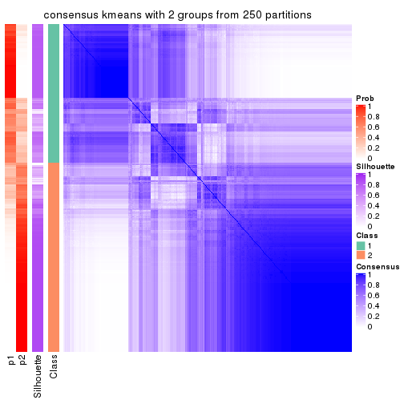</p>

</div>
<div id='tab-CV-kmeans-consensus-heatmap-2'>
<pre><code class="r">consensus_heatmap(res, k = 3)
</code></pre>

<p>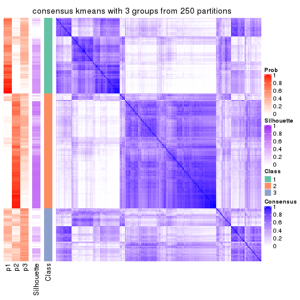</p>

</div>
<div id='tab-CV-kmeans-consensus-heatmap-3'>
<pre><code class="r">consensus_heatmap(res, k = 4)
</code></pre>

<p>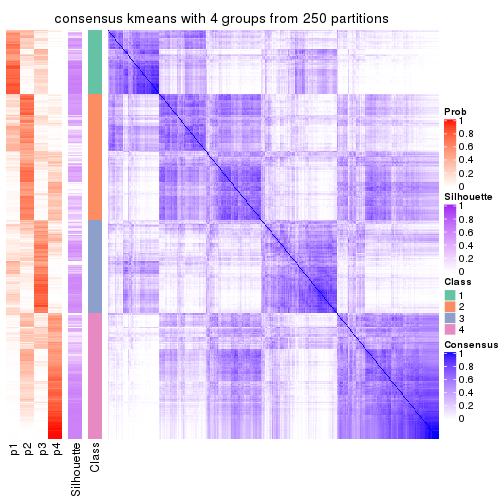</p>

</div>
<div id='tab-CV-kmeans-consensus-heatmap-4'>
<pre><code class="r">consensus_heatmap(res, k = 5)
</code></pre>

<p>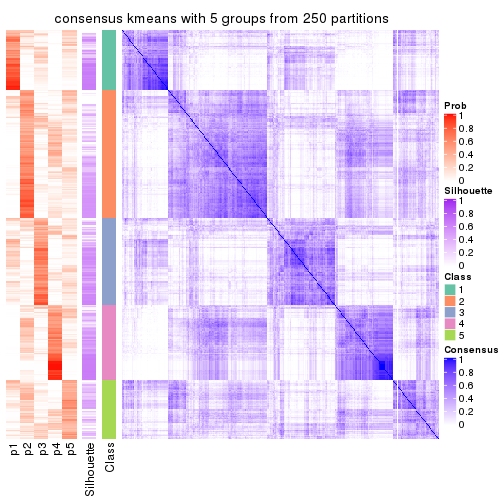</p>

</div>
<div id='tab-CV-kmeans-consensus-heatmap-5'>
<pre><code class="r">consensus_heatmap(res, k = 6)
</code></pre>

<p>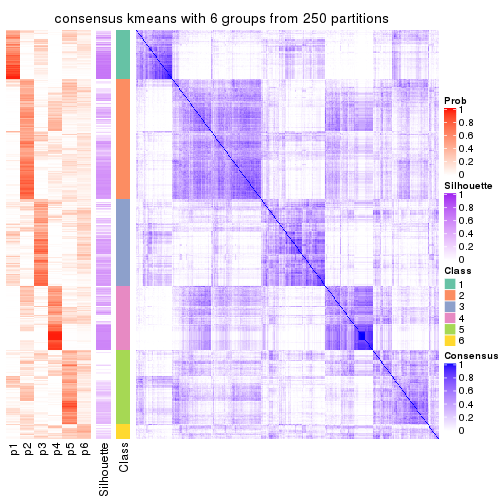</p>

</div>
</div>

Heatmaps for the membership of samples in all partitions to see how consistent they are:


<script>
$( function() {
	$( '#tabs-CV-kmeans-membership-heatmap' ).tabs();
} );
</script>
<div id='tabs-CV-kmeans-membership-heatmap'>
<ul>
<li><a href='#tab-CV-kmeans-membership-heatmap-1'>k = 2</a></li>
<li><a href='#tab-CV-kmeans-membership-heatmap-2'>k = 3</a></li>
<li><a href='#tab-CV-kmeans-membership-heatmap-3'>k = 4</a></li>
<li><a href='#tab-CV-kmeans-membership-heatmap-4'>k = 5</a></li>
<li><a href='#tab-CV-kmeans-membership-heatmap-5'>k = 6</a></li>
</ul>
<div id='tab-CV-kmeans-membership-heatmap-1'>
<pre><code class="r">membership_heatmap(res, k = 2)
</code></pre>

<p>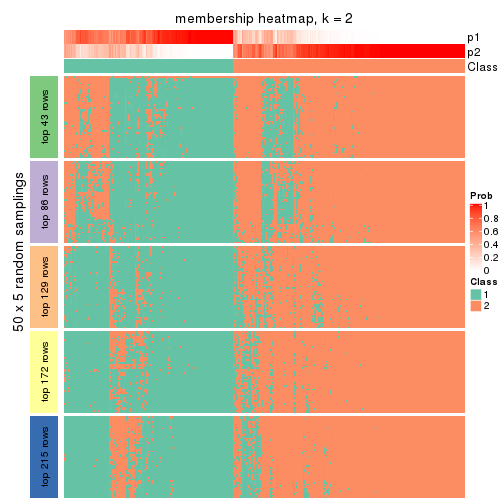</p>

</div>
<div id='tab-CV-kmeans-membership-heatmap-2'>
<pre><code class="r">membership_heatmap(res, k = 3)
</code></pre>

<p>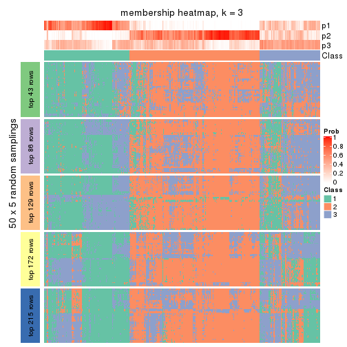</p>

</div>
<div id='tab-CV-kmeans-membership-heatmap-3'>
<pre><code class="r">membership_heatmap(res, k = 4)
</code></pre>

<p>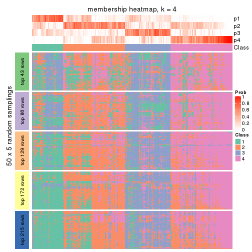</p>

</div>
<div id='tab-CV-kmeans-membership-heatmap-4'>
<pre><code class="r">membership_heatmap(res, k = 5)
</code></pre>

<p>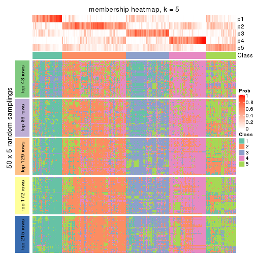</p>

</div>
<div id='tab-CV-kmeans-membership-heatmap-5'>
<pre><code class="r">membership_heatmap(res, k = 6)
</code></pre>

<p>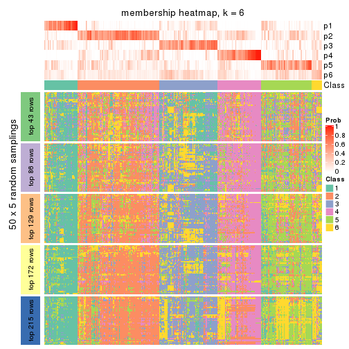</p>

</div>
</div>

As soon as we have had the classes for columns, we can look for signatures
which are significantly different between classes which can be candidate marks
for certain classes. Following are the heatmaps for signatures.


Signature heatmaps where rows are scaled:


<script>
$( function() {
	$( '#tabs-CV-kmeans-get-signatures' ).tabs();
} );
</script>
<div id='tabs-CV-kmeans-get-signatures'>
<ul>
<li><a href='#tab-CV-kmeans-get-signatures-1'>k = 2</a></li>
<li><a href='#tab-CV-kmeans-get-signatures-2'>k = 3</a></li>
<li><a href='#tab-CV-kmeans-get-signatures-3'>k = 4</a></li>
<li><a href='#tab-CV-kmeans-get-signatures-4'>k = 5</a></li>
<li><a href='#tab-CV-kmeans-get-signatures-5'>k = 6</a></li>
</ul>
<div id='tab-CV-kmeans-get-signatures-1'>
<pre><code class="r">get_signatures(res, k = 2)
</code></pre>

<p>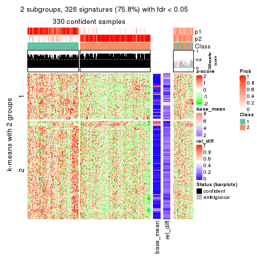</p>

</div>
<div id='tab-CV-kmeans-get-signatures-2'>
<pre><code class="r">get_signatures(res, k = 3)
</code></pre>

<p>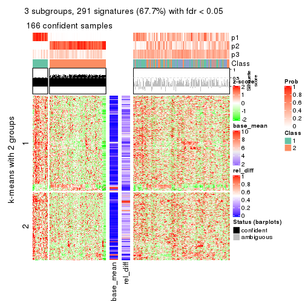</p>

</div>
<div id='tab-CV-kmeans-get-signatures-3'>
<pre><code class="r">get_signatures(res, k = 4)
</code></pre>

<p>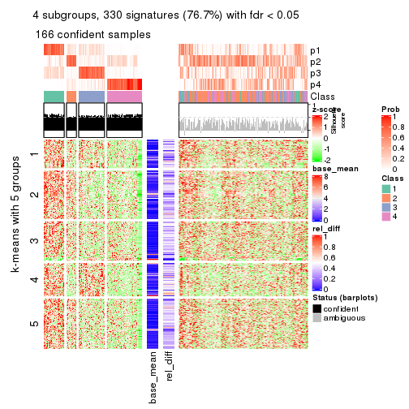</p>

</div>
<div id='tab-CV-kmeans-get-signatures-4'>
<pre><code class="r">get_signatures(res, k = 5)
</code></pre>

<p>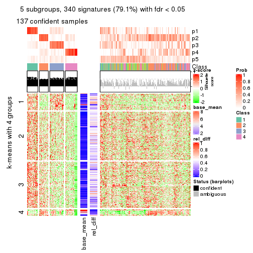</p>

</div>
<div id='tab-CV-kmeans-get-signatures-5'>
<pre><code class="r">get_signatures(res, k = 6)
</code></pre>

<p>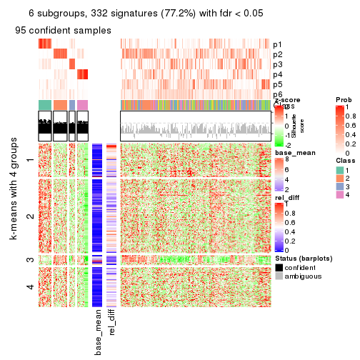</p>

</div>
</div>


Signature heatmaps where rows are not scaled:


<script>
$( function() {
	$( '#tabs-CV-kmeans-get-signatures-no-scale' ).tabs();
} );
</script>
<div id='tabs-CV-kmeans-get-signatures-no-scale'>
<ul>
<li><a href='#tab-CV-kmeans-get-signatures-no-scale-1'>k = 2</a></li>
<li><a href='#tab-CV-kmeans-get-signatures-no-scale-2'>k = 3</a></li>
<li><a href='#tab-CV-kmeans-get-signatures-no-scale-3'>k = 4</a></li>
<li><a href='#tab-CV-kmeans-get-signatures-no-scale-4'>k = 5</a></li>
<li><a href='#tab-CV-kmeans-get-signatures-no-scale-5'>k = 6</a></li>
</ul>
<div id='tab-CV-kmeans-get-signatures-no-scale-1'>
<pre><code class="r">get_signatures(res, k = 2, scale_rows = FALSE)
</code></pre>

<p>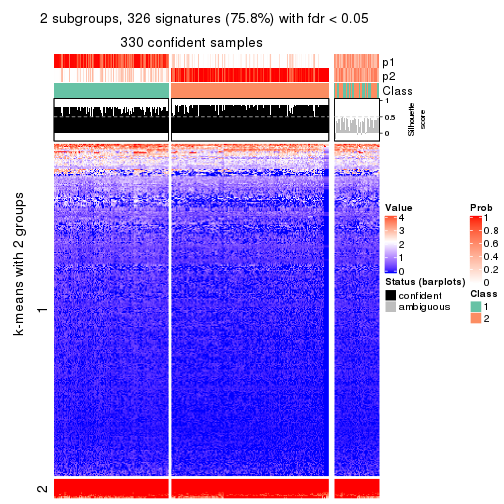</p>

</div>
<div id='tab-CV-kmeans-get-signatures-no-scale-2'>
<pre><code class="r">get_signatures(res, k = 3, scale_rows = FALSE)
</code></pre>

<p>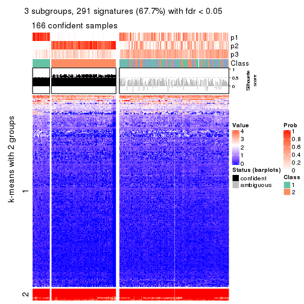</p>

</div>
<div id='tab-CV-kmeans-get-signatures-no-scale-3'>
<pre><code class="r">get_signatures(res, k = 4, scale_rows = FALSE)
</code></pre>

<p>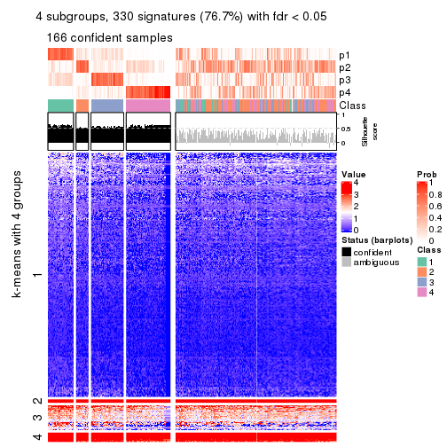</p>

</div>
<div id='tab-CV-kmeans-get-signatures-no-scale-4'>
<pre><code class="r">get_signatures(res, k = 5, scale_rows = FALSE)
</code></pre>

<p>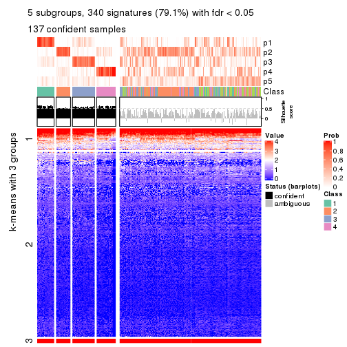</p>

</div>
<div id='tab-CV-kmeans-get-signatures-no-scale-5'>
<pre><code class="r">get_signatures(res, k = 6, scale_rows = FALSE)
</code></pre>

<p>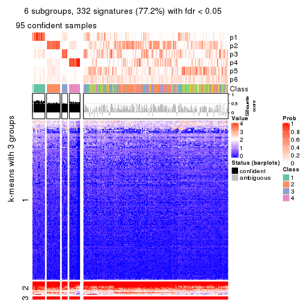</p>

</div>
</div>


Compare the overlap of signatures from different k:

```r
compare_signatures(res)
```

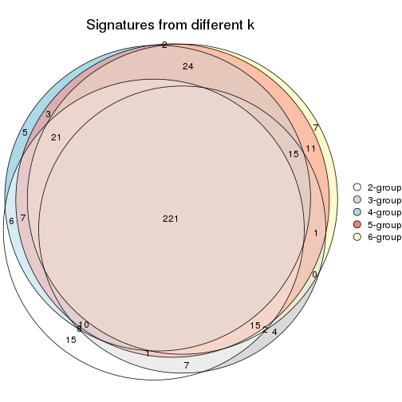

`get_signature()` returns a data frame invisibly. TO get the list of signatures, the function
call should be assigned to a variable explicitly. In following code, if `plot` argument is set
to `FALSE`, no heatmap is plotted while only the differential analysis is performed.

```r
# code only for demonstration
tb = get_signature(res, k = ..., plot = FALSE)
```

An example of the output of `tb` is:

```
#>   which_row         fdr    mean_1    mean_2 scaled_mean_1 scaled_mean_2 km
#> 1        38 0.042760348  8.373488  9.131774    -0.5533452     0.5164555  1
#> 2        40 0.018707592  7.106213  8.469186    -0.6173731     0.5762149  1
#> 3        55 0.019134737 10.221463 11.207825    -0.6159697     0.5749050  1
#> 4        59 0.006059896  5.921854  7.869574    -0.6899429     0.6439467  1
#> 5        60 0.018055526  8.928898 10.211722    -0.6204761     0.5791110  1
#> 6        98 0.009384629 15.714769 14.887706     0.6635654    -0.6193277  2
...
```

The columns in `tb` are:

1. `which_row`: row indices corresponding to the input matrix.
2. `fdr`: FDR for the differential test. 
3. `mean_x`: The mean value in group x.
4. `scaled_mean_x`: The mean value in group x after rows are scaled.
5. `km`: Row groups if k-means clustering is applied to rows.


UMAP plot which shows how samples are separated.


<script>
$( function() {
	$( '#tabs-CV-kmeans-dimension-reduction' ).tabs();
} );
</script>
<div id='tabs-CV-kmeans-dimension-reduction'>
<ul>
<li><a href='#tab-CV-kmeans-dimension-reduction-1'>k = 2</a></li>
<li><a href='#tab-CV-kmeans-dimension-reduction-2'>k = 3</a></li>
<li><a href='#tab-CV-kmeans-dimension-reduction-3'>k = 4</a></li>
<li><a href='#tab-CV-kmeans-dimension-reduction-4'>k = 5</a></li>
<li><a href='#tab-CV-kmeans-dimension-reduction-5'>k = 6</a></li>
</ul>
<div id='tab-CV-kmeans-dimension-reduction-1'>
<pre><code class="r">dimension_reduction(res, k = 2, method = &quot;UMAP&quot;)
</code></pre>

<p>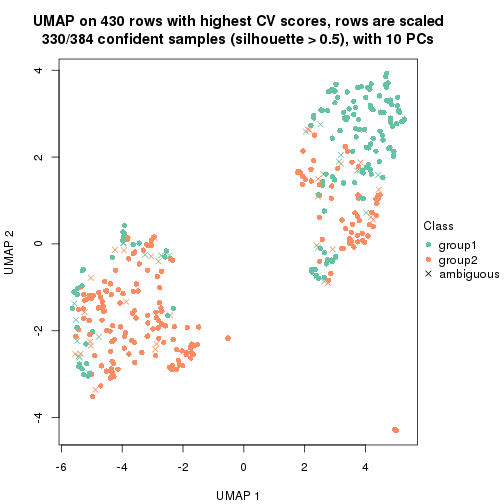</p>

</div>
<div id='tab-CV-kmeans-dimension-reduction-2'>
<pre><code class="r">dimension_reduction(res, k = 3, method = &quot;UMAP&quot;)
</code></pre>

<p>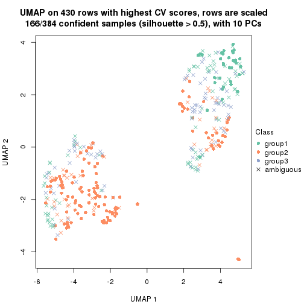</p>

</div>
<div id='tab-CV-kmeans-dimension-reduction-3'>
<pre><code class="r">dimension_reduction(res, k = 4, method = &quot;UMAP&quot;)
</code></pre>

<p>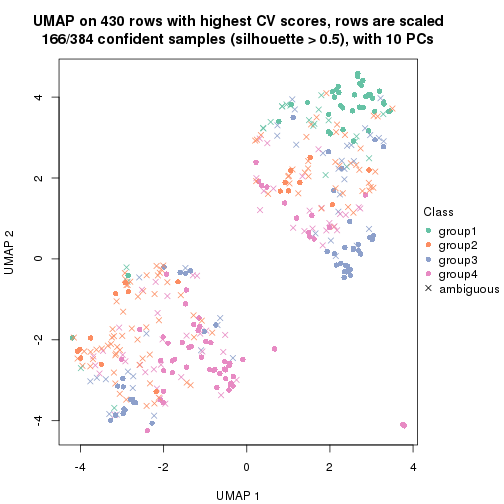</p>

</div>
<div id='tab-CV-kmeans-dimension-reduction-4'>
<pre><code class="r">dimension_reduction(res, k = 5, method = &quot;UMAP&quot;)
</code></pre>

<p>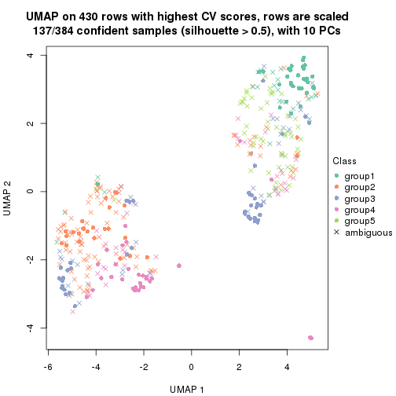</p>

</div>
<div id='tab-CV-kmeans-dimension-reduction-5'>
<pre><code class="r">dimension_reduction(res, k = 6, method = &quot;UMAP&quot;)
</code></pre>

<p>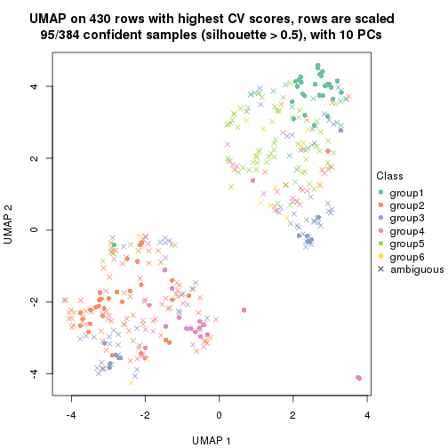</p>

</div>
</div>


Following heatmap shows how subgroups are split when increasing `k`:

```r
collect_classes(res)
```

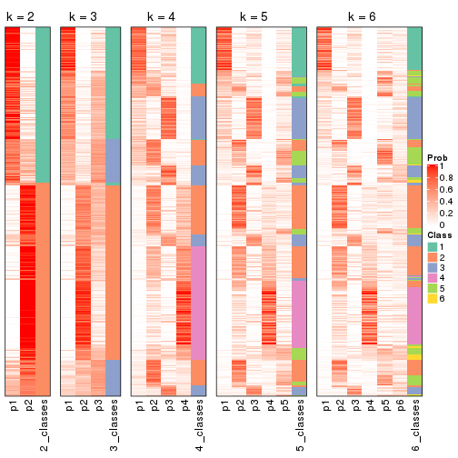


If matrix rows can be associated to genes, consider to use `GO_Enrichment(res,
...)` to perform function enrichment for the signature genes.


 

---------------------------------------------------


### CV:skmeans


The object with results only for a single top-value method and a single partition method 
can be extracted as:

```r
res = res_list["CV", "skmeans"]
# you can also extract it by
# res = res_list["CV:skmeans"]
```

A summary of `res` and all the functions that can be applied to it:

```r
res
```

```
#> A 'ConsensusPartition' object with k = 2, 3, 4, 5, 6.
#>   On a matrix with 430 rows and 384 columns.
#>   Top rows (43, 86, 129, 172, 215) are extracted by 'CV' method.
#>   Subgroups are detected by 'skmeans' method.
#>   Performed in total 1250 partitions by row resampling.
#>   Best k for subgroups seems to be 2.
#> 
#> Following methods can be applied to this 'ConsensusPartition' object:
#>  [1] "cola_report"             "collect_classes"         "collect_plots"          
#>  [4] "collect_stats"           "colnames"                "compare_signatures"     
#>  [7] "consensus_heatmap"       "dimension_reduction"     "functional_enrichment"  
#> [10] "get_anno_col"            "get_anno"                "get_classes"            
#> [13] "get_consensus"           "get_matrix"              "get_membership"         
#> [16] "get_param"               "get_signatures"          "get_stats"              
#> [19] "is_best_k"               "is_stable_k"             "membership_heatmap"     
#> [22] "ncol"                    "nrow"                    "plot_ecdf"              
#> [25] "rownames"                "select_partition_number" "show"                   
#> [28] "suggest_best_k"          "test_to_known_factors"
```

`collect_plots()` function collects all the plots made from `res` for all `k` (number of partitions)
into one single page to provide an easy and fast comparison between different `k`.

```r
collect_plots(res)
```

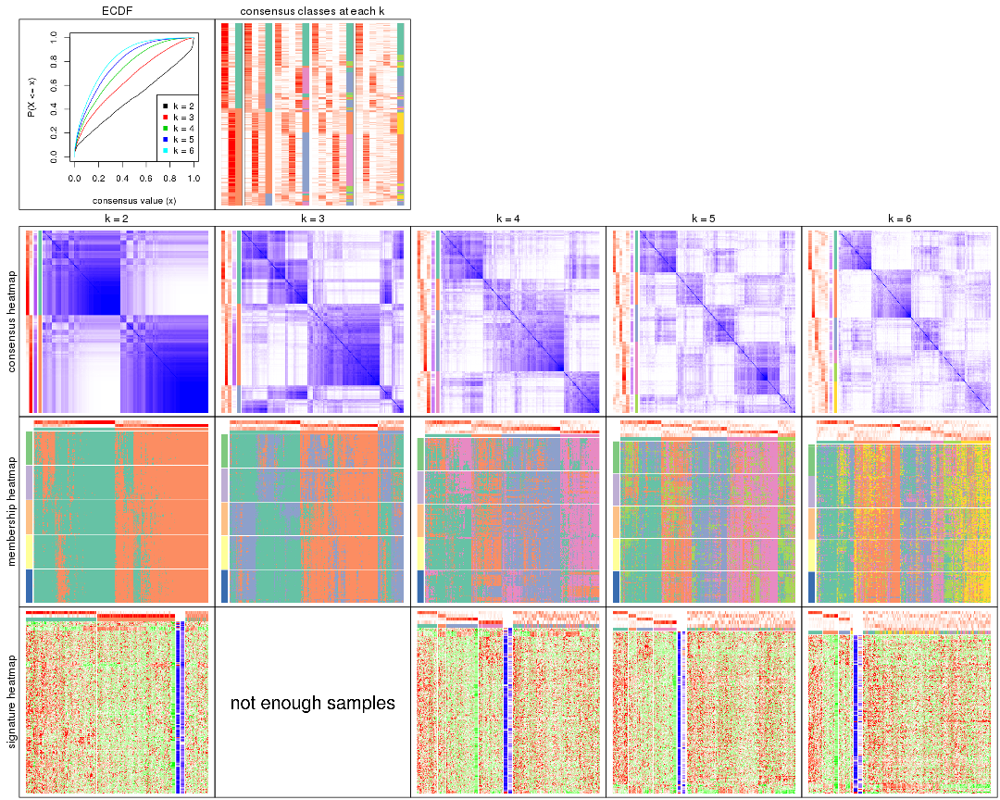

The plots are:

- The first row: a plot of the ECDF (Empirical cumulative distribution
  function) curves of the consensus matrix for each `k` and the heatmap of
  predicted classes for each `k`.
- The second row: heatmaps of the consensus matrix for each `k`.
- The third row: heatmaps of the membership matrix for each `k`.
- The fouth row: heatmaps of the signatures for each `k`.

All the plots in panels can be made by individual functions and they are
plotted later in this section.

`select_partition_number()` produces several plots showing different
statistics for choosing "optimized" `k`. There are following statistics:

- ECDF curves of the consensus matrix for each `k`;
- 1-PAC. [The PAC
  score](https://en.wikipedia.org/wiki/Consensus_clustering#Over-interpretation_potential_of_consensus_clustering)
  measures the proportion of the ambiguous subgrouping.
- Mean silhouette score.
- Concordance. The mean probability of fiting the consensus class ids in all
  partitions.
- Area increased. Denote $A_k$ as the area under the ECDF curve for current
  `k`, the area increased is defined as $A_k - A_{k-1}$.
- Rand index. The percent of pairs of samples that are both in a same cluster
  or both are not in a same cluster in the partition of k and k-1.
- Jaccard index. The ratio of pairs of samples are both in a same cluster in
  the partition of k and k-1 and the pairs of samples are both in a same
  cluster in the partition k or k-1.

The detailed explanations of these statistics can be found in [the cola
vignette](http://bioconductor.org/packages/devel/bioc/vignettes/cola/inst/doc/cola.html#toc_13).

Generally speaking, lower PAC score, higher mean silhouette score or higher
concordance corresponds to better partition. Rand index and Jaccard index
measure how similar the current partition is compared to partition with `k-1`.
If they are too similar, we won't accept `k` is better than `k-1`.

```r
select_partition_number(res)
```

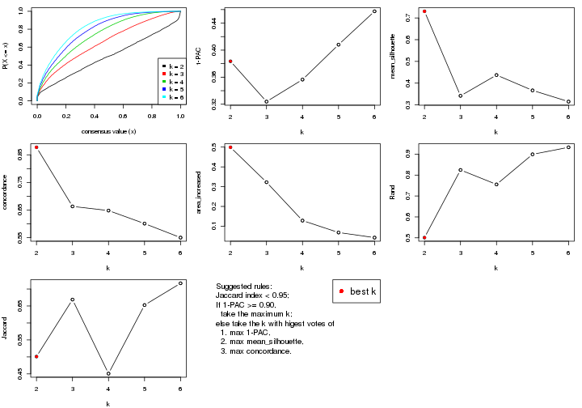

The numeric values for all these statistics can be obtained by `get_stats()`.

```r
get_stats(res)
```

```
#>   k 1-PAC mean_silhouette concordance area_increased  Rand Jaccard
#> 2 2 0.383           0.730       0.877         0.4990 0.501   0.501
#> 3 3 0.324           0.342       0.663         0.3224 0.824   0.669
#> 4 4 0.356           0.437       0.648         0.1283 0.755   0.451
#> 5 5 0.408           0.367       0.601         0.0680 0.899   0.653
#> 6 6 0.457           0.315       0.550         0.0422 0.933   0.717
```

`suggest_best_k()` suggests the best $k$ based on these statistics. The rules are as follows:

- All $k$ with Jaccard index larger than 0.95 are removed because the increase of
  the partition number does not provides enough extra information. If all $k$ are removed,
  the best $k$ is assigned by `NA`.
- For $k$ with 1-PAC larger than 0.9, the maximal $k$ is taken as the "best k". Other $k$ is called "optional k".
- If it does not fit the second rule. The $k$ with the highest vote of highest
  1-PAC, mean silhouette and concordance is taken as the "best k".

```r
suggest_best_k(res)
```

```
#> [1] 2
```


Following shows the table of the partitions (You need to click the **show/hide
code output** link to see it). The membership matrix (columns with name `p*`)
is inferred by
[`clue::cl_consensus()`](https://www.rdocumentation.org/link/cl_consensus?package=clue)
function with the `SE` method. Basically the value in the membership matrix
represents the probability to belong to a certain group. The finall class
label for an item is determined with the group with highest probability it
belongs to.

In `get_classes()` function, the entropy is calculated from the membership
matrix and the silhouette score is calculated from the consensus matrix.


<script>
$( function() {
	$( '#tabs-CV-skmeans-get-classes' ).tabs();
} );
</script>
<div id='tabs-CV-skmeans-get-classes'>
<ul>
<li><a href='#tab-CV-skmeans-get-classes-1'>k = 2</a></li>
<li><a href='#tab-CV-skmeans-get-classes-2'>k = 3</a></li>
<li><a href='#tab-CV-skmeans-get-classes-3'>k = 4</a></li>
<li><a href='#tab-CV-skmeans-get-classes-4'>k = 5</a></li>
<li><a href='#tab-CV-skmeans-get-classes-5'>k = 6</a></li>
</ul>

<div id='tab-CV-skmeans-get-classes-1'>
<p><a id='tab-CV-skmeans-get-classes-1-a' style='color:#0366d6' href='#'>show/hide code output</a></p>
<pre><code class="r">cbind(get_classes(res, k = 2), get_membership(res, k = 2))
</code></pre>

<pre><code>#&gt;            class entropy silhouette    p1    p2
#&gt; SRR2105277     1  0.8555     0.6320 0.720 0.280
#&gt; SRR2105278     1  0.7602     0.7059 0.780 0.220
#&gt; SRR2105275     1  0.5737     0.7781 0.864 0.136
#&gt; SRR2105276     1  0.1184     0.8406 0.984 0.016
#&gt; SRR2105273     1  0.9427     0.4915 0.640 0.360
#&gt; SRR2105274     1  0.2236     0.8398 0.964 0.036
#&gt; SRR2105271     1  0.8909     0.6032 0.692 0.308
#&gt; SRR2105272     1  0.0000     0.8408 1.000 0.000
#&gt; SRR2105269     2  0.0000     0.8596 0.000 1.000
#&gt; SRR2105270     2  0.1184     0.8588 0.016 0.984
#&gt; SRR2105267     2  0.0000     0.8596 0.000 1.000
#&gt; SRR2105268     2  0.0000     0.8596 0.000 1.000
#&gt; SRR2105265     2  0.0000     0.8596 0.000 1.000
#&gt; SRR2105266     2  0.5059     0.8032 0.112 0.888
#&gt; SRR2105263     1  0.7219     0.7066 0.800 0.200
#&gt; SRR2105264     1  0.0000     0.8408 1.000 0.000
#&gt; SRR2105261     2  0.9635     0.3607 0.388 0.612
#&gt; SRR2105262     2  0.9754     0.2733 0.408 0.592
#&gt; SRR2105357     2  0.0000     0.8596 0.000 1.000
#&gt; SRR2105358     1  0.9866     0.3135 0.568 0.432
#&gt; SRR2105439     2  0.4939     0.8062 0.108 0.892
#&gt; SRR2105440     2  0.4690     0.8097 0.100 0.900
#&gt; SRR2105509     2  0.0000     0.8596 0.000 1.000
#&gt; SRR2105510     2  0.0000     0.8596 0.000 1.000
#&gt; SRR2105507     2  0.9358     0.4654 0.352 0.648
#&gt; SRR2105508     2  0.7376     0.7165 0.208 0.792
#&gt; SRR2105505     1  0.8861     0.5914 0.696 0.304
#&gt; SRR2105506     1  0.6531     0.7598 0.832 0.168
#&gt; SRR2105503     2  0.9248     0.4874 0.340 0.660
#&gt; SRR2105504     2  0.0000     0.8596 0.000 1.000
#&gt; SRR2105501     2  0.0000     0.8596 0.000 1.000
#&gt; SRR2105502     2  0.0000     0.8596 0.000 1.000
#&gt; SRR2105499     1  0.0376     0.8411 0.996 0.004
#&gt; SRR2105500     1  0.4022     0.8259 0.920 0.080
#&gt; SRR2105497     2  0.8955     0.5372 0.312 0.688
#&gt; SRR2105498     1  0.8207     0.6484 0.744 0.256
#&gt; SRR2105495     2  0.0000     0.8596 0.000 1.000
#&gt; SRR2105496     2  0.3879     0.8381 0.076 0.924
#&gt; SRR2105493     2  0.0376     0.8594 0.004 0.996
#&gt; SRR2105494     2  0.3584     0.8387 0.068 0.932
#&gt; SRR2105491     1  0.2948     0.8289 0.948 0.052
#&gt; SRR2105492     1  0.0376     0.8408 0.996 0.004
#&gt; SRR2105489     1  0.8661     0.5669 0.712 0.288
#&gt; SRR2105490     1  0.7376     0.7352 0.792 0.208
#&gt; SRR2105487     1  0.0376     0.8412 0.996 0.004
#&gt; SRR2105488     1  0.2778     0.8363 0.952 0.048
#&gt; SRR2105485     2  0.9833     0.1925 0.424 0.576
#&gt; SRR2105486     1  0.5946     0.7866 0.856 0.144
#&gt; SRR2105483     1  0.0000     0.8408 1.000 0.000
#&gt; SRR2105484     1  0.0000     0.8408 1.000 0.000
#&gt; SRR2105481     1  0.2236     0.8403 0.964 0.036
#&gt; SRR2105482     1  0.0376     0.8413 0.996 0.004
#&gt; SRR2105479     1  0.3733     0.8204 0.928 0.072
#&gt; SRR2105480     1  0.0000     0.8408 1.000 0.000
#&gt; SRR2105477     1  0.5629     0.7814 0.868 0.132
#&gt; SRR2105478     1  0.5946     0.7803 0.856 0.144
#&gt; SRR2105475     2  0.0000     0.8596 0.000 1.000
#&gt; SRR2105476     2  0.0376     0.8595 0.004 0.996
#&gt; SRR2105473     1  0.8016     0.6748 0.756 0.244
#&gt; SRR2105474     1  0.8608     0.6206 0.716 0.284
#&gt; SRR2105471     1  0.0938     0.8414 0.988 0.012
#&gt; SRR2105472     1  0.0938     0.8414 0.988 0.012
#&gt; SRR2105469     2  0.1414     0.8568 0.020 0.980
#&gt; SRR2105470     1  0.9044     0.5782 0.680 0.320
#&gt; SRR2105467     1  0.1843     0.8399 0.972 0.028
#&gt; SRR2105468     1  0.6887     0.7497 0.816 0.184
#&gt; SRR2105465     1  0.6887     0.7520 0.816 0.184
#&gt; SRR2105466     1  0.0000     0.8408 1.000 0.000
#&gt; SRR2105463     1  0.0376     0.8414 0.996 0.004
#&gt; SRR2105464     1  0.0000     0.8408 1.000 0.000
#&gt; SRR2105461     2  0.0000     0.8596 0.000 1.000
#&gt; SRR2105462     2  0.0672     0.8596 0.008 0.992
#&gt; SRR2105459     2  0.0000     0.8596 0.000 1.000
#&gt; SRR2105460     2  0.0000     0.8596 0.000 1.000
#&gt; SRR2105457     2  0.0000     0.8596 0.000 1.000
#&gt; SRR2105458     2  0.0000     0.8596 0.000 1.000
#&gt; SRR2105455     2  0.0000     0.8596 0.000 1.000
#&gt; SRR2105456     2  0.8443     0.6074 0.272 0.728
#&gt; SRR2105453     1  0.7528     0.7117 0.784 0.216
#&gt; SRR2105454     1  0.6148     0.7740 0.848 0.152
#&gt; SRR2105451     2  0.0000     0.8596 0.000 1.000
#&gt; SRR2105452     2  0.0000     0.8596 0.000 1.000
#&gt; SRR2105449     1  0.0938     0.8403 0.988 0.012
#&gt; SRR2105450     1  0.0000     0.8408 1.000 0.000
#&gt; SRR2105447     2  0.0000     0.8596 0.000 1.000
#&gt; SRR2105448     2  0.0376     0.8595 0.004 0.996
#&gt; SRR2105445     2  0.0938     0.8597 0.012 0.988
#&gt; SRR2105446     2  0.2603     0.8499 0.044 0.956
#&gt; SRR2105443     2  0.0000     0.8596 0.000 1.000
#&gt; SRR2105444     2  0.9795     0.2131 0.416 0.584
#&gt; SRR2105441     2  0.9963     0.0796 0.464 0.536
#&gt; SRR2105442     1  0.1633     0.8412 0.976 0.024
#&gt; SRR2105437     1  0.0000     0.8408 1.000 0.000
#&gt; SRR2105438     1  0.0000     0.8408 1.000 0.000
#&gt; SRR2105435     1  0.9686     0.3924 0.604 0.396
#&gt; SRR2105436     1  0.3733     0.8246 0.928 0.072
#&gt; SRR2105433     1  0.0376     0.8414 0.996 0.004
#&gt; SRR2105434     1  0.0376     0.8411 0.996 0.004
#&gt; SRR2105431     1  0.0376     0.8412 0.996 0.004
#&gt; SRR2105432     1  0.0000     0.8408 1.000 0.000
#&gt; SRR2105429     1  0.6623     0.7422 0.828 0.172
#&gt; SRR2105430     1  0.9881     0.2961 0.564 0.436
#&gt; SRR2105427     2  0.0000     0.8596 0.000 1.000
#&gt; SRR2105428     2  0.4562     0.8185 0.096 0.904
#&gt; SRR2105425     2  0.1414     0.8589 0.020 0.980
#&gt; SRR2105426     2  0.9552     0.4067 0.376 0.624
#&gt; SRR2105421     2  0.0000     0.8596 0.000 1.000
#&gt; SRR2105422     2  0.1184     0.8593 0.016 0.984
#&gt; SRR2105423     2  0.0000     0.8596 0.000 1.000
#&gt; SRR2105424     2  0.0672     0.8594 0.008 0.992
#&gt; SRR2105419     2  0.0000     0.8596 0.000 1.000
#&gt; SRR2105420     2  0.1633     0.8579 0.024 0.976
#&gt; SRR2105415     1  0.0000     0.8408 1.000 0.000
#&gt; SRR2105416     1  0.0000     0.8408 1.000 0.000
#&gt; SRR2105417     1  0.5408     0.8046 0.876 0.124
#&gt; SRR2105418     1  0.0000     0.8408 1.000 0.000
#&gt; SRR2105413     2  0.0000     0.8596 0.000 1.000
#&gt; SRR2105414     2  0.0000     0.8596 0.000 1.000
#&gt; SRR2105409     1  0.9963     0.0991 0.536 0.464
#&gt; SRR2105410     1  0.0938     0.8416 0.988 0.012
#&gt; SRR2105411     2  0.2948     0.8451 0.052 0.948
#&gt; SRR2105412     2  0.8499     0.5879 0.276 0.724
#&gt; SRR2105407     2  0.2603     0.8486 0.044 0.956
#&gt; SRR2105408     2  0.0000     0.8596 0.000 1.000
#&gt; SRR2105403     2  0.4690     0.8080 0.100 0.900
#&gt; SRR2105404     2  0.9710     0.2639 0.400 0.600
#&gt; SRR2105405     2  0.1843     0.8568 0.028 0.972
#&gt; SRR2105406     1  0.8861     0.5888 0.696 0.304
#&gt; SRR2105401     2  0.0000     0.8596 0.000 1.000
#&gt; SRR2105402     2  0.0000     0.8596 0.000 1.000
#&gt; SRR2105399     2  0.0000     0.8596 0.000 1.000
#&gt; SRR2105400     2  0.0000     0.8596 0.000 1.000
#&gt; SRR2105397     2  0.0672     0.8599 0.008 0.992
#&gt; SRR2105398     2  0.3584     0.8351 0.068 0.932
#&gt; SRR2105395     2  0.9795     0.3113 0.416 0.584
#&gt; SRR2105396     1  0.9460     0.4910 0.636 0.364
#&gt; SRR2105393     2  0.2423     0.8525 0.040 0.960
#&gt; SRR2105394     2  0.1633     0.8570 0.024 0.976
#&gt; SRR2105389     2  0.7376     0.7296 0.208 0.792
#&gt; SRR2105390     1  0.9358     0.4409 0.648 0.352
#&gt; SRR2105391     2  0.0000     0.8596 0.000 1.000
#&gt; SRR2105392     2  0.4562     0.8264 0.096 0.904
#&gt; SRR2105385     1  0.3431     0.8251 0.936 0.064
#&gt; SRR2105386     2  1.0000     0.0541 0.496 0.504
#&gt; SRR2105387     2  0.5629     0.7963 0.132 0.868
#&gt; SRR2105388     1  0.9775     0.3597 0.588 0.412
#&gt; SRR2105381     2  0.0000     0.8596 0.000 1.000
#&gt; SRR2105382     2  0.5842     0.7730 0.140 0.860
#&gt; SRR2105383     2  0.7299     0.7099 0.204 0.796
#&gt; SRR2105384     1  0.9000     0.5776 0.684 0.316
#&gt; SRR2105379     2  0.5737     0.7775 0.136 0.864
#&gt; SRR2105380     1  0.9993     0.0285 0.516 0.484
#&gt; SRR2105377     2  0.9323     0.4144 0.348 0.652
#&gt; SRR2105378     1  0.0000     0.8408 1.000 0.000
#&gt; SRR2105375     1  0.9170     0.5674 0.668 0.332
#&gt; SRR2105376     1  0.8955     0.5741 0.688 0.312
#&gt; SRR2105373     1  0.4161     0.8258 0.916 0.084
#&gt; SRR2105374     1  0.0000     0.8408 1.000 0.000
#&gt; SRR2105371     2  0.0000     0.8596 0.000 1.000
#&gt; SRR2105372     2  0.1184     0.8581 0.016 0.984
#&gt; SRR2105369     2  0.1633     0.8563 0.024 0.976
#&gt; SRR2105370     1  0.9977     0.1846 0.528 0.472
#&gt; SRR2105367     1  0.6148     0.7764 0.848 0.152
#&gt; SRR2105368     1  0.0376     0.8414 0.996 0.004
#&gt; SRR2105365     1  0.8813     0.5408 0.700 0.300
#&gt; SRR2105366     1  0.8661     0.5649 0.712 0.288
#&gt; SRR2105363     2  0.0938     0.8591 0.012 0.988
#&gt; SRR2105364     2  0.6438     0.7599 0.164 0.836
#&gt; SRR2105361     2  0.0000     0.8596 0.000 1.000
#&gt; SRR2105362     2  0.3879     0.8314 0.076 0.924
#&gt; SRR2105359     2  0.9944     0.0916 0.456 0.544
#&gt; SRR2105360     2  0.3431     0.8385 0.064 0.936
#&gt; SRR2105355     2  0.5408     0.7882 0.124 0.876
#&gt; SRR2105356     1  0.9896     0.2865 0.560 0.440
#&gt; SRR2105353     2  0.8861     0.5592 0.304 0.696
#&gt; SRR2105354     1  0.3584     0.8303 0.932 0.068
#&gt; SRR2105351     2  0.8327     0.6264 0.264 0.736
#&gt; SRR2105352     2  0.0000     0.8596 0.000 1.000
#&gt; SRR2105349     2  0.5294     0.7940 0.120 0.880
#&gt; SRR2105350     2  0.3114     0.8459 0.056 0.944
#&gt; SRR2105345     2  0.0938     0.8589 0.012 0.988
#&gt; SRR2105346     2  0.9963     0.0624 0.464 0.536
#&gt; SRR2105347     1  0.1843     0.8393 0.972 0.028
#&gt; SRR2105348     1  0.5408     0.7990 0.876 0.124
#&gt; SRR2105343     2  0.0000     0.8596 0.000 1.000
#&gt; SRR2105344     2  0.0000     0.8596 0.000 1.000
#&gt; SRR2105341     2  0.7883     0.6894 0.236 0.764
#&gt; SRR2105342     2  0.7528     0.6780 0.216 0.784
#&gt; SRR2105339     2  0.8955     0.5442 0.312 0.688
#&gt; SRR2105340     1  0.6887     0.7399 0.816 0.184
#&gt; SRR2105335     1  0.5737     0.7943 0.864 0.136
#&gt; SRR2105336     1  0.0376     0.8414 0.996 0.004
#&gt; SRR2105337     1  0.8713     0.5734 0.708 0.292
#&gt; SRR2105338     1  0.0376     0.8413 0.996 0.004
#&gt; SRR2105331     2  0.9522     0.4169 0.372 0.628
#&gt; SRR2105332     1  0.9686     0.3084 0.604 0.396
#&gt; SRR2105333     2  0.0376     0.8594 0.004 0.996
#&gt; SRR2105334     2  0.0376     0.8595 0.004 0.996
#&gt; SRR2105329     2  0.0000     0.8596 0.000 1.000
#&gt; SRR2105330     2  0.2948     0.8466 0.052 0.948
#&gt; SRR2105327     2  0.0938     0.8583 0.012 0.988
#&gt; SRR2105328     2  0.4562     0.8132 0.096 0.904
#&gt; SRR2105325     1  0.0000     0.8408 1.000 0.000
#&gt; SRR2105326     1  0.0000     0.8408 1.000 0.000
#&gt; SRR2105323     2  0.1843     0.8557 0.028 0.972
#&gt; SRR2105324     2  0.8909     0.5104 0.308 0.692
#&gt; SRR2105319     1  0.0000     0.8408 1.000 0.000
#&gt; SRR2105320     1  0.0000     0.8408 1.000 0.000
#&gt; SRR2105321     1  0.7674     0.6829 0.776 0.224
#&gt; SRR2105322     1  0.0000     0.8408 1.000 0.000
#&gt; SRR2105317     2  0.0000     0.8596 0.000 1.000
#&gt; SRR2105318     2  0.0000     0.8596 0.000 1.000
#&gt; SRR2105315     2  0.0000     0.8596 0.000 1.000
#&gt; SRR2105316     2  0.0000     0.8596 0.000 1.000
#&gt; SRR2105313     2  0.0000     0.8596 0.000 1.000
#&gt; SRR2105314     2  0.0000     0.8596 0.000 1.000
#&gt; SRR2105311     2  0.9954     0.1746 0.460 0.540
#&gt; SRR2105312     1  0.7139     0.7085 0.804 0.196
#&gt; SRR2105307     1  0.4431     0.8175 0.908 0.092
#&gt; SRR2105308     1  0.8955     0.5731 0.688 0.312
#&gt; SRR2105309     2  0.0000     0.8596 0.000 1.000
#&gt; SRR2105310     2  0.9427     0.3883 0.360 0.640
#&gt; SRR2105305     2  0.0000     0.8596 0.000 1.000
#&gt; SRR2105306     2  0.0672     0.8593 0.008 0.992
#&gt; SRR2105303     2  0.0938     0.8585 0.012 0.988
#&gt; SRR2105304     2  0.0000     0.8596 0.000 1.000
#&gt; SRR2105301     2  0.9209     0.5153 0.336 0.664
#&gt; SRR2105302     2  0.0938     0.8592 0.012 0.988
#&gt; SRR2105299     2  0.9963     0.1739 0.464 0.536
#&gt; SRR2105300     2  0.7219     0.7128 0.200 0.800
#&gt; SRR2105297     1  0.0376     0.8413 0.996 0.004
#&gt; SRR2105298     1  0.0000     0.8408 1.000 0.000
#&gt; SRR2105295     2  0.0000     0.8596 0.000 1.000
#&gt; SRR2105296     2  0.7602     0.6891 0.220 0.780
#&gt; SRR2105293     2  0.9881     0.2551 0.436 0.564
#&gt; SRR2105294     1  0.0000     0.8408 1.000 0.000
#&gt; SRR2105291     2  0.7815     0.6734 0.232 0.768
#&gt; SRR2105292     1  0.0000     0.8408 1.000 0.000
#&gt; SRR2105289     2  0.1184     0.8589 0.016 0.984
#&gt; SRR2105290     1  0.2043     0.8385 0.968 0.032
#&gt; SRR2105287     1  0.5178     0.8066 0.884 0.116
#&gt; SRR2105288     1  0.0376     0.8414 0.996 0.004
#&gt; SRR2105285     2  0.0000     0.8596 0.000 1.000
#&gt; SRR2105286     2  0.3733     0.8391 0.072 0.928
#&gt; SRR2105283     1  0.9661     0.3296 0.608 0.392
#&gt; SRR2105284     1  0.9087     0.5579 0.676 0.324
#&gt; SRR2105281     2  0.4939     0.8114 0.108 0.892
#&gt; SRR2105282     2  0.1843     0.8561 0.028 0.972
#&gt; SRR2105259     2  0.0000     0.8596 0.000 1.000
#&gt; SRR2105260     2  0.0000     0.8596 0.000 1.000
#&gt; SRR2105279     2  0.0000     0.8596 0.000 1.000
#&gt; SRR2105280     2  0.2603     0.8490 0.044 0.956
#&gt; SRR2105257     1  0.0000     0.8408 1.000 0.000
#&gt; SRR2105258     1  0.0000     0.8408 1.000 0.000
#&gt; SRR2105253     2  0.3879     0.8298 0.076 0.924
#&gt; SRR2105254     2  0.0376     0.8593 0.004 0.996
#&gt; SRR2105255     1  0.9996     0.1318 0.512 0.488
#&gt; SRR2105256     1  0.9209     0.5332 0.664 0.336
#&gt; SRR2105251     2  0.6801     0.7492 0.180 0.820
#&gt; SRR2105252     2  0.8016     0.6543 0.244 0.756
#&gt; SRR2105249     2  0.0000     0.8596 0.000 1.000
#&gt; SRR2105250     1  0.9580     0.4389 0.620 0.380
#&gt; SRR2105247     2  0.7745     0.6817 0.228 0.772
#&gt; SRR2105248     1  0.8443     0.6005 0.728 0.272
#&gt; SRR2105245     1  0.2778     0.8351 0.952 0.048
#&gt; SRR2105246     2  0.7950     0.6431 0.240 0.760
#&gt; SRR2105243     2  0.7674     0.6681 0.224 0.776
#&gt; SRR2105244     1  0.4022     0.8204 0.920 0.080
#&gt; SRR2105241     1  0.8207     0.6595 0.744 0.256
#&gt; SRR2105242     1  0.0376     0.8413 0.996 0.004
#&gt; SRR2105239     2  0.8144     0.6387 0.252 0.748
#&gt; SRR2105240     1  0.0000     0.8408 1.000 0.000
#&gt; SRR2105237     2  0.1414     0.8565 0.020 0.980
#&gt; SRR2105238     2  0.1414     0.8570 0.020 0.980
#&gt; SRR2105235     2  0.1633     0.8554 0.024 0.976
#&gt; SRR2105236     2  0.9909     0.1329 0.444 0.556
#&gt; SRR2105233     2  0.0000     0.8596 0.000 1.000
#&gt; SRR2105234     2  0.0000     0.8596 0.000 1.000
#&gt; SRR2105231     2  0.8207     0.6422 0.256 0.744
#&gt; SRR2105232     2  0.9988     0.1030 0.480 0.520
#&gt; SRR2105227     2  0.9686     0.3693 0.396 0.604
#&gt; SRR2105228     2  0.9323     0.4228 0.348 0.652
#&gt; SRR2105225     1  0.9933     0.2635 0.548 0.452
#&gt; SRR2105226     1  0.5946     0.7828 0.856 0.144
#&gt; SRR2105229     2  0.3114     0.8448 0.056 0.944
#&gt; SRR2105230     1  0.6148     0.7770 0.848 0.152
#&gt; SRR2105219     2  0.0000     0.8596 0.000 1.000
#&gt; SRR2105220     2  0.2778     0.8489 0.048 0.952
#&gt; SRR2105221     1  0.9209     0.5400 0.664 0.336
#&gt; SRR2105222     1  0.0000     0.8408 1.000 0.000
#&gt; SRR2105223     1  0.5408     0.7964 0.876 0.124
#&gt; SRR2105224     1  0.0938     0.8408 0.988 0.012
#&gt; SRR2105217     1  0.5842     0.7681 0.860 0.140
#&gt; SRR2105218     1  0.2778     0.8373 0.952 0.048
#&gt; SRR2105215     2  0.2778     0.8489 0.048 0.952
#&gt; SRR2105216     2  0.0000     0.8596 0.000 1.000
#&gt; SRR2105213     1  0.5946     0.7718 0.856 0.144
#&gt; SRR2105214     1  0.9963     0.1229 0.536 0.464
#&gt; SRR2105211     2  0.4161     0.8239 0.084 0.916
#&gt; SRR2105212     2  0.5408     0.8060 0.124 0.876
#&gt; SRR2105209     1  0.4939     0.8100 0.892 0.108
#&gt; SRR2105210     1  0.0000     0.8408 1.000 0.000
#&gt; SRR2105207     1  0.6712     0.7546 0.824 0.176
#&gt; SRR2105208     1  0.0376     0.8413 0.996 0.004
#&gt; SRR2105205     2  0.9460     0.4360 0.364 0.636
#&gt; SRR2105206     1  0.7056     0.7163 0.808 0.192
#&gt; SRR2105201     2  0.6712     0.7404 0.176 0.824
#&gt; SRR2105202     1  0.9954     0.2292 0.540 0.460
#&gt; SRR2105203     2  0.0938     0.8591 0.012 0.988
#&gt; SRR2105204     2  0.1414     0.8576 0.020 0.980
#&gt; SRR2105199     2  0.8443     0.5927 0.272 0.728
#&gt; SRR2105200     1  0.6438     0.7657 0.836 0.164
#&gt; SRR2105197     1  0.9580     0.4429 0.620 0.380
#&gt; SRR2105198     1  0.3584     0.8295 0.932 0.068
#&gt; SRR2105195     1  0.2778     0.8340 0.952 0.048
#&gt; SRR2105196     1  0.0000     0.8408 1.000 0.000
#&gt; SRR2105193     1  0.0000     0.8408 1.000 0.000
#&gt; SRR2105194     1  0.0000     0.8408 1.000 0.000
#&gt; SRR2105191     2  0.5178     0.8018 0.116 0.884
#&gt; SRR2105192     1  0.0000     0.8408 1.000 0.000
#&gt; SRR2105189     2  0.1633     0.8552 0.024 0.976
#&gt; SRR2105190     2  0.0000     0.8596 0.000 1.000
#&gt; SRR2105187     1  0.9170     0.5188 0.668 0.332
#&gt; SRR2105188     1  0.0672     0.8413 0.992 0.008
#&gt; SRR2105179     1  0.1414     0.8413 0.980 0.020
#&gt; SRR2105180     1  0.0000     0.8408 1.000 0.000
#&gt; SRR2105183     2  0.5629     0.7876 0.132 0.868
#&gt; SRR2105184     1  0.1184     0.8413 0.984 0.016
#&gt; SRR2105185     2  0.0000     0.8596 0.000 1.000
#&gt; SRR2105186     1  0.3584     0.8306 0.932 0.068
#&gt; SRR2105181     1  0.5408     0.8055 0.876 0.124
#&gt; SRR2105182     1  0.6973     0.7446 0.812 0.188
#&gt; SRR2105177     1  0.3274     0.8286 0.940 0.060
#&gt; SRR2105178     1  0.0000     0.8408 1.000 0.000
#&gt; SRR2105171     2  0.0376     0.8594 0.004 0.996
#&gt; SRR2105172     2  0.4022     0.8292 0.080 0.920
#&gt; SRR2105175     1  0.0000     0.8408 1.000 0.000
#&gt; SRR2105176     1  0.0000     0.8408 1.000 0.000
#&gt; SRR2105173     2  0.8909     0.5608 0.308 0.692
#&gt; SRR2105174     2  0.9491     0.4301 0.368 0.632
#&gt; SRR2105169     2  0.9087     0.5257 0.324 0.676
#&gt; SRR2105170     1  0.0672     0.8412 0.992 0.008
#&gt; SRR2105167     2  0.1414     0.8573 0.020 0.980
#&gt; SRR2105168     2  0.7219     0.7100 0.200 0.800
#&gt; SRR2105165     1  0.0376     0.8413 0.996 0.004
#&gt; SRR2105166     1  0.0000     0.8408 1.000 0.000
#&gt; SRR2105163     2  0.9635     0.3817 0.388 0.612
#&gt; SRR2105164     1  0.1843     0.8378 0.972 0.028
#&gt; SRR2105161     1  0.2043     0.8372 0.968 0.032
#&gt; SRR2105162     1  0.0000     0.8408 1.000 0.000
#&gt; SRR2105155     2  0.0000     0.8596 0.000 1.000
#&gt; SRR2105156     2  0.2236     0.8521 0.036 0.964
#&gt; SRR2105157     1  0.9815     0.2420 0.580 0.420
#&gt; SRR2105158     1  0.7950     0.6481 0.760 0.240
#&gt; SRR2105159     1  0.0938     0.8413 0.988 0.012
#&gt; SRR2105160     1  0.0000     0.8408 1.000 0.000
#&gt; SRR2105153     1  0.9988     0.0316 0.520 0.480
#&gt; SRR2105154     1  0.4298     0.8088 0.912 0.088
#&gt; SRR2105151     2  0.7950     0.6920 0.240 0.760
#&gt; SRR2105152     2  0.0938     0.8593 0.012 0.988
#&gt; SRR2105149     2  0.3584     0.8338 0.068 0.932
#&gt; SRR2105150     2  0.9661     0.2930 0.392 0.608
#&gt; SRR2105147     2  0.0000     0.8596 0.000 1.000
#&gt; SRR2105148     2  0.0000     0.8596 0.000 1.000
#&gt; SRR2105143     1  0.4815     0.8201 0.896 0.104
#&gt; SRR2105144     1  0.9000     0.5666 0.684 0.316
#&gt; SRR2105145     1  0.0000     0.8408 1.000 0.000
#&gt; SRR2105146     1  0.0000     0.8408 1.000 0.000
#&gt; SRR2105141     2  0.9686     0.3602 0.396 0.604
#&gt; SRR2105142     2  0.9775     0.3180 0.412 0.588
#&gt; SRR2105139     2  0.0938     0.8585 0.012 0.988
#&gt; SRR2105140     2  0.6148     0.7708 0.152 0.848
#&gt; SRR2105137     2  0.0000     0.8596 0.000 1.000
#&gt; SRR2105138     1  0.3879     0.8242 0.924 0.076
#&gt; SRR2105135     2  0.0376     0.8593 0.004 0.996
#&gt; SRR2105136     2  0.0376     0.8598 0.004 0.996
#&gt; SRR2105133     2  0.9922     0.1110 0.448 0.552
#&gt; SRR2105134     1  0.7056     0.7426 0.808 0.192
#&gt; SRR2105131     2  0.3431     0.8396 0.064 0.936
#&gt; SRR2105132     1  0.0376     0.8415 0.996 0.004
#&gt; SRR2105129     1  0.0000     0.8408 1.000 0.000
#&gt; SRR2105130     1  0.0000     0.8408 1.000 0.000
#&gt; SRR2105127     1  0.4562     0.8143 0.904 0.096
#&gt; SRR2105128     1  0.8443     0.6388 0.728 0.272
</code></pre>

<script>
$('#tab-CV-skmeans-get-classes-1-a').parent().next().next().hide();
$('#tab-CV-skmeans-get-classes-1-a').click(function(){
  $('#tab-CV-skmeans-get-classes-1-a').parent().next().next().toggle();
  return(false);
});
</script>
</div>

<div id='tab-CV-skmeans-get-classes-2'>
<p><a id='tab-CV-skmeans-get-classes-2-a' style='color:#0366d6' href='#'>show/hide code output</a></p>
<pre><code class="r">cbind(get_classes(res, k = 3), get_membership(res, k = 3))
</code></pre>

<pre><code>#&gt;            class entropy silhouette    p1    p2    p3
#&gt; SRR2105277     1  0.9147    0.05534 0.496 0.156 0.348
#&gt; SRR2105278     1  0.6520    0.08659 0.508 0.004 0.488
#&gt; SRR2105275     3  0.6683   -0.06975 0.496 0.008 0.496
#&gt; SRR2105276     1  0.6521    0.05609 0.500 0.004 0.496
#&gt; SRR2105273     3  0.9734    0.17950 0.260 0.292 0.448
#&gt; SRR2105274     1  0.5986    0.30475 0.736 0.024 0.240
#&gt; SRR2105271     1  0.9358    0.02648 0.516 0.240 0.244
#&gt; SRR2105272     1  0.2165    0.37121 0.936 0.000 0.064
#&gt; SRR2105269     2  0.2625    0.74823 0.000 0.916 0.084
#&gt; SRR2105270     2  0.6617    0.56064 0.012 0.600 0.388
#&gt; SRR2105267     2  0.0747    0.74073 0.000 0.984 0.016
#&gt; SRR2105268     2  0.6600    0.56937 0.012 0.604 0.384
#&gt; SRR2105265     2  0.3043    0.74590 0.008 0.908 0.084
#&gt; SRR2105266     2  0.8504    0.51121 0.172 0.612 0.216
#&gt; SRR2105263     1  0.8236    0.03714 0.508 0.076 0.416
#&gt; SRR2105264     1  0.5397    0.24118 0.720 0.000 0.280
#&gt; SRR2105261     3  0.9715    0.20810 0.220 0.380 0.400
#&gt; SRR2105262     2  0.9899   -0.04098 0.320 0.400 0.280
#&gt; SRR2105357     2  0.4413    0.74721 0.024 0.852 0.124
#&gt; SRR2105358     1  0.7838    0.07173 0.488 0.052 0.460
#&gt; SRR2105439     2  0.9086    0.34177 0.144 0.484 0.372
#&gt; SRR2105440     2  0.9141    0.32827 0.212 0.544 0.244
#&gt; SRR2105509     2  0.0892    0.74164 0.000 0.980 0.020
#&gt; SRR2105510     2  0.0892    0.74168 0.000 0.980 0.020
#&gt; SRR2105507     2  0.9560    0.04500 0.324 0.464 0.212
#&gt; SRR2105508     2  0.8058    0.21348 0.072 0.552 0.376
#&gt; SRR2105505     1  0.9338    0.03170 0.504 0.196 0.300
#&gt; SRR2105506     1  0.6813    0.10192 0.520 0.012 0.468
#&gt; SRR2105503     2  0.9394    0.14124 0.268 0.508 0.224
#&gt; SRR2105504     2  0.0237    0.73721 0.000 0.996 0.004
#&gt; SRR2105501     2  0.4654    0.71767 0.000 0.792 0.208
#&gt; SRR2105502     2  0.0237    0.73721 0.000 0.996 0.004
#&gt; SRR2105499     1  0.5431    0.26767 0.716 0.000 0.284
#&gt; SRR2105500     1  0.6888    0.13314 0.552 0.016 0.432
#&gt; SRR2105497     2  0.9892   -0.18511 0.340 0.392 0.268
#&gt; SRR2105498     1  0.8171    0.13195 0.644 0.172 0.184
#&gt; SRR2105495     2  0.2959    0.74854 0.000 0.900 0.100
#&gt; SRR2105496     2  0.7446    0.62581 0.076 0.664 0.260
#&gt; SRR2105493     2  0.2496    0.75142 0.004 0.928 0.068
#&gt; SRR2105494     2  0.6769    0.56095 0.016 0.592 0.392
#&gt; SRR2105491     1  0.6823    0.05520 0.504 0.012 0.484
#&gt; SRR2105492     1  0.6299    0.07606 0.524 0.000 0.476
#&gt; SRR2105489     1  0.8898    0.00839 0.500 0.128 0.372
#&gt; SRR2105490     3  0.7997   -0.05096 0.468 0.060 0.472
#&gt; SRR2105487     1  0.3686    0.35668 0.860 0.000 0.140
#&gt; SRR2105488     1  0.6019    0.25932 0.700 0.012 0.288
#&gt; SRR2105485     3  0.8570   -0.00403 0.428 0.096 0.476
#&gt; SRR2105486     1  0.8158    0.12460 0.556 0.080 0.364
#&gt; SRR2105483     1  0.1289    0.38065 0.968 0.000 0.032
#&gt; SRR2105484     1  0.1289    0.37966 0.968 0.000 0.032
#&gt; SRR2105481     3  0.7584   -0.03622 0.472 0.040 0.488
#&gt; SRR2105482     1  0.4978    0.34266 0.780 0.004 0.216
#&gt; SRR2105479     1  0.6520    0.06123 0.508 0.004 0.488
#&gt; SRR2105480     1  0.6295    0.07856 0.528 0.000 0.472
#&gt; SRR2105477     1  0.7883    0.05052 0.516 0.056 0.428
#&gt; SRR2105478     1  0.7377    0.06164 0.516 0.032 0.452
#&gt; SRR2105475     2  0.1860    0.74504 0.000 0.948 0.052
#&gt; SRR2105476     2  0.2878    0.74422 0.000 0.904 0.096
#&gt; SRR2105473     1  0.7484    0.08645 0.504 0.036 0.460
#&gt; SRR2105474     1  0.9013    0.05433 0.524 0.152 0.324
#&gt; SRR2105471     1  0.5982    0.28633 0.668 0.004 0.328
#&gt; SRR2105472     1  0.5884    0.29904 0.716 0.012 0.272
#&gt; SRR2105469     2  0.3112    0.72700 0.004 0.900 0.096
#&gt; SRR2105470     1  0.8814    0.08087 0.548 0.140 0.312
#&gt; SRR2105467     1  0.7499    0.19892 0.592 0.048 0.360
#&gt; SRR2105468     1  0.7715    0.10105 0.524 0.048 0.428
#&gt; SRR2105465     1  0.8093    0.09935 0.516 0.068 0.416
#&gt; SRR2105466     1  0.2200    0.37922 0.940 0.004 0.056
#&gt; SRR2105463     1  0.2066    0.37770 0.940 0.000 0.060
#&gt; SRR2105464     1  0.0424    0.38089 0.992 0.000 0.008
#&gt; SRR2105461     2  0.0592    0.74120 0.000 0.988 0.012
#&gt; SRR2105462     2  0.5792    0.70320 0.036 0.772 0.192
#&gt; SRR2105459     2  0.2711    0.74493 0.000 0.912 0.088
#&gt; SRR2105460     2  0.0000    0.73744 0.000 1.000 0.000
#&gt; SRR2105457     2  0.2945    0.75236 0.004 0.908 0.088
#&gt; SRR2105458     2  0.1031    0.74279 0.000 0.976 0.024
#&gt; SRR2105455     2  0.1878    0.74947 0.004 0.952 0.044
#&gt; SRR2105456     2  0.9050    0.23341 0.296 0.536 0.168
#&gt; SRR2105453     1  0.6309    0.08031 0.500 0.000 0.500
#&gt; SRR2105454     1  0.6676    0.09805 0.516 0.008 0.476
#&gt; SRR2105451     2  0.2356    0.74882 0.000 0.928 0.072
#&gt; SRR2105452     2  0.0237    0.73721 0.000 0.996 0.004
#&gt; SRR2105449     1  0.4409    0.33661 0.824 0.004 0.172
#&gt; SRR2105450     1  0.5363    0.27561 0.724 0.000 0.276
#&gt; SRR2105447     2  0.3879    0.73639 0.000 0.848 0.152
#&gt; SRR2105448     2  0.3784    0.74407 0.004 0.864 0.132
#&gt; SRR2105445     2  0.5692    0.66494 0.008 0.724 0.268
#&gt; SRR2105446     2  0.7775    0.57859 0.076 0.620 0.304
#&gt; SRR2105443     2  0.4062    0.74182 0.000 0.836 0.164
#&gt; SRR2105444     3  0.8436    0.06168 0.324 0.108 0.568
#&gt; SRR2105441     3  0.8450   -0.01149 0.428 0.088 0.484
#&gt; SRR2105442     1  0.6045    0.18621 0.620 0.000 0.380
#&gt; SRR2105437     1  0.2066    0.37199 0.940 0.000 0.060
#&gt; SRR2105438     1  0.3482    0.34022 0.872 0.000 0.128
#&gt; SRR2105435     1  0.9873   -0.13816 0.404 0.328 0.268
#&gt; SRR2105436     1  0.7128    0.23469 0.664 0.052 0.284
#&gt; SRR2105433     1  0.3038    0.36237 0.896 0.000 0.104
#&gt; SRR2105434     1  0.3573    0.37337 0.876 0.004 0.120
#&gt; SRR2105431     1  0.1163    0.38049 0.972 0.000 0.028
#&gt; SRR2105432     1  0.1289    0.37882 0.968 0.000 0.032
#&gt; SRR2105429     1  0.8869    0.04243 0.496 0.124 0.380
#&gt; SRR2105430     3  0.9135    0.19515 0.208 0.248 0.544
#&gt; SRR2105427     2  0.2448    0.74796 0.000 0.924 0.076
#&gt; SRR2105428     2  0.6633    0.68569 0.060 0.728 0.212
#&gt; SRR2105425     2  0.6803    0.64827 0.040 0.680 0.280
#&gt; SRR2105426     2  0.9494    0.10698 0.184 0.412 0.404
#&gt; SRR2105421     2  0.1525    0.74305 0.004 0.964 0.032
#&gt; SRR2105422     2  0.4413    0.67230 0.008 0.832 0.160
#&gt; SRR2105423     2  0.1529    0.74274 0.000 0.960 0.040
#&gt; SRR2105424     2  0.2063    0.74886 0.008 0.948 0.044
#&gt; SRR2105419     2  0.2165    0.74082 0.000 0.936 0.064
#&gt; SRR2105420     2  0.3337    0.74227 0.032 0.908 0.060
#&gt; SRR2105415     1  0.2959    0.37940 0.900 0.000 0.100
#&gt; SRR2105416     1  0.4178    0.33613 0.828 0.000 0.172
#&gt; SRR2105417     1  0.8173    0.14754 0.508 0.072 0.420
#&gt; SRR2105418     1  0.4121    0.33590 0.832 0.000 0.168
#&gt; SRR2105413     2  0.3116    0.74783 0.000 0.892 0.108
#&gt; SRR2105414     2  0.2356    0.75002 0.000 0.928 0.072
#&gt; SRR2105409     1  0.9846   -0.09410 0.420 0.276 0.304
#&gt; SRR2105410     1  0.4172    0.33559 0.840 0.004 0.156
#&gt; SRR2105411     2  0.5722    0.68732 0.084 0.804 0.112
#&gt; SRR2105412     3  0.9956    0.05046 0.288 0.352 0.360
#&gt; SRR2105407     2  0.4930    0.74472 0.044 0.836 0.120
#&gt; SRR2105408     2  0.2625    0.75275 0.000 0.916 0.084
#&gt; SRR2105403     2  0.6561    0.65033 0.100 0.756 0.144
#&gt; SRR2105404     2  0.8587    0.04338 0.400 0.500 0.100
#&gt; SRR2105405     2  0.6407    0.66416 0.028 0.700 0.272
#&gt; SRR2105406     1  0.6825    0.08055 0.496 0.012 0.492
#&gt; SRR2105401     2  0.1289    0.74501 0.000 0.968 0.032
#&gt; SRR2105402     2  0.0237    0.73721 0.000 0.996 0.004
#&gt; SRR2105399     2  0.2878    0.74587 0.000 0.904 0.096
#&gt; SRR2105400     2  0.0424    0.73948 0.000 0.992 0.008
#&gt; SRR2105397     2  0.6314    0.34183 0.004 0.604 0.392
#&gt; SRR2105398     3  0.6505   -0.30035 0.004 0.468 0.528
#&gt; SRR2105395     3  0.9684    0.12015 0.352 0.220 0.428
#&gt; SRR2105396     1  0.9439   -0.01886 0.444 0.180 0.376
#&gt; SRR2105393     2  0.7121    0.49390 0.024 0.548 0.428
#&gt; SRR2105394     2  0.3272    0.74188 0.016 0.904 0.080
#&gt; SRR2105389     2  0.7890    0.23968 0.056 0.512 0.432
#&gt; SRR2105390     3  0.9167    0.08078 0.392 0.148 0.460
#&gt; SRR2105391     2  0.3267    0.71212 0.000 0.884 0.116
#&gt; SRR2105392     2  0.6543    0.39630 0.016 0.640 0.344
#&gt; SRR2105385     1  0.6518    0.07002 0.512 0.004 0.484
#&gt; SRR2105386     1  0.9649   -0.14603 0.404 0.388 0.208
#&gt; SRR2105387     2  0.7677    0.63092 0.092 0.656 0.252
#&gt; SRR2105388     1  0.9042    0.02855 0.500 0.144 0.356
#&gt; SRR2105381     2  0.4047    0.74171 0.004 0.848 0.148
#&gt; SRR2105382     2  0.7163    0.54327 0.144 0.720 0.136
#&gt; SRR2105383     3  0.9546    0.12242 0.312 0.216 0.472
#&gt; SRR2105384     3  0.6952   -0.07993 0.480 0.016 0.504
#&gt; SRR2105379     2  0.4413    0.69112 0.104 0.860 0.036
#&gt; SRR2105380     3  0.7919   -0.02623 0.464 0.056 0.480
#&gt; SRR2105377     2  0.9955   -0.10571 0.304 0.380 0.316
#&gt; SRR2105378     1  0.4682    0.34085 0.804 0.004 0.192
#&gt; SRR2105375     3  0.8571    0.05338 0.340 0.112 0.548
#&gt; SRR2105376     1  0.6309    0.08389 0.504 0.000 0.496
#&gt; SRR2105373     1  0.8784    0.10544 0.512 0.120 0.368
#&gt; SRR2105374     1  0.5363    0.24465 0.724 0.000 0.276
#&gt; SRR2105371     2  0.4062    0.72659 0.000 0.836 0.164
#&gt; SRR2105372     2  0.4974    0.58571 0.000 0.764 0.236
#&gt; SRR2105369     2  0.3752    0.72717 0.020 0.884 0.096
#&gt; SRR2105370     3  0.8460   -0.02091 0.440 0.088 0.472
#&gt; SRR2105367     1  0.7557    0.19854 0.656 0.080 0.264
#&gt; SRR2105368     1  0.4399    0.33002 0.812 0.000 0.188
#&gt; SRR2105365     1  0.8784    0.01083 0.496 0.116 0.388
#&gt; SRR2105366     1  0.7828    0.03783 0.500 0.052 0.448
#&gt; SRR2105363     2  0.6546    0.64641 0.044 0.716 0.240
#&gt; SRR2105364     2  0.9336    0.19571 0.164 0.424 0.412
#&gt; SRR2105361     2  0.0592    0.73894 0.000 0.988 0.012
#&gt; SRR2105362     2  0.6758    0.61245 0.072 0.728 0.200
#&gt; SRR2105359     3  0.7987    0.07674 0.292 0.092 0.616
#&gt; SRR2105360     2  0.6357    0.42280 0.012 0.652 0.336
#&gt; SRR2105355     2  0.7226    0.56262 0.076 0.688 0.236
#&gt; SRR2105356     3  0.8350    0.01229 0.380 0.088 0.532
#&gt; SRR2105353     3  0.9751    0.18151 0.252 0.308 0.440
#&gt; SRR2105354     3  0.8069   -0.00981 0.460 0.064 0.476
#&gt; SRR2105351     3  0.9936    0.17915 0.280 0.348 0.372
#&gt; SRR2105352     2  0.0237    0.73721 0.000 0.996 0.004
#&gt; SRR2105349     2  0.3967    0.72958 0.072 0.884 0.044
#&gt; SRR2105350     2  0.7841    0.37418 0.052 0.480 0.468
#&gt; SRR2105345     2  0.5506    0.70418 0.016 0.764 0.220
#&gt; SRR2105346     3  0.8403   -0.02300 0.448 0.084 0.468
#&gt; SRR2105347     1  0.6008    0.21865 0.664 0.004 0.332
#&gt; SRR2105348     1  0.6813    0.09791 0.520 0.012 0.468
#&gt; SRR2105343     2  0.1411    0.73721 0.000 0.964 0.036
#&gt; SRR2105344     2  0.5365    0.69288 0.004 0.744 0.252
#&gt; SRR2105341     2  0.8526    0.42361 0.120 0.572 0.308
#&gt; SRR2105342     2  0.8437    0.45246 0.180 0.620 0.200
#&gt; SRR2105339     2  0.9268    0.26304 0.172 0.492 0.336
#&gt; SRR2105340     3  0.7979   -0.00124 0.440 0.060 0.500
#&gt; SRR2105335     3  0.9106    0.12968 0.284 0.180 0.536
#&gt; SRR2105336     1  0.4842    0.32864 0.776 0.000 0.224
#&gt; SRR2105337     3  0.8743    0.02611 0.440 0.108 0.452
#&gt; SRR2105338     1  0.5158    0.27800 0.764 0.004 0.232
#&gt; SRR2105331     1  0.9820   -0.10446 0.428 0.296 0.276
#&gt; SRR2105332     1  0.9339   -0.02133 0.496 0.188 0.316
#&gt; SRR2105333     2  0.1129    0.74356 0.004 0.976 0.020
#&gt; SRR2105334     2  0.3573    0.74572 0.004 0.876 0.120
#&gt; SRR2105329     2  0.1964    0.75042 0.000 0.944 0.056
#&gt; SRR2105330     2  0.6449    0.69535 0.056 0.740 0.204
#&gt; SRR2105327     2  0.3045    0.74341 0.020 0.916 0.064
#&gt; SRR2105328     2  0.6939    0.59767 0.072 0.712 0.216
#&gt; SRR2105325     1  0.6305    0.06832 0.516 0.000 0.484
#&gt; SRR2105326     1  0.6299    0.07638 0.524 0.000 0.476
#&gt; SRR2105323     2  0.7622    0.54979 0.080 0.648 0.272
#&gt; SRR2105324     3  0.9234    0.06894 0.364 0.160 0.476
#&gt; SRR2105319     1  0.6045    0.15501 0.620 0.000 0.380
#&gt; SRR2105320     1  0.4452    0.30902 0.808 0.000 0.192
#&gt; SRR2105321     3  0.7187   -0.05069 0.480 0.024 0.496
#&gt; SRR2105322     1  0.6305    0.06898 0.516 0.000 0.484
#&gt; SRR2105317     2  0.2356    0.74527 0.000 0.928 0.072
#&gt; SRR2105318     2  0.3551    0.74197 0.000 0.868 0.132
#&gt; SRR2105315     2  0.0892    0.74258 0.000 0.980 0.020
#&gt; SRR2105316     2  0.1643    0.74708 0.000 0.956 0.044
#&gt; SRR2105313     2  0.3551    0.74927 0.000 0.868 0.132
#&gt; SRR2105314     2  0.4291    0.73047 0.000 0.820 0.180
#&gt; SRR2105311     1  0.7993    0.01928 0.484 0.060 0.456
#&gt; SRR2105312     1  0.7295    0.03966 0.492 0.028 0.480
#&gt; SRR2105307     1  0.7391    0.20745 0.636 0.056 0.308
#&gt; SRR2105308     3  0.6309   -0.10312 0.500 0.000 0.500
#&gt; SRR2105309     2  0.1289    0.74365 0.000 0.968 0.032
#&gt; SRR2105310     3  0.9417    0.05164 0.384 0.176 0.440
#&gt; SRR2105305     2  0.1753    0.73969 0.000 0.952 0.048
#&gt; SRR2105306     2  0.4645    0.68487 0.008 0.816 0.176
#&gt; SRR2105303     2  0.3983    0.73350 0.004 0.852 0.144
#&gt; SRR2105304     2  0.0237    0.73721 0.000 0.996 0.004
#&gt; SRR2105301     3  0.9535    0.17134 0.264 0.248 0.488
#&gt; SRR2105302     2  0.4575    0.73370 0.004 0.812 0.184
#&gt; SRR2105299     3  0.8852    0.06153 0.396 0.120 0.484
#&gt; SRR2105300     2  0.7909    0.58734 0.148 0.664 0.188
#&gt; SRR2105297     1  0.2878    0.36515 0.904 0.000 0.096
#&gt; SRR2105298     1  0.4931    0.30412 0.768 0.000 0.232
#&gt; SRR2105295     2  0.0592    0.73907 0.000 0.988 0.012
#&gt; SRR2105296     2  0.9247    0.22551 0.276 0.524 0.200
#&gt; SRR2105293     3  0.8519    0.04847 0.396 0.096 0.508
#&gt; SRR2105294     1  0.5882    0.18963 0.652 0.000 0.348
#&gt; SRR2105291     3  0.7962   -0.14473 0.060 0.428 0.512
#&gt; SRR2105292     1  0.2537    0.37843 0.920 0.000 0.080
#&gt; SRR2105289     2  0.6341    0.68174 0.032 0.716 0.252
#&gt; SRR2105290     1  0.6432    0.15296 0.568 0.004 0.428
#&gt; SRR2105287     1  0.6495    0.11236 0.536 0.004 0.460
#&gt; SRR2105288     1  0.5178    0.28860 0.744 0.000 0.256
#&gt; SRR2105285     2  0.4887    0.70662 0.000 0.772 0.228
#&gt; SRR2105286     2  0.7130    0.50964 0.024 0.544 0.432
#&gt; SRR2105283     3  0.9613    0.05302 0.228 0.308 0.464
#&gt; SRR2105284     1  0.9004    0.04916 0.488 0.136 0.376
#&gt; SRR2105281     3  0.9228   -0.16636 0.156 0.380 0.464
#&gt; SRR2105282     2  0.7419    0.59022 0.088 0.680 0.232
#&gt; SRR2105259     2  0.4178    0.72975 0.000 0.828 0.172
#&gt; SRR2105260     2  0.3686    0.74144 0.000 0.860 0.140
#&gt; SRR2105279     2  0.1529    0.74911 0.000 0.960 0.040
#&gt; SRR2105280     2  0.7902    0.58637 0.092 0.628 0.280
#&gt; SRR2105257     1  0.2796    0.37367 0.908 0.000 0.092
#&gt; SRR2105258     1  0.2625    0.36258 0.916 0.000 0.084
#&gt; SRR2105253     2  0.4095    0.73600 0.056 0.880 0.064
#&gt; SRR2105254     2  0.0747    0.73995 0.000 0.984 0.016
#&gt; SRR2105255     2  0.9907   -0.13084 0.324 0.396 0.280
#&gt; SRR2105256     1  0.6521    0.08108 0.504 0.004 0.492
#&gt; SRR2105251     2  0.8342    0.28309 0.080 0.464 0.456
#&gt; SRR2105252     3  0.7993   -0.20337 0.060 0.456 0.484
#&gt; SRR2105249     2  0.4235    0.72922 0.000 0.824 0.176
#&gt; SRR2105250     3  0.6683   -0.09324 0.492 0.008 0.500
#&gt; SRR2105247     2  0.8966    0.34447 0.184 0.560 0.256
#&gt; SRR2105248     1  0.7394    0.04447 0.496 0.032 0.472
#&gt; SRR2105245     3  0.8185    0.00850 0.428 0.072 0.500
#&gt; SRR2105246     2  0.7758    0.05565 0.048 0.484 0.468
#&gt; SRR2105243     2  0.9008    0.39176 0.164 0.540 0.296
#&gt; SRR2105244     1  0.7346    0.13690 0.592 0.040 0.368
#&gt; SRR2105241     1  0.9614   -0.07758 0.436 0.208 0.356
#&gt; SRR2105242     1  0.5588    0.26470 0.720 0.004 0.276
#&gt; SRR2105239     3  0.8395    0.16272 0.096 0.356 0.548
#&gt; SRR2105240     1  0.1753    0.37747 0.952 0.000 0.048
#&gt; SRR2105237     2  0.0475    0.73818 0.004 0.992 0.004
#&gt; SRR2105238     2  0.5635    0.71680 0.036 0.784 0.180
#&gt; SRR2105235     2  0.5318    0.68947 0.016 0.780 0.204
#&gt; SRR2105236     1  0.9043   -0.00257 0.468 0.136 0.396
#&gt; SRR2105233     2  0.2448    0.74659 0.000 0.924 0.076
#&gt; SRR2105234     2  0.0000    0.73744 0.000 1.000 0.000
#&gt; SRR2105231     2  0.8210    0.47794 0.240 0.628 0.132
#&gt; SRR2105232     2  0.9974   -0.10168 0.308 0.368 0.324
#&gt; SRR2105227     2  0.9724    0.10067 0.268 0.452 0.280
#&gt; SRR2105228     3  0.9871    0.14908 0.308 0.280 0.412
#&gt; SRR2105225     3  0.9187    0.18728 0.196 0.272 0.532
#&gt; SRR2105226     1  0.8525    0.17103 0.600 0.148 0.252
#&gt; SRR2105229     2  0.5690    0.61271 0.004 0.708 0.288
#&gt; SRR2105230     1  0.8457    0.11524 0.544 0.100 0.356
#&gt; SRR2105219     2  0.2448    0.75203 0.000 0.924 0.076
#&gt; SRR2105220     2  0.7529    0.57440 0.060 0.624 0.316
#&gt; SRR2105221     1  0.8983    0.03497 0.444 0.128 0.428
#&gt; SRR2105222     1  0.4346    0.32943 0.816 0.000 0.184
#&gt; SRR2105223     3  0.8466    0.03814 0.400 0.092 0.508
#&gt; SRR2105224     1  0.5404    0.30019 0.740 0.004 0.256
#&gt; SRR2105217     1  0.6682    0.05960 0.504 0.008 0.488
#&gt; SRR2105218     3  0.6994   -0.05605 0.424 0.020 0.556
#&gt; SRR2105215     2  0.8425    0.46323 0.100 0.552 0.348
#&gt; SRR2105216     2  0.2356    0.74957 0.000 0.928 0.072
#&gt; SRR2105213     1  0.6948    0.05881 0.512 0.016 0.472
#&gt; SRR2105214     3  0.7685    0.05309 0.344 0.060 0.596
#&gt; SRR2105211     2  0.5036    0.72455 0.048 0.832 0.120
#&gt; SRR2105212     2  0.7841    0.60642 0.092 0.636 0.272
#&gt; SRR2105209     3  0.7032   -0.05668 0.368 0.028 0.604
#&gt; SRR2105210     1  0.5465    0.31918 0.712 0.000 0.288
#&gt; SRR2105207     3  0.7993   -0.02432 0.456 0.060 0.484
#&gt; SRR2105208     1  0.1753    0.37892 0.952 0.000 0.048
#&gt; SRR2105205     1  0.9931   -0.12435 0.392 0.308 0.300
#&gt; SRR2105206     1  0.8033    0.04400 0.512 0.064 0.424
#&gt; SRR2105201     3  0.9776    0.09095 0.252 0.316 0.432
#&gt; SRR2105202     3  0.7188   -0.08142 0.484 0.024 0.492
#&gt; SRR2105203     2  0.4409    0.69793 0.004 0.824 0.172
#&gt; SRR2105204     2  0.5659    0.69187 0.012 0.740 0.248
#&gt; SRR2105199     3  0.9579   -0.03231 0.200 0.368 0.432
#&gt; SRR2105200     1  0.7112    0.12124 0.552 0.024 0.424
#&gt; SRR2105197     3  0.9537    0.14138 0.256 0.256 0.488
#&gt; SRR2105198     1  0.6769    0.26832 0.652 0.028 0.320
#&gt; SRR2105195     1  0.6641    0.08897 0.544 0.008 0.448
#&gt; SRR2105196     1  0.3412    0.35271 0.876 0.000 0.124
#&gt; SRR2105193     1  0.2356    0.37582 0.928 0.000 0.072
#&gt; SRR2105194     1  0.0892    0.38149 0.980 0.000 0.020
#&gt; SRR2105191     2  0.6143    0.53784 0.024 0.720 0.256
#&gt; SRR2105192     1  0.6267    0.12782 0.548 0.000 0.452
#&gt; SRR2105189     2  0.4121    0.74466 0.024 0.868 0.108
#&gt; SRR2105190     2  0.2400    0.75145 0.004 0.932 0.064
#&gt; SRR2105187     3  0.8675    0.03483 0.420 0.104 0.476
#&gt; SRR2105188     3  0.6308   -0.13446 0.492 0.000 0.508
#&gt; SRR2105179     1  0.6627    0.17626 0.644 0.020 0.336
#&gt; SRR2105180     1  0.1031    0.37861 0.976 0.000 0.024
#&gt; SRR2105183     2  0.8641    0.42509 0.160 0.592 0.248
#&gt; SRR2105184     1  0.5864    0.27527 0.704 0.008 0.288
#&gt; SRR2105185     2  0.4605    0.62306 0.000 0.796 0.204
#&gt; SRR2105186     1  0.6804    0.13501 0.528 0.012 0.460
#&gt; SRR2105181     3  0.9159    0.07338 0.328 0.164 0.508
#&gt; SRR2105182     1  0.9050    0.08224 0.536 0.168 0.296
#&gt; SRR2105177     1  0.6313    0.20320 0.676 0.016 0.308
#&gt; SRR2105178     1  0.1163    0.38051 0.972 0.000 0.028
#&gt; SRR2105171     2  0.6404    0.61749 0.012 0.644 0.344
#&gt; SRR2105172     2  0.9065    0.33620 0.144 0.492 0.364
#&gt; SRR2105175     1  0.5968    0.16593 0.636 0.000 0.364
#&gt; SRR2105176     1  0.0747    0.38111 0.984 0.000 0.016
#&gt; SRR2105173     2  0.8677    0.29156 0.288 0.572 0.140
#&gt; SRR2105174     2  0.7666    0.43943 0.288 0.636 0.076
#&gt; SRR2105169     2  0.9223    0.21667 0.272 0.528 0.200
#&gt; SRR2105170     1  0.3112    0.37260 0.900 0.004 0.096
#&gt; SRR2105167     2  0.5741    0.71447 0.036 0.776 0.188
#&gt; SRR2105168     2  0.9290    0.28642 0.164 0.464 0.372
#&gt; SRR2105165     1  0.6299    0.07593 0.524 0.000 0.476
#&gt; SRR2105166     1  0.6126    0.13980 0.600 0.000 0.400
#&gt; SRR2105163     3  0.9022    0.07790 0.384 0.136 0.480
#&gt; SRR2105164     1  0.6520    0.05975 0.508 0.004 0.488
#&gt; SRR2105161     1  0.6345    0.13483 0.596 0.004 0.400
#&gt; SRR2105162     1  0.0592    0.37998 0.988 0.000 0.012
#&gt; SRR2105155     2  0.0592    0.74058 0.000 0.988 0.012
#&gt; SRR2105156     2  0.7153    0.59406 0.048 0.652 0.300
#&gt; SRR2105157     1  0.8814   -0.00336 0.480 0.116 0.404
#&gt; SRR2105158     1  0.8243    0.03369 0.504 0.076 0.420
#&gt; SRR2105159     1  0.6302    0.07615 0.520 0.000 0.480
#&gt; SRR2105160     1  0.5397    0.24752 0.720 0.000 0.280
#&gt; SRR2105153     1  0.9161   -0.03309 0.464 0.148 0.388
#&gt; SRR2105154     1  0.7186    0.04785 0.500 0.024 0.476
#&gt; SRR2105151     2  0.9776    0.10967 0.232 0.384 0.384
#&gt; SRR2105152     2  0.7180    0.60719 0.060 0.672 0.268
#&gt; SRR2105149     2  0.6203    0.70738 0.056 0.760 0.184
#&gt; SRR2105150     3  0.9811    0.07615 0.376 0.240 0.384
#&gt; SRR2105147     2  0.1643    0.73463 0.000 0.956 0.044
#&gt; SRR2105148     2  0.1529    0.73564 0.000 0.960 0.040
#&gt; SRR2105143     1  0.6521    0.23621 0.644 0.016 0.340
#&gt; SRR2105144     1  0.6308    0.08807 0.508 0.000 0.492
#&gt; SRR2105145     1  0.5178    0.26020 0.744 0.000 0.256
#&gt; SRR2105146     1  0.6260    0.09953 0.552 0.000 0.448
#&gt; SRR2105141     1  0.9877   -0.10548 0.408 0.276 0.316
#&gt; SRR2105142     1  0.9431   -0.12622 0.424 0.400 0.176
#&gt; SRR2105139     2  0.3340    0.74787 0.000 0.880 0.120
#&gt; SRR2105140     2  0.7477    0.61483 0.068 0.648 0.284
#&gt; SRR2105137     2  0.1411    0.74619 0.000 0.964 0.036
#&gt; SRR2105138     1  0.6585    0.26897 0.736 0.064 0.200
#&gt; SRR2105135     2  0.2496    0.75379 0.004 0.928 0.068
#&gt; SRR2105136     2  0.4602    0.73478 0.016 0.832 0.152
#&gt; SRR2105133     1  0.9623   -0.02353 0.448 0.216 0.336
#&gt; SRR2105134     1  0.7641    0.09939 0.520 0.044 0.436
#&gt; SRR2105131     2  0.7639    0.62033 0.088 0.656 0.256
#&gt; SRR2105132     1  0.5461    0.29109 0.748 0.008 0.244
#&gt; SRR2105129     1  0.1529    0.37879 0.960 0.000 0.040
#&gt; SRR2105130     1  0.2066    0.37512 0.940 0.000 0.060
#&gt; SRR2105127     1  0.8071    0.14415 0.564 0.076 0.360
#&gt; SRR2105128     1  0.7740    0.07201 0.508 0.048 0.444
</code></pre>

<script>
$('#tab-CV-skmeans-get-classes-2-a').parent().next().next().hide();
$('#tab-CV-skmeans-get-classes-2-a').click(function(){
  $('#tab-CV-skmeans-get-classes-2-a').parent().next().next().toggle();
  return(false);
});
</script>
</div>

<div id='tab-CV-skmeans-get-classes-3'>
<p><a id='tab-CV-skmeans-get-classes-3-a' style='color:#0366d6' href='#'>show/hide code output</a></p>
<pre><code class="r">cbind(get_classes(res, k = 4), get_membership(res, k = 4))
</code></pre>

<pre><code>#&gt;            class entropy silhouette    p1    p2    p3    p4
#&gt; SRR2105277     1  0.4855    0.50992 0.784 0.156 0.052 0.008
#&gt; SRR2105278     1  0.3801    0.51769 0.780 0.220 0.000 0.000
#&gt; SRR2105275     4  0.2643    0.66866 0.024 0.028 0.028 0.920
#&gt; SRR2105276     4  0.3938    0.64493 0.064 0.084 0.004 0.848
#&gt; SRR2105273     1  0.9653   -0.13822 0.316 0.132 0.244 0.308
#&gt; SRR2105274     1  0.6563    0.54885 0.656 0.140 0.008 0.196
#&gt; SRR2105271     1  0.7703    0.32637 0.584 0.132 0.236 0.048
#&gt; SRR2105272     1  0.5080    0.39402 0.576 0.004 0.000 0.420
#&gt; SRR2105269     3  0.5065    0.51010 0.016 0.268 0.708 0.008
#&gt; SRR2105270     2  0.7094    0.34967 0.124 0.532 0.340 0.004
#&gt; SRR2105267     3  0.2760    0.60426 0.000 0.128 0.872 0.000
#&gt; SRR2105268     2  0.6147    0.52477 0.112 0.664 0.224 0.000
#&gt; SRR2105265     3  0.5850    0.00351 0.032 0.456 0.512 0.000
#&gt; SRR2105266     2  0.7110    0.25055 0.128 0.460 0.412 0.000
#&gt; SRR2105263     4  0.4858    0.65661 0.052 0.084 0.048 0.816
#&gt; SRR2105264     4  0.5400    0.27482 0.372 0.020 0.000 0.608
#&gt; SRR2105261     4  0.8169    0.38759 0.056 0.172 0.228 0.544
#&gt; SRR2105262     2  0.9348    0.28914 0.136 0.412 0.280 0.172
#&gt; SRR2105357     3  0.5240    0.54153 0.024 0.284 0.688 0.004
#&gt; SRR2105358     1  0.5373    0.43963 0.716 0.240 0.032 0.012
#&gt; SRR2105439     2  0.6488    0.53265 0.128 0.648 0.220 0.004
#&gt; SRR2105440     2  0.7388    0.39064 0.192 0.504 0.304 0.000
#&gt; SRR2105509     3  0.0469    0.61370 0.000 0.012 0.988 0.000
#&gt; SRR2105510     3  0.0592    0.61600 0.000 0.016 0.984 0.000
#&gt; SRR2105507     4  0.9356    0.16199 0.104 0.232 0.276 0.388
#&gt; SRR2105508     3  0.8230    0.41756 0.100 0.124 0.564 0.212
#&gt; SRR2105505     1  0.6191    0.49841 0.708 0.188 0.072 0.032
#&gt; SRR2105506     1  0.3625    0.55645 0.828 0.160 0.012 0.000
#&gt; SRR2105503     4  0.8279    0.11616 0.052 0.128 0.400 0.420
#&gt; SRR2105504     3  0.0000    0.61286 0.000 0.000 1.000 0.000
#&gt; SRR2105501     3  0.5429    0.53157 0.072 0.208 0.720 0.000
#&gt; SRR2105502     3  0.0000    0.61286 0.000 0.000 1.000 0.000
#&gt; SRR2105499     1  0.4100    0.61286 0.816 0.036 0.000 0.148
#&gt; SRR2105500     1  0.4894    0.48664 0.748 0.220 0.008 0.024
#&gt; SRR2105497     3  0.7623   -0.13621 0.088 0.036 0.440 0.436
#&gt; SRR2105498     4  0.8567    0.35759 0.144 0.284 0.080 0.492
#&gt; SRR2105495     3  0.5691    0.19500 0.028 0.408 0.564 0.000
#&gt; SRR2105496     2  0.5644    0.51274 0.048 0.696 0.248 0.008
#&gt; SRR2105493     3  0.5215    0.59523 0.052 0.204 0.740 0.004
#&gt; SRR2105494     2  0.7325    0.28009 0.092 0.524 0.360 0.024
#&gt; SRR2105491     4  0.1593    0.66379 0.004 0.016 0.024 0.956
#&gt; SRR2105492     4  0.2246    0.65440 0.052 0.016 0.004 0.928
#&gt; SRR2105489     4  0.7316    0.60288 0.096 0.164 0.088 0.652
#&gt; SRR2105490     2  0.6013    0.41919 0.324 0.628 0.016 0.032
#&gt; SRR2105487     1  0.4163    0.61044 0.792 0.020 0.000 0.188
#&gt; SRR2105488     1  0.3312    0.62934 0.876 0.052 0.000 0.072
#&gt; SRR2105485     1  0.7207    0.10177 0.492 0.396 0.100 0.012
#&gt; SRR2105486     1  0.5952    0.55190 0.736 0.160 0.060 0.044
#&gt; SRR2105483     1  0.4990    0.48052 0.640 0.008 0.000 0.352
#&gt; SRR2105484     1  0.4535    0.51972 0.704 0.004 0.000 0.292
#&gt; SRR2105481     4  0.4093    0.66927 0.080 0.028 0.040 0.852
#&gt; SRR2105482     1  0.5623    0.50490 0.660 0.048 0.000 0.292
#&gt; SRR2105479     4  0.3702    0.65509 0.100 0.012 0.028 0.860
#&gt; SRR2105480     4  0.2589    0.64639 0.116 0.000 0.000 0.884
#&gt; SRR2105477     4  0.4937    0.64666 0.032 0.112 0.052 0.804
#&gt; SRR2105478     4  0.4134    0.65238 0.024 0.100 0.032 0.844
#&gt; SRR2105475     3  0.3583    0.57466 0.004 0.180 0.816 0.000
#&gt; SRR2105476     3  0.3304    0.60699 0.008 0.120 0.864 0.008
#&gt; SRR2105473     1  0.5231    0.43873 0.676 0.296 0.028 0.000
#&gt; SRR2105474     2  0.7713    0.43558 0.276 0.564 0.112 0.048
#&gt; SRR2105471     1  0.7733    0.28268 0.452 0.204 0.004 0.340
#&gt; SRR2105472     4  0.8071    0.15417 0.260 0.320 0.008 0.412
#&gt; SRR2105469     3  0.6011    0.55373 0.048 0.172 0.728 0.052
#&gt; SRR2105470     1  0.8061    0.29967 0.548 0.252 0.144 0.056
#&gt; SRR2105467     1  0.5886    0.53374 0.732 0.156 0.020 0.092
#&gt; SRR2105468     1  0.4795    0.53487 0.776 0.184 0.020 0.020
#&gt; SRR2105465     1  0.5856    0.60211 0.744 0.148 0.036 0.072
#&gt; SRR2105466     1  0.5088    0.52488 0.688 0.024 0.000 0.288
#&gt; SRR2105463     1  0.5250    0.28953 0.552 0.008 0.000 0.440
#&gt; SRR2105464     1  0.4800    0.48295 0.656 0.004 0.000 0.340
#&gt; SRR2105461     3  0.2469    0.61528 0.000 0.108 0.892 0.000
#&gt; SRR2105462     2  0.6094    0.28848 0.048 0.536 0.416 0.000
#&gt; SRR2105459     3  0.4910    0.48556 0.020 0.276 0.704 0.000
#&gt; SRR2105460     3  0.0336    0.61259 0.000 0.008 0.992 0.000
#&gt; SRR2105457     3  0.5510    0.58859 0.120 0.132 0.744 0.004
#&gt; SRR2105458     3  0.3253    0.62119 0.016 0.100 0.876 0.008
#&gt; SRR2105455     3  0.3909    0.60984 0.016 0.128 0.840 0.016
#&gt; SRR2105456     2  0.8333    0.26824 0.100 0.468 0.352 0.080
#&gt; SRR2105453     1  0.4454    0.42683 0.692 0.308 0.000 0.000
#&gt; SRR2105454     1  0.2714    0.57389 0.884 0.112 0.000 0.004
#&gt; SRR2105451     3  0.6027    0.28322 0.036 0.408 0.552 0.004
#&gt; SRR2105452     3  0.0000    0.61286 0.000 0.000 1.000 0.000
#&gt; SRR2105449     4  0.6101   -0.12283 0.464 0.036 0.004 0.496
#&gt; SRR2105450     1  0.4686    0.61826 0.788 0.068 0.000 0.144
#&gt; SRR2105447     3  0.5174    0.31597 0.012 0.368 0.620 0.000
#&gt; SRR2105448     3  0.5583    0.40404 0.024 0.320 0.648 0.008
#&gt; SRR2105445     2  0.6626    0.24967 0.088 0.528 0.384 0.000
#&gt; SRR2105446     3  0.7466    0.15045 0.136 0.404 0.452 0.008
#&gt; SRR2105443     3  0.5496    0.49876 0.028 0.288 0.676 0.008
#&gt; SRR2105444     2  0.7357    0.49168 0.272 0.596 0.056 0.076
#&gt; SRR2105441     2  0.5407    0.14190 0.484 0.504 0.012 0.000
#&gt; SRR2105442     1  0.6510    0.29919 0.540 0.380 0.000 0.080
#&gt; SRR2105437     1  0.5126    0.37460 0.552 0.004 0.000 0.444
#&gt; SRR2105438     4  0.4996   -0.22383 0.484 0.000 0.000 0.516
#&gt; SRR2105435     1  0.8537    0.14318 0.528 0.176 0.208 0.088
#&gt; SRR2105436     1  0.5831    0.56577 0.732 0.168 0.020 0.080
#&gt; SRR2105433     1  0.4843    0.36480 0.604 0.000 0.000 0.396
#&gt; SRR2105434     1  0.5695    0.50638 0.640 0.028 0.008 0.324
#&gt; SRR2105431     1  0.5040    0.48186 0.628 0.008 0.000 0.364
#&gt; SRR2105432     1  0.4898    0.40503 0.584 0.000 0.000 0.416
#&gt; SRR2105429     4  0.8590    0.29722 0.180 0.308 0.056 0.456
#&gt; SRR2105430     4  0.7792   -0.03030 0.024 0.424 0.128 0.424
#&gt; SRR2105427     3  0.3142    0.60513 0.008 0.132 0.860 0.000
#&gt; SRR2105428     3  0.7299   -0.12544 0.096 0.432 0.456 0.016
#&gt; SRR2105425     3  0.7789    0.25478 0.128 0.324 0.516 0.032
#&gt; SRR2105426     2  0.9298    0.45769 0.240 0.428 0.212 0.120
#&gt; SRR2105421     3  0.3966    0.61716 0.032 0.096 0.852 0.020
#&gt; SRR2105422     3  0.5986    0.57337 0.072 0.120 0.748 0.060
#&gt; SRR2105423     3  0.4378    0.56804 0.000 0.164 0.796 0.040
#&gt; SRR2105424     3  0.5195    0.47577 0.032 0.276 0.692 0.000
#&gt; SRR2105419     3  0.5432    0.58052 0.072 0.136 0.768 0.024
#&gt; SRR2105420     3  0.6694    0.51320 0.076 0.284 0.620 0.020
#&gt; SRR2105415     1  0.4560    0.50883 0.700 0.004 0.000 0.296
#&gt; SRR2105416     1  0.4049    0.57385 0.780 0.008 0.000 0.212
#&gt; SRR2105417     1  0.6967    0.45715 0.616 0.108 0.020 0.256
#&gt; SRR2105418     1  0.4761    0.60297 0.764 0.044 0.000 0.192
#&gt; SRR2105413     3  0.3143    0.61255 0.024 0.100 0.876 0.000
#&gt; SRR2105414     3  0.3810    0.58109 0.008 0.188 0.804 0.000
#&gt; SRR2105409     2  0.6984   -0.09340 0.028 0.464 0.052 0.456
#&gt; SRR2105410     4  0.6587    0.18908 0.324 0.100 0.000 0.576
#&gt; SRR2105411     3  0.6840    0.04297 0.072 0.392 0.524 0.012
#&gt; SRR2105412     2  0.5942    0.58565 0.156 0.708 0.132 0.004
#&gt; SRR2105407     3  0.5157    0.60803 0.016 0.184 0.760 0.040
#&gt; SRR2105408     3  0.6079    0.50987 0.060 0.280 0.652 0.008
#&gt; SRR2105403     3  0.7362    0.42630 0.144 0.272 0.568 0.016
#&gt; SRR2105404     3  0.8255   -0.11591 0.372 0.240 0.372 0.016
#&gt; SRR2105405     3  0.8346    0.34716 0.208 0.264 0.488 0.040
#&gt; SRR2105406     1  0.5371    0.40126 0.616 0.364 0.000 0.020
#&gt; SRR2105401     3  0.1109    0.61971 0.004 0.028 0.968 0.000
#&gt; SRR2105402     3  0.0000    0.61286 0.000 0.000 1.000 0.000
#&gt; SRR2105399     3  0.3937    0.57389 0.012 0.188 0.800 0.000
#&gt; SRR2105400     3  0.0817    0.61269 0.000 0.024 0.976 0.000
#&gt; SRR2105397     3  0.6516    0.32148 0.016 0.052 0.580 0.352
#&gt; SRR2105398     3  0.8886    0.15265 0.072 0.208 0.444 0.276
#&gt; SRR2105395     4  0.6961    0.57237 0.104 0.036 0.212 0.648
#&gt; SRR2105396     2  0.7508    0.44224 0.304 0.564 0.080 0.052
#&gt; SRR2105393     2  0.6067    0.55471 0.124 0.704 0.164 0.008
#&gt; SRR2105394     2  0.7219    0.23504 0.012 0.484 0.404 0.100
#&gt; SRR2105389     3  0.9390    0.26012 0.200 0.140 0.424 0.236
#&gt; SRR2105390     4  0.8068    0.49346 0.152 0.152 0.104 0.592
#&gt; SRR2105391     3  0.6422    0.53888 0.100 0.160 0.704 0.036
#&gt; SRR2105392     3  0.7837    0.45118 0.076 0.132 0.600 0.192
#&gt; SRR2105385     4  0.5277    0.57732 0.204 0.048 0.008 0.740
#&gt; SRR2105386     3  0.9408   -0.06096 0.184 0.124 0.360 0.332
#&gt; SRR2105387     2  0.7668    0.29745 0.100 0.504 0.360 0.036
#&gt; SRR2105388     2  0.6336    0.40633 0.304 0.616 0.076 0.004
#&gt; SRR2105381     3  0.6051    0.56983 0.064 0.136 0.740 0.060
#&gt; SRR2105382     3  0.7902    0.20836 0.040 0.124 0.512 0.324
#&gt; SRR2105383     2  0.6295    0.50896 0.296 0.616 0.088 0.000
#&gt; SRR2105384     2  0.5110    0.35554 0.352 0.636 0.012 0.000
#&gt; SRR2105379     3  0.5251    0.54895 0.036 0.040 0.776 0.148
#&gt; SRR2105380     4  0.4289    0.66406 0.076 0.012 0.076 0.836
#&gt; SRR2105377     2  0.8332    0.40558 0.344 0.412 0.220 0.024
#&gt; SRR2105378     1  0.5371    0.59908 0.732 0.080 0.000 0.188
#&gt; SRR2105375     2  0.9269    0.24055 0.300 0.400 0.108 0.192
#&gt; SRR2105376     1  0.4188    0.49534 0.752 0.244 0.000 0.004
#&gt; SRR2105373     1  0.7977    0.34310 0.552 0.152 0.048 0.248
#&gt; SRR2105374     4  0.4920    0.18263 0.368 0.004 0.000 0.628
#&gt; SRR2105371     3  0.7085    0.53950 0.068 0.248 0.628 0.056
#&gt; SRR2105372     3  0.4984    0.57998 0.012 0.132 0.788 0.068
#&gt; SRR2105369     3  0.6323    0.54521 0.068 0.200 0.696 0.036
#&gt; SRR2105370     2  0.7420   -0.01186 0.428 0.464 0.072 0.036
#&gt; SRR2105367     1  0.6231    0.59473 0.720 0.132 0.032 0.116
#&gt; SRR2105368     1  0.6301    0.53478 0.636 0.104 0.000 0.260
#&gt; SRR2105365     4  0.4206    0.66517 0.052 0.028 0.072 0.848
#&gt; SRR2105366     4  0.3047    0.66514 0.040 0.012 0.048 0.900
#&gt; SRR2105363     3  0.7007   -0.19893 0.116 0.432 0.452 0.000
#&gt; SRR2105364     2  0.6224    0.57639 0.144 0.668 0.188 0.000
#&gt; SRR2105361     3  0.2124    0.62439 0.008 0.068 0.924 0.000
#&gt; SRR2105362     3  0.8439    0.41299 0.152 0.172 0.556 0.120
#&gt; SRR2105359     1  0.8628    0.00434 0.444 0.348 0.120 0.088
#&gt; SRR2105360     3  0.7780    0.36678 0.048 0.108 0.544 0.300
#&gt; SRR2105355     3  0.7727    0.44983 0.152 0.184 0.604 0.060
#&gt; SRR2105356     1  0.7550    0.24436 0.516 0.364 0.056 0.064
#&gt; SRR2105353     4  0.7685    0.40023 0.096 0.052 0.296 0.556
#&gt; SRR2105354     4  0.6419    0.59118 0.156 0.072 0.060 0.712
#&gt; SRR2105351     4  0.7309    0.42667 0.032 0.096 0.296 0.576
#&gt; SRR2105352     3  0.0000    0.61286 0.000 0.000 1.000 0.000
#&gt; SRR2105349     3  0.5342    0.58112 0.044 0.092 0.788 0.076
#&gt; SRR2105350     2  0.6058    0.55016 0.136 0.684 0.180 0.000
#&gt; SRR2105345     3  0.6299    0.34079 0.080 0.320 0.600 0.000
#&gt; SRR2105346     2  0.5226    0.50138 0.276 0.696 0.020 0.008
#&gt; SRR2105347     1  0.6867    0.41436 0.552 0.324 0.000 0.124
#&gt; SRR2105348     2  0.5478    0.25705 0.404 0.580 0.008 0.008
#&gt; SRR2105343     3  0.2021    0.61961 0.000 0.040 0.936 0.024
#&gt; SRR2105344     2  0.5920    0.43005 0.052 0.612 0.336 0.000
#&gt; SRR2105341     3  0.8441    0.36454 0.248 0.184 0.508 0.060
#&gt; SRR2105342     3  0.8627    0.25023 0.228 0.256 0.464 0.052
#&gt; SRR2105339     3  0.9073    0.28769 0.180 0.152 0.484 0.184
#&gt; SRR2105340     4  0.5971    0.61966 0.080 0.104 0.064 0.752
#&gt; SRR2105335     4  0.7169    0.55187 0.164 0.108 0.068 0.660
#&gt; SRR2105336     1  0.6848    0.46959 0.592 0.160 0.000 0.248
#&gt; SRR2105337     4  0.5250    0.65561 0.056 0.116 0.040 0.788
#&gt; SRR2105338     4  0.5833    0.29443 0.328 0.040 0.004 0.628
#&gt; SRR2105331     4  0.6863    0.52007 0.048 0.048 0.292 0.612
#&gt; SRR2105332     4  0.6156    0.61025 0.044 0.148 0.080 0.728
#&gt; SRR2105333     3  0.1576    0.61640 0.000 0.048 0.948 0.004
#&gt; SRR2105334     3  0.4656    0.58017 0.056 0.160 0.784 0.000
#&gt; SRR2105329     3  0.3108    0.62349 0.016 0.112 0.872 0.000
#&gt; SRR2105330     3  0.6960    0.35131 0.116 0.296 0.580 0.008
#&gt; SRR2105327     3  0.3961    0.61841 0.008 0.096 0.848 0.048
#&gt; SRR2105328     3  0.8212    0.14360 0.024 0.256 0.472 0.248
#&gt; SRR2105325     4  0.1302    0.65519 0.044 0.000 0.000 0.956
#&gt; SRR2105326     4  0.1389    0.65233 0.048 0.000 0.000 0.952
#&gt; SRR2105323     3  0.8105    0.24455 0.256 0.244 0.480 0.020
#&gt; SRR2105324     2  0.7048    0.30972 0.388 0.512 0.088 0.012
#&gt; SRR2105319     4  0.4194    0.57422 0.172 0.028 0.000 0.800
#&gt; SRR2105320     1  0.4972    0.32456 0.544 0.000 0.000 0.456
#&gt; SRR2105321     4  0.3224    0.66575 0.040 0.036 0.028 0.896
#&gt; SRR2105322     4  0.1229    0.65955 0.020 0.008 0.004 0.968
#&gt; SRR2105317     3  0.2921    0.60239 0.000 0.140 0.860 0.000
#&gt; SRR2105318     3  0.4391    0.51844 0.008 0.252 0.740 0.000
#&gt; SRR2105315     3  0.3940    0.60660 0.020 0.152 0.824 0.004
#&gt; SRR2105316     3  0.3324    0.61883 0.012 0.136 0.852 0.000
#&gt; SRR2105313     3  0.5339    0.60393 0.064 0.168 0.756 0.012
#&gt; SRR2105314     3  0.6055    0.35056 0.052 0.372 0.576 0.000
#&gt; SRR2105311     4  0.3840    0.66663 0.024 0.012 0.116 0.848
#&gt; SRR2105312     4  0.2368    0.66332 0.032 0.008 0.032 0.928
#&gt; SRR2105307     1  0.5916    0.60933 0.740 0.144 0.032 0.084
#&gt; SRR2105308     1  0.4786    0.44878 0.688 0.304 0.004 0.004
#&gt; SRR2105309     3  0.3504    0.62248 0.012 0.116 0.860 0.012
#&gt; SRR2105310     1  0.6497   -0.04346 0.496 0.444 0.052 0.008
#&gt; SRR2105305     3  0.4686    0.59155 0.020 0.148 0.800 0.032
#&gt; SRR2105306     3  0.6437    0.54690 0.020 0.220 0.672 0.088
#&gt; SRR2105303     3  0.5095    0.59479 0.092 0.120 0.780 0.008
#&gt; SRR2105304     3  0.0000    0.61286 0.000 0.000 1.000 0.000
#&gt; SRR2105301     4  0.6078    0.58125 0.024 0.084 0.176 0.716
#&gt; SRR2105302     3  0.5990    0.35558 0.008 0.352 0.604 0.036
#&gt; SRR2105299     4  0.6444    0.61033 0.080 0.124 0.076 0.720
#&gt; SRR2105300     3  0.8375    0.11529 0.084 0.348 0.468 0.100
#&gt; SRR2105297     1  0.4804    0.54458 0.708 0.016 0.000 0.276
#&gt; SRR2105298     1  0.5200    0.60616 0.744 0.072 0.000 0.184
#&gt; SRR2105295     3  0.1807    0.61681 0.000 0.052 0.940 0.008
#&gt; SRR2105296     4  0.8093    0.08676 0.012 0.308 0.244 0.436
#&gt; SRR2105293     4  0.5894    0.64418 0.084 0.040 0.128 0.748
#&gt; SRR2105294     4  0.5570    0.08766 0.440 0.020 0.000 0.540
#&gt; SRR2105291     3  0.9539    0.19674 0.248 0.192 0.400 0.160
#&gt; SRR2105292     1  0.4635    0.53773 0.720 0.012 0.000 0.268
#&gt; SRR2105289     3  0.7258    0.38713 0.100 0.312 0.564 0.024
#&gt; SRR2105290     1  0.3372    0.61025 0.868 0.096 0.000 0.036
#&gt; SRR2105287     1  0.4635    0.49504 0.720 0.268 0.000 0.012
#&gt; SRR2105288     1  0.4037    0.61610 0.824 0.040 0.000 0.136
#&gt; SRR2105285     3  0.5050    0.54103 0.068 0.176 0.756 0.000
#&gt; SRR2105286     2  0.7900    0.32635 0.064 0.508 0.344 0.084
#&gt; SRR2105283     2  0.7604    0.54920 0.184 0.624 0.084 0.108
#&gt; SRR2105284     1  0.6277    0.46455 0.684 0.200 0.104 0.012
#&gt; SRR2105281     2  0.7034    0.54963 0.220 0.576 0.204 0.000
#&gt; SRR2105282     2  0.6276    0.38337 0.064 0.556 0.380 0.000
#&gt; SRR2105259     3  0.5922    0.57194 0.116 0.160 0.716 0.008
#&gt; SRR2105260     3  0.5930    0.53353 0.072 0.248 0.676 0.004
#&gt; SRR2105279     3  0.5149    0.29836 0.016 0.336 0.648 0.000
#&gt; SRR2105280     2  0.4974    0.52739 0.040 0.736 0.224 0.000
#&gt; SRR2105257     1  0.5465    0.42081 0.588 0.020 0.000 0.392
#&gt; SRR2105258     1  0.5345    0.35489 0.560 0.012 0.000 0.428
#&gt; SRR2105253     3  0.6505    0.35029 0.012 0.312 0.608 0.068
#&gt; SRR2105254     3  0.4277    0.45937 0.000 0.280 0.720 0.000
#&gt; SRR2105255     1  0.8975   -0.00963 0.420 0.216 0.292 0.072
#&gt; SRR2105256     1  0.4632    0.45191 0.688 0.308 0.000 0.004
#&gt; SRR2105251     2  0.8471    0.25000 0.028 0.416 0.252 0.304
#&gt; SRR2105252     2  0.9509    0.20180 0.108 0.328 0.304 0.260
#&gt; SRR2105249     2  0.5576    0.17955 0.020 0.536 0.444 0.000
#&gt; SRR2105250     2  0.5000    0.05602 0.496 0.504 0.000 0.000
#&gt; SRR2105247     4  0.8450   -0.13252 0.020 0.292 0.332 0.356
#&gt; SRR2105248     4  0.3187    0.67347 0.024 0.052 0.028 0.896
#&gt; SRR2105245     4  0.4481    0.63909 0.024 0.124 0.032 0.820
#&gt; SRR2105246     3  0.7283    0.13321 0.000 0.148 0.432 0.420
#&gt; SRR2105243     3  0.8841    0.20191 0.176 0.308 0.440 0.076
#&gt; SRR2105244     4  0.7693    0.15717 0.376 0.072 0.056 0.496
#&gt; SRR2105241     4  0.9234    0.26746 0.248 0.104 0.224 0.424
#&gt; SRR2105242     4  0.5165    0.23587 0.352 0.008 0.004 0.636
#&gt; SRR2105239     4  0.7712    0.20295 0.012 0.180 0.304 0.504
#&gt; SRR2105240     1  0.4522    0.50352 0.680 0.000 0.000 0.320
#&gt; SRR2105237     3  0.1706    0.62271 0.016 0.036 0.948 0.000
#&gt; SRR2105238     3  0.6245    0.45154 0.096 0.268 0.636 0.000
#&gt; SRR2105235     2  0.6214    0.29998 0.064 0.576 0.360 0.000
#&gt; SRR2105236     2  0.6561    0.40695 0.344 0.564 0.092 0.000
#&gt; SRR2105233     3  0.2480    0.61474 0.000 0.088 0.904 0.008
#&gt; SRR2105234     3  0.0000    0.61286 0.000 0.000 1.000 0.000
#&gt; SRR2105231     2  0.8198    0.36507 0.028 0.488 0.252 0.232
#&gt; SRR2105232     2  0.9299    0.26703 0.212 0.408 0.108 0.272
#&gt; SRR2105227     3  0.9317    0.21879 0.172 0.160 0.444 0.224
#&gt; SRR2105228     2  0.8847    0.35906 0.272 0.440 0.224 0.064
#&gt; SRR2105225     2  0.9719    0.15594 0.260 0.360 0.172 0.208
#&gt; SRR2105226     1  0.8559    0.40977 0.500 0.212 0.064 0.224
#&gt; SRR2105229     3  0.8702    0.41650 0.116 0.208 0.520 0.156
#&gt; SRR2105230     1  0.3543    0.57783 0.868 0.092 0.032 0.008
#&gt; SRR2105219     3  0.5047    0.51245 0.004 0.256 0.716 0.024
#&gt; SRR2105220     2  0.6934    0.46672 0.164 0.580 0.256 0.000
#&gt; SRR2105221     1  0.7176    0.47755 0.636 0.224 0.076 0.064
#&gt; SRR2105222     1  0.4501    0.58308 0.764 0.024 0.000 0.212
#&gt; SRR2105223     4  0.7775    0.45819 0.228 0.144 0.048 0.580
#&gt; SRR2105224     4  0.6780    0.08802 0.416 0.096 0.000 0.488
#&gt; SRR2105217     4  0.3474    0.66232 0.012 0.092 0.024 0.872
#&gt; SRR2105218     4  0.6797    0.35464 0.108 0.356 0.000 0.536
#&gt; SRR2105215     2  0.6848    0.51516 0.140 0.632 0.216 0.012
#&gt; SRR2105216     3  0.5130    0.37819 0.016 0.332 0.652 0.000
#&gt; SRR2105213     4  0.5646    0.61201 0.160 0.068 0.024 0.748
#&gt; SRR2105214     4  0.7436    0.56008 0.108 0.160 0.088 0.644
#&gt; SRR2105211     3  0.7621    0.51996 0.128 0.220 0.600 0.052
#&gt; SRR2105212     2  0.7098    0.33576 0.140 0.580 0.272 0.008
#&gt; SRR2105209     1  0.7790    0.37258 0.536 0.208 0.020 0.236
#&gt; SRR2105210     1  0.5728    0.40369 0.600 0.036 0.000 0.364
#&gt; SRR2105207     4  0.4923    0.66831 0.088 0.052 0.048 0.812
#&gt; SRR2105208     1  0.5498    0.42586 0.576 0.020 0.000 0.404
#&gt; SRR2105205     4  0.6184    0.56329 0.040 0.028 0.272 0.660
#&gt; SRR2105206     4  0.2894    0.66714 0.024 0.020 0.048 0.908
#&gt; SRR2105201     2  0.6422    0.52387 0.248 0.632 0.120 0.000
#&gt; SRR2105202     1  0.5497    0.09577 0.524 0.460 0.016 0.000
#&gt; SRR2105203     3  0.6515    0.40485 0.000 0.248 0.624 0.128
#&gt; SRR2105204     2  0.6198    0.29198 0.020 0.560 0.396 0.024
#&gt; SRR2105199     2  0.6382    0.56512 0.196 0.664 0.136 0.004
#&gt; SRR2105200     1  0.4851    0.53976 0.748 0.220 0.004 0.028
#&gt; SRR2105197     1  0.9308    0.14629 0.420 0.124 0.188 0.268
#&gt; SRR2105198     1  0.7719    0.28281 0.476 0.148 0.016 0.360
#&gt; SRR2105195     4  0.4814    0.62887 0.176 0.024 0.020 0.780
#&gt; SRR2105196     1  0.5244    0.30570 0.556 0.008 0.000 0.436
#&gt; SRR2105193     1  0.5250    0.51291 0.660 0.024 0.000 0.316
#&gt; SRR2105194     1  0.4454    0.49847 0.692 0.000 0.000 0.308
#&gt; SRR2105191     3  0.5688    0.57377 0.028 0.088 0.756 0.128
#&gt; SRR2105192     1  0.3266    0.58510 0.868 0.108 0.000 0.024
#&gt; SRR2105189     3  0.4845    0.56437 0.028 0.204 0.760 0.008
#&gt; SRR2105190     3  0.4632    0.40591 0.004 0.308 0.688 0.000
#&gt; SRR2105187     4  0.4014    0.66740 0.016 0.048 0.084 0.852
#&gt; SRR2105188     4  0.6141    0.41762 0.312 0.072 0.000 0.616
#&gt; SRR2105179     4  0.6058    0.41855 0.280 0.036 0.024 0.660
#&gt; SRR2105180     1  0.4679    0.46999 0.648 0.000 0.000 0.352
#&gt; SRR2105183     2  0.7635    0.41259 0.160 0.500 0.328 0.012
#&gt; SRR2105184     1  0.7305    0.42501 0.560 0.268 0.008 0.164
#&gt; SRR2105185     3  0.6017    0.56577 0.020 0.180 0.716 0.084
#&gt; SRR2105186     4  0.7584    0.29279 0.236 0.248 0.004 0.512
#&gt; SRR2105181     1  0.8266    0.01710 0.460 0.076 0.096 0.368
#&gt; SRR2105182     1  0.5889    0.51784 0.732 0.164 0.080 0.024
#&gt; SRR2105177     4  0.5667    0.53650 0.240 0.060 0.004 0.696
#&gt; SRR2105178     1  0.4454    0.51216 0.692 0.000 0.000 0.308
#&gt; SRR2105171     3  0.7744    0.18160 0.084 0.356 0.508 0.052
#&gt; SRR2105172     2  0.5599    0.54600 0.072 0.700 0.228 0.000
#&gt; SRR2105175     4  0.4053    0.51837 0.228 0.004 0.000 0.768
#&gt; SRR2105176     1  0.4655    0.50358 0.684 0.004 0.000 0.312
#&gt; SRR2105173     3  0.8717    0.18158 0.104 0.144 0.500 0.252
#&gt; SRR2105174     3  0.9340    0.02160 0.124 0.224 0.424 0.228
#&gt; SRR2105169     2  0.9672    0.21366 0.148 0.324 0.316 0.212
#&gt; SRR2105170     4  0.7732   -0.14432 0.380 0.228 0.000 0.392
#&gt; SRR2105167     2  0.5865    0.40591 0.048 0.612 0.340 0.000
#&gt; SRR2105168     2  0.6058    0.56348 0.072 0.736 0.144 0.048
#&gt; SRR2105165     4  0.4245    0.62785 0.116 0.064 0.000 0.820
#&gt; SRR2105166     4  0.3873    0.56846 0.228 0.000 0.000 0.772
#&gt; SRR2105163     4  0.5528    0.64472 0.084 0.024 0.128 0.764
#&gt; SRR2105164     4  0.2530    0.64799 0.112 0.000 0.000 0.888
#&gt; SRR2105161     4  0.4114    0.56332 0.200 0.004 0.008 0.788
#&gt; SRR2105162     1  0.4713    0.47965 0.640 0.000 0.000 0.360
#&gt; SRR2105155     3  0.4562    0.54555 0.028 0.208 0.764 0.000
#&gt; SRR2105156     2  0.5359    0.47769 0.028 0.680 0.288 0.004
#&gt; SRR2105157     4  0.3341    0.67280 0.012 0.024 0.084 0.880
#&gt; SRR2105158     4  0.4439    0.66129 0.084 0.040 0.040 0.836
#&gt; SRR2105159     4  0.4512    0.64992 0.148 0.040 0.008 0.804
#&gt; SRR2105160     1  0.6024    0.23466 0.500 0.032 0.004 0.464
#&gt; SRR2105153     4  0.6689    0.62548 0.108 0.048 0.152 0.692
#&gt; SRR2105154     4  0.3379    0.67115 0.036 0.052 0.024 0.888
#&gt; SRR2105151     2  0.5522    0.58344 0.148 0.732 0.120 0.000
#&gt; SRR2105152     2  0.5512    0.47943 0.040 0.660 0.300 0.000
#&gt; SRR2105149     3  0.6454    0.53984 0.148 0.112 0.704 0.036
#&gt; SRR2105150     1  0.7367    0.04847 0.516 0.320 0.160 0.004
#&gt; SRR2105147     3  0.0707    0.61675 0.000 0.000 0.980 0.020
#&gt; SRR2105148     3  0.0592    0.61612 0.000 0.000 0.984 0.016
#&gt; SRR2105143     1  0.7048    0.57584 0.616 0.180 0.012 0.192
#&gt; SRR2105144     1  0.5070    0.36509 0.620 0.372 0.000 0.008
#&gt; SRR2105145     4  0.4509    0.38434 0.288 0.004 0.000 0.708
#&gt; SRR2105146     4  0.2011    0.64163 0.080 0.000 0.000 0.920
#&gt; SRR2105141     4  0.6509    0.45829 0.068 0.008 0.340 0.584
#&gt; SRR2105142     3  0.7299   -0.13490 0.088 0.020 0.460 0.432
#&gt; SRR2105139     2  0.5812    0.33938 0.012 0.600 0.368 0.020
#&gt; SRR2105140     2  0.6618    0.49800 0.068 0.660 0.236 0.036
#&gt; SRR2105137     3  0.5097    0.21790 0.004 0.428 0.568 0.000
#&gt; SRR2105138     1  0.6489    0.60940 0.708 0.100 0.048 0.144
#&gt; SRR2105135     3  0.6305    0.29694 0.032 0.372 0.576 0.020
#&gt; SRR2105136     2  0.5605    0.44150 0.020 0.648 0.320 0.012
#&gt; SRR2105133     1  0.6911    0.29383 0.620 0.208 0.164 0.008
#&gt; SRR2105134     1  0.3749    0.57339 0.840 0.128 0.000 0.032
#&gt; SRR2105131     3  0.7708    0.41097 0.176 0.220 0.572 0.032
#&gt; SRR2105132     1  0.2797    0.62248 0.900 0.032 0.000 0.068
#&gt; SRR2105129     1  0.4594    0.53291 0.712 0.008 0.000 0.280
#&gt; SRR2105130     1  0.4699    0.51788 0.676 0.004 0.000 0.320
#&gt; SRR2105127     1  0.4273    0.59774 0.840 0.088 0.020 0.052
#&gt; SRR2105128     1  0.4857    0.46758 0.668 0.324 0.008 0.000
</code></pre>

<script>
$('#tab-CV-skmeans-get-classes-3-a').parent().next().next().hide();
$('#tab-CV-skmeans-get-classes-3-a').click(function(){
  $('#tab-CV-skmeans-get-classes-3-a').parent().next().next().toggle();
  return(false);
});
</script>
</div>

<div id='tab-CV-skmeans-get-classes-4'>
<p><a id='tab-CV-skmeans-get-classes-4-a' style='color:#0366d6' href='#'>show/hide code output</a></p>
<pre><code class="r">cbind(get_classes(res, k = 5), get_membership(res, k = 5))
</code></pre>

<pre><code>#&gt;            class entropy silhouette    p1    p2    p3    p4    p5
#&gt; SRR2105277     5  0.6106    0.12742 0.372 0.064 0.012 0.012 0.540
#&gt; SRR2105278     1  0.6254    0.18124 0.480 0.152 0.000 0.000 0.368
#&gt; SRR2105275     3  0.2390    0.61094 0.084 0.000 0.896 0.000 0.020
#&gt; SRR2105276     3  0.2069    0.60021 0.012 0.012 0.924 0.000 0.052
#&gt; SRR2105273     5  0.7863    0.41026 0.124 0.024 0.152 0.164 0.536
#&gt; SRR2105274     1  0.6023    0.30423 0.620 0.036 0.064 0.004 0.276
#&gt; SRR2105271     1  0.8732   -0.09191 0.396 0.144 0.028 0.192 0.240
#&gt; SRR2105272     1  0.3912    0.53504 0.752 0.000 0.228 0.000 0.020
#&gt; SRR2105269     4  0.5642    0.54052 0.004 0.208 0.032 0.684 0.072
#&gt; SRR2105270     2  0.6859    0.28094 0.028 0.524 0.004 0.296 0.148
#&gt; SRR2105267     4  0.3698    0.60030 0.000 0.104 0.012 0.832 0.052
#&gt; SRR2105268     2  0.5157    0.53044 0.008 0.712 0.000 0.152 0.128
#&gt; SRR2105265     2  0.6732    0.20748 0.008 0.460 0.012 0.388 0.132
#&gt; SRR2105266     2  0.7126    0.45353 0.076 0.548 0.000 0.224 0.152
#&gt; SRR2105263     3  0.5956    0.57350 0.224 0.052 0.668 0.028 0.028
#&gt; SRR2105264     1  0.5647    0.01009 0.548 0.016 0.388 0.000 0.048
#&gt; SRR2105261     3  0.7993    0.38045 0.068 0.096 0.548 0.180 0.108
#&gt; SRR2105262     2  0.9215    0.19462 0.100 0.340 0.080 0.256 0.224
#&gt; SRR2105357     4  0.5745    0.50788 0.004 0.252 0.000 0.620 0.124
#&gt; SRR2105358     5  0.6250    0.26195 0.288 0.120 0.004 0.012 0.576
#&gt; SRR2105439     2  0.5681    0.48840 0.024 0.696 0.012 0.084 0.184
#&gt; SRR2105440     2  0.7060    0.38824 0.040 0.504 0.000 0.176 0.280
#&gt; SRR2105509     4  0.1281    0.60502 0.000 0.032 0.000 0.956 0.012
#&gt; SRR2105510     4  0.0671    0.60208 0.000 0.016 0.000 0.980 0.004
#&gt; SRR2105507     3  0.9936   -0.02323 0.216 0.160 0.228 0.224 0.172
#&gt; SRR2105508     4  0.7456   -0.04508 0.048 0.008 0.148 0.412 0.384
#&gt; SRR2105505     5  0.6840    0.04369 0.400 0.072 0.012 0.044 0.472
#&gt; SRR2105506     1  0.5698    0.41328 0.632 0.084 0.016 0.000 0.268
#&gt; SRR2105503     3  0.9174    0.24576 0.128 0.116 0.356 0.296 0.104
#&gt; SRR2105504     4  0.0000    0.59897 0.000 0.000 0.000 1.000 0.000
#&gt; SRR2105501     4  0.5708    0.52062 0.004 0.204 0.004 0.652 0.136
#&gt; SRR2105502     4  0.0000    0.59897 0.000 0.000 0.000 1.000 0.000
#&gt; SRR2105499     1  0.5270    0.43983 0.684 0.028 0.048 0.000 0.240
#&gt; SRR2105500     1  0.7361   -0.02959 0.412 0.196 0.032 0.004 0.356
#&gt; SRR2105497     4  0.7927   -0.10402 0.192 0.016 0.328 0.408 0.056
#&gt; SRR2105498     1  0.9001   -0.26659 0.300 0.260 0.296 0.060 0.084
#&gt; SRR2105495     4  0.6657   -0.00149 0.000 0.392 0.004 0.412 0.192
#&gt; SRR2105496     2  0.5280    0.54893 0.024 0.752 0.024 0.120 0.080
#&gt; SRR2105493     4  0.6444    0.50245 0.012 0.196 0.004 0.580 0.208
#&gt; SRR2105494     2  0.6770    0.24467 0.012 0.512 0.004 0.284 0.188
#&gt; SRR2105491     3  0.2054    0.60512 0.072 0.004 0.916 0.000 0.008
#&gt; SRR2105492     3  0.3525    0.58096 0.184 0.008 0.800 0.000 0.008
#&gt; SRR2105489     3  0.7559    0.51877 0.132 0.136 0.592 0.088 0.052
#&gt; SRR2105490     2  0.5571    0.42301 0.208 0.680 0.016 0.004 0.092
#&gt; SRR2105487     1  0.6179    0.49105 0.616 0.024 0.136 0.000 0.224
#&gt; SRR2105488     1  0.5216    0.37958 0.596 0.012 0.032 0.000 0.360
#&gt; SRR2105485     2  0.7951   -0.14414 0.208 0.364 0.004 0.076 0.348
#&gt; SRR2105486     1  0.8026    0.04303 0.416 0.164 0.032 0.052 0.336
#&gt; SRR2105483     1  0.3088    0.56355 0.828 0.004 0.164 0.000 0.004
#&gt; SRR2105484     1  0.1908    0.58029 0.908 0.000 0.092 0.000 0.000
#&gt; SRR2105481     3  0.6099    0.56691 0.204 0.000 0.644 0.040 0.112
#&gt; SRR2105482     1  0.4543    0.57275 0.780 0.020 0.112 0.000 0.088
#&gt; SRR2105479     3  0.5260    0.55699 0.288 0.000 0.652 0.024 0.036
#&gt; SRR2105480     3  0.4086    0.55782 0.284 0.000 0.704 0.000 0.012
#&gt; SRR2105477     3  0.3949    0.59718 0.060 0.040 0.844 0.016 0.040
#&gt; SRR2105478     3  0.3885    0.60480 0.048 0.028 0.848 0.020 0.056
#&gt; SRR2105475     4  0.3922    0.58182 0.000 0.180 0.000 0.780 0.040
#&gt; SRR2105476     4  0.3546    0.59984 0.000 0.112 0.024 0.840 0.024
#&gt; SRR2105473     1  0.7029    0.22919 0.480 0.328 0.008 0.020 0.164
#&gt; SRR2105474     2  0.7220    0.44009 0.172 0.616 0.064 0.068 0.080
#&gt; SRR2105471     3  0.7701   -0.11075 0.376 0.144 0.384 0.000 0.096
#&gt; SRR2105472     3  0.7821    0.19385 0.252 0.228 0.448 0.008 0.064
#&gt; SRR2105469     4  0.5431    0.24616 0.000 0.028 0.020 0.548 0.404
#&gt; SRR2105470     5  0.8328    0.23779 0.316 0.124 0.040 0.096 0.424
#&gt; SRR2105467     5  0.5876    0.31415 0.344 0.020 0.048 0.008 0.580
#&gt; SRR2105468     5  0.6417    0.06792 0.380 0.092 0.004 0.020 0.504
#&gt; SRR2105465     1  0.6095    0.43365 0.652 0.136 0.012 0.016 0.184
#&gt; SRR2105466     1  0.3427    0.57138 0.844 0.004 0.056 0.000 0.096
#&gt; SRR2105463     1  0.3821    0.50438 0.764 0.000 0.216 0.000 0.020
#&gt; SRR2105464     1  0.2563    0.57572 0.872 0.000 0.120 0.000 0.008
#&gt; SRR2105461     4  0.3593    0.60701 0.000 0.096 0.012 0.840 0.052
#&gt; SRR2105462     2  0.5934    0.45038 0.020 0.620 0.000 0.260 0.100
#&gt; SRR2105459     4  0.5302    0.42102 0.000 0.344 0.000 0.592 0.064
#&gt; SRR2105460     4  0.0162    0.60013 0.000 0.004 0.000 0.996 0.000
#&gt; SRR2105457     4  0.5934    0.44464 0.020 0.068 0.004 0.596 0.312
#&gt; SRR2105458     4  0.4841    0.55658 0.000 0.084 0.000 0.708 0.208
#&gt; SRR2105455     4  0.4258    0.58375 0.000 0.128 0.008 0.788 0.076
#&gt; SRR2105456     2  0.8535    0.29640 0.076 0.408 0.040 0.236 0.240
#&gt; SRR2105453     1  0.6275    0.28856 0.516 0.308 0.000 0.000 0.176
#&gt; SRR2105454     1  0.5071    0.41767 0.660 0.048 0.008 0.000 0.284
#&gt; SRR2105451     4  0.6881    0.05167 0.004 0.412 0.024 0.428 0.132
#&gt; SRR2105452     4  0.0000    0.59897 0.000 0.000 0.000 1.000 0.000
#&gt; SRR2105449     1  0.5731    0.32295 0.604 0.028 0.316 0.000 0.052
#&gt; SRR2105450     1  0.4902    0.49407 0.740 0.040 0.040 0.000 0.180
#&gt; SRR2105447     4  0.5261    0.27317 0.000 0.424 0.000 0.528 0.048
#&gt; SRR2105448     4  0.5425    0.46351 0.008 0.308 0.012 0.632 0.040
#&gt; SRR2105445     2  0.7123    0.39563 0.008 0.460 0.012 0.232 0.288
#&gt; SRR2105446     2  0.7659    0.03343 0.028 0.336 0.008 0.312 0.316
#&gt; SRR2105443     4  0.6463    0.49631 0.000 0.240 0.032 0.588 0.140
#&gt; SRR2105444     2  0.7040    0.35471 0.128 0.596 0.056 0.020 0.200
#&gt; SRR2105441     2  0.7066    0.11193 0.256 0.420 0.004 0.008 0.312
#&gt; SRR2105442     1  0.6367    0.07041 0.452 0.432 0.020 0.000 0.096
#&gt; SRR2105437     1  0.5049    0.32527 0.560 0.004 0.408 0.000 0.028
#&gt; SRR2105438     1  0.4821    0.18248 0.516 0.000 0.464 0.000 0.020
#&gt; SRR2105435     1  0.8563   -0.12837 0.408 0.204 0.024 0.120 0.244
#&gt; SRR2105436     1  0.6612    0.02992 0.484 0.144 0.000 0.016 0.356
#&gt; SRR2105433     1  0.2864    0.53478 0.852 0.000 0.136 0.000 0.012
#&gt; SRR2105434     1  0.4351    0.58172 0.776 0.020 0.164 0.000 0.040
#&gt; SRR2105431     1  0.3366    0.53973 0.784 0.000 0.212 0.000 0.004
#&gt; SRR2105432     1  0.4243    0.50056 0.712 0.000 0.264 0.000 0.024
#&gt; SRR2105429     3  0.8202    0.33893 0.160 0.172 0.520 0.064 0.084
#&gt; SRR2105430     3  0.7536    0.10371 0.032 0.360 0.464 0.076 0.068
#&gt; SRR2105427     4  0.3256    0.59173 0.000 0.148 0.004 0.832 0.016
#&gt; SRR2105428     2  0.7343    0.07304 0.048 0.448 0.024 0.388 0.092
#&gt; SRR2105425     4  0.8407    0.14167 0.052 0.240 0.048 0.412 0.248
#&gt; SRR2105426     2  0.8579    0.37193 0.136 0.500 0.096 0.124 0.144
#&gt; SRR2105421     4  0.4419    0.57288 0.000 0.044 0.004 0.740 0.212
#&gt; SRR2105422     4  0.5781    0.16657 0.004 0.032 0.024 0.492 0.448
#&gt; SRR2105423     4  0.5088    0.56594 0.004 0.108 0.048 0.760 0.080
#&gt; SRR2105424     4  0.6164    0.44141 0.008 0.212 0.000 0.592 0.188
#&gt; SRR2105419     4  0.5088    0.35530 0.020 0.008 0.004 0.588 0.380
#&gt; SRR2105420     4  0.6988    0.28838 0.012 0.212 0.004 0.460 0.312
#&gt; SRR2105415     1  0.3077    0.58170 0.864 0.008 0.100 0.000 0.028
#&gt; SRR2105416     1  0.1653    0.58938 0.944 0.004 0.024 0.000 0.028
#&gt; SRR2105417     1  0.7499    0.30696 0.468 0.032 0.240 0.012 0.248
#&gt; SRR2105418     1  0.3829    0.59252 0.828 0.016 0.060 0.000 0.096
#&gt; SRR2105413     4  0.4045    0.59224 0.004 0.136 0.000 0.796 0.064
#&gt; SRR2105414     4  0.4635    0.54254 0.000 0.232 0.004 0.716 0.048
#&gt; SRR2105409     2  0.7358    0.02401 0.052 0.432 0.408 0.028 0.080
#&gt; SRR2105410     1  0.6190    0.02890 0.468 0.060 0.444 0.004 0.024
#&gt; SRR2105411     4  0.7176    0.00521 0.036 0.328 0.004 0.472 0.160
#&gt; SRR2105412     2  0.4999    0.54011 0.048 0.776 0.012 0.072 0.092
#&gt; SRR2105407     4  0.5944    0.57506 0.020 0.140 0.024 0.692 0.124
#&gt; SRR2105408     4  0.6309    0.36032 0.000 0.208 0.000 0.528 0.264
#&gt; SRR2105403     5  0.6550    0.19264 0.020 0.140 0.000 0.312 0.528
#&gt; SRR2105404     5  0.7959    0.31564 0.208 0.104 0.000 0.272 0.416
#&gt; SRR2105405     5  0.6856    0.21116 0.032 0.100 0.028 0.256 0.584
#&gt; SRR2105406     5  0.7103    0.11779 0.332 0.224 0.020 0.000 0.424
#&gt; SRR2105401     4  0.1836    0.60970 0.000 0.032 0.000 0.932 0.036
#&gt; SRR2105402     4  0.0000    0.59897 0.000 0.000 0.000 1.000 0.000
#&gt; SRR2105399     4  0.4922    0.53760 0.000 0.256 0.004 0.684 0.056
#&gt; SRR2105400     4  0.1356    0.60197 0.000 0.028 0.004 0.956 0.012
#&gt; SRR2105397     4  0.6835    0.22642 0.004 0.044 0.360 0.496 0.096
#&gt; SRR2105398     4  0.8575    0.14009 0.012 0.176 0.240 0.388 0.184
#&gt; SRR2105395     3  0.7031    0.39408 0.044 0.012 0.568 0.228 0.148
#&gt; SRR2105396     2  0.7385    0.39299 0.244 0.564 0.044 0.064 0.084
#&gt; SRR2105393     2  0.6084    0.50377 0.024 0.656 0.028 0.064 0.228
#&gt; SRR2105394     2  0.7708    0.37863 0.008 0.484 0.148 0.272 0.088
#&gt; SRR2105389     5  0.7914    0.24413 0.060 0.032 0.144 0.296 0.468
#&gt; SRR2105390     3  0.7630    0.03340 0.096 0.024 0.428 0.068 0.384
#&gt; SRR2105391     4  0.5245    0.17858 0.004 0.004 0.028 0.524 0.440
#&gt; SRR2105392     4  0.6607   -0.02239 0.008 0.004 0.140 0.432 0.416
#&gt; SRR2105385     3  0.7045    0.39734 0.336 0.004 0.448 0.016 0.196
#&gt; SRR2105386     5  0.8684    0.20336 0.284 0.036 0.152 0.132 0.396
#&gt; SRR2105387     2  0.8428    0.21007 0.060 0.388 0.044 0.312 0.196
#&gt; SRR2105388     2  0.7087    0.33421 0.260 0.568 0.020 0.068 0.084
#&gt; SRR2105381     4  0.6010    0.55748 0.004 0.064 0.076 0.676 0.180
#&gt; SRR2105382     4  0.8346    0.31466 0.080 0.112 0.232 0.492 0.084
#&gt; SRR2105383     2  0.5756    0.44745 0.132 0.656 0.004 0.008 0.200
#&gt; SRR2105384     2  0.5159    0.40174 0.180 0.700 0.004 0.000 0.116
#&gt; SRR2105379     4  0.5351    0.52520 0.036 0.004 0.184 0.716 0.060
#&gt; SRR2105380     3  0.6276    0.56135 0.232 0.004 0.628 0.092 0.044
#&gt; SRR2105377     2  0.8725    0.12519 0.140 0.352 0.052 0.108 0.348
#&gt; SRR2105378     1  0.5419    0.51033 0.728 0.036 0.108 0.004 0.124
#&gt; SRR2105375     2  0.9177    0.09946 0.216 0.388 0.172 0.072 0.152
#&gt; SRR2105376     1  0.6646    0.21012 0.484 0.180 0.004 0.004 0.328
#&gt; SRR2105373     5  0.6756    0.38385 0.216 0.008 0.180 0.024 0.572
#&gt; SRR2105374     3  0.4746   -0.01340 0.480 0.000 0.504 0.000 0.016
#&gt; SRR2105371     4  0.7747    0.34289 0.008 0.152 0.084 0.468 0.288
#&gt; SRR2105372     4  0.4982    0.36933 0.000 0.008 0.032 0.636 0.324
#&gt; SRR2105369     5  0.6218   -0.01331 0.012 0.060 0.016 0.416 0.496
#&gt; SRR2105370     5  0.7417    0.15215 0.148 0.344 0.016 0.036 0.456
#&gt; SRR2105367     1  0.7293    0.47223 0.584 0.088 0.152 0.016 0.160
#&gt; SRR2105368     1  0.5281    0.53490 0.684 0.032 0.240 0.000 0.044
#&gt; SRR2105365     3  0.5475    0.58016 0.204 0.012 0.700 0.064 0.020
#&gt; SRR2105366     3  0.4727    0.59208 0.180 0.004 0.752 0.044 0.020
#&gt; SRR2105363     2  0.7291    0.24343 0.036 0.400 0.000 0.368 0.196
#&gt; SRR2105364     2  0.5926    0.52380 0.036 0.676 0.008 0.088 0.192
#&gt; SRR2105361     4  0.3869    0.60866 0.000 0.084 0.012 0.824 0.080
#&gt; SRR2105362     4  0.8067    0.19576 0.040 0.104 0.084 0.444 0.328
#&gt; SRR2105359     5  0.7781    0.29825 0.128 0.220 0.080 0.036 0.536
#&gt; SRR2105360     4  0.6961    0.22194 0.004 0.020 0.244 0.512 0.220
#&gt; SRR2105355     5  0.5806    0.17572 0.012 0.036 0.020 0.352 0.580
#&gt; SRR2105356     5  0.8607    0.17903 0.220 0.308 0.048 0.064 0.360
#&gt; SRR2105353     3  0.6930    0.32999 0.088 0.000 0.544 0.280 0.088
#&gt; SRR2105354     3  0.7773    0.32525 0.196 0.004 0.460 0.080 0.260
#&gt; SRR2105351     3  0.7512    0.36455 0.068 0.072 0.552 0.252 0.056
#&gt; SRR2105352     4  0.0000    0.59897 0.000 0.000 0.000 1.000 0.000
#&gt; SRR2105349     4  0.5075    0.58707 0.060 0.076 0.060 0.780 0.024
#&gt; SRR2105350     2  0.4296    0.53213 0.016 0.808 0.008 0.096 0.072
#&gt; SRR2105345     4  0.6660    0.28985 0.008 0.312 0.008 0.516 0.156
#&gt; SRR2105346     2  0.5813    0.46513 0.080 0.660 0.028 0.004 0.228
#&gt; SRR2105347     1  0.6725    0.37548 0.548 0.300 0.080 0.000 0.072
#&gt; SRR2105348     2  0.5886    0.37255 0.244 0.644 0.024 0.004 0.084
#&gt; SRR2105343     4  0.2256    0.60781 0.000 0.032 0.032 0.920 0.016
#&gt; SRR2105344     2  0.4781    0.52785 0.000 0.728 0.004 0.188 0.080
#&gt; SRR2105341     5  0.7329    0.34023 0.092 0.044 0.052 0.248 0.564
#&gt; SRR2105342     5  0.6480    0.30500 0.024 0.140 0.012 0.208 0.616
#&gt; SRR2105339     4  0.9094   -0.16550 0.192 0.060 0.116 0.320 0.312
#&gt; SRR2105340     3  0.6986    0.36348 0.152 0.004 0.536 0.040 0.268
#&gt; SRR2105335     3  0.6526    0.43991 0.124 0.016 0.620 0.028 0.212
#&gt; SRR2105336     1  0.7105    0.35995 0.484 0.064 0.336 0.000 0.116
#&gt; SRR2105337     3  0.5988    0.55477 0.084 0.028 0.696 0.032 0.160
#&gt; SRR2105338     1  0.5904    0.04415 0.508 0.032 0.424 0.004 0.032
#&gt; SRR2105331     3  0.7646    0.46425 0.144 0.044 0.512 0.264 0.036
#&gt; SRR2105332     3  0.7153    0.54766 0.188 0.120 0.600 0.064 0.028
#&gt; SRR2105333     4  0.1990    0.60400 0.000 0.068 0.004 0.920 0.008
#&gt; SRR2105334     4  0.4686    0.56910 0.000 0.160 0.000 0.736 0.104
#&gt; SRR2105329     4  0.3934    0.61076 0.000 0.076 0.000 0.800 0.124
#&gt; SRR2105330     4  0.7362    0.10720 0.032 0.328 0.000 0.400 0.240
#&gt; SRR2105327     4  0.5376    0.58921 0.004 0.140 0.044 0.732 0.080
#&gt; SRR2105328     4  0.7924    0.29631 0.020 0.220 0.212 0.480 0.068
#&gt; SRR2105325     3  0.3551    0.60412 0.136 0.000 0.820 0.000 0.044
#&gt; SRR2105326     3  0.3734    0.57595 0.168 0.000 0.796 0.000 0.036
#&gt; SRR2105323     5  0.6298    0.30522 0.048 0.064 0.004 0.292 0.592
#&gt; SRR2105324     5  0.7274   -0.08625 0.128 0.388 0.000 0.064 0.420
#&gt; SRR2105319     3  0.5086    0.49359 0.228 0.004 0.688 0.000 0.080
#&gt; SRR2105320     1  0.4585    0.36369 0.628 0.000 0.352 0.000 0.020
#&gt; SRR2105321     3  0.1996    0.60820 0.032 0.000 0.928 0.004 0.036
#&gt; SRR2105322     3  0.2006    0.60758 0.072 0.000 0.916 0.000 0.012
#&gt; SRR2105317     4  0.3197    0.59856 0.000 0.140 0.000 0.836 0.024
#&gt; SRR2105318     4  0.5750    0.49852 0.004 0.244 0.020 0.652 0.080
#&gt; SRR2105315     4  0.5343    0.56794 0.000 0.156 0.012 0.700 0.132
#&gt; SRR2105316     4  0.3234    0.61015 0.000 0.084 0.000 0.852 0.064
#&gt; SRR2105313     4  0.5818    0.54813 0.004 0.172 0.000 0.628 0.196
#&gt; SRR2105314     4  0.6650    0.28450 0.000 0.324 0.008 0.480 0.188
#&gt; SRR2105311     3  0.4970    0.60648 0.136 0.000 0.744 0.100 0.020
#&gt; SRR2105312     3  0.4061    0.59200 0.188 0.000 0.776 0.024 0.012
#&gt; SRR2105307     1  0.6176    0.43452 0.648 0.052 0.024 0.040 0.236
#&gt; SRR2105308     1  0.6240    0.22624 0.488 0.360 0.000 0.000 0.152
#&gt; SRR2105309     4  0.3904    0.60080 0.000 0.052 0.000 0.792 0.156
#&gt; SRR2105310     5  0.7327    0.11411 0.168 0.332 0.000 0.052 0.448
#&gt; SRR2105305     4  0.4898    0.39094 0.000 0.032 0.004 0.632 0.332
#&gt; SRR2105306     4  0.6791    0.39768 0.004 0.112 0.048 0.560 0.276
#&gt; SRR2105303     4  0.6067    0.56435 0.016 0.112 0.040 0.688 0.144
#&gt; SRR2105304     4  0.0000    0.59897 0.000 0.000 0.000 1.000 0.000
#&gt; SRR2105301     3  0.6193    0.50283 0.036 0.036 0.680 0.176 0.072
#&gt; SRR2105302     4  0.5850    0.43645 0.000 0.312 0.032 0.600 0.056
#&gt; SRR2105299     3  0.6322    0.39506 0.064 0.004 0.612 0.060 0.260
#&gt; SRR2105300     4  0.8944    0.06533 0.092 0.324 0.084 0.356 0.144
#&gt; SRR2105297     1  0.3299    0.59711 0.848 0.004 0.108 0.000 0.040
#&gt; SRR2105298     1  0.3826    0.59529 0.832 0.052 0.092 0.000 0.024
#&gt; SRR2105295     4  0.2673    0.60710 0.000 0.044 0.020 0.900 0.036
#&gt; SRR2105296     3  0.7485    0.23480 0.008 0.160 0.504 0.264 0.064
#&gt; SRR2105293     3  0.7394    0.53355 0.160 0.032 0.584 0.156 0.068
#&gt; SRR2105294     1  0.4854    0.23362 0.648 0.000 0.308 0.000 0.044
#&gt; SRR2105291     5  0.7777    0.37616 0.076 0.052 0.124 0.192 0.556
#&gt; SRR2105292     1  0.3798    0.56964 0.808 0.000 0.128 0.000 0.064
#&gt; SRR2105289     4  0.7627    0.18356 0.028 0.300 0.012 0.408 0.252
#&gt; SRR2105290     1  0.5361    0.42330 0.664 0.084 0.008 0.000 0.244
#&gt; SRR2105287     1  0.7293    0.23417 0.468 0.256 0.040 0.000 0.236
#&gt; SRR2105288     1  0.2971    0.57985 0.880 0.032 0.016 0.000 0.072
#&gt; SRR2105285     4  0.5510    0.53564 0.012 0.184 0.012 0.700 0.092
#&gt; SRR2105286     2  0.6687    0.15722 0.008 0.528 0.044 0.344 0.076
#&gt; SRR2105283     2  0.7327    0.44428 0.116 0.600 0.160 0.032 0.092
#&gt; SRR2105284     1  0.7482    0.10543 0.440 0.212 0.000 0.052 0.296
#&gt; SRR2105281     2  0.6924    0.47600 0.104 0.608 0.004 0.140 0.144
#&gt; SRR2105282     2  0.5988    0.50654 0.024 0.632 0.000 0.232 0.112
#&gt; SRR2105259     4  0.5703    0.54300 0.012 0.104 0.004 0.660 0.220
#&gt; SRR2105260     4  0.6062    0.48849 0.008 0.156 0.000 0.600 0.236
#&gt; SRR2105279     4  0.5068    0.24706 0.000 0.364 0.000 0.592 0.044
#&gt; SRR2105280     2  0.3265    0.54978 0.004 0.860 0.008 0.096 0.032
#&gt; SRR2105257     1  0.4781    0.51254 0.728 0.004 0.188 0.000 0.080
#&gt; SRR2105258     1  0.3929    0.51959 0.764 0.000 0.208 0.000 0.028
#&gt; SRR2105253     4  0.7514    0.37284 0.020 0.236 0.112 0.544 0.088
#&gt; SRR2105254     4  0.5515    0.43508 0.000 0.268 0.000 0.624 0.108
#&gt; SRR2105255     5  0.7348    0.43304 0.144 0.036 0.052 0.188 0.580
#&gt; SRR2105256     1  0.6724    0.16975 0.460 0.296 0.004 0.000 0.240
#&gt; SRR2105251     2  0.8001    0.19227 0.012 0.380 0.340 0.204 0.064
#&gt; SRR2105252     3  0.9232   -0.15373 0.044 0.228 0.308 0.248 0.172
#&gt; SRR2105249     2  0.6452    0.16149 0.000 0.512 0.036 0.368 0.084
#&gt; SRR2105250     2  0.6488    0.19180 0.284 0.512 0.000 0.004 0.200
#&gt; SRR2105247     3  0.8185   -0.20687 0.016 0.304 0.352 0.268 0.060
#&gt; SRR2105248     3  0.3651    0.61645 0.092 0.028 0.848 0.008 0.024
#&gt; SRR2105245     3  0.3730    0.59061 0.032 0.052 0.852 0.008 0.056
#&gt; SRR2105246     3  0.7912   -0.04768 0.000 0.088 0.380 0.324 0.208
#&gt; SRR2105243     5  0.8094    0.24012 0.052 0.140 0.072 0.232 0.504
#&gt; SRR2105244     1  0.7716   -0.03212 0.420 0.020 0.228 0.028 0.304
#&gt; SRR2105241     5  0.8594    0.09200 0.240 0.012 0.268 0.132 0.348
#&gt; SRR2105242     3  0.5225    0.08972 0.424 0.016 0.540 0.000 0.020
#&gt; SRR2105239     3  0.8339    0.05093 0.008 0.136 0.412 0.240 0.204
#&gt; SRR2105240     1  0.2886    0.58720 0.864 0.004 0.116 0.000 0.016
#&gt; SRR2105237     4  0.1728    0.60855 0.000 0.020 0.004 0.940 0.036
#&gt; SRR2105238     4  0.6280    0.46402 0.024 0.156 0.000 0.608 0.212
#&gt; SRR2105235     2  0.6697    0.42465 0.004 0.504 0.004 0.248 0.240
#&gt; SRR2105236     2  0.6218    0.41575 0.168 0.652 0.004 0.040 0.136
#&gt; SRR2105233     4  0.3539    0.60007 0.000 0.092 0.028 0.848 0.032
#&gt; SRR2105234     4  0.0290    0.59963 0.000 0.008 0.000 0.992 0.000
#&gt; SRR2105231     2  0.8310    0.38716 0.044 0.460 0.252 0.168 0.076
#&gt; SRR2105232     2  0.8710    0.27594 0.192 0.436 0.184 0.040 0.148
#&gt; SRR2105227     4  0.9164   -0.13963 0.204 0.044 0.164 0.324 0.264
#&gt; SRR2105228     5  0.8606    0.04552 0.112 0.348 0.048 0.124 0.368
#&gt; SRR2105225     5  0.8491    0.33500 0.068 0.136 0.176 0.124 0.496
#&gt; SRR2105226     1  0.8830   -0.05438 0.348 0.092 0.208 0.048 0.304
#&gt; SRR2105229     5  0.8224    0.01395 0.032 0.060 0.184 0.332 0.392
#&gt; SRR2105230     1  0.5562    0.22893 0.532 0.020 0.020 0.008 0.420
#&gt; SRR2105219     4  0.5756    0.39419 0.000 0.324 0.012 0.588 0.076
#&gt; SRR2105220     2  0.7461    0.39437 0.048 0.476 0.008 0.172 0.296
#&gt; SRR2105221     1  0.7934    0.04764 0.440 0.204 0.016 0.060 0.280
#&gt; SRR2105222     1  0.2901    0.60016 0.888 0.020 0.048 0.000 0.044
#&gt; SRR2105223     5  0.7563    0.00333 0.184 0.012 0.356 0.036 0.412
#&gt; SRR2105224     1  0.7043    0.06968 0.488 0.020 0.208 0.004 0.280
#&gt; SRR2105217     3  0.3751    0.60696 0.044 0.052 0.852 0.008 0.044
#&gt; SRR2105218     3  0.7050    0.33987 0.132 0.288 0.520 0.000 0.060
#&gt; SRR2105215     2  0.7252    0.46644 0.044 0.536 0.020 0.128 0.272
#&gt; SRR2105216     4  0.5663    0.28224 0.000 0.384 0.000 0.532 0.084
#&gt; SRR2105213     3  0.6922    0.48784 0.264 0.004 0.504 0.016 0.212
#&gt; SRR2105214     3  0.7587    0.50279 0.164 0.112 0.584 0.048 0.092
#&gt; SRR2105211     5  0.7614   -0.20433 0.040 0.112 0.036 0.400 0.412
#&gt; SRR2105212     2  0.7405    0.28599 0.044 0.472 0.016 0.132 0.336
#&gt; SRR2105209     5  0.8555    0.23311 0.264 0.132 0.204 0.016 0.384
#&gt; SRR2105210     1  0.4571    0.55672 0.760 0.008 0.152 0.000 0.080
#&gt; SRR2105207     3  0.6336    0.58512 0.216 0.036 0.652 0.040 0.056
#&gt; SRR2105208     1  0.3988    0.51159 0.732 0.000 0.252 0.000 0.016
#&gt; SRR2105205     3  0.6762    0.49792 0.120 0.008 0.576 0.256 0.040
#&gt; SRR2105206     3  0.4662    0.58865 0.188 0.004 0.752 0.032 0.024
#&gt; SRR2105201     2  0.6339    0.36419 0.056 0.528 0.000 0.052 0.364
#&gt; SRR2105202     2  0.7083    0.09562 0.252 0.424 0.000 0.016 0.308
#&gt; SRR2105203     4  0.6901    0.44525 0.004 0.156 0.136 0.608 0.096
#&gt; SRR2105204     2  0.5780    0.40086 0.000 0.632 0.032 0.272 0.064
#&gt; SRR2105199     2  0.6369    0.45255 0.048 0.584 0.004 0.068 0.296
#&gt; SRR2105200     1  0.7015    0.42729 0.572 0.232 0.084 0.004 0.108
#&gt; SRR2105197     5  0.8712    0.29547 0.172 0.068 0.236 0.088 0.436
#&gt; SRR2105198     3  0.6783   -0.09129 0.380 0.048 0.476 0.000 0.096
#&gt; SRR2105195     3  0.6223    0.47806 0.360 0.024 0.540 0.004 0.072
#&gt; SRR2105196     1  0.4498    0.47528 0.736 0.008 0.216 0.000 0.040
#&gt; SRR2105193     1  0.3892    0.58485 0.820 0.024 0.120 0.000 0.036
#&gt; SRR2105194     1  0.2189    0.58095 0.904 0.000 0.084 0.000 0.012
#&gt; SRR2105191     4  0.6090    0.35299 0.004 0.016 0.096 0.596 0.288
#&gt; SRR2105192     1  0.5648    0.45756 0.668 0.068 0.036 0.000 0.228
#&gt; SRR2105189     4  0.5500    0.53317 0.024 0.224 0.000 0.676 0.076
#&gt; SRR2105190     4  0.5268    0.44218 0.008 0.312 0.000 0.628 0.052
#&gt; SRR2105187     3  0.4313    0.62488 0.076 0.012 0.820 0.052 0.040
#&gt; SRR2105188     3  0.6742    0.24854 0.324 0.036 0.516 0.000 0.124
#&gt; SRR2105179     3  0.7233    0.33014 0.360 0.020 0.460 0.024 0.136
#&gt; SRR2105180     1  0.2886    0.56067 0.844 0.000 0.148 0.000 0.008
#&gt; SRR2105183     2  0.7477    0.36129 0.020 0.436 0.016 0.224 0.304
#&gt; SRR2105184     1  0.7580    0.15149 0.428 0.360 0.124 0.004 0.084
#&gt; SRR2105185     4  0.6597    0.42506 0.000 0.104 0.068 0.600 0.228
#&gt; SRR2105186     3  0.7813    0.29780 0.232 0.180 0.480 0.004 0.104
#&gt; SRR2105181     5  0.7994    0.11514 0.252 0.012 0.320 0.052 0.364
#&gt; SRR2105182     5  0.7904    0.18132 0.380 0.156 0.020 0.060 0.384
#&gt; SRR2105177     3  0.6907    0.33167 0.404 0.052 0.460 0.008 0.076
#&gt; SRR2105178     1  0.1965    0.58300 0.904 0.000 0.096 0.000 0.000
#&gt; SRR2105171     4  0.7780    0.19902 0.024 0.284 0.044 0.464 0.184
#&gt; SRR2105172     2  0.4989    0.54127 0.024 0.764 0.012 0.076 0.124
#&gt; SRR2105175     3  0.4815    0.16194 0.480 0.008 0.504 0.000 0.008
#&gt; SRR2105176     1  0.2020    0.57541 0.900 0.000 0.100 0.000 0.000
#&gt; SRR2105173     4  0.9136    0.09517 0.160 0.104 0.172 0.424 0.140
#&gt; SRR2105174     4  0.9105    0.16072 0.144 0.192 0.164 0.416 0.084
#&gt; SRR2105169     2  0.9639    0.16899 0.172 0.308 0.164 0.244 0.112
#&gt; SRR2105170     1  0.6765    0.29670 0.536 0.236 0.204 0.000 0.024
#&gt; SRR2105167     2  0.5397    0.52201 0.032 0.700 0.000 0.196 0.072
#&gt; SRR2105168     2  0.6348    0.51877 0.048 0.688 0.088 0.044 0.132
#&gt; SRR2105165     3  0.6361    0.46545 0.284 0.000 0.544 0.008 0.164
#&gt; SRR2105166     3  0.4893    0.43535 0.404 0.000 0.568 0.000 0.028
#&gt; SRR2105163     3  0.6617    0.53179 0.176 0.000 0.616 0.136 0.072
#&gt; SRR2105164     3  0.4615    0.56598 0.252 0.000 0.700 0.000 0.048
#&gt; SRR2105161     3  0.4955    0.42268 0.328 0.000 0.632 0.004 0.036
#&gt; SRR2105162     1  0.2966    0.55194 0.816 0.000 0.184 0.000 0.000
#&gt; SRR2105155     4  0.5569    0.43461 0.000 0.228 0.000 0.636 0.136
#&gt; SRR2105156     2  0.4503    0.54428 0.008 0.768 0.000 0.140 0.084
#&gt; SRR2105157     3  0.4767    0.62458 0.080 0.020 0.792 0.080 0.028
#&gt; SRR2105158     3  0.6129    0.56755 0.252 0.052 0.640 0.024 0.032
#&gt; SRR2105159     3  0.5691    0.56966 0.200 0.032 0.684 0.004 0.080
#&gt; SRR2105160     1  0.5433    0.27938 0.540 0.016 0.412 0.000 0.032
#&gt; SRR2105153     3  0.8298    0.48920 0.208 0.056 0.492 0.164 0.080
#&gt; SRR2105154     3  0.4318    0.61629 0.144 0.036 0.792 0.004 0.024
#&gt; SRR2105151     2  0.3904    0.53587 0.056 0.848 0.024 0.028 0.044
#&gt; SRR2105152     2  0.4155    0.55002 0.008 0.804 0.004 0.116 0.068
#&gt; SRR2105149     4  0.7344    0.43695 0.100 0.104 0.016 0.568 0.212
#&gt; SRR2105150     5  0.8302    0.18250 0.208 0.268 0.004 0.132 0.388
#&gt; SRR2105147     4  0.0451    0.60140 0.000 0.000 0.004 0.988 0.008
#&gt; SRR2105148     4  0.0451    0.60140 0.000 0.000 0.004 0.988 0.008
#&gt; SRR2105143     1  0.7198    0.39524 0.584 0.128 0.088 0.012 0.188
#&gt; SRR2105144     1  0.6315    0.19147 0.452 0.420 0.008 0.000 0.120
#&gt; SRR2105145     3  0.5256    0.21432 0.420 0.008 0.540 0.000 0.032
#&gt; SRR2105146     3  0.3835    0.52323 0.244 0.000 0.744 0.000 0.012
#&gt; SRR2105141     4  0.7002   -0.14996 0.176 0.000 0.376 0.424 0.024
#&gt; SRR2105142     4  0.7757    0.03763 0.240 0.024 0.252 0.452 0.032
#&gt; SRR2105139     2  0.6391    0.43649 0.004 0.612 0.064 0.252 0.068
#&gt; SRR2105140     2  0.6679    0.53177 0.056 0.668 0.056 0.128 0.092
#&gt; SRR2105137     4  0.6274   -0.08245 0.000 0.420 0.000 0.432 0.148
#&gt; SRR2105138     1  0.4966    0.54696 0.768 0.132 0.020 0.024 0.056
#&gt; SRR2105135     4  0.6991    0.11029 0.000 0.324 0.024 0.464 0.188
#&gt; SRR2105136     2  0.5720    0.50853 0.012 0.684 0.032 0.212 0.060
#&gt; SRR2105133     5  0.7224    0.33438 0.284 0.096 0.004 0.092 0.524
#&gt; SRR2105134     1  0.5914    0.22010 0.500 0.052 0.016 0.004 0.428
#&gt; SRR2105131     4  0.7765    0.23125 0.040 0.164 0.028 0.448 0.320
#&gt; SRR2105132     1  0.4471    0.42039 0.684 0.020 0.004 0.000 0.292
#&gt; SRR2105129     1  0.2504    0.59698 0.900 0.004 0.064 0.000 0.032
#&gt; SRR2105130     1  0.2733    0.59072 0.872 0.004 0.112 0.000 0.012
#&gt; SRR2105127     1  0.5417    0.24473 0.544 0.028 0.004 0.012 0.412
#&gt; SRR2105128     1  0.6303    0.30958 0.540 0.328 0.016 0.000 0.116
</code></pre>

<script>
$('#tab-CV-skmeans-get-classes-4-a').parent().next().next().hide();
$('#tab-CV-skmeans-get-classes-4-a').click(function(){
  $('#tab-CV-skmeans-get-classes-4-a').parent().next().next().toggle();
  return(false);
});
</script>
</div>

<div id='tab-CV-skmeans-get-classes-5'>
<p><a id='tab-CV-skmeans-get-classes-5-a' style='color:#0366d6' href='#'>show/hide code output</a></p>
<pre><code class="r">cbind(get_classes(res, k = 6), get_membership(res, k = 6))
</code></pre>

<pre><code>#&gt;            class entropy silhouette    p1    p2    p3    p4    p5    p6
#&gt; SRR2105277     5  0.5098   0.414732 0.152 0.016 0.000 0.144 0.684 0.004
#&gt; SRR2105278     5  0.5634   0.402396 0.284 0.000 0.000 0.048 0.592 0.076
#&gt; SRR2105275     3  0.3431   0.520730 0.044 0.004 0.816 0.132 0.004 0.000
#&gt; SRR2105276     3  0.3404   0.514764 0.020 0.000 0.824 0.132 0.016 0.008
#&gt; SRR2105273     4  0.7552   0.412305 0.068 0.120 0.116 0.500 0.196 0.000
#&gt; SRR2105274     1  0.6938   0.154367 0.488 0.000 0.044 0.244 0.200 0.024
#&gt; SRR2105271     1  0.8901  -0.340543 0.288 0.184 0.020 0.100 0.284 0.124
#&gt; SRR2105272     1  0.4033   0.552212 0.768 0.000 0.168 0.032 0.032 0.000
#&gt; SRR2105269     2  0.5683   0.491549 0.000 0.648 0.028 0.084 0.028 0.212
#&gt; SRR2105270     6  0.6957   0.326107 0.000 0.232 0.008 0.076 0.200 0.484
#&gt; SRR2105267     2  0.4046   0.552415 0.000 0.784 0.004 0.068 0.016 0.128
#&gt; SRR2105268     6  0.6953   0.440416 0.000 0.132 0.012 0.120 0.216 0.520
#&gt; SRR2105265     6  0.7068   0.275841 0.000 0.324 0.004 0.096 0.156 0.420
#&gt; SRR2105266     6  0.7576   0.404646 0.052 0.184 0.000 0.092 0.196 0.476
#&gt; SRR2105263     3  0.6288   0.514737 0.252 0.040 0.592 0.072 0.004 0.040
#&gt; SRR2105264     1  0.5096   0.156250 0.592 0.000 0.332 0.064 0.008 0.004
#&gt; SRR2105261     3  0.8207   0.282187 0.068 0.160 0.488 0.144 0.048 0.092
#&gt; SRR2105262     5  0.9391  -0.158366 0.076 0.172 0.068 0.200 0.284 0.200
#&gt; SRR2105357     2  0.6662   0.401908 0.000 0.520 0.000 0.100 0.228 0.152
#&gt; SRR2105358     5  0.5030   0.440459 0.116 0.004 0.000 0.092 0.724 0.064
#&gt; SRR2105439     6  0.6294   0.414437 0.020 0.064 0.004 0.088 0.220 0.604
#&gt; SRR2105440     6  0.7027   0.279213 0.004 0.116 0.000 0.120 0.348 0.412
#&gt; SRR2105509     2  0.1692   0.561944 0.000 0.940 0.008 0.020 0.008 0.024
#&gt; SRR2105510     2  0.2307   0.564444 0.000 0.908 0.004 0.044 0.016 0.028
#&gt; SRR2105507     4  0.9470   0.287466 0.144 0.176 0.168 0.316 0.072 0.124
#&gt; SRR2105508     4  0.7023   0.400424 0.028 0.312 0.092 0.484 0.080 0.004
#&gt; SRR2105505     5  0.6804   0.426238 0.240 0.028 0.004 0.156 0.532 0.040
#&gt; SRR2105506     1  0.5874   0.127400 0.520 0.000 0.000 0.060 0.356 0.064
#&gt; SRR2105503     3  0.8698   0.240214 0.128 0.248 0.372 0.132 0.024 0.096
#&gt; SRR2105504     2  0.0260   0.548577 0.000 0.992 0.008 0.000 0.000 0.000
#&gt; SRR2105501     2  0.6462   0.482011 0.000 0.596 0.012 0.132 0.116 0.144
#&gt; SRR2105502     2  0.0260   0.548577 0.000 0.992 0.008 0.000 0.000 0.000
#&gt; SRR2105499     1  0.6110   0.079082 0.500 0.004 0.028 0.092 0.368 0.008
#&gt; SRR2105500     5  0.6962   0.455205 0.232 0.000 0.032 0.084 0.532 0.120
#&gt; SRR2105497     2  0.7752  -0.121592 0.160 0.372 0.268 0.188 0.004 0.008
#&gt; SRR2105498     1  0.8500  -0.209112 0.340 0.044 0.240 0.100 0.028 0.248
#&gt; SRR2105495     6  0.7199   0.088650 0.000 0.356 0.000 0.144 0.140 0.360
#&gt; SRR2105496     6  0.4927   0.493649 0.008 0.048 0.016 0.096 0.076 0.756
#&gt; SRR2105493     2  0.6716   0.414412 0.000 0.512 0.000 0.228 0.100 0.160
#&gt; SRR2105494     6  0.7598   0.326035 0.004 0.172 0.004 0.176 0.240 0.404
#&gt; SRR2105491     3  0.2595   0.558545 0.084 0.000 0.872 0.044 0.000 0.000
#&gt; SRR2105492     3  0.3243   0.532751 0.208 0.000 0.780 0.008 0.000 0.004
#&gt; SRR2105489     3  0.8163   0.398859 0.180 0.044 0.464 0.148 0.032 0.132
#&gt; SRR2105490     6  0.6126   0.294948 0.176 0.000 0.004 0.052 0.176 0.592
#&gt; SRR2105487     1  0.6609   0.220853 0.456 0.000 0.152 0.036 0.344 0.012
#&gt; SRR2105488     5  0.4912   0.100196 0.432 0.000 0.008 0.044 0.516 0.000
#&gt; SRR2105485     5  0.6761   0.331047 0.060 0.028 0.000 0.132 0.540 0.240
#&gt; SRR2105486     5  0.6487   0.474475 0.224 0.024 0.004 0.088 0.588 0.072
#&gt; SRR2105483     1  0.2009   0.579848 0.904 0.000 0.084 0.008 0.004 0.000
#&gt; SRR2105484     1  0.1124   0.577371 0.956 0.000 0.036 0.000 0.008 0.000
#&gt; SRR2105481     3  0.7069   0.373311 0.192 0.020 0.476 0.260 0.048 0.004
#&gt; SRR2105482     1  0.4514   0.564391 0.772 0.000 0.056 0.092 0.072 0.008
#&gt; SRR2105479     3  0.5717   0.473485 0.308 0.024 0.572 0.088 0.008 0.000
#&gt; SRR2105480     3  0.4941   0.432627 0.360 0.000 0.572 0.064 0.004 0.000
#&gt; SRR2105477     3  0.4908   0.527001 0.064 0.016 0.760 0.108 0.020 0.032
#&gt; SRR2105478     3  0.4729   0.520298 0.044 0.012 0.776 0.100 0.032 0.036
#&gt; SRR2105475     2  0.4459   0.539915 0.000 0.744 0.000 0.052 0.040 0.164
#&gt; SRR2105476     2  0.3893   0.561981 0.000 0.812 0.020 0.052 0.016 0.100
#&gt; SRR2105473     1  0.7059  -0.011426 0.456 0.008 0.004 0.060 0.268 0.204
#&gt; SRR2105474     6  0.8002   0.298672 0.176 0.064 0.044 0.100 0.108 0.508
#&gt; SRR2105471     3  0.7930   0.003092 0.336 0.000 0.364 0.088 0.088 0.124
#&gt; SRR2105472     3  0.7789   0.220044 0.244 0.004 0.412 0.096 0.032 0.212
#&gt; SRR2105469     2  0.6403  -0.029033 0.004 0.464 0.000 0.332 0.172 0.028
#&gt; SRR2105470     5  0.7955   0.404738 0.228 0.036 0.032 0.160 0.460 0.084
#&gt; SRR2105467     5  0.6289   0.233301 0.188 0.008 0.024 0.252 0.528 0.000
#&gt; SRR2105468     5  0.6213   0.451247 0.216 0.004 0.000 0.128 0.584 0.068
#&gt; SRR2105465     1  0.7162   0.277494 0.552 0.012 0.028 0.136 0.176 0.096
#&gt; SRR2105466     1  0.4070   0.545307 0.796 0.000 0.040 0.104 0.056 0.004
#&gt; SRR2105463     1  0.3890   0.562812 0.812 0.000 0.104 0.036 0.036 0.012
#&gt; SRR2105464     1  0.2002   0.579103 0.908 0.000 0.076 0.012 0.004 0.000
#&gt; SRR2105461     2  0.4074   0.560974 0.000 0.792 0.000 0.068 0.044 0.096
#&gt; SRR2105462     6  0.6119   0.400621 0.004 0.256 0.000 0.068 0.096 0.576
#&gt; SRR2105459     2  0.5908   0.355025 0.000 0.536 0.000 0.060 0.072 0.332
#&gt; SRR2105460     2  0.0665   0.553819 0.000 0.980 0.000 0.008 0.004 0.008
#&gt; SRR2105457     2  0.6490   0.233938 0.004 0.480 0.000 0.152 0.320 0.044
#&gt; SRR2105458     2  0.5379   0.462508 0.000 0.652 0.000 0.084 0.216 0.048
#&gt; SRR2105455     2  0.5754   0.513920 0.000 0.684 0.036 0.092 0.060 0.128
#&gt; SRR2105456     6  0.8828   0.201047 0.056 0.248 0.036 0.208 0.128 0.324
#&gt; SRR2105453     1  0.6654  -0.028295 0.436 0.000 0.000 0.040 0.272 0.252
#&gt; SRR2105454     1  0.5379   0.210074 0.564 0.000 0.000 0.036 0.348 0.052
#&gt; SRR2105451     6  0.7502   0.090179 0.000 0.332 0.016 0.180 0.104 0.368
#&gt; SRR2105452     2  0.0260   0.548577 0.000 0.992 0.008 0.000 0.000 0.000
#&gt; SRR2105449     1  0.5613   0.434179 0.672 0.000 0.188 0.064 0.036 0.040
#&gt; SRR2105450     1  0.5397   0.340960 0.620 0.000 0.016 0.060 0.284 0.020
#&gt; SRR2105447     2  0.6110   0.282981 0.000 0.508 0.008 0.068 0.056 0.360
#&gt; SRR2105448     2  0.7212   0.358289 0.004 0.520 0.040 0.100 0.100 0.236
#&gt; SRR2105445     6  0.7532   0.331412 0.000 0.212 0.000 0.180 0.244 0.364
#&gt; SRR2105446     5  0.7878  -0.083204 0.012 0.200 0.000 0.196 0.328 0.264
#&gt; SRR2105443     2  0.6737   0.365245 0.004 0.492 0.008 0.160 0.048 0.288
#&gt; SRR2105444     6  0.7836   0.257386 0.068 0.032 0.032 0.160 0.256 0.452
#&gt; SRR2105441     5  0.6526   0.207737 0.140 0.000 0.000 0.060 0.456 0.344
#&gt; SRR2105442     1  0.6990  -0.060346 0.420 0.000 0.024 0.040 0.172 0.344
#&gt; SRR2105437     1  0.5822   0.266196 0.500 0.000 0.396 0.044 0.052 0.008
#&gt; SRR2105438     1  0.5670   0.223188 0.500 0.000 0.404 0.056 0.036 0.004
#&gt; SRR2105435     5  0.8708   0.271139 0.268 0.084 0.024 0.128 0.352 0.144
#&gt; SRR2105436     5  0.7389   0.321691 0.292 0.020 0.016 0.112 0.468 0.092
#&gt; SRR2105433     1  0.3196   0.562486 0.848 0.000 0.096 0.036 0.016 0.004
#&gt; SRR2105434     1  0.4354   0.581535 0.780 0.000 0.108 0.020 0.072 0.020
#&gt; SRR2105431     1  0.3536   0.546466 0.784 0.000 0.184 0.020 0.012 0.000
#&gt; SRR2105432     1  0.4228   0.485218 0.704 0.000 0.252 0.032 0.012 0.000
#&gt; SRR2105429     3  0.8291   0.301662 0.124 0.044 0.460 0.124 0.052 0.196
#&gt; SRR2105430     6  0.7292  -0.024162 0.020 0.020 0.388 0.120 0.056 0.396
#&gt; SRR2105427     2  0.4391   0.547394 0.000 0.752 0.004 0.052 0.028 0.164
#&gt; SRR2105428     6  0.7933   0.174599 0.008 0.312 0.040 0.108 0.148 0.384
#&gt; SRR2105425     2  0.8397   0.194355 0.012 0.416 0.076 0.148 0.164 0.184
#&gt; SRR2105426     6  0.8672   0.335897 0.080 0.100 0.108 0.148 0.108 0.456
#&gt; SRR2105421     2  0.4737   0.468263 0.000 0.696 0.000 0.216 0.064 0.024
#&gt; SRR2105422     2  0.6617  -0.087769 0.000 0.436 0.004 0.344 0.176 0.040
#&gt; SRR2105423     2  0.5417   0.510804 0.000 0.700 0.056 0.100 0.016 0.128
#&gt; SRR2105424     2  0.7393   0.162483 0.000 0.404 0.000 0.172 0.232 0.192
#&gt; SRR2105419     2  0.5925   0.184083 0.008 0.524 0.000 0.292 0.172 0.004
#&gt; SRR2105420     2  0.7585   0.076421 0.000 0.352 0.012 0.320 0.120 0.196
#&gt; SRR2105415     1  0.3486   0.578096 0.836 0.000 0.064 0.044 0.056 0.000
#&gt; SRR2105416     1  0.2102   0.559982 0.908 0.000 0.012 0.012 0.068 0.000
#&gt; SRR2105417     1  0.7871   0.243847 0.444 0.012 0.168 0.116 0.228 0.032
#&gt; SRR2105418     1  0.3417   0.558252 0.844 0.000 0.040 0.016 0.084 0.016
#&gt; SRR2105413     2  0.4601   0.555886 0.000 0.760 0.008 0.084 0.040 0.108
#&gt; SRR2105414     2  0.6147   0.419418 0.000 0.584 0.000 0.088 0.108 0.220
#&gt; SRR2105409     6  0.7535   0.042521 0.036 0.024 0.384 0.100 0.064 0.392
#&gt; SRR2105410     3  0.6836   0.051768 0.384 0.000 0.440 0.044 0.068 0.064
#&gt; SRR2105411     2  0.8195  -0.109839 0.032 0.384 0.020 0.156 0.132 0.276
#&gt; SRR2105412     6  0.6079   0.464903 0.028 0.068 0.016 0.112 0.100 0.676
#&gt; SRR2105407     2  0.7432   0.357606 0.012 0.496 0.012 0.140 0.172 0.168
#&gt; SRR2105408     5  0.7275  -0.106123 0.000 0.304 0.000 0.136 0.388 0.172
#&gt; SRR2105403     5  0.7121  -0.109621 0.000 0.228 0.000 0.236 0.432 0.104
#&gt; SRR2105404     5  0.8266  -0.003949 0.108 0.244 0.000 0.220 0.352 0.076
#&gt; SRR2105405     4  0.7582   0.238317 0.012 0.168 0.012 0.408 0.304 0.096
#&gt; SRR2105406     5  0.7522   0.364066 0.288 0.000 0.004 0.172 0.372 0.164
#&gt; SRR2105401     2  0.2937   0.564841 0.000 0.876 0.008 0.056 0.028 0.032
#&gt; SRR2105402     2  0.0260   0.548577 0.000 0.992 0.008 0.000 0.000 0.000
#&gt; SRR2105399     2  0.5288   0.489717 0.000 0.652 0.000 0.088 0.036 0.224
#&gt; SRR2105400     2  0.0964   0.556945 0.000 0.968 0.000 0.012 0.004 0.016
#&gt; SRR2105397     2  0.6580   0.110331 0.000 0.492 0.292 0.172 0.024 0.020
#&gt; SRR2105398     2  0.8601  -0.062715 0.000 0.328 0.232 0.164 0.168 0.108
#&gt; SRR2105395     3  0.7400   0.261247 0.044 0.180 0.496 0.220 0.048 0.012
#&gt; SRR2105396     6  0.7777   0.248239 0.220 0.032 0.056 0.104 0.084 0.504
#&gt; SRR2105393     6  0.6510   0.442750 0.012 0.028 0.028 0.144 0.200 0.588
#&gt; SRR2105394     6  0.7343   0.393381 0.004 0.248 0.128 0.084 0.040 0.496
#&gt; SRR2105389     4  0.8391   0.397808 0.028 0.196 0.108 0.392 0.232 0.044
#&gt; SRR2105390     4  0.7763   0.190574 0.076 0.036 0.332 0.412 0.120 0.024
#&gt; SRR2105391     2  0.5738  -0.184065 0.000 0.428 0.004 0.424 0.144 0.000
#&gt; SRR2105392     4  0.6823   0.331466 0.008 0.364 0.068 0.440 0.116 0.004
#&gt; SRR2105385     1  0.7603  -0.302745 0.308 0.000 0.304 0.284 0.088 0.016
#&gt; SRR2105386     4  0.8362   0.362467 0.208 0.104 0.080 0.436 0.148 0.024
#&gt; SRR2105387     6  0.8459   0.343687 0.032 0.184 0.060 0.184 0.116 0.424
#&gt; SRR2105388     6  0.7320   0.275751 0.216 0.036 0.012 0.100 0.108 0.528
#&gt; SRR2105381     2  0.6066   0.519094 0.000 0.668 0.064 0.116 0.080 0.072
#&gt; SRR2105382     2  0.8034   0.226425 0.064 0.468 0.212 0.156 0.028 0.072
#&gt; SRR2105383     6  0.6292   0.360570 0.084 0.028 0.004 0.056 0.220 0.608
#&gt; SRR2105384     6  0.5993   0.170283 0.164 0.000 0.004 0.032 0.216 0.584
#&gt; SRR2105379     2  0.4971   0.448543 0.012 0.704 0.204 0.056 0.016 0.008
#&gt; SRR2105380     3  0.6840   0.439009 0.192 0.100 0.552 0.140 0.004 0.012
#&gt; SRR2105377     5  0.8653  -0.041628 0.108 0.080 0.016 0.200 0.320 0.276
#&gt; SRR2105378     1  0.7053   0.335380 0.552 0.000 0.108 0.104 0.188 0.048
#&gt; SRR2105375     6  0.8899  -0.054780 0.128 0.020 0.152 0.116 0.268 0.316
#&gt; SRR2105376     5  0.5808   0.322996 0.332 0.000 0.000 0.032 0.536 0.100
#&gt; SRR2105373     4  0.7226   0.246516 0.128 0.024 0.100 0.468 0.280 0.000
#&gt; SRR2105374     1  0.5057   0.192802 0.528 0.000 0.412 0.044 0.016 0.000
#&gt; SRR2105371     2  0.7909   0.061364 0.000 0.348 0.048 0.324 0.100 0.180
#&gt; SRR2105372     2  0.4897   0.224497 0.000 0.604 0.012 0.332 0.052 0.000
#&gt; SRR2105369     4  0.6771   0.164535 0.000 0.360 0.000 0.392 0.192 0.056
#&gt; SRR2105370     5  0.7816   0.224462 0.052 0.032 0.028 0.276 0.420 0.192
#&gt; SRR2105367     1  0.7393   0.370538 0.552 0.016 0.128 0.080 0.164 0.060
#&gt; SRR2105368     1  0.5418   0.524102 0.688 0.000 0.180 0.040 0.064 0.028
#&gt; SRR2105365     3  0.5905   0.525596 0.224 0.060 0.632 0.064 0.004 0.016
#&gt; SRR2105366     3  0.5378   0.541271 0.220 0.060 0.652 0.068 0.000 0.000
#&gt; SRR2105363     6  0.7645   0.304728 0.008 0.276 0.000 0.136 0.228 0.352
#&gt; SRR2105364     6  0.6496   0.434786 0.012 0.064 0.016 0.088 0.236 0.584
#&gt; SRR2105361     2  0.4562   0.559317 0.000 0.764 0.004 0.096 0.060 0.076
#&gt; SRR2105362     2  0.8629  -0.018106 0.020 0.340 0.072 0.252 0.212 0.104
#&gt; SRR2105359     5  0.7770   0.090640 0.040 0.036 0.040 0.332 0.404 0.148
#&gt; SRR2105360     2  0.7549  -0.021454 0.000 0.420 0.172 0.268 0.120 0.020
#&gt; SRR2105355     4  0.6145   0.363921 0.000 0.288 0.000 0.456 0.248 0.008
#&gt; SRR2105356     5  0.8612   0.206543 0.136 0.036 0.028 0.268 0.304 0.228
#&gt; SRR2105353     3  0.6997   0.095779 0.060 0.268 0.472 0.184 0.016 0.000
#&gt; SRR2105354     3  0.7989   0.063675 0.172 0.040 0.344 0.328 0.112 0.004
#&gt; SRR2105351     3  0.7501   0.237394 0.036 0.168 0.516 0.196 0.032 0.052
#&gt; SRR2105352     2  0.0260   0.548577 0.000 0.992 0.008 0.000 0.000 0.000
#&gt; SRR2105349     2  0.6112   0.531035 0.044 0.688 0.056 0.096 0.028 0.088
#&gt; SRR2105350     6  0.5966   0.442827 0.004 0.100 0.000 0.084 0.188 0.624
#&gt; SRR2105345     2  0.7379   0.211338 0.000 0.464 0.016 0.136 0.160 0.224
#&gt; SRR2105346     6  0.6141   0.381348 0.044 0.000 0.016 0.108 0.244 0.588
#&gt; SRR2105347     1  0.6933   0.249041 0.520 0.000 0.040 0.056 0.128 0.256
#&gt; SRR2105348     6  0.6783   0.153624 0.248 0.000 0.020 0.056 0.156 0.520
#&gt; SRR2105343     2  0.2195   0.561294 0.000 0.912 0.036 0.024 0.000 0.028
#&gt; SRR2105344     6  0.6216   0.498756 0.000 0.132 0.008 0.100 0.144 0.616
#&gt; SRR2105341     4  0.7636   0.336718 0.036 0.176 0.016 0.404 0.320 0.048
#&gt; SRR2105342     4  0.6886   0.200412 0.000 0.120 0.008 0.416 0.372 0.084
#&gt; SRR2105339     4  0.8463   0.360649 0.112 0.276 0.060 0.404 0.092 0.056
#&gt; SRR2105340     4  0.6925   0.013276 0.124 0.016 0.380 0.424 0.048 0.008
#&gt; SRR2105335     3  0.6891   0.375580 0.060 0.024 0.584 0.200 0.100 0.032
#&gt; SRR2105336     1  0.7321   0.227427 0.416 0.000 0.348 0.092 0.108 0.036
#&gt; SRR2105337     3  0.6844   0.361364 0.080 0.044 0.556 0.260 0.032 0.028
#&gt; SRR2105338     1  0.6481   0.070945 0.440 0.008 0.416 0.084 0.032 0.020
#&gt; SRR2105331     3  0.7882   0.330580 0.164 0.256 0.424 0.104 0.004 0.048
#&gt; SRR2105332     3  0.7024   0.512224 0.232 0.072 0.552 0.056 0.008 0.080
#&gt; SRR2105333     2  0.2575   0.567358 0.000 0.880 0.000 0.044 0.004 0.072
#&gt; SRR2105334     2  0.5761   0.497078 0.000 0.632 0.000 0.068 0.112 0.188
#&gt; SRR2105329     2  0.6221   0.476220 0.000 0.588 0.000 0.136 0.184 0.092
#&gt; SRR2105330     6  0.7941   0.143757 0.016 0.268 0.008 0.112 0.276 0.320
#&gt; SRR2105327     2  0.6226   0.524221 0.008 0.648 0.044 0.068 0.064 0.168
#&gt; SRR2105328     2  0.8361   0.082010 0.008 0.360 0.160 0.132 0.064 0.276
#&gt; SRR2105325     3  0.4791   0.536608 0.148 0.000 0.724 0.100 0.024 0.004
#&gt; SRR2105326     3  0.4883   0.511496 0.172 0.000 0.712 0.084 0.028 0.004
#&gt; SRR2105323     5  0.6321   0.037715 0.008 0.164 0.000 0.236 0.552 0.040
#&gt; SRR2105324     5  0.6173   0.253819 0.048 0.032 0.000 0.076 0.596 0.248
#&gt; SRR2105319     3  0.5958   0.390792 0.244 0.000 0.592 0.112 0.048 0.004
#&gt; SRR2105320     1  0.4680   0.452499 0.680 0.000 0.252 0.040 0.028 0.000
#&gt; SRR2105321     3  0.2806   0.514336 0.016 0.000 0.844 0.136 0.004 0.000
#&gt; SRR2105322     3  0.3118   0.550444 0.092 0.000 0.836 0.072 0.000 0.000
#&gt; SRR2105317     2  0.3029   0.563803 0.000 0.840 0.000 0.036 0.004 0.120
#&gt; SRR2105318     2  0.5794   0.490802 0.004 0.652 0.012 0.060 0.076 0.196
#&gt; SRR2105315     2  0.5923   0.494523 0.000 0.632 0.004 0.104 0.084 0.176
#&gt; SRR2105316     2  0.4513   0.562287 0.000 0.760 0.000 0.076 0.060 0.104
#&gt; SRR2105313     2  0.6480   0.462066 0.000 0.560 0.000 0.172 0.108 0.160
#&gt; SRR2105314     2  0.7481   0.110046 0.000 0.392 0.004 0.144 0.200 0.260
#&gt; SRR2105311     3  0.5745   0.516136 0.152 0.152 0.636 0.060 0.000 0.000
#&gt; SRR2105312     3  0.4400   0.542794 0.228 0.012 0.708 0.052 0.000 0.000
#&gt; SRR2105307     1  0.6837   0.233040 0.544 0.012 0.024 0.172 0.212 0.036
#&gt; SRR2105308     1  0.7050  -0.155156 0.384 0.000 0.000 0.072 0.248 0.296
#&gt; SRR2105309     2  0.5689   0.504695 0.000 0.656 0.000 0.112 0.132 0.100
#&gt; SRR2105310     5  0.6201   0.333418 0.052 0.016 0.000 0.132 0.604 0.196
#&gt; SRR2105305     2  0.5908   0.269593 0.000 0.556 0.000 0.240 0.184 0.020
#&gt; SRR2105306     2  0.7047   0.234152 0.000 0.476 0.016 0.288 0.100 0.120
#&gt; SRR2105303     2  0.6465   0.509755 0.000 0.628 0.056 0.104 0.080 0.132
#&gt; SRR2105304     2  0.0260   0.548577 0.000 0.992 0.008 0.000 0.000 0.000
#&gt; SRR2105301     3  0.7405   0.343813 0.052 0.128 0.548 0.188 0.040 0.044
#&gt; SRR2105302     2  0.6839   0.359855 0.000 0.504 0.040 0.112 0.048 0.296
#&gt; SRR2105299     3  0.6823   0.022915 0.040 0.048 0.464 0.380 0.048 0.020
#&gt; SRR2105300     2  0.9216  -0.052931 0.080 0.300 0.064 0.132 0.160 0.264
#&gt; SRR2105297     1  0.2689   0.581760 0.888 0.000 0.056 0.016 0.032 0.008
#&gt; SRR2105298     1  0.3723   0.553810 0.832 0.000 0.048 0.012 0.056 0.052
#&gt; SRR2105295     2  0.3308   0.559930 0.000 0.848 0.048 0.048 0.000 0.056
#&gt; SRR2105296     3  0.7571   0.250595 0.016 0.212 0.492 0.108 0.024 0.148
#&gt; SRR2105293     3  0.6922   0.489412 0.136 0.096 0.588 0.140 0.020 0.020
#&gt; SRR2105294     1  0.4926   0.328723 0.656 0.000 0.240 0.096 0.008 0.000
#&gt; SRR2105291     4  0.7174   0.409685 0.048 0.116 0.052 0.560 0.200 0.024
#&gt; SRR2105292     1  0.4323   0.561695 0.776 0.000 0.072 0.060 0.092 0.000
#&gt; SRR2105289     2  0.7727   0.022049 0.004 0.300 0.000 0.232 0.172 0.292
#&gt; SRR2105290     1  0.6827   0.166402 0.508 0.000 0.028 0.100 0.292 0.072
#&gt; SRR2105287     1  0.7362   0.035735 0.452 0.000 0.024 0.100 0.272 0.152
#&gt; SRR2105288     1  0.3839   0.517715 0.808 0.000 0.016 0.040 0.120 0.016
#&gt; SRR2105285     2  0.5831   0.507038 0.000 0.648 0.004 0.084 0.144 0.120
#&gt; SRR2105286     6  0.7638   0.284024 0.004 0.248 0.072 0.084 0.116 0.476
#&gt; SRR2105283     6  0.7859   0.339514 0.088 0.024 0.148 0.072 0.156 0.512
#&gt; SRR2105284     5  0.7949   0.324020 0.308 0.036 0.012 0.132 0.392 0.120
#&gt; SRR2105281     6  0.7244   0.382494 0.048 0.092 0.004 0.108 0.220 0.528
#&gt; SRR2105282     6  0.6382   0.488444 0.008 0.196 0.004 0.104 0.092 0.596
#&gt; SRR2105259     2  0.6219   0.427744 0.000 0.584 0.004 0.156 0.196 0.060
#&gt; SRR2105260     2  0.6937   0.181221 0.000 0.384 0.000 0.108 0.376 0.132
#&gt; SRR2105279     2  0.6186   0.228430 0.000 0.548 0.008 0.072 0.072 0.300
#&gt; SRR2105280     6  0.3908   0.500014 0.016 0.072 0.012 0.048 0.024 0.828
#&gt; SRR2105257     1  0.4822   0.551852 0.740 0.000 0.120 0.076 0.060 0.004
#&gt; SRR2105258     1  0.4060   0.538651 0.768 0.000 0.156 0.060 0.016 0.000
#&gt; SRR2105253     2  0.8176   0.258141 0.024 0.448 0.108 0.136 0.060 0.224
#&gt; SRR2105254     2  0.6063   0.302000 0.000 0.540 0.000 0.068 0.084 0.308
#&gt; SRR2105255     4  0.7305   0.221910 0.044 0.128 0.028 0.432 0.348 0.020
#&gt; SRR2105256     5  0.7341   0.290698 0.308 0.000 0.000 0.108 0.336 0.248
#&gt; SRR2105251     6  0.8416   0.122331 0.028 0.152 0.316 0.160 0.028 0.316
#&gt; SRR2105252     3  0.9180  -0.063566 0.040 0.212 0.304 0.184 0.084 0.176
#&gt; SRR2105249     6  0.6823   0.168776 0.000 0.344 0.028 0.112 0.052 0.464
#&gt; SRR2105250     6  0.6679  -0.115253 0.200 0.004 0.004 0.028 0.340 0.424
#&gt; SRR2105247     3  0.7970  -0.125945 0.004 0.272 0.320 0.140 0.016 0.248
#&gt; SRR2105248     3  0.3608   0.543768 0.048 0.000 0.840 0.064 0.020 0.028
#&gt; SRR2105245     3  0.4241   0.519449 0.028 0.020 0.800 0.092 0.004 0.056
#&gt; SRR2105246     4  0.7697   0.277405 0.000 0.288 0.276 0.336 0.044 0.056
#&gt; SRR2105243     4  0.8289   0.244340 0.032 0.180 0.024 0.392 0.240 0.132
#&gt; SRR2105244     1  0.8334  -0.134332 0.344 0.020 0.180 0.280 0.148 0.028
#&gt; SRR2105241     4  0.8649   0.370972 0.156 0.096 0.220 0.392 0.112 0.024
#&gt; SRR2105242     1  0.5849   0.124203 0.460 0.000 0.432 0.072 0.028 0.008
#&gt; SRR2105239     3  0.8241  -0.092565 0.016 0.216 0.360 0.264 0.036 0.108
#&gt; SRR2105240     1  0.3367   0.589296 0.832 0.000 0.116 0.020 0.028 0.004
#&gt; SRR2105237     2  0.3933   0.566061 0.004 0.824 0.016 0.064 0.056 0.036
#&gt; SRR2105238     2  0.7276   0.136713 0.012 0.400 0.000 0.084 0.320 0.184
#&gt; SRR2105235     6  0.7699   0.318434 0.004 0.184 0.004 0.180 0.252 0.376
#&gt; SRR2105236     6  0.6427   0.274860 0.120 0.012 0.000 0.096 0.180 0.592
#&gt; SRR2105233     2  0.3703   0.561634 0.000 0.820 0.036 0.040 0.004 0.100
#&gt; SRR2105234     2  0.1096   0.556035 0.000 0.964 0.004 0.008 0.004 0.020
#&gt; SRR2105231     6  0.8221   0.361194 0.016 0.124 0.248 0.092 0.092 0.428
#&gt; SRR2105232     6  0.8907   0.235304 0.136 0.036 0.212 0.112 0.128 0.376
#&gt; SRR2105227     4  0.9019   0.286351 0.136 0.296 0.116 0.296 0.120 0.036
#&gt; SRR2105228     5  0.8681   0.066487 0.060 0.096 0.028 0.256 0.284 0.276
#&gt; SRR2105225     4  0.8629   0.245579 0.060 0.068 0.096 0.424 0.208 0.144
#&gt; SRR2105226     4  0.9131   0.022617 0.268 0.048 0.188 0.272 0.160 0.064
#&gt; SRR2105229     4  0.8193   0.334920 0.004 0.252 0.136 0.380 0.176 0.052
#&gt; SRR2105230     5  0.6027   0.323619 0.340 0.012 0.016 0.092 0.532 0.008
#&gt; SRR2105219     2  0.6744   0.397726 0.000 0.536 0.016 0.136 0.076 0.236
#&gt; SRR2105220     6  0.7286   0.382887 0.020 0.104 0.004 0.132 0.260 0.480
#&gt; SRR2105221     1  0.8692  -0.250023 0.280 0.028 0.048 0.280 0.244 0.120
#&gt; SRR2105222     1  0.2889   0.567061 0.876 0.000 0.012 0.036 0.064 0.012
#&gt; SRR2105223     4  0.7198   0.330597 0.136 0.016 0.232 0.488 0.128 0.000
#&gt; SRR2105224     1  0.7587   0.058588 0.440 0.000 0.136 0.236 0.164 0.024
#&gt; SRR2105217     3  0.4159   0.541482 0.036 0.000 0.784 0.124 0.004 0.052
#&gt; SRR2105218     3  0.7737   0.257901 0.108 0.004 0.448 0.124 0.052 0.264
#&gt; SRR2105215     6  0.7208   0.398973 0.012 0.068 0.008 0.184 0.260 0.468
#&gt; SRR2105216     2  0.6703   0.122458 0.000 0.432 0.000 0.100 0.108 0.360
#&gt; SRR2105213     3  0.7750   0.220269 0.280 0.020 0.332 0.296 0.056 0.016
#&gt; SRR2105214     3  0.8107   0.364043 0.128 0.052 0.484 0.192 0.044 0.100
#&gt; SRR2105211     4  0.8186  -0.000528 0.020 0.272 0.016 0.324 0.244 0.124
#&gt; SRR2105212     6  0.7040   0.290939 0.008 0.056 0.004 0.192 0.300 0.440
#&gt; SRR2105209     4  0.8151  -0.036322 0.136 0.000 0.180 0.336 0.296 0.052
#&gt; SRR2105210     1  0.5066   0.535800 0.708 0.000 0.156 0.044 0.088 0.004
#&gt; SRR2105207     3  0.7138   0.531500 0.192 0.044 0.552 0.152 0.028 0.032
#&gt; SRR2105208     1  0.4051   0.531874 0.740 0.000 0.220 0.012 0.020 0.008
#&gt; SRR2105205     3  0.6846   0.372116 0.112 0.256 0.508 0.116 0.008 0.000
#&gt; SRR2105206     3  0.5350   0.538207 0.220 0.036 0.672 0.056 0.008 0.008
#&gt; SRR2105201     6  0.6893   0.229939 0.008 0.028 0.004 0.232 0.352 0.376
#&gt; SRR2105202     5  0.6208   0.249676 0.128 0.000 0.004 0.036 0.512 0.320
#&gt; SRR2105203     2  0.7595   0.285389 0.000 0.488 0.164 0.160 0.048 0.140
#&gt; SRR2105204     6  0.6684   0.378673 0.012 0.264 0.040 0.080 0.044 0.560
#&gt; SRR2105199     6  0.7405   0.330965 0.016 0.064 0.020 0.156 0.288 0.456
#&gt; SRR2105200     1  0.7174   0.242699 0.524 0.008 0.056 0.036 0.204 0.172
#&gt; SRR2105197     5  0.8979  -0.012154 0.072 0.088 0.184 0.244 0.344 0.068
#&gt; SRR2105198     3  0.7464   0.100224 0.276 0.000 0.452 0.108 0.128 0.036
#&gt; SRR2105195     3  0.7259   0.445135 0.260 0.024 0.488 0.148 0.072 0.008
#&gt; SRR2105196     1  0.5408   0.432132 0.668 0.000 0.176 0.060 0.096 0.000
#&gt; SRR2105193     1  0.4220   0.583996 0.800 0.000 0.080 0.064 0.032 0.024
#&gt; SRR2105194     1  0.1757   0.578365 0.928 0.000 0.052 0.008 0.012 0.000
#&gt; SRR2105191     2  0.7291  -0.107306 0.004 0.440 0.100 0.244 0.208 0.004
#&gt; SRR2105192     1  0.5484   0.258404 0.576 0.000 0.020 0.028 0.340 0.036
#&gt; SRR2105189     2  0.6817   0.461126 0.032 0.588 0.012 0.132 0.064 0.172
#&gt; SRR2105190     2  0.5544   0.445439 0.000 0.628 0.000 0.064 0.068 0.240
#&gt; SRR2105187     3  0.5538   0.535924 0.052 0.060 0.712 0.136 0.020 0.020
#&gt; SRR2105188     3  0.7256   0.322215 0.232 0.000 0.496 0.124 0.120 0.028
#&gt; SRR2105179     3  0.7819   0.257891 0.312 0.024 0.380 0.196 0.068 0.020
#&gt; SRR2105180     1  0.2918   0.583298 0.864 0.000 0.084 0.020 0.032 0.000
#&gt; SRR2105183     6  0.7859   0.284127 0.008 0.180 0.016 0.128 0.316 0.352
#&gt; SRR2105184     1  0.8027   0.073078 0.400 0.000 0.108 0.080 0.140 0.272
#&gt; SRR2105185     2  0.7470   0.181363 0.000 0.472 0.068 0.268 0.084 0.108
#&gt; SRR2105186     3  0.7868   0.251848 0.260 0.000 0.404 0.136 0.040 0.160
#&gt; SRR2105181     4  0.8200   0.176937 0.104 0.032 0.240 0.356 0.252 0.016
#&gt; SRR2105182     5  0.7784   0.305860 0.196 0.032 0.024 0.188 0.476 0.084
#&gt; SRR2105177     3  0.7202   0.291105 0.368 0.004 0.400 0.152 0.032 0.044
#&gt; SRR2105178     1  0.1049   0.579578 0.960 0.000 0.032 0.000 0.008 0.000
#&gt; SRR2105171     2  0.8563   0.058935 0.008 0.360 0.072 0.168 0.196 0.196
#&gt; SRR2105172     6  0.5748   0.476340 0.012 0.080 0.012 0.068 0.144 0.684
#&gt; SRR2105175     1  0.4707   0.220061 0.584 0.000 0.360 0.056 0.000 0.000
#&gt; SRR2105176     1  0.1511   0.580817 0.940 0.000 0.044 0.004 0.012 0.000
#&gt; SRR2105173     2  0.9287  -0.093420 0.140 0.360 0.116 0.180 0.120 0.084
#&gt; SRR2105174     2  0.9160   0.106781 0.092 0.368 0.180 0.108 0.080 0.172
#&gt; SRR2105169     6  0.9666   0.090280 0.120 0.188 0.164 0.176 0.084 0.268
#&gt; SRR2105170     1  0.6300   0.379245 0.596 0.000 0.152 0.036 0.028 0.188
#&gt; SRR2105167     6  0.5753   0.502574 0.012 0.156 0.000 0.080 0.088 0.664
#&gt; SRR2105168     6  0.6352   0.488044 0.004 0.048 0.068 0.112 0.124 0.644
#&gt; SRR2105165     3  0.6521   0.352418 0.332 0.004 0.416 0.228 0.020 0.000
#&gt; SRR2105166     1  0.5542  -0.220706 0.460 0.000 0.440 0.088 0.008 0.004
#&gt; SRR2105163     3  0.6719   0.383997 0.168 0.140 0.532 0.160 0.000 0.000
#&gt; SRR2105164     3  0.5582   0.460043 0.252 0.000 0.576 0.164 0.008 0.000
#&gt; SRR2105161     3  0.4780   0.264767 0.356 0.000 0.596 0.036 0.008 0.004
#&gt; SRR2105162     1  0.2400   0.570912 0.872 0.000 0.116 0.004 0.008 0.000
#&gt; SRR2105155     2  0.6784   0.380012 0.000 0.536 0.004 0.160 0.128 0.172
#&gt; SRR2105156     6  0.5291   0.510120 0.000 0.136 0.000 0.084 0.088 0.692
#&gt; SRR2105157     3  0.4872   0.548311 0.064 0.068 0.760 0.088 0.008 0.012
#&gt; SRR2105158     3  0.5636   0.532034 0.240 0.024 0.628 0.092 0.000 0.016
#&gt; SRR2105159     3  0.6096   0.532340 0.212 0.000 0.612 0.104 0.056 0.016
#&gt; SRR2105160     1  0.6158   0.368570 0.544 0.000 0.308 0.080 0.060 0.008
#&gt; SRR2105153     3  0.8144   0.430530 0.220 0.128 0.460 0.108 0.036 0.048
#&gt; SRR2105154     3  0.4844   0.550969 0.164 0.000 0.712 0.092 0.000 0.032
#&gt; SRR2105151     6  0.4282   0.478979 0.028 0.012 0.008 0.060 0.096 0.796
#&gt; SRR2105152     6  0.4617   0.507063 0.000 0.100 0.000 0.060 0.088 0.752
#&gt; SRR2105149     2  0.7613   0.273157 0.072 0.464 0.012 0.152 0.260 0.040
#&gt; SRR2105150     5  0.7185   0.357957 0.072 0.104 0.000 0.116 0.556 0.152
#&gt; SRR2105147     2  0.0767   0.549333 0.000 0.976 0.008 0.012 0.004 0.000
#&gt; SRR2105148     2  0.0912   0.550222 0.000 0.972 0.008 0.012 0.004 0.004
#&gt; SRR2105143     1  0.7486   0.218903 0.492 0.004 0.036 0.152 0.212 0.104
#&gt; SRR2105144     1  0.6829  -0.043625 0.424 0.000 0.012 0.032 0.220 0.312
#&gt; SRR2105145     1  0.5537   0.001799 0.468 0.000 0.444 0.064 0.020 0.004
#&gt; SRR2105146     3  0.4766   0.353822 0.320 0.000 0.616 0.060 0.004 0.000
#&gt; SRR2105141     2  0.7020  -0.104039 0.188 0.424 0.296 0.092 0.000 0.000
#&gt; SRR2105142     2  0.7660   0.016672 0.212 0.428 0.232 0.104 0.012 0.012
#&gt; SRR2105139     6  0.6490   0.445045 0.004 0.208 0.028 0.116 0.052 0.592
#&gt; SRR2105140     6  0.6959   0.474236 0.028 0.084 0.028 0.156 0.108 0.596
#&gt; SRR2105137     2  0.6651  -0.087317 0.000 0.400 0.000 0.140 0.068 0.392
#&gt; SRR2105138     1  0.5325   0.468309 0.704 0.016 0.000 0.044 0.108 0.128
#&gt; SRR2105135     6  0.8060   0.221475 0.000 0.300 0.044 0.184 0.132 0.340
#&gt; SRR2105136     6  0.5223   0.517026 0.012 0.128 0.016 0.092 0.028 0.724
#&gt; SRR2105133     5  0.6102   0.398262 0.116 0.048 0.000 0.144 0.648 0.044
#&gt; SRR2105134     5  0.5650   0.274629 0.348 0.004 0.016 0.052 0.560 0.020
#&gt; SRR2105131     2  0.8156   0.046632 0.020 0.336 0.020 0.192 0.308 0.124
#&gt; SRR2105132     1  0.5584   0.086045 0.508 0.000 0.012 0.088 0.388 0.004
#&gt; SRR2105129     1  0.3193   0.569959 0.860 0.000 0.048 0.040 0.048 0.004
#&gt; SRR2105130     1  0.2128   0.581314 0.908 0.000 0.056 0.004 0.032 0.000
#&gt; SRR2105127     1  0.6608  -0.102525 0.424 0.004 0.016 0.140 0.392 0.024
#&gt; SRR2105128     1  0.6723   0.127420 0.500 0.000 0.004 0.068 0.176 0.252
</code></pre>

<script>
$('#tab-CV-skmeans-get-classes-5-a').parent().next().next().hide();
$('#tab-CV-skmeans-get-classes-5-a').click(function(){
  $('#tab-CV-skmeans-get-classes-5-a').parent().next().next().toggle();
  return(false);
});
</script>
</div>
</div>

Heatmaps for the consensus matrix. It visualizes the probability of two
samples to be in a same group.


<script>
$( function() {
	$( '#tabs-CV-skmeans-consensus-heatmap' ).tabs();
} );
</script>
<div id='tabs-CV-skmeans-consensus-heatmap'>
<ul>
<li><a href='#tab-CV-skmeans-consensus-heatmap-1'>k = 2</a></li>
<li><a href='#tab-CV-skmeans-consensus-heatmap-2'>k = 3</a></li>
<li><a href='#tab-CV-skmeans-consensus-heatmap-3'>k = 4</a></li>
<li><a href='#tab-CV-skmeans-consensus-heatmap-4'>k = 5</a></li>
<li><a href='#tab-CV-skmeans-consensus-heatmap-5'>k = 6</a></li>
</ul>
<div id='tab-CV-skmeans-consensus-heatmap-1'>
<pre><code class="r">consensus_heatmap(res, k = 2)
</code></pre>

<p>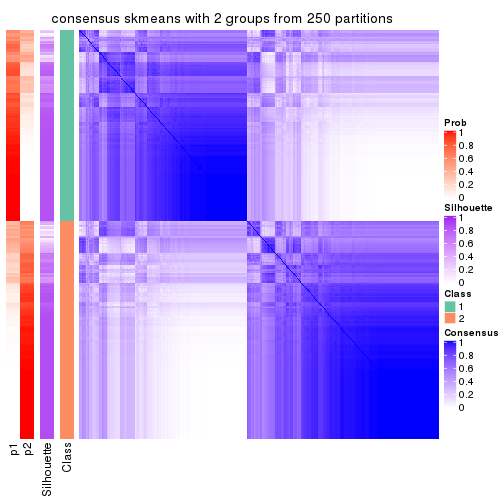</p>

</div>
<div id='tab-CV-skmeans-consensus-heatmap-2'>
<pre><code class="r">consensus_heatmap(res, k = 3)
</code></pre>

<p>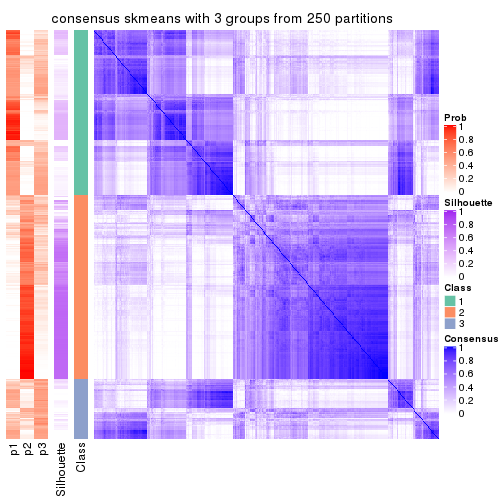</p>

</div>
<div id='tab-CV-skmeans-consensus-heatmap-3'>
<pre><code class="r">consensus_heatmap(res, k = 4)
</code></pre>

<p>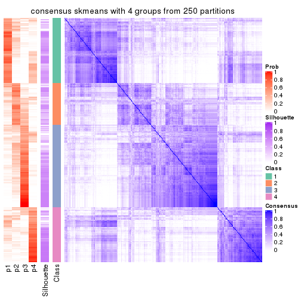</p>

</div>
<div id='tab-CV-skmeans-consensus-heatmap-4'>
<pre><code class="r">consensus_heatmap(res, k = 5)
</code></pre>

<p>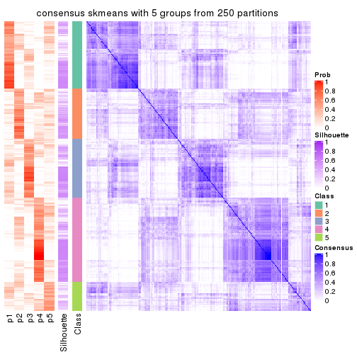</p>

</div>
<div id='tab-CV-skmeans-consensus-heatmap-5'>
<pre><code class="r">consensus_heatmap(res, k = 6)
</code></pre>

<p>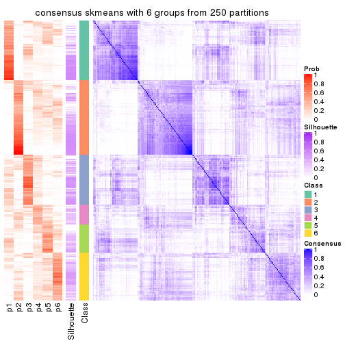</p>

</div>
</div>

Heatmaps for the membership of samples in all partitions to see how consistent they are:


<script>
$( function() {
	$( '#tabs-CV-skmeans-membership-heatmap' ).tabs();
} );
</script>
<div id='tabs-CV-skmeans-membership-heatmap'>
<ul>
<li><a href='#tab-CV-skmeans-membership-heatmap-1'>k = 2</a></li>
<li><a href='#tab-CV-skmeans-membership-heatmap-2'>k = 3</a></li>
<li><a href='#tab-CV-skmeans-membership-heatmap-3'>k = 4</a></li>
<li><a href='#tab-CV-skmeans-membership-heatmap-4'>k = 5</a></li>
<li><a href='#tab-CV-skmeans-membership-heatmap-5'>k = 6</a></li>
</ul>
<div id='tab-CV-skmeans-membership-heatmap-1'>
<pre><code class="r">membership_heatmap(res, k = 2)
</code></pre>

<p>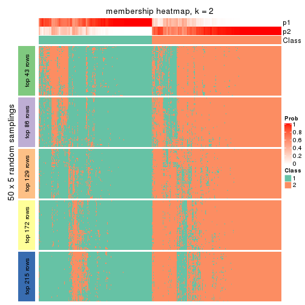</p>

</div>
<div id='tab-CV-skmeans-membership-heatmap-2'>
<pre><code class="r">membership_heatmap(res, k = 3)
</code></pre>

<p>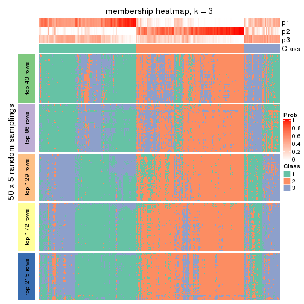</p>

</div>
<div id='tab-CV-skmeans-membership-heatmap-3'>
<pre><code class="r">membership_heatmap(res, k = 4)
</code></pre>

<p>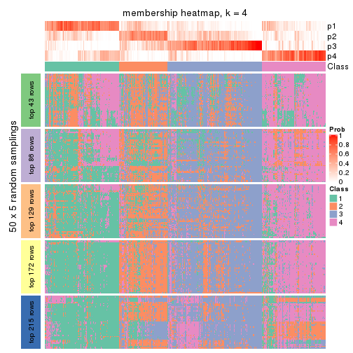</p>

</div>
<div id='tab-CV-skmeans-membership-heatmap-4'>
<pre><code class="r">membership_heatmap(res, k = 5)
</code></pre>

<p>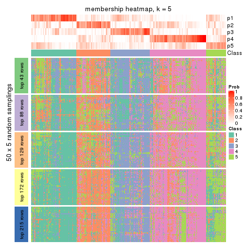</p>

</div>
<div id='tab-CV-skmeans-membership-heatmap-5'>
<pre><code class="r">membership_heatmap(res, k = 6)
</code></pre>

<p>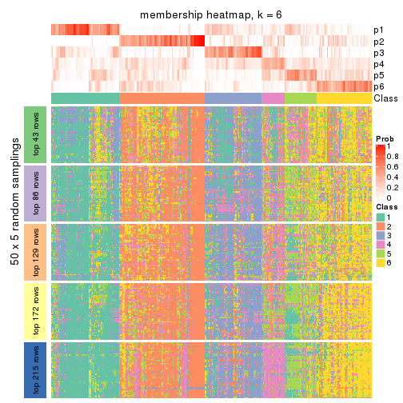</p>

</div>
</div>

As soon as we have had the classes for columns, we can look for signatures
which are significantly different between classes which can be candidate marks
for certain classes. Following are the heatmaps for signatures.


Signature heatmaps where rows are scaled:


<script>
$( function() {
	$( '#tabs-CV-skmeans-get-signatures' ).tabs();
} );
</script>
<div id='tabs-CV-skmeans-get-signatures'>
<ul>
<li><a href='#tab-CV-skmeans-get-signatures-1'>k = 2</a></li>
<li><a href='#tab-CV-skmeans-get-signatures-2'>k = 3</a></li>
<li><a href='#tab-CV-skmeans-get-signatures-3'>k = 4</a></li>
<li><a href='#tab-CV-skmeans-get-signatures-4'>k = 5</a></li>
<li><a href='#tab-CV-skmeans-get-signatures-5'>k = 6</a></li>
</ul>
<div id='tab-CV-skmeans-get-signatures-1'>
<pre><code class="r">get_signatures(res, k = 2)
</code></pre>

<p>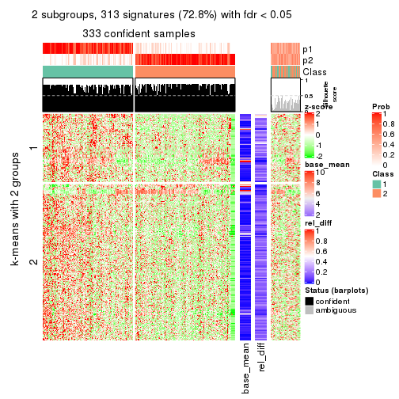</p>

</div>
<div id='tab-CV-skmeans-get-signatures-2'>
<pre><code class="r">get_signatures(res, k = 3)
</code></pre>

<p></p>

</div>
<div id='tab-CV-skmeans-get-signatures-3'>
<pre><code class="r">get_signatures(res, k = 4)
</code></pre>

<p>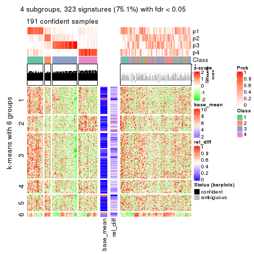</p>

</div>
<div id='tab-CV-skmeans-get-signatures-4'>
<pre><code class="r">get_signatures(res, k = 5)
</code></pre>

<p>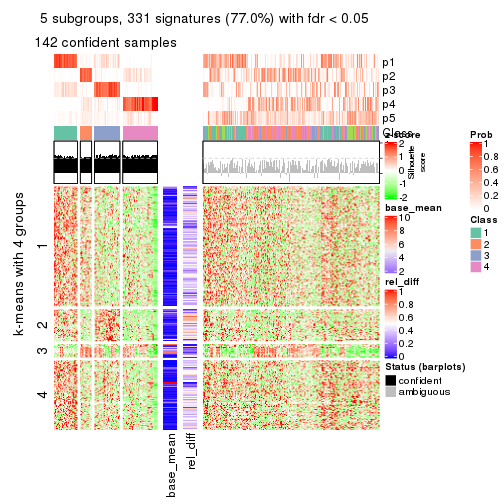</p>

</div>
<div id='tab-CV-skmeans-get-signatures-5'>
<pre><code class="r">get_signatures(res, k = 6)
</code></pre>

<p>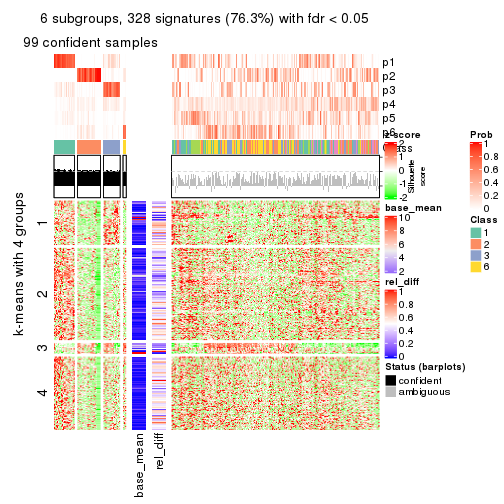</p>

</div>
</div>


Signature heatmaps where rows are not scaled:


<script>
$( function() {
	$( '#tabs-CV-skmeans-get-signatures-no-scale' ).tabs();
} );
</script>
<div id='tabs-CV-skmeans-get-signatures-no-scale'>
<ul>
<li><a href='#tab-CV-skmeans-get-signatures-no-scale-1'>k = 2</a></li>
<li><a href='#tab-CV-skmeans-get-signatures-no-scale-2'>k = 3</a></li>
<li><a href='#tab-CV-skmeans-get-signatures-no-scale-3'>k = 4</a></li>
<li><a href='#tab-CV-skmeans-get-signatures-no-scale-4'>k = 5</a></li>
<li><a href='#tab-CV-skmeans-get-signatures-no-scale-5'>k = 6</a></li>
</ul>
<div id='tab-CV-skmeans-get-signatures-no-scale-1'>
<pre><code class="r">get_signatures(res, k = 2, scale_rows = FALSE)
</code></pre>

<p>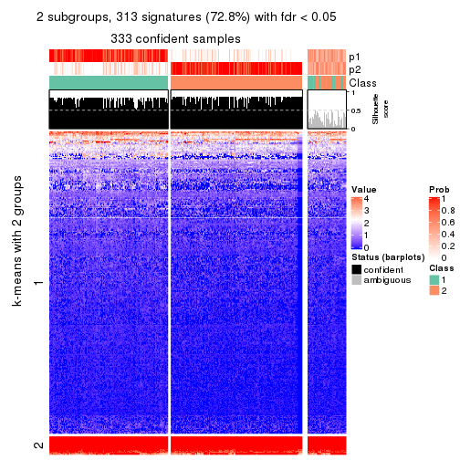</p>

</div>
<div id='tab-CV-skmeans-get-signatures-no-scale-2'>
<pre><code class="r">get_signatures(res, k = 3, scale_rows = FALSE)
</code></pre>

<p></p>

</div>
<div id='tab-CV-skmeans-get-signatures-no-scale-3'>
<pre><code class="r">get_signatures(res, k = 4, scale_rows = FALSE)
</code></pre>

<p>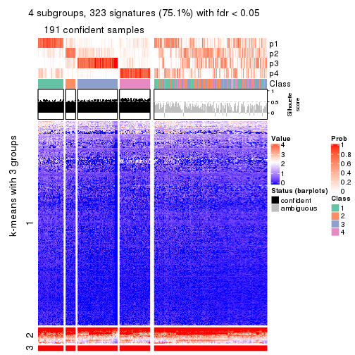</p>

</div>
<div id='tab-CV-skmeans-get-signatures-no-scale-4'>
<pre><code class="r">get_signatures(res, k = 5, scale_rows = FALSE)
</code></pre>

<p>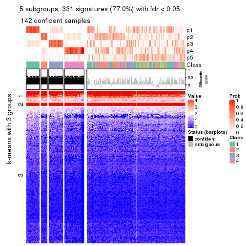</p>

</div>
<div id='tab-CV-skmeans-get-signatures-no-scale-5'>
<pre><code class="r">get_signatures(res, k = 6, scale_rows = FALSE)
</code></pre>

<p>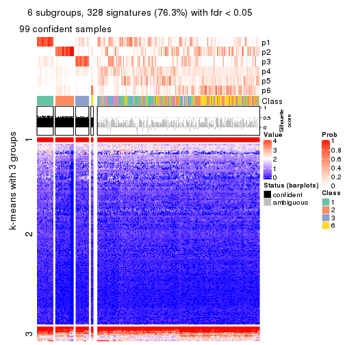</p>

</div>
</div>


Compare the overlap of signatures from different k:

```r
compare_signatures(res)
```

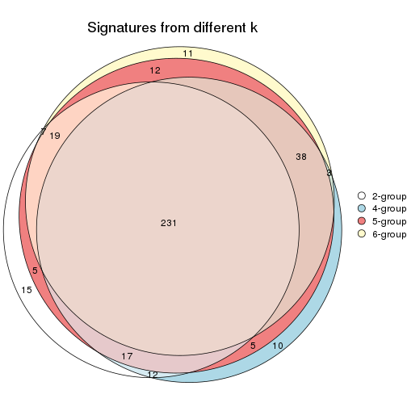

`get_signature()` returns a data frame invisibly. TO get the list of signatures, the function
call should be assigned to a variable explicitly. In following code, if `plot` argument is set
to `FALSE`, no heatmap is plotted while only the differential analysis is performed.

```r
# code only for demonstration
tb = get_signature(res, k = ..., plot = FALSE)
```

An example of the output of `tb` is:

```
#>   which_row         fdr    mean_1    mean_2 scaled_mean_1 scaled_mean_2 km
#> 1        38 0.042760348  8.373488  9.131774    -0.5533452     0.5164555  1
#> 2        40 0.018707592  7.106213  8.469186    -0.6173731     0.5762149  1
#> 3        55 0.019134737 10.221463 11.207825    -0.6159697     0.5749050  1
#> 4        59 0.006059896  5.921854  7.869574    -0.6899429     0.6439467  1
#> 5        60 0.018055526  8.928898 10.211722    -0.6204761     0.5791110  1
#> 6        98 0.009384629 15.714769 14.887706     0.6635654    -0.6193277  2
...
```

The columns in `tb` are:

1. `which_row`: row indices corresponding to the input matrix.
2. `fdr`: FDR for the differential test. 
3. `mean_x`: The mean value in group x.
4. `scaled_mean_x`: The mean value in group x after rows are scaled.
5. `km`: Row groups if k-means clustering is applied to rows.


UMAP plot which shows how samples are separated.


<script>
$( function() {
	$( '#tabs-CV-skmeans-dimension-reduction' ).tabs();
} );
</script>
<div id='tabs-CV-skmeans-dimension-reduction'>
<ul>
<li><a href='#tab-CV-skmeans-dimension-reduction-1'>k = 2</a></li>
<li><a href='#tab-CV-skmeans-dimension-reduction-2'>k = 3</a></li>
<li><a href='#tab-CV-skmeans-dimension-reduction-3'>k = 4</a></li>
<li><a href='#tab-CV-skmeans-dimension-reduction-4'>k = 5</a></li>
<li><a href='#tab-CV-skmeans-dimension-reduction-5'>k = 6</a></li>
</ul>
<div id='tab-CV-skmeans-dimension-reduction-1'>
<pre><code class="r">dimension_reduction(res, k = 2, method = &quot;UMAP&quot;)
</code></pre>

<p>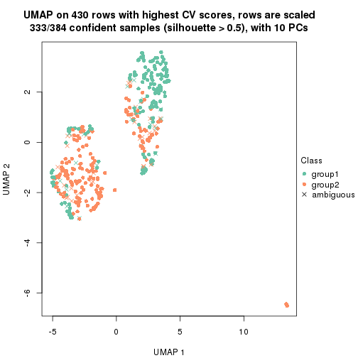</p>

</div>
<div id='tab-CV-skmeans-dimension-reduction-2'>
<pre><code class="r">dimension_reduction(res, k = 3, method = &quot;UMAP&quot;)
</code></pre>

<p>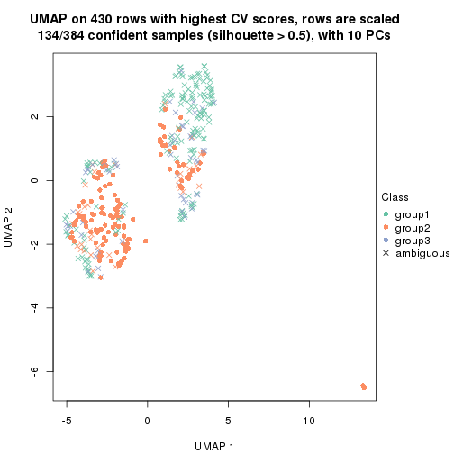</p>

</div>
<div id='tab-CV-skmeans-dimension-reduction-3'>
<pre><code class="r">dimension_reduction(res, k = 4, method = &quot;UMAP&quot;)
</code></pre>

<p>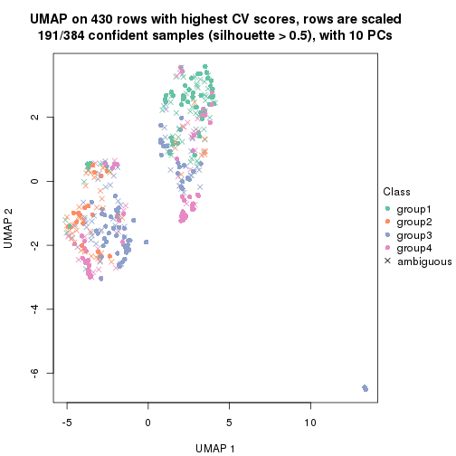</p>

</div>
<div id='tab-CV-skmeans-dimension-reduction-4'>
<pre><code class="r">dimension_reduction(res, k = 5, method = &quot;UMAP&quot;)
</code></pre>

<p>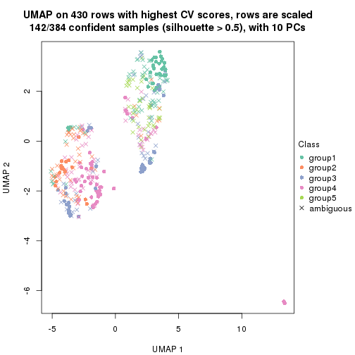</p>

</div>
<div id='tab-CV-skmeans-dimension-reduction-5'>
<pre><code class="r">dimension_reduction(res, k = 6, method = &quot;UMAP&quot;)
</code></pre>

<p>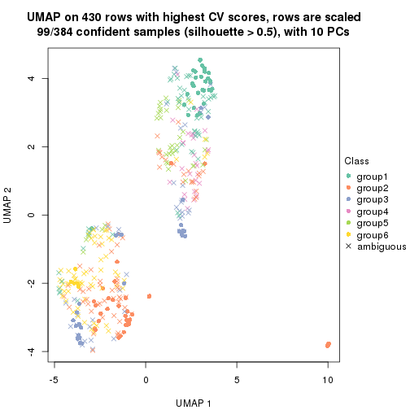</p>

</div>
</div>


Following heatmap shows how subgroups are split when increasing `k`:

```r
collect_classes(res)
```

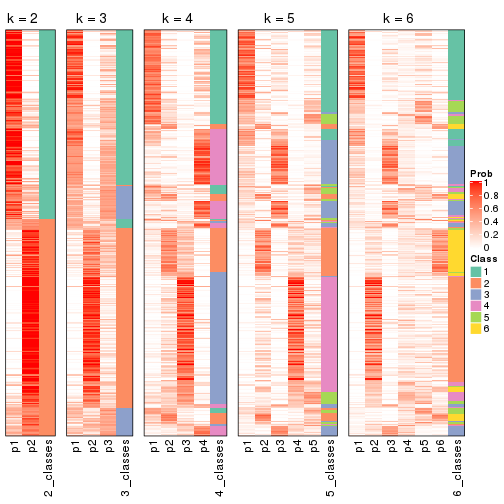


If matrix rows can be associated to genes, consider to use `GO_Enrichment(res,
...)` to perform function enrichment for the signature genes.


 

---------------------------------------------------


### CV:pam


The object with results only for a single top-value method and a single partition method 
can be extracted as:

```r
res = res_list["CV", "pam"]
# you can also extract it by
# res = res_list["CV:pam"]
```

A summary of `res` and all the functions that can be applied to it:

```r
res
```

```
#> A 'ConsensusPartition' object with k = 2, 3, 4, 5, 6.
#>   On a matrix with 430 rows and 384 columns.
#>   Top rows (43, 86, 129, 172, 215) are extracted by 'CV' method.
#>   Subgroups are detected by 'pam' method.
#>   Performed in total 1250 partitions by row resampling.
#>   Best k for subgroups seems to be 2.
#> 
#> Following methods can be applied to this 'ConsensusPartition' object:
#>  [1] "cola_report"             "collect_classes"         "collect_plots"          
#>  [4] "collect_stats"           "colnames"                "compare_signatures"     
#>  [7] "consensus_heatmap"       "dimension_reduction"     "functional_enrichment"  
#> [10] "get_anno_col"            "get_anno"                "get_classes"            
#> [13] "get_consensus"           "get_matrix"              "get_membership"         
#> [16] "get_param"               "get_signatures"          "get_stats"              
#> [19] "is_best_k"               "is_stable_k"             "membership_heatmap"     
#> [22] "ncol"                    "nrow"                    "plot_ecdf"              
#> [25] "rownames"                "select_partition_number" "show"                   
#> [28] "suggest_best_k"          "test_to_known_factors"
```

`collect_plots()` function collects all the plots made from `res` for all `k` (number of partitions)
into one single page to provide an easy and fast comparison between different `k`.

```r
collect_plots(res)
```

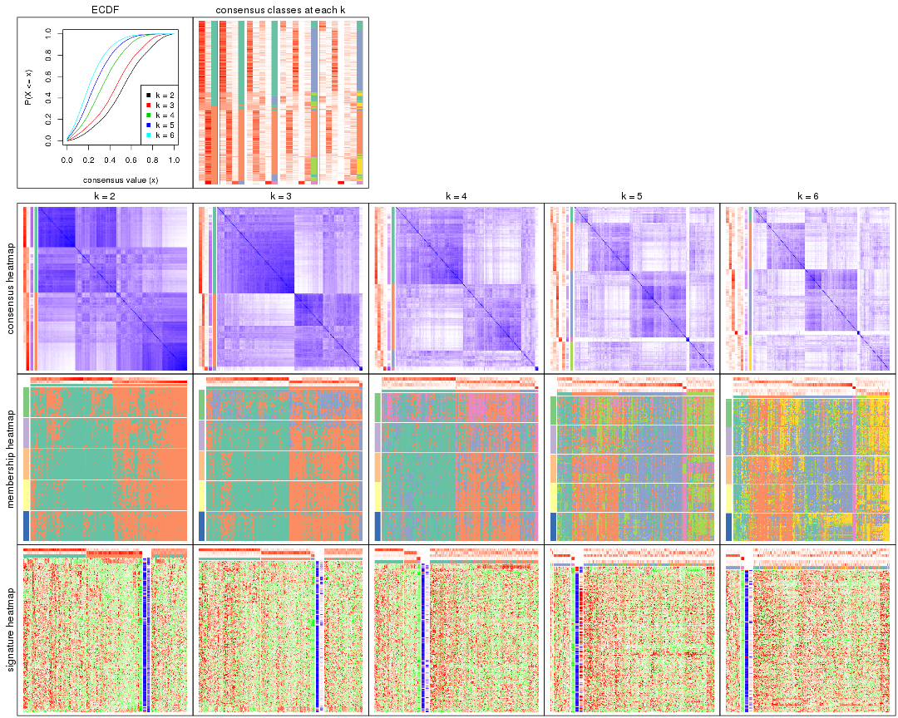

The plots are:

- The first row: a plot of the ECDF (Empirical cumulative distribution
  function) curves of the consensus matrix for each `k` and the heatmap of
  predicted classes for each `k`.
- The second row: heatmaps of the consensus matrix for each `k`.
- The third row: heatmaps of the membership matrix for each `k`.
- The fouth row: heatmaps of the signatures for each `k`.

All the plots in panels can be made by individual functions and they are
plotted later in this section.

`select_partition_number()` produces several plots showing different
statistics for choosing "optimized" `k`. There are following statistics:

- ECDF curves of the consensus matrix for each `k`;
- 1-PAC. [The PAC
  score](https://en.wikipedia.org/wiki/Consensus_clustering#Over-interpretation_potential_of_consensus_clustering)
  measures the proportion of the ambiguous subgrouping.
- Mean silhouette score.
- Concordance. The mean probability of fiting the consensus class ids in all
  partitions.
- Area increased. Denote $A_k$ as the area under the ECDF curve for current
  `k`, the area increased is defined as $A_k - A_{k-1}$.
- Rand index. The percent of pairs of samples that are both in a same cluster
  or both are not in a same cluster in the partition of k and k-1.
- Jaccard index. The ratio of pairs of samples are both in a same cluster in
  the partition of k and k-1 and the pairs of samples are both in a same
  cluster in the partition k or k-1.

The detailed explanations of these statistics can be found in [the cola
vignette](http://bioconductor.org/packages/devel/bioc/vignettes/cola/inst/doc/cola.html#toc_13).

Generally speaking, lower PAC score, higher mean silhouette score or higher
concordance corresponds to better partition. Rand index and Jaccard index
measure how similar the current partition is compared to partition with `k-1`.
If they are too similar, we won't accept `k` is better than `k-1`.

```r
select_partition_number(res)
```

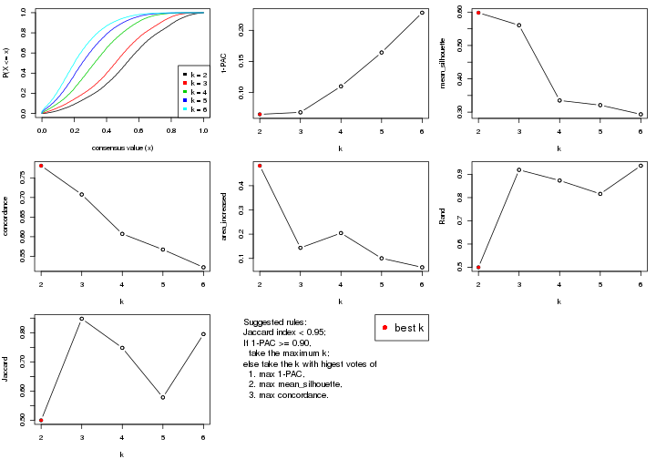

The numeric values for all these statistics can be obtained by `get_stats()`.

```r
get_stats(res)
```

```
#>   k  1-PAC mean_silhouette concordance area_increased  Rand Jaccard
#> 2 2 0.0648           0.598       0.781         0.4825 0.500   0.500
#> 3 3 0.0679           0.561       0.708         0.1436 0.919   0.848
#> 4 4 0.1098           0.335       0.607         0.2045 0.874   0.748
#> 5 5 0.1643           0.321       0.567         0.1004 0.816   0.578
#> 6 6 0.2284           0.293       0.522         0.0632 0.937   0.795
```

`suggest_best_k()` suggests the best $k$ based on these statistics. The rules are as follows:

- All $k$ with Jaccard index larger than 0.95 are removed because the increase of
  the partition number does not provides enough extra information. If all $k$ are removed,
  the best $k$ is assigned by `NA`.
- For $k$ with 1-PAC larger than 0.9, the maximal $k$ is taken as the "best k". Other $k$ is called "optional k".
- If it does not fit the second rule. The $k$ with the highest vote of highest
  1-PAC, mean silhouette and concordance is taken as the "best k".

```r
suggest_best_k(res)
```

```
#> [1] 2
```


Following shows the table of the partitions (You need to click the **show/hide
code output** link to see it). The membership matrix (columns with name `p*`)
is inferred by
[`clue::cl_consensus()`](https://www.rdocumentation.org/link/cl_consensus?package=clue)
function with the `SE` method. Basically the value in the membership matrix
represents the probability to belong to a certain group. The finall class
label for an item is determined with the group with highest probability it
belongs to.

In `get_classes()` function, the entropy is calculated from the membership
matrix and the silhouette score is calculated from the consensus matrix.


<script>
$( function() {
	$( '#tabs-CV-pam-get-classes' ).tabs();
} );
</script>
<div id='tabs-CV-pam-get-classes'>
<ul>
<li><a href='#tab-CV-pam-get-classes-1'>k = 2</a></li>
<li><a href='#tab-CV-pam-get-classes-2'>k = 3</a></li>
<li><a href='#tab-CV-pam-get-classes-3'>k = 4</a></li>
<li><a href='#tab-CV-pam-get-classes-4'>k = 5</a></li>
<li><a href='#tab-CV-pam-get-classes-5'>k = 6</a></li>
</ul>

<div id='tab-CV-pam-get-classes-1'>
<p><a id='tab-CV-pam-get-classes-1-a' style='color:#0366d6' href='#'>show/hide code output</a></p>
<pre><code class="r">cbind(get_classes(res, k = 2), get_membership(res, k = 2))
</code></pre>

<pre><code>#&gt;            class entropy silhouette    p1    p2
#&gt; SRR2105277     1  0.9996   -0.11614 0.512 0.488
#&gt; SRR2105278     2  0.9000    0.63765 0.316 0.684
#&gt; SRR2105275     1  0.9686    0.33283 0.604 0.396
#&gt; SRR2105276     1  0.6801    0.73564 0.820 0.180
#&gt; SRR2105273     1  0.4939    0.76805 0.892 0.108
#&gt; SRR2105274     1  0.1843    0.74820 0.972 0.028
#&gt; SRR2105271     2  0.8207    0.67457 0.256 0.744
#&gt; SRR2105272     1  0.4939    0.75553 0.892 0.108
#&gt; SRR2105269     2  0.1633    0.71104 0.024 0.976
#&gt; SRR2105270     2  0.9608    0.43869 0.384 0.616
#&gt; SRR2105267     2  0.1414    0.71033 0.020 0.980
#&gt; SRR2105268     2  0.7815    0.69189 0.232 0.768
#&gt; SRR2105265     2  0.6148    0.72228 0.152 0.848
#&gt; SRR2105266     2  0.9044    0.57284 0.320 0.680
#&gt; SRR2105263     1  0.9970   -0.15942 0.532 0.468
#&gt; SRR2105264     1  0.6712    0.70699 0.824 0.176
#&gt; SRR2105261     2  0.4690    0.72887 0.100 0.900
#&gt; SRR2105262     2  0.9323    0.44383 0.348 0.652
#&gt; SRR2105357     2  0.1414    0.70862 0.020 0.980
#&gt; SRR2105358     1  0.9635    0.44217 0.612 0.388
#&gt; SRR2105439     2  0.8081    0.66273 0.248 0.752
#&gt; SRR2105440     1  0.9866    0.33871 0.568 0.432
#&gt; SRR2105509     2  0.1633    0.70993 0.024 0.976
#&gt; SRR2105510     2  0.0672    0.70351 0.008 0.992
#&gt; SRR2105507     1  0.2948    0.75663 0.948 0.052
#&gt; SRR2105508     1  0.7815    0.69110 0.768 0.232
#&gt; SRR2105505     1  0.7376    0.71978 0.792 0.208
#&gt; SRR2105506     1  0.6343    0.74441 0.840 0.160
#&gt; SRR2105503     2  0.5737    0.73235 0.136 0.864
#&gt; SRR2105504     2  0.0376    0.70255 0.004 0.996
#&gt; SRR2105501     2  0.9358    0.56004 0.352 0.648
#&gt; SRR2105502     2  0.0376    0.70255 0.004 0.996
#&gt; SRR2105499     1  0.6343    0.74638 0.840 0.160
#&gt; SRR2105500     2  0.7602    0.69734 0.220 0.780
#&gt; SRR2105497     1  0.5842    0.73255 0.860 0.140
#&gt; SRR2105498     2  0.9996    0.26486 0.488 0.512
#&gt; SRR2105495     1  0.9635    0.45645 0.612 0.388
#&gt; SRR2105496     2  0.8608    0.66017 0.284 0.716
#&gt; SRR2105493     1  0.5737    0.76726 0.864 0.136
#&gt; SRR2105494     1  0.7139    0.75051 0.804 0.196
#&gt; SRR2105491     1  0.9963   -0.06497 0.536 0.464
#&gt; SRR2105492     1  0.3114    0.75764 0.944 0.056
#&gt; SRR2105489     1  0.7376    0.73219 0.792 0.208
#&gt; SRR2105490     2  0.7299    0.71156 0.204 0.796
#&gt; SRR2105487     2  0.9460    0.55062 0.364 0.636
#&gt; SRR2105488     1  0.9896    0.28432 0.560 0.440
#&gt; SRR2105485     2  0.9522    0.43291 0.372 0.628
#&gt; SRR2105486     1  0.9248    0.56499 0.660 0.340
#&gt; SRR2105483     1  0.3114    0.75735 0.944 0.056
#&gt; SRR2105484     1  0.1184    0.74044 0.984 0.016
#&gt; SRR2105481     1  0.6148    0.76066 0.848 0.152
#&gt; SRR2105482     1  0.4815    0.76820 0.896 0.104
#&gt; SRR2105479     2  0.9963    0.36511 0.464 0.536
#&gt; SRR2105480     1  0.0672    0.73836 0.992 0.008
#&gt; SRR2105477     2  0.6343    0.73088 0.160 0.840
#&gt; SRR2105478     2  0.8909    0.65235 0.308 0.692
#&gt; SRR2105475     2  0.6801    0.71804 0.180 0.820
#&gt; SRR2105476     2  0.5519    0.72518 0.128 0.872
#&gt; SRR2105473     1  0.8327    0.66632 0.736 0.264
#&gt; SRR2105474     1  0.6801    0.75460 0.820 0.180
#&gt; SRR2105471     1  0.8207    0.67870 0.744 0.256
#&gt; SRR2105472     2  0.9922    0.15041 0.448 0.552
#&gt; SRR2105469     2  0.7950    0.68993 0.240 0.760
#&gt; SRR2105470     1  0.6247    0.75347 0.844 0.156
#&gt; SRR2105467     1  0.8909    0.50523 0.692 0.308
#&gt; SRR2105468     1  0.8499    0.63218 0.724 0.276
#&gt; SRR2105465     1  0.6148    0.76287 0.848 0.152
#&gt; SRR2105466     1  0.2423    0.75131 0.960 0.040
#&gt; SRR2105463     1  0.8955    0.49028 0.688 0.312
#&gt; SRR2105464     1  0.0376    0.73585 0.996 0.004
#&gt; SRR2105461     2  0.2236    0.71404 0.036 0.964
#&gt; SRR2105462     1  0.9998    0.11837 0.508 0.492
#&gt; SRR2105459     2  0.0376    0.70255 0.004 0.996
#&gt; SRR2105460     2  0.1414    0.70921 0.020 0.980
#&gt; SRR2105457     2  0.6623    0.72387 0.172 0.828
#&gt; SRR2105458     2  0.3733    0.72677 0.072 0.928
#&gt; SRR2105455     2  0.4815    0.72220 0.104 0.896
#&gt; SRR2105456     1  0.9866    0.17684 0.568 0.432
#&gt; SRR2105453     2  0.9850    0.42069 0.428 0.572
#&gt; SRR2105454     1  0.9998    0.09754 0.508 0.492
#&gt; SRR2105451     2  0.9580    0.48770 0.380 0.620
#&gt; SRR2105452     2  0.0376    0.70255 0.004 0.996
#&gt; SRR2105449     1  0.9866    0.02933 0.568 0.432
#&gt; SRR2105450     1  0.2043    0.75159 0.968 0.032
#&gt; SRR2105447     2  0.9933    0.18051 0.452 0.548
#&gt; SRR2105448     2  0.4431    0.72554 0.092 0.908
#&gt; SRR2105445     1  0.9580    0.47258 0.620 0.380
#&gt; SRR2105446     2  0.2603    0.71907 0.044 0.956
#&gt; SRR2105443     2  0.8763    0.64024 0.296 0.704
#&gt; SRR2105444     1  0.8081    0.69369 0.752 0.248
#&gt; SRR2105441     1  0.7950    0.70334 0.760 0.240
#&gt; SRR2105442     2  0.5737    0.72370 0.136 0.864
#&gt; SRR2105437     1  0.1843    0.74562 0.972 0.028
#&gt; SRR2105438     1  0.2423    0.75162 0.960 0.040
#&gt; SRR2105435     1  0.4815    0.76645 0.896 0.104
#&gt; SRR2105436     1  0.5408    0.76581 0.876 0.124
#&gt; SRR2105433     1  0.6531    0.72745 0.832 0.168
#&gt; SRR2105434     2  0.9732    0.49354 0.404 0.596
#&gt; SRR2105431     1  0.5519    0.76518 0.872 0.128
#&gt; SRR2105432     1  0.5294    0.75847 0.880 0.120
#&gt; SRR2105429     1  0.6048    0.76048 0.852 0.148
#&gt; SRR2105430     2  0.6438    0.71750 0.164 0.836
#&gt; SRR2105427     2  0.9552    0.50939 0.376 0.624
#&gt; SRR2105428     2  0.7453    0.69686 0.212 0.788
#&gt; SRR2105425     2  0.9635    0.41543 0.388 0.612
#&gt; SRR2105426     2  0.7139    0.72030 0.196 0.804
#&gt; SRR2105421     2  0.5946    0.71871 0.144 0.856
#&gt; SRR2105422     1  1.0000    0.07516 0.504 0.496
#&gt; SRR2105423     2  0.8443    0.65788 0.272 0.728
#&gt; SRR2105424     2  0.3733    0.71963 0.072 0.928
#&gt; SRR2105419     2  0.6438    0.72286 0.164 0.836
#&gt; SRR2105420     2  0.9491    0.51125 0.368 0.632
#&gt; SRR2105415     1  0.7299    0.70136 0.796 0.204
#&gt; SRR2105416     1  0.1184    0.74085 0.984 0.016
#&gt; SRR2105417     1  0.9993    0.06987 0.516 0.484
#&gt; SRR2105418     1  0.3584    0.76010 0.932 0.068
#&gt; SRR2105413     2  0.4690    0.72813 0.100 0.900
#&gt; SRR2105414     2  0.6887    0.70975 0.184 0.816
#&gt; SRR2105409     2  0.9881    0.27940 0.436 0.564
#&gt; SRR2105410     1  0.9491    0.47254 0.632 0.368
#&gt; SRR2105411     2  0.9491    0.42094 0.368 0.632
#&gt; SRR2105412     2  0.9661    0.37211 0.392 0.608
#&gt; SRR2105407     2  0.9393    0.52187 0.356 0.644
#&gt; SRR2105408     2  0.2948    0.71722 0.052 0.948
#&gt; SRR2105403     1  1.0000    0.15698 0.504 0.496
#&gt; SRR2105404     2  0.7674    0.68066 0.224 0.776
#&gt; SRR2105405     2  0.9044    0.58460 0.320 0.680
#&gt; SRR2105406     1  0.7745    0.69745 0.772 0.228
#&gt; SRR2105401     2  0.0938    0.70345 0.012 0.988
#&gt; SRR2105402     2  0.0376    0.70255 0.004 0.996
#&gt; SRR2105399     2  0.2948    0.71958 0.052 0.948
#&gt; SRR2105400     2  0.0938    0.70454 0.012 0.988
#&gt; SRR2105397     2  0.3733    0.72423 0.072 0.928
#&gt; SRR2105398     2  0.9248    0.59738 0.340 0.660
#&gt; SRR2105395     1  0.8443    0.64201 0.728 0.272
#&gt; SRR2105396     1  0.5737    0.76462 0.864 0.136
#&gt; SRR2105393     2  0.6343    0.72959 0.160 0.840
#&gt; SRR2105394     2  0.9850    0.16796 0.428 0.572
#&gt; SRR2105389     1  0.4939    0.76756 0.892 0.108
#&gt; SRR2105390     1  0.6048    0.75949 0.852 0.148
#&gt; SRR2105391     1  0.7602    0.72325 0.780 0.220
#&gt; SRR2105392     2  0.9983    0.00729 0.476 0.524
#&gt; SRR2105385     1  0.1184    0.74253 0.984 0.016
#&gt; SRR2105386     1  0.3879    0.75841 0.924 0.076
#&gt; SRR2105387     2  0.3733    0.71807 0.072 0.928
#&gt; SRR2105388     2  0.9732    0.32712 0.404 0.596
#&gt; SRR2105381     2  0.3733    0.71635 0.072 0.928
#&gt; SRR2105382     1  0.7745    0.70660 0.772 0.228
#&gt; SRR2105383     2  0.9580    0.40837 0.380 0.620
#&gt; SRR2105384     2  0.7950    0.69358 0.240 0.760
#&gt; SRR2105379     2  0.5059    0.72978 0.112 0.888
#&gt; SRR2105380     1  0.2043    0.75113 0.968 0.032
#&gt; SRR2105377     2  0.8909    0.64016 0.308 0.692
#&gt; SRR2105378     1  0.4562    0.76782 0.904 0.096
#&gt; SRR2105375     2  0.9963    0.19932 0.464 0.536
#&gt; SRR2105376     2  0.9552    0.52735 0.376 0.624
#&gt; SRR2105373     1  0.4431    0.76788 0.908 0.092
#&gt; SRR2105374     1  0.0672    0.73654 0.992 0.008
#&gt; SRR2105371     2  0.9522    0.54299 0.372 0.628
#&gt; SRR2105372     2  0.6438    0.71064 0.164 0.836
#&gt; SRR2105369     1  0.6623    0.75912 0.828 0.172
#&gt; SRR2105370     1  0.8207    0.66893 0.744 0.256
#&gt; SRR2105367     2  0.9248    0.58070 0.340 0.660
#&gt; SRR2105368     1  0.5737    0.75292 0.864 0.136
#&gt; SRR2105365     2  0.9988    0.16445 0.480 0.520
#&gt; SRR2105366     1  0.7883    0.70039 0.764 0.236
#&gt; SRR2105363     2  0.7815    0.69538 0.232 0.768
#&gt; SRR2105364     2  0.8713    0.65869 0.292 0.708
#&gt; SRR2105361     2  0.0376    0.70242 0.004 0.996
#&gt; SRR2105362     2  0.3733    0.72364 0.072 0.928
#&gt; SRR2105359     1  0.8386    0.66435 0.732 0.268
#&gt; SRR2105360     1  0.9661    0.43412 0.608 0.392
#&gt; SRR2105355     1  0.8955    0.59092 0.688 0.312
#&gt; SRR2105356     2  0.9933    0.19590 0.452 0.548
#&gt; SRR2105353     1  0.9922    0.27695 0.552 0.448
#&gt; SRR2105354     1  0.7453    0.73144 0.788 0.212
#&gt; SRR2105351     1  0.7453    0.71628 0.788 0.212
#&gt; SRR2105352     2  0.0376    0.70255 0.004 0.996
#&gt; SRR2105349     2  0.9393    0.53677 0.356 0.644
#&gt; SRR2105350     2  0.5629    0.72255 0.132 0.868
#&gt; SRR2105345     1  0.9954    0.24341 0.540 0.460
#&gt; SRR2105346     1  0.9710    0.41512 0.600 0.400
#&gt; SRR2105347     1  0.5059    0.75980 0.888 0.112
#&gt; SRR2105348     1  0.7602    0.72350 0.780 0.220
#&gt; SRR2105343     2  0.8763    0.61798 0.296 0.704
#&gt; SRR2105344     2  0.5059    0.73302 0.112 0.888
#&gt; SRR2105341     1  0.7299    0.73190 0.796 0.204
#&gt; SRR2105342     1  0.9170    0.59866 0.668 0.332
#&gt; SRR2105339     1  0.6973    0.72461 0.812 0.188
#&gt; SRR2105340     1  0.4022    0.76275 0.920 0.080
#&gt; SRR2105335     1  0.5408    0.76727 0.876 0.124
#&gt; SRR2105336     1  0.3879    0.76609 0.924 0.076
#&gt; SRR2105337     1  0.8713    0.59009 0.708 0.292
#&gt; SRR2105338     1  0.4161    0.75726 0.916 0.084
#&gt; SRR2105331     2  0.9608    0.51484 0.384 0.616
#&gt; SRR2105332     1  0.7139    0.67848 0.804 0.196
#&gt; SRR2105333     2  0.6531    0.70528 0.168 0.832
#&gt; SRR2105334     2  0.7528    0.70515 0.216 0.784
#&gt; SRR2105329     2  0.8207    0.67190 0.256 0.744
#&gt; SRR2105330     2  0.8386    0.67063 0.268 0.732
#&gt; SRR2105327     2  0.9983    0.15524 0.476 0.524
#&gt; SRR2105328     2  1.0000    0.14430 0.496 0.504
#&gt; SRR2105325     1  0.1184    0.74215 0.984 0.016
#&gt; SRR2105326     1  0.0672    0.73673 0.992 0.008
#&gt; SRR2105323     2  0.5519    0.73208 0.128 0.872
#&gt; SRR2105324     2  0.8443    0.67809 0.272 0.728
#&gt; SRR2105319     1  0.1843    0.74569 0.972 0.028
#&gt; SRR2105320     1  0.1184    0.74175 0.984 0.016
#&gt; SRR2105321     1  0.8608    0.54164 0.716 0.284
#&gt; SRR2105322     1  0.2236    0.75015 0.964 0.036
#&gt; SRR2105317     2  0.1633    0.71198 0.024 0.976
#&gt; SRR2105318     2  0.2423    0.71747 0.040 0.960
#&gt; SRR2105315     2  0.1843    0.71212 0.028 0.972
#&gt; SRR2105316     2  0.9954    0.08123 0.460 0.540
#&gt; SRR2105313     2  0.4939    0.73321 0.108 0.892
#&gt; SRR2105314     2  0.2948    0.71991 0.052 0.948
#&gt; SRR2105311     2  0.9358    0.56001 0.352 0.648
#&gt; SRR2105312     1  0.9833    0.19573 0.576 0.424
#&gt; SRR2105307     2  0.9909    0.40306 0.444 0.556
#&gt; SRR2105308     2  0.9358    0.50961 0.352 0.648
#&gt; SRR2105309     2  0.1633    0.71004 0.024 0.976
#&gt; SRR2105310     1  0.9933    0.16935 0.548 0.452
#&gt; SRR2105305     1  0.9635    0.48644 0.612 0.388
#&gt; SRR2105306     2  0.9866    0.25995 0.432 0.568
#&gt; SRR2105303     2  0.8386    0.68072 0.268 0.732
#&gt; SRR2105304     2  0.0376    0.70255 0.004 0.996
#&gt; SRR2105301     1  0.6531    0.75628 0.832 0.168
#&gt; SRR2105302     2  0.8813    0.63070 0.300 0.700
#&gt; SRR2105299     1  0.7056    0.74942 0.808 0.192
#&gt; SRR2105300     2  0.9000    0.62917 0.316 0.684
#&gt; SRR2105297     1  0.3274    0.75569 0.940 0.060
#&gt; SRR2105298     1  0.4562    0.76187 0.904 0.096
#&gt; SRR2105295     2  0.4022    0.72398 0.080 0.920
#&gt; SRR2105296     2  0.9209    0.55477 0.336 0.664
#&gt; SRR2105293     1  0.9775    0.33452 0.588 0.412
#&gt; SRR2105294     1  0.0672    0.73778 0.992 0.008
#&gt; SRR2105291     1  0.3584    0.76367 0.932 0.068
#&gt; SRR2105292     1  0.6712    0.70897 0.824 0.176
#&gt; SRR2105289     1  0.9922    0.27831 0.552 0.448
#&gt; SRR2105290     1  0.5294    0.76492 0.880 0.120
#&gt; SRR2105287     1  0.9580    0.46041 0.620 0.380
#&gt; SRR2105288     1  0.1843    0.75077 0.972 0.028
#&gt; SRR2105285     2  0.2778    0.71576 0.048 0.952
#&gt; SRR2105286     2  0.5178    0.72895 0.116 0.884
#&gt; SRR2105283     2  0.9866    0.40561 0.432 0.568
#&gt; SRR2105284     1  0.6048    0.75979 0.852 0.148
#&gt; SRR2105281     1  0.9286    0.51378 0.656 0.344
#&gt; SRR2105282     2  0.8144    0.67472 0.252 0.748
#&gt; SRR2105259     2  0.6438    0.72649 0.164 0.836
#&gt; SRR2105260     2  0.3584    0.71636 0.068 0.932
#&gt; SRR2105279     2  0.2423    0.71845 0.040 0.960
#&gt; SRR2105280     2  0.4939    0.72982 0.108 0.892
#&gt; SRR2105257     1  0.1184    0.74125 0.984 0.016
#&gt; SRR2105258     1  0.5408    0.75347 0.876 0.124
#&gt; SRR2105253     2  1.0000    0.13486 0.496 0.504
#&gt; SRR2105254     2  0.6343    0.71916 0.160 0.840
#&gt; SRR2105255     2  0.4298    0.72818 0.088 0.912
#&gt; SRR2105256     1  0.7139    0.73499 0.804 0.196
#&gt; SRR2105251     2  0.9522    0.50478 0.372 0.628
#&gt; SRR2105252     2  0.3114    0.72372 0.056 0.944
#&gt; SRR2105249     2  0.2236    0.71072 0.036 0.964
#&gt; SRR2105250     2  1.0000   -0.12002 0.496 0.504
#&gt; SRR2105247     2  0.8861    0.61889 0.304 0.696
#&gt; SRR2105248     2  1.0000    0.18096 0.500 0.500
#&gt; SRR2105245     2  0.9983    0.10107 0.476 0.524
#&gt; SRR2105246     1  0.4562    0.76479 0.904 0.096
#&gt; SRR2105243     1  0.9286    0.57251 0.656 0.344
#&gt; SRR2105244     2  0.9996    0.21684 0.488 0.512
#&gt; SRR2105241     1  0.4815    0.75784 0.896 0.104
#&gt; SRR2105242     1  0.4431    0.77117 0.908 0.092
#&gt; SRR2105239     2  0.9323    0.50282 0.348 0.652
#&gt; SRR2105240     1  0.1184    0.74227 0.984 0.016
#&gt; SRR2105237     2  0.9732    0.45271 0.404 0.596
#&gt; SRR2105238     2  0.5294    0.72931 0.120 0.880
#&gt; SRR2105235     1  1.0000   -0.10534 0.504 0.496
#&gt; SRR2105236     1  0.7815    0.72022 0.768 0.232
#&gt; SRR2105233     2  0.8081    0.65524 0.248 0.752
#&gt; SRR2105234     2  0.1843    0.71336 0.028 0.972
#&gt; SRR2105231     2  0.4431    0.73052 0.092 0.908
#&gt; SRR2105232     2  0.9522    0.55754 0.372 0.628
#&gt; SRR2105227     2  0.9977    0.28672 0.472 0.528
#&gt; SRR2105228     1  0.8763    0.62796 0.704 0.296
#&gt; SRR2105225     2  0.9996   -0.04689 0.488 0.512
#&gt; SRR2105226     1  0.8443    0.65775 0.728 0.272
#&gt; SRR2105229     1  0.7950    0.70727 0.760 0.240
#&gt; SRR2105230     1  0.6801    0.75549 0.820 0.180
#&gt; SRR2105219     2  0.9087    0.58517 0.324 0.676
#&gt; SRR2105220     1  0.9954    0.22923 0.540 0.460
#&gt; SRR2105221     1  0.2948    0.75592 0.948 0.052
#&gt; SRR2105222     1  0.4690    0.76801 0.900 0.100
#&gt; SRR2105223     1  0.3431    0.75991 0.936 0.064
#&gt; SRR2105224     1  0.4562    0.76269 0.904 0.096
#&gt; SRR2105217     1  0.9896    0.10074 0.560 0.440
#&gt; SRR2105218     1  0.9460    0.46727 0.636 0.364
#&gt; SRR2105215     1  0.9988    0.00547 0.520 0.480
#&gt; SRR2105216     2  0.0938    0.70611 0.012 0.988
#&gt; SRR2105213     1  0.4939    0.76348 0.892 0.108
#&gt; SRR2105214     1  0.7745    0.71037 0.772 0.228
#&gt; SRR2105211     2  0.9460    0.49631 0.364 0.636
#&gt; SRR2105212     2  0.6887    0.71820 0.184 0.816
#&gt; SRR2105209     1  0.5408    0.76661 0.876 0.124
#&gt; SRR2105210     1  0.7815    0.66402 0.768 0.232
#&gt; SRR2105207     2  0.9954    0.32497 0.460 0.540
#&gt; SRR2105208     1  0.6887    0.73513 0.816 0.184
#&gt; SRR2105205     1  0.9608    0.23632 0.616 0.384
#&gt; SRR2105206     1  0.2778    0.75501 0.952 0.048
#&gt; SRR2105201     1  0.7602    0.71703 0.780 0.220
#&gt; SRR2105202     2  0.3733    0.71936 0.072 0.928
#&gt; SRR2105203     1  0.9732    0.45956 0.596 0.404
#&gt; SRR2105204     2  0.0938    0.70521 0.012 0.988
#&gt; SRR2105199     2  0.8763    0.57546 0.296 0.704
#&gt; SRR2105200     2  0.9909    0.23391 0.444 0.556
#&gt; SRR2105197     2  0.9732    0.30888 0.404 0.596
#&gt; SRR2105198     1  0.6343    0.75620 0.840 0.160
#&gt; SRR2105195     1  0.9866    0.06859 0.568 0.432
#&gt; SRR2105196     1  0.2043    0.74982 0.968 0.032
#&gt; SRR2105193     1  0.4431    0.75781 0.908 0.092
#&gt; SRR2105194     1  0.0376    0.73516 0.996 0.004
#&gt; SRR2105191     2  0.8386    0.67371 0.268 0.732
#&gt; SRR2105192     1  0.3584    0.76147 0.932 0.068
#&gt; SRR2105189     2  0.2043    0.71007 0.032 0.968
#&gt; SRR2105190     2  0.4022    0.72584 0.080 0.920
#&gt; SRR2105187     2  0.9393    0.57186 0.356 0.644
#&gt; SRR2105188     1  0.6531    0.74642 0.832 0.168
#&gt; SRR2105179     1  0.4562    0.76555 0.904 0.096
#&gt; SRR2105180     1  0.0376    0.73682 0.996 0.004
#&gt; SRR2105183     2  1.0000    0.08839 0.500 0.500
#&gt; SRR2105184     1  0.6623    0.75538 0.828 0.172
#&gt; SRR2105185     2  0.9000    0.54379 0.316 0.684
#&gt; SRR2105186     1  0.9944    0.20113 0.544 0.456
#&gt; SRR2105181     1  0.5737    0.75830 0.864 0.136
#&gt; SRR2105182     1  0.5737    0.76331 0.864 0.136
#&gt; SRR2105177     1  0.3274    0.76552 0.940 0.060
#&gt; SRR2105178     1  0.0000    0.73433 1.000 0.000
#&gt; SRR2105171     1  0.9754    0.42408 0.592 0.408
#&gt; SRR2105172     2  0.6973    0.69750 0.188 0.812
#&gt; SRR2105175     1  0.1843    0.74584 0.972 0.028
#&gt; SRR2105176     1  0.0000    0.73433 1.000 0.000
#&gt; SRR2105173     1  0.4815    0.76364 0.896 0.104
#&gt; SRR2105174     1  0.9248    0.49327 0.660 0.340
#&gt; SRR2105169     2  0.9850    0.38262 0.428 0.572
#&gt; SRR2105170     1  0.8443    0.57903 0.728 0.272
#&gt; SRR2105167     2  0.9686    0.33306 0.396 0.604
#&gt; SRR2105168     2  0.6623    0.70860 0.172 0.828
#&gt; SRR2105165     1  0.4815    0.76646 0.896 0.104
#&gt; SRR2105166     1  0.3584    0.75575 0.932 0.068
#&gt; SRR2105163     1  0.6438    0.74665 0.836 0.164
#&gt; SRR2105164     1  0.2236    0.75187 0.964 0.036
#&gt; SRR2105161     1  0.6438    0.75655 0.836 0.164
#&gt; SRR2105162     1  0.3584    0.76410 0.932 0.068
#&gt; SRR2105155     1  0.9661    0.42524 0.608 0.392
#&gt; SRR2105156     1  0.9000    0.61893 0.684 0.316
#&gt; SRR2105157     1  0.4431    0.75825 0.908 0.092
#&gt; SRR2105158     1  0.8081    0.63741 0.752 0.248
#&gt; SRR2105159     1  0.7602    0.69056 0.780 0.220
#&gt; SRR2105160     1  0.8813    0.62054 0.700 0.300
#&gt; SRR2105153     1  0.9970   -0.09965 0.532 0.468
#&gt; SRR2105154     1  0.9866    0.12572 0.568 0.432
#&gt; SRR2105151     2  0.9996    0.10361 0.488 0.512
#&gt; SRR2105152     2  0.1184    0.70598 0.016 0.984
#&gt; SRR2105149     1  0.7602    0.71853 0.780 0.220
#&gt; SRR2105150     1  0.9922    0.14830 0.552 0.448
#&gt; SRR2105147     2  0.4022    0.72421 0.080 0.920
#&gt; SRR2105148     2  0.2423    0.71427 0.040 0.960
#&gt; SRR2105143     1  0.5294    0.76507 0.880 0.120
#&gt; SRR2105144     2  0.9963    0.16159 0.464 0.536
#&gt; SRR2105145     1  0.2778    0.75049 0.952 0.048
#&gt; SRR2105146     1  0.1633    0.74382 0.976 0.024
#&gt; SRR2105141     2  0.9129    0.59513 0.328 0.672
#&gt; SRR2105142     1  0.9866    0.08976 0.568 0.432
#&gt; SRR2105139     2  0.7528    0.71853 0.216 0.784
#&gt; SRR2105140     1  0.8016    0.70703 0.756 0.244
#&gt; SRR2105137     2  0.8016    0.62946 0.244 0.756
#&gt; SRR2105138     1  0.7299    0.73953 0.796 0.204
#&gt; SRR2105135     2  0.9491    0.43836 0.368 0.632
#&gt; SRR2105136     2  0.2423    0.71588 0.040 0.960
#&gt; SRR2105133     2  0.6801    0.72647 0.180 0.820
#&gt; SRR2105134     1  0.9427    0.51533 0.640 0.360
#&gt; SRR2105131     2  0.7815    0.66006 0.232 0.768
#&gt; SRR2105132     1  0.6343    0.73817 0.840 0.160
#&gt; SRR2105129     1  0.2948    0.75686 0.948 0.052
#&gt; SRR2105130     1  0.6148    0.73627 0.848 0.152
#&gt; SRR2105127     1  0.4161    0.76461 0.916 0.084
#&gt; SRR2105128     1  0.7528    0.72490 0.784 0.216
</code></pre>

<script>
$('#tab-CV-pam-get-classes-1-a').parent().next().next().hide();
$('#tab-CV-pam-get-classes-1-a').click(function(){
  $('#tab-CV-pam-get-classes-1-a').parent().next().next().toggle();
  return(false);
});
</script>
</div>

<div id='tab-CV-pam-get-classes-2'>
<p><a id='tab-CV-pam-get-classes-2-a' style='color:#0366d6' href='#'>show/hide code output</a></p>
<pre><code class="r">cbind(get_classes(res, k = 3), get_membership(res, k = 3))
</code></pre>

<pre><code>#&gt;            class entropy silhouette    p1    p2    p3
#&gt; SRR2105277     2   0.879    0.24050 0.436 0.452 0.112
#&gt; SRR2105278     2   0.832    0.59818 0.276 0.604 0.120
#&gt; SRR2105275     1   0.884    0.28501 0.536 0.328 0.136
#&gt; SRR2105276     1   0.674    0.70371 0.744 0.156 0.100
#&gt; SRR2105273     1   0.517    0.74068 0.832 0.092 0.076
#&gt; SRR2105274     1   0.219    0.72317 0.948 0.024 0.028
#&gt; SRR2105271     2   0.671    0.64950 0.228 0.716 0.056
#&gt; SRR2105272     1   0.581    0.72825 0.800 0.092 0.108
#&gt; SRR2105269     2   0.454    0.57009 0.016 0.836 0.148
#&gt; SRR2105270     2   0.700    0.48160 0.340 0.628 0.032
#&gt; SRR2105267     2   0.391    0.58398 0.020 0.876 0.104
#&gt; SRR2105268     2   0.732    0.67789 0.164 0.708 0.128
#&gt; SRR2105265     2   0.666    0.65306 0.128 0.752 0.120
#&gt; SRR2105266     2   0.740    0.50681 0.324 0.624 0.052
#&gt; SRR2105263     1   0.826   -0.18979 0.492 0.432 0.076
#&gt; SRR2105264     1   0.606    0.67643 0.776 0.160 0.064
#&gt; SRR2105261     2   0.582    0.66089 0.104 0.800 0.096
#&gt; SRR2105262     2   0.790    0.45307 0.312 0.608 0.080
#&gt; SRR2105357     2   0.255    0.59837 0.012 0.932 0.056
#&gt; SRR2105358     1   0.817    0.41198 0.552 0.368 0.080
#&gt; SRR2105439     2   0.796    0.63512 0.232 0.648 0.120
#&gt; SRR2105440     1   0.780    0.28722 0.520 0.428 0.052
#&gt; SRR2105509     3   0.554    0.86481 0.008 0.252 0.740
#&gt; SRR2105510     2   0.334    0.56775 0.000 0.880 0.120
#&gt; SRR2105507     1   0.478    0.73547 0.840 0.036 0.124
#&gt; SRR2105508     1   0.734    0.64271 0.684 0.232 0.084
#&gt; SRR2105505     1   0.651    0.71815 0.756 0.156 0.088
#&gt; SRR2105506     1   0.632    0.72505 0.772 0.108 0.120
#&gt; SRR2105503     2   0.673    0.66655 0.120 0.748 0.132
#&gt; SRR2105504     3   0.440    0.94053 0.000 0.188 0.812
#&gt; SRR2105501     2   0.815    0.55520 0.332 0.580 0.088
#&gt; SRR2105502     3   0.440    0.94053 0.000 0.188 0.812
#&gt; SRR2105499     1   0.641    0.71270 0.764 0.144 0.092
#&gt; SRR2105500     2   0.699    0.66285 0.180 0.724 0.096
#&gt; SRR2105497     1   0.658    0.69673 0.756 0.136 0.108
#&gt; SRR2105498     2   0.839    0.35619 0.432 0.484 0.084
#&gt; SRR2105495     1   0.726    0.48107 0.592 0.372 0.036
#&gt; SRR2105496     2   0.854    0.61514 0.248 0.600 0.152
#&gt; SRR2105493     1   0.500    0.73610 0.832 0.124 0.044
#&gt; SRR2105494     1   0.616    0.71503 0.760 0.188 0.052
#&gt; SRR2105491     1   0.894   -0.03319 0.484 0.388 0.128
#&gt; SRR2105492     1   0.438    0.73508 0.868 0.064 0.068
#&gt; SRR2105489     1   0.678    0.71899 0.732 0.188 0.080
#&gt; SRR2105490     2   0.663    0.65403 0.104 0.752 0.144
#&gt; SRR2105487     2   0.838    0.56166 0.284 0.596 0.120
#&gt; SRR2105488     1   0.863    0.22692 0.472 0.428 0.100
#&gt; SRR2105485     2   0.701    0.45046 0.324 0.640 0.036
#&gt; SRR2105486     1   0.804    0.52082 0.624 0.272 0.104
#&gt; SRR2105483     1   0.514    0.72714 0.828 0.052 0.120
#&gt; SRR2105484     1   0.227    0.71456 0.944 0.016 0.040
#&gt; SRR2105481     1   0.499    0.73100 0.824 0.144 0.032
#&gt; SRR2105482     1   0.561    0.72775 0.808 0.120 0.072
#&gt; SRR2105479     2   0.738    0.38598 0.452 0.516 0.032
#&gt; SRR2105480     1   0.210    0.71412 0.944 0.004 0.052
#&gt; SRR2105477     2   0.777    0.66987 0.148 0.676 0.176
#&gt; SRR2105478     2   0.868    0.58996 0.280 0.576 0.144
#&gt; SRR2105475     2   0.673    0.69497 0.172 0.740 0.088
#&gt; SRR2105476     2   0.629    0.65134 0.136 0.772 0.092
#&gt; SRR2105473     1   0.846    0.55669 0.612 0.232 0.156
#&gt; SRR2105474     1   0.632    0.72022 0.772 0.124 0.104
#&gt; SRR2105471     1   0.761    0.64895 0.688 0.168 0.144
#&gt; SRR2105472     1   0.946   -0.02767 0.424 0.396 0.180
#&gt; SRR2105469     2   0.818    0.63177 0.208 0.640 0.152
#&gt; SRR2105470     1   0.663    0.71829 0.752 0.144 0.104
#&gt; SRR2105467     1   0.700    0.38222 0.628 0.340 0.032
#&gt; SRR2105468     1   0.774    0.64300 0.668 0.216 0.116
#&gt; SRR2105465     1   0.499    0.72921 0.824 0.144 0.032
#&gt; SRR2105466     1   0.245    0.72025 0.936 0.012 0.052
#&gt; SRR2105463     1   0.735    0.39827 0.632 0.316 0.052
#&gt; SRR2105464     1   0.277    0.71749 0.916 0.004 0.080
#&gt; SRR2105461     2   0.564    0.51508 0.020 0.760 0.220
#&gt; SRR2105462     2   0.799   -0.07480 0.456 0.484 0.060
#&gt; SRR2105459     2   0.343    0.57786 0.004 0.884 0.112
#&gt; SRR2105460     2   0.423    0.54970 0.004 0.836 0.160
#&gt; SRR2105457     2   0.568    0.67970 0.212 0.764 0.024
#&gt; SRR2105458     2   0.238    0.63086 0.056 0.936 0.008
#&gt; SRR2105455     2   0.684    0.63016 0.144 0.740 0.116
#&gt; SRR2105456     1   0.875   -0.03544 0.488 0.400 0.112
#&gt; SRR2105453     2   0.884    0.34829 0.392 0.488 0.120
#&gt; SRR2105454     1   0.869    0.11378 0.448 0.448 0.104
#&gt; SRR2105451     2   0.731    0.49349 0.360 0.600 0.040
#&gt; SRR2105452     3   0.440    0.94053 0.000 0.188 0.812
#&gt; SRR2105449     1   0.874   -0.17602 0.464 0.428 0.108
#&gt; SRR2105450     1   0.243    0.72536 0.940 0.036 0.024
#&gt; SRR2105447     2   0.849    0.23433 0.412 0.496 0.092
#&gt; SRR2105448     2   0.534    0.64077 0.092 0.824 0.084
#&gt; SRR2105445     1   0.836    0.37197 0.528 0.384 0.088
#&gt; SRR2105446     2   0.414    0.62828 0.032 0.872 0.096
#&gt; SRR2105443     2   0.725    0.61195 0.300 0.648 0.052
#&gt; SRR2105444     1   0.665    0.67561 0.712 0.240 0.048
#&gt; SRR2105441     1   0.730    0.66383 0.688 0.228 0.084
#&gt; SRR2105442     2   0.559    0.66108 0.096 0.812 0.092
#&gt; SRR2105437     1   0.285    0.71979 0.924 0.020 0.056
#&gt; SRR2105438     1   0.274    0.71987 0.928 0.020 0.052
#&gt; SRR2105435     1   0.412    0.73753 0.868 0.108 0.024
#&gt; SRR2105436     1   0.471    0.73648 0.844 0.120 0.036
#&gt; SRR2105433     1   0.468    0.70057 0.836 0.140 0.024
#&gt; SRR2105434     2   0.795    0.59304 0.308 0.608 0.084
#&gt; SRR2105431     1   0.519    0.73347 0.828 0.112 0.060
#&gt; SRR2105432     1   0.550    0.73552 0.816 0.096 0.088
#&gt; SRR2105429     1   0.511    0.73146 0.820 0.144 0.036
#&gt; SRR2105430     2   0.623    0.68792 0.172 0.764 0.064
#&gt; SRR2105427     2   0.802    0.49429 0.388 0.544 0.068
#&gt; SRR2105428     2   0.654    0.67677 0.196 0.740 0.064
#&gt; SRR2105425     2   0.811    0.41408 0.312 0.596 0.092
#&gt; SRR2105426     2   0.659    0.68265 0.180 0.744 0.076
#&gt; SRR2105421     2   0.659    0.65528 0.116 0.756 0.128
#&gt; SRR2105422     1   0.829    0.21877 0.512 0.408 0.080
#&gt; SRR2105423     2   0.858    0.62270 0.240 0.600 0.160
#&gt; SRR2105424     2   0.436    0.61800 0.052 0.868 0.080
#&gt; SRR2105419     2   0.503    0.66914 0.132 0.828 0.040
#&gt; SRR2105420     2   0.726    0.50506 0.332 0.624 0.044
#&gt; SRR2105415     1   0.540    0.67712 0.792 0.180 0.028
#&gt; SRR2105416     1   0.323    0.72185 0.908 0.020 0.072
#&gt; SRR2105417     2   0.833    0.12201 0.440 0.480 0.080
#&gt; SRR2105418     1   0.500    0.73080 0.840 0.072 0.088
#&gt; SRR2105413     2   0.497    0.64295 0.100 0.840 0.060
#&gt; SRR2105414     2   0.711    0.65749 0.168 0.720 0.112
#&gt; SRR2105409     2   0.894    0.23028 0.368 0.500 0.132
#&gt; SRR2105410     1   0.829    0.46891 0.604 0.280 0.116
#&gt; SRR2105411     2   0.792    0.42997 0.316 0.604 0.080
#&gt; SRR2105412     2   0.794    0.37450 0.364 0.568 0.068
#&gt; SRR2105407     2   0.915    0.40905 0.348 0.496 0.156
#&gt; SRR2105408     2   0.540    0.61644 0.060 0.816 0.124
#&gt; SRR2105403     2   0.767   -0.17145 0.476 0.480 0.044
#&gt; SRR2105404     2   0.594    0.64834 0.224 0.748 0.028
#&gt; SRR2105405     2   0.781    0.56585 0.268 0.640 0.092
#&gt; SRR2105406     1   0.700    0.68044 0.716 0.200 0.084
#&gt; SRR2105401     2   0.426    0.57237 0.012 0.848 0.140
#&gt; SRR2105402     3   0.440    0.94053 0.000 0.188 0.812
#&gt; SRR2105399     2   0.445    0.60349 0.032 0.856 0.112
#&gt; SRR2105400     2   0.452    0.53042 0.004 0.816 0.180
#&gt; SRR2105397     2   0.685    0.53711 0.060 0.708 0.232
#&gt; SRR2105398     2   0.754    0.55944 0.332 0.612 0.056
#&gt; SRR2105395     1   0.765    0.65062 0.672 0.220 0.108
#&gt; SRR2105396     1   0.432    0.73226 0.860 0.112 0.028
#&gt; SRR2105393     2   0.686    0.67710 0.128 0.740 0.132
#&gt; SRR2105394     2   0.911    0.07495 0.424 0.436 0.140
#&gt; SRR2105389     1   0.542    0.73444 0.820 0.080 0.100
#&gt; SRR2105390     1   0.481    0.73266 0.832 0.140 0.028
#&gt; SRR2105391     1   0.579    0.71406 0.772 0.192 0.036
#&gt; SRR2105392     2   0.874   -0.00278 0.436 0.456 0.108
#&gt; SRR2105385     1   0.195    0.71479 0.952 0.008 0.040
#&gt; SRR2105386     1   0.290    0.72310 0.920 0.064 0.016
#&gt; SRR2105387     2   0.527    0.62692 0.044 0.816 0.140
#&gt; SRR2105388     2   0.837    0.29483 0.388 0.524 0.088
#&gt; SRR2105381     2   0.516    0.59981 0.040 0.820 0.140
#&gt; SRR2105382     1   0.511    0.67634 0.768 0.228 0.004
#&gt; SRR2105383     2   0.771    0.35432 0.348 0.592 0.060
#&gt; SRR2105384     2   0.770    0.66806 0.212 0.672 0.116
#&gt; SRR2105379     2   0.497    0.62830 0.060 0.840 0.100
#&gt; SRR2105380     1   0.315    0.73012 0.916 0.044 0.040
#&gt; SRR2105377     2   0.778    0.66098 0.208 0.668 0.124
#&gt; SRR2105378     1   0.401    0.73572 0.880 0.084 0.036
#&gt; SRR2105375     2   0.823    0.30335 0.384 0.536 0.080
#&gt; SRR2105376     2   0.827    0.52573 0.316 0.584 0.100
#&gt; SRR2105373     1   0.517    0.74046 0.832 0.076 0.092
#&gt; SRR2105374     1   0.236    0.71459 0.928 0.000 0.072
#&gt; SRR2105371     2   0.749    0.56700 0.340 0.608 0.052
#&gt; SRR2105372     2   0.570    0.66693 0.148 0.796 0.056
#&gt; SRR2105369     1   0.535    0.72562 0.796 0.176 0.028
#&gt; SRR2105370     1   0.592    0.66097 0.724 0.260 0.016
#&gt; SRR2105367     2   0.768    0.59795 0.252 0.656 0.092
#&gt; SRR2105368     1   0.625    0.72069 0.776 0.116 0.108
#&gt; SRR2105365     2   0.853    0.31314 0.376 0.524 0.100
#&gt; SRR2105366     1   0.749    0.64914 0.676 0.232 0.092
#&gt; SRR2105363     2   0.726    0.68124 0.216 0.696 0.088
#&gt; SRR2105364     2   0.813    0.60784 0.284 0.612 0.104
#&gt; SRR2105361     2   0.238    0.59061 0.008 0.936 0.056
#&gt; SRR2105362     2   0.529    0.64646 0.064 0.824 0.112
#&gt; SRR2105359     1   0.738    0.59793 0.660 0.272 0.068
#&gt; SRR2105360     1   0.819    0.38232 0.572 0.340 0.088
#&gt; SRR2105355     1   0.651    0.58021 0.688 0.284 0.028
#&gt; SRR2105356     2   0.873    0.24213 0.388 0.500 0.112
#&gt; SRR2105353     1   0.856    0.29373 0.488 0.416 0.096
#&gt; SRR2105354     1   0.694    0.70415 0.724 0.188 0.088
#&gt; SRR2105351     1   0.652    0.69108 0.752 0.168 0.080
#&gt; SRR2105352     3   0.440    0.94053 0.000 0.188 0.812
#&gt; SRR2105349     2   0.869    0.56133 0.308 0.560 0.132
#&gt; SRR2105350     2   0.608    0.66432 0.128 0.784 0.088
#&gt; SRR2105345     1   0.931    0.25138 0.480 0.348 0.172
#&gt; SRR2105346     1   0.853    0.42885 0.548 0.344 0.108
#&gt; SRR2105347     1   0.565    0.72605 0.808 0.108 0.084
#&gt; SRR2105348     1   0.686    0.72344 0.740 0.128 0.132
#&gt; SRR2105343     2   0.716    0.54675 0.332 0.628 0.040
#&gt; SRR2105344     2   0.616    0.64886 0.092 0.780 0.128
#&gt; SRR2105341     1   0.637    0.72554 0.764 0.152 0.084
#&gt; SRR2105342     1   0.788    0.58381 0.640 0.260 0.100
#&gt; SRR2105339     1   0.516    0.69592 0.820 0.140 0.040
#&gt; SRR2105340     1   0.346    0.73311 0.904 0.036 0.060
#&gt; SRR2105335     1   0.464    0.74223 0.848 0.116 0.036
#&gt; SRR2105336     1   0.468    0.73733 0.848 0.040 0.112
#&gt; SRR2105337     1   0.760    0.53024 0.660 0.252 0.088
#&gt; SRR2105338     1   0.292    0.72438 0.924 0.032 0.044
#&gt; SRR2105331     2   0.809    0.56195 0.308 0.600 0.092
#&gt; SRR2105332     1   0.681    0.65030 0.732 0.184 0.084
#&gt; SRR2105333     2   0.752    0.50360 0.116 0.688 0.196
#&gt; SRR2105334     2   0.630    0.69171 0.164 0.764 0.072
#&gt; SRR2105329     2   0.778    0.63564 0.256 0.648 0.096
#&gt; SRR2105330     2   0.833    0.65506 0.248 0.616 0.136
#&gt; SRR2105327     2   0.799    0.11205 0.456 0.484 0.060
#&gt; SRR2105328     1   0.867   -0.12470 0.480 0.416 0.104
#&gt; SRR2105325     1   0.203    0.71172 0.952 0.016 0.032
#&gt; SRR2105326     1   0.175    0.71366 0.952 0.000 0.048
#&gt; SRR2105323     2   0.594    0.66718 0.120 0.792 0.088
#&gt; SRR2105324     2   0.822    0.65944 0.212 0.636 0.152
#&gt; SRR2105319     1   0.350    0.72731 0.880 0.004 0.116
#&gt; SRR2105320     1   0.329    0.72099 0.900 0.012 0.088
#&gt; SRR2105321     1   0.754    0.47449 0.652 0.272 0.076
#&gt; SRR2105322     1   0.293    0.72669 0.924 0.036 0.040
#&gt; SRR2105317     2   0.708   -0.13094 0.024 0.564 0.412
#&gt; SRR2105318     2   0.415    0.62463 0.044 0.876 0.080
#&gt; SRR2105315     2   0.391    0.60535 0.020 0.876 0.104
#&gt; SRR2105316     2   0.745    0.04851 0.436 0.528 0.036
#&gt; SRR2105313     2   0.549    0.66125 0.104 0.816 0.080
#&gt; SRR2105314     2   0.274    0.60971 0.020 0.928 0.052
#&gt; SRR2105311     2   0.841    0.59807 0.264 0.604 0.132
#&gt; SRR2105312     1   0.907    0.05510 0.472 0.388 0.140
#&gt; SRR2105307     2   0.884    0.46357 0.368 0.508 0.124
#&gt; SRR2105308     2   0.784    0.51200 0.292 0.624 0.084
#&gt; SRR2105309     2   0.435    0.58466 0.020 0.852 0.128
#&gt; SRR2105310     1   0.723    0.20959 0.544 0.428 0.028
#&gt; SRR2105305     1   0.831    0.43490 0.544 0.368 0.088
#&gt; SRR2105306     2   0.902    0.19363 0.416 0.452 0.132
#&gt; SRR2105303     2   0.721    0.64849 0.252 0.680 0.068
#&gt; SRR2105304     3   0.440    0.94053 0.000 0.188 0.812
#&gt; SRR2105301     1   0.630    0.71033 0.764 0.164 0.072
#&gt; SRR2105302     2   0.691    0.58390 0.308 0.656 0.036
#&gt; SRR2105299     1   0.649    0.73102 0.760 0.144 0.096
#&gt; SRR2105300     2   0.841    0.63105 0.244 0.612 0.144
#&gt; SRR2105297     1   0.419    0.72997 0.876 0.068 0.056
#&gt; SRR2105298     1   0.509    0.73514 0.836 0.076 0.088
#&gt; SRR2105295     2   0.634    0.47332 0.028 0.708 0.264
#&gt; SRR2105296     2   0.807    0.53833 0.276 0.620 0.104
#&gt; SRR2105293     1   0.855    0.34030 0.532 0.364 0.104
#&gt; SRR2105294     1   0.207    0.71624 0.940 0.000 0.060
#&gt; SRR2105291     1   0.353    0.73789 0.900 0.068 0.032
#&gt; SRR2105292     1   0.747    0.64335 0.696 0.176 0.128
#&gt; SRR2105289     1   0.846    0.30683 0.544 0.356 0.100
#&gt; SRR2105290     1   0.459    0.73215 0.848 0.120 0.032
#&gt; SRR2105287     1   0.877    0.36289 0.516 0.364 0.120
#&gt; SRR2105288     1   0.230    0.72628 0.944 0.020 0.036
#&gt; SRR2105285     2   0.494    0.61054 0.056 0.840 0.104
#&gt; SRR2105286     2   0.542    0.65793 0.084 0.820 0.096
#&gt; SRR2105283     2   0.894    0.49155 0.300 0.544 0.156
#&gt; SRR2105284     1   0.525    0.73840 0.828 0.096 0.076
#&gt; SRR2105281     1   0.804    0.43988 0.600 0.312 0.088
#&gt; SRR2105282     2   0.782    0.65660 0.212 0.664 0.124
#&gt; SRR2105259     2   0.543    0.66118 0.120 0.816 0.064
#&gt; SRR2105260     2   0.372    0.60803 0.024 0.888 0.088
#&gt; SRR2105279     2   0.505    0.57290 0.024 0.812 0.164
#&gt; SRR2105280     2   0.531    0.67629 0.124 0.820 0.056
#&gt; SRR2105257     1   0.249    0.72087 0.936 0.016 0.048
#&gt; SRR2105258     1   0.611    0.71471 0.784 0.104 0.112
#&gt; SRR2105253     1   0.879   -0.19174 0.460 0.428 0.112
#&gt; SRR2105254     2   0.640    0.68733 0.192 0.748 0.060
#&gt; SRR2105255     2   0.474    0.65155 0.084 0.852 0.064
#&gt; SRR2105256     1   0.652    0.71005 0.752 0.168 0.080
#&gt; SRR2105251     2   0.831    0.45488 0.368 0.544 0.088
#&gt; SRR2105252     2   0.425    0.64094 0.048 0.872 0.080
#&gt; SRR2105249     2   0.439    0.58317 0.012 0.840 0.148
#&gt; SRR2105250     1   0.821    0.17026 0.468 0.460 0.072
#&gt; SRR2105247     2   0.688    0.58649 0.304 0.660 0.036
#&gt; SRR2105248     1   0.852   -0.19623 0.472 0.436 0.092
#&gt; SRR2105245     2   0.832    0.18307 0.424 0.496 0.080
#&gt; SRR2105246     1   0.459    0.72715 0.856 0.048 0.096
#&gt; SRR2105243     1   0.748    0.56933 0.640 0.296 0.064
#&gt; SRR2105244     2   0.813    0.32584 0.440 0.492 0.068
#&gt; SRR2105241     1   0.380    0.72193 0.892 0.052 0.056
#&gt; SRR2105242     1   0.558    0.74616 0.812 0.104 0.084
#&gt; SRR2105239     2   0.753    0.48107 0.316 0.624 0.060
#&gt; SRR2105240     1   0.210    0.71597 0.944 0.004 0.052
#&gt; SRR2105237     2   0.816    0.51120 0.348 0.568 0.084
#&gt; SRR2105238     2   0.604    0.65312 0.100 0.788 0.112
#&gt; SRR2105235     1   0.878   -0.16419 0.468 0.420 0.112
#&gt; SRR2105236     1   0.669    0.71977 0.748 0.148 0.104
#&gt; SRR2105233     2   0.852    0.62405 0.228 0.608 0.164
#&gt; SRR2105234     2   0.487    0.56944 0.028 0.828 0.144
#&gt; SRR2105231     2   0.463    0.63870 0.056 0.856 0.088
#&gt; SRR2105232     2   0.864    0.50596 0.344 0.540 0.116
#&gt; SRR2105227     2   0.787    0.35829 0.420 0.524 0.056
#&gt; SRR2105228     1   0.731    0.63439 0.684 0.236 0.080
#&gt; SRR2105225     2   0.884    0.01301 0.432 0.452 0.116
#&gt; SRR2105226     1   0.734    0.63050 0.676 0.248 0.076
#&gt; SRR2105229     1   0.605    0.64637 0.720 0.260 0.020
#&gt; SRR2105230     1   0.579    0.73273 0.784 0.168 0.048
#&gt; SRR2105219     2   0.771    0.55914 0.332 0.604 0.064
#&gt; SRR2105220     1   0.807    0.10564 0.468 0.468 0.064
#&gt; SRR2105221     1   0.218    0.72269 0.948 0.020 0.032
#&gt; SRR2105222     1   0.639    0.72714 0.768 0.116 0.116
#&gt; SRR2105223     1   0.270    0.72404 0.928 0.056 0.016
#&gt; SRR2105224     1   0.498    0.73905 0.840 0.096 0.064
#&gt; SRR2105217     1   0.895   -0.07013 0.476 0.396 0.128
#&gt; SRR2105218     1   0.865    0.40308 0.576 0.284 0.140
#&gt; SRR2105215     1   0.767    0.05205 0.500 0.456 0.044
#&gt; SRR2105216     2   0.341    0.60655 0.028 0.904 0.068
#&gt; SRR2105213     1   0.596    0.72345 0.792 0.100 0.108
#&gt; SRR2105214     1   0.728    0.65943 0.708 0.176 0.116
#&gt; SRR2105211     2   0.769    0.50385 0.316 0.616 0.068
#&gt; SRR2105212     2   0.733    0.67292 0.156 0.708 0.136
#&gt; SRR2105209     1   0.557    0.73805 0.812 0.108 0.080
#&gt; SRR2105210     1   0.710    0.60202 0.692 0.240 0.068
#&gt; SRR2105207     2   0.940    0.39442 0.344 0.472 0.184
#&gt; SRR2105208     1   0.726    0.69664 0.712 0.164 0.124
#&gt; SRR2105205     1   0.782    0.14151 0.564 0.376 0.060
#&gt; SRR2105206     1   0.315    0.73017 0.916 0.048 0.036
#&gt; SRR2105201     1   0.788    0.64486 0.668 0.172 0.160
#&gt; SRR2105202     2   0.466    0.62827 0.048 0.852 0.100
#&gt; SRR2105203     1   0.831    0.48272 0.576 0.324 0.100
#&gt; SRR2105204     2   0.245    0.59630 0.012 0.936 0.052
#&gt; SRR2105199     2   0.730    0.57864 0.252 0.676 0.072
#&gt; SRR2105200     2   0.841    0.21929 0.380 0.528 0.092
#&gt; SRR2105197     2   0.884    0.27969 0.352 0.520 0.128
#&gt; SRR2105198     1   0.543    0.73733 0.820 0.088 0.092
#&gt; SRR2105195     1   0.798   -0.12767 0.500 0.440 0.060
#&gt; SRR2105196     1   0.256    0.72352 0.936 0.028 0.036
#&gt; SRR2105193     1   0.547    0.73002 0.808 0.052 0.140
#&gt; SRR2105194     1   0.116    0.70987 0.972 0.000 0.028
#&gt; SRR2105191     2   0.741    0.63615 0.256 0.668 0.076
#&gt; SRR2105192     1   0.454    0.73452 0.860 0.084 0.056
#&gt; SRR2105189     2   0.486    0.56428 0.012 0.808 0.180
#&gt; SRR2105190     2   0.518    0.64389 0.084 0.832 0.084
#&gt; SRR2105187     2   0.762    0.57531 0.348 0.596 0.056
#&gt; SRR2105188     1   0.564    0.71574 0.788 0.172 0.040
#&gt; SRR2105179     1   0.475    0.74046 0.852 0.072 0.076
#&gt; SRR2105180     1   0.245    0.71435 0.924 0.000 0.076
#&gt; SRR2105183     1   0.884   -0.19198 0.452 0.432 0.116
#&gt; SRR2105184     1   0.646    0.72774 0.764 0.124 0.112
#&gt; SRR2105185     2   0.811    0.48125 0.312 0.596 0.092
#&gt; SRR2105186     1   0.875    0.21165 0.492 0.396 0.112
#&gt; SRR2105181     1   0.550    0.73102 0.804 0.148 0.048
#&gt; SRR2105182     1   0.507    0.72923 0.828 0.128 0.044
#&gt; SRR2105177     1   0.479    0.73841 0.848 0.056 0.096
#&gt; SRR2105178     1   0.207    0.71417 0.940 0.000 0.060
#&gt; SRR2105171     1   0.831    0.31340 0.500 0.420 0.080
#&gt; SRR2105172     2   0.713    0.67176 0.192 0.712 0.096
#&gt; SRR2105175     1   0.374    0.72586 0.892 0.036 0.072
#&gt; SRR2105176     1   0.141    0.70933 0.964 0.000 0.036
#&gt; SRR2105173     1   0.377    0.73026 0.888 0.084 0.028
#&gt; SRR2105174     1   0.696    0.45560 0.648 0.316 0.036
#&gt; SRR2105169     2   0.862    0.30313 0.420 0.480 0.100
#&gt; SRR2105170     1   0.738    0.52299 0.672 0.252 0.076
#&gt; SRR2105167     2   0.755    0.26765 0.372 0.580 0.048
#&gt; SRR2105168     2   0.676    0.67380 0.148 0.744 0.108
#&gt; SRR2105165     1   0.456    0.73672 0.856 0.100 0.044
#&gt; SRR2105166     1   0.305    0.72575 0.916 0.064 0.020
#&gt; SRR2105163     1   0.697    0.70060 0.728 0.168 0.104
#&gt; SRR2105164     1   0.365    0.73054 0.896 0.036 0.068
#&gt; SRR2105161     1   0.588    0.73364 0.796 0.112 0.092
#&gt; SRR2105162     1   0.547    0.73092 0.816 0.072 0.112
#&gt; SRR2105155     1   0.752    0.37872 0.588 0.364 0.048
#&gt; SRR2105156     1   0.763    0.61742 0.668 0.232 0.100
#&gt; SRR2105157     1   0.461    0.73463 0.856 0.092 0.052
#&gt; SRR2105158     1   0.687    0.62090 0.724 0.196 0.080
#&gt; SRR2105159     1   0.829    0.56613 0.624 0.236 0.140
#&gt; SRR2105160     1   0.823    0.58412 0.608 0.280 0.112
#&gt; SRR2105153     2   0.884    0.30573 0.424 0.460 0.116
#&gt; SRR2105154     1   0.864    0.04825 0.500 0.396 0.104
#&gt; SRR2105151     1   0.828   -0.11469 0.464 0.460 0.076
#&gt; SRR2105152     2   0.441    0.60050 0.016 0.844 0.140
#&gt; SRR2105149     1   0.635    0.69645 0.744 0.204 0.052
#&gt; SRR2105150     1   0.704    0.07328 0.532 0.448 0.020
#&gt; SRR2105147     3   0.566    0.85844 0.012 0.248 0.740
#&gt; SRR2105148     3   0.621    0.72635 0.004 0.368 0.628
#&gt; SRR2105143     1   0.570    0.72884 0.800 0.136 0.064
#&gt; SRR2105144     2   0.830    0.12957 0.412 0.508 0.080
#&gt; SRR2105145     1   0.336    0.72781 0.900 0.016 0.084
#&gt; SRR2105146     1   0.223    0.71462 0.944 0.012 0.044
#&gt; SRR2105141     2   0.807    0.60085 0.284 0.616 0.100
#&gt; SRR2105142     1   0.787    0.08453 0.552 0.388 0.060
#&gt; SRR2105139     2   0.689    0.68853 0.212 0.716 0.072
#&gt; SRR2105140     1   0.665    0.65667 0.712 0.240 0.048
#&gt; SRR2105137     2   0.730    0.58477 0.228 0.688 0.084
#&gt; SRR2105138     1   0.687    0.71265 0.736 0.160 0.104
#&gt; SRR2105135     2   0.908    0.35489 0.340 0.508 0.152
#&gt; SRR2105136     2   0.433    0.61276 0.036 0.864 0.100
#&gt; SRR2105133     2   0.639    0.68392 0.148 0.764 0.088
#&gt; SRR2105134     1   0.783    0.50058 0.592 0.340 0.068
#&gt; SRR2105131     2   0.681    0.61971 0.220 0.716 0.064
#&gt; SRR2105132     1   0.608    0.72310 0.784 0.128 0.088
#&gt; SRR2105129     1   0.255    0.72626 0.936 0.040 0.024
#&gt; SRR2105130     1   0.662    0.69128 0.748 0.164 0.088
#&gt; SRR2105127     1   0.448    0.73637 0.864 0.068 0.068
#&gt; SRR2105128     1   0.678    0.69353 0.744 0.140 0.116
</code></pre>

<script>
$('#tab-CV-pam-get-classes-2-a').parent().next().next().hide();
$('#tab-CV-pam-get-classes-2-a').click(function(){
  $('#tab-CV-pam-get-classes-2-a').parent().next().next().toggle();
  return(false);
});
</script>
</div>

<div id='tab-CV-pam-get-classes-3'>
<p><a id='tab-CV-pam-get-classes-3-a' style='color:#0366d6' href='#'>show/hide code output</a></p>
<pre><code class="r">cbind(get_classes(res, k = 4), get_membership(res, k = 4))
</code></pre>

<pre><code>#&gt;            class entropy silhouette    p1    p2    p3    p4
#&gt; SRR2105277     1   0.928   -0.26359 0.352 0.344 0.208 0.096
#&gt; SRR2105278     2   0.825    0.24343 0.152 0.472 0.332 0.044
#&gt; SRR2105275     3   0.891    0.19507 0.344 0.216 0.380 0.060
#&gt; SRR2105276     1   0.675    0.32703 0.540 0.060 0.384 0.016
#&gt; SRR2105273     1   0.458    0.56296 0.820 0.064 0.100 0.016
#&gt; SRR2105274     1   0.194    0.55187 0.924 0.000 0.076 0.000
#&gt; SRR2105271     2   0.739    0.22318 0.132 0.548 0.304 0.016
#&gt; SRR2105272     1   0.543    0.53999 0.728 0.032 0.220 0.020
#&gt; SRR2105269     2   0.595    0.50208 0.008 0.716 0.144 0.132
#&gt; SRR2105270     2   0.790    0.13979 0.272 0.500 0.212 0.016
#&gt; SRR2105267     2   0.512    0.51056 0.012 0.780 0.076 0.132
#&gt; SRR2105268     2   0.894    0.31834 0.092 0.408 0.348 0.152
#&gt; SRR2105265     2   0.762    0.50953 0.072 0.624 0.152 0.152
#&gt; SRR2105266     2   0.682    0.26496 0.284 0.616 0.072 0.028
#&gt; SRR2105263     1   0.839   -0.25535 0.344 0.316 0.324 0.016
#&gt; SRR2105264     1   0.654    0.48088 0.660 0.148 0.184 0.008
#&gt; SRR2105261     2   0.649    0.51613 0.072 0.712 0.144 0.072
#&gt; SRR2105262     3   0.804    0.11172 0.124 0.388 0.448 0.040
#&gt; SRR2105357     2   0.405    0.49890 0.004 0.824 0.144 0.028
#&gt; SRR2105358     1   0.860    0.03846 0.468 0.292 0.180 0.060
#&gt; SRR2105439     2   0.865    0.27611 0.148 0.500 0.260 0.092
#&gt; SRR2105440     1   0.858   -0.15322 0.416 0.308 0.240 0.036
#&gt; SRR2105509     4   0.381    0.80684 0.000 0.140 0.028 0.832
#&gt; SRR2105510     2   0.471    0.50778 0.000 0.788 0.072 0.140
#&gt; SRR2105507     1   0.560    0.55846 0.760 0.032 0.140 0.068
#&gt; SRR2105508     1   0.680    0.38291 0.636 0.232 0.116 0.016
#&gt; SRR2105505     1   0.779    0.37295 0.580 0.168 0.208 0.044
#&gt; SRR2105506     1   0.675    0.51607 0.680 0.064 0.188 0.068
#&gt; SRR2105503     2   0.763    0.49839 0.096 0.632 0.144 0.128
#&gt; SRR2105504     4   0.172    0.91505 0.000 0.064 0.000 0.936
#&gt; SRR2105501     2   0.757    0.38408 0.276 0.580 0.076 0.068
#&gt; SRR2105502     4   0.172    0.91505 0.000 0.064 0.000 0.936
#&gt; SRR2105499     1   0.691    0.39624 0.584 0.088 0.312 0.016
#&gt; SRR2105500     2   0.625    0.46249 0.048 0.656 0.272 0.024
#&gt; SRR2105497     1   0.685    0.45628 0.628 0.092 0.256 0.024
#&gt; SRR2105498     2   0.854    0.16351 0.296 0.432 0.236 0.036
#&gt; SRR2105495     1   0.694    0.23237 0.556 0.348 0.080 0.016
#&gt; SRR2105496     2   0.918    0.34117 0.136 0.420 0.304 0.140
#&gt; SRR2105493     1   0.500    0.54899 0.792 0.092 0.104 0.012
#&gt; SRR2105494     1   0.629    0.51586 0.704 0.092 0.176 0.028
#&gt; SRR2105491     3   0.830    0.17638 0.348 0.212 0.416 0.024
#&gt; SRR2105492     1   0.593    0.27880 0.560 0.020 0.408 0.012
#&gt; SRR2105489     1   0.716    0.41429 0.588 0.144 0.256 0.012
#&gt; SRR2105490     2   0.763    0.45242 0.056 0.564 0.292 0.088
#&gt; SRR2105487     3   0.787    0.30689 0.164 0.328 0.488 0.020
#&gt; SRR2105488     1   0.834   -0.14880 0.380 0.288 0.316 0.016
#&gt; SRR2105485     2   0.716    0.16996 0.256 0.600 0.124 0.020
#&gt; SRR2105486     1   0.760    0.37133 0.608 0.224 0.084 0.084
#&gt; SRR2105483     3   0.589   -0.12822 0.464 0.020 0.508 0.008
#&gt; SRR2105484     1   0.456    0.36165 0.672 0.000 0.328 0.000
#&gt; SRR2105481     1   0.468    0.56554 0.812 0.100 0.076 0.012
#&gt; SRR2105482     1   0.650    0.32254 0.568 0.072 0.356 0.004
#&gt; SRR2105479     2   0.720    0.06501 0.412 0.464 0.120 0.004
#&gt; SRR2105480     1   0.412    0.51480 0.772 0.000 0.220 0.008
#&gt; SRR2105477     2   0.805    0.22566 0.052 0.440 0.404 0.104
#&gt; SRR2105478     2   0.825    0.22807 0.160 0.488 0.308 0.044
#&gt; SRR2105475     2   0.713    0.49731 0.152 0.668 0.096 0.084
#&gt; SRR2105476     2   0.655    0.51322 0.092 0.716 0.088 0.104
#&gt; SRR2105473     3   0.875    0.15285 0.384 0.124 0.400 0.092
#&gt; SRR2105474     1   0.695    0.52359 0.684 0.076 0.128 0.112
#&gt; SRR2105471     1   0.859    0.26520 0.536 0.156 0.192 0.116
#&gt; SRR2105472     3   0.865    0.34850 0.148 0.192 0.532 0.128
#&gt; SRR2105469     2   0.872    0.44675 0.144 0.528 0.160 0.168
#&gt; SRR2105470     1   0.662    0.47395 0.668 0.116 0.196 0.020
#&gt; SRR2105467     1   0.699    0.18018 0.564 0.156 0.280 0.000
#&gt; SRR2105468     1   0.774    0.34652 0.564 0.136 0.260 0.040
#&gt; SRR2105465     1   0.567    0.48324 0.724 0.096 0.176 0.004
#&gt; SRR2105466     1   0.366    0.55443 0.864 0.016 0.096 0.024
#&gt; SRR2105463     1   0.733   -0.07488 0.444 0.156 0.400 0.000
#&gt; SRR2105464     1   0.451    0.47846 0.708 0.000 0.288 0.004
#&gt; SRR2105461     2   0.583    0.47908 0.012 0.676 0.044 0.268
#&gt; SRR2105462     2   0.793   -0.20209 0.380 0.432 0.172 0.016
#&gt; SRR2105459     2   0.603    0.49304 0.000 0.684 0.192 0.124
#&gt; SRR2105460     2   0.487    0.50299 0.000 0.776 0.076 0.148
#&gt; SRR2105457     2   0.522    0.49228 0.172 0.764 0.044 0.020
#&gt; SRR2105458     2   0.316    0.51197 0.036 0.896 0.052 0.016
#&gt; SRR2105455     2   0.678    0.49424 0.084 0.696 0.084 0.136
#&gt; SRR2105456     1   0.914   -0.13764 0.408 0.320 0.164 0.108
#&gt; SRR2105453     3   0.870    0.09626 0.224 0.340 0.392 0.044
#&gt; SRR2105454     3   0.686    0.38266 0.144 0.248 0.604 0.004
#&gt; SRR2105451     2   0.795    0.08111 0.272 0.492 0.220 0.016
#&gt; SRR2105452     4   0.172    0.91505 0.000 0.064 0.000 0.936
#&gt; SRR2105449     2   0.838   -0.13665 0.340 0.344 0.300 0.016
#&gt; SRR2105450     1   0.248    0.54717 0.904 0.008 0.088 0.000
#&gt; SRR2105447     2   0.906   -0.15657 0.344 0.368 0.216 0.072
#&gt; SRR2105448     2   0.568    0.51257 0.048 0.768 0.084 0.100
#&gt; SRR2105445     3   0.841    0.23462 0.356 0.268 0.356 0.020
#&gt; SRR2105446     2   0.583    0.50927 0.028 0.736 0.168 0.068
#&gt; SRR2105443     2   0.734    0.40187 0.256 0.596 0.032 0.116
#&gt; SRR2105444     1   0.750    0.35726 0.592 0.208 0.172 0.028
#&gt; SRR2105441     1   0.703    0.39766 0.604 0.164 0.224 0.008
#&gt; SRR2105442     2   0.570    0.47730 0.056 0.700 0.236 0.008
#&gt; SRR2105437     1   0.556    0.30260 0.580 0.016 0.400 0.004
#&gt; SRR2105438     1   0.531    0.38361 0.652 0.008 0.328 0.012
#&gt; SRR2105435     1   0.336    0.56409 0.876 0.084 0.036 0.004
#&gt; SRR2105436     1   0.456    0.55556 0.796 0.064 0.140 0.000
#&gt; SRR2105433     1   0.457    0.52430 0.808 0.116 0.072 0.004
#&gt; SRR2105434     2   0.795    0.18826 0.248 0.480 0.260 0.012
#&gt; SRR2105431     1   0.716    0.39924 0.592 0.096 0.284 0.028
#&gt; SRR2105432     1   0.677    0.46319 0.620 0.084 0.276 0.020
#&gt; SRR2105429     1   0.515    0.56103 0.780 0.136 0.068 0.016
#&gt; SRR2105430     2   0.694    0.46427 0.124 0.664 0.172 0.040
#&gt; SRR2105427     2   0.852    0.09080 0.384 0.404 0.160 0.052
#&gt; SRR2105428     2   0.650    0.48160 0.184 0.676 0.124 0.016
#&gt; SRR2105425     2   0.796    0.00637 0.212 0.504 0.264 0.020
#&gt; SRR2105426     2   0.591    0.48929 0.116 0.724 0.148 0.012
#&gt; SRR2105421     2   0.763    0.50189 0.096 0.632 0.144 0.128
#&gt; SRR2105422     1   0.838    0.08233 0.476 0.332 0.124 0.068
#&gt; SRR2105423     2   0.817    0.43665 0.196 0.560 0.068 0.176
#&gt; SRR2105424     2   0.588    0.50464 0.020 0.736 0.140 0.104
#&gt; SRR2105419     2   0.544    0.47311 0.096 0.760 0.132 0.012
#&gt; SRR2105420     2   0.716    0.27802 0.244 0.600 0.140 0.016
#&gt; SRR2105415     1   0.541    0.49643 0.740 0.108 0.152 0.000
#&gt; SRR2105416     1   0.454    0.50472 0.720 0.008 0.272 0.000
#&gt; SRR2105417     3   0.780    0.38624 0.228 0.276 0.488 0.008
#&gt; SRR2105418     1   0.618    0.19098 0.488 0.040 0.468 0.004
#&gt; SRR2105413     2   0.377    0.51320 0.048 0.872 0.036 0.044
#&gt; SRR2105414     2   0.822    0.43784 0.120 0.580 0.140 0.160
#&gt; SRR2105409     3   0.834    0.25249 0.220 0.352 0.404 0.024
#&gt; SRR2105410     1   0.854    0.12615 0.496 0.232 0.212 0.060
#&gt; SRR2105411     3   0.871    0.06867 0.184 0.364 0.396 0.056
#&gt; SRR2105412     2   0.842    0.03601 0.280 0.484 0.188 0.048
#&gt; SRR2105407     2   0.914    0.21305 0.252 0.444 0.196 0.108
#&gt; SRR2105408     2   0.675    0.48679 0.012 0.648 0.180 0.160
#&gt; SRR2105403     1   0.899   -0.23468 0.360 0.316 0.268 0.056
#&gt; SRR2105404     2   0.700    0.30342 0.188 0.612 0.192 0.008
#&gt; SRR2105405     2   0.842    0.05293 0.164 0.416 0.376 0.044
#&gt; SRR2105406     1   0.750    0.38858 0.600 0.188 0.180 0.032
#&gt; SRR2105401     2   0.613    0.50148 0.004 0.692 0.160 0.144
#&gt; SRR2105402     4   0.172    0.91505 0.000 0.064 0.000 0.936
#&gt; SRR2105399     2   0.595    0.49725 0.008 0.716 0.136 0.140
#&gt; SRR2105400     2   0.494    0.48894 0.004 0.756 0.040 0.200
#&gt; SRR2105397     2   0.693    0.49192 0.020 0.640 0.140 0.200
#&gt; SRR2105398     2   0.694    0.32105 0.324 0.584 0.040 0.052
#&gt; SRR2105395     1   0.768    0.18603 0.492 0.148 0.344 0.016
#&gt; SRR2105396     1   0.356    0.55523 0.872 0.072 0.048 0.008
#&gt; SRR2105393     2   0.804    0.47468 0.080 0.568 0.236 0.116
#&gt; SRR2105394     1   0.934   -0.12582 0.380 0.328 0.140 0.152
#&gt; SRR2105389     1   0.597    0.54108 0.732 0.052 0.168 0.048
#&gt; SRR2105390     1   0.496    0.54092 0.780 0.076 0.140 0.004
#&gt; SRR2105391     1   0.620    0.50887 0.704 0.180 0.096 0.020
#&gt; SRR2105392     2   0.894   -0.18339 0.312 0.380 0.252 0.056
#&gt; SRR2105385     1   0.277    0.55168 0.880 0.004 0.116 0.000
#&gt; SRR2105386     1   0.180    0.54098 0.948 0.016 0.032 0.004
#&gt; SRR2105387     2   0.626    0.34823 0.004 0.560 0.384 0.052
#&gt; SRR2105388     2   0.925   -0.00907 0.292 0.408 0.192 0.108
#&gt; SRR2105381     2   0.453    0.50418 0.004 0.776 0.196 0.024
#&gt; SRR2105382     1   0.454    0.50350 0.768 0.208 0.020 0.004
#&gt; SRR2105383     2   0.797   -0.08179 0.220 0.464 0.304 0.012
#&gt; SRR2105384     2   0.889    0.31614 0.152 0.480 0.256 0.112
#&gt; SRR2105379     2   0.571    0.48938 0.048 0.752 0.152 0.048
#&gt; SRR2105380     1   0.434    0.55232 0.784 0.012 0.196 0.008
#&gt; SRR2105377     2   0.776    0.29933 0.124 0.492 0.356 0.028
#&gt; SRR2105378     1   0.472    0.53442 0.768 0.032 0.196 0.004
#&gt; SRR2105375     2   0.826   -0.14037 0.224 0.416 0.340 0.020
#&gt; SRR2105376     3   0.825    0.06704 0.196 0.388 0.392 0.024
#&gt; SRR2105373     1   0.597    0.54406 0.704 0.044 0.220 0.032
#&gt; SRR2105374     1   0.455    0.48578 0.732 0.000 0.256 0.012
#&gt; SRR2105371     2   0.723    0.33176 0.304 0.580 0.076 0.040
#&gt; SRR2105372     2   0.713    0.37503 0.112 0.644 0.200 0.044
#&gt; SRR2105369     1   0.485    0.55480 0.796 0.116 0.080 0.008
#&gt; SRR2105370     1   0.607    0.44238 0.680 0.244 0.060 0.016
#&gt; SRR2105367     3   0.751    0.28573 0.104 0.344 0.524 0.028
#&gt; SRR2105368     1   0.748    0.10078 0.440 0.096 0.440 0.024
#&gt; SRR2105365     3   0.690    0.40047 0.132 0.220 0.632 0.016
#&gt; SRR2105366     1   0.772    0.14560 0.496 0.156 0.332 0.016
#&gt; SRR2105363     2   0.808    0.49087 0.160 0.592 0.112 0.136
#&gt; SRR2105364     2   0.789    0.38093 0.244 0.568 0.132 0.056
#&gt; SRR2105361     2   0.457    0.43560 0.004 0.748 0.236 0.012
#&gt; SRR2105362     2   0.678    0.41578 0.024 0.592 0.320 0.064
#&gt; SRR2105359     1   0.758    0.16520 0.544 0.288 0.148 0.020
#&gt; SRR2105360     1   0.842    0.03015 0.488 0.272 0.192 0.048
#&gt; SRR2105355     1   0.621    0.41166 0.660 0.264 0.060 0.016
#&gt; SRR2105356     2   0.889   -0.15471 0.348 0.388 0.200 0.064
#&gt; SRR2105353     3   0.837    0.33794 0.292 0.280 0.408 0.020
#&gt; SRR2105354     1   0.654    0.50530 0.660 0.148 0.184 0.008
#&gt; SRR2105351     1   0.593    0.50396 0.724 0.164 0.096 0.016
#&gt; SRR2105352     4   0.172    0.91505 0.000 0.064 0.000 0.936
#&gt; SRR2105349     2   0.780    0.36225 0.276 0.564 0.092 0.068
#&gt; SRR2105350     2   0.633    0.51416 0.112 0.728 0.064 0.096
#&gt; SRR2105345     1   0.963   -0.34787 0.308 0.264 0.304 0.124
#&gt; SRR2105346     1   0.827   -0.07018 0.432 0.212 0.332 0.024
#&gt; SRR2105347     1   0.664    0.39522 0.648 0.056 0.256 0.040
#&gt; SRR2105348     1   0.755    0.39224 0.588 0.108 0.256 0.048
#&gt; SRR2105343     2   0.683    0.36043 0.280 0.616 0.080 0.024
#&gt; SRR2105344     2   0.753    0.50652 0.048 0.616 0.172 0.164
#&gt; SRR2105341     1   0.633    0.54049 0.712 0.136 0.120 0.032
#&gt; SRR2105342     1   0.794    0.31122 0.576 0.148 0.216 0.060
#&gt; SRR2105339     1   0.424    0.53253 0.824 0.136 0.020 0.020
#&gt; SRR2105340     1   0.401    0.56753 0.856 0.032 0.080 0.032
#&gt; SRR2105335     1   0.429    0.57074 0.828 0.080 0.088 0.004
#&gt; SRR2105336     1   0.595    0.52186 0.684 0.024 0.252 0.040
#&gt; SRR2105337     1   0.689    0.39246 0.652 0.224 0.048 0.076
#&gt; SRR2105338     1   0.220    0.54711 0.936 0.012 0.024 0.028
#&gt; SRR2105331     2   0.822    0.31573 0.208 0.540 0.196 0.056
#&gt; SRR2105332     1   0.700    0.39391 0.600 0.144 0.248 0.008
#&gt; SRR2105333     2   0.613    0.46815 0.100 0.712 0.020 0.168
#&gt; SRR2105334     2   0.603    0.52648 0.124 0.744 0.076 0.056
#&gt; SRR2105329     2   0.763    0.43062 0.212 0.612 0.088 0.088
#&gt; SRR2105330     2   0.855    0.41080 0.184 0.524 0.208 0.084
#&gt; SRR2105327     2   0.818   -0.14362 0.372 0.408 0.200 0.020
#&gt; SRR2105328     1   0.868   -0.18483 0.420 0.332 0.196 0.052
#&gt; SRR2105325     1   0.284    0.54174 0.884 0.004 0.108 0.004
#&gt; SRR2105326     1   0.389    0.52152 0.804 0.000 0.184 0.012
#&gt; SRR2105323     2   0.737    0.50151 0.056 0.624 0.216 0.104
#&gt; SRR2105324     3   0.884   -0.22587 0.128 0.356 0.416 0.100
#&gt; SRR2105319     1   0.423    0.55170 0.804 0.004 0.168 0.024
#&gt; SRR2105320     1   0.502    0.47948 0.684 0.004 0.300 0.012
#&gt; SRR2105321     1   0.807    0.14437 0.512 0.184 0.272 0.032
#&gt; SRR2105322     1   0.466    0.45815 0.724 0.008 0.264 0.004
#&gt; SRR2105317     2   0.767   -0.00320 0.012 0.440 0.148 0.400
#&gt; SRR2105318     2   0.660    0.43236 0.024 0.652 0.244 0.080
#&gt; SRR2105315     2   0.333    0.51415 0.004 0.876 0.032 0.088
#&gt; SRR2105316     2   0.816   -0.19782 0.320 0.412 0.256 0.012
#&gt; SRR2105313     2   0.536    0.50440 0.040 0.776 0.136 0.048
#&gt; SRR2105314     2   0.429    0.50181 0.004 0.808 0.156 0.032
#&gt; SRR2105311     2   0.772    0.39009 0.156 0.592 0.204 0.048
#&gt; SRR2105312     3   0.752    0.35472 0.232 0.176 0.572 0.020
#&gt; SRR2105307     3   0.895    0.09522 0.216 0.340 0.380 0.064
#&gt; SRR2105308     2   0.795    0.01846 0.156 0.468 0.352 0.024
#&gt; SRR2105309     2   0.510    0.50873 0.008 0.768 0.060 0.164
#&gt; SRR2105310     1   0.711    0.05330 0.488 0.424 0.056 0.032
#&gt; SRR2105305     1   0.883   -0.19732 0.376 0.244 0.332 0.048
#&gt; SRR2105306     2   0.929   -0.06152 0.352 0.364 0.156 0.128
#&gt; SRR2105303     2   0.704    0.40438 0.184 0.632 0.164 0.020
#&gt; SRR2105304     4   0.172    0.91505 0.000 0.064 0.000 0.936
#&gt; SRR2105301     1   0.629    0.50839 0.712 0.088 0.164 0.036
#&gt; SRR2105302     2   0.634    0.37921 0.252 0.656 0.080 0.012
#&gt; SRR2105299     1   0.750    0.40496 0.580 0.108 0.272 0.040
#&gt; SRR2105300     2   0.893    0.32022 0.204 0.464 0.244 0.088
#&gt; SRR2105297     1   0.527    0.37309 0.656 0.024 0.320 0.000
#&gt; SRR2105298     1   0.662    0.28422 0.532 0.044 0.404 0.020
#&gt; SRR2105295     2   0.596    0.45437 0.016 0.624 0.028 0.332
#&gt; SRR2105296     2   0.791    0.04170 0.144 0.488 0.340 0.028
#&gt; SRR2105293     3   0.784    0.27486 0.332 0.228 0.436 0.004
#&gt; SRR2105294     1   0.407    0.53861 0.792 0.008 0.196 0.004
#&gt; SRR2105291     1   0.334    0.56776 0.884 0.052 0.056 0.008
#&gt; SRR2105292     3   0.639    0.11788 0.360 0.064 0.572 0.004
#&gt; SRR2105289     1   0.805    0.18220 0.520 0.292 0.044 0.144
#&gt; SRR2105290     1   0.514    0.55373 0.788 0.080 0.112 0.020
#&gt; SRR2105287     3   0.840    0.25859 0.336 0.220 0.416 0.028
#&gt; SRR2105288     1   0.299    0.55887 0.892 0.008 0.084 0.016
#&gt; SRR2105285     2   0.629    0.51421 0.044 0.720 0.144 0.092
#&gt; SRR2105286     2   0.466    0.51080 0.040 0.808 0.132 0.020
#&gt; SRR2105283     3   0.708    0.34075 0.136 0.256 0.596 0.012
#&gt; SRR2105284     1   0.536    0.55949 0.788 0.084 0.080 0.048
#&gt; SRR2105281     1   0.870    0.03922 0.492 0.224 0.208 0.076
#&gt; SRR2105282     2   0.856    0.46347 0.124 0.544 0.168 0.164
#&gt; SRR2105259     2   0.622    0.45212 0.064 0.692 0.216 0.028
#&gt; SRR2105260     2   0.577    0.47957 0.012 0.692 0.248 0.048
#&gt; SRR2105279     2   0.674    0.49762 0.012 0.648 0.192 0.148
#&gt; SRR2105280     2   0.578    0.50651 0.092 0.760 0.104 0.044
#&gt; SRR2105257     1   0.345    0.54690 0.828 0.000 0.168 0.004
#&gt; SRR2105258     1   0.711    0.16459 0.460 0.060 0.452 0.028
#&gt; SRR2105253     1   0.866   -0.21047 0.412 0.376 0.076 0.136
#&gt; SRR2105254     2   0.699    0.49220 0.152 0.672 0.120 0.056
#&gt; SRR2105255     2   0.635    0.51703 0.064 0.704 0.184 0.048
#&gt; SRR2105256     1   0.669    0.49078 0.672 0.100 0.196 0.032
#&gt; SRR2105251     2   0.876    0.22044 0.280 0.480 0.140 0.100
#&gt; SRR2105252     2   0.595    0.42196 0.012 0.636 0.316 0.036
#&gt; SRR2105249     2   0.534    0.49273 0.000 0.744 0.100 0.156
#&gt; SRR2105250     1   0.830   -0.21077 0.364 0.364 0.256 0.016
#&gt; SRR2105247     2   0.658    0.38336 0.224 0.652 0.112 0.012
#&gt; SRR2105248     3   0.872    0.27477 0.344 0.248 0.368 0.040
#&gt; SRR2105245     3   0.946    0.29728 0.296 0.272 0.332 0.100
#&gt; SRR2105246     1   0.416    0.56209 0.848 0.040 0.028 0.084
#&gt; SRR2105243     1   0.774    0.36213 0.600 0.220 0.088 0.092
#&gt; SRR2105244     2   0.792    0.01187 0.400 0.424 0.156 0.020
#&gt; SRR2105241     1   0.219    0.54632 0.932 0.044 0.004 0.020
#&gt; SRR2105242     1   0.582    0.56363 0.736 0.060 0.172 0.032
#&gt; SRR2105239     2   0.823   -0.19654 0.200 0.432 0.344 0.024
#&gt; SRR2105240     1   0.205    0.55004 0.924 0.000 0.072 0.004
#&gt; SRR2105237     2   0.847    0.22106 0.244 0.456 0.264 0.036
#&gt; SRR2105238     2   0.724    0.47872 0.044 0.628 0.220 0.108
#&gt; SRR2105235     1   0.858   -0.11411 0.432 0.356 0.064 0.148
#&gt; SRR2105236     1   0.662    0.53107 0.704 0.136 0.100 0.060
#&gt; SRR2105233     2   0.862    0.38755 0.172 0.532 0.112 0.184
#&gt; SRR2105234     2   0.539    0.50574 0.008 0.756 0.088 0.148
#&gt; SRR2105231     2   0.579    0.40166 0.024 0.672 0.280 0.024
#&gt; SRR2105232     2   0.838    0.23132 0.248 0.476 0.240 0.036
#&gt; SRR2105227     2   0.860    0.07094 0.296 0.396 0.276 0.032
#&gt; SRR2105228     1   0.769    0.39676 0.620 0.168 0.132 0.080
#&gt; SRR2105225     1   0.954   -0.20339 0.360 0.288 0.228 0.124
#&gt; SRR2105226     1   0.826    0.31186 0.544 0.212 0.180 0.064
#&gt; SRR2105229     1   0.539    0.47996 0.720 0.224 0.052 0.004
#&gt; SRR2105230     1   0.581    0.54273 0.720 0.140 0.136 0.004
#&gt; SRR2105219     2   0.699    0.32628 0.336 0.572 0.044 0.048
#&gt; SRR2105220     3   0.817    0.28898 0.320 0.300 0.372 0.008
#&gt; SRR2105221     1   0.139    0.54186 0.964 0.012 0.016 0.008
#&gt; SRR2105222     3   0.619    0.12406 0.368 0.016 0.584 0.032
#&gt; SRR2105223     1   0.275    0.55573 0.908 0.032 0.056 0.004
#&gt; SRR2105224     1   0.448    0.56823 0.808 0.088 0.104 0.000
#&gt; SRR2105217     3   0.885    0.20016 0.364 0.180 0.388 0.068
#&gt; SRR2105218     1   0.886    0.16195 0.500 0.220 0.124 0.156
#&gt; SRR2105215     2   0.771   -0.15582 0.412 0.412 0.168 0.008
#&gt; SRR2105216     2   0.373    0.49612 0.000 0.848 0.108 0.044
#&gt; SRR2105213     1   0.624    0.48511 0.648 0.064 0.276 0.012
#&gt; SRR2105214     1   0.766    0.40600 0.628 0.152 0.124 0.096
#&gt; SRR2105211     2   0.758    0.06196 0.224 0.512 0.260 0.004
#&gt; SRR2105212     2   0.786    0.28667 0.084 0.504 0.352 0.060
#&gt; SRR2105209     1   0.644    0.51534 0.668 0.068 0.236 0.028
#&gt; SRR2105210     3   0.686    0.15611 0.404 0.080 0.508 0.008
#&gt; SRR2105207     3   0.609    0.33820 0.076 0.148 0.732 0.044
#&gt; SRR2105208     1   0.725    0.25098 0.500 0.080 0.396 0.024
#&gt; SRR2105205     1   0.794   -0.06670 0.488 0.288 0.208 0.016
#&gt; SRR2105206     1   0.423    0.53708 0.804 0.024 0.168 0.004
#&gt; SRR2105201     1   0.797    0.32991 0.568 0.068 0.240 0.124
#&gt; SRR2105202     2   0.591    0.46047 0.024 0.652 0.300 0.024
#&gt; SRR2105203     1   0.913   -0.06593 0.420 0.224 0.268 0.088
#&gt; SRR2105204     2   0.486    0.44712 0.008 0.764 0.196 0.032
#&gt; SRR2105199     2   0.804    0.20395 0.156 0.508 0.300 0.036
#&gt; SRR2105200     2   0.840   -0.31185 0.240 0.404 0.332 0.024
#&gt; SRR2105197     3   0.829    0.24490 0.152 0.320 0.480 0.048
#&gt; SRR2105198     1   0.685    0.49638 0.672 0.064 0.192 0.072
#&gt; SRR2105195     1   0.810   -0.29377 0.388 0.224 0.376 0.012
#&gt; SRR2105196     1   0.308    0.55529 0.884 0.032 0.084 0.000
#&gt; SRR2105193     1   0.605    0.49961 0.672 0.036 0.264 0.028
#&gt; SRR2105194     1   0.202    0.54728 0.932 0.000 0.056 0.012
#&gt; SRR2105191     2   0.788    0.30081 0.216 0.568 0.172 0.044
#&gt; SRR2105192     1   0.526    0.53430 0.728 0.060 0.212 0.000
#&gt; SRR2105189     2   0.501    0.50644 0.000 0.772 0.120 0.108
#&gt; SRR2105190     2   0.566    0.52139 0.028 0.760 0.104 0.108
#&gt; SRR2105187     2   0.862   -0.11902 0.260 0.360 0.348 0.032
#&gt; SRR2105188     1   0.680    0.36079 0.588 0.100 0.304 0.008
#&gt; SRR2105179     1   0.522    0.57153 0.788 0.036 0.120 0.056
#&gt; SRR2105180     1   0.475    0.46691 0.688 0.000 0.304 0.008
#&gt; SRR2105183     2   0.843    0.11930 0.384 0.420 0.056 0.140
#&gt; SRR2105184     1   0.752    0.47064 0.620 0.100 0.208 0.072
#&gt; SRR2105185     2   0.942   -0.04437 0.256 0.368 0.272 0.104
#&gt; SRR2105186     1   0.884   -0.15296 0.408 0.280 0.260 0.052
#&gt; SRR2105181     1   0.620    0.40991 0.612 0.076 0.312 0.000
#&gt; SRR2105182     1   0.385    0.56001 0.860 0.088 0.028 0.024
#&gt; SRR2105177     1   0.580    0.49027 0.652 0.032 0.304 0.012
#&gt; SRR2105178     1   0.470    0.35692 0.644 0.000 0.356 0.000
#&gt; SRR2105171     1   0.806   -0.11301 0.408 0.364 0.216 0.012
#&gt; SRR2105172     2   0.833    0.43068 0.140 0.568 0.168 0.124
#&gt; SRR2105175     1   0.525    0.28414 0.552 0.000 0.440 0.008
#&gt; SRR2105176     1   0.354    0.51403 0.820 0.000 0.176 0.004
#&gt; SRR2105173     1   0.256    0.55416 0.920 0.040 0.032 0.008
#&gt; SRR2105174     1   0.561    0.33513 0.664 0.300 0.016 0.020
#&gt; SRR2105169     2   0.839   -0.06657 0.364 0.396 0.212 0.028
#&gt; SRR2105170     1   0.716    0.37652 0.624 0.216 0.132 0.028
#&gt; SRR2105167     2   0.794   -0.09005 0.268 0.480 0.240 0.012
#&gt; SRR2105168     3   0.700   -0.09821 0.056 0.368 0.544 0.032
#&gt; SRR2105165     1   0.522    0.38886 0.664 0.016 0.316 0.004
#&gt; SRR2105166     1   0.384    0.54509 0.836 0.036 0.128 0.000
#&gt; SRR2105163     1   0.727    0.38997 0.576 0.100 0.296 0.028
#&gt; SRR2105164     1   0.516    0.52552 0.700 0.024 0.272 0.004
#&gt; SRR2105161     1   0.730    0.42208 0.608 0.124 0.236 0.032
#&gt; SRR2105162     1   0.601    0.24816 0.516 0.016 0.452 0.016
#&gt; SRR2105155     1   0.804    0.18949 0.544 0.260 0.144 0.052
#&gt; SRR2105156     1   0.670    0.45449 0.660 0.176 0.016 0.148
#&gt; SRR2105157     1   0.496    0.56491 0.788 0.080 0.124 0.008
#&gt; SRR2105158     1   0.727    0.27862 0.544 0.140 0.308 0.008
#&gt; SRR2105159     3   0.588    0.39131 0.216 0.056 0.708 0.020
#&gt; SRR2105160     3   0.843    0.27567 0.312 0.236 0.424 0.028
#&gt; SRR2105153     2   0.889    0.14316 0.352 0.416 0.120 0.112
#&gt; SRR2105154     3   0.817    0.28194 0.324 0.172 0.472 0.032
#&gt; SRR2105151     2   0.869   -0.13633 0.340 0.396 0.220 0.044
#&gt; SRR2105152     2   0.593    0.50925 0.004 0.700 0.196 0.100
#&gt; SRR2105149     1   0.579    0.53057 0.736 0.164 0.080 0.020
#&gt; SRR2105150     1   0.660    0.06220 0.540 0.392 0.056 0.012
#&gt; SRR2105147     4   0.383    0.77171 0.004 0.204 0.000 0.792
#&gt; SRR2105148     4   0.448    0.65475 0.000 0.312 0.000 0.688
#&gt; SRR2105143     1   0.660    0.15062 0.504 0.052 0.432 0.012
#&gt; SRR2105144     2   0.784   -0.17711 0.332 0.436 0.228 0.004
#&gt; SRR2105145     1   0.444    0.55546 0.816 0.028 0.136 0.020
#&gt; SRR2105146     1   0.299    0.54981 0.876 0.000 0.112 0.012
#&gt; SRR2105141     2   0.737    0.38341 0.196 0.608 0.168 0.028
#&gt; SRR2105142     1   0.745   -0.06465 0.480 0.396 0.104 0.020
#&gt; SRR2105139     2   0.700    0.49552 0.168 0.668 0.056 0.108
#&gt; SRR2105140     1   0.640    0.48630 0.712 0.156 0.080 0.052
#&gt; SRR2105137     2   0.822    0.00707 0.156 0.436 0.372 0.036
#&gt; SRR2105138     1   0.710    0.50068 0.660 0.104 0.176 0.060
#&gt; SRR2105135     2   0.931   -0.06549 0.232 0.360 0.316 0.092
#&gt; SRR2105136     2   0.645    0.46625 0.020 0.676 0.208 0.096
#&gt; SRR2105133     2   0.618    0.48061 0.092 0.688 0.208 0.012
#&gt; SRR2105134     1   0.726    0.34370 0.572 0.304 0.096 0.028
#&gt; SRR2105131     2   0.725    0.08865 0.096 0.500 0.388 0.016
#&gt; SRR2105132     1   0.614    0.52460 0.696 0.084 0.204 0.016
#&gt; SRR2105129     1   0.394    0.50371 0.764 0.000 0.236 0.000
#&gt; SRR2105130     3   0.646    0.00765 0.416 0.052 0.524 0.008
#&gt; SRR2105127     1   0.412    0.56927 0.844 0.056 0.088 0.012
#&gt; SRR2105128     1   0.725    0.44947 0.652 0.060 0.140 0.148
</code></pre>

<script>
$('#tab-CV-pam-get-classes-3-a').parent().next().next().hide();
$('#tab-CV-pam-get-classes-3-a').click(function(){
  $('#tab-CV-pam-get-classes-3-a').parent().next().next().toggle();
  return(false);
});
</script>
</div>

<div id='tab-CV-pam-get-classes-4'>
<p><a id='tab-CV-pam-get-classes-4-a' style='color:#0366d6' href='#'>show/hide code output</a></p>
<pre><code class="r">cbind(get_classes(res, k = 5), get_membership(res, k = 5))
</code></pre>

<pre><code>#&gt;            class entropy silhouette    p1    p2    p3    p4    p5
#&gt; SRR2105277     2   0.821   0.042639 0.152 0.424 0.288 0.012 0.124
#&gt; SRR2105278     2   0.868   0.115767 0.236 0.416 0.100 0.044 0.204
#&gt; SRR2105275     1   0.801   0.472062 0.520 0.116 0.180 0.028 0.156
#&gt; SRR2105276     1   0.766   0.238329 0.456 0.040 0.356 0.052 0.096
#&gt; SRR2105273     3   0.418   0.543379 0.052 0.028 0.828 0.016 0.076
#&gt; SRR2105274     3   0.191   0.518846 0.032 0.000 0.932 0.004 0.032
#&gt; SRR2105271     5   0.696   0.227935 0.076 0.328 0.076 0.004 0.516
#&gt; SRR2105272     3   0.577   0.473829 0.244 0.004 0.656 0.032 0.064
#&gt; SRR2105269     2   0.680   0.376345 0.068 0.544 0.004 0.076 0.308
#&gt; SRR2105270     5   0.823   0.183742 0.112 0.280 0.220 0.004 0.384
#&gt; SRR2105267     2   0.333   0.489386 0.012 0.848 0.004 0.016 0.120
#&gt; SRR2105268     5   0.714   0.148929 0.072 0.380 0.040 0.032 0.476
#&gt; SRR2105265     2   0.665   0.468632 0.124 0.652 0.052 0.028 0.144
#&gt; SRR2105266     2   0.664   0.151814 0.004 0.488 0.244 0.000 0.264
#&gt; SRR2105263     1   0.675   0.423804 0.528 0.232 0.224 0.004 0.012
#&gt; SRR2105264     3   0.649   0.494546 0.136 0.156 0.644 0.008 0.056
#&gt; SRR2105261     2   0.705   0.407301 0.120 0.560 0.060 0.008 0.252
#&gt; SRR2105262     5   0.691   0.354651 0.176 0.180 0.056 0.004 0.584
#&gt; SRR2105357     2   0.528   0.343957 0.044 0.564 0.000 0.004 0.388
#&gt; SRR2105358     3   0.830   0.082928 0.088 0.208 0.436 0.024 0.244
#&gt; SRR2105439     5   0.731   0.199618 0.044 0.352 0.100 0.024 0.480
#&gt; SRR2105440     5   0.780   0.229076 0.056 0.160 0.368 0.016 0.400
#&gt; SRR2105509     4   0.500   0.696247 0.012 0.208 0.000 0.712 0.068
#&gt; SRR2105510     2   0.384   0.479991 0.028 0.788 0.000 0.004 0.180
#&gt; SRR2105507     3   0.542   0.532028 0.100 0.096 0.748 0.032 0.024
#&gt; SRR2105508     3   0.553   0.446067 0.056 0.012 0.628 0.004 0.300
#&gt; SRR2105505     3   0.711   0.306776 0.084 0.044 0.480 0.020 0.372
#&gt; SRR2105506     3   0.688   0.487782 0.128 0.100 0.644 0.028 0.100
#&gt; SRR2105503     2   0.524   0.488187 0.052 0.760 0.084 0.012 0.092
#&gt; SRR2105504     4   0.183   0.827827 0.000 0.076 0.000 0.920 0.004
#&gt; SRR2105501     2   0.615   0.440342 0.032 0.652 0.232 0.028 0.056
#&gt; SRR2105502     4   0.183   0.827827 0.000 0.076 0.000 0.920 0.004
#&gt; SRR2105499     3   0.826   0.245456 0.220 0.088 0.468 0.032 0.192
#&gt; SRR2105500     2   0.659   0.445656 0.116 0.656 0.024 0.056 0.148
#&gt; SRR2105497     3   0.770   0.383532 0.160 0.128 0.544 0.016 0.152
#&gt; SRR2105498     2   0.762   0.220601 0.180 0.484 0.256 0.004 0.076
#&gt; SRR2105495     3   0.711   0.294883 0.052 0.120 0.548 0.012 0.268
#&gt; SRR2105496     2   0.771   0.266185 0.148 0.540 0.116 0.016 0.180
#&gt; SRR2105493     3   0.493   0.537694 0.036 0.068 0.764 0.004 0.128
#&gt; SRR2105494     3   0.660   0.491430 0.092 0.048 0.620 0.016 0.224
#&gt; SRR2105491     1   0.668   0.494119 0.628 0.104 0.196 0.016 0.056
#&gt; SRR2105492     1   0.589   0.436624 0.580 0.000 0.312 0.008 0.100
#&gt; SRR2105489     3   0.750   0.336055 0.200 0.032 0.476 0.016 0.276
#&gt; SRR2105490     2   0.733   0.369815 0.212 0.552 0.032 0.032 0.172
#&gt; SRR2105487     1   0.752   0.121086 0.440 0.092 0.084 0.012 0.372
#&gt; SRR2105488     5   0.873   0.092725 0.160 0.124 0.332 0.036 0.348
#&gt; SRR2105485     5   0.741   0.185107 0.020 0.304 0.228 0.012 0.436
#&gt; SRR2105486     3   0.633   0.427224 0.048 0.300 0.584 0.004 0.064
#&gt; SRR2105483     1   0.517   0.502001 0.688 0.020 0.248 0.004 0.040
#&gt; SRR2105484     1   0.474   0.338926 0.564 0.000 0.420 0.004 0.012
#&gt; SRR2105481     3   0.462   0.537273 0.076 0.056 0.796 0.004 0.068
#&gt; SRR2105482     3   0.735   0.101956 0.256 0.008 0.440 0.020 0.276
#&gt; SRR2105479     2   0.689   0.103837 0.168 0.416 0.400 0.008 0.008
#&gt; SRR2105480     3   0.478   0.219866 0.396 0.000 0.584 0.004 0.016
#&gt; SRR2105477     2   0.736   0.036683 0.404 0.416 0.024 0.028 0.128
#&gt; SRR2105478     2   0.854   0.072847 0.220 0.396 0.116 0.020 0.248
#&gt; SRR2105475     2   0.649   0.452917 0.056 0.632 0.128 0.004 0.180
#&gt; SRR2105476     2   0.440   0.516353 0.028 0.808 0.068 0.008 0.088
#&gt; SRR2105473     5   0.894   0.020324 0.260 0.160 0.240 0.024 0.316
#&gt; SRR2105474     3   0.642   0.505746 0.156 0.156 0.640 0.008 0.040
#&gt; SRR2105471     3   0.757   0.091759 0.264 0.264 0.432 0.012 0.028
#&gt; SRR2105472     1   0.792   0.094577 0.432 0.160 0.080 0.012 0.316
#&gt; SRR2105469     2   0.608   0.426296 0.056 0.700 0.104 0.020 0.120
#&gt; SRR2105470     3   0.684   0.480116 0.128 0.052 0.632 0.028 0.160
#&gt; SRR2105467     3   0.794   0.146577 0.156 0.116 0.504 0.016 0.208
#&gt; SRR2105468     3   0.830   0.287455 0.220 0.104 0.472 0.032 0.172
#&gt; SRR2105465     3   0.479   0.509446 0.040 0.016 0.716 0.000 0.228
#&gt; SRR2105466     3   0.398   0.497403 0.152 0.020 0.804 0.004 0.020
#&gt; SRR2105463     1   0.776   0.381561 0.460 0.108 0.308 0.008 0.116
#&gt; SRR2105464     3   0.513   0.019975 0.456 0.004 0.516 0.008 0.016
#&gt; SRR2105461     2   0.386   0.485454 0.028 0.832 0.008 0.108 0.024
#&gt; SRR2105462     5   0.673   0.333039 0.012 0.156 0.344 0.004 0.484
#&gt; SRR2105459     2   0.511   0.273305 0.020 0.592 0.000 0.016 0.372
#&gt; SRR2105460     2   0.533   0.397820 0.004 0.648 0.000 0.080 0.268
#&gt; SRR2105457     2   0.646   0.455758 0.020 0.624 0.156 0.016 0.184
#&gt; SRR2105458     2   0.549   0.421064 0.008 0.652 0.024 0.036 0.280
#&gt; SRR2105455     2   0.511   0.488122 0.020 0.776 0.060 0.076 0.068
#&gt; SRR2105456     2   0.809   0.083313 0.092 0.416 0.324 0.016 0.152
#&gt; SRR2105453     5   0.903   0.230849 0.184 0.284 0.156 0.040 0.336
#&gt; SRR2105454     5   0.688   0.144984 0.296 0.044 0.064 0.032 0.564
#&gt; SRR2105451     5   0.680   0.367310 0.016 0.216 0.212 0.008 0.548
#&gt; SRR2105452     4   0.183   0.827827 0.000 0.076 0.000 0.920 0.004
#&gt; SRR2105449     3   0.902  -0.182732 0.276 0.268 0.284 0.032 0.140
#&gt; SRR2105450     3   0.347   0.496284 0.124 0.004 0.840 0.012 0.020
#&gt; SRR2105447     5   0.868   0.266507 0.108 0.216 0.288 0.028 0.360
#&gt; SRR2105448     2   0.422   0.500130 0.032 0.816 0.040 0.008 0.104
#&gt; SRR2105445     5   0.583   0.414022 0.040 0.036 0.268 0.012 0.644
#&gt; SRR2105446     2   0.592   0.345134 0.056 0.540 0.012 0.008 0.384
#&gt; SRR2105443     2   0.615   0.398929 0.012 0.624 0.220 0.008 0.136
#&gt; SRR2105444     3   0.685   0.312973 0.060 0.060 0.508 0.012 0.360
#&gt; SRR2105441     3   0.744   0.417694 0.108 0.088 0.564 0.024 0.216
#&gt; SRR2105442     2   0.754   0.316082 0.156 0.468 0.044 0.016 0.316
#&gt; SRR2105437     1   0.563   0.431885 0.576 0.000 0.348 0.008 0.068
#&gt; SRR2105438     1   0.516   0.379140 0.600 0.000 0.360 0.016 0.024
#&gt; SRR2105435     3   0.277   0.536880 0.032 0.056 0.896 0.004 0.012
#&gt; SRR2105436     3   0.500   0.548365 0.068 0.052 0.772 0.008 0.100
#&gt; SRR2105433     3   0.407   0.492060 0.104 0.104 0.792 0.000 0.000
#&gt; SRR2105434     2   0.824   0.207762 0.272 0.420 0.200 0.016 0.092
#&gt; SRR2105431     3   0.694   0.034526 0.300 0.008 0.460 0.004 0.228
#&gt; SRR2105432     3   0.681   0.077847 0.392 0.016 0.472 0.020 0.100
#&gt; SRR2105429     3   0.533   0.534737 0.088 0.084 0.752 0.008 0.068
#&gt; SRR2105430     2   0.759   0.364622 0.144 0.540 0.104 0.012 0.200
#&gt; SRR2105427     3   0.733  -0.235015 0.016 0.304 0.376 0.004 0.300
#&gt; SRR2105428     2   0.674   0.435263 0.044 0.604 0.156 0.008 0.188
#&gt; SRR2105425     5   0.716   0.356549 0.052 0.196 0.188 0.008 0.556
#&gt; SRR2105426     2   0.687   0.418987 0.064 0.588 0.092 0.012 0.244
#&gt; SRR2105421     2   0.593   0.433161 0.036 0.692 0.088 0.016 0.168
#&gt; SRR2105422     3   0.813   0.051143 0.072 0.288 0.412 0.016 0.212
#&gt; SRR2105423     2   0.653   0.444893 0.036 0.660 0.176 0.072 0.056
#&gt; SRR2105424     2   0.466   0.493845 0.072 0.784 0.016 0.012 0.116
#&gt; SRR2105419     2   0.628   0.274033 0.012 0.516 0.068 0.016 0.388
#&gt; SRR2105420     5   0.775  -0.041839 0.036 0.364 0.208 0.016 0.376
#&gt; SRR2105415     3   0.548   0.369640 0.232 0.060 0.676 0.000 0.032
#&gt; SRR2105416     3   0.633   0.290434 0.284 0.012 0.584 0.012 0.108
#&gt; SRR2105417     5   0.742   0.350083 0.184 0.084 0.132 0.024 0.576
#&gt; SRR2105418     1   0.543   0.505141 0.684 0.004 0.232 0.028 0.052
#&gt; SRR2105413     2   0.533   0.442707 0.020 0.680 0.020 0.024 0.256
#&gt; SRR2105414     2   0.605   0.233204 0.012 0.588 0.096 0.004 0.300
#&gt; SRR2105409     5   0.849   0.292545 0.232 0.128 0.152 0.036 0.452
#&gt; SRR2105410     3   0.847   0.140834 0.180 0.256 0.400 0.012 0.152
#&gt; SRR2105411     5   0.673   0.399388 0.076 0.148 0.064 0.052 0.660
#&gt; SRR2105412     5   0.771   0.294112 0.040 0.296 0.252 0.008 0.404
#&gt; SRR2105407     2   0.770   0.228081 0.104 0.540 0.224 0.028 0.104
#&gt; SRR2105408     2   0.443   0.478985 0.072 0.792 0.004 0.016 0.116
#&gt; SRR2105403     5   0.725   0.447773 0.040 0.168 0.252 0.012 0.528
#&gt; SRR2105404     2   0.847   0.010717 0.104 0.372 0.148 0.032 0.344
#&gt; SRR2105405     5   0.774   0.388568 0.084 0.216 0.128 0.032 0.540
#&gt; SRR2105406     3   0.719   0.371166 0.132 0.024 0.520 0.028 0.296
#&gt; SRR2105401     2   0.443   0.399298 0.008 0.728 0.004 0.020 0.240
#&gt; SRR2105402     4   0.183   0.827827 0.000 0.076 0.000 0.920 0.004
#&gt; SRR2105399     2   0.399   0.487794 0.076 0.828 0.004 0.020 0.072
#&gt; SRR2105400     2   0.182   0.482005 0.000 0.932 0.000 0.044 0.024
#&gt; SRR2105397     2   0.516   0.484387 0.044 0.772 0.028 0.060 0.096
#&gt; SRR2105398     2   0.679   0.321479 0.032 0.544 0.308 0.012 0.104
#&gt; SRR2105395     3   0.857   0.076270 0.256 0.120 0.388 0.020 0.216
#&gt; SRR2105396     3   0.268   0.537188 0.004 0.012 0.884 0.004 0.096
#&gt; SRR2105393     2   0.777   0.327750 0.116 0.524 0.076 0.036 0.248
#&gt; SRR2105394     2   0.725  -0.068573 0.036 0.460 0.328 0.004 0.172
#&gt; SRR2105389     3   0.667   0.512493 0.100 0.088 0.672 0.044 0.096
#&gt; SRR2105390     3   0.594   0.491616 0.068 0.092 0.712 0.016 0.112
#&gt; SRR2105391     3   0.596   0.499103 0.036 0.064 0.648 0.008 0.244
#&gt; SRR2105392     5   0.824   0.312871 0.096 0.248 0.260 0.008 0.388
#&gt; SRR2105385     3   0.367   0.517046 0.164 0.004 0.808 0.004 0.020
#&gt; SRR2105386     3   0.088   0.504837 0.000 0.000 0.968 0.000 0.032
#&gt; SRR2105387     5   0.628   0.144682 0.120 0.340 0.000 0.012 0.528
#&gt; SRR2105388     5   0.690   0.339358 0.012 0.320 0.220 0.000 0.448
#&gt; SRR2105381     2   0.571   0.477750 0.096 0.712 0.012 0.036 0.144
#&gt; SRR2105382     3   0.422   0.522051 0.008 0.120 0.792 0.000 0.080
#&gt; SRR2105383     5   0.520   0.441983 0.016 0.120 0.144 0.000 0.720
#&gt; SRR2105384     2   0.745   0.241671 0.236 0.516 0.112 0.000 0.136
#&gt; SRR2105379     2   0.655   0.281047 0.040 0.488 0.032 0.028 0.412
#&gt; SRR2105380     3   0.531   0.486300 0.152 0.020 0.728 0.008 0.092
#&gt; SRR2105377     2   0.851   0.022504 0.156 0.408 0.088 0.044 0.304
#&gt; SRR2105378     3   0.531   0.443360 0.144 0.000 0.688 0.004 0.164
#&gt; SRR2105375     5   0.641   0.445933 0.092 0.088 0.140 0.012 0.668
#&gt; SRR2105376     1   0.894  -0.067831 0.292 0.276 0.136 0.028 0.268
#&gt; SRR2105373     3   0.664   0.454528 0.232 0.056 0.620 0.024 0.068
#&gt; SRR2105374     3   0.519  -0.016963 0.468 0.004 0.500 0.004 0.024
#&gt; SRR2105371     2   0.763   0.285848 0.048 0.500 0.268 0.024 0.160
#&gt; SRR2105372     5   0.653   0.085108 0.028 0.400 0.076 0.008 0.488
#&gt; SRR2105369     3   0.465   0.548374 0.048 0.036 0.780 0.004 0.132
#&gt; SRR2105370     3   0.573   0.473316 0.056 0.024 0.648 0.008 0.264
#&gt; SRR2105367     5   0.725   0.088355 0.364 0.100 0.072 0.004 0.460
#&gt; SRR2105368     3   0.747  -0.183724 0.332 0.004 0.360 0.024 0.280
#&gt; SRR2105365     1   0.664   0.095922 0.468 0.044 0.048 0.016 0.424
#&gt; SRR2105366     5   0.719   0.002504 0.140 0.028 0.376 0.012 0.444
#&gt; SRR2105363     2   0.627   0.417351 0.020 0.636 0.132 0.012 0.200
#&gt; SRR2105364     2   0.800   0.371021 0.076 0.528 0.200 0.052 0.144
#&gt; SRR2105361     5   0.437   0.110418 0.008 0.332 0.000 0.004 0.656
#&gt; SRR2105362     5   0.640   0.213187 0.052 0.352 0.024 0.024 0.548
#&gt; SRR2105359     3   0.523   0.143397 0.012 0.016 0.512 0.004 0.456
#&gt; SRR2105360     3   0.810   0.046701 0.096 0.260 0.404 0.004 0.236
#&gt; SRR2105355     3   0.701   0.465529 0.036 0.180 0.620 0.060 0.104
#&gt; SRR2105356     2   0.850  -0.191716 0.076 0.308 0.284 0.024 0.308
#&gt; SRR2105353     5   0.809   0.248198 0.212 0.076 0.192 0.032 0.488
#&gt; SRR2105354     3   0.695   0.494433 0.152 0.140 0.620 0.020 0.068
#&gt; SRR2105351     3   0.664   0.490020 0.044 0.136 0.656 0.036 0.128
#&gt; SRR2105352     4   0.183   0.827827 0.000 0.076 0.000 0.920 0.004
#&gt; SRR2105349     2   0.655   0.391643 0.036 0.616 0.244 0.024 0.080
#&gt; SRR2105350     2   0.560   0.502752 0.044 0.732 0.092 0.016 0.116
#&gt; SRR2105345     5   0.911   0.322351 0.104 0.168 0.224 0.100 0.404
#&gt; SRR2105346     3   0.866   0.022865 0.160 0.104 0.392 0.044 0.300
#&gt; SRR2105347     3   0.725   0.260758 0.176 0.080 0.584 0.016 0.144
#&gt; SRR2105348     3   0.810   0.301510 0.176 0.100 0.512 0.036 0.176
#&gt; SRR2105343     2   0.696   0.377840 0.024 0.568 0.244 0.024 0.140
#&gt; SRR2105344     2   0.572   0.452064 0.088 0.704 0.032 0.012 0.164
#&gt; SRR2105341     3   0.604   0.537046 0.096 0.080 0.696 0.008 0.120
#&gt; SRR2105342     3   0.745   0.168050 0.044 0.152 0.464 0.012 0.328
#&gt; SRR2105339     3   0.374   0.530028 0.012 0.112 0.832 0.004 0.040
#&gt; SRR2105340     3   0.415   0.538750 0.060 0.028 0.812 0.000 0.100
#&gt; SRR2105335     3   0.477   0.534906 0.132 0.056 0.776 0.012 0.024
#&gt; SRR2105336     3   0.726   0.222203 0.312 0.052 0.524 0.032 0.080
#&gt; SRR2105337     3   0.564   0.435220 0.048 0.284 0.640 0.012 0.016
#&gt; SRR2105338     3   0.137   0.509994 0.004 0.024 0.956 0.000 0.016
#&gt; SRR2105331     2   0.709   0.348360 0.188 0.552 0.192 0.000 0.068
#&gt; SRR2105332     3   0.704   0.276915 0.296 0.128 0.516 0.000 0.060
#&gt; SRR2105333     2   0.739   0.427543 0.008 0.560 0.100 0.172 0.160
#&gt; SRR2105334     2   0.625   0.469327 0.020 0.636 0.108 0.016 0.220
#&gt; SRR2105329     2   0.664   0.318224 0.020 0.568 0.192 0.004 0.216
#&gt; SRR2105330     2   0.696   0.382460 0.072 0.600 0.168 0.008 0.152
#&gt; SRR2105327     5   0.757   0.314956 0.044 0.208 0.336 0.004 0.408
#&gt; SRR2105328     2   0.811  -0.031871 0.068 0.372 0.372 0.024 0.164
#&gt; SRR2105325     3   0.390   0.452127 0.192 0.000 0.780 0.008 0.020
#&gt; SRR2105326     3   0.527   0.331739 0.308 0.004 0.640 0.020 0.028
#&gt; SRR2105323     2   0.655   0.364527 0.056 0.572 0.036 0.024 0.312
#&gt; SRR2105324     5   0.851   0.134159 0.196 0.308 0.092 0.028 0.376
#&gt; SRR2105319     3   0.504   0.506694 0.164 0.032 0.752 0.028 0.024
#&gt; SRR2105320     3   0.529   0.087154 0.448 0.000 0.512 0.008 0.032
#&gt; SRR2105321     3   0.831  -0.093862 0.284 0.116 0.416 0.016 0.168
#&gt; SRR2105322     3   0.554   0.013979 0.412 0.004 0.532 0.004 0.048
#&gt; SRR2105317     4   0.738  -0.066512 0.020 0.264 0.004 0.360 0.352
#&gt; SRR2105318     5   0.516   0.087126 0.012 0.396 0.012 0.008 0.572
#&gt; SRR2105315     2   0.394   0.465058 0.016 0.768 0.000 0.008 0.208
#&gt; SRR2105316     5   0.515   0.445560 0.000 0.112 0.204 0.000 0.684
#&gt; SRR2105313     2   0.602   0.375831 0.028 0.564 0.028 0.020 0.360
#&gt; SRR2105314     2   0.540   0.381311 0.028 0.588 0.004 0.016 0.364
#&gt; SRR2105311     2   0.663   0.440897 0.216 0.620 0.108 0.032 0.024
#&gt; SRR2105312     1   0.706   0.449216 0.620 0.112 0.132 0.020 0.116
#&gt; SRR2105307     1   0.854   0.134719 0.392 0.284 0.140 0.020 0.164
#&gt; SRR2105308     5   0.658   0.431686 0.080 0.144 0.096 0.020 0.660
#&gt; SRR2105309     2   0.363   0.477084 0.016 0.816 0.000 0.016 0.152
#&gt; SRR2105310     3   0.727   0.122345 0.032 0.316 0.472 0.008 0.172
#&gt; SRR2105305     5   0.796   0.338161 0.052 0.156 0.296 0.036 0.460
#&gt; SRR2105306     2   0.774  -0.235064 0.024 0.364 0.304 0.016 0.292
#&gt; SRR2105303     2   0.784   0.286659 0.068 0.480 0.144 0.024 0.284
#&gt; SRR2105304     4   0.183   0.827827 0.000 0.076 0.000 0.920 0.004
#&gt; SRR2105301     3   0.682   0.464324 0.124 0.128 0.628 0.008 0.112
#&gt; SRR2105302     2   0.714   0.389644 0.080 0.560 0.228 0.004 0.128
#&gt; SRR2105299     3   0.800   0.270957 0.192 0.052 0.448 0.028 0.280
#&gt; SRR2105300     2   0.837   0.295982 0.128 0.492 0.152 0.044 0.184
#&gt; SRR2105297     1   0.679   0.264957 0.440 0.032 0.420 0.004 0.104
#&gt; SRR2105298     1   0.566   0.464861 0.620 0.008 0.300 0.008 0.064
#&gt; SRR2105295     2   0.540   0.429360 0.012 0.676 0.008 0.244 0.060
#&gt; SRR2105296     5   0.604   0.428836 0.084 0.120 0.092 0.008 0.696
#&gt; SRR2105293     5   0.860   0.246725 0.192 0.124 0.224 0.032 0.428
#&gt; SRR2105294     3   0.526   0.424007 0.276 0.036 0.664 0.004 0.020
#&gt; SRR2105291     3   0.367   0.538107 0.064 0.016 0.856 0.020 0.044
#&gt; SRR2105292     1   0.669   0.484268 0.596 0.028 0.212 0.012 0.152
#&gt; SRR2105289     3   0.669   0.240048 0.004 0.312 0.500 0.008 0.176
#&gt; SRR2105290     3   0.544   0.526199 0.100 0.028 0.732 0.012 0.128
#&gt; SRR2105287     1   0.846   0.012445 0.320 0.060 0.268 0.032 0.320
#&gt; SRR2105288     3   0.356   0.523232 0.052 0.008 0.860 0.024 0.056
#&gt; SRR2105285     2   0.597   0.481256 0.080 0.700 0.036 0.028 0.156
#&gt; SRR2105286     2   0.662   0.455835 0.096 0.628 0.028 0.036 0.212
#&gt; SRR2105283     1   0.817  -0.102490 0.388 0.136 0.072 0.036 0.368
#&gt; SRR2105284     3   0.537   0.552226 0.068 0.048 0.744 0.012 0.128
#&gt; SRR2105281     3   0.753  -0.064024 0.028 0.168 0.412 0.020 0.372
#&gt; SRR2105282     2   0.645   0.390412 0.080 0.656 0.100 0.008 0.156
#&gt; SRR2105259     5   0.737  -0.220570 0.092 0.416 0.044 0.028 0.420
#&gt; SRR2105260     2   0.675   0.316852 0.112 0.536 0.012 0.024 0.316
#&gt; SRR2105279     2   0.556   0.466084 0.064 0.704 0.008 0.036 0.188
#&gt; SRR2105280     2   0.609   0.388356 0.020 0.592 0.084 0.004 0.300
#&gt; SRR2105257     3   0.513   0.352606 0.324 0.004 0.632 0.008 0.032
#&gt; SRR2105258     1   0.652   0.443418 0.612 0.072 0.244 0.008 0.064
#&gt; SRR2105253     2   0.641   0.112695 0.020 0.508 0.376 0.004 0.092
#&gt; SRR2105254     2   0.678   0.363184 0.024 0.568 0.128 0.016 0.264
#&gt; SRR2105255     2   0.627   0.470586 0.068 0.648 0.048 0.016 0.220
#&gt; SRR2105256     3   0.715   0.468220 0.092 0.068 0.608 0.040 0.192
#&gt; SRR2105251     2   0.794   0.145506 0.092 0.460 0.248 0.008 0.192
#&gt; SRR2105252     5   0.627   0.109512 0.100 0.352 0.004 0.012 0.532
#&gt; SRR2105249     2   0.307   0.492373 0.056 0.880 0.004 0.012 0.048
#&gt; SRR2105250     5   0.843   0.273441 0.104 0.204 0.308 0.016 0.368
#&gt; SRR2105247     2   0.773   0.252429 0.064 0.460 0.192 0.008 0.276
#&gt; SRR2105248     1   0.887   0.320190 0.368 0.180 0.248 0.028 0.176
#&gt; SRR2105245     1   0.883  -0.001411 0.308 0.208 0.176 0.016 0.292
#&gt; SRR2105246     3   0.360   0.538253 0.032 0.112 0.840 0.008 0.008
#&gt; SRR2105243     3   0.677   0.411540 0.032 0.188 0.572 0.004 0.204
#&gt; SRR2105244     3   0.816  -0.149013 0.112 0.356 0.364 0.008 0.160
#&gt; SRR2105241     3   0.165   0.514022 0.020 0.032 0.944 0.000 0.004
#&gt; SRR2105242     3   0.556   0.515022 0.152 0.044 0.720 0.008 0.076
#&gt; SRR2105239     5   0.770   0.370766 0.228 0.160 0.124 0.000 0.488
#&gt; SRR2105240     3   0.190   0.514316 0.056 0.012 0.928 0.000 0.004
#&gt; SRR2105237     2   0.879   0.141018 0.124 0.400 0.168 0.044 0.264
#&gt; SRR2105238     2   0.656   0.371982 0.112 0.612 0.036 0.012 0.228
#&gt; SRR2105235     2   0.672   0.059999 0.004 0.436 0.404 0.012 0.144
#&gt; SRR2105236     3   0.589   0.540476 0.032 0.124 0.700 0.016 0.128
#&gt; SRR2105233     2   0.716   0.210849 0.016 0.540 0.148 0.036 0.260
#&gt; SRR2105234     2   0.445   0.436386 0.012 0.736 0.004 0.020 0.228
#&gt; SRR2105231     5   0.594   0.000634 0.060 0.368 0.008 0.012 0.552
#&gt; SRR2105232     2   0.872   0.134694 0.196 0.392 0.200 0.020 0.192
#&gt; SRR2105227     2   0.879   0.000778 0.208 0.288 0.236 0.008 0.260
#&gt; SRR2105228     3   0.705   0.405386 0.048 0.128 0.560 0.012 0.252
#&gt; SRR2105225     3   0.845  -0.175455 0.128 0.284 0.316 0.004 0.268
#&gt; SRR2105226     3   0.772   0.309278 0.192 0.060 0.452 0.008 0.288
#&gt; SRR2105229     3   0.576   0.527700 0.036 0.092 0.712 0.016 0.144
#&gt; SRR2105230     3   0.707   0.476281 0.100 0.076 0.612 0.028 0.184
#&gt; SRR2105219     2   0.570   0.382517 0.008 0.612 0.312 0.012 0.056
#&gt; SRR2105220     5   0.694   0.432147 0.096 0.068 0.224 0.016 0.596
#&gt; SRR2105221     3   0.074   0.502419 0.004 0.008 0.980 0.000 0.008
#&gt; SRR2105222     1   0.728   0.451089 0.504 0.028 0.220 0.012 0.236
#&gt; SRR2105223     3   0.238   0.526994 0.028 0.000 0.912 0.012 0.048
#&gt; SRR2105224     3   0.419   0.542943 0.064 0.064 0.828 0.016 0.028
#&gt; SRR2105217     1   0.891   0.286242 0.304 0.152 0.296 0.024 0.224
#&gt; SRR2105218     3   0.735   0.248687 0.076 0.352 0.460 0.004 0.108
#&gt; SRR2105215     3   0.877  -0.147647 0.108 0.252 0.376 0.036 0.228
#&gt; SRR2105216     2   0.443   0.346781 0.004 0.612 0.000 0.004 0.380
#&gt; SRR2105213     3   0.660   0.412882 0.216 0.012 0.580 0.012 0.180
#&gt; SRR2105214     3   0.760   0.408616 0.052 0.180 0.548 0.036 0.184
#&gt; SRR2105211     5   0.765   0.416325 0.060 0.216 0.200 0.016 0.508
#&gt; SRR2105212     5   0.813   0.123146 0.156 0.364 0.048 0.044 0.388
#&gt; SRR2105209     3   0.724   0.426040 0.212 0.076 0.592 0.040 0.080
#&gt; SRR2105210     1   0.846   0.294567 0.356 0.076 0.272 0.024 0.272
#&gt; SRR2105207     1   0.725   0.269913 0.556 0.120 0.036 0.036 0.252
#&gt; SRR2105208     1   0.767  -0.038071 0.404 0.060 0.396 0.020 0.120
#&gt; SRR2105205     3   0.814   0.041828 0.164 0.272 0.440 0.012 0.112
#&gt; SRR2105206     3   0.502   0.376079 0.248 0.032 0.696 0.004 0.020
#&gt; SRR2105201     3   0.810   0.376553 0.120 0.168 0.532 0.048 0.132
#&gt; SRR2105202     5   0.627  -0.198902 0.088 0.444 0.012 0.004 0.452
#&gt; SRR2105203     3   0.865  -0.123605 0.132 0.216 0.336 0.016 0.300
#&gt; SRR2105204     5   0.482  -0.052043 0.012 0.404 0.000 0.008 0.576
#&gt; SRR2105199     5   0.808   0.077016 0.160 0.300 0.100 0.012 0.428
#&gt; SRR2105200     5   0.801   0.104460 0.332 0.108 0.144 0.008 0.408
#&gt; SRR2105197     5   0.813   0.296631 0.200 0.220 0.092 0.020 0.468
#&gt; SRR2105198     3   0.662   0.485650 0.092 0.064 0.628 0.012 0.204
#&gt; SRR2105195     5   0.859  -0.209192 0.284 0.136 0.272 0.008 0.300
#&gt; SRR2105196     3   0.356   0.500357 0.140 0.012 0.828 0.004 0.016
#&gt; SRR2105193     3   0.695   0.413919 0.236 0.104 0.584 0.012 0.064
#&gt; SRR2105194     3   0.302   0.498373 0.136 0.000 0.848 0.012 0.004
#&gt; SRR2105191     2   0.814   0.046733 0.080 0.408 0.152 0.024 0.336
#&gt; SRR2105192     3   0.580   0.424409 0.244 0.000 0.636 0.016 0.104
#&gt; SRR2105189     2   0.521   0.488028 0.080 0.740 0.000 0.048 0.132
#&gt; SRR2105190     2   0.422   0.496536 0.044 0.800 0.008 0.012 0.136
#&gt; SRR2105187     5   0.898   0.252873 0.184 0.252 0.180 0.032 0.352
#&gt; SRR2105188     3   0.762  -0.149992 0.360 0.036 0.428 0.024 0.152
#&gt; SRR2105179     3   0.551   0.533863 0.148 0.092 0.720 0.008 0.032
#&gt; SRR2105180     1   0.516   0.043352 0.500 0.000 0.468 0.008 0.024
#&gt; SRR2105183     2   0.671   0.192749 0.052 0.532 0.332 0.004 0.080
#&gt; SRR2105184     3   0.755   0.283256 0.284 0.148 0.496 0.016 0.056
#&gt; SRR2105185     5   0.749   0.388489 0.020 0.224 0.156 0.060 0.540
#&gt; SRR2105186     3   0.855  -0.101237 0.152 0.164 0.376 0.016 0.292
#&gt; SRR2105181     3   0.765   0.249383 0.240 0.076 0.508 0.012 0.164
#&gt; SRR2105182     3   0.353   0.538302 0.032 0.100 0.848 0.004 0.016
#&gt; SRR2105177     3   0.637   0.189235 0.388 0.036 0.520 0.036 0.020
#&gt; SRR2105178     1   0.422   0.401355 0.632 0.000 0.364 0.004 0.000
#&gt; SRR2105171     5   0.695   0.222616 0.044 0.096 0.360 0.008 0.492
#&gt; SRR2105172     2   0.667   0.299225 0.032 0.552 0.120 0.004 0.292
#&gt; SRR2105175     1   0.527   0.424863 0.604 0.000 0.344 0.008 0.044
#&gt; SRR2105176     3   0.436   0.218049 0.360 0.000 0.632 0.004 0.004
#&gt; SRR2105173     3   0.185   0.521267 0.008 0.036 0.936 0.000 0.020
#&gt; SRR2105174     3   0.534   0.398769 0.008 0.276 0.660 0.012 0.044
#&gt; SRR2105169     2   0.836  -0.178796 0.076 0.328 0.304 0.016 0.276
#&gt; SRR2105170     3   0.649   0.396817 0.148 0.220 0.600 0.004 0.028
#&gt; SRR2105167     5   0.657   0.432029 0.020 0.208 0.188 0.004 0.580
#&gt; SRR2105168     5   0.616   0.363664 0.148 0.124 0.016 0.036 0.676
#&gt; SRR2105165     3   0.659   0.115418 0.300 0.020 0.552 0.008 0.120
#&gt; SRR2105166     3   0.489   0.440600 0.200 0.028 0.736 0.008 0.028
#&gt; SRR2105163     3   0.800   0.210509 0.252 0.080 0.472 0.020 0.176
#&gt; SRR2105164     3   0.593   0.337422 0.356 0.012 0.568 0.016 0.048
#&gt; SRR2105161     3   0.771   0.130738 0.304 0.068 0.472 0.016 0.140
#&gt; SRR2105162     1   0.468   0.493714 0.736 0.000 0.204 0.016 0.044
#&gt; SRR2105155     3   0.778   0.237239 0.024 0.176 0.484 0.052 0.264
#&gt; SRR2105156     3   0.529   0.503601 0.004 0.244 0.672 0.004 0.076
#&gt; SRR2105157     3   0.538   0.531995 0.116 0.056 0.752 0.020 0.056
#&gt; SRR2105158     3   0.787   0.051171 0.320 0.136 0.436 0.008 0.100
#&gt; SRR2105159     1   0.618   0.438285 0.644 0.016 0.104 0.020 0.216
#&gt; SRR2105160     5   0.778  -0.072294 0.364 0.040 0.200 0.016 0.380
#&gt; SRR2105153     2   0.814   0.186811 0.096 0.452 0.308 0.040 0.104
#&gt; SRR2105154     1   0.875   0.307075 0.412 0.144 0.176 0.036 0.232
#&gt; SRR2105151     5   0.708   0.415461 0.016 0.164 0.264 0.024 0.532
#&gt; SRR2105152     2   0.577   0.373421 0.076 0.604 0.000 0.016 0.304
#&gt; SRR2105149     3   0.532   0.543683 0.020 0.140 0.744 0.028 0.068
#&gt; SRR2105150     3   0.674   0.155763 0.028 0.344 0.520 0.012 0.096
#&gt; SRR2105147     4   0.394   0.698471 0.000 0.052 0.000 0.788 0.160
#&gt; SRR2105148     4   0.526   0.557261 0.000 0.144 0.000 0.680 0.176
#&gt; SRR2105143     3   0.790  -0.082711 0.184 0.080 0.380 0.004 0.352
#&gt; SRR2105144     5   0.877   0.241132 0.136 0.224 0.304 0.020 0.316
#&gt; SRR2105145     3   0.552   0.487463 0.164 0.100 0.708 0.008 0.020
#&gt; SRR2105146     3   0.394   0.492161 0.176 0.008 0.792 0.016 0.008
#&gt; SRR2105141     2   0.758   0.390426 0.132 0.564 0.164 0.020 0.120
#&gt; SRR2105142     3   0.733   0.056132 0.060 0.380 0.448 0.012 0.100
#&gt; SRR2105139     2   0.568   0.483126 0.024 0.700 0.116 0.008 0.152
#&gt; SRR2105140     3   0.564   0.511596 0.016 0.148 0.688 0.004 0.144
#&gt; SRR2105137     5   0.756   0.376692 0.060 0.200 0.072 0.092 0.576
#&gt; SRR2105138     3   0.709   0.495577 0.132 0.108 0.612 0.016 0.132
#&gt; SRR2105135     5   0.822   0.333112 0.064 0.264 0.144 0.056 0.472
#&gt; SRR2105136     2   0.510   0.202142 0.020 0.528 0.004 0.004 0.444
#&gt; SRR2105133     2   0.747   0.346706 0.084 0.512 0.072 0.028 0.304
#&gt; SRR2105134     3   0.797   0.366488 0.084 0.220 0.504 0.028 0.164
#&gt; SRR2105131     5   0.587   0.383416 0.072 0.192 0.052 0.004 0.680
#&gt; SRR2105132     3   0.625   0.501949 0.176 0.032 0.668 0.024 0.100
#&gt; SRR2105129     3   0.545   0.257691 0.256 0.000 0.636 0.000 0.108
#&gt; SRR2105130     1   0.621   0.506020 0.628 0.012 0.208 0.012 0.140
#&gt; SRR2105127     3   0.414   0.543762 0.088 0.068 0.820 0.012 0.012
#&gt; SRR2105128     3   0.644   0.413060 0.012 0.188 0.580 0.004 0.216
</code></pre>

<script>
$('#tab-CV-pam-get-classes-4-a').parent().next().next().hide();
$('#tab-CV-pam-get-classes-4-a').click(function(){
  $('#tab-CV-pam-get-classes-4-a').parent().next().next().toggle();
  return(false);
});
</script>
</div>

<div id='tab-CV-pam-get-classes-5'>
<p><a id='tab-CV-pam-get-classes-5-a' style='color:#0366d6' href='#'>show/hide code output</a></p>
<pre><code class="r">cbind(get_classes(res, k = 6), get_membership(res, k = 6))
</code></pre>

<pre><code>#&gt;            class entropy silhouette    p1    p2    p3    p4    p5    p6
#&gt; SRR2105277     2  0.7028  -0.185953 0.020 0.356 0.248 0.000 0.348 0.028
#&gt; SRR2105278     5  0.6476   0.286703 0.076 0.292 0.068 0.000 0.540 0.024
#&gt; SRR2105275     1  0.7809   0.345090 0.508 0.072 0.128 0.012 0.152 0.128
#&gt; SRR2105276     1  0.7811   0.291430 0.396 0.024 0.240 0.008 0.240 0.092
#&gt; SRR2105273     3  0.4555   0.530189 0.028 0.020 0.780 0.012 0.112 0.048
#&gt; SRR2105274     3  0.2001   0.508769 0.012 0.000 0.912 0.000 0.068 0.008
#&gt; SRR2105271     6  0.7014   0.314300 0.076 0.272 0.064 0.000 0.072 0.516
#&gt; SRR2105272     3  0.6228   0.439360 0.204 0.004 0.588 0.008 0.156 0.040
#&gt; SRR2105269     2  0.6943   0.341683 0.016 0.496 0.008 0.060 0.128 0.292
#&gt; SRR2105270     5  0.7721  -0.042761 0.008 0.208 0.160 0.000 0.336 0.288
#&gt; SRR2105267     2  0.3462   0.487955 0.000 0.836 0.008 0.020 0.040 0.096
#&gt; SRR2105268     6  0.6728   0.238412 0.008 0.256 0.028 0.000 0.276 0.432
#&gt; SRR2105265     2  0.7011   0.422210 0.064 0.588 0.032 0.028 0.152 0.136
#&gt; SRR2105266     2  0.6539   0.160821 0.000 0.448 0.216 0.000 0.036 0.300
#&gt; SRR2105263     1  0.7447   0.327656 0.476 0.184 0.196 0.000 0.116 0.028
#&gt; SRR2105264     3  0.6407   0.505949 0.096 0.152 0.632 0.004 0.076 0.040
#&gt; SRR2105261     2  0.7044   0.346297 0.104 0.508 0.048 0.000 0.068 0.272
#&gt; SRR2105262     6  0.7026   0.194360 0.060 0.140 0.024 0.000 0.328 0.448
#&gt; SRR2105357     2  0.5592   0.301467 0.000 0.516 0.000 0.004 0.136 0.344
#&gt; SRR2105358     3  0.8204  -0.095616 0.028 0.192 0.324 0.004 0.188 0.264
#&gt; SRR2105439     6  0.7306   0.261336 0.024 0.268 0.080 0.000 0.176 0.452
#&gt; SRR2105440     6  0.7559   0.085650 0.008 0.132 0.316 0.000 0.192 0.352
#&gt; SRR2105509     4  0.4658   0.637340 0.008 0.200 0.000 0.716 0.016 0.060
#&gt; SRR2105510     2  0.4216   0.476278 0.024 0.752 0.000 0.000 0.048 0.176
#&gt; SRR2105507     3  0.5477   0.522721 0.092 0.072 0.712 0.004 0.100 0.020
#&gt; SRR2105508     3  0.5920   0.414410 0.044 0.012 0.580 0.008 0.052 0.304
#&gt; SRR2105505     3  0.7129   0.261496 0.060 0.024 0.452 0.000 0.168 0.296
#&gt; SRR2105506     3  0.6658   0.466571 0.076 0.064 0.596 0.004 0.200 0.060
#&gt; SRR2105503     2  0.5598   0.471649 0.024 0.700 0.068 0.004 0.128 0.076
#&gt; SRR2105504     4  0.0363   0.869142 0.000 0.012 0.000 0.988 0.000 0.000
#&gt; SRR2105501     2  0.6066   0.436626 0.016 0.612 0.216 0.000 0.104 0.052
#&gt; SRR2105502     4  0.0363   0.869142 0.000 0.012 0.000 0.988 0.000 0.000
#&gt; SRR2105499     3  0.8234   0.208575 0.152 0.068 0.404 0.004 0.224 0.148
#&gt; SRR2105500     2  0.5414   0.383881 0.020 0.576 0.020 0.000 0.344 0.040
#&gt; SRR2105497     3  0.7840   0.327308 0.096 0.096 0.468 0.004 0.228 0.108
#&gt; SRR2105498     2  0.7377   0.090853 0.120 0.432 0.224 0.000 0.216 0.008
#&gt; SRR2105495     3  0.6784   0.318996 0.004 0.116 0.536 0.016 0.076 0.252
#&gt; SRR2105496     2  0.7417   0.206993 0.040 0.464 0.104 0.000 0.272 0.120
#&gt; SRR2105493     3  0.5147   0.523794 0.012 0.064 0.720 0.000 0.072 0.132
#&gt; SRR2105494     3  0.6309   0.444874 0.016 0.040 0.580 0.000 0.192 0.172
#&gt; SRR2105491     1  0.6973   0.395110 0.576 0.076 0.132 0.000 0.144 0.072
#&gt; SRR2105492     1  0.6092   0.448431 0.600 0.000 0.196 0.000 0.104 0.100
#&gt; SRR2105489     3  0.7905   0.288752 0.212 0.032 0.408 0.004 0.120 0.224
#&gt; SRR2105490     2  0.6930   0.315939 0.088 0.508 0.028 0.004 0.292 0.080
#&gt; SRR2105487     1  0.7048   0.200350 0.532 0.056 0.048 0.000 0.176 0.188
#&gt; SRR2105488     5  0.8098   0.129485 0.048 0.088 0.268 0.004 0.332 0.260
#&gt; SRR2105485     6  0.6677   0.205086 0.004 0.252 0.176 0.000 0.064 0.504
#&gt; SRR2105486     3  0.6420   0.390033 0.028 0.288 0.556 0.004 0.072 0.052
#&gt; SRR2105483     1  0.6012   0.427754 0.564 0.008 0.188 0.000 0.224 0.016
#&gt; SRR2105484     1  0.4516   0.467696 0.668 0.000 0.260 0.000 0.072 0.000
#&gt; SRR2105481     3  0.5072   0.516424 0.036 0.040 0.736 0.000 0.124 0.064
#&gt; SRR2105482     3  0.7929   0.005514 0.176 0.012 0.356 0.004 0.220 0.232
#&gt; SRR2105479     2  0.6689   0.058908 0.176 0.392 0.388 0.000 0.036 0.008
#&gt; SRR2105480     3  0.5024   0.199027 0.416 0.004 0.528 0.000 0.044 0.008
#&gt; SRR2105477     2  0.7911  -0.154090 0.264 0.320 0.020 0.008 0.292 0.096
#&gt; SRR2105478     2  0.8680   0.023392 0.220 0.308 0.088 0.004 0.152 0.228
#&gt; SRR2105475     2  0.6516   0.442453 0.000 0.560 0.128 0.000 0.156 0.156
#&gt; SRR2105476     2  0.4738   0.513893 0.008 0.756 0.068 0.000 0.084 0.084
#&gt; SRR2105473     5  0.8398   0.229873 0.180 0.108 0.192 0.000 0.384 0.136
#&gt; SRR2105474     3  0.6263   0.507326 0.084 0.148 0.624 0.000 0.124 0.020
#&gt; SRR2105471     3  0.8131  -0.043184 0.252 0.232 0.344 0.004 0.136 0.032
#&gt; SRR2105472     1  0.7955   0.100409 0.372 0.128 0.064 0.004 0.100 0.332
#&gt; SRR2105469     2  0.6195   0.368996 0.012 0.648 0.088 0.012 0.120 0.120
#&gt; SRR2105470     3  0.6363   0.418075 0.044 0.028 0.572 0.004 0.268 0.084
#&gt; SRR2105467     3  0.8197   0.022165 0.124 0.088 0.428 0.004 0.204 0.152
#&gt; SRR2105468     5  0.8379  -0.097899 0.120 0.088 0.328 0.008 0.328 0.128
#&gt; SRR2105465     3  0.5163   0.501754 0.020 0.012 0.688 0.000 0.096 0.184
#&gt; SRR2105466     3  0.3913   0.470676 0.212 0.016 0.752 0.000 0.008 0.012
#&gt; SRR2105463     1  0.8373   0.258909 0.348 0.112 0.272 0.000 0.160 0.108
#&gt; SRR2105464     1  0.5733   0.422764 0.568 0.000 0.296 0.004 0.112 0.020
#&gt; SRR2105461     2  0.3154   0.484447 0.000 0.848 0.004 0.104 0.024 0.020
#&gt; SRR2105462     6  0.6874   0.238971 0.008 0.136 0.312 0.000 0.080 0.464
#&gt; SRR2105459     2  0.5482   0.141078 0.004 0.520 0.000 0.008 0.088 0.380
#&gt; SRR2105460     2  0.6116   0.290329 0.000 0.532 0.000 0.088 0.068 0.312
#&gt; SRR2105457     2  0.5957   0.467166 0.000 0.624 0.132 0.000 0.092 0.152
#&gt; SRR2105458     2  0.5333   0.417441 0.000 0.636 0.024 0.048 0.020 0.272
#&gt; SRR2105455     2  0.5758   0.442560 0.008 0.696 0.028 0.068 0.084 0.116
#&gt; SRR2105456     2  0.7605  -0.007344 0.016 0.344 0.304 0.000 0.240 0.096
#&gt; SRR2105453     5  0.8264   0.139236 0.068 0.208 0.096 0.004 0.340 0.284
#&gt; SRR2105454     5  0.6539   0.160925 0.152 0.020 0.024 0.000 0.480 0.324
#&gt; SRR2105451     6  0.6169   0.352761 0.004 0.164 0.192 0.004 0.044 0.592
#&gt; SRR2105452     4  0.0363   0.869142 0.000 0.012 0.000 0.988 0.000 0.000
#&gt; SRR2105449     5  0.8317   0.192625 0.156 0.232 0.224 0.004 0.340 0.044
#&gt; SRR2105450     3  0.3732   0.493298 0.120 0.004 0.808 0.000 0.052 0.016
#&gt; SRR2105447     6  0.8638   0.028529 0.052 0.164 0.240 0.012 0.240 0.292
#&gt; SRR2105448     2  0.3705   0.496360 0.008 0.828 0.032 0.000 0.064 0.068
#&gt; SRR2105445     6  0.5724   0.331127 0.008 0.032 0.172 0.008 0.124 0.656
#&gt; SRR2105446     2  0.6889   0.302688 0.052 0.468 0.012 0.000 0.192 0.276
#&gt; SRR2105443     2  0.5599   0.418938 0.000 0.632 0.216 0.004 0.032 0.116
#&gt; SRR2105444     3  0.6611   0.249607 0.012 0.048 0.452 0.000 0.124 0.364
#&gt; SRR2105441     3  0.7319   0.294454 0.040 0.064 0.496 0.004 0.228 0.168
#&gt; SRR2105442     2  0.7758   0.259888 0.112 0.412 0.032 0.004 0.156 0.284
#&gt; SRR2105437     1  0.5405   0.473859 0.640 0.000 0.200 0.000 0.136 0.024
#&gt; SRR2105438     1  0.5159   0.477608 0.672 0.000 0.192 0.000 0.108 0.028
#&gt; SRR2105435     3  0.3113   0.527720 0.004 0.040 0.860 0.004 0.080 0.012
#&gt; SRR2105436     3  0.4881   0.538859 0.008 0.032 0.724 0.000 0.156 0.080
#&gt; SRR2105433     3  0.4332   0.486128 0.108 0.088 0.772 0.000 0.028 0.004
#&gt; SRR2105434     2  0.8128   0.073106 0.228 0.396 0.164 0.004 0.164 0.044
#&gt; SRR2105431     1  0.7276   0.240186 0.380 0.008 0.336 0.000 0.092 0.184
#&gt; SRR2105432     1  0.7023   0.294379 0.436 0.012 0.332 0.000 0.140 0.080
#&gt; SRR2105429     3  0.5519   0.515658 0.120 0.068 0.708 0.000 0.056 0.048
#&gt; SRR2105430     2  0.7733   0.363106 0.104 0.492 0.100 0.000 0.136 0.168
#&gt; SRR2105427     6  0.7365   0.132481 0.008 0.224 0.340 0.004 0.072 0.352
#&gt; SRR2105428     2  0.6423   0.429194 0.020 0.584 0.140 0.000 0.056 0.200
#&gt; SRR2105425     6  0.7320   0.312067 0.032 0.152 0.160 0.000 0.144 0.512
#&gt; SRR2105426     2  0.7267   0.359049 0.036 0.488 0.072 0.000 0.176 0.228
#&gt; SRR2105421     2  0.5691   0.426495 0.004 0.664 0.076 0.004 0.084 0.168
#&gt; SRR2105422     3  0.7820   0.008486 0.008 0.288 0.340 0.004 0.160 0.200
#&gt; SRR2105423     2  0.6406   0.456216 0.024 0.644 0.164 0.076 0.052 0.040
#&gt; SRR2105424     2  0.4202   0.490785 0.004 0.760 0.012 0.000 0.160 0.064
#&gt; SRR2105419     2  0.5844   0.213329 0.000 0.472 0.060 0.004 0.044 0.420
#&gt; SRR2105420     6  0.7551  -0.029780 0.032 0.332 0.196 0.000 0.072 0.368
#&gt; SRR2105415     3  0.6033   0.387189 0.168 0.048 0.640 0.000 0.116 0.028
#&gt; SRR2105416     3  0.6187   0.189709 0.176 0.000 0.456 0.008 0.352 0.008
#&gt; SRR2105417     6  0.6133   0.298219 0.096 0.036 0.096 0.004 0.104 0.664
#&gt; SRR2105418     1  0.6365   0.429598 0.560 0.000 0.152 0.008 0.228 0.052
#&gt; SRR2105413     2  0.4963   0.440698 0.000 0.680 0.024 0.016 0.040 0.240
#&gt; SRR2105414     2  0.5669   0.155967 0.000 0.536 0.096 0.000 0.024 0.344
#&gt; SRR2105409     6  0.8484   0.149315 0.180 0.120 0.108 0.008 0.184 0.400
#&gt; SRR2105410     3  0.8268   0.181057 0.152 0.232 0.392 0.000 0.124 0.100
#&gt; SRR2105411     6  0.7055   0.210628 0.016 0.100 0.044 0.044 0.272 0.524
#&gt; SRR2105412     6  0.7436   0.238709 0.012 0.276 0.240 0.000 0.088 0.384
#&gt; SRR2105407     2  0.7919   0.202883 0.088 0.464 0.204 0.004 0.148 0.092
#&gt; SRR2105408     2  0.4250   0.467764 0.000 0.720 0.004 0.004 0.224 0.048
#&gt; SRR2105403     6  0.6694   0.300724 0.000 0.128 0.216 0.008 0.104 0.544
#&gt; SRR2105404     2  0.8659  -0.103319 0.028 0.316 0.148 0.040 0.264 0.204
#&gt; SRR2105405     6  0.7509   0.269289 0.028 0.180 0.108 0.004 0.200 0.480
#&gt; SRR2105406     3  0.7285   0.300973 0.088 0.024 0.476 0.000 0.184 0.228
#&gt; SRR2105401     2  0.4990   0.324721 0.004 0.648 0.004 0.008 0.064 0.272
#&gt; SRR2105402     4  0.0363   0.869142 0.000 0.012 0.000 0.988 0.000 0.000
#&gt; SRR2105399     2  0.3442   0.483141 0.000 0.824 0.004 0.016 0.124 0.032
#&gt; SRR2105400     2  0.1369   0.477128 0.000 0.952 0.000 0.016 0.016 0.016
#&gt; SRR2105397     2  0.5518   0.474094 0.040 0.724 0.028 0.032 0.120 0.056
#&gt; SRR2105398     2  0.6480   0.336316 0.024 0.528 0.296 0.000 0.040 0.112
#&gt; SRR2105395     3  0.8506  -0.029707 0.176 0.072 0.308 0.000 0.200 0.244
#&gt; SRR2105396     3  0.2588   0.524624 0.000 0.008 0.876 0.000 0.024 0.092
#&gt; SRR2105393     2  0.7130   0.294406 0.024 0.464 0.052 0.004 0.292 0.164
#&gt; SRR2105394     2  0.7541  -0.022423 0.016 0.420 0.256 0.000 0.128 0.180
#&gt; SRR2105389     3  0.6241   0.473001 0.036 0.040 0.608 0.004 0.228 0.084
#&gt; SRR2105390     3  0.6395   0.430650 0.044 0.076 0.624 0.000 0.160 0.096
#&gt; SRR2105391     3  0.6862   0.380083 0.020 0.072 0.544 0.012 0.100 0.252
#&gt; SRR2105392     6  0.8476   0.122815 0.072 0.176 0.180 0.008 0.180 0.384
#&gt; SRR2105385     3  0.4409   0.500910 0.168 0.004 0.748 0.004 0.064 0.012
#&gt; SRR2105386     3  0.0632   0.489509 0.000 0.000 0.976 0.000 0.000 0.024
#&gt; SRR2105387     6  0.6644   0.334721 0.100 0.208 0.004 0.004 0.128 0.556
#&gt; SRR2105388     6  0.5974   0.339062 0.004 0.300 0.176 0.000 0.008 0.512
#&gt; SRR2105381     2  0.5700   0.471244 0.048 0.644 0.000 0.004 0.172 0.132
#&gt; SRR2105382     3  0.4661   0.510366 0.008 0.116 0.756 0.000 0.048 0.072
#&gt; SRR2105383     6  0.5747   0.332505 0.008 0.080 0.096 0.000 0.156 0.660
#&gt; SRR2105384     2  0.8096   0.055435 0.164 0.412 0.100 0.000 0.232 0.092
#&gt; SRR2105379     2  0.7360   0.190118 0.056 0.404 0.028 0.020 0.112 0.380
#&gt; SRR2105380     3  0.5903   0.448858 0.136 0.020 0.636 0.004 0.180 0.024
#&gt; SRR2105377     2  0.7757  -0.011515 0.020 0.320 0.064 0.012 0.308 0.276
#&gt; SRR2105378     3  0.5927   0.333524 0.172 0.000 0.608 0.004 0.040 0.176
#&gt; SRR2105375     6  0.6844   0.201298 0.040 0.056 0.096 0.000 0.312 0.496
#&gt; SRR2105376     5  0.6731   0.358297 0.124 0.164 0.068 0.004 0.596 0.044
#&gt; SRR2105373     3  0.7297   0.330347 0.208 0.048 0.496 0.004 0.196 0.048
#&gt; SRR2105374     1  0.4793   0.416592 0.640 0.004 0.300 0.004 0.048 0.004
#&gt; SRR2105371     2  0.7397   0.294890 0.044 0.472 0.256 0.000 0.080 0.148
#&gt; SRR2105372     6  0.6007   0.189172 0.004 0.364 0.056 0.004 0.056 0.516
#&gt; SRR2105369     3  0.4817   0.541703 0.008 0.040 0.748 0.004 0.120 0.080
#&gt; SRR2105370     3  0.5824   0.432879 0.020 0.020 0.600 0.000 0.100 0.260
#&gt; SRR2105367     5  0.7695   0.101015 0.216 0.060 0.048 0.000 0.340 0.336
#&gt; SRR2105368     3  0.7763  -0.238184 0.288 0.000 0.296 0.004 0.220 0.192
#&gt; SRR2105365     1  0.6767   0.108034 0.392 0.024 0.016 0.000 0.200 0.368
#&gt; SRR2105366     6  0.6718   0.122111 0.136 0.020 0.312 0.004 0.036 0.492
#&gt; SRR2105363     2  0.5827   0.407086 0.008 0.624 0.116 0.008 0.024 0.220
#&gt; SRR2105364     2  0.7246   0.352352 0.024 0.496 0.188 0.004 0.212 0.076
#&gt; SRR2105361     6  0.4695   0.324265 0.000 0.208 0.000 0.000 0.116 0.676
#&gt; SRR2105362     6  0.5561   0.364047 0.008 0.244 0.008 0.004 0.120 0.616
#&gt; SRR2105359     3  0.5108   0.136827 0.008 0.004 0.492 0.000 0.048 0.448
#&gt; SRR2105360     3  0.8005  -0.036891 0.032 0.216 0.364 0.000 0.240 0.148
#&gt; SRR2105355     3  0.7347   0.427005 0.020 0.140 0.568 0.056 0.100 0.116
#&gt; SRR2105356     5  0.8544   0.149957 0.060 0.240 0.248 0.004 0.288 0.160
#&gt; SRR2105353     6  0.7838   0.159651 0.132 0.064 0.120 0.008 0.192 0.484
#&gt; SRR2105354     3  0.7216   0.467076 0.076 0.136 0.552 0.004 0.168 0.064
#&gt; SRR2105351     3  0.6731   0.416999 0.028 0.112 0.584 0.000 0.140 0.136
#&gt; SRR2105352     4  0.0363   0.869142 0.000 0.012 0.000 0.988 0.000 0.000
#&gt; SRR2105349     2  0.7129   0.361521 0.032 0.532 0.216 0.004 0.124 0.092
#&gt; SRR2105350     2  0.4981   0.499497 0.020 0.740 0.076 0.000 0.048 0.116
#&gt; SRR2105345     6  0.8677   0.023318 0.016 0.116 0.172 0.088 0.280 0.328
#&gt; SRR2105346     5  0.7014   0.172515 0.036 0.056 0.340 0.000 0.452 0.116
#&gt; SRR2105347     3  0.7135   0.247057 0.108 0.056 0.516 0.000 0.248 0.072
#&gt; SRR2105348     3  0.7420   0.285614 0.088 0.068 0.480 0.004 0.280 0.080
#&gt; SRR2105343     2  0.7023   0.384044 0.004 0.532 0.232 0.040 0.056 0.136
#&gt; SRR2105344     2  0.5541   0.452263 0.032 0.684 0.032 0.000 0.092 0.160
#&gt; SRR2105341     3  0.5981   0.524213 0.052 0.052 0.668 0.004 0.156 0.068
#&gt; SRR2105342     3  0.6961   0.041302 0.008 0.144 0.408 0.000 0.076 0.364
#&gt; SRR2105339     3  0.4024   0.524348 0.012 0.104 0.804 0.000 0.044 0.036
#&gt; SRR2105340     3  0.4758   0.521987 0.072 0.016 0.760 0.000 0.060 0.092
#&gt; SRR2105335     3  0.5119   0.519324 0.064 0.060 0.728 0.000 0.128 0.020
#&gt; SRR2105336     3  0.7600  -0.070027 0.284 0.040 0.400 0.004 0.220 0.052
#&gt; SRR2105337     3  0.5900   0.427767 0.056 0.264 0.604 0.000 0.056 0.020
#&gt; SRR2105338     3  0.1148   0.495524 0.004 0.016 0.960 0.000 0.000 0.020
#&gt; SRR2105331     2  0.7346   0.330556 0.156 0.536 0.160 0.004 0.084 0.060
#&gt; SRR2105332     3  0.8056   0.225520 0.228 0.108 0.428 0.008 0.172 0.056
#&gt; SRR2105333     2  0.7087   0.425949 0.004 0.556 0.088 0.168 0.040 0.144
#&gt; SRR2105334     2  0.6080   0.456426 0.000 0.604 0.108 0.000 0.100 0.188
#&gt; SRR2105329     2  0.6913   0.244357 0.004 0.492 0.152 0.000 0.104 0.248
#&gt; SRR2105330     2  0.6714   0.394703 0.020 0.576 0.132 0.000 0.156 0.116
#&gt; SRR2105327     6  0.6839   0.252494 0.004 0.156 0.272 0.000 0.084 0.484
#&gt; SRR2105328     3  0.7880  -0.079889 0.048 0.328 0.360 0.004 0.080 0.180
#&gt; SRR2105325     3  0.4492   0.421142 0.216 0.000 0.712 0.000 0.052 0.020
#&gt; SRR2105326     3  0.5666   0.317675 0.288 0.004 0.580 0.000 0.108 0.020
#&gt; SRR2105323     2  0.6349   0.325187 0.008 0.496 0.024 0.000 0.304 0.168
#&gt; SRR2105324     5  0.7251   0.262643 0.036 0.212 0.072 0.004 0.512 0.164
#&gt; SRR2105319     3  0.5297   0.483546 0.180 0.016 0.684 0.000 0.096 0.024
#&gt; SRR2105320     1  0.6066   0.304645 0.500 0.000 0.328 0.004 0.152 0.016
#&gt; SRR2105321     3  0.8345  -0.172377 0.292 0.084 0.332 0.000 0.152 0.140
#&gt; SRR2105322     3  0.6269  -0.075980 0.392 0.000 0.444 0.000 0.116 0.048
#&gt; SRR2105317     6  0.7728   0.144747 0.004 0.224 0.004 0.300 0.144 0.324
#&gt; SRR2105318     6  0.5115   0.272234 0.008 0.260 0.000 0.000 0.104 0.628
#&gt; SRR2105315     2  0.3809   0.471907 0.008 0.780 0.004 0.004 0.028 0.176
#&gt; SRR2105316     6  0.3274   0.416580 0.000 0.080 0.096 0.000 0.000 0.824
#&gt; SRR2105313     2  0.6464   0.300993 0.008 0.464 0.024 0.000 0.180 0.324
#&gt; SRR2105314     2  0.5214   0.390089 0.000 0.576 0.000 0.000 0.120 0.304
#&gt; SRR2105311     2  0.6511   0.407456 0.212 0.596 0.084 0.016 0.080 0.012
#&gt; SRR2105312     5  0.6996  -0.222932 0.408 0.056 0.056 0.008 0.416 0.056
#&gt; SRR2105307     5  0.7486   0.117875 0.296 0.172 0.068 0.004 0.428 0.032
#&gt; SRR2105308     6  0.6350   0.277187 0.044 0.068 0.064 0.000 0.224 0.600
#&gt; SRR2105309     2  0.3401   0.477529 0.000 0.820 0.004 0.012 0.028 0.136
#&gt; SRR2105310     3  0.6909   0.179783 0.012 0.288 0.464 0.000 0.056 0.180
#&gt; SRR2105305     6  0.7953   0.189179 0.008 0.128 0.240 0.032 0.176 0.416
#&gt; SRR2105306     2  0.7681  -0.197769 0.008 0.332 0.288 0.016 0.072 0.284
#&gt; SRR2105303     2  0.7855   0.232310 0.040 0.400 0.140 0.000 0.148 0.272
#&gt; SRR2105304     4  0.0363   0.869142 0.000 0.012 0.000 0.988 0.000 0.000
#&gt; SRR2105301     3  0.7006   0.419871 0.120 0.096 0.568 0.000 0.160 0.056
#&gt; SRR2105302     2  0.6905   0.399229 0.028 0.540 0.216 0.000 0.080 0.136
#&gt; SRR2105299     3  0.8127   0.096995 0.220 0.040 0.348 0.000 0.148 0.244
#&gt; SRR2105300     2  0.8020   0.273276 0.056 0.440 0.140 0.004 0.188 0.172
#&gt; SRR2105297     1  0.6739   0.257309 0.356 0.020 0.336 0.000 0.280 0.008
#&gt; SRR2105298     1  0.5468   0.456188 0.676 0.004 0.152 0.000 0.112 0.056
#&gt; SRR2105295     2  0.5786   0.419498 0.008 0.616 0.008 0.256 0.032 0.080
#&gt; SRR2105296     6  0.4197   0.402908 0.052 0.060 0.044 0.000 0.036 0.808
#&gt; SRR2105293     6  0.8162   0.119091 0.096 0.116 0.096 0.008 0.284 0.400
#&gt; SRR2105294     3  0.5858   0.409735 0.260 0.028 0.604 0.004 0.092 0.012
#&gt; SRR2105291     3  0.3932   0.525837 0.072 0.012 0.824 0.008 0.052 0.032
#&gt; SRR2105292     1  0.6460   0.263427 0.456 0.008 0.120 0.008 0.380 0.028
#&gt; SRR2105289     3  0.7055   0.126487 0.004 0.304 0.424 0.000 0.080 0.188
#&gt; SRR2105290     3  0.5784   0.492126 0.112 0.016 0.672 0.000 0.116 0.084
#&gt; SRR2105287     1  0.8163  -0.045419 0.280 0.028 0.180 0.000 0.248 0.264
#&gt; SRR2105288     3  0.3680   0.514748 0.032 0.004 0.824 0.000 0.088 0.052
#&gt; SRR2105285     2  0.5526   0.473000 0.024 0.636 0.024 0.000 0.252 0.064
#&gt; SRR2105286     2  0.6671   0.451698 0.092 0.584 0.020 0.004 0.116 0.184
#&gt; SRR2105283     5  0.7951   0.148942 0.264 0.072 0.044 0.004 0.328 0.288
#&gt; SRR2105284     3  0.5211   0.542249 0.032 0.028 0.728 0.004 0.112 0.096
#&gt; SRR2105281     6  0.7193   0.077932 0.012 0.148 0.368 0.004 0.076 0.392
#&gt; SRR2105282     2  0.6178   0.393461 0.012 0.628 0.104 0.000 0.128 0.128
#&gt; SRR2105259     6  0.6962  -0.117289 0.008 0.292 0.020 0.008 0.324 0.348
#&gt; SRR2105260     2  0.6150   0.226686 0.008 0.436 0.004 0.000 0.368 0.184
#&gt; SRR2105279     2  0.5107   0.427763 0.000 0.632 0.008 0.012 0.284 0.064
#&gt; SRR2105280     2  0.5527   0.393284 0.020 0.596 0.072 0.000 0.012 0.300
#&gt; SRR2105257     3  0.5815   0.080826 0.392 0.004 0.484 0.000 0.104 0.016
#&gt; SRR2105258     1  0.6417   0.413791 0.596 0.040 0.168 0.000 0.160 0.036
#&gt; SRR2105253     2  0.6019   0.166025 0.020 0.508 0.356 0.000 0.012 0.104
#&gt; SRR2105254     2  0.7329   0.212348 0.004 0.444 0.100 0.012 0.156 0.284
#&gt; SRR2105255     2  0.6534   0.435749 0.036 0.564 0.036 0.000 0.228 0.136
#&gt; SRR2105256     3  0.6190   0.412396 0.020 0.036 0.548 0.000 0.304 0.092
#&gt; SRR2105251     2  0.7844   0.190849 0.096 0.448 0.224 0.000 0.076 0.156
#&gt; SRR2105252     6  0.6837   0.200607 0.048 0.248 0.004 0.000 0.260 0.440
#&gt; SRR2105249     2  0.3002   0.491264 0.028 0.864 0.000 0.000 0.068 0.040
#&gt; SRR2105250     3  0.8164  -0.237213 0.032 0.160 0.280 0.000 0.272 0.256
#&gt; SRR2105247     2  0.7570   0.254530 0.040 0.436 0.144 0.000 0.100 0.280
#&gt; SRR2105248     1  0.8409   0.233618 0.388 0.136 0.156 0.000 0.124 0.196
#&gt; SRR2105245     1  0.8805   0.059667 0.288 0.188 0.124 0.004 0.140 0.256
#&gt; SRR2105246     3  0.3794   0.529370 0.012 0.096 0.824 0.016 0.044 0.008
#&gt; SRR2105243     3  0.6618   0.386057 0.004 0.176 0.556 0.000 0.112 0.152
#&gt; SRR2105244     3  0.8288  -0.208600 0.100 0.308 0.316 0.000 0.188 0.088
#&gt; SRR2105241     3  0.1649   0.500911 0.040 0.008 0.936 0.000 0.016 0.000
#&gt; SRR2105242     3  0.6094   0.489776 0.104 0.024 0.660 0.004 0.100 0.108
#&gt; SRR2105239     6  0.6950   0.278976 0.140 0.128 0.068 0.000 0.084 0.580
#&gt; SRR2105240     3  0.2444   0.504238 0.028 0.012 0.892 0.000 0.068 0.000
#&gt; SRR2105237     5  0.6907   0.151694 0.012 0.284 0.132 0.020 0.508 0.044
#&gt; SRR2105238     2  0.5329   0.253103 0.004 0.520 0.024 0.000 0.408 0.044
#&gt; SRR2105235     2  0.7163   0.093072 0.012 0.408 0.364 0.008 0.068 0.140
#&gt; SRR2105236     3  0.5587   0.528818 0.020 0.112 0.688 0.000 0.056 0.124
#&gt; SRR2105233     2  0.7073   0.150579 0.000 0.480 0.124 0.024 0.084 0.288
#&gt; SRR2105234     2  0.5065   0.373704 0.004 0.668 0.004 0.004 0.112 0.208
#&gt; SRR2105231     6  0.5822   0.131246 0.020 0.312 0.004 0.000 0.116 0.548
#&gt; SRR2105232     2  0.8744   0.096819 0.108 0.316 0.148 0.004 0.204 0.220
#&gt; SRR2105227     5  0.8626   0.111862 0.116 0.180 0.184 0.000 0.340 0.180
#&gt; SRR2105228     3  0.7443   0.230982 0.020 0.116 0.448 0.004 0.132 0.280
#&gt; SRR2105225     3  0.8610  -0.118119 0.128 0.256 0.280 0.000 0.104 0.232
#&gt; SRR2105226     3  0.7904   0.265649 0.124 0.068 0.404 0.000 0.116 0.288
#&gt; SRR2105229     3  0.5767   0.508348 0.020 0.092 0.672 0.000 0.072 0.144
#&gt; SRR2105230     3  0.6473   0.439506 0.036 0.052 0.540 0.004 0.308 0.060
#&gt; SRR2105219     2  0.5728   0.400308 0.016 0.608 0.284 0.008 0.028 0.056
#&gt; SRR2105220     6  0.6698   0.317785 0.044 0.056 0.128 0.004 0.176 0.592
#&gt; SRR2105221     3  0.0767   0.489872 0.004 0.008 0.976 0.000 0.000 0.012
#&gt; SRR2105222     1  0.7987   0.221904 0.336 0.024 0.160 0.004 0.312 0.164
#&gt; SRR2105223     3  0.2895   0.523261 0.016 0.000 0.868 0.000 0.064 0.052
#&gt; SRR2105224     3  0.4173   0.527006 0.044 0.048 0.804 0.004 0.088 0.012
#&gt; SRR2105217     1  0.8853   0.169470 0.252 0.100 0.248 0.004 0.208 0.188
#&gt; SRR2105218     3  0.7468   0.202111 0.076 0.324 0.432 0.000 0.096 0.072
#&gt; SRR2105215     3  0.8040  -0.145635 0.024 0.236 0.340 0.000 0.208 0.192
#&gt; SRR2105216     2  0.4435   0.326294 0.000 0.580 0.004 0.000 0.024 0.392
#&gt; SRR2105213     3  0.6917   0.372728 0.192 0.000 0.524 0.008 0.124 0.152
#&gt; SRR2105214     3  0.7896   0.241671 0.036 0.144 0.440 0.008 0.144 0.228
#&gt; SRR2105211     6  0.7055   0.380686 0.036 0.152 0.152 0.004 0.096 0.560
#&gt; SRR2105212     6  0.7871   0.146099 0.088 0.288 0.048 0.000 0.204 0.372
#&gt; SRR2105209     3  0.7027   0.444126 0.108 0.048 0.564 0.008 0.200 0.072
#&gt; SRR2105210     5  0.7839   0.033531 0.204 0.036 0.172 0.004 0.444 0.140
#&gt; SRR2105207     5  0.6288   0.001185 0.408 0.048 0.012 0.004 0.460 0.068
#&gt; SRR2105208     3  0.7607  -0.028178 0.296 0.032 0.332 0.004 0.288 0.048
#&gt; SRR2105205     3  0.8368  -0.000626 0.108 0.244 0.384 0.004 0.156 0.104
#&gt; SRR2105206     3  0.6052   0.264927 0.248 0.024 0.600 0.000 0.088 0.040
#&gt; SRR2105201     3  0.7031   0.260644 0.020 0.116 0.492 0.004 0.288 0.080
#&gt; SRR2105202     5  0.6917  -0.068847 0.020 0.324 0.012 0.004 0.372 0.268
#&gt; SRR2105203     3  0.8607  -0.153516 0.080 0.224 0.284 0.004 0.136 0.272
#&gt; SRR2105204     6  0.5100   0.169817 0.000 0.260 0.000 0.000 0.128 0.612
#&gt; SRR2105199     5  0.7297   0.019735 0.016 0.208 0.060 0.004 0.420 0.292
#&gt; SRR2105200     1  0.7907  -0.046692 0.368 0.072 0.100 0.000 0.128 0.332
#&gt; SRR2105197     5  0.7705   0.202124 0.104 0.116 0.056 0.004 0.452 0.268
#&gt; SRR2105198     3  0.6882   0.435215 0.100 0.036 0.556 0.000 0.100 0.208
#&gt; SRR2105195     5  0.8783   0.002189 0.232 0.084 0.192 0.004 0.256 0.232
#&gt; SRR2105196     3  0.3353   0.490301 0.156 0.008 0.808 0.000 0.028 0.000
#&gt; SRR2105193     3  0.6898   0.337760 0.260 0.056 0.532 0.008 0.116 0.028
#&gt; SRR2105194     3  0.3807   0.450230 0.228 0.000 0.740 0.000 0.028 0.004
#&gt; SRR2105191     2  0.8119  -0.030678 0.032 0.344 0.108 0.016 0.176 0.324
#&gt; SRR2105192     3  0.6208   0.395551 0.120 0.000 0.552 0.004 0.272 0.052
#&gt; SRR2105189     2  0.5231   0.488615 0.044 0.732 0.004 0.028 0.088 0.104
#&gt; SRR2105190     2  0.4688   0.481553 0.016 0.748 0.008 0.008 0.084 0.136
#&gt; SRR2105187     6  0.8563   0.090163 0.120 0.144 0.132 0.012 0.188 0.404
#&gt; SRR2105188     3  0.7744  -0.261384 0.308 0.012 0.324 0.004 0.244 0.108
#&gt; SRR2105179     3  0.5606   0.521059 0.116 0.092 0.692 0.000 0.080 0.020
#&gt; SRR2105180     1  0.5789   0.335231 0.520 0.000 0.324 0.000 0.144 0.012
#&gt; SRR2105183     2  0.7065   0.146061 0.032 0.464 0.308 0.000 0.140 0.056
#&gt; SRR2105184     3  0.7924   0.260137 0.224 0.124 0.448 0.004 0.140 0.060
#&gt; SRR2105185     6  0.6097   0.378912 0.004 0.184 0.064 0.072 0.032 0.644
#&gt; SRR2105186     3  0.8210  -0.044764 0.116 0.136 0.348 0.004 0.076 0.320
#&gt; SRR2105181     3  0.7555   0.245394 0.188 0.056 0.456 0.004 0.244 0.052
#&gt; SRR2105182     3  0.3221   0.525891 0.024 0.080 0.848 0.000 0.048 0.000
#&gt; SRR2105177     3  0.7226   0.152648 0.300 0.024 0.436 0.004 0.188 0.048
#&gt; SRR2105178     1  0.4355   0.474245 0.724 0.000 0.208 0.000 0.052 0.016
#&gt; SRR2105171     6  0.6464   0.233397 0.020 0.080 0.312 0.000 0.064 0.524
#&gt; SRR2105172     2  0.7082   0.227634 0.008 0.472 0.088 0.000 0.216 0.216
#&gt; SRR2105175     1  0.6262   0.431603 0.540 0.004 0.200 0.000 0.224 0.032
#&gt; SRR2105176     3  0.4523  -0.045562 0.452 0.000 0.516 0.000 0.032 0.000
#&gt; SRR2105173     3  0.2102   0.512742 0.004 0.032 0.920 0.000 0.020 0.024
#&gt; SRR2105174     3  0.5155   0.392402 0.008 0.272 0.644 0.000 0.032 0.044
#&gt; SRR2105169     6  0.8066   0.152188 0.048 0.292 0.244 0.004 0.084 0.328
#&gt; SRR2105170     3  0.6737   0.428349 0.072 0.216 0.564 0.008 0.124 0.016
#&gt; SRR2105167     6  0.6266   0.403233 0.020 0.140 0.144 0.004 0.064 0.628
#&gt; SRR2105168     6  0.5635   0.066766 0.040 0.048 0.004 0.000 0.412 0.496
#&gt; SRR2105165     3  0.7364  -0.014090 0.216 0.016 0.468 0.000 0.132 0.168
#&gt; SRR2105166     3  0.5204   0.436883 0.184 0.016 0.696 0.000 0.068 0.036
#&gt; SRR2105163     3  0.8520   0.050525 0.172 0.064 0.352 0.008 0.232 0.172
#&gt; SRR2105164     3  0.6474   0.304510 0.312 0.008 0.500 0.004 0.144 0.032
#&gt; SRR2105161     1  0.7498   0.139555 0.388 0.044 0.352 0.000 0.076 0.140
#&gt; SRR2105162     1  0.2670   0.432221 0.884 0.000 0.052 0.000 0.044 0.020
#&gt; SRR2105155     3  0.7930   0.101162 0.000 0.112 0.408 0.056 0.168 0.256
#&gt; SRR2105156     3  0.4788   0.484752 0.000 0.248 0.668 0.000 0.012 0.072
#&gt; SRR2105157     3  0.5808   0.509564 0.128 0.040 0.688 0.004 0.084 0.056
#&gt; SRR2105158     3  0.8397  -0.053083 0.268 0.120 0.352 0.000 0.140 0.120
#&gt; SRR2105159     1  0.6722   0.212105 0.440 0.016 0.044 0.004 0.380 0.116
#&gt; SRR2105160     1  0.7425   0.142160 0.372 0.020 0.152 0.000 0.100 0.356
#&gt; SRR2105153     2  0.8053   0.162005 0.036 0.360 0.256 0.000 0.192 0.156
#&gt; SRR2105154     1  0.8358   0.214399 0.372 0.076 0.116 0.004 0.212 0.220
#&gt; SRR2105151     6  0.6245   0.354568 0.032 0.108 0.244 0.000 0.032 0.584
#&gt; SRR2105152     2  0.6834   0.282144 0.036 0.480 0.004 0.016 0.176 0.288
#&gt; SRR2105149     3  0.5087   0.539350 0.012 0.128 0.732 0.004 0.060 0.064
#&gt; SRR2105150     3  0.6172   0.150505 0.000 0.340 0.504 0.000 0.096 0.060
#&gt; SRR2105147     4  0.3602   0.685829 0.000 0.056 0.000 0.784 0.000 0.160
#&gt; SRR2105148     4  0.4824   0.512749 0.000 0.136 0.000 0.680 0.004 0.180
#&gt; SRR2105143     5  0.7925   0.150063 0.100 0.040 0.288 0.000 0.348 0.224
#&gt; SRR2105144     5  0.8345   0.130065 0.048 0.196 0.268 0.000 0.296 0.192
#&gt; SRR2105145     3  0.6062   0.448911 0.176 0.096 0.636 0.000 0.072 0.020
#&gt; SRR2105146     3  0.4282   0.468009 0.244 0.008 0.712 0.000 0.024 0.012
#&gt; SRR2105141     2  0.7007   0.419495 0.144 0.576 0.124 0.004 0.044 0.108
#&gt; SRR2105142     3  0.7317   0.116797 0.080 0.344 0.428 0.000 0.052 0.096
#&gt; SRR2105139     2  0.4942   0.482541 0.008 0.712 0.108 0.000 0.020 0.152
#&gt; SRR2105140     3  0.5326   0.500593 0.000 0.156 0.668 0.000 0.036 0.140
#&gt; SRR2105137     6  0.7737   0.195875 0.016 0.144 0.024 0.128 0.220 0.468
#&gt; SRR2105138     3  0.6854   0.453381 0.060 0.064 0.548 0.004 0.256 0.068
#&gt; SRR2105135     6  0.7991   0.302626 0.048 0.168 0.104 0.028 0.168 0.484
#&gt; SRR2105136     2  0.5084   0.138216 0.016 0.504 0.000 0.000 0.044 0.436
#&gt; SRR2105133     2  0.7059   0.252041 0.024 0.424 0.056 0.000 0.348 0.148
#&gt; SRR2105134     3  0.7293   0.313791 0.024 0.164 0.492 0.000 0.208 0.112
#&gt; SRR2105131     6  0.4256   0.407272 0.040 0.092 0.028 0.008 0.028 0.804
#&gt; SRR2105132     3  0.6429   0.479712 0.132 0.016 0.612 0.008 0.164 0.068
#&gt; SRR2105129     3  0.5909  -0.059460 0.356 0.000 0.512 0.000 0.040 0.092
#&gt; SRR2105130     1  0.5940   0.385610 0.600 0.008 0.092 0.004 0.256 0.040
#&gt; SRR2105127     3  0.4365   0.537032 0.044 0.064 0.784 0.000 0.096 0.012
#&gt; SRR2105128     3  0.6366   0.336939 0.004 0.180 0.520 0.000 0.036 0.260
</code></pre>

<script>
$('#tab-CV-pam-get-classes-5-a').parent().next().next().hide();
$('#tab-CV-pam-get-classes-5-a').click(function(){
  $('#tab-CV-pam-get-classes-5-a').parent().next().next().toggle();
  return(false);
});
</script>
</div>
</div>

Heatmaps for the consensus matrix. It visualizes the probability of two
samples to be in a same group.


<script>
$( function() {
	$( '#tabs-CV-pam-consensus-heatmap' ).tabs();
} );
</script>
<div id='tabs-CV-pam-consensus-heatmap'>
<ul>
<li><a href='#tab-CV-pam-consensus-heatmap-1'>k = 2</a></li>
<li><a href='#tab-CV-pam-consensus-heatmap-2'>k = 3</a></li>
<li><a href='#tab-CV-pam-consensus-heatmap-3'>k = 4</a></li>
<li><a href='#tab-CV-pam-consensus-heatmap-4'>k = 5</a></li>
<li><a href='#tab-CV-pam-consensus-heatmap-5'>k = 6</a></li>
</ul>
<div id='tab-CV-pam-consensus-heatmap-1'>
<pre><code class="r">consensus_heatmap(res, k = 2)
</code></pre>

<p>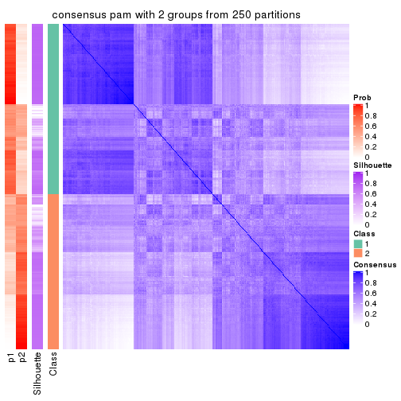</p>

</div>
<div id='tab-CV-pam-consensus-heatmap-2'>
<pre><code class="r">consensus_heatmap(res, k = 3)
</code></pre>

<p>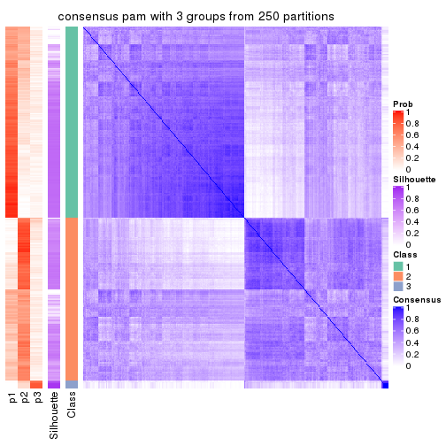</p>

</div>
<div id='tab-CV-pam-consensus-heatmap-3'>
<pre><code class="r">consensus_heatmap(res, k = 4)
</code></pre>

<p>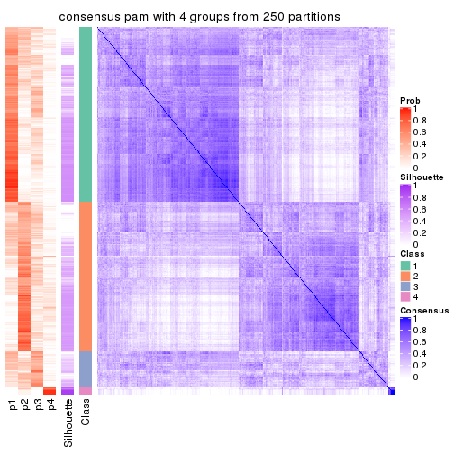</p>

</div>
<div id='tab-CV-pam-consensus-heatmap-4'>
<pre><code class="r">consensus_heatmap(res, k = 5)
</code></pre>

<p>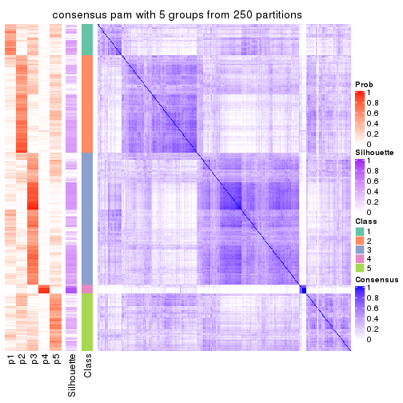</p>

</div>
<div id='tab-CV-pam-consensus-heatmap-5'>
<pre><code class="r">consensus_heatmap(res, k = 6)
</code></pre>

<p>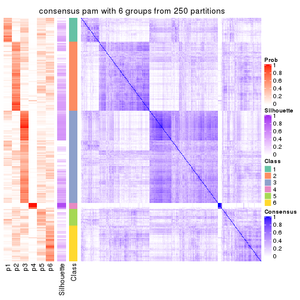</p>

</div>
</div>

Heatmaps for the membership of samples in all partitions to see how consistent they are:


<script>
$( function() {
	$( '#tabs-CV-pam-membership-heatmap' ).tabs();
} );
</script>
<div id='tabs-CV-pam-membership-heatmap'>
<ul>
<li><a href='#tab-CV-pam-membership-heatmap-1'>k = 2</a></li>
<li><a href='#tab-CV-pam-membership-heatmap-2'>k = 3</a></li>
<li><a href='#tab-CV-pam-membership-heatmap-3'>k = 4</a></li>
<li><a href='#tab-CV-pam-membership-heatmap-4'>k = 5</a></li>
<li><a href='#tab-CV-pam-membership-heatmap-5'>k = 6</a></li>
</ul>
<div id='tab-CV-pam-membership-heatmap-1'>
<pre><code class="r">membership_heatmap(res, k = 2)
</code></pre>

<p>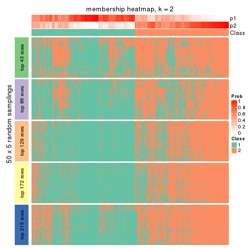</p>

</div>
<div id='tab-CV-pam-membership-heatmap-2'>
<pre><code class="r">membership_heatmap(res, k = 3)
</code></pre>

<p>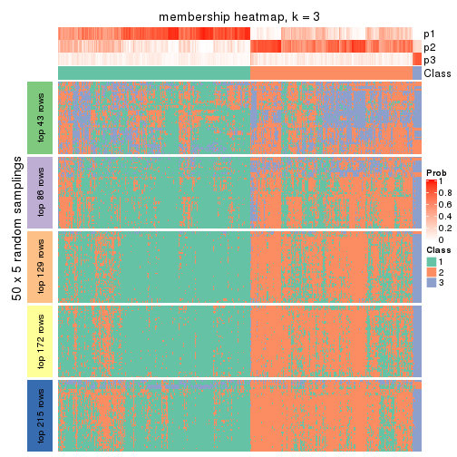</p>

</div>
<div id='tab-CV-pam-membership-heatmap-3'>
<pre><code class="r">membership_heatmap(res, k = 4)
</code></pre>

<p>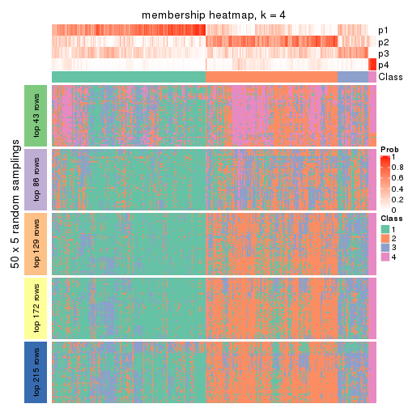</p>

</div>
<div id='tab-CV-pam-membership-heatmap-4'>
<pre><code class="r">membership_heatmap(res, k = 5)
</code></pre>

<p>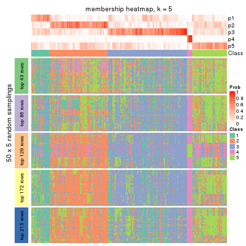</p>

</div>
<div id='tab-CV-pam-membership-heatmap-5'>
<pre><code class="r">membership_heatmap(res, k = 6)
</code></pre>

<p>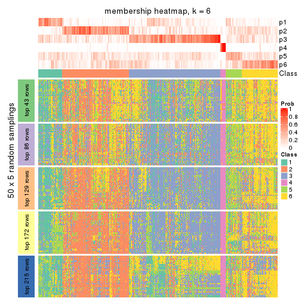</p>

</div>
</div>

As soon as we have had the classes for columns, we can look for signatures
which are significantly different between classes which can be candidate marks
for certain classes. Following are the heatmaps for signatures.


Signature heatmaps where rows are scaled:


<script>
$( function() {
	$( '#tabs-CV-pam-get-signatures' ).tabs();
} );
</script>
<div id='tabs-CV-pam-get-signatures'>
<ul>
<li><a href='#tab-CV-pam-get-signatures-1'>k = 2</a></li>
<li><a href='#tab-CV-pam-get-signatures-2'>k = 3</a></li>
<li><a href='#tab-CV-pam-get-signatures-3'>k = 4</a></li>
<li><a href='#tab-CV-pam-get-signatures-4'>k = 5</a></li>
<li><a href='#tab-CV-pam-get-signatures-5'>k = 6</a></li>
</ul>
<div id='tab-CV-pam-get-signatures-1'>
<pre><code class="r">get_signatures(res, k = 2)
</code></pre>

<p>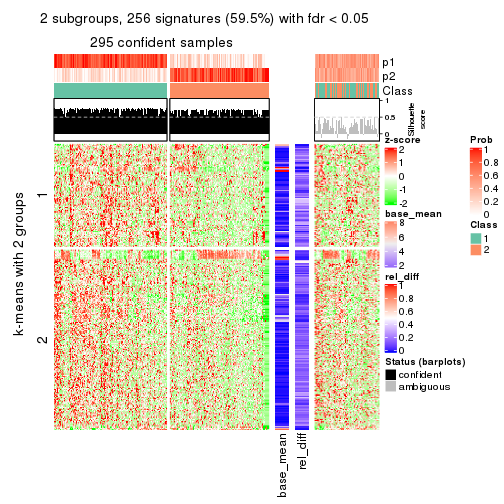</p>

</div>
<div id='tab-CV-pam-get-signatures-2'>
<pre><code class="r">get_signatures(res, k = 3)
</code></pre>

<p>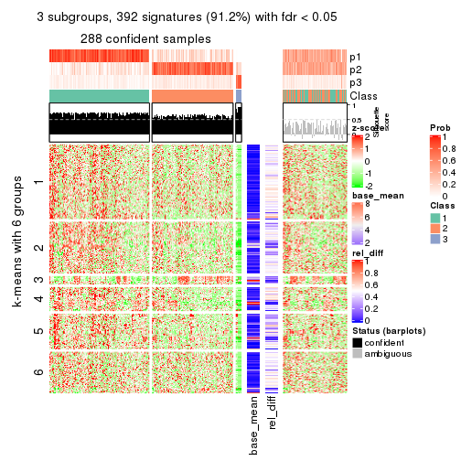</p>

</div>
<div id='tab-CV-pam-get-signatures-3'>
<pre><code class="r">get_signatures(res, k = 4)
</code></pre>

<p>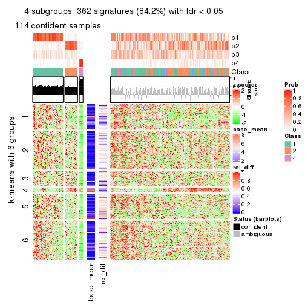</p>

</div>
<div id='tab-CV-pam-get-signatures-4'>
<pre><code class="r">get_signatures(res, k = 5)
</code></pre>

<p>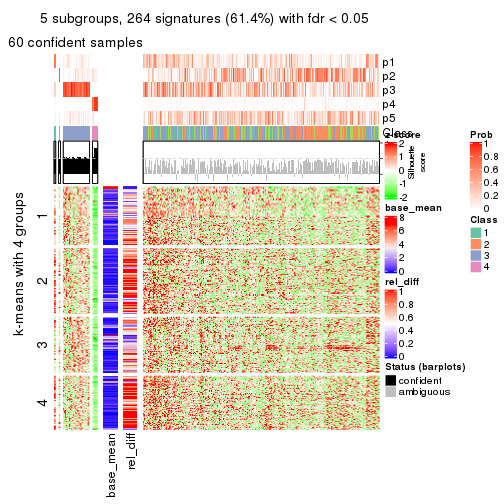</p>

</div>
<div id='tab-CV-pam-get-signatures-5'>
<pre><code class="r">get_signatures(res, k = 6)
</code></pre>

<p>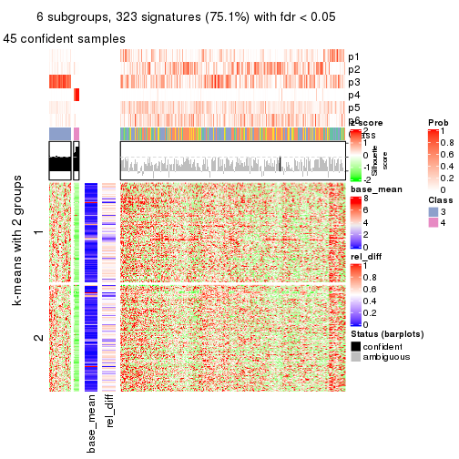</p>

</div>
</div>


Signature heatmaps where rows are not scaled:


<script>
$( function() {
	$( '#tabs-CV-pam-get-signatures-no-scale' ).tabs();
} );
</script>
<div id='tabs-CV-pam-get-signatures-no-scale'>
<ul>
<li><a href='#tab-CV-pam-get-signatures-no-scale-1'>k = 2</a></li>
<li><a href='#tab-CV-pam-get-signatures-no-scale-2'>k = 3</a></li>
<li><a href='#tab-CV-pam-get-signatures-no-scale-3'>k = 4</a></li>
<li><a href='#tab-CV-pam-get-signatures-no-scale-4'>k = 5</a></li>
<li><a href='#tab-CV-pam-get-signatures-no-scale-5'>k = 6</a></li>
</ul>
<div id='tab-CV-pam-get-signatures-no-scale-1'>
<pre><code class="r">get_signatures(res, k = 2, scale_rows = FALSE)
</code></pre>

<p>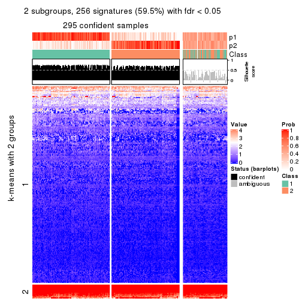</p>

</div>
<div id='tab-CV-pam-get-signatures-no-scale-2'>
<pre><code class="r">get_signatures(res, k = 3, scale_rows = FALSE)
</code></pre>

<p>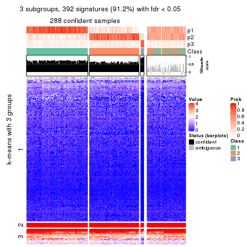</p>

</div>
<div id='tab-CV-pam-get-signatures-no-scale-3'>
<pre><code class="r">get_signatures(res, k = 4, scale_rows = FALSE)
</code></pre>

<p>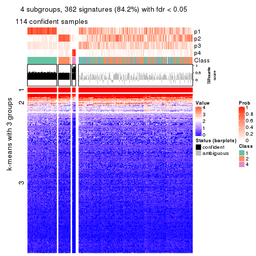</p>

</div>
<div id='tab-CV-pam-get-signatures-no-scale-4'>
<pre><code class="r">get_signatures(res, k = 5, scale_rows = FALSE)
</code></pre>

<p>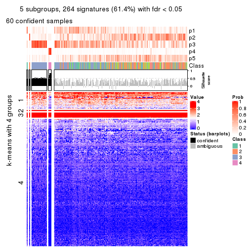</p>

</div>
<div id='tab-CV-pam-get-signatures-no-scale-5'>
<pre><code class="r">get_signatures(res, k = 6, scale_rows = FALSE)
</code></pre>

<p>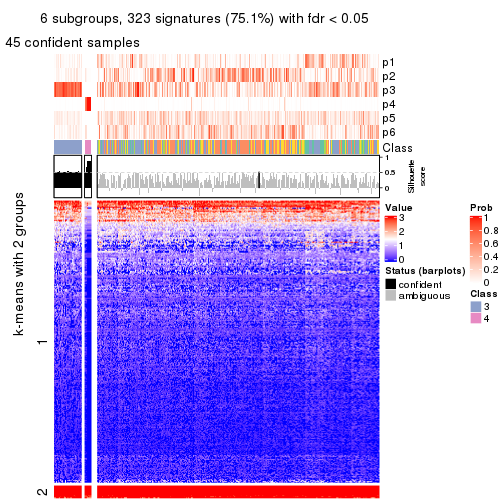</p>

</div>
</div>


Compare the overlap of signatures from different k:

```r
compare_signatures(res)
```

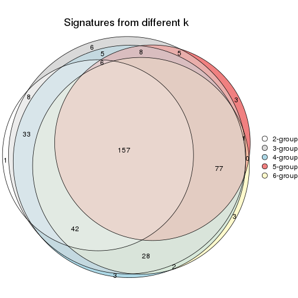

`get_signature()` returns a data frame invisibly. TO get the list of signatures, the function
call should be assigned to a variable explicitly. In following code, if `plot` argument is set
to `FALSE`, no heatmap is plotted while only the differential analysis is performed.

```r
# code only for demonstration
tb = get_signature(res, k = ..., plot = FALSE)
```

An example of the output of `tb` is:

```
#>   which_row         fdr    mean_1    mean_2 scaled_mean_1 scaled_mean_2 km
#> 1        38 0.042760348  8.373488  9.131774    -0.5533452     0.5164555  1
#> 2        40 0.018707592  7.106213  8.469186    -0.6173731     0.5762149  1
#> 3        55 0.019134737 10.221463 11.207825    -0.6159697     0.5749050  1
#> 4        59 0.006059896  5.921854  7.869574    -0.6899429     0.6439467  1
#> 5        60 0.018055526  8.928898 10.211722    -0.6204761     0.5791110  1
#> 6        98 0.009384629 15.714769 14.887706     0.6635654    -0.6193277  2
...
```

The columns in `tb` are:

1. `which_row`: row indices corresponding to the input matrix.
2. `fdr`: FDR for the differential test. 
3. `mean_x`: The mean value in group x.
4. `scaled_mean_x`: The mean value in group x after rows are scaled.
5. `km`: Row groups if k-means clustering is applied to rows.


UMAP plot which shows how samples are separated.


<script>
$( function() {
	$( '#tabs-CV-pam-dimension-reduction' ).tabs();
} );
</script>
<div id='tabs-CV-pam-dimension-reduction'>
<ul>
<li><a href='#tab-CV-pam-dimension-reduction-1'>k = 2</a></li>
<li><a href='#tab-CV-pam-dimension-reduction-2'>k = 3</a></li>
<li><a href='#tab-CV-pam-dimension-reduction-3'>k = 4</a></li>
<li><a href='#tab-CV-pam-dimension-reduction-4'>k = 5</a></li>
<li><a href='#tab-CV-pam-dimension-reduction-5'>k = 6</a></li>
</ul>
<div id='tab-CV-pam-dimension-reduction-1'>
<pre><code class="r">dimension_reduction(res, k = 2, method = &quot;UMAP&quot;)
</code></pre>

<p>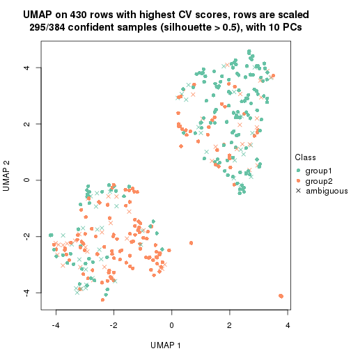</p>

</div>
<div id='tab-CV-pam-dimension-reduction-2'>
<pre><code class="r">dimension_reduction(res, k = 3, method = &quot;UMAP&quot;)
</code></pre>

<p>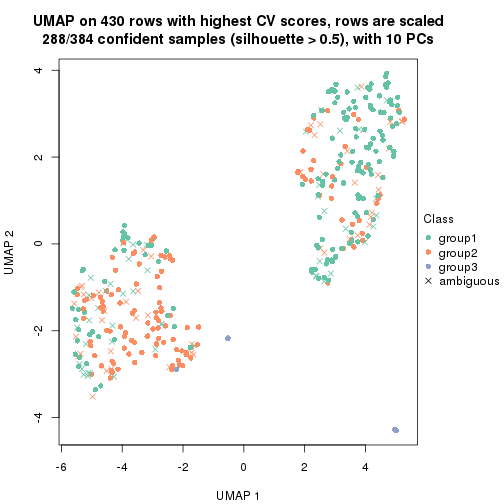</p>

</div>
<div id='tab-CV-pam-dimension-reduction-3'>
<pre><code class="r">dimension_reduction(res, k = 4, method = &quot;UMAP&quot;)
</code></pre>

<p>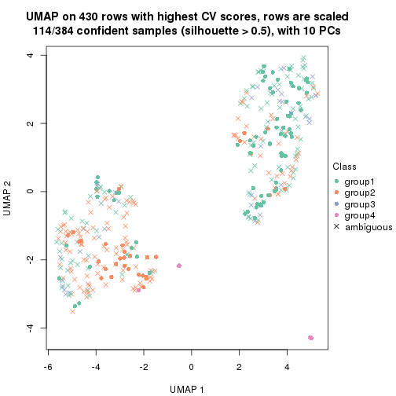</p>

</div>
<div id='tab-CV-pam-dimension-reduction-4'>
<pre><code class="r">dimension_reduction(res, k = 5, method = &quot;UMAP&quot;)
</code></pre>

<p>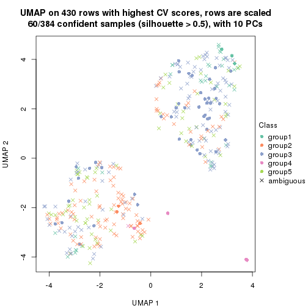</p>

</div>
<div id='tab-CV-pam-dimension-reduction-5'>
<pre><code class="r">dimension_reduction(res, k = 6, method = &quot;UMAP&quot;)
</code></pre>

<p>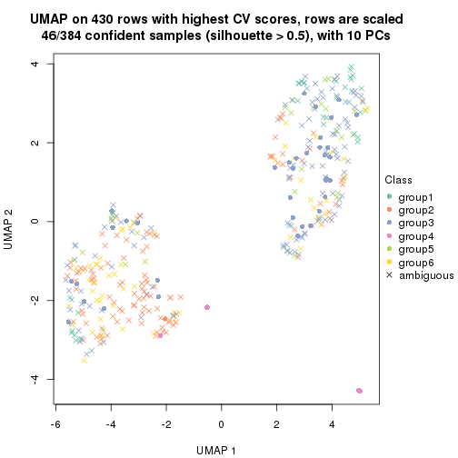</p>

</div>
</div>


Following heatmap shows how subgroups are split when increasing `k`:

```r
collect_classes(res)
```

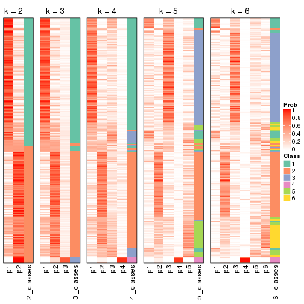


If matrix rows can be associated to genes, consider to use `GO_Enrichment(res,
...)` to perform function enrichment for the signature genes.


 

---------------------------------------------------


### CV:mclust


The object with results only for a single top-value method and a single partition method 
can be extracted as:

```r
res = res_list["CV", "mclust"]
# you can also extract it by
# res = res_list["CV:mclust"]
```

A summary of `res` and all the functions that can be applied to it:

```r
res
```

```
#> A 'ConsensusPartition' object with k = 2, 3, 4, 5, 6.
#>   On a matrix with 430 rows and 384 columns.
#>   Top rows (43, 86, 129, 172, 215) are extracted by 'CV' method.
#>   Subgroups are detected by 'mclust' method.
#>   Performed in total 1250 partitions by row resampling.
#>   Best k for subgroups seems to be 3.
#> 
#> Following methods can be applied to this 'ConsensusPartition' object:
#>  [1] "cola_report"             "collect_classes"         "collect_plots"          
#>  [4] "collect_stats"           "colnames"                "compare_signatures"     
#>  [7] "consensus_heatmap"       "dimension_reduction"     "functional_enrichment"  
#> [10] "get_anno_col"            "get_anno"                "get_classes"            
#> [13] "get_consensus"           "get_matrix"              "get_membership"         
#> [16] "get_param"               "get_signatures"          "get_stats"              
#> [19] "is_best_k"               "is_stable_k"             "membership_heatmap"     
#> [22] "ncol"                    "nrow"                    "plot_ecdf"              
#> [25] "rownames"                "select_partition_number" "show"                   
#> [28] "suggest_best_k"          "test_to_known_factors"
```

`collect_plots()` function collects all the plots made from `res` for all `k` (number of partitions)
into one single page to provide an easy and fast comparison between different `k`.

```r
collect_plots(res)
```

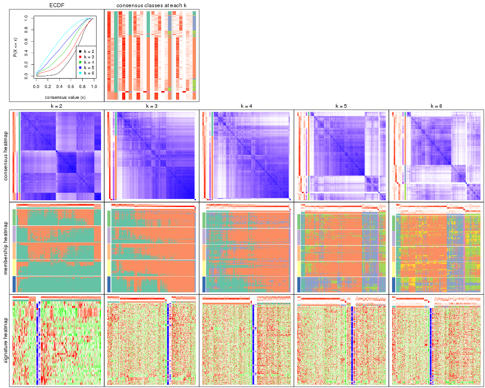

The plots are:

- The first row: a plot of the ECDF (Empirical cumulative distribution
  function) curves of the consensus matrix for each `k` and the heatmap of
  predicted classes for each `k`.
- The second row: heatmaps of the consensus matrix for each `k`.
- The third row: heatmaps of the membership matrix for each `k`.
- The fouth row: heatmaps of the signatures for each `k`.

All the plots in panels can be made by individual functions and they are
plotted later in this section.

`select_partition_number()` produces several plots showing different
statistics for choosing "optimized" `k`. There are following statistics:

- ECDF curves of the consensus matrix for each `k`;
- 1-PAC. [The PAC
  score](https://en.wikipedia.org/wiki/Consensus_clustering#Over-interpretation_potential_of_consensus_clustering)
  measures the proportion of the ambiguous subgrouping.
- Mean silhouette score.
- Concordance. The mean probability of fiting the consensus class ids in all
  partitions.
- Area increased. Denote $A_k$ as the area under the ECDF curve for current
  `k`, the area increased is defined as $A_k - A_{k-1}$.
- Rand index. The percent of pairs of samples that are both in a same cluster
  or both are not in a same cluster in the partition of k and k-1.
- Jaccard index. The ratio of pairs of samples are both in a same cluster in
  the partition of k and k-1 and the pairs of samples are both in a same
  cluster in the partition k or k-1.

The detailed explanations of these statistics can be found in [the cola
vignette](http://bioconductor.org/packages/devel/bioc/vignettes/cola/inst/doc/cola.html#toc_13).

Generally speaking, lower PAC score, higher mean silhouette score or higher
concordance corresponds to better partition. Rand index and Jaccard index
measure how similar the current partition is compared to partition with `k-1`.
If they are too similar, we won't accept `k` is better than `k-1`.

```r
select_partition_number(res)
```

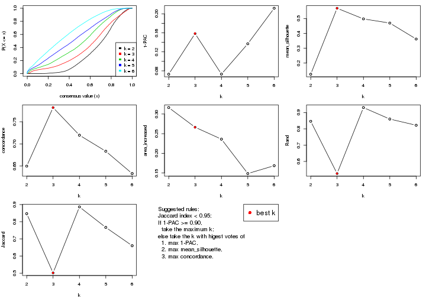

The numeric values for all these statistics can be obtained by `get_stats()`.

```r
get_stats(res)
```

```
#>   k  1-PAC mean_silhouette concordance area_increased  Rand Jaccard
#> 2 2 0.0730           0.125       0.650          0.316 0.847   0.847
#> 3 3 0.1584           0.570       0.782          0.266 0.526   0.502
#> 4 4 0.0733           0.498       0.720          0.236 0.931   0.886
#> 5 5 0.1370           0.470       0.683          0.149 0.860   0.767
#> 6 6 0.2117           0.362       0.633          0.169 0.822   0.660
```

`suggest_best_k()` suggests the best $k$ based on these statistics. The rules are as follows:

- All $k$ with Jaccard index larger than 0.95 are removed because the increase of
  the partition number does not provides enough extra information. If all $k$ are removed,
  the best $k$ is assigned by `NA`.
- For $k$ with 1-PAC larger than 0.9, the maximal $k$ is taken as the "best k". Other $k$ is called "optional k".
- If it does not fit the second rule. The $k$ with the highest vote of highest
  1-PAC, mean silhouette and concordance is taken as the "best k".

```r
suggest_best_k(res)
```

```
#> [1] 3
```


Following shows the table of the partitions (You need to click the **show/hide
code output** link to see it). The membership matrix (columns with name `p*`)
is inferred by
[`clue::cl_consensus()`](https://www.rdocumentation.org/link/cl_consensus?package=clue)
function with the `SE` method. Basically the value in the membership matrix
represents the probability to belong to a certain group. The finall class
label for an item is determined with the group with highest probability it
belongs to.

In `get_classes()` function, the entropy is calculated from the membership
matrix and the silhouette score is calculated from the consensus matrix.


<script>
$( function() {
	$( '#tabs-CV-mclust-get-classes' ).tabs();
} );
</script>
<div id='tabs-CV-mclust-get-classes'>
<ul>
<li><a href='#tab-CV-mclust-get-classes-1'>k = 2</a></li>
<li><a href='#tab-CV-mclust-get-classes-2'>k = 3</a></li>
<li><a href='#tab-CV-mclust-get-classes-3'>k = 4</a></li>
<li><a href='#tab-CV-mclust-get-classes-4'>k = 5</a></li>
<li><a href='#tab-CV-mclust-get-classes-5'>k = 6</a></li>
</ul>

<div id='tab-CV-mclust-get-classes-1'>
<p><a id='tab-CV-mclust-get-classes-1-a' style='color:#0366d6' href='#'>show/hide code output</a></p>
<pre><code class="r">cbind(get_classes(res, k = 2), get_membership(res, k = 2))
</code></pre>

<pre><code>#&gt;            class entropy silhouette    p1    p2
#&gt; SRR2105277     1   0.753    0.37330 0.784 0.216
#&gt; SRR2105278     1   0.625    0.47897 0.844 0.156
#&gt; SRR2105275     1   0.662    0.45133 0.828 0.172
#&gt; SRR2105276     1   0.327    0.51099 0.940 0.060
#&gt; SRR2105273     1   0.518    0.48624 0.884 0.116
#&gt; SRR2105274     1   0.760    0.32804 0.780 0.220
#&gt; SRR2105271     1   0.975   -0.56115 0.592 0.408
#&gt; SRR2105272     1   0.456    0.50006 0.904 0.096
#&gt; SRR2105269     1   0.955   -0.35281 0.624 0.376
#&gt; SRR2105270     2   0.997    0.94895 0.468 0.532
#&gt; SRR2105267     1   0.994   -0.73659 0.544 0.456
#&gt; SRR2105268     2   0.998    0.95379 0.476 0.524
#&gt; SRR2105265     1   1.000   -0.90697 0.504 0.496
#&gt; SRR2105266     2   0.996    0.94161 0.464 0.536
#&gt; SRR2105263     1   0.443    0.50338 0.908 0.092
#&gt; SRR2105264     1   0.456    0.50914 0.904 0.096
#&gt; SRR2105261     1   0.584    0.44271 0.860 0.140
#&gt; SRR2105262     1   0.992   -0.73675 0.552 0.448
#&gt; SRR2105357     1   0.998   -0.84825 0.524 0.476
#&gt; SRR2105358     1   0.871    0.09965 0.708 0.292
#&gt; SRR2105439     1   0.988   -0.67873 0.564 0.436
#&gt; SRR2105440     1   1.000   -0.89837 0.508 0.492
#&gt; SRR2105509     1   0.981    0.03717 0.580 0.420
#&gt; SRR2105510     1   0.904   -0.03714 0.680 0.320
#&gt; SRR2105507     1   0.671    0.46628 0.824 0.176
#&gt; SRR2105508     1   0.469    0.47678 0.900 0.100
#&gt; SRR2105505     1   0.844    0.23024 0.728 0.272
#&gt; SRR2105506     1   0.730    0.42030 0.796 0.204
#&gt; SRR2105503     1   0.714    0.38181 0.804 0.196
#&gt; SRR2105504     1   0.995    0.20160 0.540 0.460
#&gt; SRR2105501     2   0.997    0.94895 0.468 0.532
#&gt; SRR2105502     1   0.995    0.20160 0.540 0.460
#&gt; SRR2105499     1   0.775    0.35875 0.772 0.228
#&gt; SRR2105500     1   0.943   -0.33003 0.640 0.360
#&gt; SRR2105497     1   0.373    0.51486 0.928 0.072
#&gt; SRR2105498     1   0.839    0.36987 0.732 0.268
#&gt; SRR2105495     1   0.990   -0.70227 0.560 0.440
#&gt; SRR2105496     1   0.998   -0.81976 0.528 0.472
#&gt; SRR2105493     1   0.995   -0.77991 0.540 0.460
#&gt; SRR2105494     2   1.000    0.93522 0.492 0.508
#&gt; SRR2105491     1   0.541    0.48576 0.876 0.124
#&gt; SRR2105492     1   0.518    0.48958 0.884 0.116
#&gt; SRR2105489     1   0.327    0.50447 0.940 0.060
#&gt; SRR2105490     1   0.891   -0.04108 0.692 0.308
#&gt; SRR2105487     1   0.482    0.51585 0.896 0.104
#&gt; SRR2105488     1   0.745    0.34776 0.788 0.212
#&gt; SRR2105485     1   0.996   -0.74147 0.536 0.464
#&gt; SRR2105486     1   0.921   -0.17020 0.664 0.336
#&gt; SRR2105483     1   0.814    0.38242 0.748 0.252
#&gt; SRR2105484     1   0.909    0.31940 0.676 0.324
#&gt; SRR2105481     1   0.402    0.51186 0.920 0.080
#&gt; SRR2105482     1   0.574    0.46207 0.864 0.136
#&gt; SRR2105479     1   0.430    0.50424 0.912 0.088
#&gt; SRR2105480     1   0.494    0.49424 0.892 0.108
#&gt; SRR2105477     1   0.311    0.51615 0.944 0.056
#&gt; SRR2105478     1   0.327    0.51409 0.940 0.060
#&gt; SRR2105475     2   1.000    0.87271 0.500 0.500
#&gt; SRR2105476     1   0.680    0.40316 0.820 0.180
#&gt; SRR2105473     1   0.876    0.02531 0.704 0.296
#&gt; SRR2105474     1   0.866    0.05767 0.712 0.288
#&gt; SRR2105471     1   0.456    0.50683 0.904 0.096
#&gt; SRR2105472     1   0.416    0.51210 0.916 0.084
#&gt; SRR2105469     1   0.917   -0.16182 0.668 0.332
#&gt; SRR2105470     1   0.939   -0.29066 0.644 0.356
#&gt; SRR2105467     1   0.653    0.46893 0.832 0.168
#&gt; SRR2105468     1   0.745    0.38869 0.788 0.212
#&gt; SRR2105465     1   0.921   -0.20455 0.664 0.336
#&gt; SRR2105466     1   0.584    0.49491 0.860 0.140
#&gt; SRR2105463     1   0.430    0.51293 0.912 0.088
#&gt; SRR2105464     1   0.644    0.45930 0.836 0.164
#&gt; SRR2105461     1   0.963   -0.39739 0.612 0.388
#&gt; SRR2105462     2   0.999    0.94868 0.480 0.520
#&gt; SRR2105459     1   0.998   -0.83818 0.524 0.476
#&gt; SRR2105460     1   0.961   -0.35357 0.616 0.384
#&gt; SRR2105457     1   0.997   -0.81516 0.532 0.468
#&gt; SRR2105458     1   1.000   -0.90039 0.508 0.492
#&gt; SRR2105455     1   0.966   -0.46016 0.608 0.392
#&gt; SRR2105456     1   0.990   -0.70321 0.560 0.440
#&gt; SRR2105453     1   0.913   -0.13770 0.672 0.328
#&gt; SRR2105454     1   0.605    0.47922 0.852 0.148
#&gt; SRR2105451     2   1.000    0.92886 0.496 0.504
#&gt; SRR2105452     1   0.995    0.20160 0.540 0.460
#&gt; SRR2105449     1   0.552    0.50076 0.872 0.128
#&gt; SRR2105450     1   0.808    0.30979 0.752 0.248
#&gt; SRR2105447     1   1.000   -0.87433 0.512 0.488
#&gt; SRR2105448     1   0.991   -0.71477 0.556 0.444
#&gt; SRR2105445     2   1.000    0.93700 0.492 0.508
#&gt; SRR2105446     1   0.999   -0.85278 0.520 0.480
#&gt; SRR2105443     1   1.000   -0.87165 0.504 0.496
#&gt; SRR2105444     2   0.999    0.95264 0.480 0.520
#&gt; SRR2105441     1   0.943   -0.30431 0.640 0.360
#&gt; SRR2105442     1   0.808    0.21315 0.752 0.248
#&gt; SRR2105437     1   0.714    0.43082 0.804 0.196
#&gt; SRR2105438     1   0.722    0.42923 0.800 0.200
#&gt; SRR2105435     1   0.900   -0.06081 0.684 0.316
#&gt; SRR2105436     1   0.904   -0.06481 0.680 0.320
#&gt; SRR2105433     1   0.443    0.50990 0.908 0.092
#&gt; SRR2105434     1   0.430    0.48933 0.912 0.088
#&gt; SRR2105431     1   0.634    0.45803 0.840 0.160
#&gt; SRR2105432     1   0.615    0.46861 0.848 0.152
#&gt; SRR2105429     1   0.456    0.50241 0.904 0.096
#&gt; SRR2105430     1   0.730    0.33577 0.796 0.204
#&gt; SRR2105427     1   1.000   -0.87845 0.508 0.492
#&gt; SRR2105428     1   0.990   -0.69122 0.560 0.440
#&gt; SRR2105425     1   0.996   -0.80143 0.536 0.464
#&gt; SRR2105426     1   0.929   -0.20689 0.656 0.344
#&gt; SRR2105421     1   1.000   -0.91194 0.504 0.496
#&gt; SRR2105422     1   0.932   -0.24409 0.652 0.348
#&gt; SRR2105423     1   0.671    0.39338 0.824 0.176
#&gt; SRR2105424     2   0.998    0.95416 0.472 0.528
#&gt; SRR2105419     1   0.895   -0.06613 0.688 0.312
#&gt; SRR2105420     1   0.996   -0.80357 0.536 0.464
#&gt; SRR2105415     1   0.388    0.51532 0.924 0.076
#&gt; SRR2105416     1   0.605    0.47205 0.852 0.148
#&gt; SRR2105417     1   0.671    0.41499 0.824 0.176
#&gt; SRR2105418     1   0.518    0.49327 0.884 0.116
#&gt; SRR2105413     1   0.994   -0.73675 0.544 0.456
#&gt; SRR2105414     2   0.998    0.95216 0.472 0.528
#&gt; SRR2105409     1   0.518    0.50449 0.884 0.116
#&gt; SRR2105410     1   0.574    0.50812 0.864 0.136
#&gt; SRR2105411     1   1.000   -0.90685 0.504 0.496
#&gt; SRR2105412     2   0.999    0.94482 0.484 0.516
#&gt; SRR2105407     1   0.939   -0.29707 0.644 0.356
#&gt; SRR2105408     2   1.000    0.91553 0.500 0.500
#&gt; SRR2105403     1   0.900    0.02520 0.684 0.316
#&gt; SRR2105404     1   0.925   -0.10801 0.660 0.340
#&gt; SRR2105405     1   0.963   -0.45044 0.612 0.388
#&gt; SRR2105406     1   0.904   -0.05556 0.680 0.320
#&gt; SRR2105401     1   0.936   -0.17309 0.648 0.352
#&gt; SRR2105402     1   0.995    0.20160 0.540 0.460
#&gt; SRR2105399     2   0.998    0.95113 0.476 0.524
#&gt; SRR2105400     1   0.988   -0.65630 0.564 0.436
#&gt; SRR2105397     1   0.653    0.46080 0.832 0.168
#&gt; SRR2105398     1   0.969   -0.35317 0.604 0.396
#&gt; SRR2105395     1   0.388    0.51231 0.924 0.076
#&gt; SRR2105396     1   0.969   -0.50449 0.604 0.396
#&gt; SRR2105393     1   0.996   -0.79512 0.536 0.464
#&gt; SRR2105394     1   0.936   -0.26872 0.648 0.352
#&gt; SRR2105389     1   0.615    0.41728 0.848 0.152
#&gt; SRR2105390     1   0.327    0.51226 0.940 0.060
#&gt; SRR2105391     1   0.689    0.42155 0.816 0.184
#&gt; SRR2105392     1   0.469    0.47526 0.900 0.100
#&gt; SRR2105385     1   0.456    0.50948 0.904 0.096
#&gt; SRR2105386     1   0.730    0.40451 0.796 0.204
#&gt; SRR2105387     1   0.985   -0.65494 0.572 0.428
#&gt; SRR2105388     1   0.990   -0.69418 0.560 0.440
#&gt; SRR2105381     1   0.844    0.16724 0.728 0.272
#&gt; SRR2105382     1   0.574    0.45630 0.864 0.136
#&gt; SRR2105383     1   0.958   -0.40190 0.620 0.380
#&gt; SRR2105384     1   0.973   -0.52646 0.596 0.404
#&gt; SRR2105379     1   0.224    0.51423 0.964 0.036
#&gt; SRR2105380     1   0.327    0.51439 0.940 0.060
#&gt; SRR2105377     1   0.999   -0.87407 0.516 0.484
#&gt; SRR2105378     1   0.671    0.42957 0.824 0.176
#&gt; SRR2105375     1   0.943   -0.32620 0.640 0.360
#&gt; SRR2105376     1   0.939   -0.29856 0.644 0.356
#&gt; SRR2105373     1   0.529    0.50845 0.880 0.120
#&gt; SRR2105374     1   0.584    0.47644 0.860 0.140
#&gt; SRR2105371     1   0.929   -0.21008 0.656 0.344
#&gt; SRR2105372     1   0.909   -0.08717 0.676 0.324
#&gt; SRR2105369     1   0.975   -0.55976 0.592 0.408
#&gt; SRR2105370     1   0.985   -0.63046 0.572 0.428
#&gt; SRR2105367     1   0.808    0.27228 0.752 0.248
#&gt; SRR2105368     1   0.311    0.51399 0.944 0.056
#&gt; SRR2105365     1   0.456    0.50221 0.904 0.096
#&gt; SRR2105366     1   0.430    0.50577 0.912 0.088
#&gt; SRR2105363     1   0.981   -0.60217 0.580 0.420
#&gt; SRR2105364     2   0.997    0.94925 0.468 0.532
#&gt; SRR2105361     1   0.983   -0.62662 0.576 0.424
#&gt; SRR2105362     1   0.994   -0.76345 0.544 0.456
#&gt; SRR2105359     1   0.949   -0.36204 0.632 0.368
#&gt; SRR2105360     1   0.844    0.13581 0.728 0.272
#&gt; SRR2105355     1   0.904   -0.09594 0.680 0.320
#&gt; SRR2105356     1   0.993   -0.73646 0.548 0.452
#&gt; SRR2105353     1   0.224    0.51357 0.964 0.036
#&gt; SRR2105354     1   0.343    0.51436 0.936 0.064
#&gt; SRR2105351     1   0.242    0.50806 0.960 0.040
#&gt; SRR2105352     1   0.995    0.20160 0.540 0.460
#&gt; SRR2105349     1   0.886    0.04763 0.696 0.304
#&gt; SRR2105350     1   0.999   -0.85367 0.516 0.484
#&gt; SRR2105345     1   0.993   -0.74106 0.548 0.452
#&gt; SRR2105346     1   1.000   -0.90260 0.504 0.496
#&gt; SRR2105347     1   0.615    0.43746 0.848 0.152
#&gt; SRR2105348     1   0.662    0.45032 0.828 0.172
#&gt; SRR2105343     1   0.722    0.34679 0.800 0.200
#&gt; SRR2105344     2   0.998    0.95263 0.472 0.528
#&gt; SRR2105341     1   0.689    0.41080 0.816 0.184
#&gt; SRR2105342     1   0.932   -0.26260 0.652 0.348
#&gt; SRR2105339     1   0.722    0.34700 0.800 0.200
#&gt; SRR2105340     1   0.278    0.51492 0.952 0.048
#&gt; SRR2105335     1   0.327    0.51176 0.940 0.060
#&gt; SRR2105336     1   0.373    0.51191 0.928 0.072
#&gt; SRR2105337     1   0.327    0.51533 0.940 0.060
#&gt; SRR2105338     1   0.327    0.51043 0.940 0.060
#&gt; SRR2105331     1   0.430    0.50871 0.912 0.088
#&gt; SRR2105332     1   0.456    0.50467 0.904 0.096
#&gt; SRR2105333     1   0.671    0.44419 0.824 0.176
#&gt; SRR2105334     2   0.999    0.93882 0.484 0.516
#&gt; SRR2105329     1   0.985   -0.64116 0.572 0.428
#&gt; SRR2105330     1   0.996   -0.79726 0.536 0.464
#&gt; SRR2105327     1   0.895   -0.06027 0.688 0.312
#&gt; SRR2105328     1   0.861    0.10794 0.716 0.284
#&gt; SRR2105325     1   0.697    0.43953 0.812 0.188
#&gt; SRR2105326     1   0.634    0.46224 0.840 0.160
#&gt; SRR2105323     1   0.949   -0.36226 0.632 0.368
#&gt; SRR2105324     2   1.000    0.91496 0.500 0.500
#&gt; SRR2105319     1   0.541    0.48587 0.876 0.124
#&gt; SRR2105320     1   0.595    0.47361 0.856 0.144
#&gt; SRR2105321     1   0.680    0.44366 0.820 0.180
#&gt; SRR2105322     1   0.518    0.49095 0.884 0.116
#&gt; SRR2105317     1   0.929    0.02650 0.656 0.344
#&gt; SRR2105318     2   0.998    0.95393 0.476 0.524
#&gt; SRR2105315     1   1.000   -0.89689 0.508 0.492
#&gt; SRR2105316     2   0.997    0.94843 0.468 0.532
#&gt; SRR2105313     1   0.996   -0.78787 0.536 0.464
#&gt; SRR2105314     2   0.999    0.95235 0.480 0.520
#&gt; SRR2105311     1   0.482    0.49598 0.896 0.104
#&gt; SRR2105312     1   0.482    0.49622 0.896 0.104
#&gt; SRR2105307     1   0.662    0.40084 0.828 0.172
#&gt; SRR2105308     1   0.925   -0.20005 0.660 0.340
#&gt; SRR2105309     1   0.966   -0.36609 0.608 0.392
#&gt; SRR2105310     1   1.000   -0.88345 0.512 0.488
#&gt; SRR2105305     1   0.900    0.01310 0.684 0.316
#&gt; SRR2105306     1   1.000   -0.91309 0.500 0.500
#&gt; SRR2105303     1   0.891   -0.03163 0.692 0.308
#&gt; SRR2105304     1   0.995    0.20160 0.540 0.460
#&gt; SRR2105301     1   0.358    0.50011 0.932 0.068
#&gt; SRR2105302     1   0.980   -0.59080 0.584 0.416
#&gt; SRR2105299     1   0.278    0.51477 0.952 0.048
#&gt; SRR2105300     1   0.955   -0.37807 0.624 0.376
#&gt; SRR2105297     1   0.697    0.44300 0.812 0.188
#&gt; SRR2105298     1   0.775    0.39428 0.772 0.228
#&gt; SRR2105295     1   0.788    0.30156 0.764 0.236
#&gt; SRR2105296     1   0.469    0.48190 0.900 0.100
#&gt; SRR2105293     1   0.163    0.51205 0.976 0.024
#&gt; SRR2105294     1   0.430    0.50733 0.912 0.088
#&gt; SRR2105291     1   0.625    0.42665 0.844 0.156
#&gt; SRR2105292     1   0.506    0.51276 0.888 0.112
#&gt; SRR2105289     1   0.988   -0.67299 0.564 0.436
#&gt; SRR2105290     1   0.871    0.04925 0.708 0.292
#&gt; SRR2105287     1   0.781    0.28040 0.768 0.232
#&gt; SRR2105288     1   0.388    0.51467 0.924 0.076
#&gt; SRR2105285     1   0.990   -0.68513 0.560 0.440
#&gt; SRR2105286     1   0.992   -0.73323 0.552 0.448
#&gt; SRR2105283     1   0.802    0.23220 0.756 0.244
#&gt; SRR2105284     1   0.988   -0.69093 0.564 0.436
#&gt; SRR2105281     1   0.999   -0.86240 0.516 0.484
#&gt; SRR2105282     2   0.999    0.95386 0.480 0.520
#&gt; SRR2105259     1   0.971   -0.47895 0.600 0.400
#&gt; SRR2105260     2   0.999    0.95288 0.480 0.520
#&gt; SRR2105279     1   0.985   -0.59755 0.572 0.428
#&gt; SRR2105280     1   0.983   -0.61477 0.576 0.424
#&gt; SRR2105257     1   0.518    0.50649 0.884 0.116
#&gt; SRR2105258     1   0.482    0.49628 0.896 0.104
#&gt; SRR2105253     1   0.881    0.00166 0.700 0.300
#&gt; SRR2105254     1   0.981   -0.60970 0.580 0.420
#&gt; SRR2105255     1   0.891   -0.04459 0.692 0.308
#&gt; SRR2105256     1   0.966   -0.48723 0.608 0.392
#&gt; SRR2105251     1   0.605    0.43819 0.852 0.148
#&gt; SRR2105252     1   0.975   -0.55440 0.592 0.408
#&gt; SRR2105249     1   0.985   -0.63992 0.572 0.428
#&gt; SRR2105250     1   0.833    0.16443 0.736 0.264
#&gt; SRR2105247     1   0.343    0.50173 0.936 0.064
#&gt; SRR2105248     1   0.343    0.51064 0.936 0.064
#&gt; SRR2105245     1   0.260    0.51303 0.956 0.044
#&gt; SRR2105246     1   0.563    0.45504 0.868 0.132
#&gt; SRR2105243     1   0.995   -0.76076 0.540 0.460
#&gt; SRR2105244     1   0.722    0.45503 0.800 0.200
#&gt; SRR2105241     1   0.541    0.49247 0.876 0.124
#&gt; SRR2105242     1   0.242    0.51367 0.960 0.040
#&gt; SRR2105239     1   0.506    0.49061 0.888 0.112
#&gt; SRR2105240     1   0.529    0.50726 0.880 0.120
#&gt; SRR2105237     1   0.913   -0.11588 0.672 0.328
#&gt; SRR2105238     2   0.998    0.95187 0.472 0.528
#&gt; SRR2105235     2   1.000    0.91891 0.500 0.500
#&gt; SRR2105236     1   0.996   -0.79165 0.536 0.464
#&gt; SRR2105233     1   0.722    0.41671 0.800 0.200
#&gt; SRR2105234     1   0.839    0.16995 0.732 0.268
#&gt; SRR2105231     1   0.891   -0.02575 0.692 0.308
#&gt; SRR2105232     1   0.730    0.36754 0.796 0.204
#&gt; SRR2105227     1   0.595    0.43835 0.856 0.144
#&gt; SRR2105228     1   0.999   -0.85350 0.516 0.484
#&gt; SRR2105225     1   0.909   -0.11013 0.676 0.324
#&gt; SRR2105226     1   0.653    0.42743 0.832 0.168
#&gt; SRR2105229     1   0.615    0.43450 0.848 0.152
#&gt; SRR2105230     1   0.760    0.28928 0.780 0.220
#&gt; SRR2105219     1   0.999   -0.81769 0.520 0.480
#&gt; SRR2105220     2   1.000    0.91632 0.500 0.500
#&gt; SRR2105221     1   0.900   -0.05192 0.684 0.316
#&gt; SRR2105222     1   0.541    0.48388 0.876 0.124
#&gt; SRR2105223     1   0.343    0.51494 0.936 0.064
#&gt; SRR2105224     1   0.697    0.47335 0.812 0.188
#&gt; SRR2105217     1   0.469    0.49785 0.900 0.100
#&gt; SRR2105218     1   0.373    0.50048 0.928 0.072
#&gt; SRR2105215     1   0.992   -0.72645 0.552 0.448
#&gt; SRR2105216     2   0.998    0.95127 0.476 0.524
#&gt; SRR2105213     1   0.416    0.51127 0.916 0.084
#&gt; SRR2105214     1   0.402    0.49757 0.920 0.080
#&gt; SRR2105211     1   0.978   -0.48978 0.588 0.412
#&gt; SRR2105212     1   1.000   -0.91071 0.504 0.496
#&gt; SRR2105209     1   0.730    0.39686 0.796 0.204
#&gt; SRR2105210     1   0.224    0.51031 0.964 0.036
#&gt; SRR2105207     1   0.388    0.51405 0.924 0.076
#&gt; SRR2105208     1   0.456    0.50633 0.904 0.096
#&gt; SRR2105205     1   0.430    0.50320 0.912 0.088
#&gt; SRR2105206     1   0.443    0.50744 0.908 0.092
#&gt; SRR2105201     1   0.993   -0.74271 0.548 0.452
#&gt; SRR2105202     1   0.978   -0.55845 0.588 0.412
#&gt; SRR2105203     1   0.795    0.28742 0.760 0.240
#&gt; SRR2105204     1   0.961   -0.43445 0.616 0.384
#&gt; SRR2105199     1   0.998   -0.82116 0.528 0.472
#&gt; SRR2105200     1   0.788    0.26753 0.764 0.236
#&gt; SRR2105197     1   0.946   -0.18655 0.636 0.364
#&gt; SRR2105198     1   0.469    0.50580 0.900 0.100
#&gt; SRR2105195     1   0.482    0.50151 0.896 0.104
#&gt; SRR2105196     1   0.518    0.50919 0.884 0.116
#&gt; SRR2105193     1   0.552    0.48900 0.872 0.128
#&gt; SRR2105194     1   0.605    0.47139 0.852 0.148
#&gt; SRR2105191     1   0.518    0.49135 0.884 0.116
#&gt; SRR2105192     1   0.506    0.50065 0.888 0.112
#&gt; SRR2105189     1   0.963   -0.44343 0.612 0.388
#&gt; SRR2105190     2   0.999    0.94926 0.484 0.516
#&gt; SRR2105187     1   0.482    0.49906 0.896 0.104
#&gt; SRR2105188     1   0.327    0.51049 0.940 0.060
#&gt; SRR2105179     1   0.430    0.50976 0.912 0.088
#&gt; SRR2105180     1   0.506    0.49167 0.888 0.112
#&gt; SRR2105183     2   1.000    0.91470 0.500 0.500
#&gt; SRR2105184     1   0.529    0.45428 0.880 0.120
#&gt; SRR2105185     1   0.900   -0.05174 0.684 0.316
#&gt; SRR2105186     1   0.327    0.49766 0.940 0.060
#&gt; SRR2105181     1   0.388    0.51331 0.924 0.076
#&gt; SRR2105182     1   0.738    0.35373 0.792 0.208
#&gt; SRR2105177     1   0.443    0.51315 0.908 0.092
#&gt; SRR2105178     1   0.900    0.32606 0.684 0.316
#&gt; SRR2105171     1   0.995   -0.78557 0.540 0.460
#&gt; SRR2105172     1   0.997   -0.79990 0.532 0.468
#&gt; SRR2105175     1   0.552    0.48358 0.872 0.128
#&gt; SRR2105176     1   0.753    0.41577 0.784 0.216
#&gt; SRR2105173     1   0.788    0.33947 0.764 0.236
#&gt; SRR2105174     1   0.827    0.28760 0.740 0.260
#&gt; SRR2105169     1   0.795    0.28767 0.760 0.240
#&gt; SRR2105170     1   0.653    0.48841 0.832 0.168
#&gt; SRR2105167     2   0.998    0.95152 0.472 0.528
#&gt; SRR2105168     1   0.995   -0.77470 0.540 0.460
#&gt; SRR2105165     1   0.430    0.50543 0.912 0.088
#&gt; SRR2105166     1   0.430    0.50431 0.912 0.088
#&gt; SRR2105163     1   0.506    0.49424 0.888 0.112
#&gt; SRR2105164     1   0.482    0.49559 0.896 0.104
#&gt; SRR2105161     1   0.456    0.49951 0.904 0.096
#&gt; SRR2105162     1   0.574    0.47965 0.864 0.136
#&gt; SRR2105155     1   0.988   -0.68596 0.564 0.436
#&gt; SRR2105156     1   0.999   -0.85733 0.516 0.484
#&gt; SRR2105157     1   0.402    0.50713 0.920 0.080
#&gt; SRR2105158     1   0.443    0.50070 0.908 0.092
#&gt; SRR2105159     1   0.456    0.50612 0.904 0.096
#&gt; SRR2105160     1   0.443    0.51244 0.908 0.092
#&gt; SRR2105153     1   0.430    0.51159 0.912 0.088
#&gt; SRR2105154     1   0.469    0.49734 0.900 0.100
#&gt; SRR2105151     1   0.900   -0.07222 0.684 0.316
#&gt; SRR2105152     1   1.000   -0.87015 0.512 0.488
#&gt; SRR2105149     1   0.943   -0.29148 0.640 0.360
#&gt; SRR2105150     2   0.998    0.95170 0.476 0.524
#&gt; SRR2105147     1   0.904    0.31645 0.680 0.320
#&gt; SRR2105148     1   0.827    0.37727 0.740 0.260
#&gt; SRR2105143     1   0.788    0.25408 0.764 0.236
#&gt; SRR2105144     1   0.949   -0.34100 0.632 0.368
#&gt; SRR2105145     1   0.506    0.49167 0.888 0.112
#&gt; SRR2105146     1   0.552    0.48353 0.872 0.128
#&gt; SRR2105141     1   0.469    0.49817 0.900 0.100
#&gt; SRR2105142     1   0.574    0.50661 0.864 0.136
#&gt; SRR2105139     1   0.981   -0.60865 0.580 0.420
#&gt; SRR2105140     1   0.990   -0.68771 0.560 0.440
#&gt; SRR2105137     1   0.993   -0.73018 0.548 0.452
#&gt; SRR2105138     1   0.795    0.25695 0.760 0.240
#&gt; SRR2105135     1   1.000   -0.89372 0.508 0.492
#&gt; SRR2105136     1   0.994   -0.76191 0.544 0.456
#&gt; SRR2105133     1   0.929   -0.16823 0.656 0.344
#&gt; SRR2105134     1   0.814    0.22083 0.748 0.252
#&gt; SRR2105131     1   0.981   -0.61053 0.580 0.420
#&gt; SRR2105132     1   0.552    0.47670 0.872 0.128
#&gt; SRR2105129     1   0.584    0.48952 0.860 0.140
#&gt; SRR2105130     1   0.753    0.41458 0.784 0.216
#&gt; SRR2105127     1   0.689    0.38367 0.816 0.184
#&gt; SRR2105128     1   0.932   -0.21474 0.652 0.348
</code></pre>

<script>
$('#tab-CV-mclust-get-classes-1-a').parent().next().next().hide();
$('#tab-CV-mclust-get-classes-1-a').click(function(){
  $('#tab-CV-mclust-get-classes-1-a').parent().next().next().toggle();
  return(false);
});
</script>
</div>

<div id='tab-CV-mclust-get-classes-2'>
<p><a id='tab-CV-mclust-get-classes-2-a' style='color:#0366d6' href='#'>show/hide code output</a></p>
<pre><code class="r">cbind(get_classes(res, k = 3), get_membership(res, k = 3))
</code></pre>

<pre><code>#&gt;            class entropy silhouette    p1    p2    p3
#&gt; SRR2105277     2  0.6931    0.43364 0.328 0.640 0.032
#&gt; SRR2105278     2  0.7744   -0.00914 0.448 0.504 0.048
#&gt; SRR2105275     1  0.6161    0.64938 0.696 0.288 0.016
#&gt; SRR2105276     1  0.6667    0.53989 0.616 0.368 0.016
#&gt; SRR2105273     2  0.6713    0.16843 0.416 0.572 0.012
#&gt; SRR2105274     2  0.6228    0.36090 0.372 0.624 0.004
#&gt; SRR2105271     2  0.5493    0.63401 0.232 0.756 0.012
#&gt; SRR2105272     1  0.3845    0.60621 0.872 0.116 0.012
#&gt; SRR2105269     2  0.1636    0.73676 0.016 0.964 0.020
#&gt; SRR2105270     2  0.0983    0.73518 0.004 0.980 0.016
#&gt; SRR2105267     2  0.1482    0.73860 0.020 0.968 0.012
#&gt; SRR2105268     2  0.0661    0.73486 0.004 0.988 0.008
#&gt; SRR2105265     2  0.0661    0.73619 0.004 0.988 0.008
#&gt; SRR2105266     2  0.1170    0.74281 0.016 0.976 0.008
#&gt; SRR2105263     1  0.6404    0.60167 0.644 0.344 0.012
#&gt; SRR2105264     1  0.6102    0.63829 0.672 0.320 0.008
#&gt; SRR2105261     2  0.5656    0.53957 0.284 0.712 0.004
#&gt; SRR2105262     2  0.3989    0.73480 0.124 0.864 0.012
#&gt; SRR2105357     2  0.3459    0.72888 0.096 0.892 0.012
#&gt; SRR2105358     2  0.6229    0.54599 0.280 0.700 0.020
#&gt; SRR2105439     2  0.4345    0.72058 0.136 0.848 0.016
#&gt; SRR2105440     2  0.3112    0.74792 0.056 0.916 0.028
#&gt; SRR2105509     2  0.3771    0.68868 0.012 0.876 0.112
#&gt; SRR2105510     2  0.0983    0.73676 0.004 0.980 0.016
#&gt; SRR2105507     2  0.5529    0.46982 0.296 0.704 0.000
#&gt; SRR2105508     2  0.6143    0.52029 0.304 0.684 0.012
#&gt; SRR2105505     2  0.6282    0.48328 0.324 0.664 0.012
#&gt; SRR2105506     1  0.7471    0.16880 0.516 0.448 0.036
#&gt; SRR2105503     2  0.4682    0.65357 0.192 0.804 0.004
#&gt; SRR2105504     3  0.1647    1.00000 0.004 0.036 0.960
#&gt; SRR2105501     2  0.0747    0.73466 0.000 0.984 0.016
#&gt; SRR2105502     3  0.1647    1.00000 0.004 0.036 0.960
#&gt; SRR2105499     2  0.6724    0.18065 0.420 0.568 0.012
#&gt; SRR2105500     2  0.6388    0.54229 0.284 0.692 0.024
#&gt; SRR2105497     2  0.6654   -0.12783 0.456 0.536 0.008
#&gt; SRR2105498     2  0.5928    0.49525 0.296 0.696 0.008
#&gt; SRR2105495     2  0.1170    0.73521 0.008 0.976 0.016
#&gt; SRR2105496     2  0.1999    0.74296 0.036 0.952 0.012
#&gt; SRR2105493     2  0.1015    0.73957 0.012 0.980 0.008
#&gt; SRR2105494     2  0.1170    0.73798 0.008 0.976 0.016
#&gt; SRR2105491     1  0.5360    0.66748 0.768 0.220 0.012
#&gt; SRR2105492     1  0.5247    0.66836 0.768 0.224 0.008
#&gt; SRR2105489     2  0.6881    0.16366 0.388 0.592 0.020
#&gt; SRR2105490     2  0.5731    0.64350 0.228 0.752 0.020
#&gt; SRR2105487     1  0.6483    0.32443 0.544 0.452 0.004
#&gt; SRR2105488     2  0.6865    0.31764 0.384 0.596 0.020
#&gt; SRR2105485     2  0.5585    0.63634 0.204 0.772 0.024
#&gt; SRR2105486     2  0.6416    0.50477 0.304 0.676 0.020
#&gt; SRR2105483     1  0.4399    0.37043 0.864 0.044 0.092
#&gt; SRR2105484     1  0.4994    0.20165 0.816 0.024 0.160
#&gt; SRR2105481     1  0.6339    0.56458 0.632 0.360 0.008
#&gt; SRR2105482     2  0.7187   -0.13053 0.480 0.496 0.024
#&gt; SRR2105479     1  0.5902    0.63219 0.680 0.316 0.004
#&gt; SRR2105480     1  0.5378    0.66777 0.756 0.236 0.008
#&gt; SRR2105477     2  0.6925   -0.05352 0.452 0.532 0.016
#&gt; SRR2105478     1  0.6676    0.27955 0.516 0.476 0.008
#&gt; SRR2105475     2  0.0892    0.73044 0.000 0.980 0.020
#&gt; SRR2105476     2  0.2793    0.74372 0.044 0.928 0.028
#&gt; SRR2105473     2  0.6526    0.57340 0.260 0.704 0.036
#&gt; SRR2105474     2  0.5956    0.58667 0.264 0.720 0.016
#&gt; SRR2105471     1  0.7049    0.32289 0.528 0.452 0.020
#&gt; SRR2105472     1  0.6836    0.46182 0.572 0.412 0.016
#&gt; SRR2105469     2  0.3310    0.74752 0.064 0.908 0.028
#&gt; SRR2105470     2  0.5455    0.67031 0.204 0.776 0.020
#&gt; SRR2105467     2  0.6912    0.06662 0.444 0.540 0.016
#&gt; SRR2105468     2  0.7169    0.22100 0.404 0.568 0.028
#&gt; SRR2105465     2  0.5656    0.56268 0.284 0.712 0.004
#&gt; SRR2105466     1  0.6483    0.34757 0.544 0.452 0.004
#&gt; SRR2105463     1  0.6313    0.63842 0.676 0.308 0.016
#&gt; SRR2105464     1  0.2793    0.46741 0.928 0.044 0.028
#&gt; SRR2105461     2  0.1905    0.73690 0.016 0.956 0.028
#&gt; SRR2105462     2  0.0424    0.73090 0.000 0.992 0.008
#&gt; SRR2105459     2  0.1267    0.73407 0.004 0.972 0.024
#&gt; SRR2105460     2  0.1411    0.72935 0.000 0.964 0.036
#&gt; SRR2105457     2  0.2939    0.74910 0.072 0.916 0.012
#&gt; SRR2105458     2  0.2318    0.74535 0.028 0.944 0.028
#&gt; SRR2105455     2  0.1774    0.74410 0.024 0.960 0.016
#&gt; SRR2105456     2  0.2772    0.74290 0.080 0.916 0.004
#&gt; SRR2105453     2  0.6998    0.51717 0.292 0.664 0.044
#&gt; SRR2105454     1  0.8037    0.36060 0.572 0.352 0.076
#&gt; SRR2105451     2  0.0983    0.74182 0.016 0.980 0.004
#&gt; SRR2105452     3  0.1647    1.00000 0.004 0.036 0.960
#&gt; SRR2105449     2  0.7169   -0.06420 0.456 0.520 0.024
#&gt; SRR2105450     2  0.7203    0.16417 0.416 0.556 0.028
#&gt; SRR2105447     2  0.1267    0.73661 0.004 0.972 0.024
#&gt; SRR2105448     2  0.1950    0.74656 0.040 0.952 0.008
#&gt; SRR2105445     2  0.0661    0.73672 0.004 0.988 0.008
#&gt; SRR2105446     2  0.1525    0.74816 0.032 0.964 0.004
#&gt; SRR2105443     2  0.1585    0.74539 0.028 0.964 0.008
#&gt; SRR2105444     2  0.3359    0.74122 0.084 0.900 0.016
#&gt; SRR2105441     2  0.4861    0.68836 0.180 0.808 0.012
#&gt; SRR2105442     2  0.5845    0.51810 0.308 0.688 0.004
#&gt; SRR2105437     1  0.2434    0.47068 0.940 0.036 0.024
#&gt; SRR2105438     1  0.2173    0.39090 0.944 0.008 0.048
#&gt; SRR2105435     2  0.4840    0.67387 0.168 0.816 0.016
#&gt; SRR2105436     2  0.5639    0.62692 0.232 0.752 0.016
#&gt; SRR2105433     1  0.6441    0.65964 0.696 0.276 0.028
#&gt; SRR2105434     2  0.7054   -0.01712 0.456 0.524 0.020
#&gt; SRR2105431     1  0.3896    0.44725 0.888 0.052 0.060
#&gt; SRR2105432     1  0.2050    0.45224 0.952 0.028 0.020
#&gt; SRR2105429     2  0.6814    0.30674 0.372 0.608 0.020
#&gt; SRR2105430     2  0.5406    0.64028 0.224 0.764 0.012
#&gt; SRR2105427     2  0.0747    0.72993 0.000 0.984 0.016
#&gt; SRR2105428     2  0.1999    0.74213 0.036 0.952 0.012
#&gt; SRR2105425     2  0.1482    0.74403 0.020 0.968 0.012
#&gt; SRR2105426     2  0.4139    0.72326 0.124 0.860 0.016
#&gt; SRR2105421     2  0.1015    0.73860 0.008 0.980 0.012
#&gt; SRR2105422     2  0.3695    0.73784 0.108 0.880 0.012
#&gt; SRR2105423     2  0.3213    0.74037 0.060 0.912 0.028
#&gt; SRR2105424     2  0.0592    0.73083 0.000 0.988 0.012
#&gt; SRR2105419     2  0.4326    0.71844 0.144 0.844 0.012
#&gt; SRR2105420     2  0.1015    0.73847 0.008 0.980 0.012
#&gt; SRR2105415     1  0.5992    0.65674 0.716 0.268 0.016
#&gt; SRR2105416     1  0.4289    0.50552 0.868 0.092 0.040
#&gt; SRR2105417     2  0.6881    0.29465 0.388 0.592 0.020
#&gt; SRR2105418     1  0.5339    0.44576 0.824 0.080 0.096
#&gt; SRR2105413     2  0.1129    0.73455 0.004 0.976 0.020
#&gt; SRR2105414     2  0.0592    0.73153 0.000 0.988 0.012
#&gt; SRR2105409     2  0.6180    0.36268 0.332 0.660 0.008
#&gt; SRR2105410     1  0.6598    0.44987 0.564 0.428 0.008
#&gt; SRR2105411     2  0.1163    0.73221 0.000 0.972 0.028
#&gt; SRR2105412     2  0.2998    0.74175 0.068 0.916 0.016
#&gt; SRR2105407     2  0.2772    0.74779 0.080 0.916 0.004
#&gt; SRR2105408     2  0.2414    0.74613 0.040 0.940 0.020
#&gt; SRR2105403     2  0.5899    0.59625 0.244 0.736 0.020
#&gt; SRR2105404     2  0.6337    0.55783 0.264 0.708 0.028
#&gt; SRR2105405     2  0.2845    0.74947 0.068 0.920 0.012
#&gt; SRR2105406     2  0.6451    0.53077 0.292 0.684 0.024
#&gt; SRR2105401     2  0.1031    0.73433 0.000 0.976 0.024
#&gt; SRR2105402     3  0.1647    1.00000 0.004 0.036 0.960
#&gt; SRR2105399     2  0.0747    0.73190 0.000 0.984 0.016
#&gt; SRR2105400     2  0.1647    0.72975 0.004 0.960 0.036
#&gt; SRR2105397     2  0.6659    0.50784 0.304 0.668 0.028
#&gt; SRR2105398     2  0.4782    0.69950 0.164 0.820 0.016
#&gt; SRR2105395     2  0.6434    0.22261 0.380 0.612 0.008
#&gt; SRR2105396     2  0.4645    0.69319 0.176 0.816 0.008
#&gt; SRR2105393     2  0.2056    0.74531 0.024 0.952 0.024
#&gt; SRR2105394     2  0.2356    0.74208 0.072 0.928 0.000
#&gt; SRR2105389     2  0.6420    0.54423 0.288 0.688 0.024
#&gt; SRR2105390     2  0.6676   -0.06947 0.476 0.516 0.008
#&gt; SRR2105391     2  0.6677    0.46158 0.324 0.652 0.024
#&gt; SRR2105392     2  0.6404    0.43945 0.344 0.644 0.012
#&gt; SRR2105385     1  0.6513    0.52864 0.592 0.400 0.008
#&gt; SRR2105386     2  0.5480    0.54954 0.264 0.732 0.004
#&gt; SRR2105387     2  0.1765    0.74736 0.040 0.956 0.004
#&gt; SRR2105388     2  0.5012    0.64992 0.204 0.788 0.008
#&gt; SRR2105381     2  0.2793    0.74643 0.044 0.928 0.028
#&gt; SRR2105382     2  0.5072    0.65575 0.196 0.792 0.012
#&gt; SRR2105383     2  0.4551    0.71816 0.140 0.840 0.020
#&gt; SRR2105384     2  0.5167    0.69084 0.172 0.804 0.024
#&gt; SRR2105379     2  0.6521    0.53458 0.248 0.712 0.040
#&gt; SRR2105380     1  0.6520    0.27189 0.508 0.488 0.004
#&gt; SRR2105377     2  0.3987    0.73636 0.108 0.872 0.020
#&gt; SRR2105378     2  0.7029    0.07736 0.440 0.540 0.020
#&gt; SRR2105375     2  0.4128    0.73040 0.132 0.856 0.012
#&gt; SRR2105376     2  0.6937    0.53947 0.272 0.680 0.048
#&gt; SRR2105373     2  0.6823   -0.12330 0.484 0.504 0.012
#&gt; SRR2105374     1  0.1337    0.44751 0.972 0.016 0.012
#&gt; SRR2105371     2  0.1989    0.74952 0.048 0.948 0.004
#&gt; SRR2105372     2  0.4873    0.70612 0.152 0.824 0.024
#&gt; SRR2105369     2  0.3234    0.74755 0.072 0.908 0.020
#&gt; SRR2105370     2  0.5578    0.60594 0.240 0.748 0.012
#&gt; SRR2105367     2  0.6811    0.26538 0.404 0.580 0.016
#&gt; SRR2105368     1  0.6906    0.54516 0.644 0.324 0.032
#&gt; SRR2105365     1  0.6548    0.55319 0.616 0.372 0.012
#&gt; SRR2105366     1  0.6359    0.50114 0.592 0.404 0.004
#&gt; SRR2105363     2  0.2564    0.74713 0.036 0.936 0.028
#&gt; SRR2105364     2  0.1015    0.73952 0.012 0.980 0.008
#&gt; SRR2105361     2  0.1905    0.73504 0.016 0.956 0.028
#&gt; SRR2105362     2  0.2063    0.74891 0.044 0.948 0.008
#&gt; SRR2105359     2  0.6108    0.60230 0.240 0.732 0.028
#&gt; SRR2105360     2  0.4645    0.69846 0.176 0.816 0.008
#&gt; SRR2105355     2  0.4994    0.70421 0.160 0.816 0.024
#&gt; SRR2105356     2  0.5455    0.64742 0.204 0.776 0.020
#&gt; SRR2105353     2  0.6664   -0.09369 0.464 0.528 0.008
#&gt; SRR2105354     1  0.6735    0.40776 0.564 0.424 0.012
#&gt; SRR2105351     2  0.5982    0.41169 0.328 0.668 0.004
#&gt; SRR2105352     3  0.1647    1.00000 0.004 0.036 0.960
#&gt; SRR2105349     2  0.3826    0.71021 0.124 0.868 0.008
#&gt; SRR2105350     2  0.1919    0.74467 0.024 0.956 0.020
#&gt; SRR2105345     2  0.1315    0.73863 0.008 0.972 0.020
#&gt; SRR2105346     2  0.5508    0.66091 0.188 0.784 0.028
#&gt; SRR2105347     2  0.6553    0.23580 0.412 0.580 0.008
#&gt; SRR2105348     2  0.6954    0.40359 0.352 0.620 0.028
#&gt; SRR2105343     2  0.3042    0.74287 0.040 0.920 0.040
#&gt; SRR2105344     2  0.0747    0.73304 0.000 0.984 0.016
#&gt; SRR2105341     2  0.6422    0.46460 0.324 0.660 0.016
#&gt; SRR2105342     2  0.4861    0.68198 0.192 0.800 0.008
#&gt; SRR2105339     2  0.5551    0.65096 0.224 0.760 0.016
#&gt; SRR2105340     1  0.6521    0.18763 0.504 0.492 0.004
#&gt; SRR2105335     1  0.6950    0.23133 0.508 0.476 0.016
#&gt; SRR2105336     1  0.6451    0.47486 0.608 0.384 0.008
#&gt; SRR2105337     1  0.6676    0.26677 0.516 0.476 0.008
#&gt; SRR2105338     1  0.6309    0.15690 0.504 0.496 0.000
#&gt; SRR2105331     2  0.6659   -0.13368 0.460 0.532 0.008
#&gt; SRR2105332     1  0.6724    0.47281 0.568 0.420 0.012
#&gt; SRR2105333     2  0.4058    0.72806 0.076 0.880 0.044
#&gt; SRR2105334     2  0.0661    0.73413 0.004 0.988 0.008
#&gt; SRR2105329     2  0.0848    0.73752 0.008 0.984 0.008
#&gt; SRR2105330     2  0.1015    0.73984 0.012 0.980 0.008
#&gt; SRR2105327     2  0.3769    0.73256 0.104 0.880 0.016
#&gt; SRR2105328     2  0.3826    0.72175 0.124 0.868 0.008
#&gt; SRR2105325     1  0.5366    0.66800 0.776 0.208 0.016
#&gt; SRR2105326     1  0.4371    0.59988 0.860 0.108 0.032
#&gt; SRR2105323     2  0.3618    0.73962 0.104 0.884 0.012
#&gt; SRR2105324     2  0.3272    0.74165 0.080 0.904 0.016
#&gt; SRR2105319     1  0.4915    0.66698 0.804 0.184 0.012
#&gt; SRR2105320     1  0.1774    0.45860 0.960 0.024 0.016
#&gt; SRR2105321     1  0.6262    0.65481 0.696 0.284 0.020
#&gt; SRR2105322     1  0.5502    0.66656 0.744 0.248 0.008
#&gt; SRR2105317     2  0.2050    0.74067 0.020 0.952 0.028
#&gt; SRR2105318     2  0.0592    0.73269 0.000 0.988 0.012
#&gt; SRR2105315     2  0.0237    0.73206 0.000 0.996 0.004
#&gt; SRR2105316     2  0.0237    0.73182 0.000 0.996 0.004
#&gt; SRR2105313     2  0.0848    0.73823 0.008 0.984 0.008
#&gt; SRR2105314     2  0.0424    0.73419 0.000 0.992 0.008
#&gt; SRR2105311     1  0.6339    0.57433 0.632 0.360 0.008
#&gt; SRR2105312     1  0.5982    0.61328 0.668 0.328 0.004
#&gt; SRR2105307     2  0.7030    0.27050 0.396 0.580 0.024
#&gt; SRR2105308     2  0.6490    0.58746 0.256 0.708 0.036
#&gt; SRR2105309     2  0.2152    0.74783 0.036 0.948 0.016
#&gt; SRR2105310     2  0.2749    0.74593 0.064 0.924 0.012
#&gt; SRR2105305     2  0.5526    0.68219 0.172 0.792 0.036
#&gt; SRR2105306     2  0.1905    0.74228 0.016 0.956 0.028
#&gt; SRR2105303     2  0.2527    0.74989 0.044 0.936 0.020
#&gt; SRR2105304     3  0.1647    1.00000 0.004 0.036 0.960
#&gt; SRR2105301     2  0.5733    0.48369 0.324 0.676 0.000
#&gt; SRR2105302     2  0.1999    0.74491 0.036 0.952 0.012
#&gt; SRR2105299     2  0.6664   -0.05741 0.464 0.528 0.008
#&gt; SRR2105300     2  0.3918    0.71480 0.140 0.856 0.004
#&gt; SRR2105297     1  0.5344    0.45805 0.824 0.084 0.092
#&gt; SRR2105298     1  0.6447    0.21534 0.744 0.060 0.196
#&gt; SRR2105295     2  0.2564    0.74264 0.028 0.936 0.036
#&gt; SRR2105296     2  0.5024    0.61712 0.220 0.776 0.004
#&gt; SRR2105293     2  0.7232    0.04191 0.428 0.544 0.028
#&gt; SRR2105294     1  0.5480    0.66667 0.732 0.264 0.004
#&gt; SRR2105291     2  0.6404    0.42737 0.344 0.644 0.012
#&gt; SRR2105292     1  0.6282    0.61398 0.664 0.324 0.012
#&gt; SRR2105289     2  0.1950    0.74976 0.040 0.952 0.008
#&gt; SRR2105290     2  0.6702    0.45889 0.328 0.648 0.024
#&gt; SRR2105287     2  0.7163    0.44446 0.332 0.628 0.040
#&gt; SRR2105288     1  0.6800    0.53362 0.660 0.308 0.032
#&gt; SRR2105285     2  0.2297    0.74369 0.020 0.944 0.036
#&gt; SRR2105286     2  0.2297    0.74508 0.036 0.944 0.020
#&gt; SRR2105283     2  0.5053    0.68097 0.164 0.812 0.024
#&gt; SRR2105284     2  0.5659    0.59447 0.248 0.740 0.012
#&gt; SRR2105281     2  0.1905    0.74299 0.016 0.956 0.028
#&gt; SRR2105282     2  0.0829    0.73491 0.004 0.984 0.012
#&gt; SRR2105259     2  0.3120    0.74590 0.080 0.908 0.012
#&gt; SRR2105260     2  0.1182    0.73997 0.012 0.976 0.012
#&gt; SRR2105279     2  0.1337    0.73699 0.012 0.972 0.016
#&gt; SRR2105280     2  0.0829    0.74036 0.012 0.984 0.004
#&gt; SRR2105257     1  0.4796    0.66457 0.780 0.220 0.000
#&gt; SRR2105258     1  0.4465    0.66124 0.820 0.176 0.004
#&gt; SRR2105253     2  0.2866    0.74269 0.076 0.916 0.008
#&gt; SRR2105254     2  0.1647    0.74441 0.036 0.960 0.004
#&gt; SRR2105255     2  0.5404    0.60657 0.256 0.740 0.004
#&gt; SRR2105256     2  0.5843    0.58884 0.252 0.732 0.016
#&gt; SRR2105251     2  0.4968    0.68110 0.188 0.800 0.012
#&gt; SRR2105252     2  0.2384    0.75041 0.056 0.936 0.008
#&gt; SRR2105249     2  0.1399    0.74476 0.028 0.968 0.004
#&gt; SRR2105250     2  0.6217    0.57521 0.264 0.712 0.024
#&gt; SRR2105247     2  0.5378    0.59807 0.236 0.756 0.008
#&gt; SRR2105248     1  0.6359    0.50142 0.592 0.404 0.004
#&gt; SRR2105245     1  0.6577    0.44007 0.572 0.420 0.008
#&gt; SRR2105246     2  0.5953    0.57378 0.280 0.708 0.012
#&gt; SRR2105243     2  0.3129    0.74152 0.088 0.904 0.008
#&gt; SRR2105244     2  0.6235    0.10495 0.436 0.564 0.000
#&gt; SRR2105241     2  0.6204    0.14086 0.424 0.576 0.000
#&gt; SRR2105242     1  0.6859    0.43737 0.564 0.420 0.016
#&gt; SRR2105239     2  0.6298    0.31857 0.388 0.608 0.004
#&gt; SRR2105240     1  0.5406    0.65480 0.764 0.224 0.012
#&gt; SRR2105237     2  0.3237    0.73933 0.056 0.912 0.032
#&gt; SRR2105238     2  0.0829    0.73830 0.012 0.984 0.004
#&gt; SRR2105235     2  0.0661    0.73810 0.008 0.988 0.004
#&gt; SRR2105236     2  0.3755    0.72898 0.120 0.872 0.008
#&gt; SRR2105233     2  0.3337    0.74417 0.060 0.908 0.032
#&gt; SRR2105234     2  0.1781    0.74420 0.020 0.960 0.020
#&gt; SRR2105231     2  0.4413    0.67975 0.160 0.832 0.008
#&gt; SRR2105232     2  0.5660    0.63521 0.200 0.772 0.028
#&gt; SRR2105227     2  0.6066    0.57340 0.248 0.728 0.024
#&gt; SRR2105228     2  0.3851    0.71616 0.136 0.860 0.004
#&gt; SRR2105225     2  0.5618    0.59436 0.260 0.732 0.008
#&gt; SRR2105226     2  0.6297    0.42333 0.352 0.640 0.008
#&gt; SRR2105229     2  0.5775    0.60349 0.260 0.728 0.012
#&gt; SRR2105230     2  0.6796    0.41596 0.344 0.632 0.024
#&gt; SRR2105219     2  0.1015    0.73770 0.008 0.980 0.012
#&gt; SRR2105220     2  0.1525    0.73518 0.004 0.964 0.032
#&gt; SRR2105221     2  0.6313    0.49987 0.308 0.676 0.016
#&gt; SRR2105222     1  0.6675    0.43574 0.584 0.404 0.012
#&gt; SRR2105223     1  0.6617    0.38070 0.556 0.436 0.008
#&gt; SRR2105224     2  0.6307   -0.13496 0.488 0.512 0.000
#&gt; SRR2105217     1  0.5986    0.65608 0.704 0.284 0.012
#&gt; SRR2105218     2  0.6816   -0.08392 0.472 0.516 0.012
#&gt; SRR2105215     2  0.2229    0.75092 0.044 0.944 0.012
#&gt; SRR2105216     2  0.0983    0.73619 0.004 0.980 0.016
#&gt; SRR2105213     1  0.6215    0.44931 0.572 0.428 0.000
#&gt; SRR2105214     2  0.6543    0.41003 0.344 0.640 0.016
#&gt; SRR2105211     2  0.3769    0.73834 0.104 0.880 0.016
#&gt; SRR2105212     2  0.2569    0.74532 0.032 0.936 0.032
#&gt; SRR2105209     2  0.6769    0.28047 0.392 0.592 0.016
#&gt; SRR2105210     1  0.7378    0.45917 0.560 0.404 0.036
#&gt; SRR2105207     1  0.6796    0.55393 0.612 0.368 0.020
#&gt; SRR2105208     1  0.5849    0.63211 0.756 0.216 0.028
#&gt; SRR2105205     1  0.6520    0.27522 0.508 0.488 0.004
#&gt; SRR2105206     1  0.6398    0.49431 0.580 0.416 0.004
#&gt; SRR2105201     2  0.3918    0.73112 0.120 0.868 0.012
#&gt; SRR2105202     2  0.5687    0.61876 0.224 0.756 0.020
#&gt; SRR2105203     2  0.3618    0.73584 0.104 0.884 0.012
#&gt; SRR2105204     2  0.1399    0.74336 0.028 0.968 0.004
#&gt; SRR2105199     2  0.1877    0.74912 0.032 0.956 0.012
#&gt; SRR2105200     2  0.6008    0.47442 0.332 0.664 0.004
#&gt; SRR2105197     2  0.6445    0.47977 0.308 0.672 0.020
#&gt; SRR2105198     1  0.6763    0.34620 0.552 0.436 0.012
#&gt; SRR2105195     1  0.6648    0.58626 0.620 0.364 0.016
#&gt; SRR2105196     1  0.6129    0.62861 0.668 0.324 0.008
#&gt; SRR2105193     1  0.4349    0.57110 0.852 0.128 0.020
#&gt; SRR2105194     1  0.3337    0.49617 0.908 0.060 0.032
#&gt; SRR2105191     2  0.7712    0.20391 0.392 0.556 0.052
#&gt; SRR2105192     1  0.6746    0.54225 0.732 0.192 0.076
#&gt; SRR2105189     2  0.1832    0.74630 0.036 0.956 0.008
#&gt; SRR2105190     2  0.1015    0.73815 0.008 0.980 0.012
#&gt; SRR2105187     1  0.6104    0.57958 0.648 0.348 0.004
#&gt; SRR2105188     1  0.6955    0.18064 0.496 0.488 0.016
#&gt; SRR2105179     1  0.6600    0.53438 0.604 0.384 0.012
#&gt; SRR2105180     1  0.2384    0.50709 0.936 0.056 0.008
#&gt; SRR2105183     2  0.0829    0.73638 0.004 0.984 0.012
#&gt; SRR2105184     2  0.6527    0.23931 0.404 0.588 0.008
#&gt; SRR2105185     2  0.3083    0.75040 0.060 0.916 0.024
#&gt; SRR2105186     2  0.6598    0.12652 0.428 0.564 0.008
#&gt; SRR2105181     1  0.7186    0.21017 0.500 0.476 0.024
#&gt; SRR2105182     2  0.6543    0.42548 0.344 0.640 0.016
#&gt; SRR2105177     1  0.6416    0.65106 0.676 0.304 0.020
#&gt; SRR2105178     1  0.5122    0.11802 0.788 0.012 0.200
#&gt; SRR2105171     2  0.2050    0.74050 0.020 0.952 0.028
#&gt; SRR2105172     2  0.0829    0.73949 0.012 0.984 0.004
#&gt; SRR2105175     1  0.3445    0.57179 0.896 0.088 0.016
#&gt; SRR2105176     1  0.3415    0.37837 0.900 0.020 0.080
#&gt; SRR2105173     2  0.5619    0.57546 0.244 0.744 0.012
#&gt; SRR2105174     2  0.4805    0.65560 0.176 0.812 0.012
#&gt; SRR2105169     2  0.4978    0.63299 0.216 0.780 0.004
#&gt; SRR2105170     2  0.6825   -0.17891 0.488 0.500 0.012
#&gt; SRR2105167     2  0.0829    0.73488 0.004 0.984 0.012
#&gt; SRR2105168     2  0.1267    0.74298 0.024 0.972 0.004
#&gt; SRR2105165     1  0.5815    0.64142 0.692 0.304 0.004
#&gt; SRR2105166     1  0.5244    0.66678 0.756 0.240 0.004
#&gt; SRR2105163     1  0.6275    0.58764 0.644 0.348 0.008
#&gt; SRR2105164     1  0.5480    0.66243 0.732 0.264 0.004
#&gt; SRR2105161     1  0.5553    0.66056 0.724 0.272 0.004
#&gt; SRR2105162     1  0.2806    0.45763 0.928 0.040 0.032
#&gt; SRR2105155     2  0.1170    0.73778 0.008 0.976 0.016
#&gt; SRR2105156     2  0.1170    0.74132 0.016 0.976 0.008
#&gt; SRR2105157     1  0.6654    0.38439 0.536 0.456 0.008
#&gt; SRR2105158     1  0.5864    0.65294 0.704 0.288 0.008
#&gt; SRR2105159     1  0.6313    0.63620 0.676 0.308 0.016
#&gt; SRR2105160     1  0.6229    0.60393 0.652 0.340 0.008
#&gt; SRR2105153     2  0.6330    0.18862 0.396 0.600 0.004
#&gt; SRR2105154     1  0.5690    0.65103 0.708 0.288 0.004
#&gt; SRR2105151     2  0.2939    0.74775 0.072 0.916 0.012
#&gt; SRR2105152     2  0.1636    0.74350 0.020 0.964 0.016
#&gt; SRR2105149     2  0.3377    0.72858 0.092 0.896 0.012
#&gt; SRR2105150     2  0.3183    0.74441 0.076 0.908 0.016
#&gt; SRR2105147     2  0.8659    0.24428 0.312 0.560 0.128
#&gt; SRR2105148     2  0.8494    0.40226 0.236 0.608 0.156
#&gt; SRR2105143     2  0.5848    0.56739 0.268 0.720 0.012
#&gt; SRR2105144     2  0.6108    0.60569 0.240 0.732 0.028
#&gt; SRR2105145     1  0.4575    0.65938 0.828 0.160 0.012
#&gt; SRR2105146     1  0.3207    0.57837 0.904 0.084 0.012
#&gt; SRR2105141     1  0.6476    0.39811 0.548 0.448 0.004
#&gt; SRR2105142     2  0.6359    0.11953 0.404 0.592 0.004
#&gt; SRR2105139     2  0.1905    0.74206 0.028 0.956 0.016
#&gt; SRR2105140     2  0.2269    0.74453 0.040 0.944 0.016
#&gt; SRR2105137     2  0.2229    0.73500 0.012 0.944 0.044
#&gt; SRR2105138     2  0.6062    0.35188 0.384 0.616 0.000
#&gt; SRR2105135     2  0.0661    0.73469 0.004 0.988 0.008
#&gt; SRR2105136     2  0.1585    0.73841 0.008 0.964 0.028
#&gt; SRR2105133     2  0.5775    0.58238 0.260 0.728 0.012
#&gt; SRR2105134     2  0.6228    0.49332 0.316 0.672 0.012
#&gt; SRR2105131     2  0.2066    0.74946 0.060 0.940 0.000
#&gt; SRR2105132     1  0.7392    0.19191 0.500 0.468 0.032
#&gt; SRR2105129     1  0.4390    0.60711 0.840 0.148 0.012
#&gt; SRR2105130     1  0.3973    0.37596 0.880 0.032 0.088
#&gt; SRR2105127     2  0.7141    0.34151 0.368 0.600 0.032
#&gt; SRR2105128     2  0.6129    0.55502 0.284 0.700 0.016
</code></pre>

<script>
$('#tab-CV-mclust-get-classes-2-a').parent().next().next().hide();
$('#tab-CV-mclust-get-classes-2-a').click(function(){
  $('#tab-CV-mclust-get-classes-2-a').parent().next().next().toggle();
  return(false);
});
</script>
</div>

<div id='tab-CV-mclust-get-classes-3'>
<p><a id='tab-CV-mclust-get-classes-3-a' style='color:#0366d6' href='#'>show/hide code output</a></p>
<pre><code class="r">cbind(get_classes(res, k = 4), get_membership(res, k = 4))
</code></pre>

<pre><code>#&gt;            class entropy silhouette    p1    p2    p3    p4
#&gt; SRR2105277     2  0.7635     0.4299 0.300 0.516 0.172 0.012
#&gt; SRR2105278     2  0.8366    -0.0967 0.336 0.356 0.292 0.016
#&gt; SRR2105275     1  0.4188     0.2054 0.836 0.044 0.108 0.012
#&gt; SRR2105276     1  0.5162     0.2766 0.768 0.092 0.136 0.004
#&gt; SRR2105273     2  0.6613     0.4924 0.344 0.560 0.096 0.000
#&gt; SRR2105274     2  0.6554     0.4900 0.356 0.564 0.076 0.004
#&gt; SRR2105271     2  0.5464     0.6710 0.228 0.708 0.064 0.000
#&gt; SRR2105272     1  0.5458    -0.0184 0.704 0.060 0.236 0.000
#&gt; SRR2105269     2  0.1762     0.7272 0.004 0.944 0.048 0.004
#&gt; SRR2105270     2  0.1302     0.7306 0.000 0.956 0.044 0.000
#&gt; SRR2105267     2  0.2365     0.7308 0.012 0.920 0.064 0.004
#&gt; SRR2105268     2  0.2382     0.7379 0.004 0.912 0.080 0.004
#&gt; SRR2105265     2  0.2675     0.7306 0.008 0.892 0.100 0.000
#&gt; SRR2105266     2  0.3764     0.7547 0.076 0.852 0.072 0.000
#&gt; SRR2105263     1  0.5961     0.3905 0.688 0.220 0.088 0.004
#&gt; SRR2105264     1  0.4644     0.4346 0.748 0.228 0.024 0.000
#&gt; SRR2105261     2  0.6026     0.6076 0.244 0.672 0.080 0.004
#&gt; SRR2105262     2  0.4452     0.7386 0.156 0.796 0.048 0.000
#&gt; SRR2105357     2  0.4685     0.7352 0.156 0.784 0.060 0.000
#&gt; SRR2105358     2  0.7277     0.5124 0.284 0.556 0.152 0.008
#&gt; SRR2105439     2  0.4688     0.7439 0.128 0.792 0.080 0.000
#&gt; SRR2105440     2  0.4750     0.7487 0.096 0.804 0.092 0.008
#&gt; SRR2105509     2  0.4474     0.7349 0.036 0.836 0.072 0.056
#&gt; SRR2105510     2  0.2049     0.7356 0.012 0.940 0.036 0.012
#&gt; SRR2105507     2  0.5597     0.5603 0.272 0.680 0.044 0.004
#&gt; SRR2105508     2  0.5929     0.5940 0.296 0.640 0.064 0.000
#&gt; SRR2105505     2  0.7238     0.4557 0.296 0.544 0.156 0.004
#&gt; SRR2105506     2  0.7889    -0.1058 0.304 0.380 0.316 0.000
#&gt; SRR2105503     2  0.5181     0.6775 0.128 0.768 0.100 0.004
#&gt; SRR2105504     4  0.0817     1.0000 0.000 0.024 0.000 0.976
#&gt; SRR2105501     2  0.1635     0.7358 0.000 0.948 0.044 0.008
#&gt; SRR2105502     4  0.0817     1.0000 0.000 0.024 0.000 0.976
#&gt; SRR2105499     2  0.7196     0.2404 0.408 0.468 0.120 0.004
#&gt; SRR2105500     2  0.6835     0.5745 0.264 0.600 0.132 0.004
#&gt; SRR2105497     2  0.6909    -0.1399 0.452 0.464 0.072 0.012
#&gt; SRR2105498     2  0.5812     0.5032 0.328 0.624 0.048 0.000
#&gt; SRR2105495     2  0.1909     0.7300 0.004 0.940 0.048 0.008
#&gt; SRR2105496     2  0.2722     0.7469 0.032 0.904 0.064 0.000
#&gt; SRR2105493     2  0.2360     0.7451 0.020 0.924 0.052 0.004
#&gt; SRR2105494     2  0.2892     0.7506 0.036 0.896 0.068 0.000
#&gt; SRR2105491     1  0.3877     0.1866 0.840 0.032 0.124 0.004
#&gt; SRR2105492     1  0.4078     0.1872 0.828 0.036 0.132 0.004
#&gt; SRR2105489     2  0.6603     0.2548 0.372 0.548 0.076 0.004
#&gt; SRR2105490     2  0.5918     0.6832 0.208 0.696 0.092 0.004
#&gt; SRR2105487     1  0.7182     0.1111 0.480 0.396 0.120 0.004
#&gt; SRR2105488     2  0.7360     0.3670 0.360 0.500 0.132 0.008
#&gt; SRR2105485     2  0.6580     0.6261 0.220 0.640 0.136 0.004
#&gt; SRR2105486     2  0.6892     0.5310 0.300 0.576 0.120 0.004
#&gt; SRR2105483     1  0.6413    -0.4910 0.532 0.020 0.416 0.032
#&gt; SRR2105484     1  0.7255    -0.5810 0.452 0.020 0.444 0.084
#&gt; SRR2105481     1  0.6072     0.4206 0.624 0.316 0.056 0.004
#&gt; SRR2105482     1  0.6873    -0.1294 0.464 0.444 0.088 0.004
#&gt; SRR2105479     1  0.5250     0.4068 0.736 0.196 0.068 0.000
#&gt; SRR2105480     1  0.3312     0.2897 0.880 0.076 0.040 0.004
#&gt; SRR2105477     1  0.6554     0.3932 0.564 0.356 0.076 0.004
#&gt; SRR2105478     1  0.6755     0.3240 0.536 0.380 0.076 0.008
#&gt; SRR2105475     2  0.1302     0.7235 0.000 0.956 0.044 0.000
#&gt; SRR2105476     2  0.3001     0.7295 0.024 0.896 0.072 0.008
#&gt; SRR2105473     2  0.6896     0.5656 0.260 0.596 0.140 0.004
#&gt; SRR2105474     2  0.6155     0.6114 0.272 0.648 0.076 0.004
#&gt; SRR2105471     1  0.7333     0.3299 0.544 0.296 0.152 0.008
#&gt; SRR2105472     1  0.7148     0.3583 0.572 0.292 0.124 0.012
#&gt; SRR2105469     2  0.4153     0.7523 0.076 0.836 0.084 0.004
#&gt; SRR2105470     2  0.6408     0.6653 0.224 0.660 0.108 0.008
#&gt; SRR2105467     2  0.7429     0.3026 0.360 0.464 0.176 0.000
#&gt; SRR2105468     2  0.7673     0.3167 0.308 0.480 0.208 0.004
#&gt; SRR2105465     2  0.6426     0.5926 0.272 0.620 0.108 0.000
#&gt; SRR2105466     1  0.7423     0.1955 0.484 0.372 0.136 0.008
#&gt; SRR2105463     1  0.6278     0.3464 0.652 0.228 0.120 0.000
#&gt; SRR2105464     1  0.5607    -0.4338 0.560 0.016 0.420 0.004
#&gt; SRR2105461     2  0.2821     0.7386 0.020 0.900 0.076 0.004
#&gt; SRR2105462     2  0.2081     0.7315 0.000 0.916 0.084 0.000
#&gt; SRR2105459     2  0.2053     0.7256 0.000 0.924 0.072 0.004
#&gt; SRR2105460     2  0.1854     0.7260 0.000 0.940 0.048 0.012
#&gt; SRR2105457     2  0.4332     0.7502 0.112 0.816 0.072 0.000
#&gt; SRR2105458     2  0.3781     0.7518 0.080 0.860 0.052 0.008
#&gt; SRR2105455     2  0.2076     0.7297 0.004 0.932 0.056 0.008
#&gt; SRR2105456     2  0.4083     0.7569 0.072 0.840 0.084 0.004
#&gt; SRR2105453     2  0.7046     0.5507 0.252 0.584 0.160 0.004
#&gt; SRR2105454     3  0.8165     0.1479 0.292 0.248 0.444 0.016
#&gt; SRR2105451     2  0.2300     0.7471 0.028 0.924 0.048 0.000
#&gt; SRR2105452     4  0.0817     1.0000 0.000 0.024 0.000 0.976
#&gt; SRR2105449     1  0.6582     0.1125 0.512 0.416 0.068 0.004
#&gt; SRR2105450     2  0.7092     0.1871 0.432 0.456 0.108 0.004
#&gt; SRR2105447     2  0.1661     0.7292 0.000 0.944 0.052 0.004
#&gt; SRR2105448     2  0.2561     0.7339 0.016 0.912 0.068 0.004
#&gt; SRR2105445     2  0.2521     0.7477 0.024 0.912 0.064 0.000
#&gt; SRR2105446     2  0.2943     0.7517 0.076 0.892 0.032 0.000
#&gt; SRR2105443     2  0.3414     0.7563 0.072 0.876 0.048 0.004
#&gt; SRR2105444     2  0.4648     0.7193 0.172 0.784 0.040 0.004
#&gt; SRR2105441     2  0.6204     0.6866 0.188 0.688 0.116 0.008
#&gt; SRR2105442     2  0.5939     0.6435 0.248 0.668 0.084 0.000
#&gt; SRR2105437     1  0.5754    -0.2514 0.648 0.012 0.312 0.028
#&gt; SRR2105438     1  0.6058    -0.3149 0.624 0.000 0.308 0.068
#&gt; SRR2105435     2  0.5803     0.7125 0.128 0.720 0.148 0.004
#&gt; SRR2105436     2  0.6712     0.6109 0.260 0.620 0.112 0.008
#&gt; SRR2105433     1  0.6551     0.2645 0.668 0.172 0.148 0.012
#&gt; SRR2105434     1  0.6824    -0.0758 0.468 0.444 0.084 0.004
#&gt; SRR2105431     1  0.6272    -0.4578 0.512 0.028 0.444 0.016
#&gt; SRR2105432     1  0.5658    -0.3550 0.588 0.016 0.388 0.008
#&gt; SRR2105429     2  0.7339     0.1373 0.376 0.480 0.140 0.004
#&gt; SRR2105430     2  0.5880     0.6716 0.216 0.700 0.076 0.008
#&gt; SRR2105427     2  0.1545     0.7295 0.008 0.952 0.040 0.000
#&gt; SRR2105428     2  0.2845     0.7481 0.036 0.904 0.056 0.004
#&gt; SRR2105425     2  0.2623     0.7486 0.028 0.908 0.064 0.000
#&gt; SRR2105426     2  0.3958     0.7438 0.112 0.836 0.052 0.000
#&gt; SRR2105421     2  0.2546     0.7466 0.028 0.912 0.060 0.000
#&gt; SRR2105422     2  0.4775     0.7403 0.140 0.784 0.076 0.000
#&gt; SRR2105423     2  0.4077     0.6971 0.072 0.848 0.068 0.012
#&gt; SRR2105424     2  0.2053     0.7348 0.004 0.924 0.072 0.000
#&gt; SRR2105419     2  0.5232     0.7361 0.132 0.764 0.100 0.004
#&gt; SRR2105420     2  0.2680     0.7476 0.036 0.912 0.048 0.004
#&gt; SRR2105415     1  0.6881     0.1883 0.592 0.172 0.236 0.000
#&gt; SRR2105416     1  0.5607    -0.5185 0.492 0.020 0.488 0.000
#&gt; SRR2105417     2  0.7073     0.3939 0.364 0.524 0.104 0.008
#&gt; SRR2105418     1  0.6848    -0.5165 0.484 0.044 0.444 0.028
#&gt; SRR2105413     2  0.1575     0.7372 0.012 0.956 0.028 0.004
#&gt; SRR2105414     2  0.1302     0.7228 0.000 0.956 0.044 0.000
#&gt; SRR2105409     2  0.6577     0.3949 0.268 0.620 0.108 0.004
#&gt; SRR2105410     1  0.6435     0.4227 0.604 0.312 0.080 0.004
#&gt; SRR2105411     2  0.2186     0.7341 0.012 0.932 0.048 0.008
#&gt; SRR2105412     2  0.4426     0.7470 0.096 0.812 0.092 0.000
#&gt; SRR2105407     2  0.4198     0.7479 0.116 0.828 0.052 0.004
#&gt; SRR2105408     2  0.4022     0.7501 0.096 0.836 0.068 0.000
#&gt; SRR2105403     2  0.6809     0.6181 0.240 0.632 0.112 0.016
#&gt; SRR2105404     2  0.6723     0.5868 0.268 0.608 0.120 0.004
#&gt; SRR2105405     2  0.4219     0.7516 0.076 0.832 0.088 0.004
#&gt; SRR2105406     2  0.7084     0.5138 0.272 0.572 0.152 0.004
#&gt; SRR2105401     2  0.1585     0.7257 0.004 0.952 0.040 0.004
#&gt; SRR2105402     4  0.0817     1.0000 0.000 0.024 0.000 0.976
#&gt; SRR2105399     2  0.1489     0.7256 0.000 0.952 0.044 0.004
#&gt; SRR2105400     2  0.1994     0.7238 0.004 0.936 0.052 0.008
#&gt; SRR2105397     2  0.6707     0.4800 0.340 0.580 0.060 0.020
#&gt; SRR2105398     2  0.5321     0.6817 0.228 0.716 0.056 0.000
#&gt; SRR2105395     2  0.6536     0.3216 0.352 0.560 0.088 0.000
#&gt; SRR2105396     2  0.5438     0.7131 0.176 0.744 0.072 0.008
#&gt; SRR2105393     2  0.3648     0.7454 0.032 0.856 0.108 0.004
#&gt; SRR2105394     2  0.3427     0.7359 0.036 0.872 0.088 0.004
#&gt; SRR2105389     2  0.6649     0.6153 0.264 0.628 0.096 0.012
#&gt; SRR2105390     2  0.6593     0.3139 0.424 0.504 0.068 0.004
#&gt; SRR2105391     2  0.6745     0.5917 0.264 0.608 0.124 0.004
#&gt; SRR2105392     2  0.6315     0.5746 0.300 0.620 0.076 0.004
#&gt; SRR2105385     1  0.6256     0.4179 0.620 0.312 0.060 0.008
#&gt; SRR2105386     2  0.5565     0.6363 0.260 0.684 0.056 0.000
#&gt; SRR2105387     2  0.2860     0.7522 0.048 0.904 0.044 0.004
#&gt; SRR2105388     2  0.5631     0.6613 0.224 0.700 0.076 0.000
#&gt; SRR2105381     2  0.3322     0.7311 0.024 0.884 0.076 0.016
#&gt; SRR2105382     2  0.5087     0.6840 0.140 0.772 0.084 0.004
#&gt; SRR2105383     2  0.5296     0.7325 0.108 0.760 0.128 0.004
#&gt; SRR2105384     2  0.5594     0.6979 0.180 0.720 0.100 0.000
#&gt; SRR2105379     2  0.5873     0.6090 0.196 0.716 0.072 0.016
#&gt; SRR2105380     1  0.6810     0.3412 0.532 0.380 0.080 0.008
#&gt; SRR2105377     2  0.4985     0.7354 0.148 0.776 0.072 0.004
#&gt; SRR2105378     2  0.6869     0.2059 0.436 0.472 0.088 0.004
#&gt; SRR2105375     2  0.5111     0.6985 0.204 0.740 0.056 0.000
#&gt; SRR2105376     2  0.7147     0.5554 0.260 0.588 0.140 0.012
#&gt; SRR2105373     1  0.7341    -0.0367 0.456 0.404 0.136 0.004
#&gt; SRR2105374     1  0.4706    -0.1422 0.732 0.000 0.248 0.020
#&gt; SRR2105371     2  0.3312     0.7550 0.072 0.876 0.052 0.000
#&gt; SRR2105372     2  0.5562     0.7147 0.176 0.740 0.072 0.012
#&gt; SRR2105369     2  0.4710     0.7407 0.120 0.792 0.088 0.000
#&gt; SRR2105370     2  0.5940     0.6404 0.240 0.672 0.088 0.000
#&gt; SRR2105367     2  0.7027     0.3370 0.380 0.508 0.108 0.004
#&gt; SRR2105368     1  0.8055     0.1144 0.472 0.236 0.276 0.016
#&gt; SRR2105365     1  0.6624     0.3649 0.644 0.220 0.128 0.008
#&gt; SRR2105366     1  0.6112     0.3578 0.656 0.248 0.096 0.000
#&gt; SRR2105363     2  0.2805     0.7351 0.012 0.888 0.100 0.000
#&gt; SRR2105364     2  0.2342     0.7397 0.008 0.912 0.080 0.000
#&gt; SRR2105361     2  0.2631     0.7261 0.008 0.912 0.064 0.016
#&gt; SRR2105362     2  0.3517     0.7512 0.088 0.868 0.040 0.004
#&gt; SRR2105359     2  0.6204     0.6289 0.244 0.660 0.092 0.004
#&gt; SRR2105360     2  0.5180     0.7107 0.196 0.740 0.064 0.000
#&gt; SRR2105355     2  0.5989     0.7032 0.180 0.700 0.116 0.004
#&gt; SRR2105356     2  0.5904     0.6585 0.228 0.688 0.080 0.004
#&gt; SRR2105353     1  0.6806     0.1806 0.492 0.420 0.084 0.004
#&gt; SRR2105354     1  0.5969     0.1923 0.564 0.392 0.044 0.000
#&gt; SRR2105351     2  0.6381     0.4932 0.280 0.628 0.088 0.004
#&gt; SRR2105352     4  0.0817     1.0000 0.000 0.024 0.000 0.976
#&gt; SRR2105349     2  0.3621     0.7220 0.068 0.860 0.072 0.000
#&gt; SRR2105350     2  0.2530     0.7339 0.000 0.888 0.112 0.000
#&gt; SRR2105345     2  0.1909     0.7373 0.008 0.940 0.048 0.004
#&gt; SRR2105346     2  0.5674     0.6897 0.176 0.724 0.096 0.004
#&gt; SRR2105347     2  0.7807     0.2884 0.348 0.488 0.140 0.024
#&gt; SRR2105348     2  0.7960     0.2353 0.292 0.484 0.208 0.016
#&gt; SRR2105343     2  0.3615     0.7294 0.036 0.876 0.064 0.024
#&gt; SRR2105344     2  0.2011     0.7331 0.000 0.920 0.080 0.000
#&gt; SRR2105341     2  0.6818     0.5312 0.304 0.580 0.112 0.004
#&gt; SRR2105342     2  0.5522     0.6912 0.204 0.716 0.080 0.000
#&gt; SRR2105339     2  0.6077     0.6768 0.220 0.680 0.096 0.004
#&gt; SRR2105340     2  0.6384     0.2638 0.440 0.496 0.064 0.000
#&gt; SRR2105335     1  0.6525     0.3557 0.616 0.292 0.084 0.008
#&gt; SRR2105336     1  0.7593     0.2595 0.484 0.324 0.188 0.004
#&gt; SRR2105337     1  0.6949     0.0961 0.484 0.428 0.076 0.012
#&gt; SRR2105338     2  0.6375     0.1455 0.472 0.476 0.044 0.008
#&gt; SRR2105331     2  0.6824    -0.1085 0.444 0.468 0.084 0.004
#&gt; SRR2105332     1  0.6624     0.3776 0.612 0.276 0.108 0.004
#&gt; SRR2105333     2  0.3558     0.7210 0.052 0.880 0.044 0.024
#&gt; SRR2105334     2  0.1209     0.7304 0.004 0.964 0.032 0.000
#&gt; SRR2105329     2  0.3013     0.7465 0.032 0.888 0.080 0.000
#&gt; SRR2105330     2  0.2840     0.7524 0.044 0.900 0.056 0.000
#&gt; SRR2105327     2  0.3329     0.7370 0.044 0.880 0.072 0.004
#&gt; SRR2105328     2  0.3761     0.7345 0.080 0.852 0.068 0.000
#&gt; SRR2105325     1  0.3173     0.1410 0.888 0.016 0.080 0.016
#&gt; SRR2105326     1  0.2861     0.1092 0.892 0.004 0.092 0.012
#&gt; SRR2105323     2  0.5134     0.7398 0.104 0.772 0.120 0.004
#&gt; SRR2105324     2  0.4681     0.7383 0.124 0.800 0.072 0.004
#&gt; SRR2105319     1  0.3211     0.1770 0.884 0.024 0.084 0.008
#&gt; SRR2105320     1  0.4922    -0.2162 0.700 0.004 0.284 0.012
#&gt; SRR2105321     1  0.4720     0.2062 0.808 0.056 0.120 0.016
#&gt; SRR2105322     1  0.4001     0.1907 0.840 0.036 0.116 0.008
#&gt; SRR2105317     2  0.2975     0.7451 0.032 0.900 0.060 0.008
#&gt; SRR2105318     2  0.1305     0.7256 0.000 0.960 0.036 0.004
#&gt; SRR2105315     2  0.1824     0.7268 0.000 0.936 0.060 0.004
#&gt; SRR2105316     2  0.0921     0.7246 0.000 0.972 0.028 0.000
#&gt; SRR2105313     2  0.2965     0.7480 0.036 0.892 0.072 0.000
#&gt; SRR2105314     2  0.1576     0.7315 0.000 0.948 0.048 0.004
#&gt; SRR2105311     1  0.5727     0.3635 0.712 0.200 0.084 0.004
#&gt; SRR2105312     1  0.5321     0.2904 0.748 0.140 0.112 0.000
#&gt; SRR2105307     2  0.7677     0.2737 0.336 0.464 0.196 0.004
#&gt; SRR2105308     2  0.6484     0.6285 0.232 0.644 0.120 0.004
#&gt; SRR2105309     2  0.4372     0.7507 0.104 0.828 0.056 0.012
#&gt; SRR2105310     2  0.5060     0.7299 0.128 0.776 0.092 0.004
#&gt; SRR2105305     2  0.6221     0.6913 0.188 0.692 0.108 0.012
#&gt; SRR2105306     2  0.3168     0.7504 0.068 0.888 0.040 0.004
#&gt; SRR2105303     2  0.2552     0.7365 0.020 0.920 0.048 0.012
#&gt; SRR2105304     4  0.0817     1.0000 0.000 0.024 0.000 0.976
#&gt; SRR2105301     2  0.5918     0.5689 0.300 0.644 0.052 0.004
#&gt; SRR2105302     2  0.2781     0.7285 0.016 0.904 0.072 0.008
#&gt; SRR2105299     2  0.6479     0.2570 0.428 0.508 0.060 0.004
#&gt; SRR2105300     2  0.4144     0.7366 0.104 0.828 0.068 0.000
#&gt; SRR2105297     1  0.7024    -0.4812 0.508 0.052 0.408 0.032
#&gt; SRR2105298     3  0.7707     0.5155 0.372 0.032 0.488 0.108
#&gt; SRR2105295     2  0.2874     0.7252 0.012 0.904 0.064 0.020
#&gt; SRR2105296     2  0.5628     0.6283 0.164 0.736 0.092 0.008
#&gt; SRR2105293     1  0.7065     0.2447 0.488 0.408 0.096 0.008
#&gt; SRR2105294     1  0.4321     0.3799 0.812 0.144 0.040 0.004
#&gt; SRR2105291     2  0.6873     0.5600 0.296 0.580 0.120 0.004
#&gt; SRR2105292     1  0.6461     0.3319 0.632 0.240 0.128 0.000
#&gt; SRR2105289     2  0.3245     0.7555 0.056 0.880 0.064 0.000
#&gt; SRR2105290     2  0.6535     0.5436 0.312 0.588 0.100 0.000
#&gt; SRR2105287     2  0.7608     0.4318 0.272 0.520 0.200 0.008
#&gt; SRR2105288     1  0.7559    -0.0902 0.460 0.204 0.336 0.000
#&gt; SRR2105285     2  0.1953     0.7421 0.012 0.940 0.044 0.004
#&gt; SRR2105286     2  0.3241     0.7475 0.040 0.884 0.072 0.004
#&gt; SRR2105283     2  0.5595     0.7030 0.148 0.736 0.112 0.004
#&gt; SRR2105284     2  0.6499     0.6081 0.248 0.636 0.112 0.004
#&gt; SRR2105281     2  0.3105     0.7347 0.012 0.868 0.120 0.000
#&gt; SRR2105282     2  0.3219     0.7422 0.020 0.868 0.112 0.000
#&gt; SRR2105259     2  0.4118     0.7467 0.100 0.836 0.060 0.004
#&gt; SRR2105260     2  0.2946     0.7499 0.048 0.900 0.048 0.004
#&gt; SRR2105279     2  0.2665     0.7301 0.008 0.900 0.088 0.004
#&gt; SRR2105280     2  0.3612     0.7481 0.044 0.856 0.100 0.000
#&gt; SRR2105257     1  0.6535     0.1097 0.644 0.132 0.220 0.004
#&gt; SRR2105258     1  0.5518     0.1565 0.740 0.100 0.156 0.004
#&gt; SRR2105253     2  0.3570     0.7194 0.048 0.860 0.092 0.000
#&gt; SRR2105254     2  0.1970     0.7284 0.008 0.932 0.060 0.000
#&gt; SRR2105255     2  0.5769     0.6398 0.264 0.676 0.056 0.004
#&gt; SRR2105256     2  0.6423     0.6109 0.256 0.644 0.092 0.008
#&gt; SRR2105251     2  0.5540     0.6806 0.148 0.740 0.108 0.004
#&gt; SRR2105252     2  0.3621     0.7514 0.072 0.860 0.068 0.000
#&gt; SRR2105249     2  0.2053     0.7354 0.004 0.924 0.072 0.000
#&gt; SRR2105250     2  0.7070     0.5693 0.260 0.588 0.144 0.008
#&gt; SRR2105247     2  0.5998     0.5582 0.200 0.684 0.116 0.000
#&gt; SRR2105248     1  0.6784     0.4206 0.592 0.300 0.100 0.008
#&gt; SRR2105245     1  0.6549     0.3855 0.644 0.216 0.136 0.004
#&gt; SRR2105246     2  0.5764     0.5984 0.304 0.644 0.052 0.000
#&gt; SRR2105243     2  0.4127     0.7454 0.124 0.824 0.052 0.000
#&gt; SRR2105244     2  0.6120     0.3728 0.416 0.540 0.040 0.004
#&gt; SRR2105241     2  0.6182     0.3069 0.428 0.520 0.052 0.000
#&gt; SRR2105242     1  0.6169     0.4158 0.632 0.296 0.068 0.004
#&gt; SRR2105239     2  0.6640     0.2807 0.416 0.508 0.072 0.004
#&gt; SRR2105240     1  0.6624     0.0587 0.644 0.128 0.220 0.008
#&gt; SRR2105237     2  0.2825     0.7380 0.024 0.908 0.056 0.012
#&gt; SRR2105238     2  0.3398     0.7536 0.068 0.872 0.060 0.000
#&gt; SRR2105235     2  0.3370     0.7510 0.048 0.872 0.080 0.000
#&gt; SRR2105236     2  0.4956     0.7293 0.140 0.780 0.076 0.004
#&gt; SRR2105233     2  0.3622     0.7448 0.064 0.872 0.052 0.012
#&gt; SRR2105234     2  0.1994     0.7251 0.004 0.936 0.052 0.008
#&gt; SRR2105231     2  0.4744     0.6830 0.080 0.808 0.100 0.012
#&gt; SRR2105232     2  0.5613     0.6695 0.188 0.724 0.084 0.004
#&gt; SRR2105227     2  0.5841     0.6566 0.228 0.692 0.076 0.004
#&gt; SRR2105228     2  0.4978     0.7128 0.180 0.764 0.052 0.004
#&gt; SRR2105225     2  0.6257     0.6236 0.260 0.648 0.088 0.004
#&gt; SRR2105226     2  0.6136     0.4882 0.356 0.584 0.060 0.000
#&gt; SRR2105229     2  0.6418     0.6132 0.264 0.640 0.088 0.008
#&gt; SRR2105230     2  0.7038     0.4622 0.336 0.540 0.120 0.004
#&gt; SRR2105219     2  0.2287     0.7342 0.012 0.924 0.060 0.004
#&gt; SRR2105220     2  0.2342     0.7356 0.000 0.912 0.080 0.008
#&gt; SRR2105221     2  0.6600     0.5932 0.284 0.620 0.084 0.012
#&gt; SRR2105222     1  0.8042     0.0828 0.456 0.252 0.280 0.012
#&gt; SRR2105223     1  0.6424     0.2388 0.560 0.372 0.064 0.004
#&gt; SRR2105224     1  0.6003    -0.0647 0.504 0.456 0.040 0.000
#&gt; SRR2105217     1  0.4726     0.2659 0.808 0.072 0.108 0.012
#&gt; SRR2105218     1  0.6393    -0.0244 0.480 0.456 0.064 0.000
#&gt; SRR2105215     2  0.3947     0.7558 0.076 0.848 0.072 0.004
#&gt; SRR2105216     2  0.2266     0.7339 0.004 0.912 0.084 0.000
#&gt; SRR2105213     1  0.5905     0.4327 0.636 0.304 0.060 0.000
#&gt; SRR2105214     2  0.6743     0.4612 0.320 0.576 0.100 0.004
#&gt; SRR2105211     2  0.5100     0.7370 0.136 0.772 0.088 0.004
#&gt; SRR2105212     2  0.3658     0.7515 0.068 0.864 0.064 0.004
#&gt; SRR2105209     2  0.7131     0.4172 0.352 0.520 0.124 0.004
#&gt; SRR2105210     1  0.7552     0.3114 0.516 0.300 0.176 0.008
#&gt; SRR2105207     1  0.5880     0.4240 0.692 0.232 0.068 0.008
#&gt; SRR2105208     1  0.7062     0.0971 0.620 0.132 0.228 0.020
#&gt; SRR2105205     1  0.6708     0.3871 0.576 0.324 0.096 0.004
#&gt; SRR2105206     1  0.6621     0.4101 0.588 0.316 0.092 0.004
#&gt; SRR2105201     2  0.5427     0.7228 0.148 0.748 0.100 0.004
#&gt; SRR2105202     2  0.6735     0.5941 0.248 0.616 0.132 0.004
#&gt; SRR2105203     2  0.4482     0.7210 0.088 0.816 0.092 0.004
#&gt; SRR2105204     2  0.2412     0.7384 0.008 0.908 0.084 0.000
#&gt; SRR2105199     2  0.4407     0.7503 0.076 0.820 0.100 0.004
#&gt; SRR2105200     2  0.6648     0.5758 0.284 0.612 0.096 0.008
#&gt; SRR2105197     2  0.6584     0.5164 0.336 0.568 0.096 0.000
#&gt; SRR2105198     1  0.7636     0.2847 0.500 0.340 0.144 0.016
#&gt; SRR2105195     1  0.5486     0.4143 0.720 0.200 0.080 0.000
#&gt; SRR2105196     1  0.5698     0.4060 0.692 0.244 0.060 0.004
#&gt; SRR2105193     1  0.6538    -0.3051 0.588 0.072 0.332 0.008
#&gt; SRR2105194     1  0.5803    -0.3421 0.616 0.028 0.348 0.008
#&gt; SRR2105191     2  0.7250     0.3388 0.396 0.504 0.068 0.032
#&gt; SRR2105192     3  0.7456     0.4463 0.340 0.116 0.524 0.020
#&gt; SRR2105189     2  0.2328     0.7405 0.016 0.924 0.056 0.004
#&gt; SRR2105190     2  0.2255     0.7313 0.000 0.920 0.068 0.012
#&gt; SRR2105187     1  0.5437     0.3503 0.748 0.144 0.104 0.004
#&gt; SRR2105188     1  0.6338     0.3607 0.600 0.316 0.084 0.000
#&gt; SRR2105179     1  0.6244     0.4398 0.660 0.256 0.072 0.012
#&gt; SRR2105180     1  0.5291    -0.1561 0.700 0.032 0.264 0.004
#&gt; SRR2105183     2  0.2874     0.7464 0.020 0.904 0.064 0.012
#&gt; SRR2105184     2  0.6439     0.4760 0.340 0.576 0.084 0.000
#&gt; SRR2105185     2  0.4541     0.7539 0.084 0.812 0.100 0.004
#&gt; SRR2105186     2  0.6514     0.2840 0.408 0.516 0.076 0.000
#&gt; SRR2105181     1  0.7003     0.2432 0.536 0.356 0.100 0.008
#&gt; SRR2105182     2  0.6841     0.5178 0.320 0.568 0.108 0.004
#&gt; SRR2105177     1  0.5809     0.4235 0.696 0.224 0.076 0.004
#&gt; SRR2105178     3  0.6966     0.4596 0.444 0.004 0.456 0.096
#&gt; SRR2105171     2  0.2803     0.7322 0.012 0.900 0.080 0.008
#&gt; SRR2105172     2  0.3384     0.7399 0.024 0.860 0.116 0.000
#&gt; SRR2105175     1  0.4359     0.0324 0.796 0.020 0.176 0.008
#&gt; SRR2105176     1  0.6276    -0.5157 0.508 0.016 0.448 0.028
#&gt; SRR2105173     2  0.4857     0.6795 0.192 0.764 0.040 0.004
#&gt; SRR2105174     2  0.4547     0.7027 0.116 0.816 0.056 0.012
#&gt; SRR2105169     2  0.5003     0.7071 0.148 0.768 0.084 0.000
#&gt; SRR2105170     1  0.6719    -0.0356 0.472 0.460 0.052 0.016
#&gt; SRR2105167     2  0.3176     0.7490 0.036 0.880 0.084 0.000
#&gt; SRR2105168     2  0.3308     0.7456 0.036 0.872 0.092 0.000
#&gt; SRR2105165     1  0.4939     0.4256 0.740 0.220 0.040 0.000
#&gt; SRR2105166     1  0.3694     0.3660 0.844 0.124 0.032 0.000
#&gt; SRR2105163     1  0.5430     0.4232 0.732 0.204 0.056 0.008
#&gt; SRR2105164     1  0.3697     0.3310 0.852 0.100 0.048 0.000
#&gt; SRR2105161     1  0.5119     0.3835 0.768 0.148 0.080 0.004
#&gt; SRR2105162     1  0.5272    -0.3464 0.608 0.008 0.380 0.004
#&gt; SRR2105155     2  0.2862     0.7376 0.012 0.900 0.076 0.012
#&gt; SRR2105156     2  0.3286     0.7505 0.044 0.876 0.080 0.000
#&gt; SRR2105157     1  0.6451     0.3863 0.644 0.252 0.096 0.008
#&gt; SRR2105158     1  0.5471     0.3798 0.740 0.168 0.088 0.004
#&gt; SRR2105159     1  0.5037     0.3564 0.776 0.136 0.084 0.004
#&gt; SRR2105160     1  0.5537     0.3893 0.688 0.256 0.056 0.000
#&gt; SRR2105153     2  0.6607     0.1365 0.400 0.516 0.084 0.000
#&gt; SRR2105154     1  0.4222     0.2686 0.832 0.084 0.080 0.004
#&gt; SRR2105151     2  0.4131     0.7497 0.064 0.836 0.096 0.004
#&gt; SRR2105152     2  0.3716     0.7504 0.052 0.852 0.096 0.000
#&gt; SRR2105149     2  0.3414     0.7401 0.048 0.876 0.072 0.004
#&gt; SRR2105150     2  0.4869     0.7378 0.128 0.788 0.080 0.004
#&gt; SRR2105147     2  0.7818     0.4332 0.288 0.548 0.048 0.116
#&gt; SRR2105148     2  0.7443     0.5280 0.252 0.592 0.036 0.120
#&gt; SRR2105143     2  0.6521     0.5937 0.276 0.620 0.100 0.004
#&gt; SRR2105144     2  0.6397     0.6123 0.256 0.640 0.100 0.004
#&gt; SRR2105145     1  0.3689     0.2074 0.860 0.048 0.088 0.004
#&gt; SRR2105146     1  0.2899     0.1045 0.880 0.004 0.112 0.004
#&gt; SRR2105141     1  0.6172     0.3606 0.632 0.284 0.084 0.000
#&gt; SRR2105142     2  0.6546     0.0268 0.396 0.532 0.068 0.004
#&gt; SRR2105139     2  0.2673     0.7288 0.008 0.904 0.080 0.008
#&gt; SRR2105140     2  0.2915     0.7433 0.016 0.892 0.088 0.004
#&gt; SRR2105137     2  0.2872     0.7326 0.008 0.896 0.084 0.012
#&gt; SRR2105138     2  0.6547     0.4808 0.340 0.568 0.092 0.000
#&gt; SRR2105135     2  0.1474     0.7295 0.000 0.948 0.052 0.000
#&gt; SRR2105136     2  0.2922     0.7344 0.008 0.884 0.104 0.004
#&gt; SRR2105133     2  0.7011     0.5728 0.264 0.592 0.136 0.008
#&gt; SRR2105134     2  0.7203     0.4581 0.288 0.536 0.176 0.000
#&gt; SRR2105131     2  0.3919     0.7485 0.104 0.840 0.056 0.000
#&gt; SRR2105132     1  0.8158     0.1084 0.384 0.364 0.240 0.012
#&gt; SRR2105129     1  0.6598    -0.4154 0.540 0.064 0.388 0.008
#&gt; SRR2105130     1  0.6699    -0.5531 0.480 0.024 0.456 0.040
#&gt; SRR2105127     2  0.8026     0.1983 0.300 0.432 0.260 0.008
#&gt; SRR2105128     2  0.6245     0.5980 0.268 0.636 0.096 0.000
</code></pre>

<script>
$('#tab-CV-mclust-get-classes-3-a').parent().next().next().hide();
$('#tab-CV-mclust-get-classes-3-a').click(function(){
  $('#tab-CV-mclust-get-classes-3-a').parent().next().next().toggle();
  return(false);
});
</script>
</div>

<div id='tab-CV-mclust-get-classes-4'>
<p><a id='tab-CV-mclust-get-classes-4-a' style='color:#0366d6' href='#'>show/hide code output</a></p>
<pre><code class="r">cbind(get_classes(res, k = 5), get_membership(res, k = 5))
</code></pre>

<pre><code>#&gt;            class entropy silhouette    p1    p2    p3    p4    p5
#&gt; SRR2105277     5   0.570    0.63684 0.016 0.360 0.056 0.000 0.568
#&gt; SRR2105278     5   0.629    0.61933 0.052 0.288 0.060 0.004 0.596
#&gt; SRR2105275     3   0.426    0.42469 0.044 0.068 0.812 0.000 0.076
#&gt; SRR2105276     3   0.530    0.48596 0.040 0.112 0.732 0.000 0.116
#&gt; SRR2105273     2   0.636    0.39868 0.028 0.604 0.156 0.000 0.212
#&gt; SRR2105274     2   0.649    0.03073 0.020 0.528 0.128 0.000 0.324
#&gt; SRR2105271     2   0.483    0.51248 0.008 0.720 0.064 0.000 0.208
#&gt; SRR2105272     3   0.801   -0.00300 0.264 0.100 0.400 0.000 0.236
#&gt; SRR2105269     2   0.331    0.66504 0.028 0.872 0.044 0.004 0.052
#&gt; SRR2105270     2   0.249    0.68040 0.008 0.900 0.020 0.000 0.072
#&gt; SRR2105267     2   0.263    0.67903 0.016 0.900 0.028 0.000 0.056
#&gt; SRR2105268     2   0.283    0.67531 0.012 0.864 0.004 0.000 0.120
#&gt; SRR2105265     2   0.296    0.66950 0.036 0.864 0.000 0.000 0.100
#&gt; SRR2105266     2   0.353    0.67435 0.040 0.852 0.028 0.000 0.080
#&gt; SRR2105263     3   0.536    0.57537 0.052 0.244 0.676 0.000 0.028
#&gt; SRR2105264     3   0.661    0.39526 0.044 0.304 0.548 0.000 0.104
#&gt; SRR2105261     2   0.536    0.53954 0.036 0.712 0.176 0.000 0.076
#&gt; SRR2105262     2   0.303    0.66223 0.004 0.868 0.040 0.000 0.088
#&gt; SRR2105357     2   0.329    0.66265 0.012 0.852 0.028 0.000 0.108
#&gt; SRR2105358     5   0.560    0.46030 0.008 0.448 0.052 0.000 0.492
#&gt; SRR2105439     2   0.411    0.64304 0.020 0.800 0.040 0.000 0.140
#&gt; SRR2105440     2   0.320    0.67327 0.008 0.844 0.016 0.000 0.132
#&gt; SRR2105509     2   0.313    0.68560 0.028 0.884 0.048 0.008 0.032
#&gt; SRR2105510     2   0.292    0.66956 0.024 0.888 0.040 0.000 0.048
#&gt; SRR2105507     2   0.602    0.40268 0.032 0.656 0.204 0.004 0.104
#&gt; SRR2105508     2   0.560    0.54537 0.020 0.704 0.144 0.008 0.124
#&gt; SRR2105505     5   0.588    0.58022 0.020 0.408 0.056 0.000 0.516
#&gt; SRR2105506     5   0.689    0.60288 0.120 0.304 0.052 0.000 0.524
#&gt; SRR2105503     2   0.494    0.60473 0.036 0.752 0.160 0.004 0.048
#&gt; SRR2105504     4   0.000    1.00000 0.000 0.000 0.000 1.000 0.000
#&gt; SRR2105501     2   0.261    0.67601 0.004 0.896 0.048 0.000 0.052
#&gt; SRR2105502     4   0.000    1.00000 0.000 0.000 0.000 1.000 0.000
#&gt; SRR2105499     5   0.688    0.55875 0.028 0.388 0.144 0.000 0.440
#&gt; SRR2105500     2   0.570    0.01441 0.020 0.556 0.048 0.000 0.376
#&gt; SRR2105497     3   0.666    0.30278 0.044 0.392 0.476 0.000 0.088
#&gt; SRR2105498     2   0.594    0.40947 0.032 0.640 0.236 0.000 0.092
#&gt; SRR2105495     2   0.250    0.68053 0.012 0.908 0.020 0.004 0.056
#&gt; SRR2105496     2   0.309    0.69292 0.024 0.868 0.016 0.000 0.092
#&gt; SRR2105493     2   0.230    0.69361 0.012 0.916 0.012 0.004 0.056
#&gt; SRR2105494     2   0.229    0.69360 0.012 0.904 0.004 0.000 0.080
#&gt; SRR2105491     3   0.367    0.38315 0.040 0.056 0.848 0.000 0.056
#&gt; SRR2105492     3   0.443    0.38994 0.088 0.068 0.800 0.000 0.044
#&gt; SRR2105489     2   0.713   -0.01399 0.060 0.476 0.340 0.000 0.124
#&gt; SRR2105490     2   0.547    0.49768 0.040 0.676 0.048 0.000 0.236
#&gt; SRR2105487     5   0.743    0.56065 0.052 0.308 0.196 0.000 0.444
#&gt; SRR2105488     5   0.596    0.59368 0.020 0.388 0.064 0.000 0.528
#&gt; SRR2105485     2   0.511    0.20881 0.000 0.608 0.052 0.000 0.340
#&gt; SRR2105486     2   0.557   -0.21271 0.008 0.520 0.052 0.000 0.420
#&gt; SRR2105483     1   0.481    0.75888 0.724 0.016 0.220 0.004 0.036
#&gt; SRR2105484     1   0.444    0.73183 0.788 0.016 0.144 0.012 0.040
#&gt; SRR2105481     3   0.618    0.48896 0.020 0.252 0.600 0.000 0.128
#&gt; SRR2105482     5   0.708    0.56540 0.036 0.372 0.156 0.000 0.436
#&gt; SRR2105479     3   0.497    0.56321 0.040 0.172 0.740 0.000 0.048
#&gt; SRR2105480     3   0.434    0.46380 0.056 0.084 0.812 0.004 0.044
#&gt; SRR2105477     3   0.635    0.47227 0.036 0.272 0.588 0.000 0.104
#&gt; SRR2105478     3   0.652    0.42890 0.040 0.292 0.572 0.004 0.092
#&gt; SRR2105475     2   0.277    0.66604 0.024 0.896 0.040 0.000 0.040
#&gt; SRR2105476     2   0.370    0.67151 0.036 0.844 0.076 0.000 0.044
#&gt; SRR2105473     2   0.568   -0.28741 0.020 0.504 0.040 0.000 0.436
#&gt; SRR2105474     2   0.548    0.46240 0.036 0.684 0.060 0.000 0.220
#&gt; SRR2105471     3   0.823   -0.10849 0.096 0.292 0.348 0.004 0.260
#&gt; SRR2105472     3   0.814    0.12342 0.120 0.284 0.380 0.000 0.216
#&gt; SRR2105469     2   0.355    0.68082 0.016 0.844 0.028 0.004 0.108
#&gt; SRR2105470     2   0.477    0.54403 0.008 0.720 0.056 0.000 0.216
#&gt; SRR2105467     5   0.610    0.62880 0.020 0.304 0.096 0.000 0.580
#&gt; SRR2105468     5   0.583    0.62443 0.016 0.392 0.060 0.000 0.532
#&gt; SRR2105465     2   0.584    0.14672 0.016 0.580 0.060 0.004 0.340
#&gt; SRR2105466     5   0.758    0.56831 0.064 0.328 0.188 0.000 0.420
#&gt; SRR2105463     3   0.844   -0.09226 0.176 0.212 0.320 0.000 0.292
#&gt; SRR2105464     1   0.568    0.77840 0.652 0.016 0.232 0.000 0.100
#&gt; SRR2105461     2   0.283    0.67815 0.020 0.896 0.036 0.004 0.044
#&gt; SRR2105462     2   0.278    0.67747 0.016 0.872 0.000 0.004 0.108
#&gt; SRR2105459     2   0.257    0.67479 0.016 0.908 0.028 0.004 0.044
#&gt; SRR2105460     2   0.306    0.66596 0.028 0.888 0.044 0.008 0.032
#&gt; SRR2105457     2   0.345    0.67270 0.016 0.848 0.036 0.000 0.100
#&gt; SRR2105458     2   0.299    0.67981 0.012 0.888 0.028 0.012 0.060
#&gt; SRR2105455     2   0.343    0.68456 0.028 0.868 0.052 0.008 0.044
#&gt; SRR2105456     2   0.323    0.68149 0.016 0.864 0.036 0.000 0.084
#&gt; SRR2105453     2   0.604   -0.14472 0.040 0.524 0.044 0.000 0.392
#&gt; SRR2105454     5   0.717    0.19536 0.264 0.184 0.048 0.000 0.504
#&gt; SRR2105451     2   0.224    0.69432 0.020 0.912 0.004 0.000 0.064
#&gt; SRR2105452     4   0.000    1.00000 0.000 0.000 0.000 1.000 0.000
#&gt; SRR2105449     2   0.789   -0.31020 0.084 0.436 0.276 0.004 0.200
#&gt; SRR2105450     5   0.719    0.55833 0.044 0.388 0.132 0.004 0.432
#&gt; SRR2105447     2   0.295    0.67008 0.016 0.884 0.052 0.000 0.048
#&gt; SRR2105448     2   0.333    0.68249 0.020 0.872 0.056 0.008 0.044
#&gt; SRR2105445     2   0.216    0.69214 0.012 0.916 0.000 0.008 0.064
#&gt; SRR2105446     2   0.253    0.68169 0.008 0.892 0.012 0.000 0.088
#&gt; SRR2105443     2   0.276    0.69597 0.012 0.892 0.036 0.000 0.060
#&gt; SRR2105444     2   0.351    0.64053 0.000 0.828 0.036 0.004 0.132
#&gt; SRR2105441     2   0.492    0.43055 0.012 0.668 0.032 0.000 0.288
#&gt; SRR2105442     2   0.575    0.36977 0.028 0.620 0.060 0.000 0.292
#&gt; SRR2105437     1   0.677    0.57263 0.448 0.020 0.400 0.004 0.128
#&gt; SRR2105438     3   0.666   -0.56196 0.428 0.008 0.432 0.012 0.120
#&gt; SRR2105435     2   0.483    0.60417 0.020 0.720 0.040 0.000 0.220
#&gt; SRR2105436     2   0.581    0.36919 0.020 0.628 0.088 0.000 0.264
#&gt; SRR2105433     3   0.808    0.33748 0.200 0.188 0.440 0.000 0.172
#&gt; SRR2105434     2   0.769   -0.16762 0.072 0.472 0.220 0.004 0.232
#&gt; SRR2105431     1   0.594    0.76203 0.640 0.024 0.224 0.000 0.112
#&gt; SRR2105432     1   0.656    0.68448 0.508 0.024 0.348 0.000 0.120
#&gt; SRR2105429     2   0.738   -0.10510 0.052 0.452 0.312 0.000 0.184
#&gt; SRR2105430     2   0.559    0.55947 0.044 0.708 0.128 0.000 0.120
#&gt; SRR2105427     2   0.294    0.67200 0.032 0.888 0.040 0.000 0.040
#&gt; SRR2105428     2   0.233    0.69224 0.012 0.908 0.004 0.004 0.072
#&gt; SRR2105425     2   0.384    0.68602 0.024 0.836 0.044 0.004 0.092
#&gt; SRR2105426     2   0.320    0.68346 0.012 0.872 0.044 0.004 0.068
#&gt; SRR2105421     2   0.275    0.68969 0.032 0.900 0.020 0.004 0.044
#&gt; SRR2105422     2   0.341    0.67536 0.012 0.852 0.048 0.000 0.088
#&gt; SRR2105423     2   0.403    0.66686 0.040 0.832 0.068 0.004 0.056
#&gt; SRR2105424     2   0.233    0.67987 0.016 0.908 0.008 0.000 0.068
#&gt; SRR2105419     2   0.412    0.65020 0.012 0.792 0.032 0.004 0.160
#&gt; SRR2105420     2   0.217    0.68913 0.016 0.920 0.012 0.000 0.052
#&gt; SRR2105415     5   0.853    0.08300 0.232 0.192 0.276 0.000 0.300
#&gt; SRR2105416     1   0.596    0.73059 0.660 0.024 0.124 0.004 0.188
#&gt; SRR2105417     2   0.708    0.03149 0.052 0.532 0.180 0.000 0.236
#&gt; SRR2105418     1   0.587    0.74067 0.692 0.044 0.132 0.004 0.128
#&gt; SRR2105413     2   0.281    0.67123 0.016 0.896 0.044 0.004 0.040
#&gt; SRR2105414     2   0.244    0.66943 0.020 0.912 0.032 0.000 0.036
#&gt; SRR2105409     2   0.657    0.26304 0.036 0.572 0.280 0.004 0.108
#&gt; SRR2105410     3   0.746    0.10578 0.048 0.312 0.428 0.000 0.212
#&gt; SRR2105411     2   0.274    0.68708 0.020 0.896 0.016 0.004 0.064
#&gt; SRR2105412     2   0.410    0.66366 0.036 0.792 0.016 0.000 0.156
#&gt; SRR2105407     2   0.320    0.67832 0.028 0.872 0.036 0.000 0.064
#&gt; SRR2105408     2   0.308    0.66459 0.012 0.868 0.028 0.000 0.092
#&gt; SRR2105403     2   0.474    0.54862 0.008 0.724 0.056 0.000 0.212
#&gt; SRR2105404     2   0.608   -0.03550 0.032 0.560 0.052 0.004 0.352
#&gt; SRR2105405     2   0.407    0.62820 0.016 0.776 0.020 0.000 0.188
#&gt; SRR2105406     5   0.572    0.50964 0.016 0.436 0.048 0.000 0.500
#&gt; SRR2105401     2   0.291    0.66856 0.020 0.892 0.044 0.004 0.040
#&gt; SRR2105402     4   0.000    1.00000 0.000 0.000 0.000 1.000 0.000
#&gt; SRR2105399     2   0.259    0.66644 0.020 0.904 0.044 0.000 0.032
#&gt; SRR2105400     2   0.302    0.66513 0.032 0.888 0.044 0.004 0.032
#&gt; SRR2105397     2   0.597    0.29530 0.020 0.604 0.296 0.004 0.076
#&gt; SRR2105398     2   0.417    0.63905 0.012 0.796 0.132 0.000 0.060
#&gt; SRR2105395     2   0.631    0.16497 0.024 0.536 0.344 0.000 0.096
#&gt; SRR2105396     2   0.456    0.60373 0.008 0.752 0.064 0.000 0.176
#&gt; SRR2105393     2   0.405    0.65166 0.040 0.788 0.008 0.000 0.164
#&gt; SRR2105394     2   0.348    0.68995 0.036 0.852 0.024 0.000 0.088
#&gt; SRR2105389     2   0.517    0.54761 0.008 0.692 0.084 0.000 0.216
#&gt; SRR2105390     2   0.594    0.41342 0.012 0.628 0.216 0.000 0.144
#&gt; SRR2105391     2   0.555    0.53413 0.016 0.688 0.100 0.004 0.192
#&gt; SRR2105392     2   0.544    0.55485 0.020 0.700 0.120 0.000 0.160
#&gt; SRR2105385     3   0.725    0.42717 0.048 0.224 0.496 0.000 0.232
#&gt; SRR2105386     2   0.464    0.59291 0.008 0.760 0.116 0.000 0.116
#&gt; SRR2105387     2   0.269    0.69527 0.016 0.884 0.008 0.000 0.092
#&gt; SRR2105388     2   0.538    0.39058 0.036 0.660 0.036 0.000 0.268
#&gt; SRR2105381     2   0.361    0.68523 0.024 0.848 0.068 0.000 0.060
#&gt; SRR2105382     2   0.437    0.65389 0.020 0.792 0.112 0.000 0.076
#&gt; SRR2105383     2   0.476    0.54000 0.024 0.700 0.020 0.000 0.256
#&gt; SRR2105384     2   0.495    0.41636 0.016 0.652 0.024 0.000 0.308
#&gt; SRR2105379     2   0.585    0.52262 0.028 0.684 0.188 0.012 0.088
#&gt; SRR2105380     3   0.640    0.36323 0.040 0.356 0.528 0.000 0.076
#&gt; SRR2105377     2   0.429    0.62147 0.016 0.780 0.044 0.000 0.160
#&gt; SRR2105378     2   0.732   -0.49852 0.056 0.412 0.128 0.004 0.400
#&gt; SRR2105375     2   0.450    0.61547 0.012 0.772 0.076 0.000 0.140
#&gt; SRR2105376     5   0.582    0.48109 0.024 0.436 0.044 0.000 0.496
#&gt; SRR2105373     5   0.668    0.50133 0.024 0.268 0.168 0.000 0.540
#&gt; SRR2105374     3   0.696   -0.27609 0.332 0.044 0.504 0.004 0.116
#&gt; SRR2105371     2   0.284    0.69297 0.036 0.892 0.024 0.000 0.048
#&gt; SRR2105372     2   0.405    0.65886 0.020 0.828 0.072 0.008 0.072
#&gt; SRR2105369     2   0.401    0.66038 0.020 0.820 0.044 0.004 0.112
#&gt; SRR2105370     2   0.508    0.43853 0.008 0.680 0.060 0.000 0.252
#&gt; SRR2105367     2   0.657   -0.28866 0.044 0.488 0.080 0.000 0.388
#&gt; SRR2105368     5   0.844    0.34487 0.236 0.232 0.184 0.000 0.348
#&gt; SRR2105365     3   0.532    0.53182 0.068 0.184 0.716 0.004 0.028
#&gt; SRR2105366     3   0.450    0.53636 0.044 0.172 0.764 0.000 0.020
#&gt; SRR2105363     2   0.344    0.66473 0.020 0.820 0.004 0.000 0.156
#&gt; SRR2105364     2   0.281    0.67676 0.024 0.876 0.004 0.000 0.096
#&gt; SRR2105361     2   0.336    0.66339 0.028 0.872 0.044 0.008 0.048
#&gt; SRR2105362     2   0.241    0.67750 0.000 0.900 0.032 0.000 0.068
#&gt; SRR2105359     2   0.551    0.37570 0.016 0.636 0.064 0.000 0.284
#&gt; SRR2105360     2   0.427    0.65117 0.020 0.808 0.096 0.004 0.072
#&gt; SRR2105355     2   0.491    0.60614 0.032 0.744 0.040 0.004 0.180
#&gt; SRR2105356     2   0.454    0.56097 0.008 0.752 0.060 0.000 0.180
#&gt; SRR2105353     2   0.651    0.00577 0.028 0.488 0.384 0.000 0.100
#&gt; SRR2105354     3   0.677    0.13716 0.016 0.340 0.472 0.000 0.172
#&gt; SRR2105351     2   0.582    0.37791 0.036 0.628 0.276 0.000 0.060
#&gt; SRR2105352     4   0.000    1.00000 0.000 0.000 0.000 1.000 0.000
#&gt; SRR2105349     2   0.319    0.68480 0.008 0.864 0.080 0.000 0.048
#&gt; SRR2105350     2   0.341    0.65047 0.028 0.820 0.000 0.000 0.152
#&gt; SRR2105345     2   0.290    0.68655 0.020 0.872 0.008 0.000 0.100
#&gt; SRR2105346     2   0.501    0.50085 0.032 0.704 0.032 0.000 0.232
#&gt; SRR2105347     2   0.731   -0.27277 0.100 0.468 0.096 0.000 0.336
#&gt; SRR2105348     2   0.734   -0.31321 0.200 0.480 0.052 0.000 0.268
#&gt; SRR2105343     2   0.339    0.67823 0.028 0.860 0.076 0.000 0.036
#&gt; SRR2105344     2   0.273    0.67135 0.016 0.868 0.000 0.000 0.116
#&gt; SRR2105341     2   0.573    0.32550 0.020 0.604 0.064 0.000 0.312
#&gt; SRR2105342     2   0.421    0.62339 0.008 0.792 0.052 0.004 0.144
#&gt; SRR2105339     2   0.467    0.63363 0.012 0.768 0.080 0.004 0.136
#&gt; SRR2105340     2   0.679    0.11032 0.024 0.520 0.276 0.000 0.180
#&gt; SRR2105335     3   0.720    0.20720 0.040 0.280 0.480 0.000 0.200
#&gt; SRR2105336     5   0.812    0.37804 0.108 0.288 0.236 0.000 0.368
#&gt; SRR2105337     2   0.670   -0.11107 0.036 0.460 0.400 0.000 0.104
#&gt; SRR2105338     2   0.670   -0.12528 0.012 0.484 0.324 0.000 0.180
#&gt; SRR2105331     3   0.639    0.24268 0.040 0.416 0.484 0.004 0.056
#&gt; SRR2105332     3   0.571    0.46834 0.044 0.324 0.600 0.000 0.032
#&gt; SRR2105333     2   0.296    0.67780 0.012 0.880 0.068 0.000 0.040
#&gt; SRR2105334     2   0.267    0.67886 0.020 0.900 0.036 0.000 0.044
#&gt; SRR2105329     2   0.230    0.69278 0.020 0.916 0.016 0.000 0.048
#&gt; SRR2105330     2   0.248    0.69345 0.012 0.904 0.020 0.000 0.064
#&gt; SRR2105327     2   0.336    0.68670 0.016 0.860 0.064 0.000 0.060
#&gt; SRR2105328     2   0.328    0.68453 0.016 0.864 0.072 0.000 0.048
#&gt; SRR2105325     3   0.433    0.38865 0.052 0.060 0.808 0.000 0.080
#&gt; SRR2105326     3   0.474    0.37542 0.060 0.060 0.792 0.008 0.080
#&gt; SRR2105323     2   0.416    0.59776 0.012 0.764 0.024 0.000 0.200
#&gt; SRR2105324     2   0.345    0.63272 0.000 0.812 0.024 0.000 0.164
#&gt; SRR2105319     3   0.550    0.35722 0.092 0.056 0.720 0.000 0.132
#&gt; SRR2105320     1   0.691    0.43647 0.424 0.040 0.416 0.000 0.120
#&gt; SRR2105321     3   0.444    0.42294 0.036 0.076 0.804 0.004 0.080
#&gt; SRR2105322     3   0.387    0.42139 0.040 0.068 0.836 0.000 0.056
#&gt; SRR2105317     2   0.275    0.68067 0.020 0.900 0.032 0.004 0.044
#&gt; SRR2105318     2   0.234    0.66940 0.016 0.916 0.036 0.000 0.032
#&gt; SRR2105315     2   0.197    0.67811 0.016 0.932 0.016 0.000 0.036
#&gt; SRR2105316     2   0.234    0.67070 0.016 0.916 0.036 0.000 0.032
#&gt; SRR2105313     2   0.213    0.69008 0.016 0.924 0.016 0.000 0.044
#&gt; SRR2105314     2   0.210    0.68696 0.008 0.920 0.012 0.000 0.060
#&gt; SRR2105311     3   0.472    0.55682 0.040 0.176 0.752 0.000 0.032
#&gt; SRR2105312     3   0.434    0.50398 0.052 0.120 0.800 0.004 0.024
#&gt; SRR2105307     5   0.596    0.64521 0.032 0.364 0.052 0.000 0.552
#&gt; SRR2105308     2   0.567   -0.23068 0.020 0.516 0.040 0.000 0.424
#&gt; SRR2105309     2   0.324    0.67035 0.012 0.864 0.028 0.004 0.092
#&gt; SRR2105310     2   0.416    0.59642 0.016 0.772 0.024 0.000 0.188
#&gt; SRR2105305     2   0.415    0.64481 0.012 0.804 0.040 0.008 0.136
#&gt; SRR2105306     2   0.257    0.68142 0.016 0.908 0.028 0.004 0.044
#&gt; SRR2105303     2   0.310    0.67714 0.008 0.876 0.052 0.004 0.060
#&gt; SRR2105304     4   0.000    1.00000 0.000 0.000 0.000 1.000 0.000
#&gt; SRR2105301     2   0.544    0.51435 0.020 0.680 0.220 0.000 0.080
#&gt; SRR2105302     2   0.393    0.66745 0.040 0.832 0.072 0.000 0.056
#&gt; SRR2105299     2   0.649    0.09276 0.008 0.520 0.324 0.004 0.144
#&gt; SRR2105300     2   0.299    0.68823 0.012 0.880 0.052 0.000 0.056
#&gt; SRR2105297     1   0.592    0.75574 0.668 0.056 0.196 0.000 0.080
#&gt; SRR2105298     1   0.453    0.69030 0.792 0.024 0.096 0.004 0.084
#&gt; SRR2105295     2   0.354    0.67282 0.012 0.852 0.064 0.004 0.068
#&gt; SRR2105296     2   0.557    0.55414 0.064 0.712 0.148 0.000 0.076
#&gt; SRR2105293     3   0.685    0.24367 0.044 0.388 0.460 0.000 0.108
#&gt; SRR2105294     3   0.658    0.53407 0.076 0.152 0.624 0.000 0.148
#&gt; SRR2105291     2   0.613    0.37865 0.032 0.612 0.096 0.000 0.260
#&gt; SRR2105292     5   0.807    0.25235 0.100 0.204 0.280 0.004 0.412
#&gt; SRR2105289     2   0.264    0.69123 0.008 0.888 0.016 0.000 0.088
#&gt; SRR2105290     2   0.630   -0.19752 0.036 0.508 0.056 0.004 0.396
#&gt; SRR2105287     5   0.627    0.44841 0.044 0.444 0.052 0.000 0.460
#&gt; SRR2105288     5   0.813    0.46629 0.236 0.224 0.132 0.000 0.408
#&gt; SRR2105285     2   0.307    0.68007 0.016 0.876 0.040 0.000 0.068
#&gt; SRR2105286     2   0.236    0.69260 0.000 0.892 0.012 0.000 0.096
#&gt; SRR2105283     2   0.567    0.53865 0.036 0.688 0.100 0.000 0.176
#&gt; SRR2105284     2   0.580    0.15324 0.024 0.604 0.052 0.004 0.316
#&gt; SRR2105281     2   0.349    0.64563 0.016 0.796 0.000 0.000 0.188
#&gt; SRR2105282     2   0.290    0.67701 0.028 0.864 0.000 0.000 0.108
#&gt; SRR2105259     2   0.342    0.67397 0.016 0.852 0.040 0.000 0.092
#&gt; SRR2105260     2   0.210    0.68825 0.004 0.916 0.012 0.000 0.068
#&gt; SRR2105279     2   0.307    0.67111 0.016 0.864 0.008 0.004 0.108
#&gt; SRR2105280     2   0.380    0.67188 0.040 0.812 0.008 0.000 0.140
#&gt; SRR2105257     5   0.817    0.00915 0.164 0.152 0.320 0.000 0.364
#&gt; SRR2105258     3   0.761    0.21519 0.160 0.112 0.496 0.000 0.232
#&gt; SRR2105253     2   0.391    0.67937 0.044 0.840 0.060 0.004 0.052
#&gt; SRR2105254     2   0.272    0.68482 0.020 0.900 0.024 0.004 0.052
#&gt; SRR2105255     2   0.484    0.56178 0.020 0.728 0.048 0.000 0.204
#&gt; SRR2105256     2   0.564   -0.12905 0.008 0.536 0.060 0.000 0.396
#&gt; SRR2105251     2   0.579    0.51583 0.044 0.688 0.144 0.000 0.124
#&gt; SRR2105252     2   0.332    0.69568 0.044 0.868 0.040 0.000 0.048
#&gt; SRR2105249     2   0.351    0.66813 0.024 0.848 0.020 0.004 0.104
#&gt; SRR2105250     2   0.557   -0.09645 0.020 0.540 0.036 0.000 0.404
#&gt; SRR2105247     2   0.627    0.44435 0.060 0.640 0.196 0.000 0.104
#&gt; SRR2105248     3   0.560    0.52991 0.020 0.272 0.640 0.000 0.068
#&gt; SRR2105245     3   0.547    0.55567 0.028 0.208 0.688 0.000 0.076
#&gt; SRR2105246     2   0.522    0.53879 0.016 0.708 0.212 0.008 0.056
#&gt; SRR2105243     2   0.317    0.66673 0.008 0.864 0.044 0.000 0.084
#&gt; SRR2105244     2   0.666    0.11716 0.020 0.540 0.256 0.000 0.184
#&gt; SRR2105241     2   0.660    0.20017 0.020 0.544 0.268 0.000 0.168
#&gt; SRR2105242     3   0.723    0.28253 0.044 0.236 0.492 0.000 0.228
#&gt; SRR2105239     2   0.614    0.04319 0.016 0.520 0.376 0.000 0.088
#&gt; SRR2105240     3   0.840    0.03900 0.236 0.156 0.332 0.000 0.276
#&gt; SRR2105237     2   0.321    0.68071 0.012 0.872 0.060 0.004 0.052
#&gt; SRR2105238     2   0.227    0.68338 0.012 0.912 0.012 0.000 0.064
#&gt; SRR2105235     2   0.283    0.68943 0.020 0.884 0.008 0.004 0.084
#&gt; SRR2105236     2   0.420    0.61023 0.020 0.788 0.036 0.000 0.156
#&gt; SRR2105233     2   0.374    0.68297 0.044 0.844 0.064 0.000 0.048
#&gt; SRR2105234     2   0.306    0.67321 0.020 0.884 0.052 0.004 0.040
#&gt; SRR2105231     2   0.444    0.63815 0.028 0.792 0.072 0.000 0.108
#&gt; SRR2105232     2   0.548    0.55610 0.028 0.704 0.112 0.000 0.156
#&gt; SRR2105227     2   0.605    0.50068 0.044 0.676 0.100 0.008 0.172
#&gt; SRR2105228     2   0.357    0.64544 0.008 0.836 0.048 0.000 0.108
#&gt; SRR2105225     2   0.510    0.57857 0.028 0.724 0.064 0.000 0.184
#&gt; SRR2105226     2   0.645    0.00125 0.028 0.556 0.116 0.000 0.300
#&gt; SRR2105229     2   0.488    0.61564 0.024 0.756 0.124 0.000 0.096
#&gt; SRR2105230     2   0.594   -0.32904 0.012 0.488 0.072 0.000 0.428
#&gt; SRR2105219     2   0.318    0.68004 0.028 0.872 0.068 0.000 0.032
#&gt; SRR2105220     2   0.344    0.66843 0.028 0.828 0.004 0.000 0.140
#&gt; SRR2105221     2   0.581    0.40845 0.016 0.644 0.116 0.000 0.224
#&gt; SRR2105222     5   0.818    0.51318 0.224 0.260 0.128 0.000 0.388
#&gt; SRR2105223     3   0.714    0.05810 0.020 0.320 0.420 0.000 0.240
#&gt; SRR2105224     2   0.677    0.03273 0.020 0.524 0.248 0.000 0.208
#&gt; SRR2105217     3   0.433    0.45607 0.048 0.088 0.812 0.004 0.048
#&gt; SRR2105218     2   0.685   -0.14125 0.020 0.448 0.368 0.000 0.164
#&gt; SRR2105215     2   0.428    0.66818 0.032 0.800 0.032 0.004 0.132
#&gt; SRR2105216     2   0.255    0.68252 0.020 0.896 0.008 0.000 0.076
#&gt; SRR2105213     3   0.611    0.37304 0.024 0.336 0.560 0.000 0.080
#&gt; SRR2105214     2   0.622    0.27122 0.032 0.572 0.312 0.000 0.084
#&gt; SRR2105211     2   0.393    0.67701 0.024 0.824 0.052 0.000 0.100
#&gt; SRR2105212     2   0.264    0.68310 0.008 0.884 0.012 0.000 0.096
#&gt; SRR2105209     2   0.662   -0.21484 0.012 0.480 0.160 0.000 0.348
#&gt; SRR2105210     5   0.846    0.29437 0.132 0.256 0.292 0.004 0.316
#&gt; SRR2105207     3   0.680    0.50651 0.076 0.248 0.588 0.008 0.080
#&gt; SRR2105208     3   0.848   -0.02024 0.268 0.148 0.344 0.004 0.236
#&gt; SRR2105205     3   0.595    0.46215 0.056 0.320 0.588 0.000 0.036
#&gt; SRR2105206     3   0.544    0.53906 0.052 0.272 0.652 0.000 0.024
#&gt; SRR2105201     2   0.447    0.51087 0.008 0.712 0.024 0.000 0.256
#&gt; SRR2105202     2   0.540    0.08670 0.012 0.592 0.044 0.000 0.352
#&gt; SRR2105203     2   0.417    0.66633 0.036 0.816 0.104 0.004 0.040
#&gt; SRR2105204     2   0.327    0.66592 0.020 0.848 0.012 0.000 0.120
#&gt; SRR2105199     2   0.400    0.64677 0.028 0.788 0.012 0.000 0.172
#&gt; SRR2105200     2   0.620    0.06874 0.036 0.568 0.060 0.004 0.332
#&gt; SRR2105197     2   0.658    0.04435 0.020 0.560 0.204 0.000 0.216
#&gt; SRR2105198     2   0.803   -0.53428 0.084 0.340 0.280 0.000 0.296
#&gt; SRR2105195     3   0.571    0.57008 0.056 0.172 0.700 0.004 0.068
#&gt; SRR2105196     3   0.765    0.02795 0.064 0.212 0.420 0.000 0.304
#&gt; SRR2105193     1   0.746    0.57818 0.464 0.052 0.304 0.004 0.176
#&gt; SRR2105194     1   0.638    0.68210 0.520 0.020 0.352 0.000 0.108
#&gt; SRR2105191     2   0.647    0.33244 0.008 0.596 0.216 0.016 0.164
#&gt; SRR2105192     5   0.685   -0.45559 0.404 0.056 0.076 0.004 0.460
#&gt; SRR2105189     2   0.290    0.67576 0.020 0.888 0.044 0.000 0.048
#&gt; SRR2105190     2   0.272    0.67457 0.012 0.892 0.028 0.000 0.068
#&gt; SRR2105187     3   0.484    0.54871 0.024 0.152 0.752 0.000 0.072
#&gt; SRR2105188     3   0.741   -0.01397 0.040 0.264 0.436 0.000 0.260
#&gt; SRR2105179     3   0.648    0.48780 0.024 0.232 0.592 0.004 0.148
#&gt; SRR2105180     3   0.759   -0.42206 0.372 0.068 0.388 0.000 0.172
#&gt; SRR2105183     2   0.287    0.69294 0.024 0.884 0.004 0.008 0.080
#&gt; SRR2105184     2   0.674    0.06652 0.048 0.540 0.112 0.000 0.300
#&gt; SRR2105185     2   0.420    0.68191 0.036 0.824 0.068 0.008 0.064
#&gt; SRR2105186     2   0.728   -0.16049 0.040 0.444 0.324 0.000 0.192
#&gt; SRR2105181     2   0.754   -0.51221 0.036 0.336 0.300 0.000 0.328
#&gt; SRR2105182     2   0.581   -0.38266 0.008 0.472 0.068 0.000 0.452
#&gt; SRR2105177     3   0.714    0.47112 0.092 0.268 0.532 0.000 0.108
#&gt; SRR2105178     1   0.423    0.71543 0.812 0.016 0.116 0.016 0.040
#&gt; SRR2105171     2   0.351    0.68185 0.024 0.848 0.032 0.000 0.096
#&gt; SRR2105172     2   0.351    0.66606 0.032 0.832 0.008 0.000 0.128
#&gt; SRR2105175     3   0.640    0.15377 0.264 0.064 0.608 0.008 0.056
#&gt; SRR2105176     1   0.438    0.75162 0.780 0.020 0.152 0.000 0.048
#&gt; SRR2105173     2   0.429    0.64141 0.020 0.800 0.096 0.000 0.084
#&gt; SRR2105174     2   0.492    0.58968 0.016 0.744 0.140 0.000 0.100
#&gt; SRR2105169     2   0.457    0.63545 0.024 0.780 0.116 0.000 0.080
#&gt; SRR2105170     2   0.744   -0.04794 0.076 0.504 0.212 0.000 0.208
#&gt; SRR2105167     2   0.326    0.68294 0.024 0.856 0.016 0.000 0.104
#&gt; SRR2105168     2   0.372    0.66445 0.036 0.816 0.008 0.000 0.140
#&gt; SRR2105165     3   0.621    0.55158 0.040 0.176 0.640 0.000 0.144
#&gt; SRR2105166     3   0.500    0.53642 0.052 0.128 0.756 0.000 0.064
#&gt; SRR2105163     3   0.522    0.58265 0.032 0.188 0.716 0.000 0.064
#&gt; SRR2105164     3   0.453    0.48268 0.040 0.092 0.792 0.000 0.076
#&gt; SRR2105161     3   0.468    0.55013 0.032 0.132 0.772 0.000 0.064
#&gt; SRR2105162     1   0.616    0.70767 0.572 0.028 0.316 0.000 0.084
#&gt; SRR2105155     2   0.230    0.69045 0.012 0.916 0.012 0.004 0.056
#&gt; SRR2105156     2   0.306    0.68174 0.036 0.856 0.000 0.000 0.108
#&gt; SRR2105157     3   0.486    0.56012 0.028 0.212 0.724 0.000 0.036
#&gt; SRR2105158     3   0.473    0.57383 0.044 0.188 0.744 0.000 0.024
#&gt; SRR2105159     3   0.489    0.48384 0.052 0.108 0.768 0.000 0.072
#&gt; SRR2105160     3   0.676    0.37896 0.032 0.208 0.556 0.000 0.204
#&gt; SRR2105153     2   0.661   -0.01633 0.056 0.480 0.396 0.000 0.068
#&gt; SRR2105154     3   0.401    0.47969 0.032 0.092 0.828 0.004 0.044
#&gt; SRR2105151     2   0.435    0.64438 0.032 0.768 0.020 0.000 0.180
#&gt; SRR2105152     2   0.324    0.68589 0.036 0.856 0.008 0.000 0.100
#&gt; SRR2105149     2   0.381    0.68103 0.016 0.836 0.040 0.008 0.100
#&gt; SRR2105150     2   0.356    0.63775 0.008 0.828 0.032 0.000 0.132
#&gt; SRR2105147     2   0.652    0.36799 0.008 0.624 0.220 0.088 0.060
#&gt; SRR2105148     2   0.620    0.50008 0.012 0.672 0.176 0.072 0.068
#&gt; SRR2105143     2   0.638    0.28942 0.044 0.584 0.092 0.000 0.280
#&gt; SRR2105144     2   0.593   -0.05381 0.036 0.548 0.044 0.000 0.372
#&gt; SRR2105145     3   0.476    0.45928 0.064 0.088 0.780 0.000 0.068
#&gt; SRR2105146     3   0.493    0.37089 0.092 0.060 0.768 0.000 0.080
#&gt; SRR2105141     3   0.556    0.54391 0.028 0.256 0.656 0.000 0.060
#&gt; SRR2105142     2   0.649    0.00943 0.040 0.500 0.380 0.000 0.080
#&gt; SRR2105139     2   0.348    0.67449 0.028 0.848 0.024 0.000 0.100
#&gt; SRR2105140     2   0.367    0.66479 0.020 0.812 0.012 0.000 0.156
#&gt; SRR2105137     2   0.337    0.68638 0.036 0.864 0.004 0.020 0.076
#&gt; SRR2105138     2   0.664   -0.37754 0.040 0.476 0.092 0.000 0.392
#&gt; SRR2105135     2   0.267    0.67792 0.016 0.896 0.024 0.000 0.064
#&gt; SRR2105136     2   0.325    0.67193 0.024 0.848 0.008 0.000 0.120
#&gt; SRR2105133     2   0.548    0.23037 0.012 0.596 0.052 0.000 0.340
#&gt; SRR2105134     5   0.580    0.56585 0.016 0.408 0.056 0.000 0.520
#&gt; SRR2105131     2   0.307    0.67809 0.016 0.864 0.016 0.000 0.104
#&gt; SRR2105132     5   0.622    0.61504 0.052 0.260 0.076 0.000 0.612
#&gt; SRR2105129     1   0.784    0.52512 0.424 0.084 0.240 0.000 0.252
#&gt; SRR2105130     1   0.474    0.73915 0.768 0.016 0.128 0.004 0.084
#&gt; SRR2105127     5   0.604    0.63570 0.048 0.280 0.060 0.000 0.612
#&gt; SRR2105128     2   0.612   -0.33052 0.032 0.492 0.056 0.000 0.420
</code></pre>

<script>
$('#tab-CV-mclust-get-classes-4-a').parent().next().next().hide();
$('#tab-CV-mclust-get-classes-4-a').click(function(){
  $('#tab-CV-mclust-get-classes-4-a').parent().next().next().toggle();
  return(false);
});
</script>
</div>

<div id='tab-CV-mclust-get-classes-5'>
<p><a id='tab-CV-mclust-get-classes-5-a' style='color:#0366d6' href='#'>show/hide code output</a></p>
<pre><code class="r">cbind(get_classes(res, k = 6), get_membership(res, k = 6))
</code></pre>

<pre><code>#&gt;            class entropy silhouette    p1    p2    p3    p4    p5    p6
#&gt; SRR2105277     5  0.5097    0.16346 0.008 0.188 0.020 0.000 0.688 0.096
#&gt; SRR2105278     5  0.4797    0.08519 0.044 0.100 0.020 0.000 0.756 0.080
#&gt; SRR2105275     3  0.4401    0.48988 0.020 0.024 0.764 0.000 0.040 0.152
#&gt; SRR2105276     3  0.5316    0.46154 0.008 0.056 0.688 0.000 0.072 0.176
#&gt; SRR2105273     2  0.7216    0.16241 0.020 0.480 0.152 0.000 0.248 0.100
#&gt; SRR2105274     5  0.6639    0.28407 0.004 0.344 0.088 0.000 0.464 0.100
#&gt; SRR2105271     2  0.5404    0.19497 0.000 0.540 0.020 0.000 0.368 0.072
#&gt; SRR2105272     3  0.7896   -0.05221 0.300 0.032 0.332 0.000 0.228 0.108
#&gt; SRR2105269     2  0.2940    0.62575 0.008 0.860 0.008 0.000 0.024 0.100
#&gt; SRR2105270     2  0.3013    0.64073 0.000 0.844 0.000 0.000 0.088 0.068
#&gt; SRR2105267     2  0.2067    0.65070 0.004 0.916 0.004 0.000 0.028 0.048
#&gt; SRR2105268     2  0.4295    0.56907 0.000 0.728 0.000 0.000 0.112 0.160
#&gt; SRR2105265     2  0.3176    0.62744 0.000 0.812 0.000 0.000 0.032 0.156
#&gt; SRR2105266     2  0.4507    0.59138 0.000 0.732 0.012 0.000 0.132 0.124
#&gt; SRR2105263     3  0.4756    0.50844 0.024 0.104 0.764 0.004 0.032 0.072
#&gt; SRR2105264     3  0.7404    0.17094 0.056 0.144 0.524 0.004 0.184 0.088
#&gt; SRR2105261     2  0.6994    0.26543 0.012 0.512 0.172 0.000 0.100 0.204
#&gt; SRR2105262     2  0.4686    0.55942 0.000 0.700 0.020 0.000 0.212 0.068
#&gt; SRR2105357     2  0.3338    0.60299 0.000 0.800 0.008 0.000 0.172 0.020
#&gt; SRR2105358     5  0.4434    0.26499 0.004 0.208 0.016 0.000 0.724 0.048
#&gt; SRR2105439     2  0.5202    0.45882 0.004 0.616 0.004 0.000 0.272 0.104
#&gt; SRR2105440     2  0.4867    0.52856 0.008 0.684 0.004 0.000 0.208 0.096
#&gt; SRR2105509     2  0.3219    0.63881 0.000 0.848 0.008 0.008 0.048 0.088
#&gt; SRR2105510     2  0.2364    0.63635 0.004 0.892 0.000 0.000 0.032 0.072
#&gt; SRR2105507     2  0.7267    0.07106 0.028 0.488 0.244 0.000 0.132 0.108
#&gt; SRR2105508     2  0.6793    0.32133 0.008 0.544 0.176 0.000 0.148 0.124
#&gt; SRR2105505     5  0.5484    0.14880 0.012 0.244 0.024 0.000 0.636 0.084
#&gt; SRR2105506     5  0.5799    0.08785 0.116 0.140 0.016 0.000 0.664 0.064
#&gt; SRR2105503     2  0.6715    0.39616 0.024 0.560 0.204 0.000 0.072 0.140
#&gt; SRR2105504     4  0.0146    1.00000 0.000 0.004 0.000 0.996 0.000 0.000
#&gt; SRR2105501     2  0.3385    0.64579 0.004 0.840 0.016 0.000 0.076 0.064
#&gt; SRR2105502     4  0.0146    1.00000 0.000 0.004 0.000 0.996 0.000 0.000
#&gt; SRR2105499     5  0.6296    0.19951 0.028 0.208 0.104 0.000 0.604 0.056
#&gt; SRR2105500     5  0.5229    0.35850 0.004 0.364 0.020 0.000 0.564 0.048
#&gt; SRR2105497     3  0.6416    0.29018 0.024 0.236 0.580 0.000 0.072 0.088
#&gt; SRR2105498     2  0.7396    0.09366 0.020 0.472 0.208 0.000 0.172 0.128
#&gt; SRR2105495     2  0.2719    0.65540 0.012 0.876 0.000 0.000 0.040 0.072
#&gt; SRR2105496     2  0.4719    0.57779 0.000 0.692 0.008 0.000 0.100 0.200
#&gt; SRR2105493     2  0.2711    0.65015 0.000 0.872 0.008 0.000 0.084 0.036
#&gt; SRR2105494     2  0.3749    0.63803 0.004 0.796 0.004 0.000 0.128 0.068
#&gt; SRR2105491     3  0.4038    0.48934 0.020 0.020 0.804 0.004 0.036 0.116
#&gt; SRR2105492     3  0.4588    0.48800 0.056 0.028 0.780 0.004 0.036 0.096
#&gt; SRR2105489     3  0.7588   -0.17306 0.016 0.276 0.380 0.000 0.104 0.224
#&gt; SRR2105490     5  0.6746    0.24247 0.008 0.344 0.024 0.000 0.376 0.248
#&gt; SRR2105487     5  0.7173   -0.23441 0.044 0.152 0.136 0.000 0.544 0.124
#&gt; SRR2105488     5  0.4692    0.27098 0.020 0.188 0.012 0.000 0.724 0.056
#&gt; SRR2105485     5  0.5158    0.09920 0.004 0.452 0.004 0.000 0.480 0.060
#&gt; SRR2105486     5  0.4902    0.33129 0.004 0.316 0.020 0.000 0.624 0.036
#&gt; SRR2105483     1  0.2932    0.64991 0.840 0.000 0.132 0.000 0.004 0.024
#&gt; SRR2105484     1  0.2119    0.60499 0.912 0.000 0.060 0.004 0.008 0.016
#&gt; SRR2105481     3  0.6659    0.35804 0.020 0.132 0.584 0.000 0.120 0.144
#&gt; SRR2105482     5  0.7233    0.00923 0.048 0.184 0.172 0.000 0.520 0.076
#&gt; SRR2105479     3  0.4609    0.53103 0.044 0.080 0.776 0.000 0.072 0.028
#&gt; SRR2105480     3  0.4403    0.51992 0.084 0.032 0.788 0.000 0.068 0.028
#&gt; SRR2105477     3  0.6209    0.29085 0.012 0.156 0.612 0.000 0.068 0.152
#&gt; SRR2105478     3  0.5884    0.38736 0.004 0.140 0.636 0.000 0.068 0.152
#&gt; SRR2105475     2  0.2116    0.63711 0.000 0.912 0.004 0.004 0.024 0.056
#&gt; SRR2105476     2  0.4329    0.61620 0.012 0.780 0.060 0.000 0.032 0.116
#&gt; SRR2105473     5  0.5814    0.36073 0.016 0.336 0.004 0.000 0.528 0.116
#&gt; SRR2105474     2  0.6580    0.03872 0.024 0.488 0.016 0.000 0.280 0.192
#&gt; SRR2105471     3  0.8258   -0.57882 0.048 0.160 0.332 0.000 0.212 0.248
#&gt; SRR2105472     3  0.8503   -0.48215 0.100 0.148 0.328 0.000 0.160 0.264
#&gt; SRR2105469     2  0.4325    0.60918 0.004 0.752 0.016 0.000 0.164 0.064
#&gt; SRR2105470     2  0.5582    0.15809 0.008 0.520 0.020 0.000 0.388 0.064
#&gt; SRR2105467     5  0.5568    0.04901 0.012 0.124 0.048 0.000 0.676 0.140
#&gt; SRR2105468     5  0.5085    0.16802 0.024 0.188 0.012 0.000 0.696 0.080
#&gt; SRR2105465     5  0.6223    0.30735 0.016 0.400 0.028 0.000 0.460 0.096
#&gt; SRR2105466     5  0.7493    0.10508 0.064 0.228 0.136 0.000 0.488 0.084
#&gt; SRR2105463     5  0.8426   -0.33484 0.172 0.152 0.268 0.000 0.328 0.080
#&gt; SRR2105464     1  0.4616    0.69812 0.740 0.012 0.172 0.000 0.036 0.040
#&gt; SRR2105461     2  0.2404    0.63641 0.000 0.884 0.000 0.000 0.036 0.080
#&gt; SRR2105462     2  0.4117    0.60943 0.004 0.756 0.000 0.000 0.096 0.144
#&gt; SRR2105459     2  0.1760    0.64610 0.004 0.928 0.000 0.000 0.020 0.048
#&gt; SRR2105460     2  0.2608    0.63277 0.004 0.888 0.004 0.004 0.036 0.064
#&gt; SRR2105457     2  0.4598    0.58166 0.008 0.724 0.020 0.000 0.196 0.052
#&gt; SRR2105458     2  0.3711    0.61306 0.000 0.796 0.008 0.008 0.152 0.036
#&gt; SRR2105455     2  0.3508    0.64172 0.012 0.840 0.056 0.000 0.020 0.072
#&gt; SRR2105456     2  0.4656    0.60879 0.004 0.732 0.016 0.000 0.128 0.120
#&gt; SRR2105453     5  0.5892    0.36580 0.020 0.308 0.012 0.000 0.556 0.104
#&gt; SRR2105454     5  0.6173   -0.06517 0.244 0.072 0.016 0.000 0.592 0.076
#&gt; SRR2105451     2  0.2380    0.64978 0.000 0.892 0.004 0.000 0.068 0.036
#&gt; SRR2105452     4  0.0146    1.00000 0.000 0.004 0.000 0.996 0.000 0.000
#&gt; SRR2105449     5  0.8370   -0.21499 0.072 0.228 0.260 0.000 0.316 0.124
#&gt; SRR2105450     5  0.6128    0.25179 0.036 0.212 0.072 0.004 0.628 0.048
#&gt; SRR2105447     2  0.2800    0.63901 0.008 0.880 0.012 0.000 0.040 0.060
#&gt; SRR2105448     2  0.4041    0.64573 0.008 0.808 0.044 0.004 0.040 0.096
#&gt; SRR2105445     2  0.3693    0.64941 0.004 0.816 0.008 0.004 0.100 0.068
#&gt; SRR2105446     2  0.3931    0.58266 0.000 0.756 0.008 0.000 0.192 0.044
#&gt; SRR2105443     2  0.3745    0.63749 0.000 0.808 0.024 0.000 0.108 0.060
#&gt; SRR2105444     2  0.4983    0.44109 0.004 0.624 0.012 0.000 0.304 0.056
#&gt; SRR2105441     5  0.5525    0.29809 0.008 0.412 0.004 0.000 0.488 0.088
#&gt; SRR2105442     5  0.6555    0.28307 0.004 0.380 0.036 0.000 0.412 0.168
#&gt; SRR2105437     1  0.6308    0.52035 0.444 0.000 0.348 0.004 0.016 0.188
#&gt; SRR2105438     1  0.6422    0.52381 0.444 0.000 0.328 0.004 0.020 0.204
#&gt; SRR2105435     2  0.6426    0.09343 0.004 0.472 0.028 0.000 0.312 0.184
#&gt; SRR2105436     5  0.5933    0.31125 0.004 0.372 0.036 0.000 0.504 0.084
#&gt; SRR2105433     3  0.8336   -0.07982 0.220 0.120 0.368 0.000 0.204 0.088
#&gt; SRR2105434     5  0.8526   -0.15483 0.064 0.244 0.196 0.008 0.340 0.148
#&gt; SRR2105431     1  0.5830    0.68483 0.636 0.004 0.184 0.000 0.068 0.108
#&gt; SRR2105432     1  0.6373    0.63947 0.524 0.000 0.280 0.004 0.048 0.144
#&gt; SRR2105429     3  0.7724   -0.34601 0.016 0.212 0.332 0.000 0.124 0.316
#&gt; SRR2105430     2  0.6954    0.20569 0.004 0.500 0.156 0.000 0.120 0.220
#&gt; SRR2105427     2  0.2213    0.64256 0.004 0.904 0.000 0.004 0.020 0.068
#&gt; SRR2105428     2  0.3685    0.64852 0.004 0.812 0.004 0.004 0.072 0.104
#&gt; SRR2105425     2  0.4933    0.62641 0.012 0.740 0.052 0.000 0.108 0.088
#&gt; SRR2105426     2  0.5597    0.57481 0.004 0.668 0.056 0.004 0.172 0.096
#&gt; SRR2105421     2  0.3052    0.65339 0.004 0.864 0.020 0.000 0.068 0.044
#&gt; SRR2105422     2  0.4469    0.60274 0.004 0.744 0.032 0.000 0.172 0.048
#&gt; SRR2105423     2  0.3773    0.62201 0.012 0.820 0.048 0.000 0.024 0.096
#&gt; SRR2105424     2  0.3092    0.64093 0.000 0.836 0.000 0.000 0.060 0.104
#&gt; SRR2105419     2  0.5147    0.55244 0.012 0.680 0.020 0.000 0.208 0.080
#&gt; SRR2105420     2  0.3048    0.63441 0.000 0.844 0.012 0.000 0.116 0.028
#&gt; SRR2105415     5  0.7948   -0.26813 0.264 0.128 0.200 0.000 0.372 0.036
#&gt; SRR2105416     1  0.4740    0.60909 0.732 0.016 0.048 0.004 0.180 0.020
#&gt; SRR2105417     5  0.7948    0.04228 0.040 0.288 0.176 0.000 0.368 0.128
#&gt; SRR2105418     1  0.4955    0.64664 0.748 0.024 0.064 0.004 0.120 0.040
#&gt; SRR2105413     2  0.2959    0.63534 0.008 0.864 0.004 0.000 0.052 0.072
#&gt; SRR2105414     2  0.1655    0.64010 0.004 0.936 0.004 0.000 0.012 0.044
#&gt; SRR2105409     2  0.6892   -0.29550 0.012 0.380 0.324 0.000 0.028 0.256
#&gt; SRR2105410     3  0.8172   -0.39075 0.048 0.204 0.372 0.000 0.208 0.168
#&gt; SRR2105411     2  0.3605    0.63296 0.000 0.804 0.004 0.000 0.084 0.108
#&gt; SRR2105412     2  0.4963    0.47764 0.000 0.636 0.000 0.000 0.124 0.240
#&gt; SRR2105407     2  0.4226    0.60836 0.000 0.772 0.040 0.000 0.132 0.056
#&gt; SRR2105408     2  0.3870    0.59184 0.004 0.764 0.008 0.000 0.192 0.032
#&gt; SRR2105403     2  0.5059    0.40391 0.008 0.600 0.016 0.000 0.336 0.040
#&gt; SRR2105404     2  0.5113   -0.07221 0.004 0.476 0.008 0.000 0.464 0.048
#&gt; SRR2105405     2  0.5390    0.47706 0.012 0.628 0.020 0.000 0.268 0.072
#&gt; SRR2105406     5  0.4574    0.28931 0.008 0.232 0.008 0.000 0.700 0.052
#&gt; SRR2105401     2  0.2839    0.63259 0.004 0.868 0.004 0.000 0.048 0.076
#&gt; SRR2105402     4  0.0146    1.00000 0.000 0.004 0.000 0.996 0.000 0.000
#&gt; SRR2105399     2  0.1564    0.64019 0.000 0.936 0.000 0.000 0.024 0.040
#&gt; SRR2105400     2  0.2152    0.63250 0.004 0.904 0.000 0.000 0.024 0.068
#&gt; SRR2105397     2  0.6096    0.14153 0.004 0.544 0.300 0.000 0.044 0.108
#&gt; SRR2105398     2  0.5397    0.53298 0.000 0.672 0.160 0.000 0.112 0.056
#&gt; SRR2105395     2  0.7081   -0.23103 0.008 0.392 0.372 0.000 0.116 0.112
#&gt; SRR2105396     2  0.6087    0.29830 0.012 0.552 0.016 0.000 0.260 0.160
#&gt; SRR2105393     2  0.5705    0.35256 0.008 0.552 0.000 0.000 0.172 0.268
#&gt; SRR2105394     2  0.4372    0.61588 0.004 0.720 0.028 0.000 0.024 0.224
#&gt; SRR2105389     2  0.6948    0.25042 0.004 0.492 0.120 0.000 0.244 0.140
#&gt; SRR2105390     2  0.7222    0.02496 0.008 0.456 0.220 0.000 0.212 0.104
#&gt; SRR2105391     2  0.6700    0.21262 0.004 0.500 0.064 0.004 0.288 0.140
#&gt; SRR2105392     2  0.6400    0.35061 0.004 0.560 0.080 0.000 0.232 0.124
#&gt; SRR2105385     3  0.7869    0.20641 0.068 0.124 0.452 0.000 0.208 0.148
#&gt; SRR2105386     2  0.6127    0.43496 0.008 0.604 0.120 0.000 0.204 0.064
#&gt; SRR2105387     2  0.5172    0.62139 0.012 0.720 0.060 0.000 0.120 0.088
#&gt; SRR2105388     2  0.6130   -0.01562 0.008 0.480 0.008 0.000 0.332 0.172
#&gt; SRR2105381     2  0.4310    0.62620 0.020 0.788 0.064 0.000 0.028 0.100
#&gt; SRR2105382     2  0.4797    0.57963 0.004 0.740 0.124 0.000 0.052 0.080
#&gt; SRR2105383     2  0.6193   -0.19017 0.004 0.420 0.008 0.000 0.376 0.192
#&gt; SRR2105384     5  0.6260    0.29063 0.008 0.392 0.008 0.000 0.408 0.184
#&gt; SRR2105379     2  0.5575    0.45946 0.012 0.660 0.184 0.000 0.036 0.108
#&gt; SRR2105380     3  0.6247    0.40454 0.032 0.176 0.624 0.000 0.108 0.060
#&gt; SRR2105377     2  0.5624    0.46984 0.008 0.600 0.020 0.000 0.272 0.100
#&gt; SRR2105378     5  0.7278    0.18582 0.048 0.244 0.088 0.004 0.512 0.104
#&gt; SRR2105375     2  0.6852    0.13708 0.004 0.488 0.068 0.004 0.272 0.164
#&gt; SRR2105376     5  0.4762    0.32591 0.016 0.232 0.004 0.000 0.688 0.060
#&gt; SRR2105373     5  0.7106   -0.22061 0.012 0.132 0.140 0.000 0.500 0.216
#&gt; SRR2105374     3  0.6948   -0.26954 0.352 0.016 0.424 0.004 0.040 0.164
#&gt; SRR2105371     2  0.4046    0.64580 0.004 0.804 0.064 0.000 0.060 0.068
#&gt; SRR2105372     2  0.5397    0.56887 0.008 0.708 0.080 0.008 0.132 0.064
#&gt; SRR2105369     2  0.4090    0.58648 0.000 0.748 0.012 0.000 0.192 0.048
#&gt; SRR2105370     2  0.4681    0.09508 0.004 0.520 0.008 0.000 0.448 0.020
#&gt; SRR2105367     5  0.6552    0.25695 0.016 0.344 0.032 0.000 0.468 0.140
#&gt; SRR2105368     5  0.8469   -0.38971 0.216 0.176 0.080 0.000 0.344 0.184
#&gt; SRR2105365     3  0.4316    0.49812 0.024 0.076 0.788 0.004 0.012 0.096
#&gt; SRR2105366     3  0.4231    0.52280 0.032 0.072 0.804 0.004 0.020 0.068
#&gt; SRR2105363     2  0.4944    0.53163 0.008 0.688 0.004 0.000 0.164 0.136
#&gt; SRR2105364     2  0.4228    0.57390 0.000 0.716 0.000 0.000 0.072 0.212
#&gt; SRR2105361     2  0.2638    0.63990 0.004 0.892 0.012 0.004 0.036 0.052
#&gt; SRR2105362     2  0.4241    0.61429 0.004 0.764 0.032 0.000 0.160 0.040
#&gt; SRR2105359     5  0.5934    0.30775 0.008 0.380 0.040 0.000 0.504 0.068
#&gt; SRR2105360     2  0.5475    0.53893 0.000 0.672 0.152 0.000 0.092 0.084
#&gt; SRR2105355     2  0.5510    0.46103 0.008 0.624 0.020 0.000 0.248 0.100
#&gt; SRR2105356     2  0.5370    0.28358 0.004 0.556 0.028 0.000 0.364 0.048
#&gt; SRR2105353     3  0.6753    0.00341 0.008 0.328 0.468 0.000 0.076 0.120
#&gt; SRR2105354     3  0.7493    0.04904 0.020 0.196 0.460 0.000 0.180 0.144
#&gt; SRR2105351     2  0.6499    0.04417 0.016 0.472 0.364 0.000 0.048 0.100
#&gt; SRR2105352     4  0.0146    1.00000 0.000 0.004 0.000 0.996 0.000 0.000
#&gt; SRR2105349     2  0.4231    0.62698 0.004 0.796 0.068 0.004 0.052 0.076
#&gt; SRR2105350     2  0.4990    0.45688 0.000 0.644 0.000 0.000 0.152 0.204
#&gt; SRR2105345     2  0.3366    0.65218 0.004 0.824 0.000 0.000 0.092 0.080
#&gt; SRR2105346     2  0.5914   -0.15384 0.008 0.444 0.000 0.000 0.388 0.160
#&gt; SRR2105347     5  0.7844    0.16432 0.080 0.272 0.040 0.004 0.388 0.216
#&gt; SRR2105348     5  0.7949    0.10722 0.204 0.280 0.020 0.000 0.328 0.168
#&gt; SRR2105343     2  0.3870    0.62076 0.008 0.808 0.060 0.000 0.020 0.104
#&gt; SRR2105344     2  0.3307    0.62686 0.000 0.808 0.000 0.000 0.044 0.148
#&gt; SRR2105341     2  0.6349   -0.01174 0.004 0.444 0.040 0.000 0.388 0.124
#&gt; SRR2105342     2  0.4712    0.51778 0.000 0.672 0.024 0.000 0.260 0.044
#&gt; SRR2105339     2  0.6388    0.42104 0.004 0.580 0.132 0.000 0.188 0.096
#&gt; SRR2105340     2  0.7474   -0.29802 0.008 0.384 0.300 0.000 0.180 0.128
#&gt; SRR2105335     3  0.7676   -0.21419 0.020 0.180 0.408 0.000 0.140 0.252
#&gt; SRR2105336     5  0.8465   -0.68371 0.112 0.128 0.152 0.000 0.328 0.280
#&gt; SRR2105337     3  0.6849   -0.15009 0.004 0.328 0.452 0.000 0.104 0.112
#&gt; SRR2105338     3  0.7853   -0.42700 0.032 0.260 0.336 0.000 0.276 0.096
#&gt; SRR2105331     3  0.6180    0.27284 0.032 0.252 0.592 0.000 0.044 0.080
#&gt; SRR2105332     3  0.5742    0.37816 0.020 0.180 0.660 0.004 0.032 0.104
#&gt; SRR2105333     2  0.2611    0.63327 0.000 0.880 0.012 0.000 0.028 0.080
#&gt; SRR2105334     2  0.2917    0.64712 0.004 0.868 0.012 0.000 0.040 0.076
#&gt; SRR2105329     2  0.2790    0.63799 0.000 0.856 0.008 0.000 0.116 0.020
#&gt; SRR2105330     2  0.3828    0.62936 0.000 0.780 0.012 0.000 0.160 0.048
#&gt; SRR2105327     2  0.4008    0.63298 0.012 0.808 0.060 0.000 0.032 0.088
#&gt; SRR2105328     2  0.4536    0.63282 0.008 0.772 0.072 0.000 0.068 0.080
#&gt; SRR2105325     3  0.4916    0.44208 0.032 0.020 0.720 0.004 0.036 0.188
#&gt; SRR2105326     3  0.5232    0.42694 0.048 0.020 0.696 0.004 0.036 0.196
#&gt; SRR2105323     2  0.5556    0.39900 0.008 0.592 0.024 0.000 0.300 0.076
#&gt; SRR2105324     2  0.4772    0.43547 0.000 0.624 0.004 0.000 0.308 0.064
#&gt; SRR2105319     3  0.6316    0.39506 0.084 0.020 0.616 0.004 0.084 0.192
#&gt; SRR2105320     1  0.6811    0.49785 0.472 0.012 0.288 0.000 0.048 0.180
#&gt; SRR2105321     3  0.4339    0.49143 0.012 0.032 0.768 0.000 0.040 0.148
#&gt; SRR2105322     3  0.4021    0.49487 0.016 0.020 0.804 0.004 0.040 0.116
#&gt; SRR2105317     2  0.2074    0.64000 0.004 0.912 0.000 0.000 0.036 0.048
#&gt; SRR2105318     2  0.1421    0.64491 0.000 0.944 0.000 0.000 0.028 0.028
#&gt; SRR2105315     2  0.1564    0.64787 0.000 0.936 0.000 0.000 0.024 0.040
#&gt; SRR2105316     2  0.1321    0.64352 0.000 0.952 0.004 0.000 0.024 0.020
#&gt; SRR2105313     2  0.2505    0.64787 0.000 0.880 0.008 0.000 0.092 0.020
#&gt; SRR2105314     2  0.2527    0.65045 0.000 0.884 0.004 0.000 0.048 0.064
#&gt; SRR2105311     3  0.3995    0.53568 0.036 0.064 0.820 0.000 0.040 0.040
#&gt; SRR2105312     3  0.2954    0.51964 0.028 0.036 0.884 0.004 0.020 0.028
#&gt; SRR2105307     5  0.5391    0.19570 0.028 0.184 0.020 0.000 0.680 0.088
#&gt; SRR2105308     5  0.5464    0.37452 0.016 0.308 0.004 0.000 0.584 0.088
#&gt; SRR2105309     2  0.3497    0.60570 0.000 0.800 0.008 0.000 0.156 0.036
#&gt; SRR2105310     2  0.5014    0.28616 0.008 0.564 0.000 0.000 0.368 0.060
#&gt; SRR2105305     2  0.4505    0.54863 0.000 0.708 0.016 0.004 0.228 0.044
#&gt; SRR2105306     2  0.3344    0.62856 0.008 0.844 0.020 0.000 0.092 0.036
#&gt; SRR2105303     2  0.3417    0.64661 0.004 0.844 0.016 0.004 0.068 0.064
#&gt; SRR2105304     4  0.0146    1.00000 0.000 0.004 0.000 0.996 0.000 0.000
#&gt; SRR2105301     2  0.6771    0.12741 0.008 0.496 0.288 0.000 0.088 0.120
#&gt; SRR2105302     2  0.4052    0.63389 0.008 0.796 0.048 0.000 0.032 0.116
#&gt; SRR2105299     2  0.7439   -0.29699 0.004 0.372 0.312 0.000 0.152 0.160
#&gt; SRR2105300     2  0.3784    0.65055 0.004 0.816 0.028 0.000 0.088 0.064
#&gt; SRR2105297     1  0.4642    0.68571 0.760 0.020 0.124 0.000 0.064 0.032
#&gt; SRR2105298     1  0.3445    0.55913 0.848 0.000 0.036 0.012 0.040 0.064
#&gt; SRR2105295     2  0.3072    0.63470 0.008 0.864 0.024 0.000 0.028 0.076
#&gt; SRR2105296     2  0.6470    0.33991 0.016 0.560 0.196 0.000 0.044 0.184
#&gt; SRR2105293     3  0.6825    0.23281 0.020 0.228 0.540 0.000 0.116 0.096
#&gt; SRR2105294     3  0.6454    0.40675 0.096 0.060 0.616 0.000 0.172 0.056
#&gt; SRR2105291     2  0.7119    0.11027 0.012 0.464 0.116 0.000 0.284 0.124
#&gt; SRR2105292     5  0.7723   -0.20174 0.132 0.100 0.188 0.004 0.496 0.080
#&gt; SRR2105289     2  0.3626    0.62803 0.000 0.784 0.012 0.000 0.176 0.028
#&gt; SRR2105290     5  0.5693    0.37084 0.016 0.320 0.032 0.000 0.576 0.056
#&gt; SRR2105287     5  0.6062    0.34290 0.028 0.260 0.012 0.000 0.572 0.128
#&gt; SRR2105288     5  0.7114   -0.07326 0.240 0.144 0.072 0.000 0.508 0.036
#&gt; SRR2105285     2  0.3762    0.64381 0.004 0.800 0.008 0.000 0.124 0.064
#&gt; SRR2105286     2  0.4520    0.63178 0.008 0.760 0.032 0.000 0.128 0.072
#&gt; SRR2105283     2  0.7382   -0.05140 0.024 0.420 0.068 0.000 0.268 0.220
#&gt; SRR2105284     2  0.5384   -0.03018 0.012 0.492 0.008 0.000 0.432 0.056
#&gt; SRR2105281     2  0.5478    0.31231 0.000 0.568 0.000 0.000 0.236 0.196
#&gt; SRR2105282     2  0.4114    0.58732 0.000 0.732 0.000 0.000 0.072 0.196
#&gt; SRR2105259     2  0.5113    0.56898 0.004 0.692 0.036 0.000 0.184 0.084
#&gt; SRR2105260     2  0.3225    0.63135 0.004 0.828 0.008 0.000 0.136 0.024
#&gt; SRR2105279     2  0.3307    0.64700 0.004 0.836 0.004 0.008 0.032 0.116
#&gt; SRR2105280     2  0.4632    0.51974 0.000 0.656 0.004 0.000 0.064 0.276
#&gt; SRR2105257     5  0.8028   -0.28109 0.196 0.064 0.248 0.000 0.392 0.100
#&gt; SRR2105258     3  0.7628    0.08113 0.204 0.036 0.432 0.000 0.236 0.092
#&gt; SRR2105253     2  0.4532    0.62104 0.008 0.760 0.076 0.000 0.032 0.124
#&gt; SRR2105254     2  0.1718    0.65048 0.000 0.932 0.008 0.000 0.016 0.044
#&gt; SRR2105255     2  0.5347    0.41639 0.004 0.616 0.032 0.000 0.288 0.060
#&gt; SRR2105256     5  0.4968    0.36735 0.000 0.328 0.016 0.000 0.604 0.052
#&gt; SRR2105251     2  0.6954    0.21926 0.016 0.500 0.168 0.000 0.072 0.244
#&gt; SRR2105252     2  0.5222    0.63659 0.008 0.724 0.080 0.004 0.092 0.092
#&gt; SRR2105249     2  0.3460    0.62576 0.000 0.796 0.008 0.000 0.028 0.168
#&gt; SRR2105250     5  0.5947    0.35759 0.020 0.320 0.008 0.000 0.536 0.116
#&gt; SRR2105247     2  0.6272    0.18641 0.012 0.540 0.256 0.000 0.024 0.168
#&gt; SRR2105248     3  0.4935    0.48270 0.008 0.120 0.728 0.000 0.036 0.108
#&gt; SRR2105245     3  0.5263    0.43061 0.000 0.116 0.676 0.000 0.040 0.168
#&gt; SRR2105246     2  0.6184    0.35261 0.012 0.592 0.236 0.000 0.084 0.076
#&gt; SRR2105243     2  0.3961    0.60001 0.000 0.772 0.032 0.000 0.168 0.028
#&gt; SRR2105244     2  0.7628   -0.26000 0.020 0.356 0.208 0.000 0.316 0.100
#&gt; SRR2105241     2  0.7281    0.00876 0.012 0.448 0.240 0.000 0.204 0.096
#&gt; SRR2105242     3  0.7626   -0.08227 0.048 0.136 0.468 0.000 0.224 0.124
#&gt; SRR2105239     2  0.6648   -0.32840 0.000 0.412 0.368 0.000 0.056 0.164
#&gt; SRR2105240     5  0.8194   -0.31062 0.292 0.104 0.240 0.000 0.304 0.060
#&gt; SRR2105237     2  0.3569    0.63612 0.012 0.840 0.036 0.000 0.044 0.068
#&gt; SRR2105238     2  0.3564    0.61182 0.004 0.796 0.004 0.000 0.160 0.036
#&gt; SRR2105235     2  0.3605    0.63052 0.000 0.804 0.008 0.000 0.128 0.060
#&gt; SRR2105236     2  0.5474    0.30015 0.000 0.572 0.008 0.000 0.292 0.128
#&gt; SRR2105233     2  0.3603    0.63432 0.008 0.824 0.020 0.000 0.040 0.108
#&gt; SRR2105234     2  0.2747    0.63192 0.004 0.876 0.008 0.000 0.036 0.076
#&gt; SRR2105231     2  0.5388    0.47730 0.000 0.640 0.056 0.000 0.064 0.240
#&gt; SRR2105232     2  0.7761   -0.04944 0.032 0.416 0.124 0.000 0.240 0.188
#&gt; SRR2105227     2  0.7082    0.27993 0.028 0.524 0.104 0.004 0.240 0.100
#&gt; SRR2105228     2  0.4088    0.57769 0.000 0.744 0.012 0.000 0.200 0.044
#&gt; SRR2105225     2  0.5591    0.39856 0.000 0.596 0.040 0.000 0.280 0.084
#&gt; SRR2105226     5  0.6680    0.15325 0.008 0.396 0.096 0.000 0.420 0.080
#&gt; SRR2105229     2  0.5680    0.52452 0.000 0.656 0.120 0.000 0.132 0.092
#&gt; SRR2105230     5  0.5475    0.31353 0.004 0.304 0.036 0.000 0.596 0.060
#&gt; SRR2105219     2  0.3347    0.64613 0.004 0.848 0.060 0.000 0.028 0.060
#&gt; SRR2105220     2  0.4906    0.48784 0.000 0.652 0.000 0.000 0.212 0.136
#&gt; SRR2105221     2  0.7025   -0.14125 0.016 0.408 0.076 0.000 0.372 0.128
#&gt; SRR2105222     5  0.7339    0.11037 0.204 0.216 0.044 0.000 0.476 0.060
#&gt; SRR2105223     3  0.7914   -0.10429 0.020 0.188 0.368 0.000 0.212 0.212
#&gt; SRR2105224     5  0.7755    0.01339 0.028 0.296 0.216 0.000 0.360 0.100
#&gt; SRR2105217     3  0.4148    0.49507 0.012 0.032 0.792 0.004 0.032 0.128
#&gt; SRR2105218     3  0.7533   -0.25547 0.008 0.184 0.416 0.000 0.168 0.224
#&gt; SRR2105215     2  0.5988    0.39413 0.004 0.572 0.024 0.000 0.220 0.180
#&gt; SRR2105216     2  0.3247    0.62690 0.000 0.808 0.000 0.000 0.036 0.156
#&gt; SRR2105213     3  0.6343    0.30579 0.028 0.192 0.600 0.000 0.132 0.048
#&gt; SRR2105214     3  0.7071   -0.17653 0.004 0.352 0.416 0.004 0.112 0.112
#&gt; SRR2105211     2  0.5423    0.56861 0.008 0.664 0.040 0.000 0.204 0.084
#&gt; SRR2105212     2  0.4314    0.56149 0.000 0.712 0.004 0.000 0.220 0.064
#&gt; SRR2105209     5  0.7213   -0.10509 0.008 0.276 0.184 0.000 0.436 0.096
#&gt; SRR2105210     5  0.7975   -0.39935 0.188 0.100 0.276 0.000 0.380 0.056
#&gt; SRR2105207     3  0.6357    0.44080 0.060 0.112 0.640 0.000 0.116 0.072
#&gt; SRR2105208     1  0.8633   -0.18266 0.292 0.100 0.256 0.000 0.200 0.152
#&gt; SRR2105205     3  0.5309    0.42895 0.016 0.180 0.692 0.000 0.048 0.064
#&gt; SRR2105206     3  0.4996    0.49110 0.028 0.132 0.740 0.004 0.028 0.068
#&gt; SRR2105201     2  0.5470    0.04946 0.008 0.492 0.008 0.000 0.420 0.072
#&gt; SRR2105202     5  0.5499    0.35152 0.008 0.340 0.012 0.000 0.560 0.080
#&gt; SRR2105203     2  0.4679    0.58182 0.016 0.740 0.136 0.000 0.012 0.096
#&gt; SRR2105204     2  0.3452    0.62313 0.000 0.792 0.008 0.000 0.024 0.176
#&gt; SRR2105199     2  0.5364    0.36799 0.000 0.584 0.000 0.000 0.244 0.172
#&gt; SRR2105200     2  0.6561   -0.29894 0.012 0.408 0.028 0.000 0.396 0.156
#&gt; SRR2105197     2  0.7404   -0.15373 0.008 0.408 0.172 0.004 0.304 0.104
#&gt; SRR2105198     6  0.8323    0.00000 0.044 0.192 0.204 0.000 0.272 0.288
#&gt; SRR2105195     3  0.4995    0.52030 0.048 0.084 0.748 0.000 0.088 0.032
#&gt; SRR2105196     3  0.7653   -0.28485 0.076 0.164 0.384 0.000 0.328 0.048
#&gt; SRR2105193     1  0.6945    0.57748 0.524 0.012 0.212 0.004 0.168 0.080
#&gt; SRR2105194     1  0.5858    0.63247 0.588 0.012 0.284 0.000 0.072 0.044
#&gt; SRR2105191     2  0.7038    0.23880 0.004 0.524 0.128 0.008 0.180 0.156
#&gt; SRR2105192     5  0.5906   -0.48687 0.424 0.008 0.020 0.000 0.456 0.092
#&gt; SRR2105189     2  0.2544    0.65070 0.000 0.888 0.004 0.004 0.060 0.044
#&gt; SRR2105190     2  0.2255    0.64419 0.000 0.892 0.004 0.000 0.016 0.088
#&gt; SRR2105187     3  0.4689    0.49832 0.004 0.080 0.744 0.000 0.040 0.132
#&gt; SRR2105188     3  0.7736   -0.23793 0.048 0.092 0.408 0.000 0.288 0.164
#&gt; SRR2105179     3  0.6453    0.33878 0.020 0.124 0.608 0.000 0.136 0.112
#&gt; SRR2105180     1  0.7337    0.39764 0.424 0.024 0.312 0.000 0.156 0.084
#&gt; SRR2105183     2  0.4264    0.61492 0.000 0.744 0.004 0.000 0.124 0.128
#&gt; SRR2105184     5  0.7499    0.25273 0.064 0.312 0.056 0.000 0.424 0.144
#&gt; SRR2105185     2  0.5303    0.59552 0.012 0.712 0.136 0.004 0.052 0.084
#&gt; SRR2105186     3  0.8059   -0.41110 0.028 0.188 0.344 0.000 0.192 0.248
#&gt; SRR2105181     5  0.7979   -0.40860 0.012 0.220 0.228 0.000 0.284 0.256
#&gt; SRR2105182     5  0.4977    0.29225 0.000 0.272 0.020 0.000 0.644 0.064
#&gt; SRR2105177     3  0.7166    0.36387 0.096 0.092 0.564 0.000 0.136 0.112
#&gt; SRR2105178     1  0.2108    0.58846 0.920 0.000 0.040 0.012 0.012 0.016
#&gt; SRR2105171     2  0.4029    0.62771 0.016 0.796 0.012 0.000 0.112 0.064
#&gt; SRR2105172     2  0.4762    0.52902 0.000 0.676 0.004 0.000 0.104 0.216
#&gt; SRR2105175     3  0.5956    0.13261 0.304 0.020 0.572 0.000 0.052 0.052
#&gt; SRR2105176     1  0.2577    0.64414 0.884 0.000 0.072 0.000 0.032 0.012
#&gt; SRR2105173     2  0.6143    0.51259 0.012 0.632 0.132 0.000 0.116 0.108
#&gt; SRR2105174     2  0.6491    0.43613 0.016 0.596 0.156 0.000 0.104 0.128
#&gt; SRR2105169     2  0.6554    0.43947 0.012 0.580 0.176 0.000 0.112 0.120
#&gt; SRR2105170     5  0.8413   -0.06793 0.060 0.260 0.188 0.000 0.308 0.184
#&gt; SRR2105167     2  0.3945    0.61436 0.004 0.748 0.000 0.000 0.048 0.200
#&gt; SRR2105168     2  0.4687    0.53550 0.004 0.672 0.000 0.000 0.084 0.240
#&gt; SRR2105165     3  0.6420    0.41141 0.044 0.080 0.624 0.000 0.152 0.100
#&gt; SRR2105166     3  0.4753    0.51721 0.044 0.060 0.768 0.000 0.088 0.040
#&gt; SRR2105163     3  0.5173    0.50965 0.024 0.096 0.732 0.000 0.084 0.064
#&gt; SRR2105164     3  0.4200    0.51360 0.036 0.028 0.804 0.000 0.076 0.056
#&gt; SRR2105161     3  0.4557    0.51714 0.028 0.048 0.780 0.000 0.084 0.060
#&gt; SRR2105162     1  0.5488    0.66633 0.652 0.020 0.240 0.004 0.056 0.028
#&gt; SRR2105155     2  0.2760    0.65548 0.000 0.872 0.008 0.000 0.052 0.068
#&gt; SRR2105156     2  0.4895    0.46148 0.000 0.632 0.000 0.000 0.104 0.264
#&gt; SRR2105157     3  0.4174    0.51015 0.008 0.116 0.788 0.000 0.032 0.056
#&gt; SRR2105158     3  0.4614    0.52999 0.036 0.072 0.784 0.004 0.040 0.064
#&gt; SRR2105159     3  0.5255    0.50623 0.052 0.044 0.732 0.000 0.084 0.088
#&gt; SRR2105160     3  0.7135    0.10066 0.044 0.096 0.524 0.000 0.228 0.108
#&gt; SRR2105153     3  0.7277    0.01498 0.032 0.272 0.472 0.000 0.088 0.136
#&gt; SRR2105154     3  0.3607    0.52374 0.032 0.036 0.844 0.000 0.052 0.036
#&gt; SRR2105151     2  0.6091    0.19835 0.004 0.496 0.008 0.000 0.204 0.288
#&gt; SRR2105152     2  0.4366    0.56729 0.000 0.712 0.004 0.000 0.072 0.212
#&gt; SRR2105149     2  0.3662    0.63827 0.004 0.800 0.012 0.000 0.148 0.036
#&gt; SRR2105150     2  0.4841    0.42527 0.004 0.620 0.008 0.000 0.320 0.048
#&gt; SRR2105147     2  0.6837    0.21125 0.004 0.560 0.236 0.076 0.048 0.076
#&gt; SRR2105148     2  0.6494    0.36457 0.004 0.604 0.204 0.056 0.044 0.088
#&gt; SRR2105143     5  0.6755    0.30153 0.016 0.360 0.076 0.004 0.464 0.080
#&gt; SRR2105144     5  0.5992    0.34363 0.012 0.336 0.008 0.000 0.508 0.136
#&gt; SRR2105145     3  0.4828    0.49549 0.076 0.028 0.768 0.004 0.068 0.056
#&gt; SRR2105146     3  0.5104    0.46636 0.060 0.020 0.732 0.004 0.048 0.136
#&gt; SRR2105141     3  0.5221    0.50850 0.036 0.120 0.728 0.000 0.056 0.060
#&gt; SRR2105142     3  0.6850   -0.02208 0.032 0.392 0.424 0.000 0.056 0.096
#&gt; SRR2105139     2  0.3780    0.62264 0.004 0.780 0.016 0.000 0.024 0.176
#&gt; SRR2105140     2  0.5215    0.51599 0.000 0.644 0.012 0.000 0.136 0.208
#&gt; SRR2105137     2  0.3220    0.64881 0.000 0.840 0.004 0.012 0.032 0.112
#&gt; SRR2105138     5  0.6559    0.33723 0.028 0.364 0.048 0.000 0.476 0.084
#&gt; SRR2105135     2  0.2164    0.65155 0.000 0.908 0.008 0.000 0.028 0.056
#&gt; SRR2105136     2  0.4315    0.58001 0.004 0.720 0.004 0.000 0.056 0.216
#&gt; SRR2105133     5  0.5436    0.20921 0.004 0.408 0.016 0.000 0.508 0.064
#&gt; SRR2105134     5  0.4966    0.32121 0.012 0.252 0.016 0.000 0.668 0.052
#&gt; SRR2105131     2  0.3932    0.60165 0.000 0.760 0.012 0.000 0.188 0.040
#&gt; SRR2105132     5  0.5033    0.02876 0.056 0.060 0.032 0.004 0.752 0.096
#&gt; SRR2105129     1  0.7318    0.41214 0.480 0.064 0.156 0.000 0.252 0.048
#&gt; SRR2105130     1  0.2469    0.64636 0.896 0.004 0.060 0.000 0.028 0.012
#&gt; SRR2105127     5  0.5831    0.17502 0.044 0.156 0.032 0.000 0.664 0.104
#&gt; SRR2105128     5  0.5510    0.34462 0.012 0.344 0.008 0.000 0.556 0.080
</code></pre>

<script>
$('#tab-CV-mclust-get-classes-5-a').parent().next().next().hide();
$('#tab-CV-mclust-get-classes-5-a').click(function(){
  $('#tab-CV-mclust-get-classes-5-a').parent().next().next().toggle();
  return(false);
});
</script>
</div>
</div>

Heatmaps for the consensus matrix. It visualizes the probability of two
samples to be in a same group.


<script>
$( function() {
	$( '#tabs-CV-mclust-consensus-heatmap' ).tabs();
} );
</script>
<div id='tabs-CV-mclust-consensus-heatmap'>
<ul>
<li><a href='#tab-CV-mclust-consensus-heatmap-1'>k = 2</a></li>
<li><a href='#tab-CV-mclust-consensus-heatmap-2'>k = 3</a></li>
<li><a href='#tab-CV-mclust-consensus-heatmap-3'>k = 4</a></li>
<li><a href='#tab-CV-mclust-consensus-heatmap-4'>k = 5</a></li>
<li><a href='#tab-CV-mclust-consensus-heatmap-5'>k = 6</a></li>
</ul>
<div id='tab-CV-mclust-consensus-heatmap-1'>
<pre><code class="r">consensus_heatmap(res, k = 2)
</code></pre>

<p>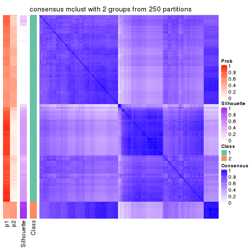</p>

</div>
<div id='tab-CV-mclust-consensus-heatmap-2'>
<pre><code class="r">consensus_heatmap(res, k = 3)
</code></pre>

<p>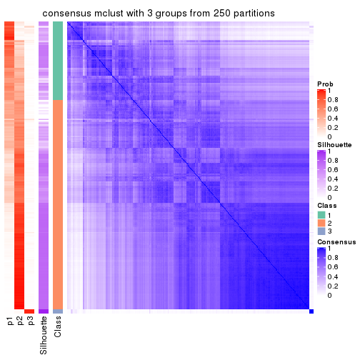</p>

</div>
<div id='tab-CV-mclust-consensus-heatmap-3'>
<pre><code class="r">consensus_heatmap(res, k = 4)
</code></pre>

<p>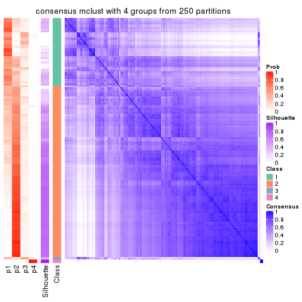</p>

</div>
<div id='tab-CV-mclust-consensus-heatmap-4'>
<pre><code class="r">consensus_heatmap(res, k = 5)
</code></pre>

<p>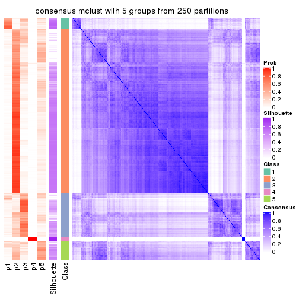</p>

</div>
<div id='tab-CV-mclust-consensus-heatmap-5'>
<pre><code class="r">consensus_heatmap(res, k = 6)
</code></pre>

<p>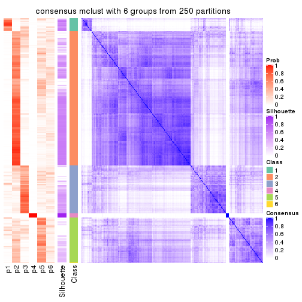</p>

</div>
</div>

Heatmaps for the membership of samples in all partitions to see how consistent they are:


<script>
$( function() {
	$( '#tabs-CV-mclust-membership-heatmap' ).tabs();
} );
</script>
<div id='tabs-CV-mclust-membership-heatmap'>
<ul>
<li><a href='#tab-CV-mclust-membership-heatmap-1'>k = 2</a></li>
<li><a href='#tab-CV-mclust-membership-heatmap-2'>k = 3</a></li>
<li><a href='#tab-CV-mclust-membership-heatmap-3'>k = 4</a></li>
<li><a href='#tab-CV-mclust-membership-heatmap-4'>k = 5</a></li>
<li><a href='#tab-CV-mclust-membership-heatmap-5'>k = 6</a></li>
</ul>
<div id='tab-CV-mclust-membership-heatmap-1'>
<pre><code class="r">membership_heatmap(res, k = 2)
</code></pre>

<p>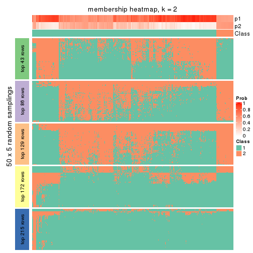</p>

</div>
<div id='tab-CV-mclust-membership-heatmap-2'>
<pre><code class="r">membership_heatmap(res, k = 3)
</code></pre>

<p>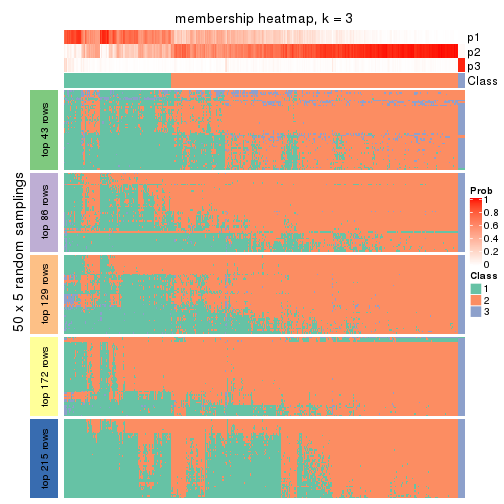</p>

</div>
<div id='tab-CV-mclust-membership-heatmap-3'>
<pre><code class="r">membership_heatmap(res, k = 4)
</code></pre>

<p>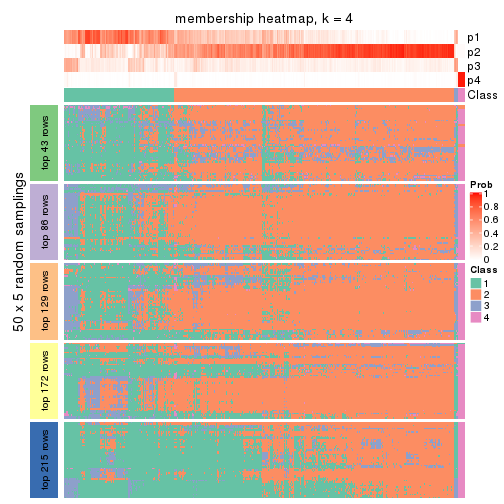</p>

</div>
<div id='tab-CV-mclust-membership-heatmap-4'>
<pre><code class="r">membership_heatmap(res, k = 5)
</code></pre>

<p>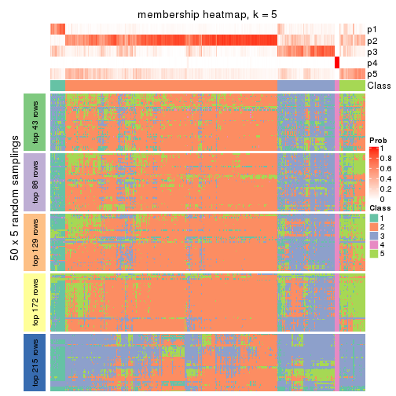</p>

</div>
<div id='tab-CV-mclust-membership-heatmap-5'>
<pre><code class="r">membership_heatmap(res, k = 6)
</code></pre>

<p>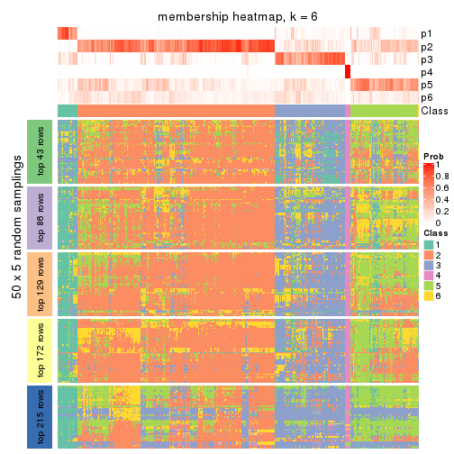</p>

</div>
</div>

As soon as we have had the classes for columns, we can look for signatures
which are significantly different between classes which can be candidate marks
for certain classes. Following are the heatmaps for signatures.


Signature heatmaps where rows are scaled:


<script>
$( function() {
	$( '#tabs-CV-mclust-get-signatures' ).tabs();
} );
</script>
<div id='tabs-CV-mclust-get-signatures'>
<ul>
<li><a href='#tab-CV-mclust-get-signatures-1'>k = 2</a></li>
<li><a href='#tab-CV-mclust-get-signatures-2'>k = 3</a></li>
<li><a href='#tab-CV-mclust-get-signatures-3'>k = 4</a></li>
<li><a href='#tab-CV-mclust-get-signatures-4'>k = 5</a></li>
<li><a href='#tab-CV-mclust-get-signatures-5'>k = 6</a></li>
</ul>
<div id='tab-CV-mclust-get-signatures-1'>
<pre><code class="r">get_signatures(res, k = 2)
</code></pre>

<p>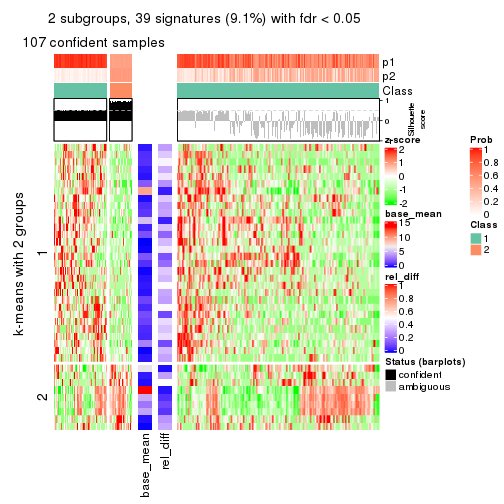</p>

</div>
<div id='tab-CV-mclust-get-signatures-2'>
<pre><code class="r">get_signatures(res, k = 3)
</code></pre>

<p>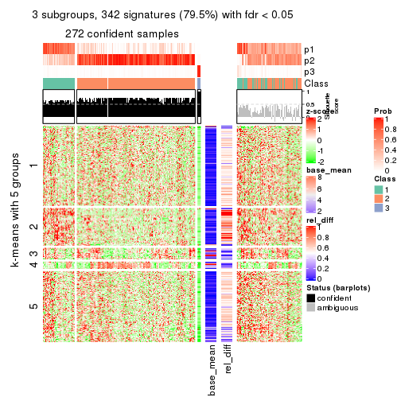</p>

</div>
<div id='tab-CV-mclust-get-signatures-3'>
<pre><code class="r">get_signatures(res, k = 4)
</code></pre>

<p>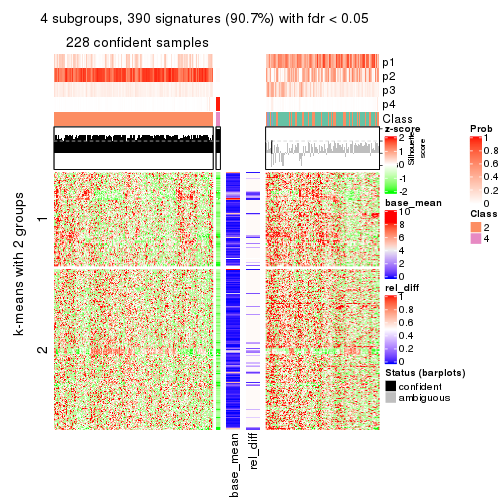</p>

</div>
<div id='tab-CV-mclust-get-signatures-4'>
<pre><code class="r">get_signatures(res, k = 5)
</code></pre>

<p>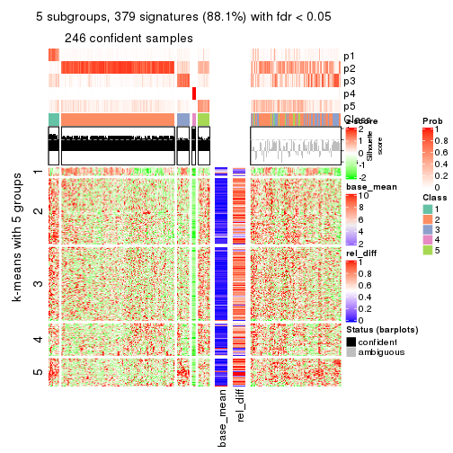</p>

</div>
<div id='tab-CV-mclust-get-signatures-5'>
<pre><code class="r">get_signatures(res, k = 6)
</code></pre>

<p>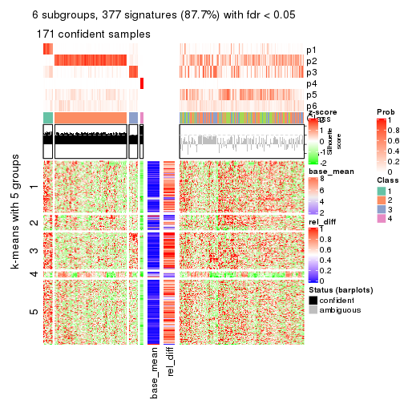</p>

</div>
</div>


Signature heatmaps where rows are not scaled:


<script>
$( function() {
	$( '#tabs-CV-mclust-get-signatures-no-scale' ).tabs();
} );
</script>
<div id='tabs-CV-mclust-get-signatures-no-scale'>
<ul>
<li><a href='#tab-CV-mclust-get-signatures-no-scale-1'>k = 2</a></li>
<li><a href='#tab-CV-mclust-get-signatures-no-scale-2'>k = 3</a></li>
<li><a href='#tab-CV-mclust-get-signatures-no-scale-3'>k = 4</a></li>
<li><a href='#tab-CV-mclust-get-signatures-no-scale-4'>k = 5</a></li>
<li><a href='#tab-CV-mclust-get-signatures-no-scale-5'>k = 6</a></li>
</ul>
<div id='tab-CV-mclust-get-signatures-no-scale-1'>
<pre><code class="r">get_signatures(res, k = 2, scale_rows = FALSE)
</code></pre>

<p>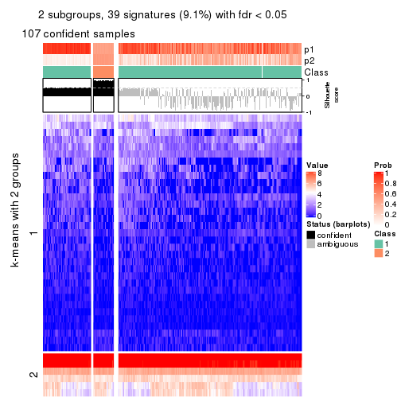</p>

</div>
<div id='tab-CV-mclust-get-signatures-no-scale-2'>
<pre><code class="r">get_signatures(res, k = 3, scale_rows = FALSE)
</code></pre>

<p>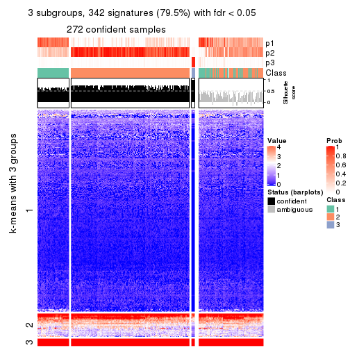</p>

</div>
<div id='tab-CV-mclust-get-signatures-no-scale-3'>
<pre><code class="r">get_signatures(res, k = 4, scale_rows = FALSE)
</code></pre>

<p>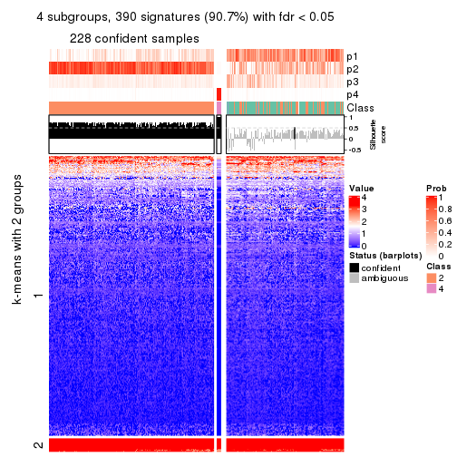</p>

</div>
<div id='tab-CV-mclust-get-signatures-no-scale-4'>
<pre><code class="r">get_signatures(res, k = 5, scale_rows = FALSE)
</code></pre>

<p>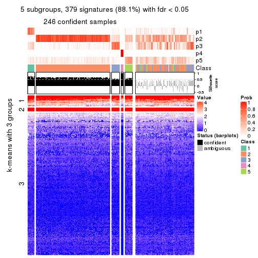</p>

</div>
<div id='tab-CV-mclust-get-signatures-no-scale-5'>
<pre><code class="r">get_signatures(res, k = 6, scale_rows = FALSE)
</code></pre>

<p>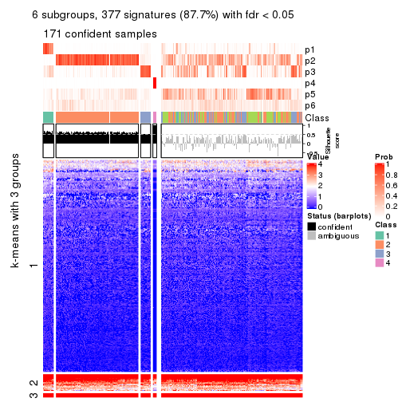</p>

</div>
</div>


Compare the overlap of signatures from different k:

```r
compare_signatures(res)
```

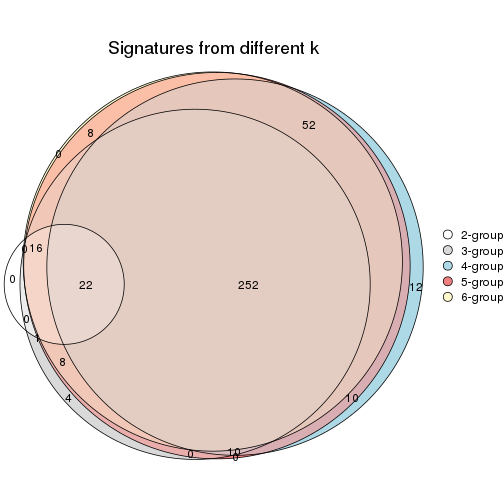

`get_signature()` returns a data frame invisibly. TO get the list of signatures, the function
call should be assigned to a variable explicitly. In following code, if `plot` argument is set
to `FALSE`, no heatmap is plotted while only the differential analysis is performed.

```r
# code only for demonstration
tb = get_signature(res, k = ..., plot = FALSE)
```

An example of the output of `tb` is:

```
#>   which_row         fdr    mean_1    mean_2 scaled_mean_1 scaled_mean_2 km
#> 1        38 0.042760348  8.373488  9.131774    -0.5533452     0.5164555  1
#> 2        40 0.018707592  7.106213  8.469186    -0.6173731     0.5762149  1
#> 3        55 0.019134737 10.221463 11.207825    -0.6159697     0.5749050  1
#> 4        59 0.006059896  5.921854  7.869574    -0.6899429     0.6439467  1
#> 5        60 0.018055526  8.928898 10.211722    -0.6204761     0.5791110  1
#> 6        98 0.009384629 15.714769 14.887706     0.6635654    -0.6193277  2
...
```

The columns in `tb` are:

1. `which_row`: row indices corresponding to the input matrix.
2. `fdr`: FDR for the differential test. 
3. `mean_x`: The mean value in group x.
4. `scaled_mean_x`: The mean value in group x after rows are scaled.
5. `km`: Row groups if k-means clustering is applied to rows.


UMAP plot which shows how samples are separated.


<script>
$( function() {
	$( '#tabs-CV-mclust-dimension-reduction' ).tabs();
} );
</script>
<div id='tabs-CV-mclust-dimension-reduction'>
<ul>
<li><a href='#tab-CV-mclust-dimension-reduction-1'>k = 2</a></li>
<li><a href='#tab-CV-mclust-dimension-reduction-2'>k = 3</a></li>
<li><a href='#tab-CV-mclust-dimension-reduction-3'>k = 4</a></li>
<li><a href='#tab-CV-mclust-dimension-reduction-4'>k = 5</a></li>
<li><a href='#tab-CV-mclust-dimension-reduction-5'>k = 6</a></li>
</ul>
<div id='tab-CV-mclust-dimension-reduction-1'>
<pre><code class="r">dimension_reduction(res, k = 2, method = &quot;UMAP&quot;)
</code></pre>

<p>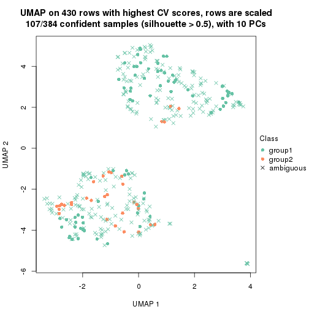</p>

</div>
<div id='tab-CV-mclust-dimension-reduction-2'>
<pre><code class="r">dimension_reduction(res, k = 3, method = &quot;UMAP&quot;)
</code></pre>

<p>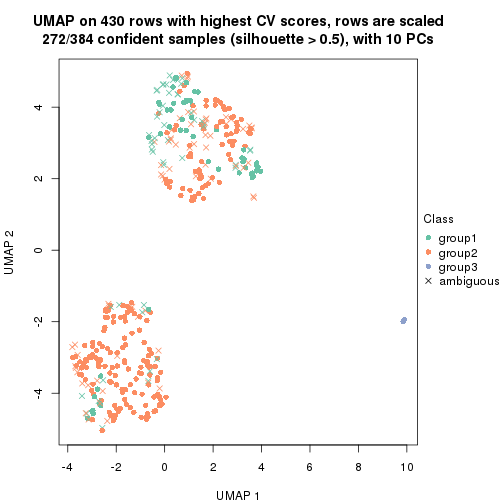</p>

</div>
<div id='tab-CV-mclust-dimension-reduction-3'>
<pre><code class="r">dimension_reduction(res, k = 4, method = &quot;UMAP&quot;)
</code></pre>

<p>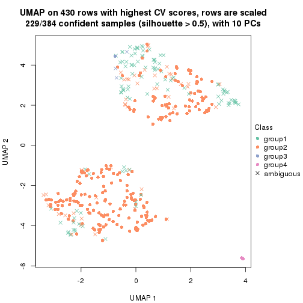</p>

</div>
<div id='tab-CV-mclust-dimension-reduction-4'>
<pre><code class="r">dimension_reduction(res, k = 5, method = &quot;UMAP&quot;)
</code></pre>

<p>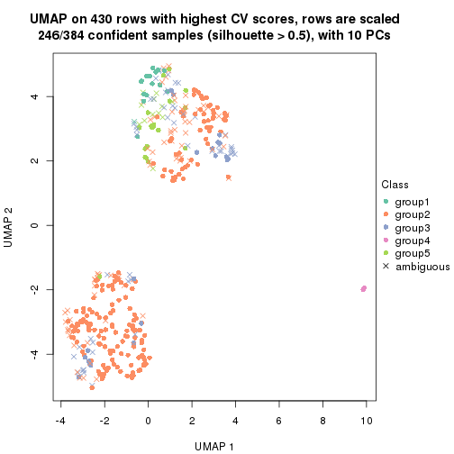</p>

</div>
<div id='tab-CV-mclust-dimension-reduction-5'>
<pre><code class="r">dimension_reduction(res, k = 6, method = &quot;UMAP&quot;)
</code></pre>

<p>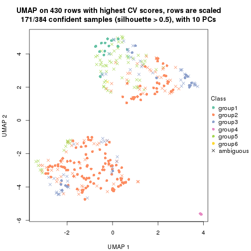</p>

</div>
</div>


Following heatmap shows how subgroups are split when increasing `k`:

```r
collect_classes(res)
```

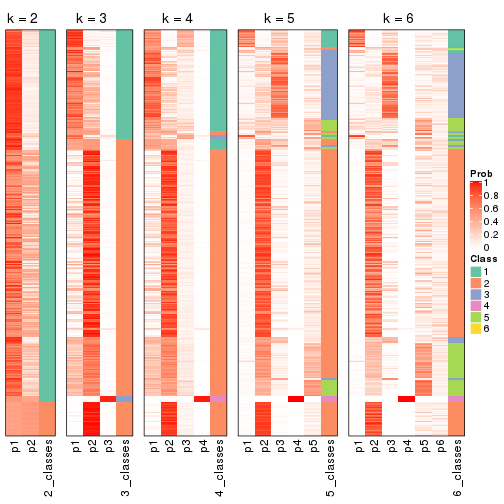


If matrix rows can be associated to genes, consider to use `GO_Enrichment(res,
...)` to perform function enrichment for the signature genes.


 

---------------------------------------------------


### CV:NMF


The object with results only for a single top-value method and a single partition method 
can be extracted as:

```r
res = res_list["CV", "NMF"]
# you can also extract it by
# res = res_list["CV:NMF"]
```

A summary of `res` and all the functions that can be applied to it:

```r
res
```

```
#> A 'ConsensusPartition' object with k = 2, 3, 4, 5, 6.
#>   On a matrix with 430 rows and 384 columns.
#>   Top rows (43, 86, 129, 172, 215) are extracted by 'CV' method.
#>   Subgroups are detected by 'NMF' method.
#>   Performed in total 1250 partitions by row resampling.
#>   Best k for subgroups seems to be 3.
#> 
#> Following methods can be applied to this 'ConsensusPartition' object:
#>  [1] "cola_report"             "collect_classes"         "collect_plots"          
#>  [4] "collect_stats"           "colnames"                "compare_signatures"     
#>  [7] "consensus_heatmap"       "dimension_reduction"     "functional_enrichment"  
#> [10] "get_anno_col"            "get_anno"                "get_classes"            
#> [13] "get_consensus"           "get_matrix"              "get_membership"         
#> [16] "get_param"               "get_signatures"          "get_stats"              
#> [19] "is_best_k"               "is_stable_k"             "membership_heatmap"     
#> [22] "ncol"                    "nrow"                    "plot_ecdf"              
#> [25] "rownames"                "select_partition_number" "show"                   
#> [28] "suggest_best_k"          "test_to_known_factors"
```

`collect_plots()` function collects all the plots made from `res` for all `k` (number of partitions)
into one single page to provide an easy and fast comparison between different `k`.

```r
collect_plots(res)
```

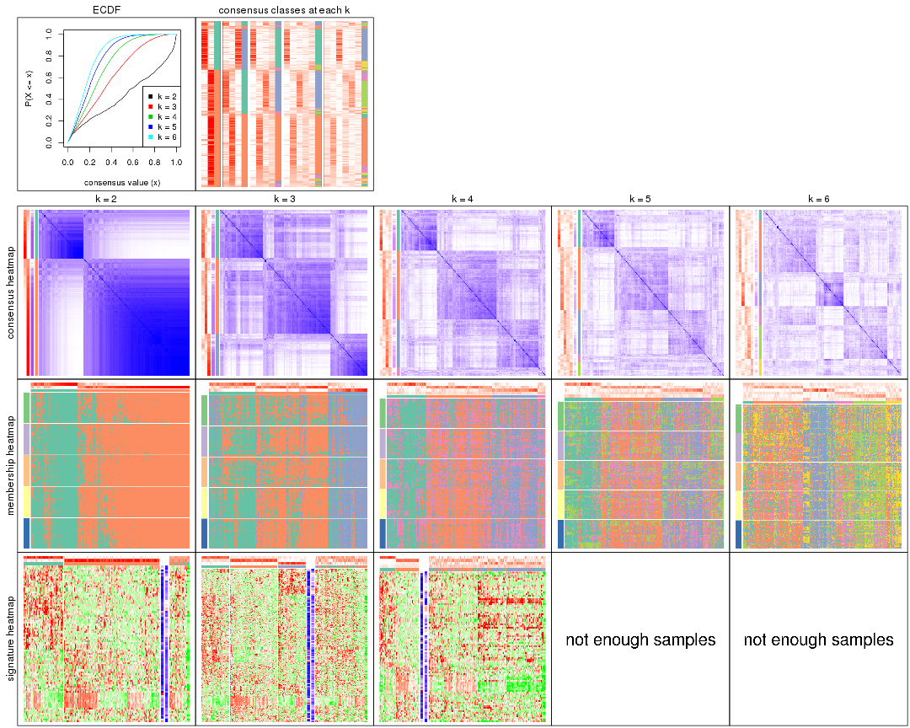

The plots are:

- The first row: a plot of the ECDF (Empirical cumulative distribution
  function) curves of the consensus matrix for each `k` and the heatmap of
  predicted classes for each `k`.
- The second row: heatmaps of the consensus matrix for each `k`.
- The third row: heatmaps of the membership matrix for each `k`.
- The fouth row: heatmaps of the signatures for each `k`.

All the plots in panels can be made by individual functions and they are
plotted later in this section.

`select_partition_number()` produces several plots showing different
statistics for choosing "optimized" `k`. There are following statistics:

- ECDF curves of the consensus matrix for each `k`;
- 1-PAC. [The PAC
  score](https://en.wikipedia.org/wiki/Consensus_clustering#Over-interpretation_potential_of_consensus_clustering)
  measures the proportion of the ambiguous subgrouping.
- Mean silhouette score.
- Concordance. The mean probability of fiting the consensus class ids in all
  partitions.
- Area increased. Denote $A_k$ as the area under the ECDF curve for current
  `k`, the area increased is defined as $A_k - A_{k-1}$.
- Rand index. The percent of pairs of samples that are both in a same cluster
  or both are not in a same cluster in the partition of k and k-1.
- Jaccard index. The ratio of pairs of samples are both in a same cluster in
  the partition of k and k-1 and the pairs of samples are both in a same
  cluster in the partition k or k-1.

The detailed explanations of these statistics can be found in [the cola
vignette](http://bioconductor.org/packages/devel/bioc/vignettes/cola/inst/doc/cola.html#toc_13).

Generally speaking, lower PAC score, higher mean silhouette score or higher
concordance corresponds to better partition. Rand index and Jaccard index
measure how similar the current partition is compared to partition with `k-1`.
If they are too similar, we won't accept `k` is better than `k-1`.

```r
select_partition_number(res)
```

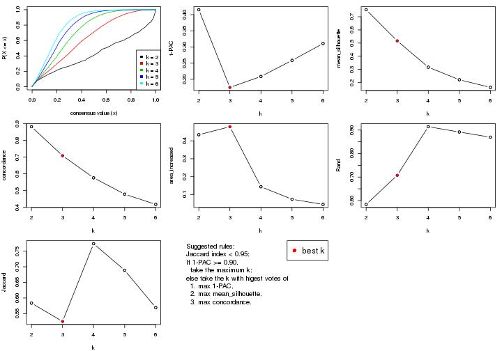

The numeric values for all these statistics can be obtained by `get_stats()`.

```r
get_stats(res)
```

```
#>   k 1-PAC mean_silhouette concordance area_increased  Rand Jaccard
#> 2 2 0.415           0.753       0.882         0.4340 0.584   0.584
#> 3 3 0.175           0.517       0.709         0.4785 0.707   0.525
#> 4 4 0.209           0.317       0.576         0.1437 0.914   0.774
#> 5 5 0.258           0.221       0.478         0.0743 0.892   0.689
#> 6 6 0.311           0.163       0.417         0.0454 0.870   0.569
```

`suggest_best_k()` suggests the best $k$ based on these statistics. The rules are as follows:

- All $k$ with Jaccard index larger than 0.95 are removed because the increase of
  the partition number does not provides enough extra information. If all $k$ are removed,
  the best $k$ is assigned by `NA`.
- For $k$ with 1-PAC larger than 0.9, the maximal $k$ is taken as the "best k". Other $k$ is called "optional k".
- If it does not fit the second rule. The $k$ with the highest vote of highest
  1-PAC, mean silhouette and concordance is taken as the "best k".

```r
suggest_best_k(res)
```

```
#> [1] 3
```


Following shows the table of the partitions (You need to click the **show/hide
code output** link to see it). The membership matrix (columns with name `p*`)
is inferred by
[`clue::cl_consensus()`](https://www.rdocumentation.org/link/cl_consensus?package=clue)
function with the `SE` method. Basically the value in the membership matrix
represents the probability to belong to a certain group. The finall class
label for an item is determined with the group with highest probability it
belongs to.

In `get_classes()` function, the entropy is calculated from the membership
matrix and the silhouette score is calculated from the consensus matrix.


<script>
$( function() {
	$( '#tabs-CV-NMF-get-classes' ).tabs();
} );
</script>
<div id='tabs-CV-NMF-get-classes'>
<ul>
<li><a href='#tab-CV-NMF-get-classes-1'>k = 2</a></li>
<li><a href='#tab-CV-NMF-get-classes-2'>k = 3</a></li>
<li><a href='#tab-CV-NMF-get-classes-3'>k = 4</a></li>
<li><a href='#tab-CV-NMF-get-classes-4'>k = 5</a></li>
<li><a href='#tab-CV-NMF-get-classes-5'>k = 6</a></li>
</ul>

<div id='tab-CV-NMF-get-classes-1'>
<p><a id='tab-CV-NMF-get-classes-1-a' style='color:#0366d6' href='#'>show/hide code output</a></p>
<pre><code class="r">cbind(get_classes(res, k = 2), get_membership(res, k = 2))
</code></pre>

<pre><code>#&gt;            class entropy silhouette    p1    p2
#&gt; SRR2105277     2  0.2423    0.87544 0.040 0.960
#&gt; SRR2105278     2  0.1184    0.87846 0.016 0.984
#&gt; SRR2105275     1  0.0376    0.83159 0.996 0.004
#&gt; SRR2105276     1  0.2043    0.83668 0.968 0.032
#&gt; SRR2105273     1  0.7528    0.74460 0.784 0.216
#&gt; SRR2105274     2  0.6887    0.77216 0.184 0.816
#&gt; SRR2105271     2  0.3879    0.85960 0.076 0.924
#&gt; SRR2105272     1  0.5629    0.81574 0.868 0.132
#&gt; SRR2105269     2  0.0672    0.87952 0.008 0.992
#&gt; SRR2105270     2  0.0000    0.87820 0.000 1.000
#&gt; SRR2105267     2  0.0000    0.87820 0.000 1.000
#&gt; SRR2105268     2  0.0000    0.87820 0.000 1.000
#&gt; SRR2105265     2  0.0672    0.87847 0.008 0.992
#&gt; SRR2105266     2  0.0672    0.87942 0.008 0.992
#&gt; SRR2105263     1  0.3584    0.83416 0.932 0.068
#&gt; SRR2105264     1  0.8661    0.64585 0.712 0.288
#&gt; SRR2105261     1  0.9358    0.54268 0.648 0.352
#&gt; SRR2105262     2  0.3733    0.85747 0.072 0.928
#&gt; SRR2105357     2  0.0000    0.87820 0.000 1.000
#&gt; SRR2105358     2  0.0938    0.87822 0.012 0.988
#&gt; SRR2105439     2  0.0000    0.87820 0.000 1.000
#&gt; SRR2105440     2  0.0000    0.87820 0.000 1.000
#&gt; SRR2105509     2  0.0000    0.87820 0.000 1.000
#&gt; SRR2105510     2  0.1414    0.87860 0.020 0.980
#&gt; SRR2105507     2  0.9881    0.20352 0.436 0.564
#&gt; SRR2105508     1  0.6048    0.80488 0.852 0.148
#&gt; SRR2105505     2  0.2043    0.87609 0.032 0.968
#&gt; SRR2105506     2  0.0376    0.87758 0.004 0.996
#&gt; SRR2105503     2  0.9922    0.13483 0.448 0.552
#&gt; SRR2105504     1  0.9896    0.34373 0.560 0.440
#&gt; SRR2105501     2  0.0000    0.87820 0.000 1.000
#&gt; SRR2105502     1  0.9608    0.48391 0.616 0.384
#&gt; SRR2105499     2  0.6973    0.75355 0.188 0.812
#&gt; SRR2105500     2  0.1843    0.87639 0.028 0.972
#&gt; SRR2105497     1  0.0938    0.83524 0.988 0.012
#&gt; SRR2105498     2  0.9909    0.15864 0.444 0.556
#&gt; SRR2105495     2  0.0000    0.87820 0.000 1.000
#&gt; SRR2105496     2  0.0000    0.87820 0.000 1.000
#&gt; SRR2105493     2  0.1414    0.87871 0.020 0.980
#&gt; SRR2105494     2  0.0376    0.87875 0.004 0.996
#&gt; SRR2105491     1  0.0672    0.83206 0.992 0.008
#&gt; SRR2105492     1  0.0376    0.83159 0.996 0.004
#&gt; SRR2105489     2  0.9954    0.04475 0.460 0.540
#&gt; SRR2105490     2  0.0000    0.87820 0.000 1.000
#&gt; SRR2105487     2  0.9933    0.15180 0.452 0.548
#&gt; SRR2105488     2  0.1414    0.87908 0.020 0.980
#&gt; SRR2105485     2  0.0000    0.87820 0.000 1.000
#&gt; SRR2105486     2  0.0672    0.87960 0.008 0.992
#&gt; SRR2105483     2  0.9944    0.12273 0.456 0.544
#&gt; SRR2105484     1  0.9866    0.32544 0.568 0.432
#&gt; SRR2105481     1  0.1184    0.83603 0.984 0.016
#&gt; SRR2105482     2  0.9170    0.52161 0.332 0.668
#&gt; SRR2105479     1  0.0376    0.83159 0.996 0.004
#&gt; SRR2105480     1  0.0376    0.83159 0.996 0.004
#&gt; SRR2105477     1  0.4431    0.83512 0.908 0.092
#&gt; SRR2105478     1  0.4298    0.83299 0.912 0.088
#&gt; SRR2105475     2  0.0000    0.87820 0.000 1.000
#&gt; SRR2105476     2  0.3431    0.86154 0.064 0.936
#&gt; SRR2105473     2  0.0672    0.87827 0.008 0.992
#&gt; SRR2105474     2  0.2603    0.87220 0.044 0.956
#&gt; SRR2105471     1  0.9460    0.52329 0.636 0.364
#&gt; SRR2105472     2  0.9522    0.40490 0.372 0.628
#&gt; SRR2105469     2  0.1633    0.87854 0.024 0.976
#&gt; SRR2105470     2  0.2043    0.87775 0.032 0.968
#&gt; SRR2105467     2  0.6801    0.78214 0.180 0.820
#&gt; SRR2105468     2  0.2043    0.87775 0.032 0.968
#&gt; SRR2105465     2  0.3114    0.86832 0.056 0.944
#&gt; SRR2105466     2  0.9393    0.47686 0.356 0.644
#&gt; SRR2105463     1  0.9896    0.31532 0.560 0.440
#&gt; SRR2105464     1  0.5294    0.81738 0.880 0.120
#&gt; SRR2105461     2  0.0376    0.87858 0.004 0.996
#&gt; SRR2105462     2  0.0376    0.87906 0.004 0.996
#&gt; SRR2105459     2  0.0376    0.87758 0.004 0.996
#&gt; SRR2105460     2  0.0000    0.87820 0.000 1.000
#&gt; SRR2105457     2  0.2778    0.87097 0.048 0.952
#&gt; SRR2105458     2  0.0938    0.87870 0.012 0.988
#&gt; SRR2105455     2  0.9358    0.46777 0.352 0.648
#&gt; SRR2105456     2  0.5408    0.81789 0.124 0.876
#&gt; SRR2105453     2  0.0000    0.87820 0.000 1.000
#&gt; SRR2105454     2  0.0938    0.87822 0.012 0.988
#&gt; SRR2105451     2  0.1414    0.87895 0.020 0.980
#&gt; SRR2105452     1  0.9896    0.34373 0.560 0.440
#&gt; SRR2105449     2  0.9661    0.36504 0.392 0.608
#&gt; SRR2105450     2  0.5629    0.81369 0.132 0.868
#&gt; SRR2105447     2  0.0000    0.87820 0.000 1.000
#&gt; SRR2105448     2  0.5059    0.83088 0.112 0.888
#&gt; SRR2105445     2  0.2948    0.86922 0.052 0.948
#&gt; SRR2105446     2  0.0376    0.87758 0.004 0.996
#&gt; SRR2105443     2  0.0672    0.87896 0.008 0.992
#&gt; SRR2105444     2  0.0376    0.87895 0.004 0.996
#&gt; SRR2105441     2  0.0938    0.87879 0.012 0.988
#&gt; SRR2105442     2  0.3274    0.86464 0.060 0.940
#&gt; SRR2105437     1  0.5178    0.82162 0.884 0.116
#&gt; SRR2105438     1  0.0672    0.83323 0.992 0.008
#&gt; SRR2105435     2  0.5408    0.82156 0.124 0.876
#&gt; SRR2105436     2  0.4431    0.84596 0.092 0.908
#&gt; SRR2105433     1  0.9896    0.29392 0.560 0.440
#&gt; SRR2105434     2  0.6801    0.76964 0.180 0.820
#&gt; SRR2105431     1  0.7950    0.73373 0.760 0.240
#&gt; SRR2105432     1  0.4690    0.82790 0.900 0.100
#&gt; SRR2105429     2  0.9635    0.33091 0.388 0.612
#&gt; SRR2105430     2  0.5946    0.79793 0.144 0.856
#&gt; SRR2105427     2  0.0672    0.87931 0.008 0.992
#&gt; SRR2105428     2  0.2423    0.87345 0.040 0.960
#&gt; SRR2105425     2  0.0938    0.87983 0.012 0.988
#&gt; SRR2105426     2  0.8081    0.66443 0.248 0.752
#&gt; SRR2105421     2  0.1414    0.87885 0.020 0.980
#&gt; SRR2105422     2  0.9522    0.42358 0.372 0.628
#&gt; SRR2105423     2  0.9970    0.06151 0.468 0.532
#&gt; SRR2105424     2  0.0376    0.87858 0.004 0.996
#&gt; SRR2105419     2  0.7602    0.72602 0.220 0.780
#&gt; SRR2105420     2  0.1843    0.87783 0.028 0.972
#&gt; SRR2105415     2  0.9608    0.37257 0.384 0.616
#&gt; SRR2105416     2  0.7219    0.74650 0.200 0.800
#&gt; SRR2105417     2  0.7376    0.72897 0.208 0.792
#&gt; SRR2105418     2  0.3431    0.86197 0.064 0.936
#&gt; SRR2105413     2  0.0000    0.87820 0.000 1.000
#&gt; SRR2105414     2  0.0000    0.87820 0.000 1.000
#&gt; SRR2105409     2  0.9993   -0.01434 0.484 0.516
#&gt; SRR2105410     1  0.9998    0.12630 0.508 0.492
#&gt; SRR2105411     2  0.0938    0.87879 0.012 0.988
#&gt; SRR2105412     2  0.0000    0.87820 0.000 1.000
#&gt; SRR2105407     2  0.5408    0.82801 0.124 0.876
#&gt; SRR2105408     2  0.0672    0.87812 0.008 0.992
#&gt; SRR2105403     2  0.0938    0.87822 0.012 0.988
#&gt; SRR2105404     2  0.1414    0.87848 0.020 0.980
#&gt; SRR2105405     2  0.0938    0.87884 0.012 0.988
#&gt; SRR2105406     2  0.0000    0.87820 0.000 1.000
#&gt; SRR2105401     2  0.0672    0.87870 0.008 0.992
#&gt; SRR2105402     1  0.9896    0.34373 0.560 0.440
#&gt; SRR2105399     2  0.0376    0.87858 0.004 0.996
#&gt; SRR2105400     2  0.0000    0.87820 0.000 1.000
#&gt; SRR2105397     1  0.9635    0.45915 0.612 0.388
#&gt; SRR2105398     2  0.7219    0.71962 0.200 0.800
#&gt; SRR2105395     1  0.4161    0.83449 0.916 0.084
#&gt; SRR2105396     2  0.0672    0.87922 0.008 0.992
#&gt; SRR2105393     2  0.0376    0.87858 0.004 0.996
#&gt; SRR2105394     2  0.2948    0.86943 0.052 0.948
#&gt; SRR2105389     2  0.7528    0.73329 0.216 0.784
#&gt; SRR2105390     1  0.6801    0.78245 0.820 0.180
#&gt; SRR2105391     2  0.6247    0.80431 0.156 0.844
#&gt; SRR2105392     2  0.9954    0.10796 0.460 0.540
#&gt; SRR2105385     1  0.5294    0.82011 0.880 0.120
#&gt; SRR2105386     2  0.9491    0.42144 0.368 0.632
#&gt; SRR2105387     2  0.1633    0.87918 0.024 0.976
#&gt; SRR2105388     2  0.0376    0.87858 0.004 0.996
#&gt; SRR2105381     2  0.6973    0.74597 0.188 0.812
#&gt; SRR2105382     2  0.9896    0.17755 0.440 0.560
#&gt; SRR2105383     2  0.0000    0.87820 0.000 1.000
#&gt; SRR2105384     2  0.0000    0.87820 0.000 1.000
#&gt; SRR2105379     1  0.8016    0.71283 0.756 0.244
#&gt; SRR2105380     1  0.1843    0.83809 0.972 0.028
#&gt; SRR2105377     2  0.3733    0.86388 0.072 0.928
#&gt; SRR2105378     2  0.6623    0.77670 0.172 0.828
#&gt; SRR2105375     2  0.2236    0.87350 0.036 0.964
#&gt; SRR2105376     2  0.0000    0.87820 0.000 1.000
#&gt; SRR2105373     1  0.8813    0.63076 0.700 0.300
#&gt; SRR2105374     1  0.1414    0.83642 0.980 0.020
#&gt; SRR2105371     2  0.5178    0.83114 0.116 0.884
#&gt; SRR2105372     2  0.4939    0.83180 0.108 0.892
#&gt; SRR2105369     2  0.3114    0.87049 0.056 0.944
#&gt; SRR2105370     2  0.0672    0.87914 0.008 0.992
#&gt; SRR2105367     2  0.3879    0.85983 0.076 0.924
#&gt; SRR2105368     2  0.4298    0.85347 0.088 0.912
#&gt; SRR2105365     1  0.1843    0.83839 0.972 0.028
#&gt; SRR2105366     1  0.3274    0.83797 0.940 0.060
#&gt; SRR2105363     2  0.0376    0.87758 0.004 0.996
#&gt; SRR2105364     2  0.0000    0.87820 0.000 1.000
#&gt; SRR2105361     2  0.0938    0.87881 0.012 0.988
#&gt; SRR2105362     2  0.1633    0.87928 0.024 0.976
#&gt; SRR2105359     2  0.1843    0.87463 0.028 0.972
#&gt; SRR2105360     2  0.9044    0.54441 0.320 0.680
#&gt; SRR2105355     2  0.4690    0.84336 0.100 0.900
#&gt; SRR2105356     2  0.3733    0.85485 0.072 0.928
#&gt; SRR2105353     1  0.3274    0.83861 0.940 0.060
#&gt; SRR2105354     1  0.0938    0.83464 0.988 0.012
#&gt; SRR2105351     1  0.4562    0.83236 0.904 0.096
#&gt; SRR2105352     1  0.9896    0.34373 0.560 0.440
#&gt; SRR2105349     2  0.9522    0.40016 0.372 0.628
#&gt; SRR2105350     2  0.0000    0.87820 0.000 1.000
#&gt; SRR2105345     2  0.1633    0.87866 0.024 0.976
#&gt; SRR2105346     2  0.0376    0.87758 0.004 0.996
#&gt; SRR2105347     2  0.0376    0.87872 0.004 0.996
#&gt; SRR2105348     2  0.0000    0.87820 0.000 1.000
#&gt; SRR2105343     2  0.9996   -0.06057 0.488 0.512
#&gt; SRR2105344     2  0.0376    0.87895 0.004 0.996
#&gt; SRR2105341     2  0.5408    0.82830 0.124 0.876
#&gt; SRR2105342     2  0.1184    0.87879 0.016 0.984
#&gt; SRR2105339     2  0.9393    0.45040 0.356 0.644
#&gt; SRR2105340     1  0.5842    0.80817 0.860 0.140
#&gt; SRR2105335     1  0.6801    0.76892 0.820 0.180
#&gt; SRR2105336     2  0.7453    0.71762 0.212 0.788
#&gt; SRR2105337     1  0.3431    0.83920 0.936 0.064
#&gt; SRR2105338     1  1.0000    0.06770 0.500 0.500
#&gt; SRR2105331     1  0.0376    0.83159 0.996 0.004
#&gt; SRR2105332     1  0.7602    0.73373 0.780 0.220
#&gt; SRR2105333     2  0.9922    0.13091 0.448 0.552
#&gt; SRR2105334     2  0.0000    0.87820 0.000 1.000
#&gt; SRR2105329     2  0.0376    0.87758 0.004 0.996
#&gt; SRR2105330     2  0.0376    0.87895 0.004 0.996
#&gt; SRR2105327     2  0.6973    0.75373 0.188 0.812
#&gt; SRR2105328     2  0.7815    0.69796 0.232 0.768
#&gt; SRR2105325     1  0.0376    0.83159 0.996 0.004
#&gt; SRR2105326     1  0.0376    0.83159 0.996 0.004
#&gt; SRR2105323     2  0.1633    0.87820 0.024 0.976
#&gt; SRR2105324     2  0.0376    0.87758 0.004 0.996
#&gt; SRR2105319     1  0.1184    0.83619 0.984 0.016
#&gt; SRR2105320     1  0.7219    0.75409 0.800 0.200
#&gt; SRR2105321     1  0.0376    0.83159 0.996 0.004
#&gt; SRR2105322     1  0.0376    0.83159 0.996 0.004
#&gt; SRR2105317     2  0.0000    0.87820 0.000 1.000
#&gt; SRR2105318     2  0.0000    0.87820 0.000 1.000
#&gt; SRR2105315     2  0.0376    0.87858 0.004 0.996
#&gt; SRR2105316     2  0.0000    0.87820 0.000 1.000
#&gt; SRR2105313     2  0.0672    0.87827 0.008 0.992
#&gt; SRR2105314     2  0.0376    0.87758 0.004 0.996
#&gt; SRR2105311     1  0.0000    0.83046 1.000 0.000
#&gt; SRR2105312     1  0.0376    0.83159 0.996 0.004
#&gt; SRR2105307     2  0.2236    0.87689 0.036 0.964
#&gt; SRR2105308     2  0.0376    0.87758 0.004 0.996
#&gt; SRR2105309     2  0.0000    0.87820 0.000 1.000
#&gt; SRR2105310     2  0.0376    0.87758 0.004 0.996
#&gt; SRR2105305     2  0.2043    0.87767 0.032 0.968
#&gt; SRR2105306     2  0.1184    0.87950 0.016 0.984
#&gt; SRR2105303     2  0.3879    0.85872 0.076 0.924
#&gt; SRR2105304     2  0.9922    0.09310 0.448 0.552
#&gt; SRR2105301     1  0.9460    0.52888 0.636 0.364
#&gt; SRR2105302     2  0.2236    0.87532 0.036 0.964
#&gt; SRR2105299     1  0.3274    0.83704 0.940 0.060
#&gt; SRR2105300     2  0.4022    0.85361 0.080 0.920
#&gt; SRR2105297     2  0.8608    0.60792 0.284 0.716
#&gt; SRR2105298     2  0.0376    0.87917 0.004 0.996
#&gt; SRR2105295     2  0.9286    0.51006 0.344 0.656
#&gt; SRR2105296     2  0.8081    0.66386 0.248 0.752
#&gt; SRR2105293     1  0.3879    0.83771 0.924 0.076
#&gt; SRR2105294     1  0.2948    0.83837 0.948 0.052
#&gt; SRR2105291     2  0.9286    0.48264 0.344 0.656
#&gt; SRR2105292     2  0.9996    0.00209 0.488 0.512
#&gt; SRR2105289     2  0.0376    0.87864 0.004 0.996
#&gt; SRR2105290     2  0.1414    0.87929 0.020 0.980
#&gt; SRR2105287     2  0.0376    0.87864 0.004 0.996
#&gt; SRR2105288     2  0.3584    0.86520 0.068 0.932
#&gt; SRR2105285     2  0.0000    0.87820 0.000 1.000
#&gt; SRR2105286     2  0.0938    0.87969 0.012 0.988
#&gt; SRR2105283     2  0.2043    0.87728 0.032 0.968
#&gt; SRR2105284     2  0.1414    0.87842 0.020 0.980
#&gt; SRR2105281     2  0.0000    0.87820 0.000 1.000
#&gt; SRR2105282     2  0.0938    0.87891 0.012 0.988
#&gt; SRR2105259     2  0.0672    0.87914 0.008 0.992
#&gt; SRR2105260     2  0.0000    0.87820 0.000 1.000
#&gt; SRR2105279     2  0.0376    0.87877 0.004 0.996
#&gt; SRR2105280     2  0.0376    0.87872 0.004 0.996
#&gt; SRR2105257     1  0.8909    0.61040 0.692 0.308
#&gt; SRR2105258     1  0.2043    0.83890 0.968 0.032
#&gt; SRR2105253     2  0.5629    0.81736 0.132 0.868
#&gt; SRR2105254     2  0.4298    0.84759 0.088 0.912
#&gt; SRR2105255     2  0.5629    0.81730 0.132 0.868
#&gt; SRR2105256     2  0.0672    0.87879 0.008 0.992
#&gt; SRR2105251     2  0.7883    0.67818 0.236 0.764
#&gt; SRR2105252     2  0.5842    0.81412 0.140 0.860
#&gt; SRR2105249     2  0.0672    0.87894 0.008 0.992
#&gt; SRR2105250     2  0.0376    0.87758 0.004 0.996
#&gt; SRR2105247     1  0.9954    0.27640 0.540 0.460
#&gt; SRR2105248     1  0.1843    0.83834 0.972 0.028
#&gt; SRR2105245     1  0.0376    0.83159 0.996 0.004
#&gt; SRR2105246     1  0.6247    0.80222 0.844 0.156
#&gt; SRR2105243     2  0.1843    0.87821 0.028 0.972
#&gt; SRR2105244     1  1.0000    0.08748 0.504 0.496
#&gt; SRR2105241     1  0.7815    0.72526 0.768 0.232
#&gt; SRR2105242     1  0.4431    0.83329 0.908 0.092
#&gt; SRR2105239     1  0.6887    0.76845 0.816 0.184
#&gt; SRR2105240     1  0.8713    0.64926 0.708 0.292
#&gt; SRR2105237     2  0.8144    0.67208 0.252 0.748
#&gt; SRR2105238     2  0.0376    0.87758 0.004 0.996
#&gt; SRR2105235     2  0.0938    0.87944 0.012 0.988
#&gt; SRR2105236     2  0.0000    0.87820 0.000 1.000
#&gt; SRR2105233     2  0.4690    0.83744 0.100 0.900
#&gt; SRR2105234     2  0.3733    0.86056 0.072 0.928
#&gt; SRR2105231     2  0.4161    0.85120 0.084 0.916
#&gt; SRR2105232     2  0.6623    0.77808 0.172 0.828
#&gt; SRR2105227     2  0.9963    0.06252 0.464 0.536
#&gt; SRR2105228     2  0.1633    0.87751 0.024 0.976
#&gt; SRR2105225     2  0.5294    0.82294 0.120 0.880
#&gt; SRR2105226     2  0.7453    0.72060 0.212 0.788
#&gt; SRR2105229     2  0.8443    0.62335 0.272 0.728
#&gt; SRR2105230     2  0.5059    0.83966 0.112 0.888
#&gt; SRR2105219     2  0.2043    0.87646 0.032 0.968
#&gt; SRR2105220     2  0.0376    0.87758 0.004 0.996
#&gt; SRR2105221     2  0.6247    0.79178 0.156 0.844
#&gt; SRR2105222     2  0.1843    0.87754 0.028 0.972
#&gt; SRR2105223     1  0.5294    0.81842 0.880 0.120
#&gt; SRR2105224     1  0.8955    0.61216 0.688 0.312
#&gt; SRR2105217     1  0.0672    0.83201 0.992 0.008
#&gt; SRR2105218     2  0.9970    0.00707 0.468 0.532
#&gt; SRR2105215     2  0.1633    0.87884 0.024 0.976
#&gt; SRR2105216     2  0.0000    0.87820 0.000 1.000
#&gt; SRR2105213     1  0.4298    0.83129 0.912 0.088
#&gt; SRR2105214     1  0.8144    0.70937 0.748 0.252
#&gt; SRR2105211     2  0.5408    0.82733 0.124 0.876
#&gt; SRR2105212     2  0.0376    0.87858 0.004 0.996
#&gt; SRR2105209     2  0.9286    0.47751 0.344 0.656
#&gt; SRR2105210     2  0.9922    0.10247 0.448 0.552
#&gt; SRR2105207     1  0.9044    0.61119 0.680 0.320
#&gt; SRR2105208     2  0.9248    0.47811 0.340 0.660
#&gt; SRR2105205     1  0.0672    0.83218 0.992 0.008
#&gt; SRR2105206     1  0.5178    0.82328 0.884 0.116
#&gt; SRR2105201     2  0.0672    0.87827 0.008 0.992
#&gt; SRR2105202     2  0.0000    0.87820 0.000 1.000
#&gt; SRR2105203     2  0.7056    0.73486 0.192 0.808
#&gt; SRR2105204     2  0.0938    0.87868 0.012 0.988
#&gt; SRR2105199     2  0.0000    0.87820 0.000 1.000
#&gt; SRR2105200     2  0.0000    0.87820 0.000 1.000
#&gt; SRR2105197     2  0.8081    0.65766 0.248 0.752
#&gt; SRR2105198     2  0.7745    0.69462 0.228 0.772
#&gt; SRR2105195     1  0.1414    0.83700 0.980 0.020
#&gt; SRR2105196     1  0.8861    0.62296 0.696 0.304
#&gt; SRR2105193     2  0.9988    0.02521 0.480 0.520
#&gt; SRR2105194     1  0.1633    0.83733 0.976 0.024
#&gt; SRR2105191     1  0.3431    0.83674 0.936 0.064
#&gt; SRR2105192     2  0.1633    0.87598 0.024 0.976
#&gt; SRR2105189     2  0.1843    0.87711 0.028 0.972
#&gt; SRR2105190     2  0.1843    0.87649 0.028 0.972
#&gt; SRR2105187     1  0.0376    0.83159 0.996 0.004
#&gt; SRR2105188     2  0.9996   -0.08087 0.488 0.512
#&gt; SRR2105179     1  0.3274    0.83949 0.940 0.060
#&gt; SRR2105180     1  0.6438    0.79384 0.836 0.164
#&gt; SRR2105183     2  0.3584    0.86333 0.068 0.932
#&gt; SRR2105184     2  0.6148    0.79424 0.152 0.848
#&gt; SRR2105185     2  0.8499    0.63663 0.276 0.724
#&gt; SRR2105186     2  0.9922    0.10996 0.448 0.552
#&gt; SRR2105181     1  0.7056    0.77019 0.808 0.192
#&gt; SRR2105182     2  0.4022    0.85811 0.080 0.920
#&gt; SRR2105177     1  0.6247    0.80452 0.844 0.156
#&gt; SRR2105178     1  0.9358    0.55375 0.648 0.352
#&gt; SRR2105171     2  0.1843    0.87730 0.028 0.972
#&gt; SRR2105172     2  0.0000    0.87820 0.000 1.000
#&gt; SRR2105175     1  0.0376    0.83159 0.996 0.004
#&gt; SRR2105176     1  0.5178    0.82170 0.884 0.116
#&gt; SRR2105173     1  0.9710    0.40444 0.600 0.400
#&gt; SRR2105174     2  0.9248    0.49429 0.340 0.660
#&gt; SRR2105169     1  0.9996    0.10080 0.512 0.488
#&gt; SRR2105170     2  0.4690    0.83900 0.100 0.900
#&gt; SRR2105167     2  0.0000    0.87820 0.000 1.000
#&gt; SRR2105168     2  0.0672    0.87883 0.008 0.992
#&gt; SRR2105165     1  0.2778    0.83902 0.952 0.048
#&gt; SRR2105166     1  0.0376    0.83159 0.996 0.004
#&gt; SRR2105163     1  0.0000    0.83046 1.000 0.000
#&gt; SRR2105164     1  0.0000    0.83046 1.000 0.000
#&gt; SRR2105161     1  0.0672    0.83323 0.992 0.008
#&gt; SRR2105162     1  0.1414    0.83697 0.980 0.020
#&gt; SRR2105155     2  0.3431    0.86264 0.064 0.936
#&gt; SRR2105156     2  0.0000    0.87820 0.000 1.000
#&gt; SRR2105157     1  0.1184    0.83468 0.984 0.016
#&gt; SRR2105158     1  0.2236    0.83755 0.964 0.036
#&gt; SRR2105159     1  0.1184    0.83617 0.984 0.016
#&gt; SRR2105160     1  0.7139    0.76628 0.804 0.196
#&gt; SRR2105153     1  0.9044    0.62221 0.680 0.320
#&gt; SRR2105154     1  0.0376    0.83159 0.996 0.004
#&gt; SRR2105151     2  0.0000    0.87820 0.000 1.000
#&gt; SRR2105152     2  0.0000    0.87820 0.000 1.000
#&gt; SRR2105149     2  0.5519    0.81786 0.128 0.872
#&gt; SRR2105150     2  0.0000    0.87820 0.000 1.000
#&gt; SRR2105147     1  0.3733    0.83196 0.928 0.072
#&gt; SRR2105148     1  0.6623    0.78576 0.828 0.172
#&gt; SRR2105143     2  0.8267    0.65277 0.260 0.740
#&gt; SRR2105144     2  0.0000    0.87820 0.000 1.000
#&gt; SRR2105145     1  0.0672    0.83330 0.992 0.008
#&gt; SRR2105146     1  0.0376    0.83159 0.996 0.004
#&gt; SRR2105141     1  0.0672    0.83329 0.992 0.008
#&gt; SRR2105142     1  0.6438    0.79091 0.836 0.164
#&gt; SRR2105139     2  0.3274    0.86525 0.060 0.940
#&gt; SRR2105140     2  0.0672    0.87876 0.008 0.992
#&gt; SRR2105137     2  0.0672    0.87827 0.008 0.992
#&gt; SRR2105138     2  0.6887    0.76274 0.184 0.816
#&gt; SRR2105135     2  0.1843    0.87776 0.028 0.972
#&gt; SRR2105136     2  0.1184    0.87938 0.016 0.984
#&gt; SRR2105133     2  0.2778    0.87297 0.048 0.952
#&gt; SRR2105134     2  0.1184    0.87879 0.016 0.984
#&gt; SRR2105131     2  0.4690    0.84722 0.100 0.900
#&gt; SRR2105132     2  0.4161    0.85407 0.084 0.916
#&gt; SRR2105129     2  0.9881    0.24330 0.436 0.564
#&gt; SRR2105130     2  0.8267    0.66172 0.260 0.740
#&gt; SRR2105127     2  0.3584    0.86548 0.068 0.932
#&gt; SRR2105128     2  0.0376    0.87898 0.004 0.996
</code></pre>

<script>
$('#tab-CV-NMF-get-classes-1-a').parent().next().next().hide();
$('#tab-CV-NMF-get-classes-1-a').click(function(){
  $('#tab-CV-NMF-get-classes-1-a').parent().next().next().toggle();
  return(false);
});
</script>
</div>

<div id='tab-CV-NMF-get-classes-2'>
<p><a id='tab-CV-NMF-get-classes-2-a' style='color:#0366d6' href='#'>show/hide code output</a></p>
<pre><code class="r">cbind(get_classes(res, k = 3), get_membership(res, k = 3))
</code></pre>

<pre><code>#&gt;            class entropy silhouette    p1    p2    p3
#&gt; SRR2105277     1  0.3267    0.66581 0.884 0.116 0.000
#&gt; SRR2105278     1  0.4121    0.66199 0.832 0.168 0.000
#&gt; SRR2105275     3  0.2116    0.73206 0.040 0.012 0.948
#&gt; SRR2105276     3  0.4256    0.73525 0.096 0.036 0.868
#&gt; SRR2105273     1  0.6341    0.48358 0.716 0.032 0.252
#&gt; SRR2105274     1  0.7712    0.64393 0.676 0.196 0.128
#&gt; SRR2105271     2  0.6879    0.06441 0.428 0.556 0.016
#&gt; SRR2105272     3  0.8402    0.41055 0.376 0.092 0.532
#&gt; SRR2105269     2  0.3425    0.67203 0.112 0.884 0.004
#&gt; SRR2105270     2  0.5465    0.59805 0.288 0.712 0.000
#&gt; SRR2105267     2  0.3551    0.66752 0.132 0.868 0.000
#&gt; SRR2105268     2  0.5016    0.63282 0.240 0.760 0.000
#&gt; SRR2105265     2  0.5690    0.54808 0.288 0.708 0.004
#&gt; SRR2105266     2  0.4887    0.62818 0.228 0.772 0.000
#&gt; SRR2105263     3  0.4677    0.71844 0.028 0.132 0.840
#&gt; SRR2105264     3  0.7164    0.66428 0.140 0.140 0.720
#&gt; SRR2105261     3  0.8595    0.29550 0.100 0.404 0.496
#&gt; SRR2105262     2  0.7533    0.32434 0.348 0.600 0.052
#&gt; SRR2105357     2  0.5968    0.27771 0.364 0.636 0.000
#&gt; SRR2105358     1  0.4291    0.66247 0.820 0.180 0.000
#&gt; SRR2105439     2  0.4842    0.56732 0.224 0.776 0.000
#&gt; SRR2105440     2  0.5216    0.62774 0.260 0.740 0.000
#&gt; SRR2105509     2  0.2878    0.67470 0.096 0.904 0.000
#&gt; SRR2105510     2  0.6540    0.27060 0.408 0.584 0.008
#&gt; SRR2105507     1  0.9751    0.23585 0.440 0.308 0.252
#&gt; SRR2105508     1  0.5158    0.47294 0.764 0.004 0.232
#&gt; SRR2105505     1  0.4452    0.66269 0.808 0.192 0.000
#&gt; SRR2105506     1  0.4605    0.66296 0.796 0.204 0.000
#&gt; SRR2105503     2  0.8231    0.54282 0.136 0.628 0.236
#&gt; SRR2105504     2  0.9953   -0.02338 0.320 0.380 0.300
#&gt; SRR2105501     2  0.4178    0.66455 0.172 0.828 0.000
#&gt; SRR2105502     3  0.9942    0.01355 0.288 0.332 0.380
#&gt; SRR2105499     1  0.7816    0.62680 0.668 0.200 0.132
#&gt; SRR2105500     1  0.6416    0.40341 0.616 0.376 0.008
#&gt; SRR2105497     3  0.3272    0.73564 0.080 0.016 0.904
#&gt; SRR2105498     2  0.7061    0.47437 0.036 0.632 0.332
#&gt; SRR2105495     2  0.5098    0.61164 0.248 0.752 0.000
#&gt; SRR2105496     2  0.1860    0.66559 0.052 0.948 0.000
#&gt; SRR2105493     2  0.6410    0.20618 0.420 0.576 0.004
#&gt; SRR2105494     2  0.5760    0.40478 0.328 0.672 0.000
#&gt; SRR2105491     3  0.2383    0.72949 0.044 0.016 0.940
#&gt; SRR2105492     3  0.3181    0.73874 0.024 0.064 0.912
#&gt; SRR2105489     2  0.9621    0.04388 0.208 0.432 0.360
#&gt; SRR2105490     2  0.2878    0.67173 0.096 0.904 0.000
#&gt; SRR2105487     1  0.6662    0.64142 0.752 0.120 0.128
#&gt; SRR2105488     1  0.4682    0.65331 0.804 0.192 0.004
#&gt; SRR2105485     1  0.6267    0.38911 0.548 0.452 0.000
#&gt; SRR2105486     1  0.6448    0.58480 0.656 0.328 0.016
#&gt; SRR2105483     2  0.6917    0.37616 0.024 0.608 0.368
#&gt; SRR2105484     3  0.7757    0.04304 0.048 0.464 0.488
#&gt; SRR2105481     3  0.6773    0.51333 0.340 0.024 0.636
#&gt; SRR2105482     1  0.5961    0.65034 0.788 0.076 0.136
#&gt; SRR2105479     3  0.1753    0.73034 0.048 0.000 0.952
#&gt; SRR2105480     3  0.1031    0.72477 0.024 0.000 0.976
#&gt; SRR2105477     3  0.7605    0.61537 0.088 0.252 0.660
#&gt; SRR2105478     3  0.6438    0.69989 0.100 0.136 0.764
#&gt; SRR2105475     2  0.2356    0.67120 0.072 0.928 0.000
#&gt; SRR2105476     2  0.4281    0.67712 0.072 0.872 0.056
#&gt; SRR2105473     2  0.5706    0.54131 0.320 0.680 0.000
#&gt; SRR2105474     2  0.3293    0.67462 0.088 0.900 0.012
#&gt; SRR2105471     3  0.9111    0.24972 0.144 0.384 0.472
#&gt; SRR2105472     2  0.7543    0.52896 0.104 0.680 0.216
#&gt; SRR2105469     1  0.3784    0.66804 0.864 0.132 0.004
#&gt; SRR2105470     1  0.6416    0.62247 0.708 0.260 0.032
#&gt; SRR2105467     1  0.3456    0.66340 0.904 0.060 0.036
#&gt; SRR2105468     1  0.4178    0.66453 0.828 0.172 0.000
#&gt; SRR2105465     2  0.6688    0.54013 0.308 0.664 0.028
#&gt; SRR2105466     1  0.7287    0.56097 0.696 0.092 0.212
#&gt; SRR2105463     3  0.9487    0.34437 0.260 0.244 0.496
#&gt; SRR2105464     3  0.5932    0.69618 0.164 0.056 0.780
#&gt; SRR2105461     2  0.4654    0.59691 0.208 0.792 0.000
#&gt; SRR2105462     2  0.4605    0.64753 0.204 0.796 0.000
#&gt; SRR2105459     2  0.4504    0.64065 0.196 0.804 0.000
#&gt; SRR2105460     2  0.6302    0.13286 0.480 0.520 0.000
#&gt; SRR2105457     1  0.6603    0.51803 0.648 0.332 0.020
#&gt; SRR2105458     1  0.5529    0.60301 0.704 0.296 0.000
#&gt; SRR2105455     2  0.9621    0.17746 0.360 0.432 0.208
#&gt; SRR2105456     2  0.7213    0.57986 0.272 0.668 0.060
#&gt; SRR2105453     2  0.4555    0.65348 0.200 0.800 0.000
#&gt; SRR2105454     1  0.4178    0.66737 0.828 0.172 0.000
#&gt; SRR2105451     2  0.4228    0.67079 0.148 0.844 0.008
#&gt; SRR2105452     2  0.9953   -0.02338 0.320 0.380 0.300
#&gt; SRR2105449     2  0.9931    0.09123 0.288 0.388 0.324
#&gt; SRR2105450     1  0.8725    0.23335 0.476 0.416 0.108
#&gt; SRR2105447     2  0.2537    0.67019 0.080 0.920 0.000
#&gt; SRR2105448     2  0.6510    0.65960 0.156 0.756 0.088
#&gt; SRR2105445     1  0.7575    0.06555 0.504 0.456 0.040
#&gt; SRR2105446     1  0.6026    0.52029 0.624 0.376 0.000
#&gt; SRR2105443     2  0.6169    0.33191 0.360 0.636 0.004
#&gt; SRR2105444     2  0.5835    0.39053 0.340 0.660 0.000
#&gt; SRR2105441     1  0.6309    0.00593 0.504 0.496 0.000
#&gt; SRR2105442     2  0.5159    0.67434 0.140 0.820 0.040
#&gt; SRR2105437     3  0.6380    0.70255 0.164 0.076 0.760
#&gt; SRR2105438     3  0.5551    0.66709 0.212 0.020 0.768
#&gt; SRR2105435     2  0.7495    0.58817 0.248 0.668 0.084
#&gt; SRR2105436     1  0.6730    0.60240 0.680 0.284 0.036
#&gt; SRR2105433     3  0.8411    0.22823 0.088 0.404 0.508
#&gt; SRR2105434     2  0.8714    0.52021 0.264 0.580 0.156
#&gt; SRR2105431     3  0.9487    0.42512 0.260 0.244 0.496
#&gt; SRR2105432     1  0.7397   -0.23820 0.484 0.032 0.484
#&gt; SRR2105429     2  0.6758    0.54577 0.072 0.728 0.200
#&gt; SRR2105430     2  0.5695    0.62234 0.076 0.804 0.120
#&gt; SRR2105427     2  0.5363    0.48646 0.276 0.724 0.000
#&gt; SRR2105428     2  0.4575    0.66565 0.160 0.828 0.012
#&gt; SRR2105425     2  0.5020    0.66772 0.192 0.796 0.012
#&gt; SRR2105426     2  0.8944    0.46059 0.228 0.568 0.204
#&gt; SRR2105421     2  0.6678    0.18018 0.480 0.512 0.008
#&gt; SRR2105422     1  0.4745    0.66105 0.852 0.080 0.068
#&gt; SRR2105423     2  0.8817    0.41499 0.160 0.568 0.272
#&gt; SRR2105424     2  0.5327    0.63312 0.272 0.728 0.000
#&gt; SRR2105419     1  0.5093    0.66545 0.836 0.088 0.076
#&gt; SRR2105420     1  0.6229    0.48017 0.652 0.340 0.008
#&gt; SRR2105415     2  0.8939    0.31981 0.140 0.520 0.340
#&gt; SRR2105416     1  0.6597    0.65671 0.756 0.120 0.124
#&gt; SRR2105417     1  0.9234    0.06455 0.476 0.364 0.160
#&gt; SRR2105418     2  0.7778    0.57667 0.264 0.644 0.092
#&gt; SRR2105413     2  0.4121    0.66609 0.168 0.832 0.000
#&gt; SRR2105414     2  0.3412    0.66584 0.124 0.876 0.000
#&gt; SRR2105409     2  0.6379    0.54711 0.032 0.712 0.256
#&gt; SRR2105410     2  0.8442    0.29314 0.100 0.548 0.352
#&gt; SRR2105411     2  0.6629    0.49274 0.360 0.624 0.016
#&gt; SRR2105412     2  0.3116    0.67952 0.108 0.892 0.000
#&gt; SRR2105407     1  0.6523    0.65996 0.724 0.228 0.048
#&gt; SRR2105408     1  0.5621    0.57922 0.692 0.308 0.000
#&gt; SRR2105403     1  0.4796    0.65001 0.780 0.220 0.000
#&gt; SRR2105404     1  0.5502    0.65548 0.744 0.248 0.008
#&gt; SRR2105405     1  0.4465    0.66238 0.820 0.176 0.004
#&gt; SRR2105406     1  0.6026    0.46254 0.624 0.376 0.000
#&gt; SRR2105401     1  0.6489    0.13116 0.540 0.456 0.004
#&gt; SRR2105402     2  0.9953   -0.02338 0.320 0.380 0.300
#&gt; SRR2105399     2  0.3619    0.66477 0.136 0.864 0.000
#&gt; SRR2105400     2  0.3482    0.67329 0.128 0.872 0.000
#&gt; SRR2105397     3  0.9956    0.10920 0.312 0.308 0.380
#&gt; SRR2105398     1  0.7794    0.45110 0.572 0.368 0.060
#&gt; SRR2105395     3  0.6613    0.69492 0.188 0.072 0.740
#&gt; SRR2105396     2  0.2590    0.67269 0.072 0.924 0.004
#&gt; SRR2105393     2  0.5363    0.64760 0.276 0.724 0.000
#&gt; SRR2105394     2  0.4845    0.66580 0.104 0.844 0.052
#&gt; SRR2105389     1  0.4602    0.67074 0.852 0.108 0.040
#&gt; SRR2105390     3  0.8275    0.23854 0.452 0.076 0.472
#&gt; SRR2105391     1  0.2879    0.66024 0.924 0.052 0.024
#&gt; SRR2105392     1  0.6962    0.52418 0.724 0.092 0.184
#&gt; SRR2105385     3  0.7181    0.24016 0.468 0.024 0.508
#&gt; SRR2105386     1  0.9070    0.39198 0.528 0.164 0.308
#&gt; SRR2105387     2  0.6715    0.51298 0.312 0.660 0.028
#&gt; SRR2105388     2  0.2772    0.66837 0.080 0.916 0.004
#&gt; SRR2105381     2  0.7478    0.61012 0.192 0.692 0.116
#&gt; SRR2105382     2  0.7828    0.37694 0.068 0.592 0.340
#&gt; SRR2105383     2  0.4235    0.67214 0.176 0.824 0.000
#&gt; SRR2105384     2  0.1964    0.66437 0.056 0.944 0.000
#&gt; SRR2105379     3  0.8470    0.42743 0.104 0.344 0.552
#&gt; SRR2105380     3  0.2339    0.73578 0.048 0.012 0.940
#&gt; SRR2105377     1  0.6738    0.32533 0.624 0.356 0.020
#&gt; SRR2105378     2  0.9088    0.11907 0.396 0.464 0.140
#&gt; SRR2105375     2  0.4937    0.66518 0.148 0.824 0.028
#&gt; SRR2105376     2  0.6308    0.05449 0.492 0.508 0.000
#&gt; SRR2105373     1  0.4802    0.56154 0.824 0.020 0.156
#&gt; SRR2105374     3  0.5677    0.71960 0.160 0.048 0.792
#&gt; SRR2105371     1  0.6562    0.60822 0.700 0.264 0.036
#&gt; SRR2105372     1  0.4413    0.67418 0.832 0.160 0.008
#&gt; SRR2105369     1  0.4654    0.65867 0.792 0.208 0.000
#&gt; SRR2105370     1  0.6244    0.39476 0.560 0.440 0.000
#&gt; SRR2105367     2  0.7634    0.06590 0.432 0.524 0.044
#&gt; SRR2105368     2  0.7504    0.44578 0.312 0.628 0.060
#&gt; SRR2105365     3  0.5360    0.67095 0.012 0.220 0.768
#&gt; SRR2105366     3  0.3031    0.74096 0.012 0.076 0.912
#&gt; SRR2105363     2  0.6180    0.26256 0.416 0.584 0.000
#&gt; SRR2105364     2  0.2878    0.67398 0.096 0.904 0.000
#&gt; SRR2105361     2  0.6617    0.42154 0.388 0.600 0.012
#&gt; SRR2105362     1  0.6445    0.52775 0.672 0.308 0.020
#&gt; SRR2105359     1  0.6654    0.33323 0.536 0.456 0.008
#&gt; SRR2105360     1  0.5174    0.65034 0.832 0.092 0.076
#&gt; SRR2105355     1  0.3207    0.66255 0.904 0.084 0.012
#&gt; SRR2105356     1  0.5845    0.62530 0.688 0.308 0.004
#&gt; SRR2105353     3  0.6034    0.70854 0.212 0.036 0.752
#&gt; SRR2105354     3  0.6298    0.44471 0.388 0.004 0.608
#&gt; SRR2105351     3  0.7899    0.65082 0.144 0.192 0.664
#&gt; SRR2105352     2  0.9953   -0.02338 0.320 0.380 0.300
#&gt; SRR2105349     2  0.8733    0.41697 0.160 0.580 0.260
#&gt; SRR2105350     2  0.2537    0.66816 0.080 0.920 0.000
#&gt; SRR2105345     2  0.7099    0.42100 0.384 0.588 0.028
#&gt; SRR2105346     2  0.4974    0.65563 0.236 0.764 0.000
#&gt; SRR2105347     2  0.3532    0.67418 0.108 0.884 0.008
#&gt; SRR2105348     2  0.3482    0.66539 0.128 0.872 0.000
#&gt; SRR2105343     2  0.7706    0.50704 0.088 0.648 0.264
#&gt; SRR2105344     2  0.3879    0.66795 0.152 0.848 0.000
#&gt; SRR2105341     1  0.4249    0.66868 0.864 0.108 0.028
#&gt; SRR2105342     1  0.5171    0.66770 0.784 0.204 0.012
#&gt; SRR2105339     1  0.8838    0.51618 0.580 0.200 0.220
#&gt; SRR2105340     1  0.6906    0.26430 0.644 0.032 0.324
#&gt; SRR2105335     3  0.8703    0.52867 0.284 0.144 0.572
#&gt; SRR2105336     1  0.8280    0.48621 0.564 0.344 0.092
#&gt; SRR2105337     3  0.6388    0.70070 0.184 0.064 0.752
#&gt; SRR2105338     1  0.9707    0.18621 0.424 0.224 0.352
#&gt; SRR2105331     3  0.2918    0.74418 0.032 0.044 0.924
#&gt; SRR2105332     3  0.6880    0.51303 0.036 0.304 0.660
#&gt; SRR2105333     2  0.6098    0.61214 0.056 0.768 0.176
#&gt; SRR2105334     2  0.2959    0.66907 0.100 0.900 0.000
#&gt; SRR2105329     1  0.5785    0.59717 0.668 0.332 0.000
#&gt; SRR2105330     2  0.6451    0.13034 0.436 0.560 0.004
#&gt; SRR2105327     2  0.7923    0.57422 0.156 0.664 0.180
#&gt; SRR2105328     2  0.6911    0.61555 0.092 0.728 0.180
#&gt; SRR2105325     3  0.2590    0.73201 0.072 0.004 0.924
#&gt; SRR2105326     3  0.2301    0.73168 0.060 0.004 0.936
#&gt; SRR2105323     1  0.3116    0.66322 0.892 0.108 0.000
#&gt; SRR2105324     1  0.5733    0.55285 0.676 0.324 0.000
#&gt; SRR2105319     3  0.5109    0.66968 0.212 0.008 0.780
#&gt; SRR2105320     3  0.7091    0.63301 0.248 0.064 0.688
#&gt; SRR2105321     3  0.2749    0.73272 0.064 0.012 0.924
#&gt; SRR2105322     3  0.1491    0.72998 0.016 0.016 0.968
#&gt; SRR2105317     2  0.2356    0.66894 0.072 0.928 0.000
#&gt; SRR2105318     2  0.3038    0.67337 0.104 0.896 0.000
#&gt; SRR2105315     2  0.6148    0.38097 0.356 0.640 0.004
#&gt; SRR2105316     2  0.5291    0.58895 0.268 0.732 0.000
#&gt; SRR2105313     2  0.6140    0.31512 0.404 0.596 0.000
#&gt; SRR2105314     2  0.5497    0.60863 0.292 0.708 0.000
#&gt; SRR2105311     3  0.1129    0.72783 0.020 0.004 0.976
#&gt; SRR2105312     3  0.0892    0.72735 0.020 0.000 0.980
#&gt; SRR2105307     1  0.5559    0.66102 0.780 0.192 0.028
#&gt; SRR2105308     2  0.6168    0.17488 0.412 0.588 0.000
#&gt; SRR2105309     2  0.6307   -0.25237 0.488 0.512 0.000
#&gt; SRR2105310     1  0.6026    0.51605 0.624 0.376 0.000
#&gt; SRR2105305     1  0.4963    0.66558 0.792 0.200 0.008
#&gt; SRR2105306     1  0.6451    0.30202 0.560 0.436 0.004
#&gt; SRR2105303     2  0.6539    0.62440 0.288 0.684 0.028
#&gt; SRR2105304     2  0.9574    0.23927 0.276 0.480 0.244
#&gt; SRR2105301     3  0.9510    0.36836 0.264 0.244 0.492
#&gt; SRR2105302     2  0.3846    0.66597 0.108 0.876 0.016
#&gt; SRR2105299     3  0.7619    0.37641 0.424 0.044 0.532
#&gt; SRR2105300     2  0.7713    0.39300 0.284 0.636 0.080
#&gt; SRR2105297     2  0.7011    0.61843 0.092 0.720 0.188
#&gt; SRR2105298     2  0.2486    0.67395 0.060 0.932 0.008
#&gt; SRR2105295     2  0.9865    0.14551 0.332 0.404 0.264
#&gt; SRR2105296     2  0.6181    0.60344 0.072 0.772 0.156
#&gt; SRR2105293     3  0.6250    0.70950 0.104 0.120 0.776
#&gt; SRR2105294     3  0.3425    0.72722 0.112 0.004 0.884
#&gt; SRR2105291     1  0.4652    0.66117 0.856 0.080 0.064
#&gt; SRR2105292     1  0.6585    0.51096 0.712 0.044 0.244
#&gt; SRR2105289     2  0.6410   -0.05800 0.420 0.576 0.004
#&gt; SRR2105290     1  0.5815    0.61201 0.692 0.304 0.004
#&gt; SRR2105287     2  0.5553    0.61991 0.272 0.724 0.004
#&gt; SRR2105288     1  0.8039    0.17618 0.508 0.428 0.064
#&gt; SRR2105285     2  0.5678    0.51914 0.316 0.684 0.000
#&gt; SRR2105286     2  0.3337    0.68065 0.060 0.908 0.032
#&gt; SRR2105283     2  0.4514    0.67643 0.156 0.832 0.012
#&gt; SRR2105284     1  0.6521   -0.00156 0.504 0.492 0.004
#&gt; SRR2105281     2  0.2878    0.67303 0.096 0.904 0.000
#&gt; SRR2105282     2  0.4629    0.66289 0.188 0.808 0.004
#&gt; SRR2105259     1  0.4887    0.64182 0.772 0.228 0.000
#&gt; SRR2105260     1  0.6291    0.14281 0.532 0.468 0.000
#&gt; SRR2105279     2  0.4121    0.66817 0.168 0.832 0.000
#&gt; SRR2105280     2  0.2301    0.66809 0.060 0.936 0.004
#&gt; SRR2105257     1  0.7839    0.18959 0.560 0.060 0.380
#&gt; SRR2105258     3  0.6906    0.54606 0.324 0.032 0.644
#&gt; SRR2105253     2  0.6510    0.60396 0.088 0.756 0.156
#&gt; SRR2105254     2  0.6865    0.62675 0.160 0.736 0.104
#&gt; SRR2105255     1  0.4810    0.67259 0.832 0.140 0.028
#&gt; SRR2105256     1  0.6192    0.39588 0.580 0.420 0.000
#&gt; SRR2105251     2  0.5737    0.63136 0.092 0.804 0.104
#&gt; SRR2105252     2  0.7826    0.53257 0.312 0.612 0.076
#&gt; SRR2105249     2  0.2301    0.66669 0.060 0.936 0.004
#&gt; SRR2105250     2  0.5948    0.44397 0.360 0.640 0.000
#&gt; SRR2105247     2  0.7778    0.45133 0.092 0.644 0.264
#&gt; SRR2105248     3  0.4556    0.74313 0.060 0.080 0.860
#&gt; SRR2105245     3  0.4189    0.73442 0.056 0.068 0.876
#&gt; SRR2105246     3  0.7616    0.59275 0.292 0.072 0.636
#&gt; SRR2105243     1  0.6495    0.32010 0.536 0.460 0.004
#&gt; SRR2105244     1  0.9229    0.35371 0.496 0.168 0.336
#&gt; SRR2105241     3  0.8264    0.23119 0.436 0.076 0.488
#&gt; SRR2105242     3  0.5492    0.73317 0.080 0.104 0.816
#&gt; SRR2105239     3  0.7954    0.62750 0.148 0.192 0.660
#&gt; SRR2105240     3  0.7862    0.59865 0.184 0.148 0.668
#&gt; SRR2105237     2  0.8891    0.43554 0.340 0.524 0.136
#&gt; SRR2105238     2  0.6260    0.16168 0.448 0.552 0.000
#&gt; SRR2105235     1  0.6307    0.03300 0.512 0.488 0.000
#&gt; SRR2105236     2  0.3686    0.66073 0.140 0.860 0.000
#&gt; SRR2105233     2  0.6537    0.59809 0.196 0.740 0.064
#&gt; SRR2105234     2  0.5371    0.67534 0.140 0.812 0.048
#&gt; SRR2105231     2  0.3253    0.66912 0.052 0.912 0.036
#&gt; SRR2105232     2  0.7316    0.62377 0.184 0.704 0.112
#&gt; SRR2105227     1  0.8685    0.46750 0.596 0.192 0.212
#&gt; SRR2105228     1  0.5497    0.63640 0.708 0.292 0.000
#&gt; SRR2105225     1  0.5551    0.64517 0.768 0.212 0.020
#&gt; SRR2105226     1  0.7300    0.55425 0.664 0.272 0.064
#&gt; SRR2105229     1  0.7366    0.58346 0.668 0.260 0.072
#&gt; SRR2105230     1  0.3618    0.66717 0.884 0.104 0.012
#&gt; SRR2105219     2  0.3995    0.68060 0.116 0.868 0.016
#&gt; SRR2105220     2  0.5929    0.54560 0.320 0.676 0.004
#&gt; SRR2105221     2  0.8427    0.12645 0.412 0.500 0.088
#&gt; SRR2105222     2  0.5470    0.67506 0.168 0.796 0.036
#&gt; SRR2105223     1  0.6769    0.26252 0.652 0.028 0.320
#&gt; SRR2105224     3  0.8195    0.18341 0.436 0.072 0.492
#&gt; SRR2105217     3  0.3434    0.74011 0.032 0.064 0.904
#&gt; SRR2105218     2  0.7065    0.52198 0.052 0.672 0.276
#&gt; SRR2105215     2  0.5881    0.63940 0.256 0.728 0.016
#&gt; SRR2105216     2  0.3116    0.66998 0.108 0.892 0.000
#&gt; SRR2105213     3  0.5497    0.71547 0.148 0.048 0.804
#&gt; SRR2105214     3  0.7898    0.59866 0.116 0.232 0.652
#&gt; SRR2105211     1  0.8264    0.22160 0.488 0.436 0.076
#&gt; SRR2105212     1  0.5859    0.55429 0.656 0.344 0.000
#&gt; SRR2105209     1  0.9058    0.46876 0.544 0.276 0.180
#&gt; SRR2105210     2  0.9996    0.01295 0.320 0.340 0.340
#&gt; SRR2105207     3  0.9654    0.19499 0.228 0.320 0.452
#&gt; SRR2105208     2  0.9006    0.20950 0.288 0.544 0.168
#&gt; SRR2105205     3  0.1905    0.73660 0.016 0.028 0.956
#&gt; SRR2105206     3  0.4575    0.69819 0.004 0.184 0.812
#&gt; SRR2105201     1  0.6302   -0.06342 0.520 0.480 0.000
#&gt; SRR2105202     2  0.6095    0.37129 0.392 0.608 0.000
#&gt; SRR2105203     2  0.6792    0.61391 0.124 0.744 0.132
#&gt; SRR2105204     2  0.2584    0.66431 0.064 0.928 0.008
#&gt; SRR2105199     2  0.5138    0.65253 0.252 0.748 0.000
#&gt; SRR2105200     2  0.4755    0.67159 0.184 0.808 0.008
#&gt; SRR2105197     1  0.7310    0.49185 0.628 0.324 0.048
#&gt; SRR2105198     1  0.8458    0.25257 0.476 0.436 0.088
#&gt; SRR2105195     3  0.3856    0.74042 0.072 0.040 0.888
#&gt; SRR2105196     3  0.7932    0.28956 0.384 0.064 0.552
#&gt; SRR2105193     2  0.8288    0.44693 0.096 0.572 0.332
#&gt; SRR2105194     3  0.3752    0.73385 0.096 0.020 0.884
#&gt; SRR2105191     3  0.7665    0.52632 0.340 0.060 0.600
#&gt; SRR2105192     1  0.5465    0.59762 0.712 0.288 0.000
#&gt; SRR2105189     2  0.4897    0.65404 0.172 0.812 0.016
#&gt; SRR2105190     2  0.3183    0.67606 0.076 0.908 0.016
#&gt; SRR2105187     3  0.3039    0.73608 0.036 0.044 0.920
#&gt; SRR2105188     3  0.9602    0.04622 0.400 0.200 0.400
#&gt; SRR2105179     3  0.6765    0.67197 0.068 0.208 0.724
#&gt; SRR2105180     3  0.6717    0.44770 0.352 0.020 0.628
#&gt; SRR2105183     2  0.6407    0.60446 0.272 0.700 0.028
#&gt; SRR2105184     2  0.5764    0.65572 0.076 0.800 0.124
#&gt; SRR2105185     2  0.9353    0.29050 0.388 0.444 0.168
#&gt; SRR2105186     2  0.8620    0.17747 0.112 0.536 0.352
#&gt; SRR2105181     1  0.6606    0.49630 0.716 0.048 0.236
#&gt; SRR2105182     1  0.5688    0.67590 0.788 0.168 0.044
#&gt; SRR2105177     3  0.9091    0.26489 0.152 0.344 0.504
#&gt; SRR2105178     3  0.7890    0.32890 0.064 0.372 0.564
#&gt; SRR2105171     2  0.6899    0.52166 0.364 0.612 0.024
#&gt; SRR2105172     2  0.1964    0.66741 0.056 0.944 0.000
#&gt; SRR2105175     3  0.3267    0.74112 0.044 0.044 0.912
#&gt; SRR2105176     3  0.4357    0.73598 0.080 0.052 0.868
#&gt; SRR2105173     3  0.9702    0.18356 0.232 0.328 0.440
#&gt; SRR2105174     2  0.7916    0.52630 0.100 0.636 0.264
#&gt; SRR2105169     2  0.9088    0.12993 0.140 0.464 0.396
#&gt; SRR2105170     2  0.6023    0.67063 0.120 0.788 0.092
#&gt; SRR2105167     2  0.3482    0.67650 0.128 0.872 0.000
#&gt; SRR2105168     2  0.2959    0.67130 0.100 0.900 0.000
#&gt; SRR2105165     3  0.6683    0.22053 0.496 0.008 0.496
#&gt; SRR2105166     3  0.1860    0.72965 0.052 0.000 0.948
#&gt; SRR2105163     3  0.1289    0.72758 0.032 0.000 0.968
#&gt; SRR2105164     3  0.1289    0.72823 0.032 0.000 0.968
#&gt; SRR2105161     3  0.3461    0.74016 0.076 0.024 0.900
#&gt; SRR2105162     3  0.3031    0.73535 0.076 0.012 0.912
#&gt; SRR2105155     2  0.6952    0.50269 0.376 0.600 0.024
#&gt; SRR2105156     2  0.2625    0.67461 0.084 0.916 0.000
#&gt; SRR2105157     3  0.3183    0.74185 0.016 0.076 0.908
#&gt; SRR2105158     3  0.2703    0.73638 0.016 0.056 0.928
#&gt; SRR2105159     3  0.5119    0.71315 0.152 0.032 0.816
#&gt; SRR2105160     1  0.8427   -0.05011 0.500 0.088 0.412
#&gt; SRR2105153     3  0.8595    0.18632 0.100 0.404 0.496
#&gt; SRR2105154     3  0.1877    0.73315 0.032 0.012 0.956
#&gt; SRR2105151     2  0.2945    0.67240 0.088 0.908 0.004
#&gt; SRR2105152     2  0.2959    0.66768 0.100 0.900 0.000
#&gt; SRR2105149     1  0.6839    0.62387 0.684 0.272 0.044
#&gt; SRR2105150     1  0.6252    0.30330 0.556 0.444 0.000
#&gt; SRR2105147     3  0.5603    0.71560 0.136 0.060 0.804
#&gt; SRR2105148     3  0.9133    0.47293 0.296 0.176 0.528
#&gt; SRR2105143     1  0.8971    0.34284 0.520 0.336 0.144
#&gt; SRR2105144     2  0.4842    0.63566 0.224 0.776 0.000
#&gt; SRR2105145     3  0.2636    0.74153 0.020 0.048 0.932
#&gt; SRR2105146     3  0.1832    0.73047 0.036 0.008 0.956
#&gt; SRR2105141     3  0.1491    0.73255 0.016 0.016 0.968
#&gt; SRR2105142     3  0.6129    0.57142 0.016 0.284 0.700
#&gt; SRR2105139     2  0.4708    0.66216 0.120 0.844 0.036
#&gt; SRR2105140     2  0.3272    0.67427 0.104 0.892 0.004
#&gt; SRR2105137     2  0.6291    0.25904 0.468 0.532 0.000
#&gt; SRR2105138     1  0.8375    0.56528 0.608 0.260 0.132
#&gt; SRR2105135     2  0.6955    0.16642 0.488 0.496 0.016
#&gt; SRR2105136     2  0.4059    0.67377 0.128 0.860 0.012
#&gt; SRR2105133     1  0.4326    0.66857 0.844 0.144 0.012
#&gt; SRR2105134     1  0.4504    0.66886 0.804 0.196 0.000
#&gt; SRR2105131     1  0.6096    0.63489 0.704 0.280 0.016
#&gt; SRR2105132     1  0.4063    0.67110 0.868 0.112 0.020
#&gt; SRR2105129     1  0.9002    0.30830 0.532 0.156 0.312
#&gt; SRR2105130     1  0.9556    0.24099 0.460 0.332 0.208
#&gt; SRR2105127     1  0.3918    0.66711 0.868 0.120 0.012
#&gt; SRR2105128     2  0.6291   -0.18918 0.468 0.532 0.000
</code></pre>

<script>
$('#tab-CV-NMF-get-classes-2-a').parent().next().next().hide();
$('#tab-CV-NMF-get-classes-2-a').click(function(){
  $('#tab-CV-NMF-get-classes-2-a').parent().next().next().toggle();
  return(false);
});
</script>
</div>

<div id='tab-CV-NMF-get-classes-3'>
<p><a id='tab-CV-NMF-get-classes-3-a' style='color:#0366d6' href='#'>show/hide code output</a></p>
<pre><code class="r">cbind(get_classes(res, k = 4), get_membership(res, k = 4))
</code></pre>

<pre><code>#&gt;            class entropy silhouette    p1    p2    p3    p4
#&gt; SRR2105277     3  0.3505   4.77e-01 0.000 0.048 0.864 0.088
#&gt; SRR2105278     3  0.5664   4.82e-01 0.000 0.156 0.720 0.124
#&gt; SRR2105275     1  0.3108   5.68e-01 0.872 0.000 0.016 0.112
#&gt; SRR2105276     1  0.5427   5.05e-01 0.704 0.004 0.044 0.248
#&gt; SRR2105273     3  0.8155   2.42e-01 0.204 0.044 0.532 0.220
#&gt; SRR2105274     3  0.8750   2.96e-01 0.116 0.124 0.488 0.272
#&gt; SRR2105271     2  0.8205   1.06e-02 0.020 0.416 0.356 0.208
#&gt; SRR2105272     1  0.8673   1.37e-01 0.436 0.048 0.292 0.224
#&gt; SRR2105269     2  0.6068   4.49e-01 0.012 0.624 0.040 0.324
#&gt; SRR2105270     2  0.6400   5.15e-01 0.000 0.632 0.252 0.116
#&gt; SRR2105267     2  0.5934   5.20e-01 0.004 0.688 0.084 0.224
#&gt; SRR2105268     2  0.6198   5.14e-01 0.000 0.660 0.224 0.116
#&gt; SRR2105265     2  0.7658   3.14e-01 0.004 0.492 0.220 0.284
#&gt; SRR2105266     2  0.6104   5.07e-01 0.000 0.664 0.232 0.104
#&gt; SRR2105263     1  0.6067   4.80e-01 0.704 0.124 0.008 0.164
#&gt; SRR2105264     1  0.6949   4.83e-01 0.684 0.108 0.076 0.132
#&gt; SRR2105261     4  0.8117   1.62e-01 0.300 0.232 0.016 0.452
#&gt; SRR2105262     2  0.8652   2.24e-01 0.060 0.464 0.284 0.192
#&gt; SRR2105357     2  0.7169   1.98e-01 0.000 0.528 0.312 0.160
#&gt; SRR2105358     3  0.4297   4.85e-01 0.000 0.096 0.820 0.084
#&gt; SRR2105439     2  0.6854   4.27e-01 0.000 0.596 0.232 0.172
#&gt; SRR2105440     2  0.6686   4.89e-01 0.000 0.596 0.276 0.128
#&gt; SRR2105509     2  0.5421   5.47e-01 0.000 0.724 0.076 0.200
#&gt; SRR2105510     2  0.7850   9.05e-02 0.004 0.432 0.336 0.228
#&gt; SRR2105507     4  0.9902   1.82e-01 0.252 0.196 0.240 0.312
#&gt; SRR2105508     3  0.7767   1.50e-01 0.204 0.012 0.508 0.276
#&gt; SRR2105505     3  0.4562   4.68e-01 0.000 0.056 0.792 0.152
#&gt; SRR2105506     3  0.6472   4.31e-01 0.004 0.124 0.648 0.224
#&gt; SRR2105503     2  0.9052   1.15e-01 0.220 0.448 0.092 0.240
#&gt; SRR2105504     3  0.9936  -1.52e-01 0.260 0.196 0.284 0.260
#&gt; SRR2105501     2  0.5714   5.39e-01 0.000 0.716 0.156 0.128
#&gt; SRR2105502     1  0.9741  -1.57e-01 0.360 0.176 0.248 0.216
#&gt; SRR2105499     3  0.9495   2.48e-01 0.148 0.212 0.408 0.232
#&gt; SRR2105500     3  0.7331   3.46e-01 0.008 0.280 0.552 0.160
#&gt; SRR2105497     1  0.4463   5.55e-01 0.808 0.008 0.040 0.144
#&gt; SRR2105498     2  0.7710   1.45e-01 0.332 0.524 0.040 0.104
#&gt; SRR2105495     2  0.7330   4.32e-01 0.004 0.552 0.244 0.200
#&gt; SRR2105496     2  0.6121   5.22e-01 0.004 0.680 0.104 0.212
#&gt; SRR2105493     2  0.7590   2.19e-01 0.004 0.472 0.344 0.180
#&gt; SRR2105494     2  0.6704   3.82e-01 0.000 0.600 0.264 0.136
#&gt; SRR2105491     1  0.3850   5.41e-01 0.804 0.004 0.004 0.188
#&gt; SRR2105492     1  0.3224   5.60e-01 0.864 0.016 0.000 0.120
#&gt; SRR2105489     4  0.9479   2.61e-01 0.244 0.308 0.108 0.340
#&gt; SRR2105490     2  0.3900   5.43e-01 0.000 0.844 0.072 0.084
#&gt; SRR2105487     3  0.7677   3.77e-01 0.076 0.088 0.592 0.244
#&gt; SRR2105488     3  0.5201   4.81e-01 0.008 0.128 0.772 0.092
#&gt; SRR2105485     3  0.6894   3.29e-01 0.000 0.376 0.512 0.112
#&gt; SRR2105486     3  0.7223   4.22e-01 0.020 0.252 0.596 0.132
#&gt; SRR2105483     1  0.8326  -1.56e-01 0.392 0.384 0.028 0.196
#&gt; SRR2105484     1  0.7546   7.42e-02 0.504 0.348 0.016 0.132
#&gt; SRR2105481     1  0.7762   3.90e-01 0.564 0.032 0.228 0.176
#&gt; SRR2105482     3  0.7598   3.06e-01 0.148 0.044 0.600 0.208
#&gt; SRR2105479     1  0.2667   5.67e-01 0.912 0.008 0.020 0.060
#&gt; SRR2105480     1  0.0657   5.60e-01 0.984 0.000 0.004 0.012
#&gt; SRR2105477     1  0.7913   2.14e-01 0.496 0.208 0.016 0.280
#&gt; SRR2105478     1  0.7336   4.40e-01 0.608 0.068 0.068 0.256
#&gt; SRR2105475     2  0.4841   5.44e-01 0.000 0.780 0.080 0.140
#&gt; SRR2105476     2  0.7085   4.35e-01 0.068 0.604 0.044 0.284
#&gt; SRR2105473     2  0.7086   4.18e-01 0.000 0.548 0.292 0.160
#&gt; SRR2105474     2  0.5743   5.18e-01 0.016 0.732 0.076 0.176
#&gt; SRR2105471     4  0.8953   2.54e-01 0.220 0.296 0.068 0.416
#&gt; SRR2105472     2  0.8081   1.06e-01 0.128 0.440 0.040 0.392
#&gt; SRR2105469     3  0.5499   4.49e-01 0.000 0.072 0.712 0.216
#&gt; SRR2105470     3  0.7625   2.99e-01 0.004 0.220 0.500 0.276
#&gt; SRR2105467     3  0.3639   4.63e-01 0.012 0.028 0.864 0.096
#&gt; SRR2105468     3  0.4986   4.77e-01 0.004 0.084 0.780 0.132
#&gt; SRR2105465     2  0.8266   1.32e-01 0.028 0.424 0.188 0.360
#&gt; SRR2105466     3  0.9030   1.36e-01 0.176 0.088 0.404 0.332
#&gt; SRR2105463     1  0.9424   1.57e-02 0.412 0.132 0.236 0.220
#&gt; SRR2105464     1  0.6607   4.95e-01 0.684 0.036 0.096 0.184
#&gt; SRR2105461     2  0.7289   4.56e-01 0.004 0.560 0.208 0.228
#&gt; SRR2105462     2  0.5902   5.36e-01 0.004 0.712 0.144 0.140
#&gt; SRR2105459     2  0.5674   5.25e-01 0.000 0.720 0.148 0.132
#&gt; SRR2105460     2  0.7343   1.14e-01 0.000 0.428 0.416 0.156
#&gt; SRR2105457     3  0.7262   3.45e-01 0.008 0.248 0.572 0.172
#&gt; SRR2105458     3  0.7006   4.09e-01 0.000 0.216 0.580 0.204
#&gt; SRR2105455     4  0.9563   3.10e-01 0.144 0.244 0.224 0.388
#&gt; SRR2105456     2  0.9211   6.65e-02 0.092 0.388 0.208 0.312
#&gt; SRR2105453     2  0.6758   4.65e-01 0.000 0.604 0.156 0.240
#&gt; SRR2105454     3  0.4662   4.80e-01 0.000 0.092 0.796 0.112
#&gt; SRR2105451     2  0.7363   3.61e-01 0.012 0.504 0.120 0.364
#&gt; SRR2105452     3  0.9936  -1.52e-01 0.260 0.196 0.284 0.260
#&gt; SRR2105449     4  0.9929   3.39e-01 0.264 0.264 0.192 0.280
#&gt; SRR2105450     3  0.8979   2.52e-01 0.084 0.304 0.428 0.184
#&gt; SRR2105447     2  0.5256   5.38e-01 0.004 0.752 0.072 0.172
#&gt; SRR2105448     2  0.7168   4.92e-01 0.048 0.644 0.112 0.196
#&gt; SRR2105445     3  0.8581   1.10e-01 0.048 0.336 0.428 0.188
#&gt; SRR2105446     3  0.6685   4.01e-01 0.000 0.284 0.592 0.124
#&gt; SRR2105443     2  0.7773   1.60e-01 0.000 0.432 0.280 0.288
#&gt; SRR2105444     2  0.6634   3.84e-01 0.000 0.592 0.292 0.116
#&gt; SRR2105441     3  0.7810   9.31e-02 0.000 0.364 0.384 0.252
#&gt; SRR2105442     2  0.6212   5.25e-01 0.020 0.708 0.112 0.160
#&gt; SRR2105437     1  0.7641   3.85e-01 0.556 0.024 0.160 0.260
#&gt; SRR2105438     1  0.6149   5.16e-01 0.688 0.004 0.132 0.176
#&gt; SRR2105435     2  0.8545   3.24e-01 0.056 0.488 0.212 0.244
#&gt; SRR2105436     3  0.7731   4.18e-01 0.048 0.216 0.588 0.148
#&gt; SRR2105433     1  0.8852  -5.12e-02 0.432 0.264 0.060 0.244
#&gt; SRR2105434     2  0.9396  -5.19e-02 0.104 0.368 0.232 0.296
#&gt; SRR2105431     4  0.9496   2.31e-01 0.292 0.132 0.200 0.376
#&gt; SRR2105432     1  0.8011   1.55e-01 0.448 0.012 0.320 0.220
#&gt; SRR2105429     2  0.8077   3.06e-02 0.200 0.424 0.016 0.360
#&gt; SRR2105430     2  0.7046   4.54e-01 0.076 0.648 0.060 0.216
#&gt; SRR2105427     2  0.7202   4.31e-01 0.008 0.584 0.180 0.228
#&gt; SRR2105428     2  0.6299   5.08e-01 0.004 0.676 0.160 0.160
#&gt; SRR2105425     2  0.6624   4.67e-01 0.004 0.636 0.140 0.220
#&gt; SRR2105426     2  0.8652   2.60e-01 0.188 0.532 0.128 0.152
#&gt; SRR2105421     4  0.7912  -2.21e-02 0.000 0.328 0.312 0.360
#&gt; SRR2105422     3  0.6567   3.55e-01 0.044 0.040 0.636 0.280
#&gt; SRR2105423     4  0.8968   2.18e-01 0.208 0.336 0.068 0.388
#&gt; SRR2105424     2  0.6860   5.07e-01 0.000 0.592 0.244 0.164
#&gt; SRR2105419     3  0.7124   3.57e-01 0.036 0.084 0.604 0.276
#&gt; SRR2105420     3  0.7385   3.08e-01 0.008 0.184 0.556 0.252
#&gt; SRR2105415     2  0.9809  -1.29e-01 0.260 0.332 0.172 0.236
#&gt; SRR2105416     3  0.7602   3.86e-01 0.128 0.080 0.628 0.164
#&gt; SRR2105417     4  0.8883   1.53e-01 0.076 0.172 0.344 0.408
#&gt; SRR2105418     2  0.9171   5.32e-02 0.096 0.424 0.216 0.264
#&gt; SRR2105413     2  0.5531   5.43e-01 0.000 0.732 0.128 0.140
#&gt; SRR2105414     2  0.5228   5.36e-01 0.000 0.756 0.124 0.120
#&gt; SRR2105409     2  0.7586   2.56e-01 0.184 0.536 0.012 0.268
#&gt; SRR2105410     2  0.9171   9.70e-03 0.300 0.408 0.096 0.196
#&gt; SRR2105411     2  0.8047   1.83e-01 0.012 0.456 0.260 0.272
#&gt; SRR2105412     2  0.5939   5.08e-01 0.000 0.668 0.084 0.248
#&gt; SRR2105407     3  0.7868   3.90e-01 0.036 0.176 0.556 0.232
#&gt; SRR2105408     3  0.6074   4.46e-01 0.000 0.228 0.668 0.104
#&gt; SRR2105403     3  0.5382   4.82e-01 0.000 0.124 0.744 0.132
#&gt; SRR2105404     3  0.5436   4.66e-01 0.000 0.092 0.732 0.176
#&gt; SRR2105405     3  0.6616   3.28e-01 0.000 0.108 0.584 0.308
#&gt; SRR2105406     3  0.7260   3.69e-01 0.000 0.280 0.532 0.188
#&gt; SRR2105401     3  0.7789   1.49e-01 0.000 0.352 0.400 0.248
#&gt; SRR2105402     3  0.9936  -1.52e-01 0.260 0.196 0.284 0.260
#&gt; SRR2105399     2  0.5066   5.46e-01 0.000 0.768 0.120 0.112
#&gt; SRR2105400     2  0.5000   5.50e-01 0.000 0.772 0.128 0.100
#&gt; SRR2105397     4  0.9704   2.44e-01 0.232 0.156 0.256 0.356
#&gt; SRR2105398     3  0.8619   2.55e-01 0.044 0.296 0.436 0.224
#&gt; SRR2105395     1  0.8253   3.06e-01 0.532 0.072 0.132 0.264
#&gt; SRR2105396     2  0.4462   5.45e-01 0.000 0.792 0.044 0.164
#&gt; SRR2105393     2  0.7201   4.14e-01 0.000 0.544 0.268 0.188
#&gt; SRR2105394     2  0.6842   4.34e-01 0.028 0.612 0.072 0.288
#&gt; SRR2105389     3  0.6246   4.31e-01 0.056 0.048 0.708 0.188
#&gt; SRR2105390     1  0.8542   6.06e-02 0.348 0.024 0.308 0.320
#&gt; SRR2105391     3  0.4107   4.37e-01 0.016 0.004 0.804 0.176
#&gt; SRR2105392     3  0.6730   3.17e-01 0.132 0.008 0.632 0.228
#&gt; SRR2105385     1  0.7659   2.49e-01 0.508 0.016 0.324 0.152
#&gt; SRR2105386     3  0.9096   7.54e-02 0.288 0.088 0.420 0.204
#&gt; SRR2105387     2  0.8339   8.17e-02 0.028 0.420 0.204 0.348
#&gt; SRR2105388     2  0.5491   5.28e-01 0.008 0.736 0.068 0.188
#&gt; SRR2105381     2  0.8430   3.19e-01 0.088 0.520 0.128 0.264
#&gt; SRR2105382     2  0.8975   8.23e-02 0.288 0.444 0.092 0.176
#&gt; SRR2105383     2  0.5950   5.24e-01 0.000 0.696 0.156 0.148
#&gt; SRR2105384     2  0.3850   5.43e-01 0.000 0.840 0.044 0.116
#&gt; SRR2105379     1  0.8675  -6.67e-02 0.392 0.292 0.036 0.280
#&gt; SRR2105380     1  0.4231   5.67e-01 0.824 0.024 0.016 0.136
#&gt; SRR2105377     3  0.8309   3.05e-02 0.024 0.224 0.432 0.320
#&gt; SRR2105378     2  0.9472   2.93e-02 0.124 0.356 0.320 0.200
#&gt; SRR2105375     2  0.7545   4.34e-01 0.024 0.576 0.168 0.232
#&gt; SRR2105376     3  0.7055   9.93e-02 0.000 0.396 0.480 0.124
#&gt; SRR2105373     3  0.6332   3.76e-01 0.088 0.016 0.676 0.220
#&gt; SRR2105374     1  0.5893   5.47e-01 0.712 0.008 0.096 0.184
#&gt; SRR2105371     3  0.7600   2.72e-01 0.016 0.132 0.480 0.372
#&gt; SRR2105372     3  0.6858   3.85e-01 0.004 0.124 0.588 0.284
#&gt; SRR2105369     3  0.6224   4.71e-01 0.000 0.144 0.668 0.188
#&gt; SRR2105370     3  0.7503   3.24e-01 0.000 0.300 0.488 0.212
#&gt; SRR2105367     3  0.8520   6.96e-03 0.024 0.312 0.368 0.296
#&gt; SRR2105368     2  0.9052  -4.62e-02 0.060 0.348 0.272 0.320
#&gt; SRR2105365     1  0.5479   4.94e-01 0.740 0.180 0.008 0.072
#&gt; SRR2105366     1  0.3614   5.74e-01 0.872 0.068 0.012 0.048
#&gt; SRR2105363     2  0.7527   1.03e-01 0.000 0.452 0.356 0.192
#&gt; SRR2105364     2  0.5595   5.46e-01 0.004 0.736 0.112 0.148
#&gt; SRR2105361     2  0.7985   2.03e-01 0.004 0.404 0.272 0.320
#&gt; SRR2105362     3  0.7813   2.77e-01 0.024 0.164 0.524 0.288
#&gt; SRR2105359     3  0.8040   2.30e-01 0.008 0.348 0.404 0.240
#&gt; SRR2105360     3  0.6952   3.39e-01 0.044 0.056 0.604 0.296
#&gt; SRR2105355     3  0.6053   3.35e-01 0.008 0.052 0.640 0.300
#&gt; SRR2105356     3  0.7742   3.79e-01 0.004 0.308 0.468 0.220
#&gt; SRR2105353     1  0.7859   3.38e-01 0.508 0.024 0.160 0.308
#&gt; SRR2105354     1  0.6474   2.70e-01 0.536 0.000 0.388 0.076
#&gt; SRR2105351     1  0.8710   1.59e-01 0.424 0.108 0.104 0.364
#&gt; SRR2105352     3  0.9936  -1.52e-01 0.260 0.196 0.284 0.260
#&gt; SRR2105349     2  0.8951   1.16e-01 0.268 0.468 0.116 0.148
#&gt; SRR2105350     2  0.3903   5.44e-01 0.000 0.844 0.076 0.080
#&gt; SRR2105345     2  0.8351   2.14e-01 0.020 0.412 0.300 0.268
#&gt; SRR2105346     2  0.6855   4.77e-01 0.000 0.600 0.200 0.200
#&gt; SRR2105347     2  0.4666   5.33e-01 0.004 0.792 0.052 0.152
#&gt; SRR2105348     2  0.5051   5.39e-01 0.000 0.768 0.100 0.132
#&gt; SRR2105343     2  0.8308   8.52e-02 0.168 0.460 0.040 0.332
#&gt; SRR2105344     2  0.5167   5.54e-01 0.000 0.760 0.132 0.108
#&gt; SRR2105341     3  0.5080   4.75e-01 0.016 0.076 0.788 0.120
#&gt; SRR2105342     3  0.6331   4.61e-01 0.004 0.148 0.672 0.176
#&gt; SRR2105339     3  0.9467   6.91e-02 0.172 0.144 0.376 0.308
#&gt; SRR2105340     3  0.7641   1.64e-01 0.292 0.016 0.528 0.164
#&gt; SRR2105335     1  0.8773   5.06e-02 0.376 0.048 0.224 0.352
#&gt; SRR2105336     3  0.8704   6.92e-03 0.088 0.124 0.400 0.388
#&gt; SRR2105337     1  0.8273   3.80e-01 0.540 0.096 0.108 0.256
#&gt; SRR2105338     3  0.9440  -1.39e-02 0.320 0.156 0.372 0.152
#&gt; SRR2105331     1  0.5765   5.44e-01 0.748 0.064 0.036 0.152
#&gt; SRR2105332     1  0.6687   3.01e-01 0.620 0.264 0.008 0.108
#&gt; SRR2105333     2  0.7362   4.47e-01 0.148 0.648 0.072 0.132
#&gt; SRR2105334     2  0.5063   5.42e-01 0.000 0.768 0.108 0.124
#&gt; SRR2105329     3  0.7278   3.86e-01 0.000 0.284 0.528 0.188
#&gt; SRR2105330     2  0.7182   8.69e-04 0.000 0.452 0.412 0.136
#&gt; SRR2105327     2  0.8964   2.66e-01 0.172 0.496 0.140 0.192
#&gt; SRR2105328     2  0.9080   2.63e-01 0.160 0.476 0.144 0.220
#&gt; SRR2105325     1  0.3894   5.69e-01 0.844 0.000 0.068 0.088
#&gt; SRR2105326     1  0.3970   5.65e-01 0.836 0.004 0.036 0.124
#&gt; SRR2105323     3  0.4388   4.69e-01 0.000 0.060 0.808 0.132
#&gt; SRR2105324     3  0.6492   4.39e-01 0.000 0.220 0.636 0.144
#&gt; SRR2105319     1  0.6287   4.98e-01 0.676 0.004 0.176 0.144
#&gt; SRR2105320     1  0.7741   4.11e-01 0.600 0.056 0.180 0.164
#&gt; SRR2105321     1  0.4050   5.62e-01 0.820 0.000 0.036 0.144
#&gt; SRR2105322     1  0.2466   5.65e-01 0.900 0.000 0.004 0.096
#&gt; SRR2105317     2  0.3533   5.33e-01 0.000 0.864 0.056 0.080
#&gt; SRR2105318     2  0.4907   5.36e-01 0.000 0.764 0.060 0.176
#&gt; SRR2105315     2  0.7309   2.37e-01 0.000 0.504 0.324 0.172
#&gt; SRR2105316     2  0.6946   4.58e-01 0.000 0.580 0.252 0.168
#&gt; SRR2105313     2  0.7069   2.92e-01 0.000 0.532 0.324 0.144
#&gt; SRR2105314     2  0.7251   4.03e-01 0.000 0.536 0.272 0.192
#&gt; SRR2105311     1  0.1635   5.66e-01 0.948 0.000 0.008 0.044
#&gt; SRR2105312     1  0.1256   5.64e-01 0.964 0.000 0.008 0.028
#&gt; SRR2105307     3  0.7117   3.59e-01 0.028 0.088 0.588 0.296
#&gt; SRR2105308     2  0.7714   8.08e-02 0.000 0.448 0.292 0.260
#&gt; SRR2105309     2  0.7538  -8.01e-02 0.000 0.428 0.384 0.188
#&gt; SRR2105310     3  0.6834   4.27e-01 0.000 0.240 0.596 0.164
#&gt; SRR2105305     3  0.5964   4.77e-01 0.008 0.164 0.712 0.116
#&gt; SRR2105306     3  0.8057   1.54e-01 0.008 0.252 0.412 0.328
#&gt; SRR2105303     2  0.8040   3.82e-01 0.028 0.516 0.244 0.212
#&gt; SRR2105304     2  0.9870  -1.60e-01 0.240 0.328 0.236 0.196
#&gt; SRR2105301     1  0.9506  -1.04e-01 0.356 0.116 0.236 0.292
#&gt; SRR2105302     2  0.6367   5.02e-01 0.032 0.676 0.060 0.232
#&gt; SRR2105299     1  0.8435   1.54e-01 0.408 0.024 0.300 0.268
#&gt; SRR2105300     2  0.8527   3.14e-01 0.064 0.504 0.232 0.200
#&gt; SRR2105297     2  0.8075   3.84e-01 0.180 0.588 0.104 0.128
#&gt; SRR2105298     2  0.5396   5.44e-01 0.008 0.748 0.072 0.172
#&gt; SRR2105295     4  0.9615   3.45e-01 0.144 0.268 0.220 0.368
#&gt; SRR2105296     2  0.7110   2.78e-01 0.120 0.552 0.008 0.320
#&gt; SRR2105293     1  0.8181   3.58e-01 0.552 0.104 0.096 0.248
#&gt; SRR2105294     1  0.5126   5.36e-01 0.760 0.012 0.044 0.184
#&gt; SRR2105291     3  0.7384   3.20e-01 0.060 0.064 0.576 0.300
#&gt; SRR2105292     3  0.7991   2.14e-01 0.264 0.040 0.536 0.160
#&gt; SRR2105289     2  0.7519   9.56e-02 0.000 0.496 0.256 0.248
#&gt; SRR2105290     3  0.7081   4.47e-01 0.004 0.220 0.588 0.188
#&gt; SRR2105287     2  0.7137   3.89e-01 0.000 0.556 0.188 0.256
#&gt; SRR2105288     3  0.8331   1.45e-01 0.020 0.252 0.412 0.316
#&gt; SRR2105285     2  0.7654   3.51e-01 0.004 0.496 0.272 0.228
#&gt; SRR2105286     2  0.5644   5.49e-01 0.024 0.752 0.076 0.148
#&gt; SRR2105283     2  0.6691   4.72e-01 0.016 0.648 0.112 0.224
#&gt; SRR2105284     3  0.7717  -8.51e-02 0.000 0.388 0.388 0.224
#&gt; SRR2105281     2  0.5511   5.19e-01 0.000 0.720 0.084 0.196
#&gt; SRR2105282     2  0.5676   5.36e-01 0.000 0.720 0.136 0.144
#&gt; SRR2105259     3  0.6231   4.26e-01 0.000 0.148 0.668 0.184
#&gt; SRR2105260     3  0.7277   1.21e-01 0.000 0.360 0.484 0.156
#&gt; SRR2105279     2  0.5757   5.24e-01 0.004 0.724 0.128 0.144
#&gt; SRR2105280     2  0.4552   5.28e-01 0.000 0.784 0.044 0.172
#&gt; SRR2105257     4  0.9064   1.01e-01 0.304 0.068 0.244 0.384
#&gt; SRR2105258     1  0.7030   4.49e-01 0.628 0.020 0.140 0.212
#&gt; SRR2105253     2  0.7399   3.75e-01 0.096 0.592 0.044 0.268
#&gt; SRR2105254     2  0.7767   4.75e-01 0.100 0.620 0.148 0.132
#&gt; SRR2105255     3  0.6275   3.87e-01 0.012 0.052 0.616 0.320
#&gt; SRR2105256     3  0.6919   3.23e-01 0.000 0.352 0.528 0.120
#&gt; SRR2105251     2  0.6546   3.86e-01 0.060 0.616 0.020 0.304
#&gt; SRR2105252     2  0.8995  -7.56e-04 0.064 0.384 0.232 0.320
#&gt; SRR2105249     2  0.5302   5.12e-01 0.004 0.720 0.044 0.232
#&gt; SRR2105250     2  0.7037   4.11e-01 0.000 0.564 0.268 0.168
#&gt; SRR2105247     2  0.7931   1.58e-01 0.196 0.504 0.020 0.280
#&gt; SRR2105248     1  0.4906   5.49e-01 0.768 0.032 0.012 0.188
#&gt; SRR2105245     1  0.5795   4.93e-01 0.668 0.032 0.016 0.284
#&gt; SRR2105246     1  0.8565   1.38e-01 0.392 0.036 0.220 0.352
#&gt; SRR2105243     4  0.7824  -5.32e-02 0.000 0.260 0.348 0.392
#&gt; SRR2105244     1  0.9442  -1.13e-01 0.368 0.160 0.324 0.148
#&gt; SRR2105241     1  0.8991   4.68e-02 0.396 0.064 0.240 0.300
#&gt; SRR2105242     1  0.6160   5.39e-01 0.724 0.072 0.044 0.160
#&gt; SRR2105239     1  0.8943   1.41e-01 0.436 0.120 0.124 0.320
#&gt; SRR2105240     1  0.8338   3.38e-01 0.556 0.092 0.160 0.192
#&gt; SRR2105237     2  0.9321   1.57e-01 0.124 0.392 0.312 0.172
#&gt; SRR2105238     2  0.6963   1.52e-02 0.000 0.464 0.424 0.112
#&gt; SRR2105235     2  0.7891  -8.29e-04 0.000 0.356 0.356 0.288
#&gt; SRR2105236     2  0.5382   5.33e-01 0.000 0.744 0.132 0.124
#&gt; SRR2105233     2  0.7971   2.90e-01 0.068 0.524 0.092 0.316
#&gt; SRR2105234     2  0.5765   5.48e-01 0.036 0.748 0.064 0.152
#&gt; SRR2105231     2  0.6442   4.97e-01 0.040 0.656 0.044 0.260
#&gt; SRR2105232     2  0.7956   3.74e-01 0.040 0.540 0.156 0.264
#&gt; SRR2105227     3  0.8932   5.92e-02 0.160 0.096 0.448 0.296
#&gt; SRR2105228     3  0.7297   3.95e-01 0.000 0.220 0.536 0.244
#&gt; SRR2105225     3  0.6727   3.96e-01 0.012 0.100 0.620 0.268
#&gt; SRR2105226     3  0.7734   2.24e-01 0.016 0.148 0.468 0.368
#&gt; SRR2105229     3  0.7719   2.55e-01 0.060 0.076 0.524 0.340
#&gt; SRR2105230     3  0.4225   4.65e-01 0.008 0.052 0.832 0.108
#&gt; SRR2105219     2  0.5351   5.42e-01 0.016 0.756 0.056 0.172
#&gt; SRR2105220     3  0.7701  -1.16e-01 0.004 0.384 0.424 0.188
#&gt; SRR2105221     2  0.8748   1.89e-01 0.056 0.448 0.248 0.248
#&gt; SRR2105222     2  0.7003   5.23e-01 0.028 0.648 0.156 0.168
#&gt; SRR2105223     3  0.7446   1.73e-01 0.236 0.004 0.536 0.224
#&gt; SRR2105224     1  0.8681   2.28e-02 0.408 0.044 0.324 0.224
#&gt; SRR2105217     1  0.5710   5.07e-01 0.704 0.060 0.008 0.228
#&gt; SRR2105218     2  0.7719   1.87e-01 0.236 0.536 0.016 0.212
#&gt; SRR2105215     2  0.7173   4.25e-01 0.000 0.556 0.216 0.228
#&gt; SRR2105216     2  0.4401   5.45e-01 0.000 0.812 0.076 0.112
#&gt; SRR2105213     1  0.7788   3.56e-01 0.568 0.052 0.120 0.260
#&gt; SRR2105214     1  0.8356   1.92e-01 0.452 0.152 0.048 0.348
#&gt; SRR2105211     3  0.8805   2.31e-01 0.060 0.256 0.444 0.240
#&gt; SRR2105212     3  0.7188   3.76e-01 0.000 0.244 0.552 0.204
#&gt; SRR2105209     3  0.9220   3.40e-02 0.076 0.260 0.336 0.328
#&gt; SRR2105210     2  0.9884  -2.48e-01 0.272 0.284 0.268 0.176
#&gt; SRR2105207     1  0.9526  -1.25e-01 0.388 0.220 0.136 0.256
#&gt; SRR2105208     2  0.9553  -1.07e-01 0.232 0.376 0.260 0.132
#&gt; SRR2105205     1  0.3344   5.76e-01 0.876 0.024 0.008 0.092
#&gt; SRR2105206     1  0.5244   5.26e-01 0.764 0.124 0.004 0.108
#&gt; SRR2105201     2  0.7044   1.29e-01 0.000 0.452 0.428 0.120
#&gt; SRR2105202     2  0.7299   2.59e-01 0.000 0.512 0.312 0.176
#&gt; SRR2105203     2  0.8379   8.05e-02 0.104 0.428 0.076 0.392
#&gt; SRR2105204     2  0.4652   5.03e-01 0.004 0.756 0.020 0.220
#&gt; SRR2105199     2  0.7459   3.90e-01 0.000 0.508 0.244 0.248
#&gt; SRR2105200     2  0.7540   4.40e-01 0.012 0.548 0.192 0.248
#&gt; SRR2105197     3  0.8324   1.07e-01 0.048 0.144 0.440 0.368
#&gt; SRR2105198     4  0.8992  -3.63e-03 0.076 0.192 0.340 0.392
#&gt; SRR2105195     1  0.6138   5.26e-01 0.716 0.032 0.076 0.176
#&gt; SRR2105196     1  0.8329   1.65e-01 0.488 0.072 0.324 0.116
#&gt; SRR2105193     2  0.8708   4.88e-05 0.304 0.432 0.052 0.212
#&gt; SRR2105194     1  0.5086   5.51e-01 0.788 0.020 0.064 0.128
#&gt; SRR2105191     1  0.8383   1.41e-01 0.408 0.024 0.332 0.236
#&gt; SRR2105192     3  0.6025   4.45e-01 0.000 0.172 0.688 0.140
#&gt; SRR2105189     2  0.7095   4.28e-01 0.008 0.600 0.204 0.188
#&gt; SRR2105190     2  0.4640   5.51e-01 0.004 0.804 0.076 0.116
#&gt; SRR2105187     1  0.4604   5.40e-01 0.784 0.028 0.008 0.180
#&gt; SRR2105188     1  0.9436  -1.59e-01 0.316 0.096 0.280 0.308
#&gt; SRR2105179     1  0.7584   3.67e-01 0.580 0.148 0.032 0.240
#&gt; SRR2105180     1  0.7013   3.73e-01 0.604 0.016 0.264 0.116
#&gt; SRR2105183     2  0.7870   4.02e-01 0.020 0.524 0.232 0.224
#&gt; SRR2105184     2  0.6858   5.09e-01 0.096 0.688 0.072 0.144
#&gt; SRR2105185     4  0.9085   2.68e-01 0.076 0.220 0.312 0.392
#&gt; SRR2105186     2  0.8773  -8.01e-02 0.196 0.384 0.056 0.364
#&gt; SRR2105181     3  0.7727   2.54e-01 0.184 0.040 0.584 0.192
#&gt; SRR2105182     3  0.6566   4.66e-01 0.036 0.128 0.696 0.140
#&gt; SRR2105177     1  0.9072  -2.05e-02 0.420 0.228 0.080 0.272
#&gt; SRR2105178     1  0.7913   2.47e-01 0.552 0.224 0.036 0.188
#&gt; SRR2105171     4  0.8077   4.21e-02 0.008 0.360 0.248 0.384
#&gt; SRR2105172     2  0.3749   5.30e-01 0.000 0.840 0.032 0.128
#&gt; SRR2105175     1  0.4937   5.58e-01 0.788 0.032 0.028 0.152
#&gt; SRR2105176     1  0.5269   5.58e-01 0.788 0.040 0.060 0.112
#&gt; SRR2105173     1  0.9689  -1.64e-01 0.360 0.184 0.180 0.276
#&gt; SRR2105174     2  0.8000   2.20e-01 0.276 0.540 0.052 0.132
#&gt; SRR2105169     1  0.9407  -2.67e-01 0.316 0.304 0.092 0.288
#&gt; SRR2105170     2  0.7072   5.09e-01 0.084 0.676 0.108 0.132
#&gt; SRR2105167     2  0.5839   5.23e-01 0.000 0.696 0.104 0.200
#&gt; SRR2105168     2  0.5612   5.10e-01 0.004 0.692 0.052 0.252
#&gt; SRR2105165     1  0.7799   2.67e-01 0.516 0.016 0.272 0.196
#&gt; SRR2105166     1  0.2652   5.70e-01 0.912 0.004 0.028 0.056
#&gt; SRR2105163     1  0.3421   5.69e-01 0.868 0.000 0.044 0.088
#&gt; SRR2105164     1  0.1576   5.64e-01 0.948 0.000 0.004 0.048
#&gt; SRR2105161     1  0.5922   5.30e-01 0.672 0.024 0.032 0.272
#&gt; SRR2105162     1  0.4477   5.58e-01 0.812 0.016 0.032 0.140
#&gt; SRR2105155     3  0.7815  -1.17e-01 0.012 0.396 0.424 0.168
#&gt; SRR2105156     2  0.5007   5.42e-01 0.000 0.760 0.068 0.172
#&gt; SRR2105157     1  0.4292   5.70e-01 0.832 0.072 0.008 0.088
#&gt; SRR2105158     1  0.2926   5.62e-01 0.896 0.056 0.000 0.048
#&gt; SRR2105159     1  0.7008   4.26e-01 0.636 0.020 0.168 0.176
#&gt; SRR2105160     3  0.8910  -1.74e-01 0.320 0.048 0.348 0.284
#&gt; SRR2105153     1  0.9024  -9.71e-02 0.408 0.308 0.076 0.208
#&gt; SRR2105154     1  0.2810   5.74e-01 0.896 0.008 0.008 0.088
#&gt; SRR2105151     2  0.4561   5.40e-01 0.004 0.788 0.036 0.172
#&gt; SRR2105152     2  0.4015   5.42e-01 0.000 0.832 0.052 0.116
#&gt; SRR2105149     3  0.8070   3.85e-01 0.028 0.236 0.512 0.224
#&gt; SRR2105150     3  0.7448   9.31e-02 0.000 0.400 0.428 0.172
#&gt; SRR2105147     1  0.6814   4.39e-01 0.624 0.016 0.104 0.256
#&gt; SRR2105148     4  0.9074   2.10e-02 0.336 0.080 0.200 0.384
#&gt; SRR2105143     3  0.9757  -5.74e-02 0.172 0.208 0.340 0.280
#&gt; SRR2105144     2  0.6538   4.39e-01 0.000 0.600 0.292 0.108
#&gt; SRR2105145     1  0.3770   5.80e-01 0.852 0.040 0.004 0.104
#&gt; SRR2105146     1  0.2466   5.71e-01 0.900 0.000 0.004 0.096
#&gt; SRR2105141     1  0.2040   5.69e-01 0.936 0.012 0.004 0.048
#&gt; SRR2105142     1  0.6085   3.49e-01 0.664 0.260 0.008 0.068
#&gt; SRR2105139     2  0.5364   4.94e-01 0.012 0.724 0.036 0.228
#&gt; SRR2105140     2  0.6050   5.30e-01 0.012 0.708 0.104 0.176
#&gt; SRR2105137     2  0.7589   1.31e-01 0.000 0.404 0.400 0.196
#&gt; SRR2105138     3  0.8968   2.58e-01 0.084 0.212 0.452 0.252
#&gt; SRR2105135     2  0.8283  -1.15e-01 0.012 0.352 0.336 0.300
#&gt; SRR2105136     2  0.6198   4.78e-01 0.004 0.652 0.084 0.260
#&gt; SRR2105133     3  0.3795   4.75e-01 0.004 0.060 0.856 0.080
#&gt; SRR2105134     3  0.5042   4.87e-01 0.000 0.096 0.768 0.136
#&gt; SRR2105131     3  0.7742   4.05e-01 0.016 0.212 0.532 0.240
#&gt; SRR2105132     3  0.4333   4.76e-01 0.004 0.056 0.820 0.120
#&gt; SRR2105129     4  0.8757   5.57e-02 0.208 0.056 0.308 0.428
#&gt; SRR2105130     3  0.9635  -1.70e-01 0.224 0.136 0.324 0.316
#&gt; SRR2105127     3  0.6214   3.06e-01 0.004 0.052 0.576 0.368
#&gt; SRR2105128     3  0.7623   2.51e-01 0.000 0.380 0.416 0.204
</code></pre>

<script>
$('#tab-CV-NMF-get-classes-3-a').parent().next().next().hide();
$('#tab-CV-NMF-get-classes-3-a').click(function(){
  $('#tab-CV-NMF-get-classes-3-a').parent().next().next().toggle();
  return(false);
});
</script>
</div>

<div id='tab-CV-NMF-get-classes-4'>
<p><a id='tab-CV-NMF-get-classes-4-a' style='color:#0366d6' href='#'>show/hide code output</a></p>
<pre><code class="r">cbind(get_classes(res, k = 5), get_membership(res, k = 5))
</code></pre>

<pre><code>#&gt;            class entropy silhouette    p1    p2    p3    p4    p5
#&gt; SRR2105277     3   0.420   0.409705 0.000 0.008 0.772 0.180 0.040
#&gt; SRR2105278     3   0.562   0.371836 0.000 0.096 0.632 0.264 0.008
#&gt; SRR2105275     1   0.496   0.443747 0.676 0.000 0.024 0.024 0.276
#&gt; SRR2105276     1   0.571   0.294531 0.528 0.004 0.040 0.016 0.412
#&gt; SRR2105273     3   0.815   0.264667 0.180 0.024 0.496 0.172 0.128
#&gt; SRR2105274     3   0.855   0.221269 0.156 0.048 0.452 0.236 0.108
#&gt; SRR2105271     2   0.899  -0.094558 0.032 0.296 0.268 0.268 0.136
#&gt; SRR2105272     1   0.864  -0.064091 0.332 0.040 0.316 0.072 0.240
#&gt; SRR2105269     2   0.734   0.339178 0.004 0.496 0.044 0.232 0.224
#&gt; SRR2105270     2   0.718   0.295762 0.000 0.524 0.220 0.200 0.056
#&gt; SRR2105267     2   0.700   0.391591 0.000 0.572 0.080 0.196 0.152
#&gt; SRR2105268     2   0.714   0.322374 0.000 0.544 0.180 0.208 0.068
#&gt; SRR2105265     2   0.810   0.135818 0.000 0.384 0.184 0.304 0.128
#&gt; SRR2105266     2   0.694   0.298840 0.000 0.552 0.196 0.204 0.048
#&gt; SRR2105263     1   0.587   0.477637 0.696 0.080 0.004 0.152 0.068
#&gt; SRR2105264     1   0.662   0.478248 0.680 0.068 0.104 0.076 0.072
#&gt; SRR2105261     5   0.853   0.247615 0.160 0.160 0.028 0.208 0.444
#&gt; SRR2105262     2   0.917  -0.040688 0.080 0.364 0.180 0.264 0.112
#&gt; SRR2105357     2   0.782   0.085285 0.000 0.412 0.244 0.268 0.076
#&gt; SRR2105358     3   0.472   0.397456 0.000 0.080 0.744 0.168 0.008
#&gt; SRR2105439     2   0.748   0.199668 0.000 0.488 0.180 0.256 0.076
#&gt; SRR2105440     2   0.774   0.141034 0.000 0.388 0.260 0.292 0.060
#&gt; SRR2105509     2   0.632   0.408320 0.000 0.624 0.036 0.172 0.168
#&gt; SRR2105510     4   0.851   0.080203 0.016 0.296 0.236 0.348 0.104
#&gt; SRR2105507     4   0.953   0.142860 0.260 0.144 0.176 0.316 0.104
#&gt; SRR2105508     3   0.724   0.291316 0.100 0.000 0.536 0.124 0.240
#&gt; SRR2105505     3   0.536   0.407134 0.004 0.028 0.724 0.152 0.092
#&gt; SRR2105506     3   0.609   0.362065 0.000 0.048 0.656 0.180 0.116
#&gt; SRR2105503     2   0.884   0.091163 0.204 0.400 0.036 0.152 0.208
#&gt; SRR2105504     2   0.995  -0.173107 0.208 0.228 0.180 0.160 0.224
#&gt; SRR2105501     2   0.678   0.339183 0.000 0.580 0.100 0.240 0.080
#&gt; SRR2105502     1   0.964  -0.108940 0.332 0.192 0.148 0.128 0.200
#&gt; SRR2105499     3   0.921   0.084126 0.160 0.132 0.364 0.264 0.080
#&gt; SRR2105500     3   0.817   0.120879 0.012 0.228 0.428 0.240 0.092
#&gt; SRR2105497     1   0.548   0.509132 0.736 0.016 0.056 0.052 0.140
#&gt; SRR2105498     2   0.777  -0.032488 0.368 0.388 0.012 0.180 0.052
#&gt; SRR2105495     2   0.791   0.246129 0.000 0.468 0.200 0.176 0.156
#&gt; SRR2105496     2   0.663   0.334981 0.000 0.548 0.056 0.308 0.088
#&gt; SRR2105493     2   0.837   0.122820 0.008 0.408 0.240 0.204 0.140
#&gt; SRR2105494     2   0.750   0.255769 0.008 0.508 0.148 0.264 0.072
#&gt; SRR2105491     1   0.419   0.425737 0.684 0.000 0.000 0.012 0.304
#&gt; SRR2105492     1   0.392   0.493153 0.796 0.028 0.000 0.012 0.164
#&gt; SRR2105489     5   0.964   0.180770 0.212 0.240 0.108 0.144 0.296
#&gt; SRR2105490     2   0.496   0.414357 0.000 0.736 0.032 0.180 0.052
#&gt; SRR2105487     3   0.844   0.241743 0.072 0.052 0.448 0.184 0.244
#&gt; SRR2105488     3   0.550   0.400165 0.016 0.080 0.736 0.128 0.040
#&gt; SRR2105485     3   0.743   0.127542 0.000 0.324 0.396 0.244 0.036
#&gt; SRR2105486     3   0.714   0.273654 0.004 0.156 0.500 0.300 0.040
#&gt; SRR2105483     1   0.852   0.052964 0.420 0.240 0.036 0.216 0.088
#&gt; SRR2105484     1   0.694   0.332281 0.596 0.228 0.020 0.096 0.060
#&gt; SRR2105481     1   0.792   0.285146 0.504 0.016 0.164 0.108 0.208
#&gt; SRR2105482     3   0.743   0.291247 0.176 0.020 0.576 0.120 0.108
#&gt; SRR2105479     1   0.430   0.524553 0.816 0.004 0.048 0.064 0.068
#&gt; SRR2105480     1   0.112   0.514217 0.960 0.000 0.000 0.004 0.036
#&gt; SRR2105477     1   0.826  -0.008261 0.388 0.140 0.016 0.120 0.336
#&gt; SRR2105478     1   0.712   0.253925 0.516 0.040 0.036 0.072 0.336
#&gt; SRR2105475     2   0.543   0.383089 0.000 0.676 0.044 0.240 0.040
#&gt; SRR2105476     2   0.729   0.357350 0.044 0.580 0.036 0.148 0.192
#&gt; SRR2105473     2   0.794   0.144130 0.000 0.412 0.268 0.224 0.096
#&gt; SRR2105474     2   0.630   0.401909 0.012 0.656 0.036 0.156 0.140
#&gt; SRR2105471     5   0.872   0.220988 0.112 0.216 0.040 0.220 0.412
#&gt; SRR2105472     5   0.789   0.049504 0.084 0.356 0.012 0.140 0.408
#&gt; SRR2105469     3   0.645   0.351852 0.000 0.036 0.584 0.260 0.120
#&gt; SRR2105470     3   0.830   0.163455 0.008 0.180 0.428 0.232 0.152
#&gt; SRR2105467     3   0.507   0.414298 0.024 0.004 0.748 0.132 0.092
#&gt; SRR2105468     3   0.556   0.392545 0.008 0.068 0.712 0.172 0.040
#&gt; SRR2105465     4   0.854   0.110752 0.032 0.308 0.092 0.380 0.188
#&gt; SRR2105466     3   0.914   0.124309 0.188 0.056 0.364 0.244 0.148
#&gt; SRR2105463     1   0.917  -0.055356 0.352 0.092 0.168 0.288 0.100
#&gt; SRR2105464     1   0.707   0.450623 0.628 0.036 0.076 0.132 0.128
#&gt; SRR2105461     2   0.738   0.320348 0.000 0.500 0.100 0.280 0.120
#&gt; SRR2105462     2   0.663   0.372366 0.008 0.616 0.116 0.208 0.052
#&gt; SRR2105459     2   0.660   0.356166 0.004 0.624 0.108 0.192 0.072
#&gt; SRR2105460     3   0.762  -0.011000 0.000 0.308 0.448 0.156 0.088
#&gt; SRR2105457     3   0.812   0.180316 0.008 0.160 0.436 0.272 0.124
#&gt; SRR2105458     3   0.743   0.260162 0.000 0.136 0.492 0.280 0.092
#&gt; SRR2105455     4   0.969   0.103405 0.128 0.132 0.212 0.288 0.240
#&gt; SRR2105456     4   0.895   0.074311 0.048 0.304 0.152 0.352 0.144
#&gt; SRR2105453     2   0.795   0.060338 0.008 0.408 0.128 0.344 0.112
#&gt; SRR2105454     3   0.546   0.404465 0.000 0.048 0.716 0.152 0.084
#&gt; SRR2105451     2   0.821   0.128074 0.008 0.376 0.092 0.304 0.220
#&gt; SRR2105452     2   0.995  -0.173107 0.208 0.228 0.180 0.160 0.224
#&gt; SRR2105449     1   0.991  -0.264978 0.248 0.192 0.172 0.232 0.156
#&gt; SRR2105450     3   0.932  -0.020404 0.104 0.208 0.328 0.268 0.092
#&gt; SRR2105447     2   0.500   0.426622 0.000 0.752 0.032 0.104 0.112
#&gt; SRR2105448     2   0.787   0.334447 0.044 0.536 0.072 0.196 0.152
#&gt; SRR2105445     2   0.899  -0.043954 0.040 0.344 0.260 0.228 0.128
#&gt; SRR2105446     3   0.726   0.247893 0.000 0.244 0.524 0.156 0.076
#&gt; SRR2105443     2   0.836   0.175901 0.004 0.408 0.192 0.184 0.212
#&gt; SRR2105444     2   0.783   0.172951 0.012 0.460 0.184 0.276 0.068
#&gt; SRR2105441     3   0.832  -0.049858 0.004 0.288 0.348 0.248 0.112
#&gt; SRR2105442     2   0.691   0.323964 0.052 0.600 0.056 0.244 0.048
#&gt; SRR2105437     1   0.696   0.228224 0.480 0.032 0.056 0.040 0.392
#&gt; SRR2105438     1   0.637   0.345255 0.560 0.000 0.084 0.040 0.316
#&gt; SRR2105435     4   0.878   0.048903 0.052 0.328 0.136 0.364 0.120
#&gt; SRR2105436     3   0.801   0.205627 0.068 0.164 0.504 0.224 0.040
#&gt; SRR2105433     1   0.888   0.042170 0.388 0.172 0.060 0.276 0.104
#&gt; SRR2105434     2   0.973  -0.062268 0.120 0.276 0.148 0.224 0.232
#&gt; SRR2105431     5   0.929   0.282432 0.228 0.096 0.156 0.140 0.380
#&gt; SRR2105432     3   0.857  -0.076501 0.304 0.012 0.328 0.124 0.232
#&gt; SRR2105429     5   0.780   0.071134 0.116 0.356 0.004 0.116 0.408
#&gt; SRR2105430     2   0.767   0.344231 0.052 0.544 0.044 0.148 0.212
#&gt; SRR2105427     2   0.825   0.079520 0.000 0.384 0.168 0.272 0.176
#&gt; SRR2105428     2   0.711   0.318091 0.008 0.520 0.048 0.300 0.124
#&gt; SRR2105425     2   0.703   0.323658 0.004 0.556 0.052 0.156 0.232
#&gt; SRR2105426     2   0.921   0.089606 0.136 0.420 0.136 0.148 0.160
#&gt; SRR2105421     3   0.867  -0.018672 0.004 0.224 0.296 0.276 0.200
#&gt; SRR2105422     3   0.694   0.355664 0.032 0.020 0.584 0.148 0.216
#&gt; SRR2105423     4   0.935  -0.017565 0.116 0.252 0.076 0.284 0.272
#&gt; SRR2105424     2   0.773   0.236052 0.000 0.408 0.152 0.344 0.096
#&gt; SRR2105419     3   0.736   0.310314 0.024 0.032 0.532 0.228 0.184
#&gt; SRR2105420     3   0.789   0.232351 0.008 0.120 0.496 0.188 0.188
#&gt; SRR2105415     4   0.938   0.184267 0.260 0.244 0.084 0.300 0.112
#&gt; SRR2105416     3   0.765   0.299234 0.144 0.044 0.556 0.196 0.060
#&gt; SRR2105417     5   0.910  -0.039966 0.048 0.124 0.288 0.232 0.308
#&gt; SRR2105418     2   0.940  -0.043427 0.084 0.352 0.192 0.156 0.216
#&gt; SRR2105413     2   0.615   0.396889 0.000 0.648 0.084 0.204 0.064
#&gt; SRR2105414     2   0.668   0.315398 0.000 0.540 0.096 0.312 0.052
#&gt; SRR2105409     2   0.826   0.187724 0.152 0.440 0.008 0.184 0.216
#&gt; SRR2105410     2   0.957  -0.074923 0.248 0.272 0.096 0.252 0.132
#&gt; SRR2105411     2   0.870  -0.076462 0.016 0.320 0.188 0.320 0.156
#&gt; SRR2105412     2   0.703   0.294066 0.000 0.532 0.096 0.284 0.088
#&gt; SRR2105407     3   0.790   0.332210 0.036 0.084 0.532 0.168 0.180
#&gt; SRR2105408     3   0.686   0.254524 0.000 0.196 0.536 0.236 0.032
#&gt; SRR2105403     3   0.601   0.387482 0.000 0.096 0.672 0.168 0.064
#&gt; SRR2105404     3   0.638   0.374235 0.000 0.068 0.636 0.184 0.112
#&gt; SRR2105405     3   0.757   0.289870 0.000 0.092 0.496 0.208 0.204
#&gt; SRR2105406     3   0.794   0.249985 0.000 0.188 0.464 0.188 0.160
#&gt; SRR2105401     3   0.811   0.117851 0.008 0.208 0.444 0.232 0.108
#&gt; SRR2105402     2   0.995  -0.173107 0.208 0.228 0.180 0.160 0.224
#&gt; SRR2105399     2   0.654   0.336978 0.004 0.552 0.092 0.316 0.036
#&gt; SRR2105400     2   0.620   0.408510 0.000 0.636 0.084 0.220 0.060
#&gt; SRR2105397     5   0.819   0.365049 0.152 0.100 0.148 0.068 0.532
#&gt; SRR2105398     3   0.885   0.061368 0.032 0.236 0.328 0.116 0.288
#&gt; SRR2105395     1   0.879   0.238730 0.432 0.048 0.148 0.208 0.164
#&gt; SRR2105396     2   0.603   0.415059 0.008 0.664 0.032 0.196 0.100
#&gt; SRR2105393     2   0.788   0.265569 0.000 0.472 0.180 0.148 0.200
#&gt; SRR2105394     2   0.746   0.335246 0.024 0.524 0.036 0.208 0.208
#&gt; SRR2105389     3   0.659   0.382940 0.048 0.036 0.660 0.152 0.104
#&gt; SRR2105390     5   0.818   0.161101 0.236 0.004 0.232 0.116 0.412
#&gt; SRR2105391     3   0.462   0.392401 0.004 0.000 0.752 0.096 0.148
#&gt; SRR2105392     3   0.746   0.206085 0.104 0.000 0.496 0.128 0.272
#&gt; SRR2105385     1   0.831   0.228080 0.448 0.020 0.248 0.152 0.132
#&gt; SRR2105386     3   0.939   0.053612 0.240 0.088 0.336 0.212 0.124
#&gt; SRR2105387     2   0.904  -0.041990 0.036 0.340 0.156 0.252 0.216
#&gt; SRR2105388     2   0.626   0.365364 0.000 0.592 0.044 0.284 0.080
#&gt; SRR2105381     2   0.829   0.214927 0.052 0.456 0.080 0.128 0.284
#&gt; SRR2105382     2   0.909  -0.037609 0.264 0.336 0.040 0.164 0.196
#&gt; SRR2105383     2   0.648   0.405370 0.000 0.636 0.084 0.160 0.120
#&gt; SRR2105384     2   0.455   0.413057 0.000 0.756 0.024 0.184 0.036
#&gt; SRR2105379     5   0.815   0.245919 0.260 0.256 0.032 0.044 0.408
#&gt; SRR2105380     1   0.458   0.534408 0.808 0.024 0.032 0.060 0.076
#&gt; SRR2105377     3   0.891  -0.009007 0.020 0.180 0.328 0.244 0.228
#&gt; SRR2105378     5   0.980   0.016600 0.116 0.236 0.228 0.176 0.244
#&gt; SRR2105375     2   0.870   0.148316 0.040 0.412 0.120 0.256 0.172
#&gt; SRR2105376     3   0.814   0.022969 0.000 0.272 0.368 0.252 0.108
#&gt; SRR2105373     3   0.724   0.330619 0.092 0.012 0.584 0.148 0.164
#&gt; SRR2105374     1   0.708   0.405858 0.564 0.020 0.068 0.080 0.268
#&gt; SRR2105371     3   0.801   0.217550 0.004 0.092 0.420 0.216 0.268
#&gt; SRR2105372     3   0.744   0.329206 0.000 0.076 0.504 0.208 0.212
#&gt; SRR2105369     3   0.708   0.348637 0.000 0.116 0.560 0.224 0.100
#&gt; SRR2105370     3   0.843   0.142437 0.000 0.196 0.344 0.268 0.192
#&gt; SRR2105367     5   0.909   0.100014 0.028 0.236 0.244 0.192 0.300
#&gt; SRR2105368     5   0.915   0.075866 0.036 0.220 0.244 0.184 0.316
#&gt; SRR2105365     1   0.527   0.494411 0.744 0.116 0.004 0.044 0.092
#&gt; SRR2105366     1   0.352   0.530514 0.864 0.032 0.008 0.048 0.048
#&gt; SRR2105363     2   0.767   0.043219 0.000 0.360 0.228 0.356 0.056
#&gt; SRR2105364     2   0.674   0.363866 0.000 0.572 0.076 0.260 0.092
#&gt; SRR2105361     2   0.838   0.161812 0.000 0.368 0.184 0.232 0.216
#&gt; SRR2105362     3   0.818   0.206341 0.012 0.116 0.452 0.220 0.200
#&gt; SRR2105359     5   0.851  -0.062997 0.000 0.224 0.272 0.192 0.312
#&gt; SRR2105360     3   0.728   0.280849 0.028 0.032 0.508 0.120 0.312
#&gt; SRR2105355     3   0.649   0.330258 0.004 0.024 0.600 0.188 0.184
#&gt; SRR2105356     3   0.828   0.253367 0.008 0.228 0.432 0.152 0.180
#&gt; SRR2105353     1   0.759   0.270126 0.460 0.008 0.104 0.096 0.332
#&gt; SRR2105354     1   0.686   0.177874 0.472 0.000 0.360 0.032 0.136
#&gt; SRR2105351     5   0.863   0.073925 0.260 0.092 0.092 0.108 0.448
#&gt; SRR2105352     2   0.995  -0.173107 0.208 0.228 0.180 0.160 0.224
#&gt; SRR2105349     4   0.915   0.082178 0.184 0.304 0.124 0.324 0.064
#&gt; SRR2105350     2   0.504   0.400049 0.000 0.736 0.048 0.172 0.044
#&gt; SRR2105345     4   0.850   0.007918 0.008 0.312 0.196 0.340 0.144
#&gt; SRR2105346     2   0.749   0.340031 0.000 0.528 0.148 0.188 0.136
#&gt; SRR2105347     2   0.571   0.412595 0.008 0.712 0.044 0.136 0.100
#&gt; SRR2105348     2   0.538   0.412691 0.000 0.724 0.076 0.148 0.052
#&gt; SRR2105343     2   0.879  -0.040114 0.148 0.336 0.032 0.156 0.328
#&gt; SRR2105344     2   0.582   0.409812 0.000 0.672 0.064 0.204 0.060
#&gt; SRR2105341     3   0.532   0.413275 0.020 0.036 0.740 0.156 0.048
#&gt; SRR2105342     3   0.701   0.276793 0.008 0.132 0.544 0.272 0.044
#&gt; SRR2105339     3   0.969   0.051155 0.128 0.168 0.324 0.192 0.188
#&gt; SRR2105340     3   0.766   0.195773 0.256 0.012 0.504 0.080 0.148
#&gt; SRR2105335     5   0.792   0.232438 0.248 0.032 0.148 0.072 0.500
#&gt; SRR2105336     5   0.833   0.205724 0.056 0.072 0.288 0.136 0.448
#&gt; SRR2105337     1   0.839   0.101381 0.376 0.072 0.104 0.072 0.376
#&gt; SRR2105338     3   0.962  -0.012218 0.252 0.152 0.304 0.184 0.108
#&gt; SRR2105331     1   0.670   0.453069 0.640 0.100 0.016 0.076 0.168
#&gt; SRR2105332     1   0.665   0.312856 0.592 0.240 0.008 0.036 0.124
#&gt; SRR2105333     2   0.791   0.178053 0.148 0.472 0.024 0.284 0.072
#&gt; SRR2105334     2   0.609   0.392723 0.000 0.640 0.076 0.228 0.056
#&gt; SRR2105329     3   0.771   0.175912 0.000 0.204 0.416 0.308 0.072
#&gt; SRR2105330     2   0.781   0.081351 0.008 0.448 0.280 0.196 0.068
#&gt; SRR2105327     2   0.861   0.257405 0.084 0.464 0.108 0.236 0.108
#&gt; SRR2105328     2   0.911   0.128832 0.136 0.384 0.076 0.256 0.148
#&gt; SRR2105325     1   0.510   0.454541 0.688 0.000 0.052 0.016 0.244
#&gt; SRR2105326     1   0.461   0.436875 0.676 0.000 0.020 0.008 0.296
#&gt; SRR2105323     3   0.559   0.381395 0.000 0.036 0.692 0.184 0.088
#&gt; SRR2105324     3   0.743   0.239554 0.000 0.236 0.512 0.160 0.092
#&gt; SRR2105319     1   0.747   0.381272 0.552 0.012 0.160 0.088 0.188
#&gt; SRR2105320     1   0.761   0.309736 0.512 0.012 0.164 0.072 0.240
#&gt; SRR2105321     1   0.503   0.429209 0.632 0.000 0.012 0.028 0.328
#&gt; SRR2105322     1   0.366   0.490402 0.784 0.000 0.000 0.020 0.196
#&gt; SRR2105317     2   0.465   0.399418 0.000 0.760 0.020 0.160 0.060
#&gt; SRR2105318     2   0.647   0.367500 0.000 0.620 0.052 0.184 0.144
#&gt; SRR2105315     2   0.820   0.156717 0.008 0.424 0.248 0.208 0.112
#&gt; SRR2105316     2   0.796   0.263070 0.000 0.460 0.196 0.188 0.156
#&gt; SRR2105313     2   0.751   0.105548 0.000 0.440 0.276 0.232 0.052
#&gt; SRR2105314     2   0.800   0.258009 0.000 0.444 0.236 0.160 0.160
#&gt; SRR2105311     1   0.260   0.522118 0.896 0.000 0.020 0.012 0.072
#&gt; SRR2105312     1   0.186   0.518566 0.928 0.000 0.004 0.008 0.060
#&gt; SRR2105307     3   0.725   0.302738 0.012 0.048 0.516 0.292 0.132
#&gt; SRR2105308     2   0.805  -0.023802 0.000 0.404 0.248 0.240 0.108
#&gt; SRR2105309     2   0.799  -0.014308 0.000 0.340 0.276 0.304 0.080
#&gt; SRR2105310     3   0.740   0.227779 0.004 0.208 0.512 0.216 0.060
#&gt; SRR2105305     3   0.715   0.324457 0.008 0.124 0.556 0.244 0.068
#&gt; SRR2105306     4   0.857  -0.043659 0.004 0.224 0.292 0.312 0.168
#&gt; SRR2105303     2   0.846   0.244887 0.020 0.440 0.172 0.156 0.212
#&gt; SRR2105304     2   0.970  -0.048457 0.176 0.324 0.152 0.144 0.204
#&gt; SRR2105301     4   0.958  -0.123260 0.228 0.080 0.172 0.276 0.244
#&gt; SRR2105302     2   0.738   0.366735 0.032 0.544 0.032 0.176 0.216
#&gt; SRR2105299     1   0.849   0.050316 0.344 0.012 0.276 0.108 0.260
#&gt; SRR2105300     2   0.881   0.152003 0.060 0.444 0.160 0.192 0.144
#&gt; SRR2105297     2   0.820   0.132719 0.240 0.472 0.060 0.180 0.048
#&gt; SRR2105298     2   0.657   0.363940 0.004 0.544 0.056 0.332 0.064
#&gt; SRR2105295     5   0.956   0.050855 0.124 0.196 0.176 0.152 0.352
#&gt; SRR2105296     2   0.817   0.086677 0.136 0.388 0.004 0.156 0.316
#&gt; SRR2105293     1   0.840   0.129352 0.444 0.120 0.064 0.080 0.292
#&gt; SRR2105294     1   0.600   0.498876 0.704 0.020 0.084 0.056 0.136
#&gt; SRR2105291     3   0.797   0.269123 0.028 0.056 0.432 0.160 0.324
#&gt; SRR2105292     3   0.810   0.187430 0.288 0.052 0.476 0.084 0.100
#&gt; SRR2105289     2   0.821  -0.138024 0.004 0.340 0.244 0.316 0.096
#&gt; SRR2105290     3   0.735   0.329694 0.004 0.144 0.540 0.224 0.088
#&gt; SRR2105287     2   0.768   0.163312 0.000 0.492 0.168 0.220 0.120
#&gt; SRR2105288     4   0.925   0.098549 0.044 0.188 0.272 0.292 0.204
#&gt; SRR2105285     2   0.824   0.173394 0.008 0.428 0.148 0.256 0.160
#&gt; SRR2105286     2   0.708   0.392252 0.036 0.616 0.060 0.172 0.116
#&gt; SRR2105283     2   0.671   0.374348 0.012 0.620 0.056 0.116 0.196
#&gt; SRR2105284     4   0.841   0.091963 0.000 0.276 0.264 0.312 0.148
#&gt; SRR2105281     2   0.641   0.288624 0.000 0.564 0.028 0.292 0.116
#&gt; SRR2105282     2   0.608   0.368991 0.004 0.628 0.076 0.256 0.036
#&gt; SRR2105259     3   0.716   0.327743 0.000 0.076 0.548 0.176 0.200
#&gt; SRR2105260     3   0.803   0.043413 0.000 0.264 0.376 0.268 0.092
#&gt; SRR2105279     2   0.721   0.362872 0.012 0.580 0.076 0.176 0.156
#&gt; SRR2105280     2   0.550   0.411836 0.004 0.696 0.012 0.132 0.156
#&gt; SRR2105257     4   0.903   0.034202 0.284 0.028 0.228 0.292 0.168
#&gt; SRR2105258     1   0.800   0.289265 0.492 0.016 0.208 0.108 0.176
#&gt; SRR2105253     2   0.810   0.257801 0.064 0.460 0.032 0.180 0.264
#&gt; SRR2105254     2   0.780   0.310941 0.068 0.564 0.100 0.184 0.084
#&gt; SRR2105255     3   0.737   0.351086 0.012 0.032 0.492 0.260 0.204
#&gt; SRR2105256     3   0.784   0.201318 0.000 0.256 0.456 0.164 0.124
#&gt; SRR2105251     2   0.741   0.123905 0.064 0.444 0.000 0.156 0.336
#&gt; SRR2105252     5   0.868   0.080126 0.028 0.312 0.140 0.156 0.364
#&gt; SRR2105249     2   0.628   0.379347 0.000 0.604 0.020 0.180 0.196
#&gt; SRR2105250     2   0.678   0.238945 0.000 0.524 0.180 0.272 0.024
#&gt; SRR2105247     2   0.771   0.027071 0.112 0.408 0.016 0.076 0.388
#&gt; SRR2105248     1   0.600   0.394705 0.596 0.032 0.004 0.056 0.312
#&gt; SRR2105245     1   0.594   0.309803 0.504 0.008 0.008 0.060 0.420
#&gt; SRR2105246     5   0.935   0.140648 0.260 0.052 0.180 0.220 0.288
#&gt; SRR2105243     5   0.843   0.023978 0.000 0.216 0.212 0.212 0.360
#&gt; SRR2105244     1   0.935  -0.199678 0.312 0.132 0.268 0.216 0.072
#&gt; SRR2105241     4   0.926   0.040329 0.272 0.044 0.216 0.288 0.180
#&gt; SRR2105242     1   0.746   0.356812 0.564 0.080 0.036 0.092 0.228
#&gt; SRR2105239     5   0.813   0.209272 0.252 0.080 0.068 0.100 0.500
#&gt; SRR2105240     1   0.879   0.215569 0.444 0.072 0.128 0.224 0.132
#&gt; SRR2105237     4   0.980   0.124626 0.144 0.252 0.208 0.256 0.140
#&gt; SRR2105238     2   0.733  -0.024088 0.000 0.368 0.360 0.244 0.028
#&gt; SRR2105235     4   0.783   0.120488 0.000 0.252 0.280 0.396 0.072
#&gt; SRR2105236     2   0.661   0.306514 0.012 0.600 0.080 0.256 0.052
#&gt; SRR2105233     2   0.834   0.077204 0.036 0.400 0.072 0.172 0.320
#&gt; SRR2105234     2   0.690   0.390625 0.036 0.624 0.060 0.196 0.084
#&gt; SRR2105231     2   0.640   0.409471 0.016 0.632 0.024 0.128 0.200
#&gt; SRR2105232     2   0.816   0.257483 0.060 0.488 0.084 0.104 0.264
#&gt; SRR2105227     3   0.893   0.135465 0.120 0.060 0.388 0.160 0.272
#&gt; SRR2105228     3   0.805   0.238990 0.004 0.216 0.460 0.152 0.168
#&gt; SRR2105225     3   0.726   0.291807 0.000 0.056 0.504 0.252 0.188
#&gt; SRR2105226     5   0.826   0.122585 0.016 0.120 0.288 0.152 0.424
#&gt; SRR2105229     5   0.786  -0.000141 0.044 0.036 0.368 0.140 0.412
#&gt; SRR2105230     3   0.533   0.406706 0.012 0.024 0.724 0.176 0.064
#&gt; SRR2105219     2   0.726   0.343759 0.032 0.568 0.040 0.220 0.140
#&gt; SRR2105220     2   0.824   0.057998 0.004 0.376 0.308 0.188 0.124
#&gt; SRR2105221     2   0.894  -0.023608 0.040 0.356 0.132 0.276 0.196
#&gt; SRR2105222     2   0.789   0.356248 0.056 0.540 0.124 0.208 0.072
#&gt; SRR2105223     3   0.767   0.157821 0.188 0.000 0.472 0.092 0.248
#&gt; SRR2105224     1   0.847  -0.056223 0.364 0.036 0.360 0.132 0.108
#&gt; SRR2105217     1   0.637   0.396868 0.608 0.052 0.004 0.076 0.260
#&gt; SRR2105218     2   0.821   0.057912 0.212 0.436 0.008 0.124 0.220
#&gt; SRR2105215     2   0.809   0.240299 0.004 0.456 0.164 0.212 0.164
#&gt; SRR2105216     2   0.507   0.408866 0.000 0.720 0.036 0.200 0.044
#&gt; SRR2105213     1   0.826   0.278789 0.476 0.024 0.180 0.124 0.196
#&gt; SRR2105214     1   0.873  -0.050081 0.340 0.176 0.028 0.132 0.324
#&gt; SRR2105211     3   0.915   0.049639 0.060 0.168 0.340 0.288 0.144
#&gt; SRR2105212     3   0.793   0.087295 0.000 0.224 0.392 0.296 0.088
#&gt; SRR2105209     4   0.928   0.068490 0.040 0.236 0.240 0.276 0.208
#&gt; SRR2105210     1   0.987  -0.273500 0.256 0.164 0.208 0.144 0.228
#&gt; SRR2105207     1   0.968  -0.150961 0.312 0.208 0.112 0.176 0.192
#&gt; SRR2105208     2   0.976  -0.141011 0.248 0.288 0.152 0.160 0.152
#&gt; SRR2105205     1   0.517   0.510338 0.756 0.060 0.008 0.052 0.124
#&gt; SRR2105206     1   0.430   0.526619 0.816 0.052 0.004 0.076 0.052
#&gt; SRR2105201     3   0.825  -0.060563 0.000 0.320 0.340 0.200 0.140
#&gt; SRR2105202     2   0.756   0.008556 0.000 0.440 0.244 0.260 0.056
#&gt; SRR2105203     2   0.872   0.137062 0.064 0.372 0.068 0.188 0.308
#&gt; SRR2105204     2   0.605   0.368885 0.008 0.616 0.008 0.116 0.252
#&gt; SRR2105199     2   0.824   0.187418 0.000 0.408 0.192 0.208 0.192
#&gt; SRR2105200     2   0.797   0.246589 0.008 0.468 0.124 0.252 0.148
#&gt; SRR2105197     3   0.896   0.064430 0.040 0.116 0.328 0.280 0.236
#&gt; SRR2105198     5   0.900   0.289222 0.080 0.168 0.180 0.140 0.432
#&gt; SRR2105195     1   0.674   0.457686 0.668 0.084 0.052 0.108 0.088
#&gt; SRR2105196     1   0.712   0.321597 0.564 0.028 0.180 0.204 0.024
#&gt; SRR2105193     1   0.918  -0.175902 0.308 0.280 0.044 0.204 0.164
#&gt; SRR2105194     1   0.509   0.516965 0.776 0.028 0.048 0.100 0.048
#&gt; SRR2105191     5   0.853   0.144903 0.276 0.008 0.284 0.124 0.308
#&gt; SRR2105192     3   0.724   0.344407 0.000 0.100 0.552 0.192 0.156
#&gt; SRR2105189     2   0.770   0.085498 0.036 0.428 0.104 0.380 0.052
#&gt; SRR2105190     2   0.573   0.397429 0.020 0.692 0.048 0.204 0.036
#&gt; SRR2105187     1   0.501   0.431280 0.672 0.012 0.008 0.024 0.284
#&gt; SRR2105188     5   0.932   0.284482 0.188 0.096 0.200 0.136 0.380
#&gt; SRR2105179     1   0.857   0.041599 0.384 0.140 0.020 0.168 0.288
#&gt; SRR2105180     1   0.669   0.445427 0.636 0.012 0.172 0.096 0.084
#&gt; SRR2105183     2   0.800   0.139496 0.004 0.380 0.156 0.352 0.108
#&gt; SRR2105184     2   0.765   0.363004 0.092 0.560 0.052 0.216 0.080
#&gt; SRR2105185     5   0.917   0.091816 0.044 0.184 0.260 0.184 0.328
#&gt; SRR2105186     5   0.820   0.238781 0.136 0.296 0.016 0.124 0.428
#&gt; SRR2105181     3   0.843   0.048436 0.152 0.040 0.436 0.096 0.276
#&gt; SRR2105182     3   0.711   0.346289 0.028 0.092 0.608 0.188 0.084
#&gt; SRR2105177     1   0.933  -0.058595 0.328 0.164 0.088 0.132 0.288
#&gt; SRR2105178     1   0.802   0.294527 0.532 0.176 0.040 0.140 0.112
#&gt; SRR2105171     2   0.885  -0.086796 0.012 0.296 0.200 0.260 0.232
#&gt; SRR2105172     2   0.524   0.396017 0.000 0.700 0.008 0.176 0.116
#&gt; SRR2105175     1   0.647   0.442773 0.628 0.044 0.028 0.060 0.240
#&gt; SRR2105176     1   0.619   0.490593 0.708 0.044 0.084 0.100 0.064
#&gt; SRR2105173     1   0.914  -0.015942 0.376 0.104 0.148 0.272 0.100
#&gt; SRR2105174     2   0.782   0.109416 0.280 0.492 0.028 0.128 0.072
#&gt; SRR2105169     1   0.956  -0.142618 0.304 0.208 0.088 0.240 0.160
#&gt; SRR2105170     2   0.784   0.316430 0.100 0.552 0.068 0.204 0.076
#&gt; SRR2105167     2   0.674   0.393608 0.000 0.616 0.104 0.136 0.144
#&gt; SRR2105168     2   0.645   0.401666 0.004 0.596 0.028 0.128 0.244
#&gt; SRR2105165     1   0.783   0.229696 0.456 0.004 0.288 0.132 0.120
#&gt; SRR2105166     1   0.316   0.527950 0.876 0.000 0.032 0.048 0.044
#&gt; SRR2105163     1   0.445   0.524173 0.796 0.000 0.064 0.040 0.100
#&gt; SRR2105164     1   0.289   0.521675 0.880 0.000 0.016 0.020 0.084
#&gt; SRR2105161     1   0.690   0.442240 0.588 0.024 0.044 0.096 0.248
#&gt; SRR2105162     1   0.562   0.518516 0.736 0.024 0.044 0.080 0.116
#&gt; SRR2105155     3   0.831  -0.099555 0.016 0.288 0.376 0.240 0.080
#&gt; SRR2105156     2   0.583   0.417371 0.000 0.688 0.080 0.164 0.068
#&gt; SRR2105157     1   0.549   0.504583 0.732 0.064 0.008 0.060 0.136
#&gt; SRR2105158     1   0.277   0.523801 0.896 0.044 0.000 0.036 0.024
#&gt; SRR2105159     1   0.788   0.220622 0.468 0.036 0.144 0.052 0.300
#&gt; SRR2105160     5   0.899   0.122637 0.204 0.040 0.308 0.132 0.316
#&gt; SRR2105153     1   0.890  -0.102090 0.344 0.260 0.040 0.108 0.248
#&gt; SRR2105154     1   0.340   0.525840 0.840 0.004 0.000 0.040 0.116
#&gt; SRR2105151     2   0.578   0.407722 0.000 0.664 0.020 0.136 0.180
#&gt; SRR2105152     2   0.513   0.394507 0.000 0.700 0.036 0.228 0.036
#&gt; SRR2105149     3   0.843   0.119543 0.044 0.140 0.380 0.352 0.084
#&gt; SRR2105150     4   0.787  -0.024660 0.000 0.268 0.308 0.356 0.068
#&gt; SRR2105147     1   0.692   0.183556 0.460 0.020 0.032 0.080 0.408
#&gt; SRR2105148     5   0.802   0.312594 0.196 0.052 0.144 0.080 0.528
#&gt; SRR2105143     3   0.961  -0.115796 0.148 0.192 0.280 0.276 0.104
#&gt; SRR2105144     2   0.725   0.274796 0.000 0.536 0.232 0.144 0.088
#&gt; SRR2105145     1   0.425   0.533112 0.804 0.032 0.000 0.052 0.112
#&gt; SRR2105146     1   0.311   0.513572 0.840 0.004 0.000 0.012 0.144
#&gt; SRR2105141     1   0.179   0.524491 0.944 0.020 0.008 0.020 0.008
#&gt; SRR2105142     1   0.571   0.416872 0.684 0.196 0.004 0.084 0.032
#&gt; SRR2105139     2   0.667   0.377187 0.016 0.580 0.012 0.200 0.192
#&gt; SRR2105140     2   0.664   0.363806 0.004 0.568 0.072 0.292 0.064
#&gt; SRR2105137     2   0.820   0.064353 0.000 0.376 0.264 0.236 0.124
#&gt; SRR2105138     3   0.936   0.111595 0.108 0.180 0.376 0.208 0.128
#&gt; SRR2105135     3   0.879  -0.102404 0.016 0.268 0.340 0.180 0.196
#&gt; SRR2105136     2   0.748   0.320304 0.000 0.512 0.092 0.208 0.188
#&gt; SRR2105133     3   0.456   0.410445 0.008 0.036 0.784 0.140 0.032
#&gt; SRR2105134     3   0.596   0.387891 0.000 0.096 0.684 0.144 0.076
#&gt; SRR2105131     3   0.841   0.254378 0.016 0.160 0.432 0.232 0.160
#&gt; SRR2105132     3   0.506   0.406415 0.020 0.028 0.752 0.160 0.040
#&gt; SRR2105129     3   0.945  -0.066663 0.232 0.064 0.280 0.252 0.172
#&gt; SRR2105130     3   0.967  -0.064767 0.212 0.092 0.276 0.232 0.188
#&gt; SRR2105127     3   0.688   0.266129 0.012 0.032 0.560 0.264 0.132
#&gt; SRR2105128     3   0.827   0.016265 0.000 0.268 0.352 0.252 0.128
</code></pre>

<script>
$('#tab-CV-NMF-get-classes-4-a').parent().next().next().hide();
$('#tab-CV-NMF-get-classes-4-a').click(function(){
  $('#tab-CV-NMF-get-classes-4-a').parent().next().next().toggle();
  return(false);
});
</script>
</div>

<div id='tab-CV-NMF-get-classes-5'>
<p><a id='tab-CV-NMF-get-classes-5-a' style='color:#0366d6' href='#'>show/hide code output</a></p>
<pre><code class="r">cbind(get_classes(res, k = 6), get_membership(res, k = 6))
</code></pre>

<pre><code>#&gt;            class entropy silhouette    p1    p2    p3    p4    p5    p6
#&gt; SRR2105277     5   0.592   0.239556 0.064 0.024 0.000 0.312 0.568 0.032
#&gt; SRR2105278     5   0.672   0.129905 0.064 0.048 0.000 0.400 0.436 0.052
#&gt; SRR2105275     3   0.468   0.288763 0.020 0.000 0.548 0.000 0.016 0.416
#&gt; SRR2105276     6   0.509  -0.057756 0.032 0.004 0.416 0.000 0.020 0.528
#&gt; SRR2105273     5   0.836   0.273844 0.128 0.036 0.180 0.104 0.464 0.088
#&gt; SRR2105274     5   0.895   0.204106 0.140 0.048 0.196 0.196 0.356 0.064
#&gt; SRR2105271     4   0.878   0.220629 0.168 0.184 0.012 0.348 0.192 0.096
#&gt; SRR2105272     3   0.869  -0.004274 0.152 0.036 0.316 0.052 0.308 0.136
#&gt; SRR2105269     2   0.783   0.284764 0.184 0.468 0.008 0.144 0.040 0.156
#&gt; SRR2105270     4   0.747   0.043685 0.088 0.328 0.000 0.404 0.148 0.032
#&gt; SRR2105267     2   0.736   0.261830 0.072 0.472 0.000 0.212 0.036 0.208
#&gt; SRR2105268     4   0.753  -0.047507 0.112 0.368 0.000 0.376 0.100 0.044
#&gt; SRR2105265     2   0.870   0.054524 0.236 0.304 0.000 0.172 0.172 0.116
#&gt; SRR2105266     2   0.770   0.039377 0.108 0.412 0.004 0.316 0.116 0.044
#&gt; SRR2105263     3   0.600   0.475595 0.100 0.096 0.688 0.064 0.016 0.036
#&gt; SRR2105264     3   0.602   0.501252 0.088 0.048 0.700 0.068 0.064 0.032
#&gt; SRR2105261     6   0.906   0.160515 0.208 0.152 0.184 0.088 0.036 0.332
#&gt; SRR2105262     4   0.879   0.170162 0.124 0.288 0.060 0.356 0.084 0.088
#&gt; SRR2105357     4   0.790   0.236159 0.092 0.288 0.000 0.404 0.140 0.076
#&gt; SRR2105358     5   0.633   0.226259 0.060 0.056 0.000 0.308 0.544 0.032
#&gt; SRR2105439     2   0.691   0.053403 0.084 0.460 0.004 0.360 0.044 0.048
#&gt; SRR2105440     4   0.766   0.100729 0.092 0.256 0.000 0.440 0.164 0.048
#&gt; SRR2105509     2   0.739   0.273504 0.108 0.496 0.000 0.212 0.040 0.144
#&gt; SRR2105510     4   0.818   0.223195 0.132 0.208 0.012 0.440 0.140 0.068
#&gt; SRR2105507     4   0.948  -0.126356 0.204 0.100 0.204 0.232 0.208 0.052
#&gt; SRR2105508     5   0.700   0.344114 0.144 0.000 0.076 0.080 0.576 0.124
#&gt; SRR2105505     5   0.643   0.291364 0.068 0.020 0.000 0.276 0.552 0.084
#&gt; SRR2105506     5   0.663   0.313614 0.176 0.048 0.004 0.200 0.556 0.016
#&gt; SRR2105503     1   0.918   0.131439 0.264 0.252 0.208 0.088 0.036 0.152
#&gt; SRR2105504     2   0.997  -0.114733 0.168 0.200 0.160 0.160 0.148 0.164
#&gt; SRR2105501     2   0.781   0.235757 0.212 0.464 0.000 0.116 0.128 0.080
#&gt; SRR2105502     3   0.978  -0.155305 0.156 0.172 0.268 0.124 0.120 0.160
#&gt; SRR2105499     4   0.959   0.014484 0.180 0.120 0.188 0.260 0.188 0.064
#&gt; SRR2105500     4   0.868   0.094163 0.196 0.168 0.008 0.312 0.244 0.072
#&gt; SRR2105497     3   0.576   0.505269 0.140 0.028 0.692 0.012 0.076 0.052
#&gt; SRR2105498     3   0.766  -0.046903 0.140 0.312 0.404 0.112 0.004 0.028
#&gt; SRR2105495     2   0.843   0.073727 0.100 0.360 0.000 0.240 0.152 0.148
#&gt; SRR2105496     2   0.720   0.157322 0.116 0.408 0.008 0.372 0.016 0.080
#&gt; SRR2105493     2   0.848  -0.010849 0.124 0.364 0.000 0.208 0.184 0.120
#&gt; SRR2105494     2   0.702   0.058028 0.072 0.492 0.000 0.304 0.076 0.056
#&gt; SRR2105491     3   0.425   0.291675 0.024 0.000 0.604 0.000 0.000 0.372
#&gt; SRR2105492     3   0.421   0.445746 0.024 0.028 0.744 0.004 0.000 0.200
#&gt; SRR2105489     6   0.981   0.021235 0.160 0.144 0.180 0.132 0.124 0.260
#&gt; SRR2105490     2   0.600   0.278741 0.076 0.548 0.000 0.320 0.008 0.048
#&gt; SRR2105487     5   0.867   0.186126 0.112 0.128 0.016 0.172 0.392 0.180
#&gt; SRR2105488     5   0.733   0.179746 0.092 0.080 0.008 0.268 0.500 0.052
#&gt; SRR2105485     4   0.783   0.223154 0.072 0.316 0.000 0.360 0.196 0.056
#&gt; SRR2105486     4   0.799   0.098125 0.052 0.172 0.012 0.412 0.272 0.080
#&gt; SRR2105483     3   0.810  -0.029018 0.264 0.212 0.388 0.076 0.020 0.040
#&gt; SRR2105484     3   0.622   0.408022 0.132 0.152 0.636 0.048 0.008 0.024
#&gt; SRR2105481     3   0.838   0.212262 0.064 0.036 0.432 0.108 0.128 0.232
#&gt; SRR2105482     5   0.769   0.246925 0.132 0.016 0.196 0.116 0.500 0.040
#&gt; SRR2105479     3   0.443   0.515715 0.064 0.012 0.800 0.028 0.032 0.064
#&gt; SRR2105480     3   0.214   0.507082 0.016 0.004 0.916 0.008 0.004 0.052
#&gt; SRR2105477     6   0.785   0.135803 0.068 0.112 0.332 0.060 0.020 0.408
#&gt; SRR2105478     3   0.688   0.046000 0.048 0.036 0.432 0.040 0.032 0.412
#&gt; SRR2105475     2   0.590   0.287701 0.140 0.620 0.000 0.196 0.016 0.028
#&gt; SRR2105476     2   0.826   0.172961 0.236 0.432 0.040 0.108 0.040 0.144
#&gt; SRR2105473     2   0.807   0.046884 0.136 0.412 0.000 0.172 0.216 0.064
#&gt; SRR2105474     2   0.641   0.321998 0.176 0.604 0.012 0.084 0.004 0.120
#&gt; SRR2105471     6   0.866   0.021951 0.256 0.212 0.080 0.064 0.040 0.348
#&gt; SRR2105472     6   0.761   0.184649 0.152 0.244 0.080 0.028 0.020 0.476
#&gt; SRR2105469     5   0.694   0.315426 0.084 0.072 0.004 0.148 0.592 0.100
#&gt; SRR2105470     1   0.886  -0.000936 0.280 0.156 0.024 0.220 0.260 0.060
#&gt; SRR2105467     5   0.608   0.296609 0.072 0.016 0.004 0.228 0.616 0.064
#&gt; SRR2105468     5   0.652   0.229694 0.080 0.048 0.004 0.308 0.532 0.028
#&gt; SRR2105465     1   0.913   0.009478 0.300 0.232 0.036 0.196 0.148 0.088
#&gt; SRR2105466     5   0.873   0.068165 0.204 0.076 0.232 0.064 0.368 0.056
#&gt; SRR2105463     3   0.875   0.094687 0.120 0.032 0.384 0.236 0.116 0.112
#&gt; SRR2105464     3   0.715   0.395062 0.200 0.056 0.556 0.016 0.124 0.048
#&gt; SRR2105461     2   0.763   0.132427 0.068 0.392 0.000 0.332 0.060 0.148
#&gt; SRR2105462     2   0.704   0.255130 0.168 0.484 0.000 0.264 0.060 0.024
#&gt; SRR2105459     2   0.697   0.145888 0.132 0.456 0.000 0.328 0.060 0.024
#&gt; SRR2105460     5   0.773  -0.058384 0.120 0.260 0.000 0.176 0.412 0.032
#&gt; SRR2105457     4   0.902   0.021150 0.184 0.148 0.020 0.284 0.260 0.104
#&gt; SRR2105458     5   0.848   0.010030 0.148 0.172 0.000 0.276 0.316 0.088
#&gt; SRR2105455     1   0.901   0.309205 0.364 0.172 0.096 0.068 0.220 0.080
#&gt; SRR2105456     2   0.928   0.004645 0.224 0.276 0.056 0.220 0.148 0.076
#&gt; SRR2105453     1   0.829   0.077112 0.348 0.328 0.012 0.120 0.116 0.076
#&gt; SRR2105454     5   0.621   0.287261 0.112 0.032 0.000 0.208 0.608 0.040
#&gt; SRR2105451     2   0.829   0.017210 0.316 0.328 0.004 0.096 0.080 0.176
#&gt; SRR2105452     2   0.997  -0.114733 0.168 0.200 0.160 0.160 0.148 0.164
#&gt; SRR2105449     1   0.867   0.265690 0.368 0.140 0.240 0.056 0.164 0.032
#&gt; SRR2105450     4   0.949   0.112335 0.132 0.204 0.112 0.280 0.204 0.068
#&gt; SRR2105447     2   0.611   0.342840 0.120 0.640 0.000 0.140 0.020 0.080
#&gt; SRR2105448     2   0.837   0.101971 0.300 0.376 0.044 0.144 0.040 0.096
#&gt; SRR2105445     4   0.900   0.072954 0.160 0.260 0.024 0.296 0.168 0.092
#&gt; SRR2105446     4   0.797   0.091317 0.120 0.192 0.000 0.348 0.300 0.040
#&gt; SRR2105443     2   0.855   0.119451 0.128 0.348 0.000 0.216 0.124 0.184
#&gt; SRR2105444     2   0.754  -0.083133 0.132 0.400 0.000 0.340 0.072 0.056
#&gt; SRR2105441     5   0.831  -0.095213 0.260 0.240 0.004 0.148 0.308 0.040
#&gt; SRR2105442     2   0.684   0.274429 0.192 0.592 0.016 0.096 0.056 0.048
#&gt; SRR2105437     6   0.673  -0.035354 0.028 0.020 0.396 0.036 0.068 0.452
#&gt; SRR2105438     3   0.632   0.141839 0.024 0.020 0.448 0.016 0.064 0.428
#&gt; SRR2105435     1   0.847   0.123878 0.352 0.316 0.036 0.124 0.120 0.052
#&gt; SRR2105436     4   0.752   0.186208 0.056 0.104 0.060 0.504 0.252 0.024
#&gt; SRR2105433     3   0.885  -0.138185 0.284 0.204 0.308 0.092 0.060 0.052
#&gt; SRR2105434     1   0.957   0.264135 0.300 0.132 0.088 0.192 0.164 0.124
#&gt; SRR2105431     1   0.976  -0.046906 0.228 0.096 0.204 0.112 0.168 0.192
#&gt; SRR2105432     5   0.846   0.006737 0.124 0.008 0.292 0.068 0.324 0.184
#&gt; SRR2105429     6   0.821   0.214262 0.140 0.248 0.100 0.072 0.016 0.424
#&gt; SRR2105430     2   0.739   0.246771 0.036 0.452 0.044 0.192 0.008 0.268
#&gt; SRR2105427     2   0.843  -0.046235 0.152 0.372 0.000 0.224 0.124 0.128
#&gt; SRR2105428     2   0.747   0.191541 0.180 0.472 0.008 0.232 0.024 0.084
#&gt; SRR2105425     2   0.742   0.201516 0.208 0.496 0.000 0.060 0.072 0.164
#&gt; SRR2105426     2   0.829   0.163438 0.244 0.452 0.088 0.076 0.072 0.068
#&gt; SRR2105421     5   0.848  -0.080574 0.280 0.164 0.004 0.124 0.336 0.092
#&gt; SRR2105422     5   0.694   0.364194 0.116 0.016 0.032 0.116 0.596 0.124
#&gt; SRR2105423     2   0.924  -0.119375 0.244 0.272 0.112 0.056 0.088 0.228
#&gt; SRR2105424     4   0.805   0.047906 0.104 0.272 0.000 0.400 0.132 0.092
#&gt; SRR2105419     5   0.732   0.268294 0.212 0.024 0.028 0.144 0.528 0.064
#&gt; SRR2105420     5   0.802   0.249216 0.228 0.088 0.016 0.176 0.440 0.052
#&gt; SRR2105415     1   0.935   0.087684 0.256 0.200 0.216 0.200 0.056 0.072
#&gt; SRR2105416     5   0.821   0.276437 0.164 0.048 0.152 0.140 0.464 0.032
#&gt; SRR2105417     1   0.860   0.133574 0.332 0.060 0.028 0.120 0.304 0.156
#&gt; SRR2105418     1   0.918   0.251460 0.328 0.244 0.108 0.068 0.160 0.092
#&gt; SRR2105413     2   0.712   0.202749 0.124 0.504 0.000 0.260 0.048 0.064
#&gt; SRR2105414     4   0.658  -0.101362 0.060 0.400 0.000 0.444 0.028 0.068
#&gt; SRR2105409     2   0.817   0.076380 0.224 0.400 0.104 0.056 0.008 0.208
#&gt; SRR2105410     4   0.840   0.014714 0.040 0.196 0.208 0.376 0.016 0.164
#&gt; SRR2105411     1   0.819   0.203265 0.400 0.224 0.016 0.140 0.188 0.032
#&gt; SRR2105412     2   0.767   0.166706 0.304 0.428 0.008 0.136 0.080 0.044
#&gt; SRR2105407     5   0.856   0.201112 0.168 0.096 0.032 0.240 0.392 0.072
#&gt; SRR2105408     4   0.666   0.186764 0.048 0.104 0.000 0.516 0.300 0.032
#&gt; SRR2105403     5   0.706   0.098338 0.048 0.112 0.000 0.320 0.468 0.052
#&gt; SRR2105404     5   0.705   0.216505 0.032 0.064 0.000 0.280 0.488 0.136
#&gt; SRR2105405     5   0.761   0.231252 0.164 0.056 0.000 0.160 0.492 0.128
#&gt; SRR2105406     5   0.824  -0.017993 0.088 0.212 0.000 0.200 0.388 0.112
#&gt; SRR2105401     5   0.838  -0.138858 0.164 0.176 0.008 0.300 0.308 0.044
#&gt; SRR2105402     2   0.997  -0.114733 0.168 0.200 0.160 0.160 0.148 0.164
#&gt; SRR2105399     2   0.612   0.225554 0.104 0.544 0.004 0.312 0.016 0.020
#&gt; SRR2105400     2   0.651   0.232377 0.084 0.504 0.000 0.332 0.020 0.060
#&gt; SRR2105397     6   0.792   0.300028 0.092 0.112 0.080 0.084 0.088 0.544
#&gt; SRR2105398     6   0.882  -0.095929 0.068 0.224 0.012 0.232 0.192 0.272
#&gt; SRR2105395     3   0.862   0.106902 0.248 0.064 0.376 0.060 0.192 0.060
#&gt; SRR2105396     2   0.636   0.344604 0.196 0.604 0.004 0.120 0.020 0.056
#&gt; SRR2105393     2   0.854   0.097884 0.204 0.344 0.000 0.164 0.192 0.096
#&gt; SRR2105394     2   0.783   0.272269 0.120 0.456 0.024 0.132 0.024 0.244
#&gt; SRR2105389     5   0.712   0.321341 0.092 0.028 0.052 0.200 0.572 0.056
#&gt; SRR2105390     6   0.836   0.218250 0.084 0.036 0.180 0.060 0.212 0.428
#&gt; SRR2105391     5   0.527   0.366097 0.068 0.008 0.004 0.080 0.716 0.124
#&gt; SRR2105392     5   0.759   0.209824 0.028 0.020 0.052 0.172 0.424 0.304
#&gt; SRR2105385     3   0.802   0.241763 0.076 0.012 0.440 0.108 0.260 0.104
#&gt; SRR2105386     5   0.913   0.132015 0.132 0.052 0.276 0.156 0.300 0.084
#&gt; SRR2105387     1   0.917   0.106165 0.292 0.208 0.036 0.204 0.176 0.084
#&gt; SRR2105388     2   0.716   0.253865 0.092 0.476 0.004 0.292 0.020 0.116
#&gt; SRR2105381     2   0.889   0.047396 0.156 0.344 0.040 0.096 0.100 0.264
#&gt; SRR2105382     2   0.822   0.106678 0.084 0.436 0.228 0.096 0.016 0.140
#&gt; SRR2105383     2   0.734   0.285277 0.192 0.504 0.000 0.180 0.064 0.060
#&gt; SRR2105384     2   0.526   0.306603 0.036 0.676 0.000 0.216 0.016 0.056
#&gt; SRR2105379     6   0.833   0.237186 0.092 0.244 0.192 0.028 0.048 0.396
#&gt; SRR2105380     3   0.532   0.519475 0.096 0.024 0.740 0.032 0.032 0.076
#&gt; SRR2105377     1   0.831   0.066501 0.356 0.124 0.016 0.144 0.308 0.052
#&gt; SRR2105378     6   0.984  -0.060115 0.152 0.172 0.092 0.204 0.172 0.208
#&gt; SRR2105375     2   0.833   0.060164 0.272 0.380 0.020 0.176 0.056 0.096
#&gt; SRR2105376     4   0.861   0.193820 0.172 0.196 0.000 0.320 0.216 0.096
#&gt; SRR2105373     5   0.668   0.359512 0.092 0.008 0.044 0.084 0.612 0.160
#&gt; SRR2105374     3   0.673   0.216097 0.032 0.028 0.476 0.020 0.076 0.368
#&gt; SRR2105371     5   0.796   0.217527 0.176 0.056 0.004 0.140 0.452 0.172
#&gt; SRR2105372     5   0.796   0.240912 0.148 0.080 0.004 0.136 0.472 0.160
#&gt; SRR2105369     5   0.812   0.145543 0.120 0.088 0.016 0.248 0.440 0.088
#&gt; SRR2105370     4   0.849   0.161572 0.124 0.140 0.000 0.372 0.188 0.176
#&gt; SRR2105367     6   0.920  -0.029153 0.144 0.196 0.024 0.156 0.180 0.300
#&gt; SRR2105368     6   0.971  -0.084126 0.212 0.168 0.072 0.152 0.164 0.232
#&gt; SRR2105365     3   0.533   0.492614 0.060 0.100 0.732 0.040 0.004 0.064
#&gt; SRR2105366     3   0.317   0.512614 0.032 0.012 0.872 0.020 0.012 0.052
#&gt; SRR2105363     4   0.805   0.086869 0.144 0.268 0.000 0.360 0.188 0.040
#&gt; SRR2105364     2   0.721   0.296437 0.136 0.536 0.000 0.188 0.072 0.068
#&gt; SRR2105361     6   0.867  -0.097942 0.096 0.224 0.000 0.256 0.160 0.264
#&gt; SRR2105362     5   0.826   0.166243 0.224 0.092 0.008 0.204 0.396 0.076
#&gt; SRR2105359     6   0.865  -0.062499 0.080 0.224 0.000 0.232 0.200 0.264
#&gt; SRR2105360     5   0.839   0.228291 0.188 0.048 0.016 0.160 0.396 0.192
#&gt; SRR2105355     5   0.523   0.336639 0.200 0.016 0.000 0.044 0.688 0.052
#&gt; SRR2105356     5   0.864   0.036479 0.124 0.200 0.004 0.196 0.352 0.124
#&gt; SRR2105353     6   0.786   0.077461 0.096 0.004 0.288 0.044 0.168 0.400
#&gt; SRR2105354     3   0.786   0.167626 0.056 0.004 0.432 0.104 0.264 0.140
#&gt; SRR2105351     6   0.928   0.020807 0.212 0.084 0.224 0.044 0.168 0.268
#&gt; SRR2105352     2   0.997  -0.114733 0.168 0.200 0.160 0.160 0.148 0.164
#&gt; SRR2105349     2   0.933   0.048767 0.168 0.308 0.160 0.216 0.080 0.068
#&gt; SRR2105350     2   0.571   0.291239 0.092 0.620 0.000 0.244 0.012 0.032
#&gt; SRR2105345     1   0.831   0.074645 0.364 0.276 0.004 0.152 0.132 0.072
#&gt; SRR2105346     2   0.759   0.218102 0.248 0.444 0.000 0.176 0.092 0.040
#&gt; SRR2105347     2   0.744   0.277996 0.200 0.520 0.016 0.120 0.028 0.116
#&gt; SRR2105348     2   0.684   0.324049 0.200 0.544 0.000 0.168 0.052 0.036
#&gt; SRR2105343     2   0.897   0.035389 0.164 0.376 0.160 0.068 0.056 0.176
#&gt; SRR2105344     2   0.723   0.305212 0.188 0.484 0.000 0.232 0.044 0.052
#&gt; SRR2105341     5   0.636   0.286379 0.048 0.008 0.020 0.312 0.544 0.068
#&gt; SRR2105342     4   0.654   0.006757 0.056 0.088 0.004 0.472 0.368 0.012
#&gt; SRR2105339     5   0.954   0.085837 0.212 0.080 0.108 0.124 0.272 0.204
#&gt; SRR2105340     5   0.835   0.211517 0.076 0.020 0.200 0.088 0.416 0.200
#&gt; SRR2105335     6   0.769   0.325535 0.048 0.028 0.180 0.060 0.180 0.504
#&gt; SRR2105336     6   0.800   0.208179 0.032 0.084 0.044 0.184 0.184 0.472
#&gt; SRR2105337     6   0.859   0.125487 0.052 0.088 0.288 0.076 0.116 0.380
#&gt; SRR2105338     4   0.904   0.076137 0.056 0.104 0.216 0.368 0.144 0.112
#&gt; SRR2105331     3   0.675   0.403547 0.184 0.060 0.584 0.016 0.020 0.136
#&gt; SRR2105332     3   0.725   0.282496 0.144 0.204 0.532 0.032 0.012 0.076
#&gt; SRR2105333     2   0.812   0.174422 0.140 0.444 0.132 0.204 0.008 0.072
#&gt; SRR2105334     2   0.662   0.215311 0.084 0.480 0.008 0.360 0.016 0.052
#&gt; SRR2105329     4   0.791   0.204503 0.116 0.152 0.000 0.428 0.240 0.064
#&gt; SRR2105330     4   0.731   0.209715 0.036 0.332 0.004 0.416 0.168 0.044
#&gt; SRR2105327     2   0.896   0.146128 0.116 0.352 0.124 0.260 0.052 0.096
#&gt; SRR2105328     4   0.879  -0.066333 0.108 0.288 0.100 0.332 0.028 0.144
#&gt; SRR2105325     3   0.435   0.381101 0.004 0.000 0.648 0.004 0.024 0.320
#&gt; SRR2105326     3   0.447   0.350330 0.008 0.000 0.624 0.004 0.020 0.344
#&gt; SRR2105323     5   0.676   0.295626 0.156 0.016 0.000 0.188 0.552 0.088
#&gt; SRR2105324     4   0.792   0.047349 0.152 0.136 0.000 0.352 0.320 0.040
#&gt; SRR2105319     3   0.793   0.199788 0.056 0.024 0.440 0.068 0.136 0.276
#&gt; SRR2105320     3   0.734   0.157817 0.052 0.016 0.460 0.044 0.104 0.324
#&gt; SRR2105321     3   0.543   0.292024 0.064 0.000 0.548 0.000 0.028 0.360
#&gt; SRR2105322     3   0.389   0.444151 0.028 0.000 0.744 0.004 0.004 0.220
#&gt; SRR2105317     2   0.528   0.326058 0.116 0.704 0.000 0.124 0.012 0.044
#&gt; SRR2105318     2   0.757   0.230158 0.196 0.496 0.000 0.120 0.064 0.124
#&gt; SRR2105315     2   0.792  -0.083205 0.092 0.392 0.000 0.264 0.196 0.056
#&gt; SRR2105316     4   0.785  -0.026550 0.116 0.352 0.000 0.360 0.092 0.080
#&gt; SRR2105313     2   0.755   0.070357 0.120 0.468 0.000 0.220 0.156 0.036
#&gt; SRR2105314     2   0.858  -0.000770 0.132 0.304 0.000 0.272 0.180 0.112
#&gt; SRR2105311     3   0.238   0.508167 0.040 0.000 0.896 0.000 0.008 0.056
#&gt; SRR2105312     3   0.209   0.509780 0.024 0.016 0.920 0.004 0.000 0.036
#&gt; SRR2105307     5   0.692   0.301359 0.232 0.032 0.012 0.168 0.528 0.028
#&gt; SRR2105308     2   0.806  -0.161870 0.164 0.312 0.008 0.308 0.192 0.016
#&gt; SRR2105309     4   0.723   0.265537 0.048 0.256 0.000 0.500 0.108 0.088
#&gt; SRR2105310     4   0.779   0.119250 0.076 0.152 0.000 0.392 0.312 0.068
#&gt; SRR2105305     4   0.723   0.050161 0.040 0.084 0.004 0.440 0.348 0.084
#&gt; SRR2105306     5   0.869  -0.024330 0.156 0.124 0.008 0.276 0.320 0.116
#&gt; SRR2105303     2   0.864   0.074407 0.160 0.348 0.012 0.124 0.096 0.260
#&gt; SRR2105304     2   0.968  -0.017502 0.144 0.300 0.156 0.132 0.124 0.144
#&gt; SRR2105301     6   0.944   0.094369 0.092 0.060 0.160 0.232 0.204 0.252
#&gt; SRR2105302     2   0.832   0.239085 0.136 0.376 0.020 0.256 0.036 0.176
#&gt; SRR2105299     5   0.842  -0.093537 0.100 0.024 0.228 0.040 0.312 0.296
#&gt; SRR2105300     2   0.863   0.036865 0.112 0.404 0.048 0.240 0.068 0.128
#&gt; SRR2105297     2   0.885  -0.075571 0.188 0.316 0.260 0.148 0.040 0.048
#&gt; SRR2105298     2   0.791   0.285287 0.156 0.460 0.012 0.220 0.052 0.100
#&gt; SRR2105295     1   0.891   0.269748 0.368 0.180 0.076 0.040 0.192 0.144
#&gt; SRR2105296     2   0.841   0.019514 0.192 0.348 0.120 0.064 0.008 0.268
#&gt; SRR2105293     3   0.902  -0.000464 0.172 0.100 0.356 0.076 0.068 0.228
#&gt; SRR2105294     3   0.588   0.498885 0.104 0.016 0.692 0.024 0.096 0.068
#&gt; SRR2105291     5   0.781   0.302864 0.180 0.056 0.028 0.060 0.492 0.184
#&gt; SRR2105292     5   0.829   0.230001 0.100 0.020 0.256 0.168 0.400 0.056
#&gt; SRR2105289     2   0.839  -0.134923 0.148 0.316 0.000 0.252 0.220 0.064
#&gt; SRR2105290     5   0.836   0.073282 0.080 0.156 0.012 0.276 0.376 0.100
#&gt; SRR2105287     2   0.790   0.077741 0.224 0.440 0.000 0.100 0.160 0.076
#&gt; SRR2105288     1   0.906   0.091294 0.332 0.140 0.040 0.196 0.208 0.084
#&gt; SRR2105285     4   0.839   0.029814 0.128 0.248 0.000 0.336 0.080 0.208
#&gt; SRR2105286     2   0.740   0.253964 0.188 0.496 0.020 0.204 0.016 0.076
#&gt; SRR2105283     2   0.705   0.241885 0.188 0.516 0.004 0.048 0.032 0.212
#&gt; SRR2105284     2   0.874  -0.145428 0.188 0.280 0.008 0.268 0.180 0.076
#&gt; SRR2105281     2   0.686   0.149263 0.264 0.524 0.000 0.088 0.028 0.096
#&gt; SRR2105282     2   0.741   0.284366 0.208 0.504 0.012 0.172 0.072 0.032
#&gt; SRR2105259     5   0.817   0.151122 0.124 0.076 0.000 0.232 0.396 0.172
#&gt; SRR2105260     4   0.792   0.238128 0.104 0.152 0.000 0.448 0.212 0.084
#&gt; SRR2105279     2   0.782   0.191120 0.248 0.448 0.004 0.128 0.056 0.116
#&gt; SRR2105280     2   0.621   0.333849 0.172 0.612 0.000 0.112 0.008 0.096
#&gt; SRR2105257     5   0.908   0.091769 0.184 0.048 0.228 0.108 0.336 0.096
#&gt; SRR2105258     3   0.719   0.317196 0.112 0.020 0.488 0.016 0.292 0.072
#&gt; SRR2105253     2   0.859   0.149250 0.156 0.368 0.048 0.144 0.032 0.252
#&gt; SRR2105254     2   0.753   0.257264 0.100 0.528 0.072 0.216 0.028 0.056
#&gt; SRR2105255     5   0.760   0.300861 0.116 0.020 0.012 0.180 0.476 0.196
#&gt; SRR2105256     4   0.842   0.179232 0.068 0.240 0.000 0.284 0.272 0.136
#&gt; SRR2105251     6   0.727  -0.045941 0.128 0.384 0.040 0.052 0.004 0.392
#&gt; SRR2105252     6   0.854   0.066649 0.176 0.220 0.016 0.052 0.172 0.364
#&gt; SRR2105249     2   0.682   0.220186 0.216 0.536 0.000 0.044 0.036 0.168
#&gt; SRR2105250     2   0.739  -0.001428 0.148 0.404 0.000 0.320 0.112 0.016
#&gt; SRR2105247     6   0.813   0.102496 0.096 0.340 0.120 0.064 0.016 0.364
#&gt; SRR2105248     3   0.622   0.182147 0.064 0.040 0.460 0.004 0.016 0.416
#&gt; SRR2105245     3   0.658   0.055285 0.136 0.028 0.416 0.008 0.008 0.404
#&gt; SRR2105246     6   0.914   0.068488 0.120 0.028 0.180 0.132 0.264 0.276
#&gt; SRR2105243     6   0.896  -0.089828 0.212 0.212 0.004 0.128 0.184 0.260
#&gt; SRR2105244     3   0.936  -0.065831 0.164 0.120 0.304 0.224 0.132 0.056
#&gt; SRR2105241     3   0.926  -0.020467 0.236 0.060 0.264 0.072 0.236 0.132
#&gt; SRR2105242     3   0.742   0.277553 0.120 0.080 0.528 0.020 0.040 0.212
#&gt; SRR2105239     6   0.835   0.250699 0.136 0.108 0.188 0.032 0.080 0.456
#&gt; SRR2105240     3   0.865   0.160909 0.240 0.068 0.408 0.076 0.132 0.076
#&gt; SRR2105237     4   0.966  -0.084130 0.180 0.180 0.132 0.276 0.148 0.084
#&gt; SRR2105238     4   0.791   0.262050 0.152 0.232 0.000 0.420 0.148 0.048
#&gt; SRR2105235     5   0.854  -0.131786 0.200 0.248 0.000 0.220 0.268 0.064
#&gt; SRR2105236     2   0.644   0.263888 0.156 0.600 0.000 0.148 0.076 0.020
#&gt; SRR2105233     6   0.779   0.011175 0.092 0.332 0.020 0.140 0.024 0.392
#&gt; SRR2105234     2   0.742   0.255287 0.140 0.480 0.036 0.272 0.016 0.056
#&gt; SRR2105231     2   0.706   0.294653 0.128 0.524 0.028 0.100 0.000 0.220
#&gt; SRR2105232     2   0.838   0.061025 0.264 0.396 0.040 0.060 0.068 0.172
#&gt; SRR2105227     5   0.874   0.075851 0.240 0.052 0.064 0.092 0.376 0.176
#&gt; SRR2105228     5   0.848   0.142471 0.120 0.152 0.000 0.180 0.376 0.172
#&gt; SRR2105225     5   0.784   0.279251 0.084 0.056 0.012 0.192 0.472 0.184
#&gt; SRR2105226     6   0.746   0.020897 0.028 0.092 0.004 0.128 0.336 0.412
#&gt; SRR2105229     6   0.759   0.075750 0.076 0.028 0.036 0.108 0.268 0.484
#&gt; SRR2105230     5   0.672   0.262489 0.104 0.032 0.008 0.220 0.576 0.060
#&gt; SRR2105219     2   0.730   0.299771 0.164 0.560 0.020 0.128 0.044 0.084
#&gt; SRR2105220     4   0.832   0.100494 0.172 0.248 0.000 0.312 0.220 0.048
#&gt; SRR2105221     2   0.896  -0.070675 0.276 0.300 0.032 0.176 0.080 0.136
#&gt; SRR2105222     2   0.822   0.120202 0.136 0.396 0.060 0.304 0.064 0.040
#&gt; SRR2105223     5   0.777   0.255489 0.092 0.004 0.156 0.072 0.480 0.196
#&gt; SRR2105224     3   0.840  -0.027513 0.116 0.032 0.356 0.132 0.316 0.048
#&gt; SRR2105217     3   0.693   0.250845 0.148 0.072 0.508 0.008 0.008 0.256
#&gt; SRR2105218     2   0.820  -0.049699 0.156 0.332 0.236 0.024 0.008 0.244
#&gt; SRR2105215     2   0.821   0.084600 0.328 0.328 0.004 0.172 0.092 0.076
#&gt; SRR2105216     2   0.635   0.228087 0.084 0.512 0.000 0.340 0.028 0.036
#&gt; SRR2105213     3   0.843   0.170843 0.236 0.056 0.412 0.044 0.172 0.080
#&gt; SRR2105214     1   0.946  -0.018208 0.252 0.132 0.252 0.064 0.108 0.192
#&gt; SRR2105211     4   0.901   0.148170 0.124 0.164 0.028 0.308 0.264 0.112
#&gt; SRR2105212     4   0.787   0.251784 0.108 0.192 0.000 0.424 0.224 0.052
#&gt; SRR2105209     2   0.931  -0.185332 0.196 0.228 0.020 0.164 0.212 0.180
#&gt; SRR2105210     3   0.964  -0.240313 0.172 0.128 0.276 0.208 0.096 0.120
#&gt; SRR2105207     3   0.931  -0.121786 0.204 0.100 0.316 0.204 0.076 0.100
#&gt; SRR2105208     2   0.939  -0.067441 0.060 0.272 0.204 0.216 0.084 0.164
#&gt; SRR2105205     3   0.450   0.518086 0.068 0.032 0.788 0.020 0.008 0.084
#&gt; SRR2105206     3   0.422   0.517016 0.052 0.040 0.812 0.044 0.004 0.048
#&gt; SRR2105201     5   0.868  -0.168225 0.144 0.216 0.000 0.236 0.292 0.112
#&gt; SRR2105202     2   0.768  -0.133396 0.176 0.360 0.000 0.320 0.124 0.020
#&gt; SRR2105203     2   0.905  -0.079455 0.256 0.260 0.076 0.100 0.048 0.260
#&gt; SRR2105204     2   0.614   0.256755 0.188 0.568 0.000 0.048 0.000 0.196
#&gt; SRR2105199     1   0.851   0.031344 0.312 0.276 0.000 0.180 0.100 0.132
#&gt; SRR2105200     2   0.868   0.094980 0.212 0.372 0.024 0.204 0.088 0.100
#&gt; SRR2105197     6   0.887  -0.027053 0.192 0.108 0.008 0.160 0.236 0.296
#&gt; SRR2105198     6   0.804   0.308927 0.040 0.104 0.052 0.188 0.124 0.492
#&gt; SRR2105195     3   0.705   0.424994 0.184 0.048 0.584 0.056 0.028 0.100
#&gt; SRR2105196     3   0.733   0.359682 0.096 0.032 0.560 0.180 0.096 0.036
#&gt; SRR2105193     1   0.898   0.186983 0.308 0.224 0.200 0.096 0.020 0.152
#&gt; SRR2105194     3   0.496   0.508172 0.140 0.008 0.744 0.024 0.040 0.044
#&gt; SRR2105191     6   0.901   0.135342 0.108 0.028 0.232 0.104 0.232 0.296
#&gt; SRR2105192     5   0.818   0.081883 0.084 0.112 0.000 0.272 0.376 0.156
#&gt; SRR2105189     2   0.855   0.000562 0.244 0.332 0.032 0.256 0.056 0.080
#&gt; SRR2105190     2   0.643   0.257727 0.116 0.556 0.024 0.272 0.012 0.020
#&gt; SRR2105187     3   0.610   0.250842 0.040 0.012 0.540 0.028 0.032 0.348
#&gt; SRR2105188     6   0.911   0.272229 0.080 0.092 0.224 0.168 0.084 0.352
#&gt; SRR2105179     3   0.912  -0.107151 0.172 0.160 0.272 0.100 0.028 0.268
#&gt; SRR2105180     3   0.633   0.478260 0.080 0.008 0.660 0.084 0.104 0.064
#&gt; SRR2105183     2   0.879   0.127497 0.180 0.316 0.004 0.224 0.148 0.128
#&gt; SRR2105184     2   0.772   0.275090 0.072 0.492 0.084 0.244 0.020 0.088
#&gt; SRR2105185     1   0.907   0.125836 0.292 0.092 0.032 0.128 0.212 0.244
#&gt; SRR2105186     6   0.825   0.230081 0.096 0.232 0.092 0.096 0.032 0.452
#&gt; SRR2105181     5   0.840   0.129962 0.104 0.020 0.096 0.104 0.368 0.308
#&gt; SRR2105182     5   0.746   0.127984 0.044 0.068 0.032 0.364 0.428 0.064
#&gt; SRR2105177     1   0.864   0.230949 0.364 0.160 0.268 0.028 0.088 0.092
#&gt; SRR2105178     3   0.701   0.372480 0.172 0.128 0.580 0.016 0.048 0.056
#&gt; SRR2105171     1   0.871   0.248881 0.380 0.204 0.016 0.120 0.160 0.120
#&gt; SRR2105172     2   0.544   0.326311 0.112 0.696 0.000 0.100 0.008 0.084
#&gt; SRR2105175     3   0.662   0.413271 0.132 0.044 0.600 0.016 0.028 0.180
#&gt; SRR2105176     3   0.647   0.484118 0.144 0.024 0.648 0.060 0.048 0.076
#&gt; SRR2105173     3   0.938  -0.172322 0.252 0.084 0.288 0.148 0.148 0.080
#&gt; SRR2105174     2   0.786  -0.036517 0.248 0.428 0.208 0.036 0.028 0.052
#&gt; SRR2105169     1   0.889   0.252684 0.344 0.232 0.212 0.060 0.088 0.064
#&gt; SRR2105170     2   0.815   0.157410 0.100 0.396 0.120 0.308 0.028 0.048
#&gt; SRR2105167     2   0.753   0.291932 0.180 0.492 0.004 0.196 0.052 0.076
#&gt; SRR2105168     2   0.749   0.296278 0.148 0.484 0.004 0.120 0.028 0.216
#&gt; SRR2105165     3   0.746   0.310499 0.072 0.016 0.496 0.072 0.272 0.072
#&gt; SRR2105166     3   0.310   0.519508 0.044 0.008 0.876 0.012 0.028 0.032
#&gt; SRR2105163     3   0.472   0.513497 0.100 0.008 0.764 0.012 0.084 0.032
#&gt; SRR2105164     3   0.320   0.509192 0.040 0.000 0.852 0.004 0.020 0.084
#&gt; SRR2105161     3   0.732   0.348869 0.112 0.028 0.516 0.020 0.080 0.244
#&gt; SRR2105162     3   0.492   0.519473 0.104 0.008 0.740 0.000 0.076 0.072
#&gt; SRR2105155     4   0.856   0.201184 0.160 0.196 0.012 0.320 0.260 0.052
#&gt; SRR2105156     2   0.697   0.343727 0.148 0.564 0.004 0.168 0.036 0.080
#&gt; SRR2105157     3   0.656   0.417158 0.128 0.080 0.600 0.008 0.016 0.168
#&gt; SRR2105158     3   0.296   0.521617 0.048 0.036 0.876 0.008 0.000 0.032
#&gt; SRR2105159     3   0.788   0.270812 0.176 0.020 0.472 0.028 0.156 0.148
#&gt; SRR2105160     5   0.868   0.005553 0.172 0.008 0.176 0.076 0.308 0.260
#&gt; SRR2105153     3   0.910  -0.131438 0.200 0.172 0.336 0.088 0.040 0.164
#&gt; SRR2105154     3   0.488   0.507302 0.112 0.040 0.736 0.000 0.008 0.104
#&gt; SRR2105151     2   0.642   0.336768 0.160 0.612 0.000 0.120 0.028 0.080
#&gt; SRR2105152     2   0.620   0.334299 0.184 0.608 0.000 0.144 0.024 0.040
#&gt; SRR2105149     5   0.885  -0.019244 0.192 0.168 0.032 0.276 0.284 0.048
#&gt; SRR2105150     4   0.753   0.289858 0.080 0.236 0.000 0.468 0.164 0.052
#&gt; SRR2105147     6   0.662   0.010979 0.048 0.016 0.376 0.028 0.052 0.480
#&gt; SRR2105148     6   0.781   0.329521 0.080 0.052 0.128 0.096 0.096 0.548
#&gt; SRR2105143     1   0.917   0.024274 0.296 0.084 0.124 0.212 0.236 0.048
#&gt; SRR2105144     4   0.818   0.076652 0.136 0.304 0.000 0.356 0.112 0.092
#&gt; SRR2105145     3   0.517   0.515171 0.112 0.032 0.736 0.020 0.012 0.088
#&gt; SRR2105146     3   0.373   0.467095 0.024 0.004 0.784 0.004 0.008 0.176
#&gt; SRR2105141     3   0.277   0.517237 0.048 0.008 0.888 0.008 0.008 0.040
#&gt; SRR2105142     3   0.639   0.418618 0.124 0.168 0.616 0.024 0.004 0.064
#&gt; SRR2105139     2   0.749   0.324113 0.148 0.476 0.008 0.184 0.012 0.172
#&gt; SRR2105140     2   0.718   0.213535 0.092 0.428 0.004 0.360 0.028 0.088
#&gt; SRR2105137     2   0.876  -0.048153 0.156 0.288 0.004 0.256 0.196 0.100
#&gt; SRR2105138     5   0.901   0.044390 0.172 0.184 0.052 0.208 0.332 0.052
#&gt; SRR2105135     5   0.865  -0.114259 0.252 0.200 0.004 0.108 0.316 0.120
#&gt; SRR2105136     2   0.792   0.155397 0.316 0.396 0.004 0.112 0.076 0.096
#&gt; SRR2105133     5   0.663   0.251660 0.108 0.064 0.004 0.232 0.568 0.024
#&gt; SRR2105134     5   0.721   0.108150 0.064 0.076 0.000 0.332 0.452 0.076
#&gt; SRR2105131     5   0.882   0.002552 0.152 0.136 0.016 0.260 0.328 0.108
#&gt; SRR2105132     5   0.650   0.304585 0.148 0.044 0.012 0.176 0.600 0.020
#&gt; SRR2105129     5   0.816   0.067893 0.304 0.032 0.180 0.064 0.376 0.044
#&gt; SRR2105130     5   0.903  -0.020172 0.228 0.068 0.248 0.100 0.300 0.056
#&gt; SRR2105127     5   0.664   0.235186 0.280 0.032 0.004 0.084 0.544 0.056
#&gt; SRR2105128     5   0.860  -0.121893 0.124 0.244 0.000 0.256 0.272 0.104
</code></pre>

<script>
$('#tab-CV-NMF-get-classes-5-a').parent().next().next().hide();
$('#tab-CV-NMF-get-classes-5-a').click(function(){
  $('#tab-CV-NMF-get-classes-5-a').parent().next().next().toggle();
  return(false);
});
</script>
</div>
</div>

Heatmaps for the consensus matrix. It visualizes the probability of two
samples to be in a same group.


<script>
$( function() {
	$( '#tabs-CV-NMF-consensus-heatmap' ).tabs();
} );
</script>
<div id='tabs-CV-NMF-consensus-heatmap'>
<ul>
<li><a href='#tab-CV-NMF-consensus-heatmap-1'>k = 2</a></li>
<li><a href='#tab-CV-NMF-consensus-heatmap-2'>k = 3</a></li>
<li><a href='#tab-CV-NMF-consensus-heatmap-3'>k = 4</a></li>
<li><a href='#tab-CV-NMF-consensus-heatmap-4'>k = 5</a></li>
<li><a href='#tab-CV-NMF-consensus-heatmap-5'>k = 6</a></li>
</ul>
<div id='tab-CV-NMF-consensus-heatmap-1'>
<pre><code class="r">consensus_heatmap(res, k = 2)
</code></pre>

<p>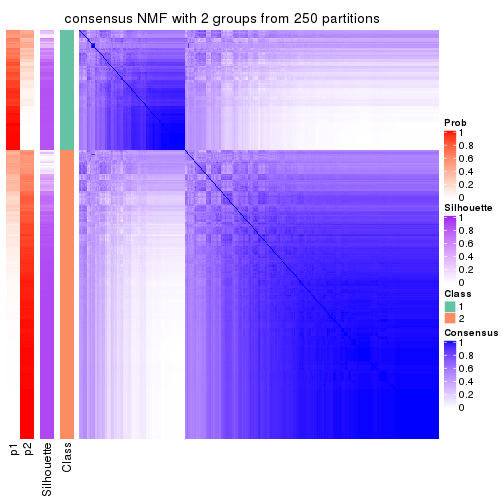</p>

</div>
<div id='tab-CV-NMF-consensus-heatmap-2'>
<pre><code class="r">consensus_heatmap(res, k = 3)
</code></pre>

<p>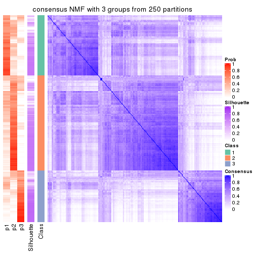</p>

</div>
<div id='tab-CV-NMF-consensus-heatmap-3'>
<pre><code class="r">consensus_heatmap(res, k = 4)
</code></pre>

<p>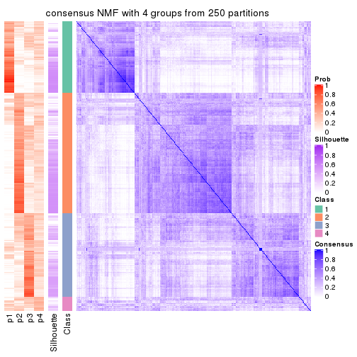</p>

</div>
<div id='tab-CV-NMF-consensus-heatmap-4'>
<pre><code class="r">consensus_heatmap(res, k = 5)
</code></pre>

<p>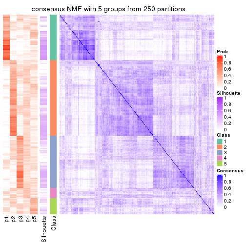</p>

</div>
<div id='tab-CV-NMF-consensus-heatmap-5'>
<pre><code class="r">consensus_heatmap(res, k = 6)
</code></pre>

<p>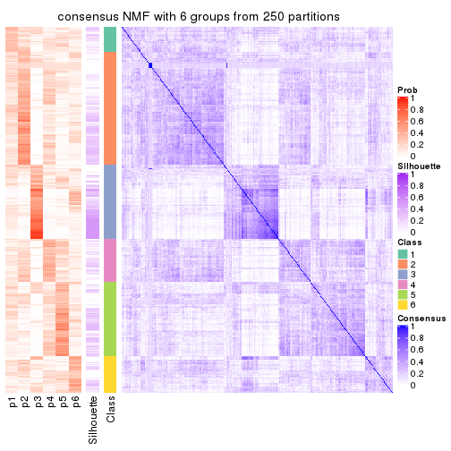</p>

</div>
</div>

Heatmaps for the membership of samples in all partitions to see how consistent they are:


<script>
$( function() {
	$( '#tabs-CV-NMF-membership-heatmap' ).tabs();
} );
</script>
<div id='tabs-CV-NMF-membership-heatmap'>
<ul>
<li><a href='#tab-CV-NMF-membership-heatmap-1'>k = 2</a></li>
<li><a href='#tab-CV-NMF-membership-heatmap-2'>k = 3</a></li>
<li><a href='#tab-CV-NMF-membership-heatmap-3'>k = 4</a></li>
<li><a href='#tab-CV-NMF-membership-heatmap-4'>k = 5</a></li>
<li><a href='#tab-CV-NMF-membership-heatmap-5'>k = 6</a></li>
</ul>
<div id='tab-CV-NMF-membership-heatmap-1'>
<pre><code class="r">membership_heatmap(res, k = 2)
</code></pre>

<p>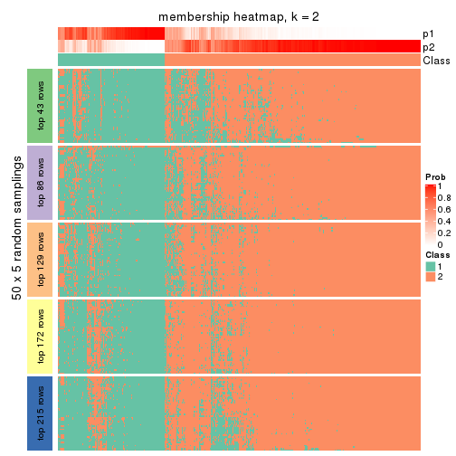</p>

</div>
<div id='tab-CV-NMF-membership-heatmap-2'>
<pre><code class="r">membership_heatmap(res, k = 3)
</code></pre>

<p>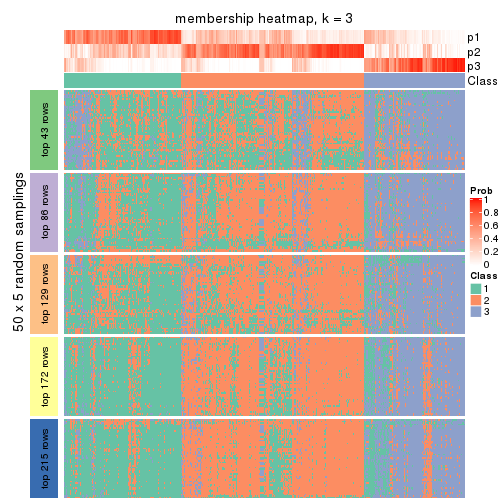</p>

</div>
<div id='tab-CV-NMF-membership-heatmap-3'>
<pre><code class="r">membership_heatmap(res, k = 4)
</code></pre>

<p>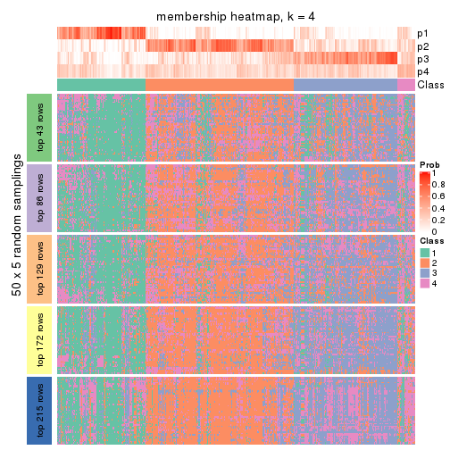</p>

</div>
<div id='tab-CV-NMF-membership-heatmap-4'>
<pre><code class="r">membership_heatmap(res, k = 5)
</code></pre>

<p>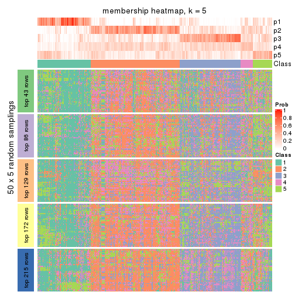</p>

</div>
<div id='tab-CV-NMF-membership-heatmap-5'>
<pre><code class="r">membership_heatmap(res, k = 6)
</code></pre>

<p>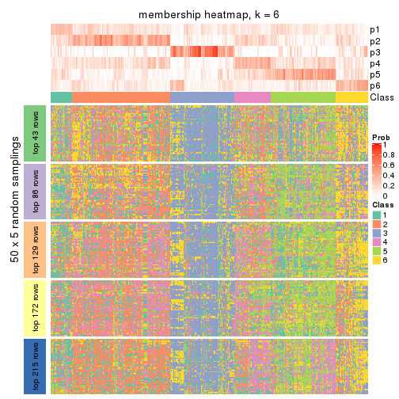</p>

</div>
</div>

As soon as we have had the classes for columns, we can look for signatures
which are significantly different between classes which can be candidate marks
for certain classes. Following are the heatmaps for signatures.


Signature heatmaps where rows are scaled:


<script>
$( function() {
	$( '#tabs-CV-NMF-get-signatures' ).tabs();
} );
</script>
<div id='tabs-CV-NMF-get-signatures'>
<ul>
<li><a href='#tab-CV-NMF-get-signatures-1'>k = 2</a></li>
<li><a href='#tab-CV-NMF-get-signatures-2'>k = 3</a></li>
<li><a href='#tab-CV-NMF-get-signatures-3'>k = 4</a></li>
<li><a href='#tab-CV-NMF-get-signatures-4'>k = 5</a></li>
<li><a href='#tab-CV-NMF-get-signatures-5'>k = 6</a></li>
</ul>
<div id='tab-CV-NMF-get-signatures-1'>
<pre><code class="r">get_signatures(res, k = 2)
</code></pre>

<p>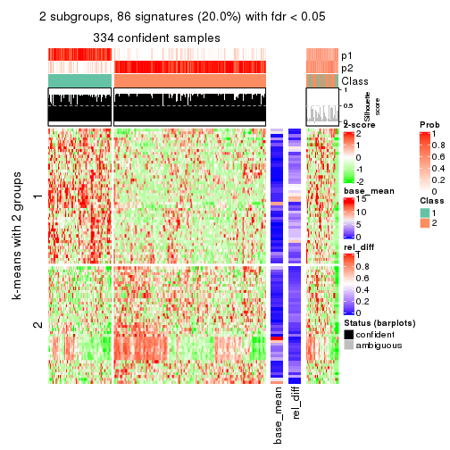</p>

</div>
<div id='tab-CV-NMF-get-signatures-2'>
<pre><code class="r">get_signatures(res, k = 3)
</code></pre>

<p>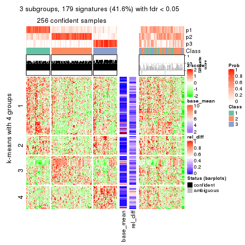</p>

</div>
<div id='tab-CV-NMF-get-signatures-3'>
<pre><code class="r">get_signatures(res, k = 4)
</code></pre>

<p>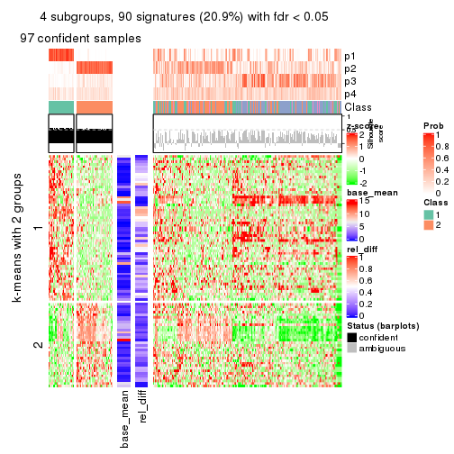</p>

</div>
<div id='tab-CV-NMF-get-signatures-4'>
<pre><code class="r">get_signatures(res, k = 5)
</code></pre>

<p></p>

</div>
<div id='tab-CV-NMF-get-signatures-5'>
<pre><code class="r">get_signatures(res, k = 6)
</code></pre>

<p></p>

</div>
</div>


Signature heatmaps where rows are not scaled:


<script>
$( function() {
	$( '#tabs-CV-NMF-get-signatures-no-scale' ).tabs();
} );
</script>
<div id='tabs-CV-NMF-get-signatures-no-scale'>
<ul>
<li><a href='#tab-CV-NMF-get-signatures-no-scale-1'>k = 2</a></li>
<li><a href='#tab-CV-NMF-get-signatures-no-scale-2'>k = 3</a></li>
<li><a href='#tab-CV-NMF-get-signatures-no-scale-3'>k = 4</a></li>
<li><a href='#tab-CV-NMF-get-signatures-no-scale-4'>k = 5</a></li>
<li><a href='#tab-CV-NMF-get-signatures-no-scale-5'>k = 6</a></li>
</ul>
<div id='tab-CV-NMF-get-signatures-no-scale-1'>
<pre><code class="r">get_signatures(res, k = 2, scale_rows = FALSE)
</code></pre>

<p>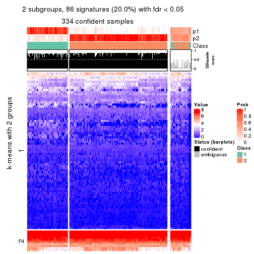</p>

</div>
<div id='tab-CV-NMF-get-signatures-no-scale-2'>
<pre><code class="r">get_signatures(res, k = 3, scale_rows = FALSE)
</code></pre>

<p>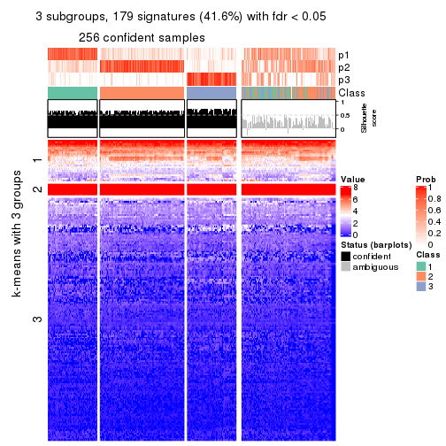</p>

</div>
<div id='tab-CV-NMF-get-signatures-no-scale-3'>
<pre><code class="r">get_signatures(res, k = 4, scale_rows = FALSE)
</code></pre>

<p>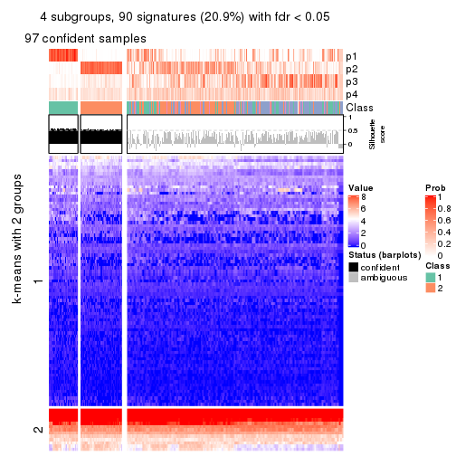</p>

</div>
<div id='tab-CV-NMF-get-signatures-no-scale-4'>
<pre><code class="r">get_signatures(res, k = 5, scale_rows = FALSE)
</code></pre>

<p></p>

</div>
<div id='tab-CV-NMF-get-signatures-no-scale-5'>
<pre><code class="r">get_signatures(res, k = 6, scale_rows = FALSE)
</code></pre>

<p></p>

</div>
</div>


Compare the overlap of signatures from different k:

```r
compare_signatures(res)
```

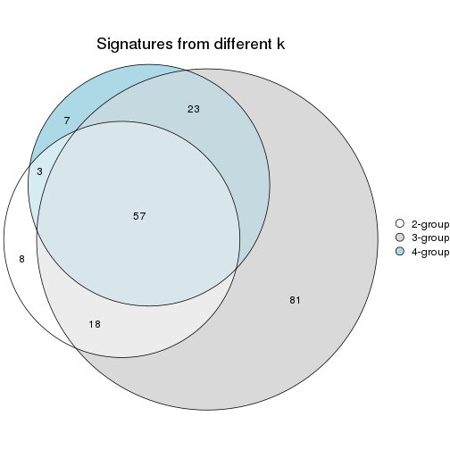

`get_signature()` returns a data frame invisibly. TO get the list of signatures, the function
call should be assigned to a variable explicitly. In following code, if `plot` argument is set
to `FALSE`, no heatmap is plotted while only the differential analysis is performed.

```r
# code only for demonstration
tb = get_signature(res, k = ..., plot = FALSE)
```

An example of the output of `tb` is:

```
#>   which_row         fdr    mean_1    mean_2 scaled_mean_1 scaled_mean_2 km
#> 1        38 0.042760348  8.373488  9.131774    -0.5533452     0.5164555  1
#> 2        40 0.018707592  7.106213  8.469186    -0.6173731     0.5762149  1
#> 3        55 0.019134737 10.221463 11.207825    -0.6159697     0.5749050  1
#> 4        59 0.006059896  5.921854  7.869574    -0.6899429     0.6439467  1
#> 5        60 0.018055526  8.928898 10.211722    -0.6204761     0.5791110  1
#> 6        98 0.009384629 15.714769 14.887706     0.6635654    -0.6193277  2
...
```

The columns in `tb` are:

1. `which_row`: row indices corresponding to the input matrix.
2. `fdr`: FDR for the differential test. 
3. `mean_x`: The mean value in group x.
4. `scaled_mean_x`: The mean value in group x after rows are scaled.
5. `km`: Row groups if k-means clustering is applied to rows.


UMAP plot which shows how samples are separated.


<script>
$( function() {
	$( '#tabs-CV-NMF-dimension-reduction' ).tabs();
} );
</script>
<div id='tabs-CV-NMF-dimension-reduction'>
<ul>
<li><a href='#tab-CV-NMF-dimension-reduction-1'>k = 2</a></li>
<li><a href='#tab-CV-NMF-dimension-reduction-2'>k = 3</a></li>
<li><a href='#tab-CV-NMF-dimension-reduction-3'>k = 4</a></li>
<li><a href='#tab-CV-NMF-dimension-reduction-4'>k = 5</a></li>
<li><a href='#tab-CV-NMF-dimension-reduction-5'>k = 6</a></li>
</ul>
<div id='tab-CV-NMF-dimension-reduction-1'>
<pre><code class="r">dimension_reduction(res, k = 2, method = &quot;UMAP&quot;)
</code></pre>

<p>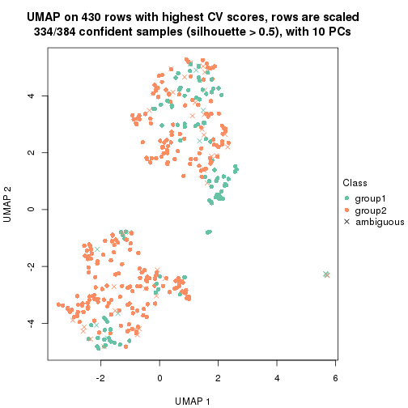</p>

</div>
<div id='tab-CV-NMF-dimension-reduction-2'>
<pre><code class="r">dimension_reduction(res, k = 3, method = &quot;UMAP&quot;)
</code></pre>

<p>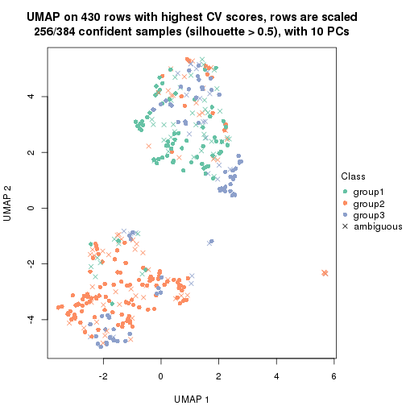</p>

</div>
<div id='tab-CV-NMF-dimension-reduction-3'>
<pre><code class="r">dimension_reduction(res, k = 4, method = &quot;UMAP&quot;)
</code></pre>

<p>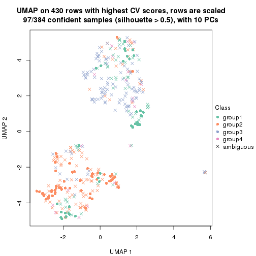</p>

</div>
<div id='tab-CV-NMF-dimension-reduction-4'>
<pre><code class="r">dimension_reduction(res, k = 5, method = &quot;UMAP&quot;)
</code></pre>

<p>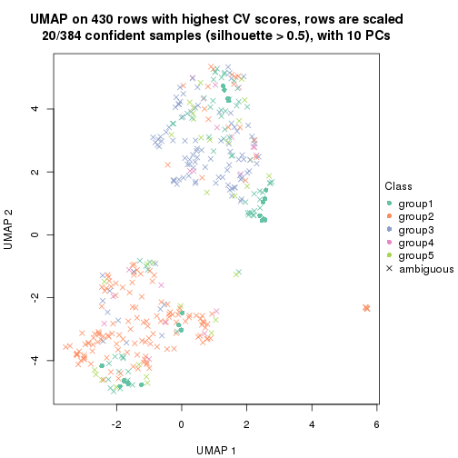</p>

</div>
<div id='tab-CV-NMF-dimension-reduction-5'>
<pre><code class="r">dimension_reduction(res, k = 6, method = &quot;UMAP&quot;)
</code></pre>

<p>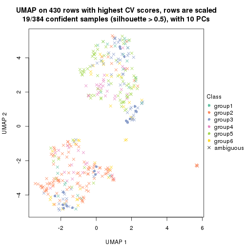</p>

</div>
</div>


Following heatmap shows how subgroups are split when increasing `k`:

```r
collect_classes(res)
```

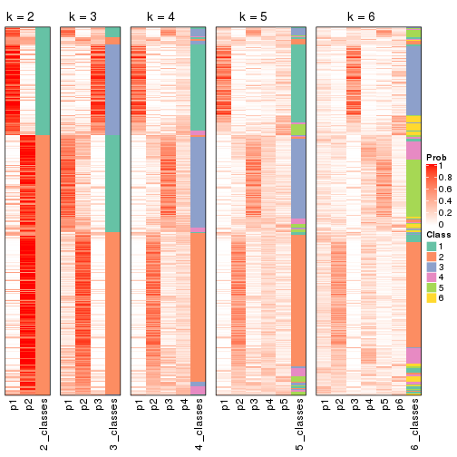


If matrix rows can be associated to genes, consider to use `GO_Enrichment(res,
...)` to perform function enrichment for the signature genes.


 

---------------------------------------------------


### MAD:hclust


The object with results only for a single top-value method and a single partition method 
can be extracted as:

```r
res = res_list["MAD", "hclust"]
# you can also extract it by
# res = res_list["MAD:hclust"]
```

A summary of `res` and all the functions that can be applied to it:

```r
res
```

```
#> A 'ConsensusPartition' object with k = 2, 3, 4, 5, 6.
#>   On a matrix with 430 rows and 384 columns.
#>   Top rows (43, 86, 129, 172, 215) are extracted by 'MAD' method.
#>   Subgroups are detected by 'hclust' method.
#>   Performed in total 1250 partitions by row resampling.
#>   Best k for subgroups seems to be 3.
#> 
#> Following methods can be applied to this 'ConsensusPartition' object:
#>  [1] "cola_report"             "collect_classes"         "collect_plots"          
#>  [4] "collect_stats"           "colnames"                "compare_signatures"     
#>  [7] "consensus_heatmap"       "dimension_reduction"     "functional_enrichment"  
#> [10] "get_anno_col"            "get_anno"                "get_classes"            
#> [13] "get_consensus"           "get_matrix"              "get_membership"         
#> [16] "get_param"               "get_signatures"          "get_stats"              
#> [19] "is_best_k"               "is_stable_k"             "membership_heatmap"     
#> [22] "ncol"                    "nrow"                    "plot_ecdf"              
#> [25] "rownames"                "select_partition_number" "show"                   
#> [28] "suggest_best_k"          "test_to_known_factors"
```

`collect_plots()` function collects all the plots made from `res` for all `k` (number of partitions)
into one single page to provide an easy and fast comparison between different `k`.

```r
collect_plots(res)
```

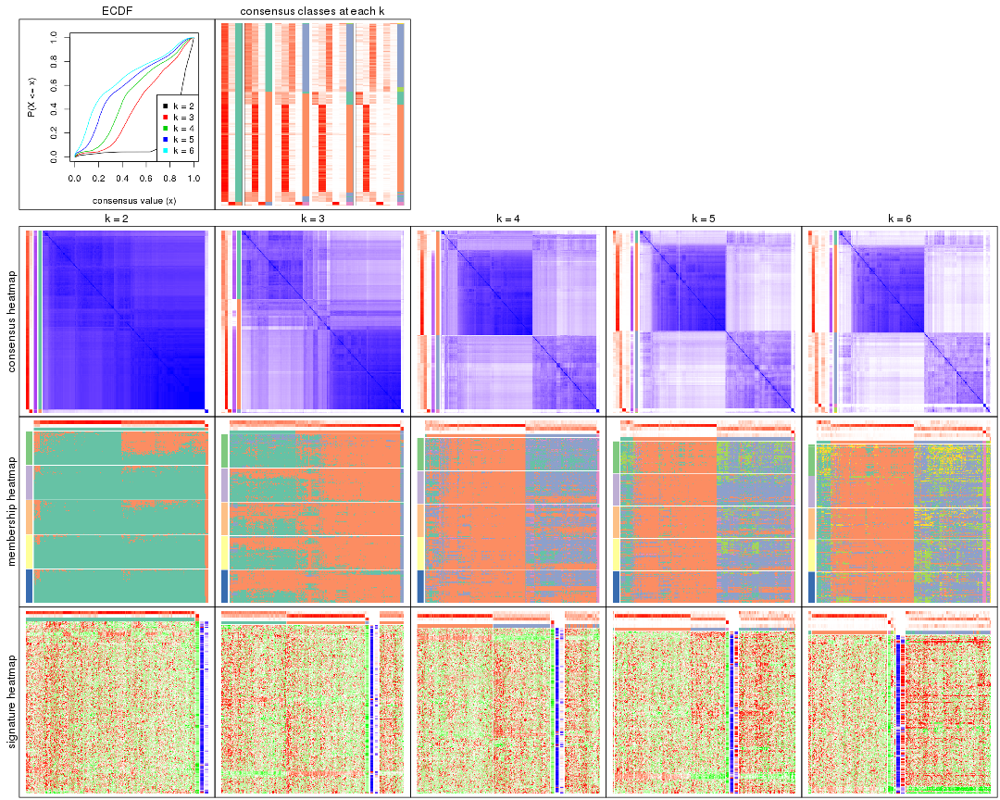

The plots are:

- The first row: a plot of the ECDF (Empirical cumulative distribution
  function) curves of the consensus matrix for each `k` and the heatmap of
  predicted classes for each `k`.
- The second row: heatmaps of the consensus matrix for each `k`.
- The third row: heatmaps of the membership matrix for each `k`.
- The fouth row: heatmaps of the signatures for each `k`.

All the plots in panels can be made by individual functions and they are
plotted later in this section.

`select_partition_number()` produces several plots showing different
statistics for choosing "optimized" `k`. There are following statistics:

- ECDF curves of the consensus matrix for each `k`;
- 1-PAC. [The PAC
  score](https://en.wikipedia.org/wiki/Consensus_clustering#Over-interpretation_potential_of_consensus_clustering)
  measures the proportion of the ambiguous subgrouping.
- Mean silhouette score.
- Concordance. The mean probability of fiting the consensus class ids in all
  partitions.
- Area increased. Denote $A_k$ as the area under the ECDF curve for current
  `k`, the area increased is defined as $A_k - A_{k-1}$.
- Rand index. The percent of pairs of samples that are both in a same cluster
  or both are not in a same cluster in the partition of k and k-1.
- Jaccard index. The ratio of pairs of samples are both in a same cluster in
  the partition of k and k-1 and the pairs of samples are both in a same
  cluster in the partition k or k-1.

The detailed explanations of these statistics can be found in [the cola
vignette](http://bioconductor.org/packages/devel/bioc/vignettes/cola/inst/doc/cola.html#toc_13).

Generally speaking, lower PAC score, higher mean silhouette score or higher
concordance corresponds to better partition. Rand index and Jaccard index
measure how similar the current partition is compared to partition with `k-1`.
If they are too similar, we won't accept `k` is better than `k-1`.

```r
select_partition_number(res)
```

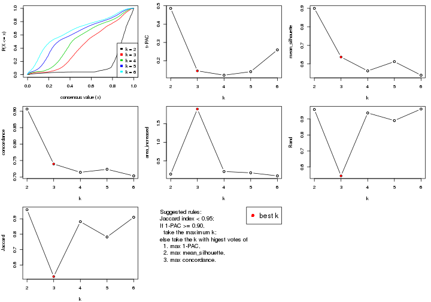

The numeric values for all these statistics can be obtained by `get_stats()`.

```r
get_stats(res)
```

```
#>   k 1-PAC mean_silhouette concordance area_increased  Rand Jaccard
#> 2 2 0.486           0.900       0.907         0.1461 0.959   0.959
#> 3 3 0.145           0.637       0.739         1.8932 0.545   0.525
#> 4 4 0.121           0.562       0.714         0.2150 0.938   0.881
#> 5 5 0.141           0.612       0.723         0.1805 0.890   0.782
#> 6 6 0.260           0.539       0.703         0.0979 0.962   0.910
```

`suggest_best_k()` suggests the best $k$ based on these statistics. The rules are as follows:

- All $k$ with Jaccard index larger than 0.95 are removed because the increase of
  the partition number does not provides enough extra information. If all $k$ are removed,
  the best $k$ is assigned by `NA`.
- For $k$ with 1-PAC larger than 0.9, the maximal $k$ is taken as the "best k". Other $k$ is called "optional k".
- If it does not fit the second rule. The $k$ with the highest vote of highest
  1-PAC, mean silhouette and concordance is taken as the "best k".

```r
suggest_best_k(res)
```

```
#> [1] 3
```


Following shows the table of the partitions (You need to click the **show/hide
code output** link to see it). The membership matrix (columns with name `p*`)
is inferred by
[`clue::cl_consensus()`](https://www.rdocumentation.org/link/cl_consensus?package=clue)
function with the `SE` method. Basically the value in the membership matrix
represents the probability to belong to a certain group. The finall class
label for an item is determined with the group with highest probability it
belongs to.

In `get_classes()` function, the entropy is calculated from the membership
matrix and the silhouette score is calculated from the consensus matrix.


<script>
$( function() {
	$( '#tabs-MAD-hclust-get-classes' ).tabs();
} );
</script>
<div id='tabs-MAD-hclust-get-classes'>
<ul>
<li><a href='#tab-MAD-hclust-get-classes-1'>k = 2</a></li>
<li><a href='#tab-MAD-hclust-get-classes-2'>k = 3</a></li>
<li><a href='#tab-MAD-hclust-get-classes-3'>k = 4</a></li>
<li><a href='#tab-MAD-hclust-get-classes-4'>k = 5</a></li>
<li><a href='#tab-MAD-hclust-get-classes-5'>k = 6</a></li>
</ul>

<div id='tab-MAD-hclust-get-classes-1'>
<p><a id='tab-MAD-hclust-get-classes-1-a' style='color:#0366d6' href='#'>show/hide code output</a></p>
<pre><code class="r">cbind(get_classes(res, k = 2), get_membership(res, k = 2))
</code></pre>

<pre><code>#&gt;            class entropy silhouette    p1    p2
#&gt; SRR2105277     1  0.6438      0.894 0.836 0.164
#&gt; SRR2105278     1  0.6712      0.888 0.824 0.176
#&gt; SRR2105275     1  0.9358      0.650 0.648 0.352
#&gt; SRR2105276     1  0.8813      0.738 0.700 0.300
#&gt; SRR2105273     1  0.6801      0.884 0.820 0.180
#&gt; SRR2105274     1  0.6531      0.894 0.832 0.168
#&gt; SRR2105271     1  0.5842      0.904 0.860 0.140
#&gt; SRR2105272     1  0.5408      0.907 0.876 0.124
#&gt; SRR2105269     1  0.0938      0.914 0.988 0.012
#&gt; SRR2105270     1  0.1414      0.915 0.980 0.020
#&gt; SRR2105267     1  0.1184      0.913 0.984 0.016
#&gt; SRR2105268     1  0.0672      0.914 0.992 0.008
#&gt; SRR2105265     1  0.0672      0.914 0.992 0.008
#&gt; SRR2105266     1  0.0672      0.914 0.992 0.008
#&gt; SRR2105263     1  0.0672      0.918 0.992 0.008
#&gt; SRR2105264     1  0.0938      0.919 0.988 0.012
#&gt; SRR2105261     1  0.8081      0.824 0.752 0.248
#&gt; SRR2105262     1  0.7950      0.829 0.760 0.240
#&gt; SRR2105357     1  0.6801      0.888 0.820 0.180
#&gt; SRR2105358     1  0.6531      0.896 0.832 0.168
#&gt; SRR2105439     1  0.0672      0.914 0.992 0.008
#&gt; SRR2105440     1  0.0672      0.914 0.992 0.008
#&gt; SRR2105509     1  0.3114      0.915 0.944 0.056
#&gt; SRR2105510     1  0.2603      0.918 0.956 0.044
#&gt; SRR2105507     1  0.6438      0.895 0.836 0.164
#&gt; SRR2105508     1  0.6973      0.881 0.812 0.188
#&gt; SRR2105505     1  0.5519      0.907 0.872 0.128
#&gt; SRR2105506     1  0.4815      0.917 0.896 0.104
#&gt; SRR2105503     1  0.0376      0.917 0.996 0.004
#&gt; SRR2105504     2  0.1184      0.931 0.016 0.984
#&gt; SRR2105501     1  0.1633      0.918 0.976 0.024
#&gt; SRR2105502     2  0.1184      0.931 0.016 0.984
#&gt; SRR2105499     1  0.6623      0.899 0.828 0.172
#&gt; SRR2105500     1  0.6048      0.906 0.852 0.148
#&gt; SRR2105497     1  0.0672      0.914 0.992 0.008
#&gt; SRR2105498     1  0.0938      0.918 0.988 0.012
#&gt; SRR2105495     1  0.1414      0.918 0.980 0.020
#&gt; SRR2105496     1  0.1843      0.921 0.972 0.028
#&gt; SRR2105493     1  0.1633      0.921 0.976 0.024
#&gt; SRR2105494     1  0.2043      0.920 0.968 0.032
#&gt; SRR2105491     1  0.1414      0.918 0.980 0.020
#&gt; SRR2105492     1  0.1414      0.918 0.980 0.020
#&gt; SRR2105489     1  0.0672      0.917 0.992 0.008
#&gt; SRR2105490     1  0.0376      0.915 0.996 0.004
#&gt; SRR2105487     1  0.5737      0.909 0.864 0.136
#&gt; SRR2105488     1  0.5737      0.909 0.864 0.136
#&gt; SRR2105485     1  0.6343      0.899 0.840 0.160
#&gt; SRR2105486     1  0.6048      0.905 0.852 0.148
#&gt; SRR2105483     1  0.2043      0.921 0.968 0.032
#&gt; SRR2105484     1  0.2043      0.921 0.968 0.032
#&gt; SRR2105481     1  0.6247      0.901 0.844 0.156
#&gt; SRR2105482     1  0.4815      0.916 0.896 0.104
#&gt; SRR2105479     1  0.6438      0.897 0.836 0.164
#&gt; SRR2105480     1  0.5059      0.918 0.888 0.112
#&gt; SRR2105477     1  0.1843      0.918 0.972 0.028
#&gt; SRR2105478     1  0.1843      0.918 0.972 0.028
#&gt; SRR2105475     1  0.2423      0.921 0.960 0.040
#&gt; SRR2105476     1  0.2236      0.919 0.964 0.036
#&gt; SRR2105473     1  0.0938      0.916 0.988 0.012
#&gt; SRR2105474     1  0.1184      0.917 0.984 0.016
#&gt; SRR2105471     1  0.0376      0.917 0.996 0.004
#&gt; SRR2105472     1  0.0376      0.917 0.996 0.004
#&gt; SRR2105469     1  0.6973      0.880 0.812 0.188
#&gt; SRR2105470     1  0.6148      0.902 0.848 0.152
#&gt; SRR2105467     1  0.5842      0.906 0.860 0.140
#&gt; SRR2105468     1  0.5294      0.914 0.880 0.120
#&gt; SRR2105465     1  0.4815      0.918 0.896 0.104
#&gt; SRR2105466     1  0.4022      0.922 0.920 0.080
#&gt; SRR2105463     1  0.3584      0.922 0.932 0.068
#&gt; SRR2105464     1  0.3584      0.922 0.932 0.068
#&gt; SRR2105461     1  0.0672      0.914 0.992 0.008
#&gt; SRR2105462     1  0.0672      0.914 0.992 0.008
#&gt; SRR2105459     1  0.1633      0.917 0.976 0.024
#&gt; SRR2105460     1  0.0672      0.917 0.992 0.008
#&gt; SRR2105457     1  0.6712      0.888 0.824 0.176
#&gt; SRR2105458     1  0.6973      0.887 0.812 0.188
#&gt; SRR2105455     1  0.5842      0.910 0.860 0.140
#&gt; SRR2105456     1  0.6148      0.903 0.848 0.152
#&gt; SRR2105453     1  0.5059      0.914 0.888 0.112
#&gt; SRR2105454     1  0.5059      0.915 0.888 0.112
#&gt; SRR2105451     1  0.2423      0.923 0.960 0.040
#&gt; SRR2105452     2  0.1184      0.931 0.016 0.984
#&gt; SRR2105449     1  0.4815      0.919 0.896 0.104
#&gt; SRR2105450     1  0.4939      0.917 0.892 0.108
#&gt; SRR2105447     1  0.2423      0.923 0.960 0.040
#&gt; SRR2105448     1  0.2043      0.921 0.968 0.032
#&gt; SRR2105445     1  0.5294      0.920 0.880 0.120
#&gt; SRR2105446     1  0.4431      0.922 0.908 0.092
#&gt; SRR2105443     1  0.6148      0.907 0.848 0.152
#&gt; SRR2105444     1  0.4690      0.922 0.900 0.100
#&gt; SRR2105441     1  0.0672      0.914 0.992 0.008
#&gt; SRR2105442     1  0.0672      0.916 0.992 0.008
#&gt; SRR2105437     1  0.7139      0.870 0.804 0.196
#&gt; SRR2105438     1  0.7139      0.870 0.804 0.196
#&gt; SRR2105435     1  0.5294      0.915 0.880 0.120
#&gt; SRR2105436     1  0.6343      0.896 0.840 0.160
#&gt; SRR2105433     1  0.4022      0.921 0.920 0.080
#&gt; SRR2105434     1  0.3584      0.922 0.932 0.068
#&gt; SRR2105431     1  0.4298      0.919 0.912 0.088
#&gt; SRR2105432     1  0.4815      0.916 0.896 0.104
#&gt; SRR2105429     1  0.5059      0.917 0.888 0.112
#&gt; SRR2105430     1  0.4690      0.916 0.900 0.100
#&gt; SRR2105427     1  0.1633      0.915 0.976 0.024
#&gt; SRR2105428     1  0.2043      0.918 0.968 0.032
#&gt; SRR2105425     1  0.2043      0.920 0.968 0.032
#&gt; SRR2105426     1  0.1184      0.918 0.984 0.016
#&gt; SRR2105421     1  0.7139      0.874 0.804 0.196
#&gt; SRR2105422     1  0.7299      0.868 0.796 0.204
#&gt; SRR2105423     1  0.0376      0.915 0.996 0.004
#&gt; SRR2105424     1  0.0672      0.914 0.992 0.008
#&gt; SRR2105419     1  0.6343      0.903 0.840 0.160
#&gt; SRR2105420     1  0.5946      0.908 0.856 0.144
#&gt; SRR2105415     1  0.4161      0.920 0.916 0.084
#&gt; SRR2105416     1  0.3431      0.922 0.936 0.064
#&gt; SRR2105417     1  0.4562      0.917 0.904 0.096
#&gt; SRR2105418     1  0.3584      0.922 0.932 0.068
#&gt; SRR2105413     1  0.2778      0.915 0.952 0.048
#&gt; SRR2105414     1  0.2043      0.921 0.968 0.032
#&gt; SRR2105409     1  0.0938      0.916 0.988 0.012
#&gt; SRR2105410     1  0.0938      0.918 0.988 0.012
#&gt; SRR2105411     1  0.1184      0.918 0.984 0.016
#&gt; SRR2105412     1  0.0376      0.915 0.996 0.004
#&gt; SRR2105407     1  0.7139      0.875 0.804 0.196
#&gt; SRR2105408     1  0.7056      0.878 0.808 0.192
#&gt; SRR2105403     1  0.6623      0.889 0.828 0.172
#&gt; SRR2105404     1  0.6712      0.887 0.824 0.176
#&gt; SRR2105405     1  0.5519      0.910 0.872 0.128
#&gt; SRR2105406     1  0.4939      0.917 0.892 0.108
#&gt; SRR2105401     1  0.4815      0.918 0.896 0.104
#&gt; SRR2105402     2  0.1184      0.931 0.016 0.984
#&gt; SRR2105399     1  0.7299      0.864 0.796 0.204
#&gt; SRR2105400     1  0.7056      0.877 0.808 0.192
#&gt; SRR2105397     1  0.8608      0.742 0.716 0.284
#&gt; SRR2105398     1  0.8608      0.742 0.716 0.284
#&gt; SRR2105395     1  0.0376      0.915 0.996 0.004
#&gt; SRR2105396     1  0.0672      0.914 0.992 0.008
#&gt; SRR2105393     1  0.0672      0.914 0.992 0.008
#&gt; SRR2105394     1  0.0376      0.917 0.996 0.004
#&gt; SRR2105389     1  0.8081      0.822 0.752 0.248
#&gt; SRR2105390     1  0.7056      0.876 0.808 0.192
#&gt; SRR2105391     1  0.7376      0.863 0.792 0.208
#&gt; SRR2105392     1  0.7376      0.863 0.792 0.208
#&gt; SRR2105385     1  0.5842      0.910 0.860 0.140
#&gt; SRR2105386     1  0.6048      0.900 0.852 0.148
#&gt; SRR2105387     1  0.5737      0.912 0.864 0.136
#&gt; SRR2105388     1  0.6148      0.898 0.848 0.152
#&gt; SRR2105381     1  0.4815      0.917 0.896 0.104
#&gt; SRR2105382     1  0.3114      0.922 0.944 0.056
#&gt; SRR2105383     1  0.2043      0.921 0.968 0.032
#&gt; SRR2105384     1  0.2043      0.921 0.968 0.032
#&gt; SRR2105379     1  0.2603      0.920 0.956 0.044
#&gt; SRR2105380     1  0.2778      0.921 0.952 0.048
#&gt; SRR2105377     1  0.0938      0.915 0.988 0.012
#&gt; SRR2105378     1  0.0938      0.916 0.988 0.012
#&gt; SRR2105375     1  0.5519      0.914 0.872 0.128
#&gt; SRR2105376     1  0.4939      0.919 0.892 0.108
#&gt; SRR2105373     1  0.7139      0.872 0.804 0.196
#&gt; SRR2105374     1  0.7219      0.868 0.800 0.200
#&gt; SRR2105371     1  0.7299      0.866 0.796 0.204
#&gt; SRR2105372     1  0.7376      0.864 0.792 0.208
#&gt; SRR2105369     1  0.6438      0.894 0.836 0.164
#&gt; SRR2105370     1  0.6048      0.900 0.852 0.148
#&gt; SRR2105367     1  0.4815      0.918 0.896 0.104
#&gt; SRR2105368     1  0.5294      0.914 0.880 0.120
#&gt; SRR2105365     1  0.0938      0.918 0.988 0.012
#&gt; SRR2105366     1  0.0938      0.918 0.988 0.012
#&gt; SRR2105363     1  0.0938      0.916 0.988 0.012
#&gt; SRR2105364     1  0.1184      0.916 0.984 0.016
#&gt; SRR2105361     1  0.0938      0.916 0.988 0.012
#&gt; SRR2105362     1  0.0672      0.914 0.992 0.008
#&gt; SRR2105359     1  0.6623      0.895 0.828 0.172
#&gt; SRR2105360     1  0.6623      0.890 0.828 0.172
#&gt; SRR2105355     1  0.6531      0.894 0.832 0.168
#&gt; SRR2105356     1  0.6623      0.891 0.828 0.172
#&gt; SRR2105353     1  0.9129      0.693 0.672 0.328
#&gt; SRR2105354     1  0.7815      0.837 0.768 0.232
#&gt; SRR2105351     1  0.1184      0.913 0.984 0.016
#&gt; SRR2105352     2  0.1184      0.931 0.016 0.984
#&gt; SRR2105349     1  0.2778      0.921 0.952 0.048
#&gt; SRR2105350     1  0.1843      0.921 0.972 0.028
#&gt; SRR2105345     1  0.0938      0.916 0.988 0.012
#&gt; SRR2105346     1  0.0672      0.914 0.992 0.008
#&gt; SRR2105347     1  0.0938      0.917 0.988 0.012
#&gt; SRR2105348     1  0.0938      0.914 0.988 0.012
#&gt; SRR2105343     1  0.0672      0.914 0.992 0.008
#&gt; SRR2105344     1  0.0938      0.915 0.988 0.012
#&gt; SRR2105341     1  0.7139      0.874 0.804 0.196
#&gt; SRR2105342     1  0.7056      0.877 0.808 0.192
#&gt; SRR2105339     1  0.6973      0.881 0.812 0.188
#&gt; SRR2105340     1  0.7056      0.879 0.808 0.192
#&gt; SRR2105335     1  0.5737      0.907 0.864 0.136
#&gt; SRR2105336     1  0.5946      0.904 0.856 0.144
#&gt; SRR2105337     1  0.5519      0.910 0.872 0.128
#&gt; SRR2105338     1  0.6048      0.902 0.852 0.148
#&gt; SRR2105331     1  0.1184      0.918 0.984 0.016
#&gt; SRR2105332     1  0.0000      0.916 1.000 0.000
#&gt; SRR2105333     1  0.2423      0.922 0.960 0.040
#&gt; SRR2105334     1  0.3431      0.917 0.936 0.064
#&gt; SRR2105329     1  0.3879      0.923 0.924 0.076
#&gt; SRR2105330     1  0.3733      0.924 0.928 0.072
#&gt; SRR2105327     1  0.0672      0.916 0.992 0.008
#&gt; SRR2105328     1  0.1633      0.921 0.976 0.024
#&gt; SRR2105325     1  0.9393      0.635 0.644 0.356
#&gt; SRR2105326     1  0.9393      0.635 0.644 0.356
#&gt; SRR2105323     1  0.6623      0.897 0.828 0.172
#&gt; SRR2105324     1  0.6973      0.888 0.812 0.188
#&gt; SRR2105319     1  0.6148      0.901 0.848 0.152
#&gt; SRR2105320     1  0.6148      0.902 0.848 0.152
#&gt; SRR2105321     1  0.9286      0.663 0.656 0.344
#&gt; SRR2105322     1  0.9286      0.663 0.656 0.344
#&gt; SRR2105317     1  0.2423      0.916 0.960 0.040
#&gt; SRR2105318     1  0.1633      0.918 0.976 0.024
#&gt; SRR2105315     1  0.3584      0.924 0.932 0.068
#&gt; SRR2105316     1  0.2423      0.923 0.960 0.040
#&gt; SRR2105313     1  0.1414      0.919 0.980 0.020
#&gt; SRR2105314     1  0.1184      0.916 0.984 0.016
#&gt; SRR2105311     1  0.9087      0.691 0.676 0.324
#&gt; SRR2105312     1  0.9087      0.687 0.676 0.324
#&gt; SRR2105307     1  0.5059      0.916 0.888 0.112
#&gt; SRR2105308     1  0.4939      0.918 0.892 0.108
#&gt; SRR2105309     1  0.7056      0.879 0.808 0.192
#&gt; SRR2105310     1  0.6148      0.903 0.848 0.152
#&gt; SRR2105305     1  0.7056      0.877 0.808 0.192
#&gt; SRR2105306     1  0.6973      0.880 0.812 0.188
#&gt; SRR2105303     1  0.0938      0.915 0.988 0.012
#&gt; SRR2105304     2  0.1184      0.931 0.016 0.984
#&gt; SRR2105301     1  0.2043      0.916 0.968 0.032
#&gt; SRR2105302     1  0.2043      0.916 0.968 0.032
#&gt; SRR2105299     1  0.6438      0.899 0.836 0.164
#&gt; SRR2105300     1  0.4022      0.923 0.920 0.080
#&gt; SRR2105297     1  0.0938      0.918 0.988 0.012
#&gt; SRR2105298     1  0.0938      0.918 0.988 0.012
#&gt; SRR2105295     1  0.2043      0.918 0.968 0.032
#&gt; SRR2105296     1  0.1633      0.917 0.976 0.024
#&gt; SRR2105293     1  0.7453      0.855 0.788 0.212
#&gt; SRR2105294     1  0.6531      0.894 0.832 0.168
#&gt; SRR2105291     1  0.4431      0.922 0.908 0.092
#&gt; SRR2105292     1  0.4431      0.919 0.908 0.092
#&gt; SRR2105289     1  0.6438      0.900 0.836 0.164
#&gt; SRR2105290     1  0.5519      0.908 0.872 0.128
#&gt; SRR2105287     1  0.4690      0.919 0.900 0.100
#&gt; SRR2105288     1  0.3879      0.921 0.924 0.076
#&gt; SRR2105285     1  0.3274      0.917 0.940 0.060
#&gt; SRR2105286     1  0.3274      0.917 0.940 0.060
#&gt; SRR2105283     1  0.3274      0.925 0.940 0.060
#&gt; SRR2105284     1  0.2236      0.923 0.964 0.036
#&gt; SRR2105281     1  0.1184      0.917 0.984 0.016
#&gt; SRR2105282     1  0.0672      0.914 0.992 0.008
#&gt; SRR2105259     1  0.7139      0.875 0.804 0.196
#&gt; SRR2105260     1  0.6973      0.882 0.812 0.188
#&gt; SRR2105279     1  0.0376      0.915 0.996 0.004
#&gt; SRR2105280     1  0.0376      0.915 0.996 0.004
#&gt; SRR2105257     1  0.4815      0.916 0.896 0.104
#&gt; SRR2105258     1  0.4939      0.916 0.892 0.108
#&gt; SRR2105253     1  0.2236      0.919 0.964 0.036
#&gt; SRR2105254     1  0.1633      0.920 0.976 0.024
#&gt; SRR2105255     1  0.6343      0.894 0.840 0.160
#&gt; SRR2105256     1  0.6247      0.896 0.844 0.156
#&gt; SRR2105251     1  0.0938      0.917 0.988 0.012
#&gt; SRR2105252     1  0.0672      0.918 0.992 0.008
#&gt; SRR2105249     1  0.0672      0.914 0.992 0.008
#&gt; SRR2105250     1  0.1414      0.919 0.980 0.020
#&gt; SRR2105247     1  0.0672      0.914 0.992 0.008
#&gt; SRR2105248     1  0.0672      0.914 0.992 0.008
#&gt; SRR2105245     1  0.7602      0.851 0.780 0.220
#&gt; SRR2105246     1  0.7219      0.873 0.800 0.200
#&gt; SRR2105243     1  0.6148      0.898 0.848 0.152
#&gt; SRR2105244     1  0.6148      0.899 0.848 0.152
#&gt; SRR2105241     1  0.5408      0.911 0.876 0.124
#&gt; SRR2105242     1  0.5294      0.911 0.880 0.120
#&gt; SRR2105239     1  0.7376      0.862 0.792 0.208
#&gt; SRR2105240     1  0.5408      0.913 0.876 0.124
#&gt; SRR2105237     1  0.3584      0.921 0.932 0.068
#&gt; SRR2105238     1  0.2778      0.922 0.952 0.048
#&gt; SRR2105235     1  0.0938      0.916 0.988 0.012
#&gt; SRR2105236     1  0.0938      0.916 0.988 0.012
#&gt; SRR2105233     1  0.2423      0.919 0.960 0.040
#&gt; SRR2105234     1  0.2423      0.919 0.960 0.040
#&gt; SRR2105231     1  0.0000      0.916 1.000 0.000
#&gt; SRR2105232     1  0.0672      0.914 0.992 0.008
#&gt; SRR2105227     1  0.6343      0.903 0.840 0.160
#&gt; SRR2105228     1  0.5519      0.916 0.872 0.128
#&gt; SRR2105225     1  0.5842      0.906 0.860 0.140
#&gt; SRR2105226     1  0.5294      0.911 0.880 0.120
#&gt; SRR2105229     1  0.7056      0.879 0.808 0.192
#&gt; SRR2105230     1  0.6623      0.891 0.828 0.172
#&gt; SRR2105219     1  0.1184      0.914 0.984 0.016
#&gt; SRR2105220     1  0.1414      0.917 0.980 0.020
#&gt; SRR2105221     1  0.2043      0.922 0.968 0.032
#&gt; SRR2105222     1  0.0376      0.915 0.996 0.004
#&gt; SRR2105223     1  0.6247      0.898 0.844 0.156
#&gt; SRR2105224     1  0.6148      0.901 0.848 0.152
#&gt; SRR2105217     1  0.0376      0.917 0.996 0.004
#&gt; SRR2105218     1  0.0376      0.917 0.996 0.004
#&gt; SRR2105215     1  0.0672      0.914 0.992 0.008
#&gt; SRR2105216     1  0.0672      0.914 0.992 0.008
#&gt; SRR2105213     1  0.7453      0.857 0.788 0.212
#&gt; SRR2105214     1  0.7299      0.866 0.796 0.204
#&gt; SRR2105211     1  0.6887      0.890 0.816 0.184
#&gt; SRR2105212     1  0.6148      0.901 0.848 0.152
#&gt; SRR2105209     1  0.5629      0.914 0.868 0.132
#&gt; SRR2105210     1  0.4939      0.915 0.892 0.108
#&gt; SRR2105207     1  0.4161      0.922 0.916 0.084
#&gt; SRR2105208     1  0.4022      0.922 0.920 0.080
#&gt; SRR2105205     1  0.1633      0.921 0.976 0.024
#&gt; SRR2105206     1  0.2043      0.921 0.968 0.032
#&gt; SRR2105201     1  0.1843      0.921 0.972 0.028
#&gt; SRR2105202     1  0.0672      0.914 0.992 0.008
#&gt; SRR2105203     1  0.0672      0.914 0.992 0.008
#&gt; SRR2105204     1  0.0672      0.914 0.992 0.008
#&gt; SRR2105199     1  0.0672      0.914 0.992 0.008
#&gt; SRR2105200     1  0.0376      0.915 0.996 0.004
#&gt; SRR2105197     1  0.7376      0.869 0.792 0.208
#&gt; SRR2105198     1  0.7453      0.866 0.788 0.212
#&gt; SRR2105195     1  0.5519      0.915 0.872 0.128
#&gt; SRR2105196     1  0.4431      0.922 0.908 0.092
#&gt; SRR2105193     1  0.4562      0.921 0.904 0.096
#&gt; SRR2105194     1  0.3584      0.923 0.932 0.068
#&gt; SRR2105191     1  0.7299      0.864 0.796 0.204
#&gt; SRR2105192     1  0.4939      0.915 0.892 0.108
#&gt; SRR2105189     1  0.2778      0.924 0.952 0.048
#&gt; SRR2105190     1  0.2423      0.922 0.960 0.040
#&gt; SRR2105187     1  0.4939      0.872 0.892 0.108
#&gt; SRR2105188     1  0.3584      0.924 0.932 0.068
#&gt; SRR2105179     1  0.5737      0.914 0.864 0.136
#&gt; SRR2105180     1  0.4815      0.919 0.896 0.104
#&gt; SRR2105183     1  0.0672      0.914 0.992 0.008
#&gt; SRR2105184     1  0.0376      0.915 0.996 0.004
#&gt; SRR2105185     1  0.2778      0.912 0.952 0.048
#&gt; SRR2105186     1  0.1414      0.920 0.980 0.020
#&gt; SRR2105181     1  0.6712      0.891 0.824 0.176
#&gt; SRR2105182     1  0.6247      0.898 0.844 0.156
#&gt; SRR2105177     1  0.3114      0.922 0.944 0.056
#&gt; SRR2105178     1  0.2043      0.921 0.968 0.032
#&gt; SRR2105171     1  0.0938      0.916 0.988 0.012
#&gt; SRR2105172     1  0.0672      0.914 0.992 0.008
#&gt; SRR2105175     1  0.3431      0.922 0.936 0.064
#&gt; SRR2105176     1  0.4161      0.920 0.916 0.084
#&gt; SRR2105173     1  0.1184      0.919 0.984 0.016
#&gt; SRR2105174     1  0.0376      0.915 0.996 0.004
#&gt; SRR2105169     1  0.0376      0.915 0.996 0.004
#&gt; SRR2105170     1  0.0000      0.916 1.000 0.000
#&gt; SRR2105167     1  0.0376      0.915 0.996 0.004
#&gt; SRR2105168     1  0.0672      0.914 0.992 0.008
#&gt; SRR2105165     1  0.6712      0.889 0.824 0.176
#&gt; SRR2105166     1  0.6531      0.892 0.832 0.168
#&gt; SRR2105163     1  0.9323      0.655 0.652 0.348
#&gt; SRR2105164     1  0.9129      0.673 0.672 0.328
#&gt; SRR2105161     1  0.4022      0.924 0.920 0.080
#&gt; SRR2105162     1  0.4022      0.922 0.920 0.080
#&gt; SRR2105155     1  0.0672      0.914 0.992 0.008
#&gt; SRR2105156     1  0.0672      0.914 0.992 0.008
#&gt; SRR2105157     1  0.0000      0.916 1.000 0.000
#&gt; SRR2105158     1  0.0376      0.915 0.996 0.004
#&gt; SRR2105159     1  0.5737      0.908 0.864 0.136
#&gt; SRR2105160     1  0.4562      0.920 0.904 0.096
#&gt; SRR2105153     1  0.0376      0.915 0.996 0.004
#&gt; SRR2105154     1  0.0376      0.915 0.996 0.004
#&gt; SRR2105151     1  0.0672      0.914 0.992 0.008
#&gt; SRR2105152     1  0.0672      0.914 0.992 0.008
#&gt; SRR2105149     1  0.6712      0.896 0.824 0.176
#&gt; SRR2105150     1  0.6887      0.890 0.816 0.184
#&gt; SRR2105147     2  0.7453      0.727 0.212 0.788
#&gt; SRR2105148     2  0.7453      0.727 0.212 0.788
#&gt; SRR2105143     1  0.4562      0.921 0.904 0.096
#&gt; SRR2105144     1  0.3431      0.924 0.936 0.064
#&gt; SRR2105145     1  0.5059      0.919 0.888 0.112
#&gt; SRR2105146     1  0.4022      0.922 0.920 0.080
#&gt; SRR2105141     1  0.0672      0.917 0.992 0.008
#&gt; SRR2105142     1  0.0672      0.917 0.992 0.008
#&gt; SRR2105139     1  0.0376      0.915 0.996 0.004
#&gt; SRR2105140     1  0.0376      0.915 0.996 0.004
#&gt; SRR2105137     1  0.0672      0.914 0.992 0.008
#&gt; SRR2105138     1  0.0000      0.916 1.000 0.000
#&gt; SRR2105135     1  0.0672      0.914 0.992 0.008
#&gt; SRR2105136     1  0.0672      0.914 0.992 0.008
#&gt; SRR2105133     1  0.6343      0.897 0.840 0.160
#&gt; SRR2105134     1  0.6343      0.897 0.840 0.160
#&gt; SRR2105131     1  0.3584      0.925 0.932 0.068
#&gt; SRR2105132     1  0.2948      0.925 0.948 0.052
#&gt; SRR2105129     1  0.3733      0.923 0.928 0.072
#&gt; SRR2105130     1  0.2043      0.921 0.968 0.032
#&gt; SRR2105127     1  0.4939      0.920 0.892 0.108
#&gt; SRR2105128     1  0.3879      0.924 0.924 0.076
</code></pre>

<script>
$('#tab-MAD-hclust-get-classes-1-a').parent().next().next().hide();
$('#tab-MAD-hclust-get-classes-1-a').click(function(){
  $('#tab-MAD-hclust-get-classes-1-a').parent().next().next().toggle();
  return(false);
});
</script>
</div>

<div id='tab-MAD-hclust-get-classes-2'>
<p><a id='tab-MAD-hclust-get-classes-2-a' style='color:#0366d6' href='#'>show/hide code output</a></p>
<pre><code class="r">cbind(get_classes(res, k = 3), get_membership(res, k = 3))
</code></pre>

<pre><code>#&gt;            class entropy silhouette    p1    p2    p3
#&gt; SRR2105277     1  0.6677     0.8193 0.652 0.324 0.024
#&gt; SRR2105278     1  0.6828     0.8163 0.656 0.312 0.032
#&gt; SRR2105275     1  0.8399     0.6763 0.620 0.220 0.160
#&gt; SRR2105276     1  0.8565     0.7234 0.592 0.264 0.144
#&gt; SRR2105273     1  0.6955     0.8271 0.636 0.332 0.032
#&gt; SRR2105274     1  0.7291     0.8319 0.604 0.356 0.040
#&gt; SRR2105271     1  0.7069     0.7989 0.568 0.408 0.024
#&gt; SRR2105272     1  0.6836     0.7354 0.572 0.412 0.016
#&gt; SRR2105269     2  0.1765     0.7786 0.040 0.956 0.004
#&gt; SRR2105270     2  0.2496     0.7684 0.068 0.928 0.004
#&gt; SRR2105267     2  0.2063     0.7779 0.044 0.948 0.008
#&gt; SRR2105268     2  0.0747     0.7758 0.016 0.984 0.000
#&gt; SRR2105265     2  0.0424     0.7735 0.008 0.992 0.000
#&gt; SRR2105266     2  0.0592     0.7758 0.012 0.988 0.000
#&gt; SRR2105263     2  0.1636     0.7801 0.020 0.964 0.016
#&gt; SRR2105264     2  0.1636     0.7799 0.020 0.964 0.016
#&gt; SRR2105261     1  0.8595     0.7217 0.496 0.404 0.100
#&gt; SRR2105262     1  0.8375     0.7865 0.540 0.368 0.092
#&gt; SRR2105357     1  0.6843     0.8170 0.640 0.332 0.028
#&gt; SRR2105358     1  0.6473     0.8212 0.652 0.332 0.016
#&gt; SRR2105439     2  0.4033     0.7178 0.136 0.856 0.008
#&gt; SRR2105440     2  0.3349     0.7479 0.108 0.888 0.004
#&gt; SRR2105509     2  0.4371     0.7240 0.108 0.860 0.032
#&gt; SRR2105510     2  0.3637     0.7507 0.084 0.892 0.024
#&gt; SRR2105507     1  0.7158     0.8287 0.596 0.372 0.032
#&gt; SRR2105508     1  0.7600     0.8232 0.612 0.328 0.060
#&gt; SRR2105505     1  0.7091     0.7886 0.560 0.416 0.024
#&gt; SRR2105506     1  0.7372     0.6867 0.520 0.448 0.032
#&gt; SRR2105503     2  0.1337     0.7802 0.016 0.972 0.012
#&gt; SRR2105504     3  0.2492     0.9097 0.048 0.016 0.936
#&gt; SRR2105501     2  0.3038     0.7563 0.104 0.896 0.000
#&gt; SRR2105502     3  0.2492     0.9097 0.048 0.016 0.936
#&gt; SRR2105499     1  0.7838     0.7312 0.488 0.460 0.052
#&gt; SRR2105500     1  0.7585     0.7001 0.484 0.476 0.040
#&gt; SRR2105497     2  0.2625     0.7594 0.084 0.916 0.000
#&gt; SRR2105498     2  0.1453     0.7801 0.024 0.968 0.008
#&gt; SRR2105495     2  0.3129     0.7606 0.088 0.904 0.008
#&gt; SRR2105496     2  0.3030     0.7592 0.092 0.904 0.004
#&gt; SRR2105493     2  0.3851     0.7210 0.136 0.860 0.004
#&gt; SRR2105494     2  0.4514     0.6933 0.156 0.832 0.012
#&gt; SRR2105491     2  0.2550     0.7794 0.040 0.936 0.024
#&gt; SRR2105492     2  0.2550     0.7794 0.040 0.936 0.024
#&gt; SRR2105489     2  0.0848     0.7732 0.008 0.984 0.008
#&gt; SRR2105490     2  0.1267     0.7742 0.024 0.972 0.004
#&gt; SRR2105487     1  0.6934     0.8167 0.624 0.348 0.028
#&gt; SRR2105488     1  0.6954     0.8151 0.620 0.352 0.028
#&gt; SRR2105485     1  0.7013     0.8283 0.608 0.364 0.028
#&gt; SRR2105486     1  0.7069     0.8021 0.568 0.408 0.024
#&gt; SRR2105483     2  0.6143     0.5171 0.256 0.720 0.024
#&gt; SRR2105484     2  0.6143     0.5176 0.256 0.720 0.024
#&gt; SRR2105481     1  0.7223     0.7676 0.548 0.424 0.028
#&gt; SRR2105482     1  0.7372     0.6512 0.520 0.448 0.032
#&gt; SRR2105479     1  0.7453     0.7398 0.528 0.436 0.036
#&gt; SRR2105480     1  0.7581     0.6220 0.496 0.464 0.040
#&gt; SRR2105477     2  0.4068     0.7347 0.120 0.864 0.016
#&gt; SRR2105478     2  0.3769     0.7471 0.104 0.880 0.016
#&gt; SRR2105475     2  0.3528     0.7525 0.092 0.892 0.016
#&gt; SRR2105476     2  0.3445     0.7556 0.088 0.896 0.016
#&gt; SRR2105473     2  0.2959     0.7589 0.100 0.900 0.000
#&gt; SRR2105474     2  0.2448     0.7713 0.076 0.924 0.000
#&gt; SRR2105471     2  0.1877     0.7588 0.032 0.956 0.012
#&gt; SRR2105472     2  0.1751     0.7621 0.028 0.960 0.012
#&gt; SRR2105469     1  0.7334     0.8239 0.624 0.328 0.048
#&gt; SRR2105470     1  0.7339     0.8179 0.572 0.392 0.036
#&gt; SRR2105467     1  0.6629     0.8276 0.624 0.360 0.016
#&gt; SRR2105468     1  0.7067     0.8170 0.596 0.376 0.028
#&gt; SRR2105465     2  0.7080    -0.2551 0.412 0.564 0.024
#&gt; SRR2105466     2  0.6587    -0.0722 0.424 0.568 0.008
#&gt; SRR2105463     2  0.7424     0.2052 0.388 0.572 0.040
#&gt; SRR2105464     2  0.7099     0.0746 0.384 0.588 0.028
#&gt; SRR2105461     2  0.0424     0.7745 0.008 0.992 0.000
#&gt; SRR2105462     2  0.0592     0.7751 0.012 0.988 0.000
#&gt; SRR2105459     2  0.2446     0.7762 0.052 0.936 0.012
#&gt; SRR2105460     2  0.1765     0.7789 0.040 0.956 0.004
#&gt; SRR2105457     1  0.6696     0.8245 0.632 0.348 0.020
#&gt; SRR2105458     1  0.7032     0.8159 0.604 0.368 0.028
#&gt; SRR2105455     1  0.7489     0.6742 0.496 0.468 0.036
#&gt; SRR2105456     1  0.7735     0.7445 0.512 0.440 0.048
#&gt; SRR2105453     1  0.7121     0.7297 0.548 0.428 0.024
#&gt; SRR2105454     1  0.7192     0.7612 0.560 0.412 0.028
#&gt; SRR2105451     2  0.4700     0.6528 0.180 0.812 0.008
#&gt; SRR2105452     3  0.2492     0.9097 0.048 0.016 0.936
#&gt; SRR2105449     1  0.7293     0.6480 0.496 0.476 0.028
#&gt; SRR2105450     1  0.7292     0.6348 0.500 0.472 0.028
#&gt; SRR2105447     2  0.2384     0.7745 0.056 0.936 0.008
#&gt; SRR2105448     2  0.2229     0.7794 0.044 0.944 0.012
#&gt; SRR2105445     2  0.6627     0.0895 0.336 0.644 0.020
#&gt; SRR2105446     2  0.6735    -0.3157 0.424 0.564 0.012
#&gt; SRR2105443     2  0.6899    -0.0105 0.364 0.612 0.024
#&gt; SRR2105444     2  0.5774     0.5356 0.232 0.748 0.020
#&gt; SRR2105441     2  0.2261     0.7754 0.068 0.932 0.000
#&gt; SRR2105442     2  0.2496     0.7757 0.068 0.928 0.004
#&gt; SRR2105437     1  0.6335     0.7591 0.724 0.240 0.036
#&gt; SRR2105438     1  0.6224     0.7585 0.728 0.240 0.032
#&gt; SRR2105435     1  0.7286     0.6895 0.508 0.464 0.028
#&gt; SRR2105436     1  0.6673     0.8287 0.636 0.344 0.020
#&gt; SRR2105433     2  0.6824     0.1507 0.408 0.576 0.016
#&gt; SRR2105434     2  0.7169    -0.0716 0.404 0.568 0.028
#&gt; SRR2105431     2  0.7480    -0.2692 0.456 0.508 0.036
#&gt; SRR2105432     2  0.7278    -0.2887 0.456 0.516 0.028
#&gt; SRR2105429     2  0.6523     0.4884 0.228 0.724 0.048
#&gt; SRR2105430     2  0.5466     0.6459 0.160 0.800 0.040
#&gt; SRR2105427     2  0.2486     0.7713 0.060 0.932 0.008
#&gt; SRR2105428     2  0.2955     0.7618 0.080 0.912 0.008
#&gt; SRR2105425     2  0.2496     0.7777 0.068 0.928 0.004
#&gt; SRR2105426     2  0.1289     0.7818 0.032 0.968 0.000
#&gt; SRR2105421     1  0.7368     0.8286 0.604 0.352 0.044
#&gt; SRR2105422     1  0.7462     0.8298 0.600 0.352 0.048
#&gt; SRR2105423     2  0.0661     0.7729 0.008 0.988 0.004
#&gt; SRR2105424     2  0.0424     0.7754 0.008 0.992 0.000
#&gt; SRR2105419     1  0.7192     0.8193 0.588 0.380 0.032
#&gt; SRR2105420     1  0.7130     0.7656 0.544 0.432 0.024
#&gt; SRR2105415     2  0.7601    -0.0921 0.416 0.540 0.044
#&gt; SRR2105416     2  0.7438    -0.0312 0.392 0.568 0.040
#&gt; SRR2105417     2  0.7069    -0.1789 0.472 0.508 0.020
#&gt; SRR2105418     2  0.7099     0.0910 0.384 0.588 0.028
#&gt; SRR2105413     2  0.3752     0.7449 0.096 0.884 0.020
#&gt; SRR2105414     2  0.2743     0.7773 0.052 0.928 0.020
#&gt; SRR2105409     2  0.1289     0.7800 0.032 0.968 0.000
#&gt; SRR2105410     2  0.2584     0.7761 0.064 0.928 0.008
#&gt; SRR2105411     2  0.1399     0.7798 0.028 0.968 0.004
#&gt; SRR2105412     2  0.1267     0.7769 0.024 0.972 0.004
#&gt; SRR2105407     1  0.6772     0.8081 0.664 0.304 0.032
#&gt; SRR2105408     1  0.6935     0.8130 0.652 0.312 0.036
#&gt; SRR2105403     1  0.6772     0.8099 0.664 0.304 0.032
#&gt; SRR2105404     1  0.6828     0.8119 0.656 0.312 0.032
#&gt; SRR2105405     1  0.6984     0.7862 0.560 0.420 0.020
#&gt; SRR2105406     1  0.7036     0.7176 0.536 0.444 0.020
#&gt; SRR2105401     2  0.6203     0.5553 0.184 0.760 0.056
#&gt; SRR2105402     3  0.2492     0.9097 0.048 0.016 0.936
#&gt; SRR2105399     2  0.7926     0.3313 0.216 0.656 0.128
#&gt; SRR2105400     2  0.7692     0.3452 0.224 0.668 0.108
#&gt; SRR2105397     2  0.9329    -0.3914 0.400 0.436 0.164
#&gt; SRR2105398     2  0.9329    -0.3914 0.400 0.436 0.164
#&gt; SRR2105395     2  0.1129     0.7792 0.020 0.976 0.004
#&gt; SRR2105396     2  0.0592     0.7762 0.012 0.988 0.000
#&gt; SRR2105393     2  0.0424     0.7716 0.008 0.992 0.000
#&gt; SRR2105394     2  0.1337     0.7770 0.016 0.972 0.012
#&gt; SRR2105389     1  0.7199     0.7773 0.676 0.260 0.064
#&gt; SRR2105390     1  0.6772     0.8149 0.664 0.304 0.032
#&gt; SRR2105391     1  0.7153     0.8083 0.652 0.300 0.048
#&gt; SRR2105392     1  0.7181     0.8107 0.648 0.304 0.048
#&gt; SRR2105385     1  0.6661     0.8052 0.588 0.400 0.012
#&gt; SRR2105386     1  0.6811     0.7959 0.580 0.404 0.016
#&gt; SRR2105387     1  0.7054     0.7188 0.524 0.456 0.020
#&gt; SRR2105388     1  0.6818     0.8261 0.628 0.348 0.024
#&gt; SRR2105381     2  0.5637     0.6270 0.172 0.788 0.040
#&gt; SRR2105382     2  0.3752     0.7564 0.096 0.884 0.020
#&gt; SRR2105383     2  0.1832     0.7809 0.036 0.956 0.008
#&gt; SRR2105384     2  0.1832     0.7806 0.036 0.956 0.008
#&gt; SRR2105379     2  0.3091     0.7651 0.072 0.912 0.016
#&gt; SRR2105380     2  0.3742     0.7628 0.072 0.892 0.036
#&gt; SRR2105377     2  0.2959     0.7614 0.100 0.900 0.000
#&gt; SRR2105378     2  0.2796     0.7584 0.092 0.908 0.000
#&gt; SRR2105375     2  0.7074    -0.5364 0.480 0.500 0.020
#&gt; SRR2105376     2  0.7386    -0.4764 0.460 0.508 0.032
#&gt; SRR2105373     1  0.6834     0.7809 0.692 0.260 0.048
#&gt; SRR2105374     1  0.6067     0.7580 0.736 0.236 0.028
#&gt; SRR2105371     1  0.7250     0.8061 0.656 0.288 0.056
#&gt; SRR2105372     1  0.7234     0.8198 0.640 0.312 0.048
#&gt; SRR2105369     1  0.6521     0.8234 0.644 0.340 0.016
#&gt; SRR2105370     1  0.7311     0.8140 0.580 0.384 0.036
#&gt; SRR2105367     2  0.7188    -0.5100 0.484 0.492 0.024
#&gt; SRR2105368     1  0.7187     0.5476 0.496 0.480 0.024
#&gt; SRR2105365     2  0.1781     0.7792 0.020 0.960 0.020
#&gt; SRR2105366     2  0.1636     0.7803 0.016 0.964 0.020
#&gt; SRR2105363     2  0.2173     0.7813 0.048 0.944 0.008
#&gt; SRR2105364     2  0.1267     0.7793 0.024 0.972 0.004
#&gt; SRR2105361     2  0.1129     0.7803 0.020 0.976 0.004
#&gt; SRR2105362     2  0.0747     0.7789 0.016 0.984 0.000
#&gt; SRR2105359     1  0.7104     0.8302 0.608 0.360 0.032
#&gt; SRR2105360     1  0.7209     0.8251 0.604 0.360 0.036
#&gt; SRR2105355     1  0.7760     0.8311 0.580 0.360 0.060
#&gt; SRR2105356     1  0.7597     0.8163 0.568 0.384 0.048
#&gt; SRR2105353     1  0.8179     0.6944 0.640 0.208 0.152
#&gt; SRR2105354     1  0.7770     0.8006 0.628 0.292 0.080
#&gt; SRR2105351     2  0.1315     0.7824 0.020 0.972 0.008
#&gt; SRR2105352     3  0.2492     0.9097 0.048 0.016 0.936
#&gt; SRR2105349     2  0.3722     0.7529 0.088 0.888 0.024
#&gt; SRR2105350     2  0.1950     0.7810 0.040 0.952 0.008
#&gt; SRR2105345     2  0.1964     0.7817 0.056 0.944 0.000
#&gt; SRR2105346     2  0.1643     0.7810 0.044 0.956 0.000
#&gt; SRR2105347     2  0.3375     0.7104 0.100 0.892 0.008
#&gt; SRR2105348     2  0.3112     0.7119 0.096 0.900 0.004
#&gt; SRR2105343     2  0.0237     0.7745 0.004 0.996 0.000
#&gt; SRR2105344     2  0.1129     0.7789 0.020 0.976 0.004
#&gt; SRR2105341     1  0.7039     0.8150 0.648 0.312 0.040
#&gt; SRR2105342     1  0.7084     0.8237 0.628 0.336 0.036
#&gt; SRR2105339     1  0.7023     0.8266 0.624 0.344 0.032
#&gt; SRR2105340     1  0.7186     0.8293 0.624 0.336 0.040
#&gt; SRR2105335     1  0.6769     0.8248 0.652 0.320 0.028
#&gt; SRR2105336     1  0.6381     0.8147 0.648 0.340 0.012
#&gt; SRR2105337     1  0.6540     0.8000 0.584 0.408 0.008
#&gt; SRR2105338     1  0.6848     0.7735 0.568 0.416 0.016
#&gt; SRR2105331     2  0.1453     0.7815 0.024 0.968 0.008
#&gt; SRR2105332     2  0.0661     0.7752 0.004 0.988 0.008
#&gt; SRR2105333     2  0.3528     0.7535 0.092 0.892 0.016
#&gt; SRR2105334     2  0.3678     0.7567 0.080 0.892 0.028
#&gt; SRR2105329     2  0.6180     0.4009 0.260 0.716 0.024
#&gt; SRR2105330     2  0.5938     0.4552 0.248 0.732 0.020
#&gt; SRR2105327     2  0.1832     0.7808 0.036 0.956 0.008
#&gt; SRR2105328     2  0.2651     0.7748 0.060 0.928 0.012
#&gt; SRR2105325     1  0.8345     0.6349 0.628 0.200 0.172
#&gt; SRR2105326     1  0.8345     0.6349 0.628 0.200 0.172
#&gt; SRR2105323     1  0.7969     0.8028 0.540 0.396 0.064
#&gt; SRR2105324     1  0.7809     0.8163 0.548 0.396 0.056
#&gt; SRR2105319     1  0.6677     0.8130 0.652 0.324 0.024
#&gt; SRR2105320     1  0.7208     0.8086 0.620 0.340 0.040
#&gt; SRR2105321     1  0.8379     0.6631 0.624 0.208 0.168
#&gt; SRR2105322     1  0.8379     0.6631 0.624 0.208 0.168
#&gt; SRR2105317     2  0.3325     0.7617 0.076 0.904 0.020
#&gt; SRR2105318     2  0.1751     0.7811 0.028 0.960 0.012
#&gt; SRR2105315     2  0.5953     0.3286 0.280 0.708 0.012
#&gt; SRR2105316     2  0.2955     0.7628 0.080 0.912 0.008
#&gt; SRR2105313     2  0.2384     0.7762 0.056 0.936 0.008
#&gt; SRR2105314     2  0.1529     0.7798 0.040 0.960 0.000
#&gt; SRR2105311     1  0.8673     0.6985 0.588 0.252 0.160
#&gt; SRR2105312     1  0.8733     0.6911 0.580 0.260 0.160
#&gt; SRR2105307     1  0.7476     0.6780 0.512 0.452 0.036
#&gt; SRR2105308     2  0.7295    -0.5405 0.480 0.492 0.028
#&gt; SRR2105309     1  0.7271     0.8262 0.608 0.352 0.040
#&gt; SRR2105310     1  0.7192     0.7972 0.560 0.412 0.028
#&gt; SRR2105305     1  0.7116     0.8192 0.636 0.324 0.040
#&gt; SRR2105306     1  0.7640     0.8286 0.592 0.352 0.056
#&gt; SRR2105303     2  0.1163     0.7789 0.028 0.972 0.000
#&gt; SRR2105304     3  0.2492     0.9097 0.048 0.016 0.936
#&gt; SRR2105301     2  0.2998     0.7716 0.068 0.916 0.016
#&gt; SRR2105302     2  0.3043     0.7628 0.084 0.908 0.008
#&gt; SRR2105299     2  0.7671    -0.5714 0.464 0.492 0.044
#&gt; SRR2105300     2  0.6487     0.3666 0.268 0.700 0.032
#&gt; SRR2105297     2  0.5200     0.5690 0.184 0.796 0.020
#&gt; SRR2105298     2  0.5200     0.5690 0.184 0.796 0.020
#&gt; SRR2105295     2  0.3293     0.7567 0.088 0.900 0.012
#&gt; SRR2105296     2  0.2680     0.7683 0.068 0.924 0.008
#&gt; SRR2105293     1  0.8117     0.7742 0.552 0.372 0.076
#&gt; SRR2105294     1  0.7451     0.7727 0.564 0.396 0.040
#&gt; SRR2105291     1  0.7067     0.6626 0.512 0.468 0.020
#&gt; SRR2105292     1  0.7471     0.6051 0.516 0.448 0.036
#&gt; SRR2105289     1  0.6849     0.8164 0.600 0.380 0.020
#&gt; SRR2105290     1  0.7069     0.6763 0.508 0.472 0.020
#&gt; SRR2105287     2  0.6825    -0.4955 0.488 0.500 0.012
#&gt; SRR2105288     2  0.7030    -0.1127 0.396 0.580 0.024
#&gt; SRR2105285     2  0.4295     0.7309 0.104 0.864 0.032
#&gt; SRR2105286     2  0.3966     0.7491 0.100 0.876 0.024
#&gt; SRR2105283     2  0.4453     0.6860 0.152 0.836 0.012
#&gt; SRR2105284     2  0.4033     0.7222 0.136 0.856 0.008
#&gt; SRR2105281     2  0.1399     0.7808 0.028 0.968 0.004
#&gt; SRR2105282     2  0.0892     0.7796 0.020 0.980 0.000
#&gt; SRR2105259     1  0.6880     0.8083 0.660 0.304 0.036
#&gt; SRR2105260     1  0.6962     0.8150 0.648 0.316 0.036
#&gt; SRR2105279     2  0.0983     0.7696 0.016 0.980 0.004
#&gt; SRR2105280     2  0.0983     0.7706 0.016 0.980 0.004
#&gt; SRR2105257     1  0.7262     0.7185 0.528 0.444 0.028
#&gt; SRR2105258     1  0.7647     0.6832 0.516 0.440 0.044
#&gt; SRR2105253     2  0.2866     0.7725 0.076 0.916 0.008
#&gt; SRR2105254     2  0.2301     0.7790 0.060 0.936 0.004
#&gt; SRR2105255     1  0.6994     0.8230 0.612 0.360 0.028
#&gt; SRR2105256     1  0.7083     0.8185 0.592 0.380 0.028
#&gt; SRR2105251     2  0.1337     0.7740 0.016 0.972 0.012
#&gt; SRR2105252     2  0.1491     0.7772 0.016 0.968 0.016
#&gt; SRR2105249     2  0.1753     0.7810 0.048 0.952 0.000
#&gt; SRR2105250     2  0.2590     0.7755 0.072 0.924 0.004
#&gt; SRR2105247     2  0.0237     0.7743 0.004 0.996 0.000
#&gt; SRR2105248     2  0.0237     0.7728 0.004 0.996 0.000
#&gt; SRR2105245     1  0.8355     0.7628 0.508 0.408 0.084
#&gt; SRR2105246     1  0.7995     0.6966 0.480 0.460 0.060
#&gt; SRR2105243     1  0.6753     0.8195 0.596 0.388 0.016
#&gt; SRR2105244     1  0.6704     0.8222 0.608 0.376 0.016
#&gt; SRR2105241     1  0.6713     0.7792 0.572 0.416 0.012
#&gt; SRR2105242     2  0.6955    -0.5467 0.488 0.496 0.016
#&gt; SRR2105239     1  0.7489     0.7323 0.664 0.256 0.080
#&gt; SRR2105240     2  0.7571    -0.4828 0.452 0.508 0.040
#&gt; SRR2105237     2  0.5581     0.6289 0.176 0.788 0.036
#&gt; SRR2105238     2  0.4280     0.7174 0.124 0.856 0.020
#&gt; SRR2105235     2  0.2496     0.7709 0.068 0.928 0.004
#&gt; SRR2105236     2  0.2590     0.7689 0.072 0.924 0.004
#&gt; SRR2105233     2  0.3550     0.7532 0.080 0.896 0.024
#&gt; SRR2105234     2  0.3272     0.7552 0.080 0.904 0.016
#&gt; SRR2105231     2  0.1453     0.7810 0.024 0.968 0.008
#&gt; SRR2105232     2  0.0424     0.7761 0.008 0.992 0.000
#&gt; SRR2105227     1  0.7665     0.6976 0.500 0.456 0.044
#&gt; SRR2105228     2  0.6750     0.1216 0.336 0.640 0.024
#&gt; SRR2105225     1  0.7464     0.7993 0.560 0.400 0.040
#&gt; SRR2105226     1  0.7138     0.6725 0.540 0.436 0.024
#&gt; SRR2105229     1  0.7756     0.8091 0.564 0.380 0.056
#&gt; SRR2105230     1  0.6750     0.8328 0.640 0.336 0.024
#&gt; SRR2105219     2  0.1525     0.7775 0.032 0.964 0.004
#&gt; SRR2105220     2  0.2845     0.7720 0.068 0.920 0.012
#&gt; SRR2105221     2  0.3784     0.7306 0.132 0.864 0.004
#&gt; SRR2105222     2  0.3112     0.7578 0.096 0.900 0.004
#&gt; SRR2105223     1  0.6696     0.8236 0.632 0.348 0.020
#&gt; SRR2105224     1  0.7032     0.8221 0.604 0.368 0.028
#&gt; SRR2105217     2  0.1337     0.7731 0.016 0.972 0.012
#&gt; SRR2105218     2  0.1482     0.7714 0.020 0.968 0.012
#&gt; SRR2105215     2  0.1031     0.7744 0.024 0.976 0.000
#&gt; SRR2105216     2  0.0237     0.7756 0.004 0.996 0.000
#&gt; SRR2105213     1  0.8010     0.7836 0.548 0.384 0.068
#&gt; SRR2105214     1  0.7785     0.7647 0.528 0.420 0.052
#&gt; SRR2105211     1  0.7245     0.8264 0.596 0.368 0.036
#&gt; SRR2105212     1  0.7337     0.7840 0.540 0.428 0.032
#&gt; SRR2105209     1  0.7080     0.7817 0.564 0.412 0.024
#&gt; SRR2105210     1  0.7292     0.5675 0.500 0.472 0.028
#&gt; SRR2105207     2  0.7268    -0.4582 0.448 0.524 0.028
#&gt; SRR2105208     2  0.7250    -0.1509 0.396 0.572 0.032
#&gt; SRR2105205     2  0.2903     0.7781 0.048 0.924 0.028
#&gt; SRR2105206     2  0.3502     0.7697 0.084 0.896 0.020
#&gt; SRR2105201     2  0.4409     0.6778 0.172 0.824 0.004
#&gt; SRR2105202     2  0.3349     0.7495 0.108 0.888 0.004
#&gt; SRR2105203     2  0.0892     0.7791 0.020 0.980 0.000
#&gt; SRR2105204     2  0.0592     0.7735 0.012 0.988 0.000
#&gt; SRR2105199     2  0.0592     0.7704 0.012 0.988 0.000
#&gt; SRR2105200     2  0.1399     0.7727 0.028 0.968 0.004
#&gt; SRR2105197     1  0.6597     0.7899 0.696 0.268 0.036
#&gt; SRR2105198     1  0.6621     0.7987 0.684 0.284 0.032
#&gt; SRR2105195     2  0.7641    -0.5341 0.436 0.520 0.044
#&gt; SRR2105196     2  0.6881    -0.1748 0.388 0.592 0.020
#&gt; SRR2105193     2  0.7276    -0.0241 0.404 0.564 0.032
#&gt; SRR2105194     2  0.7213    -0.1181 0.420 0.552 0.028
#&gt; SRR2105191     1  0.6142     0.7167 0.748 0.212 0.040
#&gt; SRR2105192     1  0.7099     0.8006 0.588 0.384 0.028
#&gt; SRR2105189     2  0.3845     0.7273 0.116 0.872 0.012
#&gt; SRR2105190     2  0.3272     0.7669 0.080 0.904 0.016
#&gt; SRR2105187     2  0.6927     0.4686 0.240 0.700 0.060
#&gt; SRR2105188     2  0.6025     0.5230 0.232 0.740 0.028
#&gt; SRR2105179     1  0.7283     0.6944 0.512 0.460 0.028
#&gt; SRR2105180     1  0.7581     0.6630 0.496 0.464 0.040
#&gt; SRR2105183     2  0.0424     0.7716 0.008 0.992 0.000
#&gt; SRR2105184     2  0.1129     0.7760 0.020 0.976 0.004
#&gt; SRR2105185     2  0.3406     0.7611 0.068 0.904 0.028
#&gt; SRR2105186     2  0.2680     0.7680 0.068 0.924 0.008
#&gt; SRR2105181     1  0.7140     0.8247 0.632 0.328 0.040
#&gt; SRR2105182     1  0.6497     0.8266 0.648 0.336 0.016
#&gt; SRR2105177     2  0.6601     0.4651 0.296 0.676 0.028
#&gt; SRR2105178     2  0.6252     0.5056 0.268 0.708 0.024
#&gt; SRR2105171     2  0.1163     0.7803 0.028 0.972 0.000
#&gt; SRR2105172     2  0.1411     0.7779 0.036 0.964 0.000
#&gt; SRR2105175     2  0.6796     0.2275 0.344 0.632 0.024
#&gt; SRR2105176     2  0.7325    -0.0943 0.388 0.576 0.036
#&gt; SRR2105173     2  0.0829     0.7783 0.004 0.984 0.012
#&gt; SRR2105174     2  0.0661     0.7767 0.008 0.988 0.004
#&gt; SRR2105169     2  0.0661     0.7732 0.008 0.988 0.004
#&gt; SRR2105170     2  0.1315     0.7788 0.020 0.972 0.008
#&gt; SRR2105167     2  0.1399     0.7704 0.028 0.968 0.004
#&gt; SRR2105168     2  0.1289     0.7667 0.032 0.968 0.000
#&gt; SRR2105165     1  0.7230     0.8274 0.616 0.344 0.040
#&gt; SRR2105166     1  0.7150     0.8260 0.616 0.348 0.036
#&gt; SRR2105163     1  0.8061     0.6476 0.652 0.192 0.156
#&gt; SRR2105164     1  0.8448     0.6710 0.616 0.220 0.164
#&gt; SRR2105161     2  0.6647    -0.2443 0.452 0.540 0.008
#&gt; SRR2105162     2  0.7129    -0.1172 0.392 0.580 0.028
#&gt; SRR2105155     2  0.1031     0.7794 0.024 0.976 0.000
#&gt; SRR2105156     2  0.0892     0.7757 0.020 0.980 0.000
#&gt; SRR2105157     2  0.0848     0.7754 0.008 0.984 0.008
#&gt; SRR2105158     2  0.0983     0.7781 0.016 0.980 0.004
#&gt; SRR2105159     1  0.7962     0.6902 0.512 0.428 0.060
#&gt; SRR2105160     2  0.7382    -0.3924 0.456 0.512 0.032
#&gt; SRR2105153     2  0.0661     0.7773 0.008 0.988 0.004
#&gt; SRR2105154     2  0.1129     0.7798 0.020 0.976 0.004
#&gt; SRR2105151     2  0.0424     0.7716 0.008 0.992 0.000
#&gt; SRR2105152     2  0.1163     0.7640 0.028 0.972 0.000
#&gt; SRR2105149     1  0.7661     0.6795 0.504 0.452 0.044
#&gt; SRR2105150     1  0.7729     0.7140 0.516 0.436 0.048
#&gt; SRR2105147     3  0.7665     0.6235 0.340 0.060 0.600
#&gt; SRR2105148     3  0.7665     0.6235 0.340 0.060 0.600
#&gt; SRR2105143     2  0.7036    -0.4201 0.444 0.536 0.020
#&gt; SRR2105144     2  0.6899     0.1370 0.364 0.612 0.024
#&gt; SRR2105145     2  0.7671    -0.1082 0.408 0.544 0.048
#&gt; SRR2105146     2  0.7389    -0.1146 0.408 0.556 0.036
#&gt; SRR2105141     2  0.1525     0.7815 0.032 0.964 0.004
#&gt; SRR2105142     2  0.1525     0.7816 0.032 0.964 0.004
#&gt; SRR2105139     2  0.0829     0.7753 0.012 0.984 0.004
#&gt; SRR2105140     2  0.0829     0.7717 0.012 0.984 0.004
#&gt; SRR2105137     2  0.3340     0.7478 0.120 0.880 0.000
#&gt; SRR2105138     2  0.3607     0.7472 0.112 0.880 0.008
#&gt; SRR2105135     2  0.0747     0.7693 0.016 0.984 0.000
#&gt; SRR2105136     2  0.0747     0.7691 0.016 0.984 0.000
#&gt; SRR2105133     1  0.6597     0.8150 0.664 0.312 0.024
#&gt; SRR2105134     1  0.6597     0.8150 0.664 0.312 0.024
#&gt; SRR2105131     2  0.6701    -0.2311 0.412 0.576 0.012
#&gt; SRR2105132     2  0.7256    -0.4826 0.440 0.532 0.028
#&gt; SRR2105129     2  0.6994     0.3068 0.360 0.612 0.028
#&gt; SRR2105130     2  0.6143     0.5176 0.256 0.720 0.024
#&gt; SRR2105127     1  0.7752     0.6616 0.496 0.456 0.048
#&gt; SRR2105128     2  0.6925    -0.4190 0.452 0.532 0.016
</code></pre>

<script>
$('#tab-MAD-hclust-get-classes-2-a').parent().next().next().hide();
$('#tab-MAD-hclust-get-classes-2-a').click(function(){
  $('#tab-MAD-hclust-get-classes-2-a').parent().next().next().toggle();
  return(false);
});
</script>
</div>

<div id='tab-MAD-hclust-get-classes-3'>
<p><a id='tab-MAD-hclust-get-classes-3-a' style='color:#0366d6' href='#'>show/hide code output</a></p>
<pre><code class="r">cbind(get_classes(res, k = 4), get_membership(res, k = 4))
</code></pre>

<pre><code>#&gt;            class entropy silhouette    p1    p2    p3    p4
#&gt; SRR2105277     3  0.7000   0.628497 0.172 0.228 0.596 0.004
#&gt; SRR2105278     3  0.6800   0.607119 0.156 0.204 0.632 0.008
#&gt; SRR2105275     3  0.8889   0.453430 0.160 0.180 0.508 0.152
#&gt; SRR2105276     3  0.8949   0.486747 0.168 0.212 0.492 0.128
#&gt; SRR2105273     3  0.6280   0.714821 0.084 0.252 0.656 0.008
#&gt; SRR2105274     3  0.6317   0.716689 0.068 0.260 0.656 0.016
#&gt; SRR2105271     3  0.6790   0.705771 0.076 0.324 0.584 0.016
#&gt; SRR2105272     3  0.7299   0.620159 0.124 0.328 0.536 0.012
#&gt; SRR2105269     2  0.1585   0.766914 0.004 0.952 0.040 0.004
#&gt; SRR2105270     2  0.2457   0.760610 0.008 0.912 0.076 0.004
#&gt; SRR2105267     2  0.2055   0.767595 0.008 0.936 0.048 0.008
#&gt; SRR2105268     2  0.0657   0.759210 0.012 0.984 0.004 0.000
#&gt; SRR2105265     2  0.0336   0.756743 0.008 0.992 0.000 0.000
#&gt; SRR2105266     2  0.0672   0.759148 0.008 0.984 0.008 0.000
#&gt; SRR2105263     2  0.2221   0.756413 0.044 0.932 0.016 0.008
#&gt; SRR2105264     2  0.2153   0.758896 0.036 0.936 0.020 0.008
#&gt; SRR2105261     3  0.8439   0.592783 0.088 0.356 0.456 0.100
#&gt; SRR2105262     3  0.7888   0.666737 0.076 0.320 0.528 0.076
#&gt; SRR2105357     3  0.6791   0.613447 0.156 0.220 0.620 0.004
#&gt; SRR2105358     3  0.6815   0.654375 0.132 0.240 0.620 0.008
#&gt; SRR2105439     2  0.4257   0.676087 0.048 0.812 0.140 0.000
#&gt; SRR2105440     2  0.3707   0.704866 0.028 0.840 0.132 0.000
#&gt; SRR2105509     2  0.4036   0.713619 0.012 0.840 0.116 0.032
#&gt; SRR2105510     2  0.3319   0.742322 0.012 0.876 0.096 0.016
#&gt; SRR2105507     3  0.6966   0.718772 0.092 0.292 0.596 0.020
#&gt; SRR2105508     3  0.6683   0.706063 0.072 0.248 0.648 0.032
#&gt; SRR2105505     3  0.6999   0.678948 0.128 0.304 0.564 0.004
#&gt; SRR2105506     3  0.7372   0.589361 0.156 0.332 0.508 0.004
#&gt; SRR2105503     2  0.1811   0.765139 0.028 0.948 0.020 0.004
#&gt; SRR2105504     4  0.1284   0.888133 0.000 0.012 0.024 0.964
#&gt; SRR2105501     2  0.2922   0.745811 0.008 0.884 0.104 0.004
#&gt; SRR2105502     4  0.1284   0.888133 0.000 0.012 0.024 0.964
#&gt; SRR2105499     3  0.7218   0.660054 0.068 0.380 0.520 0.032
#&gt; SRR2105500     3  0.6818   0.652122 0.064 0.388 0.532 0.016
#&gt; SRR2105497     2  0.3245   0.719462 0.028 0.872 0.100 0.000
#&gt; SRR2105498     2  0.1575   0.762768 0.028 0.956 0.012 0.004
#&gt; SRR2105495     2  0.3037   0.748400 0.020 0.880 0.100 0.000
#&gt; SRR2105496     2  0.3093   0.747148 0.020 0.884 0.092 0.004
#&gt; SRR2105493     2  0.4037   0.701580 0.056 0.832 0.112 0.000
#&gt; SRR2105494     2  0.4406   0.678113 0.044 0.808 0.144 0.004
#&gt; SRR2105491     2  0.3065   0.749479 0.052 0.900 0.032 0.016
#&gt; SRR2105492     2  0.3065   0.749479 0.052 0.900 0.032 0.016
#&gt; SRR2105489     2  0.1109   0.755817 0.028 0.968 0.000 0.004
#&gt; SRR2105490     2  0.1339   0.756675 0.024 0.964 0.008 0.004
#&gt; SRR2105487     3  0.7398   0.625204 0.200 0.256 0.540 0.004
#&gt; SRR2105488     3  0.7419   0.621946 0.200 0.260 0.536 0.004
#&gt; SRR2105485     3  0.6974   0.719880 0.092 0.276 0.608 0.024
#&gt; SRR2105486     3  0.7287   0.697123 0.096 0.332 0.548 0.024
#&gt; SRR2105483     2  0.7126  -0.475941 0.420 0.464 0.112 0.004
#&gt; SRR2105484     2  0.7090  -0.483232 0.428 0.460 0.108 0.004
#&gt; SRR2105481     3  0.7878   0.624916 0.156 0.360 0.464 0.020
#&gt; SRR2105482     3  0.7635   0.545649 0.176 0.324 0.492 0.008
#&gt; SRR2105479     3  0.8127   0.601070 0.156 0.360 0.452 0.032
#&gt; SRR2105480     3  0.8204   0.488423 0.192 0.356 0.428 0.024
#&gt; SRR2105477     2  0.4042   0.726893 0.040 0.844 0.104 0.012
#&gt; SRR2105478     2  0.3736   0.740059 0.032 0.860 0.096 0.012
#&gt; SRR2105475     2  0.3200   0.745399 0.012 0.880 0.096 0.012
#&gt; SRR2105476     2  0.3135   0.747278 0.012 0.884 0.092 0.012
#&gt; SRR2105473     2  0.3279   0.729626 0.032 0.872 0.096 0.000
#&gt; SRR2105474     2  0.2845   0.741609 0.028 0.896 0.076 0.000
#&gt; SRR2105471     2  0.2287   0.722624 0.060 0.924 0.012 0.004
#&gt; SRR2105472     2  0.2207   0.727556 0.056 0.928 0.012 0.004
#&gt; SRR2105469     3  0.6104   0.709921 0.040 0.260 0.672 0.028
#&gt; SRR2105470     3  0.6376   0.718081 0.056 0.304 0.624 0.016
#&gt; SRR2105467     3  0.6745   0.675582 0.124 0.264 0.608 0.004
#&gt; SRR2105468     3  0.6991   0.687403 0.132 0.268 0.592 0.008
#&gt; SRR2105465     2  0.7462  -0.427561 0.152 0.452 0.392 0.004
#&gt; SRR2105466     2  0.7686  -0.387691 0.184 0.408 0.404 0.004
#&gt; SRR2105463     1  0.7884   0.286577 0.360 0.356 0.284 0.000
#&gt; SRR2105464     2  0.7845  -0.418696 0.292 0.404 0.304 0.000
#&gt; SRR2105461     2  0.0376   0.758557 0.004 0.992 0.004 0.000
#&gt; SRR2105462     2  0.0524   0.758846 0.008 0.988 0.004 0.000
#&gt; SRR2105459     2  0.2186   0.765193 0.008 0.932 0.048 0.012
#&gt; SRR2105460     2  0.1807   0.765747 0.008 0.940 0.052 0.000
#&gt; SRR2105457     3  0.6664   0.708564 0.084 0.276 0.624 0.016
#&gt; SRR2105458     3  0.6794   0.702696 0.084 0.300 0.600 0.016
#&gt; SRR2105455     3  0.7847   0.609223 0.112 0.348 0.500 0.040
#&gt; SRR2105456     3  0.7507   0.673260 0.100 0.332 0.536 0.032
#&gt; SRR2105453     3  0.7086   0.550148 0.160 0.292 0.548 0.000
#&gt; SRR2105454     3  0.7307   0.567292 0.192 0.284 0.524 0.000
#&gt; SRR2105451     2  0.4758   0.638081 0.064 0.780 0.156 0.000
#&gt; SRR2105452     4  0.1284   0.888133 0.000 0.012 0.024 0.964
#&gt; SRR2105449     3  0.7590   0.563003 0.140 0.384 0.464 0.012
#&gt; SRR2105450     3  0.7718   0.559806 0.200 0.344 0.452 0.004
#&gt; SRR2105447     2  0.2599   0.759632 0.020 0.912 0.064 0.004
#&gt; SRR2105448     2  0.2039   0.768450 0.016 0.940 0.036 0.008
#&gt; SRR2105445     2  0.6526   0.156911 0.076 0.620 0.292 0.012
#&gt; SRR2105446     2  0.6871  -0.331669 0.080 0.500 0.412 0.008
#&gt; SRR2105443     2  0.6847   0.039917 0.072 0.580 0.328 0.020
#&gt; SRR2105444     2  0.5590   0.530866 0.056 0.724 0.208 0.012
#&gt; SRR2105441     2  0.2443   0.755253 0.024 0.916 0.060 0.000
#&gt; SRR2105442     2  0.2797   0.744472 0.032 0.900 0.068 0.000
#&gt; SRR2105437     3  0.7172   0.474248 0.240 0.144 0.600 0.016
#&gt; SRR2105438     3  0.7118   0.479945 0.232 0.144 0.608 0.016
#&gt; SRR2105435     3  0.7752   0.646941 0.132 0.356 0.488 0.024
#&gt; SRR2105436     3  0.6018   0.713201 0.064 0.260 0.668 0.008
#&gt; SRR2105433     2  0.8237  -0.576861 0.316 0.388 0.284 0.012
#&gt; SRR2105434     2  0.7897  -0.358394 0.236 0.416 0.344 0.004
#&gt; SRR2105431     3  0.8154  -0.045715 0.280 0.352 0.360 0.008
#&gt; SRR2105432     2  0.7981  -0.436903 0.256 0.380 0.360 0.004
#&gt; SRR2105429     2  0.6242   0.492987 0.056 0.704 0.196 0.044
#&gt; SRR2105430     2  0.4851   0.649415 0.016 0.788 0.156 0.040
#&gt; SRR2105427     2  0.2441   0.762302 0.012 0.916 0.068 0.004
#&gt; SRR2105428     2  0.2795   0.752808 0.012 0.896 0.088 0.004
#&gt; SRR2105425     2  0.2510   0.764667 0.012 0.916 0.064 0.008
#&gt; SRR2105426     2  0.1488   0.768654 0.012 0.956 0.032 0.000
#&gt; SRR2105421     3  0.6591   0.717788 0.044 0.284 0.632 0.040
#&gt; SRR2105422     3  0.6966   0.719953 0.064 0.288 0.608 0.040
#&gt; SRR2105423     2  0.0657   0.756277 0.012 0.984 0.000 0.004
#&gt; SRR2105424     2  0.0376   0.759673 0.004 0.992 0.004 0.000
#&gt; SRR2105419     3  0.6237   0.718932 0.044 0.300 0.636 0.020
#&gt; SRR2105420     3  0.6625   0.676615 0.056 0.364 0.564 0.016
#&gt; SRR2105415     2  0.8060  -0.508811 0.312 0.368 0.316 0.004
#&gt; SRR2105416     2  0.8035  -0.424755 0.288 0.380 0.328 0.004
#&gt; SRR2105417     2  0.7851  -0.457065 0.268 0.376 0.356 0.000
#&gt; SRR2105418     2  0.8041  -0.330640 0.256 0.424 0.312 0.008
#&gt; SRR2105413     2  0.3502   0.735441 0.016 0.868 0.100 0.016
#&gt; SRR2105414     2  0.2641   0.763690 0.012 0.912 0.064 0.012
#&gt; SRR2105409     2  0.1356   0.769012 0.008 0.960 0.032 0.000
#&gt; SRR2105410     2  0.2674   0.762887 0.020 0.908 0.068 0.004
#&gt; SRR2105411     2  0.1229   0.763281 0.020 0.968 0.008 0.004
#&gt; SRR2105412     2  0.1042   0.761147 0.020 0.972 0.008 0.000
#&gt; SRR2105407     3  0.6893   0.668615 0.120 0.224 0.636 0.020
#&gt; SRR2105408     3  0.6804   0.676087 0.108 0.232 0.640 0.020
#&gt; SRR2105403     3  0.6557   0.550129 0.160 0.160 0.668 0.012
#&gt; SRR2105404     3  0.6789   0.583290 0.160 0.184 0.644 0.012
#&gt; SRR2105405     3  0.6409   0.708319 0.072 0.304 0.616 0.008
#&gt; SRR2105406     3  0.6963   0.645301 0.120 0.316 0.560 0.004
#&gt; SRR2105401     2  0.5684   0.557835 0.024 0.736 0.184 0.056
#&gt; SRR2105402     4  0.1284   0.888133 0.000 0.012 0.024 0.964
#&gt; SRR2105399     2  0.7103   0.309700 0.020 0.620 0.216 0.144
#&gt; SRR2105400     2  0.6990   0.332003 0.024 0.632 0.224 0.120
#&gt; SRR2105397     2  0.9228  -0.348257 0.132 0.408 0.312 0.148
#&gt; SRR2105398     2  0.9228  -0.348257 0.132 0.408 0.312 0.148
#&gt; SRR2105395     2  0.1297   0.764846 0.016 0.964 0.020 0.000
#&gt; SRR2105396     2  0.0672   0.762012 0.008 0.984 0.008 0.000
#&gt; SRR2105393     2  0.0779   0.759480 0.016 0.980 0.004 0.000
#&gt; SRR2105394     2  0.1771   0.753563 0.036 0.948 0.012 0.004
#&gt; SRR2105389     3  0.6994   0.659531 0.084 0.212 0.652 0.052
#&gt; SRR2105390     3  0.6252   0.697324 0.064 0.232 0.680 0.024
#&gt; SRR2105391     3  0.6537   0.685800 0.072 0.228 0.668 0.032
#&gt; SRR2105392     3  0.6597   0.691446 0.072 0.236 0.660 0.032
#&gt; SRR2105385     3  0.6380   0.716886 0.064 0.300 0.624 0.012
#&gt; SRR2105386     3  0.6245   0.699685 0.056 0.324 0.612 0.008
#&gt; SRR2105387     3  0.6871   0.645967 0.080 0.360 0.548 0.012
#&gt; SRR2105388     3  0.6233   0.712767 0.068 0.264 0.656 0.012
#&gt; SRR2105381     2  0.5341   0.607592 0.032 0.756 0.180 0.032
#&gt; SRR2105382     2  0.3504   0.748205 0.020 0.876 0.080 0.024
#&gt; SRR2105383     2  0.1958   0.765992 0.020 0.944 0.028 0.008
#&gt; SRR2105384     2  0.1943   0.766020 0.016 0.944 0.032 0.008
#&gt; SRR2105379     2  0.2781   0.755743 0.008 0.904 0.072 0.016
#&gt; SRR2105380     2  0.3571   0.744112 0.024 0.876 0.072 0.028
#&gt; SRR2105377     2  0.3219   0.732039 0.020 0.868 0.112 0.000
#&gt; SRR2105378     2  0.3117   0.728754 0.028 0.880 0.092 0.000
#&gt; SRR2105375     2  0.7710  -0.552909 0.168 0.420 0.404 0.008
#&gt; SRR2105376     3  0.7534   0.436412 0.160 0.412 0.424 0.004
#&gt; SRR2105373     3  0.7150   0.570108 0.192 0.168 0.620 0.020
#&gt; SRR2105374     3  0.7143   0.509792 0.224 0.152 0.608 0.016
#&gt; SRR2105371     3  0.6660   0.683781 0.084 0.220 0.664 0.032
#&gt; SRR2105372     3  0.6040   0.703614 0.044 0.240 0.688 0.028
#&gt; SRR2105369     3  0.5785   0.710965 0.060 0.256 0.680 0.004
#&gt; SRR2105370     3  0.6458   0.716451 0.084 0.280 0.628 0.008
#&gt; SRR2105367     3  0.7867   0.383635 0.196 0.380 0.416 0.008
#&gt; SRR2105368     3  0.7785   0.432475 0.184 0.368 0.440 0.008
#&gt; SRR2105365     2  0.2231   0.754294 0.044 0.932 0.012 0.012
#&gt; SRR2105366     2  0.2170   0.759696 0.036 0.936 0.016 0.012
#&gt; SRR2105363     2  0.2207   0.767504 0.012 0.928 0.056 0.004
#&gt; SRR2105364     2  0.1229   0.765825 0.008 0.968 0.020 0.004
#&gt; SRR2105361     2  0.1109   0.766911 0.000 0.968 0.028 0.004
#&gt; SRR2105362     2  0.0817   0.765166 0.000 0.976 0.024 0.000
#&gt; SRR2105359     3  0.6632   0.723293 0.072 0.284 0.624 0.020
#&gt; SRR2105360     3  0.6284   0.716246 0.052 0.300 0.632 0.016
#&gt; SRR2105355     3  0.6822   0.724584 0.068 0.280 0.620 0.032
#&gt; SRR2105356     3  0.6504   0.713482 0.064 0.284 0.632 0.020
#&gt; SRR2105353     3  0.7972   0.522243 0.100 0.160 0.600 0.140
#&gt; SRR2105354     3  0.7001   0.690736 0.056 0.236 0.640 0.068
#&gt; SRR2105351     2  0.1543   0.768928 0.004 0.956 0.032 0.008
#&gt; SRR2105352     4  0.1284   0.888133 0.000 0.012 0.024 0.964
#&gt; SRR2105349     2  0.3504   0.744820 0.024 0.876 0.080 0.020
#&gt; SRR2105350     2  0.1822   0.768035 0.008 0.944 0.044 0.004
#&gt; SRR2105345     2  0.2089   0.762892 0.020 0.932 0.048 0.000
#&gt; SRR2105346     2  0.1888   0.764066 0.016 0.940 0.044 0.000
#&gt; SRR2105347     2  0.4313   0.585757 0.108 0.824 0.064 0.004
#&gt; SRR2105348     2  0.4055   0.592358 0.108 0.832 0.060 0.000
#&gt; SRR2105343     2  0.0188   0.758701 0.000 0.996 0.004 0.000
#&gt; SRR2105344     2  0.1356   0.767582 0.008 0.960 0.032 0.000
#&gt; SRR2105341     3  0.6379   0.694801 0.068 0.240 0.668 0.024
#&gt; SRR2105342     3  0.5751   0.708312 0.036 0.264 0.684 0.016
#&gt; SRR2105339     3  0.6149   0.714612 0.048 0.272 0.660 0.020
#&gt; SRR2105340     3  0.6634   0.713332 0.064 0.260 0.644 0.032
#&gt; SRR2105335     3  0.6852   0.644940 0.172 0.208 0.616 0.004
#&gt; SRR2105336     3  0.6751   0.625693 0.152 0.220 0.624 0.004
#&gt; SRR2105337     3  0.6319   0.701284 0.084 0.312 0.604 0.000
#&gt; SRR2105338     3  0.6581   0.680257 0.076 0.328 0.588 0.008
#&gt; SRR2105331     2  0.1489   0.769317 0.004 0.952 0.044 0.000
#&gt; SRR2105332     2  0.0859   0.760901 0.008 0.980 0.008 0.004
#&gt; SRR2105333     2  0.3234   0.747559 0.020 0.884 0.084 0.012
#&gt; SRR2105334     2  0.3266   0.745066 0.004 0.880 0.084 0.032
#&gt; SRR2105329     2  0.5770   0.378353 0.032 0.672 0.280 0.016
#&gt; SRR2105330     2  0.5563   0.443070 0.028 0.704 0.248 0.020
#&gt; SRR2105327     2  0.1807   0.768358 0.008 0.940 0.052 0.000
#&gt; SRR2105328     2  0.2561   0.763230 0.016 0.912 0.068 0.004
#&gt; SRR2105325     3  0.8947   0.356306 0.188 0.152 0.500 0.160
#&gt; SRR2105326     3  0.8942   0.357120 0.192 0.152 0.500 0.156
#&gt; SRR2105323     3  0.7048   0.703067 0.056 0.316 0.584 0.044
#&gt; SRR2105324     3  0.7301   0.717209 0.072 0.316 0.568 0.044
#&gt; SRR2105319     3  0.7213   0.654336 0.148 0.240 0.596 0.016
#&gt; SRR2105320     3  0.7286   0.614841 0.176 0.228 0.584 0.012
#&gt; SRR2105321     3  0.8761   0.416424 0.168 0.156 0.524 0.152
#&gt; SRR2105322     3  0.8761   0.416424 0.168 0.156 0.524 0.152
#&gt; SRR2105317     2  0.3105   0.750951 0.008 0.888 0.084 0.020
#&gt; SRR2105318     2  0.1575   0.768689 0.004 0.956 0.028 0.012
#&gt; SRR2105315     2  0.5466   0.291993 0.040 0.668 0.292 0.000
#&gt; SRR2105316     2  0.2658   0.754346 0.012 0.904 0.080 0.004
#&gt; SRR2105313     2  0.2207   0.767263 0.012 0.928 0.056 0.004
#&gt; SRR2105314     2  0.1635   0.768024 0.008 0.948 0.044 0.000
#&gt; SRR2105311     3  0.9156   0.430322 0.192 0.200 0.468 0.140
#&gt; SRR2105312     3  0.9191   0.393645 0.196 0.196 0.464 0.144
#&gt; SRR2105307     3  0.7163   0.609984 0.132 0.336 0.528 0.004
#&gt; SRR2105308     3  0.7324   0.490424 0.144 0.352 0.500 0.004
#&gt; SRR2105309     3  0.6511   0.715998 0.060 0.280 0.636 0.024
#&gt; SRR2105310     3  0.6691   0.701449 0.060 0.336 0.584 0.020
#&gt; SRR2105305     3  0.6411   0.705103 0.060 0.264 0.652 0.024
#&gt; SRR2105306     3  0.6072   0.715536 0.044 0.272 0.664 0.020
#&gt; SRR2105303     2  0.1151   0.766803 0.008 0.968 0.024 0.000
#&gt; SRR2105304     4  0.1284   0.888133 0.000 0.012 0.024 0.964
#&gt; SRR2105301     2  0.2732   0.758758 0.008 0.904 0.076 0.012
#&gt; SRR2105302     2  0.2862   0.754737 0.012 0.900 0.076 0.012
#&gt; SRR2105299     3  0.7520   0.490806 0.108 0.432 0.440 0.020
#&gt; SRR2105300     2  0.6189   0.372975 0.056 0.668 0.256 0.020
#&gt; SRR2105297     2  0.6496  -0.198237 0.356 0.568 0.072 0.004
#&gt; SRR2105298     2  0.6482  -0.186761 0.352 0.572 0.072 0.004
#&gt; SRR2105295     2  0.3069   0.746678 0.012 0.888 0.088 0.012
#&gt; SRR2105296     2  0.2586   0.758711 0.012 0.912 0.068 0.008
#&gt; SRR2105293     3  0.8626   0.613500 0.164 0.300 0.468 0.068
#&gt; SRR2105294     3  0.7801   0.642821 0.112 0.332 0.516 0.040
#&gt; SRR2105291     3  0.7443   0.582551 0.128 0.364 0.496 0.012
#&gt; SRR2105292     3  0.7806   0.477904 0.228 0.316 0.452 0.004
#&gt; SRR2105289     3  0.5918   0.719845 0.052 0.300 0.644 0.004
#&gt; SRR2105290     3  0.7078   0.621342 0.116 0.364 0.516 0.004
#&gt; SRR2105287     3  0.7799   0.468316 0.188 0.360 0.444 0.008
#&gt; SRR2105288     2  0.7894  -0.386460 0.184 0.436 0.368 0.012
#&gt; SRR2105285     2  0.3763   0.726393 0.012 0.856 0.104 0.028
#&gt; SRR2105286     2  0.3510   0.740000 0.008 0.868 0.096 0.028
#&gt; SRR2105283     2  0.4695   0.663113 0.076 0.800 0.120 0.004
#&gt; SRR2105284     2  0.4141   0.707765 0.052 0.832 0.112 0.004
#&gt; SRR2105281     2  0.1593   0.768547 0.016 0.956 0.024 0.004
#&gt; SRR2105282     2  0.0804   0.763843 0.008 0.980 0.012 0.000
#&gt; SRR2105259     3  0.6841   0.666533 0.108 0.224 0.644 0.024
#&gt; SRR2105260     3  0.6904   0.675653 0.116 0.232 0.632 0.020
#&gt; SRR2105279     2  0.0895   0.752950 0.020 0.976 0.000 0.004
#&gt; SRR2105280     2  0.0844   0.753488 0.012 0.980 0.004 0.004
#&gt; SRR2105257     3  0.7526   0.564301 0.192 0.296 0.508 0.004
#&gt; SRR2105258     3  0.7607   0.530011 0.204 0.296 0.496 0.004
#&gt; SRR2105253     2  0.2684   0.763013 0.016 0.912 0.060 0.012
#&gt; SRR2105254     2  0.2161   0.768206 0.016 0.932 0.048 0.004
#&gt; SRR2105255     3  0.6103   0.713287 0.076 0.264 0.656 0.004
#&gt; SRR2105256     3  0.6503   0.719024 0.084 0.288 0.620 0.008
#&gt; SRR2105251     2  0.1377   0.755915 0.020 0.964 0.008 0.008
#&gt; SRR2105252     2  0.1690   0.758093 0.032 0.952 0.008 0.008
#&gt; SRR2105249     2  0.2021   0.767951 0.012 0.932 0.056 0.000
#&gt; SRR2105250     2  0.2856   0.747249 0.024 0.900 0.072 0.004
#&gt; SRR2105247     2  0.0657   0.762396 0.012 0.984 0.004 0.000
#&gt; SRR2105248     2  0.0469   0.756973 0.012 0.988 0.000 0.000
#&gt; SRR2105245     3  0.8415   0.641235 0.116 0.336 0.472 0.076
#&gt; SRR2105246     3  0.8135   0.595029 0.096 0.392 0.448 0.064
#&gt; SRR2105243     3  0.5711   0.719465 0.040 0.304 0.652 0.004
#&gt; SRR2105244     3  0.6885   0.719259 0.092 0.296 0.596 0.016
#&gt; SRR2105241     3  0.7008   0.681003 0.100 0.324 0.564 0.012
#&gt; SRR2105242     3  0.7339   0.494109 0.140 0.376 0.480 0.004
#&gt; SRR2105239     1  0.7576  -0.086652 0.448 0.068 0.436 0.048
#&gt; SRR2105240     3  0.8109   0.423130 0.172 0.384 0.420 0.024
#&gt; SRR2105237     2  0.5138   0.624091 0.020 0.764 0.180 0.036
#&gt; SRR2105238     2  0.3854   0.718991 0.016 0.844 0.124 0.016
#&gt; SRR2105235     2  0.2635   0.755800 0.016 0.908 0.072 0.004
#&gt; SRR2105236     2  0.2635   0.749716 0.016 0.908 0.072 0.004
#&gt; SRR2105233     2  0.3309   0.744227 0.016 0.880 0.088 0.016
#&gt; SRR2105234     2  0.3069   0.746528 0.012 0.888 0.088 0.012
#&gt; SRR2105231     2  0.1443   0.767396 0.008 0.960 0.028 0.004
#&gt; SRR2105232     2  0.0336   0.759856 0.000 0.992 0.008 0.000
#&gt; SRR2105227     3  0.7426   0.616219 0.076 0.388 0.500 0.036
#&gt; SRR2105228     2  0.6656   0.000448 0.056 0.580 0.344 0.020
#&gt; SRR2105225     3  0.6962   0.701122 0.108 0.292 0.588 0.012
#&gt; SRR2105226     3  0.7513   0.556255 0.152 0.312 0.524 0.012
#&gt; SRR2105229     3  0.7534   0.693781 0.064 0.320 0.552 0.064
#&gt; SRR2105230     3  0.6328   0.716827 0.072 0.252 0.660 0.016
#&gt; SRR2105219     2  0.1492   0.765050 0.004 0.956 0.036 0.004
#&gt; SRR2105220     2  0.2587   0.761348 0.004 0.908 0.076 0.012
#&gt; SRR2105221     2  0.4059   0.705930 0.040 0.832 0.124 0.004
#&gt; SRR2105222     2  0.3372   0.723933 0.036 0.868 0.096 0.000
#&gt; SRR2105223     3  0.6029   0.718902 0.060 0.272 0.660 0.008
#&gt; SRR2105224     3  0.6385   0.718177 0.076 0.288 0.628 0.008
#&gt; SRR2105217     2  0.1675   0.749300 0.044 0.948 0.004 0.004
#&gt; SRR2105218     2  0.1822   0.745185 0.044 0.944 0.008 0.004
#&gt; SRR2105215     2  0.1042   0.759167 0.020 0.972 0.008 0.000
#&gt; SRR2105216     2  0.0469   0.761597 0.000 0.988 0.012 0.000
#&gt; SRR2105213     3  0.8062   0.652570 0.100 0.332 0.504 0.064
#&gt; SRR2105214     3  0.8074   0.647740 0.108 0.348 0.488 0.056
#&gt; SRR2105211     3  0.6767   0.717062 0.088 0.284 0.612 0.016
#&gt; SRR2105212     3  0.6437   0.690480 0.052 0.360 0.576 0.012
#&gt; SRR2105209     3  0.7442   0.669919 0.144 0.288 0.552 0.016
#&gt; SRR2105210     3  0.7269   0.475307 0.156 0.356 0.488 0.000
#&gt; SRR2105207     3  0.7926   0.448028 0.208 0.376 0.408 0.008
#&gt; SRR2105208     2  0.7899  -0.423967 0.232 0.404 0.360 0.004
#&gt; SRR2105205     2  0.2874   0.761748 0.020 0.904 0.064 0.012
#&gt; SRR2105206     2  0.3279   0.759193 0.028 0.888 0.068 0.016
#&gt; SRR2105201     2  0.4837   0.631771 0.056 0.780 0.160 0.004
#&gt; SRR2105202     2  0.3616   0.715148 0.036 0.852 0.112 0.000
#&gt; SRR2105203     2  0.0927   0.764361 0.008 0.976 0.016 0.000
#&gt; SRR2105204     2  0.0672   0.759280 0.008 0.984 0.008 0.000
#&gt; SRR2105199     2  0.0469   0.753916 0.012 0.988 0.000 0.000
#&gt; SRR2105200     2  0.1816   0.750019 0.024 0.948 0.024 0.004
#&gt; SRR2105197     3  0.7286   0.579883 0.188 0.176 0.612 0.024
#&gt; SRR2105198     3  0.7076   0.605377 0.164 0.200 0.620 0.016
#&gt; SRR2105195     2  0.8150  -0.597424 0.144 0.412 0.408 0.036
#&gt; SRR2105196     2  0.7068  -0.271231 0.116 0.520 0.360 0.004
#&gt; SRR2105193     2  0.8364  -0.423173 0.256 0.396 0.328 0.020
#&gt; SRR2105194     2  0.8223  -0.444714 0.268 0.384 0.336 0.012
#&gt; SRR2105191     3  0.6115  -0.226772 0.472 0.020 0.492 0.016
#&gt; SRR2105192     3  0.7335   0.592586 0.204 0.240 0.552 0.004
#&gt; SRR2105189     2  0.4021   0.706522 0.032 0.836 0.124 0.008
#&gt; SRR2105190     2  0.2983   0.757013 0.016 0.896 0.076 0.012
#&gt; SRR2105187     2  0.6960   0.431229 0.096 0.664 0.188 0.052
#&gt; SRR2105188     2  0.6088   0.514797 0.116 0.708 0.164 0.012
#&gt; SRR2105179     3  0.7938   0.555361 0.192 0.316 0.476 0.016
#&gt; SRR2105180     3  0.8061   0.563457 0.168 0.364 0.444 0.024
#&gt; SRR2105183     2  0.0336   0.754920 0.008 0.992 0.000 0.000
#&gt; SRR2105184     2  0.1256   0.759583 0.028 0.964 0.008 0.000
#&gt; SRR2105185     2  0.3250   0.740601 0.016 0.888 0.072 0.024
#&gt; SRR2105186     2  0.3001   0.740002 0.036 0.896 0.064 0.004
#&gt; SRR2105181     3  0.7040   0.641188 0.168 0.220 0.604 0.008
#&gt; SRR2105182     3  0.6084   0.707175 0.096 0.244 0.660 0.000
#&gt; SRR2105177     1  0.7334   0.349366 0.444 0.428 0.120 0.008
#&gt; SRR2105178     2  0.7210  -0.511080 0.428 0.448 0.120 0.004
#&gt; SRR2105171     2  0.1284   0.767822 0.012 0.964 0.024 0.000
#&gt; SRR2105172     2  0.1411   0.759601 0.020 0.960 0.020 0.000
#&gt; SRR2105175     2  0.7885  -0.360306 0.272 0.444 0.280 0.004
#&gt; SRR2105176     2  0.7881  -0.375148 0.232 0.420 0.344 0.004
#&gt; SRR2105173     2  0.0992   0.764316 0.008 0.976 0.012 0.004
#&gt; SRR2105174     2  0.0524   0.761100 0.004 0.988 0.008 0.000
#&gt; SRR2105169     2  0.0672   0.758565 0.008 0.984 0.008 0.000
#&gt; SRR2105170     2  0.1247   0.763617 0.016 0.968 0.012 0.004
#&gt; SRR2105167     2  0.1362   0.753690 0.020 0.964 0.012 0.004
#&gt; SRR2105168     2  0.1388   0.750282 0.028 0.960 0.012 0.000
#&gt; SRR2105165     3  0.7409   0.698146 0.120 0.260 0.588 0.032
#&gt; SRR2105166     3  0.7137   0.698939 0.120 0.260 0.600 0.020
#&gt; SRR2105163     3  0.8621   0.428890 0.152 0.160 0.540 0.148
#&gt; SRR2105164     3  0.9011   0.397901 0.188 0.168 0.492 0.152
#&gt; SRR2105161     2  0.7629  -0.461701 0.204 0.404 0.392 0.000
#&gt; SRR2105162     2  0.7856  -0.392643 0.224 0.420 0.352 0.004
#&gt; SRR2105155     2  0.1209   0.764850 0.004 0.964 0.032 0.000
#&gt; SRR2105156     2  0.0937   0.758925 0.012 0.976 0.012 0.000
#&gt; SRR2105157     2  0.0712   0.759020 0.008 0.984 0.004 0.004
#&gt; SRR2105158     2  0.0937   0.762629 0.012 0.976 0.012 0.000
#&gt; SRR2105159     3  0.8332   0.546778 0.216 0.312 0.444 0.028
#&gt; SRR2105160     2  0.7845  -0.515989 0.216 0.392 0.388 0.004
#&gt; SRR2105153     2  0.0779   0.762290 0.016 0.980 0.004 0.000
#&gt; SRR2105154     2  0.1297   0.766001 0.020 0.964 0.016 0.000
#&gt; SRR2105151     2  0.0657   0.758754 0.012 0.984 0.004 0.000
#&gt; SRR2105152     2  0.1151   0.747727 0.024 0.968 0.008 0.000
#&gt; SRR2105149     3  0.7673   0.581443 0.072 0.404 0.472 0.052
#&gt; SRR2105150     3  0.7726   0.593300 0.072 0.396 0.476 0.056
#&gt; SRR2105147     4  0.7374   0.578347 0.128 0.032 0.240 0.600
#&gt; SRR2105148     4  0.7374   0.578347 0.128 0.032 0.240 0.600
#&gt; SRR2105143     3  0.6884   0.468186 0.104 0.432 0.464 0.000
#&gt; SRR2105144     2  0.7730  -0.186613 0.172 0.488 0.328 0.012
#&gt; SRR2105145     2  0.8565  -0.389328 0.220 0.392 0.352 0.036
#&gt; SRR2105146     2  0.8047  -0.373643 0.212 0.408 0.368 0.012
#&gt; SRR2105141     2  0.1488   0.768232 0.012 0.956 0.032 0.000
#&gt; SRR2105142     2  0.1452   0.768230 0.008 0.956 0.036 0.000
#&gt; SRR2105139     2  0.0672   0.759293 0.008 0.984 0.008 0.000
#&gt; SRR2105140     2  0.0657   0.755252 0.012 0.984 0.004 0.000
#&gt; SRR2105137     2  0.3638   0.718622 0.032 0.848 0.120 0.000
#&gt; SRR2105138     2  0.4141   0.703405 0.052 0.832 0.112 0.004
#&gt; SRR2105135     2  0.0657   0.752734 0.012 0.984 0.004 0.000
#&gt; SRR2105136     2  0.0592   0.752750 0.016 0.984 0.000 0.000
#&gt; SRR2105133     3  0.7176   0.606704 0.180 0.208 0.600 0.012
#&gt; SRR2105134     3  0.7141   0.608536 0.176 0.208 0.604 0.012
#&gt; SRR2105131     2  0.7286  -0.322705 0.132 0.476 0.388 0.004
#&gt; SRR2105132     3  0.7335   0.501697 0.120 0.432 0.440 0.008
#&gt; SRR2105129     2  0.8171  -0.546805 0.304 0.416 0.268 0.012
#&gt; SRR2105130     2  0.7090  -0.483232 0.428 0.460 0.108 0.004
#&gt; SRR2105127     3  0.7938   0.515782 0.180 0.312 0.488 0.020
#&gt; SRR2105128     2  0.7244  -0.499179 0.100 0.448 0.440 0.012
</code></pre>

<script>
$('#tab-MAD-hclust-get-classes-3-a').parent().next().next().hide();
$('#tab-MAD-hclust-get-classes-3-a').click(function(){
  $('#tab-MAD-hclust-get-classes-3-a').parent().next().next().toggle();
  return(false);
});
</script>
</div>

<div id='tab-MAD-hclust-get-classes-4'>
<p><a id='tab-MAD-hclust-get-classes-4-a' style='color:#0366d6' href='#'>show/hide code output</a></p>
<pre><code class="r">cbind(get_classes(res, k = 5), get_membership(res, k = 5))
</code></pre>

<pre><code>#&gt;            class entropy silhouette    p1    p2    p3    p4    p5
#&gt; SRR2105277     3  0.5572     0.4766 0.020 0.088 0.668 0.000 0.224
#&gt; SRR2105278     3  0.5538     0.4689 0.020 0.092 0.676 0.000 0.212
#&gt; SRR2105275     3  0.8088     0.3485 0.044 0.084 0.508 0.144 0.220
#&gt; SRR2105276     3  0.8311     0.4046 0.052 0.120 0.488 0.108 0.232
#&gt; SRR2105273     3  0.5224     0.6135 0.044 0.112 0.740 0.000 0.104
#&gt; SRR2105274     3  0.5548     0.6216 0.068 0.148 0.720 0.004 0.060
#&gt; SRR2105271     3  0.6609     0.5799 0.080 0.208 0.624 0.008 0.080
#&gt; SRR2105272     3  0.7750     0.4107 0.192 0.180 0.504 0.004 0.120
#&gt; SRR2105269     2  0.1526     0.8648 0.004 0.948 0.040 0.004 0.004
#&gt; SRR2105270     2  0.2745     0.8584 0.012 0.888 0.084 0.004 0.012
#&gt; SRR2105267     2  0.2003     0.8669 0.004 0.928 0.052 0.008 0.008
#&gt; SRR2105268     2  0.0727     0.8568 0.012 0.980 0.004 0.000 0.004
#&gt; SRR2105265     2  0.0324     0.8536 0.004 0.992 0.000 0.000 0.004
#&gt; SRR2105266     2  0.0740     0.8599 0.008 0.980 0.008 0.000 0.004
#&gt; SRR2105263     2  0.2782     0.8414 0.096 0.880 0.016 0.004 0.004
#&gt; SRR2105264     2  0.2767     0.8448 0.088 0.884 0.020 0.004 0.004
#&gt; SRR2105261     3  0.7771     0.4371 0.020 0.276 0.496 0.092 0.116
#&gt; SRR2105262     3  0.6998     0.5507 0.008 0.228 0.580 0.072 0.112
#&gt; SRR2105357     3  0.5829     0.4864 0.024 0.112 0.672 0.004 0.188
#&gt; SRR2105358     3  0.5566     0.5675 0.012 0.140 0.676 0.000 0.172
#&gt; SRR2105439     2  0.4909     0.7149 0.048 0.756 0.144 0.000 0.052
#&gt; SRR2105440     2  0.4174     0.7758 0.044 0.804 0.124 0.000 0.028
#&gt; SRR2105509     2  0.3837     0.8142 0.012 0.832 0.112 0.028 0.016
#&gt; SRR2105510     2  0.3196     0.8395 0.016 0.864 0.100 0.012 0.008
#&gt; SRR2105507     3  0.6238     0.6085 0.084 0.136 0.672 0.004 0.104
#&gt; SRR2105508     3  0.5741     0.6182 0.040 0.140 0.712 0.012 0.096
#&gt; SRR2105505     3  0.6958     0.5485 0.100 0.144 0.612 0.008 0.136
#&gt; SRR2105506     3  0.7540     0.3664 0.192 0.156 0.540 0.008 0.104
#&gt; SRR2105503     2  0.2144     0.8572 0.068 0.912 0.020 0.000 0.000
#&gt; SRR2105504     4  0.0324     0.8264 0.000 0.004 0.004 0.992 0.000
#&gt; SRR2105501     2  0.3016     0.8416 0.016 0.868 0.100 0.000 0.016
#&gt; SRR2105502     4  0.0324     0.8264 0.000 0.004 0.004 0.992 0.000
#&gt; SRR2105499     3  0.6973     0.5473 0.056 0.260 0.572 0.016 0.096
#&gt; SRR2105500     3  0.6776     0.5396 0.064 0.264 0.584 0.012 0.076
#&gt; SRR2105497     2  0.3294     0.8041 0.036 0.852 0.104 0.000 0.008
#&gt; SRR2105498     2  0.1843     0.8638 0.044 0.936 0.012 0.004 0.004
#&gt; SRR2105495     2  0.2967     0.8477 0.012 0.868 0.104 0.000 0.016
#&gt; SRR2105496     2  0.3114     0.8425 0.012 0.868 0.096 0.004 0.020
#&gt; SRR2105493     2  0.4339     0.7832 0.024 0.800 0.120 0.004 0.052
#&gt; SRR2105494     2  0.4588     0.7479 0.028 0.768 0.156 0.000 0.048
#&gt; SRR2105491     2  0.3614     0.8213 0.108 0.840 0.036 0.012 0.004
#&gt; SRR2105492     2  0.3614     0.8213 0.108 0.840 0.036 0.012 0.004
#&gt; SRR2105489     2  0.1831     0.8515 0.076 0.920 0.000 0.000 0.004
#&gt; SRR2105490     2  0.1251     0.8579 0.036 0.956 0.008 0.000 0.000
#&gt; SRR2105487     3  0.7061     0.4859 0.064 0.112 0.556 0.008 0.260
#&gt; SRR2105488     3  0.7100     0.4818 0.064 0.116 0.552 0.008 0.260
#&gt; SRR2105485     3  0.6551     0.6140 0.068 0.152 0.644 0.008 0.128
#&gt; SRR2105486     3  0.6951     0.5912 0.056 0.208 0.592 0.012 0.132
#&gt; SRR2105483     1  0.3855     0.3435 0.800 0.160 0.032 0.000 0.008
#&gt; SRR2105484     1  0.3733     0.3375 0.808 0.156 0.028 0.000 0.008
#&gt; SRR2105481     3  0.7908     0.4619 0.128 0.212 0.492 0.008 0.160
#&gt; SRR2105482     3  0.7572     0.2709 0.244 0.160 0.504 0.004 0.088
#&gt; SRR2105479     3  0.8228     0.4309 0.128 0.212 0.472 0.020 0.168
#&gt; SRR2105480     3  0.8503     0.2361 0.244 0.212 0.392 0.012 0.140
#&gt; SRR2105477     2  0.4399     0.8049 0.040 0.800 0.116 0.004 0.040
#&gt; SRR2105478     2  0.4370     0.8147 0.048 0.804 0.108 0.004 0.036
#&gt; SRR2105475     2  0.3183     0.8425 0.020 0.868 0.092 0.008 0.012
#&gt; SRR2105476     2  0.3030     0.8453 0.016 0.876 0.088 0.008 0.012
#&gt; SRR2105473     2  0.3853     0.8096 0.044 0.832 0.092 0.000 0.032
#&gt; SRR2105474     2  0.3288     0.8303 0.040 0.864 0.076 0.000 0.020
#&gt; SRR2105471     2  0.2583     0.8020 0.132 0.864 0.000 0.000 0.004
#&gt; SRR2105472     2  0.2439     0.8110 0.120 0.876 0.000 0.000 0.004
#&gt; SRR2105469     3  0.5575     0.6261 0.032 0.144 0.724 0.016 0.084
#&gt; SRR2105470     3  0.5805     0.6186 0.080 0.164 0.696 0.004 0.056
#&gt; SRR2105467     3  0.6295     0.5453 0.064 0.112 0.644 0.000 0.180
#&gt; SRR2105468     3  0.6289     0.5756 0.068 0.140 0.652 0.000 0.140
#&gt; SRR2105465     3  0.7767    -0.0699 0.260 0.236 0.428 0.000 0.076
#&gt; SRR2105466     1  0.7602     0.3228 0.364 0.240 0.348 0.000 0.048
#&gt; SRR2105463     1  0.6874     0.4599 0.588 0.132 0.212 0.004 0.064
#&gt; SRR2105464     1  0.7571     0.5141 0.472 0.196 0.256 0.000 0.076
#&gt; SRR2105461     2  0.0451     0.8552 0.008 0.988 0.004 0.000 0.000
#&gt; SRR2105462     2  0.0771     0.8582 0.020 0.976 0.004 0.000 0.000
#&gt; SRR2105459     2  0.1956     0.8635 0.000 0.928 0.052 0.012 0.008
#&gt; SRR2105460     2  0.1591     0.8643 0.004 0.940 0.052 0.000 0.004
#&gt; SRR2105457     3  0.5508     0.6080 0.008 0.184 0.684 0.004 0.120
#&gt; SRR2105458     3  0.5893     0.5943 0.016 0.204 0.660 0.008 0.112
#&gt; SRR2105455     3  0.7749     0.4568 0.172 0.200 0.528 0.024 0.076
#&gt; SRR2105456     3  0.6766     0.5549 0.120 0.196 0.612 0.008 0.064
#&gt; SRR2105453     3  0.7614     0.3031 0.188 0.108 0.532 0.008 0.164
#&gt; SRR2105454     3  0.7523     0.3354 0.176 0.096 0.540 0.008 0.180
#&gt; SRR2105451     2  0.4963     0.6917 0.020 0.736 0.184 0.004 0.056
#&gt; SRR2105452     4  0.0324     0.8264 0.000 0.004 0.004 0.992 0.000
#&gt; SRR2105449     3  0.7752     0.3640 0.180 0.252 0.464 0.000 0.104
#&gt; SRR2105450     3  0.7795     0.3643 0.240 0.196 0.460 0.000 0.104
#&gt; SRR2105447     2  0.2666     0.8581 0.016 0.896 0.072 0.004 0.012
#&gt; SRR2105448     2  0.2311     0.8677 0.020 0.920 0.040 0.004 0.016
#&gt; SRR2105445     2  0.6021     0.2940 0.012 0.580 0.316 0.004 0.088
#&gt; SRR2105446     3  0.6975     0.1674 0.044 0.424 0.424 0.004 0.104
#&gt; SRR2105443     2  0.6793     0.1504 0.012 0.524 0.332 0.028 0.104
#&gt; SRR2105444     2  0.5700     0.6169 0.020 0.684 0.204 0.012 0.080
#&gt; SRR2105441     2  0.2703     0.8508 0.024 0.896 0.060 0.000 0.020
#&gt; SRR2105442     2  0.3227     0.8356 0.040 0.868 0.072 0.000 0.020
#&gt; SRR2105437     3  0.5938     0.2577 0.056 0.032 0.576 0.000 0.336
#&gt; SRR2105438     3  0.5880     0.2572 0.052 0.032 0.580 0.000 0.336
#&gt; SRR2105435     3  0.7582     0.5107 0.124 0.232 0.524 0.008 0.112
#&gt; SRR2105436     3  0.5504     0.6258 0.032 0.144 0.716 0.004 0.104
#&gt; SRR2105433     1  0.7117     0.5249 0.552 0.196 0.180 0.000 0.072
#&gt; SRR2105434     1  0.7514     0.4118 0.432 0.200 0.312 0.000 0.056
#&gt; SRR2105431     1  0.8190     0.4073 0.388 0.140 0.328 0.008 0.136
#&gt; SRR2105432     1  0.8164     0.3977 0.388 0.160 0.316 0.004 0.132
#&gt; SRR2105429     2  0.5971     0.5935 0.024 0.680 0.184 0.020 0.092
#&gt; SRR2105430     2  0.4836     0.7436 0.024 0.768 0.152 0.024 0.032
#&gt; SRR2105427     2  0.2337     0.8599 0.004 0.904 0.080 0.004 0.008
#&gt; SRR2105428     2  0.2612     0.8510 0.004 0.892 0.084 0.004 0.016
#&gt; SRR2105425     2  0.2588     0.8626 0.008 0.900 0.068 0.004 0.020
#&gt; SRR2105426     2  0.1579     0.8689 0.024 0.944 0.032 0.000 0.000
#&gt; SRR2105421     3  0.5709     0.6293 0.016 0.164 0.704 0.024 0.092
#&gt; SRR2105422     3  0.6151     0.6287 0.036 0.164 0.684 0.028 0.088
#&gt; SRR2105423     2  0.0703     0.8557 0.024 0.976 0.000 0.000 0.000
#&gt; SRR2105424     2  0.0486     0.8566 0.004 0.988 0.004 0.000 0.004
#&gt; SRR2105419     3  0.5841     0.6281 0.040 0.168 0.700 0.016 0.076
#&gt; SRR2105420     3  0.6440     0.5860 0.072 0.224 0.632 0.012 0.060
#&gt; SRR2105415     1  0.7947     0.4862 0.452 0.152 0.268 0.004 0.124
#&gt; SRR2105416     1  0.8006     0.4599 0.432 0.164 0.284 0.004 0.116
#&gt; SRR2105417     1  0.7686     0.4631 0.440 0.160 0.320 0.004 0.076
#&gt; SRR2105418     1  0.7584     0.4719 0.444 0.208 0.284 0.000 0.064
#&gt; SRR2105413     2  0.3376     0.8274 0.004 0.852 0.108 0.016 0.020
#&gt; SRR2105414     2  0.2672     0.8620 0.012 0.900 0.064 0.012 0.012
#&gt; SRR2105409     2  0.1739     0.8698 0.032 0.940 0.024 0.000 0.004
#&gt; SRR2105410     2  0.3197     0.8523 0.052 0.864 0.076 0.000 0.008
#&gt; SRR2105411     2  0.1153     0.8630 0.024 0.964 0.008 0.000 0.004
#&gt; SRR2105412     2  0.1404     0.8628 0.028 0.956 0.004 0.004 0.008
#&gt; SRR2105407     3  0.5343     0.5917 0.008 0.124 0.704 0.004 0.160
#&gt; SRR2105408     3  0.5311     0.5923 0.008 0.128 0.716 0.008 0.140
#&gt; SRR2105403     3  0.5386     0.3396 0.040 0.036 0.668 0.000 0.256
#&gt; SRR2105404     3  0.5472     0.3814 0.028 0.056 0.664 0.000 0.252
#&gt; SRR2105405     3  0.5993     0.5955 0.088 0.164 0.676 0.000 0.072
#&gt; SRR2105406     3  0.7023     0.4790 0.176 0.188 0.572 0.004 0.060
#&gt; SRR2105401     2  0.5404     0.6636 0.016 0.716 0.192 0.044 0.032
#&gt; SRR2105402     4  0.0324     0.8264 0.000 0.004 0.004 0.992 0.000
#&gt; SRR2105399     2  0.6850     0.4536 0.012 0.600 0.200 0.140 0.048
#&gt; SRR2105400     2  0.6744     0.4820 0.016 0.616 0.208 0.108 0.052
#&gt; SRR2105397     2  0.8420    -0.2704 0.008 0.368 0.292 0.132 0.200
#&gt; SRR2105398     2  0.8420    -0.2704 0.008 0.368 0.292 0.132 0.200
#&gt; SRR2105395     2  0.1646     0.8655 0.032 0.944 0.020 0.000 0.004
#&gt; SRR2105396     2  0.0693     0.8598 0.012 0.980 0.008 0.000 0.000
#&gt; SRR2105393     2  0.0955     0.8592 0.028 0.968 0.004 0.000 0.000
#&gt; SRR2105394     2  0.2228     0.8473 0.076 0.908 0.012 0.000 0.004
#&gt; SRR2105389     3  0.5615     0.5826 0.008 0.100 0.712 0.032 0.148
#&gt; SRR2105390     3  0.5728     0.6141 0.028 0.116 0.716 0.020 0.120
#&gt; SRR2105391     3  0.5260     0.6047 0.008 0.112 0.736 0.020 0.124
#&gt; SRR2105392     3  0.5349     0.6073 0.008 0.116 0.732 0.024 0.120
#&gt; SRR2105385     3  0.5911     0.6149 0.064 0.180 0.676 0.000 0.080
#&gt; SRR2105386     3  0.6070     0.5958 0.108 0.188 0.656 0.000 0.048
#&gt; SRR2105387     3  0.7343     0.4826 0.128 0.232 0.540 0.004 0.096
#&gt; SRR2105388     3  0.5409     0.6229 0.056 0.156 0.720 0.000 0.068
#&gt; SRR2105381     2  0.5289     0.6986 0.020 0.732 0.176 0.032 0.040
#&gt; SRR2105382     2  0.3584     0.8446 0.036 0.856 0.076 0.008 0.024
#&gt; SRR2105383     2  0.2338     0.8616 0.048 0.916 0.024 0.004 0.008
#&gt; SRR2105384     2  0.2301     0.8613 0.048 0.916 0.028 0.004 0.004
#&gt; SRR2105379     2  0.2937     0.8555 0.020 0.888 0.068 0.012 0.012
#&gt; SRR2105380     2  0.3973     0.8325 0.056 0.840 0.064 0.016 0.024
#&gt; SRR2105377     2  0.3715     0.8175 0.032 0.832 0.112 0.000 0.024
#&gt; SRR2105378     2  0.3886     0.7957 0.040 0.828 0.100 0.000 0.032
#&gt; SRR2105375     3  0.8223     0.1846 0.180 0.288 0.396 0.004 0.132
#&gt; SRR2105376     3  0.8211     0.1736 0.180 0.264 0.424 0.008 0.124
#&gt; SRR2105373     3  0.5488     0.4042 0.024 0.044 0.652 0.004 0.276
#&gt; SRR2105374     3  0.5648     0.2976 0.036 0.036 0.604 0.000 0.324
#&gt; SRR2105371     3  0.5955     0.5942 0.028 0.104 0.692 0.020 0.156
#&gt; SRR2105372     3  0.5261     0.6181 0.024 0.120 0.748 0.016 0.092
#&gt; SRR2105369     3  0.4869     0.6193 0.016 0.140 0.748 0.000 0.096
#&gt; SRR2105370     3  0.5170     0.6190 0.056 0.164 0.732 0.000 0.048
#&gt; SRR2105367     3  0.8179     0.0345 0.248 0.244 0.384 0.000 0.124
#&gt; SRR2105368     3  0.8188     0.0758 0.236 0.232 0.396 0.000 0.136
#&gt; SRR2105365     2  0.2692     0.8419 0.096 0.884 0.008 0.008 0.004
#&gt; SRR2105366     2  0.2736     0.8465 0.084 0.888 0.016 0.008 0.004
#&gt; SRR2105363     2  0.2430     0.8676 0.020 0.912 0.052 0.004 0.012
#&gt; SRR2105364     2  0.1347     0.8646 0.008 0.960 0.020 0.004 0.008
#&gt; SRR2105361     2  0.1116     0.8644 0.004 0.964 0.028 0.004 0.000
#&gt; SRR2105362     2  0.1106     0.8653 0.012 0.964 0.024 0.000 0.000
#&gt; SRR2105359     3  0.5617     0.6326 0.016 0.168 0.700 0.012 0.104
#&gt; SRR2105360     3  0.5296     0.6286 0.032 0.160 0.728 0.004 0.076
#&gt; SRR2105355     3  0.6318     0.6293 0.060 0.156 0.672 0.016 0.096
#&gt; SRR2105356     3  0.5858     0.6080 0.084 0.164 0.692 0.004 0.056
#&gt; SRR2105353     3  0.7028     0.4646 0.016 0.084 0.612 0.128 0.160
#&gt; SRR2105354     3  0.6747     0.6055 0.040 0.136 0.656 0.060 0.108
#&gt; SRR2105351     2  0.1569     0.8684 0.012 0.948 0.032 0.008 0.000
#&gt; SRR2105352     4  0.0324     0.8264 0.000 0.004 0.004 0.992 0.000
#&gt; SRR2105349     2  0.3545     0.8421 0.032 0.856 0.084 0.012 0.016
#&gt; SRR2105350     2  0.1717     0.8667 0.008 0.936 0.052 0.000 0.004
#&gt; SRR2105345     2  0.2536     0.8575 0.032 0.904 0.052 0.000 0.012
#&gt; SRR2105346     2  0.1978     0.8661 0.024 0.928 0.044 0.000 0.004
#&gt; SRR2105347     2  0.4577     0.5773 0.244 0.716 0.028 0.000 0.012
#&gt; SRR2105348     2  0.4439     0.5921 0.236 0.728 0.024 0.000 0.012
#&gt; SRR2105343     2  0.0451     0.8565 0.008 0.988 0.004 0.000 0.000
#&gt; SRR2105344     2  0.1281     0.8658 0.012 0.956 0.032 0.000 0.000
#&gt; SRR2105341     3  0.5169     0.6114 0.008 0.120 0.740 0.016 0.116
#&gt; SRR2105342     3  0.4684     0.6173 0.020 0.136 0.776 0.008 0.060
#&gt; SRR2105339     3  0.5196     0.6245 0.020 0.164 0.736 0.012 0.068
#&gt; SRR2105340     3  0.6183     0.6186 0.044 0.164 0.676 0.016 0.100
#&gt; SRR2105335     3  0.6140     0.5116 0.056 0.068 0.656 0.008 0.212
#&gt; SRR2105336     3  0.7010     0.4866 0.144 0.088 0.592 0.004 0.172
#&gt; SRR2105337     3  0.6069     0.5822 0.100 0.200 0.652 0.000 0.048
#&gt; SRR2105338     3  0.6578     0.5553 0.140 0.196 0.608 0.000 0.056
#&gt; SRR2105331     2  0.2142     0.8684 0.028 0.920 0.048 0.000 0.004
#&gt; SRR2105332     2  0.1267     0.8626 0.024 0.960 0.012 0.000 0.004
#&gt; SRR2105333     2  0.2945     0.8486 0.012 0.880 0.084 0.004 0.020
#&gt; SRR2105334     2  0.3244     0.8421 0.012 0.868 0.088 0.016 0.016
#&gt; SRR2105329     2  0.5335     0.4438 0.008 0.628 0.320 0.012 0.032
#&gt; SRR2105330     2  0.5313     0.5424 0.020 0.664 0.272 0.004 0.040
#&gt; SRR2105327     2  0.1809     0.8661 0.012 0.928 0.060 0.000 0.000
#&gt; SRR2105328     2  0.2741     0.8603 0.024 0.896 0.064 0.008 0.008
#&gt; SRR2105325     3  0.8338     0.2335 0.068 0.064 0.468 0.144 0.256
#&gt; SRR2105326     3  0.8370     0.2351 0.072 0.064 0.468 0.144 0.252
#&gt; SRR2105323     3  0.6028     0.6170 0.020 0.188 0.680 0.036 0.076
#&gt; SRR2105324     3  0.6299     0.6304 0.024 0.168 0.668 0.036 0.104
#&gt; SRR2105319     3  0.7129     0.5051 0.116 0.112 0.580 0.004 0.188
#&gt; SRR2105320     3  0.7288     0.4592 0.144 0.100 0.560 0.004 0.192
#&gt; SRR2105321     3  0.7603     0.2795 0.028 0.060 0.524 0.132 0.256
#&gt; SRR2105322     3  0.7603     0.2795 0.028 0.060 0.524 0.132 0.256
#&gt; SRR2105317     2  0.3076     0.8480 0.008 0.876 0.084 0.016 0.016
#&gt; SRR2105318     2  0.1603     0.8681 0.004 0.948 0.032 0.012 0.004
#&gt; SRR2105315     2  0.5347     0.1860 0.008 0.588 0.364 0.004 0.036
#&gt; SRR2105316     2  0.2615     0.8550 0.008 0.892 0.080 0.000 0.020
#&gt; SRR2105313     2  0.2381     0.8665 0.012 0.912 0.060 0.008 0.008
#&gt; SRR2105314     2  0.1630     0.8661 0.016 0.944 0.036 0.000 0.004
#&gt; SRR2105311     3  0.8737     0.3334 0.084 0.100 0.444 0.128 0.244
#&gt; SRR2105312     3  0.8877     0.3157 0.100 0.100 0.436 0.132 0.232
#&gt; SRR2105307     3  0.7202     0.4142 0.196 0.136 0.568 0.004 0.096
#&gt; SRR2105308     3  0.7414     0.2538 0.236 0.212 0.496 0.004 0.052
#&gt; SRR2105309     3  0.5344     0.6260 0.016 0.160 0.724 0.012 0.088
#&gt; SRR2105310     3  0.6205     0.5912 0.028 0.224 0.644 0.016 0.088
#&gt; SRR2105305     3  0.4831     0.6171 0.004 0.136 0.756 0.012 0.092
#&gt; SRR2105306     3  0.5252     0.6239 0.040 0.152 0.740 0.008 0.060
#&gt; SRR2105303     2  0.1329     0.8670 0.008 0.956 0.032 0.000 0.004
#&gt; SRR2105304     4  0.0324     0.8264 0.000 0.004 0.004 0.992 0.000
#&gt; SRR2105301     2  0.2666     0.8575 0.016 0.896 0.072 0.012 0.004
#&gt; SRR2105302     2  0.3006     0.8532 0.016 0.884 0.072 0.012 0.016
#&gt; SRR2105299     3  0.6892     0.2929 0.020 0.360 0.484 0.012 0.124
#&gt; SRR2105300     2  0.6067     0.4318 0.028 0.616 0.280 0.008 0.068
#&gt; SRR2105297     1  0.4121     0.3098 0.720 0.264 0.004 0.000 0.012
#&gt; SRR2105298     1  0.4146     0.3091 0.716 0.268 0.004 0.000 0.012
#&gt; SRR2105295     2  0.2963     0.8449 0.004 0.876 0.092 0.012 0.016
#&gt; SRR2105296     2  0.2744     0.8579 0.024 0.892 0.072 0.004 0.008
#&gt; SRR2105293     3  0.8515     0.4582 0.104 0.188 0.480 0.060 0.168
#&gt; SRR2105294     3  0.7958     0.4894 0.112 0.216 0.516 0.028 0.128
#&gt; SRR2105291     3  0.7528     0.3979 0.112 0.252 0.520 0.008 0.108
#&gt; SRR2105292     3  0.7940     0.1816 0.276 0.168 0.444 0.004 0.108
#&gt; SRR2105289     3  0.6137     0.6140 0.064 0.188 0.668 0.008 0.072
#&gt; SRR2105290     3  0.7269     0.4529 0.200 0.208 0.524 0.000 0.068
#&gt; SRR2105287     3  0.7684     0.2392 0.260 0.188 0.472 0.004 0.076
#&gt; SRR2105288     3  0.7992    -0.2460 0.340 0.228 0.360 0.008 0.064
#&gt; SRR2105285     2  0.4038     0.8097 0.016 0.824 0.112 0.024 0.024
#&gt; SRR2105286     2  0.3403     0.8390 0.016 0.860 0.092 0.016 0.016
#&gt; SRR2105283     2  0.4956     0.7357 0.076 0.764 0.120 0.004 0.036
#&gt; SRR2105284     2  0.4439     0.7826 0.024 0.796 0.124 0.008 0.048
#&gt; SRR2105281     2  0.1664     0.8687 0.020 0.948 0.020 0.004 0.008
#&gt; SRR2105282     2  0.0727     0.8610 0.004 0.980 0.012 0.000 0.004
#&gt; SRR2105259     3  0.5305     0.5868 0.004 0.124 0.708 0.008 0.156
#&gt; SRR2105260     3  0.5683     0.5926 0.012 0.132 0.692 0.012 0.152
#&gt; SRR2105279     2  0.0794     0.8542 0.028 0.972 0.000 0.000 0.000
#&gt; SRR2105280     2  0.0955     0.8566 0.028 0.968 0.000 0.000 0.004
#&gt; SRR2105257     3  0.7565     0.3197 0.196 0.104 0.536 0.008 0.156
#&gt; SRR2105258     3  0.7755     0.2609 0.240 0.112 0.500 0.008 0.140
#&gt; SRR2105253     2  0.2700     0.8617 0.016 0.900 0.060 0.008 0.016
#&gt; SRR2105254     2  0.2011     0.8668 0.020 0.928 0.044 0.000 0.008
#&gt; SRR2105255     3  0.4845     0.6216 0.020 0.144 0.752 0.000 0.084
#&gt; SRR2105256     3  0.5605     0.6223 0.052 0.172 0.700 0.000 0.076
#&gt; SRR2105251     2  0.1365     0.8573 0.040 0.952 0.004 0.004 0.000
#&gt; SRR2105252     2  0.1924     0.8544 0.064 0.924 0.008 0.004 0.000
#&gt; SRR2105249     2  0.2204     0.8673 0.016 0.920 0.048 0.000 0.016
#&gt; SRR2105250     2  0.3114     0.8397 0.036 0.872 0.076 0.000 0.016
#&gt; SRR2105247     2  0.0865     0.8630 0.024 0.972 0.004 0.000 0.000
#&gt; SRR2105248     2  0.0510     0.8553 0.016 0.984 0.000 0.000 0.000
#&gt; SRR2105245     3  0.8224     0.4588 0.076 0.256 0.484 0.060 0.124
#&gt; SRR2105246     3  0.8170     0.3921 0.076 0.296 0.456 0.044 0.128
#&gt; SRR2105243     3  0.5216     0.6215 0.032 0.188 0.716 0.000 0.064
#&gt; SRR2105244     3  0.6681     0.5997 0.064 0.184 0.616 0.004 0.132
#&gt; SRR2105241     3  0.6584     0.5606 0.120 0.200 0.612 0.000 0.068
#&gt; SRR2105242     3  0.7434     0.1992 0.252 0.200 0.484 0.000 0.064
#&gt; SRR2105239     5  0.7023     0.5444 0.148 0.024 0.260 0.020 0.548
#&gt; SRR2105240     3  0.8015     0.1483 0.256 0.216 0.440 0.012 0.076
#&gt; SRR2105237     2  0.5172     0.7103 0.024 0.728 0.192 0.016 0.040
#&gt; SRR2105238     2  0.3777     0.8137 0.012 0.820 0.140 0.008 0.020
#&gt; SRR2105235     2  0.2786     0.8477 0.012 0.884 0.084 0.000 0.020
#&gt; SRR2105236     2  0.2906     0.8420 0.028 0.880 0.080 0.000 0.012
#&gt; SRR2105233     2  0.3095     0.8415 0.012 0.872 0.092 0.012 0.012
#&gt; SRR2105234     2  0.2873     0.8433 0.008 0.880 0.092 0.012 0.008
#&gt; SRR2105231     2  0.1661     0.8670 0.036 0.940 0.024 0.000 0.000
#&gt; SRR2105232     2  0.0451     0.8571 0.004 0.988 0.008 0.000 0.000
#&gt; SRR2105227     3  0.7056     0.4697 0.048 0.276 0.552 0.016 0.108
#&gt; SRR2105228     2  0.7294    -0.1365 0.100 0.492 0.320 0.004 0.084
#&gt; SRR2105225     3  0.6429     0.5727 0.136 0.156 0.648 0.008 0.052
#&gt; SRR2105226     3  0.7256     0.3548 0.244 0.156 0.532 0.004 0.064
#&gt; SRR2105229     3  0.6704     0.5752 0.020 0.208 0.620 0.044 0.108
#&gt; SRR2105230     3  0.5816     0.6276 0.032 0.148 0.700 0.012 0.108
#&gt; SRR2105219     2  0.1446     0.8626 0.004 0.952 0.036 0.004 0.004
#&gt; SRR2105220     2  0.2513     0.8610 0.012 0.900 0.076 0.008 0.004
#&gt; SRR2105221     2  0.4467     0.7833 0.036 0.796 0.116 0.004 0.048
#&gt; SRR2105222     2  0.4271     0.7774 0.056 0.804 0.108 0.000 0.032
#&gt; SRR2105223     3  0.4992     0.6222 0.036 0.132 0.752 0.000 0.080
#&gt; SRR2105224     3  0.6082     0.6193 0.076 0.168 0.668 0.000 0.088
#&gt; SRR2105217     2  0.1638     0.8501 0.064 0.932 0.004 0.000 0.000
#&gt; SRR2105218     2  0.2170     0.8368 0.088 0.904 0.004 0.000 0.004
#&gt; SRR2105215     2  0.0992     0.8577 0.024 0.968 0.008 0.000 0.000
#&gt; SRR2105216     2  0.0404     0.8581 0.000 0.988 0.012 0.000 0.000
#&gt; SRR2105213     3  0.8045     0.4790 0.072 0.248 0.500 0.048 0.132
#&gt; SRR2105214     3  0.7935     0.4785 0.072 0.252 0.508 0.044 0.124
#&gt; SRR2105211     3  0.5670     0.6144 0.016 0.128 0.692 0.008 0.156
#&gt; SRR2105212     3  0.5625     0.5908 0.044 0.240 0.672 0.008 0.036
#&gt; SRR2105209     3  0.7151     0.5305 0.124 0.160 0.592 0.008 0.116
#&gt; SRR2105210     3  0.7730     0.1126 0.268 0.176 0.468 0.004 0.084
#&gt; SRR2105207     3  0.7734     0.2275 0.304 0.184 0.428 0.000 0.084
#&gt; SRR2105208     1  0.7704     0.3145 0.396 0.192 0.340 0.000 0.072
#&gt; SRR2105205     2  0.3337     0.8541 0.052 0.868 0.060 0.012 0.008
#&gt; SRR2105206     2  0.3460     0.8531 0.044 0.860 0.072 0.004 0.020
#&gt; SRR2105201     2  0.5436     0.6403 0.056 0.712 0.172 0.000 0.060
#&gt; SRR2105202     2  0.4274     0.7692 0.040 0.796 0.132 0.000 0.032
#&gt; SRR2105203     2  0.1018     0.8630 0.016 0.968 0.016 0.000 0.000
#&gt; SRR2105204     2  0.0693     0.8585 0.012 0.980 0.008 0.000 0.000
#&gt; SRR2105199     2  0.0510     0.8522 0.016 0.984 0.000 0.000 0.000
#&gt; SRR2105200     2  0.1862     0.8529 0.048 0.932 0.016 0.000 0.004
#&gt; SRR2105197     3  0.6284     0.4301 0.052 0.056 0.624 0.012 0.256
#&gt; SRR2105198     3  0.6424     0.4644 0.040 0.088 0.632 0.016 0.224
#&gt; SRR2105195     3  0.8089     0.3141 0.172 0.288 0.432 0.012 0.096
#&gt; SRR2105196     2  0.7398    -0.4035 0.140 0.416 0.376 0.000 0.068
#&gt; SRR2105193     1  0.7845     0.4247 0.416 0.204 0.304 0.004 0.072
#&gt; SRR2105194     1  0.7685     0.4852 0.456 0.172 0.280 0.000 0.092
#&gt; SRR2105191     5  0.4841     0.4846 0.084 0.000 0.208 0.000 0.708
#&gt; SRR2105192     3  0.7166     0.4197 0.124 0.088 0.576 0.008 0.204
#&gt; SRR2105189     2  0.3882     0.7950 0.036 0.812 0.140 0.004 0.008
#&gt; SRR2105190     2  0.2789     0.8557 0.016 0.888 0.080 0.004 0.012
#&gt; SRR2105187     2  0.7168     0.4567 0.048 0.604 0.196 0.052 0.100
#&gt; SRR2105188     2  0.6356     0.5519 0.056 0.648 0.192 0.008 0.096
#&gt; SRR2105179     3  0.8101     0.3743 0.172 0.184 0.472 0.008 0.164
#&gt; SRR2105180     3  0.8009     0.3376 0.204 0.200 0.472 0.008 0.116
#&gt; SRR2105183     2  0.0290     0.8524 0.008 0.992 0.000 0.000 0.000
#&gt; SRR2105184     2  0.1408     0.8608 0.044 0.948 0.008 0.000 0.000
#&gt; SRR2105185     2  0.3585     0.8289 0.040 0.860 0.064 0.024 0.012
#&gt; SRR2105186     2  0.3345     0.8321 0.052 0.868 0.056 0.004 0.020
#&gt; SRR2105181     3  0.5933     0.5205 0.028 0.100 0.640 0.000 0.232
#&gt; SRR2105182     3  0.5655     0.6179 0.044 0.124 0.712 0.004 0.116
#&gt; SRR2105177     1  0.4865     0.3576 0.748 0.168 0.040 0.000 0.044
#&gt; SRR2105178     1  0.3928     0.3422 0.800 0.152 0.040 0.000 0.008
#&gt; SRR2105171     2  0.1393     0.8677 0.012 0.956 0.024 0.000 0.008
#&gt; SRR2105172     2  0.1405     0.8626 0.020 0.956 0.016 0.000 0.008
#&gt; SRR2105175     1  0.7215     0.5271 0.504 0.220 0.228 0.000 0.048
#&gt; SRR2105176     1  0.8052     0.3478 0.368 0.224 0.308 0.000 0.100
#&gt; SRR2105173     2  0.1444     0.8641 0.040 0.948 0.012 0.000 0.000
#&gt; SRR2105174     2  0.0740     0.8600 0.008 0.980 0.008 0.000 0.004
#&gt; SRR2105169     2  0.1364     0.8616 0.036 0.952 0.012 0.000 0.000
#&gt; SRR2105170     2  0.1757     0.8642 0.048 0.936 0.012 0.000 0.004
#&gt; SRR2105167     2  0.1282     0.8577 0.044 0.952 0.004 0.000 0.000
#&gt; SRR2105168     2  0.1430     0.8539 0.052 0.944 0.004 0.000 0.000
#&gt; SRR2105165     3  0.6890     0.5871 0.080 0.136 0.632 0.020 0.132
#&gt; SRR2105166     3  0.6790     0.5885 0.072 0.144 0.628 0.012 0.144
#&gt; SRR2105163     3  0.7974     0.3626 0.080 0.068 0.548 0.128 0.176
#&gt; SRR2105164     3  0.8425     0.3056 0.104 0.064 0.492 0.136 0.204
#&gt; SRR2105161     3  0.7916    -0.1537 0.312 0.236 0.372 0.000 0.080
#&gt; SRR2105162     1  0.7731     0.3339 0.396 0.200 0.332 0.000 0.072
#&gt; SRR2105155     2  0.1205     0.8631 0.000 0.956 0.040 0.000 0.004
#&gt; SRR2105156     2  0.0912     0.8590 0.016 0.972 0.012 0.000 0.000
#&gt; SRR2105157     2  0.1041     0.8601 0.032 0.964 0.004 0.000 0.000
#&gt; SRR2105158     2  0.1364     0.8628 0.036 0.952 0.012 0.000 0.000
#&gt; SRR2105159     3  0.8026     0.3708 0.228 0.140 0.488 0.016 0.128
#&gt; SRR2105160     3  0.8206    -0.1238 0.336 0.196 0.352 0.004 0.112
#&gt; SRR2105153     2  0.1282     0.8628 0.044 0.952 0.000 0.000 0.004
#&gt; SRR2105154     2  0.1830     0.8647 0.052 0.932 0.012 0.000 0.004
#&gt; SRR2105151     2  0.0955     0.8597 0.028 0.968 0.004 0.000 0.000
#&gt; SRR2105152     2  0.1197     0.8534 0.048 0.952 0.000 0.000 0.000
#&gt; SRR2105149     3  0.7189     0.4056 0.040 0.312 0.520 0.024 0.104
#&gt; SRR2105150     3  0.7056     0.4188 0.020 0.300 0.528 0.028 0.124
#&gt; SRR2105147     4  0.6789     0.2317 0.016 0.016 0.188 0.572 0.208
#&gt; SRR2105148     4  0.6789     0.2317 0.016 0.016 0.188 0.572 0.208
#&gt; SRR2105143     3  0.7504     0.2945 0.180 0.276 0.472 0.000 0.072
#&gt; SRR2105144     2  0.7867    -0.6409 0.312 0.316 0.308 0.000 0.064
#&gt; SRR2105145     1  0.8155     0.3224 0.380 0.220 0.320 0.020 0.060
#&gt; SRR2105146     1  0.7507     0.3489 0.408 0.200 0.340 0.000 0.052
#&gt; SRR2105141     2  0.1644     0.8677 0.012 0.948 0.028 0.004 0.008
#&gt; SRR2105142     2  0.1603     0.8675 0.012 0.948 0.032 0.004 0.004
#&gt; SRR2105139     2  0.0566     0.8571 0.012 0.984 0.004 0.000 0.000
#&gt; SRR2105140     2  0.0880     0.8581 0.032 0.968 0.000 0.000 0.000
#&gt; SRR2105137     2  0.3968     0.7971 0.040 0.816 0.120 0.000 0.024
#&gt; SRR2105138     2  0.5018     0.7361 0.092 0.756 0.120 0.004 0.028
#&gt; SRR2105135     2  0.0609     0.8525 0.020 0.980 0.000 0.000 0.000
#&gt; SRR2105136     2  0.0609     0.8529 0.020 0.980 0.000 0.000 0.000
#&gt; SRR2105133     3  0.5933     0.4422 0.036 0.072 0.648 0.004 0.240
#&gt; SRR2105134     3  0.5884     0.4422 0.032 0.072 0.648 0.004 0.244
#&gt; SRR2105131     3  0.7482     0.1699 0.044 0.360 0.424 0.008 0.164
#&gt; SRR2105132     3  0.7716     0.3699 0.088 0.292 0.480 0.012 0.128
#&gt; SRR2105129     1  0.6956     0.4825 0.564 0.176 0.200 0.000 0.060
#&gt; SRR2105130     1  0.3733     0.3375 0.808 0.156 0.028 0.000 0.008
#&gt; SRR2105127     3  0.8050     0.2945 0.160 0.180 0.480 0.008 0.172
#&gt; SRR2105128     3  0.7410     0.2825 0.116 0.324 0.476 0.004 0.080
</code></pre>

<script>
$('#tab-MAD-hclust-get-classes-4-a').parent().next().next().hide();
$('#tab-MAD-hclust-get-classes-4-a').click(function(){
  $('#tab-MAD-hclust-get-classes-4-a').parent().next().next().toggle();
  return(false);
});
</script>
</div>

<div id='tab-MAD-hclust-get-classes-5'>
<p><a id='tab-MAD-hclust-get-classes-5-a' style='color:#0366d6' href='#'>show/hide code output</a></p>
<pre><code class="r">cbind(get_classes(res, k = 6), get_membership(res, k = 6))
</code></pre>

<pre><code>#&gt;            class entropy silhouette    p1    p2    p3    p4    p5    p6
#&gt; SRR2105277     3  0.5572    0.15043 0.016 0.036 0.576 0.000 0.332 0.040
#&gt; SRR2105278     3  0.5631    0.16745 0.016 0.044 0.572 0.000 0.332 0.036
#&gt; SRR2105275     3  0.7438   -0.60486 0.040 0.028 0.432 0.120 0.344 0.036
#&gt; SRR2105276     3  0.7776   -0.49934 0.052 0.068 0.412 0.088 0.348 0.032
#&gt; SRR2105273     3  0.5130    0.35372 0.036 0.044 0.712 0.004 0.180 0.024
#&gt; SRR2105274     3  0.5081    0.42482 0.052 0.072 0.752 0.004 0.080 0.040
#&gt; SRR2105271     3  0.6508    0.45274 0.076 0.120 0.632 0.004 0.116 0.052
#&gt; SRR2105272     3  0.7470    0.30004 0.220 0.100 0.484 0.000 0.152 0.044
#&gt; SRR2105269     2  0.1742    0.87380 0.004 0.936 0.040 0.004 0.008 0.008
#&gt; SRR2105270     2  0.2970    0.86980 0.008 0.872 0.064 0.004 0.044 0.008
#&gt; SRR2105267     2  0.2073    0.87567 0.004 0.920 0.048 0.008 0.016 0.004
#&gt; SRR2105268     2  0.0912    0.86566 0.012 0.972 0.004 0.000 0.008 0.004
#&gt; SRR2105265     2  0.0551    0.86134 0.004 0.984 0.000 0.000 0.004 0.008
#&gt; SRR2105266     2  0.0924    0.86908 0.008 0.972 0.004 0.000 0.008 0.008
#&gt; SRR2105263     2  0.3571    0.83911 0.084 0.836 0.012 0.000 0.028 0.040
#&gt; SRR2105264     2  0.3425    0.84631 0.072 0.848 0.016 0.000 0.024 0.040
#&gt; SRR2105261     3  0.7580    0.12845 0.008 0.236 0.460 0.064 0.192 0.040
#&gt; SRR2105262     3  0.6788    0.19843 0.004 0.188 0.544 0.052 0.192 0.020
#&gt; SRR2105357     3  0.5914    0.20885 0.016 0.064 0.568 0.004 0.316 0.032
#&gt; SRR2105358     3  0.5504    0.31779 0.008 0.076 0.636 0.000 0.244 0.036
#&gt; SRR2105439     2  0.4913    0.73593 0.040 0.744 0.084 0.000 0.112 0.020
#&gt; SRR2105440     2  0.4148    0.79428 0.040 0.792 0.068 0.000 0.096 0.004
#&gt; SRR2105509     2  0.3827    0.82629 0.000 0.812 0.108 0.028 0.044 0.008
#&gt; SRR2105510     2  0.3358    0.85010 0.004 0.844 0.100 0.012 0.028 0.012
#&gt; SRR2105507     3  0.6578    0.34814 0.068 0.056 0.612 0.012 0.196 0.056
#&gt; SRR2105508     3  0.5304    0.38219 0.020 0.064 0.720 0.008 0.140 0.048
#&gt; SRR2105505     3  0.6858    0.41850 0.112 0.076 0.576 0.000 0.180 0.056
#&gt; SRR2105506     3  0.7478    0.25884 0.192 0.088 0.480 0.000 0.196 0.044
#&gt; SRR2105503     2  0.2808    0.85969 0.056 0.880 0.012 0.000 0.008 0.044
#&gt; SRR2105504     4  0.0291    0.80374 0.000 0.004 0.004 0.992 0.000 0.000
#&gt; SRR2105501     2  0.3179    0.85978 0.020 0.856 0.088 0.000 0.016 0.020
#&gt; SRR2105502     4  0.0291    0.80374 0.000 0.004 0.004 0.992 0.000 0.000
#&gt; SRR2105499     3  0.6609    0.43388 0.056 0.180 0.600 0.008 0.124 0.032
#&gt; SRR2105500     3  0.6672    0.43551 0.064 0.176 0.596 0.004 0.120 0.040
#&gt; SRR2105497     2  0.3270    0.82654 0.036 0.840 0.100 0.000 0.024 0.000
#&gt; SRR2105498     2  0.2044    0.87517 0.032 0.924 0.008 0.000 0.016 0.020
#&gt; SRR2105495     2  0.3361    0.85956 0.012 0.848 0.072 0.000 0.052 0.016
#&gt; SRR2105496     2  0.2959    0.85704 0.008 0.864 0.072 0.000 0.052 0.004
#&gt; SRR2105493     2  0.4222    0.80377 0.012 0.784 0.052 0.000 0.124 0.028
#&gt; SRR2105494     2  0.4456    0.78620 0.032 0.764 0.100 0.000 0.100 0.004
#&gt; SRR2105491     2  0.4531    0.81049 0.088 0.788 0.028 0.008 0.032 0.056
#&gt; SRR2105492     2  0.4531    0.81049 0.088 0.788 0.028 0.008 0.032 0.056
#&gt; SRR2105489     2  0.2507    0.85751 0.072 0.884 0.000 0.000 0.004 0.040
#&gt; SRR2105490     2  0.1623    0.86928 0.032 0.940 0.004 0.000 0.004 0.020
#&gt; SRR2105487     3  0.6336   -0.07619 0.044 0.052 0.440 0.000 0.428 0.036
#&gt; SRR2105488     3  0.6383   -0.07810 0.044 0.056 0.436 0.000 0.428 0.036
#&gt; SRR2105485     3  0.6449    0.42836 0.056 0.088 0.604 0.000 0.200 0.052
#&gt; SRR2105486     3  0.6587    0.43452 0.056 0.136 0.612 0.004 0.144 0.048
#&gt; SRR2105483     1  0.2662    0.25788 0.888 0.044 0.016 0.000 0.004 0.048
#&gt; SRR2105484     1  0.2503    0.25781 0.896 0.044 0.012 0.000 0.004 0.044
#&gt; SRR2105481     3  0.7586    0.27761 0.140 0.132 0.492 0.004 0.192 0.040
#&gt; SRR2105482     3  0.6817    0.16244 0.260 0.084 0.512 0.000 0.132 0.012
#&gt; SRR2105479     3  0.7834    0.17974 0.144 0.140 0.460 0.012 0.212 0.032
#&gt; SRR2105480     3  0.7848    0.11787 0.260 0.148 0.392 0.004 0.176 0.020
#&gt; SRR2105477     2  0.4770    0.80978 0.036 0.764 0.088 0.000 0.076 0.036
#&gt; SRR2105478     2  0.4801    0.81680 0.040 0.764 0.092 0.000 0.060 0.044
#&gt; SRR2105475     2  0.3361    0.85276 0.024 0.848 0.092 0.004 0.020 0.012
#&gt; SRR2105476     2  0.3193    0.85478 0.016 0.856 0.092 0.004 0.020 0.012
#&gt; SRR2105473     2  0.3844    0.82120 0.048 0.820 0.048 0.000 0.076 0.008
#&gt; SRR2105474     2  0.3429    0.84000 0.040 0.848 0.056 0.000 0.048 0.008
#&gt; SRR2105471     2  0.3235    0.81012 0.128 0.820 0.000 0.000 0.000 0.052
#&gt; SRR2105472     2  0.3044    0.81954 0.116 0.836 0.000 0.000 0.000 0.048
#&gt; SRR2105469     3  0.4930    0.40428 0.016 0.068 0.748 0.008 0.124 0.036
#&gt; SRR2105470     3  0.5582    0.43070 0.080 0.072 0.712 0.004 0.096 0.036
#&gt; SRR2105467     3  0.6045    0.34607 0.052 0.056 0.616 0.000 0.236 0.040
#&gt; SRR2105468     3  0.6332    0.40683 0.084 0.072 0.608 0.000 0.204 0.032
#&gt; SRR2105465     3  0.7680   -0.12094 0.288 0.148 0.408 0.000 0.124 0.032
#&gt; SRR2105466     1  0.7212    0.37381 0.420 0.128 0.344 0.000 0.084 0.024
#&gt; SRR2105463     1  0.5804    0.45758 0.656 0.048 0.180 0.000 0.092 0.024
#&gt; SRR2105464     1  0.6671    0.54900 0.544 0.096 0.236 0.000 0.112 0.012
#&gt; SRR2105461     2  0.0696    0.86289 0.008 0.980 0.004 0.000 0.004 0.004
#&gt; SRR2105462     2  0.1109    0.86756 0.016 0.964 0.004 0.000 0.004 0.012
#&gt; SRR2105459     2  0.2042    0.87226 0.000 0.920 0.048 0.008 0.016 0.008
#&gt; SRR2105460     2  0.1780    0.87324 0.008 0.932 0.044 0.000 0.008 0.008
#&gt; SRR2105457     3  0.5383    0.39786 0.008 0.124 0.680 0.004 0.160 0.024
#&gt; SRR2105458     3  0.5625    0.38314 0.004 0.144 0.652 0.008 0.168 0.024
#&gt; SRR2105455     3  0.7762    0.35414 0.172 0.124 0.512 0.020 0.120 0.052
#&gt; SRR2105456     3  0.6966    0.43466 0.116 0.120 0.596 0.008 0.104 0.056
#&gt; SRR2105453     3  0.7496    0.11239 0.176 0.032 0.416 0.000 0.296 0.080
#&gt; SRR2105454     3  0.7338    0.17044 0.152 0.036 0.432 0.000 0.312 0.068
#&gt; SRR2105451     2  0.4949    0.72795 0.016 0.720 0.152 0.000 0.092 0.020
#&gt; SRR2105452     4  0.0291    0.80374 0.000 0.004 0.004 0.992 0.000 0.000
#&gt; SRR2105449     3  0.7251    0.30583 0.220 0.156 0.484 0.000 0.124 0.016
#&gt; SRR2105450     3  0.6771    0.28049 0.272 0.112 0.500 0.000 0.112 0.004
#&gt; SRR2105447     2  0.2997    0.86887 0.020 0.872 0.068 0.000 0.020 0.020
#&gt; SRR2105448     2  0.2553    0.87648 0.016 0.904 0.032 0.004 0.024 0.020
#&gt; SRR2105445     2  0.6174    0.36305 0.012 0.560 0.280 0.004 0.116 0.028
#&gt; SRR2105446     2  0.6866   -0.28015 0.028 0.388 0.384 0.000 0.176 0.024
#&gt; SRR2105443     2  0.7110    0.20350 0.024 0.488 0.276 0.016 0.160 0.036
#&gt; SRR2105444     2  0.5916    0.64871 0.028 0.660 0.164 0.008 0.108 0.032
#&gt; SRR2105441     2  0.2671    0.85987 0.024 0.888 0.028 0.000 0.056 0.004
#&gt; SRR2105442     2  0.3469    0.84282 0.044 0.848 0.052 0.000 0.044 0.012
#&gt; SRR2105437     5  0.5526    0.47207 0.036 0.004 0.368 0.004 0.548 0.040
#&gt; SRR2105438     5  0.5583    0.47545 0.036 0.004 0.368 0.004 0.544 0.044
#&gt; SRR2105435     3  0.7501    0.33056 0.120 0.176 0.488 0.004 0.184 0.028
#&gt; SRR2105436     3  0.5090    0.41553 0.020 0.084 0.716 0.000 0.152 0.028
#&gt; SRR2105433     1  0.6605    0.46474 0.612 0.088 0.172 0.008 0.084 0.036
#&gt; SRR2105434     1  0.7040    0.47730 0.492 0.104 0.284 0.000 0.092 0.028
#&gt; SRR2105431     1  0.7238    0.44971 0.428 0.060 0.300 0.000 0.188 0.024
#&gt; SRR2105432     1  0.7181    0.48392 0.444 0.072 0.272 0.004 0.200 0.008
#&gt; SRR2105429     2  0.5948    0.65252 0.028 0.664 0.148 0.020 0.120 0.020
#&gt; SRR2105430     2  0.5012    0.77253 0.028 0.748 0.132 0.020 0.048 0.024
#&gt; SRR2105427     2  0.2408    0.86801 0.004 0.892 0.084 0.004 0.008 0.008
#&gt; SRR2105428     2  0.2949    0.85906 0.004 0.868 0.084 0.004 0.028 0.012
#&gt; SRR2105425     2  0.2852    0.87245 0.020 0.880 0.064 0.000 0.016 0.020
#&gt; SRR2105426     2  0.1680    0.87790 0.020 0.940 0.024 0.000 0.012 0.004
#&gt; SRR2105421     3  0.5274    0.39165 0.016 0.100 0.720 0.012 0.124 0.028
#&gt; SRR2105422     3  0.5651    0.39343 0.024 0.104 0.700 0.024 0.124 0.024
#&gt; SRR2105423     2  0.1251    0.86805 0.024 0.956 0.008 0.000 0.000 0.012
#&gt; SRR2105424     2  0.0653    0.86453 0.004 0.980 0.000 0.000 0.012 0.004
#&gt; SRR2105419     3  0.5270    0.45052 0.024 0.096 0.716 0.012 0.136 0.016
#&gt; SRR2105420     3  0.6277    0.43880 0.064 0.152 0.644 0.008 0.100 0.032
#&gt; SRR2105415     1  0.6853    0.50119 0.520 0.072 0.232 0.000 0.160 0.016
#&gt; SRR2105416     1  0.6917    0.51566 0.492 0.068 0.248 0.000 0.180 0.012
#&gt; SRR2105417     1  0.7446    0.46979 0.464 0.080 0.284 0.004 0.124 0.044
#&gt; SRR2105418     1  0.6973    0.50229 0.512 0.104 0.264 0.000 0.092 0.028
#&gt; SRR2105413     2  0.3662    0.83513 0.004 0.824 0.112 0.016 0.032 0.012
#&gt; SRR2105414     2  0.2898    0.87262 0.024 0.880 0.064 0.004 0.012 0.016
#&gt; SRR2105409     2  0.1862    0.87771 0.016 0.932 0.012 0.000 0.032 0.008
#&gt; SRR2105410     2  0.3430    0.86309 0.040 0.852 0.048 0.000 0.044 0.016
#&gt; SRR2105411     2  0.1439    0.87328 0.012 0.952 0.008 0.000 0.012 0.016
#&gt; SRR2105412     2  0.1621    0.87325 0.028 0.944 0.004 0.004 0.012 0.008
#&gt; SRR2105407     3  0.5099    0.32155 0.000 0.072 0.664 0.004 0.236 0.024
#&gt; SRR2105408     3  0.5069    0.33316 0.000 0.068 0.680 0.004 0.216 0.032
#&gt; SRR2105403     3  0.5597    0.11587 0.016 0.000 0.524 0.000 0.360 0.100
#&gt; SRR2105404     3  0.5717    0.12536 0.012 0.008 0.544 0.000 0.332 0.104
#&gt; SRR2105405     3  0.5755    0.45871 0.088 0.092 0.688 0.000 0.100 0.032
#&gt; SRR2105406     3  0.6916    0.38810 0.188 0.112 0.560 0.000 0.104 0.036
#&gt; SRR2105401     2  0.5375    0.70688 0.012 0.700 0.180 0.036 0.052 0.020
#&gt; SRR2105402     4  0.0291    0.80374 0.000 0.004 0.004 0.992 0.000 0.000
#&gt; SRR2105399     2  0.6633    0.50023 0.004 0.576 0.196 0.132 0.076 0.016
#&gt; SRR2105400     2  0.6632    0.51122 0.004 0.584 0.204 0.100 0.084 0.024
#&gt; SRR2105397     2  0.8036   -0.22932 0.004 0.348 0.188 0.104 0.312 0.044
#&gt; SRR2105398     2  0.8036   -0.22932 0.004 0.348 0.188 0.104 0.312 0.044
#&gt; SRR2105395     2  0.2207    0.87410 0.032 0.916 0.028 0.000 0.008 0.016
#&gt; SRR2105396     2  0.0912    0.86975 0.012 0.972 0.008 0.000 0.004 0.004
#&gt; SRR2105393     2  0.1194    0.86849 0.032 0.956 0.004 0.000 0.000 0.008
#&gt; SRR2105394     2  0.2773    0.85327 0.068 0.876 0.008 0.000 0.004 0.044
#&gt; SRR2105389     3  0.5170    0.14329 0.012 0.028 0.684 0.016 0.228 0.032
#&gt; SRR2105390     3  0.4906    0.27557 0.024 0.036 0.732 0.008 0.172 0.028
#&gt; SRR2105391     3  0.4762    0.30087 0.008 0.040 0.732 0.008 0.180 0.032
#&gt; SRR2105392     3  0.4953    0.30121 0.012 0.040 0.724 0.012 0.180 0.032
#&gt; SRR2105385     3  0.5472    0.44465 0.048 0.100 0.708 0.000 0.108 0.036
#&gt; SRR2105386     3  0.5455    0.46417 0.108 0.112 0.700 0.000 0.064 0.016
#&gt; SRR2105387     3  0.6913    0.41941 0.152 0.144 0.564 0.004 0.116 0.020
#&gt; SRR2105388     3  0.5149    0.44078 0.056 0.068 0.732 0.000 0.116 0.028
#&gt; SRR2105381     2  0.5398    0.72087 0.016 0.704 0.168 0.020 0.064 0.028
#&gt; SRR2105382     2  0.3653    0.85625 0.024 0.840 0.072 0.004 0.040 0.020
#&gt; SRR2105383     2  0.2674    0.87262 0.048 0.892 0.020 0.000 0.012 0.028
#&gt; SRR2105384     2  0.2534    0.87385 0.044 0.900 0.024 0.000 0.016 0.016
#&gt; SRR2105379     2  0.2977    0.87115 0.020 0.880 0.056 0.012 0.024 0.008
#&gt; SRR2105380     2  0.4138    0.83455 0.064 0.812 0.064 0.008 0.040 0.012
#&gt; SRR2105377     2  0.3858    0.83240 0.032 0.820 0.064 0.000 0.072 0.012
#&gt; SRR2105378     2  0.3853    0.80924 0.044 0.820 0.060 0.000 0.068 0.008
#&gt; SRR2105375     3  0.8209    0.13235 0.208 0.200 0.376 0.000 0.160 0.056
#&gt; SRR2105376     3  0.8040    0.11232 0.220 0.172 0.388 0.000 0.180 0.040
#&gt; SRR2105373     3  0.5185   -0.28016 0.016 0.004 0.480 0.004 0.464 0.032
#&gt; SRR2105374     5  0.5509    0.43838 0.036 0.000 0.400 0.004 0.516 0.044
#&gt; SRR2105371     3  0.5317    0.17972 0.020 0.036 0.672 0.008 0.232 0.032
#&gt; SRR2105372     3  0.5010    0.36257 0.020 0.056 0.744 0.004 0.120 0.056
#&gt; SRR2105369     3  0.4637    0.43880 0.020 0.060 0.768 0.000 0.104 0.048
#&gt; SRR2105370     3  0.4708    0.45047 0.056 0.068 0.772 0.000 0.072 0.032
#&gt; SRR2105367     3  0.8044   -0.02678 0.280 0.152 0.348 0.000 0.184 0.036
#&gt; SRR2105368     3  0.8079   -0.00702 0.264 0.148 0.356 0.000 0.192 0.040
#&gt; SRR2105365     2  0.3536    0.84004 0.084 0.840 0.008 0.004 0.024 0.040
#&gt; SRR2105366     2  0.3553    0.84399 0.072 0.844 0.012 0.004 0.028 0.040
#&gt; SRR2105363     2  0.2663    0.87489 0.016 0.892 0.048 0.000 0.032 0.012
#&gt; SRR2105364     2  0.1425    0.87424 0.008 0.952 0.012 0.000 0.020 0.008
#&gt; SRR2105361     2  0.1261    0.87070 0.004 0.956 0.028 0.000 0.004 0.008
#&gt; SRR2105362     2  0.1282    0.87203 0.012 0.956 0.024 0.000 0.004 0.004
#&gt; SRR2105359     3  0.5310    0.43899 0.020 0.108 0.700 0.004 0.148 0.020
#&gt; SRR2105360     3  0.4808    0.42150 0.028 0.076 0.744 0.000 0.132 0.020
#&gt; SRR2105355     3  0.5869    0.43097 0.032 0.076 0.684 0.012 0.144 0.052
#&gt; SRR2105356     3  0.5519    0.45006 0.076 0.080 0.716 0.004 0.092 0.032
#&gt; SRR2105353     3  0.6705   -0.19385 0.020 0.032 0.552 0.112 0.260 0.024
#&gt; SRR2105354     3  0.6358    0.21847 0.032 0.056 0.632 0.060 0.196 0.024
#&gt; SRR2105351     2  0.1584    0.87650 0.012 0.944 0.032 0.004 0.004 0.004
#&gt; SRR2105352     4  0.0291    0.80374 0.000 0.004 0.004 0.992 0.000 0.000
#&gt; SRR2105349     2  0.3801    0.84998 0.020 0.832 0.080 0.008 0.036 0.024
#&gt; SRR2105350     2  0.1847    0.87534 0.008 0.928 0.048 0.000 0.008 0.008
#&gt; SRR2105345     2  0.2872    0.86775 0.036 0.884 0.036 0.000 0.028 0.016
#&gt; SRR2105346     2  0.2066    0.87552 0.024 0.920 0.040 0.000 0.012 0.004
#&gt; SRR2105347     2  0.5256    0.57200 0.244 0.660 0.036 0.000 0.016 0.044
#&gt; SRR2105348     2  0.4974    0.59711 0.240 0.680 0.032 0.000 0.016 0.032
#&gt; SRR2105343     2  0.0810    0.86621 0.004 0.976 0.008 0.000 0.004 0.008
#&gt; SRR2105344     2  0.1736    0.87543 0.020 0.936 0.032 0.000 0.008 0.004
#&gt; SRR2105341     3  0.4615    0.32264 0.012 0.044 0.752 0.004 0.156 0.032
#&gt; SRR2105342     3  0.4420    0.41367 0.020 0.064 0.784 0.004 0.104 0.024
#&gt; SRR2105339     3  0.4771    0.41036 0.020 0.096 0.756 0.008 0.104 0.016
#&gt; SRR2105340     3  0.5866    0.37626 0.040 0.096 0.684 0.016 0.136 0.028
#&gt; SRR2105335     3  0.5912    0.09262 0.056 0.024 0.544 0.000 0.344 0.032
#&gt; SRR2105336     3  0.6874    0.23057 0.152 0.040 0.492 0.000 0.284 0.032
#&gt; SRR2105337     3  0.5601    0.45291 0.120 0.108 0.684 0.000 0.076 0.012
#&gt; SRR2105338     3  0.6058    0.45117 0.152 0.112 0.640 0.000 0.080 0.016
#&gt; SRR2105331     2  0.2332    0.87798 0.020 0.908 0.048 0.000 0.012 0.012
#&gt; SRR2105332     2  0.1439    0.87145 0.016 0.952 0.012 0.000 0.008 0.012
#&gt; SRR2105333     2  0.3203    0.85580 0.008 0.856 0.088 0.004 0.028 0.016
#&gt; SRR2105334     2  0.3186    0.85981 0.012 0.864 0.076 0.012 0.024 0.012
#&gt; SRR2105329     2  0.5594    0.42477 0.012 0.584 0.316 0.004 0.068 0.016
#&gt; SRR2105330     2  0.5455    0.58407 0.016 0.644 0.240 0.000 0.076 0.024
#&gt; SRR2105327     2  0.2119    0.87575 0.016 0.912 0.060 0.000 0.008 0.004
#&gt; SRR2105328     2  0.2943    0.87099 0.032 0.876 0.060 0.000 0.016 0.016
#&gt; SRR2105325     5  0.7665    0.65400 0.068 0.020 0.352 0.116 0.404 0.040
#&gt; SRR2105326     5  0.7742    0.65614 0.076 0.020 0.352 0.116 0.396 0.040
#&gt; SRR2105323     3  0.5897    0.44583 0.016 0.112 0.680 0.028 0.128 0.036
#&gt; SRR2105324     3  0.6110    0.45259 0.032 0.092 0.680 0.036 0.120 0.040
#&gt; SRR2105319     3  0.6839    0.11843 0.124 0.056 0.480 0.004 0.320 0.016
#&gt; SRR2105320     3  0.6984    0.10572 0.148 0.048 0.456 0.000 0.320 0.028
#&gt; SRR2105321     5  0.6612    0.64521 0.024 0.012 0.412 0.104 0.428 0.020
#&gt; SRR2105322     5  0.6612    0.64521 0.024 0.012 0.412 0.104 0.428 0.020
#&gt; SRR2105317     2  0.3252    0.85604 0.004 0.856 0.084 0.016 0.028 0.012
#&gt; SRR2105318     2  0.1836    0.87644 0.004 0.936 0.028 0.012 0.008 0.012
#&gt; SRR2105315     2  0.5655    0.11653 0.016 0.528 0.376 0.000 0.064 0.016
#&gt; SRR2105316     2  0.2825    0.86605 0.008 0.876 0.076 0.000 0.024 0.016
#&gt; SRR2105313     2  0.2476    0.87607 0.008 0.900 0.060 0.004 0.012 0.016
#&gt; SRR2105314     2  0.1672    0.87477 0.012 0.940 0.028 0.000 0.016 0.004
#&gt; SRR2105311     5  0.7966    0.58723 0.064 0.056 0.340 0.092 0.404 0.044
#&gt; SRR2105312     5  0.8155    0.57988 0.076 0.056 0.332 0.096 0.392 0.048
#&gt; SRR2105307     3  0.7342    0.23448 0.196 0.056 0.512 0.000 0.156 0.080
#&gt; SRR2105308     3  0.7274    0.16849 0.252 0.124 0.492 0.000 0.092 0.040
#&gt; SRR2105309     3  0.5443    0.43213 0.020 0.104 0.708 0.008 0.124 0.036
#&gt; SRR2105310     3  0.6128    0.44412 0.040 0.148 0.652 0.012 0.120 0.028
#&gt; SRR2105305     3  0.4479    0.37063 0.008 0.064 0.760 0.004 0.144 0.020
#&gt; SRR2105306     3  0.5000    0.43127 0.024 0.084 0.748 0.004 0.100 0.040
#&gt; SRR2105303     2  0.1406    0.87514 0.008 0.952 0.020 0.000 0.016 0.004
#&gt; SRR2105304     4  0.0291    0.80374 0.000 0.004 0.004 0.992 0.000 0.000
#&gt; SRR2105301     2  0.2837    0.86685 0.012 0.880 0.072 0.012 0.020 0.004
#&gt; SRR2105302     2  0.3277    0.85900 0.016 0.860 0.072 0.012 0.032 0.008
#&gt; SRR2105299     3  0.6924    0.16142 0.012 0.332 0.404 0.004 0.220 0.028
#&gt; SRR2105300     2  0.6050    0.47273 0.012 0.592 0.224 0.000 0.140 0.032
#&gt; SRR2105297     1  0.4226    0.19092 0.768 0.120 0.004 0.000 0.012 0.096
#&gt; SRR2105298     1  0.4267    0.18997 0.764 0.124 0.004 0.000 0.012 0.096
#&gt; SRR2105295     2  0.3144    0.85155 0.000 0.852 0.096 0.008 0.032 0.012
#&gt; SRR2105296     2  0.2912    0.86701 0.008 0.876 0.072 0.004 0.024 0.016
#&gt; SRR2105293     3  0.8290   -0.07092 0.104 0.132 0.416 0.044 0.264 0.040
#&gt; SRR2105294     3  0.7635    0.22079 0.100 0.160 0.504 0.012 0.180 0.044
#&gt; SRR2105291     3  0.7635    0.31140 0.112 0.176 0.472 0.000 0.192 0.048
#&gt; SRR2105292     3  0.7244    0.03503 0.300 0.120 0.436 0.000 0.132 0.012
#&gt; SRR2105289     3  0.5534    0.46546 0.076 0.104 0.704 0.004 0.096 0.016
#&gt; SRR2105290     3  0.6744    0.38561 0.212 0.116 0.556 0.000 0.096 0.020
#&gt; SRR2105287     3  0.7604    0.09521 0.276 0.096 0.440 0.000 0.140 0.048
#&gt; SRR2105288     1  0.7513    0.28800 0.376 0.140 0.352 0.000 0.104 0.028
#&gt; SRR2105285     2  0.4180    0.82537 0.012 0.804 0.100 0.020 0.048 0.016
#&gt; SRR2105286     2  0.3344    0.85458 0.012 0.852 0.088 0.012 0.024 0.012
#&gt; SRR2105283     2  0.4938    0.77285 0.072 0.752 0.072 0.000 0.080 0.024
#&gt; SRR2105284     2  0.4320    0.80896 0.024 0.784 0.084 0.000 0.092 0.016
#&gt; SRR2105281     2  0.1887    0.87724 0.016 0.932 0.020 0.000 0.008 0.024
#&gt; SRR2105282     2  0.1026    0.87023 0.004 0.968 0.012 0.000 0.008 0.008
#&gt; SRR2105259     3  0.5236    0.32153 0.000 0.072 0.664 0.004 0.224 0.036
#&gt; SRR2105260     3  0.5323    0.33235 0.000 0.072 0.656 0.008 0.232 0.032
#&gt; SRR2105279     2  0.1116    0.86607 0.028 0.960 0.000 0.000 0.004 0.008
#&gt; SRR2105280     2  0.1074    0.86747 0.028 0.960 0.000 0.000 0.000 0.012
#&gt; SRR2105257     3  0.7468    0.07017 0.184 0.024 0.436 0.000 0.260 0.096
#&gt; SRR2105258     3  0.7623    0.03987 0.224 0.036 0.416 0.000 0.244 0.080
#&gt; SRR2105253     2  0.2857    0.87079 0.016 0.884 0.056 0.004 0.028 0.012
#&gt; SRR2105254     2  0.2143    0.87408 0.012 0.916 0.048 0.000 0.016 0.008
#&gt; SRR2105255     3  0.4514    0.43925 0.028 0.060 0.768 0.000 0.124 0.020
#&gt; SRR2105256     3  0.4995    0.46459 0.056 0.092 0.736 0.000 0.104 0.012
#&gt; SRR2105251     2  0.1931    0.86566 0.040 0.924 0.004 0.004 0.000 0.028
#&gt; SRR2105252     2  0.2738    0.85779 0.056 0.884 0.004 0.004 0.008 0.044
#&gt; SRR2105249     2  0.2263    0.87665 0.008 0.912 0.032 0.000 0.036 0.012
#&gt; SRR2105250     2  0.3277    0.85193 0.028 0.860 0.044 0.000 0.052 0.016
#&gt; SRR2105247     2  0.0964    0.87123 0.016 0.968 0.004 0.000 0.000 0.012
#&gt; SRR2105248     2  0.0820    0.86610 0.016 0.972 0.000 0.000 0.000 0.012
#&gt; SRR2105245     3  0.8004    0.16897 0.076 0.204 0.444 0.044 0.208 0.024
#&gt; SRR2105246     3  0.8116    0.22115 0.076 0.244 0.424 0.032 0.184 0.040
#&gt; SRR2105243     3  0.4864    0.47490 0.048 0.120 0.748 0.000 0.064 0.020
#&gt; SRR2105244     3  0.6301    0.41363 0.072 0.124 0.624 0.000 0.152 0.028
#&gt; SRR2105241     3  0.6170    0.43259 0.136 0.092 0.648 0.000 0.088 0.036
#&gt; SRR2105242     3  0.7265    0.05028 0.272 0.116 0.464 0.000 0.128 0.020
#&gt; SRR2105239     6  0.7184    0.52158 0.088 0.000 0.180 0.016 0.244 0.472
#&gt; SRR2105240     3  0.8187   -0.00361 0.260 0.116 0.408 0.012 0.144 0.060
#&gt; SRR2105237     2  0.5438    0.72968 0.016 0.700 0.152 0.008 0.088 0.036
#&gt; SRR2105238     2  0.4043    0.82272 0.008 0.796 0.120 0.004 0.056 0.016
#&gt; SRR2105235     2  0.2773    0.85954 0.008 0.880 0.056 0.000 0.048 0.008
#&gt; SRR2105236     2  0.2987    0.85183 0.020 0.872 0.044 0.000 0.056 0.008
#&gt; SRR2105233     2  0.3173    0.85118 0.008 0.856 0.092 0.008 0.028 0.008
#&gt; SRR2105234     2  0.2984    0.85290 0.004 0.864 0.092 0.008 0.024 0.008
#&gt; SRR2105231     2  0.2139    0.87608 0.028 0.920 0.024 0.000 0.008 0.020
#&gt; SRR2105232     2  0.0767    0.86541 0.004 0.976 0.008 0.000 0.000 0.012
#&gt; SRR2105227     3  0.6749    0.34269 0.056 0.208 0.564 0.016 0.144 0.012
#&gt; SRR2105228     2  0.7428   -0.25139 0.108 0.416 0.328 0.000 0.116 0.032
#&gt; SRR2105225     3  0.6154    0.42103 0.124 0.076 0.652 0.000 0.108 0.040
#&gt; SRR2105226     3  0.7078    0.24806 0.248 0.068 0.524 0.000 0.096 0.064
#&gt; SRR2105229     3  0.6493    0.27290 0.020 0.156 0.608 0.032 0.160 0.024
#&gt; SRR2105230     3  0.5725    0.37217 0.024 0.088 0.684 0.012 0.156 0.036
#&gt; SRR2105219     2  0.1629    0.86983 0.004 0.940 0.040 0.004 0.008 0.004
#&gt; SRR2105220     2  0.2493    0.87132 0.008 0.896 0.064 0.004 0.024 0.004
#&gt; SRR2105221     2  0.4425    0.79885 0.040 0.780 0.060 0.000 0.104 0.016
#&gt; SRR2105222     2  0.4364    0.78832 0.060 0.788 0.072 0.000 0.068 0.012
#&gt; SRR2105223     3  0.4790    0.43080 0.028 0.056 0.756 0.004 0.128 0.028
#&gt; SRR2105224     3  0.5423    0.46089 0.080 0.084 0.712 0.000 0.100 0.024
#&gt; SRR2105217     2  0.2689    0.85787 0.060 0.884 0.012 0.000 0.004 0.040
#&gt; SRR2105218     2  0.2750    0.84360 0.080 0.868 0.004 0.000 0.000 0.048
#&gt; SRR2105215     2  0.1396    0.87021 0.024 0.952 0.008 0.000 0.004 0.012
#&gt; SRR2105216     2  0.0653    0.86533 0.000 0.980 0.012 0.000 0.004 0.004
#&gt; SRR2105213     3  0.7736    0.21154 0.060 0.196 0.476 0.032 0.204 0.032
#&gt; SRR2105214     3  0.7863    0.19594 0.068 0.204 0.460 0.032 0.204 0.032
#&gt; SRR2105211     3  0.5778    0.37274 0.020 0.064 0.644 0.000 0.212 0.060
#&gt; SRR2105212     3  0.5694    0.43196 0.020 0.172 0.664 0.004 0.112 0.028
#&gt; SRR2105209     3  0.7419    0.36593 0.116 0.080 0.532 0.004 0.184 0.084
#&gt; SRR2105210     3  0.6879   -0.01287 0.300 0.096 0.476 0.000 0.120 0.008
#&gt; SRR2105207     3  0.7624   -0.01836 0.320 0.080 0.408 0.004 0.148 0.040
#&gt; SRR2105208     1  0.6842    0.42441 0.460 0.088 0.336 0.000 0.104 0.012
#&gt; SRR2105205     2  0.3757    0.86068 0.036 0.840 0.060 0.008 0.024 0.032
#&gt; SRR2105206     2  0.3626    0.86215 0.032 0.840 0.068 0.000 0.032 0.028
#&gt; SRR2105201     2  0.5632    0.66064 0.044 0.688 0.116 0.000 0.120 0.032
#&gt; SRR2105202     2  0.4359    0.78009 0.040 0.776 0.088 0.000 0.092 0.004
#&gt; SRR2105203     2  0.1317    0.87263 0.016 0.956 0.016 0.000 0.004 0.008
#&gt; SRR2105204     2  0.0984    0.86720 0.012 0.968 0.008 0.000 0.000 0.012
#&gt; SRR2105199     2  0.0820    0.86190 0.016 0.972 0.000 0.000 0.000 0.012
#&gt; SRR2105200     2  0.2314    0.86625 0.048 0.908 0.012 0.000 0.008 0.024
#&gt; SRR2105197     3  0.6092   -0.16143 0.028 0.020 0.496 0.004 0.388 0.064
#&gt; SRR2105198     3  0.6361   -0.09337 0.020 0.048 0.496 0.008 0.372 0.056
#&gt; SRR2105195     3  0.7981    0.28562 0.168 0.200 0.440 0.004 0.136 0.052
#&gt; SRR2105196     3  0.7260    0.14540 0.140 0.352 0.396 0.000 0.096 0.016
#&gt; SRR2105193     1  0.7468    0.44491 0.464 0.092 0.292 0.008 0.104 0.040
#&gt; SRR2105194     1  0.7284    0.50598 0.488 0.084 0.264 0.004 0.128 0.032
#&gt; SRR2105191     6  0.4738    0.50303 0.004 0.000 0.152 0.004 0.136 0.704
#&gt; SRR2105192     3  0.6689    0.17642 0.112 0.028 0.488 0.000 0.328 0.044
#&gt; SRR2105189     2  0.4279    0.80955 0.020 0.784 0.120 0.000 0.052 0.024
#&gt; SRR2105190     2  0.3005    0.86384 0.012 0.868 0.084 0.004 0.016 0.016
#&gt; SRR2105187     2  0.7308    0.47857 0.036 0.560 0.124 0.040 0.180 0.060
#&gt; SRR2105188     2  0.6185    0.60997 0.060 0.628 0.136 0.000 0.152 0.024
#&gt; SRR2105179     3  0.8047    0.27222 0.176 0.112 0.464 0.004 0.132 0.112
#&gt; SRR2105180     3  0.7903    0.27170 0.216 0.128 0.448 0.004 0.152 0.052
#&gt; SRR2105183     2  0.0260    0.85957 0.008 0.992 0.000 0.000 0.000 0.000
#&gt; SRR2105184     2  0.1965    0.87078 0.040 0.924 0.004 0.000 0.008 0.024
#&gt; SRR2105185     2  0.3992    0.83151 0.044 0.828 0.060 0.024 0.032 0.012
#&gt; SRR2105186     2  0.3548    0.84260 0.064 0.844 0.048 0.004 0.032 0.008
#&gt; SRR2105181     3  0.5722    0.15499 0.012 0.056 0.540 0.000 0.360 0.032
#&gt; SRR2105182     3  0.5474    0.33304 0.024 0.056 0.676 0.000 0.196 0.048
#&gt; SRR2105177     1  0.4250    0.26974 0.808 0.064 0.028 0.004 0.052 0.044
#&gt; SRR2105178     1  0.2831    0.27518 0.880 0.048 0.024 0.000 0.004 0.044
#&gt; SRR2105171     2  0.1629    0.87615 0.012 0.944 0.020 0.000 0.012 0.012
#&gt; SRR2105172     2  0.1381    0.87230 0.020 0.952 0.004 0.000 0.020 0.004
#&gt; SRR2105175     1  0.6953    0.53415 0.548 0.116 0.224 0.004 0.072 0.036
#&gt; SRR2105176     1  0.7045    0.43186 0.444 0.108 0.316 0.000 0.124 0.008
#&gt; SRR2105173     2  0.2014    0.87438 0.032 0.924 0.016 0.000 0.004 0.024
#&gt; SRR2105174     2  0.0924    0.86777 0.008 0.972 0.008 0.000 0.008 0.004
#&gt; SRR2105169     2  0.1691    0.87259 0.028 0.940 0.008 0.000 0.012 0.012
#&gt; SRR2105170     2  0.2007    0.87371 0.040 0.924 0.016 0.000 0.008 0.012
#&gt; SRR2105167     2  0.1578    0.87123 0.048 0.936 0.004 0.000 0.000 0.012
#&gt; SRR2105168     2  0.1493    0.86849 0.056 0.936 0.000 0.000 0.004 0.004
#&gt; SRR2105165     3  0.6534    0.26442 0.080 0.056 0.604 0.008 0.208 0.044
#&gt; SRR2105166     3  0.6545    0.24697 0.072 0.064 0.596 0.004 0.216 0.048
#&gt; SRR2105163     3  0.7585   -0.54756 0.080 0.016 0.448 0.100 0.312 0.044
#&gt; SRR2105164     3  0.7796   -0.59478 0.092 0.016 0.416 0.104 0.324 0.048
#&gt; SRR2105161     1  0.7706    0.23743 0.344 0.156 0.336 0.000 0.144 0.020
#&gt; SRR2105162     1  0.6823    0.44478 0.468 0.084 0.328 0.000 0.108 0.012
#&gt; SRR2105155     2  0.1401    0.87002 0.000 0.948 0.020 0.000 0.028 0.004
#&gt; SRR2105156     2  0.1007    0.86804 0.016 0.968 0.008 0.000 0.004 0.004
#&gt; SRR2105157     2  0.1232    0.86878 0.024 0.956 0.004 0.000 0.000 0.016
#&gt; SRR2105158     2  0.1807    0.87208 0.024 0.936 0.012 0.000 0.012 0.016
#&gt; SRR2105159     3  0.7413   -0.05872 0.252 0.052 0.436 0.008 0.228 0.024
#&gt; SRR2105160     1  0.7294    0.20574 0.388 0.100 0.364 0.000 0.128 0.020
#&gt; SRR2105153     2  0.2002    0.86903 0.040 0.920 0.000 0.000 0.012 0.028
#&gt; SRR2105154     2  0.2420    0.86951 0.044 0.904 0.008 0.000 0.016 0.028
#&gt; SRR2105151     2  0.1457    0.87188 0.028 0.948 0.004 0.000 0.004 0.016
#&gt; SRR2105152     2  0.1398    0.86887 0.052 0.940 0.000 0.000 0.000 0.008
#&gt; SRR2105149     3  0.7192    0.24833 0.036 0.240 0.508 0.016 0.164 0.036
#&gt; SRR2105150     3  0.7131    0.24792 0.024 0.228 0.516 0.020 0.172 0.040
#&gt; SRR2105147     4  0.6313    0.23257 0.008 0.008 0.108 0.540 0.300 0.036
#&gt; SRR2105148     4  0.6313    0.23257 0.008 0.008 0.108 0.540 0.300 0.036
#&gt; SRR2105143     3  0.7745    0.21455 0.212 0.160 0.464 0.004 0.116 0.044
#&gt; SRR2105144     1  0.7724    0.25437 0.356 0.228 0.292 0.000 0.100 0.024
#&gt; SRR2105145     1  0.8030    0.38400 0.416 0.104 0.300 0.020 0.100 0.060
#&gt; SRR2105146     1  0.7451    0.40374 0.428 0.080 0.336 0.004 0.104 0.048
#&gt; SRR2105141     2  0.1931    0.87692 0.004 0.928 0.032 0.000 0.016 0.020
#&gt; SRR2105142     2  0.1931    0.87681 0.004 0.928 0.032 0.000 0.016 0.020
#&gt; SRR2105139     2  0.0798    0.86690 0.012 0.976 0.004 0.000 0.004 0.004
#&gt; SRR2105140     2  0.1194    0.87157 0.032 0.956 0.000 0.000 0.004 0.008
#&gt; SRR2105137     2  0.3885    0.81734 0.036 0.812 0.072 0.000 0.076 0.004
#&gt; SRR2105138     2  0.5514    0.73249 0.092 0.712 0.080 0.000 0.076 0.040
#&gt; SRR2105135     2  0.0777    0.86563 0.024 0.972 0.000 0.000 0.000 0.004
#&gt; SRR2105136     2  0.0603    0.86356 0.016 0.980 0.000 0.000 0.000 0.004
#&gt; SRR2105133     3  0.5828   -0.00721 0.024 0.032 0.500 0.004 0.408 0.032
#&gt; SRR2105134     3  0.5763   -0.00946 0.020 0.032 0.500 0.004 0.412 0.032
#&gt; SRR2105131     3  0.7546    0.14422 0.024 0.308 0.340 0.000 0.260 0.068
#&gt; SRR2105132     3  0.7724    0.29994 0.088 0.208 0.432 0.000 0.224 0.048
#&gt; SRR2105129     1  0.6330    0.42785 0.640 0.084 0.156 0.004 0.068 0.048
#&gt; SRR2105130     1  0.2569    0.26163 0.892 0.048 0.012 0.000 0.004 0.044
#&gt; SRR2105127     3  0.8140    0.18513 0.132 0.104 0.412 0.004 0.256 0.092
#&gt; SRR2105128     3  0.7463    0.27550 0.112 0.248 0.472 0.000 0.128 0.040
</code></pre>

<script>
$('#tab-MAD-hclust-get-classes-5-a').parent().next().next().hide();
$('#tab-MAD-hclust-get-classes-5-a').click(function(){
  $('#tab-MAD-hclust-get-classes-5-a').parent().next().next().toggle();
  return(false);
});
</script>
</div>
</div>

Heatmaps for the consensus matrix. It visualizes the probability of two
samples to be in a same group.


<script>
$( function() {
	$( '#tabs-MAD-hclust-consensus-heatmap' ).tabs();
} );
</script>
<div id='tabs-MAD-hclust-consensus-heatmap'>
<ul>
<li><a href='#tab-MAD-hclust-consensus-heatmap-1'>k = 2</a></li>
<li><a href='#tab-MAD-hclust-consensus-heatmap-2'>k = 3</a></li>
<li><a href='#tab-MAD-hclust-consensus-heatmap-3'>k = 4</a></li>
<li><a href='#tab-MAD-hclust-consensus-heatmap-4'>k = 5</a></li>
<li><a href='#tab-MAD-hclust-consensus-heatmap-5'>k = 6</a></li>
</ul>
<div id='tab-MAD-hclust-consensus-heatmap-1'>
<pre><code class="r">consensus_heatmap(res, k = 2)
</code></pre>

<p>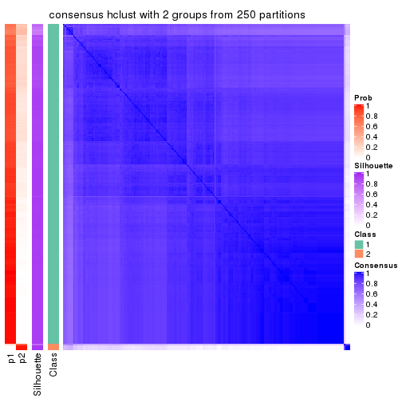</p>

</div>
<div id='tab-MAD-hclust-consensus-heatmap-2'>
<pre><code class="r">consensus_heatmap(res, k = 3)
</code></pre>

<p>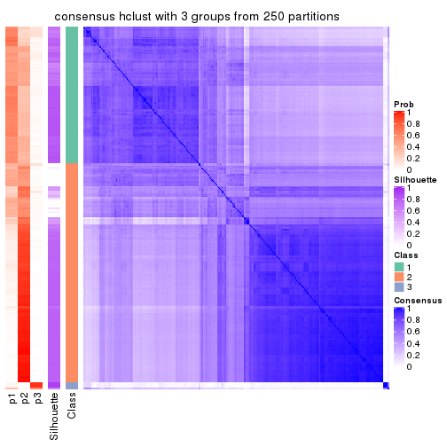</p>

</div>
<div id='tab-MAD-hclust-consensus-heatmap-3'>
<pre><code class="r">consensus_heatmap(res, k = 4)
</code></pre>

<p>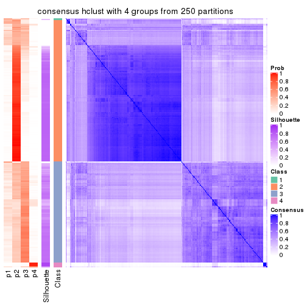</p>

</div>
<div id='tab-MAD-hclust-consensus-heatmap-4'>
<pre><code class="r">consensus_heatmap(res, k = 5)
</code></pre>

<p>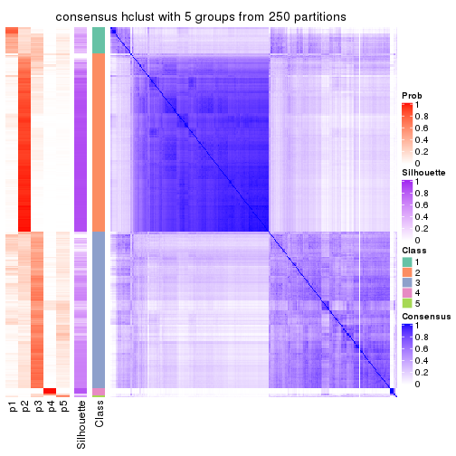</p>

</div>
<div id='tab-MAD-hclust-consensus-heatmap-5'>
<pre><code class="r">consensus_heatmap(res, k = 6)
</code></pre>

<p>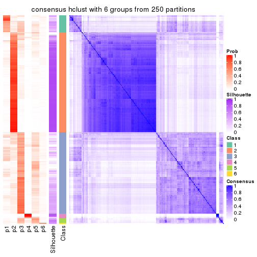</p>

</div>
</div>

Heatmaps for the membership of samples in all partitions to see how consistent they are:


<script>
$( function() {
	$( '#tabs-MAD-hclust-membership-heatmap' ).tabs();
} );
</script>
<div id='tabs-MAD-hclust-membership-heatmap'>
<ul>
<li><a href='#tab-MAD-hclust-membership-heatmap-1'>k = 2</a></li>
<li><a href='#tab-MAD-hclust-membership-heatmap-2'>k = 3</a></li>
<li><a href='#tab-MAD-hclust-membership-heatmap-3'>k = 4</a></li>
<li><a href='#tab-MAD-hclust-membership-heatmap-4'>k = 5</a></li>
<li><a href='#tab-MAD-hclust-membership-heatmap-5'>k = 6</a></li>
</ul>
<div id='tab-MAD-hclust-membership-heatmap-1'>
<pre><code class="r">membership_heatmap(res, k = 2)
</code></pre>

<p>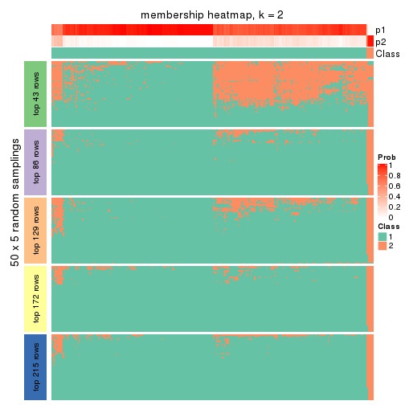</p>

</div>
<div id='tab-MAD-hclust-membership-heatmap-2'>
<pre><code class="r">membership_heatmap(res, k = 3)
</code></pre>

<p>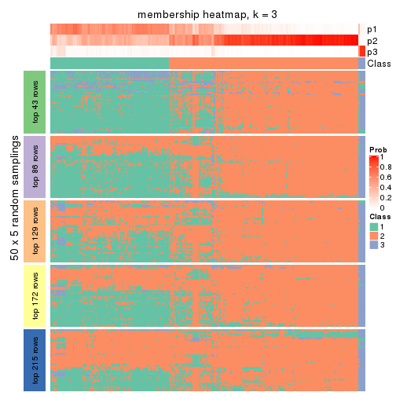</p>

</div>
<div id='tab-MAD-hclust-membership-heatmap-3'>
<pre><code class="r">membership_heatmap(res, k = 4)
</code></pre>

<p>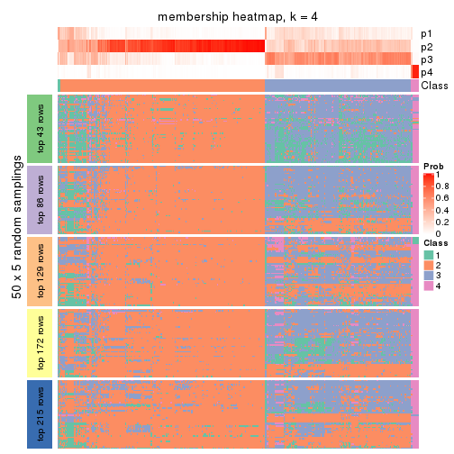</p>

</div>
<div id='tab-MAD-hclust-membership-heatmap-4'>
<pre><code class="r">membership_heatmap(res, k = 5)
</code></pre>

<p>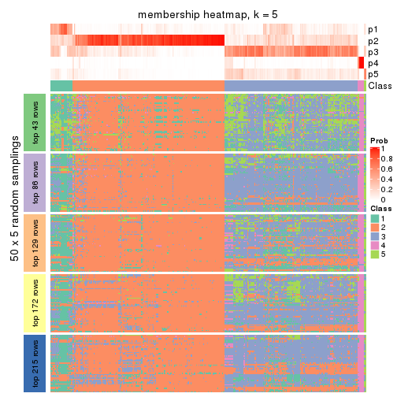</p>

</div>
<div id='tab-MAD-hclust-membership-heatmap-5'>
<pre><code class="r">membership_heatmap(res, k = 6)
</code></pre>

<p>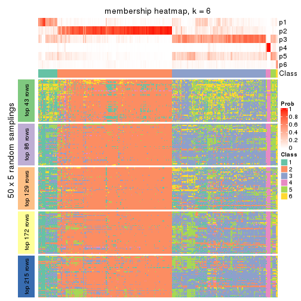</p>

</div>
</div>

As soon as we have had the classes for columns, we can look for signatures
which are significantly different between classes which can be candidate marks
for certain classes. Following are the heatmaps for signatures.


Signature heatmaps where rows are scaled:


<script>
$( function() {
	$( '#tabs-MAD-hclust-get-signatures' ).tabs();
} );
</script>
<div id='tabs-MAD-hclust-get-signatures'>
<ul>
<li><a href='#tab-MAD-hclust-get-signatures-1'>k = 2</a></li>
<li><a href='#tab-MAD-hclust-get-signatures-2'>k = 3</a></li>
<li><a href='#tab-MAD-hclust-get-signatures-3'>k = 4</a></li>
<li><a href='#tab-MAD-hclust-get-signatures-4'>k = 5</a></li>
<li><a href='#tab-MAD-hclust-get-signatures-5'>k = 6</a></li>
</ul>
<div id='tab-MAD-hclust-get-signatures-1'>
<pre><code class="r">get_signatures(res, k = 2)
</code></pre>

<p>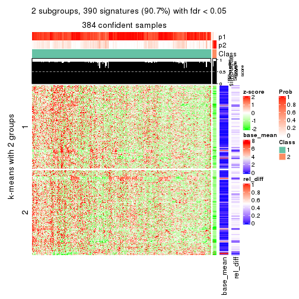</p>

</div>
<div id='tab-MAD-hclust-get-signatures-2'>
<pre><code class="r">get_signatures(res, k = 3)
</code></pre>

<p>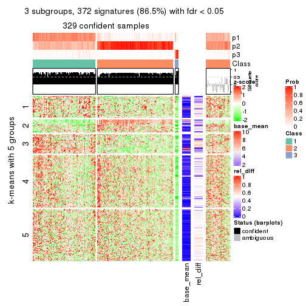</p>

</div>
<div id='tab-MAD-hclust-get-signatures-3'>
<pre><code class="r">get_signatures(res, k = 4)
</code></pre>

<p>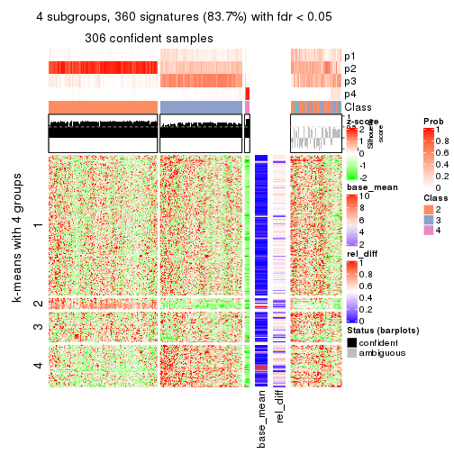</p>

</div>
<div id='tab-MAD-hclust-get-signatures-4'>
<pre><code class="r">get_signatures(res, k = 5)
</code></pre>

<p>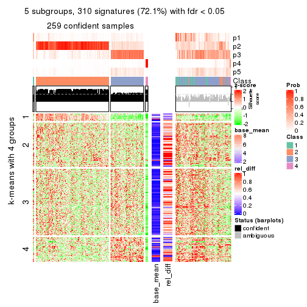</p>

</div>
<div id='tab-MAD-hclust-get-signatures-5'>
<pre><code class="r">get_signatures(res, k = 6)
</code></pre>

<p>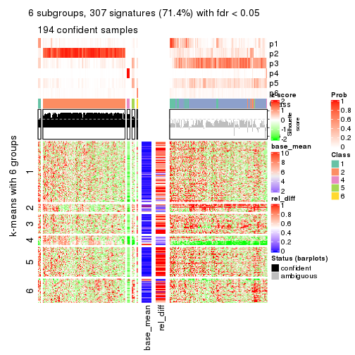</p>

</div>
</div>


Signature heatmaps where rows are not scaled:


<script>
$( function() {
	$( '#tabs-MAD-hclust-get-signatures-no-scale' ).tabs();
} );
</script>
<div id='tabs-MAD-hclust-get-signatures-no-scale'>
<ul>
<li><a href='#tab-MAD-hclust-get-signatures-no-scale-1'>k = 2</a></li>
<li><a href='#tab-MAD-hclust-get-signatures-no-scale-2'>k = 3</a></li>
<li><a href='#tab-MAD-hclust-get-signatures-no-scale-3'>k = 4</a></li>
<li><a href='#tab-MAD-hclust-get-signatures-no-scale-4'>k = 5</a></li>
<li><a href='#tab-MAD-hclust-get-signatures-no-scale-5'>k = 6</a></li>
</ul>
<div id='tab-MAD-hclust-get-signatures-no-scale-1'>
<pre><code class="r">get_signatures(res, k = 2, scale_rows = FALSE)
</code></pre>

<p>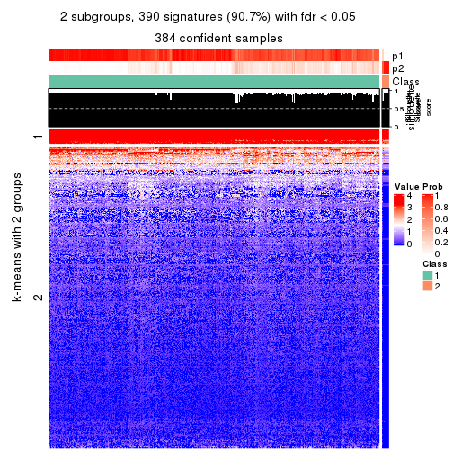</p>

</div>
<div id='tab-MAD-hclust-get-signatures-no-scale-2'>
<pre><code class="r">get_signatures(res, k = 3, scale_rows = FALSE)
</code></pre>

<p>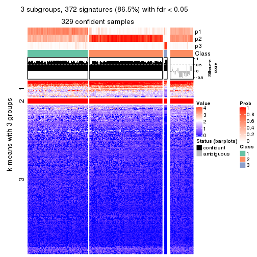</p>

</div>
<div id='tab-MAD-hclust-get-signatures-no-scale-3'>
<pre><code class="r">get_signatures(res, k = 4, scale_rows = FALSE)
</code></pre>

<p>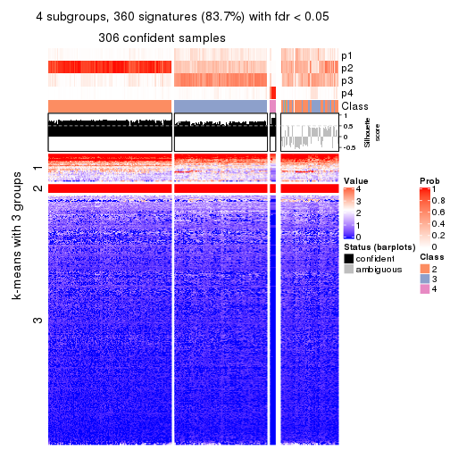</p>

</div>
<div id='tab-MAD-hclust-get-signatures-no-scale-4'>
<pre><code class="r">get_signatures(res, k = 5, scale_rows = FALSE)
</code></pre>

<p>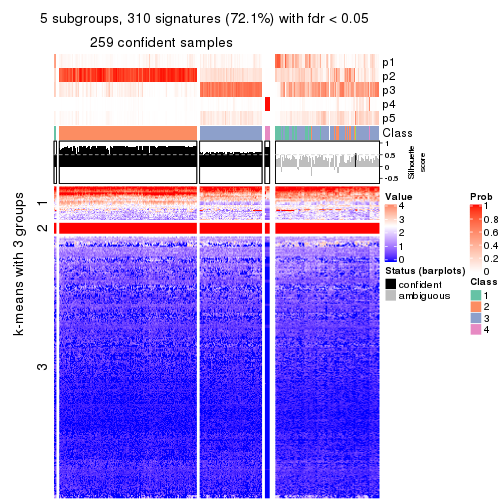</p>

</div>
<div id='tab-MAD-hclust-get-signatures-no-scale-5'>
<pre><code class="r">get_signatures(res, k = 6, scale_rows = FALSE)
</code></pre>

<p>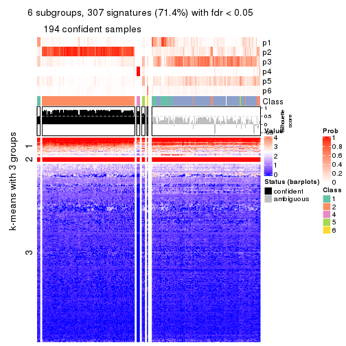</p>

</div>
</div>


Compare the overlap of signatures from different k:

```r
compare_signatures(res)
```

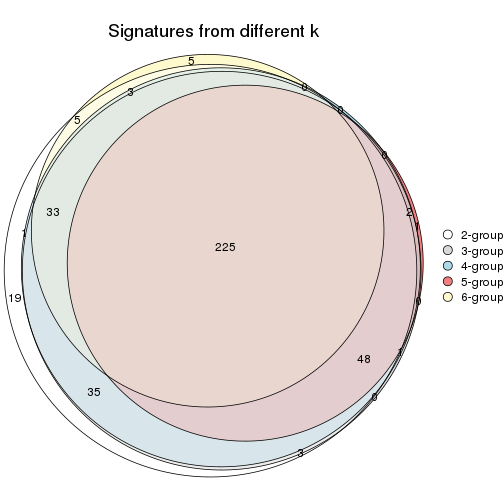

`get_signature()` returns a data frame invisibly. TO get the list of signatures, the function
call should be assigned to a variable explicitly. In following code, if `plot` argument is set
to `FALSE`, no heatmap is plotted while only the differential analysis is performed.

```r
# code only for demonstration
tb = get_signature(res, k = ..., plot = FALSE)
```

An example of the output of `tb` is:

```
#>   which_row         fdr    mean_1    mean_2 scaled_mean_1 scaled_mean_2 km
#> 1        38 0.042760348  8.373488  9.131774    -0.5533452     0.5164555  1
#> 2        40 0.018707592  7.106213  8.469186    -0.6173731     0.5762149  1
#> 3        55 0.019134737 10.221463 11.207825    -0.6159697     0.5749050  1
#> 4        59 0.006059896  5.921854  7.869574    -0.6899429     0.6439467  1
#> 5        60 0.018055526  8.928898 10.211722    -0.6204761     0.5791110  1
#> 6        98 0.009384629 15.714769 14.887706     0.6635654    -0.6193277  2
...
```

The columns in `tb` are:

1. `which_row`: row indices corresponding to the input matrix.
2. `fdr`: FDR for the differential test. 
3. `mean_x`: The mean value in group x.
4. `scaled_mean_x`: The mean value in group x after rows are scaled.
5. `km`: Row groups if k-means clustering is applied to rows.


UMAP plot which shows how samples are separated.


<script>
$( function() {
	$( '#tabs-MAD-hclust-dimension-reduction' ).tabs();
} );
</script>
<div id='tabs-MAD-hclust-dimension-reduction'>
<ul>
<li><a href='#tab-MAD-hclust-dimension-reduction-1'>k = 2</a></li>
<li><a href='#tab-MAD-hclust-dimension-reduction-2'>k = 3</a></li>
<li><a href='#tab-MAD-hclust-dimension-reduction-3'>k = 4</a></li>
<li><a href='#tab-MAD-hclust-dimension-reduction-4'>k = 5</a></li>
<li><a href='#tab-MAD-hclust-dimension-reduction-5'>k = 6</a></li>
</ul>
<div id='tab-MAD-hclust-dimension-reduction-1'>
<pre><code class="r">dimension_reduction(res, k = 2, method = &quot;UMAP&quot;)
</code></pre>

<p>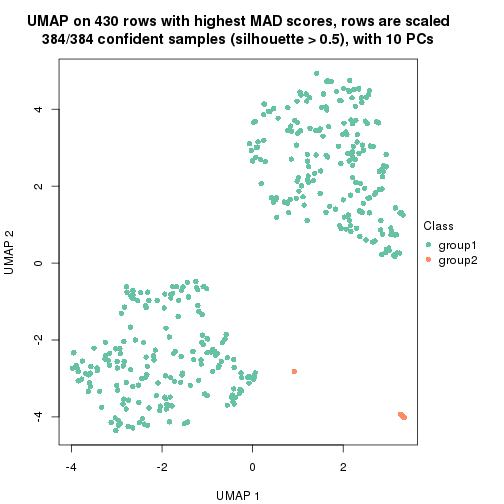</p>

</div>
<div id='tab-MAD-hclust-dimension-reduction-2'>
<pre><code class="r">dimension_reduction(res, k = 3, method = &quot;UMAP&quot;)
</code></pre>

<p>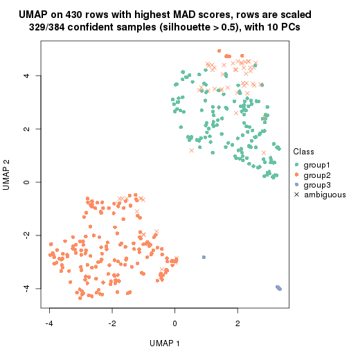</p>

</div>
<div id='tab-MAD-hclust-dimension-reduction-3'>
<pre><code class="r">dimension_reduction(res, k = 4, method = &quot;UMAP&quot;)
</code></pre>

<p>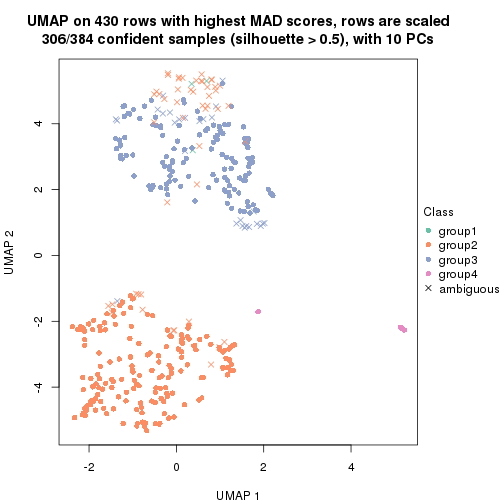</p>

</div>
<div id='tab-MAD-hclust-dimension-reduction-4'>
<pre><code class="r">dimension_reduction(res, k = 5, method = &quot;UMAP&quot;)
</code></pre>

<p>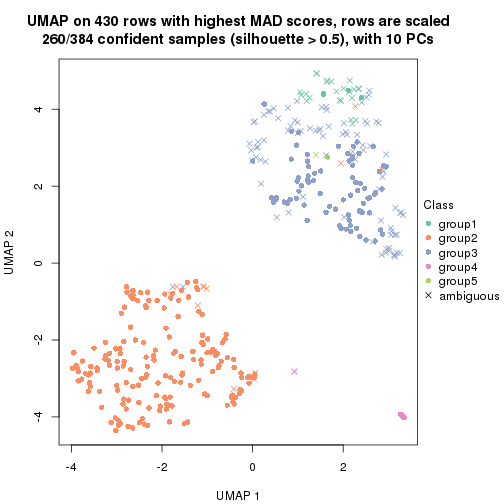</p>

</div>
<div id='tab-MAD-hclust-dimension-reduction-5'>
<pre><code class="r">dimension_reduction(res, k = 6, method = &quot;UMAP&quot;)
</code></pre>

<p>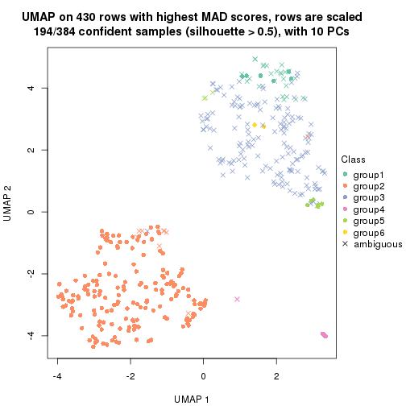</p>

</div>
</div>


Following heatmap shows how subgroups are split when increasing `k`:

```r
collect_classes(res)
```

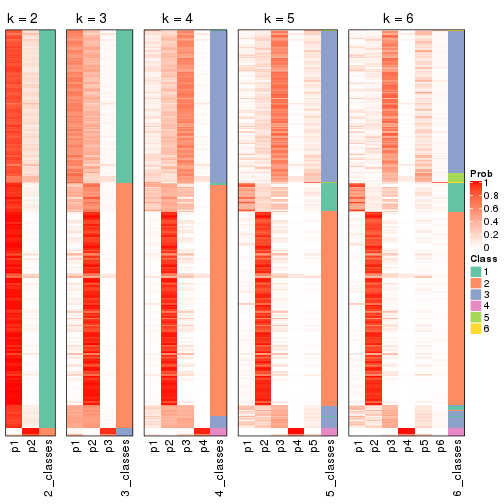


If matrix rows can be associated to genes, consider to use `GO_Enrichment(res,
...)` to perform function enrichment for the signature genes.


 

---------------------------------------------------


### MAD:kmeans*


The object with results only for a single top-value method and a single partition method 
can be extracted as:

```r
res = res_list["MAD", "kmeans"]
# you can also extract it by
# res = res_list["MAD:kmeans"]
```

A summary of `res` and all the functions that can be applied to it:

```r
res
```

```
#> A 'ConsensusPartition' object with k = 2, 3, 4, 5, 6.
#>   On a matrix with 430 rows and 384 columns.
#>   Top rows (43, 86, 129, 172, 215) are extracted by 'MAD' method.
#>   Subgroups are detected by 'kmeans' method.
#>   Performed in total 1250 partitions by row resampling.
#>   Best k for subgroups seems to be 2.
#> 
#> Following methods can be applied to this 'ConsensusPartition' object:
#>  [1] "cola_report"             "collect_classes"         "collect_plots"          
#>  [4] "collect_stats"           "colnames"                "compare_signatures"     
#>  [7] "consensus_heatmap"       "dimension_reduction"     "functional_enrichment"  
#> [10] "get_anno_col"            "get_anno"                "get_classes"            
#> [13] "get_consensus"           "get_matrix"              "get_membership"         
#> [16] "get_param"               "get_signatures"          "get_stats"              
#> [19] "is_best_k"               "is_stable_k"             "membership_heatmap"     
#> [22] "ncol"                    "nrow"                    "plot_ecdf"              
#> [25] "rownames"                "select_partition_number" "show"                   
#> [28] "suggest_best_k"          "test_to_known_factors"
```

`collect_plots()` function collects all the plots made from `res` for all `k` (number of partitions)
into one single page to provide an easy and fast comparison between different `k`.

```r
collect_plots(res)
```

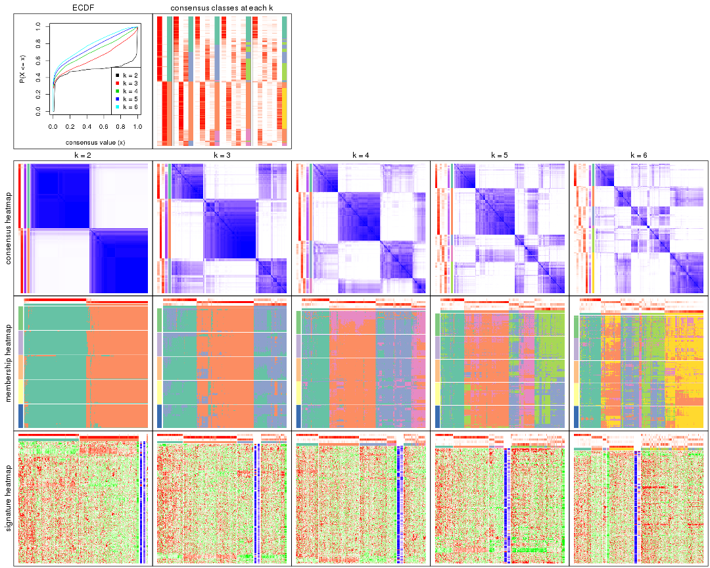

The plots are:

- The first row: a plot of the ECDF (Empirical cumulative distribution
  function) curves of the consensus matrix for each `k` and the heatmap of
  predicted classes for each `k`.
- The second row: heatmaps of the consensus matrix for each `k`.
- The third row: heatmaps of the membership matrix for each `k`.
- The fouth row: heatmaps of the signatures for each `k`.

All the plots in panels can be made by individual functions and they are
plotted later in this section.

`select_partition_number()` produces several plots showing different
statistics for choosing "optimized" `k`. There are following statistics:

- ECDF curves of the consensus matrix for each `k`;
- 1-PAC. [The PAC
  score](https://en.wikipedia.org/wiki/Consensus_clustering#Over-interpretation_potential_of_consensus_clustering)
  measures the proportion of the ambiguous subgrouping.
- Mean silhouette score.
- Concordance. The mean probability of fiting the consensus class ids in all
  partitions.
- Area increased. Denote $A_k$ as the area under the ECDF curve for current
  `k`, the area increased is defined as $A_k - A_{k-1}$.
- Rand index. The percent of pairs of samples that are both in a same cluster
  or both are not in a same cluster in the partition of k and k-1.
- Jaccard index. The ratio of pairs of samples are both in a same cluster in
  the partition of k and k-1 and the pairs of samples are both in a same
  cluster in the partition k or k-1.

The detailed explanations of these statistics can be found in [the cola
vignette](http://bioconductor.org/packages/devel/bioc/vignettes/cola/inst/doc/cola.html#toc_13).

Generally speaking, lower PAC score, higher mean silhouette score or higher
concordance corresponds to better partition. Rand index and Jaccard index
measure how similar the current partition is compared to partition with `k-1`.
If they are too similar, we won't accept `k` is better than `k-1`.

```r
select_partition_number(res)
```

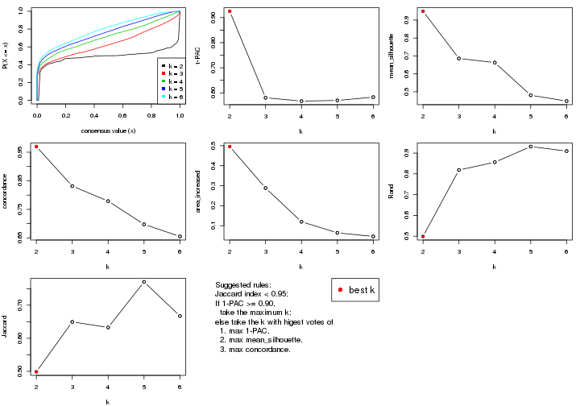

The numeric values for all these statistics can be obtained by `get_stats()`.

```r
get_stats(res)
```

```
#>   k 1-PAC mean_silhouette concordance area_increased  Rand Jaccard
#> 2 2 0.925           0.949       0.970         0.4958 0.499   0.499
#> 3 3 0.581           0.686       0.831         0.2882 0.819   0.649
#> 4 4 0.567           0.663       0.779         0.1195 0.856   0.633
#> 5 5 0.570           0.481       0.698         0.0642 0.931   0.770
#> 6 6 0.583           0.448       0.655         0.0462 0.910   0.667
```

`suggest_best_k()` suggests the best $k$ based on these statistics. The rules are as follows:

- All $k$ with Jaccard index larger than 0.95 are removed because the increase of
  the partition number does not provides enough extra information. If all $k$ are removed,
  the best $k$ is assigned by `NA`.
- For $k$ with 1-PAC larger than 0.9, the maximal $k$ is taken as the "best k". Other $k$ is called "optional k".
- If it does not fit the second rule. The $k$ with the highest vote of highest
  1-PAC, mean silhouette and concordance is taken as the "best k".

```r
suggest_best_k(res)
```

```
#> [1] 2
```


Following shows the table of the partitions (You need to click the **show/hide
code output** link to see it). The membership matrix (columns with name `p*`)
is inferred by
[`clue::cl_consensus()`](https://www.rdocumentation.org/link/cl_consensus?package=clue)
function with the `SE` method. Basically the value in the membership matrix
represents the probability to belong to a certain group. The finall class
label for an item is determined with the group with highest probability it
belongs to.

In `get_classes()` function, the entropy is calculated from the membership
matrix and the silhouette score is calculated from the consensus matrix.


<script>
$( function() {
	$( '#tabs-MAD-kmeans-get-classes' ).tabs();
} );
</script>
<div id='tabs-MAD-kmeans-get-classes'>
<ul>
<li><a href='#tab-MAD-kmeans-get-classes-1'>k = 2</a></li>
<li><a href='#tab-MAD-kmeans-get-classes-2'>k = 3</a></li>
<li><a href='#tab-MAD-kmeans-get-classes-3'>k = 4</a></li>
<li><a href='#tab-MAD-kmeans-get-classes-4'>k = 5</a></li>
<li><a href='#tab-MAD-kmeans-get-classes-5'>k = 6</a></li>
</ul>

<div id='tab-MAD-kmeans-get-classes-1'>
<p><a id='tab-MAD-kmeans-get-classes-1-a' style='color:#0366d6' href='#'>show/hide code output</a></p>
<pre><code class="r">cbind(get_classes(res, k = 2), get_membership(res, k = 2))
</code></pre>

<pre><code>#&gt;            class entropy silhouette    p1    p2
#&gt; SRR2105277     1  0.0000      0.981 1.000 0.000
#&gt; SRR2105278     1  0.0000      0.981 1.000 0.000
#&gt; SRR2105275     1  0.0376      0.980 0.996 0.004
#&gt; SRR2105276     1  0.0000      0.981 1.000 0.000
#&gt; SRR2105273     1  0.0000      0.981 1.000 0.000
#&gt; SRR2105274     1  0.0000      0.981 1.000 0.000
#&gt; SRR2105271     1  0.0000      0.981 1.000 0.000
#&gt; SRR2105272     1  0.0376      0.981 0.996 0.004
#&gt; SRR2105269     2  0.1184      0.967 0.016 0.984
#&gt; SRR2105270     2  0.1184      0.967 0.016 0.984
#&gt; SRR2105267     2  0.1184      0.967 0.016 0.984
#&gt; SRR2105268     2  0.0938      0.968 0.012 0.988
#&gt; SRR2105265     2  0.0938      0.968 0.012 0.988
#&gt; SRR2105266     2  0.0938      0.968 0.012 0.988
#&gt; SRR2105263     2  0.0938      0.968 0.012 0.988
#&gt; SRR2105264     2  0.1184      0.967 0.016 0.984
#&gt; SRR2105261     1  0.9129      0.502 0.672 0.328
#&gt; SRR2105262     1  0.5842      0.837 0.860 0.140
#&gt; SRR2105357     1  0.0376      0.980 0.996 0.004
#&gt; SRR2105358     1  0.0000      0.981 1.000 0.000
#&gt; SRR2105439     2  0.3114      0.939 0.056 0.944
#&gt; SRR2105440     2  0.2423      0.951 0.040 0.960
#&gt; SRR2105509     2  0.1414      0.965 0.020 0.980
#&gt; SRR2105510     2  0.1414      0.965 0.020 0.980
#&gt; SRR2105507     1  0.0000      0.981 1.000 0.000
#&gt; SRR2105508     1  0.0000      0.981 1.000 0.000
#&gt; SRR2105505     1  0.0672      0.980 0.992 0.008
#&gt; SRR2105506     1  0.0672      0.980 0.992 0.008
#&gt; SRR2105503     2  0.0938      0.968 0.012 0.988
#&gt; SRR2105504     2  0.4562      0.892 0.096 0.904
#&gt; SRR2105501     2  0.2236      0.954 0.036 0.964
#&gt; SRR2105502     2  0.2236      0.946 0.036 0.964
#&gt; SRR2105499     1  0.0000      0.981 1.000 0.000
#&gt; SRR2105500     1  0.0376      0.981 0.996 0.004
#&gt; SRR2105497     2  0.0938      0.968 0.012 0.988
#&gt; SRR2105498     2  0.0938      0.968 0.012 0.988
#&gt; SRR2105495     2  0.0938      0.968 0.012 0.988
#&gt; SRR2105496     2  0.1184      0.967 0.016 0.984
#&gt; SRR2105493     2  0.1633      0.962 0.024 0.976
#&gt; SRR2105494     2  0.1633      0.962 0.024 0.976
#&gt; SRR2105491     2  0.0938      0.968 0.012 0.988
#&gt; SRR2105492     2  0.0938      0.968 0.012 0.988
#&gt; SRR2105489     2  0.0938      0.968 0.012 0.988
#&gt; SRR2105490     2  0.0938      0.968 0.012 0.988
#&gt; SRR2105487     1  0.0376      0.981 0.996 0.004
#&gt; SRR2105488     1  0.0376      0.981 0.996 0.004
#&gt; SRR2105485     1  0.0000      0.981 1.000 0.000
#&gt; SRR2105486     1  0.0000      0.981 1.000 0.000
#&gt; SRR2105483     1  0.0672      0.980 0.992 0.008
#&gt; SRR2105484     1  0.0672      0.980 0.992 0.008
#&gt; SRR2105481     1  0.0000      0.981 1.000 0.000
#&gt; SRR2105482     1  0.0672      0.980 0.992 0.008
#&gt; SRR2105479     1  0.0000      0.981 1.000 0.000
#&gt; SRR2105480     1  0.0376      0.981 0.996 0.004
#&gt; SRR2105477     2  0.0938      0.968 0.012 0.988
#&gt; SRR2105478     2  0.0938      0.968 0.012 0.988
#&gt; SRR2105475     2  0.1414      0.965 0.020 0.980
#&gt; SRR2105476     2  0.1414      0.965 0.020 0.980
#&gt; SRR2105473     2  0.3274      0.935 0.060 0.940
#&gt; SRR2105474     2  0.3114      0.939 0.056 0.944
#&gt; SRR2105471     2  0.0938      0.968 0.012 0.988
#&gt; SRR2105472     2  0.0938      0.968 0.012 0.988
#&gt; SRR2105469     1  0.0000      0.981 1.000 0.000
#&gt; SRR2105470     1  0.0000      0.981 1.000 0.000
#&gt; SRR2105467     1  0.0376      0.981 0.996 0.004
#&gt; SRR2105468     1  0.0672      0.980 0.992 0.008
#&gt; SRR2105465     1  0.0672      0.980 0.992 0.008
#&gt; SRR2105466     1  0.0672      0.980 0.992 0.008
#&gt; SRR2105463     1  0.0672      0.980 0.992 0.008
#&gt; SRR2105464     1  0.0672      0.980 0.992 0.008
#&gt; SRR2105461     2  0.0938      0.968 0.012 0.988
#&gt; SRR2105462     2  0.0938      0.968 0.012 0.988
#&gt; SRR2105459     2  0.1414      0.965 0.020 0.980
#&gt; SRR2105460     2  0.1184      0.967 0.016 0.984
#&gt; SRR2105457     1  0.0000      0.981 1.000 0.000
#&gt; SRR2105458     1  0.1184      0.972 0.984 0.016
#&gt; SRR2105455     1  0.0376      0.981 0.996 0.004
#&gt; SRR2105456     1  0.0672      0.980 0.992 0.008
#&gt; SRR2105453     1  0.0672      0.980 0.992 0.008
#&gt; SRR2105454     1  0.0672      0.980 0.992 0.008
#&gt; SRR2105451     2  0.3733      0.927 0.072 0.928
#&gt; SRR2105452     2  0.6887      0.788 0.184 0.816
#&gt; SRR2105449     1  0.0376      0.981 0.996 0.004
#&gt; SRR2105450     1  0.0672      0.980 0.992 0.008
#&gt; SRR2105447     2  0.1414      0.965 0.020 0.980
#&gt; SRR2105448     2  0.1184      0.967 0.016 0.984
#&gt; SRR2105445     1  0.9580      0.357 0.620 0.380
#&gt; SRR2105446     1  0.0000      0.981 1.000 0.000
#&gt; SRR2105443     2  0.7950      0.722 0.240 0.760
#&gt; SRR2105444     2  0.8861      0.604 0.304 0.696
#&gt; SRR2105441     2  0.0938      0.968 0.012 0.988
#&gt; SRR2105442     2  0.0938      0.968 0.012 0.988
#&gt; SRR2105437     1  0.0000      0.981 1.000 0.000
#&gt; SRR2105438     1  0.0000      0.981 1.000 0.000
#&gt; SRR2105435     1  0.0000      0.981 1.000 0.000
#&gt; SRR2105436     1  0.0000      0.981 1.000 0.000
#&gt; SRR2105433     1  0.0672      0.980 0.992 0.008
#&gt; SRR2105434     1  0.0672      0.980 0.992 0.008
#&gt; SRR2105431     1  0.0672      0.980 0.992 0.008
#&gt; SRR2105432     1  0.0672      0.980 0.992 0.008
#&gt; SRR2105429     2  0.6623      0.820 0.172 0.828
#&gt; SRR2105430     2  0.3733      0.928 0.072 0.928
#&gt; SRR2105427     2  0.1184      0.967 0.016 0.984
#&gt; SRR2105428     2  0.1184      0.967 0.016 0.984
#&gt; SRR2105425     2  0.0938      0.968 0.012 0.988
#&gt; SRR2105426     2  0.0938      0.968 0.012 0.988
#&gt; SRR2105421     1  0.4815      0.883 0.896 0.104
#&gt; SRR2105422     1  0.0376      0.980 0.996 0.004
#&gt; SRR2105423     2  0.0938      0.968 0.012 0.988
#&gt; SRR2105424     2  0.0938      0.968 0.012 0.988
#&gt; SRR2105419     1  0.0000      0.981 1.000 0.000
#&gt; SRR2105420     1  0.0000      0.981 1.000 0.000
#&gt; SRR2105415     1  0.0672      0.980 0.992 0.008
#&gt; SRR2105416     1  0.0672      0.980 0.992 0.008
#&gt; SRR2105417     1  0.0672      0.980 0.992 0.008
#&gt; SRR2105418     1  0.0672      0.980 0.992 0.008
#&gt; SRR2105413     2  0.1414      0.965 0.020 0.980
#&gt; SRR2105414     2  0.1414      0.965 0.020 0.980
#&gt; SRR2105409     2  0.0938      0.968 0.012 0.988
#&gt; SRR2105410     2  0.0938      0.968 0.012 0.988
#&gt; SRR2105411     2  0.0938      0.968 0.012 0.988
#&gt; SRR2105412     2  0.0938      0.968 0.012 0.988
#&gt; SRR2105407     1  0.0000      0.981 1.000 0.000
#&gt; SRR2105408     1  0.0376      0.980 0.996 0.004
#&gt; SRR2105403     1  0.0000      0.981 1.000 0.000
#&gt; SRR2105404     1  0.0000      0.981 1.000 0.000
#&gt; SRR2105405     1  0.0672      0.980 0.992 0.008
#&gt; SRR2105406     1  0.0672      0.980 0.992 0.008
#&gt; SRR2105401     2  0.1414      0.965 0.020 0.980
#&gt; SRR2105402     2  0.6712      0.798 0.176 0.824
#&gt; SRR2105399     2  0.6343      0.834 0.160 0.840
#&gt; SRR2105400     2  0.6623      0.819 0.172 0.828
#&gt; SRR2105397     2  0.7745      0.742 0.228 0.772
#&gt; SRR2105398     2  0.8555      0.656 0.280 0.720
#&gt; SRR2105395     2  0.0938      0.968 0.012 0.988
#&gt; SRR2105396     2  0.0938      0.968 0.012 0.988
#&gt; SRR2105393     2  0.0938      0.968 0.012 0.988
#&gt; SRR2105394     2  0.0938      0.968 0.012 0.988
#&gt; SRR2105389     1  0.0000      0.981 1.000 0.000
#&gt; SRR2105390     1  0.0000      0.981 1.000 0.000
#&gt; SRR2105391     1  0.0000      0.981 1.000 0.000
#&gt; SRR2105392     1  0.0000      0.981 1.000 0.000
#&gt; SRR2105385     1  0.0000      0.981 1.000 0.000
#&gt; SRR2105386     1  0.0000      0.981 1.000 0.000
#&gt; SRR2105387     1  0.0672      0.980 0.992 0.008
#&gt; SRR2105388     1  0.0672      0.980 0.992 0.008
#&gt; SRR2105381     2  0.3114      0.942 0.056 0.944
#&gt; SRR2105382     2  0.2236      0.957 0.036 0.964
#&gt; SRR2105383     2  0.0938      0.968 0.012 0.988
#&gt; SRR2105384     2  0.0938      0.968 0.012 0.988
#&gt; SRR2105379     2  0.1414      0.965 0.020 0.980
#&gt; SRR2105380     2  0.1414      0.965 0.020 0.980
#&gt; SRR2105377     2  0.0938      0.968 0.012 0.988
#&gt; SRR2105378     2  0.2043      0.957 0.032 0.968
#&gt; SRR2105375     1  0.0672      0.980 0.992 0.008
#&gt; SRR2105376     1  0.0672      0.980 0.992 0.008
#&gt; SRR2105373     1  0.0000      0.981 1.000 0.000
#&gt; SRR2105374     1  0.0000      0.981 1.000 0.000
#&gt; SRR2105371     1  0.0000      0.981 1.000 0.000
#&gt; SRR2105372     1  0.0000      0.981 1.000 0.000
#&gt; SRR2105369     1  0.0000      0.981 1.000 0.000
#&gt; SRR2105370     1  0.0000      0.981 1.000 0.000
#&gt; SRR2105367     1  0.1184      0.975 0.984 0.016
#&gt; SRR2105368     1  0.0938      0.978 0.988 0.012
#&gt; SRR2105365     2  0.0938      0.968 0.012 0.988
#&gt; SRR2105366     2  0.0938      0.968 0.012 0.988
#&gt; SRR2105363     2  0.0938      0.968 0.012 0.988
#&gt; SRR2105364     2  0.0938      0.968 0.012 0.988
#&gt; SRR2105361     2  0.0938      0.968 0.012 0.988
#&gt; SRR2105362     2  0.0938      0.968 0.012 0.988
#&gt; SRR2105359     1  0.0000      0.981 1.000 0.000
#&gt; SRR2105360     1  0.0000      0.981 1.000 0.000
#&gt; SRR2105355     1  0.0000      0.981 1.000 0.000
#&gt; SRR2105356     1  0.0000      0.981 1.000 0.000
#&gt; SRR2105353     1  0.0672      0.977 0.992 0.008
#&gt; SRR2105354     1  0.0000      0.981 1.000 0.000
#&gt; SRR2105351     2  0.0938      0.968 0.012 0.988
#&gt; SRR2105352     2  0.6887      0.788 0.184 0.816
#&gt; SRR2105349     2  0.1414      0.965 0.020 0.980
#&gt; SRR2105350     2  0.0938      0.968 0.012 0.988
#&gt; SRR2105345     2  0.0938      0.968 0.012 0.988
#&gt; SRR2105346     2  0.0938      0.968 0.012 0.988
#&gt; SRR2105347     2  0.2948      0.942 0.052 0.948
#&gt; SRR2105348     2  0.3431      0.932 0.064 0.936
#&gt; SRR2105343     2  0.0938      0.968 0.012 0.988
#&gt; SRR2105344     2  0.0938      0.968 0.012 0.988
#&gt; SRR2105341     1  0.0000      0.981 1.000 0.000
#&gt; SRR2105342     1  0.0000      0.981 1.000 0.000
#&gt; SRR2105339     1  0.0376      0.980 0.996 0.004
#&gt; SRR2105340     1  0.0000      0.981 1.000 0.000
#&gt; SRR2105335     1  0.0000      0.981 1.000 0.000
#&gt; SRR2105336     1  0.0672      0.980 0.992 0.008
#&gt; SRR2105337     1  0.0376      0.981 0.996 0.004
#&gt; SRR2105338     1  0.0672      0.980 0.992 0.008
#&gt; SRR2105331     2  0.0938      0.968 0.012 0.988
#&gt; SRR2105332     2  0.0938      0.968 0.012 0.988
#&gt; SRR2105333     2  0.1414      0.965 0.020 0.980
#&gt; SRR2105334     2  0.1414      0.965 0.020 0.980
#&gt; SRR2105329     2  0.5519      0.875 0.128 0.872
#&gt; SRR2105330     2  0.3879      0.927 0.076 0.924
#&gt; SRR2105327     2  0.1414      0.965 0.020 0.980
#&gt; SRR2105328     2  0.1414      0.965 0.020 0.980
#&gt; SRR2105325     1  0.0000      0.981 1.000 0.000
#&gt; SRR2105326     1  0.0000      0.981 1.000 0.000
#&gt; SRR2105323     1  0.0376      0.980 0.996 0.004
#&gt; SRR2105324     1  0.0000      0.981 1.000 0.000
#&gt; SRR2105319     1  0.0000      0.981 1.000 0.000
#&gt; SRR2105320     1  0.0000      0.981 1.000 0.000
#&gt; SRR2105321     1  0.0000      0.981 1.000 0.000
#&gt; SRR2105322     1  0.0000      0.981 1.000 0.000
#&gt; SRR2105317     2  0.1414      0.965 0.020 0.980
#&gt; SRR2105318     2  0.1184      0.967 0.016 0.984
#&gt; SRR2105315     2  0.9044      0.572 0.320 0.680
#&gt; SRR2105316     2  0.1414      0.965 0.020 0.980
#&gt; SRR2105313     2  0.1414      0.965 0.020 0.980
#&gt; SRR2105314     2  0.0938      0.968 0.012 0.988
#&gt; SRR2105311     1  0.4022      0.910 0.920 0.080
#&gt; SRR2105312     1  0.6531      0.799 0.832 0.168
#&gt; SRR2105307     1  0.0672      0.980 0.992 0.008
#&gt; SRR2105308     1  0.0672      0.980 0.992 0.008
#&gt; SRR2105309     1  0.0000      0.981 1.000 0.000
#&gt; SRR2105310     1  0.0000      0.981 1.000 0.000
#&gt; SRR2105305     1  0.0000      0.981 1.000 0.000
#&gt; SRR2105306     1  0.0000      0.981 1.000 0.000
#&gt; SRR2105303     2  0.0938      0.968 0.012 0.988
#&gt; SRR2105304     2  0.2043      0.949 0.032 0.968
#&gt; SRR2105301     2  0.1414      0.965 0.020 0.980
#&gt; SRR2105302     2  0.0938      0.968 0.012 0.988
#&gt; SRR2105299     1  0.6438      0.800 0.836 0.164
#&gt; SRR2105300     2  0.9922      0.249 0.448 0.552
#&gt; SRR2105297     2  0.6801      0.804 0.180 0.820
#&gt; SRR2105298     2  0.6712      0.810 0.176 0.824
#&gt; SRR2105295     2  0.1414      0.965 0.020 0.980
#&gt; SRR2105296     2  0.1414      0.965 0.020 0.980
#&gt; SRR2105293     1  0.0672      0.977 0.992 0.008
#&gt; SRR2105294     1  0.0000      0.981 1.000 0.000
#&gt; SRR2105291     1  0.0672      0.980 0.992 0.008
#&gt; SRR2105292     1  0.0672      0.980 0.992 0.008
#&gt; SRR2105289     1  0.0000      0.981 1.000 0.000
#&gt; SRR2105290     1  0.0672      0.980 0.992 0.008
#&gt; SRR2105287     1  0.0672      0.980 0.992 0.008
#&gt; SRR2105288     1  0.0672      0.980 0.992 0.008
#&gt; SRR2105285     2  0.1414      0.965 0.020 0.980
#&gt; SRR2105286     2  0.0938      0.968 0.012 0.988
#&gt; SRR2105283     2  0.2236      0.955 0.036 0.964
#&gt; SRR2105284     2  0.5294      0.877 0.120 0.880
#&gt; SRR2105281     2  0.0938      0.968 0.012 0.988
#&gt; SRR2105282     2  0.0938      0.968 0.012 0.988
#&gt; SRR2105259     1  0.0376      0.980 0.996 0.004
#&gt; SRR2105260     1  0.0376      0.980 0.996 0.004
#&gt; SRR2105279     2  0.0938      0.968 0.012 0.988
#&gt; SRR2105280     2  0.0938      0.968 0.012 0.988
#&gt; SRR2105257     1  0.0672      0.980 0.992 0.008
#&gt; SRR2105258     1  0.0672      0.980 0.992 0.008
#&gt; SRR2105253     2  0.0938      0.968 0.012 0.988
#&gt; SRR2105254     2  0.0938      0.968 0.012 0.988
#&gt; SRR2105255     1  0.0000      0.981 1.000 0.000
#&gt; SRR2105256     1  0.0000      0.981 1.000 0.000
#&gt; SRR2105251     2  0.0938      0.968 0.012 0.988
#&gt; SRR2105252     2  0.0938      0.968 0.012 0.988
#&gt; SRR2105249     2  0.0938      0.968 0.012 0.988
#&gt; SRR2105250     2  0.3114      0.939 0.056 0.944
#&gt; SRR2105247     2  0.0938      0.968 0.012 0.988
#&gt; SRR2105248     2  0.0938      0.968 0.012 0.988
#&gt; SRR2105245     1  0.5408      0.862 0.876 0.124
#&gt; SRR2105246     1  0.9000      0.536 0.684 0.316
#&gt; SRR2105243     1  0.0000      0.981 1.000 0.000
#&gt; SRR2105244     1  0.0000      0.981 1.000 0.000
#&gt; SRR2105241     1  0.0672      0.980 0.992 0.008
#&gt; SRR2105242     1  0.0672      0.980 0.992 0.008
#&gt; SRR2105239     1  0.0672      0.980 0.992 0.008
#&gt; SRR2105240     1  0.0672      0.980 0.992 0.008
#&gt; SRR2105237     2  0.1414      0.965 0.020 0.980
#&gt; SRR2105238     2  0.1633      0.964 0.024 0.976
#&gt; SRR2105235     2  0.0938      0.968 0.012 0.988
#&gt; SRR2105236     2  0.0938      0.968 0.012 0.988
#&gt; SRR2105233     2  0.1414      0.965 0.020 0.980
#&gt; SRR2105234     2  0.1414      0.965 0.020 0.980
#&gt; SRR2105231     2  0.0938      0.968 0.012 0.988
#&gt; SRR2105232     2  0.0938      0.968 0.012 0.988
#&gt; SRR2105227     1  0.0938      0.975 0.988 0.012
#&gt; SRR2105228     1  0.2043      0.962 0.968 0.032
#&gt; SRR2105225     1  0.0000      0.981 1.000 0.000
#&gt; SRR2105226     1  0.0376      0.981 0.996 0.004
#&gt; SRR2105229     1  0.4298      0.901 0.912 0.088
#&gt; SRR2105230     1  0.0000      0.981 1.000 0.000
#&gt; SRR2105219     2  0.1184      0.967 0.016 0.984
#&gt; SRR2105220     2  0.0938      0.968 0.012 0.988
#&gt; SRR2105221     2  0.1633      0.962 0.024 0.976
#&gt; SRR2105222     2  0.3114      0.939 0.056 0.944
#&gt; SRR2105223     1  0.0000      0.981 1.000 0.000
#&gt; SRR2105224     1  0.0000      0.981 1.000 0.000
#&gt; SRR2105217     2  0.0938      0.968 0.012 0.988
#&gt; SRR2105218     2  0.0938      0.968 0.012 0.988
#&gt; SRR2105215     2  0.0938      0.968 0.012 0.988
#&gt; SRR2105216     2  0.0938      0.968 0.012 0.988
#&gt; SRR2105213     1  0.4562      0.892 0.904 0.096
#&gt; SRR2105214     1  0.6623      0.793 0.828 0.172
#&gt; SRR2105211     1  0.0672      0.978 0.992 0.008
#&gt; SRR2105212     1  0.0000      0.981 1.000 0.000
#&gt; SRR2105209     1  0.0672      0.980 0.992 0.008
#&gt; SRR2105210     1  0.0672      0.980 0.992 0.008
#&gt; SRR2105207     1  0.0672      0.980 0.992 0.008
#&gt; SRR2105208     1  0.0672      0.980 0.992 0.008
#&gt; SRR2105205     2  0.1184      0.967 0.016 0.984
#&gt; SRR2105206     2  0.0938      0.968 0.012 0.988
#&gt; SRR2105201     2  0.1414      0.965 0.020 0.980
#&gt; SRR2105202     2  0.2948      0.942 0.052 0.948
#&gt; SRR2105203     2  0.0938      0.968 0.012 0.988
#&gt; SRR2105204     2  0.0938      0.968 0.012 0.988
#&gt; SRR2105199     2  0.0938      0.968 0.012 0.988
#&gt; SRR2105200     2  0.0938      0.968 0.012 0.988
#&gt; SRR2105197     1  0.0000      0.981 1.000 0.000
#&gt; SRR2105198     1  0.0938      0.975 0.988 0.012
#&gt; SRR2105195     1  0.1633      0.965 0.976 0.024
#&gt; SRR2105196     1  0.2603      0.951 0.956 0.044
#&gt; SRR2105193     1  0.0672      0.980 0.992 0.008
#&gt; SRR2105194     1  0.0672      0.980 0.992 0.008
#&gt; SRR2105191     1  0.0000      0.981 1.000 0.000
#&gt; SRR2105192     1  0.0672      0.980 0.992 0.008
#&gt; SRR2105189     2  0.0938      0.968 0.012 0.988
#&gt; SRR2105190     2  0.0938      0.968 0.012 0.988
#&gt; SRR2105187     2  0.1414      0.965 0.020 0.980
#&gt; SRR2105188     2  0.2423      0.952 0.040 0.960
#&gt; SRR2105179     1  0.0938      0.978 0.988 0.012
#&gt; SRR2105180     1  0.0672      0.980 0.992 0.008
#&gt; SRR2105183     2  0.0938      0.968 0.012 0.988
#&gt; SRR2105184     2  0.0938      0.968 0.012 0.988
#&gt; SRR2105185     2  0.0938      0.968 0.012 0.988
#&gt; SRR2105186     2  0.0938      0.968 0.012 0.988
#&gt; SRR2105181     1  0.0000      0.981 1.000 0.000
#&gt; SRR2105182     1  0.0000      0.981 1.000 0.000
#&gt; SRR2105177     1  0.0672      0.980 0.992 0.008
#&gt; SRR2105178     1  0.0672      0.980 0.992 0.008
#&gt; SRR2105171     2  0.0938      0.968 0.012 0.988
#&gt; SRR2105172     2  0.0938      0.968 0.012 0.988
#&gt; SRR2105175     1  0.0672      0.980 0.992 0.008
#&gt; SRR2105176     1  0.0672      0.980 0.992 0.008
#&gt; SRR2105173     2  0.0938      0.968 0.012 0.988
#&gt; SRR2105174     2  0.0938      0.968 0.012 0.988
#&gt; SRR2105169     2  0.0938      0.968 0.012 0.988
#&gt; SRR2105170     2  0.0938      0.968 0.012 0.988
#&gt; SRR2105167     2  0.0938      0.968 0.012 0.988
#&gt; SRR2105168     2  0.0938      0.968 0.012 0.988
#&gt; SRR2105165     1  0.0000      0.981 1.000 0.000
#&gt; SRR2105166     1  0.0000      0.981 1.000 0.000
#&gt; SRR2105163     1  0.0672      0.977 0.992 0.008
#&gt; SRR2105164     1  0.0376      0.980 0.996 0.004
#&gt; SRR2105161     1  0.0672      0.980 0.992 0.008
#&gt; SRR2105162     1  0.0672      0.980 0.992 0.008
#&gt; SRR2105155     2  0.0938      0.968 0.012 0.988
#&gt; SRR2105156     2  0.0938      0.968 0.012 0.988
#&gt; SRR2105157     2  0.0938      0.968 0.012 0.988
#&gt; SRR2105158     2  0.0938      0.968 0.012 0.988
#&gt; SRR2105159     1  0.0000      0.981 1.000 0.000
#&gt; SRR2105160     1  0.0672      0.980 0.992 0.008
#&gt; SRR2105153     2  0.0938      0.968 0.012 0.988
#&gt; SRR2105154     2  0.0938      0.968 0.012 0.988
#&gt; SRR2105151     2  0.0938      0.968 0.012 0.988
#&gt; SRR2105152     2  0.0938      0.968 0.012 0.988
#&gt; SRR2105149     1  0.6623      0.793 0.828 0.172
#&gt; SRR2105150     1  0.3114      0.934 0.944 0.056
#&gt; SRR2105147     2  0.9522      0.430 0.372 0.628
#&gt; SRR2105148     2  0.9686      0.366 0.396 0.604
#&gt; SRR2105143     1  0.0672      0.980 0.992 0.008
#&gt; SRR2105144     1  0.2948      0.943 0.948 0.052
#&gt; SRR2105145     1  0.1414      0.972 0.980 0.020
#&gt; SRR2105146     1  0.0672      0.980 0.992 0.008
#&gt; SRR2105141     2  0.1184      0.967 0.016 0.984
#&gt; SRR2105142     2  0.0938      0.968 0.012 0.988
#&gt; SRR2105139     2  0.0938      0.968 0.012 0.988
#&gt; SRR2105140     2  0.0938      0.968 0.012 0.988
#&gt; SRR2105137     2  0.3879      0.921 0.076 0.924
#&gt; SRR2105138     2  0.6801      0.805 0.180 0.820
#&gt; SRR2105135     2  0.0938      0.968 0.012 0.988
#&gt; SRR2105136     2  0.0938      0.968 0.012 0.988
#&gt; SRR2105133     1  0.0000      0.981 1.000 0.000
#&gt; SRR2105134     1  0.0000      0.981 1.000 0.000
#&gt; SRR2105131     2  0.9608      0.417 0.384 0.616
#&gt; SRR2105132     1  0.4690      0.887 0.900 0.100
#&gt; SRR2105129     1  0.1414      0.972 0.980 0.020
#&gt; SRR2105130     1  0.0938      0.978 0.988 0.012
#&gt; SRR2105127     1  0.1633      0.969 0.976 0.024
#&gt; SRR2105128     1  0.5519      0.856 0.872 0.128
</code></pre>

<script>
$('#tab-MAD-kmeans-get-classes-1-a').parent().next().next().hide();
$('#tab-MAD-kmeans-get-classes-1-a').click(function(){
  $('#tab-MAD-kmeans-get-classes-1-a').parent().next().next().toggle();
  return(false);
});
</script>
</div>

<div id='tab-MAD-kmeans-get-classes-2'>
<p><a id='tab-MAD-kmeans-get-classes-2-a' style='color:#0366d6' href='#'>show/hide code output</a></p>
<pre><code class="r">cbind(get_classes(res, k = 3), get_membership(res, k = 3))
</code></pre>

<pre><code>#&gt;            class entropy silhouette    p1    p2    p3
#&gt; SRR2105277     3  0.6154    0.41018 0.408 0.000 0.592
#&gt; SRR2105278     3  0.6295    0.23723 0.472 0.000 0.528
#&gt; SRR2105275     3  0.5098    0.58918 0.248 0.000 0.752
#&gt; SRR2105276     3  0.6045    0.47670 0.380 0.000 0.620
#&gt; SRR2105273     3  0.6299    0.26009 0.476 0.000 0.524
#&gt; SRR2105274     1  0.5216    0.59271 0.740 0.000 0.260
#&gt; SRR2105271     1  0.6252    0.02999 0.556 0.000 0.444
#&gt; SRR2105272     1  0.1643    0.77849 0.956 0.000 0.044
#&gt; SRR2105269     2  0.2066    0.89682 0.000 0.940 0.060
#&gt; SRR2105270     2  0.1860    0.90000 0.000 0.948 0.052
#&gt; SRR2105267     2  0.2165    0.89572 0.000 0.936 0.064
#&gt; SRR2105268     2  0.0000    0.91234 0.000 1.000 0.000
#&gt; SRR2105265     2  0.0000    0.91234 0.000 1.000 0.000
#&gt; SRR2105266     2  0.0000    0.91234 0.000 1.000 0.000
#&gt; SRR2105263     2  0.0661    0.91178 0.004 0.988 0.008
#&gt; SRR2105264     2  0.0747    0.90966 0.016 0.984 0.000
#&gt; SRR2105261     3  0.3683    0.59925 0.060 0.044 0.896
#&gt; SRR2105262     3  0.4475    0.63947 0.144 0.016 0.840
#&gt; SRR2105357     3  0.4605    0.62561 0.204 0.000 0.796
#&gt; SRR2105358     3  0.6062    0.45063 0.384 0.000 0.616
#&gt; SRR2105439     2  0.3889    0.84878 0.084 0.884 0.032
#&gt; SRR2105440     2  0.3237    0.87091 0.056 0.912 0.032
#&gt; SRR2105509     2  0.5706    0.67088 0.000 0.680 0.320
#&gt; SRR2105510     2  0.5621    0.68556 0.000 0.692 0.308
#&gt; SRR2105507     3  0.6235    0.37176 0.436 0.000 0.564
#&gt; SRR2105508     3  0.5882    0.52954 0.348 0.000 0.652
#&gt; SRR2105505     1  0.4702    0.64496 0.788 0.000 0.212
#&gt; SRR2105506     1  0.3941    0.70893 0.844 0.000 0.156
#&gt; SRR2105503     2  0.0000    0.91234 0.000 1.000 0.000
#&gt; SRR2105504     3  0.5678    0.24310 0.000 0.316 0.684
#&gt; SRR2105501     2  0.1267    0.90925 0.004 0.972 0.024
#&gt; SRR2105502     3  0.6154   -0.06828 0.000 0.408 0.592
#&gt; SRR2105499     3  0.6180    0.40022 0.416 0.000 0.584
#&gt; SRR2105500     3  0.6252    0.31679 0.444 0.000 0.556
#&gt; SRR2105497     2  0.0000    0.91234 0.000 1.000 0.000
#&gt; SRR2105498     2  0.0000    0.91234 0.000 1.000 0.000
#&gt; SRR2105495     2  0.1289    0.90850 0.000 0.968 0.032
#&gt; SRR2105496     2  0.1711    0.90090 0.008 0.960 0.032
#&gt; SRR2105493     2  0.2414    0.89070 0.020 0.940 0.040
#&gt; SRR2105494     2  0.2414    0.88837 0.020 0.940 0.040
#&gt; SRR2105491     2  0.1453    0.90762 0.008 0.968 0.024
#&gt; SRR2105492     2  0.1453    0.90532 0.024 0.968 0.008
#&gt; SRR2105489     2  0.0000    0.91234 0.000 1.000 0.000
#&gt; SRR2105490     2  0.0424    0.91111 0.008 0.992 0.000
#&gt; SRR2105487     1  0.5560    0.44405 0.700 0.000 0.300
#&gt; SRR2105488     1  0.3412    0.72270 0.876 0.000 0.124
#&gt; SRR2105485     3  0.6225    0.34583 0.432 0.000 0.568
#&gt; SRR2105486     3  0.6252    0.32325 0.444 0.000 0.556
#&gt; SRR2105483     1  0.0000    0.77552 1.000 0.000 0.000
#&gt; SRR2105484     1  0.0000    0.77552 1.000 0.000 0.000
#&gt; SRR2105481     1  0.5733    0.33400 0.676 0.000 0.324
#&gt; SRR2105482     1  0.0892    0.78088 0.980 0.000 0.020
#&gt; SRR2105479     1  0.6140    0.09633 0.596 0.000 0.404
#&gt; SRR2105480     1  0.3482    0.71581 0.872 0.000 0.128
#&gt; SRR2105477     2  0.1989    0.90206 0.004 0.948 0.048
#&gt; SRR2105478     2  0.1877    0.89695 0.012 0.956 0.032
#&gt; SRR2105475     2  0.5706    0.67139 0.000 0.680 0.320
#&gt; SRR2105476     2  0.5706    0.67247 0.000 0.680 0.320
#&gt; SRR2105473     2  0.5298    0.76844 0.164 0.804 0.032
#&gt; SRR2105474     2  0.4799    0.80332 0.132 0.836 0.032
#&gt; SRR2105471     2  0.0424    0.91111 0.008 0.992 0.000
#&gt; SRR2105472     2  0.0424    0.91111 0.008 0.992 0.000
#&gt; SRR2105469     3  0.5948    0.51083 0.360 0.000 0.640
#&gt; SRR2105470     1  0.6026    0.31283 0.624 0.000 0.376
#&gt; SRR2105467     1  0.6267    0.06533 0.548 0.000 0.452
#&gt; SRR2105468     1  0.5327    0.57857 0.728 0.000 0.272
#&gt; SRR2105465     1  0.3038    0.75798 0.896 0.000 0.104
#&gt; SRR2105466     1  0.0424    0.77722 0.992 0.000 0.008
#&gt; SRR2105463     1  0.0000    0.77552 1.000 0.000 0.000
#&gt; SRR2105464     1  0.0000    0.77552 1.000 0.000 0.000
#&gt; SRR2105461     2  0.1163    0.90797 0.000 0.972 0.028
#&gt; SRR2105462     2  0.0000    0.91234 0.000 1.000 0.000
#&gt; SRR2105459     2  0.4750    0.79009 0.000 0.784 0.216
#&gt; SRR2105460     2  0.4178    0.82727 0.000 0.828 0.172
#&gt; SRR2105457     3  0.3941    0.64211 0.156 0.000 0.844
#&gt; SRR2105458     3  0.3192    0.63302 0.112 0.000 0.888
#&gt; SRR2105455     1  0.5431    0.57062 0.716 0.000 0.284
#&gt; SRR2105456     1  0.4702    0.65932 0.788 0.000 0.212
#&gt; SRR2105453     1  0.3686    0.73258 0.860 0.000 0.140
#&gt; SRR2105454     1  0.3816    0.72572 0.852 0.000 0.148
#&gt; SRR2105451     2  0.4007    0.86465 0.036 0.880 0.084
#&gt; SRR2105452     3  0.4887    0.42689 0.000 0.228 0.772
#&gt; SRR2105449     1  0.2261    0.76604 0.932 0.000 0.068
#&gt; SRR2105450     1  0.1163    0.77746 0.972 0.000 0.028
#&gt; SRR2105447     2  0.5216    0.74520 0.000 0.740 0.260
#&gt; SRR2105448     2  0.2066    0.89792 0.000 0.940 0.060
#&gt; SRR2105445     3  0.3415    0.61293 0.080 0.020 0.900
#&gt; SRR2105446     3  0.6252    0.32384 0.444 0.000 0.556
#&gt; SRR2105443     3  0.6026    0.42689 0.024 0.244 0.732
#&gt; SRR2105444     2  0.8195    0.49976 0.232 0.632 0.136
#&gt; SRR2105441     2  0.1711    0.89924 0.032 0.960 0.008
#&gt; SRR2105442     2  0.1529    0.89836 0.040 0.960 0.000
#&gt; SRR2105437     1  0.6192    0.00177 0.580 0.000 0.420
#&gt; SRR2105438     1  0.6126    0.08112 0.600 0.000 0.400
#&gt; SRR2105435     3  0.6180    0.45971 0.416 0.000 0.584
#&gt; SRR2105436     3  0.6244    0.36291 0.440 0.000 0.560
#&gt; SRR2105433     1  0.0747    0.77733 0.984 0.000 0.016
#&gt; SRR2105434     1  0.0592    0.77744 0.988 0.000 0.012
#&gt; SRR2105431     1  0.0237    0.77381 0.996 0.000 0.004
#&gt; SRR2105432     1  0.0237    0.77381 0.996 0.000 0.004
#&gt; SRR2105429     2  0.8890    0.41194 0.140 0.532 0.328
#&gt; SRR2105430     2  0.7023    0.59397 0.032 0.624 0.344
#&gt; SRR2105427     2  0.2356    0.89095 0.000 0.928 0.072
#&gt; SRR2105428     2  0.2356    0.89200 0.000 0.928 0.072
#&gt; SRR2105425     2  0.0424    0.91214 0.000 0.992 0.008
#&gt; SRR2105426     2  0.0000    0.91234 0.000 1.000 0.000
#&gt; SRR2105421     3  0.3918    0.63320 0.120 0.012 0.868
#&gt; SRR2105422     3  0.4002    0.64012 0.160 0.000 0.840
#&gt; SRR2105423     2  0.0000    0.91234 0.000 1.000 0.000
#&gt; SRR2105424     2  0.0000    0.91234 0.000 1.000 0.000
#&gt; SRR2105419     3  0.6045    0.47624 0.380 0.000 0.620
#&gt; SRR2105420     3  0.6126    0.45681 0.400 0.000 0.600
#&gt; SRR2105415     1  0.0747    0.76797 0.984 0.000 0.016
#&gt; SRR2105416     1  0.0592    0.76979 0.988 0.000 0.012
#&gt; SRR2105417     1  0.0592    0.77744 0.988 0.000 0.012
#&gt; SRR2105418     1  0.0237    0.77643 0.996 0.000 0.004
#&gt; SRR2105413     2  0.5650    0.68148 0.000 0.688 0.312
#&gt; SRR2105414     2  0.5327    0.73298 0.000 0.728 0.272
#&gt; SRR2105409     2  0.0000    0.91234 0.000 1.000 0.000
#&gt; SRR2105410     2  0.1182    0.90642 0.012 0.976 0.012
#&gt; SRR2105411     2  0.0000    0.91234 0.000 1.000 0.000
#&gt; SRR2105412     2  0.0237    0.91182 0.004 0.996 0.000
#&gt; SRR2105407     3  0.3551    0.63995 0.132 0.000 0.868
#&gt; SRR2105408     3  0.3192    0.63529 0.112 0.000 0.888
#&gt; SRR2105403     3  0.6045    0.45851 0.380 0.000 0.620
#&gt; SRR2105404     3  0.6180    0.39300 0.416 0.000 0.584
#&gt; SRR2105405     1  0.4452    0.68605 0.808 0.000 0.192
#&gt; SRR2105406     1  0.3686    0.73668 0.860 0.000 0.140
#&gt; SRR2105401     2  0.6307    0.34062 0.000 0.512 0.488
#&gt; SRR2105402     3  0.5254    0.37678 0.000 0.264 0.736
#&gt; SRR2105399     3  0.5835    0.20164 0.000 0.340 0.660
#&gt; SRR2105400     3  0.5859    0.18857 0.000 0.344 0.656
#&gt; SRR2105397     3  0.7281    0.46899 0.148 0.140 0.712
#&gt; SRR2105398     3  0.7058    0.49162 0.180 0.100 0.720
#&gt; SRR2105395     2  0.0000    0.91234 0.000 1.000 0.000
#&gt; SRR2105396     2  0.0237    0.91182 0.004 0.996 0.000
#&gt; SRR2105393     2  0.0000    0.91234 0.000 1.000 0.000
#&gt; SRR2105394     2  0.0000    0.91234 0.000 1.000 0.000
#&gt; SRR2105389     3  0.3752    0.64126 0.144 0.000 0.856
#&gt; SRR2105390     3  0.4842    0.62543 0.224 0.000 0.776
#&gt; SRR2105391     3  0.3752    0.64095 0.144 0.000 0.856
#&gt; SRR2105392     3  0.3879    0.64118 0.152 0.000 0.848
#&gt; SRR2105385     3  0.6291    0.26779 0.468 0.000 0.532
#&gt; SRR2105386     3  0.6295    0.25926 0.472 0.000 0.528
#&gt; SRR2105387     1  0.3116    0.76500 0.892 0.000 0.108
#&gt; SRR2105388     1  0.3116    0.76121 0.892 0.000 0.108
#&gt; SRR2105381     2  0.5882    0.61599 0.000 0.652 0.348
#&gt; SRR2105382     2  0.6019    0.70168 0.012 0.700 0.288
#&gt; SRR2105383     2  0.1453    0.90653 0.024 0.968 0.008
#&gt; SRR2105384     2  0.1989    0.89364 0.048 0.948 0.004
#&gt; SRR2105379     2  0.4504    0.80081 0.000 0.804 0.196
#&gt; SRR2105380     2  0.4618    0.81089 0.136 0.840 0.024
#&gt; SRR2105377     2  0.1399    0.90236 0.004 0.968 0.028
#&gt; SRR2105378     2  0.3337    0.86853 0.060 0.908 0.032
#&gt; SRR2105375     1  0.3030    0.76666 0.904 0.004 0.092
#&gt; SRR2105376     1  0.1411    0.77480 0.964 0.000 0.036
#&gt; SRR2105373     3  0.6286    0.30673 0.464 0.000 0.536
#&gt; SRR2105374     1  0.6140    0.07427 0.596 0.000 0.404
#&gt; SRR2105371     3  0.5254    0.61187 0.264 0.000 0.736
#&gt; SRR2105372     3  0.5760    0.55002 0.328 0.000 0.672
#&gt; SRR2105369     3  0.6291    0.26845 0.468 0.000 0.532
#&gt; SRR2105370     1  0.6192    0.16029 0.580 0.000 0.420
#&gt; SRR2105367     1  0.2063    0.76038 0.948 0.008 0.044
#&gt; SRR2105368     1  0.1267    0.76233 0.972 0.004 0.024
#&gt; SRR2105365     2  0.1525    0.90625 0.004 0.964 0.032
#&gt; SRR2105366     2  0.0661    0.91178 0.004 0.988 0.008
#&gt; SRR2105363     2  0.0237    0.91212 0.000 0.996 0.004
#&gt; SRR2105364     2  0.0000    0.91234 0.000 1.000 0.000
#&gt; SRR2105361     2  0.0000    0.91234 0.000 1.000 0.000
#&gt; SRR2105362     2  0.0000    0.91234 0.000 1.000 0.000
#&gt; SRR2105359     3  0.5968    0.50171 0.364 0.000 0.636
#&gt; SRR2105360     3  0.6168    0.41986 0.412 0.000 0.588
#&gt; SRR2105355     3  0.5785    0.55308 0.332 0.000 0.668
#&gt; SRR2105356     1  0.5785    0.46108 0.668 0.000 0.332
#&gt; SRR2105353     3  0.4842    0.61784 0.224 0.000 0.776
#&gt; SRR2105354     3  0.6154    0.47170 0.408 0.000 0.592
#&gt; SRR2105351     2  0.1031    0.90853 0.000 0.976 0.024
#&gt; SRR2105352     3  0.5254    0.37678 0.000 0.264 0.736
#&gt; SRR2105349     2  0.5291    0.73718 0.000 0.732 0.268
#&gt; SRR2105350     2  0.0237    0.91212 0.000 0.996 0.004
#&gt; SRR2105345     2  0.1015    0.90814 0.012 0.980 0.008
#&gt; SRR2105346     2  0.0424    0.91111 0.008 0.992 0.000
#&gt; SRR2105347     2  0.5360    0.71717 0.220 0.768 0.012
#&gt; SRR2105348     2  0.5986    0.62525 0.284 0.704 0.012
#&gt; SRR2105343     2  0.0892    0.90988 0.000 0.980 0.020
#&gt; SRR2105344     2  0.0000    0.91234 0.000 1.000 0.000
#&gt; SRR2105341     3  0.4974    0.62240 0.236 0.000 0.764
#&gt; SRR2105342     3  0.6126    0.44152 0.400 0.000 0.600
#&gt; SRR2105339     3  0.4121    0.63928 0.168 0.000 0.832
#&gt; SRR2105340     3  0.5497    0.59719 0.292 0.000 0.708
#&gt; SRR2105335     1  0.6008    0.29410 0.628 0.000 0.372
#&gt; SRR2105336     1  0.3192    0.76140 0.888 0.000 0.112
#&gt; SRR2105337     1  0.5968    0.36836 0.636 0.000 0.364
#&gt; SRR2105338     1  0.2959    0.76699 0.900 0.000 0.100
#&gt; SRR2105331     2  0.0592    0.91136 0.000 0.988 0.012
#&gt; SRR2105332     2  0.0237    0.91208 0.004 0.996 0.000
#&gt; SRR2105333     2  0.5178    0.75204 0.000 0.744 0.256
#&gt; SRR2105334     2  0.3686    0.85007 0.000 0.860 0.140
#&gt; SRR2105329     3  0.5455    0.49364 0.028 0.184 0.788
#&gt; SRR2105330     2  0.5763    0.69196 0.008 0.716 0.276
#&gt; SRR2105327     2  0.4974    0.76459 0.000 0.764 0.236
#&gt; SRR2105328     2  0.4887    0.77092 0.000 0.772 0.228
#&gt; SRR2105325     3  0.5905    0.49789 0.352 0.000 0.648
#&gt; SRR2105326     3  0.6008    0.48160 0.372 0.000 0.628
#&gt; SRR2105323     3  0.5254    0.58263 0.264 0.000 0.736
#&gt; SRR2105324     3  0.6168    0.37535 0.412 0.000 0.588
#&gt; SRR2105319     1  0.5835    0.36608 0.660 0.000 0.340
#&gt; SRR2105320     1  0.3038    0.74693 0.896 0.000 0.104
#&gt; SRR2105321     3  0.5859    0.52400 0.344 0.000 0.656
#&gt; SRR2105322     3  0.6302    0.31445 0.480 0.000 0.520
#&gt; SRR2105317     2  0.4399    0.81601 0.000 0.812 0.188
#&gt; SRR2105318     2  0.2356    0.89201 0.000 0.928 0.072
#&gt; SRR2105315     3  0.6004    0.52231 0.064 0.156 0.780
#&gt; SRR2105316     2  0.4291    0.82058 0.000 0.820 0.180
#&gt; SRR2105313     2  0.3619    0.85396 0.000 0.864 0.136
#&gt; SRR2105314     2  0.0424    0.91210 0.000 0.992 0.008
#&gt; SRR2105311     3  0.6143    0.52759 0.304 0.012 0.684
#&gt; SRR2105312     3  0.6750    0.48424 0.336 0.024 0.640
#&gt; SRR2105307     1  0.4002    0.71051 0.840 0.000 0.160
#&gt; SRR2105308     1  0.4002    0.71264 0.840 0.000 0.160
#&gt; SRR2105309     3  0.3816    0.64261 0.148 0.000 0.852
#&gt; SRR2105310     3  0.5733    0.54489 0.324 0.000 0.676
#&gt; SRR2105305     3  0.4235    0.64051 0.176 0.000 0.824
#&gt; SRR2105306     3  0.5591    0.57384 0.304 0.000 0.696
#&gt; SRR2105303     2  0.0000    0.91234 0.000 1.000 0.000
#&gt; SRR2105304     3  0.6140   -0.05431 0.000 0.404 0.596
#&gt; SRR2105301     2  0.5397    0.71289 0.000 0.720 0.280
#&gt; SRR2105302     2  0.1529    0.90433 0.000 0.960 0.040
#&gt; SRR2105299     3  0.3644    0.63021 0.124 0.004 0.872
#&gt; SRR2105300     3  0.4288    0.58865 0.068 0.060 0.872
#&gt; SRR2105297     2  0.6274    0.26917 0.456 0.544 0.000
#&gt; SRR2105298     2  0.6641    0.27564 0.448 0.544 0.008
#&gt; SRR2105295     2  0.5465    0.71241 0.000 0.712 0.288
#&gt; SRR2105296     2  0.2796    0.87652 0.000 0.908 0.092
#&gt; SRR2105293     3  0.5988    0.50145 0.368 0.000 0.632
#&gt; SRR2105294     1  0.5706    0.37138 0.680 0.000 0.320
#&gt; SRR2105291     1  0.4062    0.71582 0.836 0.000 0.164
#&gt; SRR2105292     1  0.0000    0.77552 1.000 0.000 0.000
#&gt; SRR2105289     3  0.6008    0.49609 0.372 0.000 0.628
#&gt; SRR2105290     1  0.1529    0.77860 0.960 0.000 0.040
#&gt; SRR2105287     1  0.2448    0.76693 0.924 0.000 0.076
#&gt; SRR2105288     1  0.0592    0.77708 0.988 0.000 0.012
#&gt; SRR2105285     2  0.5363    0.72780 0.000 0.724 0.276
#&gt; SRR2105286     2  0.2261    0.89393 0.000 0.932 0.068
#&gt; SRR2105283     2  0.4174    0.84419 0.092 0.872 0.036
#&gt; SRR2105284     2  0.3472    0.86947 0.056 0.904 0.040
#&gt; SRR2105281     2  0.0000    0.91234 0.000 1.000 0.000
#&gt; SRR2105282     2  0.0237    0.91212 0.000 0.996 0.004
#&gt; SRR2105259     3  0.3267    0.63606 0.116 0.000 0.884
#&gt; SRR2105260     3  0.3340    0.63744 0.120 0.000 0.880
#&gt; SRR2105279     2  0.0000    0.91234 0.000 1.000 0.000
#&gt; SRR2105280     2  0.0000    0.91234 0.000 1.000 0.000
#&gt; SRR2105257     1  0.2878    0.76302 0.904 0.000 0.096
#&gt; SRR2105258     1  0.0592    0.77968 0.988 0.000 0.012
#&gt; SRR2105253     2  0.0592    0.91114 0.000 0.988 0.012
#&gt; SRR2105254     2  0.0892    0.90971 0.000 0.980 0.020
#&gt; SRR2105255     3  0.6260    0.31097 0.448 0.000 0.552
#&gt; SRR2105256     1  0.6302   -0.06036 0.520 0.000 0.480
#&gt; SRR2105251     2  0.0000    0.91234 0.000 1.000 0.000
#&gt; SRR2105252     2  0.0000    0.91234 0.000 1.000 0.000
#&gt; SRR2105249     2  0.0983    0.90987 0.004 0.980 0.016
#&gt; SRR2105250     2  0.4683    0.80126 0.140 0.836 0.024
#&gt; SRR2105247     2  0.0000    0.91234 0.000 1.000 0.000
#&gt; SRR2105248     2  0.0000    0.91234 0.000 1.000 0.000
#&gt; SRR2105245     3  0.7658    0.48384 0.356 0.056 0.588
#&gt; SRR2105246     3  0.8566    0.47031 0.188 0.204 0.608
#&gt; SRR2105243     1  0.6274    0.02522 0.544 0.000 0.456
#&gt; SRR2105244     1  0.6126    0.17286 0.600 0.000 0.400
#&gt; SRR2105241     1  0.4178    0.72030 0.828 0.000 0.172
#&gt; SRR2105242     1  0.1031    0.77913 0.976 0.000 0.024
#&gt; SRR2105239     1  0.4399    0.67325 0.812 0.000 0.188
#&gt; SRR2105240     1  0.0747    0.78079 0.984 0.000 0.016
#&gt; SRR2105237     2  0.6079    0.56686 0.000 0.612 0.388
#&gt; SRR2105238     2  0.3267    0.87617 0.000 0.884 0.116
#&gt; SRR2105235     2  0.1170    0.91050 0.008 0.976 0.016
#&gt; SRR2105236     2  0.1170    0.90840 0.016 0.976 0.008
#&gt; SRR2105233     2  0.5591    0.69193 0.000 0.696 0.304
#&gt; SRR2105234     2  0.5621    0.68670 0.000 0.692 0.308
#&gt; SRR2105231     2  0.0000    0.91234 0.000 1.000 0.000
#&gt; SRR2105232     2  0.0000    0.91234 0.000 1.000 0.000
#&gt; SRR2105227     3  0.7004    0.37351 0.428 0.020 0.552
#&gt; SRR2105228     1  0.4189    0.73941 0.876 0.056 0.068
#&gt; SRR2105225     1  0.5397    0.55374 0.720 0.000 0.280
#&gt; SRR2105226     1  0.2356    0.77582 0.928 0.000 0.072
#&gt; SRR2105229     3  0.2537    0.61898 0.080 0.000 0.920
#&gt; SRR2105230     3  0.6062    0.50561 0.384 0.000 0.616
#&gt; SRR2105219     2  0.1964    0.89911 0.000 0.944 0.056
#&gt; SRR2105220     2  0.0237    0.91232 0.000 0.996 0.004
#&gt; SRR2105221     2  0.3039    0.87686 0.044 0.920 0.036
#&gt; SRR2105222     2  0.5826    0.72096 0.204 0.764 0.032
#&gt; SRR2105223     3  0.6267    0.31918 0.452 0.000 0.548
#&gt; SRR2105224     1  0.5835    0.43574 0.660 0.000 0.340
#&gt; SRR2105217     2  0.0000    0.91234 0.000 1.000 0.000
#&gt; SRR2105218     2  0.0000    0.91234 0.000 1.000 0.000
#&gt; SRR2105215     2  0.0000    0.91234 0.000 1.000 0.000
#&gt; SRR2105216     2  0.0000    0.91234 0.000 1.000 0.000
#&gt; SRR2105213     3  0.6481    0.61991 0.224 0.048 0.728
#&gt; SRR2105214     3  0.7557    0.56819 0.264 0.080 0.656
#&gt; SRR2105211     3  0.4121    0.64225 0.168 0.000 0.832
#&gt; SRR2105212     3  0.6204    0.38650 0.424 0.000 0.576
#&gt; SRR2105209     1  0.5058    0.62011 0.756 0.000 0.244
#&gt; SRR2105210     1  0.0747    0.78064 0.984 0.000 0.016
#&gt; SRR2105207     1  0.1031    0.78029 0.976 0.000 0.024
#&gt; SRR2105208     1  0.0000    0.77552 1.000 0.000 0.000
#&gt; SRR2105205     2  0.4521    0.80929 0.004 0.816 0.180
#&gt; SRR2105206     2  0.0592    0.91171 0.000 0.988 0.012
#&gt; SRR2105201     2  0.2564    0.88635 0.036 0.936 0.028
#&gt; SRR2105202     2  0.4519    0.81956 0.116 0.852 0.032
#&gt; SRR2105203     2  0.0237    0.91231 0.000 0.996 0.004
#&gt; SRR2105204     2  0.0000    0.91234 0.000 1.000 0.000
#&gt; SRR2105199     2  0.0237    0.91218 0.000 0.996 0.004
#&gt; SRR2105200     2  0.0424    0.91111 0.008 0.992 0.000
#&gt; SRR2105197     3  0.5291    0.60818 0.268 0.000 0.732
#&gt; SRR2105198     3  0.5058    0.61676 0.244 0.000 0.756
#&gt; SRR2105195     1  0.7268   -0.02017 0.524 0.028 0.448
#&gt; SRR2105196     1  0.3530    0.72095 0.900 0.068 0.032
#&gt; SRR2105193     1  0.0747    0.77733 0.984 0.000 0.016
#&gt; SRR2105194     1  0.0747    0.77733 0.984 0.000 0.016
#&gt; SRR2105191     3  0.6215    0.36734 0.428 0.000 0.572
#&gt; SRR2105192     1  0.2796    0.76171 0.908 0.000 0.092
#&gt; SRR2105189     2  0.2796    0.88163 0.000 0.908 0.092
#&gt; SRR2105190     2  0.1643    0.90360 0.000 0.956 0.044
#&gt; SRR2105187     2  0.5305    0.80078 0.020 0.788 0.192
#&gt; SRR2105188     2  0.5241    0.79341 0.132 0.820 0.048
#&gt; SRR2105179     1  0.4293    0.71714 0.832 0.004 0.164
#&gt; SRR2105180     1  0.1289    0.77248 0.968 0.000 0.032
#&gt; SRR2105183     2  0.0000    0.91234 0.000 1.000 0.000
#&gt; SRR2105184     2  0.0424    0.91111 0.008 0.992 0.000
#&gt; SRR2105185     2  0.0892    0.91007 0.000 0.980 0.020
#&gt; SRR2105186     2  0.0000    0.91234 0.000 1.000 0.000
#&gt; SRR2105181     3  0.5706    0.55107 0.320 0.000 0.680
#&gt; SRR2105182     3  0.6154    0.41546 0.408 0.000 0.592
#&gt; SRR2105177     1  0.0829    0.77651 0.984 0.004 0.012
#&gt; SRR2105178     1  0.0000    0.77552 1.000 0.000 0.000
#&gt; SRR2105171     2  0.0000    0.91234 0.000 1.000 0.000
#&gt; SRR2105172     2  0.0000    0.91234 0.000 1.000 0.000
#&gt; SRR2105175     1  0.0747    0.77733 0.984 0.000 0.016
#&gt; SRR2105176     1  0.0424    0.77722 0.992 0.000 0.008
#&gt; SRR2105173     2  0.0237    0.91228 0.000 0.996 0.004
#&gt; SRR2105174     2  0.0000    0.91234 0.000 1.000 0.000
#&gt; SRR2105169     2  0.0000    0.91234 0.000 1.000 0.000
#&gt; SRR2105170     2  0.0747    0.90882 0.016 0.984 0.000
#&gt; SRR2105167     2  0.0000    0.91234 0.000 1.000 0.000
#&gt; SRR2105168     2  0.0000    0.91234 0.000 1.000 0.000
#&gt; SRR2105165     1  0.6235   -0.04045 0.564 0.000 0.436
#&gt; SRR2105166     1  0.5948    0.22939 0.640 0.000 0.360
#&gt; SRR2105163     3  0.5835    0.51263 0.340 0.000 0.660
#&gt; SRR2105164     3  0.6062    0.46303 0.384 0.000 0.616
#&gt; SRR2105161     1  0.1031    0.77808 0.976 0.000 0.024
#&gt; SRR2105162     1  0.0237    0.77643 0.996 0.000 0.004
#&gt; SRR2105155     2  0.0000    0.91234 0.000 1.000 0.000
#&gt; SRR2105156     2  0.0000    0.91234 0.000 1.000 0.000
#&gt; SRR2105157     2  0.0000    0.91234 0.000 1.000 0.000
#&gt; SRR2105158     2  0.0000    0.91234 0.000 1.000 0.000
#&gt; SRR2105159     1  0.5363    0.48268 0.724 0.000 0.276
#&gt; SRR2105160     1  0.1163    0.77746 0.972 0.000 0.028
#&gt; SRR2105153     2  0.0237    0.91229 0.000 0.996 0.004
#&gt; SRR2105154     2  0.0000    0.91234 0.000 1.000 0.000
#&gt; SRR2105151     2  0.0237    0.91182 0.004 0.996 0.000
#&gt; SRR2105152     2  0.0237    0.91182 0.004 0.996 0.000
#&gt; SRR2105149     3  0.3845    0.61150 0.116 0.012 0.872
#&gt; SRR2105150     3  0.2959    0.62064 0.100 0.000 0.900
#&gt; SRR2105147     3  0.4256    0.54597 0.036 0.096 0.868
#&gt; SRR2105148     3  0.4256    0.54597 0.036 0.096 0.868
#&gt; SRR2105143     1  0.2537    0.77310 0.920 0.000 0.080
#&gt; SRR2105144     1  0.3045    0.72792 0.916 0.064 0.020
#&gt; SRR2105145     1  0.2063    0.77706 0.948 0.008 0.044
#&gt; SRR2105146     1  0.1163    0.77746 0.972 0.000 0.028
#&gt; SRR2105141     2  0.3192    0.86870 0.000 0.888 0.112
#&gt; SRR2105142     2  0.2711    0.88519 0.000 0.912 0.088
#&gt; SRR2105139     2  0.0000    0.91234 0.000 1.000 0.000
#&gt; SRR2105140     2  0.0237    0.91182 0.004 0.996 0.000
#&gt; SRR2105137     2  0.4007    0.84613 0.084 0.880 0.036
#&gt; SRR2105138     2  0.5982    0.69103 0.228 0.744 0.028
#&gt; SRR2105135     2  0.0000    0.91234 0.000 1.000 0.000
#&gt; SRR2105136     2  0.0000    0.91234 0.000 1.000 0.000
#&gt; SRR2105133     3  0.6140    0.44547 0.404 0.000 0.596
#&gt; SRR2105134     1  0.6244    0.05462 0.560 0.000 0.440
#&gt; SRR2105131     2  0.8511    0.13621 0.092 0.480 0.428
#&gt; SRR2105132     1  0.6039    0.61468 0.788 0.108 0.104
#&gt; SRR2105129     1  0.1015    0.77554 0.980 0.012 0.008
#&gt; SRR2105130     1  0.0475    0.77484 0.992 0.004 0.004
#&gt; SRR2105127     1  0.5167    0.68419 0.804 0.024 0.172
#&gt; SRR2105128     1  0.5951    0.63447 0.764 0.040 0.196
</code></pre>

<script>
$('#tab-MAD-kmeans-get-classes-2-a').parent().next().next().hide();
$('#tab-MAD-kmeans-get-classes-2-a').click(function(){
  $('#tab-MAD-kmeans-get-classes-2-a').parent().next().next().toggle();
  return(false);
});
</script>
</div>

<div id='tab-MAD-kmeans-get-classes-3'>
<p><a id='tab-MAD-kmeans-get-classes-3-a' style='color:#0366d6' href='#'>show/hide code output</a></p>
<pre><code class="r">cbind(get_classes(res, k = 4), get_membership(res, k = 4))
</code></pre>

<pre><code>#&gt;            class entropy silhouette    p1    p2    p3    p4
#&gt; SRR2105277     3  0.3308   0.723604 0.036 0.000 0.872 0.092
#&gt; SRR2105278     3  0.3652   0.720074 0.052 0.000 0.856 0.092
#&gt; SRR2105275     3  0.6769   0.604902 0.172 0.000 0.608 0.220
#&gt; SRR2105276     3  0.7203   0.488548 0.288 0.000 0.536 0.176
#&gt; SRR2105273     3  0.3606   0.744221 0.132 0.000 0.844 0.024
#&gt; SRR2105274     1  0.5503   0.083386 0.516 0.000 0.468 0.016
#&gt; SRR2105271     3  0.5172   0.638466 0.260 0.000 0.704 0.036
#&gt; SRR2105272     1  0.2915   0.784206 0.892 0.000 0.080 0.028
#&gt; SRR2105269     2  0.4872   0.296143 0.000 0.640 0.004 0.356
#&gt; SRR2105270     2  0.4049   0.667985 0.000 0.780 0.008 0.212
#&gt; SRR2105267     2  0.4585   0.382946 0.000 0.668 0.000 0.332
#&gt; SRR2105268     2  0.1302   0.838819 0.000 0.956 0.000 0.044
#&gt; SRR2105265     2  0.1022   0.840114 0.000 0.968 0.000 0.032
#&gt; SRR2105266     2  0.0817   0.843661 0.000 0.976 0.000 0.024
#&gt; SRR2105263     2  0.2238   0.832849 0.004 0.920 0.004 0.072
#&gt; SRR2105264     2  0.1837   0.828568 0.028 0.944 0.000 0.028
#&gt; SRR2105261     4  0.5575  -0.194796 0.004 0.012 0.480 0.504
#&gt; SRR2105262     3  0.4815   0.688967 0.028 0.004 0.752 0.216
#&gt; SRR2105357     3  0.2988   0.726261 0.012 0.000 0.876 0.112
#&gt; SRR2105358     3  0.3279   0.725448 0.032 0.000 0.872 0.096
#&gt; SRR2105439     2  0.4989   0.719747 0.020 0.792 0.056 0.132
#&gt; SRR2105440     2  0.4490   0.740054 0.012 0.820 0.056 0.112
#&gt; SRR2105509     4  0.4936   0.672837 0.000 0.340 0.008 0.652
#&gt; SRR2105510     4  0.5085   0.649719 0.000 0.376 0.008 0.616
#&gt; SRR2105507     3  0.3962   0.730038 0.152 0.000 0.820 0.028
#&gt; SRR2105508     3  0.3307   0.752727 0.104 0.000 0.868 0.028
#&gt; SRR2105505     1  0.5982   0.286685 0.524 0.000 0.436 0.040
#&gt; SRR2105506     1  0.4422   0.675061 0.736 0.000 0.256 0.008
#&gt; SRR2105503     2  0.1452   0.840521 0.008 0.956 0.000 0.036
#&gt; SRR2105504     4  0.4858   0.579211 0.008 0.084 0.112 0.796
#&gt; SRR2105501     2  0.3736   0.777692 0.004 0.844 0.024 0.128
#&gt; SRR2105502     4  0.4609   0.621826 0.008 0.104 0.076 0.812
#&gt; SRR2105499     3  0.3485   0.748588 0.116 0.000 0.856 0.028
#&gt; SRR2105500     3  0.3984   0.743015 0.132 0.000 0.828 0.040
#&gt; SRR2105497     2  0.0469   0.845533 0.000 0.988 0.000 0.012
#&gt; SRR2105498     2  0.1389   0.846106 0.000 0.952 0.000 0.048
#&gt; SRR2105495     2  0.3160   0.806250 0.000 0.872 0.020 0.108
#&gt; SRR2105496     2  0.3160   0.809329 0.000 0.872 0.020 0.108
#&gt; SRR2105493     2  0.5136   0.690749 0.004 0.752 0.056 0.188
#&gt; SRR2105494     2  0.4696   0.735364 0.016 0.808 0.052 0.124
#&gt; SRR2105491     2  0.4355   0.630120 0.012 0.772 0.004 0.212
#&gt; SRR2105492     2  0.3027   0.801515 0.020 0.888 0.004 0.088
#&gt; SRR2105489     2  0.1042   0.839429 0.008 0.972 0.000 0.020
#&gt; SRR2105490     2  0.1042   0.839707 0.008 0.972 0.000 0.020
#&gt; SRR2105487     3  0.6654   0.485425 0.296 0.000 0.588 0.116
#&gt; SRR2105488     1  0.6811   0.085023 0.496 0.000 0.404 0.100
#&gt; SRR2105485     3  0.3601   0.742916 0.056 0.000 0.860 0.084
#&gt; SRR2105486     3  0.3900   0.741458 0.072 0.000 0.844 0.084
#&gt; SRR2105483     1  0.1059   0.799730 0.972 0.000 0.016 0.012
#&gt; SRR2105484     1  0.0937   0.798289 0.976 0.000 0.012 0.012
#&gt; SRR2105481     3  0.5957   0.493160 0.364 0.000 0.588 0.048
#&gt; SRR2105482     1  0.1677   0.800238 0.948 0.000 0.040 0.012
#&gt; SRR2105479     1  0.6627  -0.014640 0.504 0.000 0.412 0.084
#&gt; SRR2105480     1  0.4149   0.706862 0.804 0.000 0.168 0.028
#&gt; SRR2105477     2  0.4889   0.731067 0.016 0.788 0.044 0.152
#&gt; SRR2105478     2  0.4505   0.738837 0.016 0.820 0.048 0.116
#&gt; SRR2105475     4  0.5038   0.675020 0.000 0.336 0.012 0.652
#&gt; SRR2105476     4  0.4897   0.676082 0.000 0.332 0.008 0.660
#&gt; SRR2105473     2  0.5403   0.688603 0.056 0.784 0.056 0.104
#&gt; SRR2105474     2  0.4605   0.725432 0.028 0.824 0.052 0.096
#&gt; SRR2105471     2  0.1284   0.840128 0.012 0.964 0.000 0.024
#&gt; SRR2105472     2  0.1174   0.839193 0.012 0.968 0.000 0.020
#&gt; SRR2105469     3  0.3266   0.759747 0.084 0.000 0.876 0.040
#&gt; SRR2105470     3  0.5024   0.443696 0.360 0.000 0.632 0.008
#&gt; SRR2105467     3  0.4036   0.708889 0.076 0.000 0.836 0.088
#&gt; SRR2105468     3  0.6508   0.152707 0.360 0.000 0.556 0.084
#&gt; SRR2105465     1  0.3047   0.779915 0.872 0.000 0.116 0.012
#&gt; SRR2105466     1  0.1151   0.800840 0.968 0.000 0.024 0.008
#&gt; SRR2105463     1  0.0927   0.799724 0.976 0.000 0.016 0.008
#&gt; SRR2105464     1  0.1059   0.799730 0.972 0.000 0.016 0.012
#&gt; SRR2105461     2  0.2868   0.775027 0.000 0.864 0.000 0.136
#&gt; SRR2105462     2  0.1389   0.837248 0.000 0.952 0.000 0.048
#&gt; SRR2105459     4  0.5060   0.585064 0.000 0.412 0.004 0.584
#&gt; SRR2105460     4  0.4967   0.493481 0.000 0.452 0.000 0.548
#&gt; SRR2105457     3  0.2706   0.759734 0.020 0.000 0.900 0.080
#&gt; SRR2105458     3  0.2988   0.755101 0.012 0.000 0.876 0.112
#&gt; SRR2105455     1  0.5793   0.456834 0.600 0.000 0.360 0.040
#&gt; SRR2105456     1  0.5137   0.595262 0.680 0.000 0.296 0.024
#&gt; SRR2105453     1  0.6229   0.582944 0.628 0.000 0.284 0.088
#&gt; SRR2105454     1  0.6371   0.556542 0.608 0.000 0.300 0.092
#&gt; SRR2105451     2  0.5499   0.691809 0.032 0.760 0.052 0.156
#&gt; SRR2105452     4  0.5023   0.507813 0.008 0.056 0.164 0.772
#&gt; SRR2105449     1  0.3161   0.754869 0.864 0.000 0.124 0.012
#&gt; SRR2105450     1  0.1557   0.795990 0.944 0.000 0.056 0.000
#&gt; SRR2105447     4  0.5236   0.549406 0.000 0.432 0.008 0.560
#&gt; SRR2105448     2  0.4304   0.518469 0.000 0.716 0.000 0.284
#&gt; SRR2105445     3  0.3448   0.720916 0.000 0.004 0.828 0.168
#&gt; SRR2105446     3  0.3404   0.721266 0.032 0.000 0.864 0.104
#&gt; SRR2105443     4  0.6357   0.486876 0.000 0.124 0.232 0.644
#&gt; SRR2105444     2  0.8722   0.192364 0.132 0.524 0.152 0.192
#&gt; SRR2105441     2  0.1822   0.840941 0.004 0.944 0.008 0.044
#&gt; SRR2105442     2  0.1356   0.840147 0.008 0.960 0.000 0.032
#&gt; SRR2105437     3  0.6808   0.484607 0.300 0.000 0.572 0.128
#&gt; SRR2105438     3  0.6770   0.499033 0.292 0.000 0.580 0.128
#&gt; SRR2105435     3  0.4149   0.743696 0.152 0.000 0.812 0.036
#&gt; SRR2105436     3  0.3441   0.756933 0.120 0.000 0.856 0.024
#&gt; SRR2105433     1  0.1452   0.799592 0.956 0.000 0.036 0.008
#&gt; SRR2105434     1  0.1109   0.800425 0.968 0.000 0.028 0.004
#&gt; SRR2105431     1  0.1174   0.799570 0.968 0.000 0.020 0.012
#&gt; SRR2105432     1  0.1174   0.799644 0.968 0.000 0.020 0.012
#&gt; SRR2105429     4  0.7495   0.635027 0.132 0.284 0.024 0.560
#&gt; SRR2105430     4  0.5764   0.676926 0.032 0.320 0.008 0.640
#&gt; SRR2105427     2  0.4262   0.620418 0.000 0.756 0.008 0.236
#&gt; SRR2105428     2  0.4584   0.473322 0.000 0.696 0.004 0.300
#&gt; SRR2105425     2  0.2921   0.779748 0.000 0.860 0.000 0.140
#&gt; SRR2105426     2  0.0817   0.845453 0.000 0.976 0.000 0.024
#&gt; SRR2105421     3  0.4516   0.646354 0.012 0.000 0.736 0.252
#&gt; SRR2105422     3  0.4181   0.744754 0.052 0.000 0.820 0.128
#&gt; SRR2105423     2  0.0524   0.844362 0.008 0.988 0.000 0.004
#&gt; SRR2105424     2  0.0188   0.843886 0.000 0.996 0.000 0.004
#&gt; SRR2105419     3  0.2450   0.759110 0.072 0.000 0.912 0.016
#&gt; SRR2105420     3  0.2843   0.761012 0.088 0.000 0.892 0.020
#&gt; SRR2105415     1  0.1722   0.788249 0.944 0.000 0.048 0.008
#&gt; SRR2105416     1  0.1767   0.789739 0.944 0.000 0.044 0.012
#&gt; SRR2105417     1  0.0921   0.802286 0.972 0.000 0.028 0.000
#&gt; SRR2105418     1  0.0779   0.800156 0.980 0.000 0.016 0.004
#&gt; SRR2105413     4  0.4955   0.670599 0.000 0.344 0.008 0.648
#&gt; SRR2105414     4  0.5138   0.618411 0.000 0.392 0.008 0.600
#&gt; SRR2105409     2  0.1004   0.845429 0.004 0.972 0.000 0.024
#&gt; SRR2105410     2  0.1590   0.840743 0.008 0.956 0.008 0.028
#&gt; SRR2105411     2  0.1022   0.840781 0.000 0.968 0.000 0.032
#&gt; SRR2105412     2  0.1022   0.842370 0.000 0.968 0.000 0.032
#&gt; SRR2105407     3  0.2197   0.757056 0.004 0.000 0.916 0.080
#&gt; SRR2105408     3  0.2011   0.756182 0.000 0.000 0.920 0.080
#&gt; SRR2105403     3  0.3404   0.726501 0.032 0.000 0.864 0.104
#&gt; SRR2105404     3  0.3497   0.724614 0.036 0.000 0.860 0.104
#&gt; SRR2105405     1  0.4655   0.596370 0.684 0.000 0.312 0.004
#&gt; SRR2105406     1  0.3791   0.725504 0.796 0.000 0.200 0.004
#&gt; SRR2105401     4  0.5546   0.680408 0.000 0.292 0.044 0.664
#&gt; SRR2105402     4  0.5145   0.543753 0.008 0.076 0.144 0.772
#&gt; SRR2105399     4  0.5628   0.634843 0.000 0.144 0.132 0.724
#&gt; SRR2105400     4  0.5724   0.623989 0.000 0.140 0.144 0.716
#&gt; SRR2105397     4  0.7035   0.396507 0.116 0.052 0.168 0.664
#&gt; SRR2105398     4  0.7027   0.316413 0.136 0.032 0.184 0.648
#&gt; SRR2105395     2  0.0921   0.842811 0.000 0.972 0.000 0.028
#&gt; SRR2105396     2  0.1042   0.839707 0.008 0.972 0.000 0.020
#&gt; SRR2105393     2  0.0672   0.845182 0.008 0.984 0.000 0.008
#&gt; SRR2105394     2  0.1151   0.840249 0.008 0.968 0.000 0.024
#&gt; SRR2105389     3  0.2530   0.758392 0.004 0.000 0.896 0.100
#&gt; SRR2105390     3  0.2892   0.765949 0.036 0.000 0.896 0.068
#&gt; SRR2105391     3  0.2198   0.757937 0.008 0.000 0.920 0.072
#&gt; SRR2105392     3  0.2101   0.759470 0.012 0.000 0.928 0.060
#&gt; SRR2105385     3  0.3812   0.741903 0.140 0.000 0.832 0.028
#&gt; SRR2105386     3  0.3271   0.740878 0.132 0.000 0.856 0.012
#&gt; SRR2105387     1  0.4204   0.728446 0.788 0.000 0.192 0.020
#&gt; SRR2105388     1  0.4434   0.699489 0.756 0.000 0.228 0.016
#&gt; SRR2105381     4  0.6009   0.632985 0.000 0.380 0.048 0.572
#&gt; SRR2105382     4  0.5577   0.655614 0.008 0.364 0.016 0.612
#&gt; SRR2105383     2  0.2198   0.827782 0.008 0.920 0.000 0.072
#&gt; SRR2105384     2  0.2489   0.829929 0.020 0.912 0.000 0.068
#&gt; SRR2105379     4  0.5704   0.416624 0.008 0.484 0.012 0.496
#&gt; SRR2105380     2  0.5946   0.529031 0.136 0.708 0.004 0.152
#&gt; SRR2105377     2  0.2699   0.805456 0.000 0.904 0.028 0.068
#&gt; SRR2105378     2  0.3910   0.762962 0.028 0.860 0.032 0.080
#&gt; SRR2105375     1  0.4827   0.736444 0.784 0.012 0.164 0.040
#&gt; SRR2105376     1  0.4025   0.760723 0.832 0.004 0.128 0.036
#&gt; SRR2105373     3  0.4458   0.725825 0.076 0.000 0.808 0.116
#&gt; SRR2105374     3  0.6592   0.523734 0.284 0.000 0.600 0.116
#&gt; SRR2105371     3  0.2908   0.763896 0.040 0.000 0.896 0.064
#&gt; SRR2105372     3  0.2892   0.760805 0.068 0.000 0.896 0.036
#&gt; SRR2105369     3  0.2859   0.748485 0.112 0.000 0.880 0.008
#&gt; SRR2105370     3  0.3790   0.724492 0.164 0.000 0.820 0.016
#&gt; SRR2105367     1  0.4875   0.719606 0.792 0.008 0.128 0.072
#&gt; SRR2105368     1  0.3069   0.766728 0.896 0.008 0.060 0.036
#&gt; SRR2105365     2  0.4922   0.430214 0.012 0.700 0.004 0.284
#&gt; SRR2105366     2  0.3727   0.718881 0.008 0.824 0.004 0.164
#&gt; SRR2105363     2  0.1792   0.829788 0.000 0.932 0.000 0.068
#&gt; SRR2105364     2  0.1211   0.842433 0.000 0.960 0.000 0.040
#&gt; SRR2105361     2  0.2216   0.814447 0.000 0.908 0.000 0.092
#&gt; SRR2105362     2  0.1022   0.841364 0.000 0.968 0.000 0.032
#&gt; SRR2105359     3  0.2593   0.758882 0.080 0.000 0.904 0.016
#&gt; SRR2105360     3  0.3876   0.750756 0.124 0.000 0.836 0.040
#&gt; SRR2105355     3  0.3266   0.755010 0.108 0.000 0.868 0.024
#&gt; SRR2105356     3  0.5168  -0.120068 0.496 0.000 0.500 0.004
#&gt; SRR2105353     3  0.4669   0.726845 0.052 0.000 0.780 0.168
#&gt; SRR2105354     3  0.4037   0.753424 0.112 0.000 0.832 0.056
#&gt; SRR2105351     2  0.3626   0.690231 0.004 0.812 0.000 0.184
#&gt; SRR2105352     4  0.5145   0.543753 0.008 0.076 0.144 0.772
#&gt; SRR2105349     4  0.5055   0.649610 0.000 0.368 0.008 0.624
#&gt; SRR2105350     2  0.2281   0.810416 0.000 0.904 0.000 0.096
#&gt; SRR2105345     2  0.1822   0.841227 0.004 0.944 0.008 0.044
#&gt; SRR2105346     2  0.1109   0.842418 0.004 0.968 0.000 0.028
#&gt; SRR2105347     2  0.3523   0.737776 0.112 0.856 0.000 0.032
#&gt; SRR2105348     2  0.4927   0.478270 0.264 0.712 0.000 0.024
#&gt; SRR2105343     2  0.2814   0.783538 0.000 0.868 0.000 0.132
#&gt; SRR2105344     2  0.0592   0.845187 0.000 0.984 0.000 0.016
#&gt; SRR2105341     3  0.2319   0.762011 0.036 0.000 0.924 0.040
#&gt; SRR2105342     3  0.2662   0.757566 0.084 0.000 0.900 0.016
#&gt; SRR2105339     3  0.3013   0.757016 0.032 0.000 0.888 0.080
#&gt; SRR2105340     3  0.4764   0.734824 0.124 0.000 0.788 0.088
#&gt; SRR2105335     3  0.5113   0.683466 0.152 0.000 0.760 0.088
#&gt; SRR2105336     1  0.5926   0.547763 0.632 0.000 0.308 0.060
#&gt; SRR2105337     1  0.5696   0.059054 0.496 0.000 0.480 0.024
#&gt; SRR2105338     1  0.3659   0.767729 0.840 0.000 0.136 0.024
#&gt; SRR2105331     2  0.2530   0.806461 0.000 0.888 0.000 0.112
#&gt; SRR2105332     2  0.1022   0.840526 0.000 0.968 0.000 0.032
#&gt; SRR2105333     4  0.5024   0.657299 0.000 0.360 0.008 0.632
#&gt; SRR2105334     4  0.5168   0.398760 0.000 0.492 0.004 0.504
#&gt; SRR2105329     3  0.6489   0.325551 0.000 0.080 0.548 0.372
#&gt; SRR2105330     2  0.7346   0.141387 0.004 0.552 0.224 0.220
#&gt; SRR2105327     4  0.5277   0.497009 0.000 0.460 0.008 0.532
#&gt; SRR2105328     4  0.5677   0.434051 0.004 0.476 0.016 0.504
#&gt; SRR2105325     3  0.7289   0.491634 0.268 0.000 0.532 0.200
#&gt; SRR2105326     3  0.7102   0.500523 0.288 0.000 0.548 0.164
#&gt; SRR2105323     3  0.2909   0.757451 0.020 0.000 0.888 0.092
#&gt; SRR2105324     3  0.3958   0.752928 0.112 0.000 0.836 0.052
#&gt; SRR2105319     3  0.6652   0.486948 0.316 0.000 0.576 0.108
#&gt; SRR2105320     1  0.4010   0.729064 0.816 0.000 0.156 0.028
#&gt; SRR2105321     3  0.6946   0.547282 0.252 0.000 0.580 0.168
#&gt; SRR2105322     3  0.7139   0.387156 0.360 0.000 0.500 0.140
#&gt; SRR2105317     4  0.4907   0.561290 0.000 0.420 0.000 0.580
#&gt; SRR2105318     2  0.4661   0.333491 0.000 0.652 0.000 0.348
#&gt; SRR2105315     3  0.5990   0.510659 0.000 0.072 0.644 0.284
#&gt; SRR2105316     2  0.5183   0.027875 0.000 0.584 0.008 0.408
#&gt; SRR2105313     2  0.4925  -0.067725 0.000 0.572 0.000 0.428
#&gt; SRR2105314     2  0.2149   0.821110 0.000 0.912 0.000 0.088
#&gt; SRR2105311     4  0.7886  -0.219118 0.232 0.004 0.348 0.416
#&gt; SRR2105312     4  0.7926  -0.145857 0.256 0.004 0.316 0.424
#&gt; SRR2105307     1  0.4328   0.679253 0.748 0.000 0.244 0.008
#&gt; SRR2105308     1  0.4284   0.697004 0.764 0.000 0.224 0.012
#&gt; SRR2105309     3  0.2335   0.760727 0.020 0.000 0.920 0.060
#&gt; SRR2105310     3  0.2563   0.761319 0.072 0.000 0.908 0.020
#&gt; SRR2105305     3  0.2385   0.761137 0.028 0.000 0.920 0.052
#&gt; SRR2105306     3  0.2773   0.760384 0.072 0.000 0.900 0.028
#&gt; SRR2105303     2  0.1109   0.846264 0.004 0.968 0.000 0.028
#&gt; SRR2105304     4  0.4599   0.624923 0.008 0.108 0.072 0.812
#&gt; SRR2105301     4  0.5360   0.573577 0.000 0.436 0.012 0.552
#&gt; SRR2105302     2  0.4605   0.320183 0.000 0.664 0.000 0.336
#&gt; SRR2105299     3  0.3972   0.705314 0.008 0.000 0.788 0.204
#&gt; SRR2105300     3  0.5740   0.522997 0.004 0.032 0.620 0.344
#&gt; SRR2105297     1  0.5846   0.298701 0.592 0.372 0.004 0.032
#&gt; SRR2105298     1  0.5673   0.297310 0.596 0.372 0.000 0.032
#&gt; SRR2105295     4  0.4955   0.670599 0.000 0.344 0.008 0.648
#&gt; SRR2105296     2  0.5165  -0.004187 0.004 0.604 0.004 0.388
#&gt; SRR2105293     3  0.7309   0.488274 0.272 0.000 0.528 0.200
#&gt; SRR2105294     3  0.6148   0.199341 0.468 0.000 0.484 0.048
#&gt; SRR2105291     1  0.5482   0.382151 0.608 0.000 0.368 0.024
#&gt; SRR2105292     1  0.0779   0.800156 0.980 0.000 0.016 0.004
#&gt; SRR2105289     3  0.5288   0.642108 0.224 0.000 0.720 0.056
#&gt; SRR2105290     1  0.2125   0.796254 0.920 0.000 0.076 0.004
#&gt; SRR2105287     1  0.3598   0.767920 0.848 0.000 0.124 0.028
#&gt; SRR2105288     1  0.1677   0.802610 0.948 0.000 0.040 0.012
#&gt; SRR2105285     4  0.4978   0.627432 0.000 0.384 0.004 0.612
#&gt; SRR2105286     2  0.4072   0.600944 0.000 0.748 0.000 0.252
#&gt; SRR2105283     2  0.5799   0.661385 0.088 0.756 0.040 0.116
#&gt; SRR2105284     2  0.4937   0.722371 0.020 0.796 0.056 0.128
#&gt; SRR2105281     2  0.1211   0.840209 0.000 0.960 0.000 0.040
#&gt; SRR2105282     2  0.1389   0.837277 0.000 0.952 0.000 0.048
#&gt; SRR2105259     3  0.2125   0.756774 0.004 0.000 0.920 0.076
#&gt; SRR2105260     3  0.2125   0.758452 0.004 0.000 0.920 0.076
#&gt; SRR2105279     2  0.0000   0.843966 0.000 1.000 0.000 0.000
#&gt; SRR2105280     2  0.0188   0.843886 0.000 0.996 0.000 0.004
#&gt; SRR2105257     1  0.4839   0.716177 0.756 0.000 0.200 0.044
#&gt; SRR2105258     1  0.1661   0.802383 0.944 0.000 0.052 0.004
#&gt; SRR2105253     2  0.2999   0.780305 0.000 0.864 0.004 0.132
#&gt; SRR2105254     2  0.2530   0.798644 0.000 0.888 0.000 0.112
#&gt; SRR2105255     3  0.2909   0.753876 0.092 0.000 0.888 0.020
#&gt; SRR2105256     3  0.3529   0.727459 0.152 0.000 0.836 0.012
#&gt; SRR2105251     2  0.1151   0.841797 0.008 0.968 0.000 0.024
#&gt; SRR2105252     2  0.1807   0.834801 0.008 0.940 0.000 0.052
#&gt; SRR2105249     2  0.1661   0.838541 0.000 0.944 0.004 0.052
#&gt; SRR2105250     2  0.3007   0.818092 0.028 0.900 0.012 0.060
#&gt; SRR2105247     2  0.0592   0.841376 0.000 0.984 0.000 0.016
#&gt; SRR2105248     2  0.0927   0.841034 0.008 0.976 0.000 0.016
#&gt; SRR2105245     3  0.8192   0.371285 0.288 0.020 0.456 0.236
#&gt; SRR2105246     3  0.9286   0.157685 0.152 0.132 0.384 0.332
#&gt; SRR2105243     3  0.4391   0.617951 0.252 0.000 0.740 0.008
#&gt; SRR2105244     3  0.5453   0.559520 0.320 0.000 0.648 0.032
#&gt; SRR2105241     1  0.5143   0.623465 0.708 0.000 0.256 0.036
#&gt; SRR2105242     1  0.1211   0.801696 0.960 0.000 0.040 0.000
#&gt; SRR2105239     1  0.5491   0.547429 0.688 0.000 0.260 0.052
#&gt; SRR2105240     1  0.1854   0.802963 0.940 0.000 0.048 0.012
#&gt; SRR2105237     4  0.5085   0.669063 0.000 0.304 0.020 0.676
#&gt; SRR2105238     2  0.5393   0.568442 0.000 0.688 0.044 0.268
#&gt; SRR2105235     2  0.2546   0.822434 0.000 0.900 0.008 0.092
#&gt; SRR2105236     2  0.2452   0.823359 0.004 0.908 0.004 0.084
#&gt; SRR2105233     4  0.4936   0.672837 0.000 0.340 0.008 0.652
#&gt; SRR2105234     4  0.4973   0.667268 0.000 0.348 0.008 0.644
#&gt; SRR2105231     2  0.0895   0.840149 0.004 0.976 0.000 0.020
#&gt; SRR2105232     2  0.0707   0.840245 0.000 0.980 0.000 0.020
#&gt; SRR2105227     3  0.6270   0.540155 0.292 0.012 0.636 0.060
#&gt; SRR2105228     1  0.5739   0.702744 0.752 0.076 0.140 0.032
#&gt; SRR2105225     1  0.5408   0.021238 0.500 0.000 0.488 0.012
#&gt; SRR2105226     1  0.3335   0.777862 0.856 0.000 0.128 0.016
#&gt; SRR2105229     3  0.4632   0.682215 0.012 0.004 0.740 0.244
#&gt; SRR2105230     3  0.4532   0.728823 0.156 0.000 0.792 0.052
#&gt; SRR2105219     2  0.4677   0.427187 0.000 0.680 0.004 0.316
#&gt; SRR2105220     2  0.1585   0.842930 0.004 0.952 0.004 0.040
#&gt; SRR2105221     2  0.4685   0.726863 0.024 0.816 0.052 0.108
#&gt; SRR2105222     2  0.5326   0.679722 0.056 0.788 0.052 0.104
#&gt; SRR2105223     3  0.3161   0.744078 0.124 0.000 0.864 0.012
#&gt; SRR2105224     3  0.5253   0.382553 0.360 0.000 0.624 0.016
#&gt; SRR2105217     2  0.1639   0.838567 0.008 0.952 0.004 0.036
#&gt; SRR2105218     2  0.1042   0.839429 0.008 0.972 0.000 0.020
#&gt; SRR2105215     2  0.0469   0.844495 0.000 0.988 0.000 0.012
#&gt; SRR2105216     2  0.0921   0.841765 0.000 0.972 0.000 0.028
#&gt; SRR2105213     3  0.7519   0.540668 0.188 0.016 0.564 0.232
#&gt; SRR2105214     3  0.8191   0.445852 0.212 0.028 0.484 0.276
#&gt; SRR2105211     3  0.2759   0.763490 0.044 0.000 0.904 0.052
#&gt; SRR2105212     3  0.2675   0.753706 0.100 0.000 0.892 0.008
#&gt; SRR2105209     1  0.6442   0.147160 0.492 0.000 0.440 0.068
#&gt; SRR2105210     1  0.1938   0.801982 0.936 0.000 0.052 0.012
#&gt; SRR2105207     1  0.1854   0.799827 0.940 0.000 0.048 0.012
#&gt; SRR2105208     1  0.1059   0.799730 0.972 0.000 0.016 0.012
#&gt; SRR2105205     2  0.5653  -0.252872 0.004 0.532 0.016 0.448
#&gt; SRR2105206     2  0.2859   0.820211 0.000 0.880 0.008 0.112
#&gt; SRR2105201     2  0.4144   0.757143 0.008 0.836 0.048 0.108
#&gt; SRR2105202     2  0.4666   0.729989 0.028 0.820 0.052 0.100
#&gt; SRR2105203     2  0.2011   0.818443 0.000 0.920 0.000 0.080
#&gt; SRR2105204     2  0.0000   0.843966 0.000 1.000 0.000 0.000
#&gt; SRR2105199     2  0.0336   0.846055 0.000 0.992 0.000 0.008
#&gt; SRR2105200     2  0.0927   0.841261 0.008 0.976 0.000 0.016
#&gt; SRR2105197     3  0.4234   0.728007 0.052 0.000 0.816 0.132
#&gt; SRR2105198     3  0.5314   0.699756 0.084 0.000 0.740 0.176
#&gt; SRR2105195     1  0.7108   0.115928 0.496 0.024 0.412 0.068
#&gt; SRR2105196     1  0.4150   0.755770 0.848 0.076 0.056 0.020
#&gt; SRR2105193     1  0.1109   0.800430 0.968 0.000 0.028 0.004
#&gt; SRR2105194     1  0.1256   0.800822 0.964 0.000 0.028 0.008
#&gt; SRR2105191     3  0.3399   0.723588 0.040 0.000 0.868 0.092
#&gt; SRR2105192     1  0.6634   0.461069 0.564 0.000 0.336 0.100
#&gt; SRR2105189     2  0.4697   0.490426 0.000 0.696 0.008 0.296
#&gt; SRR2105190     2  0.3528   0.707200 0.000 0.808 0.000 0.192
#&gt; SRR2105187     2  0.6748  -0.181072 0.020 0.476 0.048 0.456
#&gt; SRR2105188     2  0.6674   0.571446 0.104 0.700 0.060 0.136
#&gt; SRR2105179     1  0.5291   0.519215 0.652 0.000 0.324 0.024
#&gt; SRR2105180     1  0.3443   0.774016 0.848 0.000 0.136 0.016
#&gt; SRR2105183     2  0.0469   0.843656 0.000 0.988 0.000 0.012
#&gt; SRR2105184     2  0.1151   0.839095 0.008 0.968 0.000 0.024
#&gt; SRR2105185     2  0.2839   0.791978 0.004 0.884 0.004 0.108
#&gt; SRR2105186     2  0.1443   0.836706 0.008 0.960 0.004 0.028
#&gt; SRR2105181     3  0.3384   0.730974 0.024 0.000 0.860 0.116
#&gt; SRR2105182     3  0.3505   0.752150 0.048 0.000 0.864 0.088
#&gt; SRR2105177     1  0.1256   0.800041 0.964 0.000 0.028 0.008
#&gt; SRR2105178     1  0.1059   0.799730 0.972 0.000 0.016 0.012
#&gt; SRR2105171     2  0.0657   0.844371 0.004 0.984 0.000 0.012
#&gt; SRR2105172     2  0.0000   0.843966 0.000 1.000 0.000 0.000
#&gt; SRR2105175     1  0.1151   0.800614 0.968 0.000 0.024 0.008
#&gt; SRR2105176     1  0.1059   0.799730 0.972 0.000 0.016 0.012
#&gt; SRR2105173     2  0.2197   0.838259 0.004 0.916 0.000 0.080
#&gt; SRR2105174     2  0.0921   0.844862 0.000 0.972 0.000 0.028
#&gt; SRR2105169     2  0.1022   0.844763 0.000 0.968 0.000 0.032
#&gt; SRR2105170     2  0.1004   0.839648 0.004 0.972 0.000 0.024
#&gt; SRR2105167     2  0.0000   0.843966 0.000 1.000 0.000 0.000
#&gt; SRR2105168     2  0.0000   0.843966 0.000 1.000 0.000 0.000
#&gt; SRR2105165     3  0.5247   0.619717 0.284 0.000 0.684 0.032
#&gt; SRR2105166     3  0.5699   0.474099 0.380 0.000 0.588 0.032
#&gt; SRR2105163     3  0.7518   0.449436 0.260 0.000 0.496 0.244
#&gt; SRR2105164     3  0.7442   0.425840 0.304 0.000 0.496 0.200
#&gt; SRR2105161     1  0.1356   0.800015 0.960 0.000 0.032 0.008
#&gt; SRR2105162     1  0.1059   0.799730 0.972 0.000 0.016 0.012
#&gt; SRR2105155     2  0.1302   0.839640 0.000 0.956 0.000 0.044
#&gt; SRR2105156     2  0.0188   0.843967 0.000 0.996 0.000 0.004
#&gt; SRR2105157     2  0.1576   0.835876 0.004 0.948 0.000 0.048
#&gt; SRR2105158     2  0.1452   0.837123 0.008 0.956 0.000 0.036
#&gt; SRR2105159     1  0.5592   0.527922 0.680 0.000 0.264 0.056
#&gt; SRR2105160     1  0.1635   0.798079 0.948 0.000 0.044 0.008
#&gt; SRR2105153     2  0.2860   0.795755 0.008 0.888 0.004 0.100
#&gt; SRR2105154     2  0.1994   0.833912 0.008 0.936 0.004 0.052
#&gt; SRR2105151     2  0.1661   0.839834 0.004 0.944 0.000 0.052
#&gt; SRR2105152     2  0.0000   0.843966 0.000 1.000 0.000 0.000
#&gt; SRR2105149     3  0.6301   0.429327 0.048 0.008 0.568 0.376
#&gt; SRR2105150     3  0.5592   0.601772 0.044 0.000 0.656 0.300
#&gt; SRR2105147     4  0.5220   0.313710 0.040 0.004 0.232 0.724
#&gt; SRR2105148     4  0.5220   0.313710 0.040 0.004 0.232 0.724
#&gt; SRR2105143     1  0.3377   0.770415 0.848 0.000 0.140 0.012
#&gt; SRR2105144     1  0.3538   0.746895 0.868 0.096 0.024 0.012
#&gt; SRR2105145     1  0.2585   0.796988 0.916 0.004 0.048 0.032
#&gt; SRR2105146     1  0.1722   0.799314 0.944 0.000 0.048 0.008
#&gt; SRR2105141     4  0.5328   0.458002 0.004 0.472 0.004 0.520
#&gt; SRR2105142     4  0.5155   0.430150 0.000 0.468 0.004 0.528
#&gt; SRR2105139     2  0.0921   0.841291 0.000 0.972 0.000 0.028
#&gt; SRR2105140     2  0.1042   0.839707 0.008 0.972 0.000 0.020
#&gt; SRR2105137     2  0.4306   0.749491 0.016 0.832 0.044 0.108
#&gt; SRR2105138     2  0.6146   0.629692 0.088 0.736 0.052 0.124
#&gt; SRR2105135     2  0.0592   0.843903 0.000 0.984 0.000 0.016
#&gt; SRR2105136     2  0.0188   0.843734 0.000 0.996 0.000 0.004
#&gt; SRR2105133     3  0.3818   0.720212 0.048 0.000 0.844 0.108
#&gt; SRR2105134     3  0.4426   0.703917 0.096 0.000 0.812 0.092
#&gt; SRR2105131     3  0.7843  -0.000371 0.008 0.300 0.472 0.220
#&gt; SRR2105132     3  0.8320   0.120416 0.352 0.056 0.460 0.132
#&gt; SRR2105129     1  0.1624   0.798736 0.952 0.000 0.020 0.028
#&gt; SRR2105130     1  0.1059   0.799730 0.972 0.000 0.016 0.012
#&gt; SRR2105127     1  0.6891   0.492443 0.568 0.008 0.324 0.100
#&gt; SRR2105128     1  0.7578   0.522878 0.576 0.032 0.252 0.140
</code></pre>

<script>
$('#tab-MAD-kmeans-get-classes-3-a').parent().next().next().hide();
$('#tab-MAD-kmeans-get-classes-3-a').click(function(){
  $('#tab-MAD-kmeans-get-classes-3-a').parent().next().next().toggle();
  return(false);
});
</script>
</div>

<div id='tab-MAD-kmeans-get-classes-4'>
<p><a id='tab-MAD-kmeans-get-classes-4-a' style='color:#0366d6' href='#'>show/hide code output</a></p>
<pre><code class="r">cbind(get_classes(res, k = 5), get_membership(res, k = 5))
</code></pre>

<pre><code>#&gt;            class entropy silhouette    p1    p2    p3    p4    p5
#&gt; SRR2105277     5  0.0671    0.38462 0.000 0.000 0.016 0.004 0.980
#&gt; SRR2105278     5  0.0451    0.38383 0.000 0.000 0.008 0.004 0.988
#&gt; SRR2105275     3  0.5596    0.61486 0.088 0.000 0.700 0.044 0.168
#&gt; SRR2105276     3  0.5908    0.64156 0.176 0.000 0.664 0.032 0.128
#&gt; SRR2105273     3  0.5793    0.00783 0.076 0.000 0.460 0.004 0.460
#&gt; SRR2105274     3  0.6771    0.26536 0.312 0.000 0.396 0.000 0.292
#&gt; SRR2105271     3  0.6191    0.11212 0.136 0.000 0.436 0.000 0.428
#&gt; SRR2105272     1  0.3419    0.69299 0.804 0.000 0.180 0.000 0.016
#&gt; SRR2105269     4  0.4557    0.28508 0.000 0.476 0.008 0.516 0.000
#&gt; SRR2105270     2  0.4986    0.34653 0.000 0.600 0.024 0.368 0.008
#&gt; SRR2105267     4  0.4305    0.25636 0.000 0.488 0.000 0.512 0.000
#&gt; SRR2105268     2  0.2891    0.68541 0.000 0.824 0.000 0.176 0.000
#&gt; SRR2105265     2  0.1502    0.74381 0.000 0.940 0.004 0.056 0.000
#&gt; SRR2105266     2  0.0771    0.75177 0.000 0.976 0.004 0.020 0.000
#&gt; SRR2105263     2  0.4475    0.69017 0.008 0.764 0.068 0.160 0.000
#&gt; SRR2105264     2  0.3725    0.72192 0.024 0.840 0.056 0.080 0.000
#&gt; SRR2105261     4  0.7076   -0.43996 0.004 0.004 0.336 0.360 0.296
#&gt; SRR2105262     5  0.6621   -0.05598 0.028 0.000 0.428 0.108 0.436
#&gt; SRR2105357     5  0.1117    0.38313 0.000 0.000 0.020 0.016 0.964
#&gt; SRR2105358     5  0.0798    0.38495 0.000 0.000 0.016 0.008 0.976
#&gt; SRR2105439     2  0.5766    0.55405 0.000 0.684 0.044 0.096 0.176
#&gt; SRR2105440     2  0.5470    0.56231 0.000 0.704 0.040 0.076 0.180
#&gt; SRR2105509     4  0.3885    0.66111 0.000 0.268 0.008 0.724 0.000
#&gt; SRR2105510     4  0.3913    0.62893 0.000 0.324 0.000 0.676 0.000
#&gt; SRR2105507     5  0.6130    0.06982 0.100 0.000 0.412 0.008 0.480
#&gt; SRR2105508     5  0.5659    0.16668 0.060 0.000 0.404 0.008 0.528
#&gt; SRR2105505     5  0.4703    0.16152 0.340 0.000 0.028 0.000 0.632
#&gt; SRR2105506     1  0.3779    0.68487 0.776 0.000 0.024 0.000 0.200
#&gt; SRR2105503     2  0.3400    0.72224 0.004 0.840 0.040 0.116 0.000
#&gt; SRR2105504     4  0.4939    0.40122 0.000 0.020 0.236 0.704 0.040
#&gt; SRR2105501     2  0.5830    0.56159 0.000 0.656 0.056 0.232 0.056
#&gt; SRR2105502     4  0.4629    0.42412 0.000 0.024 0.236 0.720 0.020
#&gt; SRR2105499     5  0.5305    0.32457 0.040 0.000 0.300 0.020 0.640
#&gt; SRR2105500     5  0.5419    0.32263 0.060 0.000 0.296 0.012 0.632
#&gt; SRR2105497     2  0.1544    0.74846 0.000 0.932 0.000 0.068 0.000
#&gt; SRR2105498     2  0.3126    0.74544 0.008 0.868 0.048 0.076 0.000
#&gt; SRR2105495     2  0.5535    0.61141 0.000 0.696 0.048 0.192 0.064
#&gt; SRR2105496     2  0.5680    0.61284 0.000 0.688 0.040 0.180 0.092
#&gt; SRR2105493     2  0.7091    0.42124 0.000 0.548 0.064 0.204 0.184
#&gt; SRR2105494     2  0.6848    0.46981 0.004 0.592 0.060 0.144 0.200
#&gt; SRR2105491     2  0.5354    0.58414 0.020 0.692 0.080 0.208 0.000
#&gt; SRR2105492     2  0.5173    0.63488 0.028 0.724 0.076 0.172 0.000
#&gt; SRR2105489     2  0.2300    0.73312 0.000 0.908 0.052 0.040 0.000
#&gt; SRR2105490     2  0.1310    0.74447 0.000 0.956 0.020 0.024 0.000
#&gt; SRR2105487     5  0.6204    0.06340 0.208 0.000 0.160 0.020 0.612
#&gt; SRR2105488     5  0.6387    0.02683 0.316 0.000 0.120 0.020 0.544
#&gt; SRR2105485     5  0.2700    0.39076 0.024 0.000 0.088 0.004 0.884
#&gt; SRR2105486     5  0.3241    0.38759 0.036 0.000 0.100 0.008 0.856
#&gt; SRR2105483     1  0.0451    0.78778 0.988 0.000 0.008 0.000 0.004
#&gt; SRR2105484     1  0.0451    0.78778 0.988 0.000 0.008 0.000 0.004
#&gt; SRR2105481     3  0.6328    0.55935 0.228 0.000 0.528 0.000 0.244
#&gt; SRR2105482     1  0.2248    0.77374 0.900 0.000 0.088 0.000 0.012
#&gt; SRR2105479     3  0.6090    0.57820 0.292 0.000 0.588 0.020 0.100
#&gt; SRR2105480     1  0.4734    0.18973 0.604 0.000 0.372 0.000 0.024
#&gt; SRR2105477     2  0.7467    0.44800 0.004 0.528 0.108 0.232 0.128
#&gt; SRR2105478     2  0.7534    0.46861 0.016 0.556 0.096 0.180 0.152
#&gt; SRR2105475     4  0.3906    0.66416 0.000 0.240 0.016 0.744 0.000
#&gt; SRR2105476     4  0.3906    0.66452 0.000 0.240 0.016 0.744 0.000
#&gt; SRR2105473     2  0.5832    0.55041 0.008 0.692 0.052 0.068 0.180
#&gt; SRR2105474     2  0.6001    0.55253 0.004 0.680 0.068 0.076 0.172
#&gt; SRR2105471     2  0.2228    0.73434 0.000 0.912 0.048 0.040 0.000
#&gt; SRR2105472     2  0.2304    0.73398 0.000 0.908 0.048 0.044 0.000
#&gt; SRR2105469     5  0.5775    0.19673 0.048 0.000 0.412 0.020 0.520
#&gt; SRR2105470     5  0.6667   -0.12479 0.232 0.000 0.364 0.000 0.404
#&gt; SRR2105467     5  0.1310    0.38463 0.024 0.000 0.020 0.000 0.956
#&gt; SRR2105468     5  0.3792    0.28343 0.180 0.000 0.020 0.008 0.792
#&gt; SRR2105465     1  0.2349    0.76702 0.900 0.000 0.012 0.004 0.084
#&gt; SRR2105466     1  0.0451    0.78921 0.988 0.000 0.000 0.004 0.008
#&gt; SRR2105463     1  0.0451    0.78724 0.988 0.000 0.004 0.000 0.008
#&gt; SRR2105464     1  0.0324    0.78758 0.992 0.000 0.004 0.000 0.004
#&gt; SRR2105461     2  0.3242    0.63389 0.000 0.784 0.000 0.216 0.000
#&gt; SRR2105462     2  0.1732    0.74441 0.000 0.920 0.000 0.080 0.000
#&gt; SRR2105459     4  0.3895    0.62520 0.000 0.320 0.000 0.680 0.000
#&gt; SRR2105460     4  0.4045    0.58739 0.000 0.356 0.000 0.644 0.000
#&gt; SRR2105457     5  0.4972    0.31970 0.016 0.000 0.312 0.024 0.648
#&gt; SRR2105458     5  0.5107    0.30494 0.004 0.000 0.332 0.044 0.620
#&gt; SRR2105455     1  0.7158   -0.07350 0.452 0.000 0.304 0.028 0.216
#&gt; SRR2105456     1  0.5966    0.37638 0.604 0.000 0.164 0.004 0.228
#&gt; SRR2105453     5  0.5551   -0.29367 0.464 0.000 0.036 0.016 0.484
#&gt; SRR2105454     5  0.5486   -0.24617 0.444 0.000 0.028 0.020 0.508
#&gt; SRR2105451     2  0.7081    0.47135 0.020 0.576 0.080 0.248 0.076
#&gt; SRR2105452     4  0.5076    0.39036 0.000 0.020 0.236 0.696 0.048
#&gt; SRR2105449     1  0.4167    0.54893 0.724 0.000 0.252 0.000 0.024
#&gt; SRR2105450     1  0.1557    0.77770 0.940 0.000 0.052 0.000 0.008
#&gt; SRR2105447     4  0.4949    0.53189 0.000 0.368 0.028 0.600 0.004
#&gt; SRR2105448     2  0.4697    0.28769 0.000 0.592 0.020 0.388 0.000
#&gt; SRR2105445     5  0.3800    0.32892 0.000 0.000 0.080 0.108 0.812
#&gt; SRR2105446     5  0.1990    0.36584 0.004 0.000 0.040 0.028 0.928
#&gt; SRR2105443     4  0.6877    0.44548 0.000 0.068 0.104 0.544 0.284
#&gt; SRR2105444     2  0.9370   -0.04668 0.076 0.316 0.128 0.244 0.236
#&gt; SRR2105441     2  0.3741    0.71288 0.000 0.840 0.044 0.084 0.032
#&gt; SRR2105442     2  0.3333    0.73084 0.000 0.856 0.060 0.076 0.008
#&gt; SRR2105437     5  0.6101   -0.06226 0.164 0.000 0.284 0.000 0.552
#&gt; SRR2105438     5  0.6054   -0.05647 0.160 0.000 0.280 0.000 0.560
#&gt; SRR2105435     5  0.6189    0.10172 0.096 0.000 0.360 0.016 0.528
#&gt; SRR2105436     5  0.5219    0.27634 0.052 0.000 0.328 0.004 0.616
#&gt; SRR2105433     1  0.0290    0.78824 0.992 0.000 0.008 0.000 0.000
#&gt; SRR2105434     1  0.0000    0.78797 1.000 0.000 0.000 0.000 0.000
#&gt; SRR2105431     1  0.1648    0.78427 0.940 0.000 0.040 0.000 0.020
#&gt; SRR2105432     1  0.1568    0.78486 0.944 0.000 0.036 0.000 0.020
#&gt; SRR2105429     4  0.6911    0.61655 0.064 0.244 0.096 0.584 0.012
#&gt; SRR2105430     4  0.5719    0.64282 0.004 0.236 0.116 0.640 0.004
#&gt; SRR2105427     2  0.4734    0.31816 0.000 0.604 0.024 0.372 0.000
#&gt; SRR2105428     2  0.4718    0.03743 0.000 0.540 0.016 0.444 0.000
#&gt; SRR2105425     2  0.4276    0.59345 0.000 0.716 0.028 0.256 0.000
#&gt; SRR2105426     2  0.2570    0.75725 0.000 0.888 0.028 0.084 0.000
#&gt; SRR2105421     5  0.6065    0.04310 0.008 0.000 0.432 0.092 0.468
#&gt; SRR2105422     5  0.5758    0.11537 0.024 0.000 0.436 0.040 0.500
#&gt; SRR2105423     2  0.0955    0.75230 0.000 0.968 0.004 0.028 0.000
#&gt; SRR2105424     2  0.0451    0.75032 0.000 0.988 0.004 0.008 0.000
#&gt; SRR2105419     5  0.4848    0.31677 0.032 0.000 0.320 0.004 0.644
#&gt; SRR2105420     5  0.5497    0.22161 0.052 0.000 0.380 0.008 0.560
#&gt; SRR2105415     1  0.0771    0.78352 0.976 0.000 0.004 0.000 0.020
#&gt; SRR2105416     1  0.0992    0.78198 0.968 0.000 0.008 0.000 0.024
#&gt; SRR2105417     1  0.0798    0.78985 0.976 0.000 0.016 0.000 0.008
#&gt; SRR2105418     1  0.0162    0.78775 0.996 0.000 0.004 0.000 0.000
#&gt; SRR2105413     4  0.4096    0.66213 0.000 0.260 0.012 0.724 0.004
#&gt; SRR2105414     4  0.4275    0.64990 0.000 0.284 0.020 0.696 0.000
#&gt; SRR2105409     2  0.1981    0.75733 0.000 0.920 0.016 0.064 0.000
#&gt; SRR2105410     2  0.3568    0.71942 0.000 0.852 0.060 0.060 0.028
#&gt; SRR2105411     2  0.1892    0.74908 0.000 0.916 0.004 0.080 0.000
#&gt; SRR2105412     2  0.1121    0.75064 0.000 0.956 0.000 0.044 0.000
#&gt; SRR2105407     5  0.3970    0.37045 0.000 0.000 0.236 0.020 0.744
#&gt; SRR2105408     5  0.4000    0.37361 0.000 0.000 0.228 0.024 0.748
#&gt; SRR2105403     5  0.1522    0.38626 0.000 0.000 0.044 0.012 0.944
#&gt; SRR2105404     5  0.1195    0.38711 0.000 0.000 0.028 0.012 0.960
#&gt; SRR2105405     1  0.5635    0.44932 0.636 0.000 0.120 0.004 0.240
#&gt; SRR2105406     1  0.3197    0.72083 0.836 0.000 0.024 0.000 0.140
#&gt; SRR2105401     4  0.4793    0.66107 0.000 0.236 0.056 0.704 0.004
#&gt; SRR2105402     4  0.5076    0.39036 0.000 0.020 0.236 0.696 0.048
#&gt; SRR2105399     4  0.5567    0.61732 0.000 0.128 0.112 0.712 0.048
#&gt; SRR2105400     4  0.5726    0.61797 0.000 0.128 0.104 0.704 0.064
#&gt; SRR2105397     4  0.7658    0.14526 0.036 0.016 0.332 0.424 0.192
#&gt; SRR2105398     4  0.7894    0.10645 0.056 0.016 0.332 0.412 0.184
#&gt; SRR2105395     2  0.2376    0.74097 0.000 0.904 0.044 0.052 0.000
#&gt; SRR2105396     2  0.1981    0.74044 0.000 0.924 0.028 0.048 0.000
#&gt; SRR2105393     2  0.1484    0.75329 0.000 0.944 0.008 0.048 0.000
#&gt; SRR2105394     2  0.2221    0.74161 0.000 0.912 0.036 0.052 0.000
#&gt; SRR2105389     5  0.5094    0.09391 0.012 0.000 0.468 0.016 0.504
#&gt; SRR2105390     5  0.4827    0.07745 0.020 0.000 0.476 0.000 0.504
#&gt; SRR2105391     5  0.5088    0.27644 0.012 0.000 0.368 0.024 0.596
#&gt; SRR2105392     5  0.5062    0.28440 0.016 0.000 0.356 0.020 0.608
#&gt; SRR2105385     5  0.5884    0.15933 0.072 0.000 0.388 0.012 0.528
#&gt; SRR2105386     5  0.5602    0.20939 0.060 0.000 0.376 0.008 0.556
#&gt; SRR2105387     1  0.5147    0.55438 0.692 0.000 0.208 0.004 0.096
#&gt; SRR2105388     1  0.4970    0.63255 0.712 0.000 0.140 0.000 0.148
#&gt; SRR2105381     4  0.5326    0.60355 0.000 0.316 0.048 0.624 0.012
#&gt; SRR2105382     4  0.5135    0.61441 0.004 0.308 0.052 0.636 0.000
#&gt; SRR2105383     2  0.2859    0.73967 0.016 0.876 0.012 0.096 0.000
#&gt; SRR2105384     2  0.3257    0.73688 0.024 0.856 0.016 0.104 0.000
#&gt; SRR2105379     4  0.5565    0.45480 0.008 0.384 0.056 0.552 0.000
#&gt; SRR2105380     2  0.6578    0.45871 0.112 0.604 0.064 0.220 0.000
#&gt; SRR2105377     2  0.5006    0.64400 0.000 0.760 0.052 0.084 0.104
#&gt; SRR2105378     2  0.5016    0.60931 0.000 0.752 0.048 0.064 0.136
#&gt; SRR2105375     1  0.5359    0.62113 0.688 0.008 0.056 0.016 0.232
#&gt; SRR2105376     1  0.4431    0.68517 0.760 0.000 0.068 0.004 0.168
#&gt; SRR2105373     5  0.4130    0.17568 0.012 0.000 0.292 0.000 0.696
#&gt; SRR2105374     5  0.6043   -0.05034 0.168 0.000 0.264 0.000 0.568
#&gt; SRR2105371     5  0.4997    0.12453 0.016 0.000 0.468 0.008 0.508
#&gt; SRR2105372     5  0.4988    0.21910 0.024 0.000 0.416 0.004 0.556
#&gt; SRR2105369     5  0.5025    0.34198 0.044 0.000 0.288 0.008 0.660
#&gt; SRR2105370     5  0.5421    0.30130 0.096 0.000 0.276 0.000 0.628
#&gt; SRR2105367     1  0.5549    0.49749 0.612 0.008 0.032 0.020 0.328
#&gt; SRR2105368     1  0.3003    0.74560 0.876 0.004 0.020 0.012 0.088
#&gt; SRR2105365     2  0.5751    0.42565 0.020 0.616 0.072 0.292 0.000
#&gt; SRR2105366     2  0.5466    0.53701 0.020 0.668 0.072 0.240 0.000
#&gt; SRR2105363     2  0.3848    0.69096 0.000 0.788 0.040 0.172 0.000
#&gt; SRR2105364     2  0.2390    0.74978 0.000 0.896 0.020 0.084 0.000
#&gt; SRR2105361     2  0.3011    0.72097 0.000 0.844 0.016 0.140 0.000
#&gt; SRR2105362     2  0.2574    0.73759 0.000 0.876 0.012 0.112 0.000
#&gt; SRR2105359     5  0.5192    0.22739 0.032 0.000 0.388 0.008 0.572
#&gt; SRR2105360     5  0.5602    0.04768 0.052 0.000 0.456 0.008 0.484
#&gt; SRR2105355     5  0.5525    0.19051 0.060 0.000 0.392 0.004 0.544
#&gt; SRR2105356     5  0.6820   -0.17707 0.312 0.000 0.344 0.000 0.344
#&gt; SRR2105353     3  0.5351    0.39950 0.024 0.000 0.620 0.032 0.324
#&gt; SRR2105354     3  0.5002    0.37079 0.044 0.000 0.612 0.000 0.344
#&gt; SRR2105351     2  0.3885    0.53275 0.000 0.724 0.008 0.268 0.000
#&gt; SRR2105352     4  0.5076    0.39036 0.000 0.020 0.236 0.696 0.048
#&gt; SRR2105349     4  0.4138    0.65271 0.000 0.276 0.016 0.708 0.000
#&gt; SRR2105350     2  0.3659    0.65004 0.000 0.768 0.012 0.220 0.000
#&gt; SRR2105345     2  0.3316    0.72720 0.000 0.860 0.056 0.072 0.012
#&gt; SRR2105346     2  0.1725    0.74833 0.000 0.936 0.020 0.044 0.000
#&gt; SRR2105347     2  0.5349    0.55787 0.160 0.728 0.048 0.060 0.004
#&gt; SRR2105348     2  0.5670    0.38472 0.280 0.640 0.036 0.040 0.004
#&gt; SRR2105343     2  0.3424    0.61561 0.000 0.760 0.000 0.240 0.000
#&gt; SRR2105344     2  0.1704    0.75003 0.000 0.928 0.004 0.068 0.000
#&gt; SRR2105341     5  0.5111    0.27110 0.016 0.000 0.372 0.020 0.592
#&gt; SRR2105342     5  0.5240    0.26549 0.032 0.000 0.368 0.012 0.588
#&gt; SRR2105339     5  0.5560    0.10466 0.024 0.000 0.440 0.028 0.508
#&gt; SRR2105340     3  0.5197    0.47184 0.040 0.000 0.648 0.016 0.296
#&gt; SRR2105335     5  0.4010    0.29580 0.072 0.000 0.136 0.000 0.792
#&gt; SRR2105336     1  0.6069    0.27118 0.448 0.000 0.120 0.000 0.432
#&gt; SRR2105337     1  0.7135   -0.41593 0.360 0.000 0.316 0.012 0.312
#&gt; SRR2105338     1  0.4847    0.57540 0.704 0.000 0.216 0.000 0.080
#&gt; SRR2105331     2  0.4578    0.65005 0.000 0.724 0.048 0.224 0.004
#&gt; SRR2105332     2  0.3901    0.72519 0.016 0.820 0.052 0.112 0.000
#&gt; SRR2105333     4  0.3916    0.66123 0.000 0.256 0.012 0.732 0.000
#&gt; SRR2105334     4  0.4505    0.51233 0.000 0.384 0.012 0.604 0.000
#&gt; SRR2105329     5  0.7841    0.03338 0.000 0.076 0.216 0.348 0.360
#&gt; SRR2105330     2  0.8135   -0.15264 0.000 0.368 0.204 0.308 0.120
#&gt; SRR2105327     4  0.4697    0.50800 0.000 0.388 0.020 0.592 0.000
#&gt; SRR2105328     4  0.5131    0.36214 0.000 0.420 0.040 0.540 0.000
#&gt; SRR2105325     3  0.6109    0.63556 0.164 0.000 0.652 0.040 0.144
#&gt; SRR2105326     3  0.6112    0.63438 0.164 0.000 0.648 0.036 0.152
#&gt; SRR2105323     5  0.4818    0.33809 0.004 0.000 0.260 0.048 0.688
#&gt; SRR2105324     5  0.5176    0.33288 0.040 0.000 0.312 0.012 0.636
#&gt; SRR2105319     5  0.6225   -0.16152 0.148 0.000 0.368 0.000 0.484
#&gt; SRR2105320     1  0.6211    0.36422 0.544 0.000 0.264 0.000 0.192
#&gt; SRR2105321     3  0.5814    0.63875 0.140 0.000 0.672 0.028 0.160
#&gt; SRR2105322     3  0.5678    0.63752 0.200 0.000 0.672 0.024 0.104
#&gt; SRR2105317     4  0.3861    0.65350 0.000 0.284 0.004 0.712 0.000
#&gt; SRR2105318     2  0.4294   -0.08168 0.000 0.532 0.000 0.468 0.000
#&gt; SRR2105315     5  0.7757    0.02996 0.004 0.048 0.316 0.256 0.376
#&gt; SRR2105316     4  0.4723    0.34554 0.000 0.448 0.016 0.536 0.000
#&gt; SRR2105313     4  0.4637    0.31247 0.000 0.452 0.012 0.536 0.000
#&gt; SRR2105314     2  0.3671    0.60922 0.000 0.756 0.008 0.236 0.000
#&gt; SRR2105311     3  0.7174    0.48170 0.148 0.000 0.560 0.192 0.100
#&gt; SRR2105312     3  0.7188    0.52140 0.180 0.000 0.560 0.160 0.100
#&gt; SRR2105307     1  0.3733    0.69329 0.804 0.000 0.032 0.004 0.160
#&gt; SRR2105308     1  0.3396    0.71837 0.832 0.000 0.028 0.004 0.136
#&gt; SRR2105309     5  0.4911    0.32622 0.008 0.000 0.308 0.032 0.652
#&gt; SRR2105310     5  0.4880    0.32904 0.028 0.000 0.296 0.012 0.664
#&gt; SRR2105305     5  0.5111    0.26986 0.016 0.000 0.372 0.020 0.592
#&gt; SRR2105306     5  0.5211    0.22165 0.032 0.000 0.396 0.008 0.564
#&gt; SRR2105303     2  0.2046    0.75343 0.000 0.916 0.016 0.068 0.000
#&gt; SRR2105304     4  0.4522    0.43237 0.000 0.028 0.236 0.724 0.012
#&gt; SRR2105301     4  0.4682    0.58533 0.000 0.356 0.024 0.620 0.000
#&gt; SRR2105302     2  0.4574    0.15519 0.000 0.576 0.012 0.412 0.000
#&gt; SRR2105299     5  0.3857    0.30240 0.000 0.000 0.084 0.108 0.808
#&gt; SRR2105300     5  0.6097    0.13997 0.000 0.020 0.092 0.316 0.572
#&gt; SRR2105297     1  0.6077    0.40973 0.604 0.296 0.052 0.044 0.004
#&gt; SRR2105298     1  0.5969    0.41654 0.608 0.300 0.044 0.044 0.004
#&gt; SRR2105295     4  0.4046    0.64946 0.000 0.296 0.008 0.696 0.000
#&gt; SRR2105296     2  0.4617   -0.04426 0.000 0.552 0.012 0.436 0.000
#&gt; SRR2105293     3  0.5965    0.64952 0.160 0.000 0.664 0.036 0.140
#&gt; SRR2105294     3  0.6001    0.59536 0.244 0.000 0.580 0.000 0.176
#&gt; SRR2105291     1  0.7498   -0.22377 0.416 0.008 0.336 0.032 0.208
#&gt; SRR2105292     1  0.0771    0.79026 0.976 0.000 0.020 0.000 0.004
#&gt; SRR2105289     5  0.6651    0.01430 0.124 0.000 0.380 0.024 0.472
#&gt; SRR2105290     1  0.2376    0.77235 0.904 0.000 0.052 0.000 0.044
#&gt; SRR2105287     1  0.2879    0.75724 0.868 0.000 0.032 0.000 0.100
#&gt; SRR2105288     1  0.1124    0.78855 0.960 0.000 0.004 0.000 0.036
#&gt; SRR2105285     4  0.4359    0.64641 0.000 0.288 0.016 0.692 0.004
#&gt; SRR2105286     2  0.4658    0.23144 0.000 0.576 0.016 0.408 0.000
#&gt; SRR2105283     2  0.8133    0.40647 0.104 0.540 0.068 0.140 0.148
#&gt; SRR2105284     2  0.7330    0.47551 0.036 0.588 0.056 0.156 0.164
#&gt; SRR2105281     2  0.2362    0.74428 0.000 0.900 0.024 0.076 0.000
#&gt; SRR2105282     2  0.2248    0.73973 0.000 0.900 0.012 0.088 0.000
#&gt; SRR2105259     5  0.4169    0.36912 0.000 0.000 0.240 0.028 0.732
#&gt; SRR2105260     5  0.4141    0.36808 0.000 0.000 0.248 0.024 0.728
#&gt; SRR2105279     2  0.0865    0.75054 0.000 0.972 0.004 0.024 0.000
#&gt; SRR2105280     2  0.0566    0.74987 0.000 0.984 0.004 0.012 0.000
#&gt; SRR2105257     1  0.4419    0.58770 0.668 0.000 0.020 0.000 0.312
#&gt; SRR2105258     1  0.2376    0.77833 0.904 0.000 0.044 0.000 0.052
#&gt; SRR2105253     2  0.3884    0.55394 0.000 0.708 0.004 0.288 0.000
#&gt; SRR2105254     2  0.3452    0.62672 0.000 0.756 0.000 0.244 0.000
#&gt; SRR2105255     5  0.4527    0.35870 0.040 0.000 0.260 0.000 0.700
#&gt; SRR2105256     5  0.5057    0.35114 0.072 0.000 0.240 0.004 0.684
#&gt; SRR2105251     2  0.2685    0.73687 0.000 0.880 0.028 0.092 0.000
#&gt; SRR2105252     2  0.3578    0.70891 0.000 0.820 0.048 0.132 0.000
#&gt; SRR2105249     2  0.3504    0.72128 0.000 0.844 0.044 0.100 0.012
#&gt; SRR2105250     2  0.4270    0.69269 0.004 0.816 0.044 0.084 0.052
#&gt; SRR2105247     2  0.1942    0.75573 0.000 0.920 0.012 0.068 0.000
#&gt; SRR2105248     2  0.1943    0.74776 0.000 0.924 0.020 0.056 0.000
#&gt; SRR2105245     3  0.6608    0.63211 0.136 0.020 0.648 0.052 0.144
#&gt; SRR2105246     3  0.8437    0.40204 0.092 0.100 0.512 0.152 0.144
#&gt; SRR2105243     5  0.6132    0.13103 0.124 0.000 0.348 0.004 0.524
#&gt; SRR2105244     3  0.6204    0.26923 0.124 0.000 0.488 0.004 0.384
#&gt; SRR2105241     1  0.6569    0.12009 0.528 0.000 0.308 0.020 0.144
#&gt; SRR2105242     1  0.1386    0.78919 0.952 0.000 0.032 0.000 0.016
#&gt; SRR2105239     1  0.5852   -0.13876 0.476 0.000 0.444 0.008 0.072
#&gt; SRR2105240     1  0.2228    0.78158 0.912 0.000 0.048 0.000 0.040
#&gt; SRR2105237     4  0.5374    0.63948 0.000 0.188 0.044 0.708 0.060
#&gt; SRR2105238     2  0.7280    0.13526 0.000 0.436 0.048 0.352 0.164
#&gt; SRR2105235     2  0.4549    0.67895 0.000 0.784 0.040 0.124 0.052
#&gt; SRR2105236     2  0.3783    0.70830 0.000 0.824 0.040 0.120 0.016
#&gt; SRR2105233     4  0.3612    0.66119 0.000 0.268 0.000 0.732 0.000
#&gt; SRR2105234     4  0.3707    0.65536 0.000 0.284 0.000 0.716 0.000
#&gt; SRR2105231     2  0.2331    0.74762 0.000 0.900 0.020 0.080 0.000
#&gt; SRR2105232     2  0.2036    0.74362 0.000 0.920 0.024 0.056 0.000
#&gt; SRR2105227     3  0.7395    0.36417 0.208 0.008 0.464 0.032 0.288
#&gt; SRR2105228     1  0.7308    0.22590 0.524 0.060 0.308 0.032 0.076
#&gt; SRR2105225     3  0.6685    0.28637 0.376 0.000 0.388 0.000 0.236
#&gt; SRR2105226     1  0.4177    0.69363 0.772 0.000 0.164 0.000 0.064
#&gt; SRR2105229     3  0.5714    0.16581 0.004 0.000 0.512 0.072 0.412
#&gt; SRR2105230     5  0.5597   -0.08773 0.060 0.000 0.448 0.004 0.488
#&gt; SRR2105219     2  0.4555   -0.08205 0.000 0.520 0.008 0.472 0.000
#&gt; SRR2105220     2  0.3639    0.66395 0.000 0.792 0.024 0.184 0.000
#&gt; SRR2105221     2  0.6096    0.55386 0.004 0.668 0.056 0.092 0.180
#&gt; SRR2105222     2  0.7065    0.50333 0.032 0.620 0.088 0.088 0.172
#&gt; SRR2105223     5  0.5313    0.24125 0.048 0.000 0.376 0.004 0.572
#&gt; SRR2105224     5  0.6670    0.01331 0.216 0.000 0.316 0.004 0.464
#&gt; SRR2105217     2  0.3201    0.72397 0.000 0.852 0.052 0.096 0.000
#&gt; SRR2105218     2  0.1918    0.73974 0.000 0.928 0.036 0.036 0.000
#&gt; SRR2105215     2  0.0798    0.75295 0.000 0.976 0.008 0.016 0.000
#&gt; SRR2105216     2  0.1704    0.74760 0.000 0.928 0.004 0.068 0.000
#&gt; SRR2105213     3  0.6803    0.49532 0.068 0.016 0.580 0.064 0.272
#&gt; SRR2105214     3  0.7249    0.57080 0.096 0.024 0.592 0.096 0.192
#&gt; SRR2105211     5  0.5100    0.26618 0.012 0.000 0.372 0.024 0.592
#&gt; SRR2105212     5  0.5056    0.30897 0.040 0.000 0.336 0.004 0.620
#&gt; SRR2105209     5  0.5812    0.04838 0.372 0.000 0.100 0.000 0.528
#&gt; SRR2105210     1  0.1430    0.78511 0.944 0.000 0.004 0.000 0.052
#&gt; SRR2105207     1  0.2260    0.77589 0.908 0.000 0.064 0.000 0.028
#&gt; SRR2105208     1  0.0451    0.78724 0.988 0.000 0.004 0.000 0.008
#&gt; SRR2105205     4  0.5653    0.33841 0.012 0.408 0.052 0.528 0.000
#&gt; SRR2105206     2  0.5206    0.59603 0.012 0.672 0.060 0.256 0.000
#&gt; SRR2105201     2  0.5612    0.56707 0.000 0.700 0.048 0.084 0.168
#&gt; SRR2105202     2  0.5475    0.57063 0.004 0.716 0.044 0.068 0.168
#&gt; SRR2105203     2  0.3491    0.60177 0.000 0.768 0.004 0.228 0.000
#&gt; SRR2105204     2  0.0671    0.75028 0.000 0.980 0.004 0.016 0.000
#&gt; SRR2105199     2  0.1124    0.75411 0.000 0.960 0.004 0.036 0.000
#&gt; SRR2105200     2  0.1753    0.74329 0.000 0.936 0.032 0.032 0.000
#&gt; SRR2105197     5  0.3388    0.26449 0.008 0.000 0.200 0.000 0.792
#&gt; SRR2105198     5  0.4099    0.22362 0.032 0.000 0.200 0.004 0.764
#&gt; SRR2105195     1  0.8225   -0.36653 0.380 0.020 0.300 0.064 0.236
#&gt; SRR2105196     1  0.4324    0.70389 0.820 0.064 0.072 0.020 0.024
#&gt; SRR2105193     1  0.1197    0.78258 0.952 0.000 0.048 0.000 0.000
#&gt; SRR2105194     1  0.0880    0.78675 0.968 0.000 0.032 0.000 0.000
#&gt; SRR2105191     5  0.1124    0.37931 0.000 0.000 0.036 0.004 0.960
#&gt; SRR2105192     5  0.5600   -0.04895 0.360 0.000 0.044 0.020 0.576
#&gt; SRR2105189     2  0.5178   -0.09330 0.000 0.484 0.040 0.476 0.000
#&gt; SRR2105190     2  0.4327    0.37239 0.000 0.632 0.008 0.360 0.000
#&gt; SRR2105187     4  0.8733    0.21351 0.028 0.292 0.172 0.368 0.140
#&gt; SRR2105188     2  0.8719    0.28455 0.048 0.444 0.188 0.136 0.184
#&gt; SRR2105179     1  0.6409    0.08705 0.536 0.004 0.244 0.000 0.216
#&gt; SRR2105180     1  0.3299    0.74826 0.848 0.000 0.040 0.004 0.108
#&gt; SRR2105183     2  0.0290    0.74970 0.000 0.992 0.000 0.008 0.000
#&gt; SRR2105184     2  0.1915    0.73627 0.000 0.928 0.040 0.032 0.000
#&gt; SRR2105185     2  0.3495    0.69705 0.000 0.816 0.032 0.152 0.000
#&gt; SRR2105186     2  0.3924    0.71345 0.008 0.816 0.080 0.096 0.000
#&gt; SRR2105181     5  0.1892    0.37111 0.000 0.000 0.080 0.004 0.916
#&gt; SRR2105182     5  0.3508    0.32386 0.000 0.000 0.252 0.000 0.748
#&gt; SRR2105177     1  0.0290    0.78806 0.992 0.000 0.008 0.000 0.000
#&gt; SRR2105178     1  0.0451    0.78778 0.988 0.000 0.008 0.000 0.004
#&gt; SRR2105171     2  0.2519    0.73426 0.000 0.884 0.016 0.100 0.000
#&gt; SRR2105172     2  0.0671    0.75017 0.000 0.980 0.004 0.016 0.000
#&gt; SRR2105175     1  0.0162    0.78775 0.996 0.000 0.004 0.000 0.000
#&gt; SRR2105176     1  0.0162    0.78775 0.996 0.000 0.004 0.000 0.000
#&gt; SRR2105173     2  0.3723    0.71371 0.000 0.804 0.044 0.152 0.000
#&gt; SRR2105174     2  0.1892    0.75147 0.000 0.916 0.004 0.080 0.000
#&gt; SRR2105169     2  0.2569    0.74553 0.000 0.892 0.040 0.068 0.000
#&gt; SRR2105170     2  0.2149    0.73911 0.000 0.916 0.036 0.048 0.000
#&gt; SRR2105167     2  0.0324    0.74952 0.000 0.992 0.004 0.004 0.000
#&gt; SRR2105168     2  0.0671    0.75043 0.000 0.980 0.004 0.016 0.000
#&gt; SRR2105165     3  0.6316    0.50983 0.156 0.000 0.548 0.008 0.288
#&gt; SRR2105166     3  0.6304    0.57891 0.216 0.000 0.556 0.004 0.224
#&gt; SRR2105163     3  0.6113    0.63442 0.140 0.000 0.668 0.064 0.128
#&gt; SRR2105164     3  0.6023    0.64047 0.188 0.000 0.656 0.040 0.116
#&gt; SRR2105161     1  0.0703    0.78946 0.976 0.000 0.024 0.000 0.000
#&gt; SRR2105162     1  0.0162    0.78775 0.996 0.000 0.004 0.000 0.000
#&gt; SRR2105155     2  0.2325    0.75397 0.000 0.904 0.028 0.068 0.000
#&gt; SRR2105156     2  0.0290    0.75003 0.000 0.992 0.000 0.008 0.000
#&gt; SRR2105157     2  0.3112    0.72820 0.000 0.856 0.044 0.100 0.000
#&gt; SRR2105158     2  0.3409    0.72163 0.000 0.836 0.052 0.112 0.000
#&gt; SRR2105159     3  0.5166    0.36467 0.436 0.000 0.528 0.004 0.032
#&gt; SRR2105160     1  0.1341    0.78126 0.944 0.000 0.056 0.000 0.000
#&gt; SRR2105153     2  0.4367    0.64127 0.000 0.748 0.060 0.192 0.000
#&gt; SRR2105154     2  0.4036    0.68495 0.000 0.788 0.068 0.144 0.000
#&gt; SRR2105151     2  0.2077    0.74166 0.000 0.908 0.008 0.084 0.000
#&gt; SRR2105152     2  0.0671    0.75015 0.000 0.980 0.004 0.016 0.000
#&gt; SRR2105149     5  0.7657   -0.10663 0.048 0.000 0.276 0.312 0.364
#&gt; SRR2105150     5  0.7225   -0.04104 0.024 0.000 0.336 0.236 0.404
#&gt; SRR2105147     4  0.5810    0.12019 0.008 0.000 0.376 0.540 0.076
#&gt; SRR2105148     4  0.5810    0.12019 0.008 0.000 0.376 0.540 0.076
#&gt; SRR2105143     1  0.3053    0.75853 0.872 0.004 0.036 0.004 0.084
#&gt; SRR2105144     1  0.2849    0.76633 0.896 0.024 0.052 0.020 0.008
#&gt; SRR2105145     1  0.2612    0.77138 0.892 0.004 0.084 0.016 0.004
#&gt; SRR2105146     1  0.1270    0.78154 0.948 0.000 0.052 0.000 0.000
#&gt; SRR2105141     4  0.5128    0.51497 0.000 0.344 0.052 0.604 0.000
#&gt; SRR2105142     4  0.4980    0.44208 0.000 0.380 0.036 0.584 0.000
#&gt; SRR2105139     2  0.1121    0.74911 0.000 0.956 0.000 0.044 0.000
#&gt; SRR2105140     2  0.1725    0.74136 0.000 0.936 0.020 0.044 0.000
#&gt; SRR2105137     2  0.5471    0.57081 0.000 0.708 0.044 0.076 0.172
#&gt; SRR2105138     2  0.7085    0.50697 0.028 0.616 0.092 0.092 0.172
#&gt; SRR2105135     2  0.0609    0.75057 0.000 0.980 0.000 0.020 0.000
#&gt; SRR2105136     2  0.0290    0.74945 0.000 0.992 0.000 0.008 0.000
#&gt; SRR2105133     5  0.2433    0.34967 0.012 0.000 0.056 0.024 0.908
#&gt; SRR2105134     5  0.2673    0.34620 0.044 0.000 0.036 0.020 0.900
#&gt; SRR2105131     5  0.7794    0.00812 0.004 0.208 0.112 0.184 0.492
#&gt; SRR2105132     5  0.6346    0.17218 0.224 0.024 0.044 0.064 0.644
#&gt; SRR2105129     1  0.1143    0.78842 0.968 0.004 0.008 0.008 0.012
#&gt; SRR2105130     1  0.0324    0.78823 0.992 0.000 0.004 0.000 0.004
#&gt; SRR2105127     5  0.6442   -0.23847 0.440 0.012 0.044 0.040 0.464
#&gt; SRR2105128     5  0.7554   -0.17781 0.380 0.028 0.048 0.108 0.436
</code></pre>

<script>
$('#tab-MAD-kmeans-get-classes-4-a').parent().next().next().hide();
$('#tab-MAD-kmeans-get-classes-4-a').click(function(){
  $('#tab-MAD-kmeans-get-classes-4-a').parent().next().next().toggle();
  return(false);
});
</script>
</div>

<div id='tab-MAD-kmeans-get-classes-5'>
<p><a id='tab-MAD-kmeans-get-classes-5-a' style='color:#0366d6' href='#'>show/hide code output</a></p>
<pre><code class="r">cbind(get_classes(res, k = 6), get_membership(res, k = 6))
</code></pre>

<pre><code>#&gt;            class entropy silhouette    p1    p2    p3    p4    p5    p6
#&gt; SRR2105277     5  0.3799   0.415897 0.008 0.048 0.028 0.100 0.816 0.000
#&gt; SRR2105278     5  0.3835   0.414752 0.016 0.048 0.012 0.116 0.808 0.000
#&gt; SRR2105275     3  0.2889   0.506354 0.032 0.032 0.884 0.020 0.032 0.000
#&gt; SRR2105276     3  0.3485   0.507417 0.080 0.024 0.844 0.028 0.024 0.000
#&gt; SRR2105273     3  0.4887   0.205998 0.008 0.000 0.536 0.044 0.412 0.000
#&gt; SRR2105274     3  0.6691   0.223764 0.168 0.000 0.428 0.060 0.344 0.000
#&gt; SRR2105271     3  0.5535   0.188395 0.056 0.000 0.508 0.036 0.400 0.000
#&gt; SRR2105272     1  0.5089   0.597957 0.624 0.000 0.296 0.036 0.044 0.000
#&gt; SRR2105269     2  0.4452   0.618124 0.000 0.636 0.000 0.048 0.000 0.316
#&gt; SRR2105270     2  0.5047   0.441109 0.000 0.564 0.000 0.088 0.000 0.348
#&gt; SRR2105267     2  0.4167   0.582929 0.000 0.612 0.000 0.020 0.000 0.368
#&gt; SRR2105268     6  0.3349   0.480439 0.000 0.244 0.000 0.008 0.000 0.748
#&gt; SRR2105265     6  0.1950   0.667515 0.000 0.064 0.000 0.024 0.000 0.912
#&gt; SRR2105266     6  0.1643   0.672887 0.000 0.068 0.000 0.008 0.000 0.924
#&gt; SRR2105263     6  0.5749   0.447062 0.016 0.216 0.008 0.156 0.000 0.604
#&gt; SRR2105264     6  0.4660   0.596961 0.028 0.088 0.000 0.156 0.000 0.728
#&gt; SRR2105261     3  0.6813   0.096250 0.000 0.324 0.372 0.044 0.260 0.000
#&gt; SRR2105262     3  0.5393   0.134924 0.008 0.064 0.484 0.008 0.436 0.000
#&gt; SRR2105357     5  0.3668   0.415109 0.004 0.048 0.020 0.112 0.816 0.000
#&gt; SRR2105358     5  0.3674   0.418402 0.008 0.048 0.024 0.096 0.824 0.000
#&gt; SRR2105439     6  0.6097   0.372694 0.000 0.216 0.000 0.172 0.044 0.568
#&gt; SRR2105440     6  0.5924   0.415254 0.000 0.192 0.000 0.152 0.052 0.604
#&gt; SRR2105509     2  0.3667   0.635144 0.000 0.740 0.008 0.012 0.000 0.240
#&gt; SRR2105510     2  0.3714   0.644849 0.000 0.720 0.008 0.008 0.000 0.264
#&gt; SRR2105507     3  0.5438   0.160351 0.028 0.000 0.492 0.056 0.424 0.000
#&gt; SRR2105508     3  0.5071   0.068723 0.012 0.000 0.472 0.048 0.468 0.000
#&gt; SRR2105505     5  0.5620   0.280396 0.220 0.008 0.028 0.112 0.632 0.000
#&gt; SRR2105506     1  0.4364   0.703086 0.732 0.004 0.008 0.064 0.192 0.000
#&gt; SRR2105503     6  0.4281   0.578328 0.000 0.136 0.000 0.132 0.000 0.732
#&gt; SRR2105504     4  0.5742   0.877670 0.000 0.400 0.080 0.488 0.032 0.000
#&gt; SRR2105501     6  0.5820   0.067255 0.000 0.380 0.004 0.116 0.012 0.488
#&gt; SRR2105502     4  0.5520   0.864891 0.000 0.416 0.076 0.488 0.020 0.000
#&gt; SRR2105499     5  0.4561   0.281300 0.008 0.004 0.296 0.036 0.656 0.000
#&gt; SRR2105500     5  0.4563   0.321437 0.016 0.004 0.248 0.040 0.692 0.000
#&gt; SRR2105497     6  0.2609   0.655886 0.000 0.096 0.000 0.036 0.000 0.868
#&gt; SRR2105498     6  0.3652   0.658408 0.016 0.056 0.000 0.120 0.000 0.808
#&gt; SRR2105495     6  0.5546   0.253825 0.000 0.336 0.000 0.120 0.008 0.536
#&gt; SRR2105496     6  0.5942   0.195157 0.000 0.364 0.000 0.132 0.020 0.484
#&gt; SRR2105493     2  0.6932   0.064420 0.000 0.408 0.004 0.196 0.060 0.332
#&gt; SRR2105494     6  0.7130   0.139450 0.004 0.308 0.004 0.192 0.072 0.420
#&gt; SRR2105491     6  0.6432   0.367907 0.020 0.204 0.048 0.152 0.000 0.576
#&gt; SRR2105492     6  0.6093   0.426768 0.028 0.192 0.024 0.148 0.000 0.608
#&gt; SRR2105489     6  0.3190   0.633450 0.000 0.044 0.000 0.136 0.000 0.820
#&gt; SRR2105490     6  0.1633   0.675391 0.000 0.024 0.000 0.044 0.000 0.932
#&gt; SRR2105487     5  0.7786   0.154530 0.116 0.060 0.196 0.168 0.460 0.000
#&gt; SRR2105488     5  0.8030   0.130690 0.216 0.060 0.136 0.172 0.416 0.000
#&gt; SRR2105485     5  0.2993   0.421784 0.012 0.008 0.064 0.048 0.868 0.000
#&gt; SRR2105486     5  0.2768   0.422734 0.008 0.008 0.060 0.044 0.880 0.000
#&gt; SRR2105483     1  0.0520   0.786683 0.984 0.000 0.008 0.008 0.000 0.000
#&gt; SRR2105484     1  0.0520   0.786683 0.984 0.000 0.008 0.008 0.000 0.000
#&gt; SRR2105481     3  0.5131   0.479839 0.112 0.004 0.700 0.036 0.148 0.000
#&gt; SRR2105482     1  0.4234   0.750360 0.776 0.000 0.120 0.052 0.052 0.000
#&gt; SRR2105479     3  0.4055   0.499825 0.144 0.012 0.784 0.044 0.016 0.000
#&gt; SRR2105480     3  0.5359   0.142236 0.432 0.012 0.500 0.036 0.020 0.000
#&gt; SRR2105477     2  0.7105   0.118839 0.000 0.404 0.028 0.260 0.028 0.280
#&gt; SRR2105478     2  0.7201  -0.049411 0.008 0.348 0.016 0.264 0.028 0.336
#&gt; SRR2105475     2  0.3390   0.620672 0.000 0.780 0.008 0.012 0.000 0.200
#&gt; SRR2105476     2  0.3390   0.620672 0.000 0.780 0.008 0.012 0.000 0.200
#&gt; SRR2105473     6  0.6175   0.403621 0.004 0.168 0.000 0.192 0.052 0.584
#&gt; SRR2105474     6  0.5717   0.441519 0.000 0.148 0.000 0.212 0.032 0.608
#&gt; SRR2105471     6  0.2999   0.640969 0.000 0.040 0.000 0.124 0.000 0.836
#&gt; SRR2105472     6  0.2887   0.643953 0.000 0.036 0.000 0.120 0.000 0.844
#&gt; SRR2105469     3  0.5344   0.044523 0.012 0.008 0.480 0.052 0.448 0.000
#&gt; SRR2105470     3  0.6470   0.146584 0.124 0.000 0.408 0.060 0.408 0.000
#&gt; SRR2105467     5  0.3403   0.418983 0.012 0.024 0.032 0.088 0.844 0.000
#&gt; SRR2105468     5  0.5412   0.335217 0.144 0.020 0.024 0.128 0.684 0.000
#&gt; SRR2105465     1  0.3762   0.770546 0.824 0.012 0.044 0.032 0.088 0.000
#&gt; SRR2105466     1  0.1414   0.791140 0.952 0.012 0.012 0.020 0.004 0.000
#&gt; SRR2105463     1  0.0291   0.787342 0.992 0.000 0.004 0.004 0.000 0.000
#&gt; SRR2105464     1  0.0405   0.787043 0.988 0.000 0.004 0.008 0.000 0.000
#&gt; SRR2105461     6  0.3323   0.510723 0.000 0.240 0.000 0.008 0.000 0.752
#&gt; SRR2105462     6  0.2357   0.644043 0.000 0.116 0.000 0.012 0.000 0.872
#&gt; SRR2105459     2  0.3560   0.656537 0.000 0.732 0.004 0.008 0.000 0.256
#&gt; SRR2105460     2  0.3772   0.641621 0.000 0.672 0.004 0.004 0.000 0.320
#&gt; SRR2105457     5  0.4130   0.274882 0.000 0.008 0.312 0.016 0.664 0.000
#&gt; SRR2105458     5  0.4412   0.273955 0.000 0.012 0.320 0.024 0.644 0.000
#&gt; SRR2105455     1  0.7338  -0.208711 0.320 0.008 0.292 0.072 0.308 0.000
#&gt; SRR2105456     1  0.6511   0.375749 0.512 0.004 0.132 0.064 0.288 0.000
#&gt; SRR2105453     1  0.6788   0.186100 0.400 0.052 0.008 0.156 0.384 0.000
#&gt; SRR2105454     5  0.6783  -0.131327 0.372 0.052 0.008 0.156 0.412 0.000
#&gt; SRR2105451     2  0.6714   0.131386 0.012 0.428 0.016 0.168 0.012 0.364
#&gt; SRR2105452     4  0.5832   0.881786 0.000 0.392 0.084 0.488 0.036 0.000
#&gt; SRR2105449     1  0.5509   0.400034 0.572 0.000 0.324 0.036 0.068 0.000
#&gt; SRR2105450     1  0.3008   0.782854 0.864 0.000 0.036 0.032 0.068 0.000
#&gt; SRR2105447     2  0.4616   0.635773 0.000 0.640 0.008 0.028 0.008 0.316
#&gt; SRR2105448     2  0.4651   0.275752 0.000 0.484 0.000 0.040 0.000 0.476
#&gt; SRR2105445     5  0.5869   0.319093 0.000 0.192 0.024 0.148 0.620 0.016
#&gt; SRR2105446     5  0.4373   0.387743 0.004 0.100 0.004 0.152 0.740 0.000
#&gt; SRR2105443     2  0.6225   0.124588 0.004 0.648 0.072 0.132 0.112 0.032
#&gt; SRR2105444     2  0.8486   0.248732 0.056 0.436 0.080 0.196 0.064 0.168
#&gt; SRR2105441     6  0.4301   0.575509 0.000 0.136 0.000 0.120 0.004 0.740
#&gt; SRR2105442     6  0.3792   0.627460 0.000 0.108 0.000 0.112 0.000 0.780
#&gt; SRR2105437     3  0.7597   0.036407 0.100 0.048 0.380 0.116 0.356 0.000
#&gt; SRR2105438     3  0.7568   0.033543 0.096 0.048 0.380 0.116 0.360 0.000
#&gt; SRR2105435     5  0.5778   0.094815 0.056 0.008 0.372 0.040 0.524 0.000
#&gt; SRR2105436     5  0.4688   0.294115 0.024 0.004 0.280 0.028 0.664 0.000
#&gt; SRR2105433     1  0.0748   0.789444 0.976 0.000 0.016 0.004 0.004 0.000
#&gt; SRR2105434     1  0.0260   0.787136 0.992 0.000 0.008 0.000 0.000 0.000
#&gt; SRR2105431     1  0.1536   0.789974 0.940 0.000 0.040 0.016 0.004 0.000
#&gt; SRR2105432     1  0.1536   0.789275 0.940 0.000 0.040 0.016 0.004 0.000
#&gt; SRR2105429     2  0.6201   0.519242 0.048 0.640 0.072 0.044 0.008 0.188
#&gt; SRR2105430     2  0.5420   0.571633 0.004 0.652 0.092 0.036 0.000 0.216
#&gt; SRR2105427     2  0.4957   0.457945 0.000 0.544 0.000 0.072 0.000 0.384
#&gt; SRR2105428     2  0.4809   0.557957 0.000 0.600 0.000 0.072 0.000 0.328
#&gt; SRR2105425     6  0.4903   0.060218 0.000 0.380 0.000 0.068 0.000 0.552
#&gt; SRR2105426     6  0.3626   0.654029 0.000 0.144 0.000 0.068 0.000 0.788
#&gt; SRR2105421     3  0.5097   0.074752 0.000 0.044 0.472 0.016 0.468 0.000
#&gt; SRR2105422     3  0.4721   0.103193 0.004 0.004 0.512 0.028 0.452 0.000
#&gt; SRR2105423     6  0.1572   0.681679 0.000 0.028 0.000 0.036 0.000 0.936
#&gt; SRR2105424     6  0.1418   0.678989 0.000 0.024 0.000 0.032 0.000 0.944
#&gt; SRR2105419     5  0.4231   0.194306 0.012 0.000 0.364 0.008 0.616 0.000
#&gt; SRR2105420     5  0.5087   0.023245 0.020 0.004 0.412 0.032 0.532 0.000
#&gt; SRR2105415     1  0.0436   0.788609 0.988 0.000 0.004 0.004 0.004 0.000
#&gt; SRR2105416     1  0.0665   0.787723 0.980 0.000 0.004 0.008 0.008 0.000
#&gt; SRR2105417     1  0.1899   0.792675 0.928 0.004 0.032 0.028 0.008 0.000
#&gt; SRR2105418     1  0.0146   0.787542 0.996 0.000 0.004 0.000 0.000 0.000
#&gt; SRR2105413     2  0.3454   0.637811 0.000 0.760 0.004 0.012 0.000 0.224
#&gt; SRR2105414     2  0.3914   0.668474 0.000 0.720 0.008 0.008 0.008 0.256
#&gt; SRR2105409     6  0.2937   0.670269 0.000 0.096 0.000 0.056 0.000 0.848
#&gt; SRR2105410     6  0.4369   0.581642 0.000 0.116 0.000 0.164 0.000 0.720
#&gt; SRR2105411     6  0.2333   0.662548 0.000 0.092 0.000 0.024 0.000 0.884
#&gt; SRR2105412     6  0.1926   0.673435 0.000 0.068 0.000 0.020 0.000 0.912
#&gt; SRR2105407     5  0.3902   0.367275 0.000 0.012 0.212 0.028 0.748 0.000
#&gt; SRR2105408     5  0.3905   0.373719 0.000 0.016 0.200 0.028 0.756 0.000
#&gt; SRR2105403     5  0.3703   0.419129 0.004 0.040 0.036 0.100 0.820 0.000
#&gt; SRR2105404     5  0.3900   0.416879 0.008 0.044 0.032 0.108 0.808 0.000
#&gt; SRR2105405     1  0.6269   0.462938 0.548 0.004 0.108 0.064 0.276 0.000
#&gt; SRR2105406     1  0.4475   0.716297 0.740 0.004 0.020 0.064 0.172 0.000
#&gt; SRR2105401     2  0.4979   0.560186 0.000 0.708 0.040 0.060 0.008 0.184
#&gt; SRR2105402     4  0.5832   0.881786 0.000 0.392 0.084 0.488 0.036 0.000
#&gt; SRR2105399     2  0.5900   0.220933 0.000 0.672 0.072 0.112 0.032 0.112
#&gt; SRR2105400     2  0.5921   0.263862 0.000 0.676 0.072 0.092 0.044 0.116
#&gt; SRR2105397     2  0.6909  -0.218289 0.036 0.428 0.376 0.116 0.044 0.000
#&gt; SRR2105398     2  0.6913  -0.241365 0.044 0.412 0.396 0.108 0.040 0.000
#&gt; SRR2105395     6  0.3481   0.656281 0.000 0.072 0.000 0.124 0.000 0.804
#&gt; SRR2105396     6  0.1657   0.675464 0.000 0.016 0.000 0.056 0.000 0.928
#&gt; SRR2105393     6  0.1720   0.679766 0.000 0.032 0.000 0.040 0.000 0.928
#&gt; SRR2105394     6  0.2752   0.652629 0.000 0.036 0.000 0.108 0.000 0.856
#&gt; SRR2105389     3  0.4461   0.184201 0.000 0.000 0.564 0.032 0.404 0.000
#&gt; SRR2105390     3  0.4294   0.187693 0.000 0.000 0.552 0.020 0.428 0.000
#&gt; SRR2105391     5  0.4379   0.127926 0.000 0.000 0.396 0.028 0.576 0.000
#&gt; SRR2105392     5  0.4301   0.136617 0.000 0.000 0.392 0.024 0.584 0.000
#&gt; SRR2105385     5  0.5161   0.010621 0.028 0.000 0.416 0.036 0.520 0.000
#&gt; SRR2105386     5  0.4777   0.040982 0.008 0.000 0.416 0.036 0.540 0.000
#&gt; SRR2105387     1  0.6131   0.512455 0.568 0.000 0.228 0.052 0.152 0.000
#&gt; SRR2105388     1  0.6152   0.589156 0.592 0.004 0.132 0.064 0.208 0.000
#&gt; SRR2105381     2  0.4960   0.644021 0.000 0.640 0.012 0.044 0.012 0.292
#&gt; SRR2105382     2  0.4434   0.647532 0.000 0.684 0.008 0.048 0.000 0.260
#&gt; SRR2105383     6  0.3114   0.648184 0.004 0.128 0.000 0.036 0.000 0.832
#&gt; SRR2105384     6  0.3631   0.645218 0.008 0.156 0.000 0.044 0.000 0.792
#&gt; SRR2105379     2  0.5259   0.582942 0.004 0.600 0.008 0.088 0.000 0.300
#&gt; SRR2105380     6  0.6530   0.225132 0.092 0.256 0.000 0.128 0.000 0.524
#&gt; SRR2105377     6  0.5222   0.474062 0.000 0.168 0.000 0.160 0.016 0.656
#&gt; SRR2105378     6  0.5110   0.469681 0.000 0.136 0.000 0.180 0.016 0.668
#&gt; SRR2105375     1  0.6668   0.574924 0.584 0.036 0.088 0.100 0.192 0.000
#&gt; SRR2105376     1  0.6018   0.632657 0.648 0.024 0.072 0.096 0.160 0.000
#&gt; SRR2105373     5  0.6000   0.008137 0.000 0.036 0.428 0.100 0.436 0.000
#&gt; SRR2105374     3  0.7877   0.027390 0.148 0.052 0.348 0.108 0.344 0.000
#&gt; SRR2105371     3  0.4494   0.163846 0.000 0.000 0.544 0.032 0.424 0.000
#&gt; SRR2105372     3  0.4663   0.064100 0.004 0.000 0.492 0.032 0.472 0.000
#&gt; SRR2105369     5  0.4086   0.320409 0.008 0.000 0.244 0.032 0.716 0.000
#&gt; SRR2105370     5  0.4973   0.301535 0.044 0.000 0.236 0.048 0.672 0.000
#&gt; SRR2105367     1  0.6862   0.335533 0.488 0.056 0.024 0.132 0.300 0.000
#&gt; SRR2105368     1  0.3595   0.751108 0.840 0.032 0.008 0.072 0.044 0.004
#&gt; SRR2105365     6  0.5932   0.265229 0.016 0.280 0.008 0.140 0.000 0.556
#&gt; SRR2105366     6  0.5836   0.379452 0.016 0.232 0.012 0.144 0.000 0.596
#&gt; SRR2105363     6  0.4989   0.269941 0.000 0.316 0.000 0.092 0.000 0.592
#&gt; SRR2105364     6  0.2860   0.659320 0.000 0.100 0.000 0.048 0.000 0.852
#&gt; SRR2105361     6  0.3933   0.492200 0.000 0.248 0.000 0.036 0.000 0.716
#&gt; SRR2105362     6  0.3588   0.589411 0.000 0.180 0.000 0.044 0.000 0.776
#&gt; SRR2105359     5  0.4459   0.070850 0.012 0.000 0.428 0.012 0.548 0.000
#&gt; SRR2105360     3  0.4874   0.192059 0.016 0.000 0.544 0.032 0.408 0.000
#&gt; SRR2105355     5  0.5068  -0.033962 0.012 0.000 0.456 0.048 0.484 0.000
#&gt; SRR2105356     3  0.6716   0.143122 0.168 0.000 0.388 0.060 0.384 0.000
#&gt; SRR2105353     3  0.3550   0.451275 0.000 0.008 0.780 0.024 0.188 0.000
#&gt; SRR2105354     3  0.3300   0.476166 0.012 0.000 0.816 0.024 0.148 0.000
#&gt; SRR2105351     6  0.4249   0.402744 0.000 0.260 0.000 0.052 0.000 0.688
#&gt; SRR2105352     4  0.5832   0.881786 0.000 0.392 0.084 0.488 0.036 0.000
#&gt; SRR2105349     2  0.3449   0.631880 0.000 0.780 0.008 0.016 0.000 0.196
#&gt; SRR2105350     6  0.4552   0.156259 0.000 0.364 0.000 0.044 0.000 0.592
#&gt; SRR2105345     6  0.4563   0.554033 0.000 0.164 0.000 0.136 0.000 0.700
#&gt; SRR2105346     6  0.3055   0.640570 0.000 0.096 0.000 0.064 0.000 0.840
#&gt; SRR2105347     6  0.5101   0.503631 0.140 0.056 0.000 0.100 0.000 0.704
#&gt; SRR2105348     6  0.5541   0.325345 0.288 0.032 0.000 0.088 0.000 0.592
#&gt; SRR2105343     6  0.4047   0.397232 0.000 0.296 0.000 0.028 0.000 0.676
#&gt; SRR2105344     6  0.1950   0.672495 0.000 0.064 0.000 0.024 0.000 0.912
#&gt; SRR2105341     5  0.4310   0.126406 0.000 0.000 0.396 0.024 0.580 0.000
#&gt; SRR2105342     5  0.4586   0.102845 0.004 0.000 0.400 0.032 0.564 0.000
#&gt; SRR2105339     3  0.4378   0.133058 0.000 0.004 0.528 0.016 0.452 0.000
#&gt; SRR2105340     3  0.3149   0.493011 0.016 0.000 0.836 0.024 0.124 0.000
#&gt; SRR2105335     5  0.5485   0.331001 0.032 0.020 0.132 0.132 0.684 0.000
#&gt; SRR2105336     5  0.7391  -0.118115 0.328 0.012 0.140 0.128 0.392 0.000
#&gt; SRR2105337     5  0.6804  -0.151843 0.252 0.000 0.336 0.044 0.368 0.000
#&gt; SRR2105338     1  0.5931   0.501023 0.576 0.000 0.224 0.032 0.168 0.000
#&gt; SRR2105331     6  0.5142   0.266342 0.000 0.304 0.000 0.112 0.000 0.584
#&gt; SRR2105332     6  0.4956   0.551975 0.016 0.160 0.000 0.136 0.000 0.688
#&gt; SRR2105333     2  0.3420   0.628010 0.000 0.776 0.008 0.012 0.000 0.204
#&gt; SRR2105334     2  0.4029   0.642652 0.000 0.680 0.000 0.028 0.000 0.292
#&gt; SRR2105329     2  0.6644   0.081401 0.000 0.544 0.052 0.088 0.272 0.044
#&gt; SRR2105330     2  0.7391   0.414262 0.000 0.504 0.052 0.104 0.124 0.216
#&gt; SRR2105327     2  0.4648   0.624585 0.000 0.636 0.004 0.044 0.004 0.312
#&gt; SRR2105328     2  0.4833   0.591608 0.000 0.620 0.004 0.056 0.004 0.316
#&gt; SRR2105325     3  0.3890   0.501904 0.088 0.028 0.820 0.032 0.032 0.000
#&gt; SRR2105326     3  0.4002   0.500567 0.092 0.024 0.812 0.032 0.040 0.000
#&gt; SRR2105323     5  0.4781   0.362501 0.004 0.028 0.216 0.052 0.700 0.000
#&gt; SRR2105324     5  0.4252   0.297500 0.008 0.000 0.288 0.028 0.676 0.000
#&gt; SRR2105319     3  0.6578   0.158834 0.060 0.016 0.496 0.100 0.328 0.000
#&gt; SRR2105320     3  0.7167  -0.039864 0.320 0.004 0.400 0.092 0.184 0.000
#&gt; SRR2105321     3  0.3169   0.509152 0.056 0.012 0.864 0.024 0.044 0.000
#&gt; SRR2105322     3  0.3301   0.511845 0.092 0.012 0.848 0.024 0.024 0.000
#&gt; SRR2105317     2  0.3589   0.645842 0.000 0.752 0.008 0.012 0.000 0.228
#&gt; SRR2105318     2  0.4199   0.461183 0.000 0.544 0.004 0.008 0.000 0.444
#&gt; SRR2105315     5  0.6896   0.070170 0.000 0.344 0.212 0.012 0.396 0.036
#&gt; SRR2105316     2  0.4254   0.599376 0.000 0.624 0.000 0.020 0.004 0.352
#&gt; SRR2105313     2  0.4203   0.628201 0.000 0.652 0.000 0.032 0.000 0.316
#&gt; SRR2105314     6  0.4210   0.222817 0.000 0.336 0.000 0.028 0.000 0.636
#&gt; SRR2105311     3  0.4303   0.482873 0.080 0.076 0.792 0.032 0.020 0.000
#&gt; SRR2105312     3  0.4597   0.479354 0.108 0.076 0.764 0.040 0.012 0.000
#&gt; SRR2105307     1  0.4237   0.714423 0.760 0.004 0.020 0.052 0.164 0.000
#&gt; SRR2105308     1  0.4066   0.745151 0.792 0.012 0.020 0.052 0.124 0.000
#&gt; SRR2105309     5  0.4165   0.274325 0.000 0.004 0.308 0.024 0.664 0.000
#&gt; SRR2105310     5  0.4065   0.323531 0.004 0.004 0.260 0.024 0.708 0.000
#&gt; SRR2105305     5  0.4310   0.133401 0.000 0.000 0.396 0.024 0.580 0.000
#&gt; SRR2105306     5  0.4621   0.005028 0.008 0.000 0.448 0.024 0.520 0.000
#&gt; SRR2105303     6  0.2618   0.674578 0.000 0.076 0.000 0.052 0.000 0.872
#&gt; SRR2105304     4  0.5374   0.852999 0.000 0.424 0.076 0.488 0.012 0.000
#&gt; SRR2105301     2  0.4220   0.649165 0.000 0.664 0.004 0.028 0.000 0.304
#&gt; SRR2105302     2  0.4581   0.426749 0.000 0.516 0.000 0.036 0.000 0.448
#&gt; SRR2105299     5  0.6454   0.276534 0.008 0.224 0.048 0.176 0.544 0.000
#&gt; SRR2105300     2  0.6820  -0.190055 0.000 0.400 0.044 0.184 0.364 0.008
#&gt; SRR2105297     1  0.5404   0.400296 0.624 0.024 0.000 0.108 0.000 0.244
#&gt; SRR2105298     1  0.5361   0.419590 0.632 0.024 0.000 0.108 0.000 0.236
#&gt; SRR2105295     2  0.3702   0.650309 0.000 0.720 0.004 0.012 0.000 0.264
#&gt; SRR2105296     2  0.4928   0.427174 0.000 0.500 0.004 0.052 0.000 0.444
#&gt; SRR2105293     3  0.3386   0.512611 0.068 0.036 0.852 0.024 0.020 0.000
#&gt; SRR2105294     3  0.3871   0.516644 0.100 0.004 0.808 0.028 0.060 0.000
#&gt; SRR2105291     3  0.8119   0.186853 0.296 0.040 0.348 0.104 0.204 0.008
#&gt; SRR2105292     1  0.2565   0.794234 0.892 0.000 0.028 0.040 0.040 0.000
#&gt; SRR2105289     3  0.5963   0.124144 0.084 0.000 0.456 0.044 0.416 0.000
#&gt; SRR2105290     1  0.3844   0.764485 0.812 0.004 0.072 0.028 0.084 0.000
#&gt; SRR2105287     1  0.4142   0.763676 0.788 0.004 0.052 0.040 0.116 0.000
#&gt; SRR2105288     1  0.1672   0.789537 0.940 0.004 0.016 0.012 0.028 0.000
#&gt; SRR2105285     2  0.3507   0.651966 0.000 0.752 0.004 0.012 0.000 0.232
#&gt; SRR2105286     2  0.4381   0.400766 0.000 0.536 0.000 0.024 0.000 0.440
#&gt; SRR2105283     6  0.7994   0.069070 0.108 0.280 0.004 0.192 0.040 0.376
#&gt; SRR2105284     6  0.7422   0.088576 0.020 0.336 0.012 0.184 0.052 0.396
#&gt; SRR2105281     6  0.3017   0.645403 0.000 0.108 0.000 0.052 0.000 0.840
#&gt; SRR2105282     6  0.2747   0.652209 0.000 0.096 0.000 0.044 0.000 0.860
#&gt; SRR2105259     5  0.3855   0.364635 0.000 0.012 0.216 0.024 0.748 0.000
#&gt; SRR2105260     5  0.3888   0.370867 0.000 0.016 0.208 0.024 0.752 0.000
#&gt; SRR2105279     6  0.1492   0.678850 0.000 0.036 0.000 0.024 0.000 0.940
#&gt; SRR2105280     6  0.1418   0.680763 0.000 0.024 0.000 0.032 0.000 0.944
#&gt; SRR2105257     1  0.6176   0.446322 0.520 0.024 0.016 0.112 0.328 0.000
#&gt; SRR2105258     1  0.3635   0.782943 0.832 0.004 0.060 0.052 0.052 0.000
#&gt; SRR2105253     6  0.4372  -0.133306 0.000 0.432 0.000 0.024 0.000 0.544
#&gt; SRR2105254     6  0.4155   0.166339 0.000 0.364 0.000 0.020 0.000 0.616
#&gt; SRR2105255     5  0.4108   0.328217 0.012 0.000 0.232 0.032 0.724 0.000
#&gt; SRR2105256     5  0.4291   0.356106 0.028 0.000 0.176 0.048 0.748 0.000
#&gt; SRR2105251     6  0.3790   0.610591 0.000 0.116 0.000 0.104 0.000 0.780
#&gt; SRR2105252     6  0.4421   0.552050 0.000 0.156 0.000 0.128 0.000 0.716
#&gt; SRR2105249     6  0.4526   0.538428 0.000 0.184 0.000 0.116 0.000 0.700
#&gt; SRR2105250     6  0.4704   0.528052 0.000 0.160 0.000 0.140 0.004 0.696
#&gt; SRR2105247     6  0.2389   0.679328 0.000 0.060 0.000 0.052 0.000 0.888
#&gt; SRR2105248     6  0.2542   0.661963 0.000 0.044 0.000 0.080 0.000 0.876
#&gt; SRR2105245     3  0.4596   0.494713 0.056 0.052 0.796 0.036 0.040 0.020
#&gt; SRR2105246     3  0.6769   0.395598 0.032 0.084 0.640 0.064 0.096 0.084
#&gt; SRR2105243     5  0.5469  -0.000339 0.056 0.004 0.396 0.024 0.520 0.000
#&gt; SRR2105244     3  0.5142   0.380729 0.064 0.000 0.620 0.024 0.292 0.000
#&gt; SRR2105241     1  0.6498   0.142848 0.440 0.000 0.316 0.032 0.212 0.000
#&gt; SRR2105242     1  0.2763   0.794487 0.884 0.004 0.040 0.024 0.048 0.000
#&gt; SRR2105239     3  0.6017   0.256243 0.336 0.004 0.508 0.020 0.132 0.000
#&gt; SRR2105240     1  0.3849   0.779129 0.816 0.004 0.080 0.052 0.048 0.000
#&gt; SRR2105237     2  0.3099   0.501302 0.000 0.848 0.012 0.044 0.000 0.096
#&gt; SRR2105238     2  0.5742   0.417743 0.000 0.588 0.000 0.152 0.024 0.236
#&gt; SRR2105235     6  0.4746   0.499389 0.000 0.216 0.000 0.116 0.000 0.668
#&gt; SRR2105236     6  0.4746   0.507997 0.000 0.216 0.000 0.116 0.000 0.668
#&gt; SRR2105233     2  0.3535   0.629589 0.000 0.760 0.008 0.012 0.000 0.220
#&gt; SRR2105234     2  0.3616   0.632548 0.000 0.748 0.008 0.012 0.000 0.232
#&gt; SRR2105231     6  0.2629   0.668112 0.000 0.060 0.000 0.068 0.000 0.872
#&gt; SRR2105232     6  0.1807   0.675238 0.000 0.020 0.000 0.060 0.000 0.920
#&gt; SRR2105227     3  0.6910   0.332385 0.108 0.028 0.528 0.060 0.268 0.008
#&gt; SRR2105228     1  0.8253   0.080814 0.372 0.060 0.344 0.060 0.100 0.064
#&gt; SRR2105225     3  0.7082   0.225101 0.232 0.004 0.420 0.072 0.272 0.000
#&gt; SRR2105226     1  0.5592   0.649281 0.644 0.000 0.192 0.056 0.108 0.000
#&gt; SRR2105229     3  0.5476   0.200266 0.004 0.036 0.536 0.044 0.380 0.000
#&gt; SRR2105230     3  0.5442   0.066740 0.032 0.012 0.484 0.028 0.444 0.000
#&gt; SRR2105219     2  0.4648   0.578864 0.000 0.604 0.000 0.056 0.000 0.340
#&gt; SRR2105220     6  0.4859   0.103395 0.000 0.344 0.000 0.072 0.000 0.584
#&gt; SRR2105221     6  0.6477   0.338118 0.000 0.220 0.000 0.216 0.052 0.512
#&gt; SRR2105222     6  0.7074   0.342281 0.052 0.148 0.000 0.240 0.048 0.512
#&gt; SRR2105223     5  0.4754   0.096868 0.012 0.000 0.388 0.032 0.568 0.000
#&gt; SRR2105224     5  0.6114   0.021088 0.124 0.000 0.324 0.040 0.512 0.000
#&gt; SRR2105217     6  0.3914   0.603436 0.000 0.104 0.000 0.128 0.000 0.768
#&gt; SRR2105218     6  0.2843   0.646705 0.000 0.036 0.000 0.116 0.000 0.848
#&gt; SRR2105215     6  0.1492   0.680896 0.000 0.024 0.000 0.036 0.000 0.940
#&gt; SRR2105216     6  0.2308   0.670347 0.000 0.068 0.000 0.040 0.000 0.892
#&gt; SRR2105213     3  0.4803   0.493962 0.036 0.028 0.764 0.032 0.124 0.016
#&gt; SRR2105214     3  0.5341   0.486644 0.040 0.048 0.744 0.044 0.096 0.028
#&gt; SRR2105211     5  0.4702   0.107227 0.000 0.008 0.408 0.032 0.552 0.000
#&gt; SRR2105212     5  0.4891   0.262370 0.008 0.004 0.304 0.056 0.628 0.000
#&gt; SRR2105209     5  0.7137   0.101986 0.284 0.016 0.116 0.116 0.468 0.000
#&gt; SRR2105210     1  0.2483   0.792155 0.896 0.004 0.016 0.024 0.060 0.000
#&gt; SRR2105207     1  0.3950   0.765111 0.804 0.004 0.104 0.044 0.044 0.000
#&gt; SRR2105208     1  0.0767   0.789926 0.976 0.000 0.004 0.012 0.008 0.000
#&gt; SRR2105205     2  0.5804   0.468375 0.016 0.532 0.004 0.116 0.000 0.332
#&gt; SRR2105206     6  0.5820   0.054541 0.012 0.360 0.004 0.120 0.000 0.504
#&gt; SRR2105201     6  0.5916   0.406293 0.000 0.204 0.000 0.156 0.044 0.596
#&gt; SRR2105202     6  0.5964   0.411686 0.000 0.180 0.000 0.168 0.052 0.600
#&gt; SRR2105203     6  0.3863   0.420878 0.000 0.260 0.000 0.028 0.000 0.712
#&gt; SRR2105204     6  0.1176   0.677478 0.000 0.024 0.000 0.020 0.000 0.956
#&gt; SRR2105199     6  0.1682   0.679170 0.000 0.052 0.000 0.020 0.000 0.928
#&gt; SRR2105200     6  0.1890   0.673174 0.000 0.024 0.000 0.060 0.000 0.916
#&gt; SRR2105197     5  0.5975   0.276963 0.016 0.044 0.220 0.104 0.616 0.000
#&gt; SRR2105198     5  0.6755   0.221408 0.028 0.068 0.232 0.124 0.548 0.000
#&gt; SRR2105195     3  0.8139   0.186077 0.268 0.056 0.360 0.052 0.244 0.020
#&gt; SRR2105196     1  0.5602   0.697466 0.728 0.020 0.060 0.064 0.076 0.052
#&gt; SRR2105193     1  0.2011   0.786340 0.912 0.000 0.064 0.020 0.004 0.000
#&gt; SRR2105194     1  0.1391   0.788016 0.944 0.000 0.040 0.016 0.000 0.000
#&gt; SRR2105191     5  0.4560   0.399116 0.012 0.048 0.052 0.124 0.764 0.000
#&gt; SRR2105192     5  0.7067   0.098226 0.276 0.052 0.028 0.172 0.472 0.000
#&gt; SRR2105189     2  0.5425   0.553723 0.000 0.584 0.008 0.064 0.020 0.324
#&gt; SRR2105190     2  0.4389   0.373640 0.000 0.512 0.004 0.016 0.000 0.468
#&gt; SRR2105187     2  0.7569   0.268422 0.012 0.464 0.096 0.236 0.020 0.172
#&gt; SRR2105188     6  0.8713   0.016209 0.048 0.272 0.056 0.268 0.072 0.284
#&gt; SRR2105179     1  0.6903   0.032766 0.408 0.012 0.220 0.036 0.324 0.000
#&gt; SRR2105180     1  0.4882   0.707543 0.728 0.008 0.056 0.052 0.156 0.000
#&gt; SRR2105183     6  0.1225   0.679085 0.000 0.036 0.000 0.012 0.000 0.952
#&gt; SRR2105184     6  0.2176   0.667754 0.000 0.024 0.000 0.080 0.000 0.896
#&gt; SRR2105185     6  0.4154   0.592283 0.000 0.176 0.008 0.068 0.000 0.748
#&gt; SRR2105186     6  0.4298   0.613829 0.012 0.104 0.000 0.132 0.000 0.752
#&gt; SRR2105181     5  0.4461   0.392597 0.000 0.056 0.080 0.100 0.764 0.000
#&gt; SRR2105182     5  0.4305   0.367805 0.008 0.012 0.196 0.044 0.740 0.000
#&gt; SRR2105177     1  0.0520   0.786683 0.984 0.000 0.008 0.008 0.000 0.000
#&gt; SRR2105178     1  0.0520   0.786683 0.984 0.000 0.008 0.008 0.000 0.000
#&gt; SRR2105171     6  0.3551   0.588481 0.000 0.168 0.000 0.048 0.000 0.784
#&gt; SRR2105172     6  0.1225   0.675996 0.000 0.036 0.000 0.012 0.000 0.952
#&gt; SRR2105175     1  0.0622   0.787938 0.980 0.000 0.012 0.008 0.000 0.000
#&gt; SRR2105176     1  0.0520   0.786683 0.984 0.000 0.008 0.008 0.000 0.000
#&gt; SRR2105173     6  0.4614   0.523054 0.000 0.228 0.000 0.096 0.000 0.676
#&gt; SRR2105174     6  0.2888   0.667710 0.000 0.092 0.000 0.056 0.000 0.852
#&gt; SRR2105169     6  0.3211   0.657307 0.000 0.056 0.000 0.120 0.000 0.824
#&gt; SRR2105170     6  0.2867   0.659793 0.000 0.040 0.000 0.112 0.000 0.848
#&gt; SRR2105167     6  0.1261   0.677741 0.000 0.024 0.000 0.024 0.000 0.952
#&gt; SRR2105168     6  0.1257   0.677473 0.000 0.028 0.000 0.020 0.000 0.952
#&gt; SRR2105165     3  0.4463   0.471881 0.068 0.000 0.724 0.016 0.192 0.000
#&gt; SRR2105166     3  0.3875   0.504521 0.092 0.000 0.780 0.004 0.124 0.000
#&gt; SRR2105163     3  0.3560   0.511294 0.092 0.024 0.836 0.024 0.024 0.000
#&gt; SRR2105164     3  0.3701   0.507339 0.100 0.032 0.824 0.032 0.012 0.000
#&gt; SRR2105161     1  0.2206   0.787687 0.904 0.000 0.064 0.008 0.024 0.000
#&gt; SRR2105162     1  0.0551   0.788632 0.984 0.000 0.008 0.004 0.004 0.000
#&gt; SRR2105155     6  0.3395   0.657587 0.000 0.132 0.000 0.060 0.000 0.808
#&gt; SRR2105156     6  0.0935   0.675589 0.000 0.032 0.000 0.004 0.000 0.964
#&gt; SRR2105157     6  0.3701   0.623814 0.000 0.100 0.000 0.112 0.000 0.788
#&gt; SRR2105158     6  0.4121   0.594752 0.000 0.116 0.000 0.136 0.000 0.748
#&gt; SRR2105159     3  0.4210   0.455185 0.248 0.008 0.712 0.024 0.008 0.000
#&gt; SRR2105160     1  0.2841   0.759099 0.848 0.000 0.128 0.012 0.012 0.000
#&gt; SRR2105153     6  0.4915   0.472074 0.000 0.208 0.000 0.140 0.000 0.652
#&gt; SRR2105154     6  0.4693   0.520373 0.000 0.176 0.000 0.140 0.000 0.684
#&gt; SRR2105151     6  0.2573   0.652131 0.000 0.112 0.000 0.024 0.000 0.864
#&gt; SRR2105152     6  0.1245   0.677329 0.000 0.032 0.000 0.016 0.000 0.952
#&gt; SRR2105149     5  0.7264   0.064868 0.036 0.228 0.268 0.040 0.428 0.000
#&gt; SRR2105150     5  0.6973   0.023822 0.024 0.192 0.344 0.032 0.408 0.000
#&gt; SRR2105147     4  0.6877   0.660329 0.008 0.216 0.304 0.428 0.044 0.000
#&gt; SRR2105148     4  0.6877   0.660329 0.008 0.216 0.304 0.428 0.044 0.000
#&gt; SRR2105143     1  0.4475   0.763763 0.780 0.020 0.048 0.052 0.100 0.000
#&gt; SRR2105144     1  0.3990   0.762745 0.832 0.040 0.036 0.048 0.020 0.024
#&gt; SRR2105145     1  0.3910   0.757964 0.800 0.008 0.128 0.032 0.032 0.000
#&gt; SRR2105146     1  0.2976   0.775417 0.860 0.000 0.088 0.024 0.028 0.000
#&gt; SRR2105141     2  0.5105   0.545878 0.000 0.600 0.004 0.096 0.000 0.300
#&gt; SRR2105142     2  0.4976   0.536887 0.000 0.596 0.004 0.076 0.000 0.324
#&gt; SRR2105139     6  0.2197   0.677166 0.000 0.056 0.000 0.044 0.000 0.900
#&gt; SRR2105140     6  0.2009   0.677804 0.000 0.024 0.000 0.068 0.000 0.908
#&gt; SRR2105137     6  0.5837   0.415918 0.000 0.192 0.000 0.172 0.036 0.600
#&gt; SRR2105138     6  0.6810   0.341264 0.016 0.200 0.000 0.248 0.044 0.492
#&gt; SRR2105135     6  0.1265   0.674285 0.000 0.044 0.000 0.008 0.000 0.948
#&gt; SRR2105136     6  0.1176   0.680790 0.000 0.020 0.000 0.024 0.000 0.956
#&gt; SRR2105133     5  0.5498   0.354721 0.016 0.064 0.076 0.156 0.688 0.000
#&gt; SRR2105134     5  0.5516   0.359135 0.032 0.060 0.056 0.160 0.692 0.000
#&gt; SRR2105131     5  0.7872  -0.120868 0.004 0.300 0.032 0.128 0.384 0.152
#&gt; SRR2105132     5  0.7130   0.244991 0.144 0.136 0.008 0.168 0.532 0.012
#&gt; SRR2105129     1  0.1396   0.786959 0.952 0.024 0.008 0.012 0.004 0.000
#&gt; SRR2105130     1  0.0653   0.786477 0.980 0.000 0.004 0.012 0.004 0.000
#&gt; SRR2105127     5  0.7159  -0.099757 0.348 0.044 0.032 0.132 0.436 0.008
#&gt; SRR2105128     5  0.7634  -0.099491 0.316 0.120 0.024 0.136 0.400 0.004
</code></pre>

<script>
$('#tab-MAD-kmeans-get-classes-5-a').parent().next().next().hide();
$('#tab-MAD-kmeans-get-classes-5-a').click(function(){
  $('#tab-MAD-kmeans-get-classes-5-a').parent().next().next().toggle();
  return(false);
});
</script>
</div>
</div>

Heatmaps for the consensus matrix. It visualizes the probability of two
samples to be in a same group.


<script>
$( function() {
	$( '#tabs-MAD-kmeans-consensus-heatmap' ).tabs();
} );
</script>
<div id='tabs-MAD-kmeans-consensus-heatmap'>
<ul>
<li><a href='#tab-MAD-kmeans-consensus-heatmap-1'>k = 2</a></li>
<li><a href='#tab-MAD-kmeans-consensus-heatmap-2'>k = 3</a></li>
<li><a href='#tab-MAD-kmeans-consensus-heatmap-3'>k = 4</a></li>
<li><a href='#tab-MAD-kmeans-consensus-heatmap-4'>k = 5</a></li>
<li><a href='#tab-MAD-kmeans-consensus-heatmap-5'>k = 6</a></li>
</ul>
<div id='tab-MAD-kmeans-consensus-heatmap-1'>
<pre><code class="r">consensus_heatmap(res, k = 2)
</code></pre>

<p>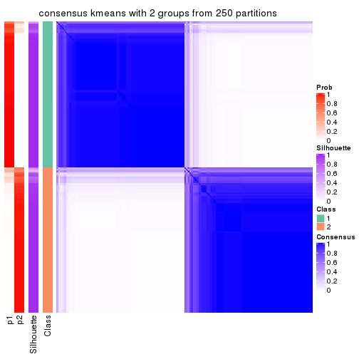</p>

</div>
<div id='tab-MAD-kmeans-consensus-heatmap-2'>
<pre><code class="r">consensus_heatmap(res, k = 3)
</code></pre>

<p>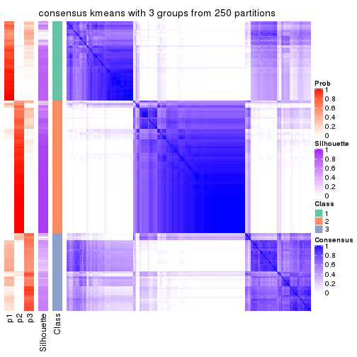</p>

</div>
<div id='tab-MAD-kmeans-consensus-heatmap-3'>
<pre><code class="r">consensus_heatmap(res, k = 4)
</code></pre>

<p>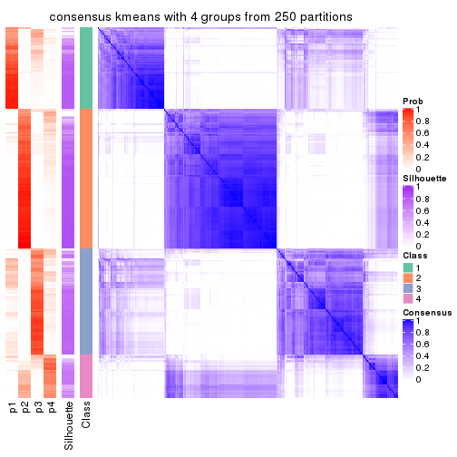</p>

</div>
<div id='tab-MAD-kmeans-consensus-heatmap-4'>
<pre><code class="r">consensus_heatmap(res, k = 5)
</code></pre>

<p>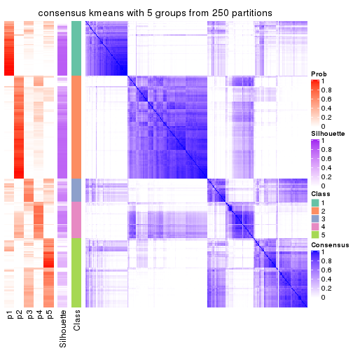</p>

</div>
<div id='tab-MAD-kmeans-consensus-heatmap-5'>
<pre><code class="r">consensus_heatmap(res, k = 6)
</code></pre>

<p>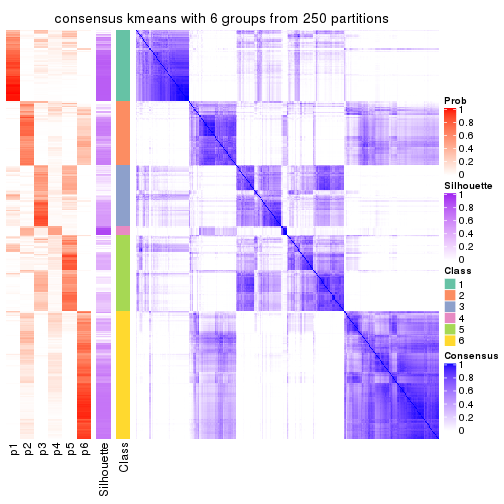</p>

</div>
</div>

Heatmaps for the membership of samples in all partitions to see how consistent they are:


<script>
$( function() {
	$( '#tabs-MAD-kmeans-membership-heatmap' ).tabs();
} );
</script>
<div id='tabs-MAD-kmeans-membership-heatmap'>
<ul>
<li><a href='#tab-MAD-kmeans-membership-heatmap-1'>k = 2</a></li>
<li><a href='#tab-MAD-kmeans-membership-heatmap-2'>k = 3</a></li>
<li><a href='#tab-MAD-kmeans-membership-heatmap-3'>k = 4</a></li>
<li><a href='#tab-MAD-kmeans-membership-heatmap-4'>k = 5</a></li>
<li><a href='#tab-MAD-kmeans-membership-heatmap-5'>k = 6</a></li>
</ul>
<div id='tab-MAD-kmeans-membership-heatmap-1'>
<pre><code class="r">membership_heatmap(res, k = 2)
</code></pre>

<p>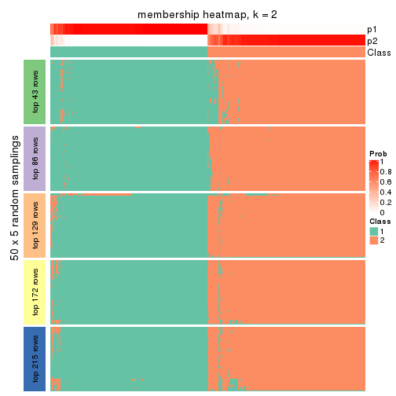</p>

</div>
<div id='tab-MAD-kmeans-membership-heatmap-2'>
<pre><code class="r">membership_heatmap(res, k = 3)
</code></pre>

<p>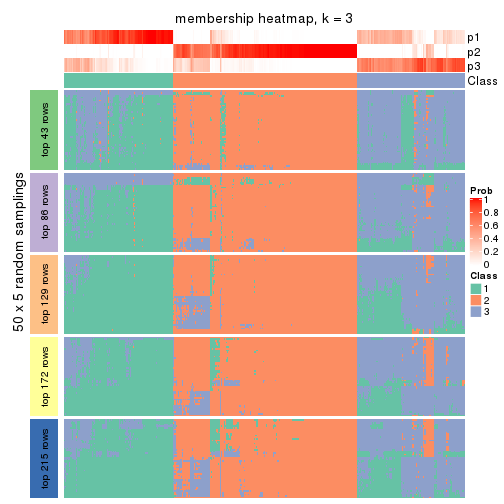</p>

</div>
<div id='tab-MAD-kmeans-membership-heatmap-3'>
<pre><code class="r">membership_heatmap(res, k = 4)
</code></pre>

<p>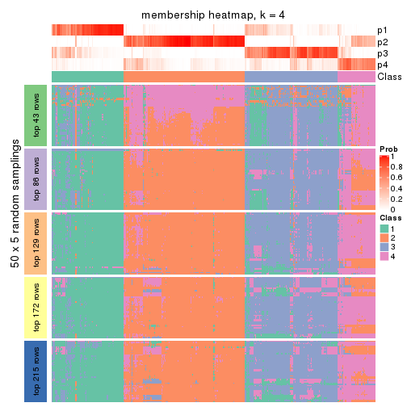</p>

</div>
<div id='tab-MAD-kmeans-membership-heatmap-4'>
<pre><code class="r">membership_heatmap(res, k = 5)
</code></pre>

<p>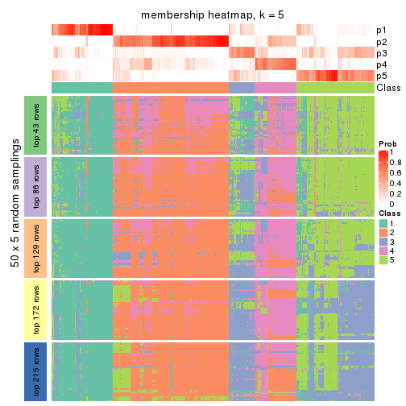</p>

</div>
<div id='tab-MAD-kmeans-membership-heatmap-5'>
<pre><code class="r">membership_heatmap(res, k = 6)
</code></pre>

<p>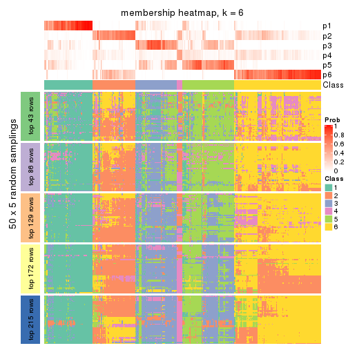</p>

</div>
</div>

As soon as we have had the classes for columns, we can look for signatures
which are significantly different between classes which can be candidate marks
for certain classes. Following are the heatmaps for signatures.


Signature heatmaps where rows are scaled:


<script>
$( function() {
	$( '#tabs-MAD-kmeans-get-signatures' ).tabs();
} );
</script>
<div id='tabs-MAD-kmeans-get-signatures'>
<ul>
<li><a href='#tab-MAD-kmeans-get-signatures-1'>k = 2</a></li>
<li><a href='#tab-MAD-kmeans-get-signatures-2'>k = 3</a></li>
<li><a href='#tab-MAD-kmeans-get-signatures-3'>k = 4</a></li>
<li><a href='#tab-MAD-kmeans-get-signatures-4'>k = 5</a></li>
<li><a href='#tab-MAD-kmeans-get-signatures-5'>k = 6</a></li>
</ul>
<div id='tab-MAD-kmeans-get-signatures-1'>
<pre><code class="r">get_signatures(res, k = 2)
</code></pre>

<p>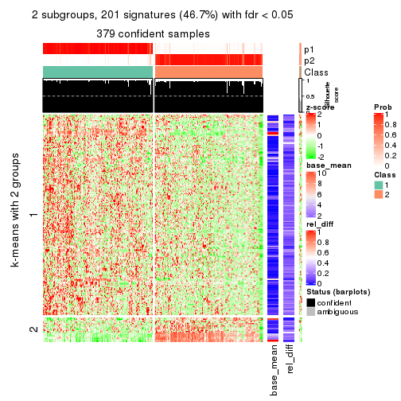</p>

</div>
<div id='tab-MAD-kmeans-get-signatures-2'>
<pre><code class="r">get_signatures(res, k = 3)
</code></pre>

<p>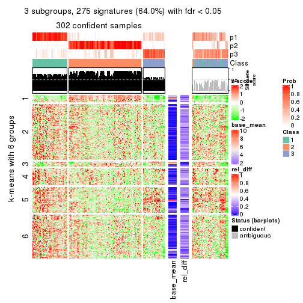</p>

</div>
<div id='tab-MAD-kmeans-get-signatures-3'>
<pre><code class="r">get_signatures(res, k = 4)
</code></pre>

<p>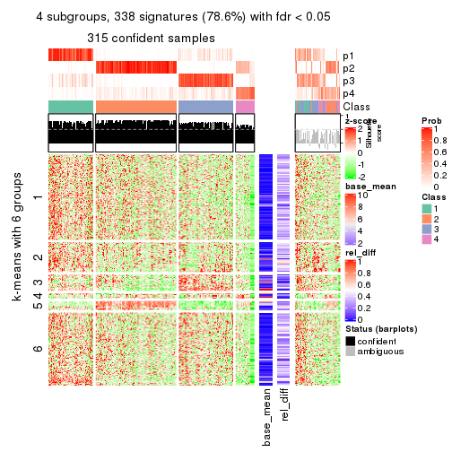</p>

</div>
<div id='tab-MAD-kmeans-get-signatures-4'>
<pre><code class="r">get_signatures(res, k = 5)
</code></pre>

<p>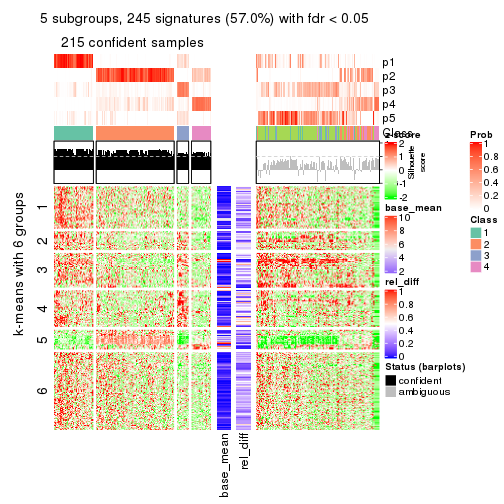</p>

</div>
<div id='tab-MAD-kmeans-get-signatures-5'>
<pre><code class="r">get_signatures(res, k = 6)
</code></pre>

<p>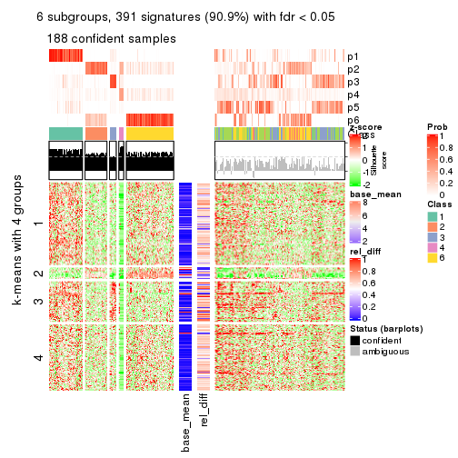</p>

</div>
</div>


Signature heatmaps where rows are not scaled:


<script>
$( function() {
	$( '#tabs-MAD-kmeans-get-signatures-no-scale' ).tabs();
} );
</script>
<div id='tabs-MAD-kmeans-get-signatures-no-scale'>
<ul>
<li><a href='#tab-MAD-kmeans-get-signatures-no-scale-1'>k = 2</a></li>
<li><a href='#tab-MAD-kmeans-get-signatures-no-scale-2'>k = 3</a></li>
<li><a href='#tab-MAD-kmeans-get-signatures-no-scale-3'>k = 4</a></li>
<li><a href='#tab-MAD-kmeans-get-signatures-no-scale-4'>k = 5</a></li>
<li><a href='#tab-MAD-kmeans-get-signatures-no-scale-5'>k = 6</a></li>
</ul>
<div id='tab-MAD-kmeans-get-signatures-no-scale-1'>
<pre><code class="r">get_signatures(res, k = 2, scale_rows = FALSE)
</code></pre>

<p>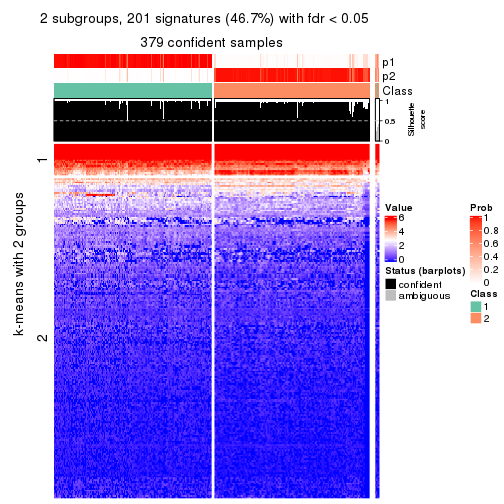</p>

</div>
<div id='tab-MAD-kmeans-get-signatures-no-scale-2'>
<pre><code class="r">get_signatures(res, k = 3, scale_rows = FALSE)
</code></pre>

<p>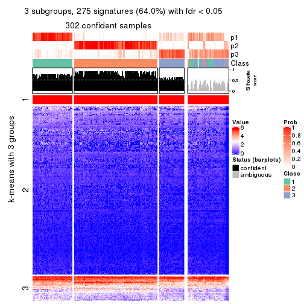</p>

</div>
<div id='tab-MAD-kmeans-get-signatures-no-scale-3'>
<pre><code class="r">get_signatures(res, k = 4, scale_rows = FALSE)
</code></pre>

<p>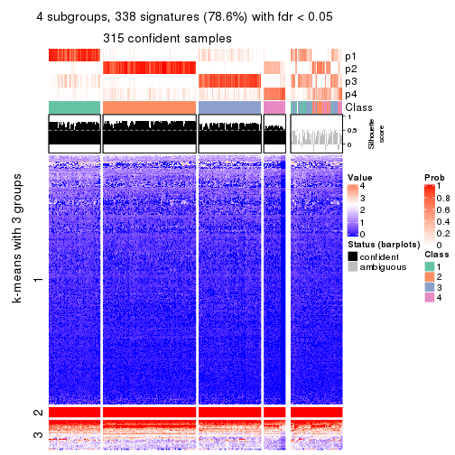</p>

</div>
<div id='tab-MAD-kmeans-get-signatures-no-scale-4'>
<pre><code class="r">get_signatures(res, k = 5, scale_rows = FALSE)
</code></pre>

<p>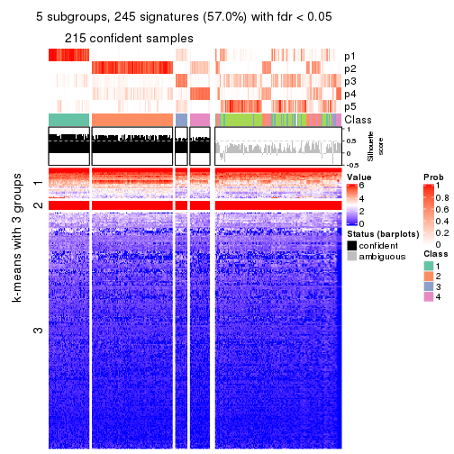</p>

</div>
<div id='tab-MAD-kmeans-get-signatures-no-scale-5'>
<pre><code class="r">get_signatures(res, k = 6, scale_rows = FALSE)
</code></pre>

<p>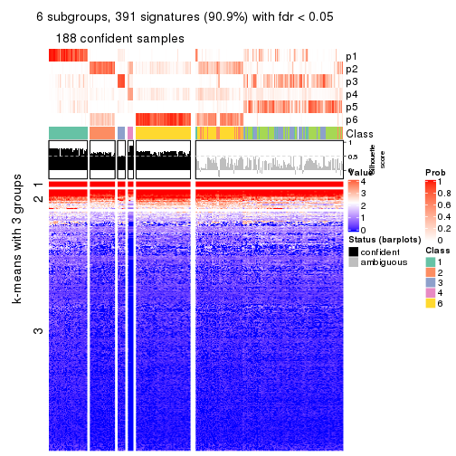</p>

</div>
</div>


Compare the overlap of signatures from different k:

```r
compare_signatures(res)
```

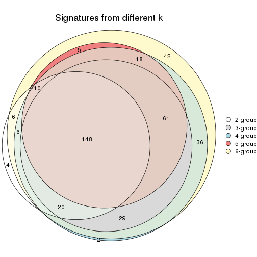

`get_signature()` returns a data frame invisibly. TO get the list of signatures, the function
call should be assigned to a variable explicitly. In following code, if `plot` argument is set
to `FALSE`, no heatmap is plotted while only the differential analysis is performed.

```r
# code only for demonstration
tb = get_signature(res, k = ..., plot = FALSE)
```

An example of the output of `tb` is:

```
#>   which_row         fdr    mean_1    mean_2 scaled_mean_1 scaled_mean_2 km
#> 1        38 0.042760348  8.373488  9.131774    -0.5533452     0.5164555  1
#> 2        40 0.018707592  7.106213  8.469186    -0.6173731     0.5762149  1
#> 3        55 0.019134737 10.221463 11.207825    -0.6159697     0.5749050  1
#> 4        59 0.006059896  5.921854  7.869574    -0.6899429     0.6439467  1
#> 5        60 0.018055526  8.928898 10.211722    -0.6204761     0.5791110  1
#> 6        98 0.009384629 15.714769 14.887706     0.6635654    -0.6193277  2
...
```

The columns in `tb` are:

1. `which_row`: row indices corresponding to the input matrix.
2. `fdr`: FDR for the differential test. 
3. `mean_x`: The mean value in group x.
4. `scaled_mean_x`: The mean value in group x after rows are scaled.
5. `km`: Row groups if k-means clustering is applied to rows.


UMAP plot which shows how samples are separated.


<script>
$( function() {
	$( '#tabs-MAD-kmeans-dimension-reduction' ).tabs();
} );
</script>
<div id='tabs-MAD-kmeans-dimension-reduction'>
<ul>
<li><a href='#tab-MAD-kmeans-dimension-reduction-1'>k = 2</a></li>
<li><a href='#tab-MAD-kmeans-dimension-reduction-2'>k = 3</a></li>
<li><a href='#tab-MAD-kmeans-dimension-reduction-3'>k = 4</a></li>
<li><a href='#tab-MAD-kmeans-dimension-reduction-4'>k = 5</a></li>
<li><a href='#tab-MAD-kmeans-dimension-reduction-5'>k = 6</a></li>
</ul>
<div id='tab-MAD-kmeans-dimension-reduction-1'>
<pre><code class="r">dimension_reduction(res, k = 2, method = &quot;UMAP&quot;)
</code></pre>

<p>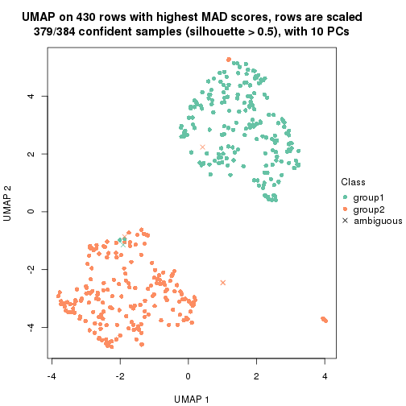</p>

</div>
<div id='tab-MAD-kmeans-dimension-reduction-2'>
<pre><code class="r">dimension_reduction(res, k = 3, method = &quot;UMAP&quot;)
</code></pre>

<p>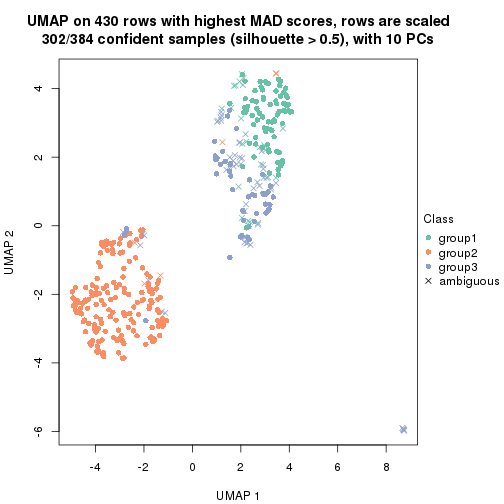</p>

</div>
<div id='tab-MAD-kmeans-dimension-reduction-3'>
<pre><code class="r">dimension_reduction(res, k = 4, method = &quot;UMAP&quot;)
</code></pre>

<p>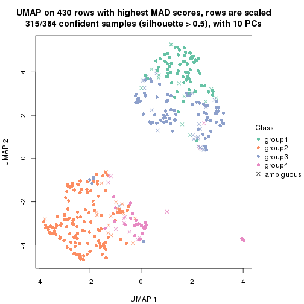</p>

</div>
<div id='tab-MAD-kmeans-dimension-reduction-4'>
<pre><code class="r">dimension_reduction(res, k = 5, method = &quot;UMAP&quot;)
</code></pre>

<p>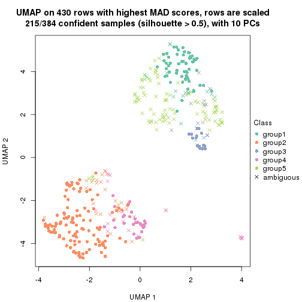</p>

</div>
<div id='tab-MAD-kmeans-dimension-reduction-5'>
<pre><code class="r">dimension_reduction(res, k = 6, method = &quot;UMAP&quot;)
</code></pre>

<p>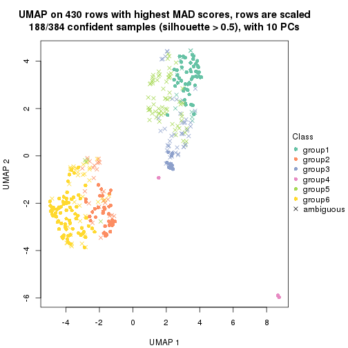</p>

</div>
</div>


Following heatmap shows how subgroups are split when increasing `k`:

```r
collect_classes(res)
```

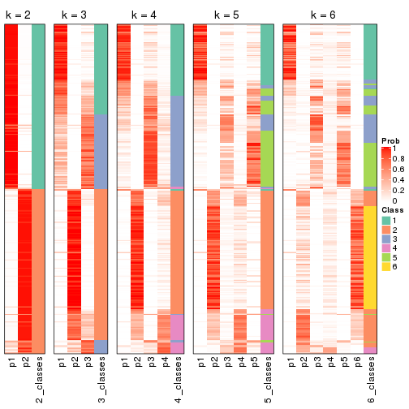


If matrix rows can be associated to genes, consider to use `GO_Enrichment(res,
...)` to perform function enrichment for the signature genes.


 

---------------------------------------------------


### MAD:skmeans**


The object with results only for a single top-value method and a single partition method 
can be extracted as:

```r
res = res_list["MAD", "skmeans"]
# you can also extract it by
# res = res_list["MAD:skmeans"]
```

A summary of `res` and all the functions that can be applied to it:

```r
res
```

```
#> A 'ConsensusPartition' object with k = 2, 3, 4, 5, 6.
#>   On a matrix with 430 rows and 384 columns.
#>   Top rows (43, 86, 129, 172, 215) are extracted by 'MAD' method.
#>   Subgroups are detected by 'skmeans' method.
#>   Performed in total 1250 partitions by row resampling.
#>   Best k for subgroups seems to be 2.
#> 
#> Following methods can be applied to this 'ConsensusPartition' object:
#>  [1] "cola_report"             "collect_classes"         "collect_plots"          
#>  [4] "collect_stats"           "colnames"                "compare_signatures"     
#>  [7] "consensus_heatmap"       "dimension_reduction"     "functional_enrichment"  
#> [10] "get_anno_col"            "get_anno"                "get_classes"            
#> [13] "get_consensus"           "get_matrix"              "get_membership"         
#> [16] "get_param"               "get_signatures"          "get_stats"              
#> [19] "is_best_k"               "is_stable_k"             "membership_heatmap"     
#> [22] "ncol"                    "nrow"                    "plot_ecdf"              
#> [25] "rownames"                "select_partition_number" "show"                   
#> [28] "suggest_best_k"          "test_to_known_factors"
```

`collect_plots()` function collects all the plots made from `res` for all `k` (number of partitions)
into one single page to provide an easy and fast comparison between different `k`.

```r
collect_plots(res)
```

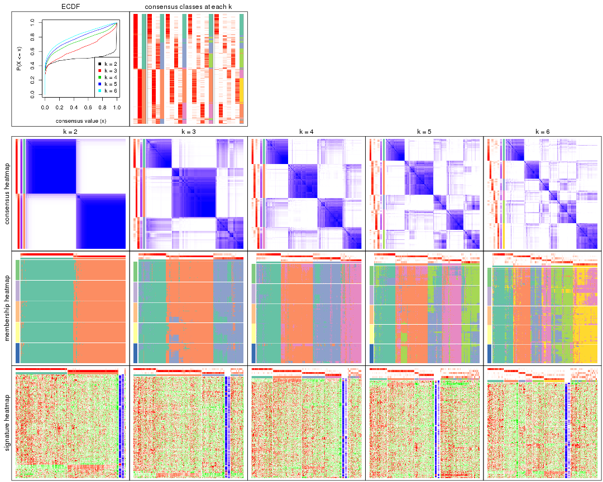

The plots are:

- The first row: a plot of the ECDF (Empirical cumulative distribution
  function) curves of the consensus matrix for each `k` and the heatmap of
  predicted classes for each `k`.
- The second row: heatmaps of the consensus matrix for each `k`.
- The third row: heatmaps of the membership matrix for each `k`.
- The fouth row: heatmaps of the signatures for each `k`.

All the plots in panels can be made by individual functions and they are
plotted later in this section.

`select_partition_number()` produces several plots showing different
statistics for choosing "optimized" `k`. There are following statistics:

- ECDF curves of the consensus matrix for each `k`;
- 1-PAC. [The PAC
  score](https://en.wikipedia.org/wiki/Consensus_clustering#Over-interpretation_potential_of_consensus_clustering)
  measures the proportion of the ambiguous subgrouping.
- Mean silhouette score.
- Concordance. The mean probability of fiting the consensus class ids in all
  partitions.
- Area increased. Denote $A_k$ as the area under the ECDF curve for current
  `k`, the area increased is defined as $A_k - A_{k-1}$.
- Rand index. The percent of pairs of samples that are both in a same cluster
  or both are not in a same cluster in the partition of k and k-1.
- Jaccard index. The ratio of pairs of samples are both in a same cluster in
  the partition of k and k-1 and the pairs of samples are both in a same
  cluster in the partition k or k-1.

The detailed explanations of these statistics can be found in [the cola
vignette](http://bioconductor.org/packages/devel/bioc/vignettes/cola/inst/doc/cola.html#toc_13).

Generally speaking, lower PAC score, higher mean silhouette score or higher
concordance corresponds to better partition. Rand index and Jaccard index
measure how similar the current partition is compared to partition with `k-1`.
If they are too similar, we won't accept `k` is better than `k-1`.

```r
select_partition_number(res)
```

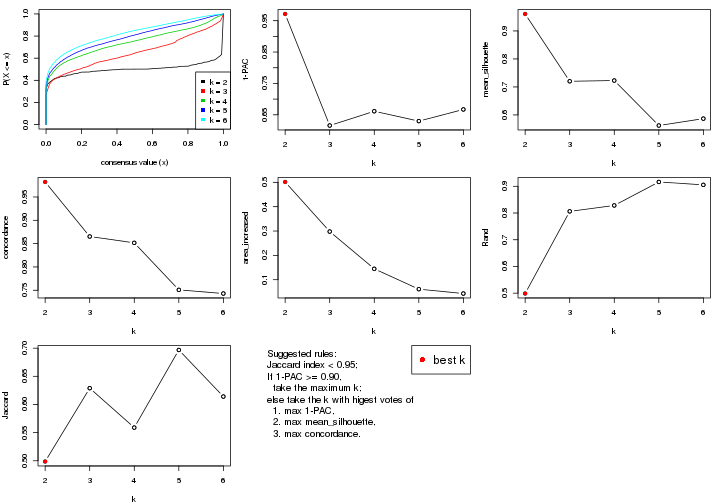

The numeric values for all these statistics can be obtained by `get_stats()`.

```r
get_stats(res)
```

```
#>   k 1-PAC mean_silhouette concordance area_increased  Rand Jaccard
#> 2 2 0.971           0.961       0.982         0.5015 0.499   0.499
#> 3 3 0.616           0.720       0.865         0.2978 0.806   0.629
#> 4 4 0.661           0.723       0.852         0.1447 0.828   0.559
#> 5 5 0.630           0.562       0.751         0.0610 0.916   0.697
#> 6 6 0.667           0.587       0.743         0.0432 0.905   0.614
```

`suggest_best_k()` suggests the best $k$ based on these statistics. The rules are as follows:

- All $k$ with Jaccard index larger than 0.95 are removed because the increase of
  the partition number does not provides enough extra information. If all $k$ are removed,
  the best $k$ is assigned by `NA`.
- For $k$ with 1-PAC larger than 0.9, the maximal $k$ is taken as the "best k". Other $k$ is called "optional k".
- If it does not fit the second rule. The $k$ with the highest vote of highest
  1-PAC, mean silhouette and concordance is taken as the "best k".

```r
suggest_best_k(res)
```

```
#> [1] 2
```


Following shows the table of the partitions (You need to click the **show/hide
code output** link to see it). The membership matrix (columns with name `p*`)
is inferred by
[`clue::cl_consensus()`](https://www.rdocumentation.org/link/cl_consensus?package=clue)
function with the `SE` method. Basically the value in the membership matrix
represents the probability to belong to a certain group. The finall class
label for an item is determined with the group with highest probability it
belongs to.

In `get_classes()` function, the entropy is calculated from the membership
matrix and the silhouette score is calculated from the consensus matrix.


<script>
$( function() {
	$( '#tabs-MAD-skmeans-get-classes' ).tabs();
} );
</script>
<div id='tabs-MAD-skmeans-get-classes'>
<ul>
<li><a href='#tab-MAD-skmeans-get-classes-1'>k = 2</a></li>
<li><a href='#tab-MAD-skmeans-get-classes-2'>k = 3</a></li>
<li><a href='#tab-MAD-skmeans-get-classes-3'>k = 4</a></li>
<li><a href='#tab-MAD-skmeans-get-classes-4'>k = 5</a></li>
<li><a href='#tab-MAD-skmeans-get-classes-5'>k = 6</a></li>
</ul>

<div id='tab-MAD-skmeans-get-classes-1'>
<p><a id='tab-MAD-skmeans-get-classes-1-a' style='color:#0366d6' href='#'>show/hide code output</a></p>
<pre><code class="r">cbind(get_classes(res, k = 2), get_membership(res, k = 2))
</code></pre>

<pre><code>#&gt;            class entropy silhouette    p1    p2
#&gt; SRR2105277     1  0.0000      0.987 1.000 0.000
#&gt; SRR2105278     1  0.0000      0.987 1.000 0.000
#&gt; SRR2105275     1  0.0672      0.981 0.992 0.008
#&gt; SRR2105276     1  0.0000      0.987 1.000 0.000
#&gt; SRR2105273     1  0.0000      0.987 1.000 0.000
#&gt; SRR2105274     1  0.0000      0.987 1.000 0.000
#&gt; SRR2105271     1  0.0000      0.987 1.000 0.000
#&gt; SRR2105272     1  0.0000      0.987 1.000 0.000
#&gt; SRR2105269     2  0.0000      0.976 0.000 1.000
#&gt; SRR2105270     2  0.0000      0.976 0.000 1.000
#&gt; SRR2105267     2  0.0000      0.976 0.000 1.000
#&gt; SRR2105268     2  0.0000      0.976 0.000 1.000
#&gt; SRR2105265     2  0.0000      0.976 0.000 1.000
#&gt; SRR2105266     2  0.0000      0.976 0.000 1.000
#&gt; SRR2105263     2  0.0000      0.976 0.000 1.000
#&gt; SRR2105264     2  0.0000      0.976 0.000 1.000
#&gt; SRR2105261     1  0.8144      0.666 0.748 0.252
#&gt; SRR2105262     1  0.4022      0.912 0.920 0.080
#&gt; SRR2105357     1  0.0000      0.987 1.000 0.000
#&gt; SRR2105358     1  0.0000      0.987 1.000 0.000
#&gt; SRR2105439     2  0.0376      0.974 0.004 0.996
#&gt; SRR2105440     2  0.0000      0.976 0.000 1.000
#&gt; SRR2105509     2  0.0000      0.976 0.000 1.000
#&gt; SRR2105510     2  0.0000      0.976 0.000 1.000
#&gt; SRR2105507     1  0.0000      0.987 1.000 0.000
#&gt; SRR2105508     1  0.0000      0.987 1.000 0.000
#&gt; SRR2105505     1  0.0000      0.987 1.000 0.000
#&gt; SRR2105506     1  0.0000      0.987 1.000 0.000
#&gt; SRR2105503     2  0.0000      0.976 0.000 1.000
#&gt; SRR2105504     2  0.3879      0.910 0.076 0.924
#&gt; SRR2105501     2  0.1633      0.959 0.024 0.976
#&gt; SRR2105502     2  0.1414      0.962 0.020 0.980
#&gt; SRR2105499     1  0.0000      0.987 1.000 0.000
#&gt; SRR2105500     1  0.0376      0.984 0.996 0.004
#&gt; SRR2105497     2  0.0000      0.976 0.000 1.000
#&gt; SRR2105498     2  0.0000      0.976 0.000 1.000
#&gt; SRR2105495     2  0.0000      0.976 0.000 1.000
#&gt; SRR2105496     2  0.0000      0.976 0.000 1.000
#&gt; SRR2105493     2  0.0000      0.976 0.000 1.000
#&gt; SRR2105494     2  0.0000      0.976 0.000 1.000
#&gt; SRR2105491     2  0.0000      0.976 0.000 1.000
#&gt; SRR2105492     2  0.0000      0.976 0.000 1.000
#&gt; SRR2105489     2  0.0000      0.976 0.000 1.000
#&gt; SRR2105490     2  0.0000      0.976 0.000 1.000
#&gt; SRR2105487     1  0.0000      0.987 1.000 0.000
#&gt; SRR2105488     1  0.0000      0.987 1.000 0.000
#&gt; SRR2105485     1  0.0000      0.987 1.000 0.000
#&gt; SRR2105486     1  0.0000      0.987 1.000 0.000
#&gt; SRR2105483     1  0.0000      0.987 1.000 0.000
#&gt; SRR2105484     1  0.0000      0.987 1.000 0.000
#&gt; SRR2105481     1  0.0000      0.987 1.000 0.000
#&gt; SRR2105482     1  0.0000      0.987 1.000 0.000
#&gt; SRR2105479     1  0.0000      0.987 1.000 0.000
#&gt; SRR2105480     1  0.0000      0.987 1.000 0.000
#&gt; SRR2105477     2  0.0000      0.976 0.000 1.000
#&gt; SRR2105478     2  0.0000      0.976 0.000 1.000
#&gt; SRR2105475     2  0.0000      0.976 0.000 1.000
#&gt; SRR2105476     2  0.0000      0.976 0.000 1.000
#&gt; SRR2105473     2  0.2043      0.952 0.032 0.968
#&gt; SRR2105474     2  0.0376      0.974 0.004 0.996
#&gt; SRR2105471     2  0.0000      0.976 0.000 1.000
#&gt; SRR2105472     2  0.0000      0.976 0.000 1.000
#&gt; SRR2105469     1  0.0000      0.987 1.000 0.000
#&gt; SRR2105470     1  0.0000      0.987 1.000 0.000
#&gt; SRR2105467     1  0.0000      0.987 1.000 0.000
#&gt; SRR2105468     1  0.0000      0.987 1.000 0.000
#&gt; SRR2105465     1  0.0000      0.987 1.000 0.000
#&gt; SRR2105466     1  0.0000      0.987 1.000 0.000
#&gt; SRR2105463     1  0.0000      0.987 1.000 0.000
#&gt; SRR2105464     1  0.0000      0.987 1.000 0.000
#&gt; SRR2105461     2  0.0000      0.976 0.000 1.000
#&gt; SRR2105462     2  0.0000      0.976 0.000 1.000
#&gt; SRR2105459     2  0.0000      0.976 0.000 1.000
#&gt; SRR2105460     2  0.0000      0.976 0.000 1.000
#&gt; SRR2105457     1  0.0000      0.987 1.000 0.000
#&gt; SRR2105458     1  0.0376      0.984 0.996 0.004
#&gt; SRR2105455     1  0.0376      0.984 0.996 0.004
#&gt; SRR2105456     1  0.0000      0.987 1.000 0.000
#&gt; SRR2105453     1  0.0000      0.987 1.000 0.000
#&gt; SRR2105454     1  0.0000      0.987 1.000 0.000
#&gt; SRR2105451     2  0.1633      0.958 0.024 0.976
#&gt; SRR2105452     2  0.6887      0.783 0.184 0.816
#&gt; SRR2105449     1  0.0000      0.987 1.000 0.000
#&gt; SRR2105450     1  0.0000      0.987 1.000 0.000
#&gt; SRR2105447     2  0.0000      0.976 0.000 1.000
#&gt; SRR2105448     2  0.0000      0.976 0.000 1.000
#&gt; SRR2105445     1  0.9460      0.421 0.636 0.364
#&gt; SRR2105446     1  0.0000      0.987 1.000 0.000
#&gt; SRR2105443     2  0.6801      0.789 0.180 0.820
#&gt; SRR2105444     2  0.8608      0.620 0.284 0.716
#&gt; SRR2105441     2  0.0000      0.976 0.000 1.000
#&gt; SRR2105442     2  0.0000      0.976 0.000 1.000
#&gt; SRR2105437     1  0.0000      0.987 1.000 0.000
#&gt; SRR2105438     1  0.0000      0.987 1.000 0.000
#&gt; SRR2105435     1  0.0000      0.987 1.000 0.000
#&gt; SRR2105436     1  0.0000      0.987 1.000 0.000
#&gt; SRR2105433     1  0.0000      0.987 1.000 0.000
#&gt; SRR2105434     1  0.0000      0.987 1.000 0.000
#&gt; SRR2105431     1  0.0000      0.987 1.000 0.000
#&gt; SRR2105432     1  0.0000      0.987 1.000 0.000
#&gt; SRR2105429     2  0.5178      0.868 0.116 0.884
#&gt; SRR2105430     2  0.2423      0.945 0.040 0.960
#&gt; SRR2105427     2  0.0000      0.976 0.000 1.000
#&gt; SRR2105428     2  0.0000      0.976 0.000 1.000
#&gt; SRR2105425     2  0.0000      0.976 0.000 1.000
#&gt; SRR2105426     2  0.0000      0.976 0.000 1.000
#&gt; SRR2105421     1  0.2948      0.942 0.948 0.052
#&gt; SRR2105422     1  0.0000      0.987 1.000 0.000
#&gt; SRR2105423     2  0.0000      0.976 0.000 1.000
#&gt; SRR2105424     2  0.0000      0.976 0.000 1.000
#&gt; SRR2105419     1  0.0000      0.987 1.000 0.000
#&gt; SRR2105420     1  0.0000      0.987 1.000 0.000
#&gt; SRR2105415     1  0.0000      0.987 1.000 0.000
#&gt; SRR2105416     1  0.0000      0.987 1.000 0.000
#&gt; SRR2105417     1  0.0000      0.987 1.000 0.000
#&gt; SRR2105418     1  0.0000      0.987 1.000 0.000
#&gt; SRR2105413     2  0.0000      0.976 0.000 1.000
#&gt; SRR2105414     2  0.0000      0.976 0.000 1.000
#&gt; SRR2105409     2  0.0000      0.976 0.000 1.000
#&gt; SRR2105410     2  0.0000      0.976 0.000 1.000
#&gt; SRR2105411     2  0.0000      0.976 0.000 1.000
#&gt; SRR2105412     2  0.0000      0.976 0.000 1.000
#&gt; SRR2105407     1  0.0000      0.987 1.000 0.000
#&gt; SRR2105408     1  0.0000      0.987 1.000 0.000
#&gt; SRR2105403     1  0.0000      0.987 1.000 0.000
#&gt; SRR2105404     1  0.0000      0.987 1.000 0.000
#&gt; SRR2105405     1  0.0000      0.987 1.000 0.000
#&gt; SRR2105406     1  0.0000      0.987 1.000 0.000
#&gt; SRR2105401     2  0.0000      0.976 0.000 1.000
#&gt; SRR2105402     2  0.6973      0.777 0.188 0.812
#&gt; SRR2105399     2  0.6048      0.830 0.148 0.852
#&gt; SRR2105400     2  0.5294      0.863 0.120 0.880
#&gt; SRR2105397     2  0.6438      0.810 0.164 0.836
#&gt; SRR2105398     2  0.8207      0.671 0.256 0.744
#&gt; SRR2105395     2  0.0000      0.976 0.000 1.000
#&gt; SRR2105396     2  0.0000      0.976 0.000 1.000
#&gt; SRR2105393     2  0.0000      0.976 0.000 1.000
#&gt; SRR2105394     2  0.0000      0.976 0.000 1.000
#&gt; SRR2105389     1  0.0000      0.987 1.000 0.000
#&gt; SRR2105390     1  0.0000      0.987 1.000 0.000
#&gt; SRR2105391     1  0.0000      0.987 1.000 0.000
#&gt; SRR2105392     1  0.0000      0.987 1.000 0.000
#&gt; SRR2105385     1  0.0000      0.987 1.000 0.000
#&gt; SRR2105386     1  0.0000      0.987 1.000 0.000
#&gt; SRR2105387     1  0.0000      0.987 1.000 0.000
#&gt; SRR2105388     1  0.0000      0.987 1.000 0.000
#&gt; SRR2105381     2  0.0938      0.968 0.012 0.988
#&gt; SRR2105382     2  0.0376      0.974 0.004 0.996
#&gt; SRR2105383     2  0.0000      0.976 0.000 1.000
#&gt; SRR2105384     2  0.0000      0.976 0.000 1.000
#&gt; SRR2105379     2  0.0000      0.976 0.000 1.000
#&gt; SRR2105380     2  0.0672      0.971 0.008 0.992
#&gt; SRR2105377     2  0.0000      0.976 0.000 1.000
#&gt; SRR2105378     2  0.0000      0.976 0.000 1.000
#&gt; SRR2105375     1  0.0376      0.984 0.996 0.004
#&gt; SRR2105376     1  0.0000      0.987 1.000 0.000
#&gt; SRR2105373     1  0.0000      0.987 1.000 0.000
#&gt; SRR2105374     1  0.0000      0.987 1.000 0.000
#&gt; SRR2105371     1  0.0000      0.987 1.000 0.000
#&gt; SRR2105372     1  0.0000      0.987 1.000 0.000
#&gt; SRR2105369     1  0.0000      0.987 1.000 0.000
#&gt; SRR2105370     1  0.0000      0.987 1.000 0.000
#&gt; SRR2105367     1  0.0376      0.984 0.996 0.004
#&gt; SRR2105368     1  0.0000      0.987 1.000 0.000
#&gt; SRR2105365     2  0.0000      0.976 0.000 1.000
#&gt; SRR2105366     2  0.0000      0.976 0.000 1.000
#&gt; SRR2105363     2  0.0000      0.976 0.000 1.000
#&gt; SRR2105364     2  0.0000      0.976 0.000 1.000
#&gt; SRR2105361     2  0.0000      0.976 0.000 1.000
#&gt; SRR2105362     2  0.0000      0.976 0.000 1.000
#&gt; SRR2105359     1  0.0000      0.987 1.000 0.000
#&gt; SRR2105360     1  0.0000      0.987 1.000 0.000
#&gt; SRR2105355     1  0.0000      0.987 1.000 0.000
#&gt; SRR2105356     1  0.0000      0.987 1.000 0.000
#&gt; SRR2105353     1  0.0000      0.987 1.000 0.000
#&gt; SRR2105354     1  0.0000      0.987 1.000 0.000
#&gt; SRR2105351     2  0.0000      0.976 0.000 1.000
#&gt; SRR2105352     2  0.6887      0.783 0.184 0.816
#&gt; SRR2105349     2  0.0000      0.976 0.000 1.000
#&gt; SRR2105350     2  0.0000      0.976 0.000 1.000
#&gt; SRR2105345     2  0.0000      0.976 0.000 1.000
#&gt; SRR2105346     2  0.0000      0.976 0.000 1.000
#&gt; SRR2105347     2  0.0672      0.971 0.008 0.992
#&gt; SRR2105348     2  0.0938      0.968 0.012 0.988
#&gt; SRR2105343     2  0.0000      0.976 0.000 1.000
#&gt; SRR2105344     2  0.0000      0.976 0.000 1.000
#&gt; SRR2105341     1  0.0000      0.987 1.000 0.000
#&gt; SRR2105342     1  0.0000      0.987 1.000 0.000
#&gt; SRR2105339     1  0.0000      0.987 1.000 0.000
#&gt; SRR2105340     1  0.0000      0.987 1.000 0.000
#&gt; SRR2105335     1  0.0000      0.987 1.000 0.000
#&gt; SRR2105336     1  0.0000      0.987 1.000 0.000
#&gt; SRR2105337     1  0.0000      0.987 1.000 0.000
#&gt; SRR2105338     1  0.0000      0.987 1.000 0.000
#&gt; SRR2105331     2  0.0000      0.976 0.000 1.000
#&gt; SRR2105332     2  0.0000      0.976 0.000 1.000
#&gt; SRR2105333     2  0.0000      0.976 0.000 1.000
#&gt; SRR2105334     2  0.0000      0.976 0.000 1.000
#&gt; SRR2105329     2  0.3733      0.915 0.072 0.928
#&gt; SRR2105330     2  0.0672      0.971 0.008 0.992
#&gt; SRR2105327     2  0.0000      0.976 0.000 1.000
#&gt; SRR2105328     2  0.0000      0.976 0.000 1.000
#&gt; SRR2105325     1  0.0000      0.987 1.000 0.000
#&gt; SRR2105326     1  0.0000      0.987 1.000 0.000
#&gt; SRR2105323     1  0.0000      0.987 1.000 0.000
#&gt; SRR2105324     1  0.0000      0.987 1.000 0.000
#&gt; SRR2105319     1  0.0000      0.987 1.000 0.000
#&gt; SRR2105320     1  0.0000      0.987 1.000 0.000
#&gt; SRR2105321     1  0.0000      0.987 1.000 0.000
#&gt; SRR2105322     1  0.0000      0.987 1.000 0.000
#&gt; SRR2105317     2  0.0000      0.976 0.000 1.000
#&gt; SRR2105318     2  0.0000      0.976 0.000 1.000
#&gt; SRR2105315     2  0.9170      0.514 0.332 0.668
#&gt; SRR2105316     2  0.0000      0.976 0.000 1.000
#&gt; SRR2105313     2  0.0000      0.976 0.000 1.000
#&gt; SRR2105314     2  0.0000      0.976 0.000 1.000
#&gt; SRR2105311     1  0.2236      0.957 0.964 0.036
#&gt; SRR2105312     1  0.4161      0.908 0.916 0.084
#&gt; SRR2105307     1  0.0000      0.987 1.000 0.000
#&gt; SRR2105308     1  0.0000      0.987 1.000 0.000
#&gt; SRR2105309     1  0.0000      0.987 1.000 0.000
#&gt; SRR2105310     1  0.0000      0.987 1.000 0.000
#&gt; SRR2105305     1  0.0000      0.987 1.000 0.000
#&gt; SRR2105306     1  0.0000      0.987 1.000 0.000
#&gt; SRR2105303     2  0.0000      0.976 0.000 1.000
#&gt; SRR2105304     2  0.0000      0.976 0.000 1.000
#&gt; SRR2105301     2  0.0000      0.976 0.000 1.000
#&gt; SRR2105302     2  0.0000      0.976 0.000 1.000
#&gt; SRR2105299     1  0.7056      0.763 0.808 0.192
#&gt; SRR2105300     2  0.8955      0.562 0.312 0.688
#&gt; SRR2105297     2  0.5059      0.872 0.112 0.888
#&gt; SRR2105298     2  0.4022      0.907 0.080 0.920
#&gt; SRR2105295     2  0.0000      0.976 0.000 1.000
#&gt; SRR2105296     2  0.0000      0.976 0.000 1.000
#&gt; SRR2105293     1  0.0376      0.984 0.996 0.004
#&gt; SRR2105294     1  0.0000      0.987 1.000 0.000
#&gt; SRR2105291     1  0.0000      0.987 1.000 0.000
#&gt; SRR2105292     1  0.0000      0.987 1.000 0.000
#&gt; SRR2105289     1  0.0000      0.987 1.000 0.000
#&gt; SRR2105290     1  0.0000      0.987 1.000 0.000
#&gt; SRR2105287     1  0.0000      0.987 1.000 0.000
#&gt; SRR2105288     1  0.0000      0.987 1.000 0.000
#&gt; SRR2105285     2  0.0000      0.976 0.000 1.000
#&gt; SRR2105286     2  0.0000      0.976 0.000 1.000
#&gt; SRR2105283     2  0.0672      0.971 0.008 0.992
#&gt; SRR2105284     2  0.2778      0.938 0.048 0.952
#&gt; SRR2105281     2  0.0000      0.976 0.000 1.000
#&gt; SRR2105282     2  0.0000      0.976 0.000 1.000
#&gt; SRR2105259     1  0.0000      0.987 1.000 0.000
#&gt; SRR2105260     1  0.0000      0.987 1.000 0.000
#&gt; SRR2105279     2  0.0000      0.976 0.000 1.000
#&gt; SRR2105280     2  0.0000      0.976 0.000 1.000
#&gt; SRR2105257     1  0.0000      0.987 1.000 0.000
#&gt; SRR2105258     1  0.0000      0.987 1.000 0.000
#&gt; SRR2105253     2  0.0000      0.976 0.000 1.000
#&gt; SRR2105254     2  0.0000      0.976 0.000 1.000
#&gt; SRR2105255     1  0.0000      0.987 1.000 0.000
#&gt; SRR2105256     1  0.0000      0.987 1.000 0.000
#&gt; SRR2105251     2  0.0000      0.976 0.000 1.000
#&gt; SRR2105252     2  0.0000      0.976 0.000 1.000
#&gt; SRR2105249     2  0.0000      0.976 0.000 1.000
#&gt; SRR2105250     2  0.0376      0.974 0.004 0.996
#&gt; SRR2105247     2  0.0000      0.976 0.000 1.000
#&gt; SRR2105248     2  0.0000      0.976 0.000 1.000
#&gt; SRR2105245     1  0.3584      0.925 0.932 0.068
#&gt; SRR2105246     1  0.8207      0.658 0.744 0.256
#&gt; SRR2105243     1  0.0000      0.987 1.000 0.000
#&gt; SRR2105244     1  0.0000      0.987 1.000 0.000
#&gt; SRR2105241     1  0.0000      0.987 1.000 0.000
#&gt; SRR2105242     1  0.0000      0.987 1.000 0.000
#&gt; SRR2105239     1  0.0000      0.987 1.000 0.000
#&gt; SRR2105240     1  0.0000      0.987 1.000 0.000
#&gt; SRR2105237     2  0.0000      0.976 0.000 1.000
#&gt; SRR2105238     2  0.0000      0.976 0.000 1.000
#&gt; SRR2105235     2  0.0000      0.976 0.000 1.000
#&gt; SRR2105236     2  0.0000      0.976 0.000 1.000
#&gt; SRR2105233     2  0.0000      0.976 0.000 1.000
#&gt; SRR2105234     2  0.0000      0.976 0.000 1.000
#&gt; SRR2105231     2  0.0000      0.976 0.000 1.000
#&gt; SRR2105232     2  0.0000      0.976 0.000 1.000
#&gt; SRR2105227     1  0.0376      0.984 0.996 0.004
#&gt; SRR2105228     1  0.1633      0.967 0.976 0.024
#&gt; SRR2105225     1  0.0000      0.987 1.000 0.000
#&gt; SRR2105226     1  0.0000      0.987 1.000 0.000
#&gt; SRR2105229     1  0.2603      0.949 0.956 0.044
#&gt; SRR2105230     1  0.0000      0.987 1.000 0.000
#&gt; SRR2105219     2  0.0000      0.976 0.000 1.000
#&gt; SRR2105220     2  0.0000      0.976 0.000 1.000
#&gt; SRR2105221     2  0.0376      0.974 0.004 0.996
#&gt; SRR2105222     2  0.0376      0.974 0.004 0.996
#&gt; SRR2105223     1  0.0000      0.987 1.000 0.000
#&gt; SRR2105224     1  0.0000      0.987 1.000 0.000
#&gt; SRR2105217     2  0.0000      0.976 0.000 1.000
#&gt; SRR2105218     2  0.0000      0.976 0.000 1.000
#&gt; SRR2105215     2  0.0000      0.976 0.000 1.000
#&gt; SRR2105216     2  0.0000      0.976 0.000 1.000
#&gt; SRR2105213     1  0.2778      0.945 0.952 0.048
#&gt; SRR2105214     1  0.6343      0.812 0.840 0.160
#&gt; SRR2105211     1  0.0376      0.984 0.996 0.004
#&gt; SRR2105212     1  0.0000      0.987 1.000 0.000
#&gt; SRR2105209     1  0.0000      0.987 1.000 0.000
#&gt; SRR2105210     1  0.0000      0.987 1.000 0.000
#&gt; SRR2105207     1  0.0000      0.987 1.000 0.000
#&gt; SRR2105208     1  0.0000      0.987 1.000 0.000
#&gt; SRR2105205     2  0.0000      0.976 0.000 1.000
#&gt; SRR2105206     2  0.0000      0.976 0.000 1.000
#&gt; SRR2105201     2  0.0000      0.976 0.000 1.000
#&gt; SRR2105202     2  0.1184      0.965 0.016 0.984
#&gt; SRR2105203     2  0.0000      0.976 0.000 1.000
#&gt; SRR2105204     2  0.0000      0.976 0.000 1.000
#&gt; SRR2105199     2  0.0000      0.976 0.000 1.000
#&gt; SRR2105200     2  0.0000      0.976 0.000 1.000
#&gt; SRR2105197     1  0.0000      0.987 1.000 0.000
#&gt; SRR2105198     1  0.1414      0.971 0.980 0.020
#&gt; SRR2105195     1  0.1184      0.974 0.984 0.016
#&gt; SRR2105196     1  0.2043      0.960 0.968 0.032
#&gt; SRR2105193     1  0.0000      0.987 1.000 0.000
#&gt; SRR2105194     1  0.0000      0.987 1.000 0.000
#&gt; SRR2105191     1  0.0000      0.987 1.000 0.000
#&gt; SRR2105192     1  0.0000      0.987 1.000 0.000
#&gt; SRR2105189     2  0.0000      0.976 0.000 1.000
#&gt; SRR2105190     2  0.0000      0.976 0.000 1.000
#&gt; SRR2105187     2  0.0000      0.976 0.000 1.000
#&gt; SRR2105188     2  0.1184      0.965 0.016 0.984
#&gt; SRR2105179     1  0.0000      0.987 1.000 0.000
#&gt; SRR2105180     1  0.0000      0.987 1.000 0.000
#&gt; SRR2105183     2  0.0000      0.976 0.000 1.000
#&gt; SRR2105184     2  0.0000      0.976 0.000 1.000
#&gt; SRR2105185     2  0.0000      0.976 0.000 1.000
#&gt; SRR2105186     2  0.0000      0.976 0.000 1.000
#&gt; SRR2105181     1  0.0000      0.987 1.000 0.000
#&gt; SRR2105182     1  0.0000      0.987 1.000 0.000
#&gt; SRR2105177     1  0.0000      0.987 1.000 0.000
#&gt; SRR2105178     1  0.0000      0.987 1.000 0.000
#&gt; SRR2105171     2  0.0000      0.976 0.000 1.000
#&gt; SRR2105172     2  0.0000      0.976 0.000 1.000
#&gt; SRR2105175     1  0.0000      0.987 1.000 0.000
#&gt; SRR2105176     1  0.0000      0.987 1.000 0.000
#&gt; SRR2105173     2  0.0000      0.976 0.000 1.000
#&gt; SRR2105174     2  0.0000      0.976 0.000 1.000
#&gt; SRR2105169     2  0.0000      0.976 0.000 1.000
#&gt; SRR2105170     2  0.0000      0.976 0.000 1.000
#&gt; SRR2105167     2  0.0000      0.976 0.000 1.000
#&gt; SRR2105168     2  0.0000      0.976 0.000 1.000
#&gt; SRR2105165     1  0.0000      0.987 1.000 0.000
#&gt; SRR2105166     1  0.0000      0.987 1.000 0.000
#&gt; SRR2105163     1  0.0000      0.987 1.000 0.000
#&gt; SRR2105164     1  0.0000      0.987 1.000 0.000
#&gt; SRR2105161     1  0.0376      0.984 0.996 0.004
#&gt; SRR2105162     1  0.0000      0.987 1.000 0.000
#&gt; SRR2105155     2  0.0000      0.976 0.000 1.000
#&gt; SRR2105156     2  0.0000      0.976 0.000 1.000
#&gt; SRR2105157     2  0.0000      0.976 0.000 1.000
#&gt; SRR2105158     2  0.0000      0.976 0.000 1.000
#&gt; SRR2105159     1  0.0000      0.987 1.000 0.000
#&gt; SRR2105160     1  0.0000      0.987 1.000 0.000
#&gt; SRR2105153     2  0.0000      0.976 0.000 1.000
#&gt; SRR2105154     2  0.0000      0.976 0.000 1.000
#&gt; SRR2105151     2  0.0000      0.976 0.000 1.000
#&gt; SRR2105152     2  0.0000      0.976 0.000 1.000
#&gt; SRR2105149     1  0.5629      0.850 0.868 0.132
#&gt; SRR2105150     1  0.2423      0.953 0.960 0.040
#&gt; SRR2105147     2  0.9732      0.345 0.404 0.596
#&gt; SRR2105148     2  0.9815      0.299 0.420 0.580
#&gt; SRR2105143     1  0.0376      0.984 0.996 0.004
#&gt; SRR2105144     1  0.5178      0.869 0.884 0.116
#&gt; SRR2105145     1  0.2236      0.956 0.964 0.036
#&gt; SRR2105146     1  0.0000      0.987 1.000 0.000
#&gt; SRR2105141     2  0.0000      0.976 0.000 1.000
#&gt; SRR2105142     2  0.0000      0.976 0.000 1.000
#&gt; SRR2105139     2  0.0000      0.976 0.000 1.000
#&gt; SRR2105140     2  0.0000      0.976 0.000 1.000
#&gt; SRR2105137     2  0.1843      0.955 0.028 0.972
#&gt; SRR2105138     2  0.4562      0.890 0.096 0.904
#&gt; SRR2105135     2  0.0000      0.976 0.000 1.000
#&gt; SRR2105136     2  0.0000      0.976 0.000 1.000
#&gt; SRR2105133     1  0.0000      0.987 1.000 0.000
#&gt; SRR2105134     1  0.0000      0.987 1.000 0.000
#&gt; SRR2105131     2  0.9358      0.470 0.352 0.648
#&gt; SRR2105132     1  0.5946      0.833 0.856 0.144
#&gt; SRR2105129     1  0.2603      0.948 0.956 0.044
#&gt; SRR2105130     1  0.0000      0.987 1.000 0.000
#&gt; SRR2105127     1  0.1843      0.963 0.972 0.028
#&gt; SRR2105128     1  0.5946      0.833 0.856 0.144
</code></pre>

<script>
$('#tab-MAD-skmeans-get-classes-1-a').parent().next().next().hide();
$('#tab-MAD-skmeans-get-classes-1-a').click(function(){
  $('#tab-MAD-skmeans-get-classes-1-a').parent().next().next().toggle();
  return(false);
});
</script>
</div>

<div id='tab-MAD-skmeans-get-classes-2'>
<p><a id='tab-MAD-skmeans-get-classes-2-a' style='color:#0366d6' href='#'>show/hide code output</a></p>
<pre><code class="r">cbind(get_classes(res, k = 3), get_membership(res, k = 3))
</code></pre>

<pre><code>#&gt;            class entropy silhouette    p1    p2    p3
#&gt; SRR2105277     3  0.5497    0.55524 0.292 0.000 0.708
#&gt; SRR2105278     3  0.5988    0.43680 0.368 0.000 0.632
#&gt; SRR2105275     3  0.4062    0.64526 0.164 0.000 0.836
#&gt; SRR2105276     3  0.5254    0.55903 0.264 0.000 0.736
#&gt; SRR2105273     3  0.5968    0.44703 0.364 0.000 0.636
#&gt; SRR2105274     1  0.5431    0.60365 0.716 0.000 0.284
#&gt; SRR2105271     1  0.6267    0.09841 0.548 0.000 0.452
#&gt; SRR2105272     1  0.0747    0.81930 0.984 0.000 0.016
#&gt; SRR2105269     2  0.0747    0.91006 0.000 0.984 0.016
#&gt; SRR2105270     2  0.0237    0.91213 0.000 0.996 0.004
#&gt; SRR2105267     2  0.0592    0.91100 0.000 0.988 0.012
#&gt; SRR2105268     2  0.0000    0.91240 0.000 1.000 0.000
#&gt; SRR2105265     2  0.0000    0.91240 0.000 1.000 0.000
#&gt; SRR2105266     2  0.0000    0.91240 0.000 1.000 0.000
#&gt; SRR2105263     2  0.0475    0.91218 0.004 0.992 0.004
#&gt; SRR2105264     2  0.1529    0.90006 0.040 0.960 0.000
#&gt; SRR2105261     3  0.0424    0.70147 0.000 0.008 0.992
#&gt; SRR2105262     3  0.0237    0.70233 0.000 0.004 0.996
#&gt; SRR2105357     3  0.2711    0.70623 0.088 0.000 0.912
#&gt; SRR2105358     3  0.5465    0.56045 0.288 0.000 0.712
#&gt; SRR2105439     2  0.2625    0.86657 0.084 0.916 0.000
#&gt; SRR2105440     2  0.1860    0.88978 0.052 0.948 0.000
#&gt; SRR2105509     2  0.5291    0.71704 0.000 0.732 0.268
#&gt; SRR2105510     2  0.5254    0.72192 0.000 0.736 0.264
#&gt; SRR2105507     3  0.5835    0.48888 0.340 0.000 0.660
#&gt; SRR2105508     3  0.5098    0.61165 0.248 0.000 0.752
#&gt; SRR2105505     1  0.5291    0.61164 0.732 0.000 0.268
#&gt; SRR2105506     1  0.4346    0.71887 0.816 0.000 0.184
#&gt; SRR2105503     2  0.0000    0.91240 0.000 1.000 0.000
#&gt; SRR2105504     3  0.5327    0.48192 0.000 0.272 0.728
#&gt; SRR2105501     2  0.2550    0.89085 0.024 0.936 0.040
#&gt; SRR2105502     3  0.6204    0.05060 0.000 0.424 0.576
#&gt; SRR2105499     3  0.5810    0.48666 0.336 0.000 0.664
#&gt; SRR2105500     3  0.6235    0.23877 0.436 0.000 0.564
#&gt; SRR2105497     2  0.0000    0.91240 0.000 1.000 0.000
#&gt; SRR2105498     2  0.0747    0.90824 0.016 0.984 0.000
#&gt; SRR2105495     2  0.0000    0.91240 0.000 1.000 0.000
#&gt; SRR2105496     2  0.0983    0.90802 0.016 0.980 0.004
#&gt; SRR2105493     2  0.1482    0.90353 0.020 0.968 0.012
#&gt; SRR2105494     2  0.1781    0.89990 0.020 0.960 0.020
#&gt; SRR2105491     2  0.2663    0.89364 0.024 0.932 0.044
#&gt; SRR2105492     2  0.2492    0.89051 0.048 0.936 0.016
#&gt; SRR2105489     2  0.0000    0.91240 0.000 1.000 0.000
#&gt; SRR2105490     2  0.0747    0.90824 0.016 0.984 0.000
#&gt; SRR2105487     1  0.5650    0.43039 0.688 0.000 0.312
#&gt; SRR2105488     1  0.2796    0.76928 0.908 0.000 0.092
#&gt; SRR2105485     3  0.6111    0.35876 0.396 0.000 0.604
#&gt; SRR2105486     3  0.6192    0.29868 0.420 0.000 0.580
#&gt; SRR2105483     1  0.0000    0.81954 1.000 0.000 0.000
#&gt; SRR2105484     1  0.0000    0.81954 1.000 0.000 0.000
#&gt; SRR2105481     1  0.5733    0.39663 0.676 0.000 0.324
#&gt; SRR2105482     1  0.0424    0.82068 0.992 0.000 0.008
#&gt; SRR2105479     1  0.6079    0.24044 0.612 0.000 0.388
#&gt; SRR2105480     1  0.1964    0.80135 0.944 0.000 0.056
#&gt; SRR2105477     2  0.0475    0.91166 0.004 0.992 0.004
#&gt; SRR2105478     2  0.1482    0.90615 0.020 0.968 0.012
#&gt; SRR2105475     2  0.5291    0.71704 0.000 0.732 0.268
#&gt; SRR2105476     2  0.5254    0.72192 0.000 0.736 0.264
#&gt; SRR2105473     2  0.4121    0.78674 0.168 0.832 0.000
#&gt; SRR2105474     2  0.3686    0.81560 0.140 0.860 0.000
#&gt; SRR2105471     2  0.0237    0.91176 0.004 0.996 0.000
#&gt; SRR2105472     2  0.0424    0.91080 0.008 0.992 0.000
#&gt; SRR2105469     3  0.4974    0.62137 0.236 0.000 0.764
#&gt; SRR2105470     1  0.5785    0.51390 0.668 0.000 0.332
#&gt; SRR2105467     3  0.6295    0.11960 0.472 0.000 0.528
#&gt; SRR2105468     1  0.5591    0.55447 0.696 0.000 0.304
#&gt; SRR2105465     1  0.3686    0.75879 0.860 0.000 0.140
#&gt; SRR2105466     1  0.0000    0.81954 1.000 0.000 0.000
#&gt; SRR2105463     1  0.0000    0.81954 1.000 0.000 0.000
#&gt; SRR2105464     1  0.0000    0.81954 1.000 0.000 0.000
#&gt; SRR2105461     2  0.0000    0.91240 0.000 1.000 0.000
#&gt; SRR2105462     2  0.0000    0.91240 0.000 1.000 0.000
#&gt; SRR2105459     2  0.4346    0.80511 0.000 0.816 0.184
#&gt; SRR2105460     2  0.4605    0.78677 0.000 0.796 0.204
#&gt; SRR2105457     3  0.0747    0.70759 0.016 0.000 0.984
#&gt; SRR2105458     3  0.0424    0.70582 0.008 0.000 0.992
#&gt; SRR2105455     1  0.5138    0.64881 0.748 0.000 0.252
#&gt; SRR2105456     1  0.4887    0.67743 0.772 0.000 0.228
#&gt; SRR2105453     1  0.3412    0.77297 0.876 0.000 0.124
#&gt; SRR2105454     1  0.3412    0.77314 0.876 0.000 0.124
#&gt; SRR2105451     2  0.6295    0.72390 0.036 0.728 0.236
#&gt; SRR2105452     3  0.3686    0.62438 0.000 0.140 0.860
#&gt; SRR2105449     1  0.0747    0.82009 0.984 0.000 0.016
#&gt; SRR2105450     1  0.0237    0.81964 0.996 0.000 0.004
#&gt; SRR2105447     2  0.5291    0.71815 0.000 0.732 0.268
#&gt; SRR2105448     2  0.2625    0.87964 0.000 0.916 0.084
#&gt; SRR2105445     3  0.0000    0.70279 0.000 0.000 1.000
#&gt; SRR2105446     3  0.5859    0.48518 0.344 0.000 0.656
#&gt; SRR2105443     3  0.4399    0.58340 0.000 0.188 0.812
#&gt; SRR2105444     2  0.9484    0.20656 0.240 0.496 0.264
#&gt; SRR2105441     2  0.1860    0.88995 0.052 0.948 0.000
#&gt; SRR2105442     2  0.1860    0.89002 0.052 0.948 0.000
#&gt; SRR2105437     1  0.6291   -0.12297 0.532 0.000 0.468
#&gt; SRR2105438     1  0.6274   -0.09006 0.544 0.000 0.456
#&gt; SRR2105435     3  0.5431    0.61240 0.284 0.000 0.716
#&gt; SRR2105436     3  0.5706    0.52947 0.320 0.000 0.680
#&gt; SRR2105433     1  0.0000    0.81954 1.000 0.000 0.000
#&gt; SRR2105434     1  0.0000    0.81954 1.000 0.000 0.000
#&gt; SRR2105431     1  0.0000    0.81954 1.000 0.000 0.000
#&gt; SRR2105432     1  0.0000    0.81954 1.000 0.000 0.000
#&gt; SRR2105429     2  0.9098    0.29229 0.148 0.492 0.360
#&gt; SRR2105430     2  0.7301    0.59505 0.052 0.640 0.308
#&gt; SRR2105427     2  0.3879    0.83090 0.000 0.848 0.152
#&gt; SRR2105428     2  0.2066    0.89241 0.000 0.940 0.060
#&gt; SRR2105425     2  0.1289    0.90461 0.000 0.968 0.032
#&gt; SRR2105426     2  0.0000    0.91240 0.000 1.000 0.000
#&gt; SRR2105421     3  0.0000    0.70279 0.000 0.000 1.000
#&gt; SRR2105422     3  0.0237    0.70435 0.004 0.000 0.996
#&gt; SRR2105423     2  0.0000    0.91240 0.000 1.000 0.000
#&gt; SRR2105424     2  0.0000    0.91240 0.000 1.000 0.000
#&gt; SRR2105419     3  0.4887    0.62504 0.228 0.000 0.772
#&gt; SRR2105420     3  0.4750    0.64235 0.216 0.000 0.784
#&gt; SRR2105415     1  0.0000    0.81954 1.000 0.000 0.000
#&gt; SRR2105416     1  0.0000    0.81954 1.000 0.000 0.000
#&gt; SRR2105417     1  0.0237    0.81983 0.996 0.000 0.004
#&gt; SRR2105418     1  0.0000    0.81954 1.000 0.000 0.000
#&gt; SRR2105413     2  0.5327    0.71243 0.000 0.728 0.272
#&gt; SRR2105414     2  0.5016    0.75048 0.000 0.760 0.240
#&gt; SRR2105409     2  0.0000    0.91240 0.000 1.000 0.000
#&gt; SRR2105410     2  0.0892    0.90686 0.020 0.980 0.000
#&gt; SRR2105411     2  0.0000    0.91240 0.000 1.000 0.000
#&gt; SRR2105412     2  0.0237    0.91176 0.004 0.996 0.000
#&gt; SRR2105407     3  0.0892    0.70812 0.020 0.000 0.980
#&gt; SRR2105408     3  0.0424    0.70582 0.008 0.000 0.992
#&gt; SRR2105403     3  0.5497    0.55391 0.292 0.000 0.708
#&gt; SRR2105404     3  0.5560    0.54543 0.300 0.000 0.700
#&gt; SRR2105405     1  0.4654    0.70308 0.792 0.000 0.208
#&gt; SRR2105406     1  0.4002    0.74743 0.840 0.000 0.160
#&gt; SRR2105401     2  0.6305    0.27091 0.000 0.516 0.484
#&gt; SRR2105402     3  0.4504    0.57199 0.000 0.196 0.804
#&gt; SRR2105399     3  0.5098    0.51897 0.000 0.248 0.752
#&gt; SRR2105400     3  0.5138    0.51469 0.000 0.252 0.748
#&gt; SRR2105397     3  0.6181    0.60079 0.156 0.072 0.772
#&gt; SRR2105398     3  0.5384    0.61058 0.188 0.024 0.788
#&gt; SRR2105395     2  0.0000    0.91240 0.000 1.000 0.000
#&gt; SRR2105396     2  0.0747    0.90824 0.016 0.984 0.000
#&gt; SRR2105393     2  0.0000    0.91240 0.000 1.000 0.000
#&gt; SRR2105394     2  0.0000    0.91240 0.000 1.000 0.000
#&gt; SRR2105389     3  0.0592    0.70677 0.012 0.000 0.988
#&gt; SRR2105390     3  0.2878    0.70169 0.096 0.000 0.904
#&gt; SRR2105391     3  0.0747    0.70759 0.016 0.000 0.984
#&gt; SRR2105392     3  0.1031    0.70843 0.024 0.000 0.976
#&gt; SRR2105385     3  0.5926    0.45054 0.356 0.000 0.644
#&gt; SRR2105386     3  0.6008    0.41458 0.372 0.000 0.628
#&gt; SRR2105387     1  0.2165    0.81254 0.936 0.000 0.064
#&gt; SRR2105388     1  0.2796    0.79768 0.908 0.000 0.092
#&gt; SRR2105381     2  0.5905    0.58880 0.000 0.648 0.352
#&gt; SRR2105382     2  0.5443    0.72369 0.004 0.736 0.260
#&gt; SRR2105383     2  0.2356    0.87608 0.072 0.928 0.000
#&gt; SRR2105384     2  0.2878    0.85790 0.096 0.904 0.000
#&gt; SRR2105379     2  0.4883    0.78092 0.004 0.788 0.208
#&gt; SRR2105380     2  0.6122    0.76392 0.152 0.776 0.072
#&gt; SRR2105377     2  0.0892    0.90686 0.020 0.980 0.000
#&gt; SRR2105378     2  0.2878    0.85675 0.096 0.904 0.000
#&gt; SRR2105375     1  0.1529    0.81910 0.960 0.000 0.040
#&gt; SRR2105376     1  0.0892    0.82005 0.980 0.000 0.020
#&gt; SRR2105373     3  0.5905    0.48676 0.352 0.000 0.648
#&gt; SRR2105374     1  0.6235   -0.01427 0.564 0.000 0.436
#&gt; SRR2105371     3  0.2959    0.70138 0.100 0.000 0.900
#&gt; SRR2105372     3  0.4555    0.64844 0.200 0.000 0.800
#&gt; SRR2105369     3  0.5968    0.43035 0.364 0.000 0.636
#&gt; SRR2105370     1  0.6252    0.19094 0.556 0.000 0.444
#&gt; SRR2105367     1  0.0237    0.81921 0.996 0.000 0.004
#&gt; SRR2105368     1  0.0000    0.81954 1.000 0.000 0.000
#&gt; SRR2105365     2  0.1585    0.90537 0.008 0.964 0.028
#&gt; SRR2105366     2  0.1315    0.90804 0.008 0.972 0.020
#&gt; SRR2105363     2  0.0000    0.91240 0.000 1.000 0.000
#&gt; SRR2105364     2  0.0000    0.91240 0.000 1.000 0.000
#&gt; SRR2105361     2  0.0000    0.91240 0.000 1.000 0.000
#&gt; SRR2105362     2  0.0000    0.91240 0.000 1.000 0.000
#&gt; SRR2105359     3  0.5016    0.61581 0.240 0.000 0.760
#&gt; SRR2105360     3  0.5397    0.57092 0.280 0.000 0.720
#&gt; SRR2105355     3  0.4452    0.65920 0.192 0.000 0.808
#&gt; SRR2105356     1  0.5560    0.58285 0.700 0.000 0.300
#&gt; SRR2105353     3  0.2356    0.69695 0.072 0.000 0.928
#&gt; SRR2105354     3  0.5291    0.61930 0.268 0.000 0.732
#&gt; SRR2105351     2  0.1031    0.90749 0.000 0.976 0.024
#&gt; SRR2105352     3  0.4605    0.56394 0.000 0.204 0.796
#&gt; SRR2105349     2  0.4931    0.75875 0.000 0.768 0.232
#&gt; SRR2105350     2  0.0237    0.91223 0.000 0.996 0.004
#&gt; SRR2105345     2  0.0892    0.90688 0.020 0.980 0.000
#&gt; SRR2105346     2  0.0892    0.90683 0.020 0.980 0.000
#&gt; SRR2105347     2  0.4702    0.73130 0.212 0.788 0.000
#&gt; SRR2105348     2  0.5529    0.59292 0.296 0.704 0.000
#&gt; SRR2105343     2  0.0000    0.91240 0.000 1.000 0.000
#&gt; SRR2105344     2  0.0000    0.91240 0.000 1.000 0.000
#&gt; SRR2105341     3  0.2959    0.70032 0.100 0.000 0.900
#&gt; SRR2105342     3  0.5327    0.57379 0.272 0.000 0.728
#&gt; SRR2105339     3  0.0747    0.70773 0.016 0.000 0.984
#&gt; SRR2105340     3  0.2959    0.69107 0.100 0.000 0.900
#&gt; SRR2105335     1  0.5948    0.36192 0.640 0.000 0.360
#&gt; SRR2105336     1  0.1753    0.81716 0.952 0.000 0.048
#&gt; SRR2105337     1  0.5988    0.43296 0.632 0.000 0.368
#&gt; SRR2105338     1  0.2537    0.80502 0.920 0.000 0.080
#&gt; SRR2105331     2  0.1964    0.89401 0.000 0.944 0.056
#&gt; SRR2105332     2  0.0237    0.91210 0.004 0.996 0.000
#&gt; SRR2105333     2  0.4974    0.75442 0.000 0.764 0.236
#&gt; SRR2105334     2  0.3686    0.84163 0.000 0.860 0.140
#&gt; SRR2105329     3  0.2165    0.68107 0.000 0.064 0.936
#&gt; SRR2105330     3  0.6204    0.05239 0.000 0.424 0.576
#&gt; SRR2105327     2  0.5138    0.73757 0.000 0.748 0.252
#&gt; SRR2105328     2  0.5216    0.72919 0.000 0.740 0.260
#&gt; SRR2105325     3  0.5178    0.56345 0.256 0.000 0.744
#&gt; SRR2105326     3  0.5254    0.55903 0.264 0.000 0.736
#&gt; SRR2105323     3  0.3816    0.68185 0.148 0.000 0.852
#&gt; SRR2105324     3  0.5926    0.44762 0.356 0.000 0.644
#&gt; SRR2105319     1  0.6008    0.28710 0.628 0.000 0.372
#&gt; SRR2105320     1  0.1643    0.81088 0.956 0.000 0.044
#&gt; SRR2105321     3  0.5098    0.57580 0.248 0.000 0.752
#&gt; SRR2105322     3  0.5988    0.42606 0.368 0.000 0.632
#&gt; SRR2105317     2  0.4062    0.82245 0.000 0.836 0.164
#&gt; SRR2105318     2  0.0747    0.91010 0.000 0.984 0.016
#&gt; SRR2105315     3  0.2945    0.66587 0.004 0.088 0.908
#&gt; SRR2105316     2  0.4887    0.76272 0.000 0.772 0.228
#&gt; SRR2105313     2  0.2878    0.87183 0.000 0.904 0.096
#&gt; SRR2105314     2  0.0424    0.91177 0.000 0.992 0.008
#&gt; SRR2105311     3  0.5070    0.59123 0.224 0.004 0.772
#&gt; SRR2105312     3  0.5656    0.54705 0.264 0.008 0.728
#&gt; SRR2105307     1  0.4346    0.71892 0.816 0.000 0.184
#&gt; SRR2105308     1  0.4346    0.71948 0.816 0.000 0.184
#&gt; SRR2105309     3  0.0892    0.70812 0.020 0.000 0.980
#&gt; SRR2105310     3  0.4887    0.62477 0.228 0.000 0.772
#&gt; SRR2105305     3  0.1289    0.70874 0.032 0.000 0.968
#&gt; SRR2105306     3  0.3551    0.68804 0.132 0.000 0.868
#&gt; SRR2105303     2  0.0000    0.91240 0.000 1.000 0.000
#&gt; SRR2105304     3  0.6299   -0.14550 0.000 0.476 0.524
#&gt; SRR2105301     2  0.5327    0.71211 0.000 0.728 0.272
#&gt; SRR2105302     2  0.1860    0.89659 0.000 0.948 0.052
#&gt; SRR2105299     3  0.0424    0.70392 0.008 0.000 0.992
#&gt; SRR2105300     3  0.1647    0.69504 0.004 0.036 0.960
#&gt; SRR2105297     1  0.6299    0.01104 0.524 0.476 0.000
#&gt; SRR2105298     2  0.6309    0.07110 0.496 0.504 0.000
#&gt; SRR2105295     2  0.5178    0.73159 0.000 0.744 0.256
#&gt; SRR2105296     2  0.3482    0.85044 0.000 0.872 0.128
#&gt; SRR2105293     3  0.5254    0.56873 0.264 0.000 0.736
#&gt; SRR2105294     1  0.5733    0.42493 0.676 0.000 0.324
#&gt; SRR2105291     1  0.2796    0.80141 0.908 0.000 0.092
#&gt; SRR2105292     1  0.0000    0.81954 1.000 0.000 0.000
#&gt; SRR2105289     3  0.5254    0.59069 0.264 0.000 0.736
#&gt; SRR2105290     1  0.1411    0.82002 0.964 0.000 0.036
#&gt; SRR2105287     1  0.2711    0.79805 0.912 0.000 0.088
#&gt; SRR2105288     1  0.0424    0.82074 0.992 0.000 0.008
#&gt; SRR2105285     2  0.5098    0.74096 0.000 0.752 0.248
#&gt; SRR2105286     2  0.2066    0.89241 0.000 0.940 0.060
#&gt; SRR2105283     2  0.4485    0.81268 0.136 0.844 0.020
#&gt; SRR2105284     2  0.4748    0.79790 0.144 0.832 0.024
#&gt; SRR2105281     2  0.0000    0.91240 0.000 1.000 0.000
#&gt; SRR2105282     2  0.0000    0.91240 0.000 1.000 0.000
#&gt; SRR2105259     3  0.0592    0.70677 0.012 0.000 0.988
#&gt; SRR2105260     3  0.0424    0.70582 0.008 0.000 0.992
#&gt; SRR2105279     2  0.0000    0.91240 0.000 1.000 0.000
#&gt; SRR2105280     2  0.0000    0.91240 0.000 1.000 0.000
#&gt; SRR2105257     1  0.2537    0.80320 0.920 0.000 0.080
#&gt; SRR2105258     1  0.0747    0.82119 0.984 0.000 0.016
#&gt; SRR2105253     2  0.0424    0.91159 0.000 0.992 0.008
#&gt; SRR2105254     2  0.0000    0.91240 0.000 1.000 0.000
#&gt; SRR2105255     3  0.5926    0.44892 0.356 0.000 0.644
#&gt; SRR2105256     3  0.6286    0.13875 0.464 0.000 0.536
#&gt; SRR2105251     2  0.0000    0.91240 0.000 1.000 0.000
#&gt; SRR2105252     2  0.0000    0.91240 0.000 1.000 0.000
#&gt; SRR2105249     2  0.0892    0.90678 0.020 0.980 0.000
#&gt; SRR2105250     2  0.4002    0.79578 0.160 0.840 0.000
#&gt; SRR2105247     2  0.0000    0.91240 0.000 1.000 0.000
#&gt; SRR2105248     2  0.0000    0.91240 0.000 1.000 0.000
#&gt; SRR2105245     3  0.6522    0.53944 0.272 0.032 0.696
#&gt; SRR2105246     3  0.6100    0.63235 0.096 0.120 0.784
#&gt; SRR2105243     1  0.6308    0.02133 0.508 0.000 0.492
#&gt; SRR2105244     1  0.6286    0.04774 0.536 0.000 0.464
#&gt; SRR2105241     1  0.4555    0.71670 0.800 0.000 0.200
#&gt; SRR2105242     1  0.0424    0.82068 0.992 0.000 0.008
#&gt; SRR2105239     1  0.4121    0.72688 0.832 0.000 0.168
#&gt; SRR2105240     1  0.1163    0.81990 0.972 0.000 0.028
#&gt; SRR2105237     2  0.5988    0.56274 0.000 0.632 0.368
#&gt; SRR2105238     2  0.2448    0.88688 0.000 0.924 0.076
#&gt; SRR2105235     2  0.0424    0.91085 0.008 0.992 0.000
#&gt; SRR2105236     2  0.0747    0.90824 0.016 0.984 0.000
#&gt; SRR2105233     2  0.5254    0.72192 0.000 0.736 0.264
#&gt; SRR2105234     2  0.5254    0.72192 0.000 0.736 0.264
#&gt; SRR2105231     2  0.0000    0.91240 0.000 1.000 0.000
#&gt; SRR2105232     2  0.0000    0.91240 0.000 1.000 0.000
#&gt; SRR2105227     3  0.6204    0.28330 0.424 0.000 0.576
#&gt; SRR2105228     1  0.1647    0.81894 0.960 0.004 0.036
#&gt; SRR2105225     1  0.4887    0.68266 0.772 0.000 0.228
#&gt; SRR2105226     1  0.1753    0.81690 0.952 0.000 0.048
#&gt; SRR2105229     3  0.0424    0.70372 0.008 0.000 0.992
#&gt; SRR2105230     3  0.4974    0.64252 0.236 0.000 0.764
#&gt; SRR2105219     2  0.0747    0.91008 0.000 0.984 0.016
#&gt; SRR2105220     2  0.0000    0.91240 0.000 1.000 0.000
#&gt; SRR2105221     2  0.1964    0.88820 0.056 0.944 0.000
#&gt; SRR2105222     2  0.4452    0.76058 0.192 0.808 0.000
#&gt; SRR2105223     3  0.5905    0.45457 0.352 0.000 0.648
#&gt; SRR2105224     1  0.6062    0.38942 0.616 0.000 0.384
#&gt; SRR2105217     2  0.0000    0.91240 0.000 1.000 0.000
#&gt; SRR2105218     2  0.0000    0.91240 0.000 1.000 0.000
#&gt; SRR2105215     2  0.0000    0.91240 0.000 1.000 0.000
#&gt; SRR2105216     2  0.0000    0.91240 0.000 1.000 0.000
#&gt; SRR2105213     3  0.4636    0.68272 0.104 0.044 0.852
#&gt; SRR2105214     3  0.5823    0.63338 0.144 0.064 0.792
#&gt; SRR2105211     3  0.1163    0.70954 0.028 0.000 0.972
#&gt; SRR2105212     3  0.5327    0.58268 0.272 0.000 0.728
#&gt; SRR2105209     1  0.5178    0.64617 0.744 0.000 0.256
#&gt; SRR2105210     1  0.0747    0.82160 0.984 0.000 0.016
#&gt; SRR2105207     1  0.0237    0.81983 0.996 0.000 0.004
#&gt; SRR2105208     1  0.0000    0.81954 1.000 0.000 0.000
#&gt; SRR2105205     2  0.5178    0.73166 0.000 0.744 0.256
#&gt; SRR2105206     2  0.2711    0.87632 0.000 0.912 0.088
#&gt; SRR2105201     2  0.1753    0.89246 0.048 0.952 0.000
#&gt; SRR2105202     2  0.3482    0.82745 0.128 0.872 0.000
#&gt; SRR2105203     2  0.0424    0.91159 0.000 0.992 0.008
#&gt; SRR2105204     2  0.0000    0.91240 0.000 1.000 0.000
#&gt; SRR2105199     2  0.0000    0.91240 0.000 1.000 0.000
#&gt; SRR2105200     2  0.0747    0.90824 0.016 0.984 0.000
#&gt; SRR2105197     3  0.3551    0.70015 0.132 0.000 0.868
#&gt; SRR2105198     3  0.3686    0.68954 0.140 0.000 0.860
#&gt; SRR2105195     3  0.6825   -0.00713 0.492 0.012 0.496
#&gt; SRR2105196     1  0.1620    0.81584 0.964 0.012 0.024
#&gt; SRR2105193     1  0.0000    0.81954 1.000 0.000 0.000
#&gt; SRR2105194     1  0.0000    0.81954 1.000 0.000 0.000
#&gt; SRR2105191     3  0.5650    0.52966 0.312 0.000 0.688
#&gt; SRR2105192     1  0.1964    0.81238 0.944 0.000 0.056
#&gt; SRR2105189     2  0.4178    0.81515 0.000 0.828 0.172
#&gt; SRR2105190     2  0.0747    0.91018 0.000 0.984 0.016
#&gt; SRR2105187     2  0.6665    0.67741 0.036 0.688 0.276
#&gt; SRR2105188     2  0.5524    0.76276 0.164 0.796 0.040
#&gt; SRR2105179     1  0.4796    0.69084 0.780 0.000 0.220
#&gt; SRR2105180     1  0.1753    0.81464 0.952 0.000 0.048
#&gt; SRR2105183     2  0.0237    0.91176 0.004 0.996 0.000
#&gt; SRR2105184     2  0.0747    0.90824 0.016 0.984 0.000
#&gt; SRR2105185     2  0.1031    0.90791 0.000 0.976 0.024
#&gt; SRR2105186     2  0.0424    0.91147 0.008 0.992 0.000
#&gt; SRR2105181     3  0.4452    0.65702 0.192 0.000 0.808
#&gt; SRR2105182     3  0.5397    0.57800 0.280 0.000 0.720
#&gt; SRR2105177     1  0.0000    0.81954 1.000 0.000 0.000
#&gt; SRR2105178     1  0.0000    0.81954 1.000 0.000 0.000
#&gt; SRR2105171     2  0.0000    0.91240 0.000 1.000 0.000
#&gt; SRR2105172     2  0.0000    0.91240 0.000 1.000 0.000
#&gt; SRR2105175     1  0.0000    0.81954 1.000 0.000 0.000
#&gt; SRR2105176     1  0.0000    0.81954 1.000 0.000 0.000
#&gt; SRR2105173     2  0.0237    0.91221 0.000 0.996 0.004
#&gt; SRR2105174     2  0.0000    0.91240 0.000 1.000 0.000
#&gt; SRR2105169     2  0.0000    0.91240 0.000 1.000 0.000
#&gt; SRR2105170     2  0.1289    0.90159 0.032 0.968 0.000
#&gt; SRR2105167     2  0.0237    0.91176 0.004 0.996 0.000
#&gt; SRR2105168     2  0.0000    0.91240 0.000 1.000 0.000
#&gt; SRR2105165     3  0.6235    0.32998 0.436 0.000 0.564
#&gt; SRR2105166     1  0.6154    0.13653 0.592 0.000 0.408
#&gt; SRR2105163     3  0.4702    0.60761 0.212 0.000 0.788
#&gt; SRR2105164     3  0.5291    0.54992 0.268 0.000 0.732
#&gt; SRR2105161     1  0.0592    0.81916 0.988 0.000 0.012
#&gt; SRR2105162     1  0.0000    0.81954 1.000 0.000 0.000
#&gt; SRR2105155     2  0.0000    0.91240 0.000 1.000 0.000
#&gt; SRR2105156     2  0.0000    0.91240 0.000 1.000 0.000
#&gt; SRR2105157     2  0.0000    0.91240 0.000 1.000 0.000
#&gt; SRR2105158     2  0.0000    0.91240 0.000 1.000 0.000
#&gt; SRR2105159     1  0.5016    0.58444 0.760 0.000 0.240
#&gt; SRR2105160     1  0.0592    0.81916 0.988 0.000 0.012
#&gt; SRR2105153     2  0.0592    0.91074 0.000 0.988 0.012
#&gt; SRR2105154     2  0.0237    0.91214 0.000 0.996 0.004
#&gt; SRR2105151     2  0.0000    0.91240 0.000 1.000 0.000
#&gt; SRR2105152     2  0.0237    0.91176 0.004 0.996 0.000
#&gt; SRR2105149     3  0.1267    0.70153 0.024 0.004 0.972
#&gt; SRR2105150     3  0.0983    0.70244 0.016 0.004 0.980
#&gt; SRR2105147     3  0.1905    0.69664 0.016 0.028 0.956
#&gt; SRR2105148     3  0.1905    0.69664 0.016 0.028 0.956
#&gt; SRR2105143     1  0.1964    0.81307 0.944 0.000 0.056
#&gt; SRR2105144     1  0.0892    0.80980 0.980 0.020 0.000
#&gt; SRR2105145     1  0.1919    0.81102 0.956 0.024 0.020
#&gt; SRR2105146     1  0.0592    0.81916 0.988 0.000 0.012
#&gt; SRR2105141     2  0.3412    0.85328 0.000 0.876 0.124
#&gt; SRR2105142     2  0.2625    0.87918 0.000 0.916 0.084
#&gt; SRR2105139     2  0.0000    0.91240 0.000 1.000 0.000
#&gt; SRR2105140     2  0.0747    0.90824 0.016 0.984 0.000
#&gt; SRR2105137     2  0.3116    0.84641 0.108 0.892 0.000
#&gt; SRR2105138     2  0.5327    0.64243 0.272 0.728 0.000
#&gt; SRR2105135     2  0.0237    0.91176 0.004 0.996 0.000
#&gt; SRR2105136     2  0.0237    0.91176 0.004 0.996 0.000
#&gt; SRR2105133     3  0.5465    0.58834 0.288 0.000 0.712
#&gt; SRR2105134     3  0.6309    0.12411 0.496 0.000 0.504
#&gt; SRR2105131     3  0.7841    0.13166 0.056 0.408 0.536
#&gt; SRR2105132     1  0.4749    0.70044 0.844 0.116 0.040
#&gt; SRR2105129     1  0.0592    0.81504 0.988 0.012 0.000
#&gt; SRR2105130     1  0.0000    0.81954 1.000 0.000 0.000
#&gt; SRR2105127     1  0.4968    0.70790 0.800 0.012 0.188
#&gt; SRR2105128     1  0.5633    0.67286 0.768 0.024 0.208
</code></pre>

<script>
$('#tab-MAD-skmeans-get-classes-2-a').parent().next().next().hide();
$('#tab-MAD-skmeans-get-classes-2-a').click(function(){
  $('#tab-MAD-skmeans-get-classes-2-a').parent().next().next().toggle();
  return(false);
});
</script>
</div>

<div id='tab-MAD-skmeans-get-classes-3'>
<p><a id='tab-MAD-skmeans-get-classes-3-a' style='color:#0366d6' href='#'>show/hide code output</a></p>
<pre><code class="r">cbind(get_classes(res, k = 4), get_membership(res, k = 4))
</code></pre>

<pre><code>#&gt;            class entropy silhouette    p1    p2    p3    p4
#&gt; SRR2105277     3  0.1082    0.82491 0.004 0.020 0.972 0.004
#&gt; SRR2105278     3  0.1484    0.82440 0.016 0.020 0.960 0.004
#&gt; SRR2105275     3  0.5681    0.66878 0.208 0.000 0.704 0.088
#&gt; SRR2105276     3  0.5951    0.57290 0.300 0.000 0.636 0.064
#&gt; SRR2105273     3  0.2149    0.81240 0.088 0.000 0.912 0.000
#&gt; SRR2105274     1  0.4761    0.49633 0.628 0.000 0.372 0.000
#&gt; SRR2105271     3  0.4781    0.48359 0.336 0.000 0.660 0.004
#&gt; SRR2105272     1  0.0469    0.84476 0.988 0.000 0.012 0.000
#&gt; SRR2105269     4  0.2345    0.77838 0.000 0.100 0.000 0.900
#&gt; SRR2105270     4  0.5244    0.27521 0.000 0.388 0.012 0.600
#&gt; SRR2105267     4  0.2814    0.75437 0.000 0.132 0.000 0.868
#&gt; SRR2105268     2  0.4103    0.71855 0.000 0.744 0.000 0.256
#&gt; SRR2105265     2  0.2081    0.86604 0.000 0.916 0.000 0.084
#&gt; SRR2105266     2  0.1940    0.86940 0.000 0.924 0.000 0.076
#&gt; SRR2105263     2  0.3610    0.73269 0.000 0.800 0.000 0.200
#&gt; SRR2105264     2  0.1004    0.86522 0.004 0.972 0.000 0.024
#&gt; SRR2105261     4  0.4948    0.19335 0.000 0.000 0.440 0.560
#&gt; SRR2105262     3  0.4331    0.57041 0.000 0.000 0.712 0.288
#&gt; SRR2105357     3  0.1082    0.82491 0.004 0.020 0.972 0.004
#&gt; SRR2105358     3  0.1082    0.82491 0.004 0.020 0.972 0.004
#&gt; SRR2105439     2  0.2949    0.84560 0.000 0.888 0.024 0.088
#&gt; SRR2105440     2  0.2596    0.85519 0.000 0.908 0.024 0.068
#&gt; SRR2105509     4  0.0469    0.81141 0.000 0.012 0.000 0.988
#&gt; SRR2105510     4  0.0707    0.81259 0.000 0.020 0.000 0.980
#&gt; SRR2105507     3  0.3024    0.75629 0.148 0.000 0.852 0.000
#&gt; SRR2105508     3  0.1489    0.82812 0.044 0.000 0.952 0.004
#&gt; SRR2105505     1  0.4776    0.52958 0.624 0.000 0.376 0.000
#&gt; SRR2105506     1  0.4134    0.69372 0.740 0.000 0.260 0.000
#&gt; SRR2105503     2  0.2647    0.81886 0.000 0.880 0.000 0.120
#&gt; SRR2105504     4  0.1389    0.79954 0.000 0.000 0.048 0.952
#&gt; SRR2105501     2  0.6164    0.51653 0.004 0.604 0.056 0.336
#&gt; SRR2105502     4  0.0592    0.80904 0.000 0.000 0.016 0.984
#&gt; SRR2105499     3  0.1722    0.82942 0.048 0.000 0.944 0.008
#&gt; SRR2105500     3  0.2408    0.79502 0.104 0.000 0.896 0.000
#&gt; SRR2105497     2  0.3105    0.83585 0.004 0.856 0.000 0.140
#&gt; SRR2105498     2  0.0817    0.86545 0.000 0.976 0.000 0.024
#&gt; SRR2105495     2  0.4609    0.71779 0.000 0.752 0.024 0.224
#&gt; SRR2105496     2  0.3080    0.84185 0.000 0.880 0.024 0.096
#&gt; SRR2105493     2  0.5083    0.67322 0.000 0.716 0.036 0.248
#&gt; SRR2105494     2  0.2224    0.85583 0.000 0.928 0.032 0.040
#&gt; SRR2105491     2  0.4948    0.15655 0.000 0.560 0.000 0.440
#&gt; SRR2105492     2  0.4920    0.37886 0.004 0.628 0.000 0.368
#&gt; SRR2105489     2  0.0817    0.86545 0.000 0.976 0.000 0.024
#&gt; SRR2105490     2  0.0707    0.86641 0.000 0.980 0.000 0.020
#&gt; SRR2105487     3  0.5464    0.50411 0.344 0.020 0.632 0.004
#&gt; SRR2105488     1  0.5560    0.31851 0.608 0.020 0.368 0.004
#&gt; SRR2105485     3  0.1732    0.82722 0.040 0.008 0.948 0.004
#&gt; SRR2105486     3  0.2088    0.81827 0.064 0.004 0.928 0.004
#&gt; SRR2105483     1  0.0000    0.84567 1.000 0.000 0.000 0.000
#&gt; SRR2105484     1  0.0000    0.84567 1.000 0.000 0.000 0.000
#&gt; SRR2105481     3  0.4830    0.46623 0.392 0.000 0.608 0.000
#&gt; SRR2105482     1  0.0336    0.84657 0.992 0.000 0.008 0.000
#&gt; SRR2105479     1  0.5055    0.55649 0.712 0.000 0.256 0.032
#&gt; SRR2105480     1  0.1022    0.83879 0.968 0.000 0.032 0.000
#&gt; SRR2105477     2  0.5105    0.54508 0.000 0.696 0.028 0.276
#&gt; SRR2105478     2  0.2282    0.84300 0.000 0.924 0.024 0.052
#&gt; SRR2105475     4  0.0469    0.81160 0.000 0.012 0.000 0.988
#&gt; SRR2105476     4  0.0336    0.81136 0.000 0.008 0.000 0.992
#&gt; SRR2105473     2  0.1833    0.85894 0.000 0.944 0.024 0.032
#&gt; SRR2105474     2  0.1284    0.85284 0.000 0.964 0.024 0.012
#&gt; SRR2105471     2  0.0707    0.86641 0.000 0.980 0.000 0.020
#&gt; SRR2105472     2  0.0707    0.86641 0.000 0.980 0.000 0.020
#&gt; SRR2105469     3  0.1677    0.83011 0.040 0.000 0.948 0.012
#&gt; SRR2105470     3  0.4967    0.05612 0.452 0.000 0.548 0.000
#&gt; SRR2105467     3  0.2256    0.81568 0.056 0.020 0.924 0.000
#&gt; SRR2105468     1  0.5296    0.22606 0.500 0.008 0.492 0.000
#&gt; SRR2105465     1  0.3074    0.79038 0.848 0.000 0.152 0.000
#&gt; SRR2105466     1  0.0000    0.84567 1.000 0.000 0.000 0.000
#&gt; SRR2105463     1  0.0000    0.84567 1.000 0.000 0.000 0.000
#&gt; SRR2105464     1  0.0000    0.84567 1.000 0.000 0.000 0.000
#&gt; SRR2105461     2  0.4605    0.59100 0.000 0.664 0.000 0.336
#&gt; SRR2105462     2  0.2973    0.83628 0.000 0.856 0.000 0.144
#&gt; SRR2105459     4  0.0921    0.80974 0.000 0.028 0.000 0.972
#&gt; SRR2105460     4  0.0707    0.81066 0.000 0.020 0.000 0.980
#&gt; SRR2105457     3  0.0817    0.82989 0.000 0.000 0.976 0.024
#&gt; SRR2105458     3  0.0817    0.82989 0.000 0.000 0.976 0.024
#&gt; SRR2105455     1  0.4546    0.69099 0.732 0.000 0.256 0.012
#&gt; SRR2105456     1  0.4343    0.68352 0.732 0.000 0.264 0.004
#&gt; SRR2105453     1  0.4542    0.73850 0.752 0.020 0.228 0.000
#&gt; SRR2105454     1  0.4706    0.71899 0.732 0.020 0.248 0.000
#&gt; SRR2105451     2  0.7342   -0.04559 0.024 0.448 0.084 0.444
#&gt; SRR2105452     4  0.1940    0.78290 0.000 0.000 0.076 0.924
#&gt; SRR2105449     1  0.0188    0.84553 0.996 0.000 0.000 0.004
#&gt; SRR2105450     1  0.0000    0.84567 1.000 0.000 0.000 0.000
#&gt; SRR2105447     4  0.0657    0.81219 0.000 0.012 0.004 0.984
#&gt; SRR2105448     4  0.2011    0.80168 0.000 0.080 0.000 0.920
#&gt; SRR2105445     3  0.3501    0.76007 0.000 0.020 0.848 0.132
#&gt; SRR2105446     3  0.1229    0.82498 0.008 0.020 0.968 0.004
#&gt; SRR2105443     4  0.3447    0.74830 0.000 0.020 0.128 0.852
#&gt; SRR2105444     4  0.9065    0.39642 0.204 0.264 0.092 0.440
#&gt; SRR2105441     2  0.1743    0.86499 0.000 0.940 0.004 0.056
#&gt; SRR2105442     2  0.0524    0.86294 0.004 0.988 0.000 0.008
#&gt; SRR2105437     3  0.5239    0.58477 0.300 0.020 0.676 0.004
#&gt; SRR2105438     3  0.5239    0.58477 0.300 0.020 0.676 0.004
#&gt; SRR2105435     3  0.3392    0.79328 0.124 0.000 0.856 0.020
#&gt; SRR2105436     3  0.1743    0.83125 0.056 0.000 0.940 0.004
#&gt; SRR2105433     1  0.0000    0.84567 1.000 0.000 0.000 0.000
#&gt; SRR2105434     1  0.0000    0.84567 1.000 0.000 0.000 0.000
#&gt; SRR2105431     1  0.0188    0.84473 0.996 0.000 0.004 0.000
#&gt; SRR2105432     1  0.0000    0.84567 1.000 0.000 0.000 0.000
#&gt; SRR2105429     4  0.4919    0.75221 0.112 0.080 0.012 0.796
#&gt; SRR2105430     4  0.2505    0.80343 0.020 0.052 0.008 0.920
#&gt; SRR2105427     4  0.3355    0.73360 0.000 0.160 0.004 0.836
#&gt; SRR2105428     4  0.2048    0.80076 0.000 0.064 0.008 0.928
#&gt; SRR2105425     4  0.4981    0.09984 0.000 0.464 0.000 0.536
#&gt; SRR2105426     2  0.0707    0.86641 0.000 0.980 0.000 0.020
#&gt; SRR2105421     3  0.4406    0.54815 0.000 0.000 0.700 0.300
#&gt; SRR2105422     3  0.2271    0.81471 0.008 0.000 0.916 0.076
#&gt; SRR2105423     2  0.1557    0.87142 0.000 0.944 0.000 0.056
#&gt; SRR2105424     2  0.1389    0.87021 0.000 0.952 0.000 0.048
#&gt; SRR2105419     3  0.0937    0.83146 0.012 0.000 0.976 0.012
#&gt; SRR2105420     3  0.1209    0.83175 0.032 0.000 0.964 0.004
#&gt; SRR2105415     1  0.0336    0.84363 0.992 0.000 0.008 0.000
#&gt; SRR2105416     1  0.0188    0.84473 0.996 0.000 0.004 0.000
#&gt; SRR2105417     1  0.0000    0.84567 1.000 0.000 0.000 0.000
#&gt; SRR2105418     1  0.0000    0.84567 1.000 0.000 0.000 0.000
#&gt; SRR2105413     4  0.0469    0.81141 0.000 0.012 0.000 0.988
#&gt; SRR2105414     4  0.0469    0.81141 0.000 0.012 0.000 0.988
#&gt; SRR2105409     2  0.2216    0.86511 0.000 0.908 0.000 0.092
#&gt; SRR2105410     2  0.1182    0.85786 0.000 0.968 0.016 0.016
#&gt; SRR2105411     2  0.2530    0.85989 0.000 0.888 0.000 0.112
#&gt; SRR2105412     2  0.2216    0.86414 0.000 0.908 0.000 0.092
#&gt; SRR2105407     3  0.0592    0.83073 0.000 0.000 0.984 0.016
#&gt; SRR2105408     3  0.0469    0.83033 0.000 0.000 0.988 0.012
#&gt; SRR2105403     3  0.1082    0.82491 0.004 0.020 0.972 0.004
#&gt; SRR2105404     3  0.1082    0.82491 0.004 0.020 0.972 0.004
#&gt; SRR2105405     1  0.4008    0.71087 0.756 0.000 0.244 0.000
#&gt; SRR2105406     1  0.3764    0.73843 0.784 0.000 0.216 0.000
#&gt; SRR2105401     4  0.0336    0.81076 0.000 0.008 0.000 0.992
#&gt; SRR2105402     4  0.1792    0.78818 0.000 0.000 0.068 0.932
#&gt; SRR2105399     4  0.1792    0.78940 0.000 0.000 0.068 0.932
#&gt; SRR2105400     4  0.1867    0.78637 0.000 0.000 0.072 0.928
#&gt; SRR2105397     4  0.5955    0.66136 0.148 0.024 0.096 0.732
#&gt; SRR2105398     4  0.6329    0.62795 0.172 0.024 0.104 0.700
#&gt; SRR2105395     2  0.1022    0.86760 0.000 0.968 0.000 0.032
#&gt; SRR2105396     2  0.0817    0.86545 0.000 0.976 0.000 0.024
#&gt; SRR2105393     2  0.1211    0.87108 0.000 0.960 0.000 0.040
#&gt; SRR2105394     2  0.0921    0.86823 0.000 0.972 0.000 0.028
#&gt; SRR2105389     3  0.0817    0.83026 0.000 0.000 0.976 0.024
#&gt; SRR2105390     3  0.0804    0.83147 0.008 0.000 0.980 0.012
#&gt; SRR2105391     3  0.1004    0.83008 0.004 0.000 0.972 0.024
#&gt; SRR2105392     3  0.0895    0.83047 0.004 0.000 0.976 0.020
#&gt; SRR2105385     3  0.1902    0.82201 0.064 0.000 0.932 0.004
#&gt; SRR2105386     3  0.1557    0.82487 0.056 0.000 0.944 0.000
#&gt; SRR2105387     1  0.2197    0.83341 0.916 0.000 0.080 0.004
#&gt; SRR2105388     1  0.3528    0.76571 0.808 0.000 0.192 0.000
#&gt; SRR2105381     4  0.2021    0.81071 0.000 0.056 0.012 0.932
#&gt; SRR2105382     4  0.1118    0.80892 0.000 0.036 0.000 0.964
#&gt; SRR2105383     2  0.2654    0.85677 0.004 0.888 0.000 0.108
#&gt; SRR2105384     2  0.3037    0.85177 0.020 0.880 0.000 0.100
#&gt; SRR2105379     4  0.3764    0.70928 0.000 0.216 0.000 0.784
#&gt; SRR2105380     4  0.6694    0.32657 0.092 0.392 0.000 0.516
#&gt; SRR2105377     2  0.1520    0.85714 0.000 0.956 0.024 0.020
#&gt; SRR2105378     2  0.1520    0.85714 0.000 0.956 0.024 0.020
#&gt; SRR2105375     1  0.2197    0.83754 0.916 0.004 0.080 0.000
#&gt; SRR2105376     1  0.1637    0.83889 0.940 0.000 0.060 0.000
#&gt; SRR2105373     3  0.1822    0.82673 0.044 0.008 0.944 0.004
#&gt; SRR2105374     3  0.5191    0.59569 0.292 0.020 0.684 0.004
#&gt; SRR2105371     3  0.0895    0.83047 0.004 0.000 0.976 0.020
#&gt; SRR2105372     3  0.1042    0.83134 0.020 0.000 0.972 0.008
#&gt; SRR2105369     3  0.1022    0.83066 0.032 0.000 0.968 0.000
#&gt; SRR2105370     3  0.3400    0.71564 0.180 0.000 0.820 0.000
#&gt; SRR2105367     1  0.2450    0.82391 0.912 0.016 0.072 0.000
#&gt; SRR2105368     1  0.1182    0.83644 0.968 0.016 0.016 0.000
#&gt; SRR2105365     4  0.4967    0.25061 0.000 0.452 0.000 0.548
#&gt; SRR2105366     2  0.4996   -0.02574 0.000 0.516 0.000 0.484
#&gt; SRR2105363     2  0.3444    0.80725 0.000 0.816 0.000 0.184
#&gt; SRR2105364     2  0.1118    0.86966 0.000 0.964 0.000 0.036
#&gt; SRR2105361     2  0.3873    0.76373 0.000 0.772 0.000 0.228
#&gt; SRR2105362     2  0.2281    0.86753 0.000 0.904 0.000 0.096
#&gt; SRR2105359     3  0.1042    0.83134 0.020 0.000 0.972 0.008
#&gt; SRR2105360     3  0.1305    0.83048 0.036 0.000 0.960 0.004
#&gt; SRR2105355     3  0.1807    0.82753 0.052 0.000 0.940 0.008
#&gt; SRR2105356     1  0.4855    0.46679 0.600 0.000 0.400 0.000
#&gt; SRR2105353     3  0.2919    0.81743 0.060 0.000 0.896 0.044
#&gt; SRR2105354     3  0.2124    0.82514 0.068 0.000 0.924 0.008
#&gt; SRR2105351     4  0.4746    0.39598 0.000 0.368 0.000 0.632
#&gt; SRR2105352     4  0.1867    0.78610 0.000 0.000 0.072 0.928
#&gt; SRR2105349     4  0.0707    0.81205 0.000 0.020 0.000 0.980
#&gt; SRR2105350     2  0.4898    0.40076 0.000 0.584 0.000 0.416
#&gt; SRR2105345     2  0.2011    0.86386 0.000 0.920 0.000 0.080
#&gt; SRR2105346     2  0.1474    0.87040 0.000 0.948 0.000 0.052
#&gt; SRR2105347     2  0.0921    0.85724 0.028 0.972 0.000 0.000
#&gt; SRR2105348     2  0.1489    0.85176 0.044 0.952 0.000 0.004
#&gt; SRR2105343     4  0.4972   -0.00445 0.000 0.456 0.000 0.544
#&gt; SRR2105344     2  0.1716    0.87109 0.000 0.936 0.000 0.064
#&gt; SRR2105341     3  0.0927    0.83128 0.016 0.000 0.976 0.008
#&gt; SRR2105342     3  0.1004    0.83100 0.024 0.000 0.972 0.004
#&gt; SRR2105339     3  0.1211    0.82719 0.000 0.000 0.960 0.040
#&gt; SRR2105340     3  0.2699    0.81828 0.068 0.000 0.904 0.028
#&gt; SRR2105335     3  0.3306    0.76695 0.156 0.004 0.840 0.000
#&gt; SRR2105336     1  0.3710    0.76295 0.804 0.004 0.192 0.000
#&gt; SRR2105337     1  0.4677    0.61494 0.680 0.000 0.316 0.004
#&gt; SRR2105338     1  0.1867    0.83621 0.928 0.000 0.072 0.000
#&gt; SRR2105331     2  0.4996    0.07632 0.000 0.516 0.000 0.484
#&gt; SRR2105332     2  0.1474    0.86321 0.000 0.948 0.000 0.052
#&gt; SRR2105333     4  0.0469    0.81160 0.000 0.012 0.000 0.988
#&gt; SRR2105334     4  0.1792    0.80543 0.000 0.068 0.000 0.932
#&gt; SRR2105329     4  0.5420    0.38341 0.000 0.024 0.352 0.624
#&gt; SRR2105330     4  0.6182    0.51383 0.000 0.088 0.276 0.636
#&gt; SRR2105327     4  0.2589    0.78869 0.000 0.116 0.000 0.884
#&gt; SRR2105328     4  0.2973    0.77209 0.000 0.144 0.000 0.856
#&gt; SRR2105325     3  0.5972    0.57878 0.292 0.000 0.640 0.068
#&gt; SRR2105326     3  0.5929    0.57812 0.296 0.000 0.640 0.064
#&gt; SRR2105323     3  0.0657    0.83007 0.000 0.004 0.984 0.012
#&gt; SRR2105324     3  0.1211    0.83029 0.040 0.000 0.960 0.000
#&gt; SRR2105319     3  0.5203    0.36153 0.416 0.008 0.576 0.000
#&gt; SRR2105320     1  0.1792    0.82478 0.932 0.000 0.068 0.000
#&gt; SRR2105321     3  0.5721    0.60102 0.284 0.000 0.660 0.056
#&gt; SRR2105322     3  0.5989    0.41505 0.400 0.000 0.556 0.044
#&gt; SRR2105317     4  0.0921    0.80994 0.000 0.028 0.000 0.972
#&gt; SRR2105318     4  0.1940    0.79367 0.000 0.076 0.000 0.924
#&gt; SRR2105315     3  0.5229    0.29432 0.000 0.008 0.564 0.428
#&gt; SRR2105316     4  0.0817    0.81065 0.000 0.024 0.000 0.976
#&gt; SRR2105313     4  0.2281    0.79177 0.000 0.096 0.000 0.904
#&gt; SRR2105314     4  0.4996   -0.06912 0.000 0.484 0.000 0.516
#&gt; SRR2105311     4  0.7827    0.06074 0.288 0.000 0.300 0.412
#&gt; SRR2105312     4  0.7627    0.23021 0.292 0.000 0.240 0.468
#&gt; SRR2105307     1  0.4040    0.70480 0.752 0.000 0.248 0.000
#&gt; SRR2105308     1  0.3942    0.71727 0.764 0.000 0.236 0.000
#&gt; SRR2105309     3  0.0707    0.83051 0.000 0.000 0.980 0.020
#&gt; SRR2105310     3  0.0937    0.83196 0.012 0.000 0.976 0.012
#&gt; SRR2105305     3  0.1042    0.83097 0.008 0.000 0.972 0.020
#&gt; SRR2105306     3  0.1042    0.83134 0.020 0.000 0.972 0.008
#&gt; SRR2105303     2  0.1792    0.87089 0.000 0.932 0.000 0.068
#&gt; SRR2105304     4  0.0592    0.80908 0.000 0.000 0.016 0.984
#&gt; SRR2105301     4  0.3306    0.75922 0.000 0.156 0.004 0.840
#&gt; SRR2105302     4  0.3311    0.74422 0.000 0.172 0.000 0.828
#&gt; SRR2105299     3  0.3891    0.74294 0.004 0.020 0.828 0.148
#&gt; SRR2105300     3  0.5582    0.31357 0.000 0.024 0.576 0.400
#&gt; SRR2105297     2  0.4018    0.64886 0.224 0.772 0.000 0.004
#&gt; SRR2105298     2  0.4655    0.51710 0.312 0.684 0.000 0.004
#&gt; SRR2105295     4  0.0469    0.81141 0.000 0.012 0.000 0.988
#&gt; SRR2105296     4  0.3942    0.68512 0.000 0.236 0.000 0.764
#&gt; SRR2105293     3  0.7109    0.42445 0.336 0.000 0.520 0.144
#&gt; SRR2105294     1  0.4978    0.30167 0.612 0.000 0.384 0.004
#&gt; SRR2105291     1  0.3266    0.78588 0.832 0.000 0.168 0.000
#&gt; SRR2105292     1  0.0000    0.84567 1.000 0.000 0.000 0.000
#&gt; SRR2105289     3  0.5535    0.47183 0.304 0.000 0.656 0.040
#&gt; SRR2105290     1  0.1389    0.84279 0.952 0.000 0.048 0.000
#&gt; SRR2105287     1  0.2714    0.81873 0.884 0.000 0.112 0.004
#&gt; SRR2105288     1  0.0707    0.84695 0.980 0.000 0.020 0.000
#&gt; SRR2105285     4  0.0469    0.81141 0.000 0.012 0.000 0.988
#&gt; SRR2105286     4  0.2011    0.79470 0.000 0.080 0.000 0.920
#&gt; SRR2105283     2  0.3902    0.81143 0.060 0.864 0.028 0.048
#&gt; SRR2105284     2  0.3322    0.83135 0.040 0.892 0.036 0.032
#&gt; SRR2105281     2  0.2469    0.85777 0.000 0.892 0.000 0.108
#&gt; SRR2105282     2  0.2704    0.84846 0.000 0.876 0.000 0.124
#&gt; SRR2105259     3  0.0592    0.83073 0.000 0.000 0.984 0.016
#&gt; SRR2105260     3  0.0469    0.83033 0.000 0.000 0.988 0.012
#&gt; SRR2105279     2  0.1557    0.86987 0.000 0.944 0.000 0.056
#&gt; SRR2105280     2  0.1474    0.86986 0.000 0.948 0.000 0.052
#&gt; SRR2105257     1  0.3249    0.80726 0.852 0.008 0.140 0.000
#&gt; SRR2105258     1  0.1022    0.84556 0.968 0.000 0.032 0.000
#&gt; SRR2105253     4  0.4164    0.58309 0.000 0.264 0.000 0.736
#&gt; SRR2105254     2  0.4967    0.30495 0.000 0.548 0.000 0.452
#&gt; SRR2105255     3  0.1474    0.82625 0.052 0.000 0.948 0.000
#&gt; SRR2105256     3  0.2647    0.78198 0.120 0.000 0.880 0.000
#&gt; SRR2105251     2  0.3172    0.77458 0.000 0.840 0.000 0.160
#&gt; SRR2105252     2  0.4164    0.62252 0.000 0.736 0.000 0.264
#&gt; SRR2105249     2  0.2530    0.85381 0.000 0.896 0.004 0.100
#&gt; SRR2105250     2  0.1807    0.86479 0.000 0.940 0.008 0.052
#&gt; SRR2105247     2  0.1022    0.86772 0.000 0.968 0.000 0.032
#&gt; SRR2105248     2  0.0817    0.86693 0.000 0.976 0.000 0.024
#&gt; SRR2105245     1  0.7912   -0.05561 0.360 0.000 0.312 0.328
#&gt; SRR2105246     4  0.7469    0.27562 0.180 0.004 0.304 0.512
#&gt; SRR2105243     3  0.4761    0.30855 0.372 0.000 0.628 0.000
#&gt; SRR2105244     3  0.4500    0.55858 0.316 0.000 0.684 0.000
#&gt; SRR2105241     1  0.3539    0.77876 0.820 0.000 0.176 0.004
#&gt; SRR2105242     1  0.0469    0.84664 0.988 0.000 0.012 0.000
#&gt; SRR2105239     1  0.2647    0.80622 0.880 0.000 0.120 0.000
#&gt; SRR2105240     1  0.1302    0.84313 0.956 0.000 0.044 0.000
#&gt; SRR2105237     4  0.2266    0.80469 0.000 0.084 0.004 0.912
#&gt; SRR2105238     4  0.5182    0.55760 0.000 0.288 0.028 0.684
#&gt; SRR2105235     2  0.3647    0.80465 0.000 0.832 0.016 0.152
#&gt; SRR2105236     2  0.3539    0.78365 0.000 0.820 0.004 0.176
#&gt; SRR2105233     4  0.0469    0.81141 0.000 0.012 0.000 0.988
#&gt; SRR2105234     4  0.0469    0.81141 0.000 0.012 0.000 0.988
#&gt; SRR2105231     2  0.1474    0.86882 0.000 0.948 0.000 0.052
#&gt; SRR2105232     2  0.0707    0.86641 0.000 0.980 0.000 0.020
#&gt; SRR2105227     1  0.5949    0.10159 0.484 0.004 0.484 0.028
#&gt; SRR2105228     1  0.1863    0.84304 0.944 0.004 0.040 0.012
#&gt; SRR2105225     1  0.4877    0.38644 0.592 0.000 0.408 0.000
#&gt; SRR2105226     1  0.1792    0.83713 0.932 0.000 0.068 0.000
#&gt; SRR2105229     3  0.2281    0.80567 0.000 0.000 0.904 0.096
#&gt; SRR2105230     3  0.3219    0.79076 0.112 0.000 0.868 0.020
#&gt; SRR2105219     4  0.2408    0.77880 0.000 0.104 0.000 0.896
#&gt; SRR2105220     2  0.5119    0.22151 0.000 0.556 0.004 0.440
#&gt; SRR2105221     2  0.1920    0.85499 0.004 0.944 0.028 0.024
#&gt; SRR2105222     2  0.1151    0.85143 0.000 0.968 0.024 0.008
#&gt; SRR2105223     3  0.1557    0.82498 0.056 0.000 0.944 0.000
#&gt; SRR2105224     3  0.4992   -0.08964 0.476 0.000 0.524 0.000
#&gt; SRR2105217     2  0.2647    0.82478 0.000 0.880 0.000 0.120
#&gt; SRR2105218     2  0.0817    0.86720 0.000 0.976 0.000 0.024
#&gt; SRR2105215     2  0.1474    0.86986 0.000 0.948 0.000 0.052
#&gt; SRR2105216     2  0.1940    0.86834 0.000 0.924 0.000 0.076
#&gt; SRR2105213     3  0.7649    0.34234 0.224 0.004 0.496 0.276
#&gt; SRR2105214     4  0.7626   -0.03004 0.204 0.000 0.384 0.412
#&gt; SRR2105211     3  0.0921    0.82934 0.000 0.000 0.972 0.028
#&gt; SRR2105212     3  0.0895    0.83119 0.020 0.000 0.976 0.004
#&gt; SRR2105209     1  0.4699    0.62371 0.676 0.004 0.320 0.000
#&gt; SRR2105210     1  0.1474    0.84228 0.948 0.000 0.052 0.000
#&gt; SRR2105207     1  0.0336    0.84518 0.992 0.000 0.008 0.000
#&gt; SRR2105208     1  0.0000    0.84567 1.000 0.000 0.000 0.000
#&gt; SRR2105205     4  0.4431    0.58862 0.000 0.304 0.000 0.696
#&gt; SRR2105206     4  0.4898    0.33381 0.000 0.416 0.000 0.584
#&gt; SRR2105201     2  0.2813    0.85043 0.000 0.896 0.024 0.080
#&gt; SRR2105202     2  0.2443    0.85669 0.000 0.916 0.024 0.060
#&gt; SRR2105203     2  0.5000    0.11667 0.000 0.504 0.000 0.496
#&gt; SRR2105204     2  0.1474    0.87034 0.000 0.948 0.000 0.052
#&gt; SRR2105199     2  0.2011    0.86977 0.000 0.920 0.000 0.080
#&gt; SRR2105200     2  0.0817    0.86754 0.000 0.976 0.000 0.024
#&gt; SRR2105197     3  0.1985    0.82279 0.040 0.016 0.940 0.004
#&gt; SRR2105198     3  0.4020    0.78606 0.088 0.020 0.852 0.040
#&gt; SRR2105195     1  0.7111    0.39423 0.544 0.008 0.332 0.116
#&gt; SRR2105196     1  0.2076    0.81594 0.932 0.056 0.004 0.008
#&gt; SRR2105193     1  0.0000    0.84567 1.000 0.000 0.000 0.000
#&gt; SRR2105194     1  0.0000    0.84567 1.000 0.000 0.000 0.000
#&gt; SRR2105191     3  0.1082    0.82491 0.004 0.020 0.972 0.004
#&gt; SRR2105192     1  0.5033    0.68579 0.708 0.020 0.268 0.004
#&gt; SRR2105189     4  0.2101    0.80151 0.000 0.060 0.012 0.928
#&gt; SRR2105190     4  0.3266    0.72338 0.000 0.168 0.000 0.832
#&gt; SRR2105187     4  0.5125    0.68185 0.008 0.248 0.024 0.720
#&gt; SRR2105188     2  0.3416    0.81801 0.040 0.888 0.036 0.036
#&gt; SRR2105179     1  0.4008    0.71678 0.756 0.000 0.244 0.000
#&gt; SRR2105180     1  0.2918    0.82153 0.876 0.008 0.116 0.000
#&gt; SRR2105183     2  0.1716    0.86932 0.000 0.936 0.000 0.064
#&gt; SRR2105184     2  0.0707    0.86641 0.000 0.980 0.000 0.020
#&gt; SRR2105185     2  0.4967    0.12078 0.000 0.548 0.000 0.452
#&gt; SRR2105186     2  0.1637    0.85958 0.000 0.940 0.000 0.060
#&gt; SRR2105181     3  0.0657    0.82703 0.000 0.012 0.984 0.004
#&gt; SRR2105182     3  0.0859    0.83013 0.004 0.008 0.980 0.008
#&gt; SRR2105177     1  0.0000    0.84567 1.000 0.000 0.000 0.000
#&gt; SRR2105178     1  0.0000    0.84567 1.000 0.000 0.000 0.000
#&gt; SRR2105171     2  0.3074    0.82144 0.000 0.848 0.000 0.152
#&gt; SRR2105172     2  0.1716    0.86965 0.000 0.936 0.000 0.064
#&gt; SRR2105175     1  0.0000    0.84567 1.000 0.000 0.000 0.000
#&gt; SRR2105176     1  0.0000    0.84567 1.000 0.000 0.000 0.000
#&gt; SRR2105173     2  0.4746    0.50882 0.000 0.632 0.000 0.368
#&gt; SRR2105174     2  0.1940    0.87024 0.000 0.924 0.000 0.076
#&gt; SRR2105169     2  0.1022    0.86802 0.000 0.968 0.000 0.032
#&gt; SRR2105170     2  0.0895    0.86511 0.004 0.976 0.000 0.020
#&gt; SRR2105167     2  0.1557    0.86987 0.000 0.944 0.000 0.056
#&gt; SRR2105168     2  0.1474    0.87034 0.000 0.948 0.000 0.052
#&gt; SRR2105165     3  0.3908    0.71987 0.212 0.000 0.784 0.004
#&gt; SRR2105166     3  0.4661    0.55187 0.348 0.000 0.652 0.000
#&gt; SRR2105163     3  0.6868    0.54139 0.264 0.000 0.584 0.152
#&gt; SRR2105164     3  0.7268    0.43859 0.312 0.000 0.516 0.172
#&gt; SRR2105161     1  0.0000    0.84567 1.000 0.000 0.000 0.000
#&gt; SRR2105162     1  0.0000    0.84567 1.000 0.000 0.000 0.000
#&gt; SRR2105155     2  0.2216    0.86570 0.000 0.908 0.000 0.092
#&gt; SRR2105156     2  0.1637    0.86947 0.000 0.940 0.000 0.060
#&gt; SRR2105157     2  0.3444    0.74439 0.000 0.816 0.000 0.184
#&gt; SRR2105158     2  0.2011    0.84835 0.000 0.920 0.000 0.080
#&gt; SRR2105159     1  0.3300    0.74929 0.848 0.000 0.144 0.008
#&gt; SRR2105160     1  0.0000    0.84567 1.000 0.000 0.000 0.000
#&gt; SRR2105153     2  0.4916    0.23193 0.000 0.576 0.000 0.424
#&gt; SRR2105154     2  0.4382    0.57036 0.000 0.704 0.000 0.296
#&gt; SRR2105151     2  0.2704    0.85014 0.000 0.876 0.000 0.124
#&gt; SRR2105152     2  0.1867    0.86876 0.000 0.928 0.000 0.072
#&gt; SRR2105149     3  0.5793    0.34606 0.036 0.000 0.580 0.384
#&gt; SRR2105150     3  0.5090    0.52471 0.016 0.000 0.660 0.324
#&gt; SRR2105147     4  0.4468    0.61483 0.016 0.000 0.232 0.752
#&gt; SRR2105148     4  0.4468    0.61483 0.016 0.000 0.232 0.752
#&gt; SRR2105143     1  0.2831    0.81404 0.876 0.004 0.120 0.000
#&gt; SRR2105144     1  0.2281    0.79423 0.904 0.096 0.000 0.000
#&gt; SRR2105145     1  0.1471    0.83955 0.960 0.012 0.004 0.024
#&gt; SRR2105146     1  0.0000    0.84567 1.000 0.000 0.000 0.000
#&gt; SRR2105141     4  0.2973    0.77406 0.000 0.144 0.000 0.856
#&gt; SRR2105142     4  0.1637    0.80911 0.000 0.060 0.000 0.940
#&gt; SRR2105139     2  0.2081    0.86604 0.000 0.916 0.000 0.084
#&gt; SRR2105140     2  0.1022    0.86908 0.000 0.968 0.000 0.032
#&gt; SRR2105137     2  0.2111    0.85851 0.000 0.932 0.024 0.044
#&gt; SRR2105138     2  0.1339    0.85076 0.004 0.964 0.024 0.008
#&gt; SRR2105135     2  0.2011    0.86675 0.000 0.920 0.000 0.080
#&gt; SRR2105136     2  0.1389    0.87045 0.000 0.952 0.000 0.048
#&gt; SRR2105133     3  0.1598    0.82524 0.020 0.020 0.956 0.004
#&gt; SRR2105134     3  0.2521    0.81532 0.060 0.020 0.916 0.004
#&gt; SRR2105131     3  0.7138    0.27452 0.000 0.164 0.540 0.296
#&gt; SRR2105132     1  0.7677    0.31765 0.500 0.116 0.356 0.028
#&gt; SRR2105129     1  0.0712    0.84541 0.984 0.008 0.004 0.004
#&gt; SRR2105130     1  0.0000    0.84567 1.000 0.000 0.000 0.000
#&gt; SRR2105127     1  0.5426    0.61101 0.656 0.024 0.316 0.004
#&gt; SRR2105128     1  0.6519    0.65316 0.664 0.012 0.204 0.120
</code></pre>

<script>
$('#tab-MAD-skmeans-get-classes-3-a').parent().next().next().hide();
$('#tab-MAD-skmeans-get-classes-3-a').click(function(){
  $('#tab-MAD-skmeans-get-classes-3-a').parent().next().next().toggle();
  return(false);
});
</script>
</div>

<div id='tab-MAD-skmeans-get-classes-4'>
<p><a id='tab-MAD-skmeans-get-classes-4-a' style='color:#0366d6' href='#'>show/hide code output</a></p>
<pre><code class="r">cbind(get_classes(res, k = 5), get_membership(res, k = 5))
</code></pre>

<pre><code>#&gt;            class entropy silhouette    p1    p2    p3    p4    p5
#&gt; SRR2105277     5  0.0703   0.479096 0.000 0.000 0.024 0.000 0.976
#&gt; SRR2105278     5  0.0510   0.477247 0.000 0.000 0.016 0.000 0.984
#&gt; SRR2105275     3  0.3019   0.528364 0.056 0.000 0.880 0.016 0.048
#&gt; SRR2105276     3  0.2833   0.528392 0.120 0.000 0.864 0.012 0.004
#&gt; SRR2105273     3  0.4717   0.252500 0.020 0.000 0.584 0.000 0.396
#&gt; SRR2105274     3  0.6743   0.155409 0.340 0.000 0.396 0.000 0.264
#&gt; SRR2105271     3  0.6511   0.210048 0.204 0.000 0.460 0.000 0.336
#&gt; SRR2105272     1  0.3242   0.720605 0.784 0.000 0.216 0.000 0.000
#&gt; SRR2105269     4  0.1518   0.816510 0.000 0.048 0.004 0.944 0.004
#&gt; SRR2105270     4  0.4166   0.704350 0.000 0.160 0.004 0.780 0.056
#&gt; SRR2105267     4  0.2112   0.801485 0.000 0.084 0.004 0.908 0.004
#&gt; SRR2105268     2  0.3983   0.526927 0.000 0.660 0.000 0.340 0.000
#&gt; SRR2105265     2  0.1956   0.798372 0.000 0.916 0.008 0.076 0.000
#&gt; SRR2105266     2  0.1638   0.804882 0.000 0.932 0.004 0.064 0.000
#&gt; SRR2105263     2  0.4677   0.705366 0.008 0.756 0.104 0.132 0.000
#&gt; SRR2105264     2  0.2189   0.791346 0.012 0.904 0.084 0.000 0.000
#&gt; SRR2105261     4  0.6691  -0.130452 0.000 0.000 0.312 0.428 0.260
#&gt; SRR2105262     3  0.6100   0.234905 0.000 0.000 0.500 0.132 0.368
#&gt; SRR2105357     5  0.0510   0.478074 0.000 0.000 0.016 0.000 0.984
#&gt; SRR2105358     5  0.0703   0.479096 0.000 0.000 0.024 0.000 0.976
#&gt; SRR2105439     2  0.5678   0.624315 0.000 0.624 0.016 0.076 0.284
#&gt; SRR2105440     2  0.5372   0.633616 0.000 0.640 0.008 0.068 0.284
#&gt; SRR2105509     4  0.0771   0.817139 0.000 0.020 0.004 0.976 0.000
#&gt; SRR2105510     4  0.0865   0.817743 0.000 0.024 0.004 0.972 0.000
#&gt; SRR2105507     3  0.4917   0.215777 0.028 0.000 0.556 0.000 0.416
#&gt; SRR2105508     3  0.4430   0.151525 0.004 0.000 0.540 0.000 0.456
#&gt; SRR2105505     5  0.4798   0.017343 0.440 0.000 0.020 0.000 0.540
#&gt; SRR2105506     1  0.3282   0.725992 0.804 0.000 0.008 0.000 0.188
#&gt; SRR2105503     2  0.3242   0.770385 0.000 0.852 0.072 0.076 0.000
#&gt; SRR2105504     4  0.1579   0.796834 0.000 0.000 0.032 0.944 0.024
#&gt; SRR2105501     2  0.6876   0.291242 0.004 0.472 0.012 0.328 0.184
#&gt; SRR2105502     4  0.1281   0.801948 0.000 0.000 0.032 0.956 0.012
#&gt; SRR2105499     5  0.4642   0.337891 0.032 0.000 0.308 0.000 0.660
#&gt; SRR2105500     5  0.5223   0.369978 0.108 0.000 0.220 0.000 0.672
#&gt; SRR2105497     2  0.2674   0.788018 0.000 0.868 0.012 0.120 0.000
#&gt; SRR2105498     2  0.1830   0.794169 0.008 0.924 0.068 0.000 0.000
#&gt; SRR2105495     2  0.6389   0.525569 0.000 0.556 0.008 0.204 0.232
#&gt; SRR2105496     2  0.5823   0.617219 0.000 0.612 0.008 0.112 0.268
#&gt; SRR2105493     2  0.7214   0.423684 0.000 0.464 0.044 0.172 0.320
#&gt; SRR2105494     2  0.5638   0.590786 0.000 0.600 0.024 0.048 0.328
#&gt; SRR2105491     2  0.5810   0.535534 0.008 0.632 0.136 0.224 0.000
#&gt; SRR2105492     2  0.5207   0.650725 0.012 0.712 0.116 0.160 0.000
#&gt; SRR2105489     2  0.1478   0.793374 0.000 0.936 0.064 0.000 0.000
#&gt; SRR2105490     2  0.1281   0.804079 0.000 0.956 0.032 0.012 0.000
#&gt; SRR2105487     5  0.5716   0.177833 0.144 0.000 0.240 0.000 0.616
#&gt; SRR2105488     5  0.6022   0.156303 0.280 0.000 0.156 0.000 0.564
#&gt; SRR2105485     5  0.3617   0.464534 0.044 0.000 0.128 0.004 0.824
#&gt; SRR2105486     5  0.4020   0.449546 0.096 0.000 0.108 0.000 0.796
#&gt; SRR2105483     1  0.0000   0.827078 1.000 0.000 0.000 0.000 0.000
#&gt; SRR2105484     1  0.0000   0.827078 1.000 0.000 0.000 0.000 0.000
#&gt; SRR2105481     3  0.5140   0.414583 0.284 0.000 0.652 0.004 0.060
#&gt; SRR2105482     1  0.1732   0.812228 0.920 0.000 0.080 0.000 0.000
#&gt; SRR2105479     3  0.3815   0.478371 0.220 0.000 0.764 0.012 0.004
#&gt; SRR2105480     1  0.4306   0.054974 0.508 0.000 0.492 0.000 0.000
#&gt; SRR2105477     2  0.8303   0.191730 0.000 0.356 0.156 0.196 0.292
#&gt; SRR2105478     2  0.7048   0.498093 0.004 0.508 0.132 0.044 0.312
#&gt; SRR2105475     4  0.0162   0.813777 0.000 0.000 0.004 0.996 0.000
#&gt; SRR2105476     4  0.0451   0.814279 0.000 0.008 0.004 0.988 0.000
#&gt; SRR2105473     2  0.5109   0.642760 0.000 0.660 0.012 0.044 0.284
#&gt; SRR2105474     2  0.4326   0.664286 0.000 0.708 0.028 0.000 0.264
#&gt; SRR2105471     2  0.1544   0.792445 0.000 0.932 0.068 0.000 0.000
#&gt; SRR2105472     2  0.1478   0.793606 0.000 0.936 0.064 0.000 0.000
#&gt; SRR2105469     3  0.4446   0.075693 0.004 0.000 0.520 0.000 0.476
#&gt; SRR2105470     3  0.6759   0.110858 0.276 0.000 0.396 0.000 0.328
#&gt; SRR2105467     5  0.2012   0.479585 0.020 0.000 0.060 0.000 0.920
#&gt; SRR2105468     5  0.4638   0.273625 0.324 0.000 0.028 0.000 0.648
#&gt; SRR2105465     1  0.2921   0.776273 0.856 0.000 0.020 0.000 0.124
#&gt; SRR2105466     1  0.0162   0.827392 0.996 0.000 0.004 0.000 0.000
#&gt; SRR2105463     1  0.0000   0.827078 1.000 0.000 0.000 0.000 0.000
#&gt; SRR2105464     1  0.0000   0.827078 1.000 0.000 0.000 0.000 0.000
#&gt; SRR2105461     2  0.4135   0.536570 0.000 0.656 0.004 0.340 0.000
#&gt; SRR2105462     2  0.2660   0.782007 0.000 0.864 0.008 0.128 0.000
#&gt; SRR2105459     4  0.1124   0.817718 0.000 0.036 0.004 0.960 0.000
#&gt; SRR2105460     4  0.0955   0.817710 0.000 0.028 0.004 0.968 0.000
#&gt; SRR2105457     5  0.3932   0.307742 0.000 0.000 0.328 0.000 0.672
#&gt; SRR2105458     5  0.4201   0.322359 0.000 0.000 0.328 0.008 0.664
#&gt; SRR2105455     1  0.5599   0.612318 0.676 0.000 0.124 0.016 0.184
#&gt; SRR2105456     1  0.4402   0.669419 0.740 0.000 0.056 0.000 0.204
#&gt; SRR2105453     1  0.4637   0.362403 0.536 0.000 0.012 0.000 0.452
#&gt; SRR2105454     5  0.4552  -0.214837 0.468 0.000 0.008 0.000 0.524
#&gt; SRR2105451     4  0.8133   0.060937 0.028 0.320 0.044 0.376 0.232
#&gt; SRR2105452     4  0.1992   0.784810 0.000 0.000 0.032 0.924 0.044
#&gt; SRR2105449     1  0.3895   0.658522 0.728 0.000 0.264 0.004 0.004
#&gt; SRR2105450     1  0.0290   0.827132 0.992 0.000 0.008 0.000 0.000
#&gt; SRR2105447     4  0.1281   0.819327 0.000 0.032 0.012 0.956 0.000
#&gt; SRR2105448     4  0.2012   0.814849 0.000 0.060 0.020 0.920 0.000
#&gt; SRR2105445     5  0.2426   0.442724 0.000 0.000 0.036 0.064 0.900
#&gt; SRR2105446     5  0.0290   0.473505 0.000 0.000 0.008 0.000 0.992
#&gt; SRR2105443     4  0.5637   0.515599 0.000 0.000 0.112 0.604 0.284
#&gt; SRR2105444     5  0.8764   0.043459 0.076 0.068 0.280 0.180 0.396
#&gt; SRR2105441     2  0.3184   0.790926 0.000 0.868 0.012 0.068 0.052
#&gt; SRR2105442     2  0.1571   0.797737 0.000 0.936 0.060 0.000 0.004
#&gt; SRR2105437     5  0.6088   0.041399 0.128 0.000 0.380 0.000 0.492
#&gt; SRR2105438     5  0.6117   0.052934 0.136 0.000 0.360 0.000 0.504
#&gt; SRR2105435     5  0.6050   0.080258 0.104 0.000 0.404 0.004 0.488
#&gt; SRR2105436     5  0.4717   0.344442 0.028 0.000 0.308 0.004 0.660
#&gt; SRR2105433     1  0.0404   0.827418 0.988 0.000 0.012 0.000 0.000
#&gt; SRR2105434     1  0.0000   0.827078 1.000 0.000 0.000 0.000 0.000
#&gt; SRR2105431     1  0.0404   0.827119 0.988 0.000 0.012 0.000 0.000
#&gt; SRR2105432     1  0.0162   0.826994 0.996 0.000 0.004 0.000 0.000
#&gt; SRR2105429     4  0.4880   0.710749 0.036 0.040 0.156 0.760 0.008
#&gt; SRR2105430     4  0.3354   0.749996 0.004 0.024 0.140 0.832 0.000
#&gt; SRR2105427     4  0.2723   0.769519 0.000 0.124 0.012 0.864 0.000
#&gt; SRR2105428     4  0.1983   0.811978 0.000 0.060 0.008 0.924 0.008
#&gt; SRR2105425     4  0.4886   0.107106 0.000 0.448 0.024 0.528 0.000
#&gt; SRR2105426     2  0.1124   0.801308 0.000 0.960 0.036 0.004 0.000
#&gt; SRR2105421     3  0.5584   0.224369 0.000 0.000 0.532 0.076 0.392
#&gt; SRR2105422     3  0.4341   0.250524 0.000 0.000 0.592 0.004 0.404
#&gt; SRR2105423     2  0.1484   0.806980 0.000 0.944 0.008 0.048 0.000
#&gt; SRR2105424     2  0.0880   0.804742 0.000 0.968 0.000 0.032 0.000
#&gt; SRR2105419     5  0.4227   0.145600 0.000 0.000 0.420 0.000 0.580
#&gt; SRR2105420     3  0.4452   0.047427 0.004 0.000 0.500 0.000 0.496
#&gt; SRR2105415     1  0.0162   0.827247 0.996 0.000 0.000 0.000 0.004
#&gt; SRR2105416     1  0.0000   0.827078 1.000 0.000 0.000 0.000 0.000
#&gt; SRR2105417     1  0.0162   0.827275 0.996 0.000 0.004 0.000 0.000
#&gt; SRR2105418     1  0.0000   0.827078 1.000 0.000 0.000 0.000 0.000
#&gt; SRR2105413     4  0.0404   0.816729 0.000 0.012 0.000 0.988 0.000
#&gt; SRR2105414     4  0.0000   0.814463 0.000 0.000 0.000 1.000 0.000
#&gt; SRR2105409     2  0.2630   0.804080 0.000 0.892 0.016 0.080 0.012
#&gt; SRR2105410     2  0.3477   0.770125 0.000 0.832 0.056 0.000 0.112
#&gt; SRR2105411     2  0.2516   0.778976 0.000 0.860 0.000 0.140 0.000
#&gt; SRR2105412     2  0.1830   0.801500 0.000 0.924 0.008 0.068 0.000
#&gt; SRR2105407     5  0.3707   0.367582 0.000 0.000 0.284 0.000 0.716
#&gt; SRR2105408     5  0.3561   0.391600 0.000 0.000 0.260 0.000 0.740
#&gt; SRR2105403     5  0.1043   0.478554 0.000 0.000 0.040 0.000 0.960
#&gt; SRR2105404     5  0.0880   0.477523 0.000 0.000 0.032 0.000 0.968
#&gt; SRR2105405     1  0.3954   0.696237 0.772 0.000 0.036 0.000 0.192
#&gt; SRR2105406     1  0.3163   0.746271 0.824 0.000 0.012 0.000 0.164
#&gt; SRR2105401     4  0.0955   0.806721 0.000 0.000 0.028 0.968 0.004
#&gt; SRR2105402     4  0.1992   0.784810 0.000 0.000 0.032 0.924 0.044
#&gt; SRR2105399     4  0.1915   0.787603 0.000 0.000 0.032 0.928 0.040
#&gt; SRR2105400     4  0.1992   0.785883 0.000 0.000 0.032 0.924 0.044
#&gt; SRR2105397     3  0.7798  -0.069259 0.048 0.008 0.384 0.332 0.228
#&gt; SRR2105398     3  0.7729  -0.059020 0.056 0.004 0.392 0.340 0.208
#&gt; SRR2105395     2  0.1764   0.796104 0.000 0.928 0.064 0.008 0.000
#&gt; SRR2105396     2  0.0880   0.800265 0.000 0.968 0.032 0.000 0.000
#&gt; SRR2105393     2  0.1300   0.806917 0.000 0.956 0.016 0.028 0.000
#&gt; SRR2105394     2  0.1845   0.797362 0.000 0.928 0.056 0.016 0.000
#&gt; SRR2105389     3  0.4182   0.250166 0.000 0.000 0.600 0.000 0.400
#&gt; SRR2105390     3  0.4242   0.205985 0.000 0.000 0.572 0.000 0.428
#&gt; SRR2105391     5  0.4305  -0.045880 0.000 0.000 0.488 0.000 0.512
#&gt; SRR2105392     5  0.4297   0.002869 0.000 0.000 0.472 0.000 0.528
#&gt; SRR2105385     3  0.5050   0.054313 0.024 0.000 0.496 0.004 0.476
#&gt; SRR2105386     5  0.4655  -0.016624 0.012 0.000 0.476 0.000 0.512
#&gt; SRR2105387     1  0.3257   0.795766 0.844 0.000 0.124 0.004 0.028
#&gt; SRR2105388     1  0.4450   0.743280 0.760 0.000 0.108 0.000 0.132
#&gt; SRR2105381     4  0.2913   0.805711 0.000 0.080 0.040 0.876 0.004
#&gt; SRR2105382     4  0.2390   0.801964 0.000 0.020 0.084 0.896 0.000
#&gt; SRR2105383     2  0.2189   0.800641 0.012 0.904 0.000 0.084 0.000
#&gt; SRR2105384     2  0.2732   0.801028 0.020 0.884 0.008 0.088 0.000
#&gt; SRR2105379     4  0.4661   0.733409 0.012 0.156 0.076 0.756 0.000
#&gt; SRR2105380     2  0.7485  -0.011619 0.076 0.408 0.140 0.376 0.000
#&gt; SRR2105377     2  0.4393   0.696069 0.000 0.736 0.020 0.016 0.228
#&gt; SRR2105378     2  0.4173   0.701421 0.000 0.748 0.012 0.016 0.224
#&gt; SRR2105375     1  0.5072   0.694448 0.704 0.004 0.100 0.000 0.192
#&gt; SRR2105376     1  0.4501   0.723603 0.756 0.000 0.116 0.000 0.128
#&gt; SRR2105373     5  0.4383   0.098931 0.004 0.000 0.424 0.000 0.572
#&gt; SRR2105374     5  0.6511   0.029006 0.204 0.000 0.336 0.000 0.460
#&gt; SRR2105371     3  0.4367   0.222145 0.004 0.000 0.580 0.000 0.416
#&gt; SRR2105372     3  0.4297   0.118540 0.000 0.000 0.528 0.000 0.472
#&gt; SRR2105369     5  0.4638   0.315645 0.028 0.000 0.324 0.000 0.648
#&gt; SRR2105370     5  0.5896   0.304943 0.184 0.000 0.216 0.000 0.600
#&gt; SRR2105367     1  0.4911   0.464866 0.612 0.004 0.028 0.000 0.356
#&gt; SRR2105368     1  0.2517   0.783488 0.884 0.004 0.008 0.000 0.104
#&gt; SRR2105365     2  0.6205   0.083268 0.008 0.472 0.108 0.412 0.000
#&gt; SRR2105366     2  0.6020   0.347375 0.008 0.560 0.108 0.324 0.000
#&gt; SRR2105363     2  0.3770   0.738930 0.000 0.788 0.016 0.188 0.008
#&gt; SRR2105364     2  0.1082   0.806852 0.000 0.964 0.028 0.008 0.000
#&gt; SRR2105361     2  0.3759   0.724479 0.000 0.764 0.016 0.220 0.000
#&gt; SRR2105362     2  0.2677   0.794917 0.000 0.872 0.016 0.112 0.000
#&gt; SRR2105359     5  0.4302  -0.004417 0.000 0.000 0.480 0.000 0.520
#&gt; SRR2105360     3  0.4161   0.246607 0.000 0.000 0.608 0.000 0.392
#&gt; SRR2105355     3  0.4738   0.123293 0.016 0.000 0.520 0.000 0.464
#&gt; SRR2105356     1  0.6673  -0.021992 0.440 0.000 0.276 0.000 0.284
#&gt; SRR2105353     3  0.3770   0.480668 0.016 0.000 0.788 0.008 0.188
#&gt; SRR2105354     3  0.3343   0.485518 0.016 0.000 0.812 0.000 0.172
#&gt; SRR2105351     4  0.4830  -0.051718 0.000 0.488 0.020 0.492 0.000
#&gt; SRR2105352     4  0.1992   0.784810 0.000 0.000 0.032 0.924 0.044
#&gt; SRR2105349     4  0.0671   0.814461 0.000 0.004 0.016 0.980 0.000
#&gt; SRR2105350     2  0.4632   0.272718 0.000 0.540 0.012 0.448 0.000
#&gt; SRR2105345     2  0.2640   0.804998 0.000 0.900 0.016 0.052 0.032
#&gt; SRR2105346     2  0.1522   0.804195 0.000 0.944 0.012 0.044 0.000
#&gt; SRR2105347     2  0.2464   0.791899 0.048 0.904 0.044 0.004 0.000
#&gt; SRR2105348     2  0.2694   0.777596 0.076 0.884 0.040 0.000 0.000
#&gt; SRR2105343     2  0.4410   0.326600 0.000 0.556 0.004 0.440 0.000
#&gt; SRR2105344     2  0.1197   0.808244 0.000 0.952 0.000 0.048 0.000
#&gt; SRR2105341     5  0.4300   0.000881 0.000 0.000 0.476 0.000 0.524
#&gt; SRR2105342     5  0.4446  -0.016300 0.004 0.000 0.476 0.000 0.520
#&gt; SRR2105339     3  0.4288   0.288937 0.000 0.000 0.612 0.004 0.384
#&gt; SRR2105340     3  0.2621   0.511251 0.008 0.000 0.876 0.004 0.112
#&gt; SRR2105335     5  0.5050   0.385223 0.120 0.000 0.180 0.000 0.700
#&gt; SRR2105336     1  0.5277   0.646345 0.664 0.000 0.108 0.000 0.228
#&gt; SRR2105337     1  0.6347   0.336546 0.544 0.000 0.196 0.004 0.256
#&gt; SRR2105338     1  0.2946   0.807477 0.868 0.000 0.088 0.000 0.044
#&gt; SRR2105331     2  0.5114   0.019130 0.000 0.488 0.036 0.476 0.000
#&gt; SRR2105332     2  0.3338   0.776094 0.004 0.852 0.068 0.076 0.000
#&gt; SRR2105333     4  0.0290   0.812814 0.000 0.000 0.008 0.992 0.000
#&gt; SRR2105334     4  0.1168   0.821106 0.000 0.032 0.008 0.960 0.000
#&gt; SRR2105329     4  0.4980   0.384820 0.000 0.000 0.036 0.584 0.380
#&gt; SRR2105330     4  0.6006   0.531223 0.000 0.040 0.080 0.632 0.248
#&gt; SRR2105327     4  0.2685   0.797877 0.000 0.092 0.028 0.880 0.000
#&gt; SRR2105328     4  0.3459   0.772609 0.000 0.116 0.052 0.832 0.000
#&gt; SRR2105325     3  0.3361   0.523797 0.128 0.000 0.840 0.012 0.020
#&gt; SRR2105326     3  0.3451   0.522403 0.128 0.000 0.836 0.012 0.024
#&gt; SRR2105323     5  0.3942   0.425078 0.000 0.000 0.232 0.020 0.748
#&gt; SRR2105324     5  0.4642   0.347666 0.032 0.000 0.308 0.000 0.660
#&gt; SRR2105319     3  0.6033   0.286907 0.220 0.000 0.580 0.000 0.200
#&gt; SRR2105320     1  0.4292   0.650416 0.704 0.000 0.272 0.000 0.024
#&gt; SRR2105321     3  0.2845   0.533966 0.096 0.000 0.876 0.008 0.020
#&gt; SRR2105322     3  0.2563   0.529937 0.120 0.000 0.872 0.008 0.000
#&gt; SRR2105317     4  0.0671   0.817820 0.000 0.016 0.004 0.980 0.000
#&gt; SRR2105318     4  0.2068   0.796778 0.000 0.092 0.004 0.904 0.000
#&gt; SRR2105315     4  0.6874  -0.303169 0.000 0.004 0.256 0.380 0.360
#&gt; SRR2105316     4  0.1484   0.816721 0.000 0.048 0.008 0.944 0.000
#&gt; SRR2105313     4  0.2519   0.799983 0.000 0.100 0.016 0.884 0.000
#&gt; SRR2105314     4  0.4557   0.005965 0.000 0.476 0.008 0.516 0.000
#&gt; SRR2105311     3  0.4541   0.481196 0.140 0.000 0.760 0.096 0.004
#&gt; SRR2105312     3  0.4724   0.473652 0.148 0.000 0.744 0.104 0.004
#&gt; SRR2105307     1  0.3318   0.721211 0.800 0.000 0.008 0.000 0.192
#&gt; SRR2105308     1  0.3282   0.724834 0.804 0.000 0.008 0.000 0.188
#&gt; SRR2105309     5  0.3949   0.301579 0.000 0.000 0.332 0.000 0.668
#&gt; SRR2105310     5  0.4088   0.349223 0.008 0.000 0.304 0.000 0.688
#&gt; SRR2105305     5  0.4302  -0.012890 0.000 0.000 0.480 0.000 0.520
#&gt; SRR2105306     3  0.4302   0.097818 0.000 0.000 0.520 0.000 0.480
#&gt; SRR2105303     2  0.1626   0.808625 0.000 0.940 0.016 0.044 0.000
#&gt; SRR2105304     4  0.1168   0.803928 0.000 0.000 0.032 0.960 0.008
#&gt; SRR2105301     4  0.3389   0.777110 0.000 0.116 0.048 0.836 0.000
#&gt; SRR2105302     4  0.3106   0.763048 0.000 0.140 0.020 0.840 0.000
#&gt; SRR2105299     5  0.3260   0.404500 0.004 0.000 0.084 0.056 0.856
#&gt; SRR2105300     5  0.5170   0.247701 0.000 0.004 0.068 0.268 0.660
#&gt; SRR2105297     2  0.5245   0.448165 0.328 0.608 0.064 0.000 0.000
#&gt; SRR2105298     2  0.5478   0.202922 0.420 0.516 0.064 0.000 0.000
#&gt; SRR2105295     4  0.1205   0.816996 0.000 0.040 0.004 0.956 0.000
#&gt; SRR2105296     4  0.3812   0.726492 0.000 0.204 0.024 0.772 0.000
#&gt; SRR2105293     3  0.3304   0.524615 0.128 0.000 0.840 0.028 0.004
#&gt; SRR2105294     3  0.3438   0.509693 0.172 0.000 0.808 0.000 0.020
#&gt; SRR2105291     1  0.5676   0.562565 0.644 0.004 0.236 0.004 0.112
#&gt; SRR2105292     1  0.0162   0.826994 0.996 0.000 0.004 0.000 0.000
#&gt; SRR2105289     3  0.6685   0.195862 0.172 0.000 0.476 0.012 0.340
#&gt; SRR2105290     1  0.1331   0.823289 0.952 0.000 0.008 0.000 0.040
#&gt; SRR2105287     1  0.2429   0.812268 0.904 0.000 0.020 0.008 0.068
#&gt; SRR2105288     1  0.0404   0.827532 0.988 0.000 0.000 0.000 0.012
#&gt; SRR2105285     4  0.0579   0.817220 0.000 0.008 0.008 0.984 0.000
#&gt; SRR2105286     4  0.0955   0.820561 0.000 0.028 0.004 0.968 0.000
#&gt; SRR2105283     2  0.7326   0.482739 0.092 0.508 0.056 0.024 0.320
#&gt; SRR2105284     2  0.7356   0.474765 0.056 0.492 0.060 0.044 0.348
#&gt; SRR2105281     2  0.2361   0.792185 0.000 0.892 0.012 0.096 0.000
#&gt; SRR2105282     2  0.2136   0.794267 0.000 0.904 0.008 0.088 0.000
#&gt; SRR2105259     5  0.3730   0.362550 0.000 0.000 0.288 0.000 0.712
#&gt; SRR2105260     5  0.3534   0.394642 0.000 0.000 0.256 0.000 0.744
#&gt; SRR2105279     2  0.1430   0.803442 0.000 0.944 0.004 0.052 0.000
#&gt; SRR2105280     2  0.1568   0.807080 0.000 0.944 0.020 0.036 0.000
#&gt; SRR2105257     1  0.3630   0.736784 0.780 0.000 0.016 0.000 0.204
#&gt; SRR2105258     1  0.1579   0.825022 0.944 0.000 0.024 0.000 0.032
#&gt; SRR2105253     4  0.3129   0.735893 0.000 0.156 0.008 0.832 0.004
#&gt; SRR2105254     4  0.4446  -0.038458 0.000 0.476 0.004 0.520 0.000
#&gt; SRR2105255     5  0.5083   0.343185 0.068 0.000 0.280 0.000 0.652
#&gt; SRR2105256     5  0.5334   0.367425 0.148 0.000 0.180 0.000 0.672
#&gt; SRR2105251     2  0.3075   0.774653 0.000 0.860 0.048 0.092 0.000
#&gt; SRR2105252     2  0.4215   0.693097 0.000 0.768 0.064 0.168 0.000
#&gt; SRR2105249     2  0.3926   0.773249 0.000 0.820 0.012 0.084 0.084
#&gt; SRR2105250     2  0.4112   0.768248 0.008 0.816 0.012 0.060 0.104
#&gt; SRR2105247     2  0.1012   0.806690 0.000 0.968 0.012 0.020 0.000
#&gt; SRR2105248     2  0.1300   0.803601 0.000 0.956 0.028 0.016 0.000
#&gt; SRR2105245     3  0.4767   0.509820 0.116 0.012 0.784 0.052 0.036
#&gt; SRR2105246     3  0.6719   0.388208 0.100 0.052 0.648 0.164 0.036
#&gt; SRR2105243     5  0.6638  -0.049827 0.224 0.000 0.364 0.000 0.412
#&gt; SRR2105244     3  0.4964   0.467614 0.096 0.000 0.700 0.000 0.204
#&gt; SRR2105241     1  0.5143   0.679293 0.692 0.000 0.228 0.012 0.068
#&gt; SRR2105242     1  0.0898   0.827743 0.972 0.000 0.020 0.000 0.008
#&gt; SRR2105239     1  0.5061   0.319219 0.528 0.000 0.444 0.008 0.020
#&gt; SRR2105240     1  0.2171   0.817386 0.912 0.000 0.064 0.000 0.024
#&gt; SRR2105237     4  0.2701   0.809601 0.000 0.044 0.048 0.896 0.012
#&gt; SRR2105238     4  0.5781   0.543927 0.000 0.096 0.008 0.600 0.296
#&gt; SRR2105235     2  0.5157   0.705377 0.000 0.712 0.008 0.128 0.152
#&gt; SRR2105236     2  0.3918   0.762492 0.000 0.804 0.008 0.144 0.044
#&gt; SRR2105233     4  0.0290   0.815645 0.000 0.008 0.000 0.992 0.000
#&gt; SRR2105234     4  0.0404   0.816229 0.000 0.012 0.000 0.988 0.000
#&gt; SRR2105231     2  0.1893   0.803645 0.000 0.928 0.048 0.024 0.000
#&gt; SRR2105232     2  0.0955   0.801740 0.000 0.968 0.028 0.004 0.000
#&gt; SRR2105227     3  0.5123   0.468816 0.160 0.000 0.696 0.000 0.144
#&gt; SRR2105228     1  0.4324   0.671962 0.708 0.004 0.272 0.004 0.012
#&gt; SRR2105225     1  0.6253   0.068826 0.464 0.000 0.388 0.000 0.148
#&gt; SRR2105226     1  0.3307   0.794995 0.844 0.000 0.104 0.000 0.052
#&gt; SRR2105229     3  0.4382   0.383422 0.000 0.000 0.688 0.024 0.288
#&gt; SRR2105230     3  0.5059   0.103215 0.036 0.000 0.548 0.000 0.416
#&gt; SRR2105219     4  0.1697   0.813994 0.000 0.060 0.008 0.932 0.000
#&gt; SRR2105220     4  0.4799   0.423244 0.000 0.360 0.012 0.616 0.012
#&gt; SRR2105221     2  0.4991   0.628015 0.004 0.656 0.024 0.012 0.304
#&gt; SRR2105222     2  0.5386   0.633107 0.004 0.644 0.068 0.004 0.280
#&gt; SRR2105223     5  0.4965   0.023699 0.028 0.000 0.452 0.000 0.520
#&gt; SRR2105224     5  0.6605   0.073794 0.348 0.000 0.220 0.000 0.432
#&gt; SRR2105217     2  0.3119   0.770538 0.000 0.860 0.072 0.068 0.000
#&gt; SRR2105218     2  0.1197   0.797782 0.000 0.952 0.048 0.000 0.000
#&gt; SRR2105215     2  0.1124   0.805659 0.000 0.960 0.004 0.036 0.000
#&gt; SRR2105216     2  0.2172   0.797270 0.000 0.908 0.016 0.076 0.000
#&gt; SRR2105213     3  0.5139   0.503616 0.052 0.012 0.756 0.044 0.136
#&gt; SRR2105214     3  0.5261   0.480854 0.052 0.016 0.760 0.104 0.068
#&gt; SRR2105211     5  0.4300   0.001811 0.000 0.000 0.476 0.000 0.524
#&gt; SRR2105212     5  0.4415   0.244439 0.008 0.000 0.388 0.000 0.604
#&gt; SRR2105209     1  0.5341   0.432269 0.564 0.000 0.060 0.000 0.376
#&gt; SRR2105210     1  0.1638   0.817245 0.932 0.000 0.004 0.000 0.064
#&gt; SRR2105207     1  0.1270   0.819966 0.948 0.000 0.052 0.000 0.000
#&gt; SRR2105208     1  0.0000   0.827078 1.000 0.000 0.000 0.000 0.000
#&gt; SRR2105205     4  0.4918   0.653723 0.008 0.204 0.072 0.716 0.000
#&gt; SRR2105206     4  0.5722   0.460658 0.008 0.304 0.088 0.600 0.000
#&gt; SRR2105201     2  0.5386   0.638660 0.000 0.644 0.008 0.072 0.276
#&gt; SRR2105202     2  0.5215   0.645468 0.000 0.656 0.008 0.060 0.276
#&gt; SRR2105203     2  0.4390   0.302800 0.000 0.568 0.004 0.428 0.000
#&gt; SRR2105204     2  0.1357   0.804261 0.000 0.948 0.004 0.048 0.000
#&gt; SRR2105199     2  0.1430   0.804887 0.000 0.944 0.004 0.052 0.000
#&gt; SRR2105200     2  0.0880   0.801293 0.000 0.968 0.032 0.000 0.000
#&gt; SRR2105197     5  0.3398   0.383815 0.004 0.000 0.216 0.000 0.780
#&gt; SRR2105198     5  0.4184   0.309944 0.024 0.000 0.232 0.004 0.740
#&gt; SRR2105195     1  0.7760   0.141812 0.456 0.000 0.212 0.092 0.240
#&gt; SRR2105196     1  0.3205   0.791288 0.876 0.020 0.052 0.004 0.048
#&gt; SRR2105193     1  0.1410   0.819160 0.940 0.000 0.060 0.000 0.000
#&gt; SRR2105194     1  0.0703   0.825276 0.976 0.000 0.024 0.000 0.000
#&gt; SRR2105191     5  0.1270   0.470373 0.000 0.000 0.052 0.000 0.948
#&gt; SRR2105192     5  0.4969   0.041158 0.376 0.000 0.036 0.000 0.588
#&gt; SRR2105189     4  0.1299   0.818482 0.000 0.020 0.008 0.960 0.012
#&gt; SRR2105190     4  0.1410   0.814889 0.000 0.060 0.000 0.940 0.000
#&gt; SRR2105187     4  0.8133   0.436357 0.004 0.168 0.184 0.452 0.192
#&gt; SRR2105188     2  0.7448   0.359702 0.036 0.420 0.208 0.004 0.332
#&gt; SRR2105179     1  0.5221   0.657735 0.696 0.000 0.128 0.004 0.172
#&gt; SRR2105180     1  0.2971   0.777086 0.836 0.000 0.008 0.000 0.156
#&gt; SRR2105183     2  0.1557   0.801846 0.000 0.940 0.008 0.052 0.000
#&gt; SRR2105184     2  0.1410   0.794379 0.000 0.940 0.060 0.000 0.000
#&gt; SRR2105185     2  0.5087   0.505607 0.000 0.644 0.064 0.292 0.000
#&gt; SRR2105186     2  0.2700   0.787404 0.004 0.884 0.088 0.024 0.000
#&gt; SRR2105181     5  0.2074   0.465163 0.000 0.000 0.104 0.000 0.896
#&gt; SRR2105182     5  0.3895   0.352892 0.000 0.000 0.320 0.000 0.680
#&gt; SRR2105177     1  0.0000   0.827078 1.000 0.000 0.000 0.000 0.000
#&gt; SRR2105178     1  0.0000   0.827078 1.000 0.000 0.000 0.000 0.000
#&gt; SRR2105171     2  0.3246   0.736485 0.000 0.808 0.008 0.184 0.000
#&gt; SRR2105172     2  0.1357   0.803320 0.000 0.948 0.004 0.048 0.000
#&gt; SRR2105175     1  0.0162   0.826975 0.996 0.000 0.004 0.000 0.000
#&gt; SRR2105176     1  0.0162   0.827008 0.996 0.000 0.004 0.000 0.000
#&gt; SRR2105173     2  0.4594   0.609930 0.000 0.680 0.036 0.284 0.000
#&gt; SRR2105174     2  0.2017   0.803051 0.000 0.912 0.008 0.080 0.000
#&gt; SRR2105169     2  0.1357   0.802572 0.000 0.948 0.048 0.004 0.000
#&gt; SRR2105170     2  0.1544   0.794635 0.000 0.932 0.068 0.000 0.000
#&gt; SRR2105167     2  0.1357   0.803320 0.000 0.948 0.004 0.048 0.000
#&gt; SRR2105168     2  0.1041   0.805177 0.000 0.964 0.004 0.032 0.000
#&gt; SRR2105165     3  0.4334   0.508937 0.092 0.000 0.768 0.000 0.140
#&gt; SRR2105166     3  0.3863   0.528073 0.152 0.000 0.796 0.000 0.052
#&gt; SRR2105163     3  0.3314   0.534008 0.124 0.000 0.844 0.012 0.020
#&gt; SRR2105164     3  0.3081   0.524012 0.156 0.000 0.832 0.012 0.000
#&gt; SRR2105161     1  0.0162   0.827071 0.996 0.000 0.004 0.000 0.000
#&gt; SRR2105162     1  0.0000   0.827078 1.000 0.000 0.000 0.000 0.000
#&gt; SRR2105155     2  0.2570   0.803346 0.000 0.888 0.028 0.084 0.000
#&gt; SRR2105156     2  0.1430   0.802532 0.000 0.944 0.004 0.052 0.000
#&gt; SRR2105157     2  0.2719   0.783166 0.000 0.884 0.048 0.068 0.000
#&gt; SRR2105158     2  0.2754   0.784854 0.000 0.880 0.080 0.040 0.000
#&gt; SRR2105159     3  0.4135   0.405140 0.340 0.000 0.656 0.004 0.000
#&gt; SRR2105160     1  0.1908   0.794732 0.908 0.000 0.092 0.000 0.000
#&gt; SRR2105153     2  0.5606   0.323304 0.000 0.556 0.084 0.360 0.000
#&gt; SRR2105154     2  0.4624   0.671181 0.000 0.740 0.096 0.164 0.000
#&gt; SRR2105151     2  0.2625   0.791570 0.000 0.876 0.016 0.108 0.000
#&gt; SRR2105152     2  0.1357   0.804434 0.000 0.948 0.004 0.048 0.000
#&gt; SRR2105149     4  0.7104  -0.046867 0.032 0.000 0.172 0.432 0.364
#&gt; SRR2105150     5  0.7070   0.029424 0.012 0.000 0.332 0.264 0.392
#&gt; SRR2105147     4  0.5760   0.342031 0.008 0.000 0.376 0.544 0.072
#&gt; SRR2105148     4  0.5847   0.343634 0.016 0.000 0.376 0.544 0.064
#&gt; SRR2105143     1  0.3582   0.794810 0.840 0.008 0.072 0.000 0.080
#&gt; SRR2105144     1  0.3406   0.786418 0.852 0.052 0.088 0.004 0.004
#&gt; SRR2105145     1  0.2074   0.819383 0.920 0.004 0.060 0.016 0.000
#&gt; SRR2105146     1  0.0963   0.822627 0.964 0.000 0.036 0.000 0.000
#&gt; SRR2105141     4  0.3464   0.772610 0.000 0.096 0.068 0.836 0.000
#&gt; SRR2105142     4  0.1648   0.811972 0.000 0.040 0.020 0.940 0.000
#&gt; SRR2105139     2  0.1830   0.798250 0.000 0.924 0.008 0.068 0.000
#&gt; SRR2105140     2  0.0671   0.805179 0.000 0.980 0.016 0.004 0.000
#&gt; SRR2105137     2  0.5311   0.652075 0.000 0.660 0.016 0.056 0.268
#&gt; SRR2105138     2  0.5767   0.629399 0.016 0.632 0.076 0.004 0.272
#&gt; SRR2105135     2  0.1557   0.802461 0.000 0.940 0.008 0.052 0.000
#&gt; SRR2105136     2  0.0703   0.805544 0.000 0.976 0.000 0.024 0.000
#&gt; SRR2105133     5  0.2006   0.445196 0.012 0.000 0.072 0.000 0.916
#&gt; SRR2105134     5  0.1522   0.459249 0.012 0.000 0.044 0.000 0.944
#&gt; SRR2105131     5  0.6360   0.233577 0.000 0.128 0.044 0.208 0.620
#&gt; SRR2105132     5  0.5997   0.279577 0.236 0.060 0.024 0.024 0.656
#&gt; SRR2105129     1  0.0290   0.826247 0.992 0.008 0.000 0.000 0.000
#&gt; SRR2105130     1  0.0000   0.827078 1.000 0.000 0.000 0.000 0.000
#&gt; SRR2105127     1  0.5094   0.402719 0.556 0.024 0.008 0.000 0.412
#&gt; SRR2105128     1  0.6389   0.459805 0.552 0.008 0.016 0.100 0.324
</code></pre>

<script>
$('#tab-MAD-skmeans-get-classes-4-a').parent().next().next().hide();
$('#tab-MAD-skmeans-get-classes-4-a').click(function(){
  $('#tab-MAD-skmeans-get-classes-4-a').parent().next().next().toggle();
  return(false);
});
</script>
</div>

<div id='tab-MAD-skmeans-get-classes-5'>
<p><a id='tab-MAD-skmeans-get-classes-5-a' style='color:#0366d6' href='#'>show/hide code output</a></p>
<pre><code class="r">cbind(get_classes(res, k = 6), get_membership(res, k = 6))
</code></pre>

<pre><code>#&gt;            class entropy silhouette    p1    p2    p3    p4    p5    p6
#&gt; SRR2105277     5  0.2520   0.599984 0.000 0.000 0.004 0.152 0.844 0.000
#&gt; SRR2105278     5  0.2558   0.599590 0.000 0.000 0.004 0.156 0.840 0.000
#&gt; SRR2105275     3  0.0767   0.695841 0.004 0.000 0.976 0.008 0.012 0.000
#&gt; SRR2105276     3  0.1124   0.702889 0.036 0.000 0.956 0.008 0.000 0.000
#&gt; SRR2105273     5  0.4936   0.331120 0.016 0.000 0.408 0.036 0.540 0.000
#&gt; SRR2105274     5  0.6626   0.194973 0.240 0.000 0.300 0.036 0.424 0.000
#&gt; SRR2105271     5  0.5882   0.265879 0.124 0.000 0.364 0.020 0.492 0.000
#&gt; SRR2105272     1  0.3725   0.597798 0.676 0.000 0.316 0.008 0.000 0.000
#&gt; SRR2105269     2  0.1124   0.821866 0.000 0.956 0.000 0.036 0.000 0.008
#&gt; SRR2105270     2  0.4289   0.376776 0.000 0.612 0.000 0.360 0.000 0.028
#&gt; SRR2105267     2  0.1950   0.805222 0.000 0.912 0.000 0.064 0.000 0.024
#&gt; SRR2105268     6  0.5667   0.518799 0.000 0.236 0.000 0.232 0.000 0.532
#&gt; SRR2105265     6  0.4166   0.675557 0.000 0.028 0.000 0.324 0.000 0.648
#&gt; SRR2105266     6  0.4348   0.702628 0.000 0.056 0.000 0.268 0.000 0.676
#&gt; SRR2105263     6  0.2699   0.614932 0.004 0.032 0.028 0.048 0.000 0.888
#&gt; SRR2105264     6  0.1657   0.659860 0.012 0.000 0.012 0.040 0.000 0.936
#&gt; SRR2105261     2  0.6542   0.030243 0.000 0.436 0.300 0.032 0.232 0.000
#&gt; SRR2105262     3  0.5833  -0.068441 0.000 0.120 0.448 0.016 0.416 0.000
#&gt; SRR2105357     5  0.2902   0.579965 0.000 0.000 0.004 0.196 0.800 0.000
#&gt; SRR2105358     5  0.2442   0.601698 0.000 0.000 0.004 0.144 0.852 0.000
#&gt; SRR2105439     4  0.2815   0.696483 0.000 0.032 0.000 0.848 0.000 0.120
#&gt; SRR2105440     4  0.2858   0.696981 0.000 0.032 0.000 0.844 0.000 0.124
#&gt; SRR2105509     2  0.0260   0.822956 0.000 0.992 0.000 0.008 0.000 0.000
#&gt; SRR2105510     2  0.0972   0.823672 0.000 0.964 0.000 0.028 0.000 0.008
#&gt; SRR2105507     5  0.5136   0.331602 0.024 0.000 0.404 0.040 0.532 0.000
#&gt; SRR2105508     5  0.4453   0.406240 0.000 0.000 0.372 0.036 0.592 0.000
#&gt; SRR2105505     5  0.4854   0.287364 0.328 0.000 0.016 0.044 0.612 0.000
#&gt; SRR2105506     1  0.3648   0.711380 0.776 0.000 0.012 0.024 0.188 0.000
#&gt; SRR2105503     6  0.1575   0.673079 0.000 0.032 0.000 0.032 0.000 0.936
#&gt; SRR2105504     2  0.1237   0.815511 0.000 0.956 0.020 0.020 0.004 0.000
#&gt; SRR2105501     4  0.5647   0.521915 0.000 0.280 0.000 0.580 0.024 0.116
#&gt; SRR2105502     2  0.1092   0.817207 0.000 0.960 0.020 0.020 0.000 0.000
#&gt; SRR2105499     5  0.2513   0.636044 0.008 0.000 0.044 0.060 0.888 0.000
#&gt; SRR2105500     5  0.2444   0.634218 0.012 0.000 0.028 0.068 0.892 0.000
#&gt; SRR2105497     6  0.3572   0.733958 0.000 0.032 0.000 0.204 0.000 0.764
#&gt; SRR2105498     6  0.2362   0.678216 0.004 0.000 0.000 0.136 0.000 0.860
#&gt; SRR2105495     4  0.3878   0.676675 0.000 0.116 0.000 0.772 0.000 0.112
#&gt; SRR2105496     4  0.3493   0.692979 0.000 0.064 0.000 0.800 0.000 0.136
#&gt; SRR2105493     4  0.3829   0.686845 0.000 0.072 0.012 0.792 0.000 0.124
#&gt; SRR2105494     4  0.2551   0.704832 0.004 0.012 0.000 0.872 0.004 0.108
#&gt; SRR2105491     6  0.3561   0.503471 0.000 0.056 0.120 0.012 0.000 0.812
#&gt; SRR2105492     6  0.2758   0.575756 0.000 0.036 0.080 0.012 0.000 0.872
#&gt; SRR2105489     6  0.0458   0.678092 0.000 0.000 0.000 0.016 0.000 0.984
#&gt; SRR2105490     6  0.3314   0.719115 0.000 0.004 0.000 0.256 0.000 0.740
#&gt; SRR2105487     5  0.7354   0.035913 0.116 0.000 0.240 0.284 0.360 0.000
#&gt; SRR2105488     5  0.7469   0.029823 0.244 0.000 0.132 0.308 0.316 0.000
#&gt; SRR2105485     5  0.1956   0.626833 0.004 0.000 0.008 0.080 0.908 0.000
#&gt; SRR2105486     5  0.2013   0.627286 0.008 0.000 0.008 0.076 0.908 0.000
#&gt; SRR2105483     1  0.0000   0.791038 1.000 0.000 0.000 0.000 0.000 0.000
#&gt; SRR2105484     1  0.0000   0.791038 1.000 0.000 0.000 0.000 0.000 0.000
#&gt; SRR2105481     3  0.4548   0.622267 0.156 0.000 0.720 0.008 0.116 0.000
#&gt; SRR2105482     1  0.2766   0.755133 0.844 0.000 0.140 0.008 0.008 0.000
#&gt; SRR2105479     3  0.2048   0.691159 0.120 0.000 0.880 0.000 0.000 0.000
#&gt; SRR2105480     3  0.3634   0.455917 0.356 0.000 0.644 0.000 0.000 0.000
#&gt; SRR2105477     4  0.5893   0.472002 0.000 0.076 0.048 0.500 0.000 0.376
#&gt; SRR2105478     4  0.4808   0.460636 0.000 0.008 0.036 0.512 0.000 0.444
#&gt; SRR2105475     2  0.0146   0.821620 0.000 0.996 0.000 0.000 0.000 0.004
#&gt; SRR2105476     2  0.0260   0.821845 0.000 0.992 0.000 0.000 0.000 0.008
#&gt; SRR2105473     4  0.2833   0.700050 0.004 0.012 0.000 0.836 0.000 0.148
#&gt; SRR2105474     4  0.3076   0.657998 0.000 0.000 0.000 0.760 0.000 0.240
#&gt; SRR2105471     6  0.0937   0.692734 0.000 0.000 0.000 0.040 0.000 0.960
#&gt; SRR2105472     6  0.1141   0.698970 0.000 0.000 0.000 0.052 0.000 0.948
#&gt; SRR2105469     5  0.4420   0.456105 0.000 0.000 0.340 0.040 0.620 0.000
#&gt; SRR2105470     5  0.6152   0.392280 0.168 0.000 0.244 0.040 0.548 0.000
#&gt; SRR2105467     5  0.1745   0.627146 0.000 0.000 0.012 0.068 0.920 0.000
#&gt; SRR2105468     5  0.5079   0.453546 0.228 0.000 0.016 0.100 0.656 0.000
#&gt; SRR2105465     1  0.2554   0.774292 0.876 0.000 0.004 0.028 0.092 0.000
#&gt; SRR2105466     1  0.0260   0.791935 0.992 0.000 0.000 0.008 0.000 0.000
#&gt; SRR2105463     1  0.0000   0.791038 1.000 0.000 0.000 0.000 0.000 0.000
#&gt; SRR2105464     1  0.0000   0.791038 1.000 0.000 0.000 0.000 0.000 0.000
#&gt; SRR2105461     6  0.5455   0.521875 0.000 0.264 0.000 0.172 0.000 0.564
#&gt; SRR2105462     6  0.4810   0.678807 0.000 0.084 0.000 0.292 0.000 0.624
#&gt; SRR2105459     2  0.0790   0.820627 0.000 0.968 0.000 0.032 0.000 0.000
#&gt; SRR2105460     2  0.0547   0.821687 0.000 0.980 0.000 0.020 0.000 0.000
#&gt; SRR2105457     5  0.2630   0.633046 0.000 0.000 0.064 0.064 0.872 0.000
#&gt; SRR2105458     5  0.3161   0.630141 0.000 0.020 0.060 0.068 0.852 0.000
#&gt; SRR2105455     1  0.6386   0.492736 0.556 0.008 0.140 0.056 0.240 0.000
#&gt; SRR2105456     1  0.4942   0.611478 0.664 0.000 0.040 0.044 0.252 0.000
#&gt; SRR2105453     1  0.5796   0.471592 0.552 0.000 0.012 0.180 0.256 0.000
#&gt; SRR2105454     1  0.5998   0.343687 0.492 0.000 0.012 0.180 0.316 0.000
#&gt; SRR2105451     4  0.4767   0.663892 0.016 0.124 0.024 0.756 0.008 0.072
#&gt; SRR2105452     2  0.1718   0.810285 0.000 0.936 0.024 0.020 0.020 0.000
#&gt; SRR2105449     1  0.3515   0.566415 0.676 0.000 0.324 0.000 0.000 0.000
#&gt; SRR2105450     1  0.0748   0.793062 0.976 0.000 0.016 0.004 0.004 0.000
#&gt; SRR2105447     2  0.2020   0.803318 0.000 0.896 0.008 0.096 0.000 0.000
#&gt; SRR2105448     2  0.3516   0.755118 0.000 0.812 0.004 0.088 0.000 0.096
#&gt; SRR2105445     5  0.5467   0.389205 0.000 0.064 0.028 0.376 0.532 0.000
#&gt; SRR2105446     5  0.3659   0.444869 0.000 0.000 0.000 0.364 0.636 0.000
#&gt; SRR2105443     2  0.6321   0.404727 0.000 0.540 0.124 0.264 0.072 0.000
#&gt; SRR2105444     4  0.6006   0.244014 0.040 0.056 0.276 0.596 0.028 0.004
#&gt; SRR2105441     4  0.4065   0.358868 0.000 0.028 0.000 0.672 0.000 0.300
#&gt; SRR2105442     6  0.3515   0.434514 0.000 0.000 0.000 0.324 0.000 0.676
#&gt; SRR2105437     3  0.6497   0.314579 0.060 0.000 0.508 0.168 0.264 0.000
#&gt; SRR2105438     3  0.6595   0.294310 0.060 0.000 0.488 0.180 0.272 0.000
#&gt; SRR2105435     5  0.4784   0.556331 0.056 0.000 0.160 0.060 0.724 0.000
#&gt; SRR2105436     5  0.2923   0.617808 0.000 0.000 0.100 0.052 0.848 0.000
#&gt; SRR2105433     1  0.0458   0.791852 0.984 0.000 0.016 0.000 0.000 0.000
#&gt; SRR2105434     1  0.0146   0.791538 0.996 0.000 0.004 0.000 0.000 0.000
#&gt; SRR2105431     1  0.0777   0.791720 0.972 0.000 0.024 0.004 0.000 0.000
#&gt; SRR2105432     1  0.0790   0.792115 0.968 0.000 0.032 0.000 0.000 0.000
#&gt; SRR2105429     2  0.4476   0.714863 0.012 0.760 0.152 0.020 0.004 0.052
#&gt; SRR2105430     2  0.3370   0.748616 0.000 0.812 0.140 0.004 0.000 0.044
#&gt; SRR2105427     2  0.3782   0.627005 0.000 0.740 0.000 0.224 0.000 0.036
#&gt; SRR2105428     2  0.2191   0.785717 0.000 0.876 0.000 0.120 0.000 0.004
#&gt; SRR2105425     6  0.5713   0.166525 0.000 0.388 0.000 0.164 0.000 0.448
#&gt; SRR2105426     6  0.2454   0.731520 0.000 0.000 0.000 0.160 0.000 0.840
#&gt; SRR2105421     5  0.5147   0.193062 0.000 0.048 0.456 0.016 0.480 0.000
#&gt; SRR2105422     5  0.4602   0.208195 0.000 0.004 0.476 0.028 0.492 0.000
#&gt; SRR2105423     6  0.3348   0.730023 0.000 0.016 0.000 0.216 0.000 0.768
#&gt; SRR2105424     6  0.3586   0.715738 0.000 0.012 0.000 0.268 0.000 0.720
#&gt; SRR2105419     5  0.2553   0.611695 0.000 0.000 0.144 0.008 0.848 0.000
#&gt; SRR2105420     5  0.3840   0.514231 0.000 0.000 0.284 0.020 0.696 0.000
#&gt; SRR2105415     1  0.0000   0.791038 1.000 0.000 0.000 0.000 0.000 0.000
#&gt; SRR2105416     1  0.0000   0.791038 1.000 0.000 0.000 0.000 0.000 0.000
#&gt; SRR2105417     1  0.0993   0.793725 0.964 0.000 0.024 0.012 0.000 0.000
#&gt; SRR2105418     1  0.0146   0.791352 0.996 0.000 0.004 0.000 0.000 0.000
#&gt; SRR2105413     2  0.0632   0.822126 0.000 0.976 0.000 0.024 0.000 0.000
#&gt; SRR2105414     2  0.0000   0.820956 0.000 1.000 0.000 0.000 0.000 0.000
#&gt; SRR2105409     6  0.4524   0.485962 0.000 0.040 0.000 0.376 0.000 0.584
#&gt; SRR2105410     6  0.3854  -0.166068 0.000 0.000 0.000 0.464 0.000 0.536
#&gt; SRR2105411     6  0.4348   0.709224 0.000 0.056 0.000 0.268 0.000 0.676
#&gt; SRR2105412     6  0.4117   0.693607 0.000 0.032 0.000 0.296 0.000 0.672
#&gt; SRR2105407     5  0.2058   0.634492 0.000 0.000 0.036 0.056 0.908 0.000
#&gt; SRR2105408     5  0.1807   0.633499 0.000 0.000 0.020 0.060 0.920 0.000
#&gt; SRR2105403     5  0.2191   0.612543 0.000 0.000 0.004 0.120 0.876 0.000
#&gt; SRR2105404     5  0.2191   0.608898 0.000 0.000 0.004 0.120 0.876 0.000
#&gt; SRR2105405     1  0.4941   0.594740 0.656 0.000 0.036 0.044 0.264 0.000
#&gt; SRR2105406     1  0.3628   0.713522 0.776 0.000 0.004 0.036 0.184 0.000
#&gt; SRR2105401     2  0.1003   0.817182 0.000 0.964 0.016 0.020 0.000 0.000
#&gt; SRR2105402     2  0.1718   0.810285 0.000 0.936 0.024 0.020 0.020 0.000
#&gt; SRR2105399     2  0.1718   0.809669 0.000 0.936 0.020 0.020 0.024 0.000
#&gt; SRR2105400     2  0.1787   0.807569 0.000 0.932 0.016 0.020 0.032 0.000
#&gt; SRR2105397     3  0.5771   0.405018 0.004 0.224 0.596 0.160 0.012 0.004
#&gt; SRR2105398     3  0.5519   0.370413 0.004 0.264 0.604 0.116 0.008 0.004
#&gt; SRR2105395     6  0.1765   0.708591 0.000 0.000 0.000 0.096 0.000 0.904
#&gt; SRR2105396     6  0.2969   0.721174 0.000 0.000 0.000 0.224 0.000 0.776
#&gt; SRR2105393     6  0.3141   0.732235 0.000 0.012 0.000 0.200 0.000 0.788
#&gt; SRR2105394     6  0.1349   0.703795 0.000 0.004 0.000 0.056 0.000 0.940
#&gt; SRR2105389     3  0.3999  -0.188253 0.000 0.000 0.500 0.004 0.496 0.000
#&gt; SRR2105390     5  0.3823   0.302938 0.000 0.000 0.436 0.000 0.564 0.000
#&gt; SRR2105391     5  0.3468   0.519150 0.000 0.000 0.284 0.004 0.712 0.000
#&gt; SRR2105392     5  0.3050   0.557610 0.000 0.000 0.236 0.000 0.764 0.000
#&gt; SRR2105385     5  0.4524   0.499433 0.008 0.000 0.304 0.040 0.648 0.000
#&gt; SRR2105386     5  0.3876   0.522320 0.000 0.000 0.276 0.024 0.700 0.000
#&gt; SRR2105387     1  0.4232   0.716703 0.744 0.000 0.188 0.020 0.048 0.000
#&gt; SRR2105388     1  0.4901   0.686893 0.692 0.000 0.172 0.016 0.120 0.000
#&gt; SRR2105381     2  0.3193   0.793905 0.000 0.852 0.024 0.088 0.004 0.032
#&gt; SRR2105382     2  0.2034   0.816474 0.000 0.912 0.024 0.004 0.000 0.060
#&gt; SRR2105383     6  0.4568   0.683558 0.008 0.044 0.000 0.300 0.000 0.648
#&gt; SRR2105384     6  0.4984   0.670460 0.040 0.044 0.000 0.260 0.000 0.656
#&gt; SRR2105379     2  0.5550   0.590210 0.008 0.632 0.028 0.096 0.000 0.236
#&gt; SRR2105380     6  0.6052   0.294764 0.076 0.180 0.088 0.020 0.000 0.636
#&gt; SRR2105377     4  0.2527   0.686392 0.000 0.000 0.000 0.832 0.000 0.168
#&gt; SRR2105378     4  0.2491   0.684106 0.000 0.000 0.000 0.836 0.000 0.164
#&gt; SRR2105375     1  0.6144   0.592786 0.608 0.000 0.172 0.080 0.136 0.004
#&gt; SRR2105376     1  0.5552   0.633598 0.660 0.000 0.168 0.076 0.096 0.000
#&gt; SRR2105373     3  0.5505   0.051333 0.004 0.000 0.476 0.112 0.408 0.000
#&gt; SRR2105374     3  0.7417   0.240881 0.176 0.000 0.384 0.172 0.268 0.000
#&gt; SRR2105371     5  0.4475   0.348772 0.000 0.000 0.412 0.032 0.556 0.000
#&gt; SRR2105372     5  0.4206   0.434002 0.000 0.000 0.356 0.024 0.620 0.000
#&gt; SRR2105369     5  0.1370   0.636184 0.004 0.000 0.036 0.012 0.948 0.000
#&gt; SRR2105370     5  0.2862   0.624132 0.052 0.000 0.056 0.020 0.872 0.000
#&gt; SRR2105367     1  0.5828   0.549682 0.628 0.000 0.064 0.156 0.152 0.000
#&gt; SRR2105368     1  0.2545   0.767332 0.888 0.000 0.024 0.068 0.020 0.000
#&gt; SRR2105365     6  0.3801   0.476400 0.000 0.152 0.040 0.020 0.000 0.788
#&gt; SRR2105366     6  0.2889   0.577563 0.000 0.068 0.048 0.016 0.000 0.868
#&gt; SRR2105363     4  0.5479  -0.047676 0.000 0.132 0.000 0.500 0.000 0.368
#&gt; SRR2105364     6  0.3647   0.656347 0.000 0.000 0.000 0.360 0.000 0.640
#&gt; SRR2105361     6  0.5335   0.604566 0.000 0.148 0.000 0.276 0.000 0.576
#&gt; SRR2105362     6  0.4515   0.685397 0.000 0.056 0.000 0.304 0.000 0.640
#&gt; SRR2105359     5  0.3797   0.524715 0.000 0.000 0.292 0.016 0.692 0.000
#&gt; SRR2105360     5  0.4337   0.211764 0.000 0.000 0.480 0.020 0.500 0.000
#&gt; SRR2105355     5  0.4518   0.435327 0.004 0.000 0.348 0.036 0.612 0.000
#&gt; SRR2105356     5  0.6646   0.204193 0.320 0.000 0.220 0.040 0.420 0.000
#&gt; SRR2105353     3  0.2772   0.580225 0.004 0.000 0.816 0.000 0.180 0.000
#&gt; SRR2105354     3  0.2624   0.617693 0.004 0.000 0.844 0.004 0.148 0.000
#&gt; SRR2105351     6  0.5202   0.504525 0.000 0.260 0.000 0.140 0.000 0.600
#&gt; SRR2105352     2  0.1718   0.810285 0.000 0.936 0.024 0.020 0.020 0.000
#&gt; SRR2105349     2  0.0260   0.821845 0.000 0.992 0.000 0.000 0.000 0.008
#&gt; SRR2105350     2  0.6002  -0.250473 0.000 0.396 0.000 0.236 0.000 0.368
#&gt; SRR2105345     4  0.4343   0.241264 0.000 0.028 0.000 0.592 0.000 0.380
#&gt; SRR2105346     6  0.4318   0.491540 0.000 0.020 0.000 0.448 0.000 0.532
#&gt; SRR2105347     6  0.4563   0.481051 0.056 0.000 0.000 0.316 0.000 0.628
#&gt; SRR2105348     6  0.5289   0.349920 0.136 0.000 0.000 0.288 0.000 0.576
#&gt; SRR2105343     6  0.5011   0.561037 0.000 0.264 0.000 0.116 0.000 0.620
#&gt; SRR2105344     6  0.3470   0.721117 0.000 0.012 0.000 0.248 0.000 0.740
#&gt; SRR2105341     5  0.3290   0.548930 0.000 0.000 0.252 0.004 0.744 0.000
#&gt; SRR2105342     5  0.3518   0.537633 0.000 0.000 0.256 0.012 0.732 0.000
#&gt; SRR2105339     3  0.4109   0.031473 0.000 0.000 0.576 0.012 0.412 0.000
#&gt; SRR2105340     3  0.1531   0.678873 0.004 0.000 0.928 0.000 0.068 0.000
#&gt; SRR2105335     5  0.4962   0.528085 0.048 0.000 0.112 0.124 0.716 0.000
#&gt; SRR2105336     1  0.6622   0.450243 0.496 0.000 0.176 0.068 0.260 0.000
#&gt; SRR2105337     1  0.6251   0.243845 0.464 0.000 0.164 0.028 0.344 0.000
#&gt; SRR2105338     1  0.3854   0.742225 0.780 0.000 0.160 0.016 0.044 0.000
#&gt; SRR2105331     6  0.5947   0.136099 0.000 0.340 0.004 0.196 0.000 0.460
#&gt; SRR2105332     6  0.2905   0.666291 0.004 0.048 0.000 0.092 0.000 0.856
#&gt; SRR2105333     2  0.0000   0.820956 0.000 1.000 0.000 0.000 0.000 0.000
#&gt; SRR2105334     2  0.2119   0.814687 0.000 0.904 0.000 0.060 0.000 0.036
#&gt; SRR2105329     2  0.5288   0.453629 0.000 0.596 0.000 0.164 0.240 0.000
#&gt; SRR2105330     2  0.5747   0.372910 0.000 0.568 0.004 0.272 0.144 0.012
#&gt; SRR2105327     2  0.2695   0.777629 0.000 0.844 0.004 0.008 0.000 0.144
#&gt; SRR2105328     2  0.3460   0.748701 0.000 0.796 0.028 0.008 0.000 0.168
#&gt; SRR2105325     3  0.1882   0.704159 0.060 0.000 0.920 0.008 0.012 0.000
#&gt; SRR2105326     3  0.2058   0.703260 0.072 0.000 0.908 0.008 0.012 0.000
#&gt; SRR2105323     5  0.2034   0.631077 0.000 0.004 0.024 0.060 0.912 0.000
#&gt; SRR2105324     5  0.1780   0.638436 0.000 0.000 0.028 0.048 0.924 0.000
#&gt; SRR2105319     3  0.5290   0.535412 0.080 0.000 0.688 0.080 0.152 0.000
#&gt; SRR2105320     1  0.5144   0.247180 0.488 0.000 0.448 0.016 0.048 0.000
#&gt; SRR2105321     3  0.1074   0.701302 0.028 0.000 0.960 0.000 0.012 0.000
#&gt; SRR2105322     3  0.1075   0.704007 0.048 0.000 0.952 0.000 0.000 0.000
#&gt; SRR2105317     2  0.0146   0.821385 0.000 0.996 0.000 0.004 0.000 0.000
#&gt; SRR2105318     2  0.1867   0.803391 0.000 0.916 0.000 0.020 0.000 0.064
#&gt; SRR2105315     5  0.5041   0.228917 0.000 0.420 0.048 0.012 0.520 0.000
#&gt; SRR2105316     2  0.1141   0.820111 0.000 0.948 0.000 0.052 0.000 0.000
#&gt; SRR2105313     2  0.2685   0.795913 0.000 0.868 0.000 0.072 0.000 0.060
#&gt; SRR2105314     6  0.5834   0.363695 0.000 0.328 0.000 0.204 0.000 0.468
#&gt; SRR2105311     3  0.2294   0.702034 0.076 0.020 0.896 0.008 0.000 0.000
#&gt; SRR2105312     3  0.2325   0.697522 0.100 0.008 0.884 0.008 0.000 0.000
#&gt; SRR2105307     1  0.3452   0.722239 0.792 0.000 0.008 0.024 0.176 0.000
#&gt; SRR2105308     1  0.3304   0.728476 0.804 0.000 0.008 0.020 0.168 0.000
#&gt; SRR2105309     5  0.2733   0.631013 0.000 0.000 0.080 0.056 0.864 0.000
#&gt; SRR2105310     5  0.1745   0.633712 0.000 0.000 0.020 0.056 0.924 0.000
#&gt; SRR2105305     5  0.3050   0.556292 0.000 0.000 0.236 0.000 0.764 0.000
#&gt; SRR2105306     5  0.4064   0.457031 0.000 0.000 0.336 0.020 0.644 0.000
#&gt; SRR2105303     6  0.3650   0.726102 0.000 0.012 0.000 0.280 0.000 0.708
#&gt; SRR2105304     2  0.1092   0.817207 0.000 0.960 0.020 0.020 0.000 0.000
#&gt; SRR2105301     2  0.3062   0.779151 0.000 0.836 0.000 0.052 0.000 0.112
#&gt; SRR2105302     2  0.4094   0.673716 0.000 0.740 0.000 0.080 0.000 0.180
#&gt; SRR2105299     5  0.5914   0.278896 0.000 0.064 0.056 0.432 0.448 0.000
#&gt; SRR2105300     4  0.6459   0.093825 0.000 0.280 0.020 0.456 0.240 0.004
#&gt; SRR2105297     1  0.5227   0.099976 0.456 0.000 0.000 0.092 0.000 0.452
#&gt; SRR2105298     1  0.4871   0.396422 0.580 0.000 0.000 0.072 0.000 0.348
#&gt; SRR2105295     2  0.1267   0.814896 0.000 0.940 0.000 0.060 0.000 0.000
#&gt; SRR2105296     2  0.4530   0.630845 0.000 0.692 0.000 0.100 0.000 0.208
#&gt; SRR2105293     3  0.0790   0.702563 0.032 0.000 0.968 0.000 0.000 0.000
#&gt; SRR2105294     3  0.1528   0.704555 0.048 0.000 0.936 0.000 0.016 0.000
#&gt; SRR2105291     1  0.6582   0.289531 0.484 0.000 0.312 0.092 0.112 0.000
#&gt; SRR2105292     1  0.0717   0.793056 0.976 0.000 0.016 0.000 0.008 0.000
#&gt; SRR2105289     5  0.6547   0.226865 0.136 0.012 0.376 0.036 0.440 0.000
#&gt; SRR2105290     1  0.2095   0.791943 0.916 0.000 0.028 0.016 0.040 0.000
#&gt; SRR2105287     1  0.2985   0.780470 0.868 0.004 0.040 0.020 0.068 0.000
#&gt; SRR2105288     1  0.0146   0.792031 0.996 0.000 0.000 0.000 0.004 0.000
#&gt; SRR2105285     2  0.0551   0.822957 0.000 0.984 0.004 0.008 0.000 0.004
#&gt; SRR2105286     2  0.1265   0.823736 0.000 0.948 0.000 0.008 0.000 0.044
#&gt; SRR2105283     4  0.3753   0.669581 0.084 0.000 0.020 0.808 0.000 0.088
#&gt; SRR2105284     4  0.3279   0.698357 0.028 0.008 0.024 0.848 0.000 0.092
#&gt; SRR2105281     6  0.4575   0.637412 0.000 0.048 0.000 0.352 0.000 0.600
#&gt; SRR2105282     6  0.4493   0.642758 0.000 0.044 0.000 0.344 0.000 0.612
#&gt; SRR2105259     5  0.1921   0.634755 0.000 0.000 0.032 0.052 0.916 0.000
#&gt; SRR2105260     5  0.1719   0.633004 0.000 0.000 0.016 0.060 0.924 0.000
#&gt; SRR2105279     6  0.3534   0.720408 0.000 0.016 0.000 0.244 0.000 0.740
#&gt; SRR2105280     6  0.3470   0.721139 0.000 0.012 0.000 0.248 0.000 0.740
#&gt; SRR2105257     1  0.3998   0.741829 0.784 0.000 0.024 0.060 0.132 0.000
#&gt; SRR2105258     1  0.2545   0.789152 0.892 0.000 0.052 0.028 0.028 0.000
#&gt; SRR2105253     2  0.3426   0.726577 0.000 0.808 0.000 0.068 0.000 0.124
#&gt; SRR2105254     2  0.4981  -0.110604 0.000 0.496 0.000 0.068 0.000 0.436
#&gt; SRR2105255     5  0.1620   0.636015 0.012 0.000 0.024 0.024 0.940 0.000
#&gt; SRR2105256     5  0.2032   0.634995 0.036 0.000 0.024 0.020 0.920 0.000
#&gt; SRR2105251     6  0.2361   0.714105 0.000 0.028 0.000 0.088 0.000 0.884
#&gt; SRR2105252     6  0.1700   0.667060 0.000 0.048 0.000 0.024 0.000 0.928
#&gt; SRR2105249     4  0.4127   0.426685 0.000 0.036 0.000 0.680 0.000 0.284
#&gt; SRR2105250     4  0.3694   0.542190 0.000 0.028 0.000 0.740 0.000 0.232
#&gt; SRR2105247     6  0.2980   0.735312 0.000 0.012 0.000 0.180 0.000 0.808
#&gt; SRR2105248     6  0.2191   0.726701 0.000 0.004 0.000 0.120 0.000 0.876
#&gt; SRR2105245     3  0.1406   0.700949 0.020 0.000 0.952 0.008 0.016 0.004
#&gt; SRR2105246     3  0.3743   0.657635 0.028 0.056 0.840 0.008 0.020 0.048
#&gt; SRR2105243     5  0.5643   0.449040 0.160 0.000 0.220 0.020 0.600 0.000
#&gt; SRR2105244     3  0.4917   0.342609 0.056 0.000 0.628 0.016 0.300 0.000
#&gt; SRR2105241     1  0.5436   0.613144 0.636 0.008 0.244 0.024 0.088 0.000
#&gt; SRR2105242     1  0.1555   0.792624 0.940 0.000 0.040 0.012 0.008 0.000
#&gt; SRR2105239     3  0.5157   0.070093 0.384 0.000 0.548 0.024 0.044 0.000
#&gt; SRR2105240     1  0.2803   0.773847 0.856 0.000 0.116 0.012 0.016 0.000
#&gt; SRR2105237     2  0.2301   0.803050 0.000 0.884 0.000 0.020 0.000 0.096
#&gt; SRR2105238     4  0.4183  -0.081750 0.000 0.480 0.000 0.508 0.000 0.012
#&gt; SRR2105235     4  0.3971   0.625453 0.000 0.068 0.000 0.748 0.000 0.184
#&gt; SRR2105236     4  0.4813   0.514940 0.000 0.104 0.000 0.648 0.000 0.248
#&gt; SRR2105233     2  0.0000   0.820956 0.000 1.000 0.000 0.000 0.000 0.000
#&gt; SRR2105234     2  0.0146   0.821385 0.000 0.996 0.000 0.004 0.000 0.000
#&gt; SRR2105231     6  0.2773   0.731500 0.000 0.008 0.004 0.152 0.000 0.836
#&gt; SRR2105232     6  0.2378   0.731943 0.000 0.000 0.000 0.152 0.000 0.848
#&gt; SRR2105227     3  0.4858   0.534435 0.100 0.012 0.720 0.008 0.156 0.004
#&gt; SRR2105228     1  0.4702   0.475431 0.568 0.000 0.396 0.016 0.016 0.004
#&gt; SRR2105225     1  0.6825   0.000987 0.360 0.000 0.332 0.044 0.264 0.000
#&gt; SRR2105226     1  0.4612   0.705768 0.724 0.000 0.184 0.036 0.056 0.000
#&gt; SRR2105229     3  0.4684   0.460718 0.000 0.024 0.684 0.048 0.244 0.000
#&gt; SRR2105230     5  0.4962   0.238942 0.008 0.000 0.392 0.052 0.548 0.000
#&gt; SRR2105219     2  0.1866   0.804822 0.000 0.908 0.000 0.084 0.000 0.008
#&gt; SRR2105220     2  0.5748   0.161567 0.000 0.492 0.000 0.316 0.000 0.192
#&gt; SRR2105221     4  0.3074   0.683024 0.004 0.004 0.000 0.792 0.000 0.200
#&gt; SRR2105222     4  0.3840   0.625557 0.020 0.000 0.000 0.696 0.000 0.284
#&gt; SRR2105223     5  0.3837   0.564826 0.016 0.000 0.212 0.020 0.752 0.000
#&gt; SRR2105224     5  0.5346   0.417019 0.272 0.000 0.096 0.020 0.612 0.000
#&gt; SRR2105217     6  0.1149   0.674273 0.000 0.008 0.008 0.024 0.000 0.960
#&gt; SRR2105218     6  0.1204   0.701755 0.000 0.000 0.000 0.056 0.000 0.944
#&gt; SRR2105215     6  0.3564   0.719225 0.000 0.012 0.000 0.264 0.000 0.724
#&gt; SRR2105216     6  0.4101   0.687913 0.000 0.028 0.000 0.308 0.000 0.664
#&gt; SRR2105213     3  0.2497   0.644288 0.004 0.008 0.872 0.004 0.112 0.000
#&gt; SRR2105214     3  0.1698   0.692058 0.008 0.012 0.940 0.004 0.032 0.004
#&gt; SRR2105211     5  0.3619   0.569038 0.000 0.000 0.232 0.024 0.744 0.000
#&gt; SRR2105212     5  0.2887   0.625808 0.000 0.000 0.120 0.036 0.844 0.000
#&gt; SRR2105209     1  0.6090   0.281921 0.472 0.000 0.056 0.084 0.388 0.000
#&gt; SRR2105210     1  0.1900   0.786570 0.916 0.000 0.008 0.008 0.068 0.000
#&gt; SRR2105207     1  0.2110   0.781310 0.900 0.000 0.084 0.004 0.012 0.000
#&gt; SRR2105208     1  0.0146   0.791132 0.996 0.000 0.004 0.000 0.000 0.000
#&gt; SRR2105205     2  0.4338   0.606672 0.004 0.660 0.000 0.036 0.000 0.300
#&gt; SRR2105206     2  0.5328   0.387823 0.004 0.528 0.008 0.072 0.000 0.388
#&gt; SRR2105201     4  0.3023   0.697838 0.000 0.044 0.000 0.836 0.000 0.120
#&gt; SRR2105202     4  0.2858   0.694554 0.000 0.032 0.000 0.844 0.000 0.124
#&gt; SRR2105203     6  0.5169   0.541261 0.000 0.260 0.000 0.136 0.000 0.604
#&gt; SRR2105204     6  0.3534   0.721015 0.000 0.016 0.000 0.244 0.000 0.740
#&gt; SRR2105199     6  0.3670   0.722513 0.000 0.024 0.000 0.240 0.000 0.736
#&gt; SRR2105200     6  0.2994   0.722815 0.000 0.004 0.000 0.208 0.000 0.788
#&gt; SRR2105197     5  0.5214   0.401172 0.000 0.000 0.216 0.172 0.612 0.000
#&gt; SRR2105198     5  0.6190   0.148673 0.004 0.008 0.320 0.208 0.460 0.000
#&gt; SRR2105195     1  0.8095   0.183011 0.428 0.080 0.188 0.068 0.224 0.012
#&gt; SRR2105196     1  0.3847   0.714753 0.812 0.000 0.008 0.072 0.020 0.088
#&gt; SRR2105193     1  0.1913   0.782519 0.908 0.000 0.080 0.012 0.000 0.000
#&gt; SRR2105194     1  0.0935   0.790518 0.964 0.000 0.032 0.004 0.000 0.000
#&gt; SRR2105191     5  0.3453   0.587551 0.000 0.000 0.064 0.132 0.804 0.000
#&gt; SRR2105192     5  0.6696  -0.044216 0.360 0.000 0.048 0.196 0.396 0.000
#&gt; SRR2105189     2  0.1989   0.817951 0.000 0.916 0.000 0.052 0.004 0.028
#&gt; SRR2105190     2  0.1498   0.821209 0.000 0.940 0.000 0.032 0.000 0.028
#&gt; SRR2105187     4  0.7579   0.176807 0.004 0.252 0.128 0.312 0.000 0.304
#&gt; SRR2105188     4  0.5703   0.536379 0.036 0.000 0.096 0.576 0.000 0.292
#&gt; SRR2105179     1  0.5492   0.589742 0.632 0.004 0.084 0.036 0.244 0.000
#&gt; SRR2105180     1  0.3395   0.730110 0.812 0.000 0.004 0.048 0.136 0.000
#&gt; SRR2105183     6  0.4109   0.671809 0.000 0.024 0.000 0.328 0.000 0.648
#&gt; SRR2105184     6  0.2300   0.708041 0.000 0.000 0.000 0.144 0.000 0.856
#&gt; SRR2105185     6  0.5087   0.614325 0.000 0.100 0.072 0.116 0.000 0.712
#&gt; SRR2105186     6  0.1341   0.660878 0.000 0.000 0.028 0.024 0.000 0.948
#&gt; SRR2105181     5  0.4238   0.551557 0.000 0.000 0.092 0.180 0.728 0.000
#&gt; SRR2105182     5  0.3588   0.554070 0.000 0.000 0.152 0.060 0.788 0.000
#&gt; SRR2105177     1  0.0146   0.791352 0.996 0.000 0.004 0.000 0.000 0.000
#&gt; SRR2105178     1  0.0000   0.791038 1.000 0.000 0.000 0.000 0.000 0.000
#&gt; SRR2105171     6  0.4680   0.680004 0.000 0.120 0.000 0.200 0.000 0.680
#&gt; SRR2105172     6  0.3799   0.708671 0.000 0.020 0.000 0.276 0.000 0.704
#&gt; SRR2105175     1  0.0000   0.791038 1.000 0.000 0.000 0.000 0.000 0.000
#&gt; SRR2105176     1  0.0000   0.791038 1.000 0.000 0.000 0.000 0.000 0.000
#&gt; SRR2105173     6  0.4546   0.533200 0.000 0.204 0.000 0.104 0.000 0.692
#&gt; SRR2105174     6  0.4291   0.696040 0.000 0.044 0.000 0.292 0.000 0.664
#&gt; SRR2105169     6  0.2165   0.695917 0.000 0.008 0.000 0.108 0.000 0.884
#&gt; SRR2105170     6  0.2442   0.694476 0.004 0.000 0.000 0.144 0.000 0.852
#&gt; SRR2105167     6  0.3608   0.711701 0.000 0.012 0.000 0.272 0.000 0.716
#&gt; SRR2105168     6  0.3564   0.715256 0.000 0.012 0.000 0.264 0.000 0.724
#&gt; SRR2105165     3  0.4513   0.534019 0.072 0.000 0.712 0.012 0.204 0.000
#&gt; SRR2105166     3  0.3808   0.644463 0.088 0.000 0.792 0.008 0.112 0.000
#&gt; SRR2105163     3  0.1982   0.702328 0.068 0.000 0.912 0.004 0.016 0.000
#&gt; SRR2105164     3  0.1958   0.697639 0.100 0.000 0.896 0.004 0.000 0.000
#&gt; SRR2105161     1  0.1049   0.788317 0.960 0.000 0.032 0.008 0.000 0.000
#&gt; SRR2105162     1  0.0000   0.791038 1.000 0.000 0.000 0.000 0.000 0.000
#&gt; SRR2105155     6  0.4738   0.622396 0.000 0.084 0.000 0.276 0.000 0.640
#&gt; SRR2105156     6  0.3993   0.694370 0.000 0.024 0.000 0.300 0.000 0.676
#&gt; SRR2105157     6  0.2377   0.688839 0.000 0.024 0.008 0.076 0.000 0.892
#&gt; SRR2105158     6  0.1624   0.665002 0.000 0.012 0.008 0.044 0.000 0.936
#&gt; SRR2105159     3  0.2912   0.636128 0.216 0.000 0.784 0.000 0.000 0.000
#&gt; SRR2105160     1  0.2135   0.749296 0.872 0.000 0.128 0.000 0.000 0.000
#&gt; SRR2105153     6  0.3411   0.490164 0.000 0.160 0.024 0.012 0.000 0.804
#&gt; SRR2105154     6  0.1857   0.627871 0.000 0.032 0.028 0.012 0.000 0.928
#&gt; SRR2105151     6  0.4586   0.697070 0.000 0.076 0.000 0.264 0.000 0.660
#&gt; SRR2105152     6  0.3876   0.706797 0.000 0.024 0.000 0.276 0.000 0.700
#&gt; SRR2105149     2  0.6814   0.174294 0.028 0.476 0.096 0.064 0.336 0.000
#&gt; SRR2105150     5  0.7017   0.196259 0.012 0.328 0.160 0.068 0.432 0.000
#&gt; SRR2105147     3  0.4379   0.180037 0.000 0.400 0.576 0.004 0.020 0.000
#&gt; SRR2105148     3  0.4387   0.167939 0.000 0.404 0.572 0.004 0.020 0.000
#&gt; SRR2105143     1  0.3940   0.762946 0.804 0.000 0.104 0.012 0.064 0.016
#&gt; SRR2105144     1  0.3830   0.745975 0.808 0.000 0.084 0.032 0.000 0.076
#&gt; SRR2105145     1  0.2786   0.767293 0.864 0.012 0.100 0.024 0.000 0.000
#&gt; SRR2105146     1  0.2094   0.775572 0.900 0.000 0.080 0.020 0.000 0.000
#&gt; SRR2105141     2  0.3670   0.654498 0.000 0.704 0.000 0.012 0.000 0.284
#&gt; SRR2105142     2  0.2572   0.780225 0.000 0.852 0.000 0.012 0.000 0.136
#&gt; SRR2105139     6  0.3950   0.710877 0.000 0.028 0.000 0.276 0.000 0.696
#&gt; SRR2105140     6  0.3265   0.713869 0.000 0.004 0.000 0.248 0.000 0.748
#&gt; SRR2105137     4  0.2748   0.693060 0.000 0.024 0.000 0.848 0.000 0.128
#&gt; SRR2105138     4  0.3725   0.607496 0.008 0.000 0.000 0.676 0.000 0.316
#&gt; SRR2105135     6  0.3834   0.710420 0.000 0.024 0.000 0.268 0.000 0.708
#&gt; SRR2105136     6  0.3629   0.712260 0.000 0.012 0.000 0.276 0.000 0.712
#&gt; SRR2105133     5  0.4668   0.446822 0.000 0.000 0.064 0.316 0.620 0.000
#&gt; SRR2105134     5  0.4493   0.470319 0.008 0.000 0.036 0.312 0.644 0.000
#&gt; SRR2105131     5  0.6441  -0.070222 0.004 0.144 0.004 0.396 0.424 0.028
#&gt; SRR2105132     5  0.7241   0.279663 0.220 0.024 0.008 0.240 0.464 0.044
#&gt; SRR2105129     1  0.0547   0.792405 0.980 0.000 0.000 0.020 0.000 0.000
#&gt; SRR2105130     1  0.0000   0.791038 1.000 0.000 0.000 0.000 0.000 0.000
#&gt; SRR2105127     1  0.5972   0.251565 0.460 0.000 0.020 0.132 0.388 0.000
#&gt; SRR2105128     1  0.6964   0.351982 0.468 0.100 0.008 0.128 0.296 0.000
</code></pre>

<script>
$('#tab-MAD-skmeans-get-classes-5-a').parent().next().next().hide();
$('#tab-MAD-skmeans-get-classes-5-a').click(function(){
  $('#tab-MAD-skmeans-get-classes-5-a').parent().next().next().toggle();
  return(false);
});
</script>
</div>
</div>

Heatmaps for the consensus matrix. It visualizes the probability of two
samples to be in a same group.


<script>
$( function() {
	$( '#tabs-MAD-skmeans-consensus-heatmap' ).tabs();
} );
</script>
<div id='tabs-MAD-skmeans-consensus-heatmap'>
<ul>
<li><a href='#tab-MAD-skmeans-consensus-heatmap-1'>k = 2</a></li>
<li><a href='#tab-MAD-skmeans-consensus-heatmap-2'>k = 3</a></li>
<li><a href='#tab-MAD-skmeans-consensus-heatmap-3'>k = 4</a></li>
<li><a href='#tab-MAD-skmeans-consensus-heatmap-4'>k = 5</a></li>
<li><a href='#tab-MAD-skmeans-consensus-heatmap-5'>k = 6</a></li>
</ul>
<div id='tab-MAD-skmeans-consensus-heatmap-1'>
<pre><code class="r">consensus_heatmap(res, k = 2)
</code></pre>

<p>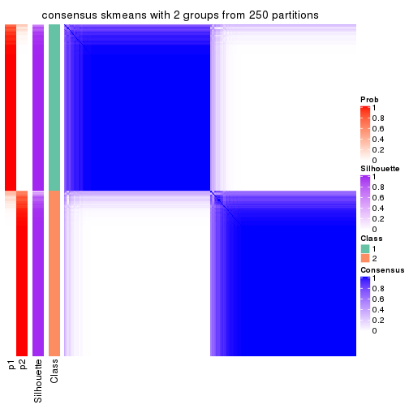</p>

</div>
<div id='tab-MAD-skmeans-consensus-heatmap-2'>
<pre><code class="r">consensus_heatmap(res, k = 3)
</code></pre>

<p>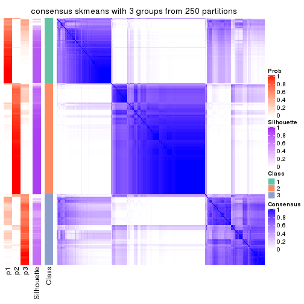</p>

</div>
<div id='tab-MAD-skmeans-consensus-heatmap-3'>
<pre><code class="r">consensus_heatmap(res, k = 4)
</code></pre>

<p>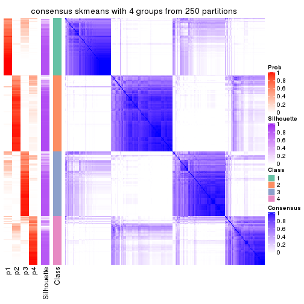</p>

</div>
<div id='tab-MAD-skmeans-consensus-heatmap-4'>
<pre><code class="r">consensus_heatmap(res, k = 5)
</code></pre>

<p>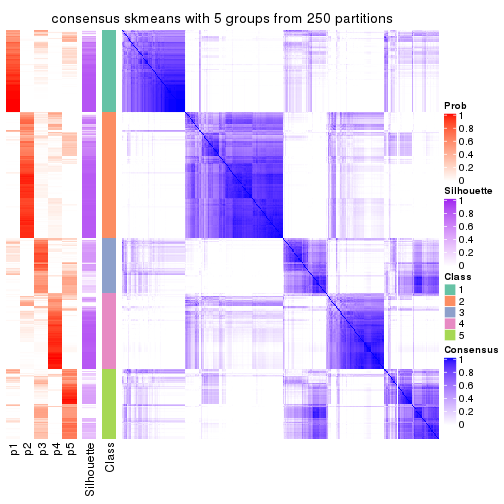</p>

</div>
<div id='tab-MAD-skmeans-consensus-heatmap-5'>
<pre><code class="r">consensus_heatmap(res, k = 6)
</code></pre>

<p>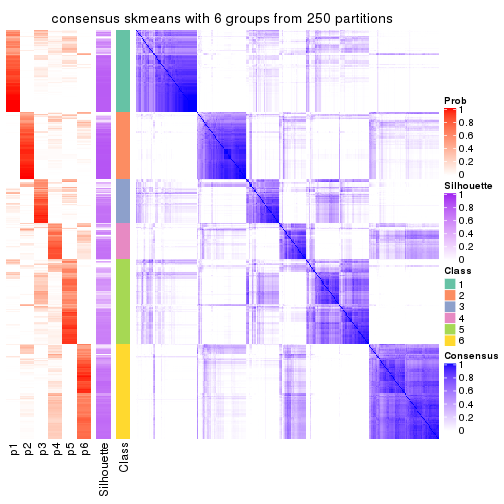</p>

</div>
</div>

Heatmaps for the membership of samples in all partitions to see how consistent they are:


<script>
$( function() {
	$( '#tabs-MAD-skmeans-membership-heatmap' ).tabs();
} );
</script>
<div id='tabs-MAD-skmeans-membership-heatmap'>
<ul>
<li><a href='#tab-MAD-skmeans-membership-heatmap-1'>k = 2</a></li>
<li><a href='#tab-MAD-skmeans-membership-heatmap-2'>k = 3</a></li>
<li><a href='#tab-MAD-skmeans-membership-heatmap-3'>k = 4</a></li>
<li><a href='#tab-MAD-skmeans-membership-heatmap-4'>k = 5</a></li>
<li><a href='#tab-MAD-skmeans-membership-heatmap-5'>k = 6</a></li>
</ul>
<div id='tab-MAD-skmeans-membership-heatmap-1'>
<pre><code class="r">membership_heatmap(res, k = 2)
</code></pre>

<p>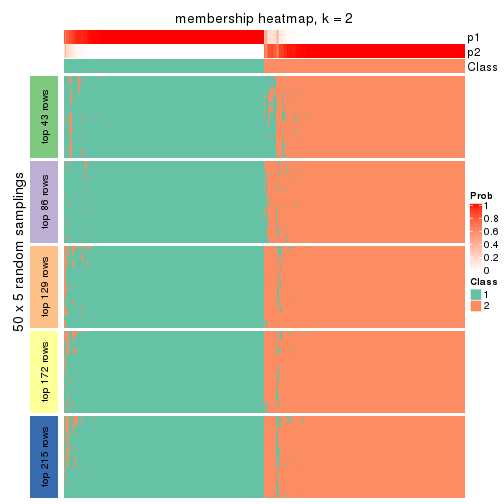</p>

</div>
<div id='tab-MAD-skmeans-membership-heatmap-2'>
<pre><code class="r">membership_heatmap(res, k = 3)
</code></pre>

<p>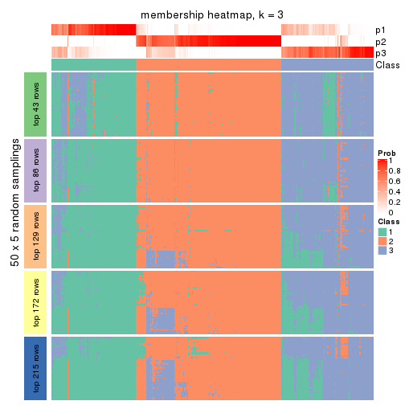</p>

</div>
<div id='tab-MAD-skmeans-membership-heatmap-3'>
<pre><code class="r">membership_heatmap(res, k = 4)
</code></pre>

<p>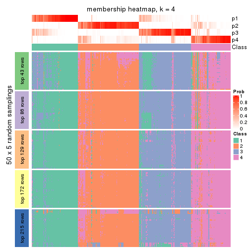</p>

</div>
<div id='tab-MAD-skmeans-membership-heatmap-4'>
<pre><code class="r">membership_heatmap(res, k = 5)
</code></pre>

<p>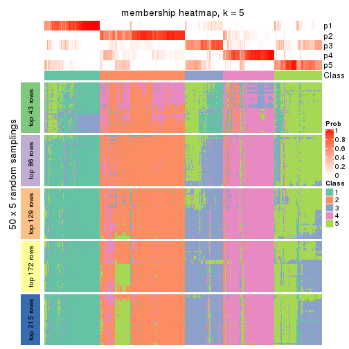</p>

</div>
<div id='tab-MAD-skmeans-membership-heatmap-5'>
<pre><code class="r">membership_heatmap(res, k = 6)
</code></pre>

<p>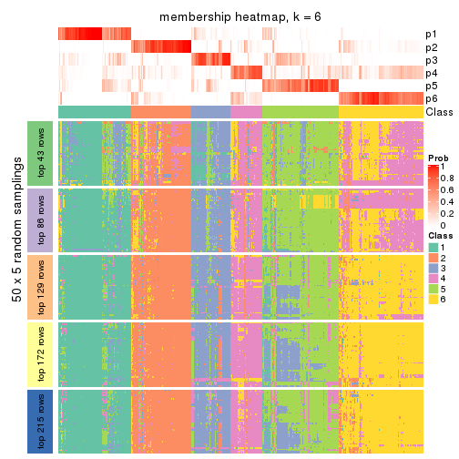</p>

</div>
</div>

As soon as we have had the classes for columns, we can look for signatures
which are significantly different between classes which can be candidate marks
for certain classes. Following are the heatmaps for signatures.


Signature heatmaps where rows are scaled:


<script>
$( function() {
	$( '#tabs-MAD-skmeans-get-signatures' ).tabs();
} );
</script>
<div id='tabs-MAD-skmeans-get-signatures'>
<ul>
<li><a href='#tab-MAD-skmeans-get-signatures-1'>k = 2</a></li>
<li><a href='#tab-MAD-skmeans-get-signatures-2'>k = 3</a></li>
<li><a href='#tab-MAD-skmeans-get-signatures-3'>k = 4</a></li>
<li><a href='#tab-MAD-skmeans-get-signatures-4'>k = 5</a></li>
<li><a href='#tab-MAD-skmeans-get-signatures-5'>k = 6</a></li>
</ul>
<div id='tab-MAD-skmeans-get-signatures-1'>
<pre><code class="r">get_signatures(res, k = 2)
</code></pre>

<p>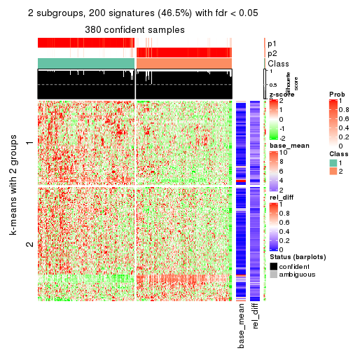</p>

</div>
<div id='tab-MAD-skmeans-get-signatures-2'>
<pre><code class="r">get_signatures(res, k = 3)
</code></pre>

<p>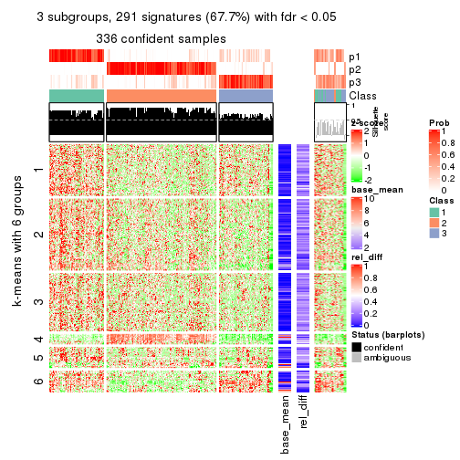</p>

</div>
<div id='tab-MAD-skmeans-get-signatures-3'>
<pre><code class="r">get_signatures(res, k = 4)
</code></pre>

<p>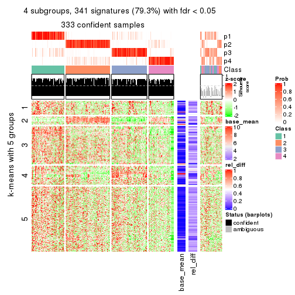</p>

</div>
<div id='tab-MAD-skmeans-get-signatures-4'>
<pre><code class="r">get_signatures(res, k = 5)
</code></pre>

<p>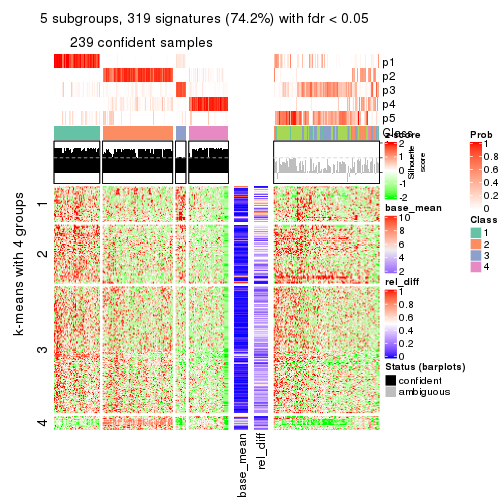</p>

</div>
<div id='tab-MAD-skmeans-get-signatures-5'>
<pre><code class="r">get_signatures(res, k = 6)
</code></pre>

<p>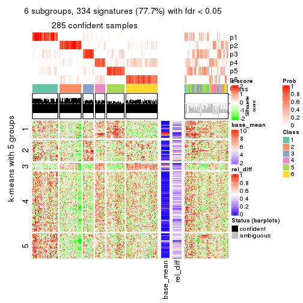</p>

</div>
</div>


Signature heatmaps where rows are not scaled:


<script>
$( function() {
	$( '#tabs-MAD-skmeans-get-signatures-no-scale' ).tabs();
} );
</script>
<div id='tabs-MAD-skmeans-get-signatures-no-scale'>
<ul>
<li><a href='#tab-MAD-skmeans-get-signatures-no-scale-1'>k = 2</a></li>
<li><a href='#tab-MAD-skmeans-get-signatures-no-scale-2'>k = 3</a></li>
<li><a href='#tab-MAD-skmeans-get-signatures-no-scale-3'>k = 4</a></li>
<li><a href='#tab-MAD-skmeans-get-signatures-no-scale-4'>k = 5</a></li>
<li><a href='#tab-MAD-skmeans-get-signatures-no-scale-5'>k = 6</a></li>
</ul>
<div id='tab-MAD-skmeans-get-signatures-no-scale-1'>
<pre><code class="r">get_signatures(res, k = 2, scale_rows = FALSE)
</code></pre>

<p>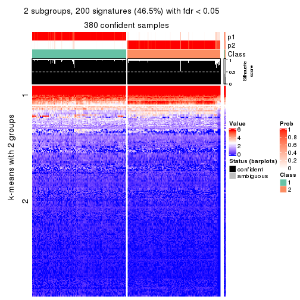</p>

</div>
<div id='tab-MAD-skmeans-get-signatures-no-scale-2'>
<pre><code class="r">get_signatures(res, k = 3, scale_rows = FALSE)
</code></pre>

<p>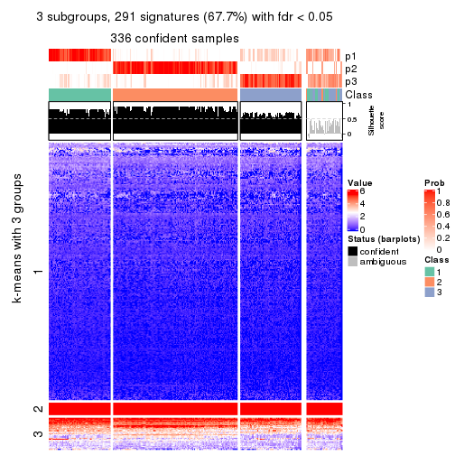</p>

</div>
<div id='tab-MAD-skmeans-get-signatures-no-scale-3'>
<pre><code class="r">get_signatures(res, k = 4, scale_rows = FALSE)
</code></pre>

<p>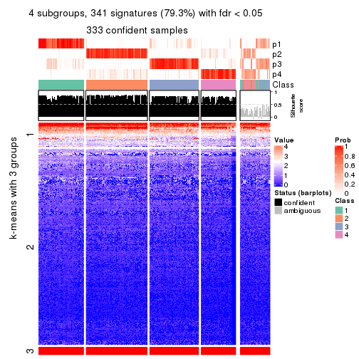</p>

</div>
<div id='tab-MAD-skmeans-get-signatures-no-scale-4'>
<pre><code class="r">get_signatures(res, k = 5, scale_rows = FALSE)
</code></pre>

<p>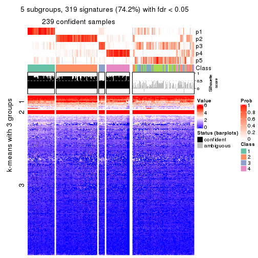</p>

</div>
<div id='tab-MAD-skmeans-get-signatures-no-scale-5'>
<pre><code class="r">get_signatures(res, k = 6, scale_rows = FALSE)
</code></pre>

<p>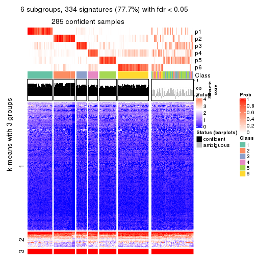</p>

</div>
</div>


Compare the overlap of signatures from different k:

```r
compare_signatures(res)
```

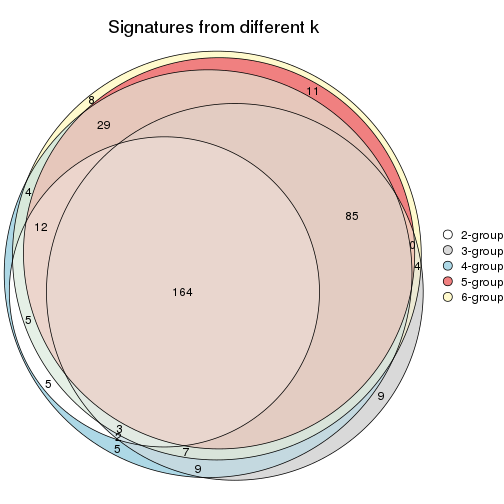

`get_signature()` returns a data frame invisibly. TO get the list of signatures, the function
call should be assigned to a variable explicitly. In following code, if `plot` argument is set
to `FALSE`, no heatmap is plotted while only the differential analysis is performed.

```r
# code only for demonstration
tb = get_signature(res, k = ..., plot = FALSE)
```

An example of the output of `tb` is:

```
#>   which_row         fdr    mean_1    mean_2 scaled_mean_1 scaled_mean_2 km
#> 1        38 0.042760348  8.373488  9.131774    -0.5533452     0.5164555  1
#> 2        40 0.018707592  7.106213  8.469186    -0.6173731     0.5762149  1
#> 3        55 0.019134737 10.221463 11.207825    -0.6159697     0.5749050  1
#> 4        59 0.006059896  5.921854  7.869574    -0.6899429     0.6439467  1
#> 5        60 0.018055526  8.928898 10.211722    -0.6204761     0.5791110  1
#> 6        98 0.009384629 15.714769 14.887706     0.6635654    -0.6193277  2
...
```

The columns in `tb` are:

1. `which_row`: row indices corresponding to the input matrix.
2. `fdr`: FDR for the differential test. 
3. `mean_x`: The mean value in group x.
4. `scaled_mean_x`: The mean value in group x after rows are scaled.
5. `km`: Row groups if k-means clustering is applied to rows.


UMAP plot which shows how samples are separated.


<script>
$( function() {
	$( '#tabs-MAD-skmeans-dimension-reduction' ).tabs();
} );
</script>
<div id='tabs-MAD-skmeans-dimension-reduction'>
<ul>
<li><a href='#tab-MAD-skmeans-dimension-reduction-1'>k = 2</a></li>
<li><a href='#tab-MAD-skmeans-dimension-reduction-2'>k = 3</a></li>
<li><a href='#tab-MAD-skmeans-dimension-reduction-3'>k = 4</a></li>
<li><a href='#tab-MAD-skmeans-dimension-reduction-4'>k = 5</a></li>
<li><a href='#tab-MAD-skmeans-dimension-reduction-5'>k = 6</a></li>
</ul>
<div id='tab-MAD-skmeans-dimension-reduction-1'>
<pre><code class="r">dimension_reduction(res, k = 2, method = &quot;UMAP&quot;)
</code></pre>

<p>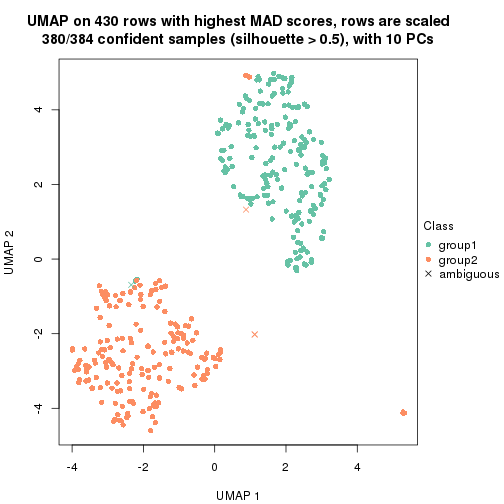</p>

</div>
<div id='tab-MAD-skmeans-dimension-reduction-2'>
<pre><code class="r">dimension_reduction(res, k = 3, method = &quot;UMAP&quot;)
</code></pre>

<p>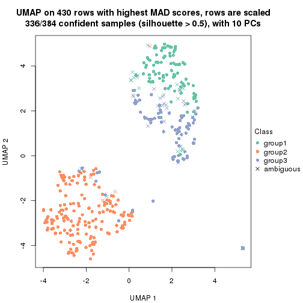</p>

</div>
<div id='tab-MAD-skmeans-dimension-reduction-3'>
<pre><code class="r">dimension_reduction(res, k = 4, method = &quot;UMAP&quot;)
</code></pre>

<p>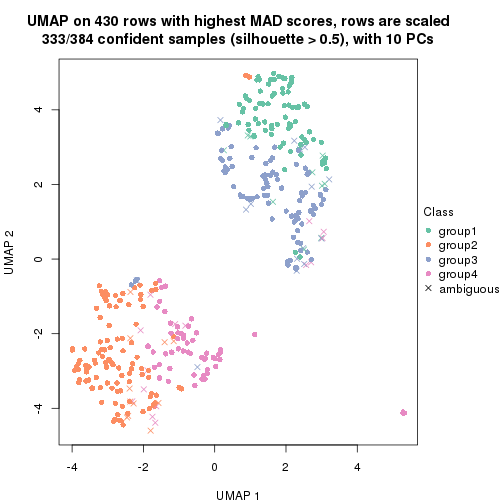</p>

</div>
<div id='tab-MAD-skmeans-dimension-reduction-4'>
<pre><code class="r">dimension_reduction(res, k = 5, method = &quot;UMAP&quot;)
</code></pre>

<p>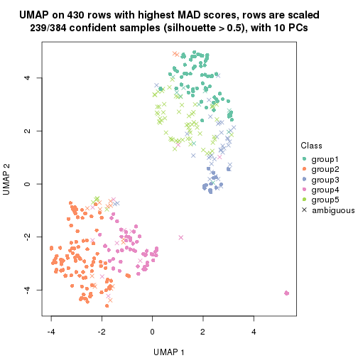</p>

</div>
<div id='tab-MAD-skmeans-dimension-reduction-5'>
<pre><code class="r">dimension_reduction(res, k = 6, method = &quot;UMAP&quot;)
</code></pre>

<p>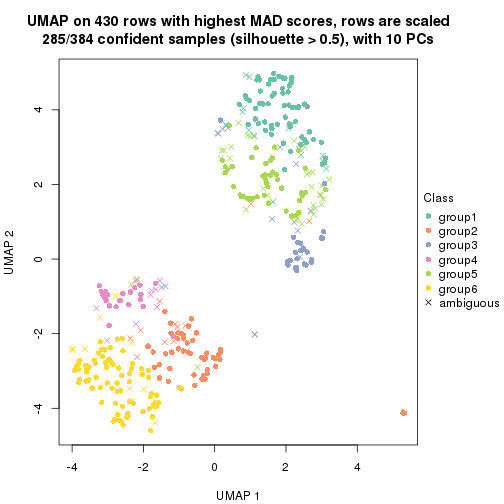</p>

</div>
</div>


Following heatmap shows how subgroups are split when increasing `k`:

```r
collect_classes(res)
```

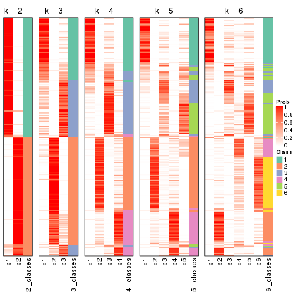


If matrix rows can be associated to genes, consider to use `GO_Enrichment(res,
...)` to perform function enrichment for the signature genes.


 

---------------------------------------------------


### MAD:pam


The object with results only for a single top-value method and a single partition method 
can be extracted as:

```r
res = res_list["MAD", "pam"]
# you can also extract it by
# res = res_list["MAD:pam"]
```

A summary of `res` and all the functions that can be applied to it:

```r
res
```

```
#> A 'ConsensusPartition' object with k = 2, 3, 4, 5, 6.
#>   On a matrix with 430 rows and 384 columns.
#>   Top rows (43, 86, 129, 172, 215) are extracted by 'MAD' method.
#>   Subgroups are detected by 'pam' method.
#>   Performed in total 1250 partitions by row resampling.
#>   Best k for subgroups seems to be 2.
#> 
#> Following methods can be applied to this 'ConsensusPartition' object:
#>  [1] "cola_report"             "collect_classes"         "collect_plots"          
#>  [4] "collect_stats"           "colnames"                "compare_signatures"     
#>  [7] "consensus_heatmap"       "dimension_reduction"     "functional_enrichment"  
#> [10] "get_anno_col"            "get_anno"                "get_classes"            
#> [13] "get_consensus"           "get_matrix"              "get_membership"         
#> [16] "get_param"               "get_signatures"          "get_stats"              
#> [19] "is_best_k"               "is_stable_k"             "membership_heatmap"     
#> [22] "ncol"                    "nrow"                    "plot_ecdf"              
#> [25] "rownames"                "select_partition_number" "show"                   
#> [28] "suggest_best_k"          "test_to_known_factors"
```

`collect_plots()` function collects all the plots made from `res` for all `k` (number of partitions)
into one single page to provide an easy and fast comparison between different `k`.

```r
collect_plots(res)
```

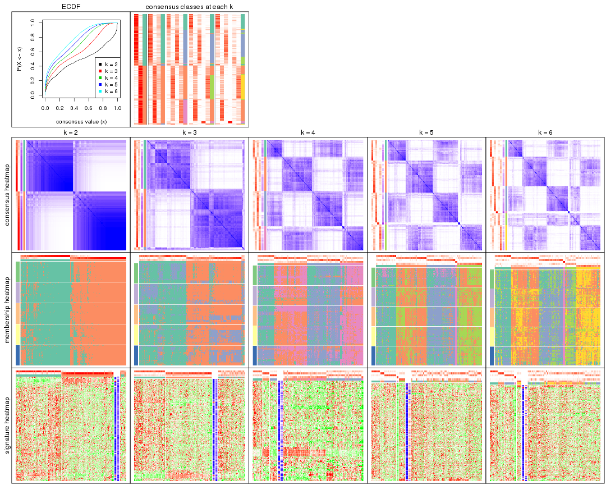

The plots are:

- The first row: a plot of the ECDF (Empirical cumulative distribution
  function) curves of the consensus matrix for each `k` and the heatmap of
  predicted classes for each `k`.
- The second row: heatmaps of the consensus matrix for each `k`.
- The third row: heatmaps of the membership matrix for each `k`.
- The fouth row: heatmaps of the signatures for each `k`.

All the plots in panels can be made by individual functions and they are
plotted later in this section.

`select_partition_number()` produces several plots showing different
statistics for choosing "optimized" `k`. There are following statistics:

- ECDF curves of the consensus matrix for each `k`;
- 1-PAC. [The PAC
  score](https://en.wikipedia.org/wiki/Consensus_clustering#Over-interpretation_potential_of_consensus_clustering)
  measures the proportion of the ambiguous subgrouping.
- Mean silhouette score.
- Concordance. The mean probability of fiting the consensus class ids in all
  partitions.
- Area increased. Denote $A_k$ as the area under the ECDF curve for current
  `k`, the area increased is defined as $A_k - A_{k-1}$.
- Rand index. The percent of pairs of samples that are both in a same cluster
  or both are not in a same cluster in the partition of k and k-1.
- Jaccard index. The ratio of pairs of samples are both in a same cluster in
  the partition of k and k-1 and the pairs of samples are both in a same
  cluster in the partition k or k-1.

The detailed explanations of these statistics can be found in [the cola
vignette](http://bioconductor.org/packages/devel/bioc/vignettes/cola/inst/doc/cola.html#toc_13).

Generally speaking, lower PAC score, higher mean silhouette score or higher
concordance corresponds to better partition. Rand index and Jaccard index
measure how similar the current partition is compared to partition with `k-1`.
If they are too similar, we won't accept `k` is better than `k-1`.

```r
select_partition_number(res)
```

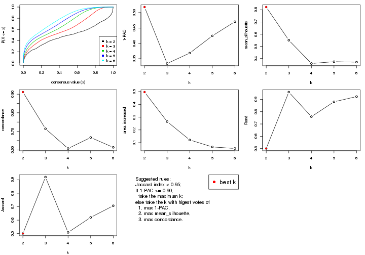

The numeric values for all these statistics can be obtained by `get_stats()`.

```r
get_stats(res)
```

```
#>   k 1-PAC mean_silhouette concordance area_increased  Rand Jaccard
#> 2 2 0.518           0.822       0.911         0.4964 0.501   0.501
#> 3 3 0.334           0.550       0.714         0.2653 0.959   0.920
#> 4 4 0.368           0.359       0.608         0.1215 0.760   0.509
#> 5 5 0.424           0.374       0.667         0.0669 0.880   0.620
#> 6 6 0.471           0.370       0.614         0.0545 0.923   0.707
```

`suggest_best_k()` suggests the best $k$ based on these statistics. The rules are as follows:

- All $k$ with Jaccard index larger than 0.95 are removed because the increase of
  the partition number does not provides enough extra information. If all $k$ are removed,
  the best $k$ is assigned by `NA`.
- For $k$ with 1-PAC larger than 0.9, the maximal $k$ is taken as the "best k". Other $k$ is called "optional k".
- If it does not fit the second rule. The $k$ with the highest vote of highest
  1-PAC, mean silhouette and concordance is taken as the "best k".

```r
suggest_best_k(res)
```

```
#> [1] 2
```


Following shows the table of the partitions (You need to click the **show/hide
code output** link to see it). The membership matrix (columns with name `p*`)
is inferred by
[`clue::cl_consensus()`](https://www.rdocumentation.org/link/cl_consensus?package=clue)
function with the `SE` method. Basically the value in the membership matrix
represents the probability to belong to a certain group. The finall class
label for an item is determined with the group with highest probability it
belongs to.

In `get_classes()` function, the entropy is calculated from the membership
matrix and the silhouette score is calculated from the consensus matrix.


<script>
$( function() {
	$( '#tabs-MAD-pam-get-classes' ).tabs();
} );
</script>
<div id='tabs-MAD-pam-get-classes'>
<ul>
<li><a href='#tab-MAD-pam-get-classes-1'>k = 2</a></li>
<li><a href='#tab-MAD-pam-get-classes-2'>k = 3</a></li>
<li><a href='#tab-MAD-pam-get-classes-3'>k = 4</a></li>
<li><a href='#tab-MAD-pam-get-classes-4'>k = 5</a></li>
<li><a href='#tab-MAD-pam-get-classes-5'>k = 6</a></li>
</ul>

<div id='tab-MAD-pam-get-classes-1'>
<p><a id='tab-MAD-pam-get-classes-1-a' style='color:#0366d6' href='#'>show/hide code output</a></p>
<pre><code class="r">cbind(get_classes(res, k = 2), get_membership(res, k = 2))
</code></pre>

<pre><code>#&gt;            class entropy silhouette    p1    p2
#&gt; SRR2105277     1  0.1414     0.8914 0.980 0.020
#&gt; SRR2105278     1  0.1414     0.8899 0.980 0.020
#&gt; SRR2105275     1  0.9933     0.2543 0.548 0.452
#&gt; SRR2105276     1  0.1414     0.8917 0.980 0.020
#&gt; SRR2105273     1  0.0000     0.8876 1.000 0.000
#&gt; SRR2105274     1  0.0000     0.8876 1.000 0.000
#&gt; SRR2105271     1  0.1414     0.8912 0.980 0.020
#&gt; SRR2105272     1  0.0672     0.8900 0.992 0.008
#&gt; SRR2105269     2  0.0000     0.9122 0.000 1.000
#&gt; SRR2105270     2  0.0000     0.9122 0.000 1.000
#&gt; SRR2105267     2  0.0000     0.9122 0.000 1.000
#&gt; SRR2105268     2  0.0000     0.9122 0.000 1.000
#&gt; SRR2105265     2  0.1184     0.9095 0.016 0.984
#&gt; SRR2105266     2  0.0000     0.9122 0.000 1.000
#&gt; SRR2105263     2  0.7056     0.7699 0.192 0.808
#&gt; SRR2105264     2  0.6801     0.7857 0.180 0.820
#&gt; SRR2105261     2  0.9323     0.4481 0.348 0.652
#&gt; SRR2105262     2  0.9896     0.2028 0.440 0.560
#&gt; SRR2105357     1  0.9996     0.0526 0.512 0.488
#&gt; SRR2105358     1  0.1184     0.8912 0.984 0.016
#&gt; SRR2105439     2  0.0376     0.9118 0.004 0.996
#&gt; SRR2105440     2  0.4815     0.8593 0.104 0.896
#&gt; SRR2105509     2  0.0000     0.9122 0.000 1.000
#&gt; SRR2105510     2  0.0000     0.9122 0.000 1.000
#&gt; SRR2105507     1  0.0000     0.8876 1.000 0.000
#&gt; SRR2105508     1  0.1184     0.8908 0.984 0.016
#&gt; SRR2105505     1  0.2043     0.8891 0.968 0.032
#&gt; SRR2105506     1  0.0376     0.8889 0.996 0.004
#&gt; SRR2105503     2  0.0000     0.9122 0.000 1.000
#&gt; SRR2105504     2  0.0000     0.9122 0.000 1.000
#&gt; SRR2105501     2  0.5946     0.8246 0.144 0.856
#&gt; SRR2105502     2  0.0000     0.9122 0.000 1.000
#&gt; SRR2105499     1  0.3431     0.8767 0.936 0.064
#&gt; SRR2105500     1  0.2948     0.8843 0.948 0.052
#&gt; SRR2105497     2  0.0938     0.9104 0.012 0.988
#&gt; SRR2105498     2  0.8555     0.6457 0.280 0.720
#&gt; SRR2105495     2  0.0000     0.9122 0.000 1.000
#&gt; SRR2105496     2  0.4690     0.8659 0.100 0.900
#&gt; SRR2105493     2  0.6531     0.7935 0.168 0.832
#&gt; SRR2105494     2  0.5408     0.8414 0.124 0.876
#&gt; SRR2105491     2  0.3879     0.8746 0.076 0.924
#&gt; SRR2105492     2  0.3431     0.8889 0.064 0.936
#&gt; SRR2105489     2  0.2043     0.9037 0.032 0.968
#&gt; SRR2105490     2  0.5946     0.8195 0.144 0.856
#&gt; SRR2105487     1  0.9732     0.3851 0.596 0.404
#&gt; SRR2105488     1  0.3114     0.8823 0.944 0.056
#&gt; SRR2105485     1  0.2778     0.8869 0.952 0.048
#&gt; SRR2105486     1  0.1633     0.8908 0.976 0.024
#&gt; SRR2105483     1  0.2043     0.8890 0.968 0.032
#&gt; SRR2105484     1  0.0672     0.8894 0.992 0.008
#&gt; SRR2105481     1  0.2948     0.8827 0.948 0.052
#&gt; SRR2105482     1  0.0000     0.8876 1.000 0.000
#&gt; SRR2105479     1  0.8081     0.7119 0.752 0.248
#&gt; SRR2105480     1  0.0672     0.8902 0.992 0.008
#&gt; SRR2105477     2  0.6247     0.8115 0.156 0.844
#&gt; SRR2105478     2  0.1184     0.9097 0.016 0.984
#&gt; SRR2105475     2  0.0376     0.9115 0.004 0.996
#&gt; SRR2105476     2  0.0376     0.9115 0.004 0.996
#&gt; SRR2105473     2  0.6623     0.8017 0.172 0.828
#&gt; SRR2105474     2  0.7602     0.7300 0.220 0.780
#&gt; SRR2105471     2  0.0000     0.9122 0.000 1.000
#&gt; SRR2105472     2  0.1843     0.9041 0.028 0.972
#&gt; SRR2105469     1  0.6623     0.8048 0.828 0.172
#&gt; SRR2105470     1  0.6531     0.8060 0.832 0.168
#&gt; SRR2105467     1  0.1633     0.8913 0.976 0.024
#&gt; SRR2105468     1  0.0938     0.8911 0.988 0.012
#&gt; SRR2105465     1  0.8016     0.7063 0.756 0.244
#&gt; SRR2105466     1  0.6712     0.7878 0.824 0.176
#&gt; SRR2105463     1  0.0376     0.8891 0.996 0.004
#&gt; SRR2105464     1  0.0000     0.8876 1.000 0.000
#&gt; SRR2105461     2  0.0000     0.9122 0.000 1.000
#&gt; SRR2105462     2  0.0000     0.9122 0.000 1.000
#&gt; SRR2105459     2  0.0000     0.9122 0.000 1.000
#&gt; SRR2105460     2  0.0000     0.9122 0.000 1.000
#&gt; SRR2105457     1  0.9491     0.5016 0.632 0.368
#&gt; SRR2105458     1  0.9710     0.4285 0.600 0.400
#&gt; SRR2105455     1  0.3584     0.8806 0.932 0.068
#&gt; SRR2105456     1  0.0000     0.8876 1.000 0.000
#&gt; SRR2105453     1  0.1414     0.8908 0.980 0.020
#&gt; SRR2105454     1  0.2043     0.8889 0.968 0.032
#&gt; SRR2105451     2  0.5294     0.8478 0.120 0.880
#&gt; SRR2105452     2  0.1633     0.9060 0.024 0.976
#&gt; SRR2105449     1  0.6148     0.8128 0.848 0.152
#&gt; SRR2105450     1  0.0000     0.8876 1.000 0.000
#&gt; SRR2105447     2  0.0938     0.9105 0.012 0.988
#&gt; SRR2105448     2  0.0000     0.9122 0.000 1.000
#&gt; SRR2105445     2  0.6247     0.8124 0.156 0.844
#&gt; SRR2105446     1  0.8327     0.6766 0.736 0.264
#&gt; SRR2105443     2  0.5519     0.8299 0.128 0.872
#&gt; SRR2105444     2  0.7453     0.7229 0.212 0.788
#&gt; SRR2105441     2  0.0376     0.9119 0.004 0.996
#&gt; SRR2105442     2  0.6438     0.8027 0.164 0.836
#&gt; SRR2105437     1  0.0376     0.8892 0.996 0.004
#&gt; SRR2105438     1  0.2043     0.8885 0.968 0.032
#&gt; SRR2105435     1  0.6048     0.8277 0.852 0.148
#&gt; SRR2105436     1  0.0376     0.8890 0.996 0.004
#&gt; SRR2105433     1  0.0938     0.8911 0.988 0.012
#&gt; SRR2105434     1  0.0000     0.8876 1.000 0.000
#&gt; SRR2105431     1  0.0672     0.8903 0.992 0.008
#&gt; SRR2105432     1  0.0672     0.8897 0.992 0.008
#&gt; SRR2105429     2  0.7056     0.7675 0.192 0.808
#&gt; SRR2105430     2  0.2778     0.8957 0.048 0.952
#&gt; SRR2105427     2  0.0672     0.9113 0.008 0.992
#&gt; SRR2105428     2  0.0000     0.9122 0.000 1.000
#&gt; SRR2105425     2  0.0672     0.9111 0.008 0.992
#&gt; SRR2105426     2  0.1843     0.9057 0.028 0.972
#&gt; SRR2105421     2  0.9635     0.3306 0.388 0.612
#&gt; SRR2105422     2  0.9833     0.2061 0.424 0.576
#&gt; SRR2105423     2  0.0938     0.9106 0.012 0.988
#&gt; SRR2105424     2  0.0000     0.9122 0.000 1.000
#&gt; SRR2105419     1  0.3431     0.8821 0.936 0.064
#&gt; SRR2105420     1  0.6048     0.8266 0.852 0.148
#&gt; SRR2105415     1  0.0376     0.8885 0.996 0.004
#&gt; SRR2105416     1  0.1633     0.8904 0.976 0.024
#&gt; SRR2105417     1  0.0672     0.8904 0.992 0.008
#&gt; SRR2105418     1  0.0938     0.8907 0.988 0.012
#&gt; SRR2105413     2  0.0000     0.9122 0.000 1.000
#&gt; SRR2105414     2  0.1633     0.9057 0.024 0.976
#&gt; SRR2105409     2  0.0000     0.9122 0.000 1.000
#&gt; SRR2105410     2  0.4161     0.8728 0.084 0.916
#&gt; SRR2105411     2  0.3584     0.8818 0.068 0.932
#&gt; SRR2105412     2  0.1633     0.9063 0.024 0.976
#&gt; SRR2105407     1  0.2948     0.8859 0.948 0.052
#&gt; SRR2105408     1  0.8713     0.6521 0.708 0.292
#&gt; SRR2105403     1  0.4431     0.8650 0.908 0.092
#&gt; SRR2105404     1  0.0376     0.8889 0.996 0.004
#&gt; SRR2105405     1  0.1414     0.8907 0.980 0.020
#&gt; SRR2105406     1  0.4022     0.8740 0.920 0.080
#&gt; SRR2105401     2  0.1184     0.9087 0.016 0.984
#&gt; SRR2105402     2  0.0376     0.9120 0.004 0.996
#&gt; SRR2105399     2  0.1633     0.9064 0.024 0.976
#&gt; SRR2105400     2  0.2603     0.8954 0.044 0.956
#&gt; SRR2105397     2  0.5178     0.8402 0.116 0.884
#&gt; SRR2105398     2  0.4161     0.8691 0.084 0.916
#&gt; SRR2105395     2  0.0000     0.9122 0.000 1.000
#&gt; SRR2105396     2  0.4431     0.8711 0.092 0.908
#&gt; SRR2105393     2  0.0376     0.9120 0.004 0.996
#&gt; SRR2105394     2  0.0000     0.9122 0.000 1.000
#&gt; SRR2105389     1  0.2948     0.8835 0.948 0.052
#&gt; SRR2105390     1  0.0000     0.8876 1.000 0.000
#&gt; SRR2105391     1  0.8861     0.6266 0.696 0.304
#&gt; SRR2105392     1  0.5946     0.8263 0.856 0.144
#&gt; SRR2105385     1  0.1184     0.8911 0.984 0.016
#&gt; SRR2105386     1  0.0376     0.8892 0.996 0.004
#&gt; SRR2105387     1  0.3879     0.8734 0.924 0.076
#&gt; SRR2105388     1  0.0000     0.8876 1.000 0.000
#&gt; SRR2105381     2  0.5519     0.8255 0.128 0.872
#&gt; SRR2105382     2  0.0672     0.9115 0.008 0.992
#&gt; SRR2105383     2  0.9044     0.5494 0.320 0.680
#&gt; SRR2105384     2  0.9170     0.5276 0.332 0.668
#&gt; SRR2105379     2  0.0376     0.9120 0.004 0.996
#&gt; SRR2105380     2  0.6712     0.7828 0.176 0.824
#&gt; SRR2105377     2  0.0672     0.9111 0.008 0.992
#&gt; SRR2105378     2  0.1633     0.9072 0.024 0.976
#&gt; SRR2105375     2  0.9850     0.2262 0.428 0.572
#&gt; SRR2105376     1  0.7056     0.7732 0.808 0.192
#&gt; SRR2105373     1  0.0938     0.8910 0.988 0.012
#&gt; SRR2105374     1  0.0000     0.8876 1.000 0.000
#&gt; SRR2105371     1  0.0672     0.8899 0.992 0.008
#&gt; SRR2105372     1  0.0376     0.8891 0.996 0.004
#&gt; SRR2105369     1  0.0000     0.8876 1.000 0.000
#&gt; SRR2105370     1  0.0376     0.8890 0.996 0.004
#&gt; SRR2105367     1  0.8327     0.6702 0.736 0.264
#&gt; SRR2105368     1  0.7815     0.7144 0.768 0.232
#&gt; SRR2105365     2  0.2948     0.8900 0.052 0.948
#&gt; SRR2105366     2  0.0000     0.9122 0.000 1.000
#&gt; SRR2105363     2  0.0376     0.9117 0.004 0.996
#&gt; SRR2105364     2  0.0000     0.9122 0.000 1.000
#&gt; SRR2105361     2  0.0000     0.9122 0.000 1.000
#&gt; SRR2105362     2  0.2043     0.9016 0.032 0.968
#&gt; SRR2105359     1  0.7745     0.7354 0.772 0.228
#&gt; SRR2105360     1  0.2423     0.8890 0.960 0.040
#&gt; SRR2105355     1  0.9248     0.5605 0.660 0.340
#&gt; SRR2105356     1  0.0000     0.8876 1.000 0.000
#&gt; SRR2105353     1  0.8081     0.7093 0.752 0.248
#&gt; SRR2105354     1  0.1843     0.8887 0.972 0.028
#&gt; SRR2105351     2  0.0000     0.9122 0.000 1.000
#&gt; SRR2105352     2  0.0938     0.9103 0.012 0.988
#&gt; SRR2105349     2  0.0376     0.9115 0.004 0.996
#&gt; SRR2105350     2  0.0376     0.9118 0.004 0.996
#&gt; SRR2105345     2  0.1633     0.9068 0.024 0.976
#&gt; SRR2105346     2  0.3879     0.8760 0.076 0.924
#&gt; SRR2105347     2  0.9427     0.4704 0.360 0.640
#&gt; SRR2105348     2  0.9000     0.5669 0.316 0.684
#&gt; SRR2105343     2  0.0000     0.9122 0.000 1.000
#&gt; SRR2105344     2  0.0672     0.9113 0.008 0.992
#&gt; SRR2105341     1  0.3733     0.8757 0.928 0.072
#&gt; SRR2105342     1  0.0672     0.8901 0.992 0.008
#&gt; SRR2105339     1  0.4161     0.8724 0.916 0.084
#&gt; SRR2105340     1  0.3114     0.8827 0.944 0.056
#&gt; SRR2105335     1  0.0672     0.8898 0.992 0.008
#&gt; SRR2105336     1  0.0000     0.8876 1.000 0.000
#&gt; SRR2105337     1  0.0938     0.8907 0.988 0.012
#&gt; SRR2105338     1  0.0000     0.8876 1.000 0.000
#&gt; SRR2105331     2  0.0000     0.9122 0.000 1.000
#&gt; SRR2105332     2  0.0000     0.9122 0.000 1.000
#&gt; SRR2105333     2  0.0000     0.9122 0.000 1.000
#&gt; SRR2105334     2  0.0376     0.9119 0.004 0.996
#&gt; SRR2105329     2  0.5519     0.8351 0.128 0.872
#&gt; SRR2105330     2  0.6973     0.7619 0.188 0.812
#&gt; SRR2105327     2  0.3274     0.8851 0.060 0.940
#&gt; SRR2105328     2  0.0000     0.9122 0.000 1.000
#&gt; SRR2105325     1  0.1843     0.8907 0.972 0.028
#&gt; SRR2105326     1  0.0376     0.8891 0.996 0.004
#&gt; SRR2105323     2  0.8499     0.5983 0.276 0.724
#&gt; SRR2105324     1  0.7376     0.7652 0.792 0.208
#&gt; SRR2105319     1  0.0000     0.8876 1.000 0.000
#&gt; SRR2105320     1  0.0000     0.8876 1.000 0.000
#&gt; SRR2105321     1  0.3274     0.8783 0.940 0.060
#&gt; SRR2105322     1  0.0376     0.8891 0.996 0.004
#&gt; SRR2105317     2  0.0000     0.9122 0.000 1.000
#&gt; SRR2105318     2  0.0000     0.9122 0.000 1.000
#&gt; SRR2105315     2  0.7674     0.7235 0.224 0.776
#&gt; SRR2105316     2  0.1843     0.9041 0.028 0.972
#&gt; SRR2105313     2  0.0000     0.9122 0.000 1.000
#&gt; SRR2105314     2  0.0000     0.9122 0.000 1.000
#&gt; SRR2105311     1  0.9087     0.5928 0.676 0.324
#&gt; SRR2105312     1  0.8608     0.6645 0.716 0.284
#&gt; SRR2105307     1  0.6531     0.8141 0.832 0.168
#&gt; SRR2105308     1  0.2423     0.8876 0.960 0.040
#&gt; SRR2105309     1  0.9710     0.4178 0.600 0.400
#&gt; SRR2105310     1  0.3879     0.8740 0.924 0.076
#&gt; SRR2105305     1  0.7602     0.7504 0.780 0.220
#&gt; SRR2105306     1  0.2423     0.8873 0.960 0.040
#&gt; SRR2105303     2  0.0000     0.9122 0.000 1.000
#&gt; SRR2105304     2  0.0000     0.9122 0.000 1.000
#&gt; SRR2105301     2  0.0938     0.9105 0.012 0.988
#&gt; SRR2105302     2  0.0000     0.9122 0.000 1.000
#&gt; SRR2105299     2  0.8144     0.6751 0.252 0.748
#&gt; SRR2105300     2  0.4690     0.8618 0.100 0.900
#&gt; SRR2105297     2  0.9775     0.3330 0.412 0.588
#&gt; SRR2105298     2  0.9815     0.3103 0.420 0.580
#&gt; SRR2105295     2  0.0000     0.9122 0.000 1.000
#&gt; SRR2105296     2  0.0000     0.9122 0.000 1.000
#&gt; SRR2105293     1  0.6712     0.8004 0.824 0.176
#&gt; SRR2105294     1  0.0376     0.8893 0.996 0.004
#&gt; SRR2105291     1  0.5946     0.8326 0.856 0.144
#&gt; SRR2105292     1  0.4298     0.8630 0.912 0.088
#&gt; SRR2105289     1  0.6887     0.7869 0.816 0.184
#&gt; SRR2105290     1  0.0000     0.8876 1.000 0.000
#&gt; SRR2105287     1  0.1633     0.8912 0.976 0.024
#&gt; SRR2105288     1  0.1633     0.8899 0.976 0.024
#&gt; SRR2105285     2  0.0376     0.9120 0.004 0.996
#&gt; SRR2105286     2  0.0000     0.9122 0.000 1.000
#&gt; SRR2105283     2  0.8608     0.6312 0.284 0.716
#&gt; SRR2105284     2  0.7602     0.7375 0.220 0.780
#&gt; SRR2105281     2  0.0000     0.9122 0.000 1.000
#&gt; SRR2105282     2  0.0000     0.9122 0.000 1.000
#&gt; SRR2105259     1  0.8327     0.6909 0.736 0.264
#&gt; SRR2105260     1  0.9775     0.3969 0.588 0.412
#&gt; SRR2105279     2  0.0000     0.9122 0.000 1.000
#&gt; SRR2105280     2  0.0000     0.9122 0.000 1.000
#&gt; SRR2105257     1  0.0000     0.8876 1.000 0.000
#&gt; SRR2105258     1  0.0672     0.8900 0.992 0.008
#&gt; SRR2105253     2  0.0376     0.9115 0.004 0.996
#&gt; SRR2105254     2  0.0376     0.9115 0.004 0.996
#&gt; SRR2105255     1  0.0376     0.8891 0.996 0.004
#&gt; SRR2105256     1  0.0000     0.8876 1.000 0.000
#&gt; SRR2105251     2  0.0000     0.9122 0.000 1.000
#&gt; SRR2105252     2  0.0000     0.9122 0.000 1.000
#&gt; SRR2105249     2  0.0000     0.9122 0.000 1.000
#&gt; SRR2105250     2  0.7883     0.7056 0.236 0.764
#&gt; SRR2105247     2  0.3733     0.8841 0.072 0.928
#&gt; SRR2105248     2  0.0000     0.9122 0.000 1.000
#&gt; SRR2105245     1  0.7299     0.7631 0.796 0.204
#&gt; SRR2105246     1  0.8813     0.6293 0.700 0.300
#&gt; SRR2105243     1  0.0938     0.8910 0.988 0.012
#&gt; SRR2105244     1  0.2603     0.8871 0.956 0.044
#&gt; SRR2105241     1  0.0376     0.8891 0.996 0.004
#&gt; SRR2105242     1  0.0000     0.8876 1.000 0.000
#&gt; SRR2105239     1  0.1184     0.8913 0.984 0.016
#&gt; SRR2105240     1  0.0000     0.8876 1.000 0.000
#&gt; SRR2105237     2  0.1184     0.9093 0.016 0.984
#&gt; SRR2105238     2  0.0000     0.9122 0.000 1.000
#&gt; SRR2105235     2  0.0376     0.9118 0.004 0.996
#&gt; SRR2105236     2  0.2043     0.9031 0.032 0.968
#&gt; SRR2105233     2  0.0376     0.9115 0.004 0.996
#&gt; SRR2105234     2  0.0000     0.9122 0.000 1.000
#&gt; SRR2105231     2  0.0000     0.9122 0.000 1.000
#&gt; SRR2105232     2  0.0000     0.9122 0.000 1.000
#&gt; SRR2105227     2  0.8813     0.5729 0.300 0.700
#&gt; SRR2105228     2  0.9710     0.3104 0.400 0.600
#&gt; SRR2105225     1  0.1633     0.8908 0.976 0.024
#&gt; SRR2105226     1  0.0000     0.8876 1.000 0.000
#&gt; SRR2105229     1  0.9732     0.4228 0.596 0.404
#&gt; SRR2105230     1  0.6247     0.8142 0.844 0.156
#&gt; SRR2105219     2  0.0376     0.9120 0.004 0.996
#&gt; SRR2105220     2  0.0000     0.9122 0.000 1.000
#&gt; SRR2105221     2  0.7056     0.7746 0.192 0.808
#&gt; SRR2105222     2  0.8608     0.6299 0.284 0.716
#&gt; SRR2105223     1  0.0000     0.8876 1.000 0.000
#&gt; SRR2105224     1  0.0000     0.8876 1.000 0.000
#&gt; SRR2105217     2  0.0000     0.9122 0.000 1.000
#&gt; SRR2105218     2  0.0000     0.9122 0.000 1.000
#&gt; SRR2105215     2  0.0000     0.9122 0.000 1.000
#&gt; SRR2105216     2  0.0000     0.9122 0.000 1.000
#&gt; SRR2105213     1  0.8081     0.7231 0.752 0.248
#&gt; SRR2105214     1  0.9170     0.5793 0.668 0.332
#&gt; SRR2105211     1  0.9954     0.2462 0.540 0.460
#&gt; SRR2105212     1  0.6247     0.8183 0.844 0.156
#&gt; SRR2105209     1  0.0000     0.8876 1.000 0.000
#&gt; SRR2105210     1  0.0000     0.8876 1.000 0.000
#&gt; SRR2105207     1  0.8016     0.6956 0.756 0.244
#&gt; SRR2105208     1  0.1633     0.8901 0.976 0.024
#&gt; SRR2105205     2  0.3274     0.8856 0.060 0.940
#&gt; SRR2105206     2  0.5737     0.8316 0.136 0.864
#&gt; SRR2105201     2  0.6801     0.7847 0.180 0.820
#&gt; SRR2105202     2  0.5294     0.8442 0.120 0.880
#&gt; SRR2105203     2  0.0000     0.9122 0.000 1.000
#&gt; SRR2105204     2  0.0000     0.9122 0.000 1.000
#&gt; SRR2105199     2  0.0000     0.9122 0.000 1.000
#&gt; SRR2105200     2  0.6343     0.8025 0.160 0.840
#&gt; SRR2105197     1  0.3879     0.8741 0.924 0.076
#&gt; SRR2105198     2  1.0000    -0.0708 0.500 0.500
#&gt; SRR2105195     1  0.9983     0.0968 0.524 0.476
#&gt; SRR2105196     1  0.7453     0.7473 0.788 0.212
#&gt; SRR2105193     1  0.1184     0.8911 0.984 0.016
#&gt; SRR2105194     1  0.0000     0.8876 1.000 0.000
#&gt; SRR2105191     1  0.4431     0.8677 0.908 0.092
#&gt; SRR2105192     1  0.0000     0.8876 1.000 0.000
#&gt; SRR2105189     2  0.7219     0.7644 0.200 0.800
#&gt; SRR2105190     2  0.0376     0.9119 0.004 0.996
#&gt; SRR2105187     2  0.2043     0.9035 0.032 0.968
#&gt; SRR2105188     2  0.6623     0.8009 0.172 0.828
#&gt; SRR2105179     1  0.2948     0.8844 0.948 0.052
#&gt; SRR2105180     1  0.2043     0.8894 0.968 0.032
#&gt; SRR2105183     2  0.0938     0.9099 0.012 0.988
#&gt; SRR2105184     2  0.2603     0.8961 0.044 0.956
#&gt; SRR2105185     2  0.0938     0.9106 0.012 0.988
#&gt; SRR2105186     2  0.2423     0.9005 0.040 0.960
#&gt; SRR2105181     1  0.8386     0.6818 0.732 0.268
#&gt; SRR2105182     1  0.0000     0.8876 1.000 0.000
#&gt; SRR2105177     1  0.3584     0.8748 0.932 0.068
#&gt; SRR2105178     1  0.0938     0.8903 0.988 0.012
#&gt; SRR2105171     2  0.0000     0.9122 0.000 1.000
#&gt; SRR2105172     2  0.0000     0.9122 0.000 1.000
#&gt; SRR2105175     1  0.5946     0.8225 0.856 0.144
#&gt; SRR2105176     1  0.0000     0.8876 1.000 0.000
#&gt; SRR2105173     2  0.0000     0.9122 0.000 1.000
#&gt; SRR2105174     2  0.0376     0.9118 0.004 0.996
#&gt; SRR2105169     2  0.0000     0.9122 0.000 1.000
#&gt; SRR2105170     2  0.9000     0.5783 0.316 0.684
#&gt; SRR2105167     2  0.0000     0.9122 0.000 1.000
#&gt; SRR2105168     2  0.0000     0.9122 0.000 1.000
#&gt; SRR2105165     1  0.0376     0.8891 0.996 0.004
#&gt; SRR2105166     1  0.0672     0.8900 0.992 0.008
#&gt; SRR2105163     1  0.9944     0.2329 0.544 0.456
#&gt; SRR2105164     1  0.4690     0.8619 0.900 0.100
#&gt; SRR2105161     1  0.2603     0.8873 0.956 0.044
#&gt; SRR2105162     1  0.6343     0.8022 0.840 0.160
#&gt; SRR2105155     2  0.0000     0.9122 0.000 1.000
#&gt; SRR2105156     2  0.0000     0.9122 0.000 1.000
#&gt; SRR2105157     2  0.0000     0.9122 0.000 1.000
#&gt; SRR2105158     2  0.0000     0.9122 0.000 1.000
#&gt; SRR2105159     1  0.9460     0.5131 0.636 0.364
#&gt; SRR2105160     1  0.5294     0.8489 0.880 0.120
#&gt; SRR2105153     2  0.0938     0.9102 0.012 0.988
#&gt; SRR2105154     2  0.0000     0.9122 0.000 1.000
#&gt; SRR2105151     2  0.1633     0.9069 0.024 0.976
#&gt; SRR2105152     2  0.0000     0.9122 0.000 1.000
#&gt; SRR2105149     1  0.9710     0.4355 0.600 0.400
#&gt; SRR2105150     2  0.9815     0.2511 0.420 0.580
#&gt; SRR2105147     2  0.8267     0.6414 0.260 0.740
#&gt; SRR2105148     2  0.8327     0.6321 0.264 0.736
#&gt; SRR2105143     1  0.8499     0.6734 0.724 0.276
#&gt; SRR2105144     1  0.8267     0.6879 0.740 0.260
#&gt; SRR2105145     1  0.4431     0.8616 0.908 0.092
#&gt; SRR2105146     1  0.0000     0.8876 1.000 0.000
#&gt; SRR2105141     2  0.0000     0.9122 0.000 1.000
#&gt; SRR2105142     2  0.0000     0.9122 0.000 1.000
#&gt; SRR2105139     2  0.0000     0.9122 0.000 1.000
#&gt; SRR2105140     2  0.2948     0.8926 0.052 0.948
#&gt; SRR2105137     2  0.7950     0.6970 0.240 0.760
#&gt; SRR2105138     2  0.7219     0.7589 0.200 0.800
#&gt; SRR2105135     2  0.0000     0.9122 0.000 1.000
#&gt; SRR2105136     2  0.0000     0.9122 0.000 1.000
#&gt; SRR2105133     1  0.9000     0.6122 0.684 0.316
#&gt; SRR2105134     1  0.0938     0.8907 0.988 0.012
#&gt; SRR2105131     2  0.7950     0.6793 0.240 0.760
#&gt; SRR2105132     1  0.9909     0.2325 0.556 0.444
#&gt; SRR2105129     1  0.5629     0.8294 0.868 0.132
#&gt; SRR2105130     1  0.4431     0.8627 0.908 0.092
#&gt; SRR2105127     1  0.3274     0.8828 0.940 0.060
#&gt; SRR2105128     1  0.2423     0.8858 0.960 0.040
</code></pre>

<script>
$('#tab-MAD-pam-get-classes-1-a').parent().next().next().hide();
$('#tab-MAD-pam-get-classes-1-a').click(function(){
  $('#tab-MAD-pam-get-classes-1-a').parent().next().next().toggle();
  return(false);
});
</script>
</div>

<div id='tab-MAD-pam-get-classes-2'>
<p><a id='tab-MAD-pam-get-classes-2-a' style='color:#0366d6' href='#'>show/hide code output</a></p>
<pre><code class="r">cbind(get_classes(res, k = 3), get_membership(res, k = 3))
</code></pre>

<pre><code>#&gt;            class entropy silhouette    p1    p2    p3
#&gt; SRR2105277     1  0.6387    0.61921 0.680 0.020 0.300
#&gt; SRR2105278     1  0.5244    0.63530 0.756 0.004 0.240
#&gt; SRR2105275     2  0.9627   -0.44747 0.364 0.428 0.208
#&gt; SRR2105276     1  0.5633    0.64249 0.768 0.024 0.208
#&gt; SRR2105273     1  0.2200    0.64960 0.940 0.004 0.056
#&gt; SRR2105274     1  0.1860    0.64488 0.948 0.000 0.052
#&gt; SRR2105271     1  0.5292    0.64616 0.764 0.008 0.228
#&gt; SRR2105272     1  0.5497    0.60344 0.708 0.000 0.292
#&gt; SRR2105269     2  0.1289    0.73046 0.000 0.968 0.032
#&gt; SRR2105270     2  0.5291    0.73849 0.000 0.732 0.268
#&gt; SRR2105267     2  0.1753    0.74553 0.000 0.952 0.048
#&gt; SRR2105268     2  0.4702    0.76201 0.000 0.788 0.212
#&gt; SRR2105265     2  0.4963    0.75443 0.008 0.792 0.200
#&gt; SRR2105266     2  0.5363    0.74412 0.000 0.724 0.276
#&gt; SRR2105263     2  0.7903    0.59848 0.068 0.576 0.356
#&gt; SRR2105264     2  0.8822    0.47479 0.136 0.540 0.324
#&gt; SRR2105261     2  0.7778    0.16002 0.240 0.656 0.104
#&gt; SRR2105262     2  0.9889   -0.24503 0.296 0.408 0.296
#&gt; SRR2105357     3  0.9698    0.37728 0.288 0.256 0.456
#&gt; SRR2105358     1  0.6307    0.60023 0.660 0.012 0.328
#&gt; SRR2105439     2  0.4883    0.74904 0.004 0.788 0.208
#&gt; SRR2105440     2  0.5791    0.72679 0.048 0.784 0.168
#&gt; SRR2105509     2  0.1289    0.72708 0.000 0.968 0.032
#&gt; SRR2105510     2  0.2356    0.73090 0.000 0.928 0.072
#&gt; SRR2105507     1  0.3116    0.64924 0.892 0.000 0.108
#&gt; SRR2105508     1  0.3607    0.64517 0.880 0.008 0.112
#&gt; SRR2105505     1  0.6062    0.62984 0.708 0.016 0.276
#&gt; SRR2105506     1  0.4399    0.61604 0.812 0.000 0.188
#&gt; SRR2105503     2  0.3482    0.75567 0.000 0.872 0.128
#&gt; SRR2105504     2  0.2959    0.67211 0.000 0.900 0.100
#&gt; SRR2105501     2  0.8058    0.63661 0.124 0.640 0.236
#&gt; SRR2105502     2  0.2625    0.68250 0.000 0.916 0.084
#&gt; SRR2105499     1  0.5008    0.63231 0.804 0.016 0.180
#&gt; SRR2105500     1  0.5167    0.64001 0.804 0.024 0.172
#&gt; SRR2105497     2  0.4700    0.76353 0.008 0.812 0.180
#&gt; SRR2105498     2  0.9364    0.40309 0.184 0.484 0.332
#&gt; SRR2105495     2  0.3686    0.76045 0.000 0.860 0.140
#&gt; SRR2105496     2  0.7222    0.71448 0.072 0.684 0.244
#&gt; SRR2105493     2  0.7357    0.67517 0.048 0.620 0.332
#&gt; SRR2105494     2  0.7050    0.66715 0.028 0.600 0.372
#&gt; SRR2105491     2  0.5897    0.69432 0.076 0.792 0.132
#&gt; SRR2105492     2  0.7570    0.60261 0.044 0.552 0.404
#&gt; SRR2105489     2  0.6297    0.71828 0.008 0.640 0.352
#&gt; SRR2105490     2  0.7138    0.60893 0.024 0.540 0.436
#&gt; SRR2105487     3  0.9767    0.23704 0.328 0.244 0.428
#&gt; SRR2105488     1  0.7069    0.45925 0.568 0.024 0.408
#&gt; SRR2105485     1  0.5726    0.61834 0.760 0.024 0.216
#&gt; SRR2105486     1  0.4749    0.62960 0.816 0.012 0.172
#&gt; SRR2105483     1  0.6113    0.44503 0.688 0.012 0.300
#&gt; SRR2105484     1  0.5785    0.46182 0.696 0.004 0.300
#&gt; SRR2105481     1  0.5295    0.65132 0.808 0.036 0.156
#&gt; SRR2105482     1  0.4346    0.63241 0.816 0.000 0.184
#&gt; SRR2105479     1  0.8758    0.03902 0.588 0.192 0.220
#&gt; SRR2105480     1  0.5115    0.56563 0.768 0.004 0.228
#&gt; SRR2105477     2  0.7487    0.62109 0.040 0.552 0.408
#&gt; SRR2105478     2  0.4963    0.74487 0.008 0.792 0.200
#&gt; SRR2105475     2  0.3116    0.75869 0.000 0.892 0.108
#&gt; SRR2105476     2  0.3192    0.75385 0.000 0.888 0.112
#&gt; SRR2105473     2  0.8533    0.56587 0.104 0.536 0.360
#&gt; SRR2105474     2  0.8559    0.52028 0.100 0.512 0.388
#&gt; SRR2105471     2  0.5058    0.74839 0.000 0.756 0.244
#&gt; SRR2105472     2  0.6168    0.66583 0.000 0.588 0.412
#&gt; SRR2105469     1  0.7605    0.51464 0.684 0.124 0.192
#&gt; SRR2105470     1  0.5863    0.53428 0.796 0.120 0.084
#&gt; SRR2105467     1  0.5977    0.59736 0.728 0.020 0.252
#&gt; SRR2105468     1  0.5845    0.62628 0.688 0.004 0.308
#&gt; SRR2105465     1  0.8957   -0.14938 0.536 0.152 0.312
#&gt; SRR2105466     1  0.7379    0.30225 0.616 0.048 0.336
#&gt; SRR2105463     1  0.5138    0.54947 0.748 0.000 0.252
#&gt; SRR2105464     1  0.5397    0.53294 0.720 0.000 0.280
#&gt; SRR2105461     2  0.3816    0.75925 0.000 0.852 0.148
#&gt; SRR2105462     2  0.5591    0.73778 0.000 0.696 0.304
#&gt; SRR2105459     2  0.0592    0.72318 0.000 0.988 0.012
#&gt; SRR2105460     2  0.0892    0.72572 0.000 0.980 0.020
#&gt; SRR2105457     1  0.9725    0.00661 0.440 0.320 0.240
#&gt; SRR2105458     1  0.9823   -0.03831 0.412 0.336 0.252
#&gt; SRR2105455     1  0.3888    0.63568 0.888 0.048 0.064
#&gt; SRR2105456     1  0.2066    0.64689 0.940 0.000 0.060
#&gt; SRR2105453     1  0.6333    0.50251 0.656 0.012 0.332
#&gt; SRR2105454     1  0.6735    0.46132 0.564 0.012 0.424
#&gt; SRR2105451     2  0.8230    0.62408 0.112 0.608 0.280
#&gt; SRR2105452     2  0.4164    0.61404 0.008 0.848 0.144
#&gt; SRR2105449     1  0.7163    0.43305 0.628 0.040 0.332
#&gt; SRR2105450     1  0.3412    0.64877 0.876 0.000 0.124
#&gt; SRR2105447     2  0.4068    0.75748 0.016 0.864 0.120
#&gt; SRR2105448     2  0.2796    0.75212 0.000 0.908 0.092
#&gt; SRR2105445     2  0.8547    0.41395 0.104 0.532 0.364
#&gt; SRR2105446     1  0.9015   -0.15369 0.508 0.144 0.348
#&gt; SRR2105443     2  0.7644    0.50716 0.072 0.632 0.296
#&gt; SRR2105444     2  0.8339    0.45519 0.168 0.628 0.204
#&gt; SRR2105441     2  0.5365    0.75401 0.004 0.744 0.252
#&gt; SRR2105442     2  0.7940    0.53665 0.060 0.524 0.416
#&gt; SRR2105437     1  0.6081    0.59775 0.652 0.004 0.344
#&gt; SRR2105438     1  0.6297    0.56853 0.640 0.008 0.352
#&gt; SRR2105435     1  0.7713    0.51680 0.656 0.096 0.248
#&gt; SRR2105436     1  0.3816    0.64342 0.852 0.000 0.148
#&gt; SRR2105433     1  0.1989    0.64224 0.948 0.004 0.048
#&gt; SRR2105434     1  0.4555    0.57668 0.800 0.000 0.200
#&gt; SRR2105431     1  0.5560    0.50164 0.700 0.000 0.300
#&gt; SRR2105432     1  0.5591    0.47291 0.696 0.000 0.304
#&gt; SRR2105429     2  0.8397    0.45606 0.116 0.588 0.296
#&gt; SRR2105430     2  0.4744    0.70581 0.028 0.836 0.136
#&gt; SRR2105427     2  0.1289    0.73219 0.000 0.968 0.032
#&gt; SRR2105428     2  0.4887    0.75334 0.000 0.772 0.228
#&gt; SRR2105425     2  0.3715    0.75788 0.004 0.868 0.128
#&gt; SRR2105426     2  0.5763    0.74994 0.016 0.740 0.244
#&gt; SRR2105421     2  0.8566    0.04180 0.188 0.608 0.204
#&gt; SRR2105422     2  0.8395   -0.10193 0.328 0.568 0.104
#&gt; SRR2105423     2  0.4700    0.74921 0.008 0.812 0.180
#&gt; SRR2105424     2  0.4178    0.74754 0.000 0.828 0.172
#&gt; SRR2105419     1  0.6742    0.60893 0.708 0.052 0.240
#&gt; SRR2105420     1  0.7044    0.49577 0.724 0.108 0.168
#&gt; SRR2105415     1  0.5201    0.54398 0.760 0.004 0.236
#&gt; SRR2105416     1  0.6205    0.44976 0.656 0.008 0.336
#&gt; SRR2105417     1  0.6053    0.60431 0.720 0.020 0.260
#&gt; SRR2105418     1  0.5928    0.48493 0.696 0.008 0.296
#&gt; SRR2105413     2  0.4121    0.76072 0.000 0.832 0.168
#&gt; SRR2105414     2  0.1453    0.72726 0.008 0.968 0.024
#&gt; SRR2105409     2  0.5785    0.72041 0.000 0.668 0.332
#&gt; SRR2105410     2  0.6798    0.66011 0.016 0.584 0.400
#&gt; SRR2105411     2  0.6398    0.68857 0.008 0.620 0.372
#&gt; SRR2105412     2  0.5706    0.72368 0.000 0.680 0.320
#&gt; SRR2105407     1  0.6414    0.58554 0.716 0.036 0.248
#&gt; SRR2105408     1  0.8750    0.29789 0.580 0.164 0.256
#&gt; SRR2105403     1  0.6810    0.54627 0.720 0.068 0.212
#&gt; SRR2105404     1  0.4883    0.63506 0.788 0.004 0.208
#&gt; SRR2105405     1  0.3377    0.64377 0.896 0.012 0.092
#&gt; SRR2105406     1  0.6867    0.40440 0.636 0.028 0.336
#&gt; SRR2105401     2  0.2400    0.72753 0.004 0.932 0.064
#&gt; SRR2105402     2  0.4099    0.61939 0.008 0.852 0.140
#&gt; SRR2105399     2  0.5200    0.73451 0.020 0.796 0.184
#&gt; SRR2105400     2  0.3678    0.68219 0.028 0.892 0.080
#&gt; SRR2105397     2  0.6111    0.55434 0.104 0.784 0.112
#&gt; SRR2105398     2  0.5393    0.56715 0.044 0.808 0.148
#&gt; SRR2105395     2  0.3879    0.76498 0.000 0.848 0.152
#&gt; SRR2105396     2  0.7032    0.68434 0.028 0.604 0.368
#&gt; SRR2105393     2  0.5929    0.72817 0.004 0.676 0.320
#&gt; SRR2105394     2  0.5216    0.74021 0.000 0.740 0.260
#&gt; SRR2105389     1  0.6521    0.58319 0.712 0.040 0.248
#&gt; SRR2105390     1  0.4702    0.62252 0.788 0.000 0.212
#&gt; SRR2105391     1  0.9223    0.29578 0.528 0.200 0.272
#&gt; SRR2105392     1  0.8013    0.47072 0.612 0.092 0.296
#&gt; SRR2105385     1  0.2845    0.65063 0.920 0.012 0.068
#&gt; SRR2105386     1  0.2959    0.65108 0.900 0.000 0.100
#&gt; SRR2105387     1  0.7295    0.46132 0.584 0.036 0.380
#&gt; SRR2105388     1  0.3816    0.65120 0.852 0.000 0.148
#&gt; SRR2105381     2  0.5961    0.62375 0.136 0.788 0.076
#&gt; SRR2105382     2  0.4974    0.75129 0.000 0.764 0.236
#&gt; SRR2105383     2  0.9364    0.38494 0.184 0.484 0.332
#&gt; SRR2105384     2  0.9292    0.39383 0.176 0.492 0.332
#&gt; SRR2105379     2  0.2096    0.74258 0.004 0.944 0.052
#&gt; SRR2105380     2  0.6653    0.51843 0.136 0.752 0.112
#&gt; SRR2105377     2  0.5541    0.75380 0.008 0.740 0.252
#&gt; SRR2105378     2  0.7054    0.53186 0.020 0.524 0.456
#&gt; SRR2105375     3  0.9673    0.37940 0.212 0.388 0.400
#&gt; SRR2105376     3  0.7824   -0.09878 0.444 0.052 0.504
#&gt; SRR2105373     1  0.5536    0.65046 0.752 0.012 0.236
#&gt; SRR2105374     1  0.5363    0.59364 0.724 0.000 0.276
#&gt; SRR2105371     1  0.3644    0.64649 0.872 0.004 0.124
#&gt; SRR2105372     1  0.4654    0.61945 0.792 0.000 0.208
#&gt; SRR2105369     1  0.4110    0.63661 0.844 0.004 0.152
#&gt; SRR2105370     1  0.1878    0.65064 0.952 0.004 0.044
#&gt; SRR2105367     3  0.8373    0.19710 0.388 0.088 0.524
#&gt; SRR2105368     1  0.8533   -0.13173 0.536 0.104 0.360
#&gt; SRR2105365     2  0.5955    0.73710 0.048 0.772 0.180
#&gt; SRR2105366     2  0.1753    0.72995 0.000 0.952 0.048
#&gt; SRR2105363     2  0.4164    0.75414 0.008 0.848 0.144
#&gt; SRR2105364     2  0.4796    0.75928 0.000 0.780 0.220
#&gt; SRR2105361     2  0.1163    0.72977 0.000 0.972 0.028
#&gt; SRR2105362     2  0.3134    0.72336 0.032 0.916 0.052
#&gt; SRR2105359     1  0.8442    0.40177 0.620 0.188 0.192
#&gt; SRR2105360     1  0.4397    0.64503 0.856 0.028 0.116
#&gt; SRR2105355     1  0.9778   -0.07089 0.408 0.356 0.236
#&gt; SRR2105356     1  0.3340    0.65656 0.880 0.000 0.120
#&gt; SRR2105353     1  0.8482    0.39796 0.616 0.184 0.200
#&gt; SRR2105354     1  0.5060    0.63413 0.816 0.028 0.156
#&gt; SRR2105351     2  0.3340    0.75713 0.000 0.880 0.120
#&gt; SRR2105352     2  0.3918    0.62429 0.004 0.856 0.140
#&gt; SRR2105349     2  0.1529    0.73220 0.000 0.960 0.040
#&gt; SRR2105350     2  0.5291    0.74895 0.000 0.732 0.268
#&gt; SRR2105345     2  0.6129    0.72099 0.008 0.668 0.324
#&gt; SRR2105346     2  0.6783    0.65449 0.016 0.588 0.396
#&gt; SRR2105347     2  0.9402    0.16520 0.172 0.416 0.412
#&gt; SRR2105348     3  0.9252   -0.10699 0.156 0.396 0.448
#&gt; SRR2105343     2  0.1163    0.72851 0.000 0.972 0.028
#&gt; SRR2105344     2  0.5812    0.74903 0.012 0.724 0.264
#&gt; SRR2105341     1  0.6761    0.56868 0.700 0.048 0.252
#&gt; SRR2105342     1  0.3573    0.64377 0.876 0.004 0.120
#&gt; SRR2105339     1  0.6000    0.62214 0.760 0.040 0.200
#&gt; SRR2105340     1  0.5956    0.63754 0.768 0.044 0.188
#&gt; SRR2105335     1  0.5292    0.64172 0.764 0.008 0.228
#&gt; SRR2105336     1  0.5621    0.57816 0.692 0.000 0.308
#&gt; SRR2105337     1  0.2280    0.64892 0.940 0.008 0.052
#&gt; SRR2105338     1  0.2261    0.64692 0.932 0.000 0.068
#&gt; SRR2105331     2  0.3192    0.75878 0.000 0.888 0.112
#&gt; SRR2105332     2  0.4750    0.76175 0.000 0.784 0.216
#&gt; SRR2105333     2  0.3192    0.75741 0.000 0.888 0.112
#&gt; SRR2105334     2  0.3784    0.75651 0.004 0.864 0.132
#&gt; SRR2105329     2  0.4749    0.66774 0.076 0.852 0.072
#&gt; SRR2105330     2  0.8940    0.47917 0.200 0.568 0.232
#&gt; SRR2105327     2  0.3694    0.72068 0.052 0.896 0.052
#&gt; SRR2105328     2  0.4235    0.76287 0.000 0.824 0.176
#&gt; SRR2105325     1  0.5894    0.63956 0.752 0.028 0.220
#&gt; SRR2105326     1  0.4654    0.63592 0.792 0.000 0.208
#&gt; SRR2105323     2  0.8595    0.09893 0.216 0.604 0.180
#&gt; SRR2105324     1  0.7695    0.51118 0.676 0.124 0.200
#&gt; SRR2105319     1  0.5497    0.62465 0.708 0.000 0.292
#&gt; SRR2105320     1  0.6026    0.53329 0.624 0.000 0.376
#&gt; SRR2105321     1  0.4768    0.64469 0.848 0.052 0.100
#&gt; SRR2105322     1  0.3267    0.65211 0.884 0.000 0.116
#&gt; SRR2105317     2  0.1860    0.73400 0.000 0.948 0.052
#&gt; SRR2105318     2  0.2165    0.74195 0.000 0.936 0.064
#&gt; SRR2105315     2  0.8137    0.46544 0.220 0.640 0.140
#&gt; SRR2105316     2  0.4094    0.74094 0.028 0.872 0.100
#&gt; SRR2105313     2  0.3551    0.75458 0.000 0.868 0.132
#&gt; SRR2105314     2  0.3267    0.75300 0.000 0.884 0.116
#&gt; SRR2105311     1  0.9523    0.04679 0.488 0.276 0.236
#&gt; SRR2105312     1  0.8578    0.12786 0.604 0.172 0.224
#&gt; SRR2105307     3  0.8405   -0.19451 0.456 0.084 0.460
#&gt; SRR2105308     1  0.5681    0.56378 0.748 0.016 0.236
#&gt; SRR2105309     1  0.9745   -0.10973 0.420 0.348 0.232
#&gt; SRR2105310     1  0.6303    0.58020 0.720 0.032 0.248
#&gt; SRR2105305     1  0.7975    0.40984 0.656 0.140 0.204
#&gt; SRR2105306     1  0.5536    0.61533 0.776 0.024 0.200
#&gt; SRR2105303     2  0.3879    0.75724 0.000 0.848 0.152
#&gt; SRR2105304     2  0.2537    0.68572 0.000 0.920 0.080
#&gt; SRR2105301     2  0.3532    0.75399 0.008 0.884 0.108
#&gt; SRR2105302     2  0.2878    0.75521 0.000 0.904 0.096
#&gt; SRR2105299     2  0.9192    0.34187 0.180 0.520 0.300
#&gt; SRR2105300     2  0.7788    0.60494 0.084 0.632 0.284
#&gt; SRR2105297     3  0.8813    0.37478 0.184 0.236 0.580
#&gt; SRR2105298     3  0.9034    0.49860 0.244 0.200 0.556
#&gt; SRR2105295     2  0.0892    0.71951 0.000 0.980 0.020
#&gt; SRR2105296     2  0.3551    0.76114 0.000 0.868 0.132
#&gt; SRR2105293     1  0.8693    0.32809 0.592 0.176 0.232
#&gt; SRR2105294     1  0.4931    0.63643 0.768 0.000 0.232
#&gt; SRR2105291     1  0.6250    0.57872 0.776 0.104 0.120
#&gt; SRR2105292     1  0.7001    0.36754 0.628 0.032 0.340
#&gt; SRR2105289     1  0.8600    0.43950 0.604 0.184 0.212
#&gt; SRR2105290     1  0.4002    0.62570 0.840 0.000 0.160
#&gt; SRR2105287     1  0.5763    0.54822 0.716 0.008 0.276
#&gt; SRR2105288     1  0.4473    0.63679 0.828 0.008 0.164
#&gt; SRR2105285     2  0.4233    0.76472 0.004 0.836 0.160
#&gt; SRR2105286     2  0.2356    0.74345 0.000 0.928 0.072
#&gt; SRR2105283     2  0.9532    0.24245 0.244 0.488 0.268
#&gt; SRR2105284     2  0.8435    0.58006 0.124 0.592 0.284
#&gt; SRR2105281     2  0.3752    0.75883 0.000 0.856 0.144
#&gt; SRR2105282     2  0.5216    0.75156 0.000 0.740 0.260
#&gt; SRR2105259     1  0.8427    0.35330 0.620 0.172 0.208
#&gt; SRR2105260     1  0.9693   -0.01920 0.456 0.292 0.252
#&gt; SRR2105279     2  0.5785    0.70854 0.000 0.668 0.332
#&gt; SRR2105280     2  0.5363    0.73933 0.000 0.724 0.276
#&gt; SRR2105257     1  0.4974    0.62020 0.764 0.000 0.236
#&gt; SRR2105258     1  0.5497    0.50959 0.708 0.000 0.292
#&gt; SRR2105253     2  0.5058    0.74503 0.000 0.756 0.244
#&gt; SRR2105254     2  0.4346    0.74990 0.000 0.816 0.184
#&gt; SRR2105255     1  0.4654    0.62160 0.792 0.000 0.208
#&gt; SRR2105256     1  0.4346    0.62724 0.816 0.000 0.184
#&gt; SRR2105251     2  0.5905    0.70986 0.000 0.648 0.352
#&gt; SRR2105252     2  0.5178    0.75312 0.000 0.744 0.256
#&gt; SRR2105249     2  0.5678    0.72550 0.000 0.684 0.316
#&gt; SRR2105250     2  0.7901    0.58093 0.060 0.540 0.400
#&gt; SRR2105247     2  0.6935    0.72546 0.036 0.652 0.312
#&gt; SRR2105248     2  0.5363    0.74060 0.000 0.724 0.276
#&gt; SRR2105245     1  0.8525    0.27239 0.600 0.148 0.252
#&gt; SRR2105246     1  0.8841   -0.07845 0.580 0.204 0.216
#&gt; SRR2105243     1  0.3551    0.65674 0.868 0.000 0.132
#&gt; SRR2105244     1  0.4679    0.63078 0.832 0.020 0.148
#&gt; SRR2105241     1  0.2945    0.65042 0.908 0.004 0.088
#&gt; SRR2105242     1  0.2625    0.63466 0.916 0.000 0.084
#&gt; SRR2105239     1  0.3310    0.65029 0.908 0.028 0.064
#&gt; SRR2105240     1  0.2959    0.64353 0.900 0.000 0.100
#&gt; SRR2105237     2  0.2116    0.72510 0.012 0.948 0.040
#&gt; SRR2105238     2  0.2537    0.74090 0.000 0.920 0.080
#&gt; SRR2105235     2  0.1529    0.73647 0.000 0.960 0.040
#&gt; SRR2105236     2  0.6307    0.70349 0.012 0.660 0.328
#&gt; SRR2105233     2  0.1031    0.72533 0.000 0.976 0.024
#&gt; SRR2105234     2  0.0892    0.72522 0.000 0.980 0.020
#&gt; SRR2105231     2  0.4842    0.75849 0.000 0.776 0.224
#&gt; SRR2105232     2  0.3038    0.74499 0.000 0.896 0.104
#&gt; SRR2105227     2  0.9055   -0.19794 0.252 0.552 0.196
#&gt; SRR2105228     2  0.9514   -0.17388 0.328 0.468 0.204
#&gt; SRR2105225     1  0.5988    0.60721 0.688 0.008 0.304
#&gt; SRR2105226     1  0.4291    0.61735 0.820 0.000 0.180
#&gt; SRR2105229     1  0.9813    0.08152 0.428 0.304 0.268
#&gt; SRR2105230     1  0.7157    0.55529 0.712 0.100 0.188
#&gt; SRR2105219     2  0.1964    0.74480 0.000 0.944 0.056
#&gt; SRR2105220     2  0.4346    0.76171 0.000 0.816 0.184
#&gt; SRR2105221     2  0.8379    0.60197 0.096 0.552 0.352
#&gt; SRR2105222     3  0.8628   -0.02888 0.116 0.340 0.544
#&gt; SRR2105223     1  0.4235    0.63050 0.824 0.000 0.176
#&gt; SRR2105224     1  0.4062    0.63328 0.836 0.000 0.164
#&gt; SRR2105217     2  0.4887    0.75290 0.000 0.772 0.228
#&gt; SRR2105218     2  0.4702    0.75409 0.000 0.788 0.212
#&gt; SRR2105215     2  0.4452    0.76530 0.000 0.808 0.192
#&gt; SRR2105216     2  0.5560    0.73364 0.000 0.700 0.300
#&gt; SRR2105213     1  0.9210    0.07192 0.520 0.184 0.296
#&gt; SRR2105214     1  0.9083    0.13121 0.540 0.280 0.180
#&gt; SRR2105211     1  0.9547   -0.05929 0.480 0.292 0.228
#&gt; SRR2105212     1  0.7458    0.47314 0.672 0.084 0.244
#&gt; SRR2105209     1  0.3038    0.65735 0.896 0.000 0.104
#&gt; SRR2105210     1  0.4750    0.56604 0.784 0.000 0.216
#&gt; SRR2105207     3  0.8149    0.12932 0.408 0.072 0.520
#&gt; SRR2105208     1  0.6102    0.41142 0.672 0.008 0.320
#&gt; SRR2105205     2  0.6245    0.73879 0.060 0.760 0.180
#&gt; SRR2105206     2  0.7529    0.67768 0.060 0.624 0.316
#&gt; SRR2105201     2  0.7395    0.65717 0.040 0.580 0.380
#&gt; SRR2105202     2  0.6713    0.64236 0.012 0.572 0.416
#&gt; SRR2105203     2  0.2537    0.74915 0.000 0.920 0.080
#&gt; SRR2105204     2  0.4178    0.76346 0.000 0.828 0.172
#&gt; SRR2105199     2  0.4062    0.76147 0.000 0.836 0.164
#&gt; SRR2105200     2  0.7490    0.63556 0.044 0.576 0.380
#&gt; SRR2105197     1  0.7308    0.57262 0.656 0.060 0.284
#&gt; SRR2105198     2  0.9899   -0.38655 0.280 0.400 0.320
#&gt; SRR2105195     1  0.9982   -0.43282 0.360 0.332 0.308
#&gt; SRR2105196     1  0.7677    0.17894 0.676 0.120 0.204
#&gt; SRR2105193     1  0.4931    0.57746 0.784 0.004 0.212
#&gt; SRR2105194     1  0.5098    0.53668 0.752 0.000 0.248
#&gt; SRR2105191     1  0.5875    0.62686 0.784 0.056 0.160
#&gt; SRR2105192     1  0.5138    0.64088 0.748 0.000 0.252
#&gt; SRR2105189     2  0.7975    0.57841 0.160 0.660 0.180
#&gt; SRR2105190     2  0.5420    0.74869 0.008 0.752 0.240
#&gt; SRR2105187     2  0.4059    0.73678 0.012 0.860 0.128
#&gt; SRR2105188     2  0.8685    0.43270 0.124 0.548 0.328
#&gt; SRR2105179     1  0.3623    0.62552 0.896 0.032 0.072
#&gt; SRR2105180     1  0.6282    0.55642 0.664 0.012 0.324
#&gt; SRR2105183     2  0.5722    0.73189 0.004 0.704 0.292
#&gt; SRR2105184     2  0.6510    0.66700 0.012 0.624 0.364
#&gt; SRR2105185     2  0.1525    0.73586 0.004 0.964 0.032
#&gt; SRR2105186     2  0.6777    0.68746 0.020 0.616 0.364
#&gt; SRR2105181     1  0.8748    0.36124 0.584 0.172 0.244
#&gt; SRR2105182     1  0.4002    0.63574 0.840 0.000 0.160
#&gt; SRR2105177     1  0.6800    0.41084 0.660 0.032 0.308
#&gt; SRR2105178     1  0.5760    0.43875 0.672 0.000 0.328
#&gt; SRR2105171     2  0.2625    0.74653 0.000 0.916 0.084
#&gt; SRR2105172     2  0.5397    0.73769 0.000 0.720 0.280
#&gt; SRR2105175     1  0.7777   -0.04707 0.532 0.052 0.416
#&gt; SRR2105176     1  0.5098    0.55450 0.752 0.000 0.248
#&gt; SRR2105173     2  0.3686    0.75764 0.000 0.860 0.140
#&gt; SRR2105174     2  0.5058    0.74827 0.000 0.756 0.244
#&gt; SRR2105169     2  0.4346    0.75978 0.000 0.816 0.184
#&gt; SRR2105170     2  0.9770    0.05275 0.232 0.400 0.368
#&gt; SRR2105167     2  0.5760    0.72175 0.000 0.672 0.328
#&gt; SRR2105168     2  0.5905    0.70903 0.000 0.648 0.352
#&gt; SRR2105165     1  0.2590    0.64884 0.924 0.004 0.072
#&gt; SRR2105166     1  0.4002    0.64541 0.840 0.000 0.160
#&gt; SRR2105163     2  0.8793   -0.40761 0.436 0.452 0.112
#&gt; SRR2105164     1  0.5566    0.61201 0.812 0.080 0.108
#&gt; SRR2105161     1  0.7003    0.47029 0.692 0.060 0.248
#&gt; SRR2105162     1  0.6881    0.23109 0.592 0.020 0.388
#&gt; SRR2105155     2  0.4796    0.75410 0.000 0.780 0.220
#&gt; SRR2105156     2  0.5835    0.70885 0.000 0.660 0.340
#&gt; SRR2105157     2  0.3482    0.75442 0.000 0.872 0.128
#&gt; SRR2105158     2  0.5058    0.75067 0.000 0.756 0.244
#&gt; SRR2105159     1  0.9974   -0.19794 0.360 0.300 0.340
#&gt; SRR2105160     1  0.8134    0.37945 0.584 0.088 0.328
#&gt; SRR2105153     2  0.2280    0.73274 0.008 0.940 0.052
#&gt; SRR2105154     2  0.2796    0.74822 0.000 0.908 0.092
#&gt; SRR2105151     2  0.6205    0.70739 0.008 0.656 0.336
#&gt; SRR2105152     2  0.5431    0.73525 0.000 0.716 0.284
#&gt; SRR2105149     1  0.8985    0.09546 0.544 0.292 0.164
#&gt; SRR2105150     2  0.9394   -0.11792 0.268 0.508 0.224
#&gt; SRR2105147     2  0.8374    0.11414 0.144 0.616 0.240
#&gt; SRR2105148     2  0.8493    0.08266 0.148 0.604 0.248
#&gt; SRR2105143     1  0.9385   -0.10550 0.484 0.188 0.328
#&gt; SRR2105144     1  0.8434   -0.09465 0.496 0.088 0.416
#&gt; SRR2105145     1  0.4288    0.60964 0.872 0.060 0.068
#&gt; SRR2105146     1  0.4178    0.59594 0.828 0.000 0.172
#&gt; SRR2105141     2  0.3619    0.75422 0.000 0.864 0.136
#&gt; SRR2105142     2  0.4178    0.75403 0.000 0.828 0.172
#&gt; SRR2105139     2  0.5926    0.70842 0.000 0.644 0.356
#&gt; SRR2105140     2  0.6143    0.72406 0.012 0.684 0.304
#&gt; SRR2105137     2  0.8283    0.53181 0.084 0.536 0.380
#&gt; SRR2105138     2  0.8631    0.37081 0.108 0.520 0.372
#&gt; SRR2105135     2  0.4842    0.76115 0.000 0.776 0.224
#&gt; SRR2105136     2  0.5497    0.73048 0.000 0.708 0.292
#&gt; SRR2105133     1  0.9457    0.21960 0.484 0.204 0.312
#&gt; SRR2105134     1  0.6081    0.61524 0.652 0.004 0.344
#&gt; SRR2105131     2  0.7309    0.43831 0.168 0.708 0.124
#&gt; SRR2105132     3  0.9953    0.35768 0.344 0.288 0.368
#&gt; SRR2105129     1  0.7642    0.40597 0.660 0.092 0.248
#&gt; SRR2105130     1  0.6994    0.32098 0.612 0.028 0.360
#&gt; SRR2105127     1  0.4708    0.65252 0.844 0.036 0.120
#&gt; SRR2105128     1  0.1877    0.64532 0.956 0.012 0.032
</code></pre>

<script>
$('#tab-MAD-pam-get-classes-2-a').parent().next().next().hide();
$('#tab-MAD-pam-get-classes-2-a').click(function(){
  $('#tab-MAD-pam-get-classes-2-a').parent().next().next().toggle();
  return(false);
});
</script>
</div>

<div id='tab-MAD-pam-get-classes-3'>
<p><a id='tab-MAD-pam-get-classes-3-a' style='color:#0366d6' href='#'>show/hide code output</a></p>
<pre><code class="r">cbind(get_classes(res, k = 4), get_membership(res, k = 4))
</code></pre>

<pre><code>#&gt;            class entropy silhouette    p1    p2    p3    p4
#&gt; SRR2105277     3   0.524     0.3074 0.232 0.016 0.728 0.024
#&gt; SRR2105278     3   0.416     0.4289 0.224 0.000 0.768 0.008
#&gt; SRR2105275     4   0.925    -0.2335 0.292 0.076 0.300 0.332
#&gt; SRR2105276     3   0.582     0.2336 0.352 0.008 0.612 0.028
#&gt; SRR2105273     3   0.453     0.4309 0.292 0.000 0.704 0.004
#&gt; SRR2105274     3   0.468     0.3958 0.316 0.000 0.680 0.004
#&gt; SRR2105271     3   0.568     0.1794 0.376 0.004 0.596 0.024
#&gt; SRR2105272     3   0.547    -0.1613 0.440 0.000 0.544 0.016
#&gt; SRR2105269     4   0.436     0.4780 0.000 0.292 0.000 0.708
#&gt; SRR2105270     2   0.504     0.3569 0.000 0.628 0.008 0.364
#&gt; SRR2105267     4   0.452     0.4632 0.000 0.320 0.000 0.680
#&gt; SRR2105268     2   0.458     0.2801 0.000 0.668 0.000 0.332
#&gt; SRR2105265     2   0.441     0.3021 0.000 0.700 0.000 0.300
#&gt; SRR2105266     2   0.448     0.4429 0.000 0.688 0.000 0.312
#&gt; SRR2105263     2   0.619     0.4900 0.088 0.684 0.012 0.216
#&gt; SRR2105264     2   0.590     0.4425 0.132 0.712 0.004 0.152
#&gt; SRR2105261     4   0.899     0.2437 0.140 0.176 0.192 0.492
#&gt; SRR2105262     2   0.945     0.1347 0.220 0.424 0.196 0.160
#&gt; SRR2105357     3   0.971    -0.0019 0.184 0.288 0.348 0.180
#&gt; SRR2105358     3   0.447     0.4823 0.124 0.020 0.820 0.036
#&gt; SRR2105439     2   0.508     0.0501 0.004 0.576 0.000 0.420
#&gt; SRR2105440     4   0.660     0.1332 0.040 0.440 0.020 0.500
#&gt; SRR2105509     4   0.443     0.4847 0.000 0.304 0.000 0.696
#&gt; SRR2105510     4   0.461     0.4898 0.000 0.264 0.012 0.724
#&gt; SRR2105507     3   0.340     0.5218 0.164 0.000 0.832 0.004
#&gt; SRR2105508     3   0.467     0.5226 0.184 0.012 0.780 0.024
#&gt; SRR2105505     3   0.623     0.1794 0.328 0.024 0.616 0.032
#&gt; SRR2105506     1   0.508     0.4038 0.576 0.004 0.420 0.000
#&gt; SRR2105503     4   0.498     0.2140 0.000 0.460 0.000 0.540
#&gt; SRR2105504     4   0.487     0.2385 0.184 0.032 0.012 0.772
#&gt; SRR2105501     2   0.730     0.3002 0.024 0.544 0.096 0.336
#&gt; SRR2105502     4   0.486     0.2380 0.184 0.044 0.004 0.768
#&gt; SRR2105499     3   0.436     0.5319 0.140 0.012 0.816 0.032
#&gt; SRR2105500     3   0.503     0.5317 0.152 0.032 0.784 0.032
#&gt; SRR2105497     2   0.483     0.3260 0.004 0.680 0.004 0.312
#&gt; SRR2105498     2   0.583     0.4821 0.116 0.748 0.028 0.108
#&gt; SRR2105495     4   0.494     0.2008 0.000 0.436 0.000 0.564
#&gt; SRR2105496     2   0.674     0.4190 0.048 0.624 0.044 0.284
#&gt; SRR2105493     2   0.562     0.4653 0.020 0.676 0.020 0.284
#&gt; SRR2105494     2   0.570     0.4727 0.008 0.700 0.056 0.236
#&gt; SRR2105491     4   0.674     0.2271 0.080 0.408 0.004 0.508
#&gt; SRR2105492     2   0.528     0.5247 0.052 0.752 0.012 0.184
#&gt; SRR2105489     2   0.340     0.5416 0.000 0.840 0.008 0.152
#&gt; SRR2105490     2   0.259     0.4988 0.048 0.912 0.000 0.040
#&gt; SRR2105487     1   0.739     0.3851 0.580 0.024 0.264 0.132
#&gt; SRR2105488     1   0.708     0.4607 0.508 0.056 0.404 0.032
#&gt; SRR2105485     3   0.427     0.5377 0.116 0.028 0.832 0.024
#&gt; SRR2105486     3   0.329     0.5191 0.120 0.004 0.864 0.012
#&gt; SRR2105483     1   0.450     0.6500 0.784 0.028 0.184 0.004
#&gt; SRR2105484     1   0.439     0.6485 0.776 0.024 0.200 0.000
#&gt; SRR2105481     3   0.612     0.3660 0.308 0.036 0.636 0.020
#&gt; SRR2105482     1   0.498     0.3080 0.536 0.000 0.464 0.000
#&gt; SRR2105479     1   0.908     0.2672 0.428 0.148 0.308 0.116
#&gt; SRR2105480     1   0.531     0.3575 0.576 0.012 0.412 0.000
#&gt; SRR2105477     2   0.579     0.4893 0.012 0.700 0.056 0.232
#&gt; SRR2105478     2   0.670     0.0421 0.032 0.496 0.032 0.440
#&gt; SRR2105475     4   0.509     0.2325 0.000 0.424 0.004 0.572
#&gt; SRR2105476     4   0.466     0.3898 0.000 0.348 0.000 0.652
#&gt; SRR2105473     2   0.581     0.4587 0.076 0.732 0.020 0.172
#&gt; SRR2105474     2   0.426     0.5065 0.052 0.848 0.040 0.060
#&gt; SRR2105471     2   0.513     0.3120 0.012 0.632 0.000 0.356
#&gt; SRR2105472     2   0.284     0.5146 0.020 0.892 0.000 0.088
#&gt; SRR2105469     3   0.680     0.3898 0.292 0.028 0.612 0.068
#&gt; SRR2105470     3   0.643     0.4800 0.252 0.020 0.656 0.072
#&gt; SRR2105467     3   0.542     0.4549 0.232 0.032 0.720 0.016
#&gt; SRR2105468     3   0.502    -0.0388 0.396 0.000 0.600 0.004
#&gt; SRR2105465     1   0.913     0.2988 0.428 0.180 0.288 0.104
#&gt; SRR2105466     1   0.607     0.6298 0.712 0.076 0.188 0.024
#&gt; SRR2105463     1   0.495     0.6286 0.696 0.012 0.288 0.004
#&gt; SRR2105464     1   0.457     0.6376 0.716 0.000 0.276 0.008
#&gt; SRR2105461     2   0.499     0.0506 0.000 0.524 0.000 0.476
#&gt; SRR2105462     2   0.404     0.5016 0.000 0.752 0.000 0.248
#&gt; SRR2105459     4   0.407     0.4882 0.000 0.252 0.000 0.748
#&gt; SRR2105460     4   0.464     0.4485 0.000 0.344 0.000 0.656
#&gt; SRR2105457     3   0.654     0.3258 0.040 0.048 0.648 0.264
#&gt; SRR2105458     3   0.679     0.3048 0.028 0.076 0.628 0.268
#&gt; SRR2105455     3   0.630     0.3964 0.324 0.028 0.616 0.032
#&gt; SRR2105456     3   0.482     0.3687 0.344 0.000 0.652 0.004
#&gt; SRR2105453     1   0.509     0.6242 0.672 0.012 0.312 0.004
#&gt; SRR2105454     1   0.558     0.5686 0.612 0.016 0.364 0.008
#&gt; SRR2105451     2   0.823     0.2200 0.100 0.476 0.072 0.352
#&gt; SRR2105452     4   0.568     0.2224 0.184 0.024 0.056 0.736
#&gt; SRR2105449     1   0.828     0.2561 0.416 0.136 0.400 0.048
#&gt; SRR2105450     3   0.487     0.3555 0.304 0.000 0.684 0.012
#&gt; SRR2105447     4   0.535     0.3655 0.000 0.388 0.016 0.596
#&gt; SRR2105448     4   0.470     0.4140 0.000 0.356 0.000 0.644
#&gt; SRR2105445     2   0.864     0.1147 0.048 0.396 0.192 0.364
#&gt; SRR2105446     3   0.888     0.0428 0.240 0.340 0.368 0.052
#&gt; SRR2105443     2   0.818     0.0198 0.024 0.412 0.184 0.380
#&gt; SRR2105444     2   0.860     0.0523 0.064 0.404 0.148 0.384
#&gt; SRR2105441     2   0.490     0.4085 0.008 0.660 0.000 0.332
#&gt; SRR2105442     2   0.449     0.5262 0.048 0.828 0.024 0.100
#&gt; SRR2105437     3   0.602    -0.1041 0.400 0.016 0.564 0.020
#&gt; SRR2105438     1   0.621     0.3077 0.484 0.024 0.476 0.016
#&gt; SRR2105435     3   0.549     0.5052 0.128 0.040 0.772 0.060
#&gt; SRR2105436     3   0.354     0.4992 0.164 0.000 0.828 0.008
#&gt; SRR2105433     3   0.500     0.3032 0.392 0.004 0.604 0.000
#&gt; SRR2105434     1   0.448     0.5772 0.688 0.000 0.312 0.000
#&gt; SRR2105431     1   0.375     0.6482 0.800 0.000 0.196 0.004
#&gt; SRR2105432     1   0.391     0.6475 0.808 0.008 0.180 0.004
#&gt; SRR2105429     2   0.902     0.0899 0.100 0.400 0.152 0.348
#&gt; SRR2105430     4   0.700     0.3872 0.024 0.328 0.076 0.572
#&gt; SRR2105427     4   0.438     0.4866 0.000 0.296 0.000 0.704
#&gt; SRR2105428     4   0.570    -0.0614 0.000 0.488 0.024 0.488
#&gt; SRR2105425     4   0.506     0.3375 0.000 0.412 0.004 0.584
#&gt; SRR2105426     2   0.485     0.4148 0.004 0.676 0.004 0.316
#&gt; SRR2105421     4   0.781     0.2529 0.072 0.092 0.268 0.568
#&gt; SRR2105422     4   0.913     0.1229 0.136 0.128 0.328 0.408
#&gt; SRR2105423     2   0.499     0.1448 0.004 0.608 0.000 0.388
#&gt; SRR2105424     2   0.496     0.1162 0.004 0.616 0.000 0.380
#&gt; SRR2105419     3   0.654     0.3582 0.264 0.024 0.644 0.068
#&gt; SRR2105420     3   0.801     0.1910 0.364 0.084 0.484 0.068
#&gt; SRR2105415     1   0.488     0.5532 0.664 0.008 0.328 0.000
#&gt; SRR2105416     1   0.544     0.6544 0.720 0.028 0.232 0.020
#&gt; SRR2105417     1   0.575     0.4476 0.532 0.000 0.440 0.028
#&gt; SRR2105418     1   0.444     0.6560 0.764 0.020 0.216 0.000
#&gt; SRR2105413     4   0.499     0.0419 0.000 0.468 0.000 0.532
#&gt; SRR2105414     4   0.477     0.4787 0.000 0.308 0.008 0.684
#&gt; SRR2105409     2   0.349     0.5372 0.000 0.824 0.004 0.172
#&gt; SRR2105410     2   0.387     0.5366 0.008 0.832 0.016 0.144
#&gt; SRR2105411     2   0.310     0.5419 0.004 0.856 0.000 0.140
#&gt; SRR2105412     2   0.394     0.4928 0.000 0.764 0.000 0.236
#&gt; SRR2105407     3   0.367     0.5303 0.056 0.016 0.872 0.056
#&gt; SRR2105408     3   0.614     0.4544 0.084 0.052 0.736 0.128
#&gt; SRR2105403     3   0.392     0.5224 0.072 0.020 0.860 0.048
#&gt; SRR2105404     3   0.414     0.4298 0.208 0.000 0.780 0.012
#&gt; SRR2105405     3   0.582     0.4304 0.320 0.020 0.640 0.020
#&gt; SRR2105406     1   0.735     0.4226 0.560 0.100 0.312 0.028
#&gt; SRR2105401     4   0.458     0.4901 0.004 0.272 0.004 0.720
#&gt; SRR2105402     4   0.535     0.2262 0.184 0.020 0.044 0.752
#&gt; SRR2105399     4   0.662     0.2647 0.008 0.324 0.080 0.588
#&gt; SRR2105400     4   0.660     0.4570 0.024 0.244 0.080 0.652
#&gt; SRR2105397     4   0.769     0.3665 0.104 0.208 0.080 0.608
#&gt; SRR2105398     4   0.741     0.3595 0.036 0.220 0.136 0.608
#&gt; SRR2105395     4   0.500     0.0838 0.000 0.496 0.000 0.504
#&gt; SRR2105396     2   0.182     0.5208 0.000 0.936 0.004 0.060
#&gt; SRR2105393     2   0.387     0.5018 0.000 0.772 0.000 0.228
#&gt; SRR2105394     2   0.445     0.4368 0.000 0.692 0.000 0.308
#&gt; SRR2105389     3   0.249     0.5190 0.036 0.000 0.916 0.048
#&gt; SRR2105390     3   0.233     0.5321 0.072 0.000 0.916 0.012
#&gt; SRR2105391     3   0.425     0.4764 0.032 0.024 0.836 0.108
#&gt; SRR2105392     3   0.363     0.4910 0.032 0.020 0.872 0.076
#&gt; SRR2105385     3   0.448     0.4596 0.264 0.000 0.728 0.008
#&gt; SRR2105386     3   0.423     0.4914 0.212 0.008 0.776 0.004
#&gt; SRR2105387     1   0.612     0.5868 0.632 0.016 0.312 0.040
#&gt; SRR2105388     3   0.515     0.3043 0.324 0.004 0.660 0.012
#&gt; SRR2105381     4   0.729     0.2312 0.136 0.368 0.004 0.492
#&gt; SRR2105382     2   0.528     0.2941 0.012 0.588 0.000 0.400
#&gt; SRR2105383     2   0.682     0.4602 0.068 0.664 0.056 0.212
#&gt; SRR2105384     2   0.700     0.4675 0.068 0.640 0.056 0.236
#&gt; SRR2105379     4   0.516     0.3776 0.012 0.364 0.000 0.624
#&gt; SRR2105380     4   0.774     0.2794 0.156 0.288 0.024 0.532
#&gt; SRR2105377     2   0.521     0.2600 0.000 0.572 0.008 0.420
#&gt; SRR2105378     2   0.561     0.4312 0.124 0.736 0.004 0.136
#&gt; SRR2105375     4   0.953    -0.2350 0.284 0.108 0.288 0.320
#&gt; SRR2105376     1   0.813     0.4913 0.540 0.124 0.268 0.068
#&gt; SRR2105373     3   0.537     0.0690 0.412 0.004 0.576 0.008
#&gt; SRR2105374     1   0.511     0.4022 0.560 0.000 0.436 0.004
#&gt; SRR2105371     3   0.309     0.5307 0.128 0.000 0.864 0.008
#&gt; SRR2105372     3   0.223     0.5343 0.064 0.004 0.924 0.008
#&gt; SRR2105369     3   0.283     0.5263 0.120 0.000 0.876 0.004
#&gt; SRR2105370     3   0.465     0.4134 0.312 0.000 0.684 0.004
#&gt; SRR2105367     1   0.863     0.4023 0.476 0.204 0.260 0.060
#&gt; SRR2105368     1   0.742     0.4396 0.584 0.248 0.144 0.024
#&gt; SRR2105365     2   0.589     0.2546 0.036 0.600 0.004 0.360
#&gt; SRR2105366     4   0.491     0.4717 0.012 0.312 0.000 0.676
#&gt; SRR2105363     2   0.516    -0.0859 0.000 0.520 0.004 0.476
#&gt; SRR2105364     2   0.505     0.2761 0.000 0.588 0.004 0.408
#&gt; SRR2105361     4   0.452     0.4649 0.000 0.320 0.000 0.680
#&gt; SRR2105362     4   0.508     0.3228 0.004 0.420 0.000 0.576
#&gt; SRR2105359     3   0.608     0.4936 0.180 0.020 0.712 0.088
#&gt; SRR2105360     3   0.416     0.5319 0.168 0.008 0.808 0.016
#&gt; SRR2105355     3   0.844     0.2023 0.184 0.056 0.500 0.260
#&gt; SRR2105356     3   0.430     0.4805 0.240 0.000 0.752 0.008
#&gt; SRR2105353     3   0.544     0.4862 0.112 0.008 0.756 0.124
#&gt; SRR2105354     3   0.360     0.5223 0.148 0.000 0.836 0.016
#&gt; SRR2105351     2   0.490     0.1238 0.000 0.584 0.000 0.416
#&gt; SRR2105352     4   0.563     0.2257 0.184 0.028 0.048 0.740
#&gt; SRR2105349     4   0.441     0.4662 0.000 0.300 0.000 0.700
#&gt; SRR2105350     2   0.433     0.4796 0.000 0.712 0.000 0.288
#&gt; SRR2105345     2   0.475     0.4817 0.016 0.716 0.000 0.268
#&gt; SRR2105346     2   0.427     0.5205 0.024 0.788 0.000 0.188
#&gt; SRR2105347     2   0.398     0.4399 0.092 0.848 0.052 0.008
#&gt; SRR2105348     2   0.617     0.3438 0.216 0.696 0.032 0.056
#&gt; SRR2105343     4   0.452     0.4742 0.000 0.320 0.000 0.680
#&gt; SRR2105344     2   0.475     0.3473 0.000 0.688 0.008 0.304
#&gt; SRR2105341     3   0.363     0.5297 0.076 0.020 0.872 0.032
#&gt; SRR2105342     3   0.394     0.5084 0.188 0.000 0.800 0.012
#&gt; SRR2105339     3   0.577     0.5156 0.180 0.036 0.736 0.048
#&gt; SRR2105340     3   0.566     0.4914 0.244 0.012 0.700 0.044
#&gt; SRR2105335     3   0.442     0.3860 0.240 0.000 0.748 0.012
#&gt; SRR2105336     1   0.520     0.5342 0.612 0.000 0.376 0.012
#&gt; SRR2105337     3   0.509     0.4138 0.312 0.012 0.672 0.004
#&gt; SRR2105338     3   0.485     0.3420 0.352 0.000 0.644 0.004
#&gt; SRR2105331     4   0.492     0.3350 0.000 0.424 0.000 0.576
#&gt; SRR2105332     2   0.504     0.3409 0.008 0.628 0.000 0.364
#&gt; SRR2105333     4   0.493     0.2021 0.000 0.432 0.000 0.568
#&gt; SRR2105334     4   0.504     0.3530 0.004 0.404 0.000 0.592
#&gt; SRR2105329     4   0.585     0.4708 0.020 0.212 0.056 0.712
#&gt; SRR2105330     2   0.863     0.2580 0.108 0.508 0.128 0.256
#&gt; SRR2105327     4   0.568     0.2823 0.024 0.452 0.000 0.524
#&gt; SRR2105328     2   0.468     0.3189 0.000 0.648 0.000 0.352
#&gt; SRR2105325     3   0.558     0.4609 0.220 0.016 0.720 0.044
#&gt; SRR2105326     3   0.423     0.5054 0.144 0.016 0.820 0.020
#&gt; SRR2105323     4   0.717     0.2027 0.020 0.088 0.356 0.536
#&gt; SRR2105324     3   0.707     0.3711 0.224 0.032 0.632 0.112
#&gt; SRR2105319     3   0.538    -0.1940 0.452 0.000 0.536 0.012
#&gt; SRR2105320     1   0.508     0.5665 0.644 0.000 0.344 0.012
#&gt; SRR2105321     3   0.586     0.4181 0.340 0.008 0.620 0.032
#&gt; SRR2105322     3   0.484     0.3759 0.348 0.000 0.648 0.004
#&gt; SRR2105317     4   0.451     0.4772 0.000 0.288 0.004 0.708
#&gt; SRR2105318     4   0.452     0.4607 0.000 0.320 0.000 0.680
#&gt; SRR2105315     4   0.805     0.0535 0.012 0.312 0.232 0.444
#&gt; SRR2105316     4   0.597     0.4228 0.000 0.304 0.064 0.632
#&gt; SRR2105313     4   0.498     0.0948 0.000 0.464 0.000 0.536
#&gt; SRR2105314     4   0.478     0.3779 0.000 0.376 0.000 0.624
#&gt; SRR2105311     3   0.903     0.1759 0.244 0.092 0.452 0.212
#&gt; SRR2105312     3   0.922     0.0801 0.296 0.216 0.396 0.092
#&gt; SRR2105307     1   0.738     0.5016 0.604 0.096 0.252 0.048
#&gt; SRR2105308     1   0.610     0.5158 0.592 0.020 0.364 0.024
#&gt; SRR2105309     3   0.768     0.2417 0.072 0.064 0.536 0.328
#&gt; SRR2105310     3   0.300     0.5321 0.048 0.020 0.904 0.028
#&gt; SRR2105305     3   0.532     0.4970 0.096 0.040 0.788 0.076
#&gt; SRR2105306     3   0.374     0.5438 0.088 0.020 0.864 0.028
#&gt; SRR2105303     2   0.497     0.1239 0.000 0.548 0.000 0.452
#&gt; SRR2105304     4   0.451     0.2430 0.184 0.036 0.000 0.780
#&gt; SRR2105301     4   0.555     0.2303 0.008 0.440 0.008 0.544
#&gt; SRR2105302     4   0.473     0.3710 0.000 0.364 0.000 0.636
#&gt; SRR2105299     2   0.840     0.2385 0.036 0.464 0.216 0.284
#&gt; SRR2105300     2   0.821     0.2058 0.032 0.456 0.172 0.340
#&gt; SRR2105297     2   0.592     0.1221 0.404 0.564 0.020 0.012
#&gt; SRR2105298     2   0.682    -0.1385 0.432 0.496 0.048 0.024
#&gt; SRR2105295     4   0.404     0.4873 0.000 0.248 0.000 0.752
#&gt; SRR2105296     4   0.496     0.2637 0.000 0.448 0.000 0.552
#&gt; SRR2105293     3   0.819     0.0349 0.368 0.024 0.420 0.188
#&gt; SRR2105294     3   0.535    -0.0225 0.432 0.000 0.556 0.012
#&gt; SRR2105291     3   0.756     0.3026 0.312 0.060 0.556 0.072
#&gt; SRR2105292     1   0.522     0.6523 0.756 0.036 0.188 0.020
#&gt; SRR2105289     3   0.708     0.3419 0.252 0.016 0.604 0.128
#&gt; SRR2105290     3   0.497     0.0136 0.452 0.000 0.548 0.000
#&gt; SRR2105287     1   0.561     0.6457 0.684 0.032 0.272 0.012
#&gt; SRR2105288     3   0.527     0.0189 0.456 0.000 0.536 0.008
#&gt; SRR2105285     4   0.536     0.1526 0.000 0.436 0.012 0.552
#&gt; SRR2105286     4   0.436     0.4747 0.000 0.292 0.000 0.708
#&gt; SRR2105283     2   0.852     0.2141 0.252 0.484 0.052 0.212
#&gt; SRR2105284     2   0.780     0.3164 0.108 0.540 0.048 0.304
#&gt; SRR2105281     4   0.499     0.2275 0.000 0.480 0.000 0.520
#&gt; SRR2105282     2   0.376     0.4932 0.000 0.784 0.000 0.216
#&gt; SRR2105259     3   0.592     0.4754 0.116 0.032 0.744 0.108
#&gt; SRR2105260     3   0.812     0.3073 0.128 0.084 0.568 0.220
#&gt; SRR2105279     2   0.317     0.5331 0.000 0.840 0.000 0.160
#&gt; SRR2105280     2   0.475     0.3433 0.000 0.632 0.000 0.368
#&gt; SRR2105257     1   0.514     0.3273 0.544 0.000 0.452 0.004
#&gt; SRR2105258     1   0.387     0.6416 0.772 0.000 0.228 0.000
#&gt; SRR2105253     2   0.476     0.3270 0.000 0.628 0.000 0.372
#&gt; SRR2105254     2   0.492     0.2303 0.000 0.572 0.000 0.428
#&gt; SRR2105255     3   0.245     0.5279 0.072 0.000 0.912 0.016
#&gt; SRR2105256     3   0.261     0.5229 0.088 0.000 0.900 0.012
#&gt; SRR2105251     2   0.228     0.5304 0.000 0.904 0.000 0.096
#&gt; SRR2105252     2   0.470     0.3603 0.000 0.644 0.000 0.356
#&gt; SRR2105249     2   0.441     0.4538 0.000 0.700 0.000 0.300
#&gt; SRR2105250     2   0.531     0.5056 0.044 0.732 0.008 0.216
#&gt; SRR2105247     2   0.395     0.4997 0.000 0.780 0.004 0.216
#&gt; SRR2105248     2   0.422     0.4655 0.000 0.728 0.000 0.272
#&gt; SRR2105245     3   0.864     0.0103 0.324 0.144 0.456 0.076
#&gt; SRR2105246     3   0.856     0.1687 0.164 0.296 0.476 0.064
#&gt; SRR2105243     3   0.480     0.4094 0.276 0.000 0.708 0.016
#&gt; SRR2105244     3   0.677     0.3205 0.364 0.072 0.552 0.012
#&gt; SRR2105241     3   0.428     0.4569 0.224 0.000 0.764 0.012
#&gt; SRR2105242     3   0.510     0.2050 0.428 0.004 0.568 0.000
#&gt; SRR2105239     3   0.591     0.1970 0.432 0.004 0.536 0.028
#&gt; SRR2105240     3   0.513     0.1425 0.448 0.004 0.548 0.000
#&gt; SRR2105237     4   0.591     0.4791 0.016 0.264 0.044 0.676
#&gt; SRR2105238     4   0.567     0.4560 0.000 0.300 0.048 0.652
#&gt; SRR2105235     4   0.470     0.4539 0.000 0.356 0.000 0.644
#&gt; SRR2105236     2   0.434     0.4713 0.004 0.732 0.000 0.264
#&gt; SRR2105233     4   0.419     0.4841 0.000 0.268 0.000 0.732
#&gt; SRR2105234     4   0.401     0.4869 0.000 0.244 0.000 0.756
#&gt; SRR2105231     2   0.464     0.2765 0.000 0.656 0.000 0.344
#&gt; SRR2105232     2   0.499    -0.1359 0.000 0.532 0.000 0.468
#&gt; SRR2105227     4   0.892     0.1352 0.328 0.160 0.088 0.424
#&gt; SRR2105228     2   0.991     0.0330 0.204 0.312 0.244 0.240
#&gt; SRR2105225     1   0.564     0.4179 0.544 0.004 0.436 0.016
#&gt; SRR2105226     1   0.495     0.2895 0.560 0.000 0.440 0.000
#&gt; SRR2105229     3   0.627     0.3619 0.048 0.032 0.672 0.248
#&gt; SRR2105230     3   0.407     0.5333 0.088 0.008 0.844 0.060
#&gt; SRR2105219     4   0.441     0.4660 0.000 0.300 0.000 0.700
#&gt; SRR2105220     4   0.497     0.1926 0.000 0.452 0.000 0.548
#&gt; SRR2105221     2   0.484     0.5228 0.044 0.812 0.040 0.104
#&gt; SRR2105222     2   0.612     0.3848 0.200 0.704 0.024 0.072
#&gt; SRR2105223     3   0.340     0.5149 0.128 0.004 0.856 0.012
#&gt; SRR2105224     3   0.309     0.5154 0.128 0.000 0.864 0.008
#&gt; SRR2105217     2   0.462     0.3790 0.000 0.660 0.000 0.340
#&gt; SRR2105218     2   0.460     0.2721 0.000 0.664 0.000 0.336
#&gt; SRR2105215     2   0.492     0.1749 0.000 0.576 0.000 0.424
#&gt; SRR2105216     2   0.344     0.5200 0.000 0.816 0.000 0.184
#&gt; SRR2105213     3   0.925     0.0951 0.332 0.156 0.388 0.124
#&gt; SRR2105214     3   0.772     0.3601 0.104 0.076 0.600 0.220
#&gt; SRR2105211     3   0.746     0.3295 0.064 0.108 0.624 0.204
#&gt; SRR2105212     3   0.668     0.4827 0.144 0.080 0.700 0.076
#&gt; SRR2105209     3   0.532     0.3415 0.356 0.008 0.628 0.008
#&gt; SRR2105210     1   0.416     0.6183 0.736 0.000 0.264 0.000
#&gt; SRR2105207     1   0.730     0.5485 0.628 0.112 0.212 0.048
#&gt; SRR2105208     1   0.478     0.6506 0.776 0.044 0.176 0.004
#&gt; SRR2105205     4   0.671     0.1362 0.052 0.440 0.016 0.492
#&gt; SRR2105206     2   0.603     0.4477 0.048 0.652 0.012 0.288
#&gt; SRR2105201     2   0.400     0.5406 0.028 0.840 0.012 0.120
#&gt; SRR2105202     2   0.573     0.4976 0.028 0.700 0.028 0.244
#&gt; SRR2105203     4   0.488     0.3523 0.000 0.408 0.000 0.592
#&gt; SRR2105204     2   0.470     0.2432 0.000 0.644 0.000 0.356
#&gt; SRR2105199     2   0.499    -0.0196 0.000 0.520 0.000 0.480
#&gt; SRR2105200     2   0.536     0.4964 0.052 0.724 0.004 0.220
#&gt; SRR2105197     3   0.523     0.4287 0.176 0.008 0.756 0.060
#&gt; SRR2105198     3   0.907     0.0976 0.136 0.120 0.408 0.336
#&gt; SRR2105195     3   0.996    -0.0566 0.216 0.240 0.288 0.256
#&gt; SRR2105196     1   0.869     0.1075 0.328 0.320 0.320 0.032
#&gt; SRR2105193     1   0.545     0.5023 0.620 0.012 0.360 0.008
#&gt; SRR2105194     1   0.458     0.6033 0.696 0.004 0.300 0.000
#&gt; SRR2105191     3   0.622     0.4332 0.308 0.036 0.632 0.024
#&gt; SRR2105192     3   0.522    -0.0890 0.424 0.000 0.568 0.008
#&gt; SRR2105189     2   0.757     0.1304 0.056 0.472 0.060 0.412
#&gt; SRR2105190     2   0.513     0.3112 0.008 0.604 0.000 0.388
#&gt; SRR2105187     4   0.581     0.4449 0.024 0.300 0.020 0.656
#&gt; SRR2105188     2   0.857     0.2514 0.200 0.488 0.060 0.252
#&gt; SRR2105179     3   0.638     0.4220 0.288 0.068 0.632 0.012
#&gt; SRR2105180     1   0.607     0.3970 0.508 0.028 0.456 0.008
#&gt; SRR2105183     2   0.331     0.5245 0.000 0.828 0.000 0.172
#&gt; SRR2105184     2   0.580     0.4141 0.084 0.704 0.004 0.208
#&gt; SRR2105185     4   0.473     0.4248 0.000 0.364 0.000 0.636
#&gt; SRR2105186     2   0.539     0.4992 0.056 0.708 0.000 0.236
#&gt; SRR2105181     3   0.734     0.3209 0.140 0.076 0.652 0.132
#&gt; SRR2105182     3   0.293     0.5193 0.108 0.000 0.880 0.012
#&gt; SRR2105177     1   0.547     0.6552 0.728 0.068 0.200 0.004
#&gt; SRR2105178     1   0.497     0.6561 0.752 0.040 0.204 0.004
#&gt; SRR2105171     4   0.468     0.4177 0.000 0.352 0.000 0.648
#&gt; SRR2105172     2   0.468     0.3040 0.000 0.648 0.000 0.352
#&gt; SRR2105175     1   0.625     0.5817 0.696 0.132 0.160 0.012
#&gt; SRR2105176     1   0.483     0.6145 0.680 0.004 0.312 0.004
#&gt; SRR2105173     2   0.511     0.1852 0.004 0.560 0.000 0.436
#&gt; SRR2105174     2   0.416     0.4706 0.000 0.736 0.000 0.264
#&gt; SRR2105169     2   0.483     0.2800 0.000 0.608 0.000 0.392
#&gt; SRR2105170     2   0.496     0.4169 0.136 0.792 0.052 0.020
#&gt; SRR2105167     2   0.322     0.5280 0.000 0.836 0.000 0.164
#&gt; SRR2105168     2   0.305     0.5102 0.004 0.860 0.000 0.136
#&gt; SRR2105165     3   0.459     0.4622 0.280 0.000 0.712 0.008
#&gt; SRR2105166     3   0.499     0.0929 0.472 0.000 0.528 0.000
#&gt; SRR2105163     4   0.971    -0.1000 0.288 0.140 0.256 0.316
#&gt; SRR2105164     3   0.645     0.4121 0.340 0.024 0.596 0.040
#&gt; SRR2105161     1   0.628     0.5539 0.648 0.012 0.272 0.068
#&gt; SRR2105162     1   0.446     0.6461 0.808 0.040 0.144 0.008
#&gt; SRR2105155     2   0.487     0.3023 0.000 0.596 0.000 0.404
#&gt; SRR2105156     2   0.259     0.5277 0.000 0.884 0.000 0.116
#&gt; SRR2105157     2   0.478     0.1512 0.000 0.624 0.000 0.376
#&gt; SRR2105158     2   0.373     0.4780 0.000 0.788 0.000 0.212
#&gt; SRR2105159     1   0.778     0.3610 0.564 0.032 0.192 0.212
#&gt; SRR2105160     1   0.663     0.6225 0.656 0.044 0.244 0.056
#&gt; SRR2105153     4   0.514     0.3023 0.004 0.452 0.000 0.544
#&gt; SRR2105154     4   0.495     0.3098 0.000 0.444 0.000 0.556
#&gt; SRR2105151     2   0.383     0.5265 0.000 0.792 0.004 0.204
#&gt; SRR2105152     2   0.349     0.5051 0.004 0.824 0.000 0.172
#&gt; SRR2105149     3   0.727     0.3931 0.096 0.056 0.632 0.216
#&gt; SRR2105150     3   0.751    -0.2562 0.004 0.156 0.420 0.420
#&gt; SRR2105147     4   0.686     0.1435 0.276 0.000 0.144 0.580
#&gt; SRR2105148     4   0.691     0.1409 0.272 0.000 0.152 0.576
#&gt; SRR2105143     1   0.890     0.3623 0.456 0.100 0.292 0.152
#&gt; SRR2105144     1   0.810     0.4395 0.556 0.208 0.180 0.056
#&gt; SRR2105145     3   0.690     0.2420 0.372 0.072 0.540 0.016
#&gt; SRR2105146     1   0.499     0.1657 0.532 0.000 0.468 0.000
#&gt; SRR2105141     4   0.499     0.0546 0.000 0.476 0.000 0.524
#&gt; SRR2105142     2   0.497     0.1525 0.000 0.544 0.000 0.456
#&gt; SRR2105139     2   0.292     0.5347 0.000 0.860 0.000 0.140
#&gt; SRR2105140     2   0.458     0.5200 0.004 0.756 0.016 0.224
#&gt; SRR2105137     2   0.613     0.5015 0.076 0.712 0.028 0.184
#&gt; SRR2105138     2   0.825     0.3436 0.176 0.524 0.052 0.248
#&gt; SRR2105135     2   0.478     0.2916 0.000 0.624 0.000 0.376
#&gt; SRR2105136     2   0.412     0.3956 0.004 0.760 0.000 0.236
#&gt; SRR2105133     3   0.698     0.3347 0.128 0.096 0.684 0.092
#&gt; SRR2105134     3   0.538     0.0247 0.348 0.004 0.632 0.016
#&gt; SRR2105131     4   0.798     0.3281 0.092 0.204 0.116 0.588
#&gt; SRR2105132     3   0.913    -0.1842 0.336 0.068 0.336 0.260
#&gt; SRR2105129     1   0.724     0.5425 0.564 0.052 0.328 0.056
#&gt; SRR2105130     1   0.506     0.6563 0.752 0.048 0.196 0.004
#&gt; SRR2105127     3   0.619     0.2935 0.364 0.028 0.588 0.020
#&gt; SRR2105128     3   0.517     0.3906 0.328 0.012 0.656 0.004
</code></pre>

<script>
$('#tab-MAD-pam-get-classes-3-a').parent().next().next().hide();
$('#tab-MAD-pam-get-classes-3-a').click(function(){
  $('#tab-MAD-pam-get-classes-3-a').parent().next().next().toggle();
  return(false);
});
</script>
</div>

<div id='tab-MAD-pam-get-classes-4'>
<p><a id='tab-MAD-pam-get-classes-4-a' style='color:#0366d6' href='#'>show/hide code output</a></p>
<pre><code class="r">cbind(get_classes(res, k = 5), get_membership(res, k = 5))
</code></pre>

<pre><code>#&gt;            class entropy silhouette    p1    p2    p3    p4    p5
#&gt; SRR2105277     3  0.6170     0.3439 0.260 0.024 0.628 0.068 0.020
#&gt; SRR2105278     3  0.5462     0.4221 0.316 0.000 0.612 0.064 0.008
#&gt; SRR2105275     2  0.8100    -0.1606 0.268 0.360 0.308 0.032 0.032
#&gt; SRR2105276     3  0.5799     0.2613 0.364 0.020 0.572 0.020 0.024
#&gt; SRR2105273     3  0.4270     0.4684 0.336 0.004 0.656 0.004 0.000
#&gt; SRR2105274     3  0.4644     0.4106 0.380 0.000 0.604 0.012 0.004
#&gt; SRR2105271     3  0.5790     0.1863 0.412 0.012 0.528 0.032 0.016
#&gt; SRR2105272     3  0.5320    -0.0911 0.464 0.004 0.500 0.020 0.012
#&gt; SRR2105269     2  0.2020     0.5079 0.000 0.900 0.000 0.000 0.100
#&gt; SRR2105270     5  0.4302     0.2466 0.000 0.480 0.000 0.000 0.520
#&gt; SRR2105267     2  0.2674     0.4972 0.000 0.856 0.000 0.004 0.140
#&gt; SRR2105268     2  0.4451    -0.0344 0.000 0.504 0.000 0.004 0.492
#&gt; SRR2105265     5  0.4288     0.2619 0.000 0.384 0.000 0.004 0.612
#&gt; SRR2105266     5  0.4249     0.3163 0.000 0.432 0.000 0.000 0.568
#&gt; SRR2105263     5  0.5681     0.4435 0.084 0.336 0.000 0.004 0.576
#&gt; SRR2105264     5  0.5490     0.4439 0.128 0.228 0.000 0.000 0.644
#&gt; SRR2105261     2  0.6893     0.3258 0.112 0.632 0.168 0.040 0.048
#&gt; SRR2105262     5  0.8716     0.0745 0.228 0.248 0.168 0.012 0.344
#&gt; SRR2105357     3  0.9507    -0.0836 0.180 0.236 0.276 0.068 0.240
#&gt; SRR2105358     3  0.4653     0.5296 0.136 0.008 0.776 0.064 0.016
#&gt; SRR2105439     2  0.4403     0.0568 0.004 0.560 0.000 0.000 0.436
#&gt; SRR2105440     2  0.4984     0.2053 0.028 0.620 0.008 0.000 0.344
#&gt; SRR2105509     2  0.2074     0.5074 0.000 0.896 0.000 0.000 0.104
#&gt; SRR2105510     2  0.1697     0.5048 0.000 0.932 0.008 0.000 0.060
#&gt; SRR2105507     3  0.3968     0.5707 0.204 0.000 0.768 0.024 0.004
#&gt; SRR2105508     3  0.4140     0.5689 0.200 0.008 0.764 0.028 0.000
#&gt; SRR2105505     3  0.6944     0.1185 0.416 0.036 0.452 0.076 0.020
#&gt; SRR2105506     1  0.3934     0.4700 0.716 0.000 0.276 0.008 0.000
#&gt; SRR2105503     2  0.4370     0.2833 0.004 0.656 0.000 0.008 0.332
#&gt; SRR2105504     4  0.1544     0.9084 0.000 0.068 0.000 0.932 0.000
#&gt; SRR2105501     2  0.6268    -0.0950 0.024 0.480 0.080 0.000 0.416
#&gt; SRR2105502     4  0.1851     0.8933 0.000 0.088 0.000 0.912 0.000
#&gt; SRR2105499     3  0.5263     0.5723 0.192 0.028 0.716 0.060 0.004
#&gt; SRR2105500     3  0.5228     0.5660 0.216 0.024 0.712 0.024 0.024
#&gt; SRR2105497     5  0.4630     0.2763 0.016 0.396 0.000 0.000 0.588
#&gt; SRR2105498     5  0.5557     0.4861 0.112 0.188 0.012 0.004 0.684
#&gt; SRR2105495     2  0.3661     0.3354 0.000 0.724 0.000 0.000 0.276
#&gt; SRR2105496     5  0.6586     0.2533 0.064 0.400 0.040 0.008 0.488
#&gt; SRR2105493     5  0.4937     0.3907 0.024 0.392 0.004 0.000 0.580
#&gt; SRR2105494     5  0.5568     0.4067 0.004 0.320 0.068 0.004 0.604
#&gt; SRR2105491     2  0.5819     0.3621 0.080 0.628 0.004 0.016 0.272
#&gt; SRR2105492     5  0.5028     0.5089 0.072 0.260 0.000 0.000 0.668
#&gt; SRR2105489     5  0.3274     0.5400 0.000 0.220 0.000 0.000 0.780
#&gt; SRR2105490     5  0.2144     0.5192 0.020 0.068 0.000 0.000 0.912
#&gt; SRR2105487     1  0.6085     0.3990 0.644 0.080 0.236 0.028 0.012
#&gt; SRR2105488     1  0.5642     0.4413 0.632 0.008 0.292 0.016 0.052
#&gt; SRR2105485     3  0.5081     0.5795 0.168 0.016 0.744 0.052 0.020
#&gt; SRR2105486     3  0.4981     0.5601 0.180 0.004 0.732 0.072 0.012
#&gt; SRR2105483     1  0.1117     0.6030 0.964 0.000 0.020 0.000 0.016
#&gt; SRR2105484     1  0.1525     0.6055 0.948 0.000 0.036 0.004 0.012
#&gt; SRR2105481     3  0.5204     0.4438 0.300 0.016 0.652 0.012 0.020
#&gt; SRR2105482     1  0.4299     0.3165 0.608 0.000 0.388 0.004 0.000
#&gt; SRR2105479     1  0.7821     0.2867 0.500 0.140 0.224 0.008 0.128
#&gt; SRR2105480     1  0.4081     0.3835 0.696 0.000 0.296 0.004 0.004
#&gt; SRR2105477     5  0.5817     0.4262 0.008 0.288 0.080 0.008 0.616
#&gt; SRR2105478     2  0.6227     0.1863 0.044 0.548 0.040 0.008 0.360
#&gt; SRR2105475     2  0.3989     0.3806 0.000 0.728 0.004 0.008 0.260
#&gt; SRR2105476     2  0.2843     0.4808 0.000 0.848 0.000 0.008 0.144
#&gt; SRR2105473     5  0.5187     0.4416 0.076 0.252 0.004 0.000 0.668
#&gt; SRR2105474     5  0.3953     0.5430 0.060 0.148 0.000 0.000 0.792
#&gt; SRR2105471     5  0.4723     0.2329 0.016 0.448 0.000 0.000 0.536
#&gt; SRR2105472     5  0.3099     0.5191 0.028 0.124 0.000 0.000 0.848
#&gt; SRR2105469     3  0.6233     0.4535 0.296 0.048 0.600 0.044 0.012
#&gt; SRR2105470     3  0.4893     0.5322 0.268 0.028 0.688 0.008 0.008
#&gt; SRR2105467     3  0.5052     0.5195 0.228 0.004 0.704 0.052 0.012
#&gt; SRR2105468     1  0.5237     0.0979 0.488 0.000 0.468 0.044 0.000
#&gt; SRR2105465     1  0.7688     0.3269 0.516 0.128 0.188 0.004 0.164
#&gt; SRR2105466     1  0.3135     0.6015 0.876 0.012 0.044 0.004 0.064
#&gt; SRR2105463     1  0.3320     0.6055 0.828 0.000 0.152 0.008 0.012
#&gt; SRR2105464     1  0.2968     0.6118 0.864 0.000 0.112 0.012 0.012
#&gt; SRR2105461     2  0.4138     0.1505 0.000 0.616 0.000 0.000 0.384
#&gt; SRR2105462     5  0.4101     0.4600 0.000 0.372 0.000 0.000 0.628
#&gt; SRR2105459     2  0.1408     0.5057 0.000 0.948 0.000 0.008 0.044
#&gt; SRR2105460     2  0.2843     0.4896 0.000 0.848 0.000 0.008 0.144
#&gt; SRR2105457     3  0.6042     0.3930 0.028 0.244 0.648 0.060 0.020
#&gt; SRR2105458     3  0.6683     0.3375 0.020 0.280 0.584 0.072 0.044
#&gt; SRR2105455     3  0.5930     0.3997 0.388 0.024 0.544 0.016 0.028
#&gt; SRR2105456     3  0.4610     0.3517 0.432 0.000 0.556 0.012 0.000
#&gt; SRR2105453     1  0.3412     0.5983 0.812 0.000 0.172 0.008 0.008
#&gt; SRR2105454     1  0.4305     0.5582 0.768 0.000 0.176 0.048 0.008
#&gt; SRR2105451     2  0.7198    -0.0219 0.100 0.476 0.084 0.000 0.340
#&gt; SRR2105452     4  0.1626     0.9142 0.000 0.044 0.016 0.940 0.000
#&gt; SRR2105449     1  0.7397     0.2953 0.492 0.032 0.316 0.028 0.132
#&gt; SRR2105450     3  0.4880     0.3566 0.356 0.000 0.616 0.012 0.016
#&gt; SRR2105447     2  0.3875     0.4358 0.000 0.756 0.012 0.004 0.228
#&gt; SRR2105448     2  0.3039     0.4614 0.000 0.808 0.000 0.000 0.192
#&gt; SRR2105445     2  0.8231     0.0250 0.048 0.420 0.192 0.044 0.296
#&gt; SRR2105446     5  0.8797    -0.1243 0.232 0.080 0.312 0.048 0.328
#&gt; SRR2105443     2  0.7171     0.1819 0.016 0.508 0.184 0.020 0.272
#&gt; SRR2105444     2  0.7062     0.1562 0.056 0.516 0.140 0.000 0.288
#&gt; SRR2105441     5  0.4560     0.2265 0.008 0.484 0.000 0.000 0.508
#&gt; SRR2105442     5  0.4065     0.5445 0.048 0.180 0.000 0.000 0.772
#&gt; SRR2105437     3  0.5529    -0.0723 0.444 0.004 0.508 0.012 0.032
#&gt; SRR2105438     1  0.5496     0.2848 0.548 0.000 0.400 0.020 0.032
#&gt; SRR2105435     3  0.4976     0.5654 0.128 0.036 0.772 0.024 0.040
#&gt; SRR2105436     3  0.3583     0.5579 0.168 0.000 0.808 0.016 0.008
#&gt; SRR2105433     3  0.4304     0.2613 0.484 0.000 0.516 0.000 0.000
#&gt; SRR2105434     1  0.2930     0.5723 0.832 0.000 0.164 0.004 0.000
#&gt; SRR2105431     1  0.0703     0.6078 0.976 0.000 0.024 0.000 0.000
#&gt; SRR2105432     1  0.0771     0.6057 0.976 0.000 0.020 0.000 0.004
#&gt; SRR2105429     2  0.7833     0.0951 0.080 0.460 0.180 0.008 0.272
#&gt; SRR2105430     2  0.6032     0.4227 0.020 0.676 0.116 0.020 0.168
#&gt; SRR2105427     2  0.2338     0.5063 0.000 0.884 0.000 0.004 0.112
#&gt; SRR2105428     2  0.4558     0.1974 0.000 0.652 0.024 0.000 0.324
#&gt; SRR2105425     2  0.3861     0.4058 0.000 0.728 0.008 0.000 0.264
#&gt; SRR2105426     5  0.4410     0.2719 0.004 0.440 0.000 0.000 0.556
#&gt; SRR2105421     2  0.5734     0.3275 0.044 0.672 0.212 0.072 0.000
#&gt; SRR2105422     2  0.7183     0.0593 0.124 0.476 0.352 0.016 0.032
#&gt; SRR2105423     5  0.4307     0.0455 0.000 0.496 0.000 0.000 0.504
#&gt; SRR2105424     5  0.4306     0.0218 0.000 0.492 0.000 0.000 0.508
#&gt; SRR2105419     3  0.6764     0.3561 0.300 0.076 0.560 0.052 0.012
#&gt; SRR2105420     1  0.6970    -0.1986 0.432 0.076 0.428 0.008 0.056
#&gt; SRR2105415     1  0.3048     0.5640 0.820 0.000 0.176 0.000 0.004
#&gt; SRR2105416     1  0.2457     0.6113 0.900 0.008 0.076 0.000 0.016
#&gt; SRR2105417     1  0.5535     0.4596 0.632 0.028 0.304 0.028 0.008
#&gt; SRR2105418     1  0.2131     0.6140 0.920 0.000 0.056 0.008 0.016
#&gt; SRR2105413     2  0.3932     0.1978 0.000 0.672 0.000 0.000 0.328
#&gt; SRR2105414     2  0.2989     0.5004 0.000 0.852 0.008 0.008 0.132
#&gt; SRR2105409     5  0.3662     0.5357 0.000 0.252 0.004 0.000 0.744
#&gt; SRR2105410     5  0.3595     0.5392 0.004 0.188 0.008 0.004 0.796
#&gt; SRR2105411     5  0.3336     0.5486 0.000 0.228 0.000 0.000 0.772
#&gt; SRR2105412     5  0.4151     0.4466 0.000 0.344 0.000 0.004 0.652
#&gt; SRR2105407     3  0.4304     0.5734 0.060 0.032 0.824 0.064 0.020
#&gt; SRR2105408     3  0.5036     0.5470 0.056 0.072 0.784 0.060 0.028
#&gt; SRR2105403     3  0.4185     0.5750 0.068 0.032 0.820 0.076 0.004
#&gt; SRR2105404     3  0.5323     0.4461 0.276 0.000 0.644 0.076 0.004
#&gt; SRR2105405     3  0.5068     0.4381 0.368 0.012 0.600 0.004 0.016
#&gt; SRR2105406     1  0.6134     0.4227 0.596 0.024 0.300 0.008 0.072
#&gt; SRR2105401     2  0.2162     0.5092 0.000 0.916 0.008 0.012 0.064
#&gt; SRR2105402     4  0.1522     0.9135 0.000 0.044 0.012 0.944 0.000
#&gt; SRR2105399     2  0.7000     0.3103 0.000 0.568 0.072 0.164 0.196
#&gt; SRR2105400     2  0.4903     0.4712 0.004 0.772 0.044 0.108 0.072
#&gt; SRR2105397     2  0.6003     0.4121 0.104 0.700 0.108 0.008 0.080
#&gt; SRR2105398     2  0.5557     0.3868 0.024 0.708 0.184 0.016 0.068
#&gt; SRR2105395     2  0.4166     0.2786 0.000 0.648 0.000 0.004 0.348
#&gt; SRR2105396     5  0.2583     0.5375 0.000 0.132 0.004 0.000 0.864
#&gt; SRR2105393     5  0.3913     0.4637 0.000 0.324 0.000 0.000 0.676
#&gt; SRR2105394     5  0.4403     0.4038 0.000 0.384 0.000 0.008 0.608
#&gt; SRR2105389     3  0.3012     0.5622 0.040 0.004 0.880 0.068 0.008
#&gt; SRR2105390     3  0.2568     0.5810 0.064 0.000 0.900 0.024 0.012
#&gt; SRR2105391     3  0.3736     0.5643 0.024 0.044 0.848 0.076 0.008
#&gt; SRR2105392     3  0.2964     0.5571 0.032 0.004 0.884 0.068 0.012
#&gt; SRR2105385     3  0.4526     0.5059 0.300 0.000 0.672 0.028 0.000
#&gt; SRR2105386     3  0.4397     0.5146 0.268 0.004 0.708 0.016 0.004
#&gt; SRR2105387     1  0.4603     0.5718 0.772 0.016 0.164 0.028 0.020
#&gt; SRR2105388     3  0.4902     0.2711 0.396 0.000 0.580 0.012 0.012
#&gt; SRR2105381     2  0.6146     0.3379 0.132 0.608 0.012 0.004 0.244
#&gt; SRR2105382     2  0.4688    -0.0861 0.008 0.532 0.000 0.004 0.456
#&gt; SRR2105383     5  0.5607     0.4618 0.080 0.300 0.008 0.000 0.612
#&gt; SRR2105384     5  0.5433     0.4940 0.032 0.308 0.024 0.004 0.632
#&gt; SRR2105379     2  0.3282     0.4518 0.008 0.804 0.000 0.000 0.188
#&gt; SRR2105380     2  0.5690     0.3968 0.148 0.676 0.012 0.004 0.160
#&gt; SRR2105377     2  0.4504    -0.0601 0.000 0.564 0.008 0.000 0.428
#&gt; SRR2105378     5  0.5379     0.4219 0.116 0.208 0.004 0.000 0.672
#&gt; SRR2105375     2  0.8506    -0.2070 0.296 0.324 0.284 0.032 0.064
#&gt; SRR2105376     1  0.6842     0.4546 0.608 0.048 0.196 0.016 0.132
#&gt; SRR2105373     1  0.5255    -0.0286 0.492 0.008 0.476 0.016 0.008
#&gt; SRR2105374     1  0.4127     0.4368 0.680 0.000 0.312 0.000 0.008
#&gt; SRR2105371     3  0.2646     0.5846 0.124 0.000 0.868 0.004 0.004
#&gt; SRR2105372     3  0.2511     0.5926 0.080 0.000 0.892 0.028 0.000
#&gt; SRR2105369     3  0.3975     0.5759 0.144 0.000 0.792 0.064 0.000
#&gt; SRR2105370     3  0.4327     0.4332 0.360 0.000 0.632 0.008 0.000
#&gt; SRR2105367     1  0.7001     0.4538 0.584 0.048 0.168 0.012 0.188
#&gt; SRR2105368     1  0.4766     0.4620 0.708 0.020 0.028 0.000 0.244
#&gt; SRR2105365     2  0.5259    -0.0437 0.036 0.484 0.000 0.004 0.476
#&gt; SRR2105366     2  0.3107     0.5029 0.016 0.852 0.000 0.008 0.124
#&gt; SRR2105363     2  0.4114     0.1943 0.000 0.624 0.000 0.000 0.376
#&gt; SRR2105364     2  0.4645    -0.0407 0.000 0.564 0.008 0.004 0.424
#&gt; SRR2105361     2  0.3013     0.4826 0.000 0.832 0.000 0.008 0.160
#&gt; SRR2105362     2  0.3676     0.4062 0.004 0.760 0.000 0.004 0.232
#&gt; SRR2105359     3  0.5348     0.5741 0.176 0.040 0.724 0.052 0.008
#&gt; SRR2105360     3  0.4002     0.5925 0.160 0.016 0.800 0.012 0.012
#&gt; SRR2105355     3  0.8019     0.2257 0.196 0.260 0.452 0.076 0.016
#&gt; SRR2105356     3  0.5171     0.5266 0.280 0.012 0.664 0.040 0.004
#&gt; SRR2105353     3  0.3847     0.5634 0.108 0.036 0.832 0.012 0.012
#&gt; SRR2105354     3  0.3001     0.5741 0.144 0.000 0.844 0.008 0.004
#&gt; SRR2105351     2  0.4434     0.0449 0.000 0.536 0.000 0.004 0.460
#&gt; SRR2105352     4  0.1626     0.9142 0.000 0.044 0.016 0.940 0.000
#&gt; SRR2105349     2  0.2513     0.4982 0.000 0.876 0.000 0.008 0.116
#&gt; SRR2105350     5  0.4126     0.4345 0.000 0.380 0.000 0.000 0.620
#&gt; SRR2105345     5  0.4354     0.4167 0.008 0.368 0.000 0.000 0.624
#&gt; SRR2105346     5  0.3838     0.5011 0.004 0.280 0.000 0.000 0.716
#&gt; SRR2105347     5  0.3481     0.5054 0.100 0.056 0.004 0.000 0.840
#&gt; SRR2105348     5  0.5111     0.3879 0.224 0.084 0.004 0.000 0.688
#&gt; SRR2105343     2  0.2488     0.4941 0.000 0.872 0.000 0.004 0.124
#&gt; SRR2105344     5  0.4341     0.2790 0.000 0.404 0.004 0.000 0.592
#&gt; SRR2105341     3  0.3325     0.5871 0.080 0.008 0.856 0.056 0.000
#&gt; SRR2105342     3  0.4588     0.5499 0.220 0.000 0.720 0.060 0.000
#&gt; SRR2105339     3  0.6376     0.5439 0.220 0.040 0.648 0.044 0.048
#&gt; SRR2105340     3  0.5008     0.5406 0.236 0.024 0.708 0.012 0.020
#&gt; SRR2105335     3  0.3962     0.4528 0.240 0.000 0.744 0.012 0.004
#&gt; SRR2105336     1  0.4536     0.5221 0.704 0.000 0.264 0.020 0.012
#&gt; SRR2105337     3  0.5347     0.3927 0.400 0.000 0.556 0.020 0.024
#&gt; SRR2105338     3  0.4745     0.3325 0.424 0.000 0.560 0.004 0.012
#&gt; SRR2105331     2  0.3561     0.4277 0.000 0.740 0.000 0.000 0.260
#&gt; SRR2105332     2  0.4659    -0.1323 0.012 0.500 0.000 0.000 0.488
#&gt; SRR2105333     2  0.3885     0.3589 0.000 0.724 0.000 0.008 0.268
#&gt; SRR2105334     2  0.3585     0.4403 0.004 0.772 0.000 0.004 0.220
#&gt; SRR2105329     2  0.2924     0.5036 0.024 0.892 0.044 0.004 0.036
#&gt; SRR2105330     5  0.7894     0.1380 0.104 0.352 0.128 0.008 0.408
#&gt; SRR2105327     2  0.4421     0.4078 0.024 0.704 0.000 0.004 0.268
#&gt; SRR2105328     5  0.4443     0.1332 0.000 0.472 0.000 0.004 0.524
#&gt; SRR2105325     3  0.5360     0.5043 0.224 0.024 0.700 0.020 0.032
#&gt; SRR2105326     3  0.3734     0.5459 0.128 0.000 0.824 0.020 0.028
#&gt; SRR2105323     2  0.6890     0.2266 0.032 0.528 0.324 0.100 0.016
#&gt; SRR2105324     3  0.7487     0.4115 0.236 0.104 0.556 0.068 0.036
#&gt; SRR2105319     1  0.5177     0.1776 0.500 0.000 0.468 0.020 0.012
#&gt; SRR2105320     1  0.4065     0.5427 0.760 0.000 0.212 0.020 0.008
#&gt; SRR2105321     3  0.4804     0.4775 0.348 0.024 0.624 0.004 0.000
#&gt; SRR2105322     3  0.4288     0.4343 0.384 0.000 0.612 0.004 0.000
#&gt; SRR2105317     2  0.1792     0.4992 0.000 0.916 0.000 0.000 0.084
#&gt; SRR2105318     2  0.2516     0.4970 0.000 0.860 0.000 0.000 0.140
#&gt; SRR2105315     2  0.6744     0.2239 0.024 0.580 0.228 0.012 0.156
#&gt; SRR2105316     2  0.3464     0.4920 0.000 0.836 0.068 0.000 0.096
#&gt; SRR2105313     2  0.4029     0.2931 0.000 0.680 0.004 0.000 0.316
#&gt; SRR2105314     2  0.3242     0.4100 0.000 0.784 0.000 0.000 0.216
#&gt; SRR2105311     3  0.8021     0.1870 0.240 0.232 0.444 0.016 0.068
#&gt; SRR2105312     3  0.8277     0.0899 0.320 0.100 0.356 0.008 0.216
#&gt; SRR2105307     1  0.6087     0.5058 0.680 0.024 0.160 0.024 0.112
#&gt; SRR2105308     1  0.4915     0.5330 0.720 0.028 0.224 0.012 0.016
#&gt; SRR2105309     3  0.7027     0.3001 0.052 0.316 0.536 0.072 0.024
#&gt; SRR2105310     3  0.2825     0.5834 0.048 0.000 0.892 0.040 0.020
#&gt; SRR2105305     3  0.3646     0.5769 0.068 0.012 0.852 0.056 0.012
#&gt; SRR2105306     3  0.3086     0.5936 0.092 0.000 0.864 0.040 0.004
#&gt; SRR2105303     2  0.4201     0.1041 0.000 0.592 0.000 0.000 0.408
#&gt; SRR2105304     4  0.1908     0.8881 0.000 0.092 0.000 0.908 0.000
#&gt; SRR2105301     2  0.4241     0.4023 0.004 0.708 0.004 0.008 0.276
#&gt; SRR2105302     2  0.3421     0.4700 0.000 0.788 0.000 0.008 0.204
#&gt; SRR2105299     5  0.7598     0.1180 0.036 0.368 0.212 0.008 0.376
#&gt; SRR2105300     2  0.7849    -0.0489 0.036 0.392 0.196 0.024 0.352
#&gt; SRR2105297     5  0.5155     0.1987 0.428 0.032 0.004 0.000 0.536
#&gt; SRR2105298     5  0.5193     0.0156 0.472 0.024 0.004 0.004 0.496
#&gt; SRR2105295     2  0.0703     0.5033 0.000 0.976 0.000 0.000 0.024
#&gt; SRR2105296     2  0.3452     0.4225 0.000 0.756 0.000 0.000 0.244
#&gt; SRR2105293     1  0.7412    -0.0620 0.400 0.160 0.396 0.016 0.028
#&gt; SRR2105294     1  0.5083     0.0404 0.496 0.000 0.476 0.020 0.008
#&gt; SRR2105291     3  0.6797     0.2913 0.360 0.068 0.504 0.004 0.064
#&gt; SRR2105292     1  0.2522     0.6134 0.896 0.004 0.076 0.000 0.024
#&gt; SRR2105289     3  0.6376     0.3868 0.252 0.124 0.596 0.024 0.004
#&gt; SRR2105290     1  0.4430     0.0314 0.540 0.000 0.456 0.004 0.000
#&gt; SRR2105287     1  0.4234     0.6055 0.788 0.004 0.160 0.028 0.020
#&gt; SRR2105288     1  0.4976     0.1073 0.568 0.008 0.408 0.012 0.004
#&gt; SRR2105285     2  0.4064     0.3285 0.000 0.716 0.008 0.004 0.272
#&gt; SRR2105286     2  0.2068     0.5044 0.000 0.904 0.004 0.000 0.092
#&gt; SRR2105283     5  0.7431     0.1346 0.272 0.316 0.032 0.000 0.380
#&gt; SRR2105284     2  0.6857    -0.1195 0.108 0.452 0.044 0.000 0.396
#&gt; SRR2105281     2  0.3752     0.3574 0.000 0.708 0.000 0.000 0.292
#&gt; SRR2105282     5  0.4074     0.3772 0.000 0.364 0.000 0.000 0.636
#&gt; SRR2105259     3  0.5227     0.5606 0.080 0.060 0.768 0.072 0.020
#&gt; SRR2105260     3  0.7744     0.3561 0.100 0.228 0.544 0.080 0.048
#&gt; SRR2105279     5  0.3242     0.5350 0.000 0.216 0.000 0.000 0.784
#&gt; SRR2105280     5  0.4440     0.2521 0.000 0.468 0.000 0.004 0.528
#&gt; SRR2105257     1  0.4451     0.3618 0.644 0.000 0.340 0.016 0.000
#&gt; SRR2105258     1  0.1478     0.6118 0.936 0.000 0.064 0.000 0.000
#&gt; SRR2105253     5  0.4561     0.1559 0.000 0.488 0.000 0.008 0.504
#&gt; SRR2105254     2  0.4522    -0.0203 0.000 0.552 0.000 0.008 0.440
#&gt; SRR2105255     3  0.3523     0.5862 0.120 0.000 0.832 0.044 0.004
#&gt; SRR2105256     3  0.3056     0.5757 0.112 0.000 0.860 0.020 0.008
#&gt; SRR2105251     5  0.2536     0.5445 0.000 0.128 0.000 0.004 0.868
#&gt; SRR2105252     5  0.4273     0.2571 0.000 0.448 0.000 0.000 0.552
#&gt; SRR2105249     5  0.4227     0.3786 0.000 0.420 0.000 0.000 0.580
#&gt; SRR2105250     5  0.4338     0.4973 0.024 0.280 0.000 0.000 0.696
#&gt; SRR2105247     5  0.3990     0.4724 0.000 0.308 0.004 0.000 0.688
#&gt; SRR2105248     5  0.4060     0.4444 0.000 0.360 0.000 0.000 0.640
#&gt; SRR2105245     3  0.7958     0.0259 0.364 0.104 0.404 0.016 0.112
#&gt; SRR2105246     3  0.7872     0.2193 0.144 0.080 0.480 0.020 0.276
#&gt; SRR2105243     3  0.4717     0.3953 0.356 0.004 0.624 0.012 0.004
#&gt; SRR2105244     3  0.6211     0.3072 0.420 0.004 0.484 0.016 0.076
#&gt; SRR2105241     3  0.4469     0.4867 0.268 0.000 0.704 0.016 0.012
#&gt; SRR2105242     1  0.4306    -0.1878 0.508 0.000 0.492 0.000 0.000
#&gt; SRR2105239     1  0.5440    -0.1745 0.500 0.032 0.456 0.004 0.008
#&gt; SRR2105240     1  0.4410    -0.0528 0.556 0.000 0.440 0.000 0.004
#&gt; SRR2105237     2  0.4182     0.5047 0.016 0.816 0.068 0.008 0.092
#&gt; SRR2105238     2  0.3995     0.4812 0.000 0.788 0.060 0.000 0.152
#&gt; SRR2105235     2  0.3003     0.4916 0.000 0.812 0.000 0.000 0.188
#&gt; SRR2105236     5  0.4298     0.4300 0.000 0.352 0.000 0.008 0.640
#&gt; SRR2105233     2  0.2136     0.5044 0.000 0.904 0.000 0.008 0.088
#&gt; SRR2105234     2  0.1331     0.5026 0.000 0.952 0.000 0.008 0.040
#&gt; SRR2105231     5  0.4434     0.1668 0.000 0.460 0.000 0.004 0.536
#&gt; SRR2105232     2  0.4114     0.2497 0.000 0.624 0.000 0.000 0.376
#&gt; SRR2105227     2  0.7148     0.1925 0.348 0.484 0.076 0.004 0.088
#&gt; SRR2105228     2  0.8890     0.0149 0.196 0.316 0.228 0.016 0.244
#&gt; SRR2105225     1  0.4982     0.4205 0.636 0.008 0.324 0.032 0.000
#&gt; SRR2105226     1  0.4313     0.2820 0.636 0.000 0.356 0.008 0.000
#&gt; SRR2105229     3  0.5429     0.4370 0.044 0.184 0.720 0.020 0.032
#&gt; SRR2105230     3  0.3134     0.5769 0.056 0.016 0.884 0.024 0.020
#&gt; SRR2105219     2  0.2127     0.4997 0.000 0.892 0.000 0.000 0.108
#&gt; SRR2105220     2  0.3661     0.3460 0.000 0.724 0.000 0.000 0.276
#&gt; SRR2105221     5  0.4964     0.5201 0.040 0.196 0.036 0.000 0.728
#&gt; SRR2105222     5  0.5243     0.4451 0.208 0.104 0.000 0.004 0.684
#&gt; SRR2105223     3  0.4118     0.5512 0.188 0.000 0.772 0.032 0.008
#&gt; SRR2105224     3  0.4160     0.5656 0.184 0.000 0.772 0.036 0.008
#&gt; SRR2105217     5  0.4262     0.2369 0.000 0.440 0.000 0.000 0.560
#&gt; SRR2105218     5  0.4291     0.1304 0.000 0.464 0.000 0.000 0.536
#&gt; SRR2105215     2  0.4262     0.0261 0.000 0.560 0.000 0.000 0.440
#&gt; SRR2105216     5  0.3949     0.4913 0.000 0.300 0.000 0.004 0.696
#&gt; SRR2105213     3  0.8713     0.1182 0.320 0.176 0.360 0.040 0.104
#&gt; SRR2105214     3  0.6498     0.4038 0.072 0.256 0.612 0.040 0.020
#&gt; SRR2105211     3  0.7145     0.3723 0.052 0.236 0.588 0.052 0.072
#&gt; SRR2105212     3  0.6345     0.5177 0.176 0.092 0.664 0.020 0.048
#&gt; SRR2105209     3  0.5437     0.3535 0.412 0.004 0.544 0.020 0.020
#&gt; SRR2105210     1  0.2563     0.5983 0.872 0.000 0.120 0.008 0.000
#&gt; SRR2105207     1  0.5421     0.5554 0.736 0.028 0.144 0.020 0.072
#&gt; SRR2105208     1  0.1372     0.6054 0.956 0.000 0.024 0.004 0.016
#&gt; SRR2105205     2  0.5496     0.2640 0.056 0.616 0.004 0.008 0.316
#&gt; SRR2105206     5  0.5347     0.3229 0.044 0.424 0.004 0.000 0.528
#&gt; SRR2105201     5  0.3742     0.5486 0.020 0.188 0.004 0.000 0.788
#&gt; SRR2105202     5  0.4739     0.4757 0.016 0.320 0.012 0.000 0.652
#&gt; SRR2105203     2  0.3910     0.3898 0.000 0.720 0.000 0.008 0.272
#&gt; SRR2105204     5  0.4287     0.1097 0.000 0.460 0.000 0.000 0.540
#&gt; SRR2105199     2  0.4192     0.1254 0.000 0.596 0.000 0.000 0.404
#&gt; SRR2105200     5  0.4503     0.4541 0.024 0.312 0.000 0.000 0.664
#&gt; SRR2105197     3  0.5330     0.4476 0.212 0.040 0.708 0.024 0.016
#&gt; SRR2105198     3  0.7885     0.0540 0.120 0.380 0.408 0.036 0.056
#&gt; SRR2105195     2  0.8862     0.0121 0.256 0.296 0.212 0.012 0.224
#&gt; SRR2105196     1  0.7689     0.1240 0.384 0.060 0.224 0.000 0.332
#&gt; SRR2105193     1  0.4570     0.4827 0.712 0.008 0.256 0.012 0.012
#&gt; SRR2105194     1  0.2890     0.5878 0.836 0.000 0.160 0.004 0.000
#&gt; SRR2105191     3  0.6597     0.4614 0.328 0.048 0.556 0.048 0.020
#&gt; SRR2105192     1  0.5206     0.2026 0.528 0.000 0.436 0.028 0.008
#&gt; SRR2105189     2  0.6575     0.0665 0.100 0.524 0.028 0.004 0.344
#&gt; SRR2105190     2  0.4684    -0.0998 0.008 0.536 0.000 0.004 0.452
#&gt; SRR2105187     2  0.3715     0.4792 0.008 0.812 0.020 0.004 0.156
#&gt; SRR2105188     5  0.7970     0.1442 0.208 0.320 0.080 0.004 0.388
#&gt; SRR2105179     3  0.5663     0.4428 0.332 0.016 0.592 0.000 0.060
#&gt; SRR2105180     1  0.5042     0.4467 0.628 0.000 0.332 0.012 0.028
#&gt; SRR2105183     5  0.3661     0.4862 0.000 0.276 0.000 0.000 0.724
#&gt; SRR2105184     5  0.5680     0.3723 0.092 0.284 0.000 0.008 0.616
#&gt; SRR2105185     2  0.3210     0.4527 0.000 0.788 0.000 0.000 0.212
#&gt; SRR2105186     5  0.5272     0.4454 0.060 0.312 0.000 0.004 0.624
#&gt; SRR2105181     3  0.7543     0.3421 0.188 0.112 0.576 0.040 0.084
#&gt; SRR2105182     3  0.2956     0.5733 0.096 0.000 0.872 0.020 0.012
#&gt; SRR2105177     1  0.3548     0.6133 0.852 0.008 0.076 0.008 0.056
#&gt; SRR2105178     1  0.2304     0.6066 0.908 0.000 0.044 0.000 0.048
#&gt; SRR2105171     2  0.3039     0.4372 0.000 0.808 0.000 0.000 0.192
#&gt; SRR2105172     5  0.4287     0.2012 0.000 0.460 0.000 0.000 0.540
#&gt; SRR2105175     1  0.4037     0.5750 0.812 0.012 0.092 0.000 0.084
#&gt; SRR2105176     1  0.3234     0.6065 0.836 0.000 0.144 0.008 0.012
#&gt; SRR2105173     2  0.4375     0.0495 0.004 0.576 0.000 0.000 0.420
#&gt; SRR2105174     5  0.4114     0.3790 0.000 0.376 0.000 0.000 0.624
#&gt; SRR2105169     2  0.4434    -0.0264 0.004 0.536 0.000 0.000 0.460
#&gt; SRR2105170     5  0.4749     0.4636 0.172 0.088 0.004 0.000 0.736
#&gt; SRR2105167     5  0.3534     0.5300 0.000 0.256 0.000 0.000 0.744
#&gt; SRR2105168     5  0.3109     0.5038 0.000 0.200 0.000 0.000 0.800
#&gt; SRR2105165     3  0.4029     0.4978 0.316 0.000 0.680 0.004 0.000
#&gt; SRR2105166     1  0.4528    -0.0659 0.548 0.000 0.444 0.008 0.000
#&gt; SRR2105163     2  0.7909    -0.0901 0.300 0.392 0.248 0.012 0.048
#&gt; SRR2105164     3  0.5475     0.4463 0.360 0.024 0.588 0.004 0.024
#&gt; SRR2105161     1  0.4103     0.5574 0.800 0.056 0.132 0.000 0.012
#&gt; SRR2105162     1  0.0566     0.6047 0.984 0.000 0.012 0.000 0.004
#&gt; SRR2105155     2  0.4287    -0.0949 0.000 0.540 0.000 0.000 0.460
#&gt; SRR2105156     5  0.3003     0.5371 0.000 0.188 0.000 0.000 0.812
#&gt; SRR2105157     2  0.4306     0.0155 0.000 0.508 0.000 0.000 0.492
#&gt; SRR2105158     5  0.3837     0.4438 0.000 0.308 0.000 0.000 0.692
#&gt; SRR2105159     1  0.6550     0.4151 0.612 0.156 0.196 0.016 0.020
#&gt; SRR2105160     1  0.4919     0.5827 0.768 0.044 0.140 0.016 0.032
#&gt; SRR2105153     2  0.4039     0.4022 0.004 0.720 0.000 0.008 0.268
#&gt; SRR2105154     2  0.3715     0.4458 0.000 0.736 0.000 0.004 0.260
#&gt; SRR2105151     5  0.3906     0.5274 0.000 0.292 0.000 0.004 0.704
#&gt; SRR2105152     5  0.3521     0.5077 0.000 0.232 0.000 0.004 0.764
#&gt; SRR2105149     3  0.6010     0.4649 0.084 0.196 0.672 0.012 0.036
#&gt; SRR2105150     2  0.5992     0.1952 0.004 0.500 0.424 0.020 0.052
#&gt; SRR2105147     4  0.3857     0.7915 0.048 0.000 0.132 0.812 0.008
#&gt; SRR2105148     4  0.3844     0.7787 0.040 0.000 0.144 0.808 0.008
#&gt; SRR2105143     1  0.7991     0.3700 0.500 0.156 0.216 0.020 0.108
#&gt; SRR2105144     1  0.6696     0.3911 0.584 0.064 0.112 0.000 0.240
#&gt; SRR2105145     3  0.6201     0.2114 0.452 0.036 0.456 0.000 0.056
#&gt; SRR2105146     1  0.4015     0.2458 0.652 0.000 0.348 0.000 0.000
#&gt; SRR2105141     2  0.3949     0.2332 0.000 0.668 0.000 0.000 0.332
#&gt; SRR2105142     2  0.4182     0.0695 0.000 0.600 0.000 0.000 0.400
#&gt; SRR2105139     5  0.3480     0.5278 0.000 0.248 0.000 0.000 0.752
#&gt; SRR2105140     5  0.4046     0.5061 0.000 0.296 0.008 0.000 0.696
#&gt; SRR2105137     5  0.5342     0.4791 0.072 0.268 0.008 0.000 0.652
#&gt; SRR2105138     5  0.6997     0.3247 0.228 0.284 0.008 0.008 0.472
#&gt; SRR2105135     5  0.4278     0.2456 0.000 0.452 0.000 0.000 0.548
#&gt; SRR2105136     5  0.3913     0.3432 0.000 0.324 0.000 0.000 0.676
#&gt; SRR2105133     3  0.6993     0.3661 0.144 0.088 0.636 0.036 0.096
#&gt; SRR2105134     3  0.5431    -0.0428 0.444 0.004 0.512 0.032 0.008
#&gt; SRR2105131     2  0.5657     0.4350 0.076 0.740 0.068 0.024 0.092
#&gt; SRR2105132     1  0.8080     0.1797 0.392 0.272 0.264 0.016 0.056
#&gt; SRR2105129     1  0.5432     0.5524 0.712 0.056 0.184 0.004 0.044
#&gt; SRR2105130     1  0.2344     0.6130 0.904 0.000 0.064 0.000 0.032
#&gt; SRR2105127     3  0.5731     0.2466 0.448 0.016 0.496 0.008 0.032
#&gt; SRR2105128     3  0.4870     0.3857 0.412 0.004 0.568 0.004 0.012
</code></pre>

<script>
$('#tab-MAD-pam-get-classes-4-a').parent().next().next().hide();
$('#tab-MAD-pam-get-classes-4-a').click(function(){
  $('#tab-MAD-pam-get-classes-4-a').parent().next().next().toggle();
  return(false);
});
</script>
</div>

<div id='tab-MAD-pam-get-classes-5'>
<p><a id='tab-MAD-pam-get-classes-5-a' style='color:#0366d6' href='#'>show/hide code output</a></p>
<pre><code class="r">cbind(get_classes(res, k = 6), get_membership(res, k = 6))
</code></pre>

<pre><code>#&gt;            class entropy silhouette    p1    p2    p3    p4    p5    p6
#&gt; SRR2105277     5  0.5368    0.35797 0.136 0.008 0.252 0.000 0.604 0.000
#&gt; SRR2105278     5  0.5791    0.16650 0.192 0.000 0.336 0.000 0.472 0.000
#&gt; SRR2105275     5  0.7428    0.38512 0.136 0.216 0.236 0.000 0.408 0.004
#&gt; SRR2105276     5  0.6121    0.12399 0.168 0.016 0.392 0.000 0.424 0.000
#&gt; SRR2105273     3  0.3592    0.57949 0.240 0.000 0.740 0.000 0.020 0.000
#&gt; SRR2105274     3  0.3695    0.56092 0.272 0.000 0.712 0.000 0.016 0.000
#&gt; SRR2105271     3  0.5642    0.31424 0.324 0.004 0.536 0.000 0.132 0.004
#&gt; SRR2105272     3  0.5898    0.14582 0.308 0.004 0.488 0.000 0.200 0.000
#&gt; SRR2105269     2  0.2436    0.52357 0.000 0.880 0.000 0.000 0.032 0.088
#&gt; SRR2105270     6  0.5274    0.21509 0.000 0.408 0.000 0.000 0.100 0.492
#&gt; SRR2105267     2  0.3402    0.51981 0.000 0.820 0.000 0.008 0.052 0.120
#&gt; SRR2105268     6  0.4762    0.04599 0.000 0.472 0.000 0.008 0.032 0.488
#&gt; SRR2105265     6  0.4539    0.24574 0.004 0.368 0.000 0.008 0.020 0.600
#&gt; SRR2105266     6  0.4601    0.28019 0.004 0.408 0.000 0.000 0.032 0.556
#&gt; SRR2105263     6  0.6777    0.39008 0.080 0.284 0.004 0.008 0.116 0.508
#&gt; SRR2105264     6  0.6209    0.43147 0.128 0.192 0.004 0.000 0.080 0.596
#&gt; SRR2105261     2  0.6700    0.30946 0.072 0.592 0.140 0.004 0.160 0.032
#&gt; SRR2105262     6  0.8600    0.02006 0.172 0.200 0.084 0.000 0.272 0.272
#&gt; SRR2105357     5  0.6183    0.44659 0.052 0.112 0.100 0.000 0.656 0.080
#&gt; SRR2105358     5  0.5176    0.27472 0.100 0.000 0.352 0.000 0.548 0.000
#&gt; SRR2105439     2  0.5509   -0.00261 0.008 0.476 0.000 0.000 0.100 0.416
#&gt; SRR2105440     2  0.5731    0.18399 0.012 0.548 0.008 0.000 0.108 0.324
#&gt; SRR2105509     2  0.2527    0.52333 0.000 0.876 0.000 0.000 0.040 0.084
#&gt; SRR2105510     2  0.2595    0.51643 0.000 0.872 0.000 0.000 0.084 0.044
#&gt; SRR2105507     3  0.3206    0.59868 0.104 0.000 0.828 0.000 0.068 0.000
#&gt; SRR2105508     3  0.3309    0.59718 0.116 0.004 0.824 0.000 0.056 0.000
#&gt; SRR2105505     3  0.6542    0.23935 0.344 0.028 0.444 0.000 0.176 0.008
#&gt; SRR2105506     1  0.4332    0.44691 0.672 0.000 0.276 0.000 0.052 0.000
#&gt; SRR2105503     2  0.5201    0.27465 0.004 0.604 0.000 0.012 0.072 0.308
#&gt; SRR2105504     4  0.0000    0.92285 0.000 0.000 0.000 1.000 0.000 0.000
#&gt; SRR2105501     2  0.6554   -0.10354 0.008 0.432 0.100 0.000 0.064 0.396
#&gt; SRR2105502     4  0.0000    0.92285 0.000 0.000 0.000 1.000 0.000 0.000
#&gt; SRR2105499     3  0.4152    0.58536 0.088 0.012 0.764 0.000 0.136 0.000
#&gt; SRR2105500     3  0.5753    0.56663 0.152 0.024 0.644 0.000 0.160 0.020
#&gt; SRR2105497     6  0.4426    0.29857 0.008 0.356 0.000 0.004 0.016 0.616
#&gt; SRR2105498     6  0.5707    0.46709 0.116 0.180 0.008 0.008 0.032 0.656
#&gt; SRR2105495     2  0.4157    0.35486 0.000 0.688 0.004 0.000 0.032 0.276
#&gt; SRR2105496     6  0.6753    0.24157 0.048 0.348 0.008 0.012 0.116 0.468
#&gt; SRR2105493     6  0.5602    0.34767 0.012 0.336 0.000 0.000 0.116 0.536
#&gt; SRR2105494     6  0.6477    0.29627 0.012 0.276 0.008 0.004 0.228 0.472
#&gt; SRR2105491     2  0.6916    0.31647 0.072 0.548 0.020 0.012 0.116 0.232
#&gt; SRR2105492     6  0.6269    0.46160 0.076 0.236 0.012 0.000 0.092 0.584
#&gt; SRR2105489     6  0.4655    0.52793 0.016 0.192 0.008 0.000 0.064 0.720
#&gt; SRR2105490     6  0.2649    0.50466 0.016 0.048 0.000 0.000 0.052 0.884
#&gt; SRR2105487     5  0.5912    0.20422 0.372 0.032 0.088 0.000 0.504 0.004
#&gt; SRR2105488     5  0.6002    0.15255 0.408 0.000 0.116 0.000 0.448 0.028
#&gt; SRR2105485     3  0.4430    0.56860 0.064 0.012 0.732 0.000 0.188 0.004
#&gt; SRR2105486     3  0.3813    0.58449 0.092 0.000 0.792 0.000 0.108 0.008
#&gt; SRR2105483     1  0.0837    0.64074 0.972 0.000 0.020 0.000 0.004 0.004
#&gt; SRR2105484     1  0.1053    0.64556 0.964 0.000 0.020 0.000 0.012 0.004
#&gt; SRR2105481     3  0.5330    0.51658 0.216 0.004 0.640 0.000 0.128 0.012
#&gt; SRR2105482     1  0.4632    0.10535 0.520 0.000 0.440 0.000 0.040 0.000
#&gt; SRR2105479     1  0.8256    0.19969 0.424 0.140 0.200 0.004 0.136 0.096
#&gt; SRR2105480     1  0.4972    0.20499 0.568 0.000 0.352 0.000 0.080 0.000
#&gt; SRR2105477     6  0.6553    0.37811 0.036 0.224 0.004 0.012 0.184 0.540
#&gt; SRR2105478     2  0.6421    0.19364 0.040 0.512 0.012 0.000 0.128 0.308
#&gt; SRR2105475     2  0.4182    0.41025 0.000 0.712 0.000 0.012 0.032 0.244
#&gt; SRR2105476     2  0.3933    0.49448 0.000 0.784 0.000 0.012 0.080 0.124
#&gt; SRR2105473     6  0.6094    0.40477 0.096 0.232 0.000 0.000 0.088 0.584
#&gt; SRR2105474     6  0.4783    0.52880 0.072 0.148 0.000 0.000 0.052 0.728
#&gt; SRR2105471     6  0.5353    0.22982 0.012 0.404 0.000 0.000 0.076 0.508
#&gt; SRR2105472     6  0.3740    0.50152 0.028 0.096 0.000 0.000 0.064 0.812
#&gt; SRR2105469     3  0.6556    0.41086 0.232 0.024 0.500 0.004 0.232 0.008
#&gt; SRR2105470     3  0.4075    0.59696 0.212 0.012 0.744 0.000 0.024 0.008
#&gt; SRR2105467     3  0.5787    0.41485 0.188 0.004 0.548 0.000 0.256 0.004
#&gt; SRR2105468     3  0.5855    0.03626 0.396 0.000 0.412 0.000 0.192 0.000
#&gt; SRR2105465     1  0.7221    0.32645 0.492 0.112 0.224 0.000 0.020 0.152
#&gt; SRR2105466     1  0.3085    0.64371 0.868 0.032 0.056 0.000 0.008 0.036
#&gt; SRR2105463     1  0.2964    0.63762 0.836 0.000 0.140 0.000 0.012 0.012
#&gt; SRR2105464     1  0.2702    0.64889 0.868 0.000 0.092 0.000 0.036 0.004
#&gt; SRR2105461     2  0.4099    0.21262 0.000 0.612 0.000 0.000 0.016 0.372
#&gt; SRR2105462     6  0.4621    0.45257 0.000 0.332 0.000 0.000 0.056 0.612
#&gt; SRR2105459     2  0.1838    0.52069 0.000 0.928 0.000 0.012 0.020 0.040
#&gt; SRR2105460     2  0.2905    0.49605 0.000 0.836 0.000 0.012 0.008 0.144
#&gt; SRR2105457     5  0.5804    0.35324 0.020 0.124 0.328 0.000 0.528 0.000
#&gt; SRR2105458     5  0.6505    0.35341 0.004 0.200 0.312 0.000 0.456 0.028
#&gt; SRR2105455     3  0.4970    0.55010 0.284 0.024 0.652 0.004 0.012 0.024
#&gt; SRR2105456     3  0.4092    0.51357 0.344 0.000 0.636 0.000 0.020 0.000
#&gt; SRR2105453     1  0.3722    0.61995 0.800 0.000 0.100 0.000 0.092 0.008
#&gt; SRR2105454     1  0.4044    0.54471 0.756 0.000 0.060 0.000 0.176 0.008
#&gt; SRR2105451     2  0.7570   -0.05077 0.084 0.316 0.016 0.000 0.308 0.276
#&gt; SRR2105452     4  0.0146    0.92302 0.000 0.000 0.000 0.996 0.004 0.000
#&gt; SRR2105449     1  0.7850    0.18996 0.364 0.028 0.288 0.000 0.192 0.128
#&gt; SRR2105450     3  0.4112    0.55243 0.224 0.000 0.724 0.000 0.048 0.004
#&gt; SRR2105447     2  0.4518    0.44241 0.000 0.712 0.012 0.004 0.056 0.216
#&gt; SRR2105448     2  0.3388    0.47898 0.000 0.792 0.000 0.000 0.036 0.172
#&gt; SRR2105445     5  0.7239    0.08364 0.028 0.272 0.068 0.000 0.460 0.172
#&gt; SRR2105446     5  0.8061    0.28517 0.140 0.044 0.224 0.000 0.380 0.212
#&gt; SRR2105443     2  0.7282    0.10977 0.000 0.396 0.116 0.000 0.236 0.252
#&gt; SRR2105444     2  0.7488    0.16539 0.048 0.472 0.124 0.000 0.104 0.252
#&gt; SRR2105441     6  0.5197    0.24185 0.008 0.420 0.000 0.000 0.068 0.504
#&gt; SRR2105442     6  0.4538    0.52733 0.036 0.172 0.004 0.000 0.048 0.740
#&gt; SRR2105437     5  0.5290    0.39416 0.144 0.000 0.244 0.000 0.608 0.004
#&gt; SRR2105438     5  0.5863    0.21946 0.284 0.000 0.236 0.000 0.480 0.000
#&gt; SRR2105435     3  0.5975    0.19265 0.084 0.024 0.548 0.000 0.324 0.020
#&gt; SRR2105436     3  0.3468    0.55699 0.068 0.000 0.804 0.000 0.128 0.000
#&gt; SRR2105433     3  0.3955    0.46020 0.384 0.000 0.608 0.000 0.008 0.000
#&gt; SRR2105434     1  0.3437    0.51667 0.752 0.004 0.236 0.000 0.008 0.000
#&gt; SRR2105431     1  0.1863    0.65190 0.920 0.000 0.044 0.000 0.036 0.000
#&gt; SRR2105432     1  0.1010    0.64318 0.960 0.000 0.036 0.000 0.004 0.000
#&gt; SRR2105429     5  0.7715   -0.15392 0.040 0.300 0.072 0.000 0.364 0.224
#&gt; SRR2105430     2  0.6037    0.39824 0.008 0.640 0.072 0.004 0.148 0.128
#&gt; SRR2105427     2  0.2918    0.52362 0.000 0.856 0.000 0.004 0.052 0.088
#&gt; SRR2105428     2  0.5326    0.18897 0.000 0.572 0.004 0.000 0.116 0.308
#&gt; SRR2105425     2  0.4078    0.43469 0.004 0.724 0.016 0.000 0.016 0.240
#&gt; SRR2105426     6  0.4856    0.23479 0.008 0.432 0.000 0.000 0.040 0.520
#&gt; SRR2105421     2  0.5536    0.28129 0.020 0.620 0.176 0.000 0.184 0.000
#&gt; SRR2105422     2  0.7063   -0.08762 0.096 0.464 0.320 0.000 0.092 0.028
#&gt; SRR2105423     6  0.4650    0.06842 0.000 0.472 0.000 0.000 0.040 0.488
#&gt; SRR2105424     6  0.4636    0.09322 0.000 0.432 0.000 0.004 0.032 0.532
#&gt; SRR2105419     3  0.6815    0.26280 0.196 0.064 0.476 0.000 0.260 0.004
#&gt; SRR2105420     3  0.7235    0.38851 0.304 0.052 0.440 0.000 0.168 0.036
#&gt; SRR2105415     1  0.3505    0.60602 0.804 0.000 0.152 0.000 0.028 0.016
#&gt; SRR2105416     1  0.2170    0.64889 0.912 0.008 0.056 0.000 0.016 0.008
#&gt; SRR2105417     1  0.5853    0.34172 0.552 0.020 0.312 0.000 0.108 0.008
#&gt; SRR2105418     1  0.1692    0.64881 0.932 0.000 0.048 0.000 0.012 0.008
#&gt; SRR2105413     2  0.4947    0.18364 0.000 0.596 0.000 0.000 0.088 0.316
#&gt; SRR2105414     2  0.3447    0.51557 0.000 0.832 0.008 0.012 0.044 0.104
#&gt; SRR2105409     6  0.4420    0.52575 0.000 0.192 0.004 0.000 0.088 0.716
#&gt; SRR2105410     6  0.4766    0.52146 0.004 0.148 0.004 0.004 0.128 0.712
#&gt; SRR2105411     6  0.4258    0.53030 0.004 0.204 0.000 0.000 0.068 0.724
#&gt; SRR2105412     6  0.4722    0.43087 0.004 0.316 0.000 0.004 0.048 0.628
#&gt; SRR2105407     5  0.4777    0.25775 0.024 0.012 0.400 0.000 0.560 0.004
#&gt; SRR2105408     5  0.4847    0.20719 0.016 0.020 0.444 0.000 0.516 0.004
#&gt; SRR2105403     3  0.4001    0.44189 0.020 0.008 0.704 0.000 0.268 0.000
#&gt; SRR2105404     3  0.5819    0.10786 0.188 0.000 0.444 0.000 0.368 0.000
#&gt; SRR2105405     3  0.4150    0.57614 0.256 0.004 0.708 0.000 0.024 0.008
#&gt; SRR2105406     1  0.5069    0.34976 0.588 0.004 0.344 0.000 0.052 0.012
#&gt; SRR2105401     2  0.2787    0.52103 0.000 0.872 0.000 0.012 0.072 0.044
#&gt; SRR2105402     4  0.0146    0.92302 0.000 0.000 0.000 0.996 0.004 0.000
#&gt; SRR2105399     2  0.7481    0.21704 0.000 0.456 0.016 0.188 0.180 0.160
#&gt; SRR2105400     2  0.5470    0.45091 0.004 0.720 0.036 0.084 0.096 0.060
#&gt; SRR2105397     2  0.6637    0.30550 0.072 0.552 0.064 0.004 0.272 0.036
#&gt; SRR2105398     2  0.5930    0.25941 0.004 0.552 0.108 0.000 0.304 0.032
#&gt; SRR2105395     2  0.4187    0.30219 0.000 0.624 0.000 0.004 0.016 0.356
#&gt; SRR2105396     6  0.2996    0.52989 0.004 0.088 0.004 0.000 0.048 0.856
#&gt; SRR2105393     6  0.4313    0.46469 0.000 0.284 0.000 0.000 0.048 0.668
#&gt; SRR2105394     6  0.4633    0.42217 0.000 0.324 0.000 0.012 0.036 0.628
#&gt; SRR2105389     5  0.4234    0.14829 0.016 0.000 0.440 0.000 0.544 0.000
#&gt; SRR2105390     3  0.3879    0.39222 0.020 0.000 0.688 0.000 0.292 0.000
#&gt; SRR2105391     3  0.4113    0.39242 0.008 0.016 0.668 0.000 0.308 0.000
#&gt; SRR2105392     3  0.4083    0.06497 0.008 0.000 0.532 0.000 0.460 0.000
#&gt; SRR2105385     3  0.3470    0.60301 0.200 0.000 0.772 0.000 0.028 0.000
#&gt; SRR2105386     3  0.3332    0.60699 0.144 0.000 0.808 0.000 0.048 0.000
#&gt; SRR2105387     1  0.4755    0.58065 0.724 0.016 0.168 0.004 0.084 0.004
#&gt; SRR2105388     3  0.4827    0.48838 0.276 0.000 0.632 0.000 0.092 0.000
#&gt; SRR2105381     2  0.6074    0.38028 0.108 0.624 0.032 0.008 0.020 0.208
#&gt; SRR2105382     2  0.5076   -0.09526 0.000 0.472 0.000 0.004 0.064 0.460
#&gt; SRR2105383     6  0.5745    0.45084 0.044 0.280 0.012 0.000 0.064 0.600
#&gt; SRR2105384     6  0.5515    0.46498 0.024 0.296 0.020 0.004 0.044 0.612
#&gt; SRR2105379     2  0.3406    0.46773 0.008 0.792 0.000 0.000 0.020 0.180
#&gt; SRR2105380     2  0.5853    0.40733 0.132 0.648 0.020 0.000 0.040 0.160
#&gt; SRR2105377     2  0.5568   -0.09316 0.000 0.468 0.004 0.000 0.120 0.408
#&gt; SRR2105378     6  0.6172    0.39956 0.156 0.128 0.004 0.000 0.100 0.612
#&gt; SRR2105375     5  0.8410    0.29017 0.196 0.272 0.204 0.000 0.276 0.052
#&gt; SRR2105376     1  0.7004    0.35837 0.532 0.036 0.144 0.000 0.216 0.072
#&gt; SRR2105373     3  0.6236    0.18350 0.312 0.004 0.368 0.000 0.316 0.000
#&gt; SRR2105374     1  0.5662    0.13527 0.460 0.000 0.156 0.000 0.384 0.000
#&gt; SRR2105371     3  0.3732    0.55530 0.076 0.000 0.780 0.000 0.144 0.000
#&gt; SRR2105372     3  0.2887    0.56146 0.036 0.000 0.844 0.000 0.120 0.000
#&gt; SRR2105369     3  0.3265    0.56891 0.056 0.004 0.828 0.000 0.112 0.000
#&gt; SRR2105370     3  0.3217    0.58624 0.224 0.000 0.768 0.000 0.008 0.000
#&gt; SRR2105367     1  0.7170    0.40704 0.544 0.044 0.120 0.000 0.152 0.140
#&gt; SRR2105368     1  0.5082    0.48616 0.692 0.020 0.056 0.000 0.024 0.208
#&gt; SRR2105365     2  0.6253    0.01047 0.044 0.456 0.008 0.008 0.068 0.416
#&gt; SRR2105366     2  0.4115    0.50619 0.024 0.796 0.000 0.012 0.068 0.100
#&gt; SRR2105363     2  0.4763    0.18041 0.000 0.576 0.004 0.000 0.048 0.372
#&gt; SRR2105364     2  0.5268   -0.00493 0.000 0.516 0.008 0.004 0.064 0.408
#&gt; SRR2105361     2  0.3551    0.50125 0.000 0.804 0.000 0.012 0.040 0.144
#&gt; SRR2105362     2  0.4170    0.41570 0.004 0.732 0.000 0.004 0.048 0.212
#&gt; SRR2105359     3  0.5391    0.44747 0.108 0.020 0.616 0.000 0.256 0.000
#&gt; SRR2105360     3  0.5244    0.43668 0.124 0.008 0.620 0.000 0.248 0.000
#&gt; SRR2105355     3  0.7479   -0.26587 0.124 0.212 0.352 0.000 0.308 0.004
#&gt; SRR2105356     3  0.5702    0.51048 0.248 0.004 0.564 0.000 0.180 0.004
#&gt; SRR2105353     3  0.5133    0.07774 0.044 0.020 0.524 0.000 0.412 0.000
#&gt; SRR2105354     3  0.3945    0.49414 0.048 0.004 0.748 0.000 0.200 0.000
#&gt; SRR2105351     2  0.4695    0.05116 0.000 0.504 0.000 0.008 0.028 0.460
#&gt; SRR2105352     4  0.0146    0.92302 0.000 0.000 0.000 0.996 0.004 0.000
#&gt; SRR2105349     2  0.3286    0.51659 0.000 0.832 0.000 0.012 0.044 0.112
#&gt; SRR2105350     6  0.4640    0.41443 0.000 0.348 0.000 0.004 0.044 0.604
#&gt; SRR2105345     6  0.4799    0.38928 0.012 0.356 0.000 0.000 0.040 0.592
#&gt; SRR2105346     6  0.4130    0.48122 0.008 0.240 0.000 0.000 0.036 0.716
#&gt; SRR2105347     6  0.3630    0.50634 0.072 0.036 0.012 0.004 0.036 0.840
#&gt; SRR2105348     6  0.5207    0.36693 0.244 0.056 0.004 0.000 0.040 0.656
#&gt; SRR2105343     2  0.3187    0.51322 0.000 0.836 0.000 0.008 0.044 0.112
#&gt; SRR2105344     6  0.4743    0.28099 0.000 0.364 0.004 0.000 0.048 0.584
#&gt; SRR2105341     3  0.4020    0.51292 0.024 0.004 0.716 0.000 0.252 0.004
#&gt; SRR2105342     3  0.3563    0.58846 0.108 0.000 0.800 0.000 0.092 0.000
#&gt; SRR2105339     3  0.6723    0.23873 0.136 0.028 0.488 0.000 0.312 0.036
#&gt; SRR2105340     3  0.5430    0.40530 0.124 0.012 0.620 0.000 0.240 0.004
#&gt; SRR2105335     3  0.5229    0.39459 0.192 0.004 0.628 0.000 0.176 0.000
#&gt; SRR2105336     1  0.5270    0.46696 0.588 0.000 0.268 0.000 0.144 0.000
#&gt; SRR2105337     3  0.4583    0.53699 0.308 0.008 0.648 0.000 0.028 0.008
#&gt; SRR2105338     3  0.3986    0.51646 0.316 0.000 0.664 0.000 0.020 0.000
#&gt; SRR2105331     2  0.3593    0.46448 0.000 0.748 0.000 0.000 0.024 0.228
#&gt; SRR2105332     2  0.5219   -0.00407 0.016 0.512 0.000 0.000 0.056 0.416
#&gt; SRR2105333     2  0.4181    0.38406 0.000 0.704 0.000 0.012 0.028 0.256
#&gt; SRR2105334     2  0.4339    0.43808 0.004 0.728 0.000 0.008 0.056 0.204
#&gt; SRR2105329     2  0.3930    0.50312 0.012 0.808 0.036 0.008 0.120 0.016
#&gt; SRR2105330     6  0.8224    0.17756 0.084 0.280 0.140 0.012 0.088 0.396
#&gt; SRR2105327     2  0.4731    0.41453 0.020 0.684 0.004 0.008 0.028 0.256
#&gt; SRR2105328     6  0.4947    0.14238 0.000 0.416 0.000 0.008 0.048 0.528
#&gt; SRR2105325     5  0.5312    0.32595 0.116 0.004 0.304 0.000 0.576 0.000
#&gt; SRR2105326     5  0.4746    0.17101 0.048 0.000 0.444 0.000 0.508 0.000
#&gt; SRR2105323     5  0.7024    0.30933 0.020 0.356 0.180 0.044 0.400 0.000
#&gt; SRR2105324     3  0.7185   -0.10604 0.172 0.068 0.372 0.000 0.372 0.016
#&gt; SRR2105319     5  0.6124    0.01622 0.328 0.000 0.316 0.000 0.356 0.000
#&gt; SRR2105320     1  0.5022    0.49227 0.640 0.000 0.156 0.000 0.204 0.000
#&gt; SRR2105321     3  0.5675    0.45719 0.192 0.012 0.580 0.000 0.216 0.000
#&gt; SRR2105322     3  0.5413    0.48323 0.228 0.000 0.580 0.000 0.192 0.000
#&gt; SRR2105317     2  0.2488    0.51198 0.000 0.880 0.000 0.000 0.044 0.076
#&gt; SRR2105318     2  0.2872    0.51313 0.000 0.836 0.000 0.000 0.024 0.140
#&gt; SRR2105315     2  0.7258    0.15347 0.000 0.472 0.232 0.012 0.136 0.148
#&gt; SRR2105316     2  0.4481    0.48154 0.000 0.752 0.032 0.000 0.124 0.092
#&gt; SRR2105313     2  0.4498    0.32663 0.000 0.644 0.000 0.000 0.056 0.300
#&gt; SRR2105314     2  0.4121    0.38836 0.000 0.720 0.000 0.000 0.060 0.220
#&gt; SRR2105311     5  0.6801    0.43009 0.120 0.132 0.188 0.000 0.548 0.012
#&gt; SRR2105312     5  0.8487    0.20552 0.224 0.092 0.240 0.000 0.320 0.124
#&gt; SRR2105307     1  0.5658    0.55469 0.688 0.020 0.096 0.000 0.112 0.084
#&gt; SRR2105308     1  0.4658    0.57285 0.716 0.020 0.212 0.000 0.032 0.020
#&gt; SRR2105309     5  0.6224    0.32669 0.008 0.216 0.320 0.000 0.452 0.004
#&gt; SRR2105310     3  0.3608    0.45352 0.012 0.000 0.716 0.000 0.272 0.000
#&gt; SRR2105305     3  0.4521    0.20149 0.024 0.004 0.596 0.000 0.372 0.004
#&gt; SRR2105306     3  0.2866    0.57393 0.052 0.000 0.860 0.000 0.084 0.004
#&gt; SRR2105303     2  0.4528    0.14102 0.004 0.564 0.000 0.000 0.028 0.404
#&gt; SRR2105304     4  0.0000    0.92285 0.000 0.000 0.000 1.000 0.000 0.000
#&gt; SRR2105301     2  0.4178    0.41175 0.000 0.680 0.004 0.008 0.016 0.292
#&gt; SRR2105302     2  0.4291    0.49374 0.000 0.736 0.000 0.012 0.064 0.188
#&gt; SRR2105299     5  0.6416   -0.12292 0.000 0.288 0.032 0.000 0.472 0.208
#&gt; SRR2105300     5  0.7693   -0.06779 0.024 0.292 0.080 0.008 0.396 0.200
#&gt; SRR2105297     1  0.5711    0.09431 0.492 0.024 0.016 0.000 0.052 0.416
#&gt; SRR2105298     1  0.5047    0.17026 0.516 0.004 0.000 0.000 0.064 0.416
#&gt; SRR2105295     2  0.1320    0.51588 0.000 0.948 0.000 0.000 0.036 0.016
#&gt; SRR2105296     2  0.4428    0.42602 0.000 0.696 0.000 0.000 0.084 0.220
#&gt; SRR2105293     5  0.7419    0.16789 0.228 0.128 0.308 0.000 0.336 0.000
#&gt; SRR2105294     3  0.6006    0.13709 0.316 0.000 0.428 0.000 0.256 0.000
#&gt; SRR2105291     3  0.6087    0.43758 0.304 0.032 0.564 0.000 0.036 0.064
#&gt; SRR2105292     1  0.2898    0.65462 0.868 0.000 0.056 0.000 0.060 0.016
#&gt; SRR2105289     3  0.5179    0.52433 0.176 0.096 0.684 0.000 0.044 0.000
#&gt; SRR2105290     3  0.4325    0.21683 0.456 0.000 0.524 0.000 0.020 0.000
#&gt; SRR2105287     1  0.4123    0.59323 0.732 0.004 0.224 0.000 0.028 0.012
#&gt; SRR2105288     1  0.4878   -0.06527 0.512 0.008 0.444 0.000 0.032 0.004
#&gt; SRR2105285     2  0.4732    0.33494 0.000 0.664 0.000 0.004 0.084 0.248
#&gt; SRR2105286     2  0.2488    0.51978 0.000 0.880 0.000 0.000 0.044 0.076
#&gt; SRR2105283     6  0.7950    0.18889 0.208 0.236 0.024 0.000 0.168 0.364
#&gt; SRR2105284     2  0.7505   -0.10803 0.088 0.388 0.048 0.000 0.116 0.360
#&gt; SRR2105281     2  0.4547    0.34512 0.000 0.656 0.000 0.000 0.068 0.276
#&gt; SRR2105282     6  0.4424    0.35945 0.004 0.340 0.000 0.004 0.024 0.628
#&gt; SRR2105259     5  0.5157    0.18479 0.040 0.024 0.420 0.000 0.516 0.000
#&gt; SRR2105260     5  0.5139    0.38536 0.020 0.084 0.256 0.000 0.640 0.000
#&gt; SRR2105279     6  0.3343    0.52714 0.000 0.176 0.000 0.004 0.024 0.796
#&gt; SRR2105280     6  0.4905    0.24973 0.000 0.420 0.000 0.004 0.052 0.524
#&gt; SRR2105257     1  0.5147    0.22895 0.548 0.000 0.356 0.000 0.096 0.000
#&gt; SRR2105258     1  0.2882    0.64647 0.860 0.000 0.076 0.000 0.060 0.004
#&gt; SRR2105253     6  0.5328    0.15856 0.000 0.420 0.000 0.012 0.072 0.496
#&gt; SRR2105254     2  0.4765    0.01784 0.000 0.524 0.000 0.012 0.028 0.436
#&gt; SRR2105255     3  0.3608    0.57091 0.064 0.000 0.788 0.000 0.148 0.000
#&gt; SRR2105256     3  0.2542    0.56654 0.044 0.000 0.876 0.000 0.080 0.000
#&gt; SRR2105251     6  0.3016    0.52883 0.000 0.092 0.000 0.008 0.048 0.852
#&gt; SRR2105252     6  0.4863    0.25186 0.000 0.412 0.000 0.000 0.060 0.528
#&gt; SRR2105249     6  0.4822    0.34159 0.004 0.400 0.000 0.000 0.048 0.548
#&gt; SRR2105250     6  0.5219    0.47487 0.032 0.248 0.000 0.000 0.076 0.644
#&gt; SRR2105247     6  0.4505    0.48132 0.004 0.272 0.000 0.000 0.056 0.668
#&gt; SRR2105248     6  0.4420    0.45453 0.000 0.308 0.000 0.000 0.048 0.644
#&gt; SRR2105245     5  0.7793    0.20330 0.188 0.068 0.308 0.000 0.376 0.060
#&gt; SRR2105246     3  0.7242    0.14188 0.076 0.076 0.536 0.008 0.076 0.228
#&gt; SRR2105243     3  0.4586    0.54211 0.264 0.000 0.660 0.000 0.076 0.000
#&gt; SRR2105244     3  0.6616    0.43911 0.252 0.000 0.500 0.000 0.180 0.068
#&gt; SRR2105241     3  0.3746    0.59774 0.140 0.000 0.780 0.000 0.080 0.000
#&gt; SRR2105242     3  0.4002    0.41831 0.404 0.000 0.588 0.000 0.008 0.000
#&gt; SRR2105239     3  0.4931    0.46264 0.368 0.020 0.576 0.000 0.036 0.000
#&gt; SRR2105240     3  0.4080    0.33828 0.456 0.000 0.536 0.000 0.008 0.000
#&gt; SRR2105237     2  0.5129    0.46619 0.012 0.700 0.012 0.012 0.188 0.076
#&gt; SRR2105238     2  0.4060    0.49002 0.000 0.764 0.004 0.000 0.120 0.112
#&gt; SRR2105235     2  0.3037    0.50725 0.000 0.808 0.000 0.000 0.016 0.176
#&gt; SRR2105236     6  0.5096    0.40302 0.000 0.292 0.000 0.012 0.080 0.616
#&gt; SRR2105233     2  0.2282    0.51906 0.000 0.900 0.000 0.012 0.020 0.068
#&gt; SRR2105234     2  0.2081    0.51908 0.000 0.916 0.000 0.012 0.036 0.036
#&gt; SRR2105231     6  0.4620    0.19111 0.000 0.420 0.000 0.004 0.032 0.544
#&gt; SRR2105232     2  0.4333    0.21909 0.000 0.596 0.000 0.004 0.020 0.380
#&gt; SRR2105227     2  0.7741    0.08960 0.240 0.460 0.072 0.004 0.152 0.072
#&gt; SRR2105228     2  0.8703   -0.04933 0.172 0.256 0.252 0.004 0.076 0.240
#&gt; SRR2105225     1  0.6191    0.25444 0.464 0.008 0.312 0.000 0.212 0.004
#&gt; SRR2105226     1  0.4509   -0.00266 0.532 0.000 0.436 0.000 0.032 0.000
#&gt; SRR2105229     5  0.5071    0.40227 0.016 0.068 0.300 0.000 0.616 0.000
#&gt; SRR2105230     3  0.4135    0.10597 0.008 0.004 0.584 0.000 0.404 0.000
#&gt; SRR2105219     2  0.2250    0.51914 0.000 0.888 0.000 0.000 0.020 0.092
#&gt; SRR2105220     2  0.4711    0.32144 0.000 0.640 0.000 0.000 0.080 0.280
#&gt; SRR2105221     6  0.5618    0.48774 0.036 0.148 0.024 0.000 0.116 0.676
#&gt; SRR2105222     6  0.5938    0.40230 0.248 0.056 0.004 0.004 0.084 0.604
#&gt; SRR2105223     3  0.2966    0.59111 0.076 0.000 0.848 0.000 0.076 0.000
#&gt; SRR2105224     3  0.3206    0.59581 0.104 0.000 0.828 0.000 0.068 0.000
#&gt; SRR2105217     6  0.5016    0.18553 0.000 0.432 0.000 0.004 0.060 0.504
#&gt; SRR2105218     6  0.4974    0.11627 0.004 0.440 0.000 0.000 0.056 0.500
#&gt; SRR2105215     2  0.4570    0.04795 0.000 0.528 0.000 0.000 0.036 0.436
#&gt; SRR2105216     6  0.4222    0.49000 0.000 0.252 0.000 0.004 0.044 0.700
#&gt; SRR2105213     3  0.8217   -0.12882 0.196 0.100 0.328 0.000 0.300 0.076
#&gt; SRR2105214     3  0.5493    0.33172 0.028 0.180 0.668 0.004 0.112 0.008
#&gt; SRR2105211     3  0.6941    0.04538 0.028 0.144 0.468 0.000 0.312 0.048
#&gt; SRR2105212     3  0.5859    0.49258 0.096 0.060 0.648 0.000 0.180 0.016
#&gt; SRR2105209     3  0.5024    0.49786 0.336 0.000 0.588 0.000 0.068 0.008
#&gt; SRR2105210     1  0.2950    0.60610 0.828 0.000 0.148 0.000 0.024 0.000
#&gt; SRR2105207     1  0.5005    0.57611 0.728 0.012 0.096 0.000 0.124 0.040
#&gt; SRR2105208     1  0.1065    0.64495 0.964 0.000 0.020 0.000 0.008 0.008
#&gt; SRR2105205     2  0.6278    0.23072 0.056 0.536 0.004 0.012 0.072 0.320
#&gt; SRR2105206     6  0.5978    0.28192 0.032 0.376 0.008 0.000 0.084 0.500
#&gt; SRR2105201     6  0.4783    0.52694 0.020 0.156 0.004 0.000 0.100 0.720
#&gt; SRR2105202     6  0.6335    0.39729 0.060 0.288 0.004 0.000 0.116 0.532
#&gt; SRR2105203     2  0.4444    0.38026 0.000 0.672 0.000 0.012 0.036 0.280
#&gt; SRR2105204     6  0.4644    0.07078 0.000 0.440 0.000 0.004 0.032 0.524
#&gt; SRR2105199     2  0.4666    0.11649 0.000 0.564 0.000 0.000 0.048 0.388
#&gt; SRR2105200     6  0.5073    0.44541 0.028 0.284 0.000 0.000 0.056 0.632
#&gt; SRR2105197     5  0.5449    0.37987 0.092 0.020 0.308 0.000 0.580 0.000
#&gt; SRR2105198     5  0.5549    0.47358 0.056 0.084 0.188 0.000 0.664 0.008
#&gt; SRR2105195     5  0.8415    0.31053 0.208 0.212 0.080 0.000 0.352 0.148
#&gt; SRR2105196     6  0.8333   -0.20579 0.288 0.064 0.224 0.000 0.128 0.296
#&gt; SRR2105193     1  0.4653    0.34171 0.620 0.004 0.336 0.000 0.032 0.008
#&gt; SRR2105194     1  0.3081    0.57536 0.776 0.000 0.220 0.000 0.004 0.000
#&gt; SRR2105191     3  0.6513    0.44367 0.228 0.024 0.500 0.000 0.236 0.012
#&gt; SRR2105192     1  0.5865    0.20301 0.476 0.000 0.340 0.000 0.180 0.004
#&gt; SRR2105189     2  0.6848    0.18950 0.044 0.520 0.032 0.004 0.128 0.272
#&gt; SRR2105190     2  0.5352   -0.08724 0.008 0.480 0.000 0.008 0.060 0.444
#&gt; SRR2105187     2  0.5141    0.42965 0.004 0.656 0.004 0.004 0.220 0.112
#&gt; SRR2105188     6  0.8375    0.11103 0.160 0.216 0.044 0.004 0.280 0.296
#&gt; SRR2105179     3  0.4929    0.55995 0.252 0.012 0.672 0.000 0.020 0.044
#&gt; SRR2105180     1  0.5110    0.39034 0.592 0.000 0.320 0.000 0.080 0.008
#&gt; SRR2105183     6  0.3834    0.47559 0.004 0.244 0.000 0.000 0.024 0.728
#&gt; SRR2105184     6  0.6105    0.36280 0.100 0.236 0.000 0.012 0.056 0.596
#&gt; SRR2105185     2  0.3669    0.47035 0.000 0.760 0.000 0.004 0.028 0.208
#&gt; SRR2105186     6  0.5851    0.42055 0.052 0.280 0.000 0.004 0.080 0.584
#&gt; SRR2105181     5  0.6961    0.38023 0.116 0.064 0.300 0.000 0.488 0.032
#&gt; SRR2105182     3  0.3619    0.44464 0.024 0.000 0.744 0.000 0.232 0.000
#&gt; SRR2105177     1  0.3345    0.65113 0.844 0.000 0.068 0.000 0.052 0.036
#&gt; SRR2105178     1  0.1821    0.64321 0.928 0.000 0.040 0.000 0.008 0.024
#&gt; SRR2105171     2  0.3852    0.44242 0.004 0.764 0.000 0.000 0.052 0.180
#&gt; SRR2105172     6  0.4957    0.22590 0.000 0.412 0.000 0.000 0.068 0.520
#&gt; SRR2105175     1  0.4475    0.61459 0.776 0.012 0.100 0.000 0.048 0.064
#&gt; SRR2105176     1  0.3316    0.61526 0.804 0.000 0.164 0.000 0.028 0.004
#&gt; SRR2105173     2  0.4747    0.17258 0.000 0.584 0.000 0.000 0.060 0.356
#&gt; SRR2105174     6  0.4466    0.34261 0.004 0.352 0.000 0.000 0.032 0.612
#&gt; SRR2105169     2  0.4908    0.05064 0.008 0.520 0.000 0.000 0.044 0.428
#&gt; SRR2105170     6  0.5459    0.46654 0.156 0.080 0.012 0.000 0.064 0.688
#&gt; SRR2105167     6  0.4201    0.52065 0.000 0.196 0.000 0.004 0.068 0.732
#&gt; SRR2105168     6  0.3432    0.48674 0.000 0.148 0.000 0.000 0.052 0.800
#&gt; SRR2105165     3  0.3776    0.60763 0.196 0.000 0.756 0.000 0.048 0.000
#&gt; SRR2105166     3  0.5597    0.34410 0.372 0.000 0.480 0.000 0.148 0.000
#&gt; SRR2105163     2  0.8017   -0.31555 0.216 0.332 0.168 0.000 0.260 0.024
#&gt; SRR2105164     3  0.6522    0.28333 0.248 0.016 0.444 0.000 0.284 0.008
#&gt; SRR2105161     1  0.4799    0.54797 0.724 0.064 0.176 0.000 0.020 0.016
#&gt; SRR2105162     1  0.1478    0.64534 0.944 0.000 0.032 0.000 0.020 0.004
#&gt; SRR2105155     2  0.4456   -0.02470 0.000 0.524 0.000 0.000 0.028 0.448
#&gt; SRR2105156     6  0.3236    0.52753 0.000 0.180 0.000 0.000 0.024 0.796
#&gt; SRR2105157     2  0.4755    0.03338 0.000 0.492 0.000 0.000 0.048 0.460
#&gt; SRR2105158     6  0.4270    0.44781 0.000 0.264 0.000 0.000 0.052 0.684
#&gt; SRR2105159     1  0.6697    0.27027 0.516 0.088 0.140 0.000 0.252 0.004
#&gt; SRR2105160     1  0.5189    0.57870 0.708 0.020 0.128 0.000 0.120 0.024
#&gt; SRR2105153     2  0.4489    0.40487 0.000 0.680 0.000 0.012 0.044 0.264
#&gt; SRR2105154     2  0.4439    0.45027 0.000 0.692 0.000 0.004 0.064 0.240
#&gt; SRR2105151     6  0.4616    0.52106 0.000 0.228 0.000 0.004 0.084 0.684
#&gt; SRR2105152     6  0.3529    0.50307 0.000 0.176 0.000 0.008 0.028 0.788
#&gt; SRR2105149     3  0.6597    0.27190 0.076 0.144 0.576 0.004 0.188 0.012
#&gt; SRR2105150     5  0.6637    0.42085 0.012 0.296 0.228 0.000 0.444 0.020
#&gt; SRR2105147     4  0.4151    0.74010 0.028 0.000 0.100 0.780 0.092 0.000
#&gt; SRR2105148     4  0.4138    0.72124 0.012 0.000 0.108 0.768 0.112 0.000
#&gt; SRR2105143     1  0.7465    0.38176 0.480 0.132 0.248 0.000 0.068 0.072
#&gt; SRR2105144     1  0.6851    0.39457 0.572 0.060 0.124 0.000 0.060 0.184
#&gt; SRR2105145     3  0.5705    0.43509 0.348 0.032 0.556 0.000 0.024 0.040
#&gt; SRR2105146     1  0.4289   -0.01916 0.556 0.000 0.424 0.000 0.020 0.000
#&gt; SRR2105141     2  0.4118    0.26923 0.000 0.660 0.000 0.000 0.028 0.312
#&gt; SRR2105142     2  0.4561    0.09454 0.000 0.568 0.000 0.000 0.040 0.392
#&gt; SRR2105139     6  0.4203    0.51656 0.004 0.200 0.000 0.004 0.056 0.736
#&gt; SRR2105140     6  0.4613    0.48379 0.004 0.268 0.008 0.000 0.048 0.672
#&gt; SRR2105137     6  0.5811    0.44102 0.060 0.248 0.004 0.000 0.080 0.608
#&gt; SRR2105138     6  0.7647    0.24413 0.284 0.240 0.008 0.008 0.096 0.364
#&gt; SRR2105135     6  0.4620    0.33771 0.000 0.368 0.000 0.000 0.048 0.584
#&gt; SRR2105136     6  0.4308    0.35795 0.004 0.280 0.000 0.000 0.040 0.676
#&gt; SRR2105133     5  0.6227    0.32083 0.104 0.020 0.348 0.000 0.504 0.024
#&gt; SRR2105134     5  0.5832    0.32786 0.292 0.000 0.196 0.000 0.508 0.004
#&gt; SRR2105131     2  0.6230    0.42296 0.072 0.664 0.052 0.008 0.120 0.084
#&gt; SRR2105132     5  0.7845    0.28001 0.292 0.232 0.108 0.000 0.340 0.028
#&gt; SRR2105129     1  0.5022    0.58325 0.720 0.060 0.164 0.000 0.020 0.036
#&gt; SRR2105130     1  0.1657    0.65101 0.936 0.000 0.040 0.000 0.012 0.012
#&gt; SRR2105127     3  0.5908    0.44187 0.340 0.012 0.540 0.000 0.076 0.032
#&gt; SRR2105128     3  0.4344    0.53685 0.308 0.004 0.660 0.000 0.012 0.016
</code></pre>

<script>
$('#tab-MAD-pam-get-classes-5-a').parent().next().next().hide();
$('#tab-MAD-pam-get-classes-5-a').click(function(){
  $('#tab-MAD-pam-get-classes-5-a').parent().next().next().toggle();
  return(false);
});
</script>
</div>
</div>

Heatmaps for the consensus matrix. It visualizes the probability of two
samples to be in a same group.


<script>
$( function() {
	$( '#tabs-MAD-pam-consensus-heatmap' ).tabs();
} );
</script>
<div id='tabs-MAD-pam-consensus-heatmap'>
<ul>
<li><a href='#tab-MAD-pam-consensus-heatmap-1'>k = 2</a></li>
<li><a href='#tab-MAD-pam-consensus-heatmap-2'>k = 3</a></li>
<li><a href='#tab-MAD-pam-consensus-heatmap-3'>k = 4</a></li>
<li><a href='#tab-MAD-pam-consensus-heatmap-4'>k = 5</a></li>
<li><a href='#tab-MAD-pam-consensus-heatmap-5'>k = 6</a></li>
</ul>
<div id='tab-MAD-pam-consensus-heatmap-1'>
<pre><code class="r">consensus_heatmap(res, k = 2)
</code></pre>

<p>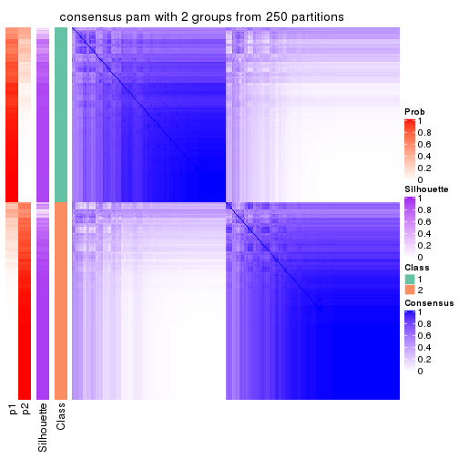</p>

</div>
<div id='tab-MAD-pam-consensus-heatmap-2'>
<pre><code class="r">consensus_heatmap(res, k = 3)
</code></pre>

<p>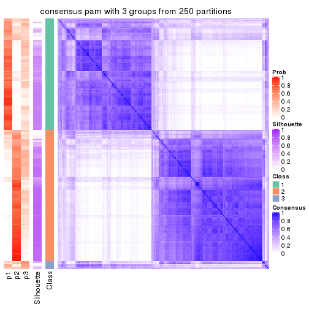</p>

</div>
<div id='tab-MAD-pam-consensus-heatmap-3'>
<pre><code class="r">consensus_heatmap(res, k = 4)
</code></pre>

<p>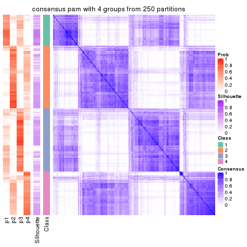</p>

</div>
<div id='tab-MAD-pam-consensus-heatmap-4'>
<pre><code class="r">consensus_heatmap(res, k = 5)
</code></pre>

<p>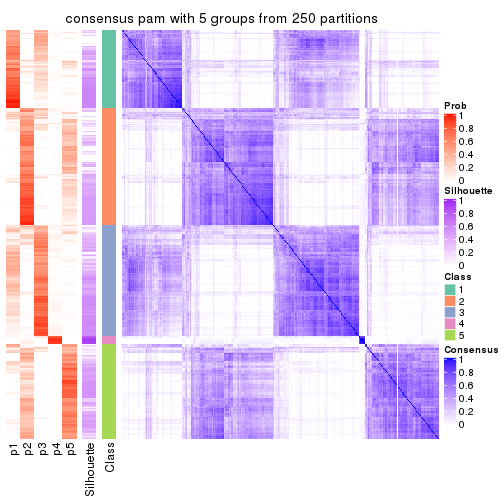</p>

</div>
<div id='tab-MAD-pam-consensus-heatmap-5'>
<pre><code class="r">consensus_heatmap(res, k = 6)
</code></pre>

<p>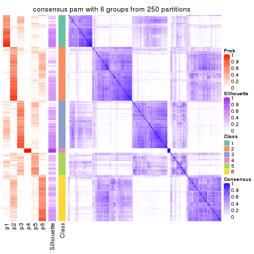</p>

</div>
</div>

Heatmaps for the membership of samples in all partitions to see how consistent they are:


<script>
$( function() {
	$( '#tabs-MAD-pam-membership-heatmap' ).tabs();
} );
</script>
<div id='tabs-MAD-pam-membership-heatmap'>
<ul>
<li><a href='#tab-MAD-pam-membership-heatmap-1'>k = 2</a></li>
<li><a href='#tab-MAD-pam-membership-heatmap-2'>k = 3</a></li>
<li><a href='#tab-MAD-pam-membership-heatmap-3'>k = 4</a></li>
<li><a href='#tab-MAD-pam-membership-heatmap-4'>k = 5</a></li>
<li><a href='#tab-MAD-pam-membership-heatmap-5'>k = 6</a></li>
</ul>
<div id='tab-MAD-pam-membership-heatmap-1'>
<pre><code class="r">membership_heatmap(res, k = 2)
</code></pre>

<p>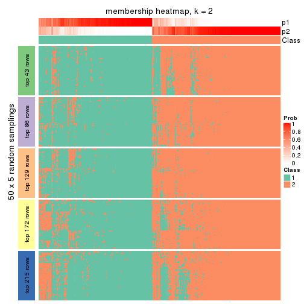</p>

</div>
<div id='tab-MAD-pam-membership-heatmap-2'>
<pre><code class="r">membership_heatmap(res, k = 3)
</code></pre>

<p>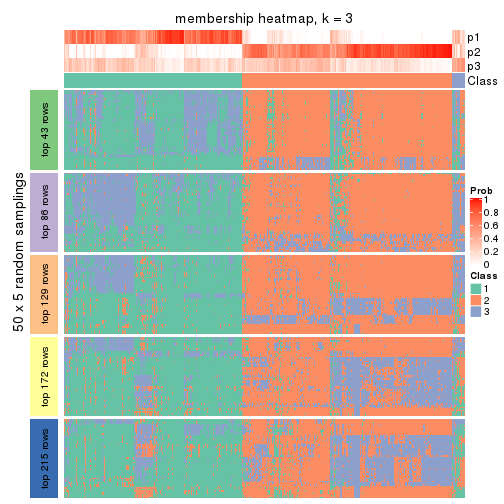</p>

</div>
<div id='tab-MAD-pam-membership-heatmap-3'>
<pre><code class="r">membership_heatmap(res, k = 4)
</code></pre>

<p>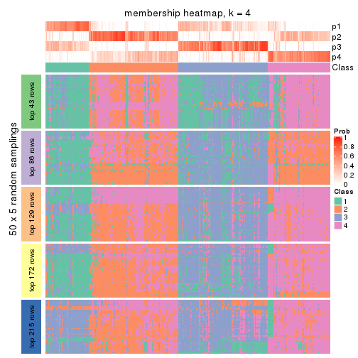</p>

</div>
<div id='tab-MAD-pam-membership-heatmap-4'>
<pre><code class="r">membership_heatmap(res, k = 5)
</code></pre>

<p>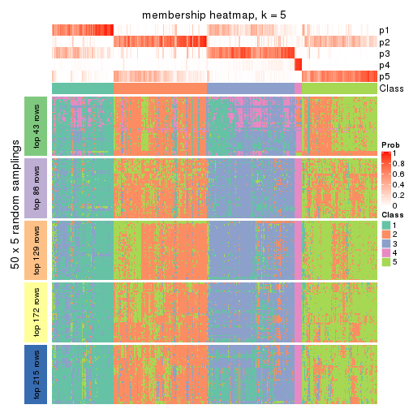</p>

</div>
<div id='tab-MAD-pam-membership-heatmap-5'>
<pre><code class="r">membership_heatmap(res, k = 6)
</code></pre>

<p>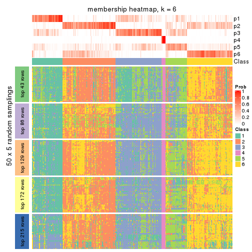</p>

</div>
</div>

As soon as we have had the classes for columns, we can look for signatures
which are significantly different between classes which can be candidate marks
for certain classes. Following are the heatmaps for signatures.


Signature heatmaps where rows are scaled:


<script>
$( function() {
	$( '#tabs-MAD-pam-get-signatures' ).tabs();
} );
</script>
<div id='tabs-MAD-pam-get-signatures'>
<ul>
<li><a href='#tab-MAD-pam-get-signatures-1'>k = 2</a></li>
<li><a href='#tab-MAD-pam-get-signatures-2'>k = 3</a></li>
<li><a href='#tab-MAD-pam-get-signatures-3'>k = 4</a></li>
<li><a href='#tab-MAD-pam-get-signatures-4'>k = 5</a></li>
<li><a href='#tab-MAD-pam-get-signatures-5'>k = 6</a></li>
</ul>
<div id='tab-MAD-pam-get-signatures-1'>
<pre><code class="r">get_signatures(res, k = 2)
</code></pre>

<p>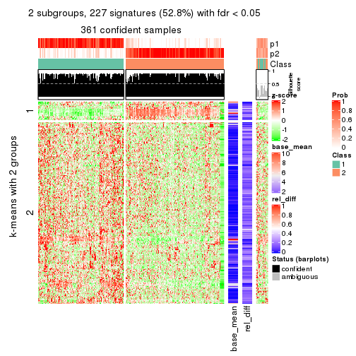</p>

</div>
<div id='tab-MAD-pam-get-signatures-2'>
<pre><code class="r">get_signatures(res, k = 3)
</code></pre>

<p>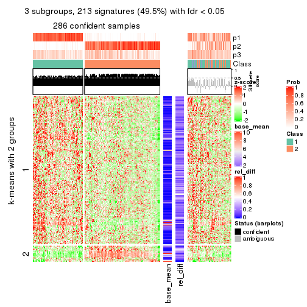</p>

</div>
<div id='tab-MAD-pam-get-signatures-3'>
<pre><code class="r">get_signatures(res, k = 4)
</code></pre>

<p>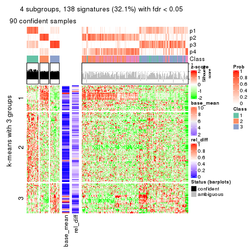</p>

</div>
<div id='tab-MAD-pam-get-signatures-4'>
<pre><code class="r">get_signatures(res, k = 5)
</code></pre>

<p>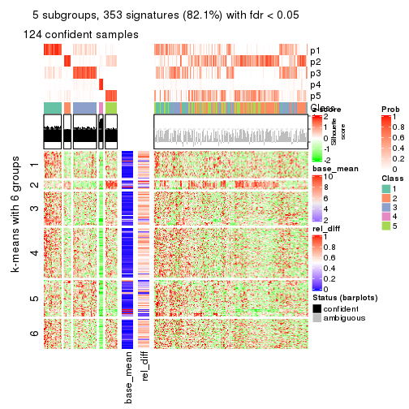</p>

</div>
<div id='tab-MAD-pam-get-signatures-5'>
<pre><code class="r">get_signatures(res, k = 6)
</code></pre>

<p>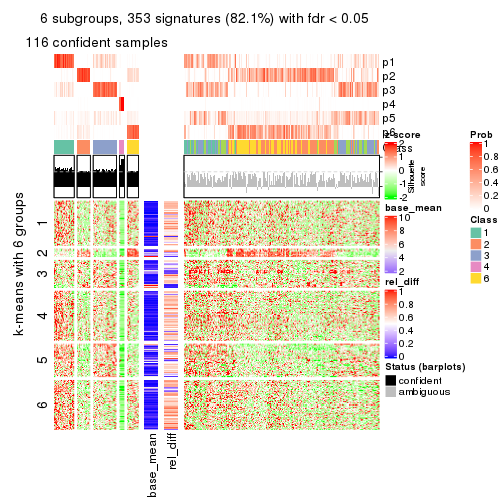</p>

</div>
</div>


Signature heatmaps where rows are not scaled:


<script>
$( function() {
	$( '#tabs-MAD-pam-get-signatures-no-scale' ).tabs();
} );
</script>
<div id='tabs-MAD-pam-get-signatures-no-scale'>
<ul>
<li><a href='#tab-MAD-pam-get-signatures-no-scale-1'>k = 2</a></li>
<li><a href='#tab-MAD-pam-get-signatures-no-scale-2'>k = 3</a></li>
<li><a href='#tab-MAD-pam-get-signatures-no-scale-3'>k = 4</a></li>
<li><a href='#tab-MAD-pam-get-signatures-no-scale-4'>k = 5</a></li>
<li><a href='#tab-MAD-pam-get-signatures-no-scale-5'>k = 6</a></li>
</ul>
<div id='tab-MAD-pam-get-signatures-no-scale-1'>
<pre><code class="r">get_signatures(res, k = 2, scale_rows = FALSE)
</code></pre>

<p>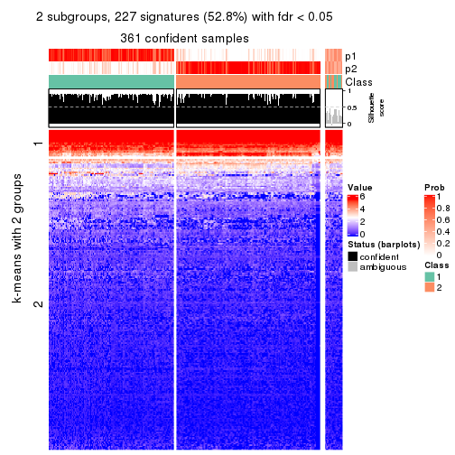</p>

</div>
<div id='tab-MAD-pam-get-signatures-no-scale-2'>
<pre><code class="r">get_signatures(res, k = 3, scale_rows = FALSE)
</code></pre>

<p>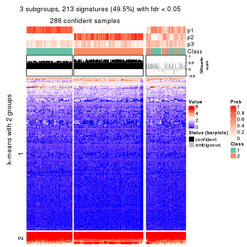</p>

</div>
<div id='tab-MAD-pam-get-signatures-no-scale-3'>
<pre><code class="r">get_signatures(res, k = 4, scale_rows = FALSE)
</code></pre>

<p>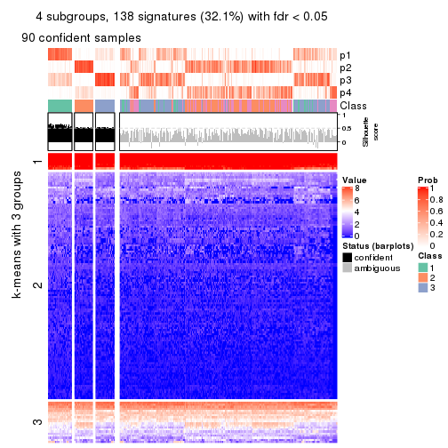</p>

</div>
<div id='tab-MAD-pam-get-signatures-no-scale-4'>
<pre><code class="r">get_signatures(res, k = 5, scale_rows = FALSE)
</code></pre>

<p>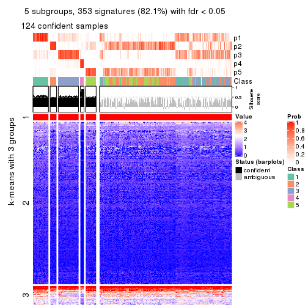</p>

</div>
<div id='tab-MAD-pam-get-signatures-no-scale-5'>
<pre><code class="r">get_signatures(res, k = 6, scale_rows = FALSE)
</code></pre>

<p>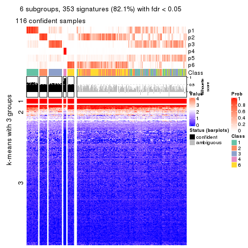</p>

</div>
</div>


Compare the overlap of signatures from different k:

```r
compare_signatures(res)
```

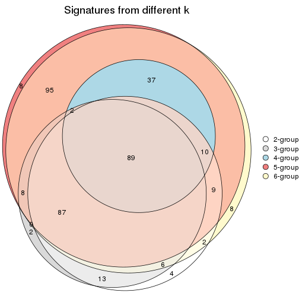

`get_signature()` returns a data frame invisibly. TO get the list of signatures, the function
call should be assigned to a variable explicitly. In following code, if `plot` argument is set
to `FALSE`, no heatmap is plotted while only the differential analysis is performed.

```r
# code only for demonstration
tb = get_signature(res, k = ..., plot = FALSE)
```

An example of the output of `tb` is:

```
#>   which_row         fdr    mean_1    mean_2 scaled_mean_1 scaled_mean_2 km
#> 1        38 0.042760348  8.373488  9.131774    -0.5533452     0.5164555  1
#> 2        40 0.018707592  7.106213  8.469186    -0.6173731     0.5762149  1
#> 3        55 0.019134737 10.221463 11.207825    -0.6159697     0.5749050  1
#> 4        59 0.006059896  5.921854  7.869574    -0.6899429     0.6439467  1
#> 5        60 0.018055526  8.928898 10.211722    -0.6204761     0.5791110  1
#> 6        98 0.009384629 15.714769 14.887706     0.6635654    -0.6193277  2
...
```

The columns in `tb` are:

1. `which_row`: row indices corresponding to the input matrix.
2. `fdr`: FDR for the differential test. 
3. `mean_x`: The mean value in group x.
4. `scaled_mean_x`: The mean value in group x after rows are scaled.
5. `km`: Row groups if k-means clustering is applied to rows.


UMAP plot which shows how samples are separated.


<script>
$( function() {
	$( '#tabs-MAD-pam-dimension-reduction' ).tabs();
} );
</script>
<div id='tabs-MAD-pam-dimension-reduction'>
<ul>
<li><a href='#tab-MAD-pam-dimension-reduction-1'>k = 2</a></li>
<li><a href='#tab-MAD-pam-dimension-reduction-2'>k = 3</a></li>
<li><a href='#tab-MAD-pam-dimension-reduction-3'>k = 4</a></li>
<li><a href='#tab-MAD-pam-dimension-reduction-4'>k = 5</a></li>
<li><a href='#tab-MAD-pam-dimension-reduction-5'>k = 6</a></li>
</ul>
<div id='tab-MAD-pam-dimension-reduction-1'>
<pre><code class="r">dimension_reduction(res, k = 2, method = &quot;UMAP&quot;)
</code></pre>

<p>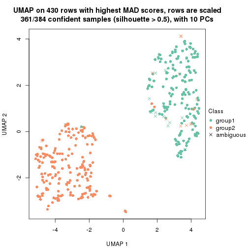</p>

</div>
<div id='tab-MAD-pam-dimension-reduction-2'>
<pre><code class="r">dimension_reduction(res, k = 3, method = &quot;UMAP&quot;)
</code></pre>

<p>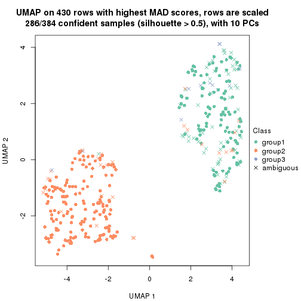</p>

</div>
<div id='tab-MAD-pam-dimension-reduction-3'>
<pre><code class="r">dimension_reduction(res, k = 4, method = &quot;UMAP&quot;)
</code></pre>

<p>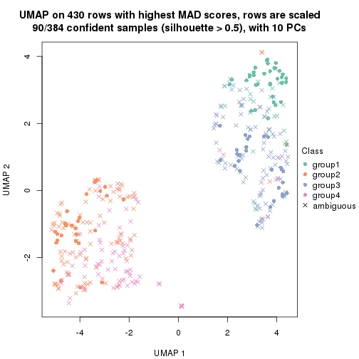</p>

</div>
<div id='tab-MAD-pam-dimension-reduction-4'>
<pre><code class="r">dimension_reduction(res, k = 5, method = &quot;UMAP&quot;)
</code></pre>

<p>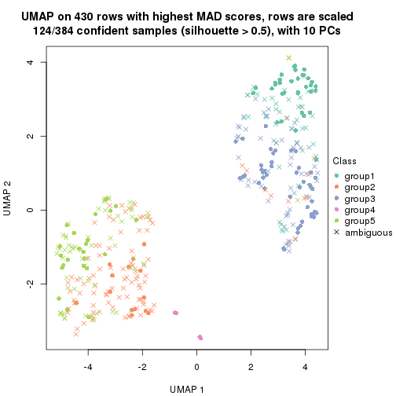</p>

</div>
<div id='tab-MAD-pam-dimension-reduction-5'>
<pre><code class="r">dimension_reduction(res, k = 6, method = &quot;UMAP&quot;)
</code></pre>

<p>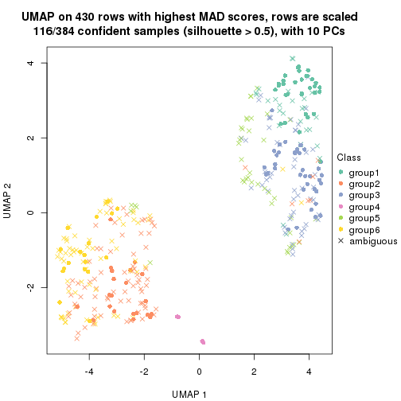</p>

</div>
</div>


Following heatmap shows how subgroups are split when increasing `k`:

```r
collect_classes(res)
```

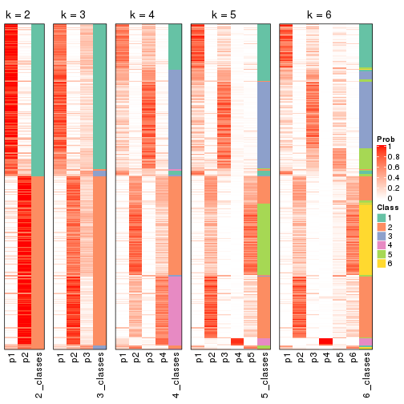


If matrix rows can be associated to genes, consider to use `GO_Enrichment(res,
...)` to perform function enrichment for the signature genes.


 

---------------------------------------------------


### MAD:mclust*


The object with results only for a single top-value method and a single partition method 
can be extracted as:

```r
res = res_list["MAD", "mclust"]
# you can also extract it by
# res = res_list["MAD:mclust"]
```

A summary of `res` and all the functions that can be applied to it:

```r
res
```

```
#> A 'ConsensusPartition' object with k = 2, 3, 4, 5, 6.
#>   On a matrix with 430 rows and 384 columns.
#>   Top rows (43, 86, 129, 172, 215) are extracted by 'MAD' method.
#>   Subgroups are detected by 'mclust' method.
#>   Performed in total 1250 partitions by row resampling.
#>   Best k for subgroups seems to be 2.
#> 
#> Following methods can be applied to this 'ConsensusPartition' object:
#>  [1] "cola_report"             "collect_classes"         "collect_plots"          
#>  [4] "collect_stats"           "colnames"                "compare_signatures"     
#>  [7] "consensus_heatmap"       "dimension_reduction"     "functional_enrichment"  
#> [10] "get_anno_col"            "get_anno"                "get_classes"            
#> [13] "get_consensus"           "get_matrix"              "get_membership"         
#> [16] "get_param"               "get_signatures"          "get_stats"              
#> [19] "is_best_k"               "is_stable_k"             "membership_heatmap"     
#> [22] "ncol"                    "nrow"                    "plot_ecdf"              
#> [25] "rownames"                "select_partition_number" "show"                   
#> [28] "suggest_best_k"          "test_to_known_factors"
```

`collect_plots()` function collects all the plots made from `res` for all `k` (number of partitions)
into one single page to provide an easy and fast comparison between different `k`.

```r
collect_plots(res)
```

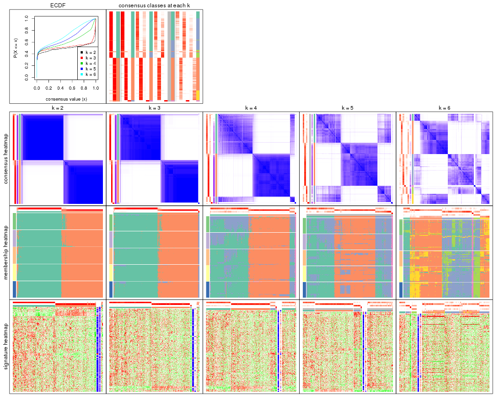

The plots are:

- The first row: a plot of the ECDF (Empirical cumulative distribution
  function) curves of the consensus matrix for each `k` and the heatmap of
  predicted classes for each `k`.
- The second row: heatmaps of the consensus matrix for each `k`.
- The third row: heatmaps of the membership matrix for each `k`.
- The fouth row: heatmaps of the signatures for each `k`.

All the plots in panels can be made by individual functions and they are
plotted later in this section.

`select_partition_number()` produces several plots showing different
statistics for choosing "optimized" `k`. There are following statistics:

- ECDF curves of the consensus matrix for each `k`;
- 1-PAC. [The PAC
  score](https://en.wikipedia.org/wiki/Consensus_clustering#Over-interpretation_potential_of_consensus_clustering)
  measures the proportion of the ambiguous subgrouping.
- Mean silhouette score.
- Concordance. The mean probability of fiting the consensus class ids in all
  partitions.
- Area increased. Denote $A_k$ as the area under the ECDF curve for current
  `k`, the area increased is defined as $A_k - A_{k-1}$.
- Rand index. The percent of pairs of samples that are both in a same cluster
  or both are not in a same cluster in the partition of k and k-1.
- Jaccard index. The ratio of pairs of samples are both in a same cluster in
  the partition of k and k-1 and the pairs of samples are both in a same
  cluster in the partition k or k-1.

The detailed explanations of these statistics can be found in [the cola
vignette](http://bioconductor.org/packages/devel/bioc/vignettes/cola/inst/doc/cola.html#toc_13).

Generally speaking, lower PAC score, higher mean silhouette score or higher
concordance corresponds to better partition. Rand index and Jaccard index
measure how similar the current partition is compared to partition with `k-1`.
If they are too similar, we won't accept `k` is better than `k-1`.

```r
select_partition_number(res)
```

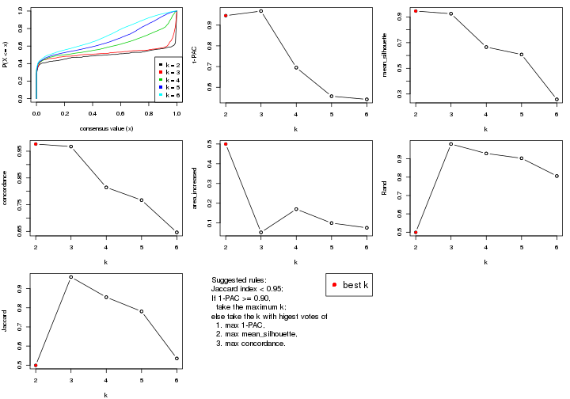

The numeric values for all these statistics can be obtained by `get_stats()`.

```r
get_stats(res)
```

```
#>   k 1-PAC mean_silhouette concordance area_increased  Rand Jaccard
#> 2 2 0.946           0.946       0.977         0.4996 0.499   0.499
#> 3 3 0.968           0.925       0.967         0.0524 0.980   0.961
#> 4 4 0.695           0.665       0.815         0.1700 0.929   0.855
#> 5 5 0.557           0.608       0.767         0.0995 0.903   0.781
#> 6 6 0.542           0.258       0.646         0.0755 0.806   0.535
```

`suggest_best_k()` suggests the best $k$ based on these statistics. The rules are as follows:

- All $k$ with Jaccard index larger than 0.95 are removed because the increase of
  the partition number does not provides enough extra information. If all $k$ are removed,
  the best $k$ is assigned by `NA`.
- For $k$ with 1-PAC larger than 0.9, the maximal $k$ is taken as the "best k". Other $k$ is called "optional k".
- If it does not fit the second rule. The $k$ with the highest vote of highest
  1-PAC, mean silhouette and concordance is taken as the "best k".

```r
suggest_best_k(res)
```

```
#> [1] 2
```


Following shows the table of the partitions (You need to click the **show/hide
code output** link to see it). The membership matrix (columns with name `p*`)
is inferred by
[`clue::cl_consensus()`](https://www.rdocumentation.org/link/cl_consensus?package=clue)
function with the `SE` method. Basically the value in the membership matrix
represents the probability to belong to a certain group. The finall class
label for an item is determined with the group with highest probability it
belongs to.

In `get_classes()` function, the entropy is calculated from the membership
matrix and the silhouette score is calculated from the consensus matrix.


<script>
$( function() {
	$( '#tabs-MAD-mclust-get-classes' ).tabs();
} );
</script>
<div id='tabs-MAD-mclust-get-classes'>
<ul>
<li><a href='#tab-MAD-mclust-get-classes-1'>k = 2</a></li>
<li><a href='#tab-MAD-mclust-get-classes-2'>k = 3</a></li>
<li><a href='#tab-MAD-mclust-get-classes-3'>k = 4</a></li>
<li><a href='#tab-MAD-mclust-get-classes-4'>k = 5</a></li>
<li><a href='#tab-MAD-mclust-get-classes-5'>k = 6</a></li>
</ul>

<div id='tab-MAD-mclust-get-classes-1'>
<p><a id='tab-MAD-mclust-get-classes-1-a' style='color:#0366d6' href='#'>show/hide code output</a></p>
<pre><code class="r">cbind(get_classes(res, k = 2), get_membership(res, k = 2))
</code></pre>

<pre><code>#&gt;            class entropy silhouette    p1    p2
#&gt; SRR2105277     1  0.0000     0.9814 1.000 0.000
#&gt; SRR2105278     1  0.0000     0.9814 1.000 0.000
#&gt; SRR2105275     1  0.0000     0.9814 1.000 0.000
#&gt; SRR2105276     1  0.0000     0.9814 1.000 0.000
#&gt; SRR2105273     1  0.0000     0.9814 1.000 0.000
#&gt; SRR2105274     1  0.0000     0.9814 1.000 0.000
#&gt; SRR2105271     1  0.0000     0.9814 1.000 0.000
#&gt; SRR2105272     1  0.0000     0.9814 1.000 0.000
#&gt; SRR2105269     2  0.0000     0.9698 0.000 1.000
#&gt; SRR2105270     2  0.0000     0.9698 0.000 1.000
#&gt; SRR2105267     2  0.0000     0.9698 0.000 1.000
#&gt; SRR2105268     2  0.0000     0.9698 0.000 1.000
#&gt; SRR2105265     2  0.0000     0.9698 0.000 1.000
#&gt; SRR2105266     2  0.0000     0.9698 0.000 1.000
#&gt; SRR2105263     2  0.0672     0.9661 0.008 0.992
#&gt; SRR2105264     2  0.0672     0.9661 0.008 0.992
#&gt; SRR2105261     1  0.5294     0.8534 0.880 0.120
#&gt; SRR2105262     1  0.1184     0.9681 0.984 0.016
#&gt; SRR2105357     1  0.0376     0.9783 0.996 0.004
#&gt; SRR2105358     1  0.0000     0.9814 1.000 0.000
#&gt; SRR2105439     2  0.0000     0.9698 0.000 1.000
#&gt; SRR2105440     2  0.0000     0.9698 0.000 1.000
#&gt; SRR2105509     2  0.0000     0.9698 0.000 1.000
#&gt; SRR2105510     2  0.0000     0.9698 0.000 1.000
#&gt; SRR2105507     1  0.0000     0.9814 1.000 0.000
#&gt; SRR2105508     1  0.0000     0.9814 1.000 0.000
#&gt; SRR2105505     1  0.0000     0.9814 1.000 0.000
#&gt; SRR2105506     1  0.0000     0.9814 1.000 0.000
#&gt; SRR2105503     2  0.0000     0.9698 0.000 1.000
#&gt; SRR2105504     2  0.7745     0.7275 0.228 0.772
#&gt; SRR2105501     2  0.6148     0.8275 0.152 0.848
#&gt; SRR2105502     2  0.6887     0.7897 0.184 0.816
#&gt; SRR2105499     1  0.0000     0.9814 1.000 0.000
#&gt; SRR2105500     1  0.0000     0.9814 1.000 0.000
#&gt; SRR2105497     2  0.0000     0.9698 0.000 1.000
#&gt; SRR2105498     2  0.0000     0.9698 0.000 1.000
#&gt; SRR2105495     2  0.0000     0.9698 0.000 1.000
#&gt; SRR2105496     2  0.0000     0.9698 0.000 1.000
#&gt; SRR2105493     2  0.0000     0.9698 0.000 1.000
#&gt; SRR2105494     2  0.0672     0.9661 0.008 0.992
#&gt; SRR2105491     2  0.0672     0.9661 0.008 0.992
#&gt; SRR2105492     2  0.0672     0.9661 0.008 0.992
#&gt; SRR2105489     2  0.0000     0.9698 0.000 1.000
#&gt; SRR2105490     2  0.0000     0.9698 0.000 1.000
#&gt; SRR2105487     1  0.0000     0.9814 1.000 0.000
#&gt; SRR2105488     1  0.0376     0.9783 0.996 0.004
#&gt; SRR2105485     1  0.0000     0.9814 1.000 0.000
#&gt; SRR2105486     1  0.0000     0.9814 1.000 0.000
#&gt; SRR2105483     1  0.0000     0.9814 1.000 0.000
#&gt; SRR2105484     1  0.0000     0.9814 1.000 0.000
#&gt; SRR2105481     1  0.0000     0.9814 1.000 0.000
#&gt; SRR2105482     1  0.0000     0.9814 1.000 0.000
#&gt; SRR2105479     1  0.0000     0.9814 1.000 0.000
#&gt; SRR2105480     1  0.0000     0.9814 1.000 0.000
#&gt; SRR2105477     2  0.0672     0.9661 0.008 0.992
#&gt; SRR2105478     2  0.0672     0.9661 0.008 0.992
#&gt; SRR2105475     2  0.0376     0.9681 0.004 0.996
#&gt; SRR2105476     2  0.0376     0.9681 0.004 0.996
#&gt; SRR2105473     2  0.0000     0.9698 0.000 1.000
#&gt; SRR2105474     2  0.0000     0.9698 0.000 1.000
#&gt; SRR2105471     2  0.0000     0.9698 0.000 1.000
#&gt; SRR2105472     2  0.0000     0.9698 0.000 1.000
#&gt; SRR2105469     1  0.0000     0.9814 1.000 0.000
#&gt; SRR2105470     1  0.0000     0.9814 1.000 0.000
#&gt; SRR2105467     1  0.0000     0.9814 1.000 0.000
#&gt; SRR2105468     1  0.0000     0.9814 1.000 0.000
#&gt; SRR2105465     1  0.0000     0.9814 1.000 0.000
#&gt; SRR2105466     1  0.0000     0.9814 1.000 0.000
#&gt; SRR2105463     1  0.0000     0.9814 1.000 0.000
#&gt; SRR2105464     1  0.0000     0.9814 1.000 0.000
#&gt; SRR2105461     2  0.0000     0.9698 0.000 1.000
#&gt; SRR2105462     2  0.0000     0.9698 0.000 1.000
#&gt; SRR2105459     2  0.0000     0.9698 0.000 1.000
#&gt; SRR2105460     2  0.0000     0.9698 0.000 1.000
#&gt; SRR2105457     1  0.0000     0.9814 1.000 0.000
#&gt; SRR2105458     1  0.0000     0.9814 1.000 0.000
#&gt; SRR2105455     1  0.0000     0.9814 1.000 0.000
#&gt; SRR2105456     1  0.0000     0.9814 1.000 0.000
#&gt; SRR2105453     1  0.0000     0.9814 1.000 0.000
#&gt; SRR2105454     1  0.0000     0.9814 1.000 0.000
#&gt; SRR2105451     2  0.7139     0.7731 0.196 0.804
#&gt; SRR2105452     2  0.8081     0.6961 0.248 0.752
#&gt; SRR2105449     1  0.0000     0.9814 1.000 0.000
#&gt; SRR2105450     1  0.0000     0.9814 1.000 0.000
#&gt; SRR2105447     2  0.3733     0.9120 0.072 0.928
#&gt; SRR2105448     2  0.0376     0.9681 0.004 0.996
#&gt; SRR2105445     1  0.9087     0.5027 0.676 0.324
#&gt; SRR2105446     1  0.2043     0.9530 0.968 0.032
#&gt; SRR2105443     2  0.9087     0.5548 0.324 0.676
#&gt; SRR2105444     2  0.9850     0.2920 0.428 0.572
#&gt; SRR2105441     2  0.0000     0.9698 0.000 1.000
#&gt; SRR2105442     2  0.0000     0.9698 0.000 1.000
#&gt; SRR2105437     1  0.0000     0.9814 1.000 0.000
#&gt; SRR2105438     1  0.0000     0.9814 1.000 0.000
#&gt; SRR2105435     1  0.0000     0.9814 1.000 0.000
#&gt; SRR2105436     1  0.0000     0.9814 1.000 0.000
#&gt; SRR2105433     1  0.0000     0.9814 1.000 0.000
#&gt; SRR2105434     1  0.0000     0.9814 1.000 0.000
#&gt; SRR2105431     1  0.0000     0.9814 1.000 0.000
#&gt; SRR2105432     1  0.0000     0.9814 1.000 0.000
#&gt; SRR2105429     2  0.7528     0.7457 0.216 0.784
#&gt; SRR2105430     2  0.6712     0.8000 0.176 0.824
#&gt; SRR2105427     2  0.0000     0.9698 0.000 1.000
#&gt; SRR2105428     2  0.0000     0.9698 0.000 1.000
#&gt; SRR2105425     2  0.0000     0.9698 0.000 1.000
#&gt; SRR2105426     2  0.0000     0.9698 0.000 1.000
#&gt; SRR2105421     1  0.0000     0.9814 1.000 0.000
#&gt; SRR2105422     1  0.0000     0.9814 1.000 0.000
#&gt; SRR2105423     2  0.0000     0.9698 0.000 1.000
#&gt; SRR2105424     2  0.0000     0.9698 0.000 1.000
#&gt; SRR2105419     1  0.0000     0.9814 1.000 0.000
#&gt; SRR2105420     1  0.0000     0.9814 1.000 0.000
#&gt; SRR2105415     1  0.0000     0.9814 1.000 0.000
#&gt; SRR2105416     1  0.0000     0.9814 1.000 0.000
#&gt; SRR2105417     1  0.0000     0.9814 1.000 0.000
#&gt; SRR2105418     1  0.0000     0.9814 1.000 0.000
#&gt; SRR2105413     2  0.0672     0.9661 0.008 0.992
#&gt; SRR2105414     2  0.0938     0.9635 0.012 0.988
#&gt; SRR2105409     2  0.0000     0.9698 0.000 1.000
#&gt; SRR2105410     2  0.0000     0.9698 0.000 1.000
#&gt; SRR2105411     2  0.0000     0.9698 0.000 1.000
#&gt; SRR2105412     2  0.0000     0.9698 0.000 1.000
#&gt; SRR2105407     1  0.0000     0.9814 1.000 0.000
#&gt; SRR2105408     1  0.0000     0.9814 1.000 0.000
#&gt; SRR2105403     1  0.0000     0.9814 1.000 0.000
#&gt; SRR2105404     1  0.0000     0.9814 1.000 0.000
#&gt; SRR2105405     1  0.0000     0.9814 1.000 0.000
#&gt; SRR2105406     1  0.0000     0.9814 1.000 0.000
#&gt; SRR2105401     2  0.4298     0.8974 0.088 0.912
#&gt; SRR2105402     2  0.8081     0.6961 0.248 0.752
#&gt; SRR2105399     2  0.7602     0.7396 0.220 0.780
#&gt; SRR2105400     2  0.7376     0.7569 0.208 0.792
#&gt; SRR2105397     1  0.9970     0.0814 0.532 0.468
#&gt; SRR2105398     1  0.9775     0.2723 0.588 0.412
#&gt; SRR2105395     2  0.0000     0.9698 0.000 1.000
#&gt; SRR2105396     2  0.0000     0.9698 0.000 1.000
#&gt; SRR2105393     2  0.0000     0.9698 0.000 1.000
#&gt; SRR2105394     2  0.0000     0.9698 0.000 1.000
#&gt; SRR2105389     1  0.0000     0.9814 1.000 0.000
#&gt; SRR2105390     1  0.0000     0.9814 1.000 0.000
#&gt; SRR2105391     1  0.0000     0.9814 1.000 0.000
#&gt; SRR2105392     1  0.0000     0.9814 1.000 0.000
#&gt; SRR2105385     1  0.0000     0.9814 1.000 0.000
#&gt; SRR2105386     1  0.0000     0.9814 1.000 0.000
#&gt; SRR2105387     1  0.0000     0.9814 1.000 0.000
#&gt; SRR2105388     1  0.0000     0.9814 1.000 0.000
#&gt; SRR2105381     2  0.5842     0.8430 0.140 0.860
#&gt; SRR2105382     2  0.5178     0.8695 0.116 0.884
#&gt; SRR2105383     2  0.0000     0.9698 0.000 1.000
#&gt; SRR2105384     2  0.0000     0.9698 0.000 1.000
#&gt; SRR2105379     2  0.1843     0.9514 0.028 0.972
#&gt; SRR2105380     2  0.4298     0.8991 0.088 0.912
#&gt; SRR2105377     2  0.0000     0.9698 0.000 1.000
#&gt; SRR2105378     2  0.0000     0.9698 0.000 1.000
#&gt; SRR2105375     1  0.2043     0.9534 0.968 0.032
#&gt; SRR2105376     1  0.0000     0.9814 1.000 0.000
#&gt; SRR2105373     1  0.0000     0.9814 1.000 0.000
#&gt; SRR2105374     1  0.0000     0.9814 1.000 0.000
#&gt; SRR2105371     1  0.0000     0.9814 1.000 0.000
#&gt; SRR2105372     1  0.0000     0.9814 1.000 0.000
#&gt; SRR2105369     1  0.0000     0.9814 1.000 0.000
#&gt; SRR2105370     1  0.0000     0.9814 1.000 0.000
#&gt; SRR2105367     1  0.0376     0.9783 0.996 0.004
#&gt; SRR2105368     1  0.1184     0.9682 0.984 0.016
#&gt; SRR2105365     2  0.0672     0.9661 0.008 0.992
#&gt; SRR2105366     2  0.0672     0.9661 0.008 0.992
#&gt; SRR2105363     2  0.0000     0.9698 0.000 1.000
#&gt; SRR2105364     2  0.0000     0.9698 0.000 1.000
#&gt; SRR2105361     2  0.0000     0.9698 0.000 1.000
#&gt; SRR2105362     2  0.0000     0.9698 0.000 1.000
#&gt; SRR2105359     1  0.0000     0.9814 1.000 0.000
#&gt; SRR2105360     1  0.0000     0.9814 1.000 0.000
#&gt; SRR2105355     1  0.0000     0.9814 1.000 0.000
#&gt; SRR2105356     1  0.0000     0.9814 1.000 0.000
#&gt; SRR2105353     1  0.0000     0.9814 1.000 0.000
#&gt; SRR2105354     1  0.0000     0.9814 1.000 0.000
#&gt; SRR2105351     2  0.0000     0.9698 0.000 1.000
#&gt; SRR2105352     2  0.8081     0.6961 0.248 0.752
#&gt; SRR2105349     2  0.0376     0.9681 0.004 0.996
#&gt; SRR2105350     2  0.0000     0.9698 0.000 1.000
#&gt; SRR2105345     2  0.0000     0.9698 0.000 1.000
#&gt; SRR2105346     2  0.0000     0.9698 0.000 1.000
#&gt; SRR2105347     2  0.0000     0.9698 0.000 1.000
#&gt; SRR2105348     2  0.0000     0.9698 0.000 1.000
#&gt; SRR2105343     2  0.0000     0.9698 0.000 1.000
#&gt; SRR2105344     2  0.0000     0.9698 0.000 1.000
#&gt; SRR2105341     1  0.0000     0.9814 1.000 0.000
#&gt; SRR2105342     1  0.0000     0.9814 1.000 0.000
#&gt; SRR2105339     1  0.0000     0.9814 1.000 0.000
#&gt; SRR2105340     1  0.0000     0.9814 1.000 0.000
#&gt; SRR2105335     1  0.0000     0.9814 1.000 0.000
#&gt; SRR2105336     1  0.0000     0.9814 1.000 0.000
#&gt; SRR2105337     1  0.0000     0.9814 1.000 0.000
#&gt; SRR2105338     1  0.0000     0.9814 1.000 0.000
#&gt; SRR2105331     2  0.0000     0.9698 0.000 1.000
#&gt; SRR2105332     2  0.0000     0.9698 0.000 1.000
#&gt; SRR2105333     2  0.0000     0.9698 0.000 1.000
#&gt; SRR2105334     2  0.0000     0.9698 0.000 1.000
#&gt; SRR2105329     2  0.9129     0.5456 0.328 0.672
#&gt; SRR2105330     2  0.7815     0.7226 0.232 0.768
#&gt; SRR2105327     2  0.0000     0.9698 0.000 1.000
#&gt; SRR2105328     2  0.0672     0.9661 0.008 0.992
#&gt; SRR2105325     1  0.0000     0.9814 1.000 0.000
#&gt; SRR2105326     1  0.0000     0.9814 1.000 0.000
#&gt; SRR2105323     1  0.0376     0.9783 0.996 0.004
#&gt; SRR2105324     1  0.0000     0.9814 1.000 0.000
#&gt; SRR2105319     1  0.0000     0.9814 1.000 0.000
#&gt; SRR2105320     1  0.0000     0.9814 1.000 0.000
#&gt; SRR2105321     1  0.0000     0.9814 1.000 0.000
#&gt; SRR2105322     1  0.0000     0.9814 1.000 0.000
#&gt; SRR2105317     2  0.0000     0.9698 0.000 1.000
#&gt; SRR2105318     2  0.0000     0.9698 0.000 1.000
#&gt; SRR2105315     1  0.9996     0.0103 0.512 0.488
#&gt; SRR2105316     2  0.0000     0.9698 0.000 1.000
#&gt; SRR2105313     2  0.0000     0.9698 0.000 1.000
#&gt; SRR2105314     2  0.0000     0.9698 0.000 1.000
#&gt; SRR2105311     1  0.0000     0.9814 1.000 0.000
#&gt; SRR2105312     1  0.0000     0.9814 1.000 0.000
#&gt; SRR2105307     1  0.0000     0.9814 1.000 0.000
#&gt; SRR2105308     1  0.0000     0.9814 1.000 0.000
#&gt; SRR2105309     1  0.0000     0.9814 1.000 0.000
#&gt; SRR2105310     1  0.0000     0.9814 1.000 0.000
#&gt; SRR2105305     1  0.0000     0.9814 1.000 0.000
#&gt; SRR2105306     1  0.0000     0.9814 1.000 0.000
#&gt; SRR2105303     2  0.0000     0.9698 0.000 1.000
#&gt; SRR2105304     2  0.6531     0.8099 0.168 0.832
#&gt; SRR2105301     2  0.0376     0.9681 0.004 0.996
#&gt; SRR2105302     2  0.0000     0.9698 0.000 1.000
#&gt; SRR2105299     1  0.3879     0.9059 0.924 0.076
#&gt; SRR2105300     1  0.9795     0.2633 0.584 0.416
#&gt; SRR2105297     2  0.0672     0.9661 0.008 0.992
#&gt; SRR2105298     2  0.0672     0.9661 0.008 0.992
#&gt; SRR2105295     2  0.0000     0.9698 0.000 1.000
#&gt; SRR2105296     2  0.0000     0.9698 0.000 1.000
#&gt; SRR2105293     1  0.0000     0.9814 1.000 0.000
#&gt; SRR2105294     1  0.0000     0.9814 1.000 0.000
#&gt; SRR2105291     1  0.0000     0.9814 1.000 0.000
#&gt; SRR2105292     1  0.0000     0.9814 1.000 0.000
#&gt; SRR2105289     1  0.0000     0.9814 1.000 0.000
#&gt; SRR2105290     1  0.0000     0.9814 1.000 0.000
#&gt; SRR2105287     1  0.0000     0.9814 1.000 0.000
#&gt; SRR2105288     1  0.0000     0.9814 1.000 0.000
#&gt; SRR2105285     2  0.0000     0.9698 0.000 1.000
#&gt; SRR2105286     2  0.0000     0.9698 0.000 1.000
#&gt; SRR2105283     2  0.4690     0.8868 0.100 0.900
#&gt; SRR2105284     2  0.6973     0.7813 0.188 0.812
#&gt; SRR2105281     2  0.0000     0.9698 0.000 1.000
#&gt; SRR2105282     2  0.0000     0.9698 0.000 1.000
#&gt; SRR2105259     1  0.0000     0.9814 1.000 0.000
#&gt; SRR2105260     1  0.0000     0.9814 1.000 0.000
#&gt; SRR2105279     2  0.0000     0.9698 0.000 1.000
#&gt; SRR2105280     2  0.0000     0.9698 0.000 1.000
#&gt; SRR2105257     1  0.0000     0.9814 1.000 0.000
#&gt; SRR2105258     1  0.0000     0.9814 1.000 0.000
#&gt; SRR2105253     2  0.0000     0.9698 0.000 1.000
#&gt; SRR2105254     2  0.0000     0.9698 0.000 1.000
#&gt; SRR2105255     1  0.0000     0.9814 1.000 0.000
#&gt; SRR2105256     1  0.0000     0.9814 1.000 0.000
#&gt; SRR2105251     2  0.0000     0.9698 0.000 1.000
#&gt; SRR2105252     2  0.0000     0.9698 0.000 1.000
#&gt; SRR2105249     2  0.0000     0.9698 0.000 1.000
#&gt; SRR2105250     2  0.0000     0.9698 0.000 1.000
#&gt; SRR2105247     2  0.0000     0.9698 0.000 1.000
#&gt; SRR2105248     2  0.0000     0.9698 0.000 1.000
#&gt; SRR2105245     1  0.0000     0.9814 1.000 0.000
#&gt; SRR2105246     1  0.2423     0.9453 0.960 0.040
#&gt; SRR2105243     1  0.0000     0.9814 1.000 0.000
#&gt; SRR2105244     1  0.0000     0.9814 1.000 0.000
#&gt; SRR2105241     1  0.0000     0.9814 1.000 0.000
#&gt; SRR2105242     1  0.0000     0.9814 1.000 0.000
#&gt; SRR2105239     1  0.0000     0.9814 1.000 0.000
#&gt; SRR2105240     1  0.0000     0.9814 1.000 0.000
#&gt; SRR2105237     2  0.0938     0.9635 0.012 0.988
#&gt; SRR2105238     2  0.0000     0.9698 0.000 1.000
#&gt; SRR2105235     2  0.0000     0.9698 0.000 1.000
#&gt; SRR2105236     2  0.0000     0.9698 0.000 1.000
#&gt; SRR2105233     2  0.0000     0.9698 0.000 1.000
#&gt; SRR2105234     2  0.0000     0.9698 0.000 1.000
#&gt; SRR2105231     2  0.0000     0.9698 0.000 1.000
#&gt; SRR2105232     2  0.0000     0.9698 0.000 1.000
#&gt; SRR2105227     1  0.0376     0.9783 0.996 0.004
#&gt; SRR2105228     1  0.0376     0.9783 0.996 0.004
#&gt; SRR2105225     1  0.0000     0.9814 1.000 0.000
#&gt; SRR2105226     1  0.0000     0.9814 1.000 0.000
#&gt; SRR2105229     1  0.0000     0.9814 1.000 0.000
#&gt; SRR2105230     1  0.0000     0.9814 1.000 0.000
#&gt; SRR2105219     2  0.0000     0.9698 0.000 1.000
#&gt; SRR2105220     2  0.0000     0.9698 0.000 1.000
#&gt; SRR2105221     2  0.0376     0.9681 0.004 0.996
#&gt; SRR2105222     2  0.0000     0.9698 0.000 1.000
#&gt; SRR2105223     1  0.0000     0.9814 1.000 0.000
#&gt; SRR2105224     1  0.0000     0.9814 1.000 0.000
#&gt; SRR2105217     2  0.0000     0.9698 0.000 1.000
#&gt; SRR2105218     2  0.0000     0.9698 0.000 1.000
#&gt; SRR2105215     2  0.0000     0.9698 0.000 1.000
#&gt; SRR2105216     2  0.0000     0.9698 0.000 1.000
#&gt; SRR2105213     1  0.0000     0.9814 1.000 0.000
#&gt; SRR2105214     1  0.0000     0.9814 1.000 0.000
#&gt; SRR2105211     1  0.0000     0.9814 1.000 0.000
#&gt; SRR2105212     1  0.0000     0.9814 1.000 0.000
#&gt; SRR2105209     1  0.0000     0.9814 1.000 0.000
#&gt; SRR2105210     1  0.0000     0.9814 1.000 0.000
#&gt; SRR2105207     1  0.0000     0.9814 1.000 0.000
#&gt; SRR2105208     1  0.0000     0.9814 1.000 0.000
#&gt; SRR2105205     2  0.0672     0.9661 0.008 0.992
#&gt; SRR2105206     2  0.1414     0.9578 0.020 0.980
#&gt; SRR2105201     2  0.0000     0.9698 0.000 1.000
#&gt; SRR2105202     2  0.0000     0.9698 0.000 1.000
#&gt; SRR2105203     2  0.0000     0.9698 0.000 1.000
#&gt; SRR2105204     2  0.0000     0.9698 0.000 1.000
#&gt; SRR2105199     2  0.0000     0.9698 0.000 1.000
#&gt; SRR2105200     2  0.0000     0.9698 0.000 1.000
#&gt; SRR2105197     1  0.0000     0.9814 1.000 0.000
#&gt; SRR2105198     1  0.0938     0.9716 0.988 0.012
#&gt; SRR2105195     1  0.1843     0.9571 0.972 0.028
#&gt; SRR2105196     1  0.1414     0.9646 0.980 0.020
#&gt; SRR2105193     1  0.0000     0.9814 1.000 0.000
#&gt; SRR2105194     1  0.0000     0.9814 1.000 0.000
#&gt; SRR2105191     1  0.0000     0.9814 1.000 0.000
#&gt; SRR2105192     1  0.0000     0.9814 1.000 0.000
#&gt; SRR2105189     2  0.0376     0.9680 0.004 0.996
#&gt; SRR2105190     2  0.0000     0.9698 0.000 1.000
#&gt; SRR2105187     2  0.1414     0.9579 0.020 0.980
#&gt; SRR2105188     2  0.6148     0.8300 0.152 0.848
#&gt; SRR2105179     1  0.0000     0.9814 1.000 0.000
#&gt; SRR2105180     1  0.0000     0.9814 1.000 0.000
#&gt; SRR2105183     2  0.0000     0.9698 0.000 1.000
#&gt; SRR2105184     2  0.0000     0.9698 0.000 1.000
#&gt; SRR2105185     2  0.1633     0.9547 0.024 0.976
#&gt; SRR2105186     2  0.0938     0.9636 0.012 0.988
#&gt; SRR2105181     1  0.0000     0.9814 1.000 0.000
#&gt; SRR2105182     1  0.0000     0.9814 1.000 0.000
#&gt; SRR2105177     1  0.0000     0.9814 1.000 0.000
#&gt; SRR2105178     1  0.0000     0.9814 1.000 0.000
#&gt; SRR2105171     2  0.0000     0.9698 0.000 1.000
#&gt; SRR2105172     2  0.0000     0.9698 0.000 1.000
#&gt; SRR2105175     1  0.0000     0.9814 1.000 0.000
#&gt; SRR2105176     1  0.0000     0.9814 1.000 0.000
#&gt; SRR2105173     2  0.0000     0.9698 0.000 1.000
#&gt; SRR2105174     2  0.0000     0.9698 0.000 1.000
#&gt; SRR2105169     2  0.0000     0.9698 0.000 1.000
#&gt; SRR2105170     2  0.0376     0.9681 0.004 0.996
#&gt; SRR2105167     2  0.0000     0.9698 0.000 1.000
#&gt; SRR2105168     2  0.0000     0.9698 0.000 1.000
#&gt; SRR2105165     1  0.0000     0.9814 1.000 0.000
#&gt; SRR2105166     1  0.0000     0.9814 1.000 0.000
#&gt; SRR2105163     1  0.0000     0.9814 1.000 0.000
#&gt; SRR2105164     1  0.0000     0.9814 1.000 0.000
#&gt; SRR2105161     1  0.0000     0.9814 1.000 0.000
#&gt; SRR2105162     1  0.0000     0.9814 1.000 0.000
#&gt; SRR2105155     2  0.0000     0.9698 0.000 1.000
#&gt; SRR2105156     2  0.0000     0.9698 0.000 1.000
#&gt; SRR2105157     2  0.0376     0.9681 0.004 0.996
#&gt; SRR2105158     2  0.0672     0.9661 0.008 0.992
#&gt; SRR2105159     1  0.0000     0.9814 1.000 0.000
#&gt; SRR2105160     1  0.0000     0.9814 1.000 0.000
#&gt; SRR2105153     2  0.0376     0.9681 0.004 0.996
#&gt; SRR2105154     2  0.0672     0.9661 0.008 0.992
#&gt; SRR2105151     2  0.0000     0.9698 0.000 1.000
#&gt; SRR2105152     2  0.0000     0.9698 0.000 1.000
#&gt; SRR2105149     1  0.3584     0.9154 0.932 0.068
#&gt; SRR2105150     1  0.2778     0.9373 0.952 0.048
#&gt; SRR2105147     1  0.9460     0.4080 0.636 0.364
#&gt; SRR2105148     1  0.9248     0.4673 0.660 0.340
#&gt; SRR2105143     1  0.0376     0.9783 0.996 0.004
#&gt; SRR2105144     1  0.3431     0.9220 0.936 0.064
#&gt; SRR2105145     1  0.1184     0.9682 0.984 0.016
#&gt; SRR2105146     1  0.0000     0.9814 1.000 0.000
#&gt; SRR2105141     2  0.0672     0.9661 0.008 0.992
#&gt; SRR2105142     2  0.0376     0.9681 0.004 0.996
#&gt; SRR2105139     2  0.0000     0.9698 0.000 1.000
#&gt; SRR2105140     2  0.0000     0.9698 0.000 1.000
#&gt; SRR2105137     2  0.0938     0.9626 0.012 0.988
#&gt; SRR2105138     2  0.1414     0.9580 0.020 0.980
#&gt; SRR2105135     2  0.0000     0.9698 0.000 1.000
#&gt; SRR2105136     2  0.0000     0.9698 0.000 1.000
#&gt; SRR2105133     1  0.0000     0.9814 1.000 0.000
#&gt; SRR2105134     1  0.0000     0.9814 1.000 0.000
#&gt; SRR2105131     2  0.9580     0.4136 0.380 0.620
#&gt; SRR2105132     1  0.1843     0.9568 0.972 0.028
#&gt; SRR2105129     1  0.0376     0.9782 0.996 0.004
#&gt; SRR2105130     1  0.0000     0.9814 1.000 0.000
#&gt; SRR2105127     1  0.0672     0.9749 0.992 0.008
#&gt; SRR2105128     1  0.2423     0.9459 0.960 0.040
</code></pre>

<script>
$('#tab-MAD-mclust-get-classes-1-a').parent().next().next().hide();
$('#tab-MAD-mclust-get-classes-1-a').click(function(){
  $('#tab-MAD-mclust-get-classes-1-a').parent().next().next().toggle();
  return(false);
});
</script>
</div>

<div id='tab-MAD-mclust-get-classes-2'>
<p><a id='tab-MAD-mclust-get-classes-2-a' style='color:#0366d6' href='#'>show/hide code output</a></p>
<pre><code class="r">cbind(get_classes(res, k = 3), get_membership(res, k = 3))
</code></pre>

<pre><code>#&gt;            class entropy silhouette    p1    p2    p3
#&gt; SRR2105277     1  0.2165      0.939 0.936 0.000 0.064
#&gt; SRR2105278     1  0.2165      0.939 0.936 0.000 0.064
#&gt; SRR2105275     1  0.0237      0.966 0.996 0.000 0.004
#&gt; SRR2105276     1  0.0000      0.966 1.000 0.000 0.000
#&gt; SRR2105273     1  0.0592      0.964 0.988 0.000 0.012
#&gt; SRR2105274     1  0.0424      0.965 0.992 0.000 0.008
#&gt; SRR2105271     1  0.0000      0.966 1.000 0.000 0.000
#&gt; SRR2105272     1  0.0000      0.966 1.000 0.000 0.000
#&gt; SRR2105269     2  0.0747      0.948 0.000 0.984 0.016
#&gt; SRR2105270     2  0.1031      0.943 0.000 0.976 0.024
#&gt; SRR2105267     2  0.0424      0.953 0.000 0.992 0.008
#&gt; SRR2105268     2  0.0000      0.956 0.000 1.000 0.000
#&gt; SRR2105265     2  0.0000      0.956 0.000 1.000 0.000
#&gt; SRR2105266     2  0.0000      0.956 0.000 1.000 0.000
#&gt; SRR2105263     2  0.0237      0.954 0.000 0.996 0.004
#&gt; SRR2105264     2  0.0237      0.954 0.004 0.996 0.000
#&gt; SRR2105261     1  0.3499      0.875 0.900 0.072 0.028
#&gt; SRR2105262     1  0.1170      0.960 0.976 0.008 0.016
#&gt; SRR2105357     1  0.2356      0.934 0.928 0.000 0.072
#&gt; SRR2105358     1  0.2261      0.937 0.932 0.000 0.068
#&gt; SRR2105439     2  0.1031      0.943 0.000 0.976 0.024
#&gt; SRR2105440     2  0.1031      0.943 0.000 0.976 0.024
#&gt; SRR2105509     2  0.1031      0.943 0.000 0.976 0.024
#&gt; SRR2105510     2  0.0237      0.954 0.000 0.996 0.004
#&gt; SRR2105507     1  0.0592      0.964 0.988 0.000 0.012
#&gt; SRR2105508     1  0.0592      0.964 0.988 0.000 0.012
#&gt; SRR2105505     1  0.0424      0.965 0.992 0.000 0.008
#&gt; SRR2105506     1  0.0424      0.965 0.992 0.000 0.008
#&gt; SRR2105503     2  0.0000      0.956 0.000 1.000 0.000
#&gt; SRR2105504     3  0.1774      0.997 0.016 0.024 0.960
#&gt; SRR2105501     2  0.4808      0.683 0.188 0.804 0.008
#&gt; SRR2105502     3  0.2152      0.987 0.016 0.036 0.948
#&gt; SRR2105499     1  0.0592      0.964 0.988 0.000 0.012
#&gt; SRR2105500     1  0.0892      0.961 0.980 0.000 0.020
#&gt; SRR2105497     2  0.0000      0.956 0.000 1.000 0.000
#&gt; SRR2105498     2  0.0000      0.956 0.000 1.000 0.000
#&gt; SRR2105495     2  0.1031      0.943 0.000 0.976 0.024
#&gt; SRR2105496     2  0.1031      0.943 0.000 0.976 0.024
#&gt; SRR2105493     2  0.1031      0.943 0.000 0.976 0.024
#&gt; SRR2105494     2  0.1453      0.937 0.008 0.968 0.024
#&gt; SRR2105491     2  0.0424      0.952 0.000 0.992 0.008
#&gt; SRR2105492     2  0.0424      0.952 0.000 0.992 0.008
#&gt; SRR2105489     2  0.0000      0.956 0.000 1.000 0.000
#&gt; SRR2105490     2  0.0000      0.956 0.000 1.000 0.000
#&gt; SRR2105487     1  0.1964      0.941 0.944 0.000 0.056
#&gt; SRR2105488     1  0.2066      0.940 0.940 0.000 0.060
#&gt; SRR2105485     1  0.1411      0.956 0.964 0.000 0.036
#&gt; SRR2105486     1  0.1163      0.959 0.972 0.000 0.028
#&gt; SRR2105483     1  0.1860      0.933 0.948 0.000 0.052
#&gt; SRR2105484     1  0.2066      0.926 0.940 0.000 0.060
#&gt; SRR2105481     1  0.0000      0.966 1.000 0.000 0.000
#&gt; SRR2105482     1  0.0000      0.966 1.000 0.000 0.000
#&gt; SRR2105479     1  0.0237      0.966 0.996 0.000 0.004
#&gt; SRR2105480     1  0.0000      0.966 1.000 0.000 0.000
#&gt; SRR2105477     2  0.1031      0.943 0.000 0.976 0.024
#&gt; SRR2105478     2  0.1267      0.941 0.004 0.972 0.024
#&gt; SRR2105475     2  0.0237      0.954 0.000 0.996 0.004
#&gt; SRR2105476     2  0.0000      0.956 0.000 1.000 0.000
#&gt; SRR2105473     2  0.1453      0.938 0.008 0.968 0.024
#&gt; SRR2105474     2  0.1031      0.943 0.000 0.976 0.024
#&gt; SRR2105471     2  0.0000      0.956 0.000 1.000 0.000
#&gt; SRR2105472     2  0.0000      0.956 0.000 1.000 0.000
#&gt; SRR2105469     1  0.0424      0.966 0.992 0.000 0.008
#&gt; SRR2105470     1  0.0237      0.966 0.996 0.000 0.004
#&gt; SRR2105467     1  0.1529      0.953 0.960 0.000 0.040
#&gt; SRR2105468     1  0.1163      0.959 0.972 0.000 0.028
#&gt; SRR2105465     1  0.0000      0.966 1.000 0.000 0.000
#&gt; SRR2105466     1  0.0237      0.966 0.996 0.000 0.004
#&gt; SRR2105463     1  0.0237      0.966 0.996 0.000 0.004
#&gt; SRR2105464     1  0.0237      0.966 0.996 0.000 0.004
#&gt; SRR2105461     2  0.0747      0.948 0.000 0.984 0.016
#&gt; SRR2105462     2  0.0000      0.956 0.000 1.000 0.000
#&gt; SRR2105459     2  0.0000      0.956 0.000 1.000 0.000
#&gt; SRR2105460     2  0.0000      0.956 0.000 1.000 0.000
#&gt; SRR2105457     1  0.0892      0.962 0.980 0.000 0.020
#&gt; SRR2105458     1  0.1411      0.955 0.964 0.000 0.036
#&gt; SRR2105455     1  0.0000      0.966 1.000 0.000 0.000
#&gt; SRR2105456     1  0.0237      0.966 0.996 0.000 0.004
#&gt; SRR2105453     1  0.1964      0.941 0.944 0.000 0.056
#&gt; SRR2105454     1  0.1964      0.941 0.944 0.000 0.056
#&gt; SRR2105451     2  0.4811      0.746 0.148 0.828 0.024
#&gt; SRR2105452     3  0.1774      0.997 0.016 0.024 0.960
#&gt; SRR2105449     1  0.0000      0.966 1.000 0.000 0.000
#&gt; SRR2105450     1  0.0000      0.966 1.000 0.000 0.000
#&gt; SRR2105447     2  0.0892      0.940 0.020 0.980 0.000
#&gt; SRR2105448     2  0.0000      0.956 0.000 1.000 0.000
#&gt; SRR2105445     1  0.7002      0.460 0.672 0.280 0.048
#&gt; SRR2105446     1  0.2982      0.918 0.920 0.024 0.056
#&gt; SRR2105443     2  0.6715      0.422 0.312 0.660 0.028
#&gt; SRR2105444     2  0.7069      0.224 0.408 0.568 0.024
#&gt; SRR2105441     2  0.0237      0.954 0.000 0.996 0.004
#&gt; SRR2105442     2  0.0000      0.956 0.000 1.000 0.000
#&gt; SRR2105437     1  0.1753      0.945 0.952 0.000 0.048
#&gt; SRR2105438     1  0.1753      0.945 0.952 0.000 0.048
#&gt; SRR2105435     1  0.0892      0.961 0.980 0.000 0.020
#&gt; SRR2105436     1  0.0424      0.965 0.992 0.000 0.008
#&gt; SRR2105433     1  0.0237      0.966 0.996 0.000 0.004
#&gt; SRR2105434     1  0.0237      0.966 0.996 0.000 0.004
#&gt; SRR2105431     1  0.0000      0.966 1.000 0.000 0.000
#&gt; SRR2105432     1  0.0237      0.966 0.996 0.000 0.004
#&gt; SRR2105429     2  0.4629      0.692 0.188 0.808 0.004
#&gt; SRR2105430     2  0.2772      0.864 0.080 0.916 0.004
#&gt; SRR2105427     2  0.0592      0.951 0.000 0.988 0.012
#&gt; SRR2105428     2  0.0747      0.948 0.000 0.984 0.016
#&gt; SRR2105425     2  0.0000      0.956 0.000 1.000 0.000
#&gt; SRR2105426     2  0.0000      0.956 0.000 1.000 0.000
#&gt; SRR2105421     1  0.0592      0.966 0.988 0.000 0.012
#&gt; SRR2105422     1  0.0000      0.966 1.000 0.000 0.000
#&gt; SRR2105423     2  0.0000      0.956 0.000 1.000 0.000
#&gt; SRR2105424     2  0.0000      0.956 0.000 1.000 0.000
#&gt; SRR2105419     1  0.1031      0.962 0.976 0.000 0.024
#&gt; SRR2105420     1  0.0592      0.965 0.988 0.000 0.012
#&gt; SRR2105415     1  0.0237      0.966 0.996 0.000 0.004
#&gt; SRR2105416     1  0.0237      0.966 0.996 0.000 0.004
#&gt; SRR2105417     1  0.0000      0.966 1.000 0.000 0.000
#&gt; SRR2105418     1  0.0237      0.966 0.996 0.000 0.004
#&gt; SRR2105413     2  0.0000      0.956 0.000 1.000 0.000
#&gt; SRR2105414     2  0.0000      0.956 0.000 1.000 0.000
#&gt; SRR2105409     2  0.0000      0.956 0.000 1.000 0.000
#&gt; SRR2105410     2  0.0592      0.951 0.000 0.988 0.012
#&gt; SRR2105411     2  0.0000      0.956 0.000 1.000 0.000
#&gt; SRR2105412     2  0.0000      0.956 0.000 1.000 0.000
#&gt; SRR2105407     1  0.1964      0.945 0.944 0.000 0.056
#&gt; SRR2105408     1  0.2261      0.937 0.932 0.000 0.068
#&gt; SRR2105403     1  0.2165      0.938 0.936 0.000 0.064
#&gt; SRR2105404     1  0.2261      0.937 0.932 0.000 0.068
#&gt; SRR2105405     1  0.0237      0.966 0.996 0.000 0.004
#&gt; SRR2105406     1  0.0000      0.966 1.000 0.000 0.000
#&gt; SRR2105401     2  0.1636      0.932 0.020 0.964 0.016
#&gt; SRR2105402     3  0.1774      0.997 0.016 0.024 0.960
#&gt; SRR2105399     2  0.5618      0.706 0.156 0.796 0.048
#&gt; SRR2105400     2  0.5239      0.717 0.160 0.808 0.032
#&gt; SRR2105397     1  0.7648      0.184 0.552 0.400 0.048
#&gt; SRR2105398     1  0.7379      0.331 0.616 0.336 0.048
#&gt; SRR2105395     2  0.0000      0.956 0.000 1.000 0.000
#&gt; SRR2105396     2  0.0000      0.956 0.000 1.000 0.000
#&gt; SRR2105393     2  0.0000      0.956 0.000 1.000 0.000
#&gt; SRR2105394     2  0.0000      0.956 0.000 1.000 0.000
#&gt; SRR2105389     1  0.0592      0.964 0.988 0.000 0.012
#&gt; SRR2105390     1  0.0592      0.964 0.988 0.000 0.012
#&gt; SRR2105391     1  0.1289      0.959 0.968 0.000 0.032
#&gt; SRR2105392     1  0.1031      0.962 0.976 0.000 0.024
#&gt; SRR2105385     1  0.0237      0.966 0.996 0.000 0.004
#&gt; SRR2105386     1  0.0592      0.964 0.988 0.000 0.012
#&gt; SRR2105387     1  0.0000      0.966 1.000 0.000 0.000
#&gt; SRR2105388     1  0.0000      0.966 1.000 0.000 0.000
#&gt; SRR2105381     2  0.2772      0.863 0.080 0.916 0.004
#&gt; SRR2105382     2  0.1878      0.911 0.044 0.952 0.004
#&gt; SRR2105383     2  0.0000      0.956 0.000 1.000 0.000
#&gt; SRR2105384     2  0.0237      0.954 0.004 0.996 0.000
#&gt; SRR2105379     2  0.0592      0.948 0.012 0.988 0.000
#&gt; SRR2105380     2  0.3607      0.813 0.112 0.880 0.008
#&gt; SRR2105377     2  0.1031      0.943 0.000 0.976 0.024
#&gt; SRR2105378     2  0.1031      0.943 0.000 0.976 0.024
#&gt; SRR2105375     1  0.2187      0.937 0.948 0.028 0.024
#&gt; SRR2105376     1  0.0892      0.961 0.980 0.000 0.020
#&gt; SRR2105373     1  0.1529      0.953 0.960 0.000 0.040
#&gt; SRR2105374     1  0.1643      0.947 0.956 0.000 0.044
#&gt; SRR2105371     1  0.0592      0.964 0.988 0.000 0.012
#&gt; SRR2105372     1  0.0424      0.965 0.992 0.000 0.008
#&gt; SRR2105369     1  0.0892      0.963 0.980 0.000 0.020
#&gt; SRR2105370     1  0.0592      0.964 0.988 0.000 0.012
#&gt; SRR2105367     1  0.1411      0.953 0.964 0.000 0.036
#&gt; SRR2105368     1  0.1289      0.956 0.968 0.000 0.032
#&gt; SRR2105365     2  0.0237      0.954 0.004 0.996 0.000
#&gt; SRR2105366     2  0.0237      0.954 0.000 0.996 0.004
#&gt; SRR2105363     2  0.0000      0.956 0.000 1.000 0.000
#&gt; SRR2105364     2  0.0000      0.956 0.000 1.000 0.000
#&gt; SRR2105361     2  0.0000      0.956 0.000 1.000 0.000
#&gt; SRR2105362     2  0.0000      0.956 0.000 1.000 0.000
#&gt; SRR2105359     1  0.0592      0.965 0.988 0.000 0.012
#&gt; SRR2105360     1  0.0000      0.966 1.000 0.000 0.000
#&gt; SRR2105355     1  0.0592      0.964 0.988 0.000 0.012
#&gt; SRR2105356     1  0.0424      0.965 0.992 0.000 0.008
#&gt; SRR2105353     1  0.0424      0.965 0.992 0.000 0.008
#&gt; SRR2105354     1  0.0424      0.965 0.992 0.000 0.008
#&gt; SRR2105351     2  0.0000      0.956 0.000 1.000 0.000
#&gt; SRR2105352     3  0.1774      0.997 0.016 0.024 0.960
#&gt; SRR2105349     2  0.0000      0.956 0.000 1.000 0.000
#&gt; SRR2105350     2  0.0000      0.956 0.000 1.000 0.000
#&gt; SRR2105345     2  0.0000      0.956 0.000 1.000 0.000
#&gt; SRR2105346     2  0.0000      0.956 0.000 1.000 0.000
#&gt; SRR2105347     2  0.0592      0.951 0.000 0.988 0.012
#&gt; SRR2105348     2  0.1170      0.942 0.016 0.976 0.008
#&gt; SRR2105343     2  0.0000      0.956 0.000 1.000 0.000
#&gt; SRR2105344     2  0.0000      0.956 0.000 1.000 0.000
#&gt; SRR2105341     1  0.0892      0.963 0.980 0.000 0.020
#&gt; SRR2105342     1  0.0747      0.963 0.984 0.000 0.016
#&gt; SRR2105339     1  0.0592      0.964 0.988 0.000 0.012
#&gt; SRR2105340     1  0.0237      0.966 0.996 0.000 0.004
#&gt; SRR2105335     1  0.0237      0.966 0.996 0.000 0.004
#&gt; SRR2105336     1  0.0237      0.966 0.996 0.000 0.004
#&gt; SRR2105337     1  0.0000      0.966 1.000 0.000 0.000
#&gt; SRR2105338     1  0.0000      0.966 1.000 0.000 0.000
#&gt; SRR2105331     2  0.0000      0.956 0.000 1.000 0.000
#&gt; SRR2105332     2  0.0000      0.956 0.000 1.000 0.000
#&gt; SRR2105333     2  0.0000      0.956 0.000 1.000 0.000
#&gt; SRR2105334     2  0.0000      0.956 0.000 1.000 0.000
#&gt; SRR2105329     2  0.6482      0.462 0.296 0.680 0.024
#&gt; SRR2105330     2  0.4413      0.786 0.124 0.852 0.024
#&gt; SRR2105327     2  0.0000      0.956 0.000 1.000 0.000
#&gt; SRR2105328     2  0.0000      0.956 0.000 1.000 0.000
#&gt; SRR2105325     1  0.0424      0.965 0.992 0.000 0.008
#&gt; SRR2105326     1  0.0237      0.966 0.996 0.000 0.004
#&gt; SRR2105323     1  0.1753      0.946 0.952 0.000 0.048
#&gt; SRR2105324     1  0.0424      0.965 0.992 0.000 0.008
#&gt; SRR2105319     1  0.0237      0.966 0.996 0.000 0.004
#&gt; SRR2105320     1  0.0000      0.966 1.000 0.000 0.000
#&gt; SRR2105321     1  0.0747      0.961 0.984 0.000 0.016
#&gt; SRR2105322     1  0.0237      0.966 0.996 0.000 0.004
#&gt; SRR2105317     2  0.0424      0.953 0.000 0.992 0.008
#&gt; SRR2105318     2  0.0000      0.956 0.000 1.000 0.000
#&gt; SRR2105315     2  0.7476      0.097 0.452 0.512 0.036
#&gt; SRR2105316     2  0.0000      0.956 0.000 1.000 0.000
#&gt; SRR2105313     2  0.0000      0.956 0.000 1.000 0.000
#&gt; SRR2105314     2  0.0000      0.956 0.000 1.000 0.000
#&gt; SRR2105311     1  0.0747      0.963 0.984 0.000 0.016
#&gt; SRR2105312     1  0.0237      0.966 0.996 0.000 0.004
#&gt; SRR2105307     1  0.0000      0.966 1.000 0.000 0.000
#&gt; SRR2105308     1  0.0000      0.966 1.000 0.000 0.000
#&gt; SRR2105309     1  0.1031      0.961 0.976 0.000 0.024
#&gt; SRR2105310     1  0.1163      0.959 0.972 0.000 0.028
#&gt; SRR2105305     1  0.0892      0.963 0.980 0.000 0.020
#&gt; SRR2105306     1  0.0592      0.964 0.988 0.000 0.012
#&gt; SRR2105303     2  0.0000      0.956 0.000 1.000 0.000
#&gt; SRR2105304     3  0.1774      0.997 0.016 0.024 0.960
#&gt; SRR2105301     2  0.0000      0.956 0.000 1.000 0.000
#&gt; SRR2105302     2  0.0000      0.956 0.000 1.000 0.000
#&gt; SRR2105299     1  0.4194      0.860 0.876 0.064 0.060
#&gt; SRR2105300     1  0.7634      0.121 0.524 0.432 0.044
#&gt; SRR2105297     2  0.7889      0.346 0.288 0.624 0.088
#&gt; SRR2105298     2  0.7944      0.326 0.296 0.616 0.088
#&gt; SRR2105295     2  0.0000      0.956 0.000 1.000 0.000
#&gt; SRR2105296     2  0.0000      0.956 0.000 1.000 0.000
#&gt; SRR2105293     1  0.0000      0.966 1.000 0.000 0.000
#&gt; SRR2105294     1  0.0000      0.966 1.000 0.000 0.000
#&gt; SRR2105291     1  0.0424      0.965 0.992 0.000 0.008
#&gt; SRR2105292     1  0.0237      0.966 0.996 0.000 0.004
#&gt; SRR2105289     1  0.0000      0.966 1.000 0.000 0.000
#&gt; SRR2105290     1  0.0000      0.966 1.000 0.000 0.000
#&gt; SRR2105287     1  0.0237      0.966 0.996 0.000 0.004
#&gt; SRR2105288     1  0.0000      0.966 1.000 0.000 0.000
#&gt; SRR2105285     2  0.0000      0.956 0.000 1.000 0.000
#&gt; SRR2105286     2  0.0000      0.956 0.000 1.000 0.000
#&gt; SRR2105283     2  0.4811      0.745 0.148 0.828 0.024
#&gt; SRR2105284     2  0.6105      0.546 0.252 0.724 0.024
#&gt; SRR2105281     2  0.0000      0.956 0.000 1.000 0.000
#&gt; SRR2105282     2  0.0000      0.956 0.000 1.000 0.000
#&gt; SRR2105259     1  0.2261      0.937 0.932 0.000 0.068
#&gt; SRR2105260     1  0.2165      0.939 0.936 0.000 0.064
#&gt; SRR2105279     2  0.0000      0.956 0.000 1.000 0.000
#&gt; SRR2105280     2  0.0000      0.956 0.000 1.000 0.000
#&gt; SRR2105257     1  0.0000      0.966 1.000 0.000 0.000
#&gt; SRR2105258     1  0.0000      0.966 1.000 0.000 0.000
#&gt; SRR2105253     2  0.0000      0.956 0.000 1.000 0.000
#&gt; SRR2105254     2  0.0000      0.956 0.000 1.000 0.000
#&gt; SRR2105255     1  0.0892      0.963 0.980 0.000 0.020
#&gt; SRR2105256     1  0.0747      0.963 0.984 0.000 0.016
#&gt; SRR2105251     2  0.0000      0.956 0.000 1.000 0.000
#&gt; SRR2105252     2  0.0000      0.956 0.000 1.000 0.000
#&gt; SRR2105249     2  0.0237      0.954 0.000 0.996 0.004
#&gt; SRR2105250     2  0.1015      0.946 0.008 0.980 0.012
#&gt; SRR2105247     2  0.0000      0.956 0.000 1.000 0.000
#&gt; SRR2105248     2  0.0000      0.956 0.000 1.000 0.000
#&gt; SRR2105245     1  0.0000      0.966 1.000 0.000 0.000
#&gt; SRR2105246     1  0.1129      0.951 0.976 0.020 0.004
#&gt; SRR2105243     1  0.0237      0.966 0.996 0.000 0.004
#&gt; SRR2105244     1  0.0000      0.966 1.000 0.000 0.000
#&gt; SRR2105241     1  0.0000      0.966 1.000 0.000 0.000
#&gt; SRR2105242     1  0.0000      0.966 1.000 0.000 0.000
#&gt; SRR2105239     1  0.0000      0.966 1.000 0.000 0.000
#&gt; SRR2105240     1  0.0000      0.966 1.000 0.000 0.000
#&gt; SRR2105237     2  0.1031      0.943 0.000 0.976 0.024
#&gt; SRR2105238     2  0.1031      0.943 0.000 0.976 0.024
#&gt; SRR2105235     2  0.1031      0.943 0.000 0.976 0.024
#&gt; SRR2105236     2  0.0237      0.954 0.000 0.996 0.004
#&gt; SRR2105233     2  0.0237      0.954 0.000 0.996 0.004
#&gt; SRR2105234     2  0.0000      0.956 0.000 1.000 0.000
#&gt; SRR2105231     2  0.0000      0.956 0.000 1.000 0.000
#&gt; SRR2105232     2  0.0000      0.956 0.000 1.000 0.000
#&gt; SRR2105227     1  0.0000      0.966 1.000 0.000 0.000
#&gt; SRR2105228     1  0.0000      0.966 1.000 0.000 0.000
#&gt; SRR2105225     1  0.0237      0.966 0.996 0.000 0.004
#&gt; SRR2105226     1  0.0237      0.966 0.996 0.000 0.004
#&gt; SRR2105229     1  0.1964      0.944 0.944 0.000 0.056
#&gt; SRR2105230     1  0.0237      0.966 0.996 0.000 0.004
#&gt; SRR2105219     2  0.0237      0.954 0.000 0.996 0.004
#&gt; SRR2105220     2  0.0237      0.954 0.000 0.996 0.004
#&gt; SRR2105221     2  0.1267      0.941 0.004 0.972 0.024
#&gt; SRR2105222     2  0.1267      0.941 0.004 0.972 0.024
#&gt; SRR2105223     1  0.0592      0.964 0.988 0.000 0.012
#&gt; SRR2105224     1  0.0592      0.964 0.988 0.000 0.012
#&gt; SRR2105217     2  0.0000      0.956 0.000 1.000 0.000
#&gt; SRR2105218     2  0.0000      0.956 0.000 1.000 0.000
#&gt; SRR2105215     2  0.0000      0.956 0.000 1.000 0.000
#&gt; SRR2105216     2  0.0000      0.956 0.000 1.000 0.000
#&gt; SRR2105213     1  0.0237      0.966 0.996 0.000 0.004
#&gt; SRR2105214     1  0.0424      0.965 0.992 0.000 0.008
#&gt; SRR2105211     1  0.0747      0.964 0.984 0.000 0.016
#&gt; SRR2105212     1  0.0747      0.964 0.984 0.000 0.016
#&gt; SRR2105209     1  0.0000      0.966 1.000 0.000 0.000
#&gt; SRR2105210     1  0.0000      0.966 1.000 0.000 0.000
#&gt; SRR2105207     1  0.0000      0.966 1.000 0.000 0.000
#&gt; SRR2105208     1  0.0237      0.966 0.996 0.000 0.004
#&gt; SRR2105205     2  0.0000      0.956 0.000 1.000 0.000
#&gt; SRR2105206     2  0.0592      0.947 0.012 0.988 0.000
#&gt; SRR2105201     2  0.1267      0.941 0.004 0.972 0.024
#&gt; SRR2105202     2  0.1031      0.943 0.000 0.976 0.024
#&gt; SRR2105203     2  0.0000      0.956 0.000 1.000 0.000
#&gt; SRR2105204     2  0.0000      0.956 0.000 1.000 0.000
#&gt; SRR2105199     2  0.0000      0.956 0.000 1.000 0.000
#&gt; SRR2105200     2  0.0000      0.956 0.000 1.000 0.000
#&gt; SRR2105197     1  0.2066      0.940 0.940 0.000 0.060
#&gt; SRR2105198     1  0.1964      0.941 0.944 0.000 0.056
#&gt; SRR2105195     1  0.1031      0.950 0.976 0.024 0.000
#&gt; SRR2105196     1  0.0661      0.962 0.988 0.008 0.004
#&gt; SRR2105193     1  0.0000      0.966 1.000 0.000 0.000
#&gt; SRR2105194     1  0.0237      0.966 0.996 0.000 0.004
#&gt; SRR2105191     1  0.2066      0.940 0.940 0.000 0.060
#&gt; SRR2105192     1  0.1964      0.941 0.944 0.000 0.056
#&gt; SRR2105189     2  0.0592      0.951 0.000 0.988 0.012
#&gt; SRR2105190     2  0.0000      0.956 0.000 1.000 0.000
#&gt; SRR2105187     2  0.1620      0.934 0.012 0.964 0.024
#&gt; SRR2105188     2  0.5756      0.633 0.208 0.764 0.028
#&gt; SRR2105179     1  0.0000      0.966 1.000 0.000 0.000
#&gt; SRR2105180     1  0.0237      0.966 0.996 0.000 0.004
#&gt; SRR2105183     2  0.0000      0.956 0.000 1.000 0.000
#&gt; SRR2105184     2  0.0000      0.956 0.000 1.000 0.000
#&gt; SRR2105185     2  0.1636      0.929 0.020 0.964 0.016
#&gt; SRR2105186     2  0.0848      0.947 0.008 0.984 0.008
#&gt; SRR2105181     1  0.1964      0.941 0.944 0.000 0.056
#&gt; SRR2105182     1  0.1031      0.961 0.976 0.000 0.024
#&gt; SRR2105177     1  0.0237      0.966 0.996 0.000 0.004
#&gt; SRR2105178     1  0.1031      0.956 0.976 0.000 0.024
#&gt; SRR2105171     2  0.0000      0.956 0.000 1.000 0.000
#&gt; SRR2105172     2  0.0000      0.956 0.000 1.000 0.000
#&gt; SRR2105175     1  0.0237      0.966 0.996 0.000 0.004
#&gt; SRR2105176     1  0.0237      0.966 0.996 0.000 0.004
#&gt; SRR2105173     2  0.0000      0.956 0.000 1.000 0.000
#&gt; SRR2105174     2  0.0000      0.956 0.000 1.000 0.000
#&gt; SRR2105169     2  0.0000      0.956 0.000 1.000 0.000
#&gt; SRR2105170     2  0.0000      0.956 0.000 1.000 0.000
#&gt; SRR2105167     2  0.0000      0.956 0.000 1.000 0.000
#&gt; SRR2105168     2  0.0000      0.956 0.000 1.000 0.000
#&gt; SRR2105165     1  0.0237      0.966 0.996 0.000 0.004
#&gt; SRR2105166     1  0.0237      0.966 0.996 0.000 0.004
#&gt; SRR2105163     1  0.0237      0.966 0.996 0.000 0.004
#&gt; SRR2105164     1  0.0000      0.966 1.000 0.000 0.000
#&gt; SRR2105161     1  0.0237      0.966 0.996 0.000 0.004
#&gt; SRR2105162     1  0.0237      0.966 0.996 0.000 0.004
#&gt; SRR2105155     2  0.0000      0.956 0.000 1.000 0.000
#&gt; SRR2105156     2  0.0000      0.956 0.000 1.000 0.000
#&gt; SRR2105157     2  0.0000      0.956 0.000 1.000 0.000
#&gt; SRR2105158     2  0.0000      0.956 0.000 1.000 0.000
#&gt; SRR2105159     1  0.0237      0.966 0.996 0.000 0.004
#&gt; SRR2105160     1  0.0237      0.966 0.996 0.000 0.004
#&gt; SRR2105153     2  0.0000      0.956 0.000 1.000 0.000
#&gt; SRR2105154     2  0.0000      0.956 0.000 1.000 0.000
#&gt; SRR2105151     2  0.0000      0.956 0.000 1.000 0.000
#&gt; SRR2105152     2  0.0000      0.956 0.000 1.000 0.000
#&gt; SRR2105149     1  0.3039      0.913 0.920 0.036 0.044
#&gt; SRR2105150     1  0.1636      0.953 0.964 0.016 0.020
#&gt; SRR2105147     1  0.6672      0.105 0.520 0.008 0.472
#&gt; SRR2105148     1  0.6672      0.105 0.520 0.008 0.472
#&gt; SRR2105143     1  0.0000      0.966 1.000 0.000 0.000
#&gt; SRR2105144     1  0.1525      0.938 0.964 0.032 0.004
#&gt; SRR2105145     1  0.0747      0.957 0.984 0.016 0.000
#&gt; SRR2105146     1  0.0237      0.966 0.996 0.000 0.004
#&gt; SRR2105141     2  0.0000      0.956 0.000 1.000 0.000
#&gt; SRR2105142     2  0.0000      0.956 0.000 1.000 0.000
#&gt; SRR2105139     2  0.0000      0.956 0.000 1.000 0.000
#&gt; SRR2105140     2  0.0000      0.956 0.000 1.000 0.000
#&gt; SRR2105137     2  0.1919      0.925 0.020 0.956 0.024
#&gt; SRR2105138     2  0.4551      0.767 0.132 0.844 0.024
#&gt; SRR2105135     2  0.0000      0.956 0.000 1.000 0.000
#&gt; SRR2105136     2  0.0000      0.956 0.000 1.000 0.000
#&gt; SRR2105133     1  0.2261      0.935 0.932 0.000 0.068
#&gt; SRR2105134     1  0.2066      0.939 0.940 0.000 0.060
#&gt; SRR2105131     2  0.7039      0.392 0.312 0.648 0.040
#&gt; SRR2105132     1  0.3263      0.905 0.912 0.040 0.048
#&gt; SRR2105129     1  0.0237      0.965 0.996 0.004 0.000
#&gt; SRR2105130     1  0.1031      0.956 0.976 0.000 0.024
#&gt; SRR2105127     1  0.1999      0.947 0.952 0.012 0.036
#&gt; SRR2105128     1  0.4316      0.839 0.868 0.088 0.044
</code></pre>

<script>
$('#tab-MAD-mclust-get-classes-2-a').parent().next().next().hide();
$('#tab-MAD-mclust-get-classes-2-a').click(function(){
  $('#tab-MAD-mclust-get-classes-2-a').parent().next().next().toggle();
  return(false);
});
</script>
</div>

<div id='tab-MAD-mclust-get-classes-3'>
<p><a id='tab-MAD-mclust-get-classes-3-a' style='color:#0366d6' href='#'>show/hide code output</a></p>
<pre><code class="r">cbind(get_classes(res, k = 4), get_membership(res, k = 4))
</code></pre>

<pre><code>#&gt;            class entropy silhouette    p1    p2    p3    p4
#&gt; SRR2105277     3  0.4933     0.8637 0.432 0.000 0.568 0.000
#&gt; SRR2105278     3  0.4981     0.8536 0.464 0.000 0.536 0.000
#&gt; SRR2105275     1  0.3356     0.6204 0.824 0.000 0.176 0.000
#&gt; SRR2105276     1  0.3569     0.6066 0.804 0.000 0.196 0.000
#&gt; SRR2105273     1  0.2081     0.5963 0.916 0.000 0.084 0.000
#&gt; SRR2105274     1  0.1867     0.6081 0.928 0.000 0.072 0.000
#&gt; SRR2105271     1  0.1792     0.6126 0.932 0.000 0.068 0.000
#&gt; SRR2105272     1  0.3528     0.6106 0.808 0.000 0.192 0.000
#&gt; SRR2105269     2  0.0336     0.9476 0.000 0.992 0.008 0.000
#&gt; SRR2105270     2  0.0657     0.9482 0.000 0.984 0.012 0.004
#&gt; SRR2105267     2  0.0469     0.9475 0.000 0.988 0.012 0.000
#&gt; SRR2105268     2  0.1022     0.9455 0.000 0.968 0.032 0.000
#&gt; SRR2105265     2  0.1302     0.9415 0.000 0.956 0.044 0.000
#&gt; SRR2105266     2  0.1211     0.9418 0.000 0.960 0.040 0.000
#&gt; SRR2105263     2  0.2048     0.9355 0.008 0.928 0.064 0.000
#&gt; SRR2105264     2  0.1174     0.9456 0.012 0.968 0.020 0.000
#&gt; SRR2105261     1  0.6511    -0.0852 0.640 0.188 0.172 0.000
#&gt; SRR2105262     1  0.4728     0.2226 0.752 0.032 0.216 0.000
#&gt; SRR2105357     3  0.4933     0.8608 0.432 0.000 0.568 0.000
#&gt; SRR2105358     3  0.4916     0.8611 0.424 0.000 0.576 0.000
#&gt; SRR2105439     2  0.0779     0.9463 0.000 0.980 0.016 0.004
#&gt; SRR2105440     2  0.0779     0.9470 0.000 0.980 0.016 0.004
#&gt; SRR2105509     2  0.0707     0.9476 0.000 0.980 0.020 0.000
#&gt; SRR2105510     2  0.0707     0.9459 0.000 0.980 0.020 0.000
#&gt; SRR2105507     1  0.2408     0.5617 0.896 0.000 0.104 0.000
#&gt; SRR2105508     1  0.2814     0.5238 0.868 0.000 0.132 0.000
#&gt; SRR2105505     1  0.4382     0.0779 0.704 0.000 0.296 0.000
#&gt; SRR2105506     1  0.3610     0.4288 0.800 0.000 0.200 0.000
#&gt; SRR2105503     2  0.1209     0.9473 0.004 0.964 0.032 0.000
#&gt; SRR2105504     4  0.0188     0.8887 0.000 0.004 0.000 0.996
#&gt; SRR2105501     2  0.2739     0.8883 0.060 0.904 0.036 0.000
#&gt; SRR2105502     4  0.0469     0.8805 0.000 0.012 0.000 0.988
#&gt; SRR2105499     1  0.4134     0.1522 0.740 0.000 0.260 0.000
#&gt; SRR2105500     1  0.4406    -0.0640 0.700 0.000 0.300 0.000
#&gt; SRR2105497     2  0.0707     0.9463 0.000 0.980 0.020 0.000
#&gt; SRR2105498     2  0.0592     0.9485 0.000 0.984 0.016 0.000
#&gt; SRR2105495     2  0.0779     0.9466 0.000 0.980 0.016 0.004
#&gt; SRR2105496     2  0.0657     0.9468 0.000 0.984 0.012 0.004
#&gt; SRR2105493     2  0.0779     0.9468 0.000 0.980 0.016 0.004
#&gt; SRR2105494     2  0.0967     0.9466 0.004 0.976 0.016 0.004
#&gt; SRR2105491     2  0.2101     0.9280 0.012 0.928 0.060 0.000
#&gt; SRR2105492     2  0.2207     0.9273 0.012 0.928 0.056 0.004
#&gt; SRR2105489     2  0.0921     0.9469 0.000 0.972 0.028 0.000
#&gt; SRR2105490     2  0.1211     0.9418 0.000 0.960 0.040 0.000
#&gt; SRR2105487     3  0.4994     0.6062 0.480 0.000 0.520 0.000
#&gt; SRR2105488     3  0.4925     0.3457 0.428 0.000 0.572 0.000
#&gt; SRR2105485     1  0.4977    -0.6815 0.540 0.000 0.460 0.000
#&gt; SRR2105486     1  0.4933    -0.6361 0.568 0.000 0.432 0.000
#&gt; SRR2105483     1  0.4673     0.5355 0.700 0.000 0.292 0.008
#&gt; SRR2105484     1  0.4621     0.5444 0.708 0.000 0.284 0.008
#&gt; SRR2105481     1  0.2814     0.6341 0.868 0.000 0.132 0.000
#&gt; SRR2105482     1  0.3074     0.6327 0.848 0.000 0.152 0.000
#&gt; SRR2105479     1  0.3528     0.6051 0.808 0.000 0.192 0.000
#&gt; SRR2105480     1  0.3764     0.5954 0.784 0.000 0.216 0.000
#&gt; SRR2105477     2  0.1339     0.9436 0.008 0.964 0.024 0.004
#&gt; SRR2105478     2  0.1543     0.9412 0.008 0.956 0.032 0.004
#&gt; SRR2105475     2  0.0921     0.9446 0.000 0.972 0.028 0.000
#&gt; SRR2105476     2  0.1022     0.9439 0.000 0.968 0.032 0.000
#&gt; SRR2105473     2  0.1443     0.9395 0.008 0.960 0.028 0.004
#&gt; SRR2105474     2  0.0657     0.9467 0.000 0.984 0.012 0.004
#&gt; SRR2105471     2  0.0817     0.9476 0.000 0.976 0.024 0.000
#&gt; SRR2105472     2  0.1109     0.9477 0.004 0.968 0.028 0.000
#&gt; SRR2105469     1  0.3311     0.4445 0.828 0.000 0.172 0.000
#&gt; SRR2105470     1  0.2530     0.5310 0.888 0.000 0.112 0.000
#&gt; SRR2105467     3  0.4994     0.8251 0.480 0.000 0.520 0.000
#&gt; SRR2105468     1  0.4776    -0.3399 0.624 0.000 0.376 0.000
#&gt; SRR2105465     1  0.2760     0.6306 0.872 0.000 0.128 0.000
#&gt; SRR2105466     1  0.3444     0.6175 0.816 0.000 0.184 0.000
#&gt; SRR2105463     1  0.4277     0.5552 0.720 0.000 0.280 0.000
#&gt; SRR2105464     1  0.4277     0.5552 0.720 0.000 0.280 0.000
#&gt; SRR2105461     2  0.0921     0.9457 0.000 0.972 0.028 0.000
#&gt; SRR2105462     2  0.1557     0.9372 0.000 0.944 0.056 0.000
#&gt; SRR2105459     2  0.0707     0.9471 0.000 0.980 0.020 0.000
#&gt; SRR2105460     2  0.0707     0.9459 0.000 0.980 0.020 0.000
#&gt; SRR2105457     1  0.4804    -0.3996 0.616 0.000 0.384 0.000
#&gt; SRR2105458     1  0.4941    -0.6162 0.564 0.000 0.436 0.000
#&gt; SRR2105455     1  0.2266     0.5851 0.912 0.004 0.084 0.000
#&gt; SRR2105456     1  0.2408     0.5853 0.896 0.000 0.104 0.000
#&gt; SRR2105453     1  0.4981    -0.6879 0.536 0.000 0.464 0.000
#&gt; SRR2105454     1  0.4972    -0.6830 0.544 0.000 0.456 0.000
#&gt; SRR2105451     2  0.3266     0.8607 0.084 0.880 0.032 0.004
#&gt; SRR2105452     4  0.0188     0.8887 0.000 0.004 0.000 0.996
#&gt; SRR2105449     1  0.3356     0.6137 0.824 0.000 0.176 0.000
#&gt; SRR2105450     1  0.3569     0.6111 0.804 0.000 0.196 0.000
#&gt; SRR2105447     2  0.1733     0.9291 0.028 0.948 0.024 0.000
#&gt; SRR2105448     2  0.0921     0.9467 0.000 0.972 0.028 0.000
#&gt; SRR2105445     1  0.7974    -0.3624 0.408 0.268 0.320 0.004
#&gt; SRR2105446     3  0.5137     0.8480 0.452 0.004 0.544 0.000
#&gt; SRR2105443     2  0.5626     0.5780 0.244 0.696 0.056 0.004
#&gt; SRR2105444     2  0.6396     0.4082 0.304 0.612 0.080 0.004
#&gt; SRR2105441     2  0.0657     0.9474 0.000 0.984 0.012 0.004
#&gt; SRR2105442     2  0.0469     0.9478 0.000 0.988 0.012 0.000
#&gt; SRR2105437     1  0.4948     0.2671 0.560 0.000 0.440 0.000
#&gt; SRR2105438     1  0.4989     0.1649 0.528 0.000 0.472 0.000
#&gt; SRR2105435     1  0.4313     0.1666 0.736 0.004 0.260 0.000
#&gt; SRR2105436     1  0.3907     0.2603 0.768 0.000 0.232 0.000
#&gt; SRR2105433     1  0.4250     0.5578 0.724 0.000 0.276 0.000
#&gt; SRR2105434     1  0.3907     0.5930 0.768 0.000 0.232 0.000
#&gt; SRR2105431     1  0.4103     0.5792 0.744 0.000 0.256 0.000
#&gt; SRR2105432     1  0.3975     0.5874 0.760 0.000 0.240 0.000
#&gt; SRR2105429     2  0.4301     0.7827 0.120 0.816 0.064 0.000
#&gt; SRR2105430     2  0.2546     0.8970 0.060 0.912 0.028 0.000
#&gt; SRR2105427     2  0.0707     0.9474 0.000 0.980 0.020 0.000
#&gt; SRR2105428     2  0.0779     0.9459 0.000 0.980 0.016 0.004
#&gt; SRR2105425     2  0.0817     0.9469 0.000 0.976 0.024 0.000
#&gt; SRR2105426     2  0.0592     0.9475 0.000 0.984 0.016 0.000
#&gt; SRR2105421     1  0.3895     0.4020 0.804 0.012 0.184 0.000
#&gt; SRR2105422     1  0.2345     0.5492 0.900 0.000 0.100 0.000
#&gt; SRR2105423     2  0.1389     0.9394 0.000 0.952 0.048 0.000
#&gt; SRR2105424     2  0.1211     0.9439 0.000 0.960 0.040 0.000
#&gt; SRR2105419     1  0.4103     0.2310 0.744 0.000 0.256 0.000
#&gt; SRR2105420     1  0.3688     0.3491 0.792 0.000 0.208 0.000
#&gt; SRR2105415     1  0.4008     0.5850 0.756 0.000 0.244 0.000
#&gt; SRR2105416     1  0.3873     0.5962 0.772 0.000 0.228 0.000
#&gt; SRR2105417     1  0.3123     0.6219 0.844 0.000 0.156 0.000
#&gt; SRR2105418     1  0.4304     0.5513 0.716 0.000 0.284 0.000
#&gt; SRR2105413     2  0.0921     0.9458 0.000 0.972 0.028 0.000
#&gt; SRR2105414     2  0.0921     0.9447 0.000 0.972 0.028 0.000
#&gt; SRR2105409     2  0.0592     0.9477 0.000 0.984 0.016 0.000
#&gt; SRR2105410     2  0.0524     0.9475 0.000 0.988 0.008 0.004
#&gt; SRR2105411     2  0.1389     0.9426 0.000 0.952 0.048 0.000
#&gt; SRR2105412     2  0.1211     0.9433 0.000 0.960 0.040 0.000
#&gt; SRR2105407     3  0.4972     0.8439 0.456 0.000 0.544 0.000
#&gt; SRR2105408     3  0.4948     0.8513 0.440 0.000 0.560 0.000
#&gt; SRR2105403     3  0.4907     0.8573 0.420 0.000 0.580 0.000
#&gt; SRR2105404     3  0.4961     0.8562 0.448 0.000 0.552 0.000
#&gt; SRR2105405     1  0.2345     0.5858 0.900 0.000 0.100 0.000
#&gt; SRR2105406     1  0.2530     0.6042 0.888 0.000 0.112 0.000
#&gt; SRR2105401     2  0.1593     0.9378 0.016 0.956 0.024 0.004
#&gt; SRR2105402     4  0.0188     0.8887 0.000 0.004 0.000 0.996
#&gt; SRR2105399     2  0.5035     0.7592 0.124 0.796 0.040 0.040
#&gt; SRR2105400     2  0.4675     0.7540 0.144 0.800 0.044 0.012
#&gt; SRR2105397     2  0.7470     0.0837 0.332 0.496 0.168 0.004
#&gt; SRR2105398     2  0.7566    -0.0315 0.360 0.464 0.172 0.004
#&gt; SRR2105395     2  0.1118     0.9452 0.000 0.964 0.036 0.000
#&gt; SRR2105396     2  0.1211     0.9429 0.000 0.960 0.040 0.000
#&gt; SRR2105393     2  0.0921     0.9455 0.000 0.972 0.028 0.000
#&gt; SRR2105394     2  0.1474     0.9408 0.000 0.948 0.052 0.000
#&gt; SRR2105389     1  0.3569     0.4282 0.804 0.000 0.196 0.000
#&gt; SRR2105390     1  0.3123     0.5177 0.844 0.000 0.156 0.000
#&gt; SRR2105391     1  0.4804    -0.3760 0.616 0.000 0.384 0.000
#&gt; SRR2105392     1  0.4817    -0.4155 0.612 0.000 0.388 0.000
#&gt; SRR2105385     1  0.2589     0.5500 0.884 0.000 0.116 0.000
#&gt; SRR2105386     1  0.2868     0.5220 0.864 0.000 0.136 0.000
#&gt; SRR2105387     1  0.2081     0.6187 0.916 0.000 0.084 0.000
#&gt; SRR2105388     1  0.2589     0.5799 0.884 0.000 0.116 0.000
#&gt; SRR2105381     2  0.2546     0.8945 0.060 0.912 0.028 0.000
#&gt; SRR2105382     2  0.1629     0.9349 0.024 0.952 0.024 0.000
#&gt; SRR2105383     2  0.0469     0.9473 0.000 0.988 0.012 0.000
#&gt; SRR2105384     2  0.0657     0.9484 0.004 0.984 0.012 0.000
#&gt; SRR2105379     2  0.1256     0.9431 0.008 0.964 0.028 0.000
#&gt; SRR2105380     2  0.2751     0.8992 0.040 0.904 0.056 0.000
#&gt; SRR2105377     2  0.0779     0.9463 0.000 0.980 0.016 0.004
#&gt; SRR2105378     2  0.0779     0.9463 0.000 0.980 0.016 0.004
#&gt; SRR2105375     1  0.5444     0.0924 0.688 0.048 0.264 0.000
#&gt; SRR2105376     1  0.4382     0.3344 0.704 0.000 0.296 0.000
#&gt; SRR2105373     1  0.3764     0.4215 0.784 0.000 0.216 0.000
#&gt; SRR2105374     1  0.4855     0.3416 0.600 0.000 0.400 0.000
#&gt; SRR2105371     1  0.2647     0.5467 0.880 0.000 0.120 0.000
#&gt; SRR2105372     1  0.2469     0.5595 0.892 0.000 0.108 0.000
#&gt; SRR2105369     1  0.4008     0.2873 0.756 0.000 0.244 0.000
#&gt; SRR2105370     1  0.3528     0.4322 0.808 0.000 0.192 0.000
#&gt; SRR2105367     1  0.5273    -0.6006 0.536 0.008 0.456 0.000
#&gt; SRR2105368     1  0.5442     0.3140 0.672 0.040 0.288 0.000
#&gt; SRR2105365     2  0.2255     0.9304 0.012 0.920 0.068 0.000
#&gt; SRR2105366     2  0.2021     0.9320 0.012 0.932 0.056 0.000
#&gt; SRR2105363     2  0.0707     0.9471 0.000 0.980 0.020 0.000
#&gt; SRR2105364     2  0.0469     0.9475 0.000 0.988 0.012 0.000
#&gt; SRR2105361     2  0.1211     0.9445 0.000 0.960 0.040 0.000
#&gt; SRR2105362     2  0.0921     0.9489 0.000 0.972 0.028 0.000
#&gt; SRR2105359     1  0.3649     0.3856 0.796 0.000 0.204 0.000
#&gt; SRR2105360     1  0.2530     0.5351 0.888 0.000 0.112 0.000
#&gt; SRR2105355     1  0.3311     0.4550 0.828 0.000 0.172 0.000
#&gt; SRR2105356     1  0.2589     0.5467 0.884 0.000 0.116 0.000
#&gt; SRR2105353     1  0.2149     0.6091 0.912 0.000 0.088 0.000
#&gt; SRR2105354     1  0.2149     0.6159 0.912 0.000 0.088 0.000
#&gt; SRR2105351     2  0.1022     0.9483 0.000 0.968 0.032 0.000
#&gt; SRR2105352     4  0.0188     0.8887 0.000 0.004 0.000 0.996
#&gt; SRR2105349     2  0.0921     0.9445 0.000 0.972 0.028 0.000
#&gt; SRR2105350     2  0.0817     0.9469 0.000 0.976 0.024 0.000
#&gt; SRR2105345     2  0.0188     0.9480 0.000 0.996 0.004 0.000
#&gt; SRR2105346     2  0.1118     0.9468 0.000 0.964 0.036 0.000
#&gt; SRR2105347     2  0.0657     0.9481 0.004 0.984 0.012 0.000
#&gt; SRR2105348     2  0.0336     0.9474 0.000 0.992 0.008 0.000
#&gt; SRR2105343     2  0.1474     0.9402 0.000 0.948 0.052 0.000
#&gt; SRR2105344     2  0.1118     0.9450 0.000 0.964 0.036 0.000
#&gt; SRR2105341     1  0.4164     0.1988 0.736 0.000 0.264 0.000
#&gt; SRR2105342     1  0.3649     0.3914 0.796 0.000 0.204 0.000
#&gt; SRR2105339     1  0.2760     0.5350 0.872 0.000 0.128 0.000
#&gt; SRR2105340     1  0.1940     0.6209 0.924 0.000 0.076 0.000
#&gt; SRR2105335     1  0.3649     0.4094 0.796 0.000 0.204 0.000
#&gt; SRR2105336     1  0.2760     0.5870 0.872 0.000 0.128 0.000
#&gt; SRR2105337     1  0.1474     0.6062 0.948 0.000 0.052 0.000
#&gt; SRR2105338     1  0.2011     0.6342 0.920 0.000 0.080 0.000
#&gt; SRR2105331     2  0.0592     0.9455 0.000 0.984 0.016 0.000
#&gt; SRR2105332     2  0.0921     0.9484 0.000 0.972 0.028 0.000
#&gt; SRR2105333     2  0.0817     0.9452 0.000 0.976 0.024 0.000
#&gt; SRR2105334     2  0.0921     0.9459 0.000 0.972 0.028 0.000
#&gt; SRR2105329     2  0.5144     0.6989 0.168 0.760 0.068 0.004
#&gt; SRR2105330     2  0.2924     0.8889 0.060 0.900 0.036 0.004
#&gt; SRR2105327     2  0.1022     0.9437 0.000 0.968 0.032 0.000
#&gt; SRR2105328     2  0.1022     0.9441 0.000 0.968 0.032 0.000
#&gt; SRR2105325     1  0.3764     0.5986 0.784 0.000 0.216 0.000
#&gt; SRR2105326     1  0.3726     0.5989 0.788 0.000 0.212 0.000
#&gt; SRR2105323     3  0.4994     0.8423 0.480 0.000 0.520 0.000
#&gt; SRR2105324     1  0.4500    -0.1243 0.684 0.000 0.316 0.000
#&gt; SRR2105319     1  0.2408     0.6342 0.896 0.000 0.104 0.000
#&gt; SRR2105320     1  0.3266     0.6218 0.832 0.000 0.168 0.000
#&gt; SRR2105321     1  0.3539     0.6213 0.820 0.000 0.176 0.004
#&gt; SRR2105322     1  0.3831     0.6021 0.792 0.000 0.204 0.004
#&gt; SRR2105317     2  0.0469     0.9475 0.000 0.988 0.012 0.000
#&gt; SRR2105318     2  0.0707     0.9483 0.000 0.980 0.020 0.000
#&gt; SRR2105315     2  0.7136     0.3339 0.188 0.580 0.228 0.004
#&gt; SRR2105316     2  0.0817     0.9460 0.000 0.976 0.024 0.000
#&gt; SRR2105313     2  0.0921     0.9458 0.000 0.972 0.028 0.000
#&gt; SRR2105314     2  0.0707     0.9485 0.000 0.980 0.020 0.000
#&gt; SRR2105311     1  0.4018     0.5935 0.772 0.000 0.224 0.004
#&gt; SRR2105312     1  0.3873     0.5954 0.772 0.000 0.228 0.000
#&gt; SRR2105307     1  0.2973     0.5798 0.856 0.000 0.144 0.000
#&gt; SRR2105308     1  0.2704     0.5995 0.876 0.000 0.124 0.000
#&gt; SRR2105309     1  0.4961    -0.6518 0.552 0.000 0.448 0.000
#&gt; SRR2105310     1  0.4933    -0.5954 0.568 0.000 0.432 0.000
#&gt; SRR2105305     1  0.4543    -0.0764 0.676 0.000 0.324 0.000
#&gt; SRR2105306     1  0.3123     0.4872 0.844 0.000 0.156 0.000
#&gt; SRR2105303     2  0.0592     0.9481 0.000 0.984 0.016 0.000
#&gt; SRR2105304     4  0.0188     0.8887 0.000 0.004 0.000 0.996
#&gt; SRR2105301     2  0.0921     0.9446 0.000 0.972 0.028 0.000
#&gt; SRR2105302     2  0.1022     0.9492 0.000 0.968 0.032 0.000
#&gt; SRR2105299     3  0.6148     0.7812 0.468 0.048 0.484 0.000
#&gt; SRR2105300     2  0.7723     0.0399 0.264 0.484 0.248 0.004
#&gt; SRR2105297     2  0.5779     0.6850 0.140 0.752 0.068 0.040
#&gt; SRR2105298     2  0.5862     0.6737 0.140 0.748 0.068 0.044
#&gt; SRR2105295     2  0.0817     0.9462 0.000 0.976 0.024 0.000
#&gt; SRR2105296     2  0.0707     0.9463 0.000 0.980 0.020 0.000
#&gt; SRR2105293     1  0.3311     0.6168 0.828 0.000 0.172 0.000
#&gt; SRR2105294     1  0.2921     0.6257 0.860 0.000 0.140 0.000
#&gt; SRR2105291     1  0.3400     0.4520 0.820 0.000 0.180 0.000
#&gt; SRR2105292     1  0.3172     0.6233 0.840 0.000 0.160 0.000
#&gt; SRR2105289     1  0.2011     0.5688 0.920 0.000 0.080 0.000
#&gt; SRR2105290     1  0.1389     0.6158 0.952 0.000 0.048 0.000
#&gt; SRR2105287     1  0.3444     0.5476 0.816 0.000 0.184 0.000
#&gt; SRR2105288     1  0.2216     0.6240 0.908 0.000 0.092 0.000
#&gt; SRR2105285     2  0.0921     0.9458 0.000 0.972 0.028 0.000
#&gt; SRR2105286     2  0.0921     0.9447 0.000 0.972 0.028 0.000
#&gt; SRR2105283     2  0.2409     0.9100 0.040 0.924 0.032 0.004
#&gt; SRR2105284     2  0.3734     0.8367 0.096 0.856 0.044 0.004
#&gt; SRR2105281     2  0.1389     0.9412 0.000 0.952 0.048 0.000
#&gt; SRR2105282     2  0.1118     0.9445 0.000 0.964 0.036 0.000
#&gt; SRR2105259     3  0.4955     0.8486 0.444 0.000 0.556 0.000
#&gt; SRR2105260     3  0.4955     0.8546 0.444 0.000 0.556 0.000
#&gt; SRR2105279     2  0.1474     0.9377 0.000 0.948 0.052 0.000
#&gt; SRR2105280     2  0.1474     0.9377 0.000 0.948 0.052 0.000
#&gt; SRR2105257     1  0.2760     0.5933 0.872 0.000 0.128 0.000
#&gt; SRR2105258     1  0.3024     0.6287 0.852 0.000 0.148 0.000
#&gt; SRR2105253     2  0.0592     0.9468 0.000 0.984 0.016 0.000
#&gt; SRR2105254     2  0.0336     0.9467 0.000 0.992 0.008 0.000
#&gt; SRR2105255     1  0.4193     0.1965 0.732 0.000 0.268 0.000
#&gt; SRR2105256     1  0.4103     0.2820 0.744 0.000 0.256 0.000
#&gt; SRR2105251     2  0.1118     0.9443 0.000 0.964 0.036 0.000
#&gt; SRR2105252     2  0.0921     0.9478 0.000 0.972 0.028 0.000
#&gt; SRR2105249     2  0.0524     0.9468 0.000 0.988 0.008 0.004
#&gt; SRR2105250     2  0.1114     0.9450 0.008 0.972 0.016 0.004
#&gt; SRR2105247     2  0.0707     0.9471 0.000 0.980 0.020 0.000
#&gt; SRR2105248     2  0.1118     0.9430 0.000 0.964 0.036 0.000
#&gt; SRR2105245     1  0.2760     0.6299 0.872 0.000 0.128 0.000
#&gt; SRR2105246     1  0.4039     0.5241 0.836 0.080 0.084 0.000
#&gt; SRR2105243     1  0.2408     0.5497 0.896 0.000 0.104 0.000
#&gt; SRR2105244     1  0.1474     0.6125 0.948 0.000 0.052 0.000
#&gt; SRR2105241     1  0.1792     0.6269 0.932 0.000 0.068 0.000
#&gt; SRR2105242     1  0.2647     0.6330 0.880 0.000 0.120 0.000
#&gt; SRR2105239     1  0.2737     0.6354 0.888 0.008 0.104 0.000
#&gt; SRR2105240     1  0.2760     0.6256 0.872 0.000 0.128 0.000
#&gt; SRR2105237     2  0.1109     0.9443 0.000 0.968 0.028 0.004
#&gt; SRR2105238     2  0.0895     0.9459 0.000 0.976 0.020 0.004
#&gt; SRR2105235     2  0.0779     0.9470 0.000 0.980 0.016 0.004
#&gt; SRR2105236     2  0.0592     0.9479 0.000 0.984 0.016 0.000
#&gt; SRR2105233     2  0.1004     0.9454 0.000 0.972 0.024 0.004
#&gt; SRR2105234     2  0.1022     0.9458 0.000 0.968 0.032 0.000
#&gt; SRR2105231     2  0.0921     0.9476 0.000 0.972 0.028 0.000
#&gt; SRR2105232     2  0.1118     0.9430 0.000 0.964 0.036 0.000
#&gt; SRR2105227     1  0.2142     0.6092 0.928 0.016 0.056 0.000
#&gt; SRR2105228     1  0.3013     0.6262 0.888 0.032 0.080 0.000
#&gt; SRR2105225     1  0.1389     0.6012 0.952 0.000 0.048 0.000
#&gt; SRR2105226     1  0.1867     0.6320 0.928 0.000 0.072 0.000
#&gt; SRR2105229     1  0.4632    -0.2186 0.688 0.004 0.308 0.000
#&gt; SRR2105230     1  0.2921     0.5368 0.860 0.000 0.140 0.000
#&gt; SRR2105219     2  0.0592     0.9471 0.000 0.984 0.016 0.000
#&gt; SRR2105220     2  0.0657     0.9478 0.000 0.984 0.012 0.004
#&gt; SRR2105221     2  0.0844     0.9466 0.004 0.980 0.012 0.004
#&gt; SRR2105222     2  0.0859     0.9465 0.008 0.980 0.008 0.004
#&gt; SRR2105223     1  0.2704     0.5313 0.876 0.000 0.124 0.000
#&gt; SRR2105224     1  0.2704     0.5468 0.876 0.000 0.124 0.000
#&gt; SRR2105217     2  0.1389     0.9452 0.000 0.952 0.048 0.000
#&gt; SRR2105218     2  0.1211     0.9422 0.000 0.960 0.040 0.000
#&gt; SRR2105215     2  0.1389     0.9412 0.000 0.952 0.048 0.000
#&gt; SRR2105216     2  0.1302     0.9415 0.000 0.956 0.044 0.000
#&gt; SRR2105213     1  0.2408     0.6254 0.896 0.000 0.104 0.000
#&gt; SRR2105214     1  0.2466     0.6319 0.900 0.000 0.096 0.004
#&gt; SRR2105211     1  0.4406    -0.0261 0.700 0.000 0.300 0.000
#&gt; SRR2105212     1  0.4500    -0.1439 0.684 0.000 0.316 0.000
#&gt; SRR2105209     1  0.2704     0.5580 0.876 0.000 0.124 0.000
#&gt; SRR2105210     1  0.2530     0.6329 0.888 0.000 0.112 0.000
#&gt; SRR2105207     1  0.3528     0.6202 0.808 0.000 0.192 0.000
#&gt; SRR2105208     1  0.4134     0.5726 0.740 0.000 0.260 0.000
#&gt; SRR2105205     2  0.1109     0.9440 0.004 0.968 0.028 0.000
#&gt; SRR2105206     2  0.1356     0.9422 0.008 0.960 0.032 0.000
#&gt; SRR2105201     2  0.0657     0.9467 0.000 0.984 0.012 0.004
#&gt; SRR2105202     2  0.0779     0.9463 0.000 0.980 0.016 0.004
#&gt; SRR2105203     2  0.1211     0.9441 0.000 0.960 0.040 0.000
#&gt; SRR2105204     2  0.1474     0.9377 0.000 0.948 0.052 0.000
#&gt; SRR2105199     2  0.1302     0.9425 0.000 0.956 0.044 0.000
#&gt; SRR2105200     2  0.1022     0.9466 0.000 0.968 0.032 0.000
#&gt; SRR2105197     1  0.4999    -0.7958 0.508 0.000 0.492 0.000
#&gt; SRR2105198     3  0.5296     0.7856 0.492 0.008 0.500 0.000
#&gt; SRR2105195     1  0.3621     0.5783 0.860 0.068 0.072 0.000
#&gt; SRR2105196     1  0.5033     0.5615 0.760 0.072 0.168 0.000
#&gt; SRR2105193     1  0.4164     0.5701 0.736 0.000 0.264 0.000
#&gt; SRR2105194     1  0.4164     0.5692 0.736 0.000 0.264 0.000
#&gt; SRR2105191     3  0.4977     0.8544 0.460 0.000 0.540 0.000
#&gt; SRR2105192     1  0.4972    -0.6289 0.544 0.000 0.456 0.000
#&gt; SRR2105189     2  0.1109     0.9441 0.004 0.968 0.028 0.000
#&gt; SRR2105190     2  0.0707     0.9472 0.000 0.980 0.020 0.000
#&gt; SRR2105187     2  0.1575     0.9409 0.012 0.956 0.028 0.004
#&gt; SRR2105188     2  0.4153     0.8148 0.084 0.836 0.076 0.004
#&gt; SRR2105179     1  0.1637     0.6283 0.940 0.000 0.060 0.000
#&gt; SRR2105180     1  0.3444     0.6207 0.816 0.000 0.184 0.000
#&gt; SRR2105183     2  0.1474     0.9389 0.000 0.948 0.052 0.000
#&gt; SRR2105184     2  0.1211     0.9418 0.000 0.960 0.040 0.000
#&gt; SRR2105185     2  0.1516     0.9428 0.016 0.960 0.016 0.008
#&gt; SRR2105186     2  0.1377     0.9457 0.008 0.964 0.020 0.008
#&gt; SRR2105181     3  0.5000     0.8282 0.496 0.000 0.504 0.000
#&gt; SRR2105182     1  0.4888    -0.5487 0.588 0.000 0.412 0.000
#&gt; SRR2105177     1  0.4250     0.5578 0.724 0.000 0.276 0.000
#&gt; SRR2105178     1  0.4535     0.5399 0.704 0.000 0.292 0.004
#&gt; SRR2105171     2  0.0921     0.9483 0.000 0.972 0.028 0.000
#&gt; SRR2105172     2  0.1389     0.9416 0.000 0.952 0.048 0.000
#&gt; SRR2105175     1  0.4040     0.5772 0.752 0.000 0.248 0.000
#&gt; SRR2105176     1  0.4331     0.5474 0.712 0.000 0.288 0.000
#&gt; SRR2105173     2  0.1302     0.9456 0.000 0.956 0.044 0.000
#&gt; SRR2105174     2  0.1302     0.9415 0.000 0.956 0.044 0.000
#&gt; SRR2105169     2  0.1302     0.9423 0.000 0.956 0.044 0.000
#&gt; SRR2105170     2  0.0657     0.9487 0.004 0.984 0.012 0.000
#&gt; SRR2105167     2  0.1474     0.9377 0.000 0.948 0.052 0.000
#&gt; SRR2105168     2  0.1474     0.9377 0.000 0.948 0.052 0.000
#&gt; SRR2105165     1  0.3172     0.6254 0.840 0.000 0.160 0.000
#&gt; SRR2105166     1  0.3486     0.6096 0.812 0.000 0.188 0.000
#&gt; SRR2105163     1  0.3486     0.6130 0.812 0.000 0.188 0.000
#&gt; SRR2105164     1  0.3688     0.6006 0.792 0.000 0.208 0.000
#&gt; SRR2105161     1  0.3873     0.5929 0.772 0.000 0.228 0.000
#&gt; SRR2105162     1  0.4331     0.5484 0.712 0.000 0.288 0.000
#&gt; SRR2105155     2  0.1118     0.9450 0.000 0.964 0.036 0.000
#&gt; SRR2105156     2  0.1557     0.9372 0.000 0.944 0.056 0.000
#&gt; SRR2105157     2  0.1302     0.9443 0.000 0.956 0.044 0.000
#&gt; SRR2105158     2  0.1890     0.9385 0.008 0.936 0.056 0.000
#&gt; SRR2105159     1  0.3801     0.5927 0.780 0.000 0.220 0.000
#&gt; SRR2105160     1  0.3907     0.5886 0.768 0.000 0.232 0.000
#&gt; SRR2105153     2  0.1211     0.9456 0.000 0.960 0.040 0.000
#&gt; SRR2105154     2  0.1489     0.9448 0.004 0.952 0.044 0.000
#&gt; SRR2105151     2  0.1557     0.9372 0.000 0.944 0.056 0.000
#&gt; SRR2105152     2  0.1474     0.9377 0.000 0.948 0.052 0.000
#&gt; SRR2105149     1  0.6868    -0.4866 0.544 0.120 0.336 0.000
#&gt; SRR2105150     1  0.5873    -0.0662 0.668 0.076 0.256 0.000
#&gt; SRR2105147     4  0.7256    -0.2598 0.444 0.016 0.092 0.448
#&gt; SRR2105148     1  0.7091    -0.1879 0.452 0.008 0.096 0.444
#&gt; SRR2105143     1  0.2271     0.6276 0.916 0.008 0.076 0.000
#&gt; SRR2105144     1  0.4756     0.4810 0.784 0.144 0.072 0.000
#&gt; SRR2105145     1  0.4436     0.5893 0.764 0.020 0.216 0.000
#&gt; SRR2105146     1  0.4040     0.5774 0.752 0.000 0.248 0.000
#&gt; SRR2105141     2  0.1209     0.9448 0.004 0.964 0.032 0.000
#&gt; SRR2105142     2  0.1022     0.9453 0.000 0.968 0.032 0.000
#&gt; SRR2105139     2  0.1389     0.9394 0.000 0.952 0.048 0.000
#&gt; SRR2105140     2  0.1118     0.9444 0.000 0.964 0.036 0.000
#&gt; SRR2105137     2  0.1109     0.9432 0.000 0.968 0.028 0.004
#&gt; SRR2105138     2  0.2680     0.8957 0.048 0.912 0.036 0.004
#&gt; SRR2105135     2  0.1557     0.9372 0.000 0.944 0.056 0.000
#&gt; SRR2105136     2  0.1557     0.9372 0.000 0.944 0.056 0.000
#&gt; SRR2105133     3  0.4941     0.8653 0.436 0.000 0.564 0.000
#&gt; SRR2105134     3  0.4985     0.8511 0.468 0.000 0.532 0.000
#&gt; SRR2105131     2  0.6020     0.5919 0.128 0.700 0.168 0.004
#&gt; SRR2105132     3  0.6621     0.6764 0.408 0.084 0.508 0.000
#&gt; SRR2105129     1  0.4538     0.5823 0.760 0.024 0.216 0.000
#&gt; SRR2105130     1  0.4647     0.5403 0.704 0.000 0.288 0.008
#&gt; SRR2105127     1  0.5856    -0.7452 0.504 0.032 0.464 0.000
#&gt; SRR2105128     3  0.6817     0.6670 0.408 0.100 0.492 0.000
</code></pre>

<script>
$('#tab-MAD-mclust-get-classes-3-a').parent().next().next().hide();
$('#tab-MAD-mclust-get-classes-3-a').click(function(){
  $('#tab-MAD-mclust-get-classes-3-a').parent().next().next().toggle();
  return(false);
});
</script>
</div>

<div id='tab-MAD-mclust-get-classes-4'>
<p><a id='tab-MAD-mclust-get-classes-4-a' style='color:#0366d6' href='#'>show/hide code output</a></p>
<pre><code class="r">cbind(get_classes(res, k = 5), get_membership(res, k = 5))
</code></pre>

<pre><code>#&gt;            class entropy silhouette    p1    p2    p3    p4 p5
#&gt; SRR2105277     3  0.1525    0.59887 0.036 0.000 0.948 0.004 NA
#&gt; SRR2105278     3  0.1605    0.59874 0.040 0.000 0.944 0.004 NA
#&gt; SRR2105275     1  0.4926    0.52406 0.716 0.000 0.132 0.000 NA
#&gt; SRR2105276     1  0.3970    0.54560 0.788 0.000 0.056 0.000 NA
#&gt; SRR2105273     1  0.5414    0.22363 0.528 0.000 0.412 0.000 NA
#&gt; SRR2105274     1  0.5351    0.32220 0.560 0.000 0.380 0.000 NA
#&gt; SRR2105271     1  0.4575    0.41565 0.648 0.000 0.328 0.000 NA
#&gt; SRR2105272     1  0.3569    0.58539 0.828 0.000 0.104 0.000 NA
#&gt; SRR2105269     2  0.2054    0.87481 0.000 0.916 0.008 0.004 NA
#&gt; SRR2105270     2  0.3167    0.83050 0.000 0.820 0.004 0.004 NA
#&gt; SRR2105267     2  0.1430    0.87442 0.000 0.944 0.004 0.000 NA
#&gt; SRR2105268     2  0.1251    0.87300 0.000 0.956 0.008 0.000 NA
#&gt; SRR2105265     2  0.1408    0.87243 0.000 0.948 0.008 0.000 NA
#&gt; SRR2105266     2  0.1670    0.87046 0.000 0.936 0.012 0.000 NA
#&gt; SRR2105263     2  0.3989    0.73394 0.004 0.728 0.008 0.000 NA
#&gt; SRR2105264     2  0.3266    0.80421 0.004 0.796 0.000 0.000 NA
#&gt; SRR2105261     3  0.7218    0.12262 0.368 0.160 0.428 0.000 NA
#&gt; SRR2105262     3  0.5395    0.14981 0.436 0.028 0.520 0.000 NA
#&gt; SRR2105357     3  0.1808    0.60213 0.040 0.000 0.936 0.004 NA
#&gt; SRR2105358     3  0.1412    0.59921 0.036 0.000 0.952 0.004 NA
#&gt; SRR2105439     2  0.3689    0.76472 0.004 0.740 0.000 0.000 NA
#&gt; SRR2105440     2  0.3689    0.76344 0.000 0.740 0.000 0.004 NA
#&gt; SRR2105509     2  0.2349    0.87129 0.000 0.900 0.012 0.004 NA
#&gt; SRR2105510     2  0.2130    0.87054 0.000 0.908 0.012 0.000 NA
#&gt; SRR2105507     1  0.5295    0.24857 0.540 0.000 0.408 0.000 NA
#&gt; SRR2105508     1  0.5283    0.13795 0.508 0.000 0.444 0.000 NA
#&gt; SRR2105505     3  0.4083    0.55220 0.228 0.000 0.744 0.000 NA
#&gt; SRR2105506     3  0.5252    0.37846 0.316 0.000 0.616 0.000 NA
#&gt; SRR2105503     2  0.2074    0.86141 0.000 0.896 0.000 0.000 NA
#&gt; SRR2105504     4  0.0162    0.85992 0.000 0.004 0.000 0.996 NA
#&gt; SRR2105501     2  0.4478    0.80816 0.028 0.776 0.044 0.000 NA
#&gt; SRR2105502     4  0.0162    0.85992 0.000 0.004 0.000 0.996 NA
#&gt; SRR2105499     3  0.4649    0.28528 0.404 0.000 0.580 0.000 NA
#&gt; SRR2105500     3  0.4626    0.37354 0.364 0.000 0.616 0.000 NA
#&gt; SRR2105497     2  0.1121    0.87287 0.000 0.956 0.000 0.000 NA
#&gt; SRR2105498     2  0.1952    0.86973 0.000 0.912 0.004 0.000 NA
#&gt; SRR2105495     2  0.3452    0.78394 0.000 0.756 0.000 0.000 NA
#&gt; SRR2105496     2  0.3579    0.77977 0.004 0.756 0.000 0.000 NA
#&gt; SRR2105493     2  0.3689    0.78017 0.004 0.740 0.000 0.000 NA
#&gt; SRR2105494     2  0.3715    0.77281 0.004 0.736 0.000 0.000 NA
#&gt; SRR2105491     2  0.3920    0.72247 0.004 0.724 0.004 0.000 NA
#&gt; SRR2105492     2  0.3944    0.72142 0.004 0.720 0.004 0.000 NA
#&gt; SRR2105489     2  0.2921    0.83545 0.004 0.844 0.004 0.000 NA
#&gt; SRR2105490     2  0.1830    0.87134 0.000 0.924 0.008 0.000 NA
#&gt; SRR2105487     3  0.3962    0.43805 0.240 0.000 0.744 0.004 NA
#&gt; SRR2105488     3  0.4897    0.23732 0.352 0.000 0.616 0.004 NA
#&gt; SRR2105485     3  0.2930    0.59589 0.164 0.000 0.832 0.000 NA
#&gt; SRR2105486     3  0.2930    0.59754 0.164 0.000 0.832 0.000 NA
#&gt; SRR2105483     1  0.3783    0.47141 0.768 0.000 0.012 0.004 NA
#&gt; SRR2105484     1  0.3783    0.47141 0.768 0.000 0.012 0.004 NA
#&gt; SRR2105481     1  0.3769    0.55391 0.788 0.000 0.180 0.000 NA
#&gt; SRR2105482     1  0.3897    0.55702 0.768 0.000 0.204 0.000 NA
#&gt; SRR2105479     1  0.3242    0.56412 0.844 0.000 0.040 0.000 NA
#&gt; SRR2105480     1  0.2260    0.57299 0.908 0.000 0.028 0.000 NA
#&gt; SRR2105477     2  0.3766    0.78352 0.004 0.728 0.000 0.000 NA
#&gt; SRR2105478     2  0.4327    0.69746 0.008 0.632 0.000 0.000 NA
#&gt; SRR2105475     2  0.2289    0.86696 0.000 0.904 0.012 0.004 NA
#&gt; SRR2105476     2  0.2069    0.86732 0.000 0.912 0.012 0.000 NA
#&gt; SRR2105473     2  0.3844    0.76820 0.004 0.736 0.004 0.000 NA
#&gt; SRR2105474     2  0.3861    0.76598 0.008 0.728 0.000 0.000 NA
#&gt; SRR2105471     2  0.3044    0.83749 0.004 0.840 0.008 0.000 NA
#&gt; SRR2105472     2  0.3509    0.80407 0.004 0.792 0.008 0.000 NA
#&gt; SRR2105469     3  0.4906    0.01078 0.480 0.000 0.496 0.000 NA
#&gt; SRR2105470     1  0.4397    0.20038 0.564 0.000 0.432 0.000 NA
#&gt; SRR2105467     3  0.1877    0.60640 0.064 0.000 0.924 0.000 NA
#&gt; SRR2105468     3  0.3106    0.59957 0.140 0.000 0.840 0.000 NA
#&gt; SRR2105465     1  0.5205    0.52561 0.672 0.000 0.224 0.000 NA
#&gt; SRR2105466     1  0.4139    0.53832 0.784 0.000 0.084 0.000 NA
#&gt; SRR2105463     1  0.3724    0.48066 0.776 0.000 0.020 0.000 NA
#&gt; SRR2105464     1  0.3656    0.48755 0.784 0.000 0.020 0.000 NA
#&gt; SRR2105461     2  0.1484    0.87517 0.000 0.944 0.008 0.000 NA
#&gt; SRR2105462     2  0.1670    0.86985 0.000 0.936 0.012 0.000 NA
#&gt; SRR2105459     2  0.2017    0.87303 0.000 0.912 0.008 0.000 NA
#&gt; SRR2105460     2  0.1764    0.87172 0.000 0.928 0.008 0.000 NA
#&gt; SRR2105457     3  0.4703    0.41806 0.340 0.000 0.632 0.000 NA
#&gt; SRR2105458     3  0.4420    0.49311 0.280 0.000 0.692 0.000 NA
#&gt; SRR2105455     1  0.4769    0.31263 0.588 0.004 0.392 0.000 NA
#&gt; SRR2105456     1  0.5185    0.33946 0.568 0.000 0.384 0.000 NA
#&gt; SRR2105453     3  0.3211    0.54062 0.164 0.000 0.824 0.004 NA
#&gt; SRR2105454     3  0.3239    0.54850 0.156 0.000 0.828 0.004 NA
#&gt; SRR2105451     2  0.5327    0.72858 0.044 0.668 0.028 0.000 NA
#&gt; SRR2105452     4  0.0162    0.85992 0.000 0.004 0.000 0.996 NA
#&gt; SRR2105449     1  0.2142    0.58099 0.920 0.004 0.048 0.000 NA
#&gt; SRR2105450     1  0.3526    0.57456 0.832 0.000 0.096 0.000 NA
#&gt; SRR2105447     2  0.2237    0.86844 0.008 0.904 0.004 0.000 NA
#&gt; SRR2105448     2  0.1831    0.86808 0.000 0.920 0.004 0.000 NA
#&gt; SRR2105445     3  0.6734    0.36197 0.060 0.148 0.592 0.000 NA
#&gt; SRR2105446     3  0.2209    0.60196 0.056 0.000 0.912 0.000 NA
#&gt; SRR2105443     2  0.7404    0.36667 0.056 0.476 0.208 0.000 NA
#&gt; SRR2105444     2  0.8043    0.25395 0.148 0.428 0.168 0.000 NA
#&gt; SRR2105441     2  0.3300    0.80459 0.004 0.792 0.000 0.000 NA
#&gt; SRR2105442     2  0.2170    0.87609 0.004 0.904 0.004 0.000 NA
#&gt; SRR2105437     1  0.6350    0.06252 0.456 0.000 0.400 0.004 NA
#&gt; SRR2105438     1  0.6328    0.03813 0.448 0.000 0.412 0.004 NA
#&gt; SRR2105435     3  0.4793    0.19393 0.436 0.000 0.544 0.000 NA
#&gt; SRR2105436     3  0.4359    0.27359 0.412 0.000 0.584 0.000 NA
#&gt; SRR2105433     1  0.3319    0.51443 0.820 0.000 0.020 0.000 NA
#&gt; SRR2105434     1  0.4238    0.52284 0.768 0.000 0.068 0.000 NA
#&gt; SRR2105431     1  0.3991    0.51774 0.780 0.000 0.048 0.000 NA
#&gt; SRR2105432     1  0.4049    0.52059 0.780 0.000 0.056 0.000 NA
#&gt; SRR2105429     2  0.5255    0.74648 0.100 0.744 0.064 0.000 NA
#&gt; SRR2105430     2  0.3375    0.84941 0.040 0.852 0.012 0.000 NA
#&gt; SRR2105427     2  0.2471    0.86226 0.000 0.864 0.000 0.000 NA
#&gt; SRR2105428     2  0.2629    0.86097 0.000 0.860 0.004 0.000 NA
#&gt; SRR2105425     2  0.1544    0.87166 0.000 0.932 0.000 0.000 NA
#&gt; SRR2105426     2  0.1430    0.87530 0.004 0.944 0.000 0.000 NA
#&gt; SRR2105421     1  0.5124   -0.00198 0.488 0.004 0.480 0.000 NA
#&gt; SRR2105422     1  0.4798    0.16744 0.540 0.000 0.440 0.000 NA
#&gt; SRR2105423     2  0.1469    0.87180 0.000 0.948 0.016 0.000 NA
#&gt; SRR2105424     2  0.0898    0.87282 0.000 0.972 0.008 0.000 NA
#&gt; SRR2105419     3  0.4702    0.19848 0.432 0.000 0.552 0.000 NA
#&gt; SRR2105420     3  0.4727    0.12792 0.452 0.000 0.532 0.000 NA
#&gt; SRR2105415     1  0.3647    0.52737 0.816 0.000 0.052 0.000 NA
#&gt; SRR2105416     1  0.5305    0.43194 0.672 0.000 0.132 0.000 NA
#&gt; SRR2105417     1  0.4996    0.54451 0.708 0.000 0.164 0.000 NA
#&gt; SRR2105418     1  0.3630    0.48357 0.780 0.000 0.016 0.000 NA
#&gt; SRR2105413     2  0.1894    0.86891 0.000 0.920 0.008 0.000 NA
#&gt; SRR2105414     2  0.2077    0.86862 0.000 0.908 0.008 0.000 NA
#&gt; SRR2105409     2  0.1942    0.87243 0.000 0.920 0.012 0.000 NA
#&gt; SRR2105410     2  0.3366    0.80525 0.000 0.784 0.004 0.000 NA
#&gt; SRR2105411     2  0.1195    0.87118 0.000 0.960 0.012 0.000 NA
#&gt; SRR2105412     2  0.1522    0.87203 0.000 0.944 0.012 0.000 NA
#&gt; SRR2105407     3  0.1901    0.60379 0.056 0.000 0.928 0.004 NA
#&gt; SRR2105408     3  0.1630    0.60033 0.036 0.000 0.944 0.004 NA
#&gt; SRR2105403     3  0.1538    0.59740 0.036 0.000 0.948 0.008 NA
#&gt; SRR2105404     3  0.1605    0.60065 0.040 0.000 0.944 0.004 NA
#&gt; SRR2105405     1  0.5568    0.27022 0.516 0.000 0.412 0.000 NA
#&gt; SRR2105406     1  0.5804    0.38716 0.544 0.000 0.352 0.000 NA
#&gt; SRR2105401     2  0.2753    0.86094 0.000 0.856 0.008 0.000 NA
#&gt; SRR2105402     4  0.0162    0.85992 0.000 0.004 0.000 0.996 NA
#&gt; SRR2105399     2  0.5629    0.74049 0.016 0.732 0.104 0.048 NA
#&gt; SRR2105400     2  0.5185    0.72674 0.020 0.740 0.140 0.008 NA
#&gt; SRR2105397     2  0.8490   -0.09836 0.196 0.332 0.248 0.000 NA
#&gt; SRR2105398     2  0.8537   -0.13272 0.228 0.320 0.224 0.000 NA
#&gt; SRR2105395     2  0.1697    0.87310 0.000 0.932 0.008 0.000 NA
#&gt; SRR2105396     2  0.2166    0.87163 0.004 0.912 0.012 0.000 NA
#&gt; SRR2105393     2  0.1281    0.87341 0.000 0.956 0.012 0.000 NA
#&gt; SRR2105394     2  0.1697    0.86963 0.000 0.932 0.008 0.000 NA
#&gt; SRR2105389     3  0.5173    0.04616 0.460 0.000 0.500 0.000 NA
#&gt; SRR2105390     1  0.5234    0.06236 0.496 0.000 0.460 0.000 NA
#&gt; SRR2105391     3  0.4360    0.48738 0.300 0.000 0.680 0.000 NA
#&gt; SRR2105392     3  0.4014    0.53625 0.256 0.000 0.728 0.000 NA
#&gt; SRR2105385     1  0.5095    0.27076 0.560 0.000 0.400 0.000 NA
#&gt; SRR2105386     1  0.4930    0.20096 0.548 0.000 0.424 0.000 NA
#&gt; SRR2105387     1  0.4522    0.44300 0.660 0.000 0.316 0.000 NA
#&gt; SRR2105388     1  0.5103    0.31047 0.556 0.000 0.404 0.000 NA
#&gt; SRR2105381     2  0.3244    0.84784 0.008 0.860 0.048 0.000 NA
#&gt; SRR2105382     2  0.2732    0.86318 0.020 0.884 0.008 0.000 NA
#&gt; SRR2105383     2  0.0963    0.87752 0.000 0.964 0.000 0.000 NA
#&gt; SRR2105384     2  0.1430    0.87731 0.004 0.944 0.000 0.000 NA
#&gt; SRR2105379     2  0.1831    0.86978 0.004 0.920 0.000 0.000 NA
#&gt; SRR2105380     2  0.3810    0.81037 0.100 0.812 0.000 0.000 NA
#&gt; SRR2105377     2  0.3452    0.77712 0.000 0.756 0.000 0.000 NA
#&gt; SRR2105378     2  0.3662    0.77119 0.004 0.744 0.000 0.000 NA
#&gt; SRR2105375     1  0.6050    0.08687 0.508 0.052 0.408 0.000 NA
#&gt; SRR2105376     1  0.4736    0.23429 0.576 0.000 0.404 0.000 NA
#&gt; SRR2105373     3  0.5216    0.35918 0.344 0.000 0.604 0.004 NA
#&gt; SRR2105374     1  0.5732    0.05950 0.496 0.000 0.428 0.004 NA
#&gt; SRR2105371     1  0.5286    0.11104 0.504 0.000 0.448 0.000 NA
#&gt; SRR2105372     1  0.5283    0.12205 0.508 0.000 0.444 0.000 NA
#&gt; SRR2105369     3  0.4958    0.33492 0.372 0.000 0.592 0.000 NA
#&gt; SRR2105370     3  0.4948    0.12836 0.436 0.000 0.536 0.000 NA
#&gt; SRR2105367     3  0.5111    0.33407 0.360 0.008 0.604 0.004 NA
#&gt; SRR2105368     1  0.5367    0.32477 0.616 0.032 0.328 0.000 NA
#&gt; SRR2105365     2  0.4064    0.72267 0.004 0.716 0.008 0.000 NA
#&gt; SRR2105366     2  0.3920    0.72791 0.004 0.724 0.004 0.000 NA
#&gt; SRR2105363     2  0.1965    0.87398 0.000 0.904 0.000 0.000 NA
#&gt; SRR2105364     2  0.1197    0.87595 0.000 0.952 0.000 0.000 NA
#&gt; SRR2105361     2  0.1205    0.87479 0.000 0.956 0.004 0.000 NA
#&gt; SRR2105362     2  0.1205    0.87663 0.000 0.956 0.004 0.000 NA
#&gt; SRR2105359     3  0.4740    0.07733 0.468 0.000 0.516 0.000 NA
#&gt; SRR2105360     1  0.4731    0.14164 0.528 0.000 0.456 0.000 NA
#&gt; SRR2105355     1  0.5115    0.00993 0.484 0.000 0.480 0.000 NA
#&gt; SRR2105356     1  0.5131    0.22162 0.540 0.000 0.420 0.000 NA
#&gt; SRR2105353     1  0.5355    0.41714 0.624 0.000 0.292 0.000 NA
#&gt; SRR2105354     1  0.5338    0.38139 0.604 0.000 0.324 0.000 NA
#&gt; SRR2105351     2  0.1331    0.87459 0.000 0.952 0.008 0.000 NA
#&gt; SRR2105352     4  0.0162    0.85992 0.000 0.004 0.000 0.996 NA
#&gt; SRR2105349     2  0.2069    0.86804 0.000 0.912 0.012 0.000 NA
#&gt; SRR2105350     2  0.0671    0.87471 0.000 0.980 0.004 0.000 NA
#&gt; SRR2105345     2  0.2732    0.83729 0.000 0.840 0.000 0.000 NA
#&gt; SRR2105346     2  0.1408    0.87375 0.000 0.948 0.008 0.000 NA
#&gt; SRR2105347     2  0.3087    0.84226 0.008 0.836 0.004 0.000 NA
#&gt; SRR2105348     2  0.3826    0.82318 0.012 0.788 0.008 0.004 NA
#&gt; SRR2105343     2  0.1364    0.87303 0.000 0.952 0.012 0.000 NA
#&gt; SRR2105344     2  0.1281    0.87170 0.000 0.956 0.012 0.000 NA
#&gt; SRR2105341     3  0.5019    0.28422 0.396 0.000 0.568 0.000 NA
#&gt; SRR2105342     3  0.4976    0.04304 0.468 0.000 0.504 0.000 NA
#&gt; SRR2105339     1  0.5077    0.19309 0.536 0.000 0.428 0.000 NA
#&gt; SRR2105340     1  0.4965    0.42652 0.644 0.000 0.304 0.000 NA
#&gt; SRR2105335     3  0.5019    0.28392 0.396 0.000 0.568 0.000 NA
#&gt; SRR2105336     3  0.5557   -0.04220 0.464 0.000 0.468 0.000 NA
#&gt; SRR2105337     1  0.4599    0.32371 0.600 0.000 0.384 0.000 NA
#&gt; SRR2105338     1  0.3916    0.51673 0.732 0.000 0.256 0.000 NA
#&gt; SRR2105331     2  0.1478    0.87307 0.000 0.936 0.000 0.000 NA
#&gt; SRR2105332     2  0.2833    0.84134 0.004 0.852 0.004 0.000 NA
#&gt; SRR2105333     2  0.2130    0.86768 0.000 0.908 0.012 0.000 NA
#&gt; SRR2105334     2  0.1608    0.86912 0.000 0.928 0.000 0.000 NA
#&gt; SRR2105329     2  0.6845    0.48388 0.032 0.536 0.184 0.000 NA
#&gt; SRR2105330     2  0.4770    0.76303 0.024 0.708 0.024 0.000 NA
#&gt; SRR2105327     2  0.2077    0.86727 0.000 0.908 0.008 0.000 NA
#&gt; SRR2105328     2  0.2136    0.86779 0.000 0.904 0.008 0.000 NA
#&gt; SRR2105325     1  0.4088    0.53857 0.776 0.000 0.056 0.000 NA
#&gt; SRR2105326     1  0.4088    0.53857 0.776 0.000 0.056 0.000 NA
#&gt; SRR2105323     3  0.2707    0.60923 0.080 0.000 0.888 0.008 NA
#&gt; SRR2105324     3  0.4387    0.41146 0.348 0.000 0.640 0.000 NA
#&gt; SRR2105319     1  0.4930    0.50541 0.684 0.000 0.244 0.000 NA
#&gt; SRR2105320     1  0.4210    0.56873 0.780 0.000 0.124 0.000 NA
#&gt; SRR2105321     1  0.4951    0.53929 0.720 0.000 0.104 0.004 NA
#&gt; SRR2105322     1  0.4088    0.54207 0.776 0.000 0.056 0.000 NA
#&gt; SRR2105317     2  0.1831    0.87432 0.000 0.920 0.004 0.000 NA
#&gt; SRR2105318     2  0.1430    0.87657 0.000 0.944 0.004 0.000 NA
#&gt; SRR2105315     2  0.7733    0.10791 0.072 0.404 0.320 0.000 NA
#&gt; SRR2105316     2  0.2249    0.86963 0.000 0.896 0.008 0.000 NA
#&gt; SRR2105313     2  0.1894    0.87070 0.000 0.920 0.008 0.000 NA
#&gt; SRR2105314     2  0.1270    0.87582 0.000 0.948 0.000 0.000 NA
#&gt; SRR2105311     1  0.4354    0.53971 0.768 0.000 0.068 0.004 NA
#&gt; SRR2105312     1  0.3970    0.54170 0.788 0.000 0.056 0.000 NA
#&gt; SRR2105307     1  0.5971    0.27954 0.492 0.000 0.396 0.000 NA
#&gt; SRR2105308     1  0.6035    0.38644 0.536 0.000 0.328 0.000 NA
#&gt; SRR2105309     3  0.4292    0.51371 0.272 0.000 0.704 0.000 NA
#&gt; SRR2105310     3  0.4275    0.49866 0.284 0.000 0.696 0.000 NA
#&gt; SRR2105305     3  0.4717    0.30374 0.396 0.000 0.584 0.000 NA
#&gt; SRR2105306     1  0.4904    0.07227 0.504 0.000 0.472 0.000 NA
#&gt; SRR2105303     2  0.1043    0.87496 0.000 0.960 0.000 0.000 NA
#&gt; SRR2105304     4  0.0162    0.85992 0.000 0.004 0.000 0.996 NA
#&gt; SRR2105301     2  0.1894    0.86892 0.000 0.920 0.008 0.000 NA
#&gt; SRR2105302     2  0.0880    0.87456 0.000 0.968 0.000 0.000 NA
#&gt; SRR2105299     3  0.3368    0.58768 0.068 0.008 0.860 0.004 NA
#&gt; SRR2105300     3  0.7731   -0.03583 0.072 0.356 0.376 0.000 NA
#&gt; SRR2105297     2  0.7006    0.44239 0.164 0.548 0.024 0.016 NA
#&gt; SRR2105298     2  0.6832    0.48324 0.152 0.564 0.020 0.016 NA
#&gt; SRR2105295     2  0.1830    0.86922 0.000 0.924 0.008 0.000 NA
#&gt; SRR2105296     2  0.1608    0.87237 0.000 0.928 0.000 0.000 NA
#&gt; SRR2105293     1  0.4238    0.55358 0.776 0.000 0.088 0.000 NA
#&gt; SRR2105294     1  0.3115    0.58136 0.852 0.000 0.112 0.000 NA
#&gt; SRR2105291     1  0.4731    0.08454 0.528 0.000 0.456 0.000 NA
#&gt; SRR2105292     1  0.3569    0.57253 0.828 0.000 0.104 0.000 NA
#&gt; SRR2105289     1  0.4604    0.22072 0.560 0.000 0.428 0.000 NA
#&gt; SRR2105290     1  0.4541    0.48231 0.680 0.000 0.288 0.000 NA
#&gt; SRR2105287     1  0.5440    0.30759 0.540 0.000 0.396 0.000 NA
#&gt; SRR2105288     1  0.5572    0.49568 0.628 0.000 0.248 0.000 NA
#&gt; SRR2105285     2  0.1952    0.87086 0.000 0.912 0.004 0.000 NA
#&gt; SRR2105286     2  0.1956    0.86768 0.000 0.916 0.008 0.000 NA
#&gt; SRR2105283     2  0.5302    0.71897 0.060 0.668 0.016 0.000 NA
#&gt; SRR2105284     2  0.5873    0.67330 0.056 0.636 0.048 0.000 NA
#&gt; SRR2105281     2  0.1444    0.87129 0.000 0.948 0.012 0.000 NA
#&gt; SRR2105282     2  0.1251    0.87255 0.000 0.956 0.008 0.000 NA
#&gt; SRR2105259     3  0.1710    0.60180 0.040 0.000 0.940 0.004 NA
#&gt; SRR2105260     3  0.1568    0.60228 0.036 0.000 0.944 0.000 NA
#&gt; SRR2105279     2  0.1701    0.86944 0.000 0.936 0.016 0.000 NA
#&gt; SRR2105280     2  0.1845    0.87007 0.000 0.928 0.016 0.000 NA
#&gt; SRR2105257     1  0.5579    0.17005 0.508 0.000 0.420 0.000 NA
#&gt; SRR2105258     1  0.4376    0.57507 0.764 0.000 0.144 0.000 NA
#&gt; SRR2105253     2  0.1478    0.87309 0.000 0.936 0.000 0.000 NA
#&gt; SRR2105254     2  0.1341    0.87547 0.000 0.944 0.000 0.000 NA
#&gt; SRR2105255     3  0.4467    0.42821 0.344 0.000 0.640 0.000 NA
#&gt; SRR2105256     3  0.4608    0.42330 0.336 0.000 0.640 0.000 NA
#&gt; SRR2105251     2  0.1638    0.87132 0.000 0.932 0.004 0.000 NA
#&gt; SRR2105252     2  0.2286    0.86033 0.000 0.888 0.004 0.000 NA
#&gt; SRR2105249     2  0.3109    0.80943 0.000 0.800 0.000 0.000 NA
#&gt; SRR2105250     2  0.3700    0.77910 0.008 0.752 0.000 0.000 NA
#&gt; SRR2105247     2  0.1341    0.87303 0.000 0.944 0.000 0.000 NA
#&gt; SRR2105248     2  0.2116    0.86765 0.004 0.912 0.008 0.000 NA
#&gt; SRR2105245     1  0.4375    0.55995 0.768 0.004 0.156 0.000 NA
#&gt; SRR2105246     1  0.6089    0.35222 0.584 0.068 0.312 0.000 NA
#&gt; SRR2105243     1  0.4420    0.16574 0.548 0.000 0.448 0.000 NA
#&gt; SRR2105244     1  0.4416    0.38491 0.632 0.000 0.356 0.000 NA
#&gt; SRR2105241     1  0.4003    0.47787 0.704 0.000 0.288 0.000 NA
#&gt; SRR2105242     1  0.4514    0.56178 0.740 0.000 0.188 0.000 NA
#&gt; SRR2105239     1  0.4297    0.54681 0.756 0.008 0.200 0.000 NA
#&gt; SRR2105240     1  0.5422    0.52510 0.656 0.000 0.212 0.000 NA
#&gt; SRR2105237     2  0.3659    0.81591 0.000 0.768 0.012 0.000 NA
#&gt; SRR2105238     2  0.3586    0.77992 0.000 0.736 0.000 0.000 NA
#&gt; SRR2105235     2  0.3508    0.77260 0.000 0.748 0.000 0.000 NA
#&gt; SRR2105236     2  0.3003    0.81820 0.000 0.812 0.000 0.000 NA
#&gt; SRR2105233     2  0.2102    0.87019 0.000 0.916 0.012 0.004 NA
#&gt; SRR2105234     2  0.1942    0.86856 0.000 0.920 0.012 0.000 NA
#&gt; SRR2105231     2  0.0880    0.87399 0.000 0.968 0.000 0.000 NA
#&gt; SRR2105232     2  0.1205    0.87374 0.000 0.956 0.004 0.000 NA
#&gt; SRR2105227     1  0.4718    0.38686 0.636 0.016 0.340 0.000 NA
#&gt; SRR2105228     1  0.4850    0.52104 0.728 0.056 0.200 0.000 NA
#&gt; SRR2105225     1  0.5048    0.33061 0.580 0.000 0.380 0.000 NA
#&gt; SRR2105226     1  0.5091    0.52641 0.672 0.000 0.244 0.000 NA
#&gt; SRR2105229     3  0.5000    0.30465 0.388 0.000 0.576 0.000 NA
#&gt; SRR2105230     1  0.4872    0.16779 0.540 0.000 0.436 0.000 NA
#&gt; SRR2105219     2  0.1557    0.87715 0.000 0.940 0.008 0.000 NA
#&gt; SRR2105220     2  0.1671    0.87286 0.000 0.924 0.000 0.000 NA
#&gt; SRR2105221     2  0.3689    0.77342 0.004 0.740 0.000 0.000 NA
#&gt; SRR2105222     2  0.3861    0.76629 0.008 0.728 0.000 0.000 NA
#&gt; SRR2105223     1  0.5227    0.12975 0.508 0.000 0.448 0.000 NA
#&gt; SRR2105224     1  0.5443    0.19709 0.504 0.000 0.436 0.000 NA
#&gt; SRR2105217     2  0.3211    0.82697 0.004 0.824 0.008 0.000 NA
#&gt; SRR2105218     2  0.2411    0.85679 0.000 0.884 0.008 0.000 NA
#&gt; SRR2105215     2  0.1364    0.87196 0.000 0.952 0.012 0.000 NA
#&gt; SRR2105216     2  0.1281    0.87183 0.000 0.956 0.012 0.000 NA
#&gt; SRR2105213     1  0.5080    0.45358 0.656 0.004 0.284 0.000 NA
#&gt; SRR2105214     1  0.4846    0.52602 0.720 0.012 0.212 0.000 NA
#&gt; SRR2105211     3  0.4779    0.31862 0.388 0.000 0.588 0.000 NA
#&gt; SRR2105212     3  0.4380    0.36107 0.376 0.000 0.616 0.000 NA
#&gt; SRR2105209     1  0.4497    0.23354 0.568 0.000 0.424 0.000 NA
#&gt; SRR2105210     1  0.4502    0.56236 0.744 0.000 0.180 0.000 NA
#&gt; SRR2105207     1  0.2270    0.58233 0.904 0.000 0.076 0.000 NA
#&gt; SRR2105208     1  0.3355    0.53005 0.832 0.000 0.036 0.000 NA
#&gt; SRR2105205     2  0.2753    0.85497 0.008 0.856 0.000 0.000 NA
#&gt; SRR2105206     2  0.2416    0.86750 0.012 0.888 0.000 0.000 NA
#&gt; SRR2105201     2  0.3844    0.76168 0.004 0.736 0.000 0.004 NA
#&gt; SRR2105202     2  0.3844    0.76344 0.004 0.736 0.000 0.004 NA
#&gt; SRR2105203     2  0.1168    0.87317 0.000 0.960 0.008 0.000 NA
#&gt; SRR2105204     2  0.1549    0.87056 0.000 0.944 0.016 0.000 NA
#&gt; SRR2105199     2  0.1597    0.87080 0.000 0.940 0.012 0.000 NA
#&gt; SRR2105200     2  0.1830    0.87660 0.000 0.924 0.008 0.000 NA
#&gt; SRR2105197     3  0.2629    0.58746 0.104 0.000 0.880 0.004 NA
#&gt; SRR2105198     3  0.3956    0.55792 0.144 0.012 0.808 0.004 NA
#&gt; SRR2105195     1  0.5607    0.45997 0.664 0.080 0.232 0.000 NA
#&gt; SRR2105196     1  0.4776    0.51078 0.772 0.088 0.104 0.000 NA
#&gt; SRR2105193     1  0.3476    0.52253 0.816 0.000 0.020 0.004 NA
#&gt; SRR2105194     1  0.3461    0.51576 0.812 0.000 0.016 0.004 NA
#&gt; SRR2105191     3  0.1205    0.60188 0.040 0.000 0.956 0.004 NA
#&gt; SRR2105192     3  0.3831    0.50443 0.188 0.000 0.784 0.004 NA
#&gt; SRR2105189     2  0.2674    0.86131 0.000 0.856 0.004 0.000 NA
#&gt; SRR2105190     2  0.1571    0.87466 0.000 0.936 0.004 0.000 NA
#&gt; SRR2105187     2  0.4655    0.72603 0.024 0.660 0.004 0.000 NA
#&gt; SRR2105188     2  0.6290    0.58251 0.116 0.564 0.020 0.000 NA
#&gt; SRR2105179     1  0.4088    0.48805 0.712 0.004 0.276 0.000 NA
#&gt; SRR2105180     1  0.3829    0.54718 0.776 0.000 0.196 0.000 NA
#&gt; SRR2105183     2  0.1597    0.86949 0.000 0.940 0.012 0.000 NA
#&gt; SRR2105184     2  0.1557    0.87345 0.000 0.940 0.008 0.000 NA
#&gt; SRR2105185     2  0.2630    0.87008 0.016 0.892 0.012 0.000 NA
#&gt; SRR2105186     2  0.2798    0.84427 0.008 0.852 0.000 0.000 NA
#&gt; SRR2105181     3  0.2228    0.61053 0.092 0.000 0.900 0.004 NA
#&gt; SRR2105182     3  0.2970    0.59786 0.168 0.000 0.828 0.000 NA
#&gt; SRR2105177     1  0.3618    0.48868 0.788 0.004 0.012 0.000 NA
#&gt; SRR2105178     1  0.3821    0.47279 0.764 0.000 0.020 0.000 NA
#&gt; SRR2105171     2  0.1408    0.87233 0.000 0.948 0.008 0.000 NA
#&gt; SRR2105172     2  0.1701    0.87093 0.000 0.936 0.016 0.000 NA
#&gt; SRR2105175     1  0.2909    0.52764 0.848 0.000 0.012 0.000 NA
#&gt; SRR2105176     1  0.3353    0.48844 0.796 0.000 0.008 0.000 NA
#&gt; SRR2105173     2  0.1121    0.87336 0.000 0.956 0.000 0.000 NA
#&gt; SRR2105174     2  0.1195    0.87118 0.000 0.960 0.012 0.000 NA
#&gt; SRR2105169     2  0.1764    0.87226 0.000 0.928 0.008 0.000 NA
#&gt; SRR2105170     2  0.2787    0.84435 0.004 0.856 0.004 0.000 NA
#&gt; SRR2105167     2  0.1845    0.87007 0.000 0.928 0.016 0.000 NA
#&gt; SRR2105168     2  0.1701    0.86944 0.000 0.936 0.016 0.000 NA
#&gt; SRR2105165     1  0.4717    0.54068 0.736 0.000 0.144 0.000 NA
#&gt; SRR2105166     1  0.3705    0.56483 0.816 0.000 0.064 0.000 NA
#&gt; SRR2105163     1  0.4444    0.54190 0.756 0.000 0.088 0.000 NA
#&gt; SRR2105164     1  0.3710    0.54937 0.808 0.000 0.048 0.000 NA
#&gt; SRR2105161     1  0.2554    0.56893 0.892 0.000 0.036 0.000 NA
#&gt; SRR2105162     1  0.3203    0.50907 0.820 0.000 0.012 0.000 NA
#&gt; SRR2105155     2  0.1522    0.87250 0.000 0.944 0.012 0.000 NA
#&gt; SRR2105156     2  0.1597    0.86949 0.000 0.940 0.012 0.000 NA
#&gt; SRR2105157     2  0.3474    0.80221 0.004 0.796 0.008 0.000 NA
#&gt; SRR2105158     2  0.3937    0.73824 0.004 0.736 0.008 0.000 NA
#&gt; SRR2105159     1  0.3445    0.56244 0.824 0.000 0.036 0.000 NA
#&gt; SRR2105160     1  0.2293    0.56040 0.900 0.000 0.016 0.000 NA
#&gt; SRR2105153     2  0.3280    0.81191 0.004 0.808 0.004 0.000 NA
#&gt; SRR2105154     2  0.3826    0.76312 0.004 0.752 0.008 0.000 NA
#&gt; SRR2105151     2  0.1597    0.86949 0.000 0.940 0.012 0.000 NA
#&gt; SRR2105152     2  0.1701    0.86944 0.000 0.936 0.016 0.000 NA
#&gt; SRR2105149     3  0.6843    0.34173 0.292 0.108 0.540 0.000 NA
#&gt; SRR2105150     3  0.6115    0.20143 0.416 0.056 0.496 0.000 NA
#&gt; SRR2105147     4  0.8313    0.31190 0.204 0.028 0.200 0.464 NA
#&gt; SRR2105148     4  0.8329    0.30967 0.200 0.028 0.200 0.464 NA
#&gt; SRR2105143     1  0.4818    0.50696 0.688 0.004 0.260 0.000 NA
#&gt; SRR2105144     1  0.6644    0.38188 0.620 0.172 0.096 0.000 NA
#&gt; SRR2105145     1  0.3928    0.54835 0.800 0.008 0.040 0.000 NA
#&gt; SRR2105146     1  0.3412    0.54746 0.820 0.000 0.028 0.000 NA
#&gt; SRR2105141     2  0.3167    0.82665 0.004 0.820 0.004 0.000 NA
#&gt; SRR2105142     2  0.2286    0.86519 0.004 0.888 0.000 0.000 NA
#&gt; SRR2105139     2  0.1597    0.87112 0.000 0.940 0.012 0.000 NA
#&gt; SRR2105140     2  0.1628    0.87092 0.000 0.936 0.008 0.000 NA
#&gt; SRR2105137     2  0.3937    0.76654 0.004 0.736 0.008 0.000 NA
#&gt; SRR2105138     2  0.4491    0.75088 0.024 0.708 0.008 0.000 NA
#&gt; SRR2105135     2  0.1626    0.87072 0.000 0.940 0.016 0.000 NA
#&gt; SRR2105136     2  0.1701    0.87204 0.000 0.936 0.016 0.000 NA
#&gt; SRR2105133     3  0.1492    0.60137 0.040 0.000 0.948 0.004 NA
#&gt; SRR2105134     3  0.2102    0.59696 0.068 0.000 0.916 0.004 NA
#&gt; SRR2105131     2  0.7000    0.50944 0.052 0.544 0.172 0.000 NA
#&gt; SRR2105132     3  0.4567    0.46926 0.128 0.096 0.768 0.004 NA
#&gt; SRR2105129     1  0.5265    0.49046 0.716 0.032 0.072 0.000 NA
#&gt; SRR2105130     1  0.3675    0.47435 0.772 0.000 0.008 0.004 NA
#&gt; SRR2105127     3  0.4100    0.54716 0.148 0.052 0.792 0.000 NA
#&gt; SRR2105128     3  0.4748    0.48029 0.120 0.112 0.756 0.000 NA
</code></pre>

<script>
$('#tab-MAD-mclust-get-classes-4-a').parent().next().next().hide();
$('#tab-MAD-mclust-get-classes-4-a').click(function(){
  $('#tab-MAD-mclust-get-classes-4-a').parent().next().next().toggle();
  return(false);
});
</script>
</div>

<div id='tab-MAD-mclust-get-classes-5'>
<p><a id='tab-MAD-mclust-get-classes-5-a' style='color:#0366d6' href='#'>show/hide code output</a></p>
<pre><code class="r">cbind(get_classes(res, k = 6), get_membership(res, k = 6))
</code></pre>

<pre><code>#&gt;            class entropy silhouette    p1    p2    p3    p4    p5    p6
#&gt; SRR2105277     5   0.381    0.75861 0.000 0.000 0.428 0.000 0.572 0.000
#&gt; SRR2105278     5   0.380    0.76348 0.000 0.000 0.424 0.000 0.576 0.000
#&gt; SRR2105275     3   0.530    0.19650 0.088 0.000 0.612 0.000 0.280 0.020
#&gt; SRR2105276     3   0.558    0.11858 0.112 0.000 0.576 0.000 0.292 0.020
#&gt; SRR2105273     3   0.323    0.50895 0.088 0.000 0.828 0.000 0.084 0.000
#&gt; SRR2105274     3   0.335    0.53167 0.128 0.000 0.812 0.000 0.060 0.000
#&gt; SRR2105271     3   0.359    0.47648 0.120 0.000 0.796 0.000 0.084 0.000
#&gt; SRR2105272     3   0.549   -0.32028 0.372 0.000 0.496 0.000 0.132 0.000
#&gt; SRR2105269     2   0.425    0.18458 0.032 0.640 0.000 0.000 0.000 0.328
#&gt; SRR2105270     2   0.261    0.17953 0.012 0.848 0.000 0.000 0.000 0.140
#&gt; SRR2105267     2   0.436    0.19498 0.024 0.608 0.000 0.000 0.004 0.364
#&gt; SRR2105268     2   0.390    0.25451 0.008 0.628 0.000 0.000 0.000 0.364
#&gt; SRR2105265     2   0.408    0.25528 0.016 0.620 0.000 0.000 0.000 0.364
#&gt; SRR2105266     2   0.425    0.24744 0.024 0.604 0.000 0.000 0.000 0.372
#&gt; SRR2105263     6   0.417    0.44199 0.012 0.212 0.000 0.000 0.044 0.732
#&gt; SRR2105264     6   0.432    0.46968 0.012 0.264 0.008 0.000 0.020 0.696
#&gt; SRR2105261     3   0.617    0.30409 0.052 0.096 0.656 0.000 0.076 0.120
#&gt; SRR2105262     3   0.329    0.49279 0.036 0.012 0.852 0.000 0.080 0.020
#&gt; SRR2105357     5   0.409    0.75843 0.004 0.004 0.440 0.000 0.552 0.000
#&gt; SRR2105358     5   0.381    0.75861 0.000 0.000 0.428 0.000 0.572 0.000
#&gt; SRR2105439     2   0.143    0.18811 0.020 0.948 0.000 0.000 0.024 0.008
#&gt; SRR2105440     2   0.149    0.18903 0.020 0.948 0.004 0.000 0.020 0.008
#&gt; SRR2105509     2   0.452   -0.00735 0.024 0.528 0.000 0.000 0.004 0.444
#&gt; SRR2105510     2   0.453   -0.03826 0.024 0.508 0.000 0.000 0.004 0.464
#&gt; SRR2105507     3   0.280    0.52827 0.064 0.000 0.860 0.000 0.076 0.000
#&gt; SRR2105508     3   0.273    0.50779 0.056 0.000 0.864 0.000 0.080 0.000
#&gt; SRR2105505     3   0.474   -0.45156 0.048 0.000 0.584 0.000 0.364 0.004
#&gt; SRR2105506     3   0.571   -0.17158 0.172 0.000 0.528 0.000 0.296 0.004
#&gt; SRR2105503     6   0.439    0.14848 0.004 0.472 0.000 0.000 0.016 0.508
#&gt; SRR2105504     4   0.000    0.85062 0.000 0.000 0.000 1.000 0.000 0.000
#&gt; SRR2105501     2   0.535   -0.01612 0.028 0.592 0.040 0.000 0.012 0.328
#&gt; SRR2105502     4   0.000    0.85062 0.000 0.000 0.000 1.000 0.000 0.000
#&gt; SRR2105499     3   0.259    0.44356 0.012 0.000 0.860 0.000 0.124 0.004
#&gt; SRR2105500     3   0.346    0.39597 0.028 0.004 0.808 0.000 0.152 0.008
#&gt; SRR2105497     2   0.408    0.09369 0.008 0.536 0.000 0.000 0.000 0.456
#&gt; SRR2105498     2   0.413   -0.06419 0.004 0.500 0.000 0.000 0.004 0.492
#&gt; SRR2105495     2   0.186    0.17372 0.004 0.904 0.000 0.000 0.000 0.092
#&gt; SRR2105496     2   0.211    0.16956 0.012 0.900 0.000 0.000 0.004 0.084
#&gt; SRR2105493     2   0.204    0.16664 0.008 0.908 0.004 0.000 0.004 0.076
#&gt; SRR2105494     2   0.144    0.18882 0.012 0.952 0.008 0.000 0.012 0.016
#&gt; SRR2105491     6   0.336    0.43244 0.008 0.128 0.000 0.000 0.044 0.820
#&gt; SRR2105492     6   0.347    0.43338 0.012 0.136 0.000 0.000 0.040 0.812
#&gt; SRR2105489     6   0.458    0.36912 0.012 0.372 0.000 0.000 0.024 0.592
#&gt; SRR2105490     2   0.411    0.17155 0.012 0.576 0.000 0.000 0.000 0.412
#&gt; SRR2105487     5   0.580    0.53866 0.208 0.000 0.264 0.000 0.524 0.004
#&gt; SRR2105488     5   0.577    0.36849 0.328 0.000 0.168 0.000 0.500 0.004
#&gt; SRR2105485     3   0.458   -0.62644 0.028 0.000 0.528 0.000 0.440 0.004
#&gt; SRR2105486     3   0.450   -0.56818 0.032 0.000 0.536 0.000 0.432 0.000
#&gt; SRR2105483     1   0.291    0.71472 0.816 0.000 0.172 0.000 0.012 0.000
#&gt; SRR2105484     1   0.291    0.71472 0.816 0.000 0.172 0.000 0.012 0.000
#&gt; SRR2105481     3   0.496    0.25467 0.200 0.000 0.648 0.000 0.152 0.000
#&gt; SRR2105482     3   0.486    0.13795 0.304 0.000 0.612 0.000 0.084 0.000
#&gt; SRR2105479     3   0.594   -0.05857 0.208 0.000 0.528 0.000 0.252 0.012
#&gt; SRR2105480     3   0.577   -0.34600 0.348 0.000 0.468 0.000 0.184 0.000
#&gt; SRR2105477     2   0.417    0.00471 0.012 0.708 0.004 0.000 0.020 0.256
#&gt; SRR2105478     2   0.444   -0.07331 0.000 0.632 0.008 0.000 0.028 0.332
#&gt; SRR2105475     6   0.454    0.06427 0.024 0.480 0.000 0.000 0.004 0.492
#&gt; SRR2105476     2   0.439   -0.05334 0.016 0.492 0.000 0.000 0.004 0.488
#&gt; SRR2105473     2   0.180    0.18218 0.020 0.936 0.008 0.000 0.020 0.016
#&gt; SRR2105474     2   0.145    0.18759 0.016 0.948 0.000 0.000 0.012 0.024
#&gt; SRR2105471     6   0.466    0.31266 0.012 0.408 0.000 0.000 0.024 0.556
#&gt; SRR2105472     6   0.460    0.40471 0.016 0.328 0.000 0.000 0.028 0.628
#&gt; SRR2105469     3   0.170    0.49249 0.004 0.000 0.916 0.000 0.080 0.000
#&gt; SRR2105470     3   0.226    0.54120 0.080 0.000 0.892 0.000 0.028 0.000
#&gt; SRR2105467     5   0.436    0.75720 0.016 0.000 0.436 0.000 0.544 0.004
#&gt; SRR2105468     5   0.483    0.72178 0.044 0.000 0.456 0.000 0.496 0.004
#&gt; SRR2105465     3   0.453   -0.40251 0.468 0.000 0.504 0.000 0.024 0.004
#&gt; SRR2105466     1   0.404    0.75270 0.632 0.000 0.352 0.000 0.016 0.000
#&gt; SRR2105463     1   0.351    0.80006 0.704 0.000 0.292 0.000 0.004 0.000
#&gt; SRR2105464     1   0.343    0.79838 0.696 0.000 0.304 0.000 0.000 0.000
#&gt; SRR2105461     2   0.403    0.25160 0.012 0.612 0.000 0.000 0.000 0.376
#&gt; SRR2105462     2   0.420    0.24574 0.020 0.600 0.000 0.000 0.000 0.380
#&gt; SRR2105459     2   0.446    0.00834 0.020 0.516 0.000 0.000 0.004 0.460
#&gt; SRR2105460     2   0.438    0.01526 0.016 0.520 0.000 0.000 0.004 0.460
#&gt; SRR2105457     3   0.323    0.32671 0.020 0.004 0.804 0.000 0.172 0.000
#&gt; SRR2105458     3   0.427    0.13989 0.024 0.020 0.732 0.000 0.216 0.008
#&gt; SRR2105455     3   0.305    0.48940 0.156 0.004 0.824 0.000 0.012 0.004
#&gt; SRR2105456     3   0.339    0.47900 0.180 0.000 0.788 0.000 0.032 0.000
#&gt; SRR2105453     5   0.514    0.70313 0.076 0.000 0.388 0.000 0.532 0.004
#&gt; SRR2105454     5   0.510    0.71322 0.076 0.000 0.368 0.000 0.552 0.004
#&gt; SRR2105451     2   0.484    0.05788 0.032 0.728 0.048 0.000 0.020 0.172
#&gt; SRR2105452     4   0.000    0.85062 0.000 0.000 0.000 1.000 0.000 0.000
#&gt; SRR2105449     3   0.536   -0.32549 0.372 0.000 0.512 0.000 0.116 0.000
#&gt; SRR2105450     1   0.397    0.60613 0.544 0.000 0.452 0.000 0.004 0.000
#&gt; SRR2105447     2   0.463   -0.07317 0.024 0.492 0.008 0.000 0.000 0.476
#&gt; SRR2105448     6   0.423    0.02278 0.008 0.480 0.000 0.000 0.004 0.508
#&gt; SRR2105445     3   0.726   -0.32248 0.024 0.332 0.412 0.000 0.164 0.068
#&gt; SRR2105446     5   0.528    0.73262 0.016 0.036 0.432 0.000 0.504 0.012
#&gt; SRR2105443     2   0.669   -0.03195 0.036 0.560 0.176 0.000 0.044 0.184
#&gt; SRR2105444     2   0.735   -0.19447 0.132 0.508 0.188 0.000 0.036 0.136
#&gt; SRR2105441     2   0.314    0.18375 0.024 0.844 0.000 0.000 0.024 0.108
#&gt; SRR2105442     2   0.436    0.18731 0.008 0.596 0.000 0.000 0.016 0.380
#&gt; SRR2105437     5   0.586    0.22733 0.180 0.000 0.236 0.000 0.564 0.020
#&gt; SRR2105438     5   0.545    0.20028 0.144 0.000 0.208 0.000 0.628 0.020
#&gt; SRR2105435     3   0.306    0.48478 0.048 0.008 0.848 0.000 0.096 0.000
#&gt; SRR2105436     3   0.325    0.36652 0.032 0.000 0.804 0.000 0.164 0.000
#&gt; SRR2105433     1   0.351    0.79762 0.720 0.000 0.272 0.000 0.008 0.000
#&gt; SRR2105434     1   0.395    0.77680 0.656 0.000 0.328 0.000 0.016 0.000
#&gt; SRR2105431     1   0.370    0.76874 0.660 0.000 0.336 0.000 0.004 0.000
#&gt; SRR2105432     1   0.385    0.71068 0.612 0.000 0.384 0.000 0.004 0.000
#&gt; SRR2105429     6   0.688    0.25643 0.092 0.348 0.072 0.000 0.028 0.460
#&gt; SRR2105430     6   0.558    0.28125 0.036 0.388 0.032 0.000 0.016 0.528
#&gt; SRR2105427     2   0.392    0.09290 0.016 0.664 0.000 0.000 0.000 0.320
#&gt; SRR2105428     2   0.370    0.10842 0.016 0.712 0.000 0.000 0.000 0.272
#&gt; SRR2105425     2   0.418   -0.02947 0.012 0.504 0.000 0.000 0.000 0.484
#&gt; SRR2105426     2   0.412    0.10506 0.012 0.568 0.000 0.000 0.000 0.420
#&gt; SRR2105421     3   0.257    0.50318 0.024 0.004 0.880 0.000 0.088 0.004
#&gt; SRR2105422     3   0.194    0.53333 0.036 0.000 0.920 0.000 0.040 0.004
#&gt; SRR2105423     2   0.400    0.22324 0.008 0.588 0.000 0.000 0.000 0.404
#&gt; SRR2105424     2   0.412    0.24105 0.016 0.604 0.000 0.000 0.000 0.380
#&gt; SRR2105419     3   0.292    0.38885 0.016 0.000 0.832 0.000 0.148 0.004
#&gt; SRR2105420     3   0.236    0.48749 0.032 0.000 0.892 0.000 0.072 0.004
#&gt; SRR2105415     1   0.421    0.73705 0.620 0.000 0.356 0.000 0.024 0.000
#&gt; SRR2105416     1   0.453    0.74426 0.660 0.000 0.272 0.000 0.068 0.000
#&gt; SRR2105417     3   0.460   -0.47544 0.484 0.000 0.484 0.000 0.028 0.004
#&gt; SRR2105418     1   0.313    0.78805 0.752 0.000 0.248 0.000 0.000 0.000
#&gt; SRR2105413     2   0.447   -0.05121 0.020 0.492 0.000 0.000 0.004 0.484
#&gt; SRR2105414     6   0.447    0.04661 0.020 0.488 0.000 0.000 0.004 0.488
#&gt; SRR2105409     2   0.388    0.25722 0.012 0.656 0.000 0.000 0.000 0.332
#&gt; SRR2105410     2   0.220    0.18150 0.004 0.884 0.000 0.000 0.004 0.108
#&gt; SRR2105411     2   0.405    0.24109 0.012 0.604 0.000 0.000 0.000 0.384
#&gt; SRR2105412     2   0.412    0.24435 0.016 0.604 0.000 0.000 0.000 0.380
#&gt; SRR2105407     5   0.424    0.73760 0.016 0.000 0.444 0.000 0.540 0.000
#&gt; SRR2105408     5   0.410    0.75366 0.004 0.004 0.444 0.000 0.548 0.000
#&gt; SRR2105403     5   0.380    0.75645 0.000 0.000 0.420 0.000 0.580 0.000
#&gt; SRR2105404     5   0.380    0.75645 0.000 0.000 0.420 0.000 0.580 0.000
#&gt; SRR2105405     3   0.385    0.47213 0.180 0.000 0.764 0.000 0.052 0.004
#&gt; SRR2105406     3   0.423    0.25930 0.292 0.000 0.672 0.000 0.032 0.004
#&gt; SRR2105401     2   0.459   -0.03406 0.016 0.584 0.004 0.000 0.012 0.384
#&gt; SRR2105402     4   0.000    0.85062 0.000 0.000 0.000 1.000 0.000 0.000
#&gt; SRR2105399     6   0.727    0.24795 0.028 0.324 0.096 0.072 0.016 0.464
#&gt; SRR2105400     6   0.684    0.24319 0.032 0.328 0.124 0.008 0.028 0.480
#&gt; SRR2105397     2   0.830   -0.37345 0.076 0.364 0.252 0.000 0.156 0.152
#&gt; SRR2105398     2   0.854   -0.38543 0.124 0.344 0.240 0.000 0.136 0.156
#&gt; SRR2105395     2   0.418    0.14903 0.008 0.560 0.000 0.000 0.004 0.428
#&gt; SRR2105396     2   0.426    0.13548 0.012 0.564 0.000 0.000 0.004 0.420
#&gt; SRR2105393     2   0.414    0.20404 0.008 0.580 0.000 0.000 0.004 0.408
#&gt; SRR2105394     2   0.430    0.11540 0.008 0.544 0.000 0.000 0.008 0.440
#&gt; SRR2105389     3   0.377    0.29312 0.056 0.000 0.764 0.000 0.180 0.000
#&gt; SRR2105390     3   0.373    0.34518 0.060 0.000 0.772 0.000 0.168 0.000
#&gt; SRR2105391     3   0.416   -0.09351 0.036 0.000 0.672 0.000 0.292 0.000
#&gt; SRR2105392     3   0.437   -0.35701 0.032 0.000 0.604 0.000 0.364 0.000
#&gt; SRR2105385     3   0.232    0.54965 0.048 0.000 0.892 0.000 0.060 0.000
#&gt; SRR2105386     3   0.184    0.53010 0.028 0.000 0.920 0.000 0.052 0.000
#&gt; SRR2105387     3   0.368    0.40379 0.200 0.000 0.760 0.000 0.040 0.000
#&gt; SRR2105388     3   0.403    0.46909 0.188 0.000 0.748 0.000 0.060 0.004
#&gt; SRR2105381     6   0.560    0.20127 0.016 0.412 0.044 0.000 0.024 0.504
#&gt; SRR2105382     6   0.485    0.19108 0.020 0.432 0.008 0.000 0.012 0.528
#&gt; SRR2105383     2   0.398    0.25464 0.008 0.640 0.000 0.000 0.004 0.348
#&gt; SRR2105384     2   0.394    0.24830 0.004 0.624 0.000 0.000 0.004 0.368
#&gt; SRR2105379     6   0.429    0.20351 0.020 0.424 0.000 0.000 0.000 0.556
#&gt; SRR2105380     6   0.561    0.38482 0.096 0.320 0.012 0.000 0.008 0.564
#&gt; SRR2105377     2   0.155    0.19275 0.020 0.944 0.000 0.000 0.020 0.016
#&gt; SRR2105378     2   0.194    0.18303 0.020 0.928 0.004 0.000 0.020 0.028
#&gt; SRR2105375     3   0.601    0.32794 0.208 0.036 0.612 0.000 0.128 0.016
#&gt; SRR2105376     3   0.564    0.13559 0.308 0.000 0.532 0.000 0.156 0.004
#&gt; SRR2105373     3   0.473   -0.40350 0.052 0.000 0.556 0.000 0.392 0.000
#&gt; SRR2105374     5   0.600    0.26470 0.220 0.000 0.252 0.000 0.516 0.012
#&gt; SRR2105371     3   0.283    0.48074 0.052 0.000 0.856 0.000 0.092 0.000
#&gt; SRR2105372     3   0.255    0.48909 0.048 0.000 0.876 0.000 0.076 0.000
#&gt; SRR2105369     3   0.386   -0.00300 0.020 0.000 0.692 0.000 0.288 0.000
#&gt; SRR2105370     3   0.355    0.29419 0.036 0.000 0.772 0.000 0.192 0.000
#&gt; SRR2105367     3   0.667   -0.06236 0.176 0.056 0.488 0.000 0.276 0.004
#&gt; SRR2105368     3   0.641   -0.15230 0.336 0.064 0.492 0.000 0.104 0.004
#&gt; SRR2105365     6   0.348    0.43716 0.008 0.140 0.000 0.000 0.044 0.808
#&gt; SRR2105366     6   0.348    0.43556 0.008 0.140 0.000 0.000 0.044 0.808
#&gt; SRR2105363     2   0.401    0.12844 0.008 0.632 0.000 0.000 0.004 0.356
#&gt; SRR2105364     2   0.408    0.25226 0.012 0.636 0.000 0.000 0.004 0.348
#&gt; SRR2105361     2   0.422    0.24586 0.016 0.612 0.000 0.000 0.004 0.368
#&gt; SRR2105362     2   0.402    0.21829 0.004 0.592 0.000 0.000 0.004 0.400
#&gt; SRR2105359     3   0.215    0.46517 0.004 0.000 0.888 0.000 0.104 0.004
#&gt; SRR2105360     3   0.133    0.53116 0.020 0.000 0.948 0.000 0.032 0.000
#&gt; SRR2105355     3   0.215    0.49802 0.028 0.000 0.900 0.000 0.072 0.000
#&gt; SRR2105356     3   0.203    0.52869 0.028 0.000 0.908 0.000 0.064 0.000
#&gt; SRR2105353     3   0.427    0.45798 0.072 0.000 0.744 0.000 0.172 0.012
#&gt; SRR2105354     3   0.413    0.48718 0.104 0.000 0.756 0.000 0.136 0.004
#&gt; SRR2105351     6   0.400   -0.06149 0.004 0.496 0.000 0.000 0.000 0.500
#&gt; SRR2105352     4   0.000    0.85062 0.000 0.000 0.000 1.000 0.000 0.000
#&gt; SRR2105349     6   0.430    0.10821 0.012 0.460 0.000 0.000 0.004 0.524
#&gt; SRR2105350     2   0.399    0.24889 0.012 0.624 0.000 0.000 0.000 0.364
#&gt; SRR2105345     2   0.304    0.20459 0.004 0.796 0.000 0.000 0.004 0.196
#&gt; SRR2105346     2   0.427    0.24841 0.020 0.620 0.000 0.000 0.004 0.356
#&gt; SRR2105347     2   0.409    0.18065 0.008 0.668 0.004 0.000 0.008 0.312
#&gt; SRR2105348     2   0.495   -0.10069 0.016 0.556 0.008 0.000 0.024 0.396
#&gt; SRR2105343     2   0.413    0.21442 0.012 0.564 0.000 0.000 0.000 0.424
#&gt; SRR2105344     2   0.400    0.22048 0.008 0.588 0.000 0.000 0.000 0.404
#&gt; SRR2105341     3   0.328    0.35059 0.028 0.000 0.796 0.000 0.176 0.000
#&gt; SRR2105342     3   0.231    0.46668 0.016 0.000 0.880 0.000 0.104 0.000
#&gt; SRR2105339     3   0.198    0.53188 0.020 0.000 0.908 0.000 0.072 0.000
#&gt; SRR2105340     3   0.340    0.46972 0.116 0.000 0.812 0.000 0.072 0.000
#&gt; SRR2105335     3   0.483   -0.38942 0.064 0.000 0.568 0.000 0.368 0.000
#&gt; SRR2105336     3   0.530    0.24490 0.172 0.000 0.596 0.000 0.232 0.000
#&gt; SRR2105337     3   0.260    0.47817 0.160 0.000 0.836 0.000 0.004 0.000
#&gt; SRR2105338     3   0.397    0.20179 0.296 0.000 0.680 0.000 0.024 0.000
#&gt; SRR2105331     2   0.437    0.03209 0.016 0.540 0.000 0.000 0.004 0.440
#&gt; SRR2105332     6   0.461    0.23163 0.008 0.440 0.000 0.000 0.024 0.528
#&gt; SRR2105333     2   0.446   -0.01950 0.020 0.508 0.000 0.000 0.004 0.468
#&gt; SRR2105334     2   0.426   -0.00614 0.016 0.500 0.000 0.000 0.000 0.484
#&gt; SRR2105329     2   0.602    0.00324 0.012 0.604 0.168 0.000 0.032 0.184
#&gt; SRR2105330     2   0.447    0.06218 0.012 0.696 0.032 0.000 0.008 0.252
#&gt; SRR2105327     2   0.439   -0.06877 0.016 0.492 0.000 0.000 0.004 0.488
#&gt; SRR2105328     2   0.431   -0.08535 0.012 0.492 0.000 0.000 0.004 0.492
#&gt; SRR2105325     3   0.599    0.09257 0.164 0.000 0.524 0.000 0.292 0.020
#&gt; SRR2105326     3   0.596    0.10028 0.160 0.000 0.528 0.000 0.292 0.020
#&gt; SRR2105323     3   0.516   -0.71230 0.020 0.028 0.484 0.008 0.460 0.000
#&gt; SRR2105324     3   0.314    0.28242 0.012 0.000 0.788 0.000 0.200 0.000
#&gt; SRR2105319     3   0.519    0.34549 0.212 0.000 0.616 0.000 0.172 0.000
#&gt; SRR2105320     3   0.551    0.07894 0.312 0.000 0.548 0.000 0.136 0.004
#&gt; SRR2105321     3   0.569    0.18288 0.136 0.000 0.576 0.000 0.268 0.020
#&gt; SRR2105322     3   0.585    0.10373 0.152 0.000 0.552 0.000 0.276 0.020
#&gt; SRR2105317     2   0.431    0.11876 0.024 0.580 0.000 0.000 0.000 0.396
#&gt; SRR2105318     2   0.425    0.17890 0.020 0.580 0.000 0.000 0.000 0.400
#&gt; SRR2105315     2   0.684   -0.04566 0.020 0.540 0.224 0.000 0.100 0.116
#&gt; SRR2105316     2   0.413    0.01303 0.012 0.564 0.000 0.000 0.000 0.424
#&gt; SRR2105313     2   0.446   -0.03735 0.020 0.508 0.000 0.000 0.004 0.468
#&gt; SRR2105314     2   0.422    0.15264 0.012 0.584 0.000 0.000 0.004 0.400
#&gt; SRR2105311     3   0.571    0.10586 0.128 0.000 0.564 0.000 0.288 0.020
#&gt; SRR2105312     3   0.585    0.06831 0.144 0.000 0.544 0.000 0.292 0.020
#&gt; SRR2105307     3   0.439    0.38207 0.232 0.000 0.700 0.000 0.064 0.004
#&gt; SRR2105308     3   0.464    0.03924 0.368 0.000 0.588 0.000 0.040 0.004
#&gt; SRR2105309     3   0.408   -0.06767 0.020 0.008 0.688 0.000 0.284 0.000
#&gt; SRR2105310     3   0.374    0.08989 0.016 0.004 0.724 0.000 0.256 0.000
#&gt; SRR2105305     3   0.284    0.37525 0.012 0.000 0.824 0.000 0.164 0.000
#&gt; SRR2105306     3   0.191    0.50430 0.012 0.000 0.908 0.000 0.080 0.000
#&gt; SRR2105303     2   0.403    0.25390 0.016 0.636 0.000 0.000 0.000 0.348
#&gt; SRR2105304     4   0.000    0.85062 0.000 0.000 0.000 1.000 0.000 0.000
#&gt; SRR2105301     2   0.453   -0.04705 0.024 0.500 0.000 0.000 0.004 0.472
#&gt; SRR2105302     2   0.403    0.15031 0.008 0.572 0.000 0.000 0.000 0.420
#&gt; SRR2105299     3   0.641   -0.65914 0.032 0.088 0.460 0.000 0.392 0.028
#&gt; SRR2105300     2   0.723   -0.13652 0.020 0.492 0.224 0.000 0.144 0.120
#&gt; SRR2105297     6   0.689    0.28287 0.192 0.328 0.028 0.000 0.024 0.428
#&gt; SRR2105298     6   0.684    0.28601 0.176 0.344 0.028 0.000 0.024 0.428
#&gt; SRR2105295     2   0.447   -0.03767 0.020 0.496 0.000 0.000 0.004 0.480
#&gt; SRR2105296     6   0.387    0.02092 0.000 0.484 0.000 0.000 0.000 0.516
#&gt; SRR2105293     3   0.545    0.15142 0.100 0.000 0.592 0.000 0.288 0.020
#&gt; SRR2105294     3   0.516    0.11526 0.244 0.000 0.624 0.000 0.128 0.004
#&gt; SRR2105291     3   0.388    0.50214 0.120 0.000 0.780 0.000 0.096 0.004
#&gt; SRR2105292     1   0.399    0.51545 0.516 0.000 0.480 0.000 0.004 0.000
#&gt; SRR2105289     3   0.209    0.54660 0.068 0.000 0.904 0.000 0.028 0.000
#&gt; SRR2105290     3   0.376    0.30113 0.268 0.000 0.712 0.000 0.020 0.000
#&gt; SRR2105287     3   0.434    0.43928 0.188 0.000 0.724 0.000 0.084 0.004
#&gt; SRR2105288     3   0.440   -0.18013 0.408 0.000 0.564 0.000 0.028 0.000
#&gt; SRR2105285     2   0.459   -0.02868 0.020 0.508 0.004 0.000 0.004 0.464
#&gt; SRR2105286     2   0.418    0.01210 0.012 0.516 0.000 0.000 0.000 0.472
#&gt; SRR2105283     2   0.488    0.05145 0.072 0.740 0.040 0.000 0.016 0.132
#&gt; SRR2105284     2   0.483    0.06739 0.060 0.752 0.064 0.000 0.016 0.108
#&gt; SRR2105281     2   0.403    0.24948 0.012 0.612 0.000 0.000 0.000 0.376
#&gt; SRR2105282     2   0.412    0.24331 0.016 0.604 0.000 0.000 0.000 0.380
#&gt; SRR2105259     5   0.437    0.75099 0.016 0.004 0.440 0.000 0.540 0.000
#&gt; SRR2105260     5   0.457    0.73974 0.012 0.016 0.456 0.000 0.516 0.000
#&gt; SRR2105279     2   0.413    0.23813 0.016 0.600 0.000 0.000 0.000 0.384
#&gt; SRR2105280     2   0.421    0.22242 0.020 0.596 0.000 0.000 0.000 0.384
#&gt; SRR2105257     3   0.604    0.07355 0.292 0.000 0.460 0.000 0.244 0.004
#&gt; SRR2105258     1   0.476    0.34540 0.484 0.000 0.468 0.000 0.048 0.000
#&gt; SRR2105253     2   0.428    0.09706 0.020 0.564 0.000 0.000 0.000 0.416
#&gt; SRR2105254     2   0.416    0.16009 0.016 0.588 0.000 0.000 0.000 0.396
#&gt; SRR2105255     3   0.413   -0.09604 0.032 0.000 0.668 0.000 0.300 0.000
#&gt; SRR2105256     3   0.437   -0.24389 0.036 0.000 0.620 0.000 0.344 0.000
#&gt; SRR2105251     2   0.450   -0.05475 0.012 0.496 0.000 0.000 0.012 0.480
#&gt; SRR2105252     6   0.457    0.15545 0.012 0.456 0.000 0.000 0.016 0.516
#&gt; SRR2105249     2   0.242    0.20256 0.012 0.880 0.000 0.000 0.008 0.100
#&gt; SRR2105250     2   0.189    0.18724 0.020 0.932 0.008 0.000 0.024 0.016
#&gt; SRR2105247     2   0.398    0.10267 0.004 0.536 0.000 0.000 0.000 0.460
#&gt; SRR2105248     6   0.479    0.21127 0.020 0.448 0.000 0.000 0.020 0.512
#&gt; SRR2105245     3   0.541    0.16909 0.208 0.000 0.620 0.000 0.160 0.012
#&gt; SRR2105246     3   0.571    0.35497 0.160 0.044 0.680 0.000 0.060 0.056
#&gt; SRR2105243     3   0.263    0.53745 0.092 0.000 0.872 0.000 0.032 0.004
#&gt; SRR2105244     3   0.316    0.47491 0.140 0.000 0.820 0.000 0.040 0.000
#&gt; SRR2105241     3   0.400    0.29913 0.248 0.000 0.712 0.000 0.040 0.000
#&gt; SRR2105242     3   0.436   -0.27834 0.424 0.000 0.552 0.000 0.024 0.000
#&gt; SRR2105239     3   0.456    0.17489 0.272 0.004 0.664 0.000 0.060 0.000
#&gt; SRR2105240     3   0.462   -0.15850 0.392 0.000 0.564 0.000 0.044 0.000
#&gt; SRR2105237     2   0.338    0.07443 0.004 0.748 0.000 0.000 0.004 0.244
#&gt; SRR2105238     2   0.222    0.14280 0.000 0.864 0.000 0.000 0.000 0.136
#&gt; SRR2105235     2   0.170    0.19079 0.016 0.936 0.000 0.000 0.016 0.032
#&gt; SRR2105236     2   0.339    0.19229 0.012 0.780 0.000 0.000 0.008 0.200
#&gt; SRR2105233     2   0.460   -0.03596 0.028 0.496 0.000 0.000 0.004 0.472
#&gt; SRR2105234     2   0.447   -0.03270 0.020 0.496 0.000 0.000 0.004 0.480
#&gt; SRR2105231     2   0.414    0.17356 0.012 0.560 0.000 0.000 0.000 0.428
#&gt; SRR2105232     2   0.428    0.17890 0.020 0.564 0.000 0.000 0.000 0.416
#&gt; SRR2105227     3   0.394    0.41703 0.184 0.008 0.764 0.000 0.040 0.004
#&gt; SRR2105228     3   0.566   -0.01041 0.292 0.048 0.596 0.000 0.056 0.008
#&gt; SRR2105225     3   0.317    0.54140 0.116 0.000 0.828 0.000 0.056 0.000
#&gt; SRR2105226     3   0.465    0.31535 0.276 0.000 0.648 0.000 0.076 0.000
#&gt; SRR2105229     3   0.393    0.41517 0.048 0.012 0.788 0.000 0.144 0.008
#&gt; SRR2105230     3   0.350    0.54504 0.080 0.000 0.804 0.000 0.116 0.000
#&gt; SRR2105219     2   0.420    0.15893 0.020 0.600 0.000 0.000 0.000 0.380
#&gt; SRR2105220     2   0.390    0.20826 0.024 0.696 0.000 0.000 0.000 0.280
#&gt; SRR2105221     2   0.133    0.18885 0.012 0.956 0.004 0.000 0.012 0.016
#&gt; SRR2105222     2   0.209    0.16702 0.020 0.920 0.004 0.000 0.020 0.036
#&gt; SRR2105223     3   0.236    0.50150 0.040 0.000 0.888 0.000 0.072 0.000
#&gt; SRR2105224     3   0.279    0.52329 0.080 0.000 0.860 0.000 0.060 0.000
#&gt; SRR2105217     6   0.448    0.43496 0.012 0.320 0.000 0.000 0.028 0.640
#&gt; SRR2105218     6   0.449    0.10807 0.016 0.480 0.000 0.000 0.008 0.496
#&gt; SRR2105215     2   0.416    0.22236 0.016 0.588 0.000 0.000 0.000 0.396
#&gt; SRR2105216     2   0.411    0.23260 0.008 0.596 0.000 0.000 0.004 0.392
#&gt; SRR2105213     3   0.451    0.37548 0.152 0.000 0.724 0.000 0.116 0.008
#&gt; SRR2105214     3   0.521    0.19902 0.216 0.000 0.636 0.000 0.140 0.008
#&gt; SRR2105211     3   0.329    0.39635 0.020 0.008 0.824 0.000 0.140 0.008
#&gt; SRR2105212     3   0.323    0.32836 0.020 0.004 0.804 0.000 0.172 0.000
#&gt; SRR2105209     3   0.362    0.47452 0.184 0.000 0.772 0.000 0.044 0.000
#&gt; SRR2105210     3   0.433   -0.37011 0.464 0.000 0.516 0.000 0.020 0.000
#&gt; SRR2105207     3   0.531   -0.36354 0.408 0.000 0.488 0.000 0.104 0.000
#&gt; SRR2105208     1   0.386    0.75095 0.640 0.000 0.352 0.000 0.008 0.000
#&gt; SRR2105205     6   0.480    0.29969 0.020 0.400 0.000 0.000 0.024 0.556
#&gt; SRR2105206     6   0.473    0.14095 0.028 0.468 0.004 0.000 0.004 0.496
#&gt; SRR2105201     2   0.135    0.18996 0.020 0.952 0.000 0.000 0.020 0.008
#&gt; SRR2105202     2   0.160    0.18786 0.020 0.944 0.004 0.000 0.020 0.012
#&gt; SRR2105203     2   0.403    0.21385 0.008 0.572 0.000 0.000 0.000 0.420
#&gt; SRR2105204     2   0.415    0.22805 0.016 0.592 0.000 0.000 0.000 0.392
#&gt; SRR2105199     2   0.418    0.25113 0.020 0.608 0.000 0.000 0.000 0.372
#&gt; SRR2105200     2   0.418    0.20048 0.012 0.600 0.000 0.000 0.004 0.384
#&gt; SRR2105197     5   0.467    0.70424 0.048 0.000 0.388 0.000 0.564 0.000
#&gt; SRR2105198     5   0.574    0.65087 0.064 0.028 0.400 0.000 0.500 0.008
#&gt; SRR2105195     3   0.518    0.29501 0.200 0.052 0.692 0.000 0.036 0.020
#&gt; SRR2105196     3   0.599   -0.42177 0.400 0.060 0.488 0.000 0.032 0.020
#&gt; SRR2105193     1   0.491    0.75971 0.624 0.000 0.276 0.000 0.100 0.000
#&gt; SRR2105194     1   0.433    0.75274 0.704 0.000 0.220 0.000 0.076 0.000
#&gt; SRR2105191     5   0.382    0.76268 0.000 0.000 0.432 0.000 0.568 0.000
#&gt; SRR2105192     5   0.527    0.69773 0.096 0.000 0.352 0.000 0.548 0.004
#&gt; SRR2105189     2   0.373    0.06100 0.004 0.652 0.000 0.000 0.000 0.344
#&gt; SRR2105190     2   0.423    0.14176 0.020 0.588 0.000 0.000 0.000 0.392
#&gt; SRR2105187     2   0.504   -0.10248 0.008 0.544 0.016 0.000 0.028 0.404
#&gt; SRR2105188     2   0.576   -0.02900 0.124 0.640 0.044 0.000 0.008 0.184
#&gt; SRR2105179     3   0.416    0.18992 0.312 0.004 0.664 0.000 0.016 0.004
#&gt; SRR2105180     3   0.493   -0.41177 0.456 0.000 0.488 0.000 0.052 0.004
#&gt; SRR2105183     2   0.419    0.22848 0.020 0.604 0.000 0.000 0.000 0.376
#&gt; SRR2105184     2   0.406    0.22839 0.012 0.600 0.000 0.000 0.000 0.388
#&gt; SRR2105185     6   0.430    0.26662 0.004 0.420 0.008 0.000 0.004 0.564
#&gt; SRR2105186     6   0.461    0.46141 0.012 0.292 0.008 0.000 0.028 0.660
#&gt; SRR2105181     3   0.434   -0.70900 0.020 0.000 0.492 0.000 0.488 0.000
#&gt; SRR2105182     3   0.446   -0.60284 0.028 0.000 0.516 0.000 0.456 0.000
#&gt; SRR2105177     1   0.279    0.75226 0.800 0.000 0.200 0.000 0.000 0.000
#&gt; SRR2105178     1   0.298    0.72440 0.808 0.000 0.180 0.000 0.012 0.000
#&gt; SRR2105171     2   0.415    0.23572 0.016 0.592 0.000 0.000 0.000 0.392
#&gt; SRR2105172     2   0.421    0.25223 0.024 0.620 0.000 0.000 0.000 0.356
#&gt; SRR2105175     1   0.368    0.78241 0.664 0.000 0.332 0.000 0.004 0.000
#&gt; SRR2105176     1   0.331    0.79392 0.740 0.000 0.256 0.000 0.004 0.000
#&gt; SRR2105173     2   0.430    0.14976 0.008 0.544 0.000 0.000 0.008 0.440
#&gt; SRR2105174     2   0.417    0.22449 0.016 0.584 0.000 0.000 0.000 0.400
#&gt; SRR2105169     2   0.455    0.07513 0.016 0.536 0.000 0.000 0.012 0.436
#&gt; SRR2105170     6   0.422    0.16342 0.008 0.472 0.000 0.000 0.004 0.516
#&gt; SRR2105167     2   0.419    0.23689 0.020 0.604 0.000 0.000 0.000 0.376
#&gt; SRR2105168     2   0.419    0.23612 0.020 0.604 0.000 0.000 0.000 0.376
#&gt; SRR2105165     3   0.538    0.26334 0.148 0.000 0.640 0.000 0.192 0.020
#&gt; SRR2105166     3   0.588    0.05983 0.180 0.000 0.560 0.000 0.240 0.020
#&gt; SRR2105163     3   0.566    0.13507 0.128 0.000 0.576 0.000 0.276 0.020
#&gt; SRR2105164     3   0.577    0.07085 0.140 0.000 0.560 0.000 0.280 0.020
#&gt; SRR2105161     1   0.417    0.66877 0.568 0.000 0.420 0.000 0.008 0.004
#&gt; SRR2105162     1   0.353    0.79991 0.700 0.000 0.296 0.000 0.004 0.000
#&gt; SRR2105155     2   0.411    0.25450 0.020 0.632 0.000 0.000 0.000 0.348
#&gt; SRR2105156     2   0.426    0.23962 0.024 0.600 0.000 0.000 0.000 0.376
#&gt; SRR2105157     6   0.457    0.43703 0.016 0.288 0.000 0.000 0.036 0.660
#&gt; SRR2105158     6   0.417    0.43089 0.016 0.208 0.000 0.000 0.040 0.736
#&gt; SRR2105159     3   0.592   -0.12965 0.280 0.000 0.532 0.000 0.172 0.016
#&gt; SRR2105160     1   0.399    0.69151 0.592 0.000 0.400 0.000 0.008 0.000
#&gt; SRR2105153     6   0.426    0.47380 0.008 0.240 0.000 0.000 0.044 0.708
#&gt; SRR2105154     6   0.390    0.45446 0.012 0.184 0.000 0.000 0.040 0.764
#&gt; SRR2105151     2   0.426    0.24177 0.024 0.600 0.000 0.000 0.000 0.376
#&gt; SRR2105152     2   0.420    0.23457 0.020 0.600 0.000 0.000 0.000 0.380
#&gt; SRR2105149     3   0.590    0.19445 0.032 0.112 0.668 0.000 0.128 0.060
#&gt; SRR2105150     3   0.500    0.42731 0.044 0.064 0.740 0.000 0.124 0.028
#&gt; SRR2105147     4   0.761    0.35330 0.044 0.004 0.288 0.432 0.160 0.072
#&gt; SRR2105148     4   0.759    0.35501 0.044 0.004 0.288 0.432 0.164 0.068
#&gt; SRR2105143     3   0.491    0.02521 0.344 0.008 0.600 0.000 0.040 0.008
#&gt; SRR2105144     1   0.630    0.47572 0.432 0.136 0.400 0.000 0.024 0.008
#&gt; SRR2105145     1   0.582    0.71886 0.556 0.008 0.312 0.000 0.104 0.020
#&gt; SRR2105146     1   0.512    0.70537 0.576 0.000 0.320 0.000 0.104 0.000
#&gt; SRR2105141     6   0.388    0.46388 0.004 0.228 0.000 0.000 0.032 0.736
#&gt; SRR2105142     6   0.432    0.42553 0.008 0.320 0.000 0.000 0.024 0.648
#&gt; SRR2105139     2   0.422    0.23074 0.020 0.592 0.000 0.000 0.000 0.388
#&gt; SRR2105140     2   0.412    0.23687 0.016 0.604 0.000 0.000 0.000 0.380
#&gt; SRR2105137     2   0.195    0.18283 0.020 0.928 0.004 0.000 0.024 0.024
#&gt; SRR2105138     2   0.282    0.14790 0.036 0.884 0.012 0.000 0.020 0.048
#&gt; SRR2105135     2   0.405    0.24333 0.012 0.604 0.000 0.000 0.000 0.384
#&gt; SRR2105136     2   0.424    0.21589 0.020 0.584 0.000 0.000 0.000 0.396
#&gt; SRR2105133     5   0.414    0.76362 0.012 0.000 0.428 0.000 0.560 0.000
#&gt; SRR2105134     5   0.403    0.76224 0.008 0.000 0.416 0.000 0.576 0.000
#&gt; SRR2105131     2   0.603    0.03386 0.024 0.656 0.100 0.000 0.096 0.124
#&gt; SRR2105132     5   0.620    0.63939 0.080 0.076 0.344 0.000 0.500 0.000
#&gt; SRR2105129     1   0.451    0.76450 0.672 0.016 0.284 0.000 0.020 0.008
#&gt; SRR2105130     1   0.298    0.72145 0.808 0.000 0.180 0.000 0.012 0.000
#&gt; SRR2105127     5   0.601    0.66307 0.084 0.032 0.396 0.000 0.480 0.008
#&gt; SRR2105128     5   0.688    0.55410 0.064 0.136 0.376 0.000 0.412 0.012
</code></pre>

<script>
$('#tab-MAD-mclust-get-classes-5-a').parent().next().next().hide();
$('#tab-MAD-mclust-get-classes-5-a').click(function(){
  $('#tab-MAD-mclust-get-classes-5-a').parent().next().next().toggle();
  return(false);
});
</script>
</div>
</div>

Heatmaps for the consensus matrix. It visualizes the probability of two
samples to be in a same group.


<script>
$( function() {
	$( '#tabs-MAD-mclust-consensus-heatmap' ).tabs();
} );
</script>
<div id='tabs-MAD-mclust-consensus-heatmap'>
<ul>
<li><a href='#tab-MAD-mclust-consensus-heatmap-1'>k = 2</a></li>
<li><a href='#tab-MAD-mclust-consensus-heatmap-2'>k = 3</a></li>
<li><a href='#tab-MAD-mclust-consensus-heatmap-3'>k = 4</a></li>
<li><a href='#tab-MAD-mclust-consensus-heatmap-4'>k = 5</a></li>
<li><a href='#tab-MAD-mclust-consensus-heatmap-5'>k = 6</a></li>
</ul>
<div id='tab-MAD-mclust-consensus-heatmap-1'>
<pre><code class="r">consensus_heatmap(res, k = 2)
</code></pre>

<p>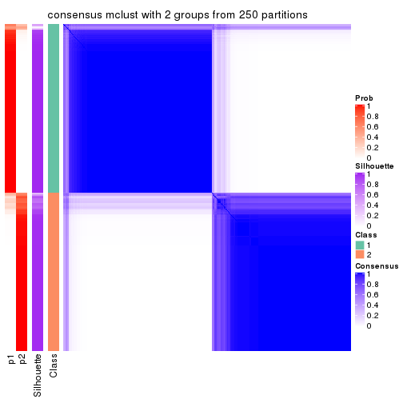</p>

</div>
<div id='tab-MAD-mclust-consensus-heatmap-2'>
<pre><code class="r">consensus_heatmap(res, k = 3)
</code></pre>

<p>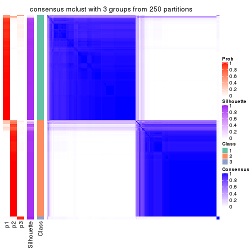</p>

</div>
<div id='tab-MAD-mclust-consensus-heatmap-3'>
<pre><code class="r">consensus_heatmap(res, k = 4)
</code></pre>

<p>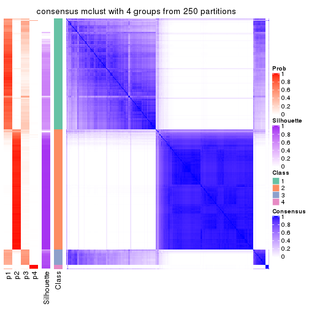</p>

</div>
<div id='tab-MAD-mclust-consensus-heatmap-4'>
<pre><code class="r">consensus_heatmap(res, k = 5)
</code></pre>

<p>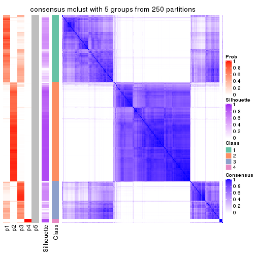</p>

</div>
<div id='tab-MAD-mclust-consensus-heatmap-5'>
<pre><code class="r">consensus_heatmap(res, k = 6)
</code></pre>

<p>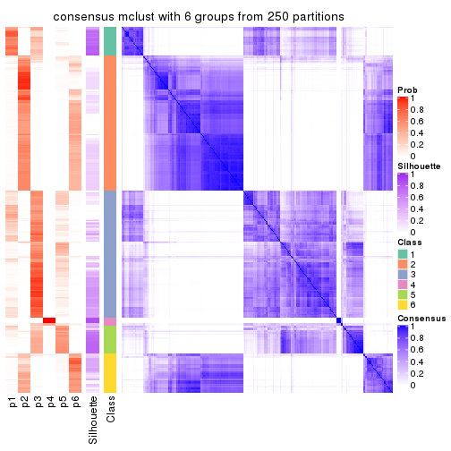</p>

</div>
</div>

Heatmaps for the membership of samples in all partitions to see how consistent they are:


<script>
$( function() {
	$( '#tabs-MAD-mclust-membership-heatmap' ).tabs();
} );
</script>
<div id='tabs-MAD-mclust-membership-heatmap'>
<ul>
<li><a href='#tab-MAD-mclust-membership-heatmap-1'>k = 2</a></li>
<li><a href='#tab-MAD-mclust-membership-heatmap-2'>k = 3</a></li>
<li><a href='#tab-MAD-mclust-membership-heatmap-3'>k = 4</a></li>
<li><a href='#tab-MAD-mclust-membership-heatmap-4'>k = 5</a></li>
<li><a href='#tab-MAD-mclust-membership-heatmap-5'>k = 6</a></li>
</ul>
<div id='tab-MAD-mclust-membership-heatmap-1'>
<pre><code class="r">membership_heatmap(res, k = 2)
</code></pre>

<p>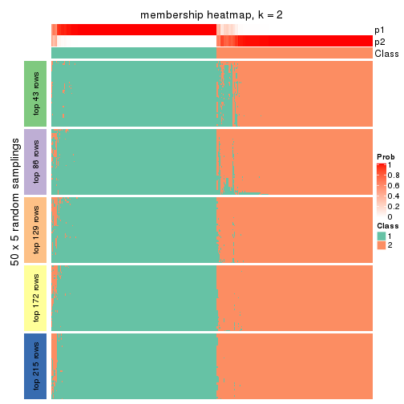</p>

</div>
<div id='tab-MAD-mclust-membership-heatmap-2'>
<pre><code class="r">membership_heatmap(res, k = 3)
</code></pre>

<p>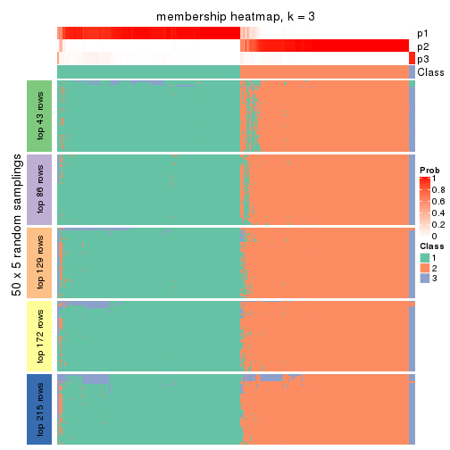</p>

</div>
<div id='tab-MAD-mclust-membership-heatmap-3'>
<pre><code class="r">membership_heatmap(res, k = 4)
</code></pre>

<p>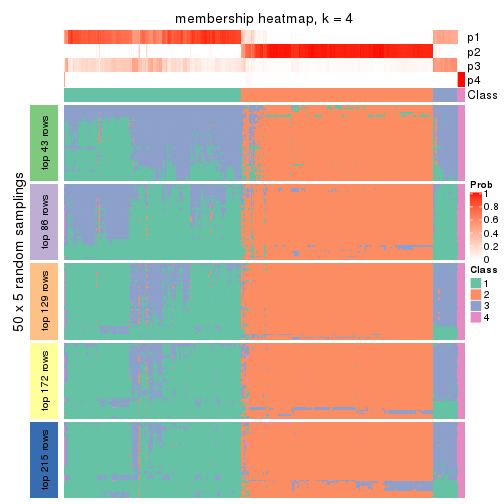</p>

</div>
<div id='tab-MAD-mclust-membership-heatmap-4'>
<pre><code class="r">membership_heatmap(res, k = 5)
</code></pre>

<p>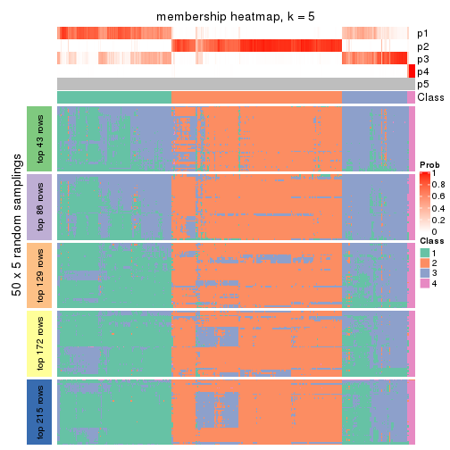</p>

</div>
<div id='tab-MAD-mclust-membership-heatmap-5'>
<pre><code class="r">membership_heatmap(res, k = 6)
</code></pre>

<p>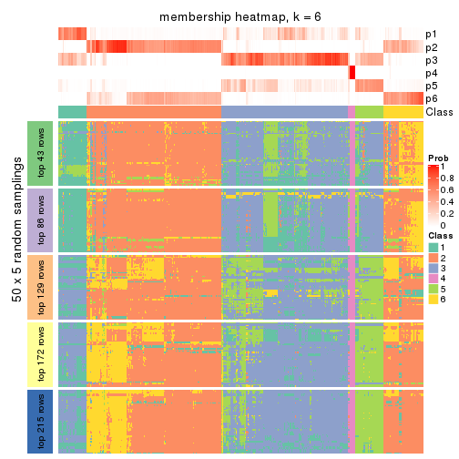</p>

</div>
</div>

As soon as we have had the classes for columns, we can look for signatures
which are significantly different between classes which can be candidate marks
for certain classes. Following are the heatmaps for signatures.


Signature heatmaps where rows are scaled:


<script>
$( function() {
	$( '#tabs-MAD-mclust-get-signatures' ).tabs();
} );
</script>
<div id='tabs-MAD-mclust-get-signatures'>
<ul>
<li><a href='#tab-MAD-mclust-get-signatures-1'>k = 2</a></li>
<li><a href='#tab-MAD-mclust-get-signatures-2'>k = 3</a></li>
<li><a href='#tab-MAD-mclust-get-signatures-3'>k = 4</a></li>
<li><a href='#tab-MAD-mclust-get-signatures-4'>k = 5</a></li>
<li><a href='#tab-MAD-mclust-get-signatures-5'>k = 6</a></li>
</ul>
<div id='tab-MAD-mclust-get-signatures-1'>
<pre><code class="r">get_signatures(res, k = 2)
</code></pre>

<p>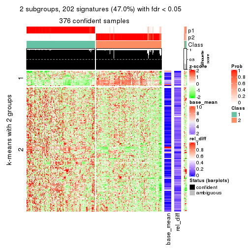</p>

</div>
<div id='tab-MAD-mclust-get-signatures-2'>
<pre><code class="r">get_signatures(res, k = 3)
</code></pre>

<p>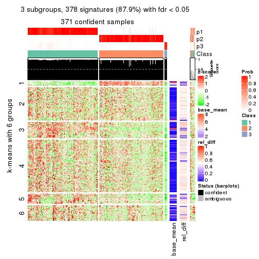</p>

</div>
<div id='tab-MAD-mclust-get-signatures-3'>
<pre><code class="r">get_signatures(res, k = 4)
</code></pre>

<p>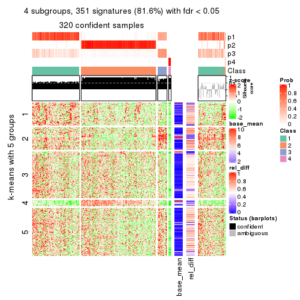</p>

</div>
<div id='tab-MAD-mclust-get-signatures-4'>
<pre><code class="r">get_signatures(res, k = 5)
</code></pre>

<p>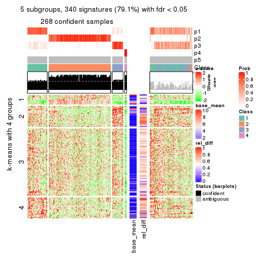</p>

</div>
<div id='tab-MAD-mclust-get-signatures-5'>
<pre><code class="r">get_signatures(res, k = 6)
</code></pre>

<p>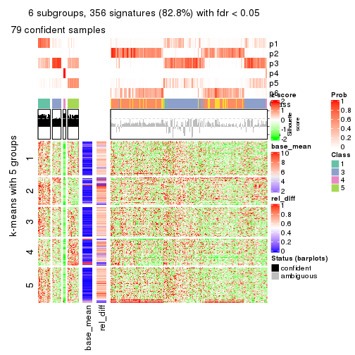</p>

</div>
</div>


Signature heatmaps where rows are not scaled:


<script>
$( function() {
	$( '#tabs-MAD-mclust-get-signatures-no-scale' ).tabs();
} );
</script>
<div id='tabs-MAD-mclust-get-signatures-no-scale'>
<ul>
<li><a href='#tab-MAD-mclust-get-signatures-no-scale-1'>k = 2</a></li>
<li><a href='#tab-MAD-mclust-get-signatures-no-scale-2'>k = 3</a></li>
<li><a href='#tab-MAD-mclust-get-signatures-no-scale-3'>k = 4</a></li>
<li><a href='#tab-MAD-mclust-get-signatures-no-scale-4'>k = 5</a></li>
<li><a href='#tab-MAD-mclust-get-signatures-no-scale-5'>k = 6</a></li>
</ul>
<div id='tab-MAD-mclust-get-signatures-no-scale-1'>
<pre><code class="r">get_signatures(res, k = 2, scale_rows = FALSE)
</code></pre>

<p>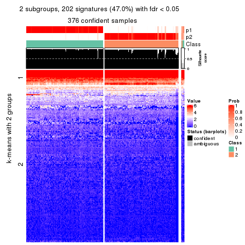</p>

</div>
<div id='tab-MAD-mclust-get-signatures-no-scale-2'>
<pre><code class="r">get_signatures(res, k = 3, scale_rows = FALSE)
</code></pre>

<p>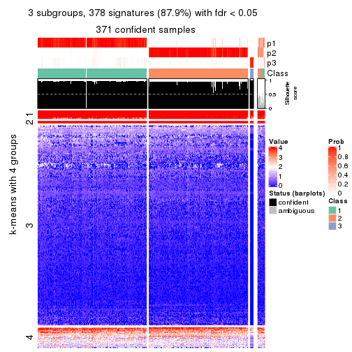</p>

</div>
<div id='tab-MAD-mclust-get-signatures-no-scale-3'>
<pre><code class="r">get_signatures(res, k = 4, scale_rows = FALSE)
</code></pre>

<p>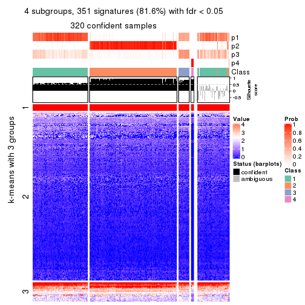</p>

</div>
<div id='tab-MAD-mclust-get-signatures-no-scale-4'>
<pre><code class="r">get_signatures(res, k = 5, scale_rows = FALSE)
</code></pre>

<p>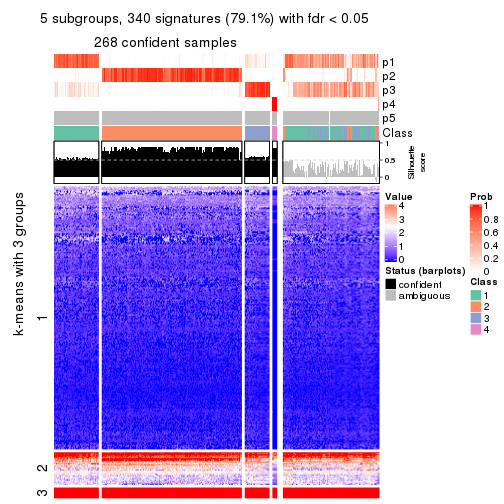</p>

</div>
<div id='tab-MAD-mclust-get-signatures-no-scale-5'>
<pre><code class="r">get_signatures(res, k = 6, scale_rows = FALSE)
</code></pre>

<p>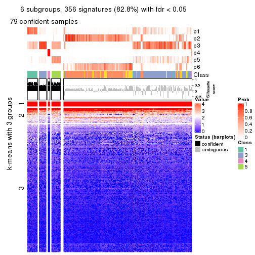</p>

</div>
</div>


Compare the overlap of signatures from different k:

```r
compare_signatures(res)
```

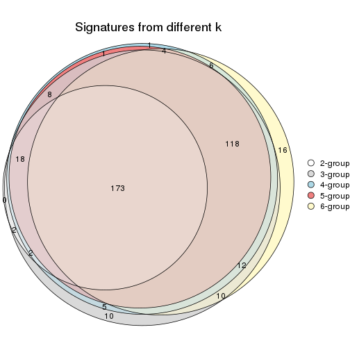

`get_signature()` returns a data frame invisibly. TO get the list of signatures, the function
call should be assigned to a variable explicitly. In following code, if `plot` argument is set
to `FALSE`, no heatmap is plotted while only the differential analysis is performed.

```r
# code only for demonstration
tb = get_signature(res, k = ..., plot = FALSE)
```

An example of the output of `tb` is:

```
#>   which_row         fdr    mean_1    mean_2 scaled_mean_1 scaled_mean_2 km
#> 1        38 0.042760348  8.373488  9.131774    -0.5533452     0.5164555  1
#> 2        40 0.018707592  7.106213  8.469186    -0.6173731     0.5762149  1
#> 3        55 0.019134737 10.221463 11.207825    -0.6159697     0.5749050  1
#> 4        59 0.006059896  5.921854  7.869574    -0.6899429     0.6439467  1
#> 5        60 0.018055526  8.928898 10.211722    -0.6204761     0.5791110  1
#> 6        98 0.009384629 15.714769 14.887706     0.6635654    -0.6193277  2
...
```

The columns in `tb` are:

1. `which_row`: row indices corresponding to the input matrix.
2. `fdr`: FDR for the differential test. 
3. `mean_x`: The mean value in group x.
4. `scaled_mean_x`: The mean value in group x after rows are scaled.
5. `km`: Row groups if k-means clustering is applied to rows.


UMAP plot which shows how samples are separated.


<script>
$( function() {
	$( '#tabs-MAD-mclust-dimension-reduction' ).tabs();
} );
</script>
<div id='tabs-MAD-mclust-dimension-reduction'>
<ul>
<li><a href='#tab-MAD-mclust-dimension-reduction-1'>k = 2</a></li>
<li><a href='#tab-MAD-mclust-dimension-reduction-2'>k = 3</a></li>
<li><a href='#tab-MAD-mclust-dimension-reduction-3'>k = 4</a></li>
<li><a href='#tab-MAD-mclust-dimension-reduction-4'>k = 5</a></li>
<li><a href='#tab-MAD-mclust-dimension-reduction-5'>k = 6</a></li>
</ul>
<div id='tab-MAD-mclust-dimension-reduction-1'>
<pre><code class="r">dimension_reduction(res, k = 2, method = &quot;UMAP&quot;)
</code></pre>

<p>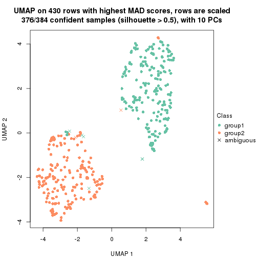</p>

</div>
<div id='tab-MAD-mclust-dimension-reduction-2'>
<pre><code class="r">dimension_reduction(res, k = 3, method = &quot;UMAP&quot;)
</code></pre>

<p>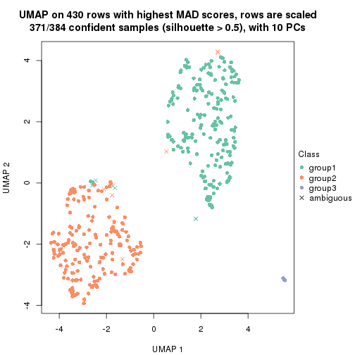</p>

</div>
<div id='tab-MAD-mclust-dimension-reduction-3'>
<pre><code class="r">dimension_reduction(res, k = 4, method = &quot;UMAP&quot;)
</code></pre>

<p>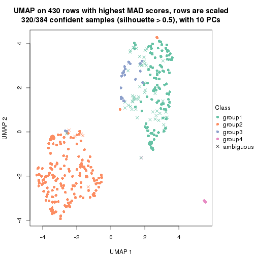</p>

</div>
<div id='tab-MAD-mclust-dimension-reduction-4'>
<pre><code class="r">dimension_reduction(res, k = 5, method = &quot;UMAP&quot;)
</code></pre>

<p>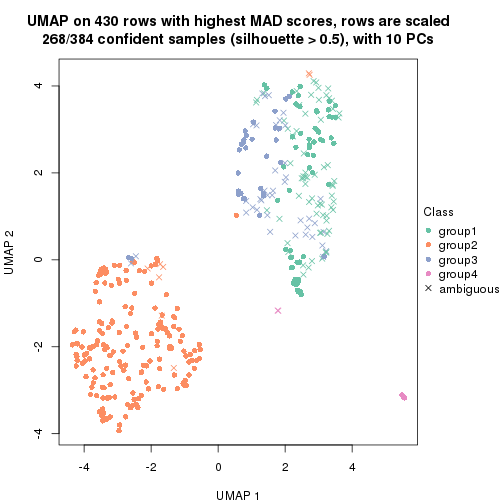</p>

</div>
<div id='tab-MAD-mclust-dimension-reduction-5'>
<pre><code class="r">dimension_reduction(res, k = 6, method = &quot;UMAP&quot;)
</code></pre>

<p>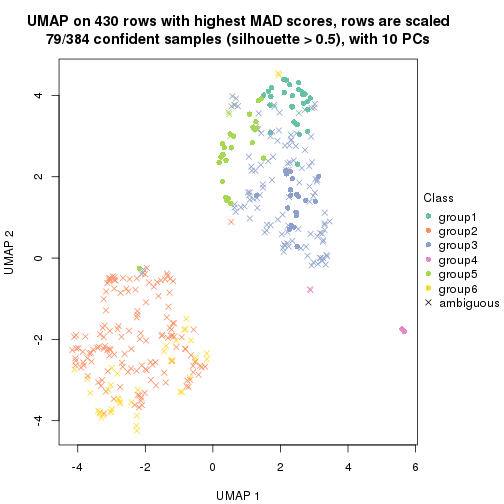</p>

</div>
</div>


Following heatmap shows how subgroups are split when increasing `k`:

```r
collect_classes(res)
```

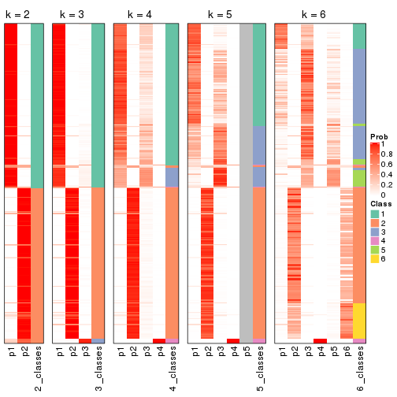


If matrix rows can be associated to genes, consider to use `GO_Enrichment(res,
...)` to perform function enrichment for the signature genes.


 

---------------------------------------------------


### MAD:NMF*


The object with results only for a single top-value method and a single partition method 
can be extracted as:

```r
res = res_list["MAD", "NMF"]
# you can also extract it by
# res = res_list["MAD:NMF"]
```

A summary of `res` and all the functions that can be applied to it:

```r
res
```

```
#> A 'ConsensusPartition' object with k = 2, 3, 4, 5, 6.
#>   On a matrix with 430 rows and 384 columns.
#>   Top rows (43, 86, 129, 172, 215) are extracted by 'MAD' method.
#>   Subgroups are detected by 'NMF' method.
#>   Performed in total 1250 partitions by row resampling.
#>   Best k for subgroups seems to be 2.
#> 
#> Following methods can be applied to this 'ConsensusPartition' object:
#>  [1] "cola_report"             "collect_classes"         "collect_plots"          
#>  [4] "collect_stats"           "colnames"                "compare_signatures"     
#>  [7] "consensus_heatmap"       "dimension_reduction"     "functional_enrichment"  
#> [10] "get_anno_col"            "get_anno"                "get_classes"            
#> [13] "get_consensus"           "get_matrix"              "get_membership"         
#> [16] "get_param"               "get_signatures"          "get_stats"              
#> [19] "is_best_k"               "is_stable_k"             "membership_heatmap"     
#> [22] "ncol"                    "nrow"                    "plot_ecdf"              
#> [25] "rownames"                "select_partition_number" "show"                   
#> [28] "suggest_best_k"          "test_to_known_factors"
```

`collect_plots()` function collects all the plots made from `res` for all `k` (number of partitions)
into one single page to provide an easy and fast comparison between different `k`.

```r
collect_plots(res)
```

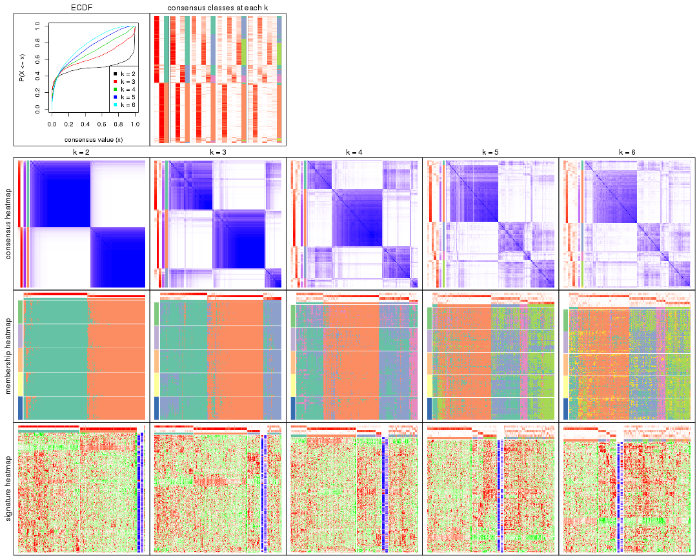

The plots are:

- The first row: a plot of the ECDF (Empirical cumulative distribution
  function) curves of the consensus matrix for each `k` and the heatmap of
  predicted classes for each `k`.
- The second row: heatmaps of the consensus matrix for each `k`.
- The third row: heatmaps of the membership matrix for each `k`.
- The fouth row: heatmaps of the signatures for each `k`.

All the plots in panels can be made by individual functions and they are
plotted later in this section.

`select_partition_number()` produces several plots showing different
statistics for choosing "optimized" `k`. There are following statistics:

- ECDF curves of the consensus matrix for each `k`;
- 1-PAC. [The PAC
  score](https://en.wikipedia.org/wiki/Consensus_clustering#Over-interpretation_potential_of_consensus_clustering)
  measures the proportion of the ambiguous subgrouping.
- Mean silhouette score.
- Concordance. The mean probability of fiting the consensus class ids in all
  partitions.
- Area increased. Denote $A_k$ as the area under the ECDF curve for current
  `k`, the area increased is defined as $A_k - A_{k-1}$.
- Rand index. The percent of pairs of samples that are both in a same cluster
  or both are not in a same cluster in the partition of k and k-1.
- Jaccard index. The ratio of pairs of samples are both in a same cluster in
  the partition of k and k-1 and the pairs of samples are both in a same
  cluster in the partition k or k-1.

The detailed explanations of these statistics can be found in [the cola
vignette](http://bioconductor.org/packages/devel/bioc/vignettes/cola/inst/doc/cola.html#toc_13).

Generally speaking, lower PAC score, higher mean silhouette score or higher
concordance corresponds to better partition. Rand index and Jaccard index
measure how similar the current partition is compared to partition with `k-1`.
If they are too similar, we won't accept `k` is better than `k-1`.

```r
select_partition_number(res)
```

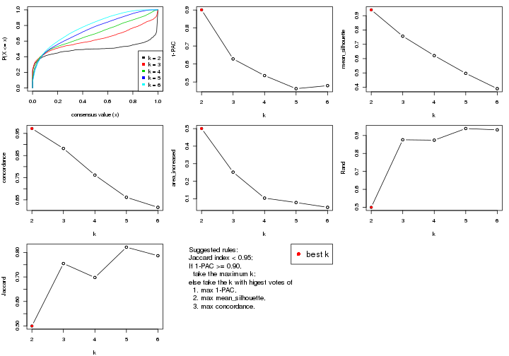

The numeric values for all these statistics can be obtained by `get_stats()`.

```r
get_stats(res)
```

```
#>   k 1-PAC mean_silhouette concordance area_increased  Rand Jaccard
#> 2 2 0.901           0.941       0.972         0.5005 0.500   0.500
#> 3 3 0.628           0.757       0.882         0.2519 0.876   0.755
#> 4 4 0.536           0.621       0.762         0.1038 0.874   0.698
#> 5 5 0.463           0.497       0.661         0.0786 0.939   0.821
#> 6 6 0.480           0.390       0.616         0.0512 0.931   0.787
```

`suggest_best_k()` suggests the best $k$ based on these statistics. The rules are as follows:

- All $k$ with Jaccard index larger than 0.95 are removed because the increase of
  the partition number does not provides enough extra information. If all $k$ are removed,
  the best $k$ is assigned by `NA`.
- For $k$ with 1-PAC larger than 0.9, the maximal $k$ is taken as the "best k". Other $k$ is called "optional k".
- If it does not fit the second rule. The $k$ with the highest vote of highest
  1-PAC, mean silhouette and concordance is taken as the "best k".

```r
suggest_best_k(res)
```

```
#> [1] 2
```


Following shows the table of the partitions (You need to click the **show/hide
code output** link to see it). The membership matrix (columns with name `p*`)
is inferred by
[`clue::cl_consensus()`](https://www.rdocumentation.org/link/cl_consensus?package=clue)
function with the `SE` method. Basically the value in the membership matrix
represents the probability to belong to a certain group. The finall class
label for an item is determined with the group with highest probability it
belongs to.

In `get_classes()` function, the entropy is calculated from the membership
matrix and the silhouette score is calculated from the consensus matrix.


<script>
$( function() {
	$( '#tabs-MAD-NMF-get-classes' ).tabs();
} );
</script>
<div id='tabs-MAD-NMF-get-classes'>
<ul>
<li><a href='#tab-MAD-NMF-get-classes-1'>k = 2</a></li>
<li><a href='#tab-MAD-NMF-get-classes-2'>k = 3</a></li>
<li><a href='#tab-MAD-NMF-get-classes-3'>k = 4</a></li>
<li><a href='#tab-MAD-NMF-get-classes-4'>k = 5</a></li>
<li><a href='#tab-MAD-NMF-get-classes-5'>k = 6</a></li>
</ul>

<div id='tab-MAD-NMF-get-classes-1'>
<p><a id='tab-MAD-NMF-get-classes-1-a' style='color:#0366d6' href='#'>show/hide code output</a></p>
<pre><code class="r">cbind(get_classes(res, k = 2), get_membership(res, k = 2))
</code></pre>

<pre><code>#&gt;            class entropy silhouette    p1    p2
#&gt; SRR2105277     1  0.0000      0.968 1.000 0.000
#&gt; SRR2105278     1  0.0000      0.968 1.000 0.000
#&gt; SRR2105275     1  0.0000      0.968 1.000 0.000
#&gt; SRR2105276     1  0.0000      0.968 1.000 0.000
#&gt; SRR2105273     1  0.0000      0.968 1.000 0.000
#&gt; SRR2105274     1  0.0000      0.968 1.000 0.000
#&gt; SRR2105271     1  0.0000      0.968 1.000 0.000
#&gt; SRR2105272     1  0.0000      0.968 1.000 0.000
#&gt; SRR2105269     2  0.0000      0.974 0.000 1.000
#&gt; SRR2105270     2  0.0000      0.974 0.000 1.000
#&gt; SRR2105267     2  0.0000      0.974 0.000 1.000
#&gt; SRR2105268     2  0.0000      0.974 0.000 1.000
#&gt; SRR2105265     2  0.0000      0.974 0.000 1.000
#&gt; SRR2105266     2  0.0000      0.974 0.000 1.000
#&gt; SRR2105263     2  0.1843      0.958 0.028 0.972
#&gt; SRR2105264     2  0.3114      0.935 0.056 0.944
#&gt; SRR2105261     1  0.0000      0.968 1.000 0.000
#&gt; SRR2105262     1  0.0938      0.962 0.988 0.012
#&gt; SRR2105357     1  0.0000      0.968 1.000 0.000
#&gt; SRR2105358     1  0.0000      0.968 1.000 0.000
#&gt; SRR2105439     2  0.0376      0.973 0.004 0.996
#&gt; SRR2105440     2  0.0672      0.971 0.008 0.992
#&gt; SRR2105509     2  0.0000      0.974 0.000 1.000
#&gt; SRR2105510     2  0.0000      0.974 0.000 1.000
#&gt; SRR2105507     1  0.0000      0.968 1.000 0.000
#&gt; SRR2105508     1  0.0000      0.968 1.000 0.000
#&gt; SRR2105505     1  0.0376      0.966 0.996 0.004
#&gt; SRR2105506     1  0.0000      0.968 1.000 0.000
#&gt; SRR2105503     2  0.0376      0.973 0.004 0.996
#&gt; SRR2105504     2  0.1184      0.966 0.016 0.984
#&gt; SRR2105501     2  0.4690      0.889 0.100 0.900
#&gt; SRR2105502     2  0.0376      0.973 0.004 0.996
#&gt; SRR2105499     1  0.0000      0.968 1.000 0.000
#&gt; SRR2105500     1  0.0000      0.968 1.000 0.000
#&gt; SRR2105497     2  0.0000      0.974 0.000 1.000
#&gt; SRR2105498     2  0.0938      0.968 0.012 0.988
#&gt; SRR2105495     2  0.0376      0.973 0.004 0.996
#&gt; SRR2105496     2  0.0000      0.974 0.000 1.000
#&gt; SRR2105493     2  0.4939      0.881 0.108 0.892
#&gt; SRR2105494     2  0.1843      0.958 0.028 0.972
#&gt; SRR2105491     2  0.2423      0.948 0.040 0.960
#&gt; SRR2105492     2  0.2778      0.942 0.048 0.952
#&gt; SRR2105489     2  0.0000      0.974 0.000 1.000
#&gt; SRR2105490     2  0.0000      0.974 0.000 1.000
#&gt; SRR2105487     1  0.0000      0.968 1.000 0.000
#&gt; SRR2105488     1  0.0000      0.968 1.000 0.000
#&gt; SRR2105485     1  0.0000      0.968 1.000 0.000
#&gt; SRR2105486     1  0.0000      0.968 1.000 0.000
#&gt; SRR2105483     1  0.9209      0.516 0.664 0.336
#&gt; SRR2105484     1  0.9323      0.488 0.652 0.348
#&gt; SRR2105481     1  0.0000      0.968 1.000 0.000
#&gt; SRR2105482     1  0.0000      0.968 1.000 0.000
#&gt; SRR2105479     1  0.0000      0.968 1.000 0.000
#&gt; SRR2105480     1  0.0376      0.966 0.996 0.004
#&gt; SRR2105477     2  0.2043      0.955 0.032 0.968
#&gt; SRR2105478     2  0.2948      0.938 0.052 0.948
#&gt; SRR2105475     2  0.0000      0.974 0.000 1.000
#&gt; SRR2105476     2  0.0000      0.974 0.000 1.000
#&gt; SRR2105473     2  0.0376      0.973 0.004 0.996
#&gt; SRR2105474     2  0.0000      0.974 0.000 1.000
#&gt; SRR2105471     2  0.0000      0.974 0.000 1.000
#&gt; SRR2105472     2  0.0000      0.974 0.000 1.000
#&gt; SRR2105469     1  0.0000      0.968 1.000 0.000
#&gt; SRR2105470     1  0.0000      0.968 1.000 0.000
#&gt; SRR2105467     1  0.0000      0.968 1.000 0.000
#&gt; SRR2105468     1  0.0000      0.968 1.000 0.000
#&gt; SRR2105465     1  0.1414      0.957 0.980 0.020
#&gt; SRR2105466     1  0.5519      0.857 0.872 0.128
#&gt; SRR2105463     1  0.0000      0.968 1.000 0.000
#&gt; SRR2105464     1  0.0938      0.962 0.988 0.012
#&gt; SRR2105461     2  0.0000      0.974 0.000 1.000
#&gt; SRR2105462     2  0.0000      0.974 0.000 1.000
#&gt; SRR2105459     2  0.0000      0.974 0.000 1.000
#&gt; SRR2105460     2  0.0000      0.974 0.000 1.000
#&gt; SRR2105457     1  0.0000      0.968 1.000 0.000
#&gt; SRR2105458     1  0.0000      0.968 1.000 0.000
#&gt; SRR2105455     1  0.1184      0.959 0.984 0.016
#&gt; SRR2105456     1  0.0000      0.968 1.000 0.000
#&gt; SRR2105453     1  0.0000      0.968 1.000 0.000
#&gt; SRR2105454     1  0.0000      0.968 1.000 0.000
#&gt; SRR2105451     2  0.7376      0.753 0.208 0.792
#&gt; SRR2105452     1  0.9775      0.312 0.588 0.412
#&gt; SRR2105449     1  0.2778      0.936 0.952 0.048
#&gt; SRR2105450     1  0.0000      0.968 1.000 0.000
#&gt; SRR2105447     2  0.0376      0.973 0.004 0.996
#&gt; SRR2105448     2  0.0000      0.974 0.000 1.000
#&gt; SRR2105445     1  0.2043      0.948 0.968 0.032
#&gt; SRR2105446     1  0.1843      0.951 0.972 0.028
#&gt; SRR2105443     1  0.8861      0.579 0.696 0.304
#&gt; SRR2105444     2  0.9963      0.133 0.464 0.536
#&gt; SRR2105441     2  0.0000      0.974 0.000 1.000
#&gt; SRR2105442     2  0.0376      0.973 0.004 0.996
#&gt; SRR2105437     1  0.0000      0.968 1.000 0.000
#&gt; SRR2105438     1  0.0000      0.968 1.000 0.000
#&gt; SRR2105435     1  0.0000      0.968 1.000 0.000
#&gt; SRR2105436     1  0.0000      0.968 1.000 0.000
#&gt; SRR2105433     1  0.4690      0.887 0.900 0.100
#&gt; SRR2105434     1  0.2423      0.942 0.960 0.040
#&gt; SRR2105431     1  0.0000      0.968 1.000 0.000
#&gt; SRR2105432     1  0.0000      0.968 1.000 0.000
#&gt; SRR2105429     2  0.7376      0.750 0.208 0.792
#&gt; SRR2105430     2  0.0376      0.973 0.004 0.996
#&gt; SRR2105427     2  0.0000      0.974 0.000 1.000
#&gt; SRR2105428     2  0.0000      0.974 0.000 1.000
#&gt; SRR2105425     2  0.0376      0.973 0.004 0.996
#&gt; SRR2105426     2  0.0000      0.974 0.000 1.000
#&gt; SRR2105421     1  0.0938      0.962 0.988 0.012
#&gt; SRR2105422     1  0.0000      0.968 1.000 0.000
#&gt; SRR2105423     2  0.0000      0.974 0.000 1.000
#&gt; SRR2105424     2  0.0000      0.974 0.000 1.000
#&gt; SRR2105419     1  0.0000      0.968 1.000 0.000
#&gt; SRR2105420     1  0.0000      0.968 1.000 0.000
#&gt; SRR2105415     1  0.0000      0.968 1.000 0.000
#&gt; SRR2105416     1  0.0000      0.968 1.000 0.000
#&gt; SRR2105417     1  0.0000      0.968 1.000 0.000
#&gt; SRR2105418     1  0.0938      0.961 0.988 0.012
#&gt; SRR2105413     2  0.0000      0.974 0.000 1.000
#&gt; SRR2105414     2  0.0376      0.973 0.004 0.996
#&gt; SRR2105409     2  0.0000      0.974 0.000 1.000
#&gt; SRR2105410     2  0.0000      0.974 0.000 1.000
#&gt; SRR2105411     2  0.0000      0.974 0.000 1.000
#&gt; SRR2105412     2  0.0000      0.974 0.000 1.000
#&gt; SRR2105407     1  0.0000      0.968 1.000 0.000
#&gt; SRR2105408     1  0.0000      0.968 1.000 0.000
#&gt; SRR2105403     1  0.0000      0.968 1.000 0.000
#&gt; SRR2105404     1  0.0000      0.968 1.000 0.000
#&gt; SRR2105405     1  0.0000      0.968 1.000 0.000
#&gt; SRR2105406     1  0.0000      0.968 1.000 0.000
#&gt; SRR2105401     2  0.6531      0.806 0.168 0.832
#&gt; SRR2105402     2  0.5842      0.844 0.140 0.860
#&gt; SRR2105399     2  0.3274      0.930 0.060 0.940
#&gt; SRR2105400     2  0.2948      0.938 0.052 0.948
#&gt; SRR2105397     1  0.8144      0.678 0.748 0.252
#&gt; SRR2105398     1  0.2236      0.945 0.964 0.036
#&gt; SRR2105395     2  0.0000      0.974 0.000 1.000
#&gt; SRR2105396     2  0.0000      0.974 0.000 1.000
#&gt; SRR2105393     2  0.0000      0.974 0.000 1.000
#&gt; SRR2105394     2  0.0000      0.974 0.000 1.000
#&gt; SRR2105389     1  0.0000      0.968 1.000 0.000
#&gt; SRR2105390     1  0.0000      0.968 1.000 0.000
#&gt; SRR2105391     1  0.0000      0.968 1.000 0.000
#&gt; SRR2105392     1  0.0000      0.968 1.000 0.000
#&gt; SRR2105385     1  0.0000      0.968 1.000 0.000
#&gt; SRR2105386     1  0.0000      0.968 1.000 0.000
#&gt; SRR2105387     1  0.0672      0.964 0.992 0.008
#&gt; SRR2105388     1  0.0000      0.968 1.000 0.000
#&gt; SRR2105381     2  0.5408      0.864 0.124 0.876
#&gt; SRR2105382     2  0.1843      0.958 0.028 0.972
#&gt; SRR2105383     2  0.0000      0.974 0.000 1.000
#&gt; SRR2105384     2  0.0376      0.973 0.004 0.996
#&gt; SRR2105379     2  0.0672      0.971 0.008 0.992
#&gt; SRR2105380     2  0.6973      0.781 0.188 0.812
#&gt; SRR2105377     2  0.0376      0.973 0.004 0.996
#&gt; SRR2105378     2  0.0376      0.973 0.004 0.996
#&gt; SRR2105375     1  0.3114      0.930 0.944 0.056
#&gt; SRR2105376     1  0.0000      0.968 1.000 0.000
#&gt; SRR2105373     1  0.0000      0.968 1.000 0.000
#&gt; SRR2105374     1  0.0000      0.968 1.000 0.000
#&gt; SRR2105371     1  0.0000      0.968 1.000 0.000
#&gt; SRR2105372     1  0.0000      0.968 1.000 0.000
#&gt; SRR2105369     1  0.0000      0.968 1.000 0.000
#&gt; SRR2105370     1  0.0000      0.968 1.000 0.000
#&gt; SRR2105367     1  0.0376      0.966 0.996 0.004
#&gt; SRR2105368     1  0.3584      0.919 0.932 0.068
#&gt; SRR2105365     2  0.2948      0.938 0.052 0.948
#&gt; SRR2105366     2  0.3114      0.935 0.056 0.944
#&gt; SRR2105363     2  0.0000      0.974 0.000 1.000
#&gt; SRR2105364     2  0.0000      0.974 0.000 1.000
#&gt; SRR2105361     2  0.0000      0.974 0.000 1.000
#&gt; SRR2105362     2  0.0000      0.974 0.000 1.000
#&gt; SRR2105359     1  0.0000      0.968 1.000 0.000
#&gt; SRR2105360     1  0.0000      0.968 1.000 0.000
#&gt; SRR2105355     1  0.0000      0.968 1.000 0.000
#&gt; SRR2105356     1  0.0000      0.968 1.000 0.000
#&gt; SRR2105353     1  0.0000      0.968 1.000 0.000
#&gt; SRR2105354     1  0.0000      0.968 1.000 0.000
#&gt; SRR2105351     2  0.0000      0.974 0.000 1.000
#&gt; SRR2105352     2  0.3879      0.918 0.076 0.924
#&gt; SRR2105349     2  0.0376      0.973 0.004 0.996
#&gt; SRR2105350     2  0.0000      0.974 0.000 1.000
#&gt; SRR2105345     2  0.0000      0.974 0.000 1.000
#&gt; SRR2105346     2  0.0000      0.974 0.000 1.000
#&gt; SRR2105347     2  0.0000      0.974 0.000 1.000
#&gt; SRR2105348     2  0.0000      0.974 0.000 1.000
#&gt; SRR2105343     2  0.0000      0.974 0.000 1.000
#&gt; SRR2105344     2  0.0000      0.974 0.000 1.000
#&gt; SRR2105341     1  0.0000      0.968 1.000 0.000
#&gt; SRR2105342     1  0.0000      0.968 1.000 0.000
#&gt; SRR2105339     1  0.0000      0.968 1.000 0.000
#&gt; SRR2105340     1  0.0000      0.968 1.000 0.000
#&gt; SRR2105335     1  0.0000      0.968 1.000 0.000
#&gt; SRR2105336     1  0.0000      0.968 1.000 0.000
#&gt; SRR2105337     1  0.0000      0.968 1.000 0.000
#&gt; SRR2105338     1  0.0000      0.968 1.000 0.000
#&gt; SRR2105331     2  0.1184      0.966 0.016 0.984
#&gt; SRR2105332     2  0.0376      0.973 0.004 0.996
#&gt; SRR2105333     2  0.0376      0.973 0.004 0.996
#&gt; SRR2105334     2  0.0000      0.974 0.000 1.000
#&gt; SRR2105329     1  0.7674      0.725 0.776 0.224
#&gt; SRR2105330     2  0.8813      0.588 0.300 0.700
#&gt; SRR2105327     2  0.0376      0.973 0.004 0.996
#&gt; SRR2105328     2  0.0672      0.971 0.008 0.992
#&gt; SRR2105325     1  0.0000      0.968 1.000 0.000
#&gt; SRR2105326     1  0.0000      0.968 1.000 0.000
#&gt; SRR2105323     1  0.4161      0.903 0.916 0.084
#&gt; SRR2105324     1  0.3114      0.929 0.944 0.056
#&gt; SRR2105319     1  0.0000      0.968 1.000 0.000
#&gt; SRR2105320     1  0.0000      0.968 1.000 0.000
#&gt; SRR2105321     1  0.0000      0.968 1.000 0.000
#&gt; SRR2105322     1  0.0000      0.968 1.000 0.000
#&gt; SRR2105317     2  0.0000      0.974 0.000 1.000
#&gt; SRR2105318     2  0.0000      0.974 0.000 1.000
#&gt; SRR2105315     1  0.8499      0.639 0.724 0.276
#&gt; SRR2105316     2  0.0376      0.973 0.004 0.996
#&gt; SRR2105313     2  0.0376      0.973 0.004 0.996
#&gt; SRR2105314     2  0.0000      0.974 0.000 1.000
#&gt; SRR2105311     1  0.0000      0.968 1.000 0.000
#&gt; SRR2105312     1  0.0376      0.966 0.996 0.004
#&gt; SRR2105307     1  0.0000      0.968 1.000 0.000
#&gt; SRR2105308     1  0.4431      0.897 0.908 0.092
#&gt; SRR2105309     1  0.0000      0.968 1.000 0.000
#&gt; SRR2105310     1  0.0000      0.968 1.000 0.000
#&gt; SRR2105305     1  0.0000      0.968 1.000 0.000
#&gt; SRR2105306     1  0.0000      0.968 1.000 0.000
#&gt; SRR2105303     2  0.0000      0.974 0.000 1.000
#&gt; SRR2105304     2  0.0000      0.974 0.000 1.000
#&gt; SRR2105301     2  0.2603      0.944 0.044 0.956
#&gt; SRR2105302     2  0.0000      0.974 0.000 1.000
#&gt; SRR2105299     1  0.0938      0.962 0.988 0.012
#&gt; SRR2105300     1  0.6712      0.795 0.824 0.176
#&gt; SRR2105297     2  0.3733      0.920 0.072 0.928
#&gt; SRR2105298     2  0.1184      0.966 0.016 0.984
#&gt; SRR2105295     2  0.0000      0.974 0.000 1.000
#&gt; SRR2105296     2  0.0000      0.974 0.000 1.000
#&gt; SRR2105293     1  0.0000      0.968 1.000 0.000
#&gt; SRR2105294     1  0.0000      0.968 1.000 0.000
#&gt; SRR2105291     1  0.1184      0.959 0.984 0.016
#&gt; SRR2105292     1  0.0000      0.968 1.000 0.000
#&gt; SRR2105289     1  0.0000      0.968 1.000 0.000
#&gt; SRR2105290     1  0.0000      0.968 1.000 0.000
#&gt; SRR2105287     1  0.0000      0.968 1.000 0.000
#&gt; SRR2105288     1  0.1843      0.951 0.972 0.028
#&gt; SRR2105285     2  0.0938      0.968 0.012 0.988
#&gt; SRR2105286     2  0.0000      0.974 0.000 1.000
#&gt; SRR2105283     2  0.4815      0.889 0.104 0.896
#&gt; SRR2105284     2  0.8861      0.575 0.304 0.696
#&gt; SRR2105281     2  0.0000      0.974 0.000 1.000
#&gt; SRR2105282     2  0.0000      0.974 0.000 1.000
#&gt; SRR2105259     1  0.0000      0.968 1.000 0.000
#&gt; SRR2105260     1  0.0000      0.968 1.000 0.000
#&gt; SRR2105279     2  0.0000      0.974 0.000 1.000
#&gt; SRR2105280     2  0.0000      0.974 0.000 1.000
#&gt; SRR2105257     1  0.0000      0.968 1.000 0.000
#&gt; SRR2105258     1  0.0000      0.968 1.000 0.000
#&gt; SRR2105253     2  0.0000      0.974 0.000 1.000
#&gt; SRR2105254     2  0.0000      0.974 0.000 1.000
#&gt; SRR2105255     1  0.0000      0.968 1.000 0.000
#&gt; SRR2105256     1  0.0000      0.968 1.000 0.000
#&gt; SRR2105251     2  0.0000      0.974 0.000 1.000
#&gt; SRR2105252     2  0.0000      0.974 0.000 1.000
#&gt; SRR2105249     2  0.0000      0.974 0.000 1.000
#&gt; SRR2105250     2  0.0000      0.974 0.000 1.000
#&gt; SRR2105247     2  0.0000      0.974 0.000 1.000
#&gt; SRR2105248     2  0.0000      0.974 0.000 1.000
#&gt; SRR2105245     1  0.3431      0.922 0.936 0.064
#&gt; SRR2105246     1  0.6148      0.829 0.848 0.152
#&gt; SRR2105243     1  0.0000      0.968 1.000 0.000
#&gt; SRR2105244     1  0.0000      0.968 1.000 0.000
#&gt; SRR2105241     1  0.0000      0.968 1.000 0.000
#&gt; SRR2105242     1  0.0000      0.968 1.000 0.000
#&gt; SRR2105239     1  0.0000      0.968 1.000 0.000
#&gt; SRR2105240     1  0.0000      0.968 1.000 0.000
#&gt; SRR2105237     2  0.6048      0.835 0.148 0.852
#&gt; SRR2105238     2  0.2043      0.954 0.032 0.968
#&gt; SRR2105235     2  0.0000      0.974 0.000 1.000
#&gt; SRR2105236     2  0.0000      0.974 0.000 1.000
#&gt; SRR2105233     2  0.0000      0.974 0.000 1.000
#&gt; SRR2105234     2  0.0000      0.974 0.000 1.000
#&gt; SRR2105231     2  0.0000      0.974 0.000 1.000
#&gt; SRR2105232     2  0.0000      0.974 0.000 1.000
#&gt; SRR2105227     1  0.1843      0.951 0.972 0.028
#&gt; SRR2105228     1  0.7528      0.744 0.784 0.216
#&gt; SRR2105225     1  0.0000      0.968 1.000 0.000
#&gt; SRR2105226     1  0.0000      0.968 1.000 0.000
#&gt; SRR2105229     1  0.0000      0.968 1.000 0.000
#&gt; SRR2105230     1  0.0000      0.968 1.000 0.000
#&gt; SRR2105219     2  0.0000      0.974 0.000 1.000
#&gt; SRR2105220     2  0.0000      0.974 0.000 1.000
#&gt; SRR2105221     2  0.0672      0.971 0.008 0.992
#&gt; SRR2105222     2  0.0376      0.973 0.004 0.996
#&gt; SRR2105223     1  0.0000      0.968 1.000 0.000
#&gt; SRR2105224     1  0.0000      0.968 1.000 0.000
#&gt; SRR2105217     2  0.0000      0.974 0.000 1.000
#&gt; SRR2105218     2  0.0000      0.974 0.000 1.000
#&gt; SRR2105215     2  0.0000      0.974 0.000 1.000
#&gt; SRR2105216     2  0.0000      0.974 0.000 1.000
#&gt; SRR2105213     1  0.1414      0.957 0.980 0.020
#&gt; SRR2105214     1  0.6712      0.796 0.824 0.176
#&gt; SRR2105211     1  0.0000      0.968 1.000 0.000
#&gt; SRR2105212     1  0.1184      0.959 0.984 0.016
#&gt; SRR2105209     1  0.0000      0.968 1.000 0.000
#&gt; SRR2105210     1  0.0000      0.968 1.000 0.000
#&gt; SRR2105207     1  0.0000      0.968 1.000 0.000
#&gt; SRR2105208     1  0.0672      0.964 0.992 0.008
#&gt; SRR2105205     2  0.3879      0.916 0.076 0.924
#&gt; SRR2105206     2  0.4815      0.887 0.104 0.896
#&gt; SRR2105201     2  0.0000      0.974 0.000 1.000
#&gt; SRR2105202     2  0.0376      0.973 0.004 0.996
#&gt; SRR2105203     2  0.0000      0.974 0.000 1.000
#&gt; SRR2105204     2  0.0000      0.974 0.000 1.000
#&gt; SRR2105199     2  0.0000      0.974 0.000 1.000
#&gt; SRR2105200     2  0.0000      0.974 0.000 1.000
#&gt; SRR2105197     1  0.0000      0.968 1.000 0.000
#&gt; SRR2105198     1  0.0376      0.966 0.996 0.004
#&gt; SRR2105195     1  0.6048      0.833 0.852 0.148
#&gt; SRR2105196     1  0.4690      0.888 0.900 0.100
#&gt; SRR2105193     1  0.3879      0.911 0.924 0.076
#&gt; SRR2105194     1  0.0000      0.968 1.000 0.000
#&gt; SRR2105191     1  0.0000      0.968 1.000 0.000
#&gt; SRR2105192     1  0.0000      0.968 1.000 0.000
#&gt; SRR2105189     2  0.1414      0.963 0.020 0.980
#&gt; SRR2105190     2  0.0000      0.974 0.000 1.000
#&gt; SRR2105187     2  0.7950      0.704 0.240 0.760
#&gt; SRR2105188     2  0.9129      0.533 0.328 0.672
#&gt; SRR2105179     1  0.1184      0.960 0.984 0.016
#&gt; SRR2105180     1  0.0000      0.968 1.000 0.000
#&gt; SRR2105183     2  0.0000      0.974 0.000 1.000
#&gt; SRR2105184     2  0.0000      0.974 0.000 1.000
#&gt; SRR2105185     2  0.0672      0.971 0.008 0.992
#&gt; SRR2105186     2  0.0672      0.971 0.008 0.992
#&gt; SRR2105181     1  0.0000      0.968 1.000 0.000
#&gt; SRR2105182     1  0.0000      0.968 1.000 0.000
#&gt; SRR2105177     1  0.9833      0.281 0.576 0.424
#&gt; SRR2105178     1  0.7453      0.745 0.788 0.212
#&gt; SRR2105171     2  0.0000      0.974 0.000 1.000
#&gt; SRR2105172     2  0.0000      0.974 0.000 1.000
#&gt; SRR2105175     1  0.2948      0.933 0.948 0.052
#&gt; SRR2105176     1  0.2043      0.948 0.968 0.032
#&gt; SRR2105173     2  0.0000      0.974 0.000 1.000
#&gt; SRR2105174     2  0.0000      0.974 0.000 1.000
#&gt; SRR2105169     2  0.0000      0.974 0.000 1.000
#&gt; SRR2105170     2  0.0000      0.974 0.000 1.000
#&gt; SRR2105167     2  0.0000      0.974 0.000 1.000
#&gt; SRR2105168     2  0.0000      0.974 0.000 1.000
#&gt; SRR2105165     1  0.0000      0.968 1.000 0.000
#&gt; SRR2105166     1  0.0000      0.968 1.000 0.000
#&gt; SRR2105163     1  0.0000      0.968 1.000 0.000
#&gt; SRR2105164     1  0.0000      0.968 1.000 0.000
#&gt; SRR2105161     1  0.0000      0.968 1.000 0.000
#&gt; SRR2105162     1  0.1184      0.959 0.984 0.016
#&gt; SRR2105155     2  0.0000      0.974 0.000 1.000
#&gt; SRR2105156     2  0.0000      0.974 0.000 1.000
#&gt; SRR2105157     2  0.0000      0.974 0.000 1.000
#&gt; SRR2105158     2  0.0000      0.974 0.000 1.000
#&gt; SRR2105159     1  0.0000      0.968 1.000 0.000
#&gt; SRR2105160     1  0.0000      0.968 1.000 0.000
#&gt; SRR2105153     2  0.0000      0.974 0.000 1.000
#&gt; SRR2105154     2  0.0938      0.969 0.012 0.988
#&gt; SRR2105151     2  0.0000      0.974 0.000 1.000
#&gt; SRR2105152     2  0.0000      0.974 0.000 1.000
#&gt; SRR2105149     1  0.0000      0.968 1.000 0.000
#&gt; SRR2105150     1  0.0000      0.968 1.000 0.000
#&gt; SRR2105147     1  0.0000      0.968 1.000 0.000
#&gt; SRR2105148     1  0.0000      0.968 1.000 0.000
#&gt; SRR2105143     1  0.5178      0.870 0.884 0.116
#&gt; SRR2105144     2  0.7139      0.767 0.196 0.804
#&gt; SRR2105145     1  0.3733      0.915 0.928 0.072
#&gt; SRR2105146     1  0.0000      0.968 1.000 0.000
#&gt; SRR2105141     2  0.0376      0.973 0.004 0.996
#&gt; SRR2105142     2  0.0000      0.974 0.000 1.000
#&gt; SRR2105139     2  0.0000      0.974 0.000 1.000
#&gt; SRR2105140     2  0.0000      0.974 0.000 1.000
#&gt; SRR2105137     2  0.1184      0.965 0.016 0.984
#&gt; SRR2105138     2  0.2043      0.955 0.032 0.968
#&gt; SRR2105135     2  0.0000      0.974 0.000 1.000
#&gt; SRR2105136     2  0.0000      0.974 0.000 1.000
#&gt; SRR2105133     1  0.0000      0.968 1.000 0.000
#&gt; SRR2105134     1  0.0000      0.968 1.000 0.000
#&gt; SRR2105131     1  0.9170      0.520 0.668 0.332
#&gt; SRR2105132     1  0.3114      0.928 0.944 0.056
#&gt; SRR2105129     1  0.2043      0.948 0.968 0.032
#&gt; SRR2105130     1  0.8608      0.622 0.716 0.284
#&gt; SRR2105127     1  0.3733      0.913 0.928 0.072
#&gt; SRR2105128     1  0.7528      0.740 0.784 0.216
</code></pre>

<script>
$('#tab-MAD-NMF-get-classes-1-a').parent().next().next().hide();
$('#tab-MAD-NMF-get-classes-1-a').click(function(){
  $('#tab-MAD-NMF-get-classes-1-a').parent().next().next().toggle();
  return(false);
});
</script>
</div>

<div id='tab-MAD-NMF-get-classes-2'>
<p><a id='tab-MAD-NMF-get-classes-2-a' style='color:#0366d6' href='#'>show/hide code output</a></p>
<pre><code class="r">cbind(get_classes(res, k = 3), get_membership(res, k = 3))
</code></pre>

<pre><code>#&gt;            class entropy silhouette    p1    p2    p3
#&gt; SRR2105277     1  0.0000    0.79881 1.000 0.000 0.000
#&gt; SRR2105278     1  0.0000    0.79881 1.000 0.000 0.000
#&gt; SRR2105275     3  0.0424    0.77687 0.008 0.000 0.992
#&gt; SRR2105276     3  0.0592    0.78042 0.012 0.000 0.988
#&gt; SRR2105273     1  0.4931    0.71087 0.768 0.000 0.232
#&gt; SRR2105274     1  0.5650    0.60412 0.688 0.000 0.312
#&gt; SRR2105271     1  0.6235    0.36064 0.564 0.000 0.436
#&gt; SRR2105272     3  0.4062    0.71254 0.164 0.000 0.836
#&gt; SRR2105269     2  0.0000    0.93162 0.000 1.000 0.000
#&gt; SRR2105270     2  0.0892    0.92483 0.020 0.980 0.000
#&gt; SRR2105267     2  0.0000    0.93162 0.000 1.000 0.000
#&gt; SRR2105268     2  0.0000    0.93162 0.000 1.000 0.000
#&gt; SRR2105265     2  0.0000    0.93162 0.000 1.000 0.000
#&gt; SRR2105266     2  0.0000    0.93162 0.000 1.000 0.000
#&gt; SRR2105263     2  0.5760    0.55745 0.000 0.672 0.328
#&gt; SRR2105264     2  0.5733    0.56242 0.000 0.676 0.324
#&gt; SRR2105261     1  0.6629    0.50405 0.624 0.016 0.360
#&gt; SRR2105262     1  0.2339    0.80387 0.940 0.012 0.048
#&gt; SRR2105357     1  0.0000    0.79881 1.000 0.000 0.000
#&gt; SRR2105358     1  0.0000    0.79881 1.000 0.000 0.000
#&gt; SRR2105439     2  0.2796    0.87458 0.092 0.908 0.000
#&gt; SRR2105440     2  0.4702    0.73959 0.212 0.788 0.000
#&gt; SRR2105509     2  0.0237    0.93035 0.004 0.996 0.000
#&gt; SRR2105510     2  0.0237    0.93035 0.004 0.996 0.000
#&gt; SRR2105507     3  0.6305   -0.10982 0.484 0.000 0.516
#&gt; SRR2105508     1  0.5465    0.64135 0.712 0.000 0.288
#&gt; SRR2105505     1  0.0237    0.79974 0.996 0.000 0.004
#&gt; SRR2105506     1  0.0237    0.79974 0.996 0.000 0.004
#&gt; SRR2105503     2  0.3192    0.85735 0.000 0.888 0.112
#&gt; SRR2105504     2  0.2945    0.87825 0.004 0.908 0.088
#&gt; SRR2105501     2  0.4931    0.68008 0.232 0.768 0.000
#&gt; SRR2105502     2  0.3816    0.82242 0.000 0.852 0.148
#&gt; SRR2105499     1  0.3116    0.79327 0.892 0.000 0.108
#&gt; SRR2105500     1  0.0661    0.80186 0.988 0.004 0.008
#&gt; SRR2105497     2  0.1289    0.91833 0.000 0.968 0.032
#&gt; SRR2105498     2  0.1411    0.91471 0.000 0.964 0.036
#&gt; SRR2105495     2  0.2711    0.87940 0.088 0.912 0.000
#&gt; SRR2105496     2  0.1529    0.91375 0.040 0.960 0.000
#&gt; SRR2105493     2  0.5956    0.55512 0.324 0.672 0.004
#&gt; SRR2105494     2  0.5291    0.66159 0.268 0.732 0.000
#&gt; SRR2105491     3  0.1753    0.75720 0.000 0.048 0.952
#&gt; SRR2105492     3  0.5810    0.42400 0.000 0.336 0.664
#&gt; SRR2105489     2  0.0747    0.92595 0.000 0.984 0.016
#&gt; SRR2105490     2  0.0000    0.93162 0.000 1.000 0.000
#&gt; SRR2105487     1  0.1163    0.79882 0.972 0.000 0.028
#&gt; SRR2105488     1  0.3816    0.73338 0.852 0.000 0.148
#&gt; SRR2105485     1  0.0000    0.79881 1.000 0.000 0.000
#&gt; SRR2105486     1  0.1411    0.79737 0.964 0.000 0.036
#&gt; SRR2105483     3  0.4628    0.74271 0.056 0.088 0.856
#&gt; SRR2105484     3  0.4075    0.75592 0.048 0.072 0.880
#&gt; SRR2105481     3  0.6291   -0.03796 0.468 0.000 0.532
#&gt; SRR2105482     1  0.5650    0.62585 0.688 0.000 0.312
#&gt; SRR2105479     3  0.0237    0.77995 0.004 0.000 0.996
#&gt; SRR2105480     3  0.0000    0.77839 0.000 0.000 1.000
#&gt; SRR2105477     2  0.4196    0.84569 0.024 0.864 0.112
#&gt; SRR2105478     2  0.5905    0.74487 0.044 0.772 0.184
#&gt; SRR2105475     2  0.0000    0.93162 0.000 1.000 0.000
#&gt; SRR2105476     2  0.0000    0.93162 0.000 1.000 0.000
#&gt; SRR2105473     2  0.1964    0.90328 0.056 0.944 0.000
#&gt; SRR2105474     2  0.0000    0.93162 0.000 1.000 0.000
#&gt; SRR2105471     2  0.0424    0.92917 0.000 0.992 0.008
#&gt; SRR2105472     2  0.0000    0.93162 0.000 1.000 0.000
#&gt; SRR2105469     1  0.2261    0.79731 0.932 0.000 0.068
#&gt; SRR2105470     1  0.4654    0.72173 0.792 0.000 0.208
#&gt; SRR2105467     1  0.0237    0.79974 0.996 0.000 0.004
#&gt; SRR2105468     1  0.0237    0.79974 0.996 0.000 0.004
#&gt; SRR2105465     1  0.7021    0.28126 0.544 0.020 0.436
#&gt; SRR2105466     1  0.8316    0.17977 0.496 0.080 0.424
#&gt; SRR2105463     1  0.6308    0.15299 0.508 0.000 0.492
#&gt; SRR2105464     3  0.5948    0.35822 0.360 0.000 0.640
#&gt; SRR2105461     2  0.0000    0.93162 0.000 1.000 0.000
#&gt; SRR2105462     2  0.0000    0.93162 0.000 1.000 0.000
#&gt; SRR2105459     2  0.0000    0.93162 0.000 1.000 0.000
#&gt; SRR2105460     2  0.0000    0.93162 0.000 1.000 0.000
#&gt; SRR2105457     1  0.0237    0.80047 0.996 0.000 0.004
#&gt; SRR2105458     1  0.0000    0.79881 1.000 0.000 0.000
#&gt; SRR2105455     1  0.6948    0.20721 0.512 0.016 0.472
#&gt; SRR2105456     1  0.5859    0.55750 0.656 0.000 0.344
#&gt; SRR2105453     1  0.0000    0.79881 1.000 0.000 0.000
#&gt; SRR2105454     1  0.0000    0.79881 1.000 0.000 0.000
#&gt; SRR2105451     2  0.6434    0.42761 0.380 0.612 0.008
#&gt; SRR2105452     3  0.8825    0.41138 0.132 0.336 0.532
#&gt; SRR2105449     3  0.4353    0.71769 0.156 0.008 0.836
#&gt; SRR2105450     1  0.5431    0.65243 0.716 0.000 0.284
#&gt; SRR2105447     2  0.2711    0.87166 0.088 0.912 0.000
#&gt; SRR2105448     2  0.0000    0.93162 0.000 1.000 0.000
#&gt; SRR2105445     1  0.0892    0.79287 0.980 0.020 0.000
#&gt; SRR2105446     1  0.0000    0.79881 1.000 0.000 0.000
#&gt; SRR2105443     1  0.3752    0.65517 0.856 0.144 0.000
#&gt; SRR2105444     1  0.6816    0.03412 0.516 0.472 0.012
#&gt; SRR2105441     2  0.0592    0.92789 0.012 0.988 0.000
#&gt; SRR2105442     2  0.0000    0.93162 0.000 1.000 0.000
#&gt; SRR2105437     1  0.5621    0.51099 0.692 0.000 0.308
#&gt; SRR2105438     1  0.6168    0.25009 0.588 0.000 0.412
#&gt; SRR2105435     1  0.2165    0.80258 0.936 0.000 0.064
#&gt; SRR2105436     1  0.0592    0.80182 0.988 0.000 0.012
#&gt; SRR2105433     3  0.3213    0.76357 0.092 0.008 0.900
#&gt; SRR2105434     3  0.6286    0.02489 0.464 0.000 0.536
#&gt; SRR2105431     1  0.5678    0.60606 0.684 0.000 0.316
#&gt; SRR2105432     1  0.5926    0.55532 0.644 0.000 0.356
#&gt; SRR2105429     2  0.6191    0.73309 0.140 0.776 0.084
#&gt; SRR2105430     2  0.1163    0.92045 0.000 0.972 0.028
#&gt; SRR2105427     2  0.1031    0.92240 0.024 0.976 0.000
#&gt; SRR2105428     2  0.0237    0.93035 0.004 0.996 0.000
#&gt; SRR2105425     2  0.0424    0.92907 0.000 0.992 0.008
#&gt; SRR2105426     2  0.0000    0.93162 0.000 1.000 0.000
#&gt; SRR2105421     1  0.5763    0.64481 0.716 0.008 0.276
#&gt; SRR2105422     1  0.5465    0.63811 0.712 0.000 0.288
#&gt; SRR2105423     2  0.0000    0.93162 0.000 1.000 0.000
#&gt; SRR2105424     2  0.0000    0.93162 0.000 1.000 0.000
#&gt; SRR2105419     1  0.0592    0.80132 0.988 0.000 0.012
#&gt; SRR2105420     1  0.3116    0.78914 0.892 0.000 0.108
#&gt; SRR2105415     1  0.5098    0.69465 0.752 0.000 0.248
#&gt; SRR2105416     1  0.4002    0.76649 0.840 0.000 0.160
#&gt; SRR2105417     1  0.5760    0.57322 0.672 0.000 0.328
#&gt; SRR2105418     3  0.4750    0.66008 0.216 0.000 0.784
#&gt; SRR2105413     2  0.0747    0.92555 0.016 0.984 0.000
#&gt; SRR2105414     2  0.0747    0.92570 0.016 0.984 0.000
#&gt; SRR2105409     2  0.0000    0.93162 0.000 1.000 0.000
#&gt; SRR2105410     2  0.0000    0.93162 0.000 1.000 0.000
#&gt; SRR2105411     2  0.0000    0.93162 0.000 1.000 0.000
#&gt; SRR2105412     2  0.0000    0.93162 0.000 1.000 0.000
#&gt; SRR2105407     1  0.0592    0.79987 0.988 0.000 0.012
#&gt; SRR2105408     1  0.0000    0.79881 1.000 0.000 0.000
#&gt; SRR2105403     1  0.0000    0.79881 1.000 0.000 0.000
#&gt; SRR2105404     1  0.0000    0.79881 1.000 0.000 0.000
#&gt; SRR2105405     1  0.4002    0.75719 0.840 0.000 0.160
#&gt; SRR2105406     1  0.3918    0.76816 0.856 0.004 0.140
#&gt; SRR2105401     2  0.5285    0.68164 0.244 0.752 0.004
#&gt; SRR2105402     2  0.5764    0.75390 0.124 0.800 0.076
#&gt; SRR2105399     2  0.3192    0.85369 0.112 0.888 0.000
#&gt; SRR2105400     2  0.3619    0.83171 0.136 0.864 0.000
#&gt; SRR2105397     1  0.9547    0.03254 0.480 0.228 0.292
#&gt; SRR2105398     1  0.6829    0.56049 0.736 0.096 0.168
#&gt; SRR2105395     2  0.0000    0.93162 0.000 1.000 0.000
#&gt; SRR2105396     2  0.0000    0.93162 0.000 1.000 0.000
#&gt; SRR2105393     2  0.0000    0.93162 0.000 1.000 0.000
#&gt; SRR2105394     2  0.0000    0.93162 0.000 1.000 0.000
#&gt; SRR2105389     1  0.2356    0.80053 0.928 0.000 0.072
#&gt; SRR2105390     1  0.1964    0.80264 0.944 0.000 0.056
#&gt; SRR2105391     1  0.0592    0.80151 0.988 0.000 0.012
#&gt; SRR2105392     1  0.0747    0.80179 0.984 0.000 0.016
#&gt; SRR2105385     1  0.6079    0.49377 0.612 0.000 0.388
#&gt; SRR2105386     1  0.4178    0.75205 0.828 0.000 0.172
#&gt; SRR2105387     1  0.6228    0.51629 0.624 0.004 0.372
#&gt; SRR2105388     1  0.1964    0.80248 0.944 0.000 0.056
#&gt; SRR2105381     2  0.4683    0.79458 0.140 0.836 0.024
#&gt; SRR2105382     2  0.1964    0.90200 0.000 0.944 0.056
#&gt; SRR2105383     2  0.0000    0.93162 0.000 1.000 0.000
#&gt; SRR2105384     2  0.0424    0.92911 0.008 0.992 0.000
#&gt; SRR2105379     2  0.3340    0.85372 0.000 0.880 0.120
#&gt; SRR2105380     2  0.6308    0.08903 0.000 0.508 0.492
#&gt; SRR2105377     2  0.1289    0.91856 0.032 0.968 0.000
#&gt; SRR2105378     2  0.0592    0.92759 0.012 0.988 0.000
#&gt; SRR2105375     1  0.4902    0.74649 0.844 0.064 0.092
#&gt; SRR2105376     1  0.0475    0.80035 0.992 0.004 0.004
#&gt; SRR2105373     1  0.1411    0.80330 0.964 0.000 0.036
#&gt; SRR2105374     1  0.4346    0.71710 0.816 0.000 0.184
#&gt; SRR2105371     1  0.3879    0.76837 0.848 0.000 0.152
#&gt; SRR2105372     1  0.3941    0.76253 0.844 0.000 0.156
#&gt; SRR2105369     1  0.0747    0.80197 0.984 0.000 0.016
#&gt; SRR2105370     1  0.1163    0.80245 0.972 0.000 0.028
#&gt; SRR2105367     1  0.0661    0.80085 0.988 0.004 0.008
#&gt; SRR2105368     1  0.6234    0.65332 0.776 0.128 0.096
#&gt; SRR2105365     3  0.6299   -0.04321 0.000 0.476 0.524
#&gt; SRR2105366     3  0.5785    0.41490 0.000 0.332 0.668
#&gt; SRR2105363     2  0.1529    0.91281 0.040 0.960 0.000
#&gt; SRR2105364     2  0.0000    0.93162 0.000 1.000 0.000
#&gt; SRR2105361     2  0.0000    0.93162 0.000 1.000 0.000
#&gt; SRR2105362     2  0.0237    0.93041 0.004 0.996 0.000
#&gt; SRR2105359     1  0.1529    0.80221 0.960 0.000 0.040
#&gt; SRR2105360     1  0.4002    0.76612 0.840 0.000 0.160
#&gt; SRR2105355     1  0.3116    0.78400 0.892 0.000 0.108
#&gt; SRR2105356     1  0.4750    0.71307 0.784 0.000 0.216
#&gt; SRR2105353     3  0.6079    0.32723 0.388 0.000 0.612
#&gt; SRR2105354     1  0.6291    0.24239 0.532 0.000 0.468
#&gt; SRR2105351     2  0.1031    0.92264 0.000 0.976 0.024
#&gt; SRR2105352     2  0.7158    0.39799 0.032 0.596 0.372
#&gt; SRR2105349     2  0.2165    0.89739 0.000 0.936 0.064
#&gt; SRR2105350     2  0.0000    0.93162 0.000 1.000 0.000
#&gt; SRR2105345     2  0.0000    0.93162 0.000 1.000 0.000
#&gt; SRR2105346     2  0.0237    0.93045 0.004 0.996 0.000
#&gt; SRR2105347     2  0.0000    0.93162 0.000 1.000 0.000
#&gt; SRR2105348     2  0.0000    0.93162 0.000 1.000 0.000
#&gt; SRR2105343     2  0.0000    0.93162 0.000 1.000 0.000
#&gt; SRR2105344     2  0.0000    0.93162 0.000 1.000 0.000
#&gt; SRR2105341     1  0.0747    0.80254 0.984 0.000 0.016
#&gt; SRR2105342     1  0.1411    0.80253 0.964 0.000 0.036
#&gt; SRR2105339     1  0.5178    0.67669 0.744 0.000 0.256
#&gt; SRR2105340     1  0.6180    0.38573 0.584 0.000 0.416
#&gt; SRR2105335     1  0.0592    0.80198 0.988 0.000 0.012
#&gt; SRR2105336     1  0.1643    0.80396 0.956 0.000 0.044
#&gt; SRR2105337     1  0.6274    0.29899 0.544 0.000 0.456
#&gt; SRR2105338     1  0.6126    0.46210 0.600 0.000 0.400
#&gt; SRR2105331     2  0.1647    0.91487 0.004 0.960 0.036
#&gt; SRR2105332     2  0.1163    0.92043 0.000 0.972 0.028
#&gt; SRR2105333     2  0.0237    0.93036 0.000 0.996 0.004
#&gt; SRR2105334     2  0.0237    0.93044 0.004 0.996 0.000
#&gt; SRR2105329     1  0.3038    0.71454 0.896 0.104 0.000
#&gt; SRR2105330     2  0.5178    0.67492 0.256 0.744 0.000
#&gt; SRR2105327     2  0.0424    0.92933 0.000 0.992 0.008
#&gt; SRR2105328     2  0.0892    0.92377 0.000 0.980 0.020
#&gt; SRR2105325     3  0.0592    0.77607 0.012 0.000 0.988
#&gt; SRR2105326     3  0.1163    0.77446 0.028 0.000 0.972
#&gt; SRR2105323     1  0.0000    0.79881 1.000 0.000 0.000
#&gt; SRR2105324     1  0.0237    0.79974 0.996 0.000 0.004
#&gt; SRR2105319     1  0.4887    0.70257 0.772 0.000 0.228
#&gt; SRR2105320     1  0.6026    0.47606 0.624 0.000 0.376
#&gt; SRR2105321     3  0.3038    0.75452 0.104 0.000 0.896
#&gt; SRR2105322     3  0.1163    0.77982 0.028 0.000 0.972
#&gt; SRR2105317     2  0.0000    0.93162 0.000 1.000 0.000
#&gt; SRR2105318     2  0.0000    0.93162 0.000 1.000 0.000
#&gt; SRR2105315     1  0.4178    0.63003 0.828 0.172 0.000
#&gt; SRR2105316     2  0.2066    0.89885 0.060 0.940 0.000
#&gt; SRR2105313     2  0.0892    0.92344 0.020 0.980 0.000
#&gt; SRR2105314     2  0.0000    0.93162 0.000 1.000 0.000
#&gt; SRR2105311     3  0.0000    0.77839 0.000 0.000 1.000
#&gt; SRR2105312     3  0.0000    0.77839 0.000 0.000 1.000
#&gt; SRR2105307     1  0.3686    0.76937 0.860 0.000 0.140
#&gt; SRR2105308     1  0.7232    0.63142 0.712 0.116 0.172
#&gt; SRR2105309     1  0.0000    0.79881 1.000 0.000 0.000
#&gt; SRR2105310     1  0.0237    0.79974 0.996 0.000 0.004
#&gt; SRR2105305     1  0.0424    0.80075 0.992 0.000 0.008
#&gt; SRR2105306     1  0.4555    0.72832 0.800 0.000 0.200
#&gt; SRR2105303     2  0.0000    0.93162 0.000 1.000 0.000
#&gt; SRR2105304     2  0.0000    0.93162 0.000 1.000 0.000
#&gt; SRR2105301     2  0.2878    0.86772 0.000 0.904 0.096
#&gt; SRR2105302     2  0.0000    0.93162 0.000 1.000 0.000
#&gt; SRR2105299     1  0.4179    0.75283 0.876 0.052 0.072
#&gt; SRR2105300     1  0.6016    0.46693 0.724 0.256 0.020
#&gt; SRR2105297     2  0.3482    0.84070 0.000 0.872 0.128
#&gt; SRR2105298     2  0.1163    0.92045 0.000 0.972 0.028
#&gt; SRR2105295     2  0.0000    0.93162 0.000 1.000 0.000
#&gt; SRR2105296     2  0.0000    0.93162 0.000 1.000 0.000
#&gt; SRR2105293     3  0.0424    0.78097 0.008 0.000 0.992
#&gt; SRR2105294     3  0.3816    0.72969 0.148 0.000 0.852
#&gt; SRR2105291     1  0.4521    0.74660 0.816 0.004 0.180
#&gt; SRR2105292     1  0.5058    0.71063 0.756 0.000 0.244
#&gt; SRR2105289     1  0.4062    0.76092 0.836 0.000 0.164
#&gt; SRR2105290     1  0.5591    0.60853 0.696 0.000 0.304
#&gt; SRR2105287     1  0.4291    0.74789 0.820 0.000 0.180
#&gt; SRR2105288     1  0.4807    0.76634 0.848 0.060 0.092
#&gt; SRR2105285     2  0.3116    0.85636 0.108 0.892 0.000
#&gt; SRR2105286     2  0.0000    0.93162 0.000 1.000 0.000
#&gt; SRR2105283     2  0.3141    0.88501 0.068 0.912 0.020
#&gt; SRR2105284     2  0.5948    0.48628 0.360 0.640 0.000
#&gt; SRR2105281     2  0.0000    0.93162 0.000 1.000 0.000
#&gt; SRR2105282     2  0.0000    0.93162 0.000 1.000 0.000
#&gt; SRR2105259     1  0.0000    0.79881 1.000 0.000 0.000
#&gt; SRR2105260     1  0.0000    0.79881 1.000 0.000 0.000
#&gt; SRR2105279     2  0.0000    0.93162 0.000 1.000 0.000
#&gt; SRR2105280     2  0.0000    0.93162 0.000 1.000 0.000
#&gt; SRR2105257     1  0.1753    0.80322 0.952 0.000 0.048
#&gt; SRR2105258     1  0.6225    0.38097 0.568 0.000 0.432
#&gt; SRR2105253     2  0.0000    0.93162 0.000 1.000 0.000
#&gt; SRR2105254     2  0.0000    0.93162 0.000 1.000 0.000
#&gt; SRR2105255     1  0.0592    0.80132 0.988 0.000 0.012
#&gt; SRR2105256     1  0.0592    0.80165 0.988 0.000 0.012
#&gt; SRR2105251     2  0.0000    0.93162 0.000 1.000 0.000
#&gt; SRR2105252     2  0.0000    0.93162 0.000 1.000 0.000
#&gt; SRR2105249     2  0.0000    0.93162 0.000 1.000 0.000
#&gt; SRR2105250     2  0.1031    0.92288 0.024 0.976 0.000
#&gt; SRR2105247     2  0.0000    0.93162 0.000 1.000 0.000
#&gt; SRR2105248     2  0.0000    0.93162 0.000 1.000 0.000
#&gt; SRR2105245     3  0.0592    0.78146 0.012 0.000 0.988
#&gt; SRR2105246     3  0.7853    0.28098 0.384 0.060 0.556
#&gt; SRR2105243     1  0.3267    0.78175 0.884 0.000 0.116
#&gt; SRR2105244     1  0.6192    0.41024 0.580 0.000 0.420
#&gt; SRR2105241     1  0.6252    0.33432 0.556 0.000 0.444
#&gt; SRR2105242     1  0.5363    0.67124 0.724 0.000 0.276
#&gt; SRR2105239     3  0.6299   -0.00811 0.476 0.000 0.524
#&gt; SRR2105240     1  0.6111    0.47117 0.604 0.000 0.396
#&gt; SRR2105237     2  0.4702    0.74090 0.212 0.788 0.000
#&gt; SRR2105238     2  0.5810    0.54416 0.336 0.664 0.000
#&gt; SRR2105235     2  0.0424    0.92919 0.008 0.992 0.000
#&gt; SRR2105236     2  0.0000    0.93162 0.000 1.000 0.000
#&gt; SRR2105233     2  0.0000    0.93162 0.000 1.000 0.000
#&gt; SRR2105234     2  0.0000    0.93162 0.000 1.000 0.000
#&gt; SRR2105231     2  0.0000    0.93162 0.000 1.000 0.000
#&gt; SRR2105232     2  0.0000    0.93162 0.000 1.000 0.000
#&gt; SRR2105227     1  0.6379    0.48462 0.624 0.008 0.368
#&gt; SRR2105228     1  0.9743    0.08668 0.440 0.248 0.312
#&gt; SRR2105225     1  0.3192    0.78580 0.888 0.000 0.112
#&gt; SRR2105226     1  0.5733    0.59442 0.676 0.000 0.324
#&gt; SRR2105229     1  0.2625    0.79361 0.916 0.000 0.084
#&gt; SRR2105230     1  0.2066    0.80218 0.940 0.000 0.060
#&gt; SRR2105219     2  0.0000    0.93162 0.000 1.000 0.000
#&gt; SRR2105220     2  0.0000    0.93162 0.000 1.000 0.000
#&gt; SRR2105221     2  0.2261    0.89380 0.068 0.932 0.000
#&gt; SRR2105222     2  0.0424    0.92916 0.008 0.992 0.000
#&gt; SRR2105223     1  0.4931    0.71022 0.768 0.000 0.232
#&gt; SRR2105224     1  0.5098    0.69229 0.752 0.000 0.248
#&gt; SRR2105217     2  0.1529    0.91416 0.000 0.960 0.040
#&gt; SRR2105218     2  0.0000    0.93162 0.000 1.000 0.000
#&gt; SRR2105215     2  0.0000    0.93162 0.000 1.000 0.000
#&gt; SRR2105216     2  0.0000    0.93162 0.000 1.000 0.000
#&gt; SRR2105213     3  0.4291    0.70474 0.180 0.000 0.820
#&gt; SRR2105214     3  0.2959    0.76136 0.100 0.000 0.900
#&gt; SRR2105211     1  0.1964    0.80241 0.944 0.000 0.056
#&gt; SRR2105212     1  0.0592    0.80187 0.988 0.000 0.012
#&gt; SRR2105209     1  0.2959    0.78789 0.900 0.000 0.100
#&gt; SRR2105210     1  0.5291    0.66499 0.732 0.000 0.268
#&gt; SRR2105207     3  0.6126    0.25824 0.400 0.000 0.600
#&gt; SRR2105208     3  0.7043    0.24101 0.400 0.024 0.576
#&gt; SRR2105205     2  0.4452    0.76944 0.000 0.808 0.192
#&gt; SRR2105206     2  0.4002    0.80867 0.000 0.840 0.160
#&gt; SRR2105201     2  0.3412    0.84487 0.124 0.876 0.000
#&gt; SRR2105202     2  0.2796    0.87593 0.092 0.908 0.000
#&gt; SRR2105203     2  0.0000    0.93162 0.000 1.000 0.000
#&gt; SRR2105204     2  0.0000    0.93162 0.000 1.000 0.000
#&gt; SRR2105199     2  0.0000    0.93162 0.000 1.000 0.000
#&gt; SRR2105200     2  0.0000    0.93162 0.000 1.000 0.000
#&gt; SRR2105197     1  0.2165    0.78730 0.936 0.000 0.064
#&gt; SRR2105198     1  0.3610    0.76549 0.888 0.016 0.096
#&gt; SRR2105195     3  0.6955    0.66883 0.172 0.100 0.728
#&gt; SRR2105196     3  0.6500    0.68502 0.140 0.100 0.760
#&gt; SRR2105193     3  0.1950    0.78129 0.040 0.008 0.952
#&gt; SRR2105194     3  0.0237    0.77996 0.004 0.000 0.996
#&gt; SRR2105191     1  0.0747    0.79991 0.984 0.000 0.016
#&gt; SRR2105192     1  0.0000    0.79881 1.000 0.000 0.000
#&gt; SRR2105189     2  0.3434    0.88215 0.032 0.904 0.064
#&gt; SRR2105190     2  0.0000    0.93162 0.000 1.000 0.000
#&gt; SRR2105187     2  0.8210    0.04683 0.072 0.468 0.460
#&gt; SRR2105188     2  0.7036    0.67766 0.184 0.720 0.096
#&gt; SRR2105179     3  0.6773    0.42587 0.340 0.024 0.636
#&gt; SRR2105180     1  0.4555    0.73997 0.800 0.000 0.200
#&gt; SRR2105183     2  0.0000    0.93162 0.000 1.000 0.000
#&gt; SRR2105184     2  0.0000    0.93162 0.000 1.000 0.000
#&gt; SRR2105185     2  0.4887    0.69731 0.000 0.772 0.228
#&gt; SRR2105186     2  0.5138    0.67876 0.000 0.748 0.252
#&gt; SRR2105181     1  0.0000    0.79881 1.000 0.000 0.000
#&gt; SRR2105182     1  0.0000    0.79881 1.000 0.000 0.000
#&gt; SRR2105177     3  0.3155    0.77272 0.040 0.044 0.916
#&gt; SRR2105178     3  0.6348    0.65508 0.212 0.048 0.740
#&gt; SRR2105171     2  0.0000    0.93162 0.000 1.000 0.000
#&gt; SRR2105172     2  0.0000    0.93162 0.000 1.000 0.000
#&gt; SRR2105175     3  0.0747    0.78186 0.016 0.000 0.984
#&gt; SRR2105176     3  0.1031    0.78178 0.024 0.000 0.976
#&gt; SRR2105173     2  0.0000    0.93162 0.000 1.000 0.000
#&gt; SRR2105174     2  0.0000    0.93162 0.000 1.000 0.000
#&gt; SRR2105169     2  0.0000    0.93162 0.000 1.000 0.000
#&gt; SRR2105170     2  0.0000    0.93162 0.000 1.000 0.000
#&gt; SRR2105167     2  0.0000    0.93162 0.000 1.000 0.000
#&gt; SRR2105168     2  0.0000    0.93162 0.000 1.000 0.000
#&gt; SRR2105165     3  0.5678    0.48831 0.316 0.000 0.684
#&gt; SRR2105166     3  0.1031    0.78200 0.024 0.000 0.976
#&gt; SRR2105163     3  0.0000    0.77839 0.000 0.000 1.000
#&gt; SRR2105164     3  0.0000    0.77839 0.000 0.000 1.000
#&gt; SRR2105161     3  0.3896    0.74657 0.128 0.008 0.864
#&gt; SRR2105162     3  0.3551    0.74089 0.132 0.000 0.868
#&gt; SRR2105155     2  0.0000    0.93162 0.000 1.000 0.000
#&gt; SRR2105156     2  0.0000    0.93162 0.000 1.000 0.000
#&gt; SRR2105157     2  0.0000    0.93162 0.000 1.000 0.000
#&gt; SRR2105158     2  0.1289    0.91912 0.000 0.968 0.032
#&gt; SRR2105159     3  0.0000    0.77839 0.000 0.000 1.000
#&gt; SRR2105160     3  0.0892    0.78208 0.020 0.000 0.980
#&gt; SRR2105153     2  0.3482    0.84374 0.000 0.872 0.128
#&gt; SRR2105154     2  0.6180    0.34748 0.000 0.584 0.416
#&gt; SRR2105151     2  0.0000    0.93162 0.000 1.000 0.000
#&gt; SRR2105152     2  0.0000    0.93162 0.000 1.000 0.000
#&gt; SRR2105149     1  0.2625    0.78361 0.916 0.000 0.084
#&gt; SRR2105150     1  0.3193    0.79255 0.896 0.004 0.100
#&gt; SRR2105147     3  0.4235    0.69520 0.176 0.000 0.824
#&gt; SRR2105148     3  0.4178    0.69716 0.172 0.000 0.828
#&gt; SRR2105143     1  0.8191    0.27784 0.528 0.076 0.396
#&gt; SRR2105144     2  0.6561    0.68593 0.144 0.756 0.100
#&gt; SRR2105145     3  0.0237    0.77889 0.004 0.000 0.996
#&gt; SRR2105146     3  0.0000    0.77839 0.000 0.000 1.000
#&gt; SRR2105141     2  0.5882    0.51703 0.000 0.652 0.348
#&gt; SRR2105142     2  0.3412    0.84603 0.000 0.876 0.124
#&gt; SRR2105139     2  0.0000    0.93162 0.000 1.000 0.000
#&gt; SRR2105140     2  0.0000    0.93162 0.000 1.000 0.000
#&gt; SRR2105137     2  0.4887    0.71639 0.228 0.772 0.000
#&gt; SRR2105138     2  0.1170    0.92442 0.008 0.976 0.016
#&gt; SRR2105135     2  0.0000    0.93162 0.000 1.000 0.000
#&gt; SRR2105136     2  0.0000    0.93162 0.000 1.000 0.000
#&gt; SRR2105133     1  0.0000    0.79881 1.000 0.000 0.000
#&gt; SRR2105134     1  0.0000    0.79881 1.000 0.000 0.000
#&gt; SRR2105131     1  0.4702    0.55577 0.788 0.212 0.000
#&gt; SRR2105132     1  0.2200    0.76735 0.940 0.056 0.004
#&gt; SRR2105129     1  0.7624    0.35603 0.560 0.048 0.392
#&gt; SRR2105130     3  0.8745    0.29204 0.356 0.120 0.524
#&gt; SRR2105127     1  0.0661    0.79895 0.988 0.008 0.004
#&gt; SRR2105128     1  0.3500    0.70761 0.880 0.116 0.004
</code></pre>

<script>
$('#tab-MAD-NMF-get-classes-2-a').parent().next().next().hide();
$('#tab-MAD-NMF-get-classes-2-a').click(function(){
  $('#tab-MAD-NMF-get-classes-2-a').parent().next().next().toggle();
  return(false);
});
</script>
</div>

<div id='tab-MAD-NMF-get-classes-3'>
<p><a id='tab-MAD-NMF-get-classes-3-a' style='color:#0366d6' href='#'>show/hide code output</a></p>
<pre><code class="r">cbind(get_classes(res, k = 4), get_membership(res, k = 4))
</code></pre>

<pre><code>#&gt;            class entropy silhouette    p1    p2    p3    p4
#&gt; SRR2105277     3  0.0707    0.66109 0.020 0.000 0.980 0.000
#&gt; SRR2105278     3  0.2081    0.65624 0.084 0.000 0.916 0.000
#&gt; SRR2105275     4  0.2494    0.65767 0.048 0.000 0.036 0.916
#&gt; SRR2105276     4  0.3266    0.65172 0.108 0.000 0.024 0.868
#&gt; SRR2105273     1  0.6016    0.47543 0.544 0.000 0.412 0.044
#&gt; SRR2105274     1  0.5090    0.60807 0.660 0.000 0.324 0.016
#&gt; SRR2105271     1  0.6773    0.61286 0.584 0.000 0.284 0.132
#&gt; SRR2105272     1  0.6392    0.31635 0.528 0.000 0.068 0.404
#&gt; SRR2105269     2  0.1661    0.88101 0.052 0.944 0.004 0.000
#&gt; SRR2105270     2  0.2704    0.82894 0.000 0.876 0.124 0.000
#&gt; SRR2105267     2  0.0469    0.87875 0.000 0.988 0.012 0.000
#&gt; SRR2105268     2  0.0376    0.87848 0.004 0.992 0.004 0.000
#&gt; SRR2105265     2  0.0524    0.87987 0.008 0.988 0.004 0.000
#&gt; SRR2105266     2  0.0469    0.87814 0.012 0.988 0.000 0.000
#&gt; SRR2105263     2  0.4877    0.54532 0.008 0.664 0.000 0.328
#&gt; SRR2105264     2  0.4459    0.74850 0.032 0.780 0.000 0.188
#&gt; SRR2105261     3  0.7838    0.12430 0.356 0.016 0.464 0.164
#&gt; SRR2105262     3  0.5544    0.45389 0.332 0.020 0.640 0.008
#&gt; SRR2105357     3  0.1902    0.66485 0.064 0.000 0.932 0.004
#&gt; SRR2105358     3  0.0592    0.66189 0.016 0.000 0.984 0.000
#&gt; SRR2105439     2  0.5298    0.65576 0.048 0.708 0.244 0.000
#&gt; SRR2105440     2  0.5137    0.59524 0.024 0.680 0.296 0.000
#&gt; SRR2105509     2  0.0657    0.88097 0.012 0.984 0.004 0.000
#&gt; SRR2105510     2  0.0712    0.88169 0.008 0.984 0.004 0.004
#&gt; SRR2105507     1  0.5783    0.66191 0.704 0.000 0.188 0.108
#&gt; SRR2105508     1  0.5582    0.56947 0.620 0.000 0.348 0.032
#&gt; SRR2105505     3  0.4193    0.55561 0.268 0.000 0.732 0.000
#&gt; SRR2105506     3  0.4989   -0.21441 0.472 0.000 0.528 0.000
#&gt; SRR2105503     2  0.3697    0.82201 0.048 0.852 0.000 0.100
#&gt; SRR2105504     2  0.3962    0.78934 0.028 0.820 0.000 0.152
#&gt; SRR2105501     2  0.5565    0.64474 0.068 0.700 0.232 0.000
#&gt; SRR2105502     2  0.4171    0.79921 0.060 0.824 0.000 0.116
#&gt; SRR2105499     3  0.5313    0.31511 0.376 0.000 0.608 0.016
#&gt; SRR2105500     3  0.4122    0.59766 0.236 0.004 0.760 0.000
#&gt; SRR2105497     2  0.3726    0.74764 0.212 0.788 0.000 0.000
#&gt; SRR2105498     2  0.3312    0.84637 0.072 0.876 0.000 0.052
#&gt; SRR2105495     2  0.4181    0.80320 0.052 0.820 0.128 0.000
#&gt; SRR2105496     2  0.3598    0.82133 0.028 0.848 0.124 0.000
#&gt; SRR2105493     2  0.6607    0.27423 0.084 0.516 0.400 0.000
#&gt; SRR2105494     2  0.5682    0.26484 0.024 0.520 0.456 0.000
#&gt; SRR2105491     4  0.2408    0.65005 0.036 0.044 0.000 0.920
#&gt; SRR2105492     4  0.5599    0.43905 0.040 0.316 0.000 0.644
#&gt; SRR2105489     2  0.2197    0.87191 0.080 0.916 0.000 0.004
#&gt; SRR2105490     2  0.0469    0.87891 0.012 0.988 0.000 0.000
#&gt; SRR2105487     3  0.2300    0.65797 0.064 0.000 0.920 0.016
#&gt; SRR2105488     3  0.3616    0.63184 0.036 0.000 0.852 0.112
#&gt; SRR2105485     3  0.2469    0.64941 0.108 0.000 0.892 0.000
#&gt; SRR2105486     3  0.3479    0.64387 0.148 0.000 0.840 0.012
#&gt; SRR2105483     1  0.6649    0.22410 0.556 0.056 0.016 0.372
#&gt; SRR2105484     1  0.6283    0.34321 0.604 0.032 0.024 0.340
#&gt; SRR2105481     4  0.7712   -0.17273 0.224 0.000 0.372 0.404
#&gt; SRR2105482     1  0.6553    0.61425 0.584 0.000 0.316 0.100
#&gt; SRR2105479     4  0.2868    0.62416 0.136 0.000 0.000 0.864
#&gt; SRR2105480     4  0.3024    0.61408 0.148 0.000 0.000 0.852
#&gt; SRR2105477     2  0.7003    0.54116 0.020 0.628 0.132 0.220
#&gt; SRR2105478     2  0.8000    0.31792 0.028 0.524 0.224 0.224
#&gt; SRR2105475     2  0.0779    0.88189 0.016 0.980 0.000 0.004
#&gt; SRR2105476     2  0.0804    0.88127 0.012 0.980 0.000 0.008
#&gt; SRR2105473     2  0.4228    0.71594 0.008 0.760 0.232 0.000
#&gt; SRR2105474     2  0.1452    0.88071 0.008 0.956 0.036 0.000
#&gt; SRR2105471     2  0.2542    0.86456 0.084 0.904 0.000 0.012
#&gt; SRR2105472     2  0.1635    0.87965 0.044 0.948 0.000 0.008
#&gt; SRR2105469     3  0.4967   -0.05322 0.452 0.000 0.548 0.000
#&gt; SRR2105470     1  0.4831    0.62895 0.704 0.000 0.280 0.016
#&gt; SRR2105467     3  0.3219    0.63363 0.164 0.000 0.836 0.000
#&gt; SRR2105468     3  0.3610    0.60616 0.200 0.000 0.800 0.000
#&gt; SRR2105465     1  0.5420    0.65615 0.724 0.008 0.220 0.048
#&gt; SRR2105466     1  0.5845    0.64940 0.748 0.036 0.136 0.080
#&gt; SRR2105463     1  0.6821    0.60324 0.592 0.000 0.256 0.152
#&gt; SRR2105464     1  0.6392    0.60101 0.660 0.004 0.128 0.208
#&gt; SRR2105461     2  0.0895    0.88256 0.020 0.976 0.004 0.000
#&gt; SRR2105462     2  0.0524    0.87888 0.008 0.988 0.004 0.000
#&gt; SRR2105459     2  0.0657    0.88022 0.012 0.984 0.004 0.000
#&gt; SRR2105460     2  0.0188    0.87615 0.004 0.996 0.000 0.000
#&gt; SRR2105457     3  0.3257    0.63623 0.152 0.000 0.844 0.004
#&gt; SRR2105458     3  0.2081    0.66250 0.084 0.000 0.916 0.000
#&gt; SRR2105455     1  0.4865    0.65081 0.792 0.020 0.148 0.040
#&gt; SRR2105456     1  0.5172    0.64068 0.704 0.000 0.260 0.036
#&gt; SRR2105453     3  0.3123    0.65433 0.156 0.000 0.844 0.000
#&gt; SRR2105454     3  0.2704    0.65907 0.124 0.000 0.876 0.000
#&gt; SRR2105451     2  0.6990    0.37111 0.124 0.560 0.312 0.004
#&gt; SRR2105452     1  0.9099   -0.10199 0.372 0.304 0.068 0.256
#&gt; SRR2105449     1  0.5599    0.42180 0.644 0.000 0.040 0.316
#&gt; SRR2105450     1  0.6280    0.59828 0.584 0.000 0.344 0.072
#&gt; SRR2105447     2  0.3840    0.82923 0.104 0.844 0.052 0.000
#&gt; SRR2105448     2  0.0895    0.88301 0.020 0.976 0.004 0.000
#&gt; SRR2105445     3  0.3991    0.64688 0.172 0.020 0.808 0.000
#&gt; SRR2105446     3  0.1792    0.66498 0.068 0.000 0.932 0.000
#&gt; SRR2105443     3  0.5451    0.59097 0.124 0.096 0.764 0.016
#&gt; SRR2105444     3  0.7586    0.25317 0.164 0.304 0.520 0.012
#&gt; SRR2105441     2  0.3090    0.86218 0.056 0.888 0.056 0.000
#&gt; SRR2105442     2  0.1305    0.88074 0.036 0.960 0.000 0.004
#&gt; SRR2105437     3  0.5935    0.46911 0.080 0.000 0.664 0.256
#&gt; SRR2105438     3  0.6000    0.31630 0.052 0.000 0.592 0.356
#&gt; SRR2105435     3  0.4910    0.57576 0.276 0.000 0.704 0.020
#&gt; SRR2105436     3  0.3908    0.59329 0.212 0.000 0.784 0.004
#&gt; SRR2105433     1  0.5861    0.46617 0.644 0.000 0.060 0.296
#&gt; SRR2105434     1  0.5186    0.65387 0.752 0.000 0.164 0.084
#&gt; SRR2105431     3  0.6801   -0.31167 0.448 0.000 0.456 0.096
#&gt; SRR2105432     1  0.5966    0.57281 0.624 0.000 0.316 0.060
#&gt; SRR2105429     2  0.8470    0.38807 0.148 0.556 0.156 0.140
#&gt; SRR2105430     2  0.4672    0.81235 0.064 0.820 0.024 0.092
#&gt; SRR2105427     2  0.1975    0.87520 0.016 0.936 0.048 0.000
#&gt; SRR2105428     2  0.1398    0.87939 0.004 0.956 0.040 0.000
#&gt; SRR2105425     2  0.2197    0.87278 0.080 0.916 0.004 0.000
#&gt; SRR2105426     2  0.1256    0.88442 0.028 0.964 0.008 0.000
#&gt; SRR2105421     1  0.5887    0.60367 0.616 0.004 0.340 0.040
#&gt; SRR2105422     1  0.5384    0.59507 0.648 0.000 0.324 0.028
#&gt; SRR2105423     2  0.1211    0.88074 0.040 0.960 0.000 0.000
#&gt; SRR2105424     2  0.0707    0.88166 0.020 0.980 0.000 0.000
#&gt; SRR2105419     3  0.4830    0.12582 0.392 0.000 0.608 0.000
#&gt; SRR2105420     3  0.5506   -0.21200 0.472 0.000 0.512 0.016
#&gt; SRR2105415     3  0.7031    0.24290 0.288 0.000 0.556 0.156
#&gt; SRR2105416     3  0.6613    0.07253 0.344 0.000 0.560 0.096
#&gt; SRR2105417     1  0.5343    0.62406 0.656 0.000 0.316 0.028
#&gt; SRR2105418     1  0.5434    0.56861 0.728 0.000 0.084 0.188
#&gt; SRR2105413     2  0.3256    0.85403 0.044 0.884 0.068 0.004
#&gt; SRR2105414     2  0.2840    0.86449 0.056 0.900 0.044 0.000
#&gt; SRR2105409     2  0.0336    0.87807 0.008 0.992 0.000 0.000
#&gt; SRR2105410     2  0.2115    0.87826 0.024 0.936 0.036 0.004
#&gt; SRR2105411     2  0.1867    0.87386 0.072 0.928 0.000 0.000
#&gt; SRR2105412     2  0.1109    0.88134 0.028 0.968 0.004 0.000
#&gt; SRR2105407     3  0.3443    0.66676 0.136 0.000 0.848 0.016
#&gt; SRR2105408     3  0.1305    0.66458 0.036 0.000 0.960 0.004
#&gt; SRR2105403     3  0.2704    0.65751 0.124 0.000 0.876 0.000
#&gt; SRR2105404     3  0.2814    0.64947 0.132 0.000 0.868 0.000
#&gt; SRR2105405     1  0.4605    0.57562 0.664 0.000 0.336 0.000
#&gt; SRR2105406     1  0.4804    0.56762 0.616 0.000 0.384 0.000
#&gt; SRR2105401     2  0.7152    0.42188 0.164 0.568 0.264 0.004
#&gt; SRR2105402     2  0.6651    0.65291 0.080 0.708 0.100 0.112
#&gt; SRR2105399     2  0.6221    0.57166 0.100 0.644 0.256 0.000
#&gt; SRR2105400     2  0.5812    0.66360 0.064 0.696 0.232 0.008
#&gt; SRR2105397     4  0.9311    0.18151 0.196 0.108 0.312 0.384
#&gt; SRR2105398     3  0.6835    0.50551 0.144 0.028 0.664 0.164
#&gt; SRR2105395     2  0.1297    0.88282 0.020 0.964 0.000 0.016
#&gt; SRR2105396     2  0.0188    0.87615 0.004 0.996 0.000 0.000
#&gt; SRR2105393     2  0.1792    0.87786 0.068 0.932 0.000 0.000
#&gt; SRR2105394     2  0.0707    0.88046 0.020 0.980 0.000 0.000
#&gt; SRR2105389     3  0.5195    0.51268 0.276 0.000 0.692 0.032
#&gt; SRR2105390     3  0.4988    0.49271 0.288 0.000 0.692 0.020
#&gt; SRR2105391     3  0.4452    0.48832 0.260 0.000 0.732 0.008
#&gt; SRR2105392     3  0.3583    0.61806 0.180 0.000 0.816 0.004
#&gt; SRR2105385     1  0.6238    0.63581 0.652 0.000 0.236 0.112
#&gt; SRR2105386     1  0.5398    0.49189 0.580 0.000 0.404 0.016
#&gt; SRR2105387     1  0.5102    0.66245 0.748 0.000 0.188 0.064
#&gt; SRR2105388     3  0.5004    0.13499 0.392 0.004 0.604 0.000
#&gt; SRR2105381     2  0.5512    0.71842 0.112 0.756 0.120 0.012
#&gt; SRR2105382     2  0.2596    0.86129 0.024 0.908 0.000 0.068
#&gt; SRR2105383     2  0.4072    0.82600 0.120 0.828 0.052 0.000
#&gt; SRR2105384     2  0.3900    0.83186 0.072 0.844 0.084 0.000
#&gt; SRR2105379     2  0.2670    0.86718 0.040 0.908 0.000 0.052
#&gt; SRR2105380     2  0.6931    0.40825 0.184 0.588 0.000 0.228
#&gt; SRR2105377     2  0.4578    0.76378 0.052 0.788 0.160 0.000
#&gt; SRR2105378     2  0.1978    0.86902 0.004 0.928 0.068 0.000
#&gt; SRR2105375     3  0.5883    0.50208 0.280 0.024 0.668 0.028
#&gt; SRR2105376     3  0.3356    0.64198 0.176 0.000 0.824 0.000
#&gt; SRR2105373     3  0.4136    0.61684 0.196 0.000 0.788 0.016
#&gt; SRR2105374     3  0.5033    0.60136 0.072 0.000 0.760 0.168
#&gt; SRR2105371     1  0.6147    0.14467 0.488 0.000 0.464 0.048
#&gt; SRR2105372     1  0.5606    0.25371 0.500 0.000 0.480 0.020
#&gt; SRR2105369     3  0.4730    0.21658 0.364 0.000 0.636 0.000
#&gt; SRR2105370     3  0.4888    0.25249 0.412 0.000 0.588 0.000
#&gt; SRR2105367     3  0.3780    0.64303 0.148 0.016 0.832 0.004
#&gt; SRR2105368     3  0.7668    0.29892 0.308 0.108 0.544 0.040
#&gt; SRR2105365     2  0.5735    0.34513 0.032 0.576 0.000 0.392
#&gt; SRR2105366     4  0.5649    0.37760 0.036 0.344 0.000 0.620
#&gt; SRR2105363     2  0.2032    0.87878 0.036 0.936 0.028 0.000
#&gt; SRR2105364     2  0.1406    0.88446 0.024 0.960 0.016 0.000
#&gt; SRR2105361     2  0.0895    0.88181 0.020 0.976 0.000 0.004
#&gt; SRR2105362     2  0.1114    0.88288 0.016 0.972 0.008 0.004
#&gt; SRR2105359     3  0.4356    0.45140 0.292 0.000 0.708 0.000
#&gt; SRR2105360     1  0.5343    0.57975 0.656 0.000 0.316 0.028
#&gt; SRR2105355     1  0.5158    0.36448 0.524 0.000 0.472 0.004
#&gt; SRR2105356     1  0.4950    0.56638 0.620 0.000 0.376 0.004
#&gt; SRR2105353     1  0.7838    0.27018 0.404 0.000 0.280 0.316
#&gt; SRR2105354     3  0.7782   -0.14708 0.360 0.000 0.396 0.244
#&gt; SRR2105351     2  0.1576    0.88200 0.048 0.948 0.000 0.004
#&gt; SRR2105352     4  0.7435    0.12973 0.068 0.424 0.040 0.468
#&gt; SRR2105349     2  0.3387    0.85850 0.032 0.888 0.028 0.052
#&gt; SRR2105350     2  0.2036    0.87837 0.032 0.936 0.032 0.000
#&gt; SRR2105345     2  0.2662    0.86838 0.084 0.900 0.016 0.000
#&gt; SRR2105346     2  0.1489    0.88258 0.044 0.952 0.004 0.000
#&gt; SRR2105347     2  0.2255    0.87330 0.068 0.920 0.012 0.000
#&gt; SRR2105348     2  0.2773    0.85290 0.116 0.880 0.004 0.000
#&gt; SRR2105343     2  0.1211    0.88068 0.040 0.960 0.000 0.000
#&gt; SRR2105344     2  0.0817    0.88196 0.024 0.976 0.000 0.000
#&gt; SRR2105341     3  0.4088    0.52738 0.232 0.000 0.764 0.004
#&gt; SRR2105342     3  0.4898    0.07710 0.416 0.000 0.584 0.000
#&gt; SRR2105339     3  0.6060   -0.20293 0.440 0.000 0.516 0.044
#&gt; SRR2105340     3  0.7469   -0.10439 0.340 0.000 0.472 0.188
#&gt; SRR2105335     3  0.2271    0.66701 0.076 0.000 0.916 0.008
#&gt; SRR2105336     3  0.3668    0.62765 0.188 0.000 0.808 0.004
#&gt; SRR2105337     1  0.5728    0.65512 0.708 0.000 0.188 0.104
#&gt; SRR2105338     1  0.6461    0.64110 0.632 0.000 0.240 0.128
#&gt; SRR2105331     2  0.2652    0.87217 0.056 0.912 0.004 0.028
#&gt; SRR2105332     2  0.0707    0.88107 0.000 0.980 0.000 0.020
#&gt; SRR2105333     2  0.3471    0.84570 0.072 0.868 0.060 0.000
#&gt; SRR2105334     2  0.1911    0.88001 0.020 0.944 0.032 0.004
#&gt; SRR2105329     3  0.4356    0.61855 0.092 0.072 0.828 0.008
#&gt; SRR2105330     2  0.6252    0.52141 0.088 0.624 0.288 0.000
#&gt; SRR2105327     2  0.1639    0.88280 0.036 0.952 0.004 0.008
#&gt; SRR2105328     2  0.1674    0.88209 0.012 0.952 0.004 0.032
#&gt; SRR2105325     4  0.1733    0.65523 0.028 0.000 0.024 0.948
#&gt; SRR2105326     4  0.2984    0.63920 0.028 0.000 0.084 0.888
#&gt; SRR2105323     3  0.3072    0.66275 0.124 0.004 0.868 0.004
#&gt; SRR2105324     1  0.5112    0.34862 0.560 0.004 0.436 0.000
#&gt; SRR2105319     3  0.7188    0.41202 0.244 0.000 0.552 0.204
#&gt; SRR2105320     3  0.6451    0.25242 0.072 0.000 0.524 0.404
#&gt; SRR2105321     4  0.6411    0.40777 0.308 0.000 0.092 0.600
#&gt; SRR2105322     4  0.4617    0.60422 0.204 0.000 0.032 0.764
#&gt; SRR2105317     2  0.0895    0.88147 0.004 0.976 0.020 0.000
#&gt; SRR2105318     2  0.0336    0.87719 0.008 0.992 0.000 0.000
#&gt; SRR2105315     3  0.6545    0.47296 0.216 0.152 0.632 0.000
#&gt; SRR2105316     2  0.1305    0.88140 0.004 0.960 0.036 0.000
#&gt; SRR2105313     2  0.2256    0.87422 0.020 0.924 0.056 0.000
#&gt; SRR2105314     2  0.1109    0.88303 0.028 0.968 0.004 0.000
#&gt; SRR2105311     4  0.1109    0.65209 0.028 0.000 0.004 0.968
#&gt; SRR2105312     4  0.0921    0.65223 0.028 0.000 0.000 0.972
#&gt; SRR2105307     1  0.4888    0.52132 0.588 0.000 0.412 0.000
#&gt; SRR2105308     1  0.5003    0.61587 0.676 0.016 0.308 0.000
#&gt; SRR2105309     3  0.2976    0.66230 0.120 0.000 0.872 0.008
#&gt; SRR2105310     3  0.2469    0.65166 0.108 0.000 0.892 0.000
#&gt; SRR2105305     3  0.4401    0.52268 0.272 0.000 0.724 0.004
#&gt; SRR2105306     1  0.5220    0.57371 0.632 0.000 0.352 0.016
#&gt; SRR2105303     2  0.0895    0.88120 0.020 0.976 0.004 0.000
#&gt; SRR2105304     2  0.1004    0.88219 0.024 0.972 0.000 0.004
#&gt; SRR2105301     2  0.3279    0.85328 0.088 0.880 0.008 0.024
#&gt; SRR2105302     2  0.1004    0.88276 0.024 0.972 0.004 0.000
#&gt; SRR2105299     3  0.6045    0.59991 0.148 0.052 0.736 0.064
#&gt; SRR2105300     3  0.5730    0.53738 0.072 0.124 0.760 0.044
#&gt; SRR2105297     2  0.7227    0.57602 0.168 0.648 0.052 0.132
#&gt; SRR2105298     2  0.5135    0.76912 0.140 0.784 0.048 0.028
#&gt; SRR2105295     2  0.0592    0.88121 0.016 0.984 0.000 0.000
#&gt; SRR2105296     2  0.0188    0.87609 0.004 0.996 0.000 0.000
#&gt; SRR2105293     4  0.4323    0.62550 0.204 0.000 0.020 0.776
#&gt; SRR2105294     4  0.5929    0.22044 0.356 0.000 0.048 0.596
#&gt; SRR2105291     1  0.5323    0.47580 0.628 0.000 0.352 0.020
#&gt; SRR2105292     1  0.6091    0.52630 0.596 0.000 0.344 0.060
#&gt; SRR2105289     1  0.4936    0.53345 0.652 0.000 0.340 0.008
#&gt; SRR2105290     1  0.5560    0.57098 0.584 0.000 0.392 0.024
#&gt; SRR2105287     1  0.6007    0.33117 0.520 0.004 0.444 0.032
#&gt; SRR2105288     1  0.5766    0.44136 0.564 0.032 0.404 0.000
#&gt; SRR2105285     2  0.6332    0.62298 0.088 0.676 0.220 0.016
#&gt; SRR2105286     2  0.2565    0.87527 0.056 0.912 0.032 0.000
#&gt; SRR2105283     2  0.6325    0.64121 0.092 0.680 0.212 0.016
#&gt; SRR2105284     3  0.6654   -0.08015 0.048 0.460 0.476 0.016
#&gt; SRR2105281     2  0.2500    0.87189 0.040 0.916 0.044 0.000
#&gt; SRR2105282     2  0.0921    0.88273 0.028 0.972 0.000 0.000
#&gt; SRR2105259     3  0.2466    0.66106 0.096 0.000 0.900 0.004
#&gt; SRR2105260     3  0.1576    0.66358 0.048 0.000 0.948 0.004
#&gt; SRR2105279     2  0.0469    0.87904 0.012 0.988 0.000 0.000
#&gt; SRR2105280     2  0.0469    0.87874 0.012 0.988 0.000 0.000
#&gt; SRR2105257     3  0.5130    0.44963 0.332 0.000 0.652 0.016
#&gt; SRR2105258     1  0.6534    0.64997 0.624 0.000 0.244 0.132
#&gt; SRR2105253     2  0.0469    0.87864 0.012 0.988 0.000 0.000
#&gt; SRR2105254     2  0.0188    0.87609 0.004 0.996 0.000 0.000
#&gt; SRR2105255     3  0.4193    0.47802 0.268 0.000 0.732 0.000
#&gt; SRR2105256     3  0.4431    0.43237 0.304 0.000 0.696 0.000
#&gt; SRR2105251     2  0.0000    0.87488 0.000 1.000 0.000 0.000
#&gt; SRR2105252     2  0.1576    0.88007 0.048 0.948 0.000 0.004
#&gt; SRR2105249     2  0.0921    0.88269 0.028 0.972 0.000 0.000
#&gt; SRR2105250     2  0.2319    0.87814 0.036 0.924 0.040 0.000
#&gt; SRR2105247     2  0.0592    0.88099 0.016 0.984 0.000 0.000
#&gt; SRR2105248     2  0.1022    0.88204 0.032 0.968 0.000 0.000
#&gt; SRR2105245     4  0.4238    0.62303 0.176 0.000 0.028 0.796
#&gt; SRR2105246     1  0.5036    0.63923 0.792 0.016 0.112 0.080
#&gt; SRR2105243     1  0.5183    0.46525 0.584 0.000 0.408 0.008
#&gt; SRR2105244     1  0.6656    0.61559 0.608 0.000 0.256 0.136
#&gt; SRR2105241     1  0.5850    0.63736 0.676 0.000 0.244 0.080
#&gt; SRR2105242     1  0.5917    0.60520 0.624 0.000 0.320 0.056
#&gt; SRR2105239     1  0.6912    0.49170 0.592 0.000 0.192 0.216
#&gt; SRR2105240     1  0.6098    0.66240 0.676 0.000 0.200 0.124
#&gt; SRR2105237     2  0.6823    0.35568 0.040 0.548 0.376 0.036
#&gt; SRR2105238     3  0.5085    0.23253 0.008 0.376 0.616 0.000
#&gt; SRR2105235     2  0.2546    0.86817 0.028 0.912 0.060 0.000
#&gt; SRR2105236     2  0.1356    0.88197 0.032 0.960 0.008 0.000
#&gt; SRR2105233     2  0.2007    0.87989 0.036 0.940 0.020 0.004
#&gt; SRR2105234     2  0.0188    0.87625 0.004 0.996 0.000 0.000
#&gt; SRR2105231     2  0.0336    0.87757 0.008 0.992 0.000 0.000
#&gt; SRR2105232     2  0.1637    0.87659 0.060 0.940 0.000 0.000
#&gt; SRR2105227     1  0.4579    0.62871 0.764 0.004 0.212 0.020
#&gt; SRR2105228     1  0.5858    0.54703 0.756 0.104 0.092 0.048
#&gt; SRR2105225     1  0.5511    0.25375 0.500 0.000 0.484 0.016
#&gt; SRR2105226     1  0.6135    0.60254 0.608 0.000 0.324 0.068
#&gt; SRR2105229     3  0.4937    0.61996 0.172 0.000 0.764 0.064
#&gt; SRR2105230     3  0.3554    0.65870 0.136 0.000 0.844 0.020
#&gt; SRR2105219     2  0.1042    0.88210 0.020 0.972 0.008 0.000
#&gt; SRR2105220     2  0.1545    0.88242 0.040 0.952 0.008 0.000
#&gt; SRR2105221     2  0.5247    0.68067 0.052 0.720 0.228 0.000
#&gt; SRR2105222     2  0.2660    0.86725 0.036 0.908 0.056 0.000
#&gt; SRR2105223     1  0.5630    0.56616 0.608 0.000 0.360 0.032
#&gt; SRR2105224     1  0.5423    0.61314 0.640 0.000 0.332 0.028
#&gt; SRR2105217     2  0.2214    0.87368 0.044 0.928 0.000 0.028
#&gt; SRR2105218     2  0.0707    0.88121 0.020 0.980 0.000 0.000
#&gt; SRR2105215     2  0.1637    0.88040 0.060 0.940 0.000 0.000
#&gt; SRR2105216     2  0.0895    0.88205 0.020 0.976 0.000 0.004
#&gt; SRR2105213     1  0.7235    0.36449 0.480 0.000 0.148 0.372
#&gt; SRR2105214     1  0.6310    0.30214 0.540 0.004 0.052 0.404
#&gt; SRR2105211     1  0.5353    0.41952 0.556 0.000 0.432 0.012
#&gt; SRR2105212     3  0.5292    0.04957 0.480 0.008 0.512 0.000
#&gt; SRR2105209     3  0.4838    0.59995 0.252 0.000 0.724 0.024
#&gt; SRR2105210     1  0.5487    0.56305 0.580 0.000 0.400 0.020
#&gt; SRR2105207     1  0.7149    0.50247 0.552 0.000 0.184 0.264
#&gt; SRR2105208     3  0.9371   -0.20880 0.300 0.088 0.320 0.292
#&gt; SRR2105205     2  0.4419    0.75101 0.016 0.792 0.012 0.180
#&gt; SRR2105206     2  0.6046    0.68103 0.068 0.720 0.032 0.180
#&gt; SRR2105201     2  0.5142    0.70672 0.064 0.744 0.192 0.000
#&gt; SRR2105202     2  0.4857    0.63679 0.016 0.700 0.284 0.000
#&gt; SRR2105203     2  0.0817    0.88262 0.024 0.976 0.000 0.000
#&gt; SRR2105204     2  0.0188    0.87615 0.004 0.996 0.000 0.000
#&gt; SRR2105199     2  0.1302    0.88250 0.044 0.956 0.000 0.000
#&gt; SRR2105200     2  0.2131    0.87943 0.036 0.932 0.032 0.000
#&gt; SRR2105197     3  0.2313    0.66057 0.044 0.000 0.924 0.032
#&gt; SRR2105198     3  0.4464    0.62042 0.064 0.012 0.824 0.100
#&gt; SRR2105195     1  0.8866    0.32604 0.448 0.068 0.236 0.248
#&gt; SRR2105196     1  0.8649    0.32204 0.488 0.068 0.200 0.244
#&gt; SRR2105193     1  0.4963    0.46677 0.696 0.000 0.020 0.284
#&gt; SRR2105194     4  0.5163   -0.08139 0.480 0.000 0.004 0.516
#&gt; SRR2105191     3  0.3539    0.65639 0.176 0.000 0.820 0.004
#&gt; SRR2105192     3  0.1792    0.66382 0.068 0.000 0.932 0.000
#&gt; SRR2105189     2  0.6721    0.67659 0.088 0.696 0.148 0.068
#&gt; SRR2105190     2  0.2131    0.87511 0.036 0.932 0.032 0.000
#&gt; SRR2105187     4  0.7697    0.22770 0.040 0.384 0.092 0.484
#&gt; SRR2105188     2  0.8839    0.02477 0.076 0.424 0.332 0.168
#&gt; SRR2105179     1  0.6574    0.63293 0.652 0.008 0.208 0.132
#&gt; SRR2105180     3  0.5063    0.60914 0.124 0.000 0.768 0.108
#&gt; SRR2105183     2  0.1118    0.88110 0.036 0.964 0.000 0.000
#&gt; SRR2105184     2  0.1209    0.88255 0.032 0.964 0.004 0.000
#&gt; SRR2105185     2  0.5279    0.36447 0.400 0.588 0.000 0.012
#&gt; SRR2105186     2  0.4428    0.79830 0.124 0.808 0.000 0.068
#&gt; SRR2105181     3  0.1824    0.66425 0.060 0.000 0.936 0.004
#&gt; SRR2105182     3  0.2412    0.66938 0.084 0.000 0.908 0.008
#&gt; SRR2105177     1  0.5593    0.43211 0.700 0.028 0.020 0.252
#&gt; SRR2105178     1  0.8077    0.41438 0.508 0.036 0.164 0.292
#&gt; SRR2105171     2  0.1792    0.87700 0.068 0.932 0.000 0.000
#&gt; SRR2105172     2  0.0188    0.87609 0.004 0.996 0.000 0.000
#&gt; SRR2105175     1  0.5220    0.21289 0.568 0.000 0.008 0.424
#&gt; SRR2105176     4  0.5167   -0.07153 0.488 0.000 0.004 0.508
#&gt; SRR2105173     2  0.3441    0.81692 0.152 0.840 0.004 0.004
#&gt; SRR2105174     2  0.0336    0.87775 0.008 0.992 0.000 0.000
#&gt; SRR2105169     2  0.1004    0.88260 0.024 0.972 0.000 0.004
#&gt; SRR2105170     2  0.1109    0.88090 0.028 0.968 0.000 0.004
#&gt; SRR2105167     2  0.0707    0.88008 0.020 0.980 0.000 0.000
#&gt; SRR2105168     2  0.0921    0.88198 0.028 0.972 0.000 0.000
#&gt; SRR2105165     1  0.7625    0.36633 0.432 0.000 0.208 0.360
#&gt; SRR2105166     1  0.5778    0.18505 0.500 0.000 0.028 0.472
#&gt; SRR2105163     4  0.3945    0.58707 0.216 0.000 0.004 0.780
#&gt; SRR2105164     4  0.1474    0.65651 0.052 0.000 0.000 0.948
#&gt; SRR2105161     1  0.5893    0.54842 0.676 0.004 0.068 0.252
#&gt; SRR2105162     1  0.6348    0.38110 0.568 0.004 0.060 0.368
#&gt; SRR2105155     2  0.0804    0.88086 0.012 0.980 0.008 0.000
#&gt; SRR2105156     2  0.0000    0.87488 0.000 1.000 0.000 0.000
#&gt; SRR2105157     2  0.0336    0.87837 0.008 0.992 0.000 0.000
#&gt; SRR2105158     2  0.1182    0.88179 0.016 0.968 0.000 0.016
#&gt; SRR2105159     4  0.4539    0.54344 0.272 0.000 0.008 0.720
#&gt; SRR2105160     4  0.5310    0.15179 0.412 0.000 0.012 0.576
#&gt; SRR2105153     2  0.3166    0.83585 0.016 0.868 0.000 0.116
#&gt; SRR2105154     2  0.5793    0.36586 0.036 0.580 0.000 0.384
#&gt; SRR2105151     2  0.0895    0.88152 0.020 0.976 0.004 0.000
#&gt; SRR2105152     2  0.0469    0.87854 0.012 0.988 0.000 0.000
#&gt; SRR2105149     3  0.4829    0.61096 0.156 0.000 0.776 0.068
#&gt; SRR2105150     3  0.4735    0.63031 0.156 0.012 0.792 0.040
#&gt; SRR2105147     4  0.5051    0.58477 0.132 0.000 0.100 0.768
#&gt; SRR2105148     4  0.5222    0.57776 0.132 0.000 0.112 0.756
#&gt; SRR2105143     1  0.5706    0.62649 0.696 0.004 0.236 0.064
#&gt; SRR2105144     1  0.6952    0.00666 0.480 0.420 0.096 0.004
#&gt; SRR2105145     1  0.4937    0.40059 0.660 0.004 0.004 0.332
#&gt; SRR2105146     1  0.4964    0.35694 0.616 0.000 0.004 0.380
#&gt; SRR2105141     2  0.5754    0.34891 0.024 0.572 0.004 0.400
#&gt; SRR2105142     2  0.4219    0.79053 0.040 0.820 0.004 0.136
#&gt; SRR2105139     2  0.0188    0.87627 0.004 0.996 0.000 0.000
#&gt; SRR2105140     2  0.0779    0.88054 0.016 0.980 0.004 0.000
#&gt; SRR2105137     2  0.5213    0.67114 0.052 0.724 0.224 0.000
#&gt; SRR2105138     2  0.2594    0.87346 0.036 0.920 0.032 0.012
#&gt; SRR2105135     2  0.2921    0.82240 0.140 0.860 0.000 0.000
#&gt; SRR2105136     2  0.1302    0.88000 0.044 0.956 0.000 0.000
#&gt; SRR2105133     3  0.2408    0.65581 0.104 0.000 0.896 0.000
#&gt; SRR2105134     3  0.1118    0.66183 0.036 0.000 0.964 0.000
#&gt; SRR2105131     3  0.5753    0.54569 0.124 0.148 0.724 0.004
#&gt; SRR2105132     3  0.3938    0.64939 0.084 0.064 0.848 0.004
#&gt; SRR2105129     1  0.4803    0.65860 0.780 0.016 0.176 0.028
#&gt; SRR2105130     1  0.6599    0.65296 0.668 0.020 0.200 0.112
#&gt; SRR2105127     1  0.5597    0.25615 0.516 0.020 0.464 0.000
#&gt; SRR2105128     3  0.6621    0.15770 0.408 0.084 0.508 0.000
</code></pre>

<script>
$('#tab-MAD-NMF-get-classes-3-a').parent().next().next().hide();
$('#tab-MAD-NMF-get-classes-3-a').click(function(){
  $('#tab-MAD-NMF-get-classes-3-a').parent().next().next().toggle();
  return(false);
});
</script>
</div>

<div id='tab-MAD-NMF-get-classes-4'>
<p><a id='tab-MAD-NMF-get-classes-4-a' style='color:#0366d6' href='#'>show/hide code output</a></p>
<pre><code class="r">cbind(get_classes(res, k = 5), get_membership(res, k = 5))
</code></pre>

<pre><code>#&gt;            class entropy silhouette    p1    p2    p3    p4    p5
#&gt; SRR2105277     5  0.1493    0.60158 0.028 0.000 0.024 0.000 0.948
#&gt; SRR2105278     5  0.2843    0.60828 0.076 0.000 0.048 0.000 0.876
#&gt; SRR2105275     4  0.3651    0.63108 0.060 0.000 0.060 0.848 0.032
#&gt; SRR2105276     4  0.4081    0.61823 0.064 0.000 0.084 0.820 0.032
#&gt; SRR2105273     3  0.5022    0.53627 0.036 0.000 0.672 0.016 0.276
#&gt; SRR2105274     3  0.4362    0.53266 0.036 0.000 0.748 0.008 0.208
#&gt; SRR2105271     3  0.7752    0.30372 0.260 0.000 0.424 0.072 0.244
#&gt; SRR2105272     3  0.7545    0.00987 0.208 0.000 0.396 0.344 0.052
#&gt; SRR2105269     2  0.3170    0.80818 0.048 0.880 0.032 0.004 0.036
#&gt; SRR2105270     2  0.3154    0.76144 0.012 0.836 0.004 0.000 0.148
#&gt; SRR2105267     2  0.1605    0.80001 0.040 0.944 0.004 0.000 0.012
#&gt; SRR2105268     2  0.1041    0.79126 0.032 0.964 0.000 0.000 0.004
#&gt; SRR2105265     2  0.1525    0.79934 0.036 0.948 0.004 0.000 0.012
#&gt; SRR2105266     2  0.1502    0.79807 0.056 0.940 0.004 0.000 0.000
#&gt; SRR2105263     2  0.4623    0.59344 0.032 0.664 0.000 0.304 0.000
#&gt; SRR2105264     2  0.5040    0.69359 0.080 0.716 0.012 0.192 0.000
#&gt; SRR2105261     3  0.8112    0.13817 0.240 0.004 0.340 0.084 0.332
#&gt; SRR2105262     5  0.6892    0.19993 0.212 0.004 0.312 0.008 0.464
#&gt; SRR2105357     5  0.3181    0.60973 0.072 0.000 0.072 0.000 0.856
#&gt; SRR2105358     5  0.1907    0.60542 0.044 0.000 0.028 0.000 0.928
#&gt; SRR2105439     2  0.6389    0.50182 0.108 0.584 0.036 0.000 0.272
#&gt; SRR2105440     2  0.5020    0.50694 0.020 0.620 0.016 0.000 0.344
#&gt; SRR2105509     2  0.2433    0.80675 0.056 0.908 0.012 0.000 0.024
#&gt; SRR2105510     2  0.2104    0.80533 0.044 0.924 0.008 0.000 0.024
#&gt; SRR2105507     3  0.4633    0.50134 0.060 0.000 0.784 0.048 0.108
#&gt; SRR2105508     3  0.4690    0.53407 0.048 0.000 0.708 0.004 0.240
#&gt; SRR2105505     5  0.6236    0.27432 0.208 0.000 0.248 0.000 0.544
#&gt; SRR2105506     3  0.6596    0.34674 0.212 0.000 0.416 0.000 0.372
#&gt; SRR2105503     2  0.4191    0.75602 0.088 0.796 0.008 0.108 0.000
#&gt; SRR2105504     2  0.3554    0.79120 0.060 0.852 0.008 0.072 0.008
#&gt; SRR2105501     2  0.7199    0.35579 0.128 0.528 0.084 0.000 0.260
#&gt; SRR2105502     2  0.4612    0.76083 0.112 0.784 0.044 0.060 0.000
#&gt; SRR2105499     5  0.6731    0.31445 0.280 0.000 0.228 0.008 0.484
#&gt; SRR2105500     5  0.5481    0.50745 0.172 0.000 0.172 0.000 0.656
#&gt; SRR2105497     2  0.4648    0.69973 0.072 0.748 0.172 0.008 0.000
#&gt; SRR2105498     2  0.5166    0.72060 0.172 0.728 0.040 0.060 0.000
#&gt; SRR2105495     2  0.5121    0.72387 0.080 0.736 0.032 0.000 0.152
#&gt; SRR2105496     2  0.5465    0.68398 0.092 0.704 0.032 0.000 0.172
#&gt; SRR2105493     2  0.7591    0.16842 0.088 0.440 0.108 0.008 0.356
#&gt; SRR2105494     5  0.6325   -0.10192 0.100 0.432 0.016 0.000 0.452
#&gt; SRR2105491     4  0.2701    0.60477 0.048 0.044 0.012 0.896 0.000
#&gt; SRR2105492     4  0.3848    0.45626 0.040 0.172 0.000 0.788 0.000
#&gt; SRR2105489     2  0.4171    0.75912 0.204 0.764 0.016 0.012 0.004
#&gt; SRR2105490     2  0.1608    0.79963 0.072 0.928 0.000 0.000 0.000
#&gt; SRR2105487     5  0.3427    0.60974 0.064 0.000 0.048 0.028 0.860
#&gt; SRR2105488     5  0.3894    0.60248 0.056 0.000 0.032 0.080 0.832
#&gt; SRR2105485     5  0.4114    0.59843 0.164 0.000 0.060 0.000 0.776
#&gt; SRR2105486     5  0.5176    0.55012 0.224 0.000 0.080 0.008 0.688
#&gt; SRR2105483     1  0.7879    0.33030 0.352 0.024 0.316 0.284 0.024
#&gt; SRR2105484     1  0.7303    0.29045 0.376 0.004 0.336 0.268 0.016
#&gt; SRR2105481     4  0.7816    0.09676 0.092 0.000 0.232 0.444 0.232
#&gt; SRR2105482     3  0.6917    0.49749 0.096 0.000 0.564 0.092 0.248
#&gt; SRR2105479     4  0.3997    0.58765 0.116 0.000 0.076 0.804 0.004
#&gt; SRR2105480     4  0.3425    0.61145 0.044 0.000 0.112 0.840 0.004
#&gt; SRR2105477     2  0.8110    0.22009 0.052 0.444 0.032 0.224 0.248
#&gt; SRR2105478     2  0.8221    0.09237 0.084 0.388 0.012 0.224 0.292
#&gt; SRR2105475     2  0.1990    0.80490 0.068 0.920 0.008 0.000 0.004
#&gt; SRR2105476     2  0.1893    0.80508 0.048 0.928 0.024 0.000 0.000
#&gt; SRR2105473     2  0.5438    0.56087 0.060 0.628 0.012 0.000 0.300
#&gt; SRR2105474     2  0.3961    0.77503 0.072 0.812 0.008 0.000 0.108
#&gt; SRR2105471     2  0.5272    0.63432 0.292 0.644 0.004 0.056 0.004
#&gt; SRR2105472     2  0.3022    0.79494 0.136 0.848 0.004 0.012 0.000
#&gt; SRR2105469     3  0.4904    0.48876 0.036 0.000 0.644 0.004 0.316
#&gt; SRR2105470     3  0.5467    0.53169 0.116 0.000 0.672 0.008 0.204
#&gt; SRR2105467     5  0.3848    0.55116 0.040 0.000 0.172 0.000 0.788
#&gt; SRR2105468     5  0.4269    0.47448 0.036 0.000 0.232 0.000 0.732
#&gt; SRR2105465     3  0.7169    0.23958 0.296 0.004 0.492 0.036 0.172
#&gt; SRR2105466     3  0.7199    0.26158 0.280 0.032 0.548 0.044 0.096
#&gt; SRR2105463     1  0.8155    0.24537 0.388 0.000 0.288 0.140 0.184
#&gt; SRR2105464     3  0.7419   -0.19408 0.380 0.016 0.440 0.112 0.052
#&gt; SRR2105461     2  0.2866    0.80360 0.100 0.872 0.004 0.000 0.024
#&gt; SRR2105462     2  0.2286    0.80230 0.108 0.888 0.004 0.000 0.000
#&gt; SRR2105459     2  0.2766    0.80385 0.084 0.884 0.024 0.000 0.008
#&gt; SRR2105460     2  0.0510    0.78593 0.016 0.984 0.000 0.000 0.000
#&gt; SRR2105457     5  0.4867    0.55046 0.180 0.000 0.104 0.000 0.716
#&gt; SRR2105458     5  0.4322    0.56458 0.144 0.000 0.088 0.000 0.768
#&gt; SRR2105455     3  0.5051    0.34321 0.248 0.008 0.684 0.000 0.060
#&gt; SRR2105456     3  0.5545    0.48970 0.116 0.000 0.680 0.016 0.188
#&gt; SRR2105453     5  0.5276    0.53614 0.144 0.000 0.160 0.004 0.692
#&gt; SRR2105454     5  0.4351    0.57209 0.100 0.000 0.132 0.000 0.768
#&gt; SRR2105451     2  0.7207    0.33456 0.056 0.532 0.164 0.004 0.244
#&gt; SRR2105452     3  0.8477   -0.07441 0.132 0.316 0.412 0.088 0.052
#&gt; SRR2105449     3  0.7579   -0.14289 0.296 0.000 0.416 0.236 0.052
#&gt; SRR2105450     3  0.7615    0.21297 0.264 0.000 0.424 0.056 0.256
#&gt; SRR2105447     2  0.6352    0.59200 0.136 0.640 0.164 0.000 0.060
#&gt; SRR2105448     2  0.3213    0.80510 0.060 0.872 0.052 0.004 0.012
#&gt; SRR2105445     5  0.5043    0.53181 0.040 0.020 0.252 0.000 0.688
#&gt; SRR2105446     5  0.3299    0.59258 0.040 0.000 0.108 0.004 0.848
#&gt; SRR2105443     5  0.6123    0.55447 0.108 0.068 0.120 0.012 0.692
#&gt; SRR2105444     5  0.7530    0.33769 0.120 0.172 0.140 0.012 0.556
#&gt; SRR2105441     2  0.5167    0.66348 0.244 0.684 0.016 0.000 0.056
#&gt; SRR2105442     2  0.3770    0.75363 0.188 0.788 0.016 0.000 0.008
#&gt; SRR2105437     5  0.5748    0.49141 0.040 0.000 0.076 0.216 0.668
#&gt; SRR2105438     5  0.6331    0.29686 0.044 0.000 0.072 0.328 0.556
#&gt; SRR2105435     5  0.6736    0.26300 0.324 0.000 0.172 0.016 0.488
#&gt; SRR2105436     5  0.5892    0.47802 0.160 0.000 0.204 0.008 0.628
#&gt; SRR2105433     1  0.7097    0.21455 0.404 0.000 0.388 0.180 0.028
#&gt; SRR2105434     3  0.6552    0.18672 0.312 0.004 0.556 0.040 0.088
#&gt; SRR2105431     5  0.8159   -0.37575 0.304 0.000 0.284 0.100 0.312
#&gt; SRR2105432     3  0.7340    0.35199 0.212 0.000 0.500 0.060 0.228
#&gt; SRR2105429     2  0.9370   -0.05759 0.224 0.352 0.088 0.132 0.204
#&gt; SRR2105430     2  0.6924    0.54537 0.268 0.576 0.032 0.088 0.036
#&gt; SRR2105427     2  0.3796    0.78075 0.100 0.820 0.004 0.000 0.076
#&gt; SRR2105428     2  0.3148    0.79720 0.060 0.864 0.004 0.000 0.072
#&gt; SRR2105425     2  0.4100    0.76969 0.148 0.792 0.052 0.000 0.008
#&gt; SRR2105426     2  0.2775    0.80957 0.068 0.888 0.036 0.000 0.008
#&gt; SRR2105421     3  0.5863    0.51689 0.116 0.004 0.588 0.000 0.292
#&gt; SRR2105422     3  0.5122    0.53798 0.076 0.000 0.692 0.008 0.224
#&gt; SRR2105423     2  0.3023    0.79901 0.112 0.860 0.024 0.004 0.000
#&gt; SRR2105424     2  0.2284    0.80313 0.096 0.896 0.004 0.000 0.004
#&gt; SRR2105419     5  0.5857   -0.27525 0.096 0.000 0.444 0.000 0.460
#&gt; SRR2105420     3  0.5439    0.39395 0.068 0.000 0.560 0.000 0.372
#&gt; SRR2105415     5  0.8392   -0.19729 0.280 0.004 0.228 0.132 0.356
#&gt; SRR2105416     5  0.7723   -0.27378 0.336 0.004 0.196 0.060 0.404
#&gt; SRR2105417     3  0.6308    0.48527 0.140 0.004 0.608 0.020 0.228
#&gt; SRR2105418     3  0.7338    0.03985 0.320 0.008 0.488 0.124 0.060
#&gt; SRR2105413     2  0.5494    0.71956 0.124 0.724 0.072 0.000 0.080
#&gt; SRR2105414     2  0.4723    0.73197 0.204 0.736 0.032 0.000 0.028
#&gt; SRR2105409     2  0.1662    0.80481 0.056 0.936 0.004 0.000 0.004
#&gt; SRR2105410     2  0.3520    0.78870 0.080 0.840 0.004 0.000 0.076
#&gt; SRR2105411     2  0.3915    0.75517 0.180 0.788 0.024 0.004 0.004
#&gt; SRR2105412     2  0.3596    0.76142 0.200 0.784 0.016 0.000 0.000
#&gt; SRR2105407     5  0.4582    0.60277 0.072 0.000 0.144 0.016 0.768
#&gt; SRR2105408     5  0.2519    0.60755 0.036 0.000 0.060 0.004 0.900
#&gt; SRR2105403     5  0.3764    0.55890 0.040 0.000 0.148 0.004 0.808
#&gt; SRR2105404     5  0.3646    0.55838 0.036 0.000 0.144 0.004 0.816
#&gt; SRR2105405     3  0.4425    0.54154 0.040 0.000 0.716 0.000 0.244
#&gt; SRR2105406     3  0.5719    0.50056 0.120 0.000 0.596 0.000 0.284
#&gt; SRR2105401     2  0.8033   -0.04430 0.188 0.372 0.112 0.000 0.328
#&gt; SRR2105402     2  0.6381    0.64144 0.112 0.688 0.072 0.032 0.096
#&gt; SRR2105399     2  0.7813   -0.03204 0.236 0.364 0.068 0.000 0.332
#&gt; SRR2105400     2  0.7190    0.23684 0.260 0.456 0.028 0.000 0.256
#&gt; SRR2105397     4  0.9147    0.16180 0.128 0.068 0.168 0.344 0.292
#&gt; SRR2105398     5  0.7104    0.45953 0.104 0.012 0.136 0.144 0.604
#&gt; SRR2105395     2  0.1243    0.79767 0.028 0.960 0.000 0.008 0.004
#&gt; SRR2105396     2  0.1082    0.79379 0.028 0.964 0.008 0.000 0.000
#&gt; SRR2105393     2  0.3759    0.77372 0.180 0.792 0.024 0.000 0.004
#&gt; SRR2105394     2  0.1124    0.79557 0.036 0.960 0.004 0.000 0.000
#&gt; SRR2105389     3  0.6350    0.15564 0.080 0.000 0.460 0.028 0.432
#&gt; SRR2105390     5  0.6307    0.02443 0.092 0.000 0.404 0.020 0.484
#&gt; SRR2105391     5  0.5401   -0.16583 0.056 0.000 0.452 0.000 0.492
#&gt; SRR2105392     5  0.5255    0.32562 0.068 0.000 0.284 0.004 0.644
#&gt; SRR2105385     3  0.6999    0.39943 0.188 0.000 0.580 0.096 0.136
#&gt; SRR2105386     3  0.6103    0.47018 0.160 0.000 0.548 0.000 0.292
#&gt; SRR2105387     3  0.6287    0.32752 0.256 0.000 0.596 0.028 0.120
#&gt; SRR2105388     5  0.6819   -0.24586 0.236 0.004 0.364 0.000 0.396
#&gt; SRR2105381     2  0.6528    0.57039 0.100 0.648 0.132 0.004 0.116
#&gt; SRR2105382     2  0.4506    0.76816 0.096 0.792 0.036 0.076 0.000
#&gt; SRR2105383     2  0.6452    0.31622 0.396 0.492 0.060 0.000 0.052
#&gt; SRR2105384     2  0.6284    0.38935 0.368 0.520 0.024 0.000 0.088
#&gt; SRR2105379     2  0.3364    0.80066 0.048 0.872 0.044 0.028 0.008
#&gt; SRR2105380     2  0.7243    0.47636 0.136 0.580 0.088 0.184 0.012
#&gt; SRR2105377     2  0.5767    0.64759 0.076 0.676 0.048 0.000 0.200
#&gt; SRR2105378     2  0.3722    0.78362 0.060 0.828 0.008 0.000 0.104
#&gt; SRR2105375     5  0.7356   -0.08319 0.372 0.016 0.164 0.024 0.424
#&gt; SRR2105376     5  0.5327    0.50002 0.216 0.000 0.120 0.000 0.664
#&gt; SRR2105373     5  0.5354    0.38647 0.044 0.000 0.296 0.020 0.640
#&gt; SRR2105374     5  0.5790    0.52839 0.056 0.000 0.080 0.180 0.684
#&gt; SRR2105371     3  0.5473    0.40161 0.080 0.000 0.620 0.004 0.296
#&gt; SRR2105372     3  0.4735    0.48840 0.044 0.000 0.672 0.000 0.284
#&gt; SRR2105369     5  0.5236   -0.23017 0.044 0.000 0.464 0.000 0.492
#&gt; SRR2105370     3  0.6161    0.09721 0.132 0.000 0.444 0.000 0.424
#&gt; SRR2105367     5  0.5678    0.52578 0.216 0.000 0.128 0.008 0.648
#&gt; SRR2105368     1  0.8461    0.18391 0.344 0.084 0.216 0.024 0.332
#&gt; SRR2105365     2  0.5041    0.34353 0.020 0.544 0.008 0.428 0.000
#&gt; SRR2105366     4  0.3988    0.35400 0.016 0.252 0.000 0.732 0.000
#&gt; SRR2105363     2  0.4366    0.77897 0.064 0.804 0.044 0.000 0.088
#&gt; SRR2105364     2  0.3664    0.79741 0.108 0.836 0.024 0.000 0.032
#&gt; SRR2105361     2  0.1644    0.80186 0.048 0.940 0.008 0.000 0.004
#&gt; SRR2105362     2  0.2523    0.80625 0.028 0.908 0.040 0.000 0.024
#&gt; SRR2105359     5  0.6061    0.22625 0.212 0.000 0.212 0.000 0.576
#&gt; SRR2105360     3  0.4608    0.54103 0.048 0.000 0.732 0.008 0.212
#&gt; SRR2105355     3  0.4484    0.50766 0.024 0.000 0.668 0.000 0.308
#&gt; SRR2105356     3  0.5640    0.52315 0.116 0.000 0.608 0.000 0.276
#&gt; SRR2105353     3  0.7507    0.34340 0.104 0.000 0.508 0.156 0.232
#&gt; SRR2105354     3  0.7184    0.34048 0.052 0.000 0.492 0.160 0.296
#&gt; SRR2105351     2  0.2289    0.80307 0.080 0.904 0.012 0.004 0.000
#&gt; SRR2105352     2  0.7287    0.14056 0.076 0.468 0.052 0.376 0.028
#&gt; SRR2105349     2  0.5368    0.67692 0.240 0.688 0.016 0.036 0.020
#&gt; SRR2105350     2  0.3611    0.76669 0.208 0.780 0.004 0.000 0.008
#&gt; SRR2105345     2  0.5288    0.74421 0.132 0.736 0.060 0.000 0.072
#&gt; SRR2105346     2  0.3624    0.79210 0.112 0.836 0.032 0.000 0.020
#&gt; SRR2105347     2  0.5012    0.64648 0.288 0.664 0.016 0.000 0.032
#&gt; SRR2105348     2  0.5274    0.56066 0.336 0.612 0.040 0.000 0.012
#&gt; SRR2105343     2  0.1942    0.79949 0.068 0.920 0.012 0.000 0.000
#&gt; SRR2105344     2  0.1341    0.79948 0.056 0.944 0.000 0.000 0.000
#&gt; SRR2105341     5  0.4950    0.17831 0.040 0.000 0.348 0.000 0.612
#&gt; SRR2105342     3  0.5352    0.29691 0.056 0.000 0.536 0.000 0.408
#&gt; SRR2105339     3  0.6411    0.24702 0.148 0.000 0.440 0.004 0.408
#&gt; SRR2105340     3  0.7698    0.33437 0.116 0.000 0.424 0.124 0.336
#&gt; SRR2105335     5  0.2610    0.60400 0.028 0.000 0.076 0.004 0.892
#&gt; SRR2105336     5  0.4550    0.46430 0.028 0.000 0.276 0.004 0.692
#&gt; SRR2105337     3  0.5532    0.50741 0.132 0.000 0.708 0.036 0.124
#&gt; SRR2105338     3  0.7717    0.08332 0.308 0.000 0.432 0.088 0.172
#&gt; SRR2105331     2  0.4781    0.78005 0.088 0.796 0.032 0.052 0.032
#&gt; SRR2105332     2  0.1493    0.79952 0.024 0.948 0.000 0.028 0.000
#&gt; SRR2105333     2  0.5644    0.67627 0.204 0.688 0.040 0.004 0.064
#&gt; SRR2105334     2  0.3340    0.78765 0.156 0.824 0.004 0.000 0.016
#&gt; SRR2105329     5  0.5961    0.51365 0.180 0.104 0.048 0.000 0.668
#&gt; SRR2105330     2  0.7842    0.22872 0.140 0.464 0.120 0.004 0.272
#&gt; SRR2105327     2  0.3584    0.78996 0.108 0.832 0.056 0.004 0.000
#&gt; SRR2105328     2  0.3506    0.79915 0.080 0.856 0.040 0.020 0.004
#&gt; SRR2105325     4  0.1804    0.63134 0.012 0.000 0.024 0.940 0.024
#&gt; SRR2105326     4  0.2437    0.62913 0.004 0.000 0.032 0.904 0.060
#&gt; SRR2105323     5  0.4124    0.60607 0.144 0.008 0.056 0.000 0.792
#&gt; SRR2105324     3  0.5740    0.48346 0.112 0.000 0.580 0.000 0.308
#&gt; SRR2105319     5  0.7253    0.23145 0.068 0.000 0.352 0.124 0.456
#&gt; SRR2105320     5  0.6302    0.05942 0.036 0.000 0.064 0.448 0.452
#&gt; SRR2105321     3  0.7223   -0.08631 0.084 0.000 0.436 0.384 0.096
#&gt; SRR2105322     4  0.5310    0.54729 0.032 0.000 0.268 0.664 0.036
#&gt; SRR2105317     2  0.1525    0.80047 0.036 0.948 0.004 0.000 0.012
#&gt; SRR2105318     2  0.1638    0.80203 0.064 0.932 0.004 0.000 0.000
#&gt; SRR2105315     3  0.7545    0.02819 0.108 0.108 0.408 0.000 0.376
#&gt; SRR2105316     2  0.2629    0.80603 0.064 0.896 0.008 0.000 0.032
#&gt; SRR2105313     2  0.3792    0.80287 0.100 0.832 0.024 0.000 0.044
#&gt; SRR2105314     2  0.2300    0.80470 0.072 0.904 0.000 0.000 0.024
#&gt; SRR2105311     4  0.1686    0.62895 0.020 0.000 0.028 0.944 0.008
#&gt; SRR2105312     4  0.1059    0.62077 0.008 0.000 0.020 0.968 0.004
#&gt; SRR2105307     3  0.6416    0.42507 0.180 0.000 0.464 0.000 0.356
#&gt; SRR2105308     3  0.6491    0.33501 0.296 0.000 0.484 0.000 0.220
#&gt; SRR2105309     5  0.4970    0.52787 0.140 0.000 0.148 0.000 0.712
#&gt; SRR2105310     5  0.4457    0.55903 0.124 0.000 0.116 0.000 0.760
#&gt; SRR2105305     5  0.5811    0.20979 0.116 0.000 0.316 0.000 0.568
#&gt; SRR2105306     3  0.4394    0.54103 0.048 0.000 0.732 0.000 0.220
#&gt; SRR2105303     2  0.2701    0.80043 0.092 0.884 0.012 0.000 0.012
#&gt; SRR2105304     2  0.1894    0.80375 0.072 0.920 0.000 0.008 0.000
#&gt; SRR2105301     2  0.4216    0.78500 0.112 0.804 0.068 0.012 0.004
#&gt; SRR2105302     2  0.1739    0.80479 0.032 0.940 0.024 0.000 0.004
#&gt; SRR2105299     5  0.6561    0.54516 0.084 0.040 0.184 0.040 0.652
#&gt; SRR2105300     5  0.6385    0.43320 0.116 0.164 0.040 0.020 0.660
#&gt; SRR2105297     1  0.8626    0.29173 0.408 0.308 0.088 0.128 0.068
#&gt; SRR2105298     1  0.6671   -0.05996 0.480 0.412 0.048 0.032 0.028
#&gt; SRR2105295     2  0.1195    0.79678 0.028 0.960 0.012 0.000 0.000
#&gt; SRR2105296     2  0.1059    0.79470 0.020 0.968 0.004 0.008 0.000
#&gt; SRR2105293     4  0.5894    0.51634 0.068 0.000 0.300 0.604 0.028
#&gt; SRR2105294     4  0.6672    0.16141 0.100 0.000 0.408 0.456 0.036
#&gt; SRR2105291     3  0.5327    0.47501 0.120 0.000 0.664 0.000 0.216
#&gt; SRR2105292     3  0.6040    0.50406 0.108 0.000 0.620 0.024 0.248
#&gt; SRR2105289     3  0.6407    0.34048 0.296 0.000 0.500 0.000 0.204
#&gt; SRR2105290     3  0.6598    0.36208 0.228 0.000 0.448 0.000 0.324
#&gt; SRR2105287     1  0.7423    0.05988 0.396 0.000 0.328 0.036 0.240
#&gt; SRR2105288     1  0.7142    0.17981 0.428 0.012 0.292 0.004 0.264
#&gt; SRR2105285     2  0.8040    0.13762 0.264 0.420 0.096 0.004 0.216
#&gt; SRR2105286     2  0.4644    0.72904 0.252 0.708 0.016 0.000 0.024
#&gt; SRR2105283     2  0.7564    0.29886 0.076 0.484 0.120 0.012 0.308
#&gt; SRR2105284     5  0.6833    0.14830 0.076 0.356 0.060 0.004 0.504
#&gt; SRR2105281     2  0.3482    0.79670 0.168 0.812 0.012 0.000 0.008
#&gt; SRR2105282     2  0.1549    0.79955 0.040 0.944 0.016 0.000 0.000
#&gt; SRR2105259     5  0.4021    0.59901 0.076 0.000 0.108 0.008 0.808
#&gt; SRR2105260     5  0.1981    0.60871 0.048 0.000 0.028 0.000 0.924
#&gt; SRR2105279     2  0.1792    0.80036 0.084 0.916 0.000 0.000 0.000
#&gt; SRR2105280     2  0.1544    0.80230 0.068 0.932 0.000 0.000 0.000
#&gt; SRR2105257     5  0.6066    0.14392 0.084 0.000 0.364 0.016 0.536
#&gt; SRR2105258     3  0.6712    0.45902 0.140 0.000 0.612 0.084 0.164
#&gt; SRR2105253     2  0.1830    0.80265 0.068 0.924 0.008 0.000 0.000
#&gt; SRR2105254     2  0.0703    0.78671 0.024 0.976 0.000 0.000 0.000
#&gt; SRR2105255     5  0.4854    0.28266 0.044 0.000 0.308 0.000 0.648
#&gt; SRR2105256     5  0.5255    0.19412 0.052 0.000 0.388 0.000 0.560
#&gt; SRR2105251     2  0.1638    0.80195 0.064 0.932 0.000 0.004 0.000
#&gt; SRR2105252     2  0.3087    0.78932 0.152 0.836 0.008 0.004 0.000
#&gt; SRR2105249     2  0.2574    0.80694 0.112 0.876 0.012 0.000 0.000
#&gt; SRR2105250     2  0.4503    0.77108 0.140 0.768 0.008 0.000 0.084
#&gt; SRR2105247     2  0.1830    0.80503 0.068 0.924 0.008 0.000 0.000
#&gt; SRR2105248     2  0.1894    0.80322 0.072 0.920 0.008 0.000 0.000
#&gt; SRR2105245     4  0.4841    0.58023 0.040 0.000 0.200 0.732 0.028
#&gt; SRR2105246     3  0.5397    0.42047 0.156 0.008 0.728 0.036 0.072
#&gt; SRR2105243     3  0.5717    0.48987 0.096 0.000 0.592 0.004 0.308
#&gt; SRR2105244     3  0.6316    0.44360 0.140 0.000 0.656 0.092 0.112
#&gt; SRR2105241     3  0.6546    0.37882 0.236 0.004 0.604 0.048 0.108
#&gt; SRR2105242     3  0.6836    0.45830 0.148 0.000 0.564 0.052 0.236
#&gt; SRR2105239     3  0.7169    0.30099 0.268 0.000 0.528 0.088 0.116
#&gt; SRR2105240     3  0.7303    0.20043 0.280 0.000 0.508 0.096 0.116
#&gt; SRR2105237     5  0.6818    0.00337 0.084 0.404 0.024 0.020 0.468
#&gt; SRR2105238     5  0.5215    0.30549 0.060 0.276 0.008 0.000 0.656
#&gt; SRR2105235     2  0.4225    0.74833 0.076 0.784 0.004 0.000 0.136
#&gt; SRR2105236     2  0.3342    0.79604 0.136 0.836 0.020 0.000 0.008
#&gt; SRR2105233     2  0.3792    0.76422 0.180 0.792 0.020 0.000 0.008
#&gt; SRR2105234     2  0.1197    0.79773 0.048 0.952 0.000 0.000 0.000
#&gt; SRR2105231     2  0.1831    0.80429 0.076 0.920 0.004 0.000 0.000
#&gt; SRR2105232     2  0.3403    0.78020 0.160 0.820 0.012 0.008 0.000
#&gt; SRR2105227     3  0.6073    0.43831 0.180 0.008 0.648 0.016 0.148
#&gt; SRR2105228     3  0.6293    0.14030 0.296 0.028 0.600 0.028 0.048
#&gt; SRR2105225     3  0.6221    0.45999 0.092 0.000 0.532 0.020 0.356
#&gt; SRR2105226     3  0.5402    0.54606 0.068 0.000 0.696 0.032 0.204
#&gt; SRR2105229     5  0.6176    0.50244 0.128 0.000 0.236 0.024 0.612
#&gt; SRR2105230     5  0.4290    0.57917 0.052 0.000 0.156 0.012 0.780
#&gt; SRR2105219     2  0.1877    0.80432 0.052 0.932 0.008 0.004 0.004
#&gt; SRR2105220     2  0.2932    0.80034 0.112 0.864 0.004 0.000 0.020
#&gt; SRR2105221     2  0.6889    0.41677 0.144 0.532 0.044 0.000 0.280
#&gt; SRR2105222     2  0.4830    0.73403 0.080 0.752 0.020 0.000 0.148
#&gt; SRR2105223     3  0.4638    0.54377 0.048 0.000 0.728 0.008 0.216
#&gt; SRR2105224     3  0.5336    0.53099 0.080 0.000 0.676 0.012 0.232
#&gt; SRR2105217     2  0.3682    0.79194 0.096 0.832 0.008 0.064 0.000
#&gt; SRR2105218     2  0.2445    0.80099 0.108 0.884 0.004 0.004 0.000
#&gt; SRR2105215     2  0.3773    0.77720 0.164 0.800 0.032 0.000 0.004
#&gt; SRR2105216     2  0.1914    0.80344 0.060 0.924 0.016 0.000 0.000
#&gt; SRR2105213     3  0.7578    0.32078 0.124 0.000 0.476 0.284 0.116
#&gt; SRR2105214     3  0.6373    0.26811 0.108 0.004 0.564 0.304 0.020
#&gt; SRR2105211     3  0.5901    0.43583 0.116 0.000 0.540 0.000 0.344
#&gt; SRR2105212     3  0.6569    0.35187 0.180 0.000 0.500 0.008 0.312
#&gt; SRR2105209     5  0.6985    0.25192 0.332 0.000 0.184 0.024 0.460
#&gt; SRR2105210     3  0.7085    0.29426 0.244 0.000 0.416 0.016 0.324
#&gt; SRR2105207     3  0.8300   -0.10344 0.280 0.000 0.360 0.212 0.148
#&gt; SRR2105208     1  0.8724    0.37856 0.376 0.024 0.136 0.256 0.208
#&gt; SRR2105205     2  0.5764    0.63108 0.092 0.676 0.016 0.204 0.012
#&gt; SRR2105206     2  0.7450    0.41179 0.172 0.536 0.024 0.224 0.044
#&gt; SRR2105201     2  0.5714    0.55642 0.056 0.640 0.036 0.000 0.268
#&gt; SRR2105202     2  0.6449    0.24978 0.128 0.472 0.012 0.000 0.388
#&gt; SRR2105203     2  0.1704    0.80207 0.068 0.928 0.004 0.000 0.000
#&gt; SRR2105204     2  0.1671    0.80010 0.076 0.924 0.000 0.000 0.000
#&gt; SRR2105199     2  0.3242    0.78866 0.172 0.816 0.012 0.000 0.000
#&gt; SRR2105200     2  0.3990    0.74200 0.244 0.740 0.004 0.000 0.012
#&gt; SRR2105197     5  0.3393    0.61180 0.072 0.000 0.024 0.044 0.860
#&gt; SRR2105198     5  0.4520    0.58968 0.136 0.004 0.024 0.052 0.784
#&gt; SRR2105195     1  0.8296    0.40573 0.468 0.020 0.176 0.144 0.192
#&gt; SRR2105196     1  0.8528    0.41892 0.440 0.024 0.172 0.196 0.168
#&gt; SRR2105193     3  0.6708    0.03251 0.264 0.000 0.520 0.200 0.016
#&gt; SRR2105194     4  0.6611   -0.00667 0.196 0.000 0.268 0.524 0.012
#&gt; SRR2105191     5  0.5358    0.54696 0.076 0.000 0.216 0.020 0.688
#&gt; SRR2105192     5  0.2708    0.60727 0.044 0.000 0.072 0.000 0.884
#&gt; SRR2105189     2  0.8111   -0.01463 0.324 0.368 0.032 0.036 0.240
#&gt; SRR2105190     2  0.4071    0.76784 0.168 0.788 0.020 0.000 0.024
#&gt; SRR2105187     4  0.8119    0.17669 0.068 0.324 0.060 0.448 0.100
#&gt; SRR2105188     5  0.8890    0.16772 0.076 0.224 0.120 0.148 0.432
#&gt; SRR2105179     3  0.7464    0.04553 0.400 0.008 0.408 0.064 0.120
#&gt; SRR2105180     5  0.6560    0.48205 0.152 0.000 0.140 0.080 0.628
#&gt; SRR2105183     2  0.2806    0.78583 0.152 0.844 0.004 0.000 0.000
#&gt; SRR2105184     2  0.2517    0.79660 0.104 0.884 0.008 0.000 0.004
#&gt; SRR2105185     2  0.6741    0.01101 0.148 0.448 0.388 0.004 0.012
#&gt; SRR2105186     2  0.5594    0.70696 0.152 0.708 0.084 0.056 0.000
#&gt; SRR2105181     5  0.3009    0.61407 0.052 0.000 0.064 0.008 0.876
#&gt; SRR2105182     5  0.3533    0.60579 0.056 0.000 0.104 0.004 0.836
#&gt; SRR2105177     3  0.7320   -0.13572 0.348 0.016 0.456 0.152 0.028
#&gt; SRR2105178     1  0.8228    0.39296 0.396 0.004 0.224 0.260 0.116
#&gt; SRR2105171     2  0.3916    0.76416 0.188 0.780 0.028 0.004 0.000
#&gt; SRR2105172     2  0.0703    0.78955 0.024 0.976 0.000 0.000 0.000
#&gt; SRR2105175     3  0.7298    0.06413 0.220 0.008 0.440 0.312 0.020
#&gt; SRR2105176     4  0.6884   -0.18337 0.288 0.000 0.260 0.444 0.008
#&gt; SRR2105173     2  0.5022    0.65108 0.272 0.676 0.040 0.008 0.004
#&gt; SRR2105174     2  0.1557    0.80203 0.052 0.940 0.008 0.000 0.000
#&gt; SRR2105169     2  0.2166    0.80289 0.072 0.912 0.004 0.012 0.000
#&gt; SRR2105170     2  0.2069    0.80517 0.052 0.924 0.012 0.012 0.000
#&gt; SRR2105167     2  0.2068    0.79827 0.092 0.904 0.004 0.000 0.000
#&gt; SRR2105168     2  0.1991    0.80195 0.076 0.916 0.004 0.000 0.004
#&gt; SRR2105165     3  0.7449    0.35880 0.076 0.000 0.480 0.284 0.160
#&gt; SRR2105166     3  0.6194    0.07035 0.080 0.000 0.480 0.420 0.020
#&gt; SRR2105163     4  0.5968    0.39396 0.060 0.000 0.328 0.580 0.032
#&gt; SRR2105164     4  0.3450    0.63299 0.044 0.000 0.096 0.848 0.012
#&gt; SRR2105161     3  0.7032    0.26600 0.224 0.004 0.564 0.148 0.060
#&gt; SRR2105162     3  0.7808   -0.14969 0.280 0.000 0.340 0.320 0.060
#&gt; SRR2105155     2  0.1243    0.79770 0.028 0.960 0.008 0.000 0.004
#&gt; SRR2105156     2  0.0510    0.78758 0.016 0.984 0.000 0.000 0.000
#&gt; SRR2105157     2  0.1557    0.79943 0.052 0.940 0.000 0.008 0.000
#&gt; SRR2105158     2  0.1399    0.79882 0.028 0.952 0.000 0.020 0.000
#&gt; SRR2105159     4  0.5656    0.50281 0.116 0.004 0.172 0.688 0.020
#&gt; SRR2105160     4  0.6511    0.11330 0.224 0.000 0.200 0.560 0.016
#&gt; SRR2105153     2  0.4275    0.75165 0.056 0.784 0.012 0.148 0.000
#&gt; SRR2105154     2  0.5454    0.25743 0.036 0.504 0.012 0.448 0.000
#&gt; SRR2105151     2  0.2130    0.80274 0.080 0.908 0.012 0.000 0.000
#&gt; SRR2105152     2  0.1478    0.79816 0.064 0.936 0.000 0.000 0.000
#&gt; SRR2105149     5  0.6695    0.44102 0.288 0.004 0.124 0.032 0.552
#&gt; SRR2105150     5  0.6174    0.46772 0.284 0.000 0.084 0.036 0.596
#&gt; SRR2105147     4  0.5302    0.57175 0.052 0.000 0.120 0.736 0.092
#&gt; SRR2105148     4  0.5381    0.56476 0.048 0.000 0.124 0.728 0.100
#&gt; SRR2105143     1  0.7426    0.13746 0.424 0.008 0.332 0.028 0.208
#&gt; SRR2105144     1  0.7940    0.33205 0.440 0.200 0.272 0.008 0.080
#&gt; SRR2105145     3  0.5689    0.29375 0.112 0.004 0.656 0.220 0.008
#&gt; SRR2105146     3  0.5170    0.26600 0.052 0.000 0.628 0.316 0.004
#&gt; SRR2105141     2  0.5856    0.18417 0.064 0.464 0.012 0.460 0.000
#&gt; SRR2105142     2  0.5437    0.67622 0.160 0.704 0.024 0.112 0.000
#&gt; SRR2105139     2  0.0963    0.79070 0.036 0.964 0.000 0.000 0.000
#&gt; SRR2105140     2  0.2339    0.80011 0.100 0.892 0.004 0.000 0.004
#&gt; SRR2105137     2  0.5548    0.62431 0.032 0.680 0.072 0.000 0.216
#&gt; SRR2105138     2  0.5053    0.74806 0.048 0.768 0.076 0.008 0.100
#&gt; SRR2105135     2  0.4923    0.64327 0.212 0.700 0.088 0.000 0.000
#&gt; SRR2105136     2  0.2753    0.78924 0.136 0.856 0.008 0.000 0.000
#&gt; SRR2105133     5  0.2795    0.60541 0.056 0.000 0.064 0.000 0.880
#&gt; SRR2105134     5  0.1648    0.60529 0.020 0.000 0.040 0.000 0.940
#&gt; SRR2105131     5  0.6744    0.46971 0.140 0.136 0.108 0.000 0.616
#&gt; SRR2105132     5  0.3985    0.61028 0.064 0.036 0.072 0.000 0.828
#&gt; SRR2105129     3  0.6568    0.15237 0.308 0.032 0.564 0.012 0.084
#&gt; SRR2105130     3  0.7859   -0.08481 0.344 0.008 0.420 0.120 0.108
#&gt; SRR2105127     3  0.7165    0.30551 0.232 0.024 0.436 0.000 0.308
#&gt; SRR2105128     3  0.7796    0.15932 0.200 0.064 0.384 0.004 0.348
</code></pre>

<script>
$('#tab-MAD-NMF-get-classes-4-a').parent().next().next().hide();
$('#tab-MAD-NMF-get-classes-4-a').click(function(){
  $('#tab-MAD-NMF-get-classes-4-a').parent().next().next().toggle();
  return(false);
});
</script>
</div>

<div id='tab-MAD-NMF-get-classes-5'>
<p><a id='tab-MAD-NMF-get-classes-5-a' style='color:#0366d6' href='#'>show/hide code output</a></p>
<pre><code class="r">cbind(get_classes(res, k = 6), get_membership(res, k = 6))
</code></pre>

<pre><code>#&gt;            class entropy silhouette    p1    p2    p3    p4    p5    p6
#&gt; SRR2105277     5   0.346    0.53864 0.016 0.000 0.120 0.000 0.820 0.044
#&gt; SRR2105278     5   0.550    0.52942 0.116 0.000 0.096 0.000 0.676 0.112
#&gt; SRR2105275     4   0.442    0.55392 0.020 0.000 0.056 0.784 0.044 0.096
#&gt; SRR2105276     4   0.462    0.54380 0.052 0.000 0.040 0.780 0.068 0.060
#&gt; SRR2105273     3   0.440    0.54265 0.008 0.000 0.740 0.008 0.176 0.068
#&gt; SRR2105274     3   0.422    0.55500 0.036 0.000 0.792 0.016 0.108 0.048
#&gt; SRR2105271     3   0.776    0.15154 0.340 0.000 0.372 0.072 0.148 0.068
#&gt; SRR2105272     3   0.776    0.06302 0.232 0.000 0.352 0.304 0.048 0.064
#&gt; SRR2105269     2   0.310    0.70184 0.076 0.864 0.020 0.000 0.016 0.024
#&gt; SRR2105270     2   0.339    0.63718 0.028 0.796 0.000 0.000 0.172 0.004
#&gt; SRR2105267     2   0.180    0.68603 0.028 0.932 0.000 0.000 0.020 0.020
#&gt; SRR2105268     2   0.213    0.69124 0.052 0.904 0.000 0.000 0.000 0.044
#&gt; SRR2105265     2   0.229    0.69920 0.060 0.904 0.008 0.000 0.004 0.024
#&gt; SRR2105266     2   0.263    0.70296 0.076 0.876 0.004 0.000 0.000 0.044
#&gt; SRR2105263     2   0.521    0.33278 0.052 0.612 0.008 0.308 0.000 0.020
#&gt; SRR2105264     2   0.587    0.32559 0.116 0.560 0.008 0.296 0.000 0.020
#&gt; SRR2105261     3   0.868    0.09686 0.212 0.008 0.292 0.060 0.220 0.208
#&gt; SRR2105262     5   0.764    0.05639 0.140 0.004 0.268 0.000 0.312 0.276
#&gt; SRR2105357     5   0.361    0.55007 0.016 0.000 0.092 0.000 0.816 0.076
#&gt; SRR2105358     5   0.341    0.53412 0.028 0.000 0.112 0.000 0.828 0.032
#&gt; SRR2105439     2   0.665    0.27048 0.084 0.560 0.044 0.000 0.248 0.064
#&gt; SRR2105440     2   0.583    0.29970 0.052 0.588 0.040 0.000 0.296 0.024
#&gt; SRR2105509     2   0.412    0.68213 0.048 0.796 0.008 0.000 0.044 0.104
#&gt; SRR2105510     2   0.421    0.67298 0.052 0.784 0.004 0.000 0.044 0.116
#&gt; SRR2105507     3   0.440    0.52128 0.092 0.000 0.788 0.028 0.056 0.036
#&gt; SRR2105508     3   0.318    0.55058 0.008 0.000 0.824 0.004 0.148 0.016
#&gt; SRR2105505     5   0.705    0.04339 0.220 0.000 0.284 0.000 0.412 0.084
#&gt; SRR2105506     3   0.642    0.39283 0.236 0.004 0.508 0.000 0.220 0.032
#&gt; SRR2105503     2   0.488    0.64886 0.112 0.740 0.004 0.096 0.004 0.044
#&gt; SRR2105504     2   0.454    0.65227 0.052 0.764 0.000 0.056 0.008 0.120
#&gt; SRR2105501     2   0.766   -0.17502 0.128 0.464 0.076 0.000 0.244 0.088
#&gt; SRR2105502     2   0.586    0.55553 0.092 0.672 0.036 0.060 0.000 0.140
#&gt; SRR2105499     5   0.787   -0.02338 0.224 0.000 0.204 0.008 0.300 0.264
#&gt; SRR2105500     5   0.709    0.26913 0.224 0.000 0.160 0.000 0.464 0.152
#&gt; SRR2105497     2   0.497    0.60945 0.104 0.720 0.132 0.004 0.000 0.040
#&gt; SRR2105498     2   0.565    0.54185 0.196 0.656 0.012 0.080 0.000 0.056
#&gt; SRR2105495     2   0.582    0.43872 0.056 0.648 0.048 0.000 0.208 0.040
#&gt; SRR2105496     2   0.610    0.48079 0.124 0.636 0.020 0.004 0.168 0.048
#&gt; SRR2105493     2   0.703   -0.08724 0.052 0.472 0.032 0.004 0.320 0.120
#&gt; SRR2105494     5   0.647   -0.33323 0.068 0.412 0.012 0.000 0.432 0.076
#&gt; SRR2105491     4   0.324    0.54180 0.088 0.048 0.000 0.844 0.000 0.020
#&gt; SRR2105492     4   0.381    0.48457 0.068 0.104 0.000 0.804 0.000 0.024
#&gt; SRR2105489     2   0.546    0.44415 0.308 0.580 0.004 0.012 0.000 0.096
#&gt; SRR2105490     2   0.265    0.70041 0.112 0.860 0.000 0.000 0.000 0.028
#&gt; SRR2105487     5   0.472    0.55187 0.040 0.000 0.080 0.024 0.764 0.092
#&gt; SRR2105488     5   0.475    0.55375 0.028 0.004 0.084 0.064 0.772 0.048
#&gt; SRR2105485     5   0.640    0.46360 0.152 0.004 0.100 0.000 0.584 0.160
#&gt; SRR2105486     5   0.688    0.38115 0.204 0.000 0.124 0.016 0.540 0.116
#&gt; SRR2105483     1   0.721    0.35211 0.488 0.020 0.156 0.272 0.028 0.036
#&gt; SRR2105484     1   0.656    0.35405 0.532 0.008 0.148 0.260 0.004 0.048
#&gt; SRR2105481     4   0.784    0.04067 0.060 0.000 0.216 0.408 0.240 0.076
#&gt; SRR2105482     3   0.627    0.52418 0.080 0.000 0.596 0.100 0.212 0.012
#&gt; SRR2105479     4   0.427    0.50310 0.112 0.000 0.052 0.776 0.000 0.060
#&gt; SRR2105480     4   0.335    0.55382 0.052 0.000 0.068 0.844 0.000 0.036
#&gt; SRR2105477     2   0.784   -0.24172 0.052 0.424 0.024 0.220 0.244 0.036
#&gt; SRR2105478     2   0.794   -0.38220 0.092 0.352 0.008 0.228 0.292 0.028
#&gt; SRR2105475     2   0.436    0.66083 0.040 0.768 0.028 0.000 0.016 0.148
#&gt; SRR2105476     2   0.327    0.69518 0.048 0.824 0.000 0.000 0.004 0.124
#&gt; SRR2105473     2   0.593    0.28907 0.084 0.580 0.012 0.000 0.284 0.040
#&gt; SRR2105474     2   0.397    0.67369 0.076 0.788 0.000 0.000 0.116 0.020
#&gt; SRR2105471     2   0.619    0.31252 0.332 0.532 0.000 0.040 0.024 0.072
#&gt; SRR2105472     2   0.439    0.63657 0.220 0.716 0.004 0.008 0.000 0.052
#&gt; SRR2105469     3   0.399    0.53364 0.016 0.000 0.756 0.000 0.192 0.036
#&gt; SRR2105470     3   0.592    0.52348 0.104 0.000 0.640 0.004 0.148 0.104
#&gt; SRR2105467     5   0.515    0.46253 0.036 0.000 0.224 0.000 0.664 0.076
#&gt; SRR2105468     5   0.541    0.31378 0.092 0.000 0.320 0.000 0.572 0.016
#&gt; SRR2105465     3   0.775    0.14199 0.316 0.004 0.412 0.056 0.112 0.100
#&gt; SRR2105466     3   0.638    0.31515 0.240 0.020 0.604 0.044 0.036 0.056
#&gt; SRR2105463     1   0.843    0.32088 0.384 0.000 0.196 0.156 0.144 0.120
#&gt; SRR2105464     1   0.744    0.21401 0.436 0.008 0.340 0.084 0.056 0.076
#&gt; SRR2105461     2   0.386    0.68151 0.144 0.788 0.000 0.000 0.020 0.048
#&gt; SRR2105462     2   0.291    0.69753 0.124 0.848 0.004 0.000 0.004 0.020
#&gt; SRR2105459     2   0.385    0.68141 0.052 0.804 0.012 0.000 0.012 0.120
#&gt; SRR2105460     2   0.140    0.68116 0.024 0.952 0.004 0.000 0.008 0.012
#&gt; SRR2105457     5   0.663    0.36045 0.116 0.000 0.184 0.000 0.540 0.160
#&gt; SRR2105458     5   0.630    0.44430 0.132 0.000 0.148 0.000 0.588 0.132
#&gt; SRR2105455     3   0.562    0.37742 0.256 0.016 0.632 0.012 0.016 0.068
#&gt; SRR2105456     3   0.514    0.51202 0.156 0.000 0.704 0.012 0.100 0.028
#&gt; SRR2105453     5   0.620    0.39135 0.156 0.004 0.244 0.000 0.556 0.040
#&gt; SRR2105454     5   0.559    0.45039 0.124 0.000 0.204 0.000 0.632 0.040
#&gt; SRR2105451     2   0.732   -0.01003 0.048 0.520 0.100 0.004 0.220 0.108
#&gt; SRR2105452     2   0.857   -0.47980 0.052 0.288 0.284 0.064 0.044 0.268
#&gt; SRR2105449     1   0.762    0.22073 0.384 0.004 0.296 0.224 0.036 0.056
#&gt; SRR2105450     1   0.826    0.12859 0.344 0.000 0.272 0.060 0.156 0.168
#&gt; SRR2105447     2   0.706    0.20348 0.084 0.552 0.108 0.000 0.060 0.196
#&gt; SRR2105448     2   0.499    0.64023 0.056 0.752 0.048 0.004 0.032 0.108
#&gt; SRR2105445     5   0.594    0.44784 0.016 0.048 0.260 0.000 0.600 0.076
#&gt; SRR2105446     5   0.466    0.51235 0.048 0.012 0.200 0.000 0.720 0.020
#&gt; SRR2105443     5   0.670    0.40767 0.044 0.084 0.100 0.008 0.612 0.152
#&gt; SRR2105444     5   0.768    0.10638 0.048 0.156 0.104 0.020 0.520 0.152
#&gt; SRR2105441     2   0.577    0.40694 0.276 0.588 0.004 0.000 0.096 0.036
#&gt; SRR2105442     2   0.363    0.64497 0.224 0.752 0.000 0.000 0.004 0.020
#&gt; SRR2105437     5   0.540    0.40076 0.000 0.000 0.036 0.244 0.632 0.088
#&gt; SRR2105438     5   0.578    0.30951 0.004 0.000 0.040 0.336 0.548 0.072
#&gt; SRR2105435     5   0.716    0.04030 0.304 0.000 0.100 0.000 0.392 0.204
#&gt; SRR2105436     5   0.686    0.35294 0.072 0.000 0.164 0.016 0.520 0.228
#&gt; SRR2105433     1   0.818    0.35660 0.408 0.012 0.196 0.164 0.036 0.184
#&gt; SRR2105434     3   0.678    0.06362 0.388 0.008 0.452 0.036 0.060 0.056
#&gt; SRR2105431     1   0.802    0.05686 0.372 0.004 0.244 0.056 0.248 0.076
#&gt; SRR2105432     3   0.704    0.37530 0.208 0.000 0.512 0.020 0.176 0.084
#&gt; SRR2105429     6   0.952    0.39318 0.188 0.188 0.052 0.120 0.200 0.252
#&gt; SRR2105430     2   0.792   -0.45685 0.284 0.356 0.008 0.068 0.040 0.244
#&gt; SRR2105427     2   0.506    0.64333 0.068 0.740 0.024 0.000 0.104 0.064
#&gt; SRR2105428     2   0.439    0.64643 0.036 0.764 0.000 0.000 0.096 0.104
#&gt; SRR2105425     2   0.502    0.64130 0.156 0.716 0.020 0.000 0.020 0.088
#&gt; SRR2105426     2   0.404    0.69927 0.116 0.800 0.032 0.000 0.016 0.036
#&gt; SRR2105421     3   0.547    0.54113 0.040 0.004 0.656 0.000 0.200 0.100
#&gt; SRR2105422     3   0.413    0.55688 0.012 0.000 0.768 0.004 0.152 0.064
#&gt; SRR2105423     2   0.292    0.69932 0.156 0.828 0.008 0.000 0.000 0.008
#&gt; SRR2105424     2   0.413    0.66132 0.160 0.756 0.000 0.000 0.008 0.076
#&gt; SRR2105419     3   0.621    0.24330 0.060 0.000 0.456 0.000 0.392 0.092
#&gt; SRR2105420     3   0.508    0.48806 0.028 0.000 0.660 0.000 0.236 0.076
#&gt; SRR2105415     1   0.888    0.26594 0.340 0.020 0.116 0.132 0.240 0.152
#&gt; SRR2105416     1   0.809    0.32796 0.408 0.008 0.132 0.088 0.280 0.084
#&gt; SRR2105417     3   0.610    0.49580 0.164 0.004 0.596 0.000 0.184 0.052
#&gt; SRR2105418     3   0.775    0.01061 0.368 0.012 0.380 0.104 0.076 0.060
#&gt; SRR2105413     2   0.625    0.36677 0.084 0.592 0.024 0.000 0.060 0.240
#&gt; SRR2105414     2   0.638    0.32809 0.124 0.572 0.020 0.000 0.048 0.236
#&gt; SRR2105409     2   0.307    0.70533 0.088 0.860 0.012 0.000 0.012 0.028
#&gt; SRR2105410     2   0.488    0.64962 0.128 0.744 0.012 0.004 0.076 0.036
#&gt; SRR2105411     2   0.377    0.67618 0.192 0.768 0.020 0.000 0.000 0.020
#&gt; SRR2105412     2   0.395    0.59936 0.284 0.696 0.004 0.000 0.004 0.012
#&gt; SRR2105407     5   0.540    0.52412 0.036 0.000 0.188 0.004 0.664 0.108
#&gt; SRR2105408     5   0.424    0.53183 0.008 0.000 0.156 0.000 0.748 0.088
#&gt; SRR2105403     5   0.500    0.44923 0.048 0.000 0.252 0.000 0.660 0.040
#&gt; SRR2105404     5   0.433    0.39864 0.024 0.000 0.300 0.000 0.664 0.012
#&gt; SRR2105405     3   0.414    0.56087 0.020 0.000 0.764 0.000 0.156 0.060
#&gt; SRR2105406     3   0.503    0.54592 0.100 0.000 0.704 0.000 0.152 0.044
#&gt; SRR2105401     5   0.853   -0.45887 0.208 0.252 0.080 0.000 0.304 0.156
#&gt; SRR2105402     2   0.646    0.32964 0.020 0.600 0.060 0.016 0.080 0.224
#&gt; SRR2105399     5   0.862   -0.49885 0.228 0.224 0.072 0.000 0.248 0.228
#&gt; SRR2105400     6   0.820    0.43618 0.208 0.260 0.028 0.000 0.228 0.276
#&gt; SRR2105397     5   0.867    0.05610 0.060 0.040 0.088 0.252 0.352 0.208
#&gt; SRR2105398     5   0.728    0.30130 0.040 0.008 0.072 0.140 0.520 0.220
#&gt; SRR2105395     2   0.315    0.70284 0.076 0.860 0.012 0.016 0.000 0.036
#&gt; SRR2105396     2   0.238    0.69789 0.068 0.892 0.004 0.000 0.000 0.036
#&gt; SRR2105393     2   0.447    0.64566 0.140 0.748 0.004 0.000 0.016 0.092
#&gt; SRR2105394     2   0.209    0.69141 0.080 0.900 0.000 0.000 0.000 0.020
#&gt; SRR2105389     3   0.625    0.14385 0.004 0.000 0.444 0.016 0.364 0.172
#&gt; SRR2105390     3   0.663    0.13626 0.024 0.000 0.456 0.024 0.348 0.148
#&gt; SRR2105391     3   0.492    0.28783 0.000 0.000 0.544 0.000 0.388 0.068
#&gt; SRR2105392     5   0.560    0.14905 0.004 0.000 0.360 0.004 0.516 0.116
#&gt; SRR2105385     3   0.724    0.40302 0.108 0.000 0.536 0.068 0.092 0.196
#&gt; SRR2105386     3   0.587    0.51256 0.064 0.000 0.636 0.004 0.148 0.148
#&gt; SRR2105387     3   0.628    0.25104 0.308 0.000 0.540 0.020 0.044 0.088
#&gt; SRR2105388     3   0.747    0.16569 0.276 0.000 0.352 0.004 0.256 0.112
#&gt; SRR2105381     2   0.706    0.21959 0.064 0.576 0.092 0.004 0.108 0.156
#&gt; SRR2105382     2   0.603    0.44403 0.072 0.612 0.000 0.116 0.004 0.196
#&gt; SRR2105383     1   0.690   -0.27306 0.492 0.300 0.032 0.000 0.056 0.120
#&gt; SRR2105384     1   0.694   -0.31388 0.464 0.296 0.008 0.000 0.080 0.152
#&gt; SRR2105379     2   0.508    0.65906 0.072 0.760 0.044 0.048 0.012 0.064
#&gt; SRR2105380     2   0.764    0.11288 0.108 0.508 0.084 0.204 0.008 0.088
#&gt; SRR2105377     2   0.537    0.51625 0.064 0.676 0.012 0.000 0.200 0.048
#&gt; SRR2105378     2   0.411    0.64551 0.060 0.772 0.000 0.000 0.144 0.024
#&gt; SRR2105375     1   0.698    0.25335 0.456 0.008 0.104 0.004 0.328 0.100
#&gt; SRR2105376     5   0.698    0.33482 0.216 0.004 0.088 0.004 0.500 0.188
#&gt; SRR2105373     5   0.604    0.08024 0.032 0.000 0.432 0.024 0.456 0.056
#&gt; SRR2105374     5   0.645    0.43245 0.012 0.000 0.152 0.208 0.568 0.060
#&gt; SRR2105371     3   0.522    0.46178 0.004 0.000 0.644 0.004 0.176 0.172
#&gt; SRR2105372     3   0.440    0.51711 0.004 0.000 0.728 0.004 0.184 0.080
#&gt; SRR2105369     3   0.571    0.31793 0.072 0.000 0.528 0.000 0.360 0.040
#&gt; SRR2105370     3   0.735    0.07629 0.116 0.000 0.340 0.000 0.320 0.224
#&gt; SRR2105367     5   0.688    0.42772 0.220 0.024 0.104 0.004 0.552 0.096
#&gt; SRR2105368     1   0.828    0.25750 0.404 0.056 0.156 0.028 0.268 0.088
#&gt; SRR2105365     2   0.504    0.07475 0.052 0.512 0.004 0.428 0.000 0.004
#&gt; SRR2105366     4   0.312    0.40218 0.020 0.176 0.000 0.804 0.000 0.000
#&gt; SRR2105363     2   0.594    0.58641 0.120 0.676 0.056 0.000 0.064 0.084
#&gt; SRR2105364     2   0.413    0.68141 0.152 0.776 0.008 0.000 0.040 0.024
#&gt; SRR2105361     2   0.257    0.69973 0.036 0.896 0.016 0.000 0.008 0.044
#&gt; SRR2105362     2   0.309    0.70279 0.044 0.872 0.032 0.000 0.016 0.036
#&gt; SRR2105359     5   0.745    0.04312 0.156 0.004 0.280 0.000 0.392 0.168
#&gt; SRR2105360     3   0.440    0.55903 0.060 0.000 0.764 0.004 0.136 0.036
#&gt; SRR2105355     3   0.397    0.52111 0.008 0.000 0.740 0.000 0.216 0.036
#&gt; SRR2105356     3   0.541    0.52738 0.132 0.000 0.680 0.000 0.116 0.072
#&gt; SRR2105353     3   0.750    0.27009 0.008 0.000 0.396 0.120 0.244 0.232
#&gt; SRR2105354     3   0.670    0.41714 0.012 0.000 0.556 0.144 0.192 0.096
#&gt; SRR2105351     2   0.456    0.67262 0.136 0.740 0.016 0.004 0.000 0.104
#&gt; SRR2105352     2   0.727   -0.11595 0.056 0.464 0.008 0.280 0.024 0.168
#&gt; SRR2105349     2   0.737    0.18474 0.180 0.512 0.016 0.056 0.036 0.200
#&gt; SRR2105350     2   0.563    0.42936 0.248 0.604 0.004 0.000 0.020 0.124
#&gt; SRR2105345     2   0.548    0.59539 0.108 0.692 0.008 0.000 0.112 0.080
#&gt; SRR2105346     2   0.417    0.68148 0.120 0.788 0.008 0.000 0.044 0.040
#&gt; SRR2105347     2   0.534    0.23269 0.412 0.512 0.000 0.000 0.040 0.036
#&gt; SRR2105348     1   0.458   -0.35024 0.496 0.476 0.012 0.000 0.000 0.016
#&gt; SRR2105343     2   0.221    0.70135 0.100 0.888 0.004 0.000 0.000 0.008
#&gt; SRR2105344     2   0.296    0.69464 0.068 0.848 0.000 0.000 0.000 0.084
#&gt; SRR2105341     5   0.584   -0.01412 0.016 0.000 0.388 0.000 0.472 0.124
#&gt; SRR2105342     3   0.551    0.40220 0.028 0.000 0.600 0.000 0.276 0.096
#&gt; SRR2105339     3   0.733    0.21250 0.096 0.000 0.380 0.004 0.276 0.244
#&gt; SRR2105340     3   0.786    0.29212 0.040 0.000 0.424 0.144 0.220 0.172
#&gt; SRR2105335     5   0.400    0.51320 0.004 0.000 0.148 0.008 0.776 0.064
#&gt; SRR2105336     5   0.550    0.26042 0.048 0.000 0.364 0.004 0.548 0.036
#&gt; SRR2105337     3   0.591    0.51420 0.096 0.000 0.668 0.032 0.068 0.136
#&gt; SRR2105338     3   0.766    0.08578 0.324 0.000 0.408 0.072 0.116 0.080
#&gt; SRR2105331     2   0.585    0.60849 0.124 0.700 0.044 0.068 0.036 0.028
#&gt; SRR2105332     2   0.228    0.69767 0.028 0.908 0.004 0.048 0.000 0.012
#&gt; SRR2105333     2   0.740    0.00673 0.168 0.504 0.036 0.000 0.140 0.152
#&gt; SRR2105334     2   0.485    0.55175 0.132 0.660 0.000 0.000 0.000 0.208
#&gt; SRR2105329     5   0.642    0.34004 0.068 0.076 0.036 0.000 0.588 0.232
#&gt; SRR2105330     2   0.826   -0.46061 0.100 0.360 0.076 0.004 0.284 0.176
#&gt; SRR2105327     2   0.477    0.62422 0.064 0.728 0.016 0.004 0.012 0.176
#&gt; SRR2105328     2   0.539    0.62111 0.060 0.720 0.036 0.028 0.016 0.140
#&gt; SRR2105325     4   0.174    0.56702 0.008 0.000 0.004 0.936 0.028 0.024
#&gt; SRR2105326     4   0.220    0.56575 0.004 0.000 0.012 0.912 0.048 0.024
#&gt; SRR2105323     5   0.542    0.52748 0.088 0.000 0.092 0.000 0.680 0.140
#&gt; SRR2105324     3   0.673    0.47591 0.152 0.000 0.524 0.000 0.200 0.124
#&gt; SRR2105319     5   0.740    0.17956 0.052 0.000 0.372 0.120 0.388 0.068
#&gt; SRR2105320     4   0.677    0.02983 0.016 0.000 0.132 0.476 0.320 0.056
#&gt; SRR2105321     3   0.721    0.03944 0.012 0.000 0.400 0.344 0.092 0.152
#&gt; SRR2105322     4   0.566    0.49248 0.020 0.000 0.216 0.648 0.040 0.076
#&gt; SRR2105317     2   0.271    0.70032 0.040 0.884 0.000 0.000 0.036 0.040
#&gt; SRR2105318     2   0.332    0.70585 0.088 0.844 0.004 0.000 0.020 0.044
#&gt; SRR2105315     5   0.781    0.02063 0.028 0.120 0.316 0.000 0.348 0.188
#&gt; SRR2105316     2   0.426    0.67591 0.072 0.792 0.008 0.000 0.072 0.056
#&gt; SRR2105313     2   0.452    0.67797 0.128 0.764 0.012 0.000 0.060 0.036
#&gt; SRR2105314     2   0.373    0.69532 0.080 0.824 0.012 0.000 0.020 0.064
#&gt; SRR2105311     4   0.115    0.56382 0.024 0.000 0.008 0.960 0.000 0.008
#&gt; SRR2105312     4   0.115    0.56278 0.020 0.000 0.016 0.960 0.000 0.004
#&gt; SRR2105307     3   0.584    0.47453 0.196 0.000 0.572 0.000 0.212 0.020
#&gt; SRR2105308     3   0.659    0.27949 0.336 0.008 0.480 0.000 0.108 0.068
#&gt; SRR2105309     5   0.601    0.41218 0.032 0.000 0.220 0.000 0.564 0.184
#&gt; SRR2105310     5   0.678    0.36523 0.120 0.000 0.164 0.000 0.516 0.200
#&gt; SRR2105305     3   0.633    0.04474 0.032 0.000 0.424 0.000 0.384 0.160
#&gt; SRR2105306     3   0.361    0.55667 0.024 0.000 0.820 0.000 0.092 0.064
#&gt; SRR2105303     2   0.325    0.69196 0.096 0.832 0.000 0.000 0.004 0.068
#&gt; SRR2105304     2   0.294    0.69436 0.060 0.856 0.000 0.004 0.000 0.080
#&gt; SRR2105301     2   0.593    0.57473 0.140 0.664 0.056 0.008 0.016 0.116
#&gt; SRR2105302     2   0.278    0.70337 0.064 0.876 0.004 0.000 0.008 0.048
#&gt; SRR2105299     5   0.738    0.45830 0.092 0.036 0.164 0.048 0.568 0.092
#&gt; SRR2105300     5   0.709    0.19778 0.076 0.164 0.064 0.024 0.592 0.080
#&gt; SRR2105297     1   0.768    0.14493 0.512 0.180 0.020 0.156 0.076 0.056
#&gt; SRR2105298     1   0.643   -0.10255 0.596 0.240 0.012 0.036 0.048 0.068
#&gt; SRR2105295     2   0.217    0.69341 0.032 0.912 0.016 0.000 0.000 0.040
#&gt; SRR2105296     2   0.241    0.69520 0.060 0.896 0.004 0.000 0.004 0.036
#&gt; SRR2105293     4   0.721    0.41445 0.072 0.000 0.232 0.520 0.068 0.108
#&gt; SRR2105294     4   0.711    0.11702 0.084 0.000 0.356 0.432 0.032 0.096
#&gt; SRR2105291     3   0.650    0.42458 0.060 0.012 0.564 0.000 0.184 0.180
#&gt; SRR2105292     3   0.592    0.51638 0.076 0.000 0.656 0.032 0.172 0.064
#&gt; SRR2105289     3   0.706    0.21400 0.256 0.004 0.456 0.000 0.092 0.192
#&gt; SRR2105290     3   0.689    0.32229 0.296 0.000 0.456 0.008 0.180 0.060
#&gt; SRR2105287     1   0.783    0.09540 0.388 0.000 0.248 0.028 0.208 0.128
#&gt; SRR2105288     1   0.682    0.34955 0.552 0.012 0.192 0.004 0.148 0.092
#&gt; SRR2105285     6   0.801    0.55992 0.144 0.280 0.048 0.000 0.152 0.376
#&gt; SRR2105286     2   0.677   -0.01100 0.268 0.460 0.008 0.000 0.040 0.224
#&gt; SRR2105283     2   0.783   -0.15239 0.076 0.464 0.048 0.032 0.272 0.108
#&gt; SRR2105284     5   0.678   -0.22150 0.044 0.304 0.044 0.004 0.516 0.088
#&gt; SRR2105281     2   0.588    0.53046 0.184 0.640 0.016 0.000 0.048 0.112
#&gt; SRR2105282     2   0.251    0.70128 0.060 0.888 0.008 0.000 0.000 0.044
#&gt; SRR2105259     5   0.473    0.52921 0.012 0.000 0.136 0.000 0.708 0.144
#&gt; SRR2105260     5   0.430    0.54831 0.020 0.000 0.124 0.000 0.760 0.096
#&gt; SRR2105279     2   0.298    0.70033 0.092 0.856 0.004 0.000 0.004 0.044
#&gt; SRR2105280     2   0.187    0.69195 0.064 0.916 0.000 0.000 0.000 0.020
#&gt; SRR2105257     3   0.638    0.16921 0.124 0.000 0.468 0.000 0.352 0.056
#&gt; SRR2105258     3   0.600    0.48111 0.132 0.000 0.664 0.088 0.080 0.036
#&gt; SRR2105253     2   0.294    0.69351 0.080 0.856 0.000 0.000 0.004 0.060
#&gt; SRR2105254     2   0.157    0.68132 0.032 0.936 0.000 0.000 0.000 0.032
#&gt; SRR2105255     5   0.620    0.04056 0.080 0.000 0.400 0.000 0.452 0.068
#&gt; SRR2105256     5   0.631    0.06042 0.056 0.000 0.396 0.000 0.440 0.108
#&gt; SRR2105251     2   0.191    0.69412 0.056 0.916 0.000 0.000 0.000 0.028
#&gt; SRR2105252     2   0.399    0.61604 0.272 0.704 0.012 0.004 0.000 0.008
#&gt; SRR2105249     2   0.379    0.69899 0.124 0.804 0.008 0.000 0.012 0.052
#&gt; SRR2105250     2   0.483    0.63757 0.140 0.732 0.012 0.000 0.092 0.024
#&gt; SRR2105247     2   0.296    0.70076 0.068 0.848 0.000 0.000 0.000 0.084
#&gt; SRR2105248     2   0.279    0.69704 0.088 0.864 0.004 0.000 0.000 0.044
#&gt; SRR2105245     4   0.514    0.51255 0.040 0.000 0.164 0.716 0.032 0.048
#&gt; SRR2105246     3   0.652    0.38810 0.204 0.008 0.604 0.036 0.056 0.092
#&gt; SRR2105243     3   0.638    0.49209 0.072 0.000 0.548 0.000 0.224 0.156
#&gt; SRR2105244     3   0.727    0.37513 0.164 0.000 0.536 0.076 0.072 0.152
#&gt; SRR2105241     3   0.734    0.28244 0.260 0.004 0.480 0.028 0.092 0.136
#&gt; SRR2105242     3   0.715    0.42310 0.204 0.000 0.528 0.060 0.148 0.060
#&gt; SRR2105239     3   0.802    0.18963 0.248 0.000 0.384 0.056 0.104 0.208
#&gt; SRR2105240     3   0.707    0.16177 0.332 0.000 0.460 0.092 0.076 0.040
#&gt; SRR2105237     5   0.662   -0.30792 0.044 0.372 0.012 0.020 0.476 0.076
#&gt; SRR2105238     5   0.516   -0.08107 0.044 0.300 0.012 0.000 0.624 0.020
#&gt; SRR2105235     2   0.490    0.58014 0.084 0.716 0.012 0.000 0.168 0.020
#&gt; SRR2105236     2   0.481    0.64560 0.172 0.728 0.028 0.000 0.016 0.056
#&gt; SRR2105233     2   0.539    0.52889 0.084 0.660 0.008 0.004 0.024 0.220
#&gt; SRR2105234     2   0.220    0.69289 0.044 0.900 0.000 0.000 0.000 0.056
#&gt; SRR2105231     2   0.281    0.70123 0.092 0.864 0.000 0.000 0.008 0.036
#&gt; SRR2105232     2   0.466    0.58131 0.264 0.668 0.012 0.000 0.000 0.056
#&gt; SRR2105227     3   0.692    0.32390 0.200 0.004 0.500 0.004 0.076 0.216
#&gt; SRR2105228     3   0.685    0.17995 0.312 0.032 0.508 0.012 0.044 0.092
#&gt; SRR2105225     3   0.568    0.54222 0.096 0.000 0.628 0.000 0.216 0.060
#&gt; SRR2105226     3   0.512    0.56560 0.072 0.000 0.732 0.028 0.120 0.048
#&gt; SRR2105229     5   0.643    0.40339 0.020 0.000 0.152 0.024 0.520 0.284
#&gt; SRR2105230     5   0.503    0.50319 0.012 0.000 0.164 0.008 0.692 0.124
#&gt; SRR2105219     2   0.239    0.69544 0.060 0.900 0.004 0.000 0.024 0.012
#&gt; SRR2105220     2   0.397    0.67751 0.120 0.792 0.000 0.000 0.032 0.056
#&gt; SRR2105221     2   0.667    0.22009 0.152 0.532 0.008 0.000 0.232 0.076
#&gt; SRR2105222     2   0.597    0.53732 0.148 0.648 0.016 0.004 0.136 0.048
#&gt; SRR2105223     3   0.509    0.56607 0.036 0.000 0.708 0.012 0.168 0.076
#&gt; SRR2105224     3   0.532    0.54474 0.084 0.000 0.692 0.012 0.168 0.044
#&gt; SRR2105217     2   0.484    0.65640 0.148 0.728 0.004 0.080 0.000 0.040
#&gt; SRR2105218     2   0.302    0.69192 0.180 0.808 0.000 0.004 0.000 0.008
#&gt; SRR2105215     2   0.464    0.64618 0.188 0.716 0.012 0.000 0.004 0.080
#&gt; SRR2105216     2   0.232    0.69848 0.060 0.892 0.000 0.000 0.000 0.048
#&gt; SRR2105213     3   0.753    0.35423 0.108 0.004 0.480 0.260 0.080 0.068
#&gt; SRR2105214     3   0.713    0.22737 0.144 0.004 0.488 0.264 0.016 0.084
#&gt; SRR2105211     3   0.631    0.40006 0.068 0.000 0.504 0.012 0.348 0.068
#&gt; SRR2105212     3   0.733    0.28474 0.108 0.004 0.408 0.000 0.248 0.232
#&gt; SRR2105209     5   0.772    0.01557 0.324 0.000 0.144 0.016 0.340 0.176
#&gt; SRR2105210     3   0.728    0.27294 0.292 0.000 0.404 0.004 0.192 0.108
#&gt; SRR2105207     1   0.812    0.14141 0.348 0.000 0.288 0.196 0.108 0.060
#&gt; SRR2105208     1   0.815    0.39049 0.440 0.028 0.088 0.244 0.144 0.056
#&gt; SRR2105205     2   0.623    0.34898 0.092 0.604 0.004 0.212 0.008 0.080
#&gt; SRR2105206     2   0.856   -0.42444 0.172 0.340 0.024 0.260 0.040 0.164
#&gt; SRR2105201     2   0.625    0.34319 0.040 0.608 0.100 0.000 0.212 0.040
#&gt; SRR2105202     2   0.662   -0.26775 0.152 0.416 0.020 0.000 0.388 0.024
#&gt; SRR2105203     2   0.278    0.70068 0.104 0.860 0.004 0.000 0.000 0.032
#&gt; SRR2105204     2   0.273    0.69958 0.112 0.856 0.000 0.000 0.000 0.032
#&gt; SRR2105199     2   0.400    0.66224 0.220 0.736 0.000 0.000 0.008 0.036
#&gt; SRR2105200     2   0.505    0.49108 0.308 0.616 0.000 0.000 0.024 0.052
#&gt; SRR2105197     5   0.421    0.54896 0.028 0.000 0.076 0.044 0.804 0.048
#&gt; SRR2105198     5   0.556    0.49299 0.120 0.000 0.040 0.068 0.704 0.068
#&gt; SRR2105195     1   0.804    0.33158 0.452 0.008 0.064 0.116 0.180 0.180
#&gt; SRR2105196     1   0.827    0.39979 0.436 0.008 0.096 0.184 0.124 0.152
#&gt; SRR2105193     3   0.709    0.10563 0.296 0.004 0.464 0.156 0.016 0.064
#&gt; SRR2105194     4   0.637    0.21826 0.236 0.000 0.128 0.564 0.008 0.064
#&gt; SRR2105191     5   0.589    0.42165 0.076 0.000 0.252 0.000 0.592 0.080
#&gt; SRR2105192     5   0.376    0.54709 0.024 0.000 0.120 0.000 0.804 0.052
#&gt; SRR2105189     1   0.902   -0.35150 0.284 0.176 0.044 0.048 0.212 0.236
#&gt; SRR2105190     2   0.600    0.46677 0.180 0.628 0.016 0.000 0.048 0.128
#&gt; SRR2105187     4   0.747   -0.28203 0.024 0.324 0.012 0.432 0.120 0.088
#&gt; SRR2105188     5   0.841   -0.19893 0.048 0.192 0.028 0.156 0.420 0.156
#&gt; SRR2105179     1   0.846    0.14763 0.304 0.012 0.244 0.064 0.096 0.280
#&gt; SRR2105180     5   0.784    0.33179 0.192 0.000 0.156 0.112 0.464 0.076
#&gt; SRR2105183     2   0.352    0.67525 0.180 0.788 0.004 0.000 0.004 0.024
#&gt; SRR2105184     2   0.349    0.68175 0.176 0.788 0.000 0.000 0.004 0.032
#&gt; SRR2105185     2   0.679   -0.02455 0.108 0.488 0.324 0.008 0.012 0.060
#&gt; SRR2105186     2   0.701    0.45147 0.144 0.600 0.044 0.068 0.028 0.116
#&gt; SRR2105181     5   0.412    0.55003 0.024 0.004 0.112 0.008 0.796 0.056
#&gt; SRR2105182     5   0.490    0.50666 0.024 0.000 0.184 0.004 0.704 0.084
#&gt; SRR2105177     1   0.752    0.16938 0.432 0.016 0.332 0.116 0.036 0.068
#&gt; SRR2105178     1   0.690    0.39452 0.564 0.012 0.084 0.232 0.064 0.044
#&gt; SRR2105171     2   0.495    0.61278 0.224 0.684 0.008 0.000 0.020 0.064
#&gt; SRR2105172     2   0.217    0.69698 0.088 0.896 0.000 0.000 0.008 0.008
#&gt; SRR2105175     3   0.733    0.07980 0.236 0.008 0.400 0.280 0.004 0.072
#&gt; SRR2105176     4   0.655   -0.05109 0.352 0.000 0.136 0.456 0.004 0.052
#&gt; SRR2105173     2   0.607    0.34398 0.256 0.568 0.020 0.008 0.004 0.144
#&gt; SRR2105174     2   0.163    0.69238 0.060 0.928 0.000 0.000 0.000 0.012
#&gt; SRR2105169     2   0.254    0.70094 0.104 0.872 0.004 0.000 0.000 0.020
#&gt; SRR2105170     2   0.253    0.70157 0.060 0.896 0.012 0.016 0.000 0.016
#&gt; SRR2105167     2   0.218    0.69340 0.076 0.900 0.004 0.000 0.000 0.020
#&gt; SRR2105168     2   0.275    0.70424 0.108 0.860 0.000 0.000 0.004 0.028
#&gt; SRR2105165     3   0.722    0.31663 0.012 0.000 0.420 0.324 0.140 0.104
#&gt; SRR2105166     4   0.630    0.04645 0.048 0.000 0.400 0.452 0.008 0.092
#&gt; SRR2105163     4   0.657    0.30784 0.044 0.000 0.304 0.524 0.036 0.092
#&gt; SRR2105164     4   0.346    0.56993 0.016 0.000 0.092 0.836 0.008 0.048
#&gt; SRR2105161     3   0.701    0.26661 0.240 0.016 0.528 0.148 0.044 0.024
#&gt; SRR2105162     4   0.728   -0.20166 0.328 0.008 0.260 0.352 0.040 0.012
#&gt; SRR2105155     2   0.165    0.68704 0.040 0.936 0.000 0.000 0.016 0.008
#&gt; SRR2105156     2   0.132    0.68003 0.036 0.948 0.000 0.000 0.000 0.016
#&gt; SRR2105157     2   0.143    0.68721 0.048 0.940 0.000 0.000 0.000 0.012
#&gt; SRR2105158     2   0.300    0.70226 0.048 0.868 0.004 0.060 0.000 0.020
#&gt; SRR2105159     4   0.551    0.46369 0.140 0.000 0.144 0.672 0.028 0.016
#&gt; SRR2105160     4   0.588    0.30096 0.256 0.000 0.140 0.572 0.000 0.032
#&gt; SRR2105153     2   0.544    0.45217 0.084 0.620 0.000 0.260 0.000 0.036
#&gt; SRR2105154     4   0.495   -0.19956 0.056 0.416 0.004 0.524 0.000 0.000
#&gt; SRR2105151     2   0.263    0.69928 0.068 0.880 0.008 0.000 0.000 0.044
#&gt; SRR2105152     2   0.250    0.69830 0.108 0.872 0.004 0.000 0.000 0.016
#&gt; SRR2105149     5   0.762    0.15784 0.200 0.000 0.080 0.032 0.380 0.308
#&gt; SRR2105150     5   0.764    0.07874 0.228 0.000 0.064 0.040 0.376 0.292
#&gt; SRR2105147     4   0.579    0.45093 0.020 0.000 0.060 0.660 0.088 0.172
#&gt; SRR2105148     4   0.583    0.45239 0.016 0.000 0.068 0.656 0.092 0.168
#&gt; SRR2105143     1   0.772    0.20069 0.436 0.008 0.264 0.032 0.164 0.096
#&gt; SRR2105144     1   0.777    0.08564 0.492 0.116 0.116 0.000 0.116 0.160
#&gt; SRR2105145     3   0.632    0.29018 0.160 0.012 0.584 0.200 0.004 0.040
#&gt; SRR2105146     3   0.503    0.25339 0.064 0.000 0.572 0.356 0.000 0.008
#&gt; SRR2105141     4   0.562   -0.06535 0.076 0.308 0.004 0.580 0.000 0.032
#&gt; SRR2105142     2   0.642    0.33279 0.132 0.584 0.004 0.160 0.000 0.120
#&gt; SRR2105139     2   0.133    0.68409 0.020 0.948 0.000 0.000 0.000 0.032
#&gt; SRR2105140     2   0.311    0.69284 0.104 0.840 0.000 0.000 0.004 0.052
#&gt; SRR2105137     2   0.540    0.48656 0.028 0.680 0.064 0.000 0.196 0.032
#&gt; SRR2105138     2   0.525    0.62547 0.064 0.736 0.064 0.004 0.100 0.032
#&gt; SRR2105135     2   0.494    0.59309 0.184 0.700 0.076 0.000 0.000 0.040
#&gt; SRR2105136     2   0.269    0.70195 0.092 0.872 0.012 0.000 0.000 0.024
#&gt; SRR2105133     5   0.345    0.54396 0.024 0.000 0.088 0.000 0.832 0.056
#&gt; SRR2105134     5   0.284    0.54023 0.004 0.000 0.116 0.000 0.852 0.028
#&gt; SRR2105131     5   0.787    0.26632 0.076 0.124 0.156 0.000 0.464 0.180
#&gt; SRR2105132     5   0.626    0.53347 0.088 0.044 0.132 0.004 0.652 0.080
#&gt; SRR2105129     3   0.651    0.09198 0.380 0.020 0.472 0.004 0.072 0.052
#&gt; SRR2105130     1   0.768    0.20942 0.400 0.008 0.336 0.140 0.064 0.052
#&gt; SRR2105127     3   0.669    0.33224 0.244 0.008 0.484 0.000 0.224 0.040
#&gt; SRR2105128     3   0.776    0.15337 0.240 0.052 0.396 0.000 0.244 0.068
</code></pre>

<script>
$('#tab-MAD-NMF-get-classes-5-a').parent().next().next().hide();
$('#tab-MAD-NMF-get-classes-5-a').click(function(){
  $('#tab-MAD-NMF-get-classes-5-a').parent().next().next().toggle();
  return(false);
});
</script>
</div>
</div>

Heatmaps for the consensus matrix. It visualizes the probability of two
samples to be in a same group.


<script>
$( function() {
	$( '#tabs-MAD-NMF-consensus-heatmap' ).tabs();
} );
</script>
<div id='tabs-MAD-NMF-consensus-heatmap'>
<ul>
<li><a href='#tab-MAD-NMF-consensus-heatmap-1'>k = 2</a></li>
<li><a href='#tab-MAD-NMF-consensus-heatmap-2'>k = 3</a></li>
<li><a href='#tab-MAD-NMF-consensus-heatmap-3'>k = 4</a></li>
<li><a href='#tab-MAD-NMF-consensus-heatmap-4'>k = 5</a></li>
<li><a href='#tab-MAD-NMF-consensus-heatmap-5'>k = 6</a></li>
</ul>
<div id='tab-MAD-NMF-consensus-heatmap-1'>
<pre><code class="r">consensus_heatmap(res, k = 2)
</code></pre>

<p>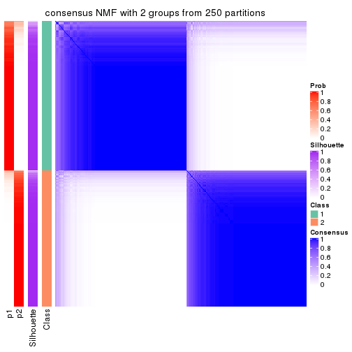</p>

</div>
<div id='tab-MAD-NMF-consensus-heatmap-2'>
<pre><code class="r">consensus_heatmap(res, k = 3)
</code></pre>

<p>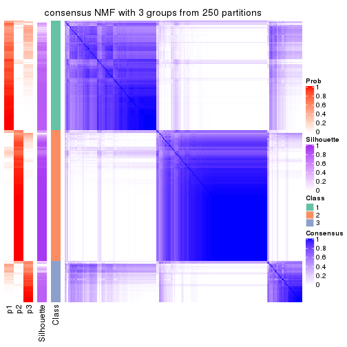</p>

</div>
<div id='tab-MAD-NMF-consensus-heatmap-3'>
<pre><code class="r">consensus_heatmap(res, k = 4)
</code></pre>

<p>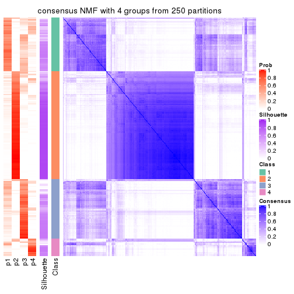</p>

</div>
<div id='tab-MAD-NMF-consensus-heatmap-4'>
<pre><code class="r">consensus_heatmap(res, k = 5)
</code></pre>

<p>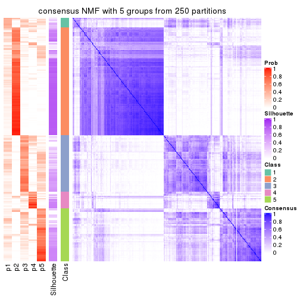</p>

</div>
<div id='tab-MAD-NMF-consensus-heatmap-5'>
<pre><code class="r">consensus_heatmap(res, k = 6)
</code></pre>

<p>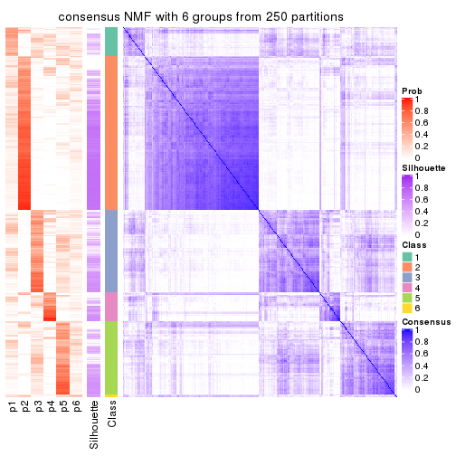</p>

</div>
</div>

Heatmaps for the membership of samples in all partitions to see how consistent they are:


<script>
$( function() {
	$( '#tabs-MAD-NMF-membership-heatmap' ).tabs();
} );
</script>
<div id='tabs-MAD-NMF-membership-heatmap'>
<ul>
<li><a href='#tab-MAD-NMF-membership-heatmap-1'>k = 2</a></li>
<li><a href='#tab-MAD-NMF-membership-heatmap-2'>k = 3</a></li>
<li><a href='#tab-MAD-NMF-membership-heatmap-3'>k = 4</a></li>
<li><a href='#tab-MAD-NMF-membership-heatmap-4'>k = 5</a></li>
<li><a href='#tab-MAD-NMF-membership-heatmap-5'>k = 6</a></li>
</ul>
<div id='tab-MAD-NMF-membership-heatmap-1'>
<pre><code class="r">membership_heatmap(res, k = 2)
</code></pre>

<p>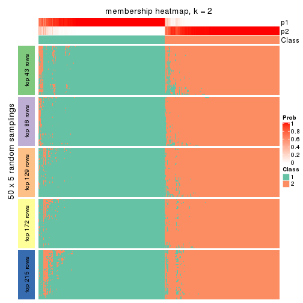</p>

</div>
<div id='tab-MAD-NMF-membership-heatmap-2'>
<pre><code class="r">membership_heatmap(res, k = 3)
</code></pre>

<p>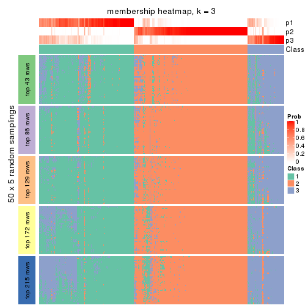</p>

</div>
<div id='tab-MAD-NMF-membership-heatmap-3'>
<pre><code class="r">membership_heatmap(res, k = 4)
</code></pre>

<p>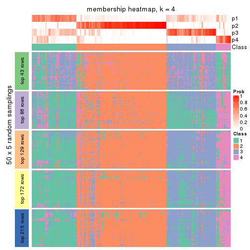</p>

</div>
<div id='tab-MAD-NMF-membership-heatmap-4'>
<pre><code class="r">membership_heatmap(res, k = 5)
</code></pre>

<p>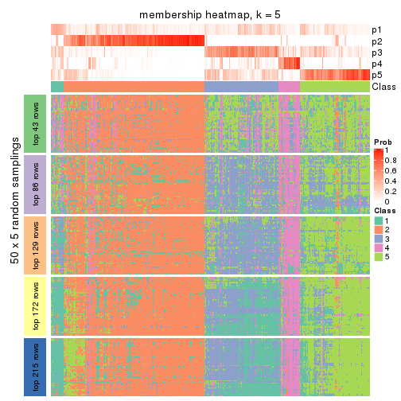</p>

</div>
<div id='tab-MAD-NMF-membership-heatmap-5'>
<pre><code class="r">membership_heatmap(res, k = 6)
</code></pre>

<p>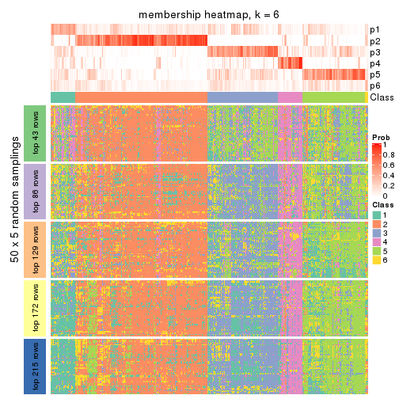</p>

</div>
</div>

As soon as we have had the classes for columns, we can look for signatures
which are significantly different between classes which can be candidate marks
for certain classes. Following are the heatmaps for signatures.


Signature heatmaps where rows are scaled:


<script>
$( function() {
	$( '#tabs-MAD-NMF-get-signatures' ).tabs();
} );
</script>
<div id='tabs-MAD-NMF-get-signatures'>
<ul>
<li><a href='#tab-MAD-NMF-get-signatures-1'>k = 2</a></li>
<li><a href='#tab-MAD-NMF-get-signatures-2'>k = 3</a></li>
<li><a href='#tab-MAD-NMF-get-signatures-3'>k = 4</a></li>
<li><a href='#tab-MAD-NMF-get-signatures-4'>k = 5</a></li>
<li><a href='#tab-MAD-NMF-get-signatures-5'>k = 6</a></li>
</ul>
<div id='tab-MAD-NMF-get-signatures-1'>
<pre><code class="r">get_signatures(res, k = 2)
</code></pre>

<p>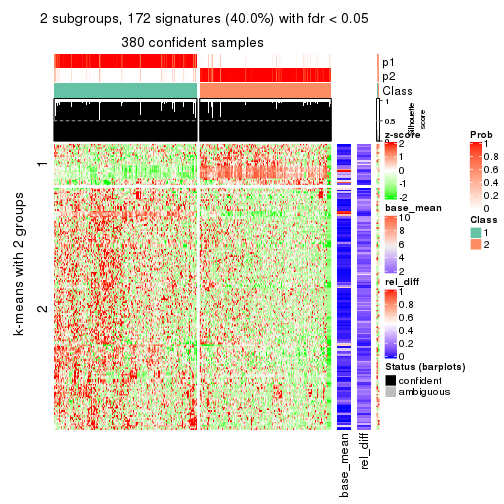</p>

</div>
<div id='tab-MAD-NMF-get-signatures-2'>
<pre><code class="r">get_signatures(res, k = 3)
</code></pre>

<p>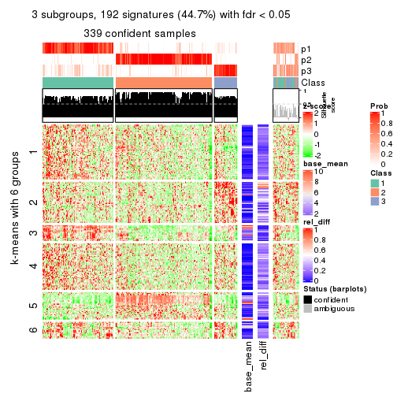</p>

</div>
<div id='tab-MAD-NMF-get-signatures-3'>
<pre><code class="r">get_signatures(res, k = 4)
</code></pre>

<p>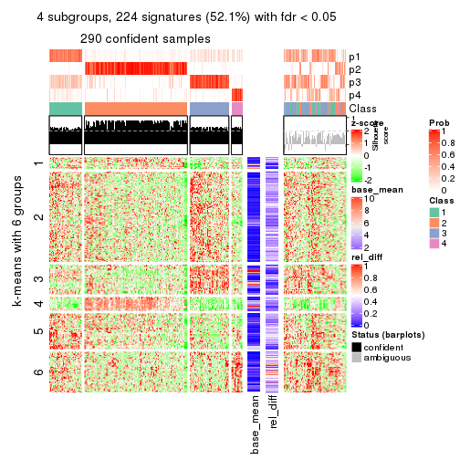</p>

</div>
<div id='tab-MAD-NMF-get-signatures-4'>
<pre><code class="r">get_signatures(res, k = 5)
</code></pre>

<p>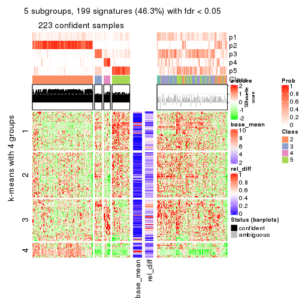</p>

</div>
<div id='tab-MAD-NMF-get-signatures-5'>
<pre><code class="r">get_signatures(res, k = 6)
</code></pre>

<p>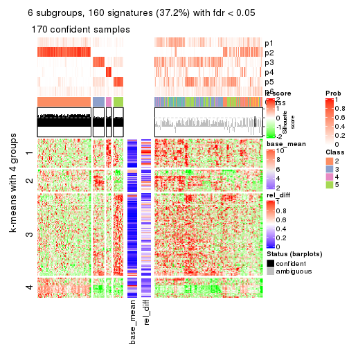</p>

</div>
</div>


Signature heatmaps where rows are not scaled:


<script>
$( function() {
	$( '#tabs-MAD-NMF-get-signatures-no-scale' ).tabs();
} );
</script>
<div id='tabs-MAD-NMF-get-signatures-no-scale'>
<ul>
<li><a href='#tab-MAD-NMF-get-signatures-no-scale-1'>k = 2</a></li>
<li><a href='#tab-MAD-NMF-get-signatures-no-scale-2'>k = 3</a></li>
<li><a href='#tab-MAD-NMF-get-signatures-no-scale-3'>k = 4</a></li>
<li><a href='#tab-MAD-NMF-get-signatures-no-scale-4'>k = 5</a></li>
<li><a href='#tab-MAD-NMF-get-signatures-no-scale-5'>k = 6</a></li>
</ul>
<div id='tab-MAD-NMF-get-signatures-no-scale-1'>
<pre><code class="r">get_signatures(res, k = 2, scale_rows = FALSE)
</code></pre>

<p>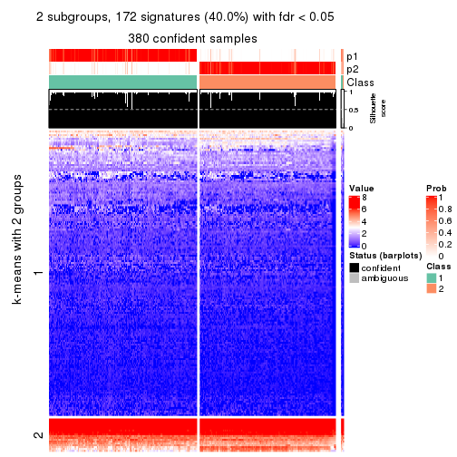</p>

</div>
<div id='tab-MAD-NMF-get-signatures-no-scale-2'>
<pre><code class="r">get_signatures(res, k = 3, scale_rows = FALSE)
</code></pre>

<p>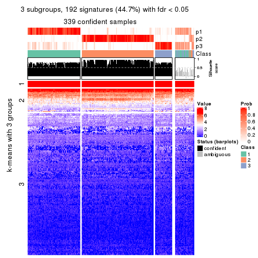</p>

</div>
<div id='tab-MAD-NMF-get-signatures-no-scale-3'>
<pre><code class="r">get_signatures(res, k = 4, scale_rows = FALSE)
</code></pre>

<p>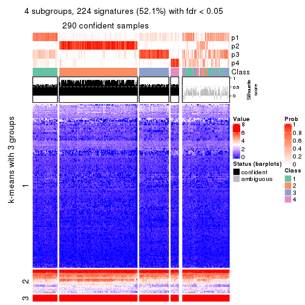</p>

</div>
<div id='tab-MAD-NMF-get-signatures-no-scale-4'>
<pre><code class="r">get_signatures(res, k = 5, scale_rows = FALSE)
</code></pre>

<p>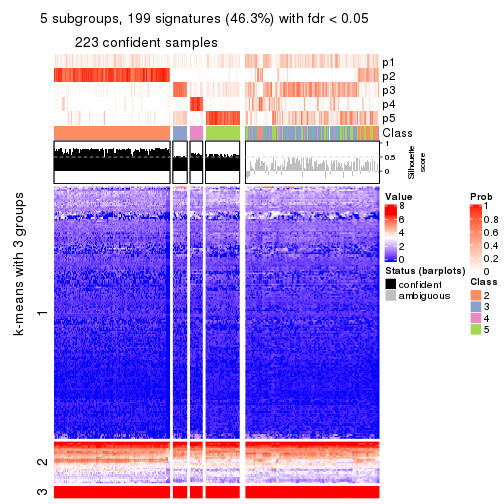</p>

</div>
<div id='tab-MAD-NMF-get-signatures-no-scale-5'>
<pre><code class="r">get_signatures(res, k = 6, scale_rows = FALSE)
</code></pre>

<p>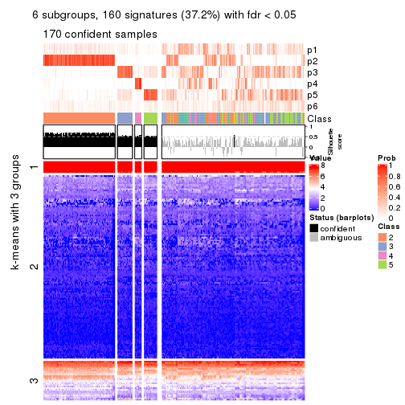</p>

</div>
</div>


Compare the overlap of signatures from different k:

```r
compare_signatures(res)
```

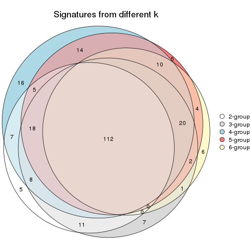

`get_signature()` returns a data frame invisibly. TO get the list of signatures, the function
call should be assigned to a variable explicitly. In following code, if `plot` argument is set
to `FALSE`, no heatmap is plotted while only the differential analysis is performed.

```r
# code only for demonstration
tb = get_signature(res, k = ..., plot = FALSE)
```

An example of the output of `tb` is:

```
#>   which_row         fdr    mean_1    mean_2 scaled_mean_1 scaled_mean_2 km
#> 1        38 0.042760348  8.373488  9.131774    -0.5533452     0.5164555  1
#> 2        40 0.018707592  7.106213  8.469186    -0.6173731     0.5762149  1
#> 3        55 0.019134737 10.221463 11.207825    -0.6159697     0.5749050  1
#> 4        59 0.006059896  5.921854  7.869574    -0.6899429     0.6439467  1
#> 5        60 0.018055526  8.928898 10.211722    -0.6204761     0.5791110  1
#> 6        98 0.009384629 15.714769 14.887706     0.6635654    -0.6193277  2
...
```

The columns in `tb` are:

1. `which_row`: row indices corresponding to the input matrix.
2. `fdr`: FDR for the differential test. 
3. `mean_x`: The mean value in group x.
4. `scaled_mean_x`: The mean value in group x after rows are scaled.
5. `km`: Row groups if k-means clustering is applied to rows.


UMAP plot which shows how samples are separated.


<script>
$( function() {
	$( '#tabs-MAD-NMF-dimension-reduction' ).tabs();
} );
</script>
<div id='tabs-MAD-NMF-dimension-reduction'>
<ul>
<li><a href='#tab-MAD-NMF-dimension-reduction-1'>k = 2</a></li>
<li><a href='#tab-MAD-NMF-dimension-reduction-2'>k = 3</a></li>
<li><a href='#tab-MAD-NMF-dimension-reduction-3'>k = 4</a></li>
<li><a href='#tab-MAD-NMF-dimension-reduction-4'>k = 5</a></li>
<li><a href='#tab-MAD-NMF-dimension-reduction-5'>k = 6</a></li>
</ul>
<div id='tab-MAD-NMF-dimension-reduction-1'>
<pre><code class="r">dimension_reduction(res, k = 2, method = &quot;UMAP&quot;)
</code></pre>

<p>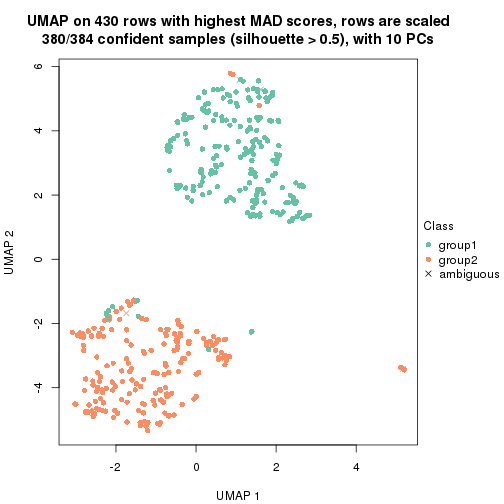</p>

</div>
<div id='tab-MAD-NMF-dimension-reduction-2'>
<pre><code class="r">dimension_reduction(res, k = 3, method = &quot;UMAP&quot;)
</code></pre>

<p>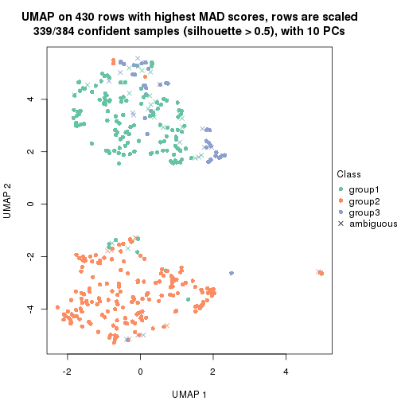</p>

</div>
<div id='tab-MAD-NMF-dimension-reduction-3'>
<pre><code class="r">dimension_reduction(res, k = 4, method = &quot;UMAP&quot;)
</code></pre>

<p>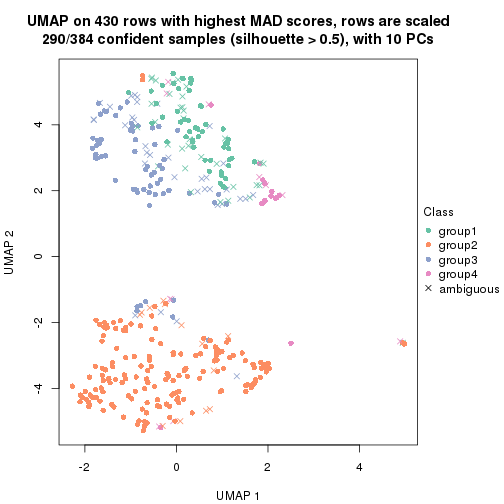</p>

</div>
<div id='tab-MAD-NMF-dimension-reduction-4'>
<pre><code class="r">dimension_reduction(res, k = 5, method = &quot;UMAP&quot;)
</code></pre>

<p>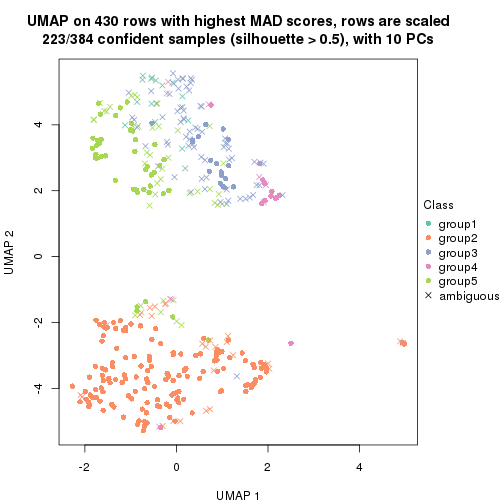</p>

</div>
<div id='tab-MAD-NMF-dimension-reduction-5'>
<pre><code class="r">dimension_reduction(res, k = 6, method = &quot;UMAP&quot;)
</code></pre>

<p>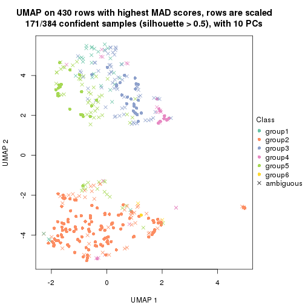</p>

</div>
</div>


Following heatmap shows how subgroups are split when increasing `k`:

```r
collect_classes(res)
```

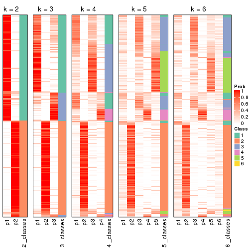


If matrix rows can be associated to genes, consider to use `GO_Enrichment(res,
...)` to perform function enrichment for the signature genes.


 

---------------------------------------------------


### ATC:hclust


The object with results only for a single top-value method and a single partition method 
can be extracted as:

```r
res = res_list["ATC", "hclust"]
# you can also extract it by
# res = res_list["ATC:hclust"]
```

A summary of `res` and all the functions that can be applied to it:

```r
res
```

```
#> A 'ConsensusPartition' object with k = 2, 3, 4, 5, 6.
#>   On a matrix with 430 rows and 384 columns.
#>   Top rows (43, 86, 129, 172, 215) are extracted by 'ATC' method.
#>   Subgroups are detected by 'hclust' method.
#>   Performed in total 1250 partitions by row resampling.
#>   Best k for subgroups seems to be 6.
#> 
#> Following methods can be applied to this 'ConsensusPartition' object:
#>  [1] "cola_report"             "collect_classes"         "collect_plots"          
#>  [4] "collect_stats"           "colnames"                "compare_signatures"     
#>  [7] "consensus_heatmap"       "dimension_reduction"     "functional_enrichment"  
#> [10] "get_anno_col"            "get_anno"                "get_classes"            
#> [13] "get_consensus"           "get_matrix"              "get_membership"         
#> [16] "get_param"               "get_signatures"          "get_stats"              
#> [19] "is_best_k"               "is_stable_k"             "membership_heatmap"     
#> [22] "ncol"                    "nrow"                    "plot_ecdf"              
#> [25] "rownames"                "select_partition_number" "show"                   
#> [28] "suggest_best_k"          "test_to_known_factors"
```

`collect_plots()` function collects all the plots made from `res` for all `k` (number of partitions)
into one single page to provide an easy and fast comparison between different `k`.

```r
collect_plots(res)
```

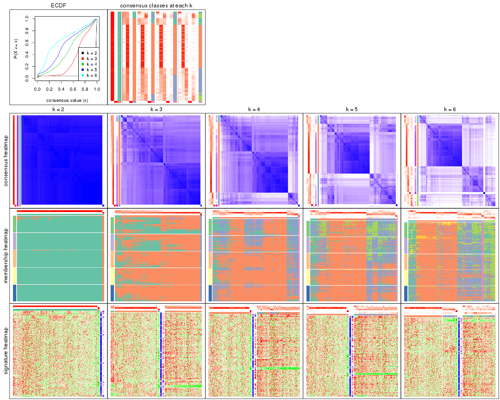

The plots are:

- The first row: a plot of the ECDF (Empirical cumulative distribution
  function) curves of the consensus matrix for each `k` and the heatmap of
  predicted classes for each `k`.
- The second row: heatmaps of the consensus matrix for each `k`.
- The third row: heatmaps of the membership matrix for each `k`.
- The fouth row: heatmaps of the signatures for each `k`.

All the plots in panels can be made by individual functions and they are
plotted later in this section.

`select_partition_number()` produces several plots showing different
statistics for choosing "optimized" `k`. There are following statistics:

- ECDF curves of the consensus matrix for each `k`;
- 1-PAC. [The PAC
  score](https://en.wikipedia.org/wiki/Consensus_clustering#Over-interpretation_potential_of_consensus_clustering)
  measures the proportion of the ambiguous subgrouping.
- Mean silhouette score.
- Concordance. The mean probability of fiting the consensus class ids in all
  partitions.
- Area increased. Denote $A_k$ as the area under the ECDF curve for current
  `k`, the area increased is defined as $A_k - A_{k-1}$.
- Rand index. The percent of pairs of samples that are both in a same cluster
  or both are not in a same cluster in the partition of k and k-1.
- Jaccard index. The ratio of pairs of samples are both in a same cluster in
  the partition of k and k-1 and the pairs of samples are both in a same
  cluster in the partition k or k-1.

The detailed explanations of these statistics can be found in [the cola
vignette](http://bioconductor.org/packages/devel/bioc/vignettes/cola/inst/doc/cola.html#toc_13).

Generally speaking, lower PAC score, higher mean silhouette score or higher
concordance corresponds to better partition. Rand index and Jaccard index
measure how similar the current partition is compared to partition with `k-1`.
If they are too similar, we won't accept `k` is better than `k-1`.

```r
select_partition_number(res)
```

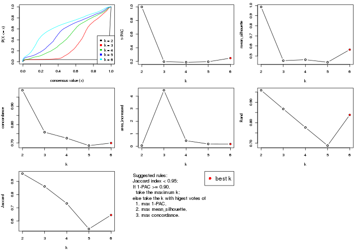

The numeric values for all these statistics can be obtained by `get_stats()`.

```r
get_stats(res)
```

```
#>   k 1-PAC mean_silhouette concordance area_increased  Rand Jaccard
#> 2 2 1.000           0.987       0.988         0.0588 0.959   0.959
#> 3 3 0.196           0.454       0.759         4.4721 0.867   0.862
#> 4 4 0.187           0.463       0.726         0.4467 0.777   0.733
#> 5 5 0.194           0.438       0.685         0.1890 0.688   0.540
#> 6 6 0.248           0.563       0.699         0.1851 0.838   0.645
```

`suggest_best_k()` suggests the best $k$ based on these statistics. The rules are as follows:

- All $k$ with Jaccard index larger than 0.95 are removed because the increase of
  the partition number does not provides enough extra information. If all $k$ are removed,
  the best $k$ is assigned by `NA`.
- For $k$ with 1-PAC larger than 0.9, the maximal $k$ is taken as the "best k". Other $k$ is called "optional k".
- If it does not fit the second rule. The $k$ with the highest vote of highest
  1-PAC, mean silhouette and concordance is taken as the "best k".

```r
suggest_best_k(res)
```

```
#> [1] 6
```


Following shows the table of the partitions (You need to click the **show/hide
code output** link to see it). The membership matrix (columns with name `p*`)
is inferred by
[`clue::cl_consensus()`](https://www.rdocumentation.org/link/cl_consensus?package=clue)
function with the `SE` method. Basically the value in the membership matrix
represents the probability to belong to a certain group. The finall class
label for an item is determined with the group with highest probability it
belongs to.

In `get_classes()` function, the entropy is calculated from the membership
matrix and the silhouette score is calculated from the consensus matrix.


<script>
$( function() {
	$( '#tabs-ATC-hclust-get-classes' ).tabs();
} );
</script>
<div id='tabs-ATC-hclust-get-classes'>
<ul>
<li><a href='#tab-ATC-hclust-get-classes-1'>k = 2</a></li>
<li><a href='#tab-ATC-hclust-get-classes-2'>k = 3</a></li>
<li><a href='#tab-ATC-hclust-get-classes-3'>k = 4</a></li>
<li><a href='#tab-ATC-hclust-get-classes-4'>k = 5</a></li>
<li><a href='#tab-ATC-hclust-get-classes-5'>k = 6</a></li>
</ul>

<div id='tab-ATC-hclust-get-classes-1'>
<p><a id='tab-ATC-hclust-get-classes-1-a' style='color:#0366d6' href='#'>show/hide code output</a></p>
<pre><code class="r">cbind(get_classes(res, k = 2), get_membership(res, k = 2))
</code></pre>

<pre><code>#&gt;            class entropy silhouette    p1    p2
#&gt; SRR2105277     1  0.0672      0.989 0.992 0.008
#&gt; SRR2105278     1  0.0672      0.989 0.992 0.008
#&gt; SRR2105275     1  0.1843      0.981 0.972 0.028
#&gt; SRR2105276     1  0.1843      0.977 0.972 0.028
#&gt; SRR2105273     1  0.0000      0.989 1.000 0.000
#&gt; SRR2105274     1  0.0672      0.990 0.992 0.008
#&gt; SRR2105271     1  0.0672      0.989 0.992 0.008
#&gt; SRR2105272     1  0.0376      0.990 0.996 0.004
#&gt; SRR2105269     1  0.0672      0.989 0.992 0.008
#&gt; SRR2105270     1  0.0000      0.989 1.000 0.000
#&gt; SRR2105267     1  0.1414      0.985 0.980 0.020
#&gt; SRR2105268     1  0.0672      0.989 0.992 0.008
#&gt; SRR2105265     1  0.0672      0.990 0.992 0.008
#&gt; SRR2105266     1  0.0000      0.989 1.000 0.000
#&gt; SRR2105263     1  0.0938      0.988 0.988 0.012
#&gt; SRR2105264     1  0.0672      0.989 0.992 0.008
#&gt; SRR2105261     1  0.3274      0.952 0.940 0.060
#&gt; SRR2105262     1  0.3274      0.952 0.940 0.060
#&gt; SRR2105357     1  0.0672      0.989 0.992 0.008
#&gt; SRR2105358     1  0.0672      0.989 0.992 0.008
#&gt; SRR2105439     1  0.0672      0.989 0.992 0.008
#&gt; SRR2105440     1  0.0000      0.989 1.000 0.000
#&gt; SRR2105509     1  0.2778      0.964 0.952 0.048
#&gt; SRR2105510     1  0.2236      0.974 0.964 0.036
#&gt; SRR2105507     1  0.0672      0.989 0.992 0.008
#&gt; SRR2105508     1  0.0938      0.988 0.988 0.012
#&gt; SRR2105505     1  0.0672      0.989 0.992 0.008
#&gt; SRR2105506     1  0.0672      0.989 0.992 0.008
#&gt; SRR2105503     1  0.1184      0.987 0.984 0.016
#&gt; SRR2105504     2  0.0672      1.000 0.008 0.992
#&gt; SRR2105501     1  0.0938      0.988 0.988 0.012
#&gt; SRR2105502     2  0.0672      1.000 0.008 0.992
#&gt; SRR2105499     1  0.0672      0.990 0.992 0.008
#&gt; SRR2105500     1  0.0672      0.990 0.992 0.008
#&gt; SRR2105497     1  0.0376      0.989 0.996 0.004
#&gt; SRR2105498     1  0.0672      0.990 0.992 0.008
#&gt; SRR2105495     1  0.1184      0.988 0.984 0.016
#&gt; SRR2105496     1  0.0672      0.989 0.992 0.008
#&gt; SRR2105493     1  0.0376      0.990 0.996 0.004
#&gt; SRR2105494     1  0.0672      0.990 0.992 0.008
#&gt; SRR2105491     1  0.1184      0.986 0.984 0.016
#&gt; SRR2105492     1  0.0938      0.988 0.988 0.012
#&gt; SRR2105489     1  0.0376      0.989 0.996 0.004
#&gt; SRR2105490     1  0.0672      0.990 0.992 0.008
#&gt; SRR2105487     1  0.0672      0.989 0.992 0.008
#&gt; SRR2105488     1  0.0672      0.989 0.992 0.008
#&gt; SRR2105485     1  0.0376      0.990 0.996 0.004
#&gt; SRR2105486     1  0.0672      0.990 0.992 0.008
#&gt; SRR2105483     1  0.0672      0.989 0.992 0.008
#&gt; SRR2105484     1  0.0672      0.989 0.992 0.008
#&gt; SRR2105481     1  0.0672      0.989 0.992 0.008
#&gt; SRR2105482     1  0.0672      0.989 0.992 0.008
#&gt; SRR2105479     1  0.0938      0.987 0.988 0.012
#&gt; SRR2105480     1  0.1184      0.988 0.984 0.016
#&gt; SRR2105477     1  0.0672      0.989 0.992 0.008
#&gt; SRR2105478     1  0.0376      0.990 0.996 0.004
#&gt; SRR2105475     1  0.2603      0.967 0.956 0.044
#&gt; SRR2105476     1  0.2603      0.967 0.956 0.044
#&gt; SRR2105473     1  0.0672      0.989 0.992 0.008
#&gt; SRR2105474     1  0.0672      0.989 0.992 0.008
#&gt; SRR2105471     1  0.0376      0.990 0.996 0.004
#&gt; SRR2105472     1  0.0376      0.990 0.996 0.004
#&gt; SRR2105469     1  0.0376      0.990 0.996 0.004
#&gt; SRR2105470     1  0.0376      0.990 0.996 0.004
#&gt; SRR2105467     1  0.0672      0.989 0.992 0.008
#&gt; SRR2105468     1  0.0672      0.989 0.992 0.008
#&gt; SRR2105465     1  0.0376      0.990 0.996 0.004
#&gt; SRR2105466     1  0.0672      0.989 0.992 0.008
#&gt; SRR2105463     1  0.0672      0.989 0.992 0.008
#&gt; SRR2105464     1  0.0672      0.989 0.992 0.008
#&gt; SRR2105461     1  0.0376      0.989 0.996 0.004
#&gt; SRR2105462     1  0.0376      0.989 0.996 0.004
#&gt; SRR2105459     1  0.2043      0.977 0.968 0.032
#&gt; SRR2105460     1  0.0938      0.988 0.988 0.012
#&gt; SRR2105457     1  0.1184      0.987 0.984 0.016
#&gt; SRR2105458     1  0.1184      0.987 0.984 0.016
#&gt; SRR2105455     1  0.0376      0.990 0.996 0.004
#&gt; SRR2105456     1  0.0376      0.990 0.996 0.004
#&gt; SRR2105453     1  0.0672      0.989 0.992 0.008
#&gt; SRR2105454     1  0.0672      0.989 0.992 0.008
#&gt; SRR2105451     1  0.0672      0.989 0.992 0.008
#&gt; SRR2105452     2  0.0672      1.000 0.008 0.992
#&gt; SRR2105449     1  0.0376      0.990 0.996 0.004
#&gt; SRR2105450     1  0.0376      0.990 0.996 0.004
#&gt; SRR2105447     1  0.1633      0.981 0.976 0.024
#&gt; SRR2105448     1  0.1184      0.986 0.984 0.016
#&gt; SRR2105445     1  0.0672      0.990 0.992 0.008
#&gt; SRR2105446     1  0.0672      0.989 0.992 0.008
#&gt; SRR2105443     1  0.2236      0.975 0.964 0.036
#&gt; SRR2105444     1  0.0672      0.990 0.992 0.008
#&gt; SRR2105441     1  0.0376      0.989 0.996 0.004
#&gt; SRR2105442     1  0.0938      0.989 0.988 0.012
#&gt; SRR2105437     1  0.0672      0.989 0.992 0.008
#&gt; SRR2105438     1  0.0672      0.989 0.992 0.008
#&gt; SRR2105435     1  0.0938      0.987 0.988 0.012
#&gt; SRR2105436     1  0.0672      0.989 0.992 0.008
#&gt; SRR2105433     1  0.0672      0.989 0.992 0.008
#&gt; SRR2105434     1  0.0672      0.989 0.992 0.008
#&gt; SRR2105431     1  0.0672      0.989 0.992 0.008
#&gt; SRR2105432     1  0.0672      0.989 0.992 0.008
#&gt; SRR2105429     1  0.2423      0.970 0.960 0.040
#&gt; SRR2105430     1  0.2423      0.970 0.960 0.040
#&gt; SRR2105427     1  0.0938      0.988 0.988 0.012
#&gt; SRR2105428     1  0.1184      0.988 0.984 0.016
#&gt; SRR2105425     1  0.0672      0.989 0.992 0.008
#&gt; SRR2105426     1  0.0672      0.990 0.992 0.008
#&gt; SRR2105421     1  0.1843      0.978 0.972 0.028
#&gt; SRR2105422     1  0.1843      0.978 0.972 0.028
#&gt; SRR2105423     1  0.0376      0.989 0.996 0.004
#&gt; SRR2105424     1  0.0672      0.989 0.992 0.008
#&gt; SRR2105419     1  0.0938      0.987 0.988 0.012
#&gt; SRR2105420     1  0.0938      0.987 0.988 0.012
#&gt; SRR2105415     1  0.0672      0.989 0.992 0.008
#&gt; SRR2105416     1  0.0672      0.989 0.992 0.008
#&gt; SRR2105417     1  0.0672      0.989 0.992 0.008
#&gt; SRR2105418     1  0.0672      0.989 0.992 0.008
#&gt; SRR2105413     1  0.2236      0.974 0.964 0.036
#&gt; SRR2105414     1  0.1843      0.978 0.972 0.028
#&gt; SRR2105409     1  0.0376      0.990 0.996 0.004
#&gt; SRR2105410     1  0.0000      0.989 1.000 0.000
#&gt; SRR2105411     1  0.0672      0.989 0.992 0.008
#&gt; SRR2105412     1  0.0672      0.990 0.992 0.008
#&gt; SRR2105407     1  0.1633      0.983 0.976 0.024
#&gt; SRR2105408     1  0.1414      0.985 0.980 0.020
#&gt; SRR2105403     1  0.0672      0.989 0.992 0.008
#&gt; SRR2105404     1  0.0672      0.989 0.992 0.008
#&gt; SRR2105405     1  0.0376      0.990 0.996 0.004
#&gt; SRR2105406     1  0.0376      0.990 0.996 0.004
#&gt; SRR2105401     1  0.1184      0.988 0.984 0.016
#&gt; SRR2105402     2  0.0672      1.000 0.008 0.992
#&gt; SRR2105399     1  0.3584      0.946 0.932 0.068
#&gt; SRR2105400     1  0.3584      0.946 0.932 0.068
#&gt; SRR2105397     1  0.1843      0.981 0.972 0.028
#&gt; SRR2105398     1  0.1633      0.981 0.976 0.024
#&gt; SRR2105395     1  0.0672      0.990 0.992 0.008
#&gt; SRR2105396     1  0.0672      0.990 0.992 0.008
#&gt; SRR2105393     1  0.0938      0.988 0.988 0.012
#&gt; SRR2105394     1  0.0376      0.989 0.996 0.004
#&gt; SRR2105389     1  0.1184      0.985 0.984 0.016
#&gt; SRR2105390     1  0.1414      0.983 0.980 0.020
#&gt; SRR2105391     1  0.1414      0.983 0.980 0.020
#&gt; SRR2105392     1  0.1414      0.983 0.980 0.020
#&gt; SRR2105385     1  0.0376      0.990 0.996 0.004
#&gt; SRR2105386     1  0.0376      0.990 0.996 0.004
#&gt; SRR2105387     1  0.0000      0.989 1.000 0.000
#&gt; SRR2105388     1  0.0672      0.989 0.992 0.008
#&gt; SRR2105381     1  0.3114      0.957 0.944 0.056
#&gt; SRR2105382     1  0.2043      0.975 0.968 0.032
#&gt; SRR2105383     1  0.0672      0.989 0.992 0.008
#&gt; SRR2105384     1  0.0672      0.989 0.992 0.008
#&gt; SRR2105379     1  0.2236      0.973 0.964 0.036
#&gt; SRR2105380     1  0.1633      0.981 0.976 0.024
#&gt; SRR2105377     1  0.0000      0.989 1.000 0.000
#&gt; SRR2105378     1  0.0376      0.990 0.996 0.004
#&gt; SRR2105375     1  0.0672      0.990 0.992 0.008
#&gt; SRR2105376     1  0.0672      0.989 0.992 0.008
#&gt; SRR2105373     1  0.0672      0.989 0.992 0.008
#&gt; SRR2105374     1  0.0672      0.989 0.992 0.008
#&gt; SRR2105371     1  0.1414      0.983 0.980 0.020
#&gt; SRR2105372     1  0.0938      0.987 0.988 0.012
#&gt; SRR2105369     1  0.0672      0.989 0.992 0.008
#&gt; SRR2105370     1  0.0376      0.990 0.996 0.004
#&gt; SRR2105367     1  0.0672      0.989 0.992 0.008
#&gt; SRR2105368     1  0.0672      0.989 0.992 0.008
#&gt; SRR2105365     1  0.1633      0.982 0.976 0.024
#&gt; SRR2105366     1  0.0376      0.989 0.996 0.004
#&gt; SRR2105363     1  0.0376      0.989 0.996 0.004
#&gt; SRR2105364     1  0.0672      0.990 0.992 0.008
#&gt; SRR2105361     1  0.0672      0.989 0.992 0.008
#&gt; SRR2105362     1  0.0672      0.989 0.992 0.008
#&gt; SRR2105359     1  0.0672      0.989 0.992 0.008
#&gt; SRR2105360     1  0.0938      0.989 0.988 0.012
#&gt; SRR2105355     1  0.1184      0.987 0.984 0.016
#&gt; SRR2105356     1  0.0376      0.990 0.996 0.004
#&gt; SRR2105353     1  0.2236      0.970 0.964 0.036
#&gt; SRR2105354     1  0.0938      0.987 0.988 0.012
#&gt; SRR2105351     1  0.1184      0.987 0.984 0.016
#&gt; SRR2105352     2  0.0672      1.000 0.008 0.992
#&gt; SRR2105349     1  0.0938      0.988 0.988 0.012
#&gt; SRR2105350     1  0.0672      0.989 0.992 0.008
#&gt; SRR2105345     1  0.0376      0.990 0.996 0.004
#&gt; SRR2105346     1  0.0376      0.990 0.996 0.004
#&gt; SRR2105347     1  0.0672      0.989 0.992 0.008
#&gt; SRR2105348     1  0.0672      0.989 0.992 0.008
#&gt; SRR2105343     1  0.0938      0.988 0.988 0.012
#&gt; SRR2105344     1  0.0672      0.989 0.992 0.008
#&gt; SRR2105341     1  0.0938      0.988 0.988 0.012
#&gt; SRR2105342     1  0.0672      0.989 0.992 0.008
#&gt; SRR2105339     1  0.1633      0.980 0.976 0.024
#&gt; SRR2105340     1  0.0938      0.987 0.988 0.012
#&gt; SRR2105335     1  0.0672      0.989 0.992 0.008
#&gt; SRR2105336     1  0.0672      0.989 0.992 0.008
#&gt; SRR2105337     1  0.0672      0.989 0.992 0.008
#&gt; SRR2105338     1  0.0672      0.989 0.992 0.008
#&gt; SRR2105331     1  0.1633      0.981 0.976 0.024
#&gt; SRR2105332     1  0.1184      0.986 0.984 0.016
#&gt; SRR2105333     1  0.2236      0.974 0.964 0.036
#&gt; SRR2105334     1  0.1843      0.978 0.972 0.028
#&gt; SRR2105329     1  0.0376      0.990 0.996 0.004
#&gt; SRR2105330     1  0.0672      0.989 0.992 0.008
#&gt; SRR2105327     1  0.1843      0.978 0.972 0.028
#&gt; SRR2105328     1  0.1843      0.978 0.972 0.028
#&gt; SRR2105325     1  0.1843      0.977 0.972 0.028
#&gt; SRR2105326     1  0.1843      0.977 0.972 0.028
#&gt; SRR2105323     1  0.0672      0.989 0.992 0.008
#&gt; SRR2105324     1  0.0376      0.990 0.996 0.004
#&gt; SRR2105319     1  0.0672      0.990 0.992 0.008
#&gt; SRR2105320     1  0.0672      0.990 0.992 0.008
#&gt; SRR2105321     1  0.1184      0.985 0.984 0.016
#&gt; SRR2105322     1  0.1184      0.985 0.984 0.016
#&gt; SRR2105317     1  0.2043      0.976 0.968 0.032
#&gt; SRR2105318     1  0.1184      0.986 0.984 0.016
#&gt; SRR2105315     1  0.0938      0.990 0.988 0.012
#&gt; SRR2105316     1  0.1414      0.984 0.980 0.020
#&gt; SRR2105313     1  0.0672      0.989 0.992 0.008
#&gt; SRR2105314     1  0.0938      0.988 0.988 0.012
#&gt; SRR2105311     1  0.3584      0.944 0.932 0.068
#&gt; SRR2105312     1  0.3584      0.944 0.932 0.068
#&gt; SRR2105307     1  0.0672      0.989 0.992 0.008
#&gt; SRR2105308     1  0.0672      0.989 0.992 0.008
#&gt; SRR2105309     1  0.0376      0.990 0.996 0.004
#&gt; SRR2105310     1  0.1184      0.987 0.984 0.016
#&gt; SRR2105305     1  0.1184      0.987 0.984 0.016
#&gt; SRR2105306     1  0.0672      0.990 0.992 0.008
#&gt; SRR2105303     1  0.0672      0.989 0.992 0.008
#&gt; SRR2105304     2  0.0672      1.000 0.008 0.992
#&gt; SRR2105301     1  0.2603      0.967 0.956 0.044
#&gt; SRR2105302     1  0.0672      0.989 0.992 0.008
#&gt; SRR2105299     1  0.0672      0.989 0.992 0.008
#&gt; SRR2105300     1  0.0938      0.988 0.988 0.012
#&gt; SRR2105297     1  0.0672      0.989 0.992 0.008
#&gt; SRR2105298     1  0.0672      0.989 0.992 0.008
#&gt; SRR2105295     1  0.2043      0.976 0.968 0.032
#&gt; SRR2105296     1  0.2043      0.976 0.968 0.032
#&gt; SRR2105293     1  0.1414      0.985 0.980 0.020
#&gt; SRR2105294     1  0.1414      0.985 0.980 0.020
#&gt; SRR2105291     1  0.0376      0.990 0.996 0.004
#&gt; SRR2105292     1  0.0376      0.990 0.996 0.004
#&gt; SRR2105289     1  0.0938      0.989 0.988 0.012
#&gt; SRR2105290     1  0.0376      0.990 0.996 0.004
#&gt; SRR2105287     1  0.0672      0.989 0.992 0.008
#&gt; SRR2105288     1  0.0672      0.989 0.992 0.008
#&gt; SRR2105285     1  0.1843      0.979 0.972 0.028
#&gt; SRR2105286     1  0.2043      0.976 0.968 0.032
#&gt; SRR2105283     1  0.0376      0.990 0.996 0.004
#&gt; SRR2105284     1  0.0938      0.989 0.988 0.012
#&gt; SRR2105281     1  0.0938      0.989 0.988 0.012
#&gt; SRR2105282     1  0.0672      0.990 0.992 0.008
#&gt; SRR2105259     1  0.1633      0.983 0.976 0.024
#&gt; SRR2105260     1  0.1633      0.983 0.976 0.024
#&gt; SRR2105279     1  0.0376      0.989 0.996 0.004
#&gt; SRR2105280     1  0.0376      0.989 0.996 0.004
#&gt; SRR2105257     1  0.0672      0.989 0.992 0.008
#&gt; SRR2105258     1  0.0672      0.989 0.992 0.008
#&gt; SRR2105253     1  0.0672      0.989 0.992 0.008
#&gt; SRR2105254     1  0.0672      0.989 0.992 0.008
#&gt; SRR2105255     1  0.0376      0.990 0.996 0.004
#&gt; SRR2105256     1  0.0672      0.989 0.992 0.008
#&gt; SRR2105251     1  0.0672      0.989 0.992 0.008
#&gt; SRR2105252     1  0.0672      0.989 0.992 0.008
#&gt; SRR2105249     1  0.0376      0.990 0.996 0.004
#&gt; SRR2105250     1  0.0672      0.989 0.992 0.008
#&gt; SRR2105247     1  0.0672      0.989 0.992 0.008
#&gt; SRR2105248     1  0.0376      0.989 0.996 0.004
#&gt; SRR2105245     1  0.1414      0.984 0.980 0.020
#&gt; SRR2105246     1  0.2043      0.976 0.968 0.032
#&gt; SRR2105243     1  0.0672      0.989 0.992 0.008
#&gt; SRR2105244     1  0.0672      0.990 0.992 0.008
#&gt; SRR2105241     1  0.0672      0.989 0.992 0.008
#&gt; SRR2105242     1  0.0376      0.990 0.996 0.004
#&gt; SRR2105239     1  0.0938      0.989 0.988 0.012
#&gt; SRR2105240     1  0.0672      0.989 0.992 0.008
#&gt; SRR2105237     1  0.1843      0.979 0.972 0.028
#&gt; SRR2105238     1  0.1184      0.986 0.984 0.016
#&gt; SRR2105235     1  0.0000      0.989 1.000 0.000
#&gt; SRR2105236     1  0.0376      0.990 0.996 0.004
#&gt; SRR2105233     1  0.2603      0.967 0.956 0.044
#&gt; SRR2105234     1  0.2603      0.967 0.956 0.044
#&gt; SRR2105231     1  0.0376      0.989 0.996 0.004
#&gt; SRR2105232     1  0.0376      0.989 0.996 0.004
#&gt; SRR2105227     1  0.0938      0.988 0.988 0.012
#&gt; SRR2105228     1  0.0938      0.989 0.988 0.012
#&gt; SRR2105225     1  0.0376      0.990 0.996 0.004
#&gt; SRR2105226     1  0.0672      0.989 0.992 0.008
#&gt; SRR2105229     1  0.1184      0.986 0.984 0.016
#&gt; SRR2105230     1  0.0672      0.990 0.992 0.008
#&gt; SRR2105219     1  0.0938      0.988 0.988 0.012
#&gt; SRR2105220     1  0.1414      0.987 0.980 0.020
#&gt; SRR2105221     1  0.0672      0.989 0.992 0.008
#&gt; SRR2105222     1  0.0672      0.989 0.992 0.008
#&gt; SRR2105223     1  0.0672      0.989 0.992 0.008
#&gt; SRR2105224     1  0.0672      0.989 0.992 0.008
#&gt; SRR2105217     1  0.0672      0.989 0.992 0.008
#&gt; SRR2105218     1  0.0376      0.989 0.996 0.004
#&gt; SRR2105215     1  0.0376      0.989 0.996 0.004
#&gt; SRR2105216     1  0.0672      0.989 0.992 0.008
#&gt; SRR2105213     1  0.2043      0.976 0.968 0.032
#&gt; SRR2105214     1  0.1184      0.987 0.984 0.016
#&gt; SRR2105211     1  0.0938      0.987 0.988 0.012
#&gt; SRR2105212     1  0.0672      0.989 0.992 0.008
#&gt; SRR2105209     1  0.0672      0.989 0.992 0.008
#&gt; SRR2105210     1  0.0672      0.989 0.992 0.008
#&gt; SRR2105207     1  0.0672      0.989 0.992 0.008
#&gt; SRR2105208     1  0.0672      0.989 0.992 0.008
#&gt; SRR2105205     1  0.1843      0.979 0.972 0.028
#&gt; SRR2105206     1  0.0938      0.988 0.988 0.012
#&gt; SRR2105201     1  0.0376      0.990 0.996 0.004
#&gt; SRR2105202     1  0.0376      0.990 0.996 0.004
#&gt; SRR2105203     1  0.0672      0.989 0.992 0.008
#&gt; SRR2105204     1  0.0938      0.988 0.988 0.012
#&gt; SRR2105199     1  0.0672      0.989 0.992 0.008
#&gt; SRR2105200     1  0.0376      0.989 0.996 0.004
#&gt; SRR2105197     1  0.0672      0.989 0.992 0.008
#&gt; SRR2105198     1  0.0672      0.990 0.992 0.008
#&gt; SRR2105195     1  0.0938      0.989 0.988 0.012
#&gt; SRR2105196     1  0.1414      0.987 0.980 0.020
#&gt; SRR2105193     1  0.0000      0.989 1.000 0.000
#&gt; SRR2105194     1  0.0376      0.990 0.996 0.004
#&gt; SRR2105191     1  0.0672      0.989 0.992 0.008
#&gt; SRR2105192     1  0.0672      0.989 0.992 0.008
#&gt; SRR2105189     1  0.0938      0.988 0.988 0.012
#&gt; SRR2105190     1  0.0672      0.989 0.992 0.008
#&gt; SRR2105187     1  0.1843      0.978 0.972 0.028
#&gt; SRR2105188     1  0.0376      0.990 0.996 0.004
#&gt; SRR2105179     1  0.0672      0.989 0.992 0.008
#&gt; SRR2105180     1  0.0672      0.989 0.992 0.008
#&gt; SRR2105183     1  0.0376      0.989 0.996 0.004
#&gt; SRR2105184     1  0.0672      0.990 0.992 0.008
#&gt; SRR2105185     1  0.0938      0.988 0.988 0.012
#&gt; SRR2105186     1  0.0938      0.988 0.988 0.012
#&gt; SRR2105181     1  0.0672      0.989 0.992 0.008
#&gt; SRR2105182     1  0.0376      0.990 0.996 0.004
#&gt; SRR2105177     1  0.0672      0.989 0.992 0.008
#&gt; SRR2105178     1  0.0672      0.989 0.992 0.008
#&gt; SRR2105171     1  0.0672      0.989 0.992 0.008
#&gt; SRR2105172     1  0.0672      0.989 0.992 0.008
#&gt; SRR2105175     1  0.0672      0.989 0.992 0.008
#&gt; SRR2105176     1  0.0672      0.989 0.992 0.008
#&gt; SRR2105173     1  0.1414      0.984 0.980 0.020
#&gt; SRR2105174     1  0.0376      0.989 0.996 0.004
#&gt; SRR2105169     1  0.0376      0.989 0.996 0.004
#&gt; SRR2105170     1  0.0672      0.990 0.992 0.008
#&gt; SRR2105167     1  0.0376      0.989 0.996 0.004
#&gt; SRR2105168     1  0.0376      0.989 0.996 0.004
#&gt; SRR2105165     1  0.0376      0.990 0.996 0.004
#&gt; SRR2105166     1  0.1184      0.987 0.984 0.016
#&gt; SRR2105163     1  0.1633      0.980 0.976 0.024
#&gt; SRR2105164     1  0.1633      0.980 0.976 0.024
#&gt; SRR2105161     1  0.0376      0.990 0.996 0.004
#&gt; SRR2105162     1  0.0672      0.989 0.992 0.008
#&gt; SRR2105155     1  0.0376      0.989 0.996 0.004
#&gt; SRR2105156     1  0.0672      0.990 0.992 0.008
#&gt; SRR2105157     1  0.0376      0.989 0.996 0.004
#&gt; SRR2105158     1  0.0376      0.989 0.996 0.004
#&gt; SRR2105159     1  0.0672      0.989 0.992 0.008
#&gt; SRR2105160     1  0.0672      0.990 0.992 0.008
#&gt; SRR2105153     1  0.1184      0.986 0.984 0.016
#&gt; SRR2105154     1  0.0672      0.989 0.992 0.008
#&gt; SRR2105151     1  0.0376      0.990 0.996 0.004
#&gt; SRR2105152     1  0.0672      0.990 0.992 0.008
#&gt; SRR2105149     1  0.0938      0.989 0.988 0.012
#&gt; SRR2105150     1  0.0938      0.989 0.988 0.012
#&gt; SRR2105147     2  0.0672      1.000 0.008 0.992
#&gt; SRR2105148     2  0.0672      1.000 0.008 0.992
#&gt; SRR2105143     1  0.0672      0.989 0.992 0.008
#&gt; SRR2105144     1  0.0672      0.989 0.992 0.008
#&gt; SRR2105145     1  0.0672      0.989 0.992 0.008
#&gt; SRR2105146     1  0.0376      0.990 0.996 0.004
#&gt; SRR2105141     1  0.1843      0.979 0.972 0.028
#&gt; SRR2105142     1  0.0672      0.989 0.992 0.008
#&gt; SRR2105139     1  0.0376      0.989 0.996 0.004
#&gt; SRR2105140     1  0.0376      0.989 0.996 0.004
#&gt; SRR2105137     1  0.0376      0.990 0.996 0.004
#&gt; SRR2105138     1  0.0376      0.990 0.996 0.004
#&gt; SRR2105135     1  0.0672      0.990 0.992 0.008
#&gt; SRR2105136     1  0.0376      0.989 0.996 0.004
#&gt; SRR2105133     1  0.0672      0.989 0.992 0.008
#&gt; SRR2105134     1  0.0672      0.989 0.992 0.008
#&gt; SRR2105131     1  0.0376      0.990 0.996 0.004
#&gt; SRR2105132     1  0.0672      0.989 0.992 0.008
#&gt; SRR2105129     1  0.0672      0.989 0.992 0.008
#&gt; SRR2105130     1  0.0672      0.989 0.992 0.008
#&gt; SRR2105127     1  0.0672      0.989 0.992 0.008
#&gt; SRR2105128     1  0.0672      0.989 0.992 0.008
</code></pre>

<script>
$('#tab-ATC-hclust-get-classes-1-a').parent().next().next().hide();
$('#tab-ATC-hclust-get-classes-1-a').click(function(){
  $('#tab-ATC-hclust-get-classes-1-a').parent().next().next().toggle();
  return(false);
});
</script>
</div>

<div id='tab-ATC-hclust-get-classes-2'>
<p><a id='tab-ATC-hclust-get-classes-2-a' style='color:#0366d6' href='#'>show/hide code output</a></p>
<pre><code class="r">cbind(get_classes(res, k = 3), get_membership(res, k = 3))
</code></pre>

<pre><code>#&gt;            class entropy silhouette    p1    p2    p3
#&gt; SRR2105277     1  0.6267   0.555135 0.548 0.452 0.000
#&gt; SRR2105278     1  0.6260   0.572661 0.552 0.448 0.000
#&gt; SRR2105275     2  0.5992   0.445008 0.268 0.716 0.016
#&gt; SRR2105276     2  0.6027   0.426862 0.272 0.712 0.016
#&gt; SRR2105273     2  0.5591   0.424144 0.304 0.696 0.000
#&gt; SRR2105274     2  0.5902   0.381764 0.316 0.680 0.004
#&gt; SRR2105271     2  0.5905   0.293303 0.352 0.648 0.000
#&gt; SRR2105272     2  0.6111   0.045620 0.396 0.604 0.000
#&gt; SRR2105269     2  0.1129   0.655787 0.020 0.976 0.004
#&gt; SRR2105270     2  0.1643   0.658720 0.044 0.956 0.000
#&gt; SRR2105267     2  0.1182   0.656091 0.012 0.976 0.012
#&gt; SRR2105268     2  0.1129   0.653095 0.020 0.976 0.004
#&gt; SRR2105265     2  0.1163   0.647777 0.028 0.972 0.000
#&gt; SRR2105266     2  0.1411   0.647916 0.036 0.964 0.000
#&gt; SRR2105263     2  0.1315   0.654448 0.020 0.972 0.008
#&gt; SRR2105264     2  0.1399   0.647690 0.028 0.968 0.004
#&gt; SRR2105261     2  0.6208   0.509169 0.200 0.752 0.048
#&gt; SRR2105262     2  0.6159   0.513913 0.196 0.756 0.048
#&gt; SRR2105357     2  0.6291  -0.318698 0.468 0.532 0.000
#&gt; SRR2105358     2  0.6302  -0.371796 0.480 0.520 0.000
#&gt; SRR2105439     2  0.3752   0.580910 0.144 0.856 0.000
#&gt; SRR2105440     2  0.3482   0.604423 0.128 0.872 0.000
#&gt; SRR2105509     2  0.3253   0.644016 0.052 0.912 0.036
#&gt; SRR2105510     2  0.3009   0.649447 0.052 0.920 0.028
#&gt; SRR2105507     2  0.5517   0.474402 0.268 0.728 0.004
#&gt; SRR2105508     2  0.5443   0.481095 0.260 0.736 0.004
#&gt; SRR2105505     2  0.6286  -0.335814 0.464 0.536 0.000
#&gt; SRR2105506     1  0.6308   0.439287 0.508 0.492 0.000
#&gt; SRR2105503     2  0.0848   0.653231 0.008 0.984 0.008
#&gt; SRR2105504     3  0.0475   1.000000 0.004 0.004 0.992
#&gt; SRR2105501     2  0.3129   0.651365 0.088 0.904 0.008
#&gt; SRR2105502     3  0.0475   1.000000 0.004 0.004 0.992
#&gt; SRR2105499     2  0.5706   0.386862 0.320 0.680 0.000
#&gt; SRR2105500     2  0.5678   0.403609 0.316 0.684 0.000
#&gt; SRR2105497     2  0.1529   0.647554 0.040 0.960 0.000
#&gt; SRR2105498     2  0.1964   0.632232 0.056 0.944 0.000
#&gt; SRR2105495     2  0.3532   0.644401 0.108 0.884 0.008
#&gt; SRR2105496     2  0.2682   0.647306 0.076 0.920 0.004
#&gt; SRR2105493     2  0.3340   0.637589 0.120 0.880 0.000
#&gt; SRR2105494     2  0.3715   0.623846 0.128 0.868 0.004
#&gt; SRR2105491     2  0.0829   0.651882 0.004 0.984 0.012
#&gt; SRR2105492     2  0.0424   0.652992 0.000 0.992 0.008
#&gt; SRR2105489     2  0.1411   0.643384 0.036 0.964 0.000
#&gt; SRR2105490     2  0.1860   0.634894 0.052 0.948 0.000
#&gt; SRR2105487     1  0.6286   0.569566 0.536 0.464 0.000
#&gt; SRR2105488     1  0.6286   0.570051 0.536 0.464 0.000
#&gt; SRR2105485     2  0.5785   0.360804 0.332 0.668 0.000
#&gt; SRR2105486     2  0.5650   0.412936 0.312 0.688 0.000
#&gt; SRR2105483     1  0.6359   0.424286 0.592 0.404 0.004
#&gt; SRR2105484     1  0.6359   0.424286 0.592 0.404 0.004
#&gt; SRR2105481     2  0.5988   0.218774 0.368 0.632 0.000
#&gt; SRR2105482     2  0.6140  -0.105167 0.404 0.596 0.000
#&gt; SRR2105479     2  0.5016   0.537180 0.240 0.760 0.000
#&gt; SRR2105480     2  0.5656   0.494679 0.264 0.728 0.008
#&gt; SRR2105477     2  0.2680   0.652721 0.068 0.924 0.008
#&gt; SRR2105478     2  0.3030   0.650365 0.092 0.904 0.004
#&gt; SRR2105475     2  0.3456   0.642956 0.060 0.904 0.036
#&gt; SRR2105476     2  0.3456   0.642956 0.060 0.904 0.036
#&gt; SRR2105473     2  0.4399   0.537898 0.188 0.812 0.000
#&gt; SRR2105474     2  0.3941   0.582803 0.156 0.844 0.000
#&gt; SRR2105471     2  0.2096   0.633920 0.052 0.944 0.004
#&gt; SRR2105472     2  0.2301   0.628910 0.060 0.936 0.004
#&gt; SRR2105469     2  0.5404   0.489953 0.256 0.740 0.004
#&gt; SRR2105470     2  0.5517   0.471641 0.268 0.728 0.004
#&gt; SRR2105467     2  0.6267  -0.256112 0.452 0.548 0.000
#&gt; SRR2105468     2  0.6140   0.002666 0.404 0.596 0.000
#&gt; SRR2105465     2  0.5905   0.132545 0.352 0.648 0.000
#&gt; SRR2105466     2  0.6026  -0.034875 0.376 0.624 0.000
#&gt; SRR2105463     1  0.6286   0.435821 0.536 0.464 0.000
#&gt; SRR2105464     2  0.6291  -0.357522 0.468 0.532 0.000
#&gt; SRR2105461     2  0.1031   0.646261 0.024 0.976 0.000
#&gt; SRR2105462     2  0.1163   0.646601 0.028 0.972 0.000
#&gt; SRR2105459     2  0.1919   0.654236 0.020 0.956 0.024
#&gt; SRR2105460     2  0.1585   0.658538 0.028 0.964 0.008
#&gt; SRR2105457     2  0.5785   0.421419 0.300 0.696 0.004
#&gt; SRR2105458     2  0.5754   0.430143 0.296 0.700 0.004
#&gt; SRR2105455     2  0.5591   0.398909 0.304 0.696 0.000
#&gt; SRR2105456     2  0.5621   0.396894 0.308 0.692 0.000
#&gt; SRR2105453     1  0.6274   0.543173 0.544 0.456 0.000
#&gt; SRR2105454     1  0.6225   0.561577 0.568 0.432 0.000
#&gt; SRR2105451     2  0.3682   0.636303 0.116 0.876 0.008
#&gt; SRR2105452     3  0.0475   1.000000 0.004 0.004 0.992
#&gt; SRR2105449     2  0.5016   0.527946 0.240 0.760 0.000
#&gt; SRR2105450     2  0.5216   0.494724 0.260 0.740 0.000
#&gt; SRR2105447     2  0.1636   0.655985 0.016 0.964 0.020
#&gt; SRR2105448     2  0.1182   0.658604 0.012 0.976 0.012
#&gt; SRR2105445     2  0.5178   0.496745 0.256 0.744 0.000
#&gt; SRR2105446     2  0.5810   0.324860 0.336 0.664 0.000
#&gt; SRR2105443     2  0.4810   0.608018 0.140 0.832 0.028
#&gt; SRR2105444     2  0.3573   0.634957 0.120 0.876 0.004
#&gt; SRR2105441     2  0.2165   0.637302 0.064 0.936 0.000
#&gt; SRR2105442     2  0.2772   0.626582 0.080 0.916 0.004
#&gt; SRR2105437     1  0.6286   0.545036 0.536 0.464 0.000
#&gt; SRR2105438     1  0.6291   0.539092 0.532 0.468 0.000
#&gt; SRR2105435     2  0.5623   0.447631 0.280 0.716 0.004
#&gt; SRR2105436     2  0.5621   0.405086 0.308 0.692 0.000
#&gt; SRR2105433     2  0.6140  -0.184849 0.404 0.596 0.000
#&gt; SRR2105434     2  0.6295  -0.335957 0.472 0.528 0.000
#&gt; SRR2105431     2  0.6295  -0.384125 0.472 0.528 0.000
#&gt; SRR2105432     2  0.6291  -0.378500 0.468 0.532 0.000
#&gt; SRR2105429     2  0.3434   0.647543 0.064 0.904 0.032
#&gt; SRR2105430     2  0.3134   0.648142 0.052 0.916 0.032
#&gt; SRR2105427     2  0.2173   0.659466 0.048 0.944 0.008
#&gt; SRR2105428     2  0.1585   0.659004 0.028 0.964 0.008
#&gt; SRR2105425     2  0.1170   0.658865 0.016 0.976 0.008
#&gt; SRR2105426     2  0.1163   0.652313 0.028 0.972 0.000
#&gt; SRR2105421     2  0.5763   0.481023 0.244 0.740 0.016
#&gt; SRR2105422     2  0.5843   0.472762 0.252 0.732 0.016
#&gt; SRR2105423     2  0.1411   0.643454 0.036 0.964 0.000
#&gt; SRR2105424     2  0.1647   0.645792 0.036 0.960 0.004
#&gt; SRR2105419     2  0.5618   0.475626 0.260 0.732 0.008
#&gt; SRR2105420     2  0.5285   0.529898 0.244 0.752 0.004
#&gt; SRR2105415     2  0.6252  -0.312896 0.444 0.556 0.000
#&gt; SRR2105416     2  0.6309  -0.427634 0.496 0.504 0.000
#&gt; SRR2105417     2  0.6154  -0.212267 0.408 0.592 0.000
#&gt; SRR2105418     2  0.6225  -0.252167 0.432 0.568 0.000
#&gt; SRR2105413     2  0.2187   0.654154 0.028 0.948 0.024
#&gt; SRR2105414     2  0.2056   0.656893 0.024 0.952 0.024
#&gt; SRR2105409     2  0.1647   0.652959 0.036 0.960 0.004
#&gt; SRR2105410     2  0.2165   0.644012 0.064 0.936 0.000
#&gt; SRR2105411     2  0.1267   0.646858 0.024 0.972 0.004
#&gt; SRR2105412     2  0.1289   0.645776 0.032 0.968 0.000
#&gt; SRR2105407     2  0.6490   0.184911 0.360 0.628 0.012
#&gt; SRR2105408     2  0.6359   0.177475 0.364 0.628 0.008
#&gt; SRR2105403     1  0.6260   0.557018 0.552 0.448 0.000
#&gt; SRR2105404     1  0.6252   0.561390 0.556 0.444 0.000
#&gt; SRR2105405     2  0.5497   0.390777 0.292 0.708 0.000
#&gt; SRR2105406     2  0.6095  -0.041043 0.392 0.608 0.000
#&gt; SRR2105401     2  0.2774   0.655717 0.072 0.920 0.008
#&gt; SRR2105402     3  0.0475   1.000000 0.004 0.004 0.992
#&gt; SRR2105399     2  0.5598   0.567380 0.148 0.800 0.052
#&gt; SRR2105400     2  0.5598   0.567380 0.148 0.800 0.052
#&gt; SRR2105397     2  0.4679   0.606189 0.148 0.832 0.020
#&gt; SRR2105398     2  0.4615   0.606754 0.144 0.836 0.020
#&gt; SRR2105395     2  0.1031   0.647939 0.024 0.976 0.000
#&gt; SRR2105396     2  0.1643   0.639826 0.044 0.956 0.000
#&gt; SRR2105393     2  0.1315   0.648542 0.020 0.972 0.008
#&gt; SRR2105394     2  0.1031   0.646485 0.024 0.976 0.000
#&gt; SRR2105389     2  0.5864   0.407205 0.288 0.704 0.008
#&gt; SRR2105390     2  0.5831   0.419533 0.284 0.708 0.008
#&gt; SRR2105391     2  0.5831   0.417517 0.284 0.708 0.008
#&gt; SRR2105392     2  0.5831   0.417517 0.284 0.708 0.008
#&gt; SRR2105385     2  0.5621   0.418012 0.308 0.692 0.000
#&gt; SRR2105386     2  0.5760   0.364114 0.328 0.672 0.000
#&gt; SRR2105387     2  0.5621   0.397968 0.308 0.692 0.000
#&gt; SRR2105388     2  0.5591   0.428687 0.304 0.696 0.000
#&gt; SRR2105381     2  0.3780   0.638951 0.064 0.892 0.044
#&gt; SRR2105382     2  0.2443   0.654552 0.032 0.940 0.028
#&gt; SRR2105383     2  0.5016   0.339559 0.240 0.760 0.000
#&gt; SRR2105384     2  0.4974   0.369915 0.236 0.764 0.000
#&gt; SRR2105379     2  0.2176   0.656063 0.020 0.948 0.032
#&gt; SRR2105380     2  0.1482   0.657140 0.012 0.968 0.020
#&gt; SRR2105377     2  0.3038   0.630379 0.104 0.896 0.000
#&gt; SRR2105378     2  0.3192   0.609281 0.112 0.888 0.000
#&gt; SRR2105375     2  0.5363   0.397104 0.276 0.724 0.000
#&gt; SRR2105376     2  0.5882   0.103261 0.348 0.652 0.000
#&gt; SRR2105373     1  0.6299   0.508302 0.524 0.476 0.000
#&gt; SRR2105374     1  0.6299   0.520838 0.524 0.476 0.000
#&gt; SRR2105371     2  0.5831   0.417517 0.284 0.708 0.008
#&gt; SRR2105372     2  0.5690   0.425818 0.288 0.708 0.004
#&gt; SRR2105369     2  0.5733   0.387280 0.324 0.676 0.000
#&gt; SRR2105370     2  0.5926   0.270670 0.356 0.644 0.000
#&gt; SRR2105367     2  0.6204  -0.244604 0.424 0.576 0.000
#&gt; SRR2105368     2  0.6168  -0.185130 0.412 0.588 0.000
#&gt; SRR2105365     2  0.1170   0.652212 0.008 0.976 0.016
#&gt; SRR2105366     2  0.0237   0.651740 0.004 0.996 0.000
#&gt; SRR2105363     2  0.1031   0.656384 0.024 0.976 0.000
#&gt; SRR2105364     2  0.1031   0.655363 0.024 0.976 0.000
#&gt; SRR2105361     2  0.1267   0.647735 0.024 0.972 0.004
#&gt; SRR2105362     2  0.1267   0.647735 0.024 0.972 0.004
#&gt; SRR2105359     2  0.5291   0.485691 0.268 0.732 0.000
#&gt; SRR2105360     2  0.5431   0.470757 0.284 0.716 0.000
#&gt; SRR2105355     2  0.5285   0.507509 0.244 0.752 0.004
#&gt; SRR2105356     2  0.5216   0.501102 0.260 0.740 0.000
#&gt; SRR2105353     2  0.6287   0.409643 0.272 0.704 0.024
#&gt; SRR2105354     2  0.5623   0.431719 0.280 0.716 0.004
#&gt; SRR2105351     2  0.0661   0.653728 0.004 0.988 0.008
#&gt; SRR2105352     3  0.0475   1.000000 0.004 0.004 0.992
#&gt; SRR2105349     2  0.1015   0.655898 0.012 0.980 0.008
#&gt; SRR2105350     2  0.0661   0.652057 0.008 0.988 0.004
#&gt; SRR2105345     2  0.2796   0.620687 0.092 0.908 0.000
#&gt; SRR2105346     2  0.2356   0.632335 0.072 0.928 0.000
#&gt; SRR2105347     2  0.6062  -0.181618 0.384 0.616 0.000
#&gt; SRR2105348     2  0.6126  -0.229814 0.400 0.600 0.000
#&gt; SRR2105343     2  0.1015   0.654468 0.012 0.980 0.008
#&gt; SRR2105344     2  0.0983   0.656097 0.016 0.980 0.004
#&gt; SRR2105341     2  0.5690   0.417734 0.288 0.708 0.004
#&gt; SRR2105342     2  0.5722   0.426048 0.292 0.704 0.004
#&gt; SRR2105339     2  0.5848   0.443414 0.268 0.720 0.012
#&gt; SRR2105340     2  0.5541   0.479690 0.252 0.740 0.008
#&gt; SRR2105335     2  0.6291  -0.337064 0.468 0.532 0.000
#&gt; SRR2105336     2  0.6235  -0.196296 0.436 0.564 0.000
#&gt; SRR2105337     2  0.5678   0.394978 0.316 0.684 0.000
#&gt; SRR2105338     2  0.5905   0.291487 0.352 0.648 0.000
#&gt; SRR2105331     2  0.1919   0.657523 0.024 0.956 0.020
#&gt; SRR2105332     2  0.1482   0.659760 0.020 0.968 0.012
#&gt; SRR2105333     2  0.2434   0.653267 0.036 0.940 0.024
#&gt; SRR2105334     2  0.1919   0.656065 0.020 0.956 0.024
#&gt; SRR2105329     2  0.3784   0.632660 0.132 0.864 0.004
#&gt; SRR2105330     2  0.3983   0.632169 0.144 0.852 0.004
#&gt; SRR2105327     2  0.1774   0.655891 0.016 0.960 0.024
#&gt; SRR2105328     2  0.1774   0.655891 0.016 0.960 0.024
#&gt; SRR2105325     2  0.6062   0.416414 0.276 0.708 0.016
#&gt; SRR2105326     2  0.6062   0.416414 0.276 0.708 0.016
#&gt; SRR2105323     2  0.5706   0.382817 0.320 0.680 0.000
#&gt; SRR2105324     2  0.5650   0.405236 0.312 0.688 0.000
#&gt; SRR2105319     2  0.6299  -0.381880 0.476 0.524 0.000
#&gt; SRR2105320     2  0.6295  -0.389504 0.472 0.528 0.000
#&gt; SRR2105321     2  0.5656   0.426080 0.284 0.712 0.004
#&gt; SRR2105322     2  0.5656   0.426080 0.284 0.712 0.004
#&gt; SRR2105317     2  0.2187   0.654377 0.028 0.948 0.024
#&gt; SRR2105318     2  0.1015   0.651673 0.008 0.980 0.012
#&gt; SRR2105315     2  0.4575   0.578197 0.184 0.812 0.004
#&gt; SRR2105316     2  0.2902   0.653444 0.064 0.920 0.016
#&gt; SRR2105313     2  0.0424   0.652968 0.008 0.992 0.000
#&gt; SRR2105314     2  0.1015   0.655543 0.012 0.980 0.008
#&gt; SRR2105311     2  0.6673   0.454427 0.224 0.720 0.056
#&gt; SRR2105312     2  0.6673   0.454427 0.224 0.720 0.056
#&gt; SRR2105307     2  0.6192  -0.191892 0.420 0.580 0.000
#&gt; SRR2105308     2  0.6168  -0.175305 0.412 0.588 0.000
#&gt; SRR2105309     2  0.5529   0.438689 0.296 0.704 0.000
#&gt; SRR2105310     2  0.5815   0.412356 0.304 0.692 0.004
#&gt; SRR2105305     2  0.5988   0.391914 0.304 0.688 0.008
#&gt; SRR2105306     2  0.5560   0.422606 0.300 0.700 0.000
#&gt; SRR2105303     2  0.1267   0.651602 0.024 0.972 0.004
#&gt; SRR2105304     3  0.0475   1.000000 0.004 0.004 0.992
#&gt; SRR2105301     2  0.3148   0.647138 0.048 0.916 0.036
#&gt; SRR2105302     2  0.0475   0.654184 0.004 0.992 0.004
#&gt; SRR2105299     2  0.5024   0.545030 0.220 0.776 0.004
#&gt; SRR2105300     2  0.5158   0.529575 0.232 0.764 0.004
#&gt; SRR2105297     1  0.6410   0.410730 0.576 0.420 0.004
#&gt; SRR2105298     1  0.6410   0.410730 0.576 0.420 0.004
#&gt; SRR2105295     2  0.2681   0.652329 0.040 0.932 0.028
#&gt; SRR2105296     2  0.2056   0.656151 0.024 0.952 0.024
#&gt; SRR2105293     2  0.5325   0.493196 0.248 0.748 0.004
#&gt; SRR2105294     2  0.5623   0.441657 0.280 0.716 0.004
#&gt; SRR2105291     2  0.5058   0.547956 0.244 0.756 0.000
#&gt; SRR2105292     2  0.5988   0.070835 0.368 0.632 0.000
#&gt; SRR2105289     2  0.4931   0.535731 0.232 0.768 0.000
#&gt; SRR2105290     2  0.6026   0.182565 0.376 0.624 0.000
#&gt; SRR2105287     2  0.5968   0.063672 0.364 0.636 0.000
#&gt; SRR2105288     2  0.6026   0.024987 0.376 0.624 0.000
#&gt; SRR2105285     2  0.2773   0.655511 0.048 0.928 0.024
#&gt; SRR2105286     2  0.2443   0.656751 0.032 0.940 0.028
#&gt; SRR2105283     2  0.4172   0.621968 0.156 0.840 0.004
#&gt; SRR2105284     2  0.3573   0.639229 0.120 0.876 0.004
#&gt; SRR2105281     2  0.1399   0.650776 0.028 0.968 0.004
#&gt; SRR2105282     2  0.1411   0.644267 0.036 0.964 0.000
#&gt; SRR2105259     2  0.6490   0.184911 0.360 0.628 0.012
#&gt; SRR2105260     2  0.6427   0.232780 0.348 0.640 0.012
#&gt; SRR2105279     2  0.1411   0.642054 0.036 0.964 0.000
#&gt; SRR2105280     2  0.1031   0.648759 0.024 0.976 0.000
#&gt; SRR2105257     2  0.6280  -0.345900 0.460 0.540 0.000
#&gt; SRR2105258     1  0.6309   0.457569 0.504 0.496 0.000
#&gt; SRR2105253     2  0.1647   0.659621 0.036 0.960 0.004
#&gt; SRR2105254     2  0.1163   0.658049 0.028 0.972 0.000
#&gt; SRR2105255     2  0.6140   0.033537 0.404 0.596 0.000
#&gt; SRR2105256     2  0.5835   0.318189 0.340 0.660 0.000
#&gt; SRR2105251     2  0.0237   0.652912 0.000 0.996 0.004
#&gt; SRR2105252     2  0.0237   0.652912 0.000 0.996 0.004
#&gt; SRR2105249     2  0.3784   0.638121 0.132 0.864 0.004
#&gt; SRR2105250     2  0.3267   0.614695 0.116 0.884 0.000
#&gt; SRR2105247     2  0.1129   0.649748 0.020 0.976 0.004
#&gt; SRR2105248     2  0.1163   0.645118 0.028 0.972 0.000
#&gt; SRR2105245     2  0.4755   0.570663 0.184 0.808 0.008
#&gt; SRR2105246     2  0.5036   0.571539 0.172 0.808 0.020
#&gt; SRR2105243     2  0.5706   0.378402 0.320 0.680 0.000
#&gt; SRR2105244     2  0.5291   0.480134 0.268 0.732 0.000
#&gt; SRR2105241     2  0.5621   0.389779 0.308 0.692 0.000
#&gt; SRR2105242     2  0.6154  -0.042556 0.408 0.592 0.000
#&gt; SRR2105239     2  0.5216   0.483156 0.260 0.740 0.000
#&gt; SRR2105240     2  0.6168  -0.131473 0.412 0.588 0.000
#&gt; SRR2105237     2  0.3886   0.635208 0.096 0.880 0.024
#&gt; SRR2105238     2  0.3445   0.647002 0.088 0.896 0.016
#&gt; SRR2105235     2  0.2261   0.651789 0.068 0.932 0.000
#&gt; SRR2105236     2  0.2537   0.625766 0.080 0.920 0.000
#&gt; SRR2105233     2  0.3134   0.647538 0.052 0.916 0.032
#&gt; SRR2105234     2  0.3134   0.647538 0.052 0.916 0.032
#&gt; SRR2105231     2  0.1163   0.647538 0.028 0.972 0.000
#&gt; SRR2105232     2  0.0424   0.652400 0.008 0.992 0.000
#&gt; SRR2105227     2  0.4531   0.599001 0.168 0.824 0.008
#&gt; SRR2105228     2  0.5443   0.466503 0.260 0.736 0.004
#&gt; SRR2105225     2  0.5785   0.348121 0.332 0.668 0.000
#&gt; SRR2105226     2  0.6026   0.147248 0.376 0.624 0.000
#&gt; SRR2105229     2  0.5728   0.450062 0.272 0.720 0.008
#&gt; SRR2105230     2  0.5529   0.434005 0.296 0.704 0.000
#&gt; SRR2105219     2  0.1525   0.657259 0.032 0.964 0.004
#&gt; SRR2105220     2  0.1585   0.658684 0.028 0.964 0.008
#&gt; SRR2105221     2  0.4235   0.572523 0.176 0.824 0.000
#&gt; SRR2105222     2  0.4002   0.586110 0.160 0.840 0.000
#&gt; SRR2105223     2  0.5560   0.434836 0.300 0.700 0.000
#&gt; SRR2105224     2  0.5948   0.276093 0.360 0.640 0.000
#&gt; SRR2105217     2  0.0661   0.653067 0.008 0.988 0.004
#&gt; SRR2105218     2  0.1031   0.647863 0.024 0.976 0.000
#&gt; SRR2105215     2  0.0892   0.647918 0.020 0.980 0.000
#&gt; SRR2105216     2  0.0983   0.650921 0.016 0.980 0.004
#&gt; SRR2105213     2  0.4979   0.575192 0.168 0.812 0.020
#&gt; SRR2105214     2  0.4861   0.560397 0.192 0.800 0.008
#&gt; SRR2105211     2  0.5363   0.465233 0.276 0.724 0.000
#&gt; SRR2105212     2  0.5443   0.478846 0.260 0.736 0.004
#&gt; SRR2105209     2  0.6126  -0.004036 0.400 0.600 0.000
#&gt; SRR2105210     2  0.6026   0.139803 0.376 0.624 0.000
#&gt; SRR2105207     2  0.6026  -0.019473 0.376 0.624 0.000
#&gt; SRR2105208     2  0.6274  -0.339544 0.456 0.544 0.000
#&gt; SRR2105205     2  0.2636   0.658865 0.048 0.932 0.020
#&gt; SRR2105206     2  0.2063   0.654003 0.044 0.948 0.008
#&gt; SRR2105201     2  0.3686   0.589548 0.140 0.860 0.000
#&gt; SRR2105202     2  0.3686   0.590223 0.140 0.860 0.000
#&gt; SRR2105203     2  0.0475   0.651837 0.004 0.992 0.004
#&gt; SRR2105204     2  0.0848   0.652747 0.008 0.984 0.008
#&gt; SRR2105199     2  0.1129   0.649247 0.020 0.976 0.004
#&gt; SRR2105200     2  0.1411   0.643291 0.036 0.964 0.000
#&gt; SRR2105197     1  0.6305   0.504578 0.516 0.484 0.000
#&gt; SRR2105198     1  0.6518   0.498015 0.512 0.484 0.004
#&gt; SRR2105195     2  0.5480   0.493742 0.264 0.732 0.004
#&gt; SRR2105196     2  0.5988   0.384730 0.304 0.688 0.008
#&gt; SRR2105193     2  0.5968   0.044339 0.364 0.636 0.000
#&gt; SRR2105194     2  0.6215  -0.182778 0.428 0.572 0.000
#&gt; SRR2105191     1  0.6432   0.523486 0.568 0.428 0.004
#&gt; SRR2105192     1  0.6235   0.570403 0.564 0.436 0.000
#&gt; SRR2105189     2  0.2866   0.658986 0.076 0.916 0.008
#&gt; SRR2105190     2  0.1267   0.658546 0.024 0.972 0.004
#&gt; SRR2105187     2  0.3765   0.636786 0.084 0.888 0.028
#&gt; SRR2105188     2  0.2590   0.651297 0.072 0.924 0.004
#&gt; SRR2105179     2  0.5397   0.441918 0.280 0.720 0.000
#&gt; SRR2105180     2  0.6079   0.000901 0.388 0.612 0.000
#&gt; SRR2105183     2  0.1643   0.637937 0.044 0.956 0.000
#&gt; SRR2105184     2  0.1753   0.637395 0.048 0.952 0.000
#&gt; SRR2105185     2  0.0661   0.655106 0.004 0.988 0.008
#&gt; SRR2105186     2  0.0848   0.654473 0.008 0.984 0.008
#&gt; SRR2105181     2  0.6204  -0.117468 0.424 0.576 0.000
#&gt; SRR2105182     2  0.5835   0.280182 0.340 0.660 0.000
#&gt; SRR2105177     1  0.6500   0.417095 0.532 0.464 0.004
#&gt; SRR2105178     1  0.6295   0.414375 0.528 0.472 0.000
#&gt; SRR2105171     2  0.1525   0.651834 0.032 0.964 0.004
#&gt; SRR2105172     2  0.1399   0.650992 0.028 0.968 0.004
#&gt; SRR2105175     2  0.6373  -0.271015 0.408 0.588 0.004
#&gt; SRR2105176     2  0.6280  -0.334149 0.460 0.540 0.000
#&gt; SRR2105173     2  0.1636   0.653511 0.020 0.964 0.016
#&gt; SRR2105174     2  0.0592   0.651718 0.012 0.988 0.000
#&gt; SRR2105169     2  0.1031   0.647679 0.024 0.976 0.000
#&gt; SRR2105170     2  0.1411   0.643423 0.036 0.964 0.000
#&gt; SRR2105167     2  0.1163   0.649109 0.028 0.972 0.000
#&gt; SRR2105168     2  0.1411   0.642300 0.036 0.964 0.000
#&gt; SRR2105165     2  0.5465   0.441711 0.288 0.712 0.000
#&gt; SRR2105166     2  0.5656   0.453557 0.284 0.712 0.004
#&gt; SRR2105163     2  0.5848   0.442998 0.268 0.720 0.012
#&gt; SRR2105164     2  0.5812   0.451600 0.264 0.724 0.012
#&gt; SRR2105161     2  0.5948   0.119680 0.360 0.640 0.000
#&gt; SRR2105162     2  0.6204  -0.231276 0.424 0.576 0.000
#&gt; SRR2105155     2  0.1163   0.649020 0.028 0.972 0.000
#&gt; SRR2105156     2  0.1643   0.642243 0.044 0.956 0.000
#&gt; SRR2105157     2  0.0747   0.650881 0.016 0.984 0.000
#&gt; SRR2105158     2  0.1031   0.648237 0.024 0.976 0.000
#&gt; SRR2105159     2  0.5397   0.447619 0.280 0.720 0.000
#&gt; SRR2105160     2  0.6026   0.050850 0.376 0.624 0.000
#&gt; SRR2105153     2  0.1015   0.653985 0.008 0.980 0.012
#&gt; SRR2105154     2  0.0661   0.655606 0.008 0.988 0.004
#&gt; SRR2105151     2  0.1989   0.637361 0.048 0.948 0.004
#&gt; SRR2105152     2  0.1411   0.643564 0.036 0.964 0.000
#&gt; SRR2105149     2  0.5517   0.463627 0.268 0.728 0.004
#&gt; SRR2105150     2  0.5517   0.463627 0.268 0.728 0.004
#&gt; SRR2105147     3  0.0475   1.000000 0.004 0.004 0.992
#&gt; SRR2105148     3  0.0475   1.000000 0.004 0.004 0.992
#&gt; SRR2105143     2  0.5397   0.339295 0.280 0.720 0.000
#&gt; SRR2105144     2  0.6180  -0.192961 0.416 0.584 0.000
#&gt; SRR2105145     2  0.6008   0.030837 0.372 0.628 0.000
#&gt; SRR2105146     2  0.5905   0.121165 0.352 0.648 0.000
#&gt; SRR2105141     2  0.1919   0.655610 0.024 0.956 0.020
#&gt; SRR2105142     2  0.0829   0.656480 0.012 0.984 0.004
#&gt; SRR2105139     2  0.1031   0.646373 0.024 0.976 0.000
#&gt; SRR2105140     2  0.1289   0.644539 0.032 0.968 0.000
#&gt; SRR2105137     2  0.4291   0.572760 0.180 0.820 0.000
#&gt; SRR2105138     2  0.4178   0.553688 0.172 0.828 0.000
#&gt; SRR2105135     2  0.1529   0.641523 0.040 0.960 0.000
#&gt; SRR2105136     2  0.1289   0.645054 0.032 0.968 0.000
#&gt; SRR2105133     1  0.6280   0.545489 0.540 0.460 0.000
#&gt; SRR2105134     1  0.6286   0.543488 0.536 0.464 0.000
#&gt; SRR2105131     2  0.5216   0.501683 0.260 0.740 0.000
#&gt; SRR2105132     2  0.6154  -0.178865 0.408 0.592 0.000
#&gt; SRR2105129     2  0.6307  -0.395488 0.488 0.512 0.000
#&gt; SRR2105130     1  0.6302   0.407055 0.520 0.480 0.000
#&gt; SRR2105127     2  0.6291  -0.401584 0.468 0.532 0.000
#&gt; SRR2105128     2  0.6267  -0.322263 0.452 0.548 0.000
</code></pre>

<script>
$('#tab-ATC-hclust-get-classes-2-a').parent().next().next().hide();
$('#tab-ATC-hclust-get-classes-2-a').click(function(){
  $('#tab-ATC-hclust-get-classes-2-a').parent().next().next().toggle();
  return(false);
});
</script>
</div>

<div id='tab-ATC-hclust-get-classes-3'>
<p><a id='tab-ATC-hclust-get-classes-3-a' style='color:#0366d6' href='#'>show/hide code output</a></p>
<pre><code class="r">cbind(get_classes(res, k = 4), get_membership(res, k = 4))
</code></pre>

<pre><code>#&gt;            class entropy silhouette    p1    p2    p3    p4
#&gt; SRR2105277     3  0.3521   0.472385 0.052 0.084 0.864 0.000
#&gt; SRR2105278     3  0.4362   0.463540 0.088 0.096 0.816 0.000
#&gt; SRR2105275     2  0.6249   0.431900 0.040 0.604 0.340 0.016
#&gt; SRR2105276     2  0.6311   0.399451 0.040 0.588 0.356 0.016
#&gt; SRR2105273     2  0.6277   0.353273 0.068 0.572 0.360 0.000
#&gt; SRR2105274     2  0.6592   0.226427 0.084 0.524 0.392 0.000
#&gt; SRR2105271     2  0.7146  -0.065278 0.132 0.456 0.412 0.000
#&gt; SRR2105272     2  0.7745  -0.262888 0.236 0.412 0.352 0.000
#&gt; SRR2105269     2  0.0927   0.694623 0.016 0.976 0.008 0.000
#&gt; SRR2105270     2  0.1820   0.698712 0.020 0.944 0.036 0.000
#&gt; SRR2105267     2  0.1059   0.694147 0.016 0.972 0.000 0.012
#&gt; SRR2105268     2  0.1114   0.693757 0.016 0.972 0.008 0.004
#&gt; SRR2105265     2  0.1022   0.688440 0.032 0.968 0.000 0.000
#&gt; SRR2105266     2  0.1724   0.687355 0.032 0.948 0.020 0.000
#&gt; SRR2105263     2  0.1362   0.695906 0.020 0.964 0.012 0.004
#&gt; SRR2105264     2  0.1296   0.691754 0.028 0.964 0.004 0.004
#&gt; SRR2105261     2  0.6288   0.549038 0.044 0.684 0.228 0.044
#&gt; SRR2105262     2  0.6256   0.552559 0.044 0.688 0.224 0.044
#&gt; SRR2105357     3  0.4922   0.463288 0.036 0.228 0.736 0.000
#&gt; SRR2105358     3  0.4755   0.476487 0.040 0.200 0.760 0.000
#&gt; SRR2105439     2  0.5222   0.553966 0.112 0.756 0.132 0.000
#&gt; SRR2105440     2  0.4856   0.583007 0.084 0.780 0.136 0.000
#&gt; SRR2105509     2  0.3210   0.689481 0.024 0.896 0.044 0.036
#&gt; SRR2105510     2  0.2929   0.690121 0.028 0.908 0.040 0.024
#&gt; SRR2105507     2  0.6179   0.429976 0.072 0.608 0.320 0.000
#&gt; SRR2105508     2  0.5954   0.417812 0.052 0.604 0.344 0.000
#&gt; SRR2105505     3  0.7818  -0.082805 0.324 0.268 0.408 0.000
#&gt; SRR2105506     3  0.7559   0.012887 0.336 0.204 0.460 0.000
#&gt; SRR2105503     2  0.0804   0.694352 0.012 0.980 0.000 0.008
#&gt; SRR2105504     4  0.0000   1.000000 0.000 0.000 0.000 1.000
#&gt; SRR2105501     2  0.3543   0.691018 0.032 0.868 0.092 0.008
#&gt; SRR2105502     4  0.0000   1.000000 0.000 0.000 0.000 1.000
#&gt; SRR2105499     2  0.6479   0.158583 0.060 0.508 0.428 0.004
#&gt; SRR2105500     2  0.6743   0.138093 0.080 0.504 0.412 0.004
#&gt; SRR2105497     2  0.1743   0.690565 0.056 0.940 0.004 0.000
#&gt; SRR2105498     2  0.2011   0.683623 0.080 0.920 0.000 0.000
#&gt; SRR2105495     2  0.4060   0.675617 0.048 0.836 0.112 0.004
#&gt; SRR2105496     2  0.3403   0.667023 0.020 0.864 0.112 0.004
#&gt; SRR2105493     2  0.4499   0.634272 0.048 0.792 0.160 0.000
#&gt; SRR2105494     2  0.4199   0.645177 0.032 0.804 0.164 0.000
#&gt; SRR2105491     2  0.0672   0.692816 0.008 0.984 0.000 0.008
#&gt; SRR2105492     2  0.0376   0.692533 0.004 0.992 0.000 0.004
#&gt; SRR2105489     2  0.1398   0.687379 0.040 0.956 0.004 0.000
#&gt; SRR2105490     2  0.1902   0.681939 0.064 0.932 0.004 0.000
#&gt; SRR2105487     3  0.4888   0.431419 0.124 0.096 0.780 0.000
#&gt; SRR2105488     3  0.5000   0.424475 0.128 0.100 0.772 0.000
#&gt; SRR2105485     2  0.6707  -0.001994 0.088 0.468 0.444 0.000
#&gt; SRR2105486     2  0.6655   0.129322 0.072 0.496 0.428 0.004
#&gt; SRR2105483     1  0.4906   0.301484 0.776 0.084 0.140 0.000
#&gt; SRR2105484     1  0.4906   0.301484 0.776 0.084 0.140 0.000
#&gt; SRR2105481     3  0.6817   0.219027 0.100 0.408 0.492 0.000
#&gt; SRR2105482     3  0.7923  -0.134138 0.324 0.332 0.344 0.000
#&gt; SRR2105479     2  0.6165   0.493028 0.072 0.640 0.284 0.004
#&gt; SRR2105480     2  0.6922   0.381953 0.128 0.580 0.288 0.004
#&gt; SRR2105477     2  0.3052   0.684562 0.012 0.880 0.104 0.004
#&gt; SRR2105478     2  0.3668   0.673682 0.028 0.852 0.116 0.004
#&gt; SRR2105475     2  0.3546   0.685462 0.028 0.880 0.060 0.032
#&gt; SRR2105476     2  0.3546   0.685462 0.028 0.880 0.060 0.032
#&gt; SRR2105473     2  0.5772   0.489344 0.116 0.708 0.176 0.000
#&gt; SRR2105474     2  0.5171   0.569369 0.112 0.760 0.128 0.000
#&gt; SRR2105471     2  0.1824   0.683748 0.060 0.936 0.004 0.000
#&gt; SRR2105472     2  0.2048   0.679708 0.064 0.928 0.008 0.000
#&gt; SRR2105469     2  0.5937   0.415062 0.052 0.608 0.340 0.000
#&gt; SRR2105470     2  0.6263   0.347911 0.068 0.576 0.356 0.000
#&gt; SRR2105467     3  0.6317   0.422660 0.116 0.240 0.644 0.000
#&gt; SRR2105468     3  0.7640   0.184600 0.228 0.316 0.456 0.000
#&gt; SRR2105465     2  0.7599  -0.243022 0.316 0.464 0.220 0.000
#&gt; SRR2105466     1  0.7609   0.357678 0.404 0.396 0.200 0.000
#&gt; SRR2105463     1  0.7198   0.426460 0.548 0.196 0.256 0.000
#&gt; SRR2105464     1  0.7698   0.393460 0.452 0.256 0.292 0.000
#&gt; SRR2105461     2  0.0921   0.687422 0.028 0.972 0.000 0.000
#&gt; SRR2105462     2  0.1211   0.688744 0.040 0.960 0.000 0.000
#&gt; SRR2105459     2  0.1884   0.699186 0.016 0.948 0.016 0.020
#&gt; SRR2105460     2  0.1739   0.699142 0.016 0.952 0.024 0.008
#&gt; SRR2105457     2  0.6298   0.188345 0.048 0.508 0.440 0.004
#&gt; SRR2105458     2  0.6224   0.211990 0.044 0.516 0.436 0.004
#&gt; SRR2105455     2  0.6920   0.262684 0.132 0.552 0.316 0.000
#&gt; SRR2105456     2  0.7216   0.224593 0.180 0.536 0.284 0.000
#&gt; SRR2105453     3  0.5835   0.196904 0.280 0.064 0.656 0.000
#&gt; SRR2105454     3  0.5672   0.198568 0.276 0.056 0.668 0.000
#&gt; SRR2105451     2  0.4569   0.644246 0.052 0.800 0.144 0.004
#&gt; SRR2105452     4  0.0000   1.000000 0.000 0.000 0.000 1.000
#&gt; SRR2105449     2  0.6501   0.449061 0.104 0.628 0.264 0.004
#&gt; SRR2105450     2  0.6956   0.299238 0.148 0.564 0.288 0.000
#&gt; SRR2105447     2  0.1648   0.696485 0.016 0.956 0.012 0.016
#&gt; SRR2105448     2  0.1271   0.699103 0.012 0.968 0.012 0.008
#&gt; SRR2105445     2  0.6007   0.247784 0.044 0.548 0.408 0.000
#&gt; SRR2105446     3  0.6008   0.062314 0.040 0.464 0.496 0.000
#&gt; SRR2105443     2  0.5016   0.647733 0.040 0.784 0.152 0.024
#&gt; SRR2105444     2  0.3931   0.676433 0.040 0.832 0.128 0.000
#&gt; SRR2105441     2  0.2675   0.669549 0.044 0.908 0.048 0.000
#&gt; SRR2105442     2  0.3323   0.653630 0.060 0.876 0.064 0.000
#&gt; SRR2105437     3  0.3071   0.449516 0.044 0.068 0.888 0.000
#&gt; SRR2105438     3  0.3156   0.447865 0.048 0.068 0.884 0.000
#&gt; SRR2105435     2  0.6965   0.266882 0.116 0.552 0.328 0.004
#&gt; SRR2105436     2  0.6568   0.171227 0.080 0.512 0.408 0.000
#&gt; SRR2105433     1  0.7244   0.486944 0.488 0.360 0.152 0.000
#&gt; SRR2105434     1  0.7412   0.509481 0.504 0.296 0.200 0.000
#&gt; SRR2105431     3  0.7782  -0.209389 0.360 0.244 0.396 0.000
#&gt; SRR2105432     1  0.7681   0.306484 0.432 0.224 0.344 0.000
#&gt; SRR2105429     2  0.3521   0.690428 0.024 0.880 0.064 0.032
#&gt; SRR2105430     2  0.3133   0.690274 0.036 0.900 0.036 0.028
#&gt; SRR2105427     2  0.2297   0.699169 0.024 0.928 0.044 0.004
#&gt; SRR2105428     2  0.1953   0.699179 0.012 0.940 0.044 0.004
#&gt; SRR2105425     2  0.1114   0.697728 0.016 0.972 0.008 0.004
#&gt; SRR2105426     2  0.1488   0.695743 0.032 0.956 0.012 0.000
#&gt; SRR2105421     2  0.6237   0.457433 0.044 0.620 0.320 0.016
#&gt; SRR2105422     2  0.6384   0.446691 0.052 0.612 0.320 0.016
#&gt; SRR2105423     2  0.1389   0.688644 0.048 0.952 0.000 0.000
#&gt; SRR2105424     2  0.1302   0.693633 0.044 0.956 0.000 0.000
#&gt; SRR2105419     2  0.6032   0.377167 0.040 0.576 0.380 0.004
#&gt; SRR2105420     2  0.6141   0.459972 0.060 0.620 0.316 0.004
#&gt; SRR2105415     1  0.7717   0.168851 0.388 0.224 0.388 0.000
#&gt; SRR2105416     1  0.7550   0.251243 0.436 0.192 0.372 0.000
#&gt; SRR2105417     1  0.7501   0.500944 0.472 0.332 0.196 0.000
#&gt; SRR2105418     1  0.7764   0.444689 0.424 0.324 0.252 0.000
#&gt; SRR2105413     2  0.1993   0.696278 0.016 0.944 0.016 0.024
#&gt; SRR2105414     2  0.1884   0.696614 0.016 0.948 0.016 0.020
#&gt; SRR2105409     2  0.1520   0.691101 0.024 0.956 0.020 0.000
#&gt; SRR2105410     2  0.2739   0.666818 0.036 0.904 0.060 0.000
#&gt; SRR2105411     2  0.1004   0.689619 0.024 0.972 0.000 0.004
#&gt; SRR2105412     2  0.1305   0.690170 0.036 0.960 0.004 0.000
#&gt; SRR2105407     3  0.5975   0.256013 0.028 0.400 0.564 0.008
#&gt; SRR2105408     3  0.5833   0.279842 0.028 0.396 0.572 0.004
#&gt; SRR2105403     3  0.4352   0.482159 0.080 0.104 0.816 0.000
#&gt; SRR2105404     3  0.4100   0.472236 0.076 0.092 0.832 0.000
#&gt; SRR2105405     2  0.7262   0.202200 0.208 0.540 0.252 0.000
#&gt; SRR2105406     2  0.7729  -0.498435 0.372 0.400 0.228 0.000
#&gt; SRR2105401     2  0.3100   0.692743 0.028 0.888 0.080 0.004
#&gt; SRR2105402     4  0.0000   1.000000 0.000 0.000 0.000 1.000
#&gt; SRR2105399     2  0.5812   0.606313 0.044 0.740 0.168 0.048
#&gt; SRR2105400     2  0.5812   0.606313 0.044 0.740 0.168 0.048
#&gt; SRR2105397     2  0.5138   0.631898 0.036 0.764 0.180 0.020
#&gt; SRR2105398     2  0.5048   0.633394 0.032 0.768 0.180 0.020
#&gt; SRR2105395     2  0.0921   0.688777 0.028 0.972 0.000 0.000
#&gt; SRR2105396     2  0.1635   0.683633 0.044 0.948 0.008 0.000
#&gt; SRR2105393     2  0.1151   0.689964 0.024 0.968 0.000 0.008
#&gt; SRR2105394     2  0.0921   0.688357 0.028 0.972 0.000 0.000
#&gt; SRR2105389     2  0.6257   0.272525 0.048 0.536 0.412 0.004
#&gt; SRR2105390     2  0.6309   0.282156 0.044 0.540 0.408 0.008
#&gt; SRR2105391     2  0.6208   0.328320 0.040 0.556 0.396 0.008
#&gt; SRR2105392     2  0.6272   0.331180 0.044 0.556 0.392 0.008
#&gt; SRR2105385     2  0.6286   0.288412 0.064 0.552 0.384 0.000
#&gt; SRR2105386     2  0.6615   0.191395 0.084 0.512 0.404 0.000
#&gt; SRR2105387     2  0.6979   0.181565 0.128 0.528 0.344 0.000
#&gt; SRR2105388     2  0.6751   0.173330 0.096 0.508 0.396 0.000
#&gt; SRR2105381     2  0.3818   0.680815 0.028 0.868 0.060 0.044
#&gt; SRR2105382     2  0.2418   0.693558 0.016 0.928 0.032 0.024
#&gt; SRR2105383     2  0.6075   0.224915 0.288 0.636 0.076 0.000
#&gt; SRR2105384     2  0.6245   0.255802 0.268 0.636 0.096 0.000
#&gt; SRR2105379     2  0.1843   0.694180 0.016 0.948 0.008 0.028
#&gt; SRR2105380     2  0.1394   0.695552 0.012 0.964 0.008 0.016
#&gt; SRR2105377     2  0.4231   0.630704 0.080 0.824 0.096 0.000
#&gt; SRR2105378     2  0.4608   0.594862 0.096 0.800 0.104 0.000
#&gt; SRR2105375     2  0.7489   0.079134 0.220 0.528 0.248 0.004
#&gt; SRR2105376     2  0.7899  -0.545084 0.304 0.372 0.324 0.000
#&gt; SRR2105373     3  0.3958   0.488332 0.052 0.112 0.836 0.000
#&gt; SRR2105374     3  0.3301   0.459027 0.048 0.076 0.876 0.000
#&gt; SRR2105371     2  0.6292   0.313264 0.044 0.548 0.400 0.008
#&gt; SRR2105372     2  0.6076   0.335918 0.040 0.560 0.396 0.004
#&gt; SRR2105369     2  0.6743   0.160299 0.096 0.512 0.392 0.000
#&gt; SRR2105370     2  0.7314  -0.214901 0.152 0.428 0.420 0.000
#&gt; SRR2105367     3  0.7651  -0.052954 0.320 0.228 0.452 0.000
#&gt; SRR2105368     3  0.7683  -0.033050 0.304 0.244 0.452 0.000
#&gt; SRR2105365     2  0.0927   0.694156 0.008 0.976 0.000 0.016
#&gt; SRR2105366     2  0.0336   0.691072 0.008 0.992 0.000 0.000
#&gt; SRR2105363     2  0.1284   0.696884 0.024 0.964 0.012 0.000
#&gt; SRR2105364     2  0.1151   0.695336 0.024 0.968 0.008 0.000
#&gt; SRR2105361     2  0.1022   0.688629 0.032 0.968 0.000 0.000
#&gt; SRR2105362     2  0.1209   0.691224 0.032 0.964 0.004 0.000
#&gt; SRR2105359     2  0.6202   0.438039 0.076 0.612 0.312 0.000
#&gt; SRR2105360     2  0.6415   0.438522 0.100 0.612 0.288 0.000
#&gt; SRR2105355     2  0.5990   0.425490 0.056 0.608 0.336 0.000
#&gt; SRR2105356     2  0.6519   0.370630 0.096 0.584 0.320 0.000
#&gt; SRR2105353     2  0.6608   0.363294 0.044 0.568 0.364 0.024
#&gt; SRR2105354     2  0.6009   0.368185 0.048 0.572 0.380 0.000
#&gt; SRR2105351     2  0.0524   0.694050 0.008 0.988 0.000 0.004
#&gt; SRR2105352     4  0.0000   1.000000 0.000 0.000 0.000 1.000
#&gt; SRR2105349     2  0.0992   0.696637 0.008 0.976 0.012 0.004
#&gt; SRR2105350     2  0.0524   0.691050 0.008 0.988 0.000 0.004
#&gt; SRR2105345     2  0.3542   0.655354 0.076 0.864 0.060 0.000
#&gt; SRR2105346     2  0.2660   0.674223 0.056 0.908 0.036 0.000
#&gt; SRR2105347     1  0.7150   0.422924 0.480 0.384 0.136 0.000
#&gt; SRR2105348     1  0.7070   0.444577 0.516 0.348 0.136 0.000
#&gt; SRR2105343     2  0.0927   0.693928 0.016 0.976 0.000 0.008
#&gt; SRR2105344     2  0.0895   0.694775 0.020 0.976 0.004 0.000
#&gt; SRR2105341     2  0.5791   0.314759 0.024 0.556 0.416 0.004
#&gt; SRR2105342     2  0.6130   0.298360 0.052 0.548 0.400 0.000
#&gt; SRR2105339     2  0.6249   0.408844 0.044 0.596 0.348 0.012
#&gt; SRR2105340     2  0.6248   0.413617 0.060 0.596 0.340 0.004
#&gt; SRR2105335     3  0.6267   0.430361 0.112 0.240 0.648 0.000
#&gt; SRR2105336     3  0.7221   0.282872 0.188 0.272 0.540 0.000
#&gt; SRR2105337     2  0.7033   0.151963 0.128 0.508 0.364 0.000
#&gt; SRR2105338     2  0.7328  -0.095070 0.156 0.452 0.392 0.000
#&gt; SRR2105331     2  0.1762   0.697447 0.012 0.952 0.016 0.020
#&gt; SRR2105332     2  0.1526   0.697243 0.016 0.960 0.012 0.012
#&gt; SRR2105333     2  0.2329   0.694733 0.020 0.932 0.024 0.024
#&gt; SRR2105334     2  0.1762   0.696141 0.012 0.952 0.016 0.020
#&gt; SRR2105329     2  0.4904   0.618003 0.040 0.744 0.216 0.000
#&gt; SRR2105330     2  0.5061   0.632410 0.048 0.752 0.196 0.004
#&gt; SRR2105327     2  0.1640   0.695833 0.012 0.956 0.012 0.020
#&gt; SRR2105328     2  0.1640   0.695833 0.012 0.956 0.012 0.020
#&gt; SRR2105325     2  0.6339   0.382840 0.040 0.580 0.364 0.016
#&gt; SRR2105326     2  0.6339   0.382840 0.040 0.580 0.364 0.016
#&gt; SRR2105323     2  0.6214   0.015787 0.052 0.476 0.472 0.000
#&gt; SRR2105324     2  0.6745   0.035328 0.092 0.480 0.428 0.000
#&gt; SRR2105319     3  0.5050   0.479218 0.084 0.152 0.764 0.000
#&gt; SRR2105320     3  0.5280   0.465630 0.096 0.156 0.748 0.000
#&gt; SRR2105321     2  0.6083   0.381543 0.044 0.580 0.372 0.004
#&gt; SRR2105322     2  0.6083   0.381543 0.044 0.580 0.372 0.004
#&gt; SRR2105317     2  0.2107   0.695737 0.016 0.940 0.020 0.024
#&gt; SRR2105318     2  0.0804   0.693034 0.012 0.980 0.000 0.008
#&gt; SRR2105315     2  0.5384   0.525784 0.028 0.676 0.292 0.004
#&gt; SRR2105316     2  0.2982   0.695674 0.024 0.900 0.064 0.012
#&gt; SRR2105313     2  0.0524   0.692845 0.008 0.988 0.000 0.004
#&gt; SRR2105314     2  0.0859   0.695766 0.004 0.980 0.008 0.008
#&gt; SRR2105311     2  0.6697   0.496304 0.044 0.640 0.264 0.052
#&gt; SRR2105312     2  0.6697   0.496304 0.044 0.640 0.264 0.052
#&gt; SRR2105307     1  0.7665   0.418193 0.424 0.360 0.216 0.000
#&gt; SRR2105308     1  0.7544   0.454322 0.452 0.352 0.196 0.000
#&gt; SRR2105309     2  0.5950   0.286686 0.040 0.544 0.416 0.000
#&gt; SRR2105310     2  0.6302   0.174935 0.048 0.504 0.444 0.004
#&gt; SRR2105305     2  0.6333   0.263298 0.052 0.528 0.416 0.004
#&gt; SRR2105306     2  0.6130   0.300508 0.052 0.548 0.400 0.000
#&gt; SRR2105303     2  0.1191   0.691503 0.024 0.968 0.004 0.004
#&gt; SRR2105304     4  0.0000   1.000000 0.000 0.000 0.000 1.000
#&gt; SRR2105301     2  0.3038   0.690029 0.028 0.904 0.036 0.032
#&gt; SRR2105302     2  0.0376   0.694052 0.000 0.992 0.004 0.004
#&gt; SRR2105299     2  0.5498   0.435380 0.020 0.624 0.352 0.004
#&gt; SRR2105300     2  0.5679   0.405659 0.020 0.608 0.364 0.008
#&gt; SRR2105297     1  0.5102   0.298903 0.764 0.100 0.136 0.000
#&gt; SRR2105298     1  0.5102   0.298903 0.764 0.100 0.136 0.000
#&gt; SRR2105295     2  0.2432   0.692369 0.020 0.928 0.028 0.024
#&gt; SRR2105296     2  0.2107   0.696103 0.020 0.940 0.016 0.024
#&gt; SRR2105293     2  0.5866   0.486155 0.048 0.644 0.304 0.004
#&gt; SRR2105294     2  0.6158   0.404345 0.052 0.592 0.352 0.004
#&gt; SRR2105291     2  0.6474   0.467328 0.120 0.624 0.256 0.000
#&gt; SRR2105292     3  0.7702   0.045184 0.224 0.360 0.416 0.000
#&gt; SRR2105289     2  0.6494   0.455790 0.136 0.632 0.232 0.000
#&gt; SRR2105290     2  0.7551  -0.106029 0.196 0.448 0.356 0.000
#&gt; SRR2105287     2  0.7861  -0.479506 0.324 0.392 0.284 0.000
#&gt; SRR2105288     2  0.7860  -0.534393 0.356 0.372 0.272 0.000
#&gt; SRR2105285     2  0.2920   0.695674 0.032 0.908 0.040 0.020
#&gt; SRR2105286     2  0.2437   0.696445 0.024 0.928 0.024 0.024
#&gt; SRR2105283     2  0.5361   0.597403 0.068 0.724 0.208 0.000
#&gt; SRR2105284     2  0.4190   0.664622 0.032 0.816 0.148 0.004
#&gt; SRR2105281     2  0.1209   0.691819 0.032 0.964 0.000 0.004
#&gt; SRR2105282     2  0.1545   0.686634 0.040 0.952 0.008 0.000
#&gt; SRR2105259     3  0.6049   0.270709 0.032 0.396 0.564 0.008
#&gt; SRR2105260     3  0.6018   0.183764 0.028 0.420 0.544 0.008
#&gt; SRR2105279     2  0.1211   0.687528 0.040 0.960 0.000 0.000
#&gt; SRR2105280     2  0.0921   0.687681 0.028 0.972 0.000 0.000
#&gt; SRR2105257     3  0.7299   0.227874 0.224 0.240 0.536 0.000
#&gt; SRR2105258     3  0.7149   0.176780 0.264 0.184 0.552 0.000
#&gt; SRR2105253     2  0.1822   0.700335 0.008 0.944 0.044 0.004
#&gt; SRR2105254     2  0.1247   0.698305 0.012 0.968 0.016 0.004
#&gt; SRR2105255     3  0.6589   0.316287 0.092 0.352 0.556 0.000
#&gt; SRR2105256     2  0.7179  -0.088543 0.136 0.456 0.408 0.000
#&gt; SRR2105251     2  0.0188   0.692556 0.000 0.996 0.000 0.004
#&gt; SRR2105252     2  0.0188   0.692556 0.000 0.996 0.000 0.004
#&gt; SRR2105249     2  0.4898   0.640045 0.072 0.772 0.156 0.000
#&gt; SRR2105250     2  0.4039   0.644108 0.084 0.836 0.080 0.000
#&gt; SRR2105247     2  0.1191   0.690105 0.024 0.968 0.004 0.004
#&gt; SRR2105248     2  0.1022   0.687759 0.032 0.968 0.000 0.000
#&gt; SRR2105245     2  0.5166   0.588622 0.044 0.736 0.216 0.004
#&gt; SRR2105246     2  0.5593   0.584187 0.052 0.728 0.204 0.016
#&gt; SRR2105243     2  0.7172   0.038425 0.140 0.484 0.376 0.000
#&gt; SRR2105244     2  0.7228   0.071115 0.128 0.492 0.376 0.004
#&gt; SRR2105241     2  0.7373   0.117903 0.192 0.508 0.300 0.000
#&gt; SRR2105242     2  0.7850  -0.389131 0.272 0.388 0.340 0.000
#&gt; SRR2105239     2  0.7017   0.338279 0.152 0.584 0.260 0.004
#&gt; SRR2105240     1  0.7923   0.140421 0.340 0.324 0.336 0.000
#&gt; SRR2105237     2  0.4208   0.676335 0.032 0.836 0.112 0.020
#&gt; SRR2105238     2  0.3840   0.669730 0.024 0.848 0.116 0.012
#&gt; SRR2105235     2  0.2908   0.678439 0.040 0.896 0.064 0.000
#&gt; SRR2105236     2  0.3392   0.651048 0.072 0.872 0.056 0.000
#&gt; SRR2105233     2  0.3218   0.688755 0.028 0.896 0.044 0.032
#&gt; SRR2105234     2  0.3218   0.688755 0.028 0.896 0.044 0.032
#&gt; SRR2105231     2  0.1109   0.688893 0.028 0.968 0.004 0.000
#&gt; SRR2105232     2  0.0469   0.692294 0.012 0.988 0.000 0.000
#&gt; SRR2105227     2  0.5883   0.555744 0.092 0.700 0.204 0.004
#&gt; SRR2105228     2  0.7008   0.341955 0.156 0.588 0.252 0.004
#&gt; SRR2105225     2  0.6834   0.020022 0.100 0.476 0.424 0.000
#&gt; SRR2105226     2  0.7683  -0.318380 0.216 0.400 0.384 0.000
#&gt; SRR2105229     2  0.5997   0.409052 0.028 0.592 0.368 0.012
#&gt; SRR2105230     2  0.5914   0.271049 0.028 0.532 0.436 0.004
#&gt; SRR2105219     2  0.1509   0.696881 0.020 0.960 0.012 0.008
#&gt; SRR2105220     2  0.1739   0.699588 0.016 0.952 0.024 0.008
#&gt; SRR2105221     2  0.5576   0.514097 0.096 0.720 0.184 0.000
#&gt; SRR2105222     2  0.5407   0.542843 0.108 0.740 0.152 0.000
#&gt; SRR2105223     2  0.6666   0.147964 0.088 0.508 0.404 0.000
#&gt; SRR2105224     2  0.7279  -0.112001 0.148 0.444 0.408 0.000
#&gt; SRR2105217     2  0.0469   0.692457 0.012 0.988 0.000 0.000
#&gt; SRR2105218     2  0.0921   0.690372 0.028 0.972 0.000 0.000
#&gt; SRR2105215     2  0.0817   0.687642 0.024 0.976 0.000 0.000
#&gt; SRR2105216     2  0.0817   0.692808 0.024 0.976 0.000 0.000
#&gt; SRR2105213     2  0.5398   0.594412 0.044 0.740 0.200 0.016
#&gt; SRR2105214     2  0.5269   0.575217 0.044 0.724 0.228 0.004
#&gt; SRR2105211     2  0.6059   0.438167 0.052 0.616 0.328 0.004
#&gt; SRR2105212     2  0.5915   0.326087 0.040 0.560 0.400 0.000
#&gt; SRR2105209     3  0.7623   0.130918 0.204 0.380 0.416 0.000
#&gt; SRR2105210     2  0.7764  -0.302152 0.240 0.404 0.356 0.000
#&gt; SRR2105207     2  0.7710  -0.393955 0.224 0.408 0.368 0.000
#&gt; SRR2105208     1  0.7823   0.366407 0.412 0.280 0.308 0.000
#&gt; SRR2105205     2  0.2634   0.700129 0.032 0.920 0.028 0.020
#&gt; SRR2105206     2  0.2297   0.695795 0.024 0.928 0.044 0.004
#&gt; SRR2105201     2  0.5199   0.562289 0.100 0.756 0.144 0.000
#&gt; SRR2105202     2  0.5151   0.567332 0.100 0.760 0.140 0.000
#&gt; SRR2105203     2  0.0376   0.692268 0.004 0.992 0.000 0.004
#&gt; SRR2105204     2  0.0672   0.694212 0.008 0.984 0.000 0.008
#&gt; SRR2105199     2  0.1209   0.690634 0.032 0.964 0.004 0.000
#&gt; SRR2105200     2  0.1302   0.686761 0.044 0.956 0.000 0.000
#&gt; SRR2105197     3  0.3243   0.469429 0.036 0.088 0.876 0.000
#&gt; SRR2105198     3  0.3427   0.468592 0.036 0.088 0.872 0.004
#&gt; SRR2105195     2  0.6596   0.431732 0.104 0.612 0.280 0.004
#&gt; SRR2105196     2  0.7333   0.263150 0.156 0.548 0.288 0.008
#&gt; SRR2105193     2  0.7638  -0.335367 0.332 0.448 0.220 0.000
#&gt; SRR2105194     1  0.7841   0.303136 0.380 0.356 0.264 0.000
#&gt; SRR2105191     3  0.3982   0.244006 0.220 0.004 0.776 0.000
#&gt; SRR2105192     3  0.5478   0.248193 0.248 0.056 0.696 0.000
#&gt; SRR2105189     2  0.3069   0.699553 0.036 0.896 0.060 0.008
#&gt; SRR2105190     2  0.1697   0.699924 0.016 0.952 0.028 0.004
#&gt; SRR2105187     2  0.3896   0.672963 0.012 0.844 0.120 0.024
#&gt; SRR2105188     2  0.2988   0.684374 0.012 0.876 0.112 0.000
#&gt; SRR2105179     2  0.7201   0.029588 0.148 0.496 0.356 0.000
#&gt; SRR2105180     3  0.7732   0.057049 0.244 0.324 0.432 0.000
#&gt; SRR2105183     2  0.1557   0.686410 0.056 0.944 0.000 0.000
#&gt; SRR2105184     2  0.1661   0.684795 0.052 0.944 0.004 0.000
#&gt; SRR2105185     2  0.0524   0.693840 0.000 0.988 0.004 0.008
#&gt; SRR2105186     2  0.0712   0.693456 0.008 0.984 0.004 0.004
#&gt; SRR2105181     3  0.5929   0.406994 0.064 0.296 0.640 0.000
#&gt; SRR2105182     3  0.6070   0.274125 0.048 0.404 0.548 0.000
#&gt; SRR2105177     1  0.6245   0.440284 0.668 0.168 0.164 0.000
#&gt; SRR2105178     1  0.6357   0.470344 0.656 0.184 0.160 0.000
#&gt; SRR2105171     2  0.1690   0.692970 0.032 0.952 0.008 0.008
#&gt; SRR2105172     2  0.1406   0.691723 0.024 0.960 0.016 0.000
#&gt; SRR2105175     1  0.7398   0.465227 0.456 0.376 0.168 0.000
#&gt; SRR2105176     1  0.7733   0.444317 0.440 0.304 0.256 0.000
#&gt; SRR2105173     2  0.1362   0.693854 0.020 0.964 0.004 0.012
#&gt; SRR2105174     2  0.0592   0.693427 0.016 0.984 0.000 0.000
#&gt; SRR2105169     2  0.0921   0.687700 0.028 0.972 0.000 0.000
#&gt; SRR2105170     2  0.1489   0.690158 0.044 0.952 0.004 0.000
#&gt; SRR2105167     2  0.1109   0.689224 0.028 0.968 0.004 0.000
#&gt; SRR2105168     2  0.1302   0.687638 0.044 0.956 0.000 0.000
#&gt; SRR2105165     2  0.6110   0.356508 0.056 0.576 0.368 0.000
#&gt; SRR2105166     2  0.6557   0.317751 0.072 0.548 0.376 0.004
#&gt; SRR2105163     2  0.6265   0.420072 0.040 0.600 0.344 0.016
#&gt; SRR2105164     2  0.6214   0.437309 0.040 0.612 0.332 0.016
#&gt; SRR2105161     2  0.7700  -0.223732 0.248 0.448 0.304 0.000
#&gt; SRR2105162     1  0.7816   0.401339 0.412 0.316 0.272 0.000
#&gt; SRR2105155     2  0.1356   0.687778 0.032 0.960 0.008 0.000
#&gt; SRR2105156     2  0.1888   0.684047 0.044 0.940 0.016 0.000
#&gt; SRR2105157     2  0.0779   0.688946 0.016 0.980 0.004 0.000
#&gt; SRR2105158     2  0.1004   0.687822 0.024 0.972 0.004 0.000
#&gt; SRR2105159     2  0.6378   0.449594 0.108 0.628 0.264 0.000
#&gt; SRR2105160     2  0.7837  -0.397638 0.300 0.408 0.292 0.000
#&gt; SRR2105153     2  0.0844   0.694209 0.004 0.980 0.004 0.012
#&gt; SRR2105154     2  0.0712   0.694004 0.008 0.984 0.004 0.004
#&gt; SRR2105151     2  0.1824   0.684129 0.060 0.936 0.004 0.000
#&gt; SRR2105152     2  0.1211   0.688098 0.040 0.960 0.000 0.000
#&gt; SRR2105149     2  0.5775   0.429398 0.024 0.604 0.364 0.008
#&gt; SRR2105150     2  0.5775   0.429398 0.024 0.604 0.364 0.008
#&gt; SRR2105147     4  0.0000   1.000000 0.000 0.000 0.000 1.000
#&gt; SRR2105148     4  0.0000   1.000000 0.000 0.000 0.000 1.000
#&gt; SRR2105143     2  0.7137   0.000604 0.304 0.536 0.160 0.000
#&gt; SRR2105144     1  0.7469   0.485686 0.472 0.340 0.188 0.000
#&gt; SRR2105145     2  0.7527  -0.355026 0.356 0.452 0.192 0.000
#&gt; SRR2105146     2  0.7613  -0.325167 0.340 0.448 0.212 0.000
#&gt; SRR2105141     2  0.1640   0.695421 0.012 0.956 0.012 0.020
#&gt; SRR2105142     2  0.0712   0.694719 0.004 0.984 0.008 0.004
#&gt; SRR2105139     2  0.0921   0.688445 0.028 0.972 0.000 0.000
#&gt; SRR2105140     2  0.1305   0.687696 0.036 0.960 0.004 0.000
#&gt; SRR2105137     2  0.5772   0.526009 0.116 0.708 0.176 0.000
#&gt; SRR2105138     2  0.5820   0.460263 0.100 0.696 0.204 0.000
#&gt; SRR2105135     2  0.1576   0.686816 0.048 0.948 0.004 0.000
#&gt; SRR2105136     2  0.1211   0.688256 0.040 0.960 0.000 0.000
#&gt; SRR2105133     3  0.3758   0.487446 0.048 0.104 0.848 0.000
#&gt; SRR2105134     3  0.3840   0.486206 0.052 0.104 0.844 0.000
#&gt; SRR2105131     2  0.6302   0.288091 0.068 0.564 0.368 0.000
#&gt; SRR2105132     3  0.7149   0.273589 0.184 0.264 0.552 0.000
#&gt; SRR2105129     1  0.6970   0.518135 0.576 0.256 0.168 0.000
#&gt; SRR2105130     1  0.6473   0.476829 0.644 0.188 0.168 0.000
#&gt; SRR2105127     3  0.7467   0.127732 0.284 0.216 0.500 0.000
#&gt; SRR2105128     3  0.7478   0.212646 0.240 0.256 0.504 0.000
</code></pre>

<script>
$('#tab-ATC-hclust-get-classes-3-a').parent().next().next().hide();
$('#tab-ATC-hclust-get-classes-3-a').click(function(){
  $('#tab-ATC-hclust-get-classes-3-a').parent().next().next().toggle();
  return(false);
});
</script>
</div>

<div id='tab-ATC-hclust-get-classes-4'>
<p><a id='tab-ATC-hclust-get-classes-4-a' style='color:#0366d6' href='#'>show/hide code output</a></p>
<pre><code class="r">cbind(get_classes(res, k = 5), get_membership(res, k = 5))
</code></pre>

<pre><code>#&gt;            class entropy silhouette    p1    p2    p3    p4    p5
#&gt; SRR2105277     3  0.4774    -0.3276 0.028 0.012 0.684 0.000 0.276
#&gt; SRR2105278     3  0.5334    -0.3170 0.076 0.012 0.672 0.000 0.240
#&gt; SRR2105275     2  0.6823    -0.3962 0.008 0.416 0.396 0.004 0.176
#&gt; SRR2105276     3  0.6824     0.4208 0.004 0.400 0.412 0.008 0.176
#&gt; SRR2105273     3  0.5883     0.4851 0.024 0.368 0.552 0.000 0.056
#&gt; SRR2105274     3  0.6029     0.4735 0.048 0.360 0.552 0.000 0.040
#&gt; SRR2105271     3  0.6688     0.3938 0.100 0.320 0.532 0.000 0.048
#&gt; SRR2105272     3  0.7243     0.1138 0.244 0.292 0.436 0.000 0.028
#&gt; SRR2105269     2  0.1471     0.7906 0.004 0.952 0.020 0.000 0.024
#&gt; SRR2105270     2  0.1787     0.7910 0.004 0.936 0.044 0.000 0.016
#&gt; SRR2105267     2  0.0992     0.7910 0.000 0.968 0.008 0.000 0.024
#&gt; SRR2105268     2  0.0981     0.7911 0.008 0.972 0.012 0.000 0.008
#&gt; SRR2105265     2  0.1082     0.7845 0.028 0.964 0.000 0.000 0.008
#&gt; SRR2105266     2  0.1673     0.7817 0.032 0.944 0.016 0.000 0.008
#&gt; SRR2105263     2  0.1209     0.7914 0.012 0.964 0.012 0.000 0.012
#&gt; SRR2105264     2  0.1243     0.7883 0.028 0.960 0.004 0.000 0.008
#&gt; SRR2105261     2  0.6888     0.0170 0.004 0.532 0.272 0.028 0.164
#&gt; SRR2105262     2  0.6858     0.0259 0.004 0.536 0.272 0.028 0.160
#&gt; SRR2105357     3  0.6390     0.1606 0.016 0.152 0.564 0.000 0.268
#&gt; SRR2105358     3  0.6160     0.0614 0.016 0.124 0.588 0.000 0.272
#&gt; SRR2105439     2  0.5157     0.5919 0.116 0.736 0.120 0.000 0.028
#&gt; SRR2105440     2  0.4903     0.6182 0.080 0.760 0.124 0.000 0.036
#&gt; SRR2105509     2  0.3576     0.7413 0.004 0.852 0.056 0.016 0.072
#&gt; SRR2105510     2  0.3213     0.7516 0.004 0.872 0.052 0.012 0.060
#&gt; SRR2105507     3  0.6372     0.4656 0.028 0.404 0.484 0.000 0.084
#&gt; SRR2105508     3  0.6569     0.4656 0.032 0.408 0.464 0.000 0.096
#&gt; SRR2105505     3  0.7388    -0.3513 0.324 0.156 0.456 0.000 0.064
#&gt; SRR2105506     3  0.7465    -0.3438 0.316 0.132 0.464 0.000 0.088
#&gt; SRR2105503     2  0.1121     0.7895 0.004 0.968 0.008 0.004 0.016
#&gt; SRR2105504     4  0.0000     0.9974 0.000 0.000 0.000 1.000 0.000
#&gt; SRR2105501     2  0.3917     0.7217 0.016 0.824 0.112 0.004 0.044
#&gt; SRR2105502     4  0.0000     0.9974 0.000 0.000 0.000 1.000 0.000
#&gt; SRR2105499     3  0.5231     0.4806 0.024 0.356 0.600 0.000 0.020
#&gt; SRR2105500     3  0.5681     0.4660 0.044 0.360 0.572 0.000 0.024
#&gt; SRR2105497     2  0.1644     0.7851 0.048 0.940 0.004 0.000 0.008
#&gt; SRR2105498     2  0.2012     0.7760 0.060 0.920 0.000 0.000 0.020
#&gt; SRR2105495     2  0.3932     0.7266 0.032 0.820 0.116 0.000 0.032
#&gt; SRR2105496     2  0.3376     0.7368 0.012 0.848 0.108 0.000 0.032
#&gt; SRR2105493     2  0.4694     0.6565 0.036 0.772 0.132 0.000 0.060
#&gt; SRR2105494     2  0.4287     0.6682 0.024 0.780 0.164 0.000 0.032
#&gt; SRR2105491     2  0.0960     0.7861 0.008 0.972 0.000 0.004 0.016
#&gt; SRR2105492     2  0.0727     0.7855 0.004 0.980 0.000 0.004 0.012
#&gt; SRR2105489     2  0.1364     0.7835 0.036 0.952 0.000 0.000 0.012
#&gt; SRR2105490     2  0.1809     0.7773 0.060 0.928 0.000 0.000 0.012
#&gt; SRR2105487     3  0.5676    -0.3288 0.088 0.020 0.652 0.000 0.240
#&gt; SRR2105488     3  0.5760    -0.3248 0.088 0.024 0.648 0.000 0.240
#&gt; SRR2105485     3  0.5744     0.4527 0.056 0.324 0.596 0.000 0.024
#&gt; SRR2105486     3  0.5575     0.4691 0.044 0.352 0.584 0.000 0.020
#&gt; SRR2105483     1  0.1913    -0.0689 0.936 0.020 0.020 0.000 0.024
#&gt; SRR2105484     1  0.1913    -0.0689 0.936 0.020 0.020 0.000 0.024
#&gt; SRR2105481     3  0.6588     0.3600 0.080 0.268 0.580 0.000 0.072
#&gt; SRR2105482     3  0.7367    -0.2405 0.340 0.220 0.404 0.000 0.036
#&gt; SRR2105479     2  0.6858    -0.3345 0.056 0.468 0.384 0.000 0.092
#&gt; SRR2105480     2  0.6993    -0.4764 0.104 0.424 0.416 0.000 0.056
#&gt; SRR2105477     2  0.3233     0.7419 0.008 0.852 0.112 0.000 0.028
#&gt; SRR2105478     2  0.3498     0.7272 0.012 0.832 0.132 0.000 0.024
#&gt; SRR2105475     2  0.3820     0.7210 0.004 0.836 0.060 0.016 0.084
#&gt; SRR2105476     2  0.3820     0.7210 0.004 0.836 0.060 0.016 0.084
#&gt; SRR2105473     2  0.6023     0.4809 0.120 0.672 0.152 0.000 0.056
#&gt; SRR2105474     2  0.5271     0.5944 0.104 0.736 0.116 0.000 0.044
#&gt; SRR2105471     2  0.1809     0.7765 0.060 0.928 0.000 0.000 0.012
#&gt; SRR2105472     2  0.1877     0.7745 0.064 0.924 0.000 0.000 0.012
#&gt; SRR2105469     3  0.6360     0.4687 0.032 0.412 0.480 0.000 0.076
#&gt; SRR2105470     3  0.6536     0.4760 0.052 0.384 0.496 0.000 0.068
#&gt; SRR2105467     3  0.7018     0.0461 0.096 0.148 0.580 0.000 0.176
#&gt; SRR2105468     3  0.7526    -0.0451 0.208 0.204 0.500 0.000 0.088
#&gt; SRR2105465     1  0.7284     0.0847 0.356 0.324 0.300 0.000 0.020
#&gt; SRR2105466     1  0.7135     0.4024 0.436 0.276 0.268 0.000 0.020
#&gt; SRR2105463     1  0.6257     0.4639 0.616 0.116 0.232 0.000 0.036
#&gt; SRR2105464     1  0.6987     0.5064 0.480 0.180 0.312 0.000 0.028
#&gt; SRR2105461     2  0.0898     0.7830 0.020 0.972 0.000 0.000 0.008
#&gt; SRR2105462     2  0.1168     0.7851 0.032 0.960 0.000 0.000 0.008
#&gt; SRR2105459     2  0.2253     0.7851 0.012 0.924 0.020 0.008 0.036
#&gt; SRR2105460     2  0.1851     0.7890 0.008 0.940 0.024 0.004 0.024
#&gt; SRR2105457     3  0.5797     0.4916 0.012 0.352 0.564 0.000 0.072
#&gt; SRR2105458     3  0.6079     0.4908 0.012 0.352 0.540 0.000 0.096
#&gt; SRR2105455     3  0.6837     0.3875 0.140 0.372 0.460 0.000 0.028
#&gt; SRR2105456     3  0.6966     0.3380 0.188 0.352 0.440 0.000 0.020
#&gt; SRR2105453     3  0.6220    -0.3970 0.272 0.000 0.540 0.000 0.188
#&gt; SRR2105454     3  0.6219    -0.4115 0.260 0.000 0.544 0.000 0.196
#&gt; SRR2105451     2  0.4743     0.6618 0.040 0.772 0.124 0.000 0.064
#&gt; SRR2105452     4  0.0000     0.9974 0.000 0.000 0.000 1.000 0.000
#&gt; SRR2105449     2  0.6739    -0.3967 0.084 0.464 0.400 0.000 0.052
#&gt; SRR2105450     3  0.7137     0.3733 0.136 0.404 0.412 0.000 0.048
#&gt; SRR2105447     2  0.1960     0.7842 0.008 0.936 0.016 0.008 0.032
#&gt; SRR2105448     2  0.1679     0.7876 0.012 0.948 0.020 0.004 0.016
#&gt; SRR2105445     2  0.6555    -0.0779 0.024 0.496 0.364 0.000 0.116
#&gt; SRR2105446     3  0.6693     0.2855 0.020 0.408 0.436 0.000 0.136
#&gt; SRR2105443     2  0.5312     0.5774 0.008 0.720 0.168 0.016 0.088
#&gt; SRR2105444     2  0.4402     0.6636 0.020 0.780 0.148 0.000 0.052
#&gt; SRR2105441     2  0.2728     0.7575 0.048 0.896 0.040 0.000 0.016
#&gt; SRR2105442     2  0.3292     0.7365 0.064 0.864 0.056 0.000 0.016
#&gt; SRR2105437     3  0.4292    -0.3487 0.024 0.000 0.704 0.000 0.272
#&gt; SRR2105438     3  0.4315    -0.3517 0.024 0.000 0.700 0.000 0.276
#&gt; SRR2105435     3  0.7221     0.3806 0.112 0.368 0.448 0.000 0.072
#&gt; SRR2105436     3  0.5369     0.4696 0.044 0.344 0.600 0.000 0.012
#&gt; SRR2105433     1  0.6321     0.5311 0.564 0.244 0.184 0.000 0.008
#&gt; SRR2105434     1  0.6546     0.5571 0.540 0.200 0.248 0.000 0.012
#&gt; SRR2105431     3  0.7471    -0.4190 0.368 0.152 0.412 0.000 0.068
#&gt; SRR2105432     1  0.7361     0.4890 0.460 0.144 0.328 0.000 0.068
#&gt; SRR2105429     2  0.4185     0.6896 0.004 0.808 0.100 0.012 0.076
#&gt; SRR2105430     2  0.3514     0.7440 0.004 0.856 0.056 0.016 0.068
#&gt; SRR2105427     2  0.2103     0.7816 0.004 0.920 0.056 0.000 0.020
#&gt; SRR2105428     2  0.2217     0.7848 0.012 0.920 0.044 0.000 0.024
#&gt; SRR2105425     2  0.1393     0.7917 0.012 0.956 0.008 0.000 0.024
#&gt; SRR2105426     2  0.1701     0.7906 0.028 0.944 0.016 0.000 0.012
#&gt; SRR2105421     2  0.6748    -0.3391 0.004 0.440 0.384 0.008 0.164
#&gt; SRR2105422     2  0.6858    -0.3606 0.008 0.432 0.388 0.008 0.164
#&gt; SRR2105423     2  0.1364     0.7843 0.036 0.952 0.000 0.000 0.012
#&gt; SRR2105424     2  0.1469     0.7887 0.036 0.948 0.000 0.000 0.016
#&gt; SRR2105419     3  0.6354     0.4747 0.004 0.388 0.480 0.004 0.124
#&gt; SRR2105420     3  0.6299     0.4368 0.036 0.436 0.464 0.000 0.064
#&gt; SRR2105415     1  0.7628     0.4155 0.396 0.144 0.372 0.000 0.088
#&gt; SRR2105416     1  0.6961     0.4229 0.476 0.100 0.364 0.000 0.060
#&gt; SRR2105417     1  0.6743     0.5457 0.516 0.212 0.256 0.000 0.016
#&gt; SRR2105418     1  0.7126     0.5216 0.464 0.216 0.292 0.000 0.028
#&gt; SRR2105413     2  0.2631     0.7691 0.004 0.904 0.036 0.012 0.044
#&gt; SRR2105414     2  0.2361     0.7776 0.004 0.916 0.032 0.008 0.040
#&gt; SRR2105409     2  0.1393     0.7882 0.012 0.956 0.024 0.000 0.008
#&gt; SRR2105410     2  0.2672     0.7580 0.024 0.896 0.064 0.000 0.016
#&gt; SRR2105411     2  0.0798     0.7882 0.016 0.976 0.000 0.000 0.008
#&gt; SRR2105412     2  0.1483     0.7865 0.028 0.952 0.008 0.000 0.012
#&gt; SRR2105407     3  0.6443     0.4053 0.008 0.256 0.560 0.004 0.172
#&gt; SRR2105408     3  0.6423     0.3990 0.008 0.252 0.564 0.004 0.172
#&gt; SRR2105403     3  0.5092    -0.3141 0.040 0.020 0.680 0.000 0.260
#&gt; SRR2105404     3  0.4905    -0.3415 0.040 0.012 0.688 0.000 0.260
#&gt; SRR2105405     3  0.7196     0.2827 0.220 0.376 0.380 0.000 0.024
#&gt; SRR2105406     1  0.6997     0.3222 0.388 0.272 0.332 0.000 0.008
#&gt; SRR2105401     2  0.3457     0.7468 0.016 0.852 0.084 0.000 0.048
#&gt; SRR2105402     4  0.0000     0.9974 0.000 0.000 0.000 1.000 0.000
#&gt; SRR2105399     2  0.6255     0.3713 0.004 0.636 0.196 0.032 0.132
#&gt; SRR2105400     2  0.6255     0.3713 0.004 0.636 0.196 0.032 0.132
#&gt; SRR2105397     2  0.5386     0.5523 0.008 0.704 0.188 0.012 0.088
#&gt; SRR2105398     2  0.5353     0.5618 0.008 0.708 0.184 0.012 0.088
#&gt; SRR2105395     2  0.0898     0.7842 0.020 0.972 0.000 0.000 0.008
#&gt; SRR2105396     2  0.1682     0.7787 0.044 0.940 0.004 0.000 0.012
#&gt; SRR2105393     2  0.1467     0.7904 0.016 0.956 0.008 0.004 0.016
#&gt; SRR2105394     2  0.0807     0.7846 0.012 0.976 0.000 0.000 0.012
#&gt; SRR2105389     3  0.6726     0.4612 0.004 0.376 0.436 0.004 0.180
#&gt; SRR2105390     3  0.6410     0.4671 0.000 0.376 0.468 0.004 0.152
#&gt; SRR2105391     3  0.6652     0.4605 0.004 0.372 0.452 0.004 0.168
#&gt; SRR2105392     3  0.6690     0.4586 0.004 0.364 0.452 0.004 0.176
#&gt; SRR2105385     3  0.5503     0.4683 0.040 0.380 0.564 0.000 0.016
#&gt; SRR2105386     3  0.6000     0.4704 0.056 0.356 0.556 0.000 0.032
#&gt; SRR2105387     3  0.6515     0.3868 0.124 0.348 0.508 0.000 0.020
#&gt; SRR2105388     3  0.5510     0.4653 0.060 0.344 0.588 0.000 0.008
#&gt; SRR2105381     2  0.4424     0.6835 0.004 0.800 0.084 0.024 0.088
#&gt; SRR2105382     2  0.3037     0.7581 0.004 0.884 0.048 0.016 0.048
#&gt; SRR2105383     2  0.5638     0.2675 0.328 0.600 0.048 0.000 0.024
#&gt; SRR2105384     2  0.5955     0.2565 0.308 0.592 0.076 0.000 0.024
#&gt; SRR2105379     2  0.2244     0.7789 0.000 0.920 0.024 0.016 0.040
#&gt; SRR2105380     2  0.1772     0.7865 0.004 0.944 0.016 0.012 0.024
#&gt; SRR2105377     2  0.4271     0.6847 0.056 0.808 0.096 0.000 0.040
#&gt; SRR2105378     2  0.4488     0.6516 0.084 0.784 0.112 0.000 0.020
#&gt; SRR2105375     2  0.7497    -0.3852 0.236 0.432 0.284 0.000 0.048
#&gt; SRR2105376     3  0.7745    -0.3326 0.336 0.264 0.344 0.000 0.056
#&gt; SRR2105373     3  0.4684    -0.2702 0.024 0.020 0.712 0.000 0.244
#&gt; SRR2105374     3  0.4609    -0.3286 0.024 0.008 0.688 0.000 0.280
#&gt; SRR2105371     3  0.6596     0.4608 0.004 0.368 0.464 0.004 0.160
#&gt; SRR2105372     3  0.6387     0.4728 0.008 0.368 0.488 0.000 0.136
#&gt; SRR2105369     3  0.6292     0.4431 0.072 0.360 0.532 0.000 0.036
#&gt; SRR2105370     3  0.6958     0.3307 0.120 0.292 0.528 0.000 0.060
#&gt; SRR2105367     3  0.8134    -0.3655 0.328 0.164 0.364 0.000 0.144
#&gt; SRR2105368     3  0.8222    -0.3459 0.312 0.176 0.360 0.000 0.152
#&gt; SRR2105365     2  0.1404     0.7862 0.008 0.956 0.004 0.004 0.028
#&gt; SRR2105366     2  0.0898     0.7864 0.008 0.972 0.000 0.000 0.020
#&gt; SRR2105363     2  0.1314     0.7913 0.016 0.960 0.012 0.000 0.012
#&gt; SRR2105364     2  0.1306     0.7902 0.016 0.960 0.016 0.000 0.008
#&gt; SRR2105361     2  0.1179     0.7878 0.016 0.964 0.004 0.000 0.016
#&gt; SRR2105362     2  0.1173     0.7865 0.020 0.964 0.004 0.000 0.012
#&gt; SRR2105359     3  0.6666     0.4525 0.052 0.420 0.452 0.000 0.076
#&gt; SRR2105360     3  0.6775     0.4436 0.068 0.420 0.444 0.000 0.068
#&gt; SRR2105355     3  0.6747     0.4606 0.036 0.412 0.444 0.000 0.108
#&gt; SRR2105356     3  0.6797     0.4481 0.080 0.396 0.464 0.000 0.060
#&gt; SRR2105353     3  0.7003     0.4441 0.004 0.380 0.432 0.020 0.164
#&gt; SRR2105354     3  0.6437     0.4550 0.004 0.376 0.464 0.000 0.156
#&gt; SRR2105351     2  0.1121     0.7866 0.004 0.968 0.008 0.004 0.016
#&gt; SRR2105352     4  0.0000     0.9974 0.000 0.000 0.000 1.000 0.000
#&gt; SRR2105349     2  0.1439     0.7852 0.004 0.956 0.016 0.004 0.020
#&gt; SRR2105350     2  0.0740     0.7881 0.000 0.980 0.008 0.004 0.008
#&gt; SRR2105345     2  0.3553     0.7257 0.084 0.848 0.048 0.000 0.020
#&gt; SRR2105346     2  0.2618     0.7630 0.052 0.900 0.036 0.000 0.012
#&gt; SRR2105347     1  0.6358     0.3903 0.560 0.312 0.096 0.000 0.032
#&gt; SRR2105348     1  0.6232     0.3823 0.596 0.276 0.092 0.000 0.036
#&gt; SRR2105343     2  0.1200     0.7888 0.012 0.964 0.000 0.008 0.016
#&gt; SRR2105344     2  0.1087     0.7896 0.008 0.968 0.008 0.000 0.016
#&gt; SRR2105341     3  0.6198     0.4842 0.008 0.364 0.524 0.004 0.100
#&gt; SRR2105342     3  0.6186     0.4889 0.020 0.360 0.532 0.000 0.088
#&gt; SRR2105339     2  0.6687    -0.3946 0.004 0.424 0.412 0.008 0.152
#&gt; SRR2105340     3  0.6644     0.4253 0.016 0.412 0.432 0.000 0.140
#&gt; SRR2105335     3  0.6686     0.0628 0.084 0.124 0.612 0.000 0.180
#&gt; SRR2105336     3  0.7131    -0.0352 0.164 0.168 0.568 0.000 0.100
#&gt; SRR2105337     3  0.6424     0.4032 0.112 0.356 0.512 0.000 0.020
#&gt; SRR2105338     3  0.6865     0.3311 0.140 0.320 0.504 0.000 0.036
#&gt; SRR2105331     2  0.1854     0.7861 0.000 0.936 0.020 0.008 0.036
#&gt; SRR2105332     2  0.1483     0.7911 0.000 0.952 0.012 0.008 0.028
#&gt; SRR2105333     2  0.2611     0.7725 0.004 0.904 0.028 0.012 0.052
#&gt; SRR2105334     2  0.2171     0.7804 0.008 0.928 0.020 0.012 0.032
#&gt; SRR2105329     2  0.5176     0.5146 0.016 0.688 0.236 0.000 0.060
#&gt; SRR2105330     2  0.4967     0.5490 0.012 0.708 0.220 0.000 0.060
#&gt; SRR2105327     2  0.1812     0.7835 0.004 0.940 0.012 0.008 0.036
#&gt; SRR2105328     2  0.1812     0.7835 0.004 0.940 0.012 0.008 0.036
#&gt; SRR2105325     3  0.6798     0.4383 0.004 0.388 0.428 0.008 0.172
#&gt; SRR2105326     3  0.6798     0.4383 0.004 0.388 0.428 0.008 0.172
#&gt; SRR2105323     3  0.6408     0.4615 0.028 0.352 0.524 0.000 0.096
#&gt; SRR2105324     3  0.6571     0.4506 0.060 0.348 0.524 0.000 0.068
#&gt; SRR2105319     3  0.5078    -0.0594 0.044 0.048 0.732 0.000 0.176
#&gt; SRR2105320     3  0.5467    -0.0557 0.064 0.052 0.708 0.000 0.176
#&gt; SRR2105321     3  0.6529     0.4388 0.004 0.392 0.436 0.000 0.168
#&gt; SRR2105322     3  0.6529     0.4388 0.004 0.392 0.436 0.000 0.168
#&gt; SRR2105317     2  0.2498     0.7764 0.004 0.912 0.032 0.016 0.036
#&gt; SRR2105318     2  0.1362     0.7884 0.012 0.960 0.008 0.004 0.016
#&gt; SRR2105315     2  0.5745     0.0313 0.012 0.568 0.352 0.000 0.068
#&gt; SRR2105316     2  0.3152     0.7584 0.012 0.876 0.072 0.008 0.032
#&gt; SRR2105313     2  0.0798     0.7876 0.008 0.976 0.000 0.000 0.016
#&gt; SRR2105314     2  0.1460     0.7886 0.008 0.956 0.012 0.004 0.020
#&gt; SRR2105311     2  0.7250    -0.1362 0.008 0.488 0.304 0.036 0.164
#&gt; SRR2105312     2  0.7250    -0.1362 0.008 0.488 0.304 0.036 0.164
#&gt; SRR2105307     1  0.6801     0.4872 0.468 0.244 0.280 0.000 0.008
#&gt; SRR2105308     1  0.6730     0.4955 0.488 0.244 0.260 0.000 0.008
#&gt; SRR2105309     3  0.5782     0.4894 0.012 0.388 0.536 0.000 0.064
#&gt; SRR2105310     3  0.5785     0.4907 0.012 0.348 0.568 0.000 0.072
#&gt; SRR2105305     3  0.6138     0.4857 0.004 0.352 0.532 0.004 0.108
#&gt; SRR2105306     3  0.6171     0.4880 0.028 0.368 0.532 0.000 0.072
#&gt; SRR2105303     2  0.1216     0.7882 0.020 0.960 0.000 0.000 0.020
#&gt; SRR2105304     4  0.0000     0.9974 0.000 0.000 0.000 1.000 0.000
#&gt; SRR2105301     2  0.3350     0.7473 0.004 0.864 0.040 0.016 0.076
#&gt; SRR2105302     2  0.1121     0.7875 0.004 0.968 0.016 0.004 0.008
#&gt; SRR2105299     2  0.6118     0.2023 0.012 0.576 0.292 0.000 0.120
#&gt; SRR2105300     2  0.6220     0.1473 0.012 0.556 0.308 0.000 0.124
#&gt; SRR2105297     1  0.1865    -0.0888 0.936 0.024 0.008 0.000 0.032
#&gt; SRR2105298     1  0.1865    -0.0888 0.936 0.024 0.008 0.000 0.032
#&gt; SRR2105295     2  0.2681     0.7667 0.004 0.900 0.028 0.012 0.056
#&gt; SRR2105296     2  0.2148     0.7789 0.004 0.924 0.016 0.008 0.048
#&gt; SRR2105293     2  0.6638    -0.2806 0.012 0.472 0.356 0.000 0.160
#&gt; SRR2105294     2  0.6772    -0.4317 0.016 0.420 0.404 0.000 0.160
#&gt; SRR2105291     2  0.6458    -0.2326 0.104 0.500 0.372 0.000 0.024
#&gt; SRR2105292     3  0.7617    -0.1204 0.224 0.244 0.460 0.000 0.072
#&gt; SRR2105289     2  0.6927    -0.4277 0.132 0.444 0.388 0.000 0.036
#&gt; SRR2105290     3  0.6686     0.2487 0.204 0.304 0.484 0.000 0.008
#&gt; SRR2105287     3  0.7738    -0.2644 0.336 0.260 0.348 0.000 0.056
#&gt; SRR2105288     1  0.7581     0.3244 0.380 0.264 0.312 0.000 0.044
#&gt; SRR2105285     2  0.2945     0.7662 0.008 0.888 0.044 0.008 0.052
#&gt; SRR2105286     2  0.2814     0.7743 0.016 0.900 0.032 0.012 0.040
#&gt; SRR2105283     2  0.5259     0.5325 0.040 0.688 0.236 0.000 0.036
#&gt; SRR2105284     2  0.4143     0.6754 0.016 0.784 0.168 0.000 0.032
#&gt; SRR2105281     2  0.1074     0.7873 0.016 0.968 0.000 0.004 0.012
#&gt; SRR2105282     2  0.1618     0.7823 0.040 0.944 0.008 0.000 0.008
#&gt; SRR2105259     3  0.6394     0.4018 0.008 0.252 0.568 0.004 0.168
#&gt; SRR2105260     3  0.6550     0.4191 0.008 0.280 0.536 0.004 0.172
#&gt; SRR2105279     2  0.1251     0.7833 0.036 0.956 0.000 0.000 0.008
#&gt; SRR2105280     2  0.0798     0.7839 0.016 0.976 0.000 0.000 0.008
#&gt; SRR2105257     3  0.7326    -0.1981 0.220 0.136 0.536 0.000 0.108
#&gt; SRR2105258     3  0.7000    -0.2576 0.256 0.092 0.552 0.000 0.100
#&gt; SRR2105253     2  0.1872     0.7857 0.000 0.928 0.052 0.000 0.020
#&gt; SRR2105254     2  0.1267     0.7914 0.004 0.960 0.024 0.000 0.012
#&gt; SRR2105255     3  0.6484     0.2662 0.064 0.212 0.616 0.000 0.108
#&gt; SRR2105256     3  0.6903     0.3737 0.116 0.320 0.512 0.000 0.052
#&gt; SRR2105251     2  0.0727     0.7860 0.004 0.980 0.000 0.004 0.012
#&gt; SRR2105252     2  0.0727     0.7860 0.004 0.980 0.000 0.004 0.012
#&gt; SRR2105249     2  0.4863     0.6326 0.060 0.748 0.164 0.000 0.028
#&gt; SRR2105250     2  0.3912     0.7049 0.084 0.824 0.076 0.000 0.016
#&gt; SRR2105247     2  0.0798     0.7878 0.016 0.976 0.000 0.000 0.008
#&gt; SRR2105248     2  0.0912     0.7835 0.016 0.972 0.000 0.000 0.012
#&gt; SRR2105245     2  0.6239     0.0950 0.028 0.588 0.280 0.000 0.104
#&gt; SRR2105246     2  0.6736     0.0138 0.032 0.564 0.284 0.012 0.108
#&gt; SRR2105243     3  0.6686     0.3951 0.112 0.344 0.508 0.000 0.036
#&gt; SRR2105244     3  0.6167     0.4147 0.100 0.336 0.548 0.000 0.016
#&gt; SRR2105241     3  0.6945     0.2961 0.184 0.352 0.444 0.000 0.020
#&gt; SRR2105242     3  0.7251    -0.0769 0.288 0.272 0.416 0.000 0.024
#&gt; SRR2105239     3  0.7078     0.3326 0.144 0.400 0.416 0.000 0.040
#&gt; SRR2105240     1  0.7797     0.3088 0.356 0.228 0.348 0.000 0.068
#&gt; SRR2105237     2  0.4401     0.6792 0.008 0.788 0.108 0.004 0.092
#&gt; SRR2105238     2  0.3756     0.7199 0.012 0.824 0.120 0.000 0.044
#&gt; SRR2105235     2  0.2741     0.7629 0.032 0.892 0.064 0.000 0.012
#&gt; SRR2105236     2  0.3423     0.7278 0.068 0.856 0.060 0.000 0.016
#&gt; SRR2105233     2  0.3455     0.7375 0.004 0.856 0.048 0.012 0.080
#&gt; SRR2105234     2  0.3455     0.7375 0.004 0.856 0.048 0.012 0.080
#&gt; SRR2105231     2  0.0912     0.7851 0.016 0.972 0.000 0.000 0.012
#&gt; SRR2105232     2  0.0693     0.7867 0.008 0.980 0.000 0.000 0.012
#&gt; SRR2105227     2  0.6793    -0.0427 0.096 0.552 0.284 0.000 0.068
#&gt; SRR2105228     2  0.6862    -0.4516 0.164 0.436 0.380 0.000 0.020
#&gt; SRR2105225     3  0.6999     0.4463 0.072 0.316 0.512 0.000 0.100
#&gt; SRR2105226     3  0.7301     0.1562 0.184 0.284 0.480 0.000 0.052
#&gt; SRR2105229     3  0.6441     0.4034 0.000 0.420 0.424 0.004 0.152
#&gt; SRR2105230     3  0.6030     0.4921 0.004 0.352 0.532 0.000 0.112
#&gt; SRR2105219     2  0.1393     0.7920 0.008 0.956 0.012 0.000 0.024
#&gt; SRR2105220     2  0.1911     0.7872 0.004 0.932 0.036 0.000 0.028
#&gt; SRR2105221     2  0.5611     0.5220 0.092 0.700 0.164 0.000 0.044
#&gt; SRR2105222     2  0.5511     0.5502 0.096 0.712 0.148 0.000 0.044
#&gt; SRR2105223     3  0.6408     0.4486 0.064 0.348 0.536 0.000 0.052
#&gt; SRR2105224     3  0.6588     0.3493 0.116 0.300 0.548 0.000 0.036
#&gt; SRR2105217     2  0.0912     0.7873 0.012 0.972 0.000 0.000 0.016
#&gt; SRR2105218     2  0.0992     0.7856 0.024 0.968 0.000 0.000 0.008
#&gt; SRR2105215     2  0.0798     0.7834 0.016 0.976 0.000 0.000 0.008
#&gt; SRR2105216     2  0.0992     0.7878 0.024 0.968 0.000 0.000 0.008
#&gt; SRR2105213     2  0.6512     0.1109 0.024 0.588 0.268 0.012 0.108
#&gt; SRR2105214     2  0.6407     0.0134 0.032 0.568 0.292 0.000 0.108
#&gt; SRR2105211     3  0.6081     0.4265 0.012 0.440 0.464 0.000 0.084
#&gt; SRR2105212     3  0.6156     0.4554 0.012 0.424 0.472 0.000 0.092
#&gt; SRR2105209     3  0.7210     0.0863 0.192 0.248 0.508 0.000 0.052
#&gt; SRR2105210     3  0.7277     0.0574 0.228 0.280 0.456 0.000 0.036
#&gt; SRR2105207     3  0.8069    -0.0998 0.228 0.288 0.380 0.000 0.104
#&gt; SRR2105208     1  0.7232     0.5074 0.456 0.172 0.328 0.000 0.044
#&gt; SRR2105205     2  0.2784     0.7823 0.012 0.896 0.040 0.004 0.048
#&gt; SRR2105206     2  0.2598     0.7711 0.008 0.904 0.044 0.004 0.040
#&gt; SRR2105201     2  0.5237     0.5867 0.092 0.732 0.140 0.000 0.036
#&gt; SRR2105202     2  0.5246     0.5871 0.096 0.732 0.136 0.000 0.036
#&gt; SRR2105203     2  0.0613     0.7862 0.008 0.984 0.000 0.004 0.004
#&gt; SRR2105204     2  0.0968     0.7888 0.012 0.972 0.000 0.004 0.012
#&gt; SRR2105199     2  0.1074     0.7867 0.016 0.968 0.004 0.000 0.012
#&gt; SRR2105200     2  0.1764     0.7802 0.036 0.940 0.012 0.000 0.012
#&gt; SRR2105197     3  0.4342    -0.2624 0.016 0.012 0.724 0.000 0.248
#&gt; SRR2105198     3  0.4407    -0.2550 0.020 0.012 0.724 0.000 0.244
#&gt; SRR2105195     3  0.6685     0.4251 0.088 0.432 0.436 0.000 0.044
#&gt; SRR2105196     2  0.7276    -0.4271 0.172 0.428 0.356 0.000 0.044
#&gt; SRR2105193     1  0.7288     0.1260 0.344 0.300 0.336 0.000 0.020
#&gt; SRR2105194     1  0.7078     0.3582 0.400 0.232 0.352 0.000 0.016
#&gt; SRR2105191     5  0.3734     0.0000 0.036 0.000 0.168 0.000 0.796
#&gt; SRR2105192     3  0.6083    -0.4082 0.224 0.000 0.572 0.000 0.204
#&gt; SRR2105189     2  0.2886     0.7648 0.012 0.884 0.068 0.000 0.036
#&gt; SRR2105190     2  0.1739     0.7856 0.004 0.940 0.032 0.000 0.024
#&gt; SRR2105187     2  0.4280     0.6950 0.004 0.792 0.140 0.012 0.052
#&gt; SRR2105188     2  0.3495     0.7285 0.008 0.836 0.120 0.000 0.036
#&gt; SRR2105179     3  0.7134     0.3529 0.144 0.344 0.464 0.000 0.048
#&gt; SRR2105180     3  0.7914    -0.1516 0.236 0.244 0.424 0.000 0.096
#&gt; SRR2105183     2  0.1670     0.7807 0.052 0.936 0.000 0.000 0.012
#&gt; SRR2105184     2  0.1808     0.7780 0.044 0.936 0.008 0.000 0.012
#&gt; SRR2105185     2  0.1173     0.7892 0.004 0.964 0.012 0.000 0.020
#&gt; SRR2105186     2  0.1059     0.7874 0.008 0.968 0.004 0.000 0.020
#&gt; SRR2105181     3  0.6668     0.2284 0.036 0.204 0.576 0.000 0.184
#&gt; SRR2105182     3  0.6104     0.3982 0.008 0.256 0.588 0.000 0.148
#&gt; SRR2105177     1  0.4121     0.2386 0.812 0.088 0.080 0.000 0.020
#&gt; SRR2105178     1  0.4588     0.3425 0.768 0.092 0.128 0.000 0.012
#&gt; SRR2105171     2  0.1721     0.7900 0.020 0.944 0.016 0.000 0.020
#&gt; SRR2105172     2  0.1405     0.7903 0.016 0.956 0.020 0.000 0.008
#&gt; SRR2105175     1  0.6735     0.4900 0.524 0.268 0.188 0.000 0.020
#&gt; SRR2105176     1  0.6668     0.5252 0.500 0.184 0.304 0.000 0.012
#&gt; SRR2105173     2  0.1533     0.7876 0.016 0.952 0.004 0.004 0.024
#&gt; SRR2105174     2  0.0981     0.7898 0.012 0.972 0.008 0.000 0.008
#&gt; SRR2105169     2  0.1059     0.7879 0.020 0.968 0.004 0.000 0.008
#&gt; SRR2105170     2  0.1630     0.7851 0.036 0.944 0.004 0.000 0.016
#&gt; SRR2105167     2  0.1082     0.7849 0.028 0.964 0.000 0.000 0.008
#&gt; SRR2105168     2  0.1364     0.7829 0.036 0.952 0.000 0.000 0.012
#&gt; SRR2105165     3  0.5849     0.4835 0.012 0.396 0.524 0.000 0.068
#&gt; SRR2105166     3  0.6272     0.4869 0.020 0.380 0.508 0.000 0.092
#&gt; SRR2105163     2  0.6907    -0.3914 0.008 0.416 0.396 0.008 0.172
#&gt; SRR2105164     2  0.6881    -0.3691 0.008 0.428 0.388 0.008 0.168
#&gt; SRR2105161     3  0.7210     0.0140 0.272 0.272 0.432 0.000 0.024
#&gt; SRR2105162     1  0.7139     0.5059 0.456 0.212 0.304 0.000 0.028
#&gt; SRR2105155     2  0.1393     0.7880 0.024 0.956 0.008 0.000 0.012
#&gt; SRR2105156     2  0.1967     0.7766 0.036 0.932 0.020 0.000 0.012
#&gt; SRR2105157     2  0.0579     0.7852 0.008 0.984 0.000 0.000 0.008
#&gt; SRR2105158     2  0.0898     0.7837 0.020 0.972 0.000 0.000 0.008
#&gt; SRR2105159     2  0.6908    -0.4471 0.076 0.440 0.412 0.000 0.072
#&gt; SRR2105160     3  0.7466    -0.1979 0.304 0.268 0.392 0.000 0.036
#&gt; SRR2105153     2  0.1220     0.7879 0.008 0.964 0.004 0.004 0.020
#&gt; SRR2105154     2  0.1243     0.7877 0.004 0.960 0.008 0.000 0.028
#&gt; SRR2105151     2  0.1809     0.7778 0.060 0.928 0.000 0.000 0.012
#&gt; SRR2105152     2  0.1251     0.7833 0.036 0.956 0.000 0.000 0.008
#&gt; SRR2105149     2  0.6343    -0.3293 0.008 0.456 0.412 0.000 0.124
#&gt; SRR2105150     2  0.6343    -0.3293 0.008 0.456 0.412 0.000 0.124
#&gt; SRR2105147     4  0.0162     0.9923 0.000 0.000 0.000 0.996 0.004
#&gt; SRR2105148     4  0.0162     0.9923 0.000 0.000 0.000 0.996 0.004
#&gt; SRR2105143     2  0.6916    -0.4211 0.352 0.404 0.236 0.000 0.008
#&gt; SRR2105144     1  0.6661     0.5231 0.504 0.236 0.252 0.000 0.008
#&gt; SRR2105145     1  0.7037     0.2246 0.372 0.316 0.304 0.000 0.008
#&gt; SRR2105146     1  0.7138     0.1672 0.356 0.316 0.316 0.000 0.012
#&gt; SRR2105141     2  0.1730     0.7824 0.004 0.940 0.008 0.004 0.044
#&gt; SRR2105142     2  0.1278     0.7854 0.004 0.960 0.016 0.000 0.020
#&gt; SRR2105139     2  0.0898     0.7853 0.020 0.972 0.000 0.000 0.008
#&gt; SRR2105140     2  0.1281     0.7826 0.032 0.956 0.000 0.000 0.012
#&gt; SRR2105137     2  0.5708     0.5185 0.112 0.688 0.164 0.000 0.036
#&gt; SRR2105138     2  0.6004     0.4458 0.108 0.660 0.188 0.000 0.044
#&gt; SRR2105135     2  0.1525     0.7833 0.036 0.948 0.004 0.000 0.012
#&gt; SRR2105136     2  0.1251     0.7837 0.036 0.956 0.000 0.000 0.008
#&gt; SRR2105133     3  0.5104    -0.2746 0.028 0.028 0.672 0.000 0.272
#&gt; SRR2105134     3  0.5126    -0.2807 0.028 0.028 0.668 0.000 0.276
#&gt; SRR2105131     2  0.6572    -0.3339 0.032 0.460 0.412 0.000 0.096
#&gt; SRR2105132     3  0.7464    -0.0962 0.144 0.200 0.528 0.000 0.128
#&gt; SRR2105129     1  0.5847     0.5094 0.664 0.156 0.156 0.000 0.024
#&gt; SRR2105130     1  0.4817     0.3633 0.752 0.092 0.140 0.000 0.016
#&gt; SRR2105127     3  0.7626    -0.2786 0.280 0.112 0.472 0.000 0.136
#&gt; SRR2105128     3  0.7356    -0.2044 0.236 0.168 0.516 0.000 0.080
</code></pre>

<script>
$('#tab-ATC-hclust-get-classes-4-a').parent().next().next().hide();
$('#tab-ATC-hclust-get-classes-4-a').click(function(){
  $('#tab-ATC-hclust-get-classes-4-a').parent().next().next().toggle();
  return(false);
});
</script>
</div>

<div id='tab-ATC-hclust-get-classes-5'>
<p><a id='tab-ATC-hclust-get-classes-5-a' style='color:#0366d6' href='#'>show/hide code output</a></p>
<pre><code class="r">cbind(get_classes(res, k = 6), get_membership(res, k = 6))
</code></pre>

<pre><code>#&gt;            class entropy silhouette    p1    p2    p3    p4    p5    p6
#&gt; SRR2105277     5  0.4008    0.28598 0.000 0.004 0.128 0.000 0.768 0.100
#&gt; SRR2105278     5  0.4029    0.34718 0.024 0.000 0.124 0.000 0.784 0.068
#&gt; SRR2105275     3  0.4059    0.58739 0.000 0.172 0.768 0.004 0.024 0.032
#&gt; SRR2105276     3  0.4159    0.58544 0.004 0.156 0.776 0.008 0.020 0.036
#&gt; SRR2105273     3  0.5654    0.57819 0.016 0.112 0.640 0.000 0.208 0.024
#&gt; SRR2105274     3  0.6626    0.54483 0.048 0.152 0.524 0.000 0.260 0.016
#&gt; SRR2105271     3  0.7125    0.34360 0.068 0.128 0.428 0.000 0.348 0.028
#&gt; SRR2105272     3  0.7633    0.01606 0.240 0.132 0.356 0.000 0.264 0.008
#&gt; SRR2105269     2  0.1693    0.85887 0.000 0.932 0.044 0.000 0.004 0.020
#&gt; SRR2105270     2  0.2127    0.85989 0.004 0.912 0.060 0.000 0.012 0.012
#&gt; SRR2105267     2  0.1074    0.85987 0.000 0.960 0.028 0.000 0.000 0.012
#&gt; SRR2105268     2  0.1218    0.86078 0.004 0.956 0.028 0.000 0.000 0.012
#&gt; SRR2105265     2  0.1167    0.85495 0.020 0.960 0.012 0.000 0.000 0.008
#&gt; SRR2105266     2  0.1509    0.84950 0.024 0.948 0.008 0.000 0.008 0.012
#&gt; SRR2105263     2  0.1647    0.86099 0.008 0.940 0.016 0.000 0.004 0.032
#&gt; SRR2105264     2  0.1938    0.86094 0.024 0.928 0.016 0.000 0.004 0.028
#&gt; SRR2105261     3  0.5216    0.46318 0.000 0.320 0.596 0.028 0.000 0.056
#&gt; SRR2105262     3  0.5230    0.46151 0.000 0.324 0.592 0.028 0.000 0.056
#&gt; SRR2105357     5  0.6462    0.37583 0.000 0.092 0.240 0.000 0.540 0.128
#&gt; SRR2105358     5  0.6101    0.36254 0.000 0.072 0.224 0.000 0.584 0.120
#&gt; SRR2105439     2  0.5132    0.67928 0.084 0.720 0.024 0.000 0.140 0.032
#&gt; SRR2105440     2  0.4840    0.69729 0.052 0.744 0.024 0.000 0.140 0.040
#&gt; SRR2105509     2  0.3979    0.75959 0.000 0.772 0.160 0.016 0.000 0.052
#&gt; SRR2105510     2  0.3758    0.78401 0.000 0.796 0.144 0.012 0.004 0.044
#&gt; SRR2105507     3  0.5460    0.61040 0.012 0.148 0.656 0.000 0.168 0.016
#&gt; SRR2105508     3  0.5501    0.61932 0.020 0.164 0.668 0.000 0.128 0.020
#&gt; SRR2105505     5  0.6934   -0.02744 0.280 0.060 0.180 0.000 0.468 0.012
#&gt; SRR2105506     5  0.6660    0.04622 0.268 0.036 0.156 0.000 0.516 0.024
#&gt; SRR2105503     2  0.1552    0.85792 0.000 0.940 0.036 0.004 0.000 0.020
#&gt; SRR2105504     4  0.0000    0.99697 0.000 0.000 0.000 1.000 0.000 0.000
#&gt; SRR2105501     2  0.4708    0.70862 0.008 0.728 0.188 0.004 0.028 0.044
#&gt; SRR2105502     4  0.0000    0.99697 0.000 0.000 0.000 1.000 0.000 0.000
#&gt; SRR2105499     3  0.6546    0.49935 0.020 0.172 0.452 0.000 0.340 0.016
#&gt; SRR2105500     3  0.6687    0.45732 0.028 0.168 0.420 0.000 0.368 0.016
#&gt; SRR2105497     2  0.1440    0.85401 0.044 0.944 0.004 0.000 0.004 0.004
#&gt; SRR2105498     2  0.1643    0.84855 0.068 0.924 0.000 0.000 0.000 0.008
#&gt; SRR2105495     2  0.4603    0.77482 0.016 0.768 0.096 0.000 0.080 0.040
#&gt; SRR2105496     2  0.3953    0.79931 0.000 0.800 0.084 0.000 0.080 0.036
#&gt; SRR2105493     2  0.5125    0.70836 0.016 0.720 0.092 0.000 0.132 0.040
#&gt; SRR2105494     2  0.5073    0.71477 0.012 0.720 0.112 0.000 0.120 0.036
#&gt; SRR2105491     2  0.1552    0.85622 0.000 0.940 0.036 0.004 0.000 0.020
#&gt; SRR2105492     2  0.1536    0.85423 0.000 0.940 0.040 0.004 0.000 0.016
#&gt; SRR2105489     2  0.1332    0.85216 0.028 0.952 0.008 0.000 0.000 0.012
#&gt; SRR2105490     2  0.1644    0.84765 0.052 0.932 0.004 0.000 0.000 0.012
#&gt; SRR2105487     5  0.5028    0.31087 0.052 0.012 0.100 0.000 0.732 0.104
#&gt; SRR2105488     5  0.5097    0.31179 0.060 0.012 0.096 0.000 0.728 0.104
#&gt; SRR2105485     3  0.6405    0.40840 0.036 0.140 0.424 0.000 0.396 0.004
#&gt; SRR2105486     3  0.6535    0.47136 0.024 0.156 0.456 0.000 0.348 0.016
#&gt; SRR2105483     1  0.1624    0.11960 0.936 0.000 0.004 0.000 0.020 0.040
#&gt; SRR2105484     1  0.1624    0.11960 0.936 0.000 0.004 0.000 0.020 0.040
#&gt; SRR2105481     3  0.6778    0.24847 0.060 0.100 0.456 0.000 0.360 0.024
#&gt; SRR2105482     5  0.7450   -0.14338 0.292 0.080 0.268 0.000 0.348 0.012
#&gt; SRR2105479     3  0.6499    0.59089 0.036 0.224 0.576 0.000 0.120 0.044
#&gt; SRR2105480     3  0.7419    0.53927 0.096 0.208 0.476 0.000 0.188 0.032
#&gt; SRR2105477     2  0.4202    0.78179 0.004 0.784 0.116 0.000 0.056 0.040
#&gt; SRR2105478     2  0.4127    0.78106 0.008 0.784 0.120 0.000 0.072 0.016
#&gt; SRR2105475     2  0.4209    0.72591 0.000 0.744 0.188 0.016 0.000 0.052
#&gt; SRR2105476     2  0.4209    0.72591 0.000 0.744 0.188 0.016 0.000 0.052
#&gt; SRR2105473     2  0.5796    0.57311 0.088 0.648 0.020 0.000 0.196 0.048
#&gt; SRR2105474     2  0.5310    0.66982 0.084 0.708 0.028 0.000 0.144 0.036
#&gt; SRR2105471     2  0.1500    0.84689 0.052 0.936 0.000 0.000 0.000 0.012
#&gt; SRR2105472     2  0.1563    0.84535 0.056 0.932 0.000 0.000 0.000 0.012
#&gt; SRR2105469     3  0.5808    0.61884 0.028 0.152 0.652 0.000 0.140 0.028
#&gt; SRR2105470     3  0.6561    0.58449 0.052 0.156 0.576 0.000 0.188 0.028
#&gt; SRR2105467     5  0.6237    0.41871 0.048 0.072 0.188 0.000 0.628 0.064
#&gt; SRR2105468     5  0.7030    0.17408 0.140 0.080 0.236 0.000 0.516 0.028
#&gt; SRR2105465     1  0.7753    0.24553 0.344 0.144 0.308 0.000 0.188 0.016
#&gt; SRR2105466     1  0.7346    0.42065 0.428 0.116 0.260 0.000 0.188 0.008
#&gt; SRR2105463     1  0.6083    0.39167 0.592 0.044 0.100 0.000 0.248 0.016
#&gt; SRR2105464     1  0.6979    0.34134 0.448 0.048 0.196 0.000 0.292 0.016
#&gt; SRR2105461     2  0.0603    0.84926 0.016 0.980 0.000 0.000 0.000 0.004
#&gt; SRR2105462     2  0.1149    0.85451 0.024 0.960 0.008 0.000 0.000 0.008
#&gt; SRR2105459     2  0.2504    0.84978 0.004 0.892 0.064 0.008 0.000 0.032
#&gt; SRR2105460     2  0.2094    0.85465 0.000 0.908 0.064 0.004 0.000 0.024
#&gt; SRR2105457     3  0.6088    0.55525 0.012 0.148 0.580 0.000 0.232 0.028
#&gt; SRR2105458     3  0.5955    0.56699 0.016 0.144 0.596 0.000 0.224 0.020
#&gt; SRR2105455     3  0.7217    0.44243 0.116 0.160 0.472 0.000 0.240 0.012
#&gt; SRR2105456     3  0.7607    0.33189 0.156 0.140 0.432 0.000 0.248 0.024
#&gt; SRR2105453     5  0.4673    0.28939 0.196 0.000 0.028 0.000 0.712 0.064
#&gt; SRR2105454     5  0.4584    0.28895 0.184 0.000 0.028 0.000 0.724 0.064
#&gt; SRR2105451     2  0.5151    0.71503 0.020 0.724 0.080 0.000 0.128 0.048
#&gt; SRR2105452     4  0.0000    0.99697 0.000 0.000 0.000 1.000 0.000 0.000
#&gt; SRR2105449     3  0.7264    0.55319 0.072 0.248 0.476 0.000 0.172 0.032
#&gt; SRR2105450     3  0.7713    0.42563 0.124 0.192 0.400 0.000 0.260 0.024
#&gt; SRR2105447     2  0.2505    0.84786 0.000 0.888 0.064 0.008 0.000 0.040
#&gt; SRR2105448     2  0.2053    0.85590 0.004 0.916 0.052 0.004 0.000 0.024
#&gt; SRR2105445     2  0.6805    0.00255 0.004 0.436 0.276 0.000 0.240 0.044
#&gt; SRR2105446     5  0.7331   -0.06040 0.008 0.340 0.208 0.000 0.356 0.088
#&gt; SRR2105443     2  0.5593    0.53416 0.000 0.624 0.264 0.016 0.040 0.056
#&gt; SRR2105444     2  0.4825    0.65827 0.004 0.700 0.212 0.000 0.052 0.032
#&gt; SRR2105441     2  0.2531    0.83161 0.036 0.900 0.012 0.000 0.036 0.016
#&gt; SRR2105442     2  0.3391    0.80442 0.048 0.852 0.020 0.000 0.060 0.020
#&gt; SRR2105437     5  0.4668    0.18045 0.000 0.000 0.204 0.000 0.680 0.116
#&gt; SRR2105438     5  0.4695    0.17347 0.000 0.000 0.208 0.000 0.676 0.116
#&gt; SRR2105435     3  0.7594    0.46346 0.108 0.164 0.468 0.000 0.216 0.044
#&gt; SRR2105436     3  0.6468    0.49520 0.028 0.156 0.484 0.000 0.320 0.012
#&gt; SRR2105433     1  0.6605    0.49117 0.564 0.108 0.188 0.000 0.132 0.008
#&gt; SRR2105434     1  0.6618    0.48949 0.532 0.072 0.204 0.000 0.188 0.004
#&gt; SRR2105431     5  0.7181   -0.12084 0.320 0.028 0.224 0.000 0.392 0.036
#&gt; SRR2105432     1  0.7220    0.24321 0.424 0.044 0.180 0.000 0.316 0.036
#&gt; SRR2105429     2  0.4848    0.58368 0.000 0.676 0.252 0.012 0.016 0.044
#&gt; SRR2105430     2  0.4097    0.74806 0.000 0.764 0.172 0.016 0.004 0.044
#&gt; SRR2105427     2  0.2647    0.83820 0.000 0.876 0.088 0.000 0.016 0.020
#&gt; SRR2105428     2  0.2865    0.84682 0.008 0.872 0.080 0.000 0.012 0.028
#&gt; SRR2105425     2  0.1844    0.86100 0.004 0.924 0.048 0.000 0.000 0.024
#&gt; SRR2105426     2  0.1663    0.86022 0.024 0.940 0.024 0.000 0.004 0.008
#&gt; SRR2105421     3  0.3518    0.59102 0.000 0.184 0.784 0.008 0.000 0.024
#&gt; SRR2105422     3  0.3734    0.59891 0.000 0.184 0.776 0.008 0.004 0.028
#&gt; SRR2105423     2  0.1049    0.85197 0.032 0.960 0.000 0.000 0.000 0.008
#&gt; SRR2105424     2  0.1464    0.85655 0.036 0.944 0.004 0.000 0.000 0.016
#&gt; SRR2105419     3  0.5019    0.60956 0.000 0.140 0.712 0.004 0.108 0.036
#&gt; SRR2105420     3  0.6310    0.60693 0.040 0.200 0.596 0.000 0.136 0.028
#&gt; SRR2105415     5  0.7271   -0.09582 0.332 0.060 0.112 0.000 0.440 0.056
#&gt; SRR2105416     1  0.6854    0.19912 0.436 0.024 0.136 0.000 0.360 0.044
#&gt; SRR2105417     1  0.7169    0.46945 0.496 0.068 0.224 0.000 0.180 0.032
#&gt; SRR2105418     1  0.7084    0.43423 0.448 0.072 0.232 0.000 0.240 0.008
#&gt; SRR2105413     2  0.3252    0.80707 0.000 0.828 0.128 0.012 0.000 0.032
#&gt; SRR2105414     2  0.2791    0.83393 0.000 0.864 0.096 0.008 0.000 0.032
#&gt; SRR2105409     2  0.1520    0.85861 0.008 0.948 0.016 0.000 0.020 0.008
#&gt; SRR2105410     2  0.2813    0.82784 0.012 0.880 0.024 0.000 0.068 0.016
#&gt; SRR2105411     2  0.1078    0.85698 0.012 0.964 0.016 0.000 0.000 0.008
#&gt; SRR2105412     2  0.1294    0.85546 0.024 0.956 0.008 0.000 0.004 0.008
#&gt; SRR2105407     3  0.6221    0.32976 0.000 0.108 0.560 0.004 0.264 0.064
#&gt; SRR2105408     3  0.6269    0.31056 0.000 0.108 0.556 0.004 0.264 0.068
#&gt; SRR2105403     5  0.4348    0.30167 0.008 0.004 0.112 0.000 0.752 0.124
#&gt; SRR2105404     5  0.4179    0.28767 0.008 0.004 0.104 0.000 0.768 0.116
#&gt; SRR2105405     3  0.7740    0.23445 0.184 0.152 0.400 0.000 0.244 0.020
#&gt; SRR2105406     1  0.7486    0.37594 0.384 0.116 0.280 0.000 0.212 0.008
#&gt; SRR2105401     2  0.4045    0.78588 0.004 0.788 0.132 0.000 0.044 0.032
#&gt; SRR2105402     4  0.0000    0.99697 0.000 0.000 0.000 1.000 0.000 0.000
#&gt; SRR2105399     2  0.5457    0.03532 0.000 0.484 0.432 0.032 0.000 0.052
#&gt; SRR2105400     2  0.5454    0.05503 0.000 0.488 0.428 0.032 0.000 0.052
#&gt; SRR2105397     2  0.5712    0.53180 0.000 0.616 0.260 0.012 0.064 0.048
#&gt; SRR2105398     2  0.5692    0.54331 0.000 0.620 0.256 0.012 0.064 0.048
#&gt; SRR2105395     2  0.0964    0.85395 0.016 0.968 0.012 0.000 0.000 0.004
#&gt; SRR2105396     2  0.1514    0.85041 0.036 0.944 0.004 0.000 0.004 0.012
#&gt; SRR2105393     2  0.1642    0.86032 0.012 0.944 0.024 0.004 0.004 0.012
#&gt; SRR2105394     2  0.0520    0.85089 0.008 0.984 0.000 0.000 0.000 0.008
#&gt; SRR2105389     3  0.4486    0.54755 0.000 0.120 0.764 0.004 0.048 0.064
#&gt; SRR2105390     3  0.4751    0.57558 0.004 0.132 0.748 0.004 0.060 0.052
#&gt; SRR2105391     3  0.3954    0.56612 0.000 0.124 0.796 0.004 0.028 0.048
#&gt; SRR2105392     3  0.3566    0.57309 0.000 0.120 0.820 0.004 0.032 0.024
#&gt; SRR2105385     3  0.6707    0.54460 0.032 0.160 0.508 0.000 0.272 0.028
#&gt; SRR2105386     3  0.6720    0.53928 0.052 0.156 0.512 0.000 0.264 0.016
#&gt; SRR2105387     3  0.7394    0.40402 0.116 0.156 0.432 0.000 0.280 0.016
#&gt; SRR2105388     3  0.6598    0.49560 0.044 0.148 0.496 0.000 0.300 0.012
#&gt; SRR2105381     2  0.4886    0.58682 0.000 0.660 0.260 0.024 0.000 0.056
#&gt; SRR2105382     2  0.3482    0.80125 0.000 0.816 0.128 0.016 0.000 0.040
#&gt; SRR2105383     2  0.5421    0.37315 0.344 0.576 0.032 0.000 0.032 0.016
#&gt; SRR2105384     2  0.5945    0.32108 0.324 0.556 0.052 0.000 0.052 0.016
#&gt; SRR2105379     2  0.2933    0.83226 0.000 0.860 0.092 0.016 0.000 0.032
#&gt; SRR2105380     2  0.2341    0.85080 0.000 0.900 0.056 0.012 0.000 0.032
#&gt; SRR2105377     2  0.3990    0.76320 0.040 0.800 0.012 0.000 0.120 0.028
#&gt; SRR2105378     2  0.4491    0.72977 0.064 0.772 0.024 0.000 0.116 0.024
#&gt; SRR2105375     2  0.8166   -0.56950 0.224 0.276 0.240 0.000 0.236 0.024
#&gt; SRR2105376     1  0.7969    0.20179 0.316 0.148 0.192 0.000 0.316 0.028
#&gt; SRR2105373     5  0.4843    0.26460 0.000 0.000 0.232 0.000 0.652 0.116
#&gt; SRR2105374     5  0.4871    0.20031 0.000 0.000 0.224 0.000 0.652 0.124
#&gt; SRR2105371     3  0.3792    0.56080 0.000 0.116 0.808 0.004 0.024 0.048
#&gt; SRR2105372     3  0.4148    0.58633 0.000 0.116 0.780 0.000 0.072 0.032
#&gt; SRR2105369     3  0.7088    0.43451 0.036 0.156 0.420 0.000 0.348 0.040
#&gt; SRR2105370     5  0.7104   -0.21207 0.088 0.104 0.388 0.000 0.396 0.024
#&gt; SRR2105367     5  0.7521    0.02256 0.300 0.088 0.116 0.000 0.440 0.056
#&gt; SRR2105368     5  0.7597    0.03926 0.288 0.100 0.116 0.000 0.440 0.056
#&gt; SRR2105365     2  0.1972    0.85098 0.000 0.916 0.056 0.004 0.000 0.024
#&gt; SRR2105366     2  0.1168    0.85580 0.000 0.956 0.028 0.000 0.000 0.016
#&gt; SRR2105363     2  0.1555    0.86045 0.012 0.940 0.040 0.000 0.000 0.008
#&gt; SRR2105364     2  0.1647    0.86045 0.016 0.940 0.032 0.000 0.004 0.008
#&gt; SRR2105361     2  0.1078    0.85648 0.012 0.964 0.008 0.000 0.000 0.016
#&gt; SRR2105362     2  0.0976    0.85383 0.016 0.968 0.008 0.000 0.000 0.008
#&gt; SRR2105359     3  0.6102    0.61836 0.036 0.164 0.624 0.000 0.148 0.028
#&gt; SRR2105360     3  0.6413    0.60646 0.056 0.164 0.596 0.000 0.160 0.024
#&gt; SRR2105355     3  0.5332    0.61110 0.020 0.148 0.688 0.000 0.124 0.020
#&gt; SRR2105356     3  0.6871    0.55660 0.064 0.156 0.536 0.000 0.216 0.028
#&gt; SRR2105353     3  0.3796    0.58008 0.000 0.144 0.800 0.020 0.016 0.020
#&gt; SRR2105354     3  0.3025    0.57933 0.000 0.120 0.844 0.000 0.020 0.016
#&gt; SRR2105351     2  0.1738    0.85337 0.000 0.928 0.052 0.004 0.000 0.016
#&gt; SRR2105352     4  0.0000    0.99697 0.000 0.000 0.000 1.000 0.000 0.000
#&gt; SRR2105349     2  0.2182    0.84550 0.000 0.900 0.076 0.004 0.000 0.020
#&gt; SRR2105350     2  0.1708    0.85804 0.000 0.932 0.040 0.004 0.000 0.024
#&gt; SRR2105345     2  0.3429    0.80671 0.072 0.844 0.008 0.000 0.052 0.024
#&gt; SRR2105346     2  0.2427    0.83522 0.040 0.904 0.008 0.000 0.032 0.016
#&gt; SRR2105347     1  0.6580    0.20769 0.548 0.276 0.064 0.000 0.072 0.040
#&gt; SRR2105348     1  0.6378    0.23609 0.592 0.232 0.060 0.000 0.076 0.040
#&gt; SRR2105343     2  0.1121    0.85694 0.004 0.964 0.016 0.008 0.000 0.008
#&gt; SRR2105344     2  0.1340    0.86027 0.004 0.948 0.040 0.000 0.000 0.008
#&gt; SRR2105341     3  0.4748    0.59952 0.004 0.132 0.736 0.004 0.104 0.020
#&gt; SRR2105342     3  0.5823    0.60743 0.012 0.144 0.624 0.000 0.192 0.028
#&gt; SRR2105339     3  0.4224    0.60394 0.000 0.188 0.752 0.008 0.028 0.024
#&gt; SRR2105340     3  0.4483    0.62056 0.008 0.164 0.748 0.000 0.056 0.024
#&gt; SRR2105335     5  0.5970    0.43167 0.032 0.040 0.260 0.000 0.604 0.064
#&gt; SRR2105336     5  0.6657    0.27515 0.116 0.068 0.240 0.000 0.552 0.024
#&gt; SRR2105337     3  0.7267    0.37361 0.100 0.144 0.428 0.000 0.312 0.016
#&gt; SRR2105338     3  0.7507    0.20505 0.132 0.132 0.392 0.000 0.324 0.020
#&gt; SRR2105331     2  0.2563    0.84755 0.000 0.884 0.068 0.008 0.000 0.040
#&gt; SRR2105332     2  0.1929    0.85882 0.000 0.924 0.048 0.008 0.004 0.016
#&gt; SRR2105333     2  0.3194    0.81882 0.000 0.840 0.104 0.012 0.000 0.044
#&gt; SRR2105334     2  0.2811    0.83668 0.000 0.868 0.084 0.012 0.000 0.036
#&gt; SRR2105329     2  0.5977    0.40333 0.004 0.580 0.260 0.000 0.112 0.044
#&gt; SRR2105330     2  0.5530    0.50754 0.004 0.624 0.244 0.000 0.100 0.028
#&gt; SRR2105327     2  0.2361    0.84800 0.000 0.896 0.064 0.008 0.000 0.032
#&gt; SRR2105328     2  0.2361    0.84800 0.000 0.896 0.064 0.008 0.000 0.032
#&gt; SRR2105325     3  0.3824    0.58021 0.000 0.144 0.796 0.008 0.016 0.036
#&gt; SRR2105326     3  0.3908    0.58192 0.000 0.144 0.792 0.008 0.020 0.036
#&gt; SRR2105323     3  0.6804    0.40298 0.016 0.168 0.408 0.000 0.372 0.036
#&gt; SRR2105324     3  0.6906    0.40883 0.040 0.152 0.416 0.000 0.368 0.024
#&gt; SRR2105319     5  0.4850    0.41458 0.008 0.008 0.296 0.000 0.640 0.048
#&gt; SRR2105320     5  0.5292    0.43959 0.032 0.016 0.276 0.000 0.636 0.040
#&gt; SRR2105321     3  0.3100    0.57546 0.000 0.128 0.836 0.000 0.012 0.024
#&gt; SRR2105322     3  0.3100    0.57546 0.000 0.128 0.836 0.000 0.012 0.024
#&gt; SRR2105317     2  0.2925    0.82603 0.000 0.856 0.104 0.016 0.000 0.024
#&gt; SRR2105318     2  0.1586    0.85817 0.004 0.940 0.040 0.004 0.000 0.012
#&gt; SRR2105315     3  0.6435    0.38943 0.004 0.400 0.420 0.000 0.136 0.040
#&gt; SRR2105316     2  0.3544    0.81572 0.004 0.828 0.112 0.008 0.012 0.036
#&gt; SRR2105313     2  0.0935    0.85760 0.000 0.964 0.032 0.000 0.000 0.004
#&gt; SRR2105314     2  0.1816    0.85719 0.004 0.928 0.048 0.004 0.000 0.016
#&gt; SRR2105311     3  0.5423    0.49679 0.000 0.268 0.624 0.036 0.004 0.068
#&gt; SRR2105312     3  0.5423    0.49679 0.000 0.268 0.624 0.036 0.004 0.068
#&gt; SRR2105307     1  0.7186    0.45110 0.456 0.096 0.228 0.000 0.212 0.008
#&gt; SRR2105308     1  0.7245    0.46254 0.468 0.108 0.224 0.000 0.188 0.012
#&gt; SRR2105309     3  0.6277    0.59509 0.012 0.172 0.552 0.000 0.236 0.028
#&gt; SRR2105310     3  0.6117    0.54436 0.012 0.144 0.572 0.000 0.244 0.028
#&gt; SRR2105305     3  0.5452    0.61893 0.000 0.164 0.652 0.004 0.156 0.024
#&gt; SRR2105306     3  0.5717    0.60972 0.028 0.148 0.640 0.000 0.172 0.012
#&gt; SRR2105303     2  0.1078    0.85625 0.012 0.964 0.008 0.000 0.000 0.016
#&gt; SRR2105304     4  0.0000    0.99697 0.000 0.000 0.000 1.000 0.000 0.000
#&gt; SRR2105301     2  0.3979    0.76481 0.000 0.772 0.160 0.016 0.000 0.052
#&gt; SRR2105302     2  0.2011    0.85244 0.000 0.912 0.064 0.004 0.000 0.020
#&gt; SRR2105299     2  0.6400    0.21169 0.000 0.508 0.272 0.000 0.172 0.048
#&gt; SRR2105300     2  0.6469    0.18936 0.000 0.496 0.272 0.000 0.184 0.048
#&gt; SRR2105297     1  0.1542    0.05583 0.936 0.008 0.000 0.000 0.004 0.052
#&gt; SRR2105298     1  0.1542    0.05583 0.936 0.008 0.000 0.000 0.004 0.052
#&gt; SRR2105295     2  0.3374    0.80513 0.000 0.824 0.120 0.012 0.000 0.044
#&gt; SRR2105296     2  0.2933    0.82782 0.000 0.856 0.096 0.008 0.000 0.040
#&gt; SRR2105293     3  0.4705    0.58288 0.004 0.232 0.696 0.000 0.032 0.036
#&gt; SRR2105294     3  0.4849    0.61027 0.020 0.176 0.724 0.000 0.056 0.024
#&gt; SRR2105291     3  0.7576    0.37815 0.084 0.328 0.356 0.000 0.208 0.024
#&gt; SRR2105292     5  0.7614    0.04716 0.192 0.100 0.296 0.000 0.388 0.024
#&gt; SRR2105289     3  0.7394    0.53542 0.116 0.196 0.492 0.000 0.164 0.032
#&gt; SRR2105290     3  0.7745    0.20097 0.192 0.132 0.372 0.000 0.284 0.020
#&gt; SRR2105287     5  0.7967   -0.20771 0.284 0.096 0.268 0.000 0.312 0.040
#&gt; SRR2105288     1  0.7499    0.26375 0.352 0.092 0.236 0.000 0.308 0.012
#&gt; SRR2105285     2  0.3416    0.80812 0.004 0.824 0.120 0.008 0.000 0.044
#&gt; SRR2105286     2  0.3510    0.82245 0.004 0.832 0.096 0.012 0.004 0.052
#&gt; SRR2105283     2  0.5658    0.61005 0.024 0.660 0.132 0.000 0.160 0.024
#&gt; SRR2105284     2  0.4989    0.70717 0.008 0.716 0.152 0.000 0.092 0.032
#&gt; SRR2105281     2  0.0798    0.85358 0.012 0.976 0.004 0.004 0.000 0.004
#&gt; SRR2105282     2  0.1452    0.85305 0.032 0.948 0.004 0.000 0.008 0.008
#&gt; SRR2105259     3  0.6189    0.32713 0.000 0.108 0.560 0.004 0.268 0.060
#&gt; SRR2105260     3  0.6357    0.37036 0.000 0.132 0.552 0.004 0.248 0.064
#&gt; SRR2105279     2  0.0972    0.85059 0.028 0.964 0.000 0.000 0.000 0.008
#&gt; SRR2105280     2  0.0508    0.85042 0.012 0.984 0.000 0.000 0.000 0.004
#&gt; SRR2105257     5  0.6652    0.25228 0.160 0.044 0.232 0.000 0.540 0.024
#&gt; SRR2105258     5  0.6476    0.25663 0.204 0.028 0.172 0.000 0.564 0.032
#&gt; SRR2105253     2  0.2532    0.85046 0.000 0.884 0.080 0.000 0.012 0.024
#&gt; SRR2105254     2  0.1723    0.86036 0.004 0.932 0.048 0.000 0.004 0.012
#&gt; SRR2105255     5  0.6308    0.11095 0.028 0.088 0.332 0.000 0.520 0.032
#&gt; SRR2105256     5  0.7209   -0.25840 0.072 0.132 0.376 0.000 0.392 0.028
#&gt; SRR2105251     2  0.1340    0.85437 0.000 0.948 0.040 0.004 0.000 0.008
#&gt; SRR2105252     2  0.1410    0.85365 0.000 0.944 0.044 0.004 0.000 0.008
#&gt; SRR2105249     2  0.5168    0.71404 0.040 0.724 0.092 0.000 0.120 0.024
#&gt; SRR2105250     2  0.3851    0.78556 0.060 0.820 0.020 0.000 0.080 0.020
#&gt; SRR2105247     2  0.0964    0.85918 0.012 0.968 0.016 0.000 0.000 0.004
#&gt; SRR2105248     2  0.0622    0.84980 0.012 0.980 0.000 0.000 0.000 0.008
#&gt; SRR2105245     3  0.5737    0.43153 0.024 0.396 0.512 0.000 0.028 0.040
#&gt; SRR2105246     3  0.6078    0.47919 0.028 0.344 0.544 0.012 0.028 0.044
#&gt; SRR2105243     3  0.7232    0.33437 0.084 0.140 0.400 0.000 0.356 0.020
#&gt; SRR2105244     3  0.7205    0.37445 0.076 0.144 0.436 0.000 0.320 0.024
#&gt; SRR2105241     3  0.7636    0.26624 0.176 0.140 0.396 0.000 0.272 0.016
#&gt; SRR2105242     5  0.7659   -0.20191 0.292 0.108 0.284 0.000 0.304 0.012
#&gt; SRR2105239     3  0.7899    0.20628 0.108 0.160 0.428 0.000 0.240 0.064
#&gt; SRR2105240     5  0.7570   -0.18384 0.332 0.088 0.216 0.000 0.344 0.020
#&gt; SRR2105237     2  0.5134    0.63523 0.000 0.672 0.224 0.004 0.036 0.064
#&gt; SRR2105238     2  0.4682    0.75538 0.004 0.748 0.128 0.000 0.068 0.052
#&gt; SRR2105235     2  0.2839    0.83772 0.024 0.884 0.036 0.000 0.044 0.012
#&gt; SRR2105236     2  0.3176    0.80807 0.052 0.860 0.008 0.000 0.060 0.020
#&gt; SRR2105233     2  0.4057    0.74043 0.000 0.756 0.180 0.012 0.000 0.052
#&gt; SRR2105234     2  0.4057    0.74043 0.000 0.756 0.180 0.012 0.000 0.052
#&gt; SRR2105231     2  0.0984    0.85626 0.012 0.968 0.012 0.000 0.000 0.008
#&gt; SRR2105232     2  0.0891    0.85868 0.000 0.968 0.024 0.000 0.000 0.008
#&gt; SRR2105227     3  0.7120    0.38739 0.088 0.364 0.428 0.000 0.080 0.040
#&gt; SRR2105228     3  0.7839    0.36710 0.152 0.224 0.404 0.000 0.192 0.028
#&gt; SRR2105225     3  0.6652    0.44936 0.040 0.116 0.528 0.000 0.280 0.036
#&gt; SRR2105226     3  0.7531   -0.03147 0.156 0.088 0.368 0.000 0.356 0.032
#&gt; SRR2105229     3  0.4798    0.60414 0.004 0.196 0.712 0.004 0.064 0.020
#&gt; SRR2105230     3  0.5585    0.58005 0.008 0.132 0.632 0.000 0.208 0.020
#&gt; SRR2105219     2  0.1440    0.86180 0.004 0.948 0.032 0.000 0.004 0.012
#&gt; SRR2105220     2  0.2465    0.85398 0.004 0.892 0.072 0.000 0.008 0.024
#&gt; SRR2105221     2  0.5360    0.62615 0.064 0.688 0.020 0.000 0.184 0.044
#&gt; SRR2105222     2  0.5429    0.64048 0.072 0.692 0.028 0.000 0.168 0.040
#&gt; SRR2105223     3  0.6838    0.43746 0.040 0.156 0.440 0.000 0.344 0.020
#&gt; SRR2105224     3  0.7215    0.24013 0.088 0.112 0.408 0.000 0.364 0.028
#&gt; SRR2105217     2  0.1053    0.85650 0.004 0.964 0.020 0.000 0.000 0.012
#&gt; SRR2105218     2  0.1059    0.85507 0.016 0.964 0.016 0.000 0.000 0.004
#&gt; SRR2105215     2  0.0653    0.85071 0.012 0.980 0.004 0.000 0.000 0.004
#&gt; SRR2105216     2  0.1078    0.85517 0.016 0.964 0.012 0.000 0.000 0.008
#&gt; SRR2105213     3  0.5963    0.43237 0.020 0.388 0.512 0.012 0.024 0.044
#&gt; SRR2105214     3  0.5669    0.46897 0.024 0.360 0.548 0.000 0.028 0.040
#&gt; SRR2105211     3  0.5729    0.63061 0.012 0.188 0.636 0.000 0.136 0.028
#&gt; SRR2105212     3  0.5963    0.56190 0.004 0.248 0.568 0.000 0.156 0.024
#&gt; SRR2105209     5  0.6901    0.11182 0.136 0.068 0.348 0.000 0.436 0.012
#&gt; SRR2105210     5  0.7678   -0.07943 0.212 0.096 0.328 0.000 0.340 0.024
#&gt; SRR2105207     5  0.7813    0.00815 0.188 0.104 0.308 0.000 0.364 0.036
#&gt; SRR2105208     1  0.6961    0.34828 0.436 0.040 0.216 0.000 0.292 0.016
#&gt; SRR2105205     2  0.3167    0.83935 0.004 0.856 0.088 0.004 0.016 0.032
#&gt; SRR2105206     2  0.3123    0.82769 0.000 0.848 0.100 0.004 0.008 0.040
#&gt; SRR2105201     2  0.5269    0.66333 0.072 0.708 0.032 0.000 0.156 0.032
#&gt; SRR2105202     2  0.5299    0.65847 0.072 0.704 0.028 0.000 0.160 0.036
#&gt; SRR2105203     2  0.0951    0.85490 0.000 0.968 0.020 0.004 0.000 0.008
#&gt; SRR2105204     2  0.1396    0.85683 0.008 0.952 0.024 0.004 0.000 0.012
#&gt; SRR2105199     2  0.1026    0.85593 0.012 0.968 0.008 0.000 0.004 0.008
#&gt; SRR2105200     2  0.1434    0.84863 0.028 0.948 0.000 0.000 0.012 0.012
#&gt; SRR2105197     5  0.4764    0.22690 0.000 0.000 0.272 0.000 0.640 0.088
#&gt; SRR2105198     5  0.4783    0.23382 0.000 0.000 0.276 0.000 0.636 0.088
#&gt; SRR2105195     3  0.7054    0.56781 0.068 0.228 0.492 0.000 0.192 0.020
#&gt; SRR2105196     2  0.7975   -0.57603 0.164 0.312 0.308 0.000 0.192 0.024
#&gt; SRR2105193     3  0.7666   -0.27710 0.336 0.112 0.340 0.000 0.192 0.020
#&gt; SRR2105194     1  0.7387    0.35975 0.392 0.068 0.296 0.000 0.224 0.020
#&gt; SRR2105191     6  0.3470    0.00000 0.012 0.000 0.020 0.000 0.176 0.792
#&gt; SRR2105192     5  0.4445    0.29602 0.152 0.000 0.032 0.000 0.748 0.068
#&gt; SRR2105189     2  0.3544    0.80108 0.008 0.816 0.132 0.000 0.012 0.032
#&gt; SRR2105190     2  0.2457    0.84406 0.000 0.880 0.084 0.000 0.000 0.036
#&gt; SRR2105187     2  0.5111    0.72345 0.000 0.720 0.140 0.012 0.072 0.056
#&gt; SRR2105188     2  0.4544    0.75620 0.004 0.756 0.132 0.000 0.064 0.044
#&gt; SRR2105179     5  0.7554   -0.29659 0.116 0.172 0.344 0.000 0.352 0.016
#&gt; SRR2105180     5  0.7577    0.11105 0.204 0.120 0.184 0.000 0.460 0.032
#&gt; SRR2105183     2  0.1367    0.84910 0.044 0.944 0.000 0.000 0.000 0.012
#&gt; SRR2105184     2  0.1628    0.85030 0.036 0.940 0.004 0.000 0.008 0.012
#&gt; SRR2105185     2  0.1895    0.85349 0.000 0.912 0.072 0.000 0.000 0.016
#&gt; SRR2105186     2  0.1391    0.85805 0.000 0.944 0.040 0.000 0.000 0.016
#&gt; SRR2105181     5  0.6097    0.31772 0.008 0.092 0.284 0.000 0.564 0.052
#&gt; SRR2105182     3  0.6323    0.26104 0.012 0.100 0.504 0.000 0.340 0.044
#&gt; SRR2105177     1  0.3672    0.37992 0.832 0.032 0.048 0.000 0.076 0.012
#&gt; SRR2105178     1  0.4458    0.42446 0.772 0.028 0.068 0.000 0.116 0.016
#&gt; SRR2105171     2  0.1785    0.86057 0.016 0.936 0.028 0.000 0.012 0.008
#&gt; SRR2105172     2  0.1425    0.85933 0.008 0.952 0.020 0.000 0.012 0.008
#&gt; SRR2105175     1  0.7164    0.45450 0.524 0.116 0.200 0.000 0.128 0.032
#&gt; SRR2105176     1  0.7007    0.44118 0.468 0.072 0.220 0.000 0.232 0.008
#&gt; SRR2105173     2  0.2145    0.85644 0.008 0.912 0.056 0.004 0.000 0.020
#&gt; SRR2105174     2  0.1585    0.85884 0.012 0.940 0.036 0.000 0.000 0.012
#&gt; SRR2105169     2  0.0748    0.85473 0.016 0.976 0.000 0.000 0.004 0.004
#&gt; SRR2105170     2  0.1440    0.85424 0.032 0.948 0.004 0.000 0.004 0.012
#&gt; SRR2105167     2  0.0806    0.85174 0.020 0.972 0.000 0.000 0.000 0.008
#&gt; SRR2105168     2  0.1074    0.85040 0.028 0.960 0.000 0.000 0.000 0.012
#&gt; SRR2105165     3  0.5482    0.61296 0.012 0.136 0.664 0.000 0.164 0.024
#&gt; SRR2105166     3  0.5644    0.60791 0.012 0.140 0.636 0.000 0.192 0.020
#&gt; SRR2105163     3  0.3527    0.58609 0.000 0.156 0.804 0.008 0.008 0.024
#&gt; SRR2105164     3  0.3686    0.59020 0.000 0.172 0.788 0.008 0.012 0.020
#&gt; SRR2105161     3  0.7544   -0.10015 0.244 0.100 0.396 0.000 0.244 0.016
#&gt; SRR2105162     1  0.7174    0.40538 0.444 0.064 0.228 0.000 0.248 0.016
#&gt; SRR2105155     2  0.1242    0.85519 0.012 0.960 0.008 0.000 0.008 0.012
#&gt; SRR2105156     2  0.1785    0.84469 0.028 0.936 0.008 0.000 0.012 0.016
#&gt; SRR2105157     2  0.0405    0.85335 0.004 0.988 0.000 0.000 0.000 0.008
#&gt; SRR2105158     2  0.0717    0.85228 0.016 0.976 0.000 0.000 0.000 0.008
#&gt; SRR2105159     3  0.6213    0.57484 0.056 0.168 0.628 0.000 0.116 0.032
#&gt; SRR2105160     3  0.7515   -0.34410 0.296 0.076 0.364 0.000 0.244 0.020
#&gt; SRR2105153     2  0.1485    0.85615 0.000 0.944 0.028 0.004 0.000 0.024
#&gt; SRR2105154     2  0.1549    0.85480 0.000 0.936 0.044 0.000 0.000 0.020
#&gt; SRR2105151     2  0.1816    0.84555 0.048 0.928 0.004 0.000 0.004 0.016
#&gt; SRR2105152     2  0.0972    0.85049 0.028 0.964 0.000 0.000 0.000 0.008
#&gt; SRR2105149     3  0.5783    0.54466 0.000 0.268 0.584 0.000 0.108 0.040
#&gt; SRR2105150     3  0.5783    0.54466 0.000 0.268 0.584 0.000 0.108 0.040
#&gt; SRR2105147     4  0.0146    0.99090 0.000 0.000 0.004 0.996 0.000 0.000
#&gt; SRR2105148     4  0.0146    0.99090 0.000 0.000 0.004 0.996 0.000 0.000
#&gt; SRR2105143     1  0.7925    0.13763 0.332 0.224 0.272 0.000 0.152 0.020
#&gt; SRR2105144     1  0.6989    0.47435 0.496 0.096 0.224 0.000 0.176 0.008
#&gt; SRR2105145     1  0.7645    0.34032 0.364 0.120 0.304 0.000 0.196 0.016
#&gt; SRR2105146     1  0.7657    0.30010 0.348 0.120 0.320 0.000 0.196 0.016
#&gt; SRR2105141     2  0.2189    0.84905 0.000 0.904 0.060 0.004 0.000 0.032
#&gt; SRR2105142     2  0.1867    0.84959 0.000 0.916 0.064 0.000 0.000 0.020
#&gt; SRR2105139     2  0.0767    0.85281 0.012 0.976 0.004 0.000 0.000 0.008
#&gt; SRR2105140     2  0.0993    0.84972 0.024 0.964 0.000 0.000 0.000 0.012
#&gt; SRR2105137     2  0.5720    0.60312 0.080 0.668 0.044 0.000 0.176 0.032
#&gt; SRR2105138     2  0.5729    0.53952 0.072 0.636 0.028 0.000 0.232 0.032
#&gt; SRR2105135     2  0.1363    0.85222 0.028 0.952 0.004 0.000 0.004 0.012
#&gt; SRR2105136     2  0.0972    0.85009 0.028 0.964 0.000 0.000 0.000 0.008
#&gt; SRR2105133     5  0.4243    0.29223 0.000 0.004 0.148 0.000 0.744 0.104
#&gt; SRR2105134     5  0.4338    0.30801 0.004 0.004 0.148 0.000 0.744 0.100
#&gt; SRR2105131     3  0.7290    0.21059 0.012 0.268 0.376 0.000 0.280 0.064
#&gt; SRR2105132     5  0.6968    0.29709 0.104 0.144 0.104 0.000 0.580 0.068
#&gt; SRR2105129     1  0.5671    0.46636 0.680 0.060 0.104 0.000 0.136 0.020
#&gt; SRR2105130     1  0.4656    0.43298 0.756 0.028 0.080 0.000 0.120 0.016
#&gt; SRR2105127     5  0.7130    0.20555 0.208 0.028 0.156 0.000 0.516 0.092
#&gt; SRR2105128     5  0.7194    0.23916 0.184 0.100 0.132 0.000 0.536 0.048
</code></pre>

<script>
$('#tab-ATC-hclust-get-classes-5-a').parent().next().next().hide();
$('#tab-ATC-hclust-get-classes-5-a').click(function(){
  $('#tab-ATC-hclust-get-classes-5-a').parent().next().next().toggle();
  return(false);
});
</script>
</div>
</div>

Heatmaps for the consensus matrix. It visualizes the probability of two
samples to be in a same group.


<script>
$( function() {
	$( '#tabs-ATC-hclust-consensus-heatmap' ).tabs();
} );
</script>
<div id='tabs-ATC-hclust-consensus-heatmap'>
<ul>
<li><a href='#tab-ATC-hclust-consensus-heatmap-1'>k = 2</a></li>
<li><a href='#tab-ATC-hclust-consensus-heatmap-2'>k = 3</a></li>
<li><a href='#tab-ATC-hclust-consensus-heatmap-3'>k = 4</a></li>
<li><a href='#tab-ATC-hclust-consensus-heatmap-4'>k = 5</a></li>
<li><a href='#tab-ATC-hclust-consensus-heatmap-5'>k = 6</a></li>
</ul>
<div id='tab-ATC-hclust-consensus-heatmap-1'>
<pre><code class="r">consensus_heatmap(res, k = 2)
</code></pre>

<p>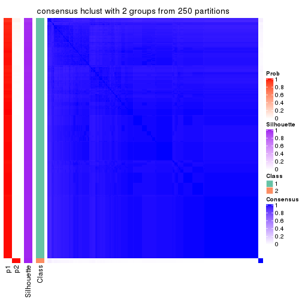</p>

</div>
<div id='tab-ATC-hclust-consensus-heatmap-2'>
<pre><code class="r">consensus_heatmap(res, k = 3)
</code></pre>

<p>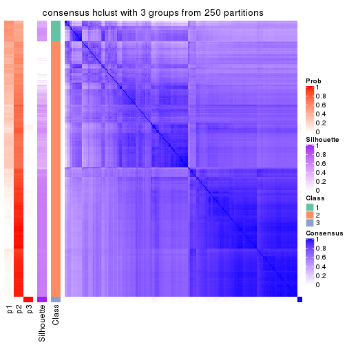</p>

</div>
<div id='tab-ATC-hclust-consensus-heatmap-3'>
<pre><code class="r">consensus_heatmap(res, k = 4)
</code></pre>

<p>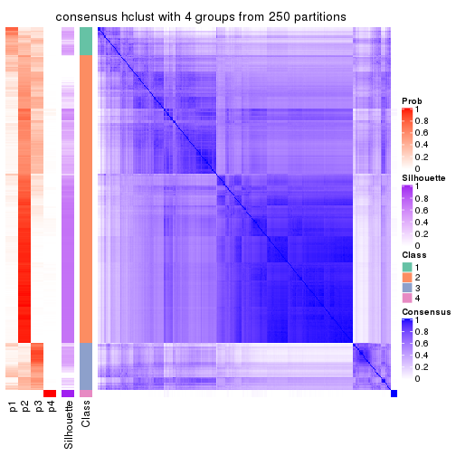</p>

</div>
<div id='tab-ATC-hclust-consensus-heatmap-4'>
<pre><code class="r">consensus_heatmap(res, k = 5)
</code></pre>

<p>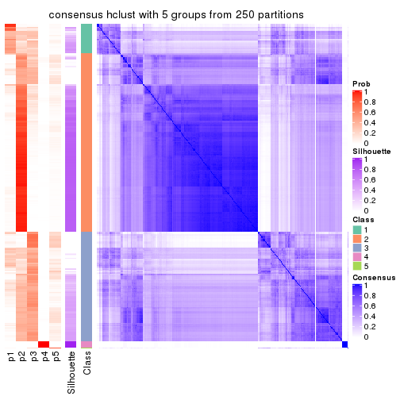</p>

</div>
<div id='tab-ATC-hclust-consensus-heatmap-5'>
<pre><code class="r">consensus_heatmap(res, k = 6)
</code></pre>

<p>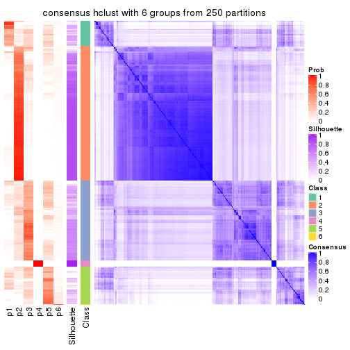</p>

</div>
</div>

Heatmaps for the membership of samples in all partitions to see how consistent they are:


<script>
$( function() {
	$( '#tabs-ATC-hclust-membership-heatmap' ).tabs();
} );
</script>
<div id='tabs-ATC-hclust-membership-heatmap'>
<ul>
<li><a href='#tab-ATC-hclust-membership-heatmap-1'>k = 2</a></li>
<li><a href='#tab-ATC-hclust-membership-heatmap-2'>k = 3</a></li>
<li><a href='#tab-ATC-hclust-membership-heatmap-3'>k = 4</a></li>
<li><a href='#tab-ATC-hclust-membership-heatmap-4'>k = 5</a></li>
<li><a href='#tab-ATC-hclust-membership-heatmap-5'>k = 6</a></li>
</ul>
<div id='tab-ATC-hclust-membership-heatmap-1'>
<pre><code class="r">membership_heatmap(res, k = 2)
</code></pre>

<p>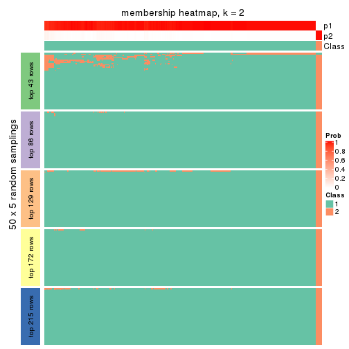</p>

</div>
<div id='tab-ATC-hclust-membership-heatmap-2'>
<pre><code class="r">membership_heatmap(res, k = 3)
</code></pre>

<p>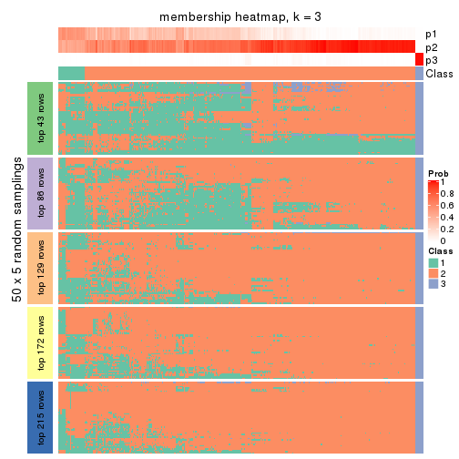</p>

</div>
<div id='tab-ATC-hclust-membership-heatmap-3'>
<pre><code class="r">membership_heatmap(res, k = 4)
</code></pre>

<p>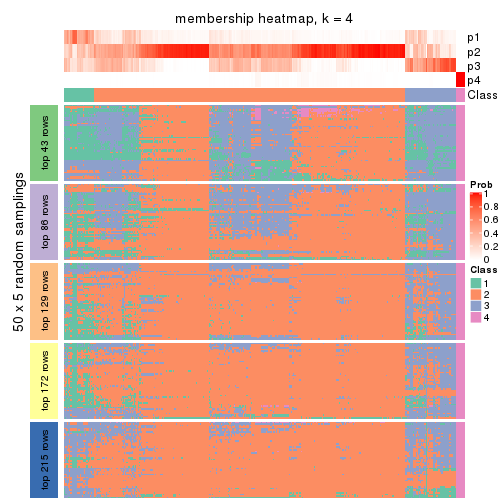</p>

</div>
<div id='tab-ATC-hclust-membership-heatmap-4'>
<pre><code class="r">membership_heatmap(res, k = 5)
</code></pre>

<p>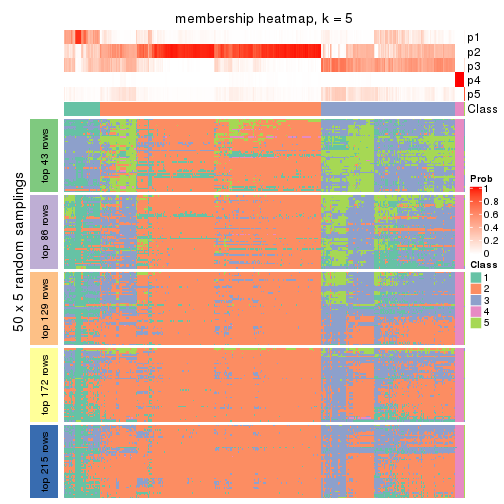</p>

</div>
<div id='tab-ATC-hclust-membership-heatmap-5'>
<pre><code class="r">membership_heatmap(res, k = 6)
</code></pre>

<p>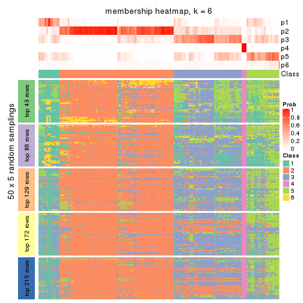</p>

</div>
</div>

As soon as we have had the classes for columns, we can look for signatures
which are significantly different between classes which can be candidate marks
for certain classes. Following are the heatmaps for signatures.


Signature heatmaps where rows are scaled:


<script>
$( function() {
	$( '#tabs-ATC-hclust-get-signatures' ).tabs();
} );
</script>
<div id='tabs-ATC-hclust-get-signatures'>
<ul>
<li><a href='#tab-ATC-hclust-get-signatures-1'>k = 2</a></li>
<li><a href='#tab-ATC-hclust-get-signatures-2'>k = 3</a></li>
<li><a href='#tab-ATC-hclust-get-signatures-3'>k = 4</a></li>
<li><a href='#tab-ATC-hclust-get-signatures-4'>k = 5</a></li>
<li><a href='#tab-ATC-hclust-get-signatures-5'>k = 6</a></li>
</ul>
<div id='tab-ATC-hclust-get-signatures-1'>
<pre><code class="r">get_signatures(res, k = 2)
</code></pre>

<p>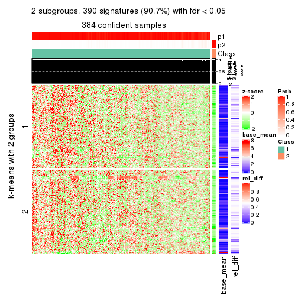</p>

</div>
<div id='tab-ATC-hclust-get-signatures-2'>
<pre><code class="r">get_signatures(res, k = 3)
</code></pre>

<p>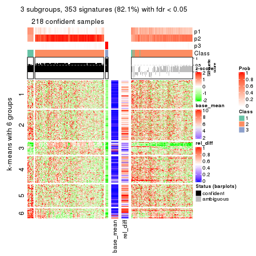</p>

</div>
<div id='tab-ATC-hclust-get-signatures-3'>
<pre><code class="r">get_signatures(res, k = 4)
</code></pre>

<p>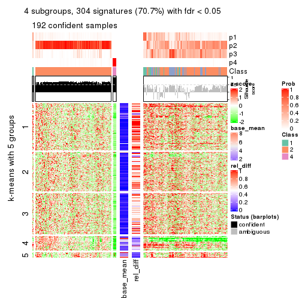</p>

</div>
<div id='tab-ATC-hclust-get-signatures-4'>
<pre><code class="r">get_signatures(res, k = 5)
</code></pre>

<p>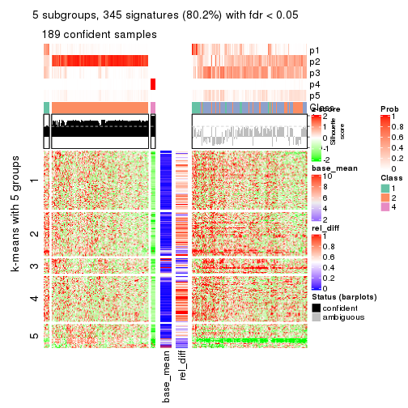</p>

</div>
<div id='tab-ATC-hclust-get-signatures-5'>
<pre><code class="r">get_signatures(res, k = 6)
</code></pre>

<p>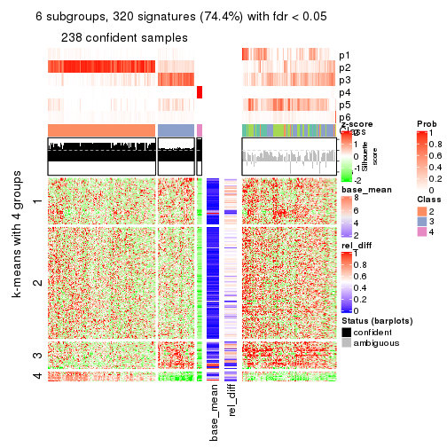</p>

</div>
</div>


Signature heatmaps where rows are not scaled:


<script>
$( function() {
	$( '#tabs-ATC-hclust-get-signatures-no-scale' ).tabs();
} );
</script>
<div id='tabs-ATC-hclust-get-signatures-no-scale'>
<ul>
<li><a href='#tab-ATC-hclust-get-signatures-no-scale-1'>k = 2</a></li>
<li><a href='#tab-ATC-hclust-get-signatures-no-scale-2'>k = 3</a></li>
<li><a href='#tab-ATC-hclust-get-signatures-no-scale-3'>k = 4</a></li>
<li><a href='#tab-ATC-hclust-get-signatures-no-scale-4'>k = 5</a></li>
<li><a href='#tab-ATC-hclust-get-signatures-no-scale-5'>k = 6</a></li>
</ul>
<div id='tab-ATC-hclust-get-signatures-no-scale-1'>
<pre><code class="r">get_signatures(res, k = 2, scale_rows = FALSE)
</code></pre>

<p>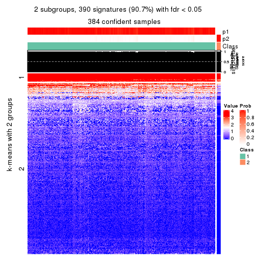</p>

</div>
<div id='tab-ATC-hclust-get-signatures-no-scale-2'>
<pre><code class="r">get_signatures(res, k = 3, scale_rows = FALSE)
</code></pre>

<p>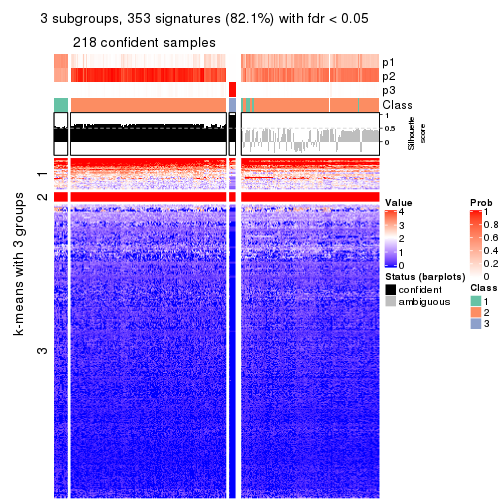</p>

</div>
<div id='tab-ATC-hclust-get-signatures-no-scale-3'>
<pre><code class="r">get_signatures(res, k = 4, scale_rows = FALSE)
</code></pre>

<p>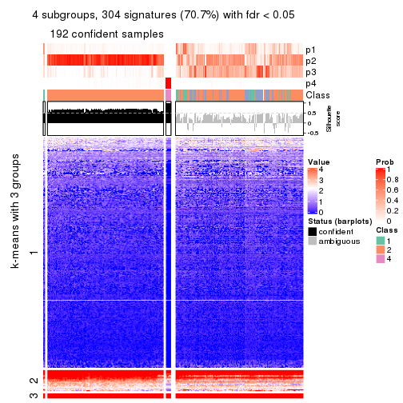</p>

</div>
<div id='tab-ATC-hclust-get-signatures-no-scale-4'>
<pre><code class="r">get_signatures(res, k = 5, scale_rows = FALSE)
</code></pre>

<p>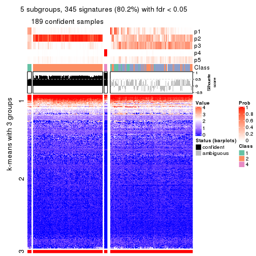</p>

</div>
<div id='tab-ATC-hclust-get-signatures-no-scale-5'>
<pre><code class="r">get_signatures(res, k = 6, scale_rows = FALSE)
</code></pre>

<p>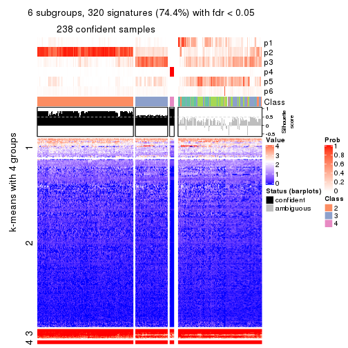</p>

</div>
</div>


Compare the overlap of signatures from different k:

```r
compare_signatures(res)
```

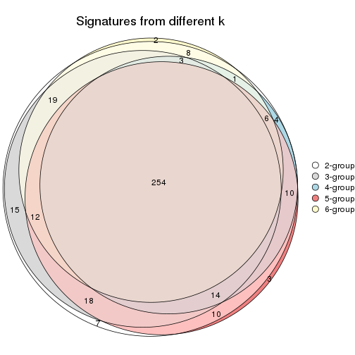

`get_signature()` returns a data frame invisibly. TO get the list of signatures, the function
call should be assigned to a variable explicitly. In following code, if `plot` argument is set
to `FALSE`, no heatmap is plotted while only the differential analysis is performed.

```r
# code only for demonstration
tb = get_signature(res, k = ..., plot = FALSE)
```

An example of the output of `tb` is:

```
#>   which_row         fdr    mean_1    mean_2 scaled_mean_1 scaled_mean_2 km
#> 1        38 0.042760348  8.373488  9.131774    -0.5533452     0.5164555  1
#> 2        40 0.018707592  7.106213  8.469186    -0.6173731     0.5762149  1
#> 3        55 0.019134737 10.221463 11.207825    -0.6159697     0.5749050  1
#> 4        59 0.006059896  5.921854  7.869574    -0.6899429     0.6439467  1
#> 5        60 0.018055526  8.928898 10.211722    -0.6204761     0.5791110  1
#> 6        98 0.009384629 15.714769 14.887706     0.6635654    -0.6193277  2
...
```

The columns in `tb` are:

1. `which_row`: row indices corresponding to the input matrix.
2. `fdr`: FDR for the differential test. 
3. `mean_x`: The mean value in group x.
4. `scaled_mean_x`: The mean value in group x after rows are scaled.
5. `km`: Row groups if k-means clustering is applied to rows.


UMAP plot which shows how samples are separated.


<script>
$( function() {
	$( '#tabs-ATC-hclust-dimension-reduction' ).tabs();
} );
</script>
<div id='tabs-ATC-hclust-dimension-reduction'>
<ul>
<li><a href='#tab-ATC-hclust-dimension-reduction-1'>k = 2</a></li>
<li><a href='#tab-ATC-hclust-dimension-reduction-2'>k = 3</a></li>
<li><a href='#tab-ATC-hclust-dimension-reduction-3'>k = 4</a></li>
<li><a href='#tab-ATC-hclust-dimension-reduction-4'>k = 5</a></li>
<li><a href='#tab-ATC-hclust-dimension-reduction-5'>k = 6</a></li>
</ul>
<div id='tab-ATC-hclust-dimension-reduction-1'>
<pre><code class="r">dimension_reduction(res, k = 2, method = &quot;UMAP&quot;)
</code></pre>

<p>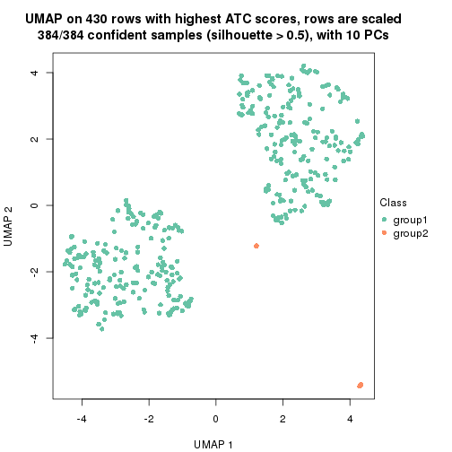</p>

</div>
<div id='tab-ATC-hclust-dimension-reduction-2'>
<pre><code class="r">dimension_reduction(res, k = 3, method = &quot;UMAP&quot;)
</code></pre>

<p>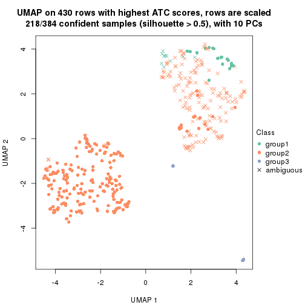</p>

</div>
<div id='tab-ATC-hclust-dimension-reduction-3'>
<pre><code class="r">dimension_reduction(res, k = 4, method = &quot;UMAP&quot;)
</code></pre>

<p>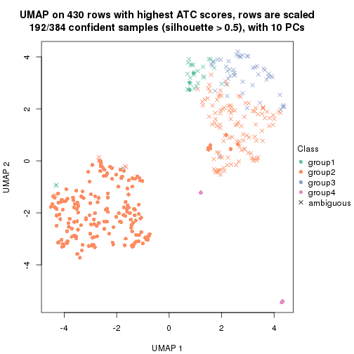</p>

</div>
<div id='tab-ATC-hclust-dimension-reduction-4'>
<pre><code class="r">dimension_reduction(res, k = 5, method = &quot;UMAP&quot;)
</code></pre>

<p>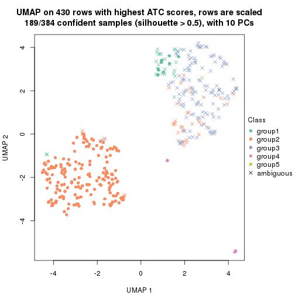</p>

</div>
<div id='tab-ATC-hclust-dimension-reduction-5'>
<pre><code class="r">dimension_reduction(res, k = 6, method = &quot;UMAP&quot;)
</code></pre>

<p>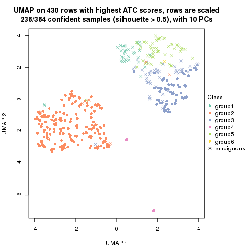</p>

</div>
</div>


Following heatmap shows how subgroups are split when increasing `k`:

```r
collect_classes(res)
```

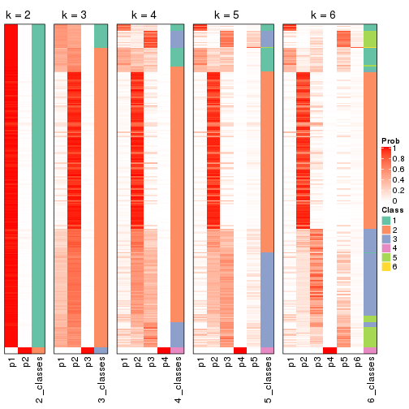


If matrix rows can be associated to genes, consider to use `GO_Enrichment(res,
...)` to perform function enrichment for the signature genes.


 

---------------------------------------------------


### ATC:kmeans


The object with results only for a single top-value method and a single partition method 
can be extracted as:

```r
res = res_list["ATC", "kmeans"]
# you can also extract it by
# res = res_list["ATC:kmeans"]
```

A summary of `res` and all the functions that can be applied to it:

```r
res
```

```
#> A 'ConsensusPartition' object with k = 2, 3, 4, 5, 6.
#>   On a matrix with 430 rows and 384 columns.
#>   Top rows (43, 86, 129, 172, 215) are extracted by 'ATC' method.
#>   Subgroups are detected by 'kmeans' method.
#>   Performed in total 1250 partitions by row resampling.
#>   Best k for subgroups seems to be 2.
#> 
#> Following methods can be applied to this 'ConsensusPartition' object:
#>  [1] "cola_report"             "collect_classes"         "collect_plots"          
#>  [4] "collect_stats"           "colnames"                "compare_signatures"     
#>  [7] "consensus_heatmap"       "dimension_reduction"     "functional_enrichment"  
#> [10] "get_anno_col"            "get_anno"                "get_classes"            
#> [13] "get_consensus"           "get_matrix"              "get_membership"         
#> [16] "get_param"               "get_signatures"          "get_stats"              
#> [19] "is_best_k"               "is_stable_k"             "membership_heatmap"     
#> [22] "ncol"                    "nrow"                    "plot_ecdf"              
#> [25] "rownames"                "select_partition_number" "show"                   
#> [28] "suggest_best_k"          "test_to_known_factors"
```

`collect_plots()` function collects all the plots made from `res` for all `k` (number of partitions)
into one single page to provide an easy and fast comparison between different `k`.

```r
collect_plots(res)
```

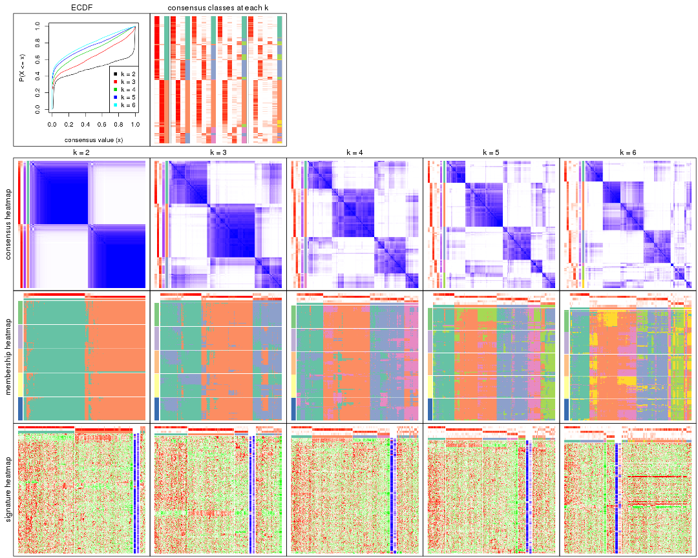

The plots are:

- The first row: a plot of the ECDF (Empirical cumulative distribution
  function) curves of the consensus matrix for each `k` and the heatmap of
  predicted classes for each `k`.
- The second row: heatmaps of the consensus matrix for each `k`.
- The third row: heatmaps of the membership matrix for each `k`.
- The fouth row: heatmaps of the signatures for each `k`.

All the plots in panels can be made by individual functions and they are
plotted later in this section.

`select_partition_number()` produces several plots showing different
statistics for choosing "optimized" `k`. There are following statistics:

- ECDF curves of the consensus matrix for each `k`;
- 1-PAC. [The PAC
  score](https://en.wikipedia.org/wiki/Consensus_clustering#Over-interpretation_potential_of_consensus_clustering)
  measures the proportion of the ambiguous subgrouping.
- Mean silhouette score.
- Concordance. The mean probability of fiting the consensus class ids in all
  partitions.
- Area increased. Denote $A_k$ as the area under the ECDF curve for current
  `k`, the area increased is defined as $A_k - A_{k-1}$.
- Rand index. The percent of pairs of samples that are both in a same cluster
  or both are not in a same cluster in the partition of k and k-1.
- Jaccard index. The ratio of pairs of samples are both in a same cluster in
  the partition of k and k-1 and the pairs of samples are both in a same
  cluster in the partition k or k-1.

The detailed explanations of these statistics can be found in [the cola
vignette](http://bioconductor.org/packages/devel/bioc/vignettes/cola/inst/doc/cola.html#toc_13).

Generally speaking, lower PAC score, higher mean silhouette score or higher
concordance corresponds to better partition. Rand index and Jaccard index
measure how similar the current partition is compared to partition with `k-1`.
If they are too similar, we won't accept `k` is better than `k-1`.

```r
select_partition_number(res)
```

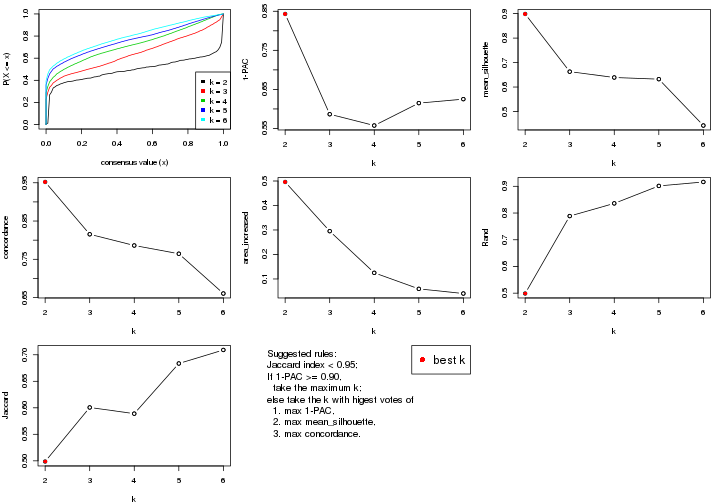

The numeric values for all these statistics can be obtained by `get_stats()`.

```r
get_stats(res)
```

```
#>   k 1-PAC mean_silhouette concordance area_increased  Rand Jaccard
#> 2 2 0.843           0.899       0.952         0.4961 0.499   0.499
#> 3 3 0.586           0.663       0.815         0.2952 0.789   0.601
#> 4 4 0.558           0.639       0.786         0.1251 0.836   0.589
#> 5 5 0.615           0.632       0.765         0.0596 0.901   0.684
#> 6 6 0.625           0.443       0.661         0.0406 0.916   0.709
```

`suggest_best_k()` suggests the best $k$ based on these statistics. The rules are as follows:

- All $k$ with Jaccard index larger than 0.95 are removed because the increase of
  the partition number does not provides enough extra information. If all $k$ are removed,
  the best $k$ is assigned by `NA`.
- For $k$ with 1-PAC larger than 0.9, the maximal $k$ is taken as the "best k". Other $k$ is called "optional k".
- If it does not fit the second rule. The $k$ with the highest vote of highest
  1-PAC, mean silhouette and concordance is taken as the "best k".

```r
suggest_best_k(res)
```

```
#> [1] 2
```


Following shows the table of the partitions (You need to click the **show/hide
code output** link to see it). The membership matrix (columns with name `p*`)
is inferred by
[`clue::cl_consensus()`](https://www.rdocumentation.org/link/cl_consensus?package=clue)
function with the `SE` method. Basically the value in the membership matrix
represents the probability to belong to a certain group. The finall class
label for an item is determined with the group with highest probability it
belongs to.

In `get_classes()` function, the entropy is calculated from the membership
matrix and the silhouette score is calculated from the consensus matrix.


<script>
$( function() {
	$( '#tabs-ATC-kmeans-get-classes' ).tabs();
} );
</script>
<div id='tabs-ATC-kmeans-get-classes'>
<ul>
<li><a href='#tab-ATC-kmeans-get-classes-1'>k = 2</a></li>
<li><a href='#tab-ATC-kmeans-get-classes-2'>k = 3</a></li>
<li><a href='#tab-ATC-kmeans-get-classes-3'>k = 4</a></li>
<li><a href='#tab-ATC-kmeans-get-classes-4'>k = 5</a></li>
<li><a href='#tab-ATC-kmeans-get-classes-5'>k = 6</a></li>
</ul>

<div id='tab-ATC-kmeans-get-classes-1'>
<p><a id='tab-ATC-kmeans-get-classes-1-a' style='color:#0366d6' href='#'>show/hide code output</a></p>
<pre><code class="r">cbind(get_classes(res, k = 2), get_membership(res, k = 2))
</code></pre>

<pre><code>#&gt;            class entropy silhouette    p1    p2
#&gt; SRR2105277     1  0.0000     0.9523 1.000 0.000
#&gt; SRR2105278     1  0.0000     0.9523 1.000 0.000
#&gt; SRR2105275     1  0.8207     0.6588 0.744 0.256
#&gt; SRR2105276     1  0.6247     0.8075 0.844 0.156
#&gt; SRR2105273     1  0.0000     0.9523 1.000 0.000
#&gt; SRR2105274     1  0.0000     0.9523 1.000 0.000
#&gt; SRR2105271     1  0.0000     0.9523 1.000 0.000
#&gt; SRR2105272     1  0.0000     0.9523 1.000 0.000
#&gt; SRR2105269     2  0.0938     0.9560 0.012 0.988
#&gt; SRR2105270     2  0.0938     0.9560 0.012 0.988
#&gt; SRR2105267     2  0.0938     0.9560 0.012 0.988
#&gt; SRR2105268     2  0.0938     0.9560 0.012 0.988
#&gt; SRR2105265     2  0.0938     0.9560 0.012 0.988
#&gt; SRR2105266     2  0.0938     0.9560 0.012 0.988
#&gt; SRR2105263     2  0.0938     0.9560 0.012 0.988
#&gt; SRR2105264     2  0.0938     0.9560 0.012 0.988
#&gt; SRR2105261     2  0.7528     0.7309 0.216 0.784
#&gt; SRR2105262     2  0.9635     0.3838 0.388 0.612
#&gt; SRR2105357     1  0.0376     0.9504 0.996 0.004
#&gt; SRR2105358     1  0.0000     0.9523 1.000 0.000
#&gt; SRR2105439     2  0.9044     0.5573 0.320 0.680
#&gt; SRR2105440     2  0.9732     0.3486 0.404 0.596
#&gt; SRR2105509     2  0.0938     0.9560 0.012 0.988
#&gt; SRR2105510     2  0.0938     0.9560 0.012 0.988
#&gt; SRR2105507     1  0.0000     0.9523 1.000 0.000
#&gt; SRR2105508     1  0.0376     0.9505 0.996 0.004
#&gt; SRR2105505     1  0.0000     0.9523 1.000 0.000
#&gt; SRR2105506     1  0.0000     0.9523 1.000 0.000
#&gt; SRR2105503     2  0.0938     0.9560 0.012 0.988
#&gt; SRR2105504     2  0.0000     0.9464 0.000 1.000
#&gt; SRR2105501     2  0.0938     0.9560 0.012 0.988
#&gt; SRR2105502     2  0.0000     0.9464 0.000 1.000
#&gt; SRR2105499     1  0.0000     0.9523 1.000 0.000
#&gt; SRR2105500     1  0.0000     0.9523 1.000 0.000
#&gt; SRR2105497     2  0.1414     0.9515 0.020 0.980
#&gt; SRR2105498     2  0.2043     0.9439 0.032 0.968
#&gt; SRR2105495     2  0.0938     0.9560 0.012 0.988
#&gt; SRR2105496     2  0.1633     0.9494 0.024 0.976
#&gt; SRR2105493     2  0.2043     0.9441 0.032 0.968
#&gt; SRR2105494     2  0.4815     0.8794 0.104 0.896
#&gt; SRR2105491     2  0.0938     0.9560 0.012 0.988
#&gt; SRR2105492     2  0.0938     0.9560 0.012 0.988
#&gt; SRR2105489     2  0.0938     0.9560 0.012 0.988
#&gt; SRR2105490     2  0.2043     0.9437 0.032 0.968
#&gt; SRR2105487     1  0.0000     0.9523 1.000 0.000
#&gt; SRR2105488     1  0.0000     0.9523 1.000 0.000
#&gt; SRR2105485     1  0.0000     0.9523 1.000 0.000
#&gt; SRR2105486     1  0.0000     0.9523 1.000 0.000
#&gt; SRR2105483     1  0.0000     0.9523 1.000 0.000
#&gt; SRR2105484     1  0.0000     0.9523 1.000 0.000
#&gt; SRR2105481     1  0.0000     0.9523 1.000 0.000
#&gt; SRR2105482     1  0.0000     0.9523 1.000 0.000
#&gt; SRR2105479     1  0.6801     0.7757 0.820 0.180
#&gt; SRR2105480     1  0.3114     0.9133 0.944 0.056
#&gt; SRR2105477     2  0.0938     0.9560 0.012 0.988
#&gt; SRR2105478     2  0.1633     0.9491 0.024 0.976
#&gt; SRR2105475     2  0.0938     0.9560 0.012 0.988
#&gt; SRR2105476     2  0.0938     0.9560 0.012 0.988
#&gt; SRR2105473     1  0.9491     0.4079 0.632 0.368
#&gt; SRR2105474     2  0.9209     0.5229 0.336 0.664
#&gt; SRR2105471     2  0.1184     0.9537 0.016 0.984
#&gt; SRR2105472     2  0.1414     0.9514 0.020 0.980
#&gt; SRR2105469     1  0.0376     0.9505 0.996 0.004
#&gt; SRR2105470     1  0.0000     0.9523 1.000 0.000
#&gt; SRR2105467     1  0.0000     0.9523 1.000 0.000
#&gt; SRR2105468     1  0.0000     0.9523 1.000 0.000
#&gt; SRR2105465     1  0.0000     0.9523 1.000 0.000
#&gt; SRR2105466     1  0.0000     0.9523 1.000 0.000
#&gt; SRR2105463     1  0.0000     0.9523 1.000 0.000
#&gt; SRR2105464     1  0.0000     0.9523 1.000 0.000
#&gt; SRR2105461     2  0.0938     0.9560 0.012 0.988
#&gt; SRR2105462     2  0.0938     0.9560 0.012 0.988
#&gt; SRR2105459     2  0.0938     0.9560 0.012 0.988
#&gt; SRR2105460     2  0.0938     0.9560 0.012 0.988
#&gt; SRR2105457     1  0.1184     0.9439 0.984 0.016
#&gt; SRR2105458     1  0.2043     0.9331 0.968 0.032
#&gt; SRR2105455     1  0.0000     0.9523 1.000 0.000
#&gt; SRR2105456     1  0.0000     0.9523 1.000 0.000
#&gt; SRR2105453     1  0.0000     0.9523 1.000 0.000
#&gt; SRR2105454     1  0.0000     0.9523 1.000 0.000
#&gt; SRR2105451     2  0.4022     0.9039 0.080 0.920
#&gt; SRR2105452     2  0.0672     0.9461 0.008 0.992
#&gt; SRR2105449     1  0.0000     0.9523 1.000 0.000
#&gt; SRR2105450     1  0.0000     0.9523 1.000 0.000
#&gt; SRR2105447     2  0.0938     0.9560 0.012 0.988
#&gt; SRR2105448     2  0.0938     0.9560 0.012 0.988
#&gt; SRR2105445     1  0.5178     0.8532 0.884 0.116
#&gt; SRR2105446     1  0.0000     0.9523 1.000 0.000
#&gt; SRR2105443     2  0.2236     0.9406 0.036 0.964
#&gt; SRR2105444     2  0.3274     0.9219 0.060 0.940
#&gt; SRR2105441     2  0.1843     0.9463 0.028 0.972
#&gt; SRR2105442     2  0.2236     0.9409 0.036 0.964
#&gt; SRR2105437     1  0.0000     0.9523 1.000 0.000
#&gt; SRR2105438     1  0.0000     0.9523 1.000 0.000
#&gt; SRR2105435     1  0.0376     0.9504 0.996 0.004
#&gt; SRR2105436     1  0.0000     0.9523 1.000 0.000
#&gt; SRR2105433     1  0.0000     0.9523 1.000 0.000
#&gt; SRR2105434     1  0.0000     0.9523 1.000 0.000
#&gt; SRR2105431     1  0.0000     0.9523 1.000 0.000
#&gt; SRR2105432     1  0.0000     0.9523 1.000 0.000
#&gt; SRR2105429     2  0.0938     0.9560 0.012 0.988
#&gt; SRR2105430     2  0.0938     0.9560 0.012 0.988
#&gt; SRR2105427     2  0.0938     0.9560 0.012 0.988
#&gt; SRR2105428     2  0.0938     0.9560 0.012 0.988
#&gt; SRR2105425     2  0.0938     0.9560 0.012 0.988
#&gt; SRR2105426     2  0.0938     0.9560 0.012 0.988
#&gt; SRR2105421     2  0.9087     0.5361 0.324 0.676
#&gt; SRR2105422     2  0.9922     0.1999 0.448 0.552
#&gt; SRR2105423     2  0.0938     0.9560 0.012 0.988
#&gt; SRR2105424     2  0.0938     0.9560 0.012 0.988
#&gt; SRR2105419     1  0.0376     0.9505 0.996 0.004
#&gt; SRR2105420     1  0.1633     0.9391 0.976 0.024
#&gt; SRR2105415     1  0.0000     0.9523 1.000 0.000
#&gt; SRR2105416     1  0.0000     0.9523 1.000 0.000
#&gt; SRR2105417     1  0.0000     0.9523 1.000 0.000
#&gt; SRR2105418     1  0.0000     0.9523 1.000 0.000
#&gt; SRR2105413     2  0.0672     0.9529 0.008 0.992
#&gt; SRR2105414     2  0.0938     0.9560 0.012 0.988
#&gt; SRR2105409     2  0.0938     0.9560 0.012 0.988
#&gt; SRR2105410     2  0.2423     0.9380 0.040 0.960
#&gt; SRR2105411     2  0.0938     0.9560 0.012 0.988
#&gt; SRR2105412     2  0.0938     0.9560 0.012 0.988
#&gt; SRR2105407     1  0.1414     0.9414 0.980 0.020
#&gt; SRR2105408     1  0.1184     0.9440 0.984 0.016
#&gt; SRR2105403     1  0.0000     0.9523 1.000 0.000
#&gt; SRR2105404     1  0.0000     0.9523 1.000 0.000
#&gt; SRR2105405     1  0.0000     0.9523 1.000 0.000
#&gt; SRR2105406     1  0.0000     0.9523 1.000 0.000
#&gt; SRR2105401     2  0.0938     0.9560 0.012 0.988
#&gt; SRR2105402     2  0.0000     0.9464 0.000 1.000
#&gt; SRR2105399     2  0.2043     0.9397 0.032 0.968
#&gt; SRR2105400     2  0.1633     0.9486 0.024 0.976
#&gt; SRR2105397     2  0.2423     0.9370 0.040 0.960
#&gt; SRR2105398     2  0.0938     0.9560 0.012 0.988
#&gt; SRR2105395     2  0.0938     0.9560 0.012 0.988
#&gt; SRR2105396     2  0.0938     0.9560 0.012 0.988
#&gt; SRR2105393     2  0.0938     0.9560 0.012 0.988
#&gt; SRR2105394     2  0.0938     0.9560 0.012 0.988
#&gt; SRR2105389     1  0.1843     0.9359 0.972 0.028
#&gt; SRR2105390     1  0.0672     0.9485 0.992 0.008
#&gt; SRR2105391     1  0.1843     0.9358 0.972 0.028
#&gt; SRR2105392     1  0.0672     0.9485 0.992 0.008
#&gt; SRR2105385     1  0.0000     0.9523 1.000 0.000
#&gt; SRR2105386     1  0.0000     0.9523 1.000 0.000
#&gt; SRR2105387     1  0.0000     0.9523 1.000 0.000
#&gt; SRR2105388     1  0.0000     0.9523 1.000 0.000
#&gt; SRR2105381     2  0.0938     0.9560 0.012 0.988
#&gt; SRR2105382     2  0.0938     0.9560 0.012 0.988
#&gt; SRR2105383     2  0.6531     0.8104 0.168 0.832
#&gt; SRR2105384     2  0.5178     0.8701 0.116 0.884
#&gt; SRR2105379     2  0.0938     0.9560 0.012 0.988
#&gt; SRR2105380     2  0.0938     0.9560 0.012 0.988
#&gt; SRR2105377     2  0.2778     0.9326 0.048 0.952
#&gt; SRR2105378     2  0.8608     0.6239 0.284 0.716
#&gt; SRR2105375     1  0.0376     0.9505 0.996 0.004
#&gt; SRR2105376     1  0.0000     0.9523 1.000 0.000
#&gt; SRR2105373     1  0.0000     0.9523 1.000 0.000
#&gt; SRR2105374     1  0.0000     0.9523 1.000 0.000
#&gt; SRR2105371     1  0.0938     0.9463 0.988 0.012
#&gt; SRR2105372     1  0.0376     0.9505 0.996 0.004
#&gt; SRR2105369     1  0.0000     0.9523 1.000 0.000
#&gt; SRR2105370     1  0.0000     0.9523 1.000 0.000
#&gt; SRR2105367     1  0.0000     0.9523 1.000 0.000
#&gt; SRR2105368     1  0.0000     0.9523 1.000 0.000
#&gt; SRR2105365     2  0.0938     0.9560 0.012 0.988
#&gt; SRR2105366     2  0.0938     0.9560 0.012 0.988
#&gt; SRR2105363     2  0.0938     0.9560 0.012 0.988
#&gt; SRR2105364     2  0.0938     0.9560 0.012 0.988
#&gt; SRR2105361     2  0.0938     0.9560 0.012 0.988
#&gt; SRR2105362     2  0.0938     0.9560 0.012 0.988
#&gt; SRR2105359     1  0.2043     0.9330 0.968 0.032
#&gt; SRR2105360     1  0.0000     0.9523 1.000 0.000
#&gt; SRR2105355     1  0.0376     0.9505 0.996 0.004
#&gt; SRR2105356     1  0.0000     0.9523 1.000 0.000
#&gt; SRR2105353     1  0.8813     0.5759 0.700 0.300
#&gt; SRR2105354     1  0.0672     0.9484 0.992 0.008
#&gt; SRR2105351     2  0.0938     0.9560 0.012 0.988
#&gt; SRR2105352     2  0.0000     0.9464 0.000 1.000
#&gt; SRR2105349     2  0.0938     0.9560 0.012 0.988
#&gt; SRR2105350     2  0.0938     0.9560 0.012 0.988
#&gt; SRR2105345     2  0.3584     0.9157 0.068 0.932
#&gt; SRR2105346     2  0.2043     0.9440 0.032 0.968
#&gt; SRR2105347     1  0.9358     0.4454 0.648 0.352
#&gt; SRR2105348     1  0.8081     0.6555 0.752 0.248
#&gt; SRR2105343     2  0.0938     0.9560 0.012 0.988
#&gt; SRR2105344     2  0.0938     0.9560 0.012 0.988
#&gt; SRR2105341     1  0.1184     0.9436 0.984 0.016
#&gt; SRR2105342     1  0.0376     0.9505 0.996 0.004
#&gt; SRR2105339     1  0.7056     0.7585 0.808 0.192
#&gt; SRR2105340     1  0.3584     0.9027 0.932 0.068
#&gt; SRR2105335     1  0.0000     0.9523 1.000 0.000
#&gt; SRR2105336     1  0.0000     0.9523 1.000 0.000
#&gt; SRR2105337     1  0.0000     0.9523 1.000 0.000
#&gt; SRR2105338     1  0.0000     0.9523 1.000 0.000
#&gt; SRR2105331     2  0.0938     0.9560 0.012 0.988
#&gt; SRR2105332     2  0.0938     0.9560 0.012 0.988
#&gt; SRR2105333     2  0.0938     0.9560 0.012 0.988
#&gt; SRR2105334     2  0.0938     0.9560 0.012 0.988
#&gt; SRR2105329     2  0.8207     0.6737 0.256 0.744
#&gt; SRR2105330     2  0.6148     0.8269 0.152 0.848
#&gt; SRR2105327     2  0.0938     0.9560 0.012 0.988
#&gt; SRR2105328     2  0.0938     0.9560 0.012 0.988
#&gt; SRR2105325     1  0.3584     0.9036 0.932 0.068
#&gt; SRR2105326     1  0.4022     0.8919 0.920 0.080
#&gt; SRR2105323     1  0.0000     0.9523 1.000 0.000
#&gt; SRR2105324     1  0.0000     0.9523 1.000 0.000
#&gt; SRR2105319     1  0.0000     0.9523 1.000 0.000
#&gt; SRR2105320     1  0.0000     0.9523 1.000 0.000
#&gt; SRR2105321     1  0.3879     0.8958 0.924 0.076
#&gt; SRR2105322     1  0.4022     0.8922 0.920 0.080
#&gt; SRR2105317     2  0.0938     0.9560 0.012 0.988
#&gt; SRR2105318     2  0.0938     0.9560 0.012 0.988
#&gt; SRR2105315     2  0.7815     0.7129 0.232 0.768
#&gt; SRR2105316     2  0.0938     0.9560 0.012 0.988
#&gt; SRR2105313     2  0.0938     0.9560 0.012 0.988
#&gt; SRR2105314     2  0.0938     0.9560 0.012 0.988
#&gt; SRR2105311     2  0.8443     0.6389 0.272 0.728
#&gt; SRR2105312     2  0.8267     0.6594 0.260 0.740
#&gt; SRR2105307     1  0.0000     0.9523 1.000 0.000
#&gt; SRR2105308     1  0.0000     0.9523 1.000 0.000
#&gt; SRR2105309     1  0.0376     0.9505 0.996 0.004
#&gt; SRR2105310     1  0.0000     0.9523 1.000 0.000
#&gt; SRR2105305     1  0.2423     0.9271 0.960 0.040
#&gt; SRR2105306     1  0.0376     0.9505 0.996 0.004
#&gt; SRR2105303     2  0.0938     0.9560 0.012 0.988
#&gt; SRR2105304     2  0.0000     0.9464 0.000 1.000
#&gt; SRR2105301     2  0.0938     0.9560 0.012 0.988
#&gt; SRR2105302     2  0.0938     0.9560 0.012 0.988
#&gt; SRR2105299     1  0.9552     0.3998 0.624 0.376
#&gt; SRR2105300     1  0.9963     0.1235 0.536 0.464
#&gt; SRR2105297     1  0.9170     0.4926 0.668 0.332
#&gt; SRR2105298     1  0.8763     0.5677 0.704 0.296
#&gt; SRR2105295     2  0.0938     0.9560 0.012 0.988
#&gt; SRR2105296     2  0.0938     0.9560 0.012 0.988
#&gt; SRR2105293     1  0.9460     0.4341 0.636 0.364
#&gt; SRR2105294     1  0.1633     0.9384 0.976 0.024
#&gt; SRR2105291     1  0.2043     0.9310 0.968 0.032
#&gt; SRR2105292     1  0.0000     0.9523 1.000 0.000
#&gt; SRR2105289     1  0.3733     0.8996 0.928 0.072
#&gt; SRR2105290     1  0.0000     0.9523 1.000 0.000
#&gt; SRR2105287     1  0.0000     0.9523 1.000 0.000
#&gt; SRR2105288     1  0.0000     0.9523 1.000 0.000
#&gt; SRR2105285     2  0.0938     0.9560 0.012 0.988
#&gt; SRR2105286     2  0.0938     0.9560 0.012 0.988
#&gt; SRR2105283     2  0.3114     0.9261 0.056 0.944
#&gt; SRR2105284     2  0.3879     0.9068 0.076 0.924
#&gt; SRR2105281     2  0.0938     0.9560 0.012 0.988
#&gt; SRR2105282     2  0.0938     0.9560 0.012 0.988
#&gt; SRR2105259     1  0.1414     0.9412 0.980 0.020
#&gt; SRR2105260     1  0.1843     0.9361 0.972 0.028
#&gt; SRR2105279     2  0.0938     0.9560 0.012 0.988
#&gt; SRR2105280     2  0.0938     0.9560 0.012 0.988
#&gt; SRR2105257     1  0.0000     0.9523 1.000 0.000
#&gt; SRR2105258     1  0.0000     0.9523 1.000 0.000
#&gt; SRR2105253     2  0.0938     0.9560 0.012 0.988
#&gt; SRR2105254     2  0.0938     0.9560 0.012 0.988
#&gt; SRR2105255     1  0.0000     0.9523 1.000 0.000
#&gt; SRR2105256     1  0.0000     0.9523 1.000 0.000
#&gt; SRR2105251     2  0.0938     0.9560 0.012 0.988
#&gt; SRR2105252     2  0.0938     0.9560 0.012 0.988
#&gt; SRR2105249     2  0.5294     0.8658 0.120 0.880
#&gt; SRR2105250     2  0.9988     0.1073 0.480 0.520
#&gt; SRR2105247     2  0.0938     0.9560 0.012 0.988
#&gt; SRR2105248     2  0.0938     0.9560 0.012 0.988
#&gt; SRR2105245     2  0.8909     0.5719 0.308 0.692
#&gt; SRR2105246     2  0.7376     0.7438 0.208 0.792
#&gt; SRR2105243     1  0.0000     0.9523 1.000 0.000
#&gt; SRR2105244     1  0.0000     0.9523 1.000 0.000
#&gt; SRR2105241     1  0.0000     0.9523 1.000 0.000
#&gt; SRR2105242     1  0.0000     0.9523 1.000 0.000
#&gt; SRR2105239     1  0.0000     0.9523 1.000 0.000
#&gt; SRR2105240     1  0.0000     0.9523 1.000 0.000
#&gt; SRR2105237     2  0.0938     0.9560 0.012 0.988
#&gt; SRR2105238     2  0.1184     0.9537 0.016 0.984
#&gt; SRR2105235     2  0.0938     0.9560 0.012 0.988
#&gt; SRR2105236     2  0.2423     0.9380 0.040 0.960
#&gt; SRR2105233     2  0.0938     0.9560 0.012 0.988
#&gt; SRR2105234     2  0.0938     0.9560 0.012 0.988
#&gt; SRR2105231     2  0.0938     0.9560 0.012 0.988
#&gt; SRR2105232     2  0.0938     0.9560 0.012 0.988
#&gt; SRR2105227     1  0.5629     0.8365 0.868 0.132
#&gt; SRR2105228     1  0.0672     0.9483 0.992 0.008
#&gt; SRR2105225     1  0.0000     0.9523 1.000 0.000
#&gt; SRR2105226     1  0.0000     0.9523 1.000 0.000
#&gt; SRR2105229     1  0.8713     0.5923 0.708 0.292
#&gt; SRR2105230     1  0.0000     0.9523 1.000 0.000
#&gt; SRR2105219     2  0.0938     0.9560 0.012 0.988
#&gt; SRR2105220     2  0.0938     0.9560 0.012 0.988
#&gt; SRR2105221     1  0.9996     0.0197 0.512 0.488
#&gt; SRR2105222     2  0.9881     0.2547 0.436 0.564
#&gt; SRR2105223     1  0.0000     0.9523 1.000 0.000
#&gt; SRR2105224     1  0.0000     0.9523 1.000 0.000
#&gt; SRR2105217     2  0.0938     0.9560 0.012 0.988
#&gt; SRR2105218     2  0.0938     0.9560 0.012 0.988
#&gt; SRR2105215     2  0.0938     0.9560 0.012 0.988
#&gt; SRR2105216     2  0.0938     0.9560 0.012 0.988
#&gt; SRR2105213     2  0.8608     0.6161 0.284 0.716
#&gt; SRR2105214     2  0.8909     0.5690 0.308 0.692
#&gt; SRR2105211     1  0.4431     0.8797 0.908 0.092
#&gt; SRR2105212     1  0.0000     0.9523 1.000 0.000
#&gt; SRR2105209     1  0.0000     0.9523 1.000 0.000
#&gt; SRR2105210     1  0.0000     0.9523 1.000 0.000
#&gt; SRR2105207     1  0.0000     0.9523 1.000 0.000
#&gt; SRR2105208     1  0.0000     0.9523 1.000 0.000
#&gt; SRR2105205     2  0.0938     0.9560 0.012 0.988
#&gt; SRR2105206     2  0.0938     0.9560 0.012 0.988
#&gt; SRR2105201     2  0.6973     0.7818 0.188 0.812
#&gt; SRR2105202     1  0.9993     0.0292 0.516 0.484
#&gt; SRR2105203     2  0.0938     0.9560 0.012 0.988
#&gt; SRR2105204     2  0.0938     0.9560 0.012 0.988
#&gt; SRR2105199     2  0.0938     0.9560 0.012 0.988
#&gt; SRR2105200     2  0.2948     0.9287 0.052 0.948
#&gt; SRR2105197     1  0.0672     0.9484 0.992 0.008
#&gt; SRR2105198     1  0.0938     0.9462 0.988 0.012
#&gt; SRR2105195     1  0.2423     0.9271 0.960 0.040
#&gt; SRR2105196     1  0.0672     0.9484 0.992 0.008
#&gt; SRR2105193     1  0.0000     0.9523 1.000 0.000
#&gt; SRR2105194     1  0.0000     0.9523 1.000 0.000
#&gt; SRR2105191     1  0.0000     0.9523 1.000 0.000
#&gt; SRR2105192     1  0.0000     0.9523 1.000 0.000
#&gt; SRR2105189     2  0.0938     0.9560 0.012 0.988
#&gt; SRR2105190     2  0.0938     0.9560 0.012 0.988
#&gt; SRR2105187     2  0.0938     0.9560 0.012 0.988
#&gt; SRR2105188     2  0.6343     0.8147 0.160 0.840
#&gt; SRR2105179     1  0.0000     0.9523 1.000 0.000
#&gt; SRR2105180     1  0.0000     0.9523 1.000 0.000
#&gt; SRR2105183     2  0.1633     0.9492 0.024 0.976
#&gt; SRR2105184     2  0.1414     0.9514 0.020 0.980
#&gt; SRR2105185     2  0.0938     0.9560 0.012 0.988
#&gt; SRR2105186     2  0.0938     0.9560 0.012 0.988
#&gt; SRR2105181     1  0.0000     0.9523 1.000 0.000
#&gt; SRR2105182     1  0.0000     0.9523 1.000 0.000
#&gt; SRR2105177     1  0.0000     0.9523 1.000 0.000
#&gt; SRR2105178     1  0.0000     0.9523 1.000 0.000
#&gt; SRR2105171     2  0.0938     0.9560 0.012 0.988
#&gt; SRR2105172     2  0.0938     0.9560 0.012 0.988
#&gt; SRR2105175     1  0.1184     0.9432 0.984 0.016
#&gt; SRR2105176     1  0.0000     0.9523 1.000 0.000
#&gt; SRR2105173     2  0.0938     0.9560 0.012 0.988
#&gt; SRR2105174     2  0.0938     0.9560 0.012 0.988
#&gt; SRR2105169     2  0.0938     0.9560 0.012 0.988
#&gt; SRR2105170     2  0.1633     0.9489 0.024 0.976
#&gt; SRR2105167     2  0.0938     0.9560 0.012 0.988
#&gt; SRR2105168     2  0.0938     0.9560 0.012 0.988
#&gt; SRR2105165     1  0.0000     0.9523 1.000 0.000
#&gt; SRR2105166     1  0.0000     0.9523 1.000 0.000
#&gt; SRR2105163     1  0.9909     0.2027 0.556 0.444
#&gt; SRR2105164     1  0.9996     0.0378 0.512 0.488
#&gt; SRR2105161     1  0.0000     0.9523 1.000 0.000
#&gt; SRR2105162     1  0.0000     0.9523 1.000 0.000
#&gt; SRR2105155     2  0.0938     0.9560 0.012 0.988
#&gt; SRR2105156     2  0.0938     0.9560 0.012 0.988
#&gt; SRR2105157     2  0.0938     0.9560 0.012 0.988
#&gt; SRR2105158     2  0.0938     0.9560 0.012 0.988
#&gt; SRR2105159     1  0.1843     0.9360 0.972 0.028
#&gt; SRR2105160     1  0.0000     0.9523 1.000 0.000
#&gt; SRR2105153     2  0.0938     0.9560 0.012 0.988
#&gt; SRR2105154     2  0.0938     0.9560 0.012 0.988
#&gt; SRR2105151     2  0.0938     0.9560 0.012 0.988
#&gt; SRR2105152     2  0.0938     0.9560 0.012 0.988
#&gt; SRR2105149     2  0.9933     0.1885 0.452 0.548
#&gt; SRR2105150     1  0.2778     0.9207 0.952 0.048
#&gt; SRR2105147     2  0.2423     0.9252 0.040 0.960
#&gt; SRR2105148     2  0.2423     0.9252 0.040 0.960
#&gt; SRR2105143     1  0.4298     0.8813 0.912 0.088
#&gt; SRR2105144     1  0.0000     0.9523 1.000 0.000
#&gt; SRR2105145     1  0.0000     0.9523 1.000 0.000
#&gt; SRR2105146     1  0.0000     0.9523 1.000 0.000
#&gt; SRR2105141     2  0.0938     0.9560 0.012 0.988
#&gt; SRR2105142     2  0.0938     0.9560 0.012 0.988
#&gt; SRR2105139     2  0.0938     0.9560 0.012 0.988
#&gt; SRR2105140     2  0.0938     0.9560 0.012 0.988
#&gt; SRR2105137     1  0.8909     0.5474 0.692 0.308
#&gt; SRR2105138     1  0.9460     0.4201 0.636 0.364
#&gt; SRR2105135     2  0.0938     0.9560 0.012 0.988
#&gt; SRR2105136     2  0.0938     0.9560 0.012 0.988
#&gt; SRR2105133     1  0.0000     0.9523 1.000 0.000
#&gt; SRR2105134     1  0.0000     0.9523 1.000 0.000
#&gt; SRR2105131     1  0.7602     0.7157 0.780 0.220
#&gt; SRR2105132     1  0.0000     0.9523 1.000 0.000
#&gt; SRR2105129     1  0.0000     0.9523 1.000 0.000
#&gt; SRR2105130     1  0.0000     0.9523 1.000 0.000
#&gt; SRR2105127     1  0.0000     0.9523 1.000 0.000
#&gt; SRR2105128     1  0.0000     0.9523 1.000 0.000
</code></pre>

<script>
$('#tab-ATC-kmeans-get-classes-1-a').parent().next().next().hide();
$('#tab-ATC-kmeans-get-classes-1-a').click(function(){
  $('#tab-ATC-kmeans-get-classes-1-a').parent().next().next().toggle();
  return(false);
});
</script>
</div>

<div id='tab-ATC-kmeans-get-classes-2'>
<p><a id='tab-ATC-kmeans-get-classes-2-a' style='color:#0366d6' href='#'>show/hide code output</a></p>
<pre><code class="r">cbind(get_classes(res, k = 3), get_membership(res, k = 3))
</code></pre>

<pre><code>#&gt;            class entropy silhouette    p1    p2    p3
#&gt; SRR2105277     1  0.5291     0.6329 0.732 0.000 0.268
#&gt; SRR2105278     1  0.2448     0.7513 0.924 0.000 0.076
#&gt; SRR2105275     3  0.2804     0.6413 0.060 0.016 0.924
#&gt; SRR2105276     3  0.2749     0.6405 0.064 0.012 0.924
#&gt; SRR2105273     1  0.6260     0.3847 0.552 0.000 0.448
#&gt; SRR2105274     1  0.6140     0.4850 0.596 0.000 0.404
#&gt; SRR2105271     1  0.5733     0.6100 0.676 0.000 0.324
#&gt; SRR2105272     1  0.4062     0.7358 0.836 0.000 0.164
#&gt; SRR2105269     2  0.0237     0.9014 0.000 0.996 0.004
#&gt; SRR2105270     2  0.0237     0.9014 0.000 0.996 0.004
#&gt; SRR2105267     2  0.0237     0.9014 0.000 0.996 0.004
#&gt; SRR2105268     2  0.0000     0.9017 0.000 1.000 0.000
#&gt; SRR2105265     2  0.0000     0.9017 0.000 1.000 0.000
#&gt; SRR2105266     2  0.0424     0.9013 0.008 0.992 0.000
#&gt; SRR2105263     2  0.0000     0.9017 0.000 1.000 0.000
#&gt; SRR2105264     2  0.0237     0.9016 0.004 0.996 0.000
#&gt; SRR2105261     3  0.4609     0.6178 0.028 0.128 0.844
#&gt; SRR2105262     3  0.3148     0.6408 0.036 0.048 0.916
#&gt; SRR2105357     3  0.6095     0.2011 0.392 0.000 0.608
#&gt; SRR2105358     1  0.6274     0.2943 0.544 0.000 0.456
#&gt; SRR2105439     2  0.6381     0.5230 0.340 0.648 0.012
#&gt; SRR2105440     2  0.6566     0.4652 0.376 0.612 0.012
#&gt; SRR2105509     2  0.6307     0.1169 0.000 0.512 0.488
#&gt; SRR2105510     2  0.6045     0.4298 0.000 0.620 0.380
#&gt; SRR2105507     3  0.5948     0.2762 0.360 0.000 0.640
#&gt; SRR2105508     3  0.5948     0.2820 0.360 0.000 0.640
#&gt; SRR2105505     1  0.0592     0.7578 0.988 0.000 0.012
#&gt; SRR2105506     1  0.0592     0.7578 0.988 0.000 0.012
#&gt; SRR2105503     2  0.0424     0.9013 0.000 0.992 0.008
#&gt; SRR2105504     3  0.6095     0.2047 0.000 0.392 0.608
#&gt; SRR2105501     2  0.0747     0.8997 0.000 0.984 0.016
#&gt; SRR2105502     3  0.6154     0.1597 0.000 0.408 0.592
#&gt; SRR2105499     1  0.6180     0.4631 0.584 0.000 0.416
#&gt; SRR2105500     1  0.5327     0.6649 0.728 0.000 0.272
#&gt; SRR2105497     2  0.0747     0.8995 0.016 0.984 0.000
#&gt; SRR2105498     2  0.1529     0.8868 0.040 0.960 0.000
#&gt; SRR2105495     2  0.0829     0.9002 0.004 0.984 0.012
#&gt; SRR2105496     2  0.2050     0.8870 0.028 0.952 0.020
#&gt; SRR2105493     2  0.1636     0.8901 0.016 0.964 0.020
#&gt; SRR2105494     2  0.4289     0.8125 0.092 0.868 0.040
#&gt; SRR2105491     2  0.2537     0.8663 0.000 0.920 0.080
#&gt; SRR2105492     2  0.2625     0.8635 0.000 0.916 0.084
#&gt; SRR2105489     2  0.0892     0.8974 0.020 0.980 0.000
#&gt; SRR2105490     2  0.1964     0.8763 0.056 0.944 0.000
#&gt; SRR2105487     1  0.1643     0.7523 0.956 0.000 0.044
#&gt; SRR2105488     1  0.1411     0.7544 0.964 0.000 0.036
#&gt; SRR2105485     1  0.6062     0.5298 0.616 0.000 0.384
#&gt; SRR2105486     1  0.5968     0.5576 0.636 0.000 0.364
#&gt; SRR2105483     1  0.0475     0.7527 0.992 0.004 0.004
#&gt; SRR2105484     1  0.0475     0.7527 0.992 0.004 0.004
#&gt; SRR2105481     1  0.6095     0.5098 0.608 0.000 0.392
#&gt; SRR2105482     1  0.1163     0.7610 0.972 0.000 0.028
#&gt; SRR2105479     3  0.5111     0.5964 0.168 0.024 0.808
#&gt; SRR2105480     3  0.6451     0.2068 0.384 0.008 0.608
#&gt; SRR2105477     2  0.0892     0.9001 0.000 0.980 0.020
#&gt; SRR2105478     2  0.1636     0.8921 0.020 0.964 0.016
#&gt; SRR2105475     3  0.6286     0.0432 0.000 0.464 0.536
#&gt; SRR2105476     2  0.6252     0.2576 0.000 0.556 0.444
#&gt; SRR2105473     1  0.6799    -0.0352 0.532 0.456 0.012
#&gt; SRR2105474     2  0.6600     0.4481 0.384 0.604 0.012
#&gt; SRR2105471     2  0.0747     0.8990 0.016 0.984 0.000
#&gt; SRR2105472     2  0.1643     0.8843 0.044 0.956 0.000
#&gt; SRR2105469     3  0.6126     0.1532 0.400 0.000 0.600
#&gt; SRR2105470     1  0.6204     0.4442 0.576 0.000 0.424
#&gt; SRR2105467     1  0.1964     0.7587 0.944 0.000 0.056
#&gt; SRR2105468     1  0.1031     0.7568 0.976 0.000 0.024
#&gt; SRR2105465     1  0.2625     0.7560 0.916 0.000 0.084
#&gt; SRR2105466     1  0.0892     0.7584 0.980 0.000 0.020
#&gt; SRR2105463     1  0.0237     0.7549 0.996 0.000 0.004
#&gt; SRR2105464     1  0.0000     0.7531 1.000 0.000 0.000
#&gt; SRR2105461     2  0.0000     0.9017 0.000 1.000 0.000
#&gt; SRR2105462     2  0.0424     0.9012 0.008 0.992 0.000
#&gt; SRR2105459     2  0.1753     0.8863 0.000 0.952 0.048
#&gt; SRR2105460     2  0.2165     0.8765 0.000 0.936 0.064
#&gt; SRR2105457     3  0.5656     0.4491 0.284 0.004 0.712
#&gt; SRR2105458     3  0.4682     0.5683 0.192 0.004 0.804
#&gt; SRR2105455     1  0.5706     0.6148 0.680 0.000 0.320
#&gt; SRR2105456     1  0.5560     0.6360 0.700 0.000 0.300
#&gt; SRR2105453     1  0.0892     0.7527 0.980 0.000 0.020
#&gt; SRR2105454     1  0.0747     0.7509 0.984 0.000 0.016
#&gt; SRR2105451     2  0.2947     0.8651 0.020 0.920 0.060
#&gt; SRR2105452     3  0.6008     0.2548 0.000 0.372 0.628
#&gt; SRR2105449     1  0.6386     0.4648 0.584 0.004 0.412
#&gt; SRR2105450     1  0.5678     0.6193 0.684 0.000 0.316
#&gt; SRR2105447     2  0.4750     0.7236 0.000 0.784 0.216
#&gt; SRR2105448     2  0.2356     0.8721 0.000 0.928 0.072
#&gt; SRR2105445     3  0.7388     0.5168 0.208 0.100 0.692
#&gt; SRR2105446     1  0.6079     0.4690 0.612 0.000 0.388
#&gt; SRR2105443     3  0.6386     0.2022 0.004 0.412 0.584
#&gt; SRR2105444     2  0.4063     0.8200 0.020 0.868 0.112
#&gt; SRR2105441     2  0.2682     0.8595 0.076 0.920 0.004
#&gt; SRR2105442     2  0.2860     0.8528 0.084 0.912 0.004
#&gt; SRR2105437     1  0.5905     0.4178 0.648 0.000 0.352
#&gt; SRR2105438     1  0.5948     0.4073 0.640 0.000 0.360
#&gt; SRR2105435     1  0.5968     0.5661 0.636 0.000 0.364
#&gt; SRR2105436     1  0.6045     0.5308 0.620 0.000 0.380
#&gt; SRR2105433     1  0.1031     0.7592 0.976 0.000 0.024
#&gt; SRR2105434     1  0.0747     0.7577 0.984 0.000 0.016
#&gt; SRR2105431     1  0.0424     0.7566 0.992 0.000 0.008
#&gt; SRR2105432     1  0.0592     0.7578 0.988 0.000 0.012
#&gt; SRR2105429     3  0.6286     0.0427 0.000 0.464 0.536
#&gt; SRR2105430     3  0.6307    -0.0457 0.000 0.488 0.512
#&gt; SRR2105427     2  0.0747     0.8992 0.000 0.984 0.016
#&gt; SRR2105428     2  0.0424     0.9016 0.000 0.992 0.008
#&gt; SRR2105425     2  0.1529     0.8899 0.000 0.960 0.040
#&gt; SRR2105426     2  0.0424     0.9013 0.008 0.992 0.000
#&gt; SRR2105421     3  0.3499     0.6357 0.028 0.072 0.900
#&gt; SRR2105422     3  0.3009     0.6397 0.028 0.052 0.920
#&gt; SRR2105423     2  0.0237     0.9017 0.004 0.996 0.000
#&gt; SRR2105424     2  0.0592     0.9002 0.012 0.988 0.000
#&gt; SRR2105419     3  0.5497     0.4265 0.292 0.000 0.708
#&gt; SRR2105420     3  0.5859     0.3228 0.344 0.000 0.656
#&gt; SRR2105415     1  0.0424     0.7500 0.992 0.000 0.008
#&gt; SRR2105416     1  0.0000     0.7531 1.000 0.000 0.000
#&gt; SRR2105417     1  0.1163     0.7594 0.972 0.000 0.028
#&gt; SRR2105418     1  0.0237     0.7549 0.996 0.000 0.004
#&gt; SRR2105413     2  0.5948     0.4753 0.000 0.640 0.360
#&gt; SRR2105414     2  0.5810     0.5256 0.000 0.664 0.336
#&gt; SRR2105409     2  0.0000     0.9017 0.000 1.000 0.000
#&gt; SRR2105410     2  0.3532     0.8275 0.108 0.884 0.008
#&gt; SRR2105411     2  0.0000     0.9017 0.000 1.000 0.000
#&gt; SRR2105412     2  0.0424     0.9012 0.008 0.992 0.000
#&gt; SRR2105407     3  0.3851     0.6103 0.136 0.004 0.860
#&gt; SRR2105408     3  0.3752     0.6068 0.144 0.000 0.856
#&gt; SRR2105403     1  0.5138     0.6707 0.748 0.000 0.252
#&gt; SRR2105404     1  0.2959     0.7452 0.900 0.000 0.100
#&gt; SRR2105405     1  0.5216     0.6735 0.740 0.000 0.260
#&gt; SRR2105406     1  0.3941     0.7350 0.844 0.000 0.156
#&gt; SRR2105401     2  0.3752     0.8086 0.000 0.856 0.144
#&gt; SRR2105402     3  0.6079     0.2155 0.000 0.388 0.612
#&gt; SRR2105399     3  0.6180     0.1845 0.000 0.416 0.584
#&gt; SRR2105400     3  0.6215     0.1503 0.000 0.428 0.572
#&gt; SRR2105397     3  0.6008     0.3855 0.004 0.332 0.664
#&gt; SRR2105398     3  0.5760     0.3928 0.000 0.328 0.672
#&gt; SRR2105395     2  0.0237     0.9017 0.004 0.996 0.000
#&gt; SRR2105396     2  0.0747     0.8990 0.016 0.984 0.000
#&gt; SRR2105393     2  0.0237     0.9014 0.000 0.996 0.004
#&gt; SRR2105394     2  0.0000     0.9017 0.000 1.000 0.000
#&gt; SRR2105389     3  0.3112     0.6292 0.096 0.004 0.900
#&gt; SRR2105390     3  0.3941     0.5951 0.156 0.000 0.844
#&gt; SRR2105391     3  0.3193     0.6291 0.100 0.004 0.896
#&gt; SRR2105392     3  0.4002     0.5941 0.160 0.000 0.840
#&gt; SRR2105385     1  0.6126     0.4967 0.600 0.000 0.400
#&gt; SRR2105386     1  0.6225     0.4216 0.568 0.000 0.432
#&gt; SRR2105387     1  0.5397     0.6570 0.720 0.000 0.280
#&gt; SRR2105388     1  0.4452     0.7225 0.808 0.000 0.192
#&gt; SRR2105381     3  0.6280     0.0576 0.000 0.460 0.540
#&gt; SRR2105382     2  0.6192     0.3266 0.000 0.580 0.420
#&gt; SRR2105383     2  0.5291     0.6309 0.268 0.732 0.000
#&gt; SRR2105384     2  0.4504     0.7316 0.196 0.804 0.000
#&gt; SRR2105379     2  0.5216     0.6611 0.000 0.740 0.260
#&gt; SRR2105380     2  0.2878     0.8545 0.000 0.904 0.096
#&gt; SRR2105377     2  0.3607     0.8244 0.112 0.880 0.008
#&gt; SRR2105378     2  0.6047     0.5695 0.312 0.680 0.008
#&gt; SRR2105375     1  0.3918     0.7438 0.856 0.004 0.140
#&gt; SRR2105376     1  0.0424     0.7566 0.992 0.000 0.008
#&gt; SRR2105373     3  0.6309    -0.1623 0.496 0.000 0.504
#&gt; SRR2105374     1  0.6045     0.3834 0.620 0.000 0.380
#&gt; SRR2105371     3  0.4121     0.5910 0.168 0.000 0.832
#&gt; SRR2105372     3  0.4931     0.5246 0.232 0.000 0.768
#&gt; SRR2105369     1  0.5948     0.5618 0.640 0.000 0.360
#&gt; SRR2105370     1  0.5016     0.6907 0.760 0.000 0.240
#&gt; SRR2105367     1  0.0424     0.7568 0.992 0.000 0.008
#&gt; SRR2105368     1  0.0592     0.7483 0.988 0.000 0.012
#&gt; SRR2105365     2  0.3038     0.8472 0.000 0.896 0.104
#&gt; SRR2105366     2  0.0592     0.9003 0.000 0.988 0.012
#&gt; SRR2105363     2  0.0000     0.9017 0.000 1.000 0.000
#&gt; SRR2105364     2  0.0424     0.9011 0.008 0.992 0.000
#&gt; SRR2105361     2  0.0000     0.9017 0.000 1.000 0.000
#&gt; SRR2105362     2  0.0000     0.9017 0.000 1.000 0.000
#&gt; SRR2105359     3  0.5517     0.4752 0.268 0.004 0.728
#&gt; SRR2105360     1  0.6286     0.3404 0.536 0.000 0.464
#&gt; SRR2105355     3  0.5254     0.4803 0.264 0.000 0.736
#&gt; SRR2105356     1  0.6008     0.5419 0.628 0.000 0.372
#&gt; SRR2105353     3  0.2636     0.6408 0.048 0.020 0.932
#&gt; SRR2105354     3  0.4346     0.5792 0.184 0.000 0.816
#&gt; SRR2105351     2  0.2796     0.8576 0.000 0.908 0.092
#&gt; SRR2105352     3  0.6079     0.2155 0.000 0.388 0.612
#&gt; SRR2105349     2  0.2878     0.8536 0.000 0.904 0.096
#&gt; SRR2105350     2  0.0592     0.9002 0.000 0.988 0.012
#&gt; SRR2105345     2  0.3983     0.7936 0.144 0.852 0.004
#&gt; SRR2105346     2  0.1525     0.8897 0.032 0.964 0.004
#&gt; SRR2105347     1  0.5810     0.3188 0.664 0.336 0.000
#&gt; SRR2105348     1  0.4842     0.4786 0.776 0.224 0.000
#&gt; SRR2105343     2  0.0000     0.9017 0.000 1.000 0.000
#&gt; SRR2105344     2  0.0000     0.9017 0.000 1.000 0.000
#&gt; SRR2105341     3  0.4842     0.5369 0.224 0.000 0.776
#&gt; SRR2105342     3  0.5835     0.3331 0.340 0.000 0.660
#&gt; SRR2105339     3  0.2749     0.6405 0.064 0.012 0.924
#&gt; SRR2105340     3  0.3207     0.6370 0.084 0.012 0.904
#&gt; SRR2105335     1  0.4452     0.7252 0.808 0.000 0.192
#&gt; SRR2105336     1  0.1411     0.7589 0.964 0.000 0.036
#&gt; SRR2105337     1  0.5785     0.5998 0.668 0.000 0.332
#&gt; SRR2105338     1  0.4002     0.7393 0.840 0.000 0.160
#&gt; SRR2105331     2  0.2356     0.8721 0.000 0.928 0.072
#&gt; SRR2105332     2  0.0237     0.9014 0.000 0.996 0.004
#&gt; SRR2105333     2  0.4702     0.7314 0.000 0.788 0.212
#&gt; SRR2105334     2  0.3038     0.8475 0.000 0.896 0.104
#&gt; SRR2105329     3  0.6437     0.5755 0.048 0.220 0.732
#&gt; SRR2105330     3  0.7056     0.3170 0.024 0.404 0.572
#&gt; SRR2105327     2  0.5591     0.5881 0.000 0.696 0.304
#&gt; SRR2105328     2  0.5465     0.6159 0.000 0.712 0.288
#&gt; SRR2105325     3  0.2584     0.6393 0.064 0.008 0.928
#&gt; SRR2105326     3  0.2584     0.6393 0.064 0.008 0.928
#&gt; SRR2105323     1  0.6260     0.4137 0.552 0.000 0.448
#&gt; SRR2105324     1  0.5926     0.5689 0.644 0.000 0.356
#&gt; SRR2105319     1  0.5835     0.5658 0.660 0.000 0.340
#&gt; SRR2105320     1  0.4399     0.7138 0.812 0.000 0.188
#&gt; SRR2105321     3  0.2749     0.6405 0.064 0.012 0.924
#&gt; SRR2105322     3  0.2584     0.6396 0.064 0.008 0.928
#&gt; SRR2105317     2  0.4178     0.7795 0.000 0.828 0.172
#&gt; SRR2105318     2  0.1031     0.8965 0.000 0.976 0.024
#&gt; SRR2105315     3  0.4677     0.6199 0.028 0.132 0.840
#&gt; SRR2105316     2  0.3551     0.8195 0.000 0.868 0.132
#&gt; SRR2105313     2  0.1031     0.8964 0.000 0.976 0.024
#&gt; SRR2105314     2  0.0424     0.9011 0.000 0.992 0.008
#&gt; SRR2105311     3  0.2845     0.6302 0.012 0.068 0.920
#&gt; SRR2105312     3  0.3690     0.6246 0.016 0.100 0.884
#&gt; SRR2105307     1  0.2165     0.7594 0.936 0.000 0.064
#&gt; SRR2105308     1  0.1860     0.7593 0.948 0.000 0.052
#&gt; SRR2105309     3  0.5733     0.3689 0.324 0.000 0.676
#&gt; SRR2105310     3  0.6079     0.1855 0.388 0.000 0.612
#&gt; SRR2105305     3  0.4465     0.5887 0.176 0.004 0.820
#&gt; SRR2105306     3  0.5650     0.3968 0.312 0.000 0.688
#&gt; SRR2105303     2  0.0000     0.9017 0.000 1.000 0.000
#&gt; SRR2105304     3  0.6252     0.0433 0.000 0.444 0.556
#&gt; SRR2105301     2  0.6267     0.2357 0.000 0.548 0.452
#&gt; SRR2105302     2  0.2261     0.8743 0.000 0.932 0.068
#&gt; SRR2105299     3  0.3832     0.6386 0.076 0.036 0.888
#&gt; SRR2105300     3  0.5263     0.6262 0.084 0.088 0.828
#&gt; SRR2105297     1  0.5785     0.3259 0.668 0.332 0.000
#&gt; SRR2105298     1  0.5138     0.4390 0.748 0.252 0.000
#&gt; SRR2105295     2  0.5178     0.6681 0.000 0.744 0.256
#&gt; SRR2105296     2  0.3816     0.8071 0.000 0.852 0.148
#&gt; SRR2105293     3  0.3045     0.6420 0.064 0.020 0.916
#&gt; SRR2105294     3  0.5098     0.4967 0.248 0.000 0.752
#&gt; SRR2105291     1  0.7453     0.5861 0.644 0.064 0.292
#&gt; SRR2105292     1  0.0892     0.7579 0.980 0.000 0.020
#&gt; SRR2105289     3  0.6282     0.1933 0.384 0.004 0.612
#&gt; SRR2105290     1  0.5397     0.6563 0.720 0.000 0.280
#&gt; SRR2105287     1  0.0424     0.7566 0.992 0.000 0.008
#&gt; SRR2105288     1  0.0237     0.7549 0.996 0.000 0.004
#&gt; SRR2105285     2  0.3551     0.8218 0.000 0.868 0.132
#&gt; SRR2105286     2  0.2448     0.8689 0.000 0.924 0.076
#&gt; SRR2105283     2  0.2269     0.8846 0.016 0.944 0.040
#&gt; SRR2105284     2  0.3253     0.8540 0.052 0.912 0.036
#&gt; SRR2105281     2  0.0237     0.9017 0.004 0.996 0.000
#&gt; SRR2105282     2  0.0747     0.8990 0.016 0.984 0.000
#&gt; SRR2105259     3  0.3918     0.6093 0.140 0.004 0.856
#&gt; SRR2105260     3  0.3784     0.6135 0.132 0.004 0.864
#&gt; SRR2105279     2  0.0592     0.9002 0.012 0.988 0.000
#&gt; SRR2105280     2  0.0592     0.9002 0.012 0.988 0.000
#&gt; SRR2105257     1  0.0592     0.7578 0.988 0.000 0.012
#&gt; SRR2105258     1  0.0592     0.7578 0.988 0.000 0.012
#&gt; SRR2105253     2  0.0747     0.8993 0.000 0.984 0.016
#&gt; SRR2105254     2  0.0475     0.9020 0.004 0.992 0.004
#&gt; SRR2105255     1  0.5926     0.5806 0.644 0.000 0.356
#&gt; SRR2105256     1  0.5706     0.6157 0.680 0.000 0.320
#&gt; SRR2105251     2  0.0592     0.9005 0.000 0.988 0.012
#&gt; SRR2105252     2  0.0592     0.9003 0.000 0.988 0.012
#&gt; SRR2105249     2  0.3459     0.8355 0.096 0.892 0.012
#&gt; SRR2105250     2  0.6799     0.2761 0.456 0.532 0.012
#&gt; SRR2105247     2  0.0237     0.9014 0.000 0.996 0.004
#&gt; SRR2105248     2  0.0000     0.9017 0.000 1.000 0.000
#&gt; SRR2105245     3  0.6646     0.5622 0.048 0.240 0.712
#&gt; SRR2105246     3  0.7658     0.3663 0.056 0.356 0.588
#&gt; SRR2105243     1  0.5465     0.6504 0.712 0.000 0.288
#&gt; SRR2105244     1  0.5905     0.5740 0.648 0.000 0.352
#&gt; SRR2105241     1  0.4974     0.6930 0.764 0.000 0.236
#&gt; SRR2105242     1  0.1643     0.7612 0.956 0.000 0.044
#&gt; SRR2105239     1  0.5529     0.6413 0.704 0.000 0.296
#&gt; SRR2105240     1  0.0424     0.7566 0.992 0.000 0.008
#&gt; SRR2105237     3  0.6295     0.0193 0.000 0.472 0.528
#&gt; SRR2105238     2  0.1129     0.8989 0.004 0.976 0.020
#&gt; SRR2105235     2  0.0829     0.8992 0.012 0.984 0.004
#&gt; SRR2105236     2  0.2860     0.8536 0.084 0.912 0.004
#&gt; SRR2105233     2  0.5988     0.4575 0.000 0.632 0.368
#&gt; SRR2105234     2  0.5560     0.5944 0.000 0.700 0.300
#&gt; SRR2105231     2  0.0000     0.9017 0.000 1.000 0.000
#&gt; SRR2105232     2  0.0237     0.9017 0.004 0.996 0.000
#&gt; SRR2105227     3  0.6665     0.4552 0.276 0.036 0.688
#&gt; SRR2105228     1  0.6161     0.6546 0.708 0.020 0.272
#&gt; SRR2105225     1  0.6126     0.4940 0.600 0.000 0.400
#&gt; SRR2105226     1  0.3340     0.7516 0.880 0.000 0.120
#&gt; SRR2105229     3  0.2845     0.6405 0.068 0.012 0.920
#&gt; SRR2105230     3  0.5431     0.4347 0.284 0.000 0.716
#&gt; SRR2105219     2  0.0237     0.9014 0.000 0.996 0.004
#&gt; SRR2105220     2  0.0237     0.9014 0.000 0.996 0.004
#&gt; SRR2105221     2  0.6763     0.3245 0.436 0.552 0.012
#&gt; SRR2105222     2  0.6754     0.3381 0.432 0.556 0.012
#&gt; SRR2105223     1  0.5810     0.5949 0.664 0.000 0.336
#&gt; SRR2105224     1  0.5465     0.6497 0.712 0.000 0.288
#&gt; SRR2105217     2  0.0000     0.9017 0.000 1.000 0.000
#&gt; SRR2105218     2  0.0592     0.9002 0.012 0.988 0.000
#&gt; SRR2105215     2  0.0237     0.9017 0.004 0.996 0.000
#&gt; SRR2105216     2  0.0424     0.9011 0.008 0.992 0.000
#&gt; SRR2105213     3  0.5726     0.5779 0.024 0.216 0.760
#&gt; SRR2105214     3  0.5455     0.5931 0.028 0.184 0.788
#&gt; SRR2105211     3  0.4575     0.5804 0.184 0.004 0.812
#&gt; SRR2105212     3  0.6154     0.1140 0.408 0.000 0.592
#&gt; SRR2105209     1  0.3752     0.7452 0.856 0.000 0.144
#&gt; SRR2105210     1  0.2625     0.7592 0.916 0.000 0.084
#&gt; SRR2105207     1  0.1643     0.7617 0.956 0.000 0.044
#&gt; SRR2105208     1  0.0237     0.7549 0.996 0.000 0.004
#&gt; SRR2105205     2  0.1964     0.8817 0.000 0.944 0.056
#&gt; SRR2105206     2  0.2959     0.8518 0.000 0.900 0.100
#&gt; SRR2105201     2  0.5848     0.6293 0.268 0.720 0.012
#&gt; SRR2105202     2  0.6771     0.3184 0.440 0.548 0.012
#&gt; SRR2105203     2  0.0747     0.8992 0.000 0.984 0.016
#&gt; SRR2105204     2  0.0000     0.9017 0.000 1.000 0.000
#&gt; SRR2105199     2  0.0000     0.9017 0.000 1.000 0.000
#&gt; SRR2105200     2  0.3038     0.8374 0.104 0.896 0.000
#&gt; SRR2105197     3  0.6079     0.2196 0.388 0.000 0.612
#&gt; SRR2105198     3  0.6299     0.0305 0.476 0.000 0.524
#&gt; SRR2105195     3  0.6483    -0.0370 0.452 0.004 0.544
#&gt; SRR2105196     1  0.5298     0.7215 0.804 0.032 0.164
#&gt; SRR2105193     1  0.2066     0.7606 0.940 0.000 0.060
#&gt; SRR2105194     1  0.1529     0.7608 0.960 0.000 0.040
#&gt; SRR2105191     1  0.4842     0.6934 0.776 0.000 0.224
#&gt; SRR2105192     1  0.1031     0.7541 0.976 0.000 0.024
#&gt; SRR2105189     2  0.1964     0.8819 0.000 0.944 0.056
#&gt; SRR2105190     2  0.0424     0.9009 0.000 0.992 0.008
#&gt; SRR2105187     2  0.3349     0.8539 0.004 0.888 0.108
#&gt; SRR2105188     2  0.4779     0.7811 0.124 0.840 0.036
#&gt; SRR2105179     1  0.4399     0.7237 0.812 0.000 0.188
#&gt; SRR2105180     1  0.0892     0.7527 0.980 0.000 0.020
#&gt; SRR2105183     2  0.0747     0.8991 0.016 0.984 0.000
#&gt; SRR2105184     2  0.1753     0.8816 0.048 0.952 0.000
#&gt; SRR2105185     2  0.1529     0.8897 0.000 0.960 0.040
#&gt; SRR2105186     2  0.0661     0.9019 0.008 0.988 0.004
#&gt; SRR2105181     1  0.6244     0.3705 0.560 0.000 0.440
#&gt; SRR2105182     3  0.6307    -0.1740 0.488 0.000 0.512
#&gt; SRR2105177     1  0.0237     0.7549 0.996 0.000 0.004
#&gt; SRR2105178     1  0.0475     0.7527 0.992 0.004 0.004
#&gt; SRR2105171     2  0.0237     0.9014 0.000 0.996 0.004
#&gt; SRR2105172     2  0.0000     0.9017 0.000 1.000 0.000
#&gt; SRR2105175     1  0.2773     0.7527 0.928 0.024 0.048
#&gt; SRR2105176     1  0.0237     0.7549 0.996 0.000 0.004
#&gt; SRR2105173     2  0.0424     0.9011 0.000 0.992 0.008
#&gt; SRR2105174     2  0.0000     0.9017 0.000 1.000 0.000
#&gt; SRR2105169     2  0.0424     0.9011 0.008 0.992 0.000
#&gt; SRR2105170     2  0.1753     0.8816 0.048 0.952 0.000
#&gt; SRR2105167     2  0.0592     0.9002 0.012 0.988 0.000
#&gt; SRR2105168     2  0.0592     0.9002 0.012 0.988 0.000
#&gt; SRR2105165     3  0.5968     0.2661 0.364 0.000 0.636
#&gt; SRR2105166     3  0.6026     0.2211 0.376 0.000 0.624
#&gt; SRR2105163     3  0.2903     0.6424 0.048 0.028 0.924
#&gt; SRR2105164     3  0.2926     0.6415 0.040 0.036 0.924
#&gt; SRR2105161     1  0.4178     0.7333 0.828 0.000 0.172
#&gt; SRR2105162     1  0.0237     0.7549 0.996 0.000 0.004
#&gt; SRR2105155     2  0.0424     0.9011 0.008 0.992 0.000
#&gt; SRR2105156     2  0.0592     0.9002 0.012 0.988 0.000
#&gt; SRR2105157     2  0.0237     0.9017 0.000 0.996 0.004
#&gt; SRR2105158     2  0.0424     0.9011 0.008 0.992 0.000
#&gt; SRR2105159     3  0.6095     0.1794 0.392 0.000 0.608
#&gt; SRR2105160     1  0.3879     0.7408 0.848 0.000 0.152
#&gt; SRR2105153     2  0.0237     0.9014 0.000 0.996 0.004
#&gt; SRR2105154     2  0.0592     0.9003 0.000 0.988 0.012
#&gt; SRR2105151     2  0.0592     0.9002 0.012 0.988 0.000
#&gt; SRR2105152     2  0.0592     0.9002 0.012 0.988 0.000
#&gt; SRR2105149     3  0.3155     0.6422 0.040 0.044 0.916
#&gt; SRR2105150     3  0.3682     0.6265 0.116 0.008 0.876
#&gt; SRR2105147     3  0.5591     0.4030 0.000 0.304 0.696
#&gt; SRR2105148     3  0.5591     0.4030 0.000 0.304 0.696
#&gt; SRR2105143     1  0.5423     0.6971 0.820 0.084 0.096
#&gt; SRR2105144     1  0.0424     0.7562 0.992 0.000 0.008
#&gt; SRR2105145     1  0.2959     0.7512 0.900 0.000 0.100
#&gt; SRR2105146     1  0.4121     0.7340 0.832 0.000 0.168
#&gt; SRR2105141     2  0.2959     0.8504 0.000 0.900 0.100
#&gt; SRR2105142     2  0.2165     0.8764 0.000 0.936 0.064
#&gt; SRR2105139     2  0.0000     0.9017 0.000 1.000 0.000
#&gt; SRR2105140     2  0.0592     0.9002 0.012 0.988 0.000
#&gt; SRR2105137     1  0.6675     0.1421 0.584 0.404 0.012
#&gt; SRR2105138     1  0.6799    -0.0345 0.532 0.456 0.012
#&gt; SRR2105135     2  0.0592     0.9002 0.012 0.988 0.000
#&gt; SRR2105136     2  0.0747     0.8990 0.016 0.984 0.000
#&gt; SRR2105133     1  0.5760     0.5545 0.672 0.000 0.328
#&gt; SRR2105134     1  0.2165     0.7560 0.936 0.000 0.064
#&gt; SRR2105131     1  0.9994    -0.0759 0.344 0.316 0.340
#&gt; SRR2105132     1  0.1289     0.7560 0.968 0.000 0.032
#&gt; SRR2105129     1  0.0424     0.7562 0.992 0.000 0.008
#&gt; SRR2105130     1  0.0237     0.7549 0.996 0.000 0.004
#&gt; SRR2105127     1  0.0747     0.7509 0.984 0.000 0.016
#&gt; SRR2105128     1  0.0592     0.7483 0.988 0.000 0.012
</code></pre>

<script>
$('#tab-ATC-kmeans-get-classes-2-a').parent().next().next().hide();
$('#tab-ATC-kmeans-get-classes-2-a').click(function(){
  $('#tab-ATC-kmeans-get-classes-2-a').parent().next().next().toggle();
  return(false);
});
</script>
</div>

<div id='tab-ATC-kmeans-get-classes-3'>
<p><a id='tab-ATC-kmeans-get-classes-3-a' style='color:#0366d6' href='#'>show/hide code output</a></p>
<pre><code class="r">cbind(get_classes(res, k = 4), get_membership(res, k = 4))
</code></pre>

<pre><code>#&gt;            class entropy silhouette    p1    p2    p3    p4
#&gt; SRR2105277     3  0.6931    0.43269 0.228 0.000 0.588 0.184
#&gt; SRR2105278     3  0.7463    0.14789 0.364 0.000 0.456 0.180
#&gt; SRR2105275     3  0.4391    0.54890 0.000 0.008 0.740 0.252
#&gt; SRR2105276     3  0.4335    0.57386 0.004 0.004 0.752 0.240
#&gt; SRR2105273     3  0.2814    0.68891 0.132 0.000 0.868 0.000
#&gt; SRR2105274     3  0.3764    0.62949 0.216 0.000 0.784 0.000
#&gt; SRR2105271     3  0.4697    0.41031 0.356 0.000 0.644 0.000
#&gt; SRR2105272     1  0.3486    0.71209 0.812 0.000 0.188 0.000
#&gt; SRR2105269     2  0.2011    0.79549 0.000 0.920 0.000 0.080
#&gt; SRR2105270     2  0.2011    0.79906 0.000 0.920 0.000 0.080
#&gt; SRR2105267     2  0.2081    0.79099 0.000 0.916 0.000 0.084
#&gt; SRR2105268     2  0.1637    0.79948 0.000 0.940 0.000 0.060
#&gt; SRR2105265     2  0.0804    0.81155 0.012 0.980 0.000 0.008
#&gt; SRR2105266     2  0.1677    0.80538 0.040 0.948 0.000 0.012
#&gt; SRR2105263     2  0.1867    0.79810 0.000 0.928 0.000 0.072
#&gt; SRR2105264     2  0.0895    0.81343 0.004 0.976 0.000 0.020
#&gt; SRR2105261     4  0.6188    0.55013 0.004 0.064 0.312 0.620
#&gt; SRR2105262     3  0.5648    0.11625 0.004 0.016 0.536 0.444
#&gt; SRR2105357     3  0.5384    0.59823 0.076 0.000 0.728 0.196
#&gt; SRR2105358     3  0.5850    0.57535 0.116 0.000 0.700 0.184
#&gt; SRR2105439     2  0.6784    0.58996 0.128 0.680 0.040 0.152
#&gt; SRR2105440     2  0.7413    0.51973 0.172 0.624 0.044 0.160
#&gt; SRR2105509     4  0.4993    0.76359 0.000 0.260 0.028 0.712
#&gt; SRR2105510     4  0.5088    0.74017 0.000 0.288 0.024 0.688
#&gt; SRR2105507     3  0.2859    0.70009 0.112 0.000 0.880 0.008
#&gt; SRR2105508     3  0.2924    0.70654 0.100 0.000 0.884 0.016
#&gt; SRR2105505     1  0.2623    0.76031 0.908 0.000 0.028 0.064
#&gt; SRR2105506     1  0.2002    0.76618 0.936 0.000 0.020 0.044
#&gt; SRR2105503     2  0.2345    0.78350 0.000 0.900 0.000 0.100
#&gt; SRR2105504     4  0.4841    0.78521 0.000 0.140 0.080 0.780
#&gt; SRR2105501     2  0.2408    0.78883 0.000 0.896 0.000 0.104
#&gt; SRR2105502     4  0.4841    0.78521 0.000 0.140 0.080 0.780
#&gt; SRR2105499     3  0.3448    0.66920 0.168 0.000 0.828 0.004
#&gt; SRR2105500     3  0.4989    0.04229 0.472 0.000 0.528 0.000
#&gt; SRR2105497     2  0.1302    0.80914 0.044 0.956 0.000 0.000
#&gt; SRR2105498     2  0.2546    0.78027 0.092 0.900 0.000 0.008
#&gt; SRR2105495     2  0.3160    0.79036 0.000 0.872 0.020 0.108
#&gt; SRR2105496     2  0.3952    0.78544 0.024 0.840 0.012 0.124
#&gt; SRR2105493     2  0.5180    0.69506 0.020 0.768 0.044 0.168
#&gt; SRR2105494     2  0.6121    0.63675 0.044 0.704 0.044 0.208
#&gt; SRR2105491     2  0.4790    0.28480 0.000 0.620 0.000 0.380
#&gt; SRR2105492     2  0.4746    0.32359 0.000 0.632 0.000 0.368
#&gt; SRR2105489     2  0.1807    0.80156 0.052 0.940 0.000 0.008
#&gt; SRR2105490     2  0.2611    0.77758 0.096 0.896 0.000 0.008
#&gt; SRR2105487     1  0.7432    0.15684 0.472 0.000 0.348 0.180
#&gt; SRR2105488     1  0.7393    0.19796 0.488 0.000 0.332 0.180
#&gt; SRR2105485     3  0.4225    0.64214 0.184 0.000 0.792 0.024
#&gt; SRR2105486     3  0.4728    0.61379 0.216 0.000 0.752 0.032
#&gt; SRR2105483     1  0.1059    0.77141 0.972 0.012 0.016 0.000
#&gt; SRR2105484     1  0.1059    0.77141 0.972 0.012 0.016 0.000
#&gt; SRR2105481     3  0.4098    0.64813 0.204 0.000 0.784 0.012
#&gt; SRR2105482     1  0.2775    0.77397 0.896 0.000 0.084 0.020
#&gt; SRR2105479     3  0.5335    0.67338 0.096 0.012 0.768 0.124
#&gt; SRR2105480     3  0.4867    0.60187 0.232 0.000 0.736 0.032
#&gt; SRR2105477     2  0.4285    0.75181 0.004 0.804 0.028 0.164
#&gt; SRR2105478     2  0.5276    0.69511 0.028 0.752 0.028 0.192
#&gt; SRR2105475     4  0.5466    0.78516 0.000 0.220 0.068 0.712
#&gt; SRR2105476     4  0.4804    0.75033 0.000 0.276 0.016 0.708
#&gt; SRR2105473     2  0.8400    0.16164 0.384 0.416 0.048 0.152
#&gt; SRR2105474     2  0.7053    0.55843 0.164 0.652 0.036 0.148
#&gt; SRR2105471     2  0.2048    0.79640 0.064 0.928 0.000 0.008
#&gt; SRR2105472     2  0.2480    0.78275 0.088 0.904 0.000 0.008
#&gt; SRR2105469     3  0.2984    0.71313 0.084 0.000 0.888 0.028
#&gt; SRR2105470     3  0.3610    0.64510 0.200 0.000 0.800 0.000
#&gt; SRR2105467     1  0.7155    0.35022 0.540 0.000 0.292 0.168
#&gt; SRR2105468     1  0.4956    0.68271 0.776 0.000 0.108 0.116
#&gt; SRR2105465     1  0.3047    0.75979 0.872 0.012 0.116 0.000
#&gt; SRR2105466     1  0.1938    0.77824 0.936 0.012 0.052 0.000
#&gt; SRR2105463     1  0.1356    0.77893 0.960 0.008 0.032 0.000
#&gt; SRR2105464     1  0.1209    0.77911 0.964 0.004 0.032 0.000
#&gt; SRR2105461     2  0.0804    0.81190 0.008 0.980 0.000 0.012
#&gt; SRR2105462     2  0.1256    0.80891 0.028 0.964 0.000 0.008
#&gt; SRR2105459     2  0.4477    0.48294 0.000 0.688 0.000 0.312
#&gt; SRR2105460     2  0.3907    0.63712 0.000 0.768 0.000 0.232
#&gt; SRR2105457     3  0.1820    0.71879 0.036 0.000 0.944 0.020
#&gt; SRR2105458     3  0.2089    0.71965 0.020 0.000 0.932 0.048
#&gt; SRR2105455     1  0.4992    0.14141 0.524 0.000 0.476 0.000
#&gt; SRR2105456     1  0.4925    0.28939 0.572 0.000 0.428 0.000
#&gt; SRR2105453     1  0.5165    0.64531 0.752 0.000 0.080 0.168
#&gt; SRR2105454     1  0.5229    0.64102 0.748 0.000 0.084 0.168
#&gt; SRR2105451     2  0.4779    0.75180 0.020 0.804 0.048 0.128
#&gt; SRR2105452     4  0.5330    0.76602 0.000 0.132 0.120 0.748
#&gt; SRR2105449     3  0.4761    0.45311 0.332 0.000 0.664 0.004
#&gt; SRR2105450     1  0.4981    0.18226 0.536 0.000 0.464 0.000
#&gt; SRR2105447     4  0.5360    0.43789 0.000 0.436 0.012 0.552
#&gt; SRR2105448     2  0.4382    0.51806 0.000 0.704 0.000 0.296
#&gt; SRR2105445     3  0.5505    0.61231 0.040 0.028 0.744 0.188
#&gt; SRR2105446     3  0.5763    0.58387 0.096 0.000 0.700 0.204
#&gt; SRR2105443     4  0.6279    0.76248 0.000 0.180 0.156 0.664
#&gt; SRR2105444     2  0.6413    0.58774 0.012 0.676 0.120 0.192
#&gt; SRR2105441     2  0.3144    0.77724 0.072 0.884 0.000 0.044
#&gt; SRR2105442     2  0.3056    0.77932 0.072 0.888 0.000 0.040
#&gt; SRR2105437     3  0.7295    0.30064 0.288 0.000 0.524 0.188
#&gt; SRR2105438     3  0.7295    0.30064 0.288 0.000 0.524 0.188
#&gt; SRR2105435     3  0.5270    0.46995 0.320 0.012 0.660 0.008
#&gt; SRR2105436     3  0.3933    0.63558 0.200 0.000 0.792 0.008
#&gt; SRR2105433     1  0.1970    0.77862 0.932 0.008 0.060 0.000
#&gt; SRR2105434     1  0.2021    0.77763 0.932 0.012 0.056 0.000
#&gt; SRR2105431     1  0.1724    0.77717 0.948 0.000 0.032 0.020
#&gt; SRR2105432     1  0.1629    0.77461 0.952 0.000 0.024 0.024
#&gt; SRR2105429     4  0.5533    0.78601 0.000 0.220 0.072 0.708
#&gt; SRR2105430     4  0.5598    0.78607 0.000 0.220 0.076 0.704
#&gt; SRR2105427     2  0.2216    0.80072 0.000 0.908 0.000 0.092
#&gt; SRR2105428     2  0.2611    0.79607 0.000 0.896 0.008 0.096
#&gt; SRR2105425     2  0.3266    0.71972 0.000 0.832 0.000 0.168
#&gt; SRR2105426     2  0.0524    0.81267 0.008 0.988 0.000 0.004
#&gt; SRR2105421     4  0.5565    0.15816 0.004 0.012 0.464 0.520
#&gt; SRR2105422     3  0.5365    0.19905 0.004 0.008 0.576 0.412
#&gt; SRR2105423     2  0.0937    0.81216 0.012 0.976 0.000 0.012
#&gt; SRR2105424     2  0.1489    0.80595 0.044 0.952 0.000 0.004
#&gt; SRR2105419     3  0.2142    0.71747 0.056 0.000 0.928 0.016
#&gt; SRR2105420     3  0.2660    0.72049 0.056 0.000 0.908 0.036
#&gt; SRR2105415     1  0.2521    0.75578 0.912 0.000 0.024 0.064
#&gt; SRR2105416     1  0.1520    0.76997 0.956 0.000 0.020 0.024
#&gt; SRR2105417     1  0.2053    0.77679 0.924 0.004 0.072 0.000
#&gt; SRR2105418     1  0.1661    0.78024 0.944 0.004 0.052 0.000
#&gt; SRR2105413     4  0.5085    0.76482 0.000 0.260 0.032 0.708
#&gt; SRR2105414     4  0.4857    0.74379 0.000 0.284 0.016 0.700
#&gt; SRR2105409     2  0.1389    0.80596 0.000 0.952 0.000 0.048
#&gt; SRR2105410     2  0.4147    0.75849 0.064 0.840 0.008 0.088
#&gt; SRR2105411     2  0.1151    0.81193 0.008 0.968 0.000 0.024
#&gt; SRR2105412     2  0.1489    0.80609 0.044 0.952 0.000 0.004
#&gt; SRR2105407     3  0.2271    0.70936 0.008 0.000 0.916 0.076
#&gt; SRR2105408     3  0.3166    0.69068 0.016 0.000 0.868 0.116
#&gt; SRR2105403     3  0.6550    0.51677 0.184 0.000 0.636 0.180
#&gt; SRR2105404     3  0.7423    0.20294 0.344 0.000 0.476 0.180
#&gt; SRR2105405     1  0.4697    0.46528 0.644 0.000 0.356 0.000
#&gt; SRR2105406     1  0.3975    0.65257 0.760 0.000 0.240 0.000
#&gt; SRR2105401     2  0.4139    0.72173 0.000 0.800 0.024 0.176
#&gt; SRR2105402     4  0.5321    0.77231 0.000 0.140 0.112 0.748
#&gt; SRR2105399     4  0.5905    0.77244 0.000 0.156 0.144 0.700
#&gt; SRR2105400     4  0.5891    0.78399 0.000 0.168 0.132 0.700
#&gt; SRR2105397     4  0.6373    0.63770 0.000 0.116 0.248 0.636
#&gt; SRR2105398     4  0.5708    0.74819 0.000 0.124 0.160 0.716
#&gt; SRR2105395     2  0.0672    0.81237 0.008 0.984 0.000 0.008
#&gt; SRR2105396     2  0.2048    0.79636 0.064 0.928 0.000 0.008
#&gt; SRR2105393     2  0.1661    0.80797 0.004 0.944 0.000 0.052
#&gt; SRR2105394     2  0.0592    0.81089 0.000 0.984 0.000 0.016
#&gt; SRR2105389     3  0.2216    0.70097 0.000 0.000 0.908 0.092
#&gt; SRR2105390     3  0.2048    0.71574 0.008 0.000 0.928 0.064
#&gt; SRR2105391     3  0.2011    0.70907 0.000 0.000 0.920 0.080
#&gt; SRR2105392     3  0.1940    0.71174 0.000 0.000 0.924 0.076
#&gt; SRR2105385     3  0.3569    0.64967 0.196 0.000 0.804 0.000
#&gt; SRR2105386     3  0.4040    0.59082 0.248 0.000 0.752 0.000
#&gt; SRR2105387     1  0.4916    0.29977 0.576 0.000 0.424 0.000
#&gt; SRR2105388     1  0.4605    0.50534 0.664 0.000 0.336 0.000
#&gt; SRR2105381     4  0.5421    0.78804 0.000 0.200 0.076 0.724
#&gt; SRR2105382     4  0.4908    0.73667 0.000 0.292 0.016 0.692
#&gt; SRR2105383     2  0.5069    0.50373 0.320 0.664 0.000 0.016
#&gt; SRR2105384     2  0.4594    0.56930 0.280 0.712 0.000 0.008
#&gt; SRR2105379     4  0.4936    0.70430 0.000 0.316 0.012 0.672
#&gt; SRR2105380     2  0.4679    0.37476 0.000 0.648 0.000 0.352
#&gt; SRR2105377     2  0.4977    0.70891 0.064 0.792 0.016 0.128
#&gt; SRR2105378     2  0.5976    0.64935 0.104 0.736 0.028 0.132
#&gt; SRR2105375     1  0.4453    0.64502 0.744 0.012 0.244 0.000
#&gt; SRR2105376     1  0.1585    0.78085 0.952 0.004 0.040 0.004
#&gt; SRR2105373     3  0.5952    0.56988 0.124 0.000 0.692 0.184
#&gt; SRR2105374     3  0.7042    0.39367 0.240 0.000 0.572 0.188
#&gt; SRR2105371     3  0.1970    0.71557 0.008 0.000 0.932 0.060
#&gt; SRR2105372     3  0.2089    0.71766 0.020 0.000 0.932 0.048
#&gt; SRR2105369     3  0.4253    0.62238 0.208 0.000 0.776 0.016
#&gt; SRR2105370     3  0.5686    0.30066 0.376 0.000 0.592 0.032
#&gt; SRR2105367     1  0.3634    0.72152 0.856 0.000 0.048 0.096
#&gt; SRR2105368     1  0.3916    0.71585 0.848 0.004 0.056 0.092
#&gt; SRR2105365     4  0.5000    0.21925 0.000 0.496 0.000 0.504
#&gt; SRR2105366     2  0.3356    0.71438 0.000 0.824 0.000 0.176
#&gt; SRR2105363     2  0.0804    0.81302 0.008 0.980 0.000 0.012
#&gt; SRR2105364     2  0.1520    0.81339 0.024 0.956 0.000 0.020
#&gt; SRR2105361     2  0.0469    0.81077 0.000 0.988 0.000 0.012
#&gt; SRR2105362     2  0.0592    0.81034 0.000 0.984 0.000 0.016
#&gt; SRR2105359     3  0.2675    0.71923 0.044 0.000 0.908 0.048
#&gt; SRR2105360     3  0.4741    0.45308 0.328 0.000 0.668 0.004
#&gt; SRR2105355     3  0.3301    0.71093 0.076 0.000 0.876 0.048
#&gt; SRR2105356     3  0.4961    0.11086 0.448 0.000 0.552 0.000
#&gt; SRR2105353     3  0.4509    0.49819 0.004 0.000 0.708 0.288
#&gt; SRR2105354     3  0.2335    0.71676 0.020 0.000 0.920 0.060
#&gt; SRR2105351     2  0.4994   -0.15238 0.000 0.520 0.000 0.480
#&gt; SRR2105352     4  0.5321    0.77231 0.000 0.140 0.112 0.748
#&gt; SRR2105349     2  0.4679    0.37631 0.000 0.648 0.000 0.352
#&gt; SRR2105350     2  0.2760    0.76230 0.000 0.872 0.000 0.128
#&gt; SRR2105345     2  0.2699    0.78918 0.068 0.904 0.000 0.028
#&gt; SRR2105346     2  0.2635    0.78623 0.076 0.904 0.000 0.020
#&gt; SRR2105347     1  0.4872    0.51747 0.728 0.244 0.000 0.028
#&gt; SRR2105348     1  0.3158    0.69173 0.880 0.096 0.004 0.020
#&gt; SRR2105343     2  0.2530    0.77556 0.000 0.888 0.000 0.112
#&gt; SRR2105344     2  0.1557    0.80260 0.000 0.944 0.000 0.056
#&gt; SRR2105341     3  0.1661    0.71709 0.004 0.000 0.944 0.052
#&gt; SRR2105342     3  0.2563    0.71365 0.072 0.000 0.908 0.020
#&gt; SRR2105339     3  0.3945    0.60502 0.004 0.000 0.780 0.216
#&gt; SRR2105340     3  0.2773    0.69003 0.004 0.000 0.880 0.116
#&gt; SRR2105335     3  0.7003    0.08138 0.424 0.000 0.460 0.116
#&gt; SRR2105336     1  0.5326    0.64726 0.748 0.000 0.116 0.136
#&gt; SRR2105337     3  0.4996   -0.01369 0.484 0.000 0.516 0.000
#&gt; SRR2105338     1  0.4343    0.62874 0.732 0.000 0.264 0.004
#&gt; SRR2105331     2  0.4164    0.58551 0.000 0.736 0.000 0.264
#&gt; SRR2105332     2  0.1940    0.79368 0.000 0.924 0.000 0.076
#&gt; SRR2105333     4  0.4643    0.65237 0.000 0.344 0.000 0.656
#&gt; SRR2105334     2  0.4804    0.27211 0.000 0.616 0.000 0.384
#&gt; SRR2105329     3  0.5855    0.50709 0.000 0.136 0.704 0.160
#&gt; SRR2105330     3  0.6414    0.41144 0.004 0.236 0.648 0.112
#&gt; SRR2105327     4  0.4795    0.73609 0.000 0.292 0.012 0.696
#&gt; SRR2105328     4  0.4792    0.71266 0.000 0.312 0.008 0.680
#&gt; SRR2105325     3  0.4401    0.55198 0.004 0.000 0.724 0.272
#&gt; SRR2105326     3  0.4252    0.57518 0.004 0.000 0.744 0.252
#&gt; SRR2105323     3  0.3080    0.69598 0.096 0.000 0.880 0.024
#&gt; SRR2105324     3  0.3751    0.63830 0.196 0.000 0.800 0.004
#&gt; SRR2105319     3  0.6521    0.49203 0.256 0.000 0.620 0.124
#&gt; SRR2105320     3  0.6661    0.05281 0.456 0.000 0.460 0.084
#&gt; SRR2105321     3  0.3668    0.63046 0.004 0.000 0.808 0.188
#&gt; SRR2105322     3  0.4401    0.53461 0.004 0.000 0.724 0.272
#&gt; SRR2105317     4  0.5060    0.50396 0.000 0.412 0.004 0.584
#&gt; SRR2105318     2  0.4134    0.59037 0.000 0.740 0.000 0.260
#&gt; SRR2105315     3  0.4828    0.63481 0.004 0.084 0.792 0.120
#&gt; SRR2105316     2  0.4193    0.58704 0.000 0.732 0.000 0.268
#&gt; SRR2105313     2  0.3356    0.71733 0.000 0.824 0.000 0.176
#&gt; SRR2105314     2  0.2408    0.77995 0.000 0.896 0.000 0.104
#&gt; SRR2105311     4  0.5105    0.58067 0.000 0.028 0.276 0.696
#&gt; SRR2105312     4  0.5256    0.58967 0.000 0.036 0.272 0.692
#&gt; SRR2105307     1  0.2466    0.77085 0.900 0.004 0.096 0.000
#&gt; SRR2105308     1  0.2334    0.77225 0.908 0.004 0.088 0.000
#&gt; SRR2105309     3  0.1890    0.71724 0.056 0.000 0.936 0.008
#&gt; SRR2105310     3  0.2450    0.71429 0.072 0.000 0.912 0.016
#&gt; SRR2105305     3  0.2101    0.71597 0.012 0.000 0.928 0.060
#&gt; SRR2105306     3  0.2002    0.71738 0.044 0.000 0.936 0.020
#&gt; SRR2105303     2  0.1557    0.80117 0.000 0.944 0.000 0.056
#&gt; SRR2105304     4  0.4756    0.78632 0.000 0.144 0.072 0.784
#&gt; SRR2105301     4  0.5143    0.76657 0.000 0.256 0.036 0.708
#&gt; SRR2105302     2  0.4406    0.50909 0.000 0.700 0.000 0.300
#&gt; SRR2105299     3  0.5530    0.61674 0.032 0.024 0.724 0.220
#&gt; SRR2105300     3  0.6111    0.59347 0.036 0.052 0.704 0.208
#&gt; SRR2105297     1  0.3768    0.60252 0.808 0.184 0.000 0.008
#&gt; SRR2105298     1  0.2976    0.67636 0.872 0.120 0.000 0.008
#&gt; SRR2105295     4  0.4792    0.70786 0.000 0.312 0.008 0.680
#&gt; SRR2105296     4  0.4866    0.52100 0.000 0.404 0.000 0.596
#&gt; SRR2105293     3  0.5054    0.40055 0.004 0.008 0.660 0.328
#&gt; SRR2105294     3  0.4215    0.69874 0.072 0.000 0.824 0.104
#&gt; SRR2105291     3  0.6914   -0.00061 0.432 0.092 0.472 0.004
#&gt; SRR2105292     1  0.3323    0.76377 0.876 0.000 0.060 0.064
#&gt; SRR2105289     3  0.5498    0.51667 0.272 0.000 0.680 0.048
#&gt; SRR2105290     1  0.4804    0.40292 0.616 0.000 0.384 0.000
#&gt; SRR2105287     1  0.1489    0.78113 0.952 0.000 0.044 0.004
#&gt; SRR2105288     1  0.1305    0.78001 0.960 0.004 0.036 0.000
#&gt; SRR2105285     2  0.4730    0.33899 0.000 0.636 0.000 0.364
#&gt; SRR2105286     2  0.3975    0.62604 0.000 0.760 0.000 0.240
#&gt; SRR2105283     2  0.5936    0.66664 0.032 0.728 0.064 0.176
#&gt; SRR2105284     2  0.5636    0.66816 0.032 0.736 0.040 0.192
#&gt; SRR2105281     2  0.1182    0.81265 0.016 0.968 0.000 0.016
#&gt; SRR2105282     2  0.1807    0.80156 0.052 0.940 0.000 0.008
#&gt; SRR2105259     3  0.2124    0.71285 0.008 0.000 0.924 0.068
#&gt; SRR2105260     3  0.1970    0.71347 0.008 0.000 0.932 0.060
#&gt; SRR2105279     2  0.1488    0.80866 0.032 0.956 0.000 0.012
#&gt; SRR2105280     2  0.1452    0.80652 0.036 0.956 0.000 0.008
#&gt; SRR2105257     1  0.3088    0.75584 0.888 0.000 0.052 0.060
#&gt; SRR2105258     1  0.2385    0.76436 0.920 0.000 0.028 0.052
#&gt; SRR2105253     2  0.3024    0.75734 0.000 0.852 0.000 0.148
#&gt; SRR2105254     2  0.1716    0.80198 0.000 0.936 0.000 0.064
#&gt; SRR2105255     3  0.4800    0.62002 0.196 0.000 0.760 0.044
#&gt; SRR2105256     3  0.5920    0.38014 0.336 0.000 0.612 0.052
#&gt; SRR2105251     2  0.3356    0.71455 0.000 0.824 0.000 0.176
#&gt; SRR2105252     2  0.3024    0.74459 0.000 0.852 0.000 0.148
#&gt; SRR2105249     2  0.3127    0.78853 0.068 0.892 0.008 0.032
#&gt; SRR2105250     2  0.6499    0.59989 0.168 0.688 0.024 0.120
#&gt; SRR2105247     2  0.1975    0.81192 0.016 0.936 0.000 0.048
#&gt; SRR2105248     2  0.0895    0.81092 0.020 0.976 0.000 0.004
#&gt; SRR2105245     4  0.7355    0.40912 0.048 0.060 0.364 0.528
#&gt; SRR2105246     4  0.8238    0.57145 0.056 0.148 0.280 0.516
#&gt; SRR2105243     1  0.5161    0.13579 0.520 0.000 0.476 0.004
#&gt; SRR2105244     3  0.4624    0.43230 0.340 0.000 0.660 0.000
#&gt; SRR2105241     1  0.4746    0.43538 0.632 0.000 0.368 0.000
#&gt; SRR2105242     1  0.2593    0.76815 0.892 0.004 0.104 0.000
#&gt; SRR2105239     1  0.5161    0.15170 0.520 0.000 0.476 0.004
#&gt; SRR2105240     1  0.1396    0.77939 0.960 0.004 0.032 0.004
#&gt; SRR2105237     4  0.5072    0.78103 0.000 0.208 0.052 0.740
#&gt; SRR2105238     2  0.4365    0.73715 0.000 0.784 0.028 0.188
#&gt; SRR2105235     2  0.2089    0.80665 0.020 0.932 0.000 0.048
#&gt; SRR2105236     2  0.3471    0.76776 0.072 0.868 0.000 0.060
#&gt; SRR2105233     4  0.4857    0.74381 0.000 0.284 0.016 0.700
#&gt; SRR2105234     4  0.4792    0.70868 0.000 0.312 0.008 0.680
#&gt; SRR2105231     2  0.0469    0.81077 0.000 0.988 0.000 0.012
#&gt; SRR2105232     2  0.0469    0.81234 0.000 0.988 0.000 0.012
#&gt; SRR2105227     3  0.6805    0.58423 0.148 0.020 0.656 0.176
#&gt; SRR2105228     1  0.5680    0.31916 0.568 0.020 0.408 0.004
#&gt; SRR2105225     3  0.3908    0.63257 0.212 0.000 0.784 0.004
#&gt; SRR2105226     1  0.3498    0.73503 0.832 0.000 0.160 0.008
#&gt; SRR2105229     3  0.3402    0.65540 0.000 0.004 0.832 0.164
#&gt; SRR2105230     3  0.1837    0.71994 0.028 0.000 0.944 0.028
#&gt; SRR2105219     2  0.2081    0.79539 0.000 0.916 0.000 0.084
#&gt; SRR2105220     2  0.1940    0.79778 0.000 0.924 0.000 0.076
#&gt; SRR2105221     2  0.8327    0.34621 0.284 0.500 0.052 0.164
#&gt; SRR2105222     2  0.7882    0.43267 0.244 0.560 0.044 0.152
#&gt; SRR2105223     3  0.5050    0.25225 0.408 0.000 0.588 0.004
#&gt; SRR2105224     1  0.4996    0.11771 0.516 0.000 0.484 0.000
#&gt; SRR2105217     2  0.2081    0.79082 0.000 0.916 0.000 0.084
#&gt; SRR2105218     2  0.1452    0.80695 0.036 0.956 0.000 0.008
#&gt; SRR2105215     2  0.1174    0.81135 0.020 0.968 0.000 0.012
#&gt; SRR2105216     2  0.1488    0.80949 0.032 0.956 0.000 0.012
#&gt; SRR2105213     4  0.6264    0.50567 0.004 0.060 0.344 0.592
#&gt; SRR2105214     4  0.6169    0.43459 0.004 0.048 0.376 0.572
#&gt; SRR2105211     3  0.2670    0.71819 0.024 0.000 0.904 0.072
#&gt; SRR2105212     3  0.2408    0.70180 0.104 0.000 0.896 0.000
#&gt; SRR2105209     1  0.5188    0.64445 0.716 0.000 0.240 0.044
#&gt; SRR2105210     1  0.3554    0.75311 0.844 0.000 0.136 0.020
#&gt; SRR2105207     1  0.3168    0.76226 0.884 0.000 0.060 0.056
#&gt; SRR2105208     1  0.1296    0.77860 0.964 0.004 0.028 0.004
#&gt; SRR2105205     2  0.4072    0.61475 0.000 0.748 0.000 0.252
#&gt; SRR2105206     2  0.4277    0.56327 0.000 0.720 0.000 0.280
#&gt; SRR2105201     2  0.6366    0.62473 0.112 0.708 0.032 0.148
#&gt; SRR2105202     2  0.7819    0.44442 0.240 0.568 0.044 0.148
#&gt; SRR2105203     2  0.3219    0.73063 0.000 0.836 0.000 0.164
#&gt; SRR2105204     2  0.1118    0.80792 0.000 0.964 0.000 0.036
#&gt; SRR2105199     2  0.0707    0.80983 0.000 0.980 0.000 0.020
#&gt; SRR2105200     2  0.2805    0.77391 0.100 0.888 0.000 0.012
#&gt; SRR2105197     3  0.5576    0.59450 0.096 0.000 0.720 0.184
#&gt; SRR2105198     3  0.6463    0.51077 0.160 0.000 0.644 0.196
#&gt; SRR2105195     3  0.4706    0.57985 0.248 0.000 0.732 0.020
#&gt; SRR2105196     1  0.4925    0.67519 0.752 0.036 0.208 0.004
#&gt; SRR2105193     1  0.2654    0.76639 0.888 0.004 0.108 0.000
#&gt; SRR2105194     1  0.2334    0.77388 0.908 0.004 0.088 0.000
#&gt; SRR2105191     3  0.6723    0.48959 0.196 0.000 0.616 0.188
#&gt; SRR2105192     1  0.5690    0.60885 0.716 0.000 0.116 0.168
#&gt; SRR2105189     2  0.2814    0.77209 0.000 0.868 0.000 0.132
#&gt; SRR2105190     2  0.2589    0.77529 0.000 0.884 0.000 0.116
#&gt; SRR2105187     2  0.5923    0.51534 0.008 0.620 0.036 0.336
#&gt; SRR2105188     2  0.6302    0.62351 0.044 0.688 0.048 0.220
#&gt; SRR2105179     1  0.5570    0.20982 0.540 0.000 0.440 0.020
#&gt; SRR2105180     1  0.4688    0.68121 0.792 0.000 0.080 0.128
#&gt; SRR2105183     2  0.2198    0.79224 0.072 0.920 0.000 0.008
#&gt; SRR2105184     2  0.2546    0.78028 0.092 0.900 0.000 0.008
#&gt; SRR2105185     2  0.3873    0.64323 0.000 0.772 0.000 0.228
#&gt; SRR2105186     2  0.1902    0.80139 0.004 0.932 0.000 0.064
#&gt; SRR2105181     3  0.5633    0.59721 0.100 0.000 0.716 0.184
#&gt; SRR2105182     3  0.5096    0.62438 0.084 0.000 0.760 0.156
#&gt; SRR2105177     1  0.1584    0.77448 0.952 0.012 0.036 0.000
#&gt; SRR2105178     1  0.1388    0.77624 0.960 0.012 0.028 0.000
#&gt; SRR2105171     2  0.1716    0.80246 0.000 0.936 0.000 0.064
#&gt; SRR2105172     2  0.1059    0.81368 0.012 0.972 0.000 0.016
#&gt; SRR2105175     1  0.2021    0.78073 0.932 0.012 0.056 0.000
#&gt; SRR2105176     1  0.1807    0.78024 0.940 0.008 0.052 0.000
#&gt; SRR2105173     2  0.2281    0.78618 0.000 0.904 0.000 0.096
#&gt; SRR2105174     2  0.1022    0.80773 0.000 0.968 0.000 0.032
#&gt; SRR2105169     2  0.1677    0.80754 0.040 0.948 0.000 0.012
#&gt; SRR2105170     2  0.2611    0.77752 0.096 0.896 0.000 0.008
#&gt; SRR2105167     2  0.1722    0.80295 0.048 0.944 0.000 0.008
#&gt; SRR2105168     2  0.1722    0.80295 0.048 0.944 0.000 0.008
#&gt; SRR2105165     3  0.2861    0.70709 0.096 0.000 0.888 0.016
#&gt; SRR2105166     3  0.2861    0.70838 0.096 0.000 0.888 0.016
#&gt; SRR2105163     3  0.5443    0.09093 0.004 0.008 0.532 0.456
#&gt; SRR2105164     4  0.5461    0.07672 0.004 0.008 0.480 0.508
#&gt; SRR2105161     1  0.4155    0.66551 0.756 0.004 0.240 0.000
#&gt; SRR2105162     1  0.1489    0.78063 0.952 0.004 0.044 0.000
#&gt; SRR2105155     2  0.1510    0.80992 0.028 0.956 0.000 0.016
#&gt; SRR2105156     2  0.1584    0.80686 0.036 0.952 0.000 0.012
#&gt; SRR2105157     2  0.2216    0.78613 0.000 0.908 0.000 0.092
#&gt; SRR2105158     2  0.1305    0.81043 0.004 0.960 0.000 0.036
#&gt; SRR2105159     3  0.6139    0.54984 0.244 0.000 0.656 0.100
#&gt; SRR2105160     1  0.3444    0.71833 0.816 0.000 0.184 0.000
#&gt; SRR2105153     2  0.2589    0.77220 0.000 0.884 0.000 0.116
#&gt; SRR2105154     2  0.3486    0.69958 0.000 0.812 0.000 0.188
#&gt; SRR2105151     2  0.1807    0.80188 0.052 0.940 0.000 0.008
#&gt; SRR2105152     2  0.1807    0.80133 0.052 0.940 0.000 0.008
#&gt; SRR2105149     3  0.5114    0.49403 0.004 0.020 0.696 0.280
#&gt; SRR2105150     3  0.2805    0.71047 0.012 0.000 0.888 0.100
#&gt; SRR2105147     4  0.5209    0.73659 0.000 0.104 0.140 0.756
#&gt; SRR2105148     4  0.5209    0.73659 0.000 0.104 0.140 0.756
#&gt; SRR2105143     1  0.4667    0.68971 0.796 0.108 0.096 0.000
#&gt; SRR2105144     1  0.1767    0.77570 0.944 0.012 0.044 0.000
#&gt; SRR2105145     1  0.3402    0.73155 0.832 0.004 0.164 0.000
#&gt; SRR2105146     1  0.3528    0.70816 0.808 0.000 0.192 0.000
#&gt; SRR2105141     2  0.4933    0.08343 0.000 0.568 0.000 0.432
#&gt; SRR2105142     2  0.4543    0.45256 0.000 0.676 0.000 0.324
#&gt; SRR2105139     2  0.0804    0.81250 0.012 0.980 0.000 0.008
#&gt; SRR2105140     2  0.1635    0.80436 0.044 0.948 0.000 0.008
#&gt; SRR2105137     2  0.8207    0.35112 0.296 0.504 0.048 0.152
#&gt; SRR2105138     2  0.8346    0.21441 0.364 0.436 0.044 0.156
#&gt; SRR2105135     2  0.1890    0.79956 0.056 0.936 0.000 0.008
#&gt; SRR2105136     2  0.1807    0.80133 0.052 0.940 0.000 0.008
#&gt; SRR2105133     3  0.6423    0.53302 0.156 0.000 0.648 0.196
#&gt; SRR2105134     1  0.7492    0.04408 0.432 0.000 0.388 0.180
#&gt; SRR2105131     3  0.8000    0.38893 0.060 0.244 0.560 0.136
#&gt; SRR2105132     1  0.7016    0.39542 0.572 0.000 0.252 0.176
#&gt; SRR2105129     1  0.1584    0.77410 0.952 0.012 0.036 0.000
#&gt; SRR2105130     1  0.1284    0.77297 0.964 0.012 0.024 0.000
#&gt; SRR2105127     1  0.4428    0.68913 0.808 0.000 0.068 0.124
#&gt; SRR2105128     1  0.4636    0.67376 0.792 0.000 0.068 0.140
</code></pre>

<script>
$('#tab-ATC-kmeans-get-classes-3-a').parent().next().next().hide();
$('#tab-ATC-kmeans-get-classes-3-a').click(function(){
  $('#tab-ATC-kmeans-get-classes-3-a').parent().next().next().toggle();
  return(false);
});
</script>
</div>

<div id='tab-ATC-kmeans-get-classes-4'>
<p><a id='tab-ATC-kmeans-get-classes-4-a' style='color:#0366d6' href='#'>show/hide code output</a></p>
<pre><code class="r">cbind(get_classes(res, k = 5), get_membership(res, k = 5))
</code></pre>

<pre><code>#&gt;            class entropy silhouette    p1    p2    p3    p4    p5
#&gt; SRR2105277     5  0.4536    0.59143 0.048 0.000 0.240 0.000 0.712
#&gt; SRR2105278     5  0.4832    0.60315 0.088 0.000 0.200 0.000 0.712
#&gt; SRR2105275     3  0.3752    0.67632 0.000 0.000 0.804 0.148 0.048
#&gt; SRR2105276     3  0.3615    0.68103 0.000 0.000 0.808 0.156 0.036
#&gt; SRR2105273     3  0.1893    0.74746 0.048 0.000 0.928 0.000 0.024
#&gt; SRR2105274     3  0.2069    0.74619 0.076 0.000 0.912 0.000 0.012
#&gt; SRR2105271     3  0.4113    0.64939 0.232 0.000 0.740 0.000 0.028
#&gt; SRR2105272     1  0.2953    0.77919 0.844 0.000 0.144 0.000 0.012
#&gt; SRR2105269     2  0.3647    0.72799 0.000 0.816 0.000 0.132 0.052
#&gt; SRR2105270     2  0.3840    0.72937 0.000 0.808 0.000 0.116 0.076
#&gt; SRR2105267     2  0.2561    0.72823 0.000 0.856 0.000 0.144 0.000
#&gt; SRR2105268     2  0.1478    0.76883 0.000 0.936 0.000 0.064 0.000
#&gt; SRR2105265     2  0.1952    0.78575 0.000 0.912 0.000 0.004 0.084
#&gt; SRR2105266     2  0.2286    0.77460 0.000 0.888 0.000 0.004 0.108
#&gt; SRR2105263     2  0.2871    0.75913 0.000 0.872 0.000 0.088 0.040
#&gt; SRR2105264     2  0.2233    0.78688 0.000 0.904 0.000 0.016 0.080
#&gt; SRR2105261     4  0.4922    0.13431 0.000 0.020 0.424 0.552 0.004
#&gt; SRR2105262     3  0.4339    0.52896 0.000 0.000 0.652 0.336 0.012
#&gt; SRR2105357     5  0.4138    0.56882 0.016 0.000 0.276 0.000 0.708
#&gt; SRR2105358     5  0.4268    0.57238 0.024 0.000 0.268 0.000 0.708
#&gt; SRR2105439     5  0.5620    0.13055 0.036 0.388 0.000 0.024 0.552
#&gt; SRR2105440     5  0.5565    0.25373 0.040 0.344 0.000 0.024 0.592
#&gt; SRR2105509     4  0.3456    0.78120 0.000 0.204 0.004 0.788 0.004
#&gt; SRR2105510     4  0.3762    0.76687 0.000 0.244 0.004 0.748 0.004
#&gt; SRR2105507     3  0.1412    0.74940 0.036 0.000 0.952 0.004 0.008
#&gt; SRR2105508     3  0.1408    0.74991 0.044 0.000 0.948 0.000 0.008
#&gt; SRR2105505     1  0.2358    0.78638 0.888 0.000 0.008 0.000 0.104
#&gt; SRR2105506     1  0.1557    0.81403 0.940 0.000 0.008 0.000 0.052
#&gt; SRR2105503     2  0.3098    0.73071 0.000 0.836 0.000 0.148 0.016
#&gt; SRR2105504     4  0.3048    0.66422 0.000 0.024 0.036 0.880 0.060
#&gt; SRR2105501     2  0.4044    0.73660 0.000 0.800 0.004 0.120 0.076
#&gt; SRR2105502     4  0.3048    0.66422 0.000 0.024 0.036 0.880 0.060
#&gt; SRR2105499     3  0.2726    0.74021 0.064 0.000 0.884 0.000 0.052
#&gt; SRR2105500     3  0.5066    0.45927 0.344 0.000 0.608 0.000 0.048
#&gt; SRR2105497     2  0.2068    0.78090 0.004 0.904 0.000 0.000 0.092
#&gt; SRR2105498     2  0.2286    0.77460 0.000 0.888 0.000 0.004 0.108
#&gt; SRR2105495     2  0.4743    0.66473 0.000 0.732 0.000 0.112 0.156
#&gt; SRR2105496     2  0.4948    0.65172 0.000 0.708 0.000 0.108 0.184
#&gt; SRR2105493     2  0.6239    0.11684 0.000 0.452 0.012 0.100 0.436
#&gt; SRR2105494     5  0.5947    0.11022 0.000 0.388 0.004 0.096 0.512
#&gt; SRR2105491     2  0.3837    0.49086 0.000 0.692 0.000 0.308 0.000
#&gt; SRR2105492     2  0.3661    0.55970 0.000 0.724 0.000 0.276 0.000
#&gt; SRR2105489     2  0.2286    0.77460 0.000 0.888 0.000 0.004 0.108
#&gt; SRR2105490     2  0.2286    0.77460 0.000 0.888 0.000 0.004 0.108
#&gt; SRR2105487     5  0.4501    0.60281 0.128 0.000 0.116 0.000 0.756
#&gt; SRR2105488     5  0.4548    0.60055 0.128 0.000 0.120 0.000 0.752
#&gt; SRR2105485     3  0.3970    0.70823 0.104 0.000 0.800 0.000 0.096
#&gt; SRR2105486     3  0.4548    0.67390 0.120 0.000 0.752 0.000 0.128
#&gt; SRR2105483     1  0.0510    0.82814 0.984 0.000 0.000 0.000 0.016
#&gt; SRR2105484     1  0.0510    0.82814 0.984 0.000 0.000 0.000 0.016
#&gt; SRR2105481     3  0.3664    0.72659 0.104 0.000 0.828 0.004 0.064
#&gt; SRR2105482     1  0.1725    0.83141 0.936 0.000 0.044 0.000 0.020
#&gt; SRR2105479     3  0.3819    0.73453 0.096 0.004 0.832 0.056 0.012
#&gt; SRR2105480     3  0.3348    0.72769 0.140 0.004 0.836 0.012 0.008
#&gt; SRR2105477     2  0.5866    0.50315 0.000 0.604 0.004 0.132 0.260
#&gt; SRR2105478     2  0.5940    0.36350 0.000 0.544 0.004 0.104 0.348
#&gt; SRR2105475     4  0.3523    0.77073 0.000 0.140 0.032 0.824 0.004
#&gt; SRR2105476     4  0.3489    0.78005 0.000 0.208 0.004 0.784 0.004
#&gt; SRR2105473     5  0.5798    0.39571 0.080 0.264 0.000 0.024 0.632
#&gt; SRR2105474     5  0.5710    0.08694 0.040 0.400 0.000 0.024 0.536
#&gt; SRR2105471     2  0.2286    0.77460 0.000 0.888 0.000 0.004 0.108
#&gt; SRR2105472     2  0.2286    0.77460 0.000 0.888 0.000 0.004 0.108
#&gt; SRR2105469     3  0.1597    0.74813 0.048 0.000 0.940 0.000 0.012
#&gt; SRR2105470     3  0.2482    0.74546 0.084 0.000 0.892 0.000 0.024
#&gt; SRR2105467     5  0.5110    0.46406 0.224 0.000 0.096 0.000 0.680
#&gt; SRR2105468     1  0.5238    0.09358 0.484 0.000 0.044 0.000 0.472
#&gt; SRR2105465     1  0.2179    0.81202 0.896 0.000 0.100 0.000 0.004
#&gt; SRR2105466     1  0.0794    0.83296 0.972 0.000 0.028 0.000 0.000
#&gt; SRR2105463     1  0.0404    0.82809 0.988 0.000 0.000 0.000 0.012
#&gt; SRR2105464     1  0.0404    0.82809 0.988 0.000 0.000 0.000 0.012
#&gt; SRR2105461     2  0.1851    0.78226 0.000 0.912 0.000 0.000 0.088
#&gt; SRR2105462     2  0.2233    0.77612 0.000 0.892 0.000 0.004 0.104
#&gt; SRR2105459     2  0.3990    0.49563 0.000 0.688 0.000 0.308 0.004
#&gt; SRR2105460     2  0.3700    0.61510 0.000 0.752 0.000 0.240 0.008
#&gt; SRR2105457     3  0.1830    0.74407 0.028 0.000 0.932 0.000 0.040
#&gt; SRR2105458     3  0.2270    0.73066 0.020 0.000 0.904 0.000 0.076
#&gt; SRR2105455     3  0.4622    0.25127 0.440 0.000 0.548 0.000 0.012
#&gt; SRR2105456     1  0.4528    0.13083 0.548 0.000 0.444 0.000 0.008
#&gt; SRR2105453     5  0.4242    0.14046 0.428 0.000 0.000 0.000 0.572
#&gt; SRR2105454     5  0.4278    0.07034 0.452 0.000 0.000 0.000 0.548
#&gt; SRR2105451     2  0.6225    0.52466 0.004 0.616 0.028 0.104 0.248
#&gt; SRR2105452     4  0.3013    0.65761 0.000 0.016 0.044 0.880 0.060
#&gt; SRR2105449     3  0.3875    0.66380 0.228 0.004 0.756 0.000 0.012
#&gt; SRR2105450     3  0.4517    0.26532 0.436 0.000 0.556 0.000 0.008
#&gt; SRR2105447     4  0.4541    0.53929 0.000 0.380 0.004 0.608 0.008
#&gt; SRR2105448     2  0.3508    0.60019 0.000 0.748 0.000 0.252 0.000
#&gt; SRR2105445     5  0.4665    0.54282 0.000 0.000 0.260 0.048 0.692
#&gt; SRR2105446     5  0.3806    0.60463 0.012 0.000 0.180 0.016 0.792
#&gt; SRR2105443     4  0.6462    0.66596 0.000 0.136 0.116 0.644 0.104
#&gt; SRR2105444     2  0.7085    0.30546 0.000 0.488 0.052 0.136 0.324
#&gt; SRR2105441     2  0.3370    0.74809 0.000 0.824 0.000 0.028 0.148
#&gt; SRR2105442     2  0.3327    0.74922 0.000 0.828 0.000 0.028 0.144
#&gt; SRR2105437     5  0.4958    0.58811 0.060 0.000 0.252 0.004 0.684
#&gt; SRR2105438     5  0.4933    0.58951 0.060 0.000 0.248 0.004 0.688
#&gt; SRR2105435     3  0.4379    0.67079 0.220 0.008 0.740 0.000 0.032
#&gt; SRR2105436     3  0.3307    0.73198 0.104 0.000 0.844 0.000 0.052
#&gt; SRR2105433     1  0.0609    0.83328 0.980 0.000 0.020 0.000 0.000
#&gt; SRR2105434     1  0.0510    0.83340 0.984 0.000 0.016 0.000 0.000
#&gt; SRR2105431     1  0.0609    0.82532 0.980 0.000 0.000 0.000 0.020
#&gt; SRR2105432     1  0.0703    0.82298 0.976 0.000 0.000 0.000 0.024
#&gt; SRR2105429     4  0.4666    0.76480 0.000 0.240 0.056 0.704 0.000
#&gt; SRR2105430     4  0.4578    0.76297 0.000 0.244 0.040 0.712 0.004
#&gt; SRR2105427     2  0.4761    0.68684 0.000 0.732 0.000 0.144 0.124
#&gt; SRR2105428     2  0.4950    0.66479 0.000 0.724 0.004 0.152 0.120
#&gt; SRR2105425     2  0.3048    0.70265 0.000 0.820 0.000 0.176 0.004
#&gt; SRR2105426     2  0.2570    0.78898 0.000 0.888 0.000 0.028 0.084
#&gt; SRR2105421     3  0.4649    0.37329 0.000 0.000 0.580 0.404 0.016
#&gt; SRR2105422     3  0.4058    0.63303 0.000 0.000 0.740 0.236 0.024
#&gt; SRR2105423     2  0.1851    0.78226 0.000 0.912 0.000 0.000 0.088
#&gt; SRR2105424     2  0.2193    0.78194 0.000 0.900 0.000 0.008 0.092
#&gt; SRR2105419     3  0.1750    0.74462 0.028 0.000 0.936 0.000 0.036
#&gt; SRR2105420     3  0.1281    0.74900 0.032 0.000 0.956 0.000 0.012
#&gt; SRR2105415     1  0.2074    0.77555 0.896 0.000 0.000 0.000 0.104
#&gt; SRR2105416     1  0.0963    0.81272 0.964 0.000 0.000 0.000 0.036
#&gt; SRR2105417     1  0.0609    0.83347 0.980 0.000 0.020 0.000 0.000
#&gt; SRR2105418     1  0.0671    0.83323 0.980 0.000 0.016 0.000 0.004
#&gt; SRR2105413     4  0.3579    0.77054 0.000 0.240 0.004 0.756 0.000
#&gt; SRR2105414     4  0.3944    0.74265 0.000 0.272 0.004 0.720 0.004
#&gt; SRR2105409     2  0.1872    0.78191 0.000 0.928 0.000 0.052 0.020
#&gt; SRR2105410     2  0.3988    0.70750 0.000 0.768 0.000 0.036 0.196
#&gt; SRR2105411     2  0.1399    0.78721 0.000 0.952 0.000 0.028 0.020
#&gt; SRR2105412     2  0.2233    0.77612 0.000 0.892 0.000 0.004 0.104
#&gt; SRR2105407     3  0.2886    0.67453 0.000 0.000 0.844 0.008 0.148
#&gt; SRR2105408     3  0.4218    0.38616 0.000 0.000 0.660 0.008 0.332
#&gt; SRR2105403     5  0.4350    0.57783 0.028 0.000 0.268 0.000 0.704
#&gt; SRR2105404     5  0.4763    0.60247 0.076 0.000 0.212 0.000 0.712
#&gt; SRR2105405     1  0.4183    0.48610 0.668 0.000 0.324 0.000 0.008
#&gt; SRR2105406     1  0.2707    0.78863 0.860 0.000 0.132 0.000 0.008
#&gt; SRR2105401     2  0.5591    0.62480 0.000 0.692 0.028 0.168 0.112
#&gt; SRR2105402     4  0.3034    0.66141 0.000 0.020 0.040 0.880 0.060
#&gt; SRR2105399     4  0.3869    0.73271 0.000 0.084 0.080 0.824 0.012
#&gt; SRR2105400     4  0.3752    0.74253 0.000 0.092 0.072 0.828 0.008
#&gt; SRR2105397     4  0.6775    0.48393 0.000 0.052 0.204 0.580 0.164
#&gt; SRR2105398     4  0.4549    0.67623 0.000 0.056 0.156 0.768 0.020
#&gt; SRR2105395     2  0.2130    0.78687 0.000 0.908 0.000 0.012 0.080
#&gt; SRR2105396     2  0.2411    0.77334 0.000 0.884 0.000 0.008 0.108
#&gt; SRR2105393     2  0.1648    0.78344 0.000 0.940 0.000 0.040 0.020
#&gt; SRR2105394     2  0.1444    0.78943 0.000 0.948 0.000 0.012 0.040
#&gt; SRR2105389     3  0.2482    0.71472 0.000 0.000 0.892 0.024 0.084
#&gt; SRR2105390     3  0.2248    0.71143 0.000 0.000 0.900 0.012 0.088
#&gt; SRR2105391     3  0.1809    0.72383 0.000 0.000 0.928 0.012 0.060
#&gt; SRR2105392     3  0.1956    0.71774 0.000 0.000 0.916 0.008 0.076
#&gt; SRR2105385     3  0.2685    0.74128 0.092 0.000 0.880 0.000 0.028
#&gt; SRR2105386     3  0.3278    0.71491 0.156 0.000 0.824 0.000 0.020
#&gt; SRR2105387     3  0.4659    0.08361 0.488 0.000 0.500 0.000 0.012
#&gt; SRR2105388     1  0.4270    0.50447 0.668 0.000 0.320 0.000 0.012
#&gt; SRR2105381     4  0.3758    0.75940 0.000 0.128 0.052 0.816 0.004
#&gt; SRR2105382     4  0.3790    0.76417 0.000 0.248 0.004 0.744 0.004
#&gt; SRR2105383     2  0.5273    0.58517 0.192 0.696 0.004 0.004 0.104
#&gt; SRR2105384     2  0.4755    0.65711 0.136 0.752 0.004 0.004 0.104
#&gt; SRR2105379     4  0.3534    0.76039 0.000 0.256 0.000 0.744 0.000
#&gt; SRR2105380     2  0.3707    0.54534 0.000 0.716 0.000 0.284 0.000
#&gt; SRR2105377     2  0.4761    0.50634 0.000 0.616 0.000 0.028 0.356
#&gt; SRR2105378     2  0.5411    0.20866 0.016 0.500 0.000 0.028 0.456
#&gt; SRR2105375     1  0.4715    0.54286 0.684 0.024 0.280 0.000 0.012
#&gt; SRR2105376     1  0.0807    0.83236 0.976 0.000 0.012 0.000 0.012
#&gt; SRR2105373     5  0.4532    0.53169 0.020 0.000 0.304 0.004 0.672
#&gt; SRR2105374     5  0.4818    0.58158 0.048 0.000 0.260 0.004 0.688
#&gt; SRR2105371     3  0.1862    0.73210 0.004 0.000 0.932 0.016 0.048
#&gt; SRR2105372     3  0.1522    0.74156 0.012 0.000 0.944 0.000 0.044
#&gt; SRR2105369     3  0.4444    0.68996 0.136 0.000 0.760 0.000 0.104
#&gt; SRR2105370     3  0.6253    0.42105 0.280 0.000 0.532 0.000 0.188
#&gt; SRR2105367     1  0.3305    0.64867 0.776 0.000 0.000 0.000 0.224
#&gt; SRR2105368     1  0.3890    0.59875 0.736 0.000 0.012 0.000 0.252
#&gt; SRR2105365     4  0.4242    0.43520 0.000 0.428 0.000 0.572 0.000
#&gt; SRR2105366     2  0.2891    0.69586 0.000 0.824 0.000 0.176 0.000
#&gt; SRR2105363     2  0.3019    0.79092 0.000 0.864 0.000 0.048 0.088
#&gt; SRR2105364     2  0.1205    0.79126 0.000 0.956 0.000 0.004 0.040
#&gt; SRR2105361     2  0.2270    0.79009 0.000 0.904 0.000 0.020 0.076
#&gt; SRR2105362     2  0.1522    0.78993 0.000 0.944 0.000 0.012 0.044
#&gt; SRR2105359     3  0.1549    0.75120 0.040 0.000 0.944 0.000 0.016
#&gt; SRR2105360     3  0.3421    0.68656 0.204 0.000 0.788 0.000 0.008
#&gt; SRR2105355     3  0.2585    0.75439 0.048 0.000 0.904 0.024 0.024
#&gt; SRR2105356     3  0.4165    0.52989 0.320 0.000 0.672 0.000 0.008
#&gt; SRR2105353     3  0.4024    0.63256 0.000 0.000 0.752 0.220 0.028
#&gt; SRR2105354     3  0.1701    0.74521 0.012 0.000 0.944 0.016 0.028
#&gt; SRR2105351     2  0.4297   -0.09229 0.000 0.528 0.000 0.472 0.000
#&gt; SRR2105352     4  0.3034    0.66141 0.000 0.020 0.040 0.880 0.060
#&gt; SRR2105349     2  0.4446    0.22012 0.000 0.592 0.000 0.400 0.008
#&gt; SRR2105350     2  0.2886    0.71922 0.000 0.844 0.000 0.148 0.008
#&gt; SRR2105345     2  0.3818    0.74054 0.016 0.812 0.000 0.028 0.144
#&gt; SRR2105346     2  0.2864    0.76613 0.000 0.864 0.000 0.024 0.112
#&gt; SRR2105347     1  0.5531    0.44661 0.680 0.168 0.000 0.012 0.140
#&gt; SRR2105348     1  0.4011    0.64863 0.808 0.072 0.000 0.008 0.112
#&gt; SRR2105343     2  0.2338    0.75003 0.000 0.884 0.000 0.112 0.004
#&gt; SRR2105344     2  0.1768    0.76889 0.000 0.924 0.000 0.072 0.004
#&gt; SRR2105341     3  0.1787    0.73911 0.016 0.000 0.936 0.004 0.044
#&gt; SRR2105342     3  0.1579    0.74709 0.032 0.000 0.944 0.000 0.024
#&gt; SRR2105339     3  0.3321    0.69721 0.000 0.000 0.832 0.136 0.032
#&gt; SRR2105340     3  0.1836    0.73460 0.000 0.000 0.932 0.036 0.032
#&gt; SRR2105335     5  0.6443    0.41610 0.212 0.000 0.256 0.004 0.528
#&gt; SRR2105336     5  0.5401    0.12735 0.404 0.000 0.060 0.000 0.536
#&gt; SRR2105337     3  0.4313    0.46191 0.356 0.000 0.636 0.000 0.008
#&gt; SRR2105338     1  0.4058    0.66086 0.740 0.000 0.236 0.000 0.024
#&gt; SRR2105331     2  0.3756    0.60759 0.000 0.744 0.000 0.248 0.008
#&gt; SRR2105332     2  0.2583    0.73576 0.000 0.864 0.000 0.132 0.004
#&gt; SRR2105333     4  0.3949    0.70693 0.000 0.300 0.000 0.696 0.004
#&gt; SRR2105334     2  0.4510    0.08831 0.000 0.560 0.000 0.432 0.008
#&gt; SRR2105329     3  0.6836    0.35838 0.000 0.088 0.588 0.112 0.212
#&gt; SRR2105330     3  0.7846    0.01125 0.000 0.228 0.436 0.092 0.244
#&gt; SRR2105327     4  0.3689    0.76028 0.000 0.256 0.004 0.740 0.000
#&gt; SRR2105328     4  0.3790    0.74512 0.000 0.272 0.004 0.724 0.000
#&gt; SRR2105325     3  0.3958    0.66808 0.000 0.000 0.780 0.176 0.044
#&gt; SRR2105326     3  0.3921    0.66890 0.000 0.000 0.784 0.172 0.044
#&gt; SRR2105323     3  0.3883    0.66672 0.036 0.000 0.780 0.000 0.184
#&gt; SRR2105324     3  0.3971    0.70388 0.100 0.000 0.800 0.000 0.100
#&gt; SRR2105319     5  0.5774    0.42592 0.092 0.000 0.336 0.004 0.568
#&gt; SRR2105320     5  0.6789    0.39085 0.264 0.000 0.288 0.004 0.444
#&gt; SRR2105321     3  0.3214    0.69811 0.000 0.000 0.844 0.120 0.036
#&gt; SRR2105322     3  0.3732    0.67507 0.000 0.000 0.792 0.176 0.032
#&gt; SRR2105317     4  0.3949    0.70165 0.000 0.300 0.000 0.696 0.004
#&gt; SRR2105318     2  0.3635    0.60327 0.000 0.748 0.000 0.248 0.004
#&gt; SRR2105315     3  0.5234    0.60884 0.000 0.044 0.736 0.084 0.136
#&gt; SRR2105316     2  0.4754    0.60862 0.000 0.712 0.008 0.232 0.048
#&gt; SRR2105313     2  0.3123    0.68784 0.000 0.812 0.000 0.184 0.004
#&gt; SRR2105314     2  0.2230    0.74487 0.000 0.884 0.000 0.116 0.000
#&gt; SRR2105311     4  0.4083    0.52401 0.000 0.000 0.228 0.744 0.028
#&gt; SRR2105312     4  0.4163    0.52440 0.000 0.000 0.228 0.740 0.032
#&gt; SRR2105307     1  0.1043    0.83139 0.960 0.000 0.040 0.000 0.000
#&gt; SRR2105308     1  0.1043    0.83119 0.960 0.000 0.040 0.000 0.000
#&gt; SRR2105309     3  0.1915    0.74564 0.032 0.000 0.928 0.000 0.040
#&gt; SRR2105310     3  0.2278    0.74054 0.032 0.000 0.908 0.000 0.060
#&gt; SRR2105305     3  0.1644    0.73750 0.008 0.000 0.940 0.004 0.048
#&gt; SRR2105306     3  0.1364    0.74902 0.036 0.000 0.952 0.000 0.012
#&gt; SRR2105303     2  0.1764    0.77203 0.000 0.928 0.000 0.064 0.008
#&gt; SRR2105304     4  0.3054    0.66605 0.000 0.028 0.032 0.880 0.060
#&gt; SRR2105301     4  0.3719    0.78071 0.000 0.208 0.012 0.776 0.004
#&gt; SRR2105302     2  0.3885    0.57325 0.000 0.724 0.000 0.268 0.008
#&gt; SRR2105299     5  0.4817    0.53702 0.000 0.000 0.264 0.056 0.680
#&gt; SRR2105300     5  0.5101    0.54037 0.000 0.008 0.256 0.060 0.676
#&gt; SRR2105297     1  0.4473    0.58295 0.768 0.116 0.000 0.004 0.112
#&gt; SRR2105298     1  0.4073    0.62615 0.800 0.092 0.000 0.004 0.104
#&gt; SRR2105295     4  0.3790    0.74209 0.000 0.272 0.000 0.724 0.004
#&gt; SRR2105296     4  0.4359    0.46525 0.000 0.412 0.000 0.584 0.004
#&gt; SRR2105293     3  0.3812    0.67294 0.000 0.004 0.796 0.168 0.032
#&gt; SRR2105294     3  0.3036    0.74646 0.028 0.000 0.880 0.064 0.028
#&gt; SRR2105291     3  0.6261    0.46637 0.312 0.048 0.584 0.008 0.048
#&gt; SRR2105292     1  0.3794    0.73524 0.800 0.000 0.048 0.000 0.152
#&gt; SRR2105289     3  0.3611    0.68137 0.208 0.000 0.780 0.008 0.004
#&gt; SRR2105290     1  0.4415    0.32849 0.604 0.000 0.388 0.000 0.008
#&gt; SRR2105287     1  0.0404    0.82809 0.988 0.000 0.000 0.000 0.012
#&gt; SRR2105288     1  0.0404    0.82809 0.988 0.000 0.000 0.000 0.012
#&gt; SRR2105285     2  0.4702    0.06776 0.000 0.552 0.000 0.432 0.016
#&gt; SRR2105286     2  0.3750    0.62687 0.000 0.756 0.000 0.232 0.012
#&gt; SRR2105283     2  0.6252    0.21019 0.000 0.484 0.012 0.104 0.400
#&gt; SRR2105284     2  0.6133    0.15538 0.000 0.476 0.008 0.100 0.416
#&gt; SRR2105281     2  0.1557    0.78979 0.000 0.940 0.000 0.008 0.052
#&gt; SRR2105282     2  0.2286    0.77460 0.000 0.888 0.000 0.004 0.108
#&gt; SRR2105259     3  0.2753    0.68587 0.000 0.000 0.856 0.008 0.136
#&gt; SRR2105260     3  0.2612    0.69283 0.000 0.000 0.868 0.008 0.124
#&gt; SRR2105279     2  0.2179    0.77747 0.000 0.896 0.000 0.004 0.100
#&gt; SRR2105280     2  0.2286    0.77460 0.000 0.888 0.000 0.004 0.108
#&gt; SRR2105257     1  0.3565    0.74546 0.816 0.000 0.040 0.000 0.144
#&gt; SRR2105258     1  0.2130    0.80181 0.908 0.000 0.012 0.000 0.080
#&gt; SRR2105253     2  0.3565    0.72165 0.000 0.816 0.000 0.144 0.040
#&gt; SRR2105254     2  0.1768    0.76497 0.000 0.924 0.000 0.072 0.004
#&gt; SRR2105255     3  0.5417    0.54074 0.116 0.000 0.648 0.000 0.236
#&gt; SRR2105256     3  0.5958    0.52155 0.208 0.000 0.592 0.000 0.200
#&gt; SRR2105251     2  0.2929    0.69285 0.000 0.820 0.000 0.180 0.000
#&gt; SRR2105252     2  0.2690    0.71532 0.000 0.844 0.000 0.156 0.000
#&gt; SRR2105249     2  0.4933    0.65849 0.016 0.700 0.004 0.032 0.248
#&gt; SRR2105250     2  0.5777    0.47001 0.052 0.592 0.000 0.028 0.328
#&gt; SRR2105247     2  0.1168    0.78378 0.000 0.960 0.000 0.032 0.008
#&gt; SRR2105248     2  0.2361    0.78174 0.000 0.892 0.000 0.012 0.096
#&gt; SRR2105245     3  0.6529    0.27242 0.044 0.052 0.524 0.368 0.012
#&gt; SRR2105246     3  0.7164   -0.11821 0.040 0.136 0.420 0.400 0.004
#&gt; SRR2105243     3  0.4617    0.26225 0.436 0.000 0.552 0.000 0.012
#&gt; SRR2105244     3  0.3909    0.66819 0.216 0.000 0.760 0.000 0.024
#&gt; SRR2105241     1  0.4327    0.38427 0.632 0.000 0.360 0.000 0.008
#&gt; SRR2105242     1  0.1628    0.82605 0.936 0.000 0.056 0.000 0.008
#&gt; SRR2105239     3  0.4464    0.35704 0.408 0.000 0.584 0.000 0.008
#&gt; SRR2105240     1  0.0404    0.82809 0.988 0.000 0.000 0.000 0.012
#&gt; SRR2105237     4  0.5046    0.74552 0.000 0.180 0.024 0.728 0.068
#&gt; SRR2105238     2  0.6071    0.45137 0.000 0.568 0.004 0.140 0.288
#&gt; SRR2105235     2  0.3909    0.70593 0.000 0.760 0.000 0.024 0.216
#&gt; SRR2105236     2  0.4054    0.69504 0.000 0.748 0.000 0.028 0.224
#&gt; SRR2105233     4  0.3671    0.77328 0.000 0.236 0.008 0.756 0.000
#&gt; SRR2105234     4  0.3870    0.75526 0.000 0.260 0.004 0.732 0.004
#&gt; SRR2105231     2  0.1701    0.79000 0.000 0.936 0.000 0.016 0.048
#&gt; SRR2105232     2  0.1430    0.78976 0.000 0.944 0.000 0.004 0.052
#&gt; SRR2105227     3  0.4789    0.70576 0.080 0.052 0.784 0.080 0.004
#&gt; SRR2105228     3  0.5310    0.19412 0.448 0.020 0.516 0.004 0.012
#&gt; SRR2105225     3  0.3134    0.73204 0.120 0.000 0.848 0.000 0.032
#&gt; SRR2105226     1  0.2470    0.80809 0.884 0.000 0.104 0.000 0.012
#&gt; SRR2105229     3  0.3354    0.69960 0.000 0.000 0.844 0.088 0.068
#&gt; SRR2105230     3  0.2511    0.73045 0.028 0.000 0.892 0.000 0.080
#&gt; SRR2105219     2  0.3242    0.74222 0.000 0.844 0.000 0.116 0.040
#&gt; SRR2105220     2  0.3237    0.74760 0.000 0.848 0.000 0.104 0.048
#&gt; SRR2105221     5  0.5545    0.39341 0.060 0.268 0.000 0.024 0.648
#&gt; SRR2105222     5  0.5937    0.34978 0.080 0.292 0.000 0.024 0.604
#&gt; SRR2105223     3  0.4464    0.56583 0.288 0.000 0.684 0.000 0.028
#&gt; SRR2105224     3  0.4825    0.32879 0.408 0.000 0.568 0.000 0.024
#&gt; SRR2105217     2  0.1792    0.76259 0.000 0.916 0.000 0.084 0.000
#&gt; SRR2105218     2  0.1952    0.78294 0.000 0.912 0.000 0.004 0.084
#&gt; SRR2105215     2  0.2068    0.78076 0.000 0.904 0.000 0.004 0.092
#&gt; SRR2105216     2  0.1831    0.78498 0.000 0.920 0.000 0.004 0.076
#&gt; SRR2105213     3  0.5633    0.07349 0.004 0.044 0.484 0.460 0.008
#&gt; SRR2105214     3  0.5347    0.27926 0.000 0.040 0.556 0.396 0.008
#&gt; SRR2105211     3  0.1904    0.74792 0.016 0.000 0.936 0.020 0.028
#&gt; SRR2105212     3  0.2291    0.74295 0.036 0.000 0.908 0.000 0.056
#&gt; SRR2105209     1  0.5218    0.52266 0.632 0.000 0.296 0.000 0.072
#&gt; SRR2105210     1  0.2660    0.79283 0.864 0.000 0.128 0.000 0.008
#&gt; SRR2105207     1  0.3309    0.76557 0.836 0.000 0.036 0.000 0.128
#&gt; SRR2105208     1  0.0290    0.82934 0.992 0.000 0.000 0.000 0.008
#&gt; SRR2105205     2  0.4315    0.55046 0.000 0.700 0.000 0.276 0.024
#&gt; SRR2105206     2  0.4468    0.54451 0.000 0.696 0.004 0.276 0.024
#&gt; SRR2105201     5  0.5571   -0.10079 0.024 0.456 0.000 0.028 0.492
#&gt; SRR2105202     5  0.5941    0.27227 0.068 0.332 0.000 0.024 0.576
#&gt; SRR2105203     2  0.2813    0.70426 0.000 0.832 0.000 0.168 0.000
#&gt; SRR2105204     2  0.1310    0.78662 0.000 0.956 0.000 0.024 0.020
#&gt; SRR2105199     2  0.1997    0.78850 0.000 0.924 0.000 0.036 0.040
#&gt; SRR2105200     2  0.2773    0.76778 0.000 0.868 0.000 0.020 0.112
#&gt; SRR2105197     5  0.4642    0.51687 0.020 0.000 0.328 0.004 0.648
#&gt; SRR2105198     5  0.4829    0.55445 0.036 0.000 0.300 0.004 0.660
#&gt; SRR2105195     3  0.3289    0.71493 0.172 0.000 0.816 0.004 0.008
#&gt; SRR2105196     1  0.4730    0.63136 0.712 0.028 0.244 0.004 0.012
#&gt; SRR2105193     1  0.2249    0.81166 0.896 0.000 0.096 0.000 0.008
#&gt; SRR2105194     1  0.1831    0.82063 0.920 0.000 0.076 0.000 0.004
#&gt; SRR2105191     5  0.4538    0.60034 0.044 0.000 0.228 0.004 0.724
#&gt; SRR2105192     5  0.4733    0.29453 0.348 0.000 0.028 0.000 0.624
#&gt; SRR2105189     2  0.4820    0.65906 0.000 0.728 0.004 0.180 0.088
#&gt; SRR2105190     2  0.3573    0.71504 0.000 0.812 0.000 0.152 0.036
#&gt; SRR2105187     5  0.6829   -0.00135 0.000 0.380 0.008 0.208 0.404
#&gt; SRR2105188     5  0.5868    0.12070 0.000 0.392 0.004 0.088 0.516
#&gt; SRR2105179     3  0.5703    0.23685 0.408 0.000 0.508 0.000 0.084
#&gt; SRR2105180     1  0.5100    0.15872 0.516 0.000 0.036 0.000 0.448
#&gt; SRR2105183     2  0.2286    0.77460 0.000 0.888 0.000 0.004 0.108
#&gt; SRR2105184     2  0.2286    0.77460 0.000 0.888 0.000 0.004 0.108
#&gt; SRR2105185     2  0.3039    0.68032 0.000 0.808 0.000 0.192 0.000
#&gt; SRR2105186     2  0.1430    0.77826 0.000 0.944 0.000 0.052 0.004
#&gt; SRR2105181     5  0.4625    0.50378 0.020 0.000 0.324 0.004 0.652
#&gt; SRR2105182     5  0.4897    0.21644 0.024 0.000 0.460 0.000 0.516
#&gt; SRR2105177     1  0.0771    0.83379 0.976 0.000 0.020 0.000 0.004
#&gt; SRR2105178     1  0.0404    0.82809 0.988 0.000 0.000 0.000 0.012
#&gt; SRR2105171     2  0.2046    0.77650 0.000 0.916 0.000 0.068 0.016
#&gt; SRR2105172     2  0.2193    0.79001 0.000 0.912 0.000 0.028 0.060
#&gt; SRR2105175     1  0.1082    0.83285 0.964 0.008 0.028 0.000 0.000
#&gt; SRR2105176     1  0.0609    0.83347 0.980 0.000 0.020 0.000 0.000
#&gt; SRR2105173     2  0.2230    0.74462 0.000 0.884 0.000 0.116 0.000
#&gt; SRR2105174     2  0.1430    0.77570 0.000 0.944 0.000 0.052 0.004
#&gt; SRR2105169     2  0.1704    0.78693 0.000 0.928 0.000 0.004 0.068
#&gt; SRR2105170     2  0.2411    0.77334 0.000 0.884 0.000 0.008 0.108
#&gt; SRR2105167     2  0.2286    0.77460 0.000 0.888 0.000 0.004 0.108
#&gt; SRR2105168     2  0.2286    0.77460 0.000 0.888 0.000 0.004 0.108
#&gt; SRR2105165     3  0.1579    0.74752 0.032 0.000 0.944 0.000 0.024
#&gt; SRR2105166     3  0.1992    0.74421 0.032 0.000 0.924 0.000 0.044
#&gt; SRR2105163     3  0.4306    0.52670 0.000 0.000 0.660 0.328 0.012
#&gt; SRR2105164     3  0.4323    0.52328 0.000 0.000 0.656 0.332 0.012
#&gt; SRR2105161     1  0.3491    0.69216 0.768 0.000 0.228 0.000 0.004
#&gt; SRR2105162     1  0.0579    0.83138 0.984 0.000 0.008 0.000 0.008
#&gt; SRR2105155     2  0.2249    0.77962 0.000 0.896 0.000 0.008 0.096
#&gt; SRR2105156     2  0.2722    0.76929 0.000 0.872 0.000 0.020 0.108
#&gt; SRR2105157     2  0.2540    0.76719 0.000 0.888 0.000 0.088 0.024
#&gt; SRR2105158     2  0.1106    0.78919 0.000 0.964 0.000 0.012 0.024
#&gt; SRR2105159     3  0.4072    0.69948 0.192 0.000 0.772 0.028 0.008
#&gt; SRR2105160     1  0.1965    0.81542 0.904 0.000 0.096 0.000 0.000
#&gt; SRR2105153     2  0.2561    0.72562 0.000 0.856 0.000 0.144 0.000
#&gt; SRR2105154     2  0.3074    0.67629 0.000 0.804 0.000 0.196 0.000
#&gt; SRR2105151     2  0.2286    0.77460 0.000 0.888 0.000 0.004 0.108
#&gt; SRR2105152     2  0.2286    0.77460 0.000 0.888 0.000 0.004 0.108
#&gt; SRR2105149     3  0.4674    0.56791 0.000 0.000 0.708 0.232 0.060
#&gt; SRR2105150     3  0.2611    0.73032 0.016 0.000 0.896 0.016 0.072
#&gt; SRR2105147     4  0.2983    0.64962 0.000 0.012 0.048 0.880 0.060
#&gt; SRR2105148     4  0.2983    0.64962 0.000 0.012 0.048 0.880 0.060
#&gt; SRR2105143     1  0.2585    0.80989 0.896 0.036 0.064 0.004 0.000
#&gt; SRR2105144     1  0.0566    0.83319 0.984 0.000 0.012 0.000 0.004
#&gt; SRR2105145     1  0.2193    0.81296 0.900 0.000 0.092 0.000 0.008
#&gt; SRR2105146     1  0.2411    0.80523 0.884 0.000 0.108 0.000 0.008
#&gt; SRR2105141     4  0.4420    0.35825 0.000 0.448 0.000 0.548 0.004
#&gt; SRR2105142     2  0.4182    0.37651 0.000 0.644 0.000 0.352 0.004
#&gt; SRR2105139     2  0.1704    0.78659 0.000 0.928 0.000 0.004 0.068
#&gt; SRR2105140     2  0.2286    0.77460 0.000 0.888 0.000 0.004 0.108
#&gt; SRR2105137     5  0.6223    0.28739 0.096 0.316 0.000 0.024 0.564
#&gt; SRR2105138     5  0.5898    0.39295 0.088 0.264 0.000 0.024 0.624
#&gt; SRR2105135     2  0.2286    0.77460 0.000 0.888 0.000 0.004 0.108
#&gt; SRR2105136     2  0.2286    0.77460 0.000 0.888 0.000 0.004 0.108
#&gt; SRR2105133     5  0.4104    0.60287 0.032 0.000 0.220 0.000 0.748
#&gt; SRR2105134     5  0.4953    0.59737 0.124 0.000 0.164 0.000 0.712
#&gt; SRR2105131     5  0.7875    0.28625 0.008 0.236 0.336 0.052 0.368
#&gt; SRR2105132     5  0.4879    0.54117 0.176 0.000 0.108 0.000 0.716
#&gt; SRR2105129     1  0.0451    0.83256 0.988 0.000 0.008 0.000 0.004
#&gt; SRR2105130     1  0.0324    0.83186 0.992 0.000 0.004 0.000 0.004
#&gt; SRR2105127     1  0.4138    0.36046 0.616 0.000 0.000 0.000 0.384
#&gt; SRR2105128     1  0.4210    0.28827 0.588 0.000 0.000 0.000 0.412
</code></pre>

<script>
$('#tab-ATC-kmeans-get-classes-4-a').parent().next().next().hide();
$('#tab-ATC-kmeans-get-classes-4-a').click(function(){
  $('#tab-ATC-kmeans-get-classes-4-a').parent().next().next().toggle();
  return(false);
});
</script>
</div>

<div id='tab-ATC-kmeans-get-classes-5'>
<p><a id='tab-ATC-kmeans-get-classes-5-a' style='color:#0366d6' href='#'>show/hide code output</a></p>
<pre><code class="r">cbind(get_classes(res, k = 6), get_membership(res, k = 6))
</code></pre>

<pre><code>#&gt;            class entropy silhouette    p1    p2    p3    p4    p5    p6
#&gt; SRR2105277     5  0.2306    0.66629 0.016 0.000 0.092 0.004 0.888 0.000
#&gt; SRR2105278     5  0.2560    0.66779 0.036 0.000 0.092 0.000 0.872 0.000
#&gt; SRR2105275     3  0.6104    0.61352 0.000 0.008 0.628 0.144 0.124 0.096
#&gt; SRR2105276     3  0.5735    0.63025 0.000 0.004 0.656 0.156 0.092 0.092
#&gt; SRR2105273     3  0.1015    0.72479 0.012 0.000 0.968 0.012 0.004 0.004
#&gt; SRR2105274     3  0.1668    0.71642 0.060 0.000 0.928 0.008 0.004 0.000
#&gt; SRR2105271     3  0.3582    0.60704 0.192 0.000 0.776 0.008 0.024 0.000
#&gt; SRR2105272     1  0.3753    0.63669 0.696 0.000 0.292 0.008 0.004 0.000
#&gt; SRR2105269     2  0.4089    0.31709 0.000 0.756 0.000 0.168 0.008 0.068
#&gt; SRR2105270     2  0.5383    0.16881 0.000 0.644 0.000 0.208 0.028 0.120
#&gt; SRR2105267     2  0.1625    0.47631 0.000 0.928 0.000 0.012 0.000 0.060
#&gt; SRR2105268     2  0.2416    0.46595 0.000 0.844 0.000 0.000 0.000 0.156
#&gt; SRR2105265     2  0.3782    0.35387 0.000 0.588 0.000 0.000 0.000 0.412
#&gt; SRR2105266     2  0.4057    0.32761 0.000 0.556 0.000 0.008 0.000 0.436
#&gt; SRR2105263     2  0.3227    0.43243 0.000 0.828 0.000 0.088 0.000 0.084
#&gt; SRR2105264     2  0.5071    0.32009 0.000 0.576 0.000 0.080 0.004 0.340
#&gt; SRR2105261     3  0.7824   -0.00329 0.000 0.176 0.396 0.104 0.044 0.280
#&gt; SRR2105262     3  0.6587    0.50604 0.000 0.044 0.576 0.168 0.036 0.176
#&gt; SRR2105357     5  0.2842    0.64817 0.000 0.000 0.104 0.044 0.852 0.000
#&gt; SRR2105358     5  0.2405    0.66071 0.004 0.000 0.100 0.016 0.880 0.000
#&gt; SRR2105439     6  0.7585    0.35922 0.016 0.104 0.000 0.228 0.268 0.384
#&gt; SRR2105440     6  0.7316    0.27762 0.008 0.080 0.000 0.232 0.312 0.368
#&gt; SRR2105509     2  0.4783   -0.04669 0.000 0.520 0.000 0.024 0.016 0.440
#&gt; SRR2105510     2  0.4446    0.02718 0.000 0.552 0.000 0.008 0.016 0.424
#&gt; SRR2105507     3  0.1950    0.73181 0.032 0.000 0.928 0.020 0.012 0.008
#&gt; SRR2105508     3  0.0951    0.72835 0.008 0.000 0.968 0.020 0.000 0.004
#&gt; SRR2105505     1  0.3722    0.72878 0.804 0.000 0.032 0.012 0.140 0.012
#&gt; SRR2105506     1  0.3101    0.76064 0.856 0.000 0.020 0.012 0.096 0.016
#&gt; SRR2105503     2  0.0777    0.47857 0.000 0.972 0.000 0.000 0.004 0.024
#&gt; SRR2105504     4  0.4293    0.80368 0.000 0.016 0.004 0.584 0.000 0.396
#&gt; SRR2105501     2  0.4474    0.34000 0.000 0.744 0.000 0.160 0.036 0.060
#&gt; SRR2105502     4  0.4301    0.80328 0.000 0.016 0.004 0.580 0.000 0.400
#&gt; SRR2105499     3  0.2486    0.71533 0.040 0.000 0.896 0.040 0.024 0.000
#&gt; SRR2105500     3  0.4677    0.41379 0.308 0.000 0.640 0.028 0.024 0.000
#&gt; SRR2105497     2  0.3804    0.34559 0.000 0.576 0.000 0.000 0.000 0.424
#&gt; SRR2105498     2  0.3950    0.33548 0.000 0.564 0.000 0.000 0.004 0.432
#&gt; SRR2105495     2  0.6456    0.03611 0.000 0.540 0.000 0.236 0.084 0.140
#&gt; SRR2105496     2  0.7088   -0.09947 0.000 0.448 0.000 0.236 0.112 0.204
#&gt; SRR2105493     2  0.7554   -0.23489 0.000 0.352 0.000 0.240 0.236 0.172
#&gt; SRR2105494     5  0.7562   -0.19851 0.000 0.288 0.000 0.240 0.316 0.156
#&gt; SRR2105491     2  0.2053    0.45245 0.000 0.888 0.000 0.004 0.000 0.108
#&gt; SRR2105492     2  0.1908    0.45748 0.000 0.900 0.000 0.004 0.000 0.096
#&gt; SRR2105489     2  0.3937    0.34131 0.000 0.572 0.000 0.000 0.004 0.424
#&gt; SRR2105490     2  0.3950    0.33548 0.000 0.564 0.000 0.000 0.004 0.432
#&gt; SRR2105487     5  0.2602    0.65617 0.052 0.000 0.040 0.020 0.888 0.000
#&gt; SRR2105488     5  0.2793    0.65511 0.060 0.000 0.044 0.020 0.876 0.000
#&gt; SRR2105485     3  0.3758    0.66657 0.048 0.000 0.808 0.032 0.112 0.000
#&gt; SRR2105486     3  0.4975    0.56448 0.084 0.000 0.696 0.036 0.184 0.000
#&gt; SRR2105483     1  0.1353    0.78990 0.952 0.000 0.000 0.024 0.012 0.012
#&gt; SRR2105484     1  0.1448    0.78829 0.948 0.000 0.000 0.024 0.016 0.012
#&gt; SRR2105481     3  0.4106    0.70371 0.064 0.000 0.800 0.040 0.088 0.008
#&gt; SRR2105482     1  0.2728    0.78161 0.864 0.000 0.100 0.004 0.032 0.000
#&gt; SRR2105479     3  0.3324    0.72273 0.044 0.004 0.864 0.032 0.032 0.024
#&gt; SRR2105480     3  0.2731    0.71850 0.068 0.000 0.884 0.020 0.016 0.012
#&gt; SRR2105477     2  0.6694   -0.02523 0.000 0.516 0.000 0.236 0.132 0.116
#&gt; SRR2105478     2  0.7455   -0.20373 0.000 0.388 0.000 0.236 0.200 0.176
#&gt; SRR2105475     2  0.5374   -0.15379 0.000 0.472 0.004 0.056 0.016 0.452
#&gt; SRR2105476     2  0.4962   -0.04297 0.000 0.520 0.000 0.036 0.016 0.428
#&gt; SRR2105473     5  0.7565   -0.17905 0.032 0.064 0.000 0.228 0.356 0.320
#&gt; SRR2105474     6  0.7647    0.37762 0.020 0.108 0.000 0.228 0.252 0.392
#&gt; SRR2105471     2  0.3950    0.33548 0.000 0.564 0.000 0.000 0.004 0.432
#&gt; SRR2105472     2  0.3950    0.33548 0.000 0.564 0.000 0.000 0.004 0.432
#&gt; SRR2105469     3  0.1173    0.72666 0.016 0.000 0.960 0.008 0.016 0.000
#&gt; SRR2105470     3  0.2488    0.71385 0.076 0.000 0.888 0.016 0.020 0.000
#&gt; SRR2105467     5  0.4574    0.61134 0.092 0.000 0.140 0.016 0.744 0.008
#&gt; SRR2105468     5  0.5152    0.44319 0.272 0.000 0.072 0.012 0.636 0.008
#&gt; SRR2105465     1  0.2794    0.76584 0.840 0.000 0.144 0.012 0.004 0.000
#&gt; SRR2105466     1  0.0603    0.80061 0.980 0.000 0.016 0.004 0.000 0.000
#&gt; SRR2105463     1  0.1078    0.79314 0.964 0.000 0.000 0.016 0.012 0.008
#&gt; SRR2105464     1  0.1269    0.79056 0.956 0.000 0.000 0.020 0.012 0.012
#&gt; SRR2105461     2  0.3774    0.35819 0.000 0.592 0.000 0.000 0.000 0.408
#&gt; SRR2105462     2  0.3823    0.33476 0.000 0.564 0.000 0.000 0.000 0.436
#&gt; SRR2105459     2  0.2883    0.42054 0.000 0.832 0.000 0.008 0.008 0.152
#&gt; SRR2105460     2  0.1663    0.45768 0.000 0.912 0.000 0.000 0.000 0.088
#&gt; SRR2105457     3  0.2865    0.72041 0.000 0.000 0.868 0.064 0.056 0.012
#&gt; SRR2105458     3  0.4240    0.69018 0.000 0.000 0.772 0.092 0.108 0.028
#&gt; SRR2105455     3  0.3955    0.37103 0.340 0.000 0.648 0.008 0.004 0.000
#&gt; SRR2105456     3  0.4195    0.08184 0.440 0.000 0.548 0.008 0.004 0.000
#&gt; SRR2105453     5  0.4029    0.47945 0.288 0.000 0.000 0.012 0.688 0.012
#&gt; SRR2105454     5  0.4029    0.47884 0.288 0.000 0.000 0.012 0.688 0.012
#&gt; SRR2105451     2  0.7315   -0.12533 0.000 0.436 0.004 0.244 0.148 0.168
#&gt; SRR2105452     4  0.4293    0.80368 0.000 0.016 0.004 0.584 0.000 0.396
#&gt; SRR2105449     3  0.3288    0.65635 0.160 0.000 0.812 0.016 0.008 0.004
#&gt; SRR2105450     3  0.4031    0.38650 0.332 0.000 0.652 0.008 0.008 0.000
#&gt; SRR2105447     2  0.4466    0.23227 0.000 0.648 0.000 0.024 0.016 0.312
#&gt; SRR2105448     2  0.1663    0.45780 0.000 0.912 0.000 0.000 0.000 0.088
#&gt; SRR2105445     5  0.7281    0.34571 0.000 0.048 0.116 0.252 0.496 0.088
#&gt; SRR2105446     5  0.4606    0.57592 0.004 0.000 0.064 0.120 0.756 0.056
#&gt; SRR2105443     2  0.7804   -0.31928 0.000 0.344 0.052 0.200 0.072 0.332
#&gt; SRR2105444     2  0.7394   -0.13647 0.004 0.428 0.004 0.256 0.188 0.120
#&gt; SRR2105441     6  0.5748    0.02100 0.000 0.376 0.000 0.124 0.012 0.488
#&gt; SRR2105442     6  0.5503   -0.02628 0.000 0.396 0.000 0.092 0.012 0.500
#&gt; SRR2105437     5  0.3196    0.65547 0.020 0.000 0.084 0.028 0.856 0.012
#&gt; SRR2105438     5  0.3196    0.65547 0.020 0.000 0.084 0.028 0.856 0.012
#&gt; SRR2105435     3  0.4222    0.63345 0.176 0.004 0.760 0.036 0.020 0.004
#&gt; SRR2105436     3  0.3244    0.70109 0.080 0.000 0.848 0.036 0.036 0.000
#&gt; SRR2105433     1  0.0858    0.79959 0.968 0.000 0.028 0.004 0.000 0.000
#&gt; SRR2105434     1  0.0551    0.80049 0.984 0.000 0.008 0.004 0.000 0.004
#&gt; SRR2105431     1  0.1364    0.78992 0.952 0.000 0.000 0.020 0.016 0.012
#&gt; SRR2105432     1  0.1364    0.78882 0.952 0.000 0.000 0.020 0.016 0.012
#&gt; SRR2105429     2  0.5232   -0.04390 0.000 0.524 0.024 0.020 0.016 0.416
#&gt; SRR2105430     2  0.5434   -0.04807 0.000 0.520 0.028 0.024 0.020 0.408
#&gt; SRR2105427     2  0.5626    0.18728 0.000 0.632 0.000 0.212 0.052 0.104
#&gt; SRR2105428     2  0.5788    0.12291 0.000 0.608 0.000 0.236 0.060 0.096
#&gt; SRR2105425     2  0.1444    0.47847 0.000 0.928 0.000 0.000 0.000 0.072
#&gt; SRR2105426     2  0.3531    0.40023 0.000 0.672 0.000 0.000 0.000 0.328
#&gt; SRR2105421     3  0.6877    0.46742 0.000 0.040 0.552 0.140 0.064 0.204
#&gt; SRR2105422     3  0.5654    0.62195 0.000 0.008 0.668 0.116 0.064 0.144
#&gt; SRR2105423     2  0.3872    0.36621 0.000 0.604 0.000 0.000 0.004 0.392
#&gt; SRR2105424     2  0.3915    0.34929 0.000 0.584 0.000 0.000 0.004 0.412
#&gt; SRR2105419     3  0.2375    0.72865 0.000 0.000 0.896 0.068 0.020 0.016
#&gt; SRR2105420     3  0.2014    0.73006 0.008 0.000 0.920 0.052 0.012 0.008
#&gt; SRR2105415     1  0.2850    0.73741 0.856 0.000 0.000 0.016 0.112 0.016
#&gt; SRR2105416     1  0.1616    0.78391 0.940 0.000 0.000 0.020 0.028 0.012
#&gt; SRR2105417     1  0.0291    0.79898 0.992 0.000 0.000 0.004 0.000 0.004
#&gt; SRR2105418     1  0.0696    0.79997 0.980 0.000 0.004 0.008 0.004 0.004
#&gt; SRR2105413     2  0.4205    0.04605 0.000 0.564 0.000 0.000 0.016 0.420
#&gt; SRR2105414     2  0.4469    0.09505 0.000 0.584 0.000 0.012 0.016 0.388
#&gt; SRR2105409     2  0.4350    0.36334 0.000 0.660 0.000 0.048 0.000 0.292
#&gt; SRR2105410     6  0.6913    0.27029 0.000 0.292 0.000 0.208 0.072 0.428
#&gt; SRR2105411     2  0.3464    0.41432 0.000 0.688 0.000 0.000 0.000 0.312
#&gt; SRR2105412     2  0.3944    0.33845 0.000 0.568 0.000 0.000 0.004 0.428
#&gt; SRR2105407     3  0.5529    0.60266 0.000 0.000 0.636 0.112 0.212 0.040
#&gt; SRR2105408     3  0.6164    0.21159 0.000 0.000 0.444 0.108 0.404 0.044
#&gt; SRR2105403     5  0.2779    0.66588 0.016 0.000 0.120 0.004 0.856 0.004
#&gt; SRR2105404     5  0.2630    0.66817 0.032 0.000 0.092 0.000 0.872 0.004
#&gt; SRR2105405     1  0.4144    0.36085 0.580 0.000 0.408 0.008 0.004 0.000
#&gt; SRR2105406     1  0.3161    0.71849 0.776 0.000 0.216 0.008 0.000 0.000
#&gt; SRR2105401     2  0.5702    0.21211 0.000 0.640 0.008 0.208 0.048 0.096
#&gt; SRR2105402     4  0.4293    0.80368 0.000 0.016 0.004 0.584 0.000 0.396
#&gt; SRR2105399     6  0.6850   -0.38492 0.000 0.332 0.068 0.132 0.012 0.456
#&gt; SRR2105400     6  0.6434   -0.33711 0.000 0.380 0.040 0.112 0.012 0.456
#&gt; SRR2105397     6  0.8592   -0.30878 0.000 0.240 0.092 0.248 0.140 0.280
#&gt; SRR2105398     6  0.7672   -0.38538 0.000 0.280 0.080 0.136 0.068 0.436
#&gt; SRR2105395     2  0.3747    0.36604 0.000 0.604 0.000 0.000 0.000 0.396
#&gt; SRR2105396     2  0.3817    0.33799 0.000 0.568 0.000 0.000 0.000 0.432
#&gt; SRR2105393     2  0.3445    0.43042 0.000 0.732 0.000 0.008 0.000 0.260
#&gt; SRR2105394     2  0.3563    0.40318 0.000 0.664 0.000 0.000 0.000 0.336
#&gt; SRR2105389     3  0.5140    0.66066 0.000 0.000 0.700 0.128 0.120 0.052
#&gt; SRR2105390     3  0.5214    0.65547 0.000 0.000 0.692 0.120 0.136 0.052
#&gt; SRR2105391     3  0.4690    0.68107 0.000 0.000 0.740 0.116 0.100 0.044
#&gt; SRR2105392     3  0.4834    0.66690 0.000 0.000 0.724 0.108 0.128 0.040
#&gt; SRR2105385     3  0.3323    0.69639 0.104 0.000 0.836 0.028 0.032 0.000
#&gt; SRR2105386     3  0.2358    0.71395 0.056 0.000 0.900 0.028 0.016 0.000
#&gt; SRR2105387     3  0.4127    0.20729 0.400 0.000 0.588 0.008 0.004 0.000
#&gt; SRR2105388     1  0.4466    0.27873 0.536 0.000 0.440 0.016 0.008 0.000
#&gt; SRR2105381     6  0.5740   -0.29529 0.000 0.432 0.016 0.092 0.004 0.456
#&gt; SRR2105382     2  0.4579    0.05316 0.000 0.564 0.000 0.020 0.012 0.404
#&gt; SRR2105383     6  0.6122   -0.11172 0.196 0.396 0.000 0.004 0.004 0.400
#&gt; SRR2105384     2  0.5752    0.16265 0.148 0.452 0.000 0.000 0.004 0.396
#&gt; SRR2105379     2  0.4066    0.11312 0.000 0.596 0.000 0.000 0.012 0.392
#&gt; SRR2105380     2  0.1863    0.45434 0.000 0.896 0.000 0.000 0.000 0.104
#&gt; SRR2105377     6  0.7152    0.40344 0.000 0.172 0.000 0.228 0.148 0.452
#&gt; SRR2105378     6  0.7136    0.43739 0.000 0.128 0.000 0.232 0.192 0.448
#&gt; SRR2105375     1  0.5067    0.52803 0.640 0.016 0.296 0.012 0.024 0.012
#&gt; SRR2105376     1  0.2044    0.79516 0.924 0.000 0.020 0.016 0.032 0.008
#&gt; SRR2105373     5  0.3336    0.63924 0.004 0.000 0.104 0.044 0.836 0.012
#&gt; SRR2105374     5  0.3235    0.65502 0.016 0.000 0.088 0.032 0.852 0.012
#&gt; SRR2105371     3  0.4735    0.67764 0.000 0.000 0.736 0.116 0.104 0.044
#&gt; SRR2105372     3  0.3779    0.70578 0.000 0.000 0.812 0.080 0.076 0.032
#&gt; SRR2105369     3  0.4625    0.62438 0.088 0.000 0.736 0.032 0.144 0.000
#&gt; SRR2105370     3  0.5876    0.34681 0.148 0.000 0.556 0.024 0.272 0.000
#&gt; SRR2105367     1  0.4000    0.46686 0.660 0.000 0.000 0.008 0.324 0.008
#&gt; SRR2105368     1  0.5083    0.47838 0.628 0.000 0.028 0.020 0.304 0.020
#&gt; SRR2105365     2  0.3244    0.34262 0.000 0.732 0.000 0.000 0.000 0.268
#&gt; SRR2105366     2  0.1444    0.47958 0.000 0.928 0.000 0.000 0.000 0.072
#&gt; SRR2105363     2  0.4436    0.40453 0.000 0.712 0.000 0.052 0.016 0.220
#&gt; SRR2105364     2  0.3647    0.38740 0.000 0.640 0.000 0.000 0.000 0.360
#&gt; SRR2105361     2  0.3935    0.41679 0.000 0.688 0.000 0.016 0.004 0.292
#&gt; SRR2105362     2  0.3499    0.41261 0.000 0.680 0.000 0.000 0.000 0.320
#&gt; SRR2105359     3  0.1874    0.73237 0.000 0.000 0.928 0.028 0.028 0.016
#&gt; SRR2105360     3  0.2157    0.71749 0.076 0.000 0.904 0.008 0.008 0.004
#&gt; SRR2105355     3  0.2582    0.73232 0.016 0.000 0.896 0.052 0.016 0.020
#&gt; SRR2105356     3  0.3342    0.57017 0.228 0.000 0.760 0.012 0.000 0.000
#&gt; SRR2105353     3  0.6000    0.60837 0.000 0.004 0.632 0.148 0.100 0.116
#&gt; SRR2105354     3  0.3953    0.70531 0.000 0.000 0.800 0.084 0.080 0.036
#&gt; SRR2105351     2  0.2697    0.40725 0.000 0.812 0.000 0.000 0.000 0.188
#&gt; SRR2105352     4  0.4293    0.80368 0.000 0.016 0.004 0.584 0.000 0.396
#&gt; SRR2105349     2  0.2562    0.41407 0.000 0.828 0.000 0.000 0.000 0.172
#&gt; SRR2105350     2  0.0951    0.47516 0.000 0.968 0.000 0.008 0.004 0.020
#&gt; SRR2105345     6  0.5549   -0.06140 0.000 0.404 0.000 0.096 0.012 0.488
#&gt; SRR2105346     2  0.4413    0.21632 0.000 0.496 0.000 0.012 0.008 0.484
#&gt; SRR2105347     1  0.5365    0.47387 0.656 0.020 0.000 0.052 0.032 0.240
#&gt; SRR2105348     1  0.3728    0.65559 0.800 0.004 0.000 0.032 0.020 0.144
#&gt; SRR2105343     2  0.2730    0.46374 0.000 0.808 0.000 0.000 0.000 0.192
#&gt; SRR2105344     2  0.2814    0.46388 0.000 0.820 0.000 0.008 0.000 0.172
#&gt; SRR2105341     3  0.4002    0.69889 0.000 0.000 0.792 0.100 0.080 0.028
#&gt; SRR2105342     3  0.1930    0.72614 0.000 0.000 0.916 0.048 0.036 0.000
#&gt; SRR2105339     3  0.5254    0.65351 0.000 0.000 0.692 0.148 0.076 0.084
#&gt; SRR2105340     3  0.4632    0.68529 0.000 0.000 0.748 0.120 0.072 0.060
#&gt; SRR2105335     5  0.5264    0.58274 0.124 0.000 0.160 0.020 0.684 0.012
#&gt; SRR2105336     5  0.4556    0.53020 0.228 0.000 0.068 0.004 0.696 0.004
#&gt; SRR2105337     3  0.4002    0.48689 0.284 0.000 0.692 0.016 0.008 0.000
#&gt; SRR2105338     1  0.4231    0.48888 0.616 0.000 0.364 0.012 0.008 0.000
#&gt; SRR2105331     2  0.1845    0.46073 0.000 0.916 0.000 0.008 0.004 0.072
#&gt; SRR2105332     2  0.1124    0.47697 0.000 0.956 0.000 0.008 0.000 0.036
#&gt; SRR2105333     2  0.4004    0.15917 0.000 0.620 0.000 0.000 0.012 0.368
#&gt; SRR2105334     2  0.2964    0.38882 0.000 0.792 0.000 0.000 0.004 0.204
#&gt; SRR2105329     4  0.8682    0.07307 0.000 0.264 0.192 0.284 0.140 0.120
#&gt; SRR2105330     4  0.8678   -0.00587 0.000 0.272 0.168 0.288 0.140 0.132
#&gt; SRR2105327     2  0.4502    0.05862 0.000 0.568 0.000 0.016 0.012 0.404
#&gt; SRR2105328     2  0.4469    0.09541 0.000 0.584 0.000 0.012 0.016 0.388
#&gt; SRR2105325     3  0.6149    0.59387 0.000 0.004 0.608 0.184 0.100 0.104
#&gt; SRR2105326     3  0.6173    0.59434 0.000 0.004 0.608 0.176 0.108 0.104
#&gt; SRR2105323     3  0.4342    0.58510 0.004 0.000 0.692 0.040 0.260 0.004
#&gt; SRR2105324     3  0.4315    0.65293 0.096 0.000 0.768 0.032 0.104 0.000
#&gt; SRR2105319     5  0.4085    0.62161 0.028 0.000 0.136 0.036 0.788 0.012
#&gt; SRR2105320     5  0.5471    0.58134 0.076 0.000 0.208 0.036 0.664 0.016
#&gt; SRR2105321     3  0.5531    0.64209 0.000 0.000 0.668 0.144 0.108 0.080
#&gt; SRR2105322     3  0.5515    0.62893 0.000 0.000 0.664 0.164 0.072 0.100
#&gt; SRR2105317     2  0.4348    0.13175 0.000 0.600 0.000 0.008 0.016 0.376
#&gt; SRR2105318     2  0.2003    0.46093 0.000 0.884 0.000 0.000 0.000 0.116
#&gt; SRR2105315     3  0.8115    0.11291 0.000 0.224 0.400 0.196 0.096 0.084
#&gt; SRR2105316     2  0.4686    0.32004 0.000 0.732 0.004 0.160 0.028 0.076
#&gt; SRR2105313     2  0.0865    0.47282 0.000 0.964 0.000 0.000 0.000 0.036
#&gt; SRR2105314     2  0.0632    0.47876 0.000 0.976 0.000 0.000 0.000 0.024
#&gt; SRR2105311     6  0.7397   -0.42950 0.000 0.060 0.312 0.192 0.032 0.404
#&gt; SRR2105312     6  0.7466   -0.41131 0.000 0.072 0.328 0.164 0.036 0.400
#&gt; SRR2105307     1  0.1194    0.79933 0.956 0.000 0.032 0.008 0.004 0.000
#&gt; SRR2105308     1  0.0405    0.80042 0.988 0.000 0.008 0.004 0.000 0.000
#&gt; SRR2105309     3  0.2209    0.72547 0.000 0.000 0.904 0.052 0.040 0.004
#&gt; SRR2105310     3  0.2766    0.72176 0.008 0.000 0.872 0.060 0.060 0.000
#&gt; SRR2105305     3  0.3494    0.71071 0.000 0.000 0.828 0.072 0.080 0.020
#&gt; SRR2105306     3  0.1396    0.72876 0.008 0.000 0.952 0.024 0.012 0.004
#&gt; SRR2105303     2  0.2631    0.46231 0.000 0.820 0.000 0.000 0.000 0.180
#&gt; SRR2105304     4  0.4301    0.80328 0.000 0.016 0.004 0.580 0.000 0.400
#&gt; SRR2105301     2  0.4446    0.02355 0.000 0.552 0.000 0.008 0.016 0.424
#&gt; SRR2105302     2  0.2003    0.44642 0.000 0.884 0.000 0.000 0.000 0.116
#&gt; SRR2105299     5  0.7247    0.31750 0.000 0.048 0.084 0.272 0.488 0.108
#&gt; SRR2105300     5  0.7344    0.30391 0.000 0.064 0.080 0.276 0.480 0.100
#&gt; SRR2105297     1  0.4392    0.57019 0.728 0.008 0.000 0.032 0.020 0.212
#&gt; SRR2105298     1  0.3876    0.63598 0.784 0.004 0.000 0.032 0.020 0.160
#&gt; SRR2105295     2  0.4275    0.11094 0.000 0.592 0.000 0.004 0.016 0.388
#&gt; SRR2105296     2  0.3925    0.22627 0.000 0.656 0.000 0.004 0.008 0.332
#&gt; SRR2105293     3  0.5301    0.66326 0.004 0.008 0.712 0.124 0.060 0.092
#&gt; SRR2105294     3  0.3945    0.71903 0.024 0.000 0.816 0.088 0.044 0.028
#&gt; SRR2105291     3  0.6149    0.41263 0.268 0.004 0.592 0.060 0.032 0.044
#&gt; SRR2105292     1  0.5753    0.48744 0.576 0.000 0.132 0.012 0.272 0.008
#&gt; SRR2105289     3  0.3489    0.68399 0.132 0.000 0.820 0.020 0.008 0.020
#&gt; SRR2105290     1  0.4080    0.26899 0.536 0.000 0.456 0.008 0.000 0.000
#&gt; SRR2105287     1  0.1129    0.80100 0.964 0.000 0.012 0.008 0.012 0.004
#&gt; SRR2105288     1  0.0665    0.79725 0.980 0.000 0.000 0.008 0.008 0.004
#&gt; SRR2105285     2  0.3769    0.37832 0.000 0.768 0.000 0.024 0.016 0.192
#&gt; SRR2105286     2  0.2647    0.44552 0.000 0.876 0.000 0.020 0.016 0.088
#&gt; SRR2105283     2  0.7561   -0.21684 0.000 0.356 0.000 0.240 0.220 0.184
#&gt; SRR2105284     2  0.7591   -0.24926 0.000 0.344 0.000 0.236 0.236 0.184
#&gt; SRR2105281     2  0.3706    0.37739 0.000 0.620 0.000 0.000 0.000 0.380
#&gt; SRR2105282     2  0.3804    0.34482 0.000 0.576 0.000 0.000 0.000 0.424
#&gt; SRR2105259     3  0.5262    0.63176 0.000 0.000 0.672 0.104 0.184 0.040
#&gt; SRR2105260     3  0.5093    0.65054 0.000 0.000 0.696 0.112 0.152 0.040
#&gt; SRR2105279     2  0.3930    0.34473 0.000 0.576 0.000 0.000 0.004 0.420
#&gt; SRR2105280     2  0.3804    0.34360 0.000 0.576 0.000 0.000 0.000 0.424
#&gt; SRR2105257     1  0.4958    0.57135 0.652 0.000 0.092 0.004 0.248 0.004
#&gt; SRR2105258     1  0.3699    0.71670 0.796 0.000 0.036 0.012 0.152 0.004
#&gt; SRR2105253     2  0.4179    0.34218 0.000 0.760 0.000 0.160 0.020 0.060
#&gt; SRR2105254     2  0.2218    0.47105 0.000 0.884 0.000 0.012 0.000 0.104
#&gt; SRR2105255     3  0.5460    0.34127 0.076 0.000 0.576 0.028 0.320 0.000
#&gt; SRR2105256     3  0.5826    0.38516 0.108 0.000 0.580 0.032 0.276 0.004
#&gt; SRR2105251     2  0.1075    0.47566 0.000 0.952 0.000 0.000 0.000 0.048
#&gt; SRR2105252     2  0.1141    0.48010 0.000 0.948 0.000 0.000 0.000 0.052
#&gt; SRR2105249     6  0.7223    0.30832 0.008 0.252 0.004 0.236 0.068 0.432
#&gt; SRR2105250     6  0.7481    0.39810 0.020 0.172 0.000 0.236 0.124 0.448
#&gt; SRR2105247     2  0.3428    0.41681 0.000 0.696 0.000 0.000 0.000 0.304
#&gt; SRR2105248     2  0.3810    0.34363 0.000 0.572 0.000 0.000 0.000 0.428
#&gt; SRR2105245     3  0.6863    0.45021 0.024 0.116 0.596 0.076 0.024 0.164
#&gt; SRR2105246     3  0.7192    0.27420 0.024 0.196 0.536 0.072 0.016 0.156
#&gt; SRR2105243     3  0.4223    0.28418 0.368 0.000 0.612 0.016 0.004 0.000
#&gt; SRR2105244     3  0.3300    0.64764 0.156 0.000 0.812 0.016 0.016 0.000
#&gt; SRR2105241     1  0.4308    0.13679 0.516 0.000 0.468 0.012 0.004 0.000
#&gt; SRR2105242     1  0.2302    0.77577 0.872 0.000 0.120 0.008 0.000 0.000
#&gt; SRR2105239     3  0.4294    0.27943 0.388 0.000 0.592 0.012 0.008 0.000
#&gt; SRR2105240     1  0.0767    0.79927 0.976 0.000 0.000 0.004 0.012 0.008
#&gt; SRR2105237     2  0.6353   -0.16764 0.000 0.436 0.000 0.136 0.044 0.384
#&gt; SRR2105238     2  0.6776   -0.03643 0.000 0.504 0.000 0.236 0.148 0.112
#&gt; SRR2105235     6  0.6548    0.25342 0.000 0.284 0.000 0.228 0.036 0.452
#&gt; SRR2105236     6  0.6277    0.23544 0.000 0.272 0.000 0.216 0.024 0.488
#&gt; SRR2105233     2  0.4332    0.04783 0.000 0.564 0.000 0.004 0.016 0.416
#&gt; SRR2105234     2  0.4184    0.07308 0.000 0.576 0.000 0.000 0.016 0.408
#&gt; SRR2105231     2  0.3531    0.40777 0.000 0.672 0.000 0.000 0.000 0.328
#&gt; SRR2105232     2  0.3756    0.39101 0.000 0.644 0.000 0.000 0.004 0.352
#&gt; SRR2105227     3  0.4530    0.69741 0.064 0.060 0.796 0.040 0.020 0.020
#&gt; SRR2105228     3  0.4836    0.32667 0.352 0.012 0.604 0.016 0.012 0.004
#&gt; SRR2105225     3  0.2339    0.71853 0.072 0.000 0.896 0.012 0.020 0.000
#&gt; SRR2105226     1  0.3121    0.73811 0.796 0.000 0.192 0.008 0.004 0.000
#&gt; SRR2105229     3  0.5815    0.64134 0.000 0.012 0.660 0.140 0.116 0.072
#&gt; SRR2105230     3  0.4497    0.67338 0.000 0.000 0.744 0.096 0.136 0.024
#&gt; SRR2105219     2  0.3991    0.35589 0.000 0.776 0.000 0.152 0.020 0.052
#&gt; SRR2105220     2  0.5022    0.28172 0.000 0.692 0.000 0.168 0.028 0.112
#&gt; SRR2105221     5  0.7440   -0.20237 0.012 0.088 0.000 0.228 0.372 0.300
#&gt; SRR2105222     6  0.7632    0.23987 0.028 0.076 0.000 0.236 0.312 0.348
#&gt; SRR2105223     3  0.3636    0.59723 0.196 0.000 0.772 0.016 0.016 0.000
#&gt; SRR2105224     3  0.4323    0.29552 0.364 0.000 0.612 0.012 0.012 0.000
#&gt; SRR2105217     2  0.2730    0.45790 0.000 0.808 0.000 0.000 0.000 0.192
#&gt; SRR2105218     2  0.3915    0.35111 0.000 0.584 0.000 0.000 0.004 0.412
#&gt; SRR2105215     2  0.3797    0.34737 0.000 0.580 0.000 0.000 0.000 0.420
#&gt; SRR2105216     2  0.3695    0.37706 0.000 0.624 0.000 0.000 0.000 0.376
#&gt; SRR2105213     3  0.6726    0.37896 0.000 0.116 0.568 0.096 0.024 0.196
#&gt; SRR2105214     3  0.6400    0.44859 0.000 0.100 0.604 0.096 0.020 0.180
#&gt; SRR2105211     3  0.2893    0.72633 0.000 0.000 0.868 0.076 0.024 0.032
#&gt; SRR2105212     3  0.2945    0.72603 0.012 0.000 0.868 0.064 0.052 0.004
#&gt; SRR2105209     1  0.5081    0.43524 0.560 0.000 0.360 0.004 0.076 0.000
#&gt; SRR2105210     1  0.3493    0.70071 0.756 0.000 0.228 0.008 0.008 0.000
#&gt; SRR2105207     1  0.4450    0.65216 0.720 0.000 0.084 0.000 0.188 0.008
#&gt; SRR2105208     1  0.1275    0.79206 0.956 0.000 0.000 0.016 0.016 0.012
#&gt; SRR2105205     2  0.3937    0.39397 0.000 0.792 0.000 0.080 0.020 0.108
#&gt; SRR2105206     2  0.3837    0.39883 0.000 0.796 0.000 0.060 0.020 0.124
#&gt; SRR2105201     6  0.7475    0.41223 0.012 0.116 0.000 0.232 0.220 0.420
#&gt; SRR2105202     6  0.7604    0.30316 0.032 0.072 0.000 0.232 0.280 0.384
#&gt; SRR2105203     2  0.1267    0.47840 0.000 0.940 0.000 0.000 0.000 0.060
#&gt; SRR2105204     2  0.3409    0.42061 0.000 0.700 0.000 0.000 0.000 0.300
#&gt; SRR2105199     2  0.3390    0.42030 0.000 0.704 0.000 0.000 0.000 0.296
#&gt; SRR2105200     2  0.4093    0.32076 0.000 0.552 0.000 0.004 0.004 0.440
#&gt; SRR2105197     5  0.4214    0.60177 0.004 0.000 0.116 0.084 0.776 0.020
#&gt; SRR2105198     5  0.3615    0.62724 0.004 0.000 0.112 0.056 0.816 0.012
#&gt; SRR2105195     3  0.3052    0.68331 0.124 0.000 0.844 0.012 0.012 0.008
#&gt; SRR2105196     1  0.4727    0.54655 0.636 0.008 0.316 0.020 0.020 0.000
#&gt; SRR2105193     1  0.3056    0.74528 0.804 0.000 0.184 0.008 0.004 0.000
#&gt; SRR2105194     1  0.2492    0.78534 0.876 0.000 0.100 0.020 0.000 0.004
#&gt; SRR2105191     5  0.2730    0.66748 0.012 0.000 0.096 0.012 0.872 0.008
#&gt; SRR2105192     5  0.3843    0.59337 0.184 0.000 0.028 0.008 0.772 0.008
#&gt; SRR2105189     2  0.4887    0.27289 0.000 0.700 0.000 0.192 0.036 0.072
#&gt; SRR2105190     2  0.3408    0.40168 0.000 0.828 0.000 0.112 0.024 0.036
#&gt; SRR2105187     2  0.7238   -0.12785 0.000 0.428 0.000 0.252 0.164 0.156
#&gt; SRR2105188     5  0.7629   -0.20067 0.000 0.240 0.000 0.232 0.332 0.196
#&gt; SRR2105179     3  0.5184    0.34134 0.316 0.000 0.600 0.024 0.060 0.000
#&gt; SRR2105180     5  0.6075    0.03894 0.400 0.000 0.076 0.036 0.476 0.012
#&gt; SRR2105183     2  0.3950    0.33548 0.000 0.564 0.000 0.000 0.004 0.432
#&gt; SRR2105184     2  0.3950    0.33548 0.000 0.564 0.000 0.000 0.004 0.432
#&gt; SRR2105185     2  0.1806    0.47892 0.000 0.908 0.000 0.004 0.000 0.088
#&gt; SRR2105186     2  0.2996    0.44475 0.000 0.772 0.000 0.000 0.000 0.228
#&gt; SRR2105181     5  0.3794    0.62732 0.004 0.000 0.132 0.048 0.800 0.016
#&gt; SRR2105182     5  0.4956    0.47099 0.004 0.000 0.256 0.088 0.648 0.004
#&gt; SRR2105177     1  0.1520    0.80015 0.948 0.000 0.016 0.020 0.008 0.008
#&gt; SRR2105178     1  0.1353    0.78990 0.952 0.000 0.000 0.024 0.012 0.012
#&gt; SRR2105171     2  0.3385    0.44796 0.000 0.796 0.000 0.028 0.004 0.172
#&gt; SRR2105172     2  0.4492    0.36298 0.000 0.620 0.000 0.036 0.004 0.340
#&gt; SRR2105175     1  0.1210    0.80114 0.960 0.000 0.020 0.008 0.008 0.004
#&gt; SRR2105176     1  0.1520    0.79900 0.948 0.000 0.016 0.020 0.008 0.008
#&gt; SRR2105173     2  0.1444    0.47832 0.000 0.928 0.000 0.000 0.000 0.072
#&gt; SRR2105174     2  0.2003    0.47373 0.000 0.884 0.000 0.000 0.000 0.116
#&gt; SRR2105169     2  0.3717    0.37192 0.000 0.616 0.000 0.000 0.000 0.384
#&gt; SRR2105170     2  0.3823    0.33476 0.000 0.564 0.000 0.000 0.000 0.436
#&gt; SRR2105167     2  0.3810    0.34078 0.000 0.572 0.000 0.000 0.000 0.428
#&gt; SRR2105168     2  0.3944    0.33861 0.000 0.568 0.000 0.000 0.004 0.428
#&gt; SRR2105165     3  0.1780    0.73038 0.004 0.000 0.932 0.024 0.036 0.004
#&gt; SRR2105166     3  0.3182    0.72593 0.016 0.000 0.852 0.044 0.084 0.004
#&gt; SRR2105163     3  0.6295    0.55705 0.000 0.012 0.600 0.172 0.068 0.148
#&gt; SRR2105164     3  0.5998    0.59415 0.000 0.012 0.632 0.168 0.060 0.128
#&gt; SRR2105161     1  0.4211    0.54488 0.632 0.000 0.348 0.012 0.004 0.004
#&gt; SRR2105162     1  0.0870    0.79467 0.972 0.000 0.000 0.012 0.012 0.004
#&gt; SRR2105155     2  0.4039    0.33826 0.000 0.568 0.000 0.008 0.000 0.424
#&gt; SRR2105156     2  0.4093    0.32044 0.000 0.552 0.000 0.004 0.004 0.440
#&gt; SRR2105157     2  0.3244    0.44463 0.000 0.732 0.000 0.000 0.000 0.268
#&gt; SRR2105158     2  0.3499    0.41006 0.000 0.680 0.000 0.000 0.000 0.320
#&gt; SRR2105159     3  0.4135    0.70644 0.104 0.000 0.800 0.044 0.024 0.028
#&gt; SRR2105160     1  0.2848    0.76033 0.828 0.000 0.160 0.008 0.004 0.000
#&gt; SRR2105153     2  0.1327    0.47948 0.000 0.936 0.000 0.000 0.000 0.064
#&gt; SRR2105154     2  0.1327    0.47779 0.000 0.936 0.000 0.000 0.000 0.064
#&gt; SRR2105151     2  0.4057    0.32906 0.000 0.556 0.000 0.008 0.000 0.436
#&gt; SRR2105152     2  0.3950    0.33548 0.000 0.564 0.000 0.000 0.004 0.432
#&gt; SRR2105149     3  0.7061    0.53155 0.000 0.068 0.572 0.116 0.116 0.128
#&gt; SRR2105150     3  0.4885    0.67222 0.000 0.004 0.728 0.100 0.128 0.040
#&gt; SRR2105147     4  0.4006    0.78851 0.000 0.000 0.004 0.600 0.004 0.392
#&gt; SRR2105148     4  0.4006    0.78851 0.000 0.000 0.004 0.600 0.004 0.392
#&gt; SRR2105143     1  0.2827    0.78271 0.876 0.016 0.080 0.004 0.004 0.020
#&gt; SRR2105144     1  0.0508    0.80051 0.984 0.000 0.012 0.004 0.000 0.000
#&gt; SRR2105145     1  0.2431    0.77110 0.860 0.000 0.132 0.008 0.000 0.000
#&gt; SRR2105146     1  0.3357    0.71421 0.764 0.000 0.224 0.008 0.004 0.000
#&gt; SRR2105141     2  0.3405    0.33265 0.000 0.724 0.000 0.000 0.004 0.272
#&gt; SRR2105142     2  0.2300    0.42960 0.000 0.856 0.000 0.000 0.000 0.144
#&gt; SRR2105139     2  0.3747    0.36523 0.000 0.604 0.000 0.000 0.000 0.396
#&gt; SRR2105140     2  0.3823    0.33476 0.000 0.564 0.000 0.000 0.000 0.436
#&gt; SRR2105137     6  0.7891    0.31536 0.032 0.092 0.004 0.232 0.276 0.364
#&gt; SRR2105138     5  0.7519   -0.21974 0.024 0.068 0.000 0.240 0.340 0.328
#&gt; SRR2105135     2  0.3950    0.33548 0.000 0.564 0.000 0.000 0.004 0.432
#&gt; SRR2105136     2  0.3950    0.33548 0.000 0.564 0.000 0.000 0.004 0.432
#&gt; SRR2105133     5  0.2157    0.66391 0.008 0.000 0.076 0.004 0.904 0.008
#&gt; SRR2105134     5  0.2973    0.65696 0.068 0.000 0.064 0.004 0.860 0.004
#&gt; SRR2105131     5  0.8849   -0.00868 0.004 0.192 0.144 0.260 0.272 0.128
#&gt; SRR2105132     5  0.3931    0.63011 0.084 0.000 0.076 0.024 0.808 0.008
#&gt; SRR2105129     1  0.0603    0.79761 0.980 0.000 0.000 0.016 0.000 0.004
#&gt; SRR2105130     1  0.1053    0.79424 0.964 0.000 0.000 0.020 0.004 0.012
#&gt; SRR2105127     5  0.4566    0.00196 0.484 0.000 0.000 0.020 0.488 0.008
#&gt; SRR2105128     1  0.4494    0.06027 0.512 0.000 0.000 0.012 0.464 0.012
</code></pre>

<script>
$('#tab-ATC-kmeans-get-classes-5-a').parent().next().next().hide();
$('#tab-ATC-kmeans-get-classes-5-a').click(function(){
  $('#tab-ATC-kmeans-get-classes-5-a').parent().next().next().toggle();
  return(false);
});
</script>
</div>
</div>

Heatmaps for the consensus matrix. It visualizes the probability of two
samples to be in a same group.


<script>
$( function() {
	$( '#tabs-ATC-kmeans-consensus-heatmap' ).tabs();
} );
</script>
<div id='tabs-ATC-kmeans-consensus-heatmap'>
<ul>
<li><a href='#tab-ATC-kmeans-consensus-heatmap-1'>k = 2</a></li>
<li><a href='#tab-ATC-kmeans-consensus-heatmap-2'>k = 3</a></li>
<li><a href='#tab-ATC-kmeans-consensus-heatmap-3'>k = 4</a></li>
<li><a href='#tab-ATC-kmeans-consensus-heatmap-4'>k = 5</a></li>
<li><a href='#tab-ATC-kmeans-consensus-heatmap-5'>k = 6</a></li>
</ul>
<div id='tab-ATC-kmeans-consensus-heatmap-1'>
<pre><code class="r">consensus_heatmap(res, k = 2)
</code></pre>

<p>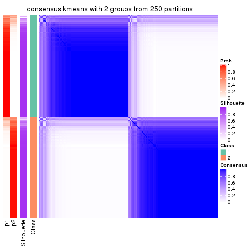</p>

</div>
<div id='tab-ATC-kmeans-consensus-heatmap-2'>
<pre><code class="r">consensus_heatmap(res, k = 3)
</code></pre>

<p>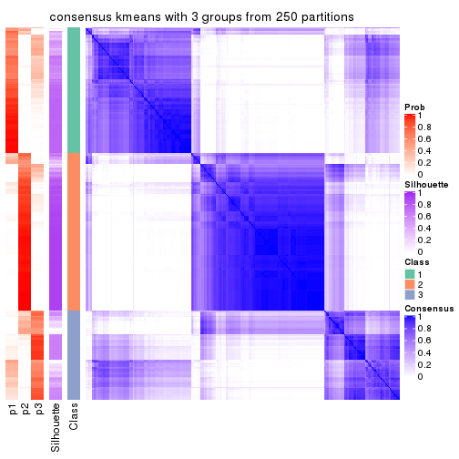</p>

</div>
<div id='tab-ATC-kmeans-consensus-heatmap-3'>
<pre><code class="r">consensus_heatmap(res, k = 4)
</code></pre>

<p>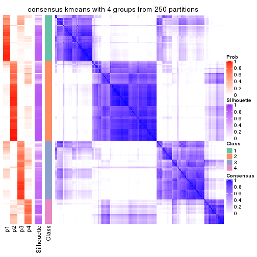</p>

</div>
<div id='tab-ATC-kmeans-consensus-heatmap-4'>
<pre><code class="r">consensus_heatmap(res, k = 5)
</code></pre>

<p>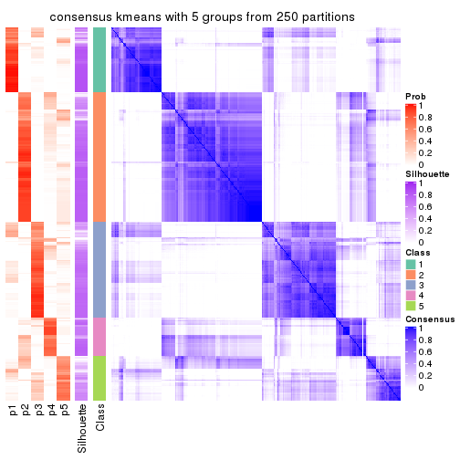</p>

</div>
<div id='tab-ATC-kmeans-consensus-heatmap-5'>
<pre><code class="r">consensus_heatmap(res, k = 6)
</code></pre>

<p>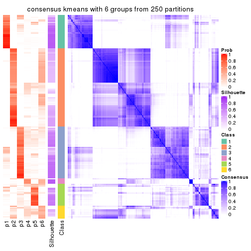</p>

</div>
</div>

Heatmaps for the membership of samples in all partitions to see how consistent they are:


<script>
$( function() {
	$( '#tabs-ATC-kmeans-membership-heatmap' ).tabs();
} );
</script>
<div id='tabs-ATC-kmeans-membership-heatmap'>
<ul>
<li><a href='#tab-ATC-kmeans-membership-heatmap-1'>k = 2</a></li>
<li><a href='#tab-ATC-kmeans-membership-heatmap-2'>k = 3</a></li>
<li><a href='#tab-ATC-kmeans-membership-heatmap-3'>k = 4</a></li>
<li><a href='#tab-ATC-kmeans-membership-heatmap-4'>k = 5</a></li>
<li><a href='#tab-ATC-kmeans-membership-heatmap-5'>k = 6</a></li>
</ul>
<div id='tab-ATC-kmeans-membership-heatmap-1'>
<pre><code class="r">membership_heatmap(res, k = 2)
</code></pre>

<p>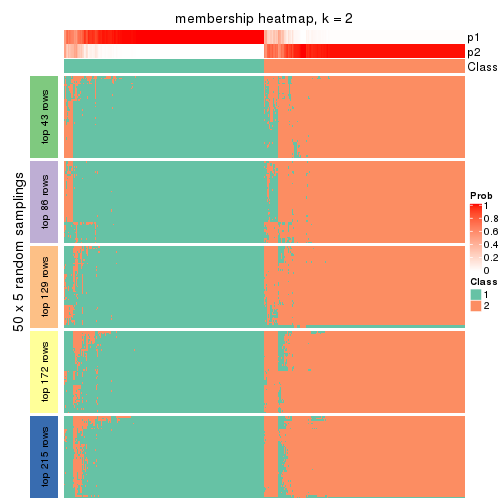</p>

</div>
<div id='tab-ATC-kmeans-membership-heatmap-2'>
<pre><code class="r">membership_heatmap(res, k = 3)
</code></pre>

<p>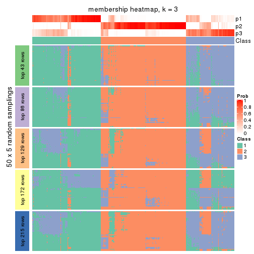</p>

</div>
<div id='tab-ATC-kmeans-membership-heatmap-3'>
<pre><code class="r">membership_heatmap(res, k = 4)
</code></pre>

<p>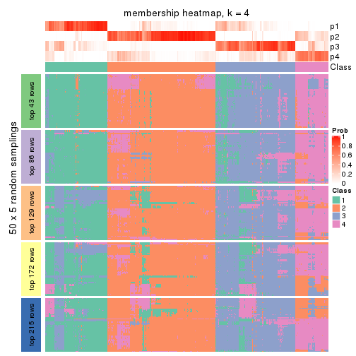</p>

</div>
<div id='tab-ATC-kmeans-membership-heatmap-4'>
<pre><code class="r">membership_heatmap(res, k = 5)
</code></pre>

<p>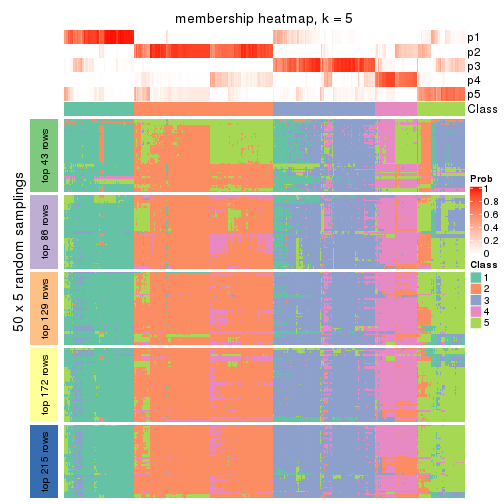</p>

</div>
<div id='tab-ATC-kmeans-membership-heatmap-5'>
<pre><code class="r">membership_heatmap(res, k = 6)
</code></pre>

<p>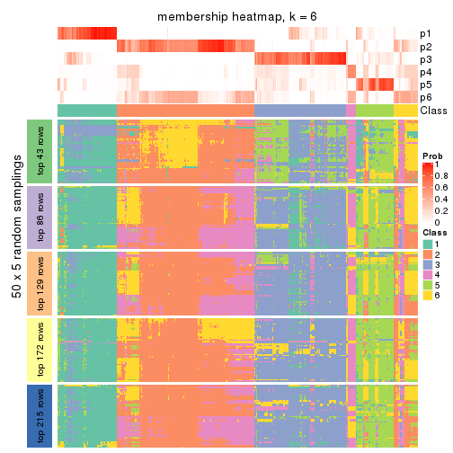</p>

</div>
</div>

As soon as we have had the classes for columns, we can look for signatures
which are significantly different between classes which can be candidate marks
for certain classes. Following are the heatmaps for signatures.


Signature heatmaps where rows are scaled:


<script>
$( function() {
	$( '#tabs-ATC-kmeans-get-signatures' ).tabs();
} );
</script>
<div id='tabs-ATC-kmeans-get-signatures'>
<ul>
<li><a href='#tab-ATC-kmeans-get-signatures-1'>k = 2</a></li>
<li><a href='#tab-ATC-kmeans-get-signatures-2'>k = 3</a></li>
<li><a href='#tab-ATC-kmeans-get-signatures-3'>k = 4</a></li>
<li><a href='#tab-ATC-kmeans-get-signatures-4'>k = 5</a></li>
<li><a href='#tab-ATC-kmeans-get-signatures-5'>k = 6</a></li>
</ul>
<div id='tab-ATC-kmeans-get-signatures-1'>
<pre><code class="r">get_signatures(res, k = 2)
</code></pre>

<p>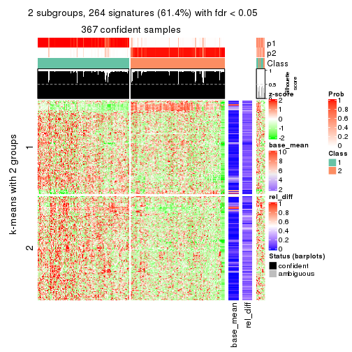</p>

</div>
<div id='tab-ATC-kmeans-get-signatures-2'>
<pre><code class="r">get_signatures(res, k = 3)
</code></pre>

<p>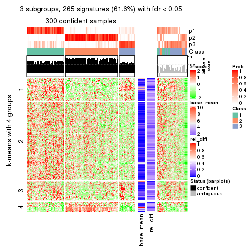</p>

</div>
<div id='tab-ATC-kmeans-get-signatures-3'>
<pre><code class="r">get_signatures(res, k = 4)
</code></pre>

<p>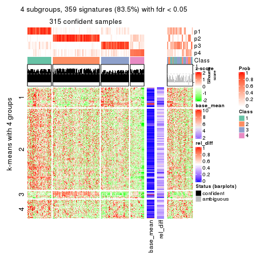</p>

</div>
<div id='tab-ATC-kmeans-get-signatures-4'>
<pre><code class="r">get_signatures(res, k = 5)
</code></pre>

<p>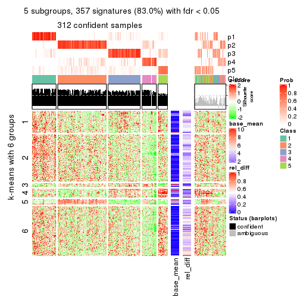</p>

</div>
<div id='tab-ATC-kmeans-get-signatures-5'>
<pre><code class="r">get_signatures(res, k = 6)
</code></pre>

<p>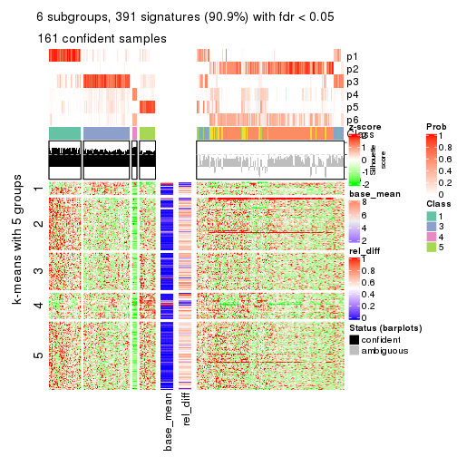</p>

</div>
</div>


Signature heatmaps where rows are not scaled:


<script>
$( function() {
	$( '#tabs-ATC-kmeans-get-signatures-no-scale' ).tabs();
} );
</script>
<div id='tabs-ATC-kmeans-get-signatures-no-scale'>
<ul>
<li><a href='#tab-ATC-kmeans-get-signatures-no-scale-1'>k = 2</a></li>
<li><a href='#tab-ATC-kmeans-get-signatures-no-scale-2'>k = 3</a></li>
<li><a href='#tab-ATC-kmeans-get-signatures-no-scale-3'>k = 4</a></li>
<li><a href='#tab-ATC-kmeans-get-signatures-no-scale-4'>k = 5</a></li>
<li><a href='#tab-ATC-kmeans-get-signatures-no-scale-5'>k = 6</a></li>
</ul>
<div id='tab-ATC-kmeans-get-signatures-no-scale-1'>
<pre><code class="r">get_signatures(res, k = 2, scale_rows = FALSE)
</code></pre>

<p>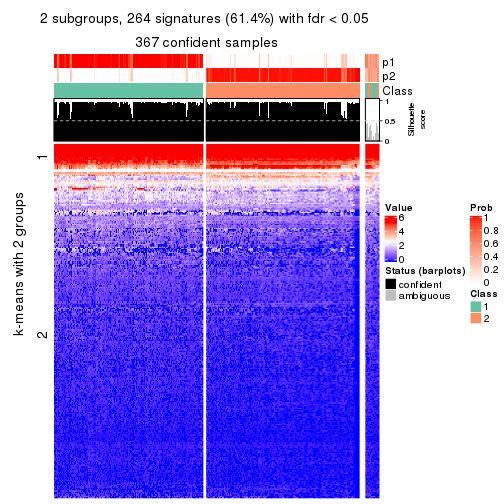</p>

</div>
<div id='tab-ATC-kmeans-get-signatures-no-scale-2'>
<pre><code class="r">get_signatures(res, k = 3, scale_rows = FALSE)
</code></pre>

<p>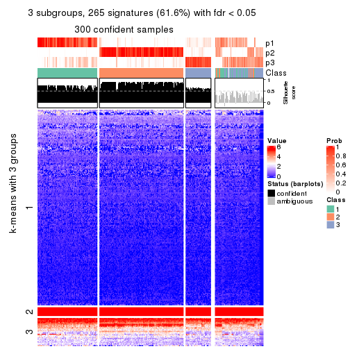</p>

</div>
<div id='tab-ATC-kmeans-get-signatures-no-scale-3'>
<pre><code class="r">get_signatures(res, k = 4, scale_rows = FALSE)
</code></pre>

<p>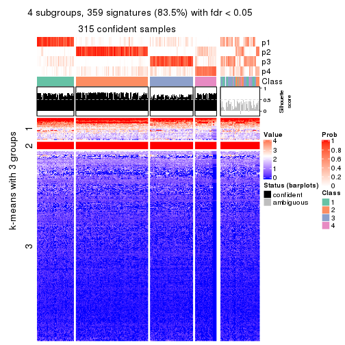</p>

</div>
<div id='tab-ATC-kmeans-get-signatures-no-scale-4'>
<pre><code class="r">get_signatures(res, k = 5, scale_rows = FALSE)
</code></pre>

<p>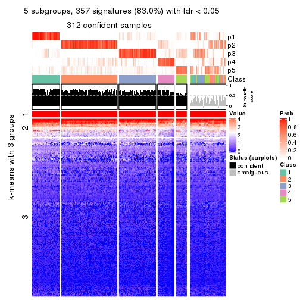</p>

</div>
<div id='tab-ATC-kmeans-get-signatures-no-scale-5'>
<pre><code class="r">get_signatures(res, k = 6, scale_rows = FALSE)
</code></pre>

<p>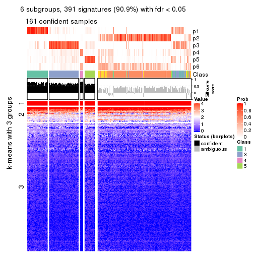</p>

</div>
</div>


Compare the overlap of signatures from different k:

```r
compare_signatures(res)
```

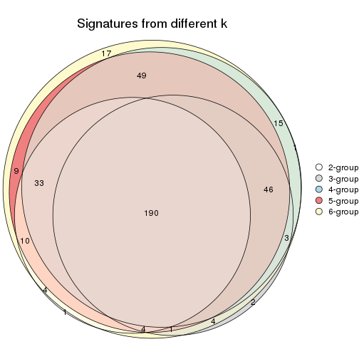

`get_signature()` returns a data frame invisibly. TO get the list of signatures, the function
call should be assigned to a variable explicitly. In following code, if `plot` argument is set
to `FALSE`, no heatmap is plotted while only the differential analysis is performed.

```r
# code only for demonstration
tb = get_signature(res, k = ..., plot = FALSE)
```

An example of the output of `tb` is:

```
#>   which_row         fdr    mean_1    mean_2 scaled_mean_1 scaled_mean_2 km
#> 1        38 0.042760348  8.373488  9.131774    -0.5533452     0.5164555  1
#> 2        40 0.018707592  7.106213  8.469186    -0.6173731     0.5762149  1
#> 3        55 0.019134737 10.221463 11.207825    -0.6159697     0.5749050  1
#> 4        59 0.006059896  5.921854  7.869574    -0.6899429     0.6439467  1
#> 5        60 0.018055526  8.928898 10.211722    -0.6204761     0.5791110  1
#> 6        98 0.009384629 15.714769 14.887706     0.6635654    -0.6193277  2
...
```

The columns in `tb` are:

1. `which_row`: row indices corresponding to the input matrix.
2. `fdr`: FDR for the differential test. 
3. `mean_x`: The mean value in group x.
4. `scaled_mean_x`: The mean value in group x after rows are scaled.
5. `km`: Row groups if k-means clustering is applied to rows.


UMAP plot which shows how samples are separated.


<script>
$( function() {
	$( '#tabs-ATC-kmeans-dimension-reduction' ).tabs();
} );
</script>
<div id='tabs-ATC-kmeans-dimension-reduction'>
<ul>
<li><a href='#tab-ATC-kmeans-dimension-reduction-1'>k = 2</a></li>
<li><a href='#tab-ATC-kmeans-dimension-reduction-2'>k = 3</a></li>
<li><a href='#tab-ATC-kmeans-dimension-reduction-3'>k = 4</a></li>
<li><a href='#tab-ATC-kmeans-dimension-reduction-4'>k = 5</a></li>
<li><a href='#tab-ATC-kmeans-dimension-reduction-5'>k = 6</a></li>
</ul>
<div id='tab-ATC-kmeans-dimension-reduction-1'>
<pre><code class="r">dimension_reduction(res, k = 2, method = &quot;UMAP&quot;)
</code></pre>

<p>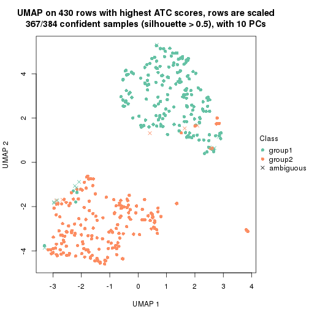</p>

</div>
<div id='tab-ATC-kmeans-dimension-reduction-2'>
<pre><code class="r">dimension_reduction(res, k = 3, method = &quot;UMAP&quot;)
</code></pre>

<p>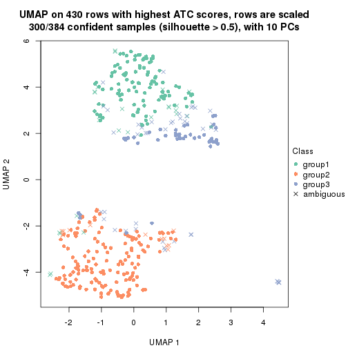</p>

</div>
<div id='tab-ATC-kmeans-dimension-reduction-3'>
<pre><code class="r">dimension_reduction(res, k = 4, method = &quot;UMAP&quot;)
</code></pre>

<p>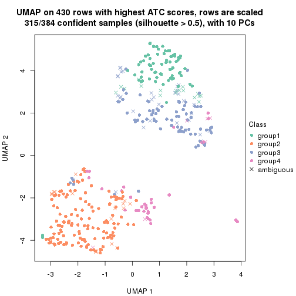</p>

</div>
<div id='tab-ATC-kmeans-dimension-reduction-4'>
<pre><code class="r">dimension_reduction(res, k = 5, method = &quot;UMAP&quot;)
</code></pre>

<p>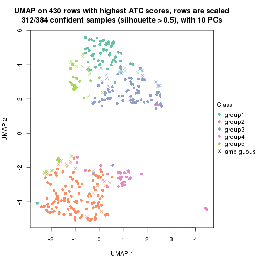</p>

</div>
<div id='tab-ATC-kmeans-dimension-reduction-5'>
<pre><code class="r">dimension_reduction(res, k = 6, method = &quot;UMAP&quot;)
</code></pre>

<p>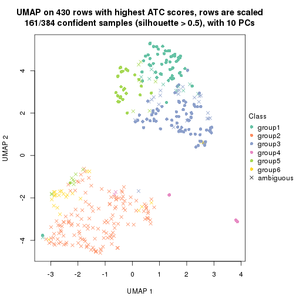</p>

</div>
</div>


Following heatmap shows how subgroups are split when increasing `k`:

```r
collect_classes(res)
```

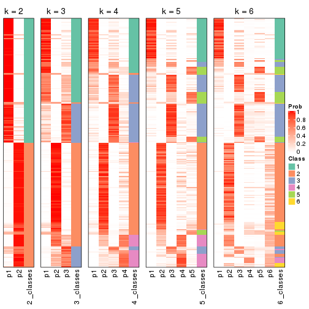


If matrix rows can be associated to genes, consider to use `GO_Enrichment(res,
...)` to perform function enrichment for the signature genes.


 

---------------------------------------------------


### ATC:skmeans*


The object with results only for a single top-value method and a single partition method 
can be extracted as:

```r
res = res_list["ATC", "skmeans"]
# you can also extract it by
# res = res_list["ATC:skmeans"]
```

A summary of `res` and all the functions that can be applied to it:

```r
res
```

```
#> A 'ConsensusPartition' object with k = 2, 3, 4, 5, 6.
#>   On a matrix with 430 rows and 384 columns.
#>   Top rows (43, 86, 129, 172, 215) are extracted by 'ATC' method.
#>   Subgroups are detected by 'skmeans' method.
#>   Performed in total 1250 partitions by row resampling.
#>   Best k for subgroups seems to be 2.
#> 
#> Following methods can be applied to this 'ConsensusPartition' object:
#>  [1] "cola_report"             "collect_classes"         "collect_plots"          
#>  [4] "collect_stats"           "colnames"                "compare_signatures"     
#>  [7] "consensus_heatmap"       "dimension_reduction"     "functional_enrichment"  
#> [10] "get_anno_col"            "get_anno"                "get_classes"            
#> [13] "get_consensus"           "get_matrix"              "get_membership"         
#> [16] "get_param"               "get_signatures"          "get_stats"              
#> [19] "is_best_k"               "is_stable_k"             "membership_heatmap"     
#> [22] "ncol"                    "nrow"                    "plot_ecdf"              
#> [25] "rownames"                "select_partition_number" "show"                   
#> [28] "suggest_best_k"          "test_to_known_factors"
```

`collect_plots()` function collects all the plots made from `res` for all `k` (number of partitions)
into one single page to provide an easy and fast comparison between different `k`.

```r
collect_plots(res)
```

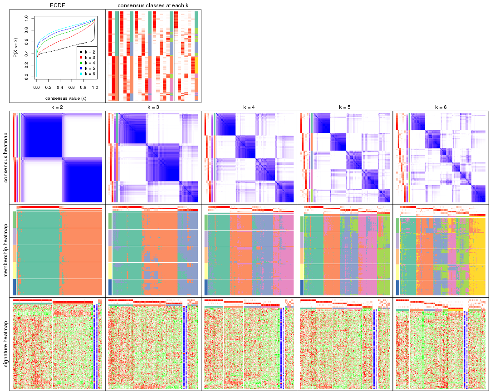

The plots are:

- The first row: a plot of the ECDF (Empirical cumulative distribution
  function) curves of the consensus matrix for each `k` and the heatmap of
  predicted classes for each `k`.
- The second row: heatmaps of the consensus matrix for each `k`.
- The third row: heatmaps of the membership matrix for each `k`.
- The fouth row: heatmaps of the signatures for each `k`.

All the plots in panels can be made by individual functions and they are
plotted later in this section.

`select_partition_number()` produces several plots showing different
statistics for choosing "optimized" `k`. There are following statistics:

- ECDF curves of the consensus matrix for each `k`;
- 1-PAC. [The PAC
  score](https://en.wikipedia.org/wiki/Consensus_clustering#Over-interpretation_potential_of_consensus_clustering)
  measures the proportion of the ambiguous subgrouping.
- Mean silhouette score.
- Concordance. The mean probability of fiting the consensus class ids in all
  partitions.
- Area increased. Denote $A_k$ as the area under the ECDF curve for current
  `k`, the area increased is defined as $A_k - A_{k-1}$.
- Rand index. The percent of pairs of samples that are both in a same cluster
  or both are not in a same cluster in the partition of k and k-1.
- Jaccard index. The ratio of pairs of samples are both in a same cluster in
  the partition of k and k-1 and the pairs of samples are both in a same
  cluster in the partition k or k-1.

The detailed explanations of these statistics can be found in [the cola
vignette](http://bioconductor.org/packages/devel/bioc/vignettes/cola/inst/doc/cola.html#toc_13).

Generally speaking, lower PAC score, higher mean silhouette score or higher
concordance corresponds to better partition. Rand index and Jaccard index
measure how similar the current partition is compared to partition with `k-1`.
If they are too similar, we won't accept `k` is better than `k-1`.

```r
select_partition_number(res)
```

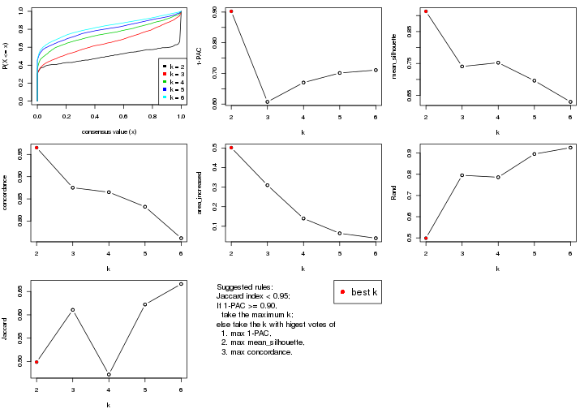

The numeric values for all these statistics can be obtained by `get_stats()`.

```r
get_stats(res)
```

```
#>   k 1-PAC mean_silhouette concordance area_increased  Rand Jaccard
#> 2 2 0.902           0.913       0.965         0.5016 0.499   0.499
#> 3 3 0.607           0.741       0.875         0.3098 0.795   0.611
#> 4 4 0.670           0.752       0.865         0.1397 0.786   0.472
#> 5 5 0.701           0.696       0.832         0.0639 0.895   0.622
#> 6 6 0.711           0.630       0.762         0.0389 0.925   0.666
```

`suggest_best_k()` suggests the best $k$ based on these statistics. The rules are as follows:

- All $k$ with Jaccard index larger than 0.95 are removed because the increase of
  the partition number does not provides enough extra information. If all $k$ are removed,
  the best $k$ is assigned by `NA`.
- For $k$ with 1-PAC larger than 0.9, the maximal $k$ is taken as the "best k". Other $k$ is called "optional k".
- If it does not fit the second rule. The $k$ with the highest vote of highest
  1-PAC, mean silhouette and concordance is taken as the "best k".

```r
suggest_best_k(res)
```

```
#> [1] 2
```


Following shows the table of the partitions (You need to click the **show/hide
code output** link to see it). The membership matrix (columns with name `p*`)
is inferred by
[`clue::cl_consensus()`](https://www.rdocumentation.org/link/cl_consensus?package=clue)
function with the `SE` method. Basically the value in the membership matrix
represents the probability to belong to a certain group. The finall class
label for an item is determined with the group with highest probability it
belongs to.

In `get_classes()` function, the entropy is calculated from the membership
matrix and the silhouette score is calculated from the consensus matrix.


<script>
$( function() {
	$( '#tabs-ATC-skmeans-get-classes' ).tabs();
} );
</script>
<div id='tabs-ATC-skmeans-get-classes'>
<ul>
<li><a href='#tab-ATC-skmeans-get-classes-1'>k = 2</a></li>
<li><a href='#tab-ATC-skmeans-get-classes-2'>k = 3</a></li>
<li><a href='#tab-ATC-skmeans-get-classes-3'>k = 4</a></li>
<li><a href='#tab-ATC-skmeans-get-classes-4'>k = 5</a></li>
<li><a href='#tab-ATC-skmeans-get-classes-5'>k = 6</a></li>
</ul>

<div id='tab-ATC-skmeans-get-classes-1'>
<p><a id='tab-ATC-skmeans-get-classes-1-a' style='color:#0366d6' href='#'>show/hide code output</a></p>
<pre><code class="r">cbind(get_classes(res, k = 2), get_membership(res, k = 2))
</code></pre>

<pre><code>#&gt;            class entropy silhouette    p1    p2
#&gt; SRR2105277     1  0.0000    0.96188 1.000 0.000
#&gt; SRR2105278     1  0.0000    0.96188 1.000 0.000
#&gt; SRR2105275     1  0.5842    0.82363 0.860 0.140
#&gt; SRR2105276     1  0.2948    0.91851 0.948 0.052
#&gt; SRR2105273     1  0.0000    0.96188 1.000 0.000
#&gt; SRR2105274     1  0.0000    0.96188 1.000 0.000
#&gt; SRR2105271     1  0.0000    0.96188 1.000 0.000
#&gt; SRR2105272     1  0.0000    0.96188 1.000 0.000
#&gt; SRR2105269     2  0.0000    0.96422 0.000 1.000
#&gt; SRR2105270     2  0.0000    0.96422 0.000 1.000
#&gt; SRR2105267     2  0.0000    0.96422 0.000 1.000
#&gt; SRR2105268     2  0.0000    0.96422 0.000 1.000
#&gt; SRR2105265     2  0.0000    0.96422 0.000 1.000
#&gt; SRR2105266     2  0.0000    0.96422 0.000 1.000
#&gt; SRR2105263     2  0.0000    0.96422 0.000 1.000
#&gt; SRR2105264     2  0.0000    0.96422 0.000 1.000
#&gt; SRR2105261     2  0.8909    0.54996 0.308 0.692
#&gt; SRR2105262     1  0.9635    0.37782 0.612 0.388
#&gt; SRR2105357     1  0.0000    0.96188 1.000 0.000
#&gt; SRR2105358     1  0.0000    0.96188 1.000 0.000
#&gt; SRR2105439     2  0.6623    0.78619 0.172 0.828
#&gt; SRR2105440     2  0.8081    0.67066 0.248 0.752
#&gt; SRR2105509     2  0.0000    0.96422 0.000 1.000
#&gt; SRR2105510     2  0.0000    0.96422 0.000 1.000
#&gt; SRR2105507     1  0.0000    0.96188 1.000 0.000
#&gt; SRR2105508     1  0.0000    0.96188 1.000 0.000
#&gt; SRR2105505     1  0.0000    0.96188 1.000 0.000
#&gt; SRR2105506     1  0.0000    0.96188 1.000 0.000
#&gt; SRR2105503     2  0.0000    0.96422 0.000 1.000
#&gt; SRR2105504     2  0.0000    0.96422 0.000 1.000
#&gt; SRR2105501     2  0.0000    0.96422 0.000 1.000
#&gt; SRR2105502     2  0.0000    0.96422 0.000 1.000
#&gt; SRR2105499     1  0.0000    0.96188 1.000 0.000
#&gt; SRR2105500     1  0.0000    0.96188 1.000 0.000
#&gt; SRR2105497     2  0.0000    0.96422 0.000 1.000
#&gt; SRR2105498     2  0.0000    0.96422 0.000 1.000
#&gt; SRR2105495     2  0.0000    0.96422 0.000 1.000
#&gt; SRR2105496     2  0.0376    0.96141 0.004 0.996
#&gt; SRR2105493     2  0.0376    0.96140 0.004 0.996
#&gt; SRR2105494     2  0.1414    0.94923 0.020 0.980
#&gt; SRR2105491     2  0.0000    0.96422 0.000 1.000
#&gt; SRR2105492     2  0.0000    0.96422 0.000 1.000
#&gt; SRR2105489     2  0.0000    0.96422 0.000 1.000
#&gt; SRR2105490     2  0.0000    0.96422 0.000 1.000
#&gt; SRR2105487     1  0.0000    0.96188 1.000 0.000
#&gt; SRR2105488     1  0.0000    0.96188 1.000 0.000
#&gt; SRR2105485     1  0.0000    0.96188 1.000 0.000
#&gt; SRR2105486     1  0.0000    0.96188 1.000 0.000
#&gt; SRR2105483     1  0.0000    0.96188 1.000 0.000
#&gt; SRR2105484     1  0.0000    0.96188 1.000 0.000
#&gt; SRR2105481     1  0.0000    0.96188 1.000 0.000
#&gt; SRR2105482     1  0.0000    0.96188 1.000 0.000
#&gt; SRR2105479     1  0.4298    0.88250 0.912 0.088
#&gt; SRR2105480     1  0.0672    0.95636 0.992 0.008
#&gt; SRR2105477     2  0.0000    0.96422 0.000 1.000
#&gt; SRR2105478     2  0.0000    0.96422 0.000 1.000
#&gt; SRR2105475     2  0.0000    0.96422 0.000 1.000
#&gt; SRR2105476     2  0.0000    0.96422 0.000 1.000
#&gt; SRR2105473     1  0.9996    0.04343 0.512 0.488
#&gt; SRR2105474     2  0.6531    0.79127 0.168 0.832
#&gt; SRR2105471     2  0.0000    0.96422 0.000 1.000
#&gt; SRR2105472     2  0.0000    0.96422 0.000 1.000
#&gt; SRR2105469     1  0.0000    0.96188 1.000 0.000
#&gt; SRR2105470     1  0.0000    0.96188 1.000 0.000
#&gt; SRR2105467     1  0.0000    0.96188 1.000 0.000
#&gt; SRR2105468     1  0.0000    0.96188 1.000 0.000
#&gt; SRR2105465     1  0.0000    0.96188 1.000 0.000
#&gt; SRR2105466     1  0.0000    0.96188 1.000 0.000
#&gt; SRR2105463     1  0.0000    0.96188 1.000 0.000
#&gt; SRR2105464     1  0.0000    0.96188 1.000 0.000
#&gt; SRR2105461     2  0.0000    0.96422 0.000 1.000
#&gt; SRR2105462     2  0.0000    0.96422 0.000 1.000
#&gt; SRR2105459     2  0.0000    0.96422 0.000 1.000
#&gt; SRR2105460     2  0.0000    0.96422 0.000 1.000
#&gt; SRR2105457     1  0.0000    0.96188 1.000 0.000
#&gt; SRR2105458     1  0.0000    0.96188 1.000 0.000
#&gt; SRR2105455     1  0.0000    0.96188 1.000 0.000
#&gt; SRR2105456     1  0.0000    0.96188 1.000 0.000
#&gt; SRR2105453     1  0.0000    0.96188 1.000 0.000
#&gt; SRR2105454     1  0.0000    0.96188 1.000 0.000
#&gt; SRR2105451     2  0.0938    0.95591 0.012 0.988
#&gt; SRR2105452     2  0.0000    0.96422 0.000 1.000
#&gt; SRR2105449     1  0.0000    0.96188 1.000 0.000
#&gt; SRR2105450     1  0.0000    0.96188 1.000 0.000
#&gt; SRR2105447     2  0.0000    0.96422 0.000 1.000
#&gt; SRR2105448     2  0.0000    0.96422 0.000 1.000
#&gt; SRR2105445     1  0.6438    0.79272 0.836 0.164
#&gt; SRR2105446     1  0.0000    0.96188 1.000 0.000
#&gt; SRR2105443     2  0.1184    0.95236 0.016 0.984
#&gt; SRR2105444     2  0.1633    0.94620 0.024 0.976
#&gt; SRR2105441     2  0.0000    0.96422 0.000 1.000
#&gt; SRR2105442     2  0.0376    0.96140 0.004 0.996
#&gt; SRR2105437     1  0.0000    0.96188 1.000 0.000
#&gt; SRR2105438     1  0.0000    0.96188 1.000 0.000
#&gt; SRR2105435     1  0.0000    0.96188 1.000 0.000
#&gt; SRR2105436     1  0.0000    0.96188 1.000 0.000
#&gt; SRR2105433     1  0.0000    0.96188 1.000 0.000
#&gt; SRR2105434     1  0.0000    0.96188 1.000 0.000
#&gt; SRR2105431     1  0.0000    0.96188 1.000 0.000
#&gt; SRR2105432     1  0.0000    0.96188 1.000 0.000
#&gt; SRR2105429     2  0.0000    0.96422 0.000 1.000
#&gt; SRR2105430     2  0.0000    0.96422 0.000 1.000
#&gt; SRR2105427     2  0.0000    0.96422 0.000 1.000
#&gt; SRR2105428     2  0.0000    0.96422 0.000 1.000
#&gt; SRR2105425     2  0.0000    0.96422 0.000 1.000
#&gt; SRR2105426     2  0.0000    0.96422 0.000 1.000
#&gt; SRR2105421     2  0.9896    0.20675 0.440 0.560
#&gt; SRR2105422     1  0.9393    0.45602 0.644 0.356
#&gt; SRR2105423     2  0.0000    0.96422 0.000 1.000
#&gt; SRR2105424     2  0.0000    0.96422 0.000 1.000
#&gt; SRR2105419     1  0.0000    0.96188 1.000 0.000
#&gt; SRR2105420     1  0.0376    0.95911 0.996 0.004
#&gt; SRR2105415     1  0.0000    0.96188 1.000 0.000
#&gt; SRR2105416     1  0.0000    0.96188 1.000 0.000
#&gt; SRR2105417     1  0.0000    0.96188 1.000 0.000
#&gt; SRR2105418     1  0.0000    0.96188 1.000 0.000
#&gt; SRR2105413     2  0.0000    0.96422 0.000 1.000
#&gt; SRR2105414     2  0.0000    0.96422 0.000 1.000
#&gt; SRR2105409     2  0.0000    0.96422 0.000 1.000
#&gt; SRR2105410     2  0.0000    0.96422 0.000 1.000
#&gt; SRR2105411     2  0.0000    0.96422 0.000 1.000
#&gt; SRR2105412     2  0.0000    0.96422 0.000 1.000
#&gt; SRR2105407     1  0.0000    0.96188 1.000 0.000
#&gt; SRR2105408     1  0.0000    0.96188 1.000 0.000
#&gt; SRR2105403     1  0.0000    0.96188 1.000 0.000
#&gt; SRR2105404     1  0.0000    0.96188 1.000 0.000
#&gt; SRR2105405     1  0.0000    0.96188 1.000 0.000
#&gt; SRR2105406     1  0.0000    0.96188 1.000 0.000
#&gt; SRR2105401     2  0.0000    0.96422 0.000 1.000
#&gt; SRR2105402     2  0.0000    0.96422 0.000 1.000
#&gt; SRR2105399     2  0.0672    0.95847 0.008 0.992
#&gt; SRR2105400     2  0.0000    0.96422 0.000 1.000
#&gt; SRR2105397     2  0.1633    0.94556 0.024 0.976
#&gt; SRR2105398     2  0.0672    0.95845 0.008 0.992
#&gt; SRR2105395     2  0.0000    0.96422 0.000 1.000
#&gt; SRR2105396     2  0.0000    0.96422 0.000 1.000
#&gt; SRR2105393     2  0.0000    0.96422 0.000 1.000
#&gt; SRR2105394     2  0.0000    0.96422 0.000 1.000
#&gt; SRR2105389     1  0.0000    0.96188 1.000 0.000
#&gt; SRR2105390     1  0.0000    0.96188 1.000 0.000
#&gt; SRR2105391     1  0.0000    0.96188 1.000 0.000
#&gt; SRR2105392     1  0.0000    0.96188 1.000 0.000
#&gt; SRR2105385     1  0.0000    0.96188 1.000 0.000
#&gt; SRR2105386     1  0.0000    0.96188 1.000 0.000
#&gt; SRR2105387     1  0.0000    0.96188 1.000 0.000
#&gt; SRR2105388     1  0.0000    0.96188 1.000 0.000
#&gt; SRR2105381     2  0.0000    0.96422 0.000 1.000
#&gt; SRR2105382     2  0.0000    0.96422 0.000 1.000
#&gt; SRR2105383     2  0.3879    0.89900 0.076 0.924
#&gt; SRR2105384     2  0.2778    0.92607 0.048 0.952
#&gt; SRR2105379     2  0.0000    0.96422 0.000 1.000
#&gt; SRR2105380     2  0.0000    0.96422 0.000 1.000
#&gt; SRR2105377     2  0.0000    0.96422 0.000 1.000
#&gt; SRR2105378     2  0.5629    0.83498 0.132 0.868
#&gt; SRR2105375     1  0.0000    0.96188 1.000 0.000
#&gt; SRR2105376     1  0.0000    0.96188 1.000 0.000
#&gt; SRR2105373     1  0.0000    0.96188 1.000 0.000
#&gt; SRR2105374     1  0.0000    0.96188 1.000 0.000
#&gt; SRR2105371     1  0.0000    0.96188 1.000 0.000
#&gt; SRR2105372     1  0.0000    0.96188 1.000 0.000
#&gt; SRR2105369     1  0.0000    0.96188 1.000 0.000
#&gt; SRR2105370     1  0.0000    0.96188 1.000 0.000
#&gt; SRR2105367     1  0.0000    0.96188 1.000 0.000
#&gt; SRR2105368     1  0.0000    0.96188 1.000 0.000
#&gt; SRR2105365     2  0.0000    0.96422 0.000 1.000
#&gt; SRR2105366     2  0.0000    0.96422 0.000 1.000
#&gt; SRR2105363     2  0.0000    0.96422 0.000 1.000
#&gt; SRR2105364     2  0.0000    0.96422 0.000 1.000
#&gt; SRR2105361     2  0.0000    0.96422 0.000 1.000
#&gt; SRR2105362     2  0.0000    0.96422 0.000 1.000
#&gt; SRR2105359     1  0.0000    0.96188 1.000 0.000
#&gt; SRR2105360     1  0.0000    0.96188 1.000 0.000
#&gt; SRR2105355     1  0.0000    0.96188 1.000 0.000
#&gt; SRR2105356     1  0.0000    0.96188 1.000 0.000
#&gt; SRR2105353     1  0.5946    0.81771 0.856 0.144
#&gt; SRR2105354     1  0.0000    0.96188 1.000 0.000
#&gt; SRR2105351     2  0.0000    0.96422 0.000 1.000
#&gt; SRR2105352     2  0.0000    0.96422 0.000 1.000
#&gt; SRR2105349     2  0.0000    0.96422 0.000 1.000
#&gt; SRR2105350     2  0.0000    0.96422 0.000 1.000
#&gt; SRR2105345     2  0.1843    0.94282 0.028 0.972
#&gt; SRR2105346     2  0.0000    0.96422 0.000 1.000
#&gt; SRR2105347     1  1.0000    0.00602 0.504 0.496
#&gt; SRR2105348     1  0.9427    0.42987 0.640 0.360
#&gt; SRR2105343     2  0.0000    0.96422 0.000 1.000
#&gt; SRR2105344     2  0.0000    0.96422 0.000 1.000
#&gt; SRR2105341     1  0.0000    0.96188 1.000 0.000
#&gt; SRR2105342     1  0.0000    0.96188 1.000 0.000
#&gt; SRR2105339     1  0.3431    0.90628 0.936 0.064
#&gt; SRR2105340     1  0.0376    0.95912 0.996 0.004
#&gt; SRR2105335     1  0.0000    0.96188 1.000 0.000
#&gt; SRR2105336     1  0.0000    0.96188 1.000 0.000
#&gt; SRR2105337     1  0.0000    0.96188 1.000 0.000
#&gt; SRR2105338     1  0.0000    0.96188 1.000 0.000
#&gt; SRR2105331     2  0.0000    0.96422 0.000 1.000
#&gt; SRR2105332     2  0.0000    0.96422 0.000 1.000
#&gt; SRR2105333     2  0.0000    0.96422 0.000 1.000
#&gt; SRR2105334     2  0.0000    0.96422 0.000 1.000
#&gt; SRR2105329     2  0.6531    0.78929 0.168 0.832
#&gt; SRR2105330     2  0.3114    0.91840 0.056 0.944
#&gt; SRR2105327     2  0.0000    0.96422 0.000 1.000
#&gt; SRR2105328     2  0.0000    0.96422 0.000 1.000
#&gt; SRR2105325     1  0.1633    0.94357 0.976 0.024
#&gt; SRR2105326     1  0.0938    0.95318 0.988 0.012
#&gt; SRR2105323     1  0.0000    0.96188 1.000 0.000
#&gt; SRR2105324     1  0.0000    0.96188 1.000 0.000
#&gt; SRR2105319     1  0.0000    0.96188 1.000 0.000
#&gt; SRR2105320     1  0.0000    0.96188 1.000 0.000
#&gt; SRR2105321     1  0.1184    0.95002 0.984 0.016
#&gt; SRR2105322     1  0.0938    0.95337 0.988 0.012
#&gt; SRR2105317     2  0.0000    0.96422 0.000 1.000
#&gt; SRR2105318     2  0.0000    0.96422 0.000 1.000
#&gt; SRR2105315     2  0.8016    0.67560 0.244 0.756
#&gt; SRR2105316     2  0.0000    0.96422 0.000 1.000
#&gt; SRR2105313     2  0.0000    0.96422 0.000 1.000
#&gt; SRR2105314     2  0.0000    0.96422 0.000 1.000
#&gt; SRR2105311     2  0.9491    0.41281 0.368 0.632
#&gt; SRR2105312     2  0.9686    0.33961 0.396 0.604
#&gt; SRR2105307     1  0.0000    0.96188 1.000 0.000
#&gt; SRR2105308     1  0.0000    0.96188 1.000 0.000
#&gt; SRR2105309     1  0.0000    0.96188 1.000 0.000
#&gt; SRR2105310     1  0.0000    0.96188 1.000 0.000
#&gt; SRR2105305     1  0.0672    0.95629 0.992 0.008
#&gt; SRR2105306     1  0.0000    0.96188 1.000 0.000
#&gt; SRR2105303     2  0.0000    0.96422 0.000 1.000
#&gt; SRR2105304     2  0.0000    0.96422 0.000 1.000
#&gt; SRR2105301     2  0.0000    0.96422 0.000 1.000
#&gt; SRR2105302     2  0.0000    0.96422 0.000 1.000
#&gt; SRR2105299     1  0.9866    0.24376 0.568 0.432
#&gt; SRR2105300     2  0.9977    0.10589 0.472 0.528
#&gt; SRR2105297     1  0.9866    0.23424 0.568 0.432
#&gt; SRR2105298     1  0.9580    0.38055 0.620 0.380
#&gt; SRR2105295     2  0.0000    0.96422 0.000 1.000
#&gt; SRR2105296     2  0.0000    0.96422 0.000 1.000
#&gt; SRR2105293     1  0.6887    0.76710 0.816 0.184
#&gt; SRR2105294     1  0.0672    0.95625 0.992 0.008
#&gt; SRR2105291     1  0.2603    0.92554 0.956 0.044
#&gt; SRR2105292     1  0.0000    0.96188 1.000 0.000
#&gt; SRR2105289     1  0.1414    0.94683 0.980 0.020
#&gt; SRR2105290     1  0.0000    0.96188 1.000 0.000
#&gt; SRR2105287     1  0.0000    0.96188 1.000 0.000
#&gt; SRR2105288     1  0.0000    0.96188 1.000 0.000
#&gt; SRR2105285     2  0.0000    0.96422 0.000 1.000
#&gt; SRR2105286     2  0.0000    0.96422 0.000 1.000
#&gt; SRR2105283     2  0.1184    0.95290 0.016 0.984
#&gt; SRR2105284     2  0.0000    0.96422 0.000 1.000
#&gt; SRR2105281     2  0.0000    0.96422 0.000 1.000
#&gt; SRR2105282     2  0.0000    0.96422 0.000 1.000
#&gt; SRR2105259     1  0.0000    0.96188 1.000 0.000
#&gt; SRR2105260     1  0.0000    0.96188 1.000 0.000
#&gt; SRR2105279     2  0.0000    0.96422 0.000 1.000
#&gt; SRR2105280     2  0.0000    0.96422 0.000 1.000
#&gt; SRR2105257     1  0.0000    0.96188 1.000 0.000
#&gt; SRR2105258     1  0.0000    0.96188 1.000 0.000
#&gt; SRR2105253     2  0.0000    0.96422 0.000 1.000
#&gt; SRR2105254     2  0.0000    0.96422 0.000 1.000
#&gt; SRR2105255     1  0.0000    0.96188 1.000 0.000
#&gt; SRR2105256     1  0.0000    0.96188 1.000 0.000
#&gt; SRR2105251     2  0.0000    0.96422 0.000 1.000
#&gt; SRR2105252     2  0.0000    0.96422 0.000 1.000
#&gt; SRR2105249     2  0.2778    0.92613 0.048 0.952
#&gt; SRR2105250     2  0.8955    0.55548 0.312 0.688
#&gt; SRR2105247     2  0.0000    0.96422 0.000 1.000
#&gt; SRR2105248     2  0.0000    0.96422 0.000 1.000
#&gt; SRR2105245     2  0.9754    0.30757 0.408 0.592
#&gt; SRR2105246     2  0.8909    0.55094 0.308 0.692
#&gt; SRR2105243     1  0.0000    0.96188 1.000 0.000
#&gt; SRR2105244     1  0.0000    0.96188 1.000 0.000
#&gt; SRR2105241     1  0.0000    0.96188 1.000 0.000
#&gt; SRR2105242     1  0.0000    0.96188 1.000 0.000
#&gt; SRR2105239     1  0.0000    0.96188 1.000 0.000
#&gt; SRR2105240     1  0.0000    0.96188 1.000 0.000
#&gt; SRR2105237     2  0.0000    0.96422 0.000 1.000
#&gt; SRR2105238     2  0.0000    0.96422 0.000 1.000
#&gt; SRR2105235     2  0.0000    0.96422 0.000 1.000
#&gt; SRR2105236     2  0.0376    0.96141 0.004 0.996
#&gt; SRR2105233     2  0.0000    0.96422 0.000 1.000
#&gt; SRR2105234     2  0.0000    0.96422 0.000 1.000
#&gt; SRR2105231     2  0.0000    0.96422 0.000 1.000
#&gt; SRR2105232     2  0.0000    0.96422 0.000 1.000
#&gt; SRR2105227     1  0.3431    0.90805 0.936 0.064
#&gt; SRR2105228     1  0.1184    0.94984 0.984 0.016
#&gt; SRR2105225     1  0.0000    0.96188 1.000 0.000
#&gt; SRR2105226     1  0.0000    0.96188 1.000 0.000
#&gt; SRR2105229     1  0.7139    0.75046 0.804 0.196
#&gt; SRR2105230     1  0.0000    0.96188 1.000 0.000
#&gt; SRR2105219     2  0.0000    0.96422 0.000 1.000
#&gt; SRR2105220     2  0.0000    0.96422 0.000 1.000
#&gt; SRR2105221     2  0.9087    0.52635 0.324 0.676
#&gt; SRR2105222     2  0.8267    0.65038 0.260 0.740
#&gt; SRR2105223     1  0.0000    0.96188 1.000 0.000
#&gt; SRR2105224     1  0.0000    0.96188 1.000 0.000
#&gt; SRR2105217     2  0.0000    0.96422 0.000 1.000
#&gt; SRR2105218     2  0.0000    0.96422 0.000 1.000
#&gt; SRR2105215     2  0.0000    0.96422 0.000 1.000
#&gt; SRR2105216     2  0.0000    0.96422 0.000 1.000
#&gt; SRR2105213     2  0.9552    0.39336 0.376 0.624
#&gt; SRR2105214     2  0.9795    0.28308 0.416 0.584
#&gt; SRR2105211     1  0.1184    0.95004 0.984 0.016
#&gt; SRR2105212     1  0.0000    0.96188 1.000 0.000
#&gt; SRR2105209     1  0.0000    0.96188 1.000 0.000
#&gt; SRR2105210     1  0.0000    0.96188 1.000 0.000
#&gt; SRR2105207     1  0.0000    0.96188 1.000 0.000
#&gt; SRR2105208     1  0.0000    0.96188 1.000 0.000
#&gt; SRR2105205     2  0.0000    0.96422 0.000 1.000
#&gt; SRR2105206     2  0.0000    0.96422 0.000 1.000
#&gt; SRR2105201     2  0.2778    0.92527 0.048 0.952
#&gt; SRR2105202     2  0.8386    0.63790 0.268 0.732
#&gt; SRR2105203     2  0.0000    0.96422 0.000 1.000
#&gt; SRR2105204     2  0.0000    0.96422 0.000 1.000
#&gt; SRR2105199     2  0.0000    0.96422 0.000 1.000
#&gt; SRR2105200     2  0.0672    0.95843 0.008 0.992
#&gt; SRR2105197     1  0.0000    0.96188 1.000 0.000
#&gt; SRR2105198     1  0.0000    0.96188 1.000 0.000
#&gt; SRR2105195     1  0.0938    0.95328 0.988 0.012
#&gt; SRR2105196     1  0.0938    0.95310 0.988 0.012
#&gt; SRR2105193     1  0.0000    0.96188 1.000 0.000
#&gt; SRR2105194     1  0.0000    0.96188 1.000 0.000
#&gt; SRR2105191     1  0.0000    0.96188 1.000 0.000
#&gt; SRR2105192     1  0.0000    0.96188 1.000 0.000
#&gt; SRR2105189     2  0.0000    0.96422 0.000 1.000
#&gt; SRR2105190     2  0.0000    0.96422 0.000 1.000
#&gt; SRR2105187     2  0.0000    0.96422 0.000 1.000
#&gt; SRR2105188     2  0.4562    0.87665 0.096 0.904
#&gt; SRR2105179     1  0.0000    0.96188 1.000 0.000
#&gt; SRR2105180     1  0.0000    0.96188 1.000 0.000
#&gt; SRR2105183     2  0.0000    0.96422 0.000 1.000
#&gt; SRR2105184     2  0.0000    0.96422 0.000 1.000
#&gt; SRR2105185     2  0.0000    0.96422 0.000 1.000
#&gt; SRR2105186     2  0.0000    0.96422 0.000 1.000
#&gt; SRR2105181     1  0.0000    0.96188 1.000 0.000
#&gt; SRR2105182     1  0.0000    0.96188 1.000 0.000
#&gt; SRR2105177     1  0.0000    0.96188 1.000 0.000
#&gt; SRR2105178     1  0.0000    0.96188 1.000 0.000
#&gt; SRR2105171     2  0.0000    0.96422 0.000 1.000
#&gt; SRR2105172     2  0.0000    0.96422 0.000 1.000
#&gt; SRR2105175     1  0.0672    0.95629 0.992 0.008
#&gt; SRR2105176     1  0.0000    0.96188 1.000 0.000
#&gt; SRR2105173     2  0.0000    0.96422 0.000 1.000
#&gt; SRR2105174     2  0.0000    0.96422 0.000 1.000
#&gt; SRR2105169     2  0.0000    0.96422 0.000 1.000
#&gt; SRR2105170     2  0.0000    0.96422 0.000 1.000
#&gt; SRR2105167     2  0.0000    0.96422 0.000 1.000
#&gt; SRR2105168     2  0.0000    0.96422 0.000 1.000
#&gt; SRR2105165     1  0.0000    0.96188 1.000 0.000
#&gt; SRR2105166     1  0.0000    0.96188 1.000 0.000
#&gt; SRR2105163     1  0.8443    0.63020 0.728 0.272
#&gt; SRR2105164     1  0.8555    0.61621 0.720 0.280
#&gt; SRR2105161     1  0.0000    0.96188 1.000 0.000
#&gt; SRR2105162     1  0.0000    0.96188 1.000 0.000
#&gt; SRR2105155     2  0.0000    0.96422 0.000 1.000
#&gt; SRR2105156     2  0.0000    0.96422 0.000 1.000
#&gt; SRR2105157     2  0.0000    0.96422 0.000 1.000
#&gt; SRR2105158     2  0.0000    0.96422 0.000 1.000
#&gt; SRR2105159     1  0.0000    0.96188 1.000 0.000
#&gt; SRR2105160     1  0.0000    0.96188 1.000 0.000
#&gt; SRR2105153     2  0.0000    0.96422 0.000 1.000
#&gt; SRR2105154     2  0.0000    0.96422 0.000 1.000
#&gt; SRR2105151     2  0.0000    0.96422 0.000 1.000
#&gt; SRR2105152     2  0.0000    0.96422 0.000 1.000
#&gt; SRR2105149     1  0.9881    0.23223 0.564 0.436
#&gt; SRR2105150     1  0.0672    0.95643 0.992 0.008
#&gt; SRR2105147     2  0.3114    0.91604 0.056 0.944
#&gt; SRR2105148     2  0.3114    0.91604 0.056 0.944
#&gt; SRR2105143     1  0.2603    0.92553 0.956 0.044
#&gt; SRR2105144     1  0.0000    0.96188 1.000 0.000
#&gt; SRR2105145     1  0.0000    0.96188 1.000 0.000
#&gt; SRR2105146     1  0.0000    0.96188 1.000 0.000
#&gt; SRR2105141     2  0.0000    0.96422 0.000 1.000
#&gt; SRR2105142     2  0.0000    0.96422 0.000 1.000
#&gt; SRR2105139     2  0.0000    0.96422 0.000 1.000
#&gt; SRR2105140     2  0.0000    0.96422 0.000 1.000
#&gt; SRR2105137     1  0.9977    0.09716 0.528 0.472
#&gt; SRR2105138     1  0.9970    0.11819 0.532 0.468
#&gt; SRR2105135     2  0.0000    0.96422 0.000 1.000
#&gt; SRR2105136     2  0.0000    0.96422 0.000 1.000
#&gt; SRR2105133     1  0.0000    0.96188 1.000 0.000
#&gt; SRR2105134     1  0.0000    0.96188 1.000 0.000
#&gt; SRR2105131     1  0.8661    0.59755 0.712 0.288
#&gt; SRR2105132     1  0.0000    0.96188 1.000 0.000
#&gt; SRR2105129     1  0.0000    0.96188 1.000 0.000
#&gt; SRR2105130     1  0.0000    0.96188 1.000 0.000
#&gt; SRR2105127     1  0.0000    0.96188 1.000 0.000
#&gt; SRR2105128     1  0.0000    0.96188 1.000 0.000
</code></pre>

<script>
$('#tab-ATC-skmeans-get-classes-1-a').parent().next().next().hide();
$('#tab-ATC-skmeans-get-classes-1-a').click(function(){
  $('#tab-ATC-skmeans-get-classes-1-a').parent().next().next().toggle();
  return(false);
});
</script>
</div>

<div id='tab-ATC-skmeans-get-classes-2'>
<p><a id='tab-ATC-skmeans-get-classes-2-a' style='color:#0366d6' href='#'>show/hide code output</a></p>
<pre><code class="r">cbind(get_classes(res, k = 3), get_membership(res, k = 3))
</code></pre>

<pre><code>#&gt;            class entropy silhouette    p1    p2    p3
#&gt; SRR2105277     1  0.4654     0.7118 0.792 0.000 0.208
#&gt; SRR2105278     1  0.1643     0.8545 0.956 0.000 0.044
#&gt; SRR2105275     3  0.0000     0.7980 0.000 0.000 1.000
#&gt; SRR2105276     3  0.0000     0.7980 0.000 0.000 1.000
#&gt; SRR2105273     1  0.6244     0.2753 0.560 0.000 0.440
#&gt; SRR2105274     1  0.5948     0.4869 0.640 0.000 0.360
#&gt; SRR2105271     1  0.2878     0.8328 0.904 0.000 0.096
#&gt; SRR2105272     1  0.1031     0.8636 0.976 0.000 0.024
#&gt; SRR2105269     2  0.1643     0.8631 0.000 0.956 0.044
#&gt; SRR2105270     2  0.0424     0.8702 0.000 0.992 0.008
#&gt; SRR2105267     2  0.0892     0.8684 0.000 0.980 0.020
#&gt; SRR2105268     2  0.0000     0.8707 0.000 1.000 0.000
#&gt; SRR2105265     2  0.0000     0.8707 0.000 1.000 0.000
#&gt; SRR2105266     2  0.0000     0.8707 0.000 1.000 0.000
#&gt; SRR2105263     2  0.0237     0.8706 0.000 0.996 0.004
#&gt; SRR2105264     2  0.0000     0.8707 0.000 1.000 0.000
#&gt; SRR2105261     3  0.0592     0.7963 0.000 0.012 0.988
#&gt; SRR2105262     3  0.0000     0.7980 0.000 0.000 1.000
#&gt; SRR2105357     3  0.6008     0.4059 0.372 0.000 0.628
#&gt; SRR2105358     1  0.6140     0.3361 0.596 0.000 0.404
#&gt; SRR2105439     2  0.5465     0.5873 0.288 0.712 0.000
#&gt; SRR2105440     2  0.5327     0.6144 0.272 0.728 0.000
#&gt; SRR2105509     2  0.6291     0.3199 0.000 0.532 0.468
#&gt; SRR2105510     2  0.6140     0.4809 0.000 0.596 0.404
#&gt; SRR2105507     3  0.5529     0.5525 0.296 0.000 0.704
#&gt; SRR2105508     3  0.5397     0.5864 0.280 0.000 0.720
#&gt; SRR2105505     1  0.0000     0.8673 1.000 0.000 0.000
#&gt; SRR2105506     1  0.0000     0.8673 1.000 0.000 0.000
#&gt; SRR2105503     2  0.1964     0.8590 0.000 0.944 0.056
#&gt; SRR2105504     3  0.5178     0.5377 0.000 0.256 0.744
#&gt; SRR2105501     2  0.4121     0.7994 0.000 0.832 0.168
#&gt; SRR2105502     3  0.5560     0.4418 0.000 0.300 0.700
#&gt; SRR2105499     1  0.6026     0.4539 0.624 0.000 0.376
#&gt; SRR2105500     1  0.1529     0.8597 0.960 0.000 0.040
#&gt; SRR2105497     2  0.0000     0.8707 0.000 1.000 0.000
#&gt; SRR2105498     2  0.0237     0.8695 0.004 0.996 0.000
#&gt; SRR2105495     2  0.1399     0.8680 0.004 0.968 0.028
#&gt; SRR2105496     2  0.1453     0.8582 0.024 0.968 0.008
#&gt; SRR2105493     2  0.2903     0.8425 0.028 0.924 0.048
#&gt; SRR2105494     2  0.3973     0.7999 0.088 0.880 0.032
#&gt; SRR2105491     2  0.4178     0.7955 0.000 0.828 0.172
#&gt; SRR2105492     2  0.4121     0.7985 0.000 0.832 0.168
#&gt; SRR2105489     2  0.0000     0.8707 0.000 1.000 0.000
#&gt; SRR2105490     2  0.0237     0.8695 0.004 0.996 0.000
#&gt; SRR2105487     1  0.1031     0.8612 0.976 0.000 0.024
#&gt; SRR2105488     1  0.0000     0.8673 1.000 0.000 0.000
#&gt; SRR2105485     1  0.4887     0.7087 0.772 0.000 0.228
#&gt; SRR2105486     1  0.3619     0.8071 0.864 0.000 0.136
#&gt; SRR2105483     1  0.0000     0.8673 1.000 0.000 0.000
#&gt; SRR2105484     1  0.0000     0.8673 1.000 0.000 0.000
#&gt; SRR2105481     1  0.5254     0.6523 0.736 0.000 0.264
#&gt; SRR2105482     1  0.0237     0.8670 0.996 0.000 0.004
#&gt; SRR2105479     3  0.2400     0.7888 0.064 0.004 0.932
#&gt; SRR2105480     3  0.5873     0.5329 0.312 0.004 0.684
#&gt; SRR2105477     2  0.2165     0.8574 0.000 0.936 0.064
#&gt; SRR2105478     2  0.1765     0.8507 0.040 0.956 0.004
#&gt; SRR2105475     3  0.5465     0.4708 0.000 0.288 0.712
#&gt; SRR2105476     2  0.6280     0.3429 0.000 0.540 0.460
#&gt; SRR2105473     1  0.6302     0.0277 0.520 0.480 0.000
#&gt; SRR2105474     2  0.5650     0.5433 0.312 0.688 0.000
#&gt; SRR2105471     2  0.0000     0.8707 0.000 1.000 0.000
#&gt; SRR2105472     2  0.0424     0.8680 0.008 0.992 0.000
#&gt; SRR2105469     3  0.5882     0.4582 0.348 0.000 0.652
#&gt; SRR2105470     1  0.5785     0.5534 0.668 0.000 0.332
#&gt; SRR2105467     1  0.0000     0.8673 1.000 0.000 0.000
#&gt; SRR2105468     1  0.0000     0.8673 1.000 0.000 0.000
#&gt; SRR2105465     1  0.0592     0.8662 0.988 0.000 0.012
#&gt; SRR2105466     1  0.0000     0.8673 1.000 0.000 0.000
#&gt; SRR2105463     1  0.0000     0.8673 1.000 0.000 0.000
#&gt; SRR2105464     1  0.0000     0.8673 1.000 0.000 0.000
#&gt; SRR2105461     2  0.0000     0.8707 0.000 1.000 0.000
#&gt; SRR2105462     2  0.0000     0.8707 0.000 1.000 0.000
#&gt; SRR2105459     2  0.4178     0.7964 0.000 0.828 0.172
#&gt; SRR2105460     2  0.4346     0.7865 0.000 0.816 0.184
#&gt; SRR2105457     3  0.4654     0.6789 0.208 0.000 0.792
#&gt; SRR2105458     3  0.3267     0.7626 0.116 0.000 0.884
#&gt; SRR2105455     1  0.3816     0.7938 0.852 0.000 0.148
#&gt; SRR2105456     1  0.3038     0.8257 0.896 0.000 0.104
#&gt; SRR2105453     1  0.0000     0.8673 1.000 0.000 0.000
#&gt; SRR2105454     1  0.0000     0.8673 1.000 0.000 0.000
#&gt; SRR2105451     2  0.5298     0.7598 0.032 0.804 0.164
#&gt; SRR2105452     3  0.3686     0.7135 0.000 0.140 0.860
#&gt; SRR2105449     1  0.5058     0.6819 0.756 0.000 0.244
#&gt; SRR2105450     1  0.2165     0.8495 0.936 0.000 0.064
#&gt; SRR2105447     2  0.5835     0.6013 0.000 0.660 0.340
#&gt; SRR2105448     2  0.4605     0.7699 0.000 0.796 0.204
#&gt; SRR2105445     3  0.4324     0.7695 0.112 0.028 0.860
#&gt; SRR2105446     1  0.6008     0.4216 0.628 0.000 0.372
#&gt; SRR2105443     3  0.3686     0.7125 0.000 0.140 0.860
#&gt; SRR2105444     2  0.7475     0.4532 0.044 0.580 0.376
#&gt; SRR2105441     2  0.1411     0.8546 0.036 0.964 0.000
#&gt; SRR2105442     2  0.1529     0.8520 0.040 0.960 0.000
#&gt; SRR2105437     1  0.6126     0.3149 0.600 0.000 0.400
#&gt; SRR2105438     1  0.6154     0.2910 0.592 0.000 0.408
#&gt; SRR2105435     1  0.4178     0.7680 0.828 0.000 0.172
#&gt; SRR2105436     1  0.4887     0.7130 0.772 0.000 0.228
#&gt; SRR2105433     1  0.0000     0.8673 1.000 0.000 0.000
#&gt; SRR2105434     1  0.0000     0.8673 1.000 0.000 0.000
#&gt; SRR2105431     1  0.0000     0.8673 1.000 0.000 0.000
#&gt; SRR2105432     1  0.0000     0.8673 1.000 0.000 0.000
#&gt; SRR2105429     3  0.5363     0.5005 0.000 0.276 0.724
#&gt; SRR2105430     3  0.5650     0.4183 0.000 0.312 0.688
#&gt; SRR2105427     2  0.4504     0.7774 0.000 0.804 0.196
#&gt; SRR2105428     2  0.3686     0.8196 0.000 0.860 0.140
#&gt; SRR2105425     2  0.3619     0.8205 0.000 0.864 0.136
#&gt; SRR2105426     2  0.0000     0.8707 0.000 1.000 0.000
#&gt; SRR2105421     3  0.0000     0.7980 0.000 0.000 1.000
#&gt; SRR2105422     3  0.0000     0.7980 0.000 0.000 1.000
#&gt; SRR2105423     2  0.0000     0.8707 0.000 1.000 0.000
#&gt; SRR2105424     2  0.0000     0.8707 0.000 1.000 0.000
#&gt; SRR2105419     3  0.4750     0.6726 0.216 0.000 0.784
#&gt; SRR2105420     3  0.4346     0.7137 0.184 0.000 0.816
#&gt; SRR2105415     1  0.0000     0.8673 1.000 0.000 0.000
#&gt; SRR2105416     1  0.0000     0.8673 1.000 0.000 0.000
#&gt; SRR2105417     1  0.0000     0.8673 1.000 0.000 0.000
#&gt; SRR2105418     1  0.0000     0.8673 1.000 0.000 0.000
#&gt; SRR2105413     2  0.6026     0.5376 0.000 0.624 0.376
#&gt; SRR2105414     2  0.6008     0.5445 0.000 0.628 0.372
#&gt; SRR2105409     2  0.0000     0.8707 0.000 1.000 0.000
#&gt; SRR2105410     2  0.1753     0.8470 0.048 0.952 0.000
#&gt; SRR2105411     2  0.0000     0.8707 0.000 1.000 0.000
#&gt; SRR2105412     2  0.0000     0.8707 0.000 1.000 0.000
#&gt; SRR2105407     3  0.2878     0.7737 0.096 0.000 0.904
#&gt; SRR2105408     3  0.3340     0.7591 0.120 0.000 0.880
#&gt; SRR2105403     1  0.3192     0.8194 0.888 0.000 0.112
#&gt; SRR2105404     1  0.2165     0.8460 0.936 0.000 0.064
#&gt; SRR2105405     1  0.1860     0.8549 0.948 0.000 0.052
#&gt; SRR2105406     1  0.1163     0.8625 0.972 0.000 0.028
#&gt; SRR2105401     3  0.6307    -0.1856 0.000 0.488 0.512
#&gt; SRR2105402     3  0.4346     0.6569 0.000 0.184 0.816
#&gt; SRR2105399     3  0.3816     0.7027 0.000 0.148 0.852
#&gt; SRR2105400     3  0.4178     0.6730 0.000 0.172 0.828
#&gt; SRR2105397     3  0.2165     0.7787 0.000 0.064 0.936
#&gt; SRR2105398     3  0.2066     0.7804 0.000 0.060 0.940
#&gt; SRR2105395     2  0.0000     0.8707 0.000 1.000 0.000
#&gt; SRR2105396     2  0.0000     0.8707 0.000 1.000 0.000
#&gt; SRR2105393     2  0.0000     0.8707 0.000 1.000 0.000
#&gt; SRR2105394     2  0.0000     0.8707 0.000 1.000 0.000
#&gt; SRR2105389     3  0.2165     0.7864 0.064 0.000 0.936
#&gt; SRR2105390     3  0.3816     0.7374 0.148 0.000 0.852
#&gt; SRR2105391     3  0.2066     0.7875 0.060 0.000 0.940
#&gt; SRR2105392     3  0.3551     0.7503 0.132 0.000 0.868
#&gt; SRR2105385     1  0.5591     0.6018 0.696 0.000 0.304
#&gt; SRR2105386     1  0.6140     0.3682 0.596 0.000 0.404
#&gt; SRR2105387     1  0.1643     0.8573 0.956 0.000 0.044
#&gt; SRR2105388     1  0.0747     0.8654 0.984 0.000 0.016
#&gt; SRR2105381     3  0.5327     0.5056 0.000 0.272 0.728
#&gt; SRR2105382     2  0.6252     0.3838 0.000 0.556 0.444
#&gt; SRR2105383     2  0.6045     0.3820 0.380 0.620 0.000
#&gt; SRR2105384     2  0.5835     0.4749 0.340 0.660 0.000
#&gt; SRR2105379     2  0.5785     0.6146 0.000 0.668 0.332
#&gt; SRR2105380     2  0.5178     0.7176 0.000 0.744 0.256
#&gt; SRR2105377     2  0.2537     0.8235 0.080 0.920 0.000
#&gt; SRR2105378     2  0.4654     0.6941 0.208 0.792 0.000
#&gt; SRR2105375     1  0.0424     0.8672 0.992 0.000 0.008
#&gt; SRR2105376     1  0.0000     0.8673 1.000 0.000 0.000
#&gt; SRR2105373     3  0.6295     0.0636 0.472 0.000 0.528
#&gt; SRR2105374     1  0.6168     0.2824 0.588 0.000 0.412
#&gt; SRR2105371     3  0.3752     0.7411 0.144 0.000 0.856
#&gt; SRR2105372     3  0.4002     0.7269 0.160 0.000 0.840
#&gt; SRR2105369     1  0.4346     0.7604 0.816 0.000 0.184
#&gt; SRR2105370     1  0.2165     0.8503 0.936 0.000 0.064
#&gt; SRR2105367     1  0.0000     0.8673 1.000 0.000 0.000
#&gt; SRR2105368     1  0.0000     0.8673 1.000 0.000 0.000
#&gt; SRR2105365     2  0.4504     0.7768 0.000 0.804 0.196
#&gt; SRR2105366     2  0.1643     0.8626 0.000 0.956 0.044
#&gt; SRR2105363     2  0.0237     0.8707 0.000 0.996 0.004
#&gt; SRR2105364     2  0.0000     0.8707 0.000 1.000 0.000
#&gt; SRR2105361     2  0.0000     0.8707 0.000 1.000 0.000
#&gt; SRR2105362     2  0.0000     0.8707 0.000 1.000 0.000
#&gt; SRR2105359     3  0.4654     0.6950 0.208 0.000 0.792
#&gt; SRR2105360     1  0.6225     0.2892 0.568 0.000 0.432
#&gt; SRR2105355     3  0.4931     0.6510 0.232 0.000 0.768
#&gt; SRR2105356     1  0.5216     0.6586 0.740 0.000 0.260
#&gt; SRR2105353     3  0.0000     0.7980 0.000 0.000 1.000
#&gt; SRR2105354     3  0.3482     0.7536 0.128 0.000 0.872
#&gt; SRR2105351     2  0.4399     0.7833 0.000 0.812 0.188
#&gt; SRR2105352     3  0.4346     0.6569 0.000 0.184 0.816
#&gt; SRR2105349     2  0.4452     0.7797 0.000 0.808 0.192
#&gt; SRR2105350     2  0.2711     0.8451 0.000 0.912 0.088
#&gt; SRR2105345     2  0.2959     0.8083 0.100 0.900 0.000
#&gt; SRR2105346     2  0.0747     0.8645 0.016 0.984 0.000
#&gt; SRR2105347     1  0.5363     0.5560 0.724 0.276 0.000
#&gt; SRR2105348     1  0.4555     0.6546 0.800 0.200 0.000
#&gt; SRR2105343     2  0.1163     0.8669 0.000 0.972 0.028
#&gt; SRR2105344     2  0.1031     0.8682 0.000 0.976 0.024
#&gt; SRR2105341     3  0.3686     0.7447 0.140 0.000 0.860
#&gt; SRR2105342     3  0.5291     0.5945 0.268 0.000 0.732
#&gt; SRR2105339     3  0.0000     0.7980 0.000 0.000 1.000
#&gt; SRR2105340     3  0.0424     0.7977 0.008 0.000 0.992
#&gt; SRR2105335     1  0.1529     0.8605 0.960 0.000 0.040
#&gt; SRR2105336     1  0.0000     0.8673 1.000 0.000 0.000
#&gt; SRR2105337     1  0.3816     0.7926 0.852 0.000 0.148
#&gt; SRR2105338     1  0.0237     0.8670 0.996 0.000 0.004
#&gt; SRR2105331     2  0.4346     0.7870 0.000 0.816 0.184
#&gt; SRR2105332     2  0.0592     0.8699 0.000 0.988 0.012
#&gt; SRR2105333     2  0.5497     0.6736 0.000 0.708 0.292
#&gt; SRR2105334     2  0.5098     0.7260 0.000 0.752 0.248
#&gt; SRR2105329     3  0.1031     0.7934 0.000 0.024 0.976
#&gt; SRR2105330     3  0.3375     0.7724 0.008 0.100 0.892
#&gt; SRR2105327     2  0.5926     0.5748 0.000 0.644 0.356
#&gt; SRR2105328     2  0.5882     0.5881 0.000 0.652 0.348
#&gt; SRR2105325     3  0.0237     0.7980 0.004 0.000 0.996
#&gt; SRR2105326     3  0.0237     0.7980 0.004 0.000 0.996
#&gt; SRR2105323     1  0.6295     0.1681 0.528 0.000 0.472
#&gt; SRR2105324     1  0.3551     0.8082 0.868 0.000 0.132
#&gt; SRR2105319     1  0.5497     0.5888 0.708 0.000 0.292
#&gt; SRR2105320     1  0.3879     0.7770 0.848 0.000 0.152
#&gt; SRR2105321     3  0.0000     0.7980 0.000 0.000 1.000
#&gt; SRR2105322     3  0.0000     0.7980 0.000 0.000 1.000
#&gt; SRR2105317     2  0.5397     0.6886 0.000 0.720 0.280
#&gt; SRR2105318     2  0.3340     0.8293 0.000 0.880 0.120
#&gt; SRR2105315     3  0.0424     0.7978 0.000 0.008 0.992
#&gt; SRR2105316     2  0.5678     0.6422 0.000 0.684 0.316
#&gt; SRR2105313     2  0.3116     0.8360 0.000 0.892 0.108
#&gt; SRR2105314     2  0.1753     0.8618 0.000 0.952 0.048
#&gt; SRR2105311     3  0.0000     0.7980 0.000 0.000 1.000
#&gt; SRR2105312     3  0.0424     0.7970 0.000 0.008 0.992
#&gt; SRR2105307     1  0.0592     0.8662 0.988 0.000 0.012
#&gt; SRR2105308     1  0.0592     0.8662 0.988 0.000 0.012
#&gt; SRR2105309     3  0.5058     0.6349 0.244 0.000 0.756
#&gt; SRR2105310     3  0.5706     0.4908 0.320 0.000 0.680
#&gt; SRR2105305     3  0.2796     0.7762 0.092 0.000 0.908
#&gt; SRR2105306     3  0.4605     0.6829 0.204 0.000 0.796
#&gt; SRR2105303     2  0.0424     0.8702 0.000 0.992 0.008
#&gt; SRR2105304     3  0.6280    -0.0897 0.000 0.460 0.540
#&gt; SRR2105301     2  0.6274     0.3532 0.000 0.544 0.456
#&gt; SRR2105302     2  0.4062     0.8012 0.000 0.836 0.164
#&gt; SRR2105299     3  0.0829     0.7963 0.012 0.004 0.984
#&gt; SRR2105300     3  0.1315     0.7943 0.020 0.008 0.972
#&gt; SRR2105297     1  0.5397     0.5516 0.720 0.280 0.000
#&gt; SRR2105298     1  0.4654     0.6471 0.792 0.208 0.000
#&gt; SRR2105295     2  0.5785     0.6150 0.000 0.668 0.332
#&gt; SRR2105296     2  0.5016     0.7347 0.000 0.760 0.240
#&gt; SRR2105293     3  0.0000     0.7980 0.000 0.000 1.000
#&gt; SRR2105294     3  0.5098     0.6279 0.248 0.000 0.752
#&gt; SRR2105291     1  0.4128     0.7994 0.856 0.012 0.132
#&gt; SRR2105292     1  0.0000     0.8673 1.000 0.000 0.000
#&gt; SRR2105289     3  0.5621     0.5027 0.308 0.000 0.692
#&gt; SRR2105290     1  0.1753     0.8560 0.952 0.000 0.048
#&gt; SRR2105287     1  0.0000     0.8673 1.000 0.000 0.000
#&gt; SRR2105288     1  0.0000     0.8673 1.000 0.000 0.000
#&gt; SRR2105285     2  0.5465     0.6786 0.000 0.712 0.288
#&gt; SRR2105286     2  0.5178     0.7169 0.000 0.744 0.256
#&gt; SRR2105283     2  0.3780     0.8247 0.044 0.892 0.064
#&gt; SRR2105284     2  0.3083     0.8288 0.060 0.916 0.024
#&gt; SRR2105281     2  0.0000     0.8707 0.000 1.000 0.000
#&gt; SRR2105282     2  0.0000     0.8707 0.000 1.000 0.000
#&gt; SRR2105259     3  0.2537     0.7805 0.080 0.000 0.920
#&gt; SRR2105260     3  0.2959     0.7712 0.100 0.000 0.900
#&gt; SRR2105279     2  0.0000     0.8707 0.000 1.000 0.000
#&gt; SRR2105280     2  0.0000     0.8707 0.000 1.000 0.000
#&gt; SRR2105257     1  0.0000     0.8673 1.000 0.000 0.000
#&gt; SRR2105258     1  0.0000     0.8673 1.000 0.000 0.000
#&gt; SRR2105253     2  0.3267     0.8312 0.000 0.884 0.116
#&gt; SRR2105254     2  0.0000     0.8707 0.000 1.000 0.000
#&gt; SRR2105255     1  0.3686     0.8012 0.860 0.000 0.140
#&gt; SRR2105256     1  0.2711     0.8374 0.912 0.000 0.088
#&gt; SRR2105251     2  0.2261     0.8540 0.000 0.932 0.068
#&gt; SRR2105252     2  0.1411     0.8652 0.000 0.964 0.036
#&gt; SRR2105249     2  0.3752     0.7656 0.144 0.856 0.000
#&gt; SRR2105250     2  0.6305     0.0907 0.484 0.516 0.000
#&gt; SRR2105247     2  0.0000     0.8707 0.000 1.000 0.000
#&gt; SRR2105248     2  0.0000     0.8707 0.000 1.000 0.000
#&gt; SRR2105245     3  0.3670     0.7644 0.020 0.092 0.888
#&gt; SRR2105246     3  0.4663     0.6959 0.016 0.156 0.828
#&gt; SRR2105243     1  0.1643     0.8585 0.956 0.000 0.044
#&gt; SRR2105244     1  0.4121     0.7767 0.832 0.000 0.168
#&gt; SRR2105241     1  0.1411     0.8609 0.964 0.000 0.036
#&gt; SRR2105242     1  0.0000     0.8673 1.000 0.000 0.000
#&gt; SRR2105239     1  0.3267     0.8192 0.884 0.000 0.116
#&gt; SRR2105240     1  0.0000     0.8673 1.000 0.000 0.000
#&gt; SRR2105237     3  0.5497     0.4588 0.000 0.292 0.708
#&gt; SRR2105238     2  0.3038     0.8417 0.000 0.896 0.104
#&gt; SRR2105235     2  0.0237     0.8695 0.004 0.996 0.000
#&gt; SRR2105236     2  0.1753     0.8471 0.048 0.952 0.000
#&gt; SRR2105233     2  0.6111     0.4981 0.000 0.604 0.396
#&gt; SRR2105234     2  0.5988     0.5538 0.000 0.632 0.368
#&gt; SRR2105231     2  0.0000     0.8707 0.000 1.000 0.000
#&gt; SRR2105232     2  0.0000     0.8707 0.000 1.000 0.000
#&gt; SRR2105227     3  0.6917     0.4115 0.368 0.024 0.608
#&gt; SRR2105228     1  0.2682     0.8439 0.920 0.004 0.076
#&gt; SRR2105225     1  0.5591     0.5957 0.696 0.000 0.304
#&gt; SRR2105226     1  0.1163     0.8635 0.972 0.000 0.028
#&gt; SRR2105229     3  0.0000     0.7980 0.000 0.000 1.000
#&gt; SRR2105230     3  0.5016     0.6345 0.240 0.000 0.760
#&gt; SRR2105219     2  0.1031     0.8681 0.000 0.976 0.024
#&gt; SRR2105220     2  0.0000     0.8707 0.000 1.000 0.000
#&gt; SRR2105221     2  0.6079     0.3807 0.388 0.612 0.000
#&gt; SRR2105222     2  0.5882     0.4738 0.348 0.652 0.000
#&gt; SRR2105223     1  0.3482     0.8089 0.872 0.000 0.128
#&gt; SRR2105224     1  0.2356     0.8449 0.928 0.000 0.072
#&gt; SRR2105217     2  0.0237     0.8706 0.000 0.996 0.004
#&gt; SRR2105218     2  0.0000     0.8707 0.000 1.000 0.000
#&gt; SRR2105215     2  0.0000     0.8707 0.000 1.000 0.000
#&gt; SRR2105216     2  0.0000     0.8707 0.000 1.000 0.000
#&gt; SRR2105213     3  0.2774     0.7759 0.008 0.072 0.920
#&gt; SRR2105214     3  0.2066     0.7821 0.000 0.060 0.940
#&gt; SRR2105211     3  0.3192     0.7680 0.112 0.000 0.888
#&gt; SRR2105212     3  0.5785     0.4621 0.332 0.000 0.668
#&gt; SRR2105209     1  0.0592     0.8666 0.988 0.000 0.012
#&gt; SRR2105210     1  0.0237     0.8670 0.996 0.000 0.004
#&gt; SRR2105207     1  0.0000     0.8673 1.000 0.000 0.000
#&gt; SRR2105208     1  0.0000     0.8673 1.000 0.000 0.000
#&gt; SRR2105205     2  0.4750     0.7601 0.000 0.784 0.216
#&gt; SRR2105206     2  0.5529     0.6682 0.000 0.704 0.296
#&gt; SRR2105201     2  0.4346     0.7241 0.184 0.816 0.000
#&gt; SRR2105202     2  0.6045     0.3992 0.380 0.620 0.000
#&gt; SRR2105203     2  0.1163     0.8668 0.000 0.972 0.028
#&gt; SRR2105204     2  0.0000     0.8707 0.000 1.000 0.000
#&gt; SRR2105199     2  0.0000     0.8707 0.000 1.000 0.000
#&gt; SRR2105200     2  0.1529     0.8518 0.040 0.960 0.000
#&gt; SRR2105197     3  0.6192     0.2565 0.420 0.000 0.580
#&gt; SRR2105198     1  0.6299     0.0599 0.524 0.000 0.476
#&gt; SRR2105195     3  0.6209     0.4065 0.368 0.004 0.628
#&gt; SRR2105196     1  0.1832     0.8555 0.956 0.008 0.036
#&gt; SRR2105193     1  0.0237     0.8670 0.996 0.000 0.004
#&gt; SRR2105194     1  0.0424     0.8667 0.992 0.000 0.008
#&gt; SRR2105191     1  0.3686     0.7944 0.860 0.000 0.140
#&gt; SRR2105192     1  0.0000     0.8673 1.000 0.000 0.000
#&gt; SRR2105189     2  0.5291     0.7037 0.000 0.732 0.268
#&gt; SRR2105190     2  0.3752     0.8149 0.000 0.856 0.144
#&gt; SRR2105187     2  0.5692     0.7092 0.008 0.724 0.268
#&gt; SRR2105188     2  0.5180     0.7313 0.156 0.812 0.032
#&gt; SRR2105179     1  0.0747     0.8663 0.984 0.000 0.016
#&gt; SRR2105180     1  0.0000     0.8673 1.000 0.000 0.000
#&gt; SRR2105183     2  0.0000     0.8707 0.000 1.000 0.000
#&gt; SRR2105184     2  0.0237     0.8695 0.004 0.996 0.000
#&gt; SRR2105185     2  0.3482     0.8248 0.000 0.872 0.128
#&gt; SRR2105186     2  0.0000     0.8707 0.000 1.000 0.000
#&gt; SRR2105181     1  0.6286     0.1613 0.536 0.000 0.464
#&gt; SRR2105182     1  0.6302     0.1235 0.520 0.000 0.480
#&gt; SRR2105177     1  0.0000     0.8673 1.000 0.000 0.000
#&gt; SRR2105178     1  0.0000     0.8673 1.000 0.000 0.000
#&gt; SRR2105171     2  0.0237     0.8706 0.000 0.996 0.004
#&gt; SRR2105172     2  0.0000     0.8707 0.000 1.000 0.000
#&gt; SRR2105175     1  0.0237     0.8672 0.996 0.000 0.004
#&gt; SRR2105176     1  0.0000     0.8673 1.000 0.000 0.000
#&gt; SRR2105173     2  0.1753     0.8616 0.000 0.952 0.048
#&gt; SRR2105174     2  0.0592     0.8697 0.000 0.988 0.012
#&gt; SRR2105169     2  0.0000     0.8707 0.000 1.000 0.000
#&gt; SRR2105170     2  0.0892     0.8626 0.020 0.980 0.000
#&gt; SRR2105167     2  0.0000     0.8707 0.000 1.000 0.000
#&gt; SRR2105168     2  0.0000     0.8707 0.000 1.000 0.000
#&gt; SRR2105165     3  0.5560     0.5336 0.300 0.000 0.700
#&gt; SRR2105166     3  0.5905     0.4162 0.352 0.000 0.648
#&gt; SRR2105163     3  0.0000     0.7980 0.000 0.000 1.000
#&gt; SRR2105164     3  0.0000     0.7980 0.000 0.000 1.000
#&gt; SRR2105161     1  0.1529     0.8609 0.960 0.000 0.040
#&gt; SRR2105162     1  0.0000     0.8673 1.000 0.000 0.000
#&gt; SRR2105155     2  0.0000     0.8707 0.000 1.000 0.000
#&gt; SRR2105156     2  0.0000     0.8707 0.000 1.000 0.000
#&gt; SRR2105157     2  0.0424     0.8702 0.000 0.992 0.008
#&gt; SRR2105158     2  0.0000     0.8707 0.000 1.000 0.000
#&gt; SRR2105159     3  0.5760     0.5098 0.328 0.000 0.672
#&gt; SRR2105160     1  0.0892     0.8649 0.980 0.000 0.020
#&gt; SRR2105153     2  0.1289     0.8660 0.000 0.968 0.032
#&gt; SRR2105154     2  0.1860     0.8602 0.000 0.948 0.052
#&gt; SRR2105151     2  0.0237     0.8695 0.004 0.996 0.000
#&gt; SRR2105152     2  0.0000     0.8707 0.000 1.000 0.000
#&gt; SRR2105149     3  0.0000     0.7980 0.000 0.000 1.000
#&gt; SRR2105150     3  0.1860     0.7916 0.052 0.000 0.948
#&gt; SRR2105147     3  0.2537     0.7701 0.000 0.080 0.920
#&gt; SRR2105148     3  0.2537     0.7701 0.000 0.080 0.920
#&gt; SRR2105143     1  0.2339     0.8398 0.940 0.048 0.012
#&gt; SRR2105144     1  0.0000     0.8673 1.000 0.000 0.000
#&gt; SRR2105145     1  0.1163     0.8627 0.972 0.000 0.028
#&gt; SRR2105146     1  0.1163     0.8627 0.972 0.000 0.028
#&gt; SRR2105141     2  0.4654     0.7658 0.000 0.792 0.208
#&gt; SRR2105142     2  0.4346     0.7867 0.000 0.816 0.184
#&gt; SRR2105139     2  0.0000     0.8707 0.000 1.000 0.000
#&gt; SRR2105140     2  0.0000     0.8707 0.000 1.000 0.000
#&gt; SRR2105137     1  0.6045     0.3484 0.620 0.380 0.000
#&gt; SRR2105138     2  0.6307     0.0822 0.488 0.512 0.000
#&gt; SRR2105135     2  0.0000     0.8707 0.000 1.000 0.000
#&gt; SRR2105136     2  0.0000     0.8707 0.000 1.000 0.000
#&gt; SRR2105133     1  0.5882     0.4595 0.652 0.000 0.348
#&gt; SRR2105134     1  0.0000     0.8673 1.000 0.000 0.000
#&gt; SRR2105131     1  0.9413     0.1249 0.468 0.184 0.348
#&gt; SRR2105132     1  0.0000     0.8673 1.000 0.000 0.000
#&gt; SRR2105129     1  0.0000     0.8673 1.000 0.000 0.000
#&gt; SRR2105130     1  0.0000     0.8673 1.000 0.000 0.000
#&gt; SRR2105127     1  0.0000     0.8673 1.000 0.000 0.000
#&gt; SRR2105128     1  0.0000     0.8673 1.000 0.000 0.000
</code></pre>

<script>
$('#tab-ATC-skmeans-get-classes-2-a').parent().next().next().hide();
$('#tab-ATC-skmeans-get-classes-2-a').click(function(){
  $('#tab-ATC-skmeans-get-classes-2-a').parent().next().next().toggle();
  return(false);
});
</script>
</div>

<div id='tab-ATC-skmeans-get-classes-3'>
<p><a id='tab-ATC-skmeans-get-classes-3-a' style='color:#0366d6' href='#'>show/hide code output</a></p>
<pre><code class="r">cbind(get_classes(res, k = 4), get_membership(res, k = 4))
</code></pre>

<pre><code>#&gt;            class entropy silhouette    p1    p2    p3    p4
#&gt; SRR2105277     3  0.5410     0.6797 0.192 0.080 0.728 0.000
#&gt; SRR2105278     3  0.6611     0.1013 0.456 0.080 0.464 0.000
#&gt; SRR2105275     3  0.2530     0.7725 0.000 0.000 0.888 0.112
#&gt; SRR2105276     3  0.1792     0.7997 0.000 0.000 0.932 0.068
#&gt; SRR2105273     3  0.2647     0.7801 0.120 0.000 0.880 0.000
#&gt; SRR2105274     3  0.3528     0.7295 0.192 0.000 0.808 0.000
#&gt; SRR2105271     1  0.3311     0.7565 0.828 0.000 0.172 0.000
#&gt; SRR2105272     1  0.0000     0.8892 1.000 0.000 0.000 0.000
#&gt; SRR2105269     4  0.3569     0.7140 0.000 0.196 0.000 0.804
#&gt; SRR2105270     2  0.4992     0.2340 0.000 0.524 0.000 0.476
#&gt; SRR2105267     4  0.3726     0.6890 0.000 0.212 0.000 0.788
#&gt; SRR2105268     2  0.4522     0.6500 0.000 0.680 0.000 0.320
#&gt; SRR2105265     2  0.2011     0.8823 0.000 0.920 0.000 0.080
#&gt; SRR2105266     2  0.2011     0.8823 0.000 0.920 0.000 0.080
#&gt; SRR2105263     2  0.4972     0.3094 0.000 0.544 0.000 0.456
#&gt; SRR2105264     2  0.2216     0.8803 0.000 0.908 0.000 0.092
#&gt; SRR2105261     4  0.4790     0.3920 0.000 0.000 0.380 0.620
#&gt; SRR2105262     3  0.4477     0.5233 0.000 0.000 0.688 0.312
#&gt; SRR2105357     3  0.3198     0.7824 0.040 0.080 0.880 0.000
#&gt; SRR2105358     3  0.4231     0.7564 0.096 0.080 0.824 0.000
#&gt; SRR2105439     2  0.0895     0.8364 0.004 0.976 0.020 0.000
#&gt; SRR2105440     2  0.1297     0.8320 0.016 0.964 0.020 0.000
#&gt; SRR2105509     4  0.0000     0.8555 0.000 0.000 0.000 1.000
#&gt; SRR2105510     4  0.0188     0.8548 0.000 0.000 0.004 0.996
#&gt; SRR2105507     3  0.1902     0.8070 0.064 0.000 0.932 0.004
#&gt; SRR2105508     3  0.1824     0.8072 0.060 0.000 0.936 0.004
#&gt; SRR2105505     1  0.0336     0.8874 0.992 0.008 0.000 0.000
#&gt; SRR2105506     1  0.0000     0.8892 1.000 0.000 0.000 0.000
#&gt; SRR2105503     4  0.3942     0.6710 0.000 0.236 0.000 0.764
#&gt; SRR2105504     4  0.1716     0.8288 0.000 0.000 0.064 0.936
#&gt; SRR2105501     4  0.4193     0.6135 0.000 0.268 0.000 0.732
#&gt; SRR2105502     4  0.1474     0.8362 0.000 0.000 0.052 0.948
#&gt; SRR2105499     3  0.3486     0.7360 0.188 0.000 0.812 0.000
#&gt; SRR2105500     1  0.2921     0.7877 0.860 0.000 0.140 0.000
#&gt; SRR2105497     2  0.2011     0.8823 0.000 0.920 0.000 0.080
#&gt; SRR2105498     2  0.2125     0.8817 0.004 0.920 0.000 0.076
#&gt; SRR2105495     2  0.4387     0.6880 0.000 0.776 0.024 0.200
#&gt; SRR2105496     2  0.4204     0.7204 0.000 0.788 0.020 0.192
#&gt; SRR2105493     2  0.3279     0.7981 0.000 0.872 0.032 0.096
#&gt; SRR2105494     2  0.2958     0.8194 0.004 0.896 0.028 0.072
#&gt; SRR2105491     4  0.0921     0.8513 0.000 0.028 0.000 0.972
#&gt; SRR2105492     4  0.0707     0.8534 0.000 0.020 0.000 0.980
#&gt; SRR2105489     2  0.2011     0.8823 0.000 0.920 0.000 0.080
#&gt; SRR2105490     2  0.2125     0.8817 0.004 0.920 0.000 0.076
#&gt; SRR2105487     1  0.5522     0.6185 0.716 0.080 0.204 0.000
#&gt; SRR2105488     1  0.5032     0.6963 0.764 0.080 0.156 0.000
#&gt; SRR2105485     3  0.4746     0.6015 0.304 0.008 0.688 0.000
#&gt; SRR2105486     3  0.5212     0.3584 0.420 0.008 0.572 0.000
#&gt; SRR2105483     1  0.0000     0.8892 1.000 0.000 0.000 0.000
#&gt; SRR2105484     1  0.0000     0.8892 1.000 0.000 0.000 0.000
#&gt; SRR2105481     1  0.4999    -0.0989 0.508 0.000 0.492 0.000
#&gt; SRR2105482     1  0.0000     0.8892 1.000 0.000 0.000 0.000
#&gt; SRR2105479     3  0.6525     0.5251 0.116 0.000 0.612 0.272
#&gt; SRR2105480     3  0.6182     0.5420 0.308 0.000 0.616 0.076
#&gt; SRR2105477     4  0.5688     0.1911 0.000 0.464 0.024 0.512
#&gt; SRR2105478     2  0.3409     0.8088 0.008 0.872 0.024 0.096
#&gt; SRR2105475     4  0.1474     0.8363 0.000 0.000 0.052 0.948
#&gt; SRR2105476     4  0.0000     0.8555 0.000 0.000 0.000 1.000
#&gt; SRR2105473     2  0.3806     0.7181 0.156 0.824 0.020 0.000
#&gt; SRR2105474     2  0.1174     0.8337 0.012 0.968 0.020 0.000
#&gt; SRR2105471     2  0.2125     0.8817 0.004 0.920 0.000 0.076
#&gt; SRR2105472     2  0.2125     0.8817 0.004 0.920 0.000 0.076
#&gt; SRR2105469     3  0.2480     0.7957 0.088 0.000 0.904 0.008
#&gt; SRR2105470     3  0.4008     0.6823 0.244 0.000 0.756 0.000
#&gt; SRR2105467     1  0.4499     0.7587 0.804 0.072 0.124 0.000
#&gt; SRR2105468     1  0.0592     0.8849 0.984 0.016 0.000 0.000
#&gt; SRR2105465     1  0.0000     0.8892 1.000 0.000 0.000 0.000
#&gt; SRR2105466     1  0.0000     0.8892 1.000 0.000 0.000 0.000
#&gt; SRR2105463     1  0.0000     0.8892 1.000 0.000 0.000 0.000
#&gt; SRR2105464     1  0.0000     0.8892 1.000 0.000 0.000 0.000
#&gt; SRR2105461     2  0.2589     0.8709 0.000 0.884 0.000 0.116
#&gt; SRR2105462     2  0.2011     0.8823 0.000 0.920 0.000 0.080
#&gt; SRR2105459     4  0.0921     0.8529 0.000 0.028 0.000 0.972
#&gt; SRR2105460     4  0.1022     0.8501 0.000 0.032 0.000 0.968
#&gt; SRR2105457     3  0.0804     0.8130 0.012 0.000 0.980 0.008
#&gt; SRR2105458     3  0.0804     0.8129 0.008 0.000 0.980 0.012
#&gt; SRR2105455     1  0.3610     0.7155 0.800 0.000 0.200 0.000
#&gt; SRR2105456     1  0.2530     0.8158 0.888 0.000 0.112 0.000
#&gt; SRR2105453     1  0.2635     0.8308 0.904 0.076 0.020 0.000
#&gt; SRR2105454     1  0.2413     0.8406 0.916 0.064 0.020 0.000
#&gt; SRR2105451     2  0.5522     0.6297 0.000 0.716 0.080 0.204
#&gt; SRR2105452     4  0.2149     0.8139 0.000 0.000 0.088 0.912
#&gt; SRR2105449     1  0.3873     0.6769 0.772 0.000 0.228 0.000
#&gt; SRR2105450     1  0.1792     0.8538 0.932 0.000 0.068 0.000
#&gt; SRR2105447     4  0.0524     0.8561 0.000 0.008 0.004 0.988
#&gt; SRR2105448     4  0.1022     0.8513 0.000 0.032 0.000 0.968
#&gt; SRR2105445     3  0.3948     0.7770 0.016 0.096 0.852 0.036
#&gt; SRR2105446     3  0.4753     0.7377 0.128 0.084 0.788 0.000
#&gt; SRR2105443     4  0.4244     0.7208 0.000 0.032 0.168 0.800
#&gt; SRR2105444     4  0.6106     0.5353 0.000 0.332 0.064 0.604
#&gt; SRR2105441     2  0.1211     0.8694 0.000 0.960 0.000 0.040
#&gt; SRR2105442     2  0.1118     0.8677 0.000 0.964 0.000 0.036
#&gt; SRR2105437     3  0.6316     0.4821 0.324 0.080 0.596 0.000
#&gt; SRR2105438     3  0.6261     0.5049 0.312 0.080 0.608 0.000
#&gt; SRR2105435     1  0.4522     0.6076 0.728 0.004 0.264 0.004
#&gt; SRR2105436     3  0.4655     0.5858 0.312 0.004 0.684 0.000
#&gt; SRR2105433     1  0.0000     0.8892 1.000 0.000 0.000 0.000
#&gt; SRR2105434     1  0.0000     0.8892 1.000 0.000 0.000 0.000
#&gt; SRR2105431     1  0.0000     0.8892 1.000 0.000 0.000 0.000
#&gt; SRR2105432     1  0.0000     0.8892 1.000 0.000 0.000 0.000
#&gt; SRR2105429     4  0.1716     0.8277 0.000 0.000 0.064 0.936
#&gt; SRR2105430     4  0.1637     0.8307 0.000 0.000 0.060 0.940
#&gt; SRR2105427     4  0.4483     0.5937 0.000 0.284 0.004 0.712
#&gt; SRR2105428     4  0.4284     0.7411 0.000 0.200 0.020 0.780
#&gt; SRR2105425     4  0.3444     0.7425 0.000 0.184 0.000 0.816
#&gt; SRR2105426     2  0.2868     0.8606 0.000 0.864 0.000 0.136
#&gt; SRR2105421     3  0.4585     0.4711 0.000 0.000 0.668 0.332
#&gt; SRR2105422     3  0.4103     0.6126 0.000 0.000 0.744 0.256
#&gt; SRR2105423     2  0.2589     0.8711 0.000 0.884 0.000 0.116
#&gt; SRR2105424     2  0.2011     0.8823 0.000 0.920 0.000 0.080
#&gt; SRR2105419     3  0.0657     0.8130 0.012 0.000 0.984 0.004
#&gt; SRR2105420     3  0.0804     0.8134 0.008 0.000 0.980 0.012
#&gt; SRR2105415     1  0.0804     0.8814 0.980 0.012 0.008 0.000
#&gt; SRR2105416     1  0.0000     0.8892 1.000 0.000 0.000 0.000
#&gt; SRR2105417     1  0.0000     0.8892 1.000 0.000 0.000 0.000
#&gt; SRR2105418     1  0.0000     0.8892 1.000 0.000 0.000 0.000
#&gt; SRR2105413     4  0.0000     0.8555 0.000 0.000 0.000 1.000
#&gt; SRR2105414     4  0.0336     0.8541 0.000 0.000 0.008 0.992
#&gt; SRR2105409     2  0.3266     0.8398 0.000 0.832 0.000 0.168
#&gt; SRR2105410     2  0.1798     0.8606 0.000 0.944 0.016 0.040
#&gt; SRR2105411     2  0.3569     0.8155 0.000 0.804 0.000 0.196
#&gt; SRR2105412     2  0.2011     0.8823 0.000 0.920 0.000 0.080
#&gt; SRR2105407     3  0.0188     0.8116 0.000 0.000 0.996 0.004
#&gt; SRR2105408     3  0.0376     0.8115 0.000 0.004 0.992 0.004
#&gt; SRR2105403     3  0.5962     0.5973 0.260 0.080 0.660 0.000
#&gt; SRR2105404     3  0.6412     0.4273 0.348 0.080 0.572 0.000
#&gt; SRR2105405     1  0.1557     0.8624 0.944 0.000 0.056 0.000
#&gt; SRR2105406     1  0.0707     0.8817 0.980 0.000 0.020 0.000
#&gt; SRR2105401     4  0.2413     0.8372 0.000 0.064 0.020 0.916
#&gt; SRR2105402     4  0.1940     0.8212 0.000 0.000 0.076 0.924
#&gt; SRR2105399     4  0.2408     0.8028 0.000 0.000 0.104 0.896
#&gt; SRR2105400     4  0.2216     0.8112 0.000 0.000 0.092 0.908
#&gt; SRR2105397     4  0.5200     0.5770 0.000 0.036 0.264 0.700
#&gt; SRR2105398     4  0.3791     0.7050 0.000 0.004 0.200 0.796
#&gt; SRR2105395     2  0.2081     0.8819 0.000 0.916 0.000 0.084
#&gt; SRR2105396     2  0.2011     0.8823 0.000 0.920 0.000 0.080
#&gt; SRR2105393     2  0.4040     0.7570 0.000 0.752 0.000 0.248
#&gt; SRR2105394     2  0.3172     0.8455 0.000 0.840 0.000 0.160
#&gt; SRR2105389     3  0.0707     0.8116 0.000 0.000 0.980 0.020
#&gt; SRR2105390     3  0.0804     0.8129 0.008 0.000 0.980 0.012
#&gt; SRR2105391     3  0.0707     0.8116 0.000 0.000 0.980 0.020
#&gt; SRR2105392     3  0.0804     0.8129 0.008 0.000 0.980 0.012
#&gt; SRR2105385     3  0.4134     0.6601 0.260 0.000 0.740 0.000
#&gt; SRR2105386     3  0.4164     0.6486 0.264 0.000 0.736 0.000
#&gt; SRR2105387     1  0.1474     0.8662 0.948 0.000 0.052 0.000
#&gt; SRR2105388     1  0.0469     0.8862 0.988 0.000 0.012 0.000
#&gt; SRR2105381     4  0.1637     0.8307 0.000 0.000 0.060 0.940
#&gt; SRR2105382     4  0.0336     0.8541 0.000 0.000 0.008 0.992
#&gt; SRR2105383     2  0.3166     0.8117 0.116 0.868 0.000 0.016
#&gt; SRR2105384     2  0.3598     0.8055 0.124 0.848 0.000 0.028
#&gt; SRR2105379     4  0.0000     0.8555 0.000 0.000 0.000 1.000
#&gt; SRR2105380     4  0.0336     0.8554 0.000 0.008 0.000 0.992
#&gt; SRR2105377     2  0.0707     0.8381 0.000 0.980 0.020 0.000
#&gt; SRR2105378     2  0.1362     0.8450 0.004 0.964 0.020 0.012
#&gt; SRR2105375     1  0.0657     0.8864 0.984 0.004 0.012 0.000
#&gt; SRR2105376     1  0.0188     0.8883 0.996 0.004 0.000 0.000
#&gt; SRR2105373     3  0.3088     0.7882 0.052 0.060 0.888 0.000
#&gt; SRR2105374     3  0.5727     0.6378 0.228 0.080 0.692 0.000
#&gt; SRR2105371     3  0.0804     0.8129 0.008 0.000 0.980 0.012
#&gt; SRR2105372     3  0.0804     0.8129 0.008 0.000 0.980 0.012
#&gt; SRR2105369     3  0.4746     0.4715 0.368 0.000 0.632 0.000
#&gt; SRR2105370     1  0.4608     0.5113 0.692 0.004 0.304 0.000
#&gt; SRR2105367     1  0.1677     0.8634 0.948 0.040 0.012 0.000
#&gt; SRR2105368     1  0.1706     0.8635 0.948 0.036 0.016 0.000
#&gt; SRR2105365     4  0.0592     0.8545 0.000 0.016 0.000 0.984
#&gt; SRR2105366     4  0.2704     0.7970 0.000 0.124 0.000 0.876
#&gt; SRR2105363     2  0.4277     0.6951 0.000 0.720 0.000 0.280
#&gt; SRR2105364     2  0.2149     0.8816 0.000 0.912 0.000 0.088
#&gt; SRR2105361     2  0.2973     0.8552 0.000 0.856 0.000 0.144
#&gt; SRR2105362     2  0.2973     0.8563 0.000 0.856 0.000 0.144
#&gt; SRR2105359     3  0.1888     0.8120 0.044 0.000 0.940 0.016
#&gt; SRR2105360     3  0.4040     0.6644 0.248 0.000 0.752 0.000
#&gt; SRR2105355     3  0.1489     0.8116 0.044 0.000 0.952 0.004
#&gt; SRR2105356     3  0.4996     0.1132 0.484 0.000 0.516 0.000
#&gt; SRR2105353     3  0.2149     0.7887 0.000 0.000 0.912 0.088
#&gt; SRR2105354     3  0.0779     0.8123 0.004 0.000 0.980 0.016
#&gt; SRR2105351     4  0.0921     0.8513 0.000 0.028 0.000 0.972
#&gt; SRR2105352     4  0.1940     0.8212 0.000 0.000 0.076 0.924
#&gt; SRR2105349     4  0.0707     0.8535 0.000 0.020 0.000 0.980
#&gt; SRR2105350     4  0.2408     0.8102 0.000 0.104 0.000 0.896
#&gt; SRR2105345     2  0.1743     0.8766 0.004 0.940 0.000 0.056
#&gt; SRR2105346     2  0.1940     0.8817 0.000 0.924 0.000 0.076
#&gt; SRR2105347     2  0.5623     0.2539 0.416 0.564 0.008 0.012
#&gt; SRR2105348     1  0.4991     0.3510 0.608 0.388 0.004 0.000
#&gt; SRR2105343     4  0.4454     0.5291 0.000 0.308 0.000 0.692
#&gt; SRR2105344     4  0.4996    -0.0677 0.000 0.484 0.000 0.516
#&gt; SRR2105341     3  0.0804     0.8132 0.012 0.000 0.980 0.008
#&gt; SRR2105342     3  0.1109     0.8119 0.028 0.000 0.968 0.004
#&gt; SRR2105339     3  0.1716     0.8013 0.000 0.000 0.936 0.064
#&gt; SRR2105340     3  0.1022     0.8106 0.000 0.000 0.968 0.032
#&gt; SRR2105335     1  0.4630     0.6129 0.732 0.016 0.252 0.000
#&gt; SRR2105336     1  0.0469     0.8862 0.988 0.012 0.000 0.000
#&gt; SRR2105337     1  0.4624     0.4552 0.660 0.000 0.340 0.000
#&gt; SRR2105338     1  0.0000     0.8892 1.000 0.000 0.000 0.000
#&gt; SRR2105331     4  0.1022     0.8510 0.000 0.032 0.000 0.968
#&gt; SRR2105332     4  0.4522     0.4768 0.000 0.320 0.000 0.680
#&gt; SRR2105333     4  0.0000     0.8555 0.000 0.000 0.000 1.000
#&gt; SRR2105334     4  0.0592     0.8548 0.000 0.016 0.000 0.984
#&gt; SRR2105329     3  0.6228     0.3556 0.000 0.064 0.572 0.364
#&gt; SRR2105330     3  0.5742     0.6732 0.000 0.120 0.712 0.168
#&gt; SRR2105327     4  0.0000     0.8555 0.000 0.000 0.000 1.000
#&gt; SRR2105328     4  0.0000     0.8555 0.000 0.000 0.000 1.000
#&gt; SRR2105325     3  0.1867     0.7981 0.000 0.000 0.928 0.072
#&gt; SRR2105326     3  0.1867     0.7981 0.000 0.000 0.928 0.072
#&gt; SRR2105323     3  0.2775     0.7970 0.084 0.020 0.896 0.000
#&gt; SRR2105324     3  0.5080     0.3626 0.420 0.004 0.576 0.000
#&gt; SRR2105319     3  0.5284     0.4938 0.368 0.016 0.616 0.000
#&gt; SRR2105320     1  0.4643     0.3938 0.656 0.000 0.344 0.000
#&gt; SRR2105321     3  0.1557     0.8045 0.000 0.000 0.944 0.056
#&gt; SRR2105322     3  0.1637     0.8030 0.000 0.000 0.940 0.060
#&gt; SRR2105317     4  0.0000     0.8555 0.000 0.000 0.000 1.000
#&gt; SRR2105318     4  0.2647     0.8034 0.000 0.120 0.000 0.880
#&gt; SRR2105315     3  0.4365     0.7164 0.000 0.028 0.784 0.188
#&gt; SRR2105316     4  0.0707     0.8542 0.000 0.020 0.000 0.980
#&gt; SRR2105313     4  0.1940     0.8287 0.000 0.076 0.000 0.924
#&gt; SRR2105314     4  0.3688     0.6956 0.000 0.208 0.000 0.792
#&gt; SRR2105311     4  0.4925     0.2650 0.000 0.000 0.428 0.572
#&gt; SRR2105312     4  0.4866     0.3349 0.000 0.000 0.404 0.596
#&gt; SRR2105307     1  0.0000     0.8892 1.000 0.000 0.000 0.000
#&gt; SRR2105308     1  0.0000     0.8892 1.000 0.000 0.000 0.000
#&gt; SRR2105309     3  0.1004     0.8123 0.024 0.000 0.972 0.004
#&gt; SRR2105310     3  0.0817     0.8122 0.024 0.000 0.976 0.000
#&gt; SRR2105305     3  0.0804     0.8129 0.008 0.000 0.980 0.012
#&gt; SRR2105306     3  0.0804     0.8129 0.008 0.000 0.980 0.012
#&gt; SRR2105303     2  0.4855     0.4692 0.000 0.600 0.000 0.400
#&gt; SRR2105304     4  0.1118     0.8446 0.000 0.000 0.036 0.964
#&gt; SRR2105301     4  0.0469     0.8530 0.000 0.000 0.012 0.988
#&gt; SRR2105302     4  0.0707     0.8535 0.000 0.020 0.000 0.980
#&gt; SRR2105299     3  0.3833     0.7759 0.000 0.080 0.848 0.072
#&gt; SRR2105300     3  0.4411     0.7492 0.000 0.080 0.812 0.108
#&gt; SRR2105297     1  0.4972     0.1287 0.544 0.456 0.000 0.000
#&gt; SRR2105298     1  0.4522     0.4993 0.680 0.320 0.000 0.000
#&gt; SRR2105295     4  0.0000     0.8555 0.000 0.000 0.000 1.000
#&gt; SRR2105296     4  0.0336     0.8550 0.000 0.008 0.000 0.992
#&gt; SRR2105293     3  0.4072     0.6137 0.000 0.000 0.748 0.252
#&gt; SRR2105294     3  0.3598     0.7745 0.124 0.000 0.848 0.028
#&gt; SRR2105291     1  0.5621     0.5643 0.684 0.048 0.264 0.004
#&gt; SRR2105292     1  0.0188     0.8883 0.996 0.004 0.000 0.000
#&gt; SRR2105289     3  0.6653     0.4621 0.328 0.000 0.568 0.104
#&gt; SRR2105290     1  0.1302     0.8696 0.956 0.000 0.044 0.000
#&gt; SRR2105287     1  0.0000     0.8892 1.000 0.000 0.000 0.000
#&gt; SRR2105288     1  0.0000     0.8892 1.000 0.000 0.000 0.000
#&gt; SRR2105285     4  0.0188     0.8556 0.000 0.004 0.000 0.996
#&gt; SRR2105286     4  0.0336     0.8553 0.000 0.008 0.000 0.992
#&gt; SRR2105283     2  0.4274     0.7420 0.000 0.808 0.044 0.148
#&gt; SRR2105284     2  0.2965     0.8116 0.000 0.892 0.036 0.072
#&gt; SRR2105281     2  0.2408     0.8768 0.000 0.896 0.000 0.104
#&gt; SRR2105282     2  0.2011     0.8823 0.000 0.920 0.000 0.080
#&gt; SRR2105259     3  0.0336     0.8121 0.000 0.000 0.992 0.008
#&gt; SRR2105260     3  0.0469     0.8125 0.000 0.000 0.988 0.012
#&gt; SRR2105279     2  0.2011     0.8823 0.000 0.920 0.000 0.080
#&gt; SRR2105280     2  0.2011     0.8823 0.000 0.920 0.000 0.080
#&gt; SRR2105257     1  0.0188     0.8883 0.996 0.004 0.000 0.000
#&gt; SRR2105258     1  0.0000     0.8892 1.000 0.000 0.000 0.000
#&gt; SRR2105253     4  0.2011     0.8293 0.000 0.080 0.000 0.920
#&gt; SRR2105254     2  0.4746     0.5551 0.000 0.632 0.000 0.368
#&gt; SRR2105255     3  0.5298     0.4575 0.372 0.016 0.612 0.000
#&gt; SRR2105256     1  0.5080     0.1862 0.576 0.004 0.420 0.000
#&gt; SRR2105251     4  0.3024     0.7735 0.000 0.148 0.000 0.852
#&gt; SRR2105252     4  0.3356     0.7378 0.000 0.176 0.000 0.824
#&gt; SRR2105249     2  0.1271     0.8467 0.012 0.968 0.012 0.008
#&gt; SRR2105250     2  0.1624     0.8289 0.028 0.952 0.020 0.000
#&gt; SRR2105247     2  0.3172     0.8455 0.000 0.840 0.000 0.160
#&gt; SRR2105248     2  0.2081     0.8816 0.000 0.916 0.000 0.084
#&gt; SRR2105245     4  0.5522     0.5385 0.044 0.000 0.288 0.668
#&gt; SRR2105246     4  0.5201     0.6485 0.044 0.004 0.220 0.732
#&gt; SRR2105243     1  0.2530     0.8191 0.888 0.000 0.112 0.000
#&gt; SRR2105244     1  0.4898     0.2322 0.584 0.000 0.416 0.000
#&gt; SRR2105241     1  0.0469     0.8859 0.988 0.000 0.012 0.000
#&gt; SRR2105242     1  0.0000     0.8892 1.000 0.000 0.000 0.000
#&gt; SRR2105239     1  0.2921     0.7955 0.860 0.000 0.140 0.000
#&gt; SRR2105240     1  0.0000     0.8892 1.000 0.000 0.000 0.000
#&gt; SRR2105237     4  0.2335     0.8224 0.000 0.060 0.020 0.920
#&gt; SRR2105238     4  0.5038     0.6270 0.000 0.296 0.020 0.684
#&gt; SRR2105235     2  0.0804     0.8523 0.000 0.980 0.008 0.012
#&gt; SRR2105236     2  0.1151     0.8589 0.000 0.968 0.008 0.024
#&gt; SRR2105233     4  0.0000     0.8555 0.000 0.000 0.000 1.000
#&gt; SRR2105234     4  0.0000     0.8555 0.000 0.000 0.000 1.000
#&gt; SRR2105231     2  0.3024     0.8554 0.000 0.852 0.000 0.148
#&gt; SRR2105232     2  0.2760     0.8652 0.000 0.872 0.000 0.128
#&gt; SRR2105227     3  0.7645     0.2374 0.360 0.000 0.428 0.212
#&gt; SRR2105228     1  0.1557     0.8596 0.944 0.000 0.056 0.000
#&gt; SRR2105225     3  0.3975     0.6847 0.240 0.000 0.760 0.000
#&gt; SRR2105226     1  0.0188     0.8884 0.996 0.000 0.004 0.000
#&gt; SRR2105229     3  0.2149     0.7899 0.000 0.000 0.912 0.088
#&gt; SRR2105230     3  0.0672     0.8129 0.008 0.000 0.984 0.008
#&gt; SRR2105219     4  0.4331     0.5504 0.000 0.288 0.000 0.712
#&gt; SRR2105220     2  0.4866     0.4769 0.000 0.596 0.000 0.404
#&gt; SRR2105221     2  0.3037     0.7746 0.100 0.880 0.020 0.000
#&gt; SRR2105222     2  0.2174     0.8118 0.052 0.928 0.020 0.000
#&gt; SRR2105223     1  0.4941     0.1695 0.564 0.000 0.436 0.000
#&gt; SRR2105224     1  0.3610     0.7159 0.800 0.000 0.200 0.000
#&gt; SRR2105217     2  0.4992     0.2524 0.000 0.524 0.000 0.476
#&gt; SRR2105218     2  0.2011     0.8823 0.000 0.920 0.000 0.080
#&gt; SRR2105215     2  0.2281     0.8793 0.000 0.904 0.000 0.096
#&gt; SRR2105216     2  0.2281     0.8792 0.000 0.904 0.000 0.096
#&gt; SRR2105213     4  0.4868     0.5436 0.012 0.000 0.304 0.684
#&gt; SRR2105214     4  0.4585     0.5008 0.000 0.000 0.332 0.668
#&gt; SRR2105211     3  0.0927     0.8137 0.008 0.000 0.976 0.016
#&gt; SRR2105212     3  0.1302     0.8099 0.044 0.000 0.956 0.000
#&gt; SRR2105209     1  0.1022     0.8795 0.968 0.000 0.032 0.000
#&gt; SRR2105210     1  0.0000     0.8892 1.000 0.000 0.000 0.000
#&gt; SRR2105207     1  0.0657     0.8838 0.984 0.012 0.004 0.000
#&gt; SRR2105208     1  0.0000     0.8892 1.000 0.000 0.000 0.000
#&gt; SRR2105205     4  0.0707     0.8550 0.000 0.020 0.000 0.980
#&gt; SRR2105206     4  0.0000     0.8555 0.000 0.000 0.000 1.000
#&gt; SRR2105201     2  0.0895     0.8364 0.004 0.976 0.020 0.000
#&gt; SRR2105202     2  0.1174     0.8339 0.012 0.968 0.020 0.000
#&gt; SRR2105203     4  0.3024     0.7681 0.000 0.148 0.000 0.852
#&gt; SRR2105204     2  0.3569     0.8151 0.000 0.804 0.000 0.196
#&gt; SRR2105199     2  0.3649     0.8035 0.000 0.796 0.000 0.204
#&gt; SRR2105200     2  0.2125     0.8817 0.004 0.920 0.000 0.076
#&gt; SRR2105197     3  0.3764     0.7721 0.072 0.076 0.852 0.000
#&gt; SRR2105198     3  0.5011     0.7175 0.160 0.076 0.764 0.000
#&gt; SRR2105195     3  0.6574     0.3969 0.364 0.000 0.548 0.088
#&gt; SRR2105196     1  0.1124     0.8798 0.972 0.004 0.012 0.012
#&gt; SRR2105193     1  0.0000     0.8892 1.000 0.000 0.000 0.000
#&gt; SRR2105194     1  0.0000     0.8892 1.000 0.000 0.000 0.000
#&gt; SRR2105191     3  0.6316     0.4816 0.324 0.080 0.596 0.000
#&gt; SRR2105192     1  0.2706     0.8273 0.900 0.080 0.020 0.000
#&gt; SRR2105189     4  0.1302     0.8485 0.000 0.044 0.000 0.956
#&gt; SRR2105190     4  0.2011     0.8297 0.000 0.080 0.000 0.920
#&gt; SRR2105187     4  0.3958     0.7752 0.000 0.160 0.024 0.816
#&gt; SRR2105188     2  0.2936     0.8196 0.036 0.908 0.024 0.032
#&gt; SRR2105179     1  0.3142     0.8018 0.860 0.008 0.132 0.000
#&gt; SRR2105180     1  0.1798     0.8615 0.944 0.040 0.016 0.000
#&gt; SRR2105183     2  0.2011     0.8823 0.000 0.920 0.000 0.080
#&gt; SRR2105184     2  0.2125     0.8817 0.004 0.920 0.000 0.076
#&gt; SRR2105185     4  0.2281     0.8216 0.000 0.096 0.000 0.904
#&gt; SRR2105186     2  0.4522     0.6496 0.000 0.680 0.000 0.320
#&gt; SRR2105181     3  0.4525     0.7471 0.116 0.080 0.804 0.000
#&gt; SRR2105182     3  0.4070     0.7596 0.132 0.044 0.824 0.000
#&gt; SRR2105177     1  0.0000     0.8892 1.000 0.000 0.000 0.000
#&gt; SRR2105178     1  0.0000     0.8892 1.000 0.000 0.000 0.000
#&gt; SRR2105171     2  0.4661     0.5951 0.000 0.652 0.000 0.348
#&gt; SRR2105172     2  0.2011     0.8823 0.000 0.920 0.000 0.080
#&gt; SRR2105175     1  0.0188     0.8881 0.996 0.004 0.000 0.000
#&gt; SRR2105176     1  0.0000     0.8892 1.000 0.000 0.000 0.000
#&gt; SRR2105173     4  0.4679     0.4026 0.000 0.352 0.000 0.648
#&gt; SRR2105174     2  0.4866     0.4575 0.000 0.596 0.000 0.404
#&gt; SRR2105169     2  0.2216     0.8803 0.000 0.908 0.000 0.092
#&gt; SRR2105170     2  0.2125     0.8817 0.004 0.920 0.000 0.076
#&gt; SRR2105167     2  0.2011     0.8823 0.000 0.920 0.000 0.080
#&gt; SRR2105168     2  0.2011     0.8823 0.000 0.920 0.000 0.080
#&gt; SRR2105165     3  0.1022     0.8116 0.032 0.000 0.968 0.000
#&gt; SRR2105166     3  0.1792     0.8073 0.068 0.000 0.932 0.000
#&gt; SRR2105163     3  0.3726     0.6764 0.000 0.000 0.788 0.212
#&gt; SRR2105164     3  0.4543     0.4980 0.000 0.000 0.676 0.324
#&gt; SRR2105161     1  0.0707     0.8834 0.980 0.000 0.020 0.000
#&gt; SRR2105162     1  0.0000     0.8892 1.000 0.000 0.000 0.000
#&gt; SRR2105155     2  0.2149     0.8810 0.000 0.912 0.000 0.088
#&gt; SRR2105156     2  0.2011     0.8823 0.000 0.920 0.000 0.080
#&gt; SRR2105157     4  0.4994    -0.0540 0.000 0.480 0.000 0.520
#&gt; SRR2105158     2  0.3528     0.8199 0.000 0.808 0.000 0.192
#&gt; SRR2105159     1  0.6332    -0.0486 0.488 0.000 0.452 0.060
#&gt; SRR2105160     1  0.0336     0.8869 0.992 0.000 0.008 0.000
#&gt; SRR2105153     4  0.2760     0.7918 0.000 0.128 0.000 0.872
#&gt; SRR2105154     4  0.2081     0.8234 0.000 0.084 0.000 0.916
#&gt; SRR2105151     2  0.2011     0.8823 0.000 0.920 0.000 0.080
#&gt; SRR2105152     2  0.2011     0.8823 0.000 0.920 0.000 0.080
#&gt; SRR2105149     3  0.3942     0.6429 0.000 0.000 0.764 0.236
#&gt; SRR2105150     3  0.1042     0.8145 0.008 0.000 0.972 0.020
#&gt; SRR2105147     4  0.3024     0.7638 0.000 0.000 0.148 0.852
#&gt; SRR2105148     4  0.3074     0.7597 0.000 0.000 0.152 0.848
#&gt; SRR2105143     1  0.0817     0.8780 0.976 0.024 0.000 0.000
#&gt; SRR2105144     1  0.0000     0.8892 1.000 0.000 0.000 0.000
#&gt; SRR2105145     1  0.0469     0.8854 0.988 0.000 0.012 0.000
#&gt; SRR2105146     1  0.0469     0.8854 0.988 0.000 0.012 0.000
#&gt; SRR2105141     4  0.0707     0.8534 0.000 0.020 0.000 0.980
#&gt; SRR2105142     4  0.1022     0.8505 0.000 0.032 0.000 0.968
#&gt; SRR2105139     2  0.2216     0.8797 0.000 0.908 0.000 0.092
#&gt; SRR2105140     2  0.2011     0.8823 0.000 0.920 0.000 0.080
#&gt; SRR2105137     2  0.3392     0.7563 0.124 0.856 0.020 0.000
#&gt; SRR2105138     2  0.4576     0.6106 0.232 0.748 0.020 0.000
#&gt; SRR2105135     2  0.2011     0.8823 0.000 0.920 0.000 0.080
#&gt; SRR2105136     2  0.2011     0.8823 0.000 0.920 0.000 0.080
#&gt; SRR2105133     3  0.5122     0.7073 0.164 0.080 0.756 0.000
#&gt; SRR2105134     1  0.5879     0.5518 0.672 0.080 0.248 0.000
#&gt; SRR2105131     3  0.8062     0.5381 0.180 0.212 0.556 0.052
#&gt; SRR2105132     1  0.3286     0.8143 0.876 0.080 0.044 0.000
#&gt; SRR2105129     1  0.0000     0.8892 1.000 0.000 0.000 0.000
#&gt; SRR2105130     1  0.0000     0.8892 1.000 0.000 0.000 0.000
#&gt; SRR2105127     1  0.2142     0.8501 0.928 0.056 0.016 0.000
#&gt; SRR2105128     1  0.2142     0.8502 0.928 0.056 0.016 0.000
</code></pre>

<script>
$('#tab-ATC-skmeans-get-classes-3-a').parent().next().next().hide();
$('#tab-ATC-skmeans-get-classes-3-a').click(function(){
  $('#tab-ATC-skmeans-get-classes-3-a').parent().next().next().toggle();
  return(false);
});
</script>
</div>

<div id='tab-ATC-skmeans-get-classes-4'>
<p><a id='tab-ATC-skmeans-get-classes-4-a' style='color:#0366d6' href='#'>show/hide code output</a></p>
<pre><code class="r">cbind(get_classes(res, k = 5), get_membership(res, k = 5))
</code></pre>

<pre><code>#&gt;            class entropy silhouette    p1    p2    p3    p4    p5
#&gt; SRR2105277     5  0.2017    0.66587 0.008 0.000 0.080 0.000 0.912
#&gt; SRR2105278     5  0.1943    0.68000 0.020 0.000 0.056 0.000 0.924
#&gt; SRR2105275     3  0.2006    0.70269 0.000 0.000 0.916 0.072 0.012
#&gt; SRR2105276     3  0.1281    0.72388 0.000 0.000 0.956 0.032 0.012
#&gt; SRR2105273     3  0.3655    0.75922 0.036 0.000 0.804 0.000 0.160
#&gt; SRR2105274     3  0.4394    0.73902 0.100 0.000 0.764 0.000 0.136
#&gt; SRR2105271     1  0.5993    0.36430 0.580 0.000 0.248 0.000 0.172
#&gt; SRR2105272     1  0.0162    0.87477 0.996 0.000 0.004 0.000 0.000
#&gt; SRR2105269     4  0.3321    0.74896 0.000 0.136 0.000 0.832 0.032
#&gt; SRR2105270     4  0.5551    0.42163 0.000 0.304 0.000 0.600 0.096
#&gt; SRR2105267     4  0.3612    0.59986 0.000 0.268 0.000 0.732 0.000
#&gt; SRR2105268     2  0.3508    0.70658 0.000 0.748 0.000 0.252 0.000
#&gt; SRR2105265     2  0.1043    0.87695 0.000 0.960 0.000 0.040 0.000
#&gt; SRR2105266     2  0.0162    0.87728 0.000 0.996 0.000 0.000 0.004
#&gt; SRR2105263     2  0.4663    0.44701 0.000 0.604 0.000 0.376 0.020
#&gt; SRR2105264     2  0.2011    0.86081 0.000 0.908 0.000 0.088 0.004
#&gt; SRR2105261     4  0.4440    0.27282 0.000 0.000 0.468 0.528 0.004
#&gt; SRR2105262     3  0.3196    0.58778 0.000 0.000 0.804 0.192 0.004
#&gt; SRR2105357     5  0.1851    0.66104 0.000 0.000 0.088 0.000 0.912
#&gt; SRR2105358     5  0.1908    0.65718 0.000 0.000 0.092 0.000 0.908
#&gt; SRR2105439     5  0.3913    0.58631 0.000 0.324 0.000 0.000 0.676
#&gt; SRR2105440     5  0.3796    0.61715 0.000 0.300 0.000 0.000 0.700
#&gt; SRR2105509     4  0.1430    0.80879 0.000 0.000 0.052 0.944 0.004
#&gt; SRR2105510     4  0.1041    0.81449 0.000 0.000 0.032 0.964 0.004
#&gt; SRR2105507     3  0.3229    0.76657 0.032 0.000 0.840 0.000 0.128
#&gt; SRR2105508     3  0.3099    0.76632 0.028 0.000 0.848 0.000 0.124
#&gt; SRR2105505     1  0.0963    0.86197 0.964 0.000 0.000 0.000 0.036
#&gt; SRR2105506     1  0.0162    0.87456 0.996 0.000 0.000 0.000 0.004
#&gt; SRR2105503     4  0.3730    0.58913 0.000 0.288 0.000 0.712 0.000
#&gt; SRR2105504     4  0.3048    0.74632 0.000 0.000 0.176 0.820 0.004
#&gt; SRR2105501     4  0.4029    0.68098 0.000 0.232 0.000 0.744 0.024
#&gt; SRR2105502     4  0.2930    0.75419 0.000 0.000 0.164 0.832 0.004
#&gt; SRR2105499     3  0.5215    0.67685 0.088 0.000 0.656 0.000 0.256
#&gt; SRR2105500     1  0.4891    0.64159 0.716 0.000 0.172 0.000 0.112
#&gt; SRR2105497     2  0.0162    0.87728 0.000 0.996 0.000 0.000 0.004
#&gt; SRR2105498     2  0.0162    0.87728 0.000 0.996 0.000 0.000 0.004
#&gt; SRR2105495     5  0.5819    0.57990 0.000 0.200 0.000 0.188 0.612
#&gt; SRR2105496     5  0.5489    0.58495 0.000 0.136 0.000 0.216 0.648
#&gt; SRR2105493     5  0.4489    0.68446 0.000 0.192 0.000 0.068 0.740
#&gt; SRR2105494     5  0.4599    0.68631 0.000 0.156 0.000 0.100 0.744
#&gt; SRR2105491     4  0.1478    0.80824 0.000 0.064 0.000 0.936 0.000
#&gt; SRR2105492     4  0.1851    0.79757 0.000 0.088 0.000 0.912 0.000
#&gt; SRR2105489     2  0.0566    0.87900 0.000 0.984 0.000 0.012 0.004
#&gt; SRR2105490     2  0.0162    0.87728 0.000 0.996 0.000 0.000 0.004
#&gt; SRR2105487     5  0.1399    0.69706 0.028 0.000 0.020 0.000 0.952
#&gt; SRR2105488     5  0.1310    0.69920 0.024 0.000 0.020 0.000 0.956
#&gt; SRR2105485     3  0.6192    0.53068 0.168 0.000 0.532 0.000 0.300
#&gt; SRR2105486     3  0.6763    0.35510 0.280 0.000 0.396 0.000 0.324
#&gt; SRR2105483     1  0.0000    0.87490 1.000 0.000 0.000 0.000 0.000
#&gt; SRR2105484     1  0.0000    0.87490 1.000 0.000 0.000 0.000 0.000
#&gt; SRR2105481     3  0.6657    0.33700 0.352 0.000 0.416 0.000 0.232
#&gt; SRR2105482     1  0.0794    0.86685 0.972 0.000 0.000 0.000 0.028
#&gt; SRR2105479     3  0.3852    0.68348 0.072 0.000 0.828 0.084 0.016
#&gt; SRR2105480     3  0.4221    0.70708 0.168 0.000 0.780 0.016 0.036
#&gt; SRR2105477     5  0.4866    0.54015 0.000 0.052 0.000 0.284 0.664
#&gt; SRR2105478     5  0.4971    0.65410 0.000 0.144 0.000 0.144 0.712
#&gt; SRR2105475     4  0.2583    0.77332 0.000 0.000 0.132 0.864 0.004
#&gt; SRR2105476     4  0.2068    0.79501 0.000 0.000 0.092 0.904 0.004
#&gt; SRR2105473     5  0.3861    0.63332 0.004 0.284 0.000 0.000 0.712
#&gt; SRR2105474     5  0.3949    0.61594 0.004 0.300 0.000 0.000 0.696
#&gt; SRR2105471     2  0.0162    0.87728 0.000 0.996 0.000 0.000 0.004
#&gt; SRR2105472     2  0.0162    0.87728 0.000 0.996 0.000 0.000 0.004
#&gt; SRR2105469     3  0.3476    0.75894 0.020 0.000 0.804 0.000 0.176
#&gt; SRR2105470     3  0.5375    0.69434 0.136 0.000 0.664 0.000 0.200
#&gt; SRR2105467     5  0.3760    0.60915 0.188 0.000 0.028 0.000 0.784
#&gt; SRR2105468     1  0.3395    0.69224 0.764 0.000 0.000 0.000 0.236
#&gt; SRR2105465     1  0.0162    0.87477 0.996 0.000 0.004 0.000 0.000
#&gt; SRR2105466     1  0.0000    0.87490 1.000 0.000 0.000 0.000 0.000
#&gt; SRR2105463     1  0.0162    0.87456 0.996 0.000 0.000 0.000 0.004
#&gt; SRR2105464     1  0.0162    0.87456 0.996 0.000 0.000 0.000 0.004
#&gt; SRR2105461     2  0.0290    0.87886 0.000 0.992 0.000 0.008 0.000
#&gt; SRR2105462     2  0.0162    0.87728 0.000 0.996 0.000 0.000 0.004
#&gt; SRR2105459     4  0.0880    0.81984 0.000 0.032 0.000 0.968 0.000
#&gt; SRR2105460     4  0.0963    0.81597 0.000 0.036 0.000 0.964 0.000
#&gt; SRR2105457     3  0.3143    0.75266 0.000 0.000 0.796 0.000 0.204
#&gt; SRR2105458     3  0.2966    0.75837 0.000 0.000 0.816 0.000 0.184
#&gt; SRR2105455     1  0.2389    0.80083 0.880 0.000 0.116 0.000 0.004
#&gt; SRR2105456     1  0.1410    0.84950 0.940 0.000 0.060 0.000 0.000
#&gt; SRR2105453     5  0.4150    0.29563 0.388 0.000 0.000 0.000 0.612
#&gt; SRR2105454     5  0.4242    0.18302 0.428 0.000 0.000 0.000 0.572
#&gt; SRR2105451     5  0.5695    0.67790 0.000 0.136 0.048 0.116 0.700
#&gt; SRR2105452     4  0.3196    0.73416 0.000 0.000 0.192 0.804 0.004
#&gt; SRR2105449     1  0.4891    0.44149 0.640 0.000 0.316 0.000 0.044
#&gt; SRR2105450     1  0.1121    0.86009 0.956 0.000 0.044 0.000 0.000
#&gt; SRR2105447     4  0.0162    0.81853 0.000 0.004 0.000 0.996 0.000
#&gt; SRR2105448     4  0.1121    0.81465 0.000 0.044 0.000 0.956 0.000
#&gt; SRR2105445     5  0.0404    0.70160 0.000 0.000 0.012 0.000 0.988
#&gt; SRR2105446     5  0.0404    0.70005 0.000 0.000 0.012 0.000 0.988
#&gt; SRR2105443     4  0.4930    0.64798 0.000 0.000 0.244 0.684 0.072
#&gt; SRR2105444     5  0.4824    0.71096 0.000 0.124 0.024 0.092 0.760
#&gt; SRR2105441     2  0.0162    0.87728 0.000 0.996 0.000 0.000 0.004
#&gt; SRR2105442     2  0.0162    0.87728 0.000 0.996 0.000 0.000 0.004
#&gt; SRR2105437     5  0.1894    0.67438 0.008 0.000 0.072 0.000 0.920
#&gt; SRR2105438     5  0.1894    0.67438 0.008 0.000 0.072 0.000 0.920
#&gt; SRR2105435     1  0.5888    0.42582 0.580 0.000 0.280 0.000 0.140
#&gt; SRR2105436     3  0.5557    0.64157 0.116 0.000 0.624 0.000 0.260
#&gt; SRR2105433     1  0.0000    0.87490 1.000 0.000 0.000 0.000 0.000
#&gt; SRR2105434     1  0.0000    0.87490 1.000 0.000 0.000 0.000 0.000
#&gt; SRR2105431     1  0.0162    0.87456 0.996 0.000 0.000 0.000 0.004
#&gt; SRR2105432     1  0.0162    0.87456 0.996 0.000 0.000 0.000 0.004
#&gt; SRR2105429     4  0.2068    0.79473 0.000 0.000 0.092 0.904 0.004
#&gt; SRR2105430     4  0.1768    0.80337 0.000 0.000 0.072 0.924 0.004
#&gt; SRR2105427     4  0.4541    0.68196 0.000 0.136 0.000 0.752 0.112
#&gt; SRR2105428     4  0.3828    0.64220 0.000 0.008 0.008 0.764 0.220
#&gt; SRR2105425     4  0.3366    0.68397 0.000 0.232 0.000 0.768 0.000
#&gt; SRR2105426     2  0.0771    0.87394 0.000 0.976 0.000 0.020 0.004
#&gt; SRR2105421     3  0.3550    0.51656 0.000 0.000 0.760 0.236 0.004
#&gt; SRR2105422     3  0.2074    0.67508 0.000 0.000 0.896 0.104 0.000
#&gt; SRR2105423     2  0.0290    0.87885 0.000 0.992 0.000 0.008 0.000
#&gt; SRR2105424     2  0.0880    0.87808 0.000 0.968 0.000 0.032 0.000
#&gt; SRR2105419     3  0.2648    0.76324 0.000 0.000 0.848 0.000 0.152
#&gt; SRR2105420     3  0.3003    0.75741 0.000 0.000 0.812 0.000 0.188
#&gt; SRR2105415     1  0.1121    0.85882 0.956 0.000 0.000 0.000 0.044
#&gt; SRR2105416     1  0.0162    0.87456 0.996 0.000 0.000 0.000 0.004
#&gt; SRR2105417     1  0.0000    0.87490 1.000 0.000 0.000 0.000 0.000
#&gt; SRR2105418     1  0.0000    0.87490 1.000 0.000 0.000 0.000 0.000
#&gt; SRR2105413     4  0.0324    0.81828 0.000 0.000 0.004 0.992 0.004
#&gt; SRR2105414     4  0.0671    0.81774 0.000 0.000 0.016 0.980 0.004
#&gt; SRR2105409     2  0.2773    0.80758 0.000 0.836 0.000 0.164 0.000
#&gt; SRR2105410     2  0.5580    0.31284 0.000 0.576 0.000 0.088 0.336
#&gt; SRR2105411     2  0.2230    0.84742 0.000 0.884 0.000 0.116 0.000
#&gt; SRR2105412     2  0.0000    0.87787 0.000 1.000 0.000 0.000 0.000
#&gt; SRR2105407     3  0.3039    0.75578 0.000 0.000 0.808 0.000 0.192
#&gt; SRR2105408     3  0.3661    0.69575 0.000 0.000 0.724 0.000 0.276
#&gt; SRR2105403     5  0.2249    0.65491 0.008 0.000 0.096 0.000 0.896
#&gt; SRR2105404     5  0.2077    0.66216 0.008 0.000 0.084 0.000 0.908
#&gt; SRR2105405     1  0.0510    0.87243 0.984 0.000 0.016 0.000 0.000
#&gt; SRR2105406     1  0.0162    0.87477 0.996 0.000 0.004 0.000 0.000
#&gt; SRR2105401     4  0.4961    0.72209 0.000 0.020 0.140 0.744 0.096
#&gt; SRR2105402     4  0.3123    0.74043 0.000 0.000 0.184 0.812 0.004
#&gt; SRR2105399     4  0.3160    0.73707 0.000 0.000 0.188 0.808 0.004
#&gt; SRR2105400     4  0.3160    0.73707 0.000 0.000 0.188 0.808 0.004
#&gt; SRR2105397     4  0.6294    0.43166 0.000 0.000 0.284 0.524 0.192
#&gt; SRR2105398     4  0.4251    0.58248 0.000 0.000 0.316 0.672 0.012
#&gt; SRR2105395     2  0.0794    0.87896 0.000 0.972 0.000 0.028 0.000
#&gt; SRR2105396     2  0.0451    0.87855 0.000 0.988 0.000 0.008 0.004
#&gt; SRR2105393     2  0.3109    0.76790 0.000 0.800 0.000 0.200 0.000
#&gt; SRR2105394     2  0.2230    0.84582 0.000 0.884 0.000 0.116 0.000
#&gt; SRR2105389     3  0.2230    0.76105 0.000 0.000 0.884 0.000 0.116
#&gt; SRR2105390     3  0.2648    0.76241 0.000 0.000 0.848 0.000 0.152
#&gt; SRR2105391     3  0.2605    0.76302 0.000 0.000 0.852 0.000 0.148
#&gt; SRR2105392     3  0.2966    0.75775 0.000 0.000 0.816 0.000 0.184
#&gt; SRR2105385     3  0.5874    0.62923 0.208 0.000 0.604 0.000 0.188
#&gt; SRR2105386     3  0.4637    0.72215 0.128 0.000 0.744 0.000 0.128
#&gt; SRR2105387     1  0.0880    0.86648 0.968 0.000 0.032 0.000 0.000
#&gt; SRR2105388     1  0.1041    0.86582 0.964 0.000 0.032 0.000 0.004
#&gt; SRR2105381     4  0.2674    0.76914 0.000 0.000 0.140 0.856 0.004
#&gt; SRR2105382     4  0.2179    0.79066 0.000 0.000 0.100 0.896 0.004
#&gt; SRR2105383     2  0.2389    0.77561 0.116 0.880 0.000 0.000 0.004
#&gt; SRR2105384     2  0.2719    0.74211 0.144 0.852 0.000 0.000 0.004
#&gt; SRR2105379     4  0.0566    0.81855 0.000 0.000 0.012 0.984 0.004
#&gt; SRR2105380     4  0.0794    0.81817 0.000 0.028 0.000 0.972 0.000
#&gt; SRR2105377     5  0.4283    0.32858 0.000 0.456 0.000 0.000 0.544
#&gt; SRR2105378     5  0.4283    0.33393 0.000 0.456 0.000 0.000 0.544
#&gt; SRR2105375     1  0.1485    0.85988 0.948 0.000 0.020 0.000 0.032
#&gt; SRR2105376     1  0.0510    0.87164 0.984 0.000 0.000 0.000 0.016
#&gt; SRR2105373     5  0.4238    0.08049 0.004 0.000 0.368 0.000 0.628
#&gt; SRR2105374     5  0.2305    0.65698 0.012 0.000 0.092 0.000 0.896
#&gt; SRR2105371     3  0.2690    0.76227 0.000 0.000 0.844 0.000 0.156
#&gt; SRR2105372     3  0.3003    0.75653 0.000 0.000 0.812 0.000 0.188
#&gt; SRR2105369     3  0.5981    0.60002 0.196 0.000 0.588 0.000 0.216
#&gt; SRR2105370     1  0.6240    0.31884 0.544 0.000 0.244 0.000 0.212
#&gt; SRR2105367     1  0.3932    0.51436 0.672 0.000 0.000 0.000 0.328
#&gt; SRR2105368     1  0.4151    0.47778 0.652 0.004 0.000 0.000 0.344
#&gt; SRR2105365     4  0.0880    0.81687 0.000 0.032 0.000 0.968 0.000
#&gt; SRR2105366     4  0.4126    0.36128 0.000 0.380 0.000 0.620 0.000
#&gt; SRR2105363     2  0.2852    0.76128 0.000 0.828 0.000 0.172 0.000
#&gt; SRR2105364     2  0.1041    0.87904 0.000 0.964 0.000 0.032 0.004
#&gt; SRR2105361     2  0.1478    0.87069 0.000 0.936 0.000 0.064 0.000
#&gt; SRR2105362     2  0.1908    0.85932 0.000 0.908 0.000 0.092 0.000
#&gt; SRR2105359     3  0.3409    0.76403 0.024 0.000 0.816 0.000 0.160
#&gt; SRR2105360     3  0.3353    0.68757 0.196 0.000 0.796 0.000 0.008
#&gt; SRR2105355     3  0.1485    0.74922 0.020 0.000 0.948 0.000 0.032
#&gt; SRR2105356     3  0.4331    0.35475 0.400 0.000 0.596 0.000 0.004
#&gt; SRR2105353     3  0.2228    0.73667 0.000 0.000 0.912 0.040 0.048
#&gt; SRR2105354     3  0.2561    0.76339 0.000 0.000 0.856 0.000 0.144
#&gt; SRR2105351     4  0.0963    0.81710 0.000 0.036 0.000 0.964 0.000
#&gt; SRR2105352     4  0.3123    0.74043 0.000 0.000 0.184 0.812 0.004
#&gt; SRR2105349     4  0.0609    0.81818 0.000 0.020 0.000 0.980 0.000
#&gt; SRR2105350     4  0.2813    0.73313 0.000 0.168 0.000 0.832 0.000
#&gt; SRR2105345     2  0.0162    0.87728 0.000 0.996 0.000 0.000 0.004
#&gt; SRR2105346     2  0.0162    0.87728 0.000 0.996 0.000 0.000 0.004
#&gt; SRR2105347     1  0.4767    0.29163 0.560 0.420 0.000 0.000 0.020
#&gt; SRR2105348     1  0.3906    0.55694 0.704 0.292 0.000 0.000 0.004
#&gt; SRR2105343     2  0.3932    0.57086 0.000 0.672 0.000 0.328 0.000
#&gt; SRR2105344     2  0.3586    0.68855 0.000 0.736 0.000 0.264 0.000
#&gt; SRR2105341     3  0.2852    0.76080 0.000 0.000 0.828 0.000 0.172
#&gt; SRR2105342     3  0.3039    0.75557 0.000 0.000 0.808 0.000 0.192
#&gt; SRR2105339     3  0.0865    0.72570 0.000 0.000 0.972 0.024 0.004
#&gt; SRR2105340     3  0.1357    0.74661 0.000 0.000 0.948 0.004 0.048
#&gt; SRR2105335     1  0.6275    0.25645 0.480 0.000 0.156 0.000 0.364
#&gt; SRR2105336     1  0.3196    0.74563 0.804 0.000 0.004 0.000 0.192
#&gt; SRR2105337     1  0.3796    0.54199 0.700 0.000 0.300 0.000 0.000
#&gt; SRR2105338     1  0.0566    0.87285 0.984 0.000 0.004 0.000 0.012
#&gt; SRR2105331     4  0.0963    0.81704 0.000 0.036 0.000 0.964 0.000
#&gt; SRR2105332     4  0.3966    0.47134 0.000 0.336 0.000 0.664 0.000
#&gt; SRR2105333     4  0.0671    0.81805 0.000 0.000 0.016 0.980 0.004
#&gt; SRR2105334     4  0.0609    0.81818 0.000 0.020 0.000 0.980 0.000
#&gt; SRR2105329     5  0.5559    0.17949 0.000 0.000 0.076 0.380 0.544
#&gt; SRR2105330     5  0.4989    0.60520 0.000 0.000 0.168 0.124 0.708
#&gt; SRR2105327     4  0.0671    0.81761 0.000 0.000 0.016 0.980 0.004
#&gt; SRR2105328     4  0.0566    0.81788 0.000 0.000 0.012 0.984 0.004
#&gt; SRR2105325     3  0.0955    0.72147 0.000 0.000 0.968 0.028 0.004
#&gt; SRR2105326     3  0.1082    0.72314 0.000 0.000 0.964 0.028 0.008
#&gt; SRR2105323     3  0.4288    0.58651 0.004 0.000 0.612 0.000 0.384
#&gt; SRR2105324     3  0.6598    0.45508 0.260 0.000 0.464 0.000 0.276
#&gt; SRR2105319     5  0.6781   -0.17908 0.344 0.000 0.280 0.000 0.376
#&gt; SRR2105320     1  0.5579    0.48385 0.620 0.000 0.116 0.000 0.264
#&gt; SRR2105321     3  0.1914    0.74738 0.000 0.000 0.924 0.016 0.060
#&gt; SRR2105322     3  0.0898    0.72619 0.000 0.000 0.972 0.020 0.008
#&gt; SRR2105317     4  0.0162    0.81853 0.000 0.004 0.000 0.996 0.000
#&gt; SRR2105318     4  0.1851    0.79882 0.000 0.088 0.000 0.912 0.000
#&gt; SRR2105315     3  0.6459    0.45750 0.000 0.000 0.500 0.256 0.244
#&gt; SRR2105316     4  0.1507    0.82004 0.000 0.012 0.024 0.952 0.012
#&gt; SRR2105313     4  0.3143    0.69274 0.000 0.204 0.000 0.796 0.000
#&gt; SRR2105314     4  0.4161    0.32718 0.000 0.392 0.000 0.608 0.000
#&gt; SRR2105311     3  0.4350    0.09091 0.000 0.000 0.588 0.408 0.004
#&gt; SRR2105312     3  0.4397    0.00748 0.000 0.000 0.564 0.432 0.004
#&gt; SRR2105307     1  0.0162    0.87477 0.996 0.000 0.004 0.000 0.000
#&gt; SRR2105308     1  0.0000    0.87490 1.000 0.000 0.000 0.000 0.000
#&gt; SRR2105309     3  0.3366    0.73945 0.000 0.000 0.768 0.000 0.232
#&gt; SRR2105310     3  0.3274    0.74497 0.000 0.000 0.780 0.000 0.220
#&gt; SRR2105305     3  0.2929    0.75915 0.000 0.000 0.820 0.000 0.180
#&gt; SRR2105306     3  0.2852    0.76131 0.000 0.000 0.828 0.000 0.172
#&gt; SRR2105303     2  0.3612    0.68606 0.000 0.732 0.000 0.268 0.000
#&gt; SRR2105304     4  0.2233    0.78882 0.000 0.000 0.104 0.892 0.004
#&gt; SRR2105301     4  0.1205    0.81289 0.000 0.000 0.040 0.956 0.004
#&gt; SRR2105302     4  0.0609    0.81885 0.000 0.020 0.000 0.980 0.000
#&gt; SRR2105299     5  0.2230    0.68589 0.000 0.000 0.116 0.000 0.884
#&gt; SRR2105300     5  0.1830    0.69659 0.000 0.000 0.068 0.008 0.924
#&gt; SRR2105297     1  0.4264    0.41860 0.620 0.376 0.000 0.000 0.004
#&gt; SRR2105298     1  0.3969    0.53426 0.692 0.304 0.000 0.000 0.004
#&gt; SRR2105295     4  0.0671    0.81765 0.000 0.000 0.016 0.980 0.004
#&gt; SRR2105296     4  0.0727    0.81884 0.000 0.004 0.012 0.980 0.004
#&gt; SRR2105293     3  0.2777    0.67043 0.000 0.000 0.864 0.120 0.016
#&gt; SRR2105294     3  0.1569    0.72190 0.044 0.000 0.944 0.008 0.004
#&gt; SRR2105291     1  0.5510    0.44136 0.624 0.036 0.308 0.000 0.032
#&gt; SRR2105292     1  0.1671    0.84116 0.924 0.000 0.000 0.000 0.076
#&gt; SRR2105289     3  0.5104    0.53790 0.304 0.000 0.648 0.028 0.020
#&gt; SRR2105290     1  0.0404    0.87356 0.988 0.000 0.012 0.000 0.000
#&gt; SRR2105287     1  0.0162    0.87456 0.996 0.000 0.000 0.000 0.004
#&gt; SRR2105288     1  0.0000    0.87490 1.000 0.000 0.000 0.000 0.000
#&gt; SRR2105285     4  0.0162    0.81794 0.000 0.004 0.000 0.996 0.000
#&gt; SRR2105286     4  0.0880    0.81687 0.000 0.032 0.000 0.968 0.000
#&gt; SRR2105283     5  0.4138    0.71149 0.000 0.148 0.000 0.072 0.780
#&gt; SRR2105284     5  0.4486    0.69092 0.000 0.172 0.000 0.080 0.748
#&gt; SRR2105281     2  0.1608    0.86770 0.000 0.928 0.000 0.072 0.000
#&gt; SRR2105282     2  0.0324    0.87815 0.000 0.992 0.000 0.004 0.004
#&gt; SRR2105259     3  0.3336    0.74117 0.000 0.000 0.772 0.000 0.228
#&gt; SRR2105260     3  0.3074    0.75416 0.000 0.000 0.804 0.000 0.196
#&gt; SRR2105279     2  0.0324    0.87815 0.000 0.992 0.000 0.004 0.004
#&gt; SRR2105280     2  0.0510    0.87879 0.000 0.984 0.000 0.016 0.000
#&gt; SRR2105257     1  0.1768    0.84544 0.924 0.000 0.004 0.000 0.072
#&gt; SRR2105258     1  0.0451    0.87397 0.988 0.000 0.004 0.000 0.008
#&gt; SRR2105253     4  0.1741    0.81094 0.000 0.040 0.000 0.936 0.024
#&gt; SRR2105254     2  0.3752    0.64638 0.000 0.708 0.000 0.292 0.000
#&gt; SRR2105255     3  0.6234    0.51804 0.172 0.000 0.524 0.000 0.304
#&gt; SRR2105256     1  0.6616   -0.12727 0.404 0.000 0.380 0.000 0.216
#&gt; SRR2105251     4  0.3242    0.67758 0.000 0.216 0.000 0.784 0.000
#&gt; SRR2105252     4  0.4201    0.28086 0.000 0.408 0.000 0.592 0.000
#&gt; SRR2105249     2  0.4046    0.45516 0.008 0.696 0.000 0.000 0.296
#&gt; SRR2105250     2  0.4560   -0.18680 0.008 0.508 0.000 0.000 0.484
#&gt; SRR2105247     2  0.2852    0.79784 0.000 0.828 0.000 0.172 0.000
#&gt; SRR2105248     2  0.0162    0.87728 0.000 0.996 0.000 0.000 0.004
#&gt; SRR2105245     4  0.4744    0.22600 0.016 0.000 0.476 0.508 0.000
#&gt; SRR2105246     4  0.4886    0.35503 0.012 0.004 0.420 0.560 0.004
#&gt; SRR2105243     1  0.2915    0.79202 0.860 0.000 0.116 0.000 0.024
#&gt; SRR2105244     3  0.5967    0.16663 0.436 0.000 0.456 0.000 0.108
#&gt; SRR2105241     1  0.0404    0.87355 0.988 0.000 0.012 0.000 0.000
#&gt; SRR2105242     1  0.0162    0.87477 0.996 0.000 0.004 0.000 0.000
#&gt; SRR2105239     1  0.3925    0.71115 0.784 0.000 0.180 0.004 0.032
#&gt; SRR2105240     1  0.0162    0.87456 0.996 0.000 0.000 0.000 0.004
#&gt; SRR2105237     4  0.2554    0.79631 0.000 0.000 0.072 0.892 0.036
#&gt; SRR2105238     5  0.4602    0.49622 0.000 0.028 0.000 0.316 0.656
#&gt; SRR2105235     2  0.3491    0.60854 0.000 0.768 0.000 0.004 0.228
#&gt; SRR2105236     2  0.1732    0.81792 0.000 0.920 0.000 0.000 0.080
#&gt; SRR2105233     4  0.0671    0.81765 0.000 0.000 0.016 0.980 0.004
#&gt; SRR2105234     4  0.0671    0.81765 0.000 0.000 0.016 0.980 0.004
#&gt; SRR2105231     2  0.1908    0.85878 0.000 0.908 0.000 0.092 0.000
#&gt; SRR2105232     2  0.1792    0.86297 0.000 0.916 0.000 0.084 0.000
#&gt; SRR2105227     3  0.5238    0.44782 0.292 0.000 0.640 0.064 0.004
#&gt; SRR2105228     1  0.1043    0.86160 0.960 0.000 0.040 0.000 0.000
#&gt; SRR2105225     3  0.5197    0.67161 0.204 0.000 0.680 0.000 0.116
#&gt; SRR2105226     1  0.0162    0.87477 0.996 0.000 0.004 0.000 0.000
#&gt; SRR2105229     3  0.1907    0.72559 0.000 0.000 0.928 0.044 0.028
#&gt; SRR2105230     3  0.3305    0.74393 0.000 0.000 0.776 0.000 0.224
#&gt; SRR2105219     4  0.4180    0.65196 0.000 0.220 0.000 0.744 0.036
#&gt; SRR2105220     4  0.5346    0.00672 0.000 0.452 0.000 0.496 0.052
#&gt; SRR2105221     5  0.3838    0.63742 0.004 0.280 0.000 0.000 0.716
#&gt; SRR2105222     5  0.3934    0.63976 0.008 0.276 0.000 0.000 0.716
#&gt; SRR2105223     3  0.5818    0.16557 0.444 0.000 0.464 0.000 0.092
#&gt; SRR2105224     1  0.4086    0.62162 0.736 0.000 0.240 0.000 0.024
#&gt; SRR2105217     2  0.3752    0.63792 0.000 0.708 0.000 0.292 0.000
#&gt; SRR2105218     2  0.0794    0.87810 0.000 0.972 0.000 0.028 0.000
#&gt; SRR2105215     2  0.0880    0.87830 0.000 0.968 0.000 0.032 0.000
#&gt; SRR2105216     2  0.2074    0.85208 0.000 0.896 0.000 0.104 0.000
#&gt; SRR2105213     3  0.4450   -0.17952 0.000 0.000 0.508 0.488 0.004
#&gt; SRR2105214     3  0.4443   -0.13103 0.000 0.000 0.524 0.472 0.004
#&gt; SRR2105211     3  0.2074    0.76201 0.000 0.000 0.896 0.000 0.104
#&gt; SRR2105212     3  0.3487    0.74963 0.008 0.000 0.780 0.000 0.212
#&gt; SRR2105209     1  0.2859    0.82198 0.876 0.000 0.056 0.000 0.068
#&gt; SRR2105210     1  0.0324    0.87462 0.992 0.000 0.004 0.000 0.004
#&gt; SRR2105207     1  0.0963    0.86355 0.964 0.000 0.000 0.000 0.036
#&gt; SRR2105208     1  0.0000    0.87490 1.000 0.000 0.000 0.000 0.000
#&gt; SRR2105205     4  0.0693    0.81877 0.000 0.012 0.000 0.980 0.008
#&gt; SRR2105206     4  0.0854    0.81873 0.000 0.004 0.012 0.976 0.008
#&gt; SRR2105201     5  0.3857    0.60266 0.000 0.312 0.000 0.000 0.688
#&gt; SRR2105202     5  0.3884    0.62864 0.004 0.288 0.000 0.000 0.708
#&gt; SRR2105203     4  0.4219    0.25057 0.000 0.416 0.000 0.584 0.000
#&gt; SRR2105204     2  0.3109    0.76847 0.000 0.800 0.000 0.200 0.000
#&gt; SRR2105199     2  0.2179    0.84625 0.000 0.888 0.000 0.112 0.000
#&gt; SRR2105200     2  0.0162    0.87728 0.000 0.996 0.000 0.000 0.004
#&gt; SRR2105197     5  0.3109    0.54091 0.000 0.000 0.200 0.000 0.800
#&gt; SRR2105198     5  0.2648    0.63940 0.000 0.000 0.152 0.000 0.848
#&gt; SRR2105195     3  0.5246    0.61177 0.260 0.000 0.672 0.024 0.044
#&gt; SRR2105196     1  0.1200    0.86425 0.964 0.000 0.016 0.008 0.012
#&gt; SRR2105193     1  0.0162    0.87477 0.996 0.000 0.004 0.000 0.000
#&gt; SRR2105194     1  0.0162    0.87477 0.996 0.000 0.004 0.000 0.000
#&gt; SRR2105191     5  0.1764    0.67788 0.008 0.000 0.064 0.000 0.928
#&gt; SRR2105192     5  0.3661    0.51312 0.276 0.000 0.000 0.000 0.724
#&gt; SRR2105189     4  0.1549    0.80911 0.000 0.016 0.000 0.944 0.040
#&gt; SRR2105190     4  0.1582    0.81200 0.000 0.028 0.000 0.944 0.028
#&gt; SRR2105187     5  0.4647    0.42428 0.000 0.004 0.016 0.352 0.628
#&gt; SRR2105188     5  0.4840    0.66748 0.000 0.152 0.000 0.124 0.724
#&gt; SRR2105179     1  0.5472    0.60017 0.656 0.000 0.156 0.000 0.188
#&gt; SRR2105180     1  0.4307    0.07028 0.504 0.000 0.000 0.000 0.496
#&gt; SRR2105183     2  0.0162    0.87728 0.000 0.996 0.000 0.000 0.004
#&gt; SRR2105184     2  0.0162    0.87728 0.000 0.996 0.000 0.000 0.004
#&gt; SRR2105185     4  0.3636    0.60393 0.000 0.272 0.000 0.728 0.000
#&gt; SRR2105186     2  0.3452    0.71499 0.000 0.756 0.000 0.244 0.000
#&gt; SRR2105181     5  0.2561    0.59394 0.000 0.000 0.144 0.000 0.856
#&gt; SRR2105182     5  0.4383   -0.15791 0.004 0.000 0.424 0.000 0.572
#&gt; SRR2105177     1  0.0000    0.87490 1.000 0.000 0.000 0.000 0.000
#&gt; SRR2105178     1  0.0000    0.87490 1.000 0.000 0.000 0.000 0.000
#&gt; SRR2105171     2  0.3684    0.66336 0.000 0.720 0.000 0.280 0.000
#&gt; SRR2105172     2  0.2017    0.86306 0.000 0.912 0.000 0.080 0.008
#&gt; SRR2105175     1  0.0000    0.87490 1.000 0.000 0.000 0.000 0.000
#&gt; SRR2105176     1  0.0000    0.87490 1.000 0.000 0.000 0.000 0.000
#&gt; SRR2105173     4  0.4307   -0.06952 0.000 0.500 0.000 0.500 0.000
#&gt; SRR2105174     2  0.3837    0.61035 0.000 0.692 0.000 0.308 0.000
#&gt; SRR2105169     2  0.1544    0.86885 0.000 0.932 0.000 0.068 0.000
#&gt; SRR2105170     2  0.0162    0.87728 0.000 0.996 0.000 0.000 0.004
#&gt; SRR2105167     2  0.0451    0.87852 0.000 0.988 0.000 0.008 0.004
#&gt; SRR2105168     2  0.0162    0.87728 0.000 0.996 0.000 0.000 0.004
#&gt; SRR2105165     3  0.3039    0.75570 0.000 0.000 0.808 0.000 0.192
#&gt; SRR2105166     3  0.3462    0.75639 0.012 0.000 0.792 0.000 0.196
#&gt; SRR2105163     3  0.2439    0.65916 0.000 0.000 0.876 0.120 0.004
#&gt; SRR2105164     3  0.2970    0.61708 0.000 0.000 0.828 0.168 0.004
#&gt; SRR2105161     1  0.0794    0.86754 0.972 0.000 0.028 0.000 0.000
#&gt; SRR2105162     1  0.0000    0.87490 1.000 0.000 0.000 0.000 0.000
#&gt; SRR2105155     2  0.1124    0.87839 0.000 0.960 0.000 0.036 0.004
#&gt; SRR2105156     2  0.0162    0.87728 0.000 0.996 0.000 0.000 0.004
#&gt; SRR2105157     2  0.3561    0.68970 0.000 0.740 0.000 0.260 0.000
#&gt; SRR2105158     2  0.3003    0.78134 0.000 0.812 0.000 0.188 0.000
#&gt; SRR2105159     3  0.4540    0.48537 0.340 0.000 0.640 0.000 0.020
#&gt; SRR2105160     1  0.0162    0.87477 0.996 0.000 0.004 0.000 0.000
#&gt; SRR2105153     4  0.3932    0.49091 0.000 0.328 0.000 0.672 0.000
#&gt; SRR2105154     4  0.3452    0.63551 0.000 0.244 0.000 0.756 0.000
#&gt; SRR2105151     2  0.0162    0.87728 0.000 0.996 0.000 0.000 0.004
#&gt; SRR2105152     2  0.0162    0.87728 0.000 0.996 0.000 0.000 0.004
#&gt; SRR2105149     3  0.5811    0.45007 0.000 0.000 0.568 0.316 0.116
#&gt; SRR2105150     3  0.3171    0.75991 0.000 0.000 0.816 0.008 0.176
#&gt; SRR2105147     4  0.3838    0.63883 0.000 0.000 0.280 0.716 0.004
#&gt; SRR2105148     4  0.3838    0.63883 0.000 0.000 0.280 0.716 0.004
#&gt; SRR2105143     1  0.0290    0.87258 0.992 0.008 0.000 0.000 0.000
#&gt; SRR2105144     1  0.0000    0.87490 1.000 0.000 0.000 0.000 0.000
#&gt; SRR2105145     1  0.0162    0.87477 0.996 0.000 0.004 0.000 0.000
#&gt; SRR2105146     1  0.0162    0.87477 0.996 0.000 0.004 0.000 0.000
#&gt; SRR2105141     4  0.0671    0.81978 0.000 0.016 0.000 0.980 0.004
#&gt; SRR2105142     4  0.1043    0.81543 0.000 0.040 0.000 0.960 0.000
#&gt; SRR2105139     2  0.1270    0.87394 0.000 0.948 0.000 0.052 0.000
#&gt; SRR2105140     2  0.0162    0.87728 0.000 0.996 0.000 0.000 0.004
#&gt; SRR2105137     5  0.4380    0.64900 0.032 0.260 0.000 0.000 0.708
#&gt; SRR2105138     5  0.3957    0.63648 0.008 0.280 0.000 0.000 0.712
#&gt; SRR2105135     2  0.0162    0.87728 0.000 0.996 0.000 0.000 0.004
#&gt; SRR2105136     2  0.0162    0.87728 0.000 0.996 0.000 0.000 0.004
#&gt; SRR2105133     5  0.1043    0.69040 0.000 0.000 0.040 0.000 0.960
#&gt; SRR2105134     5  0.2067    0.69248 0.048 0.000 0.032 0.000 0.920
#&gt; SRR2105131     5  0.2817    0.69571 0.008 0.028 0.028 0.036 0.900
#&gt; SRR2105132     5  0.2773    0.67194 0.112 0.000 0.020 0.000 0.868
#&gt; SRR2105129     1  0.0000    0.87490 1.000 0.000 0.000 0.000 0.000
#&gt; SRR2105130     1  0.0000    0.87490 1.000 0.000 0.000 0.000 0.000
#&gt; SRR2105127     1  0.3661    0.61184 0.724 0.000 0.000 0.000 0.276
#&gt; SRR2105128     1  0.4201    0.33026 0.592 0.000 0.000 0.000 0.408
</code></pre>

<script>
$('#tab-ATC-skmeans-get-classes-4-a').parent().next().next().hide();
$('#tab-ATC-skmeans-get-classes-4-a').click(function(){
  $('#tab-ATC-skmeans-get-classes-4-a').parent().next().next().toggle();
  return(false);
});
</script>
</div>

<div id='tab-ATC-skmeans-get-classes-5'>
<p><a id='tab-ATC-skmeans-get-classes-5-a' style='color:#0366d6' href='#'>show/hide code output</a></p>
<pre><code class="r">cbind(get_classes(res, k = 6), get_membership(res, k = 6))
</code></pre>

<pre><code>#&gt;            class entropy silhouette    p1    p2    p3    p4    p5    p6
#&gt; SRR2105277     5  0.4130    0.53424 0.004 0.000 0.024 0.300 0.672 0.000
#&gt; SRR2105278     5  0.4452    0.53480 0.016 0.000 0.028 0.292 0.664 0.000
#&gt; SRR2105275     3  0.1434    0.67486 0.000 0.020 0.948 0.024 0.008 0.000
#&gt; SRR2105276     3  0.0665    0.67507 0.000 0.008 0.980 0.004 0.008 0.000
#&gt; SRR2105273     3  0.4579    0.56441 0.028 0.000 0.584 0.008 0.380 0.000
#&gt; SRR2105274     3  0.4946    0.53949 0.052 0.000 0.556 0.008 0.384 0.000
#&gt; SRR2105271     5  0.6004    0.13487 0.352 0.000 0.184 0.008 0.456 0.000
#&gt; SRR2105272     1  0.2196    0.78740 0.884 0.000 0.004 0.004 0.108 0.000
#&gt; SRR2105269     2  0.3612    0.69480 0.000 0.764 0.000 0.200 0.000 0.036
#&gt; SRR2105270     4  0.4866    0.29436 0.000 0.364 0.000 0.568 0.000 0.068
#&gt; SRR2105267     2  0.3727    0.68840 0.000 0.748 0.000 0.036 0.000 0.216
#&gt; SRR2105268     6  0.3671    0.71742 0.000 0.208 0.000 0.036 0.000 0.756
#&gt; SRR2105265     6  0.0806    0.87459 0.000 0.008 0.000 0.020 0.000 0.972
#&gt; SRR2105266     6  0.0713    0.86652 0.000 0.000 0.000 0.028 0.000 0.972
#&gt; SRR2105263     6  0.5980    0.22172 0.000 0.344 0.004 0.176 0.004 0.472
#&gt; SRR2105264     6  0.3151    0.82128 0.000 0.040 0.004 0.112 0.004 0.840
#&gt; SRR2105261     3  0.3937    0.11751 0.000 0.424 0.572 0.004 0.000 0.000
#&gt; SRR2105262     3  0.2531    0.61699 0.000 0.128 0.860 0.004 0.008 0.000
#&gt; SRR2105357     5  0.4072    0.55548 0.004 0.000 0.032 0.260 0.704 0.000
#&gt; SRR2105358     5  0.3956    0.55892 0.004 0.000 0.028 0.252 0.716 0.000
#&gt; SRR2105439     4  0.2442    0.76976 0.004 0.000 0.000 0.852 0.000 0.144
#&gt; SRR2105440     4  0.2442    0.76966 0.000 0.000 0.000 0.852 0.004 0.144
#&gt; SRR2105509     2  0.0603    0.81345 0.000 0.980 0.016 0.004 0.000 0.000
#&gt; SRR2105510     2  0.0146    0.81628 0.000 0.996 0.000 0.004 0.000 0.000
#&gt; SRR2105507     3  0.4180    0.60681 0.008 0.000 0.632 0.012 0.348 0.000
#&gt; SRR2105508     3  0.4206    0.60218 0.008 0.000 0.624 0.012 0.356 0.000
#&gt; SRR2105505     1  0.3284    0.67203 0.784 0.000 0.000 0.020 0.196 0.000
#&gt; SRR2105506     1  0.2730    0.69753 0.808 0.000 0.000 0.000 0.192 0.000
#&gt; SRR2105503     2  0.3911    0.65278 0.000 0.712 0.000 0.032 0.000 0.256
#&gt; SRR2105504     2  0.2442    0.74680 0.000 0.852 0.144 0.004 0.000 0.000
#&gt; SRR2105501     2  0.4723    0.59794 0.000 0.680 0.000 0.140 0.000 0.180
#&gt; SRR2105502     2  0.2362    0.75280 0.000 0.860 0.136 0.004 0.000 0.000
#&gt; SRR2105499     5  0.3522    0.29616 0.044 0.000 0.172 0.000 0.784 0.000
#&gt; SRR2105500     5  0.3716    0.43084 0.248 0.000 0.012 0.008 0.732 0.000
#&gt; SRR2105497     6  0.0547    0.87259 0.000 0.000 0.000 0.020 0.000 0.980
#&gt; SRR2105498     6  0.0547    0.86970 0.000 0.000 0.000 0.020 0.000 0.980
#&gt; SRR2105495     4  0.3073    0.75401 0.000 0.080 0.000 0.840 0.000 0.080
#&gt; SRR2105496     4  0.3551    0.68997 0.000 0.168 0.000 0.784 0.000 0.048
#&gt; SRR2105493     4  0.2307    0.76806 0.000 0.024 0.000 0.900 0.012 0.064
#&gt; SRR2105494     4  0.2279    0.76462 0.000 0.048 0.000 0.900 0.004 0.048
#&gt; SRR2105491     2  0.3311    0.77569 0.000 0.836 0.016 0.032 0.004 0.112
#&gt; SRR2105492     2  0.3807    0.75491 0.000 0.800 0.028 0.032 0.004 0.136
#&gt; SRR2105489     6  0.0458    0.87368 0.000 0.000 0.000 0.016 0.000 0.984
#&gt; SRR2105490     6  0.0547    0.86970 0.000 0.000 0.000 0.020 0.000 0.980
#&gt; SRR2105487     5  0.4938    0.48642 0.036 0.000 0.024 0.344 0.596 0.000
#&gt; SRR2105488     5  0.4910    0.47999 0.052 0.000 0.012 0.336 0.600 0.000
#&gt; SRR2105485     5  0.1478    0.52059 0.020 0.000 0.032 0.004 0.944 0.000
#&gt; SRR2105486     5  0.1053    0.53997 0.020 0.000 0.012 0.004 0.964 0.000
#&gt; SRR2105483     1  0.0000    0.81982 1.000 0.000 0.000 0.000 0.000 0.000
#&gt; SRR2105484     1  0.0146    0.81935 0.996 0.000 0.000 0.000 0.004 0.000
#&gt; SRR2105481     5  0.6018    0.34042 0.176 0.000 0.260 0.024 0.540 0.000
#&gt; SRR2105482     1  0.2491    0.73127 0.836 0.000 0.000 0.000 0.164 0.000
#&gt; SRR2105479     3  0.2959    0.65823 0.028 0.036 0.872 0.004 0.060 0.000
#&gt; SRR2105480     3  0.3852    0.63072 0.072 0.000 0.784 0.008 0.136 0.000
#&gt; SRR2105477     4  0.2945    0.69189 0.000 0.156 0.000 0.824 0.000 0.020
#&gt; SRR2105478     4  0.2629    0.75163 0.000 0.068 0.000 0.872 0.000 0.060
#&gt; SRR2105475     2  0.1588    0.79036 0.000 0.924 0.072 0.004 0.000 0.000
#&gt; SRR2105476     2  0.1152    0.80397 0.000 0.952 0.044 0.004 0.000 0.000
#&gt; SRR2105473     4  0.2794    0.76745 0.004 0.000 0.000 0.840 0.012 0.144
#&gt; SRR2105474     4  0.2695    0.76862 0.004 0.000 0.000 0.844 0.008 0.144
#&gt; SRR2105471     6  0.0692    0.87019 0.000 0.000 0.000 0.020 0.004 0.976
#&gt; SRR2105472     6  0.0547    0.86970 0.000 0.000 0.000 0.020 0.000 0.980
#&gt; SRR2105469     3  0.4370    0.59623 0.008 0.000 0.616 0.020 0.356 0.000
#&gt; SRR2105470     3  0.5973    0.38645 0.120 0.000 0.436 0.024 0.420 0.000
#&gt; SRR2105467     5  0.4380    0.54338 0.080 0.000 0.000 0.220 0.700 0.000
#&gt; SRR2105468     5  0.4985    0.20145 0.400 0.000 0.000 0.072 0.528 0.000
#&gt; SRR2105465     1  0.1590    0.81222 0.936 0.000 0.008 0.008 0.048 0.000
#&gt; SRR2105466     1  0.0146    0.81984 0.996 0.000 0.004 0.000 0.000 0.000
#&gt; SRR2105463     1  0.0363    0.81928 0.988 0.000 0.000 0.000 0.012 0.000
#&gt; SRR2105464     1  0.0363    0.81928 0.988 0.000 0.000 0.000 0.012 0.000
#&gt; SRR2105461     6  0.0508    0.87534 0.000 0.004 0.000 0.012 0.000 0.984
#&gt; SRR2105462     6  0.0547    0.87259 0.000 0.000 0.000 0.020 0.000 0.980
#&gt; SRR2105459     2  0.1616    0.81718 0.000 0.932 0.000 0.020 0.000 0.048
#&gt; SRR2105460     2  0.1649    0.81211 0.000 0.932 0.000 0.032 0.000 0.036
#&gt; SRR2105457     5  0.4753   -0.35463 0.000 0.000 0.456 0.048 0.496 0.000
#&gt; SRR2105458     3  0.4936    0.36608 0.000 0.000 0.500 0.064 0.436 0.000
#&gt; SRR2105455     1  0.4640    0.56465 0.680 0.000 0.084 0.004 0.232 0.000
#&gt; SRR2105456     1  0.4092    0.65052 0.740 0.000 0.060 0.004 0.196 0.000
#&gt; SRR2105453     5  0.5813    0.21895 0.384 0.000 0.000 0.184 0.432 0.000
#&gt; SRR2105454     5  0.5693    0.20979 0.392 0.000 0.000 0.160 0.448 0.000
#&gt; SRR2105451     4  0.3160    0.75266 0.000 0.052 0.032 0.864 0.008 0.044
#&gt; SRR2105452     2  0.2632    0.73072 0.000 0.832 0.164 0.004 0.000 0.000
#&gt; SRR2105449     1  0.5933    0.21905 0.492 0.000 0.316 0.008 0.184 0.000
#&gt; SRR2105450     1  0.3593    0.71182 0.788 0.000 0.044 0.004 0.164 0.000
#&gt; SRR2105447     2  0.0914    0.81798 0.000 0.968 0.000 0.016 0.000 0.016
#&gt; SRR2105448     2  0.1720    0.81186 0.000 0.928 0.000 0.032 0.000 0.040
#&gt; SRR2105445     4  0.3054    0.57563 0.000 0.000 0.036 0.828 0.136 0.000
#&gt; SRR2105446     4  0.3695    0.40381 0.000 0.000 0.024 0.732 0.244 0.000
#&gt; SRR2105443     2  0.5643    0.35557 0.000 0.536 0.216 0.248 0.000 0.000
#&gt; SRR2105444     4  0.2400    0.74776 0.000 0.020 0.020 0.908 0.016 0.036
#&gt; SRR2105441     6  0.2730    0.68460 0.000 0.000 0.000 0.192 0.000 0.808
#&gt; SRR2105442     6  0.2527    0.72140 0.000 0.000 0.000 0.168 0.000 0.832
#&gt; SRR2105437     5  0.4912    0.50467 0.016 0.000 0.048 0.328 0.608 0.000
#&gt; SRR2105438     5  0.4977    0.50854 0.020 0.000 0.048 0.324 0.608 0.000
#&gt; SRR2105435     5  0.4900    0.40226 0.272 0.000 0.088 0.004 0.636 0.000
#&gt; SRR2105436     5  0.2383    0.45054 0.024 0.000 0.096 0.000 0.880 0.000
#&gt; SRR2105433     1  0.0291    0.81972 0.992 0.000 0.004 0.000 0.004 0.000
#&gt; SRR2105434     1  0.0291    0.81972 0.992 0.000 0.004 0.000 0.004 0.000
#&gt; SRR2105431     1  0.0790    0.81564 0.968 0.000 0.000 0.000 0.032 0.000
#&gt; SRR2105432     1  0.0865    0.81347 0.964 0.000 0.000 0.000 0.036 0.000
#&gt; SRR2105429     2  0.1806    0.78997 0.000 0.908 0.088 0.004 0.000 0.000
#&gt; SRR2105430     2  0.1285    0.80486 0.000 0.944 0.052 0.004 0.000 0.000
#&gt; SRR2105427     2  0.4985    0.25084 0.000 0.528 0.000 0.400 0.000 0.072
#&gt; SRR2105428     4  0.4091    0.07870 0.000 0.472 0.000 0.520 0.000 0.008
#&gt; SRR2105425     2  0.4086    0.69129 0.000 0.728 0.004 0.036 0.004 0.228
#&gt; SRR2105426     6  0.1570    0.86606 0.000 0.028 0.008 0.016 0.004 0.944
#&gt; SRR2105421     3  0.1010    0.66773 0.000 0.036 0.960 0.000 0.004 0.000
#&gt; SRR2105422     3  0.0806    0.67448 0.000 0.020 0.972 0.000 0.008 0.000
#&gt; SRR2105423     6  0.0458    0.87371 0.000 0.000 0.000 0.016 0.000 0.984
#&gt; SRR2105424     6  0.0603    0.87403 0.000 0.004 0.000 0.016 0.000 0.980
#&gt; SRR2105419     3  0.4159    0.56632 0.000 0.000 0.588 0.016 0.396 0.000
#&gt; SRR2105420     3  0.4334    0.53641 0.000 0.000 0.568 0.024 0.408 0.000
#&gt; SRR2105415     1  0.2826    0.74052 0.844 0.000 0.000 0.028 0.128 0.000
#&gt; SRR2105416     1  0.0865    0.81372 0.964 0.000 0.000 0.000 0.036 0.000
#&gt; SRR2105417     1  0.0000    0.81982 1.000 0.000 0.000 0.000 0.000 0.000
#&gt; SRR2105418     1  0.0000    0.81982 1.000 0.000 0.000 0.000 0.000 0.000
#&gt; SRR2105413     2  0.0146    0.81778 0.000 0.996 0.000 0.000 0.000 0.004
#&gt; SRR2105414     2  0.0146    0.81628 0.000 0.996 0.000 0.004 0.000 0.000
#&gt; SRR2105409     6  0.4681    0.62448 0.000 0.112 0.000 0.212 0.000 0.676
#&gt; SRR2105410     4  0.4551    0.54290 0.000 0.048 0.000 0.608 0.000 0.344
#&gt; SRR2105411     6  0.1700    0.85968 0.000 0.048 0.000 0.024 0.000 0.928
#&gt; SRR2105412     6  0.0458    0.87099 0.000 0.000 0.000 0.016 0.000 0.984
#&gt; SRR2105407     5  0.5115   -0.28449 0.000 0.000 0.456 0.080 0.464 0.000
#&gt; SRR2105408     5  0.5196   -0.14701 0.000 0.000 0.404 0.092 0.504 0.000
#&gt; SRR2105403     5  0.3560    0.56008 0.004 0.000 0.008 0.256 0.732 0.000
#&gt; SRR2105404     5  0.4235    0.54526 0.012 0.000 0.024 0.280 0.684 0.000
#&gt; SRR2105405     1  0.2838    0.76755 0.852 0.000 0.028 0.004 0.116 0.000
#&gt; SRR2105406     1  0.1732    0.80514 0.920 0.000 0.004 0.004 0.072 0.000
#&gt; SRR2105401     2  0.4710    0.57050 0.000 0.672 0.088 0.236 0.004 0.000
#&gt; SRR2105402     2  0.2595    0.73402 0.000 0.836 0.160 0.004 0.000 0.000
#&gt; SRR2105399     2  0.2558    0.73579 0.000 0.840 0.156 0.004 0.000 0.000
#&gt; SRR2105400     2  0.2558    0.73579 0.000 0.840 0.156 0.004 0.000 0.000
#&gt; SRR2105397     3  0.6486   -0.10425 0.000 0.320 0.348 0.316 0.016 0.000
#&gt; SRR2105398     2  0.4624    0.27403 0.000 0.528 0.432 0.040 0.000 0.000
#&gt; SRR2105395     6  0.0582    0.87555 0.000 0.004 0.004 0.004 0.004 0.984
#&gt; SRR2105396     6  0.0260    0.87334 0.000 0.000 0.000 0.008 0.000 0.992
#&gt; SRR2105393     6  0.3242    0.77985 0.000 0.148 0.000 0.032 0.004 0.816
#&gt; SRR2105394     6  0.2000    0.85491 0.000 0.048 0.000 0.032 0.004 0.916
#&gt; SRR2105389     3  0.3989    0.63760 0.000 0.000 0.720 0.044 0.236 0.000
#&gt; SRR2105390     3  0.4382    0.61128 0.000 0.000 0.676 0.060 0.264 0.000
#&gt; SRR2105391     3  0.4099    0.63329 0.000 0.000 0.708 0.048 0.244 0.000
#&gt; SRR2105392     3  0.4652    0.58496 0.000 0.000 0.640 0.072 0.288 0.000
#&gt; SRR2105385     5  0.5835   -0.18526 0.152 0.000 0.320 0.012 0.516 0.000
#&gt; SRR2105386     3  0.5202    0.44111 0.076 0.000 0.472 0.004 0.448 0.000
#&gt; SRR2105387     1  0.3371    0.70565 0.780 0.000 0.016 0.004 0.200 0.000
#&gt; SRR2105388     1  0.3463    0.69761 0.748 0.000 0.008 0.004 0.240 0.000
#&gt; SRR2105381     2  0.1908    0.77778 0.000 0.900 0.096 0.004 0.000 0.000
#&gt; SRR2105382     2  0.1531    0.79351 0.000 0.928 0.068 0.004 0.000 0.000
#&gt; SRR2105383     6  0.2859    0.72296 0.156 0.000 0.000 0.016 0.000 0.828
#&gt; SRR2105384     6  0.3315    0.66336 0.200 0.000 0.000 0.020 0.000 0.780
#&gt; SRR2105379     2  0.0551    0.81739 0.000 0.984 0.008 0.004 0.004 0.000
#&gt; SRR2105380     2  0.2831    0.80831 0.000 0.880 0.048 0.024 0.004 0.044
#&gt; SRR2105377     4  0.2730    0.75276 0.000 0.000 0.000 0.808 0.000 0.192
#&gt; SRR2105378     4  0.3081    0.73474 0.000 0.000 0.000 0.776 0.004 0.220
#&gt; SRR2105375     1  0.3066    0.74024 0.836 0.000 0.012 0.012 0.136 0.004
#&gt; SRR2105376     1  0.1644    0.79482 0.920 0.000 0.000 0.004 0.076 0.000
#&gt; SRR2105373     5  0.5284    0.53476 0.008 0.000 0.112 0.280 0.600 0.000
#&gt; SRR2105374     5  0.5063    0.52158 0.024 0.000 0.052 0.312 0.612 0.000
#&gt; SRR2105371     3  0.4000    0.64289 0.000 0.000 0.724 0.048 0.228 0.000
#&gt; SRR2105372     3  0.4150    0.61629 0.000 0.000 0.652 0.028 0.320 0.000
#&gt; SRR2105369     5  0.2789    0.45982 0.044 0.000 0.088 0.004 0.864 0.000
#&gt; SRR2105370     5  0.1942    0.53356 0.064 0.000 0.012 0.008 0.916 0.000
#&gt; SRR2105367     1  0.5071    0.18474 0.540 0.000 0.000 0.084 0.376 0.000
#&gt; SRR2105368     1  0.5000    0.30455 0.580 0.000 0.000 0.088 0.332 0.000
#&gt; SRR2105365     2  0.2121    0.81233 0.000 0.916 0.008 0.032 0.004 0.040
#&gt; SRR2105366     2  0.4711    0.31703 0.000 0.564 0.004 0.032 0.004 0.396
#&gt; SRR2105363     6  0.4136    0.66409 0.000 0.192 0.000 0.076 0.000 0.732
#&gt; SRR2105364     6  0.1092    0.87444 0.000 0.020 0.000 0.020 0.000 0.960
#&gt; SRR2105361     6  0.2767    0.84244 0.000 0.056 0.000 0.072 0.004 0.868
#&gt; SRR2105362     6  0.2074    0.85856 0.000 0.048 0.000 0.036 0.004 0.912
#&gt; SRR2105359     3  0.4245    0.64919 0.008 0.000 0.716 0.048 0.228 0.000
#&gt; SRR2105360     3  0.5551    0.53935 0.132 0.000 0.576 0.012 0.280 0.000
#&gt; SRR2105355     3  0.3494    0.65681 0.012 0.000 0.736 0.000 0.252 0.000
#&gt; SRR2105356     3  0.6201    0.24936 0.308 0.000 0.396 0.004 0.292 0.000
#&gt; SRR2105353     3  0.1251    0.67694 0.000 0.008 0.956 0.024 0.012 0.000
#&gt; SRR2105354     3  0.3139    0.67191 0.000 0.000 0.812 0.028 0.160 0.000
#&gt; SRR2105351     2  0.2321    0.80804 0.000 0.904 0.008 0.032 0.004 0.052
#&gt; SRR2105352     2  0.2595    0.73402 0.000 0.836 0.160 0.004 0.000 0.000
#&gt; SRR2105349     2  0.1418    0.81386 0.000 0.944 0.000 0.032 0.000 0.024
#&gt; SRR2105350     2  0.2586    0.78794 0.000 0.868 0.000 0.032 0.000 0.100
#&gt; SRR2105345     6  0.1858    0.81531 0.004 0.000 0.000 0.092 0.000 0.904
#&gt; SRR2105346     6  0.0865    0.86246 0.000 0.000 0.000 0.036 0.000 0.964
#&gt; SRR2105347     1  0.4563    0.49183 0.656 0.000 0.000 0.056 0.004 0.284
#&gt; SRR2105348     1  0.3183    0.70371 0.828 0.000 0.000 0.040 0.004 0.128
#&gt; SRR2105343     6  0.3930    0.67400 0.000 0.236 0.000 0.032 0.004 0.728
#&gt; SRR2105344     6  0.3242    0.79001 0.000 0.148 0.000 0.032 0.004 0.816
#&gt; SRR2105341     3  0.4619    0.56064 0.000 0.000 0.600 0.052 0.348 0.000
#&gt; SRR2105342     3  0.4199    0.55316 0.000 0.000 0.568 0.016 0.416 0.000
#&gt; SRR2105339     3  0.0665    0.67554 0.000 0.008 0.980 0.004 0.008 0.000
#&gt; SRR2105340     3  0.1297    0.68004 0.000 0.000 0.948 0.012 0.040 0.000
#&gt; SRR2105335     5  0.4358    0.57790 0.172 0.000 0.004 0.096 0.728 0.000
#&gt; SRR2105336     5  0.4864    0.19908 0.384 0.000 0.000 0.064 0.552 0.000
#&gt; SRR2105337     1  0.5593    0.28393 0.524 0.000 0.140 0.004 0.332 0.000
#&gt; SRR2105338     1  0.3360    0.67810 0.732 0.000 0.000 0.004 0.264 0.000
#&gt; SRR2105331     2  0.1649    0.81468 0.000 0.932 0.000 0.036 0.000 0.032
#&gt; SRR2105332     2  0.4117    0.56320 0.000 0.672 0.000 0.032 0.000 0.296
#&gt; SRR2105333     2  0.0146    0.81628 0.000 0.996 0.000 0.004 0.000 0.000
#&gt; SRR2105334     2  0.1642    0.81524 0.000 0.936 0.004 0.032 0.000 0.028
#&gt; SRR2105329     4  0.6178    0.39884 0.000 0.284 0.068 0.544 0.104 0.000
#&gt; SRR2105330     4  0.4635    0.62435 0.000 0.068 0.088 0.752 0.092 0.000
#&gt; SRR2105327     2  0.0146    0.81628 0.000 0.996 0.000 0.004 0.000 0.000
#&gt; SRR2105328     2  0.0862    0.81811 0.000 0.972 0.016 0.008 0.004 0.000
#&gt; SRR2105325     3  0.0520    0.67428 0.000 0.008 0.984 0.000 0.008 0.000
#&gt; SRR2105326     3  0.0767    0.67449 0.000 0.008 0.976 0.004 0.012 0.000
#&gt; SRR2105323     5  0.2318    0.52591 0.000 0.000 0.044 0.064 0.892 0.000
#&gt; SRR2105324     5  0.0870    0.53327 0.012 0.000 0.012 0.004 0.972 0.000
#&gt; SRR2105319     5  0.5716    0.55531 0.196 0.000 0.052 0.124 0.628 0.000
#&gt; SRR2105320     5  0.5167    0.38998 0.300 0.000 0.040 0.044 0.616 0.000
#&gt; SRR2105321     3  0.0820    0.67671 0.000 0.000 0.972 0.016 0.012 0.000
#&gt; SRR2105322     3  0.0291    0.67524 0.000 0.004 0.992 0.000 0.004 0.000
#&gt; SRR2105317     2  0.0405    0.81842 0.000 0.988 0.000 0.004 0.000 0.008
#&gt; SRR2105318     2  0.2331    0.80192 0.000 0.888 0.000 0.032 0.000 0.080
#&gt; SRR2105315     5  0.7706   -0.18301 0.000 0.228 0.272 0.220 0.280 0.000
#&gt; SRR2105316     2  0.0632    0.81478 0.000 0.976 0.000 0.024 0.000 0.000
#&gt; SRR2105313     2  0.3176    0.74787 0.000 0.812 0.000 0.032 0.000 0.156
#&gt; SRR2105314     2  0.4543    0.36079 0.000 0.584 0.000 0.032 0.004 0.380
#&gt; SRR2105311     3  0.2632    0.58751 0.000 0.164 0.832 0.004 0.000 0.000
#&gt; SRR2105312     3  0.2703    0.58033 0.000 0.172 0.824 0.004 0.000 0.000
#&gt; SRR2105307     1  0.0603    0.81914 0.980 0.000 0.004 0.000 0.016 0.000
#&gt; SRR2105308     1  0.0405    0.81948 0.988 0.000 0.004 0.000 0.008 0.000
#&gt; SRR2105309     5  0.4199   -0.20843 0.000 0.000 0.380 0.020 0.600 0.000
#&gt; SRR2105310     5  0.4697   -0.24186 0.000 0.000 0.404 0.048 0.548 0.000
#&gt; SRR2105305     3  0.4508    0.59460 0.000 0.000 0.632 0.052 0.316 0.000
#&gt; SRR2105306     3  0.4026    0.59584 0.000 0.000 0.612 0.012 0.376 0.000
#&gt; SRR2105303     6  0.3450    0.74761 0.000 0.188 0.000 0.032 0.000 0.780
#&gt; SRR2105304     2  0.1806    0.78562 0.000 0.908 0.088 0.004 0.000 0.000
#&gt; SRR2105301     2  0.0291    0.81616 0.000 0.992 0.004 0.004 0.000 0.000
#&gt; SRR2105302     2  0.1498    0.81377 0.000 0.940 0.000 0.032 0.000 0.028
#&gt; SRR2105299     4  0.3472    0.59838 0.000 0.008 0.076 0.820 0.096 0.000
#&gt; SRR2105300     4  0.3244    0.60060 0.000 0.004 0.064 0.832 0.100 0.000
#&gt; SRR2105297     1  0.4106    0.49153 0.664 0.000 0.000 0.020 0.004 0.312
#&gt; SRR2105298     1  0.3705    0.59109 0.740 0.000 0.000 0.020 0.004 0.236
#&gt; SRR2105295     2  0.0146    0.81628 0.000 0.996 0.000 0.004 0.000 0.000
#&gt; SRR2105296     2  0.0363    0.81791 0.000 0.988 0.000 0.012 0.000 0.000
#&gt; SRR2105293     3  0.0717    0.67241 0.000 0.016 0.976 0.000 0.008 0.000
#&gt; SRR2105294     3  0.0665    0.67438 0.008 0.008 0.980 0.000 0.004 0.000
#&gt; SRR2105291     1  0.6925    0.09912 0.444 0.000 0.220 0.024 0.284 0.028
#&gt; SRR2105292     1  0.4199    0.28135 0.568 0.000 0.000 0.016 0.416 0.000
#&gt; SRR2105289     3  0.4856    0.51601 0.188 0.004 0.692 0.008 0.108 0.000
#&gt; SRR2105290     1  0.2636    0.77124 0.860 0.000 0.016 0.004 0.120 0.000
#&gt; SRR2105287     1  0.1010    0.81465 0.960 0.000 0.000 0.004 0.036 0.000
#&gt; SRR2105288     1  0.0363    0.81928 0.988 0.000 0.000 0.000 0.012 0.000
#&gt; SRR2105285     2  0.0806    0.81750 0.000 0.972 0.000 0.020 0.000 0.008
#&gt; SRR2105286     2  0.1261    0.81648 0.000 0.952 0.000 0.024 0.000 0.024
#&gt; SRR2105283     4  0.2566    0.76191 0.000 0.028 0.000 0.888 0.020 0.064
#&gt; SRR2105284     4  0.2113    0.76850 0.000 0.028 0.000 0.908 0.004 0.060
#&gt; SRR2105281     6  0.1245    0.87165 0.000 0.032 0.000 0.016 0.000 0.952
#&gt; SRR2105282     6  0.0405    0.87449 0.000 0.004 0.000 0.008 0.000 0.988
#&gt; SRR2105259     5  0.5108   -0.25958 0.000 0.000 0.436 0.080 0.484 0.000
#&gt; SRR2105260     3  0.5113    0.30697 0.000 0.000 0.472 0.080 0.448 0.000
#&gt; SRR2105279     6  0.0260    0.87334 0.000 0.000 0.000 0.008 0.000 0.992
#&gt; SRR2105280     6  0.0000    0.87437 0.000 0.000 0.000 0.000 0.000 1.000
#&gt; SRR2105257     1  0.4049    0.51693 0.648 0.000 0.000 0.020 0.332 0.000
#&gt; SRR2105258     1  0.2491    0.74800 0.836 0.000 0.000 0.000 0.164 0.000
#&gt; SRR2105253     2  0.2480    0.78729 0.000 0.872 0.000 0.104 0.000 0.024
#&gt; SRR2105254     6  0.4172    0.59712 0.000 0.280 0.000 0.040 0.000 0.680
#&gt; SRR2105255     5  0.1059    0.53455 0.016 0.000 0.016 0.004 0.964 0.000
#&gt; SRR2105256     5  0.1542    0.53793 0.052 0.000 0.008 0.004 0.936 0.000
#&gt; SRR2105251     2  0.3989    0.69330 0.000 0.748 0.008 0.032 0.004 0.208
#&gt; SRR2105252     2  0.4878    0.15315 0.000 0.512 0.008 0.032 0.004 0.444
#&gt; SRR2105249     4  0.4090    0.50118 0.008 0.004 0.000 0.604 0.000 0.384
#&gt; SRR2105250     4  0.3767    0.69040 0.012 0.000 0.000 0.708 0.004 0.276
#&gt; SRR2105247     6  0.2776    0.81625 0.000 0.104 0.000 0.032 0.004 0.860
#&gt; SRR2105248     6  0.0692    0.87019 0.000 0.000 0.000 0.020 0.004 0.976
#&gt; SRR2105245     3  0.4130    0.50901 0.024 0.220 0.736 0.008 0.012 0.000
#&gt; SRR2105246     3  0.4440    0.40374 0.008 0.292 0.672 0.008 0.008 0.012
#&gt; SRR2105243     5  0.4204   -0.07420 0.448 0.000 0.008 0.004 0.540 0.000
#&gt; SRR2105244     5  0.5917    0.07791 0.244 0.000 0.252 0.004 0.500 0.000
#&gt; SRR2105241     1  0.2009    0.79777 0.904 0.000 0.008 0.004 0.084 0.000
#&gt; SRR2105242     1  0.1364    0.81189 0.944 0.000 0.004 0.004 0.048 0.000
#&gt; SRR2105239     1  0.5264    0.51020 0.632 0.004 0.116 0.008 0.240 0.000
#&gt; SRR2105240     1  0.0458    0.81929 0.984 0.000 0.000 0.000 0.016 0.000
#&gt; SRR2105237     2  0.2480    0.76541 0.000 0.872 0.024 0.104 0.000 0.000
#&gt; SRR2105238     4  0.2581    0.71045 0.000 0.128 0.000 0.856 0.000 0.016
#&gt; SRR2105235     4  0.3934    0.51064 0.000 0.008 0.000 0.616 0.000 0.376
#&gt; SRR2105236     4  0.3866    0.26140 0.000 0.000 0.000 0.516 0.000 0.484
#&gt; SRR2105233     2  0.0146    0.81628 0.000 0.996 0.000 0.004 0.000 0.000
#&gt; SRR2105234     2  0.0146    0.81628 0.000 0.996 0.000 0.004 0.000 0.000
#&gt; SRR2105231     6  0.1644    0.86033 0.000 0.040 0.000 0.028 0.000 0.932
#&gt; SRR2105232     6  0.2000    0.85898 0.000 0.048 0.000 0.032 0.004 0.916
#&gt; SRR2105227     3  0.6439    0.37766 0.276 0.064 0.528 0.004 0.128 0.000
#&gt; SRR2105228     1  0.2828    0.76938 0.864 0.000 0.072 0.004 0.060 0.000
#&gt; SRR2105225     3  0.5910    0.36774 0.124 0.000 0.472 0.020 0.384 0.000
#&gt; SRR2105226     1  0.2400    0.79232 0.872 0.000 0.008 0.004 0.116 0.000
#&gt; SRR2105229     3  0.2195    0.66946 0.000 0.012 0.904 0.016 0.068 0.000
#&gt; SRR2105230     3  0.5114    0.30252 0.000 0.000 0.468 0.080 0.452 0.000
#&gt; SRR2105219     2  0.4890    0.59062 0.000 0.656 0.000 0.204 0.000 0.140
#&gt; SRR2105220     2  0.5980    0.00616 0.000 0.400 0.000 0.372 0.000 0.228
#&gt; SRR2105221     4  0.2494    0.76935 0.000 0.000 0.000 0.864 0.016 0.120
#&gt; SRR2105222     4  0.2402    0.76971 0.000 0.000 0.000 0.856 0.004 0.140
#&gt; SRR2105223     5  0.4945    0.31732 0.240 0.000 0.108 0.004 0.648 0.000
#&gt; SRR2105224     5  0.4709   -0.05979 0.444 0.000 0.036 0.004 0.516 0.000
#&gt; SRR2105217     6  0.3590    0.74209 0.000 0.188 0.000 0.032 0.004 0.776
#&gt; SRR2105218     6  0.0837    0.87343 0.000 0.004 0.000 0.020 0.004 0.972
#&gt; SRR2105215     6  0.1092    0.87503 0.000 0.020 0.000 0.020 0.000 0.960
#&gt; SRR2105216     6  0.1633    0.86087 0.000 0.044 0.000 0.024 0.000 0.932
#&gt; SRR2105213     3  0.3295    0.56480 0.004 0.184 0.796 0.004 0.012 0.000
#&gt; SRR2105214     3  0.3023    0.57180 0.000 0.180 0.808 0.004 0.008 0.000
#&gt; SRR2105211     3  0.3819    0.63417 0.000 0.000 0.672 0.012 0.316 0.000
#&gt; SRR2105212     5  0.4631   -0.32045 0.004 0.000 0.428 0.032 0.536 0.000
#&gt; SRR2105209     1  0.4411    0.35355 0.576 0.000 0.012 0.012 0.400 0.000
#&gt; SRR2105210     1  0.1957    0.78705 0.888 0.000 0.000 0.000 0.112 0.000
#&gt; SRR2105207     1  0.3608    0.56255 0.716 0.000 0.000 0.012 0.272 0.000
#&gt; SRR2105208     1  0.0146    0.81935 0.996 0.000 0.000 0.000 0.004 0.000
#&gt; SRR2105205     2  0.1391    0.81628 0.000 0.944 0.000 0.040 0.000 0.016
#&gt; SRR2105206     2  0.0260    0.81791 0.000 0.992 0.000 0.008 0.000 0.000
#&gt; SRR2105201     4  0.2595    0.76631 0.004 0.000 0.000 0.836 0.000 0.160
#&gt; SRR2105202     4  0.2695    0.76867 0.004 0.000 0.000 0.844 0.008 0.144
#&gt; SRR2105203     2  0.4533    0.37433 0.000 0.588 0.000 0.032 0.004 0.376
#&gt; SRR2105204     6  0.2822    0.81373 0.000 0.108 0.000 0.032 0.004 0.856
#&gt; SRR2105199     6  0.2189    0.85879 0.000 0.060 0.000 0.032 0.004 0.904
#&gt; SRR2105200     6  0.0713    0.86715 0.000 0.000 0.000 0.028 0.000 0.972
#&gt; SRR2105197     5  0.5321    0.52191 0.008 0.000 0.116 0.280 0.596 0.000
#&gt; SRR2105198     5  0.5517    0.44934 0.004 0.000 0.124 0.352 0.520 0.000
#&gt; SRR2105195     3  0.5298    0.51045 0.180 0.004 0.644 0.008 0.164 0.000
#&gt; SRR2105196     1  0.2208    0.79978 0.912 0.012 0.016 0.008 0.052 0.000
#&gt; SRR2105193     1  0.2051    0.79314 0.896 0.000 0.004 0.004 0.096 0.000
#&gt; SRR2105194     1  0.1674    0.80484 0.924 0.000 0.004 0.004 0.068 0.000
#&gt; SRR2105191     5  0.4415    0.52931 0.016 0.000 0.024 0.300 0.660 0.000
#&gt; SRR2105192     5  0.5605    0.45728 0.244 0.000 0.000 0.212 0.544 0.000
#&gt; SRR2105189     2  0.3088    0.73107 0.000 0.808 0.000 0.172 0.000 0.020
#&gt; SRR2105190     2  0.2019    0.80114 0.000 0.900 0.000 0.088 0.000 0.012
#&gt; SRR2105187     4  0.3720    0.66006 0.000 0.236 0.028 0.736 0.000 0.000
#&gt; SRR2105188     4  0.2625    0.76216 0.000 0.056 0.000 0.872 0.000 0.072
#&gt; SRR2105179     5  0.4414    0.38635 0.284 0.000 0.016 0.028 0.672 0.000
#&gt; SRR2105180     5  0.5658    0.23375 0.380 0.000 0.000 0.156 0.464 0.000
#&gt; SRR2105183     6  0.0632    0.86779 0.000 0.000 0.000 0.024 0.000 0.976
#&gt; SRR2105184     6  0.0547    0.86970 0.000 0.000 0.000 0.020 0.000 0.980
#&gt; SRR2105185     2  0.5259    0.30941 0.000 0.540 0.032 0.032 0.004 0.392
#&gt; SRR2105186     6  0.3280    0.77678 0.000 0.152 0.004 0.032 0.000 0.812
#&gt; SRR2105181     5  0.4226    0.55469 0.004 0.000 0.040 0.264 0.692 0.000
#&gt; SRR2105182     5  0.3735    0.53357 0.004 0.000 0.084 0.120 0.792 0.000
#&gt; SRR2105177     1  0.0291    0.81972 0.992 0.000 0.004 0.000 0.004 0.000
#&gt; SRR2105178     1  0.0146    0.81935 0.996 0.000 0.000 0.000 0.004 0.000
#&gt; SRR2105171     6  0.4426    0.54261 0.000 0.296 0.000 0.052 0.000 0.652
#&gt; SRR2105172     6  0.2812    0.82895 0.000 0.048 0.000 0.096 0.000 0.856
#&gt; SRR2105175     1  0.0291    0.81935 0.992 0.000 0.000 0.004 0.004 0.000
#&gt; SRR2105176     1  0.0146    0.81982 0.996 0.000 0.000 0.004 0.000 0.000
#&gt; SRR2105173     6  0.4535   -0.02924 0.000 0.484 0.000 0.032 0.000 0.484
#&gt; SRR2105174     6  0.4292    0.45493 0.000 0.340 0.000 0.032 0.000 0.628
#&gt; SRR2105169     6  0.1564    0.86325 0.000 0.040 0.000 0.024 0.000 0.936
#&gt; SRR2105170     6  0.0458    0.87099 0.000 0.000 0.000 0.016 0.000 0.984
#&gt; SRR2105167     6  0.0260    0.87462 0.000 0.000 0.000 0.008 0.000 0.992
#&gt; SRR2105168     6  0.0547    0.86970 0.000 0.000 0.000 0.020 0.000 0.980
#&gt; SRR2105165     3  0.4309    0.62469 0.000 0.000 0.660 0.044 0.296 0.000
#&gt; SRR2105166     3  0.4525    0.61702 0.004 0.000 0.664 0.056 0.276 0.000
#&gt; SRR2105163     3  0.0865    0.66760 0.000 0.036 0.964 0.000 0.000 0.000
#&gt; SRR2105164     3  0.0865    0.66684 0.000 0.036 0.964 0.000 0.000 0.000
#&gt; SRR2105161     1  0.2476    0.79070 0.880 0.000 0.024 0.004 0.092 0.000
#&gt; SRR2105162     1  0.0146    0.81935 0.996 0.000 0.000 0.000 0.004 0.000
#&gt; SRR2105155     6  0.0891    0.87510 0.000 0.008 0.000 0.024 0.000 0.968
#&gt; SRR2105156     6  0.0865    0.86438 0.000 0.000 0.000 0.036 0.000 0.964
#&gt; SRR2105157     6  0.3421    0.77931 0.000 0.152 0.004 0.032 0.004 0.808
#&gt; SRR2105158     6  0.3042    0.79700 0.000 0.128 0.004 0.032 0.000 0.836
#&gt; SRR2105159     3  0.3952    0.61340 0.104 0.000 0.780 0.008 0.108 0.000
#&gt; SRR2105160     1  0.0665    0.82038 0.980 0.000 0.008 0.004 0.008 0.000
#&gt; SRR2105153     2  0.4639    0.47871 0.000 0.624 0.008 0.032 0.004 0.332
#&gt; SRR2105154     2  0.4271    0.62964 0.000 0.704 0.008 0.032 0.004 0.252
#&gt; SRR2105151     6  0.0713    0.86630 0.000 0.000 0.000 0.028 0.000 0.972
#&gt; SRR2105152     6  0.0458    0.87099 0.000 0.000 0.000 0.016 0.000 0.984
#&gt; SRR2105149     3  0.6317    0.39493 0.000 0.288 0.528 0.076 0.108 0.000
#&gt; SRR2105150     3  0.5206    0.49712 0.004 0.012 0.624 0.084 0.276 0.000
#&gt; SRR2105147     2  0.3890    0.39490 0.000 0.596 0.400 0.004 0.000 0.000
#&gt; SRR2105148     2  0.3899    0.38554 0.000 0.592 0.404 0.004 0.000 0.000
#&gt; SRR2105143     1  0.0862    0.81753 0.972 0.000 0.004 0.000 0.008 0.016
#&gt; SRR2105144     1  0.0146    0.81984 0.996 0.000 0.004 0.000 0.000 0.000
#&gt; SRR2105145     1  0.1674    0.80486 0.924 0.000 0.004 0.004 0.068 0.000
#&gt; SRR2105146     1  0.2196    0.78564 0.884 0.000 0.004 0.004 0.108 0.000
#&gt; SRR2105141     2  0.1262    0.81881 0.000 0.956 0.008 0.020 0.000 0.016
#&gt; SRR2105142     2  0.1906    0.81284 0.000 0.924 0.008 0.032 0.000 0.036
#&gt; SRR2105139     6  0.1257    0.86753 0.000 0.020 0.000 0.028 0.000 0.952
#&gt; SRR2105140     6  0.0632    0.86779 0.000 0.000 0.000 0.024 0.000 0.976
#&gt; SRR2105137     4  0.3621    0.75030 0.036 0.000 0.000 0.808 0.024 0.132
#&gt; SRR2105138     4  0.2473    0.76868 0.000 0.000 0.000 0.856 0.008 0.136
#&gt; SRR2105135     6  0.0458    0.87099 0.000 0.000 0.000 0.016 0.000 0.984
#&gt; SRR2105136     6  0.0458    0.87099 0.000 0.000 0.000 0.016 0.000 0.984
#&gt; SRR2105133     5  0.4373    0.49152 0.004 0.000 0.028 0.344 0.624 0.000
#&gt; SRR2105134     5  0.4567    0.49818 0.032 0.000 0.012 0.324 0.632 0.000
#&gt; SRR2105131     4  0.5326    0.04286 0.004 0.028 0.020 0.536 0.400 0.012
#&gt; SRR2105132     5  0.5214    0.49818 0.112 0.000 0.004 0.288 0.596 0.000
#&gt; SRR2105129     1  0.0000    0.81982 1.000 0.000 0.000 0.000 0.000 0.000
#&gt; SRR2105130     1  0.0000    0.81982 1.000 0.000 0.000 0.000 0.000 0.000
#&gt; SRR2105127     1  0.5162    0.08546 0.504 0.000 0.000 0.088 0.408 0.000
#&gt; SRR2105128     1  0.5417   -0.04498 0.464 0.000 0.000 0.116 0.420 0.000
</code></pre>

<script>
$('#tab-ATC-skmeans-get-classes-5-a').parent().next().next().hide();
$('#tab-ATC-skmeans-get-classes-5-a').click(function(){
  $('#tab-ATC-skmeans-get-classes-5-a').parent().next().next().toggle();
  return(false);
});
</script>
</div>
</div>

Heatmaps for the consensus matrix. It visualizes the probability of two
samples to be in a same group.


<script>
$( function() {
	$( '#tabs-ATC-skmeans-consensus-heatmap' ).tabs();
} );
</script>
<div id='tabs-ATC-skmeans-consensus-heatmap'>
<ul>
<li><a href='#tab-ATC-skmeans-consensus-heatmap-1'>k = 2</a></li>
<li><a href='#tab-ATC-skmeans-consensus-heatmap-2'>k = 3</a></li>
<li><a href='#tab-ATC-skmeans-consensus-heatmap-3'>k = 4</a></li>
<li><a href='#tab-ATC-skmeans-consensus-heatmap-4'>k = 5</a></li>
<li><a href='#tab-ATC-skmeans-consensus-heatmap-5'>k = 6</a></li>
</ul>
<div id='tab-ATC-skmeans-consensus-heatmap-1'>
<pre><code class="r">consensus_heatmap(res, k = 2)
</code></pre>

<p>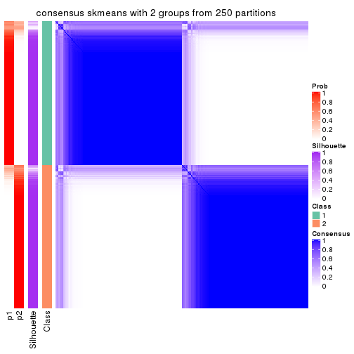</p>

</div>
<div id='tab-ATC-skmeans-consensus-heatmap-2'>
<pre><code class="r">consensus_heatmap(res, k = 3)
</code></pre>

<p>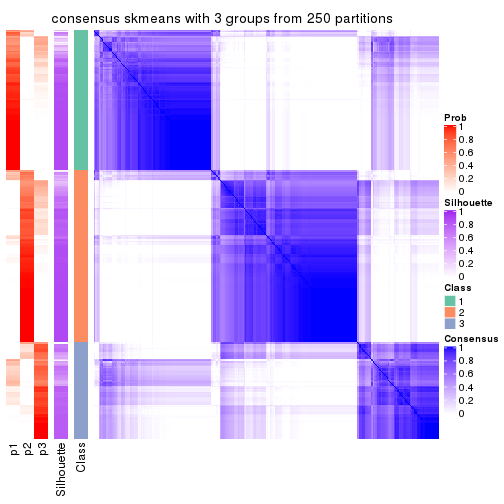</p>

</div>
<div id='tab-ATC-skmeans-consensus-heatmap-3'>
<pre><code class="r">consensus_heatmap(res, k = 4)
</code></pre>

<p>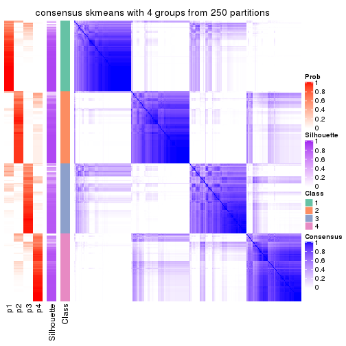</p>

</div>
<div id='tab-ATC-skmeans-consensus-heatmap-4'>
<pre><code class="r">consensus_heatmap(res, k = 5)
</code></pre>

<p>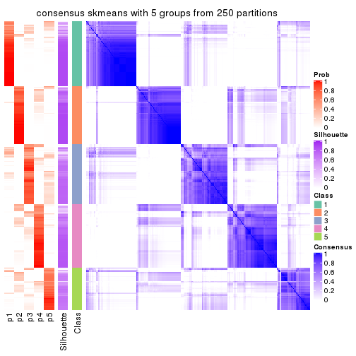</p>

</div>
<div id='tab-ATC-skmeans-consensus-heatmap-5'>
<pre><code class="r">consensus_heatmap(res, k = 6)
</code></pre>

<p>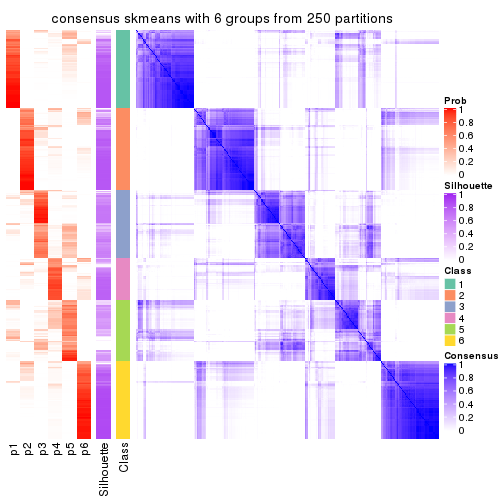</p>

</div>
</div>

Heatmaps for the membership of samples in all partitions to see how consistent they are:


<script>
$( function() {
	$( '#tabs-ATC-skmeans-membership-heatmap' ).tabs();
} );
</script>
<div id='tabs-ATC-skmeans-membership-heatmap'>
<ul>
<li><a href='#tab-ATC-skmeans-membership-heatmap-1'>k = 2</a></li>
<li><a href='#tab-ATC-skmeans-membership-heatmap-2'>k = 3</a></li>
<li><a href='#tab-ATC-skmeans-membership-heatmap-3'>k = 4</a></li>
<li><a href='#tab-ATC-skmeans-membership-heatmap-4'>k = 5</a></li>
<li><a href='#tab-ATC-skmeans-membership-heatmap-5'>k = 6</a></li>
</ul>
<div id='tab-ATC-skmeans-membership-heatmap-1'>
<pre><code class="r">membership_heatmap(res, k = 2)
</code></pre>

<p>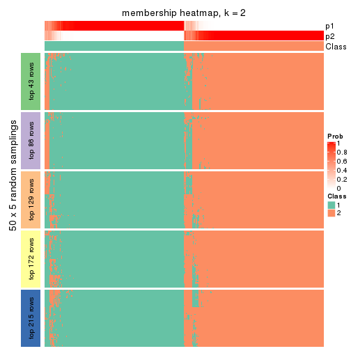</p>

</div>
<div id='tab-ATC-skmeans-membership-heatmap-2'>
<pre><code class="r">membership_heatmap(res, k = 3)
</code></pre>

<p>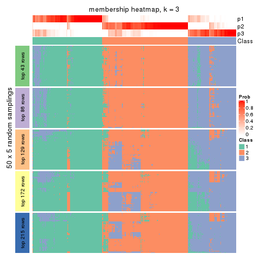</p>

</div>
<div id='tab-ATC-skmeans-membership-heatmap-3'>
<pre><code class="r">membership_heatmap(res, k = 4)
</code></pre>

<p>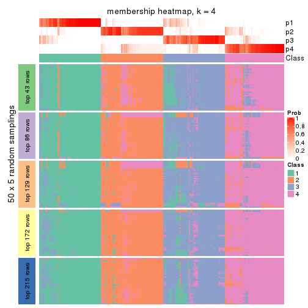</p>

</div>
<div id='tab-ATC-skmeans-membership-heatmap-4'>
<pre><code class="r">membership_heatmap(res, k = 5)
</code></pre>

<p>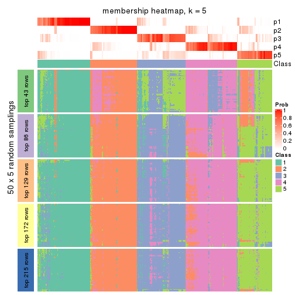</p>

</div>
<div id='tab-ATC-skmeans-membership-heatmap-5'>
<pre><code class="r">membership_heatmap(res, k = 6)
</code></pre>

<p>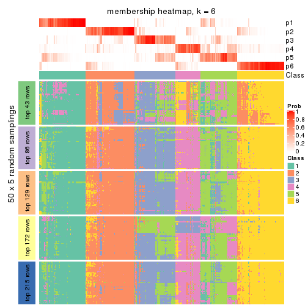</p>

</div>
</div>

As soon as we have had the classes for columns, we can look for signatures
which are significantly different between classes which can be candidate marks
for certain classes. Following are the heatmaps for signatures.


Signature heatmaps where rows are scaled:


<script>
$( function() {
	$( '#tabs-ATC-skmeans-get-signatures' ).tabs();
} );
</script>
<div id='tabs-ATC-skmeans-get-signatures'>
<ul>
<li><a href='#tab-ATC-skmeans-get-signatures-1'>k = 2</a></li>
<li><a href='#tab-ATC-skmeans-get-signatures-2'>k = 3</a></li>
<li><a href='#tab-ATC-skmeans-get-signatures-3'>k = 4</a></li>
<li><a href='#tab-ATC-skmeans-get-signatures-4'>k = 5</a></li>
<li><a href='#tab-ATC-skmeans-get-signatures-5'>k = 6</a></li>
</ul>
<div id='tab-ATC-skmeans-get-signatures-1'>
<pre><code class="r">get_signatures(res, k = 2)
</code></pre>

<p>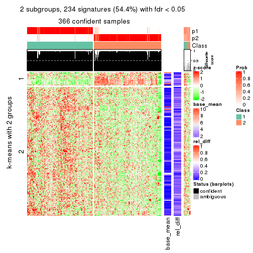</p>

</div>
<div id='tab-ATC-skmeans-get-signatures-2'>
<pre><code class="r">get_signatures(res, k = 3)
</code></pre>

<p>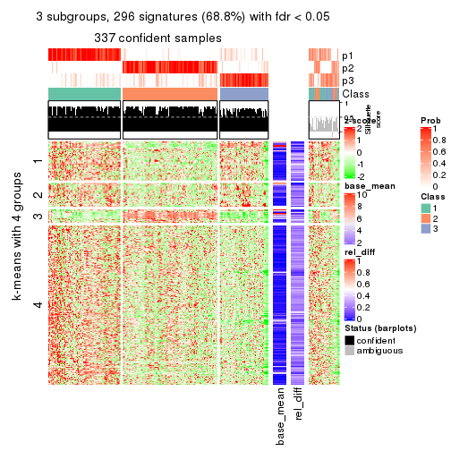</p>

</div>
<div id='tab-ATC-skmeans-get-signatures-3'>
<pre><code class="r">get_signatures(res, k = 4)
</code></pre>

<p>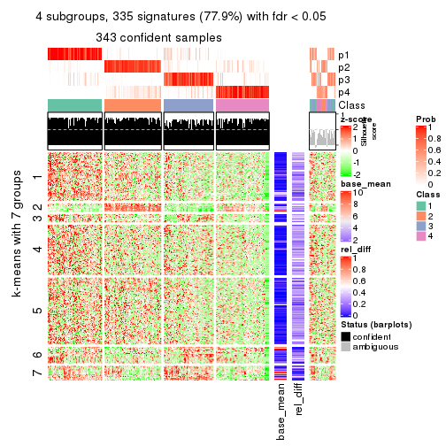</p>

</div>
<div id='tab-ATC-skmeans-get-signatures-4'>
<pre><code class="r">get_signatures(res, k = 5)
</code></pre>

<p>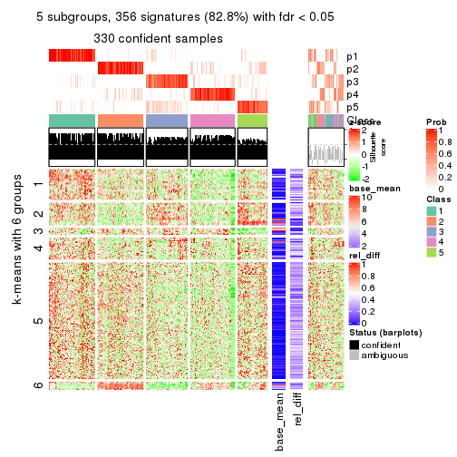</p>

</div>
<div id='tab-ATC-skmeans-get-signatures-5'>
<pre><code class="r">get_signatures(res, k = 6)
</code></pre>

<p>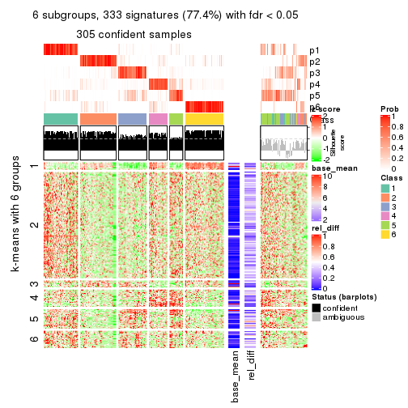</p>

</div>
</div>


Signature heatmaps where rows are not scaled:


<script>
$( function() {
	$( '#tabs-ATC-skmeans-get-signatures-no-scale' ).tabs();
} );
</script>
<div id='tabs-ATC-skmeans-get-signatures-no-scale'>
<ul>
<li><a href='#tab-ATC-skmeans-get-signatures-no-scale-1'>k = 2</a></li>
<li><a href='#tab-ATC-skmeans-get-signatures-no-scale-2'>k = 3</a></li>
<li><a href='#tab-ATC-skmeans-get-signatures-no-scale-3'>k = 4</a></li>
<li><a href='#tab-ATC-skmeans-get-signatures-no-scale-4'>k = 5</a></li>
<li><a href='#tab-ATC-skmeans-get-signatures-no-scale-5'>k = 6</a></li>
</ul>
<div id='tab-ATC-skmeans-get-signatures-no-scale-1'>
<pre><code class="r">get_signatures(res, k = 2, scale_rows = FALSE)
</code></pre>

<p>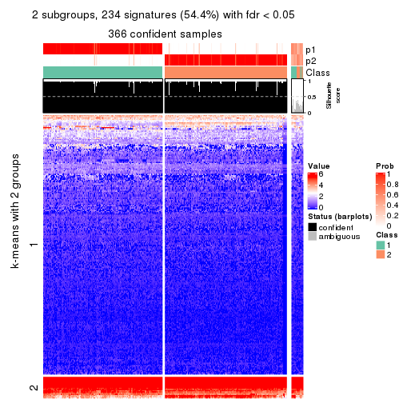</p>

</div>
<div id='tab-ATC-skmeans-get-signatures-no-scale-2'>
<pre><code class="r">get_signatures(res, k = 3, scale_rows = FALSE)
</code></pre>

<p>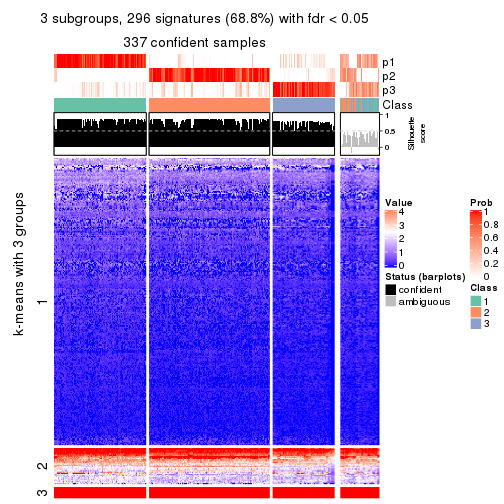</p>

</div>
<div id='tab-ATC-skmeans-get-signatures-no-scale-3'>
<pre><code class="r">get_signatures(res, k = 4, scale_rows = FALSE)
</code></pre>

<p>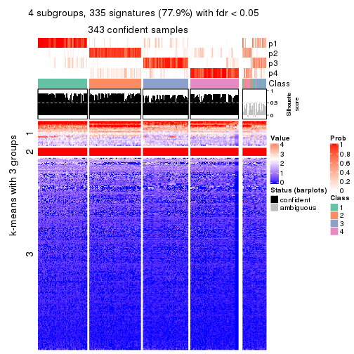</p>

</div>
<div id='tab-ATC-skmeans-get-signatures-no-scale-4'>
<pre><code class="r">get_signatures(res, k = 5, scale_rows = FALSE)
</code></pre>

<p>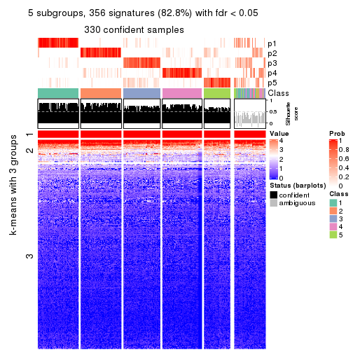</p>

</div>
<div id='tab-ATC-skmeans-get-signatures-no-scale-5'>
<pre><code class="r">get_signatures(res, k = 6, scale_rows = FALSE)
</code></pre>

<p>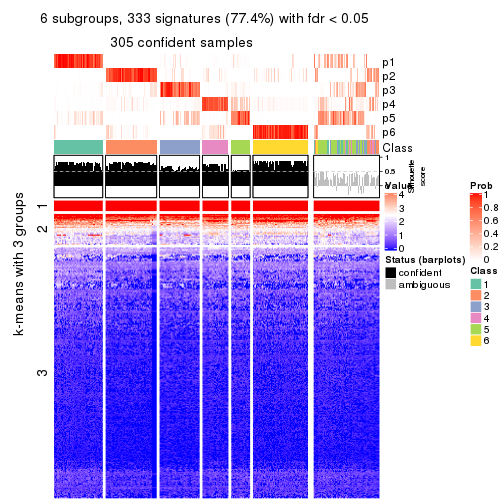</p>

</div>
</div>


Compare the overlap of signatures from different k:

```r
compare_signatures(res)
```

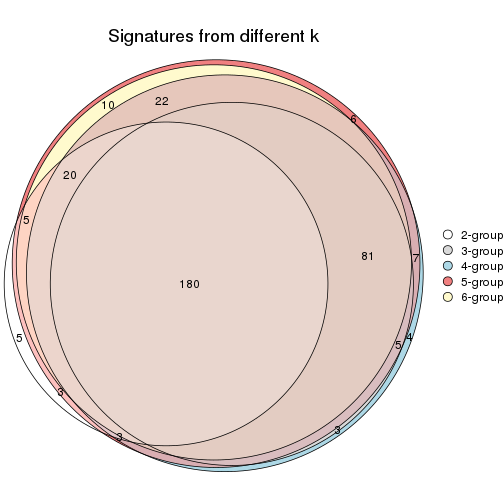

`get_signature()` returns a data frame invisibly. TO get the list of signatures, the function
call should be assigned to a variable explicitly. In following code, if `plot` argument is set
to `FALSE`, no heatmap is plotted while only the differential analysis is performed.

```r
# code only for demonstration
tb = get_signature(res, k = ..., plot = FALSE)
```

An example of the output of `tb` is:

```
#>   which_row         fdr    mean_1    mean_2 scaled_mean_1 scaled_mean_2 km
#> 1        38 0.042760348  8.373488  9.131774    -0.5533452     0.5164555  1
#> 2        40 0.018707592  7.106213  8.469186    -0.6173731     0.5762149  1
#> 3        55 0.019134737 10.221463 11.207825    -0.6159697     0.5749050  1
#> 4        59 0.006059896  5.921854  7.869574    -0.6899429     0.6439467  1
#> 5        60 0.018055526  8.928898 10.211722    -0.6204761     0.5791110  1
#> 6        98 0.009384629 15.714769 14.887706     0.6635654    -0.6193277  2
...
```

The columns in `tb` are:

1. `which_row`: row indices corresponding to the input matrix.
2. `fdr`: FDR for the differential test. 
3. `mean_x`: The mean value in group x.
4. `scaled_mean_x`: The mean value in group x after rows are scaled.
5. `km`: Row groups if k-means clustering is applied to rows.


UMAP plot which shows how samples are separated.


<script>
$( function() {
	$( '#tabs-ATC-skmeans-dimension-reduction' ).tabs();
} );
</script>
<div id='tabs-ATC-skmeans-dimension-reduction'>
<ul>
<li><a href='#tab-ATC-skmeans-dimension-reduction-1'>k = 2</a></li>
<li><a href='#tab-ATC-skmeans-dimension-reduction-2'>k = 3</a></li>
<li><a href='#tab-ATC-skmeans-dimension-reduction-3'>k = 4</a></li>
<li><a href='#tab-ATC-skmeans-dimension-reduction-4'>k = 5</a></li>
<li><a href='#tab-ATC-skmeans-dimension-reduction-5'>k = 6</a></li>
</ul>
<div id='tab-ATC-skmeans-dimension-reduction-1'>
<pre><code class="r">dimension_reduction(res, k = 2, method = &quot;UMAP&quot;)
</code></pre>

<p>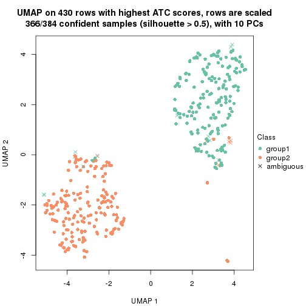</p>

</div>
<div id='tab-ATC-skmeans-dimension-reduction-2'>
<pre><code class="r">dimension_reduction(res, k = 3, method = &quot;UMAP&quot;)
</code></pre>

<p>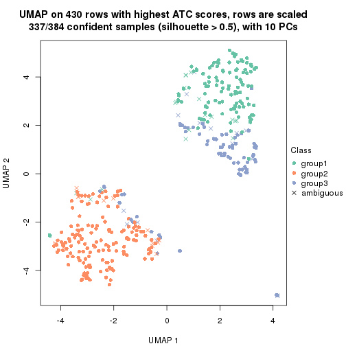</p>

</div>
<div id='tab-ATC-skmeans-dimension-reduction-3'>
<pre><code class="r">dimension_reduction(res, k = 4, method = &quot;UMAP&quot;)
</code></pre>

<p>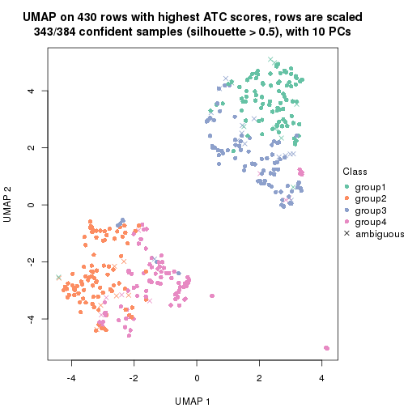</p>

</div>
<div id='tab-ATC-skmeans-dimension-reduction-4'>
<pre><code class="r">dimension_reduction(res, k = 5, method = &quot;UMAP&quot;)
</code></pre>

<p>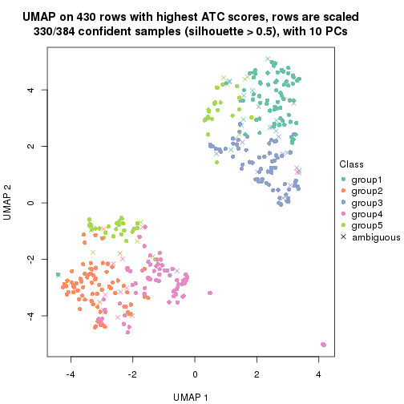</p>

</div>
<div id='tab-ATC-skmeans-dimension-reduction-5'>
<pre><code class="r">dimension_reduction(res, k = 6, method = &quot;UMAP&quot;)
</code></pre>

<p>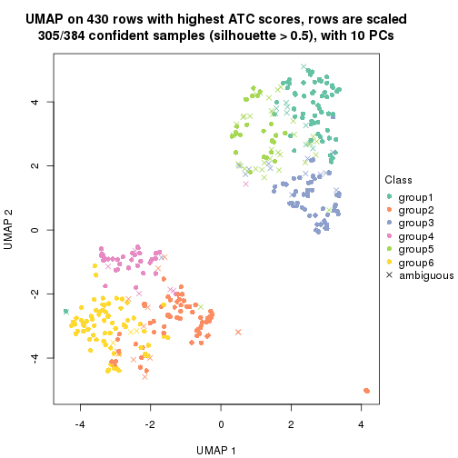</p>

</div>
</div>


Following heatmap shows how subgroups are split when increasing `k`:

```r
collect_classes(res)
```

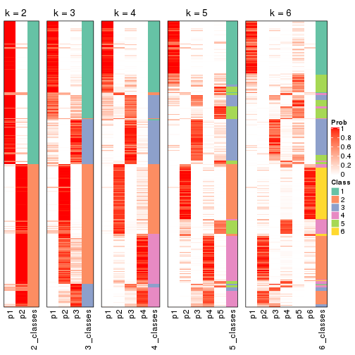


If matrix rows can be associated to genes, consider to use `GO_Enrichment(res,
...)` to perform function enrichment for the signature genes.


 

---------------------------------------------------


### ATC:pam


The object with results only for a single top-value method and a single partition method 
can be extracted as:

```r
res = res_list["ATC", "pam"]
# you can also extract it by
# res = res_list["ATC:pam"]
```

A summary of `res` and all the functions that can be applied to it:

```r
res
```

```
#> A 'ConsensusPartition' object with k = 2, 3, 4, 5, 6.
#>   On a matrix with 430 rows and 384 columns.
#>   Top rows (43, 86, 129, 172, 215) are extracted by 'ATC' method.
#>   Subgroups are detected by 'pam' method.
#>   Performed in total 1250 partitions by row resampling.
#>   Best k for subgroups seems to be 2.
#> 
#> Following methods can be applied to this 'ConsensusPartition' object:
#>  [1] "cola_report"             "collect_classes"         "collect_plots"          
#>  [4] "collect_stats"           "colnames"                "compare_signatures"     
#>  [7] "consensus_heatmap"       "dimension_reduction"     "functional_enrichment"  
#> [10] "get_anno_col"            "get_anno"                "get_classes"            
#> [13] "get_consensus"           "get_matrix"              "get_membership"         
#> [16] "get_param"               "get_signatures"          "get_stats"              
#> [19] "is_best_k"               "is_stable_k"             "membership_heatmap"     
#> [22] "ncol"                    "nrow"                    "plot_ecdf"              
#> [25] "rownames"                "select_partition_number" "show"                   
#> [28] "suggest_best_k"          "test_to_known_factors"
```

`collect_plots()` function collects all the plots made from `res` for all `k` (number of partitions)
into one single page to provide an easy and fast comparison between different `k`.

```r
collect_plots(res)
```

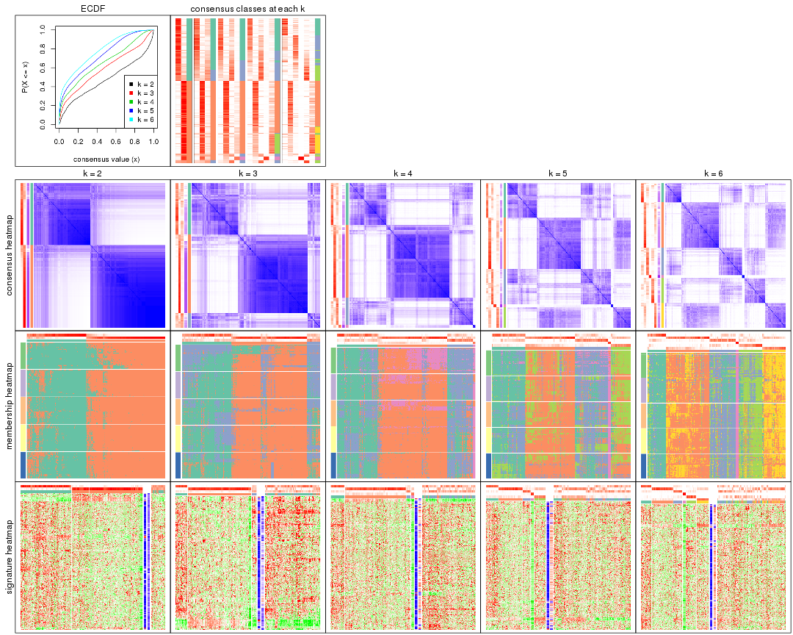

The plots are:

- The first row: a plot of the ECDF (Empirical cumulative distribution
  function) curves of the consensus matrix for each `k` and the heatmap of
  predicted classes for each `k`.
- The second row: heatmaps of the consensus matrix for each `k`.
- The third row: heatmaps of the membership matrix for each `k`.
- The fouth row: heatmaps of the signatures for each `k`.

All the plots in panels can be made by individual functions and they are
plotted later in this section.

`select_partition_number()` produces several plots showing different
statistics for choosing "optimized" `k`. There are following statistics:

- ECDF curves of the consensus matrix for each `k`;
- 1-PAC. [The PAC
  score](https://en.wikipedia.org/wiki/Consensus_clustering#Over-interpretation_potential_of_consensus_clustering)
  measures the proportion of the ambiguous subgrouping.
- Mean silhouette score.
- Concordance. The mean probability of fiting the consensus class ids in all
  partitions.
- Area increased. Denote $A_k$ as the area under the ECDF curve for current
  `k`, the area increased is defined as $A_k - A_{k-1}$.
- Rand index. The percent of pairs of samples that are both in a same cluster
  or both are not in a same cluster in the partition of k and k-1.
- Jaccard index. The ratio of pairs of samples are both in a same cluster in
  the partition of k and k-1 and the pairs of samples are both in a same
  cluster in the partition k or k-1.

The detailed explanations of these statistics can be found in [the cola
vignette](http://bioconductor.org/packages/devel/bioc/vignettes/cola/inst/doc/cola.html#toc_13).

Generally speaking, lower PAC score, higher mean silhouette score or higher
concordance corresponds to better partition. Rand index and Jaccard index
measure how similar the current partition is compared to partition with `k-1`.
If they are too similar, we won't accept `k` is better than `k-1`.

```r
select_partition_number(res)
```

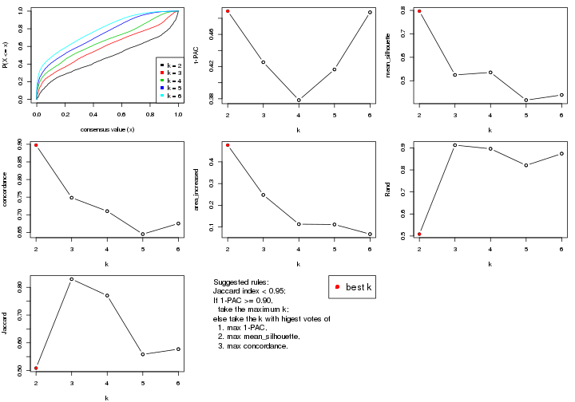

The numeric values for all these statistics can be obtained by `get_stats()`.

```r
get_stats(res)
```

```
#>   k 1-PAC mean_silhouette concordance area_increased  Rand Jaccard
#> 2 2 0.489           0.797       0.898         0.4769 0.509   0.509
#> 3 3 0.425           0.525       0.748         0.2477 0.912   0.830
#> 4 4 0.378           0.536       0.710         0.1131 0.896   0.770
#> 5 5 0.416           0.417       0.645         0.1115 0.821   0.558
#> 6 6 0.487           0.439       0.675         0.0673 0.874   0.577
```

`suggest_best_k()` suggests the best $k$ based on these statistics. The rules are as follows:

- All $k$ with Jaccard index larger than 0.95 are removed because the increase of
  the partition number does not provides enough extra information. If all $k$ are removed,
  the best $k$ is assigned by `NA`.
- For $k$ with 1-PAC larger than 0.9, the maximal $k$ is taken as the "best k". Other $k$ is called "optional k".
- If it does not fit the second rule. The $k$ with the highest vote of highest
  1-PAC, mean silhouette and concordance is taken as the "best k".

```r
suggest_best_k(res)
```

```
#> [1] 2
```


Following shows the table of the partitions (You need to click the **show/hide
code output** link to see it). The membership matrix (columns with name `p*`)
is inferred by
[`clue::cl_consensus()`](https://www.rdocumentation.org/link/cl_consensus?package=clue)
function with the `SE` method. Basically the value in the membership matrix
represents the probability to belong to a certain group. The finall class
label for an item is determined with the group with highest probability it
belongs to.

In `get_classes()` function, the entropy is calculated from the membership
matrix and the silhouette score is calculated from the consensus matrix.


<script>
$( function() {
	$( '#tabs-ATC-pam-get-classes' ).tabs();
} );
</script>
<div id='tabs-ATC-pam-get-classes'>
<ul>
<li><a href='#tab-ATC-pam-get-classes-1'>k = 2</a></li>
<li><a href='#tab-ATC-pam-get-classes-2'>k = 3</a></li>
<li><a href='#tab-ATC-pam-get-classes-3'>k = 4</a></li>
<li><a href='#tab-ATC-pam-get-classes-4'>k = 5</a></li>
<li><a href='#tab-ATC-pam-get-classes-5'>k = 6</a></li>
</ul>

<div id='tab-ATC-pam-get-classes-1'>
<p><a id='tab-ATC-pam-get-classes-1-a' style='color:#0366d6' href='#'>show/hide code output</a></p>
<pre><code class="r">cbind(get_classes(res, k = 2), get_membership(res, k = 2))
</code></pre>

<pre><code>#&gt;            class entropy silhouette    p1    p2
#&gt; SRR2105277     1  0.3274     0.8593 0.940 0.060
#&gt; SRR2105278     1  0.1633     0.8597 0.976 0.024
#&gt; SRR2105275     2  0.8207     0.6670 0.256 0.744
#&gt; SRR2105276     2  0.9909     0.1779 0.444 0.556
#&gt; SRR2105273     1  0.0376     0.8527 0.996 0.004
#&gt; SRR2105274     1  0.0000     0.8503 1.000 0.000
#&gt; SRR2105271     1  0.6531     0.7972 0.832 0.168
#&gt; SRR2105272     1  0.0672     0.8551 0.992 0.008
#&gt; SRR2105269     2  0.0000     0.9082 0.000 1.000
#&gt; SRR2105270     2  0.0000     0.9082 0.000 1.000
#&gt; SRR2105267     2  0.0000     0.9082 0.000 1.000
#&gt; SRR2105268     2  0.0000     0.9082 0.000 1.000
#&gt; SRR2105265     2  0.0672     0.9082 0.008 0.992
#&gt; SRR2105266     2  0.0000     0.9082 0.000 1.000
#&gt; SRR2105263     2  0.0000     0.9082 0.000 1.000
#&gt; SRR2105264     2  0.0376     0.9090 0.004 0.996
#&gt; SRR2105261     2  0.9552     0.3896 0.376 0.624
#&gt; SRR2105262     2  0.9608     0.3645 0.384 0.616
#&gt; SRR2105357     2  0.9977     0.0344 0.472 0.528
#&gt; SRR2105358     1  0.1414     0.8580 0.980 0.020
#&gt; SRR2105439     2  0.6712     0.7755 0.176 0.824
#&gt; SRR2105440     2  0.3584     0.8765 0.068 0.932
#&gt; SRR2105509     2  0.2043     0.9037 0.032 0.968
#&gt; SRR2105510     2  0.2236     0.9027 0.036 0.964
#&gt; SRR2105507     1  0.2948     0.8582 0.948 0.052
#&gt; SRR2105508     1  0.1843     0.8589 0.972 0.028
#&gt; SRR2105505     1  0.0376     0.8520 0.996 0.004
#&gt; SRR2105506     1  0.0376     0.8520 0.996 0.004
#&gt; SRR2105503     2  0.0000     0.9082 0.000 1.000
#&gt; SRR2105504     2  0.2948     0.8947 0.052 0.948
#&gt; SRR2105501     2  0.4815     0.8609 0.104 0.896
#&gt; SRR2105502     2  0.2948     0.8947 0.052 0.948
#&gt; SRR2105499     1  0.8955     0.6285 0.688 0.312
#&gt; SRR2105500     1  0.5946     0.8259 0.856 0.144
#&gt; SRR2105497     2  0.1184     0.9070 0.016 0.984
#&gt; SRR2105498     2  0.0000     0.9082 0.000 1.000
#&gt; SRR2105495     2  0.3114     0.8923 0.056 0.944
#&gt; SRR2105496     2  0.0000     0.9082 0.000 1.000
#&gt; SRR2105493     2  0.3733     0.8826 0.072 0.928
#&gt; SRR2105494     2  0.3114     0.8940 0.056 0.944
#&gt; SRR2105491     2  0.0000     0.9082 0.000 1.000
#&gt; SRR2105492     2  0.0376     0.9087 0.004 0.996
#&gt; SRR2105489     2  0.0376     0.9083 0.004 0.996
#&gt; SRR2105490     2  0.0938     0.9089 0.012 0.988
#&gt; SRR2105487     1  0.9635     0.4267 0.612 0.388
#&gt; SRR2105488     1  0.5737     0.8236 0.864 0.136
#&gt; SRR2105485     1  0.5059     0.8429 0.888 0.112
#&gt; SRR2105486     1  0.4022     0.8553 0.920 0.080
#&gt; SRR2105483     1  0.4022     0.8432 0.920 0.080
#&gt; SRR2105484     1  0.3733     0.8438 0.928 0.072
#&gt; SRR2105481     1  0.8144     0.7075 0.748 0.252
#&gt; SRR2105482     1  0.0672     0.8526 0.992 0.008
#&gt; SRR2105479     2  0.9922     0.1411 0.448 0.552
#&gt; SRR2105480     1  0.9000     0.6233 0.684 0.316
#&gt; SRR2105477     2  0.1184     0.9087 0.016 0.984
#&gt; SRR2105478     2  0.3584     0.8861 0.068 0.932
#&gt; SRR2105475     2  0.2778     0.8966 0.048 0.952
#&gt; SRR2105476     2  0.2423     0.9000 0.040 0.960
#&gt; SRR2105473     2  0.6048     0.8052 0.148 0.852
#&gt; SRR2105474     2  0.6623     0.7714 0.172 0.828
#&gt; SRR2105471     2  0.1184     0.9062 0.016 0.984
#&gt; SRR2105472     2  0.0938     0.9074 0.012 0.988
#&gt; SRR2105469     1  0.2423     0.8596 0.960 0.040
#&gt; SRR2105470     1  0.2948     0.8586 0.948 0.052
#&gt; SRR2105467     1  0.1633     0.8599 0.976 0.024
#&gt; SRR2105468     1  0.0000     0.8503 1.000 0.000
#&gt; SRR2105465     1  0.9686     0.4600 0.604 0.396
#&gt; SRR2105466     1  0.6247     0.8149 0.844 0.156
#&gt; SRR2105463     1  0.1184     0.8551 0.984 0.016
#&gt; SRR2105464     1  0.2948     0.8578 0.948 0.052
#&gt; SRR2105461     2  0.0376     0.9087 0.004 0.996
#&gt; SRR2105462     2  0.0000     0.9082 0.000 1.000
#&gt; SRR2105459     2  0.1184     0.9079 0.016 0.984
#&gt; SRR2105460     2  0.0000     0.9082 0.000 1.000
#&gt; SRR2105457     1  0.9850     0.3608 0.572 0.428
#&gt; SRR2105458     1  0.9795     0.3959 0.584 0.416
#&gt; SRR2105455     1  0.4431     0.8516 0.908 0.092
#&gt; SRR2105456     1  0.1414     0.8583 0.980 0.020
#&gt; SRR2105453     1  0.2236     0.8591 0.964 0.036
#&gt; SRR2105454     1  0.0938     0.8554 0.988 0.012
#&gt; SRR2105451     2  0.5059     0.8526 0.112 0.888
#&gt; SRR2105452     2  0.4690     0.8601 0.100 0.900
#&gt; SRR2105449     1  0.9286     0.5760 0.656 0.344
#&gt; SRR2105450     1  0.3879     0.8565 0.924 0.076
#&gt; SRR2105447     2  0.1184     0.9080 0.016 0.984
#&gt; SRR2105448     2  0.1184     0.9085 0.016 0.984
#&gt; SRR2105445     2  0.7602     0.7224 0.220 0.780
#&gt; SRR2105446     2  0.9661     0.3435 0.392 0.608
#&gt; SRR2105443     2  0.5519     0.8336 0.128 0.872
#&gt; SRR2105444     2  0.5842     0.8229 0.140 0.860
#&gt; SRR2105441     2  0.1184     0.9048 0.016 0.984
#&gt; SRR2105442     2  0.0000     0.9082 0.000 1.000
#&gt; SRR2105437     1  0.3879     0.8537 0.924 0.076
#&gt; SRR2105438     1  0.1184     0.8578 0.984 0.016
#&gt; SRR2105435     2  0.9833     0.2283 0.424 0.576
#&gt; SRR2105436     1  0.8386     0.7016 0.732 0.268
#&gt; SRR2105433     1  0.2423     0.8597 0.960 0.040
#&gt; SRR2105434     1  0.1843     0.8569 0.972 0.028
#&gt; SRR2105431     1  0.1184     0.8556 0.984 0.016
#&gt; SRR2105432     1  0.0376     0.8526 0.996 0.004
#&gt; SRR2105429     2  0.5059     0.8505 0.112 0.888
#&gt; SRR2105430     2  0.2423     0.9010 0.040 0.960
#&gt; SRR2105427     2  0.2948     0.8947 0.052 0.948
#&gt; SRR2105428     2  0.2423     0.9008 0.040 0.960
#&gt; SRR2105425     2  0.0000     0.9082 0.000 1.000
#&gt; SRR2105426     2  0.0000     0.9082 0.000 1.000
#&gt; SRR2105421     2  1.0000    -0.0910 0.496 0.504
#&gt; SRR2105422     2  0.9358     0.4397 0.352 0.648
#&gt; SRR2105423     2  0.0000     0.9082 0.000 1.000
#&gt; SRR2105424     2  0.0000     0.9082 0.000 1.000
#&gt; SRR2105419     1  0.7056     0.7874 0.808 0.192
#&gt; SRR2105420     1  0.9552     0.4967 0.624 0.376
#&gt; SRR2105415     1  0.3274     0.8580 0.940 0.060
#&gt; SRR2105416     1  0.1414     0.8561 0.980 0.020
#&gt; SRR2105417     1  0.1184     0.8566 0.984 0.016
#&gt; SRR2105418     1  0.1184     0.8559 0.984 0.016
#&gt; SRR2105413     2  0.1633     0.9058 0.024 0.976
#&gt; SRR2105414     2  0.2043     0.9032 0.032 0.968
#&gt; SRR2105409     2  0.0000     0.9082 0.000 1.000
#&gt; SRR2105410     2  0.1184     0.9047 0.016 0.984
#&gt; SRR2105411     2  0.0000     0.9082 0.000 1.000
#&gt; SRR2105412     2  0.0000     0.9082 0.000 1.000
#&gt; SRR2105407     1  0.8267     0.7134 0.740 0.260
#&gt; SRR2105408     2  0.9998    -0.0747 0.492 0.508
#&gt; SRR2105403     1  0.1414     0.8587 0.980 0.020
#&gt; SRR2105404     1  0.1184     0.8578 0.984 0.016
#&gt; SRR2105405     1  0.0376     0.8520 0.996 0.004
#&gt; SRR2105406     1  0.1633     0.8583 0.976 0.024
#&gt; SRR2105401     2  0.3879     0.8793 0.076 0.924
#&gt; SRR2105402     2  0.3879     0.8791 0.076 0.924
#&gt; SRR2105399     2  0.5059     0.8494 0.112 0.888
#&gt; SRR2105400     2  0.4690     0.8616 0.100 0.900
#&gt; SRR2105397     2  0.5059     0.8521 0.112 0.888
#&gt; SRR2105398     2  0.4431     0.8697 0.092 0.908
#&gt; SRR2105395     2  0.0376     0.9087 0.004 0.996
#&gt; SRR2105396     2  0.0000     0.9082 0.000 1.000
#&gt; SRR2105393     2  0.1414     0.9071 0.020 0.980
#&gt; SRR2105394     2  0.0376     0.9087 0.004 0.996
#&gt; SRR2105389     1  0.8955     0.6333 0.688 0.312
#&gt; SRR2105390     1  0.5737     0.8254 0.864 0.136
#&gt; SRR2105391     1  0.9661     0.4683 0.608 0.392
#&gt; SRR2105392     1  0.6887     0.7864 0.816 0.184
#&gt; SRR2105385     1  0.7453     0.7620 0.788 0.212
#&gt; SRR2105386     1  0.2043     0.8600 0.968 0.032
#&gt; SRR2105387     1  0.5408     0.8390 0.876 0.124
#&gt; SRR2105388     1  0.4562     0.8501 0.904 0.096
#&gt; SRR2105381     2  0.2778     0.8967 0.048 0.952
#&gt; SRR2105382     2  0.2236     0.9023 0.036 0.964
#&gt; SRR2105383     2  0.4690     0.8528 0.100 0.900
#&gt; SRR2105384     2  0.2423     0.8971 0.040 0.960
#&gt; SRR2105379     2  0.0672     0.9093 0.008 0.992
#&gt; SRR2105380     2  0.0376     0.9087 0.004 0.996
#&gt; SRR2105377     2  0.0672     0.9092 0.008 0.992
#&gt; SRR2105378     2  0.3114     0.8893 0.056 0.944
#&gt; SRR2105375     1  0.9686     0.4455 0.604 0.396
#&gt; SRR2105376     1  0.9963     0.2319 0.536 0.464
#&gt; SRR2105373     1  0.1633     0.8600 0.976 0.024
#&gt; SRR2105374     1  0.0376     0.8526 0.996 0.004
#&gt; SRR2105371     1  0.5178     0.8354 0.884 0.116
#&gt; SRR2105372     1  0.1414     0.8578 0.980 0.020
#&gt; SRR2105369     1  0.0938     0.8562 0.988 0.012
#&gt; SRR2105370     1  0.0376     0.8525 0.996 0.004
#&gt; SRR2105367     1  0.3879     0.8539 0.924 0.076
#&gt; SRR2105368     1  0.4431     0.8516 0.908 0.092
#&gt; SRR2105365     2  0.0000     0.9082 0.000 1.000
#&gt; SRR2105366     2  0.0376     0.9090 0.004 0.996
#&gt; SRR2105363     2  0.0938     0.9090 0.012 0.988
#&gt; SRR2105364     2  0.1414     0.9082 0.020 0.980
#&gt; SRR2105361     2  0.0000     0.9082 0.000 1.000
#&gt; SRR2105362     2  0.0376     0.9087 0.004 0.996
#&gt; SRR2105359     1  0.4022     0.8536 0.920 0.080
#&gt; SRR2105360     1  0.0938     0.8565 0.988 0.012
#&gt; SRR2105355     1  0.2603     0.8598 0.956 0.044
#&gt; SRR2105356     1  0.1633     0.8583 0.976 0.024
#&gt; SRR2105353     1  0.9933     0.2662 0.548 0.452
#&gt; SRR2105354     1  0.8016     0.7328 0.756 0.244
#&gt; SRR2105351     2  0.0000     0.9082 0.000 1.000
#&gt; SRR2105352     2  0.3733     0.8821 0.072 0.928
#&gt; SRR2105349     2  0.0000     0.9082 0.000 1.000
#&gt; SRR2105350     2  0.0376     0.9089 0.004 0.996
#&gt; SRR2105345     2  0.2778     0.8957 0.048 0.952
#&gt; SRR2105346     2  0.0376     0.9085 0.004 0.996
#&gt; SRR2105347     2  0.9552     0.3577 0.376 0.624
#&gt; SRR2105348     2  0.8813     0.5426 0.300 0.700
#&gt; SRR2105343     2  0.0000     0.9082 0.000 1.000
#&gt; SRR2105344     2  0.0938     0.9085 0.012 0.988
#&gt; SRR2105341     1  0.7453     0.7676 0.788 0.212
#&gt; SRR2105342     1  0.4939     0.8411 0.892 0.108
#&gt; SRR2105339     1  0.9129     0.5940 0.672 0.328
#&gt; SRR2105340     1  0.9850     0.3589 0.572 0.428
#&gt; SRR2105335     1  0.0376     0.8529 0.996 0.004
#&gt; SRR2105336     1  0.0000     0.8503 1.000 0.000
#&gt; SRR2105337     1  0.4022     0.8548 0.920 0.080
#&gt; SRR2105338     1  0.0938     0.8561 0.988 0.012
#&gt; SRR2105331     2  0.0000     0.9082 0.000 1.000
#&gt; SRR2105332     2  0.0672     0.9090 0.008 0.992
#&gt; SRR2105333     2  0.0672     0.9089 0.008 0.992
#&gt; SRR2105334     2  0.0000     0.9082 0.000 1.000
#&gt; SRR2105329     2  0.5178     0.8487 0.116 0.884
#&gt; SRR2105330     2  0.4562     0.8649 0.096 0.904
#&gt; SRR2105327     2  0.2043     0.9034 0.032 0.968
#&gt; SRR2105328     2  0.2043     0.9034 0.032 0.968
#&gt; SRR2105325     2  0.9815     0.2629 0.420 0.580
#&gt; SRR2105326     1  0.9732     0.4324 0.596 0.404
#&gt; SRR2105323     1  0.7056     0.7867 0.808 0.192
#&gt; SRR2105324     1  0.4431     0.8505 0.908 0.092
#&gt; SRR2105319     1  0.0000     0.8503 1.000 0.000
#&gt; SRR2105320     1  0.0000     0.8503 1.000 0.000
#&gt; SRR2105321     1  0.6148     0.8138 0.848 0.152
#&gt; SRR2105322     1  0.8081     0.7177 0.752 0.248
#&gt; SRR2105317     2  0.2423     0.9014 0.040 0.960
#&gt; SRR2105318     2  0.0000     0.9082 0.000 1.000
#&gt; SRR2105315     2  0.4298     0.8720 0.088 0.912
#&gt; SRR2105316     2  0.2948     0.8954 0.052 0.948
#&gt; SRR2105313     2  0.0000     0.9082 0.000 1.000
#&gt; SRR2105314     2  0.0000     0.9082 0.000 1.000
#&gt; SRR2105311     2  0.8713     0.5990 0.292 0.708
#&gt; SRR2105312     2  0.8608     0.6153 0.284 0.716
#&gt; SRR2105307     1  0.1633     0.8595 0.976 0.024
#&gt; SRR2105308     1  0.3114     0.8553 0.944 0.056
#&gt; SRR2105309     1  0.9954     0.2637 0.540 0.460
#&gt; SRR2105310     1  0.8955     0.6344 0.688 0.312
#&gt; SRR2105305     1  0.8016     0.7309 0.756 0.244
#&gt; SRR2105306     1  0.3431     0.8571 0.936 0.064
#&gt; SRR2105303     2  0.0938     0.9093 0.012 0.988
#&gt; SRR2105304     2  0.1633     0.9071 0.024 0.976
#&gt; SRR2105301     2  0.2948     0.8950 0.052 0.948
#&gt; SRR2105302     2  0.0000     0.9082 0.000 1.000
#&gt; SRR2105299     2  0.8016     0.6857 0.244 0.756
#&gt; SRR2105300     2  0.7376     0.7407 0.208 0.792
#&gt; SRR2105297     2  0.9608     0.3343 0.384 0.616
#&gt; SRR2105298     1  0.9944     0.2657 0.544 0.456
#&gt; SRR2105295     2  0.2043     0.9032 0.032 0.968
#&gt; SRR2105296     2  0.1843     0.9057 0.028 0.972
#&gt; SRR2105293     2  0.9963     0.0787 0.464 0.536
#&gt; SRR2105294     1  0.8955     0.6172 0.688 0.312
#&gt; SRR2105291     1  0.7376     0.7790 0.792 0.208
#&gt; SRR2105292     1  0.1843     0.8604 0.972 0.028
#&gt; SRR2105289     1  0.8813     0.6452 0.700 0.300
#&gt; SRR2105290     1  0.3733     0.8570 0.928 0.072
#&gt; SRR2105287     1  0.0672     0.8544 0.992 0.008
#&gt; SRR2105288     1  0.1633     0.8563 0.976 0.024
#&gt; SRR2105285     2  0.1414     0.9070 0.020 0.980
#&gt; SRR2105286     2  0.1184     0.9080 0.016 0.984
#&gt; SRR2105283     2  0.5178     0.8495 0.116 0.884
#&gt; SRR2105284     2  0.2603     0.8995 0.044 0.956
#&gt; SRR2105281     2  0.0000     0.9082 0.000 1.000
#&gt; SRR2105282     2  0.0000     0.9082 0.000 1.000
#&gt; SRR2105259     1  0.9977     0.2111 0.528 0.472
#&gt; SRR2105260     2  0.9993    -0.0357 0.484 0.516
#&gt; SRR2105279     2  0.0000     0.9082 0.000 1.000
#&gt; SRR2105280     2  0.0000     0.9082 0.000 1.000
#&gt; SRR2105257     1  0.0000     0.8503 1.000 0.000
#&gt; SRR2105258     1  0.0000     0.8503 1.000 0.000
#&gt; SRR2105253     2  0.1414     0.9069 0.020 0.980
#&gt; SRR2105254     2  0.0000     0.9082 0.000 1.000
#&gt; SRR2105255     1  0.0938     0.8567 0.988 0.012
#&gt; SRR2105256     1  0.0000     0.8503 1.000 0.000
#&gt; SRR2105251     2  0.0000     0.9082 0.000 1.000
#&gt; SRR2105252     2  0.0000     0.9082 0.000 1.000
#&gt; SRR2105249     2  0.3274     0.8907 0.060 0.940
#&gt; SRR2105250     2  0.2948     0.8945 0.052 0.948
#&gt; SRR2105247     2  0.0672     0.9093 0.008 0.992
#&gt; SRR2105248     2  0.0376     0.9087 0.004 0.996
#&gt; SRR2105245     2  0.7376     0.7335 0.208 0.792
#&gt; SRR2105246     2  0.7139     0.7467 0.196 0.804
#&gt; SRR2105243     1  0.6973     0.7901 0.812 0.188
#&gt; SRR2105244     1  0.8207     0.7183 0.744 0.256
#&gt; SRR2105241     1  0.6048     0.8247 0.852 0.148
#&gt; SRR2105242     1  0.0672     0.8540 0.992 0.008
#&gt; SRR2105239     1  0.9944     0.2601 0.544 0.456
#&gt; SRR2105240     1  0.1633     0.8579 0.976 0.024
#&gt; SRR2105237     2  0.2778     0.8967 0.048 0.952
#&gt; SRR2105238     2  0.0938     0.9091 0.012 0.988
#&gt; SRR2105235     2  0.0000     0.9082 0.000 1.000
#&gt; SRR2105236     2  0.0000     0.9082 0.000 1.000
#&gt; SRR2105233     2  0.2236     0.9016 0.036 0.964
#&gt; SRR2105234     2  0.2043     0.9032 0.032 0.968
#&gt; SRR2105231     2  0.0938     0.9085 0.012 0.988
#&gt; SRR2105232     2  0.0938     0.9085 0.012 0.988
#&gt; SRR2105227     2  0.9460     0.4260 0.364 0.636
#&gt; SRR2105228     1  0.8144     0.7205 0.748 0.252
#&gt; SRR2105225     1  0.0672     0.8547 0.992 0.008
#&gt; SRR2105226     1  0.0000     0.8503 1.000 0.000
#&gt; SRR2105229     2  0.7602     0.7193 0.220 0.780
#&gt; SRR2105230     1  0.9754     0.4174 0.592 0.408
#&gt; SRR2105219     2  0.0000     0.9082 0.000 1.000
#&gt; SRR2105220     2  0.0938     0.9086 0.012 0.988
#&gt; SRR2105221     2  0.5842     0.8200 0.140 0.860
#&gt; SRR2105222     2  0.5178     0.8447 0.116 0.884
#&gt; SRR2105223     1  0.1414     0.8586 0.980 0.020
#&gt; SRR2105224     1  0.0672     0.8544 0.992 0.008
#&gt; SRR2105217     2  0.0376     0.9087 0.004 0.996
#&gt; SRR2105218     2  0.0376     0.9087 0.004 0.996
#&gt; SRR2105215     2  0.0000     0.9082 0.000 1.000
#&gt; SRR2105216     2  0.0376     0.9087 0.004 0.996
#&gt; SRR2105213     2  0.7815     0.7001 0.232 0.768
#&gt; SRR2105214     2  0.9393     0.4481 0.356 0.644
#&gt; SRR2105211     1  0.8144     0.7270 0.748 0.252
#&gt; SRR2105212     1  0.9710     0.4513 0.600 0.400
#&gt; SRR2105209     1  0.1414     0.8584 0.980 0.020
#&gt; SRR2105210     1  0.1184     0.8578 0.984 0.016
#&gt; SRR2105207     1  0.5519     0.8329 0.872 0.128
#&gt; SRR2105208     1  0.1184     0.8563 0.984 0.016
#&gt; SRR2105205     2  0.1184     0.9085 0.016 0.984
#&gt; SRR2105206     2  0.2423     0.9005 0.040 0.960
#&gt; SRR2105201     2  0.5059     0.8384 0.112 0.888
#&gt; SRR2105202     2  0.2778     0.8956 0.048 0.952
#&gt; SRR2105203     2  0.0000     0.9082 0.000 1.000
#&gt; SRR2105204     2  0.0000     0.9082 0.000 1.000
#&gt; SRR2105199     2  0.0376     0.9090 0.004 0.996
#&gt; SRR2105200     2  0.0376     0.9091 0.004 0.996
#&gt; SRR2105197     1  0.7815     0.7367 0.768 0.232
#&gt; SRR2105198     1  0.8267     0.7113 0.740 0.260
#&gt; SRR2105195     1  0.9248     0.5791 0.660 0.340
#&gt; SRR2105196     1  0.9732     0.4388 0.596 0.404
#&gt; SRR2105193     1  0.1184     0.8574 0.984 0.016
#&gt; SRR2105194     1  0.0938     0.8560 0.988 0.012
#&gt; SRR2105191     1  0.2948     0.8596 0.948 0.052
#&gt; SRR2105192     1  0.0000     0.8503 1.000 0.000
#&gt; SRR2105189     2  0.3879     0.8797 0.076 0.924
#&gt; SRR2105190     2  0.1414     0.9076 0.020 0.980
#&gt; SRR2105187     2  0.2948     0.8967 0.052 0.948
#&gt; SRR2105188     2  0.2778     0.8993 0.048 0.952
#&gt; SRR2105179     1  0.5737     0.8306 0.864 0.136
#&gt; SRR2105180     1  0.5294     0.8390 0.880 0.120
#&gt; SRR2105183     2  0.0376     0.9084 0.004 0.996
#&gt; SRR2105184     2  0.0000     0.9082 0.000 1.000
#&gt; SRR2105185     2  0.1184     0.9066 0.016 0.984
#&gt; SRR2105186     2  0.0672     0.9079 0.008 0.992
#&gt; SRR2105181     1  0.9983     0.1557 0.524 0.476
#&gt; SRR2105182     1  0.6531     0.8025 0.832 0.168
#&gt; SRR2105177     1  0.3733     0.8499 0.928 0.072
#&gt; SRR2105178     1  0.2043     0.8533 0.968 0.032
#&gt; SRR2105171     2  0.0376     0.9090 0.004 0.996
#&gt; SRR2105172     2  0.0376     0.9090 0.004 0.996
#&gt; SRR2105175     1  0.8555     0.6786 0.720 0.280
#&gt; SRR2105176     1  0.4161     0.8502 0.916 0.084
#&gt; SRR2105173     2  0.0000     0.9082 0.000 1.000
#&gt; SRR2105174     2  0.0000     0.9082 0.000 1.000
#&gt; SRR2105169     2  0.0376     0.9087 0.004 0.996
#&gt; SRR2105170     2  0.0938     0.9080 0.012 0.988
#&gt; SRR2105167     2  0.0000     0.9082 0.000 1.000
#&gt; SRR2105168     2  0.0000     0.9082 0.000 1.000
#&gt; SRR2105165     1  0.5178     0.8394 0.884 0.116
#&gt; SRR2105166     1  0.4690     0.8459 0.900 0.100
#&gt; SRR2105163     2  0.8207     0.6661 0.256 0.744
#&gt; SRR2105164     1  0.9635     0.4687 0.612 0.388
#&gt; SRR2105161     1  0.1184     0.8577 0.984 0.016
#&gt; SRR2105162     1  0.2423     0.8579 0.960 0.040
#&gt; SRR2105155     2  0.0376     0.9090 0.004 0.996
#&gt; SRR2105156     2  0.0000     0.9082 0.000 1.000
#&gt; SRR2105157     2  0.0000     0.9082 0.000 1.000
#&gt; SRR2105158     2  0.0376     0.9087 0.004 0.996
#&gt; SRR2105159     1  0.4690     0.8470 0.900 0.100
#&gt; SRR2105160     1  0.3879     0.8568 0.924 0.076
#&gt; SRR2105153     2  0.0000     0.9082 0.000 1.000
#&gt; SRR2105154     2  0.0000     0.9082 0.000 1.000
#&gt; SRR2105151     2  0.0672     0.9084 0.008 0.992
#&gt; SRR2105152     2  0.0000     0.9082 0.000 1.000
#&gt; SRR2105149     2  0.8555     0.6194 0.280 0.720
#&gt; SRR2105150     2  0.9323     0.4665 0.348 0.652
#&gt; SRR2105147     2  0.5408     0.8372 0.124 0.876
#&gt; SRR2105148     2  0.5178     0.8453 0.116 0.884
#&gt; SRR2105143     2  0.9795     0.2692 0.416 0.584
#&gt; SRR2105144     1  0.9635     0.4685 0.612 0.388
#&gt; SRR2105145     1  0.4022     0.8526 0.920 0.080
#&gt; SRR2105146     1  0.0938     0.8562 0.988 0.012
#&gt; SRR2105141     2  0.0376     0.9088 0.004 0.996
#&gt; SRR2105142     2  0.0000     0.9082 0.000 1.000
#&gt; SRR2105139     2  0.0000     0.9082 0.000 1.000
#&gt; SRR2105140     2  0.0000     0.9082 0.000 1.000
#&gt; SRR2105137     2  0.8763     0.5733 0.296 0.704
#&gt; SRR2105138     2  0.7674     0.6952 0.224 0.776
#&gt; SRR2105135     2  0.0672     0.9092 0.008 0.992
#&gt; SRR2105136     2  0.0938     0.9076 0.012 0.988
#&gt; SRR2105133     1  0.9393     0.5170 0.644 0.356
#&gt; SRR2105134     1  0.5629     0.8273 0.868 0.132
#&gt; SRR2105131     2  0.8081     0.6766 0.248 0.752
#&gt; SRR2105132     1  0.3584     0.8560 0.932 0.068
#&gt; SRR2105129     1  0.3431     0.8502 0.936 0.064
#&gt; SRR2105130     1  0.4161     0.8450 0.916 0.084
#&gt; SRR2105127     1  0.2043     0.8598 0.968 0.032
#&gt; SRR2105128     1  0.1184     0.8567 0.984 0.016
</code></pre>

<script>
$('#tab-ATC-pam-get-classes-1-a').parent().next().next().hide();
$('#tab-ATC-pam-get-classes-1-a').click(function(){
  $('#tab-ATC-pam-get-classes-1-a').parent().next().next().toggle();
  return(false);
});
</script>
</div>

<div id='tab-ATC-pam-get-classes-2'>
<p><a id='tab-ATC-pam-get-classes-2-a' style='color:#0366d6' href='#'>show/hide code output</a></p>
<pre><code class="r">cbind(get_classes(res, k = 3), get_membership(res, k = 3))
</code></pre>

<pre><code>#&gt;            class entropy silhouette    p1    p2    p3
#&gt; SRR2105277     3  0.7186    0.10597 0.476 0.024 0.500
#&gt; SRR2105278     3  0.6822   -0.25011 0.480 0.012 0.508
#&gt; SRR2105275     2  0.8465   -0.09923 0.096 0.528 0.376
#&gt; SRR2105276     3  0.9606    0.52249 0.212 0.340 0.448
#&gt; SRR2105273     1  0.3686    0.46330 0.860 0.000 0.140
#&gt; SRR2105274     1  0.3879    0.45234 0.848 0.000 0.152
#&gt; SRR2105271     1  0.8663    0.04923 0.524 0.112 0.364
#&gt; SRR2105272     1  0.3618    0.51968 0.884 0.012 0.104
#&gt; SRR2105269     2  0.0747    0.85005 0.000 0.984 0.016
#&gt; SRR2105270     2  0.1289    0.85337 0.000 0.968 0.032
#&gt; SRR2105267     2  0.1529    0.85413 0.000 0.960 0.040
#&gt; SRR2105268     2  0.1860    0.85267 0.000 0.948 0.052
#&gt; SRR2105265     2  0.3112    0.84332 0.004 0.900 0.096
#&gt; SRR2105266     2  0.2711    0.84612 0.000 0.912 0.088
#&gt; SRR2105263     2  0.1411    0.85281 0.000 0.964 0.036
#&gt; SRR2105264     2  0.2356    0.85295 0.000 0.928 0.072
#&gt; SRR2105261     2  0.9613   -0.30597 0.244 0.472 0.284
#&gt; SRR2105262     3  0.9823    0.47518 0.244 0.364 0.392
#&gt; SRR2105357     3  0.9131    0.54046 0.168 0.312 0.520
#&gt; SRR2105358     1  0.6954   -0.13184 0.500 0.016 0.484
#&gt; SRR2105439     2  0.8875    0.27343 0.136 0.528 0.336
#&gt; SRR2105440     2  0.7128    0.57063 0.052 0.664 0.284
#&gt; SRR2105509     2  0.1163    0.84357 0.000 0.972 0.028
#&gt; SRR2105510     2  0.1453    0.84356 0.008 0.968 0.024
#&gt; SRR2105507     1  0.5737    0.32119 0.732 0.012 0.256
#&gt; SRR2105508     1  0.5692    0.29801 0.724 0.008 0.268
#&gt; SRR2105505     1  0.4750    0.51338 0.784 0.000 0.216
#&gt; SRR2105506     1  0.5016    0.49438 0.760 0.000 0.240
#&gt; SRR2105503     2  0.1163    0.85272 0.000 0.972 0.028
#&gt; SRR2105504     2  0.4409    0.73146 0.004 0.824 0.172
#&gt; SRR2105501     2  0.2982    0.82268 0.056 0.920 0.024
#&gt; SRR2105502     2  0.4521    0.72479 0.004 0.816 0.180
#&gt; SRR2105499     1  0.9773   -0.45660 0.412 0.236 0.352
#&gt; SRR2105500     1  0.7944    0.20257 0.644 0.112 0.244
#&gt; SRR2105497     2  0.3889    0.83624 0.032 0.884 0.084
#&gt; SRR2105498     2  0.2711    0.84517 0.000 0.912 0.088
#&gt; SRR2105495     2  0.2280    0.85000 0.008 0.940 0.052
#&gt; SRR2105496     2  0.1163    0.85289 0.000 0.972 0.028
#&gt; SRR2105493     2  0.2636    0.83555 0.020 0.932 0.048
#&gt; SRR2105494     2  0.3183    0.83248 0.016 0.908 0.076
#&gt; SRR2105491     2  0.1964    0.85421 0.000 0.944 0.056
#&gt; SRR2105492     2  0.1878    0.85276 0.004 0.952 0.044
#&gt; SRR2105489     2  0.2860    0.84601 0.004 0.912 0.084
#&gt; SRR2105490     2  0.4602    0.79698 0.016 0.832 0.152
#&gt; SRR2105487     3  0.8016    0.24633 0.260 0.108 0.632
#&gt; SRR2105488     3  0.7770    0.18616 0.292 0.080 0.628
#&gt; SRR2105485     1  0.7379    0.01760 0.584 0.040 0.376
#&gt; SRR2105486     1  0.7057    0.27505 0.680 0.056 0.264
#&gt; SRR2105483     1  0.6113    0.45003 0.688 0.012 0.300
#&gt; SRR2105484     1  0.6172    0.44360 0.680 0.012 0.308
#&gt; SRR2105481     3  0.9065    0.29913 0.364 0.144 0.492
#&gt; SRR2105482     1  0.5926    0.45232 0.644 0.000 0.356
#&gt; SRR2105479     2  0.9857   -0.49138 0.276 0.416 0.308
#&gt; SRR2105480     1  0.9578   -0.26900 0.480 0.272 0.248
#&gt; SRR2105477     2  0.2356    0.85295 0.000 0.928 0.072
#&gt; SRR2105478     2  0.3528    0.82996 0.016 0.892 0.092
#&gt; SRR2105475     2  0.1411    0.84234 0.000 0.964 0.036
#&gt; SRR2105476     2  0.1031    0.84396 0.000 0.976 0.024
#&gt; SRR2105473     2  0.8261    0.48131 0.124 0.616 0.260
#&gt; SRR2105474     2  0.8494    0.45792 0.156 0.608 0.236
#&gt; SRR2105471     2  0.3771    0.83467 0.012 0.876 0.112
#&gt; SRR2105472     2  0.4139    0.82633 0.016 0.860 0.124
#&gt; SRR2105469     1  0.4782    0.43279 0.820 0.016 0.164
#&gt; SRR2105470     1  0.5253    0.40501 0.792 0.020 0.188
#&gt; SRR2105467     1  0.4692    0.46548 0.820 0.012 0.168
#&gt; SRR2105468     1  0.4399    0.53148 0.812 0.000 0.188
#&gt; SRR2105465     1  0.7665    0.00393 0.600 0.340 0.060
#&gt; SRR2105466     1  0.5740    0.46828 0.804 0.100 0.096
#&gt; SRR2105463     1  0.4452    0.51518 0.808 0.000 0.192
#&gt; SRR2105464     1  0.5763    0.47649 0.716 0.008 0.276
#&gt; SRR2105461     2  0.3295    0.84190 0.008 0.896 0.096
#&gt; SRR2105462     2  0.2537    0.84717 0.000 0.920 0.080
#&gt; SRR2105459     2  0.1031    0.84566 0.000 0.976 0.024
#&gt; SRR2105460     2  0.0424    0.84973 0.000 0.992 0.008
#&gt; SRR2105457     3  0.9914    0.51943 0.328 0.280 0.392
#&gt; SRR2105458     3  0.9920    0.52111 0.332 0.280 0.388
#&gt; SRR2105455     1  0.4095    0.49259 0.880 0.056 0.064
#&gt; SRR2105456     1  0.1647    0.52044 0.960 0.004 0.036
#&gt; SRR2105453     1  0.6416    0.41347 0.616 0.008 0.376
#&gt; SRR2105454     1  0.6189    0.43205 0.632 0.004 0.364
#&gt; SRR2105451     2  0.5159    0.73120 0.040 0.820 0.140
#&gt; SRR2105452     2  0.5578    0.64645 0.012 0.748 0.240
#&gt; SRR2105449     1  0.8962   -0.19019 0.548 0.288 0.164
#&gt; SRR2105450     1  0.3683    0.49941 0.896 0.044 0.060
#&gt; SRR2105447     2  0.1163    0.84784 0.000 0.972 0.028
#&gt; SRR2105448     2  0.1031    0.84619 0.000 0.976 0.024
#&gt; SRR2105445     2  0.7841    0.16046 0.064 0.576 0.360
#&gt; SRR2105446     3  0.9587    0.50556 0.204 0.356 0.440
#&gt; SRR2105443     2  0.5298    0.69383 0.032 0.804 0.164
#&gt; SRR2105444     2  0.6106    0.65815 0.044 0.756 0.200
#&gt; SRR2105441     2  0.3532    0.83753 0.008 0.884 0.108
#&gt; SRR2105442     2  0.3267    0.83688 0.000 0.884 0.116
#&gt; SRR2105437     3  0.6723    0.25479 0.248 0.048 0.704
#&gt; SRR2105438     3  0.6027    0.16662 0.272 0.016 0.712
#&gt; SRR2105435     2  0.9555   -0.28863 0.224 0.476 0.300
#&gt; SRR2105436     1  0.9485   -0.43105 0.428 0.184 0.388
#&gt; SRR2105433     1  0.3690    0.53699 0.884 0.016 0.100
#&gt; SRR2105434     1  0.5070    0.50318 0.772 0.004 0.224
#&gt; SRR2105431     1  0.5529    0.47229 0.704 0.000 0.296
#&gt; SRR2105432     1  0.5291    0.48588 0.732 0.000 0.268
#&gt; SRR2105429     2  0.3765    0.79602 0.028 0.888 0.084
#&gt; SRR2105430     2  0.1765    0.84026 0.004 0.956 0.040
#&gt; SRR2105427     2  0.2116    0.84750 0.012 0.948 0.040
#&gt; SRR2105428     2  0.1905    0.84115 0.016 0.956 0.028
#&gt; SRR2105425     2  0.2165    0.85271 0.000 0.936 0.064
#&gt; SRR2105426     2  0.2356    0.84949 0.000 0.928 0.072
#&gt; SRR2105421     1  0.9746   -0.33038 0.436 0.320 0.244
#&gt; SRR2105422     2  0.9738   -0.38771 0.264 0.448 0.288
#&gt; SRR2105423     2  0.2625    0.84532 0.000 0.916 0.084
#&gt; SRR2105424     2  0.2261    0.85022 0.000 0.932 0.068
#&gt; SRR2105419     1  0.7814    0.15568 0.652 0.104 0.244
#&gt; SRR2105420     1  0.9390   -0.32147 0.476 0.184 0.340
#&gt; SRR2105415     1  0.6228    0.45141 0.672 0.012 0.316
#&gt; SRR2105416     1  0.5588    0.47597 0.720 0.004 0.276
#&gt; SRR2105417     1  0.2711    0.53606 0.912 0.000 0.088
#&gt; SRR2105418     1  0.5158    0.50671 0.764 0.004 0.232
#&gt; SRR2105413     2  0.0892    0.84512 0.000 0.980 0.020
#&gt; SRR2105414     2  0.1163    0.84510 0.000 0.972 0.028
#&gt; SRR2105409     2  0.2625    0.85303 0.000 0.916 0.084
#&gt; SRR2105410     2  0.3965    0.82041 0.008 0.860 0.132
#&gt; SRR2105411     2  0.2165    0.84960 0.000 0.936 0.064
#&gt; SRR2105412     2  0.2537    0.84603 0.000 0.920 0.080
#&gt; SRR2105407     3  0.8570    0.33984 0.428 0.096 0.476
#&gt; SRR2105408     3  0.9563    0.54799 0.284 0.236 0.480
#&gt; SRR2105403     1  0.5692    0.37376 0.724 0.008 0.268
#&gt; SRR2105404     1  0.6379    0.30044 0.624 0.008 0.368
#&gt; SRR2105405     1  0.0892    0.52504 0.980 0.000 0.020
#&gt; SRR2105406     1  0.1525    0.53187 0.964 0.004 0.032
#&gt; SRR2105401     2  0.2743    0.82571 0.020 0.928 0.052
#&gt; SRR2105402     2  0.4931    0.69095 0.004 0.784 0.212
#&gt; SRR2105399     2  0.3921    0.77438 0.016 0.872 0.112
#&gt; SRR2105400     2  0.3722    0.79486 0.024 0.888 0.088
#&gt; SRR2105397     2  0.6333    0.39378 0.012 0.656 0.332
#&gt; SRR2105398     2  0.5864    0.50743 0.008 0.704 0.288
#&gt; SRR2105395     2  0.2955    0.84754 0.008 0.912 0.080
#&gt; SRR2105396     2  0.3116    0.83944 0.000 0.892 0.108
#&gt; SRR2105393     2  0.1529    0.85099 0.000 0.960 0.040
#&gt; SRR2105394     2  0.2772    0.84990 0.004 0.916 0.080
#&gt; SRR2105389     3  0.9095    0.44231 0.376 0.144 0.480
#&gt; SRR2105390     1  0.7187   -0.16470 0.496 0.024 0.480
#&gt; SRR2105391     1  0.9395   -0.40504 0.432 0.172 0.396
#&gt; SRR2105392     1  0.7534   -0.12361 0.532 0.040 0.428
#&gt; SRR2105385     1  0.8345    0.06474 0.628 0.172 0.200
#&gt; SRR2105386     1  0.4810    0.44773 0.832 0.028 0.140
#&gt; SRR2105387     1  0.6325    0.41676 0.772 0.116 0.112
#&gt; SRR2105388     1  0.6810    0.44116 0.720 0.068 0.212
#&gt; SRR2105381     2  0.1411    0.84332 0.000 0.964 0.036
#&gt; SRR2105382     2  0.1031    0.84396 0.000 0.976 0.024
#&gt; SRR2105383     2  0.4749    0.80421 0.072 0.852 0.076
#&gt; SRR2105384     2  0.4232    0.82759 0.044 0.872 0.084
#&gt; SRR2105379     2  0.1399    0.84881 0.004 0.968 0.028
#&gt; SRR2105380     2  0.1267    0.84928 0.004 0.972 0.024
#&gt; SRR2105377     2  0.4139    0.82198 0.016 0.860 0.124
#&gt; SRR2105378     2  0.6596    0.62922 0.040 0.704 0.256
#&gt; SRR2105375     1  0.9287   -0.12705 0.508 0.304 0.188
#&gt; SRR2105376     1  0.9846   -0.04770 0.420 0.276 0.304
#&gt; SRR2105373     3  0.6813    0.09778 0.468 0.012 0.520
#&gt; SRR2105374     3  0.6026    0.08192 0.376 0.000 0.624
#&gt; SRR2105371     1  0.7030   -0.00479 0.580 0.024 0.396
#&gt; SRR2105372     1  0.6434    0.07572 0.612 0.008 0.380
#&gt; SRR2105369     1  0.4531    0.44685 0.824 0.008 0.168
#&gt; SRR2105370     1  0.3851    0.49737 0.860 0.004 0.136
#&gt; SRR2105367     1  0.7069    0.37991 0.568 0.024 0.408
#&gt; SRR2105368     1  0.7835    0.27611 0.492 0.052 0.456
#&gt; SRR2105365     2  0.1289    0.85143 0.000 0.968 0.032
#&gt; SRR2105366     2  0.2096    0.85437 0.004 0.944 0.052
#&gt; SRR2105363     2  0.2096    0.85425 0.004 0.944 0.052
#&gt; SRR2105364     2  0.2682    0.85373 0.004 0.920 0.076
#&gt; SRR2105361     2  0.2356    0.85007 0.000 0.928 0.072
#&gt; SRR2105362     2  0.3112    0.84358 0.004 0.900 0.096
#&gt; SRR2105359     1  0.7339    0.07007 0.572 0.036 0.392
#&gt; SRR2105360     1  0.5656    0.32773 0.712 0.004 0.284
#&gt; SRR2105355     1  0.6012    0.36647 0.748 0.032 0.220
#&gt; SRR2105356     1  0.3846    0.48897 0.876 0.016 0.108
#&gt; SRR2105353     3  0.9745    0.47991 0.348 0.232 0.420
#&gt; SRR2105354     1  0.8803   -0.13219 0.544 0.136 0.320
#&gt; SRR2105351     2  0.1163    0.85104 0.000 0.972 0.028
#&gt; SRR2105352     2  0.4931    0.69149 0.004 0.784 0.212
#&gt; SRR2105349     2  0.1289    0.84946 0.000 0.968 0.032
#&gt; SRR2105350     2  0.0747    0.85038 0.000 0.984 0.016
#&gt; SRR2105345     2  0.5656    0.78425 0.068 0.804 0.128
#&gt; SRR2105346     2  0.3618    0.83950 0.012 0.884 0.104
#&gt; SRR2105347     2  0.9926   -0.15662 0.328 0.388 0.284
#&gt; SRR2105348     2  0.9887   -0.14532 0.336 0.396 0.268
#&gt; SRR2105343     2  0.2261    0.85293 0.000 0.932 0.068
#&gt; SRR2105344     2  0.1289    0.85229 0.000 0.968 0.032
#&gt; SRR2105341     3  0.8865    0.38826 0.404 0.120 0.476
#&gt; SRR2105342     1  0.6931    0.11657 0.640 0.032 0.328
#&gt; SRR2105339     3  0.8581    0.28814 0.448 0.096 0.456
#&gt; SRR2105340     3  0.9802    0.53756 0.312 0.260 0.428
#&gt; SRR2105335     1  0.6045    0.41291 0.620 0.000 0.380
#&gt; SRR2105336     1  0.5968    0.42994 0.636 0.000 0.364
#&gt; SRR2105337     1  0.3267    0.50808 0.912 0.044 0.044
#&gt; SRR2105338     1  0.2400    0.52763 0.932 0.004 0.064
#&gt; SRR2105331     2  0.1031    0.84940 0.000 0.976 0.024
#&gt; SRR2105332     2  0.2200    0.85554 0.004 0.940 0.056
#&gt; SRR2105333     2  0.0892    0.84749 0.000 0.980 0.020
#&gt; SRR2105334     2  0.1031    0.84869 0.000 0.976 0.024
#&gt; SRR2105329     2  0.4209    0.75500 0.020 0.860 0.120
#&gt; SRR2105330     2  0.3528    0.78910 0.016 0.892 0.092
#&gt; SRR2105327     2  0.1289    0.84655 0.000 0.968 0.032
#&gt; SRR2105328     2  0.1289    0.84548 0.000 0.968 0.032
#&gt; SRR2105325     3  0.9355    0.52313 0.180 0.340 0.480
#&gt; SRR2105326     3  0.9559    0.55818 0.252 0.264 0.484
#&gt; SRR2105323     1  0.8895   -0.30582 0.484 0.124 0.392
#&gt; SRR2105324     1  0.6451    0.24852 0.684 0.024 0.292
#&gt; SRR2105319     1  0.6299    0.26682 0.524 0.000 0.476
#&gt; SRR2105320     1  0.6267    0.31353 0.548 0.000 0.452
#&gt; SRR2105321     1  0.7114   -0.00849 0.584 0.028 0.388
#&gt; SRR2105322     1  0.7676    0.00152 0.584 0.056 0.360
#&gt; SRR2105317     2  0.1163    0.85000 0.000 0.972 0.028
#&gt; SRR2105318     2  0.1529    0.85431 0.000 0.960 0.040
#&gt; SRR2105315     2  0.3694    0.79655 0.052 0.896 0.052
#&gt; SRR2105316     2  0.1585    0.84304 0.008 0.964 0.028
#&gt; SRR2105313     2  0.1411    0.85416 0.000 0.964 0.036
#&gt; SRR2105314     2  0.1031    0.84890 0.000 0.976 0.024
#&gt; SRR2105311     2  0.8891   -0.38518 0.120 0.448 0.432
#&gt; SRR2105312     2  0.8771   -0.05301 0.132 0.544 0.324
#&gt; SRR2105307     1  0.2947    0.53750 0.920 0.020 0.060
#&gt; SRR2105308     1  0.3610    0.53306 0.888 0.016 0.096
#&gt; SRR2105309     3  0.9868    0.51054 0.260 0.344 0.396
#&gt; SRR2105310     3  0.9152    0.38405 0.424 0.144 0.432
#&gt; SRR2105305     3  0.8464    0.31652 0.448 0.088 0.464
#&gt; SRR2105306     1  0.6762    0.21673 0.676 0.036 0.288
#&gt; SRR2105303     2  0.1878    0.85481 0.004 0.952 0.044
#&gt; SRR2105304     2  0.4178    0.73535 0.000 0.828 0.172
#&gt; SRR2105301     2  0.1163    0.84510 0.000 0.972 0.028
#&gt; SRR2105302     2  0.1289    0.85035 0.000 0.968 0.032
#&gt; SRR2105299     2  0.8515   -0.24176 0.092 0.476 0.432
#&gt; SRR2105300     2  0.8255   -0.15693 0.076 0.496 0.428
#&gt; SRR2105297     3  0.9917   -0.02967 0.352 0.272 0.376
#&gt; SRR2105298     1  0.8967    0.22598 0.488 0.132 0.380
#&gt; SRR2105295     2  0.1031    0.84396 0.000 0.976 0.024
#&gt; SRR2105296     2  0.1765    0.84994 0.004 0.956 0.040
#&gt; SRR2105293     2  0.9568   -0.36806 0.336 0.456 0.208
#&gt; SRR2105294     1  0.9162   -0.17540 0.536 0.268 0.196
#&gt; SRR2105291     1  0.6208    0.28512 0.756 0.192 0.052
#&gt; SRR2105292     1  0.6828    0.45869 0.656 0.032 0.312
#&gt; SRR2105289     1  0.8525    0.01263 0.600 0.252 0.148
#&gt; SRR2105290     1  0.3237    0.51878 0.912 0.032 0.056
#&gt; SRR2105287     1  0.4931    0.51417 0.784 0.004 0.212
#&gt; SRR2105288     1  0.5024    0.50516 0.776 0.004 0.220
#&gt; SRR2105285     2  0.0892    0.84545 0.000 0.980 0.020
#&gt; SRR2105286     2  0.0747    0.84695 0.000 0.984 0.016
#&gt; SRR2105283     2  0.4628    0.79134 0.056 0.856 0.088
#&gt; SRR2105284     2  0.3045    0.83716 0.020 0.916 0.064
#&gt; SRR2105281     2  0.2066    0.85106 0.000 0.940 0.060
#&gt; SRR2105282     2  0.2711    0.84450 0.000 0.912 0.088
#&gt; SRR2105259     3  0.9574    0.55482 0.244 0.276 0.480
#&gt; SRR2105260     3  0.9559    0.54766 0.220 0.308 0.472
#&gt; SRR2105279     2  0.2878    0.84192 0.000 0.904 0.096
#&gt; SRR2105280     2  0.2878    0.84288 0.000 0.904 0.096
#&gt; SRR2105257     1  0.3816    0.53301 0.852 0.000 0.148
#&gt; SRR2105258     1  0.3941    0.52799 0.844 0.000 0.156
#&gt; SRR2105253     2  0.1525    0.84961 0.004 0.964 0.032
#&gt; SRR2105254     2  0.1289    0.85382 0.000 0.968 0.032
#&gt; SRR2105255     1  0.5815    0.33951 0.692 0.004 0.304
#&gt; SRR2105256     1  0.4702    0.45703 0.788 0.000 0.212
#&gt; SRR2105251     2  0.1753    0.85378 0.000 0.952 0.048
#&gt; SRR2105252     2  0.1163    0.85142 0.000 0.972 0.028
#&gt; SRR2105249     2  0.3434    0.84646 0.032 0.904 0.064
#&gt; SRR2105250     2  0.4925    0.79634 0.076 0.844 0.080
#&gt; SRR2105247     2  0.2200    0.85424 0.004 0.940 0.056
#&gt; SRR2105248     2  0.2860    0.84675 0.004 0.912 0.084
#&gt; SRR2105245     2  0.5815    0.68265 0.096 0.800 0.104
#&gt; SRR2105246     2  0.5377    0.72702 0.068 0.820 0.112
#&gt; SRR2105243     1  0.6488    0.33946 0.756 0.160 0.084
#&gt; SRR2105244     1  0.7966    0.07582 0.652 0.220 0.128
#&gt; SRR2105241     1  0.4790    0.45855 0.848 0.096 0.056
#&gt; SRR2105242     1  0.1989    0.53415 0.948 0.004 0.048
#&gt; SRR2105239     1  0.9024   -0.15548 0.448 0.420 0.132
#&gt; SRR2105240     1  0.4842    0.50564 0.776 0.000 0.224
#&gt; SRR2105237     2  0.2400    0.82948 0.004 0.932 0.064
#&gt; SRR2105238     2  0.1411    0.85155 0.000 0.964 0.036
#&gt; SRR2105235     2  0.2356    0.85213 0.000 0.928 0.072
#&gt; SRR2105236     2  0.3500    0.83405 0.004 0.880 0.116
#&gt; SRR2105233     2  0.1163    0.84446 0.000 0.972 0.028
#&gt; SRR2105234     2  0.1163    0.84446 0.000 0.972 0.028
#&gt; SRR2105231     2  0.2860    0.84969 0.004 0.912 0.084
#&gt; SRR2105232     2  0.2878    0.84650 0.000 0.904 0.096
#&gt; SRR2105227     2  0.8566    0.25431 0.204 0.608 0.188
#&gt; SRR2105228     1  0.8513    0.08173 0.596 0.264 0.140
#&gt; SRR2105225     1  0.4413    0.45961 0.832 0.008 0.160
#&gt; SRR2105226     1  0.2066    0.53260 0.940 0.000 0.060
#&gt; SRR2105229     2  0.8142   -0.31433 0.068 0.468 0.464
#&gt; SRR2105230     3  0.9817    0.54711 0.300 0.272 0.428
#&gt; SRR2105219     2  0.0747    0.85188 0.000 0.984 0.016
#&gt; SRR2105220     2  0.1411    0.85214 0.000 0.964 0.036
#&gt; SRR2105221     2  0.7653    0.50320 0.080 0.644 0.276
#&gt; SRR2105222     2  0.7849    0.54853 0.104 0.648 0.248
#&gt; SRR2105223     1  0.2945    0.50148 0.908 0.004 0.088
#&gt; SRR2105224     1  0.2711    0.52476 0.912 0.000 0.088
#&gt; SRR2105217     2  0.2496    0.85132 0.004 0.928 0.068
#&gt; SRR2105218     2  0.2772    0.84938 0.004 0.916 0.080
#&gt; SRR2105215     2  0.2625    0.84469 0.000 0.916 0.084
#&gt; SRR2105216     2  0.2945    0.84908 0.004 0.908 0.088
#&gt; SRR2105213     2  0.6605    0.61296 0.096 0.752 0.152
#&gt; SRR2105214     2  0.8321    0.31131 0.228 0.624 0.148
#&gt; SRR2105211     1  0.9189   -0.29996 0.500 0.164 0.336
#&gt; SRR2105212     1  0.9667   -0.34671 0.464 0.272 0.264
#&gt; SRR2105209     1  0.3805    0.53907 0.884 0.024 0.092
#&gt; SRR2105210     1  0.4663    0.52742 0.828 0.016 0.156
#&gt; SRR2105207     1  0.7809    0.34450 0.548 0.056 0.396
#&gt; SRR2105208     1  0.5815    0.47140 0.692 0.004 0.304
#&gt; SRR2105205     2  0.1031    0.85191 0.000 0.976 0.024
#&gt; SRR2105206     2  0.1031    0.84396 0.000 0.976 0.024
#&gt; SRR2105201     2  0.7223    0.65363 0.140 0.716 0.144
#&gt; SRR2105202     2  0.6678    0.64321 0.060 0.724 0.216
#&gt; SRR2105203     2  0.1411    0.85266 0.000 0.964 0.036
#&gt; SRR2105204     2  0.2448    0.84981 0.000 0.924 0.076
#&gt; SRR2105199     2  0.2066    0.85376 0.000 0.940 0.060
#&gt; SRR2105200     2  0.2680    0.85029 0.008 0.924 0.068
#&gt; SRR2105197     3  0.8284    0.48053 0.224 0.148 0.628
#&gt; SRR2105198     3  0.8399    0.44604 0.256 0.136 0.608
#&gt; SRR2105195     1  0.9532   -0.25430 0.472 0.316 0.212
#&gt; SRR2105196     1  0.9707   -0.27565 0.432 0.340 0.228
#&gt; SRR2105193     1  0.3377    0.53623 0.896 0.012 0.092
#&gt; SRR2105194     1  0.2339    0.53344 0.940 0.012 0.048
#&gt; SRR2105191     1  0.7353    0.19965 0.532 0.032 0.436
#&gt; SRR2105192     1  0.6062    0.42102 0.616 0.000 0.384
#&gt; SRR2105189     2  0.2176    0.84393 0.020 0.948 0.032
#&gt; SRR2105190     2  0.0661    0.84951 0.004 0.988 0.008
#&gt; SRR2105187     2  0.4164    0.77752 0.008 0.848 0.144
#&gt; SRR2105188     2  0.4164    0.79095 0.008 0.848 0.144
#&gt; SRR2105179     1  0.7318    0.39329 0.668 0.068 0.264
#&gt; SRR2105180     1  0.7970    0.39413 0.596 0.080 0.324
#&gt; SRR2105183     2  0.4121    0.83103 0.024 0.868 0.108
#&gt; SRR2105184     2  0.3030    0.84304 0.004 0.904 0.092
#&gt; SRR2105185     2  0.2152    0.85240 0.016 0.948 0.036
#&gt; SRR2105186     2  0.2280    0.85446 0.008 0.940 0.052
#&gt; SRR2105181     3  0.9768    0.45230 0.264 0.296 0.440
#&gt; SRR2105182     1  0.8984   -0.32853 0.440 0.128 0.432
#&gt; SRR2105177     1  0.5884    0.48435 0.716 0.012 0.272
#&gt; SRR2105178     1  0.5553    0.48108 0.724 0.004 0.272
#&gt; SRR2105171     2  0.2448    0.85137 0.000 0.924 0.076
#&gt; SRR2105172     2  0.2448    0.84986 0.000 0.924 0.076
#&gt; SRR2105175     1  0.9007    0.22363 0.552 0.180 0.268
#&gt; SRR2105176     1  0.6601    0.47561 0.676 0.028 0.296
#&gt; SRR2105173     2  0.1411    0.85388 0.000 0.964 0.036
#&gt; SRR2105174     2  0.2356    0.85014 0.000 0.928 0.072
#&gt; SRR2105169     2  0.2796    0.84500 0.000 0.908 0.092
#&gt; SRR2105170     2  0.4033    0.82032 0.008 0.856 0.136
#&gt; SRR2105167     2  0.2796    0.84351 0.000 0.908 0.092
#&gt; SRR2105168     2  0.2711    0.84378 0.000 0.912 0.088
#&gt; SRR2105165     1  0.7260    0.16145 0.636 0.048 0.316
#&gt; SRR2105166     1  0.6379    0.27535 0.712 0.032 0.256
#&gt; SRR2105163     2  0.7880    0.36086 0.108 0.648 0.244
#&gt; SRR2105164     1  0.9468   -0.27077 0.488 0.212 0.300
#&gt; SRR2105161     1  0.4865    0.53644 0.832 0.032 0.136
#&gt; SRR2105162     1  0.5986    0.47901 0.704 0.012 0.284
#&gt; SRR2105155     2  0.2878    0.84582 0.000 0.904 0.096
#&gt; SRR2105156     2  0.2537    0.84682 0.000 0.920 0.080
#&gt; SRR2105157     2  0.2356    0.85048 0.000 0.928 0.072
#&gt; SRR2105158     2  0.2774    0.84962 0.008 0.920 0.072
#&gt; SRR2105159     1  0.7337    0.26576 0.644 0.056 0.300
#&gt; SRR2105160     1  0.7279    0.46508 0.652 0.056 0.292
#&gt; SRR2105153     2  0.1860    0.85358 0.000 0.948 0.052
#&gt; SRR2105154     2  0.1529    0.85150 0.000 0.960 0.040
#&gt; SRR2105151     2  0.3695    0.83831 0.012 0.880 0.108
#&gt; SRR2105152     2  0.4033    0.82259 0.008 0.856 0.136
#&gt; SRR2105149     2  0.8925   -0.33481 0.124 0.464 0.412
#&gt; SRR2105150     3  0.9152    0.44486 0.144 0.424 0.432
#&gt; SRR2105147     2  0.6969    0.34809 0.024 0.596 0.380
#&gt; SRR2105148     2  0.6777    0.39688 0.020 0.616 0.364
#&gt; SRR2105143     2  0.8477    0.00783 0.380 0.524 0.096
#&gt; SRR2105144     1  0.9319    0.16915 0.508 0.196 0.296
#&gt; SRR2105145     1  0.2810    0.52859 0.928 0.036 0.036
#&gt; SRR2105146     1  0.2096    0.52799 0.944 0.004 0.052
#&gt; SRR2105141     2  0.0747    0.84600 0.000 0.984 0.016
#&gt; SRR2105142     2  0.0892    0.84771 0.000 0.980 0.020
#&gt; SRR2105139     2  0.1753    0.85365 0.000 0.952 0.048
#&gt; SRR2105140     2  0.2878    0.84264 0.000 0.904 0.096
#&gt; SRR2105137     2  0.9496   -0.06299 0.188 0.440 0.372
#&gt; SRR2105138     2  0.9235    0.06208 0.156 0.460 0.384
#&gt; SRR2105135     2  0.3690    0.83820 0.016 0.884 0.100
#&gt; SRR2105136     2  0.3193    0.84224 0.004 0.896 0.100
#&gt; SRR2105133     3  0.9243    0.51675 0.264 0.208 0.528
#&gt; SRR2105134     3  0.7442    0.02277 0.368 0.044 0.588
#&gt; SRR2105131     2  0.7726    0.46025 0.192 0.676 0.132
#&gt; SRR2105132     3  0.7958   -0.04134 0.392 0.064 0.544
#&gt; SRR2105129     1  0.4755    0.51636 0.808 0.008 0.184
#&gt; SRR2105130     1  0.6252    0.46581 0.708 0.024 0.268
#&gt; SRR2105127     1  0.6195    0.47695 0.704 0.020 0.276
#&gt; SRR2105128     1  0.5138    0.49331 0.748 0.000 0.252
</code></pre>

<script>
$('#tab-ATC-pam-get-classes-2-a').parent().next().next().hide();
$('#tab-ATC-pam-get-classes-2-a').click(function(){
  $('#tab-ATC-pam-get-classes-2-a').parent().next().next().toggle();
  return(false);
});
</script>
</div>

<div id='tab-ATC-pam-get-classes-3'>
<p><a id='tab-ATC-pam-get-classes-3-a' style='color:#0366d6' href='#'>show/hide code output</a></p>
<pre><code class="r">cbind(get_classes(res, k = 4), get_membership(res, k = 4))
</code></pre>

<pre><code>#&gt;            class entropy silhouette    p1    p2    p3    p4
#&gt; SRR2105277     3  0.5110    0.42838 0.292 0.008 0.688 0.012
#&gt; SRR2105278     3  0.4477    0.02221 0.312 0.000 0.688 0.000
#&gt; SRR2105275     3  0.6263    0.25414 0.024 0.428 0.528 0.020
#&gt; SRR2105276     3  0.6422    0.51768 0.100 0.240 0.652 0.008
#&gt; SRR2105273     1  0.4188    0.38367 0.752 0.000 0.244 0.004
#&gt; SRR2105274     1  0.4313    0.36781 0.736 0.000 0.260 0.004
#&gt; SRR2105271     3  0.6363    0.08614 0.400 0.048 0.544 0.008
#&gt; SRR2105272     1  0.4114    0.47030 0.788 0.008 0.200 0.004
#&gt; SRR2105269     2  0.1452    0.79989 0.000 0.956 0.008 0.036
#&gt; SRR2105270     2  0.2334    0.81167 0.000 0.908 0.004 0.088
#&gt; SRR2105267     2  0.2999    0.81421 0.000 0.864 0.004 0.132
#&gt; SRR2105268     2  0.3052    0.81618 0.000 0.860 0.004 0.136
#&gt; SRR2105265     2  0.4695    0.78501 0.004 0.732 0.012 0.252
#&gt; SRR2105266     2  0.4372    0.78388 0.000 0.728 0.004 0.268
#&gt; SRR2105263     2  0.2334    0.80696 0.000 0.908 0.004 0.088
#&gt; SRR2105264     2  0.4019    0.80492 0.000 0.792 0.012 0.196
#&gt; SRR2105261     2  0.8464   -0.29341 0.172 0.412 0.372 0.044
#&gt; SRR2105262     3  0.7776    0.46679 0.156 0.276 0.540 0.028
#&gt; SRR2105357     3  0.5740    0.53148 0.060 0.204 0.720 0.016
#&gt; SRR2105358     3  0.4844    0.42402 0.300 0.000 0.688 0.012
#&gt; SRR2105439     2  0.8987    0.34472 0.080 0.440 0.216 0.264
#&gt; SRR2105440     2  0.7855    0.51969 0.028 0.544 0.192 0.236
#&gt; SRR2105509     2  0.1256    0.78221 0.000 0.964 0.008 0.028
#&gt; SRR2105510     2  0.1339    0.78284 0.004 0.964 0.008 0.024
#&gt; SRR2105507     1  0.5272    0.12338 0.608 0.004 0.380 0.008
#&gt; SRR2105508     1  0.5125    0.10090 0.604 0.000 0.388 0.008
#&gt; SRR2105505     1  0.4567    0.53342 0.716 0.000 0.276 0.008
#&gt; SRR2105506     1  0.4391    0.51296 0.740 0.000 0.252 0.008
#&gt; SRR2105503     2  0.1978    0.80402 0.000 0.928 0.004 0.068
#&gt; SRR2105504     4  0.5134    0.91555 0.004 0.300 0.016 0.680
#&gt; SRR2105501     2  0.3316    0.77768 0.032 0.892 0.032 0.044
#&gt; SRR2105502     4  0.5166    0.92025 0.004 0.288 0.020 0.688
#&gt; SRR2105499     3  0.7323    0.44725 0.308 0.160 0.528 0.004
#&gt; SRR2105500     1  0.6534    0.08824 0.556 0.072 0.368 0.004
#&gt; SRR2105497     2  0.4652    0.78942 0.020 0.776 0.012 0.192
#&gt; SRR2105498     2  0.4220    0.78179 0.000 0.748 0.004 0.248
#&gt; SRR2105495     2  0.2629    0.79847 0.004 0.912 0.024 0.060
#&gt; SRR2105496     2  0.2179    0.80541 0.000 0.924 0.012 0.064
#&gt; SRR2105493     2  0.2594    0.78780 0.004 0.916 0.044 0.036
#&gt; SRR2105494     2  0.3194    0.78546 0.004 0.888 0.052 0.056
#&gt; SRR2105491     2  0.3172    0.81295 0.000 0.840 0.000 0.160
#&gt; SRR2105492     2  0.3289    0.80665 0.004 0.864 0.012 0.120
#&gt; SRR2105489     2  0.4442    0.78534 0.004 0.752 0.008 0.236
#&gt; SRR2105490     2  0.6129    0.71938 0.012 0.644 0.052 0.292
#&gt; SRR2105487     3  0.4160    0.25893 0.168 0.016 0.808 0.008
#&gt; SRR2105488     3  0.4132    0.23034 0.176 0.012 0.804 0.008
#&gt; SRR2105485     3  0.5721    0.28598 0.428 0.020 0.548 0.004
#&gt; SRR2105486     1  0.5985   -0.02802 0.536 0.032 0.428 0.004
#&gt; SRR2105483     1  0.4934    0.50212 0.720 0.000 0.252 0.028
#&gt; SRR2105484     1  0.5172    0.49429 0.704 0.000 0.260 0.036
#&gt; SRR2105481     3  0.6435    0.34244 0.244 0.064 0.664 0.028
#&gt; SRR2105482     1  0.5268    0.34968 0.540 0.000 0.452 0.008
#&gt; SRR2105479     3  0.8642    0.33884 0.184 0.352 0.412 0.052
#&gt; SRR2105480     1  0.8053   -0.26045 0.388 0.240 0.364 0.008
#&gt; SRR2105477     2  0.3749    0.80838 0.000 0.840 0.032 0.128
#&gt; SRR2105478     2  0.4205    0.79114 0.004 0.832 0.068 0.096
#&gt; SRR2105475     2  0.1452    0.77910 0.000 0.956 0.008 0.036
#&gt; SRR2105476     2  0.1398    0.77862 0.000 0.956 0.004 0.040
#&gt; SRR2105473     2  0.8527    0.47989 0.084 0.520 0.160 0.236
#&gt; SRR2105474     2  0.8569    0.50558 0.108 0.528 0.140 0.224
#&gt; SRR2105471     2  0.5642    0.74561 0.012 0.668 0.028 0.292
#&gt; SRR2105472     2  0.5778    0.73737 0.012 0.656 0.032 0.300
#&gt; SRR2105469     1  0.4746    0.33586 0.712 0.008 0.276 0.004
#&gt; SRR2105470     1  0.5090    0.28287 0.672 0.012 0.312 0.004
#&gt; SRR2105467     1  0.4725    0.40262 0.728 0.012 0.256 0.004
#&gt; SRR2105468     1  0.4252    0.53168 0.744 0.000 0.252 0.004
#&gt; SRR2105465     1  0.7429    0.15427 0.584 0.284 0.072 0.060
#&gt; SRR2105466     1  0.4576    0.51029 0.824 0.088 0.068 0.020
#&gt; SRR2105463     1  0.3810    0.53517 0.804 0.000 0.188 0.008
#&gt; SRR2105464     1  0.4982    0.49403 0.704 0.004 0.276 0.016
#&gt; SRR2105461     2  0.4997    0.76054 0.004 0.688 0.012 0.296
#&gt; SRR2105462     2  0.4220    0.77860 0.000 0.748 0.004 0.248
#&gt; SRR2105459     2  0.1722    0.78790 0.000 0.944 0.008 0.048
#&gt; SRR2105460     2  0.0927    0.79158 0.000 0.976 0.008 0.016
#&gt; SRR2105457     3  0.7363    0.49980 0.220 0.192 0.576 0.012
#&gt; SRR2105458     3  0.7430    0.51406 0.240 0.184 0.564 0.012
#&gt; SRR2105455     1  0.4219    0.48486 0.820 0.040 0.136 0.004
#&gt; SRR2105456     1  0.2611    0.51294 0.896 0.000 0.096 0.008
#&gt; SRR2105453     1  0.5443    0.35817 0.532 0.004 0.456 0.008
#&gt; SRR2105454     1  0.5229    0.38983 0.564 0.000 0.428 0.008
#&gt; SRR2105451     2  0.5086    0.69825 0.012 0.776 0.152 0.060
#&gt; SRR2105452     4  0.5570    0.91835 0.004 0.268 0.044 0.684
#&gt; SRR2105449     1  0.8415   -0.13090 0.468 0.244 0.252 0.036
#&gt; SRR2105450     1  0.4033    0.48709 0.832 0.028 0.132 0.008
#&gt; SRR2105447     2  0.1661    0.79367 0.000 0.944 0.004 0.052
#&gt; SRR2105448     2  0.1356    0.78626 0.000 0.960 0.008 0.032
#&gt; SRR2105445     2  0.6059    0.15945 0.016 0.544 0.420 0.020
#&gt; SRR2105446     3  0.6915    0.50452 0.112 0.256 0.616 0.016
#&gt; SRR2105443     2  0.4520    0.68395 0.008 0.800 0.156 0.036
#&gt; SRR2105444     2  0.6156    0.67423 0.020 0.708 0.176 0.096
#&gt; SRR2105441     2  0.4826    0.76850 0.000 0.716 0.020 0.264
#&gt; SRR2105442     2  0.5010    0.76363 0.000 0.700 0.024 0.276
#&gt; SRR2105437     3  0.2805    0.34492 0.100 0.000 0.888 0.012
#&gt; SRR2105438     3  0.2658    0.36305 0.080 0.004 0.904 0.012
#&gt; SRR2105435     3  0.8180    0.30533 0.184 0.380 0.412 0.024
#&gt; SRR2105436     3  0.6854    0.46024 0.312 0.112 0.572 0.004
#&gt; SRR2105433     1  0.3071    0.55538 0.884 0.012 0.096 0.008
#&gt; SRR2105434     1  0.4542    0.52833 0.752 0.000 0.228 0.020
#&gt; SRR2105431     1  0.4936    0.47998 0.672 0.000 0.316 0.012
#&gt; SRR2105432     1  0.4957    0.47759 0.668 0.000 0.320 0.012
#&gt; SRR2105429     2  0.3399    0.74638 0.004 0.872 0.092 0.032
#&gt; SRR2105430     2  0.1837    0.78103 0.000 0.944 0.028 0.028
#&gt; SRR2105427     2  0.2246    0.79314 0.004 0.928 0.016 0.052
#&gt; SRR2105428     2  0.1697    0.78444 0.004 0.952 0.016 0.028
#&gt; SRR2105425     2  0.2918    0.81300 0.000 0.876 0.008 0.116
#&gt; SRR2105426     2  0.3402    0.81000 0.000 0.832 0.004 0.164
#&gt; SRR2105421     1  0.8809   -0.25632 0.380 0.272 0.304 0.044
#&gt; SRR2105422     2  0.8320   -0.28075 0.220 0.420 0.336 0.024
#&gt; SRR2105423     2  0.4193    0.77452 0.000 0.732 0.000 0.268
#&gt; SRR2105424     2  0.3494    0.80732 0.000 0.824 0.004 0.172
#&gt; SRR2105419     1  0.6839    0.02137 0.552 0.088 0.352 0.008
#&gt; SRR2105420     3  0.7760    0.35712 0.364 0.152 0.468 0.016
#&gt; SRR2105415     1  0.5386    0.46367 0.632 0.000 0.344 0.024
#&gt; SRR2105416     1  0.4748    0.49721 0.716 0.000 0.268 0.016
#&gt; SRR2105417     1  0.2859    0.55404 0.880 0.000 0.112 0.008
#&gt; SRR2105418     1  0.4158    0.53128 0.768 0.000 0.224 0.008
#&gt; SRR2105413     2  0.1398    0.78261 0.000 0.956 0.004 0.040
#&gt; SRR2105414     2  0.2124    0.79094 0.000 0.924 0.008 0.068
#&gt; SRR2105409     2  0.4175    0.80650 0.000 0.784 0.016 0.200
#&gt; SRR2105410     2  0.5473    0.76823 0.008 0.712 0.044 0.236
#&gt; SRR2105411     2  0.3257    0.81145 0.000 0.844 0.004 0.152
#&gt; SRR2105412     2  0.3850    0.80127 0.004 0.804 0.004 0.188
#&gt; SRR2105407     3  0.5568    0.46198 0.280 0.028 0.680 0.012
#&gt; SRR2105408     3  0.6426    0.54269 0.164 0.144 0.680 0.012
#&gt; SRR2105403     1  0.4978    0.24659 0.612 0.000 0.384 0.004
#&gt; SRR2105404     1  0.5576    0.09081 0.500 0.004 0.484 0.012
#&gt; SRR2105405     1  0.2334    0.52082 0.908 0.000 0.088 0.004
#&gt; SRR2105406     1  0.1994    0.54061 0.936 0.004 0.052 0.008
#&gt; SRR2105401     2  0.2486    0.78386 0.004 0.920 0.048 0.028
#&gt; SRR2105402     4  0.5265    0.92535 0.004 0.288 0.024 0.684
#&gt; SRR2105399     2  0.3709    0.73655 0.004 0.856 0.100 0.040
#&gt; SRR2105400     2  0.3457    0.75203 0.008 0.876 0.076 0.040
#&gt; SRR2105397     2  0.6163    0.27440 0.000 0.576 0.364 0.060
#&gt; SRR2105398     2  0.5466    0.43018 0.000 0.668 0.292 0.040
#&gt; SRR2105395     2  0.4614    0.79335 0.004 0.752 0.016 0.228
#&gt; SRR2105396     2  0.4795    0.76759 0.000 0.696 0.012 0.292
#&gt; SRR2105393     2  0.2928    0.80685 0.000 0.880 0.012 0.108
#&gt; SRR2105394     2  0.4368    0.79077 0.004 0.748 0.004 0.244
#&gt; SRR2105389     3  0.6115    0.50481 0.232 0.068 0.684 0.016
#&gt; SRR2105390     3  0.5182    0.42898 0.304 0.008 0.676 0.012
#&gt; SRR2105391     3  0.7237    0.46220 0.312 0.124 0.552 0.012
#&gt; SRR2105392     3  0.5483    0.36218 0.368 0.008 0.612 0.012
#&gt; SRR2105385     1  0.7266   -0.02839 0.520 0.144 0.332 0.004
#&gt; SRR2105386     1  0.4920    0.38844 0.740 0.028 0.228 0.004
#&gt; SRR2105387     1  0.5950    0.41389 0.704 0.116 0.176 0.004
#&gt; SRR2105388     1  0.6045    0.41675 0.620 0.044 0.328 0.008
#&gt; SRR2105381     2  0.1767    0.78141 0.000 0.944 0.012 0.044
#&gt; SRR2105382     2  0.1305    0.77866 0.000 0.960 0.004 0.036
#&gt; SRR2105383     2  0.5060    0.77735 0.052 0.756 0.004 0.188
#&gt; SRR2105384     2  0.4734    0.78825 0.040 0.776 0.004 0.180
#&gt; SRR2105379     2  0.2915    0.79514 0.004 0.892 0.016 0.088
#&gt; SRR2105380     2  0.2076    0.79002 0.004 0.932 0.008 0.056
#&gt; SRR2105377     2  0.4936    0.79182 0.004 0.768 0.052 0.176
#&gt; SRR2105378     2  0.7678    0.55876 0.024 0.556 0.172 0.248
#&gt; SRR2105375     1  0.8321    0.02520 0.476 0.244 0.248 0.032
#&gt; SRR2105376     1  0.8726    0.11749 0.400 0.216 0.336 0.048
#&gt; SRR2105373     3  0.5047    0.43181 0.264 0.012 0.712 0.012
#&gt; SRR2105374     3  0.4319    0.35229 0.228 0.000 0.760 0.012
#&gt; SRR2105371     3  0.5383    0.23655 0.452 0.000 0.536 0.012
#&gt; SRR2105372     3  0.5571    0.21026 0.472 0.004 0.512 0.012
#&gt; SRR2105369     1  0.4008    0.38364 0.756 0.000 0.244 0.000
#&gt; SRR2105370     1  0.3850    0.46353 0.804 0.004 0.188 0.004
#&gt; SRR2105367     3  0.5929   -0.28917 0.448 0.004 0.520 0.028
#&gt; SRR2105368     3  0.7006   -0.11819 0.344 0.036 0.564 0.056
#&gt; SRR2105365     2  0.2593    0.80585 0.000 0.892 0.004 0.104
#&gt; SRR2105366     2  0.3545    0.81094 0.000 0.828 0.008 0.164
#&gt; SRR2105363     2  0.2777    0.81207 0.004 0.888 0.004 0.104
#&gt; SRR2105364     2  0.3662    0.81255 0.004 0.836 0.012 0.148
#&gt; SRR2105361     2  0.3710    0.80534 0.000 0.804 0.004 0.192
#&gt; SRR2105362     2  0.4755    0.77609 0.004 0.724 0.012 0.260
#&gt; SRR2105359     3  0.6097    0.30682 0.372 0.032 0.584 0.012
#&gt; SRR2105360     1  0.5212    0.09013 0.572 0.000 0.420 0.008
#&gt; SRR2105355     1  0.5464    0.24655 0.656 0.020 0.316 0.008
#&gt; SRR2105356     1  0.4049    0.44180 0.780 0.000 0.212 0.008
#&gt; SRR2105353     3  0.7202    0.49696 0.228 0.180 0.584 0.008
#&gt; SRR2105354     3  0.6970    0.25486 0.444 0.112 0.444 0.000
#&gt; SRR2105351     2  0.2714    0.81016 0.000 0.884 0.004 0.112
#&gt; SRR2105352     4  0.5399    0.92545 0.004 0.280 0.032 0.684
#&gt; SRR2105349     2  0.2334    0.79902 0.000 0.908 0.004 0.088
#&gt; SRR2105350     2  0.1389    0.79506 0.000 0.952 0.000 0.048
#&gt; SRR2105345     2  0.6690    0.71454 0.056 0.640 0.040 0.264
#&gt; SRR2105346     2  0.5159    0.75449 0.008 0.680 0.012 0.300
#&gt; SRR2105347     2  0.9745   -0.03836 0.268 0.352 0.200 0.180
#&gt; SRR2105348     2  0.9326   -0.04999 0.328 0.372 0.188 0.112
#&gt; SRR2105343     2  0.4011    0.80156 0.000 0.784 0.008 0.208
#&gt; SRR2105344     2  0.3401    0.80600 0.000 0.840 0.008 0.152
#&gt; SRR2105341     3  0.6030    0.50286 0.252 0.068 0.672 0.008
#&gt; SRR2105342     1  0.5694   -0.12791 0.516 0.012 0.464 0.008
#&gt; SRR2105339     3  0.6152    0.46182 0.296 0.052 0.640 0.012
#&gt; SRR2105340     3  0.7159    0.52421 0.208 0.192 0.592 0.008
#&gt; SRR2105335     3  0.5328   -0.26448 0.472 0.004 0.520 0.004
#&gt; SRR2105336     1  0.4994    0.34858 0.520 0.000 0.480 0.000
#&gt; SRR2105337     1  0.3366    0.51347 0.872 0.028 0.096 0.004
#&gt; SRR2105338     1  0.2859    0.52566 0.880 0.000 0.112 0.008
#&gt; SRR2105331     2  0.2342    0.79821 0.000 0.912 0.008 0.080
#&gt; SRR2105332     2  0.3400    0.81508 0.004 0.856 0.012 0.128
#&gt; SRR2105333     2  0.1389    0.78466 0.000 0.952 0.000 0.048
#&gt; SRR2105334     2  0.1305    0.78875 0.000 0.960 0.004 0.036
#&gt; SRR2105329     2  0.2915    0.75150 0.004 0.892 0.088 0.016
#&gt; SRR2105330     2  0.2706    0.76755 0.004 0.908 0.064 0.024
#&gt; SRR2105327     2  0.2266    0.79733 0.000 0.912 0.004 0.084
#&gt; SRR2105328     2  0.1824    0.79057 0.000 0.936 0.004 0.060
#&gt; SRR2105325     3  0.6334    0.48771 0.076 0.260 0.652 0.012
#&gt; SRR2105326     3  0.6551    0.54417 0.148 0.172 0.668 0.012
#&gt; SRR2105323     3  0.7112    0.42106 0.352 0.092 0.540 0.016
#&gt; SRR2105324     1  0.5573    0.06153 0.584 0.012 0.396 0.008
#&gt; SRR2105319     3  0.4920    0.03273 0.368 0.000 0.628 0.004
#&gt; SRR2105320     3  0.5028   -0.05327 0.400 0.000 0.596 0.004
#&gt; SRR2105321     3  0.5543    0.25879 0.444 0.004 0.540 0.012
#&gt; SRR2105322     1  0.5916   -0.16749 0.500 0.016 0.472 0.012
#&gt; SRR2105317     2  0.1305    0.78751 0.000 0.960 0.004 0.036
#&gt; SRR2105318     2  0.2888    0.81500 0.000 0.872 0.004 0.124
#&gt; SRR2105315     2  0.3309    0.74539 0.016 0.880 0.088 0.016
#&gt; SRR2105316     2  0.1452    0.78346 0.000 0.956 0.008 0.036
#&gt; SRR2105313     2  0.2654    0.81078 0.000 0.888 0.004 0.108
#&gt; SRR2105314     2  0.2714    0.80708 0.000 0.884 0.004 0.112
#&gt; SRR2105311     3  0.7391    0.33303 0.048 0.336 0.548 0.068
#&gt; SRR2105312     2  0.7214   -0.15612 0.048 0.460 0.448 0.044
#&gt; SRR2105307     1  0.2563    0.54832 0.916 0.012 0.060 0.012
#&gt; SRR2105308     1  0.2731    0.55335 0.896 0.004 0.092 0.008
#&gt; SRR2105309     3  0.7387    0.46713 0.160 0.292 0.540 0.008
#&gt; SRR2105310     3  0.6544    0.49984 0.280 0.100 0.616 0.004
#&gt; SRR2105305     3  0.6008    0.46883 0.284 0.048 0.656 0.012
#&gt; SRR2105306     1  0.5444    0.00267 0.560 0.016 0.424 0.000
#&gt; SRR2105303     2  0.3534    0.80878 0.004 0.840 0.008 0.148
#&gt; SRR2105304     4  0.4820    0.90710 0.000 0.296 0.012 0.692
#&gt; SRR2105301     2  0.1978    0.79334 0.000 0.928 0.004 0.068
#&gt; SRR2105302     2  0.1824    0.79440 0.000 0.936 0.004 0.060
#&gt; SRR2105299     3  0.6756    0.26269 0.024 0.392 0.536 0.048
#&gt; SRR2105300     3  0.6379    0.20201 0.012 0.424 0.524 0.040
#&gt; SRR2105297     1  0.9919    0.04104 0.296 0.204 0.276 0.224
#&gt; SRR2105298     1  0.9063    0.25606 0.416 0.092 0.312 0.180
#&gt; SRR2105295     2  0.1722    0.79212 0.000 0.944 0.008 0.048
#&gt; SRR2105296     2  0.3432    0.79912 0.004 0.848 0.008 0.140
#&gt; SRR2105293     2  0.8351   -0.35011 0.260 0.408 0.312 0.020
#&gt; SRR2105294     1  0.8032   -0.13834 0.460 0.268 0.260 0.012
#&gt; SRR2105291     1  0.6701    0.31542 0.692 0.160 0.092 0.056
#&gt; SRR2105292     1  0.5633    0.43932 0.596 0.016 0.380 0.008
#&gt; SRR2105289     1  0.7656    0.08283 0.528 0.196 0.264 0.012
#&gt; SRR2105290     1  0.3200    0.51993 0.880 0.024 0.092 0.004
#&gt; SRR2105287     1  0.4374    0.53609 0.760 0.004 0.228 0.008
#&gt; SRR2105288     1  0.4420    0.52989 0.748 0.000 0.240 0.012
#&gt; SRR2105285     2  0.1209    0.78031 0.000 0.964 0.004 0.032
#&gt; SRR2105286     2  0.1256    0.78224 0.000 0.964 0.008 0.028
#&gt; SRR2105283     2  0.4457    0.75974 0.016 0.828 0.092 0.064
#&gt; SRR2105284     2  0.3189    0.79075 0.004 0.888 0.048 0.060
#&gt; SRR2105281     2  0.3400    0.80909 0.000 0.820 0.000 0.180
#&gt; SRR2105282     2  0.4539    0.77510 0.000 0.720 0.008 0.272
#&gt; SRR2105259     3  0.6312    0.54191 0.124 0.176 0.688 0.012
#&gt; SRR2105260     3  0.6528    0.53684 0.112 0.192 0.676 0.020
#&gt; SRR2105279     2  0.4584    0.76236 0.000 0.696 0.004 0.300
#&gt; SRR2105280     2  0.4428    0.77041 0.000 0.720 0.004 0.276
#&gt; SRR2105257     1  0.3751    0.54873 0.800 0.000 0.196 0.004
#&gt; SRR2105258     1  0.3725    0.54737 0.812 0.000 0.180 0.008
#&gt; SRR2105253     2  0.1576    0.79655 0.000 0.948 0.004 0.048
#&gt; SRR2105254     2  0.2334    0.81091 0.000 0.908 0.004 0.088
#&gt; SRR2105255     1  0.5119    0.13355 0.556 0.000 0.440 0.004
#&gt; SRR2105256     1  0.4713    0.31595 0.640 0.000 0.360 0.000
#&gt; SRR2105251     2  0.3402    0.81273 0.000 0.832 0.004 0.164
#&gt; SRR2105252     2  0.2888    0.80717 0.000 0.872 0.004 0.124
#&gt; SRR2105249     2  0.4069    0.80730 0.024 0.840 0.020 0.116
#&gt; SRR2105250     2  0.5270    0.76449 0.072 0.772 0.016 0.140
#&gt; SRR2105247     2  0.3631    0.80726 0.004 0.824 0.004 0.168
#&gt; SRR2105248     2  0.4600    0.78953 0.004 0.744 0.012 0.240
#&gt; SRR2105245     2  0.5432    0.67076 0.040 0.764 0.156 0.040
#&gt; SRR2105246     2  0.5711    0.70993 0.028 0.752 0.140 0.080
#&gt; SRR2105243     1  0.6110    0.39712 0.708 0.128 0.152 0.012
#&gt; SRR2105244     1  0.7150    0.12980 0.580 0.204 0.212 0.004
#&gt; SRR2105241     1  0.4526    0.48475 0.812 0.076 0.108 0.004
#&gt; SRR2105242     1  0.2238    0.54385 0.920 0.004 0.072 0.004
#&gt; SRR2105239     1  0.7531    0.01713 0.460 0.404 0.120 0.016
#&gt; SRR2105240     1  0.4452    0.52569 0.732 0.000 0.260 0.008
#&gt; SRR2105237     2  0.2399    0.77130 0.000 0.920 0.048 0.032
#&gt; SRR2105238     2  0.1767    0.79604 0.000 0.944 0.012 0.044
#&gt; SRR2105235     2  0.3946    0.80880 0.000 0.812 0.020 0.168
#&gt; SRR2105236     2  0.5141    0.76748 0.000 0.700 0.032 0.268
#&gt; SRR2105233     2  0.1545    0.78137 0.000 0.952 0.008 0.040
#&gt; SRR2105234     2  0.1452    0.78172 0.000 0.956 0.008 0.036
#&gt; SRR2105231     2  0.4360    0.78462 0.000 0.744 0.008 0.248
#&gt; SRR2105232     2  0.4718    0.77290 0.000 0.708 0.012 0.280
#&gt; SRR2105227     2  0.7947    0.24962 0.128 0.536 0.288 0.048
#&gt; SRR2105228     1  0.8045    0.21017 0.548 0.212 0.196 0.044
#&gt; SRR2105225     1  0.4482    0.37563 0.728 0.000 0.264 0.008
#&gt; SRR2105226     1  0.1978    0.53653 0.928 0.000 0.068 0.004
#&gt; SRR2105229     3  0.5556    0.36831 0.012 0.356 0.620 0.012
#&gt; SRR2105230     3  0.6830    0.53452 0.188 0.188 0.620 0.004
#&gt; SRR2105219     2  0.1489    0.79671 0.000 0.952 0.004 0.044
#&gt; SRR2105220     2  0.2466    0.80842 0.000 0.900 0.004 0.096
#&gt; SRR2105221     2  0.8191    0.46716 0.064 0.552 0.212 0.172
#&gt; SRR2105222     2  0.8028    0.55551 0.072 0.576 0.144 0.208
#&gt; SRR2105223     1  0.3448    0.47782 0.828 0.004 0.168 0.000
#&gt; SRR2105224     1  0.3391    0.51437 0.844 0.004 0.148 0.004
#&gt; SRR2105217     2  0.4368    0.79043 0.004 0.748 0.004 0.244
#&gt; SRR2105218     2  0.4508    0.78699 0.004 0.744 0.008 0.244
#&gt; SRR2105215     2  0.4188    0.79194 0.000 0.752 0.004 0.244
#&gt; SRR2105216     2  0.4462    0.78047 0.004 0.736 0.004 0.256
#&gt; SRR2105213     2  0.5959    0.58016 0.036 0.700 0.228 0.036
#&gt; SRR2105214     2  0.8005    0.31114 0.180 0.564 0.204 0.052
#&gt; SRR2105211     3  0.7501    0.32055 0.400 0.128 0.460 0.012
#&gt; SRR2105212     1  0.8276   -0.28422 0.380 0.248 0.356 0.016
#&gt; SRR2105209     1  0.3389    0.55391 0.868 0.024 0.104 0.004
#&gt; SRR2105210     1  0.4255    0.54476 0.784 0.008 0.200 0.008
#&gt; SRR2105207     3  0.5899   -0.28905 0.472 0.020 0.500 0.008
#&gt; SRR2105208     1  0.4999    0.47686 0.660 0.000 0.328 0.012
#&gt; SRR2105205     2  0.1557    0.80010 0.000 0.944 0.000 0.056
#&gt; SRR2105206     2  0.1256    0.78677 0.000 0.964 0.008 0.028
#&gt; SRR2105201     2  0.7343    0.65669 0.096 0.616 0.052 0.236
#&gt; SRR2105202     2  0.7705    0.56957 0.052 0.600 0.164 0.184
#&gt; SRR2105203     2  0.2737    0.80552 0.000 0.888 0.008 0.104
#&gt; SRR2105204     2  0.4008    0.79088 0.000 0.756 0.000 0.244
#&gt; SRR2105199     2  0.2888    0.81409 0.000 0.872 0.004 0.124
#&gt; SRR2105200     2  0.3892    0.80033 0.004 0.800 0.004 0.192
#&gt; SRR2105197     3  0.4287    0.48500 0.080 0.072 0.836 0.012
#&gt; SRR2105198     3  0.5105    0.47265 0.136 0.072 0.780 0.012
#&gt; SRR2105195     1  0.8101   -0.19682 0.408 0.284 0.300 0.008
#&gt; SRR2105196     3  0.8930    0.22379 0.336 0.260 0.352 0.052
#&gt; SRR2105193     1  0.3632    0.52806 0.832 0.004 0.156 0.008
#&gt; SRR2105194     1  0.1722    0.53920 0.944 0.000 0.048 0.008
#&gt; SRR2105191     3  0.5791    0.02381 0.416 0.024 0.556 0.004
#&gt; SRR2105192     1  0.5292    0.34798 0.512 0.000 0.480 0.008
#&gt; SRR2105189     2  0.2335    0.79137 0.008 0.928 0.020 0.044
#&gt; SRR2105190     2  0.1004    0.78753 0.000 0.972 0.004 0.024
#&gt; SRR2105187     2  0.4728    0.74873 0.004 0.800 0.104 0.092
#&gt; SRR2105188     2  0.5510    0.73073 0.004 0.744 0.132 0.120
#&gt; SRR2105179     1  0.6161    0.33343 0.592 0.044 0.356 0.008
#&gt; SRR2105180     1  0.6606    0.39579 0.496 0.052 0.440 0.012
#&gt; SRR2105183     2  0.5345    0.74695 0.016 0.680 0.012 0.292
#&gt; SRR2105184     2  0.4607    0.76774 0.004 0.716 0.004 0.276
#&gt; SRR2105185     2  0.3190    0.81100 0.008 0.880 0.016 0.096
#&gt; SRR2105186     2  0.3300    0.81094 0.008 0.848 0.000 0.144
#&gt; SRR2105181     3  0.7022    0.42048 0.176 0.208 0.608 0.008
#&gt; SRR2105182     3  0.6130    0.43387 0.280 0.056 0.652 0.012
#&gt; SRR2105177     1  0.5346    0.51700 0.692 0.004 0.272 0.032
#&gt; SRR2105178     1  0.4546    0.51008 0.732 0.000 0.256 0.012
#&gt; SRR2105171     2  0.3636    0.81261 0.000 0.820 0.008 0.172
#&gt; SRR2105172     2  0.3791    0.80560 0.000 0.796 0.004 0.200
#&gt; SRR2105175     1  0.8198    0.31933 0.516 0.124 0.296 0.064
#&gt; SRR2105176     1  0.5774    0.49557 0.632 0.016 0.332 0.020
#&gt; SRR2105173     2  0.2342    0.80980 0.000 0.912 0.008 0.080
#&gt; SRR2105174     2  0.3257    0.80842 0.000 0.844 0.004 0.152
#&gt; SRR2105169     2  0.4606    0.77659 0.000 0.724 0.012 0.264
#&gt; SRR2105170     2  0.6078    0.72507 0.016 0.640 0.040 0.304
#&gt; SRR2105167     2  0.4313    0.77665 0.000 0.736 0.004 0.260
#&gt; SRR2105168     2  0.4331    0.76497 0.000 0.712 0.000 0.288
#&gt; SRR2105165     3  0.5990    0.17932 0.476 0.024 0.492 0.008
#&gt; SRR2105166     1  0.5285    0.15524 0.632 0.012 0.352 0.004
#&gt; SRR2105163     2  0.6891    0.28509 0.064 0.584 0.324 0.028
#&gt; SRR2105164     1  0.8422   -0.27124 0.408 0.188 0.368 0.036
#&gt; SRR2105161     1  0.5256    0.54128 0.748 0.028 0.200 0.024
#&gt; SRR2105162     1  0.4744    0.50539 0.704 0.000 0.284 0.012
#&gt; SRR2105155     2  0.4155    0.78980 0.000 0.756 0.004 0.240
#&gt; SRR2105156     2  0.3852    0.80052 0.000 0.808 0.012 0.180
#&gt; SRR2105157     2  0.4212    0.79633 0.000 0.772 0.012 0.216
#&gt; SRR2105158     2  0.4508    0.79071 0.004 0.744 0.008 0.244
#&gt; SRR2105159     1  0.6676   -0.04802 0.508 0.040 0.428 0.024
#&gt; SRR2105160     1  0.6281    0.44028 0.568 0.040 0.380 0.012
#&gt; SRR2105153     2  0.3498    0.80653 0.000 0.832 0.008 0.160
#&gt; SRR2105154     2  0.2334    0.80493 0.000 0.908 0.004 0.088
#&gt; SRR2105151     2  0.5536    0.74976 0.008 0.680 0.032 0.280
#&gt; SRR2105152     2  0.5137    0.75014 0.000 0.680 0.024 0.296
#&gt; SRR2105149     3  0.6359    0.34703 0.032 0.360 0.584 0.024
#&gt; SRR2105150     3  0.6467    0.37977 0.060 0.364 0.568 0.008
#&gt; SRR2105147     4  0.6188    0.80650 0.004 0.180 0.132 0.684
#&gt; SRR2105148     4  0.6167    0.82773 0.004 0.188 0.124 0.684
#&gt; SRR2105143     2  0.7873    0.15915 0.348 0.504 0.096 0.052
#&gt; SRR2105144     1  0.7777    0.31558 0.532 0.164 0.280 0.024
#&gt; SRR2105145     1  0.2269    0.53900 0.932 0.028 0.032 0.008
#&gt; SRR2105146     1  0.2149    0.52940 0.912 0.000 0.088 0.000
#&gt; SRR2105141     2  0.1209    0.77836 0.000 0.964 0.004 0.032
#&gt; SRR2105142     2  0.1109    0.78499 0.000 0.968 0.004 0.028
#&gt; SRR2105139     2  0.3257    0.81001 0.000 0.844 0.004 0.152
#&gt; SRR2105140     2  0.4420    0.77946 0.000 0.748 0.012 0.240
#&gt; SRR2105137     2  0.9590   -0.02812 0.156 0.352 0.312 0.180
#&gt; SRR2105138     2  0.9733   -0.03043 0.168 0.340 0.288 0.204
#&gt; SRR2105135     2  0.4825    0.75959 0.008 0.700 0.004 0.288
#&gt; SRR2105136     2  0.4899    0.75849 0.004 0.688 0.008 0.300
#&gt; SRR2105133     3  0.6243    0.49757 0.132 0.124 0.716 0.028
#&gt; SRR2105134     3  0.4533    0.18611 0.216 0.012 0.764 0.008
#&gt; SRR2105131     2  0.6832    0.50888 0.132 0.676 0.152 0.040
#&gt; SRR2105132     3  0.5512    0.08068 0.284 0.020 0.680 0.016
#&gt; SRR2105129     1  0.4375    0.54356 0.788 0.000 0.180 0.032
#&gt; SRR2105130     1  0.4468    0.51455 0.752 0.000 0.232 0.016
#&gt; SRR2105127     1  0.5571    0.48628 0.656 0.016 0.312 0.016
#&gt; SRR2105128     1  0.4957    0.50421 0.684 0.000 0.300 0.016
</code></pre>

<script>
$('#tab-ATC-pam-get-classes-3-a').parent().next().next().hide();
$('#tab-ATC-pam-get-classes-3-a').click(function(){
  $('#tab-ATC-pam-get-classes-3-a').parent().next().next().toggle();
  return(false);
});
</script>
</div>

<div id='tab-ATC-pam-get-classes-4'>
<p><a id='tab-ATC-pam-get-classes-4-a' style='color:#0366d6' href='#'>show/hide code output</a></p>
<pre><code class="r">cbind(get_classes(res, k = 5), get_membership(res, k = 5))
</code></pre>

<pre><code>#&gt;            class entropy silhouette    p1    p2    p3    p4    p5
#&gt; SRR2105277     3  0.4617    0.49577 0.108 0.004 0.788 0.068 0.032
#&gt; SRR2105278     3  0.5895    0.07375 0.428 0.000 0.500 0.040 0.032
#&gt; SRR2105275     3  0.6857    0.36877 0.028 0.360 0.512 0.068 0.032
#&gt; SRR2105276     3  0.6683    0.51765 0.056 0.196 0.640 0.072 0.036
#&gt; SRR2105273     1  0.5220    0.26417 0.536 0.000 0.428 0.024 0.012
#&gt; SRR2105274     1  0.5411    0.20368 0.500 0.000 0.456 0.028 0.016
#&gt; SRR2105271     3  0.5859    0.19838 0.332 0.024 0.596 0.024 0.024
#&gt; SRR2105272     1  0.5200    0.40640 0.580 0.004 0.384 0.012 0.020
#&gt; SRR2105269     2  0.2516    0.60323 0.000 0.860 0.000 0.000 0.140
#&gt; SRR2105270     2  0.3586    0.50082 0.000 0.736 0.000 0.000 0.264
#&gt; SRR2105267     2  0.4341    0.29446 0.000 0.628 0.000 0.008 0.364
#&gt; SRR2105268     2  0.3752    0.45490 0.000 0.708 0.000 0.000 0.292
#&gt; SRR2105265     5  0.4331    0.52373 0.000 0.400 0.004 0.000 0.596
#&gt; SRR2105266     5  0.4227    0.51014 0.000 0.420 0.000 0.000 0.580
#&gt; SRR2105263     2  0.3231    0.58982 0.000 0.800 0.000 0.004 0.196
#&gt; SRR2105264     5  0.4698    0.18212 0.000 0.468 0.004 0.008 0.520
#&gt; SRR2105261     3  0.8707    0.17864 0.072 0.288 0.380 0.056 0.204
#&gt; SRR2105262     3  0.7069    0.48718 0.052 0.232 0.596 0.052 0.068
#&gt; SRR2105357     3  0.5846    0.52697 0.036 0.124 0.724 0.068 0.048
#&gt; SRR2105358     3  0.3412    0.50816 0.056 0.004 0.860 0.068 0.012
#&gt; SRR2105439     5  0.5796    0.50693 0.088 0.192 0.044 0.000 0.676
#&gt; SRR2105440     5  0.4521    0.55767 0.024 0.248 0.012 0.000 0.716
#&gt; SRR2105509     2  0.2416    0.61248 0.000 0.888 0.000 0.012 0.100
#&gt; SRR2105510     2  0.1243    0.61672 0.000 0.960 0.008 0.004 0.028
#&gt; SRR2105507     3  0.5532    0.09241 0.380 0.000 0.564 0.024 0.032
#&gt; SRR2105508     3  0.5388    0.11503 0.384 0.000 0.568 0.020 0.028
#&gt; SRR2105505     1  0.4351    0.58782 0.792 0.004 0.092 0.008 0.104
#&gt; SRR2105506     1  0.3053    0.57076 0.852 0.000 0.012 0.008 0.128
#&gt; SRR2105503     2  0.1792    0.61500 0.000 0.916 0.000 0.000 0.084
#&gt; SRR2105504     4  0.1952    0.94389 0.000 0.084 0.004 0.912 0.000
#&gt; SRR2105501     2  0.4131    0.58899 0.008 0.788 0.028 0.008 0.168
#&gt; SRR2105502     4  0.2068    0.93607 0.000 0.092 0.004 0.904 0.000
#&gt; SRR2105499     3  0.6261    0.49320 0.140 0.116 0.680 0.032 0.032
#&gt; SRR2105500     3  0.6243    0.19677 0.276 0.056 0.616 0.024 0.028
#&gt; SRR2105497     2  0.4114    0.18196 0.000 0.624 0.000 0.000 0.376
#&gt; SRR2105498     2  0.4297   -0.24674 0.000 0.528 0.000 0.000 0.472
#&gt; SRR2105495     2  0.3297    0.61095 0.000 0.840 0.020 0.008 0.132
#&gt; SRR2105496     2  0.3990    0.53456 0.000 0.740 0.012 0.004 0.244
#&gt; SRR2105493     2  0.4002    0.57812 0.000 0.796 0.044 0.008 0.152
#&gt; SRR2105494     2  0.4739    0.50554 0.000 0.724 0.056 0.008 0.212
#&gt; SRR2105491     2  0.3534    0.48697 0.000 0.744 0.000 0.000 0.256
#&gt; SRR2105492     2  0.3196    0.54325 0.004 0.804 0.000 0.000 0.192
#&gt; SRR2105489     2  0.4304   -0.25931 0.000 0.516 0.000 0.000 0.484
#&gt; SRR2105490     5  0.4067    0.62338 0.008 0.300 0.000 0.000 0.692
#&gt; SRR2105487     3  0.6847    0.19280 0.332 0.008 0.512 0.028 0.120
#&gt; SRR2105488     3  0.6886    0.22713 0.292 0.004 0.532 0.036 0.136
#&gt; SRR2105485     3  0.5222    0.41407 0.188 0.008 0.724 0.028 0.052
#&gt; SRR2105486     3  0.5898    0.24674 0.276 0.012 0.632 0.024 0.056
#&gt; SRR2105483     1  0.3167    0.55588 0.820 0.000 0.004 0.004 0.172
#&gt; SRR2105484     1  0.3196    0.54788 0.804 0.000 0.000 0.004 0.192
#&gt; SRR2105481     3  0.7034    0.33260 0.264 0.040 0.568 0.028 0.100
#&gt; SRR2105482     1  0.5619    0.42255 0.628 0.000 0.272 0.008 0.092
#&gt; SRR2105479     3  0.8092    0.33744 0.092 0.272 0.448 0.016 0.172
#&gt; SRR2105480     3  0.7569    0.35921 0.228 0.208 0.504 0.024 0.036
#&gt; SRR2105477     2  0.4416    0.45480 0.000 0.668 0.008 0.008 0.316
#&gt; SRR2105478     2  0.5207    0.46740 0.000 0.664 0.064 0.008 0.264
#&gt; SRR2105475     2  0.2102    0.61810 0.000 0.916 0.004 0.012 0.068
#&gt; SRR2105476     2  0.1549    0.61810 0.000 0.944 0.000 0.016 0.040
#&gt; SRR2105473     5  0.6424    0.42381 0.128 0.348 0.008 0.004 0.512
#&gt; SRR2105474     5  0.6154    0.47329 0.096 0.328 0.012 0.004 0.560
#&gt; SRR2105471     5  0.4375    0.57607 0.004 0.364 0.004 0.000 0.628
#&gt; SRR2105472     5  0.4066    0.59195 0.004 0.324 0.000 0.000 0.672
#&gt; SRR2105469     1  0.5848    0.15906 0.476 0.000 0.456 0.036 0.032
#&gt; SRR2105470     3  0.5785   -0.14973 0.456 0.004 0.484 0.032 0.024
#&gt; SRR2105467     1  0.6064    0.26111 0.516 0.012 0.408 0.020 0.044
#&gt; SRR2105468     1  0.4843    0.55492 0.728 0.000 0.196 0.012 0.064
#&gt; SRR2105465     1  0.8097    0.10115 0.440 0.240 0.188 0.004 0.128
#&gt; SRR2105466     1  0.5929    0.48162 0.672 0.072 0.200 0.004 0.052
#&gt; SRR2105463     1  0.3736    0.58819 0.824 0.000 0.072 0.004 0.100
#&gt; SRR2105464     1  0.3437    0.55189 0.820 0.004 0.012 0.004 0.160
#&gt; SRR2105461     5  0.3884    0.61437 0.004 0.288 0.000 0.000 0.708
#&gt; SRR2105462     5  0.4273    0.46719 0.000 0.448 0.000 0.000 0.552
#&gt; SRR2105459     2  0.1341    0.61683 0.000 0.944 0.000 0.000 0.056
#&gt; SRR2105460     2  0.1410    0.61545 0.000 0.940 0.000 0.000 0.060
#&gt; SRR2105457     3  0.5724    0.52875 0.092 0.132 0.720 0.020 0.036
#&gt; SRR2105458     3  0.5879    0.53756 0.088 0.116 0.720 0.028 0.048
#&gt; SRR2105455     1  0.5682    0.37673 0.600 0.032 0.336 0.020 0.012
#&gt; SRR2105456     1  0.4938    0.41272 0.632 0.000 0.332 0.028 0.008
#&gt; SRR2105453     1  0.5237    0.48171 0.704 0.000 0.132 0.008 0.156
#&gt; SRR2105454     1  0.4979    0.50040 0.728 0.000 0.112 0.008 0.152
#&gt; SRR2105451     2  0.6233    0.39913 0.004 0.604 0.152 0.012 0.228
#&gt; SRR2105452     4  0.1571    0.95372 0.000 0.060 0.004 0.936 0.000
#&gt; SRR2105449     3  0.8640    0.23172 0.260 0.180 0.396 0.024 0.140
#&gt; SRR2105450     1  0.5989    0.34041 0.564 0.020 0.360 0.016 0.040
#&gt; SRR2105447     2  0.2648    0.60300 0.000 0.848 0.000 0.000 0.152
#&gt; SRR2105448     2  0.0771    0.61300 0.000 0.976 0.004 0.000 0.020
#&gt; SRR2105445     2  0.6585    0.12473 0.004 0.476 0.404 0.032 0.084
#&gt; SRR2105446     3  0.7057    0.49896 0.028 0.180 0.608 0.056 0.128
#&gt; SRR2105443     2  0.5610    0.47568 0.004 0.708 0.152 0.036 0.100
#&gt; SRR2105444     2  0.6735    0.34799 0.040 0.608 0.148 0.012 0.192
#&gt; SRR2105441     5  0.4414    0.55614 0.004 0.376 0.004 0.000 0.616
#&gt; SRR2105442     5  0.4288    0.57159 0.000 0.384 0.004 0.000 0.612
#&gt; SRR2105437     3  0.5762    0.38449 0.252 0.000 0.648 0.056 0.044
#&gt; SRR2105438     3  0.5724    0.39939 0.236 0.000 0.660 0.060 0.044
#&gt; SRR2105435     3  0.7854    0.37662 0.152 0.292 0.464 0.016 0.076
#&gt; SRR2105436     3  0.5160    0.51019 0.092 0.084 0.768 0.028 0.028
#&gt; SRR2105433     1  0.4574    0.56924 0.748 0.008 0.184 0.000 0.060
#&gt; SRR2105434     1  0.3916    0.58554 0.804 0.000 0.056 0.004 0.136
#&gt; SRR2105431     1  0.3693    0.54854 0.808 0.000 0.032 0.004 0.156
#&gt; SRR2105432     1  0.3484    0.55573 0.824 0.000 0.028 0.004 0.144
#&gt; SRR2105429     2  0.3514    0.58677 0.000 0.848 0.088 0.016 0.048
#&gt; SRR2105430     2  0.1908    0.61292 0.000 0.936 0.024 0.016 0.024
#&gt; SRR2105427     2  0.2756    0.61729 0.000 0.880 0.012 0.012 0.096
#&gt; SRR2105428     2  0.1949    0.61383 0.000 0.932 0.016 0.012 0.040
#&gt; SRR2105425     2  0.3196    0.56078 0.000 0.804 0.004 0.000 0.192
#&gt; SRR2105426     2  0.3607    0.48520 0.004 0.752 0.000 0.000 0.244
#&gt; SRR2105421     3  0.8893    0.33861 0.176 0.240 0.404 0.052 0.128
#&gt; SRR2105422     3  0.7549    0.29136 0.092 0.388 0.436 0.044 0.040
#&gt; SRR2105423     5  0.4262    0.48205 0.000 0.440 0.000 0.000 0.560
#&gt; SRR2105424     2  0.3661    0.41110 0.000 0.724 0.000 0.000 0.276
#&gt; SRR2105419     3  0.6977    0.16407 0.340 0.076 0.520 0.032 0.032
#&gt; SRR2105420     3  0.6598    0.45354 0.176 0.132 0.632 0.012 0.048
#&gt; SRR2105415     1  0.4325    0.53182 0.756 0.000 0.048 0.004 0.192
#&gt; SRR2105416     1  0.2890    0.55758 0.836 0.000 0.000 0.004 0.160
#&gt; SRR2105417     1  0.4758    0.57218 0.744 0.000 0.160 0.008 0.088
#&gt; SRR2105418     1  0.4205    0.58411 0.788 0.000 0.084 0.004 0.124
#&gt; SRR2105413     2  0.1121    0.61803 0.000 0.956 0.000 0.000 0.044
#&gt; SRR2105414     2  0.3086    0.58926 0.000 0.816 0.004 0.000 0.180
#&gt; SRR2105409     5  0.4452    0.21761 0.000 0.496 0.004 0.000 0.500
#&gt; SRR2105410     5  0.4280    0.57387 0.004 0.312 0.008 0.000 0.676
#&gt; SRR2105411     2  0.3816    0.41801 0.000 0.696 0.000 0.000 0.304
#&gt; SRR2105412     2  0.3752    0.35450 0.000 0.708 0.000 0.000 0.292
#&gt; SRR2105407     3  0.2770    0.52480 0.020 0.020 0.896 0.060 0.004
#&gt; SRR2105408     3  0.4055    0.54353 0.016 0.092 0.824 0.060 0.008
#&gt; SRR2105403     3  0.5712   -0.10580 0.452 0.000 0.488 0.032 0.028
#&gt; SRR2105404     1  0.6583    0.01545 0.452 0.000 0.428 0.064 0.056
#&gt; SRR2105405     1  0.4665    0.45128 0.668 0.000 0.304 0.016 0.012
#&gt; SRR2105406     1  0.4597    0.48769 0.704 0.000 0.260 0.024 0.012
#&gt; SRR2105401     2  0.3482    0.61070 0.000 0.844 0.040 0.012 0.104
#&gt; SRR2105402     4  0.1638    0.95364 0.000 0.064 0.004 0.932 0.000
#&gt; SRR2105399     2  0.3485    0.57775 0.004 0.856 0.080 0.044 0.016
#&gt; SRR2105400     2  0.4397    0.55426 0.004 0.804 0.104 0.044 0.044
#&gt; SRR2105397     2  0.7384    0.09217 0.000 0.448 0.340 0.068 0.144
#&gt; SRR2105398     2  0.6461    0.26122 0.000 0.592 0.264 0.064 0.080
#&gt; SRR2105395     5  0.4434    0.36683 0.004 0.460 0.000 0.000 0.536
#&gt; SRR2105396     5  0.4045    0.59716 0.000 0.356 0.000 0.000 0.644
#&gt; SRR2105393     2  0.3048    0.55625 0.000 0.820 0.004 0.000 0.176
#&gt; SRR2105394     2  0.4397   -0.11117 0.004 0.564 0.000 0.000 0.432
#&gt; SRR2105389     3  0.3742    0.53912 0.016 0.052 0.848 0.072 0.012
#&gt; SRR2105390     3  0.2562    0.51254 0.032 0.000 0.900 0.060 0.008
#&gt; SRR2105391     3  0.6125    0.50630 0.144 0.120 0.668 0.068 0.000
#&gt; SRR2105392     3  0.4147    0.47153 0.140 0.000 0.792 0.060 0.008
#&gt; SRR2105385     3  0.7101    0.19530 0.292 0.108 0.540 0.032 0.028
#&gt; SRR2105386     1  0.6056    0.19947 0.488 0.012 0.440 0.028 0.032
#&gt; SRR2105387     1  0.7210    0.35358 0.540 0.100 0.288 0.032 0.040
#&gt; SRR2105388     1  0.6403    0.36689 0.540 0.032 0.364 0.028 0.036
#&gt; SRR2105381     2  0.1686    0.61371 0.000 0.944 0.008 0.028 0.020
#&gt; SRR2105382     2  0.0693    0.60915 0.000 0.980 0.000 0.008 0.012
#&gt; SRR2105383     2  0.5176    0.02265 0.048 0.572 0.000 0.000 0.380
#&gt; SRR2105384     2  0.4623    0.33650 0.032 0.664 0.000 0.000 0.304
#&gt; SRR2105379     2  0.3844    0.54098 0.004 0.736 0.000 0.004 0.256
#&gt; SRR2105380     2  0.1638    0.61709 0.004 0.932 0.000 0.000 0.064
#&gt; SRR2105377     2  0.5078   -0.15009 0.020 0.508 0.008 0.000 0.464
#&gt; SRR2105378     5  0.5177    0.52059 0.076 0.232 0.008 0.000 0.684
#&gt; SRR2105375     1  0.7851    0.01076 0.408 0.200 0.304 0.000 0.088
#&gt; SRR2105376     1  0.8228    0.14810 0.432 0.188 0.164 0.004 0.212
#&gt; SRR2105373     3  0.4943    0.48367 0.144 0.004 0.756 0.068 0.028
#&gt; SRR2105374     3  0.6036    0.37888 0.292 0.000 0.604 0.052 0.052
#&gt; SRR2105371     3  0.5086    0.38004 0.244 0.000 0.684 0.064 0.008
#&gt; SRR2105372     3  0.4961    0.33372 0.276 0.000 0.672 0.044 0.008
#&gt; SRR2105369     1  0.5380    0.26092 0.532 0.000 0.424 0.028 0.016
#&gt; SRR2105370     1  0.5057    0.39859 0.624 0.000 0.336 0.028 0.012
#&gt; SRR2105367     1  0.6364    0.31399 0.560 0.012 0.308 0.008 0.112
#&gt; SRR2105368     1  0.7017    0.12872 0.420 0.008 0.384 0.012 0.176
#&gt; SRR2105365     2  0.3752    0.49059 0.000 0.708 0.000 0.000 0.292
#&gt; SRR2105366     2  0.4192    0.18231 0.000 0.596 0.000 0.000 0.404
#&gt; SRR2105363     2  0.2891    0.57866 0.000 0.824 0.000 0.000 0.176
#&gt; SRR2105364     2  0.3980    0.44236 0.000 0.708 0.008 0.000 0.284
#&gt; SRR2105361     2  0.4331    0.15642 0.000 0.596 0.000 0.004 0.400
#&gt; SRR2105362     5  0.4426    0.52292 0.004 0.380 0.004 0.000 0.612
#&gt; SRR2105359     3  0.4846    0.44597 0.168 0.012 0.756 0.020 0.044
#&gt; SRR2105360     3  0.5536    0.17640 0.336 0.004 0.604 0.020 0.036
#&gt; SRR2105355     3  0.6161   -0.01094 0.424 0.012 0.496 0.044 0.024
#&gt; SRR2105356     1  0.5070    0.35279 0.568 0.000 0.400 0.024 0.008
#&gt; SRR2105353     3  0.7082    0.53043 0.124 0.164 0.616 0.064 0.032
#&gt; SRR2105354     3  0.6806    0.41880 0.232 0.084 0.608 0.048 0.028
#&gt; SRR2105351     2  0.4015    0.34929 0.000 0.652 0.000 0.000 0.348
#&gt; SRR2105352     4  0.1571    0.95372 0.000 0.060 0.004 0.936 0.000
#&gt; SRR2105349     2  0.3814    0.52480 0.000 0.720 0.000 0.004 0.276
#&gt; SRR2105350     2  0.2471    0.60217 0.000 0.864 0.000 0.000 0.136
#&gt; SRR2105345     5  0.5301    0.40931 0.024 0.464 0.008 0.004 0.500
#&gt; SRR2105346     5  0.4030    0.59836 0.000 0.352 0.000 0.000 0.648
#&gt; SRR2105347     5  0.6726    0.31658 0.292 0.212 0.004 0.004 0.488
#&gt; SRR2105348     5  0.6782    0.10481 0.368 0.192 0.004 0.004 0.432
#&gt; SRR2105343     2  0.4219   -0.02656 0.000 0.584 0.000 0.000 0.416
#&gt; SRR2105344     2  0.4210    0.14931 0.000 0.588 0.000 0.000 0.412
#&gt; SRR2105341     3  0.2800    0.53917 0.020 0.040 0.900 0.032 0.008
#&gt; SRR2105342     3  0.5274    0.26584 0.308 0.004 0.640 0.028 0.020
#&gt; SRR2105339     3  0.5556    0.53918 0.088 0.048 0.752 0.068 0.044
#&gt; SRR2105340     3  0.5328    0.54630 0.076 0.168 0.724 0.008 0.024
#&gt; SRR2105335     1  0.5650    0.30342 0.580 0.004 0.356 0.016 0.044
#&gt; SRR2105336     1  0.5456    0.44829 0.648 0.000 0.260 0.008 0.084
#&gt; SRR2105337     1  0.5570    0.42801 0.632 0.016 0.304 0.028 0.020
#&gt; SRR2105338     1  0.5104    0.45693 0.648 0.000 0.304 0.028 0.020
#&gt; SRR2105331     2  0.3395    0.55007 0.000 0.764 0.000 0.000 0.236
#&gt; SRR2105332     2  0.4253    0.38925 0.004 0.660 0.004 0.000 0.332
#&gt; SRR2105333     2  0.2286    0.60608 0.000 0.888 0.000 0.004 0.108
#&gt; SRR2105334     2  0.1168    0.61374 0.000 0.960 0.000 0.008 0.032
#&gt; SRR2105329     2  0.3237    0.59858 0.000 0.864 0.076 0.012 0.048
#&gt; SRR2105330     2  0.2555    0.60370 0.000 0.904 0.052 0.016 0.028
#&gt; SRR2105327     2  0.3003    0.57280 0.000 0.812 0.000 0.000 0.188
#&gt; SRR2105328     2  0.2230    0.61458 0.000 0.884 0.000 0.000 0.116
#&gt; SRR2105325     3  0.6374    0.48987 0.032 0.192 0.660 0.076 0.040
#&gt; SRR2105326     3  0.5215    0.53935 0.024 0.112 0.760 0.076 0.028
#&gt; SRR2105323     3  0.6548    0.46616 0.196 0.076 0.648 0.040 0.040
#&gt; SRR2105324     3  0.5189    0.13372 0.360 0.004 0.600 0.028 0.008
#&gt; SRR2105319     1  0.6379    0.01813 0.452 0.000 0.444 0.048 0.056
#&gt; SRR2105320     1  0.5975    0.02316 0.472 0.000 0.452 0.036 0.040
#&gt; SRR2105321     3  0.6106    0.40052 0.232 0.008 0.644 0.080 0.036
#&gt; SRR2105322     3  0.6522    0.28859 0.312 0.008 0.564 0.076 0.040
#&gt; SRR2105317     2  0.1041    0.61476 0.000 0.964 0.000 0.004 0.032
#&gt; SRR2105318     2  0.3966    0.36583 0.000 0.664 0.000 0.000 0.336
#&gt; SRR2105315     2  0.3264    0.58895 0.004 0.868 0.080 0.020 0.028
#&gt; SRR2105316     2  0.2464    0.60621 0.000 0.892 0.012 0.004 0.092
#&gt; SRR2105313     2  0.3774    0.46430 0.000 0.704 0.000 0.000 0.296
#&gt; SRR2105314     2  0.3990    0.42841 0.000 0.688 0.000 0.004 0.308
#&gt; SRR2105311     3  0.8129    0.30310 0.008 0.204 0.464 0.172 0.152
#&gt; SRR2105312     3  0.8089    0.25440 0.020 0.336 0.416 0.096 0.132
#&gt; SRR2105307     1  0.4485    0.52025 0.732 0.000 0.224 0.008 0.036
#&gt; SRR2105308     1  0.4764    0.56283 0.736 0.004 0.188 0.004 0.068
#&gt; SRR2105309     3  0.6133    0.51421 0.068 0.228 0.652 0.032 0.020
#&gt; SRR2105310     3  0.3618    0.54398 0.028 0.076 0.856 0.012 0.028
#&gt; SRR2105305     3  0.4407    0.53416 0.064 0.036 0.820 0.056 0.024
#&gt; SRR2105306     3  0.5272    0.17574 0.348 0.004 0.608 0.020 0.020
#&gt; SRR2105303     2  0.4310    0.19373 0.004 0.604 0.000 0.000 0.392
#&gt; SRR2105304     4  0.1965    0.93274 0.000 0.096 0.000 0.904 0.000
#&gt; SRR2105301     2  0.2674    0.60200 0.000 0.868 0.000 0.012 0.120
#&gt; SRR2105302     2  0.3039    0.59272 0.000 0.808 0.000 0.000 0.192
#&gt; SRR2105299     3  0.7786    0.29434 0.020 0.288 0.472 0.060 0.160
#&gt; SRR2105300     3  0.7674    0.25670 0.008 0.268 0.468 0.060 0.196
#&gt; SRR2105297     5  0.5403   -0.01979 0.360 0.040 0.008 0.004 0.588
#&gt; SRR2105298     1  0.5058    0.24281 0.492 0.012 0.008 0.004 0.484
#&gt; SRR2105295     2  0.1965    0.61370 0.000 0.904 0.000 0.000 0.096
#&gt; SRR2105296     2  0.4238    0.29803 0.004 0.628 0.000 0.000 0.368
#&gt; SRR2105293     2  0.8047   -0.27532 0.164 0.404 0.344 0.024 0.064
#&gt; SRR2105294     3  0.7959    0.26350 0.264 0.248 0.424 0.028 0.036
#&gt; SRR2105291     1  0.8044    0.19921 0.464 0.112 0.288 0.024 0.112
#&gt; SRR2105292     1  0.6187    0.47081 0.616 0.004 0.240 0.020 0.120
#&gt; SRR2105289     1  0.8104   -0.04011 0.376 0.168 0.368 0.028 0.060
#&gt; SRR2105290     1  0.5346    0.42700 0.632 0.020 0.316 0.024 0.008
#&gt; SRR2105287     1  0.3848    0.59038 0.816 0.000 0.076 0.004 0.104
#&gt; SRR2105288     1  0.3981    0.58500 0.800 0.000 0.060 0.004 0.136
#&gt; SRR2105285     2  0.1059    0.60961 0.000 0.968 0.004 0.008 0.020
#&gt; SRR2105286     2  0.0451    0.60866 0.000 0.988 0.004 0.000 0.008
#&gt; SRR2105283     2  0.5817    0.42450 0.008 0.628 0.088 0.008 0.268
#&gt; SRR2105284     2  0.4345    0.54696 0.000 0.748 0.028 0.012 0.212
#&gt; SRR2105281     2  0.3857    0.29710 0.000 0.688 0.000 0.000 0.312
#&gt; SRR2105282     5  0.4171    0.55555 0.000 0.396 0.000 0.000 0.604
#&gt; SRR2105259     3  0.4000    0.54534 0.004 0.100 0.824 0.052 0.020
#&gt; SRR2105260     3  0.5324    0.54238 0.004 0.132 0.740 0.064 0.060
#&gt; SRR2105279     5  0.3684    0.60873 0.000 0.280 0.000 0.000 0.720
#&gt; SRR2105280     5  0.4249    0.51991 0.000 0.432 0.000 0.000 0.568
#&gt; SRR2105257     1  0.4206    0.57269 0.796 0.000 0.136 0.020 0.048
#&gt; SRR2105258     1  0.3812    0.58760 0.824 0.000 0.092 0.008 0.076
#&gt; SRR2105253     2  0.3047    0.59309 0.000 0.832 0.004 0.004 0.160
#&gt; SRR2105254     2  0.3487    0.55781 0.000 0.780 0.000 0.008 0.212
#&gt; SRR2105255     3  0.5123    0.05508 0.376 0.000 0.588 0.020 0.016
#&gt; SRR2105256     3  0.5201   -0.13410 0.432 0.000 0.532 0.028 0.008
#&gt; SRR2105251     2  0.4045    0.35723 0.000 0.644 0.000 0.000 0.356
#&gt; SRR2105252     2  0.3508    0.45693 0.000 0.748 0.000 0.000 0.252
#&gt; SRR2105249     2  0.4505    0.49109 0.012 0.748 0.024 0.008 0.208
#&gt; SRR2105250     2  0.5420    0.22470 0.072 0.644 0.004 0.004 0.276
#&gt; SRR2105247     2  0.4359    0.12553 0.004 0.584 0.000 0.000 0.412
#&gt; SRR2105248     2  0.4440   -0.20361 0.004 0.528 0.000 0.000 0.468
#&gt; SRR2105245     2  0.5684    0.44213 0.040 0.720 0.140 0.016 0.084
#&gt; SRR2105246     2  0.6730    0.37381 0.028 0.596 0.140 0.016 0.220
#&gt; SRR2105243     1  0.6944    0.32027 0.548 0.124 0.280 0.012 0.036
#&gt; SRR2105244     3  0.8062    0.04577 0.364 0.188 0.372 0.032 0.044
#&gt; SRR2105241     1  0.6253    0.38858 0.584 0.056 0.312 0.008 0.040
#&gt; SRR2105242     1  0.4089    0.51046 0.736 0.000 0.244 0.004 0.016
#&gt; SRR2105239     1  0.7170    0.09905 0.464 0.368 0.096 0.004 0.068
#&gt; SRR2105240     1  0.3595    0.58315 0.828 0.000 0.048 0.004 0.120
#&gt; SRR2105237     2  0.3348    0.61216 0.000 0.860 0.040 0.020 0.080
#&gt; SRR2105238     2  0.3618    0.58539 0.000 0.788 0.004 0.012 0.196
#&gt; SRR2105235     2  0.4390    0.05611 0.000 0.568 0.004 0.000 0.428
#&gt; SRR2105236     5  0.4101    0.56962 0.000 0.372 0.000 0.000 0.628
#&gt; SRR2105233     2  0.1478    0.61937 0.000 0.936 0.000 0.000 0.064
#&gt; SRR2105234     2  0.1121    0.61196 0.000 0.956 0.000 0.000 0.044
#&gt; SRR2105231     5  0.4150    0.51642 0.000 0.388 0.000 0.000 0.612
#&gt; SRR2105232     5  0.4288    0.54819 0.000 0.384 0.004 0.000 0.612
#&gt; SRR2105227     2  0.7534    0.16740 0.072 0.512 0.276 0.016 0.124
#&gt; SRR2105228     1  0.8259    0.12040 0.456 0.200 0.204 0.016 0.124
#&gt; SRR2105225     1  0.4949    0.26045 0.532 0.000 0.444 0.020 0.004
#&gt; SRR2105226     1  0.4751    0.47984 0.688 0.000 0.272 0.028 0.012
#&gt; SRR2105229     3  0.5421    0.45966 0.004 0.264 0.664 0.044 0.024
#&gt; SRR2105230     3  0.5191    0.54747 0.052 0.144 0.752 0.032 0.020
#&gt; SRR2105219     2  0.2286    0.61850 0.000 0.888 0.000 0.004 0.108
#&gt; SRR2105220     2  0.3452    0.52895 0.000 0.756 0.000 0.000 0.244
#&gt; SRR2105221     5  0.6970    0.32905 0.160 0.352 0.016 0.008 0.464
#&gt; SRR2105222     5  0.6340    0.37741 0.112 0.356 0.016 0.000 0.516
#&gt; SRR2105223     1  0.5189    0.37401 0.584 0.000 0.376 0.028 0.012
#&gt; SRR2105224     1  0.5034    0.43695 0.648 0.000 0.308 0.028 0.016
#&gt; SRR2105217     5  0.4562    0.40772 0.004 0.444 0.000 0.004 0.548
#&gt; SRR2105218     5  0.4449    0.38105 0.004 0.484 0.000 0.000 0.512
#&gt; SRR2105215     5  0.4307    0.37150 0.000 0.496 0.000 0.000 0.504
#&gt; SRR2105216     5  0.4310    0.52462 0.004 0.392 0.000 0.000 0.604
#&gt; SRR2105213     2  0.6162    0.38027 0.012 0.656 0.192 0.028 0.112
#&gt; SRR2105214     2  0.7961    0.16091 0.104 0.496 0.236 0.020 0.144
#&gt; SRR2105211     3  0.7060    0.43401 0.180 0.096 0.620 0.044 0.060
#&gt; SRR2105212     3  0.7667    0.35666 0.204 0.240 0.492 0.040 0.024
#&gt; SRR2105209     1  0.4853    0.55185 0.736 0.008 0.192 0.008 0.056
#&gt; SRR2105210     1  0.5386    0.57726 0.716 0.008 0.172 0.020 0.084
#&gt; SRR2105207     1  0.5902    0.39967 0.624 0.012 0.260 0.004 0.100
#&gt; SRR2105208     1  0.3936    0.54892 0.800 0.000 0.052 0.004 0.144
#&gt; SRR2105205     2  0.3163    0.59939 0.000 0.824 0.000 0.012 0.164
#&gt; SRR2105206     2  0.1116    0.61177 0.000 0.964 0.004 0.004 0.028
#&gt; SRR2105201     5  0.5421    0.52285 0.060 0.320 0.008 0.000 0.612
#&gt; SRR2105202     5  0.6077    0.40622 0.100 0.360 0.004 0.004 0.532
#&gt; SRR2105203     2  0.3534    0.49397 0.000 0.744 0.000 0.000 0.256
#&gt; SRR2105204     2  0.4305   -0.30080 0.000 0.512 0.000 0.000 0.488
#&gt; SRR2105199     2  0.3607    0.49544 0.000 0.752 0.000 0.004 0.244
#&gt; SRR2105200     2  0.3876    0.29061 0.000 0.684 0.000 0.000 0.316
#&gt; SRR2105197     3  0.5657    0.47334 0.152 0.040 0.724 0.056 0.028
#&gt; SRR2105198     3  0.6153    0.48338 0.124 0.036 0.704 0.060 0.076
#&gt; SRR2105195     3  0.7880    0.28856 0.268 0.236 0.432 0.016 0.048
#&gt; SRR2105196     3  0.8125    0.32501 0.196 0.188 0.464 0.008 0.144
#&gt; SRR2105193     1  0.5337    0.45446 0.636 0.000 0.304 0.024 0.036
#&gt; SRR2105194     1  0.4440    0.49659 0.720 0.000 0.248 0.016 0.016
#&gt; SRR2105191     1  0.6984   -0.02894 0.432 0.012 0.424 0.036 0.096
#&gt; SRR2105192     1  0.5696    0.46371 0.668 0.000 0.176 0.016 0.140
#&gt; SRR2105189     2  0.3455    0.60126 0.004 0.836 0.020 0.008 0.132
#&gt; SRR2105190     2  0.2629    0.60262 0.000 0.880 0.004 0.012 0.104
#&gt; SRR2105187     2  0.5490    0.41531 0.004 0.648 0.084 0.004 0.260
#&gt; SRR2105188     2  0.6647    0.11352 0.016 0.528 0.128 0.008 0.320
#&gt; SRR2105179     1  0.6869    0.17583 0.436 0.036 0.436 0.016 0.076
#&gt; SRR2105180     1  0.6699    0.44192 0.600 0.048 0.240 0.012 0.100
#&gt; SRR2105183     5  0.3990    0.61156 0.004 0.308 0.000 0.000 0.688
#&gt; SRR2105184     5  0.4210    0.54766 0.000 0.412 0.000 0.000 0.588
#&gt; SRR2105185     2  0.3487    0.54340 0.008 0.780 0.000 0.000 0.212
#&gt; SRR2105186     2  0.4288    0.22412 0.004 0.612 0.000 0.000 0.384
#&gt; SRR2105181     3  0.7423    0.41223 0.228 0.136 0.552 0.060 0.024
#&gt; SRR2105182     3  0.5628    0.46643 0.184 0.032 0.708 0.056 0.020
#&gt; SRR2105177     1  0.4475    0.56266 0.756 0.000 0.056 0.008 0.180
#&gt; SRR2105178     1  0.3566    0.56456 0.812 0.000 0.024 0.004 0.160
#&gt; SRR2105171     2  0.4150    0.26291 0.000 0.612 0.000 0.000 0.388
#&gt; SRR2105172     2  0.4161    0.11384 0.000 0.608 0.000 0.000 0.392
#&gt; SRR2105175     1  0.7299    0.33012 0.524 0.080 0.160 0.000 0.236
#&gt; SRR2105176     1  0.5316    0.55055 0.716 0.008 0.096 0.012 0.168
#&gt; SRR2105173     2  0.3039    0.58026 0.000 0.808 0.000 0.000 0.192
#&gt; SRR2105174     2  0.3932    0.39394 0.000 0.672 0.000 0.000 0.328
#&gt; SRR2105169     5  0.4030    0.56891 0.000 0.352 0.000 0.000 0.648
#&gt; SRR2105170     5  0.4086    0.62104 0.012 0.284 0.000 0.000 0.704
#&gt; SRR2105167     5  0.4088    0.59874 0.000 0.368 0.000 0.000 0.632
#&gt; SRR2105168     5  0.4101    0.59809 0.000 0.372 0.000 0.000 0.628
#&gt; SRR2105165     3  0.5065    0.34719 0.228 0.008 0.708 0.016 0.040
#&gt; SRR2105166     3  0.5442    0.12589 0.396 0.012 0.560 0.020 0.012
#&gt; SRR2105163     2  0.7525    0.20284 0.044 0.536 0.272 0.076 0.072
#&gt; SRR2105164     3  0.8079    0.37616 0.212 0.132 0.508 0.032 0.116
#&gt; SRR2105161     1  0.6006    0.55117 0.656 0.012 0.180 0.012 0.140
#&gt; SRR2105162     1  0.3589    0.57636 0.824 0.000 0.040 0.004 0.132
#&gt; SRR2105155     5  0.4306    0.34100 0.000 0.492 0.000 0.000 0.508
#&gt; SRR2105156     2  0.4161    0.11450 0.000 0.608 0.000 0.000 0.392
#&gt; SRR2105157     2  0.4302   -0.16087 0.000 0.520 0.000 0.000 0.480
#&gt; SRR2105158     5  0.4397    0.46428 0.004 0.432 0.000 0.000 0.564
#&gt; SRR2105159     3  0.7023    0.30476 0.256 0.052 0.568 0.016 0.108
#&gt; SRR2105160     1  0.6605    0.47347 0.608 0.020 0.212 0.020 0.140
#&gt; SRR2105153     2  0.3895    0.32320 0.000 0.680 0.000 0.000 0.320
#&gt; SRR2105154     2  0.2813    0.55098 0.000 0.832 0.000 0.000 0.168
#&gt; SRR2105151     5  0.4183    0.61993 0.000 0.324 0.008 0.000 0.668
#&gt; SRR2105152     5  0.3424    0.61154 0.000 0.240 0.000 0.000 0.760
#&gt; SRR2105149     3  0.7087    0.40352 0.012 0.248 0.564 0.060 0.116
#&gt; SRR2105150     3  0.5807    0.46885 0.008 0.284 0.632 0.036 0.040
#&gt; SRR2105147     4  0.1399    0.91033 0.000 0.020 0.028 0.952 0.000
#&gt; SRR2105148     4  0.1386    0.90725 0.000 0.016 0.032 0.952 0.000
#&gt; SRR2105143     2  0.7262   -0.08495 0.344 0.416 0.032 0.000 0.208
#&gt; SRR2105144     1  0.6377    0.44760 0.652 0.128 0.064 0.004 0.152
#&gt; SRR2105145     1  0.4925    0.48767 0.700 0.012 0.252 0.012 0.024
#&gt; SRR2105146     1  0.5165    0.45418 0.644 0.000 0.304 0.016 0.036
#&gt; SRR2105141     2  0.0162    0.60768 0.000 0.996 0.000 0.000 0.004
#&gt; SRR2105142     2  0.0880    0.61331 0.000 0.968 0.000 0.000 0.032
#&gt; SRR2105139     2  0.3857    0.26939 0.000 0.688 0.000 0.000 0.312
#&gt; SRR2105140     2  0.4302   -0.29220 0.000 0.520 0.000 0.000 0.480
#&gt; SRR2105137     5  0.7876    0.34042 0.168 0.180 0.140 0.008 0.504
#&gt; SRR2105138     5  0.6720    0.30033 0.224 0.164 0.032 0.004 0.576
#&gt; SRR2105135     5  0.3837    0.61882 0.000 0.308 0.000 0.000 0.692
#&gt; SRR2105136     5  0.3949    0.62104 0.004 0.300 0.000 0.000 0.696
#&gt; SRR2105133     3  0.6598    0.47592 0.144 0.052 0.668 0.048 0.088
#&gt; SRR2105134     3  0.5892    0.19518 0.360 0.000 0.556 0.020 0.064
#&gt; SRR2105131     2  0.7524    0.23994 0.064 0.544 0.180 0.020 0.192
#&gt; SRR2105132     3  0.7285   -0.00275 0.376 0.016 0.432 0.024 0.152
#&gt; SRR2105129     1  0.4197    0.58826 0.776 0.000 0.076 0.000 0.148
#&gt; SRR2105130     1  0.3609    0.57414 0.816 0.000 0.032 0.004 0.148
#&gt; SRR2105127     1  0.4318    0.55119 0.772 0.008 0.040 0.004 0.176
#&gt; SRR2105128     1  0.4086    0.56897 0.788 0.000 0.056 0.004 0.152
</code></pre>

<script>
$('#tab-ATC-pam-get-classes-4-a').parent().next().next().hide();
$('#tab-ATC-pam-get-classes-4-a').click(function(){
  $('#tab-ATC-pam-get-classes-4-a').parent().next().next().toggle();
  return(false);
});
</script>
</div>

<div id='tab-ATC-pam-get-classes-5'>
<p><a id='tab-ATC-pam-get-classes-5-a' style='color:#0366d6' href='#'>show/hide code output</a></p>
<pre><code class="r">cbind(get_classes(res, k = 6), get_membership(res, k = 6))
</code></pre>

<pre><code>#&gt;            class entropy silhouette    p1    p2    p3    p4    p5    p6
#&gt; SRR2105277     5  0.3576    0.57706 0.060 0.000 0.136 0.000 0.800 0.004
#&gt; SRR2105278     5  0.4945    0.43558 0.240 0.000 0.108 0.000 0.648 0.004
#&gt; SRR2105275     5  0.5202    0.43128 0.004 0.292 0.064 0.000 0.620 0.020
#&gt; SRR2105276     5  0.4652    0.55279 0.004 0.092 0.184 0.008 0.712 0.000
#&gt; SRR2105273     3  0.4012    0.57007 0.176 0.000 0.748 0.000 0.076 0.000
#&gt; SRR2105274     3  0.3469    0.59483 0.104 0.000 0.808 0.000 0.088 0.000
#&gt; SRR2105271     5  0.5824    0.33852 0.224 0.008 0.228 0.000 0.540 0.000
#&gt; SRR2105272     3  0.5586    0.43739 0.288 0.004 0.564 0.004 0.140 0.000
#&gt; SRR2105269     2  0.2730    0.60381 0.000 0.836 0.012 0.000 0.000 0.152
#&gt; SRR2105270     2  0.4109    0.44501 0.000 0.652 0.012 0.000 0.008 0.328
#&gt; SRR2105267     2  0.4663   -0.05972 0.000 0.492 0.032 0.000 0.004 0.472
#&gt; SRR2105268     2  0.3887    0.37416 0.000 0.632 0.008 0.000 0.000 0.360
#&gt; SRR2105265     6  0.3221    0.58669 0.000 0.264 0.000 0.000 0.000 0.736
#&gt; SRR2105266     6  0.3628    0.59720 0.000 0.268 0.008 0.000 0.004 0.720
#&gt; SRR2105263     2  0.3870    0.58827 0.008 0.752 0.024 0.004 0.000 0.212
#&gt; SRR2105264     6  0.4821    0.25029 0.012 0.388 0.028 0.000 0.004 0.568
#&gt; SRR2105261     5  0.8131    0.03050 0.008 0.260 0.180 0.012 0.284 0.256
#&gt; SRR2105262     5  0.6606    0.43645 0.004 0.184 0.192 0.012 0.556 0.052
#&gt; SRR2105357     5  0.2485    0.59710 0.008 0.016 0.064 0.000 0.896 0.016
#&gt; SRR2105358     5  0.2877    0.58320 0.020 0.000 0.124 0.000 0.848 0.008
#&gt; SRR2105439     6  0.6311    0.49006 0.184 0.116 0.028 0.000 0.060 0.612
#&gt; SRR2105440     6  0.5083    0.56546 0.080 0.140 0.024 0.000 0.032 0.724
#&gt; SRR2105509     2  0.2825    0.61518 0.000 0.844 0.008 0.012 0.000 0.136
#&gt; SRR2105510     2  0.1749    0.62183 0.000 0.932 0.016 0.004 0.004 0.044
#&gt; SRR2105507     3  0.2890    0.55739 0.028 0.000 0.856 0.004 0.108 0.004
#&gt; SRR2105508     3  0.2988    0.54985 0.024 0.000 0.824 0.000 0.152 0.000
#&gt; SRR2105505     1  0.4303    0.53120 0.712 0.000 0.236 0.000 0.032 0.020
#&gt; SRR2105506     1  0.1788    0.66058 0.916 0.000 0.076 0.000 0.004 0.004
#&gt; SRR2105503     2  0.2218    0.61635 0.000 0.884 0.012 0.000 0.000 0.104
#&gt; SRR2105504     4  0.0146    0.99584 0.000 0.004 0.000 0.996 0.000 0.000
#&gt; SRR2105501     2  0.3892    0.57231 0.000 0.740 0.048 0.000 0.000 0.212
#&gt; SRR2105502     4  0.0146    0.99584 0.000 0.004 0.000 0.996 0.000 0.000
#&gt; SRR2105499     5  0.6101    0.24266 0.040 0.080 0.428 0.000 0.444 0.008
#&gt; SRR2105500     5  0.6080    0.32661 0.108 0.032 0.364 0.000 0.492 0.004
#&gt; SRR2105497     2  0.3907    0.17943 0.004 0.588 0.000 0.000 0.000 0.408
#&gt; SRR2105498     6  0.4062    0.32248 0.008 0.440 0.000 0.000 0.000 0.552
#&gt; SRR2105495     2  0.3953    0.59046 0.000 0.776 0.040 0.000 0.024 0.160
#&gt; SRR2105496     2  0.4090    0.46255 0.000 0.652 0.004 0.000 0.016 0.328
#&gt; SRR2105493     2  0.5289    0.52387 0.020 0.692 0.076 0.000 0.032 0.180
#&gt; SRR2105494     2  0.5574    0.47162 0.024 0.656 0.052 0.000 0.048 0.220
#&gt; SRR2105491     2  0.4202    0.39950 0.000 0.668 0.028 0.004 0.000 0.300
#&gt; SRR2105492     2  0.3919    0.48217 0.000 0.740 0.028 0.004 0.004 0.224
#&gt; SRR2105489     6  0.3955    0.30715 0.000 0.436 0.004 0.000 0.000 0.560
#&gt; SRR2105490     6  0.3538    0.62778 0.012 0.216 0.004 0.000 0.004 0.764
#&gt; SRR2105487     5  0.6426    0.29980 0.348 0.008 0.136 0.000 0.472 0.036
#&gt; SRR2105488     5  0.6011    0.37286 0.296 0.008 0.124 0.000 0.548 0.024
#&gt; SRR2105485     3  0.5219    0.20341 0.040 0.004 0.596 0.000 0.328 0.032
#&gt; SRR2105486     5  0.6740    0.01839 0.156 0.008 0.380 0.000 0.408 0.048
#&gt; SRR2105483     1  0.1196    0.66020 0.952 0.000 0.040 0.000 0.000 0.008
#&gt; SRR2105484     1  0.1649    0.65864 0.932 0.000 0.036 0.000 0.000 0.032
#&gt; SRR2105481     5  0.6911    0.34657 0.212 0.008 0.292 0.004 0.444 0.040
#&gt; SRR2105482     1  0.5259    0.45564 0.600 0.000 0.160 0.000 0.240 0.000
#&gt; SRR2105479     3  0.7715   -0.18099 0.004 0.200 0.356 0.004 0.276 0.160
#&gt; SRR2105480     3  0.6180    0.04093 0.012 0.160 0.520 0.004 0.296 0.008
#&gt; SRR2105477     2  0.5413    0.37470 0.008 0.568 0.032 0.004 0.032 0.356
#&gt; SRR2105478     2  0.5849    0.42853 0.012 0.600 0.084 0.000 0.040 0.264
#&gt; SRR2105475     2  0.2679    0.62401 0.000 0.872 0.008 0.012 0.008 0.100
#&gt; SRR2105476     2  0.1983    0.62474 0.000 0.916 0.012 0.012 0.000 0.060
#&gt; SRR2105473     6  0.6920    0.38434 0.256 0.240 0.024 0.000 0.028 0.452
#&gt; SRR2105474     6  0.6632    0.44765 0.144 0.236 0.032 0.000 0.040 0.548
#&gt; SRR2105471     6  0.3853    0.57922 0.008 0.272 0.012 0.000 0.000 0.708
#&gt; SRR2105472     6  0.3647    0.59099 0.012 0.232 0.004 0.000 0.004 0.748
#&gt; SRR2105469     3  0.2856    0.59133 0.064 0.004 0.868 0.000 0.060 0.004
#&gt; SRR2105470     3  0.3607    0.59450 0.096 0.004 0.812 0.000 0.084 0.004
#&gt; SRR2105467     3  0.5412    0.47825 0.284 0.004 0.604 0.000 0.092 0.016
#&gt; SRR2105468     1  0.4828    0.25342 0.568 0.000 0.380 0.000 0.044 0.008
#&gt; SRR2105465     3  0.7448    0.19295 0.212 0.224 0.428 0.004 0.004 0.128
#&gt; SRR2105466     3  0.5239    0.27987 0.356 0.056 0.568 0.000 0.016 0.004
#&gt; SRR2105463     1  0.3301    0.55947 0.772 0.000 0.216 0.000 0.008 0.004
#&gt; SRR2105464     1  0.1010    0.65946 0.960 0.000 0.036 0.000 0.004 0.000
#&gt; SRR2105461     6  0.2584    0.62142 0.000 0.144 0.004 0.000 0.004 0.848
#&gt; SRR2105462     6  0.3647    0.49805 0.000 0.360 0.000 0.000 0.000 0.640
#&gt; SRR2105459     2  0.1901    0.61977 0.000 0.912 0.008 0.004 0.000 0.076
#&gt; SRR2105460     2  0.1625    0.62016 0.000 0.928 0.012 0.000 0.000 0.060
#&gt; SRR2105457     5  0.4478    0.48253 0.008 0.028 0.308 0.004 0.652 0.000
#&gt; SRR2105458     5  0.4831    0.56127 0.044 0.028 0.180 0.004 0.728 0.016
#&gt; SRR2105455     3  0.4873    0.54522 0.228 0.020 0.684 0.000 0.064 0.004
#&gt; SRR2105456     3  0.3483    0.51894 0.236 0.000 0.748 0.000 0.016 0.000
#&gt; SRR2105453     1  0.1321    0.65947 0.952 0.000 0.024 0.000 0.020 0.004
#&gt; SRR2105454     1  0.1434    0.65804 0.948 0.000 0.028 0.000 0.012 0.012
#&gt; SRR2105451     2  0.6604    0.30522 0.004 0.512 0.068 0.000 0.148 0.268
#&gt; SRR2105452     4  0.0146    0.99584 0.000 0.004 0.000 0.996 0.000 0.000
#&gt; SRR2105449     3  0.6598    0.37874 0.052 0.112 0.624 0.004 0.124 0.084
#&gt; SRR2105450     3  0.3393    0.56420 0.128 0.012 0.824 0.004 0.032 0.000
#&gt; SRR2105447     2  0.2883    0.58931 0.000 0.788 0.000 0.000 0.000 0.212
#&gt; SRR2105448     2  0.0993    0.61885 0.000 0.964 0.012 0.000 0.000 0.024
#&gt; SRR2105445     5  0.6390    0.06774 0.004 0.388 0.068 0.000 0.452 0.088
#&gt; SRR2105446     5  0.6167    0.50623 0.036 0.076 0.112 0.000 0.648 0.128
#&gt; SRR2105443     2  0.5734    0.50029 0.000 0.672 0.108 0.012 0.084 0.124
#&gt; SRR2105444     2  0.6933    0.32977 0.028 0.548 0.100 0.004 0.096 0.224
#&gt; SRR2105441     6  0.4251    0.58399 0.020 0.252 0.012 0.000 0.008 0.708
#&gt; SRR2105442     6  0.4500    0.61544 0.020 0.264 0.012 0.000 0.016 0.688
#&gt; SRR2105437     5  0.1956    0.59154 0.080 0.000 0.008 0.000 0.908 0.004
#&gt; SRR2105438     5  0.2106    0.59300 0.064 0.000 0.032 0.000 0.904 0.000
#&gt; SRR2105435     5  0.7762    0.28883 0.096 0.192 0.292 0.004 0.388 0.028
#&gt; SRR2105436     5  0.5636    0.41494 0.028 0.040 0.392 0.004 0.524 0.012
#&gt; SRR2105433     1  0.5076    0.10819 0.528 0.000 0.412 0.000 0.020 0.040
#&gt; SRR2105434     1  0.2913    0.60931 0.812 0.000 0.180 0.000 0.004 0.004
#&gt; SRR2105431     1  0.0777    0.65883 0.972 0.000 0.024 0.000 0.004 0.000
#&gt; SRR2105432     1  0.1049    0.65944 0.960 0.000 0.032 0.000 0.008 0.000
#&gt; SRR2105429     2  0.3732    0.58386 0.000 0.816 0.092 0.000 0.044 0.048
#&gt; SRR2105430     2  0.1434    0.62066 0.000 0.948 0.024 0.000 0.008 0.020
#&gt; SRR2105427     2  0.3153    0.62013 0.000 0.832 0.032 0.000 0.008 0.128
#&gt; SRR2105428     2  0.2123    0.61927 0.000 0.916 0.036 0.004 0.008 0.036
#&gt; SRR2105425     2  0.2994    0.55578 0.000 0.788 0.004 0.000 0.000 0.208
#&gt; SRR2105426     2  0.3489    0.44982 0.004 0.708 0.000 0.000 0.000 0.288
#&gt; SRR2105421     3  0.7545    0.05501 0.000 0.228 0.376 0.004 0.248 0.144
#&gt; SRR2105422     3  0.6305    0.06724 0.004 0.332 0.452 0.004 0.200 0.008
#&gt; SRR2105423     6  0.3852    0.57077 0.000 0.324 0.012 0.000 0.000 0.664
#&gt; SRR2105424     2  0.3371    0.40952 0.000 0.708 0.000 0.000 0.000 0.292
#&gt; SRR2105419     3  0.4361    0.50590 0.020 0.036 0.760 0.004 0.168 0.012
#&gt; SRR2105420     3  0.6218    0.23717 0.012 0.080 0.536 0.004 0.324 0.044
#&gt; SRR2105415     1  0.1353    0.65699 0.952 0.000 0.024 0.000 0.012 0.012
#&gt; SRR2105416     1  0.0603    0.65759 0.980 0.000 0.016 0.000 0.000 0.004
#&gt; SRR2105417     1  0.4828    0.22309 0.568 0.000 0.384 0.000 0.016 0.032
#&gt; SRR2105418     1  0.3103    0.60273 0.784 0.000 0.208 0.000 0.008 0.000
#&gt; SRR2105413     2  0.1769    0.62603 0.000 0.924 0.012 0.004 0.000 0.060
#&gt; SRR2105414     2  0.3543    0.55446 0.004 0.740 0.004 0.004 0.000 0.248
#&gt; SRR2105409     6  0.4792    0.33389 0.000 0.408 0.032 0.000 0.012 0.548
#&gt; SRR2105410     6  0.4771    0.57376 0.036 0.192 0.012 0.000 0.040 0.720
#&gt; SRR2105411     2  0.3819    0.38246 0.000 0.652 0.008 0.000 0.000 0.340
#&gt; SRR2105412     2  0.3584    0.35190 0.000 0.688 0.004 0.000 0.000 0.308
#&gt; SRR2105407     5  0.1643    0.58783 0.000 0.008 0.068 0.000 0.924 0.000
#&gt; SRR2105408     5  0.1564    0.59364 0.000 0.024 0.040 0.000 0.936 0.000
#&gt; SRR2105403     3  0.5553    0.50840 0.208 0.000 0.608 0.000 0.168 0.016
#&gt; SRR2105404     5  0.6436    0.16632 0.308 0.000 0.232 0.000 0.436 0.024
#&gt; SRR2105405     3  0.3670    0.47170 0.284 0.000 0.704 0.000 0.012 0.000
#&gt; SRR2105406     3  0.3725    0.43684 0.316 0.000 0.676 0.000 0.008 0.000
#&gt; SRR2105401     2  0.3478    0.62117 0.000 0.816 0.060 0.000 0.008 0.116
#&gt; SRR2105402     4  0.0146    0.99584 0.000 0.004 0.000 0.996 0.000 0.000
#&gt; SRR2105399     2  0.3632    0.58686 0.000 0.836 0.024 0.044 0.076 0.020
#&gt; SRR2105400     2  0.4451    0.57669 0.000 0.784 0.048 0.020 0.088 0.060
#&gt; SRR2105397     5  0.6418   -0.07525 0.000 0.404 0.044 0.008 0.432 0.112
#&gt; SRR2105398     2  0.6090    0.26461 0.000 0.544 0.056 0.008 0.316 0.076
#&gt; SRR2105395     6  0.4335    0.50249 0.000 0.324 0.024 0.000 0.008 0.644
#&gt; SRR2105396     6  0.3437    0.60904 0.004 0.236 0.000 0.000 0.008 0.752
#&gt; SRR2105393     2  0.2933    0.54661 0.000 0.796 0.000 0.004 0.000 0.200
#&gt; SRR2105394     6  0.4338    0.25660 0.000 0.484 0.020 0.000 0.000 0.496
#&gt; SRR2105389     5  0.1956    0.58747 0.000 0.008 0.080 0.000 0.908 0.004
#&gt; SRR2105390     5  0.2355    0.57175 0.004 0.000 0.112 0.000 0.876 0.008
#&gt; SRR2105391     5  0.5861    0.10355 0.008 0.104 0.380 0.004 0.496 0.008
#&gt; SRR2105392     5  0.4109    0.11620 0.004 0.000 0.392 0.000 0.596 0.008
#&gt; SRR2105385     3  0.4978    0.43084 0.044 0.044 0.684 0.000 0.224 0.004
#&gt; SRR2105386     3  0.2767    0.59360 0.072 0.004 0.868 0.000 0.056 0.000
#&gt; SRR2105387     3  0.5178    0.50035 0.196 0.088 0.680 0.000 0.032 0.004
#&gt; SRR2105388     3  0.6634    0.16155 0.384 0.032 0.400 0.000 0.176 0.008
#&gt; SRR2105381     2  0.1353    0.62026 0.000 0.952 0.012 0.012 0.000 0.024
#&gt; SRR2105382     2  0.0767    0.61412 0.000 0.976 0.008 0.004 0.000 0.012
#&gt; SRR2105383     2  0.5020   -0.00974 0.040 0.516 0.016 0.000 0.000 0.428
#&gt; SRR2105384     2  0.4763    0.26993 0.040 0.604 0.012 0.000 0.000 0.344
#&gt; SRR2105379     2  0.4122    0.49612 0.000 0.660 0.020 0.004 0.000 0.316
#&gt; SRR2105380     2  0.2265    0.62043 0.000 0.896 0.024 0.000 0.004 0.076
#&gt; SRR2105377     6  0.5858    0.20474 0.040 0.404 0.020 0.000 0.040 0.496
#&gt; SRR2105378     6  0.6208    0.49797 0.176 0.144 0.024 0.000 0.044 0.612
#&gt; SRR2105375     5  0.8360    0.07654 0.304 0.172 0.152 0.004 0.312 0.056
#&gt; SRR2105376     1  0.7982    0.26314 0.448 0.140 0.172 0.000 0.164 0.076
#&gt; SRR2105373     5  0.3943    0.56560 0.076 0.000 0.140 0.000 0.776 0.008
#&gt; SRR2105374     5  0.4506    0.50771 0.176 0.000 0.120 0.000 0.704 0.000
#&gt; SRR2105371     3  0.3982    0.24451 0.004 0.000 0.536 0.000 0.460 0.000
#&gt; SRR2105372     3  0.3922    0.43484 0.016 0.000 0.664 0.000 0.320 0.000
#&gt; SRR2105369     3  0.4393    0.55796 0.172 0.000 0.716 0.000 0.112 0.000
#&gt; SRR2105370     3  0.4559    0.50646 0.252 0.000 0.676 0.000 0.068 0.004
#&gt; SRR2105367     1  0.6343    0.27945 0.500 0.000 0.164 0.004 0.300 0.032
#&gt; SRR2105368     1  0.7011   -0.00284 0.380 0.004 0.236 0.004 0.332 0.044
#&gt; SRR2105365     2  0.4105    0.43179 0.000 0.632 0.020 0.000 0.000 0.348
#&gt; SRR2105366     2  0.4664   -0.10007 0.000 0.484 0.032 0.000 0.004 0.480
#&gt; SRR2105363     2  0.3200    0.57357 0.000 0.788 0.016 0.000 0.000 0.196
#&gt; SRR2105364     2  0.3936    0.47174 0.000 0.688 0.024 0.000 0.000 0.288
#&gt; SRR2105361     2  0.4181   -0.02829 0.000 0.512 0.012 0.000 0.000 0.476
#&gt; SRR2105362     6  0.3596    0.60229 0.004 0.232 0.016 0.000 0.000 0.748
#&gt; SRR2105359     5  0.5129    0.29452 0.040 0.004 0.448 0.004 0.496 0.008
#&gt; SRR2105360     3  0.5238    0.41974 0.092 0.008 0.652 0.004 0.236 0.008
#&gt; SRR2105355     3  0.4033    0.59331 0.088 0.012 0.776 0.000 0.124 0.000
#&gt; SRR2105356     3  0.4382    0.52895 0.228 0.000 0.696 0.000 0.076 0.000
#&gt; SRR2105353     5  0.5844    0.37049 0.004 0.136 0.292 0.000 0.552 0.016
#&gt; SRR2105354     3  0.5340    0.18060 0.020 0.068 0.552 0.000 0.360 0.000
#&gt; SRR2105351     2  0.4336   -0.02067 0.000 0.504 0.020 0.000 0.000 0.476
#&gt; SRR2105352     4  0.0146    0.99332 0.000 0.000 0.000 0.996 0.004 0.000
#&gt; SRR2105349     2  0.4076    0.47737 0.000 0.636 0.012 0.000 0.004 0.348
#&gt; SRR2105350     2  0.2668    0.59475 0.000 0.828 0.004 0.000 0.000 0.168
#&gt; SRR2105345     6  0.5379    0.44350 0.048 0.380 0.016 0.000 0.012 0.544
#&gt; SRR2105346     6  0.3809    0.59811 0.012 0.264 0.008 0.000 0.000 0.716
#&gt; SRR2105347     6  0.6928    0.18524 0.380 0.144 0.040 0.000 0.028 0.408
#&gt; SRR2105348     1  0.5560    0.31254 0.600 0.116 0.004 0.000 0.016 0.264
#&gt; SRR2105343     6  0.4165    0.32823 0.000 0.452 0.012 0.000 0.000 0.536
#&gt; SRR2105344     6  0.4076    0.21318 0.000 0.452 0.008 0.000 0.000 0.540
#&gt; SRR2105341     5  0.3066    0.58069 0.004 0.012 0.136 0.000 0.836 0.012
#&gt; SRR2105342     3  0.3817    0.48724 0.016 0.004 0.744 0.000 0.228 0.008
#&gt; SRR2105339     5  0.4619    0.45851 0.004 0.012 0.304 0.004 0.652 0.024
#&gt; SRR2105340     5  0.5733    0.34544 0.008 0.100 0.384 0.004 0.500 0.004
#&gt; SRR2105335     1  0.5828    0.01947 0.428 0.004 0.160 0.000 0.408 0.000
#&gt; SRR2105336     1  0.4990    0.51162 0.672 0.000 0.120 0.000 0.196 0.012
#&gt; SRR2105337     3  0.3996    0.50540 0.248 0.004 0.720 0.000 0.024 0.004
#&gt; SRR2105338     3  0.3738    0.47306 0.280 0.000 0.704 0.000 0.016 0.000
#&gt; SRR2105331     2  0.4034    0.51914 0.000 0.692 0.024 0.000 0.004 0.280
#&gt; SRR2105332     2  0.4659    0.05110 0.000 0.504 0.032 0.000 0.004 0.460
#&gt; SRR2105333     2  0.2845    0.59137 0.000 0.820 0.004 0.004 0.000 0.172
#&gt; SRR2105334     2  0.1285    0.62111 0.000 0.944 0.004 0.000 0.000 0.052
#&gt; SRR2105329     2  0.3524    0.60758 0.000 0.832 0.040 0.000 0.052 0.076
#&gt; SRR2105330     2  0.2550    0.61350 0.000 0.892 0.048 0.000 0.024 0.036
#&gt; SRR2105327     2  0.3633    0.54825 0.000 0.732 0.012 0.004 0.000 0.252
#&gt; SRR2105328     2  0.2872    0.61538 0.000 0.832 0.012 0.004 0.000 0.152
#&gt; SRR2105325     5  0.3189    0.59886 0.000 0.060 0.080 0.008 0.848 0.004
#&gt; SRR2105326     5  0.2870    0.59864 0.000 0.032 0.100 0.004 0.860 0.004
#&gt; SRR2105323     5  0.6542    0.21171 0.044 0.072 0.352 0.000 0.492 0.040
#&gt; SRR2105324     3  0.5246    0.41966 0.112 0.004 0.588 0.000 0.296 0.000
#&gt; SRR2105319     5  0.5795    0.15020 0.364 0.000 0.184 0.000 0.452 0.000
#&gt; SRR2105320     5  0.5487    0.23506 0.356 0.000 0.136 0.000 0.508 0.000
#&gt; SRR2105321     3  0.4022    0.32287 0.000 0.004 0.628 0.000 0.360 0.008
#&gt; SRR2105322     3  0.3905    0.46694 0.008 0.004 0.740 0.008 0.232 0.008
#&gt; SRR2105317     2  0.1219    0.62047 0.000 0.948 0.004 0.000 0.000 0.048
#&gt; SRR2105318     2  0.3838    0.14562 0.000 0.552 0.000 0.000 0.000 0.448
#&gt; SRR2105315     2  0.3273    0.59319 0.000 0.848 0.068 0.000 0.052 0.032
#&gt; SRR2105316     2  0.2704    0.59467 0.000 0.844 0.016 0.000 0.000 0.140
#&gt; SRR2105313     2  0.4226    0.43259 0.000 0.648 0.016 0.004 0.004 0.328
#&gt; SRR2105314     2  0.4523    0.30167 0.000 0.592 0.032 0.004 0.000 0.372
#&gt; SRR2105311     5  0.8042    0.42937 0.004 0.100 0.136 0.144 0.468 0.148
#&gt; SRR2105312     5  0.7609    0.37828 0.000 0.196 0.204 0.044 0.460 0.096
#&gt; SRR2105307     3  0.4184    0.26768 0.432 0.000 0.556 0.000 0.004 0.008
#&gt; SRR2105308     1  0.3828    0.06850 0.560 0.000 0.440 0.000 0.000 0.000
#&gt; SRR2105309     5  0.6246    0.51867 0.040 0.156 0.168 0.004 0.612 0.020
#&gt; SRR2105310     5  0.4389    0.52469 0.000 0.036 0.288 0.000 0.668 0.008
#&gt; SRR2105305     5  0.4240    0.46662 0.004 0.012 0.304 0.000 0.668 0.012
#&gt; SRR2105306     3  0.4340    0.53421 0.064 0.004 0.708 0.000 0.224 0.000
#&gt; SRR2105303     6  0.4456    0.19504 0.004 0.456 0.020 0.000 0.000 0.520
#&gt; SRR2105304     4  0.0146    0.99584 0.000 0.004 0.000 0.996 0.000 0.000
#&gt; SRR2105301     2  0.3075    0.60797 0.000 0.840 0.016 0.012 0.004 0.128
#&gt; SRR2105302     2  0.3674    0.54832 0.000 0.716 0.016 0.000 0.000 0.268
#&gt; SRR2105299     5  0.5816    0.42027 0.012 0.196 0.032 0.000 0.628 0.132
#&gt; SRR2105300     5  0.5789    0.39730 0.008 0.148 0.020 0.000 0.604 0.220
#&gt; SRR2105297     1  0.4377    0.29944 0.608 0.008 0.004 0.000 0.012 0.368
#&gt; SRR2105298     1  0.3799    0.42732 0.704 0.000 0.008 0.000 0.008 0.280
#&gt; SRR2105295     2  0.2191    0.62213 0.000 0.876 0.000 0.004 0.000 0.120
#&gt; SRR2105296     6  0.4467    0.02353 0.000 0.480 0.020 0.004 0.000 0.496
#&gt; SRR2105293     3  0.6813    0.01187 0.012 0.368 0.404 0.004 0.184 0.028
#&gt; SRR2105294     3  0.5797    0.33779 0.024 0.176 0.604 0.004 0.192 0.000
#&gt; SRR2105291     3  0.5811    0.51519 0.140 0.096 0.676 0.004 0.020 0.064
#&gt; SRR2105292     1  0.5870    0.36816 0.540 0.000 0.280 0.000 0.164 0.016
#&gt; SRR2105289     3  0.8228    0.15183 0.264 0.144 0.304 0.000 0.244 0.044
#&gt; SRR2105290     3  0.3730    0.52789 0.236 0.008 0.740 0.000 0.016 0.000
#&gt; SRR2105287     1  0.3541    0.55535 0.748 0.000 0.232 0.000 0.020 0.000
#&gt; SRR2105288     1  0.2982    0.62591 0.820 0.000 0.164 0.000 0.012 0.004
#&gt; SRR2105285     2  0.0806    0.61369 0.000 0.972 0.008 0.000 0.000 0.020
#&gt; SRR2105286     2  0.0405    0.61276 0.000 0.988 0.004 0.000 0.000 0.008
#&gt; SRR2105283     2  0.6578    0.31833 0.020 0.520 0.100 0.000 0.060 0.300
#&gt; SRR2105284     2  0.5068    0.52804 0.016 0.696 0.048 0.000 0.036 0.204
#&gt; SRR2105281     2  0.3659    0.23017 0.000 0.636 0.000 0.000 0.000 0.364
#&gt; SRR2105282     6  0.3288    0.60944 0.000 0.276 0.000 0.000 0.000 0.724
#&gt; SRR2105259     5  0.1801    0.59379 0.000 0.016 0.056 0.000 0.924 0.004
#&gt; SRR2105260     5  0.3680    0.59819 0.004 0.052 0.088 0.000 0.824 0.032
#&gt; SRR2105279     6  0.2446    0.61010 0.000 0.124 0.012 0.000 0.000 0.864
#&gt; SRR2105280     6  0.3905    0.53165 0.004 0.356 0.004 0.000 0.000 0.636
#&gt; SRR2105257     1  0.4310    0.24066 0.580 0.000 0.396 0.000 0.024 0.000
#&gt; SRR2105258     1  0.3330    0.49637 0.716 0.000 0.284 0.000 0.000 0.000
#&gt; SRR2105253     2  0.3284    0.57520 0.000 0.784 0.020 0.000 0.000 0.196
#&gt; SRR2105254     2  0.3756    0.54510 0.000 0.736 0.016 0.000 0.008 0.240
#&gt; SRR2105255     5  0.6194    0.06808 0.252 0.000 0.304 0.000 0.436 0.008
#&gt; SRR2105256     3  0.6072    0.31504 0.244 0.000 0.448 0.000 0.304 0.004
#&gt; SRR2105251     2  0.4403    0.25663 0.000 0.564 0.028 0.000 0.000 0.408
#&gt; SRR2105252     2  0.4028    0.34171 0.000 0.668 0.024 0.000 0.000 0.308
#&gt; SRR2105249     2  0.4781    0.46079 0.024 0.688 0.040 0.000 0.008 0.240
#&gt; SRR2105250     2  0.5786    0.20804 0.124 0.576 0.008 0.000 0.016 0.276
#&gt; SRR2105247     6  0.3961    0.24972 0.000 0.440 0.004 0.000 0.000 0.556
#&gt; SRR2105248     6  0.4313    0.20892 0.000 0.480 0.012 0.000 0.004 0.504
#&gt; SRR2105245     2  0.6212    0.32957 0.024 0.608 0.236 0.008 0.076 0.048
#&gt; SRR2105246     2  0.7226    0.15632 0.012 0.452 0.228 0.004 0.068 0.236
#&gt; SRR2105243     3  0.6883    0.39164 0.280 0.116 0.508 0.000 0.068 0.028
#&gt; SRR2105244     3  0.5287    0.52022 0.072 0.116 0.716 0.004 0.084 0.008
#&gt; SRR2105241     3  0.4161    0.53859 0.188 0.040 0.752 0.000 0.016 0.004
#&gt; SRR2105242     3  0.3881    0.32260 0.396 0.000 0.600 0.000 0.004 0.000
#&gt; SRR2105239     1  0.7235    0.10872 0.408 0.348 0.156 0.000 0.052 0.036
#&gt; SRR2105240     1  0.3294    0.62198 0.812 0.000 0.156 0.000 0.020 0.012
#&gt; SRR2105237     2  0.3948    0.61765 0.000 0.800 0.028 0.004 0.056 0.112
#&gt; SRR2105238     2  0.3909    0.58288 0.004 0.756 0.024 0.000 0.012 0.204
#&gt; SRR2105235     6  0.4724    0.13481 0.012 0.464 0.008 0.000 0.012 0.504
#&gt; SRR2105236     6  0.3843    0.60230 0.016 0.232 0.004 0.000 0.008 0.740
#&gt; SRR2105233     2  0.1644    0.62687 0.000 0.920 0.000 0.004 0.000 0.076
#&gt; SRR2105234     2  0.1555    0.61747 0.000 0.932 0.004 0.004 0.000 0.060
#&gt; SRR2105231     6  0.3859    0.56926 0.000 0.288 0.020 0.000 0.000 0.692
#&gt; SRR2105232     6  0.3855    0.59773 0.000 0.272 0.024 0.000 0.000 0.704
#&gt; SRR2105227     2  0.7758   -0.00331 0.036 0.396 0.284 0.004 0.200 0.080
#&gt; SRR2105228     3  0.7940    0.15919 0.216 0.212 0.424 0.004 0.060 0.084
#&gt; SRR2105225     3  0.4800    0.56795 0.188 0.000 0.688 0.000 0.116 0.008
#&gt; SRR2105226     3  0.4079    0.45616 0.288 0.000 0.680 0.000 0.032 0.000
#&gt; SRR2105229     5  0.3065    0.59762 0.000 0.100 0.052 0.000 0.844 0.004
#&gt; SRR2105230     5  0.3992    0.58318 0.012 0.052 0.172 0.000 0.764 0.000
#&gt; SRR2105219     2  0.3047    0.61749 0.000 0.832 0.012 0.004 0.008 0.144
#&gt; SRR2105220     2  0.4315    0.49964 0.008 0.680 0.012 0.004 0.008 0.288
#&gt; SRR2105221     6  0.7131    0.31246 0.316 0.248 0.028 0.000 0.028 0.380
#&gt; SRR2105222     6  0.7167    0.33620 0.280 0.240 0.032 0.000 0.032 0.416
#&gt; SRR2105223     3  0.4247    0.51971 0.240 0.000 0.700 0.000 0.060 0.000
#&gt; SRR2105224     3  0.4330    0.48723 0.276 0.000 0.680 0.000 0.036 0.008
#&gt; SRR2105217     6  0.3997    0.54825 0.000 0.288 0.020 0.004 0.000 0.688
#&gt; SRR2105218     6  0.4434    0.39862 0.000 0.428 0.028 0.000 0.000 0.544
#&gt; SRR2105215     6  0.3782    0.45938 0.000 0.412 0.000 0.000 0.000 0.588
#&gt; SRR2105216     6  0.3507    0.59692 0.000 0.232 0.012 0.000 0.004 0.752
#&gt; SRR2105213     2  0.6433    0.29196 0.008 0.572 0.248 0.008 0.080 0.084
#&gt; SRR2105214     2  0.7234    0.08602 0.008 0.388 0.376 0.008 0.096 0.124
#&gt; SRR2105211     3  0.6530    0.22583 0.016 0.068 0.532 0.004 0.300 0.080
#&gt; SRR2105212     3  0.5943    0.35040 0.020 0.172 0.584 0.000 0.216 0.008
#&gt; SRR2105209     3  0.5263    0.10583 0.452 0.016 0.488 0.000 0.020 0.024
#&gt; SRR2105210     1  0.5171    0.39205 0.608 0.012 0.312 0.000 0.060 0.008
#&gt; SRR2105207     1  0.4532    0.55356 0.712 0.008 0.068 0.000 0.208 0.004
#&gt; SRR2105208     1  0.1367    0.66277 0.944 0.000 0.044 0.000 0.012 0.000
#&gt; SRR2105205     2  0.3870    0.57596 0.000 0.752 0.024 0.004 0.008 0.212
#&gt; SRR2105206     2  0.0713    0.61482 0.000 0.972 0.000 0.000 0.000 0.028
#&gt; SRR2105201     6  0.5415    0.54348 0.076 0.188 0.020 0.000 0.036 0.680
#&gt; SRR2105202     6  0.6919    0.37577 0.268 0.248 0.024 0.000 0.024 0.436
#&gt; SRR2105203     2  0.4199    0.37278 0.000 0.640 0.020 0.004 0.000 0.336
#&gt; SRR2105204     6  0.4101    0.45146 0.000 0.408 0.012 0.000 0.000 0.580
#&gt; SRR2105199     2  0.3670    0.43379 0.000 0.704 0.012 0.000 0.000 0.284
#&gt; SRR2105200     2  0.3804    0.29109 0.000 0.656 0.008 0.000 0.000 0.336
#&gt; SRR2105197     5  0.1514    0.59580 0.036 0.004 0.012 0.000 0.944 0.004
#&gt; SRR2105198     5  0.2507    0.60021 0.020 0.008 0.044 0.000 0.900 0.028
#&gt; SRR2105195     3  0.7723   -0.17528 0.088 0.172 0.360 0.004 0.344 0.032
#&gt; SRR2105196     5  0.7527    0.36486 0.080 0.116 0.300 0.004 0.448 0.052
#&gt; SRR2105193     3  0.4013    0.47103 0.280 0.000 0.696 0.004 0.016 0.004
#&gt; SRR2105194     3  0.3728    0.39885 0.344 0.000 0.652 0.004 0.000 0.000
#&gt; SRR2105191     5  0.6960    0.16646 0.296 0.012 0.196 0.000 0.444 0.052
#&gt; SRR2105192     1  0.3205    0.63428 0.844 0.000 0.080 0.000 0.064 0.012
#&gt; SRR2105189     2  0.3558    0.58472 0.000 0.780 0.032 0.000 0.004 0.184
#&gt; SRR2105190     2  0.2783    0.59023 0.000 0.836 0.016 0.000 0.000 0.148
#&gt; SRR2105187     2  0.6132    0.39083 0.008 0.588 0.060 0.004 0.084 0.256
#&gt; SRR2105188     2  0.7235   -0.01137 0.032 0.428 0.052 0.000 0.176 0.312
#&gt; SRR2105179     3  0.7248   -0.00765 0.272 0.024 0.340 0.004 0.332 0.028
#&gt; SRR2105180     1  0.6469    0.31886 0.524 0.028 0.300 0.004 0.124 0.020
#&gt; SRR2105183     6  0.3037    0.62209 0.016 0.176 0.000 0.000 0.000 0.808
#&gt; SRR2105184     6  0.3601    0.56974 0.004 0.312 0.000 0.000 0.000 0.684
#&gt; SRR2105185     2  0.3803    0.50079 0.000 0.724 0.020 0.000 0.004 0.252
#&gt; SRR2105186     2  0.4322    0.03200 0.000 0.528 0.020 0.000 0.000 0.452
#&gt; SRR2105181     5  0.4343    0.56873 0.100 0.024 0.116 0.000 0.760 0.000
#&gt; SRR2105182     5  0.4332    0.54363 0.096 0.008 0.156 0.000 0.740 0.000
#&gt; SRR2105177     1  0.4125    0.59351 0.728 0.004 0.228 0.000 0.008 0.032
#&gt; SRR2105178     1  0.1327    0.66006 0.936 0.000 0.064 0.000 0.000 0.000
#&gt; SRR2105171     2  0.4444    0.28344 0.000 0.576 0.024 0.000 0.004 0.396
#&gt; SRR2105172     2  0.4063    0.13574 0.000 0.572 0.004 0.000 0.004 0.420
#&gt; SRR2105175     1  0.7335    0.42450 0.536 0.064 0.124 0.000 0.124 0.152
#&gt; SRR2105176     1  0.4048    0.57712 0.728 0.000 0.236 0.004 0.020 0.012
#&gt; SRR2105173     2  0.3507    0.56262 0.000 0.752 0.012 0.000 0.004 0.232
#&gt; SRR2105174     2  0.3862    0.34886 0.000 0.608 0.004 0.000 0.000 0.388
#&gt; SRR2105169     6  0.3450    0.60701 0.008 0.208 0.012 0.000 0.000 0.772
#&gt; SRR2105170     6  0.3245    0.62509 0.016 0.184 0.004 0.000 0.000 0.796
#&gt; SRR2105167     6  0.3050    0.63053 0.000 0.236 0.000 0.000 0.000 0.764
#&gt; SRR2105168     6  0.3679    0.61361 0.004 0.260 0.012 0.000 0.000 0.724
#&gt; SRR2105165     3  0.4470    0.08685 0.012 0.008 0.568 0.004 0.408 0.000
#&gt; SRR2105166     3  0.4928    0.53671 0.084 0.012 0.676 0.004 0.224 0.000
#&gt; SRR2105163     2  0.6383    0.23516 0.004 0.540 0.156 0.008 0.260 0.032
#&gt; SRR2105164     3  0.6518    0.28750 0.012 0.108 0.584 0.004 0.204 0.088
#&gt; SRR2105161     3  0.5662   -0.04764 0.444 0.008 0.472 0.004 0.032 0.040
#&gt; SRR2105162     1  0.3706    0.62473 0.776 0.000 0.184 0.000 0.024 0.016
#&gt; SRR2105155     6  0.4531    0.29137 0.008 0.456 0.012 0.000 0.004 0.520
#&gt; SRR2105156     2  0.4360    0.17321 0.004 0.576 0.012 0.000 0.004 0.404
#&gt; SRR2105157     6  0.4265    0.39064 0.000 0.384 0.016 0.000 0.004 0.596
#&gt; SRR2105158     6  0.4044    0.53950 0.000 0.312 0.012 0.000 0.008 0.668
#&gt; SRR2105159     3  0.6731   -0.01756 0.072 0.036 0.476 0.004 0.360 0.052
#&gt; SRR2105160     1  0.6326    0.25840 0.476 0.020 0.364 0.004 0.124 0.012
#&gt; SRR2105153     2  0.4474    0.04203 0.000 0.560 0.024 0.004 0.000 0.412
#&gt; SRR2105154     2  0.3541    0.44905 0.000 0.748 0.020 0.000 0.000 0.232
#&gt; SRR2105151     6  0.3431    0.62266 0.012 0.152 0.012 0.000 0.012 0.812
#&gt; SRR2105152     6  0.1956    0.60384 0.008 0.080 0.004 0.000 0.000 0.908
#&gt; SRR2105149     5  0.5493    0.51741 0.000 0.136 0.076 0.000 0.672 0.116
#&gt; SRR2105150     5  0.5857    0.50682 0.004 0.164 0.204 0.000 0.600 0.028
#&gt; SRR2105147     4  0.0146    0.99332 0.000 0.000 0.000 0.996 0.004 0.000
#&gt; SRR2105148     4  0.0260    0.98890 0.000 0.000 0.000 0.992 0.008 0.000
#&gt; SRR2105143     2  0.7439   -0.10982 0.332 0.340 0.084 0.000 0.012 0.232
#&gt; SRR2105144     1  0.4910    0.57386 0.748 0.120 0.060 0.000 0.036 0.036
#&gt; SRR2105145     3  0.3828    0.45373 0.288 0.012 0.696 0.000 0.000 0.004
#&gt; SRR2105146     3  0.4013    0.47687 0.280 0.000 0.696 0.004 0.016 0.004
#&gt; SRR2105141     2  0.0405    0.61292 0.000 0.988 0.000 0.004 0.000 0.008
#&gt; SRR2105142     2  0.1007    0.61916 0.000 0.956 0.000 0.000 0.000 0.044
#&gt; SRR2105139     2  0.3867    0.23919 0.000 0.660 0.012 0.000 0.000 0.328
#&gt; SRR2105140     6  0.4181    0.28703 0.012 0.476 0.000 0.000 0.000 0.512
#&gt; SRR2105137     6  0.7634    0.37364 0.228 0.132 0.060 0.000 0.108 0.472
#&gt; SRR2105138     1  0.6417   -0.05259 0.456 0.096 0.024 0.000 0.032 0.392
#&gt; SRR2105135     6  0.2848    0.62515 0.008 0.160 0.004 0.000 0.000 0.828
#&gt; SRR2105136     6  0.2766    0.62333 0.008 0.140 0.008 0.000 0.000 0.844
#&gt; SRR2105133     5  0.3793    0.59123 0.080 0.004 0.084 0.000 0.812 0.020
#&gt; SRR2105134     5  0.5811    0.46371 0.252 0.004 0.136 0.004 0.588 0.016
#&gt; SRR2105131     2  0.7271    0.26854 0.032 0.500 0.148 0.000 0.100 0.220
#&gt; SRR2105132     1  0.6467   -0.04455 0.448 0.012 0.156 0.004 0.364 0.016
#&gt; SRR2105129     1  0.3691    0.62591 0.780 0.000 0.168 0.000 0.004 0.048
#&gt; SRR2105130     1  0.2263    0.65047 0.884 0.000 0.100 0.000 0.000 0.016
#&gt; SRR2105127     1  0.2420    0.65713 0.888 0.000 0.076 0.000 0.004 0.032
#&gt; SRR2105128     1  0.2556    0.66066 0.884 0.000 0.076 0.000 0.028 0.012
</code></pre>

<script>
$('#tab-ATC-pam-get-classes-5-a').parent().next().next().hide();
$('#tab-ATC-pam-get-classes-5-a').click(function(){
  $('#tab-ATC-pam-get-classes-5-a').parent().next().next().toggle();
  return(false);
});
</script>
</div>
</div>

Heatmaps for the consensus matrix. It visualizes the probability of two
samples to be in a same group.


<script>
$( function() {
	$( '#tabs-ATC-pam-consensus-heatmap' ).tabs();
} );
</script>
<div id='tabs-ATC-pam-consensus-heatmap'>
<ul>
<li><a href='#tab-ATC-pam-consensus-heatmap-1'>k = 2</a></li>
<li><a href='#tab-ATC-pam-consensus-heatmap-2'>k = 3</a></li>
<li><a href='#tab-ATC-pam-consensus-heatmap-3'>k = 4</a></li>
<li><a href='#tab-ATC-pam-consensus-heatmap-4'>k = 5</a></li>
<li><a href='#tab-ATC-pam-consensus-heatmap-5'>k = 6</a></li>
</ul>
<div id='tab-ATC-pam-consensus-heatmap-1'>
<pre><code class="r">consensus_heatmap(res, k = 2)
</code></pre>

<p>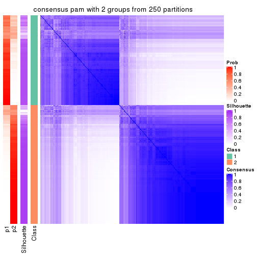</p>

</div>
<div id='tab-ATC-pam-consensus-heatmap-2'>
<pre><code class="r">consensus_heatmap(res, k = 3)
</code></pre>

<p>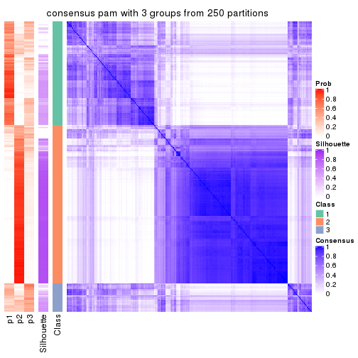</p>

</div>
<div id='tab-ATC-pam-consensus-heatmap-3'>
<pre><code class="r">consensus_heatmap(res, k = 4)
</code></pre>

<p>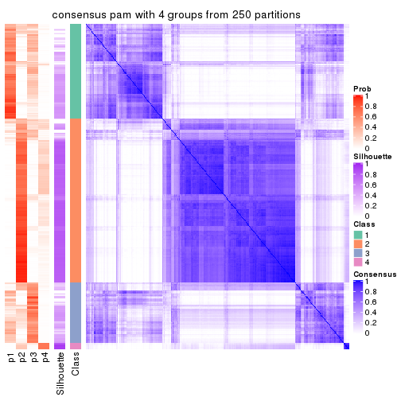</p>

</div>
<div id='tab-ATC-pam-consensus-heatmap-4'>
<pre><code class="r">consensus_heatmap(res, k = 5)
</code></pre>

<p>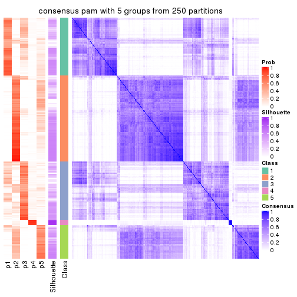</p>

</div>
<div id='tab-ATC-pam-consensus-heatmap-5'>
<pre><code class="r">consensus_heatmap(res, k = 6)
</code></pre>

<p>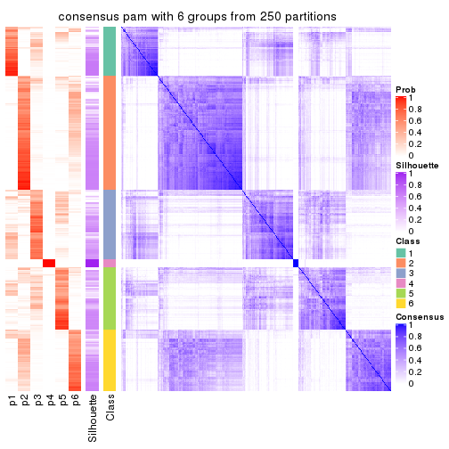</p>

</div>
</div>

Heatmaps for the membership of samples in all partitions to see how consistent they are:


<script>
$( function() {
	$( '#tabs-ATC-pam-membership-heatmap' ).tabs();
} );
</script>
<div id='tabs-ATC-pam-membership-heatmap'>
<ul>
<li><a href='#tab-ATC-pam-membership-heatmap-1'>k = 2</a></li>
<li><a href='#tab-ATC-pam-membership-heatmap-2'>k = 3</a></li>
<li><a href='#tab-ATC-pam-membership-heatmap-3'>k = 4</a></li>
<li><a href='#tab-ATC-pam-membership-heatmap-4'>k = 5</a></li>
<li><a href='#tab-ATC-pam-membership-heatmap-5'>k = 6</a></li>
</ul>
<div id='tab-ATC-pam-membership-heatmap-1'>
<pre><code class="r">membership_heatmap(res, k = 2)
</code></pre>

<p>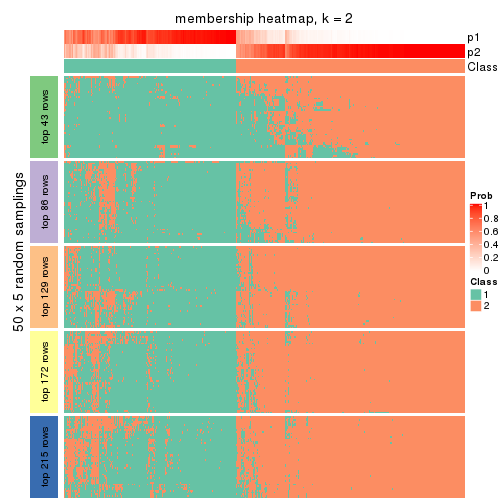</p>

</div>
<div id='tab-ATC-pam-membership-heatmap-2'>
<pre><code class="r">membership_heatmap(res, k = 3)
</code></pre>

<p>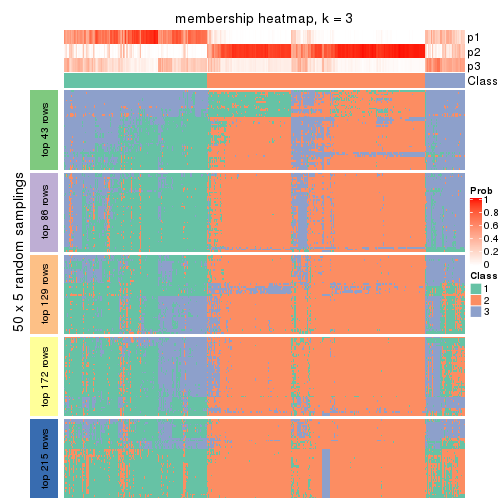</p>

</div>
<div id='tab-ATC-pam-membership-heatmap-3'>
<pre><code class="r">membership_heatmap(res, k = 4)
</code></pre>

<p>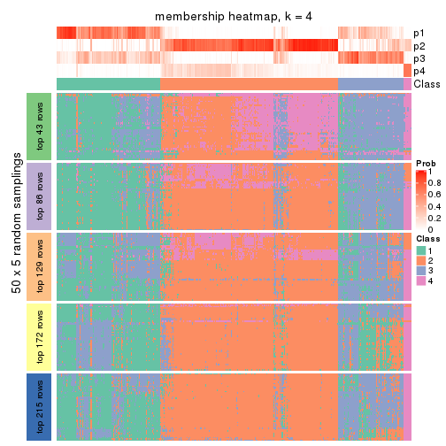</p>

</div>
<div id='tab-ATC-pam-membership-heatmap-4'>
<pre><code class="r">membership_heatmap(res, k = 5)
</code></pre>

<p>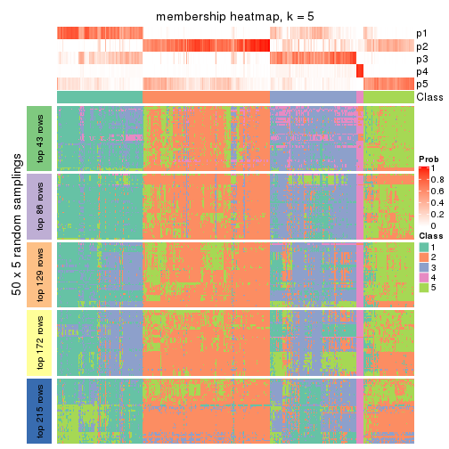</p>

</div>
<div id='tab-ATC-pam-membership-heatmap-5'>
<pre><code class="r">membership_heatmap(res, k = 6)
</code></pre>

<p>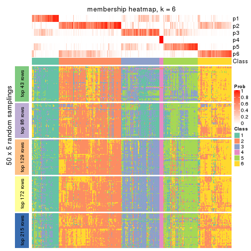</p>

</div>
</div>

As soon as we have had the classes for columns, we can look for signatures
which are significantly different between classes which can be candidate marks
for certain classes. Following are the heatmaps for signatures.


Signature heatmaps where rows are scaled:


<script>
$( function() {
	$( '#tabs-ATC-pam-get-signatures' ).tabs();
} );
</script>
<div id='tabs-ATC-pam-get-signatures'>
<ul>
<li><a href='#tab-ATC-pam-get-signatures-1'>k = 2</a></li>
<li><a href='#tab-ATC-pam-get-signatures-2'>k = 3</a></li>
<li><a href='#tab-ATC-pam-get-signatures-3'>k = 4</a></li>
<li><a href='#tab-ATC-pam-get-signatures-4'>k = 5</a></li>
<li><a href='#tab-ATC-pam-get-signatures-5'>k = 6</a></li>
</ul>
<div id='tab-ATC-pam-get-signatures-1'>
<pre><code class="r">get_signatures(res, k = 2)
</code></pre>

<p>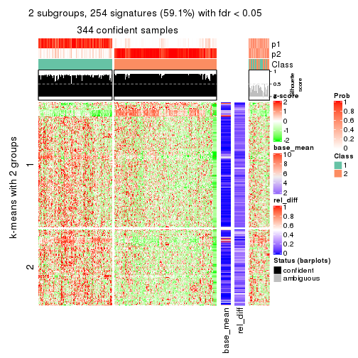</p>

</div>
<div id='tab-ATC-pam-get-signatures-2'>
<pre><code class="r">get_signatures(res, k = 3)
</code></pre>

<p>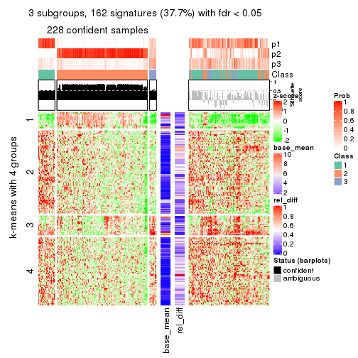</p>

</div>
<div id='tab-ATC-pam-get-signatures-3'>
<pre><code class="r">get_signatures(res, k = 4)
</code></pre>

<p>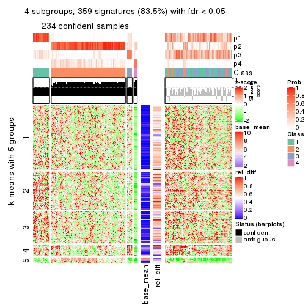</p>

</div>
<div id='tab-ATC-pam-get-signatures-4'>
<pre><code class="r">get_signatures(res, k = 5)
</code></pre>

<p>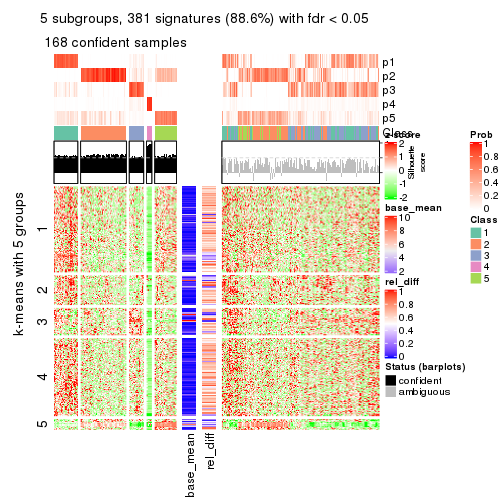</p>

</div>
<div id='tab-ATC-pam-get-signatures-5'>
<pre><code class="r">get_signatures(res, k = 6)
</code></pre>

<p>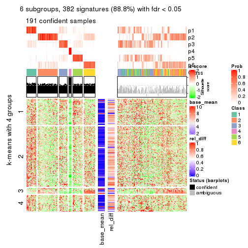</p>

</div>
</div>


Signature heatmaps where rows are not scaled:


<script>
$( function() {
	$( '#tabs-ATC-pam-get-signatures-no-scale' ).tabs();
} );
</script>
<div id='tabs-ATC-pam-get-signatures-no-scale'>
<ul>
<li><a href='#tab-ATC-pam-get-signatures-no-scale-1'>k = 2</a></li>
<li><a href='#tab-ATC-pam-get-signatures-no-scale-2'>k = 3</a></li>
<li><a href='#tab-ATC-pam-get-signatures-no-scale-3'>k = 4</a></li>
<li><a href='#tab-ATC-pam-get-signatures-no-scale-4'>k = 5</a></li>
<li><a href='#tab-ATC-pam-get-signatures-no-scale-5'>k = 6</a></li>
</ul>
<div id='tab-ATC-pam-get-signatures-no-scale-1'>
<pre><code class="r">get_signatures(res, k = 2, scale_rows = FALSE)
</code></pre>

<p>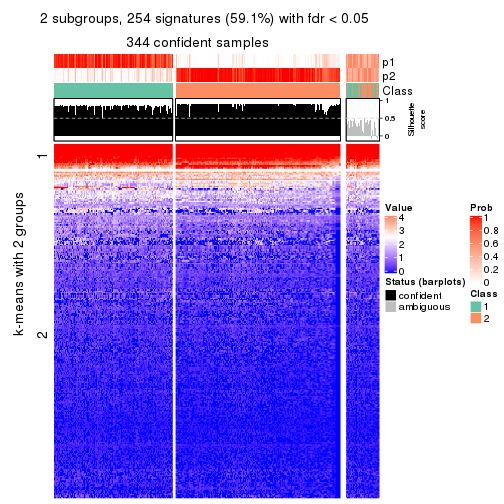</p>

</div>
<div id='tab-ATC-pam-get-signatures-no-scale-2'>
<pre><code class="r">get_signatures(res, k = 3, scale_rows = FALSE)
</code></pre>

<p>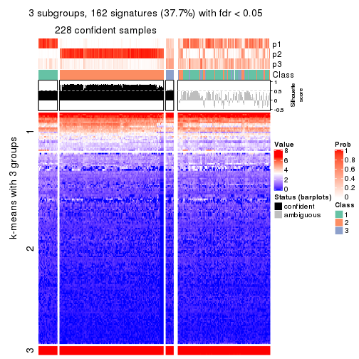</p>

</div>
<div id='tab-ATC-pam-get-signatures-no-scale-3'>
<pre><code class="r">get_signatures(res, k = 4, scale_rows = FALSE)
</code></pre>

<p>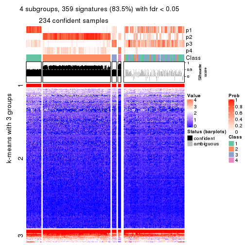</p>

</div>
<div id='tab-ATC-pam-get-signatures-no-scale-4'>
<pre><code class="r">get_signatures(res, k = 5, scale_rows = FALSE)
</code></pre>

<p>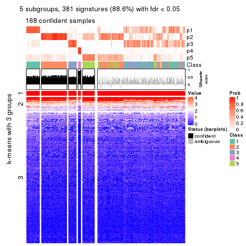</p>

</div>
<div id='tab-ATC-pam-get-signatures-no-scale-5'>
<pre><code class="r">get_signatures(res, k = 6, scale_rows = FALSE)
</code></pre>

<p>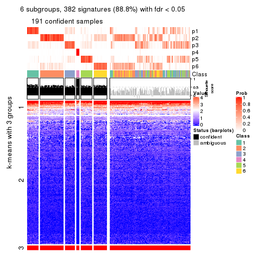</p>

</div>
</div>


Compare the overlap of signatures from different k:

```r
compare_signatures(res)
```

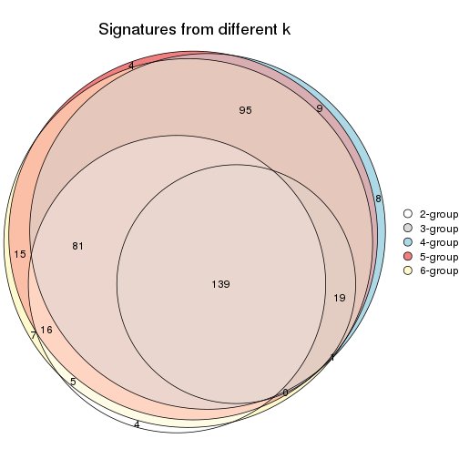

`get_signature()` returns a data frame invisibly. TO get the list of signatures, the function
call should be assigned to a variable explicitly. In following code, if `plot` argument is set
to `FALSE`, no heatmap is plotted while only the differential analysis is performed.

```r
# code only for demonstration
tb = get_signature(res, k = ..., plot = FALSE)
```

An example of the output of `tb` is:

```
#>   which_row         fdr    mean_1    mean_2 scaled_mean_1 scaled_mean_2 km
#> 1        38 0.042760348  8.373488  9.131774    -0.5533452     0.5164555  1
#> 2        40 0.018707592  7.106213  8.469186    -0.6173731     0.5762149  1
#> 3        55 0.019134737 10.221463 11.207825    -0.6159697     0.5749050  1
#> 4        59 0.006059896  5.921854  7.869574    -0.6899429     0.6439467  1
#> 5        60 0.018055526  8.928898 10.211722    -0.6204761     0.5791110  1
#> 6        98 0.009384629 15.714769 14.887706     0.6635654    -0.6193277  2
...
```

The columns in `tb` are:

1. `which_row`: row indices corresponding to the input matrix.
2. `fdr`: FDR for the differential test. 
3. `mean_x`: The mean value in group x.
4. `scaled_mean_x`: The mean value in group x after rows are scaled.
5. `km`: Row groups if k-means clustering is applied to rows.


UMAP plot which shows how samples are separated.


<script>
$( function() {
	$( '#tabs-ATC-pam-dimension-reduction' ).tabs();
} );
</script>
<div id='tabs-ATC-pam-dimension-reduction'>
<ul>
<li><a href='#tab-ATC-pam-dimension-reduction-1'>k = 2</a></li>
<li><a href='#tab-ATC-pam-dimension-reduction-2'>k = 3</a></li>
<li><a href='#tab-ATC-pam-dimension-reduction-3'>k = 4</a></li>
<li><a href='#tab-ATC-pam-dimension-reduction-4'>k = 5</a></li>
<li><a href='#tab-ATC-pam-dimension-reduction-5'>k = 6</a></li>
</ul>
<div id='tab-ATC-pam-dimension-reduction-1'>
<pre><code class="r">dimension_reduction(res, k = 2, method = &quot;UMAP&quot;)
</code></pre>

<p>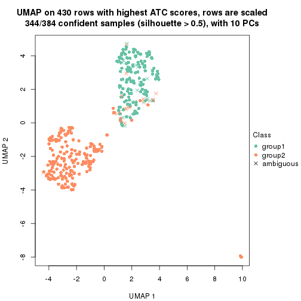</p>

</div>
<div id='tab-ATC-pam-dimension-reduction-2'>
<pre><code class="r">dimension_reduction(res, k = 3, method = &quot;UMAP&quot;)
</code></pre>

<p>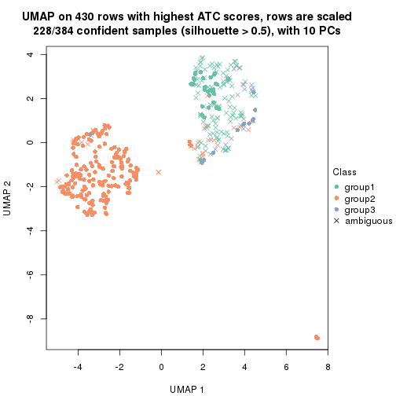</p>

</div>
<div id='tab-ATC-pam-dimension-reduction-3'>
<pre><code class="r">dimension_reduction(res, k = 4, method = &quot;UMAP&quot;)
</code></pre>

<p>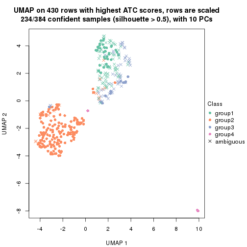</p>

</div>
<div id='tab-ATC-pam-dimension-reduction-4'>
<pre><code class="r">dimension_reduction(res, k = 5, method = &quot;UMAP&quot;)
</code></pre>

<p>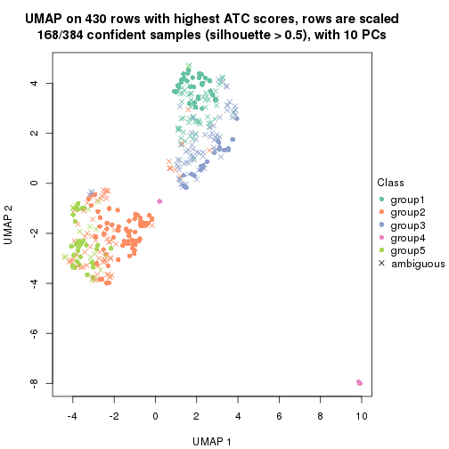</p>

</div>
<div id='tab-ATC-pam-dimension-reduction-5'>
<pre><code class="r">dimension_reduction(res, k = 6, method = &quot;UMAP&quot;)
</code></pre>

<p>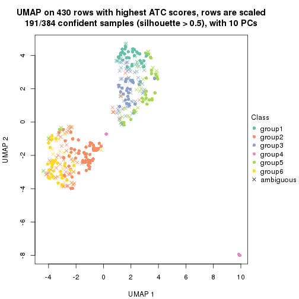</p>

</div>
</div>


Following heatmap shows how subgroups are split when increasing `k`:

```r
collect_classes(res)
```

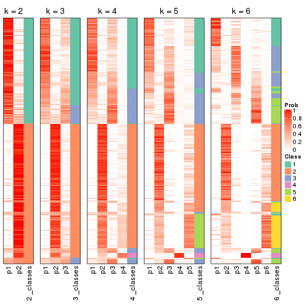


If matrix rows can be associated to genes, consider to use `GO_Enrichment(res,
...)` to perform function enrichment for the signature genes.


 

---------------------------------------------------


### ATC:mclust**


The object with results only for a single top-value method and a single partition method 
can be extracted as:

```r
res = res_list["ATC", "mclust"]
# you can also extract it by
# res = res_list["ATC:mclust"]
```

A summary of `res` and all the functions that can be applied to it:

```r
res
```

```
#> A 'ConsensusPartition' object with k = 2, 3, 4, 5, 6.
#>   On a matrix with 430 rows and 384 columns.
#>   Top rows (43, 86, 129, 172, 215) are extracted by 'ATC' method.
#>   Subgroups are detected by 'mclust' method.
#>   Performed in total 1250 partitions by row resampling.
#>   Best k for subgroups seems to be 2.
#> 
#> Following methods can be applied to this 'ConsensusPartition' object:
#>  [1] "cola_report"             "collect_classes"         "collect_plots"          
#>  [4] "collect_stats"           "colnames"                "compare_signatures"     
#>  [7] "consensus_heatmap"       "dimension_reduction"     "functional_enrichment"  
#> [10] "get_anno_col"            "get_anno"                "get_classes"            
#> [13] "get_consensus"           "get_matrix"              "get_membership"         
#> [16] "get_param"               "get_signatures"          "get_stats"              
#> [19] "is_best_k"               "is_stable_k"             "membership_heatmap"     
#> [22] "ncol"                    "nrow"                    "plot_ecdf"              
#> [25] "rownames"                "select_partition_number" "show"                   
#> [28] "suggest_best_k"          "test_to_known_factors"
```

`collect_plots()` function collects all the plots made from `res` for all `k` (number of partitions)
into one single page to provide an easy and fast comparison between different `k`.

```r
collect_plots(res)
```

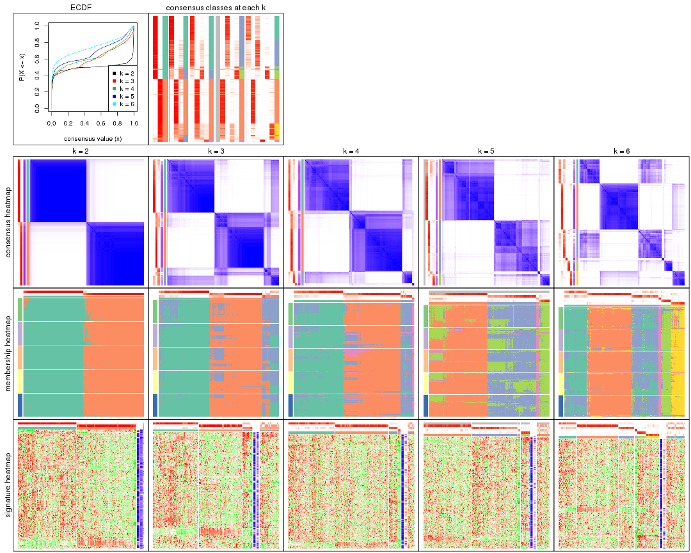

The plots are:

- The first row: a plot of the ECDF (Empirical cumulative distribution
  function) curves of the consensus matrix for each `k` and the heatmap of
  predicted classes for each `k`.
- The second row: heatmaps of the consensus matrix for each `k`.
- The third row: heatmaps of the membership matrix for each `k`.
- The fouth row: heatmaps of the signatures for each `k`.

All the plots in panels can be made by individual functions and they are
plotted later in this section.

`select_partition_number()` produces several plots showing different
statistics for choosing "optimized" `k`. There are following statistics:

- ECDF curves of the consensus matrix for each `k`;
- 1-PAC. [The PAC
  score](https://en.wikipedia.org/wiki/Consensus_clustering#Over-interpretation_potential_of_consensus_clustering)
  measures the proportion of the ambiguous subgrouping.
- Mean silhouette score.
- Concordance. The mean probability of fiting the consensus class ids in all
  partitions.
- Area increased. Denote $A_k$ as the area under the ECDF curve for current
  `k`, the area increased is defined as $A_k - A_{k-1}$.
- Rand index. The percent of pairs of samples that are both in a same cluster
  or both are not in a same cluster in the partition of k and k-1.
- Jaccard index. The ratio of pairs of samples are both in a same cluster in
  the partition of k and k-1 and the pairs of samples are both in a same
  cluster in the partition k or k-1.

The detailed explanations of these statistics can be found in [the cola
vignette](http://bioconductor.org/packages/devel/bioc/vignettes/cola/inst/doc/cola.html#toc_13).

Generally speaking, lower PAC score, higher mean silhouette score or higher
concordance corresponds to better partition. Rand index and Jaccard index
measure how similar the current partition is compared to partition with `k-1`.
If they are too similar, we won't accept `k` is better than `k-1`.

```r
select_partition_number(res)
```

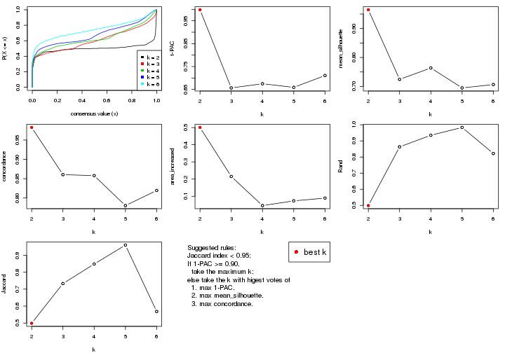

The numeric values for all these statistics can be obtained by `get_stats()`.

```r
get_stats(res)
```

```
#>   k 1-PAC mean_silhouette concordance area_increased  Rand Jaccard
#> 2 2 0.998           0.964       0.982         0.5005 0.499   0.499
#> 3 3 0.657           0.725       0.861         0.2152 0.863   0.733
#> 4 4 0.675           0.764       0.858         0.0460 0.935   0.848
#> 5 5 0.659           0.695       0.781         0.0734 0.984   0.960
#> 6 6 0.711           0.707       0.820         0.0895 0.822   0.568
```

`suggest_best_k()` suggests the best $k$ based on these statistics. The rules are as follows:

- All $k$ with Jaccard index larger than 0.95 are removed because the increase of
  the partition number does not provides enough extra information. If all $k$ are removed,
  the best $k$ is assigned by `NA`.
- For $k$ with 1-PAC larger than 0.9, the maximal $k$ is taken as the "best k". Other $k$ is called "optional k".
- If it does not fit the second rule. The $k$ with the highest vote of highest
  1-PAC, mean silhouette and concordance is taken as the "best k".

```r
suggest_best_k(res)
```

```
#> [1] 2
```


Following shows the table of the partitions (You need to click the **show/hide
code output** link to see it). The membership matrix (columns with name `p*`)
is inferred by
[`clue::cl_consensus()`](https://www.rdocumentation.org/link/cl_consensus?package=clue)
function with the `SE` method. Basically the value in the membership matrix
represents the probability to belong to a certain group. The finall class
label for an item is determined with the group with highest probability it
belongs to.

In `get_classes()` function, the entropy is calculated from the membership
matrix and the silhouette score is calculated from the consensus matrix.


<script>
$( function() {
	$( '#tabs-ATC-mclust-get-classes' ).tabs();
} );
</script>
<div id='tabs-ATC-mclust-get-classes'>
<ul>
<li><a href='#tab-ATC-mclust-get-classes-1'>k = 2</a></li>
<li><a href='#tab-ATC-mclust-get-classes-2'>k = 3</a></li>
<li><a href='#tab-ATC-mclust-get-classes-3'>k = 4</a></li>
<li><a href='#tab-ATC-mclust-get-classes-4'>k = 5</a></li>
<li><a href='#tab-ATC-mclust-get-classes-5'>k = 6</a></li>
</ul>

<div id='tab-ATC-mclust-get-classes-1'>
<p><a id='tab-ATC-mclust-get-classes-1-a' style='color:#0366d6' href='#'>show/hide code output</a></p>
<pre><code class="r">cbind(get_classes(res, k = 2), get_membership(res, k = 2))
</code></pre>

<pre><code>#&gt;            class entropy silhouette    p1    p2
#&gt; SRR2105277     1  0.0000     0.9911 1.000 0.000
#&gt; SRR2105278     1  0.0000     0.9911 1.000 0.000
#&gt; SRR2105275     1  0.0376     0.9881 0.996 0.004
#&gt; SRR2105276     1  0.0376     0.9881 0.996 0.004
#&gt; SRR2105273     1  0.0000     0.9911 1.000 0.000
#&gt; SRR2105274     1  0.0000     0.9911 1.000 0.000
#&gt; SRR2105271     1  0.0000     0.9911 1.000 0.000
#&gt; SRR2105272     1  0.0000     0.9911 1.000 0.000
#&gt; SRR2105269     2  0.0000     0.9738 0.000 1.000
#&gt; SRR2105270     2  0.0376     0.9731 0.004 0.996
#&gt; SRR2105267     2  0.0000     0.9738 0.000 1.000
#&gt; SRR2105268     2  0.0000     0.9738 0.000 1.000
#&gt; SRR2105265     2  0.0000     0.9738 0.000 1.000
#&gt; SRR2105266     2  0.0000     0.9738 0.000 1.000
#&gt; SRR2105263     2  0.0000     0.9738 0.000 1.000
#&gt; SRR2105264     2  0.0000     0.9738 0.000 1.000
#&gt; SRR2105261     1  0.7376     0.7350 0.792 0.208
#&gt; SRR2105262     1  0.3584     0.9256 0.932 0.068
#&gt; SRR2105357     1  0.0672     0.9849 0.992 0.008
#&gt; SRR2105358     1  0.0000     0.9911 1.000 0.000
#&gt; SRR2105439     2  0.0938     0.9705 0.012 0.988
#&gt; SRR2105440     2  0.0672     0.9721 0.008 0.992
#&gt; SRR2105509     2  0.0672     0.9721 0.008 0.992
#&gt; SRR2105510     2  0.0376     0.9731 0.004 0.996
#&gt; SRR2105507     1  0.0000     0.9911 1.000 0.000
#&gt; SRR2105508     1  0.0000     0.9911 1.000 0.000
#&gt; SRR2105505     1  0.0000     0.9911 1.000 0.000
#&gt; SRR2105506     1  0.0000     0.9911 1.000 0.000
#&gt; SRR2105503     2  0.0000     0.9738 0.000 1.000
#&gt; SRR2105504     2  0.4022     0.9170 0.080 0.920
#&gt; SRR2105501     2  0.1843     0.9603 0.028 0.972
#&gt; SRR2105502     2  0.3431     0.9317 0.064 0.936
#&gt; SRR2105499     1  0.0000     0.9911 1.000 0.000
#&gt; SRR2105500     1  0.0000     0.9911 1.000 0.000
#&gt; SRR2105497     2  0.0938     0.9707 0.012 0.988
#&gt; SRR2105498     2  0.0938     0.9704 0.012 0.988
#&gt; SRR2105495     2  0.0672     0.9721 0.008 0.992
#&gt; SRR2105496     2  0.0672     0.9721 0.008 0.992
#&gt; SRR2105493     2  0.0938     0.9705 0.012 0.988
#&gt; SRR2105494     2  0.0938     0.9705 0.012 0.988
#&gt; SRR2105491     2  0.0938     0.9704 0.012 0.988
#&gt; SRR2105492     2  0.1414     0.9659 0.020 0.980
#&gt; SRR2105489     2  0.0000     0.9738 0.000 1.000
#&gt; SRR2105490     2  0.0000     0.9738 0.000 1.000
#&gt; SRR2105487     1  0.0000     0.9911 1.000 0.000
#&gt; SRR2105488     1  0.0376     0.9881 0.996 0.004
#&gt; SRR2105485     1  0.0000     0.9911 1.000 0.000
#&gt; SRR2105486     1  0.0000     0.9911 1.000 0.000
#&gt; SRR2105483     1  0.0000     0.9911 1.000 0.000
#&gt; SRR2105484     1  0.0000     0.9911 1.000 0.000
#&gt; SRR2105481     1  0.0000     0.9911 1.000 0.000
#&gt; SRR2105482     1  0.0000     0.9911 1.000 0.000
#&gt; SRR2105479     1  0.0672     0.9849 0.992 0.008
#&gt; SRR2105480     1  0.0000     0.9911 1.000 0.000
#&gt; SRR2105477     2  0.0672     0.9721 0.008 0.992
#&gt; SRR2105478     2  0.0938     0.9706 0.012 0.988
#&gt; SRR2105475     2  0.0938     0.9705 0.012 0.988
#&gt; SRR2105476     2  0.0000     0.9738 0.000 1.000
#&gt; SRR2105473     2  0.1184     0.9685 0.016 0.984
#&gt; SRR2105474     2  0.1184     0.9685 0.016 0.984
#&gt; SRR2105471     2  0.0000     0.9738 0.000 1.000
#&gt; SRR2105472     2  0.0000     0.9738 0.000 1.000
#&gt; SRR2105469     1  0.0000     0.9911 1.000 0.000
#&gt; SRR2105470     1  0.0000     0.9911 1.000 0.000
#&gt; SRR2105467     1  0.0000     0.9911 1.000 0.000
#&gt; SRR2105468     1  0.0000     0.9911 1.000 0.000
#&gt; SRR2105465     1  0.0000     0.9911 1.000 0.000
#&gt; SRR2105466     1  0.0000     0.9911 1.000 0.000
#&gt; SRR2105463     1  0.0000     0.9911 1.000 0.000
#&gt; SRR2105464     1  0.0000     0.9911 1.000 0.000
#&gt; SRR2105461     2  0.0000     0.9738 0.000 1.000
#&gt; SRR2105462     2  0.0000     0.9738 0.000 1.000
#&gt; SRR2105459     2  0.0000     0.9738 0.000 1.000
#&gt; SRR2105460     2  0.0000     0.9738 0.000 1.000
#&gt; SRR2105457     1  0.0000     0.9911 1.000 0.000
#&gt; SRR2105458     1  0.0000     0.9911 1.000 0.000
#&gt; SRR2105455     1  0.0000     0.9911 1.000 0.000
#&gt; SRR2105456     1  0.0000     0.9911 1.000 0.000
#&gt; SRR2105453     1  0.0000     0.9911 1.000 0.000
#&gt; SRR2105454     1  0.0000     0.9911 1.000 0.000
#&gt; SRR2105451     2  0.1184     0.9686 0.016 0.984
#&gt; SRR2105452     2  0.5842     0.8522 0.140 0.860
#&gt; SRR2105449     1  0.0000     0.9911 1.000 0.000
#&gt; SRR2105450     1  0.0000     0.9911 1.000 0.000
#&gt; SRR2105447     2  0.0672     0.9713 0.008 0.992
#&gt; SRR2105448     2  0.0376     0.9731 0.004 0.996
#&gt; SRR2105445     2  0.9580     0.4372 0.380 0.620
#&gt; SRR2105446     1  0.6801     0.7737 0.820 0.180
#&gt; SRR2105443     2  0.1633     0.9637 0.024 0.976
#&gt; SRR2105444     2  0.1184     0.9685 0.016 0.984
#&gt; SRR2105441     2  0.0000     0.9738 0.000 1.000
#&gt; SRR2105442     2  0.0000     0.9738 0.000 1.000
#&gt; SRR2105437     1  0.0000     0.9911 1.000 0.000
#&gt; SRR2105438     1  0.0000     0.9911 1.000 0.000
#&gt; SRR2105435     1  0.0000     0.9911 1.000 0.000
#&gt; SRR2105436     1  0.0000     0.9911 1.000 0.000
#&gt; SRR2105433     1  0.0000     0.9911 1.000 0.000
#&gt; SRR2105434     1  0.0000     0.9911 1.000 0.000
#&gt; SRR2105431     1  0.0000     0.9911 1.000 0.000
#&gt; SRR2105432     1  0.0000     0.9911 1.000 0.000
#&gt; SRR2105429     2  0.3584     0.9288 0.068 0.932
#&gt; SRR2105430     2  0.2603     0.9488 0.044 0.956
#&gt; SRR2105427     2  0.0672     0.9721 0.008 0.992
#&gt; SRR2105428     2  0.0672     0.9721 0.008 0.992
#&gt; SRR2105425     2  0.0938     0.9701 0.012 0.988
#&gt; SRR2105426     2  0.0672     0.9721 0.008 0.992
#&gt; SRR2105421     1  0.2043     0.9636 0.968 0.032
#&gt; SRR2105422     1  0.0000     0.9911 1.000 0.000
#&gt; SRR2105423     2  0.0000     0.9738 0.000 1.000
#&gt; SRR2105424     2  0.0000     0.9738 0.000 1.000
#&gt; SRR2105419     1  0.0000     0.9911 1.000 0.000
#&gt; SRR2105420     1  0.0000     0.9911 1.000 0.000
#&gt; SRR2105415     1  0.0000     0.9911 1.000 0.000
#&gt; SRR2105416     1  0.0000     0.9911 1.000 0.000
#&gt; SRR2105417     1  0.0000     0.9911 1.000 0.000
#&gt; SRR2105418     1  0.0000     0.9911 1.000 0.000
#&gt; SRR2105413     2  0.0000     0.9738 0.000 1.000
#&gt; SRR2105414     2  0.0000     0.9738 0.000 1.000
#&gt; SRR2105409     2  0.0000     0.9738 0.000 1.000
#&gt; SRR2105410     2  0.0376     0.9731 0.004 0.996
#&gt; SRR2105411     2  0.0000     0.9738 0.000 1.000
#&gt; SRR2105412     2  0.0000     0.9738 0.000 1.000
#&gt; SRR2105407     1  0.0000     0.9911 1.000 0.000
#&gt; SRR2105408     1  0.0000     0.9911 1.000 0.000
#&gt; SRR2105403     1  0.0000     0.9911 1.000 0.000
#&gt; SRR2105404     1  0.0000     0.9911 1.000 0.000
#&gt; SRR2105405     1  0.0000     0.9911 1.000 0.000
#&gt; SRR2105406     1  0.0000     0.9911 1.000 0.000
#&gt; SRR2105401     2  0.0938     0.9705 0.012 0.988
#&gt; SRR2105402     2  0.4562     0.9010 0.096 0.904
#&gt; SRR2105399     2  0.4161     0.9126 0.084 0.916
#&gt; SRR2105400     2  0.3879     0.9196 0.076 0.924
#&gt; SRR2105397     2  0.4161     0.9138 0.084 0.916
#&gt; SRR2105398     2  0.3431     0.9324 0.064 0.936
#&gt; SRR2105395     2  0.0000     0.9738 0.000 1.000
#&gt; SRR2105396     2  0.0000     0.9738 0.000 1.000
#&gt; SRR2105393     2  0.0000     0.9738 0.000 1.000
#&gt; SRR2105394     2  0.0000     0.9738 0.000 1.000
#&gt; SRR2105389     1  0.0000     0.9911 1.000 0.000
#&gt; SRR2105390     1  0.0000     0.9911 1.000 0.000
#&gt; SRR2105391     1  0.0000     0.9911 1.000 0.000
#&gt; SRR2105392     1  0.0000     0.9911 1.000 0.000
#&gt; SRR2105385     1  0.0000     0.9911 1.000 0.000
#&gt; SRR2105386     1  0.0000     0.9911 1.000 0.000
#&gt; SRR2105387     1  0.0000     0.9911 1.000 0.000
#&gt; SRR2105388     1  0.0000     0.9911 1.000 0.000
#&gt; SRR2105381     2  0.3114     0.9384 0.056 0.944
#&gt; SRR2105382     2  0.0376     0.9731 0.004 0.996
#&gt; SRR2105383     2  0.7674     0.7387 0.224 0.776
#&gt; SRR2105384     2  0.8081     0.7011 0.248 0.752
#&gt; SRR2105379     2  0.0000     0.9738 0.000 1.000
#&gt; SRR2105380     2  0.1184     0.9683 0.016 0.984
#&gt; SRR2105377     2  0.0672     0.9721 0.008 0.992
#&gt; SRR2105378     2  0.0672     0.9721 0.008 0.992
#&gt; SRR2105375     1  0.1414     0.9748 0.980 0.020
#&gt; SRR2105376     1  0.0376     0.9881 0.996 0.004
#&gt; SRR2105373     1  0.0000     0.9911 1.000 0.000
#&gt; SRR2105374     1  0.0000     0.9911 1.000 0.000
#&gt; SRR2105371     1  0.0000     0.9911 1.000 0.000
#&gt; SRR2105372     1  0.0000     0.9911 1.000 0.000
#&gt; SRR2105369     1  0.0000     0.9911 1.000 0.000
#&gt; SRR2105370     1  0.0000     0.9911 1.000 0.000
#&gt; SRR2105367     1  0.0000     0.9911 1.000 0.000
#&gt; SRR2105368     1  0.2603     0.9514 0.956 0.044
#&gt; SRR2105365     2  0.0938     0.9706 0.012 0.988
#&gt; SRR2105366     2  0.0000     0.9738 0.000 1.000
#&gt; SRR2105363     2  0.0376     0.9731 0.004 0.996
#&gt; SRR2105364     2  0.0376     0.9731 0.004 0.996
#&gt; SRR2105361     2  0.0000     0.9738 0.000 1.000
#&gt; SRR2105362     2  0.0000     0.9738 0.000 1.000
#&gt; SRR2105359     1  0.0000     0.9911 1.000 0.000
#&gt; SRR2105360     1  0.0000     0.9911 1.000 0.000
#&gt; SRR2105355     1  0.0000     0.9911 1.000 0.000
#&gt; SRR2105356     1  0.0000     0.9911 1.000 0.000
#&gt; SRR2105353     1  0.0000     0.9911 1.000 0.000
#&gt; SRR2105354     1  0.0000     0.9911 1.000 0.000
#&gt; SRR2105351     2  0.0000     0.9738 0.000 1.000
#&gt; SRR2105352     2  0.4562     0.9010 0.096 0.904
#&gt; SRR2105349     2  0.0000     0.9738 0.000 1.000
#&gt; SRR2105350     2  0.0000     0.9738 0.000 1.000
#&gt; SRR2105345     2  0.0376     0.9731 0.004 0.996
#&gt; SRR2105346     2  0.0000     0.9738 0.000 1.000
#&gt; SRR2105347     2  0.4022     0.9166 0.080 0.920
#&gt; SRR2105348     2  0.7056     0.7862 0.192 0.808
#&gt; SRR2105343     2  0.0000     0.9738 0.000 1.000
#&gt; SRR2105344     2  0.0000     0.9738 0.000 1.000
#&gt; SRR2105341     1  0.0000     0.9911 1.000 0.000
#&gt; SRR2105342     1  0.0000     0.9911 1.000 0.000
#&gt; SRR2105339     1  0.0000     0.9911 1.000 0.000
#&gt; SRR2105340     1  0.0000     0.9911 1.000 0.000
#&gt; SRR2105335     1  0.0000     0.9911 1.000 0.000
#&gt; SRR2105336     1  0.0000     0.9911 1.000 0.000
#&gt; SRR2105337     1  0.0000     0.9911 1.000 0.000
#&gt; SRR2105338     1  0.0000     0.9911 1.000 0.000
#&gt; SRR2105331     2  0.0000     0.9738 0.000 1.000
#&gt; SRR2105332     2  0.0000     0.9738 0.000 1.000
#&gt; SRR2105333     2  0.0000     0.9738 0.000 1.000
#&gt; SRR2105334     2  0.0000     0.9738 0.000 1.000
#&gt; SRR2105329     2  0.7139     0.7818 0.196 0.804
#&gt; SRR2105330     2  0.4022     0.9168 0.080 0.920
#&gt; SRR2105327     2  0.0672     0.9722 0.008 0.992
#&gt; SRR2105328     2  0.0672     0.9718 0.008 0.992
#&gt; SRR2105325     1  0.0000     0.9911 1.000 0.000
#&gt; SRR2105326     1  0.0000     0.9911 1.000 0.000
#&gt; SRR2105323     1  0.0000     0.9911 1.000 0.000
#&gt; SRR2105324     1  0.0000     0.9911 1.000 0.000
#&gt; SRR2105319     1  0.0000     0.9911 1.000 0.000
#&gt; SRR2105320     1  0.0000     0.9911 1.000 0.000
#&gt; SRR2105321     1  0.0000     0.9911 1.000 0.000
#&gt; SRR2105322     1  0.0000     0.9911 1.000 0.000
#&gt; SRR2105317     2  0.0000     0.9738 0.000 1.000
#&gt; SRR2105318     2  0.0000     0.9738 0.000 1.000
#&gt; SRR2105315     1  0.9977     0.0521 0.528 0.472
#&gt; SRR2105316     2  0.1184     0.9683 0.016 0.984
#&gt; SRR2105313     2  0.0000     0.9738 0.000 1.000
#&gt; SRR2105314     2  0.0000     0.9738 0.000 1.000
#&gt; SRR2105311     1  0.4939     0.8780 0.892 0.108
#&gt; SRR2105312     1  0.3733     0.9211 0.928 0.072
#&gt; SRR2105307     1  0.0000     0.9911 1.000 0.000
#&gt; SRR2105308     1  0.0000     0.9911 1.000 0.000
#&gt; SRR2105309     1  0.0000     0.9911 1.000 0.000
#&gt; SRR2105310     1  0.0000     0.9911 1.000 0.000
#&gt; SRR2105305     1  0.0000     0.9911 1.000 0.000
#&gt; SRR2105306     1  0.0000     0.9911 1.000 0.000
#&gt; SRR2105303     2  0.0000     0.9738 0.000 1.000
#&gt; SRR2105304     2  0.2423     0.9516 0.040 0.960
#&gt; SRR2105301     2  0.0672     0.9719 0.008 0.992
#&gt; SRR2105302     2  0.0000     0.9738 0.000 1.000
#&gt; SRR2105299     2  0.9087     0.5658 0.324 0.676
#&gt; SRR2105300     2  0.8144     0.6985 0.252 0.748
#&gt; SRR2105297     2  0.6531     0.8161 0.168 0.832
#&gt; SRR2105298     2  0.7950     0.7133 0.240 0.760
#&gt; SRR2105295     2  0.0000     0.9738 0.000 1.000
#&gt; SRR2105296     2  0.0000     0.9738 0.000 1.000
#&gt; SRR2105293     1  0.0938     0.9816 0.988 0.012
#&gt; SRR2105294     1  0.0000     0.9911 1.000 0.000
#&gt; SRR2105291     1  0.2043     0.9629 0.968 0.032
#&gt; SRR2105292     1  0.0000     0.9911 1.000 0.000
#&gt; SRR2105289     1  0.0000     0.9911 1.000 0.000
#&gt; SRR2105290     1  0.0000     0.9911 1.000 0.000
#&gt; SRR2105287     1  0.0000     0.9911 1.000 0.000
#&gt; SRR2105288     1  0.0000     0.9911 1.000 0.000
#&gt; SRR2105285     2  0.0672     0.9720 0.008 0.992
#&gt; SRR2105286     2  0.0672     0.9720 0.008 0.992
#&gt; SRR2105283     2  0.1414     0.9662 0.020 0.980
#&gt; SRR2105284     2  0.1184     0.9685 0.016 0.984
#&gt; SRR2105281     2  0.0000     0.9738 0.000 1.000
#&gt; SRR2105282     2  0.0000     0.9738 0.000 1.000
#&gt; SRR2105259     1  0.0000     0.9911 1.000 0.000
#&gt; SRR2105260     1  0.0376     0.9881 0.996 0.004
#&gt; SRR2105279     2  0.0000     0.9738 0.000 1.000
#&gt; SRR2105280     2  0.0000     0.9738 0.000 1.000
#&gt; SRR2105257     1  0.0000     0.9911 1.000 0.000
#&gt; SRR2105258     1  0.0000     0.9911 1.000 0.000
#&gt; SRR2105253     2  0.0000     0.9738 0.000 1.000
#&gt; SRR2105254     2  0.0000     0.9738 0.000 1.000
#&gt; SRR2105255     1  0.0000     0.9911 1.000 0.000
#&gt; SRR2105256     1  0.0000     0.9911 1.000 0.000
#&gt; SRR2105251     2  0.0000     0.9738 0.000 1.000
#&gt; SRR2105252     2  0.0000     0.9738 0.000 1.000
#&gt; SRR2105249     2  0.2778     0.9444 0.048 0.952
#&gt; SRR2105250     2  0.1843     0.9607 0.028 0.972
#&gt; SRR2105247     2  0.0000     0.9738 0.000 1.000
#&gt; SRR2105248     2  0.0000     0.9738 0.000 1.000
#&gt; SRR2105245     1  0.1414     0.9748 0.980 0.020
#&gt; SRR2105246     1  0.2603     0.9518 0.956 0.044
#&gt; SRR2105243     1  0.0000     0.9911 1.000 0.000
#&gt; SRR2105244     1  0.0000     0.9911 1.000 0.000
#&gt; SRR2105241     1  0.0000     0.9911 1.000 0.000
#&gt; SRR2105242     1  0.0000     0.9911 1.000 0.000
#&gt; SRR2105239     1  0.0000     0.9911 1.000 0.000
#&gt; SRR2105240     1  0.0000     0.9911 1.000 0.000
#&gt; SRR2105237     2  0.1184     0.9685 0.016 0.984
#&gt; SRR2105238     2  0.0938     0.9706 0.012 0.988
#&gt; SRR2105235     2  0.0000     0.9738 0.000 1.000
#&gt; SRR2105236     2  0.0376     0.9731 0.004 0.996
#&gt; SRR2105233     2  0.0000     0.9738 0.000 1.000
#&gt; SRR2105234     2  0.0000     0.9738 0.000 1.000
#&gt; SRR2105231     2  0.0000     0.9738 0.000 1.000
#&gt; SRR2105232     2  0.0000     0.9738 0.000 1.000
#&gt; SRR2105227     1  0.1633     0.9710 0.976 0.024
#&gt; SRR2105228     1  0.1184     0.9782 0.984 0.016
#&gt; SRR2105225     1  0.0000     0.9911 1.000 0.000
#&gt; SRR2105226     1  0.0000     0.9911 1.000 0.000
#&gt; SRR2105229     1  0.0000     0.9911 1.000 0.000
#&gt; SRR2105230     1  0.0000     0.9911 1.000 0.000
#&gt; SRR2105219     2  0.0000     0.9738 0.000 1.000
#&gt; SRR2105220     2  0.0000     0.9738 0.000 1.000
#&gt; SRR2105221     2  0.1184     0.9685 0.016 0.984
#&gt; SRR2105222     2  0.0938     0.9705 0.012 0.988
#&gt; SRR2105223     1  0.0000     0.9911 1.000 0.000
#&gt; SRR2105224     1  0.0000     0.9911 1.000 0.000
#&gt; SRR2105217     2  0.0000     0.9738 0.000 1.000
#&gt; SRR2105218     2  0.0000     0.9738 0.000 1.000
#&gt; SRR2105215     2  0.0000     0.9738 0.000 1.000
#&gt; SRR2105216     2  0.0000     0.9738 0.000 1.000
#&gt; SRR2105213     1  0.3274     0.9344 0.940 0.060
#&gt; SRR2105214     1  0.1633     0.9711 0.976 0.024
#&gt; SRR2105211     1  0.0000     0.9911 1.000 0.000
#&gt; SRR2105212     1  0.0000     0.9911 1.000 0.000
#&gt; SRR2105209     1  0.0000     0.9911 1.000 0.000
#&gt; SRR2105210     1  0.0000     0.9911 1.000 0.000
#&gt; SRR2105207     1  0.0000     0.9911 1.000 0.000
#&gt; SRR2105208     1  0.0000     0.9911 1.000 0.000
#&gt; SRR2105205     2  0.0000     0.9738 0.000 1.000
#&gt; SRR2105206     2  0.0376     0.9731 0.004 0.996
#&gt; SRR2105201     2  0.0672     0.9721 0.008 0.992
#&gt; SRR2105202     2  0.0672     0.9721 0.008 0.992
#&gt; SRR2105203     2  0.0376     0.9731 0.004 0.996
#&gt; SRR2105204     2  0.0000     0.9738 0.000 1.000
#&gt; SRR2105199     2  0.0000     0.9738 0.000 1.000
#&gt; SRR2105200     2  0.0376     0.9731 0.004 0.996
#&gt; SRR2105197     1  0.0000     0.9911 1.000 0.000
#&gt; SRR2105198     1  0.0000     0.9911 1.000 0.000
#&gt; SRR2105195     1  0.0000     0.9911 1.000 0.000
#&gt; SRR2105196     1  0.2423     0.9554 0.960 0.040
#&gt; SRR2105193     1  0.0000     0.9911 1.000 0.000
#&gt; SRR2105194     1  0.0000     0.9911 1.000 0.000
#&gt; SRR2105191     1  0.0000     0.9911 1.000 0.000
#&gt; SRR2105192     1  0.0000     0.9911 1.000 0.000
#&gt; SRR2105189     2  0.0672     0.9720 0.008 0.992
#&gt; SRR2105190     2  0.0376     0.9731 0.004 0.996
#&gt; SRR2105187     2  0.1414     0.9658 0.020 0.980
#&gt; SRR2105188     2  0.1633     0.9637 0.024 0.976
#&gt; SRR2105179     1  0.0000     0.9911 1.000 0.000
#&gt; SRR2105180     1  0.0000     0.9911 1.000 0.000
#&gt; SRR2105183     2  0.0000     0.9738 0.000 1.000
#&gt; SRR2105184     2  0.0000     0.9738 0.000 1.000
#&gt; SRR2105185     2  0.1184     0.9683 0.016 0.984
#&gt; SRR2105186     2  0.0376     0.9730 0.004 0.996
#&gt; SRR2105181     1  0.0000     0.9911 1.000 0.000
#&gt; SRR2105182     1  0.0000     0.9911 1.000 0.000
#&gt; SRR2105177     1  0.0000     0.9911 1.000 0.000
#&gt; SRR2105178     1  0.0000     0.9911 1.000 0.000
#&gt; SRR2105171     2  0.0000     0.9738 0.000 1.000
#&gt; SRR2105172     2  0.0000     0.9738 0.000 1.000
#&gt; SRR2105175     1  0.1184     0.9782 0.984 0.016
#&gt; SRR2105176     1  0.0000     0.9911 1.000 0.000
#&gt; SRR2105173     2  0.0000     0.9738 0.000 1.000
#&gt; SRR2105174     2  0.0000     0.9738 0.000 1.000
#&gt; SRR2105169     2  0.0000     0.9738 0.000 1.000
#&gt; SRR2105170     2  0.0000     0.9738 0.000 1.000
#&gt; SRR2105167     2  0.0000     0.9738 0.000 1.000
#&gt; SRR2105168     2  0.0000     0.9738 0.000 1.000
#&gt; SRR2105165     1  0.0000     0.9911 1.000 0.000
#&gt; SRR2105166     1  0.0000     0.9911 1.000 0.000
#&gt; SRR2105163     1  0.1184     0.9783 0.984 0.016
#&gt; SRR2105164     1  0.0000     0.9911 1.000 0.000
#&gt; SRR2105161     1  0.0000     0.9911 1.000 0.000
#&gt; SRR2105162     1  0.0000     0.9911 1.000 0.000
#&gt; SRR2105155     2  0.0000     0.9738 0.000 1.000
#&gt; SRR2105156     2  0.0000     0.9738 0.000 1.000
#&gt; SRR2105157     2  0.0000     0.9738 0.000 1.000
#&gt; SRR2105158     2  0.0000     0.9738 0.000 1.000
#&gt; SRR2105159     1  0.0000     0.9911 1.000 0.000
#&gt; SRR2105160     1  0.0000     0.9911 1.000 0.000
#&gt; SRR2105153     2  0.0000     0.9738 0.000 1.000
#&gt; SRR2105154     2  0.0000     0.9738 0.000 1.000
#&gt; SRR2105151     2  0.0000     0.9738 0.000 1.000
#&gt; SRR2105152     2  0.0000     0.9738 0.000 1.000
#&gt; SRR2105149     1  0.3879     0.9148 0.924 0.076
#&gt; SRR2105150     1  0.0376     0.9881 0.996 0.004
#&gt; SRR2105147     2  0.8713     0.6234 0.292 0.708
#&gt; SRR2105148     2  0.8763     0.6157 0.296 0.704
#&gt; SRR2105143     1  0.0376     0.9881 0.996 0.004
#&gt; SRR2105144     1  0.0000     0.9911 1.000 0.000
#&gt; SRR2105145     1  0.0000     0.9911 1.000 0.000
#&gt; SRR2105146     1  0.0000     0.9911 1.000 0.000
#&gt; SRR2105141     2  0.0000     0.9738 0.000 1.000
#&gt; SRR2105142     2  0.0000     0.9738 0.000 1.000
#&gt; SRR2105139     2  0.0000     0.9738 0.000 1.000
#&gt; SRR2105140     2  0.0000     0.9738 0.000 1.000
#&gt; SRR2105137     2  0.3114     0.9388 0.056 0.944
#&gt; SRR2105138     2  0.1633     0.9637 0.024 0.976
#&gt; SRR2105135     2  0.0000     0.9738 0.000 1.000
#&gt; SRR2105136     2  0.0000     0.9738 0.000 1.000
#&gt; SRR2105133     1  0.0000     0.9911 1.000 0.000
#&gt; SRR2105134     1  0.0000     0.9911 1.000 0.000
#&gt; SRR2105131     2  0.9129     0.5544 0.328 0.672
#&gt; SRR2105132     1  0.0376     0.9881 0.996 0.004
#&gt; SRR2105129     1  0.0000     0.9911 1.000 0.000
#&gt; SRR2105130     1  0.0000     0.9911 1.000 0.000
#&gt; SRR2105127     1  0.0000     0.9911 1.000 0.000
#&gt; SRR2105128     1  0.0376     0.9881 0.996 0.004
</code></pre>

<script>
$('#tab-ATC-mclust-get-classes-1-a').parent().next().next().hide();
$('#tab-ATC-mclust-get-classes-1-a').click(function(){
  $('#tab-ATC-mclust-get-classes-1-a').parent().next().next().toggle();
  return(false);
});
</script>
</div>

<div id='tab-ATC-mclust-get-classes-2'>
<p><a id='tab-ATC-mclust-get-classes-2-a' style='color:#0366d6' href='#'>show/hide code output</a></p>
<pre><code class="r">cbind(get_classes(res, k = 3), get_membership(res, k = 3))
</code></pre>

<pre><code>#&gt;            class entropy silhouette    p1    p2    p3
#&gt; SRR2105277     3  0.5905     0.5547 0.352 0.000 0.648
#&gt; SRR2105278     3  0.5948     0.5472 0.360 0.000 0.640
#&gt; SRR2105275     1  0.5465     0.6041 0.712 0.000 0.288
#&gt; SRR2105276     1  0.4452     0.7584 0.808 0.000 0.192
#&gt; SRR2105273     1  0.0000     0.8840 1.000 0.000 0.000
#&gt; SRR2105274     1  0.0000     0.8840 1.000 0.000 0.000
#&gt; SRR2105271     1  0.0592     0.8840 0.988 0.000 0.012
#&gt; SRR2105272     1  0.0000     0.8840 1.000 0.000 0.000
#&gt; SRR2105269     2  0.4750     0.7072 0.000 0.784 0.216
#&gt; SRR2105270     2  0.5560     0.6039 0.000 0.700 0.300
#&gt; SRR2105267     2  0.0424     0.8626 0.000 0.992 0.008
#&gt; SRR2105268     2  0.0000     0.8630 0.000 1.000 0.000
#&gt; SRR2105265     2  0.0000     0.8630 0.000 1.000 0.000
#&gt; SRR2105266     2  0.0000     0.8630 0.000 1.000 0.000
#&gt; SRR2105263     2  0.1529     0.8551 0.000 0.960 0.040
#&gt; SRR2105264     2  0.1031     0.8593 0.000 0.976 0.024
#&gt; SRR2105261     3  0.8173     0.4957 0.368 0.080 0.552
#&gt; SRR2105262     1  0.6155     0.4756 0.664 0.008 0.328
#&gt; SRR2105357     3  0.5785     0.5677 0.332 0.000 0.668
#&gt; SRR2105358     3  0.5905     0.5547 0.352 0.000 0.648
#&gt; SRR2105439     2  0.6180     0.4217 0.000 0.584 0.416
#&gt; SRR2105440     2  0.6442     0.3862 0.004 0.564 0.432
#&gt; SRR2105509     2  0.5905     0.5459 0.000 0.648 0.352
#&gt; SRR2105510     2  0.3192     0.8148 0.000 0.888 0.112
#&gt; SRR2105507     1  0.0000     0.8840 1.000 0.000 0.000
#&gt; SRR2105508     1  0.0000     0.8840 1.000 0.000 0.000
#&gt; SRR2105505     1  0.1031     0.8802 0.976 0.000 0.024
#&gt; SRR2105506     1  0.0424     0.8834 0.992 0.000 0.008
#&gt; SRR2105503     2  0.0000     0.8630 0.000 1.000 0.000
#&gt; SRR2105504     3  0.3784     0.5191 0.004 0.132 0.864
#&gt; SRR2105501     2  0.5706     0.5987 0.000 0.680 0.320
#&gt; SRR2105502     3  0.3784     0.5191 0.004 0.132 0.864
#&gt; SRR2105499     1  0.1753     0.8767 0.952 0.000 0.048
#&gt; SRR2105500     1  0.1529     0.8784 0.960 0.000 0.040
#&gt; SRR2105497     2  0.2063     0.8504 0.008 0.948 0.044
#&gt; SRR2105498     2  0.2590     0.8376 0.004 0.924 0.072
#&gt; SRR2105495     2  0.5988     0.5159 0.000 0.632 0.368
#&gt; SRR2105496     2  0.5882     0.5469 0.000 0.652 0.348
#&gt; SRR2105493     2  0.6235     0.3800 0.000 0.564 0.436
#&gt; SRR2105494     2  0.6192     0.4190 0.000 0.580 0.420
#&gt; SRR2105491     2  0.0592     0.8621 0.000 0.988 0.012
#&gt; SRR2105492     2  0.1877     0.8470 0.012 0.956 0.032
#&gt; SRR2105489     2  0.0000     0.8630 0.000 1.000 0.000
#&gt; SRR2105490     2  0.0000     0.8630 0.000 1.000 0.000
#&gt; SRR2105487     3  0.5835     0.5636 0.340 0.000 0.660
#&gt; SRR2105488     3  0.5835     0.5636 0.340 0.000 0.660
#&gt; SRR2105485     1  0.2066     0.8705 0.940 0.000 0.060
#&gt; SRR2105486     1  0.2711     0.8540 0.912 0.000 0.088
#&gt; SRR2105483     1  0.1031     0.8745 0.976 0.000 0.024
#&gt; SRR2105484     1  0.1031     0.8745 0.976 0.000 0.024
#&gt; SRR2105481     1  0.2165     0.8708 0.936 0.000 0.064
#&gt; SRR2105482     1  0.0000     0.8840 1.000 0.000 0.000
#&gt; SRR2105479     1  0.3267     0.8367 0.884 0.000 0.116
#&gt; SRR2105480     1  0.2261     0.8680 0.932 0.000 0.068
#&gt; SRR2105477     2  0.5835     0.5584 0.000 0.660 0.340
#&gt; SRR2105478     2  0.6189     0.5175 0.004 0.632 0.364
#&gt; SRR2105475     2  0.6079     0.4665 0.000 0.612 0.388
#&gt; SRR2105476     2  0.3267     0.8085 0.000 0.884 0.116
#&gt; SRR2105473     2  0.6483     0.3424 0.004 0.544 0.452
#&gt; SRR2105474     2  0.6398     0.4117 0.004 0.580 0.416
#&gt; SRR2105471     2  0.0000     0.8630 0.000 1.000 0.000
#&gt; SRR2105472     2  0.0000     0.8630 0.000 1.000 0.000
#&gt; SRR2105469     1  0.0892     0.8827 0.980 0.000 0.020
#&gt; SRR2105470     1  0.0892     0.8832 0.980 0.000 0.020
#&gt; SRR2105467     1  0.6235     0.0211 0.564 0.000 0.436
#&gt; SRR2105468     1  0.3482     0.8109 0.872 0.000 0.128
#&gt; SRR2105465     1  0.0237     0.8828 0.996 0.000 0.004
#&gt; SRR2105466     1  0.0000     0.8840 1.000 0.000 0.000
#&gt; SRR2105463     1  0.0000     0.8840 1.000 0.000 0.000
#&gt; SRR2105464     1  0.0000     0.8840 1.000 0.000 0.000
#&gt; SRR2105461     2  0.0592     0.8612 0.000 0.988 0.012
#&gt; SRR2105462     2  0.0000     0.8630 0.000 1.000 0.000
#&gt; SRR2105459     2  0.0237     0.8627 0.000 0.996 0.004
#&gt; SRR2105460     2  0.0237     0.8627 0.000 0.996 0.004
#&gt; SRR2105457     1  0.2448     0.8667 0.924 0.000 0.076
#&gt; SRR2105458     1  0.5058     0.6925 0.756 0.000 0.244
#&gt; SRR2105455     1  0.0000     0.8840 1.000 0.000 0.000
#&gt; SRR2105456     1  0.0000     0.8840 1.000 0.000 0.000
#&gt; SRR2105453     3  0.6280     0.3572 0.460 0.000 0.540
#&gt; SRR2105454     3  0.6111     0.5093 0.396 0.000 0.604
#&gt; SRR2105451     2  0.6295     0.2892 0.000 0.528 0.472
#&gt; SRR2105452     3  0.3784     0.5191 0.004 0.132 0.864
#&gt; SRR2105449     1  0.1031     0.8820 0.976 0.000 0.024
#&gt; SRR2105450     1  0.0237     0.8841 0.996 0.000 0.004
#&gt; SRR2105447     2  0.3116     0.8170 0.000 0.892 0.108
#&gt; SRR2105448     2  0.1529     0.8544 0.000 0.960 0.040
#&gt; SRR2105445     3  0.7642     0.5084 0.092 0.248 0.660
#&gt; SRR2105446     3  0.6255     0.6187 0.204 0.048 0.748
#&gt; SRR2105443     3  0.6309    -0.2326 0.000 0.500 0.500
#&gt; SRR2105444     2  0.6489     0.3328 0.004 0.540 0.456
#&gt; SRR2105441     2  0.3412     0.7937 0.000 0.876 0.124
#&gt; SRR2105442     2  0.1289     0.8559 0.000 0.968 0.032
#&gt; SRR2105437     3  0.5905     0.5547 0.352 0.000 0.648
#&gt; SRR2105438     3  0.5905     0.5547 0.352 0.000 0.648
#&gt; SRR2105435     1  0.2796     0.8436 0.908 0.000 0.092
#&gt; SRR2105436     1  0.2066     0.8712 0.940 0.000 0.060
#&gt; SRR2105433     1  0.0000     0.8840 1.000 0.000 0.000
#&gt; SRR2105434     1  0.0424     0.8811 0.992 0.000 0.008
#&gt; SRR2105431     1  0.0000     0.8840 1.000 0.000 0.000
#&gt; SRR2105432     1  0.0000     0.8840 1.000 0.000 0.000
#&gt; SRR2105429     2  0.6809     0.2678 0.012 0.524 0.464
#&gt; SRR2105430     2  0.6814     0.4831 0.020 0.608 0.372
#&gt; SRR2105427     2  0.5138     0.6812 0.000 0.748 0.252
#&gt; SRR2105428     2  0.5948     0.5311 0.000 0.640 0.360
#&gt; SRR2105425     2  0.2537     0.8382 0.000 0.920 0.080
#&gt; SRR2105426     2  0.2261     0.8440 0.000 0.932 0.068
#&gt; SRR2105421     1  0.5733     0.5263 0.676 0.000 0.324
#&gt; SRR2105422     1  0.4702     0.7335 0.788 0.000 0.212
#&gt; SRR2105423     2  0.0000     0.8630 0.000 1.000 0.000
#&gt; SRR2105424     2  0.0000     0.8630 0.000 1.000 0.000
#&gt; SRR2105419     1  0.2796     0.8556 0.908 0.000 0.092
#&gt; SRR2105420     1  0.3752     0.8138 0.856 0.000 0.144
#&gt; SRR2105415     1  0.3267     0.8367 0.884 0.000 0.116
#&gt; SRR2105416     1  0.1031     0.8791 0.976 0.000 0.024
#&gt; SRR2105417     1  0.0237     0.8845 0.996 0.000 0.004
#&gt; SRR2105418     1  0.0000     0.8840 1.000 0.000 0.000
#&gt; SRR2105413     2  0.3816     0.7865 0.000 0.852 0.148
#&gt; SRR2105414     2  0.1964     0.8476 0.000 0.944 0.056
#&gt; SRR2105409     2  0.1643     0.8497 0.000 0.956 0.044
#&gt; SRR2105410     2  0.5254     0.6472 0.000 0.736 0.264
#&gt; SRR2105411     2  0.0000     0.8630 0.000 1.000 0.000
#&gt; SRR2105412     2  0.0424     0.8624 0.000 0.992 0.008
#&gt; SRR2105407     3  0.6079     0.5009 0.388 0.000 0.612
#&gt; SRR2105408     3  0.5948     0.5461 0.360 0.000 0.640
#&gt; SRR2105403     3  0.6126     0.4898 0.400 0.000 0.600
#&gt; SRR2105404     3  0.6026     0.5334 0.376 0.000 0.624
#&gt; SRR2105405     1  0.0000     0.8840 1.000 0.000 0.000
#&gt; SRR2105406     1  0.0000     0.8840 1.000 0.000 0.000
#&gt; SRR2105401     2  0.6260     0.3533 0.000 0.552 0.448
#&gt; SRR2105402     3  0.3784     0.5191 0.004 0.132 0.864
#&gt; SRR2105399     3  0.5948     0.2366 0.000 0.360 0.640
#&gt; SRR2105400     3  0.6386     0.1089 0.004 0.412 0.584
#&gt; SRR2105397     3  0.6975     0.2736 0.028 0.356 0.616
#&gt; SRR2105398     3  0.6814     0.2200 0.020 0.372 0.608
#&gt; SRR2105395     2  0.0000     0.8630 0.000 1.000 0.000
#&gt; SRR2105396     2  0.0000     0.8630 0.000 1.000 0.000
#&gt; SRR2105393     2  0.0000     0.8630 0.000 1.000 0.000
#&gt; SRR2105394     2  0.0000     0.8630 0.000 1.000 0.000
#&gt; SRR2105389     1  0.5058     0.6904 0.756 0.000 0.244
#&gt; SRR2105390     1  0.4796     0.7267 0.780 0.000 0.220
#&gt; SRR2105391     1  0.4062     0.7997 0.836 0.000 0.164
#&gt; SRR2105392     1  0.4796     0.7306 0.780 0.000 0.220
#&gt; SRR2105385     1  0.0000     0.8840 1.000 0.000 0.000
#&gt; SRR2105386     1  0.0237     0.8841 0.996 0.000 0.004
#&gt; SRR2105387     1  0.0000     0.8840 1.000 0.000 0.000
#&gt; SRR2105388     1  0.0000     0.8840 1.000 0.000 0.000
#&gt; SRR2105381     3  0.6309    -0.1787 0.000 0.496 0.504
#&gt; SRR2105382     2  0.4062     0.7711 0.000 0.836 0.164
#&gt; SRR2105383     2  0.9239     0.0670 0.172 0.500 0.328
#&gt; SRR2105384     2  0.9339     0.0561 0.188 0.496 0.316
#&gt; SRR2105379     2  0.1643     0.8524 0.000 0.956 0.044
#&gt; SRR2105380     2  0.2384     0.8469 0.008 0.936 0.056
#&gt; SRR2105377     2  0.5948     0.5225 0.000 0.640 0.360
#&gt; SRR2105378     2  0.5948     0.5242 0.000 0.640 0.360
#&gt; SRR2105375     1  0.5115     0.6960 0.768 0.004 0.228
#&gt; SRR2105376     1  0.3619     0.8199 0.864 0.000 0.136
#&gt; SRR2105373     3  0.6305     0.2471 0.484 0.000 0.516
#&gt; SRR2105374     3  0.6079     0.5037 0.388 0.000 0.612
#&gt; SRR2105371     1  0.3038     0.8415 0.896 0.000 0.104
#&gt; SRR2105372     1  0.1031     0.8827 0.976 0.000 0.024
#&gt; SRR2105369     1  0.0592     0.8824 0.988 0.000 0.012
#&gt; SRR2105370     1  0.0592     0.8824 0.988 0.000 0.012
#&gt; SRR2105367     1  0.5882     0.4071 0.652 0.000 0.348
#&gt; SRR2105368     1  0.6641    -0.0205 0.544 0.008 0.448
#&gt; SRR2105365     2  0.1753     0.8495 0.000 0.952 0.048
#&gt; SRR2105366     2  0.0000     0.8630 0.000 1.000 0.000
#&gt; SRR2105363     2  0.1163     0.8591 0.000 0.972 0.028
#&gt; SRR2105364     2  0.0592     0.8622 0.000 0.988 0.012
#&gt; SRR2105361     2  0.0000     0.8630 0.000 1.000 0.000
#&gt; SRR2105362     2  0.0000     0.8630 0.000 1.000 0.000
#&gt; SRR2105359     1  0.3192     0.8412 0.888 0.000 0.112
#&gt; SRR2105360     1  0.0000     0.8840 1.000 0.000 0.000
#&gt; SRR2105355     1  0.0237     0.8845 0.996 0.000 0.004
#&gt; SRR2105356     1  0.0000     0.8840 1.000 0.000 0.000
#&gt; SRR2105353     1  0.4346     0.7689 0.816 0.000 0.184
#&gt; SRR2105354     1  0.0592     0.8844 0.988 0.000 0.012
#&gt; SRR2105351     2  0.0424     0.8629 0.000 0.992 0.008
#&gt; SRR2105352     3  0.3784     0.5191 0.004 0.132 0.864
#&gt; SRR2105349     2  0.0237     0.8627 0.000 0.996 0.004
#&gt; SRR2105350     2  0.0000     0.8630 0.000 1.000 0.000
#&gt; SRR2105345     2  0.3784     0.7949 0.004 0.864 0.132
#&gt; SRR2105346     2  0.0000     0.8630 0.000 1.000 0.000
#&gt; SRR2105347     3  0.8515     0.0691 0.092 0.432 0.476
#&gt; SRR2105348     3  0.9405     0.4385 0.204 0.300 0.496
#&gt; SRR2105343     2  0.0000     0.8630 0.000 1.000 0.000
#&gt; SRR2105344     2  0.0000     0.8630 0.000 1.000 0.000
#&gt; SRR2105341     1  0.2959     0.8511 0.900 0.000 0.100
#&gt; SRR2105342     1  0.1031     0.8827 0.976 0.000 0.024
#&gt; SRR2105339     1  0.4121     0.7879 0.832 0.000 0.168
#&gt; SRR2105340     1  0.2537     0.8616 0.920 0.000 0.080
#&gt; SRR2105335     1  0.4121     0.7824 0.832 0.000 0.168
#&gt; SRR2105336     1  0.2625     0.8393 0.916 0.000 0.084
#&gt; SRR2105337     1  0.0000     0.8840 1.000 0.000 0.000
#&gt; SRR2105338     1  0.0000     0.8840 1.000 0.000 0.000
#&gt; SRR2105331     2  0.0237     0.8627 0.000 0.996 0.004
#&gt; SRR2105332     2  0.0000     0.8630 0.000 1.000 0.000
#&gt; SRR2105333     2  0.1411     0.8555 0.000 0.964 0.036
#&gt; SRR2105334     2  0.0592     0.8620 0.000 0.988 0.012
#&gt; SRR2105329     3  0.6416     0.2091 0.008 0.376 0.616
#&gt; SRR2105330     3  0.6140     0.1123 0.000 0.404 0.596
#&gt; SRR2105327     2  0.1411     0.8563 0.000 0.964 0.036
#&gt; SRR2105328     2  0.2096     0.8491 0.004 0.944 0.052
#&gt; SRR2105325     1  0.4842     0.7161 0.776 0.000 0.224
#&gt; SRR2105326     1  0.4842     0.7161 0.776 0.000 0.224
#&gt; SRR2105323     1  0.5733     0.4800 0.676 0.000 0.324
#&gt; SRR2105324     1  0.1753     0.8769 0.952 0.000 0.048
#&gt; SRR2105319     1  0.2448     0.8634 0.924 0.000 0.076
#&gt; SRR2105320     1  0.0237     0.8845 0.996 0.000 0.004
#&gt; SRR2105321     1  0.3619     0.8175 0.864 0.000 0.136
#&gt; SRR2105322     1  0.3116     0.8419 0.892 0.000 0.108
#&gt; SRR2105317     2  0.1163     0.8587 0.000 0.972 0.028
#&gt; SRR2105318     2  0.0000     0.8630 0.000 1.000 0.000
#&gt; SRR2105315     3  0.8014     0.4882 0.104 0.268 0.628
#&gt; SRR2105316     2  0.5098     0.6786 0.000 0.752 0.248
#&gt; SRR2105313     2  0.0237     0.8627 0.000 0.996 0.004
#&gt; SRR2105314     2  0.0000     0.8630 0.000 1.000 0.000
#&gt; SRR2105311     1  0.6587     0.1358 0.568 0.008 0.424
#&gt; SRR2105312     1  0.6169     0.3990 0.636 0.004 0.360
#&gt; SRR2105307     1  0.0000     0.8840 1.000 0.000 0.000
#&gt; SRR2105308     1  0.0000     0.8840 1.000 0.000 0.000
#&gt; SRR2105309     1  0.2537     0.8642 0.920 0.000 0.080
#&gt; SRR2105310     1  0.2356     0.8683 0.928 0.000 0.072
#&gt; SRR2105305     1  0.2796     0.8583 0.908 0.000 0.092
#&gt; SRR2105306     1  0.0000     0.8840 1.000 0.000 0.000
#&gt; SRR2105303     2  0.0000     0.8630 0.000 1.000 0.000
#&gt; SRR2105304     3  0.4733     0.4331 0.004 0.196 0.800
#&gt; SRR2105301     2  0.2261     0.8421 0.000 0.932 0.068
#&gt; SRR2105302     2  0.0000     0.8630 0.000 1.000 0.000
#&gt; SRR2105299     3  0.7266     0.5170 0.080 0.232 0.688
#&gt; SRR2105300     3  0.6750     0.3120 0.024 0.336 0.640
#&gt; SRR2105297     1  0.9773    -0.3162 0.420 0.240 0.340
#&gt; SRR2105298     1  0.9356    -0.2421 0.460 0.172 0.368
#&gt; SRR2105295     2  0.1163     0.8585 0.000 0.972 0.028
#&gt; SRR2105296     2  0.0237     0.8627 0.000 0.996 0.004
#&gt; SRR2105293     1  0.4346     0.7676 0.816 0.000 0.184
#&gt; SRR2105294     1  0.3686     0.8155 0.860 0.000 0.140
#&gt; SRR2105291     1  0.4915     0.7588 0.804 0.012 0.184
#&gt; SRR2105292     1  0.2796     0.8550 0.908 0.000 0.092
#&gt; SRR2105289     1  0.0000     0.8840 1.000 0.000 0.000
#&gt; SRR2105290     1  0.0000     0.8840 1.000 0.000 0.000
#&gt; SRR2105287     1  0.0424     0.8844 0.992 0.000 0.008
#&gt; SRR2105288     1  0.0000     0.8840 1.000 0.000 0.000
#&gt; SRR2105285     2  0.2165     0.8439 0.000 0.936 0.064
#&gt; SRR2105286     2  0.2165     0.8433 0.000 0.936 0.064
#&gt; SRR2105283     2  0.6495     0.3120 0.004 0.536 0.460
#&gt; SRR2105284     2  0.6410     0.4096 0.004 0.576 0.420
#&gt; SRR2105281     2  0.0000     0.8630 0.000 1.000 0.000
#&gt; SRR2105282     2  0.0000     0.8630 0.000 1.000 0.000
#&gt; SRR2105259     3  0.6079     0.4974 0.388 0.000 0.612
#&gt; SRR2105260     3  0.6126     0.4734 0.400 0.000 0.600
#&gt; SRR2105279     2  0.0000     0.8630 0.000 1.000 0.000
#&gt; SRR2105280     2  0.0000     0.8630 0.000 1.000 0.000
#&gt; SRR2105257     1  0.0424     0.8847 0.992 0.000 0.008
#&gt; SRR2105258     1  0.0237     0.8844 0.996 0.000 0.004
#&gt; SRR2105253     2  0.0747     0.8611 0.000 0.984 0.016
#&gt; SRR2105254     2  0.0237     0.8629 0.000 0.996 0.004
#&gt; SRR2105255     1  0.0892     0.8815 0.980 0.000 0.020
#&gt; SRR2105256     1  0.0592     0.8824 0.988 0.000 0.012
#&gt; SRR2105251     2  0.0000     0.8630 0.000 1.000 0.000
#&gt; SRR2105252     2  0.0000     0.8630 0.000 1.000 0.000
#&gt; SRR2105249     2  0.6675     0.4195 0.012 0.584 0.404
#&gt; SRR2105250     2  0.6647     0.3143 0.008 0.540 0.452
#&gt; SRR2105247     2  0.0000     0.8630 0.000 1.000 0.000
#&gt; SRR2105248     2  0.0000     0.8630 0.000 1.000 0.000
#&gt; SRR2105245     1  0.3983     0.8184 0.852 0.004 0.144
#&gt; SRR2105246     1  0.4861     0.7730 0.808 0.012 0.180
#&gt; SRR2105243     1  0.0592     0.8835 0.988 0.000 0.012
#&gt; SRR2105244     1  0.0892     0.8828 0.980 0.000 0.020
#&gt; SRR2105241     1  0.0000     0.8840 1.000 0.000 0.000
#&gt; SRR2105242     1  0.0000     0.8840 1.000 0.000 0.000
#&gt; SRR2105239     1  0.0592     0.8835 0.988 0.000 0.012
#&gt; SRR2105240     1  0.0000     0.8840 1.000 0.000 0.000
#&gt; SRR2105237     2  0.6274     0.3385 0.000 0.544 0.456
#&gt; SRR2105238     2  0.6079     0.4819 0.000 0.612 0.388
#&gt; SRR2105235     2  0.5216     0.6609 0.000 0.740 0.260
#&gt; SRR2105236     2  0.5058     0.6752 0.000 0.756 0.244
#&gt; SRR2105233     2  0.1964     0.8476 0.000 0.944 0.056
#&gt; SRR2105234     2  0.1411     0.8560 0.000 0.964 0.036
#&gt; SRR2105231     2  0.0000     0.8630 0.000 1.000 0.000
#&gt; SRR2105232     2  0.0000     0.8630 0.000 1.000 0.000
#&gt; SRR2105227     1  0.4409     0.7807 0.824 0.004 0.172
#&gt; SRR2105228     1  0.3752     0.8097 0.856 0.000 0.144
#&gt; SRR2105225     1  0.0000     0.8840 1.000 0.000 0.000
#&gt; SRR2105226     1  0.0000     0.8840 1.000 0.000 0.000
#&gt; SRR2105229     3  0.6299     0.2507 0.476 0.000 0.524
#&gt; SRR2105230     1  0.4555     0.7550 0.800 0.000 0.200
#&gt; SRR2105219     2  0.0747     0.8619 0.000 0.984 0.016
#&gt; SRR2105220     2  0.1529     0.8541 0.000 0.960 0.040
#&gt; SRR2105221     2  0.6460     0.3706 0.004 0.556 0.440
#&gt; SRR2105222     2  0.6451     0.3762 0.004 0.560 0.436
#&gt; SRR2105223     1  0.0000     0.8840 1.000 0.000 0.000
#&gt; SRR2105224     1  0.0000     0.8840 1.000 0.000 0.000
#&gt; SRR2105217     2  0.0000     0.8630 0.000 1.000 0.000
#&gt; SRR2105218     2  0.0000     0.8630 0.000 1.000 0.000
#&gt; SRR2105215     2  0.0000     0.8630 0.000 1.000 0.000
#&gt; SRR2105216     2  0.0000     0.8630 0.000 1.000 0.000
#&gt; SRR2105213     1  0.4796     0.7261 0.780 0.000 0.220
#&gt; SRR2105214     1  0.4465     0.7777 0.820 0.004 0.176
#&gt; SRR2105211     1  0.3192     0.8458 0.888 0.000 0.112
#&gt; SRR2105212     1  0.2066     0.8741 0.940 0.000 0.060
#&gt; SRR2105209     1  0.0000     0.8840 1.000 0.000 0.000
#&gt; SRR2105210     1  0.0000     0.8840 1.000 0.000 0.000
#&gt; SRR2105207     1  0.1411     0.8812 0.964 0.000 0.036
#&gt; SRR2105208     1  0.0000     0.8840 1.000 0.000 0.000
#&gt; SRR2105205     2  0.0747     0.8610 0.000 0.984 0.016
#&gt; SRR2105206     2  0.1860     0.8503 0.000 0.948 0.052
#&gt; SRR2105201     2  0.6126     0.4633 0.000 0.600 0.400
#&gt; SRR2105202     2  0.6225     0.3983 0.000 0.568 0.432
#&gt; SRR2105203     2  0.0592     0.8610 0.000 0.988 0.012
#&gt; SRR2105204     2  0.0000     0.8630 0.000 1.000 0.000
#&gt; SRR2105199     2  0.0000     0.8630 0.000 1.000 0.000
#&gt; SRR2105200     2  0.0000     0.8630 0.000 1.000 0.000
#&gt; SRR2105197     3  0.5948     0.5459 0.360 0.000 0.640
#&gt; SRR2105198     3  0.5810     0.5662 0.336 0.000 0.664
#&gt; SRR2105195     1  0.2165     0.8705 0.936 0.000 0.064
#&gt; SRR2105196     1  0.4409     0.7789 0.824 0.004 0.172
#&gt; SRR2105193     1  0.0000     0.8840 1.000 0.000 0.000
#&gt; SRR2105194     1  0.0237     0.8828 0.996 0.000 0.004
#&gt; SRR2105191     3  0.5948     0.5476 0.360 0.000 0.640
#&gt; SRR2105192     3  0.6026     0.5334 0.376 0.000 0.624
#&gt; SRR2105189     2  0.5138     0.6809 0.000 0.748 0.252
#&gt; SRR2105190     2  0.1643     0.8530 0.000 0.956 0.044
#&gt; SRR2105187     2  0.6298     0.4782 0.004 0.608 0.388
#&gt; SRR2105188     2  0.6769     0.4384 0.016 0.592 0.392
#&gt; SRR2105179     1  0.1753     0.8753 0.952 0.000 0.048
#&gt; SRR2105180     1  0.5678     0.4828 0.684 0.000 0.316
#&gt; SRR2105183     2  0.0000     0.8630 0.000 1.000 0.000
#&gt; SRR2105184     2  0.0000     0.8630 0.000 1.000 0.000
#&gt; SRR2105185     2  0.2651     0.8396 0.012 0.928 0.060
#&gt; SRR2105186     2  0.0892     0.8565 0.000 0.980 0.020
#&gt; SRR2105181     3  0.5968     0.5404 0.364 0.000 0.636
#&gt; SRR2105182     1  0.5810     0.4825 0.664 0.000 0.336
#&gt; SRR2105177     1  0.0424     0.8810 0.992 0.000 0.008
#&gt; SRR2105178     1  0.0592     0.8790 0.988 0.000 0.012
#&gt; SRR2105171     2  0.0237     0.8629 0.000 0.996 0.004
#&gt; SRR2105172     2  0.0000     0.8630 0.000 1.000 0.000
#&gt; SRR2105175     1  0.1289     0.8804 0.968 0.000 0.032
#&gt; SRR2105176     1  0.0237     0.8828 0.996 0.000 0.004
#&gt; SRR2105173     2  0.0000     0.8630 0.000 1.000 0.000
#&gt; SRR2105174     2  0.0000     0.8630 0.000 1.000 0.000
#&gt; SRR2105169     2  0.0000     0.8630 0.000 1.000 0.000
#&gt; SRR2105170     2  0.0237     0.8616 0.000 0.996 0.004
#&gt; SRR2105167     2  0.0000     0.8630 0.000 1.000 0.000
#&gt; SRR2105168     2  0.0000     0.8630 0.000 1.000 0.000
#&gt; SRR2105165     1  0.1860     0.8756 0.948 0.000 0.052
#&gt; SRR2105166     1  0.2448     0.8649 0.924 0.000 0.076
#&gt; SRR2105163     1  0.5138     0.6816 0.748 0.000 0.252
#&gt; SRR2105164     1  0.4931     0.7108 0.768 0.000 0.232
#&gt; SRR2105161     1  0.0000     0.8840 1.000 0.000 0.000
#&gt; SRR2105162     1  0.0000     0.8840 1.000 0.000 0.000
#&gt; SRR2105155     2  0.0237     0.8627 0.000 0.996 0.004
#&gt; SRR2105156     2  0.0000     0.8630 0.000 1.000 0.000
#&gt; SRR2105157     2  0.0424     0.8624 0.000 0.992 0.008
#&gt; SRR2105158     2  0.0237     0.8627 0.000 0.996 0.004
#&gt; SRR2105159     1  0.0424     0.8845 0.992 0.000 0.008
#&gt; SRR2105160     1  0.0000     0.8840 1.000 0.000 0.000
#&gt; SRR2105153     2  0.0000     0.8630 0.000 1.000 0.000
#&gt; SRR2105154     2  0.0000     0.8630 0.000 1.000 0.000
#&gt; SRR2105151     2  0.0000     0.8630 0.000 1.000 0.000
#&gt; SRR2105152     2  0.0000     0.8630 0.000 1.000 0.000
#&gt; SRR2105149     3  0.8037     0.5442 0.352 0.076 0.572
#&gt; SRR2105150     1  0.5905     0.4342 0.648 0.000 0.352
#&gt; SRR2105147     3  0.5811     0.6006 0.092 0.108 0.800
#&gt; SRR2105148     3  0.5815     0.6040 0.096 0.104 0.800
#&gt; SRR2105143     1  0.1267     0.8799 0.972 0.004 0.024
#&gt; SRR2105144     1  0.0237     0.8828 0.996 0.000 0.004
#&gt; SRR2105145     1  0.0000     0.8840 1.000 0.000 0.000
#&gt; SRR2105146     1  0.0000     0.8840 1.000 0.000 0.000
#&gt; SRR2105141     2  0.0237     0.8627 0.000 0.996 0.004
#&gt; SRR2105142     2  0.0000     0.8630 0.000 1.000 0.000
#&gt; SRR2105139     2  0.0000     0.8630 0.000 1.000 0.000
#&gt; SRR2105140     2  0.0000     0.8630 0.000 1.000 0.000
#&gt; SRR2105137     2  0.6309     0.2119 0.000 0.500 0.500
#&gt; SRR2105138     2  0.7793     0.2624 0.052 0.524 0.424
#&gt; SRR2105135     2  0.0000     0.8630 0.000 1.000 0.000
#&gt; SRR2105136     2  0.0000     0.8630 0.000 1.000 0.000
#&gt; SRR2105133     3  0.5810     0.5664 0.336 0.000 0.664
#&gt; SRR2105134     3  0.5948     0.5472 0.360 0.000 0.640
#&gt; SRR2105131     3  0.7422     0.3171 0.048 0.344 0.608
#&gt; SRR2105132     3  0.6045     0.5143 0.380 0.000 0.620
#&gt; SRR2105129     1  0.0592     0.8790 0.988 0.000 0.012
#&gt; SRR2105130     1  0.0892     0.8739 0.980 0.000 0.020
#&gt; SRR2105127     1  0.5760     0.3699 0.672 0.000 0.328
#&gt; SRR2105128     1  0.6140     0.1104 0.596 0.000 0.404
</code></pre>

<script>
$('#tab-ATC-mclust-get-classes-2-a').parent().next().next().hide();
$('#tab-ATC-mclust-get-classes-2-a').click(function(){
  $('#tab-ATC-mclust-get-classes-2-a').parent().next().next().toggle();
  return(false);
});
</script>
</div>

<div id='tab-ATC-mclust-get-classes-3'>
<p><a id='tab-ATC-mclust-get-classes-3-a' style='color:#0366d6' href='#'>show/hide code output</a></p>
<pre><code class="r">cbind(get_classes(res, k = 4), get_membership(res, k = 4))
</code></pre>

<pre><code>#&gt;            class entropy silhouette    p1    p2    p3    p4
#&gt; SRR2105277     3  0.2281     0.7163 0.096 0.000 0.904 0.000
#&gt; SRR2105278     3  0.2281     0.7163 0.096 0.000 0.904 0.000
#&gt; SRR2105275     1  0.5191     0.6480 0.684 0.004 0.292 0.020
#&gt; SRR2105276     1  0.3992     0.7926 0.800 0.004 0.188 0.008
#&gt; SRR2105273     1  0.0921     0.8479 0.972 0.000 0.000 0.028
#&gt; SRR2105274     1  0.0921     0.8479 0.972 0.000 0.000 0.028
#&gt; SRR2105271     1  0.1388     0.8573 0.960 0.000 0.028 0.012
#&gt; SRR2105272     1  0.1151     0.8456 0.968 0.000 0.008 0.024
#&gt; SRR2105269     2  0.4499     0.7689 0.000 0.804 0.124 0.072
#&gt; SRR2105270     2  0.5470     0.7044 0.000 0.732 0.168 0.100
#&gt; SRR2105267     2  0.1256     0.8633 0.000 0.964 0.028 0.008
#&gt; SRR2105268     2  0.1256     0.8604 0.000 0.964 0.028 0.008
#&gt; SRR2105265     2  0.1209     0.8571 0.000 0.964 0.032 0.004
#&gt; SRR2105266     2  0.1356     0.8580 0.000 0.960 0.032 0.008
#&gt; SRR2105263     2  0.3216     0.8338 0.000 0.880 0.076 0.044
#&gt; SRR2105264     2  0.1520     0.8567 0.000 0.956 0.024 0.020
#&gt; SRR2105261     1  0.8447     0.1194 0.500 0.160 0.276 0.064
#&gt; SRR2105262     1  0.6019     0.6651 0.684 0.028 0.248 0.040
#&gt; SRR2105357     3  0.2401     0.7102 0.092 0.004 0.904 0.000
#&gt; SRR2105358     3  0.2216     0.7123 0.092 0.000 0.908 0.000
#&gt; SRR2105439     2  0.6281     0.6317 0.000 0.656 0.216 0.128
#&gt; SRR2105440     2  0.6281     0.6319 0.000 0.656 0.216 0.128
#&gt; SRR2105509     2  0.2844     0.8342 0.000 0.900 0.048 0.052
#&gt; SRR2105510     2  0.1807     0.8508 0.000 0.940 0.008 0.052
#&gt; SRR2105507     1  0.1004     0.8507 0.972 0.000 0.004 0.024
#&gt; SRR2105508     1  0.0817     0.8483 0.976 0.000 0.000 0.024
#&gt; SRR2105505     1  0.2480     0.8212 0.904 0.000 0.088 0.008
#&gt; SRR2105506     1  0.2142     0.8379 0.928 0.000 0.056 0.016
#&gt; SRR2105503     2  0.1305     0.8578 0.000 0.960 0.036 0.004
#&gt; SRR2105504     4  0.3745     0.9161 0.000 0.060 0.088 0.852
#&gt; SRR2105501     2  0.3614     0.8200 0.012 0.872 0.068 0.048
#&gt; SRR2105502     4  0.3745     0.9161 0.000 0.060 0.088 0.852
#&gt; SRR2105499     1  0.3172     0.8221 0.840 0.000 0.160 0.000
#&gt; SRR2105500     1  0.2714     0.8422 0.884 0.000 0.112 0.004
#&gt; SRR2105497     2  0.1798     0.8539 0.000 0.944 0.016 0.040
#&gt; SRR2105498     2  0.1913     0.8573 0.000 0.940 0.020 0.040
#&gt; SRR2105495     2  0.6112     0.6553 0.000 0.676 0.196 0.128
#&gt; SRR2105496     2  0.6063     0.6585 0.000 0.680 0.196 0.124
#&gt; SRR2105493     2  0.6457     0.6287 0.004 0.652 0.216 0.128
#&gt; SRR2105494     2  0.6281     0.6317 0.000 0.656 0.216 0.128
#&gt; SRR2105491     2  0.0524     0.8605 0.000 0.988 0.004 0.008
#&gt; SRR2105492     2  0.1007     0.8611 0.008 0.976 0.008 0.008
#&gt; SRR2105489     2  0.1488     0.8554 0.000 0.956 0.032 0.012
#&gt; SRR2105490     2  0.1629     0.8585 0.000 0.952 0.024 0.024
#&gt; SRR2105487     3  0.2530     0.7179 0.100 0.000 0.896 0.004
#&gt; SRR2105488     3  0.2401     0.7096 0.092 0.000 0.904 0.004
#&gt; SRR2105485     1  0.3528     0.7970 0.808 0.000 0.192 0.000
#&gt; SRR2105486     1  0.3907     0.7576 0.768 0.000 0.232 0.000
#&gt; SRR2105483     1  0.2224     0.8348 0.928 0.000 0.032 0.040
#&gt; SRR2105484     1  0.2319     0.8337 0.924 0.000 0.036 0.040
#&gt; SRR2105481     1  0.3402     0.8131 0.832 0.000 0.164 0.004
#&gt; SRR2105482     1  0.0672     0.8524 0.984 0.000 0.008 0.008
#&gt; SRR2105479     1  0.3591     0.8066 0.824 0.000 0.168 0.008
#&gt; SRR2105480     1  0.3306     0.8157 0.840 0.000 0.156 0.004
#&gt; SRR2105477     2  0.6252     0.6571 0.004 0.676 0.192 0.128
#&gt; SRR2105478     2  0.6358     0.6437 0.004 0.664 0.204 0.128
#&gt; SRR2105475     2  0.2773     0.8361 0.000 0.900 0.028 0.072
#&gt; SRR2105476     2  0.1398     0.8551 0.000 0.956 0.004 0.040
#&gt; SRR2105473     2  0.6549     0.6126 0.004 0.640 0.228 0.128
#&gt; SRR2105474     2  0.6425     0.6337 0.004 0.656 0.212 0.128
#&gt; SRR2105471     2  0.1356     0.8563 0.000 0.960 0.032 0.008
#&gt; SRR2105472     2  0.1388     0.8582 0.000 0.960 0.028 0.012
#&gt; SRR2105469     1  0.1474     0.8546 0.948 0.000 0.052 0.000
#&gt; SRR2105470     1  0.2081     0.8484 0.916 0.000 0.084 0.000
#&gt; SRR2105467     3  0.4594     0.6231 0.280 0.000 0.712 0.008
#&gt; SRR2105468     1  0.5277     0.5540 0.668 0.000 0.304 0.028
#&gt; SRR2105465     1  0.1151     0.8567 0.968 0.000 0.024 0.008
#&gt; SRR2105466     1  0.1284     0.8553 0.964 0.000 0.024 0.012
#&gt; SRR2105463     1  0.1284     0.8489 0.964 0.000 0.024 0.012
#&gt; SRR2105464     1  0.1356     0.8509 0.960 0.000 0.032 0.008
#&gt; SRR2105461     2  0.1356     0.8563 0.000 0.960 0.032 0.008
#&gt; SRR2105462     2  0.1209     0.8571 0.000 0.964 0.032 0.004
#&gt; SRR2105459     2  0.0469     0.8608 0.000 0.988 0.012 0.000
#&gt; SRR2105460     2  0.0376     0.8600 0.000 0.992 0.004 0.004
#&gt; SRR2105457     1  0.4103     0.7416 0.744 0.000 0.256 0.000
#&gt; SRR2105458     1  0.4522     0.6465 0.680 0.000 0.320 0.000
#&gt; SRR2105455     1  0.0895     0.8476 0.976 0.000 0.004 0.020
#&gt; SRR2105456     1  0.0921     0.8479 0.972 0.000 0.000 0.028
#&gt; SRR2105453     3  0.4675     0.6215 0.244 0.000 0.736 0.020
#&gt; SRR2105454     3  0.4365     0.6585 0.188 0.000 0.784 0.028
#&gt; SRR2105451     2  0.6049     0.6611 0.000 0.680 0.200 0.120
#&gt; SRR2105452     4  0.3667     0.9159 0.000 0.056 0.088 0.856
#&gt; SRR2105449     1  0.2773     0.8367 0.880 0.000 0.116 0.004
#&gt; SRR2105450     1  0.0817     0.8553 0.976 0.000 0.024 0.000
#&gt; SRR2105447     2  0.1732     0.8557 0.004 0.948 0.008 0.040
#&gt; SRR2105448     2  0.1635     0.8549 0.000 0.948 0.008 0.044
#&gt; SRR2105445     3  0.7427    -0.0165 0.028 0.348 0.528 0.096
#&gt; SRR2105446     3  0.4180     0.5911 0.080 0.044 0.848 0.028
#&gt; SRR2105443     2  0.6176     0.6619 0.004 0.680 0.200 0.116
#&gt; SRR2105444     2  0.6310     0.6479 0.004 0.668 0.204 0.124
#&gt; SRR2105441     2  0.4374     0.7781 0.000 0.812 0.120 0.068
#&gt; SRR2105442     2  0.2759     0.8392 0.000 0.904 0.044 0.052
#&gt; SRR2105437     3  0.2469     0.7213 0.108 0.000 0.892 0.000
#&gt; SRR2105438     3  0.2469     0.7213 0.108 0.000 0.892 0.000
#&gt; SRR2105435     1  0.4088     0.7670 0.764 0.000 0.232 0.004
#&gt; SRR2105436     1  0.3610     0.7978 0.800 0.000 0.200 0.000
#&gt; SRR2105433     1  0.1059     0.8497 0.972 0.000 0.012 0.016
#&gt; SRR2105434     1  0.1520     0.8439 0.956 0.000 0.020 0.024
#&gt; SRR2105431     1  0.1520     0.8468 0.956 0.000 0.024 0.020
#&gt; SRR2105432     1  0.1706     0.8478 0.948 0.000 0.036 0.016
#&gt; SRR2105429     2  0.4336     0.7874 0.008 0.828 0.100 0.064
#&gt; SRR2105430     2  0.4058     0.8038 0.020 0.852 0.080 0.048
#&gt; SRR2105427     2  0.4773     0.7568 0.000 0.788 0.120 0.092
#&gt; SRR2105428     2  0.5952     0.6716 0.000 0.692 0.184 0.124
#&gt; SRR2105425     2  0.1452     0.8573 0.000 0.956 0.008 0.036
#&gt; SRR2105426     2  0.1811     0.8558 0.004 0.948 0.020 0.028
#&gt; SRR2105421     1  0.6174     0.6158 0.656 0.020 0.276 0.048
#&gt; SRR2105422     1  0.4779     0.7594 0.756 0.004 0.212 0.028
#&gt; SRR2105423     2  0.1356     0.8580 0.000 0.960 0.032 0.008
#&gt; SRR2105424     2  0.1356     0.8566 0.000 0.960 0.032 0.008
#&gt; SRR2105419     1  0.3907     0.7669 0.768 0.000 0.232 0.000
#&gt; SRR2105420     1  0.4228     0.7612 0.760 0.000 0.232 0.008
#&gt; SRR2105415     1  0.3933     0.7906 0.792 0.000 0.200 0.008
#&gt; SRR2105416     1  0.2271     0.8289 0.916 0.000 0.076 0.008
#&gt; SRR2105417     1  0.1174     0.8464 0.968 0.000 0.012 0.020
#&gt; SRR2105418     1  0.1284     0.8446 0.964 0.000 0.012 0.024
#&gt; SRR2105413     2  0.1406     0.8585 0.000 0.960 0.016 0.024
#&gt; SRR2105414     2  0.1209     0.8575 0.000 0.964 0.004 0.032
#&gt; SRR2105409     2  0.2111     0.8476 0.000 0.932 0.024 0.044
#&gt; SRR2105410     2  0.5665     0.6894 0.000 0.716 0.176 0.108
#&gt; SRR2105411     2  0.1209     0.8571 0.000 0.964 0.032 0.004
#&gt; SRR2105412     2  0.0804     0.8620 0.000 0.980 0.008 0.012
#&gt; SRR2105407     3  0.3583     0.6924 0.180 0.000 0.816 0.004
#&gt; SRR2105408     3  0.2466     0.7152 0.096 0.000 0.900 0.004
#&gt; SRR2105403     3  0.2973     0.7047 0.144 0.000 0.856 0.000
#&gt; SRR2105404     3  0.3105     0.6975 0.140 0.000 0.856 0.004
#&gt; SRR2105405     1  0.0895     0.8476 0.976 0.000 0.004 0.020
#&gt; SRR2105406     1  0.0895     0.8476 0.976 0.000 0.004 0.020
#&gt; SRR2105401     2  0.5002     0.7614 0.012 0.788 0.128 0.072
#&gt; SRR2105402     4  0.3667     0.9159 0.000 0.056 0.088 0.856
#&gt; SRR2105399     2  0.6242     0.5975 0.004 0.680 0.176 0.140
#&gt; SRR2105400     2  0.5510     0.6930 0.004 0.744 0.132 0.120
#&gt; SRR2105397     2  0.6801     0.6028 0.016 0.636 0.232 0.116
#&gt; SRR2105398     2  0.6766     0.6138 0.024 0.648 0.228 0.100
#&gt; SRR2105395     2  0.1356     0.8580 0.000 0.960 0.032 0.008
#&gt; SRR2105396     2  0.1488     0.8573 0.000 0.956 0.032 0.012
#&gt; SRR2105393     2  0.1151     0.8597 0.000 0.968 0.024 0.008
#&gt; SRR2105394     2  0.1209     0.8571 0.000 0.964 0.032 0.004
#&gt; SRR2105389     1  0.4836     0.6344 0.672 0.000 0.320 0.008
#&gt; SRR2105390     1  0.4673     0.6862 0.700 0.000 0.292 0.008
#&gt; SRR2105391     1  0.4252     0.7431 0.744 0.000 0.252 0.004
#&gt; SRR2105392     1  0.4483     0.7020 0.712 0.000 0.284 0.004
#&gt; SRR2105385     1  0.0592     0.8504 0.984 0.000 0.000 0.016
#&gt; SRR2105386     1  0.0937     0.8545 0.976 0.000 0.012 0.012
#&gt; SRR2105387     1  0.0672     0.8521 0.984 0.000 0.008 0.008
#&gt; SRR2105388     1  0.0927     0.8508 0.976 0.000 0.008 0.016
#&gt; SRR2105381     2  0.4635     0.7539 0.000 0.796 0.080 0.124
#&gt; SRR2105382     2  0.2111     0.8506 0.000 0.932 0.024 0.044
#&gt; SRR2105383     2  0.7360     0.4442 0.172 0.640 0.128 0.060
#&gt; SRR2105384     2  0.7645     0.3957 0.184 0.612 0.144 0.060
#&gt; SRR2105379     2  0.0895     0.8592 0.000 0.976 0.004 0.020
#&gt; SRR2105380     2  0.2099     0.8503 0.012 0.936 0.008 0.044
#&gt; SRR2105377     2  0.6147     0.6491 0.000 0.672 0.200 0.128
#&gt; SRR2105378     2  0.6215     0.6394 0.000 0.664 0.208 0.128
#&gt; SRR2105375     1  0.5782     0.6634 0.704 0.068 0.220 0.008
#&gt; SRR2105376     1  0.3961     0.8167 0.812 0.008 0.172 0.008
#&gt; SRR2105373     3  0.4837     0.5004 0.348 0.000 0.648 0.004
#&gt; SRR2105374     3  0.3636     0.6950 0.172 0.000 0.820 0.008
#&gt; SRR2105371     1  0.2882     0.8502 0.892 0.000 0.084 0.024
#&gt; SRR2105372     1  0.1406     0.8545 0.960 0.000 0.016 0.024
#&gt; SRR2105369     1  0.1174     0.8559 0.968 0.000 0.020 0.012
#&gt; SRR2105370     1  0.1798     0.8500 0.944 0.000 0.040 0.016
#&gt; SRR2105367     1  0.5299     0.4482 0.600 0.004 0.388 0.008
#&gt; SRR2105368     3  0.6837     0.1433 0.444 0.060 0.480 0.016
#&gt; SRR2105365     2  0.0937     0.8625 0.000 0.976 0.012 0.012
#&gt; SRR2105366     2  0.1022     0.8587 0.000 0.968 0.032 0.000
#&gt; SRR2105363     2  0.1284     0.8591 0.000 0.964 0.012 0.024
#&gt; SRR2105364     2  0.0336     0.8615 0.000 0.992 0.008 0.000
#&gt; SRR2105361     2  0.1209     0.8584 0.000 0.964 0.032 0.004
#&gt; SRR2105362     2  0.1022     0.8575 0.000 0.968 0.032 0.000
#&gt; SRR2105359     1  0.3494     0.8083 0.824 0.000 0.172 0.004
#&gt; SRR2105360     1  0.0657     0.8528 0.984 0.000 0.004 0.012
#&gt; SRR2105355     1  0.1151     0.8524 0.968 0.000 0.008 0.024
#&gt; SRR2105356     1  0.0921     0.8479 0.972 0.000 0.000 0.028
#&gt; SRR2105353     1  0.3751     0.7935 0.800 0.000 0.196 0.004
#&gt; SRR2105354     1  0.2198     0.8535 0.920 0.000 0.072 0.008
#&gt; SRR2105351     2  0.1151     0.8627 0.000 0.968 0.024 0.008
#&gt; SRR2105352     4  0.3667     0.9159 0.000 0.056 0.088 0.856
#&gt; SRR2105349     2  0.0672     0.8606 0.000 0.984 0.008 0.008
#&gt; SRR2105350     2  0.0895     0.8609 0.000 0.976 0.020 0.004
#&gt; SRR2105345     2  0.3160     0.8390 0.008 0.892 0.040 0.060
#&gt; SRR2105346     2  0.1174     0.8614 0.000 0.968 0.020 0.012
#&gt; SRR2105347     2  0.7962     0.3880 0.144 0.576 0.216 0.064
#&gt; SRR2105348     2  0.8637     0.1785 0.196 0.496 0.236 0.072
#&gt; SRR2105343     2  0.1584     0.8585 0.000 0.952 0.036 0.012
#&gt; SRR2105344     2  0.1109     0.8588 0.000 0.968 0.028 0.004
#&gt; SRR2105341     1  0.3306     0.8204 0.840 0.000 0.156 0.004
#&gt; SRR2105342     1  0.2466     0.8451 0.900 0.000 0.096 0.004
#&gt; SRR2105339     1  0.3583     0.8007 0.816 0.000 0.180 0.004
#&gt; SRR2105340     1  0.3402     0.8101 0.832 0.000 0.164 0.004
#&gt; SRR2105335     1  0.4741     0.6792 0.744 0.000 0.228 0.028
#&gt; SRR2105336     1  0.4100     0.7476 0.824 0.000 0.128 0.048
#&gt; SRR2105337     1  0.0657     0.8530 0.984 0.000 0.004 0.012
#&gt; SRR2105338     1  0.0376     0.8525 0.992 0.000 0.004 0.004
#&gt; SRR2105331     2  0.0524     0.8609 0.000 0.988 0.004 0.008
#&gt; SRR2105332     2  0.1151     0.8618 0.000 0.968 0.024 0.008
#&gt; SRR2105333     2  0.0524     0.8601 0.000 0.988 0.004 0.008
#&gt; SRR2105334     2  0.0524     0.8598 0.000 0.988 0.004 0.008
#&gt; SRR2105329     2  0.8046     0.2911 0.060 0.492 0.348 0.100
#&gt; SRR2105330     2  0.6573     0.5641 0.004 0.616 0.276 0.104
#&gt; SRR2105327     2  0.1109     0.8584 0.000 0.968 0.004 0.028
#&gt; SRR2105328     2  0.1209     0.8585 0.000 0.964 0.004 0.032
#&gt; SRR2105325     1  0.4364     0.7642 0.764 0.000 0.220 0.016
#&gt; SRR2105326     1  0.4220     0.7429 0.748 0.000 0.248 0.004
#&gt; SRR2105323     1  0.4994     0.1702 0.520 0.000 0.480 0.000
#&gt; SRR2105324     1  0.2589     0.8422 0.884 0.000 0.116 0.000
#&gt; SRR2105319     1  0.3812     0.8097 0.832 0.000 0.140 0.028
#&gt; SRR2105320     1  0.2385     0.8376 0.920 0.000 0.052 0.028
#&gt; SRR2105321     1  0.3862     0.8255 0.824 0.000 0.152 0.024
#&gt; SRR2105322     1  0.3707     0.8340 0.840 0.000 0.132 0.028
#&gt; SRR2105317     2  0.0927     0.8620 0.000 0.976 0.008 0.016
#&gt; SRR2105318     2  0.0657     0.8611 0.000 0.984 0.012 0.004
#&gt; SRR2105315     2  0.8630    -0.0790 0.180 0.404 0.364 0.052
#&gt; SRR2105316     2  0.2111     0.8477 0.000 0.932 0.024 0.044
#&gt; SRR2105313     2  0.0524     0.8603 0.000 0.988 0.008 0.004
#&gt; SRR2105314     2  0.0524     0.8612 0.000 0.988 0.008 0.004
#&gt; SRR2105311     1  0.6971     0.5431 0.620 0.016 0.236 0.128
#&gt; SRR2105312     1  0.6400     0.6511 0.672 0.012 0.208 0.108
#&gt; SRR2105307     1  0.1004     0.8470 0.972 0.000 0.004 0.024
#&gt; SRR2105308     1  0.1284     0.8446 0.964 0.000 0.012 0.024
#&gt; SRR2105309     1  0.3837     0.7773 0.776 0.000 0.224 0.000
#&gt; SRR2105310     1  0.3837     0.7774 0.776 0.000 0.224 0.000
#&gt; SRR2105305     1  0.3668     0.8019 0.808 0.000 0.188 0.004
#&gt; SRR2105306     1  0.0895     0.8562 0.976 0.000 0.020 0.004
#&gt; SRR2105303     2  0.0921     0.8588 0.000 0.972 0.028 0.000
#&gt; SRR2105304     4  0.5096     0.7821 0.000 0.156 0.084 0.760
#&gt; SRR2105301     2  0.1489     0.8552 0.000 0.952 0.004 0.044
#&gt; SRR2105302     2  0.0672     0.8609 0.000 0.984 0.008 0.008
#&gt; SRR2105299     3  0.7275     0.0357 0.032 0.300 0.576 0.092
#&gt; SRR2105300     3  0.7279    -0.1587 0.012 0.420 0.464 0.104
#&gt; SRR2105297     2  0.9068     0.0230 0.260 0.448 0.192 0.100
#&gt; SRR2105298     2  0.9207    -0.1330 0.308 0.400 0.192 0.100
#&gt; SRR2105295     2  0.0657     0.8604 0.000 0.984 0.004 0.012
#&gt; SRR2105296     2  0.0524     0.8598 0.000 0.988 0.004 0.008
#&gt; SRR2105293     1  0.3992     0.7934 0.800 0.004 0.188 0.008
#&gt; SRR2105294     1  0.3257     0.8178 0.844 0.000 0.152 0.004
#&gt; SRR2105291     1  0.5172     0.7395 0.740 0.032 0.216 0.012
#&gt; SRR2105292     1  0.3479     0.8335 0.840 0.000 0.148 0.012
#&gt; SRR2105289     1  0.1576     0.8560 0.948 0.000 0.048 0.004
#&gt; SRR2105290     1  0.0895     0.8476 0.976 0.000 0.004 0.020
#&gt; SRR2105287     1  0.1356     0.8556 0.960 0.000 0.032 0.008
#&gt; SRR2105288     1  0.1256     0.8535 0.964 0.000 0.028 0.008
#&gt; SRR2105285     2  0.0927     0.8599 0.000 0.976 0.008 0.016
#&gt; SRR2105286     2  0.1209     0.8580 0.000 0.964 0.004 0.032
#&gt; SRR2105283     2  0.6488     0.6236 0.004 0.648 0.220 0.128
#&gt; SRR2105284     2  0.6425     0.6337 0.004 0.656 0.212 0.128
#&gt; SRR2105281     2  0.1209     0.8571 0.000 0.964 0.032 0.004
#&gt; SRR2105282     2  0.0376     0.8613 0.000 0.992 0.004 0.004
#&gt; SRR2105259     3  0.3831     0.6726 0.204 0.000 0.792 0.004
#&gt; SRR2105260     3  0.4560     0.5880 0.296 0.000 0.700 0.004
#&gt; SRR2105279     2  0.1356     0.8563 0.000 0.960 0.032 0.008
#&gt; SRR2105280     2  0.1356     0.8563 0.000 0.960 0.032 0.008
#&gt; SRR2105257     1  0.2214     0.8387 0.928 0.000 0.044 0.028
#&gt; SRR2105258     1  0.1936     0.8474 0.940 0.000 0.032 0.028
#&gt; SRR2105253     2  0.1388     0.8577 0.000 0.960 0.012 0.028
#&gt; SRR2105254     2  0.0804     0.8622 0.000 0.980 0.012 0.008
#&gt; SRR2105255     1  0.2796     0.8375 0.892 0.000 0.092 0.016
#&gt; SRR2105256     1  0.1706     0.8510 0.948 0.000 0.036 0.016
#&gt; SRR2105251     2  0.0921     0.8597 0.000 0.972 0.028 0.000
#&gt; SRR2105252     2  0.1109     0.8599 0.000 0.968 0.028 0.004
#&gt; SRR2105249     2  0.6088     0.6669 0.004 0.688 0.196 0.112
#&gt; SRR2105250     2  0.6696     0.5721 0.004 0.616 0.256 0.124
#&gt; SRR2105247     2  0.1022     0.8575 0.000 0.968 0.032 0.000
#&gt; SRR2105248     2  0.1356     0.8563 0.000 0.960 0.032 0.008
#&gt; SRR2105245     1  0.4342     0.7859 0.784 0.012 0.196 0.008
#&gt; SRR2105246     1  0.5220     0.7579 0.756 0.036 0.188 0.020
#&gt; SRR2105243     1  0.1209     0.8563 0.964 0.000 0.032 0.004
#&gt; SRR2105244     1  0.1792     0.8513 0.932 0.000 0.068 0.000
#&gt; SRR2105241     1  0.0000     0.8514 1.000 0.000 0.000 0.000
#&gt; SRR2105242     1  0.0927     0.8485 0.976 0.000 0.008 0.016
#&gt; SRR2105239     1  0.1978     0.8532 0.928 0.000 0.068 0.004
#&gt; SRR2105240     1  0.1297     0.8491 0.964 0.000 0.020 0.016
#&gt; SRR2105237     2  0.6013     0.6674 0.000 0.684 0.196 0.120
#&gt; SRR2105238     2  0.6392     0.6389 0.004 0.660 0.208 0.128
#&gt; SRR2105235     2  0.5551     0.7045 0.000 0.728 0.160 0.112
#&gt; SRR2105236     2  0.5582     0.7003 0.000 0.724 0.168 0.108
#&gt; SRR2105233     2  0.1004     0.8590 0.000 0.972 0.004 0.024
#&gt; SRR2105234     2  0.0895     0.8591 0.000 0.976 0.004 0.020
#&gt; SRR2105231     2  0.1118     0.8574 0.000 0.964 0.036 0.000
#&gt; SRR2105232     2  0.1488     0.8575 0.000 0.956 0.032 0.012
#&gt; SRR2105227     1  0.4020     0.8090 0.820 0.008 0.156 0.016
#&gt; SRR2105228     1  0.3217     0.8294 0.860 0.000 0.128 0.012
#&gt; SRR2105225     1  0.0707     0.8492 0.980 0.000 0.000 0.020
#&gt; SRR2105226     1  0.1004     0.8473 0.972 0.000 0.004 0.024
#&gt; SRR2105229     1  0.5898     0.2277 0.524 0.012 0.448 0.016
#&gt; SRR2105230     1  0.3975     0.7573 0.760 0.000 0.240 0.000
#&gt; SRR2105219     2  0.2919     0.8348 0.000 0.896 0.060 0.044
#&gt; SRR2105220     2  0.1256     0.8588 0.000 0.964 0.008 0.028
#&gt; SRR2105221     2  0.6488     0.6235 0.004 0.648 0.220 0.128
#&gt; SRR2105222     2  0.6457     0.6287 0.004 0.652 0.216 0.128
#&gt; SRR2105223     1  0.0895     0.8518 0.976 0.000 0.004 0.020
#&gt; SRR2105224     1  0.0817     0.8483 0.976 0.000 0.000 0.024
#&gt; SRR2105217     2  0.1209     0.8571 0.000 0.964 0.032 0.004
#&gt; SRR2105218     2  0.1256     0.8585 0.000 0.964 0.028 0.008
#&gt; SRR2105215     2  0.1356     0.8563 0.000 0.960 0.032 0.008
#&gt; SRR2105216     2  0.1356     0.8575 0.000 0.960 0.032 0.008
#&gt; SRR2105213     1  0.4877     0.7716 0.768 0.020 0.192 0.020
#&gt; SRR2105214     1  0.4619     0.7826 0.780 0.016 0.188 0.016
#&gt; SRR2105211     1  0.4155     0.7556 0.756 0.000 0.240 0.004
#&gt; SRR2105212     1  0.3982     0.7815 0.776 0.000 0.220 0.004
#&gt; SRR2105209     1  0.1489     0.8559 0.952 0.000 0.044 0.004
#&gt; SRR2105210     1  0.0000     0.8514 1.000 0.000 0.000 0.000
#&gt; SRR2105207     1  0.2053     0.8548 0.924 0.000 0.072 0.004
#&gt; SRR2105208     1  0.1356     0.8509 0.960 0.000 0.032 0.008
#&gt; SRR2105205     2  0.1109     0.8593 0.000 0.968 0.004 0.028
#&gt; SRR2105206     2  0.1356     0.8565 0.000 0.960 0.008 0.032
#&gt; SRR2105201     2  0.6248     0.6365 0.000 0.660 0.212 0.128
#&gt; SRR2105202     2  0.6248     0.6365 0.000 0.660 0.212 0.128
#&gt; SRR2105203     2  0.1022     0.8575 0.000 0.968 0.032 0.000
#&gt; SRR2105204     2  0.1209     0.8571 0.000 0.964 0.032 0.004
#&gt; SRR2105199     2  0.1004     0.8605 0.000 0.972 0.024 0.004
#&gt; SRR2105200     2  0.0927     0.8629 0.000 0.976 0.016 0.008
#&gt; SRR2105197     3  0.2647     0.7221 0.120 0.000 0.880 0.000
#&gt; SRR2105198     3  0.2586     0.7096 0.092 0.004 0.900 0.004
#&gt; SRR2105195     1  0.3498     0.8138 0.832 0.000 0.160 0.008
#&gt; SRR2105196     1  0.4740     0.7754 0.776 0.032 0.184 0.008
#&gt; SRR2105193     1  0.1284     0.8446 0.964 0.000 0.012 0.024
#&gt; SRR2105194     1  0.1305     0.8460 0.960 0.000 0.004 0.036
#&gt; SRR2105191     3  0.2345     0.7150 0.100 0.000 0.900 0.000
#&gt; SRR2105192     3  0.3718     0.6818 0.168 0.000 0.820 0.012
#&gt; SRR2105189     2  0.2300     0.8457 0.000 0.924 0.028 0.048
#&gt; SRR2105190     2  0.1284     0.8584 0.000 0.964 0.012 0.024
#&gt; SRR2105187     2  0.6460     0.6442 0.008 0.664 0.200 0.128
#&gt; SRR2105188     2  0.6649     0.6284 0.012 0.652 0.208 0.128
#&gt; SRR2105179     1  0.3088     0.8393 0.864 0.000 0.128 0.008
#&gt; SRR2105180     1  0.5372     0.2648 0.544 0.000 0.444 0.012
#&gt; SRR2105183     2  0.1356     0.8563 0.000 0.960 0.032 0.008
#&gt; SRR2105184     2  0.1256     0.8582 0.000 0.964 0.028 0.008
#&gt; SRR2105185     2  0.1639     0.8572 0.004 0.952 0.008 0.036
#&gt; SRR2105186     2  0.0779     0.8613 0.000 0.980 0.004 0.016
#&gt; SRR2105181     3  0.2999     0.7165 0.132 0.000 0.864 0.004
#&gt; SRR2105182     3  0.4998    -0.0685 0.488 0.000 0.512 0.000
#&gt; SRR2105177     1  0.1510     0.8454 0.956 0.000 0.016 0.028
#&gt; SRR2105178     1  0.1929     0.8405 0.940 0.000 0.024 0.036
#&gt; SRR2105171     2  0.1388     0.8619 0.000 0.960 0.028 0.012
#&gt; SRR2105172     2  0.1488     0.8613 0.000 0.956 0.032 0.012
#&gt; SRR2105175     1  0.2660     0.8533 0.908 0.008 0.072 0.012
#&gt; SRR2105176     1  0.1174     0.8491 0.968 0.000 0.020 0.012
#&gt; SRR2105173     2  0.0817     0.8606 0.000 0.976 0.024 0.000
#&gt; SRR2105174     2  0.1305     0.8573 0.000 0.960 0.036 0.004
#&gt; SRR2105169     2  0.1209     0.8571 0.000 0.964 0.032 0.004
#&gt; SRR2105170     2  0.0937     0.8615 0.000 0.976 0.012 0.012
#&gt; SRR2105167     2  0.1356     0.8563 0.000 0.960 0.032 0.008
#&gt; SRR2105168     2  0.1209     0.8571 0.000 0.964 0.032 0.004
#&gt; SRR2105165     1  0.3161     0.8350 0.864 0.000 0.124 0.012
#&gt; SRR2105166     1  0.3306     0.8219 0.840 0.000 0.156 0.004
#&gt; SRR2105163     1  0.5207     0.7306 0.732 0.008 0.224 0.036
#&gt; SRR2105164     1  0.4666     0.7732 0.768 0.004 0.200 0.028
#&gt; SRR2105161     1  0.0672     0.8528 0.984 0.000 0.008 0.008
#&gt; SRR2105162     1  0.0657     0.8518 0.984 0.000 0.012 0.004
#&gt; SRR2105155     2  0.1820     0.8618 0.000 0.944 0.036 0.020
#&gt; SRR2105156     2  0.1452     0.8599 0.000 0.956 0.036 0.008
#&gt; SRR2105157     2  0.1584     0.8586 0.000 0.952 0.036 0.012
#&gt; SRR2105158     2  0.1305     0.8573 0.000 0.960 0.036 0.004
#&gt; SRR2105159     1  0.1722     0.8569 0.944 0.000 0.048 0.008
#&gt; SRR2105160     1  0.0927     0.8552 0.976 0.000 0.016 0.008
#&gt; SRR2105153     2  0.1022     0.8587 0.000 0.968 0.032 0.000
#&gt; SRR2105154     2  0.1022     0.8587 0.000 0.968 0.032 0.000
#&gt; SRR2105151     2  0.1488     0.8580 0.000 0.956 0.032 0.012
#&gt; SRR2105152     2  0.1356     0.8563 0.000 0.960 0.032 0.008
#&gt; SRR2105149     3  0.8206     0.2831 0.376 0.164 0.428 0.032
#&gt; SRR2105150     1  0.5363     0.5016 0.612 0.004 0.372 0.012
#&gt; SRR2105147     4  0.6156     0.8149 0.060 0.076 0.128 0.736
#&gt; SRR2105148     4  0.6156     0.8149 0.060 0.076 0.128 0.736
#&gt; SRR2105143     1  0.1635     0.8564 0.948 0.008 0.044 0.000
#&gt; SRR2105144     1  0.0672     0.8525 0.984 0.000 0.008 0.008
#&gt; SRR2105145     1  0.1151     0.8453 0.968 0.000 0.008 0.024
#&gt; SRR2105146     1  0.1209     0.8462 0.964 0.000 0.004 0.032
#&gt; SRR2105141     2  0.0672     0.8601 0.000 0.984 0.008 0.008
#&gt; SRR2105142     2  0.0469     0.8610 0.000 0.988 0.012 0.000
#&gt; SRR2105139     2  0.1209     0.8571 0.000 0.964 0.032 0.004
#&gt; SRR2105140     2  0.1356     0.8563 0.000 0.960 0.032 0.008
#&gt; SRR2105137     2  0.6835     0.5469 0.004 0.600 0.264 0.132
#&gt; SRR2105138     2  0.7057     0.5566 0.016 0.604 0.256 0.124
#&gt; SRR2105135     2  0.1488     0.8554 0.000 0.956 0.032 0.012
#&gt; SRR2105136     2  0.1356     0.8563 0.000 0.960 0.032 0.008
#&gt; SRR2105133     3  0.2546     0.7079 0.092 0.008 0.900 0.000
#&gt; SRR2105134     3  0.2216     0.7123 0.092 0.000 0.908 0.000
#&gt; SRR2105131     2  0.7473     0.1921 0.024 0.460 0.420 0.096
#&gt; SRR2105132     3  0.2469     0.7217 0.108 0.000 0.892 0.000
#&gt; SRR2105129     1  0.1059     0.8520 0.972 0.000 0.012 0.016
#&gt; SRR2105130     1  0.2021     0.8390 0.936 0.000 0.024 0.040
#&gt; SRR2105127     3  0.5383     0.3113 0.452 0.000 0.536 0.012
#&gt; SRR2105128     3  0.5420     0.5425 0.352 0.000 0.624 0.024
</code></pre>

<script>
$('#tab-ATC-mclust-get-classes-3-a').parent().next().next().hide();
$('#tab-ATC-mclust-get-classes-3-a').click(function(){
  $('#tab-ATC-mclust-get-classes-3-a').parent().next().next().toggle();
  return(false);
});
</script>
</div>

<div id='tab-ATC-mclust-get-classes-4'>
<p><a id='tab-ATC-mclust-get-classes-4-a' style='color:#0366d6' href='#'>show/hide code output</a></p>
<pre><code class="r">cbind(get_classes(res, k = 5), get_membership(res, k = 5))
</code></pre>

<pre><code>#&gt;            class entropy silhouette p1    p2    p3    p4    p5
#&gt; SRR2105277     5  0.1041     0.7570 NA 0.000 0.032 0.000 0.964
#&gt; SRR2105278     5  0.0963     0.7604 NA 0.000 0.036 0.000 0.964
#&gt; SRR2105275     3  0.6874     0.5584 NA 0.000 0.484 0.040 0.124
#&gt; SRR2105276     3  0.5747     0.6403 NA 0.000 0.576 0.004 0.092
#&gt; SRR2105273     3  0.1106     0.7204 NA 0.000 0.964 0.000 0.012
#&gt; SRR2105274     3  0.0609     0.7198 NA 0.000 0.980 0.000 0.000
#&gt; SRR2105271     3  0.1648     0.7373 NA 0.000 0.940 0.000 0.020
#&gt; SRR2105272     3  0.1121     0.7110 NA 0.000 0.956 0.000 0.000
#&gt; SRR2105269     2  0.3565     0.7600 NA 0.800 0.000 0.176 0.024
#&gt; SRR2105270     2  0.4455     0.6775 NA 0.704 0.000 0.260 0.036
#&gt; SRR2105267     2  0.1518     0.8326 NA 0.944 0.000 0.048 0.004
#&gt; SRR2105268     2  0.1306     0.8315 NA 0.960 0.000 0.016 0.008
#&gt; SRR2105265     2  0.1243     0.8278 NA 0.960 0.000 0.004 0.008
#&gt; SRR2105266     2  0.1673     0.8284 NA 0.944 0.000 0.016 0.008
#&gt; SRR2105263     2  0.2833     0.8079 NA 0.864 0.000 0.120 0.004
#&gt; SRR2105264     2  0.2361     0.8183 NA 0.892 0.000 0.096 0.000
#&gt; SRR2105261     3  0.8970     0.2504 NA 0.188 0.364 0.044 0.136
#&gt; SRR2105262     3  0.7374     0.5469 NA 0.036 0.480 0.024 0.124
#&gt; SRR2105357     5  0.1442     0.7538 NA 0.000 0.032 0.004 0.952
#&gt; SRR2105358     5  0.1168     0.7569 NA 0.000 0.032 0.000 0.960
#&gt; SRR2105439     2  0.5486     0.4818 NA 0.500 0.000 0.444 0.052
#&gt; SRR2105440     2  0.5488     0.4759 NA 0.496 0.000 0.448 0.052
#&gt; SRR2105509     2  0.2444     0.8194 NA 0.904 0.000 0.068 0.016
#&gt; SRR2105510     2  0.2444     0.8191 NA 0.904 0.000 0.068 0.016
#&gt; SRR2105507     3  0.0898     0.7265 NA 0.000 0.972 0.000 0.008
#&gt; SRR2105508     3  0.0510     0.7240 NA 0.000 0.984 0.000 0.000
#&gt; SRR2105505     3  0.4158     0.6734 NA 0.000 0.784 0.000 0.124
#&gt; SRR2105506     3  0.2889     0.6951 NA 0.000 0.872 0.000 0.044
#&gt; SRR2105503     2  0.0566     0.8297 NA 0.984 0.000 0.004 0.000
#&gt; SRR2105504     4  0.5768     0.9280 NA 0.032 0.000 0.544 0.036
#&gt; SRR2105501     2  0.3439     0.7946 NA 0.848 0.000 0.104 0.028
#&gt; SRR2105502     4  0.5768     0.9280 NA 0.032 0.000 0.544 0.036
#&gt; SRR2105499     3  0.5745     0.6696 NA 0.000 0.608 0.008 0.096
#&gt; SRR2105500     3  0.4850     0.7084 NA 0.000 0.700 0.000 0.076
#&gt; SRR2105497     2  0.1623     0.8321 NA 0.948 0.000 0.016 0.016
#&gt; SRR2105498     2  0.2444     0.8294 NA 0.912 0.000 0.036 0.024
#&gt; SRR2105495     2  0.5148     0.5158 NA 0.528 0.000 0.432 0.040
#&gt; SRR2105496     2  0.4880     0.6056 NA 0.616 0.000 0.348 0.036
#&gt; SRR2105493     2  0.5344     0.4798 NA 0.500 0.000 0.448 0.052
#&gt; SRR2105494     2  0.5344     0.4798 NA 0.500 0.000 0.448 0.052
#&gt; SRR2105491     2  0.1179     0.8289 NA 0.964 0.000 0.004 0.016
#&gt; SRR2105492     2  0.1498     0.8288 NA 0.952 0.008 0.000 0.024
#&gt; SRR2105489     2  0.1717     0.8204 NA 0.936 0.000 0.004 0.008
#&gt; SRR2105490     2  0.1618     0.8250 NA 0.944 0.000 0.008 0.008
#&gt; SRR2105487     5  0.1205     0.7603 NA 0.000 0.040 0.000 0.956
#&gt; SRR2105488     5  0.0963     0.7604 NA 0.000 0.036 0.000 0.964
#&gt; SRR2105485     3  0.6036     0.6454 NA 0.000 0.576 0.004 0.140
#&gt; SRR2105486     3  0.6313     0.6081 NA 0.000 0.544 0.004 0.180
#&gt; SRR2105483     3  0.3141     0.6306 NA 0.000 0.832 0.000 0.016
#&gt; SRR2105484     3  0.3141     0.6306 NA 0.000 0.832 0.000 0.016
#&gt; SRR2105481     3  0.5365     0.6788 NA 0.000 0.628 0.000 0.088
#&gt; SRR2105482     3  0.1341     0.7318 NA 0.000 0.944 0.000 0.000
#&gt; SRR2105479     3  0.5929     0.6406 NA 0.000 0.568 0.012 0.088
#&gt; SRR2105480     3  0.5475     0.6564 NA 0.000 0.596 0.000 0.084
#&gt; SRR2105477     2  0.5102     0.5714 NA 0.580 0.000 0.376 0.044
#&gt; SRR2105478     2  0.5256     0.5195 NA 0.532 0.000 0.420 0.048
#&gt; SRR2105475     2  0.2778     0.8141 NA 0.892 0.000 0.060 0.016
#&gt; SRR2105476     2  0.2204     0.8223 NA 0.920 0.000 0.048 0.016
#&gt; SRR2105473     2  0.5600     0.4544 NA 0.480 0.000 0.456 0.060
#&gt; SRR2105474     2  0.5486     0.4818 NA 0.500 0.000 0.444 0.052
#&gt; SRR2105471     2  0.1717     0.8204 NA 0.936 0.000 0.004 0.008
#&gt; SRR2105472     2  0.1717     0.8203 NA 0.936 0.000 0.004 0.008
#&gt; SRR2105469     3  0.4270     0.7243 NA 0.000 0.748 0.000 0.048
#&gt; SRR2105470     3  0.4138     0.7304 NA 0.000 0.776 0.000 0.064
#&gt; SRR2105467     5  0.3437     0.7153 NA 0.000 0.120 0.000 0.832
#&gt; SRR2105468     3  0.5721     0.0907 NA 0.000 0.492 0.000 0.424
#&gt; SRR2105465     3  0.2286     0.7385 NA 0.000 0.888 0.000 0.004
#&gt; SRR2105466     3  0.2127     0.7290 NA 0.000 0.892 0.000 0.000
#&gt; SRR2105463     3  0.2249     0.6904 NA 0.000 0.896 0.000 0.008
#&gt; SRR2105464     3  0.2625     0.7082 NA 0.000 0.876 0.000 0.016
#&gt; SRR2105461     2  0.1731     0.8259 NA 0.940 0.000 0.012 0.008
#&gt; SRR2105462     2  0.1695     0.8235 NA 0.940 0.000 0.008 0.008
#&gt; SRR2105459     2  0.1200     0.8305 NA 0.964 0.000 0.016 0.008
#&gt; SRR2105460     2  0.0727     0.8300 NA 0.980 0.000 0.004 0.004
#&gt; SRR2105457     3  0.6156     0.6232 NA 0.000 0.540 0.004 0.136
#&gt; SRR2105458     3  0.6605     0.5462 NA 0.000 0.472 0.008 0.172
#&gt; SRR2105455     3  0.0963     0.7156 NA 0.000 0.964 0.000 0.000
#&gt; SRR2105456     3  0.1270     0.7090 NA 0.000 0.948 0.000 0.000
#&gt; SRR2105453     5  0.2513     0.7283 NA 0.000 0.116 0.000 0.876
#&gt; SRR2105454     5  0.2124     0.7289 NA 0.000 0.096 0.000 0.900
#&gt; SRR2105451     2  0.5345     0.5325 NA 0.540 0.000 0.404 0.056
#&gt; SRR2105452     4  0.5768     0.9280 NA 0.032 0.000 0.544 0.036
#&gt; SRR2105449     3  0.5192     0.6822 NA 0.000 0.644 0.000 0.076
#&gt; SRR2105450     3  0.3151     0.7394 NA 0.000 0.836 0.000 0.020
#&gt; SRR2105447     2  0.1806     0.8268 NA 0.940 0.000 0.028 0.016
#&gt; SRR2105448     2  0.1815     0.8263 NA 0.940 0.000 0.024 0.016
#&gt; SRR2105445     2  0.7864     0.1110 NA 0.352 0.020 0.328 0.272
#&gt; SRR2105446     5  0.3685     0.6120 NA 0.032 0.016 0.080 0.852
#&gt; SRR2105443     2  0.5601     0.5130 NA 0.528 0.004 0.404 0.064
#&gt; SRR2105444     2  0.5293     0.4670 NA 0.492 0.000 0.460 0.048
#&gt; SRR2105441     2  0.4467     0.7054 NA 0.724 0.000 0.240 0.024
#&gt; SRR2105442     2  0.3150     0.8068 NA 0.864 0.000 0.096 0.024
#&gt; SRR2105437     5  0.1357     0.7624 NA 0.000 0.048 0.000 0.948
#&gt; SRR2105438     5  0.1282     0.7632 NA 0.000 0.044 0.000 0.952
#&gt; SRR2105435     3  0.6006     0.6407 NA 0.000 0.564 0.008 0.108
#&gt; SRR2105436     3  0.5937     0.6518 NA 0.000 0.576 0.004 0.120
#&gt; SRR2105433     3  0.1965     0.6837 NA 0.000 0.904 0.000 0.000
#&gt; SRR2105434     3  0.2127     0.6770 NA 0.000 0.892 0.000 0.000
#&gt; SRR2105431     3  0.2574     0.6873 NA 0.000 0.876 0.000 0.012
#&gt; SRR2105432     3  0.2464     0.7041 NA 0.000 0.888 0.000 0.016
#&gt; SRR2105429     2  0.3385     0.7978 NA 0.856 0.000 0.084 0.044
#&gt; SRR2105430     2  0.3585     0.7987 NA 0.856 0.012 0.076 0.040
#&gt; SRR2105427     2  0.4206     0.6945 NA 0.708 0.000 0.272 0.020
#&gt; SRR2105428     2  0.5000     0.5693 NA 0.576 0.000 0.388 0.036
#&gt; SRR2105425     2  0.1588     0.8289 NA 0.948 0.000 0.008 0.016
#&gt; SRR2105426     2  0.1664     0.8316 NA 0.948 0.004 0.020 0.008
#&gt; SRR2105421     3  0.7089     0.5656 NA 0.016 0.492 0.028 0.124
#&gt; SRR2105422     3  0.6269     0.6182 NA 0.000 0.548 0.020 0.104
#&gt; SRR2105423     2  0.1059     0.8273 NA 0.968 0.000 0.004 0.008
#&gt; SRR2105424     2  0.1243     0.8264 NA 0.960 0.000 0.004 0.008
#&gt; SRR2105419     3  0.5964     0.6181 NA 0.000 0.536 0.000 0.124
#&gt; SRR2105420     3  0.5939     0.6160 NA 0.000 0.536 0.000 0.120
#&gt; SRR2105415     3  0.5798     0.5583 NA 0.000 0.608 0.000 0.236
#&gt; SRR2105416     3  0.4203     0.6253 NA 0.000 0.780 0.000 0.092
#&gt; SRR2105417     3  0.2068     0.6913 NA 0.000 0.904 0.000 0.004
#&gt; SRR2105418     3  0.2074     0.6792 NA 0.000 0.896 0.000 0.000
#&gt; SRR2105413     2  0.1314     0.8293 NA 0.960 0.000 0.012 0.016
#&gt; SRR2105414     2  0.1974     0.8257 NA 0.932 0.000 0.036 0.016
#&gt; SRR2105409     2  0.2295     0.8132 NA 0.900 0.000 0.088 0.008
#&gt; SRR2105410     2  0.4594     0.6536 NA 0.680 0.000 0.284 0.036
#&gt; SRR2105411     2  0.1059     0.8293 NA 0.968 0.000 0.004 0.008
#&gt; SRR2105412     2  0.1116     0.8280 NA 0.964 0.000 0.004 0.004
#&gt; SRR2105407     5  0.4683     0.6526 NA 0.000 0.104 0.004 0.748
#&gt; SRR2105408     5  0.1547     0.7564 NA 0.000 0.032 0.004 0.948
#&gt; SRR2105403     5  0.1502     0.7589 NA 0.000 0.056 0.000 0.940
#&gt; SRR2105404     5  0.1704     0.7383 NA 0.000 0.068 0.000 0.928
#&gt; SRR2105405     3  0.1270     0.7079 NA 0.000 0.948 0.000 0.000
#&gt; SRR2105406     3  0.1638     0.7025 NA 0.000 0.932 0.000 0.004
#&gt; SRR2105401     2  0.4831     0.7026 NA 0.712 0.004 0.236 0.036
#&gt; SRR2105402     4  0.5768     0.9280 NA 0.032 0.000 0.544 0.036
#&gt; SRR2105399     2  0.5202     0.7133 NA 0.756 0.004 0.076 0.068
#&gt; SRR2105400     2  0.4804     0.7430 NA 0.788 0.008 0.064 0.060
#&gt; SRR2105397     2  0.6115     0.4704 NA 0.496 0.012 0.412 0.076
#&gt; SRR2105398     2  0.6035     0.4960 NA 0.516 0.008 0.392 0.080
#&gt; SRR2105395     2  0.1369     0.8268 NA 0.956 0.000 0.008 0.008
#&gt; SRR2105396     2  0.1770     0.8225 NA 0.936 0.000 0.008 0.008
#&gt; SRR2105393     2  0.1026     0.8275 NA 0.968 0.000 0.004 0.004
#&gt; SRR2105394     2  0.1243     0.8261 NA 0.960 0.000 0.004 0.008
#&gt; SRR2105389     3  0.6497     0.5217 NA 0.000 0.472 0.000 0.208
#&gt; SRR2105390     3  0.6333     0.5710 NA 0.000 0.516 0.000 0.196
#&gt; SRR2105391     3  0.6144     0.5994 NA 0.000 0.520 0.000 0.148
#&gt; SRR2105392     3  0.6576     0.5406 NA 0.000 0.480 0.004 0.196
#&gt; SRR2105385     3  0.0794     0.7292 NA 0.000 0.972 0.000 0.000
#&gt; SRR2105386     3  0.1628     0.7382 NA 0.000 0.936 0.000 0.008
#&gt; SRR2105387     3  0.1282     0.7330 NA 0.000 0.952 0.000 0.004
#&gt; SRR2105388     3  0.1341     0.7311 NA 0.000 0.944 0.000 0.000
#&gt; SRR2105381     2  0.4017     0.7770 NA 0.828 0.000 0.052 0.052
#&gt; SRR2105382     2  0.2087     0.8254 NA 0.928 0.000 0.032 0.020
#&gt; SRR2105383     2  0.6746     0.5941 NA 0.668 0.060 0.072 0.116
#&gt; SRR2105384     2  0.6749     0.5799 NA 0.668 0.064 0.068 0.116
#&gt; SRR2105379     2  0.1306     0.8282 NA 0.960 0.000 0.008 0.016
#&gt; SRR2105380     2  0.1564     0.8279 NA 0.948 0.000 0.004 0.024
#&gt; SRR2105377     2  0.5417     0.5014 NA 0.516 0.000 0.432 0.048
#&gt; SRR2105378     2  0.5471     0.5032 NA 0.516 0.000 0.428 0.052
#&gt; SRR2105375     3  0.7058     0.5859 NA 0.024 0.504 0.024 0.112
#&gt; SRR2105376     3  0.6053     0.6444 NA 0.000 0.568 0.004 0.136
#&gt; SRR2105373     5  0.4313     0.6110 NA 0.000 0.228 0.000 0.732
#&gt; SRR2105374     5  0.2573     0.7384 NA 0.000 0.104 0.000 0.880
#&gt; SRR2105371     3  0.2588     0.7321 NA 0.000 0.892 0.000 0.060
#&gt; SRR2105372     3  0.1915     0.7326 NA 0.000 0.928 0.000 0.040
#&gt; SRR2105369     3  0.2484     0.7351 NA 0.000 0.900 0.004 0.028
#&gt; SRR2105370     3  0.2645     0.7255 NA 0.000 0.888 0.000 0.044
#&gt; SRR2105367     3  0.6863     0.4160 NA 0.000 0.448 0.008 0.296
#&gt; SRR2105368     5  0.7928     0.1292 NA 0.012 0.300 0.064 0.424
#&gt; SRR2105365     2  0.1179     0.8336 NA 0.964 0.000 0.016 0.004
#&gt; SRR2105366     2  0.1186     0.8286 NA 0.964 0.000 0.008 0.008
#&gt; SRR2105363     2  0.1638     0.8281 NA 0.932 0.000 0.064 0.000
#&gt; SRR2105364     2  0.1267     0.8347 NA 0.960 0.000 0.024 0.004
#&gt; SRR2105361     2  0.2060     0.8317 NA 0.924 0.000 0.052 0.008
#&gt; SRR2105362     2  0.1405     0.8317 NA 0.956 0.000 0.016 0.008
#&gt; SRR2105359     3  0.5505     0.6695 NA 0.000 0.620 0.004 0.084
#&gt; SRR2105360     3  0.1740     0.7398 NA 0.000 0.932 0.000 0.012
#&gt; SRR2105355     3  0.0992     0.7272 NA 0.000 0.968 0.000 0.008
#&gt; SRR2105356     3  0.0794     0.7175 NA 0.000 0.972 0.000 0.000
#&gt; SRR2105353     3  0.5519     0.6466 NA 0.000 0.584 0.000 0.084
#&gt; SRR2105354     3  0.3669     0.7362 NA 0.000 0.816 0.000 0.056
#&gt; SRR2105351     2  0.1612     0.8307 NA 0.948 0.000 0.012 0.016
#&gt; SRR2105352     4  0.5768     0.9280 NA 0.032 0.000 0.544 0.036
#&gt; SRR2105349     2  0.0912     0.8287 NA 0.972 0.000 0.000 0.012
#&gt; SRR2105350     2  0.0960     0.8310 NA 0.972 0.000 0.004 0.008
#&gt; SRR2105345     2  0.3491     0.8042 NA 0.844 0.000 0.108 0.028
#&gt; SRR2105346     2  0.1673     0.8298 NA 0.944 0.000 0.016 0.008
#&gt; SRR2105347     2  0.7056     0.5673 NA 0.620 0.036 0.144 0.144
#&gt; SRR2105348     2  0.8263     0.3781 NA 0.524 0.116 0.124 0.168
#&gt; SRR2105343     2  0.0968     0.8302 NA 0.972 0.000 0.012 0.004
#&gt; SRR2105344     2  0.1074     0.8322 NA 0.968 0.000 0.016 0.004
#&gt; SRR2105341     3  0.5373     0.6723 NA 0.000 0.620 0.000 0.084
#&gt; SRR2105342     3  0.4514     0.7204 NA 0.000 0.740 0.000 0.072
#&gt; SRR2105339     3  0.5626     0.6377 NA 0.000 0.572 0.000 0.092
#&gt; SRR2105340     3  0.5626     0.6380 NA 0.000 0.572 0.000 0.092
#&gt; SRR2105335     3  0.4923     0.5276 NA 0.000 0.680 0.000 0.252
#&gt; SRR2105336     3  0.4395     0.5735 NA 0.000 0.748 0.000 0.188
#&gt; SRR2105337     3  0.1341     0.7375 NA 0.000 0.944 0.000 0.000
#&gt; SRR2105338     3  0.1043     0.7319 NA 0.000 0.960 0.000 0.000
#&gt; SRR2105331     2  0.0960     0.8298 NA 0.972 0.000 0.004 0.008
#&gt; SRR2105332     2  0.1195     0.8336 NA 0.960 0.000 0.028 0.000
#&gt; SRR2105333     2  0.1179     0.8281 NA 0.964 0.000 0.004 0.016
#&gt; SRR2105334     2  0.1012     0.8287 NA 0.968 0.000 0.000 0.012
#&gt; SRR2105329     2  0.7785     0.3971 NA 0.476 0.064 0.320 0.100
#&gt; SRR2105330     2  0.6577     0.4966 NA 0.520 0.012 0.356 0.092
#&gt; SRR2105327     2  0.1989     0.8255 NA 0.932 0.000 0.032 0.016
#&gt; SRR2105328     2  0.1989     0.8255 NA 0.932 0.000 0.032 0.016
#&gt; SRR2105325     3  0.6237     0.6201 NA 0.000 0.544 0.016 0.108
#&gt; SRR2105326     3  0.6386     0.5984 NA 0.000 0.520 0.016 0.120
#&gt; SRR2105323     5  0.7010    -0.1731 NA 0.000 0.352 0.008 0.368
#&gt; SRR2105324     3  0.4960     0.7073 NA 0.000 0.688 0.000 0.080
#&gt; SRR2105319     3  0.4010     0.6615 NA 0.000 0.784 0.000 0.160
#&gt; SRR2105320     3  0.2491     0.7160 NA 0.000 0.896 0.000 0.036
#&gt; SRR2105321     3  0.4810     0.7027 NA 0.000 0.712 0.000 0.084
#&gt; SRR2105322     3  0.4010     0.7235 NA 0.000 0.792 0.000 0.072
#&gt; SRR2105317     2  0.1278     0.8309 NA 0.960 0.000 0.020 0.004
#&gt; SRR2105318     2  0.0798     0.8293 NA 0.976 0.000 0.000 0.008
#&gt; SRR2105315     2  0.9136     0.1674 NA 0.412 0.116 0.220 0.128
#&gt; SRR2105316     2  0.2907     0.8072 NA 0.876 0.000 0.092 0.016
#&gt; SRR2105313     2  0.0807     0.8289 NA 0.976 0.000 0.000 0.012
#&gt; SRR2105314     2  0.0912     0.8286 NA 0.972 0.000 0.000 0.016
#&gt; SRR2105311     3  0.7289     0.4893 NA 0.024 0.440 0.032 0.112
#&gt; SRR2105312     3  0.7182     0.5423 NA 0.028 0.476 0.024 0.112
#&gt; SRR2105307     3  0.1792     0.6923 NA 0.000 0.916 0.000 0.000
#&gt; SRR2105308     3  0.2020     0.6819 NA 0.000 0.900 0.000 0.000
#&gt; SRR2105309     3  0.5864     0.6364 NA 0.000 0.560 0.000 0.120
#&gt; SRR2105310     3  0.6100     0.6322 NA 0.000 0.556 0.004 0.136
#&gt; SRR2105305     3  0.5672     0.6514 NA 0.000 0.584 0.000 0.104
#&gt; SRR2105306     3  0.2233     0.7418 NA 0.000 0.904 0.000 0.016
#&gt; SRR2105303     2  0.0693     0.8290 NA 0.980 0.000 0.000 0.008
#&gt; SRR2105304     4  0.6546     0.8576 NA 0.100 0.000 0.528 0.036
#&gt; SRR2105301     2  0.1904     0.8260 NA 0.936 0.000 0.028 0.016
#&gt; SRR2105302     2  0.0960     0.8297 NA 0.972 0.000 0.004 0.008
#&gt; SRR2105299     2  0.7604     0.1102 NA 0.352 0.012 0.320 0.296
#&gt; SRR2105300     2  0.7291     0.2419 NA 0.396 0.004 0.348 0.232
#&gt; SRR2105297     2  0.8788     0.1931 NA 0.468 0.136 0.084 0.152
#&gt; SRR2105298     2  0.9285    -0.0981 NA 0.368 0.244 0.088 0.140
#&gt; SRR2105295     2  0.1306     0.8282 NA 0.960 0.000 0.008 0.016
#&gt; SRR2105296     2  0.1179     0.8282 NA 0.964 0.000 0.004 0.016
#&gt; SRR2105293     3  0.5988     0.6296 NA 0.000 0.560 0.012 0.092
#&gt; SRR2105294     3  0.5496     0.6755 NA 0.000 0.628 0.004 0.088
#&gt; SRR2105291     3  0.6753     0.6006 NA 0.020 0.524 0.008 0.132
#&gt; SRR2105292     3  0.5201     0.6965 NA 0.000 0.684 0.000 0.128
#&gt; SRR2105289     3  0.3388     0.7325 NA 0.000 0.792 0.000 0.008
#&gt; SRR2105290     3  0.0963     0.7140 NA 0.000 0.964 0.000 0.000
#&gt; SRR2105287     3  0.2079     0.7376 NA 0.000 0.916 0.000 0.020
#&gt; SRR2105288     3  0.1981     0.7267 NA 0.000 0.920 0.000 0.016
#&gt; SRR2105285     2  0.1869     0.8267 NA 0.936 0.000 0.036 0.016
#&gt; SRR2105286     2  0.2053     0.8241 NA 0.928 0.000 0.040 0.016
#&gt; SRR2105283     2  0.5341     0.4859 NA 0.504 0.000 0.444 0.052
#&gt; SRR2105284     2  0.5399     0.4759 NA 0.496 0.000 0.448 0.056
#&gt; SRR2105281     2  0.1243     0.8261 NA 0.960 0.000 0.004 0.008
#&gt; SRR2105282     2  0.1202     0.8285 NA 0.960 0.000 0.004 0.004
#&gt; SRR2105259     5  0.4921     0.6139 NA 0.000 0.088 0.004 0.716
#&gt; SRR2105260     5  0.6589     0.3659 NA 0.000 0.212 0.008 0.516
#&gt; SRR2105279     2  0.1569     0.8231 NA 0.944 0.000 0.004 0.008
#&gt; SRR2105280     2  0.1843     0.8220 NA 0.932 0.000 0.008 0.008
#&gt; SRR2105257     3  0.2344     0.7147 NA 0.000 0.904 0.000 0.032
#&gt; SRR2105258     3  0.2769     0.7034 NA 0.000 0.876 0.000 0.032
#&gt; SRR2105253     2  0.1444     0.8317 NA 0.948 0.000 0.040 0.000
#&gt; SRR2105254     2  0.1372     0.8332 NA 0.956 0.000 0.016 0.004
#&gt; SRR2105255     3  0.3759     0.7130 NA 0.000 0.816 0.000 0.092
#&gt; SRR2105256     3  0.2782     0.7268 NA 0.000 0.880 0.000 0.048
#&gt; SRR2105251     2  0.1173     0.8299 NA 0.964 0.000 0.004 0.012
#&gt; SRR2105252     2  0.0960     0.8291 NA 0.972 0.000 0.004 0.008
#&gt; SRR2105249     2  0.5254     0.5883 NA 0.592 0.008 0.360 0.040
#&gt; SRR2105250     2  0.5624     0.4967 NA 0.512 0.000 0.420 0.064
#&gt; SRR2105247     2  0.0960     0.8276 NA 0.972 0.000 0.004 0.008
#&gt; SRR2105248     2  0.1412     0.8249 NA 0.952 0.000 0.004 0.008
#&gt; SRR2105245     3  0.6547     0.6155 NA 0.028 0.536 0.008 0.088
#&gt; SRR2105246     3  0.7120     0.5803 NA 0.052 0.504 0.016 0.088
#&gt; SRR2105243     3  0.2966     0.7395 NA 0.000 0.848 0.000 0.016
#&gt; SRR2105244     3  0.4612     0.7080 NA 0.000 0.712 0.000 0.056
#&gt; SRR2105241     3  0.1608     0.7397 NA 0.000 0.928 0.000 0.000
#&gt; SRR2105242     3  0.0963     0.7174 NA 0.000 0.964 0.000 0.000
#&gt; SRR2105239     3  0.3970     0.7228 NA 0.000 0.744 0.000 0.020
#&gt; SRR2105240     3  0.2351     0.7068 NA 0.000 0.896 0.000 0.016
#&gt; SRR2105237     2  0.5396     0.5204 NA 0.532 0.000 0.416 0.048
#&gt; SRR2105238     2  0.5329     0.4992 NA 0.516 0.000 0.432 0.052
#&gt; SRR2105235     2  0.4908     0.6007 NA 0.608 0.000 0.356 0.036
#&gt; SRR2105236     2  0.5044     0.5991 NA 0.608 0.000 0.352 0.036
#&gt; SRR2105233     2  0.1974     0.8252 NA 0.932 0.000 0.036 0.016
#&gt; SRR2105234     2  0.1716     0.8272 NA 0.944 0.000 0.024 0.016
#&gt; SRR2105231     2  0.0992     0.8276 NA 0.968 0.000 0.000 0.008
#&gt; SRR2105232     2  0.1412     0.8248 NA 0.952 0.000 0.004 0.008
#&gt; SRR2105227     3  0.6088     0.6514 NA 0.008 0.588 0.012 0.088
#&gt; SRR2105228     3  0.5592     0.6747 NA 0.000 0.628 0.008 0.088
#&gt; SRR2105225     3  0.0794     0.7252 NA 0.000 0.972 0.000 0.000
#&gt; SRR2105226     3  0.1697     0.7076 NA 0.000 0.932 0.000 0.008
#&gt; SRR2105229     3  0.7486     0.4828 NA 0.008 0.436 0.044 0.168
#&gt; SRR2105230     3  0.5834     0.6231 NA 0.000 0.544 0.000 0.108
#&gt; SRR2105219     2  0.2358     0.8097 NA 0.888 0.000 0.104 0.008
#&gt; SRR2105220     2  0.1357     0.8308 NA 0.948 0.000 0.048 0.000
#&gt; SRR2105221     2  0.5546     0.4657 NA 0.488 0.000 0.452 0.056
#&gt; SRR2105222     2  0.5491     0.4700 NA 0.492 0.000 0.452 0.052
#&gt; SRR2105223     3  0.1124     0.7286 NA 0.000 0.960 0.000 0.004
#&gt; SRR2105224     3  0.0865     0.7176 NA 0.000 0.972 0.000 0.004
#&gt; SRR2105217     2  0.0727     0.8285 NA 0.980 0.000 0.004 0.004
#&gt; SRR2105218     2  0.1243     0.8269 NA 0.960 0.000 0.004 0.008
#&gt; SRR2105215     2  0.1538     0.8248 NA 0.948 0.000 0.008 0.008
#&gt; SRR2105216     2  0.1153     0.8266 NA 0.964 0.000 0.004 0.008
#&gt; SRR2105213     3  0.6831     0.6003 NA 0.028 0.520 0.020 0.088
#&gt; SRR2105214     3  0.6579     0.6098 NA 0.020 0.532 0.012 0.096
#&gt; SRR2105211     3  0.6204     0.6037 NA 0.000 0.524 0.004 0.136
#&gt; SRR2105212     3  0.5849     0.6625 NA 0.000 0.596 0.004 0.120
#&gt; SRR2105209     3  0.3596     0.7325 NA 0.000 0.784 0.000 0.016
#&gt; SRR2105210     3  0.1965     0.7402 NA 0.000 0.904 0.000 0.000
#&gt; SRR2105207     3  0.4489     0.7200 NA 0.000 0.740 0.000 0.068
#&gt; SRR2105208     3  0.2573     0.7214 NA 0.000 0.880 0.000 0.016
#&gt; SRR2105205     2  0.1525     0.8317 NA 0.948 0.000 0.036 0.004
#&gt; SRR2105206     2  0.2204     0.8236 NA 0.920 0.000 0.048 0.016
#&gt; SRR2105201     2  0.5582     0.4993 NA 0.512 0.000 0.428 0.052
#&gt; SRR2105202     2  0.5491     0.4711 NA 0.492 0.000 0.452 0.052
#&gt; SRR2105203     2  0.0960     0.8287 NA 0.972 0.000 0.004 0.008
#&gt; SRR2105204     2  0.1280     0.8270 NA 0.960 0.000 0.008 0.008
#&gt; SRR2105199     2  0.1200     0.8320 NA 0.964 0.000 0.016 0.008
#&gt; SRR2105200     2  0.1990     0.8318 NA 0.928 0.000 0.040 0.004
#&gt; SRR2105197     5  0.1901     0.7642 NA 0.000 0.056 0.004 0.928
#&gt; SRR2105198     5  0.2232     0.7495 NA 0.004 0.036 0.020 0.924
#&gt; SRR2105195     3  0.5508     0.6646 NA 0.000 0.604 0.004 0.076
#&gt; SRR2105196     3  0.6347     0.6302 NA 0.004 0.556 0.020 0.100
#&gt; SRR2105193     3  0.1544     0.7003 NA 0.000 0.932 0.000 0.000
#&gt; SRR2105194     3  0.2439     0.6668 NA 0.000 0.876 0.000 0.004
#&gt; SRR2105191     5  0.1124     0.7610 NA 0.000 0.036 0.000 0.960
#&gt; SRR2105192     5  0.1831     0.7354 NA 0.000 0.076 0.000 0.920
#&gt; SRR2105189     2  0.2957     0.8001 NA 0.860 0.000 0.120 0.008
#&gt; SRR2105190     2  0.1970     0.8245 NA 0.924 0.000 0.060 0.004
#&gt; SRR2105187     2  0.5298     0.5464 NA 0.556 0.004 0.396 0.044
#&gt; SRR2105188     2  0.5483     0.4866 NA 0.504 0.004 0.440 0.052
#&gt; SRR2105179     3  0.5304     0.6806 NA 0.000 0.628 0.000 0.080
#&gt; SRR2105180     5  0.6462     0.0166 NA 0.000 0.356 0.000 0.456
#&gt; SRR2105183     2  0.1695     0.8246 NA 0.940 0.000 0.008 0.008
#&gt; SRR2105184     2  0.1717     0.8209 NA 0.936 0.000 0.004 0.008
#&gt; SRR2105185     2  0.1725     0.8283 NA 0.944 0.004 0.004 0.024
#&gt; SRR2105186     2  0.0932     0.8300 NA 0.972 0.000 0.004 0.004
#&gt; SRR2105181     5  0.2650     0.7541 NA 0.000 0.068 0.004 0.892
#&gt; SRR2105182     5  0.6255     0.3615 NA 0.000 0.252 0.000 0.540
#&gt; SRR2105177     3  0.2818     0.6511 NA 0.000 0.856 0.000 0.012
#&gt; SRR2105178     3  0.3098     0.6333 NA 0.000 0.836 0.000 0.016
#&gt; SRR2105171     2  0.1074     0.8319 NA 0.968 0.000 0.016 0.004
#&gt; SRR2105172     2  0.1673     0.8324 NA 0.944 0.000 0.032 0.008
#&gt; SRR2105175     3  0.2866     0.7375 NA 0.000 0.872 0.004 0.024
#&gt; SRR2105176     3  0.2536     0.6882 NA 0.000 0.868 0.000 0.004
#&gt; SRR2105173     2  0.0771     0.8291 NA 0.976 0.000 0.004 0.000
#&gt; SRR2105174     2  0.1087     0.8279 NA 0.968 0.000 0.008 0.008
#&gt; SRR2105169     2  0.1618     0.8252 NA 0.944 0.000 0.008 0.008
#&gt; SRR2105170     2  0.1518     0.8252 NA 0.944 0.000 0.004 0.004
#&gt; SRR2105167     2  0.1569     0.8228 NA 0.944 0.000 0.004 0.008
#&gt; SRR2105168     2  0.1412     0.8259 NA 0.952 0.000 0.004 0.008
#&gt; SRR2105165     3  0.4309     0.7216 NA 0.000 0.768 0.000 0.084
#&gt; SRR2105166     3  0.4836     0.7087 NA 0.000 0.716 0.000 0.096
#&gt; SRR2105163     3  0.6575     0.6063 NA 0.004 0.532 0.024 0.112
#&gt; SRR2105164     3  0.6280     0.6195 NA 0.004 0.548 0.012 0.108
#&gt; SRR2105161     3  0.1768     0.7328 NA 0.000 0.924 0.000 0.004
#&gt; SRR2105162     3  0.1478     0.7073 NA 0.000 0.936 0.000 0.000
#&gt; SRR2105155     2  0.1893     0.8323 NA 0.936 0.000 0.028 0.012
#&gt; SRR2105156     2  0.2040     0.8307 NA 0.928 0.000 0.032 0.008
#&gt; SRR2105157     2  0.1498     0.8297 NA 0.952 0.000 0.016 0.008
#&gt; SRR2105158     2  0.1369     0.8275 NA 0.956 0.000 0.008 0.008
#&gt; SRR2105159     3  0.3615     0.7356 NA 0.000 0.808 0.000 0.036
#&gt; SRR2105160     3  0.1544     0.7260 NA 0.000 0.932 0.000 0.000
#&gt; SRR2105153     2  0.1153     0.8296 NA 0.964 0.000 0.008 0.004
#&gt; SRR2105154     2  0.0992     0.8302 NA 0.968 0.000 0.008 0.000
#&gt; SRR2105151     2  0.2352     0.8296 NA 0.912 0.000 0.048 0.008
#&gt; SRR2105152     2  0.1770     0.8236 NA 0.936 0.000 0.008 0.008
#&gt; SRR2105149     3  0.9280     0.0506 NA 0.192 0.296 0.044 0.220
#&gt; SRR2105150     3  0.6878     0.5464 NA 0.000 0.476 0.028 0.152
#&gt; SRR2105147     4  0.7468     0.8443 NA 0.076 0.028 0.468 0.068
#&gt; SRR2105148     4  0.7561     0.8309 NA 0.084 0.028 0.456 0.068
#&gt; SRR2105143     3  0.3974     0.7277 NA 0.004 0.752 0.000 0.016
#&gt; SRR2105144     3  0.2583     0.7172 NA 0.000 0.864 0.000 0.004
#&gt; SRR2105145     3  0.1732     0.6942 NA 0.000 0.920 0.000 0.000
#&gt; SRR2105146     3  0.1732     0.6946 NA 0.000 0.920 0.000 0.000
#&gt; SRR2105141     2  0.0609     0.8296 NA 0.980 0.000 0.000 0.000
#&gt; SRR2105142     2  0.0510     0.8299 NA 0.984 0.000 0.000 0.000
#&gt; SRR2105139     2  0.1538     0.8260 NA 0.948 0.000 0.008 0.008
#&gt; SRR2105140     2  0.1618     0.8252 NA 0.944 0.000 0.008 0.008
#&gt; SRR2105137     2  0.6015     0.4515 NA 0.484 0.008 0.420 0.088
#&gt; SRR2105138     2  0.6140     0.4191 NA 0.460 0.004 0.436 0.096
#&gt; SRR2105135     2  0.1788     0.8193 NA 0.932 0.000 0.004 0.008
#&gt; SRR2105136     2  0.1569     0.8237 NA 0.944 0.000 0.004 0.008
#&gt; SRR2105133     5  0.1285     0.7599 NA 0.000 0.036 0.004 0.956
#&gt; SRR2105134     5  0.0963     0.7604 NA 0.000 0.036 0.000 0.964
#&gt; SRR2105131     2  0.7939     0.3123 NA 0.440 0.048 0.316 0.164
#&gt; SRR2105132     5  0.2012     0.7619 NA 0.000 0.060 0.000 0.920
#&gt; SRR2105129     3  0.2389     0.6794 NA 0.000 0.880 0.000 0.004
#&gt; SRR2105130     3  0.3141     0.6306 NA 0.000 0.832 0.000 0.016
#&gt; SRR2105127     5  0.5156     0.5502 NA 0.000 0.276 0.004 0.656
#&gt; SRR2105128     5  0.4666     0.5887 NA 0.000 0.240 0.000 0.704
</code></pre>

<script>
$('#tab-ATC-mclust-get-classes-4-a').parent().next().next().hide();
$('#tab-ATC-mclust-get-classes-4-a').click(function(){
  $('#tab-ATC-mclust-get-classes-4-a').parent().next().next().toggle();
  return(false);
});
</script>
</div>

<div id='tab-ATC-mclust-get-classes-5'>
<p><a id='tab-ATC-mclust-get-classes-5-a' style='color:#0366d6' href='#'>show/hide code output</a></p>
<pre><code class="r">cbind(get_classes(res, k = 6), get_membership(res, k = 6))
</code></pre>

<pre><code>#&gt;            class entropy silhouette    p1    p2    p3    p4    p5    p6
#&gt; SRR2105277     5  0.0935    0.85142 0.004 0.000 0.032 0.000 0.964 0.000
#&gt; SRR2105278     5  0.1116    0.85346 0.008 0.000 0.028 0.000 0.960 0.004
#&gt; SRR2105275     3  0.0806    0.64138 0.020 0.000 0.972 0.000 0.008 0.000
#&gt; SRR2105276     3  0.2146    0.63155 0.116 0.000 0.880 0.000 0.004 0.000
#&gt; SRR2105273     1  0.3360    0.74456 0.732 0.000 0.264 0.000 0.004 0.000
#&gt; SRR2105274     1  0.3126    0.74922 0.752 0.000 0.248 0.000 0.000 0.000
#&gt; SRR2105271     1  0.3774    0.59217 0.592 0.000 0.408 0.000 0.000 0.000
#&gt; SRR2105272     1  0.2941    0.74850 0.780 0.000 0.220 0.000 0.000 0.000
#&gt; SRR2105269     2  0.3971    0.00579 0.004 0.548 0.000 0.000 0.000 0.448
#&gt; SRR2105270     6  0.3636    0.59047 0.000 0.320 0.004 0.000 0.000 0.676
#&gt; SRR2105267     2  0.1327    0.91692 0.000 0.936 0.000 0.000 0.000 0.064
#&gt; SRR2105268     2  0.0922    0.92924 0.004 0.968 0.000 0.000 0.004 0.024
#&gt; SRR2105265     2  0.1078    0.92670 0.016 0.964 0.000 0.000 0.012 0.008
#&gt; SRR2105266     2  0.1353    0.92356 0.012 0.952 0.000 0.000 0.012 0.024
#&gt; SRR2105263     2  0.2584    0.81993 0.004 0.848 0.000 0.000 0.004 0.144
#&gt; SRR2105264     2  0.1814    0.89141 0.000 0.900 0.000 0.000 0.000 0.100
#&gt; SRR2105261     3  0.4189    0.45666 0.028 0.176 0.764 0.004 0.008 0.020
#&gt; SRR2105262     3  0.1806    0.64170 0.044 0.020 0.928 0.008 0.000 0.000
#&gt; SRR2105357     5  0.1636    0.84056 0.004 0.000 0.036 0.000 0.936 0.024
#&gt; SRR2105358     5  0.1010    0.85097 0.004 0.000 0.036 0.000 0.960 0.000
#&gt; SRR2105439     6  0.1340    0.79788 0.000 0.040 0.008 0.000 0.004 0.948
#&gt; SRR2105440     6  0.1340    0.79788 0.000 0.040 0.008 0.000 0.004 0.948
#&gt; SRR2105509     2  0.1788    0.91971 0.028 0.928 0.000 0.004 0.000 0.040
#&gt; SRR2105510     2  0.1845    0.91630 0.028 0.920 0.000 0.000 0.000 0.052
#&gt; SRR2105507     1  0.3240    0.74712 0.752 0.000 0.244 0.000 0.004 0.000
#&gt; SRR2105508     1  0.3426    0.73193 0.720 0.000 0.276 0.000 0.004 0.000
#&gt; SRR2105505     1  0.5703    0.19536 0.428 0.000 0.412 0.000 0.160 0.000
#&gt; SRR2105506     1  0.5178    0.39143 0.488 0.000 0.424 0.000 0.088 0.000
#&gt; SRR2105503     2  0.0508    0.92963 0.004 0.984 0.000 0.000 0.000 0.012
#&gt; SRR2105504     4  0.0260    0.91103 0.000 0.008 0.000 0.992 0.000 0.000
#&gt; SRR2105501     2  0.2015    0.91061 0.016 0.916 0.012 0.000 0.000 0.056
#&gt; SRR2105502     4  0.0260    0.91103 0.000 0.008 0.000 0.992 0.000 0.000
#&gt; SRR2105499     3  0.3161    0.54725 0.216 0.000 0.776 0.000 0.008 0.000
#&gt; SRR2105500     3  0.3584    0.34346 0.308 0.000 0.688 0.000 0.004 0.000
#&gt; SRR2105497     2  0.1552    0.92861 0.004 0.948 0.008 0.008 0.008 0.024
#&gt; SRR2105498     2  0.1223    0.92707 0.000 0.960 0.004 0.012 0.008 0.016
#&gt; SRR2105495     6  0.2320    0.80522 0.000 0.132 0.004 0.000 0.000 0.864
#&gt; SRR2105496     6  0.3240    0.71040 0.000 0.244 0.004 0.000 0.000 0.752
#&gt; SRR2105493     6  0.1367    0.80243 0.000 0.044 0.012 0.000 0.000 0.944
#&gt; SRR2105494     6  0.1524    0.80644 0.000 0.060 0.008 0.000 0.000 0.932
#&gt; SRR2105491     2  0.1109    0.92897 0.012 0.964 0.000 0.004 0.004 0.016
#&gt; SRR2105492     2  0.1148    0.92837 0.016 0.960 0.000 0.004 0.000 0.020
#&gt; SRR2105489     2  0.1715    0.91699 0.016 0.940 0.000 0.008 0.016 0.020
#&gt; SRR2105490     2  0.1621    0.91919 0.016 0.944 0.000 0.008 0.012 0.020
#&gt; SRR2105487     5  0.0972    0.85337 0.008 0.000 0.028 0.000 0.964 0.000
#&gt; SRR2105488     5  0.0972    0.85337 0.008 0.000 0.028 0.000 0.964 0.000
#&gt; SRR2105485     3  0.4278    0.50096 0.212 0.000 0.712 0.000 0.076 0.000
#&gt; SRR2105486     3  0.4641    0.50680 0.200 0.000 0.684 0.000 0.116 0.000
#&gt; SRR2105483     1  0.1876    0.62406 0.916 0.000 0.072 0.004 0.004 0.004
#&gt; SRR2105484     1  0.1931    0.61998 0.916 0.000 0.068 0.004 0.008 0.004
#&gt; SRR2105481     3  0.2980    0.60760 0.180 0.000 0.808 0.000 0.012 0.000
#&gt; SRR2105482     1  0.3833    0.54557 0.556 0.000 0.444 0.000 0.000 0.000
#&gt; SRR2105479     3  0.2854    0.58188 0.208 0.000 0.792 0.000 0.000 0.000
#&gt; SRR2105480     3  0.2996    0.57236 0.228 0.000 0.772 0.000 0.000 0.000
#&gt; SRR2105477     6  0.2882    0.77221 0.000 0.180 0.008 0.000 0.000 0.812
#&gt; SRR2105478     6  0.2302    0.80874 0.000 0.120 0.008 0.000 0.000 0.872
#&gt; SRR2105475     2  0.2381    0.90807 0.028 0.908 0.016 0.012 0.000 0.036
#&gt; SRR2105476     2  0.1565    0.92233 0.028 0.940 0.000 0.004 0.000 0.028
#&gt; SRR2105473     6  0.1453    0.79752 0.000 0.040 0.008 0.000 0.008 0.944
#&gt; SRR2105474     6  0.1340    0.79788 0.000 0.040 0.008 0.000 0.004 0.948
#&gt; SRR2105471     2  0.1799    0.91454 0.016 0.936 0.000 0.008 0.016 0.024
#&gt; SRR2105472     2  0.1799    0.91454 0.016 0.936 0.000 0.008 0.016 0.024
#&gt; SRR2105469     3  0.3862    0.18838 0.388 0.000 0.608 0.000 0.004 0.000
#&gt; SRR2105470     3  0.3717    0.19013 0.384 0.000 0.616 0.000 0.000 0.000
#&gt; SRR2105467     5  0.3670    0.71696 0.056 0.000 0.152 0.000 0.788 0.004
#&gt; SRR2105468     5  0.6040    0.09386 0.240 0.000 0.296 0.000 0.460 0.004
#&gt; SRR2105465     1  0.3288    0.71430 0.724 0.000 0.276 0.000 0.000 0.000
#&gt; SRR2105466     1  0.3265    0.74378 0.748 0.000 0.248 0.000 0.000 0.004
#&gt; SRR2105463     1  0.3586    0.70272 0.712 0.000 0.280 0.000 0.004 0.004
#&gt; SRR2105464     1  0.4070    0.54975 0.568 0.000 0.424 0.000 0.004 0.004
#&gt; SRR2105461     2  0.1173    0.92508 0.016 0.960 0.000 0.000 0.016 0.008
#&gt; SRR2105462     2  0.1542    0.91795 0.016 0.944 0.000 0.000 0.016 0.024
#&gt; SRR2105459     2  0.1334    0.92641 0.020 0.948 0.000 0.000 0.000 0.032
#&gt; SRR2105460     2  0.1341    0.92442 0.024 0.948 0.000 0.000 0.000 0.028
#&gt; SRR2105457     3  0.2255    0.64345 0.080 0.000 0.892 0.000 0.028 0.000
#&gt; SRR2105458     3  0.1867    0.63443 0.036 0.000 0.924 0.000 0.036 0.004
#&gt; SRR2105455     1  0.2854    0.74538 0.792 0.000 0.208 0.000 0.000 0.000
#&gt; SRR2105456     1  0.2793    0.74400 0.800 0.000 0.200 0.000 0.000 0.000
#&gt; SRR2105453     5  0.1716    0.83935 0.036 0.000 0.028 0.000 0.932 0.004
#&gt; SRR2105454     5  0.1552    0.84173 0.036 0.000 0.020 0.000 0.940 0.004
#&gt; SRR2105451     6  0.3122    0.76025 0.000 0.176 0.020 0.000 0.000 0.804
#&gt; SRR2105452     4  0.0260    0.91103 0.000 0.008 0.000 0.992 0.000 0.000
#&gt; SRR2105449     3  0.3351    0.49140 0.288 0.000 0.712 0.000 0.000 0.000
#&gt; SRR2105450     1  0.3862    0.36539 0.524 0.000 0.476 0.000 0.000 0.000
#&gt; SRR2105447     2  0.1755    0.92000 0.028 0.932 0.008 0.000 0.000 0.032
#&gt; SRR2105448     2  0.1148    0.92751 0.020 0.960 0.000 0.000 0.004 0.016
#&gt; SRR2105445     6  0.4585    0.61139 0.000 0.012 0.104 0.000 0.164 0.720
#&gt; SRR2105446     5  0.4071    0.54847 0.004 0.000 0.036 0.000 0.712 0.248
#&gt; SRR2105443     6  0.2884    0.77394 0.000 0.164 0.008 0.000 0.004 0.824
#&gt; SRR2105444     6  0.1845    0.81080 0.000 0.072 0.008 0.000 0.004 0.916
#&gt; SRR2105441     6  0.3999    0.14733 0.000 0.496 0.000 0.000 0.004 0.500
#&gt; SRR2105442     2  0.2673    0.85008 0.012 0.852 0.000 0.000 0.004 0.132
#&gt; SRR2105437     5  0.1049    0.85402 0.008 0.000 0.032 0.000 0.960 0.000
#&gt; SRR2105438     5  0.1049    0.85402 0.008 0.000 0.032 0.000 0.960 0.000
#&gt; SRR2105435     3  0.2400    0.64470 0.116 0.000 0.872 0.000 0.008 0.004
#&gt; SRR2105436     3  0.3424    0.54061 0.204 0.000 0.772 0.000 0.024 0.000
#&gt; SRR2105433     1  0.2558    0.72015 0.840 0.000 0.156 0.000 0.000 0.004
#&gt; SRR2105434     1  0.2402    0.70477 0.856 0.000 0.140 0.000 0.000 0.004
#&gt; SRR2105431     1  0.3565    0.71439 0.716 0.000 0.276 0.000 0.004 0.004
#&gt; SRR2105432     1  0.4450    0.51174 0.528 0.000 0.448 0.000 0.020 0.004
#&gt; SRR2105429     2  0.1959    0.91619 0.024 0.924 0.020 0.000 0.000 0.032
#&gt; SRR2105430     2  0.1874    0.91651 0.028 0.928 0.016 0.000 0.000 0.028
#&gt; SRR2105427     6  0.4120    0.22859 0.004 0.468 0.004 0.000 0.000 0.524
#&gt; SRR2105428     6  0.2595    0.78680 0.000 0.160 0.004 0.000 0.000 0.836
#&gt; SRR2105425     2  0.1204    0.92865 0.016 0.960 0.004 0.000 0.004 0.016
#&gt; SRR2105426     2  0.1452    0.92921 0.008 0.948 0.004 0.000 0.008 0.032
#&gt; SRR2105421     3  0.2615    0.63102 0.104 0.012 0.872 0.000 0.008 0.004
#&gt; SRR2105422     3  0.2260    0.61349 0.140 0.000 0.860 0.000 0.000 0.000
#&gt; SRR2105423     2  0.1294    0.92319 0.004 0.956 0.000 0.008 0.008 0.024
#&gt; SRR2105424     2  0.1312    0.92337 0.004 0.956 0.000 0.008 0.012 0.020
#&gt; SRR2105419     3  0.1686    0.64391 0.064 0.000 0.924 0.000 0.012 0.000
#&gt; SRR2105420     3  0.1398    0.64678 0.052 0.000 0.940 0.000 0.008 0.000
#&gt; SRR2105415     3  0.5600    0.21728 0.288 0.000 0.548 0.000 0.160 0.004
#&gt; SRR2105416     1  0.5419    0.34514 0.468 0.000 0.428 0.000 0.100 0.004
#&gt; SRR2105417     1  0.2738    0.73200 0.820 0.000 0.176 0.000 0.000 0.004
#&gt; SRR2105418     1  0.2278    0.69754 0.868 0.000 0.128 0.000 0.000 0.004
#&gt; SRR2105413     2  0.1498    0.92142 0.028 0.940 0.000 0.000 0.000 0.032
#&gt; SRR2105414     2  0.1644    0.91938 0.028 0.932 0.000 0.000 0.000 0.040
#&gt; SRR2105409     2  0.3411    0.65949 0.008 0.756 0.000 0.000 0.004 0.232
#&gt; SRR2105410     6  0.3703    0.64492 0.004 0.276 0.004 0.000 0.004 0.712
#&gt; SRR2105411     2  0.0520    0.92835 0.000 0.984 0.000 0.000 0.008 0.008
#&gt; SRR2105412     2  0.0982    0.92910 0.004 0.968 0.000 0.004 0.004 0.020
#&gt; SRR2105407     5  0.3359    0.72420 0.008 0.000 0.196 0.000 0.784 0.012
#&gt; SRR2105408     5  0.1787    0.84297 0.004 0.000 0.068 0.000 0.920 0.008
#&gt; SRR2105403     5  0.1511    0.85459 0.012 0.000 0.044 0.000 0.940 0.004
#&gt; SRR2105404     5  0.1194    0.85351 0.008 0.000 0.032 0.000 0.956 0.004
#&gt; SRR2105405     1  0.2823    0.74544 0.796 0.000 0.204 0.000 0.000 0.000
#&gt; SRR2105406     1  0.2793    0.74330 0.800 0.000 0.200 0.000 0.000 0.000
#&gt; SRR2105401     2  0.4092    0.43698 0.000 0.636 0.020 0.000 0.000 0.344
#&gt; SRR2105402     4  0.0260    0.91103 0.000 0.008 0.000 0.992 0.000 0.000
#&gt; SRR2105399     2  0.4459    0.79312 0.028 0.788 0.076 0.056 0.000 0.052
#&gt; SRR2105400     2  0.3797    0.84333 0.032 0.832 0.060 0.040 0.000 0.036
#&gt; SRR2105397     6  0.2604    0.80715 0.000 0.076 0.036 0.000 0.008 0.880
#&gt; SRR2105398     6  0.3562    0.75316 0.000 0.180 0.028 0.000 0.008 0.784
#&gt; SRR2105395     2  0.1542    0.92073 0.016 0.944 0.000 0.000 0.016 0.024
#&gt; SRR2105396     2  0.1686    0.91965 0.016 0.940 0.000 0.004 0.016 0.024
#&gt; SRR2105393     2  0.0653    0.93039 0.004 0.980 0.000 0.000 0.004 0.012
#&gt; SRR2105394     2  0.0622    0.92750 0.000 0.980 0.000 0.000 0.008 0.012
#&gt; SRR2105389     3  0.3551    0.53289 0.036 0.000 0.772 0.000 0.192 0.000
#&gt; SRR2105390     3  0.3332    0.57153 0.048 0.000 0.808 0.000 0.144 0.000
#&gt; SRR2105391     3  0.2629    0.61978 0.060 0.000 0.872 0.000 0.068 0.000
#&gt; SRR2105392     3  0.2887    0.58659 0.036 0.000 0.844 0.000 0.120 0.000
#&gt; SRR2105385     1  0.3446    0.72042 0.692 0.000 0.308 0.000 0.000 0.000
#&gt; SRR2105386     1  0.3789    0.57678 0.584 0.000 0.416 0.000 0.000 0.000
#&gt; SRR2105387     1  0.3592    0.68466 0.656 0.000 0.344 0.000 0.000 0.000
#&gt; SRR2105388     1  0.3672    0.67416 0.632 0.000 0.368 0.000 0.000 0.000
#&gt; SRR2105381     2  0.2913    0.89109 0.024 0.880 0.016 0.052 0.000 0.028
#&gt; SRR2105382     2  0.1565    0.92166 0.028 0.940 0.000 0.000 0.004 0.028
#&gt; SRR2105383     2  0.5069    0.65789 0.064 0.728 0.152 0.008 0.016 0.032
#&gt; SRR2105384     2  0.5285    0.64718 0.084 0.716 0.140 0.008 0.016 0.036
#&gt; SRR2105379     2  0.1485    0.92383 0.028 0.944 0.000 0.000 0.004 0.024
#&gt; SRR2105380     2  0.1405    0.92451 0.024 0.948 0.004 0.000 0.000 0.024
#&gt; SRR2105377     6  0.1267    0.80781 0.000 0.060 0.000 0.000 0.000 0.940
#&gt; SRR2105378     6  0.1340    0.79788 0.000 0.040 0.008 0.000 0.004 0.948
#&gt; SRR2105375     3  0.2796    0.64319 0.080 0.020 0.876 0.000 0.008 0.016
#&gt; SRR2105376     3  0.3340    0.56149 0.196 0.000 0.784 0.000 0.016 0.004
#&gt; SRR2105373     5  0.2214    0.81768 0.016 0.000 0.096 0.000 0.888 0.000
#&gt; SRR2105374     5  0.1124    0.85383 0.008 0.000 0.036 0.000 0.956 0.000
#&gt; SRR2105371     1  0.4086    0.44117 0.528 0.000 0.464 0.000 0.008 0.000
#&gt; SRR2105372     1  0.3923    0.64075 0.620 0.000 0.372 0.000 0.008 0.000
#&gt; SRR2105369     3  0.4584   -0.32089 0.452 0.000 0.512 0.000 0.036 0.000
#&gt; SRR2105370     1  0.5227    0.32672 0.456 0.000 0.452 0.000 0.092 0.000
#&gt; SRR2105367     3  0.4600    0.53381 0.152 0.000 0.708 0.000 0.136 0.004
#&gt; SRR2105368     3  0.5442    0.48083 0.084 0.000 0.660 0.000 0.192 0.064
#&gt; SRR2105365     2  0.0862    0.92870 0.008 0.972 0.000 0.000 0.004 0.016
#&gt; SRR2105366     2  0.0748    0.92964 0.004 0.976 0.000 0.000 0.004 0.016
#&gt; SRR2105363     2  0.1728    0.92118 0.008 0.924 0.000 0.000 0.004 0.064
#&gt; SRR2105364     2  0.0922    0.93018 0.004 0.968 0.000 0.000 0.004 0.024
#&gt; SRR2105361     2  0.1555    0.92206 0.008 0.940 0.000 0.000 0.012 0.040
#&gt; SRR2105362     2  0.1251    0.92657 0.008 0.956 0.000 0.000 0.012 0.024
#&gt; SRR2105359     3  0.2933    0.59555 0.200 0.000 0.796 0.000 0.004 0.000
#&gt; SRR2105360     1  0.3930    0.55461 0.576 0.000 0.420 0.000 0.004 0.000
#&gt; SRR2105355     1  0.3528    0.71992 0.700 0.000 0.296 0.000 0.004 0.000
#&gt; SRR2105356     1  0.3163    0.74868 0.764 0.000 0.232 0.000 0.004 0.000
#&gt; SRR2105353     3  0.2362    0.62595 0.136 0.000 0.860 0.000 0.004 0.000
#&gt; SRR2105354     3  0.3899    0.10638 0.404 0.000 0.592 0.000 0.004 0.000
#&gt; SRR2105351     2  0.0912    0.92933 0.008 0.972 0.000 0.004 0.004 0.012
#&gt; SRR2105352     4  0.0260    0.91103 0.000 0.008 0.000 0.992 0.000 0.000
#&gt; SRR2105349     2  0.1405    0.92519 0.024 0.948 0.000 0.000 0.004 0.024
#&gt; SRR2105350     2  0.0725    0.93006 0.012 0.976 0.000 0.000 0.000 0.012
#&gt; SRR2105345     2  0.2515    0.87507 0.000 0.876 0.008 0.004 0.008 0.104
#&gt; SRR2105346     2  0.1679    0.92216 0.012 0.936 0.000 0.000 0.016 0.036
#&gt; SRR2105347     2  0.6187    0.40645 0.032 0.596 0.096 0.012 0.016 0.248
#&gt; SRR2105348     2  0.7530    0.16334 0.116 0.496 0.132 0.012 0.028 0.216
#&gt; SRR2105343     2  0.0692    0.92961 0.004 0.976 0.000 0.000 0.000 0.020
#&gt; SRR2105344     2  0.0806    0.93103 0.008 0.972 0.000 0.000 0.000 0.020
#&gt; SRR2105341     3  0.2473    0.63910 0.136 0.000 0.856 0.000 0.008 0.000
#&gt; SRR2105342     3  0.3684    0.32025 0.332 0.000 0.664 0.000 0.004 0.000
#&gt; SRR2105339     3  0.2278    0.62404 0.128 0.000 0.868 0.000 0.004 0.000
#&gt; SRR2105340     3  0.2191    0.64162 0.120 0.000 0.876 0.000 0.004 0.000
#&gt; SRR2105335     3  0.6100    0.07351 0.268 0.000 0.444 0.000 0.284 0.004
#&gt; SRR2105336     3  0.6212   -0.08040 0.360 0.000 0.360 0.000 0.276 0.004
#&gt; SRR2105337     1  0.3659    0.66377 0.636 0.000 0.364 0.000 0.000 0.000
#&gt; SRR2105338     1  0.3979    0.52630 0.540 0.000 0.456 0.000 0.004 0.000
#&gt; SRR2105331     2  0.1313    0.92634 0.016 0.952 0.000 0.000 0.004 0.028
#&gt; SRR2105332     2  0.1268    0.92925 0.008 0.952 0.000 0.000 0.004 0.036
#&gt; SRR2105333     2  0.1421    0.92168 0.028 0.944 0.000 0.000 0.000 0.028
#&gt; SRR2105334     2  0.1341    0.92456 0.028 0.948 0.000 0.000 0.000 0.024
#&gt; SRR2105329     6  0.4724    0.67568 0.008 0.104 0.176 0.000 0.004 0.708
#&gt; SRR2105330     6  0.4593    0.70159 0.000 0.180 0.112 0.000 0.004 0.704
#&gt; SRR2105327     2  0.1644    0.91938 0.028 0.932 0.000 0.000 0.000 0.040
#&gt; SRR2105328     2  0.1852    0.92019 0.024 0.928 0.004 0.000 0.004 0.040
#&gt; SRR2105325     3  0.0858    0.63927 0.028 0.000 0.968 0.000 0.004 0.000
#&gt; SRR2105326     3  0.0951    0.63929 0.020 0.000 0.968 0.000 0.008 0.004
#&gt; SRR2105323     3  0.5087    0.36755 0.068 0.000 0.612 0.000 0.304 0.016
#&gt; SRR2105324     3  0.3743    0.43175 0.252 0.000 0.724 0.000 0.024 0.000
#&gt; SRR2105319     3  0.5564   -0.07921 0.352 0.000 0.500 0.000 0.148 0.000
#&gt; SRR2105320     1  0.4469    0.43774 0.504 0.000 0.468 0.000 0.028 0.000
#&gt; SRR2105321     3  0.3508    0.47746 0.292 0.000 0.704 0.000 0.004 0.000
#&gt; SRR2105322     3  0.3915    0.10410 0.412 0.000 0.584 0.000 0.004 0.000
#&gt; SRR2105317     2  0.1421    0.92291 0.028 0.944 0.000 0.000 0.000 0.028
#&gt; SRR2105318     2  0.0806    0.92885 0.008 0.972 0.000 0.000 0.000 0.020
#&gt; SRR2105315     3  0.6564   -0.35752 0.004 0.268 0.368 0.000 0.016 0.344
#&gt; SRR2105316     2  0.2816    0.86469 0.024 0.868 0.020 0.000 0.000 0.088
#&gt; SRR2105313     2  0.1176    0.92641 0.020 0.956 0.000 0.000 0.000 0.024
#&gt; SRR2105314     2  0.0914    0.92926 0.016 0.968 0.000 0.000 0.000 0.016
#&gt; SRR2105311     3  0.3075    0.62448 0.092 0.016 0.852 0.040 0.000 0.000
#&gt; SRR2105312     3  0.2790    0.61933 0.116 0.008 0.856 0.020 0.000 0.000
#&gt; SRR2105307     1  0.2664    0.73730 0.816 0.000 0.184 0.000 0.000 0.000
#&gt; SRR2105308     1  0.2520    0.71746 0.844 0.000 0.152 0.000 0.000 0.004
#&gt; SRR2105309     3  0.2868    0.61656 0.132 0.000 0.840 0.000 0.028 0.000
#&gt; SRR2105310     3  0.2790    0.62235 0.132 0.000 0.844 0.000 0.024 0.000
#&gt; SRR2105305     3  0.2538    0.64862 0.124 0.000 0.860 0.000 0.016 0.000
#&gt; SRR2105306     1  0.3838    0.48949 0.552 0.000 0.448 0.000 0.000 0.000
#&gt; SRR2105303     2  0.0260    0.92913 0.000 0.992 0.000 0.000 0.000 0.008
#&gt; SRR2105304     4  0.1700    0.85545 0.000 0.080 0.000 0.916 0.000 0.004
#&gt; SRR2105301     2  0.1485    0.92230 0.028 0.944 0.000 0.000 0.004 0.024
#&gt; SRR2105302     2  0.1261    0.92565 0.024 0.952 0.000 0.000 0.000 0.024
#&gt; SRR2105299     6  0.4376    0.63076 0.000 0.016 0.084 0.000 0.156 0.744
#&gt; SRR2105300     6  0.3834    0.67537 0.000 0.016 0.060 0.000 0.132 0.792
#&gt; SRR2105297     2  0.7366    0.24697 0.224 0.520 0.120 0.016 0.032 0.088
#&gt; SRR2105298     2  0.7649   -0.14271 0.364 0.388 0.112 0.016 0.032 0.088
#&gt; SRR2105295     2  0.1498    0.92142 0.028 0.940 0.000 0.000 0.000 0.032
#&gt; SRR2105296     2  0.1261    0.92562 0.024 0.952 0.000 0.000 0.000 0.024
#&gt; SRR2105293     3  0.2278    0.62155 0.128 0.000 0.868 0.000 0.004 0.000
#&gt; SRR2105294     3  0.2912    0.57271 0.216 0.000 0.784 0.000 0.000 0.000
#&gt; SRR2105291     3  0.3502    0.63581 0.132 0.020 0.820 0.000 0.012 0.016
#&gt; SRR2105292     3  0.4172    0.35463 0.280 0.000 0.680 0.000 0.040 0.000
#&gt; SRR2105289     3  0.3993   -0.22922 0.476 0.000 0.520 0.000 0.004 0.000
#&gt; SRR2105290     1  0.2941    0.74876 0.780 0.000 0.220 0.000 0.000 0.000
#&gt; SRR2105287     1  0.3979    0.52561 0.540 0.000 0.456 0.000 0.000 0.004
#&gt; SRR2105288     1  0.4063    0.60092 0.572 0.000 0.420 0.000 0.004 0.004
#&gt; SRR2105285     2  0.1565    0.92085 0.028 0.940 0.004 0.000 0.000 0.028
#&gt; SRR2105286     2  0.1421    0.92168 0.028 0.944 0.000 0.000 0.000 0.028
#&gt; SRR2105283     6  0.1829    0.80738 0.000 0.056 0.024 0.000 0.000 0.920
#&gt; SRR2105284     6  0.1625    0.80758 0.000 0.060 0.012 0.000 0.000 0.928
#&gt; SRR2105281     2  0.0951    0.92684 0.004 0.968 0.000 0.000 0.008 0.020
#&gt; SRR2105282     2  0.1251    0.92502 0.008 0.956 0.000 0.000 0.012 0.024
#&gt; SRR2105259     5  0.3827    0.65498 0.004 0.000 0.256 0.000 0.720 0.020
#&gt; SRR2105260     3  0.4572   -0.06962 0.012 0.000 0.568 0.000 0.400 0.020
#&gt; SRR2105279     2  0.1353    0.92127 0.012 0.952 0.000 0.000 0.012 0.024
#&gt; SRR2105280     2  0.1622    0.91881 0.016 0.940 0.000 0.000 0.016 0.028
#&gt; SRR2105257     1  0.4751    0.43730 0.500 0.000 0.452 0.000 0.048 0.000
#&gt; SRR2105258     1  0.4475    0.53650 0.556 0.000 0.412 0.000 0.032 0.000
#&gt; SRR2105253     2  0.1391    0.92544 0.016 0.944 0.000 0.000 0.000 0.040
#&gt; SRR2105254     2  0.0622    0.92975 0.008 0.980 0.000 0.000 0.000 0.012
#&gt; SRR2105255     3  0.5706    0.05804 0.348 0.000 0.480 0.000 0.172 0.000
#&gt; SRR2105256     1  0.5226    0.32646 0.464 0.000 0.444 0.000 0.092 0.000
#&gt; SRR2105251     2  0.0862    0.92903 0.008 0.972 0.000 0.000 0.004 0.016
#&gt; SRR2105252     2  0.0837    0.92909 0.004 0.972 0.000 0.000 0.004 0.020
#&gt; SRR2105249     6  0.4424    0.58747 0.012 0.276 0.036 0.000 0.000 0.676
#&gt; SRR2105250     6  0.3203    0.75952 0.004 0.160 0.024 0.000 0.000 0.812
#&gt; SRR2105247     2  0.0820    0.92952 0.000 0.972 0.000 0.000 0.012 0.016
#&gt; SRR2105248     2  0.1364    0.92169 0.016 0.952 0.000 0.000 0.012 0.020
#&gt; SRR2105245     3  0.3761    0.57213 0.192 0.032 0.768 0.000 0.004 0.004
#&gt; SRR2105246     3  0.4531    0.49266 0.224 0.068 0.700 0.000 0.004 0.004
#&gt; SRR2105243     3  0.3862   -0.30904 0.476 0.000 0.524 0.000 0.000 0.000
#&gt; SRR2105244     3  0.3727    0.22089 0.388 0.000 0.612 0.000 0.000 0.000
#&gt; SRR2105241     1  0.3592    0.67965 0.656 0.000 0.344 0.000 0.000 0.000
#&gt; SRR2105242     1  0.3244    0.74215 0.732 0.000 0.268 0.000 0.000 0.000
#&gt; SRR2105239     3  0.3592    0.25847 0.344 0.000 0.656 0.000 0.000 0.000
#&gt; SRR2105240     1  0.4090    0.65347 0.604 0.000 0.384 0.000 0.008 0.004
#&gt; SRR2105237     6  0.2191    0.80499 0.000 0.120 0.004 0.000 0.000 0.876
#&gt; SRR2105238     6  0.1970    0.81279 0.000 0.092 0.008 0.000 0.000 0.900
#&gt; SRR2105235     6  0.3134    0.73354 0.004 0.208 0.000 0.000 0.004 0.784
#&gt; SRR2105236     6  0.3244    0.73638 0.004 0.204 0.004 0.000 0.004 0.784
#&gt; SRR2105233     2  0.1498    0.92142 0.028 0.940 0.000 0.000 0.000 0.032
#&gt; SRR2105234     2  0.1498    0.92142 0.028 0.940 0.000 0.000 0.000 0.032
#&gt; SRR2105231     2  0.0870    0.93022 0.012 0.972 0.000 0.000 0.012 0.004
#&gt; SRR2105232     2  0.1364    0.92778 0.012 0.952 0.000 0.000 0.016 0.020
#&gt; SRR2105227     3  0.3259    0.56395 0.216 0.012 0.772 0.000 0.000 0.000
#&gt; SRR2105228     3  0.3653    0.47025 0.300 0.008 0.692 0.000 0.000 0.000
#&gt; SRR2105225     1  0.3684    0.65677 0.628 0.000 0.372 0.000 0.000 0.000
#&gt; SRR2105226     1  0.3215    0.75162 0.756 0.000 0.240 0.000 0.004 0.000
#&gt; SRR2105229     3  0.1375    0.62220 0.004 0.008 0.952 0.000 0.028 0.008
#&gt; SRR2105230     3  0.1333    0.64461 0.048 0.000 0.944 0.000 0.008 0.000
#&gt; SRR2105219     2  0.2772    0.77537 0.004 0.816 0.000 0.000 0.000 0.180
#&gt; SRR2105220     2  0.2772    0.76060 0.004 0.816 0.000 0.000 0.000 0.180
#&gt; SRR2105221     6  0.1370    0.79566 0.000 0.036 0.012 0.000 0.004 0.948
#&gt; SRR2105222     6  0.1340    0.79788 0.000 0.040 0.008 0.000 0.004 0.948
#&gt; SRR2105223     1  0.3499    0.71977 0.680 0.000 0.320 0.000 0.000 0.000
#&gt; SRR2105224     1  0.3337    0.74716 0.736 0.000 0.260 0.000 0.004 0.000
#&gt; SRR2105217     2  0.0717    0.92910 0.000 0.976 0.000 0.000 0.008 0.016
#&gt; SRR2105218     2  0.1053    0.92601 0.004 0.964 0.000 0.000 0.012 0.020
#&gt; SRR2105215     2  0.1149    0.92560 0.008 0.960 0.000 0.000 0.008 0.024
#&gt; SRR2105216     2  0.1036    0.92661 0.000 0.964 0.000 0.004 0.008 0.024
#&gt; SRR2105213     3  0.3352    0.57790 0.176 0.032 0.792 0.000 0.000 0.000
#&gt; SRR2105214     3  0.3231    0.56736 0.200 0.016 0.784 0.000 0.000 0.000
#&gt; SRR2105211     3  0.1686    0.65020 0.064 0.000 0.924 0.000 0.012 0.000
#&gt; SRR2105212     3  0.3023    0.62365 0.140 0.000 0.828 0.000 0.032 0.000
#&gt; SRR2105209     3  0.3499    0.22072 0.320 0.000 0.680 0.000 0.000 0.000
#&gt; SRR2105210     3  0.3869   -0.43652 0.500 0.000 0.500 0.000 0.000 0.000
#&gt; SRR2105207     3  0.4326    0.28162 0.300 0.000 0.656 0.000 0.044 0.000
#&gt; SRR2105208     1  0.4127    0.46438 0.508 0.000 0.484 0.000 0.004 0.004
#&gt; SRR2105205     2  0.1564    0.92237 0.024 0.936 0.000 0.000 0.000 0.040
#&gt; SRR2105206     2  0.1642    0.92088 0.028 0.936 0.004 0.000 0.000 0.032
#&gt; SRR2105201     6  0.1701    0.81255 0.000 0.072 0.008 0.000 0.000 0.920
#&gt; SRR2105202     6  0.1605    0.80127 0.000 0.044 0.016 0.000 0.004 0.936
#&gt; SRR2105203     2  0.0146    0.92996 0.000 0.996 0.000 0.000 0.000 0.004
#&gt; SRR2105204     2  0.0508    0.92827 0.000 0.984 0.000 0.000 0.004 0.012
#&gt; SRR2105199     2  0.0984    0.92865 0.008 0.968 0.000 0.000 0.012 0.012
#&gt; SRR2105200     2  0.1483    0.92268 0.008 0.944 0.000 0.000 0.012 0.036
#&gt; SRR2105197     5  0.1333    0.85467 0.008 0.000 0.048 0.000 0.944 0.000
#&gt; SRR2105198     5  0.2173    0.83236 0.004 0.000 0.064 0.000 0.904 0.028
#&gt; SRR2105195     3  0.3050    0.56725 0.236 0.000 0.764 0.000 0.000 0.000
#&gt; SRR2105196     3  0.2794    0.64125 0.144 0.012 0.840 0.000 0.004 0.000
#&gt; SRR2105193     1  0.2762    0.74117 0.804 0.000 0.196 0.000 0.000 0.000
#&gt; SRR2105194     1  0.2048    0.69055 0.880 0.000 0.120 0.000 0.000 0.000
#&gt; SRR2105191     5  0.1194    0.85163 0.004 0.000 0.032 0.000 0.956 0.008
#&gt; SRR2105192     5  0.1478    0.84456 0.032 0.000 0.020 0.000 0.944 0.004
#&gt; SRR2105189     2  0.2398    0.88798 0.028 0.888 0.004 0.000 0.000 0.080
#&gt; SRR2105190     2  0.1401    0.92424 0.028 0.948 0.004 0.000 0.000 0.020
#&gt; SRR2105187     6  0.2841    0.78428 0.000 0.164 0.012 0.000 0.000 0.824
#&gt; SRR2105188     6  0.2060    0.81291 0.000 0.084 0.016 0.000 0.000 0.900
#&gt; SRR2105179     3  0.3314    0.49937 0.224 0.000 0.764 0.000 0.012 0.000
#&gt; SRR2105180     3  0.5801    0.21722 0.160 0.000 0.464 0.000 0.372 0.004
#&gt; SRR2105183     2  0.1686    0.91640 0.016 0.940 0.000 0.004 0.016 0.024
#&gt; SRR2105184     2  0.1799    0.91454 0.016 0.936 0.000 0.008 0.016 0.024
#&gt; SRR2105185     2  0.1109    0.92892 0.012 0.964 0.004 0.000 0.004 0.016
#&gt; SRR2105186     2  0.0767    0.92988 0.008 0.976 0.000 0.000 0.004 0.012
#&gt; SRR2105181     5  0.1643    0.84607 0.008 0.000 0.068 0.000 0.924 0.000
#&gt; SRR2105182     5  0.4863    0.29672 0.060 0.000 0.412 0.000 0.528 0.000
#&gt; SRR2105177     1  0.2053    0.67215 0.888 0.000 0.108 0.000 0.000 0.004
#&gt; SRR2105178     1  0.2149    0.66180 0.888 0.000 0.104 0.000 0.004 0.004
#&gt; SRR2105171     2  0.1251    0.92903 0.012 0.956 0.000 0.000 0.008 0.024
#&gt; SRR2105172     2  0.1536    0.92295 0.016 0.940 0.000 0.000 0.004 0.040
#&gt; SRR2105175     1  0.3584    0.68929 0.688 0.004 0.308 0.000 0.000 0.000
#&gt; SRR2105176     1  0.2805    0.72168 0.812 0.000 0.184 0.000 0.000 0.004
#&gt; SRR2105173     2  0.0862    0.92962 0.004 0.972 0.000 0.000 0.008 0.016
#&gt; SRR2105174     2  0.0717    0.92757 0.000 0.976 0.000 0.000 0.008 0.016
#&gt; SRR2105169     2  0.1498    0.92128 0.012 0.948 0.000 0.004 0.012 0.024
#&gt; SRR2105170     2  0.1799    0.91828 0.016 0.936 0.000 0.008 0.016 0.024
#&gt; SRR2105167     2  0.1686    0.91651 0.016 0.940 0.000 0.004 0.016 0.024
#&gt; SRR2105168     2  0.1490    0.92024 0.008 0.948 0.000 0.004 0.016 0.024
#&gt; SRR2105165     3  0.3714    0.38349 0.340 0.000 0.656 0.000 0.004 0.000
#&gt; SRR2105166     3  0.3725    0.41400 0.316 0.000 0.676 0.000 0.008 0.000
#&gt; SRR2105163     3  0.1908    0.63438 0.096 0.000 0.900 0.000 0.004 0.000
#&gt; SRR2105164     3  0.2191    0.62630 0.120 0.000 0.876 0.000 0.004 0.000
#&gt; SRR2105161     1  0.3288    0.74109 0.724 0.000 0.276 0.000 0.000 0.000
#&gt; SRR2105162     1  0.3448    0.73737 0.716 0.000 0.280 0.000 0.000 0.004
#&gt; SRR2105155     2  0.1523    0.92485 0.008 0.940 0.000 0.000 0.008 0.044
#&gt; SRR2105156     2  0.1332    0.92500 0.012 0.952 0.000 0.000 0.008 0.028
#&gt; SRR2105157     2  0.0603    0.92908 0.000 0.980 0.000 0.000 0.004 0.016
#&gt; SRR2105158     2  0.0862    0.92914 0.004 0.972 0.000 0.000 0.008 0.016
#&gt; SRR2105159     1  0.3993    0.32478 0.520 0.000 0.476 0.000 0.004 0.000
#&gt; SRR2105160     1  0.3101    0.74952 0.756 0.000 0.244 0.000 0.000 0.000
#&gt; SRR2105153     2  0.0508    0.92958 0.000 0.984 0.000 0.000 0.004 0.012
#&gt; SRR2105154     2  0.0951    0.92897 0.008 0.968 0.000 0.000 0.004 0.020
#&gt; SRR2105151     2  0.2065    0.91060 0.012 0.916 0.000 0.004 0.012 0.056
#&gt; SRR2105152     2  0.1621    0.91919 0.016 0.944 0.000 0.008 0.012 0.020
#&gt; SRR2105149     3  0.4224    0.45705 0.000 0.144 0.772 0.004 0.032 0.048
#&gt; SRR2105150     3  0.1036    0.63271 0.004 0.000 0.964 0.000 0.024 0.008
#&gt; SRR2105147     4  0.3841    0.81387 0.012 0.100 0.044 0.820 0.008 0.016
#&gt; SRR2105148     4  0.3978    0.79570 0.012 0.112 0.044 0.808 0.008 0.016
#&gt; SRR2105143     1  0.4218    0.48750 0.584 0.012 0.400 0.000 0.000 0.004
#&gt; SRR2105144     1  0.3240    0.74698 0.752 0.000 0.244 0.000 0.000 0.004
#&gt; SRR2105145     1  0.2632    0.72540 0.832 0.000 0.164 0.000 0.000 0.004
#&gt; SRR2105146     1  0.2416    0.72307 0.844 0.000 0.156 0.000 0.000 0.000
#&gt; SRR2105141     2  0.1059    0.92770 0.016 0.964 0.000 0.000 0.004 0.016
#&gt; SRR2105142     2  0.1053    0.92815 0.012 0.964 0.000 0.000 0.004 0.020
#&gt; SRR2105139     2  0.1448    0.91970 0.016 0.948 0.000 0.000 0.012 0.024
#&gt; SRR2105140     2  0.1605    0.91958 0.012 0.940 0.000 0.000 0.016 0.032
#&gt; SRR2105137     6  0.2245    0.80099 0.004 0.052 0.028 0.000 0.008 0.908
#&gt; SRR2105138     6  0.1737    0.79790 0.000 0.040 0.008 0.000 0.020 0.932
#&gt; SRR2105135     2  0.1799    0.91454 0.016 0.936 0.000 0.008 0.016 0.024
#&gt; SRR2105136     2  0.1592    0.91831 0.012 0.944 0.000 0.004 0.016 0.024
#&gt; SRR2105133     5  0.1370    0.84853 0.004 0.000 0.036 0.000 0.948 0.012
#&gt; SRR2105134     5  0.1116    0.85346 0.008 0.000 0.028 0.000 0.960 0.004
#&gt; SRR2105131     6  0.5381    0.66285 0.000 0.096 0.136 0.000 0.084 0.684
#&gt; SRR2105132     5  0.1511    0.85243 0.012 0.000 0.044 0.000 0.940 0.004
#&gt; SRR2105129     1  0.2278    0.69315 0.868 0.000 0.128 0.000 0.000 0.004
#&gt; SRR2105130     1  0.2001    0.64993 0.900 0.000 0.092 0.000 0.004 0.004
#&gt; SRR2105127     5  0.5326    0.48347 0.172 0.000 0.212 0.000 0.612 0.004
#&gt; SRR2105128     5  0.5026    0.54376 0.160 0.000 0.180 0.000 0.656 0.004
</code></pre>

<script>
$('#tab-ATC-mclust-get-classes-5-a').parent().next().next().hide();
$('#tab-ATC-mclust-get-classes-5-a').click(function(){
  $('#tab-ATC-mclust-get-classes-5-a').parent().next().next().toggle();
  return(false);
});
</script>
</div>
</div>

Heatmaps for the consensus matrix. It visualizes the probability of two
samples to be in a same group.


<script>
$( function() {
	$( '#tabs-ATC-mclust-consensus-heatmap' ).tabs();
} );
</script>
<div id='tabs-ATC-mclust-consensus-heatmap'>
<ul>
<li><a href='#tab-ATC-mclust-consensus-heatmap-1'>k = 2</a></li>
<li><a href='#tab-ATC-mclust-consensus-heatmap-2'>k = 3</a></li>
<li><a href='#tab-ATC-mclust-consensus-heatmap-3'>k = 4</a></li>
<li><a href='#tab-ATC-mclust-consensus-heatmap-4'>k = 5</a></li>
<li><a href='#tab-ATC-mclust-consensus-heatmap-5'>k = 6</a></li>
</ul>
<div id='tab-ATC-mclust-consensus-heatmap-1'>
<pre><code class="r">consensus_heatmap(res, k = 2)
</code></pre>

<p>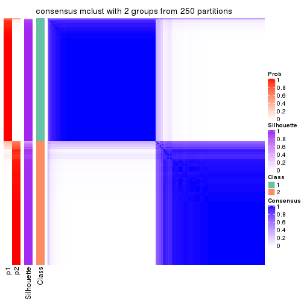</p>

</div>
<div id='tab-ATC-mclust-consensus-heatmap-2'>
<pre><code class="r">consensus_heatmap(res, k = 3)
</code></pre>

<p>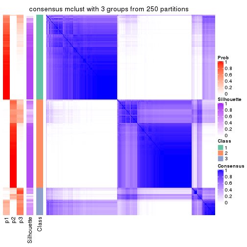</p>

</div>
<div id='tab-ATC-mclust-consensus-heatmap-3'>
<pre><code class="r">consensus_heatmap(res, k = 4)
</code></pre>

<p>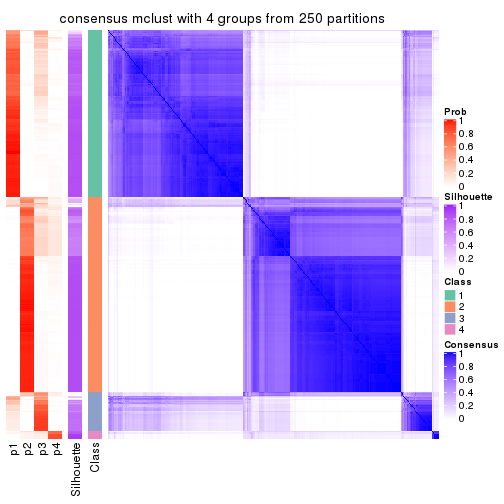</p>

</div>
<div id='tab-ATC-mclust-consensus-heatmap-4'>
<pre><code class="r">consensus_heatmap(res, k = 5)
</code></pre>

<p>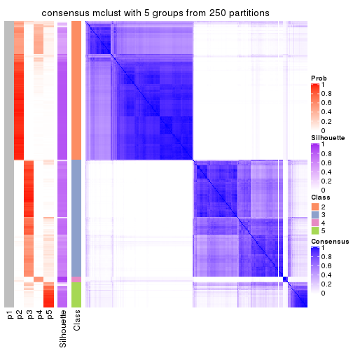</p>

</div>
<div id='tab-ATC-mclust-consensus-heatmap-5'>
<pre><code class="r">consensus_heatmap(res, k = 6)
</code></pre>

<p>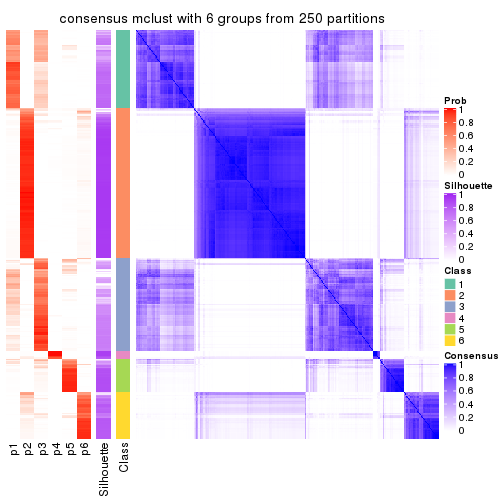</p>

</div>
</div>

Heatmaps for the membership of samples in all partitions to see how consistent they are:


<script>
$( function() {
	$( '#tabs-ATC-mclust-membership-heatmap' ).tabs();
} );
</script>
<div id='tabs-ATC-mclust-membership-heatmap'>
<ul>
<li><a href='#tab-ATC-mclust-membership-heatmap-1'>k = 2</a></li>
<li><a href='#tab-ATC-mclust-membership-heatmap-2'>k = 3</a></li>
<li><a href='#tab-ATC-mclust-membership-heatmap-3'>k = 4</a></li>
<li><a href='#tab-ATC-mclust-membership-heatmap-4'>k = 5</a></li>
<li><a href='#tab-ATC-mclust-membership-heatmap-5'>k = 6</a></li>
</ul>
<div id='tab-ATC-mclust-membership-heatmap-1'>
<pre><code class="r">membership_heatmap(res, k = 2)
</code></pre>

<p>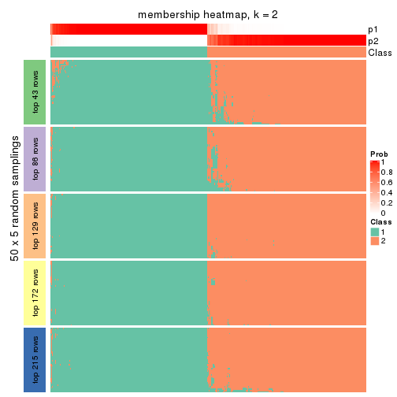</p>

</div>
<div id='tab-ATC-mclust-membership-heatmap-2'>
<pre><code class="r">membership_heatmap(res, k = 3)
</code></pre>

<p>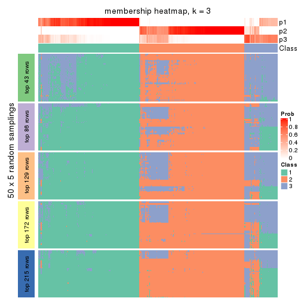</p>

</div>
<div id='tab-ATC-mclust-membership-heatmap-3'>
<pre><code class="r">membership_heatmap(res, k = 4)
</code></pre>

<p>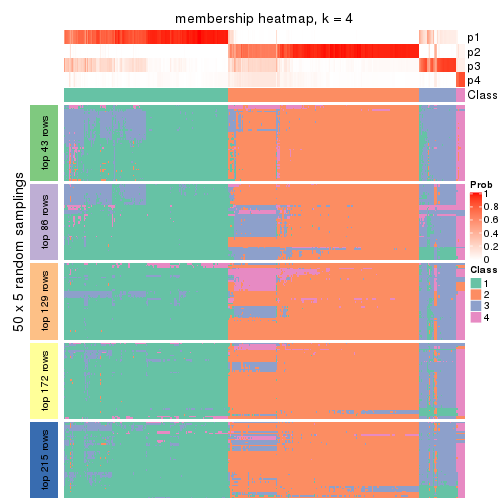</p>

</div>
<div id='tab-ATC-mclust-membership-heatmap-4'>
<pre><code class="r">membership_heatmap(res, k = 5)
</code></pre>

<p>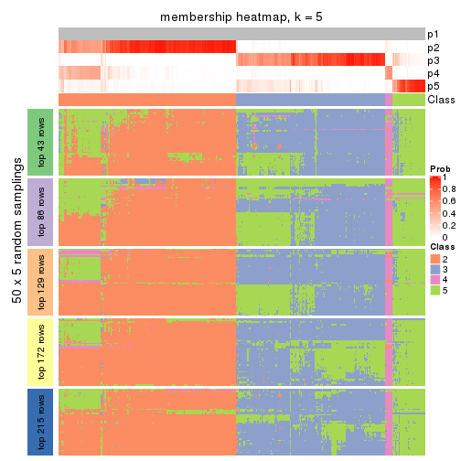</p>

</div>
<div id='tab-ATC-mclust-membership-heatmap-5'>
<pre><code class="r">membership_heatmap(res, k = 6)
</code></pre>

<p>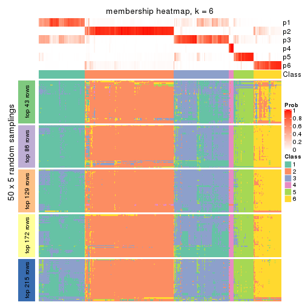</p>

</div>
</div>

As soon as we have had the classes for columns, we can look for signatures
which are significantly different between classes which can be candidate marks
for certain classes. Following are the heatmaps for signatures.


Signature heatmaps where rows are scaled:


<script>
$( function() {
	$( '#tabs-ATC-mclust-get-signatures' ).tabs();
} );
</script>
<div id='tabs-ATC-mclust-get-signatures'>
<ul>
<li><a href='#tab-ATC-mclust-get-signatures-1'>k = 2</a></li>
<li><a href='#tab-ATC-mclust-get-signatures-2'>k = 3</a></li>
<li><a href='#tab-ATC-mclust-get-signatures-3'>k = 4</a></li>
<li><a href='#tab-ATC-mclust-get-signatures-4'>k = 5</a></li>
<li><a href='#tab-ATC-mclust-get-signatures-5'>k = 6</a></li>
</ul>
<div id='tab-ATC-mclust-get-signatures-1'>
<pre><code class="r">get_signatures(res, k = 2)
</code></pre>

<p>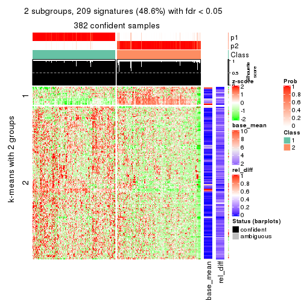</p>

</div>
<div id='tab-ATC-mclust-get-signatures-2'>
<pre><code class="r">get_signatures(res, k = 3)
</code></pre>

<p>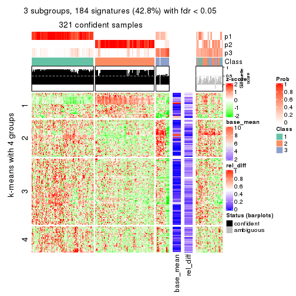</p>

</div>
<div id='tab-ATC-mclust-get-signatures-3'>
<pre><code class="r">get_signatures(res, k = 4)
</code></pre>

<p>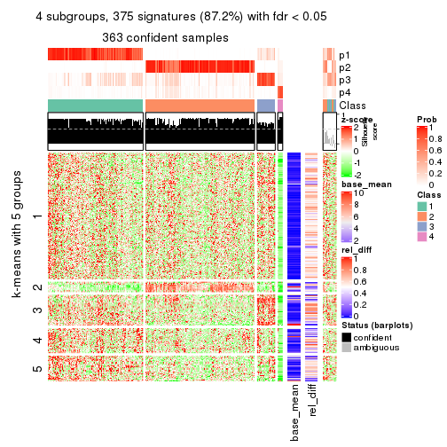</p>

</div>
<div id='tab-ATC-mclust-get-signatures-4'>
<pre><code class="r">get_signatures(res, k = 5)
</code></pre>

<p>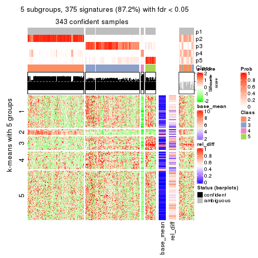</p>

</div>
<div id='tab-ATC-mclust-get-signatures-5'>
<pre><code class="r">get_signatures(res, k = 6)
</code></pre>

<p>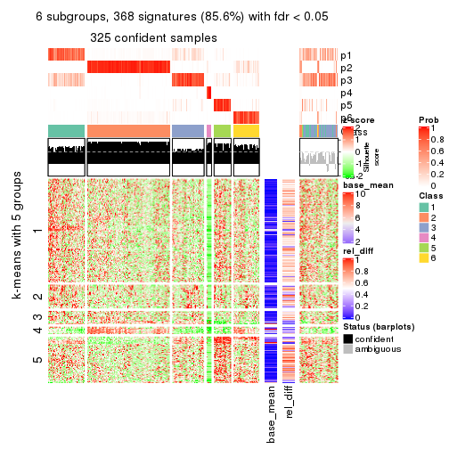</p>

</div>
</div>


Signature heatmaps where rows are not scaled:


<script>
$( function() {
	$( '#tabs-ATC-mclust-get-signatures-no-scale' ).tabs();
} );
</script>
<div id='tabs-ATC-mclust-get-signatures-no-scale'>
<ul>
<li><a href='#tab-ATC-mclust-get-signatures-no-scale-1'>k = 2</a></li>
<li><a href='#tab-ATC-mclust-get-signatures-no-scale-2'>k = 3</a></li>
<li><a href='#tab-ATC-mclust-get-signatures-no-scale-3'>k = 4</a></li>
<li><a href='#tab-ATC-mclust-get-signatures-no-scale-4'>k = 5</a></li>
<li><a href='#tab-ATC-mclust-get-signatures-no-scale-5'>k = 6</a></li>
</ul>
<div id='tab-ATC-mclust-get-signatures-no-scale-1'>
<pre><code class="r">get_signatures(res, k = 2, scale_rows = FALSE)
</code></pre>

<p>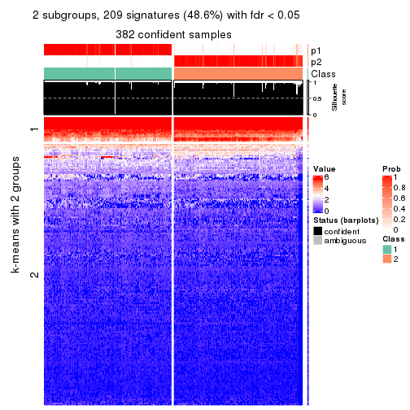</p>

</div>
<div id='tab-ATC-mclust-get-signatures-no-scale-2'>
<pre><code class="r">get_signatures(res, k = 3, scale_rows = FALSE)
</code></pre>

<p>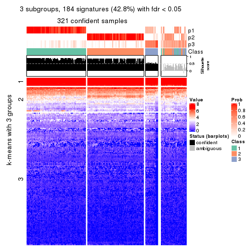</p>

</div>
<div id='tab-ATC-mclust-get-signatures-no-scale-3'>
<pre><code class="r">get_signatures(res, k = 4, scale_rows = FALSE)
</code></pre>

<p>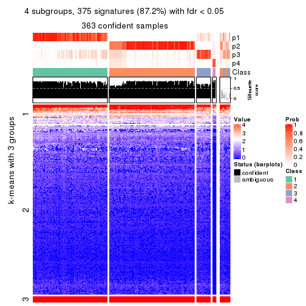</p>

</div>
<div id='tab-ATC-mclust-get-signatures-no-scale-4'>
<pre><code class="r">get_signatures(res, k = 5, scale_rows = FALSE)
</code></pre>

<p>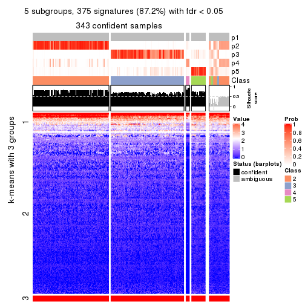</p>

</div>
<div id='tab-ATC-mclust-get-signatures-no-scale-5'>
<pre><code class="r">get_signatures(res, k = 6, scale_rows = FALSE)
</code></pre>

<p>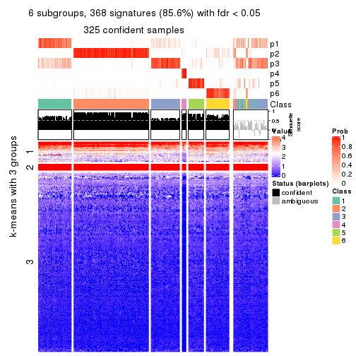</p>

</div>
</div>


Compare the overlap of signatures from different k:

```r
compare_signatures(res)
```

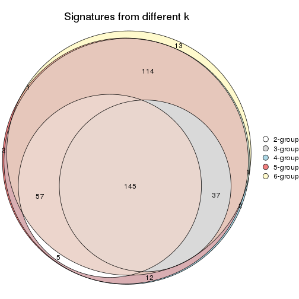

`get_signature()` returns a data frame invisibly. TO get the list of signatures, the function
call should be assigned to a variable explicitly. In following code, if `plot` argument is set
to `FALSE`, no heatmap is plotted while only the differential analysis is performed.

```r
# code only for demonstration
tb = get_signature(res, k = ..., plot = FALSE)
```

An example of the output of `tb` is:

```
#>   which_row         fdr    mean_1    mean_2 scaled_mean_1 scaled_mean_2 km
#> 1        38 0.042760348  8.373488  9.131774    -0.5533452     0.5164555  1
#> 2        40 0.018707592  7.106213  8.469186    -0.6173731     0.5762149  1
#> 3        55 0.019134737 10.221463 11.207825    -0.6159697     0.5749050  1
#> 4        59 0.006059896  5.921854  7.869574    -0.6899429     0.6439467  1
#> 5        60 0.018055526  8.928898 10.211722    -0.6204761     0.5791110  1
#> 6        98 0.009384629 15.714769 14.887706     0.6635654    -0.6193277  2
...
```

The columns in `tb` are:

1. `which_row`: row indices corresponding to the input matrix.
2. `fdr`: FDR for the differential test. 
3. `mean_x`: The mean value in group x.
4. `scaled_mean_x`: The mean value in group x after rows are scaled.
5. `km`: Row groups if k-means clustering is applied to rows.


UMAP plot which shows how samples are separated.


<script>
$( function() {
	$( '#tabs-ATC-mclust-dimension-reduction' ).tabs();
} );
</script>
<div id='tabs-ATC-mclust-dimension-reduction'>
<ul>
<li><a href='#tab-ATC-mclust-dimension-reduction-1'>k = 2</a></li>
<li><a href='#tab-ATC-mclust-dimension-reduction-2'>k = 3</a></li>
<li><a href='#tab-ATC-mclust-dimension-reduction-3'>k = 4</a></li>
<li><a href='#tab-ATC-mclust-dimension-reduction-4'>k = 5</a></li>
<li><a href='#tab-ATC-mclust-dimension-reduction-5'>k = 6</a></li>
</ul>
<div id='tab-ATC-mclust-dimension-reduction-1'>
<pre><code class="r">dimension_reduction(res, k = 2, method = &quot;UMAP&quot;)
</code></pre>

<p>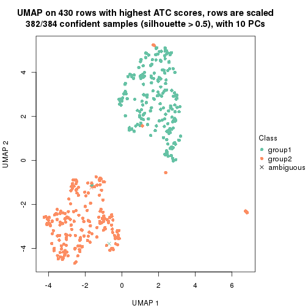</p>

</div>
<div id='tab-ATC-mclust-dimension-reduction-2'>
<pre><code class="r">dimension_reduction(res, k = 3, method = &quot;UMAP&quot;)
</code></pre>

<p>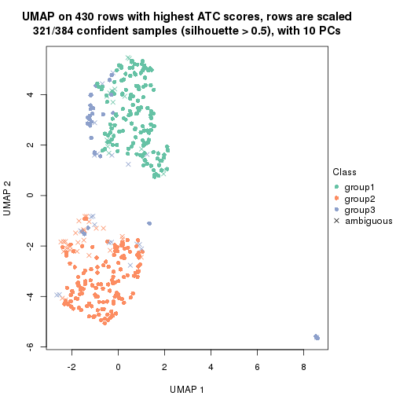</p>

</div>
<div id='tab-ATC-mclust-dimension-reduction-3'>
<pre><code class="r">dimension_reduction(res, k = 4, method = &quot;UMAP&quot;)
</code></pre>

<p>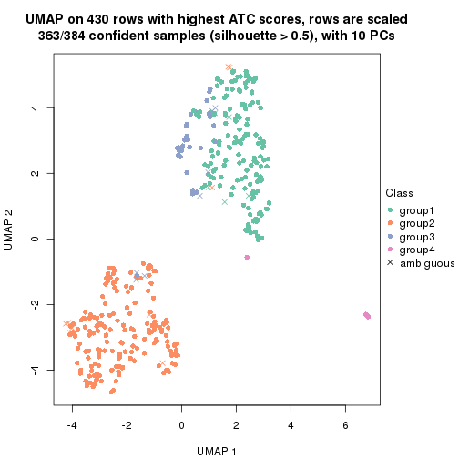</p>

</div>
<div id='tab-ATC-mclust-dimension-reduction-4'>
<pre><code class="r">dimension_reduction(res, k = 5, method = &quot;UMAP&quot;)
</code></pre>

<p>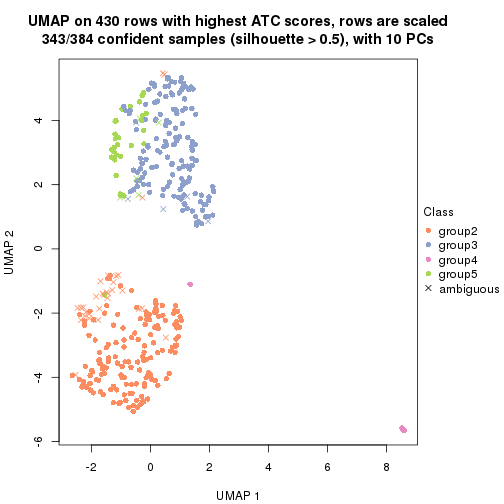</p>

</div>
<div id='tab-ATC-mclust-dimension-reduction-5'>
<pre><code class="r">dimension_reduction(res, k = 6, method = &quot;UMAP&quot;)
</code></pre>

<p>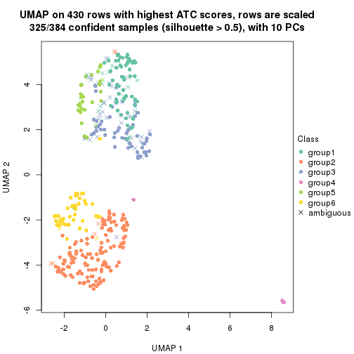</p>

</div>
</div>


Following heatmap shows how subgroups are split when increasing `k`:

```r
collect_classes(res)
```

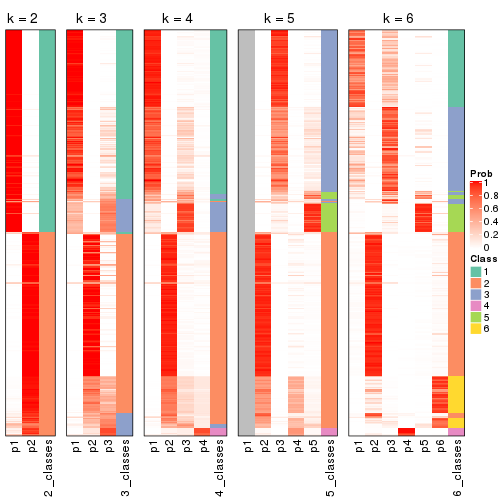


If matrix rows can be associated to genes, consider to use `GO_Enrichment(res,
...)` to perform function enrichment for the signature genes.


 

---------------------------------------------------


### ATC:NMF


The object with results only for a single top-value method and a single partition method 
can be extracted as:

```r
res = res_list["ATC", "NMF"]
# you can also extract it by
# res = res_list["ATC:NMF"]
```

A summary of `res` and all the functions that can be applied to it:

```r
res
```

```
#> A 'ConsensusPartition' object with k = 2, 3, 4, 5, 6.
#>   On a matrix with 430 rows and 384 columns.
#>   Top rows (43, 86, 129, 172, 215) are extracted by 'ATC' method.
#>   Subgroups are detected by 'NMF' method.
#>   Performed in total 1250 partitions by row resampling.
#>   Best k for subgroups seems to be 2.
#> 
#> Following methods can be applied to this 'ConsensusPartition' object:
#>  [1] "cola_report"             "collect_classes"         "collect_plots"          
#>  [4] "collect_stats"           "colnames"                "compare_signatures"     
#>  [7] "consensus_heatmap"       "dimension_reduction"     "functional_enrichment"  
#> [10] "get_anno_col"            "get_anno"                "get_classes"            
#> [13] "get_consensus"           "get_matrix"              "get_membership"         
#> [16] "get_param"               "get_signatures"          "get_stats"              
#> [19] "is_best_k"               "is_stable_k"             "membership_heatmap"     
#> [22] "ncol"                    "nrow"                    "plot_ecdf"              
#> [25] "rownames"                "select_partition_number" "show"                   
#> [28] "suggest_best_k"          "test_to_known_factors"
```

`collect_plots()` function collects all the plots made from `res` for all `k` (number of partitions)
into one single page to provide an easy and fast comparison between different `k`.

```r
collect_plots(res)
```

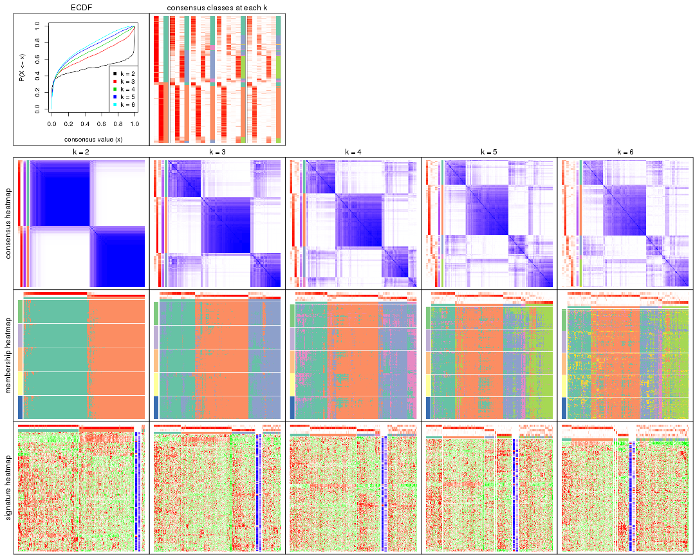

The plots are:

- The first row: a plot of the ECDF (Empirical cumulative distribution
  function) curves of the consensus matrix for each `k` and the heatmap of
  predicted classes for each `k`.
- The second row: heatmaps of the consensus matrix for each `k`.
- The third row: heatmaps of the membership matrix for each `k`.
- The fouth row: heatmaps of the signatures for each `k`.

All the plots in panels can be made by individual functions and they are
plotted later in this section.

`select_partition_number()` produces several plots showing different
statistics for choosing "optimized" `k`. There are following statistics:

- ECDF curves of the consensus matrix for each `k`;
- 1-PAC. [The PAC
  score](https://en.wikipedia.org/wiki/Consensus_clustering#Over-interpretation_potential_of_consensus_clustering)
  measures the proportion of the ambiguous subgrouping.
- Mean silhouette score.
- Concordance. The mean probability of fiting the consensus class ids in all
  partitions.
- Area increased. Denote $A_k$ as the area under the ECDF curve for current
  `k`, the area increased is defined as $A_k - A_{k-1}$.
- Rand index. The percent of pairs of samples that are both in a same cluster
  or both are not in a same cluster in the partition of k and k-1.
- Jaccard index. The ratio of pairs of samples are both in a same cluster in
  the partition of k and k-1 and the pairs of samples are both in a same
  cluster in the partition k or k-1.

The detailed explanations of these statistics can be found in [the cola
vignette](http://bioconductor.org/packages/devel/bioc/vignettes/cola/inst/doc/cola.html#toc_13).

Generally speaking, lower PAC score, higher mean silhouette score or higher
concordance corresponds to better partition. Rand index and Jaccard index
measure how similar the current partition is compared to partition with `k-1`.
If they are too similar, we won't accept `k` is better than `k-1`.

```r
select_partition_number(res)
```

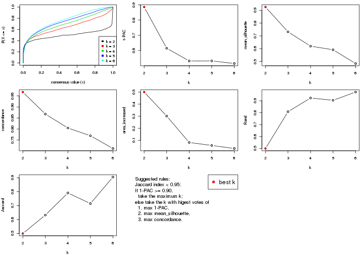

The numeric values for all these statistics can be obtained by `get_stats()`.

```r
get_stats(res)
```

```
#>   k 1-PAC mean_silhouette concordance area_increased  Rand Jaccard
#> 2 2 0.886           0.926       0.967         0.5000 0.500   0.500
#> 3 3 0.615           0.732       0.868         0.3012 0.809   0.632
#> 4 4 0.532           0.620       0.805         0.0824 0.923   0.791
#> 5 5 0.532           0.592       0.770         0.0578 0.904   0.715
#> 6 6 0.515           0.484       0.712         0.0326 0.973   0.905
```

`suggest_best_k()` suggests the best $k$ based on these statistics. The rules are as follows:

- All $k$ with Jaccard index larger than 0.95 are removed because the increase of
  the partition number does not provides enough extra information. If all $k$ are removed,
  the best $k$ is assigned by `NA`.
- For $k$ with 1-PAC larger than 0.9, the maximal $k$ is taken as the "best k". Other $k$ is called "optional k".
- If it does not fit the second rule. The $k$ with the highest vote of highest
  1-PAC, mean silhouette and concordance is taken as the "best k".

```r
suggest_best_k(res)
```

```
#> [1] 2
```


Following shows the table of the partitions (You need to click the **show/hide
code output** link to see it). The membership matrix (columns with name `p*`)
is inferred by
[`clue::cl_consensus()`](https://www.rdocumentation.org/link/cl_consensus?package=clue)
function with the `SE` method. Basically the value in the membership matrix
represents the probability to belong to a certain group. The finall class
label for an item is determined with the group with highest probability it
belongs to.

In `get_classes()` function, the entropy is calculated from the membership
matrix and the silhouette score is calculated from the consensus matrix.


<script>
$( function() {
	$( '#tabs-ATC-NMF-get-classes' ).tabs();
} );
</script>
<div id='tabs-ATC-NMF-get-classes'>
<ul>
<li><a href='#tab-ATC-NMF-get-classes-1'>k = 2</a></li>
<li><a href='#tab-ATC-NMF-get-classes-2'>k = 3</a></li>
<li><a href='#tab-ATC-NMF-get-classes-3'>k = 4</a></li>
<li><a href='#tab-ATC-NMF-get-classes-4'>k = 5</a></li>
<li><a href='#tab-ATC-NMF-get-classes-5'>k = 6</a></li>
</ul>

<div id='tab-ATC-NMF-get-classes-1'>
<p><a id='tab-ATC-NMF-get-classes-1-a' style='color:#0366d6' href='#'>show/hide code output</a></p>
<pre><code class="r">cbind(get_classes(res, k = 2), get_membership(res, k = 2))
</code></pre>

<pre><code>#&gt;            class entropy silhouette    p1    p2
#&gt; SRR2105277     1  0.0000     0.9710 1.000 0.000
#&gt; SRR2105278     1  0.0000     0.9710 1.000 0.000
#&gt; SRR2105275     1  0.0000     0.9710 1.000 0.000
#&gt; SRR2105276     1  0.0000     0.9710 1.000 0.000
#&gt; SRR2105273     1  0.0000     0.9710 1.000 0.000
#&gt; SRR2105274     1  0.0000     0.9710 1.000 0.000
#&gt; SRR2105271     1  0.0000     0.9710 1.000 0.000
#&gt; SRR2105272     1  0.0000     0.9710 1.000 0.000
#&gt; SRR2105269     2  0.0000     0.9606 0.000 1.000
#&gt; SRR2105270     2  0.0000     0.9606 0.000 1.000
#&gt; SRR2105267     2  0.0000     0.9606 0.000 1.000
#&gt; SRR2105268     2  0.0000     0.9606 0.000 1.000
#&gt; SRR2105265     2  0.0000     0.9606 0.000 1.000
#&gt; SRR2105266     2  0.0000     0.9606 0.000 1.000
#&gt; SRR2105263     2  0.0000     0.9606 0.000 1.000
#&gt; SRR2105264     2  0.0000     0.9606 0.000 1.000
#&gt; SRR2105261     1  0.0376     0.9686 0.996 0.004
#&gt; SRR2105262     1  0.0000     0.9710 1.000 0.000
#&gt; SRR2105357     1  0.0000     0.9710 1.000 0.000
#&gt; SRR2105358     1  0.0000     0.9710 1.000 0.000
#&gt; SRR2105439     2  0.1843     0.9419 0.028 0.972
#&gt; SRR2105440     2  0.0938     0.9534 0.012 0.988
#&gt; SRR2105509     2  0.0376     0.9585 0.004 0.996
#&gt; SRR2105510     2  0.0376     0.9585 0.004 0.996
#&gt; SRR2105507     1  0.0000     0.9710 1.000 0.000
#&gt; SRR2105508     1  0.0000     0.9710 1.000 0.000
#&gt; SRR2105505     1  0.0000     0.9710 1.000 0.000
#&gt; SRR2105506     1  0.0000     0.9710 1.000 0.000
#&gt; SRR2105503     2  0.0000     0.9606 0.000 1.000
#&gt; SRR2105504     2  0.1414     0.9479 0.020 0.980
#&gt; SRR2105501     2  0.0938     0.9538 0.012 0.988
#&gt; SRR2105502     2  0.0000     0.9606 0.000 1.000
#&gt; SRR2105499     1  0.0000     0.9710 1.000 0.000
#&gt; SRR2105500     1  0.0000     0.9710 1.000 0.000
#&gt; SRR2105497     2  0.0000     0.9606 0.000 1.000
#&gt; SRR2105498     2  0.0000     0.9606 0.000 1.000
#&gt; SRR2105495     2  0.3274     0.9146 0.060 0.940
#&gt; SRR2105496     2  0.0376     0.9585 0.004 0.996
#&gt; SRR2105493     2  0.7815     0.7114 0.232 0.768
#&gt; SRR2105494     2  0.9248     0.5115 0.340 0.660
#&gt; SRR2105491     2  0.0000     0.9606 0.000 1.000
#&gt; SRR2105492     2  0.0000     0.9606 0.000 1.000
#&gt; SRR2105489     2  0.0000     0.9606 0.000 1.000
#&gt; SRR2105490     2  0.0000     0.9606 0.000 1.000
#&gt; SRR2105487     1  0.0000     0.9710 1.000 0.000
#&gt; SRR2105488     1  0.0000     0.9710 1.000 0.000
#&gt; SRR2105485     1  0.0000     0.9710 1.000 0.000
#&gt; SRR2105486     1  0.0000     0.9710 1.000 0.000
#&gt; SRR2105483     2  0.8661     0.6066 0.288 0.712
#&gt; SRR2105484     2  0.8207     0.6639 0.256 0.744
#&gt; SRR2105481     1  0.0000     0.9710 1.000 0.000
#&gt; SRR2105482     1  0.0000     0.9710 1.000 0.000
#&gt; SRR2105479     1  0.1184     0.9615 0.984 0.016
#&gt; SRR2105480     1  0.0000     0.9710 1.000 0.000
#&gt; SRR2105477     2  0.3733     0.9048 0.072 0.928
#&gt; SRR2105478     2  0.2236     0.9354 0.036 0.964
#&gt; SRR2105475     2  0.4939     0.8688 0.108 0.892
#&gt; SRR2105476     2  0.0000     0.9606 0.000 1.000
#&gt; SRR2105473     2  0.0376     0.9585 0.004 0.996
#&gt; SRR2105474     2  0.0376     0.9584 0.004 0.996
#&gt; SRR2105471     2  0.0000     0.9606 0.000 1.000
#&gt; SRR2105472     2  0.0000     0.9606 0.000 1.000
#&gt; SRR2105469     1  0.0000     0.9710 1.000 0.000
#&gt; SRR2105470     1  0.0000     0.9710 1.000 0.000
#&gt; SRR2105467     1  0.0000     0.9710 1.000 0.000
#&gt; SRR2105468     1  0.0000     0.9710 1.000 0.000
#&gt; SRR2105465     1  0.9580     0.3952 0.620 0.380
#&gt; SRR2105466     1  0.8608     0.6139 0.716 0.284
#&gt; SRR2105463     1  0.1184     0.9613 0.984 0.016
#&gt; SRR2105464     1  0.3274     0.9268 0.940 0.060
#&gt; SRR2105461     2  0.0000     0.9606 0.000 1.000
#&gt; SRR2105462     2  0.0000     0.9606 0.000 1.000
#&gt; SRR2105459     2  0.0000     0.9606 0.000 1.000
#&gt; SRR2105460     2  0.0000     0.9606 0.000 1.000
#&gt; SRR2105457     1  0.0000     0.9710 1.000 0.000
#&gt; SRR2105458     1  0.0000     0.9710 1.000 0.000
#&gt; SRR2105455     1  0.0376     0.9687 0.996 0.004
#&gt; SRR2105456     1  0.0000     0.9710 1.000 0.000
#&gt; SRR2105453     1  0.0000     0.9710 1.000 0.000
#&gt; SRR2105454     1  0.0000     0.9710 1.000 0.000
#&gt; SRR2105451     2  0.7528     0.7346 0.216 0.784
#&gt; SRR2105452     1  0.4815     0.8795 0.896 0.104
#&gt; SRR2105449     1  0.2948     0.9332 0.948 0.052
#&gt; SRR2105450     1  0.1184     0.9613 0.984 0.016
#&gt; SRR2105447     2  0.0000     0.9606 0.000 1.000
#&gt; SRR2105448     2  0.0000     0.9606 0.000 1.000
#&gt; SRR2105445     1  0.0000     0.9710 1.000 0.000
#&gt; SRR2105446     1  0.0000     0.9710 1.000 0.000
#&gt; SRR2105443     1  0.7219     0.7536 0.800 0.200
#&gt; SRR2105444     1  0.9850     0.2443 0.572 0.428
#&gt; SRR2105441     2  0.0000     0.9606 0.000 1.000
#&gt; SRR2105442     2  0.0000     0.9606 0.000 1.000
#&gt; SRR2105437     1  0.0000     0.9710 1.000 0.000
#&gt; SRR2105438     1  0.0000     0.9710 1.000 0.000
#&gt; SRR2105435     1  0.0672     0.9664 0.992 0.008
#&gt; SRR2105436     1  0.0000     0.9710 1.000 0.000
#&gt; SRR2105433     1  0.8386     0.6438 0.732 0.268
#&gt; SRR2105434     1  0.9087     0.5320 0.676 0.324
#&gt; SRR2105431     1  0.0000     0.9710 1.000 0.000
#&gt; SRR2105432     1  0.0000     0.9710 1.000 0.000
#&gt; SRR2105429     2  0.8909     0.5735 0.308 0.692
#&gt; SRR2105430     2  0.9833     0.2909 0.424 0.576
#&gt; SRR2105427     2  0.0938     0.9537 0.012 0.988
#&gt; SRR2105428     2  0.0672     0.9562 0.008 0.992
#&gt; SRR2105425     2  0.0376     0.9585 0.004 0.996
#&gt; SRR2105426     2  0.0000     0.9606 0.000 1.000
#&gt; SRR2105421     1  0.0000     0.9710 1.000 0.000
#&gt; SRR2105422     1  0.0000     0.9710 1.000 0.000
#&gt; SRR2105423     2  0.0000     0.9606 0.000 1.000
#&gt; SRR2105424     2  0.0000     0.9606 0.000 1.000
#&gt; SRR2105419     1  0.0000     0.9710 1.000 0.000
#&gt; SRR2105420     1  0.0000     0.9710 1.000 0.000
#&gt; SRR2105415     1  0.0000     0.9710 1.000 0.000
#&gt; SRR2105416     1  0.0938     0.9640 0.988 0.012
#&gt; SRR2105417     1  0.2236     0.9463 0.964 0.036
#&gt; SRR2105418     1  0.3733     0.9158 0.928 0.072
#&gt; SRR2105413     2  0.0376     0.9585 0.004 0.996
#&gt; SRR2105414     2  0.0000     0.9606 0.000 1.000
#&gt; SRR2105409     2  0.0000     0.9606 0.000 1.000
#&gt; SRR2105410     2  0.0000     0.9606 0.000 1.000
#&gt; SRR2105411     2  0.0000     0.9606 0.000 1.000
#&gt; SRR2105412     2  0.0000     0.9606 0.000 1.000
#&gt; SRR2105407     1  0.0000     0.9710 1.000 0.000
#&gt; SRR2105408     1  0.0000     0.9710 1.000 0.000
#&gt; SRR2105403     1  0.0000     0.9710 1.000 0.000
#&gt; SRR2105404     1  0.0000     0.9710 1.000 0.000
#&gt; SRR2105405     1  0.0000     0.9710 1.000 0.000
#&gt; SRR2105406     1  0.1184     0.9613 0.984 0.016
#&gt; SRR2105401     2  0.9732     0.3514 0.404 0.596
#&gt; SRR2105402     2  0.5946     0.8274 0.144 0.856
#&gt; SRR2105399     1  0.4939     0.8767 0.892 0.108
#&gt; SRR2105400     1  0.7950     0.6925 0.760 0.240
#&gt; SRR2105397     1  0.3431     0.9200 0.936 0.064
#&gt; SRR2105398     1  0.5059     0.8687 0.888 0.112
#&gt; SRR2105395     2  0.0000     0.9606 0.000 1.000
#&gt; SRR2105396     2  0.0000     0.9606 0.000 1.000
#&gt; SRR2105393     2  0.0000     0.9606 0.000 1.000
#&gt; SRR2105394     2  0.0000     0.9606 0.000 1.000
#&gt; SRR2105389     1  0.0000     0.9710 1.000 0.000
#&gt; SRR2105390     1  0.0000     0.9710 1.000 0.000
#&gt; SRR2105391     1  0.0000     0.9710 1.000 0.000
#&gt; SRR2105392     1  0.0000     0.9710 1.000 0.000
#&gt; SRR2105385     1  0.0000     0.9710 1.000 0.000
#&gt; SRR2105386     1  0.0000     0.9710 1.000 0.000
#&gt; SRR2105387     1  0.0000     0.9710 1.000 0.000
#&gt; SRR2105388     1  0.0000     0.9710 1.000 0.000
#&gt; SRR2105381     2  0.2423     0.9322 0.040 0.960
#&gt; SRR2105382     2  0.0376     0.9585 0.004 0.996
#&gt; SRR2105383     2  0.0000     0.9606 0.000 1.000
#&gt; SRR2105384     2  0.0672     0.9559 0.008 0.992
#&gt; SRR2105379     2  0.0000     0.9606 0.000 1.000
#&gt; SRR2105380     2  0.0376     0.9585 0.004 0.996
#&gt; SRR2105377     2  0.0000     0.9606 0.000 1.000
#&gt; SRR2105378     2  0.0000     0.9606 0.000 1.000
#&gt; SRR2105375     1  0.0938     0.9640 0.988 0.012
#&gt; SRR2105376     1  0.2423     0.9437 0.960 0.040
#&gt; SRR2105373     1  0.0000     0.9710 1.000 0.000
#&gt; SRR2105374     1  0.0000     0.9710 1.000 0.000
#&gt; SRR2105371     1  0.0000     0.9710 1.000 0.000
#&gt; SRR2105372     1  0.0000     0.9710 1.000 0.000
#&gt; SRR2105369     1  0.0000     0.9710 1.000 0.000
#&gt; SRR2105370     1  0.0000     0.9710 1.000 0.000
#&gt; SRR2105367     1  0.0000     0.9710 1.000 0.000
#&gt; SRR2105368     1  0.3584     0.9197 0.932 0.068
#&gt; SRR2105365     2  0.0000     0.9606 0.000 1.000
#&gt; SRR2105366     2  0.0000     0.9606 0.000 1.000
#&gt; SRR2105363     2  0.0000     0.9606 0.000 1.000
#&gt; SRR2105364     2  0.0000     0.9606 0.000 1.000
#&gt; SRR2105361     2  0.0000     0.9606 0.000 1.000
#&gt; SRR2105362     2  0.0000     0.9606 0.000 1.000
#&gt; SRR2105359     1  0.0000     0.9710 1.000 0.000
#&gt; SRR2105360     1  0.0000     0.9710 1.000 0.000
#&gt; SRR2105355     1  0.0000     0.9710 1.000 0.000
#&gt; SRR2105356     1  0.0000     0.9710 1.000 0.000
#&gt; SRR2105353     1  0.0000     0.9710 1.000 0.000
#&gt; SRR2105354     1  0.0000     0.9710 1.000 0.000
#&gt; SRR2105351     2  0.0000     0.9606 0.000 1.000
#&gt; SRR2105352     2  0.6712     0.7881 0.176 0.824
#&gt; SRR2105349     2  0.0000     0.9606 0.000 1.000
#&gt; SRR2105350     2  0.0000     0.9606 0.000 1.000
#&gt; SRR2105345     2  0.0000     0.9606 0.000 1.000
#&gt; SRR2105346     2  0.0000     0.9606 0.000 1.000
#&gt; SRR2105347     2  0.0938     0.9533 0.012 0.988
#&gt; SRR2105348     2  0.1184     0.9504 0.016 0.984
#&gt; SRR2105343     2  0.0000     0.9606 0.000 1.000
#&gt; SRR2105344     2  0.0000     0.9606 0.000 1.000
#&gt; SRR2105341     1  0.0000     0.9710 1.000 0.000
#&gt; SRR2105342     1  0.0000     0.9710 1.000 0.000
#&gt; SRR2105339     1  0.0000     0.9710 1.000 0.000
#&gt; SRR2105340     1  0.0000     0.9710 1.000 0.000
#&gt; SRR2105335     1  0.0000     0.9710 1.000 0.000
#&gt; SRR2105336     1  0.0000     0.9710 1.000 0.000
#&gt; SRR2105337     1  0.0000     0.9710 1.000 0.000
#&gt; SRR2105338     1  0.0000     0.9710 1.000 0.000
#&gt; SRR2105331     2  0.0000     0.9606 0.000 1.000
#&gt; SRR2105332     2  0.0000     0.9606 0.000 1.000
#&gt; SRR2105333     2  0.0000     0.9606 0.000 1.000
#&gt; SRR2105334     2  0.0000     0.9606 0.000 1.000
#&gt; SRR2105329     1  0.1633     0.9548 0.976 0.024
#&gt; SRR2105330     1  0.4815     0.8794 0.896 0.104
#&gt; SRR2105327     2  0.0000     0.9606 0.000 1.000
#&gt; SRR2105328     2  0.0000     0.9606 0.000 1.000
#&gt; SRR2105325     1  0.0000     0.9710 1.000 0.000
#&gt; SRR2105326     1  0.0000     0.9710 1.000 0.000
#&gt; SRR2105323     1  0.0000     0.9710 1.000 0.000
#&gt; SRR2105324     1  0.0000     0.9710 1.000 0.000
#&gt; SRR2105319     1  0.0000     0.9710 1.000 0.000
#&gt; SRR2105320     1  0.0000     0.9710 1.000 0.000
#&gt; SRR2105321     1  0.0000     0.9710 1.000 0.000
#&gt; SRR2105322     1  0.0000     0.9710 1.000 0.000
#&gt; SRR2105317     2  0.0000     0.9606 0.000 1.000
#&gt; SRR2105318     2  0.0000     0.9606 0.000 1.000
#&gt; SRR2105315     1  0.1184     0.9608 0.984 0.016
#&gt; SRR2105316     2  0.1633     0.9452 0.024 0.976
#&gt; SRR2105313     2  0.0000     0.9606 0.000 1.000
#&gt; SRR2105314     2  0.0000     0.9606 0.000 1.000
#&gt; SRR2105311     1  0.0000     0.9710 1.000 0.000
#&gt; SRR2105312     1  0.0000     0.9710 1.000 0.000
#&gt; SRR2105307     1  0.1184     0.9612 0.984 0.016
#&gt; SRR2105308     1  0.3431     0.9230 0.936 0.064
#&gt; SRR2105309     1  0.0000     0.9710 1.000 0.000
#&gt; SRR2105310     1  0.0000     0.9710 1.000 0.000
#&gt; SRR2105305     1  0.0000     0.9710 1.000 0.000
#&gt; SRR2105306     1  0.0000     0.9710 1.000 0.000
#&gt; SRR2105303     2  0.0000     0.9606 0.000 1.000
#&gt; SRR2105304     2  0.0000     0.9606 0.000 1.000
#&gt; SRR2105301     2  0.0938     0.9537 0.012 0.988
#&gt; SRR2105302     2  0.0000     0.9606 0.000 1.000
#&gt; SRR2105299     1  0.0000     0.9710 1.000 0.000
#&gt; SRR2105300     1  0.0000     0.9710 1.000 0.000
#&gt; SRR2105297     2  0.0000     0.9606 0.000 1.000
#&gt; SRR2105298     2  0.0376     0.9584 0.004 0.996
#&gt; SRR2105295     2  0.0000     0.9606 0.000 1.000
#&gt; SRR2105296     2  0.0000     0.9606 0.000 1.000
#&gt; SRR2105293     1  0.0000     0.9710 1.000 0.000
#&gt; SRR2105294     1  0.0000     0.9710 1.000 0.000
#&gt; SRR2105291     1  0.5519     0.8539 0.872 0.128
#&gt; SRR2105292     1  0.0000     0.9710 1.000 0.000
#&gt; SRR2105289     1  0.0000     0.9710 1.000 0.000
#&gt; SRR2105290     1  0.0000     0.9710 1.000 0.000
#&gt; SRR2105287     1  0.0000     0.9710 1.000 0.000
#&gt; SRR2105288     1  0.1184     0.9614 0.984 0.016
#&gt; SRR2105285     2  0.0000     0.9606 0.000 1.000
#&gt; SRR2105286     2  0.0376     0.9585 0.004 0.996
#&gt; SRR2105283     2  0.7056     0.7666 0.192 0.808
#&gt; SRR2105284     2  0.9209     0.5230 0.336 0.664
#&gt; SRR2105281     2  0.0000     0.9606 0.000 1.000
#&gt; SRR2105282     2  0.0000     0.9606 0.000 1.000
#&gt; SRR2105259     1  0.0000     0.9710 1.000 0.000
#&gt; SRR2105260     1  0.0000     0.9710 1.000 0.000
#&gt; SRR2105279     2  0.0000     0.9606 0.000 1.000
#&gt; SRR2105280     2  0.0000     0.9606 0.000 1.000
#&gt; SRR2105257     1  0.0000     0.9710 1.000 0.000
#&gt; SRR2105258     1  0.0000     0.9710 1.000 0.000
#&gt; SRR2105253     2  0.0000     0.9606 0.000 1.000
#&gt; SRR2105254     2  0.0000     0.9606 0.000 1.000
#&gt; SRR2105255     1  0.0000     0.9710 1.000 0.000
#&gt; SRR2105256     1  0.0000     0.9710 1.000 0.000
#&gt; SRR2105251     2  0.0000     0.9606 0.000 1.000
#&gt; SRR2105252     2  0.0000     0.9606 0.000 1.000
#&gt; SRR2105249     2  0.2043     0.9386 0.032 0.968
#&gt; SRR2105250     2  0.1633     0.9449 0.024 0.976
#&gt; SRR2105247     2  0.0000     0.9606 0.000 1.000
#&gt; SRR2105248     2  0.0000     0.9606 0.000 1.000
#&gt; SRR2105245     1  0.6887     0.7811 0.816 0.184
#&gt; SRR2105246     1  0.9661     0.3628 0.608 0.392
#&gt; SRR2105243     1  0.0000     0.9710 1.000 0.000
#&gt; SRR2105244     1  0.0000     0.9710 1.000 0.000
#&gt; SRR2105241     1  0.0000     0.9710 1.000 0.000
#&gt; SRR2105242     1  0.0000     0.9710 1.000 0.000
#&gt; SRR2105239     1  0.0376     0.9687 0.996 0.004
#&gt; SRR2105240     1  0.0938     0.9639 0.988 0.012
#&gt; SRR2105237     1  0.9993     0.0311 0.516 0.484
#&gt; SRR2105238     2  0.6712     0.7900 0.176 0.824
#&gt; SRR2105235     2  0.0000     0.9606 0.000 1.000
#&gt; SRR2105236     2  0.0000     0.9606 0.000 1.000
#&gt; SRR2105233     2  0.0376     0.9585 0.004 0.996
#&gt; SRR2105234     2  0.0000     0.9606 0.000 1.000
#&gt; SRR2105231     2  0.0000     0.9606 0.000 1.000
#&gt; SRR2105232     2  0.0000     0.9606 0.000 1.000
#&gt; SRR2105227     1  0.3431     0.9235 0.936 0.064
#&gt; SRR2105228     1  0.4022     0.9069 0.920 0.080
#&gt; SRR2105225     1  0.0000     0.9710 1.000 0.000
#&gt; SRR2105226     1  0.0000     0.9710 1.000 0.000
#&gt; SRR2105229     1  0.0000     0.9710 1.000 0.000
#&gt; SRR2105230     1  0.0000     0.9710 1.000 0.000
#&gt; SRR2105219     2  0.0000     0.9606 0.000 1.000
#&gt; SRR2105220     2  0.0000     0.9606 0.000 1.000
#&gt; SRR2105221     2  0.4431     0.8846 0.092 0.908
#&gt; SRR2105222     2  0.0376     0.9585 0.004 0.996
#&gt; SRR2105223     1  0.0000     0.9710 1.000 0.000
#&gt; SRR2105224     1  0.0000     0.9710 1.000 0.000
#&gt; SRR2105217     2  0.0000     0.9606 0.000 1.000
#&gt; SRR2105218     2  0.0000     0.9606 0.000 1.000
#&gt; SRR2105215     2  0.0000     0.9606 0.000 1.000
#&gt; SRR2105216     2  0.0000     0.9606 0.000 1.000
#&gt; SRR2105213     1  0.5294     0.8644 0.880 0.120
#&gt; SRR2105214     1  0.2236     0.9465 0.964 0.036
#&gt; SRR2105211     1  0.0000     0.9710 1.000 0.000
#&gt; SRR2105212     1  0.0000     0.9710 1.000 0.000
#&gt; SRR2105209     1  0.0000     0.9710 1.000 0.000
#&gt; SRR2105210     1  0.0000     0.9710 1.000 0.000
#&gt; SRR2105207     1  0.0000     0.9710 1.000 0.000
#&gt; SRR2105208     1  0.0938     0.9640 0.988 0.012
#&gt; SRR2105205     2  0.0000     0.9606 0.000 1.000
#&gt; SRR2105206     2  0.1184     0.9508 0.016 0.984
#&gt; SRR2105201     2  0.0000     0.9606 0.000 1.000
#&gt; SRR2105202     2  0.0376     0.9585 0.004 0.996
#&gt; SRR2105203     2  0.0000     0.9606 0.000 1.000
#&gt; SRR2105204     2  0.0000     0.9606 0.000 1.000
#&gt; SRR2105199     2  0.0000     0.9606 0.000 1.000
#&gt; SRR2105200     2  0.0000     0.9606 0.000 1.000
#&gt; SRR2105197     1  0.0000     0.9710 1.000 0.000
#&gt; SRR2105198     1  0.0000     0.9710 1.000 0.000
#&gt; SRR2105195     1  0.0000     0.9710 1.000 0.000
#&gt; SRR2105196     1  0.5519     0.8558 0.872 0.128
#&gt; SRR2105193     1  0.2603     0.9400 0.956 0.044
#&gt; SRR2105194     1  0.0672     0.9663 0.992 0.008
#&gt; SRR2105191     1  0.0000     0.9710 1.000 0.000
#&gt; SRR2105192     1  0.0000     0.9710 1.000 0.000
#&gt; SRR2105189     2  0.0376     0.9585 0.004 0.996
#&gt; SRR2105190     2  0.0000     0.9606 0.000 1.000
#&gt; SRR2105187     2  0.9170     0.5302 0.332 0.668
#&gt; SRR2105188     2  0.9775     0.3258 0.412 0.588
#&gt; SRR2105179     1  0.0000     0.9710 1.000 0.000
#&gt; SRR2105180     1  0.0000     0.9710 1.000 0.000
#&gt; SRR2105183     2  0.0000     0.9606 0.000 1.000
#&gt; SRR2105184     2  0.0000     0.9606 0.000 1.000
#&gt; SRR2105185     2  0.0000     0.9606 0.000 1.000
#&gt; SRR2105186     2  0.0000     0.9606 0.000 1.000
#&gt; SRR2105181     1  0.0000     0.9710 1.000 0.000
#&gt; SRR2105182     1  0.0000     0.9710 1.000 0.000
#&gt; SRR2105177     2  0.9866     0.2495 0.432 0.568
#&gt; SRR2105178     1  0.6343     0.8157 0.840 0.160
#&gt; SRR2105171     2  0.0000     0.9606 0.000 1.000
#&gt; SRR2105172     2  0.0000     0.9606 0.000 1.000
#&gt; SRR2105175     1  0.6247     0.8221 0.844 0.156
#&gt; SRR2105176     1  0.4562     0.8910 0.904 0.096
#&gt; SRR2105173     2  0.0000     0.9606 0.000 1.000
#&gt; SRR2105174     2  0.0000     0.9606 0.000 1.000
#&gt; SRR2105169     2  0.0000     0.9606 0.000 1.000
#&gt; SRR2105170     2  0.0000     0.9606 0.000 1.000
#&gt; SRR2105167     2  0.0000     0.9606 0.000 1.000
#&gt; SRR2105168     2  0.0000     0.9606 0.000 1.000
#&gt; SRR2105165     1  0.0000     0.9710 1.000 0.000
#&gt; SRR2105166     1  0.0000     0.9710 1.000 0.000
#&gt; SRR2105163     1  0.0000     0.9710 1.000 0.000
#&gt; SRR2105164     1  0.0000     0.9710 1.000 0.000
#&gt; SRR2105161     1  0.0000     0.9710 1.000 0.000
#&gt; SRR2105162     1  0.2236     0.9468 0.964 0.036
#&gt; SRR2105155     2  0.0000     0.9606 0.000 1.000
#&gt; SRR2105156     2  0.0000     0.9606 0.000 1.000
#&gt; SRR2105157     2  0.0000     0.9606 0.000 1.000
#&gt; SRR2105158     2  0.0000     0.9606 0.000 1.000
#&gt; SRR2105159     1  0.0000     0.9710 1.000 0.000
#&gt; SRR2105160     1  0.0000     0.9710 1.000 0.000
#&gt; SRR2105153     2  0.0000     0.9606 0.000 1.000
#&gt; SRR2105154     2  0.0000     0.9606 0.000 1.000
#&gt; SRR2105151     2  0.0000     0.9606 0.000 1.000
#&gt; SRR2105152     2  0.0000     0.9606 0.000 1.000
#&gt; SRR2105149     1  0.0000     0.9710 1.000 0.000
#&gt; SRR2105150     1  0.0000     0.9710 1.000 0.000
#&gt; SRR2105147     1  0.0672     0.9662 0.992 0.008
#&gt; SRR2105148     1  0.0672     0.9662 0.992 0.008
#&gt; SRR2105143     2  0.9635     0.3876 0.388 0.612
#&gt; SRR2105144     2  0.9393     0.4625 0.356 0.644
#&gt; SRR2105145     1  0.3733     0.9149 0.928 0.072
#&gt; SRR2105146     1  0.0000     0.9710 1.000 0.000
#&gt; SRR2105141     2  0.0000     0.9606 0.000 1.000
#&gt; SRR2105142     2  0.0000     0.9606 0.000 1.000
#&gt; SRR2105139     2  0.0000     0.9606 0.000 1.000
#&gt; SRR2105140     2  0.0000     0.9606 0.000 1.000
#&gt; SRR2105137     2  0.4022     0.8959 0.080 0.920
#&gt; SRR2105138     2  0.2603     0.9290 0.044 0.956
#&gt; SRR2105135     2  0.0000     0.9606 0.000 1.000
#&gt; SRR2105136     2  0.0000     0.9606 0.000 1.000
#&gt; SRR2105133     1  0.0000     0.9710 1.000 0.000
#&gt; SRR2105134     1  0.0000     0.9710 1.000 0.000
#&gt; SRR2105131     1  0.5519     0.8532 0.872 0.128
#&gt; SRR2105132     1  0.0000     0.9710 1.000 0.000
#&gt; SRR2105129     2  0.9087     0.5384 0.324 0.676
#&gt; SRR2105130     2  0.9815     0.2923 0.420 0.580
#&gt; SRR2105127     1  0.0000     0.9710 1.000 0.000
#&gt; SRR2105128     1  0.0000     0.9710 1.000 0.000
</code></pre>

<script>
$('#tab-ATC-NMF-get-classes-1-a').parent().next().next().hide();
$('#tab-ATC-NMF-get-classes-1-a').click(function(){
  $('#tab-ATC-NMF-get-classes-1-a').parent().next().next().toggle();
  return(false);
});
</script>
</div>

<div id='tab-ATC-NMF-get-classes-2'>
<p><a id='tab-ATC-NMF-get-classes-2-a' style='color:#0366d6' href='#'>show/hide code output</a></p>
<pre><code class="r">cbind(get_classes(res, k = 3), get_membership(res, k = 3))
</code></pre>

<pre><code>#&gt;            class entropy silhouette    p1    p2    p3
#&gt; SRR2105277     3  0.0424    0.76696 0.008 0.000 0.992
#&gt; SRR2105278     3  0.0592    0.76741 0.012 0.000 0.988
#&gt; SRR2105275     3  0.5785    0.47131 0.332 0.000 0.668
#&gt; SRR2105276     1  0.6302    0.03618 0.520 0.000 0.480
#&gt; SRR2105273     1  0.5810    0.49435 0.664 0.000 0.336
#&gt; SRR2105274     1  0.4750    0.68837 0.784 0.000 0.216
#&gt; SRR2105271     1  0.5098    0.64285 0.752 0.000 0.248
#&gt; SRR2105272     1  0.1411    0.78758 0.964 0.000 0.036
#&gt; SRR2105269     2  0.1647    0.91388 0.004 0.960 0.036
#&gt; SRR2105270     2  0.0892    0.92102 0.000 0.980 0.020
#&gt; SRR2105267     2  0.0237    0.92448 0.004 0.996 0.000
#&gt; SRR2105268     2  0.0000    0.92389 0.000 1.000 0.000
#&gt; SRR2105265     2  0.0592    0.92470 0.012 0.988 0.000
#&gt; SRR2105266     2  0.0237    0.92448 0.004 0.996 0.000
#&gt; SRR2105263     2  0.0424    0.92517 0.008 0.992 0.000
#&gt; SRR2105264     2  0.0237    0.92479 0.004 0.996 0.000
#&gt; SRR2105261     3  0.6180    0.46297 0.332 0.008 0.660
#&gt; SRR2105262     3  0.5158    0.64791 0.232 0.004 0.764
#&gt; SRR2105357     3  0.0237    0.76657 0.004 0.000 0.996
#&gt; SRR2105358     3  0.0237    0.76657 0.004 0.000 0.996
#&gt; SRR2105439     2  0.5178    0.67518 0.000 0.744 0.256
#&gt; SRR2105440     2  0.5902    0.55502 0.004 0.680 0.316
#&gt; SRR2105509     2  0.1529    0.91272 0.000 0.960 0.040
#&gt; SRR2105510     2  0.2537    0.88601 0.000 0.920 0.080
#&gt; SRR2105507     1  0.3941    0.74472 0.844 0.000 0.156
#&gt; SRR2105508     1  0.4399    0.72153 0.812 0.000 0.188
#&gt; SRR2105505     1  0.5926    0.48336 0.644 0.000 0.356
#&gt; SRR2105506     1  0.5529    0.59747 0.704 0.000 0.296
#&gt; SRR2105503     2  0.0237    0.92471 0.004 0.996 0.000
#&gt; SRR2105504     2  0.1832    0.91547 0.036 0.956 0.008
#&gt; SRR2105501     2  0.1878    0.91439 0.044 0.952 0.004
#&gt; SRR2105502     2  0.1765    0.91465 0.040 0.956 0.004
#&gt; SRR2105499     3  0.5835    0.42078 0.340 0.000 0.660
#&gt; SRR2105500     1  0.6126    0.42270 0.600 0.000 0.400
#&gt; SRR2105497     2  0.4399    0.79246 0.188 0.812 0.000
#&gt; SRR2105498     2  0.4235    0.80964 0.176 0.824 0.000
#&gt; SRR2105495     2  0.4784    0.75458 0.004 0.796 0.200
#&gt; SRR2105496     2  0.1964    0.90198 0.000 0.944 0.056
#&gt; SRR2105493     3  0.5363    0.52029 0.000 0.276 0.724
#&gt; SRR2105494     3  0.6062    0.32011 0.000 0.384 0.616
#&gt; SRR2105491     2  0.4654    0.76719 0.208 0.792 0.000
#&gt; SRR2105492     2  0.4452    0.77782 0.192 0.808 0.000
#&gt; SRR2105489     2  0.1643    0.91691 0.044 0.956 0.000
#&gt; SRR2105490     2  0.3116    0.87812 0.108 0.892 0.000
#&gt; SRR2105487     3  0.0892    0.76741 0.020 0.000 0.980
#&gt; SRR2105488     3  0.0237    0.76657 0.004 0.000 0.996
#&gt; SRR2105485     3  0.4605    0.66302 0.204 0.000 0.796
#&gt; SRR2105486     3  0.4887    0.63386 0.228 0.000 0.772
#&gt; SRR2105483     1  0.2584    0.75486 0.928 0.064 0.008
#&gt; SRR2105484     1  0.2703    0.76104 0.928 0.056 0.016
#&gt; SRR2105481     1  0.6192    0.34568 0.580 0.000 0.420
#&gt; SRR2105482     1  0.2711    0.78875 0.912 0.000 0.088
#&gt; SRR2105479     1  0.0592    0.78142 0.988 0.000 0.012
#&gt; SRR2105480     1  0.1643    0.78243 0.956 0.000 0.044
#&gt; SRR2105477     2  0.5905    0.49323 0.000 0.648 0.352
#&gt; SRR2105478     2  0.4654    0.74805 0.000 0.792 0.208
#&gt; SRR2105475     2  0.5247    0.71928 0.008 0.768 0.224
#&gt; SRR2105476     2  0.1289    0.91801 0.000 0.968 0.032
#&gt; SRR2105473     2  0.5219    0.75381 0.016 0.788 0.196
#&gt; SRR2105474     2  0.2584    0.89548 0.008 0.928 0.064
#&gt; SRR2105471     2  0.2625    0.89580 0.084 0.916 0.000
#&gt; SRR2105472     2  0.2796    0.88950 0.092 0.908 0.000
#&gt; SRR2105469     1  0.6302    0.16325 0.520 0.000 0.480
#&gt; SRR2105470     1  0.5905    0.53272 0.648 0.000 0.352
#&gt; SRR2105467     3  0.1860    0.76277 0.052 0.000 0.948
#&gt; SRR2105468     3  0.4702    0.65394 0.212 0.000 0.788
#&gt; SRR2105465     1  0.1878    0.76824 0.952 0.044 0.004
#&gt; SRR2105466     1  0.2318    0.77995 0.944 0.028 0.028
#&gt; SRR2105463     1  0.2384    0.78708 0.936 0.008 0.056
#&gt; SRR2105464     1  0.2173    0.78580 0.944 0.008 0.048
#&gt; SRR2105461     2  0.1289    0.92113 0.032 0.968 0.000
#&gt; SRR2105462     2  0.0237    0.92448 0.004 0.996 0.000
#&gt; SRR2105459     2  0.0000    0.92389 0.000 1.000 0.000
#&gt; SRR2105460     2  0.0000    0.92389 0.000 1.000 0.000
#&gt; SRR2105457     3  0.5178    0.58855 0.256 0.000 0.744
#&gt; SRR2105458     3  0.1529    0.76523 0.040 0.000 0.960
#&gt; SRR2105455     1  0.1529    0.78832 0.960 0.000 0.040
#&gt; SRR2105456     1  0.1031    0.78613 0.976 0.000 0.024
#&gt; SRR2105453     3  0.4605    0.64369 0.204 0.000 0.796
#&gt; SRR2105454     3  0.4842    0.62865 0.224 0.000 0.776
#&gt; SRR2105451     2  0.6421    0.28716 0.004 0.572 0.424
#&gt; SRR2105452     3  0.8069    0.07115 0.460 0.064 0.476
#&gt; SRR2105449     1  0.2152    0.78939 0.948 0.016 0.036
#&gt; SRR2105450     1  0.0424    0.78075 0.992 0.000 0.008
#&gt; SRR2105447     2  0.1529    0.91605 0.040 0.960 0.000
#&gt; SRR2105448     2  0.2165    0.90756 0.064 0.936 0.000
#&gt; SRR2105445     3  0.0237    0.76657 0.004 0.000 0.996
#&gt; SRR2105446     3  0.0237    0.76657 0.004 0.000 0.996
#&gt; SRR2105443     3  0.1753    0.74664 0.000 0.048 0.952
#&gt; SRR2105444     3  0.4842    0.58263 0.000 0.224 0.776
#&gt; SRR2105441     2  0.0237    0.92448 0.004 0.996 0.000
#&gt; SRR2105442     2  0.1031    0.92332 0.024 0.976 0.000
#&gt; SRR2105437     3  0.1163    0.76590 0.028 0.000 0.972
#&gt; SRR2105438     3  0.1031    0.76664 0.024 0.000 0.976
#&gt; SRR2105435     1  0.6264    0.44140 0.616 0.004 0.380
#&gt; SRR2105436     3  0.5098    0.60643 0.248 0.000 0.752
#&gt; SRR2105433     1  0.2443    0.77852 0.940 0.032 0.028
#&gt; SRR2105434     1  0.2318    0.78109 0.944 0.028 0.028
#&gt; SRR2105431     1  0.1753    0.78691 0.952 0.000 0.048
#&gt; SRR2105432     1  0.2625    0.78193 0.916 0.000 0.084
#&gt; SRR2105429     2  0.7872    0.55074 0.112 0.652 0.236
#&gt; SRR2105430     2  0.8797    0.36349 0.156 0.568 0.276
#&gt; SRR2105427     2  0.3752    0.82889 0.000 0.856 0.144
#&gt; SRR2105428     2  0.4974    0.71026 0.000 0.764 0.236
#&gt; SRR2105425     2  0.3686    0.84402 0.140 0.860 0.000
#&gt; SRR2105426     2  0.1529    0.91835 0.040 0.960 0.000
#&gt; SRR2105421     3  0.6192    0.25637 0.420 0.000 0.580
#&gt; SRR2105422     1  0.6280    0.15632 0.540 0.000 0.460
#&gt; SRR2105423     2  0.3412    0.86196 0.124 0.876 0.000
#&gt; SRR2105424     2  0.2959    0.88396 0.100 0.900 0.000
#&gt; SRR2105419     3  0.3752    0.71786 0.144 0.000 0.856
#&gt; SRR2105420     3  0.5254    0.59625 0.264 0.000 0.736
#&gt; SRR2105415     1  0.5327    0.62545 0.728 0.000 0.272
#&gt; SRR2105416     1  0.4465    0.72281 0.820 0.004 0.176
#&gt; SRR2105417     1  0.1163    0.78645 0.972 0.000 0.028
#&gt; SRR2105418     1  0.0829    0.78135 0.984 0.004 0.012
#&gt; SRR2105413     2  0.0237    0.92448 0.004 0.996 0.000
#&gt; SRR2105414     2  0.0661    0.92433 0.008 0.988 0.004
#&gt; SRR2105409     2  0.0237    0.92489 0.004 0.996 0.000
#&gt; SRR2105410     2  0.0237    0.92448 0.004 0.996 0.000
#&gt; SRR2105411     2  0.0892    0.92404 0.020 0.980 0.000
#&gt; SRR2105412     2  0.3267    0.87079 0.116 0.884 0.000
#&gt; SRR2105407     3  0.0237    0.76657 0.004 0.000 0.996
#&gt; SRR2105408     3  0.0237    0.76657 0.004 0.000 0.996
#&gt; SRR2105403     3  0.1753    0.76376 0.048 0.000 0.952
#&gt; SRR2105404     3  0.0892    0.76749 0.020 0.000 0.980
#&gt; SRR2105405     1  0.1753    0.78838 0.952 0.000 0.048
#&gt; SRR2105406     1  0.2356    0.78396 0.928 0.000 0.072
#&gt; SRR2105401     3  0.6489    0.12025 0.004 0.456 0.540
#&gt; SRR2105402     2  0.6254    0.74788 0.108 0.776 0.116
#&gt; SRR2105399     3  0.2301    0.73831 0.004 0.060 0.936
#&gt; SRR2105400     3  0.5171    0.60438 0.012 0.204 0.784
#&gt; SRR2105397     3  0.1711    0.75995 0.032 0.008 0.960
#&gt; SRR2105398     3  0.1751    0.76052 0.028 0.012 0.960
#&gt; SRR2105395     2  0.0000    0.92389 0.000 1.000 0.000
#&gt; SRR2105396     2  0.0237    0.92473 0.004 0.996 0.000
#&gt; SRR2105393     2  0.0000    0.92389 0.000 1.000 0.000
#&gt; SRR2105394     2  0.1163    0.92126 0.028 0.972 0.000
#&gt; SRR2105389     3  0.1860    0.75972 0.052 0.000 0.948
#&gt; SRR2105390     3  0.2261    0.76101 0.068 0.000 0.932
#&gt; SRR2105391     3  0.1643    0.76628 0.044 0.000 0.956
#&gt; SRR2105392     3  0.0892    0.76750 0.020 0.000 0.980
#&gt; SRR2105385     1  0.5291    0.66295 0.732 0.000 0.268
#&gt; SRR2105386     1  0.5810    0.55876 0.664 0.000 0.336
#&gt; SRR2105387     1  0.2400    0.78831 0.932 0.004 0.064
#&gt; SRR2105388     1  0.4796    0.70215 0.780 0.000 0.220
#&gt; SRR2105381     2  0.3896    0.86929 0.052 0.888 0.060
#&gt; SRR2105382     2  0.1031    0.92129 0.024 0.976 0.000
#&gt; SRR2105383     2  0.5859    0.54998 0.344 0.656 0.000
#&gt; SRR2105384     2  0.5905    0.53710 0.352 0.648 0.000
#&gt; SRR2105379     2  0.1411    0.91631 0.036 0.964 0.000
#&gt; SRR2105380     2  0.5760    0.55929 0.328 0.672 0.000
#&gt; SRR2105377     2  0.0237    0.92448 0.004 0.996 0.000
#&gt; SRR2105378     2  0.0475    0.92457 0.004 0.992 0.004
#&gt; SRR2105375     1  0.5803    0.65221 0.736 0.016 0.248
#&gt; SRR2105376     1  0.4353    0.73967 0.836 0.008 0.156
#&gt; SRR2105373     3  0.0747    0.76797 0.016 0.000 0.984
#&gt; SRR2105374     3  0.0892    0.76730 0.020 0.000 0.980
#&gt; SRR2105371     3  0.5882    0.45596 0.348 0.000 0.652
#&gt; SRR2105372     3  0.6026    0.38806 0.376 0.000 0.624
#&gt; SRR2105369     3  0.5733    0.47208 0.324 0.000 0.676
#&gt; SRR2105370     3  0.6062    0.31077 0.384 0.000 0.616
#&gt; SRR2105367     1  0.6314    0.40830 0.604 0.004 0.392
#&gt; SRR2105368     1  0.7181    0.31465 0.564 0.028 0.408
#&gt; SRR2105365     2  0.2959    0.88157 0.100 0.900 0.000
#&gt; SRR2105366     2  0.0424    0.92518 0.008 0.992 0.000
#&gt; SRR2105363     2  0.1031    0.92348 0.024 0.976 0.000
#&gt; SRR2105364     2  0.0747    0.92478 0.016 0.984 0.000
#&gt; SRR2105361     2  0.0000    0.92389 0.000 1.000 0.000
#&gt; SRR2105362     2  0.0000    0.92389 0.000 1.000 0.000
#&gt; SRR2105359     1  0.5882    0.52418 0.652 0.000 0.348
#&gt; SRR2105360     1  0.4750    0.71108 0.784 0.000 0.216
#&gt; SRR2105355     1  0.4750    0.71243 0.784 0.000 0.216
#&gt; SRR2105356     1  0.3192    0.77623 0.888 0.000 0.112
#&gt; SRR2105353     1  0.6309    0.00305 0.504 0.000 0.496
#&gt; SRR2105354     1  0.6154    0.36100 0.592 0.000 0.408
#&gt; SRR2105351     2  0.1289    0.92159 0.032 0.968 0.000
#&gt; SRR2105352     2  0.6975    0.69447 0.124 0.732 0.144
#&gt; SRR2105349     2  0.0000    0.92389 0.000 1.000 0.000
#&gt; SRR2105350     2  0.0237    0.92483 0.004 0.996 0.000
#&gt; SRR2105345     2  0.3192    0.87177 0.112 0.888 0.000
#&gt; SRR2105346     2  0.1964    0.91047 0.056 0.944 0.000
#&gt; SRR2105347     2  0.5621    0.62222 0.308 0.692 0.000
#&gt; SRR2105348     2  0.5859    0.55354 0.344 0.656 0.000
#&gt; SRR2105343     2  0.2625    0.89417 0.084 0.916 0.000
#&gt; SRR2105344     2  0.0000    0.92389 0.000 1.000 0.000
#&gt; SRR2105341     3  0.5397    0.57188 0.280 0.000 0.720
#&gt; SRR2105342     3  0.5926    0.38443 0.356 0.000 0.644
#&gt; SRR2105339     3  0.6291    0.13457 0.468 0.000 0.532
#&gt; SRR2105340     3  0.5733    0.51274 0.324 0.000 0.676
#&gt; SRR2105335     3  0.4002    0.71013 0.160 0.000 0.840
#&gt; SRR2105336     3  0.4178    0.69296 0.172 0.000 0.828
#&gt; SRR2105337     1  0.2711    0.78510 0.912 0.000 0.088
#&gt; SRR2105338     1  0.2537    0.78953 0.920 0.000 0.080
#&gt; SRR2105331     2  0.1647    0.91525 0.036 0.960 0.004
#&gt; SRR2105332     2  0.0000    0.92389 0.000 1.000 0.000
#&gt; SRR2105333     2  0.0000    0.92389 0.000 1.000 0.000
#&gt; SRR2105334     2  0.0000    0.92389 0.000 1.000 0.000
#&gt; SRR2105329     3  0.0475    0.76638 0.004 0.004 0.992
#&gt; SRR2105330     3  0.2261    0.73478 0.000 0.068 0.932
#&gt; SRR2105327     2  0.0892    0.92172 0.020 0.980 0.000
#&gt; SRR2105328     2  0.0237    0.92440 0.000 0.996 0.004
#&gt; SRR2105325     3  0.5760    0.47983 0.328 0.000 0.672
#&gt; SRR2105326     3  0.4887    0.63421 0.228 0.000 0.772
#&gt; SRR2105323     3  0.3038    0.74041 0.104 0.000 0.896
#&gt; SRR2105324     3  0.5810    0.44656 0.336 0.000 0.664
#&gt; SRR2105319     3  0.4555    0.67281 0.200 0.000 0.800
#&gt; SRR2105320     3  0.6291    0.06238 0.468 0.000 0.532
#&gt; SRR2105321     3  0.6309    0.03855 0.500 0.000 0.500
#&gt; SRR2105322     1  0.6126    0.30113 0.600 0.000 0.400
#&gt; SRR2105317     2  0.0000    0.92389 0.000 1.000 0.000
#&gt; SRR2105318     2  0.0237    0.92473 0.004 0.996 0.000
#&gt; SRR2105315     3  0.1491    0.76347 0.016 0.016 0.968
#&gt; SRR2105316     2  0.3192    0.85951 0.000 0.888 0.112
#&gt; SRR2105313     2  0.0000    0.92389 0.000 1.000 0.000
#&gt; SRR2105314     2  0.0424    0.92501 0.008 0.992 0.000
#&gt; SRR2105311     3  0.6235    0.22645 0.436 0.000 0.564
#&gt; SRR2105312     1  0.6180    0.26536 0.584 0.000 0.416
#&gt; SRR2105307     1  0.2096    0.78749 0.944 0.004 0.052
#&gt; SRR2105308     1  0.2280    0.78799 0.940 0.008 0.052
#&gt; SRR2105309     3  0.3038    0.73973 0.104 0.000 0.896
#&gt; SRR2105310     3  0.3816    0.71094 0.148 0.000 0.852
#&gt; SRR2105305     3  0.4452    0.67344 0.192 0.000 0.808
#&gt; SRR2105306     1  0.6026    0.46396 0.624 0.000 0.376
#&gt; SRR2105303     2  0.0000    0.92389 0.000 1.000 0.000
#&gt; SRR2105304     2  0.0237    0.92448 0.004 0.996 0.000
#&gt; SRR2105301     2  0.2947    0.89406 0.060 0.920 0.020
#&gt; SRR2105302     2  0.0000    0.92389 0.000 1.000 0.000
#&gt; SRR2105299     3  0.0237    0.76657 0.004 0.000 0.996
#&gt; SRR2105300     3  0.0000    0.76510 0.000 0.000 1.000
#&gt; SRR2105297     2  0.6295    0.23301 0.472 0.528 0.000
#&gt; SRR2105298     1  0.6280   -0.00686 0.540 0.460 0.000
#&gt; SRR2105295     2  0.0000    0.92389 0.000 1.000 0.000
#&gt; SRR2105296     2  0.0000    0.92389 0.000 1.000 0.000
#&gt; SRR2105293     1  0.5859    0.44639 0.656 0.000 0.344
#&gt; SRR2105294     1  0.5529    0.54270 0.704 0.000 0.296
#&gt; SRR2105291     1  0.9292    0.27199 0.492 0.176 0.332
#&gt; SRR2105292     1  0.6180    0.39976 0.584 0.000 0.416
#&gt; SRR2105289     1  0.3340    0.76759 0.880 0.000 0.120
#&gt; SRR2105290     1  0.0592    0.78150 0.988 0.000 0.012
#&gt; SRR2105287     1  0.4399    0.73704 0.812 0.000 0.188
#&gt; SRR2105288     1  0.3532    0.77208 0.884 0.008 0.108
#&gt; SRR2105285     2  0.0000    0.92389 0.000 1.000 0.000
#&gt; SRR2105286     2  0.0424    0.92542 0.008 0.992 0.000
#&gt; SRR2105283     2  0.6225    0.28128 0.000 0.568 0.432
#&gt; SRR2105284     3  0.6168    0.25068 0.000 0.412 0.588
#&gt; SRR2105281     2  0.0424    0.92478 0.008 0.992 0.000
#&gt; SRR2105282     2  0.0747    0.92433 0.016 0.984 0.000
#&gt; SRR2105259     3  0.0237    0.76657 0.004 0.000 0.996
#&gt; SRR2105260     3  0.0237    0.76657 0.004 0.000 0.996
#&gt; SRR2105279     2  0.1411    0.91884 0.036 0.964 0.000
#&gt; SRR2105280     2  0.0424    0.92509 0.008 0.992 0.000
#&gt; SRR2105257     1  0.6126    0.42170 0.600 0.000 0.400
#&gt; SRR2105258     1  0.5431    0.64736 0.716 0.000 0.284
#&gt; SRR2105253     2  0.0000    0.92389 0.000 1.000 0.000
#&gt; SRR2105254     2  0.0237    0.92471 0.004 0.996 0.000
#&gt; SRR2105255     3  0.4121    0.70130 0.168 0.000 0.832
#&gt; SRR2105256     3  0.5810    0.43484 0.336 0.000 0.664
#&gt; SRR2105251     2  0.0237    0.92508 0.004 0.996 0.000
#&gt; SRR2105252     2  0.0892    0.92376 0.020 0.980 0.000
#&gt; SRR2105249     2  0.4045    0.86534 0.104 0.872 0.024
#&gt; SRR2105250     2  0.4737    0.85118 0.084 0.852 0.064
#&gt; SRR2105247     2  0.0237    0.92473 0.004 0.996 0.000
#&gt; SRR2105248     2  0.0424    0.92483 0.008 0.992 0.000
#&gt; SRR2105245     1  0.0829    0.78099 0.984 0.004 0.012
#&gt; SRR2105246     1  0.0592    0.77766 0.988 0.012 0.000
#&gt; SRR2105243     1  0.5098    0.66500 0.752 0.000 0.248
#&gt; SRR2105244     1  0.4346    0.72919 0.816 0.000 0.184
#&gt; SRR2105241     1  0.2448    0.78828 0.924 0.000 0.076
#&gt; SRR2105242     1  0.1964    0.79048 0.944 0.000 0.056
#&gt; SRR2105239     1  0.5325    0.65253 0.748 0.004 0.248
#&gt; SRR2105240     1  0.2682    0.78457 0.920 0.004 0.076
#&gt; SRR2105237     3  0.4555    0.60359 0.000 0.200 0.800
#&gt; SRR2105238     3  0.6140    0.26688 0.000 0.404 0.596
#&gt; SRR2105235     2  0.0237    0.92427 0.000 0.996 0.004
#&gt; SRR2105236     2  0.0237    0.92448 0.004 0.996 0.000
#&gt; SRR2105233     2  0.0592    0.92323 0.000 0.988 0.012
#&gt; SRR2105234     2  0.0000    0.92389 0.000 1.000 0.000
#&gt; SRR2105231     2  0.1289    0.92048 0.032 0.968 0.000
#&gt; SRR2105232     2  0.1964    0.91108 0.056 0.944 0.000
#&gt; SRR2105227     1  0.1999    0.78931 0.952 0.012 0.036
#&gt; SRR2105228     1  0.0892    0.78507 0.980 0.000 0.020
#&gt; SRR2105225     1  0.6140    0.34596 0.596 0.000 0.404
#&gt; SRR2105226     1  0.3482    0.77078 0.872 0.000 0.128
#&gt; SRR2105229     3  0.1163    0.76689 0.028 0.000 0.972
#&gt; SRR2105230     3  0.1964    0.76315 0.056 0.000 0.944
#&gt; SRR2105219     2  0.0000    0.92389 0.000 1.000 0.000
#&gt; SRR2105220     2  0.0892    0.92077 0.000 0.980 0.020
#&gt; SRR2105221     2  0.6704    0.41620 0.016 0.608 0.376
#&gt; SRR2105222     2  0.2860    0.88127 0.004 0.912 0.084
#&gt; SRR2105223     1  0.5733    0.57597 0.676 0.000 0.324
#&gt; SRR2105224     1  0.4750    0.70879 0.784 0.000 0.216
#&gt; SRR2105217     2  0.0747    0.92378 0.016 0.984 0.000
#&gt; SRR2105218     2  0.3116    0.87597 0.108 0.892 0.000
#&gt; SRR2105215     2  0.0747    0.92440 0.016 0.984 0.000
#&gt; SRR2105216     2  0.1289    0.92021 0.032 0.968 0.000
#&gt; SRR2105213     1  0.1860    0.77800 0.948 0.000 0.052
#&gt; SRR2105214     1  0.1964    0.77731 0.944 0.000 0.056
#&gt; SRR2105211     3  0.4887    0.63682 0.228 0.000 0.772
#&gt; SRR2105212     3  0.4555    0.66734 0.200 0.000 0.800
#&gt; SRR2105209     1  0.5621    0.62169 0.692 0.000 0.308
#&gt; SRR2105210     1  0.3116    0.78020 0.892 0.000 0.108
#&gt; SRR2105207     1  0.5098    0.65663 0.752 0.000 0.248
#&gt; SRR2105208     1  0.2301    0.78563 0.936 0.004 0.060
#&gt; SRR2105205     2  0.0237    0.92506 0.004 0.996 0.000
#&gt; SRR2105206     2  0.0592    0.92430 0.012 0.988 0.000
#&gt; SRR2105201     2  0.2384    0.90166 0.008 0.936 0.056
#&gt; SRR2105202     2  0.2116    0.91137 0.012 0.948 0.040
#&gt; SRR2105203     2  0.0000    0.92389 0.000 1.000 0.000
#&gt; SRR2105204     2  0.0000    0.92389 0.000 1.000 0.000
#&gt; SRR2105199     2  0.0424    0.92514 0.008 0.992 0.000
#&gt; SRR2105200     2  0.1643    0.91644 0.044 0.956 0.000
#&gt; SRR2105197     3  0.0892    0.76623 0.020 0.000 0.980
#&gt; SRR2105198     3  0.0424    0.76697 0.008 0.000 0.992
#&gt; SRR2105195     1  0.2945    0.78200 0.908 0.004 0.088
#&gt; SRR2105196     1  0.4897    0.74526 0.812 0.016 0.172
#&gt; SRR2105193     1  0.1129    0.78531 0.976 0.004 0.020
#&gt; SRR2105194     1  0.0000    0.77719 1.000 0.000 0.000
#&gt; SRR2105191     3  0.0237    0.76657 0.004 0.000 0.996
#&gt; SRR2105192     3  0.1031    0.76728 0.024 0.000 0.976
#&gt; SRR2105189     2  0.1765    0.91213 0.004 0.956 0.040
#&gt; SRR2105190     2  0.0237    0.92493 0.004 0.996 0.000
#&gt; SRR2105187     3  0.7828    0.38985 0.068 0.340 0.592
#&gt; SRR2105188     3  0.6917    0.35419 0.024 0.368 0.608
#&gt; SRR2105179     1  0.6095    0.43156 0.608 0.000 0.392
#&gt; SRR2105180     3  0.4784    0.65116 0.200 0.004 0.796
#&gt; SRR2105183     2  0.2066    0.90865 0.060 0.940 0.000
#&gt; SRR2105184     2  0.1964    0.91172 0.056 0.944 0.000
#&gt; SRR2105185     2  0.5785    0.58131 0.332 0.668 0.000
#&gt; SRR2105186     2  0.1643    0.91653 0.044 0.956 0.000
#&gt; SRR2105181     3  0.0237    0.76657 0.004 0.000 0.996
#&gt; SRR2105182     3  0.0747    0.76797 0.016 0.000 0.984
#&gt; SRR2105177     1  0.2173    0.76727 0.944 0.048 0.008
#&gt; SRR2105178     1  0.2173    0.78604 0.944 0.008 0.048
#&gt; SRR2105171     2  0.0237    0.92479 0.004 0.996 0.000
#&gt; SRR2105172     2  0.0237    0.92448 0.004 0.996 0.000
#&gt; SRR2105175     1  0.0424    0.78007 0.992 0.000 0.008
#&gt; SRR2105176     1  0.1711    0.78586 0.960 0.008 0.032
#&gt; SRR2105173     2  0.2165    0.90564 0.064 0.936 0.000
#&gt; SRR2105174     2  0.0000    0.92389 0.000 1.000 0.000
#&gt; SRR2105169     2  0.0237    0.92476 0.004 0.996 0.000
#&gt; SRR2105170     2  0.3038    0.88180 0.104 0.896 0.000
#&gt; SRR2105167     2  0.0424    0.92513 0.008 0.992 0.000
#&gt; SRR2105168     2  0.2537    0.89564 0.080 0.920 0.000
#&gt; SRR2105165     1  0.5905    0.42127 0.648 0.000 0.352
#&gt; SRR2105166     1  0.6267    0.12673 0.548 0.000 0.452
#&gt; SRR2105163     3  0.6244    0.22092 0.440 0.000 0.560
#&gt; SRR2105164     1  0.6225    0.20950 0.568 0.000 0.432
#&gt; SRR2105161     1  0.0592    0.78128 0.988 0.000 0.012
#&gt; SRR2105162     1  0.1525    0.78598 0.964 0.004 0.032
#&gt; SRR2105155     2  0.0000    0.92389 0.000 1.000 0.000
#&gt; SRR2105156     2  0.0000    0.92389 0.000 1.000 0.000
#&gt; SRR2105157     2  0.0000    0.92389 0.000 1.000 0.000
#&gt; SRR2105158     2  0.0000    0.92389 0.000 1.000 0.000
#&gt; SRR2105159     1  0.0747    0.78234 0.984 0.000 0.016
#&gt; SRR2105160     1  0.0424    0.77930 0.992 0.000 0.008
#&gt; SRR2105153     2  0.0592    0.92424 0.012 0.988 0.000
#&gt; SRR2105154     2  0.0237    0.92471 0.004 0.996 0.000
#&gt; SRR2105151     2  0.0237    0.92482 0.004 0.996 0.000
#&gt; SRR2105152     2  0.0747    0.92475 0.016 0.984 0.000
#&gt; SRR2105149     3  0.0424    0.76696 0.008 0.000 0.992
#&gt; SRR2105150     3  0.2448    0.75610 0.076 0.000 0.924
#&gt; SRR2105147     3  0.6140    0.31103 0.404 0.000 0.596
#&gt; SRR2105148     3  0.6026    0.38148 0.376 0.000 0.624
#&gt; SRR2105143     1  0.1878    0.76764 0.952 0.044 0.004
#&gt; SRR2105144     1  0.3607    0.71127 0.880 0.112 0.008
#&gt; SRR2105145     1  0.0237    0.77874 0.996 0.000 0.004
#&gt; SRR2105146     1  0.0424    0.77964 0.992 0.000 0.008
#&gt; SRR2105141     2  0.0237    0.92433 0.004 0.996 0.000
#&gt; SRR2105142     2  0.0000    0.92389 0.000 1.000 0.000
#&gt; SRR2105139     2  0.0237    0.92482 0.004 0.996 0.000
#&gt; SRR2105140     2  0.0424    0.92504 0.008 0.992 0.000
#&gt; SRR2105137     2  0.4953    0.78131 0.016 0.808 0.176
#&gt; SRR2105138     2  0.4047    0.82219 0.004 0.848 0.148
#&gt; SRR2105135     2  0.2878    0.88725 0.096 0.904 0.000
#&gt; SRR2105136     2  0.1964    0.91074 0.056 0.944 0.000
#&gt; SRR2105133     3  0.0237    0.76657 0.004 0.000 0.996
#&gt; SRR2105134     3  0.0237    0.76657 0.004 0.000 0.996
#&gt; SRR2105131     3  0.4558    0.70057 0.044 0.100 0.856
#&gt; SRR2105132     3  0.1289    0.76312 0.032 0.000 0.968
#&gt; SRR2105129     1  0.2703    0.76228 0.928 0.056 0.016
#&gt; SRR2105130     1  0.2414    0.77210 0.940 0.040 0.020
#&gt; SRR2105127     3  0.6398    0.21261 0.416 0.004 0.580
#&gt; SRR2105128     3  0.5810    0.43067 0.336 0.000 0.664
</code></pre>

<script>
$('#tab-ATC-NMF-get-classes-2-a').parent().next().next().hide();
$('#tab-ATC-NMF-get-classes-2-a').click(function(){
  $('#tab-ATC-NMF-get-classes-2-a').parent().next().next().toggle();
  return(false);
});
</script>
</div>

<div id='tab-ATC-NMF-get-classes-3'>
<p><a id='tab-ATC-NMF-get-classes-3-a' style='color:#0366d6' href='#'>show/hide code output</a></p>
<pre><code class="r">cbind(get_classes(res, k = 4), get_membership(res, k = 4))
</code></pre>

<pre><code>#&gt;            class entropy silhouette    p1    p2    p3    p4
#&gt; SRR2105277     3  0.0376     0.6739 0.004 0.000 0.992 0.004
#&gt; SRR2105278     3  0.0469     0.6758 0.012 0.000 0.988 0.000
#&gt; SRR2105275     4  0.4972     0.3117 0.000 0.000 0.456 0.544
#&gt; SRR2105276     4  0.5219     0.5847 0.044 0.000 0.244 0.712
#&gt; SRR2105273     4  0.7563     0.3456 0.364 0.000 0.196 0.440
#&gt; SRR2105274     1  0.6859     0.1022 0.512 0.000 0.108 0.380
#&gt; SRR2105271     1  0.6123     0.5008 0.676 0.000 0.132 0.192
#&gt; SRR2105272     1  0.3217     0.6728 0.860 0.000 0.012 0.128
#&gt; SRR2105269     2  0.2469     0.8418 0.000 0.892 0.108 0.000
#&gt; SRR2105270     2  0.1118     0.8773 0.000 0.964 0.036 0.000
#&gt; SRR2105267     2  0.0000     0.8782 0.000 1.000 0.000 0.000
#&gt; SRR2105268     2  0.0000     0.8782 0.000 1.000 0.000 0.000
#&gt; SRR2105265     2  0.1557     0.8798 0.056 0.944 0.000 0.000
#&gt; SRR2105266     2  0.0707     0.8817 0.020 0.980 0.000 0.000
#&gt; SRR2105263     2  0.0657     0.8807 0.004 0.984 0.000 0.012
#&gt; SRR2105264     2  0.0376     0.8810 0.004 0.992 0.000 0.004
#&gt; SRR2105261     3  0.7899    -0.1197 0.312 0.016 0.484 0.188
#&gt; SRR2105262     3  0.5589     0.4972 0.080 0.004 0.724 0.192
#&gt; SRR2105357     3  0.0524     0.6737 0.004 0.000 0.988 0.008
#&gt; SRR2105358     3  0.0376     0.6739 0.004 0.000 0.992 0.004
#&gt; SRR2105439     2  0.5305     0.5429 0.016 0.648 0.332 0.004
#&gt; SRR2105440     2  0.5400     0.3023 0.008 0.560 0.428 0.004
#&gt; SRR2105509     2  0.2060     0.8660 0.000 0.932 0.052 0.016
#&gt; SRR2105510     2  0.3335     0.8167 0.000 0.856 0.128 0.016
#&gt; SRR2105507     1  0.6677     0.1327 0.524 0.000 0.092 0.384
#&gt; SRR2105508     4  0.6801     0.0821 0.448 0.000 0.096 0.456
#&gt; SRR2105505     1  0.3428     0.6425 0.844 0.000 0.144 0.012
#&gt; SRR2105506     1  0.3217     0.6558 0.860 0.000 0.128 0.012
#&gt; SRR2105503     2  0.0524     0.8823 0.008 0.988 0.000 0.004
#&gt; SRR2105504     2  0.3774     0.7928 0.004 0.820 0.008 0.168
#&gt; SRR2105501     2  0.3649     0.8397 0.044 0.872 0.068 0.016
#&gt; SRR2105502     2  0.3946     0.7840 0.020 0.812 0.000 0.168
#&gt; SRR2105499     3  0.7325    -0.0245 0.368 0.000 0.472 0.160
#&gt; SRR2105500     1  0.5536     0.5472 0.724 0.000 0.180 0.096
#&gt; SRR2105497     2  0.4252     0.7250 0.252 0.744 0.000 0.004
#&gt; SRR2105498     2  0.4761     0.6141 0.332 0.664 0.000 0.004
#&gt; SRR2105495     2  0.4804     0.4316 0.000 0.616 0.384 0.000
#&gt; SRR2105496     2  0.3324     0.8090 0.000 0.852 0.136 0.012
#&gt; SRR2105493     3  0.4372     0.4411 0.000 0.268 0.728 0.004
#&gt; SRR2105494     3  0.4564     0.3825 0.000 0.328 0.672 0.000
#&gt; SRR2105491     2  0.4508     0.7767 0.036 0.780 0.000 0.184
#&gt; SRR2105492     2  0.4630     0.7103 0.016 0.732 0.000 0.252
#&gt; SRR2105489     2  0.3400     0.8201 0.180 0.820 0.000 0.000
#&gt; SRR2105490     2  0.4454     0.6688 0.308 0.692 0.000 0.000
#&gt; SRR2105487     3  0.1339     0.6719 0.008 0.004 0.964 0.024
#&gt; SRR2105488     3  0.1339     0.6714 0.008 0.004 0.964 0.024
#&gt; SRR2105485     3  0.5314     0.5278 0.176 0.000 0.740 0.084
#&gt; SRR2105486     3  0.5727     0.4573 0.236 0.000 0.688 0.076
#&gt; SRR2105483     1  0.1406     0.6789 0.960 0.024 0.000 0.016
#&gt; SRR2105484     1  0.1520     0.6780 0.956 0.024 0.000 0.020
#&gt; SRR2105481     1  0.7541    -0.1681 0.424 0.000 0.388 0.188
#&gt; SRR2105482     1  0.3581     0.6803 0.852 0.000 0.032 0.116
#&gt; SRR2105479     1  0.4632     0.5007 0.688 0.000 0.004 0.308
#&gt; SRR2105480     1  0.5771     0.1612 0.512 0.000 0.028 0.460
#&gt; SRR2105477     2  0.6166     0.2817 0.008 0.544 0.412 0.036
#&gt; SRR2105478     2  0.6178     0.3623 0.016 0.564 0.392 0.028
#&gt; SRR2105475     2  0.4171     0.7897 0.000 0.824 0.116 0.060
#&gt; SRR2105476     2  0.1635     0.8752 0.000 0.948 0.008 0.044
#&gt; SRR2105473     3  0.7343    -0.0378 0.100 0.432 0.452 0.016
#&gt; SRR2105474     2  0.6119     0.5537 0.040 0.632 0.312 0.016
#&gt; SRR2105471     2  0.3837     0.7833 0.224 0.776 0.000 0.000
#&gt; SRR2105472     2  0.4193     0.7300 0.268 0.732 0.000 0.000
#&gt; SRR2105469     1  0.7862    -0.2798 0.388 0.000 0.332 0.280
#&gt; SRR2105470     1  0.6855     0.3572 0.600 0.000 0.200 0.200
#&gt; SRR2105467     3  0.3292     0.6544 0.080 0.004 0.880 0.036
#&gt; SRR2105468     3  0.5269     0.5024 0.228 0.004 0.724 0.044
#&gt; SRR2105465     1  0.1978     0.6930 0.928 0.004 0.000 0.068
#&gt; SRR2105466     1  0.0895     0.6908 0.976 0.004 0.000 0.020
#&gt; SRR2105463     1  0.0844     0.6901 0.980 0.004 0.004 0.012
#&gt; SRR2105464     1  0.0524     0.6876 0.988 0.004 0.000 0.008
#&gt; SRR2105461     2  0.2408     0.8658 0.104 0.896 0.000 0.000
#&gt; SRR2105462     2  0.2281     0.8678 0.096 0.904 0.000 0.000
#&gt; SRR2105459     2  0.1082     0.8824 0.004 0.972 0.004 0.020
#&gt; SRR2105460     2  0.0376     0.8807 0.004 0.992 0.000 0.004
#&gt; SRR2105457     3  0.6656     0.3532 0.220 0.000 0.620 0.160
#&gt; SRR2105458     3  0.2943     0.6585 0.032 0.000 0.892 0.076
#&gt; SRR2105455     1  0.3810     0.6364 0.804 0.000 0.008 0.188
#&gt; SRR2105456     1  0.3610     0.6232 0.800 0.000 0.000 0.200
#&gt; SRR2105453     3  0.5445     0.4733 0.240 0.004 0.708 0.048
#&gt; SRR2105454     3  0.5099     0.5340 0.200 0.004 0.748 0.048
#&gt; SRR2105451     3  0.5827     0.1599 0.004 0.436 0.536 0.024
#&gt; SRR2105452     4  0.7294     0.6263 0.128 0.052 0.180 0.640
#&gt; SRR2105449     1  0.2335     0.6986 0.928 0.008 0.020 0.044
#&gt; SRR2105450     1  0.3925     0.6455 0.808 0.000 0.016 0.176
#&gt; SRR2105447     2  0.3123     0.8162 0.000 0.844 0.000 0.156
#&gt; SRR2105448     2  0.4104     0.8198 0.164 0.808 0.000 0.028
#&gt; SRR2105445     3  0.0592     0.6735 0.000 0.000 0.984 0.016
#&gt; SRR2105446     3  0.0336     0.6739 0.000 0.000 0.992 0.008
#&gt; SRR2105443     3  0.2919     0.6321 0.000 0.060 0.896 0.044
#&gt; SRR2105444     3  0.3950     0.5497 0.008 0.160 0.820 0.012
#&gt; SRR2105441     2  0.2799     0.8617 0.108 0.884 0.000 0.008
#&gt; SRR2105442     2  0.3401     0.8394 0.152 0.840 0.000 0.008
#&gt; SRR2105437     3  0.0817     0.6699 0.000 0.000 0.976 0.024
#&gt; SRR2105438     3  0.1940     0.6505 0.000 0.000 0.924 0.076
#&gt; SRR2105435     1  0.4687     0.5851 0.776 0.008 0.188 0.028
#&gt; SRR2105436     3  0.6656     0.3424 0.220 0.000 0.620 0.160
#&gt; SRR2105433     1  0.0707     0.6903 0.980 0.000 0.000 0.020
#&gt; SRR2105434     1  0.0592     0.6902 0.984 0.000 0.000 0.016
#&gt; SRR2105431     1  0.2310     0.6788 0.920 0.004 0.008 0.068
#&gt; SRR2105432     1  0.2124     0.6878 0.932 0.000 0.028 0.040
#&gt; SRR2105429     2  0.6770     0.6461 0.036 0.676 0.168 0.120
#&gt; SRR2105430     2  0.6700     0.5922 0.016 0.644 0.108 0.232
#&gt; SRR2105427     2  0.4546     0.6712 0.000 0.732 0.256 0.012
#&gt; SRR2105428     2  0.4866     0.3784 0.000 0.596 0.404 0.000
#&gt; SRR2105425     2  0.4057     0.8155 0.160 0.812 0.000 0.028
#&gt; SRR2105426     2  0.1474     0.8815 0.052 0.948 0.000 0.000
#&gt; SRR2105421     4  0.7617     0.5325 0.216 0.000 0.332 0.452
#&gt; SRR2105422     4  0.7301     0.5831 0.232 0.000 0.232 0.536
#&gt; SRR2105423     2  0.4123     0.7712 0.220 0.772 0.000 0.008
#&gt; SRR2105424     2  0.3649     0.8003 0.204 0.796 0.000 0.000
#&gt; SRR2105419     3  0.6248     0.3747 0.120 0.000 0.656 0.224
#&gt; SRR2105420     3  0.6397     0.3490 0.164 0.000 0.652 0.184
#&gt; SRR2105415     1  0.6776     0.3845 0.628 0.012 0.244 0.116
#&gt; SRR2105416     1  0.1953     0.6794 0.940 0.004 0.044 0.012
#&gt; SRR2105417     1  0.2342     0.6947 0.912 0.000 0.008 0.080
#&gt; SRR2105418     1  0.1118     0.6895 0.964 0.000 0.000 0.036
#&gt; SRR2105413     2  0.0712     0.8809 0.008 0.984 0.004 0.004
#&gt; SRR2105414     2  0.1398     0.8773 0.000 0.956 0.004 0.040
#&gt; SRR2105409     2  0.1082     0.8842 0.020 0.972 0.004 0.004
#&gt; SRR2105410     2  0.2131     0.8781 0.032 0.932 0.036 0.000
#&gt; SRR2105411     2  0.2868     0.8479 0.136 0.864 0.000 0.000
#&gt; SRR2105412     2  0.3837     0.7774 0.224 0.776 0.000 0.000
#&gt; SRR2105407     3  0.1022     0.6716 0.000 0.000 0.968 0.032
#&gt; SRR2105408     3  0.0336     0.6736 0.000 0.000 0.992 0.008
#&gt; SRR2105403     3  0.2214     0.6727 0.044 0.000 0.928 0.028
#&gt; SRR2105404     3  0.1042     0.6767 0.020 0.000 0.972 0.008
#&gt; SRR2105405     1  0.4049     0.6173 0.780 0.000 0.008 0.212
#&gt; SRR2105406     1  0.3945     0.6159 0.780 0.000 0.004 0.216
#&gt; SRR2105401     3  0.5921     0.2986 0.012 0.372 0.592 0.024
#&gt; SRR2105402     2  0.6657     0.3732 0.020 0.564 0.052 0.364
#&gt; SRR2105399     3  0.3732     0.6385 0.000 0.056 0.852 0.092
#&gt; SRR2105400     3  0.5366     0.5539 0.012 0.136 0.764 0.088
#&gt; SRR2105397     3  0.4417     0.5489 0.000 0.044 0.796 0.160
#&gt; SRR2105398     3  0.2861     0.6314 0.000 0.016 0.888 0.096
#&gt; SRR2105395     2  0.0592     0.8818 0.016 0.984 0.000 0.000
#&gt; SRR2105396     2  0.0921     0.8827 0.028 0.972 0.000 0.000
#&gt; SRR2105393     2  0.0817     0.8790 0.000 0.976 0.000 0.024
#&gt; SRR2105394     2  0.0469     0.8823 0.012 0.988 0.000 0.000
#&gt; SRR2105389     3  0.4253     0.5127 0.016 0.000 0.776 0.208
#&gt; SRR2105390     3  0.3768     0.5606 0.008 0.000 0.808 0.184
#&gt; SRR2105391     3  0.4464     0.5323 0.024 0.000 0.768 0.208
#&gt; SRR2105392     3  0.2542     0.6524 0.012 0.000 0.904 0.084
#&gt; SRR2105385     1  0.6490     0.4175 0.640 0.000 0.156 0.204
#&gt; SRR2105386     1  0.7133     0.1519 0.520 0.000 0.148 0.332
#&gt; SRR2105387     1  0.2125     0.6902 0.920 0.000 0.004 0.076
#&gt; SRR2105388     1  0.6464     0.3541 0.596 0.000 0.096 0.308
#&gt; SRR2105381     2  0.5309     0.6845 0.020 0.728 0.024 0.228
#&gt; SRR2105382     2  0.1661     0.8763 0.004 0.944 0.000 0.052
#&gt; SRR2105383     1  0.4585     0.3219 0.668 0.332 0.000 0.000
#&gt; SRR2105384     1  0.4855     0.2852 0.644 0.352 0.000 0.004
#&gt; SRR2105379     2  0.1557     0.8737 0.000 0.944 0.000 0.056
#&gt; SRR2105380     2  0.5090     0.7086 0.044 0.728 0.000 0.228
#&gt; SRR2105377     2  0.3818     0.8401 0.048 0.852 0.096 0.004
#&gt; SRR2105378     2  0.3150     0.8588 0.036 0.888 0.072 0.004
#&gt; SRR2105375     1  0.4859     0.6194 0.800 0.020 0.128 0.052
#&gt; SRR2105376     1  0.2837     0.6715 0.904 0.012 0.068 0.016
#&gt; SRR2105373     3  0.0469     0.6739 0.000 0.000 0.988 0.012
#&gt; SRR2105374     3  0.1022     0.6680 0.000 0.000 0.968 0.032
#&gt; SRR2105371     4  0.6961     0.4769 0.116 0.000 0.388 0.496
#&gt; SRR2105372     4  0.7494     0.4966 0.188 0.000 0.352 0.460
#&gt; SRR2105369     3  0.7143    -0.0109 0.380 0.000 0.484 0.136
#&gt; SRR2105370     3  0.6783     0.0664 0.388 0.000 0.512 0.100
#&gt; SRR2105367     1  0.6130     0.4254 0.668 0.008 0.248 0.076
#&gt; SRR2105368     1  0.6505     0.4506 0.672 0.040 0.228 0.060
#&gt; SRR2105365     2  0.1388     0.8808 0.012 0.960 0.000 0.028
#&gt; SRR2105366     2  0.1022     0.8830 0.032 0.968 0.000 0.000
#&gt; SRR2105363     2  0.1940     0.8746 0.076 0.924 0.000 0.000
#&gt; SRR2105364     2  0.1211     0.8832 0.040 0.960 0.000 0.000
#&gt; SRR2105361     2  0.0376     0.8807 0.004 0.992 0.000 0.004
#&gt; SRR2105362     2  0.0000     0.8782 0.000 1.000 0.000 0.000
#&gt; SRR2105359     1  0.7970    -0.2798 0.396 0.004 0.256 0.344
#&gt; SRR2105360     1  0.7122     0.1077 0.516 0.000 0.144 0.340
#&gt; SRR2105355     1  0.6857     0.0577 0.492 0.000 0.104 0.404
#&gt; SRR2105356     1  0.6058     0.4014 0.624 0.000 0.068 0.308
#&gt; SRR2105353     4  0.7576     0.5827 0.212 0.000 0.324 0.464
#&gt; SRR2105354     4  0.7609     0.4508 0.312 0.000 0.224 0.464
#&gt; SRR2105351     2  0.1938     0.8779 0.052 0.936 0.000 0.012
#&gt; SRR2105352     2  0.6734     0.3441 0.008 0.544 0.076 0.372
#&gt; SRR2105349     2  0.0817     0.8824 0.024 0.976 0.000 0.000
#&gt; SRR2105350     2  0.0524     0.8807 0.004 0.988 0.000 0.008
#&gt; SRR2105345     2  0.3676     0.8088 0.172 0.820 0.004 0.004
#&gt; SRR2105346     2  0.2345     0.8662 0.100 0.900 0.000 0.000
#&gt; SRR2105347     1  0.5773     0.1646 0.592 0.376 0.004 0.028
#&gt; SRR2105348     1  0.5203     0.2683 0.636 0.348 0.000 0.016
#&gt; SRR2105343     2  0.2647     0.8585 0.120 0.880 0.000 0.000
#&gt; SRR2105344     2  0.0469     0.8786 0.000 0.988 0.000 0.012
#&gt; SRR2105341     3  0.7352    -0.1593 0.176 0.000 0.496 0.328
#&gt; SRR2105342     3  0.7719    -0.1914 0.284 0.000 0.448 0.268
#&gt; SRR2105339     4  0.7063     0.5248 0.132 0.000 0.360 0.508
#&gt; SRR2105340     3  0.6451    -0.2663 0.068 0.000 0.476 0.456
#&gt; SRR2105335     3  0.3547     0.6335 0.064 0.000 0.864 0.072
#&gt; SRR2105336     3  0.3037     0.6417 0.100 0.000 0.880 0.020
#&gt; SRR2105337     1  0.5740     0.5343 0.700 0.000 0.092 0.208
#&gt; SRR2105338     1  0.3687     0.6721 0.856 0.000 0.064 0.080
#&gt; SRR2105331     2  0.1356     0.8806 0.008 0.960 0.000 0.032
#&gt; SRR2105332     2  0.0000     0.8782 0.000 1.000 0.000 0.000
#&gt; SRR2105333     2  0.0707     0.8804 0.000 0.980 0.000 0.020
#&gt; SRR2105334     2  0.0188     0.8780 0.000 0.996 0.000 0.004
#&gt; SRR2105329     3  0.2587     0.6608 0.004 0.012 0.908 0.076
#&gt; SRR2105330     3  0.3873     0.6204 0.000 0.096 0.844 0.060
#&gt; SRR2105327     2  0.1576     0.8752 0.000 0.948 0.004 0.048
#&gt; SRR2105328     2  0.1211     0.8774 0.000 0.960 0.000 0.040
#&gt; SRR2105325     4  0.5290     0.3513 0.012 0.000 0.404 0.584
#&gt; SRR2105326     3  0.4999    -0.1556 0.000 0.000 0.508 0.492
#&gt; SRR2105323     3  0.3731     0.6221 0.120 0.000 0.844 0.036
#&gt; SRR2105324     3  0.6200     0.0129 0.444 0.000 0.504 0.052
#&gt; SRR2105319     3  0.4630     0.4448 0.016 0.000 0.732 0.252
#&gt; SRR2105320     3  0.6708     0.0134 0.096 0.000 0.528 0.376
#&gt; SRR2105321     4  0.5328     0.6195 0.048 0.000 0.248 0.704
#&gt; SRR2105322     4  0.5334     0.6621 0.088 0.000 0.172 0.740
#&gt; SRR2105317     2  0.0188     0.8780 0.000 0.996 0.000 0.004
#&gt; SRR2105318     2  0.0376     0.8805 0.004 0.992 0.000 0.004
#&gt; SRR2105315     3  0.3932     0.6259 0.008 0.020 0.832 0.140
#&gt; SRR2105316     2  0.4545     0.7911 0.004 0.812 0.088 0.096
#&gt; SRR2105313     2  0.0188     0.8796 0.004 0.996 0.000 0.000
#&gt; SRR2105314     2  0.0524     0.8810 0.008 0.988 0.000 0.004
#&gt; SRR2105311     4  0.4123     0.5918 0.008 0.000 0.220 0.772
#&gt; SRR2105312     4  0.3529     0.6096 0.012 0.000 0.152 0.836
#&gt; SRR2105307     1  0.0895     0.6918 0.976 0.004 0.000 0.020
#&gt; SRR2105308     1  0.1211     0.6926 0.960 0.000 0.000 0.040
#&gt; SRR2105309     3  0.4562     0.5756 0.056 0.000 0.792 0.152
#&gt; SRR2105310     3  0.6362     0.3937 0.168 0.000 0.656 0.176
#&gt; SRR2105305     3  0.6944     0.2458 0.216 0.000 0.588 0.196
#&gt; SRR2105306     1  0.7188     0.1821 0.536 0.000 0.172 0.292
#&gt; SRR2105303     2  0.0000     0.8782 0.000 1.000 0.000 0.000
#&gt; SRR2105304     2  0.1022     0.8781 0.000 0.968 0.000 0.032
#&gt; SRR2105301     2  0.1489     0.8785 0.000 0.952 0.004 0.044
#&gt; SRR2105302     2  0.0336     0.8784 0.000 0.992 0.000 0.008
#&gt; SRR2105299     3  0.0188     0.6732 0.000 0.000 0.996 0.004
#&gt; SRR2105300     3  0.0188     0.6729 0.000 0.000 0.996 0.004
#&gt; SRR2105297     1  0.4422     0.4034 0.736 0.256 0.000 0.008
#&gt; SRR2105298     1  0.4284     0.4704 0.780 0.200 0.000 0.020
#&gt; SRR2105295     2  0.0336     0.8784 0.000 0.992 0.000 0.008
#&gt; SRR2105296     2  0.0592     0.8785 0.000 0.984 0.000 0.016
#&gt; SRR2105293     4  0.4591     0.6346 0.084 0.000 0.116 0.800
#&gt; SRR2105294     4  0.6685     0.4318 0.324 0.000 0.108 0.568
#&gt; SRR2105291     1  0.7696     0.3905 0.600 0.052 0.192 0.156
#&gt; SRR2105292     1  0.7220    -0.0195 0.472 0.000 0.384 0.144
#&gt; SRR2105289     1  0.5384     0.5881 0.728 0.000 0.076 0.196
#&gt; SRR2105290     1  0.4053     0.5948 0.768 0.000 0.004 0.228
#&gt; SRR2105287     1  0.2669     0.6900 0.912 0.004 0.052 0.032
#&gt; SRR2105288     1  0.1297     0.6933 0.964 0.000 0.016 0.020
#&gt; SRR2105285     2  0.0779     0.8813 0.000 0.980 0.004 0.016
#&gt; SRR2105286     2  0.1297     0.8811 0.016 0.964 0.000 0.020
#&gt; SRR2105283     3  0.5400     0.1858 0.008 0.428 0.560 0.004
#&gt; SRR2105284     3  0.4605     0.3717 0.000 0.336 0.664 0.000
#&gt; SRR2105281     2  0.2266     0.8716 0.084 0.912 0.000 0.004
#&gt; SRR2105282     2  0.3402     0.8307 0.164 0.832 0.000 0.004
#&gt; SRR2105259     3  0.0336     0.6744 0.000 0.000 0.992 0.008
#&gt; SRR2105260     3  0.0188     0.6737 0.000 0.000 0.996 0.004
#&gt; SRR2105279     2  0.3401     0.8381 0.152 0.840 0.000 0.008
#&gt; SRR2105280     2  0.2714     0.8615 0.112 0.884 0.000 0.004
#&gt; SRR2105257     1  0.7134     0.1156 0.532 0.000 0.312 0.156
#&gt; SRR2105258     1  0.6663     0.3806 0.612 0.000 0.244 0.144
#&gt; SRR2105253     2  0.0657     0.8797 0.000 0.984 0.012 0.004
#&gt; SRR2105254     2  0.0336     0.8802 0.008 0.992 0.000 0.000
#&gt; SRR2105255     3  0.4745     0.5217 0.208 0.000 0.756 0.036
#&gt; SRR2105256     3  0.6634     0.1985 0.336 0.000 0.564 0.100
#&gt; SRR2105251     2  0.0188     0.8800 0.004 0.996 0.000 0.000
#&gt; SRR2105252     2  0.1902     0.8790 0.064 0.932 0.000 0.004
#&gt; SRR2105249     2  0.7062     0.6503 0.188 0.640 0.144 0.028
#&gt; SRR2105250     2  0.6346     0.6636 0.192 0.656 0.152 0.000
#&gt; SRR2105247     2  0.0707     0.8826 0.020 0.980 0.000 0.000
#&gt; SRR2105248     2  0.0188     0.8795 0.000 0.996 0.000 0.004
#&gt; SRR2105245     1  0.5028     0.3355 0.596 0.004 0.000 0.400
#&gt; SRR2105246     1  0.2888     0.6825 0.872 0.004 0.000 0.124
#&gt; SRR2105243     1  0.4491     0.6154 0.800 0.000 0.140 0.060
#&gt; SRR2105244     1  0.6474     0.4128 0.624 0.000 0.120 0.256
#&gt; SRR2105241     1  0.2282     0.6948 0.924 0.000 0.024 0.052
#&gt; SRR2105242     1  0.3694     0.6768 0.844 0.000 0.032 0.124
#&gt; SRR2105239     1  0.4483     0.6574 0.808 0.000 0.104 0.088
#&gt; SRR2105240     1  0.0895     0.6922 0.976 0.000 0.004 0.020
#&gt; SRR2105237     3  0.3878     0.5564 0.004 0.156 0.824 0.016
#&gt; SRR2105238     3  0.4773     0.4172 0.004 0.280 0.708 0.008
#&gt; SRR2105235     2  0.1022     0.8785 0.000 0.968 0.032 0.000
#&gt; SRR2105236     2  0.0927     0.8830 0.016 0.976 0.008 0.000
#&gt; SRR2105233     2  0.1302     0.8779 0.000 0.956 0.000 0.044
#&gt; SRR2105234     2  0.1557     0.8729 0.000 0.944 0.000 0.056
#&gt; SRR2105231     2  0.2124     0.8768 0.068 0.924 0.000 0.008
#&gt; SRR2105232     2  0.2814     0.8524 0.132 0.868 0.000 0.000
#&gt; SRR2105227     1  0.3300     0.6681 0.848 0.000 0.008 0.144
#&gt; SRR2105228     1  0.2216     0.6881 0.908 0.000 0.000 0.092
#&gt; SRR2105225     4  0.7875     0.4472 0.328 0.000 0.288 0.384
#&gt; SRR2105226     1  0.6340     0.3002 0.580 0.000 0.076 0.344
#&gt; SRR2105229     3  0.0921     0.6711 0.000 0.000 0.972 0.028
#&gt; SRR2105230     3  0.2101     0.6636 0.012 0.000 0.928 0.060
#&gt; SRR2105219     2  0.0188     0.8793 0.000 0.996 0.004 0.000
#&gt; SRR2105220     2  0.0895     0.8805 0.000 0.976 0.020 0.004
#&gt; SRR2105221     3  0.6437     0.3325 0.036 0.316 0.616 0.032
#&gt; SRR2105222     2  0.5990     0.4898 0.036 0.604 0.352 0.008
#&gt; SRR2105223     1  0.6860     0.3360 0.592 0.000 0.164 0.244
#&gt; SRR2105224     1  0.6400     0.4071 0.632 0.000 0.116 0.252
#&gt; SRR2105217     2  0.0817     0.8826 0.024 0.976 0.000 0.000
#&gt; SRR2105218     2  0.3351     0.8399 0.148 0.844 0.000 0.008
#&gt; SRR2105215     2  0.2345     0.8654 0.100 0.900 0.000 0.000
#&gt; SRR2105216     2  0.2469     0.8627 0.108 0.892 0.000 0.000
#&gt; SRR2105213     4  0.5252     0.0949 0.420 0.004 0.004 0.572
#&gt; SRR2105214     4  0.5353     0.1004 0.432 0.000 0.012 0.556
#&gt; SRR2105211     3  0.6576     0.3554 0.220 0.000 0.628 0.152
#&gt; SRR2105212     3  0.6808     0.1334 0.128 0.000 0.572 0.300
#&gt; SRR2105209     1  0.4956     0.5719 0.756 0.000 0.188 0.056
#&gt; SRR2105210     1  0.2335     0.6926 0.920 0.000 0.060 0.020
#&gt; SRR2105207     1  0.7582     0.0902 0.488 0.004 0.188 0.320
#&gt; SRR2105208     1  0.2781     0.6765 0.904 0.008 0.016 0.072
#&gt; SRR2105205     2  0.0657     0.8797 0.000 0.984 0.012 0.004
#&gt; SRR2105206     2  0.0592     0.8793 0.000 0.984 0.000 0.016
#&gt; SRR2105201     2  0.4824     0.7053 0.024 0.744 0.228 0.004
#&gt; SRR2105202     2  0.6172     0.7085 0.156 0.688 0.152 0.004
#&gt; SRR2105203     2  0.0895     0.8829 0.020 0.976 0.000 0.004
#&gt; SRR2105204     2  0.0000     0.8782 0.000 1.000 0.000 0.000
#&gt; SRR2105199     2  0.1406     0.8825 0.024 0.960 0.000 0.016
#&gt; SRR2105200     2  0.3870     0.7950 0.208 0.788 0.000 0.004
#&gt; SRR2105197     3  0.1302     0.6637 0.000 0.000 0.956 0.044
#&gt; SRR2105198     3  0.0921     0.6700 0.000 0.000 0.972 0.028
#&gt; SRR2105195     1  0.3505     0.6882 0.864 0.000 0.048 0.088
#&gt; SRR2105196     1  0.3773     0.6660 0.872 0.040 0.044 0.044
#&gt; SRR2105193     1  0.3216     0.6829 0.864 0.004 0.008 0.124
#&gt; SRR2105194     1  0.3123     0.6584 0.844 0.000 0.000 0.156
#&gt; SRR2105191     3  0.0779     0.6751 0.004 0.000 0.980 0.016
#&gt; SRR2105192     3  0.1297     0.6756 0.016 0.000 0.964 0.020
#&gt; SRR2105189     2  0.2124     0.8614 0.000 0.924 0.068 0.008
#&gt; SRR2105190     2  0.0469     0.8799 0.000 0.988 0.012 0.000
#&gt; SRR2105187     2  0.7248    -0.0254 0.004 0.440 0.432 0.124
#&gt; SRR2105188     3  0.6176     0.1589 0.000 0.424 0.524 0.052
#&gt; SRR2105179     1  0.6219     0.2603 0.588 0.000 0.344 0.068
#&gt; SRR2105180     3  0.4923     0.4891 0.240 0.004 0.732 0.024
#&gt; SRR2105183     2  0.3982     0.7815 0.220 0.776 0.000 0.004
#&gt; SRR2105184     2  0.3942     0.7670 0.236 0.764 0.000 0.000
#&gt; SRR2105185     2  0.5531     0.7135 0.140 0.732 0.000 0.128
#&gt; SRR2105186     2  0.3032     0.8526 0.124 0.868 0.000 0.008
#&gt; SRR2105181     3  0.0336     0.6754 0.008 0.000 0.992 0.000
#&gt; SRR2105182     3  0.2124     0.6647 0.008 0.000 0.924 0.068
#&gt; SRR2105177     1  0.1388     0.6884 0.960 0.012 0.000 0.028
#&gt; SRR2105178     1  0.1339     0.6855 0.964 0.008 0.004 0.024
#&gt; SRR2105171     2  0.2149     0.8708 0.088 0.912 0.000 0.000
#&gt; SRR2105172     2  0.1118     0.8822 0.036 0.964 0.000 0.000
#&gt; SRR2105175     1  0.3801     0.6145 0.780 0.000 0.000 0.220
#&gt; SRR2105176     1  0.1489     0.6901 0.952 0.000 0.004 0.044
#&gt; SRR2105173     2  0.4049     0.7864 0.212 0.780 0.000 0.008
#&gt; SRR2105174     2  0.1022     0.8820 0.032 0.968 0.000 0.000
#&gt; SRR2105169     2  0.0188     0.8796 0.004 0.996 0.000 0.000
#&gt; SRR2105170     2  0.4331     0.7023 0.288 0.712 0.000 0.000
#&gt; SRR2105167     2  0.2281     0.8687 0.096 0.904 0.000 0.000
#&gt; SRR2105168     2  0.3610     0.8016 0.200 0.800 0.000 0.000
#&gt; SRR2105165     4  0.7026     0.6483 0.180 0.000 0.248 0.572
#&gt; SRR2105166     4  0.6887     0.5617 0.116 0.000 0.356 0.528
#&gt; SRR2105163     4  0.4955     0.6000 0.024 0.000 0.268 0.708
#&gt; SRR2105164     4  0.4677     0.6447 0.048 0.000 0.176 0.776
#&gt; SRR2105161     1  0.4608     0.5132 0.692 0.000 0.004 0.304
#&gt; SRR2105162     1  0.1209     0.6907 0.964 0.004 0.000 0.032
#&gt; SRR2105155     2  0.1388     0.8828 0.028 0.960 0.000 0.012
#&gt; SRR2105156     2  0.0336     0.8801 0.008 0.992 0.000 0.000
#&gt; SRR2105157     2  0.0524     0.8817 0.008 0.988 0.000 0.004
#&gt; SRR2105158     2  0.0592     0.8823 0.016 0.984 0.000 0.000
#&gt; SRR2105159     4  0.5024     0.2221 0.360 0.000 0.008 0.632
#&gt; SRR2105160     1  0.5263     0.2438 0.544 0.000 0.008 0.448
#&gt; SRR2105153     2  0.1022     0.8834 0.032 0.968 0.000 0.000
#&gt; SRR2105154     2  0.0336     0.8808 0.008 0.992 0.000 0.000
#&gt; SRR2105151     2  0.0188     0.8780 0.000 0.996 0.000 0.004
#&gt; SRR2105152     2  0.3074     0.8371 0.152 0.848 0.000 0.000
#&gt; SRR2105149     3  0.2494     0.6702 0.048 0.000 0.916 0.036
#&gt; SRR2105150     3  0.3758     0.6345 0.104 0.000 0.848 0.048
#&gt; SRR2105147     4  0.4706     0.5354 0.020 0.000 0.248 0.732
#&gt; SRR2105148     4  0.4776     0.5276 0.016 0.000 0.272 0.712
#&gt; SRR2105143     1  0.1004     0.6930 0.972 0.004 0.000 0.024
#&gt; SRR2105144     1  0.1452     0.6761 0.956 0.036 0.000 0.008
#&gt; SRR2105145     1  0.3444     0.6483 0.816 0.000 0.000 0.184
#&gt; SRR2105146     1  0.4877     0.3505 0.592 0.000 0.000 0.408
#&gt; SRR2105141     2  0.0469     0.8799 0.000 0.988 0.000 0.012
#&gt; SRR2105142     2  0.0188     0.8780 0.000 0.996 0.000 0.004
#&gt; SRR2105139     2  0.0000     0.8782 0.000 1.000 0.000 0.000
#&gt; SRR2105140     2  0.1118     0.8823 0.036 0.964 0.000 0.000
#&gt; SRR2105137     2  0.5488     0.6220 0.028 0.692 0.268 0.012
#&gt; SRR2105138     2  0.4500     0.5805 0.000 0.684 0.316 0.000
#&gt; SRR2105135     2  0.5085     0.5384 0.376 0.616 0.000 0.008
#&gt; SRR2105136     2  0.3311     0.8267 0.172 0.828 0.000 0.000
#&gt; SRR2105133     3  0.0188     0.6725 0.000 0.000 0.996 0.004
#&gt; SRR2105134     3  0.1059     0.6761 0.012 0.000 0.972 0.016
#&gt; SRR2105131     3  0.6339     0.5062 0.176 0.048 0.708 0.068
#&gt; SRR2105132     3  0.2089     0.6701 0.048 0.000 0.932 0.020
#&gt; SRR2105129     1  0.0469     0.6906 0.988 0.000 0.000 0.012
#&gt; SRR2105130     1  0.0469     0.6882 0.988 0.000 0.000 0.012
#&gt; SRR2105127     1  0.5693     0.3449 0.644 0.004 0.316 0.036
#&gt; SRR2105128     3  0.5666     0.1329 0.460 0.004 0.520 0.016
</code></pre>

<script>
$('#tab-ATC-NMF-get-classes-3-a').parent().next().next().hide();
$('#tab-ATC-NMF-get-classes-3-a').click(function(){
  $('#tab-ATC-NMF-get-classes-3-a').parent().next().next().toggle();
  return(false);
});
</script>
</div>

<div id='tab-ATC-NMF-get-classes-4'>
<p><a id='tab-ATC-NMF-get-classes-4-a' style='color:#0366d6' href='#'>show/hide code output</a></p>
<pre><code class="r">cbind(get_classes(res, k = 5), get_membership(res, k = 5))
</code></pre>

<pre><code>#&gt;            class entropy silhouette    p1    p2    p3    p4    p5
#&gt; SRR2105277     5  0.0671     0.6596 0.000 0.000 0.016 0.004 0.980
#&gt; SRR2105278     5  0.0740     0.6590 0.008 0.000 0.004 0.008 0.980
#&gt; SRR2105275     4  0.5616     0.4699 0.000 0.000 0.080 0.536 0.384
#&gt; SRR2105276     4  0.5702     0.6150 0.000 0.000 0.192 0.628 0.180
#&gt; SRR2105273     3  0.2830     0.6332 0.080 0.000 0.876 0.000 0.044
#&gt; SRR2105274     3  0.3152     0.6392 0.136 0.000 0.840 0.000 0.024
#&gt; SRR2105271     1  0.6348     0.5477 0.636 0.000 0.196 0.072 0.096
#&gt; SRR2105272     1  0.5055     0.5986 0.708 0.000 0.208 0.072 0.012
#&gt; SRR2105269     2  0.3538     0.7665 0.004 0.816 0.004 0.016 0.160
#&gt; SRR2105270     2  0.1671     0.8307 0.000 0.924 0.000 0.000 0.076
#&gt; SRR2105267     2  0.0854     0.8445 0.012 0.976 0.000 0.004 0.008
#&gt; SRR2105268     2  0.0451     0.8398 0.004 0.988 0.000 0.008 0.000
#&gt; SRR2105265     2  0.2249     0.8370 0.096 0.896 0.000 0.008 0.000
#&gt; SRR2105266     2  0.0609     0.8435 0.020 0.980 0.000 0.000 0.000
#&gt; SRR2105263     2  0.1026     0.8452 0.000 0.968 0.004 0.024 0.004
#&gt; SRR2105264     2  0.0579     0.8440 0.008 0.984 0.000 0.008 0.000
#&gt; SRR2105261     5  0.7440    -0.0605 0.232 0.012 0.312 0.020 0.424
#&gt; SRR2105262     5  0.6583    -0.1027 0.064 0.000 0.428 0.056 0.452
#&gt; SRR2105357     5  0.0854     0.6606 0.004 0.000 0.012 0.008 0.976
#&gt; SRR2105358     5  0.0566     0.6584 0.000 0.000 0.012 0.004 0.984
#&gt; SRR2105439     2  0.4402     0.4158 0.004 0.620 0.000 0.004 0.372
#&gt; SRR2105440     5  0.5081     0.0421 0.020 0.472 0.000 0.008 0.500
#&gt; SRR2105509     2  0.1997     0.8391 0.000 0.932 0.024 0.016 0.028
#&gt; SRR2105510     2  0.2990     0.8132 0.000 0.868 0.008 0.024 0.100
#&gt; SRR2105507     3  0.3601     0.6423 0.136 0.000 0.824 0.008 0.032
#&gt; SRR2105508     3  0.2775     0.6309 0.100 0.000 0.876 0.004 0.020
#&gt; SRR2105505     1  0.4160     0.6781 0.804 0.000 0.068 0.016 0.112
#&gt; SRR2105506     1  0.4065     0.6725 0.812 0.000 0.048 0.024 0.116
#&gt; SRR2105503     2  0.1082     0.8480 0.028 0.964 0.000 0.008 0.000
#&gt; SRR2105504     2  0.4248     0.7595 0.004 0.800 0.092 0.096 0.008
#&gt; SRR2105501     2  0.3344     0.8249 0.048 0.872 0.052 0.012 0.016
#&gt; SRR2105502     2  0.4643     0.7311 0.008 0.768 0.124 0.096 0.004
#&gt; SRR2105499     1  0.7359    -0.2095 0.340 0.000 0.304 0.024 0.332
#&gt; SRR2105500     1  0.4960     0.6259 0.740 0.000 0.144 0.016 0.100
#&gt; SRR2105497     2  0.4410     0.6734 0.276 0.700 0.008 0.016 0.000
#&gt; SRR2105498     2  0.4297     0.3135 0.472 0.528 0.000 0.000 0.000
#&gt; SRR2105495     2  0.4546     0.1494 0.000 0.532 0.000 0.008 0.460
#&gt; SRR2105496     2  0.3450     0.7475 0.000 0.808 0.008 0.008 0.176
#&gt; SRR2105493     5  0.3844     0.4978 0.000 0.256 0.004 0.004 0.736
#&gt; SRR2105494     5  0.3944     0.4851 0.000 0.272 0.004 0.004 0.720
#&gt; SRR2105491     2  0.5303     0.6541 0.044 0.672 0.028 0.256 0.000
#&gt; SRR2105492     2  0.4896     0.6331 0.016 0.664 0.024 0.296 0.000
#&gt; SRR2105489     2  0.4089     0.7261 0.244 0.736 0.004 0.016 0.000
#&gt; SRR2105490     1  0.4743    -0.1906 0.512 0.472 0.000 0.016 0.000
#&gt; SRR2105487     5  0.2467     0.6401 0.024 0.000 0.016 0.052 0.908
#&gt; SRR2105488     5  0.1314     0.6541 0.012 0.000 0.016 0.012 0.960
#&gt; SRR2105485     5  0.5840     0.3665 0.108 0.000 0.280 0.008 0.604
#&gt; SRR2105486     5  0.6168     0.3532 0.264 0.000 0.120 0.020 0.596
#&gt; SRR2105483     1  0.1377     0.7064 0.956 0.004 0.020 0.020 0.000
#&gt; SRR2105484     1  0.0579     0.7033 0.984 0.000 0.008 0.008 0.000
#&gt; SRR2105481     5  0.8343    -0.2694 0.312 0.000 0.192 0.164 0.332
#&gt; SRR2105482     1  0.5617     0.5568 0.668 0.000 0.232 0.064 0.036
#&gt; SRR2105479     1  0.6586     0.2020 0.488 0.000 0.208 0.300 0.004
#&gt; SRR2105480     4  0.7212    -0.0882 0.316 0.000 0.308 0.360 0.016
#&gt; SRR2105477     5  0.6491     0.3503 0.020 0.312 0.016 0.088 0.564
#&gt; SRR2105478     5  0.6892     0.3131 0.032 0.284 0.012 0.124 0.548
#&gt; SRR2105475     2  0.4128     0.7816 0.000 0.816 0.092 0.032 0.060
#&gt; SRR2105476     2  0.3883     0.8015 0.000 0.832 0.076 0.028 0.064
#&gt; SRR2105473     5  0.6409     0.4015 0.156 0.216 0.012 0.012 0.604
#&gt; SRR2105474     5  0.6237     0.0499 0.064 0.436 0.004 0.024 0.472
#&gt; SRR2105471     2  0.5163     0.6142 0.296 0.636 0.000 0.068 0.000
#&gt; SRR2105472     2  0.4872     0.3785 0.436 0.540 0.000 0.024 0.000
#&gt; SRR2105469     3  0.4599     0.6319 0.088 0.000 0.760 0.008 0.144
#&gt; SRR2105470     3  0.6024     0.5778 0.236 0.000 0.612 0.012 0.140
#&gt; SRR2105467     5  0.3739     0.6226 0.116 0.000 0.052 0.008 0.824
#&gt; SRR2105468     5  0.4993     0.5378 0.184 0.000 0.068 0.020 0.728
#&gt; SRR2105465     1  0.3280     0.6683 0.812 0.000 0.176 0.012 0.000
#&gt; SRR2105466     1  0.2835     0.7021 0.868 0.004 0.112 0.016 0.000
#&gt; SRR2105463     1  0.1862     0.7111 0.932 0.000 0.048 0.016 0.004
#&gt; SRR2105464     1  0.1907     0.7102 0.928 0.000 0.044 0.028 0.000
#&gt; SRR2105461     2  0.3274     0.7709 0.220 0.780 0.000 0.000 0.000
#&gt; SRR2105462     2  0.3143     0.7793 0.204 0.796 0.000 0.000 0.000
#&gt; SRR2105459     2  0.2673     0.8433 0.032 0.908 0.016 0.028 0.016
#&gt; SRR2105460     2  0.0290     0.8409 0.000 0.992 0.000 0.008 0.000
#&gt; SRR2105457     5  0.6915     0.3214 0.148 0.000 0.264 0.048 0.540
#&gt; SRR2105458     5  0.4261     0.5983 0.048 0.000 0.160 0.012 0.780
#&gt; SRR2105455     1  0.4383     0.2595 0.572 0.000 0.424 0.000 0.004
#&gt; SRR2105456     3  0.4640     0.3467 0.400 0.000 0.584 0.016 0.000
#&gt; SRR2105453     5  0.4923     0.4287 0.284 0.000 0.020 0.024 0.672
#&gt; SRR2105454     5  0.4953     0.4501 0.260 0.000 0.028 0.024 0.688
#&gt; SRR2105451     5  0.5454     0.3372 0.012 0.352 0.032 0.008 0.596
#&gt; SRR2105452     3  0.3547     0.5045 0.008 0.016 0.852 0.092 0.032
#&gt; SRR2105449     1  0.3497     0.6901 0.828 0.000 0.140 0.020 0.012
#&gt; SRR2105450     1  0.4803    -0.0519 0.500 0.000 0.484 0.012 0.004
#&gt; SRR2105447     2  0.4789     0.4464 0.004 0.608 0.368 0.020 0.000
#&gt; SRR2105448     2  0.4948     0.6512 0.280 0.672 0.036 0.012 0.000
#&gt; SRR2105445     5  0.0510     0.6590 0.000 0.000 0.016 0.000 0.984
#&gt; SRR2105446     5  0.1041     0.6602 0.000 0.000 0.032 0.004 0.964
#&gt; SRR2105443     5  0.2887     0.6409 0.004 0.040 0.004 0.068 0.884
#&gt; SRR2105444     5  0.2803     0.6303 0.012 0.088 0.004 0.012 0.884
#&gt; SRR2105441     2  0.3435     0.8070 0.156 0.820 0.000 0.020 0.004
#&gt; SRR2105442     2  0.3944     0.7558 0.224 0.756 0.000 0.016 0.004
#&gt; SRR2105437     5  0.2068     0.6321 0.000 0.000 0.004 0.092 0.904
#&gt; SRR2105438     5  0.2930     0.5808 0.000 0.000 0.004 0.164 0.832
#&gt; SRR2105435     1  0.4850     0.6490 0.772 0.000 0.080 0.052 0.096
#&gt; SRR2105436     3  0.6576     0.1716 0.120 0.000 0.436 0.020 0.424
#&gt; SRR2105433     1  0.1872     0.7146 0.928 0.000 0.052 0.020 0.000
#&gt; SRR2105434     1  0.2358     0.6999 0.888 0.000 0.104 0.008 0.000
#&gt; SRR2105431     1  0.2532     0.6980 0.892 0.000 0.012 0.088 0.008
#&gt; SRR2105432     1  0.3331     0.6951 0.864 0.000 0.024 0.068 0.044
#&gt; SRR2105429     2  0.8053     0.3626 0.032 0.524 0.160 0.148 0.136
#&gt; SRR2105430     2  0.7247     0.3992 0.004 0.552 0.088 0.224 0.132
#&gt; SRR2105427     2  0.5207     0.4597 0.016 0.624 0.004 0.024 0.332
#&gt; SRR2105428     5  0.4644     0.1308 0.000 0.460 0.000 0.012 0.528
#&gt; SRR2105425     2  0.4000     0.7906 0.180 0.784 0.016 0.020 0.000
#&gt; SRR2105426     2  0.2006     0.8462 0.072 0.916 0.000 0.012 0.000
#&gt; SRR2105421     3  0.3565     0.5892 0.020 0.004 0.832 0.012 0.132
#&gt; SRR2105422     3  0.2585     0.6106 0.024 0.000 0.896 0.008 0.072
#&gt; SRR2105423     2  0.4238     0.7370 0.228 0.740 0.004 0.028 0.000
#&gt; SRR2105424     2  0.3715     0.7264 0.260 0.736 0.000 0.004 0.000
#&gt; SRR2105419     3  0.4565     0.4417 0.028 0.000 0.664 0.000 0.308
#&gt; SRR2105420     3  0.5592     0.3747 0.060 0.000 0.560 0.008 0.372
#&gt; SRR2105415     1  0.6402     0.4217 0.620 0.016 0.020 0.120 0.224
#&gt; SRR2105416     1  0.1405     0.6970 0.956 0.000 0.008 0.020 0.016
#&gt; SRR2105417     1  0.4929     0.6929 0.764 0.004 0.128 0.068 0.036
#&gt; SRR2105418     1  0.2580     0.7112 0.892 0.000 0.064 0.044 0.000
#&gt; SRR2105413     2  0.3060     0.8006 0.000 0.848 0.128 0.024 0.000
#&gt; SRR2105414     2  0.2597     0.8209 0.000 0.884 0.092 0.024 0.000
#&gt; SRR2105409     2  0.2277     0.8476 0.028 0.920 0.000 0.024 0.028
#&gt; SRR2105410     2  0.3494     0.8124 0.060 0.840 0.004 0.000 0.096
#&gt; SRR2105411     2  0.3487     0.7654 0.212 0.780 0.000 0.008 0.000
#&gt; SRR2105412     2  0.4165     0.6433 0.320 0.672 0.000 0.008 0.000
#&gt; SRR2105407     5  0.2017     0.6530 0.000 0.000 0.080 0.008 0.912
#&gt; SRR2105408     5  0.0898     0.6570 0.000 0.000 0.020 0.008 0.972
#&gt; SRR2105403     5  0.2362     0.6595 0.024 0.000 0.032 0.028 0.916
#&gt; SRR2105404     5  0.1393     0.6617 0.012 0.000 0.024 0.008 0.956
#&gt; SRR2105405     3  0.4481     0.3104 0.416 0.000 0.576 0.008 0.000
#&gt; SRR2105406     3  0.4574     0.3303 0.412 0.000 0.576 0.012 0.000
#&gt; SRR2105401     5  0.6044     0.2451 0.028 0.404 0.024 0.020 0.524
#&gt; SRR2105402     2  0.6393     0.2504 0.000 0.516 0.364 0.092 0.028
#&gt; SRR2105399     5  0.4127     0.6176 0.000 0.044 0.144 0.016 0.796
#&gt; SRR2105400     5  0.5523     0.5811 0.032 0.096 0.116 0.020 0.736
#&gt; SRR2105397     5  0.5333     0.3938 0.000 0.052 0.032 0.228 0.688
#&gt; SRR2105398     5  0.3592     0.5934 0.000 0.016 0.028 0.124 0.832
#&gt; SRR2105395     2  0.1708     0.8496 0.032 0.944 0.016 0.004 0.004
#&gt; SRR2105396     2  0.1864     0.8478 0.068 0.924 0.000 0.004 0.004
#&gt; SRR2105393     2  0.1399     0.8394 0.000 0.952 0.028 0.020 0.000
#&gt; SRR2105394     2  0.1026     0.8470 0.024 0.968 0.004 0.004 0.000
#&gt; SRR2105389     5  0.4803     0.0669 0.000 0.000 0.444 0.020 0.536
#&gt; SRR2105390     5  0.4503     0.3884 0.000 0.000 0.312 0.024 0.664
#&gt; SRR2105391     3  0.4702     0.0857 0.004 0.000 0.512 0.008 0.476
#&gt; SRR2105392     5  0.3895     0.4336 0.000 0.000 0.320 0.000 0.680
#&gt; SRR2105385     3  0.5940     0.3172 0.392 0.000 0.520 0.012 0.076
#&gt; SRR2105386     3  0.3984     0.6450 0.140 0.000 0.804 0.012 0.044
#&gt; SRR2105387     1  0.4044     0.5832 0.732 0.000 0.252 0.012 0.004
#&gt; SRR2105388     3  0.3944     0.5867 0.272 0.000 0.720 0.004 0.004
#&gt; SRR2105381     2  0.4743     0.5235 0.004 0.640 0.332 0.024 0.000
#&gt; SRR2105382     2  0.2444     0.8323 0.004 0.908 0.056 0.028 0.004
#&gt; SRR2105383     1  0.3928     0.5556 0.788 0.176 0.028 0.008 0.000
#&gt; SRR2105384     1  0.3755     0.6064 0.816 0.140 0.032 0.012 0.000
#&gt; SRR2105379     2  0.1412     0.8446 0.004 0.952 0.008 0.036 0.000
#&gt; SRR2105380     2  0.5282     0.6788 0.020 0.716 0.148 0.116 0.000
#&gt; SRR2105377     2  0.6041     0.5582 0.108 0.620 0.016 0.004 0.252
#&gt; SRR2105378     2  0.3609     0.7737 0.032 0.816 0.000 0.004 0.148
#&gt; SRR2105375     1  0.5504     0.6033 0.748 0.036 0.032 0.096 0.088
#&gt; SRR2105376     1  0.3464     0.6814 0.868 0.016 0.020 0.040 0.056
#&gt; SRR2105373     5  0.1168     0.6521 0.000 0.000 0.008 0.032 0.960
#&gt; SRR2105374     5  0.1830     0.6433 0.000 0.000 0.008 0.068 0.924
#&gt; SRR2105371     3  0.2952     0.5826 0.008 0.000 0.868 0.020 0.104
#&gt; SRR2105372     3  0.2731     0.6068 0.016 0.000 0.876 0.004 0.104
#&gt; SRR2105369     3  0.6887     0.4283 0.248 0.000 0.468 0.012 0.272
#&gt; SRR2105370     3  0.7110     0.3074 0.244 0.000 0.396 0.016 0.344
#&gt; SRR2105367     1  0.5856     0.4332 0.660 0.012 0.016 0.088 0.224
#&gt; SRR2105368     1  0.6070     0.4800 0.680 0.036 0.020 0.084 0.180
#&gt; SRR2105365     2  0.1408     0.8459 0.008 0.948 0.000 0.044 0.000
#&gt; SRR2105366     2  0.1740     0.8486 0.056 0.932 0.000 0.012 0.000
#&gt; SRR2105363     2  0.2844     0.8372 0.088 0.880 0.012 0.020 0.000
#&gt; SRR2105364     2  0.2297     0.8461 0.060 0.912 0.000 0.020 0.008
#&gt; SRR2105361     2  0.0854     0.8460 0.008 0.976 0.000 0.012 0.004
#&gt; SRR2105362     2  0.0451     0.8409 0.008 0.988 0.000 0.004 0.000
#&gt; SRR2105359     3  0.6999     0.4547 0.152 0.000 0.576 0.084 0.188
#&gt; SRR2105360     3  0.6160     0.5812 0.200 0.000 0.648 0.060 0.092
#&gt; SRR2105355     3  0.2873     0.6348 0.120 0.000 0.860 0.000 0.020
#&gt; SRR2105356     3  0.4365     0.6260 0.224 0.000 0.736 0.004 0.036
#&gt; SRR2105353     3  0.4347     0.5583 0.028 0.000 0.756 0.016 0.200
#&gt; SRR2105354     3  0.3471     0.6377 0.072 0.000 0.836 0.000 0.092
#&gt; SRR2105351     2  0.1405     0.8481 0.020 0.956 0.008 0.016 0.000
#&gt; SRR2105352     2  0.7294     0.1725 0.000 0.484 0.288 0.172 0.056
#&gt; SRR2105349     2  0.2293     0.8422 0.084 0.900 0.000 0.016 0.000
#&gt; SRR2105350     2  0.2213     0.8506 0.048 0.920 0.004 0.024 0.004
#&gt; SRR2105345     2  0.3783     0.7906 0.160 0.808 0.008 0.016 0.008
#&gt; SRR2105346     2  0.2068     0.8422 0.092 0.904 0.000 0.000 0.004
#&gt; SRR2105347     1  0.4448     0.5319 0.776 0.168 0.016 0.028 0.012
#&gt; SRR2105348     1  0.3272     0.6308 0.856 0.100 0.012 0.032 0.000
#&gt; SRR2105343     2  0.2953     0.8207 0.144 0.844 0.000 0.012 0.000
#&gt; SRR2105344     2  0.1216     0.8400 0.000 0.960 0.020 0.020 0.000
#&gt; SRR2105341     3  0.4380     0.5288 0.020 0.000 0.728 0.012 0.240
#&gt; SRR2105342     3  0.5144     0.6021 0.088 0.000 0.716 0.016 0.180
#&gt; SRR2105339     3  0.4089     0.5662 0.024 0.000 0.780 0.016 0.180
#&gt; SRR2105340     3  0.5273     0.4127 0.020 0.000 0.656 0.044 0.280
#&gt; SRR2105335     5  0.3840     0.6111 0.044 0.000 0.080 0.040 0.836
#&gt; SRR2105336     5  0.2908     0.6445 0.068 0.000 0.032 0.016 0.884
#&gt; SRR2105337     3  0.4791     0.4579 0.360 0.000 0.616 0.008 0.016
#&gt; SRR2105338     1  0.4866     0.5600 0.708 0.000 0.236 0.020 0.036
#&gt; SRR2105331     2  0.1282     0.8484 0.004 0.952 0.000 0.044 0.000
#&gt; SRR2105332     2  0.0162     0.8393 0.000 0.996 0.000 0.004 0.000
#&gt; SRR2105333     2  0.1756     0.8431 0.008 0.940 0.016 0.036 0.000
#&gt; SRR2105334     2  0.0451     0.8398 0.000 0.988 0.004 0.008 0.000
#&gt; SRR2105329     5  0.3280     0.6403 0.004 0.024 0.120 0.004 0.848
#&gt; SRR2105330     5  0.4745     0.5848 0.000 0.124 0.108 0.012 0.756
#&gt; SRR2105327     2  0.1907     0.8388 0.000 0.928 0.044 0.028 0.000
#&gt; SRR2105328     2  0.1836     0.8388 0.000 0.932 0.036 0.032 0.000
#&gt; SRR2105325     4  0.4850     0.6484 0.000 0.000 0.076 0.700 0.224
#&gt; SRR2105326     4  0.5515     0.6310 0.000 0.000 0.112 0.628 0.260
#&gt; SRR2105323     5  0.3969     0.6187 0.064 0.000 0.088 0.024 0.824
#&gt; SRR2105324     1  0.7037    -0.0259 0.384 0.000 0.244 0.012 0.360
#&gt; SRR2105319     5  0.5256     0.1422 0.004 0.000 0.048 0.356 0.592
#&gt; SRR2105320     4  0.6180     0.4686 0.028 0.000 0.076 0.544 0.352
#&gt; SRR2105321     3  0.4146     0.5479 0.012 0.000 0.804 0.088 0.096
#&gt; SRR2105322     3  0.4457     0.5229 0.020 0.000 0.784 0.124 0.072
#&gt; SRR2105317     2  0.0898     0.8424 0.008 0.972 0.000 0.020 0.000
#&gt; SRR2105318     2  0.1522     0.8496 0.044 0.944 0.000 0.012 0.000
#&gt; SRR2105315     5  0.4995     0.4485 0.000 0.020 0.316 0.020 0.644
#&gt; SRR2105316     2  0.4032     0.7696 0.004 0.812 0.124 0.012 0.048
#&gt; SRR2105313     2  0.0889     0.8457 0.004 0.976 0.004 0.012 0.004
#&gt; SRR2105314     2  0.0968     0.8444 0.012 0.972 0.004 0.012 0.000
#&gt; SRR2105311     4  0.6235     0.3069 0.004 0.000 0.412 0.460 0.124
#&gt; SRR2105312     3  0.5847    -0.2202 0.012 0.000 0.488 0.436 0.064
#&gt; SRR2105307     1  0.3387     0.6968 0.836 0.000 0.132 0.024 0.008
#&gt; SRR2105308     1  0.3724     0.6359 0.776 0.000 0.204 0.020 0.000
#&gt; SRR2105309     5  0.4524     0.3789 0.020 0.000 0.336 0.000 0.644
#&gt; SRR2105310     5  0.6430    -0.1036 0.112 0.000 0.424 0.016 0.448
#&gt; SRR2105305     3  0.5692     0.3893 0.064 0.000 0.572 0.012 0.352
#&gt; SRR2105306     3  0.4221     0.6457 0.160 0.000 0.780 0.008 0.052
#&gt; SRR2105303     2  0.0404     0.8400 0.000 0.988 0.000 0.012 0.000
#&gt; SRR2105304     2  0.1728     0.8422 0.004 0.940 0.020 0.036 0.000
#&gt; SRR2105301     2  0.2480     0.8414 0.004 0.912 0.024 0.044 0.016
#&gt; SRR2105302     2  0.1235     0.8449 0.004 0.964 0.004 0.016 0.012
#&gt; SRR2105299     5  0.0898     0.6590 0.000 0.000 0.020 0.008 0.972
#&gt; SRR2105300     5  0.1300     0.6556 0.000 0.000 0.028 0.016 0.956
#&gt; SRR2105297     1  0.3013     0.6476 0.876 0.084 0.004 0.028 0.008
#&gt; SRR2105298     1  0.2464     0.6621 0.908 0.048 0.012 0.032 0.000
#&gt; SRR2105295     2  0.1082     0.8420 0.000 0.964 0.008 0.028 0.000
#&gt; SRR2105296     2  0.0912     0.8407 0.000 0.972 0.012 0.016 0.000
#&gt; SRR2105293     4  0.6251     0.3025 0.032 0.000 0.400 0.500 0.068
#&gt; SRR2105294     3  0.6562     0.3524 0.124 0.000 0.584 0.248 0.044
#&gt; SRR2105291     3  0.6042     0.5765 0.240 0.016 0.644 0.020 0.080
#&gt; SRR2105292     3  0.7592     0.2432 0.260 0.004 0.392 0.036 0.308
#&gt; SRR2105289     1  0.5903    -0.1152 0.468 0.000 0.460 0.044 0.028
#&gt; SRR2105290     3  0.4767     0.3056 0.420 0.000 0.560 0.020 0.000
#&gt; SRR2105287     1  0.3213     0.7112 0.872 0.000 0.060 0.028 0.040
#&gt; SRR2105288     1  0.1981     0.7118 0.920 0.000 0.064 0.016 0.000
#&gt; SRR2105285     2  0.1996     0.8437 0.004 0.932 0.040 0.016 0.008
#&gt; SRR2105286     2  0.1911     0.8406 0.004 0.932 0.036 0.028 0.000
#&gt; SRR2105283     5  0.4178     0.4594 0.000 0.292 0.004 0.008 0.696
#&gt; SRR2105284     5  0.4344     0.4950 0.004 0.256 0.012 0.008 0.720
#&gt; SRR2105281     2  0.3628     0.7688 0.216 0.772 0.000 0.012 0.000
#&gt; SRR2105282     2  0.4184     0.6848 0.284 0.700 0.000 0.016 0.000
#&gt; SRR2105259     5  0.1251     0.6592 0.000 0.000 0.036 0.008 0.956
#&gt; SRR2105260     5  0.1082     0.6575 0.000 0.000 0.028 0.008 0.964
#&gt; SRR2105279     2  0.4193     0.6677 0.304 0.684 0.000 0.012 0.000
#&gt; SRR2105280     2  0.3748     0.8010 0.164 0.804 0.012 0.020 0.000
#&gt; SRR2105257     1  0.7079    -0.0644 0.396 0.000 0.316 0.012 0.276
#&gt; SRR2105258     1  0.7615     0.1061 0.424 0.000 0.264 0.056 0.256
#&gt; SRR2105253     2  0.0693     0.8419 0.000 0.980 0.000 0.008 0.012
#&gt; SRR2105254     2  0.0613     0.8427 0.008 0.984 0.004 0.000 0.004
#&gt; SRR2105255     5  0.5278     0.4992 0.136 0.000 0.156 0.008 0.700
#&gt; SRR2105256     5  0.6751     0.1828 0.220 0.000 0.248 0.016 0.516
#&gt; SRR2105251     2  0.0898     0.8468 0.020 0.972 0.000 0.008 0.000
#&gt; SRR2105252     2  0.3572     0.8247 0.064 0.840 0.008 0.088 0.000
#&gt; SRR2105249     2  0.7467     0.1971 0.304 0.420 0.020 0.012 0.244
#&gt; SRR2105250     2  0.6155     0.5036 0.196 0.580 0.000 0.004 0.220
#&gt; SRR2105247     2  0.1569     0.8504 0.044 0.944 0.004 0.008 0.000
#&gt; SRR2105248     2  0.0880     0.8471 0.032 0.968 0.000 0.000 0.000
#&gt; SRR2105245     3  0.6519     0.3029 0.340 0.000 0.456 0.204 0.000
#&gt; SRR2105246     1  0.5319     0.5800 0.676 0.000 0.212 0.108 0.004
#&gt; SRR2105243     1  0.5592     0.2739 0.576 0.000 0.356 0.012 0.056
#&gt; SRR2105244     3  0.4916     0.5986 0.268 0.000 0.680 0.008 0.044
#&gt; SRR2105241     1  0.4796     0.5196 0.664 0.000 0.300 0.028 0.008
#&gt; SRR2105242     1  0.4790     0.4335 0.628 0.000 0.344 0.004 0.024
#&gt; SRR2105239     1  0.5672     0.4397 0.624 0.004 0.300 0.024 0.048
#&gt; SRR2105240     1  0.2407     0.7063 0.896 0.000 0.088 0.012 0.004
#&gt; SRR2105237     5  0.3170     0.5849 0.000 0.160 0.004 0.008 0.828
#&gt; SRR2105238     5  0.3789     0.5373 0.000 0.212 0.000 0.020 0.768
#&gt; SRR2105235     2  0.1830     0.8417 0.012 0.932 0.000 0.004 0.052
#&gt; SRR2105236     2  0.1173     0.8457 0.012 0.964 0.000 0.004 0.020
#&gt; SRR2105233     2  0.2848     0.8123 0.000 0.868 0.104 0.028 0.000
#&gt; SRR2105234     2  0.2423     0.8247 0.000 0.896 0.080 0.024 0.000
#&gt; SRR2105231     2  0.4347     0.7890 0.136 0.780 0.008 0.076 0.000
#&gt; SRR2105232     2  0.3606     0.8034 0.164 0.808 0.004 0.024 0.000
#&gt; SRR2105227     3  0.5002     0.0356 0.484 0.000 0.492 0.016 0.008
#&gt; SRR2105228     1  0.5124     0.5155 0.668 0.000 0.260 0.068 0.004
#&gt; SRR2105225     3  0.4928     0.5943 0.072 0.000 0.748 0.028 0.152
#&gt; SRR2105226     3  0.4268     0.6204 0.216 0.000 0.748 0.008 0.028
#&gt; SRR2105229     5  0.1774     0.6515 0.000 0.000 0.016 0.052 0.932
#&gt; SRR2105230     5  0.3183     0.6211 0.008 0.000 0.108 0.028 0.856
#&gt; SRR2105219     2  0.0486     0.8402 0.004 0.988 0.000 0.004 0.004
#&gt; SRR2105220     2  0.2305     0.8222 0.000 0.896 0.000 0.012 0.092
#&gt; SRR2105221     5  0.5228     0.5471 0.060 0.144 0.016 0.032 0.748
#&gt; SRR2105222     5  0.5227     0.3627 0.032 0.336 0.000 0.016 0.616
#&gt; SRR2105223     3  0.4425     0.6257 0.216 0.000 0.740 0.008 0.036
#&gt; SRR2105224     3  0.4748     0.6271 0.208 0.000 0.732 0.024 0.036
#&gt; SRR2105217     2  0.1990     0.8470 0.040 0.928 0.004 0.028 0.000
#&gt; SRR2105218     2  0.3340     0.8229 0.124 0.840 0.004 0.032 0.000
#&gt; SRR2105215     2  0.3081     0.8105 0.156 0.832 0.000 0.012 0.000
#&gt; SRR2105216     2  0.2763     0.8172 0.148 0.848 0.004 0.000 0.000
#&gt; SRR2105213     3  0.5611     0.4565 0.148 0.000 0.652 0.196 0.004
#&gt; SRR2105214     3  0.3882     0.5931 0.168 0.000 0.788 0.044 0.000
#&gt; SRR2105211     5  0.6531    -0.0571 0.128 0.000 0.384 0.016 0.472
#&gt; SRR2105212     3  0.4757     0.4171 0.016 0.000 0.648 0.012 0.324
#&gt; SRR2105209     1  0.6365     0.4546 0.592 0.000 0.204 0.020 0.184
#&gt; SRR2105210     1  0.4510     0.6931 0.792 0.000 0.092 0.036 0.080
#&gt; SRR2105207     4  0.7234     0.3363 0.312 0.012 0.028 0.484 0.164
#&gt; SRR2105208     1  0.3280     0.6862 0.856 0.004 0.016 0.108 0.016
#&gt; SRR2105205     2  0.1772     0.8470 0.016 0.944 0.004 0.012 0.024
#&gt; SRR2105206     2  0.1668     0.8376 0.000 0.940 0.028 0.032 0.000
#&gt; SRR2105201     2  0.4851     0.3939 0.016 0.608 0.004 0.004 0.368
#&gt; SRR2105202     2  0.7286    -0.0286 0.196 0.404 0.012 0.016 0.372
#&gt; SRR2105203     2  0.0865     0.8465 0.024 0.972 0.004 0.000 0.000
#&gt; SRR2105204     2  0.0290     0.8406 0.008 0.992 0.000 0.000 0.000
#&gt; SRR2105199     2  0.1517     0.8495 0.028 0.952 0.004 0.012 0.004
#&gt; SRR2105200     2  0.3949     0.6670 0.300 0.696 0.000 0.000 0.004
#&gt; SRR2105197     5  0.2305     0.6301 0.000 0.000 0.012 0.092 0.896
#&gt; SRR2105198     5  0.1168     0.6528 0.000 0.000 0.008 0.032 0.960
#&gt; SRR2105195     1  0.5121     0.6527 0.736 0.000 0.080 0.152 0.032
#&gt; SRR2105196     1  0.4170     0.7034 0.832 0.016 0.060 0.048 0.044
#&gt; SRR2105193     1  0.3773     0.6820 0.800 0.000 0.164 0.032 0.004
#&gt; SRR2105194     1  0.4674     0.5825 0.708 0.000 0.232 0.060 0.000
#&gt; SRR2105191     5  0.1280     0.6616 0.008 0.000 0.024 0.008 0.960
#&gt; SRR2105192     5  0.1012     0.6578 0.020 0.000 0.012 0.000 0.968
#&gt; SRR2105189     2  0.3981     0.8024 0.008 0.832 0.060 0.020 0.080
#&gt; SRR2105190     2  0.0740     0.8432 0.008 0.980 0.000 0.008 0.004
#&gt; SRR2105187     5  0.6309     0.2743 0.000 0.288 0.000 0.192 0.520
#&gt; SRR2105188     5  0.6142     0.2634 0.000 0.368 0.004 0.120 0.508
#&gt; SRR2105179     1  0.6664     0.2072 0.520 0.000 0.072 0.064 0.344
#&gt; SRR2105180     5  0.5094     0.5117 0.208 0.004 0.052 0.020 0.716
#&gt; SRR2105183     2  0.4540     0.5976 0.340 0.640 0.000 0.020 0.000
#&gt; SRR2105184     2  0.4504     0.4266 0.428 0.564 0.000 0.008 0.000
#&gt; SRR2105185     2  0.3868     0.7849 0.056 0.824 0.104 0.016 0.000
#&gt; SRR2105186     2  0.3211     0.8089 0.164 0.824 0.004 0.008 0.000
#&gt; SRR2105181     5  0.0854     0.6604 0.008 0.000 0.012 0.004 0.976
#&gt; SRR2105182     5  0.3132     0.6008 0.000 0.000 0.172 0.008 0.820
#&gt; SRR2105177     1  0.2378     0.7128 0.904 0.000 0.048 0.048 0.000
#&gt; SRR2105178     1  0.1885     0.6997 0.932 0.004 0.020 0.044 0.000
#&gt; SRR2105171     2  0.3606     0.7996 0.164 0.808 0.000 0.024 0.004
#&gt; SRR2105172     2  0.2332     0.8408 0.076 0.904 0.000 0.016 0.004
#&gt; SRR2105175     1  0.5502     0.5639 0.652 0.000 0.156 0.192 0.000
#&gt; SRR2105176     1  0.3299     0.6915 0.856 0.004 0.040 0.096 0.004
#&gt; SRR2105173     2  0.4709     0.6079 0.324 0.648 0.004 0.024 0.000
#&gt; SRR2105174     2  0.1357     0.8491 0.048 0.948 0.000 0.004 0.000
#&gt; SRR2105169     2  0.0671     0.8436 0.016 0.980 0.000 0.004 0.000
#&gt; SRR2105170     2  0.4590     0.4440 0.420 0.568 0.000 0.012 0.000
#&gt; SRR2105167     2  0.2074     0.8364 0.104 0.896 0.000 0.000 0.000
#&gt; SRR2105168     2  0.3395     0.7515 0.236 0.764 0.000 0.000 0.000
#&gt; SRR2105165     3  0.4904     0.5818 0.044 0.000 0.760 0.064 0.132
#&gt; SRR2105166     3  0.5979     0.4335 0.020 0.000 0.636 0.132 0.212
#&gt; SRR2105163     3  0.5038     0.4000 0.008 0.000 0.724 0.128 0.140
#&gt; SRR2105164     3  0.4288     0.4589 0.008 0.000 0.776 0.160 0.056
#&gt; SRR2105161     1  0.6273     0.2520 0.512 0.000 0.316 0.172 0.000
#&gt; SRR2105162     1  0.2426     0.7085 0.900 0.000 0.036 0.064 0.000
#&gt; SRR2105155     2  0.1442     0.8494 0.032 0.952 0.000 0.004 0.012
#&gt; SRR2105156     2  0.0671     0.8441 0.016 0.980 0.000 0.004 0.000
#&gt; SRR2105157     2  0.1211     0.8479 0.016 0.960 0.000 0.024 0.000
#&gt; SRR2105158     2  0.0912     0.8460 0.016 0.972 0.000 0.012 0.000
#&gt; SRR2105159     4  0.6418     0.2996 0.184 0.000 0.264 0.544 0.008
#&gt; SRR2105160     4  0.5492     0.3416 0.292 0.004 0.056 0.636 0.012
#&gt; SRR2105153     2  0.0798     0.8462 0.008 0.976 0.000 0.016 0.000
#&gt; SRR2105154     2  0.0290     0.8425 0.008 0.992 0.000 0.000 0.000
#&gt; SRR2105151     2  0.1173     0.8474 0.020 0.964 0.000 0.012 0.004
#&gt; SRR2105152     2  0.3661     0.7056 0.276 0.724 0.000 0.000 0.000
#&gt; SRR2105149     5  0.3815     0.6295 0.060 0.000 0.088 0.020 0.832
#&gt; SRR2105150     5  0.5455     0.4878 0.148 0.000 0.132 0.020 0.700
#&gt; SRR2105147     4  0.4466     0.6430 0.000 0.000 0.076 0.748 0.176
#&gt; SRR2105148     4  0.4800     0.6475 0.000 0.000 0.088 0.716 0.196
#&gt; SRR2105143     1  0.2172     0.7108 0.908 0.000 0.076 0.016 0.000
#&gt; SRR2105144     1  0.1830     0.7116 0.932 0.004 0.052 0.012 0.000
#&gt; SRR2105145     1  0.5026     0.3304 0.588 0.000 0.372 0.040 0.000
#&gt; SRR2105146     3  0.6030     0.4236 0.316 0.000 0.544 0.140 0.000
#&gt; SRR2105141     2  0.1651     0.8465 0.008 0.944 0.012 0.036 0.000
#&gt; SRR2105142     2  0.0451     0.8402 0.000 0.988 0.004 0.008 0.000
#&gt; SRR2105139     2  0.0609     0.8453 0.020 0.980 0.000 0.000 0.000
#&gt; SRR2105140     2  0.1410     0.8471 0.060 0.940 0.000 0.000 0.000
#&gt; SRR2105137     2  0.5499     0.6226 0.044 0.688 0.028 0.012 0.228
#&gt; SRR2105138     2  0.4594     0.0242 0.000 0.508 0.004 0.004 0.484
#&gt; SRR2105135     1  0.4718    -0.0680 0.540 0.444 0.000 0.016 0.000
#&gt; SRR2105136     2  0.3231     0.7869 0.196 0.800 0.000 0.004 0.000
#&gt; SRR2105133     5  0.0451     0.6574 0.000 0.000 0.008 0.004 0.988
#&gt; SRR2105134     5  0.1095     0.6606 0.012 0.000 0.008 0.012 0.968
#&gt; SRR2105131     5  0.6836     0.3600 0.248 0.048 0.100 0.016 0.588
#&gt; SRR2105132     5  0.1670     0.6575 0.052 0.000 0.012 0.000 0.936
#&gt; SRR2105129     1  0.2423     0.7125 0.896 0.000 0.080 0.024 0.000
#&gt; SRR2105130     1  0.2036     0.7127 0.920 0.000 0.056 0.024 0.000
#&gt; SRR2105127     1  0.5959     0.3570 0.608 0.008 0.048 0.032 0.304
#&gt; SRR2105128     5  0.5759     0.2612 0.392 0.000 0.044 0.024 0.540
</code></pre>

<script>
$('#tab-ATC-NMF-get-classes-4-a').parent().next().next().hide();
$('#tab-ATC-NMF-get-classes-4-a').click(function(){
  $('#tab-ATC-NMF-get-classes-4-a').parent().next().next().toggle();
  return(false);
});
</script>
</div>

<div id='tab-ATC-NMF-get-classes-5'>
<p><a id='tab-ATC-NMF-get-classes-5-a' style='color:#0366d6' href='#'>show/hide code output</a></p>
<pre><code class="r">cbind(get_classes(res, k = 6), get_membership(res, k = 6))
</code></pre>

<pre><code>#&gt;            class entropy silhouette    p1    p2    p3    p4    p5    p6
#&gt; SRR2105277     5  0.1528     0.5849 0.012 0.000 0.028 0.000 0.944 0.016
#&gt; SRR2105278     5  0.1577     0.5870 0.008 0.000 0.016 0.000 0.940 0.036
#&gt; SRR2105275     4  0.5309     0.3510 0.000 0.000 0.056 0.584 0.328 0.032
#&gt; SRR2105276     4  0.5128     0.5287 0.008 0.000 0.232 0.660 0.088 0.012
#&gt; SRR2105273     3  0.3981     0.5109 0.088 0.000 0.808 0.008 0.036 0.060
#&gt; SRR2105274     3  0.3390     0.5077 0.140 0.000 0.816 0.000 0.016 0.028
#&gt; SRR2105271     1  0.6615     0.3425 0.592 0.000 0.144 0.032 0.076 0.156
#&gt; SRR2105272     1  0.5848     0.3394 0.560 0.000 0.288 0.032 0.000 0.120
#&gt; SRR2105269     2  0.3771     0.7594 0.012 0.796 0.000 0.008 0.148 0.036
#&gt; SRR2105270     2  0.2678     0.7921 0.000 0.860 0.000 0.004 0.116 0.020
#&gt; SRR2105267     2  0.1622     0.8242 0.028 0.940 0.000 0.000 0.016 0.016
#&gt; SRR2105268     2  0.0508     0.8104 0.000 0.984 0.000 0.000 0.004 0.012
#&gt; SRR2105265     2  0.2971     0.8100 0.144 0.832 0.000 0.000 0.004 0.020
#&gt; SRR2105266     2  0.1082     0.8193 0.040 0.956 0.000 0.000 0.004 0.000
#&gt; SRR2105263     2  0.1793     0.8221 0.004 0.932 0.000 0.016 0.008 0.040
#&gt; SRR2105264     2  0.1590     0.8226 0.012 0.944 0.000 0.008 0.008 0.028
#&gt; SRR2105261     5  0.7890    -0.3479 0.240 0.016 0.244 0.008 0.372 0.120
#&gt; SRR2105262     5  0.6665    -0.1819 0.024 0.000 0.368 0.016 0.416 0.176
#&gt; SRR2105357     5  0.1036     0.5861 0.000 0.000 0.008 0.004 0.964 0.024
#&gt; SRR2105358     5  0.1245     0.5851 0.000 0.000 0.016 0.000 0.952 0.032
#&gt; SRR2105439     2  0.4979     0.3854 0.008 0.576 0.000 0.004 0.364 0.048
#&gt; SRR2105440     2  0.4996     0.2472 0.020 0.532 0.000 0.008 0.420 0.020
#&gt; SRR2105509     2  0.2526     0.8167 0.000 0.896 0.020 0.004 0.052 0.028
#&gt; SRR2105510     2  0.2723     0.7880 0.000 0.852 0.004 0.000 0.128 0.016
#&gt; SRR2105507     3  0.4670     0.4551 0.108 0.000 0.716 0.004 0.008 0.164
#&gt; SRR2105508     3  0.3717     0.4969 0.092 0.000 0.808 0.000 0.016 0.084
#&gt; SRR2105505     1  0.5291     0.4517 0.696 0.000 0.096 0.000 0.104 0.104
#&gt; SRR2105506     1  0.5526     0.4255 0.660 0.000 0.084 0.000 0.080 0.176
#&gt; SRR2105503     2  0.1786     0.8260 0.032 0.932 0.004 0.004 0.000 0.028
#&gt; SRR2105504     2  0.4882     0.7105 0.004 0.744 0.064 0.072 0.004 0.112
#&gt; SRR2105501     2  0.4603     0.7809 0.128 0.764 0.048 0.000 0.032 0.028
#&gt; SRR2105502     2  0.5470     0.6417 0.004 0.680 0.100 0.068 0.000 0.148
#&gt; SRR2105499     1  0.7680    -0.3827 0.324 0.000 0.292 0.004 0.172 0.208
#&gt; SRR2105500     1  0.6376     0.2536 0.532 0.000 0.172 0.000 0.056 0.240
#&gt; SRR2105497     2  0.4191     0.6804 0.284 0.684 0.004 0.004 0.000 0.024
#&gt; SRR2105498     1  0.4756    -0.2517 0.488 0.464 0.000 0.000 0.000 0.048
#&gt; SRR2105495     2  0.5007     0.0462 0.008 0.480 0.000 0.004 0.468 0.040
#&gt; SRR2105496     2  0.3829     0.7431 0.012 0.784 0.012 0.000 0.168 0.024
#&gt; SRR2105493     5  0.4217     0.3938 0.000 0.296 0.000 0.008 0.672 0.024
#&gt; SRR2105494     5  0.4288     0.3837 0.000 0.308 0.000 0.012 0.660 0.020
#&gt; SRR2105491     2  0.5456     0.6432 0.052 0.640 0.008 0.248 0.000 0.052
#&gt; SRR2105492     2  0.4908     0.6678 0.016 0.672 0.012 0.252 0.000 0.048
#&gt; SRR2105489     2  0.3705     0.7608 0.224 0.748 0.000 0.000 0.004 0.024
#&gt; SRR2105490     2  0.5092     0.4238 0.428 0.512 0.000 0.008 0.004 0.048
#&gt; SRR2105487     5  0.2645     0.5781 0.008 0.000 0.008 0.044 0.888 0.052
#&gt; SRR2105488     5  0.2295     0.5834 0.016 0.000 0.004 0.024 0.908 0.048
#&gt; SRR2105485     5  0.7057    -0.1102 0.144 0.000 0.212 0.008 0.500 0.136
#&gt; SRR2105486     5  0.7019    -0.1030 0.220 0.000 0.104 0.008 0.496 0.172
#&gt; SRR2105483     1  0.1434     0.5645 0.940 0.000 0.012 0.000 0.000 0.048
#&gt; SRR2105484     1  0.1152     0.5575 0.952 0.004 0.000 0.000 0.000 0.044
#&gt; SRR2105481     6  0.8893     0.0000 0.216 0.000 0.156 0.160 0.224 0.244
#&gt; SRR2105482     1  0.7096     0.1559 0.488 0.000 0.208 0.056 0.028 0.220
#&gt; SRR2105479     1  0.7821     0.0183 0.400 0.012 0.220 0.216 0.008 0.144
#&gt; SRR2105480     3  0.7339    -0.0291 0.284 0.000 0.320 0.308 0.004 0.084
#&gt; SRR2105477     5  0.6400     0.3270 0.024 0.260 0.000 0.100 0.564 0.052
#&gt; SRR2105478     5  0.6871     0.2787 0.020 0.264 0.000 0.092 0.516 0.108
#&gt; SRR2105475     2  0.3964     0.7753 0.000 0.816 0.072 0.024 0.064 0.024
#&gt; SRR2105476     2  0.3218     0.8150 0.000 0.864 0.040 0.020 0.052 0.024
#&gt; SRR2105473     5  0.6114     0.3208 0.120 0.240 0.000 0.008 0.584 0.048
#&gt; SRR2105474     5  0.5580    -0.0205 0.048 0.440 0.000 0.000 0.468 0.044
#&gt; SRR2105471     2  0.5888     0.5405 0.312 0.560 0.000 0.064 0.004 0.060
#&gt; SRR2105472     2  0.5415     0.3623 0.444 0.480 0.000 0.024 0.004 0.048
#&gt; SRR2105469     3  0.6100     0.3800 0.152 0.000 0.608 0.000 0.096 0.144
#&gt; SRR2105470     3  0.6216     0.3141 0.256 0.000 0.568 0.004 0.092 0.080
#&gt; SRR2105467     5  0.4894     0.4667 0.060 0.000 0.104 0.004 0.736 0.096
#&gt; SRR2105468     5  0.6874    -0.0469 0.164 0.000 0.112 0.008 0.528 0.188
#&gt; SRR2105465     1  0.4062     0.5442 0.736 0.000 0.196 0.000 0.000 0.068
#&gt; SRR2105466     1  0.4563     0.5281 0.700 0.000 0.136 0.000 0.000 0.164
#&gt; SRR2105463     1  0.3728     0.5645 0.788 0.000 0.068 0.000 0.004 0.140
#&gt; SRR2105464     1  0.2452     0.5719 0.884 0.004 0.028 0.000 0.000 0.084
#&gt; SRR2105461     2  0.4507     0.7120 0.252 0.680 0.000 0.000 0.004 0.064
#&gt; SRR2105462     2  0.4023     0.7368 0.240 0.720 0.000 0.000 0.004 0.036
#&gt; SRR2105459     2  0.2296     0.8270 0.020 0.908 0.008 0.000 0.012 0.052
#&gt; SRR2105460     2  0.1088     0.8151 0.024 0.960 0.000 0.000 0.000 0.016
#&gt; SRR2105457     5  0.7227    -0.1281 0.112 0.000 0.272 0.008 0.444 0.164
#&gt; SRR2105458     5  0.6038     0.2945 0.068 0.000 0.224 0.004 0.600 0.104
#&gt; SRR2105455     1  0.5258     0.2651 0.524 0.000 0.384 0.000 0.004 0.088
#&gt; SRR2105456     3  0.4400     0.3012 0.376 0.000 0.592 0.000 0.000 0.032
#&gt; SRR2105453     5  0.5182     0.3512 0.200 0.000 0.020 0.008 0.676 0.096
#&gt; SRR2105454     5  0.4559     0.4184 0.172 0.000 0.008 0.004 0.724 0.092
#&gt; SRR2105451     5  0.5340     0.2449 0.012 0.380 0.004 0.008 0.548 0.048
#&gt; SRR2105452     3  0.4895     0.4168 0.012 0.028 0.760 0.048 0.036 0.116
#&gt; SRR2105449     1  0.4542     0.5579 0.736 0.004 0.124 0.004 0.004 0.128
#&gt; SRR2105450     1  0.5502     0.1987 0.508 0.000 0.392 0.004 0.008 0.088
#&gt; SRR2105447     2  0.5407     0.4090 0.016 0.552 0.368 0.012 0.000 0.052
#&gt; SRR2105448     2  0.5925     0.5829 0.276 0.584 0.036 0.012 0.000 0.092
#&gt; SRR2105445     5  0.2562     0.5932 0.000 0.016 0.028 0.020 0.900 0.036
#&gt; SRR2105446     5  0.1930     0.5891 0.000 0.000 0.028 0.012 0.924 0.036
#&gt; SRR2105443     5  0.4121     0.5580 0.008 0.060 0.004 0.068 0.808 0.052
#&gt; SRR2105444     5  0.4025     0.5276 0.008 0.128 0.004 0.020 0.796 0.044
#&gt; SRR2105441     2  0.4082     0.7858 0.168 0.768 0.000 0.004 0.020 0.040
#&gt; SRR2105442     2  0.4232     0.7660 0.188 0.744 0.000 0.000 0.020 0.048
#&gt; SRR2105437     5  0.3419     0.5420 0.004 0.000 0.008 0.148 0.812 0.028
#&gt; SRR2105438     5  0.4540     0.4355 0.004 0.000 0.016 0.244 0.696 0.040
#&gt; SRR2105435     1  0.5444     0.4362 0.688 0.000 0.068 0.008 0.088 0.148
#&gt; SRR2105436     3  0.7229    -0.0699 0.136 0.000 0.432 0.004 0.280 0.148
#&gt; SRR2105433     1  0.3694     0.5759 0.784 0.000 0.076 0.000 0.000 0.140
#&gt; SRR2105434     1  0.3254     0.5694 0.816 0.000 0.136 0.000 0.000 0.048
#&gt; SRR2105431     1  0.5207     0.5192 0.716 0.000 0.044 0.108 0.016 0.116
#&gt; SRR2105432     1  0.5029     0.5410 0.728 0.000 0.052 0.036 0.032 0.152
#&gt; SRR2105429     2  0.8985     0.2016 0.136 0.420 0.100 0.128 0.108 0.108
#&gt; SRR2105430     2  0.7954     0.2379 0.008 0.460 0.152 0.208 0.108 0.064
#&gt; SRR2105427     2  0.5050     0.5918 0.008 0.664 0.008 0.012 0.256 0.052
#&gt; SRR2105428     2  0.3804     0.2990 0.000 0.576 0.000 0.000 0.424 0.000
#&gt; SRR2105425     2  0.4938     0.7506 0.192 0.712 0.024 0.012 0.004 0.056
#&gt; SRR2105426     2  0.3494     0.8074 0.156 0.804 0.004 0.008 0.000 0.028
#&gt; SRR2105421     3  0.3771     0.4727 0.028 0.000 0.804 0.000 0.120 0.048
#&gt; SRR2105422     3  0.2421     0.4881 0.008 0.004 0.904 0.008 0.052 0.024
#&gt; SRR2105423     2  0.4046     0.7815 0.176 0.752 0.000 0.004 0.000 0.068
#&gt; SRR2105424     2  0.4145     0.7197 0.252 0.700 0.000 0.000 0.000 0.048
#&gt; SRR2105419     3  0.5653     0.1698 0.052 0.000 0.560 0.000 0.328 0.060
#&gt; SRR2105420     3  0.6053     0.0210 0.068 0.000 0.484 0.000 0.380 0.068
#&gt; SRR2105415     1  0.7340    -0.0353 0.520 0.016 0.020 0.152 0.196 0.096
#&gt; SRR2105416     1  0.3312     0.5587 0.828 0.000 0.020 0.012 0.008 0.132
#&gt; SRR2105417     1  0.5314     0.5179 0.708 0.000 0.128 0.024 0.036 0.104
#&gt; SRR2105418     1  0.3498     0.5644 0.828 0.000 0.092 0.024 0.000 0.056
#&gt; SRR2105413     2  0.3816     0.7809 0.004 0.800 0.096 0.008 0.000 0.092
#&gt; SRR2105414     2  0.3561     0.7993 0.000 0.836 0.052 0.028 0.008 0.076
#&gt; SRR2105409     2  0.2973     0.8266 0.036 0.868 0.000 0.000 0.040 0.056
#&gt; SRR2105410     2  0.4533     0.7657 0.056 0.756 0.000 0.000 0.116 0.072
#&gt; SRR2105411     2  0.4202     0.7534 0.208 0.732 0.000 0.004 0.004 0.052
#&gt; SRR2105412     2  0.4981     0.6047 0.332 0.600 0.000 0.016 0.000 0.052
#&gt; SRR2105407     5  0.2813     0.5741 0.000 0.000 0.092 0.008 0.864 0.036
#&gt; SRR2105408     5  0.2519     0.5845 0.000 0.000 0.044 0.016 0.892 0.048
#&gt; SRR2105403     5  0.2950     0.5767 0.004 0.000 0.048 0.008 0.864 0.076
#&gt; SRR2105404     5  0.2214     0.5865 0.012 0.000 0.028 0.004 0.912 0.044
#&gt; SRR2105405     1  0.5224     0.0400 0.468 0.000 0.440 0.000 0.000 0.092
#&gt; SRR2105406     3  0.4886     0.1038 0.432 0.000 0.508 0.000 0.000 0.060
#&gt; SRR2105401     5  0.6299     0.1952 0.032 0.392 0.020 0.012 0.484 0.060
#&gt; SRR2105402     2  0.6901     0.1384 0.000 0.460 0.336 0.060 0.024 0.120
#&gt; SRR2105399     5  0.4846     0.5407 0.024 0.036 0.136 0.016 0.756 0.032
#&gt; SRR2105400     5  0.6828     0.3949 0.044 0.140 0.088 0.016 0.612 0.100
#&gt; SRR2105397     5  0.5620     0.3500 0.000 0.056 0.032 0.264 0.624 0.024
#&gt; SRR2105398     5  0.4437     0.5104 0.000 0.024 0.020 0.172 0.752 0.032
#&gt; SRR2105395     2  0.2423     0.8308 0.048 0.896 0.000 0.004 0.004 0.048
#&gt; SRR2105396     2  0.2433     0.8252 0.084 0.888 0.000 0.004 0.004 0.020
#&gt; SRR2105393     2  0.2452     0.8206 0.008 0.900 0.016 0.020 0.000 0.056
#&gt; SRR2105394     2  0.1364     0.8190 0.020 0.952 0.000 0.012 0.000 0.016
#&gt; SRR2105389     5  0.5072    -0.0125 0.000 0.000 0.464 0.028 0.480 0.028
#&gt; SRR2105390     5  0.4956     0.2784 0.000 0.000 0.328 0.028 0.608 0.036
#&gt; SRR2105391     3  0.5292    -0.0314 0.004 0.000 0.492 0.008 0.432 0.064
#&gt; SRR2105392     5  0.4452     0.3286 0.000 0.000 0.312 0.004 0.644 0.040
#&gt; SRR2105385     3  0.6101     0.2501 0.300 0.000 0.532 0.000 0.044 0.124
#&gt; SRR2105386     3  0.4252     0.4987 0.164 0.000 0.756 0.000 0.028 0.052
#&gt; SRR2105387     1  0.5084     0.4338 0.612 0.000 0.264 0.000 0.000 0.124
#&gt; SRR2105388     3  0.4865     0.4013 0.296 0.000 0.640 0.004 0.016 0.044
#&gt; SRR2105381     2  0.6422     0.2399 0.024 0.484 0.372 0.024 0.008 0.088
#&gt; SRR2105382     2  0.3132     0.8097 0.008 0.856 0.072 0.008 0.000 0.056
#&gt; SRR2105383     1  0.3850     0.5084 0.804 0.076 0.016 0.004 0.000 0.100
#&gt; SRR2105384     1  0.4180     0.5010 0.780 0.092 0.020 0.004 0.000 0.104
#&gt; SRR2105379     2  0.2985     0.8123 0.004 0.872 0.048 0.032 0.000 0.044
#&gt; SRR2105380     2  0.4826     0.7580 0.012 0.752 0.096 0.072 0.000 0.068
#&gt; SRR2105377     2  0.5856     0.5466 0.092 0.600 0.000 0.004 0.252 0.052
#&gt; SRR2105378     2  0.4222     0.7568 0.048 0.776 0.000 0.008 0.140 0.028
#&gt; SRR2105375     1  0.6878     0.2272 0.544 0.012 0.052 0.032 0.104 0.256
#&gt; SRR2105376     1  0.4987     0.4898 0.716 0.008 0.016 0.024 0.048 0.188
#&gt; SRR2105373     5  0.2640     0.5830 0.004 0.000 0.032 0.040 0.892 0.032
#&gt; SRR2105374     5  0.3220     0.5628 0.000 0.000 0.016 0.088 0.844 0.052
#&gt; SRR2105371     3  0.2408     0.4854 0.004 0.000 0.896 0.008 0.068 0.024
#&gt; SRR2105372     3  0.2307     0.5005 0.024 0.000 0.900 0.000 0.064 0.012
#&gt; SRR2105369     3  0.7390    -0.1464 0.224 0.000 0.396 0.004 0.260 0.116
#&gt; SRR2105370     3  0.7454    -0.2474 0.268 0.000 0.312 0.000 0.296 0.124
#&gt; SRR2105367     1  0.6244    -0.0469 0.536 0.004 0.000 0.036 0.268 0.156
#&gt; SRR2105368     1  0.6985    -0.1122 0.444 0.012 0.016 0.020 0.228 0.280
#&gt; SRR2105365     2  0.3418     0.8111 0.020 0.840 0.004 0.068 0.000 0.068
#&gt; SRR2105366     2  0.2851     0.8273 0.080 0.868 0.000 0.036 0.000 0.016
#&gt; SRR2105363     2  0.4768     0.7685 0.136 0.732 0.016 0.000 0.012 0.104
#&gt; SRR2105364     2  0.1908     0.8279 0.056 0.916 0.000 0.000 0.000 0.028
#&gt; SRR2105361     2  0.1608     0.8216 0.020 0.944 0.000 0.008 0.008 0.020
#&gt; SRR2105362     2  0.1109     0.8166 0.012 0.964 0.000 0.004 0.004 0.016
#&gt; SRR2105359     3  0.8372    -0.2482 0.168 0.008 0.396 0.064 0.168 0.196
#&gt; SRR2105360     3  0.7174     0.1377 0.228 0.000 0.476 0.044 0.040 0.212
#&gt; SRR2105355     3  0.3457     0.5045 0.116 0.000 0.820 0.000 0.012 0.052
#&gt; SRR2105356     3  0.4452     0.4867 0.204 0.000 0.728 0.004 0.032 0.032
#&gt; SRR2105353     3  0.5220     0.3779 0.020 0.000 0.704 0.048 0.172 0.056
#&gt; SRR2105354     3  0.4399     0.5042 0.096 0.000 0.784 0.016 0.060 0.044
#&gt; SRR2105351     2  0.2803     0.8278 0.064 0.872 0.000 0.012 0.000 0.052
#&gt; SRR2105352     2  0.7481     0.0955 0.000 0.448 0.288 0.100 0.044 0.120
#&gt; SRR2105349     2  0.4110     0.7649 0.184 0.744 0.000 0.000 0.004 0.068
#&gt; SRR2105350     2  0.2344     0.8293 0.052 0.896 0.004 0.000 0.000 0.048
#&gt; SRR2105345     2  0.4373     0.7614 0.152 0.740 0.004 0.000 0.004 0.100
#&gt; SRR2105346     2  0.2872     0.8116 0.152 0.832 0.000 0.000 0.004 0.012
#&gt; SRR2105347     1  0.5450     0.2956 0.644 0.192 0.004 0.004 0.012 0.144
#&gt; SRR2105348     1  0.4142     0.4648 0.776 0.096 0.004 0.012 0.000 0.112
#&gt; SRR2105343     2  0.4082     0.7779 0.188 0.748 0.000 0.008 0.000 0.056
#&gt; SRR2105344     2  0.1983     0.8193 0.012 0.924 0.008 0.012 0.000 0.044
#&gt; SRR2105341     3  0.4762     0.3935 0.024 0.000 0.712 0.008 0.200 0.056
#&gt; SRR2105342     3  0.5434     0.4193 0.076 0.000 0.676 0.000 0.148 0.100
#&gt; SRR2105339     3  0.5286     0.3930 0.020 0.000 0.692 0.024 0.168 0.096
#&gt; SRR2105340     3  0.5167     0.3182 0.020 0.000 0.676 0.028 0.228 0.048
#&gt; SRR2105335     5  0.4949     0.4805 0.076 0.000 0.092 0.044 0.752 0.036
#&gt; SRR2105336     5  0.3565     0.5480 0.056 0.000 0.048 0.020 0.844 0.032
#&gt; SRR2105337     3  0.5718     0.3470 0.320 0.000 0.560 0.000 0.048 0.072
#&gt; SRR2105338     1  0.6256     0.2826 0.552 0.000 0.276 0.008 0.052 0.112
#&gt; SRR2105331     2  0.2100     0.8244 0.008 0.916 0.004 0.024 0.000 0.048
#&gt; SRR2105332     2  0.0363     0.8077 0.000 0.988 0.000 0.000 0.000 0.012
#&gt; SRR2105333     2  0.1983     0.8235 0.008 0.924 0.012 0.012 0.000 0.044
#&gt; SRR2105334     2  0.0508     0.8096 0.004 0.984 0.000 0.000 0.000 0.012
#&gt; SRR2105329     5  0.3956     0.5470 0.000 0.040 0.144 0.000 0.784 0.032
#&gt; SRR2105330     5  0.5813     0.4194 0.000 0.176 0.116 0.000 0.632 0.076
#&gt; SRR2105327     2  0.2115     0.8178 0.000 0.916 0.032 0.020 0.000 0.032
#&gt; SRR2105328     2  0.2271     0.8153 0.000 0.908 0.024 0.032 0.000 0.036
#&gt; SRR2105325     4  0.4502     0.5609 0.000 0.000 0.116 0.732 0.140 0.012
#&gt; SRR2105326     4  0.5124     0.5247 0.000 0.000 0.128 0.664 0.192 0.016
#&gt; SRR2105323     5  0.5372     0.3760 0.056 0.000 0.120 0.004 0.688 0.132
#&gt; SRR2105324     5  0.7509    -0.5375 0.304 0.000 0.188 0.000 0.336 0.172
#&gt; SRR2105319     5  0.5217    -0.0466 0.004 0.000 0.044 0.440 0.496 0.016
#&gt; SRR2105320     4  0.6332     0.3142 0.032 0.000 0.104 0.560 0.272 0.032
#&gt; SRR2105321     3  0.4013     0.4450 0.008 0.000 0.800 0.108 0.056 0.028
#&gt; SRR2105322     3  0.3759     0.4362 0.016 0.000 0.808 0.132 0.020 0.024
#&gt; SRR2105317     2  0.1007     0.8168 0.004 0.968 0.008 0.000 0.004 0.016
#&gt; SRR2105318     2  0.1980     0.8291 0.036 0.920 0.000 0.000 0.008 0.036
#&gt; SRR2105315     5  0.5748     0.3654 0.000 0.040 0.272 0.012 0.604 0.072
#&gt; SRR2105316     2  0.3594     0.7809 0.000 0.820 0.104 0.000 0.048 0.028
#&gt; SRR2105313     2  0.1452     0.8249 0.008 0.948 0.004 0.008 0.000 0.032
#&gt; SRR2105314     2  0.1810     0.8242 0.020 0.932 0.004 0.008 0.000 0.036
#&gt; SRR2105311     4  0.6087     0.4126 0.000 0.000 0.324 0.508 0.136 0.032
#&gt; SRR2105312     3  0.5579    -0.0340 0.004 0.000 0.560 0.340 0.064 0.032
#&gt; SRR2105307     1  0.4827     0.5365 0.688 0.000 0.176 0.008 0.000 0.128
#&gt; SRR2105308     1  0.4694     0.5018 0.684 0.000 0.212 0.004 0.000 0.100
#&gt; SRR2105309     5  0.5522     0.1350 0.032 0.000 0.356 0.004 0.552 0.056
#&gt; SRR2105310     3  0.6804    -0.0963 0.068 0.000 0.424 0.004 0.356 0.148
#&gt; SRR2105305     3  0.6621     0.0854 0.068 0.000 0.492 0.004 0.300 0.136
#&gt; SRR2105306     3  0.4060     0.4906 0.180 0.000 0.760 0.000 0.032 0.028
#&gt; SRR2105303     2  0.1148     0.8182 0.016 0.960 0.000 0.004 0.000 0.020
#&gt; SRR2105304     2  0.3588     0.7868 0.004 0.828 0.020 0.040 0.004 0.104
#&gt; SRR2105301     2  0.3661     0.8091 0.012 0.848 0.028 0.036 0.024 0.052
#&gt; SRR2105302     2  0.1624     0.8206 0.012 0.936 0.000 0.008 0.000 0.044
#&gt; SRR2105299     5  0.2351     0.5891 0.000 0.000 0.036 0.028 0.904 0.032
#&gt; SRR2105300     5  0.1966     0.5858 0.000 0.000 0.028 0.024 0.924 0.024
#&gt; SRR2105297     1  0.3824     0.4978 0.804 0.052 0.004 0.012 0.004 0.124
#&gt; SRR2105298     1  0.3111     0.5150 0.836 0.032 0.000 0.008 0.000 0.124
#&gt; SRR2105295     2  0.1413     0.8196 0.000 0.948 0.004 0.004 0.008 0.036
#&gt; SRR2105296     2  0.0798     0.8106 0.004 0.976 0.004 0.004 0.000 0.012
#&gt; SRR2105293     4  0.5953     0.2545 0.032 0.000 0.416 0.480 0.036 0.036
#&gt; SRR2105294     3  0.6162     0.2941 0.068 0.000 0.596 0.252 0.036 0.048
#&gt; SRR2105291     3  0.6994     0.1960 0.272 0.020 0.480 0.000 0.060 0.168
#&gt; SRR2105292     3  0.8301    -0.5223 0.228 0.000 0.280 0.036 0.232 0.224
#&gt; SRR2105289     1  0.6292     0.0869 0.460 0.000 0.392 0.012 0.036 0.100
#&gt; SRR2105290     3  0.5122     0.1759 0.404 0.000 0.520 0.004 0.000 0.072
#&gt; SRR2105287     1  0.4638     0.5186 0.744 0.000 0.036 0.016 0.040 0.164
#&gt; SRR2105288     1  0.3068     0.5657 0.840 0.000 0.072 0.000 0.000 0.088
#&gt; SRR2105285     2  0.2941     0.8189 0.020 0.872 0.056 0.000 0.004 0.048
#&gt; SRR2105286     2  0.2495     0.8232 0.020 0.900 0.048 0.008 0.000 0.024
#&gt; SRR2105283     5  0.4587     0.3829 0.008 0.304 0.012 0.008 0.656 0.012
#&gt; SRR2105284     5  0.5607     0.3326 0.004 0.320 0.016 0.012 0.580 0.068
#&gt; SRR2105281     2  0.5127     0.6689 0.252 0.640 0.004 0.008 0.000 0.096
#&gt; SRR2105282     2  0.4623     0.6677 0.292 0.652 0.004 0.004 0.000 0.048
#&gt; SRR2105259     5  0.1873     0.5853 0.000 0.000 0.048 0.008 0.924 0.020
#&gt; SRR2105260     5  0.2326     0.5876 0.004 0.000 0.028 0.020 0.908 0.040
#&gt; SRR2105279     2  0.4780     0.6016 0.336 0.612 0.000 0.008 0.004 0.040
#&gt; SRR2105280     2  0.3293     0.8153 0.132 0.824 0.000 0.012 0.000 0.032
#&gt; SRR2105257     3  0.7941    -0.4757 0.284 0.000 0.312 0.016 0.184 0.204
#&gt; SRR2105258     1  0.8337    -0.4245 0.324 0.000 0.240 0.052 0.176 0.208
#&gt; SRR2105253     2  0.1059     0.8178 0.016 0.964 0.000 0.000 0.016 0.004
#&gt; SRR2105254     2  0.1686     0.8265 0.064 0.924 0.000 0.000 0.000 0.012
#&gt; SRR2105255     5  0.5890     0.2579 0.140 0.000 0.140 0.008 0.644 0.068
#&gt; SRR2105256     5  0.7020    -0.2813 0.188 0.000 0.268 0.000 0.444 0.100
#&gt; SRR2105251     2  0.1464     0.8244 0.036 0.944 0.000 0.016 0.000 0.004
#&gt; SRR2105252     2  0.3329     0.8207 0.052 0.844 0.000 0.072 0.000 0.032
#&gt; SRR2105249     2  0.7078     0.2530 0.292 0.432 0.012 0.000 0.204 0.060
#&gt; SRR2105250     2  0.6244     0.5464 0.144 0.576 0.004 0.000 0.216 0.060
#&gt; SRR2105247     2  0.2928     0.8236 0.084 0.856 0.000 0.000 0.004 0.056
#&gt; SRR2105248     2  0.1053     0.8181 0.020 0.964 0.000 0.000 0.004 0.012
#&gt; SRR2105245     1  0.7376     0.0230 0.392 0.000 0.288 0.120 0.004 0.196
#&gt; SRR2105246     1  0.6159     0.4399 0.600 0.004 0.188 0.072 0.000 0.136
#&gt; SRR2105243     1  0.6359     0.2201 0.540 0.000 0.272 0.004 0.064 0.120
#&gt; SRR2105244     3  0.6052     0.2778 0.292 0.004 0.536 0.000 0.024 0.144
#&gt; SRR2105241     1  0.5126     0.3370 0.576 0.000 0.344 0.004 0.004 0.072
#&gt; SRR2105242     1  0.5131     0.3480 0.576 0.000 0.356 0.004 0.016 0.048
#&gt; SRR2105239     1  0.6862     0.1053 0.456 0.008 0.260 0.004 0.036 0.236
#&gt; SRR2105240     1  0.3405     0.5641 0.812 0.000 0.076 0.000 0.000 0.112
#&gt; SRR2105237     5  0.3440     0.5491 0.000 0.116 0.000 0.020 0.824 0.040
#&gt; SRR2105238     5  0.4253     0.4711 0.000 0.204 0.008 0.016 0.740 0.032
#&gt; SRR2105235     2  0.2195     0.8185 0.012 0.904 0.000 0.000 0.068 0.016
#&gt; SRR2105236     2  0.1401     0.8226 0.028 0.948 0.000 0.000 0.020 0.004
#&gt; SRR2105233     2  0.2995     0.8044 0.000 0.860 0.092 0.008 0.008 0.032
#&gt; SRR2105234     2  0.1889     0.8170 0.000 0.920 0.056 0.004 0.000 0.020
#&gt; SRR2105231     2  0.4085     0.8080 0.088 0.792 0.000 0.044 0.000 0.076
#&gt; SRR2105232     2  0.4187     0.7592 0.224 0.732 0.004 0.024 0.004 0.012
#&gt; SRR2105227     3  0.6237    -0.0337 0.404 0.004 0.408 0.008 0.004 0.172
#&gt; SRR2105228     1  0.5785     0.3080 0.544 0.000 0.252 0.008 0.000 0.196
#&gt; SRR2105225     3  0.5297     0.4751 0.088 0.000 0.716 0.016 0.108 0.072
#&gt; SRR2105226     3  0.4969     0.4472 0.228 0.000 0.680 0.004 0.028 0.060
#&gt; SRR2105229     5  0.2772     0.5809 0.004 0.000 0.020 0.080 0.876 0.020
#&gt; SRR2105230     5  0.4674     0.4898 0.012 0.000 0.156 0.048 0.744 0.040
#&gt; SRR2105219     2  0.1406     0.8220 0.016 0.952 0.000 0.004 0.020 0.008
#&gt; SRR2105220     2  0.2675     0.8196 0.004 0.880 0.004 0.000 0.052 0.060
#&gt; SRR2105221     5  0.5634     0.4442 0.040 0.136 0.004 0.016 0.680 0.124
#&gt; SRR2105222     5  0.5583     0.3089 0.040 0.324 0.000 0.012 0.580 0.044
#&gt; SRR2105223     3  0.6116     0.3288 0.276 0.000 0.540 0.000 0.040 0.144
#&gt; SRR2105224     3  0.5224     0.3989 0.280 0.000 0.620 0.004 0.012 0.084
#&gt; SRR2105217     2  0.1511     0.8241 0.032 0.944 0.000 0.012 0.000 0.012
#&gt; SRR2105218     2  0.3983     0.7928 0.164 0.768 0.000 0.012 0.000 0.056
#&gt; SRR2105215     2  0.4292     0.7878 0.136 0.760 0.000 0.012 0.004 0.088
#&gt; SRR2105216     2  0.3243     0.8088 0.156 0.812 0.000 0.004 0.000 0.028
#&gt; SRR2105213     3  0.6887     0.1973 0.180 0.000 0.504 0.136 0.000 0.180
#&gt; SRR2105214     3  0.4990     0.4507 0.204 0.000 0.692 0.032 0.004 0.068
#&gt; SRR2105211     5  0.7162    -0.3346 0.116 0.000 0.332 0.004 0.404 0.144
#&gt; SRR2105212     3  0.5338     0.2871 0.008 0.000 0.648 0.016 0.224 0.104
#&gt; SRR2105209     1  0.6772     0.0926 0.524 0.000 0.176 0.000 0.144 0.156
#&gt; SRR2105210     1  0.5631     0.4820 0.676 0.000 0.100 0.016 0.056 0.152
#&gt; SRR2105207     4  0.8090    -0.1910 0.288 0.000 0.056 0.364 0.144 0.148
#&gt; SRR2105208     1  0.3860     0.5573 0.816 0.000 0.032 0.084 0.008 0.060
#&gt; SRR2105205     2  0.3452     0.8205 0.068 0.848 0.008 0.004 0.048 0.024
#&gt; SRR2105206     2  0.2067     0.8212 0.004 0.916 0.048 0.004 0.000 0.028
#&gt; SRR2105201     2  0.4905     0.3905 0.036 0.584 0.000 0.008 0.364 0.008
#&gt; SRR2105202     2  0.7210     0.2007 0.212 0.416 0.000 0.008 0.284 0.080
#&gt; SRR2105203     2  0.1426     0.8217 0.028 0.948 0.000 0.008 0.000 0.016
#&gt; SRR2105204     2  0.0717     0.8133 0.016 0.976 0.000 0.000 0.000 0.008
#&gt; SRR2105199     2  0.2332     0.8288 0.036 0.904 0.000 0.000 0.020 0.040
#&gt; SRR2105200     2  0.4753     0.6577 0.296 0.640 0.004 0.000 0.004 0.056
#&gt; SRR2105197     5  0.3050     0.5655 0.000 0.000 0.028 0.108 0.848 0.016
#&gt; SRR2105198     5  0.2831     0.5807 0.000 0.000 0.016 0.064 0.872 0.048
#&gt; SRR2105195     1  0.6171     0.4376 0.628 0.000 0.076 0.092 0.024 0.180
#&gt; SRR2105196     1  0.6132     0.4824 0.648 0.020 0.084 0.036 0.028 0.184
#&gt; SRR2105193     1  0.5667     0.4819 0.640 0.004 0.188 0.028 0.004 0.136
#&gt; SRR2105194     1  0.5269     0.4838 0.664 0.000 0.208 0.044 0.000 0.084
#&gt; SRR2105191     5  0.2946     0.5700 0.004 0.000 0.016 0.016 0.856 0.108
#&gt; SRR2105192     5  0.1768     0.5850 0.012 0.000 0.004 0.008 0.932 0.044
#&gt; SRR2105189     2  0.5182     0.7459 0.032 0.732 0.052 0.000 0.108 0.076
#&gt; SRR2105190     2  0.1970     0.8270 0.028 0.920 0.000 0.000 0.008 0.044
#&gt; SRR2105187     5  0.6331     0.2104 0.000 0.312 0.000 0.204 0.460 0.024
#&gt; SRR2105188     5  0.6134     0.2085 0.000 0.344 0.000 0.180 0.460 0.016
#&gt; SRR2105179     1  0.7524    -0.3400 0.420 0.000 0.072 0.036 0.276 0.196
#&gt; SRR2105180     5  0.6220     0.2384 0.140 0.008 0.032 0.012 0.596 0.212
#&gt; SRR2105183     2  0.4999     0.5383 0.364 0.564 0.000 0.004 0.000 0.068
#&gt; SRR2105184     2  0.4586     0.5235 0.400 0.564 0.000 0.004 0.000 0.032
#&gt; SRR2105185     2  0.5017     0.7451 0.088 0.732 0.116 0.012 0.000 0.052
#&gt; SRR2105186     2  0.3986     0.7679 0.204 0.748 0.000 0.012 0.000 0.036
#&gt; SRR2105181     5  0.2745     0.5847 0.004 0.000 0.024 0.020 0.880 0.072
#&gt; SRR2105182     5  0.4422     0.4682 0.008 0.000 0.200 0.004 0.724 0.064
#&gt; SRR2105177     1  0.4013     0.5596 0.768 0.000 0.052 0.016 0.000 0.164
#&gt; SRR2105178     1  0.3254     0.5405 0.804 0.000 0.008 0.016 0.000 0.172
#&gt; SRR2105171     2  0.4542     0.7477 0.196 0.720 0.000 0.004 0.012 0.068
#&gt; SRR2105172     2  0.3206     0.8216 0.108 0.836 0.000 0.000 0.008 0.048
#&gt; SRR2105175     1  0.6871     0.2623 0.484 0.000 0.148 0.116 0.000 0.252
#&gt; SRR2105176     1  0.4226     0.5280 0.744 0.000 0.032 0.032 0.000 0.192
#&gt; SRR2105173     2  0.5103     0.6616 0.240 0.644 0.000 0.012 0.000 0.104
#&gt; SRR2105174     2  0.2201     0.8290 0.076 0.896 0.000 0.000 0.000 0.028
#&gt; SRR2105169     2  0.1972     0.8281 0.056 0.916 0.000 0.000 0.004 0.024
#&gt; SRR2105170     2  0.4691     0.6235 0.332 0.616 0.000 0.008 0.000 0.044
#&gt; SRR2105167     2  0.1908     0.8234 0.096 0.900 0.000 0.000 0.000 0.004
#&gt; SRR2105168     2  0.3833     0.7499 0.232 0.736 0.004 0.000 0.000 0.028
#&gt; SRR2105165     3  0.5394     0.4137 0.024 0.000 0.704 0.056 0.144 0.072
#&gt; SRR2105166     3  0.5877     0.3345 0.012 0.000 0.640 0.084 0.192 0.072
#&gt; SRR2105163     3  0.5632     0.2476 0.004 0.000 0.664 0.160 0.084 0.088
#&gt; SRR2105164     3  0.4622     0.3188 0.012 0.000 0.716 0.212 0.020 0.040
#&gt; SRR2105161     1  0.6688     0.1751 0.492 0.000 0.248 0.188 0.000 0.072
#&gt; SRR2105162     1  0.3034     0.5679 0.864 0.000 0.032 0.056 0.000 0.048
#&gt; SRR2105155     2  0.2492     0.8278 0.068 0.888 0.000 0.000 0.008 0.036
#&gt; SRR2105156     2  0.0748     0.8126 0.016 0.976 0.000 0.000 0.004 0.004
#&gt; SRR2105157     2  0.2027     0.8264 0.032 0.920 0.000 0.016 0.000 0.032
#&gt; SRR2105158     2  0.1857     0.8222 0.028 0.928 0.000 0.012 0.000 0.032
#&gt; SRR2105159     4  0.7388    -0.0740 0.172 0.004 0.244 0.440 0.004 0.136
#&gt; SRR2105160     4  0.6125     0.1526 0.244 0.000 0.068 0.596 0.016 0.076
#&gt; SRR2105153     2  0.1257     0.8221 0.028 0.952 0.000 0.000 0.000 0.020
#&gt; SRR2105154     2  0.1245     0.8215 0.032 0.952 0.000 0.000 0.000 0.016
#&gt; SRR2105151     2  0.3016     0.8271 0.068 0.868 0.004 0.012 0.004 0.044
#&gt; SRR2105152     2  0.4766     0.6733 0.276 0.656 0.000 0.008 0.004 0.056
#&gt; SRR2105149     5  0.5248     0.4563 0.088 0.000 0.092 0.004 0.708 0.108
#&gt; SRR2105150     5  0.7123     0.1197 0.144 0.000 0.132 0.036 0.544 0.144
#&gt; SRR2105147     4  0.3887     0.5493 0.000 0.000 0.104 0.780 0.112 0.004
#&gt; SRR2105148     4  0.4593     0.5628 0.000 0.000 0.136 0.728 0.120 0.016
#&gt; SRR2105143     1  0.3795     0.5769 0.784 0.000 0.076 0.004 0.000 0.136
#&gt; SRR2105144     1  0.2650     0.5751 0.880 0.004 0.072 0.004 0.000 0.040
#&gt; SRR2105145     1  0.6372     0.1714 0.464 0.000 0.332 0.036 0.000 0.168
#&gt; SRR2105146     3  0.6699     0.1820 0.336 0.000 0.452 0.096 0.000 0.116
#&gt; SRR2105141     2  0.2827     0.8258 0.024 0.876 0.000 0.024 0.004 0.072
#&gt; SRR2105142     2  0.1003     0.8150 0.004 0.964 0.000 0.004 0.000 0.028
#&gt; SRR2105139     2  0.1528     0.8256 0.048 0.936 0.000 0.000 0.000 0.016
#&gt; SRR2105140     2  0.1972     0.8270 0.056 0.916 0.000 0.000 0.004 0.024
#&gt; SRR2105137     2  0.4967     0.6597 0.044 0.700 0.016 0.000 0.208 0.032
#&gt; SRR2105138     2  0.5025     0.2838 0.016 0.548 0.000 0.000 0.392 0.044
#&gt; SRR2105135     2  0.4851     0.3262 0.464 0.492 0.000 0.004 0.004 0.036
#&gt; SRR2105136     2  0.3658     0.7680 0.216 0.752 0.000 0.000 0.000 0.032
#&gt; SRR2105133     5  0.0870     0.5843 0.000 0.000 0.004 0.012 0.972 0.012
#&gt; SRR2105134     5  0.1605     0.5875 0.000 0.000 0.016 0.004 0.936 0.044
#&gt; SRR2105131     5  0.7237    -0.1103 0.264 0.032 0.096 0.000 0.484 0.124
#&gt; SRR2105132     5  0.3177     0.5651 0.044 0.000 0.016 0.012 0.860 0.068
#&gt; SRR2105129     1  0.3880     0.5603 0.780 0.000 0.096 0.004 0.000 0.120
#&gt; SRR2105130     1  0.2697     0.5730 0.864 0.000 0.044 0.000 0.000 0.092
#&gt; SRR2105127     1  0.6593    -0.1295 0.508 0.004 0.036 0.008 0.272 0.172
#&gt; SRR2105128     5  0.6244    -0.0395 0.292 0.000 0.040 0.004 0.528 0.136
</code></pre>

<script>
$('#tab-ATC-NMF-get-classes-5-a').parent().next().next().hide();
$('#tab-ATC-NMF-get-classes-5-a').click(function(){
  $('#tab-ATC-NMF-get-classes-5-a').parent().next().next().toggle();
  return(false);
});
</script>
</div>
</div>

Heatmaps for the consensus matrix. It visualizes the probability of two
samples to be in a same group.


<script>
$( function() {
	$( '#tabs-ATC-NMF-consensus-heatmap' ).tabs();
} );
</script>
<div id='tabs-ATC-NMF-consensus-heatmap'>
<ul>
<li><a href='#tab-ATC-NMF-consensus-heatmap-1'>k = 2</a></li>
<li><a href='#tab-ATC-NMF-consensus-heatmap-2'>k = 3</a></li>
<li><a href='#tab-ATC-NMF-consensus-heatmap-3'>k = 4</a></li>
<li><a href='#tab-ATC-NMF-consensus-heatmap-4'>k = 5</a></li>
<li><a href='#tab-ATC-NMF-consensus-heatmap-5'>k = 6</a></li>
</ul>
<div id='tab-ATC-NMF-consensus-heatmap-1'>
<pre><code class="r">consensus_heatmap(res, k = 2)
</code></pre>

<p>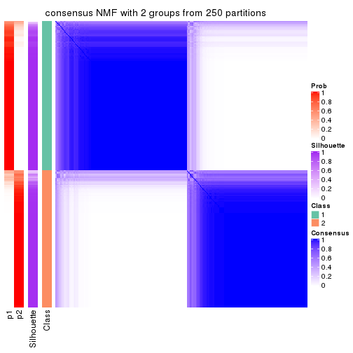</p>

</div>
<div id='tab-ATC-NMF-consensus-heatmap-2'>
<pre><code class="r">consensus_heatmap(res, k = 3)
</code></pre>

<p>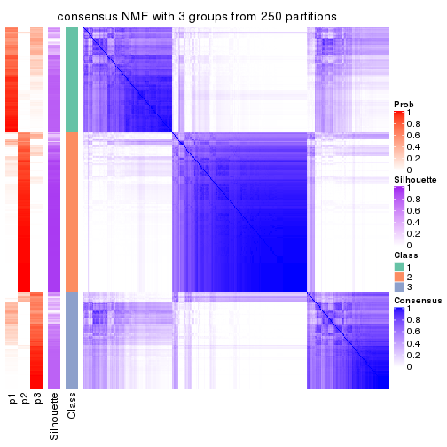</p>

</div>
<div id='tab-ATC-NMF-consensus-heatmap-3'>
<pre><code class="r">consensus_heatmap(res, k = 4)
</code></pre>

<p>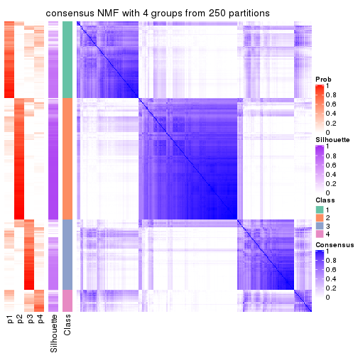</p>

</div>
<div id='tab-ATC-NMF-consensus-heatmap-4'>
<pre><code class="r">consensus_heatmap(res, k = 5)
</code></pre>

<p>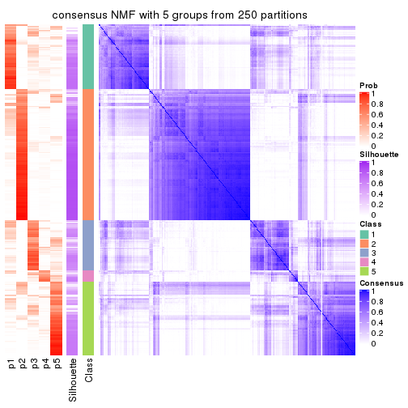</p>

</div>
<div id='tab-ATC-NMF-consensus-heatmap-5'>
<pre><code class="r">consensus_heatmap(res, k = 6)
</code></pre>

<p>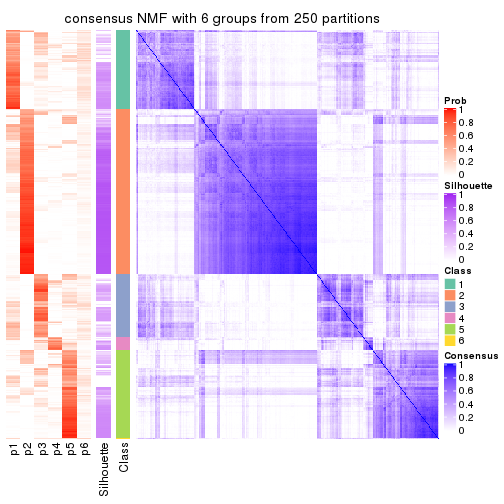</p>

</div>
</div>

Heatmaps for the membership of samples in all partitions to see how consistent they are:


<script>
$( function() {
	$( '#tabs-ATC-NMF-membership-heatmap' ).tabs();
} );
</script>
<div id='tabs-ATC-NMF-membership-heatmap'>
<ul>
<li><a href='#tab-ATC-NMF-membership-heatmap-1'>k = 2</a></li>
<li><a href='#tab-ATC-NMF-membership-heatmap-2'>k = 3</a></li>
<li><a href='#tab-ATC-NMF-membership-heatmap-3'>k = 4</a></li>
<li><a href='#tab-ATC-NMF-membership-heatmap-4'>k = 5</a></li>
<li><a href='#tab-ATC-NMF-membership-heatmap-5'>k = 6</a></li>
</ul>
<div id='tab-ATC-NMF-membership-heatmap-1'>
<pre><code class="r">membership_heatmap(res, k = 2)
</code></pre>

<p>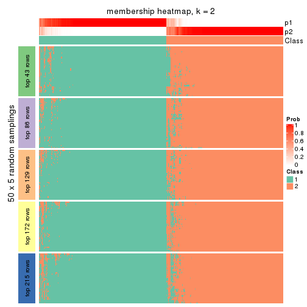</p>

</div>
<div id='tab-ATC-NMF-membership-heatmap-2'>
<pre><code class="r">membership_heatmap(res, k = 3)
</code></pre>

<p>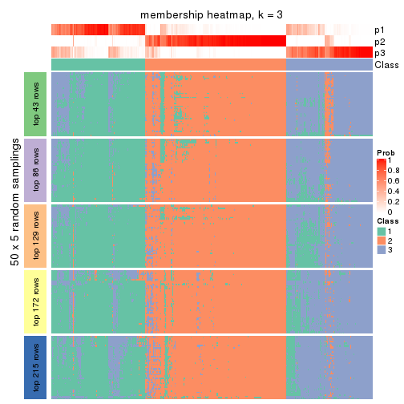</p>

</div>
<div id='tab-ATC-NMF-membership-heatmap-3'>
<pre><code class="r">membership_heatmap(res, k = 4)
</code></pre>

<p>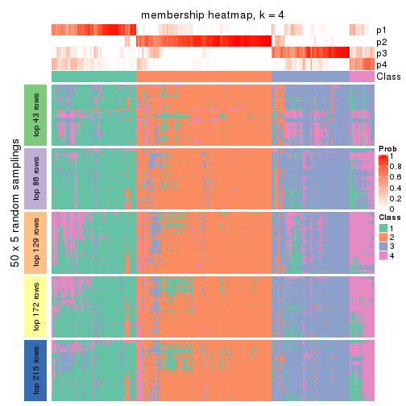</p>

</div>
<div id='tab-ATC-NMF-membership-heatmap-4'>
<pre><code class="r">membership_heatmap(res, k = 5)
</code></pre>

<p>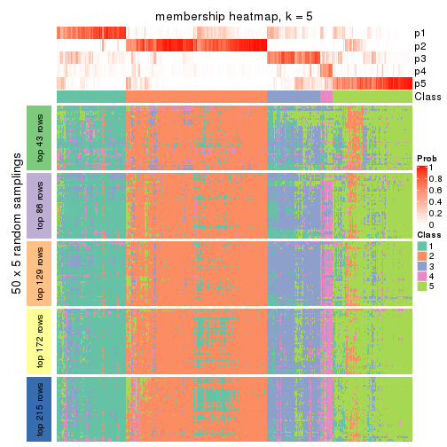</p>

</div>
<div id='tab-ATC-NMF-membership-heatmap-5'>
<pre><code class="r">membership_heatmap(res, k = 6)
</code></pre>

<p>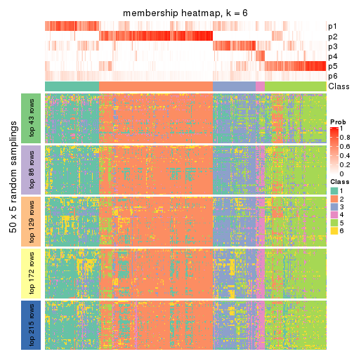</p>

</div>
</div>

As soon as we have had the classes for columns, we can look for signatures
which are significantly different between classes which can be candidate marks
for certain classes. Following are the heatmaps for signatures.


Signature heatmaps where rows are scaled:


<script>
$( function() {
	$( '#tabs-ATC-NMF-get-signatures' ).tabs();
} );
</script>
<div id='tabs-ATC-NMF-get-signatures'>
<ul>
<li><a href='#tab-ATC-NMF-get-signatures-1'>k = 2</a></li>
<li><a href='#tab-ATC-NMF-get-signatures-2'>k = 3</a></li>
<li><a href='#tab-ATC-NMF-get-signatures-3'>k = 4</a></li>
<li><a href='#tab-ATC-NMF-get-signatures-4'>k = 5</a></li>
<li><a href='#tab-ATC-NMF-get-signatures-5'>k = 6</a></li>
</ul>
<div id='tab-ATC-NMF-get-signatures-1'>
<pre><code class="r">get_signatures(res, k = 2)
</code></pre>

<p>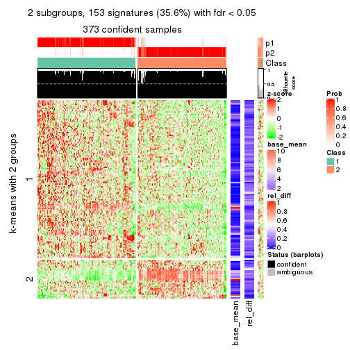</p>

</div>
<div id='tab-ATC-NMF-get-signatures-2'>
<pre><code class="r">get_signatures(res, k = 3)
</code></pre>

<p>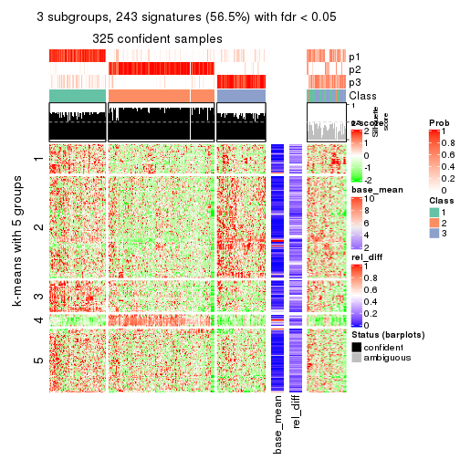</p>

</div>
<div id='tab-ATC-NMF-get-signatures-3'>
<pre><code class="r">get_signatures(res, k = 4)
</code></pre>

<p>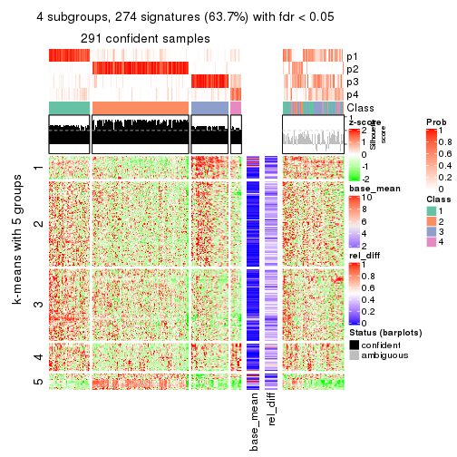</p>

</div>
<div id='tab-ATC-NMF-get-signatures-4'>
<pre><code class="r">get_signatures(res, k = 5)
</code></pre>

<p>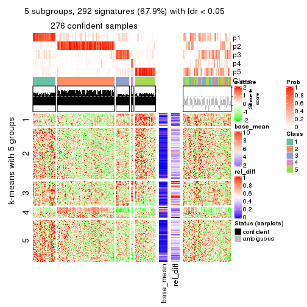</p>

</div>
<div id='tab-ATC-NMF-get-signatures-5'>
<pre><code class="r">get_signatures(res, k = 6)
</code></pre>

<p>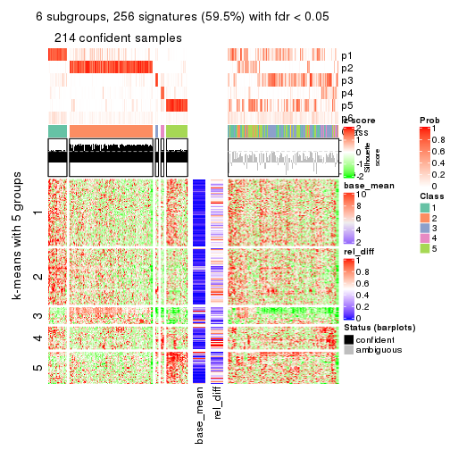</p>

</div>
</div>


Signature heatmaps where rows are not scaled:


<script>
$( function() {
	$( '#tabs-ATC-NMF-get-signatures-no-scale' ).tabs();
} );
</script>
<div id='tabs-ATC-NMF-get-signatures-no-scale'>
<ul>
<li><a href='#tab-ATC-NMF-get-signatures-no-scale-1'>k = 2</a></li>
<li><a href='#tab-ATC-NMF-get-signatures-no-scale-2'>k = 3</a></li>
<li><a href='#tab-ATC-NMF-get-signatures-no-scale-3'>k = 4</a></li>
<li><a href='#tab-ATC-NMF-get-signatures-no-scale-4'>k = 5</a></li>
<li><a href='#tab-ATC-NMF-get-signatures-no-scale-5'>k = 6</a></li>
</ul>
<div id='tab-ATC-NMF-get-signatures-no-scale-1'>
<pre><code class="r">get_signatures(res, k = 2, scale_rows = FALSE)
</code></pre>

<p>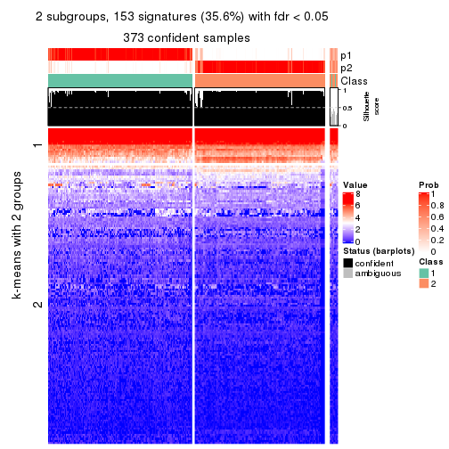</p>

</div>
<div id='tab-ATC-NMF-get-signatures-no-scale-2'>
<pre><code class="r">get_signatures(res, k = 3, scale_rows = FALSE)
</code></pre>

<p>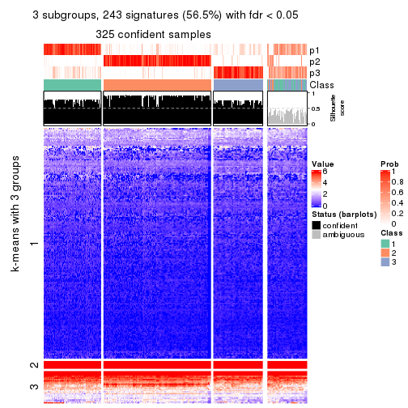</p>

</div>
<div id='tab-ATC-NMF-get-signatures-no-scale-3'>
<pre><code class="r">get_signatures(res, k = 4, scale_rows = FALSE)
</code></pre>

<p>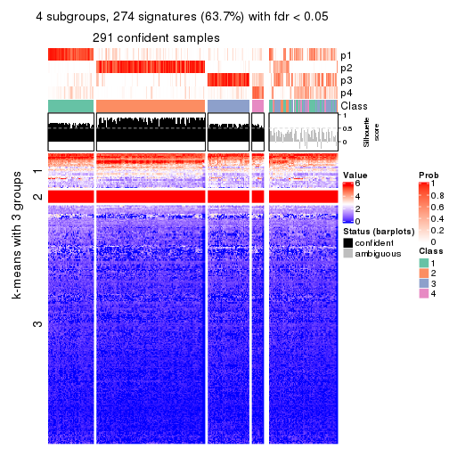</p>

</div>
<div id='tab-ATC-NMF-get-signatures-no-scale-4'>
<pre><code class="r">get_signatures(res, k = 5, scale_rows = FALSE)
</code></pre>

<p>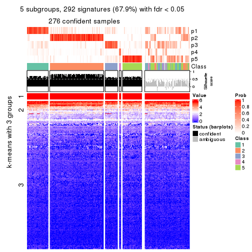</p>

</div>
<div id='tab-ATC-NMF-get-signatures-no-scale-5'>
<pre><code class="r">get_signatures(res, k = 6, scale_rows = FALSE)
</code></pre>

<p>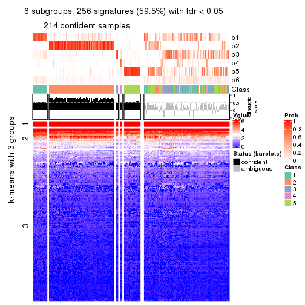</p>

</div>
</div>


Compare the overlap of signatures from different k:

```r
compare_signatures(res)
```

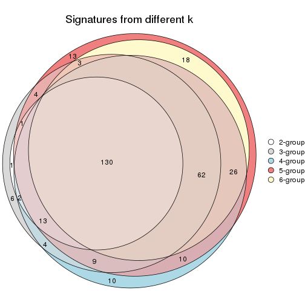

`get_signature()` returns a data frame invisibly. TO get the list of signatures, the function
call should be assigned to a variable explicitly. In following code, if `plot` argument is set
to `FALSE`, no heatmap is plotted while only the differential analysis is performed.

```r
# code only for demonstration
tb = get_signature(res, k = ..., plot = FALSE)
```

An example of the output of `tb` is:

```
#>   which_row         fdr    mean_1    mean_2 scaled_mean_1 scaled_mean_2 km
#> 1        38 0.042760348  8.373488  9.131774    -0.5533452     0.5164555  1
#> 2        40 0.018707592  7.106213  8.469186    -0.6173731     0.5762149  1
#> 3        55 0.019134737 10.221463 11.207825    -0.6159697     0.5749050  1
#> 4        59 0.006059896  5.921854  7.869574    -0.6899429     0.6439467  1
#> 5        60 0.018055526  8.928898 10.211722    -0.6204761     0.5791110  1
#> 6        98 0.009384629 15.714769 14.887706     0.6635654    -0.6193277  2
...
```

The columns in `tb` are:

1. `which_row`: row indices corresponding to the input matrix.
2. `fdr`: FDR for the differential test. 
3. `mean_x`: The mean value in group x.
4. `scaled_mean_x`: The mean value in group x after rows are scaled.
5. `km`: Row groups if k-means clustering is applied to rows.


UMAP plot which shows how samples are separated.


<script>
$( function() {
	$( '#tabs-ATC-NMF-dimension-reduction' ).tabs();
} );
</script>
<div id='tabs-ATC-NMF-dimension-reduction'>
<ul>
<li><a href='#tab-ATC-NMF-dimension-reduction-1'>k = 2</a></li>
<li><a href='#tab-ATC-NMF-dimension-reduction-2'>k = 3</a></li>
<li><a href='#tab-ATC-NMF-dimension-reduction-3'>k = 4</a></li>
<li><a href='#tab-ATC-NMF-dimension-reduction-4'>k = 5</a></li>
<li><a href='#tab-ATC-NMF-dimension-reduction-5'>k = 6</a></li>
</ul>
<div id='tab-ATC-NMF-dimension-reduction-1'>
<pre><code class="r">dimension_reduction(res, k = 2, method = &quot;UMAP&quot;)
</code></pre>

<p>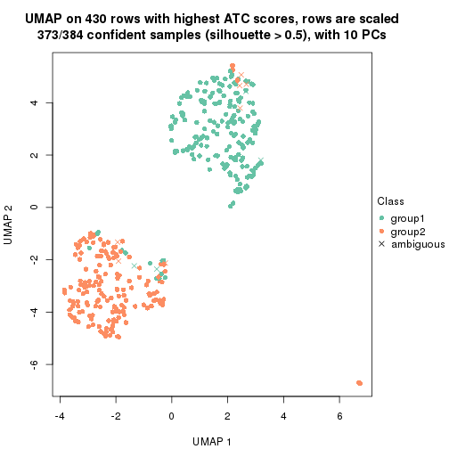</p>

</div>
<div id='tab-ATC-NMF-dimension-reduction-2'>
<pre><code class="r">dimension_reduction(res, k = 3, method = &quot;UMAP&quot;)
</code></pre>

<p>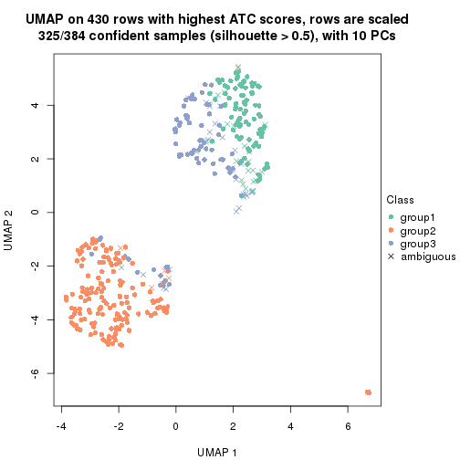</p>

</div>
<div id='tab-ATC-NMF-dimension-reduction-3'>
<pre><code class="r">dimension_reduction(res, k = 4, method = &quot;UMAP&quot;)
</code></pre>

<p>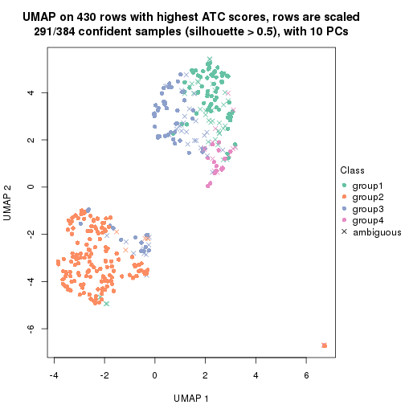</p>

</div>
<div id='tab-ATC-NMF-dimension-reduction-4'>
<pre><code class="r">dimension_reduction(res, k = 5, method = &quot;UMAP&quot;)
</code></pre>

<p>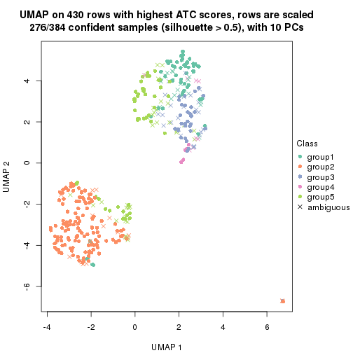</p>

</div>
<div id='tab-ATC-NMF-dimension-reduction-5'>
<pre><code class="r">dimension_reduction(res, k = 6, method = &quot;UMAP&quot;)
</code></pre>

<p>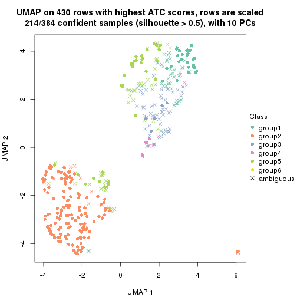</p>

</div>
</div>


Following heatmap shows how subgroups are split when increasing `k`:

```r
collect_classes(res)
```

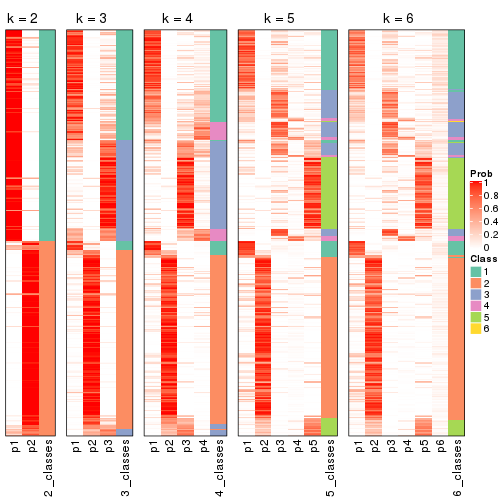


If matrix rows can be associated to genes, consider to use `GO_Enrichment(res,
...)` to perform function enrichment for the signature genes.


 

## Session info


```r
sessionInfo()
```

```
#> R version 3.6.0 (2019-04-26)
#> Platform: x86_64-pc-linux-gnu (64-bit)
#> Running under: CentOS Linux 7 (Core)
#> 
#> Matrix products: default
#> BLAS:   /usr/lib64/libblas.so.3.4.2
#> LAPACK: /usr/lib64/liblapack.so.3.4.2
#> 
#> locale:
#>  [1] LC_CTYPE=en_US.UTF-8       LC_NUMERIC=C               LC_TIME=en_US.UTF-8       
#>  [4] LC_COLLATE=en_US.UTF-8     LC_MONETARY=en_US.UTF-8    LC_MESSAGES=en_US.UTF-8   
#>  [7] LC_PAPER=en_US.UTF-8       LC_NAME=C                  LC_ADDRESS=C              
#> [10] LC_TELEPHONE=C             LC_MEASUREMENT=en_US.UTF-8 LC_IDENTIFICATION=C       
#> 
#> attached base packages:
#>  [1] grid      parallel  stats4    stats     graphics  grDevices utils     datasets  methods  
#> [10] base     
#> 
#> other attached packages:
#>  [1] genefilter_1.66.0           ComplexHeatmap_2.1.1        markdown_1.1               
#>  [4] knitr_1.26                  cola_1.3.2                  SummarizedExperiment_1.14.1
#>  [7] DelayedArray_0.10.0         BiocParallel_1.18.1         matrixStats_0.55.0         
#> [10] Biobase_2.44.0              GenomicRanges_1.36.1        GenomeInfoDb_1.20.0        
#> [13] IRanges_2.18.3              S4Vectors_0.22.1            BiocGenerics_0.30.0        
#> [16] GetoptLong_0.1.7           
#> 
#> loaded via a namespace (and not attached):
#>  [1] bitops_1.0-6           bit64_0.9-7            doParallel_1.0.15      RColorBrewer_1.1-2    
#>  [5] httr_1.4.1             backports_1.1.5        tools_3.6.0            R6_2.4.1              
#>  [9] DBI_1.0.0              lazyeval_0.2.2         colorspace_1.4-1       withr_2.1.2           
#> [13] tidyselect_0.2.5       gridExtra_2.3          bit_1.1-14             compiler_3.6.0        
#> [17] xml2_1.2.2             microbenchmark_1.4-7   pkgmaker_0.28          slam_0.1-46           
#> [21] scales_1.1.0           NMF_0.23.6             stringr_1.4.0          digest_0.6.23         
#> [25] XVector_0.24.0         pkgconfig_2.0.3        bibtex_0.4.2           highr_0.8             
#> [29] rlang_0.4.2            GlobalOptions_0.1.1    RSQLite_2.1.2          impute_1.58.0         
#> [33] shape_1.4.4            mclust_5.4.5           dendextend_1.12.0      dplyr_0.8.3           
#> [37] RCurl_1.95-4.12        magrittr_1.5           GenomeInfoDbData_1.2.1 Matrix_1.2-17         
#> [41] Rcpp_1.0.3             munsell_0.5.0          viridis_0.5.1          lifecycle_0.1.0       
#> [45] stringi_1.4.3          zlibbioc_1.30.0        plyr_1.8.4             blob_1.2.0            
#> [49] crayon_1.3.4           lattice_0.20-38        splines_3.6.0          annotate_1.62.0       
#> [53] circlize_0.4.9         zeallot_0.1.0          pillar_1.4.2           rjson_0.2.20          
#> [57] rngtools_1.4           reshape2_1.4.3         codetools_0.2-16       XML_3.98-1.20         
#> [61] glue_1.3.1             evaluate_0.14          vctrs_0.2.0            png_0.1-7             
#> [65] foreach_1.4.7          polyclip_1.10-0        gtable_0.3.0           purrr_0.3.3           
#> [69] clue_0.3-57            assertthat_0.2.1       ggplot2_3.2.1          xfun_0.11             
#> [73] gridBase_0.4-7         eulerr_6.0.0           xtable_1.8-4           skmeans_0.2-11        
#> [77] survival_2.44-1.1      viridisLite_0.3.0      tibble_2.1.3           iterators_1.0.12      
#> [81] memoise_1.1.0          AnnotationDbi_1.46.1   registry_0.5-1         GTF_0.0.1             
#> [85] cluster_2.1.0          brew_1.0-6
```


